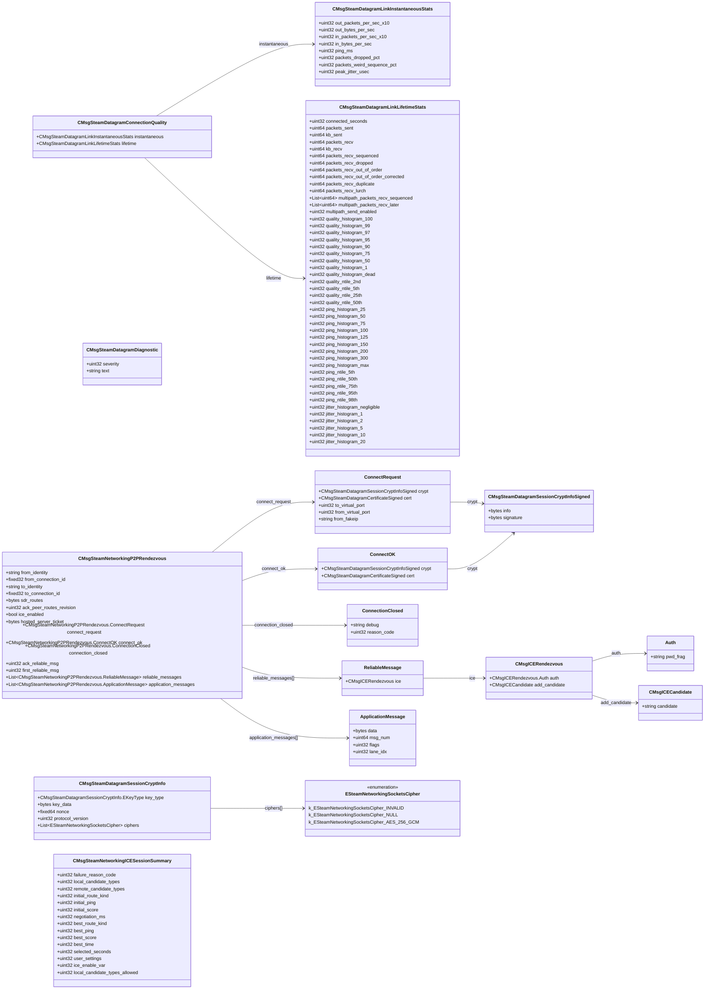

# `steamnetworkingsockets_messages.proto`

**Imports:** `steamnetworkingsockets_messages_certs.proto`

## Diagram

## Enums

### `ESteamNetworkingSocketsCipher`

| Name | Value |
|------|-------|
| `k_ESteamNetworkingSocketsCipher_INVALID` | 0 |
| `k_ESteamNetworkingSocketsCipher_NULL` | 1 |
| `k_ESteamNetworkingSocketsCipher_AES_256_GCM` | 2 |

## Messages

### `CMsgSteamDatagramSessionCryptInfo`

| Field | Ordinal | Type | Label | Description |
|-------|---------|------|-------|-------------|
| `key_type` | 1 | CMsgSteamDatagramSessionCryptInfo.EKeyType | optional | *(default: `INVALID`)* |
| `key_data` | 2 | bytes | optional |  |
| `nonce` | 3 | fixed64 | optional |  |
| `protocol_version` | 4 | uint32 | optional |  |
| `ciphers` | 5 | [ESteamNetworkingSocketsCipher](#esteamnetworkingsocketscipher) | repeated |  |

### `CMsgSteamDatagramSessionCryptInfoSigned`

| Field | Ordinal | Type | Label | Description |
|-------|---------|------|-------|-------------|
| `info` | 1 | bytes | optional |  |
| `signature` | 2 | bytes | optional |  |

### `CMsgSteamDatagramDiagnostic`

| Field | Ordinal | Type | Label | Description |
|-------|---------|------|-------|-------------|
| `severity` | 1 | uint32 | optional |  |
| `text` | 2 | string | optional |  |

### `CMsgSteamDatagramLinkInstantaneousStats`

| Field | Ordinal | Type | Label | Description |
|-------|---------|------|-------|-------------|
| `out_packets_per_sec_x10` | 1 | uint32 | optional |  |
| `out_bytes_per_sec` | 2 | uint32 | optional |  |
| `in_packets_per_sec_x10` | 3 | uint32 | optional |  |
| `in_bytes_per_sec` | 4 | uint32 | optional |  |
| `ping_ms` | 5 | uint32 | optional |  |
| `packets_dropped_pct` | 6 | uint32 | optional |  |
| `packets_weird_sequence_pct` | 7 | uint32 | optional |  |
| `peak_jitter_usec` | 8 | uint32 | optional |  |

### `CMsgSteamDatagramLinkLifetimeStats`

| Field | Ordinal | Type | Label | Description |
|-------|---------|------|-------|-------------|
| `connected_seconds` | 2 | uint32 | optional |  |
| `packets_sent` | 3 | uint64 | optional |  |
| `kb_sent` | 4 | uint64 | optional |  |
| `packets_recv` | 5 | uint64 | optional |  |
| `kb_recv` | 6 | uint64 | optional |  |
| `packets_recv_sequenced` | 7 | uint64 | optional |  |
| `packets_recv_dropped` | 8 | uint64 | optional |  |
| `packets_recv_out_of_order` | 9 | uint64 | optional |  |
| `packets_recv_duplicate` | 10 | uint64 | optional |  |
| `packets_recv_lurch` | 11 | uint64 | optional |  |
| `multipath_packets_recv_sequenced` | 12 | uint64 | repeated |  |
| `multipath_packets_recv_later` | 13 | uint64 | repeated |  |
| `multipath_send_enabled` | 14 | uint32 | optional |  |
| `packets_recv_out_of_order_corrected` | 15 | uint64 | optional |  |
| `quality_histogram_100` | 21 | uint32 | optional |  |
| `quality_histogram_99` | 22 | uint32 | optional |  |
| `quality_histogram_97` | 23 | uint32 | optional |  |
| `quality_histogram_95` | 24 | uint32 | optional |  |
| `quality_histogram_90` | 25 | uint32 | optional |  |
| `quality_histogram_75` | 26 | uint32 | optional |  |
| `quality_histogram_50` | 27 | uint32 | optional |  |
| `quality_histogram_1` | 28 | uint32 | optional |  |
| `quality_histogram_dead` | 29 | uint32 | optional |  |
| `quality_ntile_2nd` | 30 | uint32 | optional |  |
| `quality_ntile_5th` | 31 | uint32 | optional |  |
| `quality_ntile_25th` | 32 | uint32 | optional |  |
| `quality_ntile_50th` | 33 | uint32 | optional |  |
| `ping_histogram_25` | 41 | uint32 | optional |  |
| `ping_histogram_50` | 42 | uint32 | optional |  |
| `ping_histogram_75` | 43 | uint32 | optional |  |
| `ping_histogram_100` | 44 | uint32 | optional |  |
| `ping_histogram_125` | 45 | uint32 | optional |  |
| `ping_histogram_150` | 46 | uint32 | optional |  |
| `ping_histogram_200` | 47 | uint32 | optional |  |
| `ping_histogram_300` | 48 | uint32 | optional |  |
| `ping_histogram_max` | 49 | uint32 | optional |  |
| `ping_ntile_5th` | 50 | uint32 | optional |  |
| `ping_ntile_50th` | 51 | uint32 | optional |  |
| `ping_ntile_75th` | 52 | uint32 | optional |  |
| `ping_ntile_95th` | 53 | uint32 | optional |  |
| `ping_ntile_98th` | 54 | uint32 | optional |  |
| `jitter_histogram_negligible` | 61 | uint32 | optional |  |
| `jitter_histogram_1` | 62 | uint32 | optional |  |
| `jitter_histogram_2` | 63 | uint32 | optional |  |
| `jitter_histogram_5` | 64 | uint32 | optional |  |
| `jitter_histogram_10` | 65 | uint32 | optional |  |
| `jitter_histogram_20` | 66 | uint32 | optional |  |

### `CMsgSteamDatagramConnectionQuality`

| Field | Ordinal | Type | Label | Description |
|-------|---------|------|-------|-------------|
| `instantaneous` | 1 | [CMsgSteamDatagramLinkInstantaneousStats](#cmsgsteamdatagramlinkinstantaneousstats) | optional |  |
| `lifetime` | 2 | [CMsgSteamDatagramLinkLifetimeStats](#cmsgsteamdatagramlinklifetimestats) | optional |  |

### `CMsgICECandidate`

| Field | Ordinal | Type | Label | Description |
|-------|---------|------|-------|-------------|
| `candidate` | 3 | string | optional |  |

### `CMsgICERendezvous`

| Field | Ordinal | Type | Label | Description |
|-------|---------|------|-------|-------------|
| `add_candidate` | 1 | [CMsgICECandidate](#cmsgicecandidate) | optional |  |
| `auth` | 2 | CMsgICERendezvous.Auth | optional |  |

### `CMsgSteamNetworkingP2PRendezvous`

| Field | Ordinal | Type | Label | Description |
|-------|---------|------|-------|-------------|
| `to_connection_id` | 1 | fixed32 | optional |  |
| `sdr_routes` | 2 | bytes | optional |  |
| `ack_peer_routes_revision` | 3 | uint32 | optional |  |
| `connect_request` | 4 | CMsgSteamNetworkingP2PRendezvous.ConnectRequest | optional |  |
| `connect_ok` | 5 | CMsgSteamNetworkingP2PRendezvous.ConnectOK | optional |  |
| `connection_closed` | 6 | CMsgSteamNetworkingP2PRendezvous.ConnectionClosed | optional |  |
| `ice_enabled` | 7 | bool | optional |  |
| `from_identity` | 8 | string | optional |  |
| `from_connection_id` | 9 | fixed32 | optional |  |
| `to_identity` | 10 | string | optional |  |
| `ack_reliable_msg` | 11 | uint32 | optional |  |
| `first_reliable_msg` | 12 | uint32 | optional |  |
| `reliable_messages` | 13 | CMsgSteamNetworkingP2PRendezvous.ReliableMessage | repeated |  |
| `hosted_server_ticket` | 14 | bytes | optional |  |
| `application_messages` | 15 | CMsgSteamNetworkingP2PRendezvous.ApplicationMessage | repeated |  |

### `CMsgSteamNetworkingICESessionSummary`

| Field | Ordinal | Type | Label | Description |
|-------|---------|------|-------|-------------|
| `local_candidate_types` | 1 | uint32 | optional |  |
| `remote_candidate_types` | 2 | uint32 | optional |  |
| `initial_route_kind` | 3 | uint32 | optional |  |
| `initial_ping` | 4 | uint32 | optional |  |
| `negotiation_ms` | 5 | uint32 | optional |  |
| `initial_score` | 6 | uint32 | optional |  |
| `failure_reason_code` | 7 | uint32 | optional |  |
| `selected_seconds` | 12 | uint32 | optional |  |
| `user_settings` | 13 | uint32 | optional |  |
| `ice_enable_var` | 14 | uint32 | optional |  |
| `local_candidate_types_allowed` | 15 | uint32 | optional |  |
| `best_route_kind` | 16 | uint32 | optional |  |
| `best_ping` | 17 | uint32 | optional |  |
| `best_score` | 18 | uint32 | optional |  |
| `best_time` | 19 | uint32 | optional |  |
