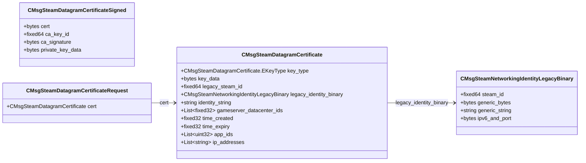

# `steamnetworkingsockets_messages_certs.proto`

## Diagram

## Messages

### `CMsgSteamNetworkingIdentityLegacyBinary`

| Field | Ordinal | Type | Label | Description |
|-------|---------|------|-------|-------------|
| `generic_bytes` | 2 | bytes | optional |  |
| `generic_string` | 3 | string | optional |  |
| `ipv6_and_port` | 4 | bytes | optional |  |
| `steam_id` | 16 | fixed64 | optional |  |

### `CMsgSteamDatagramCertificate`

| Field | Ordinal | Type | Label | Description |
|-------|---------|------|-------|-------------|
| `key_type` | 1 | CMsgSteamDatagramCertificate.EKeyType | optional | *(default: `INVALID`)* |
| `key_data` | 2 | bytes | optional |  |
| `legacy_steam_id` | 4 | fixed64 | optional |  |
| `gameserver_datacenter_ids` | 5 | fixed32 | repeated |  |
| `time_created` | 8 | fixed32 | optional |  |
| `time_expiry` | 9 | fixed32 | optional |  |
| `app_ids` | 10 | uint32 | repeated |  |
| `legacy_identity_binary` | 11 | [CMsgSteamNetworkingIdentityLegacyBinary](#cmsgsteamnetworkingidentitylegacybinary) | optional |  |
| `identity_string` | 12 | string | optional |  |
| `ip_addresses` | 13 | string | repeated |  |

### `CMsgSteamDatagramCertificateSigned`

| Field | Ordinal | Type | Label | Description |
|-------|---------|------|-------|-------------|
| `private_key_data` | 1 | bytes | optional |  |
| `cert` | 4 | bytes | optional |  |
| `ca_key_id` | 5 | fixed64 | optional |  |
| `ca_signature` | 6 | bytes | optional |  |

### `CMsgSteamDatagramCertificateRequest`

| Field | Ordinal | Type | Label | Description |
|-------|---------|------|-------|-------------|
| `cert` | 1 | [CMsgSteamDatagramCertificate](#cmsgsteamdatagramcertificate) | optional |  |
