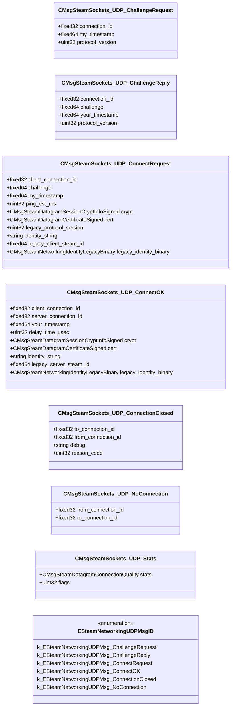

# `steamnetworkingsockets_messages_udp.proto`

**Imports:** `steamnetworkingsockets_messages_certs.proto`, `steamnetworkingsockets_messages.proto`

## Diagram

## Enums

### `ESteamNetworkingUDPMsgID`

| Name | Value |
|------|-------|
| `k_ESteamNetworkingUDPMsg_ChallengeRequest` | 32 |
| `k_ESteamNetworkingUDPMsg_ChallengeReply` | 33 |
| `k_ESteamNetworkingUDPMsg_ConnectRequest` | 34 |
| `k_ESteamNetworkingUDPMsg_ConnectOK` | 35 |
| `k_ESteamNetworkingUDPMsg_ConnectionClosed` | 36 |
| `k_ESteamNetworkingUDPMsg_NoConnection` | 37 |

## Messages

### `CMsgSteamSockets_UDP_ChallengeRequest`

| Field | Ordinal | Type | Label | Description |
|-------|---------|------|-------|-------------|
| `connection_id` | 1 | fixed32 | optional |  |
| `my_timestamp` | 3 | fixed64 | optional |  |
| `protocol_version` | 4 | uint32 | optional |  |

### `CMsgSteamSockets_UDP_ChallengeReply`

| Field | Ordinal | Type | Label | Description |
|-------|---------|------|-------|-------------|
| `connection_id` | 1 | fixed32 | optional |  |
| `challenge` | 2 | fixed64 | optional |  |
| `your_timestamp` | 3 | fixed64 | optional |  |
| `protocol_version` | 4 | uint32 | optional |  |

### `CMsgSteamSockets_UDP_ConnectRequest`

| Field | Ordinal | Type | Label | Description |
|-------|---------|------|-------|-------------|
| `client_connection_id` | 1 | fixed32 | optional |  |
| `challenge` | 2 | fixed64 | optional |  |
| `legacy_client_steam_id` | 3 | fixed64 | optional |  |
| `cert` | 4 | CMsgSteamDatagramCertificateSigned | optional |  |
| `my_timestamp` | 5 | fixed64 | optional |  |
| `ping_est_ms` | 6 | uint32 | optional |  |
| `crypt` | 7 | CMsgSteamDatagramSessionCryptInfoSigned | optional |  |
| `legacy_protocol_version` | 8 | uint32 | optional |  |
| `legacy_identity_binary` | 9 | CMsgSteamNetworkingIdentityLegacyBinary | optional |  |
| `identity_string` | 10 | string | optional |  |

### `CMsgSteamSockets_UDP_ConnectOK`

| Field | Ordinal | Type | Label | Description |
|-------|---------|------|-------|-------------|
| `client_connection_id` | 1 | fixed32 | optional |  |
| `legacy_server_steam_id` | 2 | fixed64 | optional |  |
| `your_timestamp` | 3 | fixed64 | optional |  |
| `delay_time_usec` | 4 | uint32 | optional |  |
| `server_connection_id` | 5 | fixed32 | optional |  |
| `crypt` | 7 | CMsgSteamDatagramSessionCryptInfoSigned | optional |  |
| `cert` | 8 | CMsgSteamDatagramCertificateSigned | optional |  |
| `legacy_identity_binary` | 10 | CMsgSteamNetworkingIdentityLegacyBinary | optional |  |
| `identity_string` | 11 | string | optional |  |

### `CMsgSteamSockets_UDP_ConnectionClosed`

| Field | Ordinal | Type | Label | Description |
|-------|---------|------|-------|-------------|
| `debug` | 2 | string | optional |  |
| `reason_code` | 3 | uint32 | optional |  |
| `to_connection_id` | 4 | fixed32 | optional |  |
| `from_connection_id` | 5 | fixed32 | optional |  |

### `CMsgSteamSockets_UDP_NoConnection`

| Field | Ordinal | Type | Label | Description |
|-------|---------|------|-------|-------------|
| `from_connection_id` | 2 | fixed32 | optional |  |
| `to_connection_id` | 3 | fixed32 | optional |  |

### `CMsgSteamSockets_UDP_Stats`

| Field | Ordinal | Type | Label | Description |
|-------|---------|------|-------|-------------|
| `stats` | 1 | CMsgSteamDatagramConnectionQuality | optional |  |
| `flags` | 3 | uint32 | optional |  |
