# `te.proto`

**Imports:** `networkbasetypes.proto`

## Diagram

```mermaid
classDiagram
direction LR

  class CMsgTEArmorRicochet {
    +CMsgVector pos
    +CMsgVector dir
  }

  class CMsgTEBaseBeam {
    +fixed64 modelindex
    +fixed64 haloindex
    +uint32 startframe
    +uint32 framerate
    +float life
    +float width
    +float endwidth
    +uint32 fadelength
    +float amplitude
    +fixed32 color
    +uint32 speed
    +uint32 flags
  }

  class CMsgTEBeamEntPoint {
    +CMsgTEBaseBeam base
    +uint32 startentity
    +uint32 endentity
    +CMsgVector start
    +CMsgVector end
  }

  class CMsgTEBeamEnts {
    +CMsgTEBaseBeam base
    +uint32 startentity
    +uint32 endentity
  }

  class CMsgTEBeamPoints {
    +CMsgTEBaseBeam base
    +CMsgVector start
    +CMsgVector end
  }

  class CMsgTEBeamRing {
    +CMsgTEBaseBeam base
    +uint32 startentity
    +uint32 endentity
  }

  class CMsgTEBubbles {
    +CMsgVector mins
    +CMsgVector maxs
    +float height
    +uint32 count
    +float speed
  }

  class CMsgTEBubbleTrail {
    +CMsgVector mins
    +CMsgVector maxs
    +float waterz
    +uint32 count
    +float speed
  }

  class CMsgTEDecal {
    +CMsgVector origin
    +CMsgVector start
    +int32 entity
    +uint32 hitbox
    +uint32 index
  }

  class CMsgEffectData {
    +CMsgVector origin
    +CMsgVector start
    +CMsgVector normal
    +CMsgQAngle angles
    +fixed32 entity
    +fixed32 otherentity
    +float scale
    +float magnitude
    +float radius
    +fixed32 surfaceprop
    +fixed64 effectindex
    +uint32 damagetype
    +uint32 material
    +uint32 hitbox
    +uint32 color
    +uint32 flags
    +int32 attachmentindex
    +uint32 effectname
    +uint32 attachmentname
  }

  class CMsgTEEffectDispatch {
    +CMsgEffectData effectdata
  }

  class CMsgTEEnergySplash {
    +CMsgVector pos
    +CMsgVector dir
    +bool explosive
  }

  class CMsgTEFizz {
    +int32 entity
    +uint32 density
    +int32 current
  }

  class CMsgTEShatterSurface {
    +CMsgVector origin
    +CMsgQAngle angles
    +CMsgVector force
    +CMsgVector forcepos
    +float width
    +float height
    +float shardsize
    +uint32 surfacetype
    +fixed32 frontcolor
    +fixed32 backcolor
  }

  class CMsgTEGlowSprite {
    +CMsgVector origin
    +float scale
    +float life
    +uint32 brightness
  }

  class CMsgTEImpact {
    +CMsgVector origin
    +CMsgVector normal
    +uint32 type
  }

  class CMsgTEMuzzleFlash {
    +CMsgVector origin
    +CMsgQAngle angles
    +float scale
    +uint32 type
  }

  class CMsgTEBloodStream {
    +CMsgVector origin
    +CMsgVector direction
    +fixed32 color
    +uint32 amount
  }

  class CMsgTEExplosion {
    +CMsgVector origin
    +uint32 flags
    +CMsgVector normal
    +uint32 radius
    +uint32 magnitude
    +bool affect_ragdolls
    +string sound_name
    +uint32 explosion_type
    +bool create_debris
    +CMsgVector debris_origin
    +fixed32 debris_surfaceprop
  }

  class CMsgTEDust {
    +CMsgVector origin
    +float size
    +float speed
    +CMsgVector direction
  }

  class CMsgTELargeFunnel {
    +CMsgVector origin
    +uint32 reversed
  }

  class CMsgTESparks {
    +CMsgVector origin
    +uint32 magnitude
    +uint32 length
    +CMsgVector direction
  }

  class CMsgTEPhysicsProp {
    +CMsgVector origin
    +CMsgVector velocity
    +CMsgQAngle angles
    +fixed32 skin
    +uint32 flags
    +uint32 effects
    +fixed32 color
    +fixed64 modelindex
    +uint32 unused_breakmodelsnottomake
    +float scale
    +CMsgVector dmgpos
    +CMsgVector dmgdir
    +int32 dmgtype
  }

  class CMsgTESmoke {
    +CMsgVector origin
    +float scale
  }

  class CMsgTEWorldDecal {
    +CMsgVector origin
    +CMsgVector normal
    +uint32 index
  }

  CMsgTEBeamEntPoint --> CMsgTEBaseBeam : base
  CMsgTEBeamEnts --> CMsgTEBaseBeam : base
  CMsgTEBeamPoints --> CMsgTEBaseBeam : base
  CMsgTEBeamRing --> CMsgTEBaseBeam : base
  CMsgTEEffectDispatch --> CMsgEffectData : effectdata

  class ETEProtobufIds{
    <<enumeration>>
    TE_EffectDispatchId
    TE_ArmorRicochetId
    TE_BeamEntPointId
    TE_BeamEntsId
    TE_BeamPointsId
    TE_BeamRingId
    TE_BubblesId
    TE_BubbleTrailId
    TE_DecalId
    TE_WorldDecalId
    TE_EnergySplashId
    TE_FizzId
    TE_ShatterSurfaceId
    TE_GlowSpriteId
    TE_ImpactId
    TE_MuzzleFlashId
    TE_BloodStreamId
    TE_ExplosionId
    TE_DustId
    TE_LargeFunnelId
    TE_SparksId
    TE_PhysicsPropId
    TE_SmokeId
  }

```

## Enums

### `ETEProtobufIds`

| Name | Value |
|------|-------|
| `TE_EffectDispatchId` | 400 |
| `TE_ArmorRicochetId` | 401 |
| `TE_BeamEntPointId` | 402 |
| `TE_BeamEntsId` | 403 |
| `TE_BeamPointsId` | 404 |
| `TE_BeamRingId` | 405 |
| `TE_BubblesId` | 408 |
| `TE_BubbleTrailId` | 409 |
| `TE_DecalId` | 410 |
| `TE_WorldDecalId` | 411 |
| `TE_EnergySplashId` | 412 |
| `TE_FizzId` | 413 |
| `TE_ShatterSurfaceId` | 414 |
| `TE_GlowSpriteId` | 415 |
| `TE_ImpactId` | 416 |
| `TE_MuzzleFlashId` | 417 |
| `TE_BloodStreamId` | 418 |
| `TE_ExplosionId` | 419 |
| `TE_DustId` | 420 |
| `TE_LargeFunnelId` | 421 |
| `TE_SparksId` | 422 |
| `TE_PhysicsPropId` | 423 |
| `TE_SmokeId` | 426 |

## Messages

### `CMsgTEArmorRicochet`

| Field | Ordinal | Type | Label | Description |
|-------|---------|------|-------|-------------|
| `pos` | 1 | CMsgVector | optional |  |
| `dir` | 2 | CMsgVector | optional |  |

### `CMsgTEBaseBeam`

| Field | Ordinal | Type | Label | Description |
|-------|---------|------|-------|-------------|
| `modelindex` | 1 | fixed64 | optional |  |
| `haloindex` | 2 | fixed64 | optional |  |
| `startframe` | 3 | uint32 | optional |  |
| `framerate` | 4 | uint32 | optional |  |
| `life` | 5 | float | optional |  |
| `width` | 6 | float | optional |  |
| `endwidth` | 7 | float | optional |  |
| `fadelength` | 8 | uint32 | optional |  |
| `amplitude` | 9 | float | optional |  |
| `color` | 10 | fixed32 | optional |  |
| `speed` | 11 | uint32 | optional |  |
| `flags` | 12 | uint32 | optional |  |

### `CMsgTEBeamEntPoint`

| Field | Ordinal | Type | Label | Description |
|-------|---------|------|-------|-------------|
| `base` | 1 | [CMsgTEBaseBeam](#cmsgtebasebeam) | optional |  |
| `startentity` | 2 | uint32 | optional |  |
| `endentity` | 3 | uint32 | optional |  |
| `start` | 4 | CMsgVector | optional |  |
| `end` | 5 | CMsgVector | optional |  |

### `CMsgTEBeamEnts`

| Field | Ordinal | Type | Label | Description |
|-------|---------|------|-------|-------------|
| `base` | 1 | [CMsgTEBaseBeam](#cmsgtebasebeam) | optional |  |
| `startentity` | 2 | uint32 | optional |  |
| `endentity` | 3 | uint32 | optional |  |

### `CMsgTEBeamPoints`

| Field | Ordinal | Type | Label | Description |
|-------|---------|------|-------|-------------|
| `base` | 1 | [CMsgTEBaseBeam](#cmsgtebasebeam) | optional |  |
| `start` | 2 | CMsgVector | optional |  |
| `end` | 3 | CMsgVector | optional |  |

### `CMsgTEBeamRing`

| Field | Ordinal | Type | Label | Description |
|-------|---------|------|-------|-------------|
| `base` | 1 | [CMsgTEBaseBeam](#cmsgtebasebeam) | optional |  |
| `startentity` | 2 | uint32 | optional |  |
| `endentity` | 3 | uint32 | optional |  |

### `CMsgTEBubbles`

| Field | Ordinal | Type | Label | Description |
|-------|---------|------|-------|-------------|
| `mins` | 1 | CMsgVector | optional |  |
| `maxs` | 2 | CMsgVector | optional |  |
| `height` | 3 | float | optional |  |
| `count` | 4 | uint32 | optional |  |
| `speed` | 5 | float | optional |  |

### `CMsgTEBubbleTrail`

| Field | Ordinal | Type | Label | Description |
|-------|---------|------|-------|-------------|
| `mins` | 1 | CMsgVector | optional |  |
| `maxs` | 2 | CMsgVector | optional |  |
| `waterz` | 3 | float | optional |  |
| `count` | 4 | uint32 | optional |  |
| `speed` | 5 | float | optional |  |

### `CMsgTEDecal`

| Field | Ordinal | Type | Label | Description |
|-------|---------|------|-------|-------------|
| `origin` | 1 | CMsgVector | optional |  |
| `start` | 2 | CMsgVector | optional |  |
| `entity` | 3 | int32 | optional | *(default: `-1`)* |
| `hitbox` | 4 | uint32 | optional |  |
| `index` | 5 | uint32 | optional |  |

### `CMsgEffectData`

| Field | Ordinal | Type | Label | Description |
|-------|---------|------|-------|-------------|
| `origin` | 1 | CMsgVector | optional |  |
| `start` | 2 | CMsgVector | optional |  |
| `normal` | 3 | CMsgVector | optional |  |
| `angles` | 4 | CMsgQAngle | optional |  |
| `entity` | 5 | fixed32 | optional | *(default: `16777215`)* |
| `otherentity` | 6 | fixed32 | optional | *(default: `16777215`)* |
| `scale` | 7 | float | optional |  |
| `magnitude` | 8 | float | optional |  |
| `radius` | 9 | float | optional |  |
| `surfaceprop` | 10 | fixed32 | optional |  |
| `effectindex` | 11 | fixed64 | optional |  |
| `damagetype` | 12 | uint32 | optional |  |
| `material` | 13 | uint32 | optional |  |
| `hitbox` | 14 | uint32 | optional |  |
| `color` | 15 | uint32 | optional |  |
| `flags` | 16 | uint32 | optional |  |
| `attachmentindex` | 17 | int32 | optional |  |
| `effectname` | 18 | uint32 | optional |  |
| `attachmentname` | 19 | uint32 | optional |  |

### `CMsgTEEffectDispatch`

| Field | Ordinal | Type | Label | Description |
|-------|---------|------|-------|-------------|
| `effectdata` | 1 | [CMsgEffectData](#cmsgeffectdata) | optional |  |

### `CMsgTEEnergySplash`

| Field | Ordinal | Type | Label | Description |
|-------|---------|------|-------|-------------|
| `pos` | 1 | CMsgVector | optional |  |
| `dir` | 2 | CMsgVector | optional |  |
| `explosive` | 3 | bool | optional |  |

### `CMsgTEFizz`

| Field | Ordinal | Type | Label | Description |
|-------|---------|------|-------|-------------|
| `entity` | 1 | int32 | optional | *(default: `-1`)* |
| `density` | 2 | uint32 | optional |  |
| `current` | 3 | int32 | optional |  |

### `CMsgTEShatterSurface`

| Field | Ordinal | Type | Label | Description |
|-------|---------|------|-------|-------------|
| `origin` | 1 | CMsgVector | optional |  |
| `angles` | 2 | CMsgQAngle | optional |  |
| `force` | 3 | CMsgVector | optional |  |
| `forcepos` | 4 | CMsgVector | optional |  |
| `width` | 5 | float | optional |  |
| `height` | 6 | float | optional |  |
| `shardsize` | 7 | float | optional |  |
| `surfacetype` | 8 | uint32 | optional |  |
| `frontcolor` | 9 | fixed32 | optional |  |
| `backcolor` | 10 | fixed32 | optional |  |

### `CMsgTEGlowSprite`

| Field | Ordinal | Type | Label | Description |
|-------|---------|------|-------|-------------|
| `origin` | 1 | CMsgVector | optional |  |
| `scale` | 2 | float | optional |  |
| `life` | 3 | float | optional |  |
| `brightness` | 4 | uint32 | optional |  |

### `CMsgTEImpact`

| Field | Ordinal | Type | Label | Description |
|-------|---------|------|-------|-------------|
| `origin` | 1 | CMsgVector | optional |  |
| `normal` | 2 | CMsgVector | optional |  |
| `type` | 3 | uint32 | optional |  |

### `CMsgTEMuzzleFlash`

| Field | Ordinal | Type | Label | Description |
|-------|---------|------|-------|-------------|
| `origin` | 1 | CMsgVector | optional |  |
| `angles` | 2 | CMsgQAngle | optional |  |
| `scale` | 3 | float | optional |  |
| `type` | 4 | uint32 | optional |  |

### `CMsgTEBloodStream`

| Field | Ordinal | Type | Label | Description |
|-------|---------|------|-------|-------------|
| `origin` | 1 | CMsgVector | optional |  |
| `direction` | 2 | CMsgVector | optional |  |
| `color` | 3 | fixed32 | optional |  |
| `amount` | 4 | uint32 | optional |  |

### `CMsgTEExplosion`

| Field | Ordinal | Type | Label | Description |
|-------|---------|------|-------|-------------|
| `origin` | 1 | CMsgVector | optional |  |
| `flags` | 3 | uint32 | optional |  |
| `normal` | 4 | CMsgVector | optional |  |
| `radius` | 6 | uint32 | optional |  |
| `magnitude` | 7 | uint32 | optional |  |
| `affect_ragdolls` | 9 | bool | optional |  |
| `sound_name` | 10 | string | optional |  |
| `explosion_type` | 11 | uint32 | optional |  |
| `create_debris` | 12 | bool | optional |  |
| `debris_origin` | 13 | CMsgVector | optional |  |
| `debris_surfaceprop` | 14 | fixed32 | optional |  |

### `CMsgTEDust`

| Field | Ordinal | Type | Label | Description |
|-------|---------|------|-------|-------------|
| `origin` | 1 | CMsgVector | optional |  |
| `size` | 2 | float | optional |  |
| `speed` | 3 | float | optional |  |
| `direction` | 4 | CMsgVector | optional |  |

### `CMsgTELargeFunnel`

| Field | Ordinal | Type | Label | Description |
|-------|---------|------|-------|-------------|
| `origin` | 1 | CMsgVector | optional |  |
| `reversed` | 2 | uint32 | optional |  |

### `CMsgTESparks`

| Field | Ordinal | Type | Label | Description |
|-------|---------|------|-------|-------------|
| `origin` | 1 | CMsgVector | optional |  |
| `magnitude` | 2 | uint32 | optional |  |
| `length` | 3 | uint32 | optional |  |
| `direction` | 4 | CMsgVector | optional |  |

### `CMsgTEPhysicsProp`

| Field | Ordinal | Type | Label | Description |
|-------|---------|------|-------|-------------|
| `origin` | 1 | CMsgVector | optional |  |
| `velocity` | 2 | CMsgVector | optional |  |
| `angles` | 3 | CMsgQAngle | optional |  |
| `skin` | 4 | fixed32 | optional |  |
| `flags` | 5 | uint32 | optional |  |
| `effects` | 6 | uint32 | optional |  |
| `color` | 7 | fixed32 | optional |  |
| `modelindex` | 8 | fixed64 | optional |  |
| `unused_breakmodelsnottomake` | 9 | uint32 | optional |  |
| `scale` | 10 | float | optional |  |
| `dmgpos` | 11 | CMsgVector | optional |  |
| `dmgdir` | 12 | CMsgVector | optional |  |
| `dmgtype` | 13 | int32 | optional |  |

### `CMsgTESmoke`

| Field | Ordinal | Type | Label | Description |
|-------|---------|------|-------|-------------|
| `origin` | 1 | CMsgVector | optional |  |
| `scale` | 2 | float | optional |  |

### `CMsgTEWorldDecal`

| Field | Ordinal | Type | Label | Description |
|-------|---------|------|-------|-------------|
| `origin` | 1 | CMsgVector | optional |  |
| `normal` | 2 | CMsgVector | optional |  |
| `index` | 3 | uint32 | optional |  |
