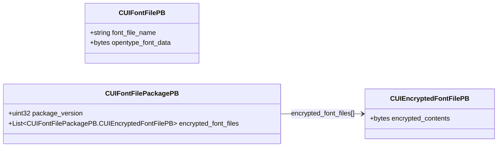

# `uifontfile_format.proto`

## Diagram

## Messages

### `CUIFontFilePB`

| Field | Ordinal | Type | Label | Description |
|-------|---------|------|-------|-------------|
| `font_file_name` | 1 | string | optional |  |
| `opentype_font_data` | 2 | bytes | optional |  |

### `CUIFontFilePackagePB`

| Field | Ordinal | Type | Label | Description |
|-------|---------|------|-------|-------------|
| `package_version` | 1 | uint32 | optional |  |
| `encrypted_font_files` | 2 | CUIFontFilePackagePB.CUIEncryptedFontFilePB | repeated |  |
