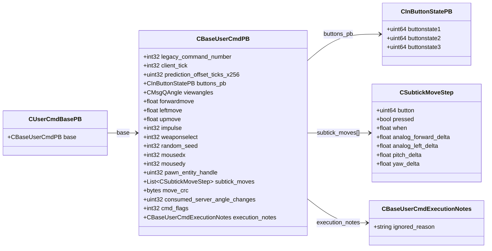

# `usercmd.proto`

**Imports:** `networkbasetypes.proto`

## Diagram

## Messages

### `CInButtonStatePB`

| Field | Ordinal | Type | Label | Description |
|-------|---------|------|-------|-------------|
| `buttonstate1` | 1 | uint64 | optional |  |
| `buttonstate2` | 2 | uint64 | optional |  |
| `buttonstate3` | 3 | uint64 | optional |  |

### `CSubtickMoveStep`

| Field | Ordinal | Type | Label | Description |
|-------|---------|------|-------|-------------|
| `button` | 1 | uint64 | optional |  |
| `pressed` | 2 | bool | optional |  |
| `when` | 3 | float | optional |  |
| `analog_forward_delta` | 4 | float | optional |  |
| `analog_left_delta` | 5 | float | optional |  |
| `pitch_delta` | 8 | float | optional |  |
| `yaw_delta` | 9 | float | optional |  |

### `CBaseUserCmdExecutionNotes`

| Field | Ordinal | Type | Label | Description |
|-------|---------|------|-------|-------------|
| `ignored_reason` | 1 | string | optional |  |

### `CBaseUserCmdPB`

| Field | Ordinal | Type | Label | Description |
|-------|---------|------|-------|-------------|
| `legacy_command_number` | 1 | int32 | optional |  |
| `client_tick` | 2 | int32 | optional |  |
| `buttons_pb` | 3 | [CInButtonStatePB](#cinbuttonstatepb) | optional |  |
| `viewangles` | 4 | CMsgQAngle | optional |  |
| `forwardmove` | 5 | float | optional |  |
| `leftmove` | 6 | float | optional |  |
| `upmove` | 7 | float | optional |  |
| `impulse` | 8 | int32 | optional |  |
| `weaponselect` | 9 | int32 | optional |  |
| `random_seed` | 10 | int32 | optional |  |
| `mousedx` | 11 | int32 | optional |  |
| `mousedy` | 12 | int32 | optional |  |
| `pawn_entity_handle` | 14 | uint32 | optional | *(default: `16777215`)* |
| `prediction_offset_ticks_x256` | 17 | uint32 | optional |  |
| `subtick_moves` | 18 | [CSubtickMoveStep](#csubtickmovestep) | repeated |  |
| `move_crc` | 19 | bytes | optional |  |
| `consumed_server_angle_changes` | 20 | uint32 | optional |  |
| `cmd_flags` | 21 | int32 | optional |  |
| `execution_notes` | 22 | [CBaseUserCmdExecutionNotes](#cbaseusercmdexecutionnotes) | optional |  |

### `CUserCmdBasePB`

| Field | Ordinal | Type | Label | Description |
|-------|---------|------|-------|-------------|
| `base` | 1 | [CBaseUserCmdPB](#cbaseusercmdpb) | optional |  |
