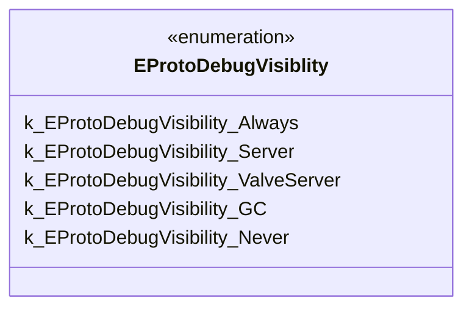

# `valveextensions.proto`

**Imports:** `google/protobuf/descriptor.proto`

## Diagram

## Enums

### `EProtoDebugVisiblity`

| Name | Value |
|------|-------|
| `k_EProtoDebugVisibility_Always` | 0 |
| `k_EProtoDebugVisibility_Server` | 70 |
| `k_EProtoDebugVisibility_ValveServer` | 80 |
| `k_EProtoDebugVisibility_GC` | 90 |
| `k_EProtoDebugVisibility_Never` | 100 |
