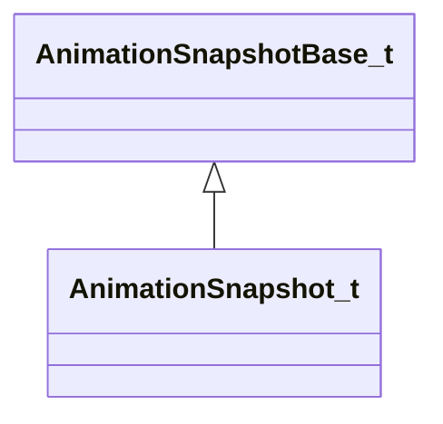

# Module: animationsystem

[📊 View UML Diagram](../diagrams/animationsystem.md)

| Name | Kind | Bases | Fields |
|------|------|-------|--------|
| [AnimationDecodeDebugDumpElement_t](#animationdecodedebugdumpelement_t) | class |  | 0 |
| [AnimationDecodeDebugDump_t](#animationdecodedebugdump_t) | class |  | 0 |
| [AnimationProcessingType_t](#animationprocessingtype_t) | enum |  | 6 |
| [AnimationSnapshotBase_t](#animationsnapshotbase_t) | class |  | 0 |
| [AnimationSnapshotType_t](#animationsnapshottype_t) | enum |  | 7 |
| [AnimationSnapshot_t](#animationsnapshot_t) | class | AnimationSnapshotBase_t | 0 |
| [BoneTransformSpace_t](#bonetransformspace_t) | enum |  | 4 |
| [CAnimActivity](#canimactivity) | class |  | 0 |
| [CAnimBone](#canimbone) | class |  | 0 |
| [CAnimBoneDifference](#canimbonedifference) | class |  | 0 |
| [CAnimData](#canimdata) | class |  | 0 |
| [CAnimDataChannelDesc](#canimdatachanneldesc) | class |  | 0 |
| [CAnimDecoder](#canimdecoder) | class |  | 0 |
| [CAnimDesc](#canimdesc) | class |  | 0 |
| [CAnimDesc_Flag](#canimdesc_flag) | class |  | 0 |
| [CAnimEncodeDifference](#canimencodedifference) | class |  | 0 |
| [CAnimEncodedFrames](#canimencodedframes) | class |  | 0 |
| [CAnimEnum](#canimenum) | class |  | 1 |
| [CAnimEventDefinition](#canimeventdefinition) | class |  | 0 |
| [CAnimFrameBlockAnim](#canimframeblockanim) | class |  | 0 |
| [CAnimFrameSegment](#canimframesegment) | class |  | 0 |
| [CAnimKeyData](#canimkeydata) | class |  | 0 |
| [CAnimLocalHierarchy](#canimlocalhierarchy) | class |  | 0 |
| [CAnimMorphDifference](#canimmorphdifference) | class |  | 0 |
| [CAnimMovement](#canimmovement) | class |  | 0 |
| [CAnimSequenceParams](#canimsequenceparams) | class |  | 0 |
| [CAnimUser](#canimuser) | class |  | 0 |
| [CAnimUserDifference](#canimuserdifference) | class |  | 0 |
| [CAnimationGroup](#canimationgroup) | class |  | 0 |
| [CCompressorGroup](#ccompressorgroup) | class |  | 17 |
| [CMoodVData](#cmoodvdata) | class |  | 0 |
| [CSeqAutoLayer](#cseqautolayer) | class |  | 0 |
| [CSeqAutoLayerFlag](#cseqautolayerflag) | class |  | 0 |
| [CSeqBoneMaskList](#cseqbonemasklist) | class |  | 0 |
| [CSeqCmdLayer](#cseqcmdlayer) | class |  | 0 |
| [CSeqCmdSeqDesc](#cseqcmdseqdesc) | class |  | 0 |
| [CSeqIKLock](#cseqiklock) | class |  | 0 |
| [CSeqMultiFetch](#cseqmultifetch) | class |  | 0 |
| [CSeqMultiFetchFlag](#cseqmultifetchflag) | class |  | 0 |
| [CSeqPoseParamDesc](#cseqposeparamdesc) | class |  | 0 |
| [CSeqPoseSetting](#cseqposesetting) | class |  | 0 |
| [CSeqS1SeqDesc](#cseqs1seqdesc) | class |  | 0 |
| [CSeqScaleSet](#cseqscaleset) | class |  | 0 |
| [CSeqSeqDescFlag](#cseqseqdescflag) | class |  | 0 |
| [CSeqSynthAnimDesc](#cseqsynthanimdesc) | class |  | 0 |
| [CSeqTransition](#cseqtransition) | class |  | 0 |
| [CSequenceGroupData](#csequencegroupdata) | class |  | 0 |
| [FollowAttachmentData](#followattachmentdata) | class |  | 0 |
| [HSequence](#hsequence) | class |  | 1 |
| [MoodAnimationLayer_t](#moodanimationlayer_t) | class |  | 0 |
| [MoodAnimation_t](#moodanimation_t) | class |  | 0 |
| [MoodType_t](#moodtype_t) | enum |  | 2 |
| [ParticleAttachment_t](#particleattachment_t) | enum |  | 18 |
| [SeqCmd_t](#seqcmd_t) | enum |  | 17 |
| [SeqPoseSetting_t](#seqposesetting_t) | enum |  | 4 |

---

### AnimationDecodeDebugDumpElement_t

**Metadata:** `MGetKV3ClassDefaults = {`, `"m_nEntityIndex": 0,`, `"m_modelName": "",`, `"m_poseParams":`, `[`, `],`, `"m_decodeOps":`, `[`, `],`, `"m_internalOps":`, `[`, `],`, `"m_decodedAnims":`, `[`, `]`, `}`

### AnimationDecodeDebugDump_t

**Metadata:** `MGetKV3ClassDefaults = {`, `"m_processingType": "ANIMATION_PROCESSING_SERVER_SIMULATION",`, `"m_elems":`, `[`, `]`, `}`

### AnimationProcessingType_t

**Values:**

| Name | Value |
|------|-------|
| `ANIMATION_PROCESSING_SERVER_SIMULATION` | 0 |
| `ANIMATION_PROCESSING_CLIENT_SIMULATION` | 1 |
| `ANIMATION_PROCESSING_CLIENT_PREDICTION` | 2 |
| `ANIMATION_PROCESSING_CLIENT_INTERPOLATION` | 3 |
| `ANIMATION_PROCESSING_CLIENT_RENDER` | 4 |
| `ANIMATION_PROCESSING_MAX` | 5 |

### AnimationSnapshotBase_t

**Derived by:** [AnimationSnapshot_t](animationsystem.md#animationsnapshot_t)

**Metadata:** `MGetKV3ClassDefaults = {`, `"m_flRealTime": 0.000000,`, `"m_rootToWorld":`, `[`, `0.000000,`, `0.000000,`, `0.000000,`, `0.000000,`, `0.000000,`, `0.000000,`, `0.000000,`, `0.000000,`, `0.000000,`, `0.000000,`, `0.000000,`, `0.000000`, `],`, `"m_bBonesInWorldSpace": false,`, `"m_boneSetupMask":`, `[`, `],`, `"m_boneTransforms":`, `[`, `],`, `"m_flexControllers":`, `[`, `],`, `"m_SnapshotType": "ANIMATION_SNAPSHOT_SERVER_SIMULATION",`, `"m_bHasDecodeDump": false,`, `"m_DecodeDump":`, `{`, `"m_nEntityIndex": 0,`, `"m_modelName": "",`, `"m_poseParams":`, `[`, `],`, `"m_decodeOps":`, `[`, `],`, `"m_internalOps":`, `[`, `],`, `"m_decodedAnims":`, `[`, `]`, `}`, `}`

**Relationships:**

### AnimationSnapshotType_t

**Values:**

| Name | Value |
|------|-------|
| `ANIMATION_SNAPSHOT_SERVER_SIMULATION` | 0 |
| `ANIMATION_SNAPSHOT_CLIENT_SIMULATION` | 1 |
| `ANIMATION_SNAPSHOT_CLIENT_PREDICTION` | 2 |
| `ANIMATION_SNAPSHOT_CLIENT_INTERPOLATION` | 3 |
| `ANIMATION_SNAPSHOT_CLIENT_RENDER` | 4 |
| `ANIMATION_SNAPSHOT_FINAL_COMPOSITE` | 5 |
| `ANIMATION_SNAPSHOT_MAX` | 6 |

### AnimationSnapshot_t

**Inherits from:** [AnimationSnapshotBase_t](animationsystem.md#animationsnapshotbase_t)

**Metadata:** `MGetKV3ClassDefaults = {`, `"m_flRealTime": 0.000000,`, `"m_rootToWorld":`, `[`, `0.000000,`, `0.000000,`, `0.000000,`, `0.000000,`, `0.000000,`, `0.000000,`, `0.000000,`, `0.000000,`, `0.000000,`, `0.000000,`, `0.000000,`, `0.000000`, `],`, `"m_bBonesInWorldSpace": false,`, `"m_boneSetupMask":`, `[`, `],`, `"m_boneTransforms":`, `[`, `],`, `"m_flexControllers":`, `[`, `],`, `"m_SnapshotType": "ANIMATION_SNAPSHOT_SERVER_SIMULATION",`, `"m_bHasDecodeDump": false,`, `"m_DecodeDump":`, `{`, `"m_nEntityIndex": 0,`, `"m_modelName": "",`, `"m_poseParams":`, `[`, `],`, `"m_decodeOps":`, `[`, `],`, `"m_internalOps":`, `[`, `],`, `"m_decodedAnims":`, `[`, `]`, `},`, `"m_nEntIndex": 0,`, `"m_modelName": ""`, `}`

**Relationships:**

### BoneTransformSpace_t

**Values:**

| Name | Value |
|------|-------|
| `BoneTransformSpace_Invalid` | -1 |
| `BoneTransformSpace_Parent` | 0 |
| `BoneTransformSpace_Model` | 1 |
| `BoneTransformSpace_World` | 2 |

### CAnimActivity

**Metadata:** `MGetKV3ClassDefaults = {`, `"m_name": "",`, `"m_nActivity": 0,`, `"m_nFlags": 0,`, `"m_nWeight": 0`, `}`

### CAnimBone

**Metadata:** `MGetKV3ClassDefaults = {`, `"m_name": "",`, `"m_parent": 0,`, `"m_pos":`, `[`, `0.000000,`, `0.000000,`, `0.000000`, `],`, `"m_quat":`, `[`, `0.000000,`, `0.000000,`, `0.000000,`, `1.000000`, `],`, `"m_scale": 1.000000,`, `"m_qAlignment":`, `[`, `0.000000,`, `0.000000,`, `0.000000,`, `1.000000`, `],`, `"m_flags": 0`, `}`

### CAnimBoneDifference

**Metadata:** `MGetKV3ClassDefaults = {`, `"m_name": "",`, `"m_parent": "",`, `"m_posError":`, `[`, `0.000000,`, `0.000000,`, `0.000000`, `],`, `"m_bHasRotation": false,`, `"m_bHasMovement": false`, `}`

### CAnimData

**Metadata:** `MGetKV3ClassDefaults = {`, `"m_name": "",`, `"m_animArray":`, `[`, `],`, `"m_decoderArray":`, `[`, `],`, `"m_nMaxUniqueFrameIndex": 0,`, `"m_segmentArray":`, `[`, `]`, `}`

### CAnimDataChannelDesc

**Metadata:** `MGetKV3ClassDefaults = {`, `"m_szChannelClass": "",`, `"m_szVariableName": "",`, `"m_nFlags": 0,`, `"m_nType": 0,`, `"m_szGrouping": "",`, `"m_szDescription": "",`, `"m_szElementNameArray":`, `[`, `],`, `"m_nElementIndexArray":`, `[`, `],`, `"m_nElementMaskArray":`, `[`, `]`, `}`

### CAnimDecoder

**Metadata:** `MGetKV3ClassDefaults = {`, `"m_szName": "",`, `"m_nVersion": 0,`, `"m_nType": 0`, `}`

### CAnimDesc

**Metadata:** `MGetKV3ClassDefaults = {`, `"m_name": "",`, `"m_flags":`, `{`, `"m_bLooping": false,`, `"m_bAllZeros": false,`, `"m_bHidden": false,`, `"m_bDelta": false,`, `"m_bLegacyWorldspace": false,`, `"m_bModelDoc": false,`, `"m_bImplicitSeqIgnoreDelta": false,`, `"m_bAnimGraphAdditive": false`, `},`, `"fps": 0.000000,`, `"m_pData":`, `{`, `"m_fileName": "",`, `"m_nFrames": 0,`, `"m_nFramesPerBlock": 0,`, `"m_frameblockArray":`, `[`, `],`, `"m_usageDifferences":`, `{`, `"m_boneArray":`, `[`, `],`, `"m_morphArray":`, `[`, `],`, `"m_userArray":`, `[`, `],`, `"m_bHasRotationBitArray":`, `[`, `],`, `"m_bHasMovementBitArray":`, `[`, `],`, `"m_bHasMorphBitArray":`, `[`, `],`, `"m_bHasUserBitArray":`, `[`, `]`, `}`, `},`, `"m_movementArray":`, `[`, `],`, `"m_xInitialOffset":`, `[`, `0.000000,`, `0.000000,`, `0.000000,`, `1.000000,`, `0.000000,`, `0.000000,`, `0.000000,`, `1.000000`, `],`, `"m_eventArray":`, `[`, `],`, `"m_activityArray":`, `[`, `],`, `"m_hierarchyArray":`, `[`, `],`, `"framestalltime": 0.000000,`, `"m_vecRootMin":`, `[`, `0.000000,`, `0.000000,`, `0.000000`, `],`, `"m_vecRootMax":`, `[`, `0.000000,`, `0.000000,`, `0.000000`, `],`, `"m_vecBoneWorldMin":`, `[`, `],`, `"m_vecBoneWorldMax":`, `[`, `],`, `"m_sequenceParams":`, `{`, `"m_flFadeInTime": 0.200000,`, `"m_flFadeOutTime": 0.200000`, `}`, `}`

### CAnimDesc_Flag

**Metadata:** `MGetKV3ClassDefaults = {`, `"m_bLooping": false,`, `"m_bAllZeros": false,`, `"m_bHidden": false,`, `"m_bDelta": false,`, `"m_bLegacyWorldspace": false,`, `"m_bModelDoc": false,`, `"m_bImplicitSeqIgnoreDelta": false,`, `"m_bAnimGraphAdditive": false`, `}`

### CAnimEncodeDifference

**Metadata:** `MGetKV3ClassDefaults = {`, `"m_boneArray":`, `[`, `],`, `"m_morphArray":`, `[`, `],`, `"m_userArray":`, `[`, `],`, `"m_bHasRotationBitArray":`, `[`, `],`, `"m_bHasMovementBitArray":`, `[`, `],`, `"m_bHasMorphBitArray":`, `[`, `],`, `"m_bHasUserBitArray":`, `[`, `]`, `}`

### CAnimEncodedFrames

**Metadata:** `MGetKV3ClassDefaults = {`, `"m_fileName": "",`, `"m_nFrames": 0,`, `"m_nFramesPerBlock": 0,`, `"m_frameblockArray":`, `[`, `],`, `"m_usageDifferences":`, `{`, `"m_boneArray":`, `[`, `],`, `"m_morphArray":`, `[`, `],`, `"m_userArray":`, `[`, `],`, `"m_bHasRotationBitArray":`, `[`, `],`, `"m_bHasMovementBitArray":`, `[`, `],`, `"m_bHasMorphBitArray":`, `[`, `],`, `"m_bHasUserBitArray":`, `[`, `]`, `}`, `}`

### CAnimEnum

**Fields:**

| Name | Type | Annotations |
|------|------|-------------|
| `m_value` | uint8 |  |

### CAnimEventDefinition

**Metadata:** `MGetKV3ClassDefaults = {`, `"m_nFrame": 0,`, `"m_nEndFrame": -1,`, `"m_flCycle": 0.000000,`, `"m_flDuration": 0.000000,`, `"m_EventData": null,`, `"m_sOptions": "",`, `"m_sEventName": ""`, `}`

### CAnimFrameBlockAnim

**Metadata:** `MGetKV3ClassDefaults = {`, `"m_nStartFrame": 0,`, `"m_nEndFrame": 0,`, `"m_segmentIndexArray":`, `[`, `]`, `}`

### CAnimFrameSegment

**Metadata:** `MGetKV3ClassDefaults = {`, `"m_nUniqueFrameIndex": 0,`, `"m_nLocalElementMasks": 0,`, `"m_nLocalChannel": 0,`, `"m_container": "[BINARY BLOB]"`, `}`

### CAnimKeyData

**Metadata:** `MGetKV3ClassDefaults = {`, `"m_name": "",`, `"m_boneArray":`, `[`, `],`, `"m_userArray":`, `[`, `],`, `"m_morphArray":`, `[`, `],`, `"m_nChannelElements": 0,`, `"m_dataChannelArray":`, `[`, `]`, `}`

### CAnimLocalHierarchy

**Metadata:** `MGetKV3ClassDefaults = {`, `"m_sBone": "",`, `"m_sNewParent": "",`, `"m_nStartFrame": 0,`, `"m_nPeakFrame": 0,`, `"m_nTailFrame": 0,`, `"m_nEndFrame": 0`, `}`

### CAnimMorphDifference

**Metadata:** `MGetKV3ClassDefaults = {`, `"m_name": ""`, `}`

### CAnimMovement

**Metadata:** `MGetKV3ClassDefaults = {`, `"endframe": 0,`, `"motionflags": 0,`, `"v0": 0.000000,`, `"v1": 0.000000,`, `"angle": 0.000000,`, `"vector":`, `[`, `0.000000,`, `0.000000,`, `0.000000`, `],`, `"position":`, `[`, `0.000000,`, `0.000000,`, `0.000000`, `]`, `}`

### CAnimSequenceParams

**Metadata:** `MGetKV3ClassDefaults = {`, `"m_flFadeInTime": 0.200000,`, `"m_flFadeOutTime": 0.200000`, `}`

### CAnimUser

**Metadata:** `MGetKV3ClassDefaults = {`, `"m_name": "",`, `"m_nType": 0`, `}`

### CAnimUserDifference

**Metadata:** `MGetKV3ClassDefaults = {`, `"m_name": "",`, `"m_nType": 0`, `}`

### CAnimationGroup

**Metadata:** `MGetKV3ClassDefaults = {`, `"m_nFlags": 0,`, `"m_name": "",`, `"m_localHAnimArray":`, `[`, `],`, `"m_includedGroupArray":`, `[`, `],`, `"m_directHSeqGroup": "",`, `"m_decodeKey":`, `{`, `"m_name": "",`, `"m_boneArray":`, `[`, `],`, `"m_userArray":`, `[`, `],`, `"m_morphArray":`, `[`, `],`, `"m_nChannelElements": 0,`, `"m_dataChannelArray":`, `[`, `]`, `},`, `"m_szScripts":`, `[`, `],`, `"m_AdditionalExtRefs":`, `[`, `]`, `}`

### CCompressorGroup

**Fields:**

| Name | Type | Annotations |
|------|------|-------------|
| `m_nTotalElementCount` | int32 |  |
| `m_szChannelClass` | CUtlVector< char* > |  |
| `m_szVariableName` | CUtlVector< char* > |  |
| `m_nType` | CUtlVector< fieldtype_t > |  |
| `m_nFlags` | CUtlVector< int32 > |  |
| `m_szGrouping` | CUtlVector< CUtlString > |  |
| `m_nCompressorIndex` | CUtlVector< int32 > |  |
| `m_szElementNames` | CUtlVector< CUtlVector< char* > > |  |
| `m_nElementUniqueID` | CUtlVector< CUtlVector< int32 > > |  |
| `m_nElementMask` | CUtlVector< uint32 > |  |
| `m_vectorCompressor` | CUtlVector< CCompressor< Vector >* > |  |
| `m_quaternionCompressor` | CUtlVector< CCompressor< QuaternionStorage >* > |  |
| `m_intCompressor` | CUtlVector< CCompressor< int32 >* > |  |
| `m_boolCompressor` | CUtlVector< CCompressor< bool >* > |  |
| `m_colorCompressor` | CUtlVector< CCompressor< Color >* > |  |
| `m_vector2DCompressor` | CUtlVector< CCompressor< Vector2D >* > |  |
| `m_vector4DCompressor` | CUtlVector< CCompressor< Vector4D >* > |  |

### CMoodVData

**Metadata:** `MGetKV3ClassDefaults = {`, `"m_sModelName": "",`, `"m_nMoodType": "eMoodType_Head",`, `"m_animationLayers":`, `[`, `]`, `}`, `MVDataRoot`, `MVDataOverlayType = 1`

### CSeqAutoLayer

**Metadata:** `MGetKV3ClassDefaults = {`, `"m_nLocalReference": 0,`, `"m_nLocalPose": 0,`, `"m_flags":`, `{`, `"m_bPost": false,`, `"m_bSpline": false,`, `"m_bXFade": false,`, `"m_bNoBlend": false,`, `"m_bLocal": false,`, `"m_bPose": false,`, `"m_bFetchFrame": false,`, `"m_bSubtract": false`, `},`, `"m_start": 0.000000,`, `"m_peak": 0.000000,`, `"m_tail": 0.000000,`, `"m_end": 0.000000`, `}`

### CSeqAutoLayerFlag

**Metadata:** `MGetKV3ClassDefaults = {`, `"m_bPost": false,`, `"m_bSpline": false,`, `"m_bXFade": false,`, `"m_bNoBlend": false,`, `"m_bLocal": false,`, `"m_bPose": false,`, `"m_bFetchFrame": false,`, `"m_bSubtract": false`, `}`

### CSeqBoneMaskList

**Metadata:** `MGetKV3ClassDefaults = {`, `"m_sName": "",`, `"m_nLocalBoneArray":`, `[`, `],`, `"m_flBoneWeightArray":`, `[`, `],`, `"m_flDefaultMorphCtrlWeight": 1.000000,`, `"m_morphCtrlWeightArray":`, `[`, `]`, `}`

### CSeqCmdLayer

**Metadata:** `MGetKV3ClassDefaults = {`, `"m_cmd": 0,`, `"m_nLocalReference": 0,`, `"m_nLocalBonemask": 0,`, `"m_nDstResult": 0,`, `"m_nSrcResult": 0,`, `"m_bSpline": false,`, `"m_flVar1": 0.000000,`, `"m_flVar2": 0.000000,`, `"m_nLineNumber": 0`, `}`

### CSeqCmdSeqDesc

**Metadata:** `MGetKV3ClassDefaults = {`, `"m_sName": "",`, `"m_flags":`, `{`, `"m_bLooping": false,`, `"m_bSnap": false,`, `"m_bAutoplay": false,`, `"m_bPost": false,`, `"m_bHidden": false,`, `"m_bMulti": false,`, `"m_bLegacyDelta": false,`, `"m_bLegacyWorldspace": false,`, `"m_bLegacyCyclepose": false,`, `"m_bLegacyRealtime": false,`, `"m_bModelDoc": false`, `},`, `"m_transition":`, `{`, `"m_flFadeInTime": 0.000000,`, `"m_flFadeOutTime": 0.000000`, `},`, `"m_nFrameRangeSequence": 0,`, `"m_nFrameCount": 0,`, `"m_flFPS": 30.000000,`, `"m_nSubCycles": 1,`, `"m_numLocalResults": 0,`, `"m_cmdLayerArray":`, `[`, `],`, `"m_eventArray":`, `[`, `],`, `"m_activityArray":`, `[`, `],`, `"m_poseSettingArray":`, `[`, `]`, `}`

### CSeqIKLock

**Metadata:** `MGetKV3ClassDefaults = {`, `"m_flPosWeight": 0.000000,`, `"m_flAngleWeight": 0.000000,`, `"m_nLocalBone": 0,`, `"m_bBonesOrientedAlongPositiveX": true`, `}`

### CSeqMultiFetch

**Metadata:** `MGetKV3ClassDefaults = {`, `"m_flags":`, `{`, `"m_bRealtime": false,`, `"m_bCylepose": false,`, `"m_b0D": false,`, `"m_b1D": false,`, `"m_b2D": false,`, `"m_b2D_TRI": false`, `},`, `"m_localReferenceArray":`, `[`, `],`, `"m_nGroupSize":`, `[`, `0,`, `0`, `],`, `"m_nLocalPose":`, `[`, `0,`, `0`, `],`, `"m_poseKeyArray0":`, `[`, `],`, `"m_poseKeyArray1":`, `[`, `],`, `"m_nLocalCyclePoseParameter": 0,`, `"m_bCalculatePoseParameters": false,`, `"m_bFixedBlendWeight": false,`, `"m_flFixedBlendWeightVals":`, `[`, `0.000000,`, `0.000000`, `]`, `}`

### CSeqMultiFetchFlag

**Metadata:** `MGetKV3ClassDefaults = {`, `"m_bRealtime": false,`, `"m_bCylepose": false,`, `"m_b0D": false,`, `"m_b1D": false,`, `"m_b2D": false,`, `"m_b2D_TRI": false`, `}`

### CSeqPoseParamDesc

**Metadata:** `MGetKV3ClassDefaults = {`, `"m_sName": "",`, `"m_flStart": 0.000000,`, `"m_flEnd": 0.000000,`, `"m_flLoop": 0.000000,`, `"m_bLooping": false`, `}`

### CSeqPoseSetting

**Metadata:** `MGetKV3ClassDefaults = {`, `"m_sPoseParameter": "",`, `"m_sAttachment": "",`, `"m_sReferenceSequence": "",`, `"m_flValue": 0.000000,`, `"m_bX": false,`, `"m_bY": false,`, `"m_bZ": false,`, `"m_eType": 0`, `}`

### CSeqS1SeqDesc

**Metadata:** `MGetKV3ClassDefaults = {`, `"m_sName": "",`, `"m_flags":`, `{`, `"m_bLooping": false,`, `"m_bSnap": false,`, `"m_bAutoplay": false,`, `"m_bPost": false,`, `"m_bHidden": false,`, `"m_bMulti": false,`, `"m_bLegacyDelta": false,`, `"m_bLegacyWorldspace": false,`, `"m_bLegacyCyclepose": false,`, `"m_bLegacyRealtime": false,`, `"m_bModelDoc": false`, `},`, `"m_fetch":`, `{`, `"m_flags":`, `{`, `"m_bRealtime": false,`, `"m_bCylepose": false,`, `"m_b0D": false,`, `"m_b1D": false,`, `"m_b2D": false,`, `"m_b2D_TRI": false`, `},`, `"m_localReferenceArray":`, `[`, `],`, `"m_nGroupSize":`, `[`, `0,`, `0`, `],`, `"m_nLocalPose":`, `[`, `0,`, `0`, `],`, `"m_poseKeyArray0":`, `[`, `],`, `"m_poseKeyArray1":`, `[`, `],`, `"m_nLocalCyclePoseParameter": 0,`, `"m_bCalculatePoseParameters": false,`, `"m_bFixedBlendWeight": false,`, `"m_flFixedBlendWeightVals":`, `[`, `0.000000,`, `0.000000`, `]`, `},`, `"m_nLocalWeightlist": 0,`, `"m_autoLayerArray":`, `[`, `],`, `"m_IKLockArray":`, `[`, `],`, `"m_transition":`, `{`, `"m_flFadeInTime": 0.000000,`, `"m_flFadeOutTime": 0.000000`, `},`, `"m_SequenceKeys": null,`, `"m_keyValueText": "",`, `"m_activityArray":`, `[`, `],`, `"m_footMotion":`, `[`, `]`, `}`

### CSeqScaleSet

**Metadata:** `MGetKV3ClassDefaults = {`, `"m_sName": "",`, `"m_bRootOffset": false,`, `"m_vRootOffset":`, `[`, `0.000000,`, `0.000000,`, `0.000000`, `],`, `"m_nLocalBoneArray":`, `[`, `],`, `"m_flBoneScaleArray":`, `[`, `]`, `}`

### CSeqSeqDescFlag

**Metadata:** `MGetKV3ClassDefaults = {`, `"m_bLooping": false,`, `"m_bSnap": false,`, `"m_bAutoplay": false,`, `"m_bPost": false,`, `"m_bHidden": false,`, `"m_bMulti": false,`, `"m_bLegacyDelta": false,`, `"m_bLegacyWorldspace": false,`, `"m_bLegacyCyclepose": false,`, `"m_bLegacyRealtime": false,`, `"m_bModelDoc": false`, `}`

### CSeqSynthAnimDesc

**Metadata:** `MGetKV3ClassDefaults = {`, `"m_sName": "",`, `"m_flags":`, `{`, `"m_bLooping": false,`, `"m_bSnap": false,`, `"m_bAutoplay": false,`, `"m_bPost": false,`, `"m_bHidden": false,`, `"m_bMulti": false,`, `"m_bLegacyDelta": false,`, `"m_bLegacyWorldspace": false,`, `"m_bLegacyCyclepose": false,`, `"m_bLegacyRealtime": false,`, `"m_bModelDoc": false`, `},`, `"m_transition":`, `{`, `"m_flFadeInTime": 0.000000,`, `"m_flFadeOutTime": 0.000000`, `},`, `"m_nLocalBaseReference": 0,`, `"m_nLocalBoneMask": 0,`, `"m_activityArray":`, `[`, `]`, `}`

### CSeqTransition

**Metadata:** `MGetKV3ClassDefaults = {`, `"m_flFadeInTime": 0.000000,`, `"m_flFadeOutTime": 0.000000`, `}`

### CSequenceGroupData

**Metadata:** `MGetKV3ClassDefaults = {`, `"m_sName": "",`, `"m_nFlags": 0,`, `"m_localSequenceNameArray":`, `[`, `],`, `"m_localS1SeqDescArray":`, `[`, `],`, `"m_localMultiSeqDescArray":`, `[`, `],`, `"m_localSynthAnimDescArray":`, `[`, `],`, `"m_localCmdSeqDescArray":`, `[`, `],`, `"m_localBoneMaskArray":`, `[`, `],`, `"m_localScaleSetArray":`, `[`, `],`, `"m_localBoneNameArray":`, `[`, `],`, `"m_localNodeName": "",`, `"m_localPoseParamArray":`, `[`, `],`, `"m_keyValues": null,`, `"m_localIKAutoplayLockArray":`, `[`, `]`, `}`

### FollowAttachmentData

**Metadata:** `MGetKV3ClassDefaults = {`, `"m_boneIndex": 0,`, `"m_attachmentHandle": 0`, `}`

### HSequence

**Metadata:** `MIsBoxedIntegerType`

**Fields:**

| Name | Type | Annotations |
|------|------|-------------|
| `m_Value` | int32 |  |

### MoodAnimationLayer_t

**Metadata:** `MGetKV3ClassDefaults = {`, `"m_sName": "",`, `"m_bActiveListening": true,`, `"m_bActiveTalking": true,`, `"m_layerAnimations":`, `[`, `],`, `"m_flIntensity": 1.000000,`, `"m_flDurationScale": 1.000000,`, `"m_bScaleWithInts": false,`, `"m_flNextStart": 1.000000,`, `"m_flStartOffset": 0.000000,`, `"m_flEndOffset": 0.000000,`, `"m_flFadeIn": 0.200000,`, `"m_flFadeOut": 0.200000`, `}`, `MPropertyArrayElementNameKey = "m_sName"`

### MoodAnimation_t

**Metadata:** `MGetKV3ClassDefaults = {`, `"m_sName": "",`, `"m_flWeight": 1.000000`, `}`, `MPropertyArrayElementNameKey = "m_sName"`

### MoodType_t

**Values:**

| Name | Value |
|------|-------|
| `eMoodType_Head` | 0 |
| `eMoodType_Body` | 1 |

### ParticleAttachment_t

**Values:**

| Name | Value |
|------|-------|
| `PATTACH_INVALID` | -1 |
| `PATTACH_ABSORIGIN` | 0 |
| `PATTACH_ABSORIGIN_FOLLOW` | 1 |
| `PATTACH_CUSTOMORIGIN` | 2 |
| `PATTACH_CUSTOMORIGIN_FOLLOW` | 3 |
| `PATTACH_POINT` | 4 |
| `PATTACH_POINT_FOLLOW` | 5 |
| `PATTACH_EYES_FOLLOW` | 6 |
| `PATTACH_OVERHEAD_FOLLOW` | 7 |
| `PATTACH_WORLDORIGIN` | 8 |
| `PATTACH_ROOTBONE_FOLLOW` | 9 |
| `PATTACH_RENDERORIGIN_FOLLOW` | 10 |
| `PATTACH_MAIN_VIEW` | 11 |
| `PATTACH_WATERWAKE` | 12 |
| `PATTACH_CENTER_FOLLOW` | 13 |
| `PATTACH_CUSTOM_GAME_STATE_1` | 14 |
| `PATTACH_HEALTHBAR` | 15 |
| `MAX_PATTACH_TYPES` | 16 |

### SeqCmd_t

**Values:**

| Name | Value |
|------|-------|
| `SeqCmd_Nop` | 0 |
| `SeqCmd_LinearDelta` | 1 |
| `SeqCmd_FetchFrameRange` | 2 |
| `SeqCmd_Slerp` | 3 |
| `SeqCmd_Add` | 4 |
| `SeqCmd_Subtract` | 5 |
| `SeqCmd_Scale` | 6 |
| `SeqCmd_Copy` | 7 |
| `SeqCmd_Blend` | 8 |
| `SeqCmd_Worldspace` | 9 |
| `SeqCmd_Sequence` | 10 |
| `SeqCmd_FetchCycle` | 11 |
| `SeqCmd_FetchFrame` | 12 |
| `SeqCmd_IKLockInPlace` | 13 |
| `SeqCmd_IKRestoreAll` | 14 |
| `SeqCmd_ReverseSequence` | 15 |
| `SeqCmd_Transform` | 16 |

### SeqPoseSetting_t

**Values:**

| Name | Value |
|------|-------|
| `SEQ_POSE_SETTING_CONSTANT` | 0 |
| `SEQ_POSE_SETTING_ROTATION` | 1 |
| `SEQ_POSE_SETTING_POSITION` | 2 |
| `SEQ_POSE_SETTING_VELOCITY` | 3 |
