# Module: animdoclib

[📊 View UML Diagram](../diagrams/animdoclib.md)

| Name | Kind | Bases | Fields |
|------|------|-------|--------|
| [CNmAnimDocument](#cnmanimdocument) | class |  | 1 |
| [CNmBlendSpace1D](#cnmblendspace1d) | class |  | 0 |
| [CNmBlendSpace1D](#cnmblendspace1d) | class |  | 0 |
| [CNmBlendSpace2D](#cnmblendspace2d) | class |  | 0 |
| [CNmClipDocEvent](#cnmclipdocevent) | class |  | 0 |
| [CNmClipDocEventTrack](#cnmclipdoceventtrack) | class |  | 0 |
| [CNmClipDocEventTrack](#cnmclipdoceventtrack) | enum |  | 3 |
| [CNmClipDocEvent_BodyGroup](#cnmclipdocevent_bodygroup) | class | CNmClipDocEvent | 0 |
| [CNmClipDocEvent_EntityAttribute](#cnmclipdocevent_entityattribute) | class | CNmClipDocEvent | 0 |
| [CNmClipDocEvent_EntityAttribute_Type_t](#cnmclipdocevent_entityattribute_type_t) | enum |  | 2 |
| [CNmClipDocEvent_FloatCurve](#cnmclipdocevent_floatcurve) | class | CNmClipDocEvent | 0 |
| [CNmClipDocEvent_Foot](#cnmclipdocevent_foot) | class | CNmClipDocEvent | 0 |
| [CNmClipDocEvent_FrameSnap](#cnmclipdocevent_framesnap) | class | CNmClipDocEvent | 0 |
| [CNmClipDocEvent_ID](#cnmclipdocevent_id) | class | CNmClipDocEvent | 0 |
| [CNmClipDocEvent_Legacy](#cnmclipdocevent_legacy) | class | CNmClipDocEvent | 0 |
| [CNmClipDocEvent_MaterialAttribute](#cnmclipdocevent_materialattribute) | class | CNmClipDocEvent | 0 |
| [CNmClipDocEvent_OrientationWarp](#cnmclipdocevent_orientationwarp) | class | CNmClipDocEvent | 0 |
| [CNmClipDocEvent_Particle](#cnmclipdocevent_particle) | class | CNmClipDocEvent | 0 |
| [CNmClipDocEvent_RootMotion](#cnmclipdocevent_rootmotion) | class | CNmClipDocEvent | 0 |
| [CNmClipDocEvent_Sound](#cnmclipdocevent_sound) | class | CNmClipDocEvent | 0 |
| [CNmClipDocEvent_TargetWarp](#cnmclipdocevent_targetwarp) | class | CNmClipDocEvent | 0 |
| [CNmClipDocEvent_Transition](#cnmclipdocevent_transition) | class | CNmClipDocEvent | 0 |
| [CNmClipDocument](#cnmclipdocument) | class | CNmAnimDocument | 0 |
| [CNmClipDocument](#cnmclipdocument) | enum |  | 3 |
| [CNmClipDocument](#cnmclipdocument) | enum |  | 5 |
| [CNmGraphDocAndNode](#cnmgraphdocandnode) | class | CNmGraphDocFlowNode | 0 |
| [CNmGraphDocAnimationPoseNode](#cnmgraphdocanimationposenode) | class | CNmGraphDocVariationDataNode | 0 |
| [CNmGraphDocAnimationPoseNode](#cnmgraphdocanimationposenode) | class |  | 0 |
| [CNmGraphDocBlend1DNode](#cnmgraphdocblend1dnode) | class | CNmGraphDocFlowNode | 0 |
| [CNmGraphDocBlend2DNode](#cnmgraphdocblend2dnode) | class | CNmGraphDocFlowNode | 0 |
| [CNmGraphDocBoneMaskBlendNode](#cnmgraphdocbonemaskblendnode) | class | CNmGraphDocFlowNode | 0 |
| [CNmGraphDocBoneMaskNode](#cnmgraphdocbonemasknode) | class | CNmGraphDocFlowNode | 0 |
| [CNmGraphDocBoneMaskParameterReferenceNode](#cnmgraphdocbonemaskparameterreferencenode) | class | CNmGraphDocParameterReferenceNode | 0 |
| [CNmGraphDocBoneMaskResultNode](#cnmgraphdocbonemaskresultnode) | class | CNmGraphDocResultNode | 0 |
| [CNmGraphDocBoneMaskSelectorNode](#cnmgraphdocbonemaskselectornode) | class | CNmGraphDocFlowNode | 0 |
| [CNmGraphDocBoneMaskSwitchNode](#cnmgraphdocbonemaskswitchnode) | class | CNmGraphDocFlowNode | 0 |
| [CNmGraphDocBoneMaskVirtualParameterNode](#cnmgraphdocbonemaskvirtualparameternode) | class | CNmGraphDocVirtualParameterNode | 0 |
| [CNmGraphDocBoolControlParameterNode](#cnmgraphdocboolcontrolparameternode) | class | CNmGraphDocControlParameterNode | 0 |
| [CNmGraphDocBoolParameterReferenceNode](#cnmgraphdocboolparameterreferencenode) | class | CNmGraphDocParameterReferenceNode | 0 |
| [CNmGraphDocBoolResultNode](#cnmgraphdocboolresultnode) | class | CNmGraphDocResultNode | 0 |
| [CNmGraphDocBoolVirtualParameterNode](#cnmgraphdocboolvirtualparameternode) | class | CNmGraphDocVirtualParameterNode | 0 |
| [CNmGraphDocCachedBoolNode](#cnmgraphdoccachedboolnode) | class | CNmGraphDocFlowNode | 0 |
| [CNmGraphDocCachedFloatNode](#cnmgraphdoccachedfloatnode) | class | CNmGraphDocFlowNode | 0 |
| [CNmGraphDocCachedIDNode](#cnmgraphdoccachedidnode) | class | CNmGraphDocFlowNode | 0 |
| [CNmGraphDocCachedTargetNode](#cnmgraphdoccachedtargetnode) | class | CNmGraphDocFlowNode | 0 |
| [CNmGraphDocCachedVectorNode](#cnmgraphdoccachedvectornode) | class | CNmGraphDocFlowNode | 0 |
| [CNmGraphDocClipNode](#cnmgraphdocclipnode) | class | CNmGraphDocVariationDataNode | 0 |
| [CNmGraphDocClipNode](#cnmgraphdocclipnode) | class |  | 0 |
| [CNmGraphDocClipSelectorNode](#cnmgraphdocclipselectornode) | class | CNmGraphDocSelectorBaseNode | 0 |
| [CNmGraphDocCommentNode](#cnmgraphdoccommentnode) | class | CNmGraphDocNode | 0 |
| [CNmGraphDocControlParameterNode](#cnmgraphdoccontrolparameternode) | class | CNmGraphDocParameterBaseNode | 0 |
| [CNmGraphDocCurrentSyncEventIDNode](#cnmgraphdoccurrentsynceventidnode) | class | CNmGraphDocFlowNode | 0 |
| [CNmGraphDocCurrentSyncEventNode](#cnmgraphdoccurrentsynceventnode) | class | CNmGraphDocFlowNode | 0 |
| [CNmGraphDocEntryOverrideNode](#cnmgraphdocentryoverridenode) | class | CNmGraphDocResultNode | 0 |
| [CNmGraphDocEntryStateOverrideConditionsNode](#cnmgraphdocentrystateoverrideconditionsnode) | class | CNmGraphDocResultNode | 0 |
| [CNmGraphDocEntryStateOverrideConduitNode](#cnmgraphdocentrystateoverrideconduitnode) | class | CNmGraphDocStateMachineGraphNode | 0 |
| [CNmGraphDocExternalGraphNode](#cnmgraphdocexternalgraphnode) | class | CNmGraphDocFlowNode | 0 |
| [CNmGraphDocExternalPoseNode](#cnmgraphdocexternalposenode) | class | CNmGraphDocFlowNode | 0 |
| [CNmGraphDocFixedWeightBoneMaskNode](#cnmgraphdocfixedweightbonemasknode) | class | CNmGraphDocFlowNode | 0 |
| [CNmGraphDocFloatAngleMathNode](#cnmgraphdocfloatanglemathnode) | class | CNmGraphDocFlowNode | 0 |
| [CNmGraphDocFloatClampNode](#cnmgraphdocfloatclampnode) | class | CNmGraphDocFlowNode | 0 |
| [CNmGraphDocFloatComparisonNode](#cnmgraphdocfloatcomparisonnode) | class | CNmGraphDocFlowNode | 0 |
| [CNmGraphDocFloatControlParameterNode](#cnmgraphdocfloatcontrolparameternode) | class | CNmGraphDocControlParameterNode | 0 |
| [CNmGraphDocFloatCurveEventNode](#cnmgraphdocfloatcurveeventnode) | class | CNmGraphDocFlowNode | 0 |
| [CNmGraphDocFloatCurveNode](#cnmgraphdocfloatcurvenode) | class | CNmGraphDocFlowNode | 0 |
| [CNmGraphDocFloatEaseNode](#cnmgraphdocfloateasenode) | class | CNmGraphDocFlowNode | 0 |
| [CNmGraphDocFloatMathNode](#cnmgraphdocfloatmathnode) | class | CNmGraphDocFlowNode | 0 |
| [CNmGraphDocFloatParameterReferenceNode](#cnmgraphdocfloatparameterreferencenode) | class | CNmGraphDocParameterReferenceNode | 0 |
| [CNmGraphDocFloatRangeComparisonNode](#cnmgraphdocfloatrangecomparisonnode) | class | CNmGraphDocFlowNode | 0 |
| [CNmGraphDocFloatRemapNode](#cnmgraphdocfloatremapnode) | class | CNmGraphDocFlowNode | 0 |
| [CNmGraphDocFloatRemapNode](#cnmgraphdocfloatremapnode) | class |  | 0 |
| [CNmGraphDocFloatResultNode](#cnmgraphdocfloatresultnode) | class | CNmGraphDocResultNode | 0 |
| [CNmGraphDocFloatSelectorNode](#cnmgraphdocfloatselectornode) | class | CNmGraphDocFlowNode | 0 |
| [CNmGraphDocFloatSelectorNode](#cnmgraphdocfloatselectornode) | class |  | 0 |
| [CNmGraphDocFloatSwitchNode](#cnmgraphdocfloatswitchnode) | class | CNmGraphDocFlowNode | 0 |
| [CNmGraphDocFloatVirtualParameterNode](#cnmgraphdocfloatvirtualparameternode) | class | CNmGraphDocVirtualParameterNode | 0 |
| [CNmGraphDocFlowGraph](#cnmgraphdocflowgraph) | class | CNmGraphDocGraph | 0 |
| [CNmGraphDocFlowGraph](#cnmgraphdocflowgraph) | class |  | 0 |
| [CNmGraphDocFlowNode](#cnmgraphdocflownode) | class | CNmGraphDocNode | 2 |
| [CNmGraphDocFootEventConditionNode](#cnmgraphdocfooteventconditionnode) | class | CNmGraphDocFlowNode | 0 |
| [CNmGraphDocFootstepEventIDNode](#cnmgraphdocfootstepeventidnode) | class | CNmGraphDocFlowNode | 0 |
| [CNmGraphDocFootstepEventPercentageThroughNode](#cnmgraphdocfootstepeventpercentagethroughnode) | class | CNmGraphDocFlowNode | 0 |
| [CNmGraphDocGlobalTransitionConduitNode](#cnmgraphdocglobaltransitionconduitnode) | class | CNmGraphDocStateMachineGraphNode | 0 |
| [CNmGraphDocGlobalTransitionNode](#cnmgraphdocglobaltransitionnode) | class | CNmGraphDocTransitionNode | 0 |
| [CNmGraphDocGraph](#cnmgraphdocgraph) | class |  | 0 |
| [CNmGraphDocGraphEventConditionNode](#cnmgraphdocgrapheventconditionnode) | class | CNmGraphDocFlowNode | 0 |
| [CNmGraphDocGraphEventConditionNode](#cnmgraphdocgrapheventconditionnode) | class |  | 0 |
| [CNmGraphDocIDComparisonNode](#cnmgraphdocidcomparisonnode) | class | CNmGraphDocFlowNode | 0 |
| [CNmGraphDocIDControlParameterNode](#cnmgraphdocidcontrolparameternode) | class | CNmGraphDocControlParameterNode | 0 |
| [CNmGraphDocIDEventConditionNode](#cnmgraphdocideventconditionnode) | class | CNmGraphDocFlowNode | 0 |
| [CNmGraphDocIDEventConditionNode](#cnmgraphdocideventconditionnode) | enum |  | 3 |
| [CNmGraphDocIDEventNode](#cnmgraphdocideventnode) | class | CNmGraphDocFlowNode | 0 |
| [CNmGraphDocIDEventPercentageThroughNode](#cnmgraphdocideventpercentagethroughnode) | class | CNmGraphDocFlowNode | 0 |
| [CNmGraphDocIDParameterReferenceNode](#cnmgraphdocidparameterreferencenode) | class | CNmGraphDocParameterReferenceNode | 0 |
| [CNmGraphDocIDResultNode](#cnmgraphdocidresultnode) | class | CNmGraphDocResultNode | 0 |
| [CNmGraphDocIDSelectorNode](#cnmgraphdocidselectornode) | class | CNmGraphDocFlowNode | 0 |
| [CNmGraphDocIDSwitchNode](#cnmgraphdocidswitchnode) | class | CNmGraphDocFlowNode | 0 |
| [CNmGraphDocIDToFloatNode](#cnmgraphdocidtofloatnode) | class | CNmGraphDocFlowNode | 0 |
| [CNmGraphDocIDToFloatNode](#cnmgraphdocidtofloatnode) | class |  | 0 |
| [CNmGraphDocIDVirtualParameterNode](#cnmgraphdocidvirtualparameternode) | class | CNmGraphDocVirtualParameterNode | 0 |
| [CNmGraphDocIsExternalGraphSlotFilledNode](#cnmgraphdocisexternalgraphslotfillednode) | class | CNmGraphDocFlowNode | 0 |
| [CNmGraphDocIsExternalPoseSetNode](#cnmgraphdocisexternalposesetnode) | class | CNmGraphDocFlowNode | 0 |
| [CNmGraphDocIsInactiveBranchConditionNode](#cnmgraphdocisinactivebranchconditionnode) | class | CNmGraphDocFlowNode | 0 |
| [CNmGraphDocIsTargetSetNode](#cnmgraphdocistargetsetnode) | class | CNmGraphDocFlowNode | 0 |
| [CNmGraphDocLayerBaseNode](#cnmgraphdoclayerbasenode) | class | CNmGraphDocFlowNode | 0 |
| [CNmGraphDocLayerBlendNode](#cnmgraphdoclayerblendnode) | class | CNmGraphDocFlowNode | 0 |
| [CNmGraphDocLocalLayerNode](#cnmgraphdoclocallayernode) | class | CNmGraphDocLayerBaseNode | 0 |
| [CNmGraphDocNode](#cnmgraphdocnode) | class |  | 6 |
| [CNmGraphDocNotNode](#cnmgraphdocnotnode) | class | CNmGraphDocFlowNode | 0 |
| [CNmGraphDocOrNode](#cnmgraphdocornode) | class | CNmGraphDocFlowNode | 0 |
| [CNmGraphDocOrientationWarpNode](#cnmgraphdocorientationwarpnode) | class | CNmGraphDocFlowNode | 0 |
| [CNmGraphDocOrientationWarpNode](#cnmgraphdocorientationwarpnode) | enum |  | 2 |
| [CNmGraphDocParameterBaseNode](#cnmgraphdocparameterbasenode) | class | CNmGraphDocFlowNode | 1 |
| [CNmGraphDocParameterReferenceNode](#cnmgraphdocparameterreferencenode) | class | CNmGraphDocFlowNode | 0 |
| [CNmGraphDocParameterizedClipSelectorNode](#cnmgraphdocparameterizedclipselectornode) | class | CNmGraphDocVariationDataNode | 0 |
| [CNmGraphDocParameterizedClipSelectorNode](#cnmgraphdocparameterizedclipselectornode) | class |  | 0 |
| [CNmGraphDocParameterizedSelectorNode](#cnmgraphdocparameterizedselectornode) | class | CNmGraphDocVariationDataNode | 0 |
| [CNmGraphDocParameterizedSelectorNode](#cnmgraphdocparameterizedselectornode) | class |  | 0 |
| [CNmGraphDocPoseResultNode](#cnmgraphdocposeresultnode) | class | CNmGraphDocResultNode | 0 |
| [CNmGraphDocReferencePoseNode](#cnmgraphdocreferenceposenode) | class | CNmGraphDocFlowNode | 0 |
| [CNmGraphDocReferencedGraphNode](#cnmgraphdocreferencedgraphnode) | class | CNmGraphDocVariationDataNode | 0 |
| [CNmGraphDocReferencedGraphNode](#cnmgraphdocreferencedgraphnode) | class |  | 0 |
| [CNmGraphDocResultNode](#cnmgraphdocresultnode) | class | CNmGraphDocFlowNode | 0 |
| [CNmGraphDocRootMotionOverrideNode](#cnmgraphdocrootmotionoverridenode) | class | CNmGraphDocFlowNode | 0 |
| [CNmGraphDocScaleNode](#cnmgraphdocscalenode) | class | CNmGraphDocFlowNode | 0 |
| [CNmGraphDocSelectorBaseNode](#cnmgraphdocselectorbasenode) | class | CNmGraphDocFlowNode | 1 |
| [CNmGraphDocSelectorConditionNode](#cnmgraphdocselectorconditionnode) | class | CNmGraphDocResultNode | 0 |
| [CNmGraphDocSelectorNode](#cnmgraphdocselectornode) | class | CNmGraphDocSelectorBaseNode | 0 |
| [CNmGraphDocStateCompletedConditionNode](#cnmgraphdocstatecompletedconditionnode) | class | CNmGraphDocFlowNode | 0 |
| [CNmGraphDocStateLayerDataNode](#cnmgraphdocstatelayerdatanode) | class | CNmGraphDocResultNode | 0 |
| [CNmGraphDocStateMachineGraph](#cnmgraphdocstatemachinegraph) | class | CNmGraphDocGraph | 0 |
| [CNmGraphDocStateMachineGraphNode](#cnmgraphdocstatemachinegraphnode) | class | CNmGraphDocNode | 0 |
| [CNmGraphDocStateMachineLayerNode](#cnmgraphdocstatemachinelayernode) | class | CNmGraphDocLayerBaseNode | 0 |
| [CNmGraphDocStateMachineNode](#cnmgraphdocstatemachinenode) | class | CNmGraphDocFlowNode | 0 |
| [CNmGraphDocStateNode](#cnmgraphdocstatenode) | class | CNmGraphDocStateMachineGraphNode | 0 |
| [CNmGraphDocStateNode](#cnmgraphdocstatenode) | class |  | 0 |
| [CNmGraphDocStateNode](#cnmgraphdocstatenode) | enum |  | 4 |
| [CNmGraphDocStateNode](#cnmgraphdocstatenode) | enum |  | 2 |
| [CNmGraphDocStateNode](#cnmgraphdocstatenode) | class |  | 0 |
| [CNmGraphDocSyncEventIndexConditionNode](#cnmgraphdocsynceventindexconditionnode) | class | CNmGraphDocFlowNode | 0 |
| [CNmGraphDocTargetControlParameterNode](#cnmgraphdoctargetcontrolparameternode) | class | CNmGraphDocControlParameterNode | 0 |
| [CNmGraphDocTargetInfoNode](#cnmgraphdoctargetinfonode) | class | CNmGraphDocFlowNode | 0 |
| [CNmGraphDocTargetOffsetNode](#cnmgraphdoctargetoffsetnode) | class | CNmGraphDocFlowNode | 0 |
| [CNmGraphDocTargetParameterReferenceNode](#cnmgraphdoctargetparameterreferencenode) | class | CNmGraphDocParameterReferenceNode | 0 |
| [CNmGraphDocTargetPointNode](#cnmgraphdoctargetpointnode) | class | CNmGraphDocFlowNode | 0 |
| [CNmGraphDocTargetResultNode](#cnmgraphdoctargetresultnode) | class | CNmGraphDocResultNode | 0 |
| [CNmGraphDocTargetSelectorNode](#cnmgraphdoctargetselectornode) | class | CNmGraphDocFlowNode | 0 |
| [CNmGraphDocTargetVirtualParameterNode](#cnmgraphdoctargetvirtualparameternode) | class | CNmGraphDocVirtualParameterNode | 0 |
| [CNmGraphDocTargetWarpNode](#cnmgraphdoctargetwarpnode) | class | CNmGraphDocFlowNode | 0 |
| [CNmGraphDocTimeConditionNode](#cnmgraphdoctimeconditionnode) | class | CNmGraphDocFlowNode | 0 |
| [CNmGraphDocTransitionConduitNode](#cnmgraphdoctransitionconduitnode) | class | CNmGraphDocStateMachineGraphNode | 0 |
| [CNmGraphDocTransitionEventConditionNode](#cnmgraphdoctransitioneventconditionnode) | class | CNmGraphDocFlowNode | 0 |
| [CNmGraphDocTransitionNode](#cnmgraphdoctransitionnode) | class | CNmGraphDocResultNode | 0 |
| [CNmGraphDocTransitionNode](#cnmgraphdoctransitionnode) | enum |  | 11 |
| [CNmGraphDocVariationDataNode](#cnmgraphdocvariationdatanode) | class | CNmGraphDocFlowNode | 3 |
| [CNmGraphDocVariationDataNode](#cnmgraphdocvariationdatanode) | class |  | 0 |
| [CNmGraphDocVariationDataNode](#cnmgraphdocvariationdatanode) | class |  | 0 |
| [CNmGraphDocVariationIDComparisonNode](#cnmgraphdocvariationidcomparisonnode) | class | CNmGraphDocVariationDataNode | 0 |
| [CNmGraphDocVariationIDComparisonNode](#cnmgraphdocvariationidcomparisonnode) | class |  | 0 |
| [CNmGraphDocVectorControlParameterNode](#cnmgraphdocvectorcontrolparameternode) | class | CNmGraphDocControlParameterNode | 0 |
| [CNmGraphDocVectorCreateNode](#cnmgraphdocvectorcreatenode) | class | CNmGraphDocFlowNode | 0 |
| [CNmGraphDocVectorInfoNode](#cnmgraphdocvectorinfonode) | class | CNmGraphDocFlowNode | 0 |
| [CNmGraphDocVectorNegateNode](#cnmgraphdocvectornegatenode) | class | CNmGraphDocFlowNode | 0 |
| [CNmGraphDocVectorParameterReferenceNode](#cnmgraphdocvectorparameterreferencenode) | class | CNmGraphDocParameterReferenceNode | 0 |
| [CNmGraphDocVectorResultNode](#cnmgraphdocvectorresultnode) | class | CNmGraphDocResultNode | 0 |
| [CNmGraphDocVectorVirtualParameterNode](#cnmgraphdocvectorvirtualparameternode) | class | CNmGraphDocVirtualParameterNode | 0 |
| [CNmGraphDocVelocityBlendNode](#cnmgraphdocvelocityblendnode) | class | CNmGraphDocFlowNode | 0 |
| [CNmGraphDocVirtualParameterNode](#cnmgraphdocvirtualparameternode) | class | CNmGraphDocParameterBaseNode | 0 |
| [CNmGraphDocZeroPoseNode](#cnmgraphdoczeroposenode) | class | CNmGraphDocFlowNode | 0 |
| [CNmGraphDocument](#cnmgraphdocument) | class | CNmAnimDocument | 0 |
| [CNmGraphDocument](#cnmgraphdocument) | class |  | 0 |
| [CNmGraphParameterArchetype](#cnmgraphparameterarchetype) | class |  | 0 |
| [CNmGraphParameterArchetype](#cnmgraphparameterarchetype) | enum |  | 2 |
| [CNmIKRigDocument](#cnmikrigdocument) | class | CNmAnimDocument | 0 |
| [CNmIKRigLink](#cnmikriglink) | class |  | 0 |
| [CNmIKRigTarget](#cnmikrigtarget) | class |  | 0 |
| [CNmPreviewArchetype](#cnmpreviewarchetype) | class |  | 0 |
| [CNmPreviewArchetype](#cnmpreviewarchetype) | class |  | 0 |
| [CNmSkeletonDocument](#cnmskeletondocument) | class | CNmAnimDocument | 0 |
| [CNmSkeletonDocument](#cnmskeletondocument) | class |  | 0 |
| [CNmVariationHierarchy](#cnmvariationhierarchy) | class |  | 0 |
| [CnmGraphDocChainLookatNode](#cnmgraphdocchainlookatnode) | class | CNmGraphDocVariationDataNode | 0 |
| [CnmGraphDocChainLookatNode](#cnmgraphdocchainlookatnode) | class |  | 0 |
| [CnmGraphDocConstBoneTargetNode](#cnmgraphdocconstbonetargetnode) | class | CNmGraphDocFlowNode | 0 |
| [CnmGraphDocConstBoolNode](#cnmgraphdocconstboolnode) | class | CNmGraphDocFlowNode | 0 |
| [CnmGraphDocConstFloatNode](#cnmgraphdocconstfloatnode) | class | CNmGraphDocFlowNode | 0 |
| [CnmGraphDocConstIDNode](#cnmgraphdocconstidnode) | class | CNmGraphDocFlowNode | 0 |
| [CnmGraphDocConstTargetNode](#cnmgraphdocconsttargetnode) | class | CNmGraphDocFlowNode | 0 |
| [CnmGraphDocConstVectorNode](#cnmgraphdocconstvectornode) | class | CNmGraphDocFlowNode | 0 |
| [CnmGraphDocDurationScaleNode](#cnmgraphdocdurationscalenode) | class | CNmGraphDocFlowNode | 0 |
| [CnmGraphDocFollowBoneNode](#cnmgraphdocfollowbonenode) | class | CNmGraphDocVariationDataNode | 0 |
| [CnmGraphDocFollowBoneNode](#cnmgraphdocfollowbonenode) | class |  | 0 |
| [CnmGraphDocSpeedScaleNode](#cnmgraphdocspeedscalenode) | class | CNmGraphDocFlowNode | 0 |
| [CnmGraphDocTwoBoneIKNode](#cnmgraphdoctwoboneiknode) | class | CNmGraphDocVariationDataNode | 0 |
| [CnmGraphDocTwoBoneIKNode](#cnmgraphdoctwoboneiknode) | class |  | 0 |
| [CnmGraphDocVariationConstFloatNode](#cnmgraphdocvariationconstfloatnode) | class | CNmGraphDocVariationDataNode | 0 |
| [CnmGraphDocVariationConstFloatNode](#cnmgraphdocvariationconstfloatnode) | class |  | 0 |
| [CnmGraphDocVelocityBasedSpeedScaleNode](#cnmgraphdocvelocitybasedspeedscalenode) | class | CNmGraphDocFlowNode | 0 |
| [NmEventConditionOperator_t](#nmeventconditionoperator_t) | enum |  | 2 |
| [NmEventPriorityRule_t](#nmeventpriorityrule_t) | enum |  | 2 |
| [NmGraphDocGraphType_t](#nmgraphdocgraphtype_t) | enum |  | 8 |
| [NmGraphDocPin_t](#nmgraphdocpin_t) | class |  | 0 |
| [NmVariation_t](#nmvariation_t) | class |  | 0 |

---

### CNmAnimDocument

**Derived by:** [CNmClipDocument](animdoclib.md#cnmclipdocument), [CNmGraphDocument](animdoclib.md#cnmgraphdocument), [CNmIKRigDocument](animdoclib.md#cnmikrigdocument), [CNmSkeletonDocument](animdoclib.md#cnmskeletondocument)

**Metadata:** `MGetKV3ClassDefaults = Could not parse KV3 Defaults`

**Relationships:**

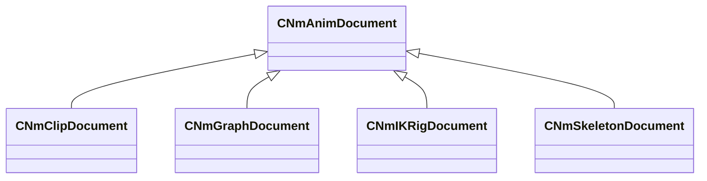

**Fields:**

| Name | Type | Annotations |
|------|------|-------------|
| `m_nVersion` | int32 | `MPropertySuppressField` |

### CNmBlendSpace1D

**Metadata:** `MGetKV3ClassDefaults = {`, `"m_points":`, `[`, `]`, `}`

### CNmBlendSpace1D

**Metadata:** `MGetKV3ClassDefaults = {`, `"m_name": "",`, `"m_flValue": 0.000000,`, `"m_pinID": <HIDDEN FOR DIFF>,`, `}`

### CNmBlendSpace2D

**Metadata:** `MGetKV3ClassDefaults = {`, `"m_pointNames":`, `[`, `],`, `"m_points":`, `[`, `],`, `"m_indices":`, `[`, `],`, `"m_hullIndices":`, `[`, `]`, `}`

### CNmClipDocEvent

**Derived by:** [CNmClipDocEvent_BodyGroup](animdoclib.md#cnmclipdocevent_bodygroup), [CNmClipDocEvent_EntityAttribute](animdoclib.md#cnmclipdocevent_entityattribute), [CNmClipDocEvent_FloatCurve](animdoclib.md#cnmclipdocevent_floatcurve), [CNmClipDocEvent_Foot](animdoclib.md#cnmclipdocevent_foot), [CNmClipDocEvent_FrameSnap](animdoclib.md#cnmclipdocevent_framesnap), [CNmClipDocEvent_ID](animdoclib.md#cnmclipdocevent_id), [CNmClipDocEvent_Legacy](animdoclib.md#cnmclipdocevent_legacy), [CNmClipDocEvent_MaterialAttribute](animdoclib.md#cnmclipdocevent_materialattribute), [CNmClipDocEvent_OrientationWarp](animdoclib.md#cnmclipdocevent_orientationwarp), [CNmClipDocEvent_Particle](animdoclib.md#cnmclipdocevent_particle), [CNmClipDocEvent_RootMotion](animdoclib.md#cnmclipdocevent_rootmotion), [CNmClipDocEvent_Sound](animdoclib.md#cnmclipdocevent_sound), [CNmClipDocEvent_TargetWarp](animdoclib.md#cnmclipdocevent_targetwarp), [CNmClipDocEvent_Transition](animdoclib.md#cnmclipdocevent_transition)

**Metadata:** `MGetKV3ClassDefaults = {`, `"_class": "CNmClipDocEvent",`, `"m_flStartTime": 0.000000,`, `"m_flDuration": 0.000000`, `}`

**Relationships:**

```mermaid
classDiagram
    CNmClipDocEvent <|-- CNmClipDocEvent_BodyGroup
    CNmClipDocEvent <|-- CNmClipDocEvent_EntityAttribute
    CNmClipDocEvent <|-- CNmClipDocEvent_FloatCurve
    CNmClipDocEvent <|-- CNmClipDocEvent_Foot
    CNmClipDocEvent <|-- CNmClipDocEvent_FrameSnap
    CNmClipDocEvent <|-- CNmClipDocEvent_ID
    CNmClipDocEvent <|-- CNmClipDocEvent_Legacy
    CNmClipDocEvent <|-- CNmClipDocEvent_MaterialAttribute
    CNmClipDocEvent <|-- CNmClipDocEvent_OrientationWarp
    CNmClipDocEvent <|-- CNmClipDocEvent_Particle
    CNmClipDocEvent <|-- CNmClipDocEvent_RootMotion
    CNmClipDocEvent <|-- CNmClipDocEvent_Sound
    CNmClipDocEvent <|-- CNmClipDocEvent_TargetWarp
    CNmClipDocEvent <|-- CNmClipDocEvent_Transition
```

### CNmClipDocEventTrack

**Metadata:** `MGetKV3ClassDefaults = {`, `"m_events":`, `[`, `],`, `"m_eventClassName": "",`, `"m_type": "Duration",`, `"m_bIsSyncTrack": false,`, `"m_bIsDisabled": false`, `}`

### CNmClipDocEventTrack

**Values:**

| Name | Value |
|------|-------|
| `Immediate` | 0 |
| `Duration` | 1 |
| `Num` | 2 |

### CNmClipDocEvent_BodyGroup

**Inherits from:** [CNmClipDocEvent](animdoclib.md#cnmclipdocevent)

**Metadata:** `MGetKV3ClassDefaults = {`, `"_class": "CNmClipDocEvent_BodyGroup",`, `"m_flStartTime": 0.000000,`, `"m_flDuration": 0.000000,`, `"bodygroup": "",`, `"value": 0`, `}`

**Relationships:**

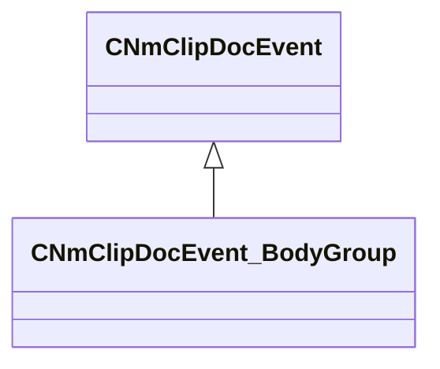

### CNmClipDocEvent_EntityAttribute

**Inherits from:** [CNmClipDocEvent](animdoclib.md#cnmclipdocevent)

**Metadata:** `MGetKV3ClassDefaults = {`, `"_class": "CNmClipDocEvent_EntityAttribute",`, `"m_flStartTime": 0.000000,`, `"m_flDuration": 0.000000,`, `"m_attributeName": "",`, `"m_nValueType": "EVENT_ENTITY_ATTR_TYPE_INT",`, `"m_nIntValue": 0,`, `"m_FloatValue":`, `{`, `"m_spline":`, `[`, `],`, `"m_tangents":`, `[`, `],`, `"m_vDomainMins":`, `[`, `0.000000,`, `0.000000`, `],`, `"m_vDomainMaxs":`, `[`, `0.000000,`, `0.000000`, `]`, `}`, `}`

**Relationships:**

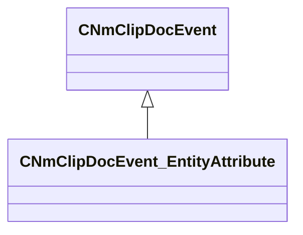

### CNmClipDocEvent_EntityAttribute_Type_t

**Values:**

| Name | Value |
|------|-------|
| `EVENT_ENTITY_ATTR_TYPE_INT` | 0 |
| `EVENT_ENTITY_ATTR_TYPE_FLOAT` | 1 |

### CNmClipDocEvent_FloatCurve

**Inherits from:** [CNmClipDocEvent](animdoclib.md#cnmclipdocevent)

**Metadata:** `MGetKV3ClassDefaults = {`, `"_class": "CNmClipDocEvent_FloatCurve",`, `"m_flStartTime": 0.000000,`, `"m_flDuration": 0.000000,`, `"m_ID": <HIDDEN FOR DIFF>,`, `"m_curve":`, `{`, `"m_spline":`, `[`, `],`, `"m_tangents":`, `[`, `],`, `"m_vDomainMins":`, `[`, `0.000000,`, `0.000000`, `],`, `"m_vDomainMaxs":`, `[`, `0.000000,`, `0.000000`, `]`, `}`, `}`

**Relationships:**

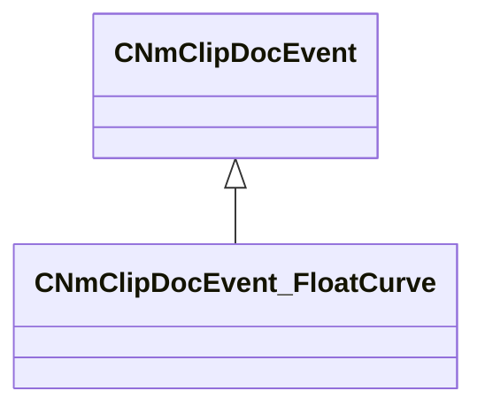

### CNmClipDocEvent_Foot

**Inherits from:** [CNmClipDocEvent](animdoclib.md#cnmclipdocevent)

**Metadata:** `MGetKV3ClassDefaults = {`, `"_class": "CNmClipDocEvent_Foot",`, `"m_flStartTime": 0.000000,`, `"m_flDuration": 0.000000,`, `"m_phase": "LeftFootDown"`, `}`

**Relationships:**

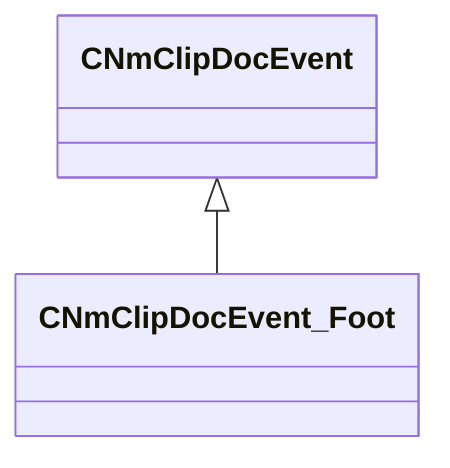

### CNmClipDocEvent_FrameSnap

**Inherits from:** [CNmClipDocEvent](animdoclib.md#cnmclipdocevent)

**Metadata:** `MGetKV3ClassDefaults = {`, `"_class": "CNmClipDocEvent_FrameSnap",`, `"m_flStartTime": 0.000000,`, `"m_flDuration": 0.000000,`, `"m_frameSnapMode": "Round"`, `}`

**Relationships:**

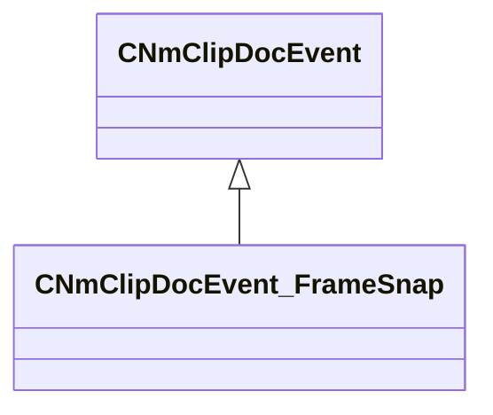

### CNmClipDocEvent_ID

**Inherits from:** [CNmClipDocEvent](animdoclib.md#cnmclipdocevent)

**Metadata:** `MGetKV3ClassDefaults = {`, `"_class": "CNmClipDocEvent_ID",`, `"m_flStartTime": 0.000000,`, `"m_flDuration": 0.000000,`, `"m_ID": <HIDDEN FOR DIFF>,`, `"m_secondaryID": ""`, `}`

**Relationships:**

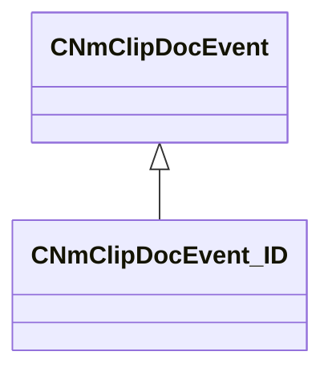

### CNmClipDocEvent_Legacy

**Inherits from:** [CNmClipDocEvent](animdoclib.md#cnmclipdocevent)

**Metadata:** `MGetKV3ClassDefaults = {`, `"_class": "CNmClipDocEvent_Legacy",`, `"m_flStartTime": 0.000000,`, `"m_flDuration": 0.000000,`, `"m_eventClass": "",`, `"m_KV": null`, `}`

**Relationships:**

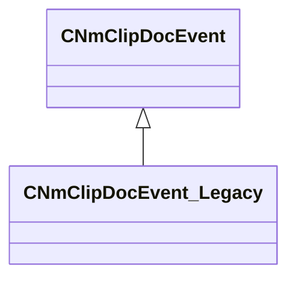

### CNmClipDocEvent_MaterialAttribute

**Inherits from:** [CNmClipDocEvent](animdoclib.md#cnmclipdocevent)

**Metadata:** `MGetKV3ClassDefaults = {`, `"_class": "CNmClipDocEvent_MaterialAttribute",`, `"m_flStartTime": 0.000000,`, `"m_flDuration": 0.000000,`, `"m_attributeName": "",`, `"m_x":`, `{`, `"m_spline":`, `[`, `],`, `"m_tangents":`, `[`, `],`, `"m_vDomainMins":`, `[`, `0.000000,`, `0.000000`, `],`, `"m_vDomainMaxs":`, `[`, `0.000000,`, `0.000000`, `]`, `},`, `"m_y":`, `{`, `"m_spline":`, `[`, `],`, `"m_tangents":`, `[`, `],`, `"m_vDomainMins":`, `[`, `0.000000,`, `0.000000`, `],`, `"m_vDomainMaxs":`, `[`, `0.000000,`, `0.000000`, `]`, `},`, `"m_z":`, `{`, `"m_spline":`, `[`, `],`, `"m_tangents":`, `[`, `],`, `"m_vDomainMins":`, `[`, `0.000000,`, `0.000000`, `],`, `"m_vDomainMaxs":`, `[`, `0.000000,`, `0.000000`, `]`, `},`, `"m_w":`, `{`, `"m_spline":`, `[`, `],`, `"m_tangents":`, `[`, `],`, `"m_vDomainMins":`, `[`, `0.000000,`, `0.000000`, `],`, `"m_vDomainMaxs":`, `[`, `0.000000,`, `0.000000`, `]`, `}`, `}`

**Relationships:**

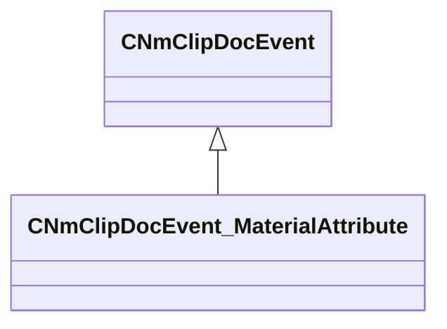

### CNmClipDocEvent_OrientationWarp

**Inherits from:** [CNmClipDocEvent](animdoclib.md#cnmclipdocevent)

**Metadata:** `MGetKV3ClassDefaults = {`, `"_class": "CNmClipDocEvent_OrientationWarp",`, `"m_flStartTime": 0.000000,`, `"m_flDuration": 0.000000`, `}`

**Relationships:**

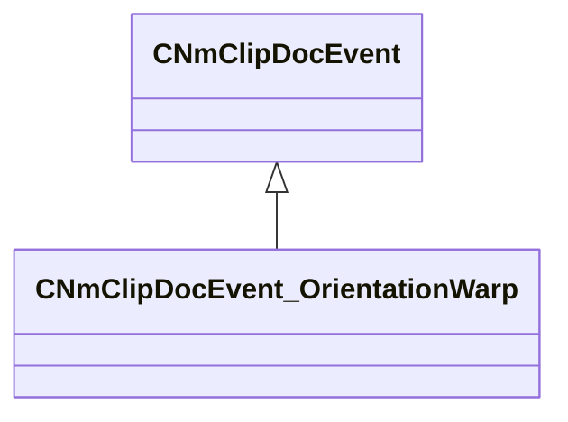

### CNmClipDocEvent_Particle

**Inherits from:** [CNmClipDocEvent](animdoclib.md#cnmclipdocevent)

**Metadata:** `MGetKV3ClassDefaults = {`, `"_class": "CNmClipDocEvent_Particle",`, `"m_flStartTime": 0.000000,`, `"m_flDuration": 0.000000,`, `"m_relevance": "ClientAndServer",`, `"m_type": "Create",`, `"m_particleSystem": "",`, `"m_bDetachFromOwner": false,`, `"m_bStopImmediately": false,`, `"m_bPlayEndCap": false,`, `"m_attachmentPoint0": "",`, `"m_attachmentType0": "PATTACH_INVALID",`, `"m_attachmentPoint1": "",`, `"m_attachmentType1": "PATTACH_INVALID",`, `"m_config": "",`, `"m_effectForConfig": "",`, `"m_tags": ""`, `}`

**Relationships:**

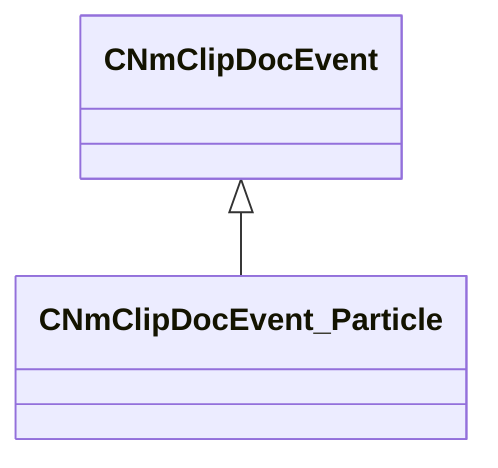

### CNmClipDocEvent_RootMotion

**Inherits from:** [CNmClipDocEvent](animdoclib.md#cnmclipdocevent)

**Metadata:** `MGetKV3ClassDefaults = {`, `"_class": "CNmClipDocEvent_RootMotion",`, `"m_flStartTime": 0.000000,`, `"m_flDuration": 0.000000,`, `"m_flBlendTimeSeconds": 0.000000`, `}`

**Relationships:**

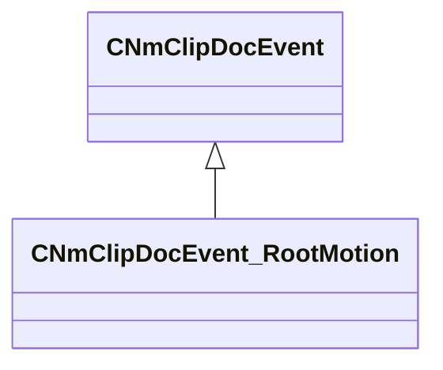

### CNmClipDocEvent_Sound

**Inherits from:** [CNmClipDocEvent](animdoclib.md#cnmclipdocevent)

**Metadata:** `MGetKV3ClassDefaults = {`, `"_class": "CNmClipDocEvent_Sound",`, `"m_flStartTime": 0.000000,`, `"m_flDuration": 0.000000,`, `"m_relevance": "ClientAndServer",`, `"m_bContinuePlayingSoundAtDurationEnd": false,`, `"m_flDurationInterruptionThreshold": 0.900000,`, `"m_name": "",`, `"m_position": "None",`, `"m_attachmentName": "",`, `"m_tags": ""`, `}`

**Relationships:**

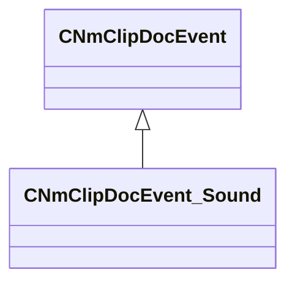

### CNmClipDocEvent_TargetWarp

**Inherits from:** [CNmClipDocEvent](animdoclib.md#cnmclipdocevent)

**Metadata:** `MGetKV3ClassDefaults = {`, `"_class": "CNmClipDocEvent_TargetWarp",`, `"m_flStartTime": 0.000000,`, `"m_flDuration": 0.000000,`, `"m_rule": "WarpXYZ",`, `"m_algorithm": "Bezier"`, `}`

**Relationships:**

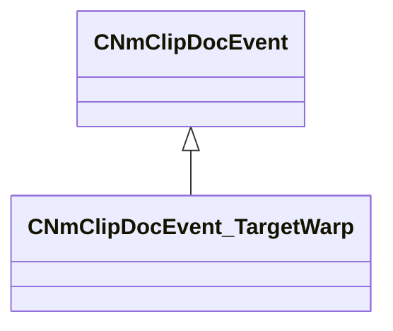

### CNmClipDocEvent_Transition

**Inherits from:** [CNmClipDocEvent](animdoclib.md#cnmclipdocevent)

**Metadata:** `MGetKV3ClassDefaults = {`, `"_class": "CNmClipDocEvent_Transition",`, `"m_flStartTime": 0.000000,`, `"m_flDuration": 0.000000,`, `"m_rule": "AllowTransition",`, `"m_optionalID": ""`, `}`

**Relationships:**

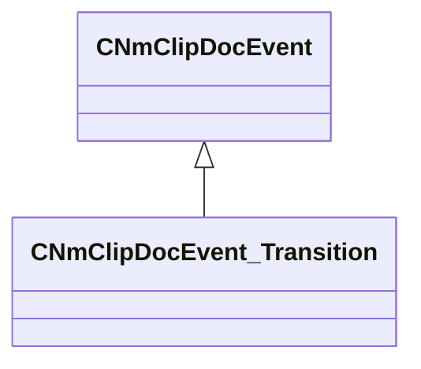

### CNmClipDocument

**Inherits from:** [CNmAnimDocument](animdoclib.md#cnmanimdocument)

**Metadata:** `MGetKV3ClassDefaults = {`, `"_class": "CNmClipDocument",`, `"m_nVersion": 0,`, `"m_sourceFilename": "",`, `"m_animationSkeletonName": "",`, `"m_secondaryAnimationSkeletonNames":`, `[`, `],`, `"m_eventTracks":`, `[`, `],`, `"m_nStartFrame": -1,`, `"m_nEndFrame": -1,`, `"m_flDurationOverrideSeconds": -1.000000,`, `"m_additiveType": "None",`, `"m_additiveBaseFilename": "",`, `"m_additiveBaseFrame": "FirstFrame",`, `"m_nAdditiveBaseFrameIdx": -1,`, `"m_bonesToSampleInModelSpace":`, `[`, `]`, `}`

**Relationships:**

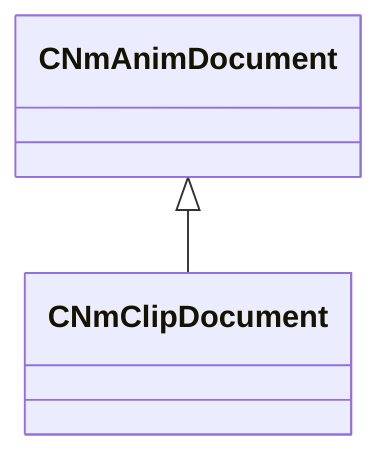

### CNmClipDocument

**Values:**

| Name | Value |
|------|-------|
| `FirstFrame` | 0 |
| `LastFrame` | 1 |
| `UserSpecifiedFrame` | 2 |

### CNmClipDocument

**Values:**

| Name | Value |
|------|-------|
| `None` | 0 |
| `RelativeToSkeleton` | 1 |
| `RelativeToFrame` | 2 |
| `RelativeToAnimation` | 3 |
| `RelativeToAnimationFrame` | 4 |

### CNmGraphDocAndNode

**Inherits from:** [CNmGraphDocFlowNode](animdoclib.md#cnmgraphdocflownode)

**Metadata:** `MGetKV3ClassDefaults = {`, `"_class": "CNmGraphDocAndNode",`, `"m_ID": <HIDDEN FOR DIFF>,`, `"m_name": "",`, `"m_floatingComment": "",`, `"m_position":`, `[`, `0.000000,`, `0.000000`, `],`, `"m_pChildGraph": null,`, `"m_pSecondaryGraph": null,`, `"m_inputPins":`, `[`, `{`, `"m_ID": <HIDDEN FOR DIFF>,`, `"m_name": "And",`, `"m_type": "Bool",`, `"m_bIsDynamicPin": false,`, `"m_bAllowMultipleOutConnections": false`, `},`, `{`, `"m_ID": <HIDDEN FOR DIFF>,`, `"m_name": "And",`, `"m_type": "Bool",`, `"m_bIsDynamicPin": false,`, `"m_bAllowMultipleOutConnections": false`, `}`, `],`, `"m_outputPins":`, `[`, `{`, `"m_ID": <HIDDEN FOR DIFF>,`, `"m_name": "Result",`, `"m_type": "Bool",`, `"m_bIsDynamicPin": false,`, `"m_bAllowMultipleOutConnections": true`, `}`, `]`, `}`

**Relationships:**

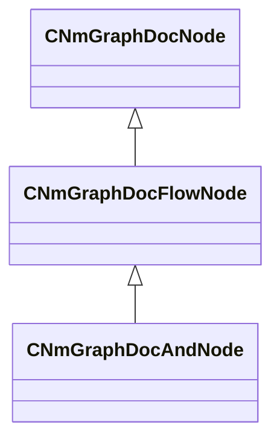

### CNmGraphDocAnimationPoseNode

**Inherits from:** [CNmGraphDocVariationDataNode](animdoclib.md#cnmgraphdocvariationdatanode)

**Metadata:** `MGetKV3ClassDefaults = {`, `"_class": "CNmGraphDocAnimationPoseNode",`, `"m_ID": <HIDDEN FOR DIFF>,`, `"m_name": "",`, `"m_floatingComment": "",`, `"m_position":`, `[`, `0.000000,`, `0.000000`, `],`, `"m_pChildGraph": null,`, `"m_pSecondaryGraph": null,`, `"m_inputPins":`, `[`, `{`, `"m_ID": <HIDDEN FOR DIFF>,`, `"m_name": "Time",`, `"m_type": "Float",`, `"m_bIsDynamicPin": false,`, `"m_bAllowMultipleOutConnections": false`, `}`, `],`, `"m_outputPins":`, `[`, `{`, `"m_ID": <HIDDEN FOR DIFF>,`, `"m_name": "Pose",`, `"m_type": "Pose",`, `"m_bIsDynamicPin": false,`, `"m_bAllowMultipleOutConnections": false`, `}`, `],`, `"m_pDefaultVariationData":`, `{`, `"_class": "CNmGraphDocAnimationPoseNode::CData",`, `"m_clip": "",`, `"m_variationTimeValue": -1.000000`, `},`, `"m_overrides":`, `[`, `],`, `"m_defaultResourceName": "",`, `"m_inputTimeRemapRange":`, `{`, `"m_flMin": 340282346638528859811704183484516925440.000000,`, `"m_flMax": -340282346638528859811704183484516925440.000000`, `},`, `"m_fixedTimeValue": 0.000000,`, `"m_useFramesAsInput": false`, `}`

**Relationships:**

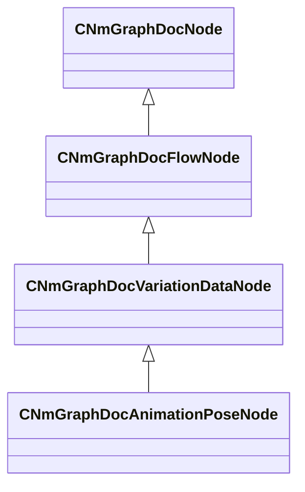

### CNmGraphDocAnimationPoseNode

**Metadata:** `MGetKV3ClassDefaults = {`, `"_class": "CNmGraphDocAnimationPoseNode::CData",`, `"m_clip": "",`, `"m_variationTimeValue": -1.000000`, `}`

### CNmGraphDocBlend1DNode

**Inherits from:** [CNmGraphDocFlowNode](animdoclib.md#cnmgraphdocflownode)

**Metadata:** `MGetKV3ClassDefaults = {`, `"_class": "CNmGraphDocBlend1DNode",`, `"m_ID": <HIDDEN FOR DIFF>,`, `"m_name": "",`, `"m_floatingComment": "",`, `"m_position":`, `[`, `0.000000,`, `0.000000`, `],`, `"m_pChildGraph": null,`, `"m_pSecondaryGraph": null,`, `"m_inputPins":`, `[`, `{`, `"m_ID": <HIDDEN FOR DIFF>,`, `"m_name": "Parameter",`, `"m_type": "Float",`, `"m_bIsDynamicPin": false,`, `"m_bAllowMultipleOutConnections": false`, `},`, `{`, `"m_ID": <HIDDEN FOR DIFF>,`, `"m_name": "Option (0.00)",`, `"m_type": "Pose",`, `"m_bIsDynamicPin": true,`, `"m_bAllowMultipleOutConnections": false`, `},`, `{`, `"m_ID": <HIDDEN FOR DIFF>,`, `"m_name": "Option (0.00)",`, `"m_type": "Pose",`, `"m_bIsDynamicPin": true,`, `"m_bAllowMultipleOutConnections": false`, `}`, `],`, `"m_outputPins":`, `[`, `{`, `"m_ID": <HIDDEN FOR DIFF>,`, `"m_name": "Pose",`, `"m_type": "Pose",`, `"m_bIsDynamicPin": false,`, `"m_bAllowMultipleOutConnections": false`, `}`, `],`, `"m_blendSpace":`, `{`, `"m_points":`, `[`, `{`, `"m_name": "Option",`, `"m_flValue": 0.000000,`, `"m_pinID": <HIDDEN FOR DIFF>,`, `},`, `{`, `"m_name": "Option",`, `"m_flValue": 0.000000,`, `"m_pinID": <HIDDEN FOR DIFF>,`, `}`, `]`, `},`, `"m_bAllowLooping": true`, `}`

**Relationships:**

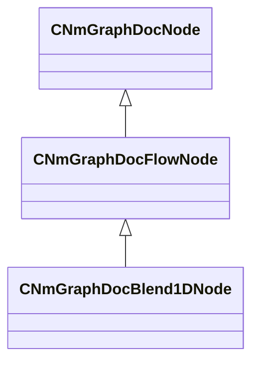

### CNmGraphDocBlend2DNode

**Inherits from:** [CNmGraphDocFlowNode](animdoclib.md#cnmgraphdocflownode)

**Metadata:** `MGetKV3ClassDefaults = {`, `"_class": "CNmGraphDocBlend2DNode",`, `"m_ID": <HIDDEN FOR DIFF>,`, `"m_name": "",`, `"m_floatingComment": "",`, `"m_position":`, `[`, `0.000000,`, `0.000000`, `],`, `"m_pChildGraph": null,`, `"m_pSecondaryGraph": null,`, `"m_inputPins":`, `[`, `{`, `"m_ID": <HIDDEN FOR DIFF>,`, `"m_name": "X",`, `"m_type": "Float",`, `"m_bIsDynamicPin": false,`, `"m_bAllowMultipleOutConnections": false`, `},`, `{`, `"m_ID": <HIDDEN FOR DIFF>,`, `"m_name": "Y",`, `"m_type": "Float",`, `"m_bIsDynamicPin": false,`, `"m_bAllowMultipleOutConnections": false`, `},`, `{`, `"m_ID": <HIDDEN FOR DIFF>,`, `"m_name": "Option (0.00, 0.00)",`, `"m_type": "Pose",`, `"m_bIsDynamicPin": true,`, `"m_bAllowMultipleOutConnections": false`, `},`, `{`, `"m_ID": <HIDDEN FOR DIFF>,`, `"m_name": "Option (0.00, 0.00)",`, `"m_type": "Pose",`, `"m_bIsDynamicPin": true,`, `"m_bAllowMultipleOutConnections": false`, `},`, `{`, `"m_ID": <HIDDEN FOR DIFF>,`, `"m_name": "Option (0.00, 0.00)",`, `"m_type": "Pose",`, `"m_bIsDynamicPin": true,`, `"m_bAllowMultipleOutConnections": false`, `}`, `],`, `"m_outputPins":`, `[`, `{`, `"m_ID": <HIDDEN FOR DIFF>,`, `"m_name": "Pose",`, `"m_type": "Pose",`, `"m_bIsDynamicPin": false,`, `"m_bAllowMultipleOutConnections": false`, `}`, `],`, `"m_blendSpace":`, `{`, `"m_pointNames":`, `[`, `"Option",`, `"Option",`, `"Option"`, `],`, `"m_points":`, `[`, `[`, `0.000000,`, `1.000000`, `],`, `[`, `-1.000000,`, `0.000000`, `],`, `[`, `1.000000,`, `0.000000`, `]`, `],`, `"m_indices":`, `[`, `0,`, `2,`, `1`, `],`, `"m_hullIndices":`, `[`, `0,`, `2,`, `1,`, `0`, `]`, `},`, `"m_bAllowLooping": true`, `}`

**Relationships:**

```mermaid
classDiagram
    CNmGraphDocFlowNode <|-- CNmGraphDocBlend2DNode
    CNmGraphDocNode <|-- CNmGraphDocFlowNode
```

### CNmGraphDocBoneMaskBlendNode

**Inherits from:** [CNmGraphDocFlowNode](animdoclib.md#cnmgraphdocflownode)

**Metadata:** `MGetKV3ClassDefaults = {`, `"_class": "CNmGraphDocBoneMaskBlendNode",`, `"m_ID": <HIDDEN FOR DIFF>,`, `"m_name": "",`, `"m_floatingComment": "",`, `"m_position":`, `[`, `0.000000,`, `0.000000`, `],`, `"m_pChildGraph": null,`, `"m_pSecondaryGraph": null,`, `"m_inputPins":`, `[`, `{`, `"m_ID": <HIDDEN FOR DIFF>,`, `"m_name": "Blend Weight",`, `"m_type": "Float",`, `"m_bIsDynamicPin": false,`, `"m_bAllowMultipleOutConnections": false`, `},`, `{`, `"m_ID": <HIDDEN FOR DIFF>,`, `"m_name": "Source",`, `"m_type": "BoneMask",`, `"m_bIsDynamicPin": false,`, `"m_bAllowMultipleOutConnections": false`, `},`, `{`, `"m_ID": <HIDDEN FOR DIFF>,`, `"m_name": "Target",`, `"m_type": "BoneMask",`, `"m_bIsDynamicPin": false,`, `"m_bAllowMultipleOutConnections": false`, `}`, `],`, `"m_outputPins":`, `[`, `{`, `"m_ID": <HIDDEN FOR DIFF>,`, `"m_name": "Result",`, `"m_type": "BoneMask",`, `"m_bIsDynamicPin": false,`, `"m_bAllowMultipleOutConnections": true`, `}`, `]`, `}`

**Relationships:**

```mermaid
classDiagram
    CNmGraphDocFlowNode <|-- CNmGraphDocBoneMaskBlendNode
    CNmGraphDocNode <|-- CNmGraphDocFlowNode
```

### CNmGraphDocBoneMaskNode

**Inherits from:** [CNmGraphDocFlowNode](animdoclib.md#cnmgraphdocflownode)

**Metadata:** `MGetKV3ClassDefaults = {`, `"_class": "CNmGraphDocBoneMaskNode",`, `"m_ID": <HIDDEN FOR DIFF>,`, `"m_name": "",`, `"m_floatingComment": "",`, `"m_position":`, `[`, `0.000000,`, `0.000000`, `],`, `"m_pChildGraph": null,`, `"m_pSecondaryGraph": null,`, `"m_inputPins":`, `[`, `],`, `"m_outputPins":`, `[`, `{`, `"m_ID": <HIDDEN FOR DIFF>,`, `"m_name": "Bone Mask",`, `"m_type": "BoneMask",`, `"m_bIsDynamicPin": false,`, `"m_bAllowMultipleOutConnections": true`, `}`, `],`, `"m_maskID": ""`, `}`

**Relationships:**

```mermaid
classDiagram
    CNmGraphDocFlowNode <|-- CNmGraphDocBoneMaskNode
    CNmGraphDocNode <|-- CNmGraphDocFlowNode
```

### CNmGraphDocBoneMaskParameterReferenceNode

**Inherits from:** [CNmGraphDocParameterReferenceNode](animdoclib.md#cnmgraphdocparameterreferencenode)

**Metadata:** `MGetKV3ClassDefaults = {`, `"_class": "CNmGraphDocBoneMaskParameterReferenceNode",`, `"m_ID": <HIDDEN FOR DIFF>,`, `"m_name": "",`, `"m_floatingComment": "",`, `"m_position":`, `[`, `0.000000,`, `0.000000`, `],`, `"m_pChildGraph": null,`, `"m_pSecondaryGraph": null,`, `"m_inputPins":`, `[`, `],`, `"m_outputPins":`, `[`, `{`, `"m_ID": <HIDDEN FOR DIFF>,`, `"m_name": "Value",`, `"m_type": "BoneMask",`, `"m_bIsDynamicPin": false,`, `"m_bAllowMultipleOutConnections": true`, `}`, `],`, `"m_parameterUUID": "00000000-0000-0000-0000-000000000000",`, `"m_parameterValueType": "Unknown",`, `"m_parameterName": "",`, `"m_parameterGroupName": ""`, `}`

**Relationships:**

```mermaid
classDiagram
    CNmGraphDocParameterReferenceNode <|-- CNmGraphDocBoneMaskParameterReferenceNode
    CNmGraphDocFlowNode <|-- CNmGraphDocParameterReferenceNode
    CNmGraphDocNode <|-- CNmGraphDocFlowNode
```

### CNmGraphDocBoneMaskResultNode

**Inherits from:** [CNmGraphDocResultNode](animdoclib.md#cnmgraphdocresultnode)

**Metadata:** `MGetKV3ClassDefaults = {`, `"_class": "CNmGraphDocBoneMaskResultNode",`, `"m_ID": <HIDDEN FOR DIFF>,`, `"m_name": "",`, `"m_floatingComment": "",`, `"m_position":`, `[`, `0.000000,`, `0.000000`, `],`, `"m_pChildGraph": null,`, `"m_pSecondaryGraph": null,`, `"m_inputPins":`, `[`, `{`, `"m_ID": <HIDDEN FOR DIFF>,`, `"m_name": "Out",`, `"m_type": "BoneMask",`, `"m_bIsDynamicPin": false,`, `"m_bAllowMultipleOutConnections": false`, `}`, `],`, `"m_outputPins":`, `[`, `],`, `"m_resultType": "BoneMask"`, `}`

**Relationships:**

```mermaid
classDiagram
    CNmGraphDocResultNode <|-- CNmGraphDocBoneMaskResultNode
    CNmGraphDocFlowNode <|-- CNmGraphDocResultNode
    CNmGraphDocNode <|-- CNmGraphDocFlowNode
```

### CNmGraphDocBoneMaskSelectorNode

**Inherits from:** [CNmGraphDocFlowNode](animdoclib.md#cnmgraphdocflownode)

**Metadata:** `MGetKV3ClassDefaults = {`, `"_class": "CNmGraphDocBoneMaskSelectorNode",`, `"m_ID": <HIDDEN FOR DIFF>,`, `"m_name": "",`, `"m_floatingComment": "",`, `"m_position":`, `[`, `0.000000,`, `0.000000`, `],`, `"m_pChildGraph": null,`, `"m_pSecondaryGraph": null,`, `"m_inputPins":`, `[`, `{`, `"m_ID": <HIDDEN FOR DIFF>,`, `"m_name": "ID",`, `"m_type": "ID",`, `"m_bIsDynamicPin": false,`, `"m_bAllowMultipleOutConnections": false`, `},`, `{`, `"m_ID": <HIDDEN FOR DIFF>,`, `"m_name": "Default Mask",`, `"m_type": "BoneMask",`, `"m_bIsDynamicPin": false,`, `"m_bAllowMultipleOutConnections": false`, `},`, `{`, `"m_ID": <HIDDEN FOR DIFF>,`, `"m_name": "Mask 0",`, `"m_type": "BoneMask",`, `"m_bIsDynamicPin": false,`, `"m_bAllowMultipleOutConnections": false`, `}`, `],`, `"m_outputPins":`, `[`, `{`, `"m_ID": <HIDDEN FOR DIFF>,`, `"m_name": "Result",`, `"m_type": "BoneMask",`, `"m_bIsDynamicPin": false,`, `"m_bAllowMultipleOutConnections": true`, `}`, `],`, `"m_switchDynamically": false,`, `"m_options":`, `[`, `"Mask 0"`, `],`, `"m_flBlendTimeSeconds": 0.100000`, `}`

**Relationships:**

```mermaid
classDiagram
    CNmGraphDocFlowNode <|-- CNmGraphDocBoneMaskSelectorNode
    CNmGraphDocNode <|-- CNmGraphDocFlowNode
```

### CNmGraphDocBoneMaskSwitchNode

**Inherits from:** [CNmGraphDocFlowNode](animdoclib.md#cnmgraphdocflownode)

**Metadata:** `MGetKV3ClassDefaults = {`, `"_class": "CNmGraphDocBoneMaskSwitchNode",`, `"m_ID": <HIDDEN FOR DIFF>,`, `"m_name": "",`, `"m_floatingComment": "",`, `"m_position":`, `[`, `0.000000,`, `0.000000`, `],`, `"m_pChildGraph": null,`, `"m_pSecondaryGraph": null,`, `"m_inputPins":`, `[`, `{`, `"m_ID": <HIDDEN FOR DIFF>,`, `"m_name": "Bool",`, `"m_type": "Bool",`, `"m_bIsDynamicPin": false,`, `"m_bAllowMultipleOutConnections": false`, `},`, `{`, `"m_ID": <HIDDEN FOR DIFF>,`, `"m_name": "If True",`, `"m_type": "BoneMask",`, `"m_bIsDynamicPin": false,`, `"m_bAllowMultipleOutConnections": false`, `},`, `{`, `"m_ID": <HIDDEN FOR DIFF>,`, `"m_name": "If False",`, `"m_type": "BoneMask",`, `"m_bIsDynamicPin": false,`, `"m_bAllowMultipleOutConnections": false`, `}`, `],`, `"m_outputPins":`, `[`, `{`, `"m_ID": <HIDDEN FOR DIFF>,`, `"m_name": "Result",`, `"m_type": "BoneMask",`, `"m_bIsDynamicPin": false,`, `"m_bAllowMultipleOutConnections": true`, `}`, `],`, `"m_bSwitchDynamically": false,`, `"m_flBlendTimeSeconds": 0.100000`, `}`

**Relationships:**

```mermaid
classDiagram
    CNmGraphDocFlowNode <|-- CNmGraphDocBoneMaskSwitchNode
    CNmGraphDocNode <|-- CNmGraphDocFlowNode
```

### CNmGraphDocBoneMaskVirtualParameterNode

**Inherits from:** [CNmGraphDocVirtualParameterNode](animdoclib.md#cnmgraphdocvirtualparameternode)

**Metadata:** `MGetKV3ClassDefaults = {`, `"_class": "CNmGraphDocBoneMaskVirtualParameterNode",`, `"m_ID": <HIDDEN FOR DIFF>,`, `"m_name": "",`, `"m_floatingComment": "",`, `"m_position":`, `[`, `0.000000,`, `0.000000`, `],`, `"m_pChildGraph":`, `{`, `"_class": "CNmGraphDocFlowGraph",`, `"m_ID": <HIDDEN FOR DIFF>,`, `"m_nodes":`, `[`, `{`, `"_class": "CNmGraphDocBoneMaskResultNode",`, `"m_ID": <HIDDEN FOR DIFF>,`, `"m_name": "",`, `"m_floatingComment": "",`, `"m_position":`, `[`, `0.000000,`, `0.000000`, `],`, `"m_pChildGraph": null,`, `"m_pSecondaryGraph": null,`, `"m_inputPins":`, `[`, `{`, `"m_ID": <HIDDEN FOR DIFF>,`, `"m_name": "Out",`, `"m_type": "BoneMask",`, `"m_bIsDynamicPin": false,`, `"m_bAllowMultipleOutConnections": false`, `}`, `],`, `"m_outputPins":`, `[`, `],`, `"m_resultType": "BoneMask"`, `}`, `],`, `"m_graphType": "VirtualParameterValueTree",`, `"m_viewOffset":`, `[`, `0.000000,`, `0.000000`, `],`, `"m_flViewZoom": 1.000000,`, `"m_connections":`, `[`, `]`, `},`, `"m_pSecondaryGraph": null,`, `"m_inputPins":`, `[`, `],`, `"m_outputPins":`, `[`, `{`, `"m_ID": <HIDDEN FOR DIFF>,`, `"m_name": "Value",`, `"m_type": "BoneMask",`, `"m_bIsDynamicPin": false,`, `"m_bAllowMultipleOutConnections": true`, `}`, `],`, `"m_groupName": ""`, `}`

**Relationships:**

```mermaid
classDiagram
    CNmGraphDocVirtualParameterNode <|-- CNmGraphDocBoneMaskVirtualParameterNode
    CNmGraphDocParameterBaseNode <|-- CNmGraphDocVirtualParameterNode
    CNmGraphDocFlowNode <|-- CNmGraphDocParameterBaseNode
    CNmGraphDocNode <|-- CNmGraphDocFlowNode
```

### CNmGraphDocBoolControlParameterNode

**Inherits from:** [CNmGraphDocControlParameterNode](animdoclib.md#cnmgraphdoccontrolparameternode)

**Metadata:** `MGetKV3ClassDefaults = {`, `"_class": "CNmGraphDocBoolControlParameterNode",`, `"m_ID": <HIDDEN FOR DIFF>,`, `"m_name": "",`, `"m_floatingComment": "",`, `"m_position":`, `[`, `0.000000,`, `0.000000`, `],`, `"m_pChildGraph": null,`, `"m_pSecondaryGraph": null,`, `"m_inputPins":`, `[`, `],`, `"m_outputPins":`, `[`, `{`, `"m_ID": <HIDDEN FOR DIFF>,`, `"m_name": "Value",`, `"m_type": "Bool",`, `"m_bIsDynamicPin": false,`, `"m_bAllowMultipleOutConnections": true`, `}`, `],`, `"m_groupName": "",`, `"m_previewStartValue": false`, `}`

**Relationships:**

```mermaid
classDiagram
    CNmGraphDocControlParameterNode <|-- CNmGraphDocBoolControlParameterNode
    CNmGraphDocParameterBaseNode <|-- CNmGraphDocControlParameterNode
    CNmGraphDocFlowNode <|-- CNmGraphDocParameterBaseNode
    CNmGraphDocNode <|-- CNmGraphDocFlowNode
```

### CNmGraphDocBoolParameterReferenceNode

**Inherits from:** [CNmGraphDocParameterReferenceNode](animdoclib.md#cnmgraphdocparameterreferencenode)

**Metadata:** `MGetKV3ClassDefaults = {`, `"_class": "CNmGraphDocBoolParameterReferenceNode",`, `"m_ID": <HIDDEN FOR DIFF>,`, `"m_name": "",`, `"m_floatingComment": "",`, `"m_position":`, `[`, `0.000000,`, `0.000000`, `],`, `"m_pChildGraph": null,`, `"m_pSecondaryGraph": null,`, `"m_inputPins":`, `[`, `],`, `"m_outputPins":`, `[`, `{`, `"m_ID": <HIDDEN FOR DIFF>,`, `"m_name": "Value",`, `"m_type": "Bool",`, `"m_bIsDynamicPin": false,`, `"m_bAllowMultipleOutConnections": true`, `}`, `],`, `"m_parameterUUID": "00000000-0000-0000-0000-000000000000",`, `"m_parameterValueType": "Unknown",`, `"m_parameterName": "",`, `"m_parameterGroupName": ""`, `}`

**Relationships:**

```mermaid
classDiagram
    CNmGraphDocParameterReferenceNode <|-- CNmGraphDocBoolParameterReferenceNode
    CNmGraphDocFlowNode <|-- CNmGraphDocParameterReferenceNode
    CNmGraphDocNode <|-- CNmGraphDocFlowNode
```

### CNmGraphDocBoolResultNode

**Inherits from:** [CNmGraphDocResultNode](animdoclib.md#cnmgraphdocresultnode)

**Metadata:** `MGetKV3ClassDefaults = {`, `"_class": "CNmGraphDocBoolResultNode",`, `"m_ID": <HIDDEN FOR DIFF>,`, `"m_name": "",`, `"m_floatingComment": "",`, `"m_position":`, `[`, `0.000000,`, `0.000000`, `],`, `"m_pChildGraph": null,`, `"m_pSecondaryGraph": null,`, `"m_inputPins":`, `[`, `{`, `"m_ID": <HIDDEN FOR DIFF>,`, `"m_name": "Out",`, `"m_type": "Bool",`, `"m_bIsDynamicPin": false,`, `"m_bAllowMultipleOutConnections": false`, `}`, `],`, `"m_outputPins":`, `[`, `],`, `"m_resultType": "Bool"`, `}`

**Relationships:**

```mermaid
classDiagram
    CNmGraphDocResultNode <|-- CNmGraphDocBoolResultNode
    CNmGraphDocFlowNode <|-- CNmGraphDocResultNode
    CNmGraphDocNode <|-- CNmGraphDocFlowNode
```

### CNmGraphDocBoolVirtualParameterNode

**Inherits from:** [CNmGraphDocVirtualParameterNode](animdoclib.md#cnmgraphdocvirtualparameternode)

**Metadata:** `MGetKV3ClassDefaults = {`, `"_class": "CNmGraphDocBoolVirtualParameterNode",`, `"m_ID": <HIDDEN FOR DIFF>,`, `"m_name": "",`, `"m_floatingComment": "",`, `"m_position":`, `[`, `0.000000,`, `0.000000`, `],`, `"m_pChildGraph":`, `{`, `"_class": "CNmGraphDocFlowGraph",`, `"m_ID": <HIDDEN FOR DIFF>,`, `"m_nodes":`, `[`, `{`, `"_class": "CNmGraphDocBoolResultNode",`, `"m_ID": <HIDDEN FOR DIFF>,`, `"m_name": "",`, `"m_floatingComment": "",`, `"m_position":`, `[`, `0.000000,`, `0.000000`, `],`, `"m_pChildGraph": null,`, `"m_pSecondaryGraph": null,`, `"m_inputPins":`, `[`, `{`, `"m_ID": <HIDDEN FOR DIFF>,`, `"m_name": "Out",`, `"m_type": "Bool",`, `"m_bIsDynamicPin": false,`, `"m_bAllowMultipleOutConnections": false`, `}`, `],`, `"m_outputPins":`, `[`, `],`, `"m_resultType": "Bool"`, `}`, `],`, `"m_graphType": "VirtualParameterValueTree",`, `"m_viewOffset":`, `[`, `0.000000,`, `0.000000`, `],`, `"m_flViewZoom": 1.000000,`, `"m_connections":`, `[`, `]`, `},`, `"m_pSecondaryGraph": null,`, `"m_inputPins":`, `[`, `],`, `"m_outputPins":`, `[`, `{`, `"m_ID": <HIDDEN FOR DIFF>,`, `"m_name": "Value",`, `"m_type": "Bool",`, `"m_bIsDynamicPin": false,`, `"m_bAllowMultipleOutConnections": true`, `}`, `],`, `"m_groupName": ""`, `}`

**Relationships:**

```mermaid
classDiagram
    CNmGraphDocVirtualParameterNode <|-- CNmGraphDocBoolVirtualParameterNode
    CNmGraphDocParameterBaseNode <|-- CNmGraphDocVirtualParameterNode
    CNmGraphDocFlowNode <|-- CNmGraphDocParameterBaseNode
    CNmGraphDocNode <|-- CNmGraphDocFlowNode
```

### CNmGraphDocCachedBoolNode

**Inherits from:** [CNmGraphDocFlowNode](animdoclib.md#cnmgraphdocflownode)

**Metadata:** `MGetKV3ClassDefaults = {`, `"_class": "CNmGraphDocCachedBoolNode",`, `"m_ID": <HIDDEN FOR DIFF>,`, `"m_name": "",`, `"m_floatingComment": "",`, `"m_position":`, `[`, `0.000000,`, `0.000000`, `],`, `"m_pChildGraph": null,`, `"m_pSecondaryGraph": null,`, `"m_inputPins":`, `[`, `{`, `"m_ID": <HIDDEN FOR DIFF>,`, `"m_name": "Value",`, `"m_type": "Bool",`, `"m_bIsDynamicPin": false,`, `"m_bAllowMultipleOutConnections": false`, `}`, `],`, `"m_outputPins":`, `[`, `{`, `"m_ID": <HIDDEN FOR DIFF>,`, `"m_name": "Result",`, `"m_type": "Bool",`, `"m_bIsDynamicPin": false,`, `"m_bAllowMultipleOutConnections": true`, `}`, `],`, `"m_mode": "OnEntry"`, `}`

**Relationships:**

```mermaid
classDiagram
    CNmGraphDocFlowNode <|-- CNmGraphDocCachedBoolNode
    CNmGraphDocNode <|-- CNmGraphDocFlowNode
```

### CNmGraphDocCachedFloatNode

**Inherits from:** [CNmGraphDocFlowNode](animdoclib.md#cnmgraphdocflownode)

**Metadata:** `MGetKV3ClassDefaults = {`, `"_class": "CNmGraphDocCachedFloatNode",`, `"m_ID": <HIDDEN FOR DIFF>,`, `"m_name": "",`, `"m_floatingComment": "",`, `"m_position":`, `[`, `0.000000,`, `0.000000`, `],`, `"m_pChildGraph": null,`, `"m_pSecondaryGraph": null,`, `"m_inputPins":`, `[`, `{`, `"m_ID": <HIDDEN FOR DIFF>,`, `"m_name": "Value",`, `"m_type": "Float",`, `"m_bIsDynamicPin": false,`, `"m_bAllowMultipleOutConnections": false`, `}`, `],`, `"m_outputPins":`, `[`, `{`, `"m_ID": <HIDDEN FOR DIFF>,`, `"m_name": "Result",`, `"m_type": "Float",`, `"m_bIsDynamicPin": false,`, `"m_bAllowMultipleOutConnections": true`, `}`, `],`, `"m_mode": "OnEntry"`, `}`

**Relationships:**

```mermaid
classDiagram
    CNmGraphDocFlowNode <|-- CNmGraphDocCachedFloatNode
    CNmGraphDocNode <|-- CNmGraphDocFlowNode
```

### CNmGraphDocCachedIDNode

**Inherits from:** [CNmGraphDocFlowNode](animdoclib.md#cnmgraphdocflownode)

**Metadata:** `MGetKV3ClassDefaults = {`, `"_class": "CNmGraphDocCachedIDNode",`, `"m_ID": <HIDDEN FOR DIFF>,`, `"m_name": "",`, `"m_floatingComment": "",`, `"m_position":`, `[`, `0.000000,`, `0.000000`, `],`, `"m_pChildGraph": null,`, `"m_pSecondaryGraph": null,`, `"m_inputPins":`, `[`, `{`, `"m_ID": <HIDDEN FOR DIFF>,`, `"m_name": "Value",`, `"m_type": "ID",`, `"m_bIsDynamicPin": false,`, `"m_bAllowMultipleOutConnections": false`, `}`, `],`, `"m_outputPins":`, `[`, `{`, `"m_ID": <HIDDEN FOR DIFF>,`, `"m_name": "Result",`, `"m_type": "ID",`, `"m_bIsDynamicPin": false,`, `"m_bAllowMultipleOutConnections": true`, `}`, `],`, `"m_mode": "OnEntry"`, `}`

**Relationships:**

```mermaid
classDiagram
    CNmGraphDocFlowNode <|-- CNmGraphDocCachedIDNode
    CNmGraphDocNode <|-- CNmGraphDocFlowNode
```

### CNmGraphDocCachedTargetNode

**Inherits from:** [CNmGraphDocFlowNode](animdoclib.md#cnmgraphdocflownode)

**Metadata:** `MGetKV3ClassDefaults = {`, `"_class": "CNmGraphDocCachedTargetNode",`, `"m_ID": <HIDDEN FOR DIFF>,`, `"m_name": "",`, `"m_floatingComment": "",`, `"m_position":`, `[`, `0.000000,`, `0.000000`, `],`, `"m_pChildGraph": null,`, `"m_pSecondaryGraph": null,`, `"m_inputPins":`, `[`, `{`, `"m_ID": <HIDDEN FOR DIFF>,`, `"m_name": "Value",`, `"m_type": "Target",`, `"m_bIsDynamicPin": false,`, `"m_bAllowMultipleOutConnections": false`, `}`, `],`, `"m_outputPins":`, `[`, `{`, `"m_ID": <HIDDEN FOR DIFF>,`, `"m_name": "Result",`, `"m_type": "Target",`, `"m_bIsDynamicPin": false,`, `"m_bAllowMultipleOutConnections": true`, `}`, `],`, `"m_mode": "OnEntry"`, `}`

**Relationships:**

```mermaid
classDiagram
    CNmGraphDocFlowNode <|-- CNmGraphDocCachedTargetNode
    CNmGraphDocNode <|-- CNmGraphDocFlowNode
```

### CNmGraphDocCachedVectorNode

**Inherits from:** [CNmGraphDocFlowNode](animdoclib.md#cnmgraphdocflownode)

**Metadata:** `MGetKV3ClassDefaults = {`, `"_class": "CNmGraphDocCachedVectorNode",`, `"m_ID": <HIDDEN FOR DIFF>,`, `"m_name": "",`, `"m_floatingComment": "",`, `"m_position":`, `[`, `0.000000,`, `0.000000`, `],`, `"m_pChildGraph": null,`, `"m_pSecondaryGraph": null,`, `"m_inputPins":`, `[`, `{`, `"m_ID": <HIDDEN FOR DIFF>,`, `"m_name": "Value",`, `"m_type": "Vector",`, `"m_bIsDynamicPin": false,`, `"m_bAllowMultipleOutConnections": false`, `}`, `],`, `"m_outputPins":`, `[`, `{`, `"m_ID": <HIDDEN FOR DIFF>,`, `"m_name": "Result",`, `"m_type": "Vector",`, `"m_bIsDynamicPin": false,`, `"m_bAllowMultipleOutConnections": true`, `}`, `],`, `"m_mode": "OnEntry"`, `}`

**Relationships:**

```mermaid
classDiagram
    CNmGraphDocFlowNode <|-- CNmGraphDocCachedVectorNode
    CNmGraphDocNode <|-- CNmGraphDocFlowNode
```

### CNmGraphDocClipNode

**Inherits from:** [CNmGraphDocVariationDataNode](animdoclib.md#cnmgraphdocvariationdatanode)

**Metadata:** `MGetKV3ClassDefaults = {`, `"_class": "CNmGraphDocClipNode",`, `"m_ID": <HIDDEN FOR DIFF>,`, `"m_name": "",`, `"m_floatingComment": "",`, `"m_position":`, `[`, `0.000000,`, `0.000000`, `],`, `"m_pChildGraph": null,`, `"m_pSecondaryGraph": null,`, `"m_inputPins":`, `[`, `{`, `"m_ID": <HIDDEN FOR DIFF>,`, `"m_name": "Play In Reverse",`, `"m_type": "Bool",`, `"m_bIsDynamicPin": false,`, `"m_bAllowMultipleOutConnections": false`, `},`, `{`, `"m_ID": <HIDDEN FOR DIFF>,`, `"m_name": "Reset Time",`, `"m_type": "Bool",`, `"m_bIsDynamicPin": false,`, `"m_bAllowMultipleOutConnections": false`, `}`, `],`, `"m_outputPins":`, `[`, `{`, `"m_ID": <HIDDEN FOR DIFF>,`, `"m_name": "Pose",`, `"m_type": "Pose",`, `"m_bIsDynamicPin": false,`, `"m_bAllowMultipleOutConnections": false`, `}`, `],`, `"m_pDefaultVariationData":`, `{`, `"_class": "CNmGraphDocClipNode::CData",`, `"m_clip": "",`, `"m_flSpeedMultiplier": 1.000000,`, `"m_nStartSyncEventOffset": 0`, `},`, `"m_overrides":`, `[`, `],`, `"m_defaultResourceName": "",`, `"m_bSampleRootMotion": true,`, `"m_bAllowLooping": false,`, `"m_graphEvents":`, `[`, `]`, `}`

**Relationships:**

```mermaid
classDiagram
    CNmGraphDocVariationDataNode <|-- CNmGraphDocClipNode
    CNmGraphDocFlowNode <|-- CNmGraphDocVariationDataNode
    CNmGraphDocNode <|-- CNmGraphDocFlowNode
```

### CNmGraphDocClipNode

**Metadata:** `MGetKV3ClassDefaults = {`, `"_class": "CNmGraphDocClipNode::CData",`, `"m_clip": "",`, `"m_flSpeedMultiplier": 1.000000,`, `"m_nStartSyncEventOffset": 0`, `}`

### CNmGraphDocClipSelectorNode

**Inherits from:** [CNmGraphDocSelectorBaseNode](animdoclib.md#cnmgraphdocselectorbasenode)

**Metadata:** `MGetKV3ClassDefaults = {`, `"_class": "CNmGraphDocClipSelectorNode",`, `"m_ID": <HIDDEN FOR DIFF>,`, `"m_name": "",`, `"m_floatingComment": "",`, `"m_position":`, `[`, `0.000000,`, `0.000000`, `],`, `"m_pChildGraph": null,`, `"m_pSecondaryGraph":`, `{`, `"_class": "CNmGraphDocFlowGraph",`, `"m_ID": <HIDDEN FOR DIFF>,`, `"m_nodes":`, `[`, `{`, `"_class": "CNmGraphDocSelectorConditionNode",`, `"m_ID": <HIDDEN FOR DIFF>,`, `"m_name": "",`, `"m_floatingComment": "",`, `"m_position":`, `[`, `0.000000,`, `0.000000`, `],`, `"m_pChildGraph": null,`, `"m_pSecondaryGraph": null,`, `"m_inputPins":`, `[`, `{`, `"m_ID": <HIDDEN FOR DIFF>,`, `"m_name": "Option",`, `"m_type": "Bool",`, `"m_bIsDynamicPin": true,`, `"m_bAllowMultipleOutConnections": false`, `},`, `{`, `"m_ID": <HIDDEN FOR DIFF>,`, `"m_name": "Option",`, `"m_type": "Bool",`, `"m_bIsDynamicPin": true,`, `"m_bAllowMultipleOutConnections": false`, `}`, `],`, `"m_outputPins":`, `[`, `],`, `"m_resultType": "Special"`, `}`, `],`, `"m_graphType": "ValueTree",`, `"m_viewOffset":`, `[`, `0.000000,`, `0.000000`, `],`, `"m_flViewZoom": 1.000000,`, `"m_connections":`, `[`, `]`, `},`, `"m_inputPins":`, `[`, `{`, `"m_ID": <HIDDEN FOR DIFF>,`, `"m_name": "Option",`, `"m_type": "Pose",`, `"m_bIsDynamicPin": true,`, `"m_bAllowMultipleOutConnections": false`, `},`, `{`, `"m_ID": <HIDDEN FOR DIFF>,`, `"m_name": "Option",`, `"m_type": "Pose",`, `"m_bIsDynamicPin": true,`, `"m_bAllowMultipleOutConnections": false`, `}`, `],`, `"m_outputPins":`, `[`, `{`, `"m_ID": <HIDDEN FOR DIFF>,`, `"m_name": "Pose",`, `"m_type": "Pose",`, `"m_bIsDynamicPin": false,`, `"m_bAllowMultipleOutConnections": false`, `}`, `],`, `"m_optionLabels":`, `[`, `"Option",`, `"Option"`, `]`, `}`

**Relationships:**

```mermaid
classDiagram
    CNmGraphDocSelectorBaseNode <|-- CNmGraphDocClipSelectorNode
    CNmGraphDocFlowNode <|-- CNmGraphDocSelectorBaseNode
    CNmGraphDocNode <|-- CNmGraphDocFlowNode
```

### CNmGraphDocCommentNode

**Inherits from:** [CNmGraphDocNode](animdoclib.md#cnmgraphdocnode)

**Metadata:** `MGetKV3ClassDefaults = {`, `"_class": "CNmGraphDocCommentNode",`, `"m_ID": <HIDDEN FOR DIFF>,`, `"m_name": "",`, `"m_floatingComment": "",`, `"m_position":`, `[`, `0.000000,`, `0.000000`, `],`, `"m_pChildGraph": null,`, `"m_pSecondaryGraph": null,`, `"m_size":`, `[`, `100.000000,`, `100.000000`, `],`, `"m_comment": "",`, `"m_nodeColor":`, `[`, `255,`, `76,`, `76,`, `76`, `]`, `}`

**Relationships:**

```mermaid
classDiagram
    CNmGraphDocNode <|-- CNmGraphDocCommentNode
```

### CNmGraphDocControlParameterNode

**Inherits from:** [CNmGraphDocParameterBaseNode](animdoclib.md#cnmgraphdocparameterbasenode)

**Derived by:** [CNmGraphDocBoolControlParameterNode](animdoclib.md#cnmgraphdocboolcontrolparameternode), [CNmGraphDocFloatControlParameterNode](animdoclib.md#cnmgraphdocfloatcontrolparameternode), [CNmGraphDocIDControlParameterNode](animdoclib.md#cnmgraphdocidcontrolparameternode), [CNmGraphDocTargetControlParameterNode](animdoclib.md#cnmgraphdoctargetcontrolparameternode), [CNmGraphDocVectorControlParameterNode](animdoclib.md#cnmgraphdocvectorcontrolparameternode)

**Metadata:** `MGetKV3ClassDefaults = {`, `"_class": "CNmGraphDocControlParameterNode",`, `"m_ID": <HIDDEN FOR DIFF>,`, `"m_name": "",`, `"m_floatingComment": "",`, `"m_position":`, `[`, `0.000000,`, `0.000000`, `],`, `"m_pChildGraph": null,`, `"m_pSecondaryGraph": null,`, `"m_inputPins":`, `[`, `],`, `"m_outputPins":`, `[`, `],`, `"m_groupName": ""`, `}`

**Relationships:**

```mermaid
classDiagram
    CNmGraphDocParameterBaseNode <|-- CNmGraphDocControlParameterNode
    CNmGraphDocFlowNode <|-- CNmGraphDocParameterBaseNode
    CNmGraphDocNode <|-- CNmGraphDocFlowNode
    CNmGraphDocControlParameterNode <|-- CNmGraphDocBoolControlParameterNode
    CNmGraphDocControlParameterNode <|-- CNmGraphDocFloatControlParameterNode
    CNmGraphDocControlParameterNode <|-- CNmGraphDocIDControlParameterNode
    CNmGraphDocControlParameterNode <|-- CNmGraphDocTargetControlParameterNode
    CNmGraphDocControlParameterNode <|-- CNmGraphDocVectorControlParameterNode
```

### CNmGraphDocCurrentSyncEventIDNode

**Inherits from:** [CNmGraphDocFlowNode](animdoclib.md#cnmgraphdocflownode)

**Metadata:** `MGetKV3ClassDefaults = {`, `"_class": "CNmGraphDocCurrentSyncEventIDNode",`, `"m_ID": <HIDDEN FOR DIFF>,`, `"m_name": "",`, `"m_floatingComment": "",`, `"m_position":`, `[`, `0.000000,`, `0.000000`, `],`, `"m_pChildGraph": null,`, `"m_pSecondaryGraph": null,`, `"m_inputPins":`, `[`, `],`, `"m_outputPins":`, `[`, `{`, `"m_ID": <HIDDEN FOR DIFF>,`, `"m_name": "Result",`, `"m_type": "ID",`, `"m_bIsDynamicPin": false,`, `"m_bAllowMultipleOutConnections": true`, `}`, `]`, `}`

**Relationships:**

```mermaid
classDiagram
    CNmGraphDocFlowNode <|-- CNmGraphDocCurrentSyncEventIDNode
    CNmGraphDocNode <|-- CNmGraphDocFlowNode
```

### CNmGraphDocCurrentSyncEventNode

**Inherits from:** [CNmGraphDocFlowNode](animdoclib.md#cnmgraphdocflownode)

**Metadata:** `MGetKV3ClassDefaults = {`, `"_class": "CNmGraphDocCurrentSyncEventNode",`, `"m_ID": <HIDDEN FOR DIFF>,`, `"m_name": "",`, `"m_floatingComment": "",`, `"m_position":`, `[`, `0.000000,`, `0.000000`, `],`, `"m_pChildGraph": null,`, `"m_pSecondaryGraph": null,`, `"m_inputPins":`, `[`, `],`, `"m_outputPins":`, `[`, `{`, `"m_ID": <HIDDEN FOR DIFF>,`, `"m_name": "Result",`, `"m_type": "Float",`, `"m_bIsDynamicPin": false,`, `"m_bAllowMultipleOutConnections": true`, `}`, `],`, `"m_infoType": "IndexAndPercentage"`, `}`

**Relationships:**

```mermaid
classDiagram
    CNmGraphDocFlowNode <|-- CNmGraphDocCurrentSyncEventNode
    CNmGraphDocNode <|-- CNmGraphDocFlowNode
```

### CNmGraphDocEntryOverrideNode

**Inherits from:** [CNmGraphDocResultNode](animdoclib.md#cnmgraphdocresultnode)

**Metadata:** `MGetKV3ClassDefaults = {`, `"_class": "CNmGraphDocEntryOverrideNode",`, `"m_ID": <HIDDEN FOR DIFF>,`, `"m_name": "",`, `"m_floatingComment": "",`, `"m_position":`, `[`, `0.000000,`, `0.000000`, `],`, `"m_pChildGraph": null,`, `"m_pSecondaryGraph": null,`, `"m_inputPins":`, `[`, `{`, `"m_ID": <HIDDEN FOR DIFF>,`, `"m_name": "Condition",`, `"m_type": "Bool",`, `"m_bIsDynamicPin": false,`, `"m_bAllowMultipleOutConnections": false`, `}`, `],`, `"m_outputPins":`, `[`, `],`, `"m_resultType": "Special",`, `"m_stateID": <HIDDEN FOR DIFF>,`, `}`

**Relationships:**

```mermaid
classDiagram
    CNmGraphDocResultNode <|-- CNmGraphDocEntryOverrideNode
    CNmGraphDocFlowNode <|-- CNmGraphDocResultNode
    CNmGraphDocNode <|-- CNmGraphDocFlowNode
```

### CNmGraphDocEntryStateOverrideConditionsNode

**Inherits from:** [CNmGraphDocResultNode](animdoclib.md#cnmgraphdocresultnode)

**Metadata:** `MGetKV3ClassDefaults = {`, `"_class": "CNmGraphDocEntryStateOverrideConditionsNode",`, `"m_ID": <HIDDEN FOR DIFF>,`, `"m_name": "",`, `"m_floatingComment": "",`, `"m_position":`, `[`, `0.000000,`, `0.000000`, `],`, `"m_pChildGraph": null,`, `"m_pSecondaryGraph": null,`, `"m_inputPins":`, `[`, `],`, `"m_outputPins":`, `[`, `],`, `"m_resultType": "Special",`, `"m_pinToStateMapping":`, `[`, `]`, `}`

**Relationships:**

```mermaid
classDiagram
    CNmGraphDocResultNode <|-- CNmGraphDocEntryStateOverrideConditionsNode
    CNmGraphDocFlowNode <|-- CNmGraphDocResultNode
    CNmGraphDocNode <|-- CNmGraphDocFlowNode
```

### CNmGraphDocEntryStateOverrideConduitNode

**Inherits from:** [CNmGraphDocStateMachineGraphNode](animdoclib.md#cnmgraphdocstatemachinegraphnode)

**Metadata:** `MGetKV3ClassDefaults = {`, `"_class": "CNmGraphDocEntryStateOverrideConduitNode",`, `"m_ID": <HIDDEN FOR DIFF>,`, `"m_name": "",`, `"m_floatingComment": "",`, `"m_position":`, `[`, `0.000000,`, `0.000000`, `],`, `"m_pChildGraph": null,`, `"m_pSecondaryGraph":`, `{`, `"_class": "CNmGraphDocFlowGraph",`, `"m_ID": <HIDDEN FOR DIFF>,`, `"m_nodes":`, `[`, `{`, `"_class": "CNmGraphDocEntryStateOverrideConditionsNode",`, `"m_ID": <HIDDEN FOR DIFF>,`, `"m_name": "",`, `"m_floatingComment": "",`, `"m_position":`, `[`, `0.000000,`, `0.000000`, `],`, `"m_pChildGraph": null,`, `"m_pSecondaryGraph": null,`, `"m_inputPins":`, `[`, `],`, `"m_outputPins":`, `[`, `],`, `"m_resultType": "Special",`, `"m_pinToStateMapping":`, `[`, `]`, `}`, `],`, `"m_graphType": "EntryOverrideTree",`, `"m_viewOffset":`, `[`, `0.000000,`, `0.000000`, `],`, `"m_flViewZoom": 1.000000,`, `"m_connections":`, `[`, `]`, `}`, `}`

**Relationships:**

```mermaid
classDiagram
    CNmGraphDocStateMachineGraphNode <|-- CNmGraphDocEntryStateOverrideConduitNode
    CNmGraphDocNode <|-- CNmGraphDocStateMachineGraphNode
```

### CNmGraphDocExternalGraphNode

**Inherits from:** [CNmGraphDocFlowNode](animdoclib.md#cnmgraphdocflownode)

**Metadata:** `MGetKV3ClassDefaults = {`, `"_class": "CNmGraphDocExternalGraphNode",`, `"m_ID": <HIDDEN FOR DIFF>,`, `"m_name": "External Graph",`, `"m_floatingComment": "",`, `"m_position":`, `[`, `0.000000,`, `0.000000`, `],`, `"m_pChildGraph": null,`, `"m_pSecondaryGraph": null,`, `"m_inputPins":`, `[`, `{`, `"m_ID": <HIDDEN FOR DIFF>,`, `"m_name": "Fallback",`, `"m_type": "Pose",`, `"m_bIsDynamicPin": false,`, `"m_bAllowMultipleOutConnections": false`, `}`, `],`, `"m_outputPins":`, `[`, `{`, `"m_ID": <HIDDEN FOR DIFF>,`, `"m_name": "Pose",`, `"m_type": "Pose",`, `"m_bIsDynamicPin": false,`, `"m_bAllowMultipleOutConnections": false`, `}`, `]`, `}`

**Relationships:**

```mermaid
classDiagram
    CNmGraphDocFlowNode <|-- CNmGraphDocExternalGraphNode
    CNmGraphDocNode <|-- CNmGraphDocFlowNode
```

### CNmGraphDocExternalPoseNode

**Inherits from:** [CNmGraphDocFlowNode](animdoclib.md#cnmgraphdocflownode)

**Metadata:** `MGetKV3ClassDefaults = {`, `"_class": "CNmGraphDocExternalPoseNode",`, `"m_ID": <HIDDEN FOR DIFF>,`, `"m_name": "External Pose",`, `"m_floatingComment": "",`, `"m_position":`, `[`, `0.000000,`, `0.000000`, `],`, `"m_pChildGraph": null,`, `"m_pSecondaryGraph": null,`, `"m_inputPins":`, `[`, `],`, `"m_outputPins":`, `[`, `{`, `"m_ID": <HIDDEN FOR DIFF>,`, `"m_name": "Pose",`, `"m_type": "Pose",`, `"m_bIsDynamicPin": false,`, `"m_bAllowMultipleOutConnections": false`, `}`, `],`, `"m_bShouldSampleRootMotion": false`, `}`

**Relationships:**

```mermaid
classDiagram
    CNmGraphDocFlowNode <|-- CNmGraphDocExternalPoseNode
    CNmGraphDocNode <|-- CNmGraphDocFlowNode
```

### CNmGraphDocFixedWeightBoneMaskNode

**Inherits from:** [CNmGraphDocFlowNode](animdoclib.md#cnmgraphdocflownode)

**Metadata:** `MGetKV3ClassDefaults = {`, `"_class": "CNmGraphDocFixedWeightBoneMaskNode",`, `"m_ID": <HIDDEN FOR DIFF>,`, `"m_name": "",`, `"m_floatingComment": "",`, `"m_position":`, `[`, `0.000000,`, `0.000000`, `],`, `"m_pChildGraph": null,`, `"m_pSecondaryGraph": null,`, `"m_inputPins":`, `[`, `],`, `"m_outputPins":`, `[`, `{`, `"m_ID": <HIDDEN FOR DIFF>,`, `"m_name": "Bone Mask",`, `"m_type": "BoneMask",`, `"m_bIsDynamicPin": false,`, `"m_bAllowMultipleOutConnections": true`, `}`, `],`, `"m_flBoneWeight": 0.000000`, `}`

**Relationships:**

```mermaid
classDiagram
    CNmGraphDocFlowNode <|-- CNmGraphDocFixedWeightBoneMaskNode
    CNmGraphDocNode <|-- CNmGraphDocFlowNode
```

### CNmGraphDocFloatAngleMathNode

**Inherits from:** [CNmGraphDocFlowNode](animdoclib.md#cnmgraphdocflownode)

**Metadata:** `MGetKV3ClassDefaults = {`, `"_class": "CNmGraphDocFloatAngleMathNode",`, `"m_ID": <HIDDEN FOR DIFF>,`, `"m_name": "",`, `"m_floatingComment": "",`, `"m_position":`, `[`, `0.000000,`, `0.000000`, `],`, `"m_pChildGraph": null,`, `"m_pSecondaryGraph": null,`, `"m_inputPins":`, `[`, `{`, `"m_ID": <HIDDEN FOR DIFF>,`, `"m_name": "Angle (deg)",`, `"m_type": "Float",`, `"m_bIsDynamicPin": false,`, `"m_bAllowMultipleOutConnections": false`, `}`, `],`, `"m_outputPins":`, `[`, `{`, `"m_ID": <HIDDEN FOR DIFF>,`, `"m_name": "Result",`, `"m_type": "Float",`, `"m_bIsDynamicPin": false,`, `"m_bAllowMultipleOutConnections": true`, `}`, `],`, `"m_operation": "ClampTo180"`, `}`

**Relationships:**

```mermaid
classDiagram
    CNmGraphDocFlowNode <|-- CNmGraphDocFloatAngleMathNode
    CNmGraphDocNode <|-- CNmGraphDocFlowNode
```

### CNmGraphDocFloatClampNode

**Inherits from:** [CNmGraphDocFlowNode](animdoclib.md#cnmgraphdocflownode)

**Metadata:** `MGetKV3ClassDefaults = {`, `"_class": "CNmGraphDocFloatClampNode",`, `"m_ID": <HIDDEN FOR DIFF>,`, `"m_name": "",`, `"m_floatingComment": "",`, `"m_position":`, `[`, `0.000000,`, `0.000000`, `],`, `"m_pChildGraph": null,`, `"m_pSecondaryGraph": null,`, `"m_inputPins":`, `[`, `{`, `"m_ID": <HIDDEN FOR DIFF>,`, `"m_name": "Value",`, `"m_type": "Float",`, `"m_bIsDynamicPin": false,`, `"m_bAllowMultipleOutConnections": false`, `}`, `],`, `"m_outputPins":`, `[`, `{`, `"m_ID": <HIDDEN FOR DIFF>,`, `"m_name": "Result",`, `"m_type": "Float",`, `"m_bIsDynamicPin": false,`, `"m_bAllowMultipleOutConnections": true`, `}`, `],`, `"m_clampRange":`, `{`, `"m_flMin": 0.000000,`, `"m_flMax": 0.000000`, `}`, `}`

**Relationships:**

```mermaid
classDiagram
    CNmGraphDocFlowNode <|-- CNmGraphDocFloatClampNode
    CNmGraphDocNode <|-- CNmGraphDocFlowNode
```

### CNmGraphDocFloatComparisonNode

**Inherits from:** [CNmGraphDocFlowNode](animdoclib.md#cnmgraphdocflownode)

**Metadata:** `MGetKV3ClassDefaults = {`, `"_class": "CNmGraphDocFloatComparisonNode",`, `"m_ID": <HIDDEN FOR DIFF>,`, `"m_name": "",`, `"m_floatingComment": "",`, `"m_position":`, `[`, `0.000000,`, `0.000000`, `],`, `"m_pChildGraph": null,`, `"m_pSecondaryGraph": null,`, `"m_inputPins":`, `[`, `{`, `"m_ID": <HIDDEN FOR DIFF>,`, `"m_name": "Float",`, `"m_type": "Float",`, `"m_bIsDynamicPin": false,`, `"m_bAllowMultipleOutConnections": false`, `},`, `{`, `"m_ID": <HIDDEN FOR DIFF>,`, `"m_name": "Comparand (Optional)",`, `"m_type": "Float",`, `"m_bIsDynamicPin": false,`, `"m_bAllowMultipleOutConnections": false`, `}`, `],`, `"m_outputPins":`, `[`, `{`, `"m_ID": <HIDDEN FOR DIFF>,`, `"m_name": "Result",`, `"m_type": "Bool",`, `"m_bIsDynamicPin": false,`, `"m_bAllowMultipleOutConnections": true`, `}`, `],`, `"m_comparison": "GreaterThanEqual",`, `"m_flComparisonValue": 0.000000,`, `"m_flEpsilon": 0.000000`, `}`

**Relationships:**

```mermaid
classDiagram
    CNmGraphDocFlowNode <|-- CNmGraphDocFloatComparisonNode
    CNmGraphDocNode <|-- CNmGraphDocFlowNode
```

### CNmGraphDocFloatControlParameterNode

**Inherits from:** [CNmGraphDocControlParameterNode](animdoclib.md#cnmgraphdoccontrolparameternode)

**Metadata:** `MGetKV3ClassDefaults = {`, `"_class": "CNmGraphDocFloatControlParameterNode",`, `"m_ID": <HIDDEN FOR DIFF>,`, `"m_name": "",`, `"m_floatingComment": "",`, `"m_position":`, `[`, `0.000000,`, `0.000000`, `],`, `"m_pChildGraph": null,`, `"m_pSecondaryGraph": null,`, `"m_inputPins":`, `[`, `],`, `"m_outputPins":`, `[`, `{`, `"m_ID": <HIDDEN FOR DIFF>,`, `"m_name": "Value",`, `"m_type": "Float",`, `"m_bIsDynamicPin": false,`, `"m_bAllowMultipleOutConnections": true`, `}`, `],`, `"m_groupName": "",`, `"m_previewStartValue": 0.000000,`, `"m_previewMin": 0.000000,`, `"m_previewMax": 1.000000`, `}`

**Relationships:**

```mermaid
classDiagram
    CNmGraphDocControlParameterNode <|-- CNmGraphDocFloatControlParameterNode
    CNmGraphDocParameterBaseNode <|-- CNmGraphDocControlParameterNode
    CNmGraphDocFlowNode <|-- CNmGraphDocParameterBaseNode
    CNmGraphDocNode <|-- CNmGraphDocFlowNode
```

### CNmGraphDocFloatCurveEventNode

**Inherits from:** [CNmGraphDocFlowNode](animdoclib.md#cnmgraphdocflownode)

**Metadata:** `MGetKV3ClassDefaults = {`, `"_class": "CNmGraphDocFloatCurveEventNode",`, `"m_ID": <HIDDEN FOR DIFF>,`, `"m_name": "",`, `"m_floatingComment": "",`, `"m_position":`, `[`, `0.000000,`, `0.000000`, `],`, `"m_pChildGraph": null,`, `"m_pSecondaryGraph": null,`, `"m_inputPins":`, `[`, `{`, `"m_ID": <HIDDEN FOR DIFF>,`, `"m_name": "Default",`, `"m_type": "Float",`, `"m_bIsDynamicPin": false,`, `"m_bAllowMultipleOutConnections": false`, `}`, `],`, `"m_outputPins":`, `[`, `{`, `"m_ID": <HIDDEN FOR DIFF>,`, `"m_name": "Value",`, `"m_type": "Float",`, `"m_bIsDynamicPin": false,`, `"m_bAllowMultipleOutConnections": true`, `}`, `],`, `"m_matchID": "",`, `"m_flDefaultValue": 0.000000,`, `"m_priorityRule": "HighestWeight",`, `"m_bLimitSearchToSourceState": false,`, `"m_bIgnoreInactiveBranchEvents": false`, `}`

**Relationships:**

```mermaid
classDiagram
    CNmGraphDocFlowNode <|-- CNmGraphDocFloatCurveEventNode
    CNmGraphDocNode <|-- CNmGraphDocFlowNode
```

### CNmGraphDocFloatCurveNode

**Inherits from:** [CNmGraphDocFlowNode](animdoclib.md#cnmgraphdocflownode)

**Metadata:** `MGetKV3ClassDefaults = {`, `"_class": "CNmGraphDocFloatCurveNode",`, `"m_ID": <HIDDEN FOR DIFF>,`, `"m_name": "",`, `"m_floatingComment": "",`, `"m_position":`, `[`, `0.000000,`, `0.000000`, `],`, `"m_pChildGraph": null,`, `"m_pSecondaryGraph": null,`, `"m_inputPins":`, `[`, `{`, `"m_ID": <HIDDEN FOR DIFF>,`, `"m_name": "Float",`, `"m_type": "Float",`, `"m_bIsDynamicPin": false,`, `"m_bAllowMultipleOutConnections": false`, `}`, `],`, `"m_outputPins":`, `[`, `{`, `"m_ID": <HIDDEN FOR DIFF>,`, `"m_name": "Result",`, `"m_type": "Float",`, `"m_bIsDynamicPin": false,`, `"m_bAllowMultipleOutConnections": true`, `}`, `],`, `"m_curve":`, `{`, `"m_spline":`, `[`, `],`, `"m_tangents":`, `[`, `],`, `"m_vDomainMins":`, `[`, `0.000000,`, `0.000000`, `],`, `"m_vDomainMaxs":`, `[`, `0.000000,`, `0.000000`, `]`, `}`, `}`

**Relationships:**

```mermaid
classDiagram
    CNmGraphDocFlowNode <|-- CNmGraphDocFloatCurveNode
    CNmGraphDocNode <|-- CNmGraphDocFlowNode
```

### CNmGraphDocFloatEaseNode

**Inherits from:** [CNmGraphDocFlowNode](animdoclib.md#cnmgraphdocflownode)

**Metadata:** `MGetKV3ClassDefaults = {`, `"_class": "CNmGraphDocFloatEaseNode",`, `"m_ID": <HIDDEN FOR DIFF>,`, `"m_name": "",`, `"m_floatingComment": "",`, `"m_position":`, `[`, `0.000000,`, `0.000000`, `],`, `"m_pChildGraph": null,`, `"m_pSecondaryGraph": null,`, `"m_inputPins":`, `[`, `{`, `"m_ID": <HIDDEN FOR DIFF>,`, `"m_name": "Value",`, `"m_type": "Float",`, `"m_bIsDynamicPin": false,`, `"m_bAllowMultipleOutConnections": false`, `}`, `],`, `"m_outputPins":`, `[`, `{`, `"m_ID": <HIDDEN FOR DIFF>,`, `"m_name": "Result",`, `"m_type": "Float",`, `"m_bIsDynamicPin": false,`, `"m_bAllowMultipleOutConnections": true`, `}`, `],`, `"m_easing": "Linear",`, `"m_flEaseTime": 1.000000,`, `"m_bUseStartValue": true,`, `"m_flStartValue": 0.000000`, `}`

**Relationships:**

```mermaid
classDiagram
    CNmGraphDocFlowNode <|-- CNmGraphDocFloatEaseNode
    CNmGraphDocNode <|-- CNmGraphDocFlowNode
```

### CNmGraphDocFloatMathNode

**Inherits from:** [CNmGraphDocFlowNode](animdoclib.md#cnmgraphdocflownode)

**Metadata:** `MGetKV3ClassDefaults = {`, `"_class": "CNmGraphDocFloatMathNode",`, `"m_ID": <HIDDEN FOR DIFF>,`, `"m_name": "",`, `"m_floatingComment": "",`, `"m_position":`, `[`, `0.000000,`, `0.000000`, `],`, `"m_pChildGraph": null,`, `"m_pSecondaryGraph": null,`, `"m_inputPins":`, `[`, `{`, `"m_ID": <HIDDEN FOR DIFF>,`, `"m_name": "A",`, `"m_type": "Float",`, `"m_bIsDynamicPin": false,`, `"m_bAllowMultipleOutConnections": false`, `},`, `{`, `"m_ID": <HIDDEN FOR DIFF>,`, `"m_name": "B (Optional)",`, `"m_type": "Float",`, `"m_bIsDynamicPin": false,`, `"m_bAllowMultipleOutConnections": false`, `}`, `],`, `"m_outputPins":`, `[`, `{`, `"m_ID": <HIDDEN FOR DIFF>,`, `"m_name": "Result",`, `"m_type": "Float",`, `"m_bIsDynamicPin": false,`, `"m_bAllowMultipleOutConnections": true`, `}`, `],`, `"m_bReturnAbsoluteResult": false,`, `"m_bReturnNegatedResult": false,`, `"m_operator": "Add",`, `"m_flValueB": 0.000000`, `}`

**Relationships:**

```mermaid
classDiagram
    CNmGraphDocFlowNode <|-- CNmGraphDocFloatMathNode
    CNmGraphDocNode <|-- CNmGraphDocFlowNode
```

### CNmGraphDocFloatParameterReferenceNode

**Inherits from:** [CNmGraphDocParameterReferenceNode](animdoclib.md#cnmgraphdocparameterreferencenode)

**Metadata:** `MGetKV3ClassDefaults = {`, `"_class": "CNmGraphDocFloatParameterReferenceNode",`, `"m_ID": <HIDDEN FOR DIFF>,`, `"m_name": "",`, `"m_floatingComment": "",`, `"m_position":`, `[`, `0.000000,`, `0.000000`, `],`, `"m_pChildGraph": null,`, `"m_pSecondaryGraph": null,`, `"m_inputPins":`, `[`, `],`, `"m_outputPins":`, `[`, `{`, `"m_ID": <HIDDEN FOR DIFF>,`, `"m_name": "Value",`, `"m_type": "Float",`, `"m_bIsDynamicPin": false,`, `"m_bAllowMultipleOutConnections": true`, `}`, `],`, `"m_parameterUUID": "00000000-0000-0000-0000-000000000000",`, `"m_parameterValueType": "Unknown",`, `"m_parameterName": "",`, `"m_parameterGroupName": ""`, `}`

**Relationships:**

```mermaid
classDiagram
    CNmGraphDocParameterReferenceNode <|-- CNmGraphDocFloatParameterReferenceNode
    CNmGraphDocFlowNode <|-- CNmGraphDocParameterReferenceNode
    CNmGraphDocNode <|-- CNmGraphDocFlowNode
```

### CNmGraphDocFloatRangeComparisonNode

**Inherits from:** [CNmGraphDocFlowNode](animdoclib.md#cnmgraphdocflownode)

**Metadata:** `MGetKV3ClassDefaults = {`, `"_class": "CNmGraphDocFloatRangeComparisonNode",`, `"m_ID": <HIDDEN FOR DIFF>,`, `"m_name": "",`, `"m_floatingComment": "",`, `"m_position":`, `[`, `0.000000,`, `0.000000`, `],`, `"m_pChildGraph": null,`, `"m_pSecondaryGraph": null,`, `"m_inputPins":`, `[`, `{`, `"m_ID": <HIDDEN FOR DIFF>,`, `"m_name": "Float",`, `"m_type": "Float",`, `"m_bIsDynamicPin": false,`, `"m_bAllowMultipleOutConnections": false`, `}`, `],`, `"m_outputPins":`, `[`, `{`, `"m_ID": <HIDDEN FOR DIFF>,`, `"m_name": "Result",`, `"m_type": "Bool",`, `"m_bIsDynamicPin": false,`, `"m_bAllowMultipleOutConnections": true`, `}`, `],`, `"m_range":`, `{`, `"m_flMin": 0.000000,`, `"m_flMax": 1.000000`, `},`, `"m_isInclusiveCheck": true`, `}`

**Relationships:**

```mermaid
classDiagram
    CNmGraphDocFlowNode <|-- CNmGraphDocFloatRangeComparisonNode
    CNmGraphDocNode <|-- CNmGraphDocFlowNode
```

### CNmGraphDocFloatRemapNode

**Inherits from:** [CNmGraphDocFlowNode](animdoclib.md#cnmgraphdocflownode)

**Metadata:** `MGetKV3ClassDefaults = {`, `"_class": "CNmGraphDocFloatRemapNode",`, `"m_ID": <HIDDEN FOR DIFF>,`, `"m_name": "",`, `"m_floatingComment": "",`, `"m_position":`, `[`, `0.000000,`, `0.000000`, `],`, `"m_pChildGraph": null,`, `"m_pSecondaryGraph": null,`, `"m_inputPins":`, `[`, `{`, `"m_ID": <HIDDEN FOR DIFF>,`, `"m_name": "Float",`, `"m_type": "Float",`, `"m_bIsDynamicPin": false,`, `"m_bAllowMultipleOutConnections": false`, `}`, `],`, `"m_outputPins":`, `[`, `{`, `"m_ID": <HIDDEN FOR DIFF>,`, `"m_name": "Result",`, `"m_type": "Float",`, `"m_bIsDynamicPin": false,`, `"m_bAllowMultipleOutConnections": true`, `}`, `],`, `"m_inputRange":`, `{`, `"m_flBegin": 0.000000,`, `"m_flEnd": 0.000000`, `},`, `"m_outputRange":`, `{`, `"m_flBegin": 0.000000,`, `"m_flEnd": 0.000000`, `}`, `}`

**Relationships:**

```mermaid
classDiagram
    CNmGraphDocFlowNode <|-- CNmGraphDocFloatRemapNode
    CNmGraphDocNode <|-- CNmGraphDocFlowNode
```

### CNmGraphDocFloatRemapNode

**Metadata:** `MGetKV3ClassDefaults = {`, `"m_flBegin": 0.000000,`, `"m_flEnd": 0.000000`, `}`, `MPropertyAutoExpandSelf`

### CNmGraphDocFloatResultNode

**Inherits from:** [CNmGraphDocResultNode](animdoclib.md#cnmgraphdocresultnode)

**Metadata:** `MGetKV3ClassDefaults = {`, `"_class": "CNmGraphDocFloatResultNode",`, `"m_ID": <HIDDEN FOR DIFF>,`, `"m_name": "",`, `"m_floatingComment": "",`, `"m_position":`, `[`, `0.000000,`, `0.000000`, `],`, `"m_pChildGraph": null,`, `"m_pSecondaryGraph": null,`, `"m_inputPins":`, `[`, `{`, `"m_ID": <HIDDEN FOR DIFF>,`, `"m_name": "Out",`, `"m_type": "Float",`, `"m_bIsDynamicPin": false,`, `"m_bAllowMultipleOutConnections": false`, `}`, `],`, `"m_outputPins":`, `[`, `],`, `"m_resultType": "Float"`, `}`

**Relationships:**

```mermaid
classDiagram
    CNmGraphDocResultNode <|-- CNmGraphDocFloatResultNode
    CNmGraphDocFlowNode <|-- CNmGraphDocResultNode
    CNmGraphDocNode <|-- CNmGraphDocFlowNode
```

### CNmGraphDocFloatSelectorNode

**Inherits from:** [CNmGraphDocFlowNode](animdoclib.md#cnmgraphdocflownode)

**Metadata:** `MGetKV3ClassDefaults = {`, `"_class": "CNmGraphDocFloatSelectorNode",`, `"m_ID": <HIDDEN FOR DIFF>,`, `"m_name": "",`, `"m_floatingComment": "",`, `"m_position":`, `[`, `0.000000,`, `0.000000`, `],`, `"m_pChildGraph": null,`, `"m_pSecondaryGraph": null,`, `"m_inputPins":`, `[`, `{`, `"m_ID": <HIDDEN FOR DIFF>,`, `"m_name": "Option (0.00)",`, `"m_type": "Bool",`, `"m_bIsDynamicPin": true,`, `"m_bAllowMultipleOutConnections": false`, `},`, `{`, `"m_ID": <HIDDEN FOR DIFF>,`, `"m_name": "Option (0.00)",`, `"m_type": "Bool",`, `"m_bIsDynamicPin": true,`, `"m_bAllowMultipleOutConnections": false`, `}`, `],`, `"m_outputPins":`, `[`, `{`, `"m_ID": <HIDDEN FOR DIFF>,`, `"m_name": "Result",`, `"m_type": "Float",`, `"m_bIsDynamicPin": false,`, `"m_bAllowMultipleOutConnections": true`, `}`, `],`, `"m_options":`, `[`, `{`, `"m_name": "Option",`, `"m_flValue": 0.000000`, `},`, `{`, `"m_name": "Option",`, `"m_flValue": 0.000000`, `}`, `],`, `"m_flDefaultValue": 0.000000,`, `"m_easing": "None",`, `"m_easeTime": 0.300000`, `}`

**Relationships:**

```mermaid
classDiagram
    CNmGraphDocFlowNode <|-- CNmGraphDocFloatSelectorNode
    CNmGraphDocNode <|-- CNmGraphDocFlowNode
```

### CNmGraphDocFloatSelectorNode

**Metadata:** `MGetKV3ClassDefaults = {`, `"m_name": "",`, `"m_flValue": 0.000000`, `}`, `MPropertyAutoExpandSelf`

### CNmGraphDocFloatSwitchNode

**Inherits from:** [CNmGraphDocFlowNode](animdoclib.md#cnmgraphdocflownode)

**Metadata:** `MGetKV3ClassDefaults = {`, `"_class": "CNmGraphDocFloatSwitchNode",`, `"m_ID": <HIDDEN FOR DIFF>,`, `"m_name": "",`, `"m_floatingComment": "",`, `"m_position":`, `[`, `0.000000,`, `0.000000`, `],`, `"m_pChildGraph": null,`, `"m_pSecondaryGraph": null,`, `"m_inputPins":`, `[`, `{`, `"m_ID": <HIDDEN FOR DIFF>,`, `"m_name": "Bool",`, `"m_type": "Bool",`, `"m_bIsDynamicPin": false,`, `"m_bAllowMultipleOutConnections": false`, `},`, `{`, `"m_ID": <HIDDEN FOR DIFF>,`, `"m_name": "If True",`, `"m_type": "Float",`, `"m_bIsDynamicPin": false,`, `"m_bAllowMultipleOutConnections": false`, `},`, `{`, `"m_ID": <HIDDEN FOR DIFF>,`, `"m_name": "If False",`, `"m_type": "Float",`, `"m_bIsDynamicPin": false,`, `"m_bAllowMultipleOutConnections": false`, `}`, `],`, `"m_outputPins":`, `[`, `{`, `"m_ID": <HIDDEN FOR DIFF>,`, `"m_name": "Result",`, `"m_type": "Float",`, `"m_bIsDynamicPin": false,`, `"m_bAllowMultipleOutConnections": true`, `}`, `],`, `"m_flFalseValue": 0.000000,`, `"m_flTrueValue": 1.000000`, `}`

**Relationships:**

```mermaid
classDiagram
    CNmGraphDocFlowNode <|-- CNmGraphDocFloatSwitchNode
    CNmGraphDocNode <|-- CNmGraphDocFlowNode
```

### CNmGraphDocFloatVirtualParameterNode

**Inherits from:** [CNmGraphDocVirtualParameterNode](animdoclib.md#cnmgraphdocvirtualparameternode)

**Metadata:** `MGetKV3ClassDefaults = {`, `"_class": "CNmGraphDocFloatVirtualParameterNode",`, `"m_ID": <HIDDEN FOR DIFF>,`, `"m_name": "",`, `"m_floatingComment": "",`, `"m_position":`, `[`, `0.000000,`, `0.000000`, `],`, `"m_pChildGraph":`, `{`, `"_class": "CNmGraphDocFlowGraph",`, `"m_ID": <HIDDEN FOR DIFF>,`, `"m_nodes":`, `[`, `{`, `"_class": "CNmGraphDocFloatResultNode",`, `"m_ID": <HIDDEN FOR DIFF>,`, `"m_name": "",`, `"m_floatingComment": "",`, `"m_position":`, `[`, `0.000000,`, `0.000000`, `],`, `"m_pChildGraph": null,`, `"m_pSecondaryGraph": null,`, `"m_inputPins":`, `[`, `{`, `"m_ID": <HIDDEN FOR DIFF>,`, `"m_name": "Out",`, `"m_type": "Float",`, `"m_bIsDynamicPin": false,`, `"m_bAllowMultipleOutConnections": false`, `}`, `],`, `"m_outputPins":`, `[`, `],`, `"m_resultType": "Float"`, `}`, `],`, `"m_graphType": "VirtualParameterValueTree",`, `"m_viewOffset":`, `[`, `0.000000,`, `0.000000`, `],`, `"m_flViewZoom": 1.000000,`, `"m_connections":`, `[`, `]`, `},`, `"m_pSecondaryGraph": null,`, `"m_inputPins":`, `[`, `],`, `"m_outputPins":`, `[`, `{`, `"m_ID": <HIDDEN FOR DIFF>,`, `"m_name": "Value",`, `"m_type": "Float",`, `"m_bIsDynamicPin": false,`, `"m_bAllowMultipleOutConnections": true`, `}`, `],`, `"m_groupName": ""`, `}`

**Relationships:**

```mermaid
classDiagram
    CNmGraphDocVirtualParameterNode <|-- CNmGraphDocFloatVirtualParameterNode
    CNmGraphDocParameterBaseNode <|-- CNmGraphDocVirtualParameterNode
    CNmGraphDocFlowNode <|-- CNmGraphDocParameterBaseNode
    CNmGraphDocNode <|-- CNmGraphDocFlowNode
```

### CNmGraphDocFlowGraph

**Inherits from:** [CNmGraphDocGraph](animdoclib.md#cnmgraphdocgraph)

**Metadata:** `MGetKV3ClassDefaults = {`, `"_class": "CNmGraphDocFlowGraph",`, `"m_ID": <HIDDEN FOR DIFF>,`, `"m_nodes":`, `[`, `],`, `"m_graphType": "Invalid",`, `"m_viewOffset":`, `[`, `0.000000,`, `0.000000`, `],`, `"m_flViewZoom": 1.000000,`, `"m_connections":`, `[`, `]`, `}`

**Relationships:**

```mermaid
classDiagram
    CNmGraphDocGraph <|-- CNmGraphDocFlowGraph
```

### CNmGraphDocFlowGraph

**Metadata:** `MGetKV3ClassDefaults = {`, `"m_ID": <HIDDEN FOR DIFF>,`, `"m_fromNodeID": "00000000-0000-0000-0000-000000000000",`, `"m_outputPinID": <HIDDEN FOR DIFF>,`, `"m_toNodeID": "00000000-0000-0000-0000-000000000000",`, `"m_inputPinID": "00000000-0000-0000-0000-000000000000"`, `}`

### CNmGraphDocFlowNode

**Inherits from:** [CNmGraphDocNode](animdoclib.md#cnmgraphdocnode)

**Derived by:** [CNmGraphDocAndNode](animdoclib.md#cnmgraphdocandnode), [CNmGraphDocBlend1DNode](animdoclib.md#cnmgraphdocblend1dnode), [CNmGraphDocBlend2DNode](animdoclib.md#cnmgraphdocblend2dnode), [CNmGraphDocBoneMaskBlendNode](animdoclib.md#cnmgraphdocbonemaskblendnode), [CNmGraphDocBoneMaskNode](animdoclib.md#cnmgraphdocbonemasknode), [CNmGraphDocBoneMaskSelectorNode](animdoclib.md#cnmgraphdocbonemaskselectornode), [CNmGraphDocBoneMaskSwitchNode](animdoclib.md#cnmgraphdocbonemaskswitchnode), [CNmGraphDocCachedBoolNode](animdoclib.md#cnmgraphdoccachedboolnode), [CNmGraphDocCachedFloatNode](animdoclib.md#cnmgraphdoccachedfloatnode), [CNmGraphDocCachedIDNode](animdoclib.md#cnmgraphdoccachedidnode), [CNmGraphDocCachedTargetNode](animdoclib.md#cnmgraphdoccachedtargetnode), [CNmGraphDocCachedVectorNode](animdoclib.md#cnmgraphdoccachedvectornode), [CNmGraphDocCurrentSyncEventIDNode](animdoclib.md#cnmgraphdoccurrentsynceventidnode), [CNmGraphDocCurrentSyncEventNode](animdoclib.md#cnmgraphdoccurrentsynceventnode), [CNmGraphDocExternalGraphNode](animdoclib.md#cnmgraphdocexternalgraphnode), [CNmGraphDocExternalPoseNode](animdoclib.md#cnmgraphdocexternalposenode), [CNmGraphDocFixedWeightBoneMaskNode](animdoclib.md#cnmgraphdocfixedweightbonemasknode), [CNmGraphDocFloatAngleMathNode](animdoclib.md#cnmgraphdocfloatanglemathnode), [CNmGraphDocFloatClampNode](animdoclib.md#cnmgraphdocfloatclampnode), [CNmGraphDocFloatComparisonNode](animdoclib.md#cnmgraphdocfloatcomparisonnode), [CNmGraphDocFloatCurveEventNode](animdoclib.md#cnmgraphdocfloatcurveeventnode), [CNmGraphDocFloatCurveNode](animdoclib.md#cnmgraphdocfloatcurvenode), [CNmGraphDocFloatEaseNode](animdoclib.md#cnmgraphdocfloateasenode), [CNmGraphDocFloatMathNode](animdoclib.md#cnmgraphdocfloatmathnode), [CNmGraphDocFloatRangeComparisonNode](animdoclib.md#cnmgraphdocfloatrangecomparisonnode), [CNmGraphDocFloatRemapNode](animdoclib.md#cnmgraphdocfloatremapnode), [CNmGraphDocFloatSelectorNode](animdoclib.md#cnmgraphdocfloatselectornode), [CNmGraphDocFloatSwitchNode](animdoclib.md#cnmgraphdocfloatswitchnode), [CNmGraphDocFootEventConditionNode](animdoclib.md#cnmgraphdocfooteventconditionnode), [CNmGraphDocFootstepEventIDNode](animdoclib.md#cnmgraphdocfootstepeventidnode), [CNmGraphDocFootstepEventPercentageThroughNode](animdoclib.md#cnmgraphdocfootstepeventpercentagethroughnode), [CNmGraphDocGraphEventConditionNode](animdoclib.md#cnmgraphdocgrapheventconditionnode), [CNmGraphDocIDComparisonNode](animdoclib.md#cnmgraphdocidcomparisonnode), [CNmGraphDocIDEventConditionNode](animdoclib.md#cnmgraphdocideventconditionnode), [CNmGraphDocIDEventNode](animdoclib.md#cnmgraphdocideventnode), [CNmGraphDocIDEventPercentageThroughNode](animdoclib.md#cnmgraphdocideventpercentagethroughnode), [CNmGraphDocIDSelectorNode](animdoclib.md#cnmgraphdocidselectornode), [CNmGraphDocIDSwitchNode](animdoclib.md#cnmgraphdocidswitchnode), [CNmGraphDocIDToFloatNode](animdoclib.md#cnmgraphdocidtofloatnode), [CNmGraphDocIsExternalGraphSlotFilledNode](animdoclib.md#cnmgraphdocisexternalgraphslotfillednode), [CNmGraphDocIsExternalPoseSetNode](animdoclib.md#cnmgraphdocisexternalposesetnode), [CNmGraphDocIsInactiveBranchConditionNode](animdoclib.md#cnmgraphdocisinactivebranchconditionnode), [CNmGraphDocIsTargetSetNode](animdoclib.md#cnmgraphdocistargetsetnode), [CNmGraphDocLayerBaseNode](animdoclib.md#cnmgraphdoclayerbasenode), [CNmGraphDocLayerBlendNode](animdoclib.md#cnmgraphdoclayerblendnode), [CNmGraphDocNotNode](animdoclib.md#cnmgraphdocnotnode), [CNmGraphDocOrNode](animdoclib.md#cnmgraphdocornode), [CNmGraphDocOrientationWarpNode](animdoclib.md#cnmgraphdocorientationwarpnode), [CNmGraphDocParameterBaseNode](animdoclib.md#cnmgraphdocparameterbasenode), [CNmGraphDocParameterReferenceNode](animdoclib.md#cnmgraphdocparameterreferencenode), [CNmGraphDocReferencePoseNode](animdoclib.md#cnmgraphdocreferenceposenode), [CNmGraphDocResultNode](animdoclib.md#cnmgraphdocresultnode), [CNmGraphDocRootMotionOverrideNode](animdoclib.md#cnmgraphdocrootmotionoverridenode), [CNmGraphDocScaleNode](animdoclib.md#cnmgraphdocscalenode), [CNmGraphDocSelectorBaseNode](animdoclib.md#cnmgraphdocselectorbasenode), [CNmGraphDocStateCompletedConditionNode](animdoclib.md#cnmgraphdocstatecompletedconditionnode), [CNmGraphDocStateMachineNode](animdoclib.md#cnmgraphdocstatemachinenode), [CNmGraphDocSyncEventIndexConditionNode](animdoclib.md#cnmgraphdocsynceventindexconditionnode), [CNmGraphDocTargetInfoNode](animdoclib.md#cnmgraphdoctargetinfonode), [CNmGraphDocTargetOffsetNode](animdoclib.md#cnmgraphdoctargetoffsetnode), [CNmGraphDocTargetPointNode](animdoclib.md#cnmgraphdoctargetpointnode), [CNmGraphDocTargetSelectorNode](animdoclib.md#cnmgraphdoctargetselectornode), [CNmGraphDocTargetWarpNode](animdoclib.md#cnmgraphdoctargetwarpnode), [CNmGraphDocTimeConditionNode](animdoclib.md#cnmgraphdoctimeconditionnode), [CNmGraphDocTransitionEventConditionNode](animdoclib.md#cnmgraphdoctransitioneventconditionnode), [CNmGraphDocVariationDataNode](animdoclib.md#cnmgraphdocvariationdatanode), [CNmGraphDocVectorCreateNode](animdoclib.md#cnmgraphdocvectorcreatenode), [CNmGraphDocVectorInfoNode](animdoclib.md#cnmgraphdocvectorinfonode), [CNmGraphDocVectorNegateNode](animdoclib.md#cnmgraphdocvectornegatenode), [CNmGraphDocVelocityBlendNode](animdoclib.md#cnmgraphdocvelocityblendnode), [CNmGraphDocZeroPoseNode](animdoclib.md#cnmgraphdoczeroposenode), [CnmGraphDocConstBoneTargetNode](animdoclib.md#cnmgraphdocconstbonetargetnode), [CnmGraphDocConstBoolNode](animdoclib.md#cnmgraphdocconstboolnode), [CnmGraphDocConstFloatNode](animdoclib.md#cnmgraphdocconstfloatnode), [CnmGraphDocConstIDNode](animdoclib.md#cnmgraphdocconstidnode), [CnmGraphDocConstTargetNode](animdoclib.md#cnmgraphdocconsttargetnode), [CnmGraphDocConstVectorNode](animdoclib.md#cnmgraphdocconstvectornode), [CnmGraphDocDurationScaleNode](animdoclib.md#cnmgraphdocdurationscalenode), [CnmGraphDocSpeedScaleNode](animdoclib.md#cnmgraphdocspeedscalenode), [CnmGraphDocVelocityBasedSpeedScaleNode](animdoclib.md#cnmgraphdocvelocitybasedspeedscalenode)

**Metadata:** `MGetKV3ClassDefaults = Could not parse KV3 Defaults`

**Relationships:**

```mermaid
classDiagram
    CNmGraphDocNode <|-- CNmGraphDocFlowNode
    CNmGraphDocFlowNode <|-- CNmGraphDocAndNode
    CNmGraphDocFlowNode <|-- CNmGraphDocBlend1DNode
    CNmGraphDocFlowNode <|-- CNmGraphDocBlend2DNode
    CNmGraphDocFlowNode <|-- CNmGraphDocBoneMaskBlendNode
    CNmGraphDocFlowNode <|-- CNmGraphDocBoneMaskNode
    CNmGraphDocFlowNode <|-- CNmGraphDocBoneMaskSelectorNode
    CNmGraphDocFlowNode <|-- CNmGraphDocBoneMaskSwitchNode
    CNmGraphDocFlowNode <|-- CNmGraphDocCachedBoolNode
    CNmGraphDocFlowNode <|-- CNmGraphDocCachedFloatNode
    CNmGraphDocFlowNode <|-- CNmGraphDocCachedIDNode
    CNmGraphDocFlowNode <|-- CNmGraphDocCachedTargetNode
    CNmGraphDocFlowNode <|-- CNmGraphDocCachedVectorNode
    CNmGraphDocFlowNode <|-- CNmGraphDocCurrentSyncEventIDNode
    CNmGraphDocFlowNode <|-- CNmGraphDocCurrentSyncEventNode
    CNmGraphDocFlowNode <|-- CNmGraphDocExternalGraphNode
    CNmGraphDocFlowNode <|-- CNmGraphDocExternalPoseNode
    CNmGraphDocFlowNode <|-- CNmGraphDocFixedWeightBoneMaskNode
    CNmGraphDocFlowNode <|-- CNmGraphDocFloatAngleMathNode
    CNmGraphDocFlowNode <|-- CNmGraphDocFloatClampNode
    CNmGraphDocFlowNode <|-- CNmGraphDocFloatComparisonNode
    CNmGraphDocFlowNode <|-- CNmGraphDocFloatCurveEventNode
    CNmGraphDocFlowNode <|-- CNmGraphDocFloatCurveNode
    CNmGraphDocFlowNode <|-- CNmGraphDocFloatEaseNode
    CNmGraphDocFlowNode <|-- CNmGraphDocFloatMathNode
    CNmGraphDocFlowNode <|-- CNmGraphDocFloatRangeComparisonNode
    CNmGraphDocFlowNode <|-- CNmGraphDocFloatRemapNode
    CNmGraphDocFlowNode <|-- CNmGraphDocFloatSelectorNode
    CNmGraphDocFlowNode <|-- CNmGraphDocFloatSwitchNode
    CNmGraphDocFlowNode <|-- CNmGraphDocFootEventConditionNode
    CNmGraphDocFlowNode <|-- CNmGraphDocFootstepEventIDNode
    CNmGraphDocFlowNode <|-- CNmGraphDocFootstepEventPercentageThroughNode
    CNmGraphDocFlowNode <|-- CNmGraphDocGraphEventConditionNode
    CNmGraphDocFlowNode <|-- CNmGraphDocIDComparisonNode
    CNmGraphDocFlowNode <|-- CNmGraphDocIDEventConditionNode
    CNmGraphDocFlowNode <|-- CNmGraphDocIDEventNode
    CNmGraphDocFlowNode <|-- CNmGraphDocIDEventPercentageThroughNode
    CNmGraphDocFlowNode <|-- CNmGraphDocIDSelectorNode
    CNmGraphDocFlowNode <|-- CNmGraphDocIDSwitchNode
    CNmGraphDocFlowNode <|-- CNmGraphDocIDToFloatNode
    CNmGraphDocFlowNode <|-- CNmGraphDocIsExternalGraphSlotFilledNode
    CNmGraphDocFlowNode <|-- CNmGraphDocIsExternalPoseSetNode
    CNmGraphDocFlowNode <|-- CNmGraphDocIsInactiveBranchConditionNode
    CNmGraphDocFlowNode <|-- CNmGraphDocIsTargetSetNode
    CNmGraphDocFlowNode <|-- CNmGraphDocLayerBaseNode
    CNmGraphDocFlowNode <|-- CNmGraphDocLayerBlendNode
    CNmGraphDocFlowNode <|-- CNmGraphDocNotNode
    CNmGraphDocFlowNode <|-- CNmGraphDocOrNode
    CNmGraphDocFlowNode <|-- CNmGraphDocOrientationWarpNode
    CNmGraphDocFlowNode <|-- CNmGraphDocParameterBaseNode
    CNmGraphDocFlowNode <|-- CNmGraphDocParameterReferenceNode
    CNmGraphDocFlowNode <|-- CNmGraphDocReferencePoseNode
    CNmGraphDocFlowNode <|-- CNmGraphDocResultNode
    CNmGraphDocFlowNode <|-- CNmGraphDocRootMotionOverrideNode
    CNmGraphDocFlowNode <|-- CNmGraphDocScaleNode
    CNmGraphDocFlowNode <|-- CNmGraphDocSelectorBaseNode
    CNmGraphDocFlowNode <|-- CNmGraphDocStateCompletedConditionNode
    CNmGraphDocFlowNode <|-- CNmGraphDocStateMachineNode
    CNmGraphDocFlowNode <|-- CNmGraphDocSyncEventIndexConditionNode
    CNmGraphDocFlowNode <|-- CNmGraphDocTargetInfoNode
    CNmGraphDocFlowNode <|-- CNmGraphDocTargetOffsetNode
    CNmGraphDocFlowNode <|-- CNmGraphDocTargetPointNode
    CNmGraphDocFlowNode <|-- CNmGraphDocTargetSelectorNode
    CNmGraphDocFlowNode <|-- CNmGraphDocTargetWarpNode
    CNmGraphDocFlowNode <|-- CNmGraphDocTimeConditionNode
    CNmGraphDocFlowNode <|-- CNmGraphDocTransitionEventConditionNode
    CNmGraphDocFlowNode <|-- CNmGraphDocVariationDataNode
    CNmGraphDocFlowNode <|-- CNmGraphDocVectorCreateNode
    CNmGraphDocFlowNode <|-- CNmGraphDocVectorInfoNode
    CNmGraphDocFlowNode <|-- CNmGraphDocVectorNegateNode
    CNmGraphDocFlowNode <|-- CNmGraphDocVelocityBlendNode
    CNmGraphDocFlowNode <|-- CNmGraphDocZeroPoseNode
    CNmGraphDocFlowNode <|-- CnmGraphDocConstBoneTargetNode
    CNmGraphDocFlowNode <|-- CnmGraphDocConstBoolNode
    CNmGraphDocFlowNode <|-- CnmGraphDocConstFloatNode
    CNmGraphDocFlowNode <|-- CnmGraphDocConstIDNode
    CNmGraphDocFlowNode <|-- CnmGraphDocConstTargetNode
    CNmGraphDocFlowNode <|-- CnmGraphDocConstVectorNode
    CNmGraphDocFlowNode <|-- CnmGraphDocDurationScaleNode
    CNmGraphDocFlowNode <|-- CnmGraphDocSpeedScaleNode
    CNmGraphDocFlowNode <|-- CnmGraphDocVelocityBasedSpeedScaleNode
    CNmGraphDocFlowNode *-- NmGraphDocPin_t
```

**Fields:**

| Name | Type | Annotations |
|------|------|-------------|
| `m_inputPins` | CUtlLeanVectorFixedGrowable< [NmGraphDocPin_t](../schemas/animdoclib.md#nmgraphdocpin_t), 4 > |  |
| `m_outputPins` | CUtlLeanVectorFixedGrowable< [NmGraphDocPin_t](../schemas/animdoclib.md#nmgraphdocpin_t), 1 > |  |

### CNmGraphDocFootEventConditionNode

**Inherits from:** [CNmGraphDocFlowNode](animdoclib.md#cnmgraphdocflownode)

**Metadata:** `MGetKV3ClassDefaults = {`, `"_class": "CNmGraphDocFootEventConditionNode",`, `"m_ID": <HIDDEN FOR DIFF>,`, `"m_name": "",`, `"m_floatingComment": "",`, `"m_position":`, `[`, `0.000000,`, `0.000000`, `],`, `"m_pChildGraph": null,`, `"m_pSecondaryGraph": null,`, `"m_inputPins":`, `[`, `],`, `"m_outputPins":`, `[`, `{`, `"m_ID": <HIDDEN FOR DIFF>,`, `"m_name": "Result",`, `"m_type": "Bool",`, `"m_bIsDynamicPin": false,`, `"m_bAllowMultipleOutConnections": true`, `}`, `],`, `"m_phaseCondition": "LeftFootDown",`, `"m_bLimitSearchToSourceState": false,`, `"m_bIgnoreInactiveBranchEvents": false`, `}`

**Relationships:**

```mermaid
classDiagram
    CNmGraphDocFlowNode <|-- CNmGraphDocFootEventConditionNode
    CNmGraphDocNode <|-- CNmGraphDocFlowNode
```

### CNmGraphDocFootstepEventIDNode

**Inherits from:** [CNmGraphDocFlowNode](animdoclib.md#cnmgraphdocflownode)

**Metadata:** `MGetKV3ClassDefaults = {`, `"_class": "CNmGraphDocFootstepEventIDNode",`, `"m_ID": <HIDDEN FOR DIFF>,`, `"m_name": "",`, `"m_floatingComment": "",`, `"m_position":`, `[`, `0.000000,`, `0.000000`, `],`, `"m_pChildGraph": null,`, `"m_pSecondaryGraph": null,`, `"m_inputPins":`, `[`, `],`, `"m_outputPins":`, `[`, `{`, `"m_ID": <HIDDEN FOR DIFF>,`, `"m_name": "ID",`, `"m_type": "ID",`, `"m_bIsDynamicPin": false,`, `"m_bAllowMultipleOutConnections": true`, `}`, `],`, `"m_priorityRule": "HighestWeight",`, `"m_bLimitSearchToSourceState": false,`, `"m_bIgnoreInactiveBranchEvents": false`, `}`

**Relationships:**

```mermaid
classDiagram
    CNmGraphDocFlowNode <|-- CNmGraphDocFootstepEventIDNode
    CNmGraphDocNode <|-- CNmGraphDocFlowNode
```

### CNmGraphDocFootstepEventPercentageThroughNode

**Inherits from:** [CNmGraphDocFlowNode](animdoclib.md#cnmgraphdocflownode)

**Metadata:** `MGetKV3ClassDefaults = {`, `"_class": "CNmGraphDocFootstepEventPercentageThroughNode",`, `"m_ID": <HIDDEN FOR DIFF>,`, `"m_name": "",`, `"m_floatingComment": "",`, `"m_position":`, `[`, `0.000000,`, `0.000000`, `],`, `"m_pChildGraph": null,`, `"m_pSecondaryGraph": null,`, `"m_inputPins":`, `[`, `],`, `"m_outputPins":`, `[`, `{`, `"m_ID": <HIDDEN FOR DIFF>,`, `"m_name": "Result",`, `"m_type": "Float",`, `"m_bIsDynamicPin": false,`, `"m_bAllowMultipleOutConnections": true`, `}`, `],`, `"m_phaseCondition": "LeftFootDown",`, `"m_priorityRule": "HighestWeight",`, `"m_bLimitSearchToSourceState": false,`, `"m_bIgnoreInactiveBranchEvents": false`, `}`

**Relationships:**

```mermaid
classDiagram
    CNmGraphDocFlowNode <|-- CNmGraphDocFootstepEventPercentageThroughNode
    CNmGraphDocNode <|-- CNmGraphDocFlowNode
```

### CNmGraphDocGlobalTransitionConduitNode

**Inherits from:** [CNmGraphDocStateMachineGraphNode](animdoclib.md#cnmgraphdocstatemachinegraphnode)

**Metadata:** `MGetKV3ClassDefaults = {`, `"_class": "CNmGraphDocGlobalTransitionConduitNode",`, `"m_ID": <HIDDEN FOR DIFF>,`, `"m_name": "",`, `"m_floatingComment": "",`, `"m_position":`, `[`, `0.000000,`, `0.000000`, `],`, `"m_pChildGraph": null,`, `"m_pSecondaryGraph":`, `{`, `"_class": "CNmGraphDocFlowGraph",`, `"m_ID": <HIDDEN FOR DIFF>,`, `"m_nodes":`, `[`, `],`, `"m_graphType": "GlobalTransitionConduit",`, `"m_viewOffset":`, `[`, `0.000000,`, `0.000000`, `],`, `"m_flViewZoom": 1.000000,`, `"m_connections":`, `[`, `]`, `}`, `}`

**Relationships:**

```mermaid
classDiagram
    CNmGraphDocStateMachineGraphNode <|-- CNmGraphDocGlobalTransitionConduitNode
    CNmGraphDocNode <|-- CNmGraphDocStateMachineGraphNode
```

### CNmGraphDocGlobalTransitionNode

**Inherits from:** [CNmGraphDocTransitionNode](animdoclib.md#cnmgraphdoctransitionnode)

**Metadata:** `MGetKV3ClassDefaults = {`, `"_class": "CNmGraphDocGlobalTransitionNode",`, `"m_ID": <HIDDEN FOR DIFF>,`, `"m_name": "",`, `"m_floatingComment": "",`, `"m_position":`, `[`, `0.000000,`, `0.000000`, `],`, `"m_pChildGraph": null,`, `"m_pSecondaryGraph": null,`, `"m_inputPins":`, `[`, `{`, `"m_ID": <HIDDEN FOR DIFF>,`, `"m_name": "Condition",`, `"m_type": "Bool",`, `"m_bIsDynamicPin": false,`, `"m_bAllowMultipleOutConnections": false`, `},`, `{`, `"m_ID": <HIDDEN FOR DIFF>,`, `"m_name": "Duration Override",`, `"m_type": "Float",`, `"m_bIsDynamicPin": false,`, `"m_bAllowMultipleOutConnections": false`, `},`, `{`, `"m_ID": <HIDDEN FOR DIFF>,`, `"m_name": "Time Offset Override",`, `"m_type": "Float",`, `"m_bIsDynamicPin": false,`, `"m_bAllowMultipleOutConnections": false`, `},`, `{`, `"m_ID": <HIDDEN FOR DIFF>,`, `"m_name": "Start Bone Mask",`, `"m_type": "BoneMask",`, `"m_bIsDynamicPin": false,`, `"m_bAllowMultipleOutConnections": false`, `},`, `{`, `"m_ID": <HIDDEN FOR DIFF>,`, `"m_name": "Target Sync ID",`, `"m_type": "ID",`, `"m_bIsDynamicPin": false,`, `"m_bAllowMultipleOutConnections": false`, `}`, `],`, `"m_outputPins":`, `[`, `],`, `"m_resultType": "Special",`, `"m_flDurationSeconds": 0.200000,`, `"m_bClampDurationToSource": false,`, `"m_rootMotionBlend": "Blend",`, `"m_blendWeightEasing": "Linear",`, `"m_flBoneMaskBlendInTimePercentage": 0.330000,`, `"m_timeMatchMode": "None",`, `"m_flTimeOffset": 0.000000,`, `"m_bCanBeForced": false,`, `"m_stateID": <HIDDEN FOR DIFF>,`, `}`

**Relationships:**

```mermaid
classDiagram
    CNmGraphDocTransitionNode <|-- CNmGraphDocGlobalTransitionNode
    CNmGraphDocResultNode <|-- CNmGraphDocTransitionNode
    CNmGraphDocFlowNode <|-- CNmGraphDocResultNode
    CNmGraphDocNode <|-- CNmGraphDocFlowNode
```

### CNmGraphDocGraph

**Derived by:** [CNmGraphDocFlowGraph](animdoclib.md#cnmgraphdocflowgraph), [CNmGraphDocStateMachineGraph](animdoclib.md#cnmgraphdocstatemachinegraph)

**Metadata:** `MGetKV3ClassDefaults = {`, `"_class": "CNmGraphDocGraph",`, `"m_ID": <HIDDEN FOR DIFF>,`, `"m_nodes":`, `[`, `],`, `"m_graphType": "Invalid",`, `"m_viewOffset":`, `[`, `0.000000,`, `0.000000`, `],`, `"m_flViewZoom": 1.000000`, `}`

**Relationships:**

```mermaid
classDiagram
    CNmGraphDocGraph <|-- CNmGraphDocFlowGraph
    CNmGraphDocGraph <|-- CNmGraphDocStateMachineGraph
```

### CNmGraphDocGraphEventConditionNode

**Inherits from:** [CNmGraphDocFlowNode](animdoclib.md#cnmgraphdocflownode)

**Metadata:** `MGetKV3ClassDefaults = {`, `"_class": "CNmGraphDocGraphEventConditionNode",`, `"m_ID": <HIDDEN FOR DIFF>,`, `"m_name": "",`, `"m_floatingComment": "",`, `"m_position":`, `[`, `0.000000,`, `0.000000`, `],`, `"m_pChildGraph": null,`, `"m_pSecondaryGraph": null,`, `"m_inputPins":`, `[`, `],`, `"m_outputPins":`, `[`, `{`, `"m_ID": <HIDDEN FOR DIFF>,`, `"m_name": "Result",`, `"m_type": "Bool",`, `"m_bIsDynamicPin": false,`, `"m_bAllowMultipleOutConnections": true`, `}`, `],`, `"m_operator": "Or",`, `"m_bLimitSearchToSourceState": false,`, `"m_bIgnoreInactiveBranchEvents": false,`, `"m_conditions":`, `[`, `{`, `"m_eventID": "",`, `"m_type": "Any"`, `}`, `]`, `}`

**Relationships:**

```mermaid
classDiagram
    CNmGraphDocFlowNode <|-- CNmGraphDocGraphEventConditionNode
    CNmGraphDocNode <|-- CNmGraphDocFlowNode
```

### CNmGraphDocGraphEventConditionNode

**Metadata:** `MGetKV3ClassDefaults = {`, `"m_eventID": "",`, `"m_type": "Any"`, `}`, `MPropertyAutoExpandSelf`

### CNmGraphDocIDComparisonNode

**Inherits from:** [CNmGraphDocFlowNode](animdoclib.md#cnmgraphdocflownode)

**Metadata:** `MGetKV3ClassDefaults = {`, `"_class": "CNmGraphDocIDComparisonNode",`, `"m_ID": <HIDDEN FOR DIFF>,`, `"m_name": "",`, `"m_floatingComment": "",`, `"m_position":`, `[`, `0.000000,`, `0.000000`, `],`, `"m_pChildGraph": null,`, `"m_pSecondaryGraph": null,`, `"m_inputPins":`, `[`, `{`, `"m_ID": <HIDDEN FOR DIFF>,`, `"m_name": "ID",`, `"m_type": "ID",`, `"m_bIsDynamicPin": false,`, `"m_bAllowMultipleOutConnections": false`, `}`, `],`, `"m_outputPins":`, `[`, `{`, `"m_ID": <HIDDEN FOR DIFF>,`, `"m_name": "Result",`, `"m_type": "Bool",`, `"m_bIsDynamicPin": false,`, `"m_bAllowMultipleOutConnections": true`, `}`, `],`, `"m_comparison": "Matches",`, `"m_values":`, `[`, `""`, `]`, `}`

**Relationships:**

```mermaid
classDiagram
    CNmGraphDocFlowNode <|-- CNmGraphDocIDComparisonNode
    CNmGraphDocNode <|-- CNmGraphDocFlowNode
```

### CNmGraphDocIDControlParameterNode

**Inherits from:** [CNmGraphDocControlParameterNode](animdoclib.md#cnmgraphdoccontrolparameternode)

**Metadata:** `MGetKV3ClassDefaults = {`, `"_class": "CNmGraphDocIDControlParameterNode",`, `"m_ID": <HIDDEN FOR DIFF>,`, `"m_name": "",`, `"m_floatingComment": "",`, `"m_position":`, `[`, `0.000000,`, `0.000000`, `],`, `"m_pChildGraph": null,`, `"m_pSecondaryGraph": null,`, `"m_inputPins":`, `[`, `],`, `"m_outputPins":`, `[`, `{`, `"m_ID": <HIDDEN FOR DIFF>,`, `"m_name": "Value",`, `"m_type": "ID",`, `"m_bIsDynamicPin": false,`, `"m_bAllowMultipleOutConnections": true`, `}`, `],`, `"m_groupName": "",`, `"m_previewStartValue": "",`, `"m_expectedValues":`, `[`, `]`, `}`

**Relationships:**

```mermaid
classDiagram
    CNmGraphDocControlParameterNode <|-- CNmGraphDocIDControlParameterNode
    CNmGraphDocParameterBaseNode <|-- CNmGraphDocControlParameterNode
    CNmGraphDocFlowNode <|-- CNmGraphDocParameterBaseNode
    CNmGraphDocNode <|-- CNmGraphDocFlowNode
```

### CNmGraphDocIDEventConditionNode

**Inherits from:** [CNmGraphDocFlowNode](animdoclib.md#cnmgraphdocflownode)

**Metadata:** `MGetKV3ClassDefaults = {`, `"_class": "CNmGraphDocIDEventConditionNode",`, `"m_ID": <HIDDEN FOR DIFF>,`, `"m_name": "",`, `"m_floatingComment": "",`, `"m_position":`, `[`, `0.000000,`, `0.000000`, `],`, `"m_pChildGraph": null,`, `"m_pSecondaryGraph": null,`, `"m_inputPins":`, `[`, `],`, `"m_outputPins":`, `[`, `{`, `"m_ID": <HIDDEN FOR DIFF>,`, `"m_name": "Result",`, `"m_type": "Bool",`, `"m_bIsDynamicPin": false,`, `"m_bAllowMultipleOutConnections": true`, `}`, `],`, `"m_operator": "Or",`, `"m_searchRule": "SearchAll",`, `"m_bLimitSearchToSourceState": false,`, `"m_bIgnoreInactiveBranchEvents": false,`, `"m_eventIDs":`, `[`, `]`, `}`

**Relationships:**

```mermaid
classDiagram
    CNmGraphDocFlowNode <|-- CNmGraphDocIDEventConditionNode
    CNmGraphDocNode <|-- CNmGraphDocFlowNode
```

### CNmGraphDocIDEventConditionNode

**Values:**

| Name | Value |
|------|-------|
| `SearchAll` | 0 |
| `OnlySearchGraphEvents` | 1 |
| `OnlySearchAnimEvents` | 2 |

### CNmGraphDocIDEventNode

**Inherits from:** [CNmGraphDocFlowNode](animdoclib.md#cnmgraphdocflownode)

**Metadata:** `MGetKV3ClassDefaults = {`, `"_class": "CNmGraphDocIDEventNode",`, `"m_ID": <HIDDEN FOR DIFF>,`, `"m_name": "",`, `"m_floatingComment": "",`, `"m_position":`, `[`, `0.000000,`, `0.000000`, `],`, `"m_pChildGraph": null,`, `"m_pSecondaryGraph": null,`, `"m_inputPins":`, `[`, `],`, `"m_outputPins":`, `[`, `{`, `"m_ID": <HIDDEN FOR DIFF>,`, `"m_name": "Result",`, `"m_type": "ID",`, `"m_bIsDynamicPin": false,`, `"m_bAllowMultipleOutConnections": true`, `}`, `],`, `"m_defaultValue": "",`, `"m_bLimitSearchToSourceState": false,`, `"m_priorityRule": "HighestWeight",`, `"m_bIgnoreInactiveBranchEvents": false`, `}`

**Relationships:**

```mermaid
classDiagram
    CNmGraphDocFlowNode <|-- CNmGraphDocIDEventNode
    CNmGraphDocNode <|-- CNmGraphDocFlowNode
```

### CNmGraphDocIDEventPercentageThroughNode

**Inherits from:** [CNmGraphDocFlowNode](animdoclib.md#cnmgraphdocflownode)

**Metadata:** `MGetKV3ClassDefaults = {`, `"_class": "CNmGraphDocIDEventPercentageThroughNode",`, `"m_ID": <HIDDEN FOR DIFF>,`, `"m_name": "",`, `"m_floatingComment": "",`, `"m_position":`, `[`, `0.000000,`, `0.000000`, `],`, `"m_pChildGraph": null,`, `"m_pSecondaryGraph": null,`, `"m_inputPins":`, `[`, `],`, `"m_outputPins":`, `[`, `{`, `"m_ID": <HIDDEN FOR DIFF>,`, `"m_name": "Result",`, `"m_type": "Float",`, `"m_bIsDynamicPin": false,`, `"m_bAllowMultipleOutConnections": true`, `}`, `],`, `"m_priorityRule": "HighestWeight",`, `"m_bLimitSearchToSourceState": false,`, `"m_bIgnoreInactiveBranchEvents": false,`, `"m_eventID": ""`, `}`

**Relationships:**

```mermaid
classDiagram
    CNmGraphDocFlowNode <|-- CNmGraphDocIDEventPercentageThroughNode
    CNmGraphDocNode <|-- CNmGraphDocFlowNode
```

### CNmGraphDocIDParameterReferenceNode

**Inherits from:** [CNmGraphDocParameterReferenceNode](animdoclib.md#cnmgraphdocparameterreferencenode)

**Metadata:** `MGetKV3ClassDefaults = {`, `"_class": "CNmGraphDocIDParameterReferenceNode",`, `"m_ID": <HIDDEN FOR DIFF>,`, `"m_name": "",`, `"m_floatingComment": "",`, `"m_position":`, `[`, `0.000000,`, `0.000000`, `],`, `"m_pChildGraph": null,`, `"m_pSecondaryGraph": null,`, `"m_inputPins":`, `[`, `],`, `"m_outputPins":`, `[`, `{`, `"m_ID": <HIDDEN FOR DIFF>,`, `"m_name": "Value",`, `"m_type": "ID",`, `"m_bIsDynamicPin": false,`, `"m_bAllowMultipleOutConnections": true`, `}`, `],`, `"m_parameterUUID": "00000000-0000-0000-0000-000000000000",`, `"m_parameterValueType": "Unknown",`, `"m_parameterName": "",`, `"m_parameterGroupName": ""`, `}`

**Relationships:**

```mermaid
classDiagram
    CNmGraphDocParameterReferenceNode <|-- CNmGraphDocIDParameterReferenceNode
    CNmGraphDocFlowNode <|-- CNmGraphDocParameterReferenceNode
    CNmGraphDocNode <|-- CNmGraphDocFlowNode
```

### CNmGraphDocIDResultNode

**Inherits from:** [CNmGraphDocResultNode](animdoclib.md#cnmgraphdocresultnode)

**Metadata:** `MGetKV3ClassDefaults = {`, `"_class": "CNmGraphDocIDResultNode",`, `"m_ID": <HIDDEN FOR DIFF>,`, `"m_name": "",`, `"m_floatingComment": "",`, `"m_position":`, `[`, `0.000000,`, `0.000000`, `],`, `"m_pChildGraph": null,`, `"m_pSecondaryGraph": null,`, `"m_inputPins":`, `[`, `{`, `"m_ID": <HIDDEN FOR DIFF>,`, `"m_name": "Out",`, `"m_type": "ID",`, `"m_bIsDynamicPin": false,`, `"m_bAllowMultipleOutConnections": false`, `}`, `],`, `"m_outputPins":`, `[`, `],`, `"m_resultType": "ID"`, `}`

**Relationships:**

```mermaid
classDiagram
    CNmGraphDocResultNode <|-- CNmGraphDocIDResultNode
    CNmGraphDocFlowNode <|-- CNmGraphDocResultNode
    CNmGraphDocNode <|-- CNmGraphDocFlowNode
```

### CNmGraphDocIDSelectorNode

**Inherits from:** [CNmGraphDocFlowNode](animdoclib.md#cnmgraphdocflownode)

**Metadata:** `MGetKV3ClassDefaults = {`, `"_class": "CNmGraphDocIDSelectorNode",`, `"m_ID": <HIDDEN FOR DIFF>,`, `"m_name": "",`, `"m_floatingComment": "",`, `"m_position":`, `[`, `0.000000,`, `0.000000`, `],`, `"m_pChildGraph": null,`, `"m_pSecondaryGraph": null,`, `"m_inputPins":`, `[`, `{`, `"m_ID": <HIDDEN FOR DIFF>,`, `"m_name": "ID",`, `"m_type": "Bool",`, `"m_bIsDynamicPin": true,`, `"m_bAllowMultipleOutConnections": false`, `},`, `{`, `"m_ID": <HIDDEN FOR DIFF>,`, `"m_name": "ID",`, `"m_type": "Bool",`, `"m_bIsDynamicPin": true,`, `"m_bAllowMultipleOutConnections": false`, `}`, `],`, `"m_outputPins":`, `[`, `{`, `"m_ID": <HIDDEN FOR DIFF>,`, `"m_name": "Result",`, `"m_type": "ID",`, `"m_bIsDynamicPin": false,`, `"m_bAllowMultipleOutConnections": true`, `}`, `],`, `"m_options":`, `[`, `"ID",`, `"ID"`, `],`, `"m_defaultID": ""`, `}`

**Relationships:**

```mermaid
classDiagram
    CNmGraphDocFlowNode <|-- CNmGraphDocIDSelectorNode
    CNmGraphDocNode <|-- CNmGraphDocFlowNode
```

### CNmGraphDocIDSwitchNode

**Inherits from:** [CNmGraphDocFlowNode](animdoclib.md#cnmgraphdocflownode)

**Metadata:** `MGetKV3ClassDefaults = {`, `"_class": "CNmGraphDocIDSwitchNode",`, `"m_ID": <HIDDEN FOR DIFF>,`, `"m_name": "",`, `"m_floatingComment": "",`, `"m_position":`, `[`, `0.000000,`, `0.000000`, `],`, `"m_pChildGraph": null,`, `"m_pSecondaryGraph": null,`, `"m_inputPins":`, `[`, `{`, `"m_ID": <HIDDEN FOR DIFF>,`, `"m_name": "Bool",`, `"m_type": "Bool",`, `"m_bIsDynamicPin": false,`, `"m_bAllowMultipleOutConnections": false`, `},`, `{`, `"m_ID": <HIDDEN FOR DIFF>,`, `"m_name": "If True",`, `"m_type": "ID",`, `"m_bIsDynamicPin": false,`, `"m_bAllowMultipleOutConnections": false`, `},`, `{`, `"m_ID": <HIDDEN FOR DIFF>,`, `"m_name": "If False",`, `"m_type": "ID",`, `"m_bIsDynamicPin": false,`, `"m_bAllowMultipleOutConnections": false`, `}`, `],`, `"m_outputPins":`, `[`, `{`, `"m_ID": <HIDDEN FOR DIFF>,`, `"m_name": "Result",`, `"m_type": "ID",`, `"m_bIsDynamicPin": false,`, `"m_bAllowMultipleOutConnections": true`, `}`, `],`, `"m_falseValue": "",`, `"m_trueValue": ""`, `}`

**Relationships:**

```mermaid
classDiagram
    CNmGraphDocFlowNode <|-- CNmGraphDocIDSwitchNode
    CNmGraphDocNode <|-- CNmGraphDocFlowNode
```

### CNmGraphDocIDToFloatNode

**Inherits from:** [CNmGraphDocFlowNode](animdoclib.md#cnmgraphdocflownode)

**Metadata:** `MGetKV3ClassDefaults = {`, `"_class": "CNmGraphDocIDToFloatNode",`, `"m_ID": <HIDDEN FOR DIFF>,`, `"m_name": "",`, `"m_floatingComment": "",`, `"m_position":`, `[`, `0.000000,`, `0.000000`, `],`, `"m_pChildGraph": null,`, `"m_pSecondaryGraph": null,`, `"m_inputPins":`, `[`, `{`, `"m_ID": <HIDDEN FOR DIFF>,`, `"m_name": "ID",`, `"m_type": "ID",`, `"m_bIsDynamicPin": false,`, `"m_bAllowMultipleOutConnections": false`, `}`, `],`, `"m_outputPins":`, `[`, `{`, `"m_ID": <HIDDEN FOR DIFF>,`, `"m_name": "Result",`, `"m_type": "Float",`, `"m_bIsDynamicPin": false,`, `"m_bAllowMultipleOutConnections": true`, `}`, `],`, `"m_defaultValue": 0.000000,`, `"m_mappings":`, `[`, `]`, `}`

**Relationships:**

```mermaid
classDiagram
    CNmGraphDocFlowNode <|-- CNmGraphDocIDToFloatNode
    CNmGraphDocNode <|-- CNmGraphDocFlowNode
```

### CNmGraphDocIDToFloatNode

**Metadata:** `MGetKV3ClassDefaults = {`, `"m_ID": <HIDDEN FOR DIFF>,`, `"m_value": 0.000000`, `}`, `MPropertyAutoExpandSelf`

### CNmGraphDocIDVirtualParameterNode

**Inherits from:** [CNmGraphDocVirtualParameterNode](animdoclib.md#cnmgraphdocvirtualparameternode)

**Metadata:** `MGetKV3ClassDefaults = {`, `"_class": "CNmGraphDocIDVirtualParameterNode",`, `"m_ID": <HIDDEN FOR DIFF>,`, `"m_name": "",`, `"m_floatingComment": "",`, `"m_position":`, `[`, `0.000000,`, `0.000000`, `],`, `"m_pChildGraph":`, `{`, `"_class": "CNmGraphDocFlowGraph",`, `"m_ID": <HIDDEN FOR DIFF>,`, `"m_nodes":`, `[`, `{`, `"_class": "CNmGraphDocIDResultNode",`, `"m_ID": <HIDDEN FOR DIFF>,`, `"m_name": "",`, `"m_floatingComment": "",`, `"m_position":`, `[`, `0.000000,`, `0.000000`, `],`, `"m_pChildGraph": null,`, `"m_pSecondaryGraph": null,`, `"m_inputPins":`, `[`, `{`, `"m_ID": <HIDDEN FOR DIFF>,`, `"m_name": "Out",`, `"m_type": "ID",`, `"m_bIsDynamicPin": false,`, `"m_bAllowMultipleOutConnections": false`, `}`, `],`, `"m_outputPins":`, `[`, `],`, `"m_resultType": "ID"`, `}`, `],`, `"m_graphType": "VirtualParameterValueTree",`, `"m_viewOffset":`, `[`, `0.000000,`, `0.000000`, `],`, `"m_flViewZoom": 1.000000,`, `"m_connections":`, `[`, `]`, `},`, `"m_pSecondaryGraph": null,`, `"m_inputPins":`, `[`, `],`, `"m_outputPins":`, `[`, `{`, `"m_ID": <HIDDEN FOR DIFF>,`, `"m_name": "Value",`, `"m_type": "ID",`, `"m_bIsDynamicPin": false,`, `"m_bAllowMultipleOutConnections": true`, `}`, `],`, `"m_groupName": ""`, `}`

**Relationships:**

```mermaid
classDiagram
    CNmGraphDocVirtualParameterNode <|-- CNmGraphDocIDVirtualParameterNode
    CNmGraphDocParameterBaseNode <|-- CNmGraphDocVirtualParameterNode
    CNmGraphDocFlowNode <|-- CNmGraphDocParameterBaseNode
    CNmGraphDocNode <|-- CNmGraphDocFlowNode
```

### CNmGraphDocIsExternalGraphSlotFilledNode

**Inherits from:** [CNmGraphDocFlowNode](animdoclib.md#cnmgraphdocflownode)

**Metadata:** `MGetKV3ClassDefaults = {`, `"_class": "CNmGraphDocIsExternalGraphSlotFilledNode",`, `"m_ID": <HIDDEN FOR DIFF>,`, `"m_name": "",`, `"m_floatingComment": "",`, `"m_position":`, `[`, `0.000000,`, `0.000000`, `],`, `"m_pChildGraph": null,`, `"m_pSecondaryGraph": null,`, `"m_inputPins":`, `[`, `],`, `"m_outputPins":`, `[`, `{`, `"m_ID": <HIDDEN FOR DIFF>,`, `"m_name": "Result",`, `"m_type": "Bool",`, `"m_bIsDynamicPin": false,`, `"m_bAllowMultipleOutConnections": true`, `}`, `],`, `"m_slotID": ""`, `}`

**Relationships:**

```mermaid
classDiagram
    CNmGraphDocFlowNode <|-- CNmGraphDocIsExternalGraphSlotFilledNode
    CNmGraphDocNode <|-- CNmGraphDocFlowNode
```

### CNmGraphDocIsExternalPoseSetNode

**Inherits from:** [CNmGraphDocFlowNode](animdoclib.md#cnmgraphdocflownode)

**Metadata:** `MGetKV3ClassDefaults = {`, `"_class": "CNmGraphDocIsExternalPoseSetNode",`, `"m_ID": <HIDDEN FOR DIFF>,`, `"m_name": "",`, `"m_floatingComment": "",`, `"m_position":`, `[`, `0.000000,`, `0.000000`, `],`, `"m_pChildGraph": null,`, `"m_pSecondaryGraph": null,`, `"m_inputPins":`, `[`, `],`, `"m_outputPins":`, `[`, `{`, `"m_ID": <HIDDEN FOR DIFF>,`, `"m_name": "Result",`, `"m_type": "Bool",`, `"m_bIsDynamicPin": false,`, `"m_bAllowMultipleOutConnections": true`, `}`, `],`, `"m_slotID": ""`, `}`

**Relationships:**

```mermaid
classDiagram
    CNmGraphDocFlowNode <|-- CNmGraphDocIsExternalPoseSetNode
    CNmGraphDocNode <|-- CNmGraphDocFlowNode
```

### CNmGraphDocIsInactiveBranchConditionNode

**Inherits from:** [CNmGraphDocFlowNode](animdoclib.md#cnmgraphdocflownode)

**Metadata:** `MGetKV3ClassDefaults = {`, `"_class": "CNmGraphDocIsInactiveBranchConditionNode",`, `"m_ID": <HIDDEN FOR DIFF>,`, `"m_name": "",`, `"m_floatingComment": "",`, `"m_position":`, `[`, `0.000000,`, `0.000000`, `],`, `"m_pChildGraph": null,`, `"m_pSecondaryGraph": null,`, `"m_inputPins":`, `[`, `],`, `"m_outputPins":`, `[`, `{`, `"m_ID": <HIDDEN FOR DIFF>,`, `"m_name": "Result",`, `"m_type": "Bool",`, `"m_bIsDynamicPin": false,`, `"m_bAllowMultipleOutConnections": true`, `}`, `]`, `}`

**Relationships:**

```mermaid
classDiagram
    CNmGraphDocFlowNode <|-- CNmGraphDocIsInactiveBranchConditionNode
    CNmGraphDocNode <|-- CNmGraphDocFlowNode
```

### CNmGraphDocIsTargetSetNode

**Inherits from:** [CNmGraphDocFlowNode](animdoclib.md#cnmgraphdocflownode)

**Metadata:** `MGetKV3ClassDefaults = {`, `"_class": "CNmGraphDocIsTargetSetNode",`, `"m_ID": <HIDDEN FOR DIFF>,`, `"m_name": "",`, `"m_floatingComment": "",`, `"m_position":`, `[`, `0.000000,`, `0.000000`, `],`, `"m_pChildGraph": null,`, `"m_pSecondaryGraph": null,`, `"m_inputPins":`, `[`, `{`, `"m_ID": <HIDDEN FOR DIFF>,`, `"m_name": "Target",`, `"m_type": "Target",`, `"m_bIsDynamicPin": false,`, `"m_bAllowMultipleOutConnections": false`, `}`, `],`, `"m_outputPins":`, `[`, `{`, `"m_ID": <HIDDEN FOR DIFF>,`, `"m_name": "Result",`, `"m_type": "Bool",`, `"m_bIsDynamicPin": false,`, `"m_bAllowMultipleOutConnections": true`, `}`, `]`, `}`

**Relationships:**

```mermaid
classDiagram
    CNmGraphDocFlowNode <|-- CNmGraphDocIsTargetSetNode
    CNmGraphDocNode <|-- CNmGraphDocFlowNode
```

### CNmGraphDocLayerBaseNode

**Inherits from:** [CNmGraphDocFlowNode](animdoclib.md#cnmgraphdocflownode)

**Derived by:** [CNmGraphDocLocalLayerNode](animdoclib.md#cnmgraphdoclocallayernode), [CNmGraphDocStateMachineLayerNode](animdoclib.md#cnmgraphdocstatemachinelayernode)

**Relationships:**

```mermaid
classDiagram
    CNmGraphDocFlowNode <|-- CNmGraphDocLayerBaseNode
    CNmGraphDocNode <|-- CNmGraphDocFlowNode
    CNmGraphDocLayerBaseNode <|-- CNmGraphDocLocalLayerNode
    CNmGraphDocLayerBaseNode <|-- CNmGraphDocStateMachineLayerNode
```

### CNmGraphDocLayerBlendNode

**Inherits from:** [CNmGraphDocFlowNode](animdoclib.md#cnmgraphdocflownode)

**Metadata:** `MGetKV3ClassDefaults = {`, `"_class": "CNmGraphDocLayerBlendNode",`, `"m_ID": <HIDDEN FOR DIFF>,`, `"m_name": "",`, `"m_floatingComment": "",`, `"m_position":`, `[`, `0.000000,`, `0.000000`, `],`, `"m_pChildGraph": null,`, `"m_pSecondaryGraph": null,`, `"m_inputPins":`, `[`, `{`, `"m_ID": <HIDDEN FOR DIFF>,`, `"m_name": "Base Node",`, `"m_type": "Pose",`, `"m_bIsDynamicPin": false,`, `"m_bAllowMultipleOutConnections": false`, `},`, `{`, `"m_ID": <HIDDEN FOR DIFF>,`, `"m_name": "Layer 0",`, `"m_type": "Special",`, `"m_bIsDynamicPin": false,`, `"m_bAllowMultipleOutConnections": false`, `}`, `],`, `"m_outputPins":`, `[`, `{`, `"m_ID": <HIDDEN FOR DIFF>,`, `"m_name": "Pose",`, `"m_type": "Pose",`, `"m_bIsDynamicPin": false,`, `"m_bAllowMultipleOutConnections": false`, `}`, `],`, `"m_onlySampleBaseRootMotion": true`, `}`

**Relationships:**

```mermaid
classDiagram
    CNmGraphDocFlowNode <|-- CNmGraphDocLayerBlendNode
    CNmGraphDocNode <|-- CNmGraphDocFlowNode
```

### CNmGraphDocLocalLayerNode

**Inherits from:** [CNmGraphDocLayerBaseNode](animdoclib.md#cnmgraphdoclayerbasenode)

**Metadata:** `MGetKV3ClassDefaults = {`, `"_class": "CNmGraphDocLocalLayerNode",`, `"m_ID": <HIDDEN FOR DIFF>,`, `"m_name": "",`, `"m_floatingComment": "",`, `"m_position":`, `[`, `0.000000,`, `0.000000`, `],`, `"m_pChildGraph": null,`, `"m_pSecondaryGraph": null,`, `"m_inputPins":`, `[`, `{`, `"m_ID": <HIDDEN FOR DIFF>,`, `"m_name": "Input",`, `"m_type": "Pose",`, `"m_bIsDynamicPin": false,`, `"m_bAllowMultipleOutConnections": false`, `},`, `{`, `"m_ID": <HIDDEN FOR DIFF>,`, `"m_name": "Weight",`, `"m_type": "Float",`, `"m_bIsDynamicPin": false,`, `"m_bAllowMultipleOutConnections": false`, `},`, `{`, `"m_ID": <HIDDEN FOR DIFF>,`, `"m_name": "Root Motion Weight",`, `"m_type": "Float",`, `"m_bIsDynamicPin": false,`, `"m_bAllowMultipleOutConnections": false`, `},`, `{`, `"m_ID": <HIDDEN FOR DIFF>,`, `"m_name": "BoneMask",`, `"m_type": "BoneMask",`, `"m_bIsDynamicPin": false,`, `"m_bAllowMultipleOutConnections": false`, `}`, `],`, `"m_outputPins":`, `[`, `{`, `"m_ID": <HIDDEN FOR DIFF>,`, `"m_name": "Layer",`, `"m_type": "Special",`, `"m_bIsDynamicPin": false,`, `"m_bAllowMultipleOutConnections": false`, `}`, `],`, `"m_isSynchronized": false,`, `"m_ignoreEvents": false,`, `"m_blendMode": "Overlay"`, `}`

**Relationships:**

```mermaid
classDiagram
    CNmGraphDocLayerBaseNode <|-- CNmGraphDocLocalLayerNode
    CNmGraphDocFlowNode <|-- CNmGraphDocLayerBaseNode
    CNmGraphDocNode <|-- CNmGraphDocFlowNode
```

### CNmGraphDocNode

**Derived by:** [CNmGraphDocCommentNode](animdoclib.md#cnmgraphdoccommentnode), [CNmGraphDocFlowNode](animdoclib.md#cnmgraphdocflownode), [CNmGraphDocStateMachineGraphNode](animdoclib.md#cnmgraphdocstatemachinegraphnode)

**Metadata:** `MGetKV3ClassDefaults = Could not parse KV3 Defaults`

**Relationships:**

```mermaid
classDiagram
    CNmGraphDocNode <|-- CNmGraphDocCommentNode
    CNmGraphDocNode <|-- CNmGraphDocFlowNode
    CNmGraphDocNode <|-- CNmGraphDocStateMachineGraphNode
    CNmGraphDocNode --> CNmGraphDocGraph
```

**Fields:**

| Name | Type | Annotations |
|------|------|-------------|
| `m_ID` | V_uuid_t | `MPropertySuppressField` |
| `m_name` | CUtlString | `MPropertyHideField` |
| `m_floatingComment` | CUtlString | `MPropertyAttributeEditor = "TextBlock()"` |
| `m_position` | Vector2D | `MPropertySuppressField` |
| `m_pChildGraph` | [CNmGraphDocGraph](../schemas/animdoclib.md#cnmgraphdocgraph)* | `MPropertySuppressField` |
| `m_pSecondaryGraph` | [CNmGraphDocGraph](../schemas/animdoclib.md#cnmgraphdocgraph)* | `MPropertySuppressField` |

### CNmGraphDocNotNode

**Inherits from:** [CNmGraphDocFlowNode](animdoclib.md#cnmgraphdocflownode)

**Metadata:** `MGetKV3ClassDefaults = {`, `"_class": "CNmGraphDocNotNode",`, `"m_ID": <HIDDEN FOR DIFF>,`, `"m_name": "",`, `"m_floatingComment": "",`, `"m_position":`, `[`, `0.000000,`, `0.000000`, `],`, `"m_pChildGraph": null,`, `"m_pSecondaryGraph": null,`, `"m_inputPins":`, `[`, `{`, `"m_ID": <HIDDEN FOR DIFF>,`, `"m_name": "Not",`, `"m_type": "Bool",`, `"m_bIsDynamicPin": false,`, `"m_bAllowMultipleOutConnections": false`, `}`, `],`, `"m_outputPins":`, `[`, `{`, `"m_ID": <HIDDEN FOR DIFF>,`, `"m_name": "Result",`, `"m_type": "Bool",`, `"m_bIsDynamicPin": false,`, `"m_bAllowMultipleOutConnections": true`, `}`, `]`, `}`

**Relationships:**

```mermaid
classDiagram
    CNmGraphDocFlowNode <|-- CNmGraphDocNotNode
    CNmGraphDocNode <|-- CNmGraphDocFlowNode
```

### CNmGraphDocOrNode

**Inherits from:** [CNmGraphDocFlowNode](animdoclib.md#cnmgraphdocflownode)

**Metadata:** `MGetKV3ClassDefaults = {`, `"_class": "CNmGraphDocOrNode",`, `"m_ID": <HIDDEN FOR DIFF>,`, `"m_name": "",`, `"m_floatingComment": "",`, `"m_position":`, `[`, `0.000000,`, `0.000000`, `],`, `"m_pChildGraph": null,`, `"m_pSecondaryGraph": null,`, `"m_inputPins":`, `[`, `{`, `"m_ID": <HIDDEN FOR DIFF>,`, `"m_name": "Or",`, `"m_type": "Bool",`, `"m_bIsDynamicPin": false,`, `"m_bAllowMultipleOutConnections": false`, `},`, `{`, `"m_ID": <HIDDEN FOR DIFF>,`, `"m_name": "Or",`, `"m_type": "Bool",`, `"m_bIsDynamicPin": false,`, `"m_bAllowMultipleOutConnections": false`, `}`, `],`, `"m_outputPins":`, `[`, `{`, `"m_ID": <HIDDEN FOR DIFF>,`, `"m_name": "Result",`, `"m_type": "Bool",`, `"m_bIsDynamicPin": false,`, `"m_bAllowMultipleOutConnections": true`, `}`, `]`, `}`

**Relationships:**

```mermaid
classDiagram
    CNmGraphDocFlowNode <|-- CNmGraphDocOrNode
    CNmGraphDocNode <|-- CNmGraphDocFlowNode
```

### CNmGraphDocOrientationWarpNode

**Inherits from:** [CNmGraphDocFlowNode](animdoclib.md#cnmgraphdocflownode)

**Metadata:** `MGetKV3ClassDefaults = {`, `"_class": "CNmGraphDocOrientationWarpNode",`, `"m_ID": <HIDDEN FOR DIFF>,`, `"m_name": "",`, `"m_floatingComment": "",`, `"m_position":`, `[`, `0.000000,`, `0.000000`, `],`, `"m_pChildGraph": null,`, `"m_pSecondaryGraph": null,`, `"m_inputPins":`, `[`, `{`, `"m_ID": <HIDDEN FOR DIFF>,`, `"m_name": "Input",`, `"m_type": "Pose",`, `"m_bIsDynamicPin": false,`, `"m_bAllowMultipleOutConnections": false`, `},`, `{`, `"m_ID": <HIDDEN FOR DIFF>,`, `"m_name": "Direction (Character)",`, `"m_type": "Vector",`, `"m_bIsDynamicPin": false,`, `"m_bAllowMultipleOutConnections": false`, `},`, `{`, `"m_ID": <HIDDEN FOR DIFF>,`, `"m_name": "Angle Offset (Deg)",`, `"m_type": "Float",`, `"m_bIsDynamicPin": false,`, `"m_bAllowMultipleOutConnections": false`, `}`, `],`, `"m_outputPins":`, `[`, `{`, `"m_ID": <HIDDEN FOR DIFF>,`, `"m_name": "Result",`, `"m_type": "Pose",`, `"m_bIsDynamicPin": false,`, `"m_bAllowMultipleOutConnections": false`, `}`, `],`, `"m_offsetType": "RelativeToCharacter",`, `"m_samplingMode": "WorldSpace",`, `"m_bWarpTranslation": false`, `}`

**Relationships:**

```mermaid
classDiagram
    CNmGraphDocFlowNode <|-- CNmGraphDocOrientationWarpNode
    CNmGraphDocNode <|-- CNmGraphDocFlowNode
```

### CNmGraphDocOrientationWarpNode

**Values:**

| Name | Value |
|------|-------|
| `RelativeToCharacter` | 0 |
| `RelativeToOriginalRootMotion` | 1 |

### CNmGraphDocParameterBaseNode

**Inherits from:** [CNmGraphDocFlowNode](animdoclib.md#cnmgraphdocflownode)

**Derived by:** [CNmGraphDocControlParameterNode](animdoclib.md#cnmgraphdoccontrolparameternode), [CNmGraphDocVirtualParameterNode](animdoclib.md#cnmgraphdocvirtualparameternode)

**Metadata:** `MGetKV3ClassDefaults = Could not parse KV3 Defaults`

**Relationships:**

```mermaid
classDiagram
    CNmGraphDocFlowNode <|-- CNmGraphDocParameterBaseNode
    CNmGraphDocNode <|-- CNmGraphDocFlowNode
    CNmGraphDocParameterBaseNode <|-- CNmGraphDocControlParameterNode
    CNmGraphDocParameterBaseNode <|-- CNmGraphDocVirtualParameterNode
```

**Fields:**

| Name | Type | Annotations |
|------|------|-------------|
| `m_groupName` | CUtlString |  |

### CNmGraphDocParameterReferenceNode

**Inherits from:** [CNmGraphDocFlowNode](animdoclib.md#cnmgraphdocflownode)

**Derived by:** [CNmGraphDocBoneMaskParameterReferenceNode](animdoclib.md#cnmgraphdocbonemaskparameterreferencenode), [CNmGraphDocBoolParameterReferenceNode](animdoclib.md#cnmgraphdocboolparameterreferencenode), [CNmGraphDocFloatParameterReferenceNode](animdoclib.md#cnmgraphdocfloatparameterreferencenode), [CNmGraphDocIDParameterReferenceNode](animdoclib.md#cnmgraphdocidparameterreferencenode), [CNmGraphDocTargetParameterReferenceNode](animdoclib.md#cnmgraphdoctargetparameterreferencenode), [CNmGraphDocVectorParameterReferenceNode](animdoclib.md#cnmgraphdocvectorparameterreferencenode)

**Metadata:** `MGetKV3ClassDefaults = {`, `"_class": "CNmGraphDocParameterReferenceNode",`, `"m_ID": <HIDDEN FOR DIFF>,`, `"m_name": "",`, `"m_floatingComment": "",`, `"m_position":`, `[`, `0.000000,`, `0.000000`, `],`, `"m_pChildGraph": null,`, `"m_pSecondaryGraph": null,`, `"m_inputPins":`, `[`, `],`, `"m_outputPins":`, `[`, `],`, `"m_parameterUUID": "00000000-0000-0000-0000-000000000000",`, `"m_parameterValueType": "Unknown",`, `"m_parameterName": "",`, `"m_parameterGroupName": ""`, `}`

**Relationships:**

```mermaid
classDiagram
    CNmGraphDocFlowNode <|-- CNmGraphDocParameterReferenceNode
    CNmGraphDocNode <|-- CNmGraphDocFlowNode
    CNmGraphDocParameterReferenceNode <|-- CNmGraphDocBoneMaskParameterReferenceNode
    CNmGraphDocParameterReferenceNode <|-- CNmGraphDocBoolParameterReferenceNode
    CNmGraphDocParameterReferenceNode <|-- CNmGraphDocFloatParameterReferenceNode
    CNmGraphDocParameterReferenceNode <|-- CNmGraphDocIDParameterReferenceNode
    CNmGraphDocParameterReferenceNode <|-- CNmGraphDocTargetParameterReferenceNode
    CNmGraphDocParameterReferenceNode <|-- CNmGraphDocVectorParameterReferenceNode
```

### CNmGraphDocParameterizedClipSelectorNode

**Inherits from:** [CNmGraphDocVariationDataNode](animdoclib.md#cnmgraphdocvariationdatanode)

**Metadata:** `MGetKV3ClassDefaults = {`, `"_class": "CNmGraphDocParameterizedClipSelectorNode",`, `"m_ID": <HIDDEN FOR DIFF>,`, `"m_name": "",`, `"m_floatingComment": "",`, `"m_position":`, `[`, `0.000000,`, `0.000000`, `],`, `"m_pChildGraph": null,`, `"m_pSecondaryGraph": null,`, `"m_inputPins":`, `[`, `{`, `"m_ID": <HIDDEN FOR DIFF>,`, `"m_name": "Parameter",`, `"m_type": "Float",`, `"m_bIsDynamicPin": false,`, `"m_bAllowMultipleOutConnections": false`, `},`, `{`, `"m_ID": <HIDDEN FOR DIFF>,`, `"m_name": "Option",`, `"m_type": "Pose",`, `"m_bIsDynamicPin": true,`, `"m_bAllowMultipleOutConnections": false`, `},`, `{`, `"m_ID": <HIDDEN FOR DIFF>,`, `"m_name": "Option",`, `"m_type": "Pose",`, `"m_bIsDynamicPin": true,`, `"m_bAllowMultipleOutConnections": false`, `}`, `],`, `"m_outputPins":`, `[`, `{`, `"m_ID": <HIDDEN FOR DIFF>,`, `"m_name": "Pose",`, `"m_type": "Pose",`, `"m_bIsDynamicPin": false,`, `"m_bAllowMultipleOutConnections": false`, `}`, `],`, `"m_pDefaultVariationData":`, `{`, `"_class": "CNmGraphDocParameterizedClipSelectorNode::CData",`, `"m_optionWeights":`, `[`, `0,`, `0`, `]`, `},`, `"m_overrides":`, `[`, `],`, `"m_defaultResourceName": "",`, `"m_optionLabels":`, `[`, `"Option",`, `"Option"`, `],`, `"m_bIgnoreInvalidOptions": false`, `}`

**Relationships:**

```mermaid
classDiagram
    CNmGraphDocVariationDataNode <|-- CNmGraphDocParameterizedClipSelectorNode
    CNmGraphDocFlowNode <|-- CNmGraphDocVariationDataNode
    CNmGraphDocNode <|-- CNmGraphDocFlowNode
```

### CNmGraphDocParameterizedClipSelectorNode

**Metadata:** `MGetKV3ClassDefaults = {`, `"_class": "CNmGraphDocParameterizedClipSelectorNode::CData",`, `"m_optionWeights":`, `[`, `]`, `}`

### CNmGraphDocParameterizedSelectorNode

**Inherits from:** [CNmGraphDocVariationDataNode](animdoclib.md#cnmgraphdocvariationdatanode)

**Metadata:** `MGetKV3ClassDefaults = {`, `"_class": "CNmGraphDocParameterizedSelectorNode",`, `"m_ID": <HIDDEN FOR DIFF>,`, `"m_name": "",`, `"m_floatingComment": "",`, `"m_position":`, `[`, `0.000000,`, `0.000000`, `],`, `"m_pChildGraph": null,`, `"m_pSecondaryGraph": null,`, `"m_inputPins":`, `[`, `{`, `"m_ID": <HIDDEN FOR DIFF>,`, `"m_name": "Parameter",`, `"m_type": "Float",`, `"m_bIsDynamicPin": false,`, `"m_bAllowMultipleOutConnections": false`, `},`, `{`, `"m_ID": <HIDDEN FOR DIFF>,`, `"m_name": "Option",`, `"m_type": "Pose",`, `"m_bIsDynamicPin": true,`, `"m_bAllowMultipleOutConnections": false`, `},`, `{`, `"m_ID": <HIDDEN FOR DIFF>,`, `"m_name": "Option",`, `"m_type": "Pose",`, `"m_bIsDynamicPin": true,`, `"m_bAllowMultipleOutConnections": false`, `}`, `],`, `"m_outputPins":`, `[`, `{`, `"m_ID": <HIDDEN FOR DIFF>,`, `"m_name": "Pose",`, `"m_type": "Pose",`, `"m_bIsDynamicPin": false,`, `"m_bAllowMultipleOutConnections": false`, `}`, `],`, `"m_pDefaultVariationData":`, `{`, `"_class": "CNmGraphDocParameterizedSelectorNode::CData",`, `"m_optionWeights":`, `[`, `0,`, `0`, `]`, `},`, `"m_overrides":`, `[`, `],`, `"m_defaultResourceName": "",`, `"m_optionLabels":`, `[`, `"Option",`, `"Option"`, `],`, `"m_bIgnoreInvalidOptions": false`, `}`

**Relationships:**

```mermaid
classDiagram
    CNmGraphDocVariationDataNode <|-- CNmGraphDocParameterizedSelectorNode
    CNmGraphDocFlowNode <|-- CNmGraphDocVariationDataNode
    CNmGraphDocNode <|-- CNmGraphDocFlowNode
```

### CNmGraphDocParameterizedSelectorNode

**Metadata:** `MGetKV3ClassDefaults = {`, `"_class": "CNmGraphDocParameterizedSelectorNode::CData",`, `"m_optionWeights":`, `[`, `]`, `}`

### CNmGraphDocPoseResultNode

**Inherits from:** [CNmGraphDocResultNode](animdoclib.md#cnmgraphdocresultnode)

**Metadata:** `MGetKV3ClassDefaults = {`, `"_class": "CNmGraphDocPoseResultNode",`, `"m_ID": <HIDDEN FOR DIFF>,`, `"m_name": "",`, `"m_floatingComment": "",`, `"m_position":`, `[`, `0.000000,`, `0.000000`, `],`, `"m_pChildGraph": null,`, `"m_pSecondaryGraph": null,`, `"m_inputPins":`, `[`, `{`, `"m_ID": <HIDDEN FOR DIFF>,`, `"m_name": "Out",`, `"m_type": "Pose",`, `"m_bIsDynamicPin": false,`, `"m_bAllowMultipleOutConnections": false`, `}`, `],`, `"m_outputPins":`, `[`, `],`, `"m_resultType": "Pose"`, `}`

**Relationships:**

```mermaid
classDiagram
    CNmGraphDocResultNode <|-- CNmGraphDocPoseResultNode
    CNmGraphDocFlowNode <|-- CNmGraphDocResultNode
    CNmGraphDocNode <|-- CNmGraphDocFlowNode
```

### CNmGraphDocReferencePoseNode

**Inherits from:** [CNmGraphDocFlowNode](animdoclib.md#cnmgraphdocflownode)

**Metadata:** `MGetKV3ClassDefaults = {`, `"_class": "CNmGraphDocReferencePoseNode",`, `"m_ID": <HIDDEN FOR DIFF>,`, `"m_name": "",`, `"m_floatingComment": "",`, `"m_position":`, `[`, `0.000000,`, `0.000000`, `],`, `"m_pChildGraph": null,`, `"m_pSecondaryGraph": null,`, `"m_inputPins":`, `[`, `],`, `"m_outputPins":`, `[`, `{`, `"m_ID": <HIDDEN FOR DIFF>,`, `"m_name": "Pose",`, `"m_type": "Pose",`, `"m_bIsDynamicPin": false,`, `"m_bAllowMultipleOutConnections": false`, `}`, `]`, `}`

**Relationships:**

```mermaid
classDiagram
    CNmGraphDocFlowNode <|-- CNmGraphDocReferencePoseNode
    CNmGraphDocNode <|-- CNmGraphDocFlowNode
```

### CNmGraphDocReferencedGraphNode

**Inherits from:** [CNmGraphDocVariationDataNode](animdoclib.md#cnmgraphdocvariationdatanode)

**Metadata:** `MGetKV3ClassDefaults = {`, `"_class": "CNmGraphDocReferencedGraphNode",`, `"m_ID": <HIDDEN FOR DIFF>,`, `"m_name": "",`, `"m_floatingComment": "",`, `"m_position":`, `[`, `0.000000,`, `0.000000`, `],`, `"m_pChildGraph": null,`, `"m_pSecondaryGraph": null,`, `"m_inputPins":`, `[`, `{`, `"m_ID": <HIDDEN FOR DIFF>,`, `"m_name": "Fallback",`, `"m_type": "Pose",`, `"m_bIsDynamicPin": false,`, `"m_bAllowMultipleOutConnections": false`, `}`, `],`, `"m_outputPins":`, `[`, `{`, `"m_ID": <HIDDEN FOR DIFF>,`, `"m_name": "Pose",`, `"m_type": "Pose",`, `"m_bIsDynamicPin": false,`, `"m_bAllowMultipleOutConnections": false`, `}`, `],`, `"m_pDefaultVariationData":`, `{`, `"_class": "CNmGraphDocReferencedGraphNode::CData",`, `"m_variation": ""`, `},`, `"m_overrides":`, `[`, `],`, `"m_defaultResourceName": ""`, `}`

**Relationships:**

```mermaid
classDiagram
    CNmGraphDocVariationDataNode <|-- CNmGraphDocReferencedGraphNode
    CNmGraphDocFlowNode <|-- CNmGraphDocVariationDataNode
    CNmGraphDocNode <|-- CNmGraphDocFlowNode
```

### CNmGraphDocReferencedGraphNode

**Metadata:** `MGetKV3ClassDefaults = {`, `"_class": "CNmGraphDocReferencedGraphNode::CData",`, `"m_variation": ""`, `}`

### CNmGraphDocResultNode

**Inherits from:** [CNmGraphDocFlowNode](animdoclib.md#cnmgraphdocflownode)

**Derived by:** [CNmGraphDocBoneMaskResultNode](animdoclib.md#cnmgraphdocbonemaskresultnode), [CNmGraphDocBoolResultNode](animdoclib.md#cnmgraphdocboolresultnode), [CNmGraphDocEntryOverrideNode](animdoclib.md#cnmgraphdocentryoverridenode), [CNmGraphDocEntryStateOverrideConditionsNode](animdoclib.md#cnmgraphdocentrystateoverrideconditionsnode), [CNmGraphDocFloatResultNode](animdoclib.md#cnmgraphdocfloatresultnode), [CNmGraphDocIDResultNode](animdoclib.md#cnmgraphdocidresultnode), [CNmGraphDocPoseResultNode](animdoclib.md#cnmgraphdocposeresultnode), [CNmGraphDocSelectorConditionNode](animdoclib.md#cnmgraphdocselectorconditionnode), [CNmGraphDocStateLayerDataNode](animdoclib.md#cnmgraphdocstatelayerdatanode), [CNmGraphDocTargetResultNode](animdoclib.md#cnmgraphdoctargetresultnode), [CNmGraphDocTransitionNode](animdoclib.md#cnmgraphdoctransitionnode), [CNmGraphDocVectorResultNode](animdoclib.md#cnmgraphdocvectorresultnode)

**Metadata:** `MGetKV3ClassDefaults = {`, `"_class": "CNmGraphDocResultNode",`, `"m_ID": <HIDDEN FOR DIFF>,`, `"m_name": "",`, `"m_floatingComment": "",`, `"m_position":`, `[`, `0.000000,`, `0.000000`, `],`, `"m_pChildGraph": null,`, `"m_pSecondaryGraph": null,`, `"m_inputPins":`, `[`, `],`, `"m_outputPins":`, `[`, `],`, `"m_resultType": "Special"`, `}`

**Relationships:**

```mermaid
classDiagram
    CNmGraphDocFlowNode <|-- CNmGraphDocResultNode
    CNmGraphDocNode <|-- CNmGraphDocFlowNode
    CNmGraphDocResultNode <|-- CNmGraphDocBoneMaskResultNode
    CNmGraphDocResultNode <|-- CNmGraphDocBoolResultNode
    CNmGraphDocResultNode <|-- CNmGraphDocEntryOverrideNode
    CNmGraphDocResultNode <|-- CNmGraphDocEntryStateOverrideConditionsNode
    CNmGraphDocResultNode <|-- CNmGraphDocFloatResultNode
    CNmGraphDocResultNode <|-- CNmGraphDocIDResultNode
    CNmGraphDocResultNode <|-- CNmGraphDocPoseResultNode
    CNmGraphDocResultNode <|-- CNmGraphDocSelectorConditionNode
    CNmGraphDocResultNode <|-- CNmGraphDocStateLayerDataNode
    CNmGraphDocResultNode <|-- CNmGraphDocTargetResultNode
    CNmGraphDocResultNode <|-- CNmGraphDocTransitionNode
    CNmGraphDocResultNode <|-- CNmGraphDocVectorResultNode
```

### CNmGraphDocRootMotionOverrideNode

**Inherits from:** [CNmGraphDocFlowNode](animdoclib.md#cnmgraphdocflownode)

**Metadata:** `MGetKV3ClassDefaults = {`, `"_class": "CNmGraphDocRootMotionOverrideNode",`, `"m_ID": <HIDDEN FOR DIFF>,`, `"m_name": "",`, `"m_floatingComment": "",`, `"m_position":`, `[`, `0.000000,`, `0.000000`, `],`, `"m_pChildGraph": null,`, `"m_pSecondaryGraph": null,`, `"m_inputPins":`, `[`, `{`, `"m_ID": <HIDDEN FOR DIFF>,`, `"m_name": "Input",`, `"m_type": "Pose",`, `"m_bIsDynamicPin": false,`, `"m_bAllowMultipleOutConnections": false`, `},`, `{`, `"m_ID": <HIDDEN FOR DIFF>,`, `"m_name": "Desired Moving Velocity (Character)",`, `"m_type": "Vector",`, `"m_bIsDynamicPin": false,`, `"m_bAllowMultipleOutConnections": false`, `},`, `{`, `"m_ID": <HIDDEN FOR DIFF>,`, `"m_name": "Desired Facing Direction (Character)",`, `"m_type": "Vector",`, `"m_bIsDynamicPin": false,`, `"m_bAllowMultipleOutConnections": false`, `},`, `{`, `"m_ID": <HIDDEN FOR DIFF>,`, `"m_name": "Linear Velocity Limit (Optional)",`, `"m_type": "Float",`, `"m_bIsDynamicPin": false,`, `"m_bAllowMultipleOutConnections": false`, `},`, `{`, `"m_ID": <HIDDEN FOR DIFF>,`, `"m_name": "Angular Velocity Limit (Optional)",`, `"m_type": "Float",`, `"m_bIsDynamicPin": false,`, `"m_bAllowMultipleOutConnections": false`, `}`, `],`, `"m_outputPins":`, `[`, `{`, `"m_ID": <HIDDEN FOR DIFF>,`, `"m_name": "Result",`, `"m_type": "Pose",`, `"m_bIsDynamicPin": false,`, `"m_bAllowMultipleOutConnections": true`, `}`, `],`, `"m_flMaxLinearVelocity": -1.000000,`, `"m_flMaxAngularVelocityDegrees": -1.000000,`, `"m_bOverrideMoveDirX": true,`, `"m_bOverrideMoveDirY": true,`, `"m_bOverrideMoveDirZ": true,`, `"m_bAllowPitchForFacing": false,`, `"m_bListenForRootMotionEvents": false`, `}`

**Relationships:**

```mermaid
classDiagram
    CNmGraphDocFlowNode <|-- CNmGraphDocRootMotionOverrideNode
    CNmGraphDocNode <|-- CNmGraphDocFlowNode
```

### CNmGraphDocScaleNode

**Inherits from:** [CNmGraphDocFlowNode](animdoclib.md#cnmgraphdocflownode)

**Metadata:** `MGetKV3ClassDefaults = {`, `"_class": "CNmGraphDocScaleNode",`, `"m_ID": <HIDDEN FOR DIFF>,`, `"m_name": "",`, `"m_floatingComment": "",`, `"m_position":`, `[`, `0.000000,`, `0.000000`, `],`, `"m_pChildGraph": null,`, `"m_pSecondaryGraph": null,`, `"m_inputPins":`, `[`, `{`, `"m_ID": <HIDDEN FOR DIFF>,`, `"m_name": "Input",`, `"m_type": "Pose",`, `"m_bIsDynamicPin": false,`, `"m_bAllowMultipleOutConnections": false`, `},`, `{`, `"m_ID": <HIDDEN FOR DIFF>,`, `"m_name": "Mask",`, `"m_type": "BoneMask",`, `"m_bIsDynamicPin": false,`, `"m_bAllowMultipleOutConnections": false`, `},`, `{`, `"m_ID": <HIDDEN FOR DIFF>,`, `"m_name": "Enable",`, `"m_type": "Bool",`, `"m_bIsDynamicPin": false,`, `"m_bAllowMultipleOutConnections": false`, `}`, `],`, `"m_outputPins":`, `[`, `{`, `"m_ID": <HIDDEN FOR DIFF>,`, `"m_name": "Result",`, `"m_type": "Pose",`, `"m_bIsDynamicPin": false,`, `"m_bAllowMultipleOutConnections": false`, `}`, `]`, `}`

**Relationships:**

```mermaid
classDiagram
    CNmGraphDocFlowNode <|-- CNmGraphDocScaleNode
    CNmGraphDocNode <|-- CNmGraphDocFlowNode
```

### CNmGraphDocSelectorBaseNode

**Inherits from:** [CNmGraphDocFlowNode](animdoclib.md#cnmgraphdocflownode)

**Derived by:** [CNmGraphDocClipSelectorNode](animdoclib.md#cnmgraphdocclipselectornode), [CNmGraphDocSelectorNode](animdoclib.md#cnmgraphdocselectornode)

**Metadata:** `MGetKV3ClassDefaults = Could not parse KV3 Defaults`

**Relationships:**

```mermaid
classDiagram
    CNmGraphDocFlowNode <|-- CNmGraphDocSelectorBaseNode
    CNmGraphDocNode <|-- CNmGraphDocFlowNode
    CNmGraphDocSelectorBaseNode <|-- CNmGraphDocClipSelectorNode
    CNmGraphDocSelectorBaseNode <|-- CNmGraphDocSelectorNode
```

**Fields:**

| Name | Type | Annotations |
|------|------|-------------|
| `m_optionLabels` | CUtlVector< CUtlString > | `MPropertyAutoExpandSelf` `MPropertyResizable (UNKNOWN FOR PARSER)` |

### CNmGraphDocSelectorConditionNode

**Inherits from:** [CNmGraphDocResultNode](animdoclib.md#cnmgraphdocresultnode)

**Metadata:** `MGetKV3ClassDefaults = {`, `"_class": "CNmGraphDocSelectorConditionNode",`, `"m_ID": <HIDDEN FOR DIFF>,`, `"m_name": "",`, `"m_floatingComment": "",`, `"m_position":`, `[`, `0.000000,`, `0.000000`, `],`, `"m_pChildGraph": null,`, `"m_pSecondaryGraph": null,`, `"m_inputPins":`, `[`, `],`, `"m_outputPins":`, `[`, `],`, `"m_resultType": "Special"`, `}`

**Relationships:**

```mermaid
classDiagram
    CNmGraphDocResultNode <|-- CNmGraphDocSelectorConditionNode
    CNmGraphDocFlowNode <|-- CNmGraphDocResultNode
    CNmGraphDocNode <|-- CNmGraphDocFlowNode
```

### CNmGraphDocSelectorNode

**Inherits from:** [CNmGraphDocSelectorBaseNode](animdoclib.md#cnmgraphdocselectorbasenode)

**Metadata:** `MGetKV3ClassDefaults = {`, `"_class": "CNmGraphDocSelectorNode",`, `"m_ID": <HIDDEN FOR DIFF>,`, `"m_name": "",`, `"m_floatingComment": "",`, `"m_position":`, `[`, `0.000000,`, `0.000000`, `],`, `"m_pChildGraph": null,`, `"m_pSecondaryGraph":`, `{`, `"_class": "CNmGraphDocFlowGraph",`, `"m_ID": <HIDDEN FOR DIFF>,`, `"m_nodes":`, `[`, `{`, `"_class": "CNmGraphDocSelectorConditionNode",`, `"m_ID": <HIDDEN FOR DIFF>,`, `"m_name": "",`, `"m_floatingComment": "",`, `"m_position":`, `[`, `0.000000,`, `0.000000`, `],`, `"m_pChildGraph": null,`, `"m_pSecondaryGraph": null,`, `"m_inputPins":`, `[`, `{`, `"m_ID": <HIDDEN FOR DIFF>,`, `"m_name": "Option",`, `"m_type": "Bool",`, `"m_bIsDynamicPin": true,`, `"m_bAllowMultipleOutConnections": false`, `},`, `{`, `"m_ID": <HIDDEN FOR DIFF>,`, `"m_name": "Option",`, `"m_type": "Bool",`, `"m_bIsDynamicPin": true,`, `"m_bAllowMultipleOutConnections": false`, `}`, `],`, `"m_outputPins":`, `[`, `],`, `"m_resultType": "Special"`, `}`, `],`, `"m_graphType": "ValueTree",`, `"m_viewOffset":`, `[`, `0.000000,`, `0.000000`, `],`, `"m_flViewZoom": 1.000000,`, `"m_connections":`, `[`, `]`, `},`, `"m_inputPins":`, `[`, `{`, `"m_ID": <HIDDEN FOR DIFF>,`, `"m_name": "Option",`, `"m_type": "Pose",`, `"m_bIsDynamicPin": true,`, `"m_bAllowMultipleOutConnections": false`, `},`, `{`, `"m_ID": <HIDDEN FOR DIFF>,`, `"m_name": "Option",`, `"m_type": "Pose",`, `"m_bIsDynamicPin": true,`, `"m_bAllowMultipleOutConnections": false`, `}`, `],`, `"m_outputPins":`, `[`, `{`, `"m_ID": <HIDDEN FOR DIFF>,`, `"m_name": "Pose",`, `"m_type": "Pose",`, `"m_bIsDynamicPin": false,`, `"m_bAllowMultipleOutConnections": false`, `}`, `],`, `"m_optionLabels":`, `[`, `"Option",`, `"Option"`, `]`, `}`

**Relationships:**

```mermaid
classDiagram
    CNmGraphDocSelectorBaseNode <|-- CNmGraphDocSelectorNode
    CNmGraphDocFlowNode <|-- CNmGraphDocSelectorBaseNode
    CNmGraphDocNode <|-- CNmGraphDocFlowNode
```

### CNmGraphDocStateCompletedConditionNode

**Inherits from:** [CNmGraphDocFlowNode](animdoclib.md#cnmgraphdocflownode)

**Metadata:** `MGetKV3ClassDefaults = {`, `"_class": "CNmGraphDocStateCompletedConditionNode",`, `"m_ID": <HIDDEN FOR DIFF>,`, `"m_name": "",`, `"m_floatingComment": "",`, `"m_position":`, `[`, `0.000000,`, `0.000000`, `],`, `"m_pChildGraph": null,`, `"m_pSecondaryGraph": null,`, `"m_inputPins":`, `[`, `],`, `"m_outputPins":`, `[`, `{`, `"m_ID": <HIDDEN FOR DIFF>,`, `"m_name": "Result",`, `"m_type": "Bool",`, `"m_bIsDynamicPin": false,`, `"m_bAllowMultipleOutConnections": true`, `}`, `]`, `}`

**Relationships:**

```mermaid
classDiagram
    CNmGraphDocFlowNode <|-- CNmGraphDocStateCompletedConditionNode
    CNmGraphDocNode <|-- CNmGraphDocFlowNode
```

### CNmGraphDocStateLayerDataNode

**Inherits from:** [CNmGraphDocResultNode](animdoclib.md#cnmgraphdocresultnode)

**Metadata:** `MGetKV3ClassDefaults = {`, `"_class": "CNmGraphDocStateLayerDataNode",`, `"m_ID": <HIDDEN FOR DIFF>,`, `"m_name": "",`, `"m_floatingComment": "",`, `"m_position":`, `[`, `0.000000,`, `0.000000`, `],`, `"m_pChildGraph": null,`, `"m_pSecondaryGraph": null,`, `"m_inputPins":`, `[`, `{`, `"m_ID": <HIDDEN FOR DIFF>,`, `"m_name": "Layer Weight",`, `"m_type": "Float",`, `"m_bIsDynamicPin": false,`, `"m_bAllowMultipleOutConnections": false`, `},`, `{`, `"m_ID": <HIDDEN FOR DIFF>,`, `"m_name": "Root Motion Weight",`, `"m_type": "Float",`, `"m_bIsDynamicPin": false,`, `"m_bAllowMultipleOutConnections": false`, `},`, `{`, `"m_ID": <HIDDEN FOR DIFF>,`, `"m_name": "Layer Mask",`, `"m_type": "BoneMask",`, `"m_bIsDynamicPin": false,`, `"m_bAllowMultipleOutConnections": false`, `}`, `],`, `"m_outputPins":`, `[`, `],`, `"m_resultType": "Special"`, `}`

**Relationships:**

```mermaid
classDiagram
    CNmGraphDocResultNode <|-- CNmGraphDocStateLayerDataNode
    CNmGraphDocFlowNode <|-- CNmGraphDocResultNode
    CNmGraphDocNode <|-- CNmGraphDocFlowNode
```

### CNmGraphDocStateMachineGraph

**Inherits from:** [CNmGraphDocGraph](animdoclib.md#cnmgraphdocgraph)

**Metadata:** `MGetKV3ClassDefaults = {`, `"_class": "CNmGraphDocStateMachineGraph",`, `"m_ID": <HIDDEN FOR DIFF>,`, `"m_nodes":`, `[`, `],`, `"m_graphType": "StateMachine",`, `"m_viewOffset":`, `[`, `0.000000,`, `0.000000`, `],`, `"m_flViewZoom": 1.000000,`, `"m_entryStateID": <HIDDEN FOR DIFF>,`, `}`

**Relationships:**

```mermaid
classDiagram
    CNmGraphDocGraph <|-- CNmGraphDocStateMachineGraph
```

### CNmGraphDocStateMachineGraphNode

**Inherits from:** [CNmGraphDocNode](animdoclib.md#cnmgraphdocnode)

**Derived by:** [CNmGraphDocEntryStateOverrideConduitNode](animdoclib.md#cnmgraphdocentrystateoverrideconduitnode), [CNmGraphDocGlobalTransitionConduitNode](animdoclib.md#cnmgraphdocglobaltransitionconduitnode), [CNmGraphDocStateNode](animdoclib.md#cnmgraphdocstatenode), [CNmGraphDocTransitionConduitNode](animdoclib.md#cnmgraphdoctransitionconduitnode)

**Metadata:** `MGetKV3ClassDefaults = Could not parse KV3 Defaults`

**Relationships:**

```mermaid
classDiagram
    CNmGraphDocNode <|-- CNmGraphDocStateMachineGraphNode
    CNmGraphDocStateMachineGraphNode <|-- CNmGraphDocEntryStateOverrideConduitNode
    CNmGraphDocStateMachineGraphNode <|-- CNmGraphDocGlobalTransitionConduitNode
    CNmGraphDocStateMachineGraphNode <|-- CNmGraphDocStateNode
    CNmGraphDocStateMachineGraphNode <|-- CNmGraphDocTransitionConduitNode
```

### CNmGraphDocStateMachineLayerNode

**Inherits from:** [CNmGraphDocLayerBaseNode](animdoclib.md#cnmgraphdoclayerbasenode)

**Metadata:** `MGetKV3ClassDefaults = {`, `"_class": "CNmGraphDocStateMachineLayerNode",`, `"m_ID": <HIDDEN FOR DIFF>,`, `"m_name": "",`, `"m_floatingComment": "",`, `"m_position":`, `[`, `0.000000,`, `0.000000`, `],`, `"m_pChildGraph": null,`, `"m_pSecondaryGraph": null,`, `"m_inputPins":`, `[`, `{`, `"m_ID": <HIDDEN FOR DIFF>,`, `"m_name": "State Machine",`, `"m_type": "Pose",`, `"m_bIsDynamicPin": false,`, `"m_bAllowMultipleOutConnections": false`, `}`, `],`, `"m_outputPins":`, `[`, `{`, `"m_ID": <HIDDEN FOR DIFF>,`, `"m_name": "Layer",`, `"m_type": "Special",`, `"m_bIsDynamicPin": false,`, `"m_bAllowMultipleOutConnections": false`, `}`, `],`, `"m_isSynchronized": false,`, `"m_ignoreEvents": false,`, `"m_blendMode": "Overlay"`, `}`

**Relationships:**

```mermaid
classDiagram
    CNmGraphDocLayerBaseNode <|-- CNmGraphDocStateMachineLayerNode
    CNmGraphDocFlowNode <|-- CNmGraphDocLayerBaseNode
    CNmGraphDocNode <|-- CNmGraphDocFlowNode
```

### CNmGraphDocStateMachineNode

**Inherits from:** [CNmGraphDocFlowNode](animdoclib.md#cnmgraphdocflownode)

**Metadata:** `MGetKV3ClassDefaults = {`, `"_class": "CNmGraphDocStateMachineNode",`, `"m_ID": <HIDDEN FOR DIFF>,`, `"m_name": "SM",`, `"m_floatingComment": "",`, `"m_position":`, `[`, `0.000000,`, `0.000000`, `],`, `"m_pChildGraph":`, `{`, `"_class": "CNmGraphDocStateMachineGraph",`, `"m_ID": <HIDDEN FOR DIFF>,`, `"m_nodes":`, `[`, `{`, `"_class": "CNmGraphDocEntryStateOverrideConduitNode",`, `"m_ID": <HIDDEN FOR DIFF>,`, `"m_name": "",`, `"m_floatingComment": "",`, `"m_position":`, `[`, `0.000000,`, `0.000000`, `],`, `"m_pChildGraph": null,`, `"m_pSecondaryGraph":`, `{`, `"_class": "CNmGraphDocFlowGraph",`, `"m_ID": <HIDDEN FOR DIFF>,`, `"m_nodes":`, `[`, `{`, `"_class": "CNmGraphDocEntryStateOverrideConditionsNode",`, `"m_ID": <HIDDEN FOR DIFF>,`, `"m_name": "",`, `"m_floatingComment": "",`, `"m_position":`, `[`, `0.000000,`, `0.000000`, `],`, `"m_pChildGraph": null,`, `"m_pSecondaryGraph": null,`, `"m_inputPins":`, `[`, `],`, `"m_outputPins":`, `[`, `],`, `"m_resultType": "Special",`, `"m_pinToStateMapping":`, `[`, `]`, `},`, `{`, `"_class": "CNmGraphDocEntryOverrideNode",`, `"m_ID": <HIDDEN FOR DIFF>,`, `"m_name": "State",`, `"m_floatingComment": "",`, `"m_position":`, `[`, `0.000000,`, `200.000000`, `],`, `"m_pChildGraph": null,`, `"m_pSecondaryGraph": null,`, `"m_inputPins":`, `[`, `{`, `"m_ID": <HIDDEN FOR DIFF>,`, `"m_name": "Condition",`, `"m_type": "Bool",`, `"m_bIsDynamicPin": false,`, `"m_bAllowMultipleOutConnections": false`, `}`, `],`, `"m_outputPins":`, `[`, `],`, `"m_resultType": "Special",`, `"m_stateID": <HIDDEN FOR DIFF>,`, `}`, `],`, `"m_graphType": "EntryOverrideTree",`, `"m_viewOffset":`, `[`, `0.000000,`, `0.000000`, `],`, `"m_flViewZoom": 1.000000,`, `"m_connections":`, `[`, `]`, `}`, `},`, `{`, `"_class": "CNmGraphDocGlobalTransitionConduitNode",`, `"m_ID": <HIDDEN FOR DIFF>,`, `"m_name": "",`, `"m_floatingComment": "",`, `"m_position":`, `[`, `0.000000,`, `0.000000`, `],`, `"m_pChildGraph": null,`, `"m_pSecondaryGraph":`, `{`, `"_class": "CNmGraphDocFlowGraph",`, `"m_ID": <HIDDEN FOR DIFF>,`, `"m_nodes":`, `[`, `{`, `"_class": "CNmGraphDocGlobalTransitionNode",`, `"m_ID": <HIDDEN FOR DIFF>,`, `"m_name": "State",`, `"m_floatingComment": "",`, `"m_position":`, `[`, `0.000000,`, `200.000000`, `],`, `"m_pChildGraph": null,`, `"m_pSecondaryGraph": null,`, `"m_inputPins":`, `[`, `{`, `"m_ID": <HIDDEN FOR DIFF>,`, `"m_name": "Condition",`, `"m_type": "Bool",`, `"m_bIsDynamicPin": false,`, `"m_bAllowMultipleOutConnections": false`, `},`, `{`, `"m_ID": <HIDDEN FOR DIFF>,`, `"m_name": "Duration Override",`, `"m_type": "Float",`, `"m_bIsDynamicPin": false,`, `"m_bAllowMultipleOutConnections": false`, `},`, `{`, `"m_ID": <HIDDEN FOR DIFF>,`, `"m_name": "Time Offset Override",`, `"m_type": "Float",`, `"m_bIsDynamicPin": false,`, `"m_bAllowMultipleOutConnections": false`, `},`, `{`, `"m_ID": <HIDDEN FOR DIFF>,`, `"m_name": "Start Bone Mask",`, `"m_type": "BoneMask",`, `"m_bIsDynamicPin": false,`, `"m_bAllowMultipleOutConnections": false`, `},`, `{`, `"m_ID": <HIDDEN FOR DIFF>,`, `"m_name": "Target Sync ID",`, `"m_type": "ID",`, `"m_bIsDynamicPin": false,`, `"m_bAllowMultipleOutConnections": false`, `}`, `],`, `"m_outputPins":`, `[`, `],`, `"m_resultType": "Special",`, `"m_flDurationSeconds": 0.200000,`, `"m_bClampDurationToSource": false,`, `"m_rootMotionBlend": "Blend",`, `"m_blendWeightEasing": "Linear",`, `"m_flBoneMaskBlendInTimePercentage": 0.330000,`, `"m_timeMatchMode": "None",`, `"m_flTimeOffset": 0.000000,`, `"m_bCanBeForced": false,`, `"m_stateID": <HIDDEN FOR DIFF>,`, `}`, `],`, `"m_graphType": "GlobalTransitionConduit",`, `"m_viewOffset":`, `[`, `0.000000,`, `0.000000`, `],`, `"m_flViewZoom": 1.000000,`, `"m_connections":`, `[`, `]`, `}`, `},`, `{`, `"_class": "CNmGraphDocStateNode",`, `"m_ID": <HIDDEN FOR DIFF>,`, `"m_name": "State",`, `"m_floatingComment": "",`, `"m_position":`, `[`, `0.000000,`, `150.000000`, `],`, `"m_pChildGraph":`, `{`, `"_class": "CNmGraphDocFlowGraph",`, `"m_ID": <HIDDEN FOR DIFF>,`, `"m_nodes":`, `[`, `{`, `"_class": "CNmGraphDocPoseResultNode",`, `"m_ID": <HIDDEN FOR DIFF>,`, `"m_name": "",`, `"m_floatingComment": "",`, `"m_position":`, `[`, `0.000000,`, `0.000000`, `],`, `"m_pChildGraph": null,`, `"m_pSecondaryGraph": null,`, `"m_inputPins":`, `[`, `{`, `"m_ID": <HIDDEN FOR DIFF>,`, `"m_name": "Out",`, `"m_type": "Pose",`, `"m_bIsDynamicPin": false,`, `"m_bAllowMultipleOutConnections": false`, `}`, `],`, `"m_outputPins":`, `[`, `],`, `"m_resultType": "Pose"`, `}`, `],`, `"m_graphType": "BlendTree",`, `"m_viewOffset":`, `[`, `0.000000,`, `0.000000`, `],`, `"m_flViewZoom": 1.000000,`, `"m_connections":`, `[`, `]`, `},`, `"m_pSecondaryGraph":`, `{`, `"_class": "CNmGraphDocFlowGraph",`, `"m_ID": <HIDDEN FOR DIFF>,`, `"m_nodes":`, `[`, `{`, `"_class": "CNmGraphDocStateLayerDataNode",`, `"m_ID": <HIDDEN FOR DIFF>,`, `"m_name": "",`, `"m_floatingComment": "",`, `"m_position":`, `[`, `0.000000,`, `0.000000`, `],`, `"m_pChildGraph": null,`, `"m_pSecondaryGraph": null,`, `"m_inputPins":`, `[`, `{`, `"m_ID": <HIDDEN FOR DIFF>,`, `"m_name": "Layer Weight",`, `"m_type": "Float",`, `"m_bIsDynamicPin": false,`, `"m_bAllowMultipleOutConnections": false`, `},`, `{`, `"m_ID": <HIDDEN FOR DIFF>,`, `"m_name": "Root Motion Weight",`, `"m_type": "Float",`, `"m_bIsDynamicPin": false,`, `"m_bAllowMultipleOutConnections": false`, `},`, `{`, `"m_ID": <HIDDEN FOR DIFF>,`, `"m_name": "Layer Mask",`, `"m_type": "BoneMask",`, `"m_bIsDynamicPin": false,`, `"m_bAllowMultipleOutConnections": false`, `}`, `],`, `"m_outputPins":`, `[`, `],`, `"m_resultType": "Special"`, `}`, `],`, `"m_graphType": "ValueTree",`, `"m_viewOffset":`, `[`, `0.000000,`, `0.000000`, `],`, `"m_flViewZoom": 1.000000,`, `"m_connections":`, `[`, `]`, `},`, `"m_type": "BlendTreeState",`, `"m_cloneSourceStateID": "00000000-0000-0000-0000-000000000000",`, `"m_stateEvents":`, `[`, `],`, `"m_timedStateEvents":`, `[`, `],`, `"m_events":`, `[`, `],`, `"m_entryEvents":`, `[`, `],`, `"m_executeEvents":`, `[`, `],`, `"m_exitEvents":`, `[`, `],`, `"m_timeRemainingEvents":`, `[`, `],`, `"m_timeElapsedEvents":`, `[`, `],`, `"m_bUseActualElapsedTimeInStateForTimedEvents": false`, `}`, `],`, `"m_graphType": "StateMachine",`, `"m_viewOffset":`, `[`, `0.000000,`, `0.000000`, `],`, `"m_flViewZoom": 1.000000,`, `"m_entryStateID": <HIDDEN FOR DIFF>,`, `},`, `"m_pSecondaryGraph": null,`, `"m_inputPins":`, `[`, `],`, `"m_outputPins":`, `[`, `{`, `"m_ID": <HIDDEN FOR DIFF>,`, `"m_name": "Pose",`, `"m_type": "Pose",`, `"m_bIsDynamicPin": false,`, `"m_bAllowMultipleOutConnections": false`, `}`, `]`, `}`

**Relationships:**

```mermaid
classDiagram
    CNmGraphDocFlowNode <|-- CNmGraphDocStateMachineNode
    CNmGraphDocNode <|-- CNmGraphDocFlowNode
```

### CNmGraphDocStateNode

**Inherits from:** [CNmGraphDocStateMachineGraphNode](animdoclib.md#cnmgraphdocstatemachinegraphnode)

**Metadata:** `MGetKV3ClassDefaults = {`, `"_class": "CNmGraphDocStateNode",`, `"m_ID": <HIDDEN FOR DIFF>,`, `"m_name": "",`, `"m_floatingComment": "",`, `"m_position":`, `[`, `0.000000,`, `0.000000`, `],`, `"m_pChildGraph":`, `{`, `"_class": "CNmGraphDocFlowGraph",`, `"m_ID": <HIDDEN FOR DIFF>,`, `"m_nodes":`, `[`, `{`, `"_class": "CNmGraphDocPoseResultNode",`, `"m_ID": <HIDDEN FOR DIFF>,`, `"m_name": "",`, `"m_floatingComment": "",`, `"m_position":`, `[`, `0.000000,`, `0.000000`, `],`, `"m_pChildGraph": null,`, `"m_pSecondaryGraph": null,`, `"m_inputPins":`, `[`, `{`, `"m_ID": <HIDDEN FOR DIFF>,`, `"m_name": "Out",`, `"m_type": "Pose",`, `"m_bIsDynamicPin": false,`, `"m_bAllowMultipleOutConnections": false`, `}`, `],`, `"m_outputPins":`, `[`, `],`, `"m_resultType": "Pose"`, `}`, `],`, `"m_graphType": "BlendTree",`, `"m_viewOffset":`, `[`, `0.000000,`, `0.000000`, `],`, `"m_flViewZoom": 1.000000,`, `"m_connections":`, `[`, `]`, `},`, `"m_pSecondaryGraph":`, `{`, `"_class": "CNmGraphDocFlowGraph",`, `"m_ID": <HIDDEN FOR DIFF>,`, `"m_nodes":`, `[`, `{`, `"_class": "CNmGraphDocStateLayerDataNode",`, `"m_ID": <HIDDEN FOR DIFF>,`, `"m_name": "",`, `"m_floatingComment": "",`, `"m_position":`, `[`, `0.000000,`, `0.000000`, `],`, `"m_pChildGraph": null,`, `"m_pSecondaryGraph": null,`, `"m_inputPins":`, `[`, `{`, `"m_ID": <HIDDEN FOR DIFF>,`, `"m_name": "Layer Weight",`, `"m_type": "Float",`, `"m_bIsDynamicPin": false,`, `"m_bAllowMultipleOutConnections": false`, `},`, `{`, `"m_ID": <HIDDEN FOR DIFF>,`, `"m_name": "Root Motion Weight",`, `"m_type": "Float",`, `"m_bIsDynamicPin": false,`, `"m_bAllowMultipleOutConnections": false`, `},`, `{`, `"m_ID": <HIDDEN FOR DIFF>,`, `"m_name": "Layer Mask",`, `"m_type": "BoneMask",`, `"m_bIsDynamicPin": false,`, `"m_bAllowMultipleOutConnections": false`, `}`, `],`, `"m_outputPins":`, `[`, `],`, `"m_resultType": "Special"`, `}`, `],`, `"m_graphType": "ValueTree",`, `"m_viewOffset":`, `[`, `0.000000,`, `0.000000`, `],`, `"m_flViewZoom": 1.000000,`, `"m_connections":`, `[`, `]`, `},`, `"m_type": "BlendTreeState",`, `"m_cloneSourceStateID": "00000000-0000-0000-0000-000000000000",`, `"m_stateEvents":`, `[`, `],`, `"m_timedStateEvents":`, `[`, `],`, `"m_events":`, `[`, `],`, `"m_entryEvents":`, `[`, `],`, `"m_executeEvents":`, `[`, `],`, `"m_exitEvents":`, `[`, `],`, `"m_timeRemainingEvents":`, `[`, `],`, `"m_timeElapsedEvents":`, `[`, `],`, `"m_bUseActualElapsedTimeInStateForTimedEvents": false`, `}`

**Relationships:**

```mermaid
classDiagram
    CNmGraphDocStateMachineGraphNode <|-- CNmGraphDocStateNode
    CNmGraphDocNode <|-- CNmGraphDocStateMachineGraphNode
```

### CNmGraphDocStateNode

**Metadata:** `MGetKV3ClassDefaults = {`, `"m_ID": <HIDDEN FOR DIFF>,`, `"m_bIsEntry": true,`, `"m_bIsFullyInState": true,`, `"m_bIsExit": true`, `}`, `MPropertyAutoExpandSelf`

### CNmGraphDocStateNode

**Values:**

| Name | Value |
|------|-------|
| `OffState` | 0 |
| `BlendTreeState` | 1 |
| `StateMachineState` | 2 |
| `Clone` | 3 |

### CNmGraphDocStateNode

**Values:**

| Name | Value |
|------|-------|
| `TimeElapsed` | 0 |
| `TimeRemaining` | 1 |

### CNmGraphDocStateNode

**Metadata:** `MGetKV3ClassDefaults = {`, `"m_ID": <HIDDEN FOR DIFF>,`, `"m_type": "TimeElapsed",`, `"m_comparisonOperator": "LessThanEqual",`, `"m_flTimeValueSeconds": 0.200000`, `}`, `MPropertyAutoExpandSelf`

### CNmGraphDocSyncEventIndexConditionNode

**Inherits from:** [CNmGraphDocFlowNode](animdoclib.md#cnmgraphdocflownode)

**Metadata:** `MGetKV3ClassDefaults = {`, `"_class": "CNmGraphDocSyncEventIndexConditionNode",`, `"m_ID": <HIDDEN FOR DIFF>,`, `"m_name": "",`, `"m_floatingComment": "",`, `"m_position":`, `[`, `0.000000,`, `0.000000`, `],`, `"m_pChildGraph": null,`, `"m_pSecondaryGraph": null,`, `"m_inputPins":`, `[`, `],`, `"m_outputPins":`, `[`, `{`, `"m_ID": <HIDDEN FOR DIFF>,`, `"m_name": "Result",`, `"m_type": "Bool",`, `"m_bIsDynamicPin": false,`, `"m_bAllowMultipleOutConnections": true`, `}`, `],`, `"m_triggerMode": "ExactlyAtEventIndex",`, `"m_nSyncEventIdx": -1`, `}`

**Relationships:**

```mermaid
classDiagram
    CNmGraphDocFlowNode <|-- CNmGraphDocSyncEventIndexConditionNode
    CNmGraphDocNode <|-- CNmGraphDocFlowNode
```

### CNmGraphDocTargetControlParameterNode

**Inherits from:** [CNmGraphDocControlParameterNode](animdoclib.md#cnmgraphdoccontrolparameternode)

**Metadata:** `MGetKV3ClassDefaults = {`, `"_class": "CNmGraphDocTargetControlParameterNode",`, `"m_ID": <HIDDEN FOR DIFF>,`, `"m_name": "",`, `"m_floatingComment": "",`, `"m_position":`, `[`, `0.000000,`, `0.000000`, `],`, `"m_pChildGraph": null,`, `"m_pSecondaryGraph": null,`, `"m_inputPins":`, `[`, `],`, `"m_outputPins":`, `[`, `{`, `"m_ID": <HIDDEN FOR DIFF>,`, `"m_name": "Value",`, `"m_type": "Target",`, `"m_bIsDynamicPin": false,`, `"m_bAllowMultipleOutConnections": true`, `}`, `],`, `"m_groupName": "",`, `"m_bIsSet": false,`, `"m_bIsBoneID": false,`, `"m_targetOrientation":`, `[`, `0.000000,`, `0.000000,`, `0.000000`, `],`, `"m_targetPosition":`, `[`, `0.000000,`, `0.000000,`, `0.000000`, `],`, `"m_previewStartBoneID": ""`, `}`

**Relationships:**

```mermaid
classDiagram
    CNmGraphDocControlParameterNode <|-- CNmGraphDocTargetControlParameterNode
    CNmGraphDocParameterBaseNode <|-- CNmGraphDocControlParameterNode
    CNmGraphDocFlowNode <|-- CNmGraphDocParameterBaseNode
    CNmGraphDocNode <|-- CNmGraphDocFlowNode
```

### CNmGraphDocTargetInfoNode

**Inherits from:** [CNmGraphDocFlowNode](animdoclib.md#cnmgraphdocflownode)

**Metadata:** `MGetKV3ClassDefaults = {`, `"_class": "CNmGraphDocTargetInfoNode",`, `"m_ID": <HIDDEN FOR DIFF>,`, `"m_name": "",`, `"m_floatingComment": "",`, `"m_position":`, `[`, `0.000000,`, `0.000000`, `],`, `"m_pChildGraph": null,`, `"m_pSecondaryGraph": null,`, `"m_inputPins":`, `[`, `{`, `"m_ID": <HIDDEN FOR DIFF>,`, `"m_name": "Target",`, `"m_type": "Target",`, `"m_bIsDynamicPin": false,`, `"m_bAllowMultipleOutConnections": false`, `}`, `],`, `"m_outputPins":`, `[`, `{`, `"m_ID": <HIDDEN FOR DIFF>,`, `"m_name": "Result",`, `"m_type": "Float",`, `"m_bIsDynamicPin": false,`, `"m_bAllowMultipleOutConnections": true`, `}`, `],`, `"m_infoType": "Distance",`, `"m_bIsWorldSpaceTarget": true`, `}`

**Relationships:**

```mermaid
classDiagram
    CNmGraphDocFlowNode <|-- CNmGraphDocTargetInfoNode
    CNmGraphDocNode <|-- CNmGraphDocFlowNode
```

### CNmGraphDocTargetOffsetNode

**Inherits from:** [CNmGraphDocFlowNode](animdoclib.md#cnmgraphdocflownode)

**Metadata:** `MGetKV3ClassDefaults = {`, `"_class": "CNmGraphDocTargetOffsetNode",`, `"m_ID": <HIDDEN FOR DIFF>,`, `"m_name": "",`, `"m_floatingComment": "",`, `"m_position":`, `[`, `0.000000,`, `0.000000`, `],`, `"m_pChildGraph": null,`, `"m_pSecondaryGraph": null,`, `"m_inputPins":`, `[`, `{`, `"m_ID": <HIDDEN FOR DIFF>,`, `"m_name": "Target",`, `"m_type": "Target",`, `"m_bIsDynamicPin": false,`, `"m_bAllowMultipleOutConnections": false`, `}`, `],`, `"m_outputPins":`, `[`, `{`, `"m_ID": <HIDDEN FOR DIFF>,`, `"m_name": "Result",`, `"m_type": "Target",`, `"m_bIsDynamicPin": false,`, `"m_bAllowMultipleOutConnections": true`, `}`, `],`, `"m_bIsBoneSpaceOffset": true,`, `"m_rotationOffset":`, `[`, `0.000000,`, `0.000000,`, `0.000000`, `],`, `"m_translationOffset":`, `[`, `0.000000,`, `0.000000,`, `0.000000`, `]`, `}`

**Relationships:**

```mermaid
classDiagram
    CNmGraphDocFlowNode <|-- CNmGraphDocTargetOffsetNode
    CNmGraphDocNode <|-- CNmGraphDocFlowNode
```

### CNmGraphDocTargetParameterReferenceNode

**Inherits from:** [CNmGraphDocParameterReferenceNode](animdoclib.md#cnmgraphdocparameterreferencenode)

**Metadata:** `MGetKV3ClassDefaults = {`, `"_class": "CNmGraphDocTargetParameterReferenceNode",`, `"m_ID": <HIDDEN FOR DIFF>,`, `"m_name": "",`, `"m_floatingComment": "",`, `"m_position":`, `[`, `0.000000,`, `0.000000`, `],`, `"m_pChildGraph": null,`, `"m_pSecondaryGraph": null,`, `"m_inputPins":`, `[`, `],`, `"m_outputPins":`, `[`, `{`, `"m_ID": <HIDDEN FOR DIFF>,`, `"m_name": "Value",`, `"m_type": "Target",`, `"m_bIsDynamicPin": false,`, `"m_bAllowMultipleOutConnections": true`, `}`, `],`, `"m_parameterUUID": "00000000-0000-0000-0000-000000000000",`, `"m_parameterValueType": "Unknown",`, `"m_parameterName": "",`, `"m_parameterGroupName": ""`, `}`

**Relationships:**

```mermaid
classDiagram
    CNmGraphDocParameterReferenceNode <|-- CNmGraphDocTargetParameterReferenceNode
    CNmGraphDocFlowNode <|-- CNmGraphDocParameterReferenceNode
    CNmGraphDocNode <|-- CNmGraphDocFlowNode
```

### CNmGraphDocTargetPointNode

**Inherits from:** [CNmGraphDocFlowNode](animdoclib.md#cnmgraphdocflownode)

**Metadata:** `MGetKV3ClassDefaults = {`, `"_class": "CNmGraphDocTargetPointNode",`, `"m_ID": <HIDDEN FOR DIFF>,`, `"m_name": "",`, `"m_floatingComment": "",`, `"m_position":`, `[`, `0.000000,`, `0.000000`, `],`, `"m_pChildGraph": null,`, `"m_pSecondaryGraph": null,`, `"m_inputPins":`, `[`, `{`, `"m_ID": <HIDDEN FOR DIFF>,`, `"m_name": "Target",`, `"m_type": "Target",`, `"m_bIsDynamicPin": false,`, `"m_bAllowMultipleOutConnections": false`, `}`, `],`, `"m_outputPins":`, `[`, `{`, `"m_ID": <HIDDEN FOR DIFF>,`, `"m_name": "Point",`, `"m_type": "Vector",`, `"m_bIsDynamicPin": false,`, `"m_bAllowMultipleOutConnections": true`, `}`, `],`, `"m_bIsWorldSpaceTarget": true`, `}`

**Relationships:**

```mermaid
classDiagram
    CNmGraphDocFlowNode <|-- CNmGraphDocTargetPointNode
    CNmGraphDocNode <|-- CNmGraphDocFlowNode
```

### CNmGraphDocTargetResultNode

**Inherits from:** [CNmGraphDocResultNode](animdoclib.md#cnmgraphdocresultnode)

**Metadata:** `MGetKV3ClassDefaults = {`, `"_class": "CNmGraphDocTargetResultNode",`, `"m_ID": <HIDDEN FOR DIFF>,`, `"m_name": "",`, `"m_floatingComment": "",`, `"m_position":`, `[`, `0.000000,`, `0.000000`, `],`, `"m_pChildGraph": null,`, `"m_pSecondaryGraph": null,`, `"m_inputPins":`, `[`, `{`, `"m_ID": <HIDDEN FOR DIFF>,`, `"m_name": "Out",`, `"m_type": "Target",`, `"m_bIsDynamicPin": false,`, `"m_bAllowMultipleOutConnections": false`, `}`, `],`, `"m_outputPins":`, `[`, `],`, `"m_resultType": "Target"`, `}`

**Relationships:**

```mermaid
classDiagram
    CNmGraphDocResultNode <|-- CNmGraphDocTargetResultNode
    CNmGraphDocFlowNode <|-- CNmGraphDocResultNode
    CNmGraphDocNode <|-- CNmGraphDocFlowNode
```

### CNmGraphDocTargetSelectorNode

**Inherits from:** [CNmGraphDocFlowNode](animdoclib.md#cnmgraphdocflownode)

**Metadata:** `MGetKV3ClassDefaults = {`, `"_class": "CNmGraphDocTargetSelectorNode",`, `"m_ID": <HIDDEN FOR DIFF>,`, `"m_name": "",`, `"m_floatingComment": "",`, `"m_position":`, `[`, `0.000000,`, `0.000000`, `],`, `"m_pChildGraph": null,`, `"m_pSecondaryGraph": null,`, `"m_inputPins":`, `[`, `{`, `"m_ID": <HIDDEN FOR DIFF>,`, `"m_name": "Target",`, `"m_type": "Target",`, `"m_bIsDynamicPin": false,`, `"m_bAllowMultipleOutConnections": false`, `},`, `{`, `"m_ID": <HIDDEN FOR DIFF>,`, `"m_name": "Option",`, `"m_type": "Pose",`, `"m_bIsDynamicPin": false,`, `"m_bAllowMultipleOutConnections": false`, `},`, `{`, `"m_ID": <HIDDEN FOR DIFF>,`, `"m_name": "Option",`, `"m_type": "Pose",`, `"m_bIsDynamicPin": false,`, `"m_bAllowMultipleOutConnections": false`, `}`, `],`, `"m_outputPins":`, `[`, `{`, `"m_ID": <HIDDEN FOR DIFF>,`, `"m_name": "Pose",`, `"m_type": "Pose",`, `"m_bIsDynamicPin": false,`, `"m_bAllowMultipleOutConnections": false`, `}`, `],`, `"m_optionLabels":`, `[`, `"Option",`, `"Option"`, `],`, `"m_flOrientationScoreWeight": 1.000000,`, `"m_flPositionScoreWeight": 1.000000,`, `"m_bIsWorldSpaceTarget": true,`, `"m_bIgnoreInvalidOptions": false`, `}`

**Relationships:**

```mermaid
classDiagram
    CNmGraphDocFlowNode <|-- CNmGraphDocTargetSelectorNode
    CNmGraphDocNode <|-- CNmGraphDocFlowNode
```

### CNmGraphDocTargetVirtualParameterNode

**Inherits from:** [CNmGraphDocVirtualParameterNode](animdoclib.md#cnmgraphdocvirtualparameternode)

**Metadata:** `MGetKV3ClassDefaults = {`, `"_class": "CNmGraphDocTargetVirtualParameterNode",`, `"m_ID": <HIDDEN FOR DIFF>,`, `"m_name": "",`, `"m_floatingComment": "",`, `"m_position":`, `[`, `0.000000,`, `0.000000`, `],`, `"m_pChildGraph":`, `{`, `"_class": "CNmGraphDocFlowGraph",`, `"m_ID": <HIDDEN FOR DIFF>,`, `"m_nodes":`, `[`, `{`, `"_class": "CNmGraphDocTargetResultNode",`, `"m_ID": <HIDDEN FOR DIFF>,`, `"m_name": "",`, `"m_floatingComment": "",`, `"m_position":`, `[`, `0.000000,`, `0.000000`, `],`, `"m_pChildGraph": null,`, `"m_pSecondaryGraph": null,`, `"m_inputPins":`, `[`, `{`, `"m_ID": <HIDDEN FOR DIFF>,`, `"m_name": "Out",`, `"m_type": "Target",`, `"m_bIsDynamicPin": false,`, `"m_bAllowMultipleOutConnections": false`, `}`, `],`, `"m_outputPins":`, `[`, `],`, `"m_resultType": "Target"`, `}`, `],`, `"m_graphType": "VirtualParameterValueTree",`, `"m_viewOffset":`, `[`, `0.000000,`, `0.000000`, `],`, `"m_flViewZoom": 1.000000,`, `"m_connections":`, `[`, `]`, `},`, `"m_pSecondaryGraph": null,`, `"m_inputPins":`, `[`, `],`, `"m_outputPins":`, `[`, `{`, `"m_ID": <HIDDEN FOR DIFF>,`, `"m_name": "Value",`, `"m_type": "Target",`, `"m_bIsDynamicPin": false,`, `"m_bAllowMultipleOutConnections": true`, `}`, `],`, `"m_groupName": ""`, `}`

**Relationships:**

```mermaid
classDiagram
    CNmGraphDocVirtualParameterNode <|-- CNmGraphDocTargetVirtualParameterNode
    CNmGraphDocParameterBaseNode <|-- CNmGraphDocVirtualParameterNode
    CNmGraphDocFlowNode <|-- CNmGraphDocParameterBaseNode
    CNmGraphDocNode <|-- CNmGraphDocFlowNode
```

### CNmGraphDocTargetWarpNode

**Inherits from:** [CNmGraphDocFlowNode](animdoclib.md#cnmgraphdocflownode)

**Metadata:** `MGetKV3ClassDefaults = {`, `"_class": "CNmGraphDocTargetWarpNode",`, `"m_ID": <HIDDEN FOR DIFF>,`, `"m_name": "",`, `"m_floatingComment": "",`, `"m_position":`, `[`, `0.000000,`, `0.000000`, `],`, `"m_pChildGraph": null,`, `"m_pSecondaryGraph": null,`, `"m_inputPins":`, `[`, `{`, `"m_ID": <HIDDEN FOR DIFF>,`, `"m_name": "Input",`, `"m_type": "Pose",`, `"m_bIsDynamicPin": false,`, `"m_bAllowMultipleOutConnections": false`, `},`, `{`, `"m_ID": <HIDDEN FOR DIFF>,`, `"m_name": "World Target",`, `"m_type": "Target",`, `"m_bIsDynamicPin": false,`, `"m_bAllowMultipleOutConnections": false`, `}`, `],`, `"m_outputPins":`, `[`, `{`, `"m_ID": <HIDDEN FOR DIFF>,`, `"m_name": "Result",`, `"m_type": "Pose",`, `"m_bIsDynamicPin": false,`, `"m_bAllowMultipleOutConnections": false`, `}`, `],`, `"m_bAllowTargetUpdate": false,`, `"m_bAlignWithTargetAtLastWarpEvent": false,`, `"m_samplingMode": "WorldSpace",`, `"m_flSamplingPositionErrorThreshold": 2.000000,`, `"m_flMaxTangentLength": 49.000000,`, `"m_flLerpFallbackDistanceThreshold": 4.000000,`, `"m_flTargetUpdateDistanceThresholdDegrees": 4.000000,`, `"m_flTargetUpdateAngleThresholdDegrees": 5.000000`, `}`

**Relationships:**

```mermaid
classDiagram
    CNmGraphDocFlowNode <|-- CNmGraphDocTargetWarpNode
    CNmGraphDocNode <|-- CNmGraphDocFlowNode
```

### CNmGraphDocTimeConditionNode

**Inherits from:** [CNmGraphDocFlowNode](animdoclib.md#cnmgraphdocflownode)

**Metadata:** `MGetKV3ClassDefaults = {`, `"_class": "CNmGraphDocTimeConditionNode",`, `"m_ID": <HIDDEN FOR DIFF>,`, `"m_name": "",`, `"m_floatingComment": "",`, `"m_position":`, `[`, `0.000000,`, `0.000000`, `],`, `"m_pChildGraph": null,`, `"m_pSecondaryGraph": null,`, `"m_inputPins":`, `[`, `{`, `"m_ID": <HIDDEN FOR DIFF>,`, `"m_name": "Time Value (optional)",`, `"m_type": "Float",`, `"m_bIsDynamicPin": false,`, `"m_bAllowMultipleOutConnections": false`, `}`, `],`, `"m_outputPins":`, `[`, `{`, `"m_ID": <HIDDEN FOR DIFF>,`, `"m_name": "Result",`, `"m_type": "Bool",`, `"m_bIsDynamicPin": false,`, `"m_bAllowMultipleOutConnections": true`, `}`, `],`, `"m_flComparand": 0.000000,`, `"m_type": "ElapsedTime",`, `"m_operator": "LessThan"`, `}`

**Relationships:**

```mermaid
classDiagram
    CNmGraphDocFlowNode <|-- CNmGraphDocTimeConditionNode
    CNmGraphDocNode <|-- CNmGraphDocFlowNode
```

### CNmGraphDocTransitionConduitNode

**Inherits from:** [CNmGraphDocStateMachineGraphNode](animdoclib.md#cnmgraphdocstatemachinegraphnode)

**Metadata:** `MGetKV3ClassDefaults = {`, `"_class": "CNmGraphDocTransitionConduitNode",`, `"m_ID": <HIDDEN FOR DIFF>,`, `"m_name": "",`, `"m_floatingComment": "",`, `"m_position":`, `[`, `0.000000,`, `0.000000`, `],`, `"m_pChildGraph": null,`, `"m_pSecondaryGraph":`, `{`, `"_class": "CNmGraphDocFlowGraph",`, `"m_ID": <HIDDEN FOR DIFF>,`, `"m_nodes":`, `[`, `],`, `"m_graphType": "TransitionConduit",`, `"m_viewOffset":`, `[`, `0.000000,`, `0.000000`, `],`, `"m_flViewZoom": 1.000000,`, `"m_connections":`, `[`, `]`, `},`, `"m_startStateID": "00000000-0000-0000-0000-000000000000",`, `"m_endStateID": "00000000-0000-0000-0000-000000000000"`, `}`

**Relationships:**

```mermaid
classDiagram
    CNmGraphDocStateMachineGraphNode <|-- CNmGraphDocTransitionConduitNode
    CNmGraphDocNode <|-- CNmGraphDocStateMachineGraphNode
```

### CNmGraphDocTransitionEventConditionNode

**Inherits from:** [CNmGraphDocFlowNode](animdoclib.md#cnmgraphdocflownode)

**Metadata:** `MGetKV3ClassDefaults = {`, `"_class": "CNmGraphDocTransitionEventConditionNode",`, `"m_ID": <HIDDEN FOR DIFF>,`, `"m_name": "",`, `"m_floatingComment": "",`, `"m_position":`, `[`, `0.000000,`, `0.000000`, `],`, `"m_pChildGraph": null,`, `"m_pSecondaryGraph": null,`, `"m_inputPins":`, `[`, `],`, `"m_outputPins":`, `[`, `{`, `"m_ID": <HIDDEN FOR DIFF>,`, `"m_name": "Result",`, `"m_type": "Bool",`, `"m_bIsDynamicPin": false,`, `"m_bAllowMultipleOutConnections": true`, `}`, `],`, `"m_ruleCondition": "AnyAllowed",`, `"m_bMatchOnlySpecificMarkerID": false,`, `"m_markerIDToMatch": "",`, `"m_bLimitSearchToSourceState": false,`, `"m_bIgnoreInactiveBranchEvents": false`, `}`

**Relationships:**

```mermaid
classDiagram
    CNmGraphDocFlowNode <|-- CNmGraphDocTransitionEventConditionNode
    CNmGraphDocNode <|-- CNmGraphDocFlowNode
```

### CNmGraphDocTransitionNode

**Inherits from:** [CNmGraphDocResultNode](animdoclib.md#cnmgraphdocresultnode)

**Derived by:** [CNmGraphDocGlobalTransitionNode](animdoclib.md#cnmgraphdocglobaltransitionnode)

**Metadata:** `MGetKV3ClassDefaults = {`, `"_class": "CNmGraphDocTransitionNode",`, `"m_ID": <HIDDEN FOR DIFF>,`, `"m_name": "",`, `"m_floatingComment": "",`, `"m_position":`, `[`, `0.000000,`, `0.000000`, `],`, `"m_pChildGraph": null,`, `"m_pSecondaryGraph": null,`, `"m_inputPins":`, `[`, `{`, `"m_ID": <HIDDEN FOR DIFF>,`, `"m_name": "Condition",`, `"m_type": "Bool",`, `"m_bIsDynamicPin": false,`, `"m_bAllowMultipleOutConnections": false`, `},`, `{`, `"m_ID": <HIDDEN FOR DIFF>,`, `"m_name": "Duration Override",`, `"m_type": "Float",`, `"m_bIsDynamicPin": false,`, `"m_bAllowMultipleOutConnections": false`, `},`, `{`, `"m_ID": <HIDDEN FOR DIFF>,`, `"m_name": "Time Offset Override",`, `"m_type": "Float",`, `"m_bIsDynamicPin": false,`, `"m_bAllowMultipleOutConnections": false`, `},`, `{`, `"m_ID": <HIDDEN FOR DIFF>,`, `"m_name": "Start Bone Mask",`, `"m_type": "BoneMask",`, `"m_bIsDynamicPin": false,`, `"m_bAllowMultipleOutConnections": false`, `},`, `{`, `"m_ID": <HIDDEN FOR DIFF>,`, `"m_name": "Target Sync ID",`, `"m_type": "ID",`, `"m_bIsDynamicPin": false,`, `"m_bAllowMultipleOutConnections": false`, `}`, `],`, `"m_outputPins":`, `[`, `],`, `"m_resultType": "Special",`, `"m_flDurationSeconds": 0.200000,`, `"m_bClampDurationToSource": false,`, `"m_rootMotionBlend": "Blend",`, `"m_blendWeightEasing": "Linear",`, `"m_flBoneMaskBlendInTimePercentage": 0.330000,`, `"m_timeMatchMode": "None",`, `"m_flTimeOffset": 0.000000,`, `"m_bCanBeForced": false`, `}`

**Relationships:**

```mermaid
classDiagram
    CNmGraphDocResultNode <|-- CNmGraphDocTransitionNode
    CNmGraphDocFlowNode <|-- CNmGraphDocResultNode
    CNmGraphDocNode <|-- CNmGraphDocFlowNode
    CNmGraphDocTransitionNode <|-- CNmGraphDocGlobalTransitionNode
```

### CNmGraphDocTransitionNode

**Derived by:** [CNmGraphDocGlobalTransitionNode](animdoclib.md#cnmgraphdocglobaltransitionnode)

**Relationships:**

```mermaid
classDiagram
    CNmGraphDocTransitionNode <|-- CNmGraphDocGlobalTransitionNode
```

**Values:**

| Name | Value |
|------|-------|
| `None` | 0 |
| `Synchronized` | 1 |
| `MatchSourceSyncEventIndex` | 2 |
| `MatchSourceSyncEventPercentage` | 3 |
| `MatchSourceSyncEventIndexAndPercentage` | 4 |
| `MatchSyncEventID` | 5 |
| `MatchClosestSyncEventID` | 6 |
| `MatchSyncEventIDAndPercentage` | 7 |
| `MatchClosestSyncEventIDAndPercentage` | 8 |
| `MatchTimeInSeconds` | 9 |
| `OffsetTimeInSeconds` | 10 |

### CNmGraphDocVariationDataNode

**Inherits from:** [CNmGraphDocFlowNode](animdoclib.md#cnmgraphdocflownode)

**Derived by:** [CNmGraphDocAnimationPoseNode](animdoclib.md#cnmgraphdocanimationposenode), [CNmGraphDocClipNode](animdoclib.md#cnmgraphdocclipnode), [CNmGraphDocParameterizedClipSelectorNode](animdoclib.md#cnmgraphdocparameterizedclipselectornode), [CNmGraphDocParameterizedSelectorNode](animdoclib.md#cnmgraphdocparameterizedselectornode), [CNmGraphDocReferencedGraphNode](animdoclib.md#cnmgraphdocreferencedgraphnode), [CNmGraphDocVariationIDComparisonNode](animdoclib.md#cnmgraphdocvariationidcomparisonnode), [CnmGraphDocChainLookatNode](animdoclib.md#cnmgraphdocchainlookatnode), [CnmGraphDocFollowBoneNode](animdoclib.md#cnmgraphdocfollowbonenode), [CnmGraphDocTwoBoneIKNode](animdoclib.md#cnmgraphdoctwoboneiknode), [CnmGraphDocVariationConstFloatNode](animdoclib.md#cnmgraphdocvariationconstfloatnode)

**Metadata:** `MGetKV3ClassDefaults = Could not parse KV3 Defaults`

**Relationships:**

```mermaid
classDiagram
    CNmGraphDocFlowNode <|-- CNmGraphDocVariationDataNode
    CNmGraphDocNode <|-- CNmGraphDocFlowNode
    CNmGraphDocVariationDataNode <|-- CNmGraphDocAnimationPoseNode
    CNmGraphDocVariationDataNode <|-- CNmGraphDocClipNode
    CNmGraphDocVariationDataNode <|-- CNmGraphDocParameterizedClipSelectorNode
    CNmGraphDocVariationDataNode <|-- CNmGraphDocParameterizedSelectorNode
    CNmGraphDocVariationDataNode <|-- CNmGraphDocReferencedGraphNode
    CNmGraphDocVariationDataNode <|-- CNmGraphDocVariationIDComparisonNode
    CNmGraphDocVariationDataNode <|-- CnmGraphDocChainLookatNode
    CNmGraphDocVariationDataNode <|-- CnmGraphDocFollowBoneNode
    CNmGraphDocVariationDataNode <|-- CnmGraphDocTwoBoneIKNode
    CNmGraphDocVariationDataNode <|-- CnmGraphDocVariationConstFloatNode
```

**Fields:**

| Name | Type | Annotations |
|------|------|-------------|
| `m_pDefaultVariationData` | [CNmGraphDocVariationDataNode](../schemas/animdoclib.md#cnmgraphdocvariationdatanode)::CData* | `MPropertySuppressField` |
| `m_overrides` | CUtlVector< [CNmGraphDocVariationDataNode](../schemas/animdoclib.md#cnmgraphdocvariationdatanode)::OverrideValue_t > | `MPropertySuppressField` |
| `m_defaultResourceName` | CResourceName | `MPropertySuppressField` |

### CNmGraphDocVariationDataNode

**Derived by:** [CNmGraphDocAnimationPoseNode](animdoclib.md#cnmgraphdocanimationposenode), [CNmGraphDocClipNode](animdoclib.md#cnmgraphdocclipnode), [CNmGraphDocParameterizedClipSelectorNode](animdoclib.md#cnmgraphdocparameterizedclipselectornode), [CNmGraphDocParameterizedSelectorNode](animdoclib.md#cnmgraphdocparameterizedselectornode), [CNmGraphDocReferencedGraphNode](animdoclib.md#cnmgraphdocreferencedgraphnode), [CNmGraphDocVariationIDComparisonNode](animdoclib.md#cnmgraphdocvariationidcomparisonnode), [CnmGraphDocChainLookatNode](animdoclib.md#cnmgraphdocchainlookatnode), [CnmGraphDocFollowBoneNode](animdoclib.md#cnmgraphdocfollowbonenode), [CnmGraphDocTwoBoneIKNode](animdoclib.md#cnmgraphdoctwoboneiknode), [CnmGraphDocVariationConstFloatNode](animdoclib.md#cnmgraphdocvariationconstfloatnode)

**Metadata:** `MGetKV3ClassDefaults = {`, `"_class": "CNmGraphDocVariationDataNode::CData"`, `}`

**Relationships:**

```mermaid
classDiagram
    CNmGraphDocVariationDataNode <|-- CNmGraphDocAnimationPoseNode
    CNmGraphDocVariationDataNode <|-- CNmGraphDocClipNode
    CNmGraphDocVariationDataNode <|-- CNmGraphDocParameterizedClipSelectorNode
    CNmGraphDocVariationDataNode <|-- CNmGraphDocParameterizedSelectorNode
    CNmGraphDocVariationDataNode <|-- CNmGraphDocReferencedGraphNode
    CNmGraphDocVariationDataNode <|-- CNmGraphDocVariationIDComparisonNode
    CNmGraphDocVariationDataNode <|-- CnmGraphDocChainLookatNode
    CNmGraphDocVariationDataNode <|-- CnmGraphDocFollowBoneNode
    CNmGraphDocVariationDataNode <|-- CnmGraphDocTwoBoneIKNode
    CNmGraphDocVariationDataNode <|-- CnmGraphDocVariationConstFloatNode
```

### CNmGraphDocVariationDataNode

**Derived by:** [CNmGraphDocAnimationPoseNode](animdoclib.md#cnmgraphdocanimationposenode), [CNmGraphDocClipNode](animdoclib.md#cnmgraphdocclipnode), [CNmGraphDocParameterizedClipSelectorNode](animdoclib.md#cnmgraphdocparameterizedclipselectornode), [CNmGraphDocParameterizedSelectorNode](animdoclib.md#cnmgraphdocparameterizedselectornode), [CNmGraphDocReferencedGraphNode](animdoclib.md#cnmgraphdocreferencedgraphnode), [CNmGraphDocVariationIDComparisonNode](animdoclib.md#cnmgraphdocvariationidcomparisonnode), [CnmGraphDocChainLookatNode](animdoclib.md#cnmgraphdocchainlookatnode), [CnmGraphDocFollowBoneNode](animdoclib.md#cnmgraphdocfollowbonenode), [CnmGraphDocTwoBoneIKNode](animdoclib.md#cnmgraphdoctwoboneiknode), [CnmGraphDocVariationConstFloatNode](animdoclib.md#cnmgraphdocvariationconstfloatnode)

**Metadata:** `MGetKV3ClassDefaults = {`, `"m_variationID": "",`, `"m_pData": null`, `}`

**Relationships:**

```mermaid
classDiagram
    CNmGraphDocVariationDataNode <|-- CNmGraphDocAnimationPoseNode
    CNmGraphDocVariationDataNode <|-- CNmGraphDocClipNode
    CNmGraphDocVariationDataNode <|-- CNmGraphDocParameterizedClipSelectorNode
    CNmGraphDocVariationDataNode <|-- CNmGraphDocParameterizedSelectorNode
    CNmGraphDocVariationDataNode <|-- CNmGraphDocReferencedGraphNode
    CNmGraphDocVariationDataNode <|-- CNmGraphDocVariationIDComparisonNode
    CNmGraphDocVariationDataNode <|-- CnmGraphDocChainLookatNode
    CNmGraphDocVariationDataNode <|-- CnmGraphDocFollowBoneNode
    CNmGraphDocVariationDataNode <|-- CnmGraphDocTwoBoneIKNode
    CNmGraphDocVariationDataNode <|-- CnmGraphDocVariationConstFloatNode
```

### CNmGraphDocVariationIDComparisonNode

**Inherits from:** [CNmGraphDocVariationDataNode](animdoclib.md#cnmgraphdocvariationdatanode)

**Metadata:** `MGetKV3ClassDefaults = {`, `"_class": "CNmGraphDocVariationIDComparisonNode",`, `"m_ID": <HIDDEN FOR DIFF>,`, `"m_name": "",`, `"m_floatingComment": "",`, `"m_position":`, `[`, `0.000000,`, `0.000000`, `],`, `"m_pChildGraph": null,`, `"m_pSecondaryGraph": null,`, `"m_inputPins":`, `[`, `{`, `"m_ID": <HIDDEN FOR DIFF>,`, `"m_name": "ID",`, `"m_type": "ID",`, `"m_bIsDynamicPin": false,`, `"m_bAllowMultipleOutConnections": false`, `}`, `],`, `"m_outputPins":`, `[`, `{`, `"m_ID": <HIDDEN FOR DIFF>,`, `"m_name": "Result",`, `"m_type": "Bool",`, `"m_bIsDynamicPin": false,`, `"m_bAllowMultipleOutConnections": true`, `}`, `],`, `"m_pDefaultVariationData":`, `{`, `"_class": "CNmGraphDocVariationIDComparisonNode::CData",`, `"m_values":`, `[`, `""`, `]`, `},`, `"m_overrides":`, `[`, `],`, `"m_defaultResourceName": "",`, `"m_comparison": "Matches"`, `}`

**Relationships:**

```mermaid
classDiagram
    CNmGraphDocVariationDataNode <|-- CNmGraphDocVariationIDComparisonNode
    CNmGraphDocFlowNode <|-- CNmGraphDocVariationDataNode
    CNmGraphDocNode <|-- CNmGraphDocFlowNode
```

### CNmGraphDocVariationIDComparisonNode

**Metadata:** `MGetKV3ClassDefaults = {`, `"_class": "CNmGraphDocVariationIDComparisonNode::CData",`, `"m_values":`, `[`, `]`, `}`

### CNmGraphDocVectorControlParameterNode

**Inherits from:** [CNmGraphDocControlParameterNode](animdoclib.md#cnmgraphdoccontrolparameternode)

**Metadata:** `MGetKV3ClassDefaults = {`, `"_class": "CNmGraphDocVectorControlParameterNode",`, `"m_ID": <HIDDEN FOR DIFF>,`, `"m_name": "",`, `"m_floatingComment": "",`, `"m_position":`, `[`, `0.000000,`, `0.000000`, `],`, `"m_pChildGraph": null,`, `"m_pSecondaryGraph": null,`, `"m_inputPins":`, `[`, `],`, `"m_outputPins":`, `[`, `{`, `"m_ID": <HIDDEN FOR DIFF>,`, `"m_name": "Value",`, `"m_type": "Vector",`, `"m_bIsDynamicPin": false,`, `"m_bAllowMultipleOutConnections": true`, `}`, `],`, `"m_groupName": "",`, `"m_previewStartValue":`, `[`, `0.000000,`, `0.000000,`, `0.000000`, `]`, `}`

**Relationships:**

```mermaid
classDiagram
    CNmGraphDocControlParameterNode <|-- CNmGraphDocVectorControlParameterNode
    CNmGraphDocParameterBaseNode <|-- CNmGraphDocControlParameterNode
    CNmGraphDocFlowNode <|-- CNmGraphDocParameterBaseNode
    CNmGraphDocNode <|-- CNmGraphDocFlowNode
```

### CNmGraphDocVectorCreateNode

**Inherits from:** [CNmGraphDocFlowNode](animdoclib.md#cnmgraphdocflownode)

**Metadata:** `MGetKV3ClassDefaults = {`, `"_class": "CNmGraphDocVectorCreateNode",`, `"m_ID": <HIDDEN FOR DIFF>,`, `"m_name": "",`, `"m_floatingComment": "",`, `"m_position":`, `[`, `0.000000,`, `0.000000`, `],`, `"m_pChildGraph": null,`, `"m_pSecondaryGraph": null,`, `"m_inputPins":`, `[`, `{`, `"m_ID": <HIDDEN FOR DIFF>,`, `"m_name": "Vector",`, `"m_type": "Vector",`, `"m_bIsDynamicPin": false,`, `"m_bAllowMultipleOutConnections": false`, `},`, `{`, `"m_ID": <HIDDEN FOR DIFF>,`, `"m_name": "X",`, `"m_type": "Float",`, `"m_bIsDynamicPin": false,`, `"m_bAllowMultipleOutConnections": false`, `},`, `{`, `"m_ID": <HIDDEN FOR DIFF>,`, `"m_name": "Y",`, `"m_type": "Float",`, `"m_bIsDynamicPin": false,`, `"m_bAllowMultipleOutConnections": false`, `},`, `{`, `"m_ID": <HIDDEN FOR DIFF>,`, `"m_name": "Z",`, `"m_type": "Float",`, `"m_bIsDynamicPin": false,`, `"m_bAllowMultipleOutConnections": false`, `}`, `],`, `"m_outputPins":`, `[`, `{`, `"m_ID": <HIDDEN FOR DIFF>,`, `"m_name": "Result",`, `"m_type": "Vector",`, `"m_bIsDynamicPin": false,`, `"m_bAllowMultipleOutConnections": true`, `}`, `]`, `}`

**Relationships:**

```mermaid
classDiagram
    CNmGraphDocFlowNode <|-- CNmGraphDocVectorCreateNode
    CNmGraphDocNode <|-- CNmGraphDocFlowNode
```

### CNmGraphDocVectorInfoNode

**Inherits from:** [CNmGraphDocFlowNode](animdoclib.md#cnmgraphdocflownode)

**Metadata:** `MGetKV3ClassDefaults = {`, `"_class": "CNmGraphDocVectorInfoNode",`, `"m_ID": <HIDDEN FOR DIFF>,`, `"m_name": "",`, `"m_floatingComment": "",`, `"m_position":`, `[`, `0.000000,`, `0.000000`, `],`, `"m_pChildGraph": null,`, `"m_pSecondaryGraph": null,`, `"m_inputPins":`, `[`, `{`, `"m_ID": <HIDDEN FOR DIFF>,`, `"m_name": "Vector",`, `"m_type": "Vector",`, `"m_bIsDynamicPin": false,`, `"m_bAllowMultipleOutConnections": false`, `}`, `],`, `"m_outputPins":`, `[`, `{`, `"m_ID": <HIDDEN FOR DIFF>,`, `"m_name": "Result",`, `"m_type": "Float",`, `"m_bIsDynamicPin": false,`, `"m_bAllowMultipleOutConnections": true`, `}`, `],`, `"m_desiredInfo": "X"`, `}`

**Relationships:**

```mermaid
classDiagram
    CNmGraphDocFlowNode <|-- CNmGraphDocVectorInfoNode
    CNmGraphDocNode <|-- CNmGraphDocFlowNode
```

### CNmGraphDocVectorNegateNode

**Inherits from:** [CNmGraphDocFlowNode](animdoclib.md#cnmgraphdocflownode)

**Metadata:** `MGetKV3ClassDefaults = {`, `"_class": "CNmGraphDocVectorNegateNode",`, `"m_ID": <HIDDEN FOR DIFF>,`, `"m_name": "",`, `"m_floatingComment": "",`, `"m_position":`, `[`, `0.000000,`, `0.000000`, `],`, `"m_pChildGraph": null,`, `"m_pSecondaryGraph": null,`, `"m_inputPins":`, `[`, `{`, `"m_ID": <HIDDEN FOR DIFF>,`, `"m_name": "Vector",`, `"m_type": "Vector",`, `"m_bIsDynamicPin": false,`, `"m_bAllowMultipleOutConnections": false`, `}`, `],`, `"m_outputPins":`, `[`, `{`, `"m_ID": <HIDDEN FOR DIFF>,`, `"m_name": "Result",`, `"m_type": "Vector",`, `"m_bIsDynamicPin": false,`, `"m_bAllowMultipleOutConnections": true`, `}`, `]`, `}`

**Relationships:**

```mermaid
classDiagram
    CNmGraphDocFlowNode <|-- CNmGraphDocVectorNegateNode
    CNmGraphDocNode <|-- CNmGraphDocFlowNode
```

### CNmGraphDocVectorParameterReferenceNode

**Inherits from:** [CNmGraphDocParameterReferenceNode](animdoclib.md#cnmgraphdocparameterreferencenode)

**Metadata:** `MGetKV3ClassDefaults = {`, `"_class": "CNmGraphDocVectorParameterReferenceNode",`, `"m_ID": <HIDDEN FOR DIFF>,`, `"m_name": "",`, `"m_floatingComment": "",`, `"m_position":`, `[`, `0.000000,`, `0.000000`, `],`, `"m_pChildGraph": null,`, `"m_pSecondaryGraph": null,`, `"m_inputPins":`, `[`, `],`, `"m_outputPins":`, `[`, `{`, `"m_ID": <HIDDEN FOR DIFF>,`, `"m_name": "Value",`, `"m_type": "Vector",`, `"m_bIsDynamicPin": false,`, `"m_bAllowMultipleOutConnections": true`, `}`, `],`, `"m_parameterUUID": "00000000-0000-0000-0000-000000000000",`, `"m_parameterValueType": "Unknown",`, `"m_parameterName": "",`, `"m_parameterGroupName": ""`, `}`

**Relationships:**

```mermaid
classDiagram
    CNmGraphDocParameterReferenceNode <|-- CNmGraphDocVectorParameterReferenceNode
    CNmGraphDocFlowNode <|-- CNmGraphDocParameterReferenceNode
    CNmGraphDocNode <|-- CNmGraphDocFlowNode
```

### CNmGraphDocVectorResultNode

**Inherits from:** [CNmGraphDocResultNode](animdoclib.md#cnmgraphdocresultnode)

**Metadata:** `MGetKV3ClassDefaults = {`, `"_class": "CNmGraphDocVectorResultNode",`, `"m_ID": <HIDDEN FOR DIFF>,`, `"m_name": "",`, `"m_floatingComment": "",`, `"m_position":`, `[`, `0.000000,`, `0.000000`, `],`, `"m_pChildGraph": null,`, `"m_pSecondaryGraph": null,`, `"m_inputPins":`, `[`, `{`, `"m_ID": <HIDDEN FOR DIFF>,`, `"m_name": "Out",`, `"m_type": "Vector",`, `"m_bIsDynamicPin": false,`, `"m_bAllowMultipleOutConnections": false`, `}`, `],`, `"m_outputPins":`, `[`, `],`, `"m_resultType": "Vector"`, `}`

**Relationships:**

```mermaid
classDiagram
    CNmGraphDocResultNode <|-- CNmGraphDocVectorResultNode
    CNmGraphDocFlowNode <|-- CNmGraphDocResultNode
    CNmGraphDocNode <|-- CNmGraphDocFlowNode
```

### CNmGraphDocVectorVirtualParameterNode

**Inherits from:** [CNmGraphDocVirtualParameterNode](animdoclib.md#cnmgraphdocvirtualparameternode)

**Metadata:** `MGetKV3ClassDefaults = {`, `"_class": "CNmGraphDocVectorVirtualParameterNode",`, `"m_ID": <HIDDEN FOR DIFF>,`, `"m_name": "",`, `"m_floatingComment": "",`, `"m_position":`, `[`, `0.000000,`, `0.000000`, `],`, `"m_pChildGraph":`, `{`, `"_class": "CNmGraphDocFlowGraph",`, `"m_ID": <HIDDEN FOR DIFF>,`, `"m_nodes":`, `[`, `{`, `"_class": "CNmGraphDocVectorResultNode",`, `"m_ID": <HIDDEN FOR DIFF>,`, `"m_name": "",`, `"m_floatingComment": "",`, `"m_position":`, `[`, `0.000000,`, `0.000000`, `],`, `"m_pChildGraph": null,`, `"m_pSecondaryGraph": null,`, `"m_inputPins":`, `[`, `{`, `"m_ID": <HIDDEN FOR DIFF>,`, `"m_name": "Out",`, `"m_type": "Vector",`, `"m_bIsDynamicPin": false,`, `"m_bAllowMultipleOutConnections": false`, `}`, `],`, `"m_outputPins":`, `[`, `],`, `"m_resultType": "Vector"`, `}`, `],`, `"m_graphType": "VirtualParameterValueTree",`, `"m_viewOffset":`, `[`, `0.000000,`, `0.000000`, `],`, `"m_flViewZoom": 1.000000,`, `"m_connections":`, `[`, `]`, `},`, `"m_pSecondaryGraph": null,`, `"m_inputPins":`, `[`, `],`, `"m_outputPins":`, `[`, `{`, `"m_ID": <HIDDEN FOR DIFF>,`, `"m_name": "Value",`, `"m_type": "Vector",`, `"m_bIsDynamicPin": false,`, `"m_bAllowMultipleOutConnections": true`, `}`, `],`, `"m_groupName": ""`, `}`

**Relationships:**

```mermaid
classDiagram
    CNmGraphDocVirtualParameterNode <|-- CNmGraphDocVectorVirtualParameterNode
    CNmGraphDocParameterBaseNode <|-- CNmGraphDocVirtualParameterNode
    CNmGraphDocFlowNode <|-- CNmGraphDocParameterBaseNode
    CNmGraphDocNode <|-- CNmGraphDocFlowNode
```

### CNmGraphDocVelocityBlendNode

**Inherits from:** [CNmGraphDocFlowNode](animdoclib.md#cnmgraphdocflownode)

**Metadata:** `MGetKV3ClassDefaults = {`, `"_class": "CNmGraphDocVelocityBlendNode",`, `"m_ID": <HIDDEN FOR DIFF>,`, `"m_name": "",`, `"m_floatingComment": "",`, `"m_position":`, `[`, `0.000000,`, `0.000000`, `],`, `"m_pChildGraph": null,`, `"m_pSecondaryGraph": null,`, `"m_inputPins":`, `[`, `{`, `"m_ID": <HIDDEN FOR DIFF>,`, `"m_name": "Parameter",`, `"m_type": "Float",`, `"m_bIsDynamicPin": false,`, `"m_bAllowMultipleOutConnections": false`, `},`, `{`, `"m_ID": <HIDDEN FOR DIFF>,`, `"m_name": "Input",`, `"m_type": "Pose",`, `"m_bIsDynamicPin": false,`, `"m_bAllowMultipleOutConnections": false`, `},`, `{`, `"m_ID": <HIDDEN FOR DIFF>,`, `"m_name": "Input",`, `"m_type": "Pose",`, `"m_bIsDynamicPin": false,`, `"m_bAllowMultipleOutConnections": false`, `}`, `],`, `"m_outputPins":`, `[`, `{`, `"m_ID": <HIDDEN FOR DIFF>,`, `"m_name": "Pose",`, `"m_type": "Pose",`, `"m_bIsDynamicPin": false,`, `"m_bAllowMultipleOutConnections": false`, `}`, `],`, `"m_bAllowLooping": true`, `}`

**Relationships:**

```mermaid
classDiagram
    CNmGraphDocFlowNode <|-- CNmGraphDocVelocityBlendNode
    CNmGraphDocNode <|-- CNmGraphDocFlowNode
```

### CNmGraphDocVirtualParameterNode

**Inherits from:** [CNmGraphDocParameterBaseNode](animdoclib.md#cnmgraphdocparameterbasenode)

**Derived by:** [CNmGraphDocBoneMaskVirtualParameterNode](animdoclib.md#cnmgraphdocbonemaskvirtualparameternode), [CNmGraphDocBoolVirtualParameterNode](animdoclib.md#cnmgraphdocboolvirtualparameternode), [CNmGraphDocFloatVirtualParameterNode](animdoclib.md#cnmgraphdocfloatvirtualparameternode), [CNmGraphDocIDVirtualParameterNode](animdoclib.md#cnmgraphdocidvirtualparameternode), [CNmGraphDocTargetVirtualParameterNode](animdoclib.md#cnmgraphdoctargetvirtualparameternode), [CNmGraphDocVectorVirtualParameterNode](animdoclib.md#cnmgraphdocvectorvirtualparameternode)

**Metadata:** `MGetKV3ClassDefaults = {`, `"_class": "CNmGraphDocVirtualParameterNode",`, `"m_ID": <HIDDEN FOR DIFF>,`, `"m_name": "",`, `"m_floatingComment": "",`, `"m_position":`, `[`, `0.000000,`, `0.000000`, `],`, `"m_pChildGraph":`, `{`, `"_class": "CNmGraphDocFlowGraph",`, `"m_ID": <HIDDEN FOR DIFF>,`, `"m_nodes":`, `[`, `],`, `"m_graphType": "VirtualParameterValueTree",`, `"m_viewOffset":`, `[`, `0.000000,`, `0.000000`, `],`, `"m_flViewZoom": 1.000000,`, `"m_connections":`, `[`, `]`, `},`, `"m_pSecondaryGraph": null,`, `"m_inputPins":`, `[`, `],`, `"m_outputPins":`, `[`, `],`, `"m_groupName": ""`, `}`

**Relationships:**

```mermaid
classDiagram
    CNmGraphDocParameterBaseNode <|-- CNmGraphDocVirtualParameterNode
    CNmGraphDocFlowNode <|-- CNmGraphDocParameterBaseNode
    CNmGraphDocNode <|-- CNmGraphDocFlowNode
    CNmGraphDocVirtualParameterNode <|-- CNmGraphDocBoneMaskVirtualParameterNode
    CNmGraphDocVirtualParameterNode <|-- CNmGraphDocBoolVirtualParameterNode
    CNmGraphDocVirtualParameterNode <|-- CNmGraphDocFloatVirtualParameterNode
    CNmGraphDocVirtualParameterNode <|-- CNmGraphDocIDVirtualParameterNode
    CNmGraphDocVirtualParameterNode <|-- CNmGraphDocTargetVirtualParameterNode
    CNmGraphDocVirtualParameterNode <|-- CNmGraphDocVectorVirtualParameterNode
```

### CNmGraphDocZeroPoseNode

**Inherits from:** [CNmGraphDocFlowNode](animdoclib.md#cnmgraphdocflownode)

**Metadata:** `MGetKV3ClassDefaults = {`, `"_class": "CNmGraphDocZeroPoseNode",`, `"m_ID": <HIDDEN FOR DIFF>,`, `"m_name": "",`, `"m_floatingComment": "",`, `"m_position":`, `[`, `0.000000,`, `0.000000`, `],`, `"m_pChildGraph": null,`, `"m_pSecondaryGraph": null,`, `"m_inputPins":`, `[`, `],`, `"m_outputPins":`, `[`, `{`, `"m_ID": <HIDDEN FOR DIFF>,`, `"m_name": "Pose",`, `"m_type": "Pose",`, `"m_bIsDynamicPin": false,`, `"m_bAllowMultipleOutConnections": false`, `}`, `]`, `}`

**Relationships:**

```mermaid
classDiagram
    CNmGraphDocFlowNode <|-- CNmGraphDocZeroPoseNode
    CNmGraphDocNode <|-- CNmGraphDocFlowNode
```

### CNmGraphDocument

**Inherits from:** [CNmAnimDocument](animdoclib.md#cnmanimdocument)

**Metadata:** `MGetKV3ClassDefaults = {`, `"_class": "CNmGraphDocument",`, `"m_nVersion": 0,`, `"m_pRootGraph": null,`, `"m_variationHierarchy":`, `{`, `"m_variations":`, `[`, `{`, `"m_ID": <HIDDEN FOR DIFF>,`, `"m_parentID": "",`, `"m_skeleton": "",`, `"m_pUserData": null`, `}`, `]`, `},`, `"m_debugParameterSets":`, `[`, `]`, `}`

**Relationships:**

```mermaid
classDiagram
    CNmAnimDocument <|-- CNmGraphDocument
```

### CNmGraphDocument

**Metadata:** `MGetKV3ClassDefaults = {`, `"m_ID": <HIDDEN FOR DIFF>,`, `"m_boolValues":`, `[`, `],`, `"m_floatValues":`, `[`, `],`, `"m_IDValues":`, `[`, `],`, `"m_vectorValues":`, `[`, `],`, `"m_targetValues":`, `[`, `]`, `}`

### CNmGraphParameterArchetype

**Metadata:** `MGetKV3ClassDefaults = {`, `"m_entryType": "Parameter",`, `"m_name": "",`, `"m_groupName": "",`, `"m_valueType": "ID",`, `"m_expectedValues":`, `[`, `]`, `}`, `MVDataRoot`, `MVDataOverlayType = 1`

### CNmGraphParameterArchetype

**Values:**

| Name | Value |
|------|-------|
| `Parameter` | 0 |
| `GraphIDs` | 1 |

### CNmIKRigDocument

**Inherits from:** [CNmAnimDocument](animdoclib.md#cnmanimdocument)

**Metadata:** `MGetKV3ClassDefaults = {`, `"_class": "CNmIKRigDocument",`, `"m_nVersion": 0,`, `"m_skeleton": "",`, `"m_links":`, `[`, `],`, `"m_targets":`, `[`, `]`, `}`

**Relationships:**

```mermaid
classDiagram
    CNmAnimDocument <|-- CNmIKRigDocument
```

### CNmIKRigLink

**Metadata:** `MGetKV3ClassDefaults = {`, `"m_name": ""`, `}`

### CNmIKRigTarget

**Metadata:** `MGetKV3ClassDefaults = {`, `}`

### CNmPreviewArchetype

**Metadata:** `MGetKV3ClassDefaults = {`, `"m_primarySkeleton": "",`, `"m_previewModel": "",`, `"m_bodyPartChoiceName": "",`, `"m_secondarySkeletonSettings":`, `[`, `]`, `}`, `MVDataRoot`, `MVDataOverlayType = 1`

### CNmPreviewArchetype

**Metadata:** `MGetKV3ClassDefaults = {`, `"m_skeleton": "",`, `"m_previewModel": "",`, `"m_bodyPartChoiceName": "",`, `"m_attachToBoneName": ""`, `}`

### CNmSkeletonDocument

**Inherits from:** [CNmAnimDocument](animdoclib.md#cnmanimdocument)

**Metadata:** `MGetKV3ClassDefaults = {`, `"_class": "CNmSkeletonDocument",`, `"m_nVersion": 0,`, `"m_sourceFilename": "",`, `"m_rootBoneName": "root_motion",`, `"m_flGlobalScale": 1.000000,`, `"m_bIsAttachableProp": false,`, `"m_secondarySkeletons":`, `[`, `],`, `"m_highLODBones":`, `[`, `],`, `"m_boneMaskSetDefinitions":`, `[`, `],`, `"m_previewModelName": ""`, `}`

**Relationships:**

```mermaid
classDiagram
    CNmAnimDocument <|-- CNmSkeletonDocument
```

### CNmSkeletonDocument

**Metadata:** `MGetKV3ClassDefaults = {`, `"m_skeleton": "",`, `"m_attachToBoneID": ""`, `}`, `MPropertyAutoExpandSelf`

### CNmVariationHierarchy

**Metadata:** `MGetKV3ClassDefaults = {`, `"m_variations":`, `[`, `{`, `"m_ID": <HIDDEN FOR DIFF>,`, `"m_parentID": "",`, `"m_skeleton": "",`, `"m_pUserData": null`, `}`, `]`, `}`

### CnmGraphDocChainLookatNode

**Inherits from:** [CNmGraphDocVariationDataNode](animdoclib.md#cnmgraphdocvariationdatanode)

**Metadata:** `MGetKV3ClassDefaults = {`, `"_class": "CnmGraphDocChainLookatNode",`, `"m_ID": <HIDDEN FOR DIFF>,`, `"m_name": "",`, `"m_floatingComment": "",`, `"m_position":`, `[`, `0.000000,`, `0.000000`, `],`, `"m_pChildGraph": null,`, `"m_pSecondaryGraph": null,`, `"m_inputPins":`, `[`, `{`, `"m_ID": <HIDDEN FOR DIFF>,`, `"m_name": "Input",`, `"m_type": "Pose",`, `"m_bIsDynamicPin": false,`, `"m_bAllowMultipleOutConnections": false`, `},`, `{`, `"m_ID": <HIDDEN FOR DIFF>,`, `"m_name": "Target",`, `"m_type": "Vector",`, `"m_bIsDynamicPin": false,`, `"m_bAllowMultipleOutConnections": false`, `},`, `{`, `"m_ID": <HIDDEN FOR DIFF>,`, `"m_name": "Enabled",`, `"m_type": "Bool",`, `"m_bIsDynamicPin": false,`, `"m_bAllowMultipleOutConnections": false`, `}`, `],`, `"m_outputPins":`, `[`, `{`, `"m_ID": <HIDDEN FOR DIFF>,`, `"m_name": "Result",`, `"m_type": "Pose",`, `"m_bIsDynamicPin": false,`, `"m_bAllowMultipleOutConnections": true`, `}`, `],`, `"m_pDefaultVariationData":`, `{`, `"_class": "CnmGraphDocChainLookatNode::CData",`, `"m_chainEndBoneName": "",`, `"m_chainForwardDir":`, `[`, `0.000000,`, `0.000000,`, `0.000000`, `],`, `"m_nChainLength": 2,`, `"m_flBlendTimeSeconds": 0.000000`, `},`, `"m_overrides":`, `[`, `],`, `"m_defaultResourceName": "",`, `"m_bIsTargetInWorldSpace": false`, `}`

**Relationships:**

```mermaid
classDiagram
    CNmGraphDocVariationDataNode <|-- CnmGraphDocChainLookatNode
    CNmGraphDocFlowNode <|-- CNmGraphDocVariationDataNode
    CNmGraphDocNode <|-- CNmGraphDocFlowNode
```

### CnmGraphDocChainLookatNode

**Metadata:** `MGetKV3ClassDefaults = {`, `"_class": "CnmGraphDocChainLookatNode::CData",`, `"m_chainEndBoneName": "",`, `"m_chainForwardDir":`, `[`, `0.000000,`, `0.000000,`, `0.000000`, `],`, `"m_nChainLength": 2,`, `"m_flBlendTimeSeconds": 0.000000`, `}`

### CnmGraphDocConstBoneTargetNode

**Inherits from:** [CNmGraphDocFlowNode](animdoclib.md#cnmgraphdocflownode)

**Metadata:** `MGetKV3ClassDefaults = {`, `"_class": "CnmGraphDocConstBoneTargetNode",`, `"m_ID": <HIDDEN FOR DIFF>,`, `"m_name": "",`, `"m_floatingComment": "",`, `"m_position":`, `[`, `0.000000,`, `0.000000`, `],`, `"m_pChildGraph": null,`, `"m_pSecondaryGraph": null,`, `"m_inputPins":`, `[`, `],`, `"m_outputPins":`, `[`, `{`, `"m_ID": <HIDDEN FOR DIFF>,`, `"m_name": "Value",`, `"m_type": "Target",`, `"m_bIsDynamicPin": false,`, `"m_bAllowMultipleOutConnections": true`, `}`, `],`, `"m_boneName": ""`, `}`

**Relationships:**

```mermaid
classDiagram
    CNmGraphDocFlowNode <|-- CnmGraphDocConstBoneTargetNode
    CNmGraphDocNode <|-- CNmGraphDocFlowNode
```

### CnmGraphDocConstBoolNode

**Inherits from:** [CNmGraphDocFlowNode](animdoclib.md#cnmgraphdocflownode)

**Metadata:** `MGetKV3ClassDefaults = {`, `"_class": "CnmGraphDocConstBoolNode",`, `"m_ID": <HIDDEN FOR DIFF>,`, `"m_name": "",`, `"m_floatingComment": "",`, `"m_position":`, `[`, `0.000000,`, `0.000000`, `],`, `"m_pChildGraph": null,`, `"m_pSecondaryGraph": null,`, `"m_inputPins":`, `[`, `],`, `"m_outputPins":`, `[`, `{`, `"m_ID": <HIDDEN FOR DIFF>,`, `"m_name": "Value",`, `"m_type": "Bool",`, `"m_bIsDynamicPin": false,`, `"m_bAllowMultipleOutConnections": true`, `}`, `],`, `"m_bValue": false`, `}`

**Relationships:**

```mermaid
classDiagram
    CNmGraphDocFlowNode <|-- CnmGraphDocConstBoolNode
    CNmGraphDocNode <|-- CNmGraphDocFlowNode
```

### CnmGraphDocConstFloatNode

**Inherits from:** [CNmGraphDocFlowNode](animdoclib.md#cnmgraphdocflownode)

**Metadata:** `MGetKV3ClassDefaults = {`, `"_class": "CnmGraphDocConstFloatNode",`, `"m_ID": <HIDDEN FOR DIFF>,`, `"m_name": "",`, `"m_floatingComment": "",`, `"m_position":`, `[`, `0.000000,`, `0.000000`, `],`, `"m_pChildGraph": null,`, `"m_pSecondaryGraph": null,`, `"m_inputPins":`, `[`, `],`, `"m_outputPins":`, `[`, `{`, `"m_ID": <HIDDEN FOR DIFF>,`, `"m_name": "Value",`, `"m_type": "Float",`, `"m_bIsDynamicPin": false,`, `"m_bAllowMultipleOutConnections": true`, `}`, `],`, `"m_flValue": 0.000000`, `}`

**Relationships:**

```mermaid
classDiagram
    CNmGraphDocFlowNode <|-- CnmGraphDocConstFloatNode
    CNmGraphDocNode <|-- CNmGraphDocFlowNode
```

### CnmGraphDocConstIDNode

**Inherits from:** [CNmGraphDocFlowNode](animdoclib.md#cnmgraphdocflownode)

**Metadata:** `MGetKV3ClassDefaults = {`, `"_class": "CnmGraphDocConstIDNode",`, `"m_ID": <HIDDEN FOR DIFF>,`, `"m_name": "",`, `"m_floatingComment": "",`, `"m_position":`, `[`, `0.000000,`, `0.000000`, `],`, `"m_pChildGraph": null,`, `"m_pSecondaryGraph": null,`, `"m_inputPins":`, `[`, `],`, `"m_outputPins":`, `[`, `{`, `"m_ID": <HIDDEN FOR DIFF>,`, `"m_name": "Value",`, `"m_type": "ID",`, `"m_bIsDynamicPin": false,`, `"m_bAllowMultipleOutConnections": true`, `}`, `],`, `"m_value": ""`, `}`

**Relationships:**

```mermaid
classDiagram
    CNmGraphDocFlowNode <|-- CnmGraphDocConstIDNode
    CNmGraphDocNode <|-- CNmGraphDocFlowNode
```

### CnmGraphDocConstTargetNode

**Inherits from:** [CNmGraphDocFlowNode](animdoclib.md#cnmgraphdocflownode)

**Metadata:** `MGetKV3ClassDefaults = {`, `"_class": "CnmGraphDocConstTargetNode",`, `"m_ID": <HIDDEN FOR DIFF>,`, `"m_name": "",`, `"m_floatingComment": "",`, `"m_position":`, `[`, `0.000000,`, `0.000000`, `],`, `"m_pChildGraph": null,`, `"m_pSecondaryGraph": null,`, `"m_inputPins":`, `[`, `],`, `"m_outputPins":`, `[`, `{`, `"m_ID": <HIDDEN FOR DIFF>,`, `"m_name": "Value",`, `"m_type": "Target",`, `"m_bIsDynamicPin": false,`, `"m_bAllowMultipleOutConnections": true`, `}`, `],`, `"m_rotation":`, `[`, `0.000000,`, `0.000000,`, `0.000000`, `],`, `"m_translation":`, `[`, `0.000000,`, `0.000000,`, `0.000000`, `]`, `}`

**Relationships:**

```mermaid
classDiagram
    CNmGraphDocFlowNode <|-- CnmGraphDocConstTargetNode
    CNmGraphDocNode <|-- CNmGraphDocFlowNode
```

### CnmGraphDocConstVectorNode

**Inherits from:** [CNmGraphDocFlowNode](animdoclib.md#cnmgraphdocflownode)

**Metadata:** `MGetKV3ClassDefaults = {`, `"_class": "CnmGraphDocConstVectorNode",`, `"m_ID": <HIDDEN FOR DIFF>,`, `"m_name": "",`, `"m_floatingComment": "",`, `"m_position":`, `[`, `0.000000,`, `0.000000`, `],`, `"m_pChildGraph": null,`, `"m_pSecondaryGraph": null,`, `"m_inputPins":`, `[`, `],`, `"m_outputPins":`, `[`, `{`, `"m_ID": <HIDDEN FOR DIFF>,`, `"m_name": "Value",`, `"m_type": "Vector",`, `"m_bIsDynamicPin": false,`, `"m_bAllowMultipleOutConnections": true`, `}`, `],`, `"m_value":`, `[`, `0.000000,`, `0.000000,`, `0.000000`, `]`, `}`

**Relationships:**

```mermaid
classDiagram
    CNmGraphDocFlowNode <|-- CnmGraphDocConstVectorNode
    CNmGraphDocNode <|-- CNmGraphDocFlowNode
```

### CnmGraphDocDurationScaleNode

**Inherits from:** [CNmGraphDocFlowNode](animdoclib.md#cnmgraphdocflownode)

**Metadata:** `MGetKV3ClassDefaults = {`, `"_class": "CnmGraphDocDurationScaleNode",`, `"m_ID": <HIDDEN FOR DIFF>,`, `"m_name": "",`, `"m_floatingComment": "",`, `"m_position":`, `[`, `0.000000,`, `0.000000`, `],`, `"m_pChildGraph": null,`, `"m_pSecondaryGraph": null,`, `"m_inputPins":`, `[`, `{`, `"m_ID": <HIDDEN FOR DIFF>,`, `"m_name": "Input",`, `"m_type": "Pose",`, `"m_bIsDynamicPin": false,`, `"m_bAllowMultipleOutConnections": false`, `},`, `{`, `"m_ID": <HIDDEN FOR DIFF>,`, `"m_name": "New Duration",`, `"m_type": "Float",`, `"m_bIsDynamicPin": false,`, `"m_bAllowMultipleOutConnections": false`, `}`, `],`, `"m_outputPins":`, `[`, `{`, `"m_ID": <HIDDEN FOR DIFF>,`, `"m_name": "Result",`, `"m_type": "Pose",`, `"m_bIsDynamicPin": false,`, `"m_bAllowMultipleOutConnections": true`, `}`, `],`, `"m_flDesiredDuration": 1.000000`, `}`

**Relationships:**

```mermaid
classDiagram
    CNmGraphDocFlowNode <|-- CnmGraphDocDurationScaleNode
    CNmGraphDocNode <|-- CNmGraphDocFlowNode
```

### CnmGraphDocFollowBoneNode

**Inherits from:** [CNmGraphDocVariationDataNode](animdoclib.md#cnmgraphdocvariationdatanode)

**Metadata:** `MGetKV3ClassDefaults = {`, `"_class": "CnmGraphDocFollowBoneNode",`, `"m_ID": <HIDDEN FOR DIFF>,`, `"m_name": "",`, `"m_floatingComment": "",`, `"m_position":`, `[`, `0.000000,`, `0.000000`, `],`, `"m_pChildGraph": null,`, `"m_pSecondaryGraph": null,`, `"m_inputPins":`, `[`, `{`, `"m_ID": <HIDDEN FOR DIFF>,`, `"m_name": "Input",`, `"m_type": "Pose",`, `"m_bIsDynamicPin": false,`, `"m_bAllowMultipleOutConnections": false`, `},`, `{`, `"m_ID": <HIDDEN FOR DIFF>,`, `"m_name": "Enabled",`, `"m_type": "Bool",`, `"m_bIsDynamicPin": false,`, `"m_bAllowMultipleOutConnections": false`, `}`, `],`, `"m_outputPins":`, `[`, `{`, `"m_ID": <HIDDEN FOR DIFF>,`, `"m_name": "Result",`, `"m_type": "Pose",`, `"m_bIsDynamicPin": false,`, `"m_bAllowMultipleOutConnections": true`, `}`, `],`, `"m_pDefaultVariationData":`, `{`, `"_class": "CnmGraphDocFollowBoneNode::CData",`, `"m_boneName": "",`, `"m_followTargetBoneName": ""`, `},`, `"m_overrides":`, `[`, `],`, `"m_defaultResourceName": "",`, `"m_mode": "RotationAndTranslation"`, `}`

**Relationships:**

```mermaid
classDiagram
    CNmGraphDocVariationDataNode <|-- CnmGraphDocFollowBoneNode
    CNmGraphDocFlowNode <|-- CNmGraphDocVariationDataNode
    CNmGraphDocNode <|-- CNmGraphDocFlowNode
```

### CnmGraphDocFollowBoneNode

**Metadata:** `MGetKV3ClassDefaults = {`, `"_class": "CnmGraphDocFollowBoneNode::CData",`, `"m_boneName": "",`, `"m_followTargetBoneName": ""`, `}`

### CnmGraphDocSpeedScaleNode

**Inherits from:** [CNmGraphDocFlowNode](animdoclib.md#cnmgraphdocflownode)

**Metadata:** `MGetKV3ClassDefaults = {`, `"_class": "CnmGraphDocSpeedScaleNode",`, `"m_ID": <HIDDEN FOR DIFF>,`, `"m_name": "",`, `"m_floatingComment": "",`, `"m_position":`, `[`, `0.000000,`, `0.000000`, `],`, `"m_pChildGraph": null,`, `"m_pSecondaryGraph": null,`, `"m_inputPins":`, `[`, `{`, `"m_ID": <HIDDEN FOR DIFF>,`, `"m_name": "Input",`, `"m_type": "Pose",`, `"m_bIsDynamicPin": false,`, `"m_bAllowMultipleOutConnections": false`, `},`, `{`, `"m_ID": <HIDDEN FOR DIFF>,`, `"m_name": "Scale",`, `"m_type": "Float",`, `"m_bIsDynamicPin": false,`, `"m_bAllowMultipleOutConnections": false`, `}`, `],`, `"m_outputPins":`, `[`, `{`, `"m_ID": <HIDDEN FOR DIFF>,`, `"m_name": "Result",`, `"m_type": "Pose",`, `"m_bIsDynamicPin": false,`, `"m_bAllowMultipleOutConnections": true`, `}`, `],`, `"m_flMultiplier": 1.000000`, `}`

**Relationships:**

```mermaid
classDiagram
    CNmGraphDocFlowNode <|-- CnmGraphDocSpeedScaleNode
    CNmGraphDocNode <|-- CNmGraphDocFlowNode
```

### CnmGraphDocTwoBoneIKNode

**Inherits from:** [CNmGraphDocVariationDataNode](animdoclib.md#cnmgraphdocvariationdatanode)

**Metadata:** `MGetKV3ClassDefaults = {`, `"_class": "CnmGraphDocTwoBoneIKNode",`, `"m_ID": <HIDDEN FOR DIFF>,`, `"m_name": "",`, `"m_floatingComment": "",`, `"m_position":`, `[`, `0.000000,`, `0.000000`, `],`, `"m_pChildGraph": null,`, `"m_pSecondaryGraph": null,`, `"m_inputPins":`, `[`, `{`, `"m_ID": <HIDDEN FOR DIFF>,`, `"m_name": "Input",`, `"m_type": "Pose",`, `"m_bIsDynamicPin": false,`, `"m_bAllowMultipleOutConnections": false`, `},`, `{`, `"m_ID": <HIDDEN FOR DIFF>,`, `"m_name": "Target",`, `"m_type": "Target",`, `"m_bIsDynamicPin": false,`, `"m_bAllowMultipleOutConnections": false`, `},`, `{`, `"m_ID": <HIDDEN FOR DIFF>,`, `"m_name": "Enabled",`, `"m_type": "Bool",`, `"m_bIsDynamicPin": false,`, `"m_bAllowMultipleOutConnections": false`, `}`, `],`, `"m_outputPins":`, `[`, `{`, `"m_ID": <HIDDEN FOR DIFF>,`, `"m_name": "Result",`, `"m_type": "Pose",`, `"m_bIsDynamicPin": false,`, `"m_bAllowMultipleOutConnections": true`, `}`, `],`, `"m_pDefaultVariationData":`, `{`, `"_class": "CnmGraphDocTwoBoneIKNode::CData",`, `"m_effectorBoneName": "",`, `"m_flBlendTimeSeconds": 0.000000`, `},`, `"m_overrides":`, `[`, `],`, `"m_defaultResourceName": "",`, `"m_bIsTargetInWorldSpace": false,`, `"m_blendMode": "Effector",`, `"m_flReferencePoseTwistWeight": 0.000000`, `}`

**Relationships:**

```mermaid
classDiagram
    CNmGraphDocVariationDataNode <|-- CnmGraphDocTwoBoneIKNode
    CNmGraphDocFlowNode <|-- CNmGraphDocVariationDataNode
    CNmGraphDocNode <|-- CNmGraphDocFlowNode
```

### CnmGraphDocTwoBoneIKNode

**Metadata:** `MGetKV3ClassDefaults = {`, `"_class": "CnmGraphDocTwoBoneIKNode::CData",`, `"m_effectorBoneName": "",`, `"m_flBlendTimeSeconds": 0.000000`, `}`

### CnmGraphDocVariationConstFloatNode

**Inherits from:** [CNmGraphDocVariationDataNode](animdoclib.md#cnmgraphdocvariationdatanode)

**Metadata:** `MGetKV3ClassDefaults = {`, `"_class": "CnmGraphDocVariationConstFloatNode",`, `"m_ID": <HIDDEN FOR DIFF>,`, `"m_name": "",`, `"m_floatingComment": "",`, `"m_position":`, `[`, `0.000000,`, `0.000000`, `],`, `"m_pChildGraph": null,`, `"m_pSecondaryGraph": null,`, `"m_inputPins":`, `[`, `],`, `"m_outputPins":`, `[`, `{`, `"m_ID": <HIDDEN FOR DIFF>,`, `"m_name": "Value",`, `"m_type": "Float",`, `"m_bIsDynamicPin": false,`, `"m_bAllowMultipleOutConnections": true`, `}`, `],`, `"m_pDefaultVariationData":`, `{`, `"_class": "CnmGraphDocVariationConstFloatNode::CData",`, `"m_flValue": 0.000000`, `},`, `"m_overrides":`, `[`, `],`, `"m_defaultResourceName": ""`, `}`

**Relationships:**

```mermaid
classDiagram
    CNmGraphDocVariationDataNode <|-- CnmGraphDocVariationConstFloatNode
    CNmGraphDocFlowNode <|-- CNmGraphDocVariationDataNode
    CNmGraphDocNode <|-- CNmGraphDocFlowNode
```

### CnmGraphDocVariationConstFloatNode

**Metadata:** `MGetKV3ClassDefaults = {`, `"_class": "CnmGraphDocVariationConstFloatNode::CData",`, `"m_flValue": 0.000000`, `}`

### CnmGraphDocVelocityBasedSpeedScaleNode

**Inherits from:** [CNmGraphDocFlowNode](animdoclib.md#cnmgraphdocflownode)

**Metadata:** `MGetKV3ClassDefaults = {`, `"_class": "CnmGraphDocVelocityBasedSpeedScaleNode",`, `"m_ID": <HIDDEN FOR DIFF>,`, `"m_name": "",`, `"m_floatingComment": "",`, `"m_position":`, `[`, `0.000000,`, `0.000000`, `],`, `"m_pChildGraph": null,`, `"m_pSecondaryGraph": null,`, `"m_inputPins":`, `[`, `{`, `"m_ID": <HIDDEN FOR DIFF>,`, `"m_name": "Input",`, `"m_type": "Pose",`, `"m_bIsDynamicPin": false,`, `"m_bAllowMultipleOutConnections": false`, `},`, `{`, `"m_ID": <HIDDEN FOR DIFF>,`, `"m_name": "Desired Velocity",`, `"m_type": "Float",`, `"m_bIsDynamicPin": false,`, `"m_bAllowMultipleOutConnections": false`, `}`, `],`, `"m_outputPins":`, `[`, `{`, `"m_ID": <HIDDEN FOR DIFF>,`, `"m_name": "Result",`, `"m_type": "Pose",`, `"m_bIsDynamicPin": false,`, `"m_bAllowMultipleOutConnections": true`, `}`, `],`, `"m_flDesiredVelocity": 1.000000`, `}`

**Relationships:**

```mermaid
classDiagram
    CNmGraphDocFlowNode <|-- CnmGraphDocVelocityBasedSpeedScaleNode
    CNmGraphDocNode <|-- CNmGraphDocFlowNode
```

### NmEventConditionOperator_t

**Values:**

| Name | Value |
|------|-------|
| `Or` | 0 |
| `And` | 1 |

### NmEventPriorityRule_t

**Values:**

| Name | Value |
|------|-------|
| `HighestWeight` | 0 |
| `HighestPercentageThrough` | 1 |

### NmGraphDocGraphType_t

**Values:**

| Name | Value |
|------|-------|
| `Invalid` | 0 |
| `BlendTree` | 1 |
| `ValueTree` | 2 |
| `StateMachine` | 3 |
| `EntryOverrideTree` | 4 |
| `TransitionConduit` | 5 |
| `GlobalTransitionConduit` | 6 |
| `VirtualParameterValueTree` | 7 |

### NmGraphDocPin_t

**Metadata:** `MGetKV3ClassDefaults = {`, `"m_ID": <HIDDEN FOR DIFF>,`, `"m_name": "",`, `"m_type": "Unknown",`, `"m_bIsDynamicPin": false,`, `"m_bAllowMultipleOutConnections": false`, `}`

### NmVariation_t

**Metadata:** `MGetKV3ClassDefaults = {`, `"m_ID": <HIDDEN FOR DIFF>,`, `"m_parentID": "",`, `"m_skeleton": "",`, `"m_pUserData": null`, `}`
