# Module: animgraphdoclib

[📊 View UML Diagram](../diagrams/animgraphdoclib.md)

| Name | Kind | Bases | Fields |
|------|------|-------|--------|
| [AnimConflictType_t](#animconflicttype_t) | enum |  | 3 |
| [CActionComponent](#cactioncomponent) | class | CAnimGraphDoc_Component | 0 |
| [CAnimConflictBase](#canimconflictbase) | class |  | 4 |
| [CAnimConflictInfo_t](#canimconflictinfo_t) | class |  | 0 |
| [CAnimGraphDoc_Action](#canimgraphdoc_action) | class |  | 0 |
| [CAnimGraphDoc_AddNode](#canimgraphdoc_addnode) | class | CAnimGraphDoc_Node | 0 |
| [CAnimGraphDoc_AimCameraNode](#canimgraphdoc_aimcameranode) | class | CAnimGraphDoc_Node | 0 |
| [CAnimGraphDoc_AimCameraNode_PropJoint](#canimgraphdoc_aimcameranode_propjoint) | class |  | 0 |
| [CAnimGraphDoc_AimMatrixNode](#canimgraphdoc_aimmatrixnode) | class | CAnimGraphDoc_Node | 0 |
| [CAnimGraphDoc_AndCondition](#canimgraphdoc_andcondition) | class | CAnimGraphDoc_Condition, CAnimGraphDoc_ConditionContainer | 0 |
| [CAnimGraphDoc_BindPoseNode](#canimgraphdoc_bindposenode) | class | CAnimGraphDoc_Node | 0 |
| [CAnimGraphDoc_Blend2DItem](#canimgraphdoc_blend2ditem) | class |  | 3 |
| [CAnimGraphDoc_Blend2DNode](#canimgraphdoc_blend2dnode) | class | CAnimGraphDoc_Node | 0 |
| [CAnimGraphDoc_BlendNode](#canimgraphdoc_blendnode) | class | CAnimGraphDoc_Node | 0 |
| [CAnimGraphDoc_BlockSelectionMetric](#canimgraphdoc_blockselectionmetric) | class | CAnimGraphDoc_MotionMetric | 0 |
| [CAnimGraphDoc_BoneMaskNode](#canimgraphdoc_bonemasknode) | class | CAnimGraphDoc_Node | 0 |
| [CAnimGraphDoc_BonePositionMetric](#canimgraphdoc_bonepositionmetric) | class | CAnimGraphDoc_MotionMetric | 0 |
| [CAnimGraphDoc_BoneVelocityMetric](#canimgraphdoc_bonevelocitymetric) | class | CAnimGraphDoc_MotionMetric | 0 |
| [CAnimGraphDoc_ChoiceNode](#canimgraphdoc_choicenode) | class | CAnimGraphDoc_Node | 0 |
| [CAnimGraphDoc_ChoreoNode](#canimgraphdoc_choreonode) | class | CAnimGraphDoc_Node | 0 |
| [CAnimGraphDoc_ClipData](#canimgraphdoc_clipdata) | class |  | 0 |
| [CAnimGraphDoc_ClipDataManager](#canimgraphdoc_clipdatamanager) | class |  | 0 |
| [CAnimGraphDoc_CommentNode](#canimgraphdoc_commentnode) | class | CAnimGraphDoc_Node | 0 |
| [CAnimGraphDoc_Component](#canimgraphdoc_component) | class |  | 5 |
| [CAnimGraphDoc_ComponentManager](#canimgraphdoc_componentmanager) | class |  | 0 |
| [CAnimGraphDoc_ComponentState](#canimgraphdoc_componentstate) | class | CAnimGraphDoc_State | 0 |
| [CAnimGraphDoc_ComponentStateTransition](#canimgraphdoc_componentstatetransition) | class | CAnimGraphDoc_StateTransition | 0 |
| [CAnimGraphDoc_Condition](#canimgraphdoc_condition) | class |  | 0 |
| [CAnimGraphDoc_ConditionContainer](#canimgraphdoc_conditioncontainer) | class |  | 0 |
| [CAnimGraphDoc_ConflictManager](#canimgraphdoc_conflictmanager) | class |  | 0 |
| [CAnimGraphDoc_ContainerNodeBase](#canimgraphdoc_containernodebase) | class | CAnimGraphDoc_Node | 3 |
| [CAnimGraphDoc_CurrentRotationVelocityMetric](#canimgraphdoc_currentrotationvelocitymetric) | class | CAnimGraphDoc_MotionMetric | 0 |
| [CAnimGraphDoc_CurrentVelocityMetric](#canimgraphdoc_currentvelocitymetric) | class | CAnimGraphDoc_MotionMetric | 0 |
| [CAnimGraphDoc_CycleCondition](#canimgraphdoc_cyclecondition) | class | CAnimGraphDoc_Condition | 0 |
| [CAnimGraphDoc_CycleControlClipNode](#canimgraphdoc_cyclecontrolclipnode) | class | CAnimGraphDoc_Node | 0 |
| [CAnimGraphDoc_CycleControlNode](#canimgraphdoc_cyclecontrolnode) | class | CAnimGraphDoc_Node | 0 |
| [CAnimGraphDoc_DampedPathMotor](#canimgraphdoc_dampedpathmotor) | class | CAnimGraphDoc_PathMotorBase | 0 |
| [CAnimGraphDoc_DirectPlaybackNode](#canimgraphdoc_directplaybacknode) | class | CAnimGraphDoc_Node | 0 |
| [CAnimGraphDoc_DirectionalBlendNode](#canimgraphdoc_directionalblendnode) | class | CAnimGraphDoc_Node | 0 |
| [CAnimGraphDoc_DistanceRemainingMetric](#canimgraphdoc_distanceremainingmetric) | class | CAnimGraphDoc_MotionMetric | 0 |
| [CAnimGraphDoc_EmitTagAction](#canimgraphdoc_emittagaction) | class | CAnimGraphDoc_Action | 0 |
| [CAnimGraphDoc_ExpressionAction](#canimgraphdoc_expressionaction) | class | CAnimGraphDoc_Action | 0 |
| [CAnimGraphDoc_FinishedCondition](#canimgraphdoc_finishedcondition) | class | CAnimGraphDoc_Condition | 0 |
| [CAnimGraphDoc_FollowAttachmentNode](#canimgraphdoc_followattachmentnode) | class | CAnimGraphDoc_Node | 0 |
| [CAnimGraphDoc_FollowPathNode](#canimgraphdoc_followpathnode) | class | CAnimGraphDoc_Node | 0 |
| [CAnimGraphDoc_FollowTargetNode](#canimgraphdoc_followtargetnode) | class | CAnimGraphDoc_Node | 0 |
| [CAnimGraphDoc_FootAdjustmentNode](#canimgraphdoc_footadjustmentnode) | class | CAnimGraphDoc_Node | 0 |
| [CAnimGraphDoc_FootCycleMetric](#canimgraphdoc_footcyclemetric) | class | CAnimGraphDoc_MotionMetric | 0 |
| [CAnimGraphDoc_FootLockNode](#canimgraphdoc_footlocknode) | class | CAnimGraphDoc_Node | 0 |
| [CAnimGraphDoc_FootPinningNode](#canimgraphdoc_footpinningnode) | class | CAnimGraphDoc_Node | 0 |
| [CAnimGraphDoc_FootPositionMetric](#canimgraphdoc_footpositionmetric) | class | CAnimGraphDoc_MotionMetric | 0 |
| [CAnimGraphDoc_FootStepTriggerNode](#canimgraphdoc_footsteptriggernode) | class | CAnimGraphDoc_Node | 0 |
| [CAnimGraphDoc_FutureFacingMetric](#canimgraphdoc_futurefacingmetric) | class | CAnimGraphDoc_MotionMetric | 0 |
| [CAnimGraphDoc_FutureVelocityMetric](#canimgraphdoc_futurevelocitymetric) | class | CAnimGraphDoc_MotionMetric | 0 |
| [CAnimGraphDoc_Graph](#canimgraphdoc_graph) | class | CAnimGraphDoc_SubGraph | 0 |
| [CAnimGraphDoc_GraphMotionItem](#canimgraphdoc_graphmotionitem) | class | CAnimGraphDoc_MotionItem | 0 |
| [CAnimGraphDoc_GroupInputNode](#canimgraphdoc_groupinputnode) | class | CAnimGraphDoc_ProxyNodeBase | 0 |
| [CAnimGraphDoc_GroupNode](#canimgraphdoc_groupnode) | class | CAnimGraphDoc_ContainerNodeBase | 1 |
| [CAnimGraphDoc_GroupOutputNode](#canimgraphdoc_groupoutputnode) | class | CAnimGraphDoc_ProxyNodeBase | 0 |
| [CAnimGraphDoc_HitReactNode](#canimgraphdoc_hitreactnode) | class | CAnimGraphDoc_Node | 0 |
| [CAnimGraphDoc_InputStreamNode](#canimgraphdoc_inputstreamnode) | class | CAnimGraphDoc_Node | 0 |
| [CAnimGraphDoc_JiggleBoneNode](#canimgraphdoc_jigglebonenode) | class | CAnimGraphDoc_Node | 0 |
| [CAnimGraphDoc_JumpHelperNode](#canimgraphdoc_jumphelpernode) | class | CAnimGraphDoc_SequenceNode | 0 |
| [CAnimGraphDoc_LeanMatrixNode](#canimgraphdoc_leanmatrixnode) | class | CAnimGraphDoc_Node | 0 |
| [CAnimGraphDoc_LookAtNode](#canimgraphdoc_lookatnode) | class | CAnimGraphDoc_Node | 0 |
| [CAnimGraphDoc_MotionItem](#canimgraphdoc_motionitem) | class |  | 5 |
| [CAnimGraphDoc_MotionItemGroup](#canimgraphdoc_motionitemgroup) | class |  | 0 |
| [CAnimGraphDoc_MotionMatchingNode](#canimgraphdoc_motionmatchingnode) | class | CAnimGraphDoc_Node | 0 |
| [CAnimGraphDoc_MotionMetric](#canimgraphdoc_motionmetric) | class |  | 1 |
| [CAnimGraphDoc_MotionNodeManager](#canimgraphdoc_motionnodemanager) | class | CAnimGraphDoc_NodeManager | 0 |
| [CAnimGraphDoc_MotionParameter](#canimgraphdoc_motionparameter) | class |  | 0 |
| [CAnimGraphDoc_MotionParameterManager](#canimgraphdoc_motionparametermanager) | class |  | 0 |
| [CAnimGraphDoc_Motor](#canimgraphdoc_motor) | class |  | 2 |
| [CAnimGraphDoc_MoverNode](#canimgraphdoc_movernode) | class | CAnimGraphDoc_Node | 0 |
| [CAnimGraphDoc_Node](#canimgraphdoc_node) | class |  | 5 |
| [CAnimGraphDoc_NodeBlend2DItem](#canimgraphdoc_nodeblend2ditem) | class | CAnimGraphDoc_Blend2DItem | 0 |
| [CAnimGraphDoc_NodeConnection](#canimgraphdoc_nodeconnection) | class |  | 0 |
| [CAnimGraphDoc_NodeList](#canimgraphdoc_nodelist) | class |  | 0 |
| [CAnimGraphDoc_NodeManager](#canimgraphdoc_nodemanager) | class |  | 0 |
| [CAnimGraphDoc_NodeState](#canimgraphdoc_nodestate) | class | CAnimGraphDoc_State | 0 |
| [CAnimGraphDoc_NodeStateTransition](#canimgraphdoc_nodestatetransition) | class | CAnimGraphDoc_StateTransition | 0 |
| [CAnimGraphDoc_OrCondition](#canimgraphdoc_orcondition) | class | CAnimGraphDoc_Condition, CAnimGraphDoc_ConditionContainer | 0 |
| [CAnimGraphDoc_OrientationWarpNode](#canimgraphdoc_orientationwarpnode) | class | CAnimGraphDoc_Node | 0 |
| [CAnimGraphDoc_PairedSequenceNode](#canimgraphdoc_pairedsequencenode) | class | CAnimGraphDoc_Node | 0 |
| [CAnimGraphDoc_ParamSpan](#canimgraphdoc_paramspan) | class |  | 0 |
| [CAnimGraphDoc_ParamSpanSample](#canimgraphdoc_paramspansample) | class |  | 0 |
| [CAnimGraphDoc_ParameterCondition](#canimgraphdoc_parametercondition) | class | CAnimGraphDoc_Condition | 0 |
| [CAnimGraphDoc_ParameterManager](#canimgraphdoc_parametermanager) | class |  | 0 |
| [CAnimGraphDoc_PathHelperNode](#canimgraphdoc_pathhelpernode) | class | CAnimGraphDoc_Node | 0 |
| [CAnimGraphDoc_PathMetric](#canimgraphdoc_pathmetric) | class | CAnimGraphDoc_MotionMetric | 0 |
| [CAnimGraphDoc_PathMotor](#canimgraphdoc_pathmotor) | class | CAnimGraphDoc_PathMotorBase | 0 |
| [CAnimGraphDoc_PathMotorBase](#canimgraphdoc_pathmotorbase) | class | CAnimGraphDoc_Motor | 1 |
| [CAnimGraphDoc_PlayerInputMotor](#canimgraphdoc_playerinputmotor) | class | CAnimGraphDoc_Motor | 0 |
| [CAnimGraphDoc_ProxyNodeBase](#canimgraphdoc_proxynodebase) | class | CAnimGraphDoc_Node | 1 |
| [CAnimGraphDoc_RagdollNode](#canimgraphdoc_ragdollnode) | class | CAnimGraphDoc_Node | 0 |
| [CAnimGraphDoc_RigidBodyWeightList](#canimgraphdoc_rigidbodyweightlist) | class |  | 0 |
| [CAnimGraphDoc_RootNode](#canimgraphdoc_rootnode) | class | CAnimGraphDoc_Node | 0 |
| [CAnimGraphDoc_SelectorNode](#canimgraphdoc_selectornode) | class | CAnimGraphDoc_Node | 0 |
| [CAnimGraphDoc_SequenceBlend2DItem](#canimgraphdoc_sequenceblend2ditem) | class | CAnimGraphDoc_Blend2DItem | 0 |
| [CAnimGraphDoc_SequenceMotionItem](#canimgraphdoc_sequencemotionitem) | class | CAnimGraphDoc_MotionItem | 0 |
| [CAnimGraphDoc_SequenceNode](#canimgraphdoc_sequencenode) | class | CAnimGraphDoc_Node | 0 |
| [CAnimGraphDoc_SetParameterAction](#canimgraphdoc_setparameteraction) | class | CAnimGraphDoc_Action | 0 |
| [CAnimGraphDoc_SingleFrameNode](#canimgraphdoc_singleframenode) | class | CAnimGraphDoc_Node | 0 |
| [CAnimGraphDoc_SlowDownOnSlopesNode](#canimgraphdoc_slowdownonslopesnode) | class | CAnimGraphDoc_Node | 0 |
| [CAnimGraphDoc_SolveIKChainNode](#canimgraphdoc_solveikchainnode) | class | CAnimGraphDoc_Node | 0 |
| [CAnimGraphDoc_SpeedScaleNode](#canimgraphdoc_speedscalenode) | class | CAnimGraphDoc_Node | 0 |
| [CAnimGraphDoc_StanceOverrideNode](#canimgraphdoc_stanceoverridenode) | class | CAnimGraphDoc_Node | 0 |
| [CAnimGraphDoc_StanceScaleNode](#canimgraphdoc_stancescalenode) | class | CAnimGraphDoc_Node | 0 |
| [CAnimGraphDoc_State](#canimgraphdoc_state) | class |  | 0 |
| [CAnimGraphDoc_StateList](#canimgraphdoc_statelist) | class |  | 0 |
| [CAnimGraphDoc_StateMachine](#canimgraphdoc_statemachine) | class |  | 0 |
| [CAnimGraphDoc_StateMachineNode](#canimgraphdoc_statemachinenode) | class | CAnimGraphDoc_Node, CAnimGraphDoc_StateMachine | 0 |
| [CAnimGraphDoc_StateStatusCondition](#canimgraphdoc_statestatuscondition) | class | CAnimGraphDoc_Condition | 0 |
| [CAnimGraphDoc_StateTransition](#canimgraphdoc_statetransition) | class |  | 0 |
| [CAnimGraphDoc_StepsRemainingMetric](#canimgraphdoc_stepsremainingmetric) | class | CAnimGraphDoc_MotionMetric | 0 |
| [CAnimGraphDoc_StopAtGoalNode](#canimgraphdoc_stopatgoalnode) | class | CAnimGraphDoc_Node | 0 |
| [CAnimGraphDoc_SubGraph](#canimgraphdoc_subgraph) | class |  | 0 |
| [CAnimGraphDoc_SubGraphNode](#canimgraphdoc_subgraphnode) | class | CAnimGraphDoc_ContainerNodeBase | 0 |
| [CAnimGraphDoc_SubtractNode](#canimgraphdoc_subtractnode) | class | CAnimGraphDoc_Node | 0 |
| [CAnimGraphDoc_TagCondition](#canimgraphdoc_tagcondition) | class | CAnimGraphDoc_Condition | 0 |
| [CAnimGraphDoc_TagManager](#canimgraphdoc_tagmanager) | class |  | 0 |
| [CAnimGraphDoc_TagSpan](#canimgraphdoc_tagspan) | class |  | 0 |
| [CAnimGraphDoc_TargetSelectorNode](#canimgraphdoc_targetselectornode) | class | CAnimGraphDoc_Node | 0 |
| [CAnimGraphDoc_TargetWarpNode](#canimgraphdoc_targetwarpnode) | class | CAnimGraphDoc_Node | 0 |
| [CAnimGraphDoc_TimeCondition](#canimgraphdoc_timecondition) | class | CAnimGraphDoc_Condition | 0 |
| [CAnimGraphDoc_TimeRemainingMetric](#canimgraphdoc_timeremainingmetric) | class | CAnimGraphDoc_MotionMetric | 0 |
| [CAnimGraphDoc_ToggleComponentAction](#canimgraphdoc_togglecomponentaction) | class | CAnimGraphDoc_Action | 0 |
| [CAnimGraphDoc_TurnHelperNode](#canimgraphdoc_turnhelpernode) | class | CAnimGraphDoc_Node | 0 |
| [CAnimGraphDoc_TwoBoneIKNode](#canimgraphdoc_twoboneiknode) | class | CAnimGraphDoc_Node | 0 |
| [CAnimGraphDoc_WayPointHelperNode](#canimgraphdoc_waypointhelpernode) | class | CAnimGraphDoc_Node | 0 |
| [CAnimGraphDoc_ZeroPoseNode](#canimgraphdoc_zeroposenode) | class | CAnimGraphDoc_Node | 0 |
| [CAnimParameterConflict](#canimparameterconflict) | class | CAnimConflictBase | 0 |
| [CAnimScriptComponent](#canimscriptcomponent) | class | CAnimGraphDoc_Component | 0 |
| [CAnimTagConflict](#canimtagconflict) | class | CAnimConflictBase | 0 |
| [CBlendNodeChild](#cblendnodechild) | class |  | 0 |
| [CCPPScriptComponent](#ccppscriptcomponent) | class | CAnimGraphDoc_Component | 0 |
| [CChoiceNodeChild](#cchoicenodechild) | class |  | 0 |
| [CConnectionProxyItem](#cconnectionproxyitem) | class |  | 0 |
| [CDampedValueComponent](#cdampedvaluecomponent) | class | CAnimGraphDoc_Component | 0 |
| [CDampedValueItem](#cdampedvalueitem) | class |  | 0 |
| [CDemoSettingsComponent](#cdemosettingscomponent) | class | CAnimGraphDoc_Component | 0 |
| [CFloatAnimValue](#cfloatanimvalue) | class |  | 0 |
| [CFootLockItem](#cfootlockitem) | class |  | 0 |
| [CFootPinningItem](#cfootpinningitem) | class |  | 0 |
| [CFootStepTriggerItem](#cfootsteptriggeritem) | class |  | 0 |
| [CJiggleBoneItem](#cjiggleboneitem) | class |  | 0 |
| [CLODComponent](#clodcomponent) | class | CAnimGraphDoc_Component | 0 |
| [CLookComponent](#clookcomponent) | class | CAnimGraphDoc_Component | 0 |
| [CMovementComponent](#cmovementcomponent) | class | CAnimGraphDoc_Component | 0 |
| [CPairedSequenceComponent](#cpairedsequencecomponent) | class | CAnimGraphDoc_Component | 0 |
| [CRagdollComponent](#cragdollcomponent) | class | CAnimGraphDoc_Component | 0 |
| [CRemapValueComponent](#cremapvaluecomponent) | class | CAnimGraphDoc_Component | 0 |
| [CRemapValueItem](#cremapvalueitem) | class |  | 0 |
| [CRigidBodyWeight](#crigidbodyweight) | class |  | 0 |
| [CSlopeComponent](#cslopecomponent) | class | CAnimGraphDoc_Component | 0 |
| [CSolveIKChainAnimNodeChainData](#csolveikchainanimnodechaindata) | class |  | 0 |
| [CStateAction](#cstateaction) | class |  | 0 |
| [CStateMachineComponent](#cstatemachinecomponent) | class | CAnimGraphDoc_Component, CAnimGraphDoc_StateMachine | 0 |
| [CTargetSelectorChild](#ctargetselectorchild) | class |  | 0 |
| [ComparisonValueType](#comparisonvaluetype) | enum |  | 2 |
| [Comparison_t](#comparison_t) | enum |  | 7 |
| [DampedValueType](#dampedvaluetype) | enum |  | 2 |
| [EAnimConflictIndex_t](#eanimconflictindex_t) | enum |  | 4 |
| [EAnimValueSource](#eanimvaluesource) | enum |  | 2 |
| [FinishedConditionOption](#finishedconditionoption) | enum |  | 2 |
| [RemapValueType](#remapvaluetype) | enum |  | 2 |
| [SelectionSource_t](#selectionsource_t) | enum |  | 3 |
| [SingleFrameSelection](#singleframeselection) | enum |  | 3 |
| [SolveIKChainAnimNodeSettingSource](#solveikchainanimnodesettingsource) | enum |  | 2 |
| [StateComparisonValueType](#statecomparisonvaluetype) | enum |  | 3 |
| [StateValue](#statevalue) | enum |  | 5 |
| [TargetWarpLinearRootMotionMode](#targetwarplinearrootmotionmode) | enum |  | 2 |

---

### AnimConflictType_t

**Values:**

| Name | Value |
|------|-------|
| `NONE` | 0 |
| `ID` | 1 |
| `NAME` | 2 |

### CActionComponent

**Inherits from:** [CAnimGraphDoc_Component](animgraphdoclib.md#canimgraphdoc_component)

**Metadata:** `MGetKV3ClassDefaults = {`, `"_class": "CActionComponent",`, `"m_group": "",`, `"m_id":`, `{`, `"m_id": <HIDDEN FOR DIFF>,`, `},`, `"m_bStartEnabled": true,`, `"m_nPriority": 100,`, `"m_networkMode": "ServerAuthoritative",`, `"m_actions":`, `[`, `],`, `"m_sName": "Action Component"`, `}`

**Relationships:**

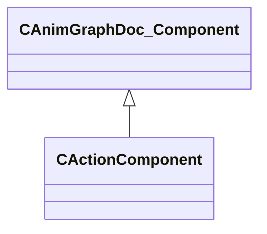

### CAnimConflictBase

**Derived by:** [CAnimParameterConflict](animgraphdoclib.md#canimparameterconflict), [CAnimTagConflict](animgraphdoclib.md#canimtagconflict)

**Metadata:** `MGetKV3ClassDefaults = Could not parse KV3 Defaults`

**Relationships:**

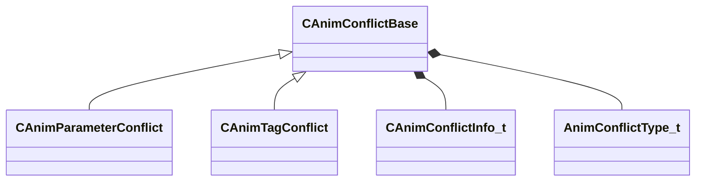

**Fields:**

| Name | Type | Annotations |
|------|------|-------------|
| `m_sConflictDesc` | CUtlString |  |
| `m_nResolveIdx` | int32 |  |
| `m_conflictData` | [CAnimConflictInfo_t](../schemas/animgraphdoclib.md#canimconflictinfo_t)[2] |  |
| `m_eConflictType` | [AnimConflictType_t](../schemas/animgraphdoclib.md#animconflicttype_t) |  |

### CAnimConflictInfo_t

**Metadata:** `MGetKV3ClassDefaults = {`, `"m_name": "",`, `"m_groupName": "",`, `"m_subgraphName": "",`, `"m_id": <HIDDEN FOR DIFF>,`, `}`

### CAnimGraphDoc_Action

**Derived by:** [CAnimGraphDoc_EmitTagAction](animgraphdoclib.md#canimgraphdoc_emittagaction), [CAnimGraphDoc_ExpressionAction](animgraphdoclib.md#canimgraphdoc_expressionaction), [CAnimGraphDoc_SetParameterAction](animgraphdoclib.md#canimgraphdoc_setparameteraction), [CAnimGraphDoc_ToggleComponentAction](animgraphdoclib.md#canimgraphdoc_togglecomponentaction)

**Metadata:** `MGetKV3ClassDefaults = Could not parse KV3 Defaults`

**Relationships:**

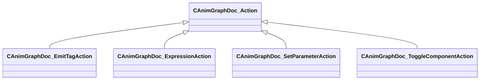

### CAnimGraphDoc_AddNode

**Inherits from:** [CAnimGraphDoc_Node](animgraphdoclib.md#canimgraphdoc_node)

**Metadata:** `MGetKV3ClassDefaults = {`, `"_class": "CAnimGraphDoc_AddNode",`, `"m_sName": "Unnamed",`, `"m_vecPosition":`, `[`, `0.000000,`, `0.000000`, `],`, `"m_nNodeID":`, `{`, `"m_id": <HIDDEN FOR DIFF>,`, `},`, `"m_bDebugThisNode": false,`, `"m_networkMode": "ServerAuthoritative",`, `"m_baseInput":`, `{`, `"m_nodeID":`, `{`, `"m_id": <HIDDEN FOR DIFF>,`, `},`, `"m_outputID":`, `{`, `"m_id": <HIDDEN FOR DIFF>,`, `}`, `},`, `"m_additiveInput":`, `{`, `"m_nodeID":`, `{`, `"m_id": <HIDDEN FOR DIFF>,`, `},`, `"m_outputID":`, `{`, `"m_id": <HIDDEN FOR DIFF>,`, `}`, `},`, `"m_timingBehavior": "UseChild2",`, `"m_flTimingBlend": 0.500000,`, `"m_footMotionTiming": "Child1",`, `"m_bApplyToFootMotion": true,`, `"m_bResetBase": true,`, `"m_bResetAdditive": true,`, `"m_bApplyChannelsSeparately": true,`, `"m_bUseModelSpace": false,`, `"m_bApplyScale": false`, `}`, `MPropertyFriendlyName = "Add"`

**Relationships:**

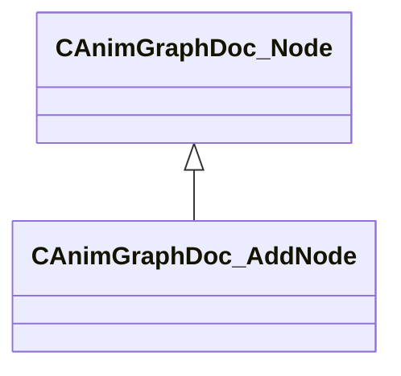

### CAnimGraphDoc_AimCameraNode

**Inherits from:** [CAnimGraphDoc_Node](animgraphdoclib.md#canimgraphdoc_node)

**Metadata:** `MGetKV3ClassDefaults = {`, `"_class": "CAnimGraphDoc_AimCameraNode",`, `"m_sName": "Unnamed",`, `"m_vecPosition":`, `[`, `0.000000,`, `0.000000`, `],`, `"m_nNodeID":`, `{`, `"m_id": <HIDDEN FOR DIFF>,`, `},`, `"m_bDebugThisNode": false,`, `"m_networkMode": "ServerAuthoritative",`, `"m_inputConnection":`, `{`, `"m_nodeID":`, `{`, `"m_id": <HIDDEN FOR DIFF>,`, `},`, `"m_outputID":`, `{`, `"m_id": <HIDDEN FOR DIFF>,`, `}`, `},`, `"m_ikChain": "",`, `"m_cameraJointName": "",`, `"m_pelvisJointName": "",`, `"m_clavicleLeftJointName": "",`, `"m_clavicleRightJointName": "",`, `"m_parameterNamePosition":`, `{`, `"m_id": <HIDDEN FOR DIFF>,`, `},`, `"m_parameterNameOrientation":`, `{`, `"m_id": <HIDDEN FOR DIFF>,`, `},`, `"m_parameterNamePelvisOffset":`, `{`, `"m_id": <HIDDEN FOR DIFF>,`, `},`, `"m_parameterCameraOnly":`, `{`, `"m_id": <HIDDEN FOR DIFF>,`, `},`, `"m_parameterCameraClearanceDistance":`, `{`, `"m_id": <HIDDEN FOR DIFF>,`, `},`, `"m_parameterWeaponDepenetrationDistance":`, `{`, `"m_id": <HIDDEN FOR DIFF>,`, `},`, `"m_parameterWeaponDepenetrationDelta":`, `{`, `"m_id": <HIDDEN FOR DIFF>,`, `},`, `"m_depenetrationJointName": "",`, `"m_propJoints":`, `[`, `]`, `}`, `MPropertyFriendlyName = "Aim Camera"`

**Relationships:**

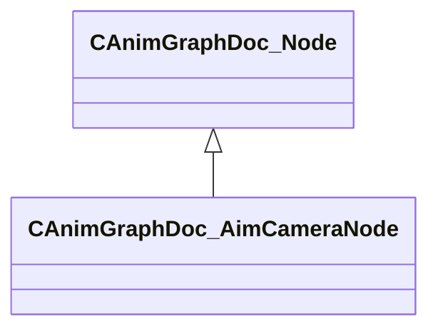

### CAnimGraphDoc_AimCameraNode_PropJoint

**Metadata:** `MGetKV3ClassDefaults = {`, `"_class": "CAnimGraphDoc_AimCameraNode_PropJoint",`, `"m_jointName": ""`, `}`

### CAnimGraphDoc_AimMatrixNode

**Inherits from:** [CAnimGraphDoc_Node](animgraphdoclib.md#canimgraphdoc_node)

**Metadata:** `MGetKV3ClassDefaults = {`, `"_class": "CAnimGraphDoc_AimMatrixNode",`, `"m_sName": "Unnamed",`, `"m_vecPosition":`, `[`, `0.000000,`, `0.000000`, `],`, `"m_nNodeID":`, `{`, `"m_id": <HIDDEN FOR DIFF>,`, `},`, `"m_bDebugThisNode": false,`, `"m_networkMode": "ServerAuthoritative",`, `"m_inputConnection":`, `{`, `"m_nodeID":`, `{`, `"m_id": <HIDDEN FOR DIFF>,`, `},`, `"m_outputID":`, `{`, `"m_id": <HIDDEN FOR DIFF>,`, `}`, `},`, `"m_sequenceName": "",`, `"m_flMaxYawAngle": 45.000000,`, `"m_flMaxPitchAngle": 45.000000,`, `"m_target": "LookTarget",`, `"m_paramName": "",`, `"m_param":`, `{`, `"m_id": <HIDDEN FOR DIFF>,`, `},`, `"m_bIsPosition": false,`, `"m_attachmentName": "",`, `"m_blendMode": "AimMatrixBlendMode_Additive",`, `"m_boneMaskName": "",`, `"m_bResetBase": true,`, `"m_bLockWhenWaning": true,`, `"m_bUseBiasAndClamp": false,`, `"m_flBiasAndClampYawOffset": 1.000000,`, `"m_flBiasAndClampPitchOffset": 1.000000,`, `"m_biasAndClampBlendCurve":`, `{`, `"m_flControlPoint1": 0.000000,`, `"m_flControlPoint2": 1.000000`, `},`, `"m_damping":`, `{`, `"_class": "CAnimInputDamping",`, `"m_speedFunction": "NoDamping",`, `"m_fSpeedScale": 1.000000,`, `"m_fFallingSpeedScale": 1.000000`, `}`, `}`, `MPropertyFriendlyName = "Aim Matrix"`

**Relationships:**

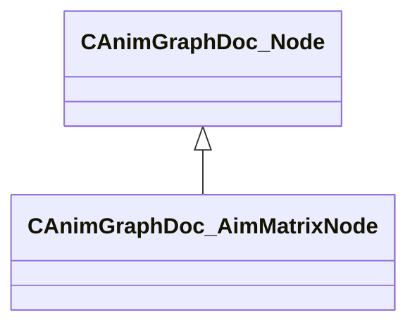

### CAnimGraphDoc_AndCondition

**Inherits from:** [CAnimGraphDoc_Condition](animgraphdoclib.md#canimgraphdoc_condition), [CAnimGraphDoc_ConditionContainer](animgraphdoclib.md#canimgraphdoc_conditioncontainer)

**Metadata:** `MGetKV3ClassDefaults = {`, `"_class": "CAnimGraphDoc_AndCondition",`, `"m_conditions":`, `[`, `]`, `}`

**Relationships:**

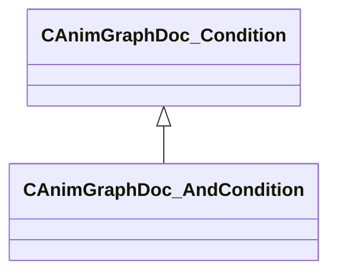

### CAnimGraphDoc_BindPoseNode

**Inherits from:** [CAnimGraphDoc_Node](animgraphdoclib.md#canimgraphdoc_node)

**Metadata:** `MGetKV3ClassDefaults = {`, `"_class": "CAnimGraphDoc_BindPoseNode",`, `"m_sName": "Unnamed",`, `"m_vecPosition":`, `[`, `0.000000,`, `0.000000`, `],`, `"m_nNodeID":`, `{`, `"m_id": <HIDDEN FOR DIFF>,`, `},`, `"m_bDebugThisNode": false,`, `"m_networkMode": "ServerAuthoritative"`, `}`, `MPropertyFriendlyName = "Bind Pose"`

**Relationships:**

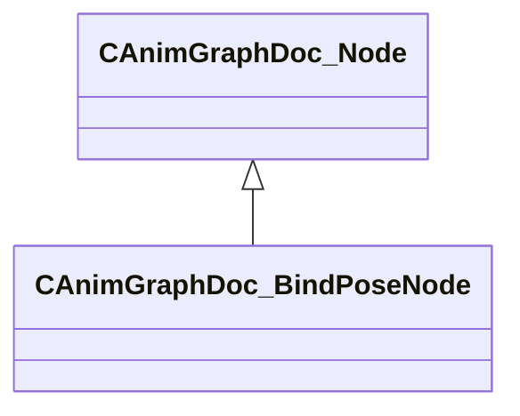

### CAnimGraphDoc_Blend2DItem

**Derived by:** [CAnimGraphDoc_NodeBlend2DItem](animgraphdoclib.md#canimgraphdoc_nodeblend2ditem), [CAnimGraphDoc_SequenceBlend2DItem](animgraphdoclib.md#canimgraphdoc_sequenceblend2ditem)

**Metadata:** `MGetKV3ClassDefaults = Could not parse KV3 Defaults`, `MPropertyFriendlyName = "Blend Item"`

**Relationships:**

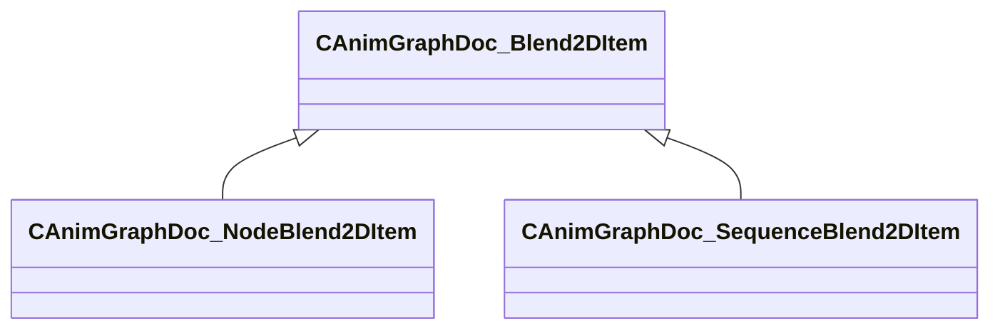

**Fields:**

| Name | Type | Annotations |
|------|------|-------------|
| `m_blendValue` | Vector2D | `MPropertyFriendlyName = "Blend Value"` |
| `m_bUseCustomDuration` | bool | `MPropertyGroupName = "+Duration Override"` `MPropertyFriendlyName = "Use Custom Duration"` `MPropertyAutoRebuildOnChange` |
| `m_flCustomDuration` | float32 | `MPropertyGroupName = "+Duration Override"` `MPropertyFriendlyName = "Custom Duration"` `MPropertyAttrStateCallback (UNKNOWN FOR PARSER)` |

### CAnimGraphDoc_Blend2DNode

**Inherits from:** [CAnimGraphDoc_Node](animgraphdoclib.md#canimgraphdoc_node)

**Metadata:** `MGetKV3ClassDefaults = {`, `"_class": "CAnimGraphDoc_Blend2DNode",`, `"m_sName": "Unnamed",`, `"m_vecPosition":`, `[`, `0.000000,`, `0.000000`, `],`, `"m_nNodeID":`, `{`, `"m_id": <HIDDEN FOR DIFF>,`, `},`, `"m_bDebugThisNode": false,`, `"m_networkMode": "ServerAuthoritative",`, `"m_items":`, `[`, `],`, `"m_tagSpans":`, `[`, `],`, `"m_paramSpans":`, `[`, `],`, `"m_blendSourceX": "Parameter",`, `"m_paramNameX": "",`, `"m_paramX":`, `{`, `"m_id": <HIDDEN FOR DIFF>,`, `},`, `"m_blendSourceY": "Parameter",`, `"m_paramNameY": "",`, `"m_paramY":`, `{`, `"m_id": <HIDDEN FOR DIFF>,`, `},`, `"m_eBlendMode": "Blend2DMode_General",`, `"m_bLoop": true,`, `"m_bLockBlendOnReset": false,`, `"m_bLockWhenWaning": true,`, `"m_playbackSpeed": 1.000000,`, `"m_damping":`, `{`, `"_class": "CAnimInputDamping",`, `"m_speedFunction": "NoDamping",`, `"m_fSpeedScale": 1.000000,`, `"m_fFallingSpeedScale": 1.000000`, `},`, `"m_bAnimEventsAndTagsOnMostWeightedOnly": false`, `}`, `MPropertyFriendlyName = "Blend 2D"`

**Relationships:**

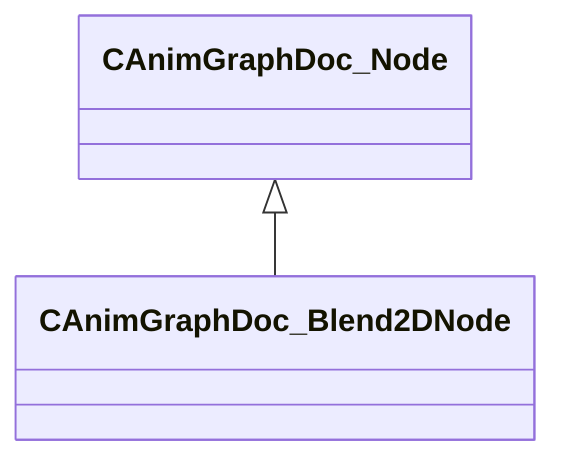

### CAnimGraphDoc_BlendNode

**Inherits from:** [CAnimGraphDoc_Node](animgraphdoclib.md#canimgraphdoc_node)

**Metadata:** `MGetKV3ClassDefaults = {`, `"_class": "CAnimGraphDoc_BlendNode",`, `"m_sName": "Unnamed",`, `"m_vecPosition":`, `[`, `0.000000,`, `0.000000`, `],`, `"m_nNodeID":`, `{`, `"m_id": <HIDDEN FOR DIFF>,`, `},`, `"m_bDebugThisNode": false,`, `"m_networkMode": "ServerAuthoritative",`, `"m_children":`, `[`, `],`, `"m_blendValueSource": "Parameter",`, `"m_paramName": "",`, `"m_param":`, `{`, `"m_id": <HIDDEN FOR DIFF>,`, `},`, `"m_blendKeyType": "BlendKey_UserValue",`, `"m_bLockBlendOnReset": false,`, `"m_bSyncCycles": true,`, `"m_bLoop": true,`, `"m_bLockWhenWaning": true,`, `"m_bIsAngle": false,`, `"m_damping":`, `{`, `"_class": "CAnimInputDamping",`, `"m_speedFunction": "NoDamping",`, `"m_fSpeedScale": 1.000000,`, `"m_fFallingSpeedScale": 1.000000`, `},`, `"m_eLinearRootMotionBlendMode": "LERP"`, `}`, `MPropertyFriendlyName = "Blend 1D"`

**Relationships:**

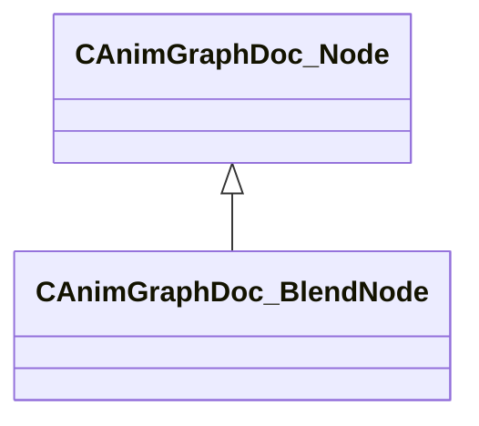

### CAnimGraphDoc_BlockSelectionMetric

**Inherits from:** [CAnimGraphDoc_MotionMetric](animgraphdoclib.md#canimgraphdoc_motionmetric)

**Metadata:** `MGetKV3ClassDefaults = {`, `"_class": "CAnimGraphDoc_BlockSelectionMetric",`, `"m_flWeight": 0.000000`, `}`, `MPropertyFriendlyName = "Block Selection Metric"`

**Relationships:**

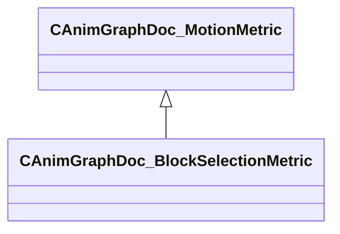

### CAnimGraphDoc_BoneMaskNode

**Inherits from:** [CAnimGraphDoc_Node](animgraphdoclib.md#canimgraphdoc_node)

**Metadata:** `MGetKV3ClassDefaults = {`, `"_class": "CAnimGraphDoc_BoneMaskNode",`, `"m_sName": "Unnamed",`, `"m_vecPosition":`, `[`, `0.000000,`, `0.000000`, `],`, `"m_nNodeID":`, `{`, `"m_id": <HIDDEN FOR DIFF>,`, `},`, `"m_bDebugThisNode": false,`, `"m_networkMode": "ServerAuthoritative",`, `"m_weightListName": "",`, `"m_inputConnection1":`, `{`, `"m_nodeID":`, `{`, `"m_id": <HIDDEN FOR DIFF>,`, `},`, `"m_outputID":`, `{`, `"m_id": <HIDDEN FOR DIFF>,`, `}`, `},`, `"m_inputConnection2":`, `{`, `"m_nodeID":`, `{`, `"m_id": <HIDDEN FOR DIFF>,`, `},`, `"m_outputID":`, `{`, `"m_id": <HIDDEN FOR DIFF>,`, `}`, `},`, `"m_blendSpace": "BlendSpace_Parent",`, `"m_bUseBlendScale": false,`, `"m_blendValueSource": "Parameter",`, `"m_blendParameterName": "",`, `"m_blendParameter":`, `{`, `"m_id": <HIDDEN FOR DIFF>,`, `},`, `"m_timingBehavior": "UseChild2",`, `"m_flTimingBlend": 0.500000,`, `"m_flRootMotionBlend": 0.000000,`, `"m_footMotionTiming": "Child1",`, `"m_bResetChild1": true,`, `"m_bResetChild2": true`, `}`, `MPropertyFriendlyName = "Bone Mask"`

**Relationships:**

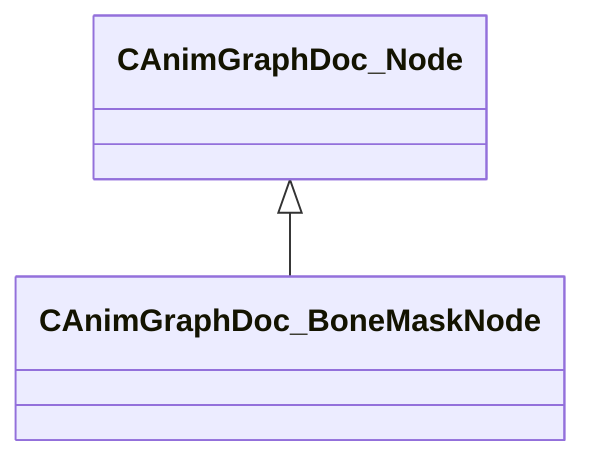

### CAnimGraphDoc_BonePositionMetric

**Inherits from:** [CAnimGraphDoc_MotionMetric](animgraphdoclib.md#canimgraphdoc_motionmetric)

**Metadata:** `MGetKV3ClassDefaults = {`, `"_class": "CAnimGraphDoc_BonePositionMetric",`, `"m_flWeight": 1.000000,`, `"m_boneName": ""`, `}`, `MPropertyFriendlyName = "Bone Position Metric"`

**Relationships:**

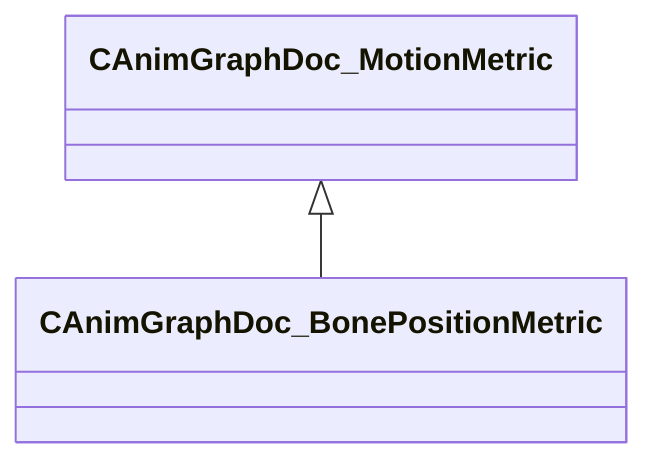

### CAnimGraphDoc_BoneVelocityMetric

**Inherits from:** [CAnimGraphDoc_MotionMetric](animgraphdoclib.md#canimgraphdoc_motionmetric)

**Metadata:** `MGetKV3ClassDefaults = {`, `"_class": "CAnimGraphDoc_BoneVelocityMetric",`, `"m_flWeight": 1.000000,`, `"m_boneName": ""`, `}`, `MPropertyFriendlyName = "Bone Velocity Metric"`

**Relationships:**

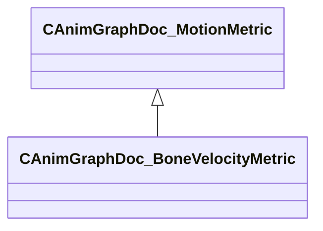

### CAnimGraphDoc_ChoiceNode

**Inherits from:** [CAnimGraphDoc_Node](animgraphdoclib.md#canimgraphdoc_node)

**Metadata:** `MGetKV3ClassDefaults = {`, `"_class": "CAnimGraphDoc_ChoiceNode",`, `"m_sName": "Unnamed",`, `"m_vecPosition":`, `[`, `0.000000,`, `0.000000`, `],`, `"m_nNodeID":`, `{`, `"m_id": <HIDDEN FOR DIFF>,`, `},`, `"m_bDebugThisNode": false,`, `"m_networkMode": "ServerAuthoritative",`, `"m_children":`, `[`, `],`, `"m_seed": <HIDDEN FOR DIFF>,`, `"m_choiceMethod": "WeightedRandom",`, `"m_choiceChangeMethod": "OnReset",`, `"m_blendMethod": "SingleBlendTime",`, `"m_blendTime": 0.200000,`, `"m_bCrossFade": false,`, `"m_bResetChosen": true,`, `"m_bDontResetSameSelection": false`, `}`, `MPropertyFriendlyName = "Choice"`

**Relationships:**

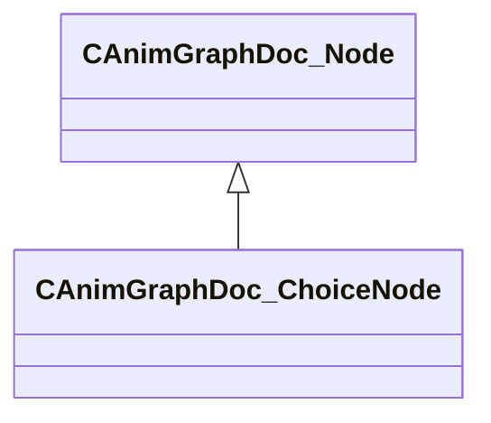

### CAnimGraphDoc_ChoreoNode

**Inherits from:** [CAnimGraphDoc_Node](animgraphdoclib.md#canimgraphdoc_node)

**Metadata:** `MGetKV3ClassDefaults = {`, `"_class": "CAnimGraphDoc_ChoreoNode",`, `"m_sName": "Unnamed",`, `"m_vecPosition":`, `[`, `0.000000,`, `0.000000`, `],`, `"m_nNodeID":`, `{`, `"m_id": <HIDDEN FOR DIFF>,`, `},`, `"m_bDebugThisNode": false,`, `"m_networkMode": "ServerAuthoritative",`, `"m_inputConnection":`, `{`, `"m_nodeID":`, `{`, `"m_id": <HIDDEN FOR DIFF>,`, `},`, `"m_outputID":`, `{`, `"m_id": <HIDDEN FOR DIFF>,`, `}`, `}`, `}`, `MPropertyFriendlyName = "Choreo"`

**Relationships:**

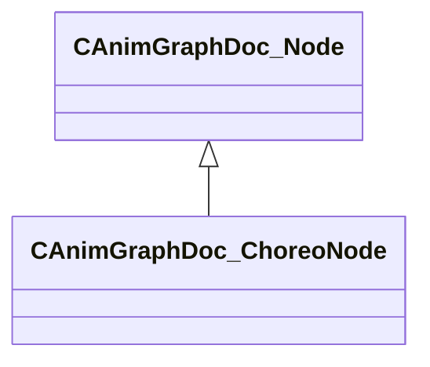

### CAnimGraphDoc_ClipData

**Metadata:** `MGetKV3ClassDefaults = {`, `"_class": "CAnimGraphDoc_ClipData",`, `"m_tagSpans":`, `[`, `],`, `"m_clipName": ""`, `}`, `MPropertyFriendlyName = "Clip Data"`

### CAnimGraphDoc_ClipDataManager

**Metadata:** `MGetKV3ClassDefaults = {`, `"_class": "CAnimGraphDoc_ClipDataManager",`, `"m_itemTable":`, `{`, `}`, `}`, `MPropertyFriendlyName = "Clip Data Manager"`

### CAnimGraphDoc_CommentNode

**Inherits from:** [CAnimGraphDoc_Node](animgraphdoclib.md#canimgraphdoc_node)

**Metadata:** `MGetKV3ClassDefaults = {`, `"_class": "CAnimGraphDoc_CommentNode",`, `"m_sName": "Unnamed",`, `"m_vecPosition":`, `[`, `0.000000,`, `0.000000`, `],`, `"m_nNodeID":`, `{`, `"m_id": <HIDDEN FOR DIFF>,`, `},`, `"m_bDebugThisNode": false,`, `"m_networkMode": "ServerAuthoritative",`, `"m_commentText": "",`, `"m_size":`, `[`, `375.000000,`, `225.000000`, `],`, `"m_color":`, `[`, `49,`, `139,`, `146`, `]`, `}`, `MPropertyFriendlyName = "Comment"`

**Relationships:**

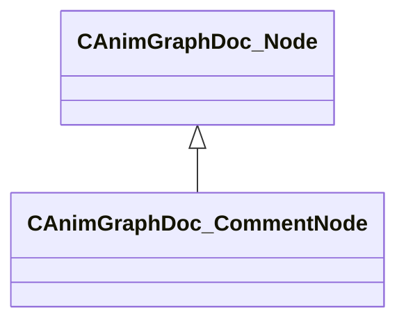

### CAnimGraphDoc_Component

**Derived by:** [CActionComponent](animgraphdoclib.md#cactioncomponent), [CAnimScriptComponent](animgraphdoclib.md#canimscriptcomponent), [CCPPScriptComponent](animgraphdoclib.md#ccppscriptcomponent), [CDampedValueComponent](animgraphdoclib.md#cdampedvaluecomponent), [CDemoSettingsComponent](animgraphdoclib.md#cdemosettingscomponent), [CLODComponent](animgraphdoclib.md#clodcomponent), [CLookComponent](animgraphdoclib.md#clookcomponent), [CMovementComponent](animgraphdoclib.md#cmovementcomponent), [CPairedSequenceComponent](animgraphdoclib.md#cpairedsequencecomponent), [CRagdollComponent](animgraphdoclib.md#cragdollcomponent), [CRemapValueComponent](animgraphdoclib.md#cremapvaluecomponent), [CSlopeComponent](animgraphdoclib.md#cslopecomponent), [CStateMachineComponent](animgraphdoclib.md#cstatemachinecomponent)

**Metadata:** `MGetKV3ClassDefaults = Could not parse KV3 Defaults`

**Relationships:**

```mermaid
classDiagram
    CAnimGraphDoc_Component <|-- CActionComponent
    CAnimGraphDoc_Component <|-- CAnimScriptComponent
    CAnimGraphDoc_Component <|-- CCPPScriptComponent
    CAnimGraphDoc_Component <|-- CDampedValueComponent
    CAnimGraphDoc_Component <|-- CDemoSettingsComponent
    CAnimGraphDoc_Component <|-- CLODComponent
    CAnimGraphDoc_Component <|-- CLookComponent
    CAnimGraphDoc_Component <|-- CMovementComponent
    CAnimGraphDoc_Component <|-- CPairedSequenceComponent
    CAnimGraphDoc_Component <|-- CRagdollComponent
    CAnimGraphDoc_Component <|-- CRemapValueComponent
    CAnimGraphDoc_Component <|-- CSlopeComponent
    CAnimGraphDoc_Component <|-- CStateMachineComponent
    CAnimGraphDoc_Component *-- AnimComponentID
    CAnimGraphDoc_Component *-- AnimNodeNetworkMode
```

**Fields:**

| Name | Type | Annotations |
|------|------|-------------|
| `m_group` | CUtlString | `MPropertySuppressField` |
| `m_id` | [AnimComponentID](../schemas/modellib.md#animcomponentid) | `MPropertySuppressField` |
| `m_bStartEnabled` | bool | `MPropertyFriendlyName = "Start Enabled"` |
| `m_nPriority` | int32 | `MPropertyFriendlyName = "Priority"` |
| `m_networkMode` | [AnimNodeNetworkMode](../schemas/animgraphlib.md#animnodenetworkmode) | `MPropertyFriendlyName = "Network Mode"` |

### CAnimGraphDoc_ComponentManager

**Metadata:** `MGetKV3ClassDefaults = {`, `"_class": "CAnimGraphDoc_ComponentManager",`, `"m_components":`, `[`, `]`, `}`

### CAnimGraphDoc_ComponentState

**Inherits from:** [CAnimGraphDoc_State](animgraphdoclib.md#canimgraphdoc_state)

**Metadata:** `MGetKV3ClassDefaults = {`, `"_class": "CAnimGraphDoc_ComponentState",`, `"m_transitions":`, `[`, `],`, `"m_actions":`, `[`, `],`, `"m_name": "Unnamed",`, `"m_sComment": "",`, `"m_stateID":`, `{`, `"m_id": <HIDDEN FOR DIFF>,`, `},`, `"m_position":`, `[`, `0.000000,`, `0.000000`, `],`, `"m_bIsStartState": false,`, `"m_bIsEndtState": false,`, `"m_bIsInputToGraph": true,`, `"m_bIsPassthrough": false,`, `"m_bIsPassthroughRootMotion": false,`, `"m_bPreEvaluatePassthroughTransitionPath": false`, `}`

**Relationships:**

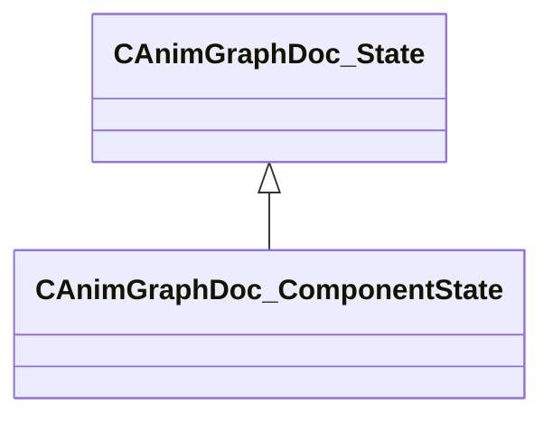

### CAnimGraphDoc_ComponentStateTransition

**Inherits from:** [CAnimGraphDoc_StateTransition](animgraphdoclib.md#canimgraphdoc_statetransition)

**Metadata:** `MGetKV3ClassDefaults = {`, `"_class": "CAnimGraphDoc_ComponentStateTransition",`, `"m_conditionList":`, `{`, `"_class": "CAnimGraphDoc_ConditionContainer",`, `"m_conditions":`, `[`, `]`, `},`, `"m_srcState":`, `{`, `"m_id": <HIDDEN FOR DIFF>,`, `},`, `"m_destState":`, `{`, `"m_id": <HIDDEN FOR DIFF>,`, `},`, `"m_sComment": "",`, `"m_bDisabled": false`, `}`

**Relationships:**

```mermaid
classDiagram
    CAnimGraphDoc_StateTransition <|-- CAnimGraphDoc_ComponentStateTransition
```

### CAnimGraphDoc_Condition

**Derived by:** [CAnimGraphDoc_AndCondition](animgraphdoclib.md#canimgraphdoc_andcondition), [CAnimGraphDoc_CycleCondition](animgraphdoclib.md#canimgraphdoc_cyclecondition), [CAnimGraphDoc_FinishedCondition](animgraphdoclib.md#canimgraphdoc_finishedcondition), [CAnimGraphDoc_OrCondition](animgraphdoclib.md#canimgraphdoc_orcondition), [CAnimGraphDoc_ParameterCondition](animgraphdoclib.md#canimgraphdoc_parametercondition), [CAnimGraphDoc_StateStatusCondition](animgraphdoclib.md#canimgraphdoc_statestatuscondition), [CAnimGraphDoc_TagCondition](animgraphdoclib.md#canimgraphdoc_tagcondition), [CAnimGraphDoc_TimeCondition](animgraphdoclib.md#canimgraphdoc_timecondition)

**Metadata:** `MGetKV3ClassDefaults = Could not parse KV3 Defaults`

**Relationships:**

```mermaid
classDiagram
    CAnimGraphDoc_Condition <|-- CAnimGraphDoc_AndCondition
    CAnimGraphDoc_Condition <|-- CAnimGraphDoc_CycleCondition
    CAnimGraphDoc_Condition <|-- CAnimGraphDoc_FinishedCondition
    CAnimGraphDoc_Condition <|-- CAnimGraphDoc_OrCondition
    CAnimGraphDoc_Condition <|-- CAnimGraphDoc_ParameterCondition
    CAnimGraphDoc_Condition <|-- CAnimGraphDoc_StateStatusCondition
    CAnimGraphDoc_Condition <|-- CAnimGraphDoc_TagCondition
    CAnimGraphDoc_Condition <|-- CAnimGraphDoc_TimeCondition
```

### CAnimGraphDoc_ConditionContainer

**Derived by:** [CAnimGraphDoc_AndCondition](animgraphdoclib.md#canimgraphdoc_andcondition), [CAnimGraphDoc_OrCondition](animgraphdoclib.md#canimgraphdoc_orcondition)

**Metadata:** `MGetKV3ClassDefaults = {`, `"_class": "CAnimGraphDoc_ConditionContainer",`, `"m_conditions":`, `[`, `]`, `}`

**Relationships:**

```mermaid
classDiagram
    CAnimGraphDoc_ConditionContainer <|-- CAnimGraphDoc_AndCondition
    CAnimGraphDoc_ConditionContainer <|-- CAnimGraphDoc_OrCondition
```

### CAnimGraphDoc_ConflictManager

**Metadata:** `MGetKV3ClassDefaults = {`, `"_class": "CAnimGraphDoc_ConflictManager",`, `"m_conflicts":`, `[`, `]`, `}`

### CAnimGraphDoc_ContainerNodeBase

**Inherits from:** [CAnimGraphDoc_Node](animgraphdoclib.md#canimgraphdoc_node)

**Derived by:** [CAnimGraphDoc_GroupNode](animgraphdoclib.md#canimgraphdoc_groupnode), [CAnimGraphDoc_SubGraphNode](animgraphdoclib.md#canimgraphdoc_subgraphnode)

**Metadata:** `MGetKV3ClassDefaults = Could not parse KV3 Defaults`

**Relationships:**

```mermaid
classDiagram
    CAnimGraphDoc_Node <|-- CAnimGraphDoc_ContainerNodeBase
    CAnimGraphDoc_ContainerNodeBase <|-- CAnimGraphDoc_GroupNode
    CAnimGraphDoc_ContainerNodeBase <|-- CAnimGraphDoc_SubGraphNode
    CAnimGraphDoc_ContainerNodeBase *-- AnimNodeID
    CAnimGraphDoc_ContainerNodeBase *-- AnimNodeOutputID
    CAnimGraphDoc_ContainerNodeBase *-- CAnimGraphDoc_NodeConnection
```

**Fields:**

| Name | Type | Annotations |
|------|------|-------------|
| `m_inputNodeID` | [AnimNodeID](../schemas/modellib.md#animnodeid) | `MPropertySuppressField` |
| `m_outputNodeID` | [AnimNodeID](../schemas/modellib.md#animnodeid) | `MPropertySuppressField` |
| `m_inputConnectionMap` | CUtlHashtable< [AnimNodeOutputID](../schemas/modellib.md#animnodeoutputid), [CAnimGraphDoc_NodeConnection](../schemas/animgraphdoclib.md#canimgraphdoc_nodeconnection) > | `MPropertySuppressField` |

### CAnimGraphDoc_CurrentRotationVelocityMetric

**Inherits from:** [CAnimGraphDoc_MotionMetric](animgraphdoclib.md#canimgraphdoc_motionmetric)

**Metadata:** `MGetKV3ClassDefaults = {`, `"_class": "CAnimGraphDoc_CurrentRotationVelocityMetric",`, `"m_flWeight": 1.000000`, `}`, `MPropertyFriendlyName = "Current Rotation Velocity Metric"`

**Relationships:**

```mermaid
classDiagram
    CAnimGraphDoc_MotionMetric <|-- CAnimGraphDoc_CurrentRotationVelocityMetric
```

### CAnimGraphDoc_CurrentVelocityMetric

**Inherits from:** [CAnimGraphDoc_MotionMetric](animgraphdoclib.md#canimgraphdoc_motionmetric)

**Metadata:** `MGetKV3ClassDefaults = {`, `"_class": "CAnimGraphDoc_CurrentVelocityMetric",`, `"m_flWeight": 1.000000`, `}`, `MPropertyFriendlyName = "Current Velocity Metric"`

**Relationships:**

```mermaid
classDiagram
    CAnimGraphDoc_MotionMetric <|-- CAnimGraphDoc_CurrentVelocityMetric
```

### CAnimGraphDoc_CycleCondition

**Inherits from:** [CAnimGraphDoc_Condition](animgraphdoclib.md#canimgraphdoc_condition)

**Metadata:** `MGetKV3ClassDefaults = {`, `"_class": "CAnimGraphDoc_CycleCondition",`, `"m_comparisonOp": "COMPARISON_EQUALS",`, `"m_comparisonString": "",`, `"m_comparisonValue": 0.000000,`, `"m_comparisonValueType": "COMPARISONVALUETYPE_FIXEDVALUE",`, `"m_comparisonParamName": "",`, `"m_comparisonParamID":`, `{`, `"m_id": <HIDDEN FOR DIFF>,`, `}`, `}`, `MPropertyFriendlyName = "Cycle Condition"`

**Relationships:**

```mermaid
classDiagram
    CAnimGraphDoc_Condition <|-- CAnimGraphDoc_CycleCondition
```

### CAnimGraphDoc_CycleControlClipNode

**Inherits from:** [CAnimGraphDoc_Node](animgraphdoclib.md#canimgraphdoc_node)

**Metadata:** `MGetKV3ClassDefaults = {`, `"_class": "CAnimGraphDoc_CycleControlClipNode",`, `"m_sName": "Unnamed",`, `"m_vecPosition":`, `[`, `0.000000,`, `0.000000`, `],`, `"m_nNodeID":`, `{`, `"m_id": <HIDDEN FOR DIFF>,`, `},`, `"m_bDebugThisNode": false,`, `"m_networkMode": "ServerAuthoritative",`, `"m_tagSpans":`, `[`, `],`, `"m_sequenceName": "",`, `"m_valueSource": "Parameter",`, `"m_paramName": "",`, `"m_param":`, `{`, `"m_id": <HIDDEN FOR DIFF>,`, `},`, `"m_bLockWhenWaning": false`, `}`, `MPropertyFriendlyName = "Cycle Control Clip"`

**Relationships:**

```mermaid
classDiagram
    CAnimGraphDoc_Node <|-- CAnimGraphDoc_CycleControlClipNode
```

### CAnimGraphDoc_CycleControlNode

**Inherits from:** [CAnimGraphDoc_Node](animgraphdoclib.md#canimgraphdoc_node)

**Metadata:** `MGetKV3ClassDefaults = {`, `"_class": "CAnimGraphDoc_CycleControlNode",`, `"m_sName": "Unnamed",`, `"m_vecPosition":`, `[`, `0.000000,`, `0.000000`, `],`, `"m_nNodeID":`, `{`, `"m_id": <HIDDEN FOR DIFF>,`, `},`, `"m_bDebugThisNode": false,`, `"m_networkMode": "ServerAuthoritative",`, `"m_inputConnection":`, `{`, `"m_nodeID":`, `{`, `"m_id": <HIDDEN FOR DIFF>,`, `},`, `"m_outputID":`, `{`, `"m_id": <HIDDEN FOR DIFF>,`, `}`, `},`, `"m_valueSource": "Parameter",`, `"m_paramName": "",`, `"m_param":`, `{`, `"m_id": <HIDDEN FOR DIFF>,`, `},`, `"m_bLockWhenWaning": false`, `}`, `MPropertyFriendlyName = "Cycle Control"`

**Relationships:**

```mermaid
classDiagram
    CAnimGraphDoc_Node <|-- CAnimGraphDoc_CycleControlNode
```

### CAnimGraphDoc_DampedPathMotor

**Inherits from:** [CAnimGraphDoc_PathMotorBase](animgraphdoclib.md#canimgraphdoc_pathmotorbase)

**Metadata:** `MGetKV3ClassDefaults = {`, `"_class": "CAnimGraphDoc_DampedPathMotor",`, `"m_name": "Unnamed Motor",`, `"m_bDefault": false,`, `"m_bLockToPath": true,`, `"m_flAnticipationTime": 1.000000,`, `"m_flMinSpeedScale": 0.250000,`, `"m_anticipationPosParamName": "",`, `"m_anticipationPosParam":`, `{`, `"m_id": <HIDDEN FOR DIFF>,`, `},`, `"m_anticipationHeadingParamName": "",`, `"m_anticipationHeadingParam":`, `{`, `"m_id": <HIDDEN FOR DIFF>,`, `},`, `"m_flSpringConstant": 10.000000,`, `"m_flMinSpringTension": 1.000000,`, `"m_flMaxSpringTension": 100.000000`, `}`, `MPropertyFriendlyName = "Damped Path Motor"`

**Relationships:**

```mermaid
classDiagram
    CAnimGraphDoc_PathMotorBase <|-- CAnimGraphDoc_DampedPathMotor
    CAnimGraphDoc_Motor <|-- CAnimGraphDoc_PathMotorBase
```

### CAnimGraphDoc_DirectPlaybackNode

**Inherits from:** [CAnimGraphDoc_Node](animgraphdoclib.md#canimgraphdoc_node)

**Metadata:** `MGetKV3ClassDefaults = {`, `"_class": "CAnimGraphDoc_DirectPlaybackNode",`, `"m_sName": "Unnamed",`, `"m_vecPosition":`, `[`, `0.000000,`, `0.000000`, `],`, `"m_nNodeID":`, `{`, `"m_id": <HIDDEN FOR DIFF>,`, `},`, `"m_bDebugThisNode": false,`, `"m_networkMode": "ServerAuthoritative",`, `"m_inputConnection":`, `{`, `"m_nodeID":`, `{`, `"m_id": <HIDDEN FOR DIFF>,`, `},`, `"m_outputID":`, `{`, `"m_id": <HIDDEN FOR DIFF>,`, `}`, `},`, `"m_bFinishEarly": false,`, `"m_bResetOnFinish": true`, `}`, `MPropertyFriendlyName = "Direct Playback"`

**Relationships:**

```mermaid
classDiagram
    CAnimGraphDoc_Node <|-- CAnimGraphDoc_DirectPlaybackNode
```

### CAnimGraphDoc_DirectionalBlendNode

**Inherits from:** [CAnimGraphDoc_Node](animgraphdoclib.md#canimgraphdoc_node)

**Metadata:** `MGetKV3ClassDefaults = {`, `"_class": "CAnimGraphDoc_DirectionalBlendNode",`, `"m_sName": "Unnamed",`, `"m_vecPosition":`, `[`, `0.000000,`, `0.000000`, `],`, `"m_nNodeID":`, `{`, `"m_id": <HIDDEN FOR DIFF>,`, `},`, `"m_bDebugThisNode": false,`, `"m_networkMode": "ServerAuthoritative",`, `"m_animNamePrefix": "",`, `"m_blendValueSource": "Parameter",`, `"m_paramName": "",`, `"m_param":`, `{`, `"m_id": <HIDDEN FOR DIFF>,`, `},`, `"m_bLoop": true,`, `"m_bLockBlendOnReset": false,`, `"m_playbackSpeed": 1.000000,`, `"m_damping":`, `{`, `"_class": "CAnimInputDamping",`, `"m_speedFunction": "NoDamping",`, `"m_fSpeedScale": 1.000000,`, `"m_fFallingSpeedScale": 1.000000`, `}`, `}`, `MPropertyFriendlyName = "Directional Blend"`

**Relationships:**

```mermaid
classDiagram
    CAnimGraphDoc_Node <|-- CAnimGraphDoc_DirectionalBlendNode
```

### CAnimGraphDoc_DistanceRemainingMetric

**Inherits from:** [CAnimGraphDoc_MotionMetric](animgraphdoclib.md#canimgraphdoc_motionmetric)

**Metadata:** `MGetKV3ClassDefaults = {`, `"_class": "CAnimGraphDoc_DistanceRemainingMetric",`, `"m_flWeight": 1.000000,`, `"m_flMaxDistance": 300.000000,`, `"m_bFilterFixedMinDistance": true,`, `"m_flMinDistance": 0.000000,`, `"m_bFilterGoalDistance": true,`, `"m_flStartGoalFilterDistance": 150.000000,`, `"m_bFilterGoalOvershoot": false,`, `"m_flMaxGoalOvershootScale": 2.000000`, `}`, `MPropertyFriendlyName = "Distance Remaining Metric"`

**Relationships:**

```mermaid
classDiagram
    CAnimGraphDoc_MotionMetric <|-- CAnimGraphDoc_DistanceRemainingMetric
```

### CAnimGraphDoc_EmitTagAction

**Inherits from:** [CAnimGraphDoc_Action](animgraphdoclib.md#canimgraphdoc_action)

**Metadata:** `MGetKV3ClassDefaults = {`, `"_class": "CAnimGraphDoc_EmitTagAction",`, `"m_tag":`, `{`, `"m_id": <HIDDEN FOR DIFF>,`, `}`, `}`

**Relationships:**

```mermaid
classDiagram
    CAnimGraphDoc_Action <|-- CAnimGraphDoc_EmitTagAction
```

### CAnimGraphDoc_ExpressionAction

**Inherits from:** [CAnimGraphDoc_Action](animgraphdoclib.md#canimgraphdoc_action)

**Metadata:** `MGetKV3ClassDefaults = {`, `"_class": "CAnimGraphDoc_ExpressionAction",`, `"m_paramName": "",`, `"m_param":`, `{`, `"m_id": <HIDDEN FOR DIFF>,`, `},`, `"m_expression": ""`, `}`

**Relationships:**

```mermaid
classDiagram
    CAnimGraphDoc_Action <|-- CAnimGraphDoc_ExpressionAction
```

### CAnimGraphDoc_FinishedCondition

**Inherits from:** [CAnimGraphDoc_Condition](animgraphdoclib.md#canimgraphdoc_condition)

**Metadata:** `MGetKV3ClassDefaults = {`, `"_class": "CAnimGraphDoc_FinishedCondition",`, `"m_option": "FinishedConditionOption_OnFinished",`, `"m_bIsFinished": true`, `}`, `MPropertyFriendlyName = "Finished Condition"`

**Relationships:**

```mermaid
classDiagram
    CAnimGraphDoc_Condition <|-- CAnimGraphDoc_FinishedCondition
```

### CAnimGraphDoc_FollowAttachmentNode

**Inherits from:** [CAnimGraphDoc_Node](animgraphdoclib.md#canimgraphdoc_node)

**Metadata:** `MGetKV3ClassDefaults = {`, `"_class": "CAnimGraphDoc_FollowAttachmentNode",`, `"m_sName": "Unnamed",`, `"m_vecPosition":`, `[`, `0.000000,`, `0.000000`, `],`, `"m_nNodeID":`, `{`, `"m_id": <HIDDEN FOR DIFF>,`, `},`, `"m_bDebugThisNode": false,`, `"m_networkMode": "ServerAuthoritative",`, `"m_inputConnection":`, `{`, `"m_nodeID":`, `{`, `"m_id": <HIDDEN FOR DIFF>,`, `},`, `"m_outputID":`, `{`, `"m_id": <HIDDEN FOR DIFF>,`, `}`, `},`, `"m_boneName": "",`, `"m_attachmentName": "",`, `"m_bMatchTranslation": false,`, `"m_bMatchRotation": false`, `}`, `MPropertyFriendlyName = "Follow Attachment"`

**Relationships:**

```mermaid
classDiagram
    CAnimGraphDoc_Node <|-- CAnimGraphDoc_FollowAttachmentNode
```

### CAnimGraphDoc_FollowPathNode

**Inherits from:** [CAnimGraphDoc_Node](animgraphdoclib.md#canimgraphdoc_node)

**Metadata:** `MGetKV3ClassDefaults = {`, `"_class": "CAnimGraphDoc_FollowPathNode",`, `"m_sName": "Unnamed",`, `"m_vecPosition":`, `[`, `0.000000,`, `0.000000`, `],`, `"m_nNodeID":`, `{`, `"m_id": <HIDDEN FOR DIFF>,`, `},`, `"m_bDebugThisNode": false,`, `"m_networkMode": "ServerAuthoritative",`, `"m_inputConnection":`, `{`, `"m_nodeID":`, `{`, `"m_id": <HIDDEN FOR DIFF>,`, `},`, `"m_outputID":`, `{`, `"m_id": <HIDDEN FOR DIFF>,`, `}`, `},`, `"m_flBlendOutTime": 0.300000,`, `"m_bBlockNonPathMovement": false,`, `"m_bStopFeetAtGoal": true,`, `"m_bScaleSpeed": false,`, `"m_flScale": 0.500000,`, `"m_flMinAngle": 0.000000,`, `"m_flMaxAngle": 180.000000,`, `"m_flSpeedScaleBlending": 0.200000,`, `"m_bTurnToFace": true,`, `"m_facingTarget": "MoveHeading",`, `"m_paramName": "",`, `"m_param":`, `{`, `"m_id": <HIDDEN FOR DIFF>,`, `},`, `"m_flTurnToFaceOffset": 0.000000,`, `"m_damping":`, `{`, `"_class": "CAnimInputDamping",`, `"m_speedFunction": "NoDamping",`, `"m_fSpeedScale": 1.000000,`, `"m_fFallingSpeedScale": 1.000000`, `}`, `}`, `MPropertyFriendlyName = "Follow Path"`

**Relationships:**

```mermaid
classDiagram
    CAnimGraphDoc_Node <|-- CAnimGraphDoc_FollowPathNode
```

### CAnimGraphDoc_FollowTargetNode

**Inherits from:** [CAnimGraphDoc_Node](animgraphdoclib.md#canimgraphdoc_node)

**Metadata:** `MGetKV3ClassDefaults = {`, `"_class": "CAnimGraphDoc_FollowTargetNode",`, `"m_sName": "Unnamed",`, `"m_vecPosition":`, `[`, `0.000000,`, `0.000000`, `],`, `"m_nNodeID":`, `{`, `"m_id": <HIDDEN FOR DIFF>,`, `},`, `"m_bDebugThisNode": false,`, `"m_networkMode": "ServerAuthoritative",`, `"m_inputConnection":`, `{`, `"m_nodeID":`, `{`, `"m_id": <HIDDEN FOR DIFF>,`, `},`, `"m_outputID":`, `{`, `"m_id": <HIDDEN FOR DIFF>,`, `}`, `},`, `"m_boneName": "",`, `"m_TargetSettings":`, `{`, `"m_TargetSource": "Bone",`, `"m_Bone":`, `{`, `"m_Name": ""`, `},`, `"m_AnimgraphParameterNamePosition":`, `{`, `"m_id": <HIDDEN FOR DIFF>,`, `},`, `"m_AnimgraphParameterNameOrientation":`, `{`, `"m_id": <HIDDEN FOR DIFF>,`, `},`, `"m_TargetCoordSystem": "World Space"`, `},`, `"m_bMatchTargetOrientation": false`, `}`, `MPropertyFriendlyName = "Follow Target"`

**Relationships:**

```mermaid
classDiagram
    CAnimGraphDoc_Node <|-- CAnimGraphDoc_FollowTargetNode
```

### CAnimGraphDoc_FootAdjustmentNode

**Inherits from:** [CAnimGraphDoc_Node](animgraphdoclib.md#canimgraphdoc_node)

**Metadata:** `MGetKV3ClassDefaults = {`, `"_class": "CAnimGraphDoc_FootAdjustmentNode",`, `"m_sName": "Unnamed",`, `"m_vecPosition":`, `[`, `0.000000,`, `0.000000`, `],`, `"m_nNodeID":`, `{`, `"m_id": <HIDDEN FOR DIFF>,`, `},`, `"m_bDebugThisNode": false,`, `"m_networkMode": "ServerAuthoritative",`, `"m_inputConnection":`, `{`, `"m_nodeID":`, `{`, `"m_id": <HIDDEN FOR DIFF>,`, `},`, `"m_outputID":`, `{`, `"m_id": <HIDDEN FOR DIFF>,`, `}`, `},`, `"m_facingTargetParam": "",`, `"m_facingTarget":`, `{`, `"m_id": <HIDDEN FOR DIFF>,`, `},`, `"m_bResetChild": true,`, `"m_bAnimationDriven": false,`, `"m_baseClipName": "",`, `"m_clips":`, `[`, `],`, `"m_flTurnTimeMin": 1.500000,`, `"m_flTurnTimeMax": 3.000000,`, `"m_flStepHeightMax": 4.000000,`, `"m_flStepHeightMaxAngle": 90.000000`, `}`, `MPropertyFriendlyName = "Foot Adjustment"`

**Relationships:**

```mermaid
classDiagram
    CAnimGraphDoc_Node <|-- CAnimGraphDoc_FootAdjustmentNode
```

### CAnimGraphDoc_FootCycleMetric

**Inherits from:** [CAnimGraphDoc_MotionMetric](animgraphdoclib.md#canimgraphdoc_motionmetric)

**Metadata:** `MGetKV3ClassDefaults = {`, `"_class": "CAnimGraphDoc_FootCycleMetric",`, `"m_flWeight": 1.000000,`, `"m_feet":`, `[`, `]`, `}`, `MPropertyFriendlyName = "Foot Cycle Metric"`

**Relationships:**

```mermaid
classDiagram
    CAnimGraphDoc_MotionMetric <|-- CAnimGraphDoc_FootCycleMetric
```

### CAnimGraphDoc_FootLockNode

**Inherits from:** [CAnimGraphDoc_Node](animgraphdoclib.md#canimgraphdoc_node)

**Metadata:** `MGetKV3ClassDefaults = {`, `"_class": "CAnimGraphDoc_FootLockNode",`, `"m_sName": "Unnamed",`, `"m_vecPosition":`, `[`, `0.000000,`, `0.000000`, `],`, `"m_nNodeID":`, `{`, `"m_id": <HIDDEN FOR DIFF>,`, `},`, `"m_bDebugThisNode": false,`, `"m_networkMode": "ServerAuthoritative",`, `"m_inputConnection":`, `{`, `"m_nodeID":`, `{`, `"m_id": <HIDDEN FOR DIFF>,`, `},`, `"m_outputID":`, `{`, `"m_id": <HIDDEN FOR DIFF>,`, `}`, `},`, `"m_items":`, `[`, `],`, `"m_hipBoneName": "",`, `"m_flBlendTime": 0.200000,`, `"m_bApplyFootRotationLimits": true,`, `"m_bResetChild": true,`, `"m_ikSolverType": "IKSOLVER_TwoBone",`, `"m_bAlwaysUseFallbackHinge": true,`, `"m_bApplyLegTwistLimits": false,`, `"m_flMaxLegTwist": 45.000000,`, `"m_flStrideCurveScale": 1.000000,`, `"m_flStrideCurveLimitScale": 0.250000,`, `"m_bEnableVerticalCurvedPaths": false,`, `"m_bModulateStepHeight": true,`, `"m_flStepHeightIncreaseScale": 0.000000,`, `"m_flStepHeightDecreaseScale": 1.000000,`, `"m_bEnableHipShift": false,`, `"m_flHipShiftScale": 0.500000,`, `"m_hipShiftDamping":`, `{`, `"_class": "CAnimInputDamping",`, `"m_speedFunction": "NoDamping",`, `"m_fSpeedScale": 1.000000,`, `"m_fFallingSpeedScale": 1.000000`, `},`, `"m_bApplyTilt": false,`, `"m_flTiltPlanePitchSpringStrength": 5.000000,`, `"m_flTiltPlaneRollSpringStrength": 5.000000,`, `"m_bEnableLockBreaking": true,`, `"m_flLockBreakTolerance": 0.200000,`, `"m_flLockBreakBlendTime": 0.200000,`, `"m_bEnableStretching": false,`, `"m_flMaxStretchAmount": 2.000000,`, `"m_flStretchExtensionScale": 0.998000,`, `"m_bEnableGroundTracing": false,`, `"m_flTraceAngleBlend": 0.000000,`, `"m_bApplyHipDrop": false,`, `"m_flMaxFootHeight": -12.000000,`, `"m_flExtensionScale": 0.700000,`, `"m_hipDampingSettings":`, `{`, `"_class": "CAnimInputDamping",`, `"m_speedFunction": "NoDamping",`, `"m_fSpeedScale": 1.000000,`, `"m_fFallingSpeedScale": 1.000000`, `},`, `"m_bEnableRootHeightDamping": false,`, `"m_rootHeightDamping":`, `{`, `"_class": "CAnimInputDamping",`, `"m_speedFunction": "Spring",`, `"m_fSpeedScale": 12.000000,`, `"m_fFallingSpeedScale": 12.000000`, `},`, `"m_flMaxRootHeightOffset": 100.000000,`, `"m_flMinRootHeightOffset": -100.000000`, `}`, `MPropertyFriendlyName = "Stride Retargeting"`

**Relationships:**

```mermaid
classDiagram
    CAnimGraphDoc_Node <|-- CAnimGraphDoc_FootLockNode
```

### CAnimGraphDoc_FootPinningNode

**Inherits from:** [CAnimGraphDoc_Node](animgraphdoclib.md#canimgraphdoc_node)

**Metadata:** `MGetKV3ClassDefaults = {`, `"_class": "CAnimGraphDoc_FootPinningNode",`, `"m_sName": "Unnamed",`, `"m_vecPosition":`, `[`, `0.000000,`, `0.000000`, `],`, `"m_nNodeID":`, `{`, `"m_id": <HIDDEN FOR DIFF>,`, `},`, `"m_bDebugThisNode": false,`, `"m_networkMode": "ServerAuthoritative",`, `"m_inputConnection":`, `{`, `"m_nodeID":`, `{`, `"m_id": <HIDDEN FOR DIFF>,`, `},`, `"m_outputID":`, `{`, `"m_id": <HIDDEN FOR DIFF>,`, `}`, `},`, `"m_items":`, `[`, `],`, `"m_eTimingSource": "FootMotion",`, `"m_flBlendTime": 0.200000,`, `"m_flLockBreakDistance": 24.000000,`, `"m_flMaxLegStraightAmount": 0.980000,`, `"m_bApplyFootRotationLimits": false,`, `"m_hipBoneName": "",`, `"m_bApplyLegTwistLimits": false,`, `"m_flMaxLegTwist": 25.000000,`, `"m_bResetChild": true`, `}`, `MPropertyFriendlyName = "Foot Pinning"`

**Relationships:**

```mermaid
classDiagram
    CAnimGraphDoc_Node <|-- CAnimGraphDoc_FootPinningNode
```

### CAnimGraphDoc_FootPositionMetric

**Inherits from:** [CAnimGraphDoc_MotionMetric](animgraphdoclib.md#canimgraphdoc_motionmetric)

**Metadata:** `MGetKV3ClassDefaults = {`, `"_class": "CAnimGraphDoc_FootPositionMetric",`, `"m_flWeight": 1.000000,`, `"m_feet":`, `[`, `],`, `"m_bIgnoreSlope": true`, `}`, `MPropertyFriendlyName = "Foot Position Metric"`

**Relationships:**

```mermaid
classDiagram
    CAnimGraphDoc_MotionMetric <|-- CAnimGraphDoc_FootPositionMetric
```

### CAnimGraphDoc_FootStepTriggerNode

**Inherits from:** [CAnimGraphDoc_Node](animgraphdoclib.md#canimgraphdoc_node)

**Metadata:** `MGetKV3ClassDefaults = {`, `"_class": "CAnimGraphDoc_FootStepTriggerNode",`, `"m_sName": "Unnamed",`, `"m_vecPosition":`, `[`, `0.000000,`, `0.000000`, `],`, `"m_nNodeID":`, `{`, `"m_id": <HIDDEN FOR DIFF>,`, `},`, `"m_bDebugThisNode": false,`, `"m_networkMode": "ServerAuthoritative",`, `"m_inputConnection":`, `{`, `"m_nodeID":`, `{`, `"m_id": <HIDDEN FOR DIFF>,`, `},`, `"m_outputID":`, `{`, `"m_id": <HIDDEN FOR DIFF>,`, `}`, `},`, `"m_flTolerance": 1.500000,`, `"m_items":`, `[`, `]`, `}`, `MPropertyFriendlyName = "Foot Step Trigger"`

**Relationships:**

```mermaid
classDiagram
    CAnimGraphDoc_Node <|-- CAnimGraphDoc_FootStepTriggerNode
```

### CAnimGraphDoc_FutureFacingMetric

**Inherits from:** [CAnimGraphDoc_MotionMetric](animgraphdoclib.md#canimgraphdoc_motionmetric)

**Metadata:** `MGetKV3ClassDefaults = {`, `"_class": "CAnimGraphDoc_FutureFacingMetric",`, `"m_flWeight": 1.000000,`, `"m_flDistance": 100.000000,`, `"m_flTime": 1.000000`, `}`, `MPropertyFriendlyName = "Future Facing Metric"`

**Relationships:**

```mermaid
classDiagram
    CAnimGraphDoc_MotionMetric <|-- CAnimGraphDoc_FutureFacingMetric
```

### CAnimGraphDoc_FutureVelocityMetric

**Inherits from:** [CAnimGraphDoc_MotionMetric](animgraphdoclib.md#canimgraphdoc_motionmetric)

**Metadata:** `MGetKV3ClassDefaults = {`, `"_class": "CAnimGraphDoc_FutureVelocityMetric",`, `"m_flWeight": 1.000000,`, `"m_flDistance": 100.000000,`, `"m_flStoppingDistance": 100.000000,`, `"m_eMode": "DirectionAndMagnitude",`, `"m_bAutoTargetSpeed": true,`, `"m_flManualTargetSpeed": 150.000000`, `}`, `MPropertyFriendlyName = "Future Velocity Metric"`

**Relationships:**

```mermaid
classDiagram
    CAnimGraphDoc_MotionMetric <|-- CAnimGraphDoc_FutureVelocityMetric
```

### CAnimGraphDoc_Graph

**Inherits from:** [CAnimGraphDoc_SubGraph](animgraphdoclib.md#canimgraphdoc_subgraph)

**Metadata:** `MGetKV3ClassDefaults = {`, `"_class": "CAnimGraphDoc_Graph",`, `"m_nodeManager":`, `{`, `"_class": "CAnimGraphDoc_NodeManager",`, `"m_nodes":`, `[`, `]`, `},`, `"m_componentManager":`, `{`, `"_class": "CAnimGraphDoc_ComponentManager",`, `"m_components":`, `[`, `]`, `},`, `"m_localParameters":`, `[`, `],`, `"m_localTags":`, `[`, `],`, `"m_referencedParamGroups":`, `[`, `],`, `"m_referencedTagGroups":`, `[`, `],`, `"m_pSettingsManager":`, `{`, `"_class": "CAnimGraphSettingsManager",`, `"m_settingsGroups":`, `[`, `{`, `"_class": "CAnimGraphNetworkSettings",`, `"m_bNetworkingEnabled": true`, `}`, `]`, `},`, `"m_clipDataManager":`, `{`, `"_class": "CAnimGraphDoc_ClipDataManager",`, `"m_itemTable":`, `{`, `}`, `},`, `"m_modelName": "",`, `"m_previewModelName": ""`, `}`

**Relationships:**

```mermaid
classDiagram
    CAnimGraphDoc_SubGraph <|-- CAnimGraphDoc_Graph
```

### CAnimGraphDoc_GraphMotionItem

**Inherits from:** [CAnimGraphDoc_MotionItem](animgraphdoclib.md#canimgraphdoc_motionitem)

**Metadata:** `MGetKV3ClassDefaults = {`, `"_class": "CAnimGraphDoc_GraphMotionItem",`, `"m_paramManager":`, `{`, `"_class": "CAnimGraphDoc_MotionParameterManager",`, `"m_params":`, `[`, `]`, `},`, `"m_blockSpans":`, `[`, `],`, `"m_tagSpans":`, `[`, `],`, `"m_paramSpans":`, `[`, `],`, `"m_bLoop": false,`, `"m_name": "New Graph",`, `"m_nodeManager":`, `{`, `"_class": "CAnimGraphDoc_MotionNodeManager",`, `"m_nodes":`, `[`, `]`, `}`, `}`, `MPropertyFriendlyName = "Motion Graph"`

**Relationships:**

```mermaid
classDiagram
    CAnimGraphDoc_MotionItem <|-- CAnimGraphDoc_GraphMotionItem
```

### CAnimGraphDoc_GroupInputNode

**Inherits from:** [CAnimGraphDoc_ProxyNodeBase](animgraphdoclib.md#canimgraphdoc_proxynodebase)

**Metadata:** `MGetKV3ClassDefaults = {`, `"_class": "CAnimGraphDoc_GroupInputNode",`, `"m_sName": "Unnamed",`, `"m_vecPosition":`, `[`, `0.000000,`, `0.000000`, `],`, `"m_nNodeID":`, `{`, `"m_id": <HIDDEN FOR DIFF>,`, `},`, `"m_bDebugThisNode": false,`, `"m_networkMode": "ServerAuthoritative",`, `"m_proxyItems":`, `[`, `]`, `}`, `MPropertyFriendlyName = "Group Input"`

**Relationships:**

```mermaid
classDiagram
    CAnimGraphDoc_ProxyNodeBase <|-- CAnimGraphDoc_GroupInputNode
    CAnimGraphDoc_Node <|-- CAnimGraphDoc_ProxyNodeBase
```

### CAnimGraphDoc_GroupNode

**Inherits from:** [CAnimGraphDoc_ContainerNodeBase](animgraphdoclib.md#canimgraphdoc_containernodebase)

**Metadata:** `MGetKV3ClassDefaults = Could not parse KV3 Defaults`, `MPropertyFriendlyName = "Group"`

**Relationships:**

```mermaid
classDiagram
    CAnimGraphDoc_ContainerNodeBase <|-- CAnimGraphDoc_GroupNode
    CAnimGraphDoc_Node <|-- CAnimGraphDoc_ContainerNodeBase
    CAnimGraphDoc_GroupNode *-- CAnimGraphDoc_NodeManager
```

**Fields:**

| Name | Type | Annotations |
|------|------|-------------|
| `m_nodeMgr` | [CAnimGraphDoc_NodeManager](../schemas/animgraphdoclib.md#canimgraphdoc_nodemanager) | `MPropertySuppressField` |

### CAnimGraphDoc_GroupOutputNode

**Inherits from:** [CAnimGraphDoc_ProxyNodeBase](animgraphdoclib.md#canimgraphdoc_proxynodebase)

**Metadata:** `MGetKV3ClassDefaults = {`, `"_class": "CAnimGraphDoc_GroupOutputNode",`, `"m_sName": "Unnamed",`, `"m_vecPosition":`, `[`, `0.000000,`, `0.000000`, `],`, `"m_nNodeID":`, `{`, `"m_id": <HIDDEN FOR DIFF>,`, `},`, `"m_bDebugThisNode": false,`, `"m_networkMode": "ServerAuthoritative",`, `"m_proxyItems":`, `[`, `]`, `}`, `MPropertyFriendlyName = "Group Output"`

**Relationships:**

```mermaid
classDiagram
    CAnimGraphDoc_ProxyNodeBase <|-- CAnimGraphDoc_GroupOutputNode
    CAnimGraphDoc_Node <|-- CAnimGraphDoc_ProxyNodeBase
```

### CAnimGraphDoc_HitReactNode

**Inherits from:** [CAnimGraphDoc_Node](animgraphdoclib.md#canimgraphdoc_node)

**Metadata:** `MGetKV3ClassDefaults = {`, `"_class": "CAnimGraphDoc_HitReactNode",`, `"m_sName": "Unnamed",`, `"m_vecPosition":`, `[`, `0.000000,`, `0.000000`, `],`, `"m_nNodeID":`, `{`, `"m_id": <HIDDEN FOR DIFF>,`, `},`, `"m_bDebugThisNode": false,`, `"m_networkMode": "ServerAuthoritative",`, `"m_inputConnection":`, `{`, `"m_nodeID":`, `{`, `"m_id": <HIDDEN FOR DIFF>,`, `},`, `"m_outputID":`, `{`, `"m_id": <HIDDEN FOR DIFF>,`, `}`, `},`, `"m_flMinDelayBetweenHits": 0.000000,`, `"m_triggerParamName": "",`, `"m_hitBoneParamName": "",`, `"m_hitOffsetParamName": "",`, `"m_hitDirectionParamName": "",`, `"m_hitStrengthParamName": "",`, `"m_triggerParam":`, `{`, `"m_id": <HIDDEN FOR DIFF>,`, `},`, `"m_hitBoneParam":`, `{`, `"m_id": <HIDDEN FOR DIFF>,`, `},`, `"m_hitOffsetParam":`, `{`, `"m_id": <HIDDEN FOR DIFF>,`, `},`, `"m_hitDirectionParam":`, `{`, `"m_id": <HIDDEN FOR DIFF>,`, `},`, `"m_hitStrengthParam":`, `{`, `"m_id": <HIDDEN FOR DIFF>,`, `},`, `"m_weightListName": "",`, `"m_hipBoneName": "",`, `"m_flHipBoneTranslationScale": 1.000000,`, `"m_nEffectedBoneCount": 4,`, `"m_flMaxImpactForce": 100.000000,`, `"m_flMinImpactForce": 50.000000,`, `"m_flWhipImpactScale": 1.000000,`, `"m_flCounterRotationScale": 0.500000,`, `"m_flDistanceFadeScale": 1.000000,`, `"m_flPropagationScale": 1.000000,`, `"m_flWhipDelay": 0.050000,`, `"m_flSpringStrength": 15.000000,`, `"m_flWhipSpringStrength": 10.000000,`, `"m_flHipDipSpringStrength": 10.000000,`, `"m_flHipDipImpactScale": 1.000000,`, `"m_flHipDipDelay": 0.050000,`, `"m_bResetBase": true`, `}`, `MPropertyFriendlyName = "Procedural Hit Reacts"`

**Relationships:**

```mermaid
classDiagram
    CAnimGraphDoc_Node <|-- CAnimGraphDoc_HitReactNode
```

### CAnimGraphDoc_InputStreamNode

**Inherits from:** [CAnimGraphDoc_Node](animgraphdoclib.md#canimgraphdoc_node)

**Metadata:** `MGetKV3ClassDefaults = {`, `"_class": "CAnimGraphDoc_InputStreamNode",`, `"m_sName": "Unnamed",`, `"m_vecPosition":`, `[`, `0.000000,`, `0.000000`, `],`, `"m_nNodeID":`, `{`, `"m_id": <HIDDEN FOR DIFF>,`, `},`, `"m_bDebugThisNode": false,`, `"m_networkMode": "ServerAuthoritative"`, `}`, `MPropertyFriendlyName = "Input Stream"`

**Relationships:**

```mermaid
classDiagram
    CAnimGraphDoc_Node <|-- CAnimGraphDoc_InputStreamNode
```

### CAnimGraphDoc_JiggleBoneNode

**Inherits from:** [CAnimGraphDoc_Node](animgraphdoclib.md#canimgraphdoc_node)

**Metadata:** `MGetKV3ClassDefaults = {`, `"_class": "CAnimGraphDoc_JiggleBoneNode",`, `"m_sName": "Unnamed",`, `"m_vecPosition":`, `[`, `0.000000,`, `0.000000`, `],`, `"m_nNodeID":`, `{`, `"m_id": <HIDDEN FOR DIFF>,`, `},`, `"m_bDebugThisNode": false,`, `"m_networkMode": "ServerAuthoritative",`, `"m_inputConnection":`, `{`, `"m_nodeID":`, `{`, `"m_id": <HIDDEN FOR DIFF>,`, `},`, `"m_outputID":`, `{`, `"m_id": <HIDDEN FOR DIFF>,`, `}`, `},`, `"m_items":`, `[`, `]`, `}`, `MPropertyFriendlyName = "Jiggle Bone"`

**Relationships:**

```mermaid
classDiagram
    CAnimGraphDoc_Node <|-- CAnimGraphDoc_JiggleBoneNode
```

### CAnimGraphDoc_JumpHelperNode

**Inherits from:** [CAnimGraphDoc_SequenceNode](animgraphdoclib.md#canimgraphdoc_sequencenode)

**Metadata:** `MGetKV3ClassDefaults = {`, `"_class": "CAnimGraphDoc_JumpHelperNode",`, `"m_sName": "Unnamed",`, `"m_vecPosition":`, `[`, `0.000000,`, `0.000000`, `],`, `"m_nNodeID":`, `{`, `"m_id": <HIDDEN FOR DIFF>,`, `},`, `"m_bDebugThisNode": false,`, `"m_networkMode": "ServerAuthoritative",`, `"m_tagSpans":`, `[`, `],`, `"m_paramSpans":`, `[`, `],`, `"m_sequenceName": "",`, `"m_playbackSpeed": 1.000000,`, `"m_bLoop": false,`, `"m_targetParamName": "",`, `"m_targetParamID":`, `{`, `"m_id": <HIDDEN FOR DIFF>,`, `},`, `"m_flJumpStartCycle": 0.000000,`, `"m_flJumpDuration": 0.100000,`, `"m_bTranslateX": true,`, `"m_bTranslateY": true,`, `"m_bTranslateZ": true,`, `"m_bScaleSpeed": true,`, `"m_eCorrectionMethod": "ScaleMotion"`, `}`, `MPropertyFriendlyName = "Jump Helper"`

**Relationships:**

```mermaid
classDiagram
    CAnimGraphDoc_SequenceNode <|-- CAnimGraphDoc_JumpHelperNode
    CAnimGraphDoc_Node <|-- CAnimGraphDoc_SequenceNode
```

### CAnimGraphDoc_LeanMatrixNode

**Inherits from:** [CAnimGraphDoc_Node](animgraphdoclib.md#canimgraphdoc_node)

**Metadata:** `MGetKV3ClassDefaults = {`, `"_class": "CAnimGraphDoc_LeanMatrixNode",`, `"m_sName": "Unnamed",`, `"m_vecPosition":`, `[`, `0.000000,`, `0.000000`, `],`, `"m_nNodeID":`, `{`, `"m_id": <HIDDEN FOR DIFF>,`, `},`, `"m_bDebugThisNode": false,`, `"m_networkMode": "ServerAuthoritative",`, `"m_sequenceName": "",`, `"m_flMaxValue": 1.000000,`, `"m_blendSource": "MoveDirection",`, `"m_paramName": "",`, `"m_param":`, `{`, `"m_id": <HIDDEN FOR DIFF>,`, `},`, `"m_verticalAxisDirection":`, `[`, `1.000000,`, `0.000000,`, `0.000000`, `],`, `"m_horizontalAxisDirection":`, `[`, `0.000000,`, `1.000000,`, `0.000000`, `],`, `"m_damping":`, `{`, `"_class": "CAnimInputDamping",`, `"m_speedFunction": "NoDamping",`, `"m_fSpeedScale": 1.000000,`, `"m_fFallingSpeedScale": 1.000000`, `}`, `}`, `MPropertyFriendlyName = "Lean Matrix"`

**Relationships:**

```mermaid
classDiagram
    CAnimGraphDoc_Node <|-- CAnimGraphDoc_LeanMatrixNode
```

### CAnimGraphDoc_LookAtNode

**Inherits from:** [CAnimGraphDoc_Node](animgraphdoclib.md#canimgraphdoc_node)

**Metadata:** `MGetKV3ClassDefaults = {`, `"_class": "CAnimGraphDoc_LookAtNode",`, `"m_sName": "Unnamed",`, `"m_vecPosition":`, `[`, `0.000000,`, `0.000000`, `],`, `"m_nNodeID":`, `{`, `"m_id": <HIDDEN FOR DIFF>,`, `},`, `"m_bDebugThisNode": false,`, `"m_networkMode": "ServerAuthoritative",`, `"m_inputConnection":`, `{`, `"m_nodeID":`, `{`, `"m_id": <HIDDEN FOR DIFF>,`, `},`, `"m_outputID":`, `{`, `"m_id": <HIDDEN FOR DIFF>,`, `}`, `},`, `"m_target": "VectorParameter",`, `"m_paramName": "",`, `"m_param":`, `{`, `"m_id": <HIDDEN FOR DIFF>,`, `},`, `"m_bIsPosition": false,`, `"m_weightParamName": "",`, `"m_weightParam":`, `{`, `"m_id": <HIDDEN FOR DIFF>,`, `},`, `"m_lookatChainName": "",`, `"m_attachmentName": "",`, `"m_bRotateYawForward": true,`, `"m_flYawLimit": 45.000000,`, `"m_flPitchLimit": 45.000000,`, `"m_bMaintainUpDirection": false,`, `"m_bResetBase": true,`, `"m_bLockWhenWaning": true,`, `"m_bUseHysteresis": false,`, `"m_flHysteresisInnerAngle": 1.000000,`, `"m_flHysteresisOuterAngle": 20.000000,`, `"m_damping":`, `{`, `"_class": "CAnimInputDamping",`, `"m_speedFunction": "NoDamping",`, `"m_fSpeedScale": 1.000000,`, `"m_fFallingSpeedScale": 1.000000`, `}`, `}`, `MPropertyFriendlyName = "Look At"`

**Relationships:**

```mermaid
classDiagram
    CAnimGraphDoc_Node <|-- CAnimGraphDoc_LookAtNode
```

### CAnimGraphDoc_MotionItem

**Derived by:** [CAnimGraphDoc_GraphMotionItem](animgraphdoclib.md#canimgraphdoc_graphmotionitem), [CAnimGraphDoc_SequenceMotionItem](animgraphdoclib.md#canimgraphdoc_sequencemotionitem)

**Metadata:** `MGetKV3ClassDefaults = Could not parse KV3 Defaults`

**Relationships:**

```mermaid
classDiagram
    CAnimGraphDoc_MotionItem <|-- CAnimGraphDoc_GraphMotionItem
    CAnimGraphDoc_MotionItem <|-- CAnimGraphDoc_SequenceMotionItem
    CAnimGraphDoc_MotionItem *-- CAnimGraphDoc_MotionParameterManager
    CAnimGraphDoc_MotionItem *-- CAnimGraphDoc_TagSpan
    CAnimGraphDoc_MotionItem *-- CAnimGraphDoc_ParamSpan
```

**Fields:**

| Name | Type | Annotations |
|------|------|-------------|
| `m_paramManager` | [CAnimGraphDoc_MotionParameterManager](../schemas/animgraphdoclib.md#canimgraphdoc_motionparametermanager) | `MPropertySuppressField` |
| `m_blockSpans` | CUtlVector< CSmartPtr< [CAnimGraphDoc_TagSpan](../schemas/animgraphdoclib.md#canimgraphdoc_tagspan) > > | `MPropertySuppressField` |
| `m_tagSpans` | CUtlVector< CSmartPtr< [CAnimGraphDoc_TagSpan](../schemas/animgraphdoclib.md#canimgraphdoc_tagspan) > > | `MPropertySuppressField` |
| `m_paramSpans` | CUtlVector< CSmartPtr< [CAnimGraphDoc_ParamSpan](../schemas/animgraphdoclib.md#canimgraphdoc_paramspan) > > | `MPropertySuppressField` |
| `m_bLoop` | bool | `MPropertyFriendlyName = "Loop"` |

### CAnimGraphDoc_MotionItemGroup

**Metadata:** `MGetKV3ClassDefaults = {`, `"_class": "CAnimGraphDoc_MotionItemGroup",`, `"m_motions":`, `[`, `],`, `"m_name": "Unnamed Group",`, `"m_conditions":`, `{`, `"_class": "CAnimGraphDoc_ConditionContainer",`, `"m_conditions":`, `[`, `]`, `}`, `}`, `MPropertyFriendlyName = "Motion Clip Group"`

### CAnimGraphDoc_MotionMatchingNode

**Inherits from:** [CAnimGraphDoc_Node](animgraphdoclib.md#canimgraphdoc_node)

**Metadata:** `MGetKV3ClassDefaults = {`, `"_class": "CAnimGraphDoc_MotionMatchingNode",`, `"m_sName": "Unnamed",`, `"m_vecPosition":`, `[`, `0.000000,`, `0.000000`, `],`, `"m_nNodeID":`, `{`, `"m_id": <HIDDEN FOR DIFF>,`, `},`, `"m_bDebugThisNode": false,`, `"m_networkMode": "ServerAuthoritative",`, `"m_groups":`, `[`, `],`, `"m_metrics":`, `[`, `],`, `"m_blendCurve":`, `{`, `"m_flControlPoint1": 0.000000,`, `"m_flControlPoint2": 1.000000`, `},`, `"m_nRandomSeed": <HIDDEN FOR DIFF>,`, `"m_flSampleRate": 0.100000,`, `"m_bSearchEveryTick": true,`, `"m_flSearchInterval": 0.100000,`, `"m_bSearchWhenMotionEnds": true,`, `"m_bSearchWhenGoalChanges": true,`, `"m_flBlendTime": 0.300000,`, `"m_flSelectionThreshold": 0.000000,`, `"m_flReselectionTimeWindow": 0.300000,`, `"m_bLockSelectionWhenWaning": false,`, `"m_bEnableRotationCorrection": true,`, `"m_bGoalAssist": true,`, `"m_flGoalAssistDistance": 40.000000,`, `"m_flGoalAssistTolerance": 2.000000,`, `"m_bEnableDistanceScaling": true,`, `"m_flDistanceScale_OuterRadius": 120.000000,`, `"m_flDistanceScale_InnerRadius": 40.000000,`, `"m_flDistanceScale_MaxScale": 1.500000,`, `"m_flDistanceScale_MinScale": 0.500000,`, `"m_distanceScale_Damping":`, `{`, `"_class": "CAnimInputDamping",`, `"m_speedFunction": "NoDamping",`, `"m_fSpeedScale": 1.000000,`, `"m_fFallingSpeedScale": 1.000000`, `}`, `}`, `MPropertyFriendlyName = "Motion Matching"`

**Relationships:**

```mermaid
classDiagram
    CAnimGraphDoc_Node <|-- CAnimGraphDoc_MotionMatchingNode
```

### CAnimGraphDoc_MotionMetric

**Derived by:** [CAnimGraphDoc_BlockSelectionMetric](animgraphdoclib.md#canimgraphdoc_blockselectionmetric), [CAnimGraphDoc_BonePositionMetric](animgraphdoclib.md#canimgraphdoc_bonepositionmetric), [CAnimGraphDoc_BoneVelocityMetric](animgraphdoclib.md#canimgraphdoc_bonevelocitymetric), [CAnimGraphDoc_CurrentRotationVelocityMetric](animgraphdoclib.md#canimgraphdoc_currentrotationvelocitymetric), [CAnimGraphDoc_CurrentVelocityMetric](animgraphdoclib.md#canimgraphdoc_currentvelocitymetric), [CAnimGraphDoc_DistanceRemainingMetric](animgraphdoclib.md#canimgraphdoc_distanceremainingmetric), [CAnimGraphDoc_FootCycleMetric](animgraphdoclib.md#canimgraphdoc_footcyclemetric), [CAnimGraphDoc_FootPositionMetric](animgraphdoclib.md#canimgraphdoc_footpositionmetric), [CAnimGraphDoc_FutureFacingMetric](animgraphdoclib.md#canimgraphdoc_futurefacingmetric), [CAnimGraphDoc_FutureVelocityMetric](animgraphdoclib.md#canimgraphdoc_futurevelocitymetric), [CAnimGraphDoc_PathMetric](animgraphdoclib.md#canimgraphdoc_pathmetric), [CAnimGraphDoc_StepsRemainingMetric](animgraphdoclib.md#canimgraphdoc_stepsremainingmetric), [CAnimGraphDoc_TimeRemainingMetric](animgraphdoclib.md#canimgraphdoc_timeremainingmetric)

**Metadata:** `MGetKV3ClassDefaults = Could not parse KV3 Defaults`

**Relationships:**

```mermaid
classDiagram
    CAnimGraphDoc_MotionMetric <|-- CAnimGraphDoc_BlockSelectionMetric
    CAnimGraphDoc_MotionMetric <|-- CAnimGraphDoc_BonePositionMetric
    CAnimGraphDoc_MotionMetric <|-- CAnimGraphDoc_BoneVelocityMetric
    CAnimGraphDoc_MotionMetric <|-- CAnimGraphDoc_CurrentRotationVelocityMetric
    CAnimGraphDoc_MotionMetric <|-- CAnimGraphDoc_CurrentVelocityMetric
    CAnimGraphDoc_MotionMetric <|-- CAnimGraphDoc_DistanceRemainingMetric
    CAnimGraphDoc_MotionMetric <|-- CAnimGraphDoc_FootCycleMetric
    CAnimGraphDoc_MotionMetric <|-- CAnimGraphDoc_FootPositionMetric
    CAnimGraphDoc_MotionMetric <|-- CAnimGraphDoc_FutureFacingMetric
    CAnimGraphDoc_MotionMetric <|-- CAnimGraphDoc_FutureVelocityMetric
    CAnimGraphDoc_MotionMetric <|-- CAnimGraphDoc_PathMetric
    CAnimGraphDoc_MotionMetric <|-- CAnimGraphDoc_StepsRemainingMetric
    CAnimGraphDoc_MotionMetric <|-- CAnimGraphDoc_TimeRemainingMetric
```

**Fields:**

| Name | Type | Annotations |
|------|------|-------------|
| `m_flWeight` | float32 | `MPropertySuppressField` |

### CAnimGraphDoc_MotionNodeManager

**Inherits from:** [CAnimGraphDoc_NodeManager](animgraphdoclib.md#canimgraphdoc_nodemanager)

**Metadata:** `MGetKV3ClassDefaults = {`, `"_class": "CAnimGraphDoc_MotionNodeManager",`, `"m_nodes":`, `[`, `]`, `}`

**Relationships:**

```mermaid
classDiagram
    CAnimGraphDoc_NodeManager <|-- CAnimGraphDoc_MotionNodeManager
```

### CAnimGraphDoc_MotionParameter

**Metadata:** `MGetKV3ClassDefaults = {`, `"_class": "CAnimGraphDoc_MotionParameter",`, `"m_name": "Unnamed",`, `"m_id":`, `{`, `"m_id": <HIDDEN FOR DIFF>,`, `},`, `"m_flMinValue": 0.000000,`, `"m_flMaxValue": 1.000000,`, `"m_nSamples": 5`, `}`

### CAnimGraphDoc_MotionParameterManager

**Metadata:** `MGetKV3ClassDefaults = {`, `"_class": "CAnimGraphDoc_MotionParameterManager",`, `"m_params":`, `[`, `]`, `}`

### CAnimGraphDoc_Motor

**Derived by:** [CAnimGraphDoc_PathMotorBase](animgraphdoclib.md#canimgraphdoc_pathmotorbase), [CAnimGraphDoc_PlayerInputMotor](animgraphdoclib.md#canimgraphdoc_playerinputmotor)

**Metadata:** `MGetKV3ClassDefaults = Could not parse KV3 Defaults`

**Relationships:**

```mermaid
classDiagram
    CAnimGraphDoc_Motor <|-- CAnimGraphDoc_PathMotorBase
    CAnimGraphDoc_Motor <|-- CAnimGraphDoc_PlayerInputMotor
```

**Fields:**

| Name | Type | Annotations |
|------|------|-------------|
| `m_name` | CUtlString | `MPropertyFriendlyName = "Name"` `MPropertySortPriority = 100` |
| `m_bDefault` | bool | `MPropertyFriendlyName = "Is Default"` |

### CAnimGraphDoc_MoverNode

**Inherits from:** [CAnimGraphDoc_Node](animgraphdoclib.md#canimgraphdoc_node)

**Metadata:** `MGetKV3ClassDefaults = {`, `"_class": "CAnimGraphDoc_MoverNode",`, `"m_sName": "Unnamed",`, `"m_vecPosition":`, `[`, `0.000000,`, `0.000000`, `],`, `"m_nNodeID":`, `{`, `"m_id": <HIDDEN FOR DIFF>,`, `},`, `"m_bDebugThisNode": false,`, `"m_networkMode": "ServerAuthoritative",`, `"m_inputConnection":`, `{`, `"m_nodeID":`, `{`, `"m_id": <HIDDEN FOR DIFF>,`, `},`, `"m_outputID":`, `{`, `"m_id": <HIDDEN FOR DIFF>,`, `}`, `},`, `"m_bApplyMovement": true,`, `"m_moveVectorParamName": "",`, `"m_moveVectorParam":`, `{`, `"m_id": <HIDDEN FOR DIFF>,`, `},`, `"m_bOrientMovement": false,`, `"m_moveHeadingParamName": "",`, `"m_moveHeadingParam":`, `{`, `"m_id": <HIDDEN FOR DIFF>,`, `},`, `"m_bAdditive": false,`, `"m_bTurnToFace": false,`, `"m_facingTarget": "Parameter",`, `"m_paramName": "",`, `"m_param":`, `{`, `"m_id": <HIDDEN FOR DIFF>,`, `},`, `"m_bLimitOnly": false,`, `"m_flTurnToFaceOffset": 0.000000,`, `"m_flTurnToFaceLimit": 180.000000,`, `"m_damping":`, `{`, `"_class": "CAnimInputDamping",`, `"m_speedFunction": "NoDamping",`, `"m_fSpeedScale": 1.000000,`, `"m_fFallingSpeedScale": 1.000000`, `}`, `}`, `MPropertyFriendlyName = "Mover"`

**Relationships:**

```mermaid
classDiagram
    CAnimGraphDoc_Node <|-- CAnimGraphDoc_MoverNode
```

### CAnimGraphDoc_Node

**Derived by:** [CAnimGraphDoc_AddNode](animgraphdoclib.md#canimgraphdoc_addnode), [CAnimGraphDoc_AimCameraNode](animgraphdoclib.md#canimgraphdoc_aimcameranode), [CAnimGraphDoc_AimMatrixNode](animgraphdoclib.md#canimgraphdoc_aimmatrixnode), [CAnimGraphDoc_BindPoseNode](animgraphdoclib.md#canimgraphdoc_bindposenode), [CAnimGraphDoc_Blend2DNode](animgraphdoclib.md#canimgraphdoc_blend2dnode), [CAnimGraphDoc_BlendNode](animgraphdoclib.md#canimgraphdoc_blendnode), [CAnimGraphDoc_BoneMaskNode](animgraphdoclib.md#canimgraphdoc_bonemasknode), [CAnimGraphDoc_ChoiceNode](animgraphdoclib.md#canimgraphdoc_choicenode), [CAnimGraphDoc_ChoreoNode](animgraphdoclib.md#canimgraphdoc_choreonode), [CAnimGraphDoc_CommentNode](animgraphdoclib.md#canimgraphdoc_commentnode), [CAnimGraphDoc_ContainerNodeBase](animgraphdoclib.md#canimgraphdoc_containernodebase), [CAnimGraphDoc_CycleControlClipNode](animgraphdoclib.md#canimgraphdoc_cyclecontrolclipnode), [CAnimGraphDoc_CycleControlNode](animgraphdoclib.md#canimgraphdoc_cyclecontrolnode), [CAnimGraphDoc_DirectPlaybackNode](animgraphdoclib.md#canimgraphdoc_directplaybacknode), [CAnimGraphDoc_DirectionalBlendNode](animgraphdoclib.md#canimgraphdoc_directionalblendnode), [CAnimGraphDoc_FollowAttachmentNode](animgraphdoclib.md#canimgraphdoc_followattachmentnode), [CAnimGraphDoc_FollowPathNode](animgraphdoclib.md#canimgraphdoc_followpathnode), [CAnimGraphDoc_FollowTargetNode](animgraphdoclib.md#canimgraphdoc_followtargetnode), [CAnimGraphDoc_FootAdjustmentNode](animgraphdoclib.md#canimgraphdoc_footadjustmentnode), [CAnimGraphDoc_FootLockNode](animgraphdoclib.md#canimgraphdoc_footlocknode), [CAnimGraphDoc_FootPinningNode](animgraphdoclib.md#canimgraphdoc_footpinningnode), [CAnimGraphDoc_FootStepTriggerNode](animgraphdoclib.md#canimgraphdoc_footsteptriggernode), [CAnimGraphDoc_HitReactNode](animgraphdoclib.md#canimgraphdoc_hitreactnode), [CAnimGraphDoc_InputStreamNode](animgraphdoclib.md#canimgraphdoc_inputstreamnode), [CAnimGraphDoc_JiggleBoneNode](animgraphdoclib.md#canimgraphdoc_jigglebonenode), [CAnimGraphDoc_LeanMatrixNode](animgraphdoclib.md#canimgraphdoc_leanmatrixnode), [CAnimGraphDoc_LookAtNode](animgraphdoclib.md#canimgraphdoc_lookatnode), [CAnimGraphDoc_MotionMatchingNode](animgraphdoclib.md#canimgraphdoc_motionmatchingnode), [CAnimGraphDoc_MoverNode](animgraphdoclib.md#canimgraphdoc_movernode), [CAnimGraphDoc_OrientationWarpNode](animgraphdoclib.md#canimgraphdoc_orientationwarpnode), [CAnimGraphDoc_PairedSequenceNode](animgraphdoclib.md#canimgraphdoc_pairedsequencenode), [CAnimGraphDoc_PathHelperNode](animgraphdoclib.md#canimgraphdoc_pathhelpernode), [CAnimGraphDoc_ProxyNodeBase](animgraphdoclib.md#canimgraphdoc_proxynodebase), [CAnimGraphDoc_RagdollNode](animgraphdoclib.md#canimgraphdoc_ragdollnode), [CAnimGraphDoc_RootNode](animgraphdoclib.md#canimgraphdoc_rootnode), [CAnimGraphDoc_SelectorNode](animgraphdoclib.md#canimgraphdoc_selectornode), [CAnimGraphDoc_SequenceNode](animgraphdoclib.md#canimgraphdoc_sequencenode), [CAnimGraphDoc_SingleFrameNode](animgraphdoclib.md#canimgraphdoc_singleframenode), [CAnimGraphDoc_SlowDownOnSlopesNode](animgraphdoclib.md#canimgraphdoc_slowdownonslopesnode), [CAnimGraphDoc_SolveIKChainNode](animgraphdoclib.md#canimgraphdoc_solveikchainnode), [CAnimGraphDoc_SpeedScaleNode](animgraphdoclib.md#canimgraphdoc_speedscalenode), [CAnimGraphDoc_StanceOverrideNode](animgraphdoclib.md#canimgraphdoc_stanceoverridenode), [CAnimGraphDoc_StanceScaleNode](animgraphdoclib.md#canimgraphdoc_stancescalenode), [CAnimGraphDoc_StateMachineNode](animgraphdoclib.md#canimgraphdoc_statemachinenode), [CAnimGraphDoc_StopAtGoalNode](animgraphdoclib.md#canimgraphdoc_stopatgoalnode), [CAnimGraphDoc_SubtractNode](animgraphdoclib.md#canimgraphdoc_subtractnode), [CAnimGraphDoc_TargetSelectorNode](animgraphdoclib.md#canimgraphdoc_targetselectornode), [CAnimGraphDoc_TargetWarpNode](animgraphdoclib.md#canimgraphdoc_targetwarpnode), [CAnimGraphDoc_TurnHelperNode](animgraphdoclib.md#canimgraphdoc_turnhelpernode), [CAnimGraphDoc_TwoBoneIKNode](animgraphdoclib.md#canimgraphdoc_twoboneiknode), [CAnimGraphDoc_WayPointHelperNode](animgraphdoclib.md#canimgraphdoc_waypointhelpernode), [CAnimGraphDoc_ZeroPoseNode](animgraphdoclib.md#canimgraphdoc_zeroposenode)

**Metadata:** `MGetKV3ClassDefaults = Could not parse KV3 Defaults`

**Relationships:**

```mermaid
classDiagram
    CAnimGraphDoc_Node <|-- CAnimGraphDoc_AddNode
    CAnimGraphDoc_Node <|-- CAnimGraphDoc_AimCameraNode
    CAnimGraphDoc_Node <|-- CAnimGraphDoc_AimMatrixNode
    CAnimGraphDoc_Node <|-- CAnimGraphDoc_BindPoseNode
    CAnimGraphDoc_Node <|-- CAnimGraphDoc_Blend2DNode
    CAnimGraphDoc_Node <|-- CAnimGraphDoc_BlendNode
    CAnimGraphDoc_Node <|-- CAnimGraphDoc_BoneMaskNode
    CAnimGraphDoc_Node <|-- CAnimGraphDoc_ChoiceNode
    CAnimGraphDoc_Node <|-- CAnimGraphDoc_ChoreoNode
    CAnimGraphDoc_Node <|-- CAnimGraphDoc_CommentNode
    CAnimGraphDoc_Node <|-- CAnimGraphDoc_ContainerNodeBase
    CAnimGraphDoc_Node <|-- CAnimGraphDoc_CycleControlClipNode
    CAnimGraphDoc_Node <|-- CAnimGraphDoc_CycleControlNode
    CAnimGraphDoc_Node <|-- CAnimGraphDoc_DirectPlaybackNode
    CAnimGraphDoc_Node <|-- CAnimGraphDoc_DirectionalBlendNode
    CAnimGraphDoc_Node <|-- CAnimGraphDoc_FollowAttachmentNode
    CAnimGraphDoc_Node <|-- CAnimGraphDoc_FollowPathNode
    CAnimGraphDoc_Node <|-- CAnimGraphDoc_FollowTargetNode
    CAnimGraphDoc_Node <|-- CAnimGraphDoc_FootAdjustmentNode
    CAnimGraphDoc_Node <|-- CAnimGraphDoc_FootLockNode
    CAnimGraphDoc_Node <|-- CAnimGraphDoc_FootPinningNode
    CAnimGraphDoc_Node <|-- CAnimGraphDoc_FootStepTriggerNode
    CAnimGraphDoc_Node <|-- CAnimGraphDoc_HitReactNode
    CAnimGraphDoc_Node <|-- CAnimGraphDoc_InputStreamNode
    CAnimGraphDoc_Node <|-- CAnimGraphDoc_JiggleBoneNode
    CAnimGraphDoc_Node <|-- CAnimGraphDoc_LeanMatrixNode
    CAnimGraphDoc_Node <|-- CAnimGraphDoc_LookAtNode
    CAnimGraphDoc_Node <|-- CAnimGraphDoc_MotionMatchingNode
    CAnimGraphDoc_Node <|-- CAnimGraphDoc_MoverNode
    CAnimGraphDoc_Node <|-- CAnimGraphDoc_OrientationWarpNode
    CAnimGraphDoc_Node <|-- CAnimGraphDoc_PairedSequenceNode
    CAnimGraphDoc_Node <|-- CAnimGraphDoc_PathHelperNode
    CAnimGraphDoc_Node <|-- CAnimGraphDoc_ProxyNodeBase
    CAnimGraphDoc_Node <|-- CAnimGraphDoc_RagdollNode
    CAnimGraphDoc_Node <|-- CAnimGraphDoc_RootNode
    CAnimGraphDoc_Node <|-- CAnimGraphDoc_SelectorNode
    CAnimGraphDoc_Node <|-- CAnimGraphDoc_SequenceNode
    CAnimGraphDoc_Node <|-- CAnimGraphDoc_SingleFrameNode
    CAnimGraphDoc_Node <|-- CAnimGraphDoc_SlowDownOnSlopesNode
    CAnimGraphDoc_Node <|-- CAnimGraphDoc_SolveIKChainNode
    CAnimGraphDoc_Node <|-- CAnimGraphDoc_SpeedScaleNode
    CAnimGraphDoc_Node <|-- CAnimGraphDoc_StanceOverrideNode
    CAnimGraphDoc_Node <|-- CAnimGraphDoc_StanceScaleNode
    CAnimGraphDoc_Node <|-- CAnimGraphDoc_StateMachineNode
    CAnimGraphDoc_Node <|-- CAnimGraphDoc_StopAtGoalNode
    CAnimGraphDoc_Node <|-- CAnimGraphDoc_SubtractNode
    CAnimGraphDoc_Node <|-- CAnimGraphDoc_TargetSelectorNode
    CAnimGraphDoc_Node <|-- CAnimGraphDoc_TargetWarpNode
    CAnimGraphDoc_Node <|-- CAnimGraphDoc_TurnHelperNode
    CAnimGraphDoc_Node <|-- CAnimGraphDoc_TwoBoneIKNode
    CAnimGraphDoc_Node <|-- CAnimGraphDoc_WayPointHelperNode
    CAnimGraphDoc_Node <|-- CAnimGraphDoc_ZeroPoseNode
    CAnimGraphDoc_Node *-- AnimNodeID
    CAnimGraphDoc_Node *-- AnimNodeNetworkMode
```

**Fields:**

| Name | Type | Annotations |
|------|------|-------------|
| `m_sName` | CUtlString | `MPropertyFriendlyName = "Name"` `MPropertySortPriority = 100` |
| `m_vecPosition` | Vector2D | `MPropertyGroupName = "Debug"` `MPropertySortPriority = -100` |
| `m_nNodeID` | [AnimNodeID](../schemas/modellib.md#animnodeid) | `MPropertyGroupName = "Debug"` `MPropertySortPriority = -100` |
| `m_bDebugThisNode` | bool | `MPropertyGroupName = "Debug"` `MPropertyFriendlyName = "Debug This Node"` `MPropertySortPriority = -100` |
| `m_networkMode` | [AnimNodeNetworkMode](../schemas/animgraphlib.md#animnodenetworkmode) | `MPropertyFriendlyName = "Network Mode"` `MPropertySortPriority = -110` |

### CAnimGraphDoc_NodeBlend2DItem

**Inherits from:** [CAnimGraphDoc_Blend2DItem](animgraphdoclib.md#canimgraphdoc_blend2ditem)

**Metadata:** `MGetKV3ClassDefaults = {`, `"_class": "CAnimGraphDoc_NodeBlend2DItem",`, `"m_blendValue":`, `[`, `0.000000,`, `0.000000`, `],`, `"m_bUseCustomDuration": false,`, `"m_flCustomDuration": 0.000000,`, `"m_inputConnection":`, `{`, `"m_nodeID":`, `{`, `"m_id": <HIDDEN FOR DIFF>,`, `},`, `"m_outputID":`, `{`, `"m_id": <HIDDEN FOR DIFF>,`, `}`, `},`, `"m_name": "<Unnamed Item>"`, `}`, `MPropertyFriendlyName = "Node Blend Item"`

**Relationships:**

```mermaid
classDiagram
    CAnimGraphDoc_Blend2DItem <|-- CAnimGraphDoc_NodeBlend2DItem
```

### CAnimGraphDoc_NodeConnection

**Metadata:** `MGetKV3ClassDefaults = {`, `"m_nodeID":`, `{`, `"m_id": <HIDDEN FOR DIFF>,`, `},`, `"m_outputID":`, `{`, `"m_id": <HIDDEN FOR DIFF>,`, `}`, `}`

### CAnimGraphDoc_NodeList

**Metadata:** `MGetKV3ClassDefaults = {`, `"_class": "CAnimGraphDoc_NodeList",`, `"m_nodes":`, `[`, `]`, `}`

### CAnimGraphDoc_NodeManager

**Derived by:** [CAnimGraphDoc_MotionNodeManager](animgraphdoclib.md#canimgraphdoc_motionnodemanager)

**Metadata:** `MGetKV3ClassDefaults = {`, `"_class": "CAnimGraphDoc_NodeManager",`, `"m_nodes":`, `[`, `]`, `}`

**Relationships:**

```mermaid
classDiagram
    CAnimGraphDoc_NodeManager <|-- CAnimGraphDoc_MotionNodeManager
```

### CAnimGraphDoc_NodeState

**Inherits from:** [CAnimGraphDoc_State](animgraphdoclib.md#canimgraphdoc_state)

**Metadata:** `MGetKV3ClassDefaults = {`, `"_class": "CAnimGraphDoc_NodeState",`, `"m_transitions":`, `[`, `],`, `"m_actions":`, `[`, `],`, `"m_name": "Unnamed",`, `"m_sComment": "",`, `"m_stateID":`, `{`, `"m_id": <HIDDEN FOR DIFF>,`, `},`, `"m_position":`, `[`, `0.000000,`, `0.000000`, `],`, `"m_bIsStartState": false,`, `"m_bIsEndtState": false,`, `"m_bIsInputToGraph": true,`, `"m_bIsPassthrough": false,`, `"m_bIsPassthroughRootMotion": false,`, `"m_bPreEvaluatePassthroughTransitionPath": false,`, `"m_inputConnection":`, `{`, `"m_nodeID":`, `{`, `"m_id": <HIDDEN FOR DIFF>,`, `},`, `"m_outputID":`, `{`, `"m_id": <HIDDEN FOR DIFF>,`, `}`, `},`, `"m_bIsRootMotionExclusive": false,`, `"m_bIsRootMotionExclusiveFirstFrame": false`, `}`

**Relationships:**

```mermaid
classDiagram
    CAnimGraphDoc_State <|-- CAnimGraphDoc_NodeState
```

### CAnimGraphDoc_NodeStateTransition

**Inherits from:** [CAnimGraphDoc_StateTransition](animgraphdoclib.md#canimgraphdoc_statetransition)

**Metadata:** `MGetKV3ClassDefaults = {`, `"_class": "CAnimGraphDoc_NodeStateTransition",`, `"m_conditionList":`, `{`, `"_class": "CAnimGraphDoc_ConditionContainer",`, `"m_conditions":`, `[`, `]`, `},`, `"m_srcState":`, `{`, `"m_id": <HIDDEN FOR DIFF>,`, `},`, `"m_destState":`, `{`, `"m_id": <HIDDEN FOR DIFF>,`, `},`, `"m_sComment": "",`, `"m_bDisabled": false,`, `"m_blendDuration":`, `{`, `"_class": "CFloatAnimValue",`, `"m_flConstValue": 0.200000,`, `"m_paramName": "",`, `"m_paramID":`, `{`, `"m_id": <HIDDEN FOR DIFF>,`, `},`, `"m_eSource": "Constant"`, `},`, `"m_bReset": true,`, `"m_resetCycleOption": "Beginning",`, `"m_flFixedCycleValue":`, `{`, `"_class": "CFloatAnimValue",`, `"m_flConstValue": 0.000000,`, `"m_paramName": "",`, `"m_paramID":`, `{`, `"m_id": <HIDDEN FOR DIFF>,`, `},`, `"m_eSource": "Constant"`, `},`, `"m_blendCurve":`, `{`, `"m_flControlPoint1": 0.000000,`, `"m_flControlPoint2": 1.000000`, `}`, `}`

**Relationships:**

```mermaid
classDiagram
    CAnimGraphDoc_StateTransition <|-- CAnimGraphDoc_NodeStateTransition
```

### CAnimGraphDoc_OrCondition

**Inherits from:** [CAnimGraphDoc_Condition](animgraphdoclib.md#canimgraphdoc_condition), [CAnimGraphDoc_ConditionContainer](animgraphdoclib.md#canimgraphdoc_conditioncontainer)

**Metadata:** `MGetKV3ClassDefaults = {`, `"_class": "CAnimGraphDoc_OrCondition",`, `"m_conditions":`, `[`, `]`, `}`

**Relationships:**

```mermaid
classDiagram
    CAnimGraphDoc_Condition <|-- CAnimGraphDoc_OrCondition
```

### CAnimGraphDoc_OrientationWarpNode

**Inherits from:** [CAnimGraphDoc_Node](animgraphdoclib.md#canimgraphdoc_node)

**Metadata:** `MGetKV3ClassDefaults = {`, `"_class": "CAnimGraphDoc_OrientationWarpNode",`, `"m_sName": "Unnamed",`, `"m_vecPosition":`, `[`, `0.000000,`, `0.000000`, `],`, `"m_nNodeID":`, `{`, `"m_id": <HIDDEN FOR DIFF>,`, `},`, `"m_bDebugThisNode": false,`, `"m_networkMode": "ServerAuthoritative",`, `"m_inputConnection":`, `{`, `"m_nodeID":`, `{`, `"m_id": <HIDDEN FOR DIFF>,`, `},`, `"m_outputID":`, `{`, `"m_id": <HIDDEN FOR DIFF>,`, `}`, `},`, `"m_eMode": "eAngle",`, `"m_targetParamID":`, `{`, `"m_id": <HIDDEN FOR DIFF>,`, `},`, `"m_targetPositionParamID":`, `{`, `"m_id": <HIDDEN FOR DIFF>,`, `},`, `"m_fallbackTargetPositionParamID":`, `{`, `"m_id": <HIDDEN FOR DIFF>,`, `},`, `"m_eTargetOffsetMode": "eLiteralValue",`, `"m_flTargetOffset": 0.000000,`, `"m_targetOffsetParamID":`, `{`, `"m_id": <HIDDEN FOR DIFF>,`, `},`, `"m_flMaxRootMotionScale": 10.000000,`, `"m_eRootMotionSource": "eAnimationOrProcedural",`, `"m_damping":`, `{`, `"_class": "CAnimInputDamping",`, `"m_speedFunction": "NoDamping",`, `"m_fSpeedScale": 1.000000,`, `"m_fFallingSpeedScale": 1.000000`, `},`, `"m_bEnablePreferredRotationDirection": false,`, `"m_ePreferredRotationDirection": "FacingHeading",`, `"m_flPreferredRotationThreshold": 190.000000`, `}`, `MPropertyFriendlyName = "Orientation Warp"`

**Relationships:**

```mermaid
classDiagram
    CAnimGraphDoc_Node <|-- CAnimGraphDoc_OrientationWarpNode
```

### CAnimGraphDoc_PairedSequenceNode

**Inherits from:** [CAnimGraphDoc_Node](animgraphdoclib.md#canimgraphdoc_node)

**Metadata:** `MGetKV3ClassDefaults = {`, `"_class": "CAnimGraphDoc_PairedSequenceNode",`, `"m_sName": "Unnamed",`, `"m_vecPosition":`, `[`, `0.000000,`, `0.000000`, `],`, `"m_nNodeID":`, `{`, `"m_id": <HIDDEN FOR DIFF>,`, `},`, `"m_bDebugThisNode": false,`, `"m_networkMode": "ServerAuthoritative",`, `"m_sPairedRole": "",`, `"m_previewSequenceName": "",`, `"m_flPlaybackSpeed": 1.000000,`, `"m_bLoop": false`, `}`, `MPropertyFriendlyName = "Paired Animation Clip"`

**Relationships:**

```mermaid
classDiagram
    CAnimGraphDoc_Node <|-- CAnimGraphDoc_PairedSequenceNode
```

### CAnimGraphDoc_ParamSpan

**Metadata:** `MGetKV3ClassDefaults = {`, `"_class": "CAnimGraphDoc_ParamSpan",`, `"m_samples":`, `[`, `],`, `"m_paramName": "",`, `"m_id":`, `{`, `"m_id": <HIDDEN FOR DIFF>,`, `},`, `"m_flStartCycle": 0.000000,`, `"m_flEndCycle": 1.000000`, `}`

### CAnimGraphDoc_ParamSpanSample

**Metadata:** `MGetKV3ClassDefaults = {`, `"m_value":`, `{`, `"m_nType": 0`, `},`, `"m_flCycle": 0.000000`, `}`

### CAnimGraphDoc_ParameterCondition

**Inherits from:** [CAnimGraphDoc_Condition](animgraphdoclib.md#canimgraphdoc_condition)

**Metadata:** `MGetKV3ClassDefaults = {`, `"_class": "CAnimGraphDoc_ParameterCondition",`, `"m_paramName": "",`, `"m_paramID":`, `{`, `"m_id": <HIDDEN FOR DIFF>,`, `},`, `"m_comparisonOp": "COMPARISON_EQUALS",`, `"m_comparisonValue":`, `{`, `"m_nType": 0`, `},`, `"m_comparisonString": ""`, `}`, `MPropertyFriendlyName = "Parameter Condition"`

**Relationships:**

```mermaid
classDiagram
    CAnimGraphDoc_Condition <|-- CAnimGraphDoc_ParameterCondition
```

### CAnimGraphDoc_ParameterManager

**Metadata:** `MGetKV3ClassDefaults = {`, `"_class": "CAnimGraphDoc_ParameterManager",`, `"m_Parameters":`, `[`, `]`, `}`

### CAnimGraphDoc_PathHelperNode

**Inherits from:** [CAnimGraphDoc_Node](animgraphdoclib.md#canimgraphdoc_node)

**Metadata:** `MGetKV3ClassDefaults = {`, `"_class": "CAnimGraphDoc_PathHelperNode",`, `"m_sName": "Unnamed",`, `"m_vecPosition":`, `[`, `0.000000,`, `0.000000`, `],`, `"m_nNodeID":`, `{`, `"m_id": <HIDDEN FOR DIFF>,`, `},`, `"m_bDebugThisNode": false,`, `"m_networkMode": "ServerAuthoritative",`, `"m_inputConnection":`, `{`, `"m_nodeID":`, `{`, `"m_id": <HIDDEN FOR DIFF>,`, `},`, `"m_outputID":`, `{`, `"m_id": <HIDDEN FOR DIFF>,`, `}`, `},`, `"m_flStoppingRadius": 36.000000,`, `"m_flStoppingSpeedScale": 1.000000`, `}`, `MPropertyFriendlyName = "Path Helper"`

**Relationships:**

```mermaid
classDiagram
    CAnimGraphDoc_Node <|-- CAnimGraphDoc_PathHelperNode
```

### CAnimGraphDoc_PathMetric

**Inherits from:** [CAnimGraphDoc_MotionMetric](animgraphdoclib.md#canimgraphdoc_motionmetric)

**Metadata:** `MGetKV3ClassDefaults = {`, `"_class": "CAnimGraphDoc_PathMetric",`, `"m_flWeight": 1.000000,`, `"m_flDistance": 100.000000,`, `"m_pathSamples":`, `[`, `],`, `"m_bExtrapolateMovement": true,`, `"m_flMinExtrapolationSpeed": 2.000000`, `}`, `MPropertyFriendlyName = "Path Metric"`

**Relationships:**

```mermaid
classDiagram
    CAnimGraphDoc_MotionMetric <|-- CAnimGraphDoc_PathMetric
```

### CAnimGraphDoc_PathMotor

**Inherits from:** [CAnimGraphDoc_PathMotorBase](animgraphdoclib.md#canimgraphdoc_pathmotorbase)

**Metadata:** `MGetKV3ClassDefaults = {`, `"_class": "CAnimGraphDoc_PathMotor",`, `"m_name": "Unnamed Motor",`, `"m_bDefault": false,`, `"m_bLockToPath": true`, `}`, `MPropertyFriendlyName = "Path Motor"`

**Relationships:**

```mermaid
classDiagram
    CAnimGraphDoc_PathMotorBase <|-- CAnimGraphDoc_PathMotor
    CAnimGraphDoc_Motor <|-- CAnimGraphDoc_PathMotorBase
```

### CAnimGraphDoc_PathMotorBase

**Inherits from:** [CAnimGraphDoc_Motor](animgraphdoclib.md#canimgraphdoc_motor)

**Derived by:** [CAnimGraphDoc_DampedPathMotor](animgraphdoclib.md#canimgraphdoc_dampedpathmotor), [CAnimGraphDoc_PathMotor](animgraphdoclib.md#canimgraphdoc_pathmotor)

**Metadata:** `MGetKV3ClassDefaults = Could not parse KV3 Defaults`

**Relationships:**

```mermaid
classDiagram
    CAnimGraphDoc_Motor <|-- CAnimGraphDoc_PathMotorBase
    CAnimGraphDoc_PathMotorBase <|-- CAnimGraphDoc_DampedPathMotor
    CAnimGraphDoc_PathMotorBase <|-- CAnimGraphDoc_PathMotor
```

**Fields:**

| Name | Type | Annotations |
|------|------|-------------|
| `m_bLockToPath` | bool | `MPropertyFriendlyName = "Lock To Path"` `MPropertySortPriority = 90` |

### CAnimGraphDoc_PlayerInputMotor

**Inherits from:** [CAnimGraphDoc_Motor](animgraphdoclib.md#canimgraphdoc_motor)

**Metadata:** `MGetKV3ClassDefaults = {`, `"_class": "CAnimGraphDoc_PlayerInputMotor",`, `"m_name": "Unnamed Motor",`, `"m_bDefault": false,`, `"m_sampleTimes":`, `[`, `],`, `"m_bUseAcceleration": false,`, `"m_flSpringConstant": 10.000000,`, `"m_flAnticipationDistance": 0.000000,`, `"m_anticipationPosParamName": "",`, `"m_anticipationPosParam":`, `{`, `"m_id": <HIDDEN FOR DIFF>,`, `},`, `"m_anticipationHeadingParamName": "",`, `"m_anticipationHeadingParam":`, `{`, `"m_id": <HIDDEN FOR DIFF>,`, `}`, `}`, `MPropertyFriendlyName = "Player Input Motor"`

**Relationships:**

```mermaid
classDiagram
    CAnimGraphDoc_Motor <|-- CAnimGraphDoc_PlayerInputMotor
```

### CAnimGraphDoc_ProxyNodeBase

**Inherits from:** [CAnimGraphDoc_Node](animgraphdoclib.md#canimgraphdoc_node)

**Derived by:** [CAnimGraphDoc_GroupInputNode](animgraphdoclib.md#canimgraphdoc_groupinputnode), [CAnimGraphDoc_GroupOutputNode](animgraphdoclib.md#canimgraphdoc_groupoutputnode)

**Metadata:** `MGetKV3ClassDefaults = Could not parse KV3 Defaults`

**Relationships:**

```mermaid
classDiagram
    CAnimGraphDoc_Node <|-- CAnimGraphDoc_ProxyNodeBase
    CAnimGraphDoc_ProxyNodeBase <|-- CAnimGraphDoc_GroupInputNode
    CAnimGraphDoc_ProxyNodeBase <|-- CAnimGraphDoc_GroupOutputNode
    CAnimGraphDoc_ProxyNodeBase *-- CConnectionProxyItem
```

**Fields:**

| Name | Type | Annotations |
|------|------|-------------|
| `m_proxyItems` | CUtlVector< [CConnectionProxyItem](../schemas/animgraphdoclib.md#cconnectionproxyitem) > | `MPropertyFriendlyName = "External Connections"` `MPropertyAutoExpandSelf` |

### CAnimGraphDoc_RagdollNode

**Inherits from:** [CAnimGraphDoc_Node](animgraphdoclib.md#canimgraphdoc_node)

**Metadata:** `MGetKV3ClassDefaults = {`, `"_class": "CAnimGraphDoc_RagdollNode",`, `"m_sName": "Unnamed",`, `"m_vecPosition":`, `[`, `0.000000,`, `0.000000`, `],`, `"m_nNodeID":`, `{`, `"m_id": <HIDDEN FOR DIFF>,`, `},`, `"m_bDebugThisNode": false,`, `"m_networkMode": "ServerAuthoritative",`, `"m_weightListName": "",`, `"m_poseControlMethod": "Absolute",`, `"m_inputConnection":`, `{`, `"m_nodeID":`, `{`, `"m_id": <HIDDEN FOR DIFF>,`, `},`, `"m_outputID":`, `{`, `"m_id": <HIDDEN FOR DIFF>,`, `}`, `}`, `}`, `MPropertyFriendlyName = "Ragdoll"`

**Relationships:**

```mermaid
classDiagram
    CAnimGraphDoc_Node <|-- CAnimGraphDoc_RagdollNode
```

### CAnimGraphDoc_RigidBodyWeightList

**Metadata:** `MGetKV3ClassDefaults = {`, `"_class": "CAnimGraphDoc_RigidBodyWeightList",`, `"m_name": "Unnamed",`, `"m_weights":`, `[`, `]`, `}`

### CAnimGraphDoc_RootNode

**Inherits from:** [CAnimGraphDoc_Node](animgraphdoclib.md#canimgraphdoc_node)

**Metadata:** `MGetKV3ClassDefaults = {`, `"_class": "CAnimGraphDoc_RootNode",`, `"m_sName": "Unnamed",`, `"m_vecPosition":`, `[`, `0.000000,`, `0.000000`, `],`, `"m_nNodeID":`, `{`, `"m_id": <HIDDEN FOR DIFF>,`, `},`, `"m_bDebugThisNode": false,`, `"m_networkMode": "ServerAuthoritative",`, `"m_inputConnection":`, `{`, `"m_nodeID":`, `{`, `"m_id": <HIDDEN FOR DIFF>,`, `},`, `"m_outputID":`, `{`, `"m_id": <HIDDEN FOR DIFF>,`, `}`, `}`, `}`, `MPropertyFriendlyName = "Final Pose"`

**Relationships:**

```mermaid
classDiagram
    CAnimGraphDoc_Node <|-- CAnimGraphDoc_RootNode
```

### CAnimGraphDoc_SelectorNode

**Inherits from:** [CAnimGraphDoc_Node](animgraphdoclib.md#canimgraphdoc_node)

**Metadata:** `MGetKV3ClassDefaults = {`, `"_class": "CAnimGraphDoc_SelectorNode",`, `"m_sName": "Unnamed",`, `"m_vecPosition":`, `[`, `0.000000,`, `0.000000`, `],`, `"m_nNodeID":`, `{`, `"m_id": <HIDDEN FOR DIFF>,`, `},`, `"m_bDebugThisNode": false,`, `"m_networkMode": "ServerAuthoritative",`, `"m_children":`, `[`, `],`, `"m_fallbackChild":`, `{`, `"m_nodeID":`, `{`, `"m_id": <HIDDEN FOR DIFF>,`, `},`, `"m_outputID":`, `{`, `"m_id": <HIDDEN FOR DIFF>,`, `}`, `},`, `"m_tags":`, `[`, `],`, `"m_selectionSource": "SelectionSource_Enum",`, `"m_boolParamName": "",`, `"m_boolParamID":`, `{`, `"m_id": <HIDDEN FOR DIFF>,`, `},`, `"m_enumParamName": "",`, `"m_enumParamID":`, `{`, `"m_id": <HIDDEN FOR DIFF>,`, `},`, `"m_tagID":`, `{`, `"m_id": <HIDDEN FOR DIFF>,`, `},`, `"m_blendDuration":`, `{`, `"_class": "CFloatAnimValue",`, `"m_flConstValue": 0.200000,`, `"m_paramName": "",`, `"m_paramID":`, `{`, `"m_id": <HIDDEN FOR DIFF>,`, `},`, `"m_eSource": "Constant"`, `},`, `"m_tagBehavior": "SelectorTagBehavior_OffWhenFinished",`, `"m_bResetOnChange": true,`, `"m_bSyncCyclesOnChange": false,`, `"m_bLockWhenWaning": false,`, `"m_blendCurve":`, `{`, `"m_flControlPoint1": 0.000000,`, `"m_flControlPoint2": 1.000000`, `}`, `}`, `MPropertyFriendlyName = "Selector"`

**Relationships:**

```mermaid
classDiagram
    CAnimGraphDoc_Node <|-- CAnimGraphDoc_SelectorNode
```

### CAnimGraphDoc_SequenceBlend2DItem

**Inherits from:** [CAnimGraphDoc_Blend2DItem](animgraphdoclib.md#canimgraphdoc_blend2ditem)

**Metadata:** `MGetKV3ClassDefaults = {`, `"_class": "CAnimGraphDoc_SequenceBlend2DItem",`, `"m_blendValue":`, `[`, `0.000000,`, `0.000000`, `],`, `"m_bUseCustomDuration": false,`, `"m_flCustomDuration": 0.000000,`, `"m_tagSpans":`, `[`, `],`, `"m_sequenceName": ""`, `}`, `MPropertyFriendlyName = "Sequence Blend Item"`, `MPropertyElementNameFn (UNKNOWN FOR PARSER)`

**Relationships:**

```mermaid
classDiagram
    CAnimGraphDoc_Blend2DItem <|-- CAnimGraphDoc_SequenceBlend2DItem
```

### CAnimGraphDoc_SequenceMotionItem

**Inherits from:** [CAnimGraphDoc_MotionItem](animgraphdoclib.md#canimgraphdoc_motionitem)

**Metadata:** `MGetKV3ClassDefaults = {`, `"_class": "CAnimGraphDoc_SequenceMotionItem",`, `"m_paramManager":`, `{`, `"_class": "CAnimGraphDoc_MotionParameterManager",`, `"m_params":`, `[`, `]`, `},`, `"m_blockSpans":`, `[`, `],`, `"m_tagSpans":`, `[`, `],`, `"m_paramSpans":`, `[`, `],`, `"m_bLoop": false,`, `"m_sequenceName": ""`, `}`, `MPropertyFriendlyName = "Sequence"`

**Relationships:**

```mermaid
classDiagram
    CAnimGraphDoc_MotionItem <|-- CAnimGraphDoc_SequenceMotionItem
```

### CAnimGraphDoc_SequenceNode

**Inherits from:** [CAnimGraphDoc_Node](animgraphdoclib.md#canimgraphdoc_node)

**Derived by:** [CAnimGraphDoc_JumpHelperNode](animgraphdoclib.md#canimgraphdoc_jumphelpernode)

**Metadata:** `MGetKV3ClassDefaults = {`, `"_class": "CAnimGraphDoc_SequenceNode",`, `"m_sName": "Unnamed",`, `"m_vecPosition":`, `[`, `0.000000,`, `0.000000`, `],`, `"m_nNodeID":`, `{`, `"m_id": <HIDDEN FOR DIFF>,`, `},`, `"m_bDebugThisNode": false,`, `"m_networkMode": "ServerAuthoritative",`, `"m_tagSpans":`, `[`, `],`, `"m_paramSpans":`, `[`, `],`, `"m_sequenceName": "",`, `"m_playbackSpeed": 1.000000,`, `"m_bLoop": false`, `}`, `MPropertyFriendlyName = "Animation Clip"`

**Relationships:**

```mermaid
classDiagram
    CAnimGraphDoc_Node <|-- CAnimGraphDoc_SequenceNode
    CAnimGraphDoc_SequenceNode <|-- CAnimGraphDoc_JumpHelperNode
```

### CAnimGraphDoc_SetParameterAction

**Inherits from:** [CAnimGraphDoc_Action](animgraphdoclib.md#canimgraphdoc_action)

**Metadata:** `MGetKV3ClassDefaults = {`, `"_class": "CAnimGraphDoc_SetParameterAction",`, `"m_paramName": "",`, `"m_param":`, `{`, `"m_id": <HIDDEN FOR DIFF>,`, `},`, `"m_value":`, `{`, `"m_nType": 0`, `}`, `}`

**Relationships:**

```mermaid
classDiagram
    CAnimGraphDoc_Action <|-- CAnimGraphDoc_SetParameterAction
```

### CAnimGraphDoc_SingleFrameNode

**Inherits from:** [CAnimGraphDoc_Node](animgraphdoclib.md#canimgraphdoc_node)

**Metadata:** `MGetKV3ClassDefaults = {`, `"_class": "CAnimGraphDoc_SingleFrameNode",`, `"m_sName": "Unnamed",`, `"m_vecPosition":`, `[`, `0.000000,`, `0.000000`, `],`, `"m_nNodeID":`, `{`, `"m_id": <HIDDEN FOR DIFF>,`, `},`, `"m_bDebugThisNode": false,`, `"m_networkMode": "ServerAuthoritative",`, `"m_sequenceName": "",`, `"m_eFrameSelection": "SpecificFrame",`, `"m_nFrameIndex": 0,`, `"m_actions":`, `[`, `]`, `}`, `MPropertyFriendlyName = "Single Frame"`

**Relationships:**

```mermaid
classDiagram
    CAnimGraphDoc_Node <|-- CAnimGraphDoc_SingleFrameNode
```

### CAnimGraphDoc_SlowDownOnSlopesNode

**Inherits from:** [CAnimGraphDoc_Node](animgraphdoclib.md#canimgraphdoc_node)

**Metadata:** `MGetKV3ClassDefaults = {`, `"_class": "CAnimGraphDoc_SlowDownOnSlopesNode",`, `"m_sName": "Unnamed",`, `"m_vecPosition":`, `[`, `0.000000,`, `0.000000`, `],`, `"m_nNodeID":`, `{`, `"m_id": <HIDDEN FOR DIFF>,`, `},`, `"m_bDebugThisNode": false,`, `"m_networkMode": "ServerAuthoritative",`, `"m_inputConnection":`, `{`, `"m_nodeID":`, `{`, `"m_id": <HIDDEN FOR DIFF>,`, `},`, `"m_outputID":`, `{`, `"m_id": <HIDDEN FOR DIFF>,`, `}`, `},`, `"m_flSlowDownStrength": 1.000000`, `}`, `MPropertyFriendlyName = "Slow Down On Slopes"`

**Relationships:**

```mermaid
classDiagram
    CAnimGraphDoc_Node <|-- CAnimGraphDoc_SlowDownOnSlopesNode
```

### CAnimGraphDoc_SolveIKChainNode

**Inherits from:** [CAnimGraphDoc_Node](animgraphdoclib.md#canimgraphdoc_node)

**Metadata:** `MGetKV3ClassDefaults = {`, `"_class": "CAnimGraphDoc_SolveIKChainNode",`, `"m_sName": "Unnamed",`, `"m_vecPosition":`, `[`, `0.000000,`, `0.000000`, `],`, `"m_nNodeID":`, `{`, `"m_id": <HIDDEN FOR DIFF>,`, `},`, `"m_bDebugThisNode": false,`, `"m_networkMode": "ServerAuthoritative",`, `"m_inputConnection":`, `{`, `"m_nodeID":`, `{`, `"m_id": <HIDDEN FOR DIFF>,`, `},`, `"m_outputID":`, `{`, `"m_id": <HIDDEN FOR DIFF>,`, `}`, `},`, `"m_IkChains":`, `[`, `]`, `}`, `MPropertyFriendlyName = "Solve IK Chain"`

**Relationships:**

```mermaid
classDiagram
    CAnimGraphDoc_Node <|-- CAnimGraphDoc_SolveIKChainNode
```

### CAnimGraphDoc_SpeedScaleNode

**Inherits from:** [CAnimGraphDoc_Node](animgraphdoclib.md#canimgraphdoc_node)

**Metadata:** `MGetKV3ClassDefaults = {`, `"_class": "CAnimGraphDoc_SpeedScaleNode",`, `"m_sName": "Unnamed",`, `"m_vecPosition":`, `[`, `0.000000,`, `0.000000`, `],`, `"m_nNodeID":`, `{`, `"m_id": <HIDDEN FOR DIFF>,`, `},`, `"m_bDebugThisNode": false,`, `"m_networkMode": "ServerAuthoritative",`, `"m_inputConnection":`, `{`, `"m_nodeID":`, `{`, `"m_id": <HIDDEN FOR DIFF>,`, `},`, `"m_outputID":`, `{`, `"m_id": <HIDDEN FOR DIFF>,`, `}`, `},`, `"m_paramName": "",`, `"m_param":`, `{`, `"m_id": <HIDDEN FOR DIFF>,`, `}`, `}`, `MPropertyFriendlyName = "Speed Scale"`

**Relationships:**

```mermaid
classDiagram
    CAnimGraphDoc_Node <|-- CAnimGraphDoc_SpeedScaleNode
```

### CAnimGraphDoc_StanceOverrideNode

**Inherits from:** [CAnimGraphDoc_Node](animgraphdoclib.md#canimgraphdoc_node)

**Metadata:** `MGetKV3ClassDefaults = {`, `"_class": "CAnimGraphDoc_StanceOverrideNode",`, `"m_sName": "Unnamed",`, `"m_vecPosition":`, `[`, `0.000000,`, `0.000000`, `],`, `"m_nNodeID":`, `{`, `"m_id": <HIDDEN FOR DIFF>,`, `},`, `"m_bDebugThisNode": false,`, `"m_networkMode": "ServerAuthoritative",`, `"m_inputConnection":`, `{`, `"m_nodeID":`, `{`, `"m_id": <HIDDEN FOR DIFF>,`, `},`, `"m_outputID":`, `{`, `"m_id": <HIDDEN FOR DIFF>,`, `}`, `},`, `"m_stanceSourceConnection":`, `{`, `"m_nodeID":`, `{`, `"m_id": <HIDDEN FOR DIFF>,`, `},`, `"m_outputID":`, `{`, `"m_id": <HIDDEN FOR DIFF>,`, `}`, `},`, `"m_blendParamName": "",`, `"m_blendParamID":`, `{`, `"m_id": <HIDDEN FOR DIFF>,`, `},`, `"m_eMode": "Sequence",`, `"m_sequenceName": "",`, `"m_nFrameIndex": 0`, `}`, `MPropertyFriendlyName = "Stance Override"`

**Relationships:**

```mermaid
classDiagram
    CAnimGraphDoc_Node <|-- CAnimGraphDoc_StanceOverrideNode
```

### CAnimGraphDoc_StanceScaleNode

**Inherits from:** [CAnimGraphDoc_Node](animgraphdoclib.md#canimgraphdoc_node)

**Metadata:** `MGetKV3ClassDefaults = {`, `"_class": "CAnimGraphDoc_StanceScaleNode",`, `"m_sName": "Unnamed",`, `"m_vecPosition":`, `[`, `0.000000,`, `0.000000`, `],`, `"m_nNodeID":`, `{`, `"m_id": <HIDDEN FOR DIFF>,`, `},`, `"m_bDebugThisNode": false,`, `"m_networkMode": "ServerAuthoritative",`, `"m_inputConnection":`, `{`, `"m_nodeID":`, `{`, `"m_id": <HIDDEN FOR DIFF>,`, `},`, `"m_outputID":`, `{`, `"m_id": <HIDDEN FOR DIFF>,`, `}`, `},`, `"m_paramName": "",`, `"m_param":`, `{`, `"m_id": <HIDDEN FOR DIFF>,`, `}`, `}`, `MPropertyFriendlyName = "Stance Scale"`

**Relationships:**

```mermaid
classDiagram
    CAnimGraphDoc_Node <|-- CAnimGraphDoc_StanceScaleNode
```

### CAnimGraphDoc_State

**Derived by:** [CAnimGraphDoc_ComponentState](animgraphdoclib.md#canimgraphdoc_componentstate), [CAnimGraphDoc_NodeState](animgraphdoclib.md#canimgraphdoc_nodestate)

**Metadata:** `MGetKV3ClassDefaults = {`, `"_class": "CAnimGraphDoc_State",`, `"m_transitions":`, `[`, `],`, `"m_actions":`, `[`, `],`, `"m_name": "Unnamed",`, `"m_sComment": "",`, `"m_stateID":`, `{`, `"m_id": <HIDDEN FOR DIFF>,`, `},`, `"m_position":`, `[`, `0.000000,`, `0.000000`, `],`, `"m_bIsStartState": false,`, `"m_bIsEndtState": false,`, `"m_bIsInputToGraph": true,`, `"m_bIsPassthrough": false,`, `"m_bIsPassthroughRootMotion": false,`, `"m_bPreEvaluatePassthroughTransitionPath": false`, `}`, `MPropertyFriendlyName = "Animation State"`

**Relationships:**

```mermaid
classDiagram
    CAnimGraphDoc_State <|-- CAnimGraphDoc_ComponentState
    CAnimGraphDoc_State <|-- CAnimGraphDoc_NodeState
```

### CAnimGraphDoc_StateList

**Metadata:** `MGetKV3ClassDefaults = {`, `"_class": "CAnimGraphDoc_StateList",`, `"m_states":`, `[`, `]`, `}`

### CAnimGraphDoc_StateMachine

**Derived by:** [CAnimGraphDoc_StateMachineNode](animgraphdoclib.md#canimgraphdoc_statemachinenode), [CStateMachineComponent](animgraphdoclib.md#cstatemachinecomponent)

**Metadata:** `MGetKV3ClassDefaults = {`, `"_class": "CAnimGraphDoc_StateMachine",`, `"m_states":`, `[`, `]`, `}`, `MPropertyFriendlyName = "State Machine"`

**Relationships:**

```mermaid
classDiagram
    CAnimGraphDoc_StateMachine <|-- CAnimGraphDoc_StateMachineNode
    CAnimGraphDoc_StateMachine <|-- CStateMachineComponent
```

### CAnimGraphDoc_StateMachineNode

**Inherits from:** [CAnimGraphDoc_Node](animgraphdoclib.md#canimgraphdoc_node), [CAnimGraphDoc_StateMachine](animgraphdoclib.md#canimgraphdoc_statemachine)

**Metadata:** `MGetKV3ClassDefaults = {`, `"_class": "CAnimGraphDoc_StateMachineNode",`, `"m_sName": "Unnamed",`, `"m_vecPosition":`, `[`, `0.000000,`, `0.000000`, `],`, `"m_nNodeID":`, `{`, `"m_id": <HIDDEN FOR DIFF>,`, `},`, `"m_bDebugThisNode": false,`, `"m_networkMode": "ServerAuthoritative",`, `"m_states":`, `[`, `],`, `"m_bBlockWaningTags": false,`, `"m_bLockStateWhenWaning": false,`, `"m_bResetWhenActivated": false`, `}`, `MPropertyFriendlyName = "State Machine"`

**Relationships:**

```mermaid
classDiagram
    CAnimGraphDoc_Node <|-- CAnimGraphDoc_StateMachineNode
```

### CAnimGraphDoc_StateStatusCondition

**Inherits from:** [CAnimGraphDoc_Condition](animgraphdoclib.md#canimgraphdoc_condition)

**Metadata:** `MGetKV3ClassDefaults = {`, `"_class": "CAnimGraphDoc_StateStatusCondition",`, `"m_sourceValue": "SourceStateBlendWeight",`, `"m_comparisonValueType": "StateComparisonValue_FixedValue",`, `"m_comparisonFixedValue": 0.000000,`, `"m_comparisonStateValue": "SourceStateBlendWeight",`, `"m_comparisonParamName": "",`, `"m_comparisonParamID":`, `{`, `"m_id": <HIDDEN FOR DIFF>,`, `},`, `"m_comparisonOp": "COMPARISON_EQUALS"`, `}`, `MPropertyFriendlyName = "State Status Condition"`

**Relationships:**

```mermaid
classDiagram
    CAnimGraphDoc_Condition <|-- CAnimGraphDoc_StateStatusCondition
```

### CAnimGraphDoc_StateTransition

**Derived by:** [CAnimGraphDoc_ComponentStateTransition](animgraphdoclib.md#canimgraphdoc_componentstatetransition), [CAnimGraphDoc_NodeStateTransition](animgraphdoclib.md#canimgraphdoc_nodestatetransition)

**Metadata:** `MGetKV3ClassDefaults = {`, `"_class": "CAnimGraphDoc_StateTransition",`, `"m_conditionList":`, `{`, `"_class": "CAnimGraphDoc_ConditionContainer",`, `"m_conditions":`, `[`, `]`, `},`, `"m_srcState":`, `{`, `"m_id": <HIDDEN FOR DIFF>,`, `},`, `"m_destState":`, `{`, `"m_id": <HIDDEN FOR DIFF>,`, `},`, `"m_sComment": "",`, `"m_bDisabled": false`, `}`, `MPropertyFriendlyName = "Transition"`

**Relationships:**

```mermaid
classDiagram
    CAnimGraphDoc_StateTransition <|-- CAnimGraphDoc_ComponentStateTransition
    CAnimGraphDoc_StateTransition <|-- CAnimGraphDoc_NodeStateTransition
```

### CAnimGraphDoc_StepsRemainingMetric

**Inherits from:** [CAnimGraphDoc_MotionMetric](animgraphdoclib.md#canimgraphdoc_motionmetric)

**Metadata:** `MGetKV3ClassDefaults = {`, `"_class": "CAnimGraphDoc_StepsRemainingMetric",`, `"m_flWeight": 0.000000,`, `"m_feet":`, `[`, `],`, `"m_flMinStepsRemaining": 1.000000`, `}`, `MPropertyFriendlyName = "Steps Remaining Metric"`

**Relationships:**

```mermaid
classDiagram
    CAnimGraphDoc_MotionMetric <|-- CAnimGraphDoc_StepsRemainingMetric
```

### CAnimGraphDoc_StopAtGoalNode

**Inherits from:** [CAnimGraphDoc_Node](animgraphdoclib.md#canimgraphdoc_node)

**Metadata:** `MGetKV3ClassDefaults = {`, `"_class": "CAnimGraphDoc_StopAtGoalNode",`, `"m_sName": "Unnamed",`, `"m_vecPosition":`, `[`, `0.000000,`, `0.000000`, `],`, `"m_nNodeID":`, `{`, `"m_id": <HIDDEN FOR DIFF>,`, `},`, `"m_bDebugThisNode": false,`, `"m_networkMode": "ServerAuthoritative",`, `"m_inputConnection":`, `{`, `"m_nodeID":`, `{`, `"m_id": <HIDDEN FOR DIFF>,`, `},`, `"m_outputID":`, `{`, `"m_id": <HIDDEN FOR DIFF>,`, `}`, `},`, `"m_flOuterRadius": 120.000000,`, `"m_flInnerRadius": 40.000000,`, `"m_flMaxScale": 1.500000,`, `"m_flMinScale": 0.500000,`, `"m_damping":`, `{`, `"_class": "CAnimInputDamping",`, `"m_speedFunction": "NoDamping",`, `"m_fSpeedScale": 1.000000,`, `"m_fFallingSpeedScale": 1.000000`, `}`, `}`, `MPropertyFriendlyName = "Stop At Goal"`

**Relationships:**

```mermaid
classDiagram
    CAnimGraphDoc_Node <|-- CAnimGraphDoc_StopAtGoalNode
```

### CAnimGraphDoc_SubGraph

**Derived by:** [CAnimGraphDoc_Graph](animgraphdoclib.md#canimgraphdoc_graph)

**Metadata:** `MGetKV3ClassDefaults = {`, `"_class": "CAnimGraphDoc_SubGraph",`, `"m_nodeManager":`, `{`, `"_class": "CAnimGraphDoc_NodeManager",`, `"m_nodes":`, `[`, `]`, `},`, `"m_componentManager":`, `{`, `"_class": "CAnimGraphDoc_ComponentManager",`, `"m_components":`, `[`, `]`, `},`, `"m_localParameters":`, `[`, `],`, `"m_localTags":`, `[`, `],`, `"m_referencedParamGroups":`, `[`, `],`, `"m_referencedTagGroups":`, `[`, `]`, `}`

**Relationships:**

```mermaid
classDiagram
    CAnimGraphDoc_SubGraph <|-- CAnimGraphDoc_Graph
```

### CAnimGraphDoc_SubGraphNode

**Inherits from:** [CAnimGraphDoc_ContainerNodeBase](animgraphdoclib.md#canimgraphdoc_containernodebase)

**Metadata:** `MGetKV3ClassDefaults = {`, `"_class": "CAnimGraphDoc_SubGraphNode",`, `"m_sName": "Unnamed",`, `"m_vecPosition":`, `[`, `0.000000,`, `0.000000`, `],`, `"m_nNodeID":`, `{`, `"m_id": <HIDDEN FOR DIFF>,`, `},`, `"m_bDebugThisNode": false,`, `"m_networkMode": "ServerAuthoritative",`, `"m_inputNodeID":`, `{`, `"m_id": <HIDDEN FOR DIFF>,`, `},`, `"m_outputNodeID":`, `{`, `"m_id": <HIDDEN FOR DIFF>,`, `},`, `"m_inputConnectionMap":`, `[`, `],`, `"m_subGraphFilename": "",`, `"m_animNameMap":`, `{`, `}`, `}`, `MPropertyFriendlyName = "SubGraph"`

**Relationships:**

```mermaid
classDiagram
    CAnimGraphDoc_ContainerNodeBase <|-- CAnimGraphDoc_SubGraphNode
    CAnimGraphDoc_Node <|-- CAnimGraphDoc_ContainerNodeBase
```

### CAnimGraphDoc_SubtractNode

**Inherits from:** [CAnimGraphDoc_Node](animgraphdoclib.md#canimgraphdoc_node)

**Metadata:** `MGetKV3ClassDefaults = {`, `"_class": "CAnimGraphDoc_SubtractNode",`, `"m_sName": "Unnamed",`, `"m_vecPosition":`, `[`, `0.000000,`, `0.000000`, `],`, `"m_nNodeID":`, `{`, `"m_id": <HIDDEN FOR DIFF>,`, `},`, `"m_bDebugThisNode": false,`, `"m_networkMode": "ServerAuthoritative",`, `"m_baseInputConnection":`, `{`, `"m_nodeID":`, `{`, `"m_id": <HIDDEN FOR DIFF>,`, `},`, `"m_outputID":`, `{`, `"m_id": <HIDDEN FOR DIFF>,`, `}`, `},`, `"m_subtractInputConnection":`, `{`, `"m_nodeID":`, `{`, `"m_id": <HIDDEN FOR DIFF>,`, `},`, `"m_outputID":`, `{`, `"m_id": <HIDDEN FOR DIFF>,`, `}`, `},`, `"m_timingBehavior": "UseChild1",`, `"m_flTimingBlend": 0.500000,`, `"m_footMotionTiming": "Child1",`, `"m_bApplyToFootMotion": true,`, `"m_bResetBase": true,`, `"m_bResetSubtract": true,`, `"m_bApplyChannelsSeparately": true,`, `"m_bUseModelSpace": false`, `}`, `MPropertyFriendlyName = "Subtract"`

**Relationships:**

```mermaid
classDiagram
    CAnimGraphDoc_Node <|-- CAnimGraphDoc_SubtractNode
```

### CAnimGraphDoc_TagCondition

**Inherits from:** [CAnimGraphDoc_Condition](animgraphdoclib.md#canimgraphdoc_condition)

**Metadata:** `MGetKV3ClassDefaults = {`, `"_class": "CAnimGraphDoc_TagCondition",`, `"m_tagID":`, `{`, `"m_id": <HIDDEN FOR DIFF>,`, `},`, `"m_comparisonValue": true,`, `"m_latestValue": false`, `}`, `MPropertyFriendlyName = "Tag Condition"`

**Relationships:**

```mermaid
classDiagram
    CAnimGraphDoc_Condition <|-- CAnimGraphDoc_TagCondition
```

### CAnimGraphDoc_TagManager

**Metadata:** `MGetKV3ClassDefaults = {`, `"_class": "CAnimGraphDoc_TagManager",`, `"m_tags":`, `[`, `]`, `}`

### CAnimGraphDoc_TagSpan

**Metadata:** `MGetKV3ClassDefaults = {`, `"_class": "CAnimGraphDoc_TagSpan",`, `"m_id":`, `{`, `"m_id": <HIDDEN FOR DIFF>,`, `},`, `"m_fStartCycle": 0.000000,`, `"m_fDuration": 0.100000`, `}`

### CAnimGraphDoc_TargetSelectorNode

**Inherits from:** [CAnimGraphDoc_Node](animgraphdoclib.md#canimgraphdoc_node)

**Metadata:** `MGetKV3ClassDefaults = {`, `"_class": "CAnimGraphDoc_TargetSelectorNode",`, `"m_sName": "Unnamed",`, `"m_vecPosition":`, `[`, `0.000000,`, `0.000000`, `],`, `"m_nNodeID":`, `{`, `"m_id": <HIDDEN FOR DIFF>,`, `},`, `"m_bDebugThisNode": false,`, `"m_networkMode": "ServerAuthoritative",`, `"m_children":`, `[`, `],`, `"m_eLinearRootMotionMode": "TargetWarpLinearRootMotionMode_Default",`, `"m_eAngleMode": "eFacingHeading",`, `"m_moveHeadingParamID":`, `{`, `"m_id": <HIDDEN FOR DIFF>,`, `},`, `"m_desiredMoveHeadingParamID":`, `{`, `"m_id": <HIDDEN FOR DIFF>,`, `},`, `"m_targetPositionParamID":`, `{`, `"m_id": <HIDDEN FOR DIFF>,`, `},`, `"m_bTargetPositionIsWorldSpace": false,`, `"m_targetFacePositionParamID":`, `{`, `"m_id": <HIDDEN FOR DIFF>,`, `},`, `"m_bTargetFacePositionIsWorldSpace": false,`, `"m_bEnablePhaseMatching": false,`, `"m_flPhaseMatchingMaxRootMotionSkip": 0.400000`, `}`, `MPropertyFriendlyName = "Target Selector"`

**Relationships:**

```mermaid
classDiagram
    CAnimGraphDoc_Node <|-- CAnimGraphDoc_TargetSelectorNode
```

### CAnimGraphDoc_TargetWarpNode

**Inherits from:** [CAnimGraphDoc_Node](animgraphdoclib.md#canimgraphdoc_node)

**Metadata:** `MGetKV3ClassDefaults = {`, `"_class": "CAnimGraphDoc_TargetWarpNode",`, `"m_sName": "Unnamed",`, `"m_vecPosition":`, `[`, `0.000000,`, `0.000000`, `],`, `"m_nNodeID":`, `{`, `"m_id": <HIDDEN FOR DIFF>,`, `},`, `"m_bDebugThisNode": false,`, `"m_networkMode": "ServerAuthoritative",`, `"m_inputConnection":`, `{`, `"m_nodeID":`, `{`, `"m_id": <HIDDEN FOR DIFF>,`, `},`, `"m_outputID":`, `{`, `"m_id": <HIDDEN FOR DIFF>,`, `}`, `},`, `"m_eLinearRootMotionMode": "TargetWarpLinearRootMotionMode_Default",`, `"m_eAngleMode": "eFacingHeading",`, `"m_eCorrectionMethod": "ScaleMotion",`, `"m_eTargetWarpTimingMethod": "ReachDestinationOnRootMotionEnd",`, `"m_moveHeadingParamID":`, `{`, `"m_id": <HIDDEN FOR DIFF>,`, `},`, `"m_desiredMoveHeadingParamID":`, `{`, `"m_id": <HIDDEN FOR DIFF>,`, `},`, `"m_targetPositionParamID":`, `{`, `"m_id": <HIDDEN FOR DIFF>,`, `},`, `"m_bTargetPositionIsWorldSpace": false,`, `"m_targetFacePositionParamID":`, `{`, `"m_id": <HIDDEN FOR DIFF>,`, `},`, `"m_bTargetFacePositionIsWorldSpace": false,`, `"m_targetUpVectorParamID":`, `{`, `"m_id": <HIDDEN FOR DIFF>,`, `},`, `"m_bOnlyWarpWhenTagIsFound": false,`, `"m_bWarpOrientationDuringTranslation": false,`, `"m_flMaxAngle": 180.000000,`, `"m_bWarpAroundCenter": false`, `}`, `MPropertyFriendlyName = "Target Warp"`

**Relationships:**

```mermaid
classDiagram
    CAnimGraphDoc_Node <|-- CAnimGraphDoc_TargetWarpNode
```

### CAnimGraphDoc_TimeCondition

**Inherits from:** [CAnimGraphDoc_Condition](animgraphdoclib.md#canimgraphdoc_condition)

**Metadata:** `MGetKV3ClassDefaults = {`, `"_class": "CAnimGraphDoc_TimeCondition",`, `"m_comparisonOp": "COMPARISON_GREATER_OR_EQUAL",`, `"m_comparisonString": ""`, `}`, `MPropertyFriendlyName = "Time Condition"`

**Relationships:**

```mermaid
classDiagram
    CAnimGraphDoc_Condition <|-- CAnimGraphDoc_TimeCondition
```

### CAnimGraphDoc_TimeRemainingMetric

**Inherits from:** [CAnimGraphDoc_MotionMetric](animgraphdoclib.md#canimgraphdoc_motionmetric)

**Metadata:** `MGetKV3ClassDefaults = {`, `"_class": "CAnimGraphDoc_TimeRemainingMetric",`, `"m_flWeight": 1.000000,`, `"m_bMatchByTimeRemaining": false,`, `"m_flMaxTimeRemaining": 1.000000,`, `"m_bFilterByTimeRemaining": true,`, `"m_flMinTimeRemaining": 0.300000`, `}`, `MPropertyFriendlyName = "Time Remaining Metric"`

**Relationships:**

```mermaid
classDiagram
    CAnimGraphDoc_MotionMetric <|-- CAnimGraphDoc_TimeRemainingMetric
```

### CAnimGraphDoc_ToggleComponentAction

**Inherits from:** [CAnimGraphDoc_Action](animgraphdoclib.md#canimgraphdoc_action)

**Metadata:** `MGetKV3ClassDefaults = {`, `"_class": "CAnimGraphDoc_ToggleComponentAction",`, `"m_componentID":`, `{`, `"m_id": <HIDDEN FOR DIFF>,`, `},`, `"m_bSetEnabled": true`, `}`

**Relationships:**

```mermaid
classDiagram
    CAnimGraphDoc_Action <|-- CAnimGraphDoc_ToggleComponentAction
```

### CAnimGraphDoc_TurnHelperNode

**Inherits from:** [CAnimGraphDoc_Node](animgraphdoclib.md#canimgraphdoc_node)

**Metadata:** `MGetKV3ClassDefaults = {`, `"_class": "CAnimGraphDoc_TurnHelperNode",`, `"m_sName": "Unnamed",`, `"m_vecPosition":`, `[`, `0.000000,`, `0.000000`, `],`, `"m_nNodeID":`, `{`, `"m_id": <HIDDEN FOR DIFF>,`, `},`, `"m_bDebugThisNode": false,`, `"m_networkMode": "ServerAuthoritative",`, `"m_inputConnection":`, `{`, `"m_nodeID":`, `{`, `"m_id": <HIDDEN FOR DIFF>,`, `},`, `"m_outputID":`, `{`, `"m_id": <HIDDEN FOR DIFF>,`, `}`, `},`, `"m_facingTarget": "LookHeading",`, `"m_turnStartTime": 0.000000,`, `"m_turnDuration": 1.000000,`, `"m_bMatchChildDuration": true,`, `"m_bUseManualTurnOffset": false,`, `"m_manualTurnOffset": 0.000000`, `}`, `MPropertyFriendlyName = "Turn Helper"`

**Relationships:**

```mermaid
classDiagram
    CAnimGraphDoc_Node <|-- CAnimGraphDoc_TurnHelperNode
```

### CAnimGraphDoc_TwoBoneIKNode

**Inherits from:** [CAnimGraphDoc_Node](animgraphdoclib.md#canimgraphdoc_node)

**Metadata:** `MGetKV3ClassDefaults = {`, `"_class": "CAnimGraphDoc_TwoBoneIKNode",`, `"m_sName": "Unnamed",`, `"m_vecPosition":`, `[`, `0.000000,`, `0.000000`, `],`, `"m_nNodeID":`, `{`, `"m_id": <HIDDEN FOR DIFF>,`, `},`, `"m_bDebugThisNode": false,`, `"m_networkMode": "ServerAuthoritative",`, `"m_inputConnection":`, `{`, `"m_nodeID":`, `{`, `"m_id": <HIDDEN FOR DIFF>,`, `},`, `"m_outputID":`, `{`, `"m_id": <HIDDEN FOR DIFF>,`, `}`, `},`, `"m_ikChainName": "",`, `"m_bAutoDetectHingeAxis": true,`, `"m_endEffectorType": "IkEndEffector_Bone",`, `"m_endEffectorAttachmentName": "",`, `"m_targetType": "IkTarget_Attachment",`, `"m_attachmentName": "",`, `"m_targetBoneName": "",`, `"m_targetParamName": "",`, `"m_targetParam":`, `{`, `"m_id": <HIDDEN FOR DIFF>,`, `},`, `"m_bMatchTargetOrientation": false,`, `"m_rotationParamName": "",`, `"m_rotationParam":`, `{`, `"m_id": <HIDDEN FOR DIFF>,`, `},`, `"m_bConstrainTwist": false,`, `"m_flMaxTwist": 15.000000`, `}`, `MPropertyFriendlyName = "Two-Bone IK"`

**Relationships:**

```mermaid
classDiagram
    CAnimGraphDoc_Node <|-- CAnimGraphDoc_TwoBoneIKNode
```

### CAnimGraphDoc_WayPointHelperNode

**Inherits from:** [CAnimGraphDoc_Node](animgraphdoclib.md#canimgraphdoc_node)

**Metadata:** `MGetKV3ClassDefaults = {`, `"_class": "CAnimGraphDoc_WayPointHelperNode",`, `"m_sName": "Unnamed",`, `"m_vecPosition":`, `[`, `0.000000,`, `0.000000`, `],`, `"m_nNodeID":`, `{`, `"m_id": <HIDDEN FOR DIFF>,`, `},`, `"m_bDebugThisNode": false,`, `"m_networkMode": "ServerAuthoritative",`, `"m_inputConnection":`, `{`, `"m_nodeID":`, `{`, `"m_id": <HIDDEN FOR DIFF>,`, `},`, `"m_outputID":`, `{`, `"m_id": <HIDDEN FOR DIFF>,`, `}`, `},`, `"m_flStartCycle": 0.000000,`, `"m_flEndCycle": 0.000000,`, `"m_bOnlyGoals": true,`, `"m_bPreventOvershoot": true,`, `"m_bPreventUndershoot": false`, `}`, `MPropertyFriendlyName = "WayPoint Helper"`

**Relationships:**

```mermaid
classDiagram
    CAnimGraphDoc_Node <|-- CAnimGraphDoc_WayPointHelperNode
```

### CAnimGraphDoc_ZeroPoseNode

**Inherits from:** [CAnimGraphDoc_Node](animgraphdoclib.md#canimgraphdoc_node)

**Metadata:** `MGetKV3ClassDefaults = {`, `"_class": "CAnimGraphDoc_ZeroPoseNode",`, `"m_sName": "Unnamed",`, `"m_vecPosition":`, `[`, `0.000000,`, `0.000000`, `],`, `"m_nNodeID":`, `{`, `"m_id": <HIDDEN FOR DIFF>,`, `},`, `"m_bDebugThisNode": false,`, `"m_networkMode": "ServerAuthoritative"`, `}`, `MPropertyFriendlyName = "Zero Pose"`

**Relationships:**

```mermaid
classDiagram
    CAnimGraphDoc_Node <|-- CAnimGraphDoc_ZeroPoseNode
```

### CAnimParameterConflict

**Inherits from:** [CAnimConflictBase](animgraphdoclib.md#canimconflictbase)

**Metadata:** `MGetKV3ClassDefaults = {`, `"_class": "CAnimParameterConflict",`, `"m_sConflictDesc": "",`, `"m_nResolveIdx": 2,`, `"m_conflictData":`, `[`, `{`, `"m_name": "",`, `"m_groupName": "",`, `"m_subgraphName": "",`, `"m_id": <HIDDEN FOR DIFF>,`, `},`, `{`, `"m_name": "",`, `"m_groupName": "",`, `"m_subgraphName": "",`, `"m_id": <HIDDEN FOR DIFF>,`, `}`, `],`, `"m_eConflictType": "NONE"`, `}`

**Relationships:**

```mermaid
classDiagram
    CAnimConflictBase <|-- CAnimParameterConflict
```

### CAnimScriptComponent

**Inherits from:** [CAnimGraphDoc_Component](animgraphdoclib.md#canimgraphdoc_component)

**Metadata:** `MGetKV3ClassDefaults = {`, `"_class": "CAnimScriptComponent",`, `"m_group": "",`, `"m_id":`, `{`, `"m_id": <HIDDEN FOR DIFF>,`, `},`, `"m_bStartEnabled": true,`, `"m_nPriority": 100,`, `"m_networkMode": "ServerAuthoritative",`, `"m_sName": "Unnamed",`, `"m_scriptFilename": ""`, `}`

**Relationships:**

```mermaid
classDiagram
    CAnimGraphDoc_Component <|-- CAnimScriptComponent
```

### CAnimTagConflict

**Inherits from:** [CAnimConflictBase](animgraphdoclib.md#canimconflictbase)

**Metadata:** `MGetKV3ClassDefaults = {`, `"_class": "CAnimTagConflict",`, `"m_sConflictDesc": "",`, `"m_nResolveIdx": 2,`, `"m_conflictData":`, `[`, `{`, `"m_name": "",`, `"m_groupName": "",`, `"m_subgraphName": "",`, `"m_id": <HIDDEN FOR DIFF>,`, `},`, `{`, `"m_name": "",`, `"m_groupName": "",`, `"m_subgraphName": "",`, `"m_id": <HIDDEN FOR DIFF>,`, `}`, `],`, `"m_eConflictType": "NONE"`, `}`

**Relationships:**

```mermaid
classDiagram
    CAnimConflictBase <|-- CAnimTagConflict
```

### CBlendNodeChild

**Metadata:** `MGetKV3ClassDefaults = {`, `"_class": "CBlendNodeChild",`, `"m_inputConnection":`, `{`, `"m_nodeID":`, `{`, `"m_id": <HIDDEN FOR DIFF>,`, `},`, `"m_outputID":`, `{`, `"m_id": <HIDDEN FOR DIFF>,`, `}`, `},`, `"m_name": "Unnamed",`, `"m_blendValue": 0.000000`, `}`, `MPropertyFriendlyName = "Blend Item"`

### CCPPScriptComponent

**Inherits from:** [CAnimGraphDoc_Component](animgraphdoclib.md#canimgraphdoc_component)

**Metadata:** `MGetKV3ClassDefaults = {`, `"_class": "CCPPScriptComponent",`, `"m_group": "",`, `"m_id":`, `{`, `"m_id": <HIDDEN FOR DIFF>,`, `},`, `"m_bStartEnabled": true,`, `"m_nPriority": 100,`, `"m_networkMode": "ServerAuthoritative",`, `"m_scriptsToRun":`, `[`, `]`, `}`

**Relationships:**

```mermaid
classDiagram
    CAnimGraphDoc_Component <|-- CCPPScriptComponent
```

### CChoiceNodeChild

**Metadata:** `MGetKV3ClassDefaults = {`, `"m_inputConnection":`, `{`, `"m_nodeID":`, `{`, `"m_id": <HIDDEN FOR DIFF>,`, `},`, `"m_outputID":`, `{`, `"m_id": <HIDDEN FOR DIFF>,`, `}`, `},`, `"m_name": "",`, `"m_weight": 0.000000,`, `"m_blendTime": 0.200000`, `}`, `MPropertyFriendlyName = "Choice Item"`, `MPropertyElementNameFn (UNKNOWN FOR PARSER)`

### CConnectionProxyItem

**Metadata:** `MGetKV3ClassDefaults = {`, `"m_name": "",`, `"m_outputID":`, `{`, `"m_id": <HIDDEN FOR DIFF>,`, `},`, `"m_inputConnection":`, `{`, `"m_nodeID":`, `{`, `"m_id": <HIDDEN FOR DIFF>,`, `},`, `"m_outputID":`, `{`, `"m_id": <HIDDEN FOR DIFF>,`, `}`, `}`, `}`, `MPropertyFriendlyName = "Input Item"`, `MPropertyElementNameFn (UNKNOWN FOR PARSER)`

### CDampedValueComponent

**Inherits from:** [CAnimGraphDoc_Component](animgraphdoclib.md#canimgraphdoc_component)

**Metadata:** `MGetKV3ClassDefaults = {`, `"_class": "CDampedValueComponent",`, `"m_group": "",`, `"m_id":`, `{`, `"m_id": <HIDDEN FOR DIFF>,`, `},`, `"m_bStartEnabled": true,`, `"m_nPriority": 100,`, `"m_networkMode": "ServerAuthoritative",`, `"m_name": "",`, `"m_items":`, `[`, `]`, `}`

**Relationships:**

```mermaid
classDiagram
    CAnimGraphDoc_Component <|-- CDampedValueComponent
```

### CDampedValueItem

**Metadata:** `MGetKV3ClassDefaults = {`, `"m_valueType": "FloatParameter",`, `"m_floatParamNameIn": "",`, `"m_floatParamNameOut": "",`, `"m_vectorParamNameIn": "",`, `"m_vectorParamNameOut": "",`, `"m_floatParamIn":`, `{`, `"m_id": <HIDDEN FOR DIFF>,`, `},`, `"m_floatParamOut":`, `{`, `"m_id": <HIDDEN FOR DIFF>,`, `},`, `"m_vectorParamIn":`, `{`, `"m_id": <HIDDEN FOR DIFF>,`, `},`, `"m_vectorParamOut":`, `{`, `"m_id": <HIDDEN FOR DIFF>,`, `},`, `"m_damping":`, `{`, `"_class": "CAnimInputDamping",`, `"m_speedFunction": "NoDamping",`, `"m_fSpeedScale": 1.000000,`, `"m_fFallingSpeedScale": 1.000000`, `}`, `}`, `MPropertyFriendlyName = "Damped Value"`

### CDemoSettingsComponent

**Inherits from:** [CAnimGraphDoc_Component](animgraphdoclib.md#canimgraphdoc_component)

**Metadata:** `MGetKV3ClassDefaults = {`, `"_class": "CDemoSettingsComponent",`, `"m_group": "",`, `"m_id":`, `{`, `"m_id": <HIDDEN FOR DIFF>,`, `},`, `"m_bStartEnabled": false,`, `"m_nPriority": 100,`, `"m_networkMode": "ServerAuthoritative",`, `"m_settings":`, `{`, `"m_vecErrorRangeSplineRotation":`, `[`, `0.100000,`, `0.500000`, `],`, `"m_vecErrorRangeSplineTranslation":`, `[`, `0.100000,`, `0.500000`, `],`, `"m_vecErrorRangeSplineScale":`, `[`, `0.100000,`, `0.500000`, `],`, `"m_flIkRotation_MaxSplineError": 0.030000,`, `"m_flIkTranslation_MaxSplineError": 0.300000,`, `"m_vecErrorRangeQuantizationRotation":`, `[`, `0.100000,`, `0.500000`, `],`, `"m_vecErrorRangeQuantizationTranslation":`, `[`, `0.100000,`, `0.500000`, `],`, `"m_vecErrorRangeQuantizationScale":`, `[`, `0.100000,`, `0.500000`, `],`, `"m_flIkRotation_MaxQuantizationError": 0.010000,`, `"m_flIkTranslation_MaxQuantizationError": 0.100000,`, `"m_baseSequence": "",`, `"m_nBaseSequenceFrame": 0,`, `"m_boneSelectionMode": "CaptureSelectedBones",`, `"m_bones":`, `[`, `],`, `"m_ikChains":`, `[`, `]`, `}`, `}`

**Relationships:**

```mermaid
classDiagram
    CAnimGraphDoc_Component <|-- CDemoSettingsComponent
```

### CFloatAnimValue

**Metadata:** `MGetKV3ClassDefaults = {`, `"_class": "CFloatAnimValue",`, `"m_flConstValue": 0.000000,`, `"m_paramName": "",`, `"m_paramID":`, `{`, `"m_id": <HIDDEN FOR DIFF>,`, `},`, `"m_eSource": "Constant"`, `}`

### CFootLockItem

**Metadata:** `MGetKV3ClassDefaults = {`, `"m_footName": "",`, `"m_targetBoneName": "",`, `"m_ikChainName": "",`, `"m_disableTagName": "",`, `"m_disableTagID":`, `{`, `"m_id": <HIDDEN FOR DIFF>,`, `},`, `"m_flMaxRotationLeft": 90.000000,`, `"m_flMaxRotationRight": 90.000000,`, `"m_footstepLandedTagName": "",`, `"m_footstepLandedTag":`, `{`, `"m_id": <HIDDEN FOR DIFF>,`, `}`, `}`, `MPropertyFriendlyName = "Item"`, `MPropertyElementNameFn (UNKNOWN FOR PARSER)`

### CFootPinningItem

**Metadata:** `MGetKV3ClassDefaults = {`, `"m_footName": "",`, `"m_targetBoneName": "",`, `"m_ikChainName": "",`, `"m_tag":`, `{`, `"m_id": <HIDDEN FOR DIFF>,`, `},`, `"m_paramName": "",`, `"m_param":`, `{`, `"m_id": <HIDDEN FOR DIFF>,`, `},`, `"m_flMaxRotationLeft": 90.000000,`, `"m_flMaxRotationRight": 90.000000`, `}`, `MPropertyFriendlyName = "Item"`, `MPropertyElementNameFn (UNKNOWN FOR PARSER)`

### CFootStepTriggerItem

**Metadata:** `MGetKV3ClassDefaults = {`, `"m_footName": "",`, `"m_triggerPhase": "StepPhase_OnGround",`, `"m_tagNames":`, `[`, `],`, `"m_tagIDs":`, `[`, `]`, `}`, `MPropertyFriendlyName = "Item"`, `MPropertyElementNameFn (UNKNOWN FOR PARSER)`

### CJiggleBoneItem

**Metadata:** `MGetKV3ClassDefaults = {`, `"m_boneName": "",`, `"m_flSpringStrength": 10.000000,`, `"m_flSimRateFPS": 90.000000,`, `"m_flDamping": 0.010000,`, `"m_eSimSpace": "SimSpace_World",`, `"m_vBoundsMaxLS":`, `[`, `10.000000,`, `10.000000,`, `10.000000`, `],`, `"m_vBoundsMinLS":`, `[`, `-10.000000,`, `-10.000000,`, `-10.000000`, `]`, `}`, `MPropertyFriendlyName = "Item"`, `MPropertyElementNameFn (UNKNOWN FOR PARSER)`

### CLODComponent

**Inherits from:** [CAnimGraphDoc_Component](animgraphdoclib.md#canimgraphdoc_component)

**Metadata:** `MGetKV3ClassDefaults = {`, `"_class": "CLODComponent",`, `"m_group": "",`, `"m_id":`, `{`, `"m_id": <HIDDEN FOR DIFF>,`, `},`, `"m_bStartEnabled": true,`, `"m_nPriority": 100,`, `"m_networkMode": "ServerAuthoritative",`, `"m_nServerLOD": -1`, `}`

**Relationships:**

```mermaid
classDiagram
    CAnimGraphDoc_Component <|-- CLODComponent
```

### CLookComponent

**Inherits from:** [CAnimGraphDoc_Component](animgraphdoclib.md#canimgraphdoc_component)

**Metadata:** `MGetKV3ClassDefaults = {`, `"_class": "CLookComponent",`, `"m_group": "",`, `"m_id":`, `{`, `"m_id": <HIDDEN FOR DIFF>,`, `},`, `"m_bStartEnabled": true,`, `"m_nPriority": 100,`, `"m_networkMode": "ServerAuthoritative",`, `"m_bNetworkLookTarget": true,`, `"m_lookHeadingID":`, `{`, `"m_id": <HIDDEN FOR DIFF>,`, `},`, `"m_lookHeadingNormalizedID":`, `{`, `"m_id": <HIDDEN FOR DIFF>,`, `},`, `"m_lookHeadingVelocityID":`, `{`, `"m_id": <HIDDEN FOR DIFF>,`, `},`, `"m_lookPitchID":`, `{`, `"m_id": <HIDDEN FOR DIFF>,`, `},`, `"m_lookDistanceID":`, `{`, `"m_id": <HIDDEN FOR DIFF>,`, `},`, `"m_lookDirectionID":`, `{`, `"m_id": <HIDDEN FOR DIFF>,`, `},`, `"m_lookTargetID":`, `{`, `"m_id": <HIDDEN FOR DIFF>,`, `},`, `"m_lookTargetWorldSpaceID":`, `{`, `"m_id": <HIDDEN FOR DIFF>,`, `}`, `}`

**Relationships:**

```mermaid
classDiagram
    CAnimGraphDoc_Component <|-- CLookComponent
```

### CMovementComponent

**Inherits from:** [CAnimGraphDoc_Component](animgraphdoclib.md#canimgraphdoc_component)

**Metadata:** `MGetKV3ClassDefaults = {`, `"_class": "CMovementComponent",`, `"m_group": "",`, `"m_id":`, `{`, `"m_id": <HIDDEN FOR DIFF>,`, `},`, `"m_bStartEnabled": true,`, `"m_nPriority": 100,`, `"m_networkMode": "ServerAuthoritative",`, `"m_motors":`, `[`, `],`, `"m_bNetworkPath": true,`, `"m_facingDamping":`, `{`, `"_class": "CAnimInputDamping",`, `"m_speedFunction": "NoDamping",`, `"m_fSpeedScale": 1.000000,`, `"m_fFallingSpeedScale": 1.000000`, `},`, `"m_bNetworkFacing": true,`, `"m_paramIDs":`, `[`, `{`, `"m_id": <HIDDEN FOR DIFF>,`, `},`, `{`, `"m_id": <HIDDEN FOR DIFF>,`, `},`, `{`, `"m_id": <HIDDEN FOR DIFF>,`, `},`, `{`, `"m_id": <HIDDEN FOR DIFF>,`, `},`, `{`, `"m_id": <HIDDEN FOR DIFF>,`, `},`, `{`, `"m_id": <HIDDEN FOR DIFF>,`, `},`, `{`, `"m_id": <HIDDEN FOR DIFF>,`, `},`, `{`, `"m_id": <HIDDEN FOR DIFF>,`, `},`, `{`, `"m_id": <HIDDEN FOR DIFF>,`, `},`, `{`, `"m_id": <HIDDEN FOR DIFF>,`, `},`, `{`, `"m_id": <HIDDEN FOR DIFF>,`, `},`, `{`, `"m_id": <HIDDEN FOR DIFF>,`, `},`, `{`, `"m_id": <HIDDEN FOR DIFF>,`, `},`, `{`, `"m_id": <HIDDEN FOR DIFF>,`, `},`, `{`, `"m_id": <HIDDEN FOR DIFF>,`, `},`, `{`, `"m_id": <HIDDEN FOR DIFF>,`, `},`, `{`, `"m_id": <HIDDEN FOR DIFF>,`, `},`, `{`, `"m_id": <HIDDEN FOR DIFF>,`, `},`, `{`, `"m_id": <HIDDEN FOR DIFF>,`, `},`, `{`, `"m_id": <HIDDEN FOR DIFF>,`, `},`, `{`, `"m_id": <HIDDEN FOR DIFF>,`, `},`, `{`, `"m_id": <HIDDEN FOR DIFF>,`, `},`, `{`, `"m_id": <HIDDEN FOR DIFF>,`, `},`, `{`, `"m_id": <HIDDEN FOR DIFF>,`, `},`, `{`, `"m_id": <HIDDEN FOR DIFF>,`, `},`, `{`, `"m_id": <HIDDEN FOR DIFF>,`, `},`, `{`, `"m_id": <HIDDEN FOR DIFF>,`, `},`, `{`, `"m_id": <HIDDEN FOR DIFF>,`, `},`, `{`, `"m_id": <HIDDEN FOR DIFF>,`, `},`, `{`, `"m_id": <HIDDEN FOR DIFF>,`, `},`, `{`, `"m_id": <HIDDEN FOR DIFF>,`, `},`, `{`, `"m_id": <HIDDEN FOR DIFF>,`, `},`, `{`, `"m_id": <HIDDEN FOR DIFF>,`, `},`, `{`, `"m_id": <HIDDEN FOR DIFF>,`, `}`, `]`, `}`

**Relationships:**

```mermaid
classDiagram
    CAnimGraphDoc_Component <|-- CMovementComponent
```

### CPairedSequenceComponent

**Inherits from:** [CAnimGraphDoc_Component](animgraphdoclib.md#canimgraphdoc_component)

**Metadata:** `MGetKV3ClassDefaults = {`, `"_class": "CPairedSequenceComponent",`, `"m_group": "",`, `"m_id":`, `{`, `"m_id": <HIDDEN FOR DIFF>,`, `},`, `"m_bStartEnabled": true,`, `"m_nPriority": 100,`, `"m_networkMode": "ServerAuthoritative"`, `}`

**Relationships:**

```mermaid
classDiagram
    CAnimGraphDoc_Component <|-- CPairedSequenceComponent
```

### CRagdollComponent

**Inherits from:** [CAnimGraphDoc_Component](animgraphdoclib.md#canimgraphdoc_component)

**Metadata:** `MGetKV3ClassDefaults = {`, `"_class": "CRagdollComponent",`, `"m_group": "",`, `"m_id":`, `{`, `"m_id": <HIDDEN FOR DIFF>,`, `},`, `"m_bStartEnabled": true,`, `"m_nPriority": 100,`, `"m_networkMode": "ServerAuthoritative",`, `"m_weightLists":`, `[`, `],`, `"m_flSpringFrequencyMin": 0.000000,`, `"m_flSpringFrequencyMax": 15.000000,`, `"m_flMaxStretch": 56.000000,`, `"m_bSolidCollisionAtZeroWeight": false`, `}`

**Relationships:**

```mermaid
classDiagram
    CAnimGraphDoc_Component <|-- CRagdollComponent
```

### CRemapValueComponent

**Inherits from:** [CAnimGraphDoc_Component](animgraphdoclib.md#canimgraphdoc_component)

**Metadata:** `MGetKV3ClassDefaults = {`, `"_class": "CRemapValueComponent",`, `"m_group": "",`, `"m_id":`, `{`, `"m_id": <HIDDEN FOR DIFF>,`, `},`, `"m_bStartEnabled": true,`, `"m_nPriority": 100,`, `"m_networkMode": "ServerAuthoritative",`, `"m_name": "",`, `"m_items":`, `[`, `]`, `}`

**Relationships:**

```mermaid
classDiagram
    CAnimGraphDoc_Component <|-- CRemapValueComponent
```

### CRemapValueItem

**Metadata:** `MGetKV3ClassDefaults = {`, `"m_valueType": "FloatParameter",`, `"m_floatParamNameIn": "",`, `"m_floatParamNameOut": "",`, `"m_vectorParamNameIn": "",`, `"m_vectorParamNameOut": "",`, `"m_floatParamIn":`, `{`, `"m_id": <HIDDEN FOR DIFF>,`, `},`, `"m_floatParamOut":`, `{`, `"m_id": <HIDDEN FOR DIFF>,`, `},`, `"m_vectorParamIn":`, `{`, `"m_id": <HIDDEN FOR DIFF>,`, `},`, `"m_vectorParamOut":`, `{`, `"m_id": <HIDDEN FOR DIFF>,`, `},`, `"m_flMinInputValue": 0.000000,`, `"m_flMaxInputValue": 1.000000,`, `"m_flMinOutputValue": 0.000000,`, `"m_flMaxOutputValue": 1.000000`, `}`, `MPropertyFriendlyName = "Remap Value"`

### CRigidBodyWeight

**Metadata:** `MGetKV3ClassDefaults = {`, `"m_name": "",`, `"m_flWeight": 0.000000`, `}`

### CSlopeComponent

**Inherits from:** [CAnimGraphDoc_Component](animgraphdoclib.md#canimgraphdoc_component)

**Metadata:** `MGetKV3ClassDefaults = {`, `"_class": "CSlopeComponent",`, `"m_group": "",`, `"m_id":`, `{`, `"m_id": <HIDDEN FOR DIFF>,`, `},`, `"m_bStartEnabled": true,`, `"m_nPriority": 100,`, `"m_networkMode": "ServerAuthoritative",`, `"m_flTraceDistance": 36.000000,`, `"m_slopeAngleID":`, `{`, `"m_id": <HIDDEN FOR DIFF>,`, `},`, `"m_slopeHeadingID":`, `{`, `"m_id": <HIDDEN FOR DIFF>,`, `},`, `"m_slopeAngleSideID":`, `{`, `"m_id": <HIDDEN FOR DIFF>,`, `},`, `"m_slopeAngleFrontID":`, `{`, `"m_id": <HIDDEN FOR DIFF>,`, `},`, `"m_slopeNormalID":`, `{`, `"m_id": <HIDDEN FOR DIFF>,`, `},`, `"m_slopeNormal_WorldSpaceID":`, `{`, `"m_id": <HIDDEN FOR DIFF>,`, `}`, `}`

**Relationships:**

```mermaid
classDiagram
    CAnimGraphDoc_Component <|-- CSlopeComponent
```

### CSolveIKChainAnimNodeChainData

**Metadata:** `MGetKV3ClassDefaults = {`, `"_class": "CSolveIKChainAnimNodeChainData",`, `"m_IkChain": "",`, `"m_SolverSettingSource": "SOLVEIKCHAINANIMNODESETTINGSOURCE_Default",`, `"m_OverrideSolverSettings":`, `{`, `"m_SolverType": "IKSOLVER_TwoBone",`, `"m_nNumIterations": 6,`, `"m_EndEffectorRotationFixUpMode": "MatchTargetOrientation"`, `},`, `"m_TargetSettingSource": "SOLVEIKCHAINANIMNODESETTINGSOURCE_Default",`, `"m_OverrideTargetSettings":`, `{`, `"m_TargetSource": "Bone",`, `"m_Bone":`, `{`, `"m_Name": ""`, `},`, `"m_AnimgraphParameterNamePosition":`, `{`, `"m_id": <HIDDEN FOR DIFF>,`, `},`, `"m_AnimgraphParameterNameOrientation":`, `{`, `"m_id": <HIDDEN FOR DIFF>,`, `},`, `"m_TargetCoordSystem": "World Space"`, `},`, `"m_DebugSetting": "SOLVEIKCHAINANIMNODEDEBUGSETTING_None",`, `"m_flDebugNormalizedLength": 1.000000,`, `"m_vDebugOffset":`, `[`, `0.000000,`, `0.000000,`, `0.000000`, `]`, `}`, `MPropertyElementNameFn (UNKNOWN FOR PARSER)`

### CStateAction

**Metadata:** `MGetKV3ClassDefaults = {`, `"_class": "CStateAction",`, `"m_pAction": null,`, `"m_eBehavior": "STATETAGBEHAVIOR_ACTIVE_WHILE_CURRENT"`, `}`

### CStateMachineComponent

**Inherits from:** [CAnimGraphDoc_Component](animgraphdoclib.md#canimgraphdoc_component), [CAnimGraphDoc_StateMachine](animgraphdoclib.md#canimgraphdoc_statemachine)

**Metadata:** `MGetKV3ClassDefaults = {`, `"_class": "CStateMachineComponent",`, `"m_group": "",`, `"m_id":`, `{`, `"m_id": <HIDDEN FOR DIFF>,`, `},`, `"m_bStartEnabled": true,`, `"m_nPriority": 100,`, `"m_networkMode": "ServerAuthoritative",`, `"m_states":`, `[`, `],`, `"m_sName": "Unnamed"`, `}`

**Relationships:**

```mermaid
classDiagram
    CAnimGraphDoc_Component <|-- CStateMachineComponent
```

### CTargetSelectorChild

**Metadata:** `MGetKV3ClassDefaults = {`, `"_class": "CTargetSelectorChild",`, `"m_name": "",`, `"m_inputConnection":`, `{`, `"m_nodeID":`, `{`, `"m_id": <HIDDEN FOR DIFF>,`, `},`, `"m_outputID":`, `{`, `"m_id": <HIDDEN FOR DIFF>,`, `}`, `}`, `}`, `MPropertyFriendlyName = "Input"`

### ComparisonValueType

**Values:**

| Name | Value |
|------|-------|
| `COMPARISONVALUETYPE_FIXEDVALUE` | 0 |
| `COMPARISONVALUETYPE_PARAMETER` | 1 |

### Comparison_t

**Values:**

| Name | Value |
|------|-------|
| `COMPARISON_EQUALS` | 0 |
| `COMPARISON_NOT_EQUALS` | 1 |
| `COMPARISON_GREATER` | 2 |
| `COMPARISON_GREATER_OR_EQUAL` | 3 |
| `COMPARISON_LESS` | 4 |
| `COMPARISON_LESS_OR_EQUAL` | 5 |
| `COMPARISON_COUNT` | 6 |

### DampedValueType

**Values:**

| Name | Value |
|------|-------|
| `FloatParameter` | 0 |
| `VectorParameter` | 1 |

### EAnimConflictIndex_t

**Values:**

| Name | Value |
|------|-------|
| `EAC_FIRST` | 0 |
| `EAC_SECOND` | 1 |
| `EAC_COUNT` | 2 |
| `EAC_NONE` | 2 |

### EAnimValueSource

**Values:**

| Name | Value |
|------|-------|
| `Constant` | 0 |
| `Parameter` | 1 |

### FinishedConditionOption

**Values:**

| Name | Value |
|------|-------|
| `FinishedConditionOption_OnFinished` | 0 |
| `FinishedConditionOption_OnAlmostFinished` | 1 |

### RemapValueType

**Values:**

| Name | Value |
|------|-------|
| `FloatParameter` | 0 |
| `VectorParameter` | 1 |

### SelectionSource_t

**Values:**

| Name | Value |
|------|-------|
| `SelectionSource_Bool` | 0 |
| `SelectionSource_Enum` | 1 |
| `SelectionSource_Tag` | 2 |

### SingleFrameSelection

**Values:**

| Name | Value |
|------|-------|
| `FirstFrame` | 0 |
| `LastFrame` | 1 |
| `SpecificFrame` | 2 |

### SolveIKChainAnimNodeSettingSource

**Values:**

| Name | Value |
|------|-------|
| `SOLVEIKCHAINANIMNODESETTINGSOURCE_Default` | 0 |
| `SOLVEIKCHAINANIMNODESETTINGSOURCE_Override` | 1 |

### StateComparisonValueType

**Values:**

| Name | Value |
|------|-------|
| `StateComparisonValue_FixedValue` | 0 |
| `StateComparisonValue_StateValue` | 1 |
| `StateComparisonValue_Parameter` | 2 |

### StateValue

**Values:**

| Name | Value |
|------|-------|
| `TotalTranslation_SourceState` | 0 |
| `TotalTranslation_TargetState` | 1 |
| `SourceStateBlendWeight` | 2 |
| `TargetStateBlendWeight` | 3 |
| `Count` | 4 |

### TargetWarpLinearRootMotionMode

**Values:**

| Name | Value |
|------|-------|
| `TargetWarpLinearRootMotionMode_Default` | 0 |
| `TargetWarpLinearRootMotionMode_FollowPath` | 1 |
