# Module: animgraphlib

[📊 View UML Diagram](../diagrams/animgraphlib.md)

| Name | Kind | Bases | Fields |
|------|------|-------|--------|
| [AimCameraOpFixedSettings_t](#aimcameraopfixedsettings_t) | class |  | 0 |
| [AimMatrixBlendMode](#aimmatrixblendmode) | enum |  | 4 |
| [AimMatrixOpFixedSettings_t](#aimmatrixopfixedsettings_t) | class |  | 0 |
| [AnimNodeNetworkMode](#animnodenetworkmode) | enum |  | 2 |
| [AnimParamButton_t](#animparambutton_t) | enum |  | 13 |
| [AnimParamNetworkSetting](#animparamnetworksetting) | enum |  | 3 |
| [AnimParamType_t](#animparamtype_t) | enum |  | 9 |
| [AnimParamVectorType_t](#animparamvectortype_t) | enum |  | 5 |
| [AnimScriptType](#animscripttype) | enum |  | 3 |
| [AnimValueSource](#animvaluesource) | enum |  | 37 |
| [AnimVectorSource](#animvectorsource) | enum |  | 14 |
| [BinaryNodeChildOption](#binarynodechildoption) | enum |  | 2 |
| [BinaryNodeTiming](#binarynodetiming) | enum |  | 3 |
| [Blend2DMode](#blend2dmode) | enum |  | 2 |
| [BlendItem_t](#blenditem_t) | class |  | 0 |
| [BlendKeyType](#blendkeytype) | enum |  | 4 |
| [BoneDemoCaptureSettings_t](#bonedemocapturesettings_t) | class |  | 0 |
| [BoneMaskBlendSpace](#bonemaskblendspace) | enum |  | 4 |
| [CActionComponentUpdater](#cactioncomponentupdater) | class | CAnimComponentUpdater | 0 |
| [CAddUpdateNode](#caddupdatenode) | class | CBinaryUpdateNode | 0 |
| [CAimCameraUpdateNode](#caimcameraupdatenode) | class | CUnaryUpdateNode | 0 |
| [CAimMatrixUpdateNode](#caimmatrixupdatenode) | class | CUnaryUpdateNode | 0 |
| [CAnimActionUpdater](#canimactionupdater) | class |  | 0 |
| [CAnimComponentUpdater](#canimcomponentupdater) | class |  | 4 |
| [CAnimDemoCaptureSettings](#canimdemocapturesettings) | class |  | 0 |
| [CAnimGraphDebugReplay](#canimgraphdebugreplay) | class |  | 0 |
| [CAnimGraphModelBinding](#canimgraphmodelbinding) | class |  | 0 |
| [CAnimGraphNetworkSettings](#canimgraphnetworksettings) | class | CAnimGraphSettingsGroup | 0 |
| [CAnimGraphSettingsGroup](#canimgraphsettingsgroup) | class |  | 0 |
| [CAnimGraphSettingsManager](#canimgraphsettingsmanager) | class |  | 0 |
| [CAnimInputDamping](#caniminputdamping) | class |  | 0 |
| [CAnimMotorUpdaterBase](#canimmotorupdaterbase) | class |  | 2 |
| [CAnimNodePath](#canimnodepath) | class |  | 0 |
| [CAnimParamHandle](#canimparamhandle) | class |  | 0 |
| [CAnimParamHandleMap](#canimparamhandlemap) | class |  | 0 |
| [CAnimParameterBase](#canimparameterbase) | class |  | 7 |
| [CAnimParameterManagerUpdater](#canimparametermanagerupdater) | class |  | 0 |
| [CAnimReplayFrame](#canimreplayframe) | class |  | 0 |
| [CAnimScriptComponentUpdater](#canimscriptcomponentupdater) | class | CAnimComponentUpdater | 0 |
| [CAnimScriptManager](#canimscriptmanager) | class |  | 0 |
| [CAnimStateMachineUpdater](#canimstatemachineupdater) | class |  | 0 |
| [CAnimTagBase](#canimtagbase) | class |  | 0 |
| [CAnimTagManagerUpdater](#canimtagmanagerupdater) | class |  | 0 |
| [CAnimUpdateNodeBase](#canimupdatenodebase) | class |  | 3 |
| [CAnimUpdateNodeRef](#canimupdatenoderef) | class |  | 0 |
| [CAnimUpdateSharedData](#canimupdateshareddata) | class |  | 0 |
| [CAnimationGraphVisualizerAxis](#canimationgraphvisualizeraxis) | class | CAnimationGraphVisualizerPrimitiveBase | 0 |
| [CAnimationGraphVisualizerLine](#canimationgraphvisualizerline) | class | CAnimationGraphVisualizerPrimitiveBase | 0 |
| [CAnimationGraphVisualizerPie](#canimationgraphvisualizerpie) | class | CAnimationGraphVisualizerPrimitiveBase | 0 |
| [CAnimationGraphVisualizerPrimitiveBase](#canimationgraphvisualizerprimitivebase) | class |  | 0 |
| [CAnimationGraphVisualizerPrimitiveType](#canimationgraphvisualizerprimitivetype) | enum |  | 5 |
| [CAnimationGraphVisualizerSphere](#canimationgraphvisualizersphere) | class | CAnimationGraphVisualizerPrimitiveBase | 0 |
| [CAnimationGraphVisualizerText](#canimationgraphvisualizertext) | class | CAnimationGraphVisualizerPrimitiveBase | 0 |
| [CAudioAnimTag](#caudioanimtag) | class | CAnimTagBase | 0 |
| [CBinaryUpdateNode](#cbinaryupdatenode) | class | CAnimUpdateNodeBase | 6 |
| [CBindPoseUpdateNode](#cbindposeupdatenode) | class | CLeafUpdateNode | 0 |
| [CBlend2DUpdateNode](#cblend2dupdatenode) | class | CAnimUpdateNodeBase | 0 |
| [CBlendCurve](#cblendcurve) | class |  | 0 |
| [CBlendUpdateNode](#cblendupdatenode) | class | CAnimUpdateNodeBase | 0 |
| [CBlockSelectionMetricEvaluator](#cblockselectionmetricevaluator) | class | CMotionMetricEvaluator | 0 |
| [CBodyGroupAnimTag](#cbodygroupanimtag) | class | CAnimTagBase | 0 |
| [CBodyGroupSetting](#cbodygroupsetting) | class |  | 0 |
| [CBoneMaskUpdateNode](#cbonemaskupdatenode) | class | CBinaryUpdateNode | 0 |
| [CBonePositionMetricEvaluator](#cbonepositionmetricevaluator) | class | CMotionMetricEvaluator | 0 |
| [CBoneVelocityMetricEvaluator](#cbonevelocitymetricevaluator) | class | CMotionMetricEvaluator | 0 |
| [CBoolAnimParameter](#cboolanimparameter) | class | CConcreteAnimParameter | 0 |
| [CCPPScriptComponentUpdater](#ccppscriptcomponentupdater) | class | CAnimComponentUpdater | 0 |
| [CCachedPose](#ccachedpose) | class |  | 0 |
| [CChoiceUpdateNode](#cchoiceupdatenode) | class | CAnimUpdateNodeBase | 0 |
| [CChoreoUpdateNode](#cchoreoupdatenode) | class | CUnaryUpdateNode | 0 |
| [CClothSettingsAnimTag](#cclothsettingsanimtag) | class | CAnimTagBase | 0 |
| [CConcreteAnimParameter](#cconcreteanimparameter) | class | CAnimParameterBase | 6 |
| [CCurrentRotationVelocityMetricEvaluator](#ccurrentrotationvelocitymetricevaluator) | class | CMotionMetricEvaluator | 0 |
| [CCurrentVelocityMetricEvaluator](#ccurrentvelocitymetricevaluator) | class | CMotionMetricEvaluator | 0 |
| [CCycleControlClipUpdateNode](#ccyclecontrolclipupdatenode) | class | CLeafUpdateNode | 0 |
| [CCycleControlUpdateNode](#ccyclecontrolupdatenode) | class | CUnaryUpdateNode | 0 |
| [CDampedPathAnimMotorUpdater](#cdampedpathanimmotorupdater) | class | CPathAnimMotorUpdaterBase | 0 |
| [CDampedValueComponentUpdater](#cdampedvaluecomponentupdater) | class | CAnimComponentUpdater | 0 |
| [CDampedValueUpdateItem](#cdampedvalueupdateitem) | class |  | 0 |
| [CDemoSettingsComponentUpdater](#cdemosettingscomponentupdater) | class | CAnimComponentUpdater | 0 |
| [CDirectPlaybackTagData](#cdirectplaybacktagdata) | class |  | 0 |
| [CDirectPlaybackUpdateNode](#cdirectplaybackupdatenode) | class | CUnaryUpdateNode | 0 |
| [CDirectionalBlendUpdateNode](#cdirectionalblendupdatenode) | class | CLeafUpdateNode | 0 |
| [CDistanceRemainingMetricEvaluator](#cdistanceremainingmetricevaluator) | class | CMotionMetricEvaluator | 0 |
| [CEditableMotionGraph](#ceditablemotiongraph) | class | CMotionGraph | 0 |
| [CEmitTagActionUpdater](#cemittagactionupdater) | class | CAnimActionUpdater | 0 |
| [CEnumAnimParameter](#cenumanimparameter) | class | CConcreteAnimParameter | 0 |
| [CExpressionActionUpdater](#cexpressionactionupdater) | class | CAnimActionUpdater | 0 |
| [CFloatAnimParameter](#cfloatanimparameter) | class | CConcreteAnimParameter | 0 |
| [CFollowAttachmentUpdateNode](#cfollowattachmentupdatenode) | class | CUnaryUpdateNode | 0 |
| [CFollowPathUpdateNode](#cfollowpathupdatenode) | class | CUnaryUpdateNode | 0 |
| [CFollowTargetUpdateNode](#cfollowtargetupdatenode) | class | CUnaryUpdateNode | 0 |
| [CFootAdjustmentUpdateNode](#cfootadjustmentupdatenode) | class | CUnaryUpdateNode | 0 |
| [CFootCycleMetricEvaluator](#cfootcyclemetricevaluator) | class | CMotionMetricEvaluator | 0 |
| [CFootFallAnimTag](#cfootfallanimtag) | class | CAnimTagBase | 0 |
| [CFootLockUpdateNode](#cfootlockupdatenode) | class | CUnaryUpdateNode | 0 |
| [CFootPinningUpdateNode](#cfootpinningupdatenode) | class | CUnaryUpdateNode | 0 |
| [CFootPositionMetricEvaluator](#cfootpositionmetricevaluator) | class | CMotionMetricEvaluator | 0 |
| [CFootStepTriggerUpdateNode](#cfootsteptriggerupdatenode) | class | CUnaryUpdateNode | 0 |
| [CFootstepLandedAnimTag](#cfootsteplandedanimtag) | class | CAnimTagBase | 0 |
| [CFutureFacingMetricEvaluator](#cfuturefacingmetricevaluator) | class | CMotionMetricEvaluator | 0 |
| [CFutureVelocityMetricEvaluator](#cfuturevelocitymetricevaluator) | class | CMotionMetricEvaluator | 0 |
| [CHandshakeAnimTagBase](#chandshakeanimtagbase) | class | CAnimTagBase | 0 |
| [CHitReactUpdateNode](#chitreactupdatenode) | class | CUnaryUpdateNode | 0 |
| [CInputStreamUpdateNode](#cinputstreamupdatenode) | class | CLeafUpdateNode | 0 |
| [CIntAnimParameter](#cintanimparameter) | class | CConcreteAnimParameter | 0 |
| [CJiggleBoneUpdateNode](#cjiggleboneupdatenode) | class | CUnaryUpdateNode | 0 |
| [CJumpHelperUpdateNode](#cjumphelperupdatenode) | class | CSequenceUpdateNode | 0 |
| [CLODComponentUpdater](#clodcomponentupdater) | class | CAnimComponentUpdater | 0 |
| [CLeafUpdateNode](#cleafupdatenode) | class | CAnimUpdateNodeBase | 0 |
| [CLeanMatrixUpdateNode](#cleanmatrixupdatenode) | class | CLeafUpdateNode | 0 |
| [CLookAtUpdateNode](#clookatupdatenode) | class | CUnaryUpdateNode | 0 |
| [CLookComponentUpdater](#clookcomponentupdater) | class | CAnimComponentUpdater | 0 |
| [CMaterialAttributeAnimTag](#cmaterialattributeanimtag) | class | CAnimTagBase | 0 |
| [CMotionDataSet](#cmotiondataset) | class |  | 0 |
| [CMotionGraph](#cmotiongraph) | class |  | 0 |
| [CMotionGraphConfig](#cmotiongraphconfig) | class |  | 0 |
| [CMotionGraphGroup](#cmotiongraphgroup) | class |  | 0 |
| [CMotionGraphUpdateNode](#cmotiongraphupdatenode) | class | CLeafUpdateNode | 0 |
| [CMotionMatchingUpdateNode](#cmotionmatchingupdatenode) | class | CLeafUpdateNode | 0 |
| [CMotionMetricEvaluator](#cmotionmetricevaluator) | class |  | 4 |
| [CMotionNode](#cmotionnode) | class |  | 2 |
| [CMotionNodeBlend1D](#cmotionnodeblend1d) | class | CMotionNode | 0 |
| [CMotionNodeSequence](#cmotionnodesequence) | class | CMotionNode | 0 |
| [CMotionSearchDB](#cmotionsearchdb) | class |  | 0 |
| [CMotionSearchNode](#cmotionsearchnode) | class |  | 0 |
| [CMovementComponentUpdater](#cmovementcomponentupdater) | class | CAnimComponentUpdater | 0 |
| [CMovementHandshakeAnimTag](#cmovementhandshakeanimtag) | class | CHandshakeAnimTagBase | 0 |
| [CMoverUpdateNode](#cmoverupdatenode) | class | CUnaryUpdateNode | 0 |
| [COrientationWarpUpdateNode](#corientationwarpupdatenode) | class | CUnaryUpdateNode | 0 |
| [CPairedSequenceComponentUpdater](#cpairedsequencecomponentupdater) | class | CAnimComponentUpdater | 0 |
| [CPairedSequenceUpdateNode](#cpairedsequenceupdatenode) | class | CSequenceUpdateNodeBase | 0 |
| [CParamSpanUpdater](#cparamspanupdater) | class |  | 0 |
| [CParticleAnimTag](#cparticleanimtag) | class | CAnimTagBase | 0 |
| [CPathAnimMotorUpdater](#cpathanimmotorupdater) | class | CPathAnimMotorUpdaterBase | 0 |
| [CPathAnimMotorUpdaterBase](#cpathanimmotorupdaterbase) | class | CAnimMotorUpdaterBase | 1 |
| [CPathHelperUpdateNode](#cpathhelperupdatenode) | class | CUnaryUpdateNode | 0 |
| [CPathMetricEvaluator](#cpathmetricevaluator) | class | CMotionMetricEvaluator | 0 |
| [CPlayerInputAnimMotorUpdater](#cplayerinputanimmotorupdater) | class | CAnimMotorUpdaterBase | 0 |
| [CPoseHandle](#cposehandle) | class |  | 0 |
| [CProductQuantizer](#cproductquantizer) | class |  | 0 |
| [CQuaternionAnimParameter](#cquaternionanimparameter) | class | CConcreteAnimParameter | 0 |
| [CRagdollAnimTag](#cragdollanimtag) | class | CAnimTagBase | 0 |
| [CRagdollComponentUpdater](#cragdollcomponentupdater) | class | CAnimComponentUpdater | 0 |
| [CRagdollUpdateNode](#cragdollupdatenode) | class | CUnaryUpdateNode | 0 |
| [CRemapValueComponentUpdater](#cremapvaluecomponentupdater) | class | CAnimComponentUpdater | 0 |
| [CRemapValueUpdateItem](#cremapvalueupdateitem) | class |  | 0 |
| [CRootUpdateNode](#crootupdatenode) | class | CUnaryUpdateNode | 0 |
| [CSelectorUpdateNode](#cselectorupdatenode) | class | CAnimUpdateNodeBase | 0 |
| [CSequenceFinishedAnimTag](#csequencefinishedanimtag) | class | CAnimTagBase | 0 |
| [CSequenceTagSpans](#csequencetagspans) | class |  | 0 |
| [CSequenceUpdateNode](#csequenceupdatenode) | class | CSequenceUpdateNodeBase | 0 |
| [CSequenceUpdateNodeBase](#csequenceupdatenodebase) | class | CLeafUpdateNode | 2 |
| [CSetParameterActionUpdater](#csetparameteractionupdater) | class | CAnimActionUpdater | 0 |
| [CSingleFrameUpdateNode](#csingleframeupdatenode) | class | CLeafUpdateNode | 0 |
| [CSlopeComponentUpdater](#cslopecomponentupdater) | class | CAnimComponentUpdater | 0 |
| [CSlowDownOnSlopesUpdateNode](#cslowdownonslopesupdatenode) | class | CUnaryUpdateNode | 0 |
| [CSolveIKChainUpdateNode](#csolveikchainupdatenode) | class | CUnaryUpdateNode | 0 |
| [CSolveIKTargetHandle_t](#csolveiktargethandle_t) | class |  | 0 |
| [CSpeedScaleUpdateNode](#cspeedscaleupdatenode) | class | CUnaryUpdateNode | 0 |
| [CStanceOverrideUpdateNode](#cstanceoverrideupdatenode) | class | CUnaryUpdateNode | 0 |
| [CStanceScaleUpdateNode](#cstancescaleupdatenode) | class | CUnaryUpdateNode | 0 |
| [CStateActionUpdater](#cstateactionupdater) | class |  | 0 |
| [CStateMachineComponentUpdater](#cstatemachinecomponentupdater) | class | CAnimComponentUpdater | 0 |
| [CStateMachineUpdateNode](#cstatemachineupdatenode) | class | CAnimUpdateNodeBase | 0 |
| [CStateNodeStateData](#cstatenodestatedata) | class |  | 0 |
| [CStateNodeTransitionData](#cstatenodetransitiondata) | class |  | 0 |
| [CStateUpdateData](#cstateupdatedata) | class |  | 0 |
| [CStaticPoseCache](#cstaticposecache) | class |  | 0 |
| [CStaticPoseCacheBuilder](#cstaticposecachebuilder) | class | CStaticPoseCache | 0 |
| [CStepsRemainingMetricEvaluator](#cstepsremainingmetricevaluator) | class | CMotionMetricEvaluator | 0 |
| [CStopAtGoalUpdateNode](#cstopatgoalupdatenode) | class | CUnaryUpdateNode | 0 |
| [CStringAnimTag](#cstringanimtag) | class | CAnimTagBase | 0 |
| [CSubtractUpdateNode](#csubtractupdatenode) | class | CBinaryUpdateNode | 0 |
| [CSymbolAnimParameter](#csymbolanimparameter) | class | CConcreteAnimParameter | 0 |
| [CTargetSelectorUpdateNode](#ctargetselectorupdatenode) | class | CAnimUpdateNodeBase | 0 |
| [CTargetWarpUpdateNode](#ctargetwarpupdatenode) | class | CUnaryUpdateNode | 0 |
| [CTaskHandshakeAnimTag](#ctaskhandshakeanimtag) | class | CHandshakeAnimTagBase | 0 |
| [CTaskStatusAnimTag](#ctaskstatusanimtag) | class | CAnimTagBase | 0 |
| [CTimeRemainingMetricEvaluator](#ctimeremainingmetricevaluator) | class | CMotionMetricEvaluator | 0 |
| [CToggleComponentActionUpdater](#ctogglecomponentactionupdater) | class | CAnimActionUpdater | 0 |
| [CTransitionUpdateData](#ctransitionupdatedata) | class |  | 0 |
| [CTurnHelperUpdateNode](#cturnhelperupdatenode) | class | CUnaryUpdateNode | 0 |
| [CTwoBoneIKUpdateNode](#ctwoboneikupdatenode) | class | CUnaryUpdateNode | 0 |
| [CUnaryUpdateNode](#cunaryupdatenode) | class | CAnimUpdateNodeBase | 0 |
| [CVectorAnimParameter](#cvectoranimparameter) | class | CConcreteAnimParameter | 0 |
| [CVectorQuantizer](#cvectorquantizer) | class |  | 0 |
| [CVirtualAnimParameter](#cvirtualanimparameter) | class | CAnimParameterBase | 0 |
| [CWarpSectionAnimTag](#cwarpsectionanimtag) | class | CWarpSectionAnimTagBase | 0 |
| [CWarpSectionAnimTagBase](#cwarpsectionanimtagbase) | class | CAnimTagBase | 0 |
| [CWayPointHelperUpdateNode](#cwaypointhelperupdatenode) | class | CUnaryUpdateNode | 0 |
| [CZeroPoseUpdateNode](#czeroposeupdatenode) | class | CLeafUpdateNode | 0 |
| [ChainToSolveData_t](#chaintosolvedata_t) | class |  | 0 |
| [ChoiceBlendMethod](#choiceblendmethod) | enum |  | 2 |
| [ChoiceChangeMethod](#choicechangemethod) | enum |  | 3 |
| [ChoiceMethod](#choicemethod) | enum |  | 4 |
| [ConfigIndex](#configindex) | class |  | 0 |
| [DampingSpeedFunction](#dampingspeedfunction) | enum |  | 4 |
| [EDemoBoneSelectionMode](#edemoboneselectionmode) | enum |  | 2 |
| [EIKEndEffectorRotationFixUpMode](#eikendeffectorrotationfixupmode) | enum |  | 5 |
| [FacingMode](#facingmode) | enum |  | 5 |
| [FieldNetworkOption](#fieldnetworkoption) | enum |  | 3 |
| [FollowAttachmentSettings_t](#followattachmentsettings_t) | class |  | 0 |
| [FollowTargetOpFixedSettings_t](#followtargetopfixedsettings_t) | class |  | 0 |
| [FootFallTagFoot_t](#footfalltagfoot_t) | enum |  | 8 |
| [FootFixedData_t](#footfixeddata_t) | class |  | 0 |
| [FootFixedSettings](#footfixedsettings) | class |  | 0 |
| [FootLockPoseOpFixedSettings](#footlockposeopfixedsettings) | class |  | 0 |
| [FootLockSubVisualization](#footlocksubvisualization) | enum |  | 2 |
| [FootPinningPoseOpFixedData_t](#footpinningposeopfixeddata_t) | class |  | 0 |
| [FootPinningTimingSource](#footpinningtimingsource) | enum |  | 3 |
| [FootStepTrigger](#footsteptrigger) | class |  | 0 |
| [FootstepJumpPhase_t](#footstepjumpphase_t) | enum |  | 4 |
| [FootstepLandedFootSoundType_t](#footsteplandedfootsoundtype_t) | enum |  | 3 |
| [HandshakeTagState_t](#handshaketagstate_t) | enum |  | 3 |
| [HandshakeTagType_t](#handshaketagtype_t) | enum |  | 4 |
| [HitReactFixedSettings_t](#hitreactfixedsettings_t) | class |  | 0 |
| [IAnimationGraphInstance](#ianimationgraphinstance) | class |  | 0 |
| [IKBoneNameAndIndex_t](#ikbonenameandindex_t) | class |  | 1 |
| [IKChannelMode](#ikchannelmode) | enum |  | 4 |
| [IKDemoCaptureSettings_t](#ikdemocapturesettings_t) | class |  | 0 |
| [IKSolverSettings_t](#iksolversettings_t) | class |  | 3 |
| [IKSolverType](#iksolvertype) | enum |  | 6 |
| [IKTargetCoordinateSystem](#iktargetcoordinatesystem) | enum |  | 3 |
| [IKTargetSettings_t](#iktargetsettings_t) | class |  | 5 |
| [IKTargetSource](#iktargetsource) | enum |  | 3 |
| [IkEndEffectorType](#ikendeffectortype) | enum |  | 2 |
| [IkTargetType](#iktargettype) | enum |  | 4 |
| [JiggleBoneSettingsList_t](#jigglebonesettingslist_t) | class |  | 0 |
| [JiggleBoneSettings_t](#jigglebonesettings_t) | class |  | 0 |
| [JiggleBoneSimSpace](#jigglebonesimspace) | enum |  | 3 |
| [JumpCorrectionMethod](#jumpcorrectionmethod) | enum |  | 2 |
| [LinearRootMotionBlendMode_t](#linearrootmotionblendmode_t) | enum |  | 3 |
| [LookAtBone_t](#lookatbone_t) | class |  | 0 |
| [LookAtOpFixedSettings_t](#lookatopfixedsettings_t) | class |  | 0 |
| [MatterialAttributeTagType_t](#matterialattributetagtype_t) | enum |  | 2 |
| [MotionBlendItem](#motionblenditem) | class |  | 0 |
| [MotionDBIndex](#motiondbindex) | class |  | 0 |
| [MotionIndex](#motionindex) | class |  | 0 |
| [OrientationWarpMode_t](#orientationwarpmode_t) | enum |  | 3 |
| [OrientationWarpRootMotionSource_t](#orientationwarprootmotionsource_t) | enum |  | 3 |
| [OrientationWarpTargetOffsetMode_t](#orientationwarptargetoffsetmode_t) | enum |  | 4 |
| [ParamSpanSample_t](#paramspansample_t) | class |  | 0 |
| [ParamSpan_t](#paramspan_t) | class |  | 0 |
| [PoseType_t](#posetype_t) | enum |  | 3 |
| [RagdollPoseControl](#ragdollposecontrol) | enum |  | 1 |
| [ResetCycleOption](#resetcycleoption) | enum |  | 5 |
| [SampleCode](#samplecode) | class |  | 0 |
| [ScriptInfo_t](#scriptinfo_t) | class |  | 0 |
| [SelectorTagBehavior_t](#selectortagbehavior_t) | enum |  | 3 |
| [SolveIKChainAnimNodeDebugSetting](#solveikchainanimnodedebugsetting) | enum |  | 7 |
| [SolveIKChainPoseOpFixedSettings_t](#solveikchainposeopfixedsettings_t) | class |  | 0 |
| [StanceInfo_t](#stanceinfo_t) | class |  | 0 |
| [StanceOverrideMode](#stanceoverridemode) | enum |  | 2 |
| [StateActionBehavior](#stateactionbehavior) | enum |  | 5 |
| [StepPhase](#stepphase) | enum |  | 2 |
| [TagSpan_t](#tagspan_t) | class |  | 0 |
| [TargetSelectorAngleMode_t](#targetselectoranglemode_t) | enum |  | 2 |
| [TargetWarpAngleMode_t](#targetwarpanglemode_t) | enum |  | 2 |
| [TargetWarpCorrectionMethod](#targetwarpcorrectionmethod) | enum |  | 2 |
| [TargetWarpTimingMethod](#targetwarptimingmethod) | enum |  | 2 |
| [TraceSettings_t](#tracesettings_t) | class |  | 0 |
| [TwoBoneIKSettings_t](#twoboneiksettings_t) | class |  | 0 |
| [VelocityMetricMode](#velocitymetricmode) | enum |  | 3 |
| [WeightList](#weightlist) | class |  | 0 |

---

### AimCameraOpFixedSettings_t

**Metadata:** `MGetKV3ClassDefaults = {`, `"m_nChainIndex": -1,`, `"m_nCameraJointIndex": -1,`, `"m_nPelvisJointIndex": -1,`, `"m_nClavicleLeftJointIndex": -1,`, `"m_nClavicleRightJointIndex": -1,`, `"m_nDepenetrationJointIndex": -1,`, `"m_propJoints":`, `[`, `]`, `}`

### AimMatrixBlendMode

**Values:**

| Name | Value |
|------|-------|
| `AimMatrixBlendMode_None` | 0 |
| `AimMatrixBlendMode_Additive` | 1 |
| `AimMatrixBlendMode_ModelSpaceAdditive` | 2 |
| `AimMatrixBlendMode_BoneMask` | 3 |

### AimMatrixOpFixedSettings_t

**Metadata:** `MGetKV3ClassDefaults = {`, `"m_attachment":`, `{`, `"m_influenceRotations":`, `[`, `[`, `0.000000,`, `0.000000,`, `0.000000,`, `0.000000`, `],`, `[`, `0.000000,`, `0.000000,`, `0.000000,`, `0.000000`, `],`, `[`, `0.000000,`, `0.000000,`, `0.000000,`, `0.000000`, `]`, `],`, `"m_influenceOffsets":`, `[`, `[`, `0.000000,`, `0.000000,`, `0.000000`, `],`, `[`, `0.000000,`, `0.000000,`, `0.000000`, `],`, `[`, `0.000000,`, `0.000000,`, `0.000000`, `]`, `],`, `"m_influenceIndices":`, `[`, `0,`, `0,`, `0`, `],`, `"m_influenceWeights":`, `[`, `0.000000,`, `0.000000,`, `0.000000`, `],`, `"m_numInfluences": 0`, `},`, `"m_damping":`, `{`, `"_class": "CAnimInputDamping",`, `"m_speedFunction": "NoDamping",`, `"m_fSpeedScale": 1.000000,`, `"m_fFallingSpeedScale": 1.000000`, `},`, `"m_poseCacheHandles":`, `[`, `{`, `"m_nIndex": 65535,`, `"m_eType": "POSETYPE_INVALID"`, `},`, `{`, `"m_nIndex": 65535,`, `"m_eType": "POSETYPE_INVALID"`, `},`, `{`, `"m_nIndex": 65535,`, `"m_eType": "POSETYPE_INVALID"`, `},`, `{`, `"m_nIndex": 65535,`, `"m_eType": "POSETYPE_INVALID"`, `},`, `{`, `"m_nIndex": 65535,`, `"m_eType": "POSETYPE_INVALID"`, `},`, `{`, `"m_nIndex": 65535,`, `"m_eType": "POSETYPE_INVALID"`, `},`, `{`, `"m_nIndex": 65535,`, `"m_eType": "POSETYPE_INVALID"`, `},`, `{`, `"m_nIndex": 65535,`, `"m_eType": "POSETYPE_INVALID"`, `},`, `{`, `"m_nIndex": 65535,`, `"m_eType": "POSETYPE_INVALID"`, `},`, `{`, `"m_nIndex": 65535,`, `"m_eType": "POSETYPE_INVALID"`, `}`, `],`, `"m_eBlendMode": "AimMatrixBlendMode_None",`, `"m_flMaxYawAngle": 45.000000,`, `"m_flMaxPitchAngle": 45.000000,`, `"m_nSequenceMaxFrame": 0,`, `"m_nBoneMaskIndex": -1,`, `"m_bTargetIsPosition": true,`, `"m_bUseBiasAndClamp": false,`, `"m_flBiasAndClampYawOffset": 1.000000,`, `"m_flBiasAndClampPitchOffset": 1.000000,`, `"m_biasAndClampBlendCurve":`, `{`, `"m_flControlPoint1": 0.000000,`, `"m_flControlPoint2": 1.000000`, `}`, `}`

### AnimNodeNetworkMode

**Values:**

| Name | Value |
|------|-------|
| `ServerAuthoritative` | 0 |
| `ClientSimulate` | 1 |

### AnimParamButton_t

**Values:**

| Name | Value |
|------|-------|
| `ANIMPARAM_BUTTON_NONE` | 0 |
| `ANIMPARAM_BUTTON_DPAD_UP` | 1 |
| `ANIMPARAM_BUTTON_DPAD_RIGHT` | 2 |
| `ANIMPARAM_BUTTON_DPAD_DOWN` | 3 |
| `ANIMPARAM_BUTTON_DPAD_LEFT` | 4 |
| `ANIMPARAM_BUTTON_A` | 5 |
| `ANIMPARAM_BUTTON_B` | 6 |
| `ANIMPARAM_BUTTON_X` | 7 |
| `ANIMPARAM_BUTTON_Y` | 8 |
| `ANIMPARAM_BUTTON_LEFT_SHOULDER` | 9 |
| `ANIMPARAM_BUTTON_RIGHT_SHOULDER` | 10 |
| `ANIMPARAM_BUTTON_LTRIGGER` | 11 |
| `ANIMPARAM_BUTTON_RTRIGGER` | 12 |

### AnimParamNetworkSetting

**Values:**

| Name | Value |
|------|-------|
| `Auto` | 0 |
| `AlwaysNetwork` | 1 |
| `NeverNetwork` | 2 |

### AnimParamType_t

**Values:**

| Name | Value |
|------|-------|
| `ANIMPARAM_UNKNOWN` | 0 |
| `ANIMPARAM_BOOL` | 1 |
| `ANIMPARAM_ENUM` | 2 |
| `ANIMPARAM_INT` | 3 |
| `ANIMPARAM_FLOAT` | 4 |
| `ANIMPARAM_VECTOR` | 5 |
| `ANIMPARAM_QUATERNION` | 6 |
| `ANIMPARAM_GLOBALSYMBOL` | 7 |
| `ANIMPARAM_COUNT` | 8 |

### AnimParamVectorType_t

**Values:**

| Name | Value |
|------|-------|
| `ANIMPARAM_VECTOR_TYPE_NONE` | 0 |
| `ANIMPARAM_VECTOR_TYPE_POSITION_WS` | 1 |
| `ANIMPARAM_VECTOR_TYPE_POSITION_LS` | 2 |
| `ANIMPARAM_VECTOR_TYPE_DIRECTION_WS` | 3 |
| `ANIMPARAM_VECTOR_TYPE_DIRECTION_LS` | 4 |

### AnimScriptType

**Values:**

| Name | Value |
|------|-------|
| `ANIMSCRIPT_TYPE_INVALID` | -1 |
| `ANIMSCRIPT_FUSE_GENERAL` | 0 |
| `ANIMSCRIPT_FUSE_STATEMACHINE` | 1 |

### AnimValueSource

**Values:**

| Name | Value |
|------|-------|
| `MoveHeading` | 0 |
| `MoveSpeed` | 1 |
| `ForwardSpeed` | 2 |
| `StrafeSpeed` | 3 |
| `FacingHeading` | 4 |
| `LookHeading` | 5 |
| `LookHeadingNormalized` | 6 |
| `LookPitch` | 7 |
| `LookDistance` | 8 |
| `Parameter` | 9 |
| `WayPointHeading` | 10 |
| `WayPointDistance` | 11 |
| `BoundaryRadius` | 12 |
| `TargetMoveHeading` | 13 |
| `TargetMoveSpeed` | 14 |
| `AccelerationHeading` | 15 |
| `AccelerationSpeed` | 16 |
| `SlopeHeading` | 17 |
| `SlopeAngle` | 18 |
| `SlopePitch` | 19 |
| `SlopeYaw` | 20 |
| `GoalDistance` | 21 |
| `AccelerationLeftRight` | 22 |
| `AccelerationFrontBack` | 23 |
| `RootMotionSpeed` | 24 |
| `RootMotionTurnSpeed` | 25 |
| `MoveHeadingRelativeToLookHeading` | 26 |
| `MaxMoveSpeed` | 27 |
| `FingerCurl_Thumb` | 28 |
| `FingerCurl_Index` | 29 |
| `FingerCurl_Middle` | 30 |
| `FingerCurl_Ring` | 31 |
| `FingerCurl_Pinky` | 32 |
| `FingerSplay_Thumb_Index` | 33 |
| `FingerSplay_Index_Middle` | 34 |
| `FingerSplay_Middle_Ring` | 35 |
| `FingerSplay_Ring_Pinky` | 36 |

### AnimVectorSource

**Values:**

| Name | Value |
|------|-------|
| `MoveDirection` | 0 |
| `FacingPosition` | 1 |
| `LookDirection` | 2 |
| `VectorParameter` | 3 |
| `WayPointDirection` | 4 |
| `Acceleration` | 5 |
| `SlopeNormal` | 6 |
| `SlopeNormal_WorldSpace` | 7 |
| `LookTarget` | 8 |
| `LookTarget_WorldSpace` | 9 |
| `WayPointPosition` | 10 |
| `GoalPosition` | 11 |
| `RootMotionVelocity` | 12 |
| `ManualTarget_WorldSpace` | 13 |

### BinaryNodeChildOption

**Values:**

| Name | Value |
|------|-------|
| `Child1` | 0 |
| `Child2` | 1 |

### BinaryNodeTiming

**Values:**

| Name | Value |
|------|-------|
| `UseChild1` | 0 |
| `UseChild2` | 1 |
| `SyncChildren` | 2 |

### Blend2DMode

**Values:**

| Name | Value |
|------|-------|
| `Blend2DMode_General` | 0 |
| `Blend2DMode_Directional` | 1 |

### BlendItem_t

**Metadata:** `MGetKV3ClassDefaults = {`, `"m_tags":`, `[`, `],`, `"m_pChild":`, `{`, `"m_nodeIndex": -1`, `},`, `"m_hSequence": -1,`, `"m_vPos":`, `[`, `0.000000,`, `0.000000`, `],`, `"m_flDuration": 0.000000,`, `"m_bUseCustomDuration": false`, `}`

### BlendKeyType

**Values:**

| Name | Value |
|------|-------|
| `BlendKey_UserValue` | 0 |
| `BlendKey_Velocity` | 1 |
| `BlendKey_Distance` | 2 |
| `BlendKey_RemainingDistance` | 3 |

### BoneDemoCaptureSettings_t

**Metadata:** `MGetKV3ClassDefaults = {`, `"m_boneName": "",`, `"m_flErrorSplineRotationMax": 1.000000,`, `"m_flErrorSplineTranslationMax": 1.000000,`, `"m_flErrorSplineScaleMax": 1.000000,`, `"m_flErrorQuantizationRotationMax": 1.000000,`, `"m_flErrorQuantizationTranslationMax": 1.000000,`, `"m_flErrorQuantizationScaleMax": 1.000000`, `}`

### BoneMaskBlendSpace

**Values:**

| Name | Value |
|------|-------|
| `BlendSpace_Parent` | 0 |
| `BlendSpace_Model` | 1 |
| `BlendSpace_Model_RotationOnly` | 2 |
| `BlendSpace_Model_TranslationOnly` | 3 |

### CActionComponentUpdater

**Inherits from:** [CAnimComponentUpdater](animgraphlib.md#canimcomponentupdater)

**Metadata:** `MGetKV3ClassDefaults = {`, `"_class": "CActionComponentUpdater",`, `"m_name": "",`, `"m_id":`, `{`, `"m_id": 4294967295`, `},`, `"m_networkMode": "ServerAuthoritative",`, `"m_bStartEnabled": false,`, `"m_actions":`, `[`, `]`, `}`

**Relationships:**

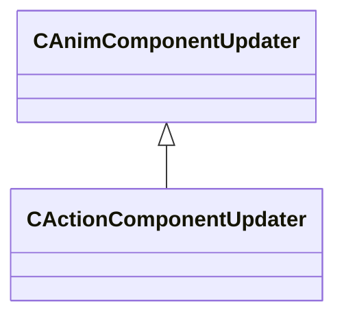

### CAddUpdateNode

**Inherits from:** [CBinaryUpdateNode](animgraphlib.md#cbinaryupdatenode)

**Metadata:** `MGetKV3ClassDefaults = {`, `"_class": "CAddUpdateNode",`, `"m_nodePath":`, `{`, `"m_path":`, `[`, `{`, `"m_id": 4294967295`, `},`, `{`, `"m_id": 4294967295`, `},`, `{`, `"m_id": 4294967295`, `},`, `{`, `"m_id": 4294967295`, `},`, `{`, `"m_id": 4294967295`, `},`, `{`, `"m_id": 4294967295`, `},`, `{`, `"m_id": 4294967295`, `},`, `{`, `"m_id": 4294967295`, `},`, `{`, `"m_id": 4294967295`, `},`, `{`, `"m_id": 4294967295`, `},`, `{`, `"m_id": 4294967295`, `}`, `],`, `"m_nCount": 0`, `},`, `"m_networkMode": "ServerAuthoritative",`, `"m_name": "",`, `"m_pChild1":`, `{`, `"m_nodeIndex": -1`, `},`, `"m_pChild2":`, `{`, `"m_nodeIndex": -1`, `},`, `"m_timingBehavior": "UseChild1",`, `"m_flTimingBlend": 0.500000,`, `"m_bResetChild1": true,`, `"m_bResetChild2": true,`, `"m_footMotionTiming": "Child1",`, `"m_bApplyToFootMotion": true,`, `"m_bApplyChannelsSeparately": true,`, `"m_bUseModelSpace": false,`, `"m_bApplyScale": false`, `}`

**Relationships:**

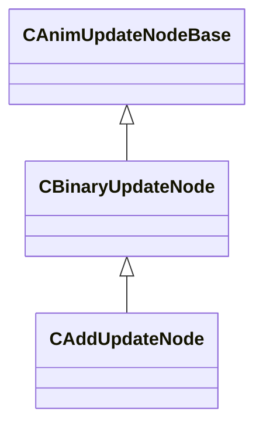

### CAimCameraUpdateNode

**Inherits from:** [CUnaryUpdateNode](animgraphlib.md#cunaryupdatenode)

**Metadata:** `MGetKV3ClassDefaults = {`, `"_class": "CAimCameraUpdateNode",`, `"m_nodePath":`, `{`, `"m_path":`, `[`, `{`, `"m_id": 4294967295`, `},`, `{`, `"m_id": 4294967295`, `},`, `{`, `"m_id": 4294967295`, `},`, `{`, `"m_id": 4294967295`, `},`, `{`, `"m_id": 4294967295`, `},`, `{`, `"m_id": 4294967295`, `},`, `{`, `"m_id": 4294967295`, `},`, `{`, `"m_id": 4294967295`, `},`, `{`, `"m_id": 4294967295`, `},`, `{`, `"m_id": 4294967295`, `},`, `{`, `"m_id": 4294967295`, `}`, `],`, `"m_nCount": 0`, `},`, `"m_networkMode": "ServerAuthoritative",`, `"m_name": "",`, `"m_pChildNode":`, `{`, `"m_nodeIndex": -1`, `},`, `"m_hParameterPosition":`, `{`, `"m_type": "ANIMPARAM_UNKNOWN",`, `"m_index": 255`, `},`, `"m_hParameterOrientation":`, `{`, `"m_type": "ANIMPARAM_UNKNOWN",`, `"m_index": 255`, `},`, `"m_hParameterPelvisOffset":`, `{`, `"m_type": "ANIMPARAM_UNKNOWN",`, `"m_index": 255`, `},`, `"m_hParameterCameraOnly":`, `{`, `"m_type": "ANIMPARAM_UNKNOWN",`, `"m_index": 255`, `},`, `"m_hParameterWeaponDepenetrationDistance":`, `{`, `"m_type": "ANIMPARAM_UNKNOWN",`, `"m_index": 255`, `},`, `"m_hParameterWeaponDepenetrationDelta":`, `{`, `"m_type": "ANIMPARAM_UNKNOWN",`, `"m_index": 255`, `},`, `"m_hParameterCameraClearanceDistance":`, `{`, `"m_type": "ANIMPARAM_UNKNOWN",`, `"m_index": 255`, `},`, `"m_opFixedSettings":`, `{`, `"m_nChainIndex": -1,`, `"m_nCameraJointIndex": -1,`, `"m_nPelvisJointIndex": -1,`, `"m_nClavicleLeftJointIndex": -1,`, `"m_nClavicleRightJointIndex": -1,`, `"m_nDepenetrationJointIndex": -1,`, `"m_propJoints":`, `[`, `]`, `}`, `}`

**Relationships:**

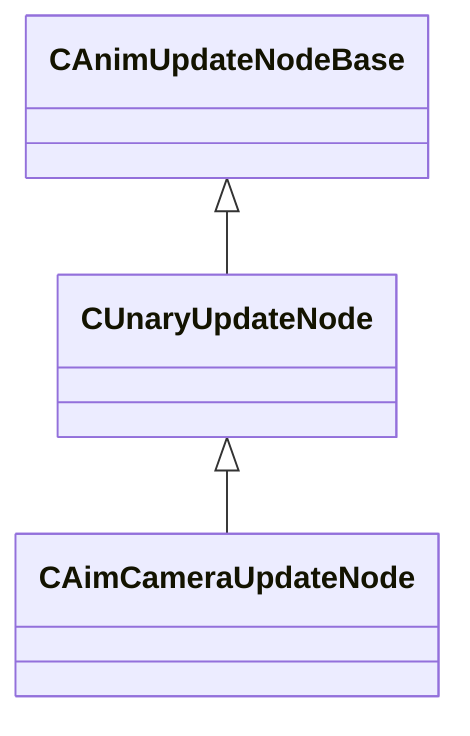

### CAimMatrixUpdateNode

**Inherits from:** [CUnaryUpdateNode](animgraphlib.md#cunaryupdatenode)

**Metadata:** `MGetKV3ClassDefaults = {`, `"_class": "CAimMatrixUpdateNode",`, `"m_nodePath":`, `{`, `"m_path":`, `[`, `{`, `"m_id": 4294967295`, `},`, `{`, `"m_id": 4294967295`, `},`, `{`, `"m_id": 4294967295`, `},`, `{`, `"m_id": 4294967295`, `},`, `{`, `"m_id": 4294967295`, `},`, `{`, `"m_id": 4294967295`, `},`, `{`, `"m_id": 4294967295`, `},`, `{`, `"m_id": 4294967295`, `},`, `{`, `"m_id": 4294967295`, `},`, `{`, `"m_id": 4294967295`, `},`, `{`, `"m_id": 4294967295`, `}`, `],`, `"m_nCount": 0`, `},`, `"m_networkMode": "ServerAuthoritative",`, `"m_name": "",`, `"m_pChildNode":`, `{`, `"m_nodeIndex": -1`, `},`, `"m_opFixedSettings":`, `{`, `"m_attachment":`, `{`, `"m_influenceRotations":`, `[`, `[`, `0.000000,`, `0.000000,`, `0.000000,`, `0.000000`, `],`, `[`, `0.000000,`, `0.000000,`, `0.000000,`, `0.000000`, `],`, `[`, `0.000000,`, `0.000000,`, `0.000000,`, `0.000000`, `]`, `],`, `"m_influenceOffsets":`, `[`, `[`, `0.000000,`, `0.000000,`, `0.000000`, `],`, `[`, `0.000000,`, `0.000000,`, `0.000000`, `],`, `[`, `0.000000,`, `0.000000,`, `0.000000`, `]`, `],`, `"m_influenceIndices":`, `[`, `0,`, `0,`, `0`, `],`, `"m_influenceWeights":`, `[`, `0.000000,`, `0.000000,`, `0.000000`, `],`, `"m_numInfluences": 0`, `},`, `"m_damping":`, `{`, `"_class": "CAnimInputDamping",`, `"m_speedFunction": "NoDamping",`, `"m_fSpeedScale": 1.000000,`, `"m_fFallingSpeedScale": 1.000000`, `},`, `"m_poseCacheHandles":`, `[`, `{`, `"m_nIndex": 65535,`, `"m_eType": "POSETYPE_INVALID"`, `},`, `{`, `"m_nIndex": 65535,`, `"m_eType": "POSETYPE_INVALID"`, `},`, `{`, `"m_nIndex": 65535,`, `"m_eType": "POSETYPE_INVALID"`, `},`, `{`, `"m_nIndex": 65535,`, `"m_eType": "POSETYPE_INVALID"`, `},`, `{`, `"m_nIndex": 65535,`, `"m_eType": "POSETYPE_INVALID"`, `},`, `{`, `"m_nIndex": 65535,`, `"m_eType": "POSETYPE_INVALID"`, `},`, `{`, `"m_nIndex": 65535,`, `"m_eType": "POSETYPE_INVALID"`, `},`, `{`, `"m_nIndex": 65535,`, `"m_eType": "POSETYPE_INVALID"`, `},`, `{`, `"m_nIndex": 65535,`, `"m_eType": "POSETYPE_INVALID"`, `},`, `{`, `"m_nIndex": 65535,`, `"m_eType": "POSETYPE_INVALID"`, `}`, `],`, `"m_eBlendMode": "AimMatrixBlendMode_None",`, `"m_flMaxYawAngle": 45.000000,`, `"m_flMaxPitchAngle": 45.000000,`, `"m_nSequenceMaxFrame": 0,`, `"m_nBoneMaskIndex": -1,`, `"m_bTargetIsPosition": true,`, `"m_bUseBiasAndClamp": false,`, `"m_flBiasAndClampYawOffset": 1.000000,`, `"m_flBiasAndClampPitchOffset": 1.000000,`, `"m_biasAndClampBlendCurve":`, `{`, `"m_flControlPoint1": 0.000000,`, `"m_flControlPoint2": 1.000000`, `}`, `},`, `"m_target": "MoveDirection",`, `"m_paramIndex":`, `{`, `"m_type": "ANIMPARAM_UNKNOWN",`, `"m_index": 255`, `},`, `"m_hSequence": -1,`, `"m_bResetChild": false,`, `"m_bLockWhenWaning": false`, `}`

**Relationships:**

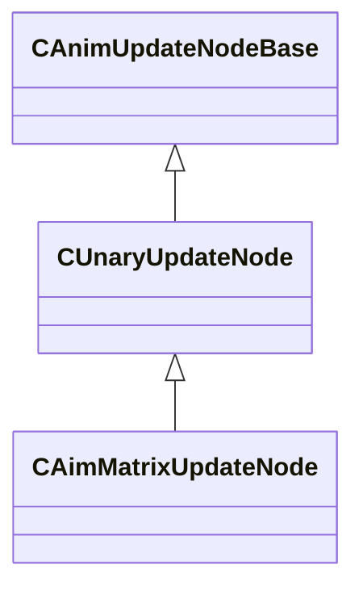

### CAnimActionUpdater

**Derived by:** [CEmitTagActionUpdater](animgraphlib.md#cemittagactionupdater), [CExpressionActionUpdater](animgraphlib.md#cexpressionactionupdater), [CSetParameterActionUpdater](animgraphlib.md#csetparameteractionupdater), [CToggleComponentActionUpdater](animgraphlib.md#ctogglecomponentactionupdater)

**Metadata:** `MGetKV3ClassDefaults = Could not parse KV3 Defaults`

**Relationships:**

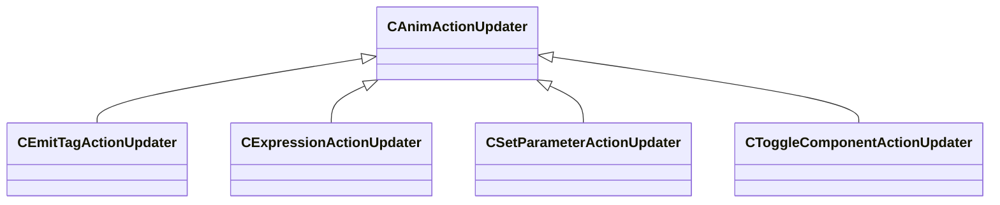

### CAnimComponentUpdater

**Derived by:** [CActionComponentUpdater](animgraphlib.md#cactioncomponentupdater), [CAnimScriptComponentUpdater](animgraphlib.md#canimscriptcomponentupdater), [CCPPScriptComponentUpdater](animgraphlib.md#ccppscriptcomponentupdater), [CDampedValueComponentUpdater](animgraphlib.md#cdampedvaluecomponentupdater), [CDemoSettingsComponentUpdater](animgraphlib.md#cdemosettingscomponentupdater), [CLODComponentUpdater](animgraphlib.md#clodcomponentupdater), [CLookComponentUpdater](animgraphlib.md#clookcomponentupdater), [CMovementComponentUpdater](animgraphlib.md#cmovementcomponentupdater), [CPairedSequenceComponentUpdater](animgraphlib.md#cpairedsequencecomponentupdater), [CRagdollComponentUpdater](animgraphlib.md#cragdollcomponentupdater), [CRemapValueComponentUpdater](animgraphlib.md#cremapvaluecomponentupdater), [CSlopeComponentUpdater](animgraphlib.md#cslopecomponentupdater), [CStateMachineComponentUpdater](animgraphlib.md#cstatemachinecomponentupdater)

**Metadata:** `MGetKV3ClassDefaults = Could not parse KV3 Defaults`

**Relationships:**

```mermaid
classDiagram
    CAnimComponentUpdater <|-- CActionComponentUpdater
    CAnimComponentUpdater <|-- CAnimScriptComponentUpdater
    CAnimComponentUpdater <|-- CCPPScriptComponentUpdater
    CAnimComponentUpdater <|-- CDampedValueComponentUpdater
    CAnimComponentUpdater <|-- CDemoSettingsComponentUpdater
    CAnimComponentUpdater <|-- CLODComponentUpdater
    CAnimComponentUpdater <|-- CLookComponentUpdater
    CAnimComponentUpdater <|-- CMovementComponentUpdater
    CAnimComponentUpdater <|-- CPairedSequenceComponentUpdater
    CAnimComponentUpdater <|-- CRagdollComponentUpdater
    CAnimComponentUpdater <|-- CRemapValueComponentUpdater
    CAnimComponentUpdater <|-- CSlopeComponentUpdater
    CAnimComponentUpdater <|-- CStateMachineComponentUpdater
    CAnimComponentUpdater *-- AnimComponentID
    CAnimComponentUpdater *-- AnimNodeNetworkMode
```

**Fields:**

| Name | Type | Annotations |
|------|------|-------------|
| `m_name` | CUtlString |  |
| `m_id` | [AnimComponentID](../schemas/modellib.md#animcomponentid) |  |
| `m_networkMode` | [AnimNodeNetworkMode](../schemas/animgraphlib.md#animnodenetworkmode) |  |
| `m_bStartEnabled` | bool |  |

### CAnimDemoCaptureSettings

**Metadata:** `MGetKV3ClassDefaults = {`, `"m_vecErrorRangeSplineRotation":`, `[`, `0.100000,`, `0.500000`, `],`, `"m_vecErrorRangeSplineTranslation":`, `[`, `0.100000,`, `0.500000`, `],`, `"m_vecErrorRangeSplineScale":`, `[`, `0.100000,`, `0.500000`, `],`, `"m_flIkRotation_MaxSplineError": 0.030000,`, `"m_flIkTranslation_MaxSplineError": 0.300000,`, `"m_vecErrorRangeQuantizationRotation":`, `[`, `0.100000,`, `0.500000`, `],`, `"m_vecErrorRangeQuantizationTranslation":`, `[`, `0.100000,`, `0.500000`, `],`, `"m_vecErrorRangeQuantizationScale":`, `[`, `0.100000,`, `0.500000`, `],`, `"m_flIkRotation_MaxQuantizationError": 0.010000,`, `"m_flIkTranslation_MaxQuantizationError": 0.100000,`, `"m_baseSequence": "",`, `"m_nBaseSequenceFrame": 0,`, `"m_boneSelectionMode": "CaptureSelectedBones",`, `"m_bones":`, `[`, `],`, `"m_ikChains":`, `[`, `]`, `}`

### CAnimGraphDebugReplay

**Metadata:** `MGetKV3ClassDefaults = {`, `"_class": "CAnimGraphDebugReplay",`, `"m_animGraphFileName": "",`, `"m_frameList":`, `[`, `null,`, `null,`, `null,`, `null,`, `null,`, `null,`, `null,`, `null,`, `null,`, `null,`, `null,`, `null,`, `null,`, `null,`, `null,`, `null,`, `null,`, `null,`, `null,`, `null,`, `null,`, `null,`, `null,`, `null,`, `null,`, `null,`, `null,`, `null,`, `null,`, `null,`, `null,`, `null,`, `null,`, `null,`, `null,`, `null,`, `null,`, `null,`, `null,`, `null,`, `null,`, `null,`, `null,`, `null,`, `null,`, `null,`, `null,`, `null,`, `null,`, `null,`, `null,`, `null,`, `null,`, `null,`, `null,`, `null,`, `null,`, `null,`, `null,`, `null,`, `null,`, `null,`, `null,`, `null,`, `null,`, `null,`, `null,`, `null,`, `null,`, `null,`, `null,`, `null,`, `null,`, `null,`, `null,`, `null,`, `null,`, `null,`, `null,`, `null,`, `null,`, `null,`, `null,`, `null,`, `null,`, `null,`, `null,`, `null,`, `null,`, `null,`, `null,`, `null,`, `null,`, `null,`, `null,`, `null,`, `null,`, `null,`, `null,`, `null,`, `null,`, `null,`, `null,`, `null,`, `null,`, `null,`, `null,`, `null,`, `null,`, `null,`, `null,`, `null,`, `null,`, `null,`, `null,`, `null,`, `null,`, `null,`, `null,`, `null,`, `null,`, `null,`, `null,`, `null,`, `null,`, `null,`, `null,`, `null,`, `null,`, `null,`, `null,`, `null,`, `null,`, `null,`, `null,`, `null,`, `null,`, `null,`, `null,`, `null,`, `null,`, `null,`, `null,`, `null,`, `null,`, `null,`, `null,`, `null,`, `null,`, `null,`, `null,`, `null,`, `null,`, `null,`, `null,`, `null,`, `null,`, `null,`, `null,`, `null,`, `null,`, `null,`, `null,`, `null,`, `null,`, `null,`, `null,`, `null,`, `null,`, `null,`, `null,`, `null,`, `null,`, `null,`, `null,`, `null,`, `null,`, `null,`, `null,`, `null,`, `null,`, `null,`, `null,`, `null,`, `null,`, `null,`, `null,`, `null,`, `null,`, `null,`, `null,`, `null,`, `null,`, `null,`, `null,`, `null,`, `null,`, `null,`, `null,`, `null,`, `null,`, `null,`, `null,`, `null,`, `null,`, `null,`, `null,`, `null,`, `null,`, `null,`, `null,`, `null,`, `null,`, `null,`, `null,`, `null,`, `null,`, `null,`, `null,`, `null,`, `null,`, `null,`, `null,`, `null,`, `null,`, `null,`, `null,`, `null,`, `null,`, `null,`, `null,`, `null,`, `null,`, `null,`, `null,`, `null,`, `null,`, `null,`, `null,`, `null,`, `null,`, `null,`, `null,`, `null,`, `null,`, `null,`, `null,`, `null,`, `null,`, `null,`, `null,`, `null,`, `null,`, `null,`, `null,`, `null,`, `null,`, `null,`, `null,`, `null,`, `null,`, `null,`, `null,`, `null,`, `null,`, `null,`, `null,`, `null,`, `null,`, `null,`, `null,`, `null,`, `null,`, `null,`, `null,`, `null,`, `null,`, `null,`, `null,`, `null,`, `null,`, `null,`, `null,`, `null,`, `null,`, `null,`, `null,`, `null,`, `null,`, `null,`, `null,`, `null,`, `null,`, `null,`, `null,`, `null,`, `null,`, `null,`, `null,`, `null,`, `null,`, `null,`, `null,`, `null,`, `null,`, `null,`, `null,`, `null,`, `null,`, `null,`, `null,`, `null,`, `null,`, `null,`, `null,`, `null,`, `null,`, `null,`, `null,`, `null,`, `null,`, `null,`, `null,`, `null,`, `null,`, `null,`, `null,`, `null,`, `null,`, `null,`, `null,`, `null,`, `null,`, `null,`, `null,`, `null,`, `null,`, `null,`, `null,`, `null,`, `null,`, `null,`, `null,`, `null,`, `null,`, `null,`, `null,`, `null,`, `null,`, `null,`, `null,`, `null,`, `null,`, `null,`, `null,`, `null,`, `null,`, `null,`, `null,`, `null,`, `null,`, `null,`, `null,`, `null,`, `null,`, `null,`, `null,`, `null,`, `null,`, `null,`, `null,`, `null,`, `null,`, `null,`, `null,`, `null,`, `null,`, `null,`, `null,`, `null,`, `null,`, `null,`, `null,`, `null,`, `null,`, `null,`, `null,`, `null,`, `null,`, `null,`, `null,`, `null,`, `null,`, `null,`, `null,`, `null,`, `null,`, `null,`, `null,`, `null,`, `null,`, `null,`, `null,`, `null,`, `null,`, `null,`, `null,`, `null,`, `null,`, `null,`, `null,`, `null,`, `null,`, `null,`, `null,`, `null,`, `null,`, `null,`, `null,`, `null,`, `null,`, `null,`, `null,`, `null,`, `null,`, `null,`, `null,`, `null,`, `null,`, `null,`, `null,`, `null,`, `null,`, `null,`, `null,`, `null,`, `null,`, `null,`, `null,`, `null,`, `null,`, `null,`, `null,`, `null,`, `null,`, `null,`, `null,`, `null,`, `null,`, `null,`, `null,`, `null,`, `null,`, `null,`, `null,`, `null,`, `null,`, `null,`, `null,`, `null,`, `null,`, `null,`, `null,`, `null,`, `null,`, `null,`, `null,`, `null,`, `null,`, `null,`, `null,`, `null,`, `null,`, `null,`, `null,`, `null,`, `null,`, `null,`, `null,`, `null,`, `null,`, `null,`, `null,`, `null,`, `null,`, `null,`, `null,`, `null,`, `null,`, `null,`, `null,`, `null,`, `null,`, `null,`, `null,`, `null,`, `null,`, `null,`, `null,`, `null,`, `null,`, `null,`, `null,`, `null,`, `null,`, `null,`, `null,`, `null,`, `null,`, `null,`, `null,`, `null,`, `null,`, `null,`, `null,`, `null,`, `null,`, `null,`, `null,`, `null,`, `null,`, `null,`, `null,`, `null,`, `null,`, `null,`, `null,`, `null,`, `null,`, `null,`, `null,`, `null,`, `null,`, `null,`, `null,`, `null,`, `null,`, `null,`, `null,`, `null,`, `null,`, `null,`, `null,`, `null,`, `null,`, `null,`, `null,`, `null,`, `null,`, `null,`, `null,`, `null,`, `null,`, `null,`, `null,`, `null,`, `null,`, `null,`, `null,`, `null,`, `null,`, `null,`, `null,`, `null,`, `null,`, `null,`, `null,`, `null,`, `null,`, `null,`, `null,`, `null,`, `null,`, `null,`, `null,`, `null,`, `null,`, `null,`, `null,`, `null,`, `null,`, `null,`, `null,`, `null,`, `null,`, `null,`, `null,`, `null,`, `null,`, `null,`, `null,`, `null,`, `null,`, `null,`, `null,`, `null,`, `null,`, `null,`, `null,`, `null,`, `null,`, `null,`, `null,`, `null,`, `null,`, `null,`, `null,`, `null,`, `null,`, `null,`, `null,`, `null,`, `null,`, `null,`, `null,`, `null,`, `null,`, `null,`, `null,`, `null,`, `null,`, `null,`, `null,`, `null,`, `null,`, `null,`, `null,`, `null,`, `null,`, `null,`, `null,`, `null,`, `null,`, `null,`, `null,`, `null,`, `null,`, `null,`, `null,`, `null,`, `null,`, `null,`, `null,`, `null,`, `null,`, `null,`, `null,`, `null,`, `null,`, `null,`, `null,`, `null,`, `null,`, `null,`, `null,`, `null,`, `null,`, `null,`, `null,`, `null,`, `null,`, `null,`, `null,`, `null,`, `null,`, `null,`, `null,`, `null,`, `null,`, `null,`, `null,`, `null,`, `null,`, `null,`, `null,`, `null,`, `null,`, `null,`, `null,`, `null,`, `null,`, `null,`, `null,`, `null,`, `null,`, `null,`, `null,`, `null,`, `null,`, `null,`, `null,`, `null,`, `null,`, `null,`, `null,`, `null,`, `null,`, `null,`, `null,`, `null,`, `null,`, `null,`, `null,`, `null,`, `null,`, `null,`, `null,`, `null,`, `null,`, `null,`, `null,`, `null,`, `null,`, `null,`, `null,`, `null,`, `null,`, `null,`, `null,`, `null,`, `null,`, `null,`, `null,`, `null,`, `null,`, `null,`, `null,`, `null,`, `null,`, `null,`, `null,`, `null,`, `null,`, `null,`, `null,`, `null,`, `null,`, `null,`, `null,`, `null,`, `null,`, `null,`, `null,`, `null,`, `null,`, `null,`, `null,`, `null,`, `null,`, `null,`, `null,`, `null,`, `null,`, `null,`, `null,`, `null,`, `null,`, `null,`, `null,`, `null,`, `null,`, `null,`, `null,`, `null,`, `null,`, `null,`, `null,`, `null,`, `null,`, `null,`, `null,`, `null,`, `null,`, `null,`, `null,`, `null,`, `null,`, `null,`, `null,`, `null,`, `null,`, `null,`, `null,`, `null,`, `null,`, `null,`, `null,`, `null,`, `null,`, `null,`, `null,`, `null,`, `null,`, `null,`, `null,`, `null,`, `null,`, `null,`, `null,`, `null,`, `null,`, `null,`, `null,`, `null,`, `null,`, `null,`, `null,`, `null,`, `null,`, `null,`, `null,`, `null,`, `null,`, `null,`, `null,`, `null,`, `null,`, `null,`, `null,`, `null,`, `null,`, `null,`, `null,`, `null,`, `null,`, `null,`, `null,`, `null,`, `null,`, `null,`, `null,`, `null,`, `null,`, `null,`, `null,`, `null,`, `null,`, `null,`, `null,`, `null,`, `null,`, `null,`, `null,`, `null,`, `null,`, `null,`, `null,`, `null,`, `null,`, `null,`, `null,`, `null,`, `null,`, `null,`, `null,`, `null,`, `null,`, `null,`, `null,`, `null,`, `null,`, `null,`, `null,`, `null,`, `null,`, `null,`, `null,`, `null,`, `null,`, `null,`, `null,`, `null,`, `null,`, `null,`, `null,`, `null,`, `null,`, `null,`, `null,`, `null,`, `null,`, `null,`, `null,`, `null,`, `null,`, `null,`, `null,`, `null,`, `null,`, `null,`, `null,`, `null,`, `null,`, `null,`, `null,`, `null,`, `null,`, `null,`, `null,`, `null,`, `null,`, `null,`, `null,`, `null,`, `null,`, `null,`, `null,`, `null,`, `null,`, `null,`, `null,`, `null,`, `null,`, `null,`, `null,`, `null,`, `null,`, `null,`, `null,`, `null,`, `null,`, `null,`, `null,`, `null,`, `null,`, `null,`, `null,`, `null,`, `null,`, `null,`, `null,`, `null,`, `null,`, `null,`, `null,`, `null,`, `null,`, `null,`, `null,`, `null,`, `null,`, `null,`, `null,`, `null,`, `null,`, `null,`, `null,`, `null,`, `null,`, `null,`, `null,`, `null,`, `null,`, `null,`, `null,`, `null,`, `null,`, `null,`, `null,`, `null,`, `null,`, `null,`, `null,`, `null,`, `null,`, `null,`, `null,`, `null,`, `null,`, `null,`, `null,`, `null,`, `null,`, `null,`, `null,`, `null,`, `null,`, `null,`, `null,`, `null,`, `null,`, `null,`, `null,`, `null,`, `null,`, `null,`, `null,`, `null,`, `null,`, `null,`, `null,`, `null,`, `null,`, `null,`, `null,`, `null,`, `null,`, `null,`, `null,`, `null,`, `null,`, `null,`, `null,`, `null,`, `null,`, `null,`, `null,`, `null,`, `null,`, `null,`, `null,`, `null,`, `null,`, `null,`, `null,`, `null,`, `null,`, `null,`, `null,`, `null,`, `null,`, `null,`, `null,`, `null,`, `null,`, `null,`, `null,`, `null,`, `null,`, `null,`, `null,`, `null,`, `null,`, `null,`, `null,`, `null,`, `null,`, `null,`, `null,`, `null,`, `null,`, `null,`, `null,`, `null,`, `null,`, `null,`, `null,`, `null,`, `null,`, `null,`, `null,`, `null,`, `null,`, `null,`, `null,`, `null,`, `null,`, `null,`, `null,`, `null,`, `null,`, `null,`, `null,`, `null,`, `null,`, `null,`, `null,`, `null,`, `null,`, `null,`, `null,`, `null,`, `null,`, `null,`, `null,`, `null,`, `null,`, `null,`, `null,`, `null,`, `null,`, `null,`, `null,`, `null,`, `null,`, `null,`, `null,`, `null,`, `null,`, `null,`, `null,`, `null,`, `null,`, `null,`, `null,`, `null,`, `null,`, `null,`, `null,`, `null,`, `null,`, `null,`, `null,`, `null,`, `null,`, `null,`, `null,`, `null,`, `null,`, `null,`, `null,`, `null,`, `null,`, `null,`, `null,`, `null,`, `null,`, `null,`, `null,`, `null,`, `null,`, `null,`, `null,`, `null,`, `null,`, `null,`, `null,`, `null,`, `null,`, `null,`, `null,`, `null,`, `null,`, `null,`, `null,`, `null,`, `null,`, `null,`, `null,`, `null,`, `null,`, `null,`, `null,`, `null,`, `null,`, `null,`, `null,`, `null,`, `null,`, `null,`, `null,`, `null,`, `null,`, `null,`, `null,`, `null,`, `null,`, `null,`, `null,`, `null,`, `null,`, `null,`, `null,`, `null,`, `null,`, `null,`, `null,`, `null,`, `null,`, `null,`, `null,`, `null,`, `null,`, `null,`, `null,`, `null,`, `null,`, `null,`, `null,`, `null,`, `null,`, `null,`, `null,`, `null,`, `null,`, `null,`, `null,`, `null,`, `null,`, `null,`, `null,`, `null,`, `null,`, `null,`, `null,`, `null,`, `null,`, `null,`, `null,`, `null,`, `null,`, `null,`, `null,`, `null,`, `null,`, `null,`, `null,`, `null,`, `null,`, `null,`, `null,`, `null,`, `null,`, `null,`, `null,`, `null,`, `null,`, `null,`, `null,`, `null,`, `null,`, `null,`, `null,`, `null,`, `null,`, `null,`, `null,`, `null,`, `null,`, `null,`, `null,`, `null,`, `null,`, `null,`, `null,`, `null,`, `null,`, `null,`, `null,`, `null,`, `null,`, `null,`, `null,`, `null,`, `null,`, `null,`, `null,`, `null,`, `null,`, `null,`, `null,`, `null,`, `null,`, `null,`, `null,`, `null,`, `null,`, `null,`, `null,`, `null,`, `null,`, `null,`, `null,`, `null,`, `null,`, `null,`, `null,`, `null,`, `null,`, `null,`, `null,`, `null,`, `null,`, `null,`, `null,`, `null,`, `null,`, `null,`, `null,`, `null,`, `null,`, `null,`, `null,`, `null,`, `null,`, `null,`, `null,`, `null,`, `null,`, `null,`, `null,`, `null,`, `null,`, `null,`, `null,`, `null,`, `null,`, `null,`, `null,`, `null,`, `null,`, `null,`, `null,`, `null,`, `null,`, `null,`, `null,`, `null,`, `null,`, `null,`, `null,`, `null,`, `null,`, `null,`, `null,`, `null,`, `null,`, `null,`, `null,`, `null,`, `null,`, `null,`, `null,`, `null,`, `null,`, `null,`, `null,`, `null,`, `null,`, `null,`, `null,`, `null,`, `null,`, `null,`, `null,`, `null,`, `null,`, `null,`, `null,`, `null,`, `null,`, `null,`, `null,`, `null,`, `null,`, `null,`, `null,`, `null,`, `null,`, `null,`, `null,`, `null,`, `null,`, `null,`, `null,`, `null,`, `null,`, `null,`, `null,`, `null,`, `null,`, `null,`, `null,`, `null,`, `null,`, `null,`, `null,`, `null,`, `null,`, `null,`, `null,`, `null,`, `null,`, `null,`, `null,`, `null,`, `null,`, `null,`, `null,`, `null,`, `null,`, `null,`, `null,`, `null,`, `null,`, `null,`, `null,`, `null,`, `null,`, `null,`, `null,`, `null,`, `null,`, `null,`, `null,`, `null,`, `null,`, `null,`, `null,`, `null,`, `null,`, `null,`, `null,`, `null,`, `null,`, `null,`, `null,`, `null,`, `null,`, `null,`, `null,`, `null,`, `null,`, `null,`, `null,`, `null,`, `null,`, `null,`, `null,`, `null,`, `null,`, `null,`, `null,`, `null,`, `null,`, `null,`, `null,`, `null,`, `null,`, `null,`, `null,`, `null,`, `null,`, `null,`, `null,`, `null,`, `null,`, `null,`, `null,`, `null,`, `null,`, `null,`, `null,`, `null,`, `null,`, `null,`, `null,`, `null,`, `null,`, `null,`, `null,`, `null,`, `null,`, `null,`, `null,`, `null,`, `null,`, `null,`, `null,`, `null,`, `null,`, `null,`, `null,`, `null,`, `null,`, `null,`, `null,`, `null,`, `null,`, `null,`, `null,`, `null,`, `null,`, `null,`, `null,`, `null,`, `null,`, `null,`, `null,`, `null,`, `null,`, `null,`, `null,`, `null,`, `null,`, `null,`, `null,`, `null,`, `null,`, `null,`, `null,`, `null,`, `null,`, `null,`, `null,`, `null,`, `null,`, `null,`, `null,`, `null,`, `null,`, `null,`, `null,`, `null,`, `null,`, `null,`, `null,`, `null,`, `null,`, `null,`, `null,`, `null,`, `null,`, `null,`, `null,`, `null,`, `null,`, `null,`, `null,`, `null,`, `null,`, `null,`, `null,`, `null,`, `null,`, `null,`, `null,`, `null,`, `null,`, `null,`, `null,`, `null,`, `null,`, `null,`, `null,`, `null,`, `null,`, `null,`, `null,`, `null,`, `null,`, `null,`, `null,`, `null,`, `null,`, `null,`, `null,`, `null,`, `null,`, `null,`, `null,`, `null,`, `null,`, `null,`, `null,`, `null,`, `null,`, `null,`, `null,`, `null,`, `null,`, `null,`, `null,`, `null,`, `null,`, `null,`, `null,`, `null,`, `null,`, `null,`, `null,`, `null,`, `null,`, `null,`, `null,`, `null,`, `null,`, `null,`, `null,`, `null,`, `null,`, `null,`, `null,`, `null,`, `null,`, `null,`, `null,`, `null,`, `null,`, `null,`, `null,`, `null,`, `null,`, `null,`, `null,`, `null,`, `null,`, `null,`, `null,`, `null,`, `null,`, `null,`, `null,`, `null,`, `null,`, `null,`, `null,`, `null,`, `null,`, `null,`, `null,`, `null,`, `null,`, `null,`, `null,`, `null,`, `null,`, `null,`, `null,`, `null,`, `null,`, `null,`, `null,`, `null,`, `null,`, `null,`, `null,`, `null,`, `null,`, `null,`, `null,`, `null,`, `null,`, `null,`, `null,`, `null,`, `null,`, `null,`, `null,`, `null,`, `null,`, `null,`, `null,`, `null,`, `null,`, `null,`, `null,`, `null,`, `null,`, `null,`, `null,`, `null,`, `null,`, `null,`, `null,`, `null,`, `null,`, `null,`, `null,`, `null,`, `null,`, `null,`, `null,`, `null,`, `null,`, `null,`, `null,`, `null,`, `null,`, `null,`, `null,`, `null,`, `null,`, `null,`, `null,`, `null,`, `null,`, `null,`, `null,`, `null,`, `null,`, `null,`, `null,`, `null,`, `null,`, `null,`, `null,`, `null,`, `null,`, `null,`, `null,`, `null,`, `null,`, `null,`, `null,`, `null,`, `null,`, `null,`, `null,`, `null,`, `null,`, `null,`, `null,`, `null,`, `null,`, `null,`, `null,`, `null,`, `null,`, `null,`, `null,`, `null,`, `null,`, `null,`, `null,`, `null,`, `null,`, `null,`, `null,`, `null,`, `null,`, `null,`, `null,`, `null,`, `null,`, `null,`, `null,`, `null,`, `null,`, `null,`, `null,`, `null,`, `null,`, `null,`, `null,`, `null,`, `null,`, `null,`, `null,`, `null,`, `null,`, `null,`, `null,`, `null,`, `null,`, `null,`, `null,`, `null,`, `null,`, `null,`, `null,`, `null,`, `null,`, `null,`, `null,`, `null,`, `null,`, `null,`, `null,`, `null,`, `null,`, `null,`, `null,`, `null,`, `null,`, `null,`, `null,`, `null,`, `null,`, `null,`, `null,`, `null,`, `null,`, `null,`, `null,`, `null,`, `null,`, `null,`, `null,`, `null,`, `null,`, `null,`, `null,`, `null,`, `null,`, `null,`, `null,`, `null,`, `null,`, `null,`, `null,`, `null,`, `null,`, `null,`, `null,`, `null,`, `null,`, `null,`, `null,`, `null,`, `null,`, `null,`, `null,`, `null,`, `null,`, `null,`, `null,`, `null,`, `null,`, `null,`, `null,`, `null,`, `null,`, `null,`, `null,`, `null,`, `null,`, `null,`, `null,`, `null,`, `null,`, `null,`, `null,`, `null,`, `null,`, `null,`, `null,`, `null,`, `null,`, `null,`, `null,`, `null,`, `null,`, `null,`, `null,`, `null,`, `null,`, `null,`, `null,`, `null,`, `null,`, `null,`, `null,`, `null,`, `null,`, `null,`, `null,`, `null,`, `null,`, `null,`, `null,`, `null,`, `null,`, `null,`, `null,`, `null,`, `null,`, `null,`, `null,`, `null,`, `null,`, `null,`, `null,`, `null,`, `null,`, `null,`, `null,`, `null,`, `null,`, `null,`, `null,`, `null,`, `null,`, `null,`, `null,`, `null,`, `null,`, `null,`, `null,`, `null,`, `null,`, `null,`, `null,`, `null,`, `null,`, `null,`, `null,`, `null,`, `null,`, `null,`, `null,`, `null,`, `null,`, `null,`, `null,`, `null,`, `null,`, `null,`, `null,`, `null,`, `null,`, `null,`, `null,`, `null,`, `null,`, `null,`, `null,`, `null,`, `null,`, `null,`, `null,`, `null,`, `null,`, `null,`, `null,`, `null,`, `null,`, `null,`, `null,`, `null,`, `null,`, `null,`, `null,`, `null,`, `null,`, `null,`, `null,`, `null,`, `null,`, `null,`, `null,`, `null,`, `null,`, `null,`, `null,`, `null,`, `null,`, `null,`, `null,`, `null,`, `null,`, `null,`, `null,`, `null,`, `null,`, `null,`, `null,`, `null,`, `null,`, `null,`, `null,`, `null,`, `null,`, `null,`, `null,`, `null,`, `null,`, `null,`, `null,`, `null,`, `null,`, `null,`, `null,`, `null,`, `null,`, `null,`, `null,`, `null,`, `null,`, `null,`, `null,`, `null,`, `null,`, `null,`, `null,`, `null,`, `null,`, `null,`, `null,`, `null,`, `null,`, `null,`, `null,`, `null,`, `null,`, `null,`, `null,`, `null,`, `null,`, `null,`, `null,`, `null,`, `null,`, `null,`, `null,`, `null,`, `null,`, `null,`, `null,`, `null,`, `null,`, `null,`, `null,`, `null,`, `null,`, `null,`, `null,`, `null,`, `null,`, `null,`, `null,`, `null,`, `null,`, `null,`, `null,`, `null,`, `null,`, `null,`, `null,`, `null,`, `null,`, `null,`, `null,`, `null,`, `null,`, `null,`, `null,`, `null,`, `null,`, `null,`, `null,`, `null,`, `null,`, `null,`, `null,`, `null,`, `null,`, `null,`, `null,`, `null,`, `null,`, `null,`, `null,`, `null,`, `null,`, `null,`, `null,`, `null,`, `null,`, `null,`, `null,`, `null,`, `null,`, `null,`, `null,`, `null,`, `null,`, `null,`, `null,`, `null,`, `null,`, `null,`, `null,`, `null,`, `null,`, `null,`, `null,`, `null,`, `null,`, `null,`, `null,`, `null,`, `null,`, `null,`, `null,`, `null,`, `null,`, `null,`, `null,`, `null,`, `null,`, `null,`, `null,`, `null,`, `null,`, `null,`, `null,`, `null,`, `null,`, `null,`, `null,`, `null,`, `null,`, `null,`, `null,`, `null,`, `null,`, `null,`, `null,`, `null,`, `null,`, `null,`, `null,`, `null,`, `null,`, `null,`, `null,`, `null,`, `null,`, `null,`, `null,`, `null,`, `null,`, `null,`, `null,`, `null,`, `null,`, `null,`, `null,`, `null,`, `null,`, `null,`, `null,`, `null,`, `null,`, `null,`, `null,`, `null,`, `null,`, `null,`, `null,`, `null,`, `null,`, `null,`, `null,`, `null,`, `null,`, `null,`, `null,`, `null,`, `null,`, `null,`, `null,`, `null,`, `null,`, `null,`, `null,`, `null,`, `null,`, `null,`, `null,`, `null,`, `null,`, `null,`, `null,`, `null,`, `null,`, `null,`, `null,`, `null,`, `null,`, `null,`, `null,`, `null,`, `null,`, `null,`, `null,`, `null,`, `null,`, `null,`, `null,`, `null,`, `null,`, `null,`, `null,`, `null,`, `null,`, `null,`, `null,`, `null,`, `null,`, `null,`, `null,`, `null,`, `null,`, `null,`, `null,`, `null,`, `null,`, `null,`, `null,`, `null,`, `null,`, `null,`, `null,`, `null,`, `null,`, `null,`, `null,`, `null,`, `null,`, `null,`, `null,`, `null,`, `null,`, `null,`, `null,`, `null,`, `null,`, `null,`, `null,`, `null,`, `null,`, `null,`, `null,`, `null,`, `null,`, `null,`, `null,`, `null,`, `null,`, `null,`, `null,`, `null,`, `null,`, `null,`, `null,`, `null,`, `null,`, `null,`, `null,`, `null,`, `null,`, `null,`, `null,`, `null,`, `null,`, `null,`, `null,`, `null,`, `null,`, `null,`, `null,`, `null,`, `null,`, `null,`, `null,`, `null,`, `null,`, `null,`, `null,`, `null,`, `null,`, `null,`, `null,`, `null,`, `null,`, `null,`, `null,`, `null,`, `null,`, `null,`, `null,`, `null,`, `null,`, `null,`, `null,`, `null,`, `null,`, `null,`, `null,`, `null,`, `null,`, `null,`, `null,`, `null,`, `null,`, `null,`, `null,`, `null,`, `null,`, `null,`, `null,`, `null,`, `null,`, `null,`, `null,`, `null,`, `null,`, `null,`, `null,`, `null,`, `null,`, `null,`, `null,`, `null,`, `null,`, `null,`, `null,`, `null,`, `null,`, `null,`, `null,`, `null,`, `null,`, `null,`, `null,`, `null,`, `null,`, `null,`, `null,`, `null,`, `null,`, `null,`, `null,`, `null,`, `null,`, `null,`, `null,`, `null,`, `null,`, `null,`, `null,`, `null,`, `null,`, `null,`, `null,`, `null,`, `null,`, `null,`, `null,`, `null,`, `null,`, `null,`, `null,`, `null,`, `null,`, `null,`, `null,`, `null,`, `null,`, `null,`, `null,`, `null,`, `null,`, `null,`, `null,`, `null,`, `null,`, `null,`, `null,`, `null,`, `null,`, `null,`, `null,`, `null,`, `null,`, `null,`, `null,`, `null,`, `null,`, `null,`, `null,`, `null,`, `null,`, `null,`, `null,`, `null,`, `null,`, `null,`, `null,`, `null,`, `null,`, `null,`, `null,`, `null,`, `null,`, `null,`, `null,`, `null,`, `null,`, `null,`, `null,`, `null,`, `null,`, `null,`, `null,`, `null,`, `null,`, `null,`, `null,`, `null,`, `null,`, `null,`, `null,`, `null,`, `null,`, `null,`, `null,`, `null,`, `null,`, `null,`, `null,`, `null,`, `null,`, `null,`, `null,`, `null,`, `null,`, `null,`, `null,`, `null,`, `null,`, `null,`, `null,`, `null,`, `null,`, `null,`, `null,`, `null,`, `null,`, `null,`, `null,`, `null,`, `null,`, `null,`, `null,`, `null,`, `null,`, `null,`, `null,`, `null,`, `null,`, `null,`, `null,`, `null,`, `null,`, `null,`, `null,`, `null,`, `null,`, `null,`, `null,`, `null,`, `null,`, `null,`, `null,`, `null,`, `null,`, `null,`, `null,`, `null,`, `null,`, `null,`, `null,`, `null,`, `null,`, `null,`, `null,`, `null,`, `null,`, `null,`, `null,`, `null,`, `null,`, `null,`, `null,`, `null,`, `null,`, `null,`, `null,`, `null,`, `null,`, `null,`, `null,`, `null,`, `null,`, `null,`, `null,`, `null,`, `null,`, `null,`, `null,`, `null,`, `null,`, `null,`, `null,`, `null,`, `null,`, `null,`, `null,`, `null,`, `null,`, `null,`, `null,`, `null,`, `null,`, `null,`, `null,`, `null,`, `null,`, `null,`, `null,`, `null,`, `null,`, `null,`, `null,`, `null,`, `null,`, `null,`, `null,`, `null,`, `null,`, `null,`, `null,`, `null,`, `null,`, `null,`, `null,`, `null,`, `null,`, `null,`, `null,`, `null,`, `null,`, `null,`, `null,`, `null,`, `null,`, `null,`, `null,`, `null,`, `null,`, `null,`, `null,`, `null,`, `null,`, `null,`, `null,`, `null,`, `null,`, `null,`, `null,`, `null,`, `null,`, `null,`, `null,`, `null,`, `null,`, `null,`, `null,`, `null,`, `null,`, `null,`, `null,`, `null,`, `null,`, `null,`, `null,`, `null,`, `null,`, `null,`, `null,`, `null,`, `null,`, `null,`, `null,`, `null,`, `null,`, `null,`, `null,`, `null,`, `null,`, `null,`, `null,`, `null,`, `null,`, `null,`, `null,`, `null,`, `null,`, `null,`, `null,`, `null,`, `null,`, `null,`, `null,`, `null,`, `null,`, `null,`, `null,`, `null,`, `null,`, `null,`, `null,`, `null,`, `null,`, `null,`, `null,`, `null,`, `null,`, `null,`, `null,`, `null,`, `null,`, `null,`, `null,`, `null,`, `null,`, `null,`, `null,`, `null,`, `null,`, `null,`, `null,`, `null,`, `null,`, `null,`, `null,`, `null,`, `null,`, `null,`, `null,`, `null,`, `null,`, `null,`, `null,`, `null,`, `null,`, `null,`, `null,`, `null,`, `null,`, `null,`, `null,`, `null,`, `null,`, `null,`, `null,`, `null,`, `null,`, `null,`, `null,`, `null,`, `null,`, `null,`, `null,`, `null,`, `null,`, `null,`, `null,`, `null,`, `null,`, `null,`, `null,`, `null,`, `null,`, `null,`, `null,`, `null,`, `null,`, `null,`, `null,`, `null,`, `null,`, `null,`, `null,`, `null,`, `null,`, `null,`, `null,`, `null,`, `null,`, `null,`, `null,`, `null,`, `null,`, `null,`, `null,`, `null,`, `null,`, `null,`, `null,`, `null,`, `null,`, `null,`, `null,`, `null,`, `null,`, `null,`, `null,`, `null,`, `null,`, `null,`, `null,`, `null,`, `null,`, `null,`, `null,`, `null,`, `null,`, `null,`, `null,`, `null,`, `null,`, `null,`, `null,`, `null,`, `null,`, `null,`, `null,`, `null,`, `null,`, `null,`, `null,`, `null,`, `null,`, `null,`, `null,`, `null,`, `null,`, `null,`, `null,`, `null,`, `null,`, `null,`, `null,`, `null,`, `null,`, `null,`, `null,`, `null,`, `null,`, `null,`, `null,`, `null,`, `null,`, `null,`, `null,`, `null,`, `null,`, `null,`, `null,`, `null,`, `null,`, `null,`, `null,`, `null,`, `null,`, `null,`, `null,`, `null,`, `null,`, `null,`, `null,`, `null,`, `null,`, `null,`, `null,`, `null,`, `null,`, `null,`, `null,`, `null,`, `null,`, `null,`, `null,`, `null,`, `null,`, `null,`, `null,`, `null,`, `null,`, `null,`, `null,`, `null,`, `null,`, `null,`, `null,`, `null,`, `null,`, `null,`, `null,`, `null,`, `null,`, `null,`, `null,`, `null,`, `null,`, `null,`, `null,`, `null,`, `null,`, `null,`, `null,`, `null,`, `null,`, `null,`, `null,`, `null,`, `null,`, `null,`, `null,`, `null,`, `null,`, `null,`, `null,`, `null,`, `null,`, `null,`, `null,`, `null,`, `null,`, `null,`, `null,`, `null,`, `null,`, `null,`, `null,`, `null,`, `null,`, `null,`, `null,`, `null,`, `null,`, `null,`, `null,`, `null,`, `null,`, `null,`, `null,`, `null,`, `null,`, `null,`, `null,`, `null,`, `null,`, `null,`, `null,`, `null,`, `null,`, `null,`, `null,`, `null,`, `null,`, `null,`, `null,`, `null,`, `null,`, `null,`, `null,`, `null,`, `null,`, `null,`, `null,`, `null,`, `null,`, `null,`, `null,`, `null,`, `null,`, `null,`, `null,`, `null,`, `null,`, `null,`, `null,`, `null,`, `null,`, `null,`, `null,`, `null,`, `null,`, `null,`, `null,`, `null,`, `null,`, `null,`, `null,`, `null,`, `null,`, `null,`, `null,`, `null,`, `null,`, `null,`, `null,`, `null,`, `null,`, `null,`, `null,`, `null,`, `null,`, `null,`, `null,`, `null,`, `null,`, `null,`, `null,`, `null,`, `null,`, `null,`, `null,`, `null,`, `null,`, `null,`, `null,`, `null,`, `null,`, `null,`, `null,`, `null,`, `null,`, `null,`, `null,`, `null,`, `null,`, `null,`, `null,`, `null,`, `null,`, `null,`, `null,`, `null,`, `null,`, `null,`, `null,`, `null,`, `null,`, `null,`, `null,`, `null,`, `null,`, `null,`, `null,`, `null,`, `null,`, `null,`, `null,`, `null,`, `null,`, `null,`, `null,`, `null,`, `null,`, `null,`, `null,`, `null,`, `null,`, `null,`, `null,`, `null,`, `null,`, `null,`, `null,`, `null,`, `null,`, `null,`, `null,`, `null,`, `null,`, `null,`, `null,`, `null,`, `null,`, `null,`, `null,`, `null,`, `null,`, `null,`, `null,`, `null,`, `null,`, `null,`, `null,`, `null,`, `null,`, `null,`, `null,`, `null,`, `null,`, `null,`, `null,`, `null,`, `null,`, `null,`, `null,`, `null,`, `null,`, `null,`, `null,`, `null,`, `null,`, `null,`, `null,`, `null,`, `null,`, `null,`, `null,`, `null,`, `null,`, `null,`, `null,`, `null,`, `null,`, `null,`, `null,`, `null,`, `null,`, `null,`, `null,`, `null,`, `null,`, `null,`, `null,`, `null,`, `null,`, `null,`, `null,`, `null,`, `null,`, `null,`, `null,`, `null,`, `null,`, `null,`, `null,`, `null,`, `null,`, `null,`, `null,`, `null,`, `null,`, `null,`, `null,`, `null,`, `null,`, `null,`, `null,`, `null,`, `null,`, `null,`, `null,`, `null,`, `null,`, `null,`, `null,`, `null,`, `null,`, `null,`, `null,`, `null,`, `null,`, `null,`, `null,`, `null,`, `null,`, `null,`, `null,`, `null,`, `null,`, `null,`, `null,`, `null,`, `null,`, `null,`, `null,`, `null,`, `null,`, `null,`, `null,`, `null,`, `null,`, `null,`, `null,`, `null,`, `null,`, `null,`, `null,`, `null,`, `null,`, `null,`, `null,`, `null,`, `null,`, `null,`, `null,`, `null,`, `null,`, `null,`, `null,`, `null,`, `null,`, `null,`, `null,`, `null,`, `null,`, `null,`, `null,`, `null,`, `null,`, `null,`, `null,`, `null,`, `null,`, `null,`, `null,`, `null,`, `null,`, `null,`, `null,`, `null,`, `null,`, `null,`, `null,`, `null,`, `null,`, `null,`, `null,`, `null,`, `null,`, `null,`, `null,`, `null,`, `null,`, `null,`, `null,`, `null,`, `null,`, `null,`, `null,`, `null,`, `null,`, `null,`, `null,`, `null,`, `null,`, `null,`, `null,`, `null,`, `null,`, `null,`, `null,`, `null,`, `null,`, `null,`, `null,`, `null,`, `null,`, `null,`, `null,`, `null,`, `null,`, `null,`, `null,`, `null,`, `null,`, `null,`, `null,`, `null,`, `null,`, `null,`, `null,`, `null,`, `null,`, `null,`, `null,`, `null,`, `null,`, `null,`, `null,`, `null,`, `null,`, `null,`, `null,`, `null,`, `null,`, `null,`, `null,`, `null,`, `null,`, `null,`, `null,`, `null,`, `null,`, `null,`, `null,`, `null,`, `null,`, `null,`, `null,`, `null,`, `null,`, `null,`, `null,`, `null,`, `null,`, `null,`, `null,`, `null,`, `null,`, `null,`, `null,`, `null,`, `null,`, `null,`, `null,`, `null,`, `null,`, `null,`, `null,`, `null,`, `null,`, `null,`, `null,`, `null,`, `null,`, `null,`, `null,`, `null,`, `null,`, `null,`, `null,`, `null,`, `null,`, `null,`, `null,`, `null,`, `null,`, `null,`, `null,`, `null,`, `null,`, `null,`, `null,`, `null,`, `null,`, `null,`, `null,`, `null,`, `null,`, `null,`, `null,`, `null,`, `null,`, `null,`, `null,`, `null,`, `null,`, `null,`, `null,`, `null,`, `null,`, `null,`, `null,`, `null,`, `null,`, `null,`, `null,`, `null,`, `null,`, `null,`, `null,`, `null,`, `null,`, `null,`, `null,`, `null,`, `null,`, `null,`, `null,`, `null,`, `null,`, `null,`, `null,`, `null,`, `null,`, `null,`, `null,`, `null,`, `null,`, `null,`, `null,`, `null,`, `null,`, `null,`, `null,`, `null,`, `null,`, `null,`, `null,`, `null,`, `null,`, `null,`, `null,`, `null,`, `null,`, `null,`, `null,`, `null,`, `null,`, `null,`, `null,`, `null,`, `null,`, `null,`, `null,`, `null,`, `null,`, `null,`, `null,`, `null,`, `null,`, `null,`, `null,`, `null,`, `null,`, `null,`, `null,`, `null,`, `null,`, `null,`, `null,`, `null,`, `null,`, `null,`, `null,`, `null,`, `null,`, `null,`, `null,`, `null,`, `null,`, `null,`, `null,`, `null,`, `null,`, `null,`, `null,`, `null,`, `null,`, `null,`, `null,`, `null,`, `null,`, `null,`, `null,`, `null,`, `null,`, `null,`, `null,`, `null,`, `null,`, `null,`, `null,`, `null,`, `null,`, `null,`, `null,`, `null,`, `null,`, `null,`, `null,`, `null,`, `null,`, `null,`, `null,`, `null,`, `null,`, `null,`, `null,`, `null,`, `null,`, `null,`, `null,`, `null,`, `null,`, `null,`, `null,`, `null,`, `null,`, `null,`, `null,`, `null,`, `null,`, `null,`, `null,`, `null,`, `null,`, `null,`, `null,`, `null,`, `null,`, `null,`, `null,`, `null,`, `null,`, `null,`, `null,`, `null,`, `null,`, `null,`, `null,`, `null,`, `null,`, `null,`, `null,`, `null,`, `null,`, `null,`, `null,`, `null,`, `null,`, `null,`, `null,`, `null,`, `null,`, `null,`, `null,`, `null,`, `null,`, `null,`, `null,`, `null,`, `null,`, `null,`, `null,`, `null,`, `null,`, `null,`, `null,`, `null,`, `null,`, `null,`, `null,`, `null,`, `null,`, `null,`, `null,`, `null,`, `null,`, `null,`, `null,`, `null,`, `null,`, `null,`, `null,`, `null,`, `null,`, `null,`, `null,`, `null,`, `null,`, `null,`, `null,`, `null,`, `null,`, `null,`, `null,`, `null,`, `null,`, `null,`, `null,`, `null,`, `null,`, `null,`, `null,`, `null,`, `null,`, `null,`, `null,`, `null,`, `null,`, `null,`, `null,`, `null,`, `null,`, `null,`, `null,`, `null,`, `null,`, `null,`, `null,`, `null,`, `null,`, `null,`, `null,`, `null,`, `null,`, `null,`, `null,`, `null,`, `null,`, `null,`, `null,`, `null,`, `null,`, `null,`, `null,`, `null,`, `null,`, `null,`, `null,`, `null,`, `null,`, `null,`, `null,`, `null,`, `null,`, `null,`, `null,`, `null,`, `null,`, `null,`, `null,`, `null,`, `null,`, `null,`, `null,`, `null,`, `null,`, `null,`, `null,`, `null,`, `null,`, `null,`, `null,`, `null,`, `null,`, `null,`, `null,`, `null,`, `null,`, `null,`, `null,`, `null,`, `null,`, `null,`, `null,`, `null,`, `null,`, `null,`, `null,`, `null,`, `null,`, `null,`, `null,`, `null,`, `null,`, `null,`, `null,`, `null,`, `null,`, `null,`, `null,`, `null,`, `null,`, `null,`, `null,`, `null,`, `null,`, `null,`, `null,`, `null,`, `null,`, `null,`, `null,`, `null,`, `null,`, `null,`, `null,`, `null,`, `null,`, `null,`, `null,`, `null,`, `null,`, `null,`, `null,`, `null,`, `null,`, `null,`, `null,`, `null,`, `null,`, `null,`, `null,`, `null,`, `null,`, `null,`, `null,`, `null,`, `null,`, `null,`, `null,`, `null,`, `null,`, `null,`, `null,`, `null,`, `null,`, `null,`, `null,`, `null,`, `null,`, `null,`, `null,`, `null,`, `null,`, `null,`, `null,`, `null,`, `null,`, `null,`, `null,`, `null,`, `null,`, `null,`, `null,`, `null,`, `null,`, `null,`, `null,`, `null,`, `null,`, `null,`, `null,`, `null,`, `null,`, `null,`, `null,`, `null,`, `null,`, `null,`, `null,`, `null,`, `null,`, `null,`, `null,`, `null,`, `null,`, `null,`, `null,`, `null,`, `null,`, `null,`, `null,`, `null,`, `null,`, `null,`, `null,`, `null,`, `null,`, `null,`, `null,`, `null,`, `null,`, `null,`, `null,`, `null,`, `null,`, `null,`, `null,`, `null,`, `null,`, `null,`, `null,`, `null,`, `null,`, `null,`, `null,`, `null,`, `null,`, `null,`, `null,`, `null,`, `null,`, `null,`, `null,`, `null,`, `null,`, `null,`, `null,`, `null,`, `null,`, `null,`, `null,`, `null,`, `null,`, `null,`, `null,`, `null,`, `null,`, `null,`, `null,`, `null,`, `null,`, `null,`, `null,`, `null,`, `null,`, `null,`, `null,`, `null,`, `null,`, `null,`, `null,`, `null,`, `null,`, `null,`, `null,`, `null,`, `null,`, `null,`, `null,`, `null,`, `null,`, `null,`, `null,`, `null,`, `null,`, `null,`, `null,`, `null,`, `null,`, `null,`, `null,`, `null,`, `null,`, `null,`, `null,`, `null,`, `null,`, `null,`, `null,`, `null,`, `null,`, `null,`, `null,`, `null,`, `null,`, `null,`, `null,`, `null,`, `null,`, `null,`, `null,`, `null,`, `null,`, `null,`, `null,`, `null,`, `null,`, `null,`, `null,`, `null,`, `null,`, `null,`, `null,`, `null,`, `null,`, `null,`, `null,`, `null,`, `null,`, `null,`, `null,`, `null,`, `null,`, `null,`, `null,`, `null,`, `null,`, `null,`, `null,`, `null,`, `null,`, `null,`, `null,`, `null,`, `null,`, `null,`, `null,`, `null,`, `null,`, `null,`, `null,`, `null,`, `null,`, `null,`, `null,`, `null,`, `null,`, `null,`, `null,`, `null,`, `null,`, `null,`, `null,`, `null,`, `null,`, `null,`, `null,`, `null,`, `null,`, `null,`, `null,`, `null,`, `null,`, `null,`, `null,`, `null,`, `null,`, `null,`, `null,`, `null,`, `null,`, `null,`, `null,`, `null,`, `null,`, `null,`, `null,`, `null,`, `null,`, `null,`, `null,`, `null,`, `null,`, `null,`, `null,`, `null,`, `null,`, `null,`, `null,`, `null,`, `null,`, `null,`, `null,`, `null,`, `null,`, `null,`, `null,`, `null,`, `null,`, `null,`, `null,`, `null,`, `null,`, `null,`, `null,`, `null,`, `null,`, `null,`, `null,`, `null,`, `null,`, `null,`, `null,`, `null,`, `null,`, `null,`, `null,`, `null,`, `null,`, `null,`, `null,`, `null,`, `null,`, `null,`, `null,`, `null,`, `null,`, `null,`, `null,`, `null,`, `null,`, `null,`, `null,`, `null,`, `null,`, `null,`, `null,`, `null,`, `null,`, `null,`, `null,`, `null,`, `null,`, `null,`, `null,`, `null,`, `null,`, `null,`, `null,`, `null,`, `null,`, `null,`, `null,`, `null,`, `null,`, `null,`, `null,`, `null,`, `null,`, `null,`, `null,`, `null,`, `null,`, `null,`, `null,`, `null,`, `null,`, `null,`, `null,`, `null,`, `null,`, `null,`, `null,`, `null,`, `null,`, `null,`, `null,`, `null,`, `null,`, `null,`, `null,`, `null,`, `null,`, `null,`, `null,`, `null,`, `null,`, `null,`, `null,`, `null,`, `null,`, `null,`, `null,`, `null,`, `null,`, `null,`, `null,`, `null,`, `null,`, `null,`, `null,`, `null,`, `null,`, `null,`, `null,`, `null,`, `null,`, `null,`, `null,`, `null,`, `null,`, `null,`, `null,`, `null,`, `null,`, `null,`, `null,`, `null,`, `null,`, `null,`, `null,`, `null,`, `null,`, `null,`, `null,`, `null,`, `null,`, `null,`, `null,`, `null,`, `null,`, `null,`, `null,`, `null,`, `null,`, `null,`, `null,`, `null,`, `null,`, `null,`, `null,`, `null,`, `null,`, `null,`, `null,`, `null,`, `null,`, `null,`, `null,`, `null,`, `null,`, `null,`, `null,`, `null,`, `null,`, `null,`, `null,`, `null,`, `null,`, `null,`, `null,`, `null,`, `null,`, `null,`, `null,`, `null,`, `null,`, `null,`, `null,`, `null,`, `null,`, `null,`, `null,`, `null,`, `null,`, `null,`, `null,`, `null,`, `null,`, `null,`, `null,`, `null,`, `null,`, `null,`, `null,`, `null,`, `null,`, `null,`, `null,`, `null,`, `null,`, `null,`, `null,`, `null,`, `null,`, `null,`, `null,`, `null,`, `null,`, `null,`, `null,`, `null,`, `null,`, `null,`, `null,`, `null,`, `null,`, `null,`, `null,`, `null,`, `null,`, `null,`, `null,`, `null,`, `null,`, `null,`, `null,`, `null,`, `null,`, `null,`, `null,`, `null,`, `null,`, `null,`, `null,`, `null,`, `null,`, `null,`, `null,`, `null,`, `null,`, `null,`, `null,`, `null,`, `null,`, `null,`, `null,`, `null,`, `null,`, `null,`, `null,`, `null,`, `null,`, `null,`, `null,`, `null,`, `null,`, `null,`, `null,`, `null,`, `null,`, `null,`, `null,`, `null,`, `null,`, `null,`, `null,`, `null,`, `null,`, `null,`, `null,`, `null,`, `null,`, `null,`, `null,`, `null,`, `null,`, `null,`, `null,`, `null,`, `null,`, `null,`, `null,`, `null,`, `null,`, `null,`, `null,`, `null,`, `null,`, `null,`, `null,`, `null,`, `null,`, `null,`, `null,`, `null,`, `null,`, `null,`, `null,`, `null,`, `null,`, `null,`, `null,`, `null,`, `null,`, `null,`, `null,`, `null,`, `null,`, `null,`, `null,`, `null,`, `null,`, `null,`, `null,`, `null,`, `null,`, `null,`, `null,`, `null,`, `null,`, `null,`, `null,`, `null,`, `null,`, `null,`, `null,`, `null,`, `null,`, `null,`, `null,`, `null,`, `null,`, `null,`, `null,`, `null,`, `null,`, `null,`, `null,`, `null,`, `null,`, `null,`, `null,`, `null,`, `null,`, `null,`, `null,`, `null,`, `null,`, `null,`, `null,`, `null,`, `null,`, `null,`, `null,`, `null,`, `null,`, `null,`, `null,`, `null,`, `null,`, `null,`, `null,`, `null,`, `null,`, `null,`, `null,`, `null,`, `null,`, `null,`, `null,`, `null,`, `null,`, `null,`, `null,`, `null,`, `null,`, `null,`, `null,`, `null,`, `null,`, `null,`, `null,`, `null,`, `null,`, `null,`, `null,`, `null,`, `null,`, `null,`, `null,`, `null,`, `null,`, `null,`, `null,`, `null,`, `null,`, `null,`, `null,`, `null,`, `null,`, `null,`, `null,`, `null,`, `null,`, `null,`, `null,`, `null,`, `null,`, `null,`, `null,`, `null,`, `null,`, `null,`, `null,`, `null,`, `null,`, `null,`, `null,`, `null,`, `null,`, `null,`, `null,`, `null,`, `null,`, `null,`, `null,`, `null,`, `null,`, `null,`, `null,`, `null,`, `null,`, `null,`, `null,`, `null,`, `null,`, `null,`, `null,`, `null,`, `null,`, `null,`, `null,`, `null,`, `null,`, `null,`, `null,`, `null,`, `null,`, `null,`, `null,`, `null,`, `null,`, `null,`, `null,`, `null,`, `null,`, `null,`, `null,`, `null,`, `null,`, `null,`, `null,`, `null,`, `null,`, `null,`, `null,`, `null,`, `null,`, `null,`, `null,`, `null,`, `null,`, `null,`, `null,`, `null,`, `null,`, `null,`, `null,`, `null,`, `null,`, `null,`, `null,`, `null,`, `null,`, `null,`, `null,`, `null,`, `null,`, `null,`, `null,`, `null,`, `null,`, `null,`, `null,`, `null,`, `null,`, `null,`, `null,`, `null,`, `null,`, `null,`, `null,`, `null,`, `null,`, `null,`, `null,`, `null,`, `null,`, `null,`, `null,`, `null,`, `null,`, `null,`, `null,`, `null,`, `null,`, `null,`, `null,`, `null,`, `null,`, `null,`, `null,`, `null,`, `null,`, `null,`, `null,`, `null,`, `null,`, `null,`, `null,`, `null,`, `null,`, `null,`, `null,`, `null,`, `null,`, `null,`, `null,`, `null,`, `null,`, `null,`, `null,`, `null,`, `null,`, `null,`, `null,`, `null,`, `null,`, `null,`, `null,`, `null,`, `null,`, `null,`, `null,`, `null,`, `null,`, `null,`, `null,`, `null,`, `null,`, `null,`, `null,`, `null,`, `null,`, `null,`, `null,`, `null,`, `null,`, `null,`, `null,`, `null,`, `null,`, `null,`, `null,`, `null,`, `null,`, `null,`, `null,`, `null,`, `null,`, `null,`, `null,`, `null,`, `null,`, `null,`, `null,`, `null,`, `null,`, `null,`, `null,`, `null,`, `null,`, `null,`, `null,`, `null,`, `null,`, `null,`, `null,`, `null,`, `null,`, `null,`, `null,`, `null,`, `null,`, `null,`, `null,`, `null,`, `null,`, `null,`, `null,`, `null,`, `null,`, `null,`, `null,`, `null,`, `null,`, `null,`, `null,`, `null,`, `null,`, `null,`, `null,`, `null,`, `null,`, `null,`, `null,`, `null,`, `null,`, `null,`, `null,`, `null,`, `null,`, `null,`, `null,`, `null,`, `null,`, `null,`, `null,`, `null,`, `null,`, `null,`, `null,`, `null,`, `null,`, `null,`, `null,`, `null,`, `null,`, `null,`, `null,`, `null,`, `null,`, `null,`, `null,`, `null,`, `null,`, `null,`, `null,`, `null,`, `null,`, `null,`, `null,`, `null,`, `null,`, `null,`, `null,`, `null,`, `null,`, `null,`, `null,`, `null,`, `null,`, `null,`, `null,`, `null,`, `null,`, `null,`, `null,`, `null,`, `null,`, `null,`, `null,`, `null,`, `null,`, `null,`, `null,`, `null,`, `null,`, `null,`, `null,`, `null,`, `null,`, `null,`, `null,`, `null,`, `null,`, `null,`, `null,`, `null,`, `null,`, `null,`, `null,`, `null,`, `null,`, `null,`, `null,`, `null,`, `null,`, `null,`, `null,`, `null,`, `null,`, `null,`, `null,`, `null,`, `null,`, `null,`, `null,`, `null,`, `null,`, `null,`, `null,`, `null,`, `null,`, `null,`, `null,`, `null,`, `null,`, `null,`, `null,`, `null,`, `null,`, `null,`, `null,`, `null,`, `null,`, `null,`, `null,`, `null,`, `null,`, `null,`, `null,`, `null,`, `null,`, `null,`, `null,`, `null,`, `null,`, `null,`, `null,`, `null,`, `null,`, `null,`, `null,`, `null,`, `null,`, `null,`, `null,`, `null,`, `null,`, `null,`, `null,`, `null,`, `null,`, `null,`, `null,`, `null,`, `null,`, `null,`, `null,`, `null,`, `null,`, `null,`, `null,`, `null,`, `null,`, `null,`, `null,`, `null,`, `null,`, `null,`, `null,`, `null,`, `null,`, `null,`, `null,`, `null,`, `null,`, `null,`, `null,`, `null,`, `null,`, `null,`, `null,`, `null,`, `null,`, `null,`, `null,`, `null,`, `null,`, `null,`, `null,`, `null,`, `null,`, `null,`, `null,`, `null,`, `null,`, `null,`, `null,`, `null,`, `null,`, `null,`, `null,`, `null,`, `null,`, `null,`, `null,`, `null,`, `null,`, `null,`, `null,`, `null,`, `null,`, `null,`, `null,`, `null,`, `null,`, `null,`, `null,`, `null,`, `null,`, `null,`, `null,`, `null,`, `null,`, `null,`, `null,`, `null,`, `null,`, `null,`, `null,`, `null,`, `null,`, `null,`, `null,`, `null,`, `null,`, `null,`, `null,`, `null,`, `null,`, `null,`, `null,`, `null,`, `null,`, `null,`, `null,`, `null,`, `null,`, `null,`, `null,`, `null,`, `null,`, `null,`, `null,`, `null,`, `null,`, `null,`, `null,`, `null,`, `null,`, `null,`, `null,`, `null,`, `null,`, `null,`, `null,`, `null,`, `null,`, `null,`, `null,`, `null,`, `null,`, `null,`, `null,`, `null,`, `null,`, `null,`, `null,`, `null,`, `null,`, `null,`, `null,`, `null,`, `null,`, `null,`, `null,`, `null,`, `null,`, `null,`, `null,`, `null,`, `null,`, `null,`, `null,`, `null,`, `null,`, `null,`, `null,`, `null,`, `null,`, `null,`, `null,`, `null,`, `null,`, `null,`, `null,`, `null,`, `null,`, `null,`, `null,`, `null,`, `null,`, `null,`, `null,`, `null,`, `null,`, `null,`, `null,`, `null,`, `null,`, `null,`, `null,`, `null,`, `null,`, `null,`, `null,`, `null,`, `null,`, `null,`, `null,`, `null,`, `null,`, `null,`, `null,`, `null,`, `null,`, `null,`, `null,`, `null,`, `null,`, `null,`, `null,`, `null,`, `null,`, `null,`, `null,`, `null,`, `null,`, `null,`, `null,`, `null,`, `null,`, `null,`, `null,`, `null,`, `null,`, `null,`, `null,`, `null,`, `null,`, `null,`, `null,`, `null,`, `null,`, `null,`, `null,`, `null,`, `null,`, `null,`, `null,`, `null,`, `null,`, `null,`, `null,`, `null,`, `null,`, `null,`, `null,`, `null,`, `null,`, `null,`, `null,`, `null,`, `null,`, `null,`, `null,`, `null,`, `null,`, `null,`, `null,`, `null,`, `null,`, `null,`, `null,`, `null,`, `null,`, `null,`, `null,`, `null,`, `null,`, `null,`, `null,`, `null,`, `null,`, `null,`, `null,`, `null,`, `null,`, `null,`, `null,`, `null,`, `null,`, `null,`, `null,`, `null,`, `null,`, `null,`, `null,`, `null,`, `null,`, `null,`, `null,`, `null,`, `null,`, `null,`, `null,`, `null,`, `null,`, `null,`, `null,`, `null,`, `null,`, `null,`, `null,`, `null,`, `null,`, `null,`, `null,`, `null,`, `null,`, `null,`, `null,`, `null,`, `null,`, `null,`, `null,`, `null,`, `null,`, `null,`, `null,`, `null,`, `null,`, `null,`, `null,`, `null,`, `null,`, `null,`, `null,`, `null,`, `null,`, `null,`, `null,`, `null,`, `null,`, `null,`, `null,`, `null,`, `null,`, `null,`, `null,`, `null,`, `null,`, `null,`, `null,`, `null,`, `null,`, `null,`, `null,`, `null,`, `null,`, `null,`, `null,`, `null,`, `null,`, `null,`, `null,`, `null,`, `null,`, `null,`, `null,`, `null,`, `null,`, `null,`, `null,`, `null,`, `null,`, `null,`, `null,`, `null,`, `null,`, `null,`, `null,`, `null,`, `null,`, `null,`, `null,`, `null,`, `null,`, `null,`, `null,`, `null,`, `null,`, `null,`, `null,`, `null,`, `null,`, `null,`, `null,`, `null,`, `null,`, `null,`, `null,`, `null,`, `null,`, `null,`, `null,`, `null,`, `null,`, `null,`, `null,`, `null,`, `null,`, `null,`, `null,`, `null,`, `null,`, `null,`, `null,`, `null,`, `null,`, `null,`, `null,`, `null,`, `null,`, `null,`, `null,`, `null,`, `null,`, `null,`, `null,`, `null,`, `null,`, `null,`, `null,`, `null,`, `null,`, `null,`, `null,`, `null,`, `null,`, `null,`, `null,`, `null,`, `null,`, `null,`, `null,`, `null,`, `null,`, `null,`, `null,`, `null,`, `null,`, `null,`, `null,`, `null,`, `null,`, `null,`, `null,`, `null,`, `null,`, `null,`, `null,`, `null,`, `null,`, `null,`, `null,`, `null,`, `null,`, `null,`, `null,`, `null,`, `null,`, `null,`, `null,`, `null,`, `null,`, `null,`, `null,`, `null,`, `null,`, `null,`, `null,`, `null,`, `null,`, `null,`, `null,`, `null,`, `null,`, `null,`, `null,`, `null,`, `null,`, `null,`, `null,`, `null,`, `null,`, `null,`, `null,`, `null,`, `null,`, `null,`, `null,`, `null,`, `null,`, `null,`, `null,`, `null,`, `null,`, `null,`, `null,`, `null,`, `null,`, `null,`, `null,`, `null,`, `null,`, `null,`, `null,`, `null,`, `null,`, `null,`, `null,`, `null,`, `null,`, `null,`, `null,`, `null,`, `null,`, `null,`, `null,`, `null,`, `null,`, `null,`, `null,`, `null,`, `null,`, `null,`, `null,`, `null,`, `null,`, `null,`, `null,`, `null,`, `null,`, `null,`, `null,`, `null,`, `null,`, `null,`, `null,`, `null,`, `null,`, `null,`, `null,`, `null,`, `null,`, `null,`, `null,`, `null,`, `null,`, `null,`, `null,`, `null,`, `null,`, `null,`, `null,`, `null,`, `null,`, `null,`, `null,`, `null,`, `null,`, `null,`, `null,`, `null,`, `null,`, `null,`, `null,`, `null,`, `null,`, `null,`, `null,`, `null,`, `null,`, `null,`, `null,`, `null,`, `null,`, `null,`, `null,`, `null,`, `null,`, `null,`, `null,`, `null,`, `null,`, `null,`, `null,`, `null,`, `null,`, `null,`, `null,`, `null,`, `null,`, `null,`, `null,`, `null,`, `null,`, `null,`, `null,`, `null,`, `null,`, `null,`, `null,`, `null,`, `null,`, `null,`, `null,`, `null,`, `null,`, `null,`, `null,`, `null,`, `null,`, `null,`, `null,`, `null,`, `null,`, `null,`, `null,`, `null,`, `null,`, `null,`, `null,`, `null,`, `null,`, `null,`, `null,`, `null,`, `null,`, `null,`, `null,`, `null,`, `null,`, `null,`, `null,`, `null,`, `null,`, `null,`, `null,`, `null,`, `null,`, `null,`, `null,`, `null,`, `null,`, `null,`, `null,`, `null,`, `null,`, `null,`, `null,`, `null,`, `null,`, `null,`, `null,`, `null,`, `null,`, `null,`, `null,`, `null,`, `null,`, `null,`, `null,`, `null,`, `null,`, `null,`, `null,`, `null,`, `null,`, `null,`, `null,`, `null,`, `null,`, `null,`, `null,`, `null,`, `null,`, `null,`, `null,`, `null,`, `null,`, `null,`, `null,`, `null,`, `null,`, `null,`, `null,`, `null,`, `null,`, `null,`, `null,`, `null,`, `null,`, `null,`, `null,`, `null,`, `null,`, `null,`, `null,`, `null,`, `null,`, `null,`, `null,`, `null,`, `null,`, `null,`, `null,`, `null,`, `null,`, `null,`, `null,`, `null,`, `null,`, `null,`, `null,`, `null,`, `null,`, `null,`, `null,`, `null,`, `null,`, `null,`, `null,`, `null,`, `null,`, `null,`, `null,`, `null,`, `null,`, `null,`, `null,`, `null,`, `null,`, `null,`, `null,`, `null,`, `null,`, `null,`, `null,`, `null,`, `null,`, `null,`, `null,`, `null,`, `null,`, `null,`, `null,`, `null,`, `null,`, `null,`, `null,`, `null,`, `null,`, `null,`, `null,`, `null,`, `null,`, `null,`, `null,`, `null,`, `null,`, `null,`, `null,`, `null,`, `null,`, `null,`, `null,`, `null,`, `null,`, `null,`, `null,`, `null,`, `null,`, `null,`, `null,`, `null,`, `null,`, `null,`, `null,`, `null,`, `null,`, `null,`, `null,`, `null,`, `null,`, `null,`, `null,`, `null,`, `null,`, `null,`, `null,`, `null,`, `null,`, `null,`, `null,`, `null,`, `null,`, `null,`, `null,`, `null,`, `null,`, `null,`, `null,`, `null,`, `null,`, `null,`, `null,`, `null,`, `null,`, `null,`, `null,`, `null,`, `null,`, `null,`, `null,`, `null,`, `null,`, `null,`, `null,`, `null,`, `null,`, `null,`, `null,`, `null,`, `null,`, `null,`, `null,`, `null,`, `null,`, `null,`, `null,`, `null,`, `null,`, `null,`, `null,`, `null,`, `null,`, `null,`, `null,`, `null,`, `null,`, `null,`, `null,`, `null,`, `null,`, `null,`, `null,`, `null,`, `null,`, `null,`, `null,`, `null,`, `null,`, `null,`, `null,`, `null,`, `null,`, `null,`, `null,`, `null,`, `null,`, `null,`, `null,`, `null,`, `null,`, `null,`, `null,`, `null,`, `null,`, `null,`, `null,`, `null,`, `null,`, `null,`, `null,`, `null,`, `null,`, `null,`, `null,`, `null,`, `null,`, `null,`, `null,`, `null,`, `null,`, `null,`, `null,`, `null,`, `null,`, `null,`, `null,`, `null,`, `null,`, `null,`, `null,`, `null,`, `null,`, `null,`, `null,`, `null,`, `null,`, `null,`, `null,`, `null,`, `null,`, `null,`, `null,`, `null,`, `null,`, `null,`, `null,`, `null,`, `null,`, `null,`, `null,`, `null,`, `null,`, `null,`, `null,`, `null,`, `null,`, `null,`, `null,`, `null,`, `null,`, `null,`, `null,`, `null,`, `null,`, `null,`, `null,`, `null,`, `null,`, `null,`, `null,`, `null,`, `null,`, `null,`, `null,`, `null,`, `null,`, `null,`, `null,`, `null,`, `null,`, `null,`, `null,`, `null,`, `null,`, `null,`, `null,`, `null,`, `null,`, `null,`, `null,`, `null,`, `null,`, `null,`, `null,`, `null,`, `null,`, `null,`, `null,`, `null,`, `null,`, `null,`, `null,`, `null,`, `null,`, `null,`, `null,`, `null,`, `null,`, `null,`, `null,`, `null,`, `null,`, `null,`, `null,`, `null,`, `null,`, `null,`, `null,`, `null,`, `null,`, `null,`, `null,`, `null,`, `null,`, `null,`, `null,`, `null,`, `null,`, `null,`, `null,`, `null,`, `null,`, `null,`, `null,`, `null,`, `null,`, `null,`, `null,`, `null,`, `null,`, `null,`, `null,`, `null,`, `null,`, `null,`, `null,`, `null,`, `null,`, `null,`, `null,`, `null,`, `null,`, `null,`, `null,`, `null,`, `null,`, `null,`, `null,`, `null,`, `null,`, `null,`, `null,`, `null,`, `null,`, `null,`, `null,`, `null,`, `null,`, `null,`, `null,`, `null,`, `null,`, `null,`, `null,`, `null,`, `null,`, `null,`, `null,`, `null,`, `null,`, `null,`, `null,`, `null,`, `null,`, `null,`, `null,`, `null,`, `null,`, `null,`, `null,`, `null,`, `null,`, `null,`, `null,`, `null,`, `null,`, `null,`, `null,`, `null,`, `null,`, `null,`, `null,`, `null,`, `null,`, `null,`, `null,`, `null,`, `null,`, `null,`, `null,`, `null,`, `null,`, `null,`, `null,`, `null,`, `null,`, `null,`, `null,`, `null,`, `null,`, `null,`, `null,`, `null,`, `null,`, `null,`, `null,`, `null,`, `null,`, `null,`, `null,`, `null,`, `null,`, `null,`, `null,`, `null,`, `null,`, `null,`, `null,`, `null,`, `null,`, `null,`, `null,`, `null,`, `null,`, `null,`, `null,`, `null,`, `null,`, `null,`, `null,`, `null,`, `null,`, `null,`, `null,`, `null,`, `null,`, `null,`, `null,`, `null,`, `null,`, `null,`, `null,`, `null,`, `null,`, `null,`, `null,`, `null,`, `null,`, `null,`, `null,`, `null,`, `null,`, `null,`, `null,`, `null,`, `null,`, `null,`, `null,`, `null,`, `null,`, `null,`, `null,`, `null,`, `null,`, `null,`, `null,`, `null,`, `null,`, `null,`, `null,`, `null,`, `null,`, `null,`, `null,`, `null,`, `null,`, `null,`, `null,`, `null,`, `null,`, `null,`, `null,`, `null,`, `null,`, `null,`, `null,`, `null,`, `null,`, `null,`, `null,`, `null,`, `null,`, `null,`, `null,`, `null,`, `null,`, `null,`, `null,`, `null,`, `null,`, `null,`, `null,`, `null,`, `null,`, `null,`, `null,`, `null,`, `null,`, `null,`, `null,`, `null,`, `null,`, `null,`, `null,`, `null,`, `null,`, `null,`, `null,`, `null,`, `null,`, `null,`, `null,`, `null,`, `null,`, `null,`, `null,`, `null,`, `null,`, `null,`, `null,`, `null,`, `null,`, `null,`, `null,`, `null,`, `null,`, `null,`, `null,`, `null,`, `null,`, `null,`, `null,`, `null,`, `null,`, `null,`, `null,`, `null,`, `null,`, `null,`, `null,`, `null,`, `null,`, `null,`, `null,`, `null,`, `null,`, `null,`, `null,`, `null,`, `null,`, `null,`, `null,`, `null,`, `null,`, `null,`, `null,`, `null,`, `null,`, `null,`, `null,`, `null,`, `null,`, `null,`, `null,`, `null,`, `null,`, `null,`, `null,`, `null,`, `null,`, `null,`, `null,`, `null,`, `null,`, `null,`, `null,`, `null,`, `null,`, `null,`, `null,`, `null,`, `null,`, `null,`, `null,`, `null,`, `null,`, `null,`, `null,`, `null,`, `null,`, `null,`, `null,`, `null,`, `null,`, `null,`, `null,`, `null,`, `null,`, `null,`, `null,`, `null,`, `null,`, `null,`, `null,`, `null,`, `null,`, `null,`, `null,`, `null,`, `null,`, `null,`, `null,`, `null,`, `null,`, `null,`, `null,`, `null,`, `null,`, `null,`, `null,`, `null,`, `null,`, `null,`, `null,`, `null,`, `null,`, `null,`, `null,`, `null,`, `null,`, `null,`, `null,`, `null,`, `null,`, `null,`, `null,`, `null,`, `null,`, `null,`, `null,`, `null,`, `null,`, `null,`, `null,`, `null,`, `null,`, `null,`, `null,`, `null,`, `null,`, `null,`, `null,`, `null,`, `null,`, `null,`, `null,`, `null,`, `null,`, `null,`, `null,`, `null,`, `null,`, `null,`, `null,`, `null,`, `null,`, `null,`, `null,`, `null,`, `null,`, `null,`, `null,`, `null,`, `null,`, `null,`, `null,`, `null,`, `null,`, `null,`, `null,`, `null,`, `null,`, `null,`, `null,`, `null,`, `null,`, `null,`, `null,`, `null,`, `null,`, `null,`, `null,`, `null,`, `null,`, `null,`, `null,`, `null,`, `null,`, `null,`, `null,`, `null,`, `null,`, `null,`, `null,`, `null,`, `null,`, `null,`, `null,`, `null,`, `null,`, `null,`, `null,`, `null,`, `null,`, `null,`, `null,`, `null,`, `null,`, `null,`, `null,`, `null,`, `null,`, `null,`, `null,`, `null`, `],`, `"m_startIndex": 0,`, `"m_writeIndex": 0,`, `"m_frameCount": 0`, `}`

### CAnimGraphModelBinding

**Metadata:** `MGetKV3ClassDefaults = {`, `"_class": "CAnimGraphModelBinding",`, `"m_modelName": "",`, `"m_pSharedData": null`, `}`

### CAnimGraphNetworkSettings

**Inherits from:** [CAnimGraphSettingsGroup](animgraphlib.md#canimgraphsettingsgroup)

**Metadata:** `MGetKV3ClassDefaults = {`, `"_class": "CAnimGraphNetworkSettings",`, `"m_bNetworkingEnabled": true`, `}`, `MPropertyFriendlyName = "Networking"`

**Relationships:**

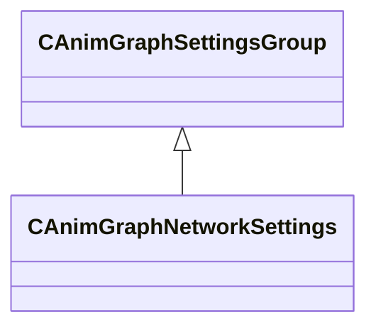

### CAnimGraphSettingsGroup

**Derived by:** [CAnimGraphNetworkSettings](animgraphlib.md#canimgraphnetworksettings)

**Metadata:** `MGetKV3ClassDefaults = {`, `"_class": "CAnimGraphSettingsGroup"`, `}`

**Relationships:**


### CAnimGraphSettingsManager

**Metadata:** `MGetKV3ClassDefaults = {`, `"_class": "CAnimGraphSettingsManager",`, `"m_settingsGroups":`, `[`, `{`, `"_class": "CAnimGraphNetworkSettings",`, `"m_bNetworkingEnabled": true`, `}`, `]`, `}`

### CAnimInputDamping

**Metadata:** `MGetKV3ClassDefaults = {`, `"_class": "CAnimInputDamping",`, `"m_speedFunction": "NoDamping",`, `"m_fSpeedScale": 1.000000,`, `"m_fFallingSpeedScale": 1.000000`, `}`, `MPropertyFriendlyName = "Damping"`

### CAnimMotorUpdaterBase

**Derived by:** [CPathAnimMotorUpdaterBase](animgraphlib.md#cpathanimmotorupdaterbase), [CPlayerInputAnimMotorUpdater](animgraphlib.md#cplayerinputanimmotorupdater)

**Metadata:** `MGetKV3ClassDefaults = Could not parse KV3 Defaults`

**Relationships:**

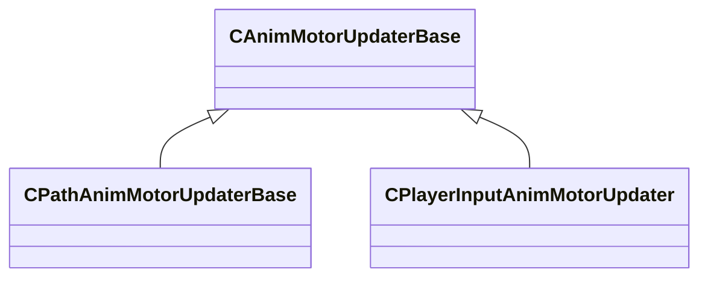

**Fields:**

| Name | Type | Annotations |
|------|------|-------------|
| `m_name` | CUtlString |  |
| `m_bDefault` | bool |  |

### CAnimNodePath

**Metadata:** `MGetKV3ClassDefaults = {`, `"m_path":`, `[`, `{`, `"m_id": 4294967295`, `},`, `{`, `"m_id": 4294967295`, `},`, `{`, `"m_id": 4294967295`, `},`, `{`, `"m_id": 4294967295`, `},`, `{`, `"m_id": 4294967295`, `},`, `{`, `"m_id": 4294967295`, `},`, `{`, `"m_id": 4294967295`, `},`, `{`, `"m_id": 4294967295`, `},`, `{`, `"m_id": 4294967295`, `},`, `{`, `"m_id": 4294967295`, `},`, `{`, `"m_id": 4294967295`, `}`, `],`, `"m_nCount": 0`, `}`

### CAnimParamHandle

**Metadata:** `MGetKV3ClassDefaults = {`, `"m_type": "ANIMPARAM_UNKNOWN",`, `"m_index": 255`, `}`

### CAnimParamHandleMap

**Metadata:** `MGetKV3ClassDefaults = {`, `"m_list":`, `{`, `}`, `}`

### CAnimParameterBase

**Derived by:** [CConcreteAnimParameter](animgraphlib.md#cconcreteanimparameter), [CVirtualAnimParameter](animgraphlib.md#cvirtualanimparameter)

**Metadata:** `MGetKV3ClassDefaults = Could not parse KV3 Defaults`

**Relationships:**

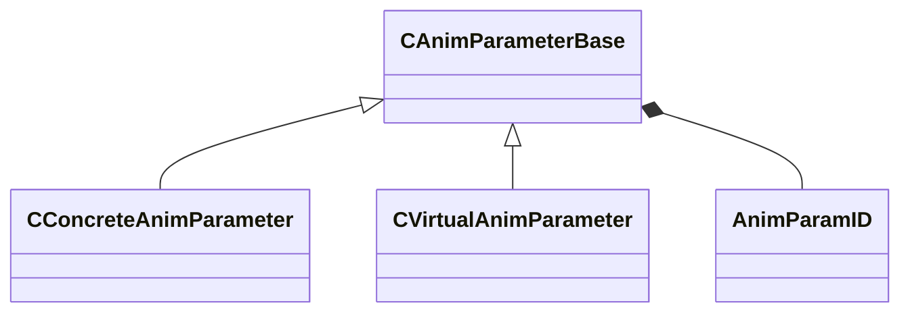

**Fields:**

| Name | Type | Annotations |
|------|------|-------------|
| `m_name` | CGlobalSymbol | `MPropertyFriendlyName = "Name"` `MPropertySortPriority = 100` |
| `m_sComment` | CUtlString | `MPropertyFriendlyName = "Comment"` `MPropertyAttributeEditor = "TextBlock()"` `MPropertySortPriority = -100` |
| `m_group` | CUtlString | `MPropertyReadOnly` `MPropertySortPriority = -90` |
| `m_id` | [AnimParamID](../schemas/modellib.md#animparamid) | `MPropertyReadOnly` `MPropertySortPriority = -90` |
| `m_componentName` | CUtlString | `MPropertySuppressField` `MPropertyAutoRebuildOnChange` |
| `m_bNetworkingRequested` | bool | `MPropertySuppressField` |
| `m_bIsReferenced` | bool | `MPropertySuppressField` |

### CAnimParameterManagerUpdater

**Metadata:** `MGetKV3ClassDefaults = {`, `"_class": "CAnimParameterManagerUpdater",`, `"m_parameters":`, `[`, `],`, `"m_idToIndexMap":`, `[`, `],`, `"m_nameToIndexMap":`, `{`, `},`, `"m_indexToHandle":`, `[`, `],`, `"m_autoResetParams":`, `[`, `],`, `"m_autoResetMap":`, `[`, `]`, `}`

### CAnimReplayFrame

**Metadata:** `MGetKV3ClassDefaults = {`, `"_class": "CAnimReplayFrame",`, `"m_inputDataBlocks":`, `[`, `],`, `"m_instanceData": "[BINARY BLOB]",`, `"m_startingLocalToWorldTransform":`, `[`, `0.000000,`, `0.000000,`, `0.000000,`, `1.000000,`, `0.000000,`, `0.000000,`, `0.000000,`, `1.000000`, `],`, `"m_localToWorldTransform":`, `[`, `0.000000,`, `0.000000,`, `0.000000,`, `1.000000,`, `0.000000,`, `0.000000,`, `0.000000,`, `1.000000`, `],`, `"m_timeStamp": 0.000000`, `}`

### CAnimScriptComponentUpdater

**Inherits from:** [CAnimComponentUpdater](animgraphlib.md#canimcomponentupdater)

**Metadata:** `MGetKV3ClassDefaults = {`, `"_class": "CAnimScriptComponentUpdater",`, `"m_name": "",`, `"m_id":`, `{`, `"m_id": 4294967295`, `},`, `"m_networkMode": "ServerAuthoritative",`, `"m_bStartEnabled": false,`, `"m_hScript":`, `{`, `"m_id": 4294967295`, `}`, `}`

**Relationships:**

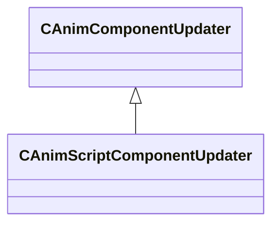

### CAnimScriptManager

**Metadata:** `MGetKV3ClassDefaults = {`, `"_class": "CAnimScriptManager",`, `"m_scriptInfo":`, `[`, `]`, `}`

### CAnimStateMachineUpdater

**Metadata:** `MGetKV3ClassDefaults = {`, `"_class": "CAnimStateMachineUpdater",`, `"m_states":`, `[`, `],`, `"m_transitions":`, `[`, `],`, `"m_startStateIndex": -1`, `}`

### CAnimTagBase

**Derived by:** [CAudioAnimTag](animgraphlib.md#caudioanimtag), [CBodyGroupAnimTag](animgraphlib.md#cbodygroupanimtag), [CClothSettingsAnimTag](animgraphlib.md#cclothsettingsanimtag), [CFootFallAnimTag](animgraphlib.md#cfootfallanimtag), [CFootstepLandedAnimTag](animgraphlib.md#cfootsteplandedanimtag), [CHandshakeAnimTagBase](animgraphlib.md#chandshakeanimtagbase), [CMaterialAttributeAnimTag](animgraphlib.md#cmaterialattributeanimtag), [CParticleAnimTag](animgraphlib.md#cparticleanimtag), [CRagdollAnimTag](animgraphlib.md#cragdollanimtag), [CSequenceFinishedAnimTag](animgraphlib.md#csequencefinishedanimtag), [CStringAnimTag](animgraphlib.md#cstringanimtag), [CTaskStatusAnimTag](animgraphlib.md#ctaskstatusanimtag), [CWarpSectionAnimTagBase](animgraphlib.md#cwarpsectionanimtagbase)

**Metadata:** `MGetKV3ClassDefaults = {`, `"_class": "CAnimTagBase",`, `"m_name": "Unnamed Tag",`, `"m_sComment": "",`, `"m_group": "",`, `"m_tagID":`, `{`, `"m_id": 4294967295`, `},`, `"m_bIsReferenced": false`, `}`

**Relationships:**

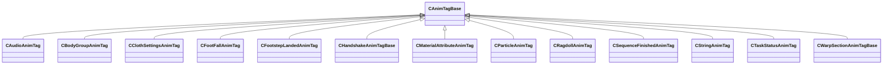

### CAnimTagManagerUpdater

**Metadata:** `MGetKV3ClassDefaults = {`, `"_class": "CAnimTagManagerUpdater",`, `"m_tags":`, `[`, `]`, `}`

### CAnimUpdateNodeBase

**Derived by:** [CBinaryUpdateNode](animgraphlib.md#cbinaryupdatenode), [CBlend2DUpdateNode](animgraphlib.md#cblend2dupdatenode), [CBlendUpdateNode](animgraphlib.md#cblendupdatenode), [CChoiceUpdateNode](animgraphlib.md#cchoiceupdatenode), [CLeafUpdateNode](animgraphlib.md#cleafupdatenode), [CSelectorUpdateNode](animgraphlib.md#cselectorupdatenode), [CStateMachineUpdateNode](animgraphlib.md#cstatemachineupdatenode), [CTargetSelectorUpdateNode](animgraphlib.md#ctargetselectorupdatenode), [CUnaryUpdateNode](animgraphlib.md#cunaryupdatenode)

**Metadata:** `MGetKV3ClassDefaults = Could not parse KV3 Defaults`

**Relationships:**

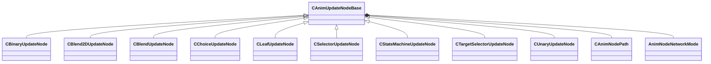

**Fields:**

| Name | Type | Annotations |
|------|------|-------------|
| `m_nodePath` | [CAnimNodePath](../schemas/animgraphlib.md#canimnodepath) |  |
| `m_networkMode` | [AnimNodeNetworkMode](../schemas/animgraphlib.md#animnodenetworkmode) |  |
| `m_name` | CUtlString |  |

### CAnimUpdateNodeRef

**Metadata:** `MGetKV3ClassDefaults = {`, `"m_nodeIndex": -1`, `}`

### CAnimUpdateSharedData

**Metadata:** `MGetKV3ClassDefaults = {`, `"_class": "CAnimUpdateSharedData",`, `"m_nodes":`, `[`, `],`, `"m_nodeIndexMap":`, `[`, `],`, `"m_components":`, `[`, `],`, `"m_pParamListUpdater": null,`, `"m_pTagManagerUpdater": null,`, `"m_scriptManager": null,`, `"m_settings":`, `{`, `"_class": "CAnimGraphSettingsManager",`, `"m_settingsGroups":`, `[`, `{`, `"_class": "CAnimGraphNetworkSettings",`, `"m_bNetworkingEnabled": true`, `}`, `]`, `},`, `"m_pStaticPoseCache": null,`, `"m_pSkeleton": null,`, `"m_rootNodePath":`, `{`, `"m_path":`, `[`, `{`, `"m_id": 4294967295`, `},`, `{`, `"m_id": 4294967295`, `},`, `{`, `"m_id": 4294967295`, `},`, `{`, `"m_id": 4294967295`, `},`, `{`, `"m_id": 4294967295`, `},`, `{`, `"m_id": 4294967295`, `},`, `{`, `"m_id": 4294967295`, `},`, `{`, `"m_id": 4294967295`, `},`, `{`, `"m_id": 4294967295`, `},`, `{`, `"m_id": 4294967295`, `},`, `{`, `"m_id": 4294967295`, `}`, `],`, `"m_nCount": 0`, `}`, `}`

### CAnimationGraphVisualizerAxis

**Inherits from:** [CAnimationGraphVisualizerPrimitiveBase](animgraphlib.md#canimationgraphvisualizerprimitivebase)

**Metadata:** `MGetKV3ClassDefaults = {`, `"_class": "CAnimationGraphVisualizerAxis",`, `"m_Type": "ANIMATIONGRAPHVISUALIZERPRIMITIVETYPE_Axis",`, `"m_OwningAnimNodePaths":`, `[`, `{`, `"m_id": 4294967295`, `},`, `{`, `"m_id": 4294967295`, `},`, `{`, `"m_id": 4294967295`, `},`, `{`, `"m_id": 4294967295`, `},`, `{`, `"m_id": 4294967295`, `},`, `{`, `"m_id": 4294967295`, `},`, `{`, `"m_id": 4294967295`, `},`, `{`, `"m_id": 4294967295`, `},`, `{`, `"m_id": 4294967295`, `},`, `{`, `"m_id": 4294967295`, `},`, `{`, `"m_id": 4294967295`, `}`, `],`, `"m_nOwningAnimNodePathCount": 0,`, `"m_xWsTransform":`, `[`, `0.000000,`, `0.000000,`, `0.000000,`, `0.000000,`, `0.000000,`, `0.000000,`, `0.000000,`, `0.000000`, `],`, `"m_flAxisSize": 0.000000`, `}`

**Relationships:**

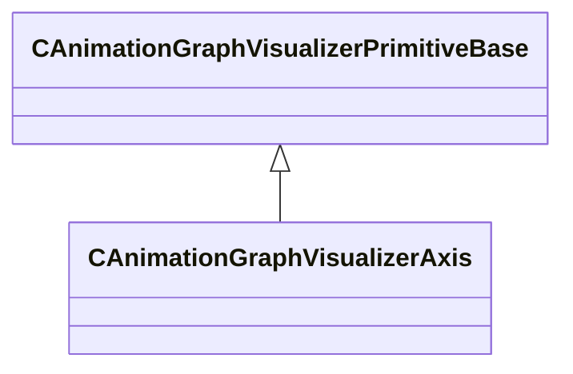

### CAnimationGraphVisualizerLine

**Inherits from:** [CAnimationGraphVisualizerPrimitiveBase](animgraphlib.md#canimationgraphvisualizerprimitivebase)

**Metadata:** `MGetKV3ClassDefaults = {`, `"_class": "CAnimationGraphVisualizerLine",`, `"m_Type": "ANIMATIONGRAPHVISUALIZERPRIMITIVETYPE_Line",`, `"m_OwningAnimNodePaths":`, `[`, `{`, `"m_id": 4294967295`, `},`, `{`, `"m_id": 4294967295`, `},`, `{`, `"m_id": 4294967295`, `},`, `{`, `"m_id": 4294967295`, `},`, `{`, `"m_id": 4294967295`, `},`, `{`, `"m_id": 4294967295`, `},`, `{`, `"m_id": 4294967295`, `},`, `{`, `"m_id": 4294967295`, `},`, `{`, `"m_id": 4294967295`, `},`, `{`, `"m_id": 4294967295`, `},`, `{`, `"m_id": 4294967295`, `}`, `],`, `"m_nOwningAnimNodePathCount": 0,`, `"m_vWsPositionStart":`, `[`, `0.000000,`, `0.000000,`, `0.000000`, `],`, `"m_vWsPositionEnd":`, `[`, `0.000000,`, `0.000000,`, `0.000000`, `],`, `"m_Color":`, `[`, `0,`, `0,`, `0,`, `0`, `]`, `}`

**Relationships:**


### CAnimationGraphVisualizerPie

**Inherits from:** [CAnimationGraphVisualizerPrimitiveBase](animgraphlib.md#canimationgraphvisualizerprimitivebase)

**Metadata:** `MGetKV3ClassDefaults = {`, `"_class": "CAnimationGraphVisualizerPie",`, `"m_Type": "ANIMATIONGRAPHVISUALIZERPRIMITIVETYPE_Pie",`, `"m_OwningAnimNodePaths":`, `[`, `{`, `"m_id": 4294967295`, `},`, `{`, `"m_id": 4294967295`, `},`, `{`, `"m_id": 4294967295`, `},`, `{`, `"m_id": 4294967295`, `},`, `{`, `"m_id": 4294967295`, `},`, `{`, `"m_id": 4294967295`, `},`, `{`, `"m_id": 4294967295`, `},`, `{`, `"m_id": 4294967295`, `},`, `{`, `"m_id": 4294967295`, `},`, `{`, `"m_id": 4294967295`, `},`, `{`, `"m_id": 4294967295`, `}`, `],`, `"m_nOwningAnimNodePathCount": 0,`, `"m_vWsCenter":`, `[`, `0.000000,`, `0.000000,`, `0.000000`, `],`, `"m_vWsStart":`, `[`, `0.000000,`, `0.000000,`, `0.000000`, `],`, `"m_vWsEnd":`, `[`, `0.000000,`, `0.000000,`, `0.000000`, `],`, `"m_Color":`, `[`, `0,`, `0,`, `0,`, `0`, `]`, `}`

**Relationships:**


### CAnimationGraphVisualizerPrimitiveBase

**Derived by:** [CAnimationGraphVisualizerAxis](animgraphlib.md#canimationgraphvisualizeraxis), [CAnimationGraphVisualizerLine](animgraphlib.md#canimationgraphvisualizerline), [CAnimationGraphVisualizerPie](animgraphlib.md#canimationgraphvisualizerpie), [CAnimationGraphVisualizerSphere](animgraphlib.md#canimationgraphvisualizersphere), [CAnimationGraphVisualizerText](animgraphlib.md#canimationgraphvisualizertext)

**Metadata:** `MGetKV3ClassDefaults = {`, `"_class": "CAnimationGraphVisualizerPrimitiveBase",`, `"m_Type": "ANIMATIONGRAPHVISUALIZERPRIMITIVETYPE_Text",`, `"m_OwningAnimNodePaths":`, `[`, `{`, `"m_id": 4294967295`, `},`, `{`, `"m_id": 4294967295`, `},`, `{`, `"m_id": 4294967295`, `},`, `{`, `"m_id": 4294967295`, `},`, `{`, `"m_id": 4294967295`, `},`, `{`, `"m_id": 4294967295`, `},`, `{`, `"m_id": 4294967295`, `},`, `{`, `"m_id": 4294967295`, `},`, `{`, `"m_id": 4294967295`, `},`, `{`, `"m_id": 4294967295`, `},`, `{`, `"m_id": 4294967295`, `}`, `],`, `"m_nOwningAnimNodePathCount": 0`, `}`

**Relationships:**

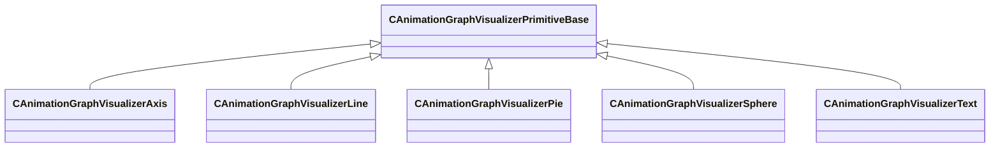

### CAnimationGraphVisualizerPrimitiveType

**Values:**

| Name | Value |
|------|-------|
| `ANIMATIONGRAPHVISUALIZERPRIMITIVETYPE_Text` | 0 |
| `ANIMATIONGRAPHVISUALIZERPRIMITIVETYPE_Sphere` | 1 |
| `ANIMATIONGRAPHVISUALIZERPRIMITIVETYPE_Line` | 2 |
| `ANIMATIONGRAPHVISUALIZERPRIMITIVETYPE_Pie` | 3 |
| `ANIMATIONGRAPHVISUALIZERPRIMITIVETYPE_Axis` | 4 |

### CAnimationGraphVisualizerSphere

**Inherits from:** [CAnimationGraphVisualizerPrimitiveBase](animgraphlib.md#canimationgraphvisualizerprimitivebase)

**Metadata:** `MGetKV3ClassDefaults = {`, `"_class": "CAnimationGraphVisualizerSphere",`, `"m_Type": "ANIMATIONGRAPHVISUALIZERPRIMITIVETYPE_Sphere",`, `"m_OwningAnimNodePaths":`, `[`, `{`, `"m_id": 4294967295`, `},`, `{`, `"m_id": 4294967295`, `},`, `{`, `"m_id": 4294967295`, `},`, `{`, `"m_id": 4294967295`, `},`, `{`, `"m_id": 4294967295`, `},`, `{`, `"m_id": 4294967295`, `},`, `{`, `"m_id": 4294967295`, `},`, `{`, `"m_id": 4294967295`, `},`, `{`, `"m_id": 4294967295`, `},`, `{`, `"m_id": 4294967295`, `},`, `{`, `"m_id": 4294967295`, `}`, `],`, `"m_nOwningAnimNodePathCount": 0,`, `"m_vWsPosition":`, `[`, `0.000000,`, `0.000000,`, `0.000000`, `],`, `"m_flRadius": -1.000000,`, `"m_Color":`, `[`, `0,`, `0,`, `0,`, `0`, `]`, `}`

**Relationships:**

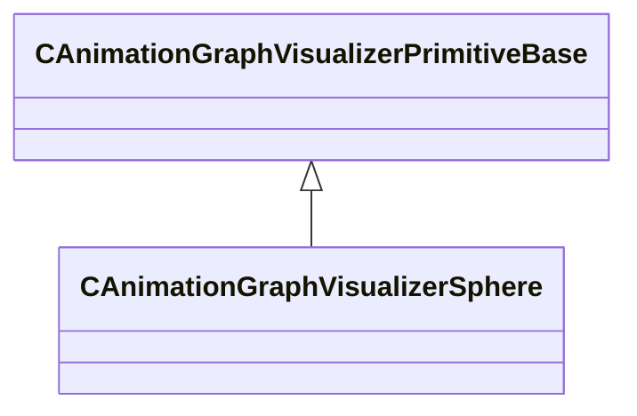

### CAnimationGraphVisualizerText

**Inherits from:** [CAnimationGraphVisualizerPrimitiveBase](animgraphlib.md#canimationgraphvisualizerprimitivebase)

**Metadata:** `MGetKV3ClassDefaults = {`, `"_class": "CAnimationGraphVisualizerText",`, `"m_Type": "ANIMATIONGRAPHVISUALIZERPRIMITIVETYPE_Text",`, `"m_OwningAnimNodePaths":`, `[`, `{`, `"m_id": 4294967295`, `},`, `{`, `"m_id": 4294967295`, `},`, `{`, `"m_id": 4294967295`, `},`, `{`, `"m_id": 4294967295`, `},`, `{`, `"m_id": 4294967295`, `},`, `{`, `"m_id": 4294967295`, `},`, `{`, `"m_id": 4294967295`, `},`, `{`, `"m_id": 4294967295`, `},`, `{`, `"m_id": 4294967295`, `},`, `{`, `"m_id": 4294967295`, `},`, `{`, `"m_id": 4294967295`, `}`, `],`, `"m_nOwningAnimNodePathCount": 0,`, `"m_vWsPosition":`, `[`, `0.000000,`, `0.000000,`, `0.000000`, `],`, `"m_Color":`, `[`, `0,`, `0,`, `0,`, `0`, `],`, `"m_Text": ""`, `}`

**Relationships:**

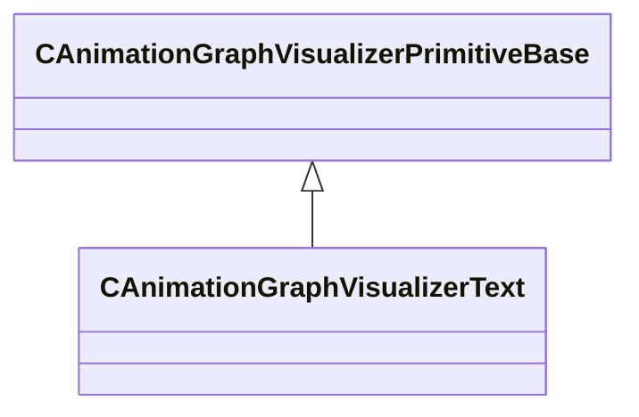

### CAudioAnimTag

**Inherits from:** [CAnimTagBase](animgraphlib.md#canimtagbase)

**Metadata:** `MGetKV3ClassDefaults = {`, `"_class": "CAudioAnimTag",`, `"m_name": "Unnamed Tag",`, `"m_sComment": "",`, `"m_group": "",`, `"m_tagID":`, `{`, `"m_id": 4294967295`, `},`, `"m_bIsReferenced": false,`, `"m_clipName": "",`, `"m_attachmentName": "",`, `"m_flVolume": 1.000000,`, `"m_bStopWhenTagEnds": false,`, `"m_bStopWhenGraphEnds": true,`, `"m_bPlayOnServer": true,`, `"m_bPlayOnClient": true`, `}`, `MPropertyFriendlyName = "Audio Tag"`

**Relationships:**

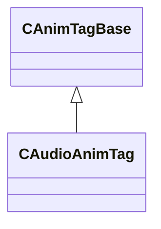

### CBinaryUpdateNode

**Inherits from:** [CAnimUpdateNodeBase](animgraphlib.md#canimupdatenodebase)

**Derived by:** [CAddUpdateNode](animgraphlib.md#caddupdatenode), [CBoneMaskUpdateNode](animgraphlib.md#cbonemaskupdatenode), [CSubtractUpdateNode](animgraphlib.md#csubtractupdatenode)

**Metadata:** `MGetKV3ClassDefaults = Could not parse KV3 Defaults`

**Relationships:**

```mermaid
classDiagram
    CAnimUpdateNodeBase <|-- CBinaryUpdateNode
    CBinaryUpdateNode <|-- CAddUpdateNode
    CBinaryUpdateNode <|-- CBoneMaskUpdateNode
    CBinaryUpdateNode <|-- CSubtractUpdateNode
    CBinaryUpdateNode *-- CAnimUpdateNodeRef
    CBinaryUpdateNode *-- BinaryNodeTiming
```

**Fields:**

| Name | Type | Annotations |
|------|------|-------------|
| `m_pChild1` | [CAnimUpdateNodeRef](../schemas/animgraphlib.md#canimupdatenoderef) |  |
| `m_pChild2` | [CAnimUpdateNodeRef](../schemas/animgraphlib.md#canimupdatenoderef) |  |
| `m_timingBehavior` | [BinaryNodeTiming](../schemas/animgraphlib.md#binarynodetiming) |  |
| `m_flTimingBlend` | float32 |  |
| `m_bResetChild1` | bool |  |
| `m_bResetChild2` | bool |  |

### CBindPoseUpdateNode

**Inherits from:** [CLeafUpdateNode](animgraphlib.md#cleafupdatenode)

**Metadata:** `MGetKV3ClassDefaults = {`, `"_class": "CBindPoseUpdateNode",`, `"m_nodePath":`, `{`, `"m_path":`, `[`, `{`, `"m_id": 4294967295`, `},`, `{`, `"m_id": 4294967295`, `},`, `{`, `"m_id": 4294967295`, `},`, `{`, `"m_id": 4294967295`, `},`, `{`, `"m_id": 4294967295`, `},`, `{`, `"m_id": 4294967295`, `},`, `{`, `"m_id": 4294967295`, `},`, `{`, `"m_id": 4294967295`, `},`, `{`, `"m_id": 4294967295`, `},`, `{`, `"m_id": 4294967295`, `},`, `{`, `"m_id": 4294967295`, `}`, `],`, `"m_nCount": 0`, `},`, `"m_networkMode": "ServerAuthoritative",`, `"m_name": ""`, `}`

**Relationships:**

```mermaid
classDiagram
    CLeafUpdateNode <|-- CBindPoseUpdateNode
    CAnimUpdateNodeBase <|-- CLeafUpdateNode
```

### CBlend2DUpdateNode

**Inherits from:** [CAnimUpdateNodeBase](animgraphlib.md#canimupdatenodebase)

**Metadata:** `MGetKV3ClassDefaults = {`, `"_class": "CBlend2DUpdateNode",`, `"m_nodePath":`, `{`, `"m_path":`, `[`, `{`, `"m_id": 4294967295`, `},`, `{`, `"m_id": 4294967295`, `},`, `{`, `"m_id": 4294967295`, `},`, `{`, `"m_id": 4294967295`, `},`, `{`, `"m_id": 4294967295`, `},`, `{`, `"m_id": 4294967295`, `},`, `{`, `"m_id": 4294967295`, `},`, `{`, `"m_id": 4294967295`, `},`, `{`, `"m_id": 4294967295`, `},`, `{`, `"m_id": 4294967295`, `},`, `{`, `"m_id": 4294967295`, `}`, `],`, `"m_nCount": 0`, `},`, `"m_networkMode": "ServerAuthoritative",`, `"m_name": "",`, `"m_items":`, `[`, `],`, `"m_tags":`, `[`, `],`, `"m_paramSpans":`, `{`, `"m_spans":`, `[`, `]`, `},`, `"m_nodeItemIndices":`, `[`, `],`, `"m_damping":`, `{`, `"_class": "CAnimInputDamping",`, `"m_speedFunction": "NoDamping",`, `"m_fSpeedScale": 1.000000,`, `"m_fFallingSpeedScale": 1.000000`, `},`, `"m_blendSourceX": "MoveHeading",`, `"m_paramX":`, `{`, `"m_type": "ANIMPARAM_UNKNOWN",`, `"m_index": 255`, `},`, `"m_blendSourceY": "MoveHeading",`, `"m_paramY":`, `{`, `"m_type": "ANIMPARAM_UNKNOWN",`, `"m_index": 255`, `},`, `"m_eBlendMode": "Blend2DMode_General",`, `"m_playbackSpeed": 0.000000,`, `"m_bLoop": false,`, `"m_bLockBlendOnReset": false,`, `"m_bLockWhenWaning": false,`, `"m_bAnimEventsAndTagsOnMostWeightedOnly": false`, `}`

**Relationships:**

```mermaid
classDiagram
    CAnimUpdateNodeBase <|-- CBlend2DUpdateNode
```

### CBlendCurve

**Metadata:** `MGetKV3ClassDefaults = {`, `"m_flControlPoint1": 0.000000,`, `"m_flControlPoint2": 1.000000`, `}`

### CBlendUpdateNode

**Inherits from:** [CAnimUpdateNodeBase](animgraphlib.md#canimupdatenodebase)

**Metadata:** `MGetKV3ClassDefaults = {`, `"_class": "CBlendUpdateNode",`, `"m_nodePath":`, `{`, `"m_path":`, `[`, `{`, `"m_id": 4294967295`, `},`, `{`, `"m_id": 4294967295`, `},`, `{`, `"m_id": 4294967295`, `},`, `{`, `"m_id": 4294967295`, `},`, `{`, `"m_id": 4294967295`, `},`, `{`, `"m_id": 4294967295`, `},`, `{`, `"m_id": 4294967295`, `},`, `{`, `"m_id": 4294967295`, `},`, `{`, `"m_id": 4294967295`, `},`, `{`, `"m_id": 4294967295`, `},`, `{`, `"m_id": 4294967295`, `}`, `],`, `"m_nCount": 0`, `},`, `"m_networkMode": "ServerAuthoritative",`, `"m_name": "",`, `"m_children":`, `[`, `],`, `"m_sortedOrder":`, `[`, `],`, `"m_targetValues":`, `[`, `],`, `"m_blendValueSource": "MoveHeading",`, `"m_eLinearRootMotionBlendMode": "LERP",`, `"m_paramIndex":`, `{`, `"m_type": "ANIMPARAM_UNKNOWN",`, `"m_index": 255`, `},`, `"m_damping":`, `{`, `"_class": "CAnimInputDamping",`, `"m_speedFunction": "NoDamping",`, `"m_fSpeedScale": 1.000000,`, `"m_fFallingSpeedScale": 1.000000`, `},`, `"m_blendKeyType": "BlendKey_UserValue",`, `"m_bLockBlendOnReset": false,`, `"m_bSyncCycles": false,`, `"m_bLoop": false,`, `"m_bLockWhenWaning": false,`, `"m_bIsAngle": false`, `}`

**Relationships:**

```mermaid
classDiagram
    CAnimUpdateNodeBase <|-- CBlendUpdateNode
```

### CBlockSelectionMetricEvaluator

**Inherits from:** [CMotionMetricEvaluator](animgraphlib.md#cmotionmetricevaluator)

**Metadata:** `MGetKV3ClassDefaults = {`, `"_class": "CBlockSelectionMetricEvaluator",`, `"m_means":`, `[`, `0.000000`, `],`, `"m_standardDeviations":`, `[`, `3612155576320.000000`, `],`, `"m_flWeight": 0.000000,`, `"m_nDimensionStartIndex": -1`, `}`

**Relationships:**

```mermaid
classDiagram
    CMotionMetricEvaluator <|-- CBlockSelectionMetricEvaluator
```

### CBodyGroupAnimTag

**Inherits from:** [CAnimTagBase](animgraphlib.md#canimtagbase)

**Metadata:** `MGetKV3ClassDefaults = {`, `"_class": "CBodyGroupAnimTag",`, `"m_name": "Unnamed Tag",`, `"m_sComment": "",`, `"m_group": "",`, `"m_tagID":`, `{`, `"m_id": 4294967295`, `},`, `"m_bIsReferenced": false,`, `"m_nPriority": 5,`, `"m_bodyGroupSettings":`, `[`, `]`, `}`, `MPropertyFriendlyName = "Body Group Tag"`

**Relationships:**

```mermaid
classDiagram
    CAnimTagBase <|-- CBodyGroupAnimTag
```

### CBodyGroupSetting

**Metadata:** `MGetKV3ClassDefaults = {`, `"m_BodyGroupName": "",`, `"m_nBodyGroupOption": 0`, `}`, `MPropertyFriendlyName = "Body Group Setting"`, `MPropertyElementNameFn (UNKNOWN FOR PARSER)`

### CBoneMaskUpdateNode

**Inherits from:** [CBinaryUpdateNode](animgraphlib.md#cbinaryupdatenode)

**Metadata:** `MGetKV3ClassDefaults = {`, `"_class": "CBoneMaskUpdateNode",`, `"m_nodePath":`, `{`, `"m_path":`, `[`, `{`, `"m_id": 4294967295`, `},`, `{`, `"m_id": 4294967295`, `},`, `{`, `"m_id": 4294967295`, `},`, `{`, `"m_id": 4294967295`, `},`, `{`, `"m_id": 4294967295`, `},`, `{`, `"m_id": 4294967295`, `},`, `{`, `"m_id": 4294967295`, `},`, `{`, `"m_id": 4294967295`, `},`, `{`, `"m_id": 4294967295`, `},`, `{`, `"m_id": 4294967295`, `},`, `{`, `"m_id": 4294967295`, `}`, `],`, `"m_nCount": 0`, `},`, `"m_networkMode": "ServerAuthoritative",`, `"m_name": "",`, `"m_pChild1":`, `{`, `"m_nodeIndex": -1`, `},`, `"m_pChild2":`, `{`, `"m_nodeIndex": -1`, `},`, `"m_timingBehavior": "UseChild1",`, `"m_flTimingBlend": 0.500000,`, `"m_bResetChild1": true,`, `"m_bResetChild2": true,`, `"m_nWeightListIndex": 0,`, `"m_flRootMotionBlend": 0.000000,`, `"m_blendSpace": "BlendSpace_Parent",`, `"m_footMotionTiming": "Child1",`, `"m_bUseBlendScale": false,`, `"m_blendValueSource": "MoveHeading",`, `"m_hBlendParameter":`, `{`, `"m_type": "ANIMPARAM_UNKNOWN",`, `"m_index": 255`, `}`, `}`

**Relationships:**

```mermaid
classDiagram
    CBinaryUpdateNode <|-- CBoneMaskUpdateNode
    CAnimUpdateNodeBase <|-- CBinaryUpdateNode
```

### CBonePositionMetricEvaluator

**Inherits from:** [CMotionMetricEvaluator](animgraphlib.md#cmotionmetricevaluator)

**Metadata:** `MGetKV3ClassDefaults = {`, `"_class": "CBonePositionMetricEvaluator",`, `"m_means":`, `[`, `],`, `"m_standardDeviations":`, `[`, `],`, `"m_flWeight": 0.000000,`, `"m_nDimensionStartIndex": -1,`, `"m_nBoneIndex": -1`, `}`

**Relationships:**

```mermaid
classDiagram
    CMotionMetricEvaluator <|-- CBonePositionMetricEvaluator
```

### CBoneVelocityMetricEvaluator

**Inherits from:** [CMotionMetricEvaluator](animgraphlib.md#cmotionmetricevaluator)

**Metadata:** `MGetKV3ClassDefaults = {`, `"_class": "CBoneVelocityMetricEvaluator",`, `"m_means":`, `[`, `],`, `"m_standardDeviations":`, `[`, `],`, `"m_flWeight": 0.000000,`, `"m_nDimensionStartIndex": -1,`, `"m_nBoneIndex": -1`, `}`

**Relationships:**

```mermaid
classDiagram
    CMotionMetricEvaluator <|-- CBoneVelocityMetricEvaluator
```

### CBoolAnimParameter

**Inherits from:** [CConcreteAnimParameter](animgraphlib.md#cconcreteanimparameter)

**Metadata:** `MGetKV3ClassDefaults = {`, `"_class": "CBoolAnimParameter",`, `"m_name": "Unnamed Parameter",`, `"m_sComment": "",`, `"m_group": "",`, `"m_id":`, `{`, `"m_id": 4294967295`, `},`, `"m_componentName": "",`, `"m_bNetworkingRequested": false,`, `"m_bIsReferenced": false,`, `"m_previewButton": "ANIMPARAM_BUTTON_NONE",`, `"m_eNetworkSetting": "Auto",`, `"m_bUseMostRecentValue": false,`, `"m_bAutoReset": false,`, `"m_bGameWritable": true,`, `"m_bGraphWritable": false,`, `"m_bDefaultValue": false`, `}`, `MPropertyFriendlyName = "Bool Parameter"`

**Relationships:**

```mermaid
classDiagram
    CConcreteAnimParameter <|-- CBoolAnimParameter
    CAnimParameterBase <|-- CConcreteAnimParameter
```

### CCPPScriptComponentUpdater

**Inherits from:** [CAnimComponentUpdater](animgraphlib.md#canimcomponentupdater)

**Metadata:** `MGetKV3ClassDefaults = {`, `"_class": "CCPPScriptComponentUpdater",`, `"m_name": "",`, `"m_id":`, `{`, `"m_id": 4294967295`, `},`, `"m_networkMode": "ServerAuthoritative",`, `"m_bStartEnabled": false,`, `"m_scriptsToRun":`, `[`, `]`, `}`

**Relationships:**

```mermaid
classDiagram
    CAnimComponentUpdater <|-- CCPPScriptComponentUpdater
```

### CCachedPose

**Metadata:** `MGetKV3ClassDefaults = {`, `"_class": "CCachedPose",`, `"m_transforms":`, `[`, `],`, `"m_morphWeights":`, `[`, `],`, `"m_hSequence": -1,`, `"m_flCycle": 0.000000`, `}`

### CChoiceUpdateNode

**Inherits from:** [CAnimUpdateNodeBase](animgraphlib.md#canimupdatenodebase)

**Metadata:** `MGetKV3ClassDefaults = {`, `"_class": "CChoiceUpdateNode",`, `"m_nodePath":`, `{`, `"m_path":`, `[`, `{`, `"m_id": 4294967295`, `},`, `{`, `"m_id": 4294967295`, `},`, `{`, `"m_id": 4294967295`, `},`, `{`, `"m_id": 4294967295`, `},`, `{`, `"m_id": 4294967295`, `},`, `{`, `"m_id": 4294967295`, `},`, `{`, `"m_id": 4294967295`, `},`, `{`, `"m_id": 4294967295`, `},`, `{`, `"m_id": 4294967295`, `},`, `{`, `"m_id": 4294967295`, `},`, `{`, `"m_id": 4294967295`, `}`, `],`, `"m_nCount": 0`, `},`, `"m_networkMode": "ServerAuthoritative",`, `"m_name": "",`, `"m_children":`, `[`, `],`, `"m_weights":`, `[`, `],`, `"m_blendTimes":`, `[`, `],`, `"m_choiceMethod": "WeightedRandom",`, `"m_choiceChangeMethod": "OnReset",`, `"m_blendMethod": "SingleBlendTime",`, `"m_blendTime": 0.000000,`, `"m_bCrossFade": false,`, `"m_bResetChosen": false,`, `"m_bDontResetSameSelection": false`, `}`

**Relationships:**

```mermaid
classDiagram
    CAnimUpdateNodeBase <|-- CChoiceUpdateNode
```

### CChoreoUpdateNode

**Inherits from:** [CUnaryUpdateNode](animgraphlib.md#cunaryupdatenode)

**Metadata:** `MGetKV3ClassDefaults = {`, `"_class": "CChoreoUpdateNode",`, `"m_nodePath":`, `{`, `"m_path":`, `[`, `{`, `"m_id": 4294967295`, `},`, `{`, `"m_id": 4294967295`, `},`, `{`, `"m_id": 4294967295`, `},`, `{`, `"m_id": 4294967295`, `},`, `{`, `"m_id": 4294967295`, `},`, `{`, `"m_id": 4294967295`, `},`, `{`, `"m_id": 4294967295`, `},`, `{`, `"m_id": 4294967295`, `},`, `{`, `"m_id": 4294967295`, `},`, `{`, `"m_id": 4294967295`, `},`, `{`, `"m_id": 4294967295`, `}`, `],`, `"m_nCount": 0`, `},`, `"m_networkMode": "ServerAuthoritative",`, `"m_name": "",`, `"m_pChildNode":`, `{`, `"m_nodeIndex": -1`, `}`, `}`

**Relationships:**

```mermaid
classDiagram
    CUnaryUpdateNode <|-- CChoreoUpdateNode
    CAnimUpdateNodeBase <|-- CUnaryUpdateNode
```

### CClothSettingsAnimTag

**Inherits from:** [CAnimTagBase](animgraphlib.md#canimtagbase)

**Metadata:** `MGetKV3ClassDefaults = {`, `"_class": "CClothSettingsAnimTag",`, `"m_name": "Unnamed Tag",`, `"m_sComment": "",`, `"m_group": "",`, `"m_tagID":`, `{`, `"m_id": 4294967295`, `},`, `"m_bIsReferenced": false,`, `"m_flStiffness": 1.000000,`, `"m_flEaseIn": 0.000000,`, `"m_flEaseOut": 0.000000,`, `"m_nVertexSet": ""`, `}`, `MPropertyFriendlyName = "Cloth Settings Tag"`

**Relationships:**

```mermaid
classDiagram
    CAnimTagBase <|-- CClothSettingsAnimTag
```

### CConcreteAnimParameter

**Inherits from:** [CAnimParameterBase](animgraphlib.md#canimparameterbase)

**Derived by:** [CBoolAnimParameter](animgraphlib.md#cboolanimparameter), [CEnumAnimParameter](animgraphlib.md#cenumanimparameter), [CFloatAnimParameter](animgraphlib.md#cfloatanimparameter), [CIntAnimParameter](animgraphlib.md#cintanimparameter), [CQuaternionAnimParameter](animgraphlib.md#cquaternionanimparameter), [CSymbolAnimParameter](animgraphlib.md#csymbolanimparameter), [CVectorAnimParameter](animgraphlib.md#cvectoranimparameter)

**Metadata:** `MGetKV3ClassDefaults = Could not parse KV3 Defaults`

**Relationships:**

```mermaid
classDiagram
    CAnimParameterBase <|-- CConcreteAnimParameter
    CConcreteAnimParameter <|-- CBoolAnimParameter
    CConcreteAnimParameter <|-- CEnumAnimParameter
    CConcreteAnimParameter <|-- CFloatAnimParameter
    CConcreteAnimParameter <|-- CIntAnimParameter
    CConcreteAnimParameter <|-- CQuaternionAnimParameter
    CConcreteAnimParameter <|-- CSymbolAnimParameter
    CConcreteAnimParameter <|-- CVectorAnimParameter
    CConcreteAnimParameter *-- AnimParamButton_t
    CConcreteAnimParameter *-- AnimParamNetworkSetting
```

**Fields:**

| Name | Type | Annotations |
|------|------|-------------|
| `m_previewButton` | [AnimParamButton_t](../schemas/animgraphlib.md#animparambutton_t) | `MPropertyFriendlyName = "Preview Button"` |
| `m_eNetworkSetting` | [AnimParamNetworkSetting](../schemas/animgraphlib.md#animparamnetworksetting) | `MPropertyFriendlyName = "Network"` |
| `m_bUseMostRecentValue` | bool | `MPropertyFriendlyName = "Force Latest Value"` |
| `m_bAutoReset` | bool | `MPropertyFriendlyName = "Auto Reset"` |
| `m_bGameWritable` | bool | `MPropertyFriendlyName = "Game Writable"` `MPropertyGroupName = "+Permissions"` `MPropertyAttrStateCallback (UNKNOWN FOR PARSER)` |
| `m_bGraphWritable` | bool | `MPropertyFriendlyName = "Graph Writable"` `MPropertyGroupName = "+Permissions"` `MPropertyAttrStateCallback (UNKNOWN FOR PARSER)` |

### CCurrentRotationVelocityMetricEvaluator

**Inherits from:** [CMotionMetricEvaluator](animgraphlib.md#cmotionmetricevaluator)

**Metadata:** `MGetKV3ClassDefaults = {`, `"_class": "CCurrentRotationVelocityMetricEvaluator",`, `"m_means":`, `[`, `],`, `"m_standardDeviations":`, `[`, `],`, `"m_flWeight": 0.000000,`, `"m_nDimensionStartIndex": -1`, `}`

**Relationships:**

```mermaid
classDiagram
    CMotionMetricEvaluator <|-- CCurrentRotationVelocityMetricEvaluator
```

### CCurrentVelocityMetricEvaluator

**Inherits from:** [CMotionMetricEvaluator](animgraphlib.md#cmotionmetricevaluator)

**Metadata:** `MGetKV3ClassDefaults = {`, `"_class": "CCurrentVelocityMetricEvaluator",`, `"m_means":`, `[`, `],`, `"m_standardDeviations":`, `[`, `],`, `"m_flWeight": 0.000000,`, `"m_nDimensionStartIndex": -1`, `}`

**Relationships:**

```mermaid
classDiagram
    CMotionMetricEvaluator <|-- CCurrentVelocityMetricEvaluator
```

### CCycleControlClipUpdateNode

**Inherits from:** [CLeafUpdateNode](animgraphlib.md#cleafupdatenode)

**Metadata:** `MGetKV3ClassDefaults = {`, `"_class": "CCycleControlClipUpdateNode",`, `"m_nodePath":`, `{`, `"m_path":`, `[`, `{`, `"m_id": 4294967295`, `},`, `{`, `"m_id": 4294967295`, `},`, `{`, `"m_id": 4294967295`, `},`, `{`, `"m_id": 4294967295`, `},`, `{`, `"m_id": 4294967295`, `},`, `{`, `"m_id": 4294967295`, `},`, `{`, `"m_id": 4294967295`, `},`, `{`, `"m_id": 4294967295`, `},`, `{`, `"m_id": 4294967295`, `},`, `{`, `"m_id": 4294967295`, `},`, `{`, `"m_id": 4294967295`, `}`, `],`, `"m_nCount": 0`, `},`, `"m_networkMode": "ServerAuthoritative",`, `"m_name": "",`, `"m_tags":`, `[`, `],`, `"m_hSequence": -1,`, `"m_duration": 0.000000,`, `"m_valueSource": "MoveHeading",`, `"m_paramIndex":`, `{`, `"m_type": "ANIMPARAM_UNKNOWN",`, `"m_index": 255`, `},`, `"m_bLockWhenWaning": false`, `}`

**Relationships:**

```mermaid
classDiagram
    CLeafUpdateNode <|-- CCycleControlClipUpdateNode
    CAnimUpdateNodeBase <|-- CLeafUpdateNode
```

### CCycleControlUpdateNode

**Inherits from:** [CUnaryUpdateNode](animgraphlib.md#cunaryupdatenode)

**Metadata:** `MGetKV3ClassDefaults = {`, `"_class": "CCycleControlUpdateNode",`, `"m_nodePath":`, `{`, `"m_path":`, `[`, `{`, `"m_id": 4294967295`, `},`, `{`, `"m_id": 4294967295`, `},`, `{`, `"m_id": 4294967295`, `},`, `{`, `"m_id": 4294967295`, `},`, `{`, `"m_id": 4294967295`, `},`, `{`, `"m_id": 4294967295`, `},`, `{`, `"m_id": 4294967295`, `},`, `{`, `"m_id": 4294967295`, `},`, `{`, `"m_id": 4294967295`, `},`, `{`, `"m_id": 4294967295`, `},`, `{`, `"m_id": 4294967295`, `}`, `],`, `"m_nCount": 0`, `},`, `"m_networkMode": "ServerAuthoritative",`, `"m_name": "",`, `"m_pChildNode":`, `{`, `"m_nodeIndex": -1`, `},`, `"m_valueSource": "MoveHeading",`, `"m_paramIndex":`, `{`, `"m_type": "ANIMPARAM_UNKNOWN",`, `"m_index": 255`, `},`, `"m_bLockWhenWaning": false`, `}`

**Relationships:**

```mermaid
classDiagram
    CUnaryUpdateNode <|-- CCycleControlUpdateNode
    CAnimUpdateNodeBase <|-- CUnaryUpdateNode
```

### CDampedPathAnimMotorUpdater

**Inherits from:** [CPathAnimMotorUpdaterBase](animgraphlib.md#cpathanimmotorupdaterbase)

**Metadata:** `MGetKV3ClassDefaults = {`, `"_class": "CDampedPathAnimMotorUpdater",`, `"m_name": "",`, `"m_bDefault": false,`, `"m_bLockToPath": false,`, `"m_flAnticipationTime": 1.000000,`, `"m_flMinSpeedScale": 0.250000,`, `"m_hAnticipationPosParam":`, `{`, `"m_type": "ANIMPARAM_UNKNOWN",`, `"m_index": 255`, `},`, `"m_hAnticipationHeadingParam":`, `{`, `"m_type": "ANIMPARAM_UNKNOWN",`, `"m_index": 255`, `},`, `"m_flSpringConstant": 10.000000,`, `"m_flMinSpringTension": 1.000000,`, `"m_flMaxSpringTension": 100.000000`, `}`

**Relationships:**

```mermaid
classDiagram
    CPathAnimMotorUpdaterBase <|-- CDampedPathAnimMotorUpdater
    CAnimMotorUpdaterBase <|-- CPathAnimMotorUpdaterBase
```

### CDampedValueComponentUpdater

**Inherits from:** [CAnimComponentUpdater](animgraphlib.md#canimcomponentupdater)

**Metadata:** `MGetKV3ClassDefaults = {`, `"_class": "CDampedValueComponentUpdater",`, `"m_name": "",`, `"m_id":`, `{`, `"m_id": 4294967295`, `},`, `"m_networkMode": "ServerAuthoritative",`, `"m_bStartEnabled": false,`, `"m_items":`, `[`, `]`, `}`

**Relationships:**

```mermaid
classDiagram
    CAnimComponentUpdater <|-- CDampedValueComponentUpdater
```

### CDampedValueUpdateItem

**Metadata:** `MGetKV3ClassDefaults = {`, `"m_damping":`, `{`, `"_class": "CAnimInputDamping",`, `"m_speedFunction": "NoDamping",`, `"m_fSpeedScale": 1.000000,`, `"m_fFallingSpeedScale": 1.000000`, `},`, `"m_hParamIn":`, `{`, `"m_type": "ANIMPARAM_UNKNOWN",`, `"m_index": 255`, `},`, `"m_hParamOut":`, `{`, `"m_type": "ANIMPARAM_UNKNOWN",`, `"m_index": 255`, `}`, `}`

### CDemoSettingsComponentUpdater

**Inherits from:** [CAnimComponentUpdater](animgraphlib.md#canimcomponentupdater)

**Metadata:** `MGetKV3ClassDefaults = {`, `"_class": "CDemoSettingsComponentUpdater",`, `"m_name": "",`, `"m_id":`, `{`, `"m_id": 4294967295`, `},`, `"m_networkMode": "ServerAuthoritative",`, `"m_bStartEnabled": false,`, `"m_settings":`, `{`, `"m_vecErrorRangeSplineRotation":`, `[`, `0.100000,`, `0.500000`, `],`, `"m_vecErrorRangeSplineTranslation":`, `[`, `0.100000,`, `0.500000`, `],`, `"m_vecErrorRangeSplineScale":`, `[`, `0.100000,`, `0.500000`, `],`, `"m_flIkRotation_MaxSplineError": 0.030000,`, `"m_flIkTranslation_MaxSplineError": 0.300000,`, `"m_vecErrorRangeQuantizationRotation":`, `[`, `0.100000,`, `0.500000`, `],`, `"m_vecErrorRangeQuantizationTranslation":`, `[`, `0.100000,`, `0.500000`, `],`, `"m_vecErrorRangeQuantizationScale":`, `[`, `0.100000,`, `0.500000`, `],`, `"m_flIkRotation_MaxQuantizationError": 0.010000,`, `"m_flIkTranslation_MaxQuantizationError": 0.100000,`, `"m_baseSequence": "",`, `"m_nBaseSequenceFrame": 0,`, `"m_boneSelectionMode": "CaptureSelectedBones",`, `"m_bones":`, `[`, `],`, `"m_ikChains":`, `[`, `]`, `}`, `}`

**Relationships:**

```mermaid
classDiagram
    CAnimComponentUpdater <|-- CDemoSettingsComponentUpdater
```

### CDirectPlaybackTagData

**Metadata:** `MGetKV3ClassDefaults = {`, `"m_sequenceName": "",`, `"m_tags":`, `[`, `]`, `}`

### CDirectPlaybackUpdateNode

**Inherits from:** [CUnaryUpdateNode](animgraphlib.md#cunaryupdatenode)

**Metadata:** `MGetKV3ClassDefaults = {`, `"_class": "CDirectPlaybackUpdateNode",`, `"m_nodePath":`, `{`, `"m_path":`, `[`, `{`, `"m_id": 4294967295`, `},`, `{`, `"m_id": 4294967295`, `},`, `{`, `"m_id": 4294967295`, `},`, `{`, `"m_id": 4294967295`, `},`, `{`, `"m_id": 4294967295`, `},`, `{`, `"m_id": 4294967295`, `},`, `{`, `"m_id": 4294967295`, `},`, `{`, `"m_id": 4294967295`, `},`, `{`, `"m_id": 4294967295`, `},`, `{`, `"m_id": 4294967295`, `},`, `{`, `"m_id": 4294967295`, `}`, `],`, `"m_nCount": 0`, `},`, `"m_networkMode": "ServerAuthoritative",`, `"m_name": "",`, `"m_pChildNode":`, `{`, `"m_nodeIndex": -1`, `},`, `"m_bFinishEarly": false,`, `"m_bResetOnFinish": false,`, `"m_allTags":`, `[`, `]`, `}`

**Relationships:**

```mermaid
classDiagram
    CUnaryUpdateNode <|-- CDirectPlaybackUpdateNode
    CAnimUpdateNodeBase <|-- CUnaryUpdateNode
```

### CDirectionalBlendUpdateNode

**Inherits from:** [CLeafUpdateNode](animgraphlib.md#cleafupdatenode)

**Metadata:** `MGetKV3ClassDefaults = {`, `"_class": "CDirectionalBlendUpdateNode",`, `"m_nodePath":`, `{`, `"m_path":`, `[`, `{`, `"m_id": 4294967295`, `},`, `{`, `"m_id": 4294967295`, `},`, `{`, `"m_id": 4294967295`, `},`, `{`, `"m_id": 4294967295`, `},`, `{`, `"m_id": 4294967295`, `},`, `{`, `"m_id": 4294967295`, `},`, `{`, `"m_id": 4294967295`, `},`, `{`, `"m_id": 4294967295`, `},`, `{`, `"m_id": 4294967295`, `},`, `{`, `"m_id": 4294967295`, `},`, `{`, `"m_id": 4294967295`, `}`, `],`, `"m_nCount": 0`, `},`, `"m_networkMode": "ServerAuthoritative",`, `"m_name": "",`, `"m_hSequences":`, `[`, `-1,`, `-1,`, `-1,`, `-1,`, `-1,`, `-1,`, `-1,`, `-1`, `],`, `"m_damping":`, `{`, `"_class": "CAnimInputDamping",`, `"m_speedFunction": "NoDamping",`, `"m_fSpeedScale": 1.000000,`, `"m_fFallingSpeedScale": 1.000000`, `},`, `"m_blendValueSource": "MoveHeading",`, `"m_paramIndex":`, `{`, `"m_type": "ANIMPARAM_UNKNOWN",`, `"m_index": 255`, `},`, `"m_playbackSpeed": 0.000000,`, `"m_duration": 0.000000,`, `"m_bLoop": false,`, `"m_bLockBlendOnReset": false`, `}`

**Relationships:**

```mermaid
classDiagram
    CLeafUpdateNode <|-- CDirectionalBlendUpdateNode
    CAnimUpdateNodeBase <|-- CLeafUpdateNode
```

### CDistanceRemainingMetricEvaluator

**Inherits from:** [CMotionMetricEvaluator](animgraphlib.md#cmotionmetricevaluator)

**Metadata:** `MGetKV3ClassDefaults = {`, `"_class": "CDistanceRemainingMetricEvaluator",`, `"m_means":`, `[`, `],`, `"m_standardDeviations":`, `[`, `],`, `"m_flWeight": 0.000000,`, `"m_nDimensionStartIndex": -1,`, `"m_flMaxDistance": 0.000000,`, `"m_flMinDistance": 0.000000,`, `"m_flStartGoalFilterDistance": 0.000000,`, `"m_flMaxGoalOvershootScale": 0.000000,`, `"m_bFilterFixedMinDistance": false,`, `"m_bFilterGoalDistance": false,`, `"m_bFilterGoalOvershoot": false`, `}`

**Relationships:**

```mermaid
classDiagram
    CMotionMetricEvaluator <|-- CDistanceRemainingMetricEvaluator
```

### CEditableMotionGraph

**Inherits from:** [CMotionGraph](animgraphlib.md#cmotiongraph)

**Metadata:** `MGetKV3ClassDefaults = {`, `"_class": "CEditableMotionGraph",`, `"m_paramSpans":`, `{`, `"m_spans":`, `[`, `]`, `},`, `"m_tags":`, `[`, `],`, `"m_pRootNode": null,`, `"m_nParameterCount": 0,`, `"m_nConfigStartIndex": -1,`, `"m_nConfigCount": -1,`, `"m_bLoop": false`, `}`

**Relationships:**

```mermaid
classDiagram
    CMotionGraph <|-- CEditableMotionGraph
```

### CEmitTagActionUpdater

**Inherits from:** [CAnimActionUpdater](animgraphlib.md#canimactionupdater)

**Metadata:** `MGetKV3ClassDefaults = {`, `"_class": "CEmitTagActionUpdater",`, `"m_nTagIndex": -1,`, `"m_bIsZeroDuration": false`, `}`

**Relationships:**

```mermaid
classDiagram
    CAnimActionUpdater <|-- CEmitTagActionUpdater
```

### CEnumAnimParameter

**Inherits from:** [CConcreteAnimParameter](animgraphlib.md#cconcreteanimparameter)

**Metadata:** `MGetKV3ClassDefaults = {`, `"_class": "CEnumAnimParameter",`, `"m_name": "Unnamed Parameter",`, `"m_sComment": "",`, `"m_group": "",`, `"m_id":`, `{`, `"m_id": 4294967295`, `},`, `"m_componentName": "",`, `"m_bNetworkingRequested": false,`, `"m_bIsReferenced": false,`, `"m_previewButton": "ANIMPARAM_BUTTON_NONE",`, `"m_eNetworkSetting": "Auto",`, `"m_bUseMostRecentValue": false,`, `"m_bAutoReset": false,`, `"m_bGameWritable": true,`, `"m_bGraphWritable": false,`, `"m_defaultValue": 0,`, `"m_enumOptions":`, `[`, `],`, `"m_vecEnumReferenced":`, `[`, `]`, `}`, `MPropertyFriendlyName = "Enum Parameter"`

**Relationships:**

```mermaid
classDiagram
    CConcreteAnimParameter <|-- CEnumAnimParameter
    CAnimParameterBase <|-- CConcreteAnimParameter
```

### CExpressionActionUpdater

**Inherits from:** [CAnimActionUpdater](animgraphlib.md#canimactionupdater)

**Metadata:** `MGetKV3ClassDefaults = {`, `"_class": "CExpressionActionUpdater",`, `"m_hParam":`, `{`, `"m_type": "ANIMPARAM_UNKNOWN",`, `"m_index": 255`, `},`, `"m_eParamType": "ANIMPARAM_UNKNOWN",`, `"m_hScript":`, `{`, `"m_id": 4294967295`, `}`, `}`

**Relationships:**

```mermaid
classDiagram
    CAnimActionUpdater <|-- CExpressionActionUpdater
```

### CFloatAnimParameter

**Inherits from:** [CConcreteAnimParameter](animgraphlib.md#cconcreteanimparameter)

**Metadata:** `MGetKV3ClassDefaults = {`, `"_class": "CFloatAnimParameter",`, `"m_name": "Unnamed Parameter",`, `"m_sComment": "",`, `"m_group": "",`, `"m_id":`, `{`, `"m_id": 4294967295`, `},`, `"m_componentName": "",`, `"m_bNetworkingRequested": false,`, `"m_bIsReferenced": false,`, `"m_previewButton": "ANIMPARAM_BUTTON_NONE",`, `"m_eNetworkSetting": "Auto",`, `"m_bUseMostRecentValue": false,`, `"m_bAutoReset": false,`, `"m_bGameWritable": true,`, `"m_bGraphWritable": false,`, `"m_fDefaultValue": 0.000000,`, `"m_fMinValue": 0.000000,`, `"m_fMaxValue": 1.000000,`, `"m_bInterpolate": false`, `}`, `MPropertyFriendlyName = "Float Parameter"`

**Relationships:**

```mermaid
classDiagram
    CConcreteAnimParameter <|-- CFloatAnimParameter
    CAnimParameterBase <|-- CConcreteAnimParameter
```

### CFollowAttachmentUpdateNode

**Inherits from:** [CUnaryUpdateNode](animgraphlib.md#cunaryupdatenode)

**Metadata:** `MGetKV3ClassDefaults = {`, `"_class": "CFollowAttachmentUpdateNode",`, `"m_nodePath":`, `{`, `"m_path":`, `[`, `{`, `"m_id": 4294967295`, `},`, `{`, `"m_id": 4294967295`, `},`, `{`, `"m_id": 4294967295`, `},`, `{`, `"m_id": 4294967295`, `},`, `{`, `"m_id": 4294967295`, `},`, `{`, `"m_id": 4294967295`, `},`, `{`, `"m_id": 4294967295`, `},`, `{`, `"m_id": 4294967295`, `},`, `{`, `"m_id": 4294967295`, `},`, `{`, `"m_id": 4294967295`, `},`, `{`, `"m_id": 4294967295`, `}`, `],`, `"m_nCount": 0`, `},`, `"m_networkMode": "ServerAuthoritative",`, `"m_name": "",`, `"m_pChildNode":`, `{`, `"m_nodeIndex": -1`, `},`, `"m_opFixedData":`, `{`, `"m_attachment":`, `{`, `"m_influenceRotations":`, `[`, `[`, `0.000000,`, `0.000000,`, `0.000000,`, `0.000000`, `],`, `[`, `0.000000,`, `0.000000,`, `0.000000,`, `0.000000`, `],`, `[`, `0.000000,`, `0.000000,`, `0.000000,`, `0.000000`, `]`, `],`, `"m_influenceOffsets":`, `[`, `[`, `0.000000,`, `0.000000,`, `0.000000`, `],`, `[`, `0.000000,`, `0.000000,`, `0.000000`, `],`, `[`, `0.000000,`, `0.000000,`, `0.000000`, `]`, `],`, `"m_influenceIndices":`, `[`, `0,`, `0,`, `0`, `],`, `"m_influenceWeights":`, `[`, `0.000000,`, `0.000000,`, `0.000000`, `],`, `"m_numInfluences": 0`, `},`, `"m_boneIndex": -1,`, `"m_attachmentHandle": 0,`, `"m_bMatchTranslation": false,`, `"m_bMatchRotation": false`, `}`, `}`

**Relationships:**

```mermaid
classDiagram
    CUnaryUpdateNode <|-- CFollowAttachmentUpdateNode
    CAnimUpdateNodeBase <|-- CUnaryUpdateNode
```

### CFollowPathUpdateNode

**Inherits from:** [CUnaryUpdateNode](animgraphlib.md#cunaryupdatenode)

**Metadata:** `MGetKV3ClassDefaults = {`, `"_class": "CFollowPathUpdateNode",`, `"m_nodePath":`, `{`, `"m_path":`, `[`, `{`, `"m_id": 4294967295`, `},`, `{`, `"m_id": 4294967295`, `},`, `{`, `"m_id": 4294967295`, `},`, `{`, `"m_id": 4294967295`, `},`, `{`, `"m_id": 4294967295`, `},`, `{`, `"m_id": 4294967295`, `},`, `{`, `"m_id": 4294967295`, `},`, `{`, `"m_id": 4294967295`, `},`, `{`, `"m_id": 4294967295`, `},`, `{`, `"m_id": 4294967295`, `},`, `{`, `"m_id": 4294967295`, `}`, `],`, `"m_nCount": 0`, `},`, `"m_networkMode": "ServerAuthoritative",`, `"m_name": "",`, `"m_pChildNode":`, `{`, `"m_nodeIndex": -1`, `},`, `"m_flBlendOutTime": 0.300000,`, `"m_bBlockNonPathMovement": false,`, `"m_bStopFeetAtGoal": false,`, `"m_bScaleSpeed": false,`, `"m_flScale": 0.000000,`, `"m_flMinAngle": 0.000000,`, `"m_flMaxAngle": 0.000000,`, `"m_flSpeedScaleBlending": 0.000000,`, `"m_turnDamping":`, `{`, `"_class": "CAnimInputDamping",`, `"m_speedFunction": "NoDamping",`, `"m_fSpeedScale": 1.000000,`, `"m_fFallingSpeedScale": 1.000000`, `},`, `"m_facingTarget": "MoveHeading",`, `"m_hParam":`, `{`, `"m_type": "ANIMPARAM_UNKNOWN",`, `"m_index": 255`, `},`, `"m_flTurnToFaceOffset": 0.000000,`, `"m_bTurnToFace": false`, `}`

**Relationships:**

```mermaid
classDiagram
    CUnaryUpdateNode <|-- CFollowPathUpdateNode
    CAnimUpdateNodeBase <|-- CUnaryUpdateNode
```

### CFollowTargetUpdateNode

**Inherits from:** [CUnaryUpdateNode](animgraphlib.md#cunaryupdatenode)

**Metadata:** `MGetKV3ClassDefaults = {`, `"_class": "CFollowTargetUpdateNode",`, `"m_nodePath":`, `{`, `"m_path":`, `[`, `{`, `"m_id": 4294967295`, `},`, `{`, `"m_id": 4294967295`, `},`, `{`, `"m_id": 4294967295`, `},`, `{`, `"m_id": 4294967295`, `},`, `{`, `"m_id": 4294967295`, `},`, `{`, `"m_id": 4294967295`, `},`, `{`, `"m_id": 4294967295`, `},`, `{`, `"m_id": 4294967295`, `},`, `{`, `"m_id": 4294967295`, `},`, `{`, `"m_id": 4294967295`, `},`, `{`, `"m_id": 4294967295`, `}`, `],`, `"m_nCount": 0`, `},`, `"m_networkMode": "ServerAuthoritative",`, `"m_name": "",`, `"m_pChildNode":`, `{`, `"m_nodeIndex": -1`, `},`, `"m_opFixedData":`, `{`, `"m_boneIndex": -1,`, `"m_bBoneTarget": true,`, `"m_boneTargetIndex": -1,`, `"m_bWorldCoodinateTarget": true,`, `"m_bMatchTargetOrientation": false`, `},`, `"m_hParameterPosition":`, `{`, `"m_type": "ANIMPARAM_UNKNOWN",`, `"m_index": 255`, `},`, `"m_hParameterOrientation":`, `{`, `"m_type": "ANIMPARAM_UNKNOWN",`, `"m_index": 255`, `}`, `}`

**Relationships:**

```mermaid
classDiagram
    CUnaryUpdateNode <|-- CFollowTargetUpdateNode
    CAnimUpdateNodeBase <|-- CUnaryUpdateNode
```

### CFootAdjustmentUpdateNode

**Inherits from:** [CUnaryUpdateNode](animgraphlib.md#cunaryupdatenode)

**Metadata:** `MGetKV3ClassDefaults = {`, `"_class": "CFootAdjustmentUpdateNode",`, `"m_nodePath":`, `{`, `"m_path":`, `[`, `{`, `"m_id": 4294967295`, `},`, `{`, `"m_id": 4294967295`, `},`, `{`, `"m_id": 4294967295`, `},`, `{`, `"m_id": 4294967295`, `},`, `{`, `"m_id": 4294967295`, `},`, `{`, `"m_id": 4294967295`, `},`, `{`, `"m_id": 4294967295`, `},`, `{`, `"m_id": 4294967295`, `},`, `{`, `"m_id": 4294967295`, `},`, `{`, `"m_id": 4294967295`, `},`, `{`, `"m_id": 4294967295`, `}`, `],`, `"m_nCount": 0`, `},`, `"m_networkMode": "ServerAuthoritative",`, `"m_name": "",`, `"m_pChildNode":`, `{`, `"m_nodeIndex": -1`, `},`, `"m_clips":`, `[`, `],`, `"m_hBasePoseCacheHandle":`, `{`, `"m_nIndex": 65535,`, `"m_eType": "POSETYPE_INVALID"`, `},`, `"m_facingTarget":`, `{`, `"m_type": "ANIMPARAM_UNKNOWN",`, `"m_index": 255`, `},`, `"m_flTurnTimeMin": 0.000000,`, `"m_flTurnTimeMax": 0.000000,`, `"m_flStepHeightMax": 0.000000,`, `"m_flStepHeightMaxAngle": 0.000000,`, `"m_bResetChild": false,`, `"m_bAnimationDriven": false`, `}`

**Relationships:**

```mermaid
classDiagram
    CUnaryUpdateNode <|-- CFootAdjustmentUpdateNode
    CAnimUpdateNodeBase <|-- CUnaryUpdateNode
```

### CFootCycleMetricEvaluator

**Inherits from:** [CMotionMetricEvaluator](animgraphlib.md#cmotionmetricevaluator)

**Metadata:** `MGetKV3ClassDefaults = {`, `"_class": "CFootCycleMetricEvaluator",`, `"m_means":`, `[`, `],`, `"m_standardDeviations":`, `[`, `],`, `"m_flWeight": 0.000000,`, `"m_nDimensionStartIndex": -1,`, `"m_footIndices":`, `[`, `]`, `}`

**Relationships:**

```mermaid
classDiagram
    CMotionMetricEvaluator <|-- CFootCycleMetricEvaluator
```

### CFootFallAnimTag

**Inherits from:** [CAnimTagBase](animgraphlib.md#canimtagbase)

**Metadata:** `MGetKV3ClassDefaults = {`, `"_class": "CFootFallAnimTag",`, `"m_name": "Unnamed Tag",`, `"m_sComment": "",`, `"m_group": "",`, `"m_tagID":`, `{`, `"m_id": 4294967295`, `},`, `"m_bIsReferenced": false,`, `"m_foot": "FOOT1"`, `}`, `MPropertyFriendlyName = "FootFall Tag"`

**Relationships:**

```mermaid
classDiagram
    CAnimTagBase <|-- CFootFallAnimTag
```

### CFootLockUpdateNode

**Inherits from:** [CUnaryUpdateNode](animgraphlib.md#cunaryupdatenode)

**Metadata:** `MGetKV3ClassDefaults = {`, `"_class": "CFootLockUpdateNode",`, `"m_nodePath":`, `{`, `"m_path":`, `[`, `{`, `"m_id": 4294967295`, `},`, `{`, `"m_id": 4294967295`, `},`, `{`, `"m_id": 4294967295`, `},`, `{`, `"m_id": 4294967295`, `},`, `{`, `"m_id": 4294967295`, `},`, `{`, `"m_id": 4294967295`, `},`, `{`, `"m_id": 4294967295`, `},`, `{`, `"m_id": 4294967295`, `},`, `{`, `"m_id": 4294967295`, `},`, `{`, `"m_id": 4294967295`, `},`, `{`, `"m_id": 4294967295`, `}`, `],`, `"m_nCount": 0`, `},`, `"m_networkMode": "ServerAuthoritative",`, `"m_name": "",`, `"m_pChildNode":`, `{`, `"m_nodeIndex": -1`, `},`, `"m_opFixedSettings":`, `{`, `"m_footInfo":`, `[`, `],`, `"m_hipDampingSettings":`, `{`, `"_class": "CAnimInputDamping",`, `"m_speedFunction": "NoDamping",`, `"m_fSpeedScale": 1.000000,`, `"m_fFallingSpeedScale": 1.000000`, `},`, `"m_nHipBoneIndex": -1,`, `"m_ikSolverType": "IKSOLVER_TwoBone",`, `"m_bApplyTilt": false,`, `"m_bApplyHipDrop": false,`, `"m_bAlwaysUseFallbackHinge": false,`, `"m_bApplyFootRotationLimits": false,`, `"m_bApplyLegTwistLimits": false,`, `"m_flMaxFootHeight": -12.000000,`, `"m_flExtensionScale": 0.700000,`, `"m_flMaxLegTwist": 180.000000,`, `"m_bEnableLockBreaking": false,`, `"m_flLockBreakTolerance": 0.200000,`, `"m_flLockBlendTime": 0.200000,`, `"m_bEnableStretching": false,`, `"m_flMaxStretchAmount": 2.000000,`, `"m_flStretchExtensionScale": 0.998000`, `},`, `"m_footSettings":`, `[`, `],`, `"m_hipShiftDamping":`, `{`, `"_class": "CAnimInputDamping",`, `"m_speedFunction": "NoDamping",`, `"m_fSpeedScale": 1.000000,`, `"m_fFallingSpeedScale": 1.000000`, `},`, `"m_rootHeightDamping":`, `{`, `"_class": "CAnimInputDamping",`, `"m_speedFunction": "NoDamping",`, `"m_fSpeedScale": 1.000000,`, `"m_fFallingSpeedScale": 1.000000`, `},`, `"m_flStrideCurveScale": 0.000000,`, `"m_flStrideCurveLimitScale": 0.000000,`, `"m_flStepHeightIncreaseScale": 0.000000,`, `"m_flStepHeightDecreaseScale": 0.000000,`, `"m_flHipShiftScale": 0.000000,`, `"m_flBlendTime": 0.000000,`, `"m_flMaxRootHeightOffset": 0.000000,`, `"m_flMinRootHeightOffset": 0.000000,`, `"m_flTiltPlanePitchSpringStrength": 0.000000,`, `"m_flTiltPlaneRollSpringStrength": 0.000000,`, `"m_bApplyFootRotationLimits": false,`, `"m_bApplyHipShift": false,`, `"m_bModulateStepHeight": false,`, `"m_bResetChild": false,`, `"m_bEnableVerticalCurvedPaths": false,`, `"m_bEnableRootHeightDamping": false`, `}`

**Relationships:**

```mermaid
classDiagram
    CUnaryUpdateNode <|-- CFootLockUpdateNode
    CAnimUpdateNodeBase <|-- CUnaryUpdateNode
```

### CFootPinningUpdateNode

**Inherits from:** [CUnaryUpdateNode](animgraphlib.md#cunaryupdatenode)

**Metadata:** `MGetKV3ClassDefaults = {`, `"_class": "CFootPinningUpdateNode",`, `"m_nodePath":`, `{`, `"m_path":`, `[`, `{`, `"m_id": 4294967295`, `},`, `{`, `"m_id": 4294967295`, `},`, `{`, `"m_id": 4294967295`, `},`, `{`, `"m_id": 4294967295`, `},`, `{`, `"m_id": 4294967295`, `},`, `{`, `"m_id": 4294967295`, `},`, `{`, `"m_id": 4294967295`, `},`, `{`, `"m_id": 4294967295`, `},`, `{`, `"m_id": 4294967295`, `},`, `{`, `"m_id": 4294967295`, `},`, `{`, `"m_id": 4294967295`, `}`, `],`, `"m_nCount": 0`, `},`, `"m_networkMode": "ServerAuthoritative",`, `"m_name": "",`, `"m_pChildNode":`, `{`, `"m_nodeIndex": -1`, `},`, `"m_poseOpFixedData":`, `{`, `"m_footInfo":`, `[`, `],`, `"m_flBlendTime": 0.000000,`, `"m_flLockBreakDistance": 0.000000,`, `"m_flMaxLegTwist": 25.000000,`, `"m_nHipBoneIndex": -1,`, `"m_bApplyLegTwistLimits": false,`, `"m_bApplyFootRotationLimits": false`, `},`, `"m_eTimingSource": "FootMotion",`, `"m_params":`, `[`, `],`, `"m_bResetChild": false`, `}`

**Relationships:**

```mermaid
classDiagram
    CUnaryUpdateNode <|-- CFootPinningUpdateNode
    CAnimUpdateNodeBase <|-- CUnaryUpdateNode
```

### CFootPositionMetricEvaluator

**Inherits from:** [CMotionMetricEvaluator](animgraphlib.md#cmotionmetricevaluator)

**Metadata:** `MGetKV3ClassDefaults = {`, `"_class": "CFootPositionMetricEvaluator",`, `"m_means":`, `[`, `],`, `"m_standardDeviations":`, `[`, `],`, `"m_flWeight": 0.000000,`, `"m_nDimensionStartIndex": -1,`, `"m_footIndices":`, `[`, `],`, `"m_bIgnoreSlope": false`, `}`

**Relationships:**

```mermaid
classDiagram
    CMotionMetricEvaluator <|-- CFootPositionMetricEvaluator
```

### CFootStepTriggerUpdateNode

**Inherits from:** [CUnaryUpdateNode](animgraphlib.md#cunaryupdatenode)

**Metadata:** `MGetKV3ClassDefaults = {`, `"_class": "CFootStepTriggerUpdateNode",`, `"m_nodePath":`, `{`, `"m_path":`, `[`, `{`, `"m_id": 4294967295`, `},`, `{`, `"m_id": 4294967295`, `},`, `{`, `"m_id": 4294967295`, `},`, `{`, `"m_id": 4294967295`, `},`, `{`, `"m_id": 4294967295`, `},`, `{`, `"m_id": 4294967295`, `},`, `{`, `"m_id": 4294967295`, `},`, `{`, `"m_id": 4294967295`, `},`, `{`, `"m_id": 4294967295`, `},`, `{`, `"m_id": 4294967295`, `},`, `{`, `"m_id": 4294967295`, `}`, `],`, `"m_nCount": 0`, `},`, `"m_networkMode": "ServerAuthoritative",`, `"m_name": "",`, `"m_pChildNode":`, `{`, `"m_nodeIndex": -1`, `},`, `"m_triggers":`, `[`, `],`, `"m_flTolerance": 0.000000`, `}`

**Relationships:**

```mermaid
classDiagram
    CUnaryUpdateNode <|-- CFootStepTriggerUpdateNode
    CAnimUpdateNodeBase <|-- CUnaryUpdateNode
```

### CFootstepLandedAnimTag

**Inherits from:** [CAnimTagBase](animgraphlib.md#canimtagbase)

**Metadata:** `MGetKV3ClassDefaults = {`, `"_class": "CFootstepLandedAnimTag",`, `"m_name": "Unnamed Tag",`, `"m_sComment": "",`, `"m_group": "",`, `"m_tagID":`, `{`, `"m_id": 4294967295`, `},`, `"m_bIsReferenced": false,`, `"m_FootstepType": "FOOTSOUND_Left",`, `"m_OverrideSoundName": "",`, `"m_DebugAnimSourceString": "",`, `"m_BoneName": "",`, `"m_footstepJumpPhase": "Unknown"`, `}`, `MPropertyFriendlyName = "FootstepLanded Tag"`

**Relationships:**

```mermaid
classDiagram
    CAnimTagBase <|-- CFootstepLandedAnimTag
```

### CFutureFacingMetricEvaluator

**Inherits from:** [CMotionMetricEvaluator](animgraphlib.md#cmotionmetricevaluator)

**Metadata:** `MGetKV3ClassDefaults = {`, `"_class": "CFutureFacingMetricEvaluator",`, `"m_means":`, `[`, `],`, `"m_standardDeviations":`, `[`, `],`, `"m_flWeight": 0.000000,`, `"m_nDimensionStartIndex": -1,`, `"m_flDistance": 100.000000,`, `"m_flTime": 1.000000`, `}`

**Relationships:**

```mermaid
classDiagram
    CMotionMetricEvaluator <|-- CFutureFacingMetricEvaluator
```

### CFutureVelocityMetricEvaluator

**Inherits from:** [CMotionMetricEvaluator](animgraphlib.md#cmotionmetricevaluator)

**Metadata:** `MGetKV3ClassDefaults = {`, `"_class": "CFutureVelocityMetricEvaluator",`, `"m_means":`, `[`, `],`, `"m_standardDeviations":`, `[`, `],`, `"m_flWeight": 0.000000,`, `"m_nDimensionStartIndex": -1,`, `"m_flDistance": 0.000000,`, `"m_flStoppingDistance": 0.000000,`, `"m_flTargetSpeed": 0.000000,`, `"m_eMode": "DirectionOnly"`, `}`

**Relationships:**

```mermaid
classDiagram
    CMotionMetricEvaluator <|-- CFutureVelocityMetricEvaluator
```

### CHandshakeAnimTagBase

**Inherits from:** [CAnimTagBase](animgraphlib.md#canimtagbase)

**Derived by:** [CMovementHandshakeAnimTag](animgraphlib.md#cmovementhandshakeanimtag), [CTaskHandshakeAnimTag](animgraphlib.md#ctaskhandshakeanimtag)

**Metadata:** `MGetKV3ClassDefaults = {`, `"_class": "CHandshakeAnimTagBase",`, `"m_name": "Unnamed Tag",`, `"m_sComment": "",`, `"m_group": "",`, `"m_tagID":`, `{`, `"m_id": 4294967295`, `},`, `"m_bIsReferenced": false,`, `"m_bIsDisableTag": false`, `}`

**Relationships:**

```mermaid
classDiagram
    CAnimTagBase <|-- CHandshakeAnimTagBase
    CHandshakeAnimTagBase <|-- CMovementHandshakeAnimTag
    CHandshakeAnimTagBase <|-- CTaskHandshakeAnimTag
```

### CHitReactUpdateNode

**Inherits from:** [CUnaryUpdateNode](animgraphlib.md#cunaryupdatenode)

**Metadata:** `MGetKV3ClassDefaults = {`, `"_class": "CHitReactUpdateNode",`, `"m_nodePath":`, `{`, `"m_path":`, `[`, `{`, `"m_id": 4294967295`, `},`, `{`, `"m_id": 4294967295`, `},`, `{`, `"m_id": 4294967295`, `},`, `{`, `"m_id": 4294967295`, `},`, `{`, `"m_id": 4294967295`, `},`, `{`, `"m_id": 4294967295`, `},`, `{`, `"m_id": 4294967295`, `},`, `{`, `"m_id": 4294967295`, `},`, `{`, `"m_id": 4294967295`, `},`, `{`, `"m_id": 4294967295`, `},`, `{`, `"m_id": 4294967295`, `}`, `],`, `"m_nCount": 0`, `},`, `"m_networkMode": "ServerAuthoritative",`, `"m_name": "",`, `"m_pChildNode":`, `{`, `"m_nodeIndex": -1`, `},`, `"m_opFixedSettings":`, `{`, `"m_nWeightListIndex": 0,`, `"m_nEffectedBoneCount": 0,`, `"m_flMaxImpactForce": 0.000000,`, `"m_flMinImpactForce": 0.000000,`, `"m_flWhipImpactScale": 0.000000,`, `"m_flCounterRotationScale": 0.000000,`, `"m_flDistanceFadeScale": 0.000000,`, `"m_flPropagationScale": 0.000000,`, `"m_flWhipDelay": 0.000000,`, `"m_flSpringStrength": 0.000000,`, `"m_flWhipSpringStrength": 0.000000,`, `"m_flMaxAngleRadians": 0.000000,`, `"m_nHipBoneIndex": 0,`, `"m_flHipBoneTranslationScale": 0.000000,`, `"m_flHipDipSpringStrength": 0.000000,`, `"m_flHipDipImpactScale": 0.000000,`, `"m_flHipDipDelay": 0.000000`, `},`, `"m_triggerParam":`, `{`, `"m_type": "ANIMPARAM_UNKNOWN",`, `"m_index": 255`, `},`, `"m_hitBoneParam":`, `{`, `"m_type": "ANIMPARAM_UNKNOWN",`, `"m_index": 255`, `},`, `"m_hitOffsetParam":`, `{`, `"m_type": "ANIMPARAM_UNKNOWN",`, `"m_index": 255`, `},`, `"m_hitDirectionParam":`, `{`, `"m_type": "ANIMPARAM_UNKNOWN",`, `"m_index": 255`, `},`, `"m_hitStrengthParam":`, `{`, `"m_type": "ANIMPARAM_UNKNOWN",`, `"m_index": 255`, `},`, `"m_flMinDelayBetweenHits": 0.000000,`, `"m_bResetChild": false`, `}`

**Relationships:**

```mermaid
classDiagram
    CUnaryUpdateNode <|-- CHitReactUpdateNode
    CAnimUpdateNodeBase <|-- CUnaryUpdateNode
```

### CInputStreamUpdateNode

**Inherits from:** [CLeafUpdateNode](animgraphlib.md#cleafupdatenode)

**Metadata:** `MGetKV3ClassDefaults = {`, `"_class": "CInputStreamUpdateNode",`, `"m_nodePath":`, `{`, `"m_path":`, `[`, `{`, `"m_id": 4294967295`, `},`, `{`, `"m_id": 4294967295`, `},`, `{`, `"m_id": 4294967295`, `},`, `{`, `"m_id": 4294967295`, `},`, `{`, `"m_id": 4294967295`, `},`, `{`, `"m_id": 4294967295`, `},`, `{`, `"m_id": 4294967295`, `},`, `{`, `"m_id": 4294967295`, `},`, `{`, `"m_id": 4294967295`, `},`, `{`, `"m_id": 4294967295`, `},`, `{`, `"m_id": 4294967295`, `}`, `],`, `"m_nCount": 0`, `},`, `"m_networkMode": "ServerAuthoritative",`, `"m_name": ""`, `}`

**Relationships:**

```mermaid
classDiagram
    CLeafUpdateNode <|-- CInputStreamUpdateNode
    CAnimUpdateNodeBase <|-- CLeafUpdateNode
```

### CIntAnimParameter

**Inherits from:** [CConcreteAnimParameter](animgraphlib.md#cconcreteanimparameter)

**Metadata:** `MGetKV3ClassDefaults = {`, `"_class": "CIntAnimParameter",`, `"m_name": "Unnamed Parameter",`, `"m_sComment": "",`, `"m_group": "",`, `"m_id":`, `{`, `"m_id": 4294967295`, `},`, `"m_componentName": "",`, `"m_bNetworkingRequested": false,`, `"m_bIsReferenced": false,`, `"m_previewButton": "ANIMPARAM_BUTTON_NONE",`, `"m_eNetworkSetting": "Auto",`, `"m_bUseMostRecentValue": false,`, `"m_bAutoReset": false,`, `"m_bGameWritable": true,`, `"m_bGraphWritable": false,`, `"m_defaultValue": 0,`, `"m_minValue": 0,`, `"m_maxValue": 100`, `}`, `MPropertyFriendlyName = "Int Parameter"`

**Relationships:**

```mermaid
classDiagram
    CConcreteAnimParameter <|-- CIntAnimParameter
    CAnimParameterBase <|-- CConcreteAnimParameter
```

### CJiggleBoneUpdateNode

**Inherits from:** [CUnaryUpdateNode](animgraphlib.md#cunaryupdatenode)

**Metadata:** `MGetKV3ClassDefaults = {`, `"_class": "CJiggleBoneUpdateNode",`, `"m_nodePath":`, `{`, `"m_path":`, `[`, `{`, `"m_id": 4294967295`, `},`, `{`, `"m_id": 4294967295`, `},`, `{`, `"m_id": 4294967295`, `},`, `{`, `"m_id": 4294967295`, `},`, `{`, `"m_id": 4294967295`, `},`, `{`, `"m_id": 4294967295`, `},`, `{`, `"m_id": 4294967295`, `},`, `{`, `"m_id": 4294967295`, `},`, `{`, `"m_id": 4294967295`, `},`, `{`, `"m_id": 4294967295`, `},`, `{`, `"m_id": 4294967295`, `}`, `],`, `"m_nCount": 0`, `},`, `"m_networkMode": "ServerAuthoritative",`, `"m_name": "",`, `"m_pChildNode":`, `{`, `"m_nodeIndex": -1`, `},`, `"m_opFixedData":`, `{`, `"m_boneSettings":`, `[`, `]`, `}`, `}`

**Relationships:**

```mermaid
classDiagram
    CUnaryUpdateNode <|-- CJiggleBoneUpdateNode
    CAnimUpdateNodeBase <|-- CUnaryUpdateNode
```

### CJumpHelperUpdateNode

**Inherits from:** [CSequenceUpdateNode](animgraphlib.md#csequenceupdatenode)

**Metadata:** `MGetKV3ClassDefaults = {`, `"_class": "CJumpHelperUpdateNode",`, `"m_nodePath":`, `{`, `"m_path":`, `[`, `{`, `"m_id": 4294967295`, `},`, `{`, `"m_id": 4294967295`, `},`, `{`, `"m_id": 4294967295`, `},`, `{`, `"m_id": 4294967295`, `},`, `{`, `"m_id": 4294967295`, `},`, `{`, `"m_id": 4294967295`, `},`, `{`, `"m_id": 4294967295`, `},`, `{`, `"m_id": 4294967295`, `},`, `{`, `"m_id": 4294967295`, `},`, `{`, `"m_id": 4294967295`, `},`, `{`, `"m_id": 4294967295`, `}`, `],`, `"m_nCount": 0`, `},`, `"m_networkMode": "ServerAuthoritative",`, `"m_name": "",`, `"m_playbackSpeed": 1.000000,`, `"m_bLoop": false,`, `"m_hSequence": -1,`, `"m_duration": 0.000000,`, `"m_paramSpans":`, `{`, `"m_spans":`, `[`, `]`, `},`, `"m_tags":`, `[`, `],`, `"m_hTargetParam":`, `{`, `"m_type": "ANIMPARAM_UNKNOWN",`, `"m_index": 255`, `},`, `"m_flOriginalJumpMovement":`, `[`, `0.000000,`, `0.000000,`, `0.000000`, `],`, `"m_flOriginalJumpDuration": 0.000000,`, `"m_flJumpStartCycle": 0.000000,`, `"m_flJumpEndCycle": 0.000000,`, `"m_eCorrectionMethod": "ScaleMotion",`, `"m_bTranslationAxis":`, `[`, `false,`, `false,`, `false`, `],`, `"m_bScaleSpeed": false`, `}`

**Relationships:**

```mermaid
classDiagram
    CSequenceUpdateNode <|-- CJumpHelperUpdateNode
    CSequenceUpdateNodeBase <|-- CSequenceUpdateNode
    CLeafUpdateNode <|-- CSequenceUpdateNodeBase
    CAnimUpdateNodeBase <|-- CLeafUpdateNode
```

### CLODComponentUpdater

**Inherits from:** [CAnimComponentUpdater](animgraphlib.md#canimcomponentupdater)

**Metadata:** `MGetKV3ClassDefaults = {`, `"_class": "CLODComponentUpdater",`, `"m_name": "",`, `"m_id":`, `{`, `"m_id": 4294967295`, `},`, `"m_networkMode": "ServerAuthoritative",`, `"m_bStartEnabled": false,`, `"m_nServerLOD": 0`, `}`

**Relationships:**

```mermaid
classDiagram
    CAnimComponentUpdater <|-- CLODComponentUpdater
```

### CLeafUpdateNode

**Inherits from:** [CAnimUpdateNodeBase](animgraphlib.md#canimupdatenodebase)

**Derived by:** [CBindPoseUpdateNode](animgraphlib.md#cbindposeupdatenode), [CCycleControlClipUpdateNode](animgraphlib.md#ccyclecontrolclipupdatenode), [CDirectionalBlendUpdateNode](animgraphlib.md#cdirectionalblendupdatenode), [CInputStreamUpdateNode](animgraphlib.md#cinputstreamupdatenode), [CLeanMatrixUpdateNode](animgraphlib.md#cleanmatrixupdatenode), [CMotionGraphUpdateNode](animgraphlib.md#cmotiongraphupdatenode), [CMotionMatchingUpdateNode](animgraphlib.md#cmotionmatchingupdatenode), [CSequenceUpdateNodeBase](animgraphlib.md#csequenceupdatenodebase), [CSingleFrameUpdateNode](animgraphlib.md#csingleframeupdatenode), [CZeroPoseUpdateNode](animgraphlib.md#czeroposeupdatenode)

**Metadata:** `MGetKV3ClassDefaults = Could not parse KV3 Defaults`

**Relationships:**

```mermaid
classDiagram
    CAnimUpdateNodeBase <|-- CLeafUpdateNode
    CLeafUpdateNode <|-- CBindPoseUpdateNode
    CLeafUpdateNode <|-- CCycleControlClipUpdateNode
    CLeafUpdateNode <|-- CDirectionalBlendUpdateNode
    CLeafUpdateNode <|-- CInputStreamUpdateNode
    CLeafUpdateNode <|-- CLeanMatrixUpdateNode
    CLeafUpdateNode <|-- CMotionGraphUpdateNode
    CLeafUpdateNode <|-- CMotionMatchingUpdateNode
    CLeafUpdateNode <|-- CSequenceUpdateNodeBase
    CLeafUpdateNode <|-- CSingleFrameUpdateNode
    CLeafUpdateNode <|-- CZeroPoseUpdateNode
```

### CLeanMatrixUpdateNode

**Inherits from:** [CLeafUpdateNode](animgraphlib.md#cleafupdatenode)

**Metadata:** `MGetKV3ClassDefaults = {`, `"_class": "CLeanMatrixUpdateNode",`, `"m_nodePath":`, `{`, `"m_path":`, `[`, `{`, `"m_id": 4294967295`, `},`, `{`, `"m_id": 4294967295`, `},`, `{`, `"m_id": 4294967295`, `},`, `{`, `"m_id": 4294967295`, `},`, `{`, `"m_id": 4294967295`, `},`, `{`, `"m_id": 4294967295`, `},`, `{`, `"m_id": 4294967295`, `},`, `{`, `"m_id": 4294967295`, `},`, `{`, `"m_id": 4294967295`, `},`, `{`, `"m_id": 4294967295`, `},`, `{`, `"m_id": 4294967295`, `}`, `],`, `"m_nCount": 0`, `},`, `"m_networkMode": "ServerAuthoritative",`, `"m_name": "",`, `"m_frameCorners":`, `[`, `[`, `0,`, `0,`, `0`, `],`, `[`, `0,`, `0,`, `0`, `],`, `[`, `0,`, `0,`, `0`, `]`, `],`, `"m_poses":`, `[`, `{`, `"m_nIndex": 65535,`, `"m_eType": "POSETYPE_INVALID"`, `},`, `{`, `"m_nIndex": 65535,`, `"m_eType": "POSETYPE_INVALID"`, `},`, `{`, `"m_nIndex": 65535,`, `"m_eType": "POSETYPE_INVALID"`, `},`, `{`, `"m_nIndex": 65535,`, `"m_eType": "POSETYPE_INVALID"`, `},`, `{`, `"m_nIndex": 65535,`, `"m_eType": "POSETYPE_INVALID"`, `},`, `{`, `"m_nIndex": 65535,`, `"m_eType": "POSETYPE_INVALID"`, `},`, `{`, `"m_nIndex": 65535,`, `"m_eType": "POSETYPE_INVALID"`, `},`, `{`, `"m_nIndex": 65535,`, `"m_eType": "POSETYPE_INVALID"`, `},`, `{`, `"m_nIndex": 65535,`, `"m_eType": "POSETYPE_INVALID"`, `}`, `],`, `"m_damping":`, `{`, `"_class": "CAnimInputDamping",`, `"m_speedFunction": "NoDamping",`, `"m_fSpeedScale": 1.000000,`, `"m_fFallingSpeedScale": 1.000000`, `},`, `"m_blendSource": "MoveDirection",`, `"m_paramIndex":`, `{`, `"m_type": "ANIMPARAM_UNKNOWN",`, `"m_index": 255`, `},`, `"m_verticalAxis":`, `[`, `0.000000,`, `0.000000,`, `0.000000`, `],`, `"m_horizontalAxis":`, `[`, `0.000000,`, `0.000000,`, `0.000000`, `],`, `"m_hSequence": -1,`, `"m_flMaxValue": 0.000000,`, `"m_nSequenceMaxFrame": 0`, `}`

**Relationships:**

```mermaid
classDiagram
    CLeafUpdateNode <|-- CLeanMatrixUpdateNode
    CAnimUpdateNodeBase <|-- CLeafUpdateNode
```

### CLookAtUpdateNode

**Inherits from:** [CUnaryUpdateNode](animgraphlib.md#cunaryupdatenode)

**Metadata:** `MGetKV3ClassDefaults = {`, `"_class": "CLookAtUpdateNode",`, `"m_nodePath":`, `{`, `"m_path":`, `[`, `{`, `"m_id": 4294967295`, `},`, `{`, `"m_id": 4294967295`, `},`, `{`, `"m_id": 4294967295`, `},`, `{`, `"m_id": 4294967295`, `},`, `{`, `"m_id": 4294967295`, `},`, `{`, `"m_id": 4294967295`, `},`, `{`, `"m_id": 4294967295`, `},`, `{`, `"m_id": 4294967295`, `},`, `{`, `"m_id": 4294967295`, `},`, `{`, `"m_id": 4294967295`, `},`, `{`, `"m_id": 4294967295`, `}`, `],`, `"m_nCount": 0`, `},`, `"m_networkMode": "ServerAuthoritative",`, `"m_name": "",`, `"m_pChildNode":`, `{`, `"m_nodeIndex": -1`, `},`, `"m_opFixedSettings":`, `{`, `"m_attachment":`, `{`, `"m_influenceRotations":`, `[`, `[`, `0.000000,`, `0.000000,`, `0.000000,`, `0.000000`, `],`, `[`, `0.000000,`, `0.000000,`, `0.000000,`, `0.000000`, `],`, `[`, `0.000000,`, `0.000000,`, `0.000000,`, `0.000000`, `]`, `],`, `"m_influenceOffsets":`, `[`, `[`, `0.000000,`, `0.000000,`, `0.000000`, `],`, `[`, `0.000000,`, `0.000000,`, `0.000000`, `],`, `[`, `0.000000,`, `0.000000,`, `0.000000`, `]`, `],`, `"m_influenceIndices":`, `[`, `0,`, `0,`, `0`, `],`, `"m_influenceWeights":`, `[`, `0.000000,`, `0.000000,`, `0.000000`, `],`, `"m_numInfluences": 0`, `},`, `"m_damping":`, `{`, `"_class": "CAnimInputDamping",`, `"m_speedFunction": "NoDamping",`, `"m_fSpeedScale": 1.000000,`, `"m_fFallingSpeedScale": 1.000000`, `},`, `"m_bones":`, `[`, `],`, `"m_flYawLimit": 45.000000,`, `"m_flPitchLimit": 45.000000,`, `"m_flHysteresisInnerAngle": 1.000000,`, `"m_flHysteresisOuterAngle": 20.000000,`, `"m_bRotateYawForward": true,`, `"m_bMaintainUpDirection": false,`, `"m_bTargetIsPosition": true,`, `"m_bUseHysteresis": false`, `},`, `"m_target": "MoveDirection",`, `"m_paramIndex":`, `{`, `"m_type": "ANIMPARAM_UNKNOWN",`, `"m_index": 255`, `},`, `"m_weightParamIndex":`, `{`, `"m_type": "ANIMPARAM_UNKNOWN",`, `"m_index": 255`, `},`, `"m_bResetChild": false,`, `"m_bLockWhenWaning": false`, `}`

**Relationships:**

```mermaid
classDiagram
    CUnaryUpdateNode <|-- CLookAtUpdateNode
    CAnimUpdateNodeBase <|-- CUnaryUpdateNode
```

### CLookComponentUpdater

**Inherits from:** [CAnimComponentUpdater](animgraphlib.md#canimcomponentupdater)

**Metadata:** `MGetKV3ClassDefaults = {`, `"_class": "CLookComponentUpdater",`, `"m_name": "",`, `"m_id":`, `{`, `"m_id": 4294967295`, `},`, `"m_networkMode": "ServerAuthoritative",`, `"m_bStartEnabled": false,`, `"m_hLookHeading":`, `{`, `"m_type": "ANIMPARAM_UNKNOWN",`, `"m_index": 255`, `},`, `"m_hLookHeadingNormalized":`, `{`, `"m_type": "ANIMPARAM_UNKNOWN",`, `"m_index": 255`, `},`, `"m_hLookHeadingVelocity":`, `{`, `"m_type": "ANIMPARAM_UNKNOWN",`, `"m_index": 255`, `},`, `"m_hLookPitch":`, `{`, `"m_type": "ANIMPARAM_UNKNOWN",`, `"m_index": 255`, `},`, `"m_hLookDistance":`, `{`, `"m_type": "ANIMPARAM_UNKNOWN",`, `"m_index": 255`, `},`, `"m_hLookDirection":`, `{`, `"m_type": "ANIMPARAM_UNKNOWN",`, `"m_index": 255`, `},`, `"m_hLookTarget":`, `{`, `"m_type": "ANIMPARAM_UNKNOWN",`, `"m_index": 255`, `},`, `"m_hLookTargetWorldSpace":`, `{`, `"m_type": "ANIMPARAM_UNKNOWN",`, `"m_index": 255`, `},`, `"m_bNetworkLookTarget": true`, `}`

**Relationships:**

```mermaid
classDiagram
    CAnimComponentUpdater <|-- CLookComponentUpdater
```

### CMaterialAttributeAnimTag

**Inherits from:** [CAnimTagBase](animgraphlib.md#canimtagbase)

**Metadata:** `MGetKV3ClassDefaults = {`, `"_class": "CMaterialAttributeAnimTag",`, `"m_name": "Unnamed Tag",`, `"m_sComment": "",`, `"m_group": "",`, `"m_tagID":`, `{`, `"m_id": 4294967295`, `},`, `"m_bIsReferenced": false,`, `"m_AttributeName": "",`, `"m_AttributeType": "MATERIAL_ATTRIBUTE_TAG_VALUE",`, `"m_flValue": 0.000000,`, `"m_Color":`, `[`, `255,`, `255,`, `255`, `]`, `}`, `MPropertyFriendlyName = "Material Attribute Tag"`

**Relationships:**

```mermaid
classDiagram
    CAnimTagBase <|-- CMaterialAttributeAnimTag
```

### CMotionDataSet

**Metadata:** `MGetKV3ClassDefaults = {`, `"m_groups":`, `[`, `],`, `"m_nDimensionCount": 0`, `}`

### CMotionGraph

**Derived by:** [CEditableMotionGraph](animgraphlib.md#ceditablemotiongraph)

**Metadata:** `MGetKV3ClassDefaults = {`, `"_class": "CMotionGraph",`, `"m_paramSpans":`, `{`, `"m_spans":`, `[`, `]`, `},`, `"m_tags":`, `[`, `],`, `"m_pRootNode": null,`, `"m_nParameterCount": 0,`, `"m_nConfigStartIndex": -1,`, `"m_nConfigCount": -1,`, `"m_bLoop": false`, `}`

**Relationships:**

```mermaid
classDiagram
    CMotionGraph <|-- CEditableMotionGraph
```

### CMotionGraphConfig

**Metadata:** `MGetKV3ClassDefaults = {`, `"m_paramValues":`, `[`, `0.000000,`, `0.000000,`, `0.000000,`, `0.000000`, `],`, `"m_flDuration": 0.000000,`, `"m_nMotionIndex":`, `{`, `"m_nGroup": 65535,`, `"m_nMotion": 65535`, `},`, `"m_nSampleStart": -1,`, `"m_nSampleCount": 0`, `}`

### CMotionGraphGroup

**Metadata:** `MGetKV3ClassDefaults = {`, `"m_searchDB":`, `{`, `"m_rootNode":`, `{`, `"m_children":`, `[`, `],`, `"m_quantizer":`, `{`, `"m_centroidVectors":`, `[`, `],`, `"m_nCentroids": 0,`, `"m_nDimensions": 0`, `},`, `"m_sampleCodes":`, `[`, `],`, `"m_sampleIndices":`, `[`, `],`, `"m_selectableSamples":`, `[`, `]`, `},`, `"m_residualQuantizer":`, `{`, `"m_subQuantizers":`, `[`, `],`, `"m_nDimensions": 0`, `},`, `"m_codeIndices":`, `[`, `]`, `},`, `"m_motionGraphs":`, `[`, `],`, `"m_motionGraphConfigs":`, `[`, `],`, `"m_sampleToConfig":`, `[`, `],`, `"m_hIsActiveScript":`, `{`, `"m_id": 4294967295`, `}`, `}`

### CMotionGraphUpdateNode

**Inherits from:** [CLeafUpdateNode](animgraphlib.md#cleafupdatenode)

**Metadata:** `MGetKV3ClassDefaults = {`, `"_class": "CMotionGraphUpdateNode",`, `"m_nodePath":`, `{`, `"m_path":`, `[`, `{`, `"m_id": 4294967295`, `},`, `{`, `"m_id": 4294967295`, `},`, `{`, `"m_id": 4294967295`, `},`, `{`, `"m_id": 4294967295`, `},`, `{`, `"m_id": 4294967295`, `},`, `{`, `"m_id": 4294967295`, `},`, `{`, `"m_id": 4294967295`, `},`, `{`, `"m_id": 4294967295`, `},`, `{`, `"m_id": 4294967295`, `},`, `{`, `"m_id": 4294967295`, `},`, `{`, `"m_id": 4294967295`, `}`, `],`, `"m_nCount": 0`, `},`, `"m_networkMode": "ServerAuthoritative",`, `"m_name": "",`, `"m_pMotionGraph": null`, `}`

**Relationships:**

```mermaid
classDiagram
    CLeafUpdateNode <|-- CMotionGraphUpdateNode
    CAnimUpdateNodeBase <|-- CLeafUpdateNode
```

### CMotionMatchingUpdateNode

**Inherits from:** [CLeafUpdateNode](animgraphlib.md#cleafupdatenode)

**Metadata:** `MGetKV3ClassDefaults = {`, `"_class": "CMotionMatchingUpdateNode",`, `"m_nodePath":`, `{`, `"m_path":`, `[`, `{`, `"m_id": 4294967295`, `},`, `{`, `"m_id": 4294967295`, `},`, `{`, `"m_id": 4294967295`, `},`, `{`, `"m_id": 4294967295`, `},`, `{`, `"m_id": 4294967295`, `},`, `{`, `"m_id": 4294967295`, `},`, `{`, `"m_id": 4294967295`, `},`, `{`, `"m_id": 4294967295`, `},`, `{`, `"m_id": 4294967295`, `},`, `{`, `"m_id": 4294967295`, `},`, `{`, `"m_id": 4294967295`, `}`, `],`, `"m_nCount": 0`, `},`, `"m_networkMode": "ServerAuthoritative",`, `"m_name": "",`, `"m_dataSet":`, `{`, `"m_groups":`, `[`, `],`, `"m_nDimensionCount": 0`, `},`, `"m_metrics":`, `[`, `],`, `"m_weights":`, `[`, `],`, `"m_bSearchEveryTick": false,`, `"m_flSearchInterval": 0.100000,`, `"m_bSearchWhenClipEnds": true,`, `"m_bSearchWhenGoalChanges": true,`, `"m_blendCurve":`, `{`, `"m_flControlPoint1": 0.000000,`, `"m_flControlPoint2": 1.000000`, `},`, `"m_flSampleRate": 0.100000,`, `"m_flBlendTime": 0.300000,`, `"m_bLockClipWhenWaning": false,`, `"m_flSelectionThreshold": 0.000000,`, `"m_flReselectionTimeWindow": 0.300000,`, `"m_bEnableRotationCorrection": true,`, `"m_bGoalAssist": false,`, `"m_flGoalAssistDistance": 0.000000,`, `"m_flGoalAssistTolerance": 0.000000,`, `"m_distanceScale_Damping":`, `{`, `"_class": "CAnimInputDamping",`, `"m_speedFunction": "NoDamping",`, `"m_fSpeedScale": 1.000000,`, `"m_fFallingSpeedScale": 1.000000`, `},`, `"m_flDistanceScale_OuterRadius": 0.000000,`, `"m_flDistanceScale_InnerRadius": 0.000000,`, `"m_flDistanceScale_MaxScale": 0.000000,`, `"m_flDistanceScale_MinScale": 0.000000,`, `"m_bEnableDistanceScaling": false`, `}`

**Relationships:**

```mermaid
classDiagram
    CLeafUpdateNode <|-- CMotionMatchingUpdateNode
    CAnimUpdateNodeBase <|-- CLeafUpdateNode
```

### CMotionMetricEvaluator

**Derived by:** [CBlockSelectionMetricEvaluator](animgraphlib.md#cblockselectionmetricevaluator), [CBonePositionMetricEvaluator](animgraphlib.md#cbonepositionmetricevaluator), [CBoneVelocityMetricEvaluator](animgraphlib.md#cbonevelocitymetricevaluator), [CCurrentRotationVelocityMetricEvaluator](animgraphlib.md#ccurrentrotationvelocitymetricevaluator), [CCurrentVelocityMetricEvaluator](animgraphlib.md#ccurrentvelocitymetricevaluator), [CDistanceRemainingMetricEvaluator](animgraphlib.md#cdistanceremainingmetricevaluator), [CFootCycleMetricEvaluator](animgraphlib.md#cfootcyclemetricevaluator), [CFootPositionMetricEvaluator](animgraphlib.md#cfootpositionmetricevaluator), [CFutureFacingMetricEvaluator](animgraphlib.md#cfuturefacingmetricevaluator), [CFutureVelocityMetricEvaluator](animgraphlib.md#cfuturevelocitymetricevaluator), [CPathMetricEvaluator](animgraphlib.md#cpathmetricevaluator), [CStepsRemainingMetricEvaluator](animgraphlib.md#cstepsremainingmetricevaluator), [CTimeRemainingMetricEvaluator](animgraphlib.md#ctimeremainingmetricevaluator)

**Metadata:** `MGetKV3ClassDefaults = Could not parse KV3 Defaults`

**Relationships:**

```mermaid
classDiagram
    CMotionMetricEvaluator <|-- CBlockSelectionMetricEvaluator
    CMotionMetricEvaluator <|-- CBonePositionMetricEvaluator
    CMotionMetricEvaluator <|-- CBoneVelocityMetricEvaluator
    CMotionMetricEvaluator <|-- CCurrentRotationVelocityMetricEvaluator
    CMotionMetricEvaluator <|-- CCurrentVelocityMetricEvaluator
    CMotionMetricEvaluator <|-- CDistanceRemainingMetricEvaluator
    CMotionMetricEvaluator <|-- CFootCycleMetricEvaluator
    CMotionMetricEvaluator <|-- CFootPositionMetricEvaluator
    CMotionMetricEvaluator <|-- CFutureFacingMetricEvaluator
    CMotionMetricEvaluator <|-- CFutureVelocityMetricEvaluator
    CMotionMetricEvaluator <|-- CPathMetricEvaluator
    CMotionMetricEvaluator <|-- CStepsRemainingMetricEvaluator
    CMotionMetricEvaluator <|-- CTimeRemainingMetricEvaluator
```

**Fields:**

| Name | Type | Annotations |
|------|------|-------------|
| `m_means` | CUtlVector< float32 > |  |
| `m_standardDeviations` | CUtlVector< float32 > |  |
| `m_flWeight` | float32 |  |
| `m_nDimensionStartIndex` | int32 |  |

### CMotionNode

**Derived by:** [CMotionNodeBlend1D](animgraphlib.md#cmotionnodeblend1d), [CMotionNodeSequence](animgraphlib.md#cmotionnodesequence)

**Metadata:** `MGetKV3ClassDefaults = Could not parse KV3 Defaults`

**Relationships:**

```mermaid
classDiagram
    CMotionNode <|-- CMotionNodeBlend1D
    CMotionNode <|-- CMotionNodeSequence
    CMotionNode *-- AnimNodeID
```

**Fields:**

| Name | Type | Annotations |
|------|------|-------------|
| `m_name` | CUtlString |  |
| `m_id` | [AnimNodeID](../schemas/modellib.md#animnodeid) |  |

### CMotionNodeBlend1D

**Inherits from:** [CMotionNode](animgraphlib.md#cmotionnode)

**Metadata:** `MGetKV3ClassDefaults = {`, `"_class": "CMotionNodeBlend1D",`, `"m_name": "",`, `"m_id":`, `{`, `"m_id": 4294967295`, `},`, `"m_blendItems":`, `[`, `],`, `"m_nParamIndex": 0`, `}`

**Relationships:**

```mermaid
classDiagram
    CMotionNode <|-- CMotionNodeBlend1D
```

### CMotionNodeSequence

**Inherits from:** [CMotionNode](animgraphlib.md#cmotionnode)

**Metadata:** `MGetKV3ClassDefaults = {`, `"_class": "CMotionNodeSequence",`, `"m_name": "",`, `"m_id":`, `{`, `"m_id": 4294967295`, `},`, `"m_tags":`, `[`, `],`, `"m_hSequence": -1,`, `"m_flPlaybackSpeed": 1.000000`, `}`

**Relationships:**

```mermaid
classDiagram
    CMotionNode <|-- CMotionNodeSequence
```

### CMotionSearchDB

**Metadata:** `MGetKV3ClassDefaults = {`, `"m_rootNode":`, `{`, `"m_children":`, `[`, `],`, `"m_quantizer":`, `{`, `"m_centroidVectors":`, `[`, `],`, `"m_nCentroids": 0,`, `"m_nDimensions": 0`, `},`, `"m_sampleCodes":`, `[`, `],`, `"m_sampleIndices":`, `[`, `],`, `"m_selectableSamples":`, `[`, `]`, `},`, `"m_residualQuantizer":`, `{`, `"m_subQuantizers":`, `[`, `],`, `"m_nDimensions": 0`, `},`, `"m_codeIndices":`, `[`, `]`, `}`

### CMotionSearchNode

**Metadata:** `MGetKV3ClassDefaults = {`, `"m_children":`, `[`, `],`, `"m_quantizer":`, `{`, `"m_centroidVectors":`, `[`, `],`, `"m_nCentroids": 0,`, `"m_nDimensions": 0`, `},`, `"m_sampleCodes":`, `[`, `],`, `"m_sampleIndices":`, `[`, `],`, `"m_selectableSamples":`, `[`, `]`, `}`

### CMovementComponentUpdater

**Inherits from:** [CAnimComponentUpdater](animgraphlib.md#canimcomponentupdater)

**Metadata:** `MGetKV3ClassDefaults = {`, `"_class": "CMovementComponentUpdater",`, `"m_name": "",`, `"m_id":`, `{`, `"m_id": 4294967295`, `},`, `"m_networkMode": "ServerAuthoritative",`, `"m_bStartEnabled": false,`, `"m_motors":`, `[`, `],`, `"m_facingDamping":`, `{`, `"_class": "CAnimInputDamping",`, `"m_speedFunction": "NoDamping",`, `"m_fSpeedScale": 1.000000,`, `"m_fFallingSpeedScale": 1.000000`, `},`, `"m_nDefaultMotorIndex": 0,`, `"m_flDefaultRunSpeed": 0.000000,`, `"m_bMoveVarsDisabled": false,`, `"m_bNetworkPath": true,`, `"m_bNetworkFacing": true,`, `"m_paramHandles":`, `[`, `{`, `"m_type": "ANIMPARAM_UNKNOWN",`, `"m_index": 255`, `},`, `{`, `"m_type": "ANIMPARAM_UNKNOWN",`, `"m_index": 255`, `},`, `{`, `"m_type": "ANIMPARAM_UNKNOWN",`, `"m_index": 255`, `},`, `{`, `"m_type": "ANIMPARAM_UNKNOWN",`, `"m_index": 255`, `},`, `{`, `"m_type": "ANIMPARAM_UNKNOWN",`, `"m_index": 255`, `},`, `{`, `"m_type": "ANIMPARAM_UNKNOWN",`, `"m_index": 255`, `},`, `{`, `"m_type": "ANIMPARAM_UNKNOWN",`, `"m_index": 255`, `},`, `{`, `"m_type": "ANIMPARAM_UNKNOWN",`, `"m_index": 255`, `},`, `{`, `"m_type": "ANIMPARAM_UNKNOWN",`, `"m_index": 255`, `},`, `{`, `"m_type": "ANIMPARAM_UNKNOWN",`, `"m_index": 255`, `},`, `{`, `"m_type": "ANIMPARAM_UNKNOWN",`, `"m_index": 255`, `},`, `{`, `"m_type": "ANIMPARAM_UNKNOWN",`, `"m_index": 255`, `},`, `{`, `"m_type": "ANIMPARAM_UNKNOWN",`, `"m_index": 255`, `},`, `{`, `"m_type": "ANIMPARAM_UNKNOWN",`, `"m_index": 255`, `},`, `{`, `"m_type": "ANIMPARAM_UNKNOWN",`, `"m_index": 255`, `},`, `{`, `"m_type": "ANIMPARAM_UNKNOWN",`, `"m_index": 255`, `},`, `{`, `"m_type": "ANIMPARAM_UNKNOWN",`, `"m_index": 255`, `},`, `{`, `"m_type": "ANIMPARAM_UNKNOWN",`, `"m_index": 255`, `},`, `{`, `"m_type": "ANIMPARAM_UNKNOWN",`, `"m_index": 255`, `},`, `{`, `"m_type": "ANIMPARAM_UNKNOWN",`, `"m_index": 255`, `},`, `{`, `"m_type": "ANIMPARAM_UNKNOWN",`, `"m_index": 255`, `},`, `{`, `"m_type": "ANIMPARAM_UNKNOWN",`, `"m_index": 255`, `},`, `{`, `"m_type": "ANIMPARAM_UNKNOWN",`, `"m_index": 255`, `},`, `{`, `"m_type": "ANIMPARAM_UNKNOWN",`, `"m_index": 255`, `},`, `{`, `"m_type": "ANIMPARAM_UNKNOWN",`, `"m_index": 255`, `},`, `{`, `"m_type": "ANIMPARAM_UNKNOWN",`, `"m_index": 255`, `},`, `{`, `"m_type": "ANIMPARAM_UNKNOWN",`, `"m_index": 255`, `},`, `{`, `"m_type": "ANIMPARAM_UNKNOWN",`, `"m_index": 255`, `},`, `{`, `"m_type": "ANIMPARAM_UNKNOWN",`, `"m_index": 255`, `},`, `{`, `"m_type": "ANIMPARAM_UNKNOWN",`, `"m_index": 255`, `},`, `{`, `"m_type": "ANIMPARAM_UNKNOWN",`, `"m_index": 255`, `},`, `{`, `"m_type": "ANIMPARAM_UNKNOWN",`, `"m_index": 255`, `},`, `{`, `"m_type": "ANIMPARAM_UNKNOWN",`, `"m_index": 255`, `},`, `{`, `"m_type": "ANIMPARAM_UNKNOWN",`, `"m_index": 255`, `}`, `]`, `}`

**Relationships:**

```mermaid
classDiagram
    CAnimComponentUpdater <|-- CMovementComponentUpdater
```

### CMovementHandshakeAnimTag

**Inherits from:** [CHandshakeAnimTagBase](animgraphlib.md#chandshakeanimtagbase)

**Metadata:** `MGetKV3ClassDefaults = {`, `"_class": "CMovementHandshakeAnimTag",`, `"m_name": "Unnamed Tag",`, `"m_sComment": "",`, `"m_group": "",`, `"m_tagID":`, `{`, `"m_id": 4294967295`, `},`, `"m_bIsReferenced": false,`, `"m_bIsDisableTag": false`, `}`, `MPropertyFriendlyName = "Movement Handshake Tag"`

**Relationships:**

```mermaid
classDiagram
    CHandshakeAnimTagBase <|-- CMovementHandshakeAnimTag
    CAnimTagBase <|-- CHandshakeAnimTagBase
```

### CMoverUpdateNode

**Inherits from:** [CUnaryUpdateNode](animgraphlib.md#cunaryupdatenode)

**Metadata:** `MGetKV3ClassDefaults = {`, `"_class": "CMoverUpdateNode",`, `"m_nodePath":`, `{`, `"m_path":`, `[`, `{`, `"m_id": 4294967295`, `},`, `{`, `"m_id": 4294967295`, `},`, `{`, `"m_id": 4294967295`, `},`, `{`, `"m_id": 4294967295`, `},`, `{`, `"m_id": 4294967295`, `},`, `{`, `"m_id": 4294967295`, `},`, `{`, `"m_id": 4294967295`, `},`, `{`, `"m_id": 4294967295`, `},`, `{`, `"m_id": 4294967295`, `},`, `{`, `"m_id": 4294967295`, `},`, `{`, `"m_id": 4294967295`, `}`, `],`, `"m_nCount": 0`, `},`, `"m_networkMode": "ServerAuthoritative",`, `"m_name": "",`, `"m_pChildNode":`, `{`, `"m_nodeIndex": -1`, `},`, `"m_damping":`, `{`, `"_class": "CAnimInputDamping",`, `"m_speedFunction": "NoDamping",`, `"m_fSpeedScale": 1.000000,`, `"m_fFallingSpeedScale": 1.000000`, `},`, `"m_facingTarget": "MoveHeading",`, `"m_hMoveVecParam":`, `{`, `"m_type": "ANIMPARAM_UNKNOWN",`, `"m_index": 255`, `},`, `"m_hMoveHeadingParam":`, `{`, `"m_type": "ANIMPARAM_UNKNOWN",`, `"m_index": 255`, `},`, `"m_hTurnToFaceParam":`, `{`, `"m_type": "ANIMPARAM_UNKNOWN",`, `"m_index": 255`, `},`, `"m_flTurnToFaceOffset": 0.000000,`, `"m_flTurnToFaceLimit": 180.000000,`, `"m_bAdditive": false,`, `"m_bApplyMovement": false,`, `"m_bOrientMovement": false,`, `"m_bApplyRotation": false,`, `"m_bLimitOnly": false`, `}`

**Relationships:**

```mermaid
classDiagram
    CUnaryUpdateNode <|-- CMoverUpdateNode
    CAnimUpdateNodeBase <|-- CUnaryUpdateNode
```

### COrientationWarpUpdateNode

**Inherits from:** [CUnaryUpdateNode](animgraphlib.md#cunaryupdatenode)

**Metadata:** `MGetKV3ClassDefaults = {`, `"_class": "COrientationWarpUpdateNode",`, `"m_nodePath":`, `{`, `"m_path":`, `[`, `{`, `"m_id": 4294967295`, `},`, `{`, `"m_id": 4294967295`, `},`, `{`, `"m_id": 4294967295`, `},`, `{`, `"m_id": 4294967295`, `},`, `{`, `"m_id": 4294967295`, `},`, `{`, `"m_id": 4294967295`, `},`, `{`, `"m_id": 4294967295`, `},`, `{`, `"m_id": 4294967295`, `},`, `{`, `"m_id": 4294967295`, `},`, `{`, `"m_id": 4294967295`, `},`, `{`, `"m_id": 4294967295`, `}`, `],`, `"m_nCount": 0`, `},`, `"m_networkMode": "ServerAuthoritative",`, `"m_name": "",`, `"m_pChildNode":`, `{`, `"m_nodeIndex": -1`, `},`, `"m_eMode": "eInvalid",`, `"m_hTargetParam":`, `{`, `"m_type": "ANIMPARAM_UNKNOWN",`, `"m_index": 255`, `},`, `"m_hTargetPositionParam":`, `{`, `"m_type": "ANIMPARAM_UNKNOWN",`, `"m_index": 255`, `},`, `"m_hFallbackTargetPositionParam":`, `{`, `"m_type": "ANIMPARAM_UNKNOWN",`, `"m_index": 255`, `},`, `"m_eTargetOffsetMode": "eLiteralValue",`, `"m_flTargetOffset": 0.000000,`, `"m_hTargetOffsetParam":`, `{`, `"m_type": "ANIMPARAM_UNKNOWN",`, `"m_index": 255`, `},`, `"m_damping":`, `{`, `"_class": "CAnimInputDamping",`, `"m_speedFunction": "NoDamping",`, `"m_fSpeedScale": 1.000000,`, `"m_fFallingSpeedScale": 1.000000`, `},`, `"m_eRootMotionSource": "eAnimationOrProcedural",`, `"m_flMaxRootMotionScale": 10.000000,`, `"m_bEnablePreferredRotationDirection": false,`, `"m_ePreferredRotationDirection": "FacingHeading",`, `"m_flPreferredRotationThreshold": 190.000000`, `}`

**Relationships:**

```mermaid
classDiagram
    CUnaryUpdateNode <|-- COrientationWarpUpdateNode
    CAnimUpdateNodeBase <|-- CUnaryUpdateNode
```

### CPairedSequenceComponentUpdater

**Inherits from:** [CAnimComponentUpdater](animgraphlib.md#canimcomponentupdater)

**Metadata:** `MGetKV3ClassDefaults = {`, `"_class": "CPairedSequenceComponentUpdater",`, `"m_name": "",`, `"m_id":`, `{`, `"m_id": 4294967295`, `},`, `"m_networkMode": "ServerAuthoritative",`, `"m_bStartEnabled": false`, `}`

**Relationships:**

```mermaid
classDiagram
    CAnimComponentUpdater <|-- CPairedSequenceComponentUpdater
```

### CPairedSequenceUpdateNode

**Inherits from:** [CSequenceUpdateNodeBase](animgraphlib.md#csequenceupdatenodebase)

**Metadata:** `MGetKV3ClassDefaults = {`, `"_class": "CPairedSequenceUpdateNode",`, `"m_nodePath":`, `{`, `"m_path":`, `[`, `{`, `"m_id": 4294967295`, `},`, `{`, `"m_id": 4294967295`, `},`, `{`, `"m_id": 4294967295`, `},`, `{`, `"m_id": 4294967295`, `},`, `{`, `"m_id": 4294967295`, `},`, `{`, `"m_id": 4294967295`, `},`, `{`, `"m_id": 4294967295`, `},`, `{`, `"m_id": 4294967295`, `},`, `{`, `"m_id": 4294967295`, `},`, `{`, `"m_id": 4294967295`, `},`, `{`, `"m_id": 4294967295`, `}`, `],`, `"m_nCount": 0`, `},`, `"m_networkMode": "ServerAuthoritative",`, `"m_name": "",`, `"m_playbackSpeed": 1.000000,`, `"m_bLoop": false,`, `"m_sPairedSequenceRole": ""`, `}`

**Relationships:**

```mermaid
classDiagram
    CSequenceUpdateNodeBase <|-- CPairedSequenceUpdateNode
    CLeafUpdateNode <|-- CSequenceUpdateNodeBase
    CAnimUpdateNodeBase <|-- CLeafUpdateNode
```

### CParamSpanUpdater

**Metadata:** `MGetKV3ClassDefaults = {`, `"m_spans":`, `[`, `]`, `}`

### CParticleAnimTag

**Inherits from:** [CAnimTagBase](animgraphlib.md#canimtagbase)

**Metadata:** `MGetKV3ClassDefaults = {`, `"_class": "CParticleAnimTag",`, `"m_name": "Unnamed Tag",`, `"m_sComment": "",`, `"m_group": "",`, `"m_tagID":`, `{`, `"m_id": 4294967295`, `},`, `"m_bIsReferenced": false,`, `"m_hParticleSystem": "",`, `"m_particleSystemName": "",`, `"m_configName": "",`, `"m_bDetachFromOwner": false,`, `"m_bAggregate": false,`, `"m_bStopWhenTagEnds": false,`, `"m_bTagEndStopIsInstant": false,`, `"m_attachmentName": "",`, `"m_attachmentType": "PATTACH_POINT_FOLLOW",`, `"m_attachmentCP1Name": "",`, `"m_attachmentCP1Type": "PATTACH_INVALID"`, `}`, `MPropertyFriendlyName = "Particle Tag"`

**Relationships:**

```mermaid
classDiagram
    CAnimTagBase <|-- CParticleAnimTag
```

### CPathAnimMotorUpdater

**Inherits from:** [CPathAnimMotorUpdaterBase](animgraphlib.md#cpathanimmotorupdaterbase)

**Metadata:** `MGetKV3ClassDefaults = {`, `"_class": "CPathAnimMotorUpdater",`, `"m_name": "",`, `"m_bDefault": false,`, `"m_bLockToPath": false`, `}`

**Relationships:**

```mermaid
classDiagram
    CPathAnimMotorUpdaterBase <|-- CPathAnimMotorUpdater
    CAnimMotorUpdaterBase <|-- CPathAnimMotorUpdaterBase
```

### CPathAnimMotorUpdaterBase

**Inherits from:** [CAnimMotorUpdaterBase](animgraphlib.md#canimmotorupdaterbase)

**Derived by:** [CDampedPathAnimMotorUpdater](animgraphlib.md#cdampedpathanimmotorupdater), [CPathAnimMotorUpdater](animgraphlib.md#cpathanimmotorupdater)

**Metadata:** `MGetKV3ClassDefaults = Could not parse KV3 Defaults`

**Relationships:**

```mermaid
classDiagram
    CAnimMotorUpdaterBase <|-- CPathAnimMotorUpdaterBase
    CPathAnimMotorUpdaterBase <|-- CDampedPathAnimMotorUpdater
    CPathAnimMotorUpdaterBase <|-- CPathAnimMotorUpdater
```

**Fields:**

| Name | Type | Annotations |
|------|------|-------------|
| `m_bLockToPath` | bool |  |

### CPathHelperUpdateNode

**Inherits from:** [CUnaryUpdateNode](animgraphlib.md#cunaryupdatenode)

**Metadata:** `MGetKV3ClassDefaults = {`, `"_class": "CPathHelperUpdateNode",`, `"m_nodePath":`, `{`, `"m_path":`, `[`, `{`, `"m_id": 4294967295`, `},`, `{`, `"m_id": 4294967295`, `},`, `{`, `"m_id": 4294967295`, `},`, `{`, `"m_id": 4294967295`, `},`, `{`, `"m_id": 4294967295`, `},`, `{`, `"m_id": 4294967295`, `},`, `{`, `"m_id": 4294967295`, `},`, `{`, `"m_id": 4294967295`, `},`, `{`, `"m_id": 4294967295`, `},`, `{`, `"m_id": 4294967295`, `},`, `{`, `"m_id": 4294967295`, `}`, `],`, `"m_nCount": 0`, `},`, `"m_networkMode": "ServerAuthoritative",`, `"m_name": "",`, `"m_pChildNode":`, `{`, `"m_nodeIndex": -1`, `},`, `"m_flStoppingRadius": 0.000000,`, `"m_flStoppingSpeedScale": 0.000000`, `}`

**Relationships:**

```mermaid
classDiagram
    CUnaryUpdateNode <|-- CPathHelperUpdateNode
    CAnimUpdateNodeBase <|-- CUnaryUpdateNode
```

### CPathMetricEvaluator

**Inherits from:** [CMotionMetricEvaluator](animgraphlib.md#cmotionmetricevaluator)

**Metadata:** `MGetKV3ClassDefaults = {`, `"_class": "CPathMetricEvaluator",`, `"m_means":`, `[`, `],`, `"m_standardDeviations":`, `[`, `],`, `"m_flWeight": 0.000000,`, `"m_nDimensionStartIndex": -1,`, `"m_pathTimeSamples":`, `[`, `],`, `"m_flDistance": 0.000000,`, `"m_bExtrapolateMovement": false,`, `"m_flMinExtrapolationSpeed": 0.000000`, `}`

**Relationships:**

```mermaid
classDiagram
    CMotionMetricEvaluator <|-- CPathMetricEvaluator
```

### CPlayerInputAnimMotorUpdater

**Inherits from:** [CAnimMotorUpdaterBase](animgraphlib.md#canimmotorupdaterbase)

**Metadata:** `MGetKV3ClassDefaults = {`, `"_class": "CPlayerInputAnimMotorUpdater",`, `"m_name": "",`, `"m_bDefault": false,`, `"m_sampleTimes":`, `[`, `],`, `"m_flSpringConstant": 0.000000,`, `"m_flAnticipationDistance": 0.000000,`, `"m_hAnticipationPosParam":`, `{`, `"m_type": "ANIMPARAM_UNKNOWN",`, `"m_index": 255`, `},`, `"m_hAnticipationHeadingParam":`, `{`, `"m_type": "ANIMPARAM_UNKNOWN",`, `"m_index": 255`, `},`, `"m_bUseAcceleration": false`, `}`

**Relationships:**

```mermaid
classDiagram
    CAnimMotorUpdaterBase <|-- CPlayerInputAnimMotorUpdater
```

### CPoseHandle

**Metadata:** `MGetKV3ClassDefaults = {`, `"m_nIndex": 65535,`, `"m_eType": "POSETYPE_INVALID"`, `}`

### CProductQuantizer

**Metadata:** `MGetKV3ClassDefaults = {`, `"m_subQuantizers":`, `[`, `],`, `"m_nDimensions": 0`, `}`

### CQuaternionAnimParameter

**Inherits from:** [CConcreteAnimParameter](animgraphlib.md#cconcreteanimparameter)

**Metadata:** `MGetKV3ClassDefaults = {`, `"_class": "CQuaternionAnimParameter",`, `"m_name": "Unnamed Parameter",`, `"m_sComment": "",`, `"m_group": "",`, `"m_id":`, `{`, `"m_id": 4294967295`, `},`, `"m_componentName": "",`, `"m_bNetworkingRequested": false,`, `"m_bIsReferenced": false,`, `"m_previewButton": "ANIMPARAM_BUTTON_NONE",`, `"m_eNetworkSetting": "Auto",`, `"m_bUseMostRecentValue": false,`, `"m_bAutoReset": false,`, `"m_bGameWritable": true,`, `"m_bGraphWritable": false,`, `"m_defaultValue":`, `[`, `0.000000,`, `0.000000,`, `0.000000,`, `1.000000`, `],`, `"m_bInterpolate": false`, `}`, `MPropertyFriendlyName = "Quaternion Parameter"`

**Relationships:**

```mermaid
classDiagram
    CConcreteAnimParameter <|-- CQuaternionAnimParameter
    CAnimParameterBase <|-- CConcreteAnimParameter
```

### CRagdollAnimTag

**Inherits from:** [CAnimTagBase](animgraphlib.md#canimtagbase)

**Metadata:** `MGetKV3ClassDefaults = {`, `"_class": "CRagdollAnimTag",`, `"m_name": "Unnamed Tag",`, `"m_sComment": "",`, `"m_group": "",`, `"m_tagID":`, `{`, `"m_id": 4294967295`, `},`, `"m_bIsReferenced": false,`, `"m_profileName": ""`, `}`, `MPropertyFriendlyName = "Ragdoll Tag"`

**Relationships:**

```mermaid
classDiagram
    CAnimTagBase <|-- CRagdollAnimTag
```

### CRagdollComponentUpdater

**Inherits from:** [CAnimComponentUpdater](animgraphlib.md#canimcomponentupdater)

**Metadata:** `MGetKV3ClassDefaults = {`, `"_class": "CRagdollComponentUpdater",`, `"m_name": "",`, `"m_id":`, `{`, `"m_id": 4294967295`, `},`, `"m_networkMode": "ServerAuthoritative",`, `"m_bStartEnabled": false,`, `"m_ragdollNodePaths":`, `[`, `],`, `"m_followAttachmentNodePaths":`, `[`, `],`, `"m_boneIndices":`, `[`, `],`, `"m_boneNames":`, `[`, `],`, `"m_weightLists":`, `[`, `],`, `"m_boneToWeightIndices":`, `[`, `],`, `"m_flSpringFrequencyMin": 0.000000,`, `"m_flSpringFrequencyMax": 15.000000,`, `"m_flMaxStretch": 56.000000,`, `"m_bSolidCollisionAtZeroWeight": false`, `}`

**Relationships:**

```mermaid
classDiagram
    CAnimComponentUpdater <|-- CRagdollComponentUpdater
```

### CRagdollUpdateNode

**Inherits from:** [CUnaryUpdateNode](animgraphlib.md#cunaryupdatenode)

**Metadata:** `MGetKV3ClassDefaults = {`, `"_class": "CRagdollUpdateNode",`, `"m_nodePath":`, `{`, `"m_path":`, `[`, `{`, `"m_id": 4294967295`, `},`, `{`, `"m_id": 4294967295`, `},`, `{`, `"m_id": 4294967295`, `},`, `{`, `"m_id": 4294967295`, `},`, `{`, `"m_id": 4294967295`, `},`, `{`, `"m_id": 4294967295`, `},`, `{`, `"m_id": 4294967295`, `},`, `{`, `"m_id": 4294967295`, `},`, `{`, `"m_id": 4294967295`, `},`, `{`, `"m_id": 4294967295`, `},`, `{`, `"m_id": 4294967295`, `}`, `],`, `"m_nCount": 0`, `},`, `"m_networkMode": "ServerAuthoritative",`, `"m_name": "",`, `"m_pChildNode":`, `{`, `"m_nodeIndex": -1`, `},`, `"m_nWeightListIndex": -1,`, `"m_poseControlMethod": "Absolute"`, `}`

**Relationships:**

```mermaid
classDiagram
    CUnaryUpdateNode <|-- CRagdollUpdateNode
    CAnimUpdateNodeBase <|-- CUnaryUpdateNode
```

### CRemapValueComponentUpdater

**Inherits from:** [CAnimComponentUpdater](animgraphlib.md#canimcomponentupdater)

**Metadata:** `MGetKV3ClassDefaults = {`, `"_class": "CRemapValueComponentUpdater",`, `"m_name": "",`, `"m_id":`, `{`, `"m_id": 4294967295`, `},`, `"m_networkMode": "ServerAuthoritative",`, `"m_bStartEnabled": false,`, `"m_items":`, `[`, `]`, `}`

**Relationships:**

```mermaid
classDiagram
    CAnimComponentUpdater <|-- CRemapValueComponentUpdater
```

### CRemapValueUpdateItem

**Metadata:** `MGetKV3ClassDefaults = {`, `"m_hParamIn":`, `{`, `"m_type": "ANIMPARAM_UNKNOWN",`, `"m_index": 255`, `},`, `"m_hParamOut":`, `{`, `"m_type": "ANIMPARAM_UNKNOWN",`, `"m_index": 255`, `},`, `"m_flMinInputValue": 0.000000,`, `"m_flMaxInputValue": 0.000000,`, `"m_flMinOutputValue": 0.000000,`, `"m_flMaxOutputValue": 0.000000`, `}`

### CRootUpdateNode

**Inherits from:** [CUnaryUpdateNode](animgraphlib.md#cunaryupdatenode)

**Metadata:** `MGetKV3ClassDefaults = {`, `"_class": "CRootUpdateNode",`, `"m_nodePath":`, `{`, `"m_path":`, `[`, `{`, `"m_id": 4294967295`, `},`, `{`, `"m_id": 4294967295`, `},`, `{`, `"m_id": 4294967295`, `},`, `{`, `"m_id": 4294967295`, `},`, `{`, `"m_id": 4294967295`, `},`, `{`, `"m_id": 4294967295`, `},`, `{`, `"m_id": 4294967295`, `},`, `{`, `"m_id": 4294967295`, `},`, `{`, `"m_id": 4294967295`, `},`, `{`, `"m_id": 4294967295`, `},`, `{`, `"m_id": 4294967295`, `}`, `],`, `"m_nCount": 0`, `},`, `"m_networkMode": "ServerAuthoritative",`, `"m_name": "",`, `"m_pChildNode":`, `{`, `"m_nodeIndex": -1`, `}`, `}`

**Relationships:**

```mermaid
classDiagram
    CUnaryUpdateNode <|-- CRootUpdateNode
    CAnimUpdateNodeBase <|-- CUnaryUpdateNode
```

### CSelectorUpdateNode

**Inherits from:** [CAnimUpdateNodeBase](animgraphlib.md#canimupdatenodebase)

**Metadata:** `MGetKV3ClassDefaults = {`, `"_class": "CSelectorUpdateNode",`, `"m_nodePath":`, `{`, `"m_path":`, `[`, `{`, `"m_id": 4294967295`, `},`, `{`, `"m_id": 4294967295`, `},`, `{`, `"m_id": 4294967295`, `},`, `{`, `"m_id": 4294967295`, `},`, `{`, `"m_id": 4294967295`, `},`, `{`, `"m_id": 4294967295`, `},`, `{`, `"m_id": 4294967295`, `},`, `{`, `"m_id": 4294967295`, `},`, `{`, `"m_id": 4294967295`, `},`, `{`, `"m_id": 4294967295`, `},`, `{`, `"m_id": 4294967295`, `}`, `],`, `"m_nCount": 0`, `},`, `"m_networkMode": "ServerAuthoritative",`, `"m_name": "",`, `"m_children":`, `[`, `],`, `"m_tags":`, `[`, `],`, `"m_blendCurve":`, `{`, `"m_flControlPoint1": 0.000000,`, `"m_flControlPoint2": 1.000000`, `},`, `"m_flBlendTime":`, `{`, `"m_constValue": 0.000000,`, `"m_hParam":`, `{`, `"m_type": "ANIMPARAM_UNKNOWN",`, `"m_index": 255`, `}`, `},`, `"m_hParameter":`, `{`, `"m_type": "ANIMPARAM_UNKNOWN",`, `"m_index": 255`, `},`, `"m_nTagIndex": -1,`, `"m_eTagBehavior": "SelectorTagBehavior_OnWhileCurrent",`, `"m_bResetOnChange": false,`, `"m_bLockWhenWaning": false,`, `"m_bSyncCyclesOnChange": false`, `}`

**Relationships:**

```mermaid
classDiagram
    CAnimUpdateNodeBase <|-- CSelectorUpdateNode
```

### CSequenceFinishedAnimTag

**Inherits from:** [CAnimTagBase](animgraphlib.md#canimtagbase)

**Metadata:** `MGetKV3ClassDefaults = {`, `"_class": "CSequenceFinishedAnimTag",`, `"m_name": "Unnamed Tag",`, `"m_sComment": "",`, `"m_group": "",`, `"m_tagID":`, `{`, `"m_id": 4294967295`, `},`, `"m_bIsReferenced": false,`, `"m_sequenceName": ""`, `}`, `MPropertyFriendlyName = "Sequence Finished Tag"`

**Relationships:**

```mermaid
classDiagram
    CAnimTagBase <|-- CSequenceFinishedAnimTag
```

### CSequenceTagSpans

**Metadata:** `MGetKV3ClassDefaults = {`, `"m_sSequenceName": "",`, `"m_tags":`, `[`, `]`, `}`

### CSequenceUpdateNode

**Inherits from:** [CSequenceUpdateNodeBase](animgraphlib.md#csequenceupdatenodebase)

**Derived by:** [CJumpHelperUpdateNode](animgraphlib.md#cjumphelperupdatenode)

**Metadata:** `MGetKV3ClassDefaults = {`, `"_class": "CSequenceUpdateNode",`, `"m_nodePath":`, `{`, `"m_path":`, `[`, `{`, `"m_id": 4294967295`, `},`, `{`, `"m_id": 4294967295`, `},`, `{`, `"m_id": 4294967295`, `},`, `{`, `"m_id": 4294967295`, `},`, `{`, `"m_id": 4294967295`, `},`, `{`, `"m_id": 4294967295`, `},`, `{`, `"m_id": 4294967295`, `},`, `{`, `"m_id": 4294967295`, `},`, `{`, `"m_id": 4294967295`, `},`, `{`, `"m_id": 4294967295`, `},`, `{`, `"m_id": 4294967295`, `}`, `],`, `"m_nCount": 0`, `},`, `"m_networkMode": "ServerAuthoritative",`, `"m_name": "",`, `"m_playbackSpeed": 1.000000,`, `"m_bLoop": false,`, `"m_hSequence": -1,`, `"m_duration": 0.000000,`, `"m_paramSpans":`, `{`, `"m_spans":`, `[`, `]`, `},`, `"m_tags":`, `[`, `]`, `}`

**Relationships:**

```mermaid
classDiagram
    CSequenceUpdateNodeBase <|-- CSequenceUpdateNode
    CLeafUpdateNode <|-- CSequenceUpdateNodeBase
    CAnimUpdateNodeBase <|-- CLeafUpdateNode
    CSequenceUpdateNode <|-- CJumpHelperUpdateNode
```

### CSequenceUpdateNodeBase

**Inherits from:** [CLeafUpdateNode](animgraphlib.md#cleafupdatenode)

**Derived by:** [CPairedSequenceUpdateNode](animgraphlib.md#cpairedsequenceupdatenode), [CSequenceUpdateNode](animgraphlib.md#csequenceupdatenode)

**Metadata:** `MGetKV3ClassDefaults = Could not parse KV3 Defaults`

**Relationships:**

```mermaid
classDiagram
    CLeafUpdateNode <|-- CSequenceUpdateNodeBase
    CAnimUpdateNodeBase <|-- CLeafUpdateNode
    CSequenceUpdateNodeBase <|-- CPairedSequenceUpdateNode
    CSequenceUpdateNodeBase <|-- CSequenceUpdateNode
```

**Fields:**

| Name | Type | Annotations |
|------|------|-------------|
| `m_playbackSpeed` | float32 |  |
| `m_bLoop` | bool |  |

### CSetParameterActionUpdater

**Inherits from:** [CAnimActionUpdater](animgraphlib.md#canimactionupdater)

**Metadata:** `MGetKV3ClassDefaults = {`, `"_class": "CSetParameterActionUpdater",`, `"m_hParam":`, `{`, `"m_type": "ANIMPARAM_UNKNOWN",`, `"m_index": 255`, `},`, `"m_value":`, `{`, `"m_nType": 0`, `}`, `}`

**Relationships:**

```mermaid
classDiagram
    CAnimActionUpdater <|-- CSetParameterActionUpdater
```

### CSingleFrameUpdateNode

**Inherits from:** [CLeafUpdateNode](animgraphlib.md#cleafupdatenode)

**Metadata:** `MGetKV3ClassDefaults = {`, `"_class": "CSingleFrameUpdateNode",`, `"m_nodePath":`, `{`, `"m_path":`, `[`, `{`, `"m_id": 4294967295`, `},`, `{`, `"m_id": 4294967295`, `},`, `{`, `"m_id": 4294967295`, `},`, `{`, `"m_id": 4294967295`, `},`, `{`, `"m_id": 4294967295`, `},`, `{`, `"m_id": 4294967295`, `},`, `{`, `"m_id": 4294967295`, `},`, `{`, `"m_id": 4294967295`, `},`, `{`, `"m_id": 4294967295`, `},`, `{`, `"m_id": 4294967295`, `},`, `{`, `"m_id": 4294967295`, `}`, `],`, `"m_nCount": 0`, `},`, `"m_networkMode": "ServerAuthoritative",`, `"m_name": "",`, `"m_actions":`, `[`, `],`, `"m_hPoseCacheHandle":`, `{`, `"m_nIndex": 65535,`, `"m_eType": "POSETYPE_INVALID"`, `},`, `"m_hSequence": -1,`, `"m_flCycle": 0.000000`, `}`

**Relationships:**

```mermaid
classDiagram
    CLeafUpdateNode <|-- CSingleFrameUpdateNode
    CAnimUpdateNodeBase <|-- CLeafUpdateNode
```

### CSlopeComponentUpdater

**Inherits from:** [CAnimComponentUpdater](animgraphlib.md#canimcomponentupdater)

**Metadata:** `MGetKV3ClassDefaults = {`, `"_class": "CSlopeComponentUpdater",`, `"m_name": "",`, `"m_id":`, `{`, `"m_id": 4294967295`, `},`, `"m_networkMode": "ServerAuthoritative",`, `"m_bStartEnabled": false,`, `"m_flTraceDistance": 36.000000,`, `"m_hSlopeAngle":`, `{`, `"m_type": "ANIMPARAM_UNKNOWN",`, `"m_index": 255`, `},`, `"m_hSlopeAngleFront":`, `{`, `"m_type": "ANIMPARAM_UNKNOWN",`, `"m_index": 255`, `},`, `"m_hSlopeAngleSide":`, `{`, `"m_type": "ANIMPARAM_UNKNOWN",`, `"m_index": 255`, `},`, `"m_hSlopeHeading":`, `{`, `"m_type": "ANIMPARAM_UNKNOWN",`, `"m_index": 255`, `},`, `"m_hSlopeNormal":`, `{`, `"m_type": "ANIMPARAM_UNKNOWN",`, `"m_index": 255`, `},`, `"m_hSlopeNormal_WorldSpace":`, `{`, `"m_type": "ANIMPARAM_UNKNOWN",`, `"m_index": 255`, `}`, `}`

**Relationships:**

```mermaid
classDiagram
    CAnimComponentUpdater <|-- CSlopeComponentUpdater
```

### CSlowDownOnSlopesUpdateNode

**Inherits from:** [CUnaryUpdateNode](animgraphlib.md#cunaryupdatenode)

**Metadata:** `MGetKV3ClassDefaults = {`, `"_class": "CSlowDownOnSlopesUpdateNode",`, `"m_nodePath":`, `{`, `"m_path":`, `[`, `{`, `"m_id": 4294967295`, `},`, `{`, `"m_id": 4294967295`, `},`, `{`, `"m_id": 4294967295`, `},`, `{`, `"m_id": 4294967295`, `},`, `{`, `"m_id": 4294967295`, `},`, `{`, `"m_id": 4294967295`, `},`, `{`, `"m_id": 4294967295`, `},`, `{`, `"m_id": 4294967295`, `},`, `{`, `"m_id": 4294967295`, `},`, `{`, `"m_id": 4294967295`, `},`, `{`, `"m_id": 4294967295`, `}`, `],`, `"m_nCount": 0`, `},`, `"m_networkMode": "ServerAuthoritative",`, `"m_name": "",`, `"m_pChildNode":`, `{`, `"m_nodeIndex": -1`, `},`, `"m_flSlowDownStrength": 1.000000`, `}`

**Relationships:**

```mermaid
classDiagram
    CUnaryUpdateNode <|-- CSlowDownOnSlopesUpdateNode
    CAnimUpdateNodeBase <|-- CUnaryUpdateNode
```

### CSolveIKChainUpdateNode

**Inherits from:** [CUnaryUpdateNode](animgraphlib.md#cunaryupdatenode)

**Metadata:** `MGetKV3ClassDefaults = {`, `"_class": "CSolveIKChainUpdateNode",`, `"m_nodePath":`, `{`, `"m_path":`, `[`, `{`, `"m_id": 4294967295`, `},`, `{`, `"m_id": 4294967295`, `},`, `{`, `"m_id": 4294967295`, `},`, `{`, `"m_id": 4294967295`, `},`, `{`, `"m_id": 4294967295`, `},`, `{`, `"m_id": 4294967295`, `},`, `{`, `"m_id": 4294967295`, `},`, `{`, `"m_id": 4294967295`, `},`, `{`, `"m_id": 4294967295`, `},`, `{`, `"m_id": 4294967295`, `},`, `{`, `"m_id": 4294967295`, `}`, `],`, `"m_nCount": 0`, `},`, `"m_networkMode": "ServerAuthoritative",`, `"m_name": "",`, `"m_pChildNode":`, `{`, `"m_nodeIndex": -1`, `},`, `"m_targetHandles":`, `[`, `],`, `"m_opFixedData":`, `{`, `"m_ChainsToSolveData":`, `[`, `]`, `}`, `}`

**Relationships:**

```mermaid
classDiagram
    CUnaryUpdateNode <|-- CSolveIKChainUpdateNode
    CAnimUpdateNodeBase <|-- CUnaryUpdateNode
```

### CSolveIKTargetHandle_t

**Metadata:** `MGetKV3ClassDefaults = {`, `"m_positionHandle":`, `{`, `"m_type": "ANIMPARAM_UNKNOWN",`, `"m_index": 255`, `},`, `"m_orientationHandle":`, `{`, `"m_type": "ANIMPARAM_UNKNOWN",`, `"m_index": 255`, `}`, `}`

### CSpeedScaleUpdateNode

**Inherits from:** [CUnaryUpdateNode](animgraphlib.md#cunaryupdatenode)

**Metadata:** `MGetKV3ClassDefaults = {`, `"_class": "CSpeedScaleUpdateNode",`, `"m_nodePath":`, `{`, `"m_path":`, `[`, `{`, `"m_id": 4294967295`, `},`, `{`, `"m_id": 4294967295`, `},`, `{`, `"m_id": 4294967295`, `},`, `{`, `"m_id": 4294967295`, `},`, `{`, `"m_id": 4294967295`, `},`, `{`, `"m_id": 4294967295`, `},`, `{`, `"m_id": 4294967295`, `},`, `{`, `"m_id": 4294967295`, `},`, `{`, `"m_id": 4294967295`, `},`, `{`, `"m_id": 4294967295`, `},`, `{`, `"m_id": 4294967295`, `}`, `],`, `"m_nCount": 0`, `},`, `"m_networkMode": "ServerAuthoritative",`, `"m_name": "",`, `"m_pChildNode":`, `{`, `"m_nodeIndex": -1`, `},`, `"m_paramIndex":`, `{`, `"m_type": "ANIMPARAM_UNKNOWN",`, `"m_index": 255`, `}`, `}`

**Relationships:**

```mermaid
classDiagram
    CUnaryUpdateNode <|-- CSpeedScaleUpdateNode
    CAnimUpdateNodeBase <|-- CUnaryUpdateNode
```

### CStanceOverrideUpdateNode

**Inherits from:** [CUnaryUpdateNode](animgraphlib.md#cunaryupdatenode)

**Metadata:** `MGetKV3ClassDefaults = {`, `"_class": "CStanceOverrideUpdateNode",`, `"m_nodePath":`, `{`, `"m_path":`, `[`, `{`, `"m_id": 4294967295`, `},`, `{`, `"m_id": 4294967295`, `},`, `{`, `"m_id": 4294967295`, `},`, `{`, `"m_id": 4294967295`, `},`, `{`, `"m_id": 4294967295`, `},`, `{`, `"m_id": 4294967295`, `},`, `{`, `"m_id": 4294967295`, `},`, `{`, `"m_id": 4294967295`, `},`, `{`, `"m_id": 4294967295`, `},`, `{`, `"m_id": 4294967295`, `},`, `{`, `"m_id": 4294967295`, `}`, `],`, `"m_nCount": 0`, `},`, `"m_networkMode": "ServerAuthoritative",`, `"m_name": "",`, `"m_pChildNode":`, `{`, `"m_nodeIndex": -1`, `},`, `"m_footStanceInfo":`, `[`, `],`, `"m_pStanceSourceNode":`, `{`, `"m_nodeIndex": -1`, `},`, `"m_hParameter":`, `{`, `"m_type": "ANIMPARAM_UNKNOWN",`, `"m_index": 255`, `},`, `"m_eMode": "Sequence"`, `}`

**Relationships:**

```mermaid
classDiagram
    CUnaryUpdateNode <|-- CStanceOverrideUpdateNode
    CAnimUpdateNodeBase <|-- CUnaryUpdateNode
```

### CStanceScaleUpdateNode

**Inherits from:** [CUnaryUpdateNode](animgraphlib.md#cunaryupdatenode)

**Metadata:** `MGetKV3ClassDefaults = {`, `"_class": "CStanceScaleUpdateNode",`, `"m_nodePath":`, `{`, `"m_path":`, `[`, `{`, `"m_id": 4294967295`, `},`, `{`, `"m_id": 4294967295`, `},`, `{`, `"m_id": 4294967295`, `},`, `{`, `"m_id": 4294967295`, `},`, `{`, `"m_id": 4294967295`, `},`, `{`, `"m_id": 4294967295`, `},`, `{`, `"m_id": 4294967295`, `},`, `{`, `"m_id": 4294967295`, `},`, `{`, `"m_id": 4294967295`, `},`, `{`, `"m_id": 4294967295`, `},`, `{`, `"m_id": 4294967295`, `}`, `],`, `"m_nCount": 0`, `},`, `"m_networkMode": "ServerAuthoritative",`, `"m_name": "",`, `"m_pChildNode":`, `{`, `"m_nodeIndex": -1`, `},`, `"m_hParam":`, `{`, `"m_type": "ANIMPARAM_UNKNOWN",`, `"m_index": 255`, `}`, `}`

**Relationships:**

```mermaid
classDiagram
    CUnaryUpdateNode <|-- CStanceScaleUpdateNode
    CAnimUpdateNodeBase <|-- CUnaryUpdateNode
```

### CStateActionUpdater

**Metadata:** `MGetKV3ClassDefaults = {`, `"m_pAction": null,`, `"m_eBehavior": "STATETAGBEHAVIOR_ACTIVE_WHILE_CURRENT"`, `}`

### CStateMachineComponentUpdater

**Inherits from:** [CAnimComponentUpdater](animgraphlib.md#canimcomponentupdater)

**Metadata:** `MGetKV3ClassDefaults = {`, `"_class": "CStateMachineComponentUpdater",`, `"m_name": "State Machine",`, `"m_id":`, `{`, `"m_id": 4294967295`, `},`, `"m_networkMode": "ServerAuthoritative",`, `"m_bStartEnabled": false,`, `"m_stateMachine":`, `{`, `"_class": "CAnimStateMachineUpdater",`, `"m_states":`, `[`, `],`, `"m_transitions":`, `[`, `],`, `"m_startStateIndex": -1`, `}`, `}`

**Relationships:**

```mermaid
classDiagram
    CAnimComponentUpdater <|-- CStateMachineComponentUpdater
```

### CStateMachineUpdateNode

**Inherits from:** [CAnimUpdateNodeBase](animgraphlib.md#canimupdatenodebase)

**Metadata:** `MGetKV3ClassDefaults = {`, `"_class": "CStateMachineUpdateNode",`, `"m_nodePath":`, `{`, `"m_path":`, `[`, `{`, `"m_id": 4294967295`, `},`, `{`, `"m_id": 4294967295`, `},`, `{`, `"m_id": 4294967295`, `},`, `{`, `"m_id": 4294967295`, `},`, `{`, `"m_id": 4294967295`, `},`, `{`, `"m_id": 4294967295`, `},`, `{`, `"m_id": 4294967295`, `},`, `{`, `"m_id": 4294967295`, `},`, `{`, `"m_id": 4294967295`, `},`, `{`, `"m_id": 4294967295`, `},`, `{`, `"m_id": 4294967295`, `}`, `],`, `"m_nCount": 0`, `},`, `"m_networkMode": "ServerAuthoritative",`, `"m_name": "",`, `"m_stateMachine":`, `{`, `"_class": "CAnimStateMachineUpdater",`, `"m_states":`, `[`, `],`, `"m_transitions":`, `[`, `],`, `"m_startStateIndex": -1`, `},`, `"m_stateData":`, `[`, `],`, `"m_transitionData":`, `[`, `],`, `"m_bBlockWaningTags": false,`, `"m_bLockStateWhenWaning": false,`, `"m_bResetWhenActivated": false`, `}`

**Relationships:**

```mermaid
classDiagram
    CAnimUpdateNodeBase <|-- CStateMachineUpdateNode
```

### CStateNodeStateData

**Metadata:** `MGetKV3ClassDefaults = {`, `"m_pChild":`, `{`, `"m_nodeIndex": -1`, `},`, `"m_bExclusiveRootMotion": 0,`, `"m_bExclusiveRootMotionFirstFrame": 0`, `}`

### CStateNodeTransitionData

**Metadata:** `MGetKV3ClassDefaults = {`, `"m_curve":`, `{`, `"m_flControlPoint1": 0.000000,`, `"m_flControlPoint2": 1.000000`, `},`, `"m_blendDuration":`, `{`, `"m_constValue": 0.000000,`, `"m_hParam":`, `{`, `"m_type": "ANIMPARAM_UNKNOWN",`, `"m_index": 255`, `}`, `},`, `"m_resetCycleValue":`, `{`, `"m_constValue": 0.000000,`, `"m_hParam":`, `{`, `"m_type": "ANIMPARAM_UNKNOWN",`, `"m_index": 255`, `}`, `},`, `"m_bReset": 0,`, `"m_resetCycleOption": 0`, `}`

### CStateUpdateData

**Metadata:** `MGetKV3ClassDefaults = {`, `"m_name": "",`, `"m_hScript":`, `{`, `"m_id": 4294967295`, `},`, `"m_transitionIndices":`, `[`, `],`, `"m_actions":`, `[`, `],`, `"m_stateID":`, `{`, `"m_id": 4294967295`, `},`, `"m_bIsStartState": 0,`, `"m_bIsEndState": 0,`, `"m_bIsPassthrough": 0,`, `"m_bIsPassthroughRootMotion": 0,`, `"m_bPreEvaluatePassthroughTransitionPath": 0`, `}`

### CStaticPoseCache

**Derived by:** [CStaticPoseCacheBuilder](animgraphlib.md#cstaticposecachebuilder)

**Metadata:** `MGetKV3ClassDefaults = {`, `"_class": "CStaticPoseCache",`, `"m_poses":`, `[`, `],`, `"m_nBoneCount": 0,`, `"m_nMorphCount": 0`, `}`

**Relationships:**

```mermaid
classDiagram
    CStaticPoseCache <|-- CStaticPoseCacheBuilder
```

### CStaticPoseCacheBuilder

**Inherits from:** [CStaticPoseCache](animgraphlib.md#cstaticposecache)

**Metadata:** `MGetKV3ClassDefaults = {`, `"_class": "CStaticPoseCacheBuilder",`, `"m_poses":`, `[`, `],`, `"m_nBoneCount": 0,`, `"m_nMorphCount": 0`, `}`

**Relationships:**

```mermaid
classDiagram
    CStaticPoseCache <|-- CStaticPoseCacheBuilder
```

### CStepsRemainingMetricEvaluator

**Inherits from:** [CMotionMetricEvaluator](animgraphlib.md#cmotionmetricevaluator)

**Metadata:** `MGetKV3ClassDefaults = {`, `"_class": "CStepsRemainingMetricEvaluator",`, `"m_means":`, `[`, `],`, `"m_standardDeviations":`, `[`, `],`, `"m_flWeight": 0.000000,`, `"m_nDimensionStartIndex": -1,`, `"m_footIndices":`, `[`, `],`, `"m_flMinStepsRemaining": 0.000000`, `}`

**Relationships:**

```mermaid
classDiagram
    CMotionMetricEvaluator <|-- CStepsRemainingMetricEvaluator
```

### CStopAtGoalUpdateNode

**Inherits from:** [CUnaryUpdateNode](animgraphlib.md#cunaryupdatenode)

**Metadata:** `MGetKV3ClassDefaults = {`, `"_class": "CStopAtGoalUpdateNode",`, `"m_nodePath":`, `{`, `"m_path":`, `[`, `{`, `"m_id": 4294967295`, `},`, `{`, `"m_id": 4294967295`, `},`, `{`, `"m_id": 4294967295`, `},`, `{`, `"m_id": 4294967295`, `},`, `{`, `"m_id": 4294967295`, `},`, `{`, `"m_id": 4294967295`, `},`, `{`, `"m_id": 4294967295`, `},`, `{`, `"m_id": 4294967295`, `},`, `{`, `"m_id": 4294967295`, `},`, `{`, `"m_id": 4294967295`, `},`, `{`, `"m_id": 4294967295`, `}`, `],`, `"m_nCount": 0`, `},`, `"m_networkMode": "ServerAuthoritative",`, `"m_name": "",`, `"m_pChildNode":`, `{`, `"m_nodeIndex": -1`, `},`, `"m_flOuterRadius": 0.000000,`, `"m_flInnerRadius": 0.000000,`, `"m_flMaxScale": 0.000000,`, `"m_flMinScale": 0.000000,`, `"m_damping":`, `{`, `"_class": "CAnimInputDamping",`, `"m_speedFunction": "NoDamping",`, `"m_fSpeedScale": 1.000000,`, `"m_fFallingSpeedScale": 1.000000`, `}`, `}`

**Relationships:**

```mermaid
classDiagram
    CUnaryUpdateNode <|-- CStopAtGoalUpdateNode
    CAnimUpdateNodeBase <|-- CUnaryUpdateNode
```

### CStringAnimTag

**Inherits from:** [CAnimTagBase](animgraphlib.md#canimtagbase)

**Metadata:** `MGetKV3ClassDefaults = {`, `"_class": "CStringAnimTag",`, `"m_name": "Unnamed Tag",`, `"m_sComment": "",`, `"m_group": "",`, `"m_tagID":`, `{`, `"m_id": 4294967295`, `},`, `"m_bIsReferenced": false`, `}`, `MPropertyFriendlyName = "Internal Tag"`

**Relationships:**

```mermaid
classDiagram
    CAnimTagBase <|-- CStringAnimTag
```

### CSubtractUpdateNode

**Inherits from:** [CBinaryUpdateNode](animgraphlib.md#cbinaryupdatenode)

**Metadata:** `MGetKV3ClassDefaults = {`, `"_class": "CSubtractUpdateNode",`, `"m_nodePath":`, `{`, `"m_path":`, `[`, `{`, `"m_id": 4294967295`, `},`, `{`, `"m_id": 4294967295`, `},`, `{`, `"m_id": 4294967295`, `},`, `{`, `"m_id": 4294967295`, `},`, `{`, `"m_id": 4294967295`, `},`, `{`, `"m_id": 4294967295`, `},`, `{`, `"m_id": 4294967295`, `},`, `{`, `"m_id": 4294967295`, `},`, `{`, `"m_id": 4294967295`, `},`, `{`, `"m_id": 4294967295`, `},`, `{`, `"m_id": 4294967295`, `}`, `],`, `"m_nCount": 0`, `},`, `"m_networkMode": "ServerAuthoritative",`, `"m_name": "",`, `"m_pChild1":`, `{`, `"m_nodeIndex": -1`, `},`, `"m_pChild2":`, `{`, `"m_nodeIndex": -1`, `},`, `"m_timingBehavior": "UseChild1",`, `"m_flTimingBlend": 0.500000,`, `"m_bResetChild1": true,`, `"m_bResetChild2": true,`, `"m_footMotionTiming": "Child1",`, `"m_bApplyToFootMotion": true,`, `"m_bApplyChannelsSeparately": true,`, `"m_bUseModelSpace": false`, `}`

**Relationships:**

```mermaid
classDiagram
    CBinaryUpdateNode <|-- CSubtractUpdateNode
    CAnimUpdateNodeBase <|-- CBinaryUpdateNode
```

### CSymbolAnimParameter

**Inherits from:** [CConcreteAnimParameter](animgraphlib.md#cconcreteanimparameter)

**Metadata:** `MGetKV3ClassDefaults = {`, `"_class": "CSymbolAnimParameter",`, `"m_name": "Unnamed Parameter",`, `"m_sComment": "",`, `"m_group": "",`, `"m_id":`, `{`, `"m_id": 4294967295`, `},`, `"m_componentName": "",`, `"m_bNetworkingRequested": false,`, `"m_bIsReferenced": false,`, `"m_previewButton": "ANIMPARAM_BUTTON_NONE",`, `"m_eNetworkSetting": "Auto",`, `"m_bUseMostRecentValue": false,`, `"m_bAutoReset": false,`, `"m_bGameWritable": true,`, `"m_bGraphWritable": false,`, `"m_defaultValue": ""`, `}`, `MPropertyFriendlyName = "Symbol Parameter"`

**Relationships:**

```mermaid
classDiagram
    CConcreteAnimParameter <|-- CSymbolAnimParameter
    CAnimParameterBase <|-- CConcreteAnimParameter
```

### CTargetSelectorUpdateNode

**Inherits from:** [CAnimUpdateNodeBase](animgraphlib.md#canimupdatenodebase)

**Metadata:** `MGetKV3ClassDefaults = {`, `"_class": "CTargetSelectorUpdateNode",`, `"m_nodePath":`, `{`, `"m_path":`, `[`, `{`, `"m_id": 4294967295`, `},`, `{`, `"m_id": 4294967295`, `},`, `{`, `"m_id": 4294967295`, `},`, `{`, `"m_id": 4294967295`, `},`, `{`, `"m_id": 4294967295`, `},`, `{`, `"m_id": 4294967295`, `},`, `{`, `"m_id": 4294967295`, `},`, `{`, `"m_id": 4294967295`, `},`, `{`, `"m_id": 4294967295`, `},`, `{`, `"m_id": 4294967295`, `},`, `{`, `"m_id": 4294967295`, `}`, `],`, `"m_nCount": 0`, `},`, `"m_networkMode": "ServerAuthoritative",`, `"m_name": "",`, `"m_eAngleMode": "eFacingHeading",`, `"m_children":`, `[`, `],`, `"m_hTargetPosition":`, `{`, `"m_type": "ANIMPARAM_UNKNOWN",`, `"m_index": 255`, `},`, `"m_hTargetFacePositionParameter":`, `{`, `"m_type": "ANIMPARAM_UNKNOWN",`, `"m_index": 255`, `},`, `"m_hMoveHeadingParameter":`, `{`, `"m_type": "ANIMPARAM_UNKNOWN",`, `"m_index": 255`, `},`, `"m_hDesiredMoveHeadingParameter":`, `{`, `"m_type": "ANIMPARAM_UNKNOWN",`, `"m_index": 255`, `},`, `"m_bTargetPositionIsWorldSpace": false,`, `"m_bTargetFacePositionIsWorldSpace": false,`, `"m_bEnablePhaseMatching": false,`, `"m_flPhaseMatchingMaxRootMotionSkip": 0.400000`, `}`

**Relationships:**

```mermaid
classDiagram
    CAnimUpdateNodeBase <|-- CTargetSelectorUpdateNode
```

### CTargetWarpUpdateNode

**Inherits from:** [CUnaryUpdateNode](animgraphlib.md#cunaryupdatenode)

**Metadata:** `MGetKV3ClassDefaults = {`, `"_class": "CTargetWarpUpdateNode",`, `"m_nodePath":`, `{`, `"m_path":`, `[`, `{`, `"m_id": 4294967295`, `},`, `{`, `"m_id": 4294967295`, `},`, `{`, `"m_id": 4294967295`, `},`, `{`, `"m_id": 4294967295`, `},`, `{`, `"m_id": 4294967295`, `},`, `{`, `"m_id": 4294967295`, `},`, `{`, `"m_id": 4294967295`, `},`, `{`, `"m_id": 4294967295`, `},`, `{`, `"m_id": 4294967295`, `},`, `{`, `"m_id": 4294967295`, `},`, `{`, `"m_id": 4294967295`, `}`, `],`, `"m_nCount": 0`, `},`, `"m_networkMode": "ServerAuthoritative",`, `"m_name": "",`, `"m_pChildNode":`, `{`, `"m_nodeIndex": -1`, `},`, `"m_eAngleMode": "eFacingHeading",`, `"m_hTargetPositionParameter":`, `{`, `"m_type": "ANIMPARAM_UNKNOWN",`, `"m_index": 255`, `},`, `"m_hTargetUpVectorParameter":`, `{`, `"m_type": "ANIMPARAM_UNKNOWN",`, `"m_index": 255`, `},`, `"m_hTargetFacePositionParameter":`, `{`, `"m_type": "ANIMPARAM_UNKNOWN",`, `"m_index": 255`, `},`, `"m_hMoveHeadingParameter":`, `{`, `"m_type": "ANIMPARAM_UNKNOWN",`, `"m_index": 255`, `},`, `"m_hDesiredMoveHeadingParameter":`, `{`, `"m_type": "ANIMPARAM_UNKNOWN",`, `"m_index": 255`, `},`, `"m_eCorrectionMethod": "ScaleMotion",`, `"m_eTargetWarpTimingMethod": "ReachDestinationOnRootMotionEnd",`, `"m_bTargetFacePositionIsWorldSpace": false,`, `"m_bTargetPositionIsWorldSpace": false,`, `"m_bOnlyWarpWhenTagIsFound": false,`, `"m_bWarpOrientationDuringTranslation": false,`, `"m_bWarpAroundCenter": false,`, `"m_flMaxAngle": 180.000000`, `}`

**Relationships:**

```mermaid
classDiagram
    CUnaryUpdateNode <|-- CTargetWarpUpdateNode
    CAnimUpdateNodeBase <|-- CUnaryUpdateNode
```

### CTaskHandshakeAnimTag

**Inherits from:** [CHandshakeAnimTagBase](animgraphlib.md#chandshakeanimtagbase)

**Metadata:** `MGetKV3ClassDefaults = {`, `"_class": "CTaskHandshakeAnimTag",`, `"m_name": "Unnamed Tag",`, `"m_sComment": "",`, `"m_group": "",`, `"m_tagID":`, `{`, `"m_id": 4294967295`, `},`, `"m_bIsReferenced": false,`, `"m_bIsDisableTag": false`, `}`, `MPropertyFriendlyName = "Task Handshake Tag"`

**Relationships:**

```mermaid
classDiagram
    CHandshakeAnimTagBase <|-- CTaskHandshakeAnimTag
    CAnimTagBase <|-- CHandshakeAnimTagBase
```

### CTaskStatusAnimTag

**Inherits from:** [CAnimTagBase](animgraphlib.md#canimtagbase)

**Metadata:** `MGetKV3ClassDefaults = {`, `"_class": "CTaskStatusAnimTag",`, `"m_name": "Unnamed Tag",`, `"m_sComment": "",`, `"m_group": "",`, `"m_tagID":`, `{`, `"m_id": 4294967295`, `},`, `"m_bIsReferenced": false`, `}`, `MPropertyFriendlyName = "Status Tag"`

**Relationships:**

```mermaid
classDiagram
    CAnimTagBase <|-- CTaskStatusAnimTag
```

### CTimeRemainingMetricEvaluator

**Inherits from:** [CMotionMetricEvaluator](animgraphlib.md#cmotionmetricevaluator)

**Metadata:** `MGetKV3ClassDefaults = {`, `"_class": "CTimeRemainingMetricEvaluator",`, `"m_means":`, `[`, `],`, `"m_standardDeviations":`, `[`, `],`, `"m_flWeight": 0.000000,`, `"m_nDimensionStartIndex": -1,`, `"m_bMatchByTimeRemaining": false,`, `"m_flMaxTimeRemaining": 0.000000,`, `"m_bFilterByTimeRemaining": false,`, `"m_flMinTimeRemaining": 0.000000`, `}`

**Relationships:**

```mermaid
classDiagram
    CMotionMetricEvaluator <|-- CTimeRemainingMetricEvaluator
```

### CToggleComponentActionUpdater

**Inherits from:** [CAnimActionUpdater](animgraphlib.md#canimactionupdater)

**Metadata:** `MGetKV3ClassDefaults = {`, `"_class": "CToggleComponentActionUpdater",`, `"m_componentID":`, `{`, `"m_id": 4294967295`, `},`, `"m_bSetEnabled": true`, `}`

**Relationships:**

```mermaid
classDiagram
    CAnimActionUpdater <|-- CToggleComponentActionUpdater
```

### CTransitionUpdateData

**Metadata:** `MGetKV3ClassDefaults = {`, `"m_srcStateIndex": 0,`, `"m_destStateIndex": 0,`, `"m_nHandshakeMaskToDisableFirst": 0,`, `"m_bDisabled": 0`, `}`

### CTurnHelperUpdateNode

**Inherits from:** [CUnaryUpdateNode](animgraphlib.md#cunaryupdatenode)

**Metadata:** `MGetKV3ClassDefaults = {`, `"_class": "CTurnHelperUpdateNode",`, `"m_nodePath":`, `{`, `"m_path":`, `[`, `{`, `"m_id": 4294967295`, `},`, `{`, `"m_id": 4294967295`, `},`, `{`, `"m_id": 4294967295`, `},`, `{`, `"m_id": 4294967295`, `},`, `{`, `"m_id": 4294967295`, `},`, `{`, `"m_id": 4294967295`, `},`, `{`, `"m_id": 4294967295`, `},`, `{`, `"m_id": 4294967295`, `},`, `{`, `"m_id": 4294967295`, `},`, `{`, `"m_id": 4294967295`, `},`, `{`, `"m_id": 4294967295`, `}`, `],`, `"m_nCount": 0`, `},`, `"m_networkMode": "ServerAuthoritative",`, `"m_name": "",`, `"m_pChildNode":`, `{`, `"m_nodeIndex": -1`, `},`, `"m_facingTarget": "MoveHeading",`, `"m_turnStartTimeOffset": 0.000000,`, `"m_turnDuration": 1.000000,`, `"m_bMatchChildDuration": true,`, `"m_manualTurnOffset": 0.000000,`, `"m_bUseManualTurnOffset": false`, `}`

**Relationships:**

```mermaid
classDiagram
    CUnaryUpdateNode <|-- CTurnHelperUpdateNode
    CAnimUpdateNodeBase <|-- CUnaryUpdateNode
```

### CTwoBoneIKUpdateNode

**Inherits from:** [CUnaryUpdateNode](animgraphlib.md#cunaryupdatenode)

**Metadata:** `MGetKV3ClassDefaults = {`, `"_class": "CTwoBoneIKUpdateNode",`, `"m_nodePath":`, `{`, `"m_path":`, `[`, `{`, `"m_id": 4294967295`, `},`, `{`, `"m_id": 4294967295`, `},`, `{`, `"m_id": 4294967295`, `},`, `{`, `"m_id": 4294967295`, `},`, `{`, `"m_id": 4294967295`, `},`, `{`, `"m_id": 4294967295`, `},`, `{`, `"m_id": 4294967295`, `},`, `{`, `"m_id": 4294967295`, `},`, `{`, `"m_id": 4294967295`, `},`, `{`, `"m_id": 4294967295`, `},`, `{`, `"m_id": 4294967295`, `}`, `],`, `"m_nCount": 0`, `},`, `"m_networkMode": "ServerAuthoritative",`, `"m_name": "",`, `"m_pChildNode":`, `{`, `"m_nodeIndex": -1`, `},`, `"m_opFixedData":`, `{`, `"m_endEffectorType": "IkEndEffector_Bone",`, `"m_endEffectorAttachment":`, `{`, `"m_influenceRotations":`, `[`, `[`, `0.000000,`, `0.000000,`, `0.000000,`, `0.000000`, `],`, `[`, `0.000000,`, `0.000000,`, `0.000000,`, `0.000000`, `],`, `[`, `0.000000,`, `0.000000,`, `0.000000,`, `0.000000`, `]`, `],`, `"m_influenceOffsets":`, `[`, `[`, `0.000000,`, `0.000000,`, `0.000000`, `],`, `[`, `0.000000,`, `0.000000,`, `0.000000`, `],`, `[`, `0.000000,`, `0.000000,`, `0.000000`, `]`, `],`, `"m_influenceIndices":`, `[`, `0,`, `0,`, `0`, `],`, `"m_influenceWeights":`, `[`, `0.000000,`, `0.000000,`, `0.000000`, `],`, `"m_numInfluences": 0`, `},`, `"m_targetType": "IkTarget_Bone",`, `"m_targetAttachment":`, `{`, `"m_influenceRotations":`, `[`, `[`, `0.000000,`, `0.000000,`, `0.000000,`, `0.000000`, `],`, `[`, `0.000000,`, `0.000000,`, `0.000000,`, `0.000000`, `],`, `[`, `0.000000,`, `0.000000,`, `0.000000,`, `0.000000`, `]`, `],`, `"m_influenceOffsets":`, `[`, `[`, `0.000000,`, `0.000000,`, `0.000000`, `],`, `[`, `0.000000,`, `0.000000,`, `0.000000`, `],`, `[`, `0.000000,`, `0.000000,`, `0.000000`, `]`, `],`, `"m_influenceIndices":`, `[`, `0,`, `0,`, `0`, `],`, `"m_influenceWeights":`, `[`, `0.000000,`, `0.000000,`, `0.000000`, `],`, `"m_numInfluences": 0`, `},`, `"m_targetBoneIndex": -1,`, `"m_hPositionParam":`, `{`, `"m_type": "ANIMPARAM_UNKNOWN",`, `"m_index": 255`, `},`, `"m_hRotationParam":`, `{`, `"m_type": "ANIMPARAM_UNKNOWN",`, `"m_index": 255`, `},`, `"m_bAlwaysUseFallbackHinge": false,`, `"m_vLsFallbackHingeAxis":`, `[`, `0.000000,`, `1.000000,`, `0.000000`, `],`, `"m_nFixedBoneIndex": -1,`, `"m_nMiddleBoneIndex": -1,`, `"m_nEndBoneIndex": -1,`, `"m_bMatchTargetOrientation": false,`, `"m_bConstrainTwist": false,`, `"m_flMaxTwist": 15.000000`, `}`, `}`

**Relationships:**

```mermaid
classDiagram
    CUnaryUpdateNode <|-- CTwoBoneIKUpdateNode
    CAnimUpdateNodeBase <|-- CUnaryUpdateNode
```

### CUnaryUpdateNode

**Inherits from:** [CAnimUpdateNodeBase](animgraphlib.md#canimupdatenodebase)

**Derived by:** [CAimCameraUpdateNode](animgraphlib.md#caimcameraupdatenode), [CAimMatrixUpdateNode](animgraphlib.md#caimmatrixupdatenode), [CChoreoUpdateNode](animgraphlib.md#cchoreoupdatenode), [CCycleControlUpdateNode](animgraphlib.md#ccyclecontrolupdatenode), [CDirectPlaybackUpdateNode](animgraphlib.md#cdirectplaybackupdatenode), [CFollowAttachmentUpdateNode](animgraphlib.md#cfollowattachmentupdatenode), [CFollowPathUpdateNode](animgraphlib.md#cfollowpathupdatenode), [CFollowTargetUpdateNode](animgraphlib.md#cfollowtargetupdatenode), [CFootAdjustmentUpdateNode](animgraphlib.md#cfootadjustmentupdatenode), [CFootLockUpdateNode](animgraphlib.md#cfootlockupdatenode), [CFootPinningUpdateNode](animgraphlib.md#cfootpinningupdatenode), [CFootStepTriggerUpdateNode](animgraphlib.md#cfootsteptriggerupdatenode), [CHitReactUpdateNode](animgraphlib.md#chitreactupdatenode), [CJiggleBoneUpdateNode](animgraphlib.md#cjiggleboneupdatenode), [CLookAtUpdateNode](animgraphlib.md#clookatupdatenode), [CMoverUpdateNode](animgraphlib.md#cmoverupdatenode), [COrientationWarpUpdateNode](animgraphlib.md#corientationwarpupdatenode), [CPathHelperUpdateNode](animgraphlib.md#cpathhelperupdatenode), [CRagdollUpdateNode](animgraphlib.md#cragdollupdatenode), [CRootUpdateNode](animgraphlib.md#crootupdatenode), [CSlowDownOnSlopesUpdateNode](animgraphlib.md#cslowdownonslopesupdatenode), [CSolveIKChainUpdateNode](animgraphlib.md#csolveikchainupdatenode), [CSpeedScaleUpdateNode](animgraphlib.md#cspeedscaleupdatenode), [CStanceOverrideUpdateNode](animgraphlib.md#cstanceoverrideupdatenode), [CStanceScaleUpdateNode](animgraphlib.md#cstancescaleupdatenode), [CStopAtGoalUpdateNode](animgraphlib.md#cstopatgoalupdatenode), [CTargetWarpUpdateNode](animgraphlib.md#ctargetwarpupdatenode), [CTurnHelperUpdateNode](animgraphlib.md#cturnhelperupdatenode), [CTwoBoneIKUpdateNode](animgraphlib.md#ctwoboneikupdatenode), [CWayPointHelperUpdateNode](animgraphlib.md#cwaypointhelperupdatenode)

**Metadata:** `MGetKV3ClassDefaults = {`, `"_class": "CUnaryUpdateNode",`, `"m_nodePath":`, `{`, `"m_path":`, `[`, `{`, `"m_id": 4294967295`, `},`, `{`, `"m_id": 4294967295`, `},`, `{`, `"m_id": 4294967295`, `},`, `{`, `"m_id": 4294967295`, `},`, `{`, `"m_id": 4294967295`, `},`, `{`, `"m_id": 4294967295`, `},`, `{`, `"m_id": 4294967295`, `},`, `{`, `"m_id": 4294967295`, `},`, `{`, `"m_id": 4294967295`, `},`, `{`, `"m_id": 4294967295`, `},`, `{`, `"m_id": 4294967295`, `}`, `],`, `"m_nCount": 0`, `},`, `"m_networkMode": "ServerAuthoritative",`, `"m_name": "",`, `"m_pChildNode":`, `{`, `"m_nodeIndex": -1`, `}`, `}`

**Relationships:**

```mermaid
classDiagram
    CAnimUpdateNodeBase <|-- CUnaryUpdateNode
    CUnaryUpdateNode <|-- CAimCameraUpdateNode
    CUnaryUpdateNode <|-- CAimMatrixUpdateNode
    CUnaryUpdateNode <|-- CChoreoUpdateNode
    CUnaryUpdateNode <|-- CCycleControlUpdateNode
    CUnaryUpdateNode <|-- CDirectPlaybackUpdateNode
    CUnaryUpdateNode <|-- CFollowAttachmentUpdateNode
    CUnaryUpdateNode <|-- CFollowPathUpdateNode
    CUnaryUpdateNode <|-- CFollowTargetUpdateNode
    CUnaryUpdateNode <|-- CFootAdjustmentUpdateNode
    CUnaryUpdateNode <|-- CFootLockUpdateNode
    CUnaryUpdateNode <|-- CFootPinningUpdateNode
    CUnaryUpdateNode <|-- CFootStepTriggerUpdateNode
    CUnaryUpdateNode <|-- CHitReactUpdateNode
    CUnaryUpdateNode <|-- CJiggleBoneUpdateNode
    CUnaryUpdateNode <|-- CLookAtUpdateNode
    CUnaryUpdateNode <|-- CMoverUpdateNode
    CUnaryUpdateNode <|-- COrientationWarpUpdateNode
    CUnaryUpdateNode <|-- CPathHelperUpdateNode
    CUnaryUpdateNode <|-- CRagdollUpdateNode
    CUnaryUpdateNode <|-- CRootUpdateNode
    CUnaryUpdateNode <|-- CSlowDownOnSlopesUpdateNode
    CUnaryUpdateNode <|-- CSolveIKChainUpdateNode
    CUnaryUpdateNode <|-- CSpeedScaleUpdateNode
    CUnaryUpdateNode <|-- CStanceOverrideUpdateNode
    CUnaryUpdateNode <|-- CStanceScaleUpdateNode
    CUnaryUpdateNode <|-- CStopAtGoalUpdateNode
    CUnaryUpdateNode <|-- CTargetWarpUpdateNode
    CUnaryUpdateNode <|-- CTurnHelperUpdateNode
    CUnaryUpdateNode <|-- CTwoBoneIKUpdateNode
    CUnaryUpdateNode <|-- CWayPointHelperUpdateNode
```

### CVectorAnimParameter

**Inherits from:** [CConcreteAnimParameter](animgraphlib.md#cconcreteanimparameter)

**Metadata:** `MGetKV3ClassDefaults = {`, `"_class": "CVectorAnimParameter",`, `"m_name": "Unnamed Parameter",`, `"m_sComment": "",`, `"m_group": "",`, `"m_id":`, `{`, `"m_id": 4294967295`, `},`, `"m_componentName": "",`, `"m_bNetworkingRequested": false,`, `"m_bIsReferenced": false,`, `"m_previewButton": "ANIMPARAM_BUTTON_NONE",`, `"m_eNetworkSetting": "Auto",`, `"m_bUseMostRecentValue": false,`, `"m_bAutoReset": false,`, `"m_bGameWritable": true,`, `"m_bGraphWritable": false,`, `"m_defaultValue":`, `[`, `0.000000,`, `0.000000,`, `0.000000`, `],`, `"m_bInterpolate": false,`, `"m_vectorType": "ANIMPARAM_VECTOR_TYPE_NONE"`, `}`, `MPropertyFriendlyName = "Vector Parameter"`

**Relationships:**

```mermaid
classDiagram
    CConcreteAnimParameter <|-- CVectorAnimParameter
    CAnimParameterBase <|-- CConcreteAnimParameter
```

### CVectorQuantizer

**Metadata:** `MGetKV3ClassDefaults = {`, `"m_centroidVectors":`, `[`, `],`, `"m_nCentroids": 0,`, `"m_nDimensions": 0`, `}`

### CVirtualAnimParameter

**Inherits from:** [CAnimParameterBase](animgraphlib.md#canimparameterbase)

**Metadata:** `MGetKV3ClassDefaults = {`, `"_class": "CVirtualAnimParameter",`, `"m_name": "Unnamed Parameter",`, `"m_sComment": "",`, `"m_group": "",`, `"m_id":`, `{`, `"m_id": 4294967295`, `},`, `"m_componentName": "",`, `"m_bNetworkingRequested": false,`, `"m_bIsReferenced": false,`, `"m_expressionString": "",`, `"m_eParamType": "ANIMPARAM_FLOAT"`, `}`

**Relationships:**

```mermaid
classDiagram
    CAnimParameterBase <|-- CVirtualAnimParameter
```

### CWarpSectionAnimTag

**Inherits from:** [CWarpSectionAnimTagBase](animgraphlib.md#cwarpsectionanimtagbase)

**Metadata:** `MGetKV3ClassDefaults = {`, `"_class": "CWarpSectionAnimTag",`, `"m_name": "Unnamed Tag",`, `"m_sComment": "",`, `"m_group": "",`, `"m_tagID":`, `{`, `"m_id": 4294967295`, `},`, `"m_bIsReferenced": false,`, `"m_bWarpPosition": true,`, `"m_bWarpOrientation": true`, `}`, `MPropertyFriendlyName = "Warp Section Tag"`

**Relationships:**

```mermaid
classDiagram
    CWarpSectionAnimTagBase <|-- CWarpSectionAnimTag
    CAnimTagBase <|-- CWarpSectionAnimTagBase
```

### CWarpSectionAnimTagBase

**Inherits from:** [CAnimTagBase](animgraphlib.md#canimtagbase)

**Derived by:** [CWarpSectionAnimTag](animgraphlib.md#cwarpsectionanimtag)

**Metadata:** `MGetKV3ClassDefaults = {`, `"_class": "CWarpSectionAnimTagBase",`, `"m_name": "Unnamed Tag",`, `"m_sComment": "",`, `"m_group": "",`, `"m_tagID":`, `{`, `"m_id": 4294967295`, `},`, `"m_bIsReferenced": false`, `}`

**Relationships:**

```mermaid
classDiagram
    CAnimTagBase <|-- CWarpSectionAnimTagBase
    CWarpSectionAnimTagBase <|-- CWarpSectionAnimTag
```

### CWayPointHelperUpdateNode

**Inherits from:** [CUnaryUpdateNode](animgraphlib.md#cunaryupdatenode)

**Metadata:** `MGetKV3ClassDefaults = {`, `"_class": "CWayPointHelperUpdateNode",`, `"m_nodePath":`, `{`, `"m_path":`, `[`, `{`, `"m_id": 4294967295`, `},`, `{`, `"m_id": 4294967295`, `},`, `{`, `"m_id": 4294967295`, `},`, `{`, `"m_id": 4294967295`, `},`, `{`, `"m_id": 4294967295`, `},`, `{`, `"m_id": 4294967295`, `},`, `{`, `"m_id": 4294967295`, `},`, `{`, `"m_id": 4294967295`, `},`, `{`, `"m_id": 4294967295`, `},`, `{`, `"m_id": 4294967295`, `},`, `{`, `"m_id": 4294967295`, `}`, `],`, `"m_nCount": 0`, `},`, `"m_networkMode": "ServerAuthoritative",`, `"m_name": "",`, `"m_pChildNode":`, `{`, `"m_nodeIndex": -1`, `},`, `"m_flStartCycle": 0.000000,`, `"m_flEndCycle": 0.000000,`, `"m_bOnlyGoals": true,`, `"m_bPreventOvershoot": true,`, `"m_bPreventUndershoot": false`, `}`

**Relationships:**

```mermaid
classDiagram
    CUnaryUpdateNode <|-- CWayPointHelperUpdateNode
    CAnimUpdateNodeBase <|-- CUnaryUpdateNode
```

### CZeroPoseUpdateNode

**Inherits from:** [CLeafUpdateNode](animgraphlib.md#cleafupdatenode)

**Metadata:** `MGetKV3ClassDefaults = {`, `"_class": "CZeroPoseUpdateNode",`, `"m_nodePath":`, `{`, `"m_path":`, `[`, `{`, `"m_id": 4294967295`, `},`, `{`, `"m_id": 4294967295`, `},`, `{`, `"m_id": 4294967295`, `},`, `{`, `"m_id": 4294967295`, `},`, `{`, `"m_id": 4294967295`, `},`, `{`, `"m_id": 4294967295`, `},`, `{`, `"m_id": 4294967295`, `},`, `{`, `"m_id": 4294967295`, `},`, `{`, `"m_id": 4294967295`, `},`, `{`, `"m_id": 4294967295`, `},`, `{`, `"m_id": 4294967295`, `}`, `],`, `"m_nCount": 0`, `},`, `"m_networkMode": "ServerAuthoritative",`, `"m_name": ""`, `}`

**Relationships:**

```mermaid
classDiagram
    CLeafUpdateNode <|-- CZeroPoseUpdateNode
    CAnimUpdateNodeBase <|-- CLeafUpdateNode
```

### ChainToSolveData_t

**Metadata:** `MGetKV3ClassDefaults = {`, `"m_nChainIndex": -1,`, `"m_SolverSettings":`, `{`, `"m_SolverType": "IKSOLVER_TwoBone",`, `"m_nNumIterations": 6,`, `"m_EndEffectorRotationFixUpMode": "MatchTargetOrientation"`, `},`, `"m_TargetSettings":`, `{`, `"m_TargetSource": "Bone",`, `"m_Bone":`, `{`, `"m_Name": ""`, `},`, `"m_AnimgraphParameterNamePosition":`, `{`, `"m_id": 4294967295`, `},`, `"m_AnimgraphParameterNameOrientation":`, `{`, `"m_id": 4294967295`, `},`, `"m_TargetCoordSystem": "World Space"`, `},`, `"m_DebugSetting": "SOLVEIKCHAINANIMNODEDEBUGSETTING_None",`, `"m_flDebugNormalizedValue": 1.000000,`, `"m_vDebugOffset":`, `[`, `0.000000,`, `0.000000,`, `0.000000`, `]`, `}`

### ChoiceBlendMethod

**Values:**

| Name | Value |
|------|-------|
| `SingleBlendTime` | 0 |
| `PerChoiceBlendTimes` | 1 |

### ChoiceChangeMethod

**Values:**

| Name | Value |
|------|-------|
| `OnReset` | 0 |
| `OnCycleEnd` | 1 |
| `OnResetOrCycleEnd` | 2 |

### ChoiceMethod

**Values:**

| Name | Value |
|------|-------|
| `WeightedRandom` | 0 |
| `WeightedRandomNoRepeat` | 1 |
| `Iterate` | 2 |
| `IterateRandom` | 3 |

### ConfigIndex

**Metadata:** `MGetKV3ClassDefaults = {`, `"m_nGroup": 65535,`, `"m_nConfig": 65535`, `}`

### DampingSpeedFunction

**Values:**

| Name | Value |
|------|-------|
| `NoDamping` | 0 |
| `Constant` | 1 |
| `Spring` | 2 |
| `AsymmetricSpring` | 3 |

### EDemoBoneSelectionMode

**Values:**

| Name | Value |
|------|-------|
| `CaptureAllBones` | 0 |
| `CaptureSelectedBones` | 1 |

### EIKEndEffectorRotationFixUpMode

**Values:**

| Name | Value |
|------|-------|
| `None` | 0 |
| `MatchTargetOrientation` | 1 |
| `LookAtTargetForward` | 2 |
| `MaintainParentOrientation` | 3 |
| `Count` | 4 |

### FacingMode

**Values:**

| Name | Value |
|------|-------|
| `FacingMode_Invalid` | 0 |
| `FacingMode_Manual` | 1 |
| `FacingMode_Path` | 2 |
| `FacingMode_LookTarget` | 3 |
| `FacingMode_ManualPosition` | 4 |

### FieldNetworkOption

**Values:**

| Name | Value |
|------|-------|
| `Auto` | 0 |
| `ForceEnable` | 1 |
| `ForceDisable` | 2 |

### FollowAttachmentSettings_t

**Metadata:** `MGetKV3ClassDefaults = {`, `"m_attachment":`, `{`, `"m_influenceRotations":`, `[`, `[`, `0.000000,`, `0.000000,`, `0.000000,`, `0.000000`, `],`, `[`, `0.000000,`, `0.000000,`, `0.000000,`, `0.000000`, `],`, `[`, `0.000000,`, `0.000000,`, `0.000000,`, `0.000000`, `]`, `],`, `"m_influenceOffsets":`, `[`, `[`, `0.000000,`, `0.000000,`, `0.000000`, `],`, `[`, `0.000000,`, `0.000000,`, `0.000000`, `],`, `[`, `0.000000,`, `0.000000,`, `0.000000`, `]`, `],`, `"m_influenceIndices":`, `[`, `0,`, `0,`, `0`, `],`, `"m_influenceWeights":`, `[`, `0.000000,`, `0.000000,`, `0.000000`, `],`, `"m_numInfluences": 0`, `},`, `"m_boneIndex": -1,`, `"m_attachmentHandle": 0,`, `"m_bMatchTranslation": false,`, `"m_bMatchRotation": false`, `}`

### FollowTargetOpFixedSettings_t

**Metadata:** `MGetKV3ClassDefaults = {`, `"m_boneIndex": -1,`, `"m_bBoneTarget": true,`, `"m_boneTargetIndex": -1,`, `"m_bWorldCoodinateTarget": true,`, `"m_bMatchTargetOrientation": false`, `}`

### FootFallTagFoot_t

**Values:**

| Name | Value |
|------|-------|
| `FOOT1` | 0 |
| `FOOT2` | 1 |
| `FOOT3` | 2 |
| `FOOT4` | 3 |
| `FOOT5` | 4 |
| `FOOT6` | 5 |
| `FOOT7` | 6 |
| `FOOT8` | 7 |

### FootFixedData_t

**Metadata:** `MGetKV3ClassDefaults = {`, `"m_vToeOffset":`, `[`, `0.000000,`, `0.000000,`, `0.000000`, `],`, `"m_vHeelOffset":`, `[`, `0.000000,`, `0.000000,`, `0.000000`, `],`, `"m_nTargetBoneIndex": -1,`, `"m_nAnkleBoneIndex": -1,`, `"m_nIKAnchorBoneIndex": -1,`, `"m_ikChainIndex": -1,`, `"m_flMaxIKLength": -1.000000,`, `"m_nFootIndex": -1,`, `"m_nTagIndex": -1,`, `"m_flMaxRotationLeft": 90.000000,`, `"m_flMaxRotationRight": 90.000000`, `}`

### FootFixedSettings

**Metadata:** `MGetKV3ClassDefaults = {`, `"m_traceSettings":`, `{`, `"m_flTraceHeight": 40.000000,`, `"m_flTraceRadius": 4.000000`, `},`, `"m_vFootBaseBindPosePositionMS":`, `[`, `0.000000,`, `0.000000,`, `0.000000`, `],`, `"m_flFootBaseLength": 0.000000,`, `"m_flMaxRotationLeft": 90.000000,`, `"m_flMaxRotationRight": 90.000000,`, `"m_footstepLandedTagIndex": -1,`, `"m_bEnableTracing": true,`, `"m_flTraceAngleBlend": 0.000000,`, `"m_nDisableTagIndex": -1,`, `"m_nFootIndex": -1`, `}`

### FootLockPoseOpFixedSettings

**Metadata:** `MGetKV3ClassDefaults = {`, `"m_footInfo":`, `[`, `],`, `"m_hipDampingSettings":`, `{`, `"_class": "CAnimInputDamping",`, `"m_speedFunction": "NoDamping",`, `"m_fSpeedScale": 1.000000,`, `"m_fFallingSpeedScale": 1.000000`, `},`, `"m_nHipBoneIndex": -1,`, `"m_ikSolverType": "IKSOLVER_TwoBone",`, `"m_bApplyTilt": false,`, `"m_bApplyHipDrop": false,`, `"m_bAlwaysUseFallbackHinge": false,`, `"m_bApplyFootRotationLimits": false,`, `"m_bApplyLegTwistLimits": false,`, `"m_flMaxFootHeight": -12.000000,`, `"m_flExtensionScale": 0.700000,`, `"m_flMaxLegTwist": 180.000000,`, `"m_bEnableLockBreaking": false,`, `"m_flLockBreakTolerance": 0.200000,`, `"m_flLockBlendTime": 0.200000,`, `"m_bEnableStretching": false,`, `"m_flMaxStretchAmount": 2.000000,`, `"m_flStretchExtensionScale": 0.998000`, `}`

### FootLockSubVisualization

**Values:**

| Name | Value |
|------|-------|
| `FOOTLOCKSUBVISUALIZATION_ReachabilityAnalysis` | 0 |
| `FOOTLOCKSUBVISUALIZATION_IKSolve` | 1 |

### FootPinningPoseOpFixedData_t

**Metadata:** `MGetKV3ClassDefaults = {`, `"m_footInfo":`, `[`, `],`, `"m_flBlendTime": 0.000000,`, `"m_flLockBreakDistance": 0.000000,`, `"m_flMaxLegTwist": 25.000000,`, `"m_nHipBoneIndex": -1,`, `"m_bApplyLegTwistLimits": false,`, `"m_bApplyFootRotationLimits": false`, `}`

### FootPinningTimingSource

**Values:**

| Name | Value |
|------|-------|
| `FootMotion` | 0 |
| `Tag` | 1 |
| `Parameter` | 2 |

### FootStepTrigger

**Metadata:** `MGetKV3ClassDefaults = {`, `"m_tags":`, `[`, `],`, `"m_nFootIndex": -1,`, `"m_triggerPhase": "StepPhase_OnGround"`, `}`

### FootstepJumpPhase_t

**Values:**

| Name | Value |
|------|-------|
| `Unknown` | 0 |
| `NotJumping` | 1 |
| `Jumping` | 2 |
| `Landing` | 4 |

### FootstepLandedFootSoundType_t

**Values:**

| Name | Value |
|------|-------|
| `FOOTSOUND_Left` | 0 |
| `FOOTSOUND_Right` | 1 |
| `FOOTSOUND_UseOverrideSound` | 2 |

### HandshakeTagState_t

**Values:**

| Name | Value |
|------|-------|
| `eInactive` | 0 |
| `eActive` | 1 |
| `eMomentarilyInactive` | 2 |

### HandshakeTagType_t

**Values:**

| Name | Value |
|------|-------|
| `eInvalid` | -1 |
| `eTask` | 0 |
| `eMovement` | 1 |
| `eCount` | 2 |

### HitReactFixedSettings_t

**Metadata:** `MGetKV3ClassDefaults = {`, `"m_nWeightListIndex": 0,`, `"m_nEffectedBoneCount": 0,`, `"m_flMaxImpactForce": 0.000000,`, `"m_flMinImpactForce": 0.000000,`, `"m_flWhipImpactScale": 0.000000,`, `"m_flCounterRotationScale": 0.000000,`, `"m_flDistanceFadeScale": 0.000000,`, `"m_flPropagationScale": 0.000000,`, `"m_flWhipDelay": 0.000000,`, `"m_flSpringStrength": 0.000000,`, `"m_flWhipSpringStrength": 0.000000,`, `"m_flMaxAngleRadians": 0.000000,`, `"m_nHipBoneIndex": 0,`, `"m_flHipBoneTranslationScale": 0.000000,`, `"m_flHipDipSpringStrength": 0.000000,`, `"m_flHipDipImpactScale": 0.000000,`, `"m_flHipDipDelay": 0.000000`, `}`

### IAnimationGraphInstance

### IKBoneNameAndIndex_t

**Fields:**

| Name | Type | Annotations |
|------|------|-------------|
| `m_Name` | CUtlString | `MPropertyAttributeChoiceName = "Bone"` |

### IKChannelMode

**Values:**

| Name | Value |
|------|-------|
| `TwoBone` | 0 |
| `TwoBone_Translate` | 1 |
| `OneBone` | 2 |
| `OneBone_Translate` | 3 |

### IKDemoCaptureSettings_t

**Metadata:** `MGetKV3ClassDefaults = {`, `"m_parentBoneName": "",`, `"m_eMode": "TwoBone",`, `"m_ikChainName": "",`, `"m_oneBoneStart": "",`, `"m_oneBoneEnd": ""`, `}`

### IKSolverSettings_t

**Relationships:**

```mermaid
classDiagram
    IKSolverSettings_t *-- IKSolverType
    IKSolverSettings_t *-- EIKEndEffectorRotationFixUpMode
```

**Fields:**

| Name | Type | Annotations |
|------|------|-------------|
| `m_SolverType` | [IKSolverType](../schemas/animgraphlib.md#iksolvertype) | `MPropertyFriendlyName = "Solver Type"` `MPropertyAutoRebuildOnChange` |
| `m_nNumIterations` | int32 | `MPropertyFriendlyName = "Num Iterations "` `MPropertyAttrStateCallback (UNKNOWN FOR PARSER)` |
| `m_EndEffectorRotationFixUpMode` | [EIKEndEffectorRotationFixUpMode](../schemas/animgraphlib.md#eikendeffectorrotationfixupmode) | `MPropertyFriendlyName = "End Effector Rotation Behaviour"` |

### IKSolverType

**Values:**

| Name | Value |
|------|-------|
| `IKSOLVER_Perlin` | 0 |
| `IKSOLVER_TwoBone` | 1 |
| `IKSOLVER_Fabrik` | 2 |
| `IKSOLVER_DogLeg3Bone` | 3 |
| `IKSOLVER_CCD` | 4 |
| `IKSOLVER_COUNT` | 5 |

### IKTargetCoordinateSystem

**Values:**

| Name | Value |
|------|-------|
| `IKTARGETCOORDINATESYSTEM_WorldSpace` | 0 |
| `IKTARGETCOORDINATESYSTEM_ModelSpace` | 1 |
| `IKTARGETCOORDINATESYSTEM_COUNT` | 2 |

### IKTargetSettings_t

**Relationships:**

```mermaid
classDiagram
    IKTargetSettings_t *-- IKTargetSource
    IKTargetSettings_t *-- IKBoneNameAndIndex_t
    IKTargetSettings_t *-- AnimParamID
    IKTargetSettings_t *-- IKTargetCoordinateSystem
```

**Fields:**

| Name | Type | Annotations |
|------|------|-------------|
| `m_TargetSource` | [IKTargetSource](../schemas/animgraphlib.md#iktargetsource) | `MPropertyFriendlyName = "Target Source"` `MPropertyAutoRebuildOnChange` |
| `m_Bone` | [IKBoneNameAndIndex_t](../schemas/animgraphlib.md#ikbonenameandindex_t) | `MPropertyFriendlyName = "Bone"` `MPropertyAttrStateCallback (UNKNOWN FOR PARSER)` |
| `m_AnimgraphParameterNamePosition` | [AnimParamID](../schemas/modellib.md#animparamid) | `MPropertyFriendlyName = "Animgraph Position Parameter"` `MPropertyAttributeChoiceName = "VectorParameter"` `MPropertyAttrStateCallback (UNKNOWN FOR PARSER)` |
| `m_AnimgraphParameterNameOrientation` | [AnimParamID](../schemas/modellib.md#animparamid) | `MPropertyFriendlyName = "Animgraph Orientation Parameter"` `MPropertyAttributeChoiceName = "QuaternionParameter"` `MPropertyAttrStateCallback (UNKNOWN FOR PARSER)` |
| `m_TargetCoordSystem` | [IKTargetCoordinateSystem](../schemas/animgraphlib.md#iktargetcoordinatesystem) | `MPropertyFriendlyName = "Target Coords"` `MPropertyAttrStateCallback (UNKNOWN FOR PARSER)` |

### IKTargetSource

**Values:**

| Name | Value |
|------|-------|
| `IKTARGETSOURCE_Bone` | 0 |
| `IKTARGETSOURCE_AnimgraphParameter` | 1 |
| `IKTARGETSOURCE_COUNT` | 2 |

### IkEndEffectorType

**Values:**

| Name | Value |
|------|-------|
| `IkEndEffector_Attachment` | 0 |
| `IkEndEffector_Bone` | 1 |

### IkTargetType

**Values:**

| Name | Value |
|------|-------|
| `IkTarget_Attachment` | 0 |
| `IkTarget_Bone` | 1 |
| `IkTarget_Parameter_ModelSpace` | 2 |
| `IkTarget_Parameter_WorldSpace` | 3 |

### JiggleBoneSettingsList_t

**Metadata:** `MGetKV3ClassDefaults = {`, `"m_boneSettings":`, `[`, `]`, `}`

### JiggleBoneSettings_t

**Metadata:** `MGetKV3ClassDefaults = {`, `"m_nBoneIndex": 0,`, `"m_flSpringStrength": 0.000000,`, `"m_flMaxTimeStep": 0.000000,`, `"m_flDamping": 0.000000,`, `"m_vBoundsMaxLS":`, `[`, `0.000000,`, `0.000000,`, `0.000000`, `],`, `"m_vBoundsMinLS":`, `[`, `0.000000,`, `0.000000,`, `0.000000`, `],`, `"m_eSimSpace": "SimSpace_Local"`, `}`

### JiggleBoneSimSpace

**Values:**

| Name | Value |
|------|-------|
| `SimSpace_Local` | 0 |
| `SimSpace_Model` | 1 |
| `SimSpace_World` | 2 |

### JumpCorrectionMethod

**Values:**

| Name | Value |
|------|-------|
| `ScaleMotion` | 0 |
| `AddCorrectionDelta` | 1 |

### LinearRootMotionBlendMode_t

**Values:**

| Name | Value |
|------|-------|
| `LERP` | 0 |
| `NLERP` | 1 |
| `SLERP` | 2 |

### LookAtBone_t

**Metadata:** `MGetKV3ClassDefaults = {`, `"m_index": -1,`, `"m_weight": 0.000000`, `}`

### LookAtOpFixedSettings_t

**Metadata:** `MGetKV3ClassDefaults = {`, `"m_attachment":`, `{`, `"m_influenceRotations":`, `[`, `[`, `0.000000,`, `0.000000,`, `0.000000,`, `0.000000`, `],`, `[`, `0.000000,`, `0.000000,`, `0.000000,`, `0.000000`, `],`, `[`, `0.000000,`, `0.000000,`, `0.000000,`, `0.000000`, `]`, `],`, `"m_influenceOffsets":`, `[`, `[`, `0.000000,`, `0.000000,`, `0.000000`, `],`, `[`, `0.000000,`, `0.000000,`, `0.000000`, `],`, `[`, `0.000000,`, `0.000000,`, `0.000000`, `]`, `],`, `"m_influenceIndices":`, `[`, `0,`, `0,`, `0`, `],`, `"m_influenceWeights":`, `[`, `0.000000,`, `0.000000,`, `0.000000`, `],`, `"m_numInfluences": 0`, `},`, `"m_damping":`, `{`, `"_class": "CAnimInputDamping",`, `"m_speedFunction": "NoDamping",`, `"m_fSpeedScale": 1.000000,`, `"m_fFallingSpeedScale": 1.000000`, `},`, `"m_bones":`, `[`, `],`, `"m_flYawLimit": 45.000000,`, `"m_flPitchLimit": 45.000000,`, `"m_flHysteresisInnerAngle": 1.000000,`, `"m_flHysteresisOuterAngle": 20.000000,`, `"m_bRotateYawForward": true,`, `"m_bMaintainUpDirection": false,`, `"m_bTargetIsPosition": true,`, `"m_bUseHysteresis": false`, `}`

### MatterialAttributeTagType_t

**Values:**

| Name | Value |
|------|-------|
| `MATERIAL_ATTRIBUTE_TAG_VALUE` | 0 |
| `MATERIAL_ATTRIBUTE_TAG_COLOR` | 1 |

### MotionBlendItem

**Metadata:** `MGetKV3ClassDefaults = {`, `"m_pChild": null,`, `"m_flKeyValue": 0.000000`, `}`

### MotionDBIndex

**Metadata:** `MGetKV3ClassDefaults = {`, `"m_nIndex": 0`, `}`

### MotionIndex

**Metadata:** `MGetKV3ClassDefaults = {`, `"m_nGroup": 65535,`, `"m_nMotion": 65535`, `}`

### OrientationWarpMode_t

**Values:**

| Name | Value |
|------|-------|
| `eInvalid` | 0 |
| `eAngle` | 1 |
| `eWorldPosition` | 2 |

### OrientationWarpRootMotionSource_t

**Values:**

| Name | Value |
|------|-------|
| `eAnimationOrProcedural` | 0 |
| `eAnimationOnly` | 1 |
| `eProceduralOnly` | 2 |

### OrientationWarpTargetOffsetMode_t

**Values:**

| Name | Value |
|------|-------|
| `eLiteralValue` | 0 |
| `eParameter` | 1 |
| `eAnimationMovementHeading` | 2 |
| `eAnimationMovementHeadingAtEnd` | 3 |

### ParamSpanSample_t

**Metadata:** `MGetKV3ClassDefaults = {`, `"m_value":`, `{`, `"m_nType": 0`, `},`, `"m_flCycle": 0.000000`, `}`

### ParamSpan_t

**Metadata:** `MGetKV3ClassDefaults = {`, `"m_samples":`, `[`, `],`, `"m_hParam":`, `{`, `"m_type": "ANIMPARAM_UNKNOWN",`, `"m_index": 255`, `},`, `"m_eParamType": "ANIMPARAM_UNKNOWN",`, `"m_flStartCycle": 0.000000,`, `"m_flEndCycle": 0.000000`, `}`

### PoseType_t

**Values:**

| Name | Value |
|------|-------|
| `POSETYPE_STATIC` | 0 |
| `POSETYPE_DYNAMIC` | 1 |
| `POSETYPE_INVALID` | 255 |

### RagdollPoseControl

**Values:**

| Name | Value |
|------|-------|
| `Absolute` | 0 |

### ResetCycleOption

**Values:**

| Name | Value |
|------|-------|
| `Beginning` | 0 |
| `SameCycleAsSource` | 1 |
| `InverseSourceCycle` | 2 |
| `FixedValue` | 3 |
| `SameTimeAsSource` | 4 |

### SampleCode

**Metadata:** `MGetKV3ClassDefaults = {`, `"m_subCode": "[BINARY BLOB]"`, `}`

### ScriptInfo_t

**Metadata:** `MGetKV3ClassDefaults = {`, `"m_code": "",`, `"m_paramsModified":`, `[`, `],`, `"m_proxyReadParams":`, `[`, `],`, `"m_proxyWriteParams":`, `[`, `],`, `"m_eScriptType": "ANIMSCRIPT_TYPE_INVALID"`, `}`

### SelectorTagBehavior_t

**Values:**

| Name | Value |
|------|-------|
| `SelectorTagBehavior_OnWhileCurrent` | 0 |
| `SelectorTagBehavior_OffWhenFinished` | 1 |
| `SelectorTagBehavior_OffBeforeFinished` | 2 |

### SolveIKChainAnimNodeDebugSetting

**Values:**

| Name | Value |
|------|-------|
| `SOLVEIKCHAINANIMNODEDEBUGSETTING_None` | 0 |
| `SOLVEIKCHAINANIMNODEDEBUGSETTING_X_Axis_Circle` | 1 |
| `SOLVEIKCHAINANIMNODEDEBUGSETTING_Y_Axis_Circle` | 2 |
| `SOLVEIKCHAINANIMNODEDEBUGSETTING_Z_Axis_Circle` | 3 |
| `SOLVEIKCHAINANIMNODEDEBUGSETTING_Forward` | 4 |
| `SOLVEIKCHAINANIMNODEDEBUGSETTING_Up` | 5 |
| `SOLVEIKCHAINANIMNODEDEBUGSETTING_Left` | 6 |

### SolveIKChainPoseOpFixedSettings_t

**Metadata:** `MGetKV3ClassDefaults = {`, `"m_ChainsToSolveData":`, `[`, `]`, `}`

### StanceInfo_t

**Metadata:** `MGetKV3ClassDefaults = {`, `"m_vPosition":`, `[`, `0.000000,`, `0.000000,`, `0.000000`, `],`, `"m_flDirection": 0.000000`, `}`

### StanceOverrideMode

**Values:**

| Name | Value |
|------|-------|
| `Sequence` | 0 |
| `Node` | 1 |

### StateActionBehavior

**Values:**

| Name | Value |
|------|-------|
| `STATETAGBEHAVIOR_ACTIVE_WHILE_CURRENT` | 0 |
| `STATETAGBEHAVIOR_FIRE_ON_ENTER` | 1 |
| `STATETAGBEHAVIOR_FIRE_ON_EXIT` | 2 |
| `STATETAGBEHAVIOR_FIRE_ON_ENTER_AND_EXIT` | 3 |
| `STATETAGBEHAVIOR_ACTIVE_WHILE_FULLY_BLENDED` | 4 |

### StepPhase

**Values:**

| Name | Value |
|------|-------|
| `StepPhase_OnGround` | 0 |
| `StepPhase_InAir` | 1 |

### TagSpan_t

**Metadata:** `MGetKV3ClassDefaults = {`, `"m_tagIndex": -1,`, `"m_startCycle": 0.000000,`, `"m_endCycle": 0.000000`, `}`

### TargetSelectorAngleMode_t

**Values:**

| Name | Value |
|------|-------|
| `eFacingHeading` | 0 |
| `eMoveHeading` | 1 |

### TargetWarpAngleMode_t

**Values:**

| Name | Value |
|------|-------|
| `eFacingHeading` | 0 |
| `eMoveHeading` | 1 |

### TargetWarpCorrectionMethod

**Values:**

| Name | Value |
|------|-------|
| `ScaleMotion` | 0 |
| `AddCorrectionDelta` | 1 |

### TargetWarpTimingMethod

**Values:**

| Name | Value |
|------|-------|
| `ReachDestinationOnRootMotionEnd` | 0 |
| `ReachDestinationOnWarpTagEnd` | 1 |

### TraceSettings_t

**Metadata:** `MGetKV3ClassDefaults = {`, `"m_flTraceHeight": 40.000000,`, `"m_flTraceRadius": 4.000000`, `}`

### TwoBoneIKSettings_t

**Metadata:** `MGetKV3ClassDefaults = {`, `"m_endEffectorType": "IkEndEffector_Bone",`, `"m_endEffectorAttachment":`, `{`, `"m_influenceRotations":`, `[`, `[`, `0.000000,`, `0.000000,`, `0.000000,`, `0.000000`, `],`, `[`, `0.000000,`, `0.000000,`, `0.000000,`, `0.000000`, `],`, `[`, `0.000000,`, `0.000000,`, `0.000000,`, `0.000000`, `]`, `],`, `"m_influenceOffsets":`, `[`, `[`, `0.000000,`, `0.000000,`, `0.000000`, `],`, `[`, `0.000000,`, `0.000000,`, `0.000000`, `],`, `[`, `0.000000,`, `0.000000,`, `0.000000`, `]`, `],`, `"m_influenceIndices":`, `[`, `0,`, `0,`, `0`, `],`, `"m_influenceWeights":`, `[`, `0.000000,`, `0.000000,`, `0.000000`, `],`, `"m_numInfluences": 0`, `},`, `"m_targetType": "IkTarget_Bone",`, `"m_targetAttachment":`, `{`, `"m_influenceRotations":`, `[`, `[`, `0.000000,`, `0.000000,`, `0.000000,`, `0.000000`, `],`, `[`, `0.000000,`, `0.000000,`, `0.000000,`, `0.000000`, `],`, `[`, `0.000000,`, `0.000000,`, `0.000000,`, `0.000000`, `]`, `],`, `"m_influenceOffsets":`, `[`, `[`, `0.000000,`, `0.000000,`, `0.000000`, `],`, `[`, `0.000000,`, `0.000000,`, `0.000000`, `],`, `[`, `0.000000,`, `0.000000,`, `0.000000`, `]`, `],`, `"m_influenceIndices":`, `[`, `0,`, `0,`, `0`, `],`, `"m_influenceWeights":`, `[`, `0.000000,`, `0.000000,`, `0.000000`, `],`, `"m_numInfluences": 0`, `},`, `"m_targetBoneIndex": -1,`, `"m_hPositionParam":`, `{`, `"m_type": "ANIMPARAM_UNKNOWN",`, `"m_index": 255`, `},`, `"m_hRotationParam":`, `{`, `"m_type": "ANIMPARAM_UNKNOWN",`, `"m_index": 255`, `},`, `"m_bAlwaysUseFallbackHinge": false,`, `"m_vLsFallbackHingeAxis":`, `[`, `0.000000,`, `1.000000,`, `0.000000`, `],`, `"m_nFixedBoneIndex": -1,`, `"m_nMiddleBoneIndex": -1,`, `"m_nEndBoneIndex": -1,`, `"m_bMatchTargetOrientation": false,`, `"m_bConstrainTwist": false,`, `"m_flMaxTwist": 15.000000`, `}`

### VelocityMetricMode

**Values:**

| Name | Value |
|------|-------|
| `DirectionOnly` | 0 |
| `MagnitudeOnly` | 1 |
| `DirectionAndMagnitude` | 2 |

### WeightList

**Metadata:** `MGetKV3ClassDefaults = {`, `"m_name": "",`, `"m_weights":`, `[`, `]`, `}`
