# Module: animlib

[📊 View UML Diagram](../diagrams/animlib.md)

| Name | Kind | Bases | Fields |
|------|------|-------|--------|
| [CNmAdditiveBlendTask](#cnmadditiveblendtask) | class | CNmBlendTaskBase | 0 |
| [CNmAndNode](#cnmandnode) | class |  | 0 |
| [CNmAnimationPoseNode](#cnmanimationposenode) | class |  | 0 |
| [CNmBitFlags](#cnmbitflags) | class |  | 0 |
| [CNmBlend1DNode](#cnmblend1dnode) | class |  | 0 |
| [CNmBlend2DNode](#cnmblend2dnode) | class |  | 0 |
| [CNmBlendTask](#cnmblendtask) | class | CNmBlendTaskBase | 0 |
| [CNmBlendTaskBase](#cnmblendtaskbase) | class | CNmPoseTask | 0 |
| [CNmBodyGroupEvent](#cnmbodygroupevent) | class | CNmEvent | 0 |
| [CNmBoneMaskBlendNode](#cnmbonemaskblendnode) | class |  | 0 |
| [CNmBoneMaskNode](#cnmbonemasknode) | class |  | 0 |
| [CNmBoneMaskSelectorNode](#cnmbonemaskselectornode) | class |  | 0 |
| [CNmBoneMaskSwitchNode](#cnmbonemaskswitchnode) | class |  | 0 |
| [CNmBoneMaskValueNode](#cnmbonemaskvaluenode) | class |  | 0 |
| [CNmBoneWeightList](#cnmboneweightlist) | class |  | 0 |
| [CNmBoolValueNode](#cnmboolvaluenode) | class |  | 0 |
| [CNmCachedBoolNode](#cnmcachedboolnode) | class |  | 0 |
| [CNmCachedFloatNode](#cnmcachedfloatnode) | class |  | 0 |
| [CNmCachedIDNode](#cnmcachedidnode) | class |  | 0 |
| [CNmCachedPoseReadTask](#cnmcachedposereadtask) | class | CNmPoseTask | 0 |
| [CNmCachedPoseWriteTask](#cnmcachedposewritetask) | class | CNmPoseTask | 0 |
| [CNmCachedTargetNode](#cnmcachedtargetnode) | class |  | 0 |
| [CNmCachedVectorNode](#cnmcachedvectornode) | class |  | 0 |
| [CNmChainLookatNode](#cnmchainlookatnode) | class |  | 0 |
| [CNmChainLookatTask](#cnmchainlookattask) | class | CNmPoseTask | 11 |
| [CNmClip](#cnmclip) | class |  | 0 |
| [CNmClip](#cnmclip) | class |  | 0 |
| [CNmClipNode](#cnmclipnode) | class |  | 0 |
| [CNmClipReferenceNode](#cnmclipreferencenode) | class |  | 0 |
| [CNmClipSelectorNode](#cnmclipselectornode) | class |  | 0 |
| [CNmConstBoolNode](#cnmconstboolnode) | class |  | 0 |
| [CNmConstFloatNode](#cnmconstfloatnode) | class |  | 0 |
| [CNmConstIDNode](#cnmconstidnode) | class |  | 0 |
| [CNmConstTargetNode](#cnmconsttargetnode) | class |  | 0 |
| [CNmConstVectorNode](#cnmconstvectornode) | class |  | 0 |
| [CNmControlParameterBoolNode](#cnmcontrolparameterboolnode) | class |  | 0 |
| [CNmControlParameterFloatNode](#cnmcontrolparameterfloatnode) | class |  | 0 |
| [CNmControlParameterIDNode](#cnmcontrolparameteridnode) | class |  | 0 |
| [CNmControlParameterTargetNode](#cnmcontrolparametertargetnode) | class |  | 0 |
| [CNmControlParameterVectorNode](#cnmcontrolparametervectornode) | class |  | 0 |
| [CNmCurrentSyncEventIDNode](#cnmcurrentsynceventidnode) | class |  | 0 |
| [CNmCurrentSyncEventNode](#cnmcurrentsynceventnode) | class |  | 0 |
| [CNmCurrentSyncEventNode](#cnmcurrentsynceventnode) | enum |  | 3 |
| [CNmDurationScaleNode](#cnmdurationscalenode) | class |  | 0 |
| [CNmEntityAttributeEventBase](#cnmentityattributeeventbase) | class | CNmEvent | 0 |
| [CNmEntityAttributeFloatEvent](#cnmentityattributefloatevent) | class | CNmEntityAttributeEventBase | 0 |
| [CNmEntityAttributeIntEvent](#cnmentityattributeintevent) | class | CNmEntityAttributeEventBase | 0 |
| [CNmEvent](#cnmevent) | class |  | 3 |
| [CNmEventRelevance_t](#cnmeventrelevance_t) | enum |  | 3 |
| [CNmEventTargetEntity_t](#cnmeventtargetentity_t) | enum |  | 4 |
| [CNmExternalPoseNode](#cnmexternalposenode) | class |  | 0 |
| [CNmFixedWeightBoneMaskNode](#cnmfixedweightbonemasknode) | class |  | 0 |
| [CNmFloatAngleMathNode](#cnmfloatanglemathnode) | class |  | 0 |
| [CNmFloatAngleMathNode](#cnmfloatanglemathnode) | enum |  | 4 |
| [CNmFloatClampNode](#cnmfloatclampnode) | class |  | 0 |
| [CNmFloatComparisonNode](#cnmfloatcomparisonnode) | class |  | 0 |
| [CNmFloatComparisonNode](#cnmfloatcomparisonnode) | enum |  | 5 |
| [CNmFloatCurveEvent](#cnmfloatcurveevent) | class | CNmEvent | 0 |
| [CNmFloatCurveEventNode](#cnmfloatcurveeventnode) | class |  | 0 |
| [CNmFloatCurveNode](#cnmfloatcurvenode) | class |  | 0 |
| [CNmFloatEaseNode](#cnmfloateasenode) | class |  | 0 |
| [CNmFloatMathNode](#cnmfloatmathnode) | class |  | 0 |
| [CNmFloatMathNode](#cnmfloatmathnode) | enum |  | 12 |
| [CNmFloatRangeComparisonNode](#cnmfloatrangecomparisonnode) | class |  | 0 |
| [CNmFloatRemapNode](#cnmfloatremapnode) | class |  | 0 |
| [CNmFloatRemapNode](#cnmfloatremapnode) | class |  | 0 |
| [CNmFloatSelectorNode](#cnmfloatselectornode) | class |  | 0 |
| [CNmFloatSpringNode](#cnmfloatspringnode) | class |  | 0 |
| [CNmFloatSwitchNode](#cnmfloatswitchnode) | class |  | 0 |
| [CNmFloatValueNode](#cnmfloatvaluenode) | class |  | 0 |
| [CNmFollowBoneNode](#cnmfollowbonenode) | class |  | 0 |
| [CNmFollowBoneTask](#cnmfollowbonetask) | class | CNmPoseTask | 0 |
| [CNmFootEvent](#cnmfootevent) | class | CNmEvent | 0 |
| [CNmFootEventConditionNode](#cnmfooteventconditionnode) | class |  | 0 |
| [CNmFootIKNode](#cnmfootiknode) | class |  | 0 |
| [CNmFootIKTask](#cnmfootiktask) | class | CNmPoseTask | 12 |
| [CNmFootstepEventIDNode](#cnmfootstepeventidnode) | class |  | 0 |
| [CNmFootstepEventPercentageThroughNode](#cnmfootstepeventpercentagethroughnode) | class |  | 0 |
| [CNmFrameSnapEvent](#cnmframesnapevent) | class | CNmEvent | 0 |
| [CNmGraphDefinition](#cnmgraphdefinition) | class |  | 0 |
| [CNmGraphDefinition](#cnmgraphdefinition) | class |  | 0 |
| [CNmGraphDefinition](#cnmgraphdefinition) | class |  | 0 |
| [CNmGraphDefinition](#cnmgraphdefinition) | class |  | 0 |
| [CNmGraphEventConditionNode](#cnmgrapheventconditionnode) | class |  | 0 |
| [CNmGraphEventConditionNode](#cnmgrapheventconditionnode) | class |  | 0 |
| [CNmGraphInstance](#cnmgraphinstance) | class |  | 0 |
| [CNmGraphNode](#cnmgraphnode) | class |  | 1 |
| [CNmGraphVariationUserData](#cnmgraphvariationuserdata) | class |  | 0 |
| [CNmIDBasedClipSelectorNode](#cnmidbasedclipselectornode) | class |  | 0 |
| [CNmIDBasedSelectorNode](#cnmidbasedselectornode) | class |  | 0 |
| [CNmIDComparisonNode](#cnmidcomparisonnode) | class |  | 0 |
| [CNmIDComparisonNode](#cnmidcomparisonnode) | enum |  | 2 |
| [CNmIDEvent](#cnmidevent) | class | CNmEvent | 0 |
| [CNmIDEventConditionNode](#cnmideventconditionnode) | class |  | 0 |
| [CNmIDEventNode](#cnmideventnode) | class |  | 0 |
| [CNmIDEventPercentageThroughNode](#cnmideventpercentagethroughnode) | class |  | 0 |
| [CNmIDSelectorNode](#cnmidselectornode) | class |  | 0 |
| [CNmIDSwitchNode](#cnmidswitchnode) | class |  | 0 |
| [CNmIDToFloatNode](#cnmidtofloatnode) | class |  | 0 |
| [CNmIDValueNode](#cnmidvaluenode) | class |  | 0 |
| [CNmIsExternalGraphSlotFilledNode](#cnmisexternalgraphslotfillednode) | class |  | 0 |
| [CNmIsExternalPoseSetNode](#cnmisexternalposesetnode) | class |  | 0 |
| [CNmIsInactiveBranchConditionNode](#cnmisinactivebranchconditionnode) | class |  | 0 |
| [CNmIsTargetSetNode](#cnmistargetsetnode) | class |  | 0 |
| [CNmLayerBlendNode](#cnmlayerblendnode) | class |  | 0 |
| [CNmLayerBlendNode](#cnmlayerblendnode) | class |  | 0 |
| [CNmLegacyEvent](#cnmlegacyevent) | class | CNmEvent | 0 |
| [CNmMaterialAttributeEvent](#cnmmaterialattributeevent) | class | CNmEvent | 0 |
| [CNmModelSpaceBlendTask](#cnmmodelspaceblendtask) | class | CNmBlendTaskBase | 0 |
| [CNmNotNode](#cnmnotnode) | class |  | 0 |
| [CNmOrNode](#cnmornode) | class |  | 0 |
| [CNmOrientationWarpEvent](#cnmorientationwarpevent) | class | CNmEvent | 0 |
| [CNmOrientationWarpNode](#cnmorientationwarpnode) | class |  | 0 |
| [CNmOverlayBlendTask](#cnmoverlayblendtask) | class | CNmBlendTaskBase | 0 |
| [CNmParameterizedBlendNode](#cnmparameterizedblendnode) | class |  | 0 |
| [CNmParameterizedBlendNode](#cnmparameterizedblendnode) | class |  | 0 |
| [CNmParameterizedBlendNode](#cnmparameterizedblendnode) | class |  | 0 |
| [CNmParameterizedClipSelectorNode](#cnmparameterizedclipselectornode) | class |  | 0 |
| [CNmParameterizedSelectorNode](#cnmparameterizedselectornode) | class |  | 0 |
| [CNmParticleEvent](#cnmparticleevent) | class | CNmEvent | 0 |
| [CNmParticleEvent](#cnmparticleevent) | enum |  | 2 |
| [CNmPassthroughNode](#cnmpassthroughnode) | class |  | 0 |
| [CNmPoseNode](#cnmposenode) | class |  | 0 |
| [CNmPoseTask](#cnmposetask) | class |  | 0 |
| [CNmReferencePoseNode](#cnmreferenceposenode) | class |  | 0 |
| [CNmReferencePoseTask](#cnmreferenceposetask) | class | CNmPoseTask | 0 |
| [CNmReferencedGraphNode](#cnmreferencedgraphnode) | class |  | 0 |
| [CNmRootMotionData](#cnmrootmotiondata) | class |  | 0 |
| [CNmRootMotionData](#cnmrootmotiondata) | enum |  | 2 |
| [CNmRootMotionEvent](#cnmrootmotionevent) | class | CNmEvent | 0 |
| [CNmRootMotionOverrideNode](#cnmrootmotionoverridenode) | class |  | 0 |
| [CNmRootMotionOverrideNode](#cnmrootmotionoverridenode) | enum |  | 5 |
| [CNmSampleTask](#cnmsampletask) | class | CNmPoseTask | 0 |
| [CNmScaleNode](#cnmscalenode) | class |  | 0 |
| [CNmScaleTask](#cnmscaletask) | class | CNmPoseTask | 0 |
| [CNmSelectorNode](#cnmselectornode) | class |  | 0 |
| [CNmSkeleton](#cnmskeleton) | class |  | 0 |
| [CNmSkeleton](#cnmskeleton) | class |  | 0 |
| [CNmSoundEvent](#cnmsoundevent) | class | CNmEvent | 0 |
| [CNmSoundEvent](#cnmsoundevent) | enum |  | 5 |
| [CNmSpeedScaleBaseNode](#cnmspeedscalebasenode) | class |  | 0 |
| [CNmSpeedScaleNode](#cnmspeedscalenode) | class |  | 0 |
| [CNmStateCompletedConditionNode](#cnmstatecompletedconditionnode) | class |  | 0 |
| [CNmStateMachineNode](#cnmstatemachinenode) | class |  | 0 |
| [CNmStateMachineNode](#cnmstatemachinenode) | class |  | 0 |
| [CNmStateMachineNode](#cnmstatemachinenode) | class |  | 0 |
| [CNmStateNode](#cnmstatenode) | class |  | 0 |
| [CNmStateNode](#cnmstatenode) | class |  | 0 |
| [CNmStateNode](#cnmstatenode) | enum |  | 2 |
| [CNmSyncEventIndexConditionNode](#cnmsynceventindexconditionnode) | class |  | 0 |
| [CNmSyncEventIndexConditionNode](#cnmsynceventindexconditionnode) | enum |  | 2 |
| [CNmSyncTrack](#cnmsynctrack) | class |  | 0 |
| [CNmSyncTrack](#cnmsynctrack) | class |  | 0 |
| [CNmSyncTrack](#cnmsynctrack) | class |  | 0 |
| [CNmTarget](#cnmtarget) | class |  | 0 |
| [CNmTargetInfoNode](#cnmtargetinfonode) | class |  | 0 |
| [CNmTargetInfoNode](#cnmtargetinfonode) | enum |  | 8 |
| [CNmTargetOffsetNode](#cnmtargetoffsetnode) | class |  | 0 |
| [CNmTargetPointNode](#cnmtargetpointnode) | class |  | 0 |
| [CNmTargetSelectorNode](#cnmtargetselectornode) | class |  | 0 |
| [CNmTargetValueNode](#cnmtargetvaluenode) | class |  | 0 |
| [CNmTargetWarpEvent](#cnmtargetwarpevent) | class | CNmEvent | 0 |
| [CNmTargetWarpNode](#cnmtargetwarpnode) | class |  | 0 |
| [CNmTargetWarpNode](#cnmtargetwarpnode) | enum |  | 4 |
| [CNmTimeConditionNode](#cnmtimeconditionnode) | class |  | 0 |
| [CNmTimeConditionNode](#cnmtimeconditionnode) | enum |  | 3 |
| [CNmTimeConditionNode](#cnmtimeconditionnode) | enum |  | 4 |
| [CNmTransitionEvent](#cnmtransitionevent) | class | CNmEvent | 0 |
| [CNmTransitionEventConditionNode](#cnmtransitioneventconditionnode) | class |  | 0 |
| [CNmTransitionNode](#cnmtransitionnode) | class |  | 0 |
| [CNmTransitionNode](#cnmtransitionnode) | enum |  | 10 |
| [CNmTwoBoneIKNode](#cnmtwoboneiknode) | class |  | 0 |
| [CNmTwoBoneIKTask](#cnmtwoboneiktask) | class | CNmPoseTask | 10 |
| [CNmValueNode](#cnmvaluenode) | class |  | 0 |
| [CNmVectorCreateNode](#cnmvectorcreatenode) | class |  | 0 |
| [CNmVectorInfoNode](#cnmvectorinfonode) | class |  | 0 |
| [CNmVectorInfoNode](#cnmvectorinfonode) | enum |  | 6 |
| [CNmVectorNegateNode](#cnmvectornegatenode) | class |  | 0 |
| [CNmVectorValueNode](#cnmvectorvaluenode) | class |  | 0 |
| [CNmVelocityBasedSpeedScaleNode](#cnmvelocitybasedspeedscalenode) | class |  | 0 |
| [CNmVelocityBlendNode](#cnmvelocityblendnode) | class |  | 0 |
| [CNmVirtualParameterBoneMaskNode](#cnmvirtualparameterbonemasknode) | class |  | 0 |
| [CNmVirtualParameterBoolNode](#cnmvirtualparameterboolnode) | class |  | 0 |
| [CNmVirtualParameterFloatNode](#cnmvirtualparameterfloatnode) | class |  | 0 |
| [CNmVirtualParameterIDNode](#cnmvirtualparameteridnode) | class |  | 0 |
| [CNmVirtualParameterTargetNode](#cnmvirtualparametertargetnode) | class |  | 0 |
| [CNmVirtualParameterVectorNode](#cnmvirtualparametervectornode) | class |  | 0 |
| [CNmZeroPoseNode](#cnmzeroposenode) | class |  | 0 |
| [CNmZeroPoseTask](#cnmzeroposetask) | class | CNmPoseTask | 0 |
| [NmBoneMaskSetDefinition_t](#nmbonemasksetdefinition_t) | class |  | 0 |
| [NmCachedValueMode_t](#nmcachedvaluemode_t) | enum |  | 2 |
| [NmCompressionSettings_t](#nmcompressionsettings_t) | class |  | 0 |
| [NmCompressionSettings_t](#nmcompressionsettings_t) | class |  | 0 |
| [NmEasingFunction_t](#nmeasingfunction_t) | enum |  | 9 |
| [NmEasingOperation_t](#nmeasingoperation_t) | enum |  | 23 |
| [NmEventConditionRules_t](#nmeventconditionrules_t) | enum |  | 9 |
| [NmFloatCurveCompressionSettings_t](#nmfloatcurvecompressionsettings_t) | class |  | 0 |
| [NmFollowBoneMode_t](#nmfollowbonemode_t) | enum |  | 3 |
| [NmFootPhaseCondition_t](#nmfootphasecondition_t) | enum |  | 7 |
| [NmFootPhase_t](#nmfootphase_t) | enum |  | 5 |
| [NmFrameSnapEventMode_t](#nmframesnapeventmode_t) | enum |  | 2 |
| [NmGraphDebugMode_t](#nmgraphdebugmode_t) | enum |  | 2 |
| [NmGraphEventTypeCondition_t](#nmgrapheventtypecondition_t) | enum |  | 6 |
| [NmGraphValueType_t](#nmgraphvaluetype_t) | enum |  | 9 |
| [NmIKBlendMode_t](#nmikblendmode_t) | enum |  | 2 |
| [NmPercent_t](#nmpercent_t) | class |  | 0 |
| [NmPoseBlendMode_t](#nmposeblendmode_t) | enum |  | 3 |
| [NmRootMotionBlendMode_t](#nmrootmotionblendmode_t) | enum |  | 4 |
| [NmSyncTrackTimeRange_t](#nmsynctracktimerange_t) | class |  | 0 |
| [NmSyncTrackTime_t](#nmsynctracktime_t) | class |  | 0 |
| [NmTargetWarpAlgorithm_t](#nmtargetwarpalgorithm_t) | enum |  | 4 |
| [NmTargetWarpRule_t](#nmtargetwarprule_t) | enum |  | 5 |
| [NmTransitionRuleCondition_t](#nmtransitionrulecondition_t) | enum |  | 4 |
| [NmTransitionRule_t](#nmtransitionrule_t) | enum |  | 3 |

---

### CNmAdditiveBlendTask

**Inherits from:** [CNmBlendTaskBase](animlib.md#cnmblendtaskbase)

**Relationships:**

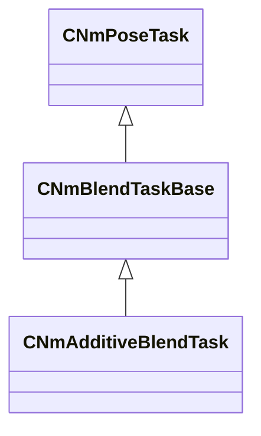

### CNmAndNode

**Metadata:** `MGetKV3ClassDefaults = {`, `"_class": "CNmAndNode::CDefinition",`, `"m_nNodeIdx": -1,`, `"m_conditionNodeIndices":`, `[`, `]`, `}`

### CNmAnimationPoseNode

**Metadata:** `MGetKV3ClassDefaults = {`, `"_class": "CNmAnimationPoseNode::CDefinition",`, `"m_nNodeIdx": -1,`, `"m_nPoseTimeValueNodeIdx": -1,`, `"m_nDataSlotIdx": -1,`, `"m_inputTimeRemapRange":`, `{`, `"m_flMin": 0.000000,`, `"m_flMax": 1.000000`, `},`, `"m_flUserSpecifiedTime": 0.000000,`, `"m_bUseFramesAsInput": false`, `}`

### CNmBitFlags

**Metadata:** `MGetKV3ClassDefaults = {`, `"m_flags": 0`, `}`

### CNmBlend1DNode

**Metadata:** `MGetKV3ClassDefaults = {`, `"_class": "CNmBlend1DNode::CDefinition",`, `"m_nNodeIdx": -1,`, `"m_sourceNodeIndices":`, `[`, `],`, `"m_nInputParameterValueNodeIdx": -1,`, `"m_bAllowLooping": true,`, `"m_parameterization":`, `{`, `"m_blendRanges":`, `[`, `],`, `"m_parameterRange":`, `{`, `"m_flMin": 340282346638528859811704183484516925440.000000,`, `"m_flMax": -340282346638528859811704183484516925440.000000`, `}`, `}`, `}`

### CNmBlend2DNode

**Metadata:** `MGetKV3ClassDefaults = {`, `"_class": "CNmBlend2DNode::CDefinition",`, `"m_nNodeIdx": -1,`, `"m_sourceNodeIndices":`, `[`, `],`, `"m_values":`, `[`, `],`, `"m_indices":`, `[`, `],`, `"m_hullIndices":`, `[`, `],`, `"m_nInputParameterNodeIdx0": -1,`, `"m_nInputParameterNodeIdx1": -1,`, `"m_bAllowLooping": true`, `}`

### CNmBlendTask

**Inherits from:** [CNmBlendTaskBase](animlib.md#cnmblendtaskbase)

**Relationships:**

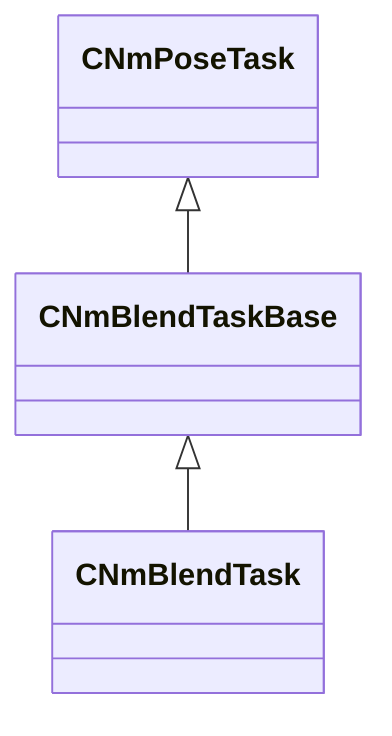

### CNmBlendTaskBase

**Inherits from:** [CNmPoseTask](animlib.md#cnmposetask)

**Derived by:** [CNmAdditiveBlendTask](animlib.md#cnmadditiveblendtask), [CNmBlendTask](animlib.md#cnmblendtask), [CNmModelSpaceBlendTask](animlib.md#cnmmodelspaceblendtask), [CNmOverlayBlendTask](animlib.md#cnmoverlayblendtask)

**Relationships:**

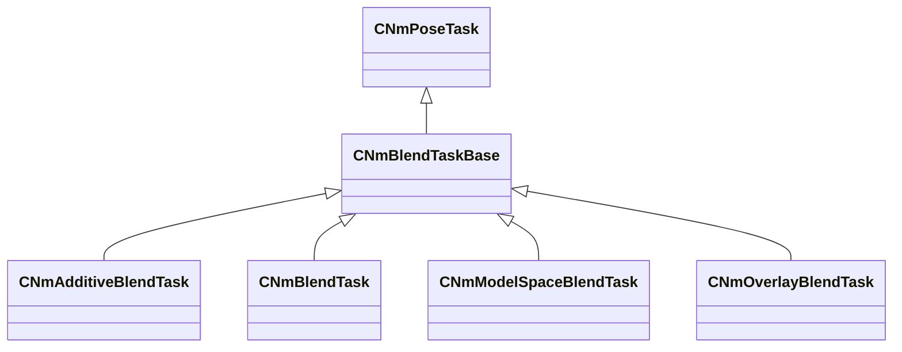

### CNmBodyGroupEvent

**Inherits from:** [CNmEvent](animlib.md#cnmevent)

**Metadata:** `MGetKV3ClassDefaults = {`, `"_class": "CNmBodyGroupEvent",`, `"m_flStartTime":`, `{`, `"m_flValue": 0.000000`, `},`, `"m_flDuration":`, `{`, `"m_flValue": 0.000000`, `},`, `"m_syncID": "",`, `"m_target": "Self",`, `"m_groupName": "",`, `"m_nGroupValue": 0`, `}`

**Relationships:**

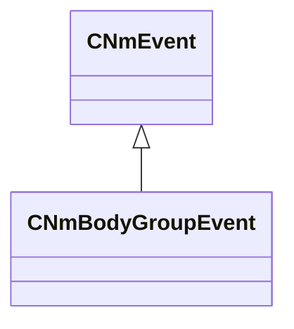

### CNmBoneMaskBlendNode

**Metadata:** `MGetKV3ClassDefaults = {`, `"_class": "CNmBoneMaskBlendNode::CDefinition",`, `"m_nNodeIdx": -1,`, `"m_nSourceMaskNodeIdx": -1,`, `"m_nTargetMaskNodeIdx": -1,`, `"m_nBlendWeightValueNodeIdx": -1`, `}`

### CNmBoneMaskNode

**Metadata:** `MGetKV3ClassDefaults = {`, `"_class": "CNmBoneMaskNode::CDefinition",`, `"m_nNodeIdx": -1,`, `"m_boneMaskID": ""`, `}`

### CNmBoneMaskSelectorNode

**Metadata:** `MGetKV3ClassDefaults = {`, `"_class": "CNmBoneMaskSelectorNode::CDefinition",`, `"m_nNodeIdx": -1,`, `"m_defaultMaskNodeIdx": -1,`, `"m_parameterValueNodeIdx": -1,`, `"m_bSwitchDynamically": false,`, `"m_maskNodeIndices":`, `[`, `],`, `"m_parameterValues":`, `[`, `],`, `"m_flBlendTimeSeconds": 0.100000`, `}`

### CNmBoneMaskSwitchNode

**Metadata:** `MGetKV3ClassDefaults = {`, `"_class": "CNmBoneMaskSwitchNode::CDefinition",`, `"m_nNodeIdx": -1,`, `"m_nSwitchValueNodeIdx": -1,`, `"m_nTrueValueNodeIdx": -1,`, `"m_nFalseValueNodeIdx": -1,`, `"m_flBlendTimeSeconds": 0.100000,`, `"m_bSwitchDynamically": false`, `}`

### CNmBoneMaskValueNode

### CNmBoneWeightList

**Metadata:** `MGetKV3ClassDefaults = {`, `"m_skeletonName": "",`, `"m_boneIDs":`, `[`, `],`, `"m_weights":`, `[`, `]`, `}`

### CNmBoolValueNode

### CNmCachedBoolNode

**Metadata:** `MGetKV3ClassDefaults = {`, `"_class": "CNmCachedBoolNode::CDefinition",`, `"m_nNodeIdx": -1,`, `"m_nInputValueNodeIdx": -1,`, `"m_mode": "OnEntry"`, `}`

### CNmCachedFloatNode

**Metadata:** `MGetKV3ClassDefaults = {`, `"_class": "CNmCachedFloatNode::CDefinition",`, `"m_nNodeIdx": -1,`, `"m_nInputValueNodeIdx": -1,`, `"m_mode": "OnEntry"`, `}`

### CNmCachedIDNode

**Metadata:** `MGetKV3ClassDefaults = {`, `"_class": "CNmCachedIDNode::CDefinition",`, `"m_nNodeIdx": -1,`, `"m_nInputValueNodeIdx": -1,`, `"m_mode": "OnEntry"`, `}`

### CNmCachedPoseReadTask

**Inherits from:** [CNmPoseTask](animlib.md#cnmposetask)

**Relationships:**

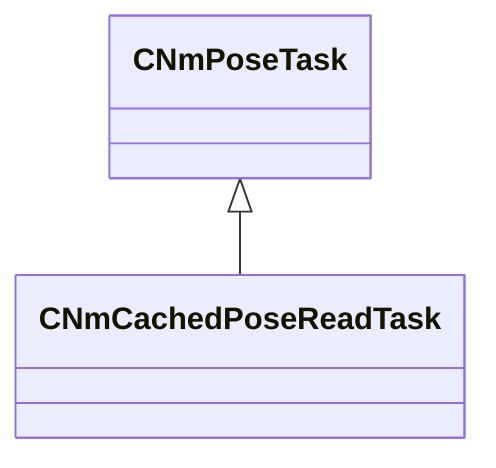

### CNmCachedPoseWriteTask

**Inherits from:** [CNmPoseTask](animlib.md#cnmposetask)

**Relationships:**

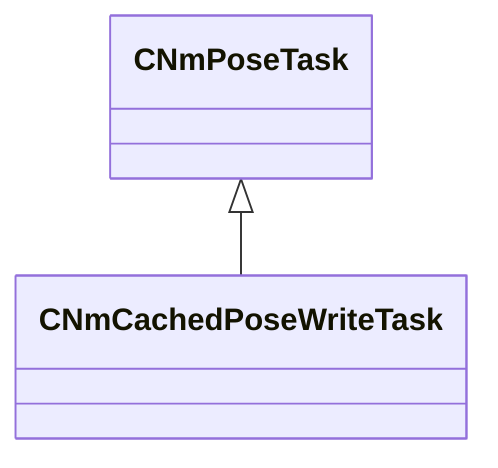

### CNmCachedTargetNode

**Metadata:** `MGetKV3ClassDefaults = {`, `"_class": "CNmCachedTargetNode::CDefinition",`, `"m_nNodeIdx": -1,`, `"m_nInputValueNodeIdx": -1,`, `"m_mode": "OnEntry"`, `}`

### CNmCachedVectorNode

**Metadata:** `MGetKV3ClassDefaults = {`, `"_class": "CNmCachedVectorNode::CDefinition",`, `"m_nNodeIdx": -1,`, `"m_nInputValueNodeIdx": -1,`, `"m_mode": "OnEntry"`, `}`

### CNmChainLookatNode

**Metadata:** `MGetKV3ClassDefaults = {`, `"_class": "CNmChainLookatNode::CDefinition",`, `"m_nNodeIdx": -1,`, `"m_nChildNodeIdx": -1,`, `"m_chainEndBoneID": "",`, `"m_nLookatTargetNodeIdx": -1,`, `"m_nEnabledNodeIdx": -1,`, `"m_flBlendTimeSeconds": 0.000000,`, `"m_nChainLength": 2,`, `"m_bIsTargetInWorldSpace": false,`, `"m_chainForwardDir":`, `[`, `1.000000,`, `0.000000,`, `0.000000`, `]`, `}`

### CNmChainLookatTask

**Inherits from:** [CNmPoseTask](animlib.md#cnmposetask)

**Relationships:**

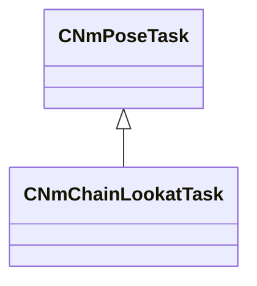

**Fields:**

| Name | Type | Annotations |
|------|------|-------------|
| `m_nChainEndBoneIdx` | int32 |  |
| `m_nNumBonesInChain` | int32 |  |
| `m_chainForwardDir` | Vector |  |
| `m_flBlendWeight` | float32 |  |
| `m_flHorizontalAngleLimitDegrees` | float32 |  |
| `m_flVerticalAngleLimitDegrees` | float32 |  |
| `m_lookatTarget` | Vector |  |
| `m_bIsTargetInWorldSpace` | bool |  |
| `m_bIsRunningFromDeserializedData` | bool |  |
| `m_flHorizontalAngleDegrees` | float32 |  |
| `m_flVerticalAngleDegrees` | float32 |  |

### CNmClip

**Metadata:** `MGetKV3ClassDefaults = {`, `"m_skeleton": "",`, `"m_nNumFrames": 0,`, `"m_flDuration": 0.000000,`, `"m_compressedPoseData": "[BINARY BLOB]",`, `"m_trackCompressionSettings":`, `[`, `],`, `"m_compressedPoseOffsets":`, `[`, `],`, `"m_floatCurveIDs":`, `[`, `],`, `"m_floatCurveDefs":`, `[`, `],`, `"m_compressedFloatCurveData":`, `[`, `],`, `"m_compressedFloatCurveOffsets":`, `[`, `],`, `"m_secondaryAnimations":`, `[`, `],`, `"m_syncTrack":`, `{`, `"m_syncEvents":`, `[`, `{`, `"m_ID": <HIDDEN FOR DIFF>,`, `"m_startTime":`, `{`, `"m_flValue": 0.000000`, `},`, `"m_duration":`, `{`, `"m_flValue": 1.000000`, `}`, `}`, `],`, `"m_nStartEventOffset": 0`, `},`, `"m_rootMotion":`, `{`, `"m_transforms":`, `[`, `],`, `"m_nNumFrames": 0,`, `"m_flAverageLinearVelocity": 0.000000,`, `"m_flAverageAngularVelocityRadians": 0.000000,`, `"m_totalDelta":`, `[`, `0.000000,`, `0.000000,`, `0.000000,`, `0.000000,`, `0.000000,`, `0.000000,`, `0.000000,`, `0.000000`, `]`, `},`, `"m_bIsAdditive": false,`, `"m_modelSpaceSamplingChain":`, `[`, `],`, `"m_modelSpaceBoneSamplingIndices":`, `[`, `],`, `"m_events":`, `[`, `]`, `}`

### CNmClip

**Metadata:** `MGetKV3ClassDefaults = {`, `"m_nBoneIdx": -1,`, `"m_nParentBoneIdx": -1,`, `"m_nParentChainLinkIdx": -1`, `}`

### CNmClipNode

**Metadata:** `MGetKV3ClassDefaults = {`, `"_class": "CNmClipNode::CDefinition",`, `"m_nNodeIdx": -1,`, `"m_nPlayInReverseValueNodeIdx": -1,`, `"m_nResetTimeValueNodeIdx": -1,`, `"m_bSampleRootMotion": true,`, `"m_bAllowLooping": false,`, `"m_nDataSlotIdx": -1,`, `"m_graphEvents":`, `[`, `],`, `"m_flSpeedMultiplier": 1.000000,`, `"m_nStartSyncEventOffset": 0`, `}`

### CNmClipReferenceNode

**Metadata:** `MGetKV3ClassDefaults = Could not parse KV3 Defaults`

### CNmClipSelectorNode

**Metadata:** `MGetKV3ClassDefaults = {`, `"_class": "CNmClipSelectorNode::CDefinition",`, `"m_nNodeIdx": -1,`, `"m_optionNodeIndices":`, `[`, `],`, `"m_conditionNodeIndices":`, `[`, `]`, `}`

### CNmConstBoolNode

**Metadata:** `MGetKV3ClassDefaults = {`, `"_class": "CNmConstBoolNode::CDefinition",`, `"m_nNodeIdx": -1,`, `"m_bValue": false`, `}`

### CNmConstFloatNode

**Metadata:** `MGetKV3ClassDefaults = {`, `"_class": "CNmConstFloatNode::CDefinition",`, `"m_nNodeIdx": -1,`, `"m_flValue": 0.000000`, `}`

### CNmConstIDNode

**Metadata:** `MGetKV3ClassDefaults = {`, `"_class": "CNmConstIDNode::CDefinition",`, `"m_nNodeIdx": -1,`, `"m_value": ""`, `}`

### CNmConstTargetNode

**Metadata:** `MGetKV3ClassDefaults = {`, `"_class": "CNmConstTargetNode::CDefinition",`, `"m_nNodeIdx": -1,`, `"m_value":`, `{`, `"m_transform":`, `[`, `0.000000,`, `0.000000,`, `0.000000,`, `1.000000,`, `0.000000,`, `0.000000,`, `0.000000,`, `1.000000`, `],`, `"m_boneID": "",`, `"m_bIsBoneTarget": false,`, `"m_bIsUsingBoneSpaceOffsets": true,`, `"m_bHasOffsets": false,`, `"m_bIsSet": false`, `}`, `}`

### CNmConstVectorNode

**Metadata:** `MGetKV3ClassDefaults = {`, `"_class": "CNmConstVectorNode::CDefinition",`, `"m_nNodeIdx": -1,`, `"m_value":`, `[`, `0.000000,`, `0.000000,`, `0.000000`, `]`, `}`

### CNmControlParameterBoolNode

**Metadata:** `MGetKV3ClassDefaults = {`, `"_class": "CNmControlParameterBoolNode::CDefinition",`, `"m_nNodeIdx": -1`, `}`

### CNmControlParameterFloatNode

**Metadata:** `MGetKV3ClassDefaults = {`, `"_class": "CNmControlParameterFloatNode::CDefinition",`, `"m_nNodeIdx": -1`, `}`

### CNmControlParameterIDNode

**Metadata:** `MGetKV3ClassDefaults = {`, `"_class": "CNmControlParameterIDNode::CDefinition",`, `"m_nNodeIdx": -1`, `}`

### CNmControlParameterTargetNode

**Metadata:** `MGetKV3ClassDefaults = {`, `"_class": "CNmControlParameterTargetNode::CDefinition",`, `"m_nNodeIdx": -1`, `}`

### CNmControlParameterVectorNode

**Metadata:** `MGetKV3ClassDefaults = {`, `"_class": "CNmControlParameterVectorNode::CDefinition",`, `"m_nNodeIdx": -1`, `}`

### CNmCurrentSyncEventIDNode

**Metadata:** `MGetKV3ClassDefaults = {`, `"_class": "CNmCurrentSyncEventIDNode::CDefinition",`, `"m_nNodeIdx": -1,`, `"m_nSourceStateNodeIdx": -1`, `}`

### CNmCurrentSyncEventNode

**Metadata:** `MGetKV3ClassDefaults = {`, `"_class": "CNmCurrentSyncEventNode::CDefinition",`, `"m_nNodeIdx": -1,`, `"m_nSourceStateNodeIdx": -1,`, `"m_infoType": "IndexAndPercentage"`, `}`

### CNmCurrentSyncEventNode

**Values:**

| Name | Value |
|------|-------|
| `IndexAndPercentage` | 0 |
| `IndexOnly` | 1 |
| `PercentageOnly` | 2 |

### CNmDurationScaleNode

**Metadata:** `MGetKV3ClassDefaults = {`, `"_class": "CNmDurationScaleNode::CDefinition",`, `"m_nNodeIdx": -1,`, `"m_nChildNodeIdx": -1,`, `"m_nInputValueNodeIdx": -1,`, `"m_flDefaultInputValue": 0.000000`, `}`

### CNmEntityAttributeEventBase

**Inherits from:** [CNmEvent](animlib.md#cnmevent)

**Derived by:** [CNmEntityAttributeFloatEvent](animlib.md#cnmentityattributefloatevent), [CNmEntityAttributeIntEvent](animlib.md#cnmentityattributeintevent)

**Metadata:** `MGetKV3ClassDefaults = {`, `"_class": "CNmEntityAttributeEventBase",`, `"m_flStartTime":`, `{`, `"m_flValue": 0.000000`, `},`, `"m_flDuration":`, `{`, `"m_flValue": 0.000000`, `},`, `"m_syncID": "",`, `"m_target": "Self",`, `"m_attributeName": ""`, `}`

**Relationships:**

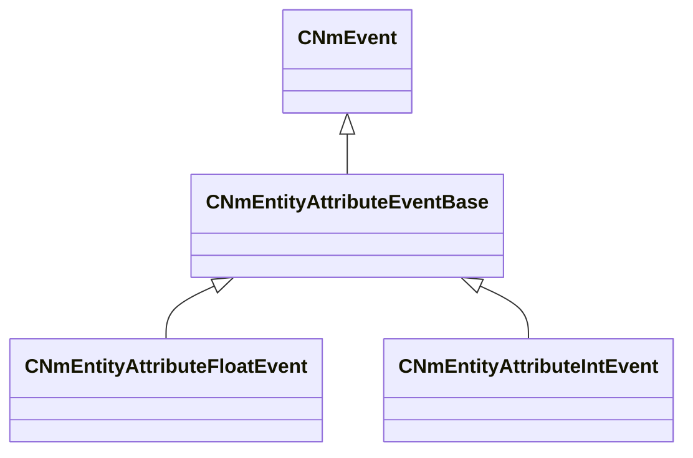

### CNmEntityAttributeFloatEvent

**Inherits from:** [CNmEntityAttributeEventBase](animlib.md#cnmentityattributeeventbase)

**Metadata:** `MGetKV3ClassDefaults = {`, `"_class": "CNmEntityAttributeFloatEvent",`, `"m_flStartTime":`, `{`, `"m_flValue": 0.000000`, `},`, `"m_flDuration":`, `{`, `"m_flValue": 0.000000`, `},`, `"m_syncID": "",`, `"m_target": "Self",`, `"m_attributeName": "",`, `"m_FloatValue":`, `{`, `"m_spline":`, `[`, `],`, `"m_tangents":`, `[`, `],`, `"m_vDomainMins":`, `[`, `0.000000,`, `0.000000`, `],`, `"m_vDomainMaxs":`, `[`, `0.000000,`, `0.000000`, `]`, `}`, `}`

**Relationships:**

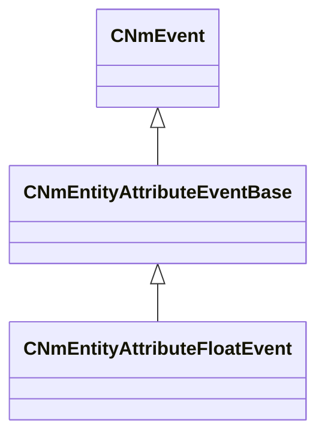

### CNmEntityAttributeIntEvent

**Inherits from:** [CNmEntityAttributeEventBase](animlib.md#cnmentityattributeeventbase)

**Metadata:** `MGetKV3ClassDefaults = {`, `"_class": "CNmEntityAttributeIntEvent",`, `"m_flStartTime":`, `{`, `"m_flValue": 0.000000`, `},`, `"m_flDuration":`, `{`, `"m_flValue": 0.000000`, `},`, `"m_syncID": "",`, `"m_target": "Self",`, `"m_attributeName": "",`, `"m_nIntValue": 0`, `}`

**Relationships:**

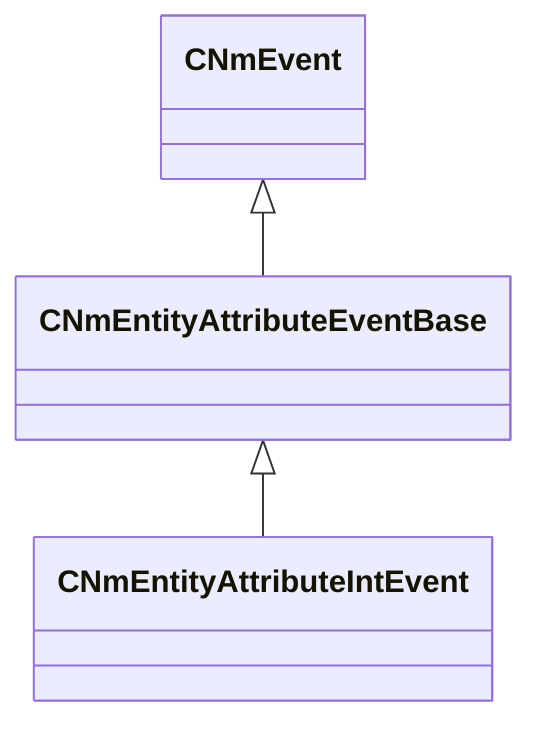

### CNmEvent

**Derived by:** [CNmBodyGroupEvent](animlib.md#cnmbodygroupevent), [CNmEntityAttributeEventBase](animlib.md#cnmentityattributeeventbase), [CNmFloatCurveEvent](animlib.md#cnmfloatcurveevent), [CNmFootEvent](animlib.md#cnmfootevent), [CNmFrameSnapEvent](animlib.md#cnmframesnapevent), [CNmIDEvent](animlib.md#cnmidevent), [CNmLegacyEvent](animlib.md#cnmlegacyevent), [CNmMaterialAttributeEvent](animlib.md#cnmmaterialattributeevent), [CNmOrientationWarpEvent](animlib.md#cnmorientationwarpevent), [CNmParticleEvent](animlib.md#cnmparticleevent), [CNmRootMotionEvent](animlib.md#cnmrootmotionevent), [CNmSoundEvent](animlib.md#cnmsoundevent), [CNmTargetWarpEvent](animlib.md#cnmtargetwarpevent), [CNmTransitionEvent](animlib.md#cnmtransitionevent)

**Metadata:** `MGetKV3ClassDefaults = Could not parse KV3 Defaults`

**Relationships:**

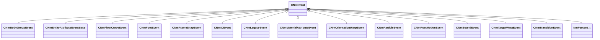

**Fields:**

| Name | Type | Annotations |
|------|------|-------------|
| `m_flStartTime` | [NmPercent_t](../schemas/animlib.md#nmpercent_t) |  |
| `m_flDuration` | [NmPercent_t](../schemas/animlib.md#nmpercent_t) |  |
| `m_syncID` | CGlobalSymbol |  |

### CNmEventRelevance_t

**Values:**

| Name | Value |
|------|-------|
| `ClientOnly` | 0 |
| `ServerOnly` | 1 |
| `ClientAndServer` | 2 |

### CNmEventTargetEntity_t

**Values:**

| Name | Value |
|------|-------|
| `Self` | 0 |
| `Weapon` | 1 |
| `HeldItem` | 2 |
| `Custom` | 3 |

### CNmExternalPoseNode

**Metadata:** `MGetKV3ClassDefaults = {`, `"_class": "CNmExternalPoseNode::CDefinition",`, `"m_nNodeIdx": -1,`, `"m_bShouldSampleRootMotion": false`, `}`

### CNmFixedWeightBoneMaskNode

**Metadata:** `MGetKV3ClassDefaults = {`, `"_class": "CNmFixedWeightBoneMaskNode::CDefinition",`, `"m_nNodeIdx": -1,`, `"m_flBoneWeight": 0.000000`, `}`

### CNmFloatAngleMathNode

**Metadata:** `MGetKV3ClassDefaults = {`, `"_class": "CNmFloatAngleMathNode::CDefinition",`, `"m_nNodeIdx": -1,`, `"m_nInputValueNodeIdx": -1,`, `"m_operation": "ClampTo180"`, `}`

### CNmFloatAngleMathNode

**Values:**

| Name | Value |
|------|-------|
| `ClampTo180` | 0 |
| `ClampTo360` | 1 |
| `FlipHemisphere` | 2 |
| `FlipHemisphereNegate` | 3 |

### CNmFloatClampNode

**Metadata:** `MGetKV3ClassDefaults = {`, `"_class": "CNmFloatClampNode::CDefinition",`, `"m_nNodeIdx": -1,`, `"m_nInputValueNodeIdx": -1,`, `"m_clampRange":`, `{`, `"m_flMin": 0.000000,`, `"m_flMax": 0.000000`, `}`, `}`

### CNmFloatComparisonNode

**Metadata:** `MGetKV3ClassDefaults = {`, `"_class": "CNmFloatComparisonNode::CDefinition",`, `"m_nNodeIdx": -1,`, `"m_nInputValueNodeIdx": -1,`, `"m_nComparandValueNodeIdx": -1,`, `"m_comparison": "GreaterThanEqual",`, `"m_flEpsilon": 0.000000,`, `"m_flComparisonValue": 0.000000`, `}`

### CNmFloatComparisonNode

**Values:**

| Name | Value |
|------|-------|
| `GreaterThanEqual` | 0 |
| `LessThanEqual` | 1 |
| `NearEqual` | 2 |
| `GreaterThan` | 3 |
| `LessThan` | 4 |

### CNmFloatCurveEvent

**Inherits from:** [CNmEvent](animlib.md#cnmevent)

**Metadata:** `MGetKV3ClassDefaults = {`, `"_class": "CNmFloatCurveEvent",`, `"m_flStartTime":`, `{`, `"m_flValue": 0.000000`, `},`, `"m_flDuration":`, `{`, `"m_flValue": 0.000000`, `},`, `"m_syncID": "",`, `"m_ID": <HIDDEN FOR DIFF>,`, `"m_curve":`, `{`, `"m_spline":`, `[`, `],`, `"m_tangents":`, `[`, `],`, `"m_vDomainMins":`, `[`, `0.000000,`, `0.000000`, `],`, `"m_vDomainMaxs":`, `[`, `0.000000,`, `0.000000`, `]`, `}`, `}`

**Relationships:**

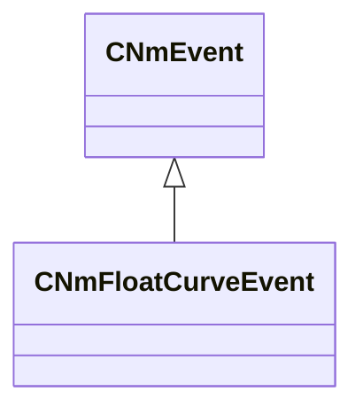

### CNmFloatCurveEventNode

**Metadata:** `MGetKV3ClassDefaults = {`, `"_class": "CNmFloatCurveEventNode::CDefinition",`, `"m_nNodeIdx": -1,`, `"m_eventID": "",`, `"m_nDefaultNodeIdx": -1,`, `"m_flDefaultValue": 0.000000,`, `"m_eventConditionRules":`, `{`, `"m_flags": 0`, `}`, `}`

### CNmFloatCurveNode

**Metadata:** `MGetKV3ClassDefaults = {`, `"_class": "CNmFloatCurveNode::CDefinition",`, `"m_nNodeIdx": -1,`, `"m_nInputValueNodeIdx": -1,`, `"m_curve":`, `{`, `"m_spline":`, `[`, `],`, `"m_tangents":`, `[`, `],`, `"m_vDomainMins":`, `[`, `0.000000,`, `0.000000`, `],`, `"m_vDomainMaxs":`, `[`, `0.000000,`, `0.000000`, `]`, `}`, `}`

### CNmFloatEaseNode

**Metadata:** `MGetKV3ClassDefaults = {`, `"_class": "CNmFloatEaseNode::CDefinition",`, `"m_nNodeIdx": -1,`, `"m_flEaseTime": 1.000000,`, `"m_flStartValue": 0.000000,`, `"m_nInputValueNodeIdx": -1,`, `"m_easingOp": "Linear",`, `"m_bUseStartValue": false`, `}`

### CNmFloatMathNode

**Metadata:** `MGetKV3ClassDefaults = {`, `"_class": "CNmFloatMathNode::CDefinition",`, `"m_nNodeIdx": -1,`, `"m_nInputValueNodeIdxA": -1,`, `"m_nInputValueNodeIdxB": -1,`, `"m_bReturnAbsoluteResult": false,`, `"m_bReturnNegatedResult": false,`, `"m_operator": "Add",`, `"m_flValueB": 0.000000`, `}`

### CNmFloatMathNode

**Values:**

| Name | Value |
|------|-------|
| `Add` | 0 |
| `Sub` | 1 |
| `Mul` | 2 |
| `Div` | 3 |
| `Mod` | 4 |
| `Abs` | 5 |
| `Negate` | 6 |
| `Floor` | 7 |
| `Ceiling` | 8 |
| `IntegerPart` | 9 |
| `FractionalPart` | 10 |
| `InverseFractionalPart` | 11 |

### CNmFloatRangeComparisonNode

**Metadata:** `MGetKV3ClassDefaults = {`, `"_class": "CNmFloatRangeComparisonNode::CDefinition",`, `"m_nNodeIdx": -1,`, `"m_range":`, `{`, `"m_flMin": 340282346638528859811704183484516925440.000000,`, `"m_flMax": -340282346638528859811704183484516925440.000000`, `},`, `"m_nInputValueNodeIdx": -1,`, `"m_bIsInclusiveCheck": true`, `}`

### CNmFloatRemapNode

**Metadata:** `MGetKV3ClassDefaults = {`, `"_class": "CNmFloatRemapNode::CDefinition",`, `"m_nNodeIdx": -1,`, `"m_nInputValueNodeIdx": -1,`, `"m_inputRange":`, `{`, `"m_flBegin": 0.000000,`, `"m_flEnd": 0.000000`, `},`, `"m_outputRange":`, `{`, `"m_flBegin": 0.000000,`, `"m_flEnd": 0.000000`, `}`, `}`

### CNmFloatRemapNode

**Metadata:** `MGetKV3ClassDefaults = {`, `"m_flBegin": 0.000000,`, `"m_flEnd": 0.000000`, `}`

### CNmFloatSelectorNode

**Metadata:** `MGetKV3ClassDefaults = {`, `"_class": "CNmFloatSelectorNode::CDefinition",`, `"m_nNodeIdx": -1,`, `"m_conditionNodeIndices":`, `[`, `],`, `"m_values":`, `[`, `],`, `"m_flDefaultValue": 0.000000,`, `"m_flEaseTime": 0.200000,`, `"m_easingOp": "Linear"`, `}`

### CNmFloatSpringNode

**Metadata:** `MGetKV3ClassDefaults = {`, `"_class": "CNmFloatSpringNode::CDefinition",`, `"m_nNodeIdx": -1,`, `"m_flStartValue": 0.000000,`, `"m_flHertz": 4.000000,`, `"m_flDampingRatio": 0.700000,`, `"m_nInputValueNodeIdx": -1,`, `"m_bUseStartValue": false`, `}`

### CNmFloatSwitchNode

**Metadata:** `MGetKV3ClassDefaults = {`, `"_class": "CNmFloatSwitchNode::CDefinition",`, `"m_nNodeIdx": -1,`, `"m_nSwitchValueNodeIdx": -1,`, `"m_nTrueValueNodeIdx": -1,`, `"m_nFalseValueNodeIdx": -1,`, `"m_flFalseValue": 0.000000,`, `"m_flTrueValue": 1.000000`, `}`

### CNmFloatValueNode

### CNmFollowBoneNode

**Metadata:** `MGetKV3ClassDefaults = {`, `"_class": "CNmFollowBoneNode::CDefinition",`, `"m_nNodeIdx": -1,`, `"m_nChildNodeIdx": -1,`, `"m_bone": "",`, `"m_followTargetBone": "",`, `"m_nEnabledNodeIdx": -1,`, `"m_mode": "RotationAndTranslation"`, `}`

### CNmFollowBoneTask

**Inherits from:** [CNmPoseTask](animlib.md#cnmposetask)

**Relationships:**

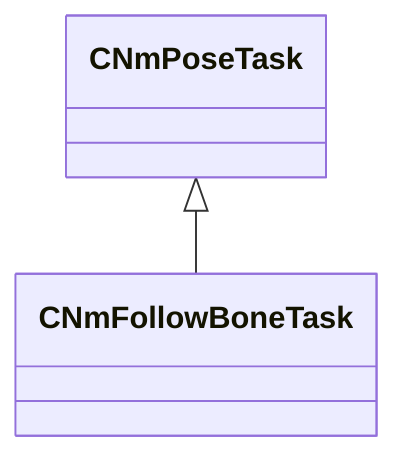

### CNmFootEvent

**Inherits from:** [CNmEvent](animlib.md#cnmevent)

**Metadata:** `MGetKV3ClassDefaults = {`, `"_class": "CNmFootEvent",`, `"m_flStartTime":`, `{`, `"m_flValue": 0.000000`, `},`, `"m_flDuration":`, `{`, `"m_flValue": 0.000000`, `},`, `"m_syncID": "",`, `"m_phase": "LeftFootDown"`, `}`

**Relationships:**

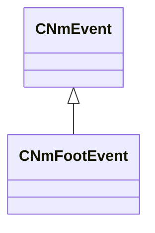

### CNmFootEventConditionNode

**Metadata:** `MGetKV3ClassDefaults = {`, `"_class": "CNmFootEventConditionNode::CDefinition",`, `"m_nNodeIdx": -1,`, `"m_nSourceStateNodeIdx": -1,`, `"m_phaseCondition": "LeftFootDown",`, `"m_eventConditionRules":`, `{`, `"m_flags": 0`, `}`, `}`

### CNmFootIKNode

**Metadata:** `MGetKV3ClassDefaults = {`, `"_class": "CNmFootIKNode::CDefinition",`, `"m_nNodeIdx": -1,`, `"m_nChildNodeIdx": -1,`, `"m_leftEffectorBoneID": "",`, `"m_rightEffectorBoneID": "",`, `"m_nLeftTargetNodeIdx": -1,`, `"m_nRightTargetNodeIdx": -1,`, `"m_nEnabledNodeIdx": -1,`, `"m_flBlendTimeSeconds": 0.000000,`, `"m_blendMode": "Effector",`, `"m_bIsTargetInWorldSpace": false`, `}`

### CNmFootIKTask

**Inherits from:** [CNmPoseTask](animlib.md#cnmposetask)

**Relationships:**

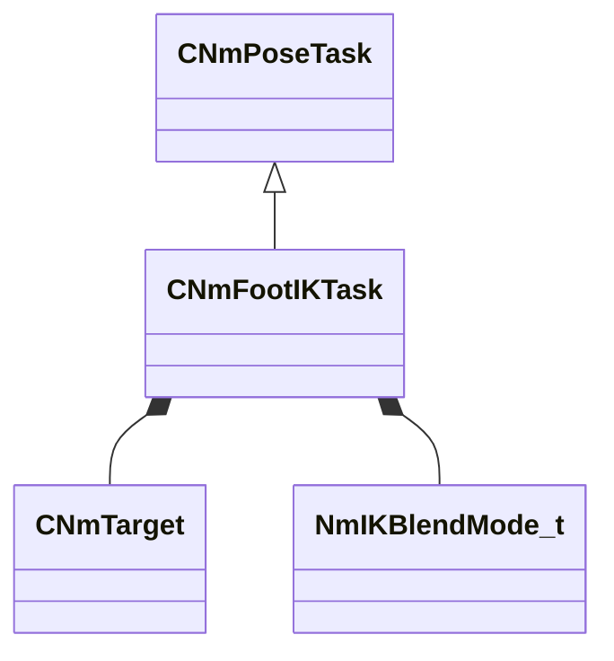

**Fields:**

| Name | Type | Annotations |
|------|------|-------------|
| `m_nLeftEffectorBoneIdx` | int32 |  |
| `m_nRightEffectorBoneIdx` | int32 |  |
| `m_leftTargetTransform` | CTransform |  |
| `m_rightTargetTransform` | CTransform |  |
| `m_nLeftTargetBoneIdx` | int32 |  |
| `m_nRightTargetBoneIdx` | int32 |  |
| `m_leftTarget` | [CNmTarget](../schemas/animlib.md#cnmtarget) |  |
| `m_rightTarget` | [CNmTarget](../schemas/animlib.md#cnmtarget) |  |
| `m_blendMode` | [NmIKBlendMode_t](../schemas/animlib.md#nmikblendmode_t) |  |
| `m_flBlendWeight` | float32 |  |
| `m_bIsTargetInWorldSpace` | bool |  |
| `m_bIsRunningFromDeserializedData` | bool |  |

### CNmFootstepEventIDNode

**Metadata:** `MGetKV3ClassDefaults = {`, `"_class": "CNmFootstepEventIDNode::CDefinition",`, `"m_nNodeIdx": -1,`, `"m_nSourceStateNodeIdx": -1,`, `"m_eventConditionRules":`, `{`, `"m_flags": 0`, `}`, `}`

### CNmFootstepEventPercentageThroughNode

**Metadata:** `MGetKV3ClassDefaults = {`, `"_class": "CNmFootstepEventPercentageThroughNode::CDefinition",`, `"m_nNodeIdx": -1,`, `"m_nSourceStateNodeIdx": -1,`, `"m_phaseCondition": "LeftFootDown",`, `"m_eventConditionRules":`, `{`, `"m_flags": 0`, `}`, `}`

### CNmFrameSnapEvent

**Inherits from:** [CNmEvent](animlib.md#cnmevent)

**Metadata:** `MGetKV3ClassDefaults = {`, `"_class": "CNmFrameSnapEvent",`, `"m_flStartTime":`, `{`, `"m_flValue": 0.000000`, `},`, `"m_flDuration":`, `{`, `"m_flValue": 0.000000`, `},`, `"m_syncID": "",`, `"m_frameSnapMode": "Floor"`, `}`

**Relationships:**

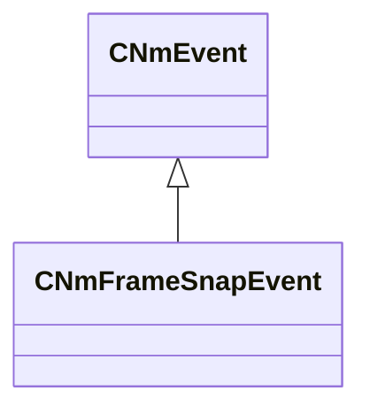

### CNmGraphDefinition

**Metadata:** `MGetKV3ClassDefaults = {`, `"m_variationID": "",`, `"m_skeleton": "",`, `"m_supportedSecondarySkeletons":`, `[`, `],`, `"m_pUserData": null,`, `"m_persistentNodeIndices":`, `[`, `],`, `"m_nRootNodeIdx": -1,`, `"m_controlParameterIDs":`, `[`, `],`, `"m_virtualParameterIDs":`, `[`, `],`, `"m_virtualParameterNodeIndices":`, `[`, `],`, `"m_referencedGraphSlots":`, `[`, `],`, `"m_externalGraphSlots":`, `[`, `],`, `"m_externalPoseSlots":`, `[`, `],`, `"m_nodePaths":`, `[`, `],`, `"m_resources":`, `[`, `],`, `"m_nodes":`, `[`, `]`, `}`

### CNmGraphDefinition

**Metadata:** `MGetKV3ClassDefaults = {`, `"m_nNodeIdx": -1,`, `"m_slotID": ""`, `}`

### CNmGraphDefinition

**Metadata:** `MGetKV3ClassDefaults = {`, `"m_nNodeIdx": -1,`, `"m_slotID": ""`, `}`

### CNmGraphDefinition

**Metadata:** `MGetKV3ClassDefaults = {`, `"m_nNodeIdx": -1,`, `"m_dataSlotIdx": -1`, `}`

### CNmGraphEventConditionNode

**Metadata:** `MGetKV3ClassDefaults = {`, `"_class": "CNmGraphEventConditionNode::CDefinition",`, `"m_nNodeIdx": -1,`, `"m_nSourceStateNodeIdx": -1,`, `"m_eventConditionRules":`, `{`, `"m_flags": 0`, `},`, `"m_conditions":`, `[`, `]`, `}`

### CNmGraphEventConditionNode

**Metadata:** `MGetKV3ClassDefaults = {`, `"m_eventID": "",`, `"m_eventTypeCondition": "Entry"`, `}`

### CNmGraphInstance

### CNmGraphNode

**Metadata:** `MGetKV3ClassDefaults = Could not parse KV3 Defaults`

**Fields:**

| Name | Type | Annotations |
|------|------|-------------|
| `m_nNodeIdx` | int16 |  |

### CNmGraphVariationUserData

**Derived by:** [CBaseAnimGraphVariationUserData](client.md#cbaseanimgraphvariationuserdata)

**Metadata:** `MGetKV3ClassDefaults = {`, `"_class": "CNmGraphVariationUserData"`, `}`

**Relationships:**

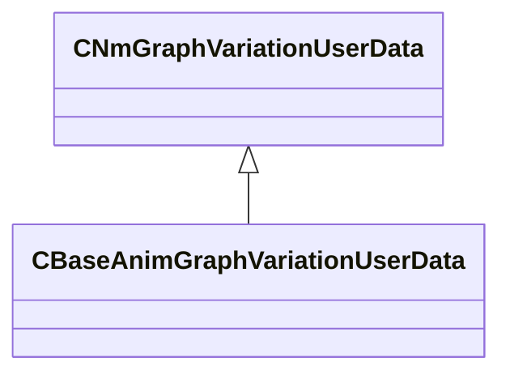

### CNmIDBasedClipSelectorNode

**Metadata:** `MGetKV3ClassDefaults = {`, `"_class": "CNmIDBasedClipSelectorNode::CDefinition",`, `"m_nNodeIdx": -1,`, `"m_optionNodeIndices":`, `[`, `],`, `"m_optionIDs":`, `[`, `],`, `"m_nParameterNodeIdx": -1,`, `"m_nFallbackNodeIdx": -1,`, `"m_bIgnoreInvalidOptions": false`, `}`

### CNmIDBasedSelectorNode

**Metadata:** `MGetKV3ClassDefaults = {`, `"_class": "CNmIDBasedSelectorNode::CDefinition",`, `"m_nNodeIdx": -1,`, `"m_optionNodeIndices":`, `[`, `],`, `"m_optionIDs":`, `[`, `],`, `"m_nParameterNodeIdx": -1,`, `"m_nFallbackNodeIdx": -1,`, `"m_bIgnoreInvalidOptions": false`, `}`

### CNmIDComparisonNode

**Metadata:** `MGetKV3ClassDefaults = {`, `"_class": "CNmIDComparisonNode::CDefinition",`, `"m_nNodeIdx": -1,`, `"m_nInputValueNodeIdx": -1,`, `"m_comparison": "Matches",`, `"m_comparisionIDs":`, `[`, `]`, `}`

### CNmIDComparisonNode

**Values:**

| Name | Value |
|------|-------|
| `Matches` | 0 |
| `DoesntMatch` | 1 |

### CNmIDEvent

**Inherits from:** [CNmEvent](animlib.md#cnmevent)

**Metadata:** `MGetKV3ClassDefaults = {`, `"_class": "CNmIDEvent",`, `"m_flStartTime":`, `{`, `"m_flValue": 0.000000`, `},`, `"m_flDuration":`, `{`, `"m_flValue": 0.000000`, `},`, `"m_syncID": "",`, `"m_ID": <HIDDEN FOR DIFF>,`, `"m_secondaryID": ""`, `}`

**Relationships:**

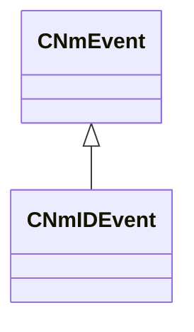

### CNmIDEventConditionNode

**Metadata:** `MGetKV3ClassDefaults = {`, `"_class": "CNmIDEventConditionNode::CDefinition",`, `"m_nNodeIdx": -1,`, `"m_nSourceStateNodeIdx": -1,`, `"m_eventConditionRules":`, `{`, `"m_flags": 0`, `},`, `"m_eventIDs":`, `[`, `]`, `}`

### CNmIDEventNode

**Metadata:** `MGetKV3ClassDefaults = {`, `"_class": "CNmIDEventNode::CDefinition",`, `"m_nNodeIdx": -1,`, `"m_nSourceStateNodeIdx": -1,`, `"m_eventConditionRules":`, `{`, `"m_flags": 0`, `},`, `"m_defaultValue": ""`, `}`

### CNmIDEventPercentageThroughNode

**Metadata:** `MGetKV3ClassDefaults = {`, `"_class": "CNmIDEventPercentageThroughNode::CDefinition",`, `"m_nNodeIdx": -1,`, `"m_nSourceStateNodeIdx": -1,`, `"m_eventConditionRules":`, `{`, `"m_flags": 0`, `},`, `"m_eventID": ""`, `}`

### CNmIDSelectorNode

**Metadata:** `MGetKV3ClassDefaults = {`, `"_class": "CNmIDSelectorNode::CDefinition",`, `"m_nNodeIdx": -1,`, `"m_conditionNodeIndices":`, `[`, `],`, `"m_values":`, `[`, `],`, `"m_defaultValue": ""`, `}`

### CNmIDSwitchNode

**Metadata:** `MGetKV3ClassDefaults = {`, `"_class": "CNmIDSwitchNode::CDefinition",`, `"m_nNodeIdx": -1,`, `"m_nSwitchValueNodeIdx": -1,`, `"m_nTrueValueNodeIdx": -1,`, `"m_nFalseValueNodeIdx": -1,`, `"m_falseValue": "",`, `"m_trueValue": ""`, `}`

### CNmIDToFloatNode

**Metadata:** `MGetKV3ClassDefaults = {`, `"_class": "CNmIDToFloatNode::CDefinition",`, `"m_nNodeIdx": -1,`, `"m_nInputValueNodeIdx": -1,`, `"m_defaultValue": 0.000000,`, `"m_IDs":`, `[`, `],`, `"m_values":`, `[`, `]`, `}`

### CNmIDValueNode

### CNmIsExternalGraphSlotFilledNode

**Metadata:** `MGetKV3ClassDefaults = {`, `"_class": "CNmIsExternalGraphSlotFilledNode::CDefinition",`, `"m_nNodeIdx": -1,`, `"m_nExternalGraphNodeIdx": -1`, `}`

### CNmIsExternalPoseSetNode

**Metadata:** `MGetKV3ClassDefaults = {`, `"_class": "CNmIsExternalPoseSetNode::CDefinition",`, `"m_nNodeIdx": -1,`, `"m_nExternalPoseNodeIdx": -1`, `}`

### CNmIsInactiveBranchConditionNode

**Metadata:** `MGetKV3ClassDefaults = {`, `"_class": "CNmIsInactiveBranchConditionNode::CDefinition",`, `"m_nNodeIdx": -1`, `}`

### CNmIsTargetSetNode

**Metadata:** `MGetKV3ClassDefaults = {`, `"_class": "CNmIsTargetSetNode::CDefinition",`, `"m_nNodeIdx": -1,`, `"m_nInputValueNodeIdx": -1`, `}`

### CNmLayerBlendNode

**Metadata:** `MGetKV3ClassDefaults = {`, `"_class": "CNmLayerBlendNode::CDefinition",`, `"m_nNodeIdx": -1,`, `"m_nBaseNodeIdx": -1,`, `"m_bOnlySampleBaseRootMotion": true,`, `"m_layerDefinition":`, `[`, `]`, `}`

### CNmLayerBlendNode

**Metadata:** `MGetKV3ClassDefaults = {`, `"m_nInputNodeIdx": -1,`, `"m_nWeightValueNodeIdx": -1,`, `"m_nBoneMaskValueNodeIdx": -1,`, `"m_nRootMotionWeightValueNodeIdx": -1,`, `"m_bIsSynchronized": false,`, `"m_bIgnoreEvents": false,`, `"m_bIsStateMachineLayer": false,`, `"m_blendMode": "Overlay"`, `}`

### CNmLegacyEvent

**Inherits from:** [CNmEvent](animlib.md#cnmevent)

**Metadata:** `MGetKV3ClassDefaults = {`, `"_class": "CNmLegacyEvent",`, `"m_flStartTime":`, `{`, `"m_flValue": 0.000000`, `},`, `"m_flDuration":`, `{`, `"m_flValue": 0.000000`, `},`, `"m_syncID": "",`, `"m_animEventClassName": "",`, `"m_KV": null`, `}`

**Relationships:**

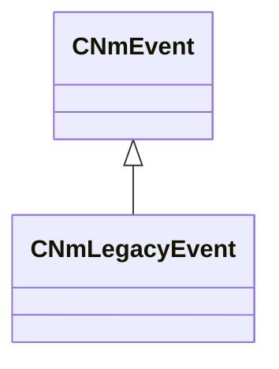

### CNmMaterialAttributeEvent

**Inherits from:** [CNmEvent](animlib.md#cnmevent)

**Metadata:** `MGetKV3ClassDefaults = {`, `"_class": "CNmMaterialAttributeEvent",`, `"m_flStartTime":`, `{`, `"m_flValue": 0.000000`, `},`, `"m_flDuration":`, `{`, `"m_flValue": 0.000000`, `},`, `"m_syncID": "",`, `"m_target": "Self",`, `"m_attributeName": "",`, `"m_attributeNameToken": "",`, `"m_x":`, `{`, `"m_spline":`, `[`, `],`, `"m_tangents":`, `[`, `],`, `"m_vDomainMins":`, `[`, `0.000000,`, `0.000000`, `],`, `"m_vDomainMaxs":`, `[`, `0.000000,`, `0.000000`, `]`, `},`, `"m_y":`, `{`, `"m_spline":`, `[`, `],`, `"m_tangents":`, `[`, `],`, `"m_vDomainMins":`, `[`, `0.000000,`, `0.000000`, `],`, `"m_vDomainMaxs":`, `[`, `0.000000,`, `0.000000`, `]`, `},`, `"m_z":`, `{`, `"m_spline":`, `[`, `],`, `"m_tangents":`, `[`, `],`, `"m_vDomainMins":`, `[`, `0.000000,`, `0.000000`, `],`, `"m_vDomainMaxs":`, `[`, `0.000000,`, `0.000000`, `]`, `},`, `"m_w":`, `{`, `"m_spline":`, `[`, `],`, `"m_tangents":`, `[`, `],`, `"m_vDomainMins":`, `[`, `0.000000,`, `0.000000`, `],`, `"m_vDomainMaxs":`, `[`, `0.000000,`, `0.000000`, `]`, `}`, `}`

**Relationships:**

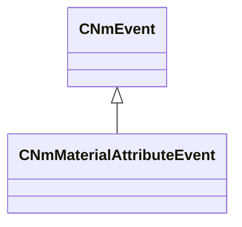

### CNmModelSpaceBlendTask

**Inherits from:** [CNmBlendTaskBase](animlib.md#cnmblendtaskbase)

**Relationships:**

```mermaid
classDiagram
    CNmBlendTaskBase <|-- CNmModelSpaceBlendTask
    CNmPoseTask <|-- CNmBlendTaskBase
```

### CNmNotNode

**Metadata:** `MGetKV3ClassDefaults = {`, `"_class": "CNmNotNode::CDefinition",`, `"m_nNodeIdx": -1,`, `"m_nInputValueNodeIdx": -1`, `}`

### CNmOrNode

**Metadata:** `MGetKV3ClassDefaults = {`, `"_class": "CNmOrNode::CDefinition",`, `"m_nNodeIdx": -1,`, `"m_conditionNodeIndices":`, `[`, `]`, `}`

### CNmOrientationWarpEvent

**Inherits from:** [CNmEvent](animlib.md#cnmevent)

**Metadata:** `MGetKV3ClassDefaults = {`, `"_class": "CNmOrientationWarpEvent",`, `"m_flStartTime":`, `{`, `"m_flValue": 0.000000`, `},`, `"m_flDuration":`, `{`, `"m_flValue": 0.000000`, `},`, `"m_syncID": ""`, `}`

**Relationships:**

```mermaid
classDiagram
    CNmEvent <|-- CNmOrientationWarpEvent
```

### CNmOrientationWarpNode

**Metadata:** `MGetKV3ClassDefaults = {`, `"_class": "CNmOrientationWarpNode::CDefinition",`, `"m_nNodeIdx": -1,`, `"m_nClipReferenceNodeIdx": -1,`, `"m_nTargetValueNodeIdx": -1,`, `"m_bIsOffsetNode": false,`, `"m_bIsOffsetRelativeToCharacter": true,`, `"m_bWarpTranslation": false,`, `"m_samplingMode": "WorldSpace"`, `}`

### CNmOverlayBlendTask

**Inherits from:** [CNmBlendTaskBase](animlib.md#cnmblendtaskbase)

**Relationships:**

```mermaid
classDiagram
    CNmBlendTaskBase <|-- CNmOverlayBlendTask
    CNmPoseTask <|-- CNmBlendTaskBase
```

### CNmParameterizedBlendNode

**Metadata:** `MGetKV3ClassDefaults = {`, `"m_nInputIdx0": -1,`, `"m_nInputIdx1": -1,`, `"m_parameterValueRange":`, `{`, `"m_flMin": 0.000000,`, `"m_flMax": 0.000000`, `}`, `}`

### CNmParameterizedBlendNode

**Metadata:** `MGetKV3ClassDefaults = {`, `"_class": "CNmParameterizedBlendNode::CDefinition",`, `"m_nNodeIdx": -1,`, `"m_sourceNodeIndices":`, `[`, `],`, `"m_nInputParameterValueNodeIdx": -1,`, `"m_bAllowLooping": true`, `}`

### CNmParameterizedBlendNode

**Metadata:** `MGetKV3ClassDefaults = {`, `"m_blendRanges":`, `[`, `],`, `"m_parameterRange":`, `{`, `"m_flMin": 340282346638528859811704183484516925440.000000,`, `"m_flMax": -340282346638528859811704183484516925440.000000`, `}`, `}`

### CNmParameterizedClipSelectorNode

**Metadata:** `MGetKV3ClassDefaults = {`, `"_class": "CNmParameterizedClipSelectorNode::CDefinition",`, `"m_nNodeIdx": -1,`, `"m_optionNodeIndices":`, `[`, `],`, `"m_optionWeights":`, `[`, `],`, `"m_parameterNodeIdx": -1,`, `"m_bIgnoreInvalidOptions": false,`, `"m_bHasWeightsSet": false`, `}`

### CNmParameterizedSelectorNode

**Metadata:** `MGetKV3ClassDefaults = {`, `"_class": "CNmParameterizedSelectorNode::CDefinition",`, `"m_nNodeIdx": -1,`, `"m_optionNodeIndices":`, `[`, `],`, `"m_optionWeights":`, `[`, `],`, `"m_parameterNodeIdx": -1,`, `"m_bIgnoreInvalidOptions": false,`, `"m_bHasWeightsSet": false`, `}`

### CNmParticleEvent

**Inherits from:** [CNmEvent](animlib.md#cnmevent)

**Metadata:** `MGetKV3ClassDefaults = {`, `"_class": "CNmParticleEvent",`, `"m_flStartTime":`, `{`, `"m_flValue": 0.000000`, `},`, `"m_flDuration":`, `{`, `"m_flValue": 0.000000`, `},`, `"m_syncID": "",`, `"m_relevance": "ClientAndServer",`, `"m_type": "Create",`, `"m_target": "Self",`, `"m_hParticleSystem": "",`, `"m_tags": "",`, `"m_bStopImmediately": false,`, `"m_bDetachFromOwner": false,`, `"m_bPlayEndCap": false,`, `"m_attachmentPoint0": "",`, `"m_attachmentType0": "PATTACH_ABSORIGIN",`, `"m_attachmentPoint1": "",`, `"m_attachmentType1": "PATTACH_ABSORIGIN",`, `"m_config": "preview",`, `"m_effectForConfig": ""`, `}`

**Relationships:**

```mermaid
classDiagram
    CNmEvent <|-- CNmParticleEvent
```

### CNmParticleEvent

**Values:**

| Name | Value |
|------|-------|
| `Create` | 0 |
| `Create_CFG` | 1 |

### CNmPassthroughNode

**Metadata:** `MGetKV3ClassDefaults = {`, `"_class": "CNmPassthroughNode::CDefinition",`, `"m_nNodeIdx": -1,`, `"m_nChildNodeIdx": -1`, `}`

### CNmPoseNode

### CNmPoseTask

**Derived by:** [CNmAimCSTask](client.md#cnmaimcstask), [CNmBlendTaskBase](animlib.md#cnmblendtaskbase), [CNmCachedPoseReadTask](animlib.md#cnmcachedposereadtask), [CNmCachedPoseWriteTask](animlib.md#cnmcachedposewritetask), [CNmChainLookatTask](animlib.md#cnmchainlookattask), [CNmFollowBoneTask](animlib.md#cnmfollowbonetask), [CNmFootIKTask](animlib.md#cnmfootiktask), [CNmReferencePoseTask](animlib.md#cnmreferenceposetask), [CNmSampleTask](animlib.md#cnmsampletask), [CNmScaleTask](animlib.md#cnmscaletask), [CNmSnapWeaponTask](client.md#cnmsnapweapontask), [CNmTwoBoneIKTask](animlib.md#cnmtwoboneiktask), [CNmZeroPoseTask](animlib.md#cnmzeroposetask)

**Relationships:**

```mermaid
classDiagram
    CNmPoseTask <|-- CNmBlendTaskBase
    CNmPoseTask <|-- CNmCachedPoseReadTask
    CNmPoseTask <|-- CNmCachedPoseWriteTask
    CNmPoseTask <|-- CNmChainLookatTask
    CNmPoseTask <|-- CNmFollowBoneTask
    CNmPoseTask <|-- CNmFootIKTask
    CNmPoseTask <|-- CNmReferencePoseTask
    CNmPoseTask <|-- CNmSampleTask
    CNmPoseTask <|-- CNmScaleTask
    CNmPoseTask <|-- CNmTwoBoneIKTask
    CNmPoseTask <|-- CNmZeroPoseTask
    CNmPoseTask <|-- CNmAimCSTask
    CNmPoseTask <|-- CNmSnapWeaponTask
```

### CNmReferencePoseNode

**Metadata:** `MGetKV3ClassDefaults = {`, `"_class": "CNmReferencePoseNode::CDefinition",`, `"m_nNodeIdx": -1`, `}`

### CNmReferencePoseTask

**Inherits from:** [CNmPoseTask](animlib.md#cnmposetask)

**Relationships:**

```mermaid
classDiagram
    CNmPoseTask <|-- CNmReferencePoseTask
```

### CNmReferencedGraphNode

**Metadata:** `MGetKV3ClassDefaults = {`, `"_class": "CNmReferencedGraphNode::CDefinition",`, `"m_nNodeIdx": -1,`, `"m_nReferencedGraphIdx": -1,`, `"m_nFallbackNodeIdx": -1`, `}`

### CNmRootMotionData

**Metadata:** `MGetKV3ClassDefaults = {`, `"m_transforms":`, `[`, `],`, `"m_nNumFrames": 0,`, `"m_flAverageLinearVelocity": 0.000000,`, `"m_flAverageAngularVelocityRadians": 0.000000,`, `"m_totalDelta":`, `[`, `0.000000,`, `0.000000,`, `0.000000,`, `0.000000,`, `0.000000,`, `0.000000,`, `0.000000,`, `0.000000`, `]`, `}`

### CNmRootMotionData

**Values:**

| Name | Value |
|------|-------|
| `Delta` | 0 |
| `WorldSpace` | 1 |

### CNmRootMotionEvent

**Inherits from:** [CNmEvent](animlib.md#cnmevent)

**Metadata:** `MGetKV3ClassDefaults = {`, `"_class": "CNmRootMotionEvent",`, `"m_flStartTime":`, `{`, `"m_flValue": 0.000000`, `},`, `"m_flDuration":`, `{`, `"m_flValue": 0.000000`, `},`, `"m_syncID": "",`, `"m_flBlendTimeSeconds": 0.100000`, `}`

**Relationships:**

```mermaid
classDiagram
    CNmEvent <|-- CNmRootMotionEvent
```

### CNmRootMotionOverrideNode

**Metadata:** `MGetKV3ClassDefaults = {`, `"_class": "CNmRootMotionOverrideNode::CDefinition",`, `"m_nNodeIdx": -1,`, `"m_nChildNodeIdx": -1,`, `"m_desiredMovingVelocityNodeIdx": -1,`, `"m_desiredFacingDirectionNodeIdx": -1,`, `"m_linearVelocityLimitNodeIdx": -1,`, `"m_angularVelocityLimitNodeIdx": -1,`, `"m_maxLinearVelocity": -1.000000,`, `"m_maxAngularVelocityRadians": -1.000000,`, `"m_overrideFlags":`, `{`, `"m_flags": 1`, `}`, `}`

### CNmRootMotionOverrideNode

**Values:**

| Name | Value |
|------|-------|
| `AllowMoveX` | 0 |
| `AllowMoveY` | 1 |
| `AllowMoveZ` | 2 |
| `AllowFacingPitch` | 3 |
| `ListenForEvents` | 4 |

### CNmSampleTask

**Inherits from:** [CNmPoseTask](animlib.md#cnmposetask)

**Relationships:**

```mermaid
classDiagram
    CNmPoseTask <|-- CNmSampleTask
```

### CNmScaleNode

**Metadata:** `MGetKV3ClassDefaults = {`, `"_class": "CNmScaleNode::CDefinition",`, `"m_nNodeIdx": -1,`, `"m_nChildNodeIdx": -1,`, `"m_nMaskNodeIdx": -1,`, `"m_nEnableNodeIdx": -1`, `}`

### CNmScaleTask

**Inherits from:** [CNmPoseTask](animlib.md#cnmposetask)

**Relationships:**

```mermaid
classDiagram
    CNmPoseTask <|-- CNmScaleTask
```

### CNmSelectorNode

**Metadata:** `MGetKV3ClassDefaults = {`, `"_class": "CNmSelectorNode::CDefinition",`, `"m_nNodeIdx": -1,`, `"m_optionNodeIndices":`, `[`, `],`, `"m_conditionNodeIndices":`, `[`, `]`, `}`

### CNmSkeleton

**Metadata:** `MGetKV3ClassDefaults = {`, `"m_ID": <HIDDEN FOR DIFF>,`, `"m_boneIDs":`, `[`, `],`, `"m_parentIndices":`, `[`, `],`, `"m_parentSpaceReferencePose":`, `[`, `],`, `"m_modelSpaceReferencePose":`, `[`, `],`, `"m_numBonesToSampleAtLowLOD": 0,`, `"m_maskDefinitions":`, `[`, `],`, `"m_secondarySkeletons":`, `[`, `],`, `"m_bIsPropSkeleton": false`, `}`

### CNmSkeleton

**Metadata:** `MGetKV3ClassDefaults = {`, `"m_attachToBoneID": "",`, `"m_skeleton": ""`, `}`

### CNmSoundEvent

**Inherits from:** [CNmEvent](animlib.md#cnmevent)

**Metadata:** `MGetKV3ClassDefaults = {`, `"_class": "CNmSoundEvent",`, `"m_flStartTime":`, `{`, `"m_flValue": 0.000000`, `},`, `"m_flDuration":`, `{`, `"m_flValue": 0.000000`, `},`, `"m_syncID": "",`, `"m_relevance": "ClientAndServer",`, `"m_name": "",`, `"m_position": "None",`, `"m_attachmentName": "",`, `"m_tags": "",`, `"m_bContinuePlayingSoundAtDurationEnd": false,`, `"m_flDurationInterruptionThreshold": 0.900000`, `}`

**Relationships:**

```mermaid
classDiagram
    CNmEvent <|-- CNmSoundEvent
```

### CNmSoundEvent

**Values:**

| Name | Value |
|------|-------|
| `None` | 0 |
| `World` | 1 |
| `EntityPos` | 2 |
| `EntityEyePos` | 3 |
| `EntityAttachment` | 4 |

### CNmSpeedScaleBaseNode

**Metadata:** `MGetKV3ClassDefaults = {`, `"_class": "CNmSpeedScaleBaseNode::CDefinition",`, `"m_nNodeIdx": -1,`, `"m_nChildNodeIdx": -1,`, `"m_nInputValueNodeIdx": -1,`, `"m_flDefaultInputValue": 0.000000`, `}`

### CNmSpeedScaleNode

**Metadata:** `MGetKV3ClassDefaults = {`, `"_class": "CNmSpeedScaleNode::CDefinition",`, `"m_nNodeIdx": -1,`, `"m_nChildNodeIdx": -1,`, `"m_nInputValueNodeIdx": -1,`, `"m_flDefaultInputValue": 0.000000`, `}`

### CNmStateCompletedConditionNode

**Metadata:** `MGetKV3ClassDefaults = {`, `"_class": "CNmStateCompletedConditionNode::CDefinition",`, `"m_nNodeIdx": -1,`, `"m_nSourceStateNodeIdx": -1,`, `"m_nTransitionDurationOverrideNodeIdx": -1,`, `"m_flTransitionDurationSeconds": 0.000000`, `}`

### CNmStateMachineNode

**Metadata:** `MGetKV3ClassDefaults = {`, `"_class": "CNmStateMachineNode::CDefinition",`, `"m_nNodeIdx": -1,`, `"m_stateDefinitions":`, `[`, `],`, `"m_nDefaultStateIndex": -1`, `}`

### CNmStateMachineNode

**Metadata:** `MGetKV3ClassDefaults = {`, `"m_nStateNodeIdx": -1,`, `"m_nEntryConditionNodeIdx": -1,`, `"m_transitionDefinitions":`, `[`, `]`, `}`

### CNmStateMachineNode

**Metadata:** `MGetKV3ClassDefaults = {`, `"m_nTargetStateIdx": -1,`, `"m_nConditionNodeIdx": -1,`, `"m_nTransitionNodeIdx": -1,`, `"m_bCanBeForced": false`, `}`

### CNmStateNode

**Metadata:** `MGetKV3ClassDefaults = {`, `"_class": "CNmStateNode::CDefinition",`, `"m_nNodeIdx": -1,`, `"m_nChildNodeIdx": -1,`, `"m_entryEvents":`, `[`, `],`, `"m_executeEvents":`, `[`, `],`, `"m_exitEvents":`, `[`, `],`, `"m_timedRemainingEvents":`, `[`, `],`, `"m_timedElapsedEvents":`, `[`, `],`, `"m_nLayerWeightNodeIdx": -1,`, `"m_nLayerRootMotionWeightNodeIdx": -1,`, `"m_nLayerBoneMaskNodeIdx": -1,`, `"m_bIsOffState": false,`, `"m_bUseActualElapsedTimeInStateForTimedEvents": false`, `}`

### CNmStateNode

**Metadata:** `MGetKV3ClassDefaults = {`, `"m_ID": <HIDDEN FOR DIFF>,`, `"m_flTimeValueSeconds": 0.000000,`, `"m_comparisionOperator": "LessThanEqual"`, `}`

### CNmStateNode

**Values:**

| Name | Value |
|------|-------|
| `LessThanEqual` | 0 |
| `GreaterThanEqual` | 1 |

### CNmSyncEventIndexConditionNode

**Metadata:** `MGetKV3ClassDefaults = {`, `"_class": "CNmSyncEventIndexConditionNode::CDefinition",`, `"m_nNodeIdx": -1,`, `"m_nSourceStateNodeIdx": -1,`, `"m_triggerMode": "ExactlyAtEventIndex",`, `"m_syncEventIdx": -1`, `}`

### CNmSyncEventIndexConditionNode

**Values:**

| Name | Value |
|------|-------|
| `ExactlyAtEventIndex` | 0 |
| `GreaterThanEqualToEventIndex` | 1 |

### CNmSyncTrack

**Metadata:** `MGetKV3ClassDefaults = {`, `"m_syncEvents":`, `[`, `{`, `"m_ID": <HIDDEN FOR DIFF>,`, `"m_startTime":`, `{`, `"m_flValue": 0.000000`, `},`, `"m_duration":`, `{`, `"m_flValue": 1.000000`, `}`, `}`, `],`, `"m_nStartEventOffset": 0`, `}`

### CNmSyncTrack

**Metadata:** `MGetKV3ClassDefaults = {`, `"m_startTime":`, `{`, `"m_flValue": 0.000000`, `},`, `"m_ID": ""`, `}`

### CNmSyncTrack

**Metadata:** `MGetKV3ClassDefaults = {`, `"m_ID": <HIDDEN FOR DIFF>,`, `"m_startTime":`, `{`, `"m_flValue": 0.000000`, `},`, `"m_duration":`, `{`, `"m_flValue": 1.000000`, `}`, `}`

### CNmTarget

**Metadata:** `MGetKV3ClassDefaults = {`, `"m_transform":`, `[`, `0.000000,`, `0.000000,`, `0.000000,`, `1.000000,`, `0.000000,`, `0.000000,`, `0.000000,`, `1.000000`, `],`, `"m_boneID": "",`, `"m_bIsBoneTarget": false,`, `"m_bIsUsingBoneSpaceOffsets": true,`, `"m_bHasOffsets": false,`, `"m_bIsSet": false`, `}`

### CNmTargetInfoNode

**Metadata:** `MGetKV3ClassDefaults = {`, `"_class": "CNmTargetInfoNode::CDefinition",`, `"m_nNodeIdx": -1,`, `"m_nInputValueNodeIdx": -1,`, `"m_infoType": "Distance",`, `"m_bIsWorldSpaceTarget": true`, `}`

### CNmTargetInfoNode

**Values:**

| Name | Value |
|------|-------|
| `AngleHorizontal` | 0 |
| `AngleVertical` | 1 |
| `Distance` | 2 |
| `DistanceHorizontalOnly` | 3 |
| `DistanceVerticalOnly` | 4 |
| `DeltaOrientationX` | 5 |
| `DeltaOrientationY` | 6 |
| `DeltaOrientationZ` | 7 |

### CNmTargetOffsetNode

**Metadata:** `MGetKV3ClassDefaults = {`, `"_class": "CNmTargetOffsetNode::CDefinition",`, `"m_nNodeIdx": -1,`, `"m_nInputValueNodeIdx": -1,`, `"m_bIsBoneSpaceOffset": true,`, `"m_rotationOffset":`, `[`, `0.000000,`, `0.000000,`, `0.000000,`, `1.000000`, `],`, `"m_translationOffset":`, `[`, `0.000000,`, `0.000000,`, `0.000000`, `]`, `}`

### CNmTargetPointNode

**Metadata:** `MGetKV3ClassDefaults = {`, `"_class": "CNmTargetPointNode::CDefinition",`, `"m_nNodeIdx": -1,`, `"m_nInputValueNodeIdx": -1,`, `"m_bIsWorldSpaceTarget": true`, `}`

### CNmTargetSelectorNode

**Metadata:** `MGetKV3ClassDefaults = {`, `"_class": "CNmTargetSelectorNode::CDefinition",`, `"m_nNodeIdx": -1,`, `"m_optionNodeIndices":`, `[`, `],`, `"m_flOrientationScoreWeight": 1.000000,`, `"m_flPositionScoreWeight": 1.000000,`, `"m_parameterNodeIdx": -1,`, `"m_bIgnoreInvalidOptions": false,`, `"m_bIsWorldSpaceTarget": true`, `}`

### CNmTargetValueNode

### CNmTargetWarpEvent

**Inherits from:** [CNmEvent](animlib.md#cnmevent)

**Metadata:** `MGetKV3ClassDefaults = {`, `"_class": "CNmTargetWarpEvent",`, `"m_flStartTime":`, `{`, `"m_flValue": 0.000000`, `},`, `"m_flDuration":`, `{`, `"m_flValue": 0.000000`, `},`, `"m_syncID": "",`, `"m_rule": "WarpXYZ",`, `"m_algorithm": "Bezier"`, `}`

**Relationships:**

```mermaid
classDiagram
    CNmEvent <|-- CNmTargetWarpEvent
```

### CNmTargetWarpNode

**Metadata:** `MGetKV3ClassDefaults = {`, `"_class": "CNmTargetWarpNode::CDefinition",`, `"m_nNodeIdx": -1,`, `"m_nClipReferenceNodeIdx": -1,`, `"m_nTargetValueNodeIdx": -1,`, `"m_samplingMode": "Delta",`, `"m_targetUpdateRule": "None",`, `"m_bAlignWithTargetAtLastWarpEvent": false,`, `"m_flSamplingPositionErrorThresholdSq": 0.000000,`, `"m_flMaxTangentLength": 1.250000,`, `"m_flLerpFallbackDistanceThreshold": 0.100000,`, `"m_flTargetUpdateDistanceThreshold": 0.100000,`, `"m_flTargetUpdateAngleThresholdRadians": 0.087266,`, `"m_alignmentBoneID": ""`, `}`

### CNmTargetWarpNode

**Values:**

| Name | Value |
|------|-------|
| `None` | 0 |
| `Recalculate` | 1 |
| `Offset` | 2 |
| `RecalculateOrOffset` | 3 |

### CNmTimeConditionNode

**Metadata:** `MGetKV3ClassDefaults = {`, `"_class": "CNmTimeConditionNode::CDefinition",`, `"m_nNodeIdx": -1,`, `"m_sourceStateNodeIdx": -1,`, `"m_nInputValueNodeIdx": -1,`, `"m_flComparand": 0.000000,`, `"m_type": "ElapsedTime",`, `"m_operator": "LessThan"`, `}`

### CNmTimeConditionNode

**Values:**

| Name | Value |
|------|-------|
| `PercentageThroughState` | 0 |
| `PercentageThroughSyncEvent` | 1 |
| `ElapsedTime` | 2 |

### CNmTimeConditionNode

**Values:**

| Name | Value |
|------|-------|
| `LessThan` | 0 |
| `LessThanEqual` | 1 |
| `GreaterThan` | 2 |
| `GreaterThanEqual` | 3 |

### CNmTransitionEvent

**Inherits from:** [CNmEvent](animlib.md#cnmevent)

**Metadata:** `MGetKV3ClassDefaults = {`, `"_class": "CNmTransitionEvent",`, `"m_flStartTime":`, `{`, `"m_flValue": 0.000000`, `},`, `"m_flDuration":`, `{`, `"m_flValue": 0.000000`, `},`, `"m_syncID": "",`, `"m_rule": "BlockTransition",`, `"m_ID": ""`, `}`

**Relationships:**

```mermaid
classDiagram
    CNmEvent <|-- CNmTransitionEvent
```

### CNmTransitionEventConditionNode

**Metadata:** `MGetKV3ClassDefaults = {`, `"_class": "CNmTransitionEventConditionNode::CDefinition",`, `"m_nNodeIdx": -1,`, `"m_requireRuleID": "",`, `"m_eventConditionRules":`, `{`, `"m_flags": 0`, `},`, `"m_nSourceStateNodeIdx": -1,`, `"m_ruleCondition": "AnyAllowed"`, `}`

### CNmTransitionNode

**Metadata:** `MGetKV3ClassDefaults = {`, `"_class": "CNmTransitionNode::CDefinition",`, `"m_nNodeIdx": -1,`, `"m_nTargetStateNodeIdx": -1,`, `"m_nDurationOverrideNodeIdx": -1,`, `"m_timeOffsetOverrideNodeIdx": -1,`, `"m_startBoneMaskNodeIdx": -1,`, `"m_flDuration": 0.000000,`, `"m_boneMaskBlendInTimePercentage":`, `{`, `"m_flValue": 0.330000`, `},`, `"m_flTimeOffset": 0.000000,`, `"m_transitionOptions":`, `{`, `"m_flags": 1`, `},`, `"m_targetSyncIDNodeIdx": -1,`, `"m_blendWeightEasing": "Linear",`, `"m_rootMotionBlend": "Blend"`, `}`

### CNmTransitionNode

**Values:**

| Name | Value |
|------|-------|
| `None` | 0 |
| `ClampDuration` | 1 |
| `Synchronized` | 2 |
| `MatchSourceTime` | 3 |
| `MatchSyncEventIndex` | 4 |
| `MatchSyncEventID` | 5 |
| `MatchSyncEventPercentage` | 6 |
| `PreferClosestSyncEventID` | 7 |
| `MatchTimeInSeconds` | 8 |
| `OffsetTimeInSeconds` | 9 |

### CNmTwoBoneIKNode

**Metadata:** `MGetKV3ClassDefaults = {`, `"_class": "CNmTwoBoneIKNode::CDefinition",`, `"m_nNodeIdx": -1,`, `"m_nChildNodeIdx": -1,`, `"m_effectorBoneID": "",`, `"m_nEffectorTargetNodeIdx": -1,`, `"m_nEnabledNodeIdx": -1,`, `"m_flBlendTimeSeconds": 0.000000,`, `"m_blendMode": "Effector",`, `"m_bIsTargetInWorldSpace": false,`, `"m_flChainRotationWeight": 0.000000`, `}`

### CNmTwoBoneIKTask

**Inherits from:** [CNmPoseTask](animlib.md#cnmposetask)

**Relationships:**

```mermaid
classDiagram
    CNmPoseTask <|-- CNmTwoBoneIKTask
    CNmTwoBoneIKTask *-- CNmTarget
    CNmTwoBoneIKTask *-- NmIKBlendMode_t
```

**Fields:**

| Name | Type | Annotations |
|------|------|-------------|
| `m_nEffectorBoneIdx` | int32 |  |
| `m_nEffectorTargetBoneIdx` | int32 |  |
| `m_targetTransform` | CTransform |  |
| `m_effectorTarget` | [CNmTarget](../schemas/animlib.md#cnmtarget) |  |
| `m_blendMode` | [NmIKBlendMode_t](../schemas/animlib.md#nmikblendmode_t) |  |
| `m_flBlendWeight` | float32 |  |
| `m_bIsTargetInWorldSpace` | bool |  |
| `m_bIsRunningFromDeserializedData` | bool |  |
| `m_flChainRotationWeight` | float32 |  |
| `m_debugEffectorBoneID` | CGlobalSymbol |  |

### CNmValueNode

### CNmVectorCreateNode

**Metadata:** `MGetKV3ClassDefaults = {`, `"_class": "CNmVectorCreateNode::CDefinition",`, `"m_nNodeIdx": -1,`, `"m_inputVectorValueNodeIdx": -1,`, `"m_inputValueXNodeIdx": -1,`, `"m_inputValueYNodeIdx": -1,`, `"m_inputValueZNodeIdx": -1`, `}`

### CNmVectorInfoNode

**Metadata:** `MGetKV3ClassDefaults = {`, `"_class": "CNmVectorInfoNode::CDefinition",`, `"m_nNodeIdx": -1,`, `"m_nInputValueNodeIdx": -1,`, `"m_desiredInfo": "X"`, `}`

### CNmVectorInfoNode

**Values:**

| Name | Value |
|------|-------|
| `X` | 0 |
| `Y` | 1 |
| `Z` | 2 |
| `Length` | 3 |
| `AngleHorizontal` | 4 |
| `AngleVertical` | 5 |

### CNmVectorNegateNode

**Metadata:** `MGetKV3ClassDefaults = {`, `"_class": "CNmVectorNegateNode::CDefinition",`, `"m_nNodeIdx": -1,`, `"m_nInputValueNodeIdx": -1`, `}`

### CNmVectorValueNode

### CNmVelocityBasedSpeedScaleNode

**Metadata:** `MGetKV3ClassDefaults = {`, `"_class": "CNmVelocityBasedSpeedScaleNode::CDefinition",`, `"m_nNodeIdx": -1,`, `"m_nChildNodeIdx": -1,`, `"m_nInputValueNodeIdx": -1,`, `"m_flDefaultInputValue": 0.000000`, `}`

### CNmVelocityBlendNode

**Metadata:** `MGetKV3ClassDefaults = {`, `"_class": "CNmVelocityBlendNode::CDefinition",`, `"m_nNodeIdx": -1,`, `"m_sourceNodeIndices":`, `[`, `],`, `"m_nInputParameterValueNodeIdx": -1,`, `"m_bAllowLooping": true`, `}`

### CNmVirtualParameterBoneMaskNode

**Metadata:** `MGetKV3ClassDefaults = {`, `"_class": "CNmVirtualParameterBoneMaskNode::CDefinition",`, `"m_nNodeIdx": -1,`, `"m_nChildNodeIdx": -1`, `}`

### CNmVirtualParameterBoolNode

**Metadata:** `MGetKV3ClassDefaults = {`, `"_class": "CNmVirtualParameterBoolNode::CDefinition",`, `"m_nNodeIdx": -1,`, `"m_nChildNodeIdx": -1`, `}`

### CNmVirtualParameterFloatNode

**Metadata:** `MGetKV3ClassDefaults = {`, `"_class": "CNmVirtualParameterFloatNode::CDefinition",`, `"m_nNodeIdx": -1,`, `"m_nChildNodeIdx": -1`, `}`

### CNmVirtualParameterIDNode

**Metadata:** `MGetKV3ClassDefaults = {`, `"_class": "CNmVirtualParameterIDNode::CDefinition",`, `"m_nNodeIdx": -1,`, `"m_nChildNodeIdx": -1`, `}`

### CNmVirtualParameterTargetNode

**Metadata:** `MGetKV3ClassDefaults = {`, `"_class": "CNmVirtualParameterTargetNode::CDefinition",`, `"m_nNodeIdx": -1,`, `"m_nChildNodeIdx": -1`, `}`

### CNmVirtualParameterVectorNode

**Metadata:** `MGetKV3ClassDefaults = {`, `"_class": "CNmVirtualParameterVectorNode::CDefinition",`, `"m_nNodeIdx": -1,`, `"m_nChildNodeIdx": -1`, `}`

### CNmZeroPoseNode

**Metadata:** `MGetKV3ClassDefaults = {`, `"_class": "CNmZeroPoseNode::CDefinition",`, `"m_nNodeIdx": -1`, `}`

### CNmZeroPoseTask

**Inherits from:** [CNmPoseTask](animlib.md#cnmposetask)

**Relationships:**

```mermaid
classDiagram
    CNmPoseTask <|-- CNmZeroPoseTask
```

### NmBoneMaskSetDefinition_t

**Metadata:** `MGetKV3ClassDefaults = {`, `"m_ID": <HIDDEN FOR DIFF>,`, `"m_primaryWeightList":`, `{`, `"m_skeletonName": "",`, `"m_boneIDs":`, `[`, `],`, `"m_weights":`, `[`, `]`, `},`, `"m_secondaryWeightLists":`, `[`, `]`, `}`

### NmCachedValueMode_t

**Values:**

| Name | Value |
|------|-------|
| `OnEntry` | 0 |
| `OnExit` | 1 |

### NmCompressionSettings_t

**Metadata:** `MGetKV3ClassDefaults = {`, `"m_translationRangeX":`, `{`, `"m_flRangeStart": 0.000000,`, `"m_flRangeLength": -1.000000`, `},`, `"m_translationRangeY":`, `{`, `"m_flRangeStart": 0.000000,`, `"m_flRangeLength": -1.000000`, `},`, `"m_translationRangeZ":`, `{`, `"m_flRangeStart": 0.000000,`, `"m_flRangeLength": -1.000000`, `},`, `"m_scaleRange":`, `{`, `"m_flRangeStart": 0.000000,`, `"m_flRangeLength": -1.000000`, `},`, `"m_nTrackReadOffset": 0,`, `"m_constantRotation":`, `[`, `0.000000,`, `0.000000,`, `0.000000,`, `0.000000`, `],`, `"m_bIsRotationStatic": false,`, `"m_bIsTranslationStatic": false,`, `"m_bIsScaleStatic": false`, `}`

### NmCompressionSettings_t

**Metadata:** `MGetKV3ClassDefaults = {`, `"m_flRangeStart": 0.000000,`, `"m_flRangeLength": -1.000000`, `}`

### NmEasingFunction_t

**Values:**

| Name | Value |
|------|-------|
| `Linear` | 0 |
| `Quad` | 1 |
| `Cubic` | 2 |
| `Quart` | 3 |
| `Quint` | 4 |
| `Sine` | 5 |
| `Expo` | 6 |
| `Circ` | 7 |
| `Back` | 8 |

### NmEasingOperation_t

**Values:**

| Name | Value |
|------|-------|
| `Linear` | 0 |
| `InQuad` | 1 |
| `OutQuad` | 2 |
| `InOutQuad` | 3 |
| `InCubic` | 4 |
| `OutCubic` | 5 |
| `InOutCubic` | 6 |
| `InQuart` | 7 |
| `OutQuart` | 8 |
| `InOutQuart` | 9 |
| `InQuint` | 10 |
| `OutQuint` | 11 |
| `InOutQuint` | 12 |
| `InSine` | 13 |
| `OutSine` | 14 |
| `InOutSine` | 15 |
| `InExpo` | 16 |
| `OutExpo` | 17 |
| `InOutExpo` | 18 |
| `InCirc` | 19 |
| `OutCirc` | 20 |
| `InOutCirc` | 21 |
| `None` | 22 |

### NmEventConditionRules_t

**Values:**

| Name | Value |
|------|-------|
| `LimitSearchToSourceState` | 0 |
| `IgnoreInactiveEvents` | 1 |
| `PreferHighestWeight` | 2 |
| `PreferHighestProgress` | 3 |
| `OperatorOr` | 4 |
| `OperatorAnd` | 5 |
| `SearchOnlyGraphEvents` | 6 |
| `SearchOnlyAnimEvents` | 7 |
| `SearchBothGraphAndAnimEvents` | 8 |

### NmFloatCurveCompressionSettings_t

**Metadata:** `MGetKV3ClassDefaults = {`, `"m_range":`, `{`, `"m_flRangeStart": 0.000000,`, `"m_flRangeLength": -1.000000`, `},`, `"m_bIsStatic": false`, `}`

### NmFollowBoneMode_t

**Values:**

| Name | Value |
|------|-------|
| `RotationAndTranslation` | 0 |
| `RotationOnly` | 1 |
| `TranslationOnly` | 2 |

### NmFootPhaseCondition_t

**Values:**

| Name | Value |
|------|-------|
| `LeftFootDown` | 0 |
| `LeftFootPassing` | 1 |
| `LeftPhase` | 4 |
| `RightFootDown` | 2 |
| `RightFootPassing` | 3 |
| `RightPhase` | 5 |
| `None` | 6 |

### NmFootPhase_t

**Values:**

| Name | Value |
|------|-------|
| `LeftFootDown` | 0 |
| `RightFootPassing` | 1 |
| `RightFootDown` | 2 |
| `LeftFootPassing` | 3 |
| `None` | 4 |

### NmFrameSnapEventMode_t

**Values:**

| Name | Value |
|------|-------|
| `Floor` | 0 |
| `Round` | 1 |

### NmGraphDebugMode_t

**Values:**

| Name | Value |
|------|-------|
| `Off` | 0 |
| `On` | 1 |

### NmGraphEventTypeCondition_t

**Values:**

| Name | Value |
|------|-------|
| `Entry` | 0 |
| `FullyInState` | 1 |
| `Exit` | 2 |
| `Timed` | 3 |
| `Generic` | 4 |
| `Any` | 5 |

### NmGraphValueType_t

**Values:**

| Name | Value |
|------|-------|
| `Unknown` | 0 |
| `Bool` | 1 |
| `ID` | 2 |
| `Float` | 3 |
| `Vector` | 4 |
| `Target` | 5 |
| `BoneMask` | 6 |
| `Pose` | 7 |
| `Special` | 8 |

### NmIKBlendMode_t

**Values:**

| Name | Value |
|------|-------|
| `Effector` | 0 |
| `Pose` | 1 |

### NmPercent_t

**Metadata:** `MGetKV3ClassDefaults = {`, `"m_flValue": 0.000000`, `}`

### NmPoseBlendMode_t

**Values:**

| Name | Value |
|------|-------|
| `Overlay` | 0 |
| `Additive` | 1 |
| `ModelSpace` | 2 |

### NmRootMotionBlendMode_t

**Values:**

| Name | Value |
|------|-------|
| `Blend` | 0 |
| `Additive` | 1 |
| `IgnoreSource` | 2 |
| `IgnoreTarget` | 3 |

### NmSyncTrackTimeRange_t

**Metadata:** `MGetKV3ClassDefaults = {`, `"m_startTime":`, `{`, `"m_nEventIdx": 0,`, `"m_percentageThrough":`, `{`, `"m_flValue": 0.000000`, `}`, `},`, `"m_endTime":`, `{`, `"m_nEventIdx": 0,`, `"m_percentageThrough":`, `{`, `"m_flValue": 0.000000`, `}`, `}`, `}`

### NmSyncTrackTime_t

**Metadata:** `MGetKV3ClassDefaults = {`, `"m_nEventIdx": 0,`, `"m_percentageThrough":`, `{`, `"m_flValue": 0.000000`, `}`, `}`

### NmTargetWarpAlgorithm_t

**Values:**

| Name | Value |
|------|-------|
| `Lerp` | 0 |
| `Hermite` | 1 |
| `HermiteFeaturePreserving` | 2 |
| `Bezier` | 3 |

### NmTargetWarpRule_t

**Values:**

| Name | Value |
|------|-------|
| `WarpXY` | 0 |
| `WarpZ` | 1 |
| `WarpXYZ` | 2 |
| `RotationOnly` | 3 |
| `FixedSection` | 4 |

### NmTransitionRuleCondition_t

**Values:**

| Name | Value |
|------|-------|
| `AnyAllowed` | 0 |
| `FullyAllowed` | 1 |
| `ConditionallyAllowed` | 2 |
| `Blocked` | 3 |

### NmTransitionRule_t

**Values:**

| Name | Value |
|------|-------|
| `AllowTransition` | 0 |
| `ConditionallyAllowTransition` | 1 |
| `BlockTransition` | 2 |
