# Module: client

[📊 View UML Diagram](../diagrams/client.md)

| Name | Kind | Bases | Fields |
|------|------|-------|--------|
| [AI_BaseNPCAnimGraph_DebugSnapshotData_t](#ai_basenpcanimgraph_debugsnapshotdata_t) | class | DebugSnapshotBaseStructuredData_t | 0 |
| [AI_BaseNPC_DebugSnapshotData_t](#ai_basenpc_debugsnapshotdata_t) | class | DebugSnapshotBaseStructuredData_t | 0 |
| [AI_DefaultNPC_DebugSnapshotData_t](#ai_defaultnpc_debugsnapshotdata_t) | class | DebugSnapshotBaseStructuredData_t | 0 |
| [AI_DefaultNPC_DebugSnapshotData_t](#ai_defaultnpc_debugsnapshotdata_t) | class |  | 0 |
| [AI_MotorGroundAnimgraph_DebugSnapshotData_t](#ai_motorgroundanimgraph_debugsnapshotdata_t) | class | DebugSnapshotBaseStructuredData_t | 0 |
| [AI_MotorGroundAnimgraph_DebugSnapshotData_t](#ai_motorgroundanimgraph_debugsnapshotdata_t) | class |  | 0 |
| [AI_Motor_DebugSnapshotData_t](#ai_motor_debugsnapshotdata_t) | class | DebugSnapshotBaseStructuredData_t | 0 |
| [AI_Navigator_DebugSnapshotData_t](#ai_navigator_debugsnapshotdata_t) | class | DebugSnapshotBaseStructuredData_t | 0 |
| [AI_Navigator_DebugSnapshotData_t](#ai_navigator_debugsnapshotdata_t) | class |  | 0 |
| [ActiveModelConfig_t](#activemodelconfig_t) | class |  | 4 |
| [AmmoFlags_t](#ammoflags_t) | enum |  | 3 |
| [AmmoIndex_t](#ammoindex_t) | class |  | 1 |
| [AmmoPosition_t](#ammoposition_t) | enum |  | 4 |
| [AmmoTypeInfo_t](#ammotypeinfo_t) | class |  | 0 |
| [AnimGraph2SerializedPoseRecipeSlot_t](#animgraph2serializedposerecipeslot_t) | class |  | 1 |
| [AnimGraphDebugDrawType_t](#animgraphdebugdrawtype_t) | enum |  | 5 |
| [AnimLoopMode_t](#animloopmode_t) | enum |  | 5 |
| [AnimationAlgorithm_t](#animationalgorithm_t) | enum |  | 6 |
| [BeamClipStyle_t](#beamclipstyle_t) | enum |  | 4 |
| [BeamType_t](#beamtype_t) | enum |  | 7 |
| [BeginDeathLifeStateTransition_t](#begindeathlifestatetransition_t) | enum |  | 2 |
| [BloodType](#bloodtype) | enum |  | 9 |
| [BodySectionAuthority_t](#bodysectionauthority_t) | enum |  | 4 |
| [BreakableContentsType_t](#breakablecontentstype_t) | enum |  | 4 |
| [BrushSolidities_e](#brushsolidities_e) | enum |  | 3 |
| [C4LightEffect_t](#c4lighteffect_t) | enum |  | 3 |
| [CAnimEventListener](#canimeventlistener) | class | CAnimEventListenerBase | 0 |
| [CAnimEventListenerBase](#canimeventlistenerbase) | class |  | 0 |
| [CAnimEventQueueListener](#canimeventqueuelistener) | class | CAnimEventListenerBase | 0 |
| [CAnimGraphControllerBase](#canimgraphcontrollerbase) | class |  | 1 |
| [CAnimGraphControllerManager](#canimgraphcontrollermanager) | class |  | 2 |
| [CAttributeList](#cattributelist) | class |  | 2 |
| [CAttributeManager](#cattributemanager) | class |  | 6 |
| [CAttributeManager](#cattributemanager) | class |  | 3 |
| [CBaseAnimGraph](#cbaseanimgraph) | class | C_BaseModelEntity | 15 |
| [CBaseAnimGraphController](#cbaseanimgraphcontroller) | class | CSkeletonAnimationController | 32 |
| [CBaseAnimGraphDestructibleParts_GraphController](#cbaseanimgraphdestructibleparts_graphcontroller) | class | CAnimGraphControllerBase | 0 |
| [CBaseAnimGraphVariationUserData](#cbaseanimgraphvariationuserdata) | class | CNmGraphVariationUserData | 0 |
| [CBaseFilter](#cbasefilter) | class | CLogicalEntity | 3 |
| [CBasePlayerController](#cbaseplayercontroller) | class | C_BaseEntity | 16 |
| [CBasePlayerControllerAPI](#cbaseplayercontrollerapi) | class |  | 0 |
| [CBasePlayerVData](#cbaseplayervdata) | class | CEntitySubclassVDataBase | 0 |
| [CBasePlayerWeaponVData](#cbaseplayerweaponvdata) | class | CEntitySubclassVDataBase | 0 |
| [CBaseProp](#cbaseprop) | class | CBaseAnimGraph | 4 |
| [CBaseTriggerAPI](#cbasetriggerapi) | class |  | 0 |
| [CBodyComponent](#cbodycomponent) | class | CEntityComponent | 2 |
| [CBodyComponentBaseAnimGraph](#cbodycomponentbaseanimgraph) | class | CBodyComponentSkeletonInstance | 1 |
| [CBodyComponentBaseModelEntity](#cbodycomponentbasemodelentity) | class | CBodyComponentSkeletonInstance | 0 |
| [CBodyComponentPoint](#cbodycomponentpoint) | class | CBodyComponent | 1 |
| [CBodyComponentSkeletonInstance](#cbodycomponentskeletoninstance) | class | CBodyComponent | 1 |
| [CBombTarget](#cbombtarget) | class | C_BaseTrigger | 1 |
| [CBreakableStageHelper](#cbreakablestagehelper) | class |  | 2 |
| [CBuoyancyHelper](#cbuoyancyhelper) | class |  | 11 |
| [CCS2ChickenGraphController](#ccs2chickengraphcontroller) | class | CAnimGraphControllerBase | 0 |
| [CCS2PawnGraphController](#ccs2pawngraphcontroller) | class | CCS2WeaponGraphController | 0 |
| [CCS2UIPawnGraphController](#ccs2uipawngraphcontroller) | class | CAnimGraphControllerBase | 0 |
| [CCS2WeaponGraphController](#ccs2weapongraphcontroller) | class | CAnimGraphControllerBase | 0 |
| [CCSGO_EndOfMatchLineupEnd](#ccsgo_endofmatchlineupend) | class | C_CSGO_EndOfMatchLineupEndpoint | 0 |
| [CCSGO_WingmanIntroCharacterPosition](#ccsgo_wingmanintrocharacterposition) | class | C_CSGO_TeamIntroCharacterPosition | 0 |
| [CCSGO_WingmanIntroCounterTerroristPosition](#ccsgo_wingmanintrocounterterroristposition) | class | CCSGO_WingmanIntroCharacterPosition | 0 |
| [CCSGO_WingmanIntroTerroristPosition](#ccsgo_wingmanintroterroristposition) | class | CCSGO_WingmanIntroCharacterPosition | 0 |
| [CCSGameModeRules](#ccsgamemoderules) | class |  | 1 |
| [CCSGameModeRules_ArmsRace](#ccsgamemoderules_armsrace) | class | CCSGameModeRules | 1 |
| [CCSGameModeRules_Deathmatch](#ccsgamemoderules_deathmatch) | class | CCSGameModeRules | 3 |
| [CCSGameModeRules_Noop](#ccsgamemoderules_noop) | class | CCSGameModeRules | 0 |
| [CCSObserver_CameraServices](#ccsobserver_cameraservices) | class | CCSPlayerBase_CameraServices | 0 |
| [CCSObserver_MovementServices](#ccsobserver_movementservices) | class | CPlayer_MovementServices | 0 |
| [CCSObserver_ObserverServices](#ccsobserver_observerservices) | class | CPlayer_ObserverServices | 1 |
| [CCSObserver_UseServices](#ccsobserver_useservices) | class | CPlayer_UseServices | 0 |
| [CCSPlayerAnimationState](#ccsplayeranimationstate) | class |  | 18 |
| [CCSPlayerAnimationState](#ccsplayeranimationstate) | enum |  | 4 |
| [CCSPlayerAnimationState](#ccsplayeranimationstate) | enum |  | 9 |
| [CCSPlayerAnimationState](#ccsplayeranimationstate) | enum |  | 7 |
| [CCSPlayerAnimationState](#ccsplayeranimationstate) | enum |  | 4 |
| [CCSPlayerBase_CameraServices](#ccsplayerbase_cameraservices) | class | CPlayer_CameraServices | 6 |
| [CCSPlayerController](#ccsplayercontroller) | class | CBasePlayerController | 68 |
| [CCSPlayerController_ActionTrackingServices](#ccsplayercontroller_actiontrackingservices) | class | CPlayerControllerComponent | 5 |
| [CCSPlayerController_DamageServices](#ccsplayercontroller_damageservices) | class | CPlayerControllerComponent | 2 |
| [CCSPlayerController_InGameMoneyServices](#ccsplayercontroller_ingamemoneyservices) | class | CPlayerControllerComponent | 4 |
| [CCSPlayerController_InventoryServices](#ccsplayercontroller_inventoryservices) | class | CPlayerControllerComponent | 9 |
| [CCSPlayerController_InventoryServices](#ccsplayercontroller_inventoryservices) | class |  | 3 |
| [CCSPlayerLegacyJump](#ccsplayerlegacyjump) | class |  | 2 |
| [CCSPlayerModernJump](#ccsplayermodernjump) | class |  | 9 |
| [CCSPlayer_ActionTrackingServices](#ccsplayer_actiontrackingservices) | class | CPlayerPawnComponent | 4 |
| [CCSPlayer_AimPunchServices](#ccsplayer_aimpunchservices) | class | CPlayerPawnComponent | 6 |
| [CCSPlayer_BulletServices](#ccsplayer_bulletservices) | class | CPlayerPawnComponent | 1 |
| [CCSPlayer_BuyServices](#ccsplayer_buyservices) | class | CPlayerPawnComponent | 1 |
| [CCSPlayer_CameraServices](#ccsplayer_cameraservices) | class | CCSPlayerBase_CameraServices | 2 |
| [CCSPlayer_DamageReactServices](#ccsplayer_damagereactservices) | class | CPlayerPawnComponent | 0 |
| [CCSPlayer_GlowServices](#ccsplayer_glowservices) | class | CPlayerPawnComponent | 0 |
| [CCSPlayer_HostageServices](#ccsplayer_hostageservices) | class | CPlayerPawnComponent | 2 |
| [CCSPlayer_ItemServices](#ccsplayer_itemservices) | class | CPlayer_ItemServices | 2 |
| [CCSPlayer_MovementServices](#ccsplayer_movementservices) | class | CPlayer_MovementServices_Humanoid | 50 |
| [CCSPlayer_PingServices](#ccsplayer_pingservices) | class | CPlayerPawnComponent | 1 |
| [CCSPlayer_UseServices](#ccsplayer_useservices) | class | CPlayer_UseServices | 0 |
| [CCSPlayer_WaterServices](#ccsplayer_waterservices) | class | CPlayer_WaterServices | 3 |
| [CCSPlayer_WeaponServices](#ccsplayer_weaponservices) | class | CPlayer_WeaponServices | 5 |
| [CCSWeaponBaseVData](#ccsweaponbasevdata) | class | CBasePlayerWeaponVData | 0 |
| [CCS_PortraitWorldCallbackHandler](#ccs_portraitworldcallbackhandler) | class | C_BaseEntity | 0 |
| [CCashStack](#ccashstack) | class | C_BaseModelEntity | 1 |
| [CChoreoComponent](#cchoreocomponent) | class |  | 4 |
| [CChoreoInfoTarget](#cchoreoinfotarget) | class | C_PointEntity | 0 |
| [CCitadelSoundOpvarSetOBB](#ccitadelsoundopvarsetobb) | class | C_BaseEntity | 8 |
| [CClientAlphaProperty](#cclientalphaproperty) | class | IClientAlphaProperty | 11 |
| [CCollisionProperty](#ccollisionproperty) | class |  | 17 |
| [CCopyRecipientFilter](#ccopyrecipientfilter) | class |  | 0 |
| [CDamageRecord](#cdamagerecord) | class |  | 15 |
| [CDebugDrawHistoryData](#cdebugdrawhistorydata) | class |  | 0 |
| [CDebugOverlayCombinedTypes_t](#cdebugoverlaycombinedtypes_t) | enum |  | 3 |
| [CDebugOverlayFilterTextType_t](#cdebugoverlayfiltertexttype_t) | enum |  | 4 |
| [CDebugOverlayFilterType_t](#cdebugoverlayfiltertype_t) | enum |  | 11 |
| [CDebugSnapshotData_t](#cdebugsnapshotdata_t) | class |  | 14 |
| [CDecalGroupVData](#cdecalgroupvdata) | class |  | 0 |
| [CDecalInstance](#cdecalinstance) | class |  | 26 |
| [CDestructiblePart](#cdestructiblepart) | class |  | 0 |
| [CDestructiblePart_DamageLevel](#cdestructiblepart_damagelevel) | class |  | 0 |
| [CDestructiblePartsComponent](#cdestructiblepartscomponent) | class |  | 4 |
| [CDestructiblePartsSystemData](#cdestructiblepartssystemdata) | class |  | 0 |
| [CEconItemAttribute](#ceconitemattribute) | class |  | 5 |
| [CEffectData](#ceffectdata) | class |  | 20 |
| [CEmptyGraphController](#cemptygraphcontroller) | class | CAnimGraphControllerBase | 0 |
| [CEntitySubclassVDataBase](#centitysubclassvdatabase) | class |  | 0 |
| [CEnvSoundscape](#cenvsoundscape) | class | C_BaseEntity | 11 |
| [CEnvSoundscapeAlias_snd_soundscape](#cenvsoundscapealias_snd_soundscape) | class | CEnvSoundscape | 0 |
| [CEnvSoundscapeProxy](#cenvsoundscapeproxy) | class | CEnvSoundscape | 1 |
| [CEnvSoundscapeProxyAlias_snd_soundscape_proxy](#cenvsoundscapeproxyalias_snd_soundscape_proxy) | class | CEnvSoundscapeProxy | 0 |
| [CEnvSoundscapeTriggerable](#cenvsoundscapetriggerable) | class | CEnvSoundscape | 0 |
| [CEnvSoundscapeTriggerableAlias_snd_soundscape_triggerable](#cenvsoundscapetriggerablealias_snd_soundscape_triggerable) | class | CEnvSoundscapeTriggerable | 0 |
| [CExplosionTypeData](#cexplosiontypedata) | class |  | 0 |
| [CFilterAttributeInt](#cfilterattributeint) | class | CBaseFilter | 1 |
| [CFilterClass](#cfilterclass) | class | CBaseFilter | 1 |
| [CFilterLOS](#cfilterlos) | class | CBaseFilter | 0 |
| [CFilterMassGreater](#cfiltermassgreater) | class | CBaseFilter | 1 |
| [CFilterModel](#cfiltermodel) | class | CBaseFilter | 1 |
| [CFilterMultiple](#cfiltermultiple) | class | CBaseFilter | 3 |
| [CFilterMultipleAPI](#cfiltermultipleapi) | class |  | 0 |
| [CFilterName](#cfiltername) | class | CBaseFilter | 1 |
| [CFilterProximity](#cfilterproximity) | class | CBaseFilter | 1 |
| [CFilterTeam](#cfilterteam) | class | CBaseFilter | 1 |
| [CFiringModeFloat](#cfiringmodefloat) | class |  | 1 |
| [CFiringModeInt](#cfiringmodeint) | class |  | 1 |
| [CFlashlightEffect](#cflashlighteffect) | class |  | 13 |
| [CFloatExponentialMovingAverage](#cfloatexponentialmovingaverage) | class |  | 0 |
| [CFloatMovingAverage](#cfloatmovingaverage) | class |  | 0 |
| [CFootstepTableHandle](#cfootsteptablehandle) | class |  | 0 |
| [CFuncRetakeBarrier](#cfuncretakebarrier) | class | C_DynamicProp | 0 |
| [CFuncWater](#cfuncwater) | class | C_BaseModelEntity | 1 |
| [CGameSceneNode](#cgamescenenode) | class |  | 35 |
| [CGameSceneNodeHandle](#cgamescenenodehandle) | class |  | 2 |
| [CGlobalLightBase](#cgloballightbase) | class |  | 43 |
| [CGlowProperty](#cglowproperty) | class |  | 11 |
| [CGrenadeTracer](#cgrenadetracer) | class | C_BaseModelEntity | 2 |
| [CHitboxComponent](#chitboxcomponent) | class | CEntityComponent | 1 |
| [CHostageRescueZone](#chostagerescuezone) | class | CHostageRescueZoneShim | 0 |
| [CHostageRescueZoneShim](#chostagerescuezoneshim) | class | C_BaseTrigger | 0 |
| [CInButtonState](#cinbuttonstate) | class |  | 1 |
| [CInfoDynamicShadowHint](#cinfodynamicshadowhint) | class | C_PointEntity | 5 |
| [CInfoDynamicShadowHintBox](#cinfodynamicshadowhintbox) | class | CInfoDynamicShadowHint | 2 |
| [CInfoFan](#cinfofan) | class | C_PointEntity | 4 |
| [CInfoInteraction](#cinfointeraction) | class | C_PointEntity | 15 |
| [CInfoOffscreenPanoramaTexture](#cinfooffscreenpanoramatexture) | class | C_PointEntity | 12 |
| [CInfoParticleTarget](#cinfoparticletarget) | class | C_PointEntity | 0 |
| [CInfoTarget](#cinfotarget) | class | C_PointEntity | 0 |
| [CInfoWorldLayer](#cinfoworldlayer) | class | C_BaseEntity | 8 |
| [CInterpolatedValue](#cinterpolatedvalue) | class |  | 5 |
| [CInventoryImageData](#cinventoryimagedata) | class |  | 0 |
| [CLightComponent](#clightcomponent) | class | CEntityComponent | 70 |
| [CLogicRelay](#clogicrelay) | class | CLogicalEntity | 7 |
| [CLogicRelayAPI](#clogicrelayapi) | class |  | 0 |
| [CLogicalEntity](#clogicalentity) | class | C_BaseEntity | 0 |
| [CMapInfo](#cmapinfo) | class | C_PointEntity | 14 |
| [CModelState](#cmodelstate) | class |  | 14 |
| [CNetworkOriginCellCoordQuantizedVector](#cnetworkorigincellcoordquantizedvector) | class |  | 7 |
| [CNetworkOriginQuantizedVector](#cnetworkoriginquantizedvector) | class |  | 3 |
| [CNetworkTransmitComponent](#cnetworktransmitcomponent) | class |  | 1 |
| [CNetworkVelocityVector](#cnetworkvelocityvector) | class |  | 3 |
| [CNetworkViewOffsetVector](#cnetworkviewoffsetvector) | class |  | 3 |
| [CNetworkedSequenceOperation](#cnetworkedsequenceoperation) | class |  | 8 |
| [CNmAimCSNode](#cnmaimcsnode) | class |  | 0 |
| [CNmAimCSTask](#cnmaimcstask) | class | CNmPoseTask | 0 |
| [CNmEventConsumer](#cnmeventconsumer) | class |  | 0 |
| [CNmEventConsumerAttributes](#cnmeventconsumerattributes) | class | CNmEventConsumer | 0 |
| [CNmEventConsumerLegacy](#cnmeventconsumerlegacy) | class | CNmEventConsumer | 0 |
| [CNmEventConsumerParticle](#cnmeventconsumerparticle) | class | CNmEventConsumer | 0 |
| [CNmEventConsumerSound](#cnmeventconsumersound) | class | CNmEventConsumer | 0 |
| [CNmSnapWeaponNode](#cnmsnapweaponnode) | class |  | 0 |
| [CNmSnapWeaponTask](#cnmsnapweapontask) | class | CNmPoseTask | 0 |
| [CPathNode](#cpathnode) | class | C_PointEntity | 6 |
| [CPathQueryComponent](#cpathquerycomponent) | class | CEntityComponent, CPathQueryUtil | 0 |
| [CPathQueryUtil](#cpathqueryutil) | class |  | 5 |
| [CPathSimple](#cpathsimple) | class | C_BaseEntity | 3 |
| [CPathSimpleAPI](#cpathsimpleapi) | class |  | 0 |
| [CPathWithDynamicNodes](#cpathwithdynamicnodes) | class | CPathSimple | 2 |
| [CPhysicsBodyGameMarkup](#cphysicsbodygamemarkup) | class |  | 0 |
| [CPhysicsBodyGameMarkupData](#cphysicsbodygamemarkupdata) | class |  | 0 |
| [CPlayerControllerComponent](#cplayercontrollercomponent) | class |  | 1 |
| [CPlayerPawnComponent](#cplayerpawncomponent) | class |  | 1 |
| [CPlayerSprayDecalRenderHelper](#cplayerspraydecalrenderhelper) | class |  | 0 |
| [CPlayer_AutoaimServices](#cplayer_autoaimservices) | class | CPlayerPawnComponent | 0 |
| [CPlayer_CameraServices](#cplayer_cameraservices) | class | CPlayerPawnComponent | 20 |
| [CPlayer_FlashlightServices](#cplayer_flashlightservices) | class | CPlayerPawnComponent | 0 |
| [CPlayer_ItemServices](#cplayer_itemservices) | class | CPlayerPawnComponent | 0 |
| [CPlayer_MovementServices](#cplayer_movementservices) | class | CPlayerPawnComponent | 18 |
| [CPlayer_MovementServices_Humanoid](#cplayer_movementservices_humanoid) | class | CPlayer_MovementServices | 6 |
| [CPlayer_ObserverServices](#cplayer_observerservices) | class | CPlayerPawnComponent | 6 |
| [CPlayer_UseServices](#cplayer_useservices) | class | CPlayerPawnComponent | 0 |
| [CPlayer_WaterServices](#cplayer_waterservices) | class | CPlayerPawnComponent | 0 |
| [CPlayer_WeaponServices](#cplayer_weaponservices) | class | CPlayerPawnComponent | 4 |
| [CPointChildModifier](#cpointchildmodifier) | class | C_PointEntity | 1 |
| [CPointOffScreenIndicatorUi](#cpointoffscreenindicatorui) | class | C_PointClientUIWorldPanel | 4 |
| [CPointOrient](#cpointorient) | class | C_BaseEntity | 7 |
| [CPointTemplate](#cpointtemplate) | class | CLogicalEntity | 12 |
| [CPointTemplateAPI](#cpointtemplateapi) | class |  | 0 |
| [CPrecipitationVData](#cprecipitationvdata) | class | CEntitySubclassVDataBase | 0 |
| [CPropDataComponent](#cpropdatacomponent) | class | CEntityComponent | 10 |
| [CPulseAnimFuncs](#cpulseanimfuncs) | class |  | 0 |
| [CPulseCell_LerpCameraSettings](#cpulsecell_lerpcamerasettings) | class | CPulseCell_BaseLerp | 0 |
| [CPulseCell_LerpCameraSettings](#cpulsecell_lerpcamerasettings) | class |  | 0 |
| [CPulseCell_PlaySequence](#cpulsecell_playsequence) | class | CPulseCell_BaseYieldingInflow | 0 |
| [CPulseCell_PlaySequence](#cpulsecell_playsequence) | class |  | 0 |
| [CPulseCell_Step_EntFire](#cpulsecell_step_entfire) | class | CPulseCell_BaseFlow | 0 |
| [CPulseGameBlackboard](#cpulsegameblackboard) | class | C_BaseEntity | 2 |
| [CRR_Response](#crr_response) | class |  | 10 |
| [CRR_Response](#crr_response) | enum |  | 2 |
| [CRagdollManager](#cragdollmanager) | class | C_BaseEntity | 1 |
| [CRandSimTimer](#crandsimtimer) | class | CSimpleSimTimer | 2 |
| [CRandStopwatch](#crandstopwatch) | class | CStopwatchBase | 2 |
| [CRemapFloat](#cremapfloat) | class |  | 1 |
| [CRenderComponent](#crendercomponent) | class | CEntityComponent | 5 |
| [CResponseCriteriaSet](#cresponsecriteriaset) | class |  | 2 |
| [CRopeOverlapHit](#cropeoverlaphit) | class |  | 2 |
| [CSMatchStats_t](#csmatchstats_t) | class | CSPerRoundStats_t | 5 |
| [CSPerRoundStats_t](#csperroundstats_t) | class |  | 13 |
| [CSPlayerBlockingUseAction_t](#csplayerblockinguseaction_t) | enum |  | 8 |
| [CSPlayerState](#csplayerstate) | enum |  | 10 |
| [CSWeaponCategory](#csweaponcategory) | enum |  | 7 |
| [CSWeaponMode](#csweaponmode) | enum |  | 3 |
| [CSWeaponNameID](#csweaponnameid) | enum |  | 66 |
| [CSWeaponSilencerType](#csweaponsilencertype) | enum |  | 3 |
| [CSWeaponType](#csweapontype) | enum |  | 13 |
| [CSceneEventInfo](#csceneeventinfo) | class |  | 16 |
| [CScenePayloadVData](#cscenepayloadvdata) | class |  | 0 |
| [CScriptUniformRandomStream](#cscriptuniformrandomstream) | class |  | 2 |
| [CServerOnlyModelEntity](#cserveronlymodelentity) | class | C_BaseModelEntity | 0 |
| [CSimTimer](#csimtimer) | class | CSimpleSimTimer | 1 |
| [CSimpleSimTimer](#csimplesimtimer) | class |  | 2 |
| [CSimpleStopwatch](#csimplestopwatch) | class | CStopwatchBase | 0 |
| [CSkeletonAnimationController](#cskeletonanimationcontroller) | class | ISkeletonAnimationController | 1 |
| [CSkeletonInstance](#cskeletoninstance) | class | CGameSceneNode | 7 |
| [CSkillDamage](#cskilldamage) | class |  | 0 |
| [CSkillFloat](#cskillfloat) | class |  | 1 |
| [CSkillInt](#cskillint) | class |  | 1 |
| [CSkyboxReference](#cskyboxreference) | class | C_BaseEntity | 2 |
| [CSoundEnvelope](#csoundenvelope) | class |  | 0 |
| [CSoundPatch](#csoundpatch) | class |  | 0 |
| [CSpriteOriented](#cspriteoriented) | class | C_Sprite | 0 |
| [CStopwatch](#cstopwatch) | class | CStopwatchBase | 1 |
| [CStopwatchBase](#cstopwatchbase) | class | CSimpleSimTimer | 1 |
| [CTakeDamageInfo](#ctakedamageinfo) | class |  | 0 |
| [CTakeDamageResult](#ctakedamageresult) | class |  | 0 |
| [CTakeDamageResultAPI](#ctakedamageresultapi) | class |  | 0 |
| [CTakeDamageSummaryScopeGuard](#ctakedamagesummaryscopeguard) | class |  | 1 |
| [CTimeline](#ctimeline) | class | IntervalTimer | 7 |
| [CTriggerFan](#ctriggerfan) | class | C_BaseTrigger | 9 |
| [CVectorExponentialMovingAverage](#cvectorexponentialmovingaverage) | class |  | 0 |
| [CVectorMovingAverage](#cvectormovingaverage) | class |  | 0 |
| [CWaterSplasher](#cwatersplasher) | class | C_BaseModelEntity | 0 |
| [CWorldCompositionChunkReferenceElement_t](#cworldcompositionchunkreferenceelement_t) | class |  | 2 |
| [C_AK47](#c_ak47) | class | C_CSWeaponBaseGun | 0 |
| [C_AttributeContainer](#c_attributecontainer) | class | CAttributeManager | 3 |
| [C_BarnLight](#c_barnlight) | class | C_BaseModelEntity | 76 |
| [C_BaseButton](#c_basebutton) | class | C_BaseToggle | 3 |
| [C_BaseCSGrenade](#c_basecsgrenade) | class | C_CSWeaponBase | 14 |
| [C_BaseCSGrenadeProjectile](#c_basecsgrenadeprojectile) | class | C_BaseGrenade | 16 |
| [C_BaseClientUIEntity](#c_baseclientuientity) | class | C_BaseModelEntity | 4 |
| [C_BaseCombatCharacter](#c_basecombatcharacter) | class | CBaseAnimGraph | 6 |
| [C_BaseCombatCharacter](#c_basecombatcharacter) | enum |  | 5 |
| [C_BaseDoor](#c_basedoor) | class | C_BaseToggle | 1 |
| [C_BaseEntity](#c_baseentity) | class | CEntityInstance | 83 |
| [C_BaseEntityAPI](#c_baseentityapi) | class |  | 0 |
| [C_BaseGrenade](#c_basegrenade) | class | CBaseAnimGraph | 12 |
| [C_BaseModelEntity](#c_basemodelentity) | class | C_BaseEntity | 44 |
| [C_BaseModelEntity](#c_basemodelentity) | class |  | 5 |
| [C_BasePlayerPawn](#c_baseplayerpawn) | class | C_BaseCombatCharacter | 28 |
| [C_BasePlayerWeapon](#c_baseplayerweapon) | class | C_EconEntity | 7 |
| [C_BasePropDoor](#c_basepropdoor) | class | C_DynamicProp | 8 |
| [C_BaseToggle](#c_basetoggle) | class | C_BaseModelEntity | 0 |
| [C_BaseTrigger](#c_basetrigger) | class | C_BaseToggle | 11 |
| [C_Beam](#c_beam) | class | C_BaseModelEntity | 24 |
| [C_Breakable](#c_breakable) | class | C_BaseModelEntity | 0 |
| [C_BreakableProp](#c_breakableprop) | class | CBaseProp | 29 |
| [C_BulletHitModel](#c_bullethitmodel) | class | CBaseAnimGraph | 6 |
| [C_C4](#c_c4) | class | C_CSWeaponBase | 10 |
| [C_CS2HudModelAddon](#c_cs2hudmodeladdon) | class | C_LateUpdatedAnimating | 0 |
| [C_CS2HudModelArms](#c_cs2hudmodelarms) | class | C_CS2HudModelBase | 0 |
| [C_CS2HudModelBase](#c_cs2hudmodelbase) | class | C_LateUpdatedAnimating | 0 |
| [C_CS2HudModelWeapon](#c_cs2hudmodelweapon) | class | C_CS2HudModelBase | 0 |
| [C_CS2WeaponModuleBase](#c_cs2weaponmodulebase) | class | CBaseAnimGraph | 0 |
| [C_CSGO_CounterTerroristTeamIntroCamera](#c_csgo_counterterroristteamintrocamera) | class | C_CSGO_TeamPreviewCamera | 0 |
| [C_CSGO_CounterTerroristWingmanIntroCamera](#c_csgo_counterterroristwingmanintrocamera) | class | C_CSGO_TeamPreviewCamera | 0 |
| [C_CSGO_EndOfMatchCamera](#c_csgo_endofmatchcamera) | class | C_CSGO_TeamPreviewCamera | 0 |
| [C_CSGO_EndOfMatchCharacterPosition](#c_csgo_endofmatchcharacterposition) | class | C_CSGO_TeamPreviewCharacterPosition | 0 |
| [C_CSGO_EndOfMatchLineupEndpoint](#c_csgo_endofmatchlineupendpoint) | class | C_BaseEntity | 0 |
| [C_CSGO_EndOfMatchLineupStart](#c_csgo_endofmatchlineupstart) | class | C_CSGO_EndOfMatchLineupEndpoint | 0 |
| [C_CSGO_MapPreviewCameraPath](#c_csgo_mappreviewcamerapath) | class | C_BaseEntity | 14 |
| [C_CSGO_MapPreviewCameraPathNode](#c_csgo_mappreviewcamerapathnode) | class | C_BaseEntity | 10 |
| [C_CSGO_PreviewModel](#c_csgo_previewmodel) | class | CBaseAnimGraph | 4 |
| [C_CSGO_PreviewModelAlias_csgo_item_previewmodel](#c_csgo_previewmodelalias_csgo_item_previewmodel) | class | C_CSGO_PreviewModel | 0 |
| [C_CSGO_PreviewPlayer](#c_csgo_previewplayer) | class | C_CSPlayerPawn | 2 |
| [C_CSGO_PreviewPlayerAlias_csgo_player_previewmodel](#c_csgo_previewplayeralias_csgo_player_previewmodel) | class | C_CSGO_PreviewPlayer | 0 |
| [C_CSGO_TeamIntroCharacterPosition](#c_csgo_teamintrocharacterposition) | class | C_CSGO_TeamPreviewCharacterPosition | 0 |
| [C_CSGO_TeamIntroCounterTerroristPosition](#c_csgo_teamintrocounterterroristposition) | class | C_CSGO_TeamIntroCharacterPosition | 0 |
| [C_CSGO_TeamIntroTerroristPosition](#c_csgo_teamintroterroristposition) | class | C_CSGO_TeamIntroCharacterPosition | 0 |
| [C_CSGO_TeamPreviewCamera](#c_csgo_teampreviewcamera) | class | C_CSGO_MapPreviewCameraPath | 1 |
| [C_CSGO_TeamPreviewCharacterPosition](#c_csgo_teampreviewcharacterposition) | class | C_BaseEntity | 8 |
| [C_CSGO_TeamPreviewModel](#c_csgo_teampreviewmodel) | class | C_CSGO_PreviewPlayer | 0 |
| [C_CSGO_TeamSelectCamera](#c_csgo_teamselectcamera) | class | C_CSGO_TeamPreviewCamera | 0 |
| [C_CSGO_TeamSelectCharacterPosition](#c_csgo_teamselectcharacterposition) | class | C_CSGO_TeamPreviewCharacterPosition | 0 |
| [C_CSGO_TeamSelectCounterTerroristPosition](#c_csgo_teamselectcounterterroristposition) | class | C_CSGO_TeamSelectCharacterPosition | 0 |
| [C_CSGO_TeamSelectTerroristPosition](#c_csgo_teamselectterroristposition) | class | C_CSGO_TeamSelectCharacterPosition | 0 |
| [C_CSGO_TerroristTeamIntroCamera](#c_csgo_terroristteamintrocamera) | class | C_CSGO_TeamPreviewCamera | 0 |
| [C_CSGO_TerroristWingmanIntroCamera](#c_csgo_terroristwingmanintrocamera) | class | C_CSGO_TeamPreviewCamera | 0 |
| [C_CSGameRules](#c_csgamerules) | class | C_TeamplayRules | 98 |
| [C_CSGameRulesProxy](#c_csgamerulesproxy) | class | C_GameRulesProxy | 1 |
| [C_CSMinimapBoundary](#c_csminimapboundary) | class | C_BaseEntity | 0 |
| [C_CSObserverPawn](#c_csobserverpawn) | class | C_CSPlayerPawnBase | 1 |
| [C_CSPetPlacement](#c_cspetplacement) | class | C_BaseEntity | 0 |
| [C_CSPlayerPawn](#c_csplayerpawn) | class | C_CSPlayerPawnBase | 106 |
| [C_CSPlayerPawnBase](#c_csplayerpawnbase) | class | C_BasePlayerPawn | 26 |
| [C_CSPlayerResource](#c_csplayerresource) | class | C_BaseEntity | 10 |
| [C_CSTeam](#c_csteam) | class | C_Team | 10 |
| [C_CSWeaponBase](#c_csweaponbase) | class | C_BasePlayerWeapon | 53 |
| [C_CSWeaponBaseGun](#c_csweaponbasegun) | class | C_CSWeaponBase | 7 |
| [C_CSWeaponBaseShotgun](#c_csweaponbaseshotgun) | class | C_CSWeaponBase | 0 |
| [C_Chicken](#c_chicken) | class | C_DynamicProp, IHasAttributes | 7 |
| [C_ClientRagdoll](#c_clientragdoll) | class | CBaseAnimGraph | 14 |
| [C_ColorCorrection](#c_colorcorrection) | class | C_BaseEntity | 18 |
| [C_ColorCorrectionVolume](#c_colorcorrectionvolume) | class | C_BaseTrigger | 9 |
| [C_CommandContext](#c_commandcontext) | class |  | 2 |
| [C_CsmFovOverride](#c_csmfovoverride) | class | C_BaseEntity | 2 |
| [C_DEagle](#c_deagle) | class | C_CSWeaponBaseGun | 0 |
| [C_DecoyGrenade](#c_decoygrenade) | class | C_BaseCSGrenade | 0 |
| [C_DecoyProjectile](#c_decoyprojectile) | class | C_BaseCSGrenadeProjectile | 3 |
| [C_DynamicLight](#c_dynamiclight) | class | C_BaseModelEntity | 7 |
| [C_DynamicProp](#c_dynamicprop) | class | C_BreakableProp | 23 |
| [C_DynamicPropAlias_cable_dynamic](#c_dynamicpropalias_cable_dynamic) | class | C_DynamicProp | 0 |
| [C_DynamicPropAlias_dynamic_prop](#c_dynamicpropalias_dynamic_prop) | class | C_DynamicProp | 0 |
| [C_DynamicPropAlias_prop_dynamic_override](#c_dynamicpropalias_prop_dynamic_override) | class | C_DynamicProp | 0 |
| [C_EconEntity](#c_econentity) | class | CBaseAnimGraph, IHasAttributes | 20 |
| [C_EconEntity](#c_econentity) | class |  | 1 |
| [C_EconItemView](#c_econitemview) | class | IEconItemInterface | 29 |
| [C_EconWearable](#c_econwearable) | class | C_EconEntity | 2 |
| [C_EntityDissolve](#c_entitydissolve) | class | C_BaseModelEntity | 13 |
| [C_EntityFlame](#c_entityflame) | class | C_BaseEntity | 3 |
| [C_EnvCombinedLightProbeVolume](#c_envcombinedlightprobevolume) | class | C_BaseEntity | 29 |
| [C_EnvCombinedLightProbeVolumeAlias_func_combined_light_probe_volume](#c_envcombinedlightprobevolumealias_func_combined_light_probe_volume) | class | C_EnvCombinedLightProbeVolume | 0 |
| [C_EnvCubemap](#c_envcubemap) | class | C_BaseEntity | 18 |
| [C_EnvCubemapBox](#c_envcubemapbox) | class | C_EnvCubemap | 0 |
| [C_EnvCubemapFog](#c_envcubemapfog) | class | C_BaseEntity | 24 |
| [C_EnvDecal](#c_envdecal) | class | C_BaseModelEntity | 9 |
| [C_EnvDetailController](#c_envdetailcontroller) | class | C_BaseEntity | 2 |
| [C_EnvLightProbeVolume](#c_envlightprobevolume) | class | C_BaseEntity | 22 |
| [C_EnvParticleGlow](#c_envparticleglow) | class | C_ParticleSystem | 5 |
| [C_EnvSky](#c_envsky) | class | C_BaseModelEntity | 12 |
| [C_EnvVolumetricFogController](#c_envvolumetricfogcontroller) | class | C_BaseEntity | 36 |
| [C_EnvVolumetricFogVolume](#c_envvolumetricfogvolume) | class | C_BaseEntity | 18 |
| [C_EnvWind](#c_envwind) | class | C_BaseEntity | 1 |
| [C_EnvWindClientside](#c_envwindclientside) | class | C_BaseEntity | 1 |
| [C_EnvWindController](#c_envwindcontroller) | class | C_BaseEntity | 11 |
| [C_EnvWindShared](#c_envwindshared) | class |  | 15 |
| [C_EnvWindVolume](#c_envwindvolume) | class | C_BaseEntity | 9 |
| [C_FireCrackerBlast](#c_firecrackerblast) | class | C_Inferno | 0 |
| [C_Fish](#c_fish) | class | CBaseAnimGraph | 23 |
| [C_Flashbang](#c_flashbang) | class | C_BaseCSGrenade | 0 |
| [C_FlashbangProjectile](#c_flashbangprojectile) | class | C_BaseCSGrenadeProjectile | 0 |
| [C_FogController](#c_fogcontroller) | class | C_BaseEntity | 3 |
| [C_FootstepControl](#c_footstepcontrol) | class | C_BaseTrigger | 2 |
| [C_FuncBrush](#c_funcbrush) | class | C_BaseModelEntity | 0 |
| [C_FuncConveyor](#c_funcconveyor) | class | C_BaseModelEntity | 8 |
| [C_FuncElectrifiedVolume](#c_funcelectrifiedvolume) | class | C_FuncBrush | 3 |
| [C_FuncLadder](#c_funcladder) | class | C_BaseModelEntity | 9 |
| [C_FuncMonitor](#c_funcmonitor) | class | C_FuncBrush | 8 |
| [C_FuncMoveLinear](#c_funcmovelinear) | class | C_BaseToggle | 0 |
| [C_FuncMover](#c_funcmover) | class | C_BaseToggle | 0 |
| [C_FuncRotating](#c_funcrotating) | class | C_BaseModelEntity | 0 |
| [C_FuncTrackTrain](#c_functracktrain) | class | C_BaseModelEntity | 3 |
| [C_GameRules](#c_gamerules) | class |  | 4 |
| [C_GameRulesProxy](#c_gamerulesproxy) | class | C_BaseEntity | 0 |
| [C_GlobalLight](#c_globallight) | class | C_BaseEntity, CGlobalLightBase | 1 |
| [C_GradientFog](#c_gradientfog) | class | C_BaseEntity | 16 |
| [C_HEGrenade](#c_hegrenade) | class | C_BaseCSGrenade | 0 |
| [C_HEGrenadeProjectile](#c_hegrenadeprojectile) | class | C_BaseCSGrenadeProjectile | 0 |
| [C_HandleTest](#c_handletest) | class | C_BaseEntity | 2 |
| [C_Hostage](#c_hostage) | class | C_BaseCombatCharacter | 23 |
| [C_HostageCarriableProp](#c_hostagecarriableprop) | class | CBaseAnimGraph | 0 |
| [C_IncendiaryGrenade](#c_incendiarygrenade) | class | C_MolotovGrenade | 0 |
| [C_Inferno](#c_inferno) | class | C_BaseModelEntity | 24 |
| [C_InfoInstructorHintHostageRescueZone](#c_infoinstructorhinthostagerescuezone) | class | C_PointEntity | 0 |
| [C_InfoLadderDismount](#c_infoladderdismount) | class | C_BaseEntity | 0 |
| [C_InfoVisibilityBox](#c_infovisibilitybox) | class | C_BaseEntity | 3 |
| [C_IronSightController](#c_ironsightcontroller) | class |  | 13 |
| [C_Item](#c_item) | class | C_EconEntity | 1 |
| [C_ItemDogtags](#c_itemdogtags) | class | C_Item | 2 |
| [C_Item_Healthshot](#c_item_healthshot) | class | C_WeaponBaseItem | 0 |
| [C_KeychainModule](#c_keychainmodule) | class | C_CS2WeaponModuleBase | 2 |
| [C_Knife](#c_knife) | class | C_CSWeaponBase | 1 |
| [C_LateUpdatedAnimating](#c_lateupdatedanimating) | class | CBaseAnimGraph | 0 |
| [C_LightDirectionalEntity](#c_lightdirectionalentity) | class | C_LightEntity | 0 |
| [C_LightEntity](#c_lightentity) | class | C_BaseModelEntity | 1 |
| [C_LightEnvironmentEntity](#c_lightenvironmententity) | class | C_LightDirectionalEntity | 0 |
| [C_LightOrthoEntity](#c_lightorthoentity) | class | C_LightEntity | 0 |
| [C_LightSpotEntity](#c_lightspotentity) | class | C_LightEntity | 0 |
| [C_LocalTempEntity](#c_localtempentity) | class | CBaseAnimGraph | 25 |
| [C_MapPreviewParticleSystem](#c_mappreviewparticlesystem) | class | C_ParticleSystem | 0 |
| [C_MapVetoPickController](#c_mapvetopickcontroller) | class | C_BaseEntity | 17 |
| [C_ModelPointEntity](#c_modelpointentity) | class | C_BaseModelEntity | 0 |
| [C_MolotovGrenade](#c_molotovgrenade) | class | C_BaseCSGrenade | 0 |
| [C_MolotovProjectile](#c_molotovprojectile) | class | C_BaseCSGrenadeProjectile | 1 |
| [C_Multimeter](#c_multimeter) | class | CBaseAnimGraph | 1 |
| [C_MultiplayRules](#c_multiplayrules) | class | C_GameRules | 0 |
| [C_NametagModule](#c_nametagmodule) | class | C_CS2WeaponModuleBase | 1 |
| [C_NetTestBaseCombatCharacter](#c_nettestbasecombatcharacter) | class | C_BaseCombatCharacter | 0 |
| [C_OmniLight](#c_omnilight) | class | C_BarnLight | 3 |
| [C_ParticleSystem](#c_particlesystem) | class | C_BaseModelEntity | 24 |
| [C_PathParticleRope](#c_pathparticlerope) | class | C_BaseEntity | 16 |
| [C_PathParticleRopeAlias_path_particle_rope_clientside](#c_pathparticleropealias_path_particle_rope_clientside) | class | C_PathParticleRope | 0 |
| [C_PhysBox](#c_physbox) | class | C_Breakable | 0 |
| [C_PhysMagnet](#c_physmagnet) | class | CBaseAnimGraph | 2 |
| [C_PhysPropClientside](#c_physpropclientside) | class | C_BreakableProp | 5 |
| [C_PhysicsProp](#c_physicsprop) | class | C_BreakableProp | 1 |
| [C_PhysicsPropMultiplayer](#c_physicspropmultiplayer) | class | C_PhysicsProp | 0 |
| [C_PlantedC4](#c_plantedc4) | class | CBaseAnimGraph, IHasAttributes | 29 |
| [C_PlayerPing](#c_playerping) | class | C_BaseEntity | 5 |
| [C_PlayerSprayDecal](#c_playerspraydecal) | class | C_ModelPointEntity | 16 |
| [C_PlayerVisibility](#c_playervisibility) | class | C_BaseEntity | 6 |
| [C_PointCamera](#c_pointcamera) | class | C_BaseEntity | 26 |
| [C_PointCameraVFOV](#c_pointcameravfov) | class | C_PointCamera | 1 |
| [C_PointClientUIDialog](#c_pointclientuidialog) | class | C_BaseClientUIEntity | 2 |
| [C_PointClientUIHUD](#c_pointclientuihud) | class | C_BaseClientUIEntity | 13 |
| [C_PointClientUIWorldPanel](#c_pointclientuiworldpanel) | class | C_BaseClientUIEntity | 29 |
| [C_PointClientUIWorldTextPanel](#c_pointclientuiworldtextpanel) | class | C_PointClientUIWorldPanel | 1 |
| [C_PointCommentaryNode](#c_pointcommentarynode) | class | CBaseAnimGraph | 14 |
| [C_PointEntity](#c_pointentity) | class | C_BaseEntity | 0 |
| [C_PointValueRemapper](#c_pointvalueremapper) | class | C_BaseEntity | 25 |
| [C_PointWorldText](#c_pointworldtext) | class | C_ModelPointEntity | 19 |
| [C_PortraitWorldCallbackHandler](#c_portraitworldcallbackhandler) | class | C_BaseEntity | 0 |
| [C_PostProcessingVolume](#c_postprocessingvolume) | class | C_BaseTrigger | 12 |
| [C_Precipitation](#c_precipitation) | class | C_BaseTrigger | 8 |
| [C_PrecipitationBlocker](#c_precipitationblocker) | class | C_BaseModelEntity | 0 |
| [C_PropDoorRotating](#c_propdoorrotating) | class | C_BasePropDoor | 0 |
| [C_RagdollProp](#c_ragdollprop) | class | CBaseAnimGraph | 9 |
| [C_RagdollPropAttached](#c_ragdollpropattached) | class | C_RagdollProp | 7 |
| [C_RectLight](#c_rectlight) | class | C_BarnLight | 1 |
| [C_RetakeGameRules](#c_retakegamerules) | class |  | 6 |
| [C_RopeKeyframe](#c_ropekeyframe) | class | C_BaseModelEntity | 40 |
| [C_RopeKeyframe](#c_ropekeyframe) | class |  | 1 |
| [C_SceneEntity](#c_sceneentity) | class | C_PointEntity | 13 |
| [C_SceneEntity](#c_sceneentity) | class |  | 1 |
| [C_ShatterGlassShardPhysics](#c_shatterglassshardphysics) | class | C_PhysicsProp | 1 |
| [C_SingleplayRules](#c_singleplayrules) | class | C_GameRules | 0 |
| [C_SkyCamera](#c_skycamera) | class | C_BaseEntity | 4 |
| [C_SmokeGrenade](#c_smokegrenade) | class | C_BaseCSGrenade | 0 |
| [C_SmokeGrenadeProjectile](#c_smokegrenadeprojectile) | class | C_BaseCSGrenadeProjectile | 10 |
| [C_SoundAreaEntityBase](#c_soundareaentitybase) | class | C_BaseEntity | 4 |
| [C_SoundAreaEntityOrientedBox](#c_soundareaentityorientedbox) | class | C_SoundAreaEntityBase | 2 |
| [C_SoundAreaEntitySphere](#c_soundareaentitysphere) | class | C_SoundAreaEntityBase | 1 |
| [C_SoundEventAABBEntity](#c_soundeventaabbentity) | class | C_SoundEventEntity | 2 |
| [C_SoundEventConeEntity](#c_soundeventconeentity) | class | C_SoundEventEntity | 5 |
| [C_SoundEventEntity](#c_soundevententity) | class | C_BaseEntity | 15 |
| [C_SoundEventEntityAlias_snd_event_point](#c_soundevententityalias_snd_event_point) | class | C_SoundEventEntity | 0 |
| [C_SoundEventOBBEntity](#c_soundeventobbentity) | class | C_SoundEventEntity | 2 |
| [C_SoundEventPathCornerEntity](#c_soundeventpathcornerentity) | class | C_SoundEventEntity | 1 |
| [C_SoundEventSphereEntity](#c_soundeventsphereentity) | class | C_SoundEventEntity | 1 |
| [C_SoundOpvarSetAABBEntity](#c_soundopvarsetaabbentity) | class | C_SoundOpvarSetPointEntity | 0 |
| [C_SoundOpvarSetAutoRoomEntity](#c_soundopvarsetautoroomentity) | class | C_SoundOpvarSetPointEntity | 0 |
| [C_SoundOpvarSetOBBEntity](#c_soundopvarsetobbentity) | class | C_SoundOpvarSetAABBEntity | 0 |
| [C_SoundOpvarSetOBBWindEntity](#c_soundopvarsetobbwindentity) | class | C_SoundOpvarSetPointBase | 0 |
| [C_SoundOpvarSetPathCornerEntity](#c_soundopvarsetpathcornerentity) | class | C_SoundOpvarSetPointEntity | 0 |
| [C_SoundOpvarSetPointBase](#c_soundopvarsetpointbase) | class | C_BaseEntity | 6 |
| [C_SoundOpvarSetPointEntity](#c_soundopvarsetpointentity) | class | C_SoundOpvarSetPointBase | 0 |
| [C_SpotlightEnd](#c_spotlightend) | class | C_BaseModelEntity | 2 |
| [C_Sprite](#c_sprite) | class | C_BaseModelEntity | 23 |
| [C_StattrakModule](#c_stattrakmodule) | class | C_CS2WeaponModuleBase | 1 |
| [C_Team](#c_team) | class | C_BaseEntity | 4 |
| [C_TeamplayRules](#c_teamplayrules) | class | C_MultiplayRules | 0 |
| [C_TextureBasedAnimatable](#c_texturebasedanimatable) | class | C_BaseModelEntity | 8 |
| [C_TintController](#c_tintcontroller) | class | C_BaseEntity | 0 |
| [C_TonemapController2](#c_tonemapcontroller2) | class | C_BaseEntity | 5 |
| [C_TonemapController2Alias_env_tonemap_controller2](#c_tonemapcontroller2alias_env_tonemap_controller2) | class | C_TonemapController2 | 0 |
| [C_TriggerBuoyancy](#c_triggerbuoyancy) | class | C_BaseTrigger | 2 |
| [C_TriggerLerpObject](#c_triggerlerpobject) | class | C_BaseTrigger | 0 |
| [C_TriggerMultiple](#c_triggermultiple) | class | C_BaseTrigger | 0 |
| [C_TriggerPhysics](#c_triggerphysics) | class | C_BaseTrigger | 13 |
| [C_TriggerVolume](#c_triggervolume) | class | C_BaseModelEntity | 0 |
| [C_VoteController](#c_votecontroller) | class | C_BaseEntity | 7 |
| [C_WaterBullet](#c_waterbullet) | class | CBaseAnimGraph | 0 |
| [C_WeaponAWP](#c_weaponawp) | class | C_CSWeaponBaseGun | 0 |
| [C_WeaponAug](#c_weaponaug) | class | C_CSWeaponBaseGun | 0 |
| [C_WeaponBaseItem](#c_weaponbaseitem) | class | C_CSWeaponBase | 2 |
| [C_WeaponBizon](#c_weaponbizon) | class | C_CSWeaponBaseGun | 0 |
| [C_WeaponCZ75a](#c_weaponcz75a) | class | C_CSWeaponBaseGun | 1 |
| [C_WeaponElite](#c_weaponelite) | class | C_CSWeaponBaseGun | 0 |
| [C_WeaponFamas](#c_weaponfamas) | class | C_CSWeaponBaseGun | 0 |
| [C_WeaponFiveSeven](#c_weaponfiveseven) | class | C_CSWeaponBaseGun | 0 |
| [C_WeaponG3SG1](#c_weapong3sg1) | class | C_CSWeaponBaseGun | 0 |
| [C_WeaponGalilAR](#c_weapongalilar) | class | C_CSWeaponBaseGun | 0 |
| [C_WeaponGlock](#c_weaponglock) | class | C_CSWeaponBaseGun | 0 |
| [C_WeaponHKP2000](#c_weaponhkp2000) | class | C_CSWeaponBaseGun | 0 |
| [C_WeaponM249](#c_weaponm249) | class | C_CSWeaponBaseGun | 0 |
| [C_WeaponM4A1](#c_weaponm4a1) | class | C_CSWeaponBaseGun | 0 |
| [C_WeaponM4A1Silencer](#c_weaponm4a1silencer) | class | C_CSWeaponBaseGun | 0 |
| [C_WeaponMAC10](#c_weaponmac10) | class | C_CSWeaponBaseGun | 0 |
| [C_WeaponMP5SD](#c_weaponmp5sd) | class | C_CSWeaponBaseGun | 0 |
| [C_WeaponMP7](#c_weaponmp7) | class | C_CSWeaponBaseGun | 0 |
| [C_WeaponMP9](#c_weaponmp9) | class | C_CSWeaponBaseGun | 0 |
| [C_WeaponMag7](#c_weaponmag7) | class | C_CSWeaponBaseGun | 0 |
| [C_WeaponNOVA](#c_weaponnova) | class | C_CSWeaponBaseShotgun | 0 |
| [C_WeaponNegev](#c_weaponnegev) | class | C_CSWeaponBaseGun | 0 |
| [C_WeaponP250](#c_weaponp250) | class | C_CSWeaponBaseGun | 0 |
| [C_WeaponP90](#c_weaponp90) | class | C_CSWeaponBaseGun | 0 |
| [C_WeaponRevolver](#c_weaponrevolver) | class | C_CSWeaponBaseGun | 0 |
| [C_WeaponSCAR20](#c_weaponscar20) | class | C_CSWeaponBaseGun | 0 |
| [C_WeaponSG556](#c_weaponsg556) | class | C_CSWeaponBaseGun | 0 |
| [C_WeaponSSG08](#c_weaponssg08) | class | C_CSWeaponBaseGun | 0 |
| [C_WeaponSawedoff](#c_weaponsawedoff) | class | C_CSWeaponBaseShotgun | 0 |
| [C_WeaponTaser](#c_weapontaser) | class | C_CSWeaponBaseGun | 2 |
| [C_WeaponTec9](#c_weapontec9) | class | C_CSWeaponBaseGun | 0 |
| [C_WeaponUMP45](#c_weaponump45) | class | C_CSWeaponBaseGun | 0 |
| [C_WeaponUSPSilencer](#c_weaponuspsilencer) | class | C_CSWeaponBaseGun | 0 |
| [C_WeaponXM1014](#c_weaponxm1014) | class | C_CSWeaponBaseShotgun | 0 |
| [C_World](#c_world) | class | C_BaseModelEntity | 0 |
| [C_WorldModelGloves](#c_worldmodelgloves) | class | CBaseAnimGraph | 0 |
| [C_fogplayerparams_t](#c_fogplayerparams_t) | class |  | 14 |
| [CanPlaySequence_t](#canplaysequence_t) | enum |  | 3 |
| [ChatIgnoreType_t](#chatignoretype_t) | enum |  | 3 |
| [ChoreoExternalAnimgraphControlState_t](#choreoexternalanimgraphcontrolstate_t) | enum |  | 6 |
| [ChoreoLookAtMode_t](#choreolookatmode_t) | enum |  | 4 |
| [ChoreoLookAtSpeed_t](#choreolookatspeed_t) | enum |  | 4 |
| [Class_T](#class_t) | enum |  | 14 |
| [CodeGenAABB_t](#codegenaabb_t) | class |  | 2 |
| [CountdownTimer](#countdowntimer) | class |  | 4 |
| [DamageTypes_t](#damagetypes_t) | enum |  | 22 |
| [DebugDrawBoneTransforms_t](#debugdrawbonetransforms_t) | class | DebugSnapshotBaseStructuredData_t | 0 |
| [DebugOverlayBits_t](#debugoverlaybits_t) | enum |  | 40 |
| [DebugSnapshotBaseStructuredData_t](#debugsnapshotbasestructureddata_t) | class |  | 0 |
| [DecalFlags_t](#decalflags_t) | enum |  | 5 |
| [DecalGroupOption_t](#decalgroupoption_t) | class |  | 0 |
| [DecalRtEncoding_t](#decalrtencoding_t) | enum |  | 6 |
| [DestructiblePartDamageRequestAPI](#destructiblepartdamagerequestapi) | class |  | 0 |
| [DestructiblePartDamageRequest_t](#destructiblepartdamagerequest_t) | class |  | 0 |
| [DestructiblePartDestructionDeathBehavior_t](#destructiblepartdestructiondeathbehavior_t) | enum |  | 4 |
| [Disposition_t](#disposition_t) | enum |  | 10 |
| [DoorState_t](#doorstate_t) | enum |  | 5 |
| [EContributionScoreFlag_t](#econtributionscoreflag_t) | enum |  | 3 |
| [EDestructiblePartDamagePassThroughType](#edestructiblepartdamagepassthroughtype) | enum |  | 4 |
| [EDestructiblePartRadiusDamageApplyType](#edestructiblepartradiusdamageapplytype) | enum |  | 2 |
| [EDestructibleParts_DestroyParameterFlags](#edestructibleparts_destroyparameterflags) | enum |  | 8 |
| [EInButtonState](#einbuttonstate) | enum |  | 9 |
| [EKillTypes_t](#ekilltypes_t) | enum |  | 8 |
| [ENPCBehaviorOverride_t](#enpcbehavioroverride_t) | enum |  | 2 |
| [EProceduralRagdollWeightIndexPropagationMethod](#eproceduralragdollweightindexpropagationmethod) | enum |  | 2 |
| [ESceneRequestState_t](#escenerequeststate_t) | enum |  | 4 |
| [ESceneViewDebugOverlaysListenerDataType_t](#esceneviewdebugoverlayslistenerdatatype_t) | enum |  | 7 |
| [EngineCountdownTimer](#enginecountdowntimer) | class |  | 3 |
| [EngineLoopState_t](#engineloopstate_t) | class |  | 4 |
| [EntityAttachmentType_t](#entityattachmenttype_t) | enum |  | 4 |
| [EntityDisolveType_t](#entitydisolvetype_t) | enum |  | 5 |
| [EntityDistanceMode_t](#entitydistancemode_t) | enum |  | 3 |
| [EntityEffects_t](#entityeffects_t) | enum |  | 7 |
| [EntityPlatformTypes_t](#entityplatformtypes_t) | enum |  | 3 |
| [EntityRenderAttribute_t](#entityrenderattribute_t) | class |  | 2 |
| [EntitySpottedState_t](#entityspottedstate_t) | class |  | 2 |
| [EntitySubclassScope_t](#entitysubclassscope_t) | enum |  | 4 |
| [EventAdvanceTick_t](#eventadvancetick_t) | class | EventSimulate_t | 4 |
| [EventAppShutdown_t](#eventappshutdown_t) | class |  | 1 |
| [EventClientAdvanceNonRenderedFrame_t](#eventclientadvancenonrenderedframe_t) | class |  | 0 |
| [EventClientAdvanceTick_t](#eventclientadvancetick_t) | class | EventAdvanceTick_t | 0 |
| [EventClientFrameSimulate_t](#eventclientframesimulate_t) | class |  | 4 |
| [EventClientOutput_t](#eventclientoutput_t) | class |  | 5 |
| [EventClientPauseSimulate_t](#eventclientpausesimulate_t) | class | EventSimulate_t | 0 |
| [EventClientPollInput_t](#eventclientpollinput_t) | class |  | 2 |
| [EventClientPollNetworking_t](#eventclientpollnetworking_t) | class |  | 1 |
| [EventClientPostAdvanceTick_t](#eventclientpostadvancetick_t) | class | EventPostAdvanceTick_t | 0 |
| [EventClientPostOutput_t](#eventclientpostoutput_t) | class |  | 5 |
| [EventClientPostSimulate_t](#eventclientpostsimulate_t) | class | EventSimulate_t | 0 |
| [EventClientPreOutputParallelWithServer_t](#eventclientpreoutputparallelwithserver_t) | class | EventClientPreOutput_t | 0 |
| [EventClientPreOutput_t](#eventclientpreoutput_t) | class |  | 6 |
| [EventClientPreSimulate_t](#eventclientpresimulate_t) | class | EventSimulate_t | 0 |
| [EventClientProcessGameInput_t](#eventclientprocessgameinput_t) | class |  | 3 |
| [EventClientProcessInput_t](#eventclientprocessinput_t) | class |  | 4 |
| [EventClientProcessNetworking_t](#eventclientprocessnetworking_t) | class |  | 1 |
| [EventClientSceneSystemThreadStateChange_t](#eventclientscenesystemthreadstatechange_t) | class |  | 1 |
| [EventClientSimulate_t](#eventclientsimulate_t) | class | EventSimulate_t | 0 |
| [EventFrameBoundary_t](#eventframeboundary_t) | class |  | 1 |
| [EventModInitialized_t](#eventmodinitialized_t) | class |  | 0 |
| [EventPostAdvanceTick_t](#eventpostadvancetick_t) | class | EventSimulate_t | 4 |
| [EventPostDataUpdate_t](#eventpostdataupdate_t) | class |  | 1 |
| [EventPreDataUpdate_t](#eventpredataupdate_t) | class |  | 1 |
| [EventProfileStorageAvailable_t](#eventprofilestorageavailable_t) | class |  | 1 |
| [EventServerAdvanceTick_t](#eventserveradvancetick_t) | class | EventAdvanceTick_t | 0 |
| [EventServerBeginAsyncPostTickWork_t](#eventserverbeginasyncposttickwork_t) | class |  | 1 |
| [EventServerBeginSimulate_t](#eventserverbeginsimulate_t) | class | EventSimulate_t | 0 |
| [EventServerEndAsyncPostTickWork_t](#eventserverendasyncposttickwork_t) | class |  | 0 |
| [EventServerEndSimulate_t](#eventserverendsimulate_t) | class |  | 1 |
| [EventServerPollNetworking_t](#eventserverpollnetworking_t) | class | EventSimulate_t | 0 |
| [EventServerPostAdvanceTick_t](#eventserverpostadvancetick_t) | class | EventPostAdvanceTick_t | 1 |
| [EventServerPostSimulate_t](#eventserverpostsimulate_t) | class | EventSimulate_t | 1 |
| [EventServerProcessNetworking_t](#eventserverprocessnetworking_t) | class | EventSimulate_t | 0 |
| [EventSetTime_t](#eventsettime_t) | class |  | 8 |
| [EventSimpleLoopFrameUpdate_t](#eventsimpleloopframeupdate_t) | class |  | 3 |
| [EventSimulate_t](#eventsimulate_t) | class |  | 3 |
| [EventSplitScreenStateChanged_t](#eventsplitscreenstatechanged_t) | class |  | 0 |
| [ExternalAnimGraphHandle_t](#externalanimgraphhandle_t) | class |  | 1 |
| [ExternalAnimGraphInactiveBehavior_t](#externalanimgraphinactivebehavior_t) | enum |  | 3 |
| [ExternalAnimGraph_t](#externalanimgraph_t) | class |  | 5 |
| [FilterDamageType](#filterdamagetype) | class | CBaseFilter | 1 |
| [FilterHealth](#filterhealth) | class | CBaseFilter | 3 |
| [FixAngleSet_t](#fixangleset_t) | enum |  | 3 |
| [Flags_t](#flags_t) | enum |  | 23 |
| [ForcedCrouchState_t](#forcedcrouchstate_t) | enum |  | 3 |
| [GAME_HEADER](#game_header) | class |  | 0 |
| [GLOBALESTATE](#globalestate) | enum |  | 3 |
| [GameAmmoTypeInfo_t](#gameammotypeinfo_t) | class | AmmoTypeInfo_t | 0 |
| [GameAnimEventIndex_t](#gameanimeventindex_t) | enum |  | 37 |
| [GrenadeType_t](#grenadetype_t) | enum |  | 6 |
| [HierarchyType_t](#hierarchytype_t) | enum |  | 6 |
| [HitGroup_t](#hitgroup_t) | enum |  | 14 |
| [HullFlags_t](#hullflags_t) | class |  | 10 |
| [Hull_t](#hull_t) | enum |  | 12 |
| [IChoreoServices](#ichoreoservices) | class |  | 0 |
| [IChoreoServices](#ichoreoservices) | enum |  | 7 |
| [IChoreoServices](#ichoreoservices) | enum |  | 5 |
| [IClientAlphaProperty](#iclientalphaproperty) | class |  | 0 |
| [IEconItemInterface](#ieconiteminterface) | class |  | 0 |
| [IHasAttributes](#ihasattributes) | class |  | 0 |
| [IPhysicsBodyList](#iphysicsbodylist) | class |  | 0 |
| [IPhysicsMotionController](#iphysicsmotioncontroller) | class |  | 0 |
| [IRagdoll](#iragdoll) | class |  | 0 |
| [ISkeletonAnimationController](#iskeletonanimationcontroller) | class |  | 0 |
| [InputBitMask_t](#inputbitmask_t) | enum |  | 21 |
| [InteractionPassive_t](#interactionpassive_t) | enum |  | 3 |
| [InteractionPriority_t](#interactionpriority_t) | enum |  | 5 |
| [IntervalTimer](#intervaltimer) | class |  | 2 |
| [InventoryNodeType_t](#inventorynodetype_t) | enum |  | 9 |
| [ItemFlagTypes_t](#itemflagtypes_t) | enum |  | 9 |
| [LatchDirtyPermission_t](#latchdirtypermission_t) | enum |  | 6 |
| [LifeState_t](#lifestate_t) | enum |  | 6 |
| [MedalRank_t](#medalrank_t) | enum |  | 5 |
| [ModelConfigHandle_t](#modelconfighandle_t) | class |  | 1 |
| [ModifyDamageReturn_t](#modifydamagereturn_t) | enum |  | 2 |
| [MoveCollide_t](#movecollide_t) | enum |  | 6 |
| [MoveMountingAmount_t](#movemountingamount_t) | enum |  | 4 |
| [MoveType_t](#movetype_t) | enum |  | 14 |
| [ObserverInterpState_t](#observerinterpstate_t) | enum |  | 4 |
| [ObserverMode_t](#observermode_t) | enum |  | 6 |
| [OnFrame](#onframe) | enum |  | 3 |
| [ParticleIndex_t](#particleindex_t) | class |  | 1 |
| [ParticleNode_t](#particlenode_t) | class |  | 7 |
| [PerformanceMode_t](#performancemode_t) | enum |  | 2 |
| [PhysBlockHeader_t](#physblockheader_t) | class |  | 0 |
| [PhysInterfaceId_t](#physinterfaceid_t) | enum |  | 8 |
| [PhysObjectHeader_t](#physobjectheader_t) | class |  | 8 |
| [PhysicsParticleId_t](#physicsparticleid_t) | class |  | 1 |
| [PhysicsRagdollPose_t](#physicsragdollpose_t) | class |  | 3 |
| [PlayerConnectedState](#playerconnectedstate) | enum |  | 7 |
| [PointCameraSettings_t](#pointcamerasettings_t) | class |  | 0 |
| [PointOrientConstraint_t](#pointorientconstraint_t) | enum |  | 2 |
| [PointOrientGoalDirectionType_t](#pointorientgoaldirectiontype_t) | enum |  | 5 |
| [PointTemplateClientOnlyEntityBehavior_t](#pointtemplateclientonlyentitybehavior_t) | enum |  | 2 |
| [PointTemplateOwnerSpawnGroupType_t](#pointtemplateownerspawngrouptype_t) | enum |  | 3 |
| [PointWorldTextJustifyHorizontal_t](#pointworldtextjustifyhorizontal_t) | enum |  | 3 |
| [PointWorldTextJustifyVertical_t](#pointworldtextjustifyvertical_t) | enum |  | 3 |
| [PointWorldTextReorientMode_t](#pointworldtextreorientmode_t) | enum |  | 2 |
| [PrecipitationFilter_t](#precipitationfilter_t) | class |  | 0 |
| [PreviewCharacterBannerAnimation](#previewcharacterbanneranimation) | enum |  | 29 |
| [PreviewCharacterMode](#previewcharactermode) | enum |  | 11 |
| [PreviewEOMCelebration](#previeweomcelebration) | enum |  | 24 |
| [PreviewWeaponState](#previewweaponstate) | enum |  | 6 |
| [QuestProgress](#questprogress) | class |  | 0 |
| [QuestProgress](#questprogress) | enum |  | 13 |
| [RagdollCreationParams_t](#ragdollcreationparams_t) | class |  | 5 |
| [RenderFx_t](#renderfx_t) | enum |  | 18 |
| [RenderMode_t](#rendermode_t) | enum |  | 4 |
| [ResponseFollowup](#responsefollowup) | class |  | 8 |
| [ResponseParams](#responseparams) | class |  | 3 |
| [RumbleEffect_t](#rumbleeffect_t) | enum |  | 27 |
| [SAVE_HEADER](#save_header) | class |  | 0 |
| [SPAWNGROUP_HEADER](#spawngroup_header) | class |  | 0 |
| [SaveRestoreTableFlags_t](#saverestoretableflags_t) | enum |  | 22 |
| [SceneEventId_t](#sceneeventid_t) | class |  | 1 |
| [SceneInterestTags_t](#sceneinteresttags_t) | class |  | 1 |
| [SceneOpportunityHandle_t](#sceneopportunityhandle_t) | class |  | 1 |
| [SceneRequestHandle_t](#scenerequesthandle_t) | class |  | 1 |
| [ScriptedOnDeath_t](#scriptedondeath_t) | enum |  | 4 |
| [SellbackPurchaseEntry_t](#sellbackpurchaseentry_t) | class |  | 5 |
| [SequenceFinishNotifyState_t](#sequencefinishnotifystate_t) | enum |  | 3 |
| [SequenceHistory_t](#sequencehistory_t) | class |  | 6 |
| [ServerAuthoritativeWeaponSlot_t](#serverauthoritativeweaponslot_t) | class |  | 3 |
| [ShadowType_t](#shadowtype_t) | enum |  | 2 |
| [ShakeCommand_t](#shakecommand_t) | enum |  | 7 |
| [ShardSolid_t](#shardsolid_t) | enum |  | 2 |
| [ShatterDamageCause](#shatterdamagecause) | enum |  | 5 |
| [ShatterGlassStressType](#shatterglassstresstype) | enum |  | 4 |
| [SolidType_t](#solidtype_t) | enum |  | 9 |
| [SoundCommand_t](#soundcommand_t) | class |  | 0 |
| [SoundeventPathCornerPairNetworked_t](#soundeventpathcornerpairnetworked_t) | class |  | 5 |
| [StanceType_t](#stancetype_t) | enum |  | 5 |
| [SubclassVDataChangeType_t](#subclassvdatachangetype_t) | enum |  | 3 |
| [SummaryTakeDamageInfo_t](#summarytakedamageinfo_t) | class |  | 4 |
| [SurroundingBoundsType_t](#surroundingboundstype_t) | enum |  | 10 |
| [TakeDamageFlags_t](#takedamageflags_t) | enum |  | 22 |
| [TimedEvent](#timedevent) | class |  | 2 |
| [TimelineCompression_t](#timelinecompression_t) | enum |  | 5 |
| [VPhysicsCollisionAttribute_t](#vphysicscollisionattribute_t) | class |  | 11 |
| [ValueRemapperHapticsType_t](#valueremapperhapticstype_t) | enum |  | 2 |
| [ValueRemapperInputType_t](#valueremapperinputtype_t) | enum |  | 2 |
| [ValueRemapperMomentumType_t](#valueremappermomentumtype_t) | enum |  | 4 |
| [ValueRemapperOutputType_t](#valueremapperoutputtype_t) | enum |  | 4 |
| [ValueRemapperRatchetType_t](#valueremapperratchettype_t) | enum |  | 2 |
| [ViewAngleServerChange_t](#viewangleserverchange_t) | class |  | 3 |
| [WaterLevel_t](#waterlevel_t) | enum |  | 7 |
| [WaterWheelDrag_t](#waterwheeldrag_t) | class |  | 0 |
| [WaterWheelFrictionScale_t](#waterwheelfrictionscale_t) | class |  | 0 |
| [WeaponAttackType_t](#weaponattacktype_t) | enum |  | 4 |
| [WeaponGameplayAnimState](#weapongameplayanimstate) | enum |  | 29 |
| [WeaponPurchaseCount_t](#weaponpurchasecount_t) | class |  | 2 |
| [WeaponPurchaseTracker_t](#weaponpurchasetracker_t) | class |  | 1 |
| [WeaponSound_t](#weaponsound_t) | enum |  | 25 |
| [WeaponSwitchReason_t](#weaponswitchreason_t) | enum |  | 5 |
| [WorldTextPanelHorizontalAlign_t](#worldtextpanelhorizontalalign_t) | enum |  | 3 |
| [WorldTextPanelOrientation_t](#worldtextpanelorientation_t) | enum |  | 3 |
| [WorldTextPanelVerticalAlign_t](#worldtextpanelverticalalign_t) | enum |  | 3 |
| [WrappedPhysicsJoint_t](#wrappedphysicsjoint_t) | class |  | 1 |
| [attributeprovidertypes_t](#attributeprovidertypes_t) | enum |  | 2 |
| [audioparams_t](#audioparams_t) | class |  | 5 |
| [constraint_axislimit_t](#constraint_axislimit_t) | class |  | 4 |
| [constraint_breakableparams_t](#constraint_breakableparams_t) | class |  | 5 |
| [constraint_hingeparams_t](#constraint_hingeparams_t) | class |  | 4 |
| [entitytable_t](#entitytable_t) | class |  | 0 |
| [filter_t](#filter_t) | enum |  | 2 |
| [fogparams_t](#fogparams_t) | class |  | 25 |
| [gear_slot_t](#gear_slot_t) | enum |  | 17 |
| [globalentity_t](#globalentity_t) | class |  | 4 |
| [hudtextparms_t](#hudtextparms_t) | class |  | 6 |
| [inv_image_camera_t](#inv_image_camera_t) | class |  | 0 |
| [inv_image_clearcolor_t](#inv_image_clearcolor_t) | class |  | 0 |
| [inv_image_data_t](#inv_image_data_t) | class |  | 0 |
| [inv_image_item_t](#inv_image_item_t) | class |  | 0 |
| [inv_image_light_barn_t](#inv_image_light_barn_t) | class |  | 0 |
| [inv_image_light_fill_t](#inv_image_light_fill_t) | class |  | 0 |
| [inv_image_light_sun_t](#inv_image_light_sun_t) | class |  | 0 |
| [inv_image_map_t](#inv_image_map_t) | class |  | 0 |
| [levellist_t](#levellist_t) | class |  | 0 |
| [loadout_slot_t](#loadout_slot_t) | enum |  | 74 |
| [physics_save_sphere_t](#physics_save_sphere_t) | class |  | 1 |
| [ragdoll_t](#ragdoll_t) | class |  | 5 |
| [ragdollelement_t](#ragdollelement_t) | class |  | 4 |
| [ragdollhierarchyjoint_t](#ragdollhierarchyjoint_t) | class |  | 2 |
| [screenfade_t](#screenfade_t) | class |  | 0 |
| [screenshake_t](#screenshake_t) | class |  | 0 |
| [shard_model_desc_t](#shard_model_desc_t) | class |  | 13 |
| [sky3dparams_t](#sky3dparams_t) | class |  | 6 |
| [sndopvarlatchdata_t](#sndopvarlatchdata_t) | class |  | 5 |
| [soundcommands_t](#soundcommands_t) | enum |  | 5 |
| [soundlevel_t](#soundlevel_t) | enum |  | 30 |
| [thinkfunc_t](#thinkfunc_t) | class |  | 5 |
| [vote_create_failed_t](#vote_create_failed_t) | enum |  | 35 |

---

### AI_BaseNPCAnimGraph_DebugSnapshotData_t

**Inherits from:** [DebugSnapshotBaseStructuredData_t](client.md#debugsnapshotbasestructureddata_t)

**Metadata:** `MGetKV3ClassDefaults = {`, `"_class": "AI_BaseNPCAnimGraph_DebugSnapshotData_t",`, `"e_action_desired": "",`, `"b_action_restart": false,`, `"e_movement_type_desired": "",`, `"b_movement_type_restart": false`, `}`

**Relationships:**

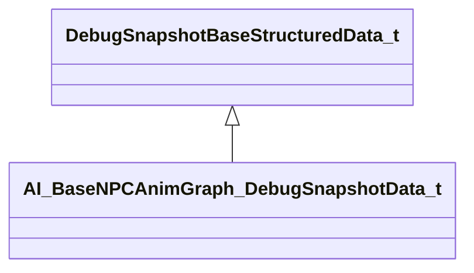

### AI_BaseNPC_DebugSnapshotData_t

**Inherits from:** [DebugSnapshotBaseStructuredData_t](client.md#debugsnapshotbasestructureddata_t)

**Metadata:** `MGetKV3ClassDefaults = {`, `"_class": "AI_BaseNPC_DebugSnapshotData_t",`, `"npc_state": "",`, `"current_enemy": null,`, `"s_current_schedule": "",`, `"s_current_task": "",`, `"s_schedule_interrupt_reason": "",`, `"s_schedule_fail_reason": "",`, `"conditions":`, `[`, `],`, `"anim_events":`, `[`, `],`, `"e_action_body_section": "",`, `"e_movement_body_section": ""`, `}`

**Relationships:**

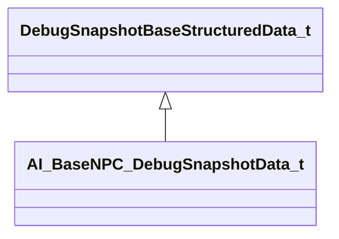

### AI_DefaultNPC_DebugSnapshotData_t

**Inherits from:** [DebugSnapshotBaseStructuredData_t](client.md#debugsnapshotbasestructureddata_t)

**Metadata:** `MGetKV3ClassDefaults = {`, `"_class": "AI_DefaultNPC_DebugSnapshotData_t",`, `"s_npc_current_ability": "",`, `"s_npc_tactic_current": "",`, `"s_npc_tactic_phase": "",`, `"tactic_interrupt_conditions":`, `[`, `],`, `"s_npc_current_movement": "",`, `"path_query_schedule":`, `{`, `"m_sInitialQueryName": "",`, `"m_sCurrentQueryName": "",`, `"m_nMode": "",`, `"m_nType": "",`, `"m_nState": ""`, `},`, `"path_query_tactic":`, `{`, `"m_sInitialQueryName": "",`, `"m_sCurrentQueryName": "",`, `"m_nMode": "",`, `"m_nType": "",`, `"m_nState": ""`, `},`, `"path_queries_speculative":`, `[`, `]`, `}`

**Relationships:**

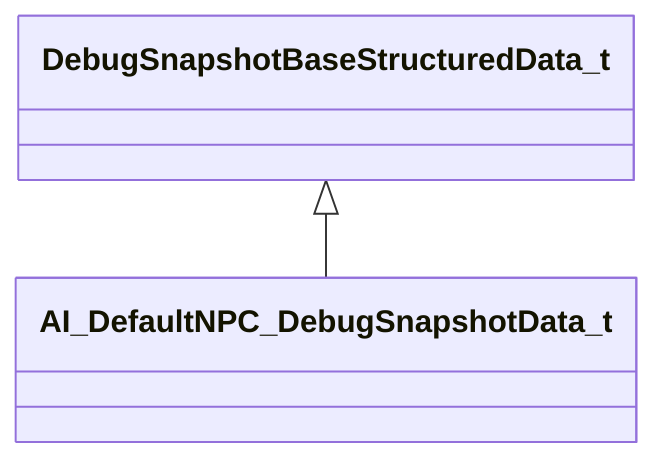

### AI_DefaultNPC_DebugSnapshotData_t

**Metadata:** `MGetKV3ClassDefaults = {`, `"m_sInitialQueryName": "",`, `"m_sCurrentQueryName": "",`, `"m_nMode": "",`, `"m_nType": "",`, `"m_nState": ""`, `}`, `MDebugSnapshotDataSummaryFn (UNKNOWN FOR PARSER)`

### AI_MotorGroundAnimgraph_DebugSnapshotData_t

**Inherits from:** [DebugSnapshotBaseStructuredData_t](client.md#debugsnapshotbasestructureddata_t)

**Metadata:** `MGetKV3ClassDefaults = {`, `"_class": "AI_MotorGroundAnimgraph_DebugSnapshotData_t",`, `"state": "",`, `"b_has_path": false,`, `"f_remaining_ground_path_length": -1.000000,`, `"f_current_speed": -1.000000,`, `"move_type": "",`, `"f_move_heading_actual": -1.000000,`, `"f_move_heading_desired": -1.000000,`, `"f_current_lean": 0.000000,`, `"f_target_lean": 0.000000,`, `"vec_events":`, `[`, `]`, `}`

**Relationships:**

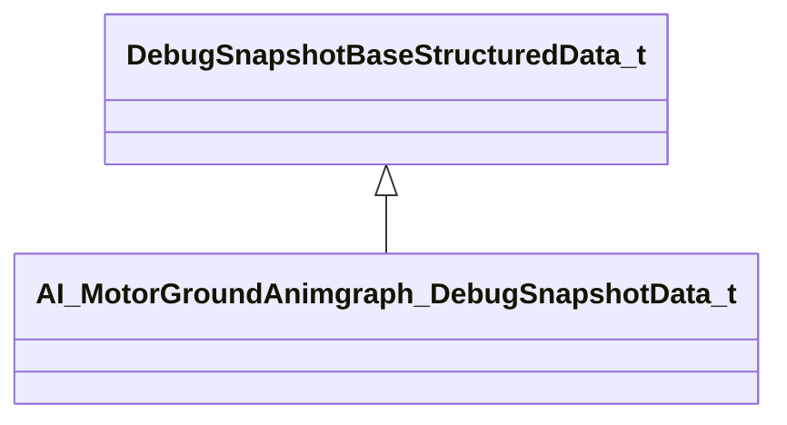

### AI_MotorGroundAnimgraph_DebugSnapshotData_t

**Metadata:** `MGetKV3ClassDefaults = {`, `"description": "",`, `"location": null`, `}`

### AI_Motor_DebugSnapshotData_t

**Inherits from:** [DebugSnapshotBaseStructuredData_t](client.md#debugsnapshotbasestructureddata_t)

**Metadata:** `MGetKV3ClassDefaults = {`, `"_class": "AI_Motor_DebugSnapshotData_t",`, `"current_movement_gait_set": "",`, `"current_movement_gait": "",`, `"movement_setting_id": ""`, `}`

**Relationships:**

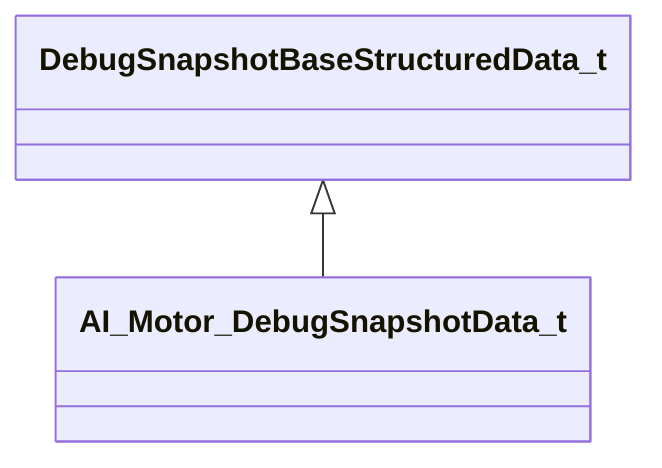

### AI_Navigator_DebugSnapshotData_t

**Inherits from:** [DebugSnapshotBaseStructuredData_t](client.md#debugsnapshotbasestructureddata_t)

**Metadata:** `MGetKV3ClassDefaults = {`, `"_class": "AI_Navigator_DebugSnapshotData_t",`, `"s_npc_nav_authority": "",`, `"s_goal_nav_search_id": "",`, `"s_goal_source_location": "",`, `"goal_actual_pos": null,`, `"goal_base_pos": null,`, `"waypoints":`, `[`, `]`, `}`, `MDebugSnapshotDataRenderable`, `MDebugSnapshotDataRenderByDefault`

**Relationships:**

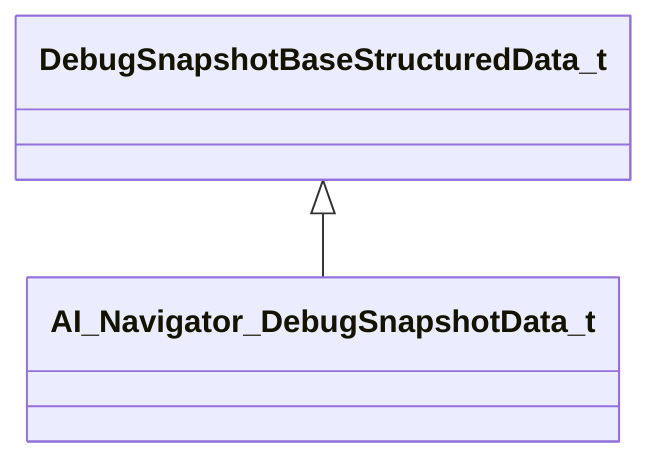

### AI_Navigator_DebugSnapshotData_t

**Metadata:** `MGetKV3ClassDefaults = {`, `"position": null,`, `"nav_type": 0,`, `"flags": 0`, `}`

### ActiveModelConfig_t

**Relationships:**

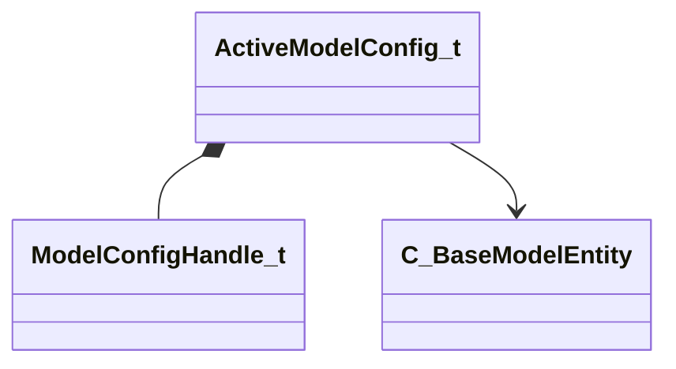

**Fields:**

| Name | Type | Annotations |
|------|------|-------------|
| `m_Handle` | [ModelConfigHandle_t](../schemas/client.md#modelconfighandle_t) |  |
| `m_Name` | CUtlSymbolLarge |  |
| `m_AssociatedEntities` | C_NetworkUtlVectorBase< CHandle< [C_BaseModelEntity](../schemas/client.md#c_basemodelentity) > > |  |
| `m_AssociatedEntityNames` | C_NetworkUtlVectorBase< CUtlSymbolLarge > |  |

### AmmoFlags_t

**Values:**

| Name | Value |
|------|-------|
| `AMMO_FORCE_DROP_IF_CARRIED` | 1 |
| `AMMO_RESERVE_STAYS_WITH_WEAPON` | 2 |
| `AMMO_FLAG_MAX` | 2 |

### AmmoIndex_t

**Metadata:** `MIsBoxedIntegerType`

**Fields:**

| Name | Type | Annotations |
|------|------|-------------|
| `m_Value` | int8 |  |

### AmmoPosition_t

**Values:**

| Name | Value |
|------|-------|
| `AMMO_POSITION_INVALID` | -1 |
| `AMMO_POSITION_PRIMARY` | 0 |
| `AMMO_POSITION_SECONDARY` | 1 |
| `AMMO_POSITION_COUNT` | 2 |

### AmmoTypeInfo_t

**Derived by:** [GameAmmoTypeInfo_t](client.md#gameammotypeinfo_t)

**Metadata:** `MGetKV3ClassDefaults = {`, `"_class": "AmmoTypeInfo_t",`, `"m_nMaxCarry": 0,`, `"m_nSplashSize": 0,`, `"m_nFlags": "",`, `"m_flMass": 0.000000,`, `"m_flSpeed": 0.000000`, `}`

**Relationships:**

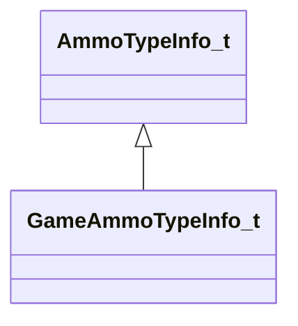

### AnimGraph2SerializedPoseRecipeSlot_t

**Fields:**

| Name | Type | Annotations |
|------|------|-------------|
| `m_topology` | CUtlBinaryBlock | `MNotSaved` |

### AnimGraphDebugDrawType_t

**Values:**

| Name | Value |
|------|-------|
| `None` | 0 |
| `WsPosition` | 1 |
| `MsPosition` | 2 |
| `WsDirection` | 3 |
| `MsDirection` | 4 |

### AnimLoopMode_t

**Values:**

| Name | Value |
|------|-------|
| `ANIM_LOOP_MODE_INVALID` | -1 |
| `ANIM_LOOP_MODE_NOT_LOOPING` | 0 |
| `ANIM_LOOP_MODE_LOOPING` | 1 |
| `ANIM_LOOP_MODE_USE_SEQUENCE_SETTINGS` | 2 |
| `ANIM_LOOP_MODE_COUNT` | 3 |

### AnimationAlgorithm_t

**Values:**

| Name | Value |
|------|-------|
| `eInvalid` | -1 |
| `eNone` | 0 |
| `eSequence` | 1 |
| `eAnimGraph2` | 2 |
| `eAnimGraph2Secondary` | 3 |
| `eCount` | 4 |

### BeamClipStyle_t

**Values:**

| Name | Value |
|------|-------|
| `kNOCLIP` | 0 |
| `kGEOCLIP` | 1 |
| `kMODELCLIP` | 2 |
| `kBEAMCLIPSTYLE_NUMBITS` | 2 |

### BeamType_t

**Values:**

| Name | Value |
|------|-------|
| `BEAM_INVALID` | 0 |
| `BEAM_POINTS` | 1 |
| `BEAM_ENTPOINT` | 2 |
| `BEAM_ENTS` | 3 |
| `BEAM_HOSE` | 4 |
| `BEAM_SPLINE` | 5 |
| `BEAM_LASER` | 6 |

### BeginDeathLifeStateTransition_t

**Values:**

| Name | Value |
|------|-------|
| `TRANSITION_TO_LIFESTATE_DYING` | 0 |
| `TRANSITION_TO_LIFESTATE_DEAD` | 1 |

### BloodType

**Values:**

| Name | Value |
|------|-------|
| `None` | -1 |
| `ColorRed` | 0 |
| `ColorYellow` | 1 |
| `ColorGreen` | 2 |
| `ColorRedLVL2` | 3 |
| `ColorRedLVL3` | 4 |
| `ColorRedLVL4` | 5 |
| `ColorRedLVL5` | 6 |
| `ColorRedLVL6` | 7 |

### BodySectionAuthority_t

**Values:**

| Name | Value |
|------|-------|
| `eNone` | 0 |
| `eLowerBody` | 1 |
| `eUpperBody` | 2 |
| `eFullBody` | 3 |

### BreakableContentsType_t

**Values:**

| Name | Value |
|------|-------|
| `BC_DEFAULT` | 0 |
| `BC_EMPTY` | 1 |
| `BC_PROP_GROUP_OVERRIDE` | 2 |
| `BC_PARTICLE_SYSTEM_OVERRIDE` | 3 |

### BrushSolidities_e

**Values:**

| Name | Value |
|------|-------|
| `BRUSHSOLID_TOGGLE` | 0 |
| `BRUSHSOLID_NEVER` | 1 |
| `BRUSHSOLID_ALWAYS` | 2 |

### C4LightEffect_t

**Values:**

| Name | Value |
|------|-------|
| `eLightEffectNone` | 0 |
| `eLightEffectDropped` | 1 |
| `eLightEffectThirdPersonHeld` | 2 |

### CAnimEventListener

**Inherits from:** [CAnimEventListenerBase](client.md#canimeventlistenerbase)

**Relationships:**

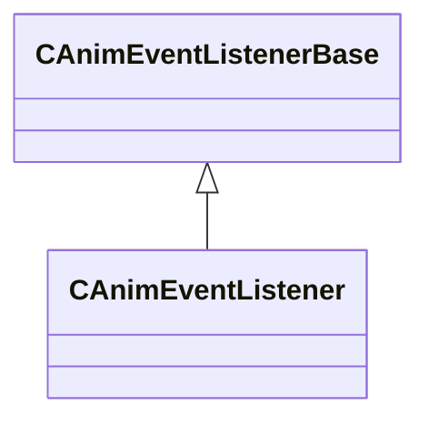

### CAnimEventListenerBase

**Derived by:** [CAnimEventListener](client.md#canimeventlistener), [CAnimEventQueueListener](client.md#canimeventqueuelistener)

**Relationships:**

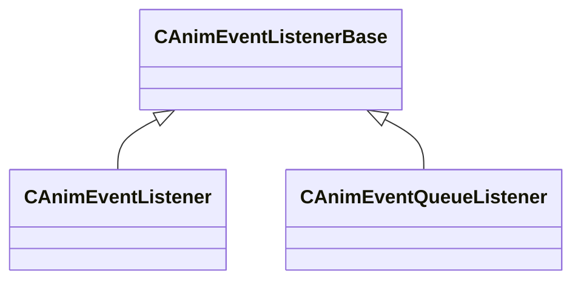

### CAnimEventQueueListener

**Inherits from:** [CAnimEventListenerBase](client.md#canimeventlistenerbase)

**Relationships:**

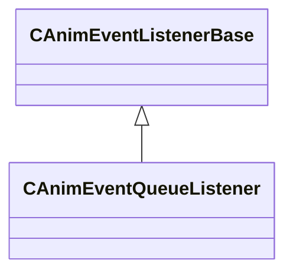

### CAnimGraphControllerBase

**Derived by:** [CBaseAnimGraphDestructibleParts_GraphController](client.md#cbaseanimgraphdestructibleparts_graphcontroller), [CCS2ChickenGraphController](client.md#ccs2chickengraphcontroller), [CCS2UIPawnGraphController](client.md#ccs2uipawngraphcontroller), [CCS2WeaponGraphController](client.md#ccs2weapongraphcontroller), [CEmptyGraphController](client.md#cemptygraphcontroller)

**Metadata:** `MGetKV3ClassDefaults = Could not parse KV3 Defaults`

**Relationships:**

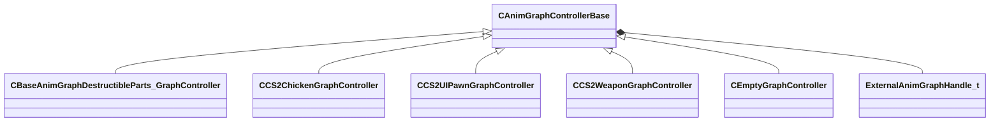

**Fields:**

| Name | Type | Annotations |
|------|------|-------------|
| `m_hExternalGraph` | [ExternalAnimGraphHandle_t](../schemas/client.md#externalanimgraphhandle_t) |  |

### CAnimGraphControllerManager

**Relationships:**

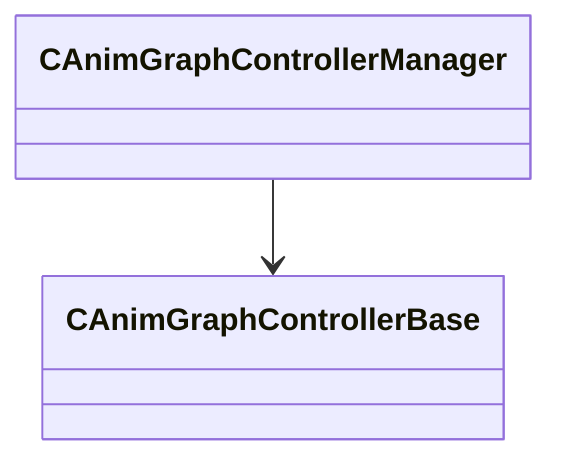

**Fields:**

| Name | Type | Annotations |
|------|------|-------------|
| `m_controllers` | CUtlVector< [CAnimGraphControllerBase](../schemas/client.md#canimgraphcontrollerbase)* > |  |
| `m_bGraphBindingsCreated` | bool |  |

### CAttributeList

**Relationships:**

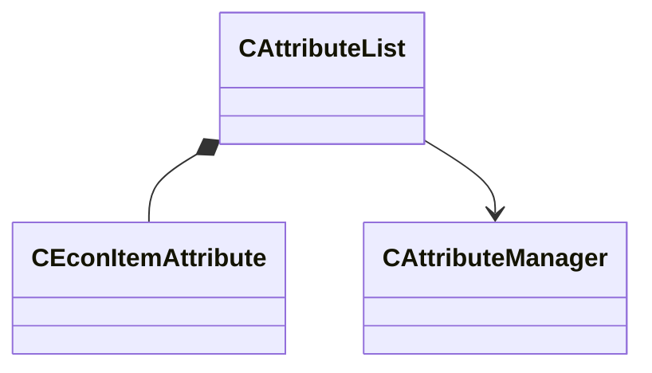

**Fields:**

| Name | Type | Annotations |
|------|------|-------------|
| `m_Attributes` | C_UtlVectorEmbeddedNetworkVar< [CEconItemAttribute](../schemas/client.md#ceconitemattribute) > |  |
| `m_pManager` | [CAttributeManager](../schemas/client.md#cattributemanager)* |  |

### CAttributeManager

**Derived by:** [CAttributeContainer](server.md#cattributecontainer), [C_AttributeContainer](client.md#c_attributecontainer)

**Relationships:**

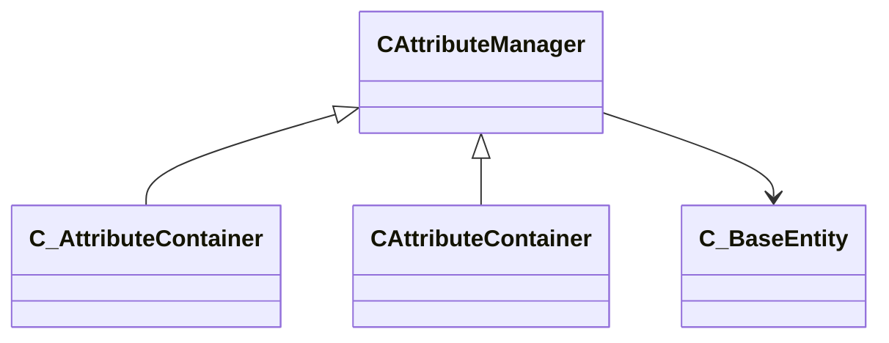

**Fields:**

| Name | Type | Annotations |
|------|------|-------------|
| `m_Providers` | CUtlVector< CHandle< [C_BaseEntity](../schemas/client.md#c_baseentity) > > |  |
| `m_iReapplyProvisionParity` | int32 |  |
| `m_hOuter` | CHandle< [C_BaseEntity](../schemas/client.md#c_baseentity) > |  |
| `m_bPreventLoopback` | bool |  |
| `m_ProviderType` | attributeprovidertypes_t |  |
| `m_CachedResults` | CUtlVector< [CAttributeManager](../schemas/client.md#cattributemanager)::cached_attribute_float_t > |  |

### CAttributeManager

**Derived by:** [CAttributeContainer](server.md#cattributecontainer), [C_AttributeContainer](client.md#c_attributecontainer)

**Relationships:**

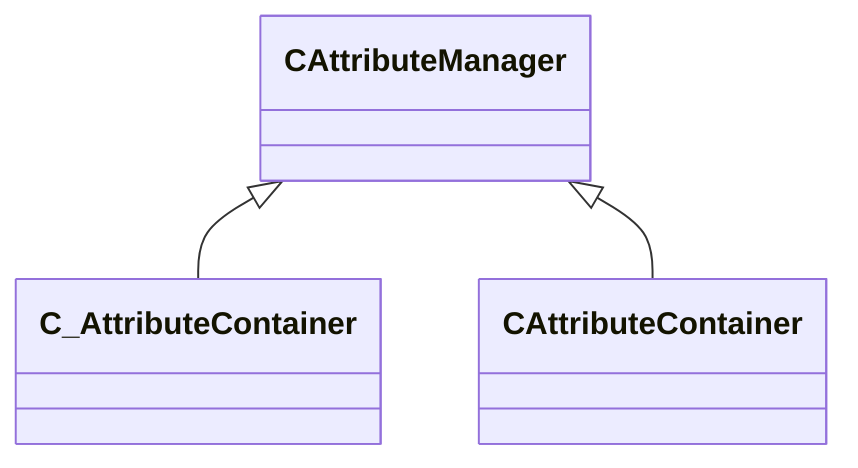

**Fields:**

| Name | Type | Annotations |
|------|------|-------------|
| `flIn` | float32 |  |
| `iAttribHook` | CUtlSymbolLarge |  |
| `flOut` | float32 |  |

### CBaseAnimGraph

**Inherits from:** [C_BaseModelEntity](client.md#c_basemodelentity)

**Derived by:** [CBaseCombatCharacter](server.md#cbasecombatcharacter), [CBaseGrenade](server.md#cbasegrenade), [CBaseProp](client.md#cbaseprop), [CConstraintAnchor](server.md#cconstraintanchor), [CEconEntity](server.md#ceconentity), [CFish](server.md#cfish), [CHostageCarriableProp](server.md#chostagecarriableprop), [CItem](server.md#citem), [CItemSoda](server.md#citemsoda), [CPhysMagnet](server.md#cphysmagnet), [CPlantedC4](server.md#cplantedc4), [CPointCommentaryNode](server.md#cpointcommentarynode), [CRagdollProp](server.md#cragdollprop), [CWaterBullet](server.md#cwaterbullet), [C_BaseCombatCharacter](client.md#c_basecombatcharacter), [C_BaseGrenade](client.md#c_basegrenade), [C_BulletHitModel](client.md#c_bullethitmodel), [C_CS2WeaponModuleBase](client.md#c_cs2weaponmodulebase), [C_CSGO_PreviewModel](client.md#c_csgo_previewmodel), [C_ClientRagdoll](client.md#c_clientragdoll), [C_EconEntity](client.md#c_econentity), [C_Fish](client.md#c_fish), [C_HostageCarriableProp](client.md#c_hostagecarriableprop), [C_LateUpdatedAnimating](client.md#c_lateupdatedanimating), [C_LocalTempEntity](client.md#c_localtempentity), [C_Multimeter](client.md#c_multimeter), [C_PhysMagnet](client.md#c_physmagnet), [C_PlantedC4](client.md#c_plantedc4), [C_PointCommentaryNode](client.md#c_pointcommentarynode), [C_RagdollProp](client.md#c_ragdollprop), [C_WaterBullet](client.md#c_waterbullet), [C_WorldModelGloves](client.md#c_worldmodelgloves)

**Relationships:**

```mermaid
classDiagram
    C_BaseModelEntity <|-- CBaseAnimGraph
    C_BaseEntity <|-- C_BaseModelEntity
    CEntityInstance <|-- C_BaseEntity
    CBaseAnimGraph <|-- CBaseProp
    CBaseAnimGraph <|-- C_BaseCombatCharacter
    CBaseAnimGraph <|-- C_BaseGrenade
    CBaseAnimGraph <|-- C_BulletHitModel
    CBaseAnimGraph <|-- C_CS2WeaponModuleBase
    CBaseAnimGraph <|-- C_CSGO_PreviewModel
    CBaseAnimGraph <|-- C_ClientRagdoll
    CBaseAnimGraph <|-- C_EconEntity
    CBaseAnimGraph <|-- C_Fish
    CBaseAnimGraph <|-- C_HostageCarriableProp
    CBaseAnimGraph <|-- C_LateUpdatedAnimating
    CBaseAnimGraph <|-- C_LocalTempEntity
    CBaseAnimGraph <|-- C_Multimeter
    CBaseAnimGraph <|-- C_PhysMagnet
    CBaseAnimGraph <|-- C_PlantedC4
    CBaseAnimGraph <|-- C_PointCommentaryNode
    CBaseAnimGraph <|-- C_RagdollProp
    CBaseAnimGraph <|-- C_WaterBullet
    CBaseAnimGraph <|-- C_WorldModelGloves
    CBaseAnimGraph <|-- CBaseCombatCharacter
    CBaseAnimGraph <|-- CBaseGrenade
    CBaseAnimGraph <|-- CConstraintAnchor
    CBaseAnimGraph <|-- CEconEntity
    CBaseAnimGraph <|-- CFish
    CBaseAnimGraph <|-- CHostageCarriableProp
    CBaseAnimGraph <|-- CItem
    CBaseAnimGraph <|-- CItemSoda
    CBaseAnimGraph <|-- CPhysMagnet
    CBaseAnimGraph <|-- CPlantedC4
    CBaseAnimGraph <|-- CPointCommentaryNode
    CBaseAnimGraph <|-- CRagdollProp
    CBaseAnimGraph <|-- CWaterBullet
    CBaseAnimGraph *-- CAnimGraphControllerManager
    CBaseAnimGraph --> CAnimGraphControllerBase
    CBaseAnimGraph --> IPhysicsRagdollControl
    CBaseAnimGraph *-- PhysicsRagdollPose_t
```

**Fields:**

| Name | Type | Annotations |
|------|------|-------------|
| `m_graphControllerManager` | [CAnimGraphControllerManager](../schemas/client.md#canimgraphcontrollermanager) | `MSaveOpsForField = "GetAnimGraphControllerManagerSaveRestoreOps"` |
| `m_pMainGraphController` | [CAnimGraphControllerBase](../schemas/client.md#canimgraphcontrollerbase)* | `MSaveOpsForField = "GetAnimGraphControllerPtrSaveRestoreOps"` |
| `m_bInitiallyPopulateInterpHistory` | bool |  |
| `m_bSuppressAnimEventSounds` | bool |  |
| `m_bAnimGraphUpdateEnabled` | bool |  |
| `m_bAnimationUpdateScheduled` | bool | `MNotSaved` |
| `m_vecForce` | Vector | `MNotSaved` |
| `m_nForceBone` | int32 | `MNotSaved` |
| `m_pClientsideRagdoll` | [CBaseAnimGraph](../schemas/client.md#cbaseanimgraph)* | `MNotSaved` |
| `m_bBuiltRagdoll` | bool | `MNotSaved` |
| `m_pRagdollControl` | [IPhysicsRagdollControl](../schemas/vphysics2.md#iphysicsragdollcontrol)* | `MPhysPtr` |
| `m_RagdollPose` | [PhysicsRagdollPose_t](../schemas/client.md#physicsragdollpose_t) |  |
| `m_bRagdollEnabled` | bool |  |
| `m_bRagdollClientSide` | bool | `MNotSaved` |
| `m_bHasAnimatedMaterialAttributes` | bool | `MNotSaved` |

### CBaseAnimGraphController

**Inherits from:** [CSkeletonAnimationController](client.md#cskeletonanimationcontroller)

**Relationships:**

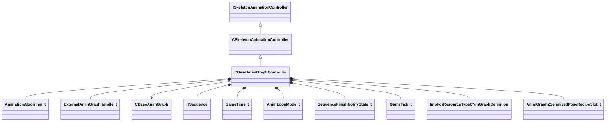

**Fields:**

| Name | Type | Annotations |
|------|------|-------------|
| `m_nAnimationAlgorithm` | [AnimationAlgorithm_t](../schemas/client.md#animationalgorithm_t) |  |
| `m_nNextExternalGraphHandle` | [ExternalAnimGraphHandle_t](../schemas/client.md#externalanimgraphhandle_t) |  |
| `m_vecSecondarySkeletonSlotIDs` | C_NetworkUtlVectorBase< CGlobalSymbol > |  |
| `m_vecSecondarySkeletons` | C_NetworkUtlVectorBase< CHandle< [CBaseAnimGraph](../schemas/client.md#cbaseanimgraph) > > |  |
| `m_nSecondarySkeletonMasterCount` | int32 |  |
| `m_flSoundSyncTime` | float32 |  |
| `m_nActiveIKChainMask` | uint32 |  |
| `m_hSequence` | [HSequence](../schemas/animationsystem.md#hsequence) |  |
| `m_flSeqStartTime` | [GameTime_t](../schemas/entity2.md#gametime_t) |  |
| `m_flSeqFixedCycle` | float32 |  |
| `m_nAnimLoopMode` | [AnimLoopMode_t](../schemas/client.md#animloopmode_t) |  |
| `m_flPlaybackRate` | CNetworkedQuantizedFloat |  |
| `m_nNotifyState` | [SequenceFinishNotifyState_t](../schemas/client.md#sequencefinishnotifystate_t) |  |
| `m_bNetworkedAnimationInputsChanged` | bool |  |
| `m_bNetworkedSequenceChanged` | bool |  |
| `m_bLastUpdateSkipped` | bool |  |
| `m_bSequenceFinished` | bool |  |
| `m_nPrevAnimUpdateTick` | [GameTick_t](../schemas/entity2.md#gametick_t) |  |
| `m_hGraphDefinitionAG2` | CStrongHandle< [InfoForResourceTypeCNmGraphDefinition](../schemas/resourcesystem.md#infoforresourcetypecnmgraphdefinition) > |  |
| `m_SerializePoseRecipeAG2Slots` | C_UtlVectorEmbeddedNetworkVar< [AnimGraph2SerializedPoseRecipeSlot_t](../schemas/client.md#animgraph2serializedposerecipeslot_t) > | `MNotSaved` |
| `m_SerializePoseRecipeAG2Dynamic` | C_NetworkUtlVectorBase< uint8 > | `MNotSaved` |
| `m_nSerializePoseRecipeAG2ActiveSlot` | uint32 | `MNotSaved` |
| `m_nSerializePoseRecipeVersionAG2` | int32 | `MNotSaved` |
| `m_nServerGraphInstanceIteration` | int32 |  |
| `m_nServerSerializationContextIteration` | int32 |  |
| `m_primaryGraphId` | [ResourceId_t](../schemas/resourcefile.md#resourceid_t) |  |
| `m_vecExternalGraphIds` | C_NetworkUtlVectorBase< [ResourceId_t](../schemas/resourcefile.md#resourceid_t) > |  |
| `m_vecExternalClipIds` | C_NetworkUtlVectorBase< [ResourceId_t](../schemas/resourcefile.md#resourceid_t) > |  |
| `m_sAnimGraph2Identifier` | CGlobalSymbol |  |
| `m_pGraphInstanceAG2` | [CNmGraphInstance](../schemas/animlib.md#cnmgraphinstance)* | `MSaveOpsForField = "GetAnimGraph2SaveRestoreOps"` |
| `m_vecExternalGraphs` | CUtlVector< [ExternalAnimGraph_t](../schemas/client.md#externalanimgraph_t) > | `MSaveOpsForField = "GetExternalAnimGraphSaveRestoreOps"` |
| `m_nPrevAnimationAlgorithm` | [AnimationAlgorithm_t](../schemas/client.md#animationalgorithm_t) |  |

### CBaseAnimGraphDestructibleParts_GraphController

**Inherits from:** [CAnimGraphControllerBase](client.md#canimgraphcontrollerbase)

**Metadata:** `MGetKV3ClassDefaults = {`, `"_class": "CBaseAnimGraphDestructibleParts_GraphController",`, `"m_hExternalGraph": 4294967295`, `}`

**Relationships:**

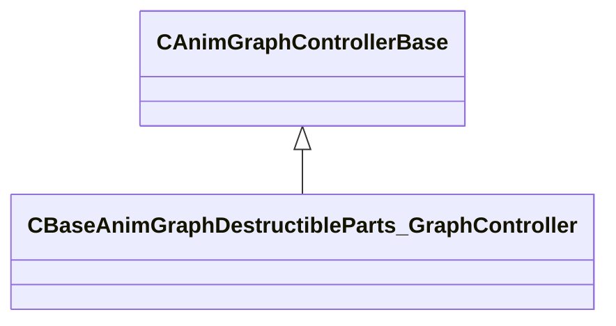

### CBaseAnimGraphVariationUserData

**Inherits from:** [CNmGraphVariationUserData](animlib.md#cnmgraphvariationuserdata)

**Metadata:** `MGetKV3ClassDefaults = {`, `"_class": "CBaseAnimGraphVariationUserData"`, `}`

**Relationships:**

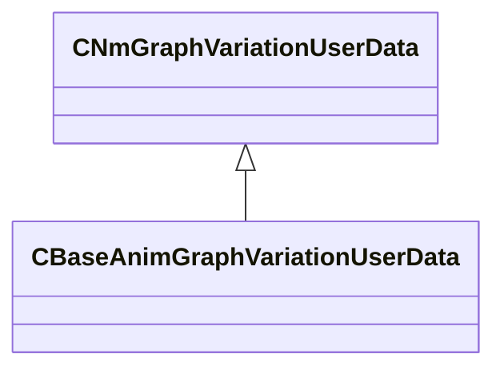

### CBaseFilter

**Inherits from:** [CLogicalEntity](client.md#clogicalentity)

**Derived by:** [CFilterAttributeInt](client.md#cfilterattributeint), [CFilterClass](client.md#cfilterclass), [CFilterContext](server.md#cfiltercontext), [CFilterEnemy](server.md#cfilterenemy), [CFilterLOS](client.md#cfilterlos), [CFilterMassGreater](client.md#cfiltermassgreater), [CFilterModel](client.md#cfiltermodel), [CFilterMultiple](client.md#cfiltermultiple), [CFilterName](client.md#cfiltername), [CFilterProximity](client.md#cfilterproximity), [CFilterTeam](client.md#cfilterteam), [FilterDamageType](client.md#filterdamagetype), [FilterHealth](client.md#filterhealth)

**Relationships:**

```mermaid
classDiagram
    CLogicalEntity <|-- CBaseFilter
    C_BaseEntity <|-- CLogicalEntity
    CEntityInstance <|-- C_BaseEntity
    CBaseFilter <|-- CFilterAttributeInt
    CBaseFilter <|-- CFilterClass
    CBaseFilter <|-- CFilterLOS
    CBaseFilter <|-- CFilterMassGreater
    CBaseFilter <|-- CFilterModel
    CBaseFilter <|-- CFilterMultiple
    CBaseFilter <|-- CFilterName
    CBaseFilter <|-- CFilterProximity
    CBaseFilter <|-- CFilterTeam
    CBaseFilter <|-- FilterDamageType
    CBaseFilter <|-- FilterHealth
    CBaseFilter <|-- CFilterContext
    CBaseFilter <|-- CFilterEnemy
    CBaseFilter *-- CEntityIOOutput
```

**Fields:**

| Name | Type | Annotations |
|------|------|-------------|
| `m_bNegated` | bool |  |
| `m_OnPass` | [CEntityIOOutput](../schemas/entity2.md#centityiooutput) |  |
| `m_OnFail` | [CEntityIOOutput](../schemas/entity2.md#centityiooutput) |  |

### CBasePlayerController

Base class for all player controller entities in Source 2.  A controller is the persistent, session-level entity that represents a connected client; it is never recreated between rounds.  The controller owns one or more pawn entities (the physical in-world representation).


**Inherits from:** [C_BaseEntity](client.md#c_baseentity)

**Derived by:** [CCSPlayerController](client.md#ccsplayercontroller)

**Relationships:**

```mermaid
classDiagram
    C_BaseEntity <|-- CBasePlayerController
    CEntityInstance <|-- C_BaseEntity
    CBasePlayerController <|-- CCSPlayerController
    CBasePlayerController *-- C_CommandContext
    CBasePlayerController --> C_BasePlayerPawn
    CBasePlayerController *-- PlayerConnectedState
```

**Fields:**

| Name | Type | Annotations |
|------|------|-------------|
| `m_CommandContext` | [C_CommandContext](../schemas/client.md#c_commandcontext) | `MNotSaved` |
| `m_nInButtonsWhichAreToggles` | uint64 | `MNotSaved` |
| `m_nTickBase` | uint32 | Server tick number at the time of the most-recent usercmd from this client. *Only sent to the owning player (LocalPlayerExclusive). Used for lag compensation and prediction.* `MNotSaved` |
| `m_hPawn` | CHandle< [C_BasePlayerPawn](../schemas/client.md#c_baseplayerpawn) > | CHandle to the base pawn currently controlled by this controller. *For CS2 human players the concrete type is CCSPlayerPawn.  Use m_hPlayerPawn on CCSPlayerController for the typed handle.* |
| `m_bKnownTeamMismatch` | bool |  |
| `m_hPredictedPawn` | CHandle< [C_BasePlayerPawn](../schemas/client.md#c_baseplayerpawn) > | `MNotSaved` |
| `m_nSplitScreenSlot` | CSplitScreenSlot | `MNotSaved` |
| `m_hSplitOwner` | CHandle< [CBasePlayerController](../schemas/client.md#cbaseplayercontroller) > | `MNotSaved` |
| `m_hSplitScreenPlayers` | CUtlVector< CHandle< [CBasePlayerController](../schemas/client.md#cbaseplayercontroller) > > | `MNotSaved` |
| `m_bIsHLTV` | bool |  |
| `m_iConnected` | [PlayerConnectedState](../schemas/client.md#playerconnectedstate) | PlayerConnectedState enum – 0 = Disconnected, 1 = Connected, 2 = Connecting. `MNotSaved` |
| `m_iszPlayerName` | char[128] | Display name of the player, as reported by Steam (up to 128 bytes, UTF-8). `MNotSaved` |
| `m_steamID` | uint64 | 64-bit Steam account ID (SteamID64) of the connected client. *Transmitted as a fixed64; only sent to the owning player and GOTV.* `MNotSaved` |
| `m_bIsLocalPlayerController` | bool | `MNotSaved` |
| `m_bNoClipEnabled` | bool | True when sv_cheats noclip is active for this player. |
| `m_iDesiredFOV` | uint32 | Field-of-view override requested by the player (0 = use server default). |

### CBasePlayerControllerAPI

### CBasePlayerVData

**Inherits from:** [CEntitySubclassVDataBase](client.md#centitysubclassvdatabase)

**Metadata:** `MGetKV3ClassDefaults = {`, `"_class": "CBasePlayerVData",`, `"m_sModelName": "",`, `"m_sModelNameAg2Override": "",`, `"m_flHeadDamageMultiplier": 3.000000,`, `"m_flChestDamageMultiplier": 1.000000,`, `"m_flStomachDamageMultiplier": 1.000000,`, `"m_flArmDamageMultiplier": 1.000000,`, `"m_flLegDamageMultiplier": 1.000000,`, `"m_flHoldBreathTime": 15.000000,`, `"m_flDrowningDamageInterval": 1.000000,`, `"m_nDrowningDamageInitial": 10,`, `"m_nDrowningDamageMax": 10,`, `"m_nWaterSpeed": 100,`, `"m_flUseRange": 55.000000,`, `"m_flUseAngleTolerance": 45.000000,`, `"m_flCrouchTime": 0.400000`, `}`

**Relationships:**

```mermaid
classDiagram
    CEntitySubclassVDataBase <|-- CBasePlayerVData
```

### CBasePlayerWeaponVData

**Inherits from:** [CEntitySubclassVDataBase](client.md#centitysubclassvdatabase)

**Derived by:** [CCSWeaponBaseVData](client.md#ccsweaponbasevdata)

**Metadata:** `MGetKV3ClassDefaults = {`, `"_class": "CBasePlayerWeaponVData",`, `"m_szWorldModel": "",`, `"m_szWorldModelAg2Override": "",`, `"m_sToolsOnlyOwnerModelName": "",`, `"m_bBuiltRightHanded": true,`, `"m_bAllowFlipping": true,`, `"m_sMuzzleAttachment": "muzzle",`, `"m_szMuzzleFlashParticle": "",`, `"m_szMuzzleFlashParticleConfig": "",`, `"m_szBarrelSmokeParticle": "",`, `"m_nMuzzleSmokeShotThreshold": 4,`, `"m_flMuzzleSmokeTimeout": 0.250000,`, `"m_flMuzzleSmokeDecrementRate": 1.000000,`, `"m_bGenerateMuzzleLight": true,`, `"m_bLinkedCooldowns": false,`, `"m_iFlags": "",`, `"m_iWeight": 0,`, `"m_bAutoSwitchTo": true,`, `"m_bAutoSwitchFrom": true,`, `"m_nPrimaryAmmoType": "",`, `"m_nSecondaryAmmoType": "",`, `"m_iMaxClip1": 0,`, `"m_iMaxClip2": 0,`, `"m_iDefaultClip1": -1,`, `"m_iDefaultClip2": -1,`, `"m_bReserveAmmoAsClips": false,`, `"m_bTreatAsSingleClip": false,`, `"m_bKeepLoadedAmmo": false,`, `"m_iRumbleEffect": "RUMBLE_INVALID",`, `"m_flDropSpeed": 300.000000,`, `"m_iSlot": 0,`, `"m_iPosition": 0,`, `"m_aShootSounds":`, `{`, `}`, `}`

**Relationships:**

```mermaid
classDiagram
    CEntitySubclassVDataBase <|-- CBasePlayerWeaponVData
    CBasePlayerWeaponVData <|-- CCSWeaponBaseVData
```

### CBaseProp

**Inherits from:** [CBaseAnimGraph](client.md#cbaseanimgraph)

**Derived by:** [CBreakableProp](server.md#cbreakableprop), [C_BreakableProp](client.md#c_breakableprop)

**Relationships:**

```mermaid
classDiagram
    CBaseAnimGraph <|-- CBaseProp
    C_BaseModelEntity <|-- CBaseAnimGraph
    C_BaseEntity <|-- C_BaseModelEntity
    CEntityInstance <|-- C_BaseEntity
    CBaseProp <|-- C_BreakableProp
    CBaseProp <|-- CBreakableProp
```

**Fields:**

| Name | Type | Annotations |
|------|------|-------------|
| `m_bModelOverrodeBlockLOS` | bool |  |
| `m_iShapeType` | int32 |  |
| `m_bConformToCollisionBounds` | bool |  |
| `m_mPreferredCatchTransform` | CTransform |  |

### CBaseTriggerAPI

### CBodyComponent

**Inherits from:** [CEntityComponent](entity2.md#centitycomponent)

**Derived by:** [CBodyComponentPoint](client.md#cbodycomponentpoint), [CBodyComponentSkeletonInstance](client.md#cbodycomponentskeletoninstance)

**Relationships:**

```mermaid
classDiagram
    CEntityComponent <|-- CBodyComponent
    CBodyComponent <|-- CBodyComponentPoint
    CBodyComponent <|-- CBodyComponentSkeletonInstance
    CBodyComponent --> CGameSceneNode
    CBodyComponent *-- CNetworkVarChainer
```

**Fields:**

| Name | Type | Annotations |
|------|------|-------------|
| `m_pSceneNode` | [CGameSceneNode](../schemas/client.md#cgamescenenode)* | `MNotSaved` |
| `__m_pChainEntity` | [CNetworkVarChainer](../schemas/entity2.md#cnetworkvarchainer) | `MNotSaved` |

### CBodyComponentBaseAnimGraph

**Inherits from:** [CBodyComponentSkeletonInstance](client.md#cbodycomponentskeletoninstance)

**Relationships:**

```mermaid
classDiagram
    CBodyComponentSkeletonInstance <|-- CBodyComponentBaseAnimGraph
    CBodyComponent <|-- CBodyComponentSkeletonInstance
    CEntityComponent <|-- CBodyComponent
    CBodyComponentBaseAnimGraph *-- CBaseAnimGraphController
```

**Fields:**

| Name | Type | Annotations |
|------|------|-------------|
| `m_animationController` | [CBaseAnimGraphController](../schemas/client.md#cbaseanimgraphcontroller) |  |

### CBodyComponentBaseModelEntity

**Inherits from:** [CBodyComponentSkeletonInstance](client.md#cbodycomponentskeletoninstance)

**Relationships:**

```mermaid
classDiagram
    CBodyComponentSkeletonInstance <|-- CBodyComponentBaseModelEntity
    CBodyComponent <|-- CBodyComponentSkeletonInstance
    CEntityComponent <|-- CBodyComponent
```

### CBodyComponentPoint

**Inherits from:** [CBodyComponent](client.md#cbodycomponent)

**Relationships:**

```mermaid
classDiagram
    CBodyComponent <|-- CBodyComponentPoint
    CEntityComponent <|-- CBodyComponent
    CBodyComponentPoint *-- CGameSceneNode
```

**Fields:**

| Name | Type | Annotations |
|------|------|-------------|
| `m_sceneNode` | [CGameSceneNode](../schemas/client.md#cgamescenenode) |  |

### CBodyComponentSkeletonInstance

**Inherits from:** [CBodyComponent](client.md#cbodycomponent)

**Derived by:** [CBodyComponentBaseAnimGraph](client.md#cbodycomponentbaseanimgraph), [CBodyComponentBaseModelEntity](client.md#cbodycomponentbasemodelentity)

**Relationships:**

```mermaid
classDiagram
    CBodyComponent <|-- CBodyComponentSkeletonInstance
    CEntityComponent <|-- CBodyComponent
    CBodyComponentSkeletonInstance <|-- CBodyComponentBaseAnimGraph
    CBodyComponentSkeletonInstance <|-- CBodyComponentBaseModelEntity
    CBodyComponentSkeletonInstance *-- CSkeletonInstance
```

**Fields:**

| Name | Type | Annotations |
|------|------|-------------|
| `m_skeletonInstance` | [CSkeletonInstance](../schemas/client.md#cskeletoninstance) |  |

### CBombTarget

**Inherits from:** [C_BaseTrigger](client.md#c_basetrigger)

**Relationships:**

```mermaid
classDiagram
    C_BaseTrigger <|-- CBombTarget
    C_BaseToggle <|-- C_BaseTrigger
    C_BaseModelEntity <|-- C_BaseToggle
    C_BaseEntity <|-- C_BaseModelEntity
    CEntityInstance <|-- C_BaseEntity
```

**Fields:**

| Name | Type | Annotations |
|------|------|-------------|
| `m_bBombPlantedHere` | bool |  |

### CBreakableStageHelper

**Fields:**

| Name | Type | Annotations |
|------|------|-------------|
| `m_nCurrentStage` | int32 |  |
| `m_nStageCount` | int32 | `MNotSaved` |

### CBuoyancyHelper

**Relationships:**

```mermaid
classDiagram
    CBuoyancyHelper --> IPhysicsMotionController
```

**Fields:**

| Name | Type | Annotations |
|------|------|-------------|
| `m_pController` | [IPhysicsMotionController](../schemas/client.md#iphysicsmotioncontroller)* | `MPhysPtr` |
| `m_nFluidType` | CUtlStringToken |  |
| `m_flFluidDensity` | float32 |  |
| `m_flNeutrallyBuoyantGravity` | float32 |  |
| `m_flNeutrallyBuoyantLinearDamping` | float32 |  |
| `m_flNeutrallyBuoyantAngularDamping` | float32 |  |
| `m_bNeutrallyBuoyant` | bool |  |
| `m_vecFractionOfWheelSubmergedForWheelFriction` | CUtlVector< float32 > |  |
| `m_vecWheelFrictionScales` | CUtlVector< float32 > |  |
| `m_vecFractionOfWheelSubmergedForWheelDrag` | CUtlVector< float32 > |  |
| `m_vecWheelDrag` | CUtlVector< float32 > |  |

### CCS2ChickenGraphController

**Inherits from:** [CAnimGraphControllerBase](client.md#canimgraphcontrollerbase)

**Metadata:** `MGetKV3ClassDefaults = {`, `"_class": "CCS2ChickenGraphController",`, `"m_hExternalGraph": 4294967295,`, `"m_action": null,`, `"m_actionSubtype": null,`, `"m_bActionReset": null,`, `"m_idleVariation": null,`, `"m_runVariation": null,`, `"m_panicVariation": null,`, `"m_squatVariation": null,`, `"m_bInWater": null,`, `"m_bHasActionCompletedEvent": false,`, `"m_bWaitingForCompletedEvent": false`, `}`

**Relationships:**

```mermaid
classDiagram
    CAnimGraphControllerBase <|-- CCS2ChickenGraphController
```

### CCS2PawnGraphController

**Inherits from:** [CCS2WeaponGraphController](client.md#ccs2weapongraphcontroller)

**Metadata:** `MGetKV3ClassDefaults = {`, `"_class": "CCS2PawnGraphController",`, `"m_hExternalGraph": 4294967295,`, `"m_action": null,`, `"m_bActionReset": null,`, `"m_flWeaponActionSpeedScale": null,`, `"m_weaponCategory": null,`, `"m_weaponType": null,`, `"m_weaponExtraInfo": null,`, `"m_flWeaponAmmo": null,`, `"m_flWeaponAmmoMax": null,`, `"m_flWeaponAmmoReserve": null,`, `"m_bWeaponIsSilenced": null,`, `"m_flWeaponIronsightAmount": null,`, `"m_bIsUsingLegacyModel": null,`, `"m_idleVariation": null,`, `"m_deployVariation": null,`, `"m_attackType": null,`, `"m_attackThrowStrength": null,`, `"m_flAttackVariation": null,`, `"m_inspectVariation": null,`, `"m_inspectExtraInfo": null,`, `"m_reloadStage": null,`, `"m_bIsDefusing": null,`, `"m_moveType": null,`, `"m_moveDirectionID": null,`, `"m_flMoveSpeedX": null,`, `"m_flMoveSpeedY": null,`, `"m_flMoveSpeedHorizontal": null,`, `"m_flPreviousMoveSpeedHorizontal": null,`, `"m_flCrouchAmount": null,`, `"m_bIsWalking": null,`, `"m_bIsStutterStep": null,`, `"m_flWeaponDropAmount": null,`, `"m_groundAction": null,`, `"m_groundActionDirectionID": null,`, `"m_flGroundTurnAngleOrVelocity": null,`, `"m_flLadderCycle": null,`, `"m_flLadderYaw": null,`, `"m_flLadderYawBackwards": null,`, `"m_airAction": null,`, `"m_flAirHeightAboveGround": null,`, `"m_leftFootTarget": null,`, `"m_rightFootTarget": null,`, `"m_flFlashedAmount": null,`, `"m_flAimPitchAngle": null,`, `"m_flAimYawAngle": null,`, `"m_flinchHead": null,`, `"m_flinchHeadRestart": null,`, `"m_flinchBody": null,`, `"m_flinchBodyRestart": null,`, `"m_flinchIsOnFire": null`, `}`

**Relationships:**

```mermaid
classDiagram
    CCS2WeaponGraphController <|-- CCS2PawnGraphController
    CAnimGraphControllerBase <|-- CCS2WeaponGraphController
```

### CCS2UIPawnGraphController

**Inherits from:** [CAnimGraphControllerBase](client.md#canimgraphcontrollerbase)

**Metadata:** `MGetKV3ClassDefaults = {`, `"_class": "CCS2UIPawnGraphController",`, `"m_hExternalGraph": 4294967295,`, `"m_nAnimationSeed": null,`, `"m_characterMode": null,`, `"m_nTeamPreviewVariant": null,`, `"m_nTeamPreviewRandom": null,`, `"m_nTeamPreviewPosition": null,`, `"m_endOfMatchCelebration": null,`, `"m_action": null,`, `"m_bannerAnimation": null,`, `"m_weaponCategory": null,`, `"m_weaponType": null,`, `"m_weaponState": null,`, `"m_inspectTurnAngle": null,`, `"m_bCT": null`, `}`

**Relationships:**

```mermaid
classDiagram
    CAnimGraphControllerBase <|-- CCS2UIPawnGraphController
```

### CCS2WeaponGraphController

**Inherits from:** [CAnimGraphControllerBase](client.md#canimgraphcontrollerbase)

**Derived by:** [CCS2PawnGraphController](client.md#ccs2pawngraphcontroller)

**Metadata:** `MGetKV3ClassDefaults = {`, `"_class": "CCS2WeaponGraphController",`, `"m_hExternalGraph": 4294967295,`, `"m_action": null,`, `"m_bActionReset": null,`, `"m_flWeaponActionSpeedScale": null,`, `"m_weaponCategory": null,`, `"m_weaponType": null,`, `"m_weaponExtraInfo": null,`, `"m_flWeaponAmmo": null,`, `"m_flWeaponAmmoMax": null,`, `"m_flWeaponAmmoReserve": null,`, `"m_bWeaponIsSilenced": null,`, `"m_flWeaponIronsightAmount": null,`, `"m_bIsUsingLegacyModel": null,`, `"m_idleVariation": null,`, `"m_deployVariation": null,`, `"m_attackType": null,`, `"m_attackThrowStrength": null,`, `"m_flAttackVariation": null,`, `"m_inspectVariation": null,`, `"m_inspectExtraInfo": null,`, `"m_reloadStage": null`, `}`

**Relationships:**

```mermaid
classDiagram
    CAnimGraphControllerBase <|-- CCS2WeaponGraphController
    CCS2WeaponGraphController <|-- CCS2PawnGraphController
```

### CCSGO_EndOfMatchLineupEnd

**Inherits from:** [C_CSGO_EndOfMatchLineupEndpoint](client.md#c_csgo_endofmatchlineupendpoint)

**Relationships:**

```mermaid
classDiagram
    C_CSGO_EndOfMatchLineupEndpoint <|-- CCSGO_EndOfMatchLineupEnd
    C_BaseEntity <|-- C_CSGO_EndOfMatchLineupEndpoint
    CEntityInstance <|-- C_BaseEntity
```

### CCSGO_WingmanIntroCharacterPosition

**Inherits from:** [C_CSGO_TeamIntroCharacterPosition](client.md#c_csgo_teamintrocharacterposition)

**Derived by:** [CCSGO_WingmanIntroCounterTerroristPosition](client.md#ccsgo_wingmanintrocounterterroristposition), [CCSGO_WingmanIntroTerroristPosition](client.md#ccsgo_wingmanintroterroristposition)

**Relationships:**

```mermaid
classDiagram
    C_CSGO_TeamIntroCharacterPosition <|-- CCSGO_WingmanIntroCharacterPosition
    C_CSGO_TeamPreviewCharacterPosition <|-- C_CSGO_TeamIntroCharacterPosition
    C_BaseEntity <|-- C_CSGO_TeamPreviewCharacterPosition
    CEntityInstance <|-- C_BaseEntity
    CCSGO_WingmanIntroCharacterPosition <|-- CCSGO_WingmanIntroCounterTerroristPosition
    CCSGO_WingmanIntroCharacterPosition <|-- CCSGO_WingmanIntroTerroristPosition
```

### CCSGO_WingmanIntroCounterTerroristPosition

**Inherits from:** [CCSGO_WingmanIntroCharacterPosition](client.md#ccsgo_wingmanintrocharacterposition)

**Relationships:**

```mermaid
classDiagram
    CCSGO_WingmanIntroCharacterPosition <|-- CCSGO_WingmanIntroCounterTerroristPosition
    C_CSGO_TeamIntroCharacterPosition <|-- CCSGO_WingmanIntroCharacterPosition
    C_CSGO_TeamPreviewCharacterPosition <|-- C_CSGO_TeamIntroCharacterPosition
    C_BaseEntity <|-- C_CSGO_TeamPreviewCharacterPosition
    CEntityInstance <|-- C_BaseEntity
```

### CCSGO_WingmanIntroTerroristPosition

**Inherits from:** [CCSGO_WingmanIntroCharacterPosition](client.md#ccsgo_wingmanintrocharacterposition)

**Relationships:**

```mermaid
classDiagram
    CCSGO_WingmanIntroCharacterPosition <|-- CCSGO_WingmanIntroTerroristPosition
    C_CSGO_TeamIntroCharacterPosition <|-- CCSGO_WingmanIntroCharacterPosition
    C_CSGO_TeamPreviewCharacterPosition <|-- C_CSGO_TeamIntroCharacterPosition
    C_BaseEntity <|-- C_CSGO_TeamPreviewCharacterPosition
    CEntityInstance <|-- C_BaseEntity
```

### CCSGameModeRules

**Derived by:** [CCSGameModeRules_ArmsRace](client.md#ccsgamemoderules_armsrace), [CCSGameModeRules_Deathmatch](client.md#ccsgamemoderules_deathmatch), [CCSGameModeRules_Noop](client.md#ccsgamemoderules_noop)

**Relationships:**

```mermaid
classDiagram
    CCSGameModeRules <|-- CCSGameModeRules_ArmsRace
    CCSGameModeRules <|-- CCSGameModeRules_Deathmatch
    CCSGameModeRules <|-- CCSGameModeRules_Noop
    CCSGameModeRules *-- CNetworkVarChainer
```

**Fields:**

| Name | Type | Annotations |
|------|------|-------------|
| `__m_pChainEntity` | [CNetworkVarChainer](../schemas/entity2.md#cnetworkvarchainer) | `MNotSaved` |

### CCSGameModeRules_ArmsRace

**Inherits from:** [CCSGameModeRules](client.md#ccsgamemoderules)

**Relationships:**

```mermaid
classDiagram
    CCSGameModeRules <|-- CCSGameModeRules_ArmsRace
```

**Fields:**

| Name | Type | Annotations |
|------|------|-------------|
| `m_WeaponSequence` | C_NetworkUtlVectorBase< CUtlString > |  |

### CCSGameModeRules_Deathmatch

**Inherits from:** [CCSGameModeRules](client.md#ccsgamemoderules)

**Relationships:**

```mermaid
classDiagram
    CCSGameModeRules <|-- CCSGameModeRules_Deathmatch
    CCSGameModeRules_Deathmatch *-- GameTime_t
```

**Fields:**

| Name | Type | Annotations |
|------|------|-------------|
| `m_flDMBonusStartTime` | [GameTime_t](../schemas/entity2.md#gametime_t) |  |
| `m_flDMBonusTimeLength` | float32 |  |
| `m_sDMBonusWeapon` | CUtlString |  |

### CCSGameModeRules_Noop

**Inherits from:** [CCSGameModeRules](client.md#ccsgamemoderules)

**Relationships:**

```mermaid
classDiagram
    CCSGameModeRules <|-- CCSGameModeRules_Noop
```

### CCSObserver_CameraServices

**Inherits from:** [CCSPlayerBase_CameraServices](client.md#ccsplayerbase_cameraservices)

**Relationships:**

```mermaid
classDiagram
    CCSPlayerBase_CameraServices <|-- CCSObserver_CameraServices
    CPlayer_CameraServices <|-- CCSPlayerBase_CameraServices
    CPlayerPawnComponent <|-- CPlayer_CameraServices
```

### CCSObserver_MovementServices

**Inherits from:** [CPlayer_MovementServices](client.md#cplayer_movementservices)

**Relationships:**

```mermaid
classDiagram
    CPlayer_MovementServices <|-- CCSObserver_MovementServices
    CPlayerPawnComponent <|-- CPlayer_MovementServices
```

### CCSObserver_ObserverServices

**Inherits from:** [CPlayer_ObserverServices](client.md#cplayer_observerservices)

**Relationships:**

```mermaid
classDiagram
    CPlayer_ObserverServices <|-- CCSObserver_ObserverServices
    CPlayerPawnComponent <|-- CPlayer_ObserverServices
    CCSObserver_ObserverServices *-- ObserverInterpState_t
```

**Fields:**

| Name | Type | Annotations |
|------|------|-------------|
| `m_obsInterpState` | [ObserverInterpState_t](../schemas/client.md#observerinterpstate_t) |  |

### CCSObserver_UseServices

**Inherits from:** [CPlayer_UseServices](client.md#cplayer_useservices)

**Relationships:**

```mermaid
classDiagram
    CPlayer_UseServices <|-- CCSObserver_UseServices
    CPlayerPawnComponent <|-- CPlayer_UseServices
```

### CCSPlayerAnimationState

**Relationships:**

```mermaid
classDiagram
    CCSPlayerAnimationState *-- MoveType_t
    CCSPlayerAnimationState *-- GameTick_t
```

**Fields:**

| Name | Type | Annotations |
|------|------|-------------|
| `m_currentMoveType` | [CCSPlayerAnimationState](../schemas/client.md#ccsplayeranimationstate)::[MoveType_t](../schemas/client.md#movetype_t) |  |
| `m_groundMoveState` | [CCSPlayerAnimationState](../schemas/client.md#ccsplayeranimationstate)::GroundMoveState_t |  |
| `m_groundActionDirection` | [CCSPlayerAnimationState](../schemas/client.md#ccsplayeranimationstate)::Direction_t |  |
| `m_airAction` | [CCSPlayerAnimationState](../schemas/client.md#ccsplayeranimationstate)::AirAction_t |  |
| `m_bWasOnGroundLastUpdate` | bool |  |
| `m_bWasStationaryLastUpdate` | bool |  |
| `m_actionStartTick` | [GameTick_t](../schemas/entity2.md#gametick_t) |  |
| `m_staticAimTimerStartTick` | [GameTick_t](../schemas/entity2.md#gametick_t) |  |
| `m_stutterStepStartTick` | [GameTick_t](../schemas/entity2.md#gametick_t) |  |
| `m_plantAndTurnStartTick` | [GameTick_t](../schemas/entity2.md#gametick_t) |  |
| `m_bIsStutterStep` | bool |  |
| `m_flTurnOnSpotAngle` | float32 |  |
| `m_flPreviousAimYaw` | float32 |  |
| `m_flPreviousHorizontalSpeed` | float32 |  |
| `m_flFootIKOffsetLeft` | float32 |  |
| `m_flFootIKOffsetRight` | float32 |  |
| `m_flWeaponDropPercentageDueToMovement` | float32 |  |
| `m_flWeaponDropSmoothDampVelocity` | float32 |  |

### CCSPlayerAnimationState

**Values:**

| Name | Value |
|------|-------|
| `None` | 0 |
| `Jump` | 1 |
| `StartFall` | 2 |
| `Land` | 3 |

### CCSPlayerAnimationState

**Values:**

| Name | Value |
|------|-------|
| `None` | 0 |
| `N` | 1 |
| `NE` | 2 |
| `E` | 3 |
| `SE` | 4 |
| `S` | 5 |
| `SW` | 6 |
| `W` | 7 |
| `NW` | 8 |

### CCSPlayerAnimationState

**Values:**

| Name | Value |
|------|-------|
| `None` | 0 |
| `Idle` | 1 |
| `Start` | 2 |
| `Move` | 3 |
| `TurnOnSpot` | 4 |
| `TurnOnSpotLoop` | 5 |
| `PlantAndTurn` | 6 |

### CCSPlayerAnimationState

**Values:**

| Name | Value |
|------|-------|
| `None` | 0 |
| `Ground` | 1 |
| `Air` | 2 |
| `Ladder` | 3 |

### CCSPlayerBase_CameraServices

**Inherits from:** [CPlayer_CameraServices](client.md#cplayer_cameraservices)

**Derived by:** [CCSObserver_CameraServices](client.md#ccsobserver_cameraservices), [CCSPlayer_CameraServices](client.md#ccsplayer_cameraservices)

**Relationships:**

```mermaid
classDiagram
    CPlayer_CameraServices <|-- CCSPlayerBase_CameraServices
    CPlayerPawnComponent <|-- CPlayer_CameraServices
    CCSPlayerBase_CameraServices <|-- CCSObserver_CameraServices
    CCSPlayerBase_CameraServices <|-- CCSPlayer_CameraServices
    CCSPlayerBase_CameraServices *-- GameTime_t
    CCSPlayerBase_CameraServices --> C_BaseEntity
```

**Fields:**

| Name | Type | Annotations |
|------|------|-------------|
| `m_iFOV` | uint32 |  |
| `m_iFOVStart` | uint32 |  |
| `m_flFOVTime` | [GameTime_t](../schemas/entity2.md#gametime_t) |  |
| `m_flFOVRate` | float32 |  |
| `m_hZoomOwner` | CHandle< [C_BaseEntity](../schemas/client.md#c_baseentity) > |  |
| `m_flLastShotFOV` | float32 |  |

### CCSPlayerController

The server-side controller entity for a CS2 player.  One CCSPlayerController exists per connected client for the lifetime of the connection; it persists across rounds.  The controller owns a CCSPlayerPawn (the physical in-world representation) which may be recreated each round.


> 📝 The controller / pawn split mirrors the Source 2 architecture described in the HL2SDK: a lightweight controller manages session-level state (score, team, competitive rank) while the pawn carries per-round physics and animation state.  Demo parsers should track m_hPlayerPawn to find the corresponding pawn entity handle each round.


**Inherits from:** [CBasePlayerController](client.md#cbaseplayercontroller)

**Relationships:**

```mermaid
classDiagram
    CBasePlayerController <|-- CCSPlayerController
    C_BaseEntity <|-- CBasePlayerController
    CEntityInstance <|-- C_BaseEntity
    CCSPlayerController --> CCSPlayerController_InGameMoneyServices
    CCSPlayerController --> CCSPlayerController_InventoryServices
    CCSPlayerController --> CCSPlayerController_ActionTrackingServices
    CCSPlayerController --> CCSPlayerController_DamageServices
    CCSPlayerController *-- GameTime_t
    CCSPlayerController *-- QuestProgress
    CCSPlayerController --> C_CSPlayerPawn
    CCSPlayerController --> C_CSObserverPawn
```

**Fields:**

| Name | Type | Annotations |
|------|------|-------------|
| `m_pInGameMoneyServices` | [CCSPlayerController_InGameMoneyServices](../schemas/client.md#ccsplayercontroller_ingamemoneyservices)* |  |
| `m_pInventoryServices` | [CCSPlayerController_InventoryServices](../schemas/client.md#ccsplayercontroller_inventoryservices)* |  |
| `m_pActionTrackingServices` | [CCSPlayerController_ActionTrackingServices](../schemas/client.md#ccsplayercontroller_actiontrackingservices)* |  |
| `m_pDamageServices` | [CCSPlayerController_DamageServices](../schemas/client.md#ccsplayercontroller_damageservices)* |  |
| `m_iPing` | uint32 | Player's current network round-trip latency, in milliseconds. *Smoothed by m_flSmoothedPing server-side; updated roughly every 5 s.* |
| `m_bHasCommunicationAbuseMute` | bool |  |
| `m_uiCommunicationMuteFlags` | uint32 |  |
| `m_szCrosshairCodes` | CUtlSymbolLarge | Encoded crosshair configuration string (same format as the cl_crosshair_reticle_* convars share-code). |
| `m_iPendingTeamNum` | uint8 | Team number the player will be moved to at the next team-change opportunity. |
| `m_flForceTeamTime` | [GameTime_t](../schemas/entity2.md#gametime_t) | GameTime after which team-forcing is no longer applied. |
| `m_iCompTeammateColor` | int32 |  |
| `m_bEverPlayedOnTeam` | bool | True once this player has played at least one round as a non-spectator. |
| `m_flPreviousForceJoinTeamTime` | [GameTime_t](../schemas/entity2.md#gametime_t) |  |
| `m_szClan` | CUtlSymbolLarge | Player's clan tag string, displayed next to the name in the scoreboard. |
| `m_sSanitizedPlayerName` | CUtlString |  |
| `m_iCoachingTeam` | int32 | Team number this player is coaching (0 if not coaching). |
| `m_nPlayerDominated` | uint64 | 64-bit bitmask; bit N set means this player is dominating player-slot N. |
| `m_nPlayerDominatingMe` | uint64 | 64-bit mask of player-slot bits that are currently dominating this player.
 |
| `m_iCompetitiveRanking` | int32 | Player's current Premier/Competitive numeric skill rating. |
| `m_iCompetitiveWins` | int32 | Total number of ranked wins accumulated on this account. |
| `m_iCompetitiveRankType` | int8 | Rank type identifier (e.g. 0 = unranked, 11 = Premier, 12 = Competitive). |
| `m_iCompetitiveRankingPredicted_Win` | int32 | Predicted rating delta if the match ends in a win for this player. |
| `m_iCompetitiveRankingPredicted_Loss` | int32 | Predicted rating delta if the match ends in a loss. |
| `m_iCompetitiveRankingPredicted_Tie` | int32 | Predicted rating delta if the match ends in a tie/draw. |
| `m_nEndMatchNextMapVote` | int32 | Index of the map this player has voted for in the end-of-match map vote. |
| `m_unActiveQuestId` | uint16 | Active operation mission ID for this player (0 if none active). |
| `m_rtActiveMissionPeriod` | uint32 |  |
| `m_nQuestProgressReason` | [QuestProgress](../schemas/client.md#questprogress)::Reason | Reason code for the last quest-progress update sent to this player. |
| `m_unPlayerTvControlFlags` | uint32 |  |
| `m_iDraftIndex` | int32 |  |
| `m_msQueuedModeDisconnectionTimestamp` | uint32 |  |
| `m_uiAbandonRecordedReason` | uint32 |  |
| `m_eNetworkDisconnectionReason` | uint32 |  |
| `m_bCannotBeKicked` | bool |  |
| `m_bEverFullyConnected` | bool |  |
| `m_bAbandonAllowsSurrender` | bool |  |
| `m_bAbandonOffersInstantSurrender` | bool |  |
| `m_bDisconnection1MinWarningPrinted` | bool |  |
| `m_bScoreReported` | bool |  |
| `m_nDisconnectionTick` | int32 | Server tick at which this player disconnected (used for reconnect grace period). |
| `m_bControllingBot` | bool | True when this human controller has taken over a bot pawn. |
| `m_bHasControlledBotThisRound` | bool | True if the player took over a bot at any point this round. |
| `m_bHasBeenControlledByPlayerThisRound` | bool |  |
| `m_nBotsControlledThisRound` | int32 |  |
| `m_bCanControlObservedBot` | bool | True when the player is allowed to take control of the bot they are spectating. |
| `m_hPlayerPawn` | CHandle< [C_CSPlayerPawn](../schemas/client.md#c_csplayerpawn) > | CHandle pointing to the player's active CCSPlayerPawn. *Becomes invalid (INVALID_EHANDLE) when the player is dead and their pawn has been removed.  Check m_bPawnIsAlive before dereferencing.
* |
| `m_hObserverPawn` | CHandle< [C_CSObserverPawn](../schemas/client.md#c_csobserverpawn) > | CHandle to the CCSObserverPawn when the player is spectating. *Valid only while the player is in spectator mode; otherwise INVALID_EHANDLE.* |
| `m_bPawnIsAlive` | bool | True while the player's pawn is alive and spawned. |
| `m_iPawnHealth` | uint32 | Current health of the pawn, networked to teammates and spectators. *Only sent to TeammateAndSpectatorExclusive group; enemies do not receive this.* |
| `m_iPawnArmor` | int32 | Current armor value of the pawn (0–100 for vest, 100+ for helmet). |
| `m_bPawnHasDefuser` | bool | True when the pawn is carrying a defuse kit. |
| `m_bPawnHasHelmet` | bool | True when the pawn has a full helmet (takes head-shot armor penalty into account). |
| `m_nPawnCharacterDefIndex` | uint16 | Item definition index of the character/agent skin equipped on the pawn. |
| `m_iPawnLifetimeStart` | int32 | Server tick on which the current pawn was spawned. |
| `m_iPawnLifetimeEnd` | int32 | Server tick on which the current pawn died (0 while still alive). |
| `m_iPawnBotDifficulty` | int32 |  |
| `m_hOriginalControllerOfCurrentPawn` | CHandle< [CCSPlayerController](../schemas/client.md#ccsplayercontroller) > | When a human takes over a bot, this holds a handle back to the original bot controller so the pawn can be returned after the human disconnects.
 |
| `m_iScore` | int32 | Lifetime score for this connection (frags minus team-kills, etc.). |
| `m_recentKillQueue` | uint8[8] | Circular buffer of the 8 most-recent enemy kills this round (pawn entity indices). *Used to determine domination/revenge streaks.* |
| `m_nFirstKill` | uint8 | Index within m_recentKillQueue of the oldest valid entry. |
| `m_nKillCount` | uint8 | Number of valid entries currently in m_recentKillQueue. |
| `m_bMvpNoMusic` | bool | True when the MVP jingle should be suppressed for this player's MVP award. |
| `m_eMvpReason` | int32 | Reason for the most recent MVP award (enum: 1 = most kills, 2 = bomb defuse, 3 = bomb plant, etc.). |
| `m_iMusicKitID` | int32 | Item definition index of the music kit active for this player. |
| `m_iMusicKitMVPs` | int32 | Number of MVPs awarded while this music kit has been equipped (affects music kit stat tracking). |
| `m_iMVPs` | int32 | Number of MVP stars the player has earned in the current match. |
| `m_bIsPlayerNameDirty` | bool |  |
| `m_bFireBulletsSeedSynchronized` | bool | True once the client's bullet-fire PRNG seed has been synchronised with the server. *Only sent to the owning player (LocalPlayerExclusive).* |

### CCSPlayerController_ActionTrackingServices

**Inherits from:** [CPlayerControllerComponent](client.md#cplayercontrollercomponent)

**Relationships:**

```mermaid
classDiagram
    CPlayerControllerComponent <|-- CCSPlayerController_ActionTrackingServices
    CCSPlayerController_ActionTrackingServices *-- CSPerRoundStats_t
    CCSPlayerController_ActionTrackingServices *-- CSMatchStats_t
```

**Fields:**

| Name | Type | Annotations |
|------|------|-------------|
| `m_perRoundStats` | C_UtlVectorEmbeddedNetworkVar< [CSPerRoundStats_t](../schemas/client.md#csperroundstats_t) > |  |
| `m_matchStats` | [CSMatchStats_t](../schemas/client.md#csmatchstats_t) |  |
| `m_iNumRoundKills` | int32 |  |
| `m_iNumRoundKillsHeadshots` | int32 |  |
| `m_flTotalRoundDamageDealt` | float32 |  |

### CCSPlayerController_DamageServices

**Inherits from:** [CPlayerControllerComponent](client.md#cplayercontrollercomponent)

**Relationships:**

```mermaid
classDiagram
    CPlayerControllerComponent <|-- CCSPlayerController_DamageServices
    CCSPlayerController_DamageServices *-- CDamageRecord
```

**Fields:**

| Name | Type | Annotations |
|------|------|-------------|
| `m_nSendUpdate` | int32 |  |
| `m_DamageList` | C_UtlVectorEmbeddedNetworkVar< [CDamageRecord](../schemas/client.md#cdamagerecord) > |  |

### CCSPlayerController_InGameMoneyServices

**Inherits from:** [CPlayerControllerComponent](client.md#cplayercontrollercomponent)

**Relationships:**

```mermaid
classDiagram
    CPlayerControllerComponent <|-- CCSPlayerController_InGameMoneyServices
```

**Fields:**

| Name | Type | Annotations |
|------|------|-------------|
| `m_iAccount` | int32 |  |
| `m_iStartAccount` | int32 |  |
| `m_iTotalCashSpent` | int32 |  |
| `m_iCashSpentThisRound` | int32 |  |

### CCSPlayerController_InventoryServices

**Inherits from:** [CPlayerControllerComponent](client.md#cplayercontrollercomponent)

**Relationships:**

```mermaid
classDiagram
    CPlayerControllerComponent <|-- CCSPlayerController_InventoryServices
    CCSPlayerController_InventoryServices *-- MedalRank_t
    CCSPlayerController_InventoryServices *-- ServerAuthoritativeWeaponSlot_t
```

**Fields:**

| Name | Type | Annotations |
|------|------|-------------|
| `m_vecNetworkableLoadout` | CUtlVector< [CCSPlayerController_InventoryServices](../schemas/client.md#ccsplayercontroller_inventoryservices)::NetworkedLoadoutSlot_t > |  |
| `m_unMusicID` | uint16 |  |
| `m_rank` | [MedalRank_t](../schemas/client.md#medalrank_t)[6] |  |
| `m_nPersonaDataPublicLevel` | int32 |  |
| `m_nPersonaDataPublicCommendsLeader` | int32 |  |
| `m_nPersonaDataPublicCommendsTeacher` | int32 |  |
| `m_nPersonaDataPublicCommendsFriendly` | int32 |  |
| `m_nPersonaDataXpTrailLevel` | int32 |  |
| `m_vecServerAuthoritativeWeaponSlots` | C_UtlVectorEmbeddedNetworkVar< [ServerAuthoritativeWeaponSlot_t](../schemas/client.md#serverauthoritativeweaponslot_t) > |  |

### CCSPlayerController_InventoryServices

**Relationships:**

```mermaid
classDiagram
    CCSPlayerController_InventoryServices --> C_EconItemView
```

**Fields:**

| Name | Type | Annotations |
|------|------|-------------|
| `pItem` | [C_EconItemView](../schemas/client.md#c_econitemview)* |  |
| `team` | uint16 |  |
| `slot` | uint16 |  |

### CCSPlayerLegacyJump

**Fields:**

| Name | Type | Annotations |
|------|------|-------------|
| `m_bOldJumpPressed` | bool |  |
| `m_flJumpPressedTime` | float32 |  |

### CCSPlayerModernJump

**Relationships:**

```mermaid
classDiagram
    CCSPlayerModernJump *-- GameTick_t
```

**Fields:**

| Name | Type | Annotations |
|------|------|-------------|
| `m_nLastActualJumpPressTick` | [GameTick_t](../schemas/entity2.md#gametick_t) |  |
| `m_flLastActualJumpPressFrac` | float32 |  |
| `m_nLastUsableJumpPressTick` | [GameTick_t](../schemas/entity2.md#gametick_t) |  |
| `m_flLastUsableJumpPressFrac` | float32 |  |
| `m_nLastLandedTick` | [GameTick_t](../schemas/entity2.md#gametick_t) |  |
| `m_flLastLandedFrac` | float32 |  |
| `m_flLastLandedVelocityX` | float32 |  |
| `m_flLastLandedVelocityY` | float32 |  |
| `m_flLastLandedVelocityZ` | float32 |  |

### CCSPlayer_ActionTrackingServices

Component tracking scoring-relevant actions: weapon purchases and hostage rescue status.


**Inherits from:** [CPlayerPawnComponent](client.md#cplayerpawncomponent)

**Relationships:**

```mermaid
classDiagram
    CPlayerPawnComponent <|-- CCSPlayer_ActionTrackingServices
    CCSPlayer_ActionTrackingServices --> C_BasePlayerWeapon
    CCSPlayer_ActionTrackingServices *-- WeaponPurchaseTracker_t
```

**Fields:**

| Name | Type | Annotations |
|------|------|-------------|
| `m_hLastWeaponBeforeC4AutoSwitch` | CHandle< [C_BasePlayerWeapon](../schemas/client.md#c_baseplayerweapon) > |  |
| `m_bIsRescuing` | bool | True while the player is escorting a hostage to the rescue zone. |
| `m_weaponPurchasesThisMatch` | [WeaponPurchaseTracker_t](../schemas/client.md#weaponpurchasetracker_t) | WeaponPurchaseTracker_t recording which weapons were bought during the match (used for match-stats). |
| `m_weaponPurchasesThisRound` | [WeaponPurchaseTracker_t](../schemas/client.md#weaponpurchasetracker_t) | WeaponPurchaseTracker_t recording which weapons were bought this round (used for in-round stats and economy tracking). |

### CCSPlayer_AimPunchServices

**Inherits from:** [CPlayerPawnComponent](client.md#cplayerpawncomponent)

**Relationships:**

```mermaid
classDiagram
    CPlayerPawnComponent <|-- CCSPlayer_AimPunchServices
    CCSPlayer_AimPunchServices *-- GameTick_t
```

**Fields:**

| Name | Type | Annotations |
|------|------|-------------|
| `m_predictableBaseTick` | [GameTick_t](../schemas/entity2.md#gametick_t) |  |
| `m_predictableBaseTickInterpAmount` | float32 |  |
| `m_predictableBaseAngle` | QAngle |  |
| `m_predictableBaseAngleVel` | QAngle |  |
| `m_unpredictableBaseTick` | [GameTick_t](../schemas/entity2.md#gametick_t) |  |
| `m_unpredictableBaseAngle` | QAngle |  |

### CCSPlayer_BulletServices

Component tracking bullet-hit statistics registered on the server side.


**Inherits from:** [CPlayerPawnComponent](client.md#cplayerpawncomponent)

**Relationships:**

```mermaid
classDiagram
    CPlayerPawnComponent <|-- CCSPlayer_BulletServices
```

**Fields:**

| Name | Type | Annotations |
|------|------|-------------|
| `m_totalHitsOnServer` | int32 | Cumulative number of bullet hits this player has registered on the server this round. |

### CCSPlayer_BuyServices

Component that records the player's sellback-eligible purchases for the current round.


**Inherits from:** [CPlayerPawnComponent](client.md#cplayerpawncomponent)

**Relationships:**

```mermaid
classDiagram
    CPlayerPawnComponent <|-- CCSPlayer_BuyServices
    CCSPlayer_BuyServices *-- SellbackPurchaseEntry_t
```

**Fields:**

| Name | Type | Annotations |
|------|------|-------------|
| `m_vecSellbackPurchaseEntries` | C_UtlVectorEmbeddedNetworkVar< [SellbackPurchaseEntry_t](../schemas/client.md#sellbackpurchaseentry_t) > | Vector of SellbackPurchaseEntry_t structs; each entry represents a weapon or equipment purchase that can still be sold back before freeze time expires. |

### CCSPlayer_CameraServices

**Inherits from:** [CCSPlayerBase_CameraServices](client.md#ccsplayerbase_cameraservices)

**Relationships:**

```mermaid
classDiagram
    CCSPlayerBase_CameraServices <|-- CCSPlayer_CameraServices
    CPlayer_CameraServices <|-- CCSPlayerBase_CameraServices
    CPlayerPawnComponent <|-- CPlayer_CameraServices
```

**Fields:**

| Name | Type | Annotations |
|------|------|-------------|
| `m_flDeathCamTilt` | float32 |  |
| `m_vClientScopeInaccuracy` | Vector |  |

### CCSPlayer_DamageReactServices

**Inherits from:** [CPlayerPawnComponent](client.md#cplayerpawncomponent)

**Relationships:**

```mermaid
classDiagram
    CPlayerPawnComponent <|-- CCSPlayer_DamageReactServices
```

### CCSPlayer_GlowServices

**Inherits from:** [CPlayerPawnComponent](client.md#cplayerpawncomponent)

**Relationships:**

```mermaid
classDiagram
    CPlayerPawnComponent <|-- CCSPlayer_GlowServices
```

### CCSPlayer_HostageServices

Component tracking whether this player is currently carrying a hostage.


**Inherits from:** [CPlayerPawnComponent](client.md#cplayerpawncomponent)

**Relationships:**

```mermaid
classDiagram
    CPlayerPawnComponent <|-- CCSPlayer_HostageServices
    CCSPlayer_HostageServices --> C_BaseEntity
```

**Fields:**

| Name | Type | Annotations |
|------|------|-------------|
| `m_hCarriedHostage` | CHandle< [C_BaseEntity](../schemas/client.md#c_baseentity) > | CHandle to the CHostage entity currently being carried by this player (INVALID_EHANDLE if none). |
| `m_hCarriedHostageProp` | CHandle< [C_BaseEntity](../schemas/client.md#c_baseentity) > | CHandle to the ragdoll/prop entity representing the carried hostage visually. |

### CCSPlayer_ItemServices

**Inherits from:** [CPlayer_ItemServices](client.md#cplayer_itemservices)

**Relationships:**

```mermaid
classDiagram
    CPlayer_ItemServices <|-- CCSPlayer_ItemServices
    CPlayerPawnComponent <|-- CPlayer_ItemServices
```

**Fields:**

| Name | Type | Annotations |
|------|------|-------------|
| `m_bHasDefuser` | bool |  |
| `m_bHasHelmet` | bool |  |

### CCSPlayer_MovementServices

**Inherits from:** [CPlayer_MovementServices_Humanoid](client.md#cplayer_movementservices_humanoid)

**Relationships:**

```mermaid
classDiagram
    CPlayer_MovementServices_Humanoid <|-- CCSPlayer_MovementServices
    CPlayer_MovementServices <|-- CPlayer_MovementServices_Humanoid
    CPlayerPawnComponent <|-- CPlayer_MovementServices
    CCSPlayer_MovementServices *-- CCSPlayerAnimationState
    CCSPlayer_MovementServices *-- GameTime_t
    CCSPlayer_MovementServices *-- CCSPlayerLegacyJump
    CCSPlayer_MovementServices *-- CCSPlayerModernJump
    CCSPlayer_MovementServices *-- GameTick_t
```

**Fields:**

| Name | Type | Annotations |
|------|------|-------------|
| `m_AnimationState` | [CCSPlayerAnimationState](../schemas/client.md#ccsplayeranimationstate) |  |
| `m_vecLadderNormal` | Vector |  |
| `m_nLadderSurfacePropIndex` | int32 |  |
| `m_bDucked` | bool |  |
| `m_flDuckAmount` | float32 |  |
| `m_flDuckSpeed` | float32 |  |
| `m_bDuckOverride` | bool |  |
| `m_bDesiresDuck` | bool |  |
| `m_bDucking` | bool |  |
| `m_flDuckRootOffset` | float32 |  |
| `m_flDuckViewOffset` | float32 |  |
| `m_flLastDuckTime` | float32 |  |
| `m_flBombPlantViewOffset` | float32 |  |
| `m_vecLastPositionAtFullCrouchSpeed` | Vector2D |  |
| `m_duckUntilOnGround` | bool |  |
| `m_bHasWalkMovedSinceLastJump` | bool |  |
| `m_bInStuckTest` | bool |  |
| `m_nTraceCount` | int32 |  |
| `m_StuckLast` | int32 |  |
| `m_bSpeedCropped` | bool |  |
| `m_nOldWaterLevel` | int32 |  |
| `m_flWaterEntryTime` | float32 |  |
| `m_vecForward` | Vector |  |
| `m_vecLeft` | Vector |  |
| `m_vecUp` | Vector |  |
| `m_nGameCodeHasMovedPlayerAfterCommand` | int32 |  |
| `m_fStashGrenadeParameterWhen` | [GameTime_t](../schemas/entity2.md#gametime_t) |  |
| `m_nButtonDownMaskPrev` | uint64 |  |
| `m_bUseFrictionStashedSpeed` | bool |  |
| `m_flUseFrictionStashedSpeedUntilFrac` | float32 |  |
| `m_flFrictionStashedSpeed` | float32 |  |
| `m_flStamina` | float32 |  |
| `m_flHeightAtJumpStart` | float32 |  |
| `m_flMaxJumpHeightThisJump` | float32 |  |
| `m_flMaxJumpHeightLastJump` | float32 |  |
| `m_flStaminaAtJumpStart` | float32 |  |
| `m_flVelMulAtJumpStart` | float32 |  |
| `m_flAccumulatedJumpError` | float32 |  |
| `m_LegacyJump` | [CCSPlayerLegacyJump](../schemas/client.md#ccsplayerlegacyjump) |  |
| `m_ModernJump` | [CCSPlayerModernJump](../schemas/client.md#ccsplayermodernjump) |  |
| `m_nLastJumpTick` | [GameTick_t](../schemas/entity2.md#gametick_t) |  |
| `m_flLastJumpFrac` | float32 |  |
| `m_flLastJumpVelocityZ` | float32 |  |
| `m_bJumpApexPending` | bool |  |
| `m_flTicksSinceLastSurfingDetected` | float32 |  |
| `m_bWasSurfing` | bool |  |
| `m_vecWalkWishVel` | Vector2D |  |
| `m_gtLastTimeOnStaticWorldGround` | [GameTime_t](../schemas/entity2.md#gametime_t) |  |
| `m_gtLastTimeInAir` | [GameTime_t](../schemas/entity2.md#gametime_t) |  |
| `m_bHasEverProcessedCommand` | bool |  |

### CCSPlayer_PingServices

**Inherits from:** [CPlayerPawnComponent](client.md#cplayerpawncomponent)

**Relationships:**

```mermaid
classDiagram
    CPlayerPawnComponent <|-- CCSPlayer_PingServices
    CCSPlayer_PingServices --> C_PlayerPing
```

**Fields:**

| Name | Type | Annotations |
|------|------|-------------|
| `m_hPlayerPing` | CHandle< [C_PlayerPing](../schemas/client.md#c_playerping) > |  |

### CCSPlayer_UseServices

**Inherits from:** [CPlayer_UseServices](client.md#cplayer_useservices)

**Relationships:**

```mermaid
classDiagram
    CPlayer_UseServices <|-- CCSPlayer_UseServices
    CPlayerPawnComponent <|-- CPlayer_UseServices
```

### CCSPlayer_WaterServices

**Inherits from:** [CPlayer_WaterServices](client.md#cplayer_waterservices)

**Relationships:**

```mermaid
classDiagram
    CPlayer_WaterServices <|-- CCSPlayer_WaterServices
    CPlayerPawnComponent <|-- CPlayer_WaterServices
```

**Fields:**

| Name | Type | Annotations |
|------|------|-------------|
| `m_flWaterJumpTime` | float32 |  |
| `m_vecWaterJumpVel` | Vector |  |
| `m_flSwimSoundTime` | float32 |  |

### CCSPlayer_WeaponServices

Component attached to CCSPlayerPawn that manages the active weapon and weapon-switch timing for a CS2 player.


**Inherits from:** [CPlayer_WeaponServices](client.md#cplayer_weaponservices)

**Relationships:**

```mermaid
classDiagram
    CPlayer_WeaponServices <|-- CCSPlayer_WeaponServices
    CPlayerPawnComponent <|-- CPlayer_WeaponServices
    CCSPlayer_WeaponServices *-- GameTime_t
```

**Fields:**

| Name | Type | Annotations |
|------|------|-------------|
| `m_flNextAttack` | [GameTime_t](../schemas/entity2.md#gametime_t) | GameTime before which no weapon switch is permitted (e.g. after throwing a grenade). *Only sent to the owning player (LocalPlayerExclusive).* |
| `m_nOldTotalShootPositionHistoryCount` | uint32 |  |
| `m_nOldTotalInputHistoryCount` | uint32 |  |
| `m_networkAnimTiming` | C_NetworkUtlVectorBase< uint8 > | Byte array encoding animation transition timing for the active weapon, used to synchronise viewmodel animations across client and server. |
| `m_bBlockInspectUntilNextGraphUpdate` | bool | True when the inspect animation is suppressed until the animation graph ticks again (prevents stutter). |

### CCSWeaponBaseVData

**Inherits from:** [CBasePlayerWeaponVData](client.md#cbaseplayerweaponvdata)

**Metadata:** `MGetKV3ClassDefaults = {`, `"_class": "CCSWeaponBaseVData",`, `"m_szWorldModel": "",`, `"m_szWorldModelAg2Override": "",`, `"m_sToolsOnlyOwnerModelName": "",`, `"m_bBuiltRightHanded": true,`, `"m_bAllowFlipping": true,`, `"m_sMuzzleAttachment": "muzzle",`, `"m_szMuzzleFlashParticle": "",`, `"m_szMuzzleFlashParticleConfig": "",`, `"m_szBarrelSmokeParticle": "",`, `"m_nMuzzleSmokeShotThreshold": 4,`, `"m_flMuzzleSmokeTimeout": 0.250000,`, `"m_flMuzzleSmokeDecrementRate": 1.000000,`, `"m_bGenerateMuzzleLight": true,`, `"m_bLinkedCooldowns": false,`, `"m_iFlags": "",`, `"m_iWeight": 0,`, `"m_bAutoSwitchTo": true,`, `"m_bAutoSwitchFrom": true,`, `"m_nPrimaryAmmoType": "",`, `"m_nSecondaryAmmoType": "",`, `"m_iMaxClip1": 0,`, `"m_iMaxClip2": 0,`, `"m_iDefaultClip1": -1,`, `"m_iDefaultClip2": -1,`, `"m_bReserveAmmoAsClips": false,`, `"m_bTreatAsSingleClip": false,`, `"m_bKeepLoadedAmmo": false,`, `"m_iRumbleEffect": "RUMBLE_INVALID",`, `"m_flDropSpeed": 300.000000,`, `"m_iSlot": 0,`, `"m_iPosition": 0,`, `"m_aShootSounds":`, `{`, `},`, `"m_WeaponType": "WEAPONTYPE_UNKNOWN",`, `"m_WeaponCategory": "WEAPONCATEGORY_OTHER",`, `"m_szAnimSkeleton": "",`, `"m_vecMuzzlePos0":`, `[`, `0.000000,`, `0.000000,`, `0.000000`, `],`, `"m_vecMuzzlePos1":`, `[`, `0.000000,`, `0.000000,`, `0.000000`, `],`, `"m_szTracerParticle": "",`, `"m_GearSlot": "GEAR_SLOT_INVALID",`, `"m_GearSlotPosition": -1,`, `"m_DefaultLoadoutSlot": "LOADOUT_SLOT_INVALID",`, `"m_nPrice": 0,`, `"m_nKillAward": 0,`, `"m_nPrimaryReserveAmmoMax": 0,`, `"m_nSecondaryReserveAmmoMax": 0,`, `"m_bMeleeWeapon": false,`, `"m_bHasBurstMode": false,`, `"m_bIsRevolver": false,`, `"m_bCannotShootUnderwater": false,`, `"m_szName": "",`, `"m_eSilencerType": "WEAPONSILENCER_NONE",`, `"m_nCrosshairMinDistance": 0,`, `"m_nCrosshairDeltaDistance": 0,`, `"m_bIsFullAuto": false,`, `"m_nNumBullets": 0,`, `"m_bReloadsSingleShells": false,`, `"m_flCycleTime": 0.000000,`, `"m_flCycleTimeWhenInBurstMode": 0.000000,`, `"m_flTimeBetweenBurstShots": 0.000000,`, `"m_flMaxSpeed": 0.000000,`, `"m_flSpread": 0.000000,`, `"m_flInaccuracyCrouch": 0.000000,`, `"m_flInaccuracyStand": 0.000000,`, `"m_flInaccuracyJump": 0.000000,`, `"m_flInaccuracyLand": 0.000000,`, `"m_flInaccuracyLadder": 0.000000,`, `"m_flInaccuracyFire": 0.000000,`, `"m_flInaccuracyMove": 0.000000,`, `"m_flRecoilAngle": 0.000000,`, `"m_flRecoilAngleVariance": 0.000000,`, `"m_flRecoilMagnitude": 0.000000,`, `"m_flRecoilMagnitudeVariance": 0.000000,`, `"m_nTracerFrequency": 0,`, `"m_flInaccuracyJumpInitial": 0.000000,`, `"m_flInaccuracyJumpApex": 0.000000,`, `"m_flInaccuracyReload": 0.000000,`, `"m_flDeployDuration": 0.000000,`, `"m_flDisallowAttackAfterReloadStartDuration": 0.000000,`, `"m_nBurstShotCount": 2,`, `"m_bAllowBurstHolster": true,`, `"m_nRecoilSeed": 0,`, `"m_nSpreadSeed": 0,`, `"m_flAttackMovespeedFactor": 0.000000,`, `"m_flInaccuracyPitchShift": 0.000000,`, `"m_flInaccuracyAltSoundThreshold": 0.000000,`, `"m_szUseRadioSubtitle": "",`, `"m_bUnzoomsAfterShot": false,`, `"m_bHideViewModelWhenZoomed": false,`, `"m_nZoomLevels": 0,`, `"m_nZoomFOV1": 0,`, `"m_nZoomFOV2": 0,`, `"m_flZoomTime0": 0.000000,`, `"m_flZoomTime1": 0.000000,`, `"m_flZoomTime2": 0.000000,`, `"m_flIronSightPullUpSpeed": 8.000000,`, `"m_flIronSightPutDownSpeed": 4.000000,`, `"m_flIronSightFOV": 80.000000,`, `"m_flIronSightPivotForward": 10.000000,`, `"m_flIronSightLooseness": 0.500000,`, `"m_nDamage": 0,`, `"m_flHeadshotMultiplier": 0.000000,`, `"m_flArmorRatio": 0.000000,`, `"m_flPenetration": 0.000000,`, `"m_flRange": 0.000000,`, `"m_flRangeModifier": 0.000000,`, `"m_flFlinchVelocityModifierLarge": 0.000000,`, `"m_flFlinchVelocityModifierSmall": 0.000000,`, `"m_flRecoveryTimeCrouch": 0.000000,`, `"m_flRecoveryTimeStand": 0.000000,`, `"m_flRecoveryTimeCrouchFinal": 0.000000,`, `"m_flRecoveryTimeStandFinal": 0.000000,`, `"m_nRecoveryTransitionStartBullet": 0,`, `"m_nRecoveryTransitionEndBullet": 0,`, `"m_flThrowVelocity": 0.000000,`, `"m_vSmokeColor":`, `[`, `1.000000,`, `1.000000,`, `1.000000`, `],`, `"m_szAnimClass": ""`, `}`, `MPropertySuppressBaseClassField = "m_iSlot"`, `MPropertySuppressBaseClassField = "m_iPosition"`

**Relationships:**

```mermaid
classDiagram
    CBasePlayerWeaponVData <|-- CCSWeaponBaseVData
    CEntitySubclassVDataBase <|-- CBasePlayerWeaponVData
```

### CCS_PortraitWorldCallbackHandler

**Inherits from:** [C_BaseEntity](client.md#c_baseentity)

**Relationships:**

```mermaid
classDiagram
    C_BaseEntity <|-- CCS_PortraitWorldCallbackHandler
    CEntityInstance <|-- C_BaseEntity
```

### CCashStack

**Inherits from:** [C_BaseModelEntity](client.md#c_basemodelentity)

**Relationships:**

```mermaid
classDiagram
    C_BaseModelEntity <|-- CCashStack
    C_BaseEntity <|-- C_BaseModelEntity
    CEntityInstance <|-- C_BaseEntity
```

**Fields:**

| Name | Type | Annotations |
|------|------|-------------|
| `m_nCashStackValue` | int32 |  |

### CChoreoComponent

**Relationships:**

```mermaid
classDiagram
    CChoreoComponent *-- CNetworkVarChainer
    CChoreoComponent --> C_BaseModelEntity
    CChoreoComponent *-- SceneEventId_t
    CChoreoComponent *-- GameTime_t
```

**Fields:**

| Name | Type | Annotations |
|------|------|-------------|
| `__m_pChainEntity` | [CNetworkVarChainer](../schemas/entity2.md#cnetworkvarchainer) | `MNotSaved` |
| `m_hOwner` | CHandle< [C_BaseModelEntity](../schemas/client.md#c_basemodelentity) > |  |
| `m_nNextSceneEventId` | [SceneEventId_t](../schemas/client.md#sceneeventid_t) |  |
| `m_flAllowResponsesEndTime` | [GameTime_t](../schemas/entity2.md#gametime_t) |  |

### CChoreoInfoTarget

**Inherits from:** [C_PointEntity](client.md#c_pointentity)

**Relationships:**

```mermaid
classDiagram
    C_PointEntity <|-- CChoreoInfoTarget
    C_BaseEntity <|-- C_PointEntity
    CEntityInstance <|-- C_BaseEntity
```

### CCitadelSoundOpvarSetOBB

**Inherits from:** [C_BaseEntity](client.md#c_baseentity)

**Relationships:**

```mermaid
classDiagram
    C_BaseEntity <|-- CCitadelSoundOpvarSetOBB
    CEntityInstance <|-- C_BaseEntity
```

**Fields:**

| Name | Type | Annotations |
|------|------|-------------|
| `m_iszStackName` | CUtlSymbolLarge |  |
| `m_iszOperatorName` | CUtlSymbolLarge |  |
| `m_iszOpvarName` | CUtlSymbolLarge |  |
| `m_vDistanceInnerMins` | Vector |  |
| `m_vDistanceInnerMaxs` | Vector |  |
| `m_vDistanceOuterMins` | Vector |  |
| `m_vDistanceOuterMaxs` | Vector |  |
| `m_nAABBDirection` | int32 |  |

### CClientAlphaProperty

**Inherits from:** [IClientAlphaProperty](client.md#iclientalphaproperty)

**Relationships:**

```mermaid
classDiagram
    IClientAlphaProperty <|-- CClientAlphaProperty
    CClientAlphaProperty *-- GameTime_t
```

**Fields:**

| Name | Type | Annotations |
|------|------|-------------|
| `m_nDistFadeStart` | uint16 |  |
| `m_nDistFadeEnd` | uint16 |  |
| `m_nDesyncOffset` | bitfield:14 |  |
| `m_bAlphaOverride` | bitfield:1 |  |
| `m_bShadowAlphaOverride` | bitfield:1 |  |
| `m_nRenderMode` | bitfield:3 |  |
| `m_nRenderFX` | bitfield:5 |  |
| `m_nAlpha` | uint8 |  |
| `m_flFadeScale` | float32 |  |
| `m_flRenderFxStartTime` | [GameTime_t](../schemas/entity2.md#gametime_t) |  |
| `m_flRenderFxDuration` | float32 |  |

### CCollisionProperty

**Relationships:**

```mermaid
classDiagram
    CCollisionProperty *-- VPhysicsCollisionAttribute_t
    CCollisionProperty *-- SolidType_t
    CCollisionProperty *-- SurroundingBoundsType_t
```

**Fields:**

| Name | Type | Annotations |
|------|------|-------------|
| `m_collisionAttribute` | [VPhysicsCollisionAttribute_t](../schemas/client.md#vphysicscollisionattribute_t) |  |
| `m_vecMins` | Vector |  |
| `m_vecMaxs` | Vector |  |
| `m_usSolidFlags` | uint8 |  |
| `m_nSolidType` | [SolidType_t](../schemas/client.md#solidtype_t) |  |
| `m_triggerBloat` | uint8 |  |
| `m_nSurroundType` | [SurroundingBoundsType_t](../schemas/client.md#surroundingboundstype_t) |  |
| `m_CollisionGroup` | uint8 |  |
| `m_nEnablePhysics` | uint8 |  |
| `m_flBoundingRadius` | float32 |  |
| `m_vecSpecifiedSurroundingMins` | Vector |  |
| `m_vecSpecifiedSurroundingMaxs` | Vector |  |
| `m_vecSurroundingMaxs` | Vector |  |
| `m_vecSurroundingMins` | Vector |  |
| `m_vCapsuleCenter1` | Vector |  |
| `m_vCapsuleCenter2` | Vector |  |
| `m_flCapsuleRadius` | float32 |  |

### CCopyRecipientFilter

**Metadata:** `MGetKV3ClassDefaults = {`, `"_class": "CCopyRecipientFilter",`, `"m_Flags": 0,`, `"m_Recipients":`, `[`, `],`, `"m_slotPlayerExcludedDueToPrediction": -1`, `}`

### CDamageRecord

**Relationships:**

```mermaid
classDiagram
    CDamageRecord --> C_CSPlayerPawn
    CDamageRecord --> CCSPlayerController
    CDamageRecord *-- EKillTypes_t
```

**Fields:**

| Name | Type | Annotations |
|------|------|-------------|
| `m_PlayerDamager` | CHandle< [C_CSPlayerPawn](../schemas/client.md#c_csplayerpawn) > |  |
| `m_PlayerRecipient` | CHandle< [C_CSPlayerPawn](../schemas/client.md#c_csplayerpawn) > |  |
| `m_hPlayerControllerDamager` | CHandle< [CCSPlayerController](../schemas/client.md#ccsplayercontroller) > |  |
| `m_hPlayerControllerRecipient` | CHandle< [CCSPlayerController](../schemas/client.md#ccsplayercontroller) > |  |
| `m_szPlayerDamagerName` | CUtlString |  |
| `m_szPlayerRecipientName` | CUtlString |  |
| `m_DamagerXuid` | uint64 |  |
| `m_RecipientXuid` | uint64 |  |
| `m_flBulletsDamage` | float32 |  |
| `m_flDamage` | float32 |  |
| `m_flActualHealthRemoved` | float32 |  |
| `m_iNumHits` | int32 |  |
| `m_iLastBulletUpdate` | int32 |  |
| `m_bIsOtherEnemy` | bool |  |
| `m_killType` | [EKillTypes_t](../schemas/client.md#ekilltypes_t) |  |

### CDebugDrawHistoryData

**Metadata:** `MGetKV3ClassDefaults = {`, `"m_hEntity": null,`, `"m_etype": "k_ESceneViewDebugOverlaysListenerDataType_Unknown",`, `"m_vectors":`, `[`, `],`, `"m_colors":`, `[`, `],`, `"m_dimensions":`, `[`, `],`, `"m_times":`, `[`, `],`, `"m_uint64s":`, `[`, `],`, `"m_bools":`, `[`, `],`, `"m_strings":`, `[`, `]`, `}`

### CDebugOverlayCombinedTypes_t

**Values:**

| Name | Value |
|------|-------|
| `ALL` | 0 |
| `ANY` | 1 |
| `COUNT` | 2 |

### CDebugOverlayFilterTextType_t

**Values:**

| Name | Value |
|------|-------|
| `FILTER_TEXT_NONE` | 0 |
| `MATCH` | 1 |
| `HIERARCHY` | 2 |
| `COUNT` | 3 |

### CDebugOverlayFilterType_t

**Values:**

| Name | Value |
|------|-------|
| `NONE` | 0 |
| `TEXT` | 1 |
| `ENTITY` | 2 |
| `COUNT` | 3 |
| `TACTICAL_SEARCH` | 4 |
| `AI_SCHEDULE` | 5 |
| `AI_TASK` | 6 |
| `AI_EVENT` | 7 |
| `AI_PATHFINDING` | 8 |
| `END_SIM_HISTORY_TYPES` | 9 |
| `COMBINED` | -1 |

### CDebugSnapshotData_t

**Metadata:** `MGetKV3ClassDefaults = null`

**Relationships:**

```mermaid
classDiagram
    CDebugSnapshotData_t *-- CGenericShapeProxy
    CDebugSnapshotData_t --> CDebugDrawHistoryData
    CDebugSnapshotData_t --> DebugSnapshotBaseStructuredData_t
    CDebugSnapshotData_t --> C_BaseEntity
```

**Fields:**

| Name | Type | Annotations |
|------|------|-------------|
| `m_text` | CUtlString |  |
| `m_dataType` | uint32 |  |
| `m_userFlags` | uint32 |  |
| `m_userData` | uint32 |  |
| `m_userVector` | VectorWS |  |
| `m_userTransform` | CTransformWS |  |
| `m_userShape` | [CGenericShapeProxy](../schemas/server.md#cgenericshapeproxy) |  |
| `m_drawColor` | Color |  |
| `m_vecDebugOverlayData` | CUtlVector< [CDebugDrawHistoryData](../schemas/client.md#cdebugdrawhistorydata)* > | `MKV3TransferSaveOpsForField = "GetUtlVectorAllocateSaveOps< CDebugDrawHistoryData >"` |
| `m_pStructuredData` | [DebugSnapshotBaseStructuredData_t](../schemas/client.md#debugsnapshotbasestructureddata_t)* |  |
| `m_hEntity` | CHandle< [C_BaseEntity](../schemas/client.md#c_baseentity) > |  |
| `m_sEntityName` | CUtlString |  |
| `m_nEntityIndex` | CEntityIndex |  |
| `m_children` | CUtlLeanVector< [CDebugSnapshotData_t](../schemas/client.md#cdebugsnapshotdata_t) > |  |

### CDecalGroupVData

**Metadata:** `MGetKV3ClassDefaults = {`, `"m_vecOptions":`, `[`, `],`, `"m_flTotalProbability": 0.000000`, `}`, `MVDataRoot`

### CDecalInstance

**Metadata:** `MGetKV3ClassDefaults = null`

**Relationships:**

```mermaid
classDiagram
    CDecalInstance *-- InfoForResourceTypeIMaterial2
    CDecalInstance --> C_BaseEntity
    CDecalInstance *-- DecalFlags_t
    CDecalInstance *-- GameTime_t
```

**Fields:**

| Name | Type | Annotations |
|------|------|-------------|
| `m_sDecalGroup` | CGlobalSymbol |  |
| `m_hMaterial` | CStrongHandle< [InfoForResourceTypeIMaterial2](../schemas/resourcesystem.md#infoforresourcetypeimaterial2) > |  |
| `m_sSequenceName` | CUtlStringToken |  |
| `m_hEntity` | CHandle< [C_BaseEntity](../schemas/client.md#c_baseentity) > |  |
| `m_nBoneIndex` | int32 |  |
| `m_nTriangleIndex` | int32 |  |
| `m_vPositionLS` | Vector |  |
| `m_vPositionOS` | Vector |  |
| `m_vNormalLS` | Vector |  |
| `m_vSAxisLS` | Vector |  |
| `m_nFlags` | [DecalFlags_t](../schemas/client.md#decalflags_t) |  |
| `m_Color` | Color |  |
| `m_flWidth` | float32 |  |
| `m_flHeight` | float32 |  |
| `m_flDepth` | float32 |  |
| `m_transform` | CTransformWS |  |
| `m_flAnimationScale` | float32 |  |
| `m_flAnimationStartTime` | float32 |  |
| `m_flPlaceTime` | [GameTime_t](../schemas/entity2.md#gametime_t) |  |
| `m_flFadeStartTime` | float32 |  |
| `m_flFadeDuration` | float32 |  |
| `m_flLightingOriginOffset` | float32 |  |
| `m_flBoundingRadiusSqr` | float32 |  |
| `m_nSequenceIndex` | int16 | `MNotSaved` |
| `m_bIsAdjacent` | bool | `MNotSaved` |
| `m_bDoDecalLightmapping` | bool |  |

### CDestructiblePart

**Metadata:** `MGetKV3ClassDefaults = {`, `"m_DebugName": "",`, `"m_nHitGroup": "HITGROUP_GENERIC",`, `"m_bDisableHitGroupWhenDestroyed": true,`, `"m_nOtherHitgroupsToDestroyWhenFullyDestructed":`, `[`, `],`, `"m_bOnlyDestroyWhenGibbing": false,`, `"m_sBodyGroupName": "",`, `"m_DamageLevels":`, `[`, `]`, `}`, `MModelGameData`, `MFgdHelper = "game_data_list{ key = 'CDestructiblePart' }"`

### CDestructiblePart_DamageLevel

**Metadata:** `MGetKV3ClassDefaults = {`, `"m_sName": "",`, `"m_sBreakablePieceName": "",`, `"m_nBodyGroupValue": -1,`, `"m_nHealth": 1,`, `"m_flCriticalDamagePercent": 0.000000,`, `"m_nDamagePassthroughType": "Normal",`, `"m_nDestructionDeathBehavior": "eDoNotKill",`, `"m_sCustomDeathHandshake": "",`, `"m_bShouldDestroyOnDeath": false,`, `"m_flDeathDestroyTime":`, `[`, `0.100000,`, `1.000000`, `]`, `}`

### CDestructiblePartsComponent

**Relationships:**

```mermaid
classDiagram
    CDestructiblePartsComponent *-- CNetworkVarChainer
    CDestructiblePartsComponent --> C_BaseModelEntity
    CDestructiblePartsComponent --> CBaseAnimGraphDestructibleParts_GraphController
```

**Fields:**

| Name | Type | Annotations |
|------|------|-------------|
| `__m_pChainEntity` | [CNetworkVarChainer](../schemas/entity2.md#cnetworkvarchainer) | `MNotSaved` |
| `m_vecDamageTakenByHitGroup` | CUtlVector< uint16 > |  |
| `m_hOwner` | CHandle< [C_BaseModelEntity](../schemas/client.md#c_basemodelentity) > |  |
| `m_pAnimGraphDestructibleGraphController` | [CBaseAnimGraphDestructibleParts_GraphController](../schemas/client.md#cbaseanimgraphdestructibleparts_graphcontroller)* | `MSaveOpsForField = "GetAnimGraphControllerPtrSaveRestoreOps"` |

### CDestructiblePartsSystemData

**Metadata:** `MModelGameData`, `MGetKV3ClassDefaults = {`, `"m_PartsDataByHitGroup":`, `{`, `},`, `"m_nMinMaxNumberHitGroupsToDestroyWhenGibbing":`, `[`, `1,`, `3`, `]`, `}`

### CEconItemAttribute

**Fields:**

| Name | Type | Annotations |
|------|------|-------------|
| `m_iAttributeDefinitionIndex` | uint16 |  |
| `m_flValue` | float32 |  |
| `m_flInitialValue` | float32 |  |
| `m_nRefundableCurrency` | int32 |  |
| `m_bSetBonus` | bool |  |

### CEffectData

**Relationships:**

```mermaid
classDiagram
    CEffectData *-- InfoForResourceTypeIParticleSystemDefinition
    CEffectData *-- AttachmentHandle_t
```

**Fields:**

| Name | Type | Annotations |
|------|------|-------------|
| `m_vOrigin` | VectorWS |  |
| `m_vStart` | VectorWS |  |
| `m_vNormal` | Vector |  |
| `m_vAngles` | QAngle |  |
| `m_hEntity` | CEntityHandle |  |
| `m_hOtherEntity` | CEntityHandle |  |
| `m_flScale` | float32 |  |
| `m_flMagnitude` | float32 |  |
| `m_flRadius` | float32 |  |
| `m_nSurfaceProp` | CUtlStringToken |  |
| `m_nEffectIndex` | CWeakHandle< [InfoForResourceTypeIParticleSystemDefinition](../schemas/resourcesystem.md#infoforresourcetypeiparticlesystemdefinition) > |  |
| `m_nDamageType` | uint32 |  |
| `m_nPenetrate` | uint8 |  |
| `m_nMaterial` | uint16 |  |
| `m_nHitBox` | int16 |  |
| `m_nColor` | uint8 |  |
| `m_fFlags` | uint8 |  |
| `m_nAttachmentIndex` | [AttachmentHandle_t](../schemas/modellib.md#attachmenthandle_t) |  |
| `m_nAttachmentName` | CUtlStringToken |  |
| `m_iEffectName` | uint16 |  |

### CEmptyGraphController

**Inherits from:** [CAnimGraphControllerBase](client.md#canimgraphcontrollerbase)

**Metadata:** `MGetKV3ClassDefaults = {`, `"_class": "CEmptyGraphController",`, `"m_hExternalGraph": 4294967295`, `}`

**Relationships:**

```mermaid
classDiagram
    CAnimGraphControllerBase <|-- CEmptyGraphController
```

### CEntitySubclassVDataBase

**Derived by:** [CBasePlayerVData](client.md#cbaseplayervdata), [CBasePlayerWeaponVData](client.md#cbaseplayerweaponvdata), [CPrecipitationVData](client.md#cprecipitationvdata)

**Metadata:** `MGetKV3ClassDefaults = {`, `"_class": "CEntitySubclassVDataBase"`, `}`, `MVDataRoot`, `MVDataNodeType = 1`, `MVDataOverlayType = 1`, `MVDataUseLinkedEntityClasses`

**Relationships:**

```mermaid
classDiagram
    CEntitySubclassVDataBase <|-- CBasePlayerVData
    CEntitySubclassVDataBase <|-- CBasePlayerWeaponVData
    CEntitySubclassVDataBase <|-- CPrecipitationVData
```

### CEnvSoundscape

**Inherits from:** [C_BaseEntity](client.md#c_baseentity)

**Derived by:** [CEnvSoundscapeAlias_snd_soundscape](client.md#cenvsoundscapealias_snd_soundscape), [CEnvSoundscapeProxy](client.md#cenvsoundscapeproxy), [CEnvSoundscapeTriggerable](client.md#cenvsoundscapetriggerable)

**Relationships:**

```mermaid
classDiagram
    C_BaseEntity <|-- CEnvSoundscape
    CEntityInstance <|-- C_BaseEntity
    CEnvSoundscape <|-- CEnvSoundscapeAlias_snd_soundscape
    CEnvSoundscape <|-- CEnvSoundscapeProxy
    CEnvSoundscape <|-- CEnvSoundscapeTriggerable
    CEnvSoundscape *-- CEntityIOOutput
```

**Fields:**

| Name | Type | Annotations |
|------|------|-------------|
| `m_OnPlay` | [CEntityIOOutput](../schemas/entity2.md#centityiooutput) |  |
| `m_flRadius` | float32 |  |
| `m_soundEventName` | CUtlSymbolLarge |  |
| `m_bOverrideWithEvent` | bool |  |
| `m_soundscapeIndex` | int32 | `MNotSaved` |
| `m_soundscapeEntityListId` | int32 | `MNotSaved` |
| `m_positionNames` | CUtlSymbolLarge[8] |  |
| `m_hProxySoundscape` | CHandle< [CEnvSoundscape](../schemas/client.md#cenvsoundscape) > |  |
| `m_bDisabled` | bool |  |
| `m_soundscapeName` | CUtlSymbolLarge |  |
| `m_soundEventHash` | uint32 | `MNotSaved` |

### CEnvSoundscapeAlias_snd_soundscape

**Inherits from:** [CEnvSoundscape](client.md#cenvsoundscape)

**Relationships:**

```mermaid
classDiagram
    CEnvSoundscape <|-- CEnvSoundscapeAlias_snd_soundscape
    C_BaseEntity <|-- CEnvSoundscape
    CEntityInstance <|-- C_BaseEntity
```

### CEnvSoundscapeProxy

**Inherits from:** [CEnvSoundscape](client.md#cenvsoundscape)

**Derived by:** [CEnvSoundscapeProxyAlias_snd_soundscape_proxy](client.md#cenvsoundscapeproxyalias_snd_soundscape_proxy)

**Relationships:**

```mermaid
classDiagram
    CEnvSoundscape <|-- CEnvSoundscapeProxy
    C_BaseEntity <|-- CEnvSoundscape
    CEntityInstance <|-- C_BaseEntity
    CEnvSoundscapeProxy <|-- CEnvSoundscapeProxyAlias_snd_soundscape_proxy
```

**Fields:**

| Name | Type | Annotations |
|------|------|-------------|
| `m_MainSoundscapeName` | CUtlSymbolLarge |  |

### CEnvSoundscapeProxyAlias_snd_soundscape_proxy

**Inherits from:** [CEnvSoundscapeProxy](client.md#cenvsoundscapeproxy)

**Relationships:**

```mermaid
classDiagram
    CEnvSoundscapeProxy <|-- CEnvSoundscapeProxyAlias_snd_soundscape_proxy
    CEnvSoundscape <|-- CEnvSoundscapeProxy
    C_BaseEntity <|-- CEnvSoundscape
    CEntityInstance <|-- C_BaseEntity
```

### CEnvSoundscapeTriggerable

**Inherits from:** [CEnvSoundscape](client.md#cenvsoundscape)

**Derived by:** [CEnvSoundscapeTriggerableAlias_snd_soundscape_triggerable](client.md#cenvsoundscapetriggerablealias_snd_soundscape_triggerable)

**Relationships:**

```mermaid
classDiagram
    CEnvSoundscape <|-- CEnvSoundscapeTriggerable
    C_BaseEntity <|-- CEnvSoundscape
    CEntityInstance <|-- C_BaseEntity
    CEnvSoundscapeTriggerable <|-- CEnvSoundscapeTriggerableAlias_snd_soundscape_triggerable
```

### CEnvSoundscapeTriggerableAlias_snd_soundscape_triggerable

**Inherits from:** [CEnvSoundscapeTriggerable](client.md#cenvsoundscapetriggerable)

**Relationships:**

```mermaid
classDiagram
    CEnvSoundscapeTriggerable <|-- CEnvSoundscapeTriggerableAlias_snd_soundscape_triggerable
    CEnvSoundscape <|-- CEnvSoundscapeTriggerable
    C_BaseEntity <|-- CEnvSoundscape
    CEntityInstance <|-- C_BaseEntity
```

### CExplosionTypeData

**Metadata:** `MGetKV3ClassDefaults = {`, `"m_SoundName": "",`, `"m_ParticleEffect": "",`, `"m_bIsIncindiary": false,`, `"m_bHasForces": false,`, `"m_DecalType": "Scorch"`, `}`, `MVDataRoot`, `MVDataOverlayType = 1`, `MVDataAssociatedFile = "scripts/explosion_types.vdata"`

### CFilterAttributeInt

**Inherits from:** [CBaseFilter](client.md#cbasefilter)

**Relationships:**

```mermaid
classDiagram
    CBaseFilter <|-- CFilterAttributeInt
    CLogicalEntity <|-- CBaseFilter
    C_BaseEntity <|-- CLogicalEntity
    CEntityInstance <|-- C_BaseEntity
```

**Fields:**

| Name | Type | Annotations |
|------|------|-------------|
| `m_sAttributeName` | CUtlSymbolLarge |  |

### CFilterClass

**Inherits from:** [CBaseFilter](client.md#cbasefilter)

**Relationships:**

```mermaid
classDiagram
    CBaseFilter <|-- CFilterClass
    CLogicalEntity <|-- CBaseFilter
    C_BaseEntity <|-- CLogicalEntity
    CEntityInstance <|-- C_BaseEntity
```

**Fields:**

| Name | Type | Annotations |
|------|------|-------------|
| `m_iFilterClass` | CUtlSymbolLarge |  |

### CFilterLOS

**Inherits from:** [CBaseFilter](client.md#cbasefilter)

**Relationships:**

```mermaid
classDiagram
    CBaseFilter <|-- CFilterLOS
    CLogicalEntity <|-- CBaseFilter
    C_BaseEntity <|-- CLogicalEntity
    CEntityInstance <|-- C_BaseEntity
```

### CFilterMassGreater

**Inherits from:** [CBaseFilter](client.md#cbasefilter)

**Relationships:**

```mermaid
classDiagram
    CBaseFilter <|-- CFilterMassGreater
    CLogicalEntity <|-- CBaseFilter
    C_BaseEntity <|-- CLogicalEntity
    CEntityInstance <|-- C_BaseEntity
```

**Fields:**

| Name | Type | Annotations |
|------|------|-------------|
| `m_fFilterMass` | float32 |  |

### CFilterModel

**Inherits from:** [CBaseFilter](client.md#cbasefilter)

**Relationships:**

```mermaid
classDiagram
    CBaseFilter <|-- CFilterModel
    CLogicalEntity <|-- CBaseFilter
    C_BaseEntity <|-- CLogicalEntity
    CEntityInstance <|-- C_BaseEntity
```

**Fields:**

| Name | Type | Annotations |
|------|------|-------------|
| `m_iFilterModel` | CUtlSymbolLarge |  |

### CFilterMultiple

**Inherits from:** [CBaseFilter](client.md#cbasefilter)

**Relationships:**

```mermaid
classDiagram
    CBaseFilter <|-- CFilterMultiple
    CLogicalEntity <|-- CBaseFilter
    C_BaseEntity <|-- CLogicalEntity
    CEntityInstance <|-- C_BaseEntity
    CFilterMultiple --> C_BaseEntity
```

**Fields:**

| Name | Type | Annotations |
|------|------|-------------|
| `m_nFilterType` | filter_t |  |
| `m_iFilterName` | CUtlSymbolLarge[10] |  |
| `m_hFilter` | CHandle< [C_BaseEntity](../schemas/client.md#c_baseentity) >[10] |  |

### CFilterMultipleAPI

### CFilterName

**Inherits from:** [CBaseFilter](client.md#cbasefilter)

**Relationships:**

```mermaid
classDiagram
    CBaseFilter <|-- CFilterName
    CLogicalEntity <|-- CBaseFilter
    C_BaseEntity <|-- CLogicalEntity
    CEntityInstance <|-- C_BaseEntity
```

**Fields:**

| Name | Type | Annotations |
|------|------|-------------|
| `m_iFilterName` | CUtlSymbolLarge |  |

### CFilterProximity

**Inherits from:** [CBaseFilter](client.md#cbasefilter)

**Relationships:**

```mermaid
classDiagram
    CBaseFilter <|-- CFilterProximity
    CLogicalEntity <|-- CBaseFilter
    C_BaseEntity <|-- CLogicalEntity
    CEntityInstance <|-- C_BaseEntity
```

**Fields:**

| Name | Type | Annotations |
|------|------|-------------|
| `m_flRadius` | float32 |  |

### CFilterTeam

**Inherits from:** [CBaseFilter](client.md#cbasefilter)

**Relationships:**

```mermaid
classDiagram
    CBaseFilter <|-- CFilterTeam
    CLogicalEntity <|-- CBaseFilter
    C_BaseEntity <|-- CLogicalEntity
    CEntityInstance <|-- C_BaseEntity
```

**Fields:**

| Name | Type | Annotations |
|------|------|-------------|
| `m_iFilterTeam` | int32 |  |

### CFiringModeFloat

**Metadata:** `MPropertyCustomEditor = "multi_float(2)"`

**Fields:**

| Name | Type | Annotations |
|------|------|-------------|
| `m_flValues` | float32[2] |  |

### CFiringModeInt

**Metadata:** `MPropertyCustomEditor = "multi_int(2)"`

**Fields:**

| Name | Type | Annotations |
|------|------|-------------|
| `m_nValues` | int32[2] |  |

### CFlashlightEffect

**Relationships:**

```mermaid
classDiagram
    CFlashlightEffect *-- InfoForResourceTypeCTextureBase
```

**Fields:**

| Name | Type | Annotations |
|------|------|-------------|
| `m_bIsOn` | bool |  |
| `m_bMuzzleFlashEnabled` | bool |  |
| `m_flMuzzleFlashBrightness` | float32 |  |
| `m_quatMuzzleFlashOrientation` | Quaternion |  |
| `m_vecMuzzleFlashOrigin` | Vector |  |
| `m_flFov` | float32 |  |
| `m_flFarZ` | float32 |  |
| `m_flLinearAtten` | float32 |  |
| `m_bCastsShadows` | bool |  |
| `m_flCurrentPullBackDist` | float32 |  |
| `m_FlashlightTexture` | CStrongHandle< [InfoForResourceTypeCTextureBase](../schemas/resourcesystem.md#infoforresourcetypectexturebase) > |  |
| `m_MuzzleFlashTexture` | CStrongHandle< [InfoForResourceTypeCTextureBase](../schemas/resourcesystem.md#infoforresourcetypectexturebase) > |  |
| `m_textureName` | char[64] |  |

### CFloatExponentialMovingAverage

### CFloatMovingAverage

### CFootstepTableHandle

**Metadata:** `MPropertyCustomFGDType = "string"`

### CFuncRetakeBarrier

**Inherits from:** [C_DynamicProp](client.md#c_dynamicprop)

**Relationships:**

```mermaid
classDiagram
    C_DynamicProp <|-- CFuncRetakeBarrier
    C_BreakableProp <|-- C_DynamicProp
    CBaseProp <|-- C_BreakableProp
    CBaseAnimGraph <|-- CBaseProp
    C_BaseModelEntity <|-- CBaseAnimGraph
```

### CFuncWater

**Inherits from:** [C_BaseModelEntity](client.md#c_basemodelentity)

**Relationships:**

```mermaid
classDiagram
    C_BaseModelEntity <|-- CFuncWater
    C_BaseEntity <|-- C_BaseModelEntity
    CEntityInstance <|-- C_BaseEntity
    CFuncWater *-- CBuoyancyHelper
```

**Fields:**

| Name | Type | Annotations |
|------|------|-------------|
| `m_BuoyancyHelper` | [CBuoyancyHelper](../schemas/client.md#cbuoyancyhelper) |  |

### CGameSceneNode

**Derived by:** [CSkeletonInstance](client.md#cskeletoninstance)

**Relationships:**

```mermaid
classDiagram
    CGameSceneNode <|-- CSkeletonInstance
    CGameSceneNode --> CEntityInstance
    CGameSceneNode *-- CGameSceneNodeHandle
    CGameSceneNode *-- CNetworkOriginCellCoordQuantizedVector
```

**Fields:**

| Name | Type | Annotations |
|------|------|-------------|
| `m_nodeToWorld` | CTransformWS | `MNotSaved` |
| `m_pOwner` | [CEntityInstance](../schemas/entity2.md#centityinstance)* | `MNotSaved` |
| `m_pParent` | [CGameSceneNode](../schemas/client.md#cgamescenenode)* | `MNotSaved` |
| `m_pChild` | [CGameSceneNode](../schemas/client.md#cgamescenenode)* | `MNotSaved` |
| `m_pNextSibling` | [CGameSceneNode](../schemas/client.md#cgamescenenode)* | `MNotSaved` |
| `m_hParent` | [CGameSceneNodeHandle](../schemas/client.md#cgamescenenodehandle) |  |
| `m_vecOrigin` | [CNetworkOriginCellCoordQuantizedVector](../schemas/client.md#cnetworkorigincellcoordquantizedvector) |  |
| `m_angRotation` | QAngle |  |
| `m_flScale` | float32 |  |
| `m_vecAbsOrigin` | VectorWS |  |
| `m_angAbsRotation` | QAngle |  |
| `m_flAbsScale` | float32 |  |
| `m_vecWrappedLocalOrigin` | Vector | `MNotSaved` |
| `m_angWrappedLocalRotation` | QAngle | `MNotSaved` |
| `m_flWrappedScale` | float32 | `MNotSaved` |
| `m_nParentAttachmentOrBone` | int16 | `MNotSaved` |
| `m_bDebugAbsOriginChanges` | bool | `MNotSaved` |
| `m_bDormant` | bool |  |
| `m_bForceParentToBeNetworked` | bool |  |
| `m_bDirtyHierarchy` | bitfield:1 | `MNotSaved` |
| `m_bDirtyBoneMergeInfo` | bitfield:1 | `MNotSaved` |
| `m_bNetworkedPositionChanged` | bitfield:1 | `MNotSaved` |
| `m_bNetworkedAnglesChanged` | bitfield:1 | `MNotSaved` |
| `m_bNetworkedScaleChanged` | bitfield:1 | `MNotSaved` |
| `m_bWillBeCallingPostDataUpdate` | bitfield:1 | `MNotSaved` |
| `m_bBoneMergeFlex` | bitfield:1 | `MNotSaved` |
| `m_nLatchAbsOrigin` | bitfield:2 | `MNotSaved` |
| `m_bDirtyBoneMergeBoneToRoot` | bitfield:1 | `MNotSaved` |
| `m_nHierarchicalDepth` | uint8 | `MNotSaved` |
| `m_nHierarchyType` | uint8 | `MNotSaved` |
| `m_nDoNotSetAnimTimeInInvalidatePhysicsCount` | uint8 | `MNotSaved` |
| `m_name` | CUtlStringToken |  |
| `m_hierarchyAttachName` | CUtlStringToken |  |
| `m_flClientLocalScale` | float32 |  |
| `m_vRenderOrigin` | Vector |  |

### CGameSceneNodeHandle

**Fields:**

| Name | Type | Annotations |
|------|------|-------------|
| `m_hOwner` | CEntityHandle |  |
| `m_name` | CUtlStringToken |  |

### CGlobalLightBase

**Derived by:** [C_GlobalLight](client.md#c_globallight)

**Relationships:**

```mermaid
classDiagram
    CGlobalLightBase <|-- C_GlobalLight
    CGlobalLightBase --> C_BaseEntity
```

**Fields:**

| Name | Type | Annotations |
|------|------|-------------|
| `m_bSpotLight` | bool |  |
| `m_SpotLightOrigin` | Vector |  |
| `m_SpotLightAngles` | QAngle |  |
| `m_ShadowDirection` | Vector |  |
| `m_AmbientDirection` | Vector |  |
| `m_SpecularDirection` | Vector |  |
| `m_InspectorSpecularDirection` | Vector |  |
| `m_flSpecularPower` | float32 |  |
| `m_flSpecularIndependence` | float32 |  |
| `m_SpecularColor` | Color |  |
| `m_bStartDisabled` | bool |  |
| `m_bEnabled` | bool |  |
| `m_LightColor` | Color |  |
| `m_AmbientColor1` | Color |  |
| `m_AmbientColor2` | Color |  |
| `m_AmbientColor3` | Color |  |
| `m_flSunDistance` | float32 |  |
| `m_flFOV` | float32 |  |
| `m_flNearZ` | float32 |  |
| `m_flFarZ` | float32 |  |
| `m_bEnableShadows` | bool |  |
| `m_bOldEnableShadows` | bool |  |
| `m_bBackgroundClearNotRequired` | bool |  |
| `m_flCloudScale` | float32 |  |
| `m_flCloud1Speed` | float32 |  |
| `m_flCloud1Direction` | float32 |  |
| `m_flCloud2Speed` | float32 |  |
| `m_flCloud2Direction` | float32 |  |
| `m_flAmbientScale1` | float32 |  |
| `m_flAmbientScale2` | float32 |  |
| `m_flGroundScale` | float32 |  |
| `m_flLightScale` | float32 |  |
| `m_flFoWDarkness` | float32 |  |
| `m_bEnableSeparateSkyboxFog` | bool |  |
| `m_vFowColor` | Vector |  |
| `m_ViewOrigin` | Vector |  |
| `m_ViewAngles` | QAngle |  |
| `m_flViewFoV` | float32 |  |
| `m_WorldPoints` | Vector[8] |  |
| `m_vFogOffsetLayer0` | Vector2D |  |
| `m_vFogOffsetLayer1` | Vector2D |  |
| `m_hEnvWind` | CHandle< [C_BaseEntity](../schemas/client.md#c_baseentity) > |  |
| `m_hEnvSky` | CHandle< [C_BaseEntity](../schemas/client.md#c_baseentity) > |  |

### CGlowProperty

**Fields:**

| Name | Type | Annotations |
|------|------|-------------|
| `m_fGlowColor` | Vector | `MNotSaved` |
| `m_iGlowType` | int32 |  |
| `m_iGlowTeam` | int32 | `MNotSaved` |
| `m_nGlowRange` | int32 | `MNotSaved` |
| `m_nGlowRangeMin` | int32 | `MNotSaved` |
| `m_glowColorOverride` | Color | `MNotSaved` |
| `m_bFlashing` | bool | `MNotSaved` |
| `m_flGlowTime` | float32 | `MNotSaved` |
| `m_flGlowStartTime` | float32 | `MNotSaved` |
| `m_bEligibleForScreenHighlight` | bool |  |
| `m_bGlowing` | bool | `MNotSaved` |

### CGrenadeTracer

**Inherits from:** [C_BaseModelEntity](client.md#c_basemodelentity)

**Relationships:**

```mermaid
classDiagram
    C_BaseModelEntity <|-- CGrenadeTracer
    C_BaseEntity <|-- C_BaseModelEntity
    CEntityInstance <|-- C_BaseEntity
    CGrenadeTracer *-- GrenadeType_t
```

**Fields:**

| Name | Type | Annotations |
|------|------|-------------|
| `m_flTracerDuration` | float32 |  |
| `m_nType` | [GrenadeType_t](../schemas/client.md#grenadetype_t) |  |

### CHitboxComponent

**Inherits from:** [CEntityComponent](entity2.md#centitycomponent)

**Relationships:**

```mermaid
classDiagram
    CEntityComponent <|-- CHitboxComponent
```

**Fields:**

| Name | Type | Annotations |
|------|------|-------------|
| `m_flBoundsExpandRadius` | float32 |  |

### CHostageRescueZone

**Inherits from:** [CHostageRescueZoneShim](client.md#chostagerescuezoneshim)

**Relationships:**

```mermaid
classDiagram
    CHostageRescueZoneShim <|-- CHostageRescueZone
    C_BaseTrigger <|-- CHostageRescueZoneShim
    C_BaseToggle <|-- C_BaseTrigger
    C_BaseModelEntity <|-- C_BaseToggle
    C_BaseEntity <|-- C_BaseModelEntity
```

### CHostageRescueZoneShim

**Inherits from:** [C_BaseTrigger](client.md#c_basetrigger)

**Derived by:** [CHostageRescueZone](client.md#chostagerescuezone)

**Relationships:**

```mermaid
classDiagram
    C_BaseTrigger <|-- CHostageRescueZoneShim
    C_BaseToggle <|-- C_BaseTrigger
    C_BaseModelEntity <|-- C_BaseToggle
    C_BaseEntity <|-- C_BaseModelEntity
    CEntityInstance <|-- C_BaseEntity
    CHostageRescueZoneShim <|-- CHostageRescueZone
```

### CInButtonState

**Fields:**

| Name | Type | Annotations |
|------|------|-------------|
| `m_pButtonStates` | uint64[3] |  |

### CInfoDynamicShadowHint

**Inherits from:** [C_PointEntity](client.md#c_pointentity)

**Derived by:** [CInfoDynamicShadowHintBox](client.md#cinfodynamicshadowhintbox)

**Relationships:**

```mermaid
classDiagram
    C_PointEntity <|-- CInfoDynamicShadowHint
    C_BaseEntity <|-- C_PointEntity
    CEntityInstance <|-- C_BaseEntity
    CInfoDynamicShadowHint <|-- CInfoDynamicShadowHintBox
    CInfoDynamicShadowHint --> C_BaseEntity
```

**Fields:**

| Name | Type | Annotations |
|------|------|-------------|
| `m_bDisabled` | bool |  |
| `m_flRange` | float32 |  |
| `m_nImportance` | int32 |  |
| `m_nLightChoice` | int32 |  |
| `m_hLight` | CHandle< [C_BaseEntity](../schemas/client.md#c_baseentity) > |  |

### CInfoDynamicShadowHintBox

**Inherits from:** [CInfoDynamicShadowHint](client.md#cinfodynamicshadowhint)

**Relationships:**

```mermaid
classDiagram
    CInfoDynamicShadowHint <|-- CInfoDynamicShadowHintBox
    C_PointEntity <|-- CInfoDynamicShadowHint
    C_BaseEntity <|-- C_PointEntity
    CEntityInstance <|-- C_BaseEntity
```

**Fields:**

| Name | Type | Annotations |
|------|------|-------------|
| `m_vBoxMins` | Vector |  |
| `m_vBoxMaxs` | Vector |  |

### CInfoFan

**Inherits from:** [C_PointEntity](client.md#c_pointentity)

**Relationships:**

```mermaid
classDiagram
    C_PointEntity <|-- CInfoFan
    C_BaseEntity <|-- C_PointEntity
    CEntityInstance <|-- C_BaseEntity
```

**Fields:**

| Name | Type | Annotations |
|------|------|-------------|
| `m_fFanForceMaxRadius` | float32 |  |
| `m_fFanForceMinRadius` | float32 |  |
| `m_flCurveDistRange` | float32 |  |
| `m_FanForceCurveString` | CUtlSymbolLarge |  |

### CInfoInteraction

**Inherits from:** [C_PointEntity](client.md#c_pointentity)

**Relationships:**

```mermaid
classDiagram
    C_PointEntity <|-- CInfoInteraction
    C_BaseEntity <|-- C_PointEntity
    CEntityInstance <|-- C_BaseEntity
    CInfoInteraction *-- SceneRequestHandle_t
    CInfoInteraction *-- SceneOpportunityHandle_t
```

**Fields:**

| Name | Type | Annotations |
|------|------|-------------|
| `m_hSceneRequest` | [SceneRequestHandle_t](../schemas/client.md#scenerequesthandle_t) |  |
| `m_hSceneOpportunity` | [SceneOpportunityHandle_t](../schemas/client.md#sceneopportunityhandle_t) |  |
| `m_bEnabled` | bool |  |
| `m_bStartDisabled` | bool |  |
| `m_strSceneVDataName` | CUtlSymbolLarge |  |
| `m_strPulseVDataName` | CUtlSymbolLarge |  |
| `m_flRadius` | float32 |  |
| `m_flOwnerFOV` | float32 |  |
| `m_strLocalInterestReqTags` | CUtlSymbolLarge |  |
| `m_strLocalInterestOptTags` | CUtlSymbolLarge |  |
| `m_strLookTarget` | CUtlSymbolLarge |  |
| `m_flDuration` | float32 |  |
| `m_flCooldown` | float32 |  |
| `m_nRepeatCount` | int32 |  |
| `m_bDisableOnExit` | bool |  |

### CInfoOffscreenPanoramaTexture

**Inherits from:** [C_PointEntity](client.md#c_pointentity)

**Metadata:** `MEntityAllowsPortraitWorldSpawn`

**Relationships:**

```mermaid
classDiagram
    C_PointEntity <|-- CInfoOffscreenPanoramaTexture
    C_BaseEntity <|-- C_PointEntity
    CEntityInstance <|-- C_BaseEntity
    CInfoOffscreenPanoramaTexture --> C_BaseModelEntity
```

**Fields:**

| Name | Type | Annotations |
|------|------|-------------|
| `m_bDisabled` | bool |  |
| `m_nResolutionX` | int32 |  |
| `m_nResolutionY` | int32 |  |
| `m_szPanelType` | CUtlSymbolLarge |  |
| `m_szLayoutFileName` | CUtlSymbolLarge |  |
| `m_RenderAttrName` | CUtlSymbolLarge |  |
| `m_TargetEntities` | C_NetworkUtlVectorBase< CHandle< [C_BaseModelEntity](../schemas/client.md#c_basemodelentity) > > |  |
| `m_nTargetChangeCount` | int32 |  |
| `m_vecCSSClasses` | C_NetworkUtlVectorBase< CUtlSymbolLarge > |  |
| `m_szTargetsName` | CUtlSymbolLarge |  |
| `m_AdditionalTargetEntities` | CUtlVector< CHandle< [C_BaseModelEntity](../schemas/client.md#c_basemodelentity) > > |  |
| `m_bCheckCSSClasses` | bool | `MNotSaved` |

### CInfoParticleTarget

**Inherits from:** [C_PointEntity](client.md#c_pointentity)

**Metadata:** `MEntityAllowsPortraitWorldSpawn`

**Relationships:**

```mermaid
classDiagram
    C_PointEntity <|-- CInfoParticleTarget
    C_BaseEntity <|-- C_PointEntity
    CEntityInstance <|-- C_BaseEntity
```

### CInfoTarget

**Inherits from:** [C_PointEntity](client.md#c_pointentity)

**Metadata:** `MEntityAllowsPortraitWorldSpawn`

**Relationships:**

```mermaid
classDiagram
    C_PointEntity <|-- CInfoTarget
    C_BaseEntity <|-- C_PointEntity
    CEntityInstance <|-- C_BaseEntity
```

### CInfoWorldLayer

**Inherits from:** [C_BaseEntity](client.md#c_baseentity)

**Relationships:**

```mermaid
classDiagram
    C_BaseEntity <|-- CInfoWorldLayer
    CEntityInstance <|-- C_BaseEntity
    CInfoWorldLayer *-- CEntityIOOutput
```

**Fields:**

| Name | Type | Annotations |
|------|------|-------------|
| `m_pOutputOnEntitiesSpawned` | [CEntityIOOutput](../schemas/entity2.md#centityiooutput) |  |
| `m_worldName` | CUtlSymbolLarge | `MNotSaved` |
| `m_layerName` | CUtlSymbolLarge | `MNotSaved` |
| `m_bWorldLayerVisible` | bool |  |
| `m_bEntitiesSpawned` | bool |  |
| `m_bCreateAsChildSpawnGroup` | bool |  |
| `m_hLayerSpawnGroup` | uint32 | `MNotSaved` |
| `m_bWorldLayerActuallyVisible` | bool | `MNotSaved` |

### CInterpolatedValue

**Fields:**

| Name | Type | Annotations |
|------|------|-------------|
| `m_flStartTime` | float32 |  |
| `m_flEndTime` | float32 |  |
| `m_flStartValue` | float32 |  |
| `m_flEndValue` | float32 |  |
| `m_nInterpType` | int32 |  |

### CInventoryImageData

**Metadata:** `MGetKV3ClassDefaults = {`, `"m_nNodeType": "NODE_TYPE_INVALID",`, `"name": "",`, `"inventory_image_data":`, `{`, `"map":`, `{`, `"map_name": "ui/icon_generation_basic_nuke_bombsitea",`, `"map_rotation": 0.000000`, `},`, `"item":`, `{`, `"position":`, `[`, `0.000000,`, `0.000000,`, `0.000000`, `],`, `"angle":`, `[`, `0.000000,`, `0.000000,`, `0.000000`, `],`, `"pose_sequence": ""`, `},`, `"camera":`, `{`, `"angle":`, `[`, `0.000000,`, `0.000000,`, `0.000000`, `],`, `"fov": 45.000000,`, `"znear": 4.000000,`, `"zfar": 1000.000000,`, `"target":`, `[`, `0.000000,`, `0.000000,`, `0.000000`, `],`, `"target_nudge":`, `[`, `0.000000,`, `0.000000,`, `0.000000`, `],`, `"orbit_distance": 0.000000`, `},`, `"lightsun":`, `{`, `"color":`, `[`, `0.000000,`, `0.000000,`, `0.000000`, `],`, `"angle":`, `[`, `0.000000,`, `0.000000,`, `0.000000`, `],`, `"brightness": 1.000000`, `},`, `"lightfill":`, `{`, `"color":`, `[`, `0.000000,`, `0.000000,`, `0.000000`, `],`, `"angle":`, `[`, `0.000000,`, `0.000000,`, `0.000000`, `],`, `"brightness": 1.000000`, `},`, `"light0":`, `{`, `"color":`, `[`, `0.000000,`, `0.000000,`, `0.000000`, `],`, `"angle":`, `[`, `0.000000,`, `0.000000,`, `0.000000`, `],`, `"brightness": 0.000000,`, `"orbit_distance": 1.000000`, `},`, `"light1":`, `{`, `"color":`, `[`, `0.000000,`, `0.000000,`, `0.000000`, `],`, `"angle":`, `[`, `0.000000,`, `0.000000,`, `0.000000`, `],`, `"brightness": 0.000000,`, `"orbit_distance": 1.000000`, `},`, `"clearcolor":`, `{`, `"color":`, `[`, `0.200000,`, `0.200000,`, `0.200000`, `]`, `}`, `}`, `}`, `MVDataRoot`, `MVDataOutlinerDetailExpr = "name"`, `MVDataOverlayType = 1`, `MVDataPreviewWidget = "csgo_inv_image_preview"`, `MVDataHideNodeClass`, `MVDataOutlinerLeafNameFn (UNKNOWN FOR PARSER)`, `MVDataOutlinerLeafColorFn (UNKNOWN FOR PARSER)`, `MVDataOutlinerLeafDetailFn (UNKNOWN FOR PARSER)`, `MVDataVirtualNodeFactoryFn (UNKNOWN FOR PARSER)`, `MVDataPreLoadFixupFn (UNKNOWN FOR PARSER)`, `MVDataPostSaveFixupFn (UNKNOWN FOR PARSER)`

### CLightComponent

**Inherits from:** [CEntityComponent](entity2.md#centitycomponent)

**Relationships:**

```mermaid
classDiagram
    CEntityComponent <|-- CLightComponent
    CLightComponent *-- CNetworkVarChainer
    CLightComponent *-- InfoForResourceTypeCTextureBase
    CLightComponent *-- GameTime_t
```

**Fields:**

| Name | Type | Annotations |
|------|------|-------------|
| `__m_pChainEntity` | [CNetworkVarChainer](../schemas/entity2.md#cnetworkvarchainer) | `MNotSaved` |
| `m_Color` | Color |  |
| `m_SecondaryColor` | Color |  |
| `m_flBrightness` | float32 |  |
| `m_flBrightnessScale` | float32 |  |
| `m_flBrightnessMult` | float32 |  |
| `m_flRange` | float32 |  |
| `m_flFalloff` | float32 |  |
| `m_flAttenuation0` | float32 |  |
| `m_flAttenuation1` | float32 |  |
| `m_flAttenuation2` | float32 |  |
| `m_flTheta` | float32 |  |
| `m_flPhi` | float32 |  |
| `m_hLightCookie` | CStrongHandle< [InfoForResourceTypeCTextureBase](../schemas/resourcesystem.md#infoforresourcetypectexturebase) > |  |
| `m_nCascades` | int32 |  |
| `m_nCastShadows` | int32 |  |
| `m_nShadowWidth` | int32 |  |
| `m_nShadowHeight` | int32 |  |
| `m_bRenderDiffuse` | bool |  |
| `m_nRenderSpecular` | int32 |  |
| `m_bRenderTransmissive` | bool |  |
| `m_flOrthoLightWidth` | float32 |  |
| `m_flOrthoLightHeight` | float32 |  |
| `m_nStyle` | int32 |  |
| `m_Pattern` | CUtlString |  |
| `m_nCascadeRenderStaticObjects` | int32 |  |
| `m_flShadowCascadeCrossFade` | float32 |  |
| `m_flShadowCascadeDistanceFade` | float32 |  |
| `m_flShadowCascadeDistance0` | float32 |  |
| `m_flShadowCascadeDistance1` | float32 |  |
| `m_flShadowCascadeDistance2` | float32 |  |
| `m_flShadowCascadeDistance3` | float32 |  |
| `m_nShadowCascadeResolution0` | int32 |  |
| `m_nShadowCascadeResolution1` | int32 |  |
| `m_nShadowCascadeResolution2` | int32 |  |
| `m_nShadowCascadeResolution3` | int32 |  |
| `m_bUsesBakedShadowing` | bool |  |
| `m_nShadowPriority` | int32 |  |
| `m_nBakedShadowIndex` | int32 |  |
| `m_nLightPathUniqueId` | int32 |  |
| `m_nLightMapUniqueId` | int32 |  |
| `m_bRenderToCubemaps` | bool |  |
| `m_bAllowSSTGeneration` | bool |  |
| `m_nDirectLight` | int32 |  |
| `m_nBounceLight` | int32 |  |
| `m_flBounceScale` | float32 |  |
| `m_flFadeMinDist` | float32 |  |
| `m_flFadeMaxDist` | float32 |  |
| `m_flShadowFadeMinDist` | float32 |  |
| `m_flShadowFadeMaxDist` | float32 |  |
| `m_bEnabled` | bool |  |
| `m_bFlicker` | bool |  |
| `m_bPrecomputedFieldsValid` | bool |  |
| `m_vPrecomputedBoundsMins` | Vector |  |
| `m_vPrecomputedBoundsMaxs` | Vector |  |
| `m_vPrecomputedOBBOrigin` | Vector |  |
| `m_vPrecomputedOBBAngles` | QAngle |  |
| `m_vPrecomputedOBBExtent` | Vector |  |
| `m_flPrecomputedMaxRange` | float32 |  |
| `m_nFogLightingMode` | int32 |  |
| `m_flFogContributionStength` | float32 |  |
| `m_flNearClipPlane` | float32 |  |
| `m_SkyColor` | Color |  |
| `m_flSkyIntensity` | float32 |  |
| `m_SkyAmbientBounce` | Color |  |
| `m_bUseSecondaryColor` | bool |  |
| `m_bMixedShadows` | bool | `MNotSaved` |
| `m_flLightStyleStartTime` | [GameTime_t](../schemas/entity2.md#gametime_t) |  |
| `m_flCapsuleLength` | float32 |  |
| `m_flMinRoughness` | float32 |  |

### CLogicRelay

**Inherits from:** [CLogicalEntity](client.md#clogicalentity)

**Relationships:**

```mermaid
classDiagram
    CLogicalEntity <|-- CLogicRelay
    C_BaseEntity <|-- CLogicalEntity
    CEntityInstance <|-- C_BaseEntity
    CLogicRelay *-- CEntityIOOutput
```

**Fields:**

| Name | Type | Annotations |
|------|------|-------------|
| `m_OnSpawn` | [CEntityIOOutput](../schemas/entity2.md#centityiooutput) |  |
| `m_OnTrigger` | [CEntityIOOutput](../schemas/entity2.md#centityiooutput) |  |
| `m_bDisabled` | bool |  |
| `m_bWaitForRefire` | bool |  |
| `m_bTriggerOnce` | bool |  |
| `m_bFastRetrigger` | bool |  |
| `m_bPassthoughCaller` | bool |  |

### CLogicRelayAPI

### CLogicalEntity

**Inherits from:** [C_BaseEntity](client.md#c_baseentity)

**Derived by:** [CBaseFilter](client.md#cbasefilter), [CEnvFade](server.md#cenvfade), [CEnvGlobal](server.md#cenvglobal), [CInfoSpawnGroupLoadUnload](server.md#cinfospawngrouploadunload), [CLogicAchievement](server.md#clogicachievement), [CLogicAutosave](server.md#clogicautosave), [CLogicBranch](server.md#clogicbranch), [CLogicBranchList](server.md#clogicbranchlist), [CLogicCase](server.md#clogiccase), [CLogicCollisionPair](server.md#clogiccollisionpair), [CLogicCompare](server.md#clogiccompare), [CLogicDistanceAutosave](server.md#clogicdistanceautosave), [CLogicDistanceCheck](server.md#clogicdistancecheck), [CLogicEventListener](server.md#clogiceventlistener), [CLogicGameEvent](server.md#clogicgameevent), [CLogicGameEventListener](server.md#clogicgameeventlistener), [CLogicLineToEntity](server.md#clogiclinetoentity), [CLogicMeasureMovement](server.md#clogicmeasuremovement), [CLogicNavigation](server.md#clogicnavigation), [CLogicPlayerProxy](server.md#clogicplayerproxy), [CLogicRelay](client.md#clogicrelay), [CMapSharedEnvironment](server.md#cmapsharedenvironment), [CMathColorBlend](server.md#cmathcolorblend), [CMathCounter](server.md#cmathcounter), [CMathRemap](server.md#cmathremap), [CMultiLightProxy](server.md#cmultilightproxy), [CMultiSource](server.md#cmultisource), [CPathKeyFrame](server.md#cpathkeyframe), [CPathMoverEntitySpawner](server.md#cpathmoverentityspawner), [CPhysConstraint](server.md#cphysconstraint), [CPhysMotor](server.md#cphysmotor), [CPhysicsEntitySolver](server.md#cphysicsentitysolver), [CPointTemplate](client.md#cpointtemplate), [CSceneListManager](server.md#cscenelistmanager), [CSoundStackSave](server.md#csoundstacksave), [CTestPulseIO](server.md#ctestpulseio), [CTimerEntity](server.md#ctimerentity)

**Metadata:** `MEntityAllowsPortraitWorldSpawn`

**Relationships:**

```mermaid
classDiagram
    C_BaseEntity <|-- CLogicalEntity
    CEntityInstance <|-- C_BaseEntity
    CLogicalEntity <|-- CBaseFilter
    CLogicalEntity <|-- CLogicRelay
    CLogicalEntity <|-- CPointTemplate
    CLogicalEntity <|-- CEnvFade
    CLogicalEntity <|-- CEnvGlobal
    CLogicalEntity <|-- CInfoSpawnGroupLoadUnload
    CLogicalEntity <|-- CLogicAchievement
    CLogicalEntity <|-- CLogicAutosave
    CLogicalEntity <|-- CLogicBranch
    CLogicalEntity <|-- CLogicBranchList
    CLogicalEntity <|-- CLogicCase
    CLogicalEntity <|-- CLogicCollisionPair
    CLogicalEntity <|-- CLogicCompare
    CLogicalEntity <|-- CLogicDistanceAutosave
    CLogicalEntity <|-- CLogicDistanceCheck
    CLogicalEntity <|-- CLogicEventListener
    CLogicalEntity <|-- CLogicGameEvent
    CLogicalEntity <|-- CLogicGameEventListener
    CLogicalEntity <|-- CLogicLineToEntity
    CLogicalEntity <|-- CLogicMeasureMovement
    CLogicalEntity <|-- CLogicNavigation
    CLogicalEntity <|-- CLogicPlayerProxy
    CLogicalEntity <|-- CMapSharedEnvironment
    CLogicalEntity <|-- CMathColorBlend
    CLogicalEntity <|-- CMathCounter
    CLogicalEntity <|-- CMathRemap
    CLogicalEntity <|-- CMultiLightProxy
    CLogicalEntity <|-- CMultiSource
    CLogicalEntity <|-- CPathKeyFrame
    CLogicalEntity <|-- CPathMoverEntitySpawner
    CLogicalEntity <|-- CPhysConstraint
    CLogicalEntity <|-- CPhysMotor
    CLogicalEntity <|-- CPhysicsEntitySolver
    CLogicalEntity <|-- CSceneListManager
    CLogicalEntity <|-- CSoundStackSave
    CLogicalEntity <|-- CTestPulseIO
    CLogicalEntity <|-- CTimerEntity
```

### CMapInfo

**Inherits from:** [C_PointEntity](client.md#c_pointentity)

**Relationships:**

```mermaid
classDiagram
    C_PointEntity <|-- CMapInfo
    C_BaseEntity <|-- C_PointEntity
    CEntityInstance <|-- C_BaseEntity
```

**Fields:**

| Name | Type | Annotations |
|------|------|-------------|
| `m_iBuyingStatus` | int32 |  |
| `m_flBombRadius` | float32 |  |
| `m_iPetPopulation` | int32 |  |
| `m_bUseNormalSpawnsForDM` | bool |  |
| `m_bDisableAutoGeneratedDMSpawns` | bool |  |
| `m_flBotMaxVisionDistance` | float32 |  |
| `m_iHostageCount` | int32 |  |
| `m_bFadePlayerVisibilityFarZ` | bool |  |
| `m_bRainTraceToSkyEnabled` | bool |  |
| `m_flEnvRainStrength` | float32 |  |
| `m_flEnvPuddleRippleStrength` | float32 |  |
| `m_flEnvPuddleRippleDirection` | float32 |  |
| `m_flEnvWetnessCoverage` | float32 |  |
| `m_flEnvWetnessDryingAmount` | float32 |  |

### CModelState

**Relationships:**

```mermaid
classDiagram
    CModelState *-- InfoForResourceTypeCModel
    CModelState --> IPhysAggregateInstance
```

**Fields:**

| Name | Type | Annotations |
|------|------|-------------|
| `m_hModel` | CStrongHandle< [InfoForResourceTypeCModel](../schemas/resourcesystem.md#infoforresourcetypecmodel) > |  |
| `m_ModelName` | CUtlSymbolLarge |  |
| `m_pVPhysicsAggregate` | [IPhysAggregateInstance](../schemas/vphysics2.md#iphysaggregateinstance)* | `MPhysPtr` |
| `m_flRootBoneOffset_x` | float32 |  |
| `m_flRootBoneOffset_y` | float32 |  |
| `m_flRootBoneOffset_z` | float32 |  |
| `m_nRootBoneOffsetResetSerialNumber` | uint8 |  |
| `m_bClientClothCreationSuppressed` | bool |  |
| `m_nAnimStateNoInterpSerialNumber` | uint8 |  |
| `m_MeshGroupMask` | uint64 |  |
| `m_nBodyGroupChoices` | C_NetworkUtlVectorBase< int32 > |  |
| `m_nIdealMotionType` | int8 |  |
| `m_nForceLOD` | int8 |  |
| `m_nClothUpdateFlags` | int8 |  |

### CNetworkOriginCellCoordQuantizedVector

**Fields:**

| Name | Type | Annotations |
|------|------|-------------|
| `m_cellX` | uint16 |  |
| `m_cellY` | uint16 |  |
| `m_cellZ` | uint16 |  |
| `m_nOutsideWorld` | uint16 |  |
| `m_vecX` | CNetworkedQuantizedFloat |  |
| `m_vecY` | CNetworkedQuantizedFloat |  |
| `m_vecZ` | CNetworkedQuantizedFloat |  |

### CNetworkOriginQuantizedVector

**Fields:**

| Name | Type | Annotations |
|------|------|-------------|
| `m_vecX` | CNetworkedQuantizedFloat |  |
| `m_vecY` | CNetworkedQuantizedFloat |  |
| `m_vecZ` | CNetworkedQuantizedFloat |  |

### CNetworkTransmitComponent

**Fields:**

| Name | Type | Annotations |
|------|------|-------------|
| `m_nTransmitStateOwnedCounter` | uint8 |  |

### CNetworkVelocityVector

**Fields:**

| Name | Type | Annotations |
|------|------|-------------|
| `m_vecX` | CNetworkedQuantizedFloat |  |
| `m_vecY` | CNetworkedQuantizedFloat |  |
| `m_vecZ` | CNetworkedQuantizedFloat |  |

### CNetworkViewOffsetVector

**Fields:**

| Name | Type | Annotations |
|------|------|-------------|
| `m_vecX` | CNetworkedQuantizedFloat |  |
| `m_vecY` | CNetworkedQuantizedFloat |  |
| `m_vecZ` | CNetworkedQuantizedFloat |  |

### CNetworkedSequenceOperation

**Relationships:**

```mermaid
classDiagram
    CNetworkedSequenceOperation *-- HSequence
```

**Fields:**

| Name | Type | Annotations |
|------|------|-------------|
| `m_hSequence` | [HSequence](../schemas/animationsystem.md#hsequence) |  |
| `m_flPrevCycle` | float32 |  |
| `m_flCycle` | float32 |  |
| `m_flWeight` | CNetworkedQuantizedFloat |  |
| `m_bSequenceChangeNetworked` | bool |  |
| `m_bDiscontinuity` | bool |  |
| `m_flPrevCycleFromDiscontinuity` | float32 |  |
| `m_flPrevCycleForAnimEventDetection` | float32 |  |

### CNmAimCSNode

**Metadata:** `MGetKV3ClassDefaults = {`, `"_class": "CNmAimCSNode::CDefinition",`, `"m_nNodeIdx": -1,`, `"m_nChildNodeIdx": -1,`, `"m_nVerticalAngleNodeIdx": -1,`, `"m_nHorizontalAngleNodeIdx": -1,`, `"m_nWeaponCategoryNodeIdx": -1,`, `"m_nWeaponTypeNodeIdx": -1,`, `"m_nWeaponActionNodeIdx": -1,`, `"m_nWeaponDropNodeIdx": -1,`, `"m_nIsDefusingNodeIdx": -1,`, `"m_nCrouchWeightNodeIdx": -1,`, `"m_flHandIKBlendInTimeSeconds": 0.000000,`, `"m_flActionBlendTimeSeconds": 0.000000,`, `"m_flPlantingBlendTimeSeconds": 0.000000`, `}`

### CNmAimCSTask

**Inherits from:** [CNmPoseTask](animlib.md#cnmposetask)

**Relationships:**

```mermaid
classDiagram
    CNmPoseTask <|-- CNmAimCSTask
```

### CNmEventConsumer

**Derived by:** [CNmEventConsumerAttributes](client.md#cnmeventconsumerattributes), [CNmEventConsumerLegacy](client.md#cnmeventconsumerlegacy), [CNmEventConsumerParticle](client.md#cnmeventconsumerparticle), [CNmEventConsumerSound](client.md#cnmeventconsumersound)

**Metadata:** `MGetKV3ClassDefaults = Could not parse KV3 Defaults`

**Relationships:**

```mermaid
classDiagram
    CNmEventConsumer <|-- CNmEventConsumerAttributes
    CNmEventConsumer <|-- CNmEventConsumerLegacy
    CNmEventConsumer <|-- CNmEventConsumerParticle
    CNmEventConsumer <|-- CNmEventConsumerSound
```

### CNmEventConsumerAttributes

**Inherits from:** [CNmEventConsumer](client.md#cnmeventconsumer)

**Metadata:** `MGetKV3ClassDefaults = {`, `"_class": "CNmEventConsumerAttributes"`, `}`

**Relationships:**

```mermaid
classDiagram
    CNmEventConsumer <|-- CNmEventConsumerAttributes
```

### CNmEventConsumerLegacy

**Inherits from:** [CNmEventConsumer](client.md#cnmeventconsumer)

**Metadata:** `MGetKV3ClassDefaults = {`, `"_class": "CNmEventConsumerLegacy"`, `}`

**Relationships:**

```mermaid
classDiagram
    CNmEventConsumer <|-- CNmEventConsumerLegacy
```

### CNmEventConsumerParticle

**Inherits from:** [CNmEventConsumer](client.md#cnmeventconsumer)

**Metadata:** `MGetKV3ClassDefaults = {`, `"_class": "CNmEventConsumerParticle"`, `}`

**Relationships:**

```mermaid
classDiagram
    CNmEventConsumer <|-- CNmEventConsumerParticle
```

### CNmEventConsumerSound

**Inherits from:** [CNmEventConsumer](client.md#cnmeventconsumer)

**Metadata:** `MGetKV3ClassDefaults = {`, `"_class": "CNmEventConsumerSound"`, `}`

**Relationships:**

```mermaid
classDiagram
    CNmEventConsumer <|-- CNmEventConsumerSound
```

### CNmSnapWeaponNode

**Metadata:** `MGetKV3ClassDefaults = {`, `"_class": "CNmSnapWeaponNode::CDefinition",`, `"m_nNodeIdx": -1,`, `"m_nChildNodeIdx": -1,`, `"m_nFlashedAmountNodeIdx": -1,`, `"m_nWeaponCategoryNodeIdx": -1,`, `"m_nWeaponTypeNodeIdx": -1`, `}`

### CNmSnapWeaponTask

**Inherits from:** [CNmPoseTask](animlib.md#cnmposetask)

**Relationships:**

```mermaid
classDiagram
    CNmPoseTask <|-- CNmSnapWeaponTask
```

### CPathNode

**Inherits from:** [C_PointEntity](client.md#c_pointentity)

**Derived by:** [CMoverPathNode](server.md#cmoverpathnode)

**Relationships:**

```mermaid
classDiagram
    C_PointEntity <|-- CPathNode
    C_BaseEntity <|-- C_PointEntity
    CEntityInstance <|-- C_BaseEntity
    CPathNode <|-- CMoverPathNode
    CPathNode --> CPathWithDynamicNodes
```

**Fields:**

| Name | Type | Annotations |
|------|------|-------------|
| `m_vInTangentLocal` | Vector |  |
| `m_vOutTangentLocal` | Vector |  |
| `m_strParentPathUniqueID` | CUtlString |  |
| `m_strPathNodeParameter` | CUtlString |  |
| `m_xWSPrevParent` | CTransform |  |
| `m_hPath` | CHandle< [CPathWithDynamicNodes](../schemas/client.md#cpathwithdynamicnodes) > |  |

### CPathQueryComponent

**Inherits from:** [CEntityComponent](entity2.md#centitycomponent), [CPathQueryUtil](client.md#cpathqueryutil)

**Relationships:**

```mermaid
classDiagram
    CEntityComponent <|-- CPathQueryComponent
```

### CPathQueryUtil

**Derived by:** [CPathQueryComponent](client.md#cpathquerycomponent)

**Relationships:**

```mermaid
classDiagram
    CPathQueryUtil <|-- CPathQueryComponent
```

**Fields:**

| Name | Type | Annotations |
|------|------|-------------|
| `m_PathToEntityTransform` | CTransform |  |
| `m_vecPathSamplePositions` | CUtlVector< Vector > |  |
| `m_vecPathSampleParameters` | CUtlVector< float32 > |  |
| `m_vecPathSampleDistances` | CUtlVector< float32 > |  |
| `m_bIsClosedLoop` | bool |  |

### CPathSimple

**Inherits from:** [C_BaseEntity](client.md#c_baseentity)

**Derived by:** [CPathWithDynamicNodes](client.md#cpathwithdynamicnodes)

**Metadata:** `MEntityAllowsPortraitWorldSpawn`

**Relationships:**

```mermaid
classDiagram
    C_BaseEntity <|-- CPathSimple
    CEntityInstance <|-- C_BaseEntity
    CPathSimple <|-- CPathWithDynamicNodes
    CPathSimple *-- CPathQueryComponent
```

**Fields:**

| Name | Type | Annotations |
|------|------|-------------|
| `m_CPathQueryComponent` | [CPathQueryComponent](../schemas/client.md#cpathquerycomponent) |  |
| `m_pathString` | CUtlString |  |
| `m_bClosedLoop` | bool |  |

### CPathSimpleAPI

### CPathWithDynamicNodes

**Inherits from:** [CPathSimple](client.md#cpathsimple)

**Derived by:** [CPathMover](server.md#cpathmover)

**Relationships:**

```mermaid
classDiagram
    CPathSimple <|-- CPathWithDynamicNodes
    C_BaseEntity <|-- CPathSimple
    CEntityInstance <|-- C_BaseEntity
    CPathWithDynamicNodes <|-- CPathMover
    CPathWithDynamicNodes --> CPathNode
```

**Fields:**

| Name | Type | Annotations |
|------|------|-------------|
| `m_vecPathNodes` | C_NetworkUtlVectorBase< CHandle< [CPathNode](../schemas/client.md#cpathnode) > > |  |
| `m_xInitialPathWorldToLocal` | CTransform |  |

### CPhysicsBodyGameMarkup

**Metadata:** `MGetKV3ClassDefaults = {`, `"m_TargetBody": "",`, `"m_Tag": ""`, `}`

### CPhysicsBodyGameMarkupData

**Metadata:** `MModelGameData`, `MGetKV3ClassDefaults = {`, `"m_PhysicsBodyMarkupByBoneName":`, `{`, `}`, `}`

### CPlayerControllerComponent

**Derived by:** [CCSPlayerController_ActionTrackingServices](client.md#ccsplayercontroller_actiontrackingservices), [CCSPlayerController_DamageServices](client.md#ccsplayercontroller_damageservices), [CCSPlayerController_InGameMoneyServices](client.md#ccsplayercontroller_ingamemoneyservices), [CCSPlayerController_InventoryServices](client.md#ccsplayercontroller_inventoryservices)

**Relationships:**

```mermaid
classDiagram
    CPlayerControllerComponent <|-- CCSPlayerController_ActionTrackingServices
    CPlayerControllerComponent <|-- CCSPlayerController_DamageServices
    CPlayerControllerComponent <|-- CCSPlayerController_InGameMoneyServices
    CPlayerControllerComponent <|-- CCSPlayerController_InventoryServices
    CPlayerControllerComponent *-- CNetworkVarChainer
```

**Fields:**

| Name | Type | Annotations |
|------|------|-------------|
| `__m_pChainEntity` | [CNetworkVarChainer](../schemas/entity2.md#cnetworkvarchainer) | `MNotSaved` |

### CPlayerPawnComponent

**Derived by:** [CCSPlayer_ActionTrackingServices](client.md#ccsplayer_actiontrackingservices), [CCSPlayer_AimPunchServices](client.md#ccsplayer_aimpunchservices), [CCSPlayer_BulletServices](client.md#ccsplayer_bulletservices), [CCSPlayer_BuyServices](client.md#ccsplayer_buyservices), [CCSPlayer_DamageReactServices](client.md#ccsplayer_damagereactservices), [CCSPlayer_GlowServices](client.md#ccsplayer_glowservices), [CCSPlayer_HostageServices](client.md#ccsplayer_hostageservices), [CCSPlayer_PingServices](client.md#ccsplayer_pingservices), [CCSPlayer_RadioServices](server.md#ccsplayer_radioservices), [CPlayer_AutoaimServices](client.md#cplayer_autoaimservices), [CPlayer_CameraServices](client.md#cplayer_cameraservices), [CPlayer_FlashlightServices](client.md#cplayer_flashlightservices), [CPlayer_ItemServices](client.md#cplayer_itemservices), [CPlayer_MovementServices](client.md#cplayer_movementservices), [CPlayer_ObserverServices](client.md#cplayer_observerservices), [CPlayer_UseServices](client.md#cplayer_useservices), [CPlayer_WaterServices](client.md#cplayer_waterservices), [CPlayer_WeaponServices](client.md#cplayer_weaponservices)

**Relationships:**

```mermaid
classDiagram
    CPlayerPawnComponent <|-- CCSPlayer_ActionTrackingServices
    CPlayerPawnComponent <|-- CCSPlayer_AimPunchServices
    CPlayerPawnComponent <|-- CCSPlayer_BulletServices
    CPlayerPawnComponent <|-- CCSPlayer_BuyServices
    CPlayerPawnComponent <|-- CCSPlayer_DamageReactServices
    CPlayerPawnComponent <|-- CCSPlayer_GlowServices
    CPlayerPawnComponent <|-- CCSPlayer_HostageServices
    CPlayerPawnComponent <|-- CCSPlayer_PingServices
    CPlayerPawnComponent <|-- CPlayer_AutoaimServices
    CPlayerPawnComponent <|-- CPlayer_CameraServices
    CPlayerPawnComponent <|-- CPlayer_FlashlightServices
    CPlayerPawnComponent <|-- CPlayer_ItemServices
    CPlayerPawnComponent <|-- CPlayer_MovementServices
    CPlayerPawnComponent <|-- CPlayer_ObserverServices
    CPlayerPawnComponent <|-- CPlayer_UseServices
    CPlayerPawnComponent <|-- CPlayer_WaterServices
    CPlayerPawnComponent <|-- CPlayer_WeaponServices
    CPlayerPawnComponent <|-- CCSPlayer_RadioServices
    CPlayerPawnComponent *-- CNetworkVarChainer
```

**Fields:**

| Name | Type | Annotations |
|------|------|-------------|
| `__m_pChainEntity` | [CNetworkVarChainer](../schemas/entity2.md#cnetworkvarchainer) | `MNotSaved` |

### CPlayerSprayDecalRenderHelper

### CPlayer_AutoaimServices

**Inherits from:** [CPlayerPawnComponent](client.md#cplayerpawncomponent)

**Relationships:**

```mermaid
classDiagram
    CPlayerPawnComponent <|-- CPlayer_AutoaimServices
```

### CPlayer_CameraServices

**Inherits from:** [CPlayerPawnComponent](client.md#cplayerpawncomponent)

**Derived by:** [CCSPlayerBase_CameraServices](client.md#ccsplayerbase_cameraservices)

**Relationships:**

```mermaid
classDiagram
    CPlayerPawnComponent <|-- CPlayer_CameraServices
    CPlayer_CameraServices <|-- CCSPlayerBase_CameraServices
    CPlayer_CameraServices *-- GameTick_t
    CPlayer_CameraServices *-- C_fogplayerparams_t
    CPlayer_CameraServices --> C_ColorCorrection
    CPlayer_CameraServices --> C_BaseEntity
    CPlayer_CameraServices --> C_TonemapController2
    CPlayer_CameraServices --> C_PostProcessingVolume
    CPlayer_CameraServices --> C_FogController
```

**Fields:**

| Name | Type | Annotations |
|------|------|-------------|
| `m_vecCsViewPunchAngle` | QAngle |  |
| `m_nCsViewPunchAngleTick` | [GameTick_t](../schemas/entity2.md#gametick_t) |  |
| `m_flCsViewPunchAngleTickRatio` | float32 |  |
| `m_PlayerFog` | [C_fogplayerparams_t](../schemas/client.md#c_fogplayerparams_t) |  |
| `m_hColorCorrectionCtrl` | CHandle< [C_ColorCorrection](../schemas/client.md#c_colorcorrection) > |  |
| `m_hViewEntity` | CHandle< [C_BaseEntity](../schemas/client.md#c_baseentity) > |  |
| `m_hTonemapController` | CHandle< [C_TonemapController2](../schemas/client.md#c_tonemapcontroller2) > |  |
| `m_audio` | audioparams_t |  |
| `m_PostProcessingVolumes` | C_NetworkUtlVectorBase< CHandle< [C_PostProcessingVolume](../schemas/client.md#c_postprocessingvolume) > > |  |
| `m_flOldPlayerZ` | float32 |  |
| `m_flOldPlayerViewOffsetZ` | float32 |  |
| `m_CurrentFog` | fogparams_t |  |
| `m_hOldFogController` | CHandle< [C_FogController](../schemas/client.md#c_fogcontroller) > |  |
| `m_bOverrideFogColor` | bool[5] |  |
| `m_OverrideFogColor` | Color[5] |  |
| `m_bOverrideFogStartEnd` | bool[5] |  |
| `m_fOverrideFogStart` | float32[5] |  |
| `m_fOverrideFogEnd` | float32[5] |  |
| `m_hActivePostProcessingVolume` | CHandle< [C_PostProcessingVolume](../schemas/client.md#c_postprocessingvolume) > |  |
| `m_angDemoViewAngles` | QAngle |  |

### CPlayer_FlashlightServices

**Inherits from:** [CPlayerPawnComponent](client.md#cplayerpawncomponent)

**Relationships:**

```mermaid
classDiagram
    CPlayerPawnComponent <|-- CPlayer_FlashlightServices
```

### CPlayer_ItemServices

**Inherits from:** [CPlayerPawnComponent](client.md#cplayerpawncomponent)

**Derived by:** [CCSPlayer_ItemServices](client.md#ccsplayer_itemservices)

**Relationships:**

```mermaid
classDiagram
    CPlayerPawnComponent <|-- CPlayer_ItemServices
    CPlayer_ItemServices <|-- CCSPlayer_ItemServices
```

### CPlayer_MovementServices

**Inherits from:** [CPlayerPawnComponent](client.md#cplayerpawncomponent)

**Derived by:** [CCSObserver_MovementServices](client.md#ccsobserver_movementservices), [CPlayer_MovementServices_Humanoid](client.md#cplayer_movementservices_humanoid)

**Relationships:**

```mermaid
classDiagram
    CPlayerPawnComponent <|-- CPlayer_MovementServices
    CPlayer_MovementServices <|-- CCSObserver_MovementServices
    CPlayer_MovementServices <|-- CPlayer_MovementServices_Humanoid
    CPlayer_MovementServices *-- CInButtonState
```

**Fields:**

| Name | Type | Annotations |
|------|------|-------------|
| `m_nImpulse` | int32 |  |
| `m_nButtons` | [CInButtonState](../schemas/client.md#cinbuttonstate) | `MNotSaved` |
| `m_nQueuedButtonDownMask` | uint64 |  |
| `m_nQueuedButtonChangeMask` | uint64 |  |
| `m_nButtonDoublePressed` | uint64 |  |
| `m_pButtonPressedCmdNumber` | uint32[64] | `MNotSaved` |
| `m_nLastCommandNumberProcessed` | uint32 | `MNotSaved` |
| `m_nToggleButtonDownMask` | uint64 |  |
| `m_flCmdForwardMove` | float32 |  |
| `m_flCmdLeftMove` | float32 |  |
| `m_flCmdUpMove` | float32 |  |
| `m_flMaxspeed` | float32 |  |
| `m_arrForceSubtickMoveWhen` | float32[4] |  |
| `m_flForwardMove` | float32 |  |
| `m_flLeftMove` | float32 |  |
| `m_flUpMove` | float32 |  |
| `m_vecLastMovementImpulses` | Vector |  |
| `m_vecOldViewAngles` | QAngle |  |

### CPlayer_MovementServices_Humanoid

**Inherits from:** [CPlayer_MovementServices](client.md#cplayer_movementservices)

**Derived by:** [CCSPlayer_MovementServices](client.md#ccsplayer_movementservices)

**Relationships:**

```mermaid
classDiagram
    CPlayer_MovementServices <|-- CPlayer_MovementServices_Humanoid
    CPlayerPawnComponent <|-- CPlayer_MovementServices
    CPlayer_MovementServices_Humanoid <|-- CCSPlayer_MovementServices
```

**Fields:**

| Name | Type | Annotations |
|------|------|-------------|
| `m_flStepSoundTime` | float32 |  |
| `m_flFallVelocity` | float32 |  |
| `m_groundNormal` | Vector | `MNotSaved` |
| `m_flSurfaceFriction` | float32 |  |
| `m_surfaceProps` | CUtlStringToken | `MNotSaved` |
| `m_nStepside` | int32 |  |

### CPlayer_ObserverServices

**Inherits from:** [CPlayerPawnComponent](client.md#cplayerpawncomponent)

**Derived by:** [CCSObserver_ObserverServices](client.md#ccsobserver_observerservices)

**Relationships:**

```mermaid
classDiagram
    CPlayerPawnComponent <|-- CPlayer_ObserverServices
    CPlayer_ObserverServices <|-- CCSObserver_ObserverServices
    CPlayer_ObserverServices --> C_BaseEntity
    CPlayer_ObserverServices *-- ObserverMode_t
    CPlayer_ObserverServices *-- GameTime_t
```

**Fields:**

| Name | Type | Annotations |
|------|------|-------------|
| `m_iObserverMode` | uint8 |  |
| `m_hObserverTarget` | CHandle< [C_BaseEntity](../schemas/client.md#c_baseentity) > |  |
| `m_iObserverLastMode` | [ObserverMode_t](../schemas/client.md#observermode_t) |  |
| `m_bForcedObserverMode` | bool |  |
| `m_flObserverChaseDistance` | float32 | `MNotSaved` |
| `m_flObserverChaseDistanceCalcTime` | [GameTime_t](../schemas/entity2.md#gametime_t) | `MNotSaved` |

### CPlayer_UseServices

**Inherits from:** [CPlayerPawnComponent](client.md#cplayerpawncomponent)

**Derived by:** [CCSObserver_UseServices](client.md#ccsobserver_useservices), [CCSPlayer_UseServices](client.md#ccsplayer_useservices)

**Relationships:**

```mermaid
classDiagram
    CPlayerPawnComponent <|-- CPlayer_UseServices
    CPlayer_UseServices <|-- CCSObserver_UseServices
    CPlayer_UseServices <|-- CCSPlayer_UseServices
```

### CPlayer_WaterServices

**Inherits from:** [CPlayerPawnComponent](client.md#cplayerpawncomponent)

**Derived by:** [CCSPlayer_WaterServices](client.md#ccsplayer_waterservices)

**Relationships:**

```mermaid
classDiagram
    CPlayerPawnComponent <|-- CPlayer_WaterServices
    CPlayer_WaterServices <|-- CCSPlayer_WaterServices
```

### CPlayer_WeaponServices

**Inherits from:** [CPlayerPawnComponent](client.md#cplayerpawncomponent)

**Derived by:** [CCSPlayer_WeaponServices](client.md#ccsplayer_weaponservices)

**Relationships:**

```mermaid
classDiagram
    CPlayerPawnComponent <|-- CPlayer_WeaponServices
    CPlayer_WeaponServices <|-- CCSPlayer_WeaponServices
    CPlayer_WeaponServices --> C_BasePlayerWeapon
```

**Fields:**

| Name | Type | Annotations |
|------|------|-------------|
| `m_hMyWeapons` | C_NetworkUtlVectorBase< CHandle< [C_BasePlayerWeapon](../schemas/client.md#c_baseplayerweapon) > > |  |
| `m_hActiveWeapon` | CHandle< [C_BasePlayerWeapon](../schemas/client.md#c_baseplayerweapon) > |  |
| `m_hLastWeapon` | CHandle< [C_BasePlayerWeapon](../schemas/client.md#c_baseplayerweapon) > |  |
| `m_iAmmo` | uint16[32] |  |

### CPointChildModifier

**Inherits from:** [C_PointEntity](client.md#c_pointentity)

**Relationships:**

```mermaid
classDiagram
    C_PointEntity <|-- CPointChildModifier
    C_BaseEntity <|-- C_PointEntity
    CEntityInstance <|-- C_BaseEntity
```

**Fields:**

| Name | Type | Annotations |
|------|------|-------------|
| `m_bOrphanInsteadOfDeletingChildrenOnRemove` | bool |  |

### CPointOffScreenIndicatorUi

**Inherits from:** [C_PointClientUIWorldPanel](client.md#c_pointclientuiworldpanel)

**Relationships:**

```mermaid
classDiagram
    C_PointClientUIWorldPanel <|-- CPointOffScreenIndicatorUi
    C_BaseClientUIEntity <|-- C_PointClientUIWorldPanel
    C_BaseModelEntity <|-- C_BaseClientUIEntity
    C_BaseEntity <|-- C_BaseModelEntity
    CEntityInstance <|-- C_BaseEntity
    CPointOffScreenIndicatorUi --> C_PointClientUIWorldPanel
```

**Fields:**

| Name | Type | Annotations |
|------|------|-------------|
| `m_bBeenEnabled` | bool | `MNotSaved` |
| `m_bHide` | bool | `MNotSaved` |
| `m_flSeenTargetTime` | float32 | `MNotSaved` |
| `m_pTargetPanel` | [C_PointClientUIWorldPanel](../schemas/client.md#c_pointclientuiworldpanel)* | `MNotSaved` |

### CPointOrient

**Inherits from:** [C_BaseEntity](client.md#c_baseentity)

**Metadata:** `MEntityAllowsPortraitWorldSpawn`

**Relationships:**

```mermaid
classDiagram
    C_BaseEntity <|-- CPointOrient
    CEntityInstance <|-- C_BaseEntity
    CPointOrient --> C_BaseEntity
    CPointOrient *-- PointOrientGoalDirectionType_t
    CPointOrient *-- PointOrientConstraint_t
    CPointOrient *-- GameTime_t
```

**Fields:**

| Name | Type | Annotations |
|------|------|-------------|
| `m_iszSpawnTargetName` | CUtlSymbolLarge |  |
| `m_hTarget` | CHandle< [C_BaseEntity](../schemas/client.md#c_baseentity) > |  |
| `m_bActive` | bool |  |
| `m_nGoalDirection` | [PointOrientGoalDirectionType_t](../schemas/client.md#pointorientgoaldirectiontype_t) |  |
| `m_nConstraint` | [PointOrientConstraint_t](../schemas/client.md#pointorientconstraint_t) |  |
| `m_flMaxTurnRate` | float32 |  |
| `m_flLastGameTime` | [GameTime_t](../schemas/entity2.md#gametime_t) |  |

### CPointTemplate

**Inherits from:** [CLogicalEntity](client.md#clogicalentity)

**Relationships:**

```mermaid
classDiagram
    CLogicalEntity <|-- CPointTemplate
    C_BaseEntity <|-- CLogicalEntity
    CEntityInstance <|-- C_BaseEntity
    CPointTemplate *-- PointTemplateClientOnlyEntityBehavior_t
    CPointTemplate *-- PointTemplateOwnerSpawnGroupType_t
```

**Fields:**

| Name | Type | Annotations |
|------|------|-------------|
| `m_iszWorldName` | CUtlSymbolLarge |  |
| `m_iszSource2EntityLumpName` | CUtlSymbolLarge |  |
| `m_iszEntityFilterName` | CUtlSymbolLarge |  |
| `m_flTimeoutInterval` | float32 |  |
| `m_bAsynchronouslySpawnEntities` | bool |  |
| `m_clientOnlyEntityBehavior` | [PointTemplateClientOnlyEntityBehavior_t](../schemas/client.md#pointtemplateclientonlyentitybehavior_t) | `MNotSaved` |
| `m_ownerSpawnGroupType` | [PointTemplateOwnerSpawnGroupType_t](../schemas/client.md#pointtemplateownerspawngrouptype_t) | `MNotSaved` |
| `m_createdSpawnGroupHandles` | CUtlVector< uint32 > |  |
| `m_SpawnedEntityHandles` | CUtlVector< CEntityHandle > |  |
| `m_ScriptSpawnCallback` | HSCRIPT | `MNotSaved` |
| `m_ScriptCallbackScope` | HSCRIPT | `MNotSaved` |
| `m_OnEntitySpawned` | CEntityOutputTemplate< CUtlVector< CEntityHandle > > |  |

### CPointTemplateAPI

### CPrecipitationVData

**Inherits from:** [CEntitySubclassVDataBase](client.md#centitysubclassvdatabase)

**Metadata:** `MGetKV3ClassDefaults = {`, `"_class": "CPrecipitationVData",`, `"m_szParticlePrecipitationEffect": "",`, `"m_flInnerDistance": 32.000000,`, `"m_nAttachType": "PATTACH_ABSORIGIN_FOLLOW",`, `"m_bBatchSameVolumeType": true,`, `"m_nRTEnvCP": -1,`, `"m_nRTEnvCPComponent": 0,`, `"m_szModifier": "",`, `"m_nUseSnapshotFromSurfaceGraph": -1,`, `"m_snapshotFilter":`, `{`, `"m_flMaxRadius": 200.000000`, `}`, `}`

**Relationships:**

```mermaid
classDiagram
    CEntitySubclassVDataBase <|-- CPrecipitationVData
```

### CPropDataComponent

**Inherits from:** [CEntityComponent](entity2.md#centitycomponent)

**Relationships:**

```mermaid
classDiagram
    CEntityComponent <|-- CPropDataComponent
```

**Fields:**

| Name | Type | Annotations |
|------|------|-------------|
| `m_flDmgModBullet` | float32 |  |
| `m_flDmgModClub` | float32 |  |
| `m_flDmgModExplosive` | float32 |  |
| `m_flDmgModFire` | float32 |  |
| `m_iszPhysicsDamageTableName` | CUtlSymbolLarge |  |
| `m_iszBasePropData` | CUtlSymbolLarge |  |
| `m_nInteractions` | int32 |  |
| `m_bSpawnMotionDisabled` | bool |  |
| `m_nDisableTakePhysicsDamageSpawnFlag` | int32 |  |
| `m_nMotionDisabledSpawnFlag` | int32 |  |

### CPulseAnimFuncs

### CPulseCell_LerpCameraSettings

**Inherits from:** [CPulseCell_BaseLerp](pulse_runtime_lib.md#cpulsecell_baselerp)

**Metadata:** `MGetKV3ClassDefaults = {`, `"_class": "CPulseCell_LerpCameraSettings",`, `"m_nEditorNodeID": -1,`, `"m_WakeResume":`, `{`, `"m_SourceOutflowName": "",`, `"m_nDestChunk": -1,`, `"m_nInstruction": -1`, `},`, `"m_flSeconds": 4.000000,`, `"m_Start":`, `{`, `"m_flNearBlurryDistance": -1.000000,`, `"m_flNearCrispDistance": -1.000000,`, `"m_flFarCrispDistance": -1.000000,`, `"m_flFarBlurryDistance": -1.000000`, `},`, `"m_End":`, `{`, `"m_flNearBlurryDistance": -1.000000,`, `"m_flNearCrispDistance": -1.000000,`, `"m_flFarCrispDistance": -1.000000,`, `"m_flFarBlurryDistance": -1.000000`, `}`, `}`

**Relationships:**

```mermaid
classDiagram
    CPulseCell_BaseLerp <|-- CPulseCell_LerpCameraSettings
    CPulseCell_BaseYieldingInflow <|-- CPulseCell_BaseLerp
    CPulseCell_BaseFlow <|-- CPulseCell_BaseYieldingInflow
    CPulseCell_Base <|-- CPulseCell_BaseFlow
```

### CPulseCell_LerpCameraSettings

**Metadata:** `MGetKV3ClassDefaults = {`, `"m_StartTime": null,`, `"m_EndTime": null,`, `"m_hCamera": null,`, `"m_OverlaidStart":`, `{`, `"m_flNearBlurryDistance": -1.000000,`, `"m_flNearCrispDistance": -1.000000,`, `"m_flFarCrispDistance": -1.000000,`, `"m_flFarBlurryDistance": -1.000000`, `},`, `"m_OverlaidEnd":`, `{`, `"m_flNearBlurryDistance": -1.000000,`, `"m_flNearCrispDistance": -1.000000,`, `"m_flFarCrispDistance": -1.000000,`, `"m_flFarBlurryDistance": -1.000000`, `}`, `}`

### CPulseCell_PlaySequence

**Inherits from:** [CPulseCell_BaseYieldingInflow](pulse_runtime_lib.md#cpulsecell_baseyieldinginflow)

**Metadata:** `MGetKV3ClassDefaults = {`, `"_class": "CPulseCell_PlaySequence",`, `"m_nEditorNodeID": -1,`, `"m_SequenceName": "",`, `"m_PulseAnimEvents":`, `{`, `"m_Outflows":`, `[`, `]`, `},`, `"m_OnFinished":`, `{`, `"m_SourceOutflowName": "",`, `"m_nDestChunk": -1,`, `"m_nInstruction": -1`, `},`, `"m_OnCanceled":`, `{`, `"m_SourceOutflowName": "",`, `"m_nDestChunk": -1,`, `"m_nInstruction": -1`, `}`, `}`, `MPropertyFriendlyName = "Play Sequence"`, `MPropertyDescription = "Play the specified animation sequence on a NON-ANIMGRAPH entity, and wait for it to complete."`

**Relationships:**

```mermaid
classDiagram
    CPulseCell_BaseYieldingInflow <|-- CPulseCell_PlaySequence
    CPulseCell_BaseFlow <|-- CPulseCell_BaseYieldingInflow
    CPulseCell_Base <|-- CPulseCell_BaseFlow
```

### CPulseCell_PlaySequence

**Metadata:** `MGetKV3ClassDefaults = {`, `"m_hTarget": null`, `}`

### CPulseCell_Step_EntFire

**Inherits from:** [CPulseCell_BaseFlow](pulse_runtime_lib.md#cpulsecell_baseflow)

**Metadata:** `MGetKV3ClassDefaults = {`, `"_class": "CPulseCell_Step_EntFire",`, `"m_nEditorNodeID": -1,`, `"m_Input": ""`, `}`

**Relationships:**

```mermaid
classDiagram
    CPulseCell_BaseFlow <|-- CPulseCell_Step_EntFire
    CPulseCell_Base <|-- CPulseCell_BaseFlow
```

### CPulseGameBlackboard

**Inherits from:** [C_BaseEntity](client.md#c_baseentity)

**Relationships:**

```mermaid
classDiagram
    C_BaseEntity <|-- CPulseGameBlackboard
    CEntityInstance <|-- C_BaseEntity
```

**Fields:**

| Name | Type | Annotations |
|------|------|-------------|
| `m_strGraphName` | CUtlString |  |
| `m_strStateBlob` | CUtlString |  |

### CRR_Response

**Relationships:**

```mermaid
classDiagram
    CRR_Response *-- ResponseParams
    CRR_Response *-- ResponseFollowup
```

**Fields:**

| Name | Type | Annotations |
|------|------|-------------|
| `m_Type` | uint8 |  |
| `m_szResponseName` | char[192] |  |
| `m_szMatchingRule` | char[128] | `MNotSaved` |
| `m_Params` | [ResponseParams](../schemas/client.md#responseparams) |  |
| `m_fMatchScore` | float32 | `MNotSaved` |
| `m_bAnyMatchingRulesInCooldown` | bool | `MNotSaved` |
| `m_szSpeakerContext` | char* | `MNotSaved` |
| `m_szWorldContext` | char* | `MNotSaved` |
| `m_Followup` | [ResponseFollowup](../schemas/client.md#responsefollowup) | `MNotSaved` |
| `m_recipientFilter` | CUtlSymbol | `MNotSaved` |

### CRR_Response

**Values:**

| Name | Value |
|------|-------|
| `MAX_RESPONSE_NAME` | 192 |
| `MAX_RULE_NAME` | 128 |

### CRagdollManager

**Inherits from:** [C_BaseEntity](client.md#c_baseentity)

**Relationships:**

```mermaid
classDiagram
    C_BaseEntity <|-- CRagdollManager
    CEntityInstance <|-- C_BaseEntity
```

**Fields:**

| Name | Type | Annotations |
|------|------|-------------|
| `m_iCurrentMaxRagdollCount` | int8 |  |

### CRandSimTimer

**Inherits from:** [CSimpleSimTimer](client.md#csimplesimtimer)

**Relationships:**

```mermaid
classDiagram
    CSimpleSimTimer <|-- CRandSimTimer
```

**Fields:**

| Name | Type | Annotations |
|------|------|-------------|
| `m_flMinInterval` | float32 |  |
| `m_flMaxInterval` | float32 |  |

### CRandStopwatch

**Inherits from:** [CStopwatchBase](client.md#cstopwatchbase)

**Relationships:**

```mermaid
classDiagram
    CStopwatchBase <|-- CRandStopwatch
    CSimpleSimTimer <|-- CStopwatchBase
```

**Fields:**

| Name | Type | Annotations |
|------|------|-------------|
| `m_flMinInterval` | float32 |  |
| `m_flMaxInterval` | float32 |  |

### CRemapFloat

**Metadata:** `MPropertyCustomEditor = "multi_float( 4 )"`

**Fields:**

| Name | Type | Annotations |
|------|------|-------------|
| `m_pValue` | float32[4] |  |

### CRenderComponent

**Inherits from:** [CEntityComponent](entity2.md#centitycomponent)

**Relationships:**

```mermaid
classDiagram
    CEntityComponent <|-- CRenderComponent
    CRenderComponent *-- CNetworkVarChainer
```

**Fields:**

| Name | Type | Annotations |
|------|------|-------------|
| `__m_pChainEntity` | [CNetworkVarChainer](../schemas/entity2.md#cnetworkvarchainer) | `MNotSaved` |
| `m_bIsRenderingWithViewModels` | bool | `MNotSaved` |
| `m_nSplitscreenFlags` | uint32 | `MNotSaved` |
| `m_bEnableRendering` | bool | `MNotSaved` |
| `m_bInterpolationReadyToDraw` | bool | `MNotSaved` |

### CResponseCriteriaSet

**Fields:**

| Name | Type | Annotations |
|------|------|-------------|
| `m_nNumPrefixedContexts` | int32 |  |
| `m_bOverrideOnAppend` | bool |  |

### CRopeOverlapHit

**Relationships:**

```mermaid
classDiagram
    CRopeOverlapHit --> C_BaseEntity
```

**Fields:**

| Name | Type | Annotations |
|------|------|-------------|
| `m_hEntity` | CHandle< [C_BaseEntity](../schemas/client.md#c_baseentity) > |  |
| `m_vecOverlappingLinks` | CUtlVector< int32 > |  |

### CSMatchStats_t

**Inherits from:** [CSPerRoundStats_t](client.md#csperroundstats_t)

**Relationships:**

```mermaid
classDiagram
    CSPerRoundStats_t <|-- CSMatchStats_t
```

**Fields:**

| Name | Type | Annotations |
|------|------|-------------|
| `m_iEnemy5Ks` | int32 |  |
| `m_iEnemy4Ks` | int32 |  |
| `m_iEnemy3Ks` | int32 |  |
| `m_iEnemyKnifeKills` | int32 |  |
| `m_iEnemyTaserKills` | int32 |  |

### CSPerRoundStats_t

**Derived by:** [CSMatchStats_t](client.md#csmatchstats_t)

**Relationships:**

```mermaid
classDiagram
    CSPerRoundStats_t <|-- CSMatchStats_t
```

**Fields:**

| Name | Type | Annotations |
|------|------|-------------|
| `m_iKills` | int32 |  |
| `m_iDeaths` | int32 |  |
| `m_iAssists` | int32 |  |
| `m_iDamage` | int32 |  |
| `m_iEquipmentValue` | int32 |  |
| `m_iMoneySaved` | int32 |  |
| `m_iKillReward` | int32 |  |
| `m_iLiveTime` | int32 |  |
| `m_iHeadShotKills` | int32 |  |
| `m_iObjective` | int32 |  |
| `m_iCashEarned` | int32 |  |
| `m_iUtilityDamage` | int32 |  |
| `m_iEnemiesFlashed` | int32 |  |

### CSPlayerBlockingUseAction_t

**Values:**

| Name | Value |
|------|-------|
| `k_CSPlayerBlockingUseAction_None` | 0 |
| `k_CSPlayerBlockingUseAction_DefusingDefault` | 1 |
| `k_CSPlayerBlockingUseAction_DefusingWithKit` | 2 |
| `k_CSPlayerBlockingUseAction_HostageGrabbing` | 3 |
| `k_CSPlayerBlockingUseAction_HostageDropping` | 4 |
| `k_CSPlayerBlockingUseAction_MapLongUseEntity_Pickup` | 5 |
| `k_CSPlayerBlockingUseAction_MapLongUseEntity_Place` | 6 |
| `k_CSPlayerBlockingUseAction_MaxCount` | 7 |

### CSPlayerState

**Values:**

| Name | Value |
|------|-------|
| `STATE_ACTIVE` | 0 |
| `STATE_WELCOME` | 1 |
| `STATE_PICKINGTEAM` | 2 |
| `STATE_PICKINGCLASS` | 3 |
| `STATE_DEATH_ANIM` | 4 |
| `STATE_DEATH_WAIT_FOR_KEY` | 5 |
| `STATE_OBSERVER_MODE` | 6 |
| `STATE_GUNGAME_RESPAWN` | 7 |
| `STATE_DORMANT` | 8 |
| `NUM_PLAYER_STATES` | 9 |

### CSWeaponCategory

**Values:**

| Name | Value |
|------|-------|
| `WEAPONCATEGORY_OTHER` | 0 |
| `WEAPONCATEGORY_MELEE` | 1 |
| `WEAPONCATEGORY_SECONDARY` | 2 |
| `WEAPONCATEGORY_SMG` | 3 |
| `WEAPONCATEGORY_RIFLE` | 4 |
| `WEAPONCATEGORY_HEAVY` | 5 |
| `WEAPONCATEGORY_COUNT` | 6 |

### CSWeaponMode

**Values:**

| Name | Value |
|------|-------|
| `Primary_Mode` | 0 |
| `Secondary_Mode` | 1 |
| `WeaponMode_MAX` | 2 |

### CSWeaponNameID

**Values:**

| Name | Value |
|------|-------|
| `WEAPONID_GLOCK` | 0 |
| `WEAPONID_HKP2000` | 1 |
| `WEAPONID_CZ75A` | 2 |
| `WEAPONID_ELITE` | 3 |
| `WEAPONID_DEAGLE` | 4 |
| `WEAPONID_FIVESEVEN` | 5 |
| `WEAPONID_P250` | 6 |
| `WEAPONID_REVOLVER` | 7 |
| `WEAPONID_TEC9` | 8 |
| `WEAPONID_USP_SILENCER` | 9 |
| `WEAPONID_AK47` | 10 |
| `WEAPONID_M4A1` | 11 |
| `WEAPONID_M4A1_SILENCER` | 12 |
| `WEAPONID_FAMAS` | 13 |
| `WEAPONID_GALILAR` | 14 |
| `WEAPONID_AUG` | 15 |
| `WEAPONID_SG556` | 16 |
| `WEAPONID_BIZON` | 17 |
| `WEAPONID_MAC10` | 18 |
| `WEAPONID_MP5SD` | 19 |
| `WEAPONID_MP7` | 20 |
| `WEAPONID_MP9` | 21 |
| `WEAPONID_P90` | 22 |
| `WEAPONID_UMP45` | 23 |
| `WEAPONID_MAG7` | 24 |
| `WEAPONID_NOVA` | 25 |
| `WEAPONID_SAWEDOFF` | 26 |
| `WEAPONID_XM1014` | 27 |
| `WEAPONID_AWP` | 28 |
| `WEAPONID_SSG08` | 29 |
| `WEAPONID_G3SG1` | 30 |
| `WEAPONID_SCAR20` | 31 |
| `WEAPONID_M249` | 32 |
| `WEAPONID_NEGEV` | 33 |
| `WEAPONID_TASER` | 34 |
| `WEAPONID_DECOY` | 35 |
| `WEAPONID_FLASHBANG` | 36 |
| `WEAPONID_HEGRENADE` | 37 |
| `WEAPONID_INCGRENADE` | 38 |
| `WEAPONID_MOLOTOV` | 39 |
| `WEAPONID_SMOKEGRENADE` | 40 |
| `WEAPONID_C4` | 41 |
| `WEAPONID_HEALTHSHOT` | 42 |
| `WEAPONID_KNIFE` | 43 |
| `WEAPONID_KNIFE_T` | 44 |
| `WEAPONID_KNIFE_CSS` | 45 |
| `WEAPONID_KNIFE_FLIP` | 46 |
| `WEAPONID_KNIFE_GUT` | 47 |
| `WEAPONID_KNIFE_KARAMBIT` | 48 |
| `WEAPONID_BAYONET` | 49 |
| `WEAPONID_KNIFE_M9_BAYONET` | 50 |
| `WEAPONID_KNIFE_TACTICAL` | 51 |
| `WEAPONID_KNIFE_FALCHION` | 52 |
| `WEAPONID_KNIFE_SURVIVAL_BOWIE` | 53 |
| `WEAPONID_KNIFE_BUTTERFLY` | 54 |
| `WEAPONID_KNIFE_PUSH` | 55 |
| `WEAPONID_KNIFE_CORD` | 56 |
| `WEAPONID_KNIFE_CANIS` | 57 |
| `WEAPONID_KNIFE_URSUS` | 58 |
| `WEAPONID_KNIFE_GYPSY_JACKKNIFE` | 59 |
| `WEAPONID_KNIFE_OUTDOOR` | 60 |
| `WEAPONID_KNIFE_STILETTO` | 61 |
| `WEAPONID_KNIFE_WIDOWMAKER` | 62 |
| `WEAPONID_KNIFE_SKELETON` | 63 |
| `WEAPONID_KNIFE_KUKRI` | 64 |
| `WEAPONID_UNKNOWN` | 65 |

### CSWeaponSilencerType

**Values:**

| Name | Value |
|------|-------|
| `WEAPONSILENCER_NONE` | 0 |
| `WEAPONSILENCER_DETACHABLE` | 1 |
| `WEAPONSILENCER_INTEGRATED` | 2 |

### CSWeaponType

**Values:**

| Name | Value |
|------|-------|
| `WEAPONTYPE_KNIFE` | 0 |
| `WEAPONTYPE_PISTOL` | 1 |
| `WEAPONTYPE_SUBMACHINEGUN` | 2 |
| `WEAPONTYPE_RIFLE` | 3 |
| `WEAPONTYPE_SHOTGUN` | 4 |
| `WEAPONTYPE_SNIPER_RIFLE` | 5 |
| `WEAPONTYPE_MACHINEGUN` | 6 |
| `WEAPONTYPE_C4` | 7 |
| `WEAPONTYPE_TASER` | 8 |
| `WEAPONTYPE_GRENADE` | 9 |
| `WEAPONTYPE_EQUIPMENT` | 10 |
| `WEAPONTYPE_STACKABLEITEM` | 11 |
| `WEAPONTYPE_UNKNOWN` | 12 |

### CSceneEventInfo

**Relationships:**

```mermaid
classDiagram
    CSceneEventInfo *-- HSequence
    CSceneEventInfo *-- InfoForResourceTypeCNmClip
    CSceneEventInfo *-- GameTime_t
    CSceneEventInfo --> C_BaseEntity
    CSceneEventInfo *-- SceneEventId_t
```

**Fields:**

| Name | Type | Annotations |
|------|------|-------------|
| `m_iLayer` | int32 |  |
| `m_iPriority` | int32 |  |
| `m_hSequence` | [HSequence](../schemas/animationsystem.md#hsequence) |  |
| `m_flWeight` | float32 |  |
| `m_hAnimClip` | CStrongHandle< [InfoForResourceTypeCNmClip](../schemas/resourcesystem.md#infoforresourcetypecnmclip) > |  |
| `m_sAnimClipSlot` | CGlobalSymbol |  |
| `m_sAnimClipSlotWeight` | CGlobalSymbol |  |
| `m_bHasArrived` | bool |  |
| `m_nType` | int32 |  |
| `m_flNext` | [GameTime_t](../schemas/entity2.md#gametime_t) |  |
| `m_bIsGesture` | bool |  |
| `m_bShouldRemove` | bool |  |
| `m_hTarget` | CHandle< [C_BaseEntity](../schemas/client.md#c_baseentity) > |  |
| `m_nSceneEventId` | [SceneEventId_t](../schemas/client.md#sceneeventid_t) |  |
| `m_bClientSide` | bool |  |
| `m_bStarted` | bool |  |

### CScenePayloadVData

**Metadata:** `MGetKV3ClassDefaults = {`, `"m_eNPCBehavior": "eTakeOver",`, `"m_sPulseFile": "",`, `"m_sSceneFile": "",`, `"m_ePriority": "INTERACT_PRIORITY_NONE"`, `}`, `MVDataRoot`, `MVDataOverlayType = 1`, `MVDataAssociatedFile = "scripts/scenes.vdata"`

### CScriptUniformRandomStream

**Fields:**

| Name | Type | Annotations |
|------|------|-------------|
| `m_hScriptScope` | HSCRIPT |  |
| `m_nInitialSeed` | int32 |  |

### CServerOnlyModelEntity

**Inherits from:** [C_BaseModelEntity](client.md#c_basemodelentity)

**Derived by:** [CCSPlace](server.md#ccsplace), [CFogVolume](server.md#cfogvolume)

**Relationships:**

```mermaid
classDiagram
    C_BaseModelEntity <|-- CServerOnlyModelEntity
    C_BaseEntity <|-- C_BaseModelEntity
    CEntityInstance <|-- C_BaseEntity
    CServerOnlyModelEntity <|-- CCSPlace
    CServerOnlyModelEntity <|-- CFogVolume
```

### CSimTimer

**Inherits from:** [CSimpleSimTimer](client.md#csimplesimtimer)

**Relationships:**

```mermaid
classDiagram
    CSimpleSimTimer <|-- CSimTimer
```

**Fields:**

| Name | Type | Annotations |
|------|------|-------------|
| `m_flInterval` | float32 |  |

### CSimpleSimTimer

**Derived by:** [CRandSimTimer](client.md#crandsimtimer), [CSimTimer](client.md#csimtimer), [CStopwatchBase](client.md#cstopwatchbase)

**Relationships:**

```mermaid
classDiagram
    CSimpleSimTimer <|-- CRandSimTimer
    CSimpleSimTimer <|-- CSimTimer
    CSimpleSimTimer <|-- CStopwatchBase
    CSimpleSimTimer *-- GameTime_t
```

**Fields:**

| Name | Type | Annotations |
|------|------|-------------|
| `m_flNext` | [GameTime_t](../schemas/entity2.md#gametime_t) |  |
| `m_nWorldGroupId` | WorldGroupId_t |  |

### CSimpleStopwatch

**Inherits from:** [CStopwatchBase](client.md#cstopwatchbase)

**Relationships:**

```mermaid
classDiagram
    CStopwatchBase <|-- CSimpleStopwatch
    CSimpleSimTimer <|-- CStopwatchBase
```

### CSkeletonAnimationController

**Inherits from:** [ISkeletonAnimationController](client.md#iskeletonanimationcontroller)

**Derived by:** [CBaseAnimGraphController](client.md#cbaseanimgraphcontroller)

**Relationships:**

```mermaid
classDiagram
    ISkeletonAnimationController <|-- CSkeletonAnimationController
    CSkeletonAnimationController <|-- CBaseAnimGraphController
    CSkeletonAnimationController --> CSkeletonInstance
```

**Fields:**

| Name | Type | Annotations |
|------|------|-------------|
| `m_pSkeletonInstance` | [CSkeletonInstance](../schemas/client.md#cskeletoninstance)* |  |

### CSkeletonInstance

**Inherits from:** [CGameSceneNode](client.md#cgamescenenode)

**Relationships:**

```mermaid
classDiagram
    CGameSceneNode <|-- CSkeletonInstance
    CSkeletonInstance *-- CModelState
```

**Fields:**

| Name | Type | Annotations |
|------|------|-------------|
| `m_modelState` | [CModelState](../schemas/client.md#cmodelstate) |  |
| `m_bUseParentRenderBounds` | bool | `MNotSaved` |
| `m_bDisableSolidCollisionsForHierarchy` | bool |  |
| `m_bDirtyMotionType` | bitfield:1 | `MNotSaved` |
| `m_bIsGeneratingLatchedParentSpaceState` | bitfield:1 | `MNotSaved` |
| `m_materialGroup` | CUtlStringToken |  |
| `m_nHitboxSet` | uint8 |  |

### CSkillDamage

**Metadata:** `MGetKV3ClassDefaults = {`, `"m_flDamage": 0.000000,`, `"m_flNPCDamageScalarVsNPC": 1.000000,`, `"m_flPhysicsForceDamage": 0.000000`, `}`

### CSkillFloat

**Metadata:** `MPropertyCustomEditor = "multi_float( 4 )"`

**Fields:**

| Name | Type | Annotations |
|------|------|-------------|
| `m_pValue` | float32[4] |  |

### CSkillInt

**Metadata:** `MPropertyCustomEditor = "multi_int( 4 )"`

**Fields:**

| Name | Type | Annotations |
|------|------|-------------|
| `m_pValue` | int32[4] |  |

### CSkyboxReference

**Inherits from:** [C_BaseEntity](client.md#c_baseentity)

**Relationships:**

```mermaid
classDiagram
    C_BaseEntity <|-- CSkyboxReference
    CEntityInstance <|-- C_BaseEntity
    CSkyboxReference --> C_SkyCamera
```

**Fields:**

| Name | Type | Annotations |
|------|------|-------------|
| `m_worldGroupId` | WorldGroupId_t |  |
| `m_hSkyCamera` | CHandle< [C_SkyCamera](../schemas/client.md#c_skycamera) > | `MNotSaved` |

### CSoundEnvelope

**Metadata:** `MGetKV3ClassDefaults = {`, `"m_current": 0.000000,`, `"m_target": 0.000000,`, `"m_rate": 0.000000,`, `"m_forceupdate": false`, `}`

### CSoundPatch

**Metadata:** `MGetKV3ClassDefaults = {`, `"_class": "CSoundPatch",`, `"m_pitch":`, `{`, `"m_current": 0.000000,`, `"m_target": 0.000000,`, `"m_rate": 0.000000,`, `"m_forceupdate": false`, `},`, `"m_volume":`, `{`, `"m_current": 0.000000,`, `"m_target": 0.000000,`, `"m_rate": 0.000000,`, `"m_forceupdate": false`, `},`, `"m_iszSoundScriptName": "",`, `"m_hEnt": null,`, `"m_isPlaying": 0,`, `"m_Filter":`, `{`, `"_class": "CCopyRecipientFilter",`, `"m_Flags": 0,`, `"m_Recipients":`, `[`, `],`, `"m_slotPlayerExcludedDueToPrediction": -1`, `},`, `"m_flCloseCaptionDuration": 2.000000`, `}`

### CSpriteOriented

**Inherits from:** [C_Sprite](client.md#c_sprite)

**Relationships:**

```mermaid
classDiagram
    C_Sprite <|-- CSpriteOriented
    C_BaseModelEntity <|-- C_Sprite
    C_BaseEntity <|-- C_BaseModelEntity
    CEntityInstance <|-- C_BaseEntity
```

### CStopwatch

**Inherits from:** [CStopwatchBase](client.md#cstopwatchbase)

**Relationships:**

```mermaid
classDiagram
    CStopwatchBase <|-- CStopwatch
    CSimpleSimTimer <|-- CStopwatchBase
```

**Fields:**

| Name | Type | Annotations |
|------|------|-------------|
| `m_flInterval` | float32 |  |

### CStopwatchBase

**Inherits from:** [CSimpleSimTimer](client.md#csimplesimtimer)

**Derived by:** [CRandStopwatch](client.md#crandstopwatch), [CSimpleStopwatch](client.md#csimplestopwatch), [CStopwatch](client.md#cstopwatch)

**Relationships:**

```mermaid
classDiagram
    CSimpleSimTimer <|-- CStopwatchBase
    CStopwatchBase <|-- CRandStopwatch
    CStopwatchBase <|-- CSimpleStopwatch
    CStopwatchBase <|-- CStopwatch
```

**Fields:**

| Name | Type | Annotations |
|------|------|-------------|
| `m_fIsRunning` | bool |  |

### CTakeDamageInfo

**Metadata:** `MGetKV3ClassDefaults = {`, `"_class": "CTakeDamageInfo",`, `"m_vecDamageForce":`, `[`, `0.000000,`, `0.000000,`, `0.000000`, `],`, `"m_vecDamagePosition": null,`, `"m_vecReportedPosition": null,`, `"m_vecDamageDirection":`, `[`, `0.000000,`, `0.000000,`, `0.000000`, `],`, `"m_hInflictor": null,`, `"m_hAttacker": null,`, `"m_hAbility": null,`, `"m_flDamage": 0.000000,`, `"m_flTotalledDamage": 0.000000,`, `"m_bitsDamageType": "",`, `"m_iDamageCustom": 0,`, `"m_iAmmoType": "",`, `"m_flOriginalDamage": 0.000000,`, `"m_bShouldBleed": false,`, `"m_bShouldSpark": false,`, `"m_nDamageFlags": "",`, `"m_iHitGroupId": "HITGROUP_INVALID",`, `"m_nNumObjectsPenetrated": 0,`, `"m_flFriendlyFireDamageReductionRatio": 1.000000,`, `"m_bStoppedBullet": false,`, `"m_DestructibleHitGroupRequests":`, `[`, `]`, `}`

### CTakeDamageResult

**Metadata:** `MGetKV3ClassDefaults = {`, `"m_pOriginatingInfo":`, `{`, `"_class": "CTakeDamageInfo",`, `"m_vecDamageForce":`, `[`, `0.000000,`, `0.000000,`, `0.000000`, `],`, `"m_vecDamagePosition": null,`, `"m_vecReportedPosition": null,`, `"m_vecDamageDirection":`, `[`, `0.000000,`, `0.000000,`, `0.000000`, `],`, `"m_hInflictor": null,`, `"m_hAttacker": null,`, `"m_hAbility": null,`, `"m_flDamage": 0.000000,`, `"m_flTotalledDamage": 0.000000,`, `"m_bitsDamageType": "",`, `"m_iDamageCustom": 0,`, `"m_iAmmoType": "",`, `"m_flOriginalDamage": 0.000000,`, `"m_bShouldBleed": false,`, `"m_bShouldSpark": false,`, `"m_nDamageFlags": "",`, `"m_iHitGroupId": "HITGROUP_INVALID",`, `"m_nNumObjectsPenetrated": 0,`, `"m_flFriendlyFireDamageReductionRatio": 1.000000,`, `"m_bStoppedBullet": false,`, `"m_DestructibleHitGroupRequests":`, `[`, `]`, `},`, `"m_DestructibleHitGroupRequests":`, `[`, `],`, `"m_nHealthLost": 0,`, `"m_nHealthBefore": 0,`, `"m_flDamageDealt": 0.000000,`, `"m_flPreModifiedDamage": 0.000000,`, `"m_nTotalledHealthLost": 0,`, `"m_flTotalledDamageDealt": 0.000000,`, `"m_flTotalledPreModifiedDamage": 0.000000,`, `"m_flNewDamageAccumulatorValue": 0.000000,`, `"m_nDamageFlags": "",`, `"m_bWasDamageSuppressed": false,`, `"m_bSuppressFlinch": false,`, `"m_nOverrideFlinchHitGroup": "HITGROUP_INVALID"`, `}`

### CTakeDamageResultAPI

### CTakeDamageSummaryScopeGuard

**Relationships:**

```mermaid
classDiagram
    CTakeDamageSummaryScopeGuard --> SummaryTakeDamageInfo_t
```

**Fields:**

| Name | Type | Annotations |
|------|------|-------------|
| `m_vecSummaries` | CUtlVector< [SummaryTakeDamageInfo_t](../schemas/client.md#summarytakedamageinfo_t)* > |  |

### CTimeline

**Inherits from:** [IntervalTimer](client.md#intervaltimer)

**Relationships:**

```mermaid
classDiagram
    IntervalTimer <|-- CTimeline
    CTimeline *-- TimelineCompression_t
```

**Fields:**

| Name | Type | Annotations |
|------|------|-------------|
| `m_flValues` | float32[64] |  |
| `m_nValueCounts` | int32[64] |  |
| `m_nBucketCount` | int32 |  |
| `m_flInterval` | float32 |  |
| `m_flFinalValue` | float32 |  |
| `m_nCompressionType` | [TimelineCompression_t](../schemas/client.md#timelinecompression_t) |  |
| `m_bStopped` | bool |  |

### CTriggerFan

**Inherits from:** [C_BaseTrigger](client.md#c_basetrigger)

**Relationships:**

```mermaid
classDiagram
    C_BaseTrigger <|-- CTriggerFan
    C_BaseToggle <|-- C_BaseTrigger
    C_BaseModelEntity <|-- C_BaseToggle
    C_BaseEntity <|-- C_BaseModelEntity
    CEntityInstance <|-- C_BaseEntity
    CTriggerFan --> CInfoFan
    CTriggerFan *-- CountdownTimer
```

**Fields:**

| Name | Type | Annotations |
|------|------|-------------|
| `m_vFanOriginOffset` | Vector |  |
| `m_vDirection` | Vector |  |
| `m_bPushTowardsInfoTarget` | bool |  |
| `m_bPushAwayFromInfoTarget` | bool |  |
| `m_qNoiseDelta` | Quaternion |  |
| `m_hInfoFan` | CHandle< [CInfoFan](../schemas/client.md#cinfofan) > |  |
| `m_flForce` | float32 |  |
| `m_bFalloff` | bool |  |
| `m_RampTimer` | [CountdownTimer](../schemas/client.md#countdowntimer) |  |

### CVectorExponentialMovingAverage

### CVectorMovingAverage

### CWaterSplasher

**Inherits from:** [C_BaseModelEntity](client.md#c_basemodelentity)

**Relationships:**

```mermaid
classDiagram
    C_BaseModelEntity <|-- CWaterSplasher
    C_BaseEntity <|-- C_BaseModelEntity
    CEntityInstance <|-- C_BaseEntity
```

### CWorldCompositionChunkReferenceElement_t

**Fields:**

| Name | Type | Annotations |
|------|------|-------------|
| `m_strMapToLoad` | CUtlString |  |
| `m_strLandmarkName` | CUtlString |  |

### C_AK47

**Inherits from:** [C_CSWeaponBaseGun](client.md#c_csweaponbasegun)

**Relationships:**

```mermaid
classDiagram
    C_CSWeaponBaseGun <|-- C_AK47
    C_CSWeaponBase <|-- C_CSWeaponBaseGun
    C_BasePlayerWeapon <|-- C_CSWeaponBase
    C_EconEntity <|-- C_BasePlayerWeapon
    CBaseAnimGraph <|-- C_EconEntity
```

### C_AttributeContainer

**Inherits from:** [CAttributeManager](client.md#cattributemanager)

**Relationships:**

```mermaid
classDiagram
    CAttributeManager <|-- C_AttributeContainer
    C_AttributeContainer *-- C_EconItemView
```

**Fields:**

| Name | Type | Annotations |
|------|------|-------------|
| `m_Item` | [C_EconItemView](../schemas/client.md#c_econitemview) |  |
| `m_iExternalItemProviderRegisteredToken` | int32 |  |
| `m_ullRegisteredAsItemID` | uint64 |  |

### C_BarnLight

**Inherits from:** [C_BaseModelEntity](client.md#c_basemodelentity)

**Derived by:** [C_OmniLight](client.md#c_omnilight), [C_RectLight](client.md#c_rectlight)

**Metadata:** `MEntityAllowsPortraitWorldSpawn`

**Relationships:**

```mermaid
classDiagram
    C_BaseModelEntity <|-- C_BarnLight
    C_BaseEntity <|-- C_BaseModelEntity
    CEntityInstance <|-- C_BaseEntity
    C_BarnLight <|-- C_OmniLight
    C_BarnLight <|-- C_RectLight
    C_BarnLight *-- GameTime_t
    C_BarnLight --> C_BaseModelEntity
    C_BarnLight *-- CEntityIOOutput
    C_BarnLight *-- InfoForResourceTypeCTextureBase
```

**Fields:**

| Name | Type | Annotations |
|------|------|-------------|
| `m_bEnabled` | bool |  |
| `m_nColorMode` | int32 |  |
| `m_Color` | Color |  |
| `m_flColorTemperature` | float32 |  |
| `m_flBrightness` | float32 |  |
| `m_flBrightnessScale` | float32 |  |
| `m_nDirectLight` | int32 |  |
| `m_nBakedShadowIndex` | int32 |  |
| `m_nLightPathUniqueId` | int32 |  |
| `m_nLightMapUniqueId` | int32 |  |
| `m_nLuminaireShape` | int32 |  |
| `m_flLuminaireSize` | float32 |  |
| `m_flLuminaireAnisotropy` | float32 |  |
| `m_LightStyleString` | CUtlString |  |
| `m_flLightStyleStartTime` | [GameTime_t](../schemas/entity2.md#gametime_t) |  |
| `m_QueuedLightStyleStrings` | C_NetworkUtlVectorBase< CUtlString > |  |
| `m_LightStyleEvents` | C_NetworkUtlVectorBase< CUtlString > |  |
| `m_LightStyleTargets` | C_NetworkUtlVectorBase< CHandle< [C_BaseModelEntity](../schemas/client.md#c_basemodelentity) > > |  |
| `m_StyleEvent` | [CEntityIOOutput](../schemas/entity2.md#centityiooutput)[4] |  |
| `m_hLightCookie` | CStrongHandle< [InfoForResourceTypeCTextureBase](../schemas/resourcesystem.md#infoforresourcetypectexturebase) > |  |
| `m_flShape` | float32 |  |
| `m_flSoftX` | float32 |  |
| `m_flSoftY` | float32 |  |
| `m_flSkirt` | float32 |  |
| `m_flSkirtNear` | float32 |  |
| `m_vSizeParams` | Vector |  |
| `m_flRange` | float32 |  |
| `m_vShear` | Vector |  |
| `m_nBakeSpecularToCubemaps` | int32 |  |
| `m_vBakeSpecularToCubemapsSize` | Vector |  |
| `m_flBakeSpecularToCubemapsScale` | float32 |  |
| `m_nCastShadows` | int32 |  |
| `m_nShadowMapSize` | int32 |  |
| `m_nShadowPriority` | int32 |  |
| `m_bContactShadow` | bool |  |
| `m_bForceShadowsEnabled` | bool |  |
| `m_nBounceLight` | int32 |  |
| `m_flBounceScale` | float32 |  |
| `m_flMinRoughness` | float32 |  |
| `m_vAlternateColor` | Vector |  |
| `m_fAlternateColorBrightness` | float32 |  |
| `m_nFog` | int32 |  |
| `m_flFogStrength` | float32 |  |
| `m_nFogShadows` | int32 |  |
| `m_flFogScale` | float32 |  |
| `m_flFadeSizeStart` | float32 |  |
| `m_flFadeSizeEnd` | float32 |  |
| `m_flShadowFadeSizeStart` | float32 |  |
| `m_flShadowFadeSizeEnd` | float32 |  |
| `m_bPrecomputedFieldsValid` | bool |  |
| `m_vPrecomputedBoundsMins` | Vector |  |
| `m_vPrecomputedBoundsMaxs` | Vector |  |
| `m_vPrecomputedOBBOrigin` | Vector |  |
| `m_vPrecomputedOBBAngles` | QAngle |  |
| `m_vPrecomputedOBBExtent` | Vector |  |
| `m_nPrecomputedSubFrusta` | int32 |  |
| `m_vPrecomputedOBBOrigin0` | Vector |  |
| `m_vPrecomputedOBBAngles0` | QAngle |  |
| `m_vPrecomputedOBBExtent0` | Vector |  |
| `m_vPrecomputedOBBOrigin1` | Vector |  |
| `m_vPrecomputedOBBAngles1` | QAngle |  |
| `m_vPrecomputedOBBExtent1` | Vector |  |
| `m_vPrecomputedOBBOrigin2` | Vector |  |
| `m_vPrecomputedOBBAngles2` | QAngle |  |
| `m_vPrecomputedOBBExtent2` | Vector |  |
| `m_vPrecomputedOBBOrigin3` | Vector |  |
| `m_vPrecomputedOBBAngles3` | QAngle |  |
| `m_vPrecomputedOBBExtent3` | Vector |  |
| `m_vPrecomputedOBBOrigin4` | Vector |  |
| `m_vPrecomputedOBBAngles4` | QAngle |  |
| `m_vPrecomputedOBBExtent4` | Vector |  |
| `m_vPrecomputedOBBOrigin5` | Vector |  |
| `m_vPrecomputedOBBAngles5` | QAngle |  |
| `m_vPrecomputedOBBExtent5` | Vector |  |
| `m_bInitialBoneSetup` | bool | `MNotSaved` |
| `m_VisClusters` | C_NetworkUtlVectorBase< uint16 > |  |

### C_BaseButton

**Inherits from:** [C_BaseToggle](client.md#c_basetoggle)

**Relationships:**

```mermaid
classDiagram
    C_BaseToggle <|-- C_BaseButton
    C_BaseModelEntity <|-- C_BaseToggle
    C_BaseEntity <|-- C_BaseModelEntity
    CEntityInstance <|-- C_BaseEntity
    C_BaseButton --> C_BaseModelEntity
```

**Fields:**

| Name | Type | Annotations |
|------|------|-------------|
| `m_glowEntity` | CHandle< [C_BaseModelEntity](../schemas/client.md#c_basemodelentity) > |  |
| `m_usable` | bool |  |
| `m_szDisplayText` | CUtlSymbolLarge |  |

### C_BaseCSGrenade

**Inherits from:** [C_CSWeaponBase](client.md#c_csweaponbase)

**Derived by:** [C_DecoyGrenade](client.md#c_decoygrenade), [C_Flashbang](client.md#c_flashbang), [C_HEGrenade](client.md#c_hegrenade), [C_MolotovGrenade](client.md#c_molotovgrenade), [C_SmokeGrenade](client.md#c_smokegrenade)

**Relationships:**

```mermaid
classDiagram
    C_CSWeaponBase <|-- C_BaseCSGrenade
    C_BasePlayerWeapon <|-- C_CSWeaponBase
    C_EconEntity <|-- C_BasePlayerWeapon
    CBaseAnimGraph <|-- C_EconEntity
    C_BaseModelEntity <|-- CBaseAnimGraph
    C_BaseCSGrenade <|-- C_DecoyGrenade
    C_BaseCSGrenade <|-- C_Flashbang
    C_BaseCSGrenade <|-- C_HEGrenade
    C_BaseCSGrenade <|-- C_MolotovGrenade
    C_BaseCSGrenade <|-- C_SmokeGrenade
    C_BaseCSGrenade *-- GameTime_t
    C_BaseCSGrenade *-- GameTick_t
    C_BaseCSGrenade --> C_CSWeaponBase
```

**Fields:**

| Name | Type | Annotations |
|------|------|-------------|
| `m_bClientPredictDelete` | bool |  |
| `m_bRedraw` | bool |  |
| `m_bIsHeldByPlayer` | bool |  |
| `m_bPinPulled` | bool |  |
| `m_bJumpThrow` | bool |  |
| `m_bThrowAnimating` | bool |  |
| `m_fThrowTime` | [GameTime_t](../schemas/entity2.md#gametime_t) |  |
| `m_flThrowStrength` | float32 |  |
| `m_fDropTime` | [GameTime_t](../schemas/entity2.md#gametime_t) |  |
| `m_fPinPullTime` | [GameTime_t](../schemas/entity2.md#gametime_t) |  |
| `m_bJustPulledPin` | bool |  |
| `m_nNextHoldTick` | [GameTick_t](../schemas/entity2.md#gametick_t) |  |
| `m_flNextHoldFrac` | float32 |  |
| `m_hSwitchToWeaponAfterThrow` | CHandle< [C_CSWeaponBase](../schemas/client.md#c_csweaponbase) > |  |

### C_BaseCSGrenadeProjectile

**Inherits from:** [C_BaseGrenade](client.md#c_basegrenade)

**Derived by:** [C_DecoyProjectile](client.md#c_decoyprojectile), [C_FlashbangProjectile](client.md#c_flashbangprojectile), [C_HEGrenadeProjectile](client.md#c_hegrenadeprojectile), [C_MolotovProjectile](client.md#c_molotovprojectile), [C_SmokeGrenadeProjectile](client.md#c_smokegrenadeprojectile)

**Relationships:**

```mermaid
classDiagram
    C_BaseGrenade <|-- C_BaseCSGrenadeProjectile
    CBaseAnimGraph <|-- C_BaseGrenade
    C_BaseModelEntity <|-- CBaseAnimGraph
    C_BaseEntity <|-- C_BaseModelEntity
    CEntityInstance <|-- C_BaseEntity
    C_BaseCSGrenadeProjectile <|-- C_DecoyProjectile
    C_BaseCSGrenadeProjectile <|-- C_FlashbangProjectile
    C_BaseCSGrenadeProjectile <|-- C_HEGrenadeProjectile
    C_BaseCSGrenadeProjectile <|-- C_MolotovProjectile
    C_BaseCSGrenadeProjectile <|-- C_SmokeGrenadeProjectile
    C_BaseCSGrenadeProjectile *-- InfoForResourceTypeIParticleSystemDefinition
    C_BaseCSGrenadeProjectile *-- GameTime_t
    C_BaseCSGrenadeProjectile *-- ParticleIndex_t
    C_BaseCSGrenadeProjectile *-- InfoForResourceTypeIParticleSnapshot
```

**Fields:**

| Name | Type | Annotations |
|------|------|-------------|
| `m_vInitialPosition` | Vector |  |
| `m_vInitialVelocity` | Vector |  |
| `m_nBounces` | int32 |  |
| `m_nExplodeEffectIndex` | CStrongHandle< [InfoForResourceTypeIParticleSystemDefinition](../schemas/resourcesystem.md#infoforresourcetypeiparticlesystemdefinition) > |  |
| `m_nExplodeEffectTickBegin` | int32 |  |
| `m_vecExplodeEffectOrigin` | Vector |  |
| `m_flSpawnTime` | [GameTime_t](../schemas/entity2.md#gametime_t) |  |
| `vecLastTrailLinePos` | Vector |  |
| `flNextTrailLineTime` | [GameTime_t](../schemas/entity2.md#gametime_t) |  |
| `m_bExplodeEffectBegan` | bool |  |
| `m_bCanCreateGrenadeTrail` | bool |  |
| `m_nSnapshotTrajectoryEffectIndex` | [ParticleIndex_t](../schemas/client.md#particleindex_t) |  |
| `m_hSnapshotTrajectoryParticleSnapshot` | CStrongHandle< [InfoForResourceTypeIParticleSnapshot](../schemas/resourcesystem.md#infoforresourcetypeiparticlesnapshot) > |  |
| `m_arrTrajectoryTrailPoints` | CUtlVector< Vector > |  |
| `m_arrTrajectoryTrailPointCreationTimes` | CUtlVector< float32 > |  |
| `m_flTrajectoryTrailEffectCreationTime` | float32 |  |

### C_BaseClientUIEntity

**Inherits from:** [C_BaseModelEntity](client.md#c_basemodelentity)

**Derived by:** [C_PointClientUIDialog](client.md#c_pointclientuidialog), [C_PointClientUIHUD](client.md#c_pointclientuihud), [C_PointClientUIWorldPanel](client.md#c_pointclientuiworldpanel)

**Relationships:**

```mermaid
classDiagram
    C_BaseModelEntity <|-- C_BaseClientUIEntity
    C_BaseEntity <|-- C_BaseModelEntity
    CEntityInstance <|-- C_BaseEntity
    C_BaseClientUIEntity <|-- C_PointClientUIDialog
    C_BaseClientUIEntity <|-- C_PointClientUIHUD
    C_BaseClientUIEntity <|-- C_PointClientUIWorldPanel
```

**Fields:**

| Name | Type | Annotations |
|------|------|-------------|
| `m_bEnabled` | bool |  |
| `m_DialogXMLName` | CUtlSymbolLarge |  |
| `m_PanelClassName` | CUtlSymbolLarge |  |
| `m_PanelID` | CUtlSymbolLarge |  |

### C_BaseCombatCharacter

**Inherits from:** [CBaseAnimGraph](client.md#cbaseanimgraph)

**Derived by:** [C_BasePlayerPawn](client.md#c_baseplayerpawn), [C_Hostage](client.md#c_hostage), [C_NetTestBaseCombatCharacter](client.md#c_nettestbasecombatcharacter)

**Relationships:**

```mermaid
classDiagram
    CBaseAnimGraph <|-- C_BaseCombatCharacter
    C_BaseModelEntity <|-- CBaseAnimGraph
    C_BaseEntity <|-- C_BaseModelEntity
    CEntityInstance <|-- C_BaseEntity
    C_BaseCombatCharacter <|-- C_BasePlayerPawn
    C_BaseCombatCharacter <|-- C_Hostage
    C_BaseCombatCharacter <|-- C_NetTestBaseCombatCharacter
    C_BaseCombatCharacter --> C_EconWearable
    C_BaseCombatCharacter *-- AttachmentHandle_t
```

**Fields:**

| Name | Type | Annotations |
|------|------|-------------|
| `m_hMyWearables` | C_NetworkUtlVectorBase< CHandle< [C_EconWearable](../schemas/client.md#c_econwearable) > > | `MNotSaved` |
| `m_leftFootAttachment` | [AttachmentHandle_t](../schemas/modellib.md#attachmenthandle_t) | `MNotSaved` |
| `m_rightFootAttachment` | [AttachmentHandle_t](../schemas/modellib.md#attachmenthandle_t) | `MNotSaved` |
| `m_nWaterWakeMode` | [C_BaseCombatCharacter](../schemas/client.md#c_basecombatcharacter)::WaterWakeMode_t | `MNotSaved` |
| `m_flWaterWorldZ` | float32 | `MNotSaved` |
| `m_flWaterNextTraceTime` | float32 | `MNotSaved` |

### C_BaseCombatCharacter

**Derived by:** [C_BasePlayerPawn](client.md#c_baseplayerpawn), [C_Hostage](client.md#c_hostage), [C_NetTestBaseCombatCharacter](client.md#c_nettestbasecombatcharacter)

**Relationships:**

```mermaid
classDiagram
    C_BaseCombatCharacter <|-- C_BasePlayerPawn
    C_BaseCombatCharacter <|-- C_Hostage
    C_BaseCombatCharacter <|-- C_NetTestBaseCombatCharacter
```

**Values:**

| Name | Value |
|------|-------|
| `WATER_WAKE_NONE` | 0 |
| `WATER_WAKE_IDLE` | 1 |
| `WATER_WAKE_WALKING` | 2 |
| `WATER_WAKE_RUNNING` | 3 |
| `WATER_WAKE_WATER_OVERHEAD` | 4 |

### C_BaseDoor

**Inherits from:** [C_BaseToggle](client.md#c_basetoggle)

**Relationships:**

```mermaid
classDiagram
    C_BaseToggle <|-- C_BaseDoor
    C_BaseModelEntity <|-- C_BaseToggle
    C_BaseEntity <|-- C_BaseModelEntity
    CEntityInstance <|-- C_BaseEntity
```

**Fields:**

| Name | Type | Annotations |
|------|------|-------------|
| `m_bIsUsable` | bool | `MNotSaved` |

### C_BaseEntity

**Inherits from:** [CEntityInstance](entity2.md#centityinstance)

**Derived by:** [CBasePlayerController](client.md#cbaseplayercontroller), [CCS_PortraitWorldCallbackHandler](client.md#ccs_portraitworldcallbackhandler), [CCitadelSoundOpvarSetOBB](client.md#ccitadelsoundopvarsetobb), [CEnvSoundscape](client.md#cenvsoundscape), [CInfoWorldLayer](client.md#cinfoworldlayer), [CLogicalEntity](client.md#clogicalentity), [CPathSimple](client.md#cpathsimple), [CPointOrient](client.md#cpointorient), [CPulseGameBlackboard](client.md#cpulsegameblackboard), [CRagdollManager](client.md#cragdollmanager), [CSkyboxReference](client.md#cskyboxreference), [C_BaseModelEntity](client.md#c_basemodelentity), [C_CSGO_EndOfMatchLineupEndpoint](client.md#c_csgo_endofmatchlineupendpoint), [C_CSGO_MapPreviewCameraPath](client.md#c_csgo_mappreviewcamerapath), [C_CSGO_MapPreviewCameraPathNode](client.md#c_csgo_mappreviewcamerapathnode), [C_CSGO_TeamPreviewCharacterPosition](client.md#c_csgo_teampreviewcharacterposition), [C_CSMinimapBoundary](client.md#c_csminimapboundary), [C_CSPetPlacement](client.md#c_cspetplacement), [C_CSPlayerResource](client.md#c_csplayerresource), [C_ColorCorrection](client.md#c_colorcorrection), [C_CsmFovOverride](client.md#c_csmfovoverride), [C_EntityFlame](client.md#c_entityflame), [C_EnvCombinedLightProbeVolume](client.md#c_envcombinedlightprobevolume), [C_EnvCubemap](client.md#c_envcubemap), [C_EnvCubemapFog](client.md#c_envcubemapfog), [C_EnvDetailController](client.md#c_envdetailcontroller), [C_EnvLightProbeVolume](client.md#c_envlightprobevolume), [C_EnvVolumetricFogController](client.md#c_envvolumetricfogcontroller), [C_EnvVolumetricFogVolume](client.md#c_envvolumetricfogvolume), [C_EnvWind](client.md#c_envwind), [C_EnvWindClientside](client.md#c_envwindclientside), [C_EnvWindController](client.md#c_envwindcontroller), [C_EnvWindVolume](client.md#c_envwindvolume), [C_FogController](client.md#c_fogcontroller), [C_GameRulesProxy](client.md#c_gamerulesproxy), [C_GlobalLight](client.md#c_globallight), [C_GradientFog](client.md#c_gradientfog), [C_HandleTest](client.md#c_handletest), [C_InfoLadderDismount](client.md#c_infoladderdismount), [C_InfoVisibilityBox](client.md#c_infovisibilitybox), [C_MapVetoPickController](client.md#c_mapvetopickcontroller), [C_PathParticleRope](client.md#c_pathparticlerope), [C_PlayerPing](client.md#c_playerping), [C_PlayerVisibility](client.md#c_playervisibility), [C_PointCamera](client.md#c_pointcamera), [C_PointEntity](client.md#c_pointentity), [C_PointValueRemapper](client.md#c_pointvalueremapper), [C_PortraitWorldCallbackHandler](client.md#c_portraitworldcallbackhandler), [C_SkyCamera](client.md#c_skycamera), [C_SoundAreaEntityBase](client.md#c_soundareaentitybase), [C_SoundEventEntity](client.md#c_soundevententity), [C_SoundOpvarSetPointBase](client.md#c_soundopvarsetpointbase), [C_Team](client.md#c_team), [C_TintController](client.md#c_tintcontroller), [C_TonemapController2](client.md#c_tonemapcontroller2), [C_VoteController](client.md#c_votecontroller)

**Relationships:**

```mermaid
classDiagram
    CEntityInstance <|-- C_BaseEntity
    C_BaseEntity <|-- CBasePlayerController
    C_BaseEntity <|-- CCS_PortraitWorldCallbackHandler
    C_BaseEntity <|-- CCitadelSoundOpvarSetOBB
    C_BaseEntity <|-- CEnvSoundscape
    C_BaseEntity <|-- CInfoWorldLayer
    C_BaseEntity <|-- CLogicalEntity
    C_BaseEntity <|-- CPathSimple
    C_BaseEntity <|-- CPointOrient
    C_BaseEntity <|-- CPulseGameBlackboard
    C_BaseEntity <|-- CRagdollManager
    C_BaseEntity <|-- CSkyboxReference
    C_BaseEntity <|-- C_BaseModelEntity
    C_BaseEntity <|-- C_CSGO_EndOfMatchLineupEndpoint
    C_BaseEntity <|-- C_CSGO_MapPreviewCameraPath
    C_BaseEntity <|-- C_CSGO_MapPreviewCameraPathNode
    C_BaseEntity <|-- C_CSGO_TeamPreviewCharacterPosition
    C_BaseEntity <|-- C_CSMinimapBoundary
    C_BaseEntity <|-- C_CSPetPlacement
    C_BaseEntity <|-- C_CSPlayerResource
    C_BaseEntity <|-- C_ColorCorrection
    C_BaseEntity <|-- C_CsmFovOverride
    C_BaseEntity <|-- C_EntityFlame
    C_BaseEntity <|-- C_EnvCombinedLightProbeVolume
    C_BaseEntity <|-- C_EnvCubemap
    C_BaseEntity <|-- C_EnvCubemapFog
    C_BaseEntity <|-- C_EnvDetailController
    C_BaseEntity <|-- C_EnvLightProbeVolume
    C_BaseEntity <|-- C_EnvVolumetricFogController
    C_BaseEntity <|-- C_EnvVolumetricFogVolume
    C_BaseEntity <|-- C_EnvWind
    C_BaseEntity <|-- C_EnvWindClientside
    C_BaseEntity <|-- C_EnvWindController
    C_BaseEntity <|-- C_EnvWindVolume
    C_BaseEntity <|-- C_FogController
    C_BaseEntity <|-- C_GameRulesProxy
    C_BaseEntity <|-- C_GlobalLight
    C_BaseEntity <|-- C_GradientFog
    C_BaseEntity <|-- C_HandleTest
    C_BaseEntity <|-- C_InfoLadderDismount
    C_BaseEntity <|-- C_InfoVisibilityBox
    C_BaseEntity <|-- C_MapVetoPickController
    C_BaseEntity <|-- C_PathParticleRope
    C_BaseEntity <|-- C_PlayerPing
    C_BaseEntity <|-- C_PlayerVisibility
    C_BaseEntity <|-- C_PointCamera
    C_BaseEntity <|-- C_PointEntity
    C_BaseEntity <|-- C_PointValueRemapper
    C_BaseEntity <|-- C_PortraitWorldCallbackHandler
    C_BaseEntity <|-- C_SkyCamera
    C_BaseEntity <|-- C_SoundAreaEntityBase
    C_BaseEntity <|-- C_SoundEventEntity
    C_BaseEntity <|-- C_SoundOpvarSetPointBase
    C_BaseEntity <|-- C_Team
    C_BaseEntity <|-- C_TintController
    C_BaseEntity <|-- C_TonemapController2
    C_BaseEntity <|-- C_VoteController
    C_BaseEntity --> CBodyComponent
    C_BaseEntity *-- CNetworkTransmitComponent
    C_BaseEntity *-- GameTick_t
    C_BaseEntity --> CGameSceneNode
    C_BaseEntity --> CRenderComponent
    C_BaseEntity --> CCollisionProperty
    C_BaseEntity *-- TakeDamageFlags_t
    C_BaseEntity *-- EntityPlatformTypes_t
    C_BaseEntity *-- GameTime_t
    C_BaseEntity *-- CNetworkVelocityVector
```

**Fields:**

| Name | Type | Annotations |
|------|------|-------------|
| `m_CBodyComponent` | [CBodyComponent](../schemas/client.md#cbodycomponent)* |  |
| `m_NetworkTransmitComponent` | [CNetworkTransmitComponent](../schemas/client.md#cnetworktransmitcomponent) | `MNotSaved` |
| `m_nLastThinkTick` | [GameTick_t](../schemas/entity2.md#gametick_t) | `MNotSaved` |
| `m_pGameSceneNode` | [CGameSceneNode](../schemas/client.md#cgamescenenode)* | `MNotSaved` |
| `m_pRenderComponent` | [CRenderComponent](../schemas/client.md#crendercomponent)* | `MNotSaved` |
| `m_pCollision` | [CCollisionProperty](../schemas/client.md#ccollisionproperty)* | `MNotSaved` |
| `m_iMaxHealth` | int32 | `MNotSaved` |
| `m_iHealth` | int32 |  |
| `m_flDamageAccumulator` | float32 | `MNotSaved` |
| `m_lifeState` | uint8 | `MNotSaved` |
| `m_bTakesDamage` | bool | `MNotSaved` |
| `m_nTakeDamageFlags` | [TakeDamageFlags_t](../schemas/client.md#takedamageflags_t) | `MNotSaved` |
| `m_nPlatformType` | [EntityPlatformTypes_t](../schemas/client.md#entityplatformtypes_t) |  |
| `m_ubInterpolationFrame` | uint8 | `MNotSaved` |
| `m_hSceneObjectController` | CHandle< [C_BaseEntity](../schemas/client.md#c_baseentity) > |  |
| `m_nNoInterpolationTick` | int32 | `MNotSaved` |
| `m_nVisibilityNoInterpolationTick` | int32 | `MNotSaved` |
| `m_flProxyRandomValue` | float32 | `MNotSaved` |
| `m_iEFlags` | int32 | `MNotSaved` |
| `m_nWaterType` | uint8 | `MNotSaved` |
| `m_bInterpolateEvenWithNoModel` | bool | `MNotSaved` |
| `m_bPredictionEligible` | bool | `MNotSaved` |
| `m_bApplyLayerMatchIDToModel` | bool | `MNotSaved` |
| `m_tokLayerMatchID` | CUtlStringToken | `MNotSaved` |
| `m_nSubclassID` | CUtlStringToken |  |
| `m_nSimulationTick` | int32 | `MNotSaved` |
| `m_iCurrentThinkContext` | int32 | `MNotSaved` |
| `m_aThinkFunctions` | CUtlVector< thinkfunc_t > | `MNotSaved` |
| `m_bDisabledContextThinks` | bool |  |
| `m_flAnimTime` | float32 | `MNotSaved` |
| `m_flSimulationTime` | float32 | `MNotSaved` |
| `m_nSceneObjectOverrideFlags` | uint8 |  |
| `m_bHasSuccessfullyInterpolated` | bool | `MNotSaved` |
| `m_bHasAddedVarsToInterpolation` | bool | `MNotSaved` |
| `m_bRenderEvenWhenNotSuccessfullyInterpolated` | bool | `MNotSaved` |
| `m_nInterpolationLatchDirtyFlags` | int32[2] | `MNotSaved` |
| `m_ListEntry` | uint16[11] | `MNotSaved` |
| `m_flCreateTime` | [GameTime_t](../schemas/entity2.md#gametime_t) | `MNotSaved` |
| `m_flSpeed` | float32 | `MNotSaved` |
| `m_EntClientFlags` | uint16 | `MNotSaved` |
| `m_bClientSideRagdoll` | bool | `MNotSaved` |
| `m_iTeamNum` | uint8 | `MNotSaved` |
| `m_spawnflags` | uint32 |  |
| `m_nNextThinkTick` | [GameTick_t](../schemas/entity2.md#gametick_t) | `MNotSaved` |
| `m_fFlags` | uint32 | `MSaveFlags = 4096` |
| `m_vecAbsVelocity` | Vector | `MNotSaved` |
| `m_vecServerVelocity` | [CNetworkVelocityVector](../schemas/client.md#cnetworkvelocityvector) | `MNotSaved` |
| `m_vecVelocity` | [CNetworkVelocityVector](../schemas/client.md#cnetworkvelocityvector) |  |
| `m_vecBaseVelocity` | Vector | `MNotSaved` |
| `m_hEffectEntity` | CHandle< [C_BaseEntity](../schemas/client.md#c_baseentity) > | `MNotSaved` |
| `m_hOwnerEntity` | CHandle< [C_BaseEntity](../schemas/client.md#c_baseentity) > |  |
| `m_MoveCollide` | [MoveCollide_t](../schemas/client.md#movecollide_t) | `MNotSaved` |
| `m_MoveType` | [MoveType_t](../schemas/client.md#movetype_t) |  |
| `m_nActualMoveType` | [MoveType_t](../schemas/client.md#movetype_t) |  |
| `m_flWaterLevel` | float32 | `MNotSaved` |
| `m_fEffects` | uint32 | `MNotSaved` |
| `m_hGroundEntity` | CHandle< [C_BaseEntity](../schemas/client.md#c_baseentity) > | `MNotSaved` |
| `m_nGroundBodyIndex` | int32 | `MNotSaved` |
| `m_flFriction` | float32 | `MNotSaved` |
| `m_flElasticity` | float32 | `MNotSaved` |
| `m_flGravityScale` | float32 | `MNotSaved` |
| `m_flTimeScale` | float32 | `MNotSaved` |
| `m_bAnimatedEveryTick` | bool | `MNotSaved` |
| `m_bGravityDisabled` | bool |  |
| `m_flNavIgnoreUntilTime` | [GameTime_t](../schemas/entity2.md#gametime_t) | `MNotSaved` |
| `m_hThink` | uint16 | `MNotSaved` |
| `m_fBBoxVisFlags` | uint8 | `MNotSaved` |
| `m_flActualGravityScale` | float32 |  |
| `m_bGravityActuallyDisabled` | bool |  |
| `m_bPredictable` | bool | `MNotSaved` |
| `m_bRenderWithViewModels` | bool |  |
| `m_nFirstPredictableCommand` | int32 | `MNotSaved` |
| `m_nLastPredictableCommand` | int32 | `MNotSaved` |
| `m_hOldMoveParent` | CHandle< [C_BaseEntity](../schemas/client.md#c_baseentity) > | `MNotSaved` |
| `m_Particles` | [CParticleProperty](../schemas/particleslib.md#cparticleproperty) | `MNotSaved` |
| `m_vecAngVelocity` | QAngle |  |
| `m_DataChangeEventRef` | int32 | `MNotSaved` |
| `m_dependencies` | CUtlVector< CEntityHandle > | `MNotSaved` |
| `m_nCreationTick` | int32 | `MNotSaved` |
| `m_bAnimTimeChanged` | bool | `MNotSaved` |
| `m_bSimulationTimeChanged` | bool | `MNotSaved` |
| `m_sUniqueHammerID` | CUtlString | `MNotSaved` |
| `m_nBloodType` | [BloodType](../schemas/client.md#bloodtype) |  |

### C_BaseEntityAPI

### C_BaseGrenade

**Inherits from:** [CBaseAnimGraph](client.md#cbaseanimgraph)

**Derived by:** [C_BaseCSGrenadeProjectile](client.md#c_basecsgrenadeprojectile)

**Relationships:**

```mermaid
classDiagram
    CBaseAnimGraph <|-- C_BaseGrenade
    C_BaseModelEntity <|-- CBaseAnimGraph
    C_BaseEntity <|-- C_BaseModelEntity
    CEntityInstance <|-- C_BaseEntity
    C_BaseGrenade <|-- C_BaseCSGrenadeProjectile
    C_BaseGrenade *-- GameTime_t
    C_BaseGrenade --> C_CSPlayerPawn
```

**Fields:**

| Name | Type | Annotations |
|------|------|-------------|
| `m_bHasWarnedAI` | bool |  |
| `m_bIsSmokeGrenade` | bool |  |
| `m_bIsLive` | bool |  |
| `m_DmgRadius` | float32 |  |
| `m_flDetonateTime` | [GameTime_t](../schemas/entity2.md#gametime_t) |  |
| `m_flWarnAITime` | float32 |  |
| `m_flDamage` | float32 |  |
| `m_iszBounceSound` | CUtlSymbolLarge |  |
| `m_ExplosionSound` | CUtlString |  |
| `m_hThrower` | CHandle< [C_CSPlayerPawn](../schemas/client.md#c_csplayerpawn) > |  |
| `m_flNextAttack` | [GameTime_t](../schemas/entity2.md#gametime_t) |  |
| `m_hOriginalThrower` | CHandle< [C_CSPlayerPawn](../schemas/client.md#c_csplayerpawn) > |  |

### C_BaseModelEntity

**Inherits from:** [C_BaseEntity](client.md#c_baseentity)

**Derived by:** [CBaseAnimGraph](client.md#cbaseanimgraph), [CCashStack](client.md#ccashstack), [CFuncWater](client.md#cfuncwater), [CGrenadeTracer](client.md#cgrenadetracer), [CServerOnlyModelEntity](client.md#cserveronlymodelentity), [CWaterSplasher](client.md#cwatersplasher), [C_BarnLight](client.md#c_barnlight), [C_BaseClientUIEntity](client.md#c_baseclientuientity), [C_BaseToggle](client.md#c_basetoggle), [C_Beam](client.md#c_beam), [C_Breakable](client.md#c_breakable), [C_DynamicLight](client.md#c_dynamiclight), [C_EntityDissolve](client.md#c_entitydissolve), [C_EnvDecal](client.md#c_envdecal), [C_EnvSky](client.md#c_envsky), [C_FuncBrush](client.md#c_funcbrush), [C_FuncConveyor](client.md#c_funcconveyor), [C_FuncLadder](client.md#c_funcladder), [C_FuncRotating](client.md#c_funcrotating), [C_FuncTrackTrain](client.md#c_functracktrain), [C_Inferno](client.md#c_inferno), [C_LightEntity](client.md#c_lightentity), [C_ModelPointEntity](client.md#c_modelpointentity), [C_ParticleSystem](client.md#c_particlesystem), [C_PrecipitationBlocker](client.md#c_precipitationblocker), [C_RopeKeyframe](client.md#c_ropekeyframe), [C_SpotlightEnd](client.md#c_spotlightend), [C_Sprite](client.md#c_sprite), [C_TextureBasedAnimatable](client.md#c_texturebasedanimatable), [C_TriggerVolume](client.md#c_triggervolume), [C_World](client.md#c_world)

**Relationships:**

```mermaid
classDiagram
    C_BaseEntity <|-- C_BaseModelEntity
    CEntityInstance <|-- C_BaseEntity
    C_BaseModelEntity <|-- CBaseAnimGraph
    C_BaseModelEntity <|-- CCashStack
    C_BaseModelEntity <|-- CFuncWater
    C_BaseModelEntity <|-- CGrenadeTracer
    C_BaseModelEntity <|-- CServerOnlyModelEntity
    C_BaseModelEntity <|-- CWaterSplasher
    C_BaseModelEntity <|-- C_BarnLight
    C_BaseModelEntity <|-- C_BaseClientUIEntity
    C_BaseModelEntity <|-- C_BaseToggle
    C_BaseModelEntity <|-- C_Beam
    C_BaseModelEntity <|-- C_Breakable
    C_BaseModelEntity <|-- C_DynamicLight
    C_BaseModelEntity <|-- C_EntityDissolve
    C_BaseModelEntity <|-- C_EnvDecal
    C_BaseModelEntity <|-- C_EnvSky
    C_BaseModelEntity <|-- C_FuncBrush
    C_BaseModelEntity <|-- C_FuncConveyor
    C_BaseModelEntity <|-- C_FuncLadder
    C_BaseModelEntity <|-- C_FuncRotating
    C_BaseModelEntity <|-- C_FuncTrackTrain
    C_BaseModelEntity <|-- C_Inferno
    C_BaseModelEntity <|-- C_LightEntity
    C_BaseModelEntity <|-- C_ModelPointEntity
    C_BaseModelEntity <|-- C_ParticleSystem
    C_BaseModelEntity <|-- C_PrecipitationBlocker
    C_BaseModelEntity <|-- C_RopeKeyframe
    C_BaseModelEntity <|-- C_SpotlightEnd
    C_BaseModelEntity <|-- C_Sprite
    C_BaseModelEntity <|-- C_TextureBasedAnimatable
    C_BaseModelEntity <|-- C_TriggerVolume
    C_BaseModelEntity <|-- C_World
    C_BaseModelEntity --> CRenderComponent
    C_BaseModelEntity *-- CHitboxComponent
    C_BaseModelEntity --> CChoreoComponent
    C_BaseModelEntity *-- HitGroup_t
    C_BaseModelEntity --> CDestructiblePartsComponent
    C_BaseModelEntity *-- RenderMode_t
    C_BaseModelEntity *-- RenderFx_t
    C_BaseModelEntity *-- EntityRenderAttribute_t
    C_BaseModelEntity *-- CCollisionProperty
    C_BaseModelEntity *-- CGlowProperty
```

**Fields:**

| Name | Type | Annotations |
|------|------|-------------|
| `m_CRenderComponent` | [CRenderComponent](../schemas/client.md#crendercomponent)* | `MNotSaved` |
| `m_CHitboxComponent` | [CHitboxComponent](../schemas/client.md#chitboxcomponent) |  |
| `m_pChoreoComponent` | [CChoreoComponent](../schemas/client.md#cchoreocomponent)* | `MPtrAutoallocate` |
| `m_nDestructiblePartInitialStateDestructed0` | [HitGroup_t](../schemas/client.md#hitgroup_t) |  |
| `m_nDestructiblePartInitialStateDestructed1` | [HitGroup_t](../schemas/client.md#hitgroup_t) |  |
| `m_nDestructiblePartInitialStateDestructed2` | [HitGroup_t](../schemas/client.md#hitgroup_t) |  |
| `m_nDestructiblePartInitialStateDestructed3` | [HitGroup_t](../schemas/client.md#hitgroup_t) |  |
| `m_nDestructiblePartInitialStateDestructed4` | [HitGroup_t](../schemas/client.md#hitgroup_t) |  |
| `m_nDestructiblePartInitialStateDestructed0_PartIndex` | int32 |  |
| `m_nDestructiblePartInitialStateDestructed1_PartIndex` | int32 |  |
| `m_nDestructiblePartInitialStateDestructed2_PartIndex` | int32 |  |
| `m_nDestructiblePartInitialStateDestructed3_PartIndex` | int32 |  |
| `m_nDestructiblePartInitialStateDestructed4_PartIndex` | int32 |  |
| `m_bDestructiblePartInitialStateDestructed0_GenerateBreakpieces` | bool |  |
| `m_bDestructiblePartInitialStateDestructed1_GenerateBreakpieces` | bool |  |
| `m_bDestructiblePartInitialStateDestructed2_GenerateBreakpieces` | bool |  |
| `m_bDestructiblePartInitialStateDestructed3_GenerateBreakpieces` | bool |  |
| `m_bDestructiblePartInitialStateDestructed4_GenerateBreakpieces` | bool |  |
| `m_pDestructiblePartsSystemComponent` | [CDestructiblePartsComponent](../schemas/client.md#cdestructiblepartscomponent)* | `MPtrAutoallocate` |
| `m_bInitModelEffects` | bool | `MNotSaved` |
| `m_bDoingModelEffects` | bool | `MNotSaved` |
| `m_iOldHealth` | int32 | `MNotSaved` |
| `m_nRenderMode` | [RenderMode_t](../schemas/client.md#rendermode_t) |  |
| `m_nRenderFX` | [RenderFx_t](../schemas/client.md#renderfx_t) |  |
| `m_bAllowFadeInView` | bool |  |
| `m_clrRender` | Color |  |
| `m_vecRenderAttributes` | C_UtlVectorEmbeddedNetworkVar< [EntityRenderAttribute_t](../schemas/client.md#entityrenderattribute_t) > |  |
| `m_bRenderToCubemaps` | bool |  |
| `m_bNoInterpolate` | bool |  |
| `m_Collision` | [CCollisionProperty](../schemas/client.md#ccollisionproperty) |  |
| `m_Glow` | [CGlowProperty](../schemas/client.md#cglowproperty) |  |
| `m_flGlowBackfaceMult` | float32 |  |
| `m_fadeMinDist` | float32 |  |
| `m_fadeMaxDist` | float32 |  |
| `m_flFadeScale` | float32 |  |
| `m_flShadowStrength` | float32 |  |
| `m_nObjectCulling` | uint8 |  |
| `m_nRequiredDecalRtEncoding` | [DecalRtEncoding_t](../schemas/client.md#decalrtencoding_t) |  |
| `m_bodyGroupChoices` | CUtlOrderedMap< CGlobalSymbol, int32 > |  |
| `m_vecViewOffset` | [CNetworkViewOffsetVector](../schemas/client.md#cnetworkviewoffsetvector) |  |
| `m_pClientAlphaProperty` | [CClientAlphaProperty](../schemas/client.md#cclientalphaproperty)* | `MNotSaved` |
| `m_ClientOverrideTint` | Color | `MNotSaved` |
| `m_bUseClientOverrideTint` | bool | `MNotSaved` |
| `m_bvDisabledHitGroups` | uint32[1] | `MSaveOpsForField = "GetHitgroupDisableListSaveRestoreOps"` |

### C_BaseModelEntity

**Derived by:** [CBaseAnimGraph](client.md#cbaseanimgraph), [CCashStack](client.md#ccashstack), [CFuncWater](client.md#cfuncwater), [CGrenadeTracer](client.md#cgrenadetracer), [CServerOnlyModelEntity](client.md#cserveronlymodelentity), [CWaterSplasher](client.md#cwatersplasher), [C_BarnLight](client.md#c_barnlight), [C_BaseClientUIEntity](client.md#c_baseclientuientity), [C_BaseToggle](client.md#c_basetoggle), [C_Beam](client.md#c_beam), [C_Breakable](client.md#c_breakable), [C_DynamicLight](client.md#c_dynamiclight), [C_EntityDissolve](client.md#c_entitydissolve), [C_EnvDecal](client.md#c_envdecal), [C_EnvSky](client.md#c_envsky), [C_FuncBrush](client.md#c_funcbrush), [C_FuncConveyor](client.md#c_funcconveyor), [C_FuncLadder](client.md#c_funcladder), [C_FuncRotating](client.md#c_funcrotating), [C_FuncTrackTrain](client.md#c_functracktrain), [C_Inferno](client.md#c_inferno), [C_LightEntity](client.md#c_lightentity), [C_ModelPointEntity](client.md#c_modelpointentity), [C_ParticleSystem](client.md#c_particlesystem), [C_PrecipitationBlocker](client.md#c_precipitationblocker), [C_RopeKeyframe](client.md#c_ropekeyframe), [C_SpotlightEnd](client.md#c_spotlightend), [C_Sprite](client.md#c_sprite), [C_TextureBasedAnimatable](client.md#c_texturebasedanimatable), [C_TriggerVolume](client.md#c_triggervolume), [C_World](client.md#c_world)

**Relationships:**

```mermaid
classDiagram
    C_BaseModelEntity <|-- CBaseAnimGraph
    C_BaseModelEntity <|-- CCashStack
    C_BaseModelEntity <|-- CFuncWater
    C_BaseModelEntity <|-- CGrenadeTracer
    C_BaseModelEntity <|-- CServerOnlyModelEntity
    C_BaseModelEntity <|-- CWaterSplasher
    C_BaseModelEntity <|-- C_BarnLight
    C_BaseModelEntity <|-- C_BaseClientUIEntity
    C_BaseModelEntity <|-- C_BaseToggle
    C_BaseModelEntity <|-- C_Beam
    C_BaseModelEntity <|-- C_Breakable
    C_BaseModelEntity <|-- C_DynamicLight
    C_BaseModelEntity <|-- C_EntityDissolve
    C_BaseModelEntity <|-- C_EnvDecal
    C_BaseModelEntity <|-- C_EnvSky
    C_BaseModelEntity <|-- C_FuncBrush
    C_BaseModelEntity <|-- C_FuncConveyor
    C_BaseModelEntity <|-- C_FuncLadder
    C_BaseModelEntity <|-- C_FuncRotating
    C_BaseModelEntity <|-- C_FuncTrackTrain
    C_BaseModelEntity <|-- C_Inferno
    C_BaseModelEntity <|-- C_LightEntity
    C_BaseModelEntity <|-- C_ModelPointEntity
    C_BaseModelEntity <|-- C_ParticleSystem
    C_BaseModelEntity <|-- C_PrecipitationBlocker
    C_BaseModelEntity <|-- C_RopeKeyframe
    C_BaseModelEntity <|-- C_SpotlightEnd
    C_BaseModelEntity <|-- C_Sprite
    C_BaseModelEntity <|-- C_TextureBasedAnimatable
    C_BaseModelEntity <|-- C_TriggerVolume
    C_BaseModelEntity <|-- C_World
```

**Fields:**

| Name | Type | Annotations |
|------|------|-------------|
| `m_sClassName` | CUtlString |  |
| `m_flAmount` | float32 |  |
| `m_bRequired` | bool |  |
| `m_bBasechecked` | bool |  |
| `m_bValid` | bool |  |

### C_BasePlayerPawn

**Inherits from:** [C_BaseCombatCharacter](client.md#c_basecombatcharacter)

**Derived by:** [C_CSPlayerPawnBase](client.md#c_csplayerpawnbase)

**Relationships:**

```mermaid
classDiagram
    C_BaseCombatCharacter <|-- C_BasePlayerPawn
    CBaseAnimGraph <|-- C_BaseCombatCharacter
    C_BaseModelEntity <|-- CBaseAnimGraph
    C_BaseEntity <|-- C_BaseModelEntity
    CEntityInstance <|-- C_BaseEntity
    C_BasePlayerPawn <|-- C_CSPlayerPawnBase
    C_BasePlayerPawn --> CPlayer_WeaponServices
    C_BasePlayerPawn --> CPlayer_ItemServices
    C_BasePlayerPawn --> CPlayer_AutoaimServices
    C_BasePlayerPawn --> CPlayer_ObserverServices
    C_BasePlayerPawn --> CPlayer_WaterServices
    C_BasePlayerPawn --> CPlayer_UseServices
    C_BasePlayerPawn --> CPlayer_FlashlightServices
    C_BasePlayerPawn --> CPlayer_CameraServices
    C_BasePlayerPawn --> CPlayer_MovementServices
    C_BasePlayerPawn *-- ViewAngleServerChange_t
```

**Fields:**

| Name | Type | Annotations |
|------|------|-------------|
| `m_pWeaponServices` | [CPlayer_WeaponServices](../schemas/client.md#cplayer_weaponservices)* |  |
| `m_pItemServices` | [CPlayer_ItemServices](../schemas/client.md#cplayer_itemservices)* |  |
| `m_pAutoaimServices` | [CPlayer_AutoaimServices](../schemas/client.md#cplayer_autoaimservices)* |  |
| `m_pObserverServices` | [CPlayer_ObserverServices](../schemas/client.md#cplayer_observerservices)* |  |
| `m_pWaterServices` | [CPlayer_WaterServices](../schemas/client.md#cplayer_waterservices)* |  |
| `m_pUseServices` | [CPlayer_UseServices](../schemas/client.md#cplayer_useservices)* |  |
| `m_pFlashlightServices` | [CPlayer_FlashlightServices](../schemas/client.md#cplayer_flashlightservices)* |  |
| `m_pCameraServices` | [CPlayer_CameraServices](../schemas/client.md#cplayer_cameraservices)* |  |
| `m_pMovementServices` | [CPlayer_MovementServices](../schemas/client.md#cplayer_movementservices)* |  |
| `m_ServerViewAngleChanges` | C_UtlVectorEmbeddedNetworkVar< [ViewAngleServerChange_t](../schemas/client.md#viewangleserverchange_t) > | `MNotSaved` |
| `v_angle` | QAngle |  |
| `v_anglePrevious` | QAngle |  |
| `m_iHideHUD` | uint32 |  |
| `m_skybox3d` | sky3dparams_t |  |
| `m_flDeathTime` | [GameTime_t](../schemas/entity2.md#gametime_t) |  |
| `m_vecPredictionError` | Vector | `MNotSaved` |
| `m_flPredictionErrorTime` | [GameTime_t](../schemas/entity2.md#gametime_t) | `MNotSaved` |
| `m_vecLastCameraSetupLocalOrigin` | Vector | `MNotSaved` |
| `m_flLastCameraSetupTime` | [GameTime_t](../schemas/entity2.md#gametime_t) | `MNotSaved` |
| `m_flFOVSensitivityAdjust` | float32 | `MNotSaved` |
| `m_flMouseSensitivity` | float32 | `MNotSaved` |
| `m_vOldOrigin` | Vector | `MNotSaved` |
| `m_flOldSimulationTime` | float32 | `MNotSaved` |
| `m_nLastExecutedCommandNumber` | int32 | `MNotSaved` |
| `m_nLastExecutedCommandTick` | int32 | `MNotSaved` |
| `m_hController` | CHandle< [CBasePlayerController](../schemas/client.md#cbaseplayercontroller) > |  |
| `m_hDefaultController` | CHandle< [CBasePlayerController](../schemas/client.md#cbaseplayercontroller) > |  |
| `m_bIsSwappingToPredictableController` | bool | `MNotSaved` |

### C_BasePlayerWeapon

**Inherits from:** [C_EconEntity](client.md#c_econentity)

**Derived by:** [C_CSWeaponBase](client.md#c_csweaponbase)

**Relationships:**

```mermaid
classDiagram
    C_EconEntity <|-- C_BasePlayerWeapon
    CBaseAnimGraph <|-- C_EconEntity
    C_BaseModelEntity <|-- CBaseAnimGraph
    C_BaseEntity <|-- C_BaseModelEntity
    CEntityInstance <|-- C_BaseEntity
    C_BasePlayerWeapon <|-- C_CSWeaponBase
    C_BasePlayerWeapon *-- GameTick_t
```

**Fields:**

| Name | Type | Annotations |
|------|------|-------------|
| `m_nNextPrimaryAttackTick` | [GameTick_t](../schemas/entity2.md#gametick_t) |  |
| `m_flNextPrimaryAttackTickRatio` | float32 |  |
| `m_nNextSecondaryAttackTick` | [GameTick_t](../schemas/entity2.md#gametick_t) |  |
| `m_flNextSecondaryAttackTickRatio` | float32 |  |
| `m_iClip1` | int32 |  |
| `m_iClip2` | int32 |  |
| `m_pReserveAmmo` | int32[2] |  |

### C_BasePropDoor

**Inherits from:** [C_DynamicProp](client.md#c_dynamicprop)

**Derived by:** [C_PropDoorRotating](client.md#c_propdoorrotating)

**Relationships:**

```mermaid
classDiagram
    C_DynamicProp <|-- C_BasePropDoor
    C_BreakableProp <|-- C_DynamicProp
    CBaseProp <|-- C_BreakableProp
    CBaseAnimGraph <|-- CBaseProp
    C_BaseModelEntity <|-- CBaseAnimGraph
    C_BasePropDoor <|-- C_PropDoorRotating
    C_BasePropDoor *-- DoorState_t
```

**Fields:**

| Name | Type | Annotations |
|------|------|-------------|
| `m_eDoorState` | [DoorState_t](../schemas/client.md#doorstate_t) | `MNotSaved` |
| `m_modelChanged` | bool | `MNotSaved` |
| `m_bLocked` | bool | `MNotSaved` |
| `m_bNoNPCs` | bool | `MNotSaved` |
| `m_closedPosition` | Vector | `MNotSaved` |
| `m_closedAngles` | QAngle | `MNotSaved` |
| `m_hMaster` | CHandle< [C_BasePropDoor](../schemas/client.md#c_basepropdoor) > | `MNotSaved` |
| `m_vWhereToSetLightingOrigin` | Vector | `MNotSaved` |

### C_BaseToggle

**Inherits from:** [C_BaseModelEntity](client.md#c_basemodelentity)

**Derived by:** [C_BaseButton](client.md#c_basebutton), [C_BaseDoor](client.md#c_basedoor), [C_BaseTrigger](client.md#c_basetrigger), [C_FuncMoveLinear](client.md#c_funcmovelinear), [C_FuncMover](client.md#c_funcmover)

**Relationships:**

```mermaid
classDiagram
    C_BaseModelEntity <|-- C_BaseToggle
    C_BaseEntity <|-- C_BaseModelEntity
    CEntityInstance <|-- C_BaseEntity
    C_BaseToggle <|-- C_BaseButton
    C_BaseToggle <|-- C_BaseDoor
    C_BaseToggle <|-- C_BaseTrigger
    C_BaseToggle <|-- C_FuncMoveLinear
    C_BaseToggle <|-- C_FuncMover
```

### C_BaseTrigger

**Inherits from:** [C_BaseToggle](client.md#c_basetoggle)

**Derived by:** [CBombTarget](client.md#cbombtarget), [CHostageRescueZoneShim](client.md#chostagerescuezoneshim), [CTriggerFan](client.md#ctriggerfan), [C_ColorCorrectionVolume](client.md#c_colorcorrectionvolume), [C_FootstepControl](client.md#c_footstepcontrol), [C_PostProcessingVolume](client.md#c_postprocessingvolume), [C_Precipitation](client.md#c_precipitation), [C_TriggerBuoyancy](client.md#c_triggerbuoyancy), [C_TriggerLerpObject](client.md#c_triggerlerpobject), [C_TriggerMultiple](client.md#c_triggermultiple), [C_TriggerPhysics](client.md#c_triggerphysics)

**Relationships:**

```mermaid
classDiagram
    C_BaseToggle <|-- C_BaseTrigger
    C_BaseModelEntity <|-- C_BaseToggle
    C_BaseEntity <|-- C_BaseModelEntity
    CEntityInstance <|-- C_BaseEntity
    C_BaseTrigger <|-- CBombTarget
    C_BaseTrigger <|-- CHostageRescueZoneShim
    C_BaseTrigger <|-- CTriggerFan
    C_BaseTrigger <|-- C_ColorCorrectionVolume
    C_BaseTrigger <|-- C_FootstepControl
    C_BaseTrigger <|-- C_PostProcessingVolume
    C_BaseTrigger <|-- C_Precipitation
    C_BaseTrigger <|-- C_TriggerBuoyancy
    C_BaseTrigger <|-- C_TriggerLerpObject
    C_BaseTrigger <|-- C_TriggerMultiple
    C_BaseTrigger <|-- C_TriggerPhysics
    C_BaseTrigger *-- CEntityIOOutput
    C_BaseTrigger --> C_BaseEntity
    C_BaseTrigger --> CBaseFilter
```

**Fields:**

| Name | Type | Annotations |
|------|------|-------------|
| `m_OnStartTouch` | [CEntityIOOutput](../schemas/entity2.md#centityiooutput) |  |
| `m_OnStartTouchAll` | [CEntityIOOutput](../schemas/entity2.md#centityiooutput) |  |
| `m_OnEndTouch` | [CEntityIOOutput](../schemas/entity2.md#centityiooutput) |  |
| `m_OnEndTouchAll` | [CEntityIOOutput](../schemas/entity2.md#centityiooutput) |  |
| `m_OnTouching` | [CEntityIOOutput](../schemas/entity2.md#centityiooutput) |  |
| `m_OnTouchingEachEntity` | [CEntityIOOutput](../schemas/entity2.md#centityiooutput) |  |
| `m_OnNotTouching` | [CEntityIOOutput](../schemas/entity2.md#centityiooutput) |  |
| `m_hTouchingEntities` | CUtlVector< CHandle< [C_BaseEntity](../schemas/client.md#c_baseentity) > > |  |
| `m_iFilterName` | CUtlSymbolLarge |  |
| `m_hFilter` | CHandle< [CBaseFilter](../schemas/client.md#cbasefilter) > |  |
| `m_bDisabled` | bool |  |

### C_Beam

**Inherits from:** [C_BaseModelEntity](client.md#c_basemodelentity)

**Relationships:**

```mermaid
classDiagram
    C_BaseModelEntity <|-- C_Beam
    C_BaseEntity <|-- C_BaseModelEntity
    CEntityInstance <|-- C_BaseEntity
    C_Beam *-- GameTime_t
    C_Beam *-- InfoForResourceTypeIMaterial2
    C_Beam *-- BeamType_t
    C_Beam --> C_BaseEntity
    C_Beam *-- AttachmentHandle_t
    C_Beam *-- BeamClipStyle_t
```

**Fields:**

| Name | Type | Annotations |
|------|------|-------------|
| `m_flFrameRate` | float32 |  |
| `m_flHDRColorScale` | float32 |  |
| `m_flFireTime` | [GameTime_t](../schemas/entity2.md#gametime_t) |  |
| `m_flDamage` | float32 |  |
| `m_nNumBeamEnts` | uint8 |  |
| `m_queryHandleHalo` | int32 | `MNotSaved` |
| `m_hBaseMaterial` | CStrongHandle< [InfoForResourceTypeIMaterial2](../schemas/resourcesystem.md#infoforresourcetypeimaterial2) > |  |
| `m_nHaloIndex` | CStrongHandle< [InfoForResourceTypeIMaterial2](../schemas/resourcesystem.md#infoforresourcetypeimaterial2) > |  |
| `m_nBeamType` | [BeamType_t](../schemas/client.md#beamtype_t) |  |
| `m_nBeamFlags` | uint32 |  |
| `m_hAttachEntity` | CHandle< [C_BaseEntity](../schemas/client.md#c_baseentity) >[10] |  |
| `m_nAttachIndex` | [AttachmentHandle_t](../schemas/modellib.md#attachmenthandle_t)[10] |  |
| `m_fWidth` | float32 |  |
| `m_fEndWidth` | float32 |  |
| `m_fFadeLength` | float32 |  |
| `m_fHaloScale` | float32 |  |
| `m_fAmplitude` | float32 |  |
| `m_fStartFrame` | float32 |  |
| `m_fSpeed` | float32 |  |
| `m_flFrame` | float32 |  |
| `m_nClipStyle` | [BeamClipStyle_t](../schemas/client.md#beamclipstyle_t) |  |
| `m_bTurnedOff` | bool |  |
| `m_vecEndPos` | VectorWS |  |
| `m_hEndEntity` | CHandle< [C_BaseEntity](../schemas/client.md#c_baseentity) > |  |

### C_Breakable

**Inherits from:** [C_BaseModelEntity](client.md#c_basemodelentity)

**Derived by:** [C_PhysBox](client.md#c_physbox)

**Relationships:**

```mermaid
classDiagram
    C_BaseModelEntity <|-- C_Breakable
    C_BaseEntity <|-- C_BaseModelEntity
    CEntityInstance <|-- C_BaseEntity
    C_Breakable <|-- C_PhysBox
```

### C_BreakableProp

**Inherits from:** [CBaseProp](client.md#cbaseprop)

**Derived by:** [C_DynamicProp](client.md#c_dynamicprop), [C_PhysPropClientside](client.md#c_physpropclientside), [C_PhysicsProp](client.md#c_physicsprop)

**Relationships:**

```mermaid
classDiagram
    CBaseProp <|-- C_BreakableProp
    CBaseAnimGraph <|-- CBaseProp
    C_BaseModelEntity <|-- CBaseAnimGraph
    C_BaseEntity <|-- C_BaseModelEntity
    CEntityInstance <|-- C_BaseEntity
    C_BreakableProp <|-- C_DynamicProp
    C_BreakableProp <|-- C_PhysPropClientside
    C_BreakableProp <|-- C_PhysicsProp
    C_BreakableProp *-- CPropDataComponent
    C_BreakableProp *-- CEntityIOOutput
    C_BreakableProp --> C_BaseEntity
    C_BreakableProp *-- PerformanceMode_t
    C_BreakableProp *-- GameTime_t
    C_BreakableProp *-- BreakableContentsType_t
    C_BreakableProp --> C_BasePlayerPawn
```

**Fields:**

| Name | Type | Annotations |
|------|------|-------------|
| `m_CPropDataComponent` | [CPropDataComponent](../schemas/client.md#cpropdatacomponent) |  |
| `m_OnStartDeath` | [CEntityIOOutput](../schemas/entity2.md#centityiooutput) |  |
| `m_OnBreak` | [CEntityIOOutput](../schemas/entity2.md#centityiooutput) |  |
| `m_OnHealthChanged` | CEntityOutputTemplate< float32 > |  |
| `m_OnTakeDamage` | [CEntityIOOutput](../schemas/entity2.md#centityiooutput) |  |
| `m_impactEnergyScale` | float32 |  |
| `m_iMinHealthDmg` | int32 |  |
| `m_flPressureDelay` | float32 |  |
| `m_flDefBurstScale` | float32 |  |
| `m_vDefBurstOffset` | Vector |  |
| `m_hBreaker` | CHandle< [C_BaseEntity](../schemas/client.md#c_baseentity) > |  |
| `m_PerformanceMode` | [PerformanceMode_t](../schemas/client.md#performancemode_t) |  |
| `m_flPreventDamageBeforeTime` | [GameTime_t](../schemas/entity2.md#gametime_t) |  |
| `m_BreakableContentsType` | [BreakableContentsType_t](../schemas/client.md#breakablecontentstype_t) |  |
| `m_strBreakableContentsPropGroupOverride` | CUtlString |  |
| `m_strBreakableContentsParticleOverride` | CUtlString |  |
| `m_bHasBreakPiecesOrCommands` | bool |  |
| `m_explodeDamage` | float32 |  |
| `m_explodeRadius` | float32 |  |
| `m_sExplosionType` | CGlobalSymbol |  |
| `m_explosionDelay` | float32 |  |
| `m_explosionBuildupSound` | CUtlSymbolLarge |  |
| `m_explosionCustomEffect` | CUtlSymbolLarge |  |
| `m_explosionCustomSound` | CUtlSymbolLarge |  |
| `m_explosionModifier` | CUtlSymbolLarge |  |
| `m_hPhysicsAttacker` | CHandle< [C_BasePlayerPawn](../schemas/client.md#c_baseplayerpawn) > |  |
| `m_flLastPhysicsInfluenceTime` | [GameTime_t](../schemas/entity2.md#gametime_t) |  |
| `m_flDefaultFadeScale` | float32 |  |
| `m_hLastAttacker` | CHandle< [C_BaseEntity](../schemas/client.md#c_baseentity) > |  |

### C_BulletHitModel

**Inherits from:** [CBaseAnimGraph](client.md#cbaseanimgraph)

**Relationships:**

```mermaid
classDiagram
    CBaseAnimGraph <|-- C_BulletHitModel
    C_BaseModelEntity <|-- CBaseAnimGraph
    C_BaseEntity <|-- C_BaseModelEntity
    CEntityInstance <|-- C_BaseEntity
    C_BulletHitModel --> C_BaseEntity
```

**Fields:**

| Name | Type | Annotations |
|------|------|-------------|
| `m_matLocal` | matrix3x4_t |  |
| `m_iBoneIndex` | int32 |  |
| `m_hPlayerParent` | CHandle< [C_BaseEntity](../schemas/client.md#c_baseentity) > |  |
| `m_bIsHit` | bool |  |
| `m_flTimeCreated` | float32 |  |
| `m_vecStartPos` | Vector |  |

### C_C4

**Inherits from:** [C_CSWeaponBase](client.md#c_csweaponbase)

**Relationships:**

```mermaid
classDiagram
    C_CSWeaponBase <|-- C_C4
    C_BasePlayerWeapon <|-- C_CSWeaponBase
    C_EconEntity <|-- C_BasePlayerWeapon
    CBaseAnimGraph <|-- C_EconEntity
    C_BaseModelEntity <|-- CBaseAnimGraph
    C_C4 *-- ParticleIndex_t
    C_C4 *-- C4LightEffect_t
    C_C4 *-- GameTime_t
    C_C4 *-- EntitySpottedState_t
```

**Fields:**

| Name | Type | Annotations |
|------|------|-------------|
| `m_activeLightParticleIndex` | [ParticleIndex_t](../schemas/client.md#particleindex_t) |  |
| `m_eActiveLightEffect` | [C4LightEffect_t](../schemas/client.md#c4lighteffect_t) |  |
| `m_bStartedArming` | bool |  |
| `m_fArmedTime` | [GameTime_t](../schemas/entity2.md#gametime_t) |  |
| `m_bBombPlacedAnimation` | bool |  |
| `m_bIsPlantingViaUse` | bool |  |
| `m_entitySpottedState` | [EntitySpottedState_t](../schemas/client.md#entityspottedstate_t) |  |
| `m_nSpotRules` | int32 |  |
| `m_bPlayedArmingBeeps` | bool[7] |  |
| `m_bBombPlanted` | bool |  |

### C_CS2HudModelAddon

**Inherits from:** [C_LateUpdatedAnimating](client.md#c_lateupdatedanimating)

**Relationships:**

```mermaid
classDiagram
    C_LateUpdatedAnimating <|-- C_CS2HudModelAddon
    CBaseAnimGraph <|-- C_LateUpdatedAnimating
    C_BaseModelEntity <|-- CBaseAnimGraph
    C_BaseEntity <|-- C_BaseModelEntity
    CEntityInstance <|-- C_BaseEntity
```

### C_CS2HudModelArms

**Inherits from:** [C_CS2HudModelBase](client.md#c_cs2hudmodelbase)

**Relationships:**

```mermaid
classDiagram
    C_CS2HudModelBase <|-- C_CS2HudModelArms
    C_LateUpdatedAnimating <|-- C_CS2HudModelBase
    CBaseAnimGraph <|-- C_LateUpdatedAnimating
    C_BaseModelEntity <|-- CBaseAnimGraph
    C_BaseEntity <|-- C_BaseModelEntity
```

### C_CS2HudModelBase

**Inherits from:** [C_LateUpdatedAnimating](client.md#c_lateupdatedanimating)

**Derived by:** [C_CS2HudModelArms](client.md#c_cs2hudmodelarms), [C_CS2HudModelWeapon](client.md#c_cs2hudmodelweapon)

**Relationships:**

```mermaid
classDiagram
    C_LateUpdatedAnimating <|-- C_CS2HudModelBase
    CBaseAnimGraph <|-- C_LateUpdatedAnimating
    C_BaseModelEntity <|-- CBaseAnimGraph
    C_BaseEntity <|-- C_BaseModelEntity
    CEntityInstance <|-- C_BaseEntity
    C_CS2HudModelBase <|-- C_CS2HudModelArms
    C_CS2HudModelBase <|-- C_CS2HudModelWeapon
```

### C_CS2HudModelWeapon

**Inherits from:** [C_CS2HudModelBase](client.md#c_cs2hudmodelbase)

**Relationships:**

```mermaid
classDiagram
    C_CS2HudModelBase <|-- C_CS2HudModelWeapon
    C_LateUpdatedAnimating <|-- C_CS2HudModelBase
    CBaseAnimGraph <|-- C_LateUpdatedAnimating
    C_BaseModelEntity <|-- CBaseAnimGraph
    C_BaseEntity <|-- C_BaseModelEntity
```

### C_CS2WeaponModuleBase

**Inherits from:** [CBaseAnimGraph](client.md#cbaseanimgraph)

**Derived by:** [C_KeychainModule](client.md#c_keychainmodule), [C_NametagModule](client.md#c_nametagmodule), [C_StattrakModule](client.md#c_stattrakmodule)

**Relationships:**

```mermaid
classDiagram
    CBaseAnimGraph <|-- C_CS2WeaponModuleBase
    C_BaseModelEntity <|-- CBaseAnimGraph
    C_BaseEntity <|-- C_BaseModelEntity
    CEntityInstance <|-- C_BaseEntity
    C_CS2WeaponModuleBase <|-- C_KeychainModule
    C_CS2WeaponModuleBase <|-- C_NametagModule
    C_CS2WeaponModuleBase <|-- C_StattrakModule
```

### C_CSGO_CounterTerroristTeamIntroCamera

**Inherits from:** [C_CSGO_TeamPreviewCamera](client.md#c_csgo_teampreviewcamera)

**Relationships:**

```mermaid
classDiagram
    C_CSGO_TeamPreviewCamera <|-- C_CSGO_CounterTerroristTeamIntroCamera
    C_CSGO_MapPreviewCameraPath <|-- C_CSGO_TeamPreviewCamera
    C_BaseEntity <|-- C_CSGO_MapPreviewCameraPath
    CEntityInstance <|-- C_BaseEntity
```

### C_CSGO_CounterTerroristWingmanIntroCamera

**Inherits from:** [C_CSGO_TeamPreviewCamera](client.md#c_csgo_teampreviewcamera)

**Relationships:**

```mermaid
classDiagram
    C_CSGO_TeamPreviewCamera <|-- C_CSGO_CounterTerroristWingmanIntroCamera
    C_CSGO_MapPreviewCameraPath <|-- C_CSGO_TeamPreviewCamera
    C_BaseEntity <|-- C_CSGO_MapPreviewCameraPath
    CEntityInstance <|-- C_BaseEntity
```

### C_CSGO_EndOfMatchCamera

**Inherits from:** [C_CSGO_TeamPreviewCamera](client.md#c_csgo_teampreviewcamera)

**Relationships:**

```mermaid
classDiagram
    C_CSGO_TeamPreviewCamera <|-- C_CSGO_EndOfMatchCamera
    C_CSGO_MapPreviewCameraPath <|-- C_CSGO_TeamPreviewCamera
    C_BaseEntity <|-- C_CSGO_MapPreviewCameraPath
    CEntityInstance <|-- C_BaseEntity
```

### C_CSGO_EndOfMatchCharacterPosition

**Inherits from:** [C_CSGO_TeamPreviewCharacterPosition](client.md#c_csgo_teampreviewcharacterposition)

**Relationships:**

```mermaid
classDiagram
    C_CSGO_TeamPreviewCharacterPosition <|-- C_CSGO_EndOfMatchCharacterPosition
    C_BaseEntity <|-- C_CSGO_TeamPreviewCharacterPosition
    CEntityInstance <|-- C_BaseEntity
```

### C_CSGO_EndOfMatchLineupEndpoint

**Inherits from:** [C_BaseEntity](client.md#c_baseentity)

**Derived by:** [CCSGO_EndOfMatchLineupEnd](client.md#ccsgo_endofmatchlineupend), [C_CSGO_EndOfMatchLineupStart](client.md#c_csgo_endofmatchlineupstart)

**Relationships:**

```mermaid
classDiagram
    C_BaseEntity <|-- C_CSGO_EndOfMatchLineupEndpoint
    CEntityInstance <|-- C_BaseEntity
    C_CSGO_EndOfMatchLineupEndpoint <|-- CCSGO_EndOfMatchLineupEnd
    C_CSGO_EndOfMatchLineupEndpoint <|-- C_CSGO_EndOfMatchLineupStart
```

### C_CSGO_EndOfMatchLineupStart

**Inherits from:** [C_CSGO_EndOfMatchLineupEndpoint](client.md#c_csgo_endofmatchlineupendpoint)

**Relationships:**

```mermaid
classDiagram
    C_CSGO_EndOfMatchLineupEndpoint <|-- C_CSGO_EndOfMatchLineupStart
    C_BaseEntity <|-- C_CSGO_EndOfMatchLineupEndpoint
    CEntityInstance <|-- C_BaseEntity
```

### C_CSGO_MapPreviewCameraPath

**Inherits from:** [C_BaseEntity](client.md#c_baseentity)

**Derived by:** [C_CSGO_TeamPreviewCamera](client.md#c_csgo_teampreviewcamera)

**Relationships:**

```mermaid
classDiagram
    C_BaseEntity <|-- C_CSGO_MapPreviewCameraPath
    CEntityInstance <|-- C_BaseEntity
    C_CSGO_MapPreviewCameraPath <|-- C_CSGO_TeamPreviewCamera
```

**Fields:**

| Name | Type | Annotations |
|------|------|-------------|
| `m_flZFar` | float32 |  |
| `m_flZNear` | float32 |  |
| `m_bLoop` | bool |  |
| `m_bVerticalFOV` | bool |  |
| `m_bConstantSpeed` | bool |  |
| `m_flDuration` | float32 |  |
| `m_flPathLength` | float32 |  |
| `m_flPathDuration` | float32 |  |
| `m_bDofEnabled` | bool |  |
| `m_flDofNearBlurry` | float32 |  |
| `m_flDofNearCrisp` | float32 |  |
| `m_flDofFarCrisp` | float32 |  |
| `m_flDofFarBlurry` | float32 |  |
| `m_flDofTiltToGround` | float32 |  |

### C_CSGO_MapPreviewCameraPathNode

**Inherits from:** [C_BaseEntity](client.md#c_baseentity)

**Relationships:**

```mermaid
classDiagram
    C_BaseEntity <|-- C_CSGO_MapPreviewCameraPathNode
    CEntityInstance <|-- C_BaseEntity
```

**Fields:**

| Name | Type | Annotations |
|------|------|-------------|
| `m_szParentPathUniqueID` | CUtlSymbolLarge |  |
| `m_nPathIndex` | int32 |  |
| `m_vInTangentLocal` | Vector |  |
| `m_vOutTangentLocal` | Vector |  |
| `m_flFOV` | float32 |  |
| `m_flCameraSpeed` | float32 |  |
| `m_flEaseIn` | float32 |  |
| `m_flEaseOut` | float32 |  |
| `m_vInTangentWorld` | Vector |  |
| `m_vOutTangentWorld` | Vector |  |

### C_CSGO_PreviewModel

**Inherits from:** [CBaseAnimGraph](client.md#cbaseanimgraph)

**Derived by:** [C_CSGO_PreviewModelAlias_csgo_item_previewmodel](client.md#c_csgo_previewmodelalias_csgo_item_previewmodel)

**Relationships:**

```mermaid
classDiagram
    CBaseAnimGraph <|-- C_CSGO_PreviewModel
    C_BaseModelEntity <|-- CBaseAnimGraph
    C_BaseEntity <|-- C_BaseModelEntity
    CEntityInstance <|-- C_BaseEntity
    C_CSGO_PreviewModel <|-- C_CSGO_PreviewModelAlias_csgo_item_previewmodel
    C_CSGO_PreviewModel *-- AnimLoopMode_t
```

**Fields:**

| Name | Type | Annotations |
|------|------|-------------|
| `m_defaultAnim` | CUtlString |  |
| `m_nDefaultAnimLoopMode` | [AnimLoopMode_t](../schemas/client.md#animloopmode_t) |  |
| `m_flInitialModelScale` | float32 |  |
| `m_sInitialWeaponState` | CUtlString |  |

### C_CSGO_PreviewModelAlias_csgo_item_previewmodel

**Inherits from:** [C_CSGO_PreviewModel](client.md#c_csgo_previewmodel)

**Relationships:**

```mermaid
classDiagram
    C_CSGO_PreviewModel <|-- C_CSGO_PreviewModelAlias_csgo_item_previewmodel
    CBaseAnimGraph <|-- C_CSGO_PreviewModel
    C_BaseModelEntity <|-- CBaseAnimGraph
    C_BaseEntity <|-- C_BaseModelEntity
    CEntityInstance <|-- C_BaseEntity
```

### C_CSGO_PreviewPlayer

**Inherits from:** [C_CSPlayerPawn](client.md#c_csplayerpawn)

**Derived by:** [C_CSGO_PreviewPlayerAlias_csgo_player_previewmodel](client.md#c_csgo_previewplayeralias_csgo_player_previewmodel), [C_CSGO_TeamPreviewModel](client.md#c_csgo_teampreviewmodel)

**Relationships:**

```mermaid
classDiagram
    C_CSPlayerPawn <|-- C_CSGO_PreviewPlayer
    C_CSPlayerPawnBase <|-- C_CSPlayerPawn
    C_BasePlayerPawn <|-- C_CSPlayerPawnBase
    C_BaseCombatCharacter <|-- C_BasePlayerPawn
    CBaseAnimGraph <|-- C_BaseCombatCharacter
    C_CSGO_PreviewPlayer <|-- C_CSGO_PreviewPlayerAlias_csgo_player_previewmodel
    C_CSGO_PreviewPlayer <|-- C_CSGO_TeamPreviewModel
```

**Fields:**

| Name | Type | Annotations |
|------|------|-------------|
| `m_animgraphCharacterModeString` | CGlobalSymbol |  |
| `m_flInitialModelScale` | float32 |  |

### C_CSGO_PreviewPlayerAlias_csgo_player_previewmodel

**Inherits from:** [C_CSGO_PreviewPlayer](client.md#c_csgo_previewplayer)

**Relationships:**

```mermaid
classDiagram
    C_CSGO_PreviewPlayer <|-- C_CSGO_PreviewPlayerAlias_csgo_player_previewmodel
    C_CSPlayerPawn <|-- C_CSGO_PreviewPlayer
    C_CSPlayerPawnBase <|-- C_CSPlayerPawn
    C_BasePlayerPawn <|-- C_CSPlayerPawnBase
    C_BaseCombatCharacter <|-- C_BasePlayerPawn
```

### C_CSGO_TeamIntroCharacterPosition

**Inherits from:** [C_CSGO_TeamPreviewCharacterPosition](client.md#c_csgo_teampreviewcharacterposition)

**Derived by:** [CCSGO_WingmanIntroCharacterPosition](client.md#ccsgo_wingmanintrocharacterposition), [C_CSGO_TeamIntroCounterTerroristPosition](client.md#c_csgo_teamintrocounterterroristposition), [C_CSGO_TeamIntroTerroristPosition](client.md#c_csgo_teamintroterroristposition)

**Relationships:**

```mermaid
classDiagram
    C_CSGO_TeamPreviewCharacterPosition <|-- C_CSGO_TeamIntroCharacterPosition
    C_BaseEntity <|-- C_CSGO_TeamPreviewCharacterPosition
    CEntityInstance <|-- C_BaseEntity
    C_CSGO_TeamIntroCharacterPosition <|-- CCSGO_WingmanIntroCharacterPosition
    C_CSGO_TeamIntroCharacterPosition <|-- C_CSGO_TeamIntroCounterTerroristPosition
    C_CSGO_TeamIntroCharacterPosition <|-- C_CSGO_TeamIntroTerroristPosition
```

### C_CSGO_TeamIntroCounterTerroristPosition

**Inherits from:** [C_CSGO_TeamIntroCharacterPosition](client.md#c_csgo_teamintrocharacterposition)

**Relationships:**

```mermaid
classDiagram
    C_CSGO_TeamIntroCharacterPosition <|-- C_CSGO_TeamIntroCounterTerroristPosition
    C_CSGO_TeamPreviewCharacterPosition <|-- C_CSGO_TeamIntroCharacterPosition
    C_BaseEntity <|-- C_CSGO_TeamPreviewCharacterPosition
    CEntityInstance <|-- C_BaseEntity
```

### C_CSGO_TeamIntroTerroristPosition

**Inherits from:** [C_CSGO_TeamIntroCharacterPosition](client.md#c_csgo_teamintrocharacterposition)

**Relationships:**

```mermaid
classDiagram
    C_CSGO_TeamIntroCharacterPosition <|-- C_CSGO_TeamIntroTerroristPosition
    C_CSGO_TeamPreviewCharacterPosition <|-- C_CSGO_TeamIntroCharacterPosition
    C_BaseEntity <|-- C_CSGO_TeamPreviewCharacterPosition
    CEntityInstance <|-- C_BaseEntity
```

### C_CSGO_TeamPreviewCamera

**Inherits from:** [C_CSGO_MapPreviewCameraPath](client.md#c_csgo_mappreviewcamerapath)

**Derived by:** [C_CSGO_CounterTerroristTeamIntroCamera](client.md#c_csgo_counterterroristteamintrocamera), [C_CSGO_CounterTerroristWingmanIntroCamera](client.md#c_csgo_counterterroristwingmanintrocamera), [C_CSGO_EndOfMatchCamera](client.md#c_csgo_endofmatchcamera), [C_CSGO_TeamSelectCamera](client.md#c_csgo_teamselectcamera), [C_CSGO_TerroristTeamIntroCamera](client.md#c_csgo_terroristteamintrocamera), [C_CSGO_TerroristWingmanIntroCamera](client.md#c_csgo_terroristwingmanintrocamera)

**Relationships:**

```mermaid
classDiagram
    C_CSGO_MapPreviewCameraPath <|-- C_CSGO_TeamPreviewCamera
    C_BaseEntity <|-- C_CSGO_MapPreviewCameraPath
    CEntityInstance <|-- C_BaseEntity
    C_CSGO_TeamPreviewCamera <|-- C_CSGO_CounterTerroristTeamIntroCamera
    C_CSGO_TeamPreviewCamera <|-- C_CSGO_CounterTerroristWingmanIntroCamera
    C_CSGO_TeamPreviewCamera <|-- C_CSGO_EndOfMatchCamera
    C_CSGO_TeamPreviewCamera <|-- C_CSGO_TeamSelectCamera
    C_CSGO_TeamPreviewCamera <|-- C_CSGO_TerroristTeamIntroCamera
    C_CSGO_TeamPreviewCamera <|-- C_CSGO_TerroristWingmanIntroCamera
```

**Fields:**

| Name | Type | Annotations |
|------|------|-------------|
| `m_nVariant` | int32 |  |

### C_CSGO_TeamPreviewCharacterPosition

**Inherits from:** [C_BaseEntity](client.md#c_baseentity)

**Derived by:** [C_CSGO_EndOfMatchCharacterPosition](client.md#c_csgo_endofmatchcharacterposition), [C_CSGO_TeamIntroCharacterPosition](client.md#c_csgo_teamintrocharacterposition), [C_CSGO_TeamSelectCharacterPosition](client.md#c_csgo_teamselectcharacterposition)

**Relationships:**

```mermaid
classDiagram
    C_BaseEntity <|-- C_CSGO_TeamPreviewCharacterPosition
    CEntityInstance <|-- C_BaseEntity
    C_CSGO_TeamPreviewCharacterPosition <|-- C_CSGO_EndOfMatchCharacterPosition
    C_CSGO_TeamPreviewCharacterPosition <|-- C_CSGO_TeamIntroCharacterPosition
    C_CSGO_TeamPreviewCharacterPosition <|-- C_CSGO_TeamSelectCharacterPosition
    C_CSGO_TeamPreviewCharacterPosition *-- C_EconItemView
```

**Fields:**

| Name | Type | Annotations |
|------|------|-------------|
| `m_nVariant` | int32 |  |
| `m_nRandom` | int32 |  |
| `m_nOrdinal` | int32 |  |
| `m_sWeaponName` | CUtlString |  |
| `m_xuid` | uint64 |  |
| `m_agentItem` | [C_EconItemView](../schemas/client.md#c_econitemview) |  |
| `m_glovesItem` | [C_EconItemView](../schemas/client.md#c_econitemview) |  |
| `m_weaponItem` | [C_EconItemView](../schemas/client.md#c_econitemview) |  |

### C_CSGO_TeamPreviewModel

**Inherits from:** [C_CSGO_PreviewPlayer](client.md#c_csgo_previewplayer)

**Relationships:**

```mermaid
classDiagram
    C_CSGO_PreviewPlayer <|-- C_CSGO_TeamPreviewModel
    C_CSPlayerPawn <|-- C_CSGO_PreviewPlayer
    C_CSPlayerPawnBase <|-- C_CSPlayerPawn
    C_BasePlayerPawn <|-- C_CSPlayerPawnBase
    C_BaseCombatCharacter <|-- C_BasePlayerPawn
```

### C_CSGO_TeamSelectCamera

**Inherits from:** [C_CSGO_TeamPreviewCamera](client.md#c_csgo_teampreviewcamera)

**Relationships:**

```mermaid
classDiagram
    C_CSGO_TeamPreviewCamera <|-- C_CSGO_TeamSelectCamera
    C_CSGO_MapPreviewCameraPath <|-- C_CSGO_TeamPreviewCamera
    C_BaseEntity <|-- C_CSGO_MapPreviewCameraPath
    CEntityInstance <|-- C_BaseEntity
```

### C_CSGO_TeamSelectCharacterPosition

**Inherits from:** [C_CSGO_TeamPreviewCharacterPosition](client.md#c_csgo_teampreviewcharacterposition)

**Derived by:** [C_CSGO_TeamSelectCounterTerroristPosition](client.md#c_csgo_teamselectcounterterroristposition), [C_CSGO_TeamSelectTerroristPosition](client.md#c_csgo_teamselectterroristposition)

**Relationships:**

```mermaid
classDiagram
    C_CSGO_TeamPreviewCharacterPosition <|-- C_CSGO_TeamSelectCharacterPosition
    C_BaseEntity <|-- C_CSGO_TeamPreviewCharacterPosition
    CEntityInstance <|-- C_BaseEntity
    C_CSGO_TeamSelectCharacterPosition <|-- C_CSGO_TeamSelectCounterTerroristPosition
    C_CSGO_TeamSelectCharacterPosition <|-- C_CSGO_TeamSelectTerroristPosition
```

### C_CSGO_TeamSelectCounterTerroristPosition

**Inherits from:** [C_CSGO_TeamSelectCharacterPosition](client.md#c_csgo_teamselectcharacterposition)

**Relationships:**

```mermaid
classDiagram
    C_CSGO_TeamSelectCharacterPosition <|-- C_CSGO_TeamSelectCounterTerroristPosition
    C_CSGO_TeamPreviewCharacterPosition <|-- C_CSGO_TeamSelectCharacterPosition
    C_BaseEntity <|-- C_CSGO_TeamPreviewCharacterPosition
    CEntityInstance <|-- C_BaseEntity
```

### C_CSGO_TeamSelectTerroristPosition

**Inherits from:** [C_CSGO_TeamSelectCharacterPosition](client.md#c_csgo_teamselectcharacterposition)

**Relationships:**

```mermaid
classDiagram
    C_CSGO_TeamSelectCharacterPosition <|-- C_CSGO_TeamSelectTerroristPosition
    C_CSGO_TeamPreviewCharacterPosition <|-- C_CSGO_TeamSelectCharacterPosition
    C_BaseEntity <|-- C_CSGO_TeamPreviewCharacterPosition
    CEntityInstance <|-- C_BaseEntity
```

### C_CSGO_TerroristTeamIntroCamera

**Inherits from:** [C_CSGO_TeamPreviewCamera](client.md#c_csgo_teampreviewcamera)

**Relationships:**

```mermaid
classDiagram
    C_CSGO_TeamPreviewCamera <|-- C_CSGO_TerroristTeamIntroCamera
    C_CSGO_MapPreviewCameraPath <|-- C_CSGO_TeamPreviewCamera
    C_BaseEntity <|-- C_CSGO_MapPreviewCameraPath
    CEntityInstance <|-- C_BaseEntity
```

### C_CSGO_TerroristWingmanIntroCamera

**Inherits from:** [C_CSGO_TeamPreviewCamera](client.md#c_csgo_teampreviewcamera)

**Relationships:**

```mermaid
classDiagram
    C_CSGO_TeamPreviewCamera <|-- C_CSGO_TerroristWingmanIntroCamera
    C_CSGO_MapPreviewCameraPath <|-- C_CSGO_TeamPreviewCamera
    C_BaseEntity <|-- C_CSGO_MapPreviewCameraPath
    CEntityInstance <|-- C_BaseEntity
```

### C_CSGameRules

**Inherits from:** [C_TeamplayRules](client.md#c_teamplayrules)

**Relationships:**

```mermaid
classDiagram
    C_TeamplayRules <|-- C_CSGameRules
    C_MultiplayRules <|-- C_TeamplayRules
    C_GameRules <|-- C_MultiplayRules
    C_CSGameRules *-- GameTime_t
    C_CSGameRules --> CCSGameModeRules
    C_CSGameRules *-- C_RetakeGameRules
```

**Fields:**

| Name | Type | Annotations |
|------|------|-------------|
| `m_bFreezePeriod` | bool |  |
| `m_bWarmupPeriod` | bool |  |
| `m_fWarmupPeriodEnd` | [GameTime_t](../schemas/entity2.md#gametime_t) |  |
| `m_fWarmupPeriodStart` | [GameTime_t](../schemas/entity2.md#gametime_t) |  |
| `m_bTerroristTimeOutActive` | bool |  |
| `m_bCTTimeOutActive` | bool |  |
| `m_flTerroristTimeOutRemaining` | float32 |  |
| `m_flCTTimeOutRemaining` | float32 |  |
| `m_nTerroristTimeOuts` | int32 |  |
| `m_nCTTimeOuts` | int32 |  |
| `m_bTechnicalTimeOut` | bool |  |
| `m_bMatchWaitingForResume` | bool |  |
| `m_iFreezeTime` | int32 |  |
| `m_iRoundTime` | int32 |  |
| `m_fMatchStartTime` | float32 |  |
| `m_fRoundStartTime` | [GameTime_t](../schemas/entity2.md#gametime_t) |  |
| `m_flRestartRoundTime` | [GameTime_t](../schemas/entity2.md#gametime_t) |  |
| `m_bGameRestart` | bool |  |
| `m_flGameStartTime` | float32 |  |
| `m_timeUntilNextPhaseStarts` | float32 |  |
| `m_gamePhase` | int32 |  |
| `m_totalRoundsPlayed` | int32 |  |
| `m_nRoundsPlayedThisPhase` | int32 |  |
| `m_nOvertimePlaying` | int32 |  |
| `m_iHostagesRemaining` | int32 |  |
| `m_bAnyHostageReached` | bool |  |
| `m_bMapHasBombTarget` | bool |  |
| `m_bMapHasRescueZone` | bool |  |
| `m_bMapHasBuyZone` | bool |  |
| `m_bIsQueuedMatchmaking` | bool |  |
| `m_nQueuedMatchmakingMode` | int32 |  |
| `m_bIsValveDS` | bool |  |
| `m_bLogoMap` | bool |  |
| `m_bPlayAllStepSoundsOnServer` | bool |  |
| `m_iSpectatorSlotCount` | int32 |  |
| `m_MatchDevice` | int32 |  |
| `m_bHasMatchStarted` | bool |  |
| `m_nNextMapInMapgroup` | int32 |  |
| `m_szTournamentEventName` | char[512] |  |
| `m_szTournamentEventStage` | char[512] |  |
| `m_szMatchStatTxt` | char[512] |  |
| `m_szTournamentPredictionsTxt` | char[512] |  |
| `m_nTournamentPredictionsPct` | int32 |  |
| `m_flCMMItemDropRevealStartTime` | [GameTime_t](../schemas/entity2.md#gametime_t) |  |
| `m_flCMMItemDropRevealEndTime` | [GameTime_t](../schemas/entity2.md#gametime_t) |  |
| `m_bIsDroppingItems` | bool |  |
| `m_bIsQuestEligible` | bool |  |
| `m_bIsHltvActive` | bool |  |
| `m_bBombPlanted` | bool |  |
| `m_arrProhibitedItemIndices` | uint16[100] |  |
| `m_arrTournamentActiveCasterAccounts` | uint32[4] |  |
| `m_numBestOfMaps` | int32 |  |
| `m_nHalloweenMaskListSeed` | int32 |  |
| `m_bBombDropped` | bool |  |
| `m_iRoundWinStatus` | int32 |  |
| `m_eRoundWinReason` | int32 |  |
| `m_bTCantBuy` | bool |  |
| `m_bCTCantBuy` | bool |  |
| `m_iMatchStats_RoundResults` | int32[30] |  |
| `m_iMatchStats_PlayersAlive_CT` | int32[30] |  |
| `m_iMatchStats_PlayersAlive_T` | int32[30] |  |
| `m_TeamRespawnWaveTimes` | float32[32] |  |
| `m_flNextRespawnWave` | [GameTime_t](../schemas/entity2.md#gametime_t)[32] |  |
| `m_vMinimapMins` | Vector |  |
| `m_vMinimapMaxs` | Vector |  |
| `m_MinimapVerticalSectionHeights` | float32[8] |  |
| `m_ullLocalMatchID` | uint64 |  |
| `m_nEndMatchMapGroupVoteTypes` | int32[10] |  |
| `m_nEndMatchMapGroupVoteOptions` | int32[10] |  |
| `m_nEndMatchMapVoteWinner` | int32 |  |
| `m_iNumConsecutiveCTLoses` | int32 |  |
| `m_iNumConsecutiveTerroristLoses` | int32 |  |
| `m_nMatchAbortedEarlyReason` | int32 |  |
| `m_bHasTriggeredRoundStartMusic` | bool |  |
| `m_bSwitchingTeamsAtRoundReset` | bool |  |
| `m_pGameModeRules` | [CCSGameModeRules](../schemas/client.md#ccsgamemoderules)* |  |
| `m_RetakeRules` | [C_RetakeGameRules](../schemas/client.md#c_retakegamerules) |  |
| `m_nMatchEndCount` | uint8 |  |
| `m_nTTeamIntroVariant` | int32 |  |
| `m_nCTTeamIntroVariant` | int32 |  |
| `m_bTeamIntroPeriod` | bool |  |
| `m_iRoundEndWinnerTeam` | int32 |  |
| `m_eRoundEndReason` | int32 |  |
| `m_bRoundEndShowTimerDefend` | bool |  |
| `m_iRoundEndTimerTime` | int32 |  |
| `m_sRoundEndFunFactToken` | CUtlString |  |
| `m_iRoundEndFunFactPlayerSlot` | CPlayerSlot |  |
| `m_iRoundEndFunFactData1` | int32 |  |
| `m_iRoundEndFunFactData2` | int32 |  |
| `m_iRoundEndFunFactData3` | int32 |  |
| `m_sRoundEndMessage` | CUtlString |  |
| `m_iRoundEndPlayerCount` | int32 |  |
| `m_bRoundEndNoMusic` | bool |  |
| `m_iRoundEndLegacy` | int32 |  |
| `m_nRoundEndCount` | uint8 |  |
| `m_iRoundStartRoundNumber` | int32 |  |
| `m_nRoundStartCount` | uint8 |  |
| `m_flLastPerfSampleTime` | float64 |  |

### C_CSGameRulesProxy

**Inherits from:** [C_GameRulesProxy](client.md#c_gamerulesproxy)

**Relationships:**

```mermaid
classDiagram
    C_GameRulesProxy <|-- C_CSGameRulesProxy
    C_BaseEntity <|-- C_GameRulesProxy
    CEntityInstance <|-- C_BaseEntity
    C_CSGameRulesProxy --> C_CSGameRules
```

**Fields:**

| Name | Type | Annotations |
|------|------|-------------|
| `m_pGameRules` | [C_CSGameRules](../schemas/client.md#c_csgamerules)* |  |

### C_CSMinimapBoundary

**Inherits from:** [C_BaseEntity](client.md#c_baseentity)

**Relationships:**

```mermaid
classDiagram
    C_BaseEntity <|-- C_CSMinimapBoundary
    CEntityInstance <|-- C_BaseEntity
```

### C_CSObserverPawn

**Inherits from:** [C_CSPlayerPawnBase](client.md#c_csplayerpawnbase)

**Relationships:**

```mermaid
classDiagram
    C_CSPlayerPawnBase <|-- C_CSObserverPawn
    C_BasePlayerPawn <|-- C_CSPlayerPawnBase
    C_BaseCombatCharacter <|-- C_BasePlayerPawn
    CBaseAnimGraph <|-- C_BaseCombatCharacter
    C_BaseModelEntity <|-- CBaseAnimGraph
```

**Fields:**

| Name | Type | Annotations |
|------|------|-------------|
| `m_hDetectParentChange` | CEntityHandle |  |

### C_CSPetPlacement

**Inherits from:** [C_BaseEntity](client.md#c_baseentity)

**Relationships:**

```mermaid
classDiagram
    C_BaseEntity <|-- C_CSPetPlacement
    CEntityInstance <|-- C_BaseEntity
```

### C_CSPlayerPawn

**Inherits from:** [C_CSPlayerPawnBase](client.md#c_csplayerpawnbase)

**Derived by:** [C_CSGO_PreviewPlayer](client.md#c_csgo_previewplayer)

**Relationships:**

```mermaid
classDiagram
    C_CSPlayerPawnBase <|-- C_CSPlayerPawn
    C_BasePlayerPawn <|-- C_CSPlayerPawnBase
    C_BaseCombatCharacter <|-- C_BasePlayerPawn
    CBaseAnimGraph <|-- C_BaseCombatCharacter
    C_BaseModelEntity <|-- CBaseAnimGraph
    C_CSPlayerPawn <|-- C_CSGO_PreviewPlayer
    C_CSPlayerPawn --> CCSPlayer_BulletServices
    C_CSPlayerPawn --> CCSPlayer_HostageServices
    C_CSPlayerPawn --> CCSPlayer_BuyServices
    C_CSPlayerPawn --> CCSPlayer_GlowServices
    C_CSPlayerPawn --> CCSPlayer_ActionTrackingServices
    C_CSPlayerPawn --> CCSPlayer_AimPunchServices
    C_CSPlayerPawn --> CCSPlayer_DamageReactServices
    C_CSPlayerPawn *-- GameTime_t
    C_CSPlayerPawn *-- C_EconItemView
    C_CSPlayerPawn --> C_CS2HudModelArms
```

**Fields:**

| Name | Type | Annotations |
|------|------|-------------|
| `m_pBulletServices` | [CCSPlayer_BulletServices](../schemas/client.md#ccsplayer_bulletservices)* |  |
| `m_pHostageServices` | [CCSPlayer_HostageServices](../schemas/client.md#ccsplayer_hostageservices)* |  |
| `m_pBuyServices` | [CCSPlayer_BuyServices](../schemas/client.md#ccsplayer_buyservices)* |  |
| `m_pGlowServices` | [CCSPlayer_GlowServices](../schemas/client.md#ccsplayer_glowservices)* |  |
| `m_pActionTrackingServices` | [CCSPlayer_ActionTrackingServices](../schemas/client.md#ccsplayer_actiontrackingservices)* |  |
| `m_pAimPunchServices` | [CCSPlayer_AimPunchServices](../schemas/client.md#ccsplayer_aimpunchservices)* |  |
| `m_pDamageReactServices` | [CCSPlayer_DamageReactServices](../schemas/client.md#ccsplayer_damagereactservices)* |  |
| `m_flHealthShotBoostExpirationTime` | [GameTime_t](../schemas/entity2.md#gametime_t) |  |
| `m_flLastFiredWeaponTime` | [GameTime_t](../schemas/entity2.md#gametime_t) |  |
| `m_bHasFemaleVoice` | bool |  |
| `m_flLandingTimeSeconds` | float32 |  |
| `m_flOldFallVelocity` | float32 |  |
| `m_szLastPlaceName` | char[18] |  |
| `m_bPrevDefuser` | bool |  |
| `m_bPrevHelmet` | bool |  |
| `m_nPrevArmorVal` | int32 |  |
| `m_nPrevGrenadeAmmoCount` | int32 |  |
| `m_unPreviousWeaponHash` | uint32 |  |
| `m_unWeaponHash` | uint32 |  |
| `m_bInBuyZone` | bool |  |
| `m_bPreviouslyInBuyZone` | bool |  |
| `m_bInLanding` | bool |  |
| `m_flLandingStartTime` | float32 |  |
| `m_bInHostageRescueZone` | bool |  |
| `m_bInBombZone` | bool |  |
| `m_bIsBuyMenuOpen` | bool |  |
| `m_flTimeOfLastInjury` | [GameTime_t](../schemas/entity2.md#gametime_t) |  |
| `m_flNextSprayDecalTime` | [GameTime_t](../schemas/entity2.md#gametime_t) |  |
| `m_iRetakesOffering` | int32 |  |
| `m_iRetakesOfferingCard` | int32 |  |
| `m_bRetakesHasDefuseKit` | bool |  |
| `m_bRetakesMVPLastRound` | bool |  |
| `m_iRetakesMVPBoostItem` | int32 |  |
| `m_RetakesMVPBoostExtraUtility` | loadout_slot_t |  |
| `m_bNeedToReApplyGloves` | bool |  |
| `m_EconGloves` | [C_EconItemView](../schemas/client.md#c_econitemview) |  |
| `m_nEconGlovesChanged` | uint8 |  |
| `m_bMustSyncRagdollState` | bool |  |
| `m_nRagdollDamageBone` | int32 |  |
| `m_vRagdollDamageForce` | Vector |  |
| `m_vRagdollDamagePosition` | Vector |  |
| `m_szRagdollDamageWeaponName` | char[64] |  |
| `m_bRagdollDamageHeadshot` | bool |  |
| `m_vRagdollServerOrigin` | Vector |  |
| `m_lastLandTime` | [GameTime_t](../schemas/entity2.md#gametime_t) |  |
| `m_bOnGroundLastTick` | bool |  |
| `m_hHudModelArms` | CHandle< [C_CS2HudModelArms](../schemas/client.md#c_cs2hudmodelarms) > |  |
| `m_qDeathEyeAngles` | QAngle |  |
| `m_bLeftHanded` | bool |  |
| `m_fSwitchedHandednessTime` | [GameTime_t](../schemas/entity2.md#gametime_t) |  |
| `m_flViewmodelOffsetX` | float32 |  |
| `m_flViewmodelOffsetY` | float32 |  |
| `m_flViewmodelOffsetZ` | float32 |  |
| `m_flViewmodelFOV` | float32 |  |
| `m_vecPlayerPatchEconIndices` | uint32[5] |  |
| `m_GunGameImmunityColor` | Color |  |
| `m_vecBulletHitModels` | CUtlVector< [C_BulletHitModel](../schemas/client.md#c_bullethitmodel)* > |  |
| `m_bIsWalking` | bool |  |
| `m_entitySpottedState` | [EntitySpottedState_t](../schemas/client.md#entityspottedstate_t) |  |
| `m_bIsScoped` | bool |  |
| `m_bResumeZoom` | bool |  |
| `m_bIsDefusing` | bool |  |
| `m_bIsGrabbingHostage` | bool |  |
| `m_iBlockingUseActionInProgress` | [CSPlayerBlockingUseAction_t](../schemas/client.md#csplayerblockinguseaction_t) |  |
| `m_flEmitSoundTime` | [GameTime_t](../schemas/entity2.md#gametime_t) |  |
| `m_bInNoDefuseArea` | bool |  |
| `m_nWhichBombZone` | int32 |  |
| `m_iShotsFired` | int32 |  |
| `m_flFlinchStack` | float32 |  |
| `m_flVelocityModifier` | float32 |  |
| `m_bWaitForNoAttack` | bool |  |
| `m_ignoreLadderJumpTime` | float32 |  |
| `m_bKilledByHeadshot` | bool |  |
| `m_ArmorValue` | int32 |  |
| `m_unCurrentEquipmentValue` | uint16 |  |
| `m_unRoundStartEquipmentValue` | uint16 |  |
| `m_unFreezetimeEndEquipmentValue` | uint16 |  |
| `m_nLastKillerIndex` | CEntityIndex |  |
| `m_bOldIsScoped` | bool |  |
| `m_bHasDeathInfo` | bool |  |
| `m_flDeathInfoTime` | float32 |  |
| `m_vecDeathInfoOrigin` | Vector |  |
| `m_grenadeParameterStashTime` | [GameTime_t](../schemas/entity2.md#gametime_t) |  |
| `m_bGrenadeParametersStashed` | bool |  |
| `m_angStashedShootAngles` | QAngle |  |
| `m_vecStashedGrenadeThrowPosition` | Vector |  |
| `m_vecStashedVelocity` | Vector |  |
| `m_angShootAngleHistory` | QAngle[2] |  |
| `m_vecThrowPositionHistory` | Vector[2] |  |
| `m_vecVelocityHistory` | Vector[2] |  |
| `m_bShouldAutobuyDMWeapons` | bool |  |
| `m_fImmuneToGunGameDamageTime` | [GameTime_t](../schemas/entity2.md#gametime_t) |  |
| `m_bGunGameImmunity` | bool |  |
| `m_fImmuneToGunGameDamageTimeLast` | [GameTime_t](../schemas/entity2.md#gametime_t) |  |
| `m_fMolotovDamageTime` | float32 |  |
| `m_bThirdpersonActiveWeaponCanSafelyOcclude` | bool |  |
| `m_nPlayerInfernoBodyFx` | [ParticleIndex_t](../schemas/client.md#particleindex_t) |  |
| `m_angEyeAngles` | QAngle |  |
| `m_arrOldEyeAnglesTimes` | [GameTime_t](../schemas/entity2.md#gametime_t)[4] |  |
| `m_arrOldEyeAngles` | QAngle[4] |  |
| `m_angEyeAnglesVelocity` | QAngle |  |
| `m_iIDEntIndex` | CEntityIndex |  |
| `m_delayTargetIDTimer` | [CountdownTimer](../schemas/client.md#countdowntimer) |  |
| `m_iTargetItemEntIdx` | CEntityIndex |  |
| `m_iOldIDEntIndex` | CEntityIndex |  |
| `m_holdTargetIDTimer` | [CountdownTimer](../schemas/client.md#countdowntimer) |  |

### C_CSPlayerPawnBase

**Inherits from:** [C_BasePlayerPawn](client.md#c_baseplayerpawn)

**Derived by:** [C_CSObserverPawn](client.md#c_csobserverpawn), [C_CSPlayerPawn](client.md#c_csplayerpawn)

**Relationships:**

```mermaid
classDiagram
    C_BasePlayerPawn <|-- C_CSPlayerPawnBase
    C_BaseCombatCharacter <|-- C_BasePlayerPawn
    CBaseAnimGraph <|-- C_BaseCombatCharacter
    C_BaseModelEntity <|-- CBaseAnimGraph
    C_BaseEntity <|-- C_BaseModelEntity
    C_CSPlayerPawnBase <|-- C_CSObserverPawn
    C_CSPlayerPawnBase <|-- C_CSPlayerPawn
    C_CSPlayerPawnBase --> CCSPlayer_PingServices
    C_CSPlayerPawnBase *-- CSPlayerState
    C_CSPlayerPawnBase *-- GameTime_t
    C_CSPlayerPawnBase --> CCSPlayerController
```

**Fields:**

| Name | Type | Annotations |
|------|------|-------------|
| `m_pPingServices` | [CCSPlayer_PingServices](../schemas/client.md#ccsplayer_pingservices)* |  |
| `m_previousPlayerState` | [CSPlayerState](../schemas/client.md#csplayerstate) |  |
| `m_iPlayerState` | [CSPlayerState](../schemas/client.md#csplayerstate) |  |
| `m_bHasMovedSinceSpawn` | bool |  |
| `m_flLastSpawnTimeIndex` | [GameTime_t](../schemas/entity2.md#gametime_t) |  |
| `m_iProgressBarDuration` | int32 |  |
| `m_flProgressBarStartTime` | float32 |  |
| `m_flClientDeathTime` | [GameTime_t](../schemas/entity2.md#gametime_t) |  |
| `m_flFlashBangTime` | float32 |  |
| `m_flFlashScreenshotAlpha` | float32 |  |
| `m_flFlashOverlayAlpha` | float32 |  |
| `m_bFlashBuildUp` | bool |  |
| `m_bFlashDspHasBeenCleared` | bool |  |
| `m_bFlashScreenshotHasBeenGrabbed` | bool |  |
| `m_flFlashMaxAlpha` | float32 |  |
| `m_flFlashDuration` | float32 |  |
| `m_flClientHealthFadeChangeTimestamp` | [GameTime_t](../schemas/entity2.md#gametime_t) |  |
| `m_nClientHealthFadeParityValue` | int32 |  |
| `m_fNextThinkPushAway` | float32 |  |
| `m_flCurrentMusicStartTime` | float32 |  |
| `m_flMusicRoundStartTime` | float32 |  |
| `m_bDeferStartMusicOnWarmup` | bool |  |
| `m_flLastSmokeOverlayAlpha` | float32 |  |
| `m_flLastSmokeAge` | float32 |  |
| `m_vLastSmokeOverlayColor` | Vector |  |
| `m_hOriginalController` | CHandle< [CCSPlayerController](../schemas/client.md#ccsplayercontroller) > |  |

### C_CSPlayerResource

**Inherits from:** [C_BaseEntity](client.md#c_baseentity)

**Relationships:**

```mermaid
classDiagram
    C_BaseEntity <|-- C_CSPlayerResource
    CEntityInstance <|-- C_BaseEntity
```

**Fields:**

| Name | Type | Annotations |
|------|------|-------------|
| `m_bHostageAlive` | bool[12] |  |
| `m_isHostageFollowingSomeone` | bool[12] |  |
| `m_iHostageEntityIDs` | CEntityIndex[12] |  |
| `m_bombsiteCenterA` | Vector |  |
| `m_bombsiteCenterB` | Vector |  |
| `m_hostageRescueX` | int32[4] |  |
| `m_hostageRescueY` | int32[4] |  |
| `m_hostageRescueZ` | int32[4] |  |
| `m_bEndMatchNextMapAllVoted` | bool |  |
| `m_foundGoalPositions` | bool |  |

### C_CSTeam

**Inherits from:** [C_Team](client.md#c_team)

**Relationships:**

```mermaid
classDiagram
    C_Team <|-- C_CSTeam
    C_BaseEntity <|-- C_Team
    CEntityInstance <|-- C_BaseEntity
```

**Fields:**

| Name | Type | Annotations |
|------|------|-------------|
| `m_szTeamMatchStat` | char[512] |  |
| `m_numMapVictories` | int32 |  |
| `m_bSurrendered` | bool |  |
| `m_scoreFirstHalf` | int32 |  |
| `m_scoreSecondHalf` | int32 |  |
| `m_scoreOvertime` | int32 |  |
| `m_szClanTeamname` | char[129] |  |
| `m_iClanID` | uint32 |  |
| `m_szTeamFlagImage` | char[8] |  |
| `m_szTeamLogoImage` | char[8] |  |

### C_CSWeaponBase

**Inherits from:** [C_BasePlayerWeapon](client.md#c_baseplayerweapon)

**Derived by:** [C_BaseCSGrenade](client.md#c_basecsgrenade), [C_C4](client.md#c_c4), [C_CSWeaponBaseGun](client.md#c_csweaponbasegun), [C_CSWeaponBaseShotgun](client.md#c_csweaponbaseshotgun), [C_Knife](client.md#c_knife), [C_WeaponBaseItem](client.md#c_weaponbaseitem)

**Relationships:**

```mermaid
classDiagram
    C_BasePlayerWeapon <|-- C_CSWeaponBase
    C_EconEntity <|-- C_BasePlayerWeapon
    CBaseAnimGraph <|-- C_EconEntity
    C_BaseModelEntity <|-- CBaseAnimGraph
    C_BaseEntity <|-- C_BaseModelEntity
    C_CSWeaponBase <|-- C_BaseCSGrenade
    C_CSWeaponBase <|-- C_C4
    C_CSWeaponBase <|-- C_CSWeaponBaseGun
    C_CSWeaponBase <|-- C_CSWeaponBaseShotgun
    C_CSWeaponBase <|-- C_Knife
    C_CSWeaponBase <|-- C_WeaponBaseItem
    C_CSWeaponBase *-- WeaponGameplayAnimState
    C_CSWeaponBase *-- GameTime_t
    C_CSWeaponBase *-- CEntityIOOutput
    C_CSWeaponBase *-- CSWeaponMode
    C_CSWeaponBase *-- GameTick_t
    C_CSWeaponBase --> C_CSPlayerPawn
    C_CSWeaponBase *-- C_IronSightController
```

**Fields:**

| Name | Type | Annotations |
|------|------|-------------|
| `m_iWeaponGameplayAnimState` | [WeaponGameplayAnimState](../schemas/client.md#weapongameplayanimstate) |  |
| `m_flWeaponGameplayAnimStateTimestamp` | [GameTime_t](../schemas/entity2.md#gametime_t) |  |
| `m_flInspectCancelCompleteTime` | [GameTime_t](../schemas/entity2.md#gametime_t) |  |
| `m_bInspectPending` | bool |  |
| `m_bInspectShouldLoop` | bool |  |
| `m_flCrosshairDistance` | float32 |  |
| `m_iAmmoLastCheck` | int32 |  |
| `m_nLastEmptySoundCmdNum` | int32 |  |
| `m_bFireOnEmpty` | bool |  |
| `m_OnPlayerPickup` | [CEntityIOOutput](../schemas/entity2.md#centityiooutput) |  |
| `m_weaponMode` | [CSWeaponMode](../schemas/client.md#csweaponmode) |  |
| `m_flTurningInaccuracyDelta` | float32 |  |
| `m_vecTurningInaccuracyEyeDirLast` | Vector |  |
| `m_flTurningInaccuracy` | float32 |  |
| `m_fAccuracyPenalty` | float32 |  |
| `m_flLastAccuracyUpdateTime` | [GameTime_t](../schemas/entity2.md#gametime_t) |  |
| `m_fAccuracySmoothedForZoom` | float32 |  |
| `m_iRecoilIndex` | int32 |  |
| `m_flRecoilIndex` | float32 |  |
| `m_bBurstMode` | bool |  |
| `m_flLastBurstModeChangeTime` | [GameTime_t](../schemas/entity2.md#gametime_t) |  |
| `m_nPostponeFireReadyTicks` | [GameTick_t](../schemas/entity2.md#gametick_t) |  |
| `m_flPostponeFireReadyFrac` | float32 |  |
| `m_bInReload` | bool |  |
| `m_nDeployTick` | [GameTick_t](../schemas/entity2.md#gametick_t) |  |
| `m_flDroppedAtTime` | [GameTime_t](../schemas/entity2.md#gametime_t) |  |
| `m_bIsHauledBack` | bool |  |
| `m_bSilencerOn` | bool |  |
| `m_flTimeSilencerSwitchComplete` | [GameTime_t](../schemas/entity2.md#gametime_t) |  |
| `m_flWeaponActionPlaybackRate` | float32 |  |
| `m_iOriginalTeamNumber` | int32 |  |
| `m_iMostRecentTeamNumber` | int32 |  |
| `m_bDroppedNearBuyZone` | bool |  |
| `m_flNextAttackRenderTimeOffset` | float32 |  |
| `m_bClearWeaponIdentifyingUGC` | bool |  |
| `m_bVisualsDataSet` | bool |  |
| `m_bUIWeapon` | bool |  |
| `m_nCustomEconReloadEventId` | int32 |  |
| `m_nextPrevOwnerUseTime` | [GameTime_t](../schemas/entity2.md#gametime_t) |  |
| `m_hPrevOwner` | CHandle< [C_CSPlayerPawn](../schemas/client.md#c_csplayerpawn) > |  |
| `m_nDropTick` | [GameTick_t](../schemas/entity2.md#gametick_t) |  |
| `m_bWasActiveWeaponWhenDropped` | bool |  |
| `m_donated` | bool |  |
| `m_fLastShotTime` | [GameTime_t](../schemas/entity2.md#gametime_t) |  |
| `m_bWasOwnedByCT` | bool |  |
| `m_bWasOwnedByTerrorist` | bool |  |
| `m_flNextClientFireBulletTime` | float32 |  |
| `m_flNextClientFireBulletTime_Repredict` | float32 |  |
| `m_IronSightController` | [C_IronSightController](../schemas/client.md#c_ironsightcontroller) |  |
| `m_iIronSightMode` | int32 |  |
| `m_flLastLOSTraceFailureTime` | [GameTime_t](../schemas/entity2.md#gametime_t) |  |
| `m_flWatTickOffset` | float32 |  |
| `m_flLastShakeTime` | [GameTime_t](../schemas/entity2.md#gametime_t) |  |

### C_CSWeaponBaseGun

**Inherits from:** [C_CSWeaponBase](client.md#c_csweaponbase)

**Derived by:** [C_AK47](client.md#c_ak47), [C_DEagle](client.md#c_deagle), [C_WeaponAWP](client.md#c_weaponawp), [C_WeaponAug](client.md#c_weaponaug), [C_WeaponBizon](client.md#c_weaponbizon), [C_WeaponCZ75a](client.md#c_weaponcz75a), [C_WeaponElite](client.md#c_weaponelite), [C_WeaponFamas](client.md#c_weaponfamas), [C_WeaponFiveSeven](client.md#c_weaponfiveseven), [C_WeaponG3SG1](client.md#c_weapong3sg1), [C_WeaponGalilAR](client.md#c_weapongalilar), [C_WeaponGlock](client.md#c_weaponglock), [C_WeaponHKP2000](client.md#c_weaponhkp2000), [C_WeaponM249](client.md#c_weaponm249), [C_WeaponM4A1](client.md#c_weaponm4a1), [C_WeaponM4A1Silencer](client.md#c_weaponm4a1silencer), [C_WeaponMAC10](client.md#c_weaponmac10), [C_WeaponMP5SD](client.md#c_weaponmp5sd), [C_WeaponMP7](client.md#c_weaponmp7), [C_WeaponMP9](client.md#c_weaponmp9), [C_WeaponMag7](client.md#c_weaponmag7), [C_WeaponNegev](client.md#c_weaponnegev), [C_WeaponP250](client.md#c_weaponp250), [C_WeaponP90](client.md#c_weaponp90), [C_WeaponRevolver](client.md#c_weaponrevolver), [C_WeaponSCAR20](client.md#c_weaponscar20), [C_WeaponSG556](client.md#c_weaponsg556), [C_WeaponSSG08](client.md#c_weaponssg08), [C_WeaponTaser](client.md#c_weapontaser), [C_WeaponTec9](client.md#c_weapontec9), [C_WeaponUMP45](client.md#c_weaponump45), [C_WeaponUSPSilencer](client.md#c_weaponuspsilencer)

**Relationships:**

```mermaid
classDiagram
    C_CSWeaponBase <|-- C_CSWeaponBaseGun
    C_BasePlayerWeapon <|-- C_CSWeaponBase
    C_EconEntity <|-- C_BasePlayerWeapon
    CBaseAnimGraph <|-- C_EconEntity
    C_BaseModelEntity <|-- CBaseAnimGraph
    C_CSWeaponBaseGun <|-- C_AK47
    C_CSWeaponBaseGun <|-- C_DEagle
    C_CSWeaponBaseGun <|-- C_WeaponAWP
    C_CSWeaponBaseGun <|-- C_WeaponAug
    C_CSWeaponBaseGun <|-- C_WeaponBizon
    C_CSWeaponBaseGun <|-- C_WeaponCZ75a
    C_CSWeaponBaseGun <|-- C_WeaponElite
    C_CSWeaponBaseGun <|-- C_WeaponFamas
    C_CSWeaponBaseGun <|-- C_WeaponFiveSeven
    C_CSWeaponBaseGun <|-- C_WeaponG3SG1
    C_CSWeaponBaseGun <|-- C_WeaponGalilAR
    C_CSWeaponBaseGun <|-- C_WeaponGlock
    C_CSWeaponBaseGun <|-- C_WeaponHKP2000
    C_CSWeaponBaseGun <|-- C_WeaponM249
    C_CSWeaponBaseGun <|-- C_WeaponM4A1
    C_CSWeaponBaseGun <|-- C_WeaponM4A1Silencer
    C_CSWeaponBaseGun <|-- C_WeaponMAC10
    C_CSWeaponBaseGun <|-- C_WeaponMP5SD
    C_CSWeaponBaseGun <|-- C_WeaponMP7
    C_CSWeaponBaseGun <|-- C_WeaponMP9
    C_CSWeaponBaseGun <|-- C_WeaponMag7
    C_CSWeaponBaseGun <|-- C_WeaponNegev
    C_CSWeaponBaseGun <|-- C_WeaponP250
    C_CSWeaponBaseGun <|-- C_WeaponP90
    C_CSWeaponBaseGun <|-- C_WeaponRevolver
    C_CSWeaponBaseGun <|-- C_WeaponSCAR20
    C_CSWeaponBaseGun <|-- C_WeaponSG556
    C_CSWeaponBaseGun <|-- C_WeaponSSG08
    C_CSWeaponBaseGun <|-- C_WeaponTaser
    C_CSWeaponBaseGun <|-- C_WeaponTec9
    C_CSWeaponBaseGun <|-- C_WeaponUMP45
    C_CSWeaponBaseGun <|-- C_WeaponUSPSilencer
```

**Fields:**

| Name | Type | Annotations |
|------|------|-------------|
| `m_zoomLevel` | int32 |  |
| `m_iBurstShotsRemaining` | int32 |  |
| `m_iSilencerBodygroup` | int32 |  |
| `m_silencedModelIndex` | int32 |  |
| `m_inPrecache` | bool |  |
| `m_bNeedsBoltAction` | bool |  |
| `m_nRevolverCylinderIdx` | int32 |  |

### C_CSWeaponBaseShotgun

**Inherits from:** [C_CSWeaponBase](client.md#c_csweaponbase)

**Derived by:** [C_WeaponNOVA](client.md#c_weaponnova), [C_WeaponSawedoff](client.md#c_weaponsawedoff), [C_WeaponXM1014](client.md#c_weaponxm1014)

**Relationships:**

```mermaid
classDiagram
    C_CSWeaponBase <|-- C_CSWeaponBaseShotgun
    C_BasePlayerWeapon <|-- C_CSWeaponBase
    C_EconEntity <|-- C_BasePlayerWeapon
    CBaseAnimGraph <|-- C_EconEntity
    C_BaseModelEntity <|-- CBaseAnimGraph
    C_CSWeaponBaseShotgun <|-- C_WeaponNOVA
    C_CSWeaponBaseShotgun <|-- C_WeaponSawedoff
    C_CSWeaponBaseShotgun <|-- C_WeaponXM1014
```

### C_Chicken

**Inherits from:** [C_DynamicProp](client.md#c_dynamicprop), [IHasAttributes](client.md#ihasattributes)

**Relationships:**

```mermaid
classDiagram
    C_DynamicProp <|-- C_Chicken
    C_BreakableProp <|-- C_DynamicProp
    CBaseProp <|-- C_BreakableProp
    CBaseAnimGraph <|-- CBaseProp
    C_BaseModelEntity <|-- CBaseAnimGraph
    C_Chicken --> CBaseAnimGraph
    C_Chicken --> C_CSPlayerPawn
    C_Chicken *-- C_AttributeContainer
    C_Chicken *-- ParticleIndex_t
```

**Fields:**

| Name | Type | Annotations |
|------|------|-------------|
| `m_hHolidayHatAddon` | CHandle< [CBaseAnimGraph](../schemas/client.md#cbaseanimgraph) > |  |
| `m_jumpedThisFrame` | bool |  |
| `m_leader` | CHandle< [C_CSPlayerPawn](../schemas/client.md#c_csplayerpawn) > |  |
| `m_AttributeManager` | [C_AttributeContainer](../schemas/client.md#c_attributecontainer) |  |
| `m_bAttributesInitialized` | bool |  |
| `m_hWaterWakeParticles` | [ParticleIndex_t](../schemas/client.md#particleindex_t) |  |
| `m_bIsPreviewModel` | bool |  |

### C_ClientRagdoll

**Inherits from:** [CBaseAnimGraph](client.md#cbaseanimgraph)

**Relationships:**

```mermaid
classDiagram
    CBaseAnimGraph <|-- C_ClientRagdoll
    C_BaseModelEntity <|-- CBaseAnimGraph
    C_BaseEntity <|-- C_BaseModelEntity
    CEntityInstance <|-- C_BaseEntity
    C_ClientRagdoll *-- GameTime_t
    C_ClientRagdoll *-- AttachmentHandle_t
```

**Fields:**

| Name | Type | Annotations |
|------|------|-------------|
| `m_bFadeOut` | bool |  |
| `m_bImportant` | bool |  |
| `m_flEffectTime` | [GameTime_t](../schemas/entity2.md#gametime_t) |  |
| `m_gibDespawnTime` | [GameTime_t](../schemas/entity2.md#gametime_t) |  |
| `m_iCurrentFriction` | int32 |  |
| `m_iMinFriction` | int32 |  |
| `m_iMaxFriction` | int32 |  |
| `m_iFrictionAnimState` | int32 |  |
| `m_bReleaseRagdoll` | bool |  |
| `m_iEyeAttachment` | [AttachmentHandle_t](../schemas/modellib.md#attachmenthandle_t) |  |
| `m_bFadingOut` | bool |  |
| `m_flScaleEnd` | float32[10] |  |
| `m_flScaleTimeStart` | [GameTime_t](../schemas/entity2.md#gametime_t)[10] |  |
| `m_flScaleTimeEnd` | [GameTime_t](../schemas/entity2.md#gametime_t)[10] |  |

### C_ColorCorrection

**Inherits from:** [C_BaseEntity](client.md#c_baseentity)

**Relationships:**

```mermaid
classDiagram
    C_BaseEntity <|-- C_ColorCorrection
    CEntityInstance <|-- C_BaseEntity
```

**Fields:**

| Name | Type | Annotations |
|------|------|-------------|
| `m_vecOrigin` | Vector | `MNotSaved` |
| `m_MinFalloff` | float32 | `MNotSaved` |
| `m_MaxFalloff` | float32 | `MNotSaved` |
| `m_flFadeInDuration` | float32 | `MNotSaved` |
| `m_flFadeOutDuration` | float32 | `MNotSaved` |
| `m_flMaxWeight` | float32 | `MNotSaved` |
| `m_flCurWeight` | float32 | `MNotSaved` |
| `m_netlookupFilename` | char[512] | `MNotSaved` |
| `m_bEnabled` | bool | `MNotSaved` |
| `m_bMaster` | bool | `MNotSaved` |
| `m_bClientSide` | bool | `MNotSaved` |
| `m_bExclusive` | bool | `MNotSaved` |
| `m_bEnabledOnClient` | bool[1] | `MNotSaved` |
| `m_flCurWeightOnClient` | float32[1] | `MNotSaved` |
| `m_bFadingIn` | bool[1] | `MNotSaved` |
| `m_flFadeStartWeight` | float32[1] | `MNotSaved` |
| `m_flFadeStartTime` | float32[1] | `MNotSaved` |
| `m_flFadeDuration` | float32[1] | `MNotSaved` |

### C_ColorCorrectionVolume

**Inherits from:** [C_BaseTrigger](client.md#c_basetrigger)

**Relationships:**

```mermaid
classDiagram
    C_BaseTrigger <|-- C_ColorCorrectionVolume
    C_BaseToggle <|-- C_BaseTrigger
    C_BaseModelEntity <|-- C_BaseToggle
    C_BaseEntity <|-- C_BaseModelEntity
    CEntityInstance <|-- C_BaseEntity
    C_ColorCorrectionVolume *-- GameTime_t
```

**Fields:**

| Name | Type | Annotations |
|------|------|-------------|
| `m_LastEnterWeight` | float32 | `MNotSaved` |
| `m_LastEnterTime` | [GameTime_t](../schemas/entity2.md#gametime_t) | `MNotSaved` |
| `m_LastExitWeight` | float32 | `MNotSaved` |
| `m_LastExitTime` | [GameTime_t](../schemas/entity2.md#gametime_t) | `MNotSaved` |
| `m_bEnabled` | bool | `MNotSaved` |
| `m_MaxWeight` | float32 | `MNotSaved` |
| `m_FadeDuration` | float32 | `MNotSaved` |
| `m_Weight` | float32 | `MNotSaved` |
| `m_lookupFilename` | char[512] | `MNotSaved` |

### C_CommandContext

**Fields:**

| Name | Type | Annotations |
|------|------|-------------|
| `needsprocessing` | bool |  |
| `command_number` | int32 |  |

### C_CsmFovOverride

**Inherits from:** [C_BaseEntity](client.md#c_baseentity)

**Relationships:**

```mermaid
classDiagram
    C_BaseEntity <|-- C_CsmFovOverride
    CEntityInstance <|-- C_BaseEntity
```

**Fields:**

| Name | Type | Annotations |
|------|------|-------------|
| `m_cameraName` | CUtlString |  |
| `m_flCsmFovOverrideValue` | float32 |  |

### C_DEagle

**Inherits from:** [C_CSWeaponBaseGun](client.md#c_csweaponbasegun)

**Relationships:**

```mermaid
classDiagram
    C_CSWeaponBaseGun <|-- C_DEagle
    C_CSWeaponBase <|-- C_CSWeaponBaseGun
    C_BasePlayerWeapon <|-- C_CSWeaponBase
    C_EconEntity <|-- C_BasePlayerWeapon
    CBaseAnimGraph <|-- C_EconEntity
```

### C_DecoyGrenade

**Inherits from:** [C_BaseCSGrenade](client.md#c_basecsgrenade)

**Relationships:**

```mermaid
classDiagram
    C_BaseCSGrenade <|-- C_DecoyGrenade
    C_CSWeaponBase <|-- C_BaseCSGrenade
    C_BasePlayerWeapon <|-- C_CSWeaponBase
    C_EconEntity <|-- C_BasePlayerWeapon
    CBaseAnimGraph <|-- C_EconEntity
```

### C_DecoyProjectile

**Inherits from:** [C_BaseCSGrenadeProjectile](client.md#c_basecsgrenadeprojectile)

**Relationships:**

```mermaid
classDiagram
    C_BaseCSGrenadeProjectile <|-- C_DecoyProjectile
    C_BaseGrenade <|-- C_BaseCSGrenadeProjectile
    CBaseAnimGraph <|-- C_BaseGrenade
    C_BaseModelEntity <|-- CBaseAnimGraph
    C_BaseEntity <|-- C_BaseModelEntity
    C_DecoyProjectile *-- GameTime_t
```

**Fields:**

| Name | Type | Annotations |
|------|------|-------------|
| `m_nDecoyShotTick` | int32 |  |
| `m_nClientLastKnownDecoyShotTick` | int32 |  |
| `m_flTimeParticleEffectSpawn` | [GameTime_t](../schemas/entity2.md#gametime_t) |  |

### C_DynamicLight

**Inherits from:** [C_BaseModelEntity](client.md#c_basemodelentity)

**Relationships:**

```mermaid
classDiagram
    C_BaseModelEntity <|-- C_DynamicLight
    C_BaseEntity <|-- C_BaseModelEntity
    CEntityInstance <|-- C_BaseEntity
```

**Fields:**

| Name | Type | Annotations |
|------|------|-------------|
| `m_Flags` | uint8 | `MNotSaved` |
| `m_LightStyle` | uint8 | `MNotSaved` |
| `m_Radius` | float32 | `MNotSaved` |
| `m_Exponent` | int32 | `MNotSaved` |
| `m_InnerAngle` | float32 | `MNotSaved` |
| `m_OuterAngle` | float32 | `MNotSaved` |
| `m_SpotRadius` | float32 | `MNotSaved` |

### C_DynamicProp

**Inherits from:** [C_BreakableProp](client.md#c_breakableprop)

**Derived by:** [CFuncRetakeBarrier](client.md#cfuncretakebarrier), [C_BasePropDoor](client.md#c_basepropdoor), [C_Chicken](client.md#c_chicken), [C_DynamicPropAlias_cable_dynamic](client.md#c_dynamicpropalias_cable_dynamic), [C_DynamicPropAlias_dynamic_prop](client.md#c_dynamicpropalias_dynamic_prop), [C_DynamicPropAlias_prop_dynamic_override](client.md#c_dynamicpropalias_prop_dynamic_override)

**Metadata:** `MEntityAllowsPortraitWorldSpawn`

**Relationships:**

```mermaid
classDiagram
    C_BreakableProp <|-- C_DynamicProp
    CBaseProp <|-- C_BreakableProp
    CBaseAnimGraph <|-- CBaseProp
    C_BaseModelEntity <|-- CBaseAnimGraph
    C_BaseEntity <|-- C_BaseModelEntity
    C_DynamicProp <|-- CFuncRetakeBarrier
    C_DynamicProp <|-- C_BasePropDoor
    C_DynamicProp <|-- C_Chicken
    C_DynamicProp <|-- C_DynamicPropAlias_cable_dynamic
    C_DynamicProp <|-- C_DynamicPropAlias_dynamic_prop
    C_DynamicProp <|-- C_DynamicPropAlias_prop_dynamic_override
    C_DynamicProp *-- CEntityIOOutput
    C_DynamicProp *-- AnimLoopMode_t
```

**Fields:**

| Name | Type | Annotations |
|------|------|-------------|
| `m_bUseHitboxesForRenderBox` | bool |  |
| `m_bUseAnimGraph` | bool |  |
| `m_pOutputAnimBegun` | [CEntityIOOutput](../schemas/entity2.md#centityiooutput) |  |
| `m_pOutputAnimOver` | [CEntityIOOutput](../schemas/entity2.md#centityiooutput) |  |
| `m_pOutputAnimLoopCycleOver` | [CEntityIOOutput](../schemas/entity2.md#centityiooutput) |  |
| `m_OnAnimReachedStart` | [CEntityIOOutput](../schemas/entity2.md#centityiooutput) |  |
| `m_OnAnimReachedEnd` | [CEntityIOOutput](../schemas/entity2.md#centityiooutput) |  |
| `m_iszIdleAnim` | CUtlSymbolLarge |  |
| `m_nIdleAnimLoopMode` | [AnimLoopMode_t](../schemas/client.md#animloopmode_t) |  |
| `m_bRandomizeCycle` | bool |  |
| `m_bStartDisabled` | bool |  |
| `m_bFiredStartEndOutput` | bool |  |
| `m_bForceNpcExclude` | bool | `MNotSaved` |
| `m_bCreateNonSolid` | bool | `MNotSaved` |
| `m_bIsOverrideProp` | bool | `MNotSaved` |
| `m_iInitialGlowState` | int32 |  |
| `m_nGlowRange` | int32 |  |
| `m_nGlowRangeMin` | int32 |  |
| `m_glowColor` | Color |  |
| `m_nGlowTeam` | int32 |  |
| `m_iCachedFrameCount` | int32 | `MNotSaved` |
| `m_vecCachedRenderMins` | Vector | `MNotSaved` |
| `m_vecCachedRenderMaxs` | Vector | `MNotSaved` |

### C_DynamicPropAlias_cable_dynamic

**Inherits from:** [C_DynamicProp](client.md#c_dynamicprop)

**Relationships:**

```mermaid
classDiagram
    C_DynamicProp <|-- C_DynamicPropAlias_cable_dynamic
    C_BreakableProp <|-- C_DynamicProp
    CBaseProp <|-- C_BreakableProp
    CBaseAnimGraph <|-- CBaseProp
    C_BaseModelEntity <|-- CBaseAnimGraph
```

### C_DynamicPropAlias_dynamic_prop

**Inherits from:** [C_DynamicProp](client.md#c_dynamicprop)

**Relationships:**

```mermaid
classDiagram
    C_DynamicProp <|-- C_DynamicPropAlias_dynamic_prop
    C_BreakableProp <|-- C_DynamicProp
    CBaseProp <|-- C_BreakableProp
    CBaseAnimGraph <|-- CBaseProp
    C_BaseModelEntity <|-- CBaseAnimGraph
```

### C_DynamicPropAlias_prop_dynamic_override

**Inherits from:** [C_DynamicProp](client.md#c_dynamicprop)

**Relationships:**

```mermaid
classDiagram
    C_DynamicProp <|-- C_DynamicPropAlias_prop_dynamic_override
    C_BreakableProp <|-- C_DynamicProp
    CBaseProp <|-- C_BreakableProp
    CBaseAnimGraph <|-- CBaseProp
    C_BaseModelEntity <|-- CBaseAnimGraph
```

### C_EconEntity

**Inherits from:** [CBaseAnimGraph](client.md#cbaseanimgraph), [IHasAttributes](client.md#ihasattributes)

**Derived by:** [C_BasePlayerWeapon](client.md#c_baseplayerweapon), [C_EconWearable](client.md#c_econwearable), [C_Item](client.md#c_item)

**Relationships:**

```mermaid
classDiagram
    CBaseAnimGraph <|-- C_EconEntity
    C_BaseModelEntity <|-- CBaseAnimGraph
    C_BaseEntity <|-- C_BaseModelEntity
    CEntityInstance <|-- C_BaseEntity
    C_EconEntity <|-- C_BasePlayerWeapon
    C_EconEntity <|-- C_EconWearable
    C_EconEntity <|-- C_Item
    C_EconEntity *-- C_AttributeContainer
    C_EconEntity --> CBaseAnimGraph
    C_EconEntity --> C_BaseEntity
```

**Fields:**

| Name | Type | Annotations |
|------|------|-------------|
| `m_flFlexDelayTime` | float32 |  |
| `m_flFlexDelayedWeight` | float32* |  |
| `m_bAttributesInitialized` | bool |  |
| `m_AttributeManager` | [C_AttributeContainer](../schemas/client.md#c_attributecontainer) |  |
| `m_OriginalOwnerXuidLow` | uint32 |  |
| `m_OriginalOwnerXuidHigh` | uint32 |  |
| `m_nFallbackPaintKit` | int32 |  |
| `m_nFallbackSeed` | int32 |  |
| `m_flFallbackWear` | float32 |  |
| `m_nFallbackStatTrak` | int32 |  |
| `m_bClientside` | bool |  |
| `m_bParticleSystemsCreated` | bool |  |
| `m_vecAttachedParticles` | CUtlVector< int32 > |  |
| `m_hViewmodelAttachment` | CHandle< [CBaseAnimGraph](../schemas/client.md#cbaseanimgraph) > |  |
| `m_iOldTeam` | int32 |  |
| `m_bAttachmentDirty` | bool |  |
| `m_nUnloadedModelIndex` | int32 |  |
| `m_iNumOwnerValidationRetries` | int32 |  |
| `m_hOldProvidee` | CHandle< [C_BaseEntity](../schemas/client.md#c_baseentity) > |  |
| `m_vecAttachedModels` | CUtlVector< [C_EconEntity](../schemas/client.md#c_econentity)::AttachedModelData_t > |  |

### C_EconEntity

**Derived by:** [C_BasePlayerWeapon](client.md#c_baseplayerweapon), [C_EconWearable](client.md#c_econwearable), [C_Item](client.md#c_item)

**Relationships:**

```mermaid
classDiagram
    C_EconEntity <|-- C_BasePlayerWeapon
    C_EconEntity <|-- C_EconWearable
    C_EconEntity <|-- C_Item
```

**Fields:**

| Name | Type | Annotations |
|------|------|-------------|
| `m_iModelDisplayFlags` | int32 |  |

### C_EconItemView

**Inherits from:** [IEconItemInterface](client.md#ieconiteminterface)

**Relationships:**

```mermaid
classDiagram
    IEconItemInterface <|-- C_EconItemView
    C_EconItemView *-- CAttributeList
```

**Fields:**

| Name | Type | Annotations |
|------|------|-------------|
| `m_bInventoryImageRgbaRequested` | bool |  |
| `m_bInventoryImageTriedCache` | bool |  |
| `m_nInventoryImageRgbaWidth` | int32 |  |
| `m_nInventoryImageRgbaHeight` | int32 |  |
| `m_szCurrentLoadCachedFileName` | char[260] |  |
| `m_bRestoreCustomMaterialAfterPrecache` | bool |  |
| `m_iItemDefinitionIndex` | uint16 |  |
| `m_iEntityQuality` | int32 |  |
| `m_iEntityLevel` | uint32 |  |
| `m_iItemID` | uint64 |  |
| `m_iItemIDHigh` | uint32 |  |
| `m_iItemIDLow` | uint32 |  |
| `m_iAccountID` | uint32 |  |
| `m_iInventoryPosition` | uint32 |  |
| `m_bInitialized` | bool |  |
| `m_bDisallowSOC` | bool |  |
| `m_bIsStoreItem` | bool |  |
| `m_bIsTradeItem` | bool |  |
| `m_iEntityQuantity` | int32 |  |
| `m_iRarityOverride` | int32 |  |
| `m_iQualityOverride` | int32 |  |
| `m_iOriginOverride` | int32 |  |
| `m_ubStyleOverride` | uint8 |  |
| `m_unClientFlags` | uint8 |  |
| `m_AttributeList` | [CAttributeList](../schemas/client.md#cattributelist) |  |
| `m_NetworkedDynamicAttributes` | [CAttributeList](../schemas/client.md#cattributelist) |  |
| `m_szCustomName` | char[161] |  |
| `m_szCustomNameOverride` | char[161] |  |
| `m_bInitializedTags` | bool |  |

### C_EconWearable

**Inherits from:** [C_EconEntity](client.md#c_econentity)

**Relationships:**

```mermaid
classDiagram
    C_EconEntity <|-- C_EconWearable
    CBaseAnimGraph <|-- C_EconEntity
    C_BaseModelEntity <|-- CBaseAnimGraph
    C_BaseEntity <|-- C_BaseModelEntity
    CEntityInstance <|-- C_BaseEntity
```

**Fields:**

| Name | Type | Annotations |
|------|------|-------------|
| `m_nForceSkin` | int32 |  |
| `m_bAlwaysAllow` | bool |  |

### C_EntityDissolve

**Inherits from:** [C_BaseModelEntity](client.md#c_basemodelentity)

**Relationships:**

```mermaid
classDiagram
    C_BaseModelEntity <|-- C_EntityDissolve
    C_BaseEntity <|-- C_BaseModelEntity
    CEntityInstance <|-- C_BaseEntity
    C_EntityDissolve *-- GameTime_t
    C_EntityDissolve *-- EntityDisolveType_t
```

**Fields:**

| Name | Type | Annotations |
|------|------|-------------|
| `m_flStartTime` | [GameTime_t](../schemas/entity2.md#gametime_t) | `MNotSaved` |
| `m_flFadeInStart` | float32 | `MNotSaved` |
| `m_flFadeInLength` | float32 | `MNotSaved` |
| `m_flFadeOutModelStart` | float32 | `MNotSaved` |
| `m_flFadeOutModelLength` | float32 | `MNotSaved` |
| `m_flFadeOutStart` | float32 | `MNotSaved` |
| `m_flFadeOutLength` | float32 | `MNotSaved` |
| `m_flNextSparkTime` | [GameTime_t](../schemas/entity2.md#gametime_t) | `MNotSaved` |
| `m_nDissolveType` | [EntityDisolveType_t](../schemas/client.md#entitydisolvetype_t) | `MNotSaved` |
| `m_vDissolverOrigin` | Vector | `MNotSaved` |
| `m_nMagnitude` | uint32 | `MNotSaved` |
| `m_bCoreExplode` | bool | `MNotSaved` |
| `m_bLinkedToServerEnt` | bool | `MNotSaved` |

### C_EntityFlame

**Inherits from:** [C_BaseEntity](client.md#c_baseentity)

**Relationships:**

```mermaid
classDiagram
    C_BaseEntity <|-- C_EntityFlame
    CEntityInstance <|-- C_BaseEntity
    C_EntityFlame --> C_BaseEntity
```

**Fields:**

| Name | Type | Annotations |
|------|------|-------------|
| `m_hEntAttached` | CHandle< [C_BaseEntity](../schemas/client.md#c_baseentity) > |  |
| `m_hOldAttached` | CHandle< [C_BaseEntity](../schemas/client.md#c_baseentity) > |  |
| `m_bCheapEffect` | bool |  |

### C_EnvCombinedLightProbeVolume

**Inherits from:** [C_BaseEntity](client.md#c_baseentity)

**Derived by:** [C_EnvCombinedLightProbeVolumeAlias_func_combined_light_probe_volume](client.md#c_envcombinedlightprobevolumealias_func_combined_light_probe_volume)

**Metadata:** `MEntityAllowsPortraitWorldSpawn`

**Relationships:**

```mermaid
classDiagram
    C_BaseEntity <|-- C_EnvCombinedLightProbeVolume
    CEntityInstance <|-- C_BaseEntity
    C_EnvCombinedLightProbeVolume <|-- C_EnvCombinedLightProbeVolumeAlias_func_combined_light_probe_volume
    C_EnvCombinedLightProbeVolume *-- InfoForResourceTypeCTextureBase
```

**Fields:**

| Name | Type | Annotations |
|------|------|-------------|
| `m_Entity_Color` | Color |  |
| `m_Entity_flBrightness` | float32 |  |
| `m_Entity_hCubemapTexture` | CStrongHandle< [InfoForResourceTypeCTextureBase](../schemas/resourcesystem.md#infoforresourcetypectexturebase) > |  |
| `m_Entity_bCustomCubemapTexture` | bool |  |
| `m_Entity_hLightProbeTexture_AmbientCube` | CStrongHandle< [InfoForResourceTypeCTextureBase](../schemas/resourcesystem.md#infoforresourcetypectexturebase) > |  |
| `m_Entity_hLightProbeTexture_SDF` | CStrongHandle< [InfoForResourceTypeCTextureBase](../schemas/resourcesystem.md#infoforresourcetypectexturebase) > |  |
| `m_Entity_hLightProbeTexture_SH2_DC` | CStrongHandle< [InfoForResourceTypeCTextureBase](../schemas/resourcesystem.md#infoforresourcetypectexturebase) > |  |
| `m_Entity_hLightProbeTexture_SH2_R` | CStrongHandle< [InfoForResourceTypeCTextureBase](../schemas/resourcesystem.md#infoforresourcetypectexturebase) > |  |
| `m_Entity_hLightProbeTexture_SH2_G` | CStrongHandle< [InfoForResourceTypeCTextureBase](../schemas/resourcesystem.md#infoforresourcetypectexturebase) > |  |
| `m_Entity_hLightProbeTexture_SH2_B` | CStrongHandle< [InfoForResourceTypeCTextureBase](../schemas/resourcesystem.md#infoforresourcetypectexturebase) > |  |
| `m_Entity_hLightProbeDirectLightIndicesTexture` | CStrongHandle< [InfoForResourceTypeCTextureBase](../schemas/resourcesystem.md#infoforresourcetypectexturebase) > |  |
| `m_Entity_hLightProbeDirectLightScalarsTexture` | CStrongHandle< [InfoForResourceTypeCTextureBase](../schemas/resourcesystem.md#infoforresourcetypectexturebase) > |  |
| `m_Entity_hLightProbeDirectLightShadowsTexture` | CStrongHandle< [InfoForResourceTypeCTextureBase](../schemas/resourcesystem.md#infoforresourcetypectexturebase) > |  |
| `m_Entity_vBoxMins` | Vector |  |
| `m_Entity_vBoxMaxs` | Vector |  |
| `m_Entity_bMoveable` | bool |  |
| `m_Entity_nHandshake` | int32 |  |
| `m_Entity_nEnvCubeMapArrayIndex` | int32 |  |
| `m_Entity_nPriority` | int32 |  |
| `m_Entity_bStartDisabled` | bool |  |
| `m_Entity_flEdgeFadeDist` | float32 |  |
| `m_Entity_vEdgeFadeDists` | Vector |  |
| `m_Entity_nLightProbeSizeX` | int32 |  |
| `m_Entity_nLightProbeSizeY` | int32 |  |
| `m_Entity_nLightProbeSizeZ` | int32 |  |
| `m_Entity_nLightProbeAtlasX` | int32 |  |
| `m_Entity_nLightProbeAtlasY` | int32 |  |
| `m_Entity_nLightProbeAtlasZ` | int32 |  |
| `m_Entity_bEnabled` | bool |  |

### C_EnvCombinedLightProbeVolumeAlias_func_combined_light_probe_volume

**Inherits from:** [C_EnvCombinedLightProbeVolume](client.md#c_envcombinedlightprobevolume)

**Relationships:**

```mermaid
classDiagram
    C_EnvCombinedLightProbeVolume <|-- C_EnvCombinedLightProbeVolumeAlias_func_combined_light_probe_volume
    C_BaseEntity <|-- C_EnvCombinedLightProbeVolume
    CEntityInstance <|-- C_BaseEntity
```

### C_EnvCubemap

**Inherits from:** [C_BaseEntity](client.md#c_baseentity)

**Derived by:** [C_EnvCubemapBox](client.md#c_envcubemapbox)

**Metadata:** `MEntityAllowsPortraitWorldSpawn`

**Relationships:**

```mermaid
classDiagram
    C_BaseEntity <|-- C_EnvCubemap
    CEntityInstance <|-- C_BaseEntity
    C_EnvCubemap <|-- C_EnvCubemapBox
    C_EnvCubemap *-- InfoForResourceTypeCTextureBase
```

**Fields:**

| Name | Type | Annotations |
|------|------|-------------|
| `m_Entity_hCubemapTexture` | CStrongHandle< [InfoForResourceTypeCTextureBase](../schemas/resourcesystem.md#infoforresourcetypectexturebase) > |  |
| `m_Entity_bCustomCubemapTexture` | bool |  |
| `m_Entity_flInfluenceRadius` | float32 |  |
| `m_Entity_vBoxProjectMins` | Vector |  |
| `m_Entity_vBoxProjectMaxs` | Vector |  |
| `m_Entity_bMoveable` | bool |  |
| `m_Entity_nHandshake` | int32 |  |
| `m_Entity_nEnvCubeMapArrayIndex` | int32 |  |
| `m_Entity_nPriority` | int32 |  |
| `m_Entity_flEdgeFadeDist` | float32 |  |
| `m_Entity_vEdgeFadeDists` | Vector |  |
| `m_Entity_flDiffuseScale` | float32 |  |
| `m_Entity_bStartDisabled` | bool |  |
| `m_Entity_bDefaultEnvMap` | bool |  |
| `m_Entity_bDefaultSpecEnvMap` | bool |  |
| `m_Entity_bIndoorCubeMap` | bool |  |
| `m_Entity_bCopyDiffuseFromDefaultCubemap` | bool |  |
| `m_Entity_bEnabled` | bool |  |

### C_EnvCubemapBox

**Inherits from:** [C_EnvCubemap](client.md#c_envcubemap)

**Relationships:**

```mermaid
classDiagram
    C_EnvCubemap <|-- C_EnvCubemapBox
    C_BaseEntity <|-- C_EnvCubemap
    CEntityInstance <|-- C_BaseEntity
```

### C_EnvCubemapFog

**Inherits from:** [C_BaseEntity](client.md#c_baseentity)

**Relationships:**

```mermaid
classDiagram
    C_BaseEntity <|-- C_EnvCubemapFog
    CEntityInstance <|-- C_BaseEntity
    C_EnvCubemapFog *-- InfoForResourceTypeIMaterial2
    C_EnvCubemapFog *-- InfoForResourceTypeCTextureBase
```

**Fields:**

| Name | Type | Annotations |
|------|------|-------------|
| `m_flEndDistance` | float32 |  |
| `m_flStartDistance` | float32 |  |
| `m_flFogFalloffExponent` | float32 |  |
| `m_bHeightFogEnabled` | bool |  |
| `m_flFogHeightWidth` | float32 |  |
| `m_flFogHeightEnd` | float32 |  |
| `m_flFogHeightStart` | float32 |  |
| `m_flFogHeightExponent` | float32 |  |
| `m_flLODBias` | float32 |  |
| `m_bActive` | bool |  |
| `m_bStartDisabled` | bool |  |
| `m_flFogMaxOpacity` | float32 |  |
| `m_nCubemapSourceType` | int32 |  |
| `m_hSkyMaterial` | CStrongHandle< [InfoForResourceTypeIMaterial2](../schemas/resourcesystem.md#infoforresourcetypeimaterial2) > |  |
| `m_iszSkyEntity` | CUtlSymbolLarge |  |
| `m_nHeightFogType` | int32 |  |
| `m_nFogHeightBlendMode` | int32 |  |
| `m_nFogHeightCoordinateSpace` | int32 |  |
| `m_nDistanceFogType` | int32 |  |
| `m_DistanceFogCurveString` | CUtlSymbolLarge |  |
| `m_HeightFogCurveString` | CUtlSymbolLarge |  |
| `m_hFogCubemapTexture` | CStrongHandle< [InfoForResourceTypeCTextureBase](../schemas/resourcesystem.md#infoforresourcetypectexturebase) > |  |
| `m_bHasHeightFogEnd` | bool |  |
| `m_bFirstTime` | bool |  |

### C_EnvDecal

**Inherits from:** [C_BaseModelEntity](client.md#c_basemodelentity)

**Metadata:** `MEntityAllowsPortraitWorldSpawn`

**Relationships:**

```mermaid
classDiagram
    C_BaseModelEntity <|-- C_EnvDecal
    C_BaseEntity <|-- C_BaseModelEntity
    CEntityInstance <|-- C_BaseEntity
    C_EnvDecal *-- InfoForResourceTypeIMaterial2
```

**Fields:**

| Name | Type | Annotations |
|------|------|-------------|
| `m_hDecalMaterial` | CStrongHandle< [InfoForResourceTypeIMaterial2](../schemas/resourcesystem.md#infoforresourcetypeimaterial2) > |  |
| `m_flWidth` | float32 |  |
| `m_flHeight` | float32 |  |
| `m_flDepth` | float32 |  |
| `m_nRenderOrder` | uint32 |  |
| `m_bProjectOnWorld` | bool |  |
| `m_bProjectOnCharacters` | bool |  |
| `m_bProjectOnWater` | bool |  |
| `m_flDepthSortBias` | float32 |  |

### C_EnvDetailController

**Inherits from:** [C_BaseEntity](client.md#c_baseentity)

**Relationships:**

```mermaid
classDiagram
    C_BaseEntity <|-- C_EnvDetailController
    CEntityInstance <|-- C_BaseEntity
```

**Fields:**

| Name | Type | Annotations |
|------|------|-------------|
| `m_flFadeStartDist` | float32 |  |
| `m_flFadeEndDist` | float32 |  |

### C_EnvLightProbeVolume

**Inherits from:** [C_BaseEntity](client.md#c_baseentity)

**Relationships:**

```mermaid
classDiagram
    C_BaseEntity <|-- C_EnvLightProbeVolume
    CEntityInstance <|-- C_BaseEntity
    C_EnvLightProbeVolume *-- InfoForResourceTypeCTextureBase
```

**Fields:**

| Name | Type | Annotations |
|------|------|-------------|
| `m_Entity_hLightProbeTexture_AmbientCube` | CStrongHandle< [InfoForResourceTypeCTextureBase](../schemas/resourcesystem.md#infoforresourcetypectexturebase) > |  |
| `m_Entity_hLightProbeTexture_SDF` | CStrongHandle< [InfoForResourceTypeCTextureBase](../schemas/resourcesystem.md#infoforresourcetypectexturebase) > |  |
| `m_Entity_hLightProbeTexture_SH2_DC` | CStrongHandle< [InfoForResourceTypeCTextureBase](../schemas/resourcesystem.md#infoforresourcetypectexturebase) > |  |
| `m_Entity_hLightProbeTexture_SH2_R` | CStrongHandle< [InfoForResourceTypeCTextureBase](../schemas/resourcesystem.md#infoforresourcetypectexturebase) > |  |
| `m_Entity_hLightProbeTexture_SH2_G` | CStrongHandle< [InfoForResourceTypeCTextureBase](../schemas/resourcesystem.md#infoforresourcetypectexturebase) > |  |
| `m_Entity_hLightProbeTexture_SH2_B` | CStrongHandle< [InfoForResourceTypeCTextureBase](../schemas/resourcesystem.md#infoforresourcetypectexturebase) > |  |
| `m_Entity_hLightProbeDirectLightIndicesTexture` | CStrongHandle< [InfoForResourceTypeCTextureBase](../schemas/resourcesystem.md#infoforresourcetypectexturebase) > |  |
| `m_Entity_hLightProbeDirectLightScalarsTexture` | CStrongHandle< [InfoForResourceTypeCTextureBase](../schemas/resourcesystem.md#infoforresourcetypectexturebase) > |  |
| `m_Entity_hLightProbeDirectLightShadowsTexture` | CStrongHandle< [InfoForResourceTypeCTextureBase](../schemas/resourcesystem.md#infoforresourcetypectexturebase) > |  |
| `m_Entity_vBoxMins` | Vector |  |
| `m_Entity_vBoxMaxs` | Vector |  |
| `m_Entity_bMoveable` | bool |  |
| `m_Entity_nHandshake` | int32 |  |
| `m_Entity_nPriority` | int32 |  |
| `m_Entity_bStartDisabled` | bool |  |
| `m_Entity_nLightProbeSizeX` | int32 |  |
| `m_Entity_nLightProbeSizeY` | int32 |  |
| `m_Entity_nLightProbeSizeZ` | int32 |  |
| `m_Entity_nLightProbeAtlasX` | int32 |  |
| `m_Entity_nLightProbeAtlasY` | int32 |  |
| `m_Entity_nLightProbeAtlasZ` | int32 |  |
| `m_Entity_bEnabled` | bool |  |

### C_EnvParticleGlow

**Inherits from:** [C_ParticleSystem](client.md#c_particlesystem)

**Relationships:**

```mermaid
classDiagram
    C_ParticleSystem <|-- C_EnvParticleGlow
    C_BaseModelEntity <|-- C_ParticleSystem
    C_BaseEntity <|-- C_BaseModelEntity
    CEntityInstance <|-- C_BaseEntity
    C_EnvParticleGlow *-- InfoForResourceTypeCTextureBase
```

**Fields:**

| Name | Type | Annotations |
|------|------|-------------|
| `m_flAlphaScale` | float32 |  |
| `m_flRadiusScale` | float32 |  |
| `m_flSelfIllumScale` | float32 |  |
| `m_ColorTint` | Color |  |
| `m_hTextureOverride` | CStrongHandle< [InfoForResourceTypeCTextureBase](../schemas/resourcesystem.md#infoforresourcetypectexturebase) > |  |

### C_EnvSky

**Inherits from:** [C_BaseModelEntity](client.md#c_basemodelentity)

**Metadata:** `MEntityAllowsPortraitWorldSpawn`

**Relationships:**

```mermaid
classDiagram
    C_BaseModelEntity <|-- C_EnvSky
    C_BaseEntity <|-- C_BaseModelEntity
    CEntityInstance <|-- C_BaseEntity
    C_EnvSky *-- InfoForResourceTypeIMaterial2
```

**Fields:**

| Name | Type | Annotations |
|------|------|-------------|
| `m_hSkyMaterial` | CStrongHandle< [InfoForResourceTypeIMaterial2](../schemas/resourcesystem.md#infoforresourcetypeimaterial2) > |  |
| `m_hSkyMaterialLightingOnly` | CStrongHandle< [InfoForResourceTypeIMaterial2](../schemas/resourcesystem.md#infoforresourcetypeimaterial2) > |  |
| `m_bStartDisabled` | bool |  |
| `m_vTintColor` | Color |  |
| `m_vTintColorLightingOnly` | Color |  |
| `m_flBrightnessScale` | float32 |  |
| `m_nFogType` | int32 |  |
| `m_flFogMinStart` | float32 |  |
| `m_flFogMinEnd` | float32 |  |
| `m_flFogMaxStart` | float32 |  |
| `m_flFogMaxEnd` | float32 |  |
| `m_bEnabled` | bool |  |

### C_EnvVolumetricFogController

**Inherits from:** [C_BaseEntity](client.md#c_baseentity)

**Metadata:** `MEntityAllowsPortraitWorldSpawn`

**Relationships:**

```mermaid
classDiagram
    C_BaseEntity <|-- C_EnvVolumetricFogController
    CEntityInstance <|-- C_BaseEntity
    C_EnvVolumetricFogController *-- GameTime_t
    C_EnvVolumetricFogController *-- InfoForResourceTypeCTextureBase
```

**Fields:**

| Name | Type | Annotations |
|------|------|-------------|
| `m_flScattering` | float32 |  |
| `m_TintColor` | Color |  |
| `m_flAnisotropy` | float32 |  |
| `m_flFadeSpeed` | float32 |  |
| `m_flDrawDistance` | float32 |  |
| `m_flFadeInStart` | float32 |  |
| `m_flFadeInEnd` | float32 |  |
| `m_flIndirectStrength` | float32 |  |
| `m_nVolumeDepth` | int32 |  |
| `m_fFirstVolumeSliceThickness` | float32 |  |
| `m_nIndirectTextureDimX` | int32 |  |
| `m_nIndirectTextureDimY` | int32 |  |
| `m_nIndirectTextureDimZ` | int32 |  |
| `m_vBoxMins` | Vector |  |
| `m_vBoxMaxs` | Vector |  |
| `m_bActive` | bool |  |
| `m_flStartAnisoTime` | [GameTime_t](../schemas/entity2.md#gametime_t) |  |
| `m_flStartScatterTime` | [GameTime_t](../schemas/entity2.md#gametime_t) |  |
| `m_flStartDrawDistanceTime` | [GameTime_t](../schemas/entity2.md#gametime_t) |  |
| `m_flStartAnisotropy` | float32 |  |
| `m_flStartScattering` | float32 |  |
| `m_flStartDrawDistance` | float32 |  |
| `m_flDefaultAnisotropy` | float32 |  |
| `m_flDefaultScattering` | float32 |  |
| `m_flDefaultDrawDistance` | float32 |  |
| `m_bStartDisabled` | bool |  |
| `m_bEnableIndirect` | bool |  |
| `m_bIsMaster` | bool |  |
| `m_hFogIndirectTexture` | CStrongHandle< [InfoForResourceTypeCTextureBase](../schemas/resourcesystem.md#infoforresourcetypectexturebase) > |  |
| `m_nForceRefreshCount` | int32 |  |
| `m_fNoiseSpeed` | float32 |  |
| `m_fNoiseStrength` | float32 |  |
| `m_vNoiseScale` | Vector |  |
| `m_fWindSpeed` | float32 |  |
| `m_vWindDirection` | Vector |  |
| `m_bFirstTime` | bool |  |

### C_EnvVolumetricFogVolume

**Inherits from:** [C_BaseEntity](client.md#c_baseentity)

**Metadata:** `MEntityAllowsPortraitWorldSpawn`

**Relationships:**

```mermaid
classDiagram
    C_BaseEntity <|-- C_EnvVolumetricFogVolume
    CEntityInstance <|-- C_BaseEntity
```

**Fields:**

| Name | Type | Annotations |
|------|------|-------------|
| `m_bActive` | bool |  |
| `m_vBoxMins` | Vector |  |
| `m_vBoxMaxs` | Vector |  |
| `m_bStartDisabled` | bool |  |
| `m_bIndirectUseLPVs` | bool |  |
| `m_flStrength` | float32 |  |
| `m_nFalloffShape` | int32 |  |
| `m_flFalloffExponent` | float32 |  |
| `m_flHeightFogDepth` | float32 |  |
| `m_fHeightFogEdgeWidth` | float32 |  |
| `m_fIndirectLightStrength` | float32 |  |
| `m_fSunLightStrength` | float32 |  |
| `m_fNoiseStrength` | float32 |  |
| `m_TintColor` | Color |  |
| `m_bOverrideTintColor` | bool |  |
| `m_bOverrideIndirectLightStrength` | bool |  |
| `m_bOverrideSunLightStrength` | bool |  |
| `m_bOverrideNoiseStrength` | bool |  |

### C_EnvWind

**Inherits from:** [C_BaseEntity](client.md#c_baseentity)

**Relationships:**

```mermaid
classDiagram
    C_BaseEntity <|-- C_EnvWind
    CEntityInstance <|-- C_BaseEntity
    C_EnvWind *-- C_EnvWindShared
```

**Fields:**

| Name | Type | Annotations |
|------|------|-------------|
| `m_EnvWindShared` | [C_EnvWindShared](../schemas/client.md#c_envwindshared) | `MNotSaved` |

### C_EnvWindClientside

**Inherits from:** [C_BaseEntity](client.md#c_baseentity)

**Relationships:**

```mermaid
classDiagram
    C_BaseEntity <|-- C_EnvWindClientside
    CEntityInstance <|-- C_BaseEntity
    C_EnvWindClientside *-- C_EnvWindShared
```

**Fields:**

| Name | Type | Annotations |
|------|------|-------------|
| `m_EnvWindShared` | [C_EnvWindShared](../schemas/client.md#c_envwindshared) | `MNotSaved` |

### C_EnvWindController

**Inherits from:** [C_BaseEntity](client.md#c_baseentity)

**Relationships:**

```mermaid
classDiagram
    C_BaseEntity <|-- C_EnvWindController
    CEntityInstance <|-- C_BaseEntity
    C_EnvWindController *-- C_EnvWindShared
```

**Fields:**

| Name | Type | Annotations |
|------|------|-------------|
| `m_EnvWindShared` | [C_EnvWindShared](../schemas/client.md#c_envwindshared) |  |
| `m_fDirectionVariation` | float32 |  |
| `m_fSpeedVariation` | float32 |  |
| `m_fTurbulence` | float32 |  |
| `m_fVolumeHalfExtentXY` | float32 |  |
| `m_fVolumeHalfExtentZ` | float32 |  |
| `m_nVolumeResolutionXY` | int32 |  |
| `m_nVolumeResolutionZ` | int32 |  |
| `m_nClipmapLevels` | int32 |  |
| `m_bIsMaster` | bool |  |
| `m_bFirstTime` | bool |  |

### C_EnvWindShared

**Relationships:**

```mermaid
classDiagram
    C_EnvWindShared *-- GameTime_t
    C_EnvWindShared --> C_BaseEntity
```

**Fields:**

| Name | Type | Annotations |
|------|------|-------------|
| `m_flStartTime` | [GameTime_t](../schemas/entity2.md#gametime_t) | `MNotSaved` |
| `m_iWindSeed` | uint32 | `MNotSaved` |
| `m_iMinWind` | uint16 |  |
| `m_iMaxWind` | uint16 |  |
| `m_windRadius` | int32 |  |
| `m_iMinGust` | uint16 |  |
| `m_iMaxGust` | uint16 |  |
| `m_flMinGustDelay` | float32 |  |
| `m_flMaxGustDelay` | float32 |  |
| `m_flGustDuration` | float32 |  |
| `m_iGustDirChange` | uint16 |  |
| `m_iInitialWindDir` | uint16 | `MNotSaved` |
| `m_flInitialWindSpeed` | float32 | `MNotSaved` |
| `m_location` | VectorWS | `MNotSaved` |
| `m_hEntOwner` | CHandle< [C_BaseEntity](../schemas/client.md#c_baseentity) > | `MNotSaved` |

### C_EnvWindVolume

**Inherits from:** [C_BaseEntity](client.md#c_baseentity)

**Metadata:** `MEntityAllowsPortraitWorldSpawn`

**Relationships:**

```mermaid
classDiagram
    C_BaseEntity <|-- C_EnvWindVolume
    CEntityInstance <|-- C_BaseEntity
```

**Fields:**

| Name | Type | Annotations |
|------|------|-------------|
| `m_bActive` | bool |  |
| `m_vBoxMins` | Vector |  |
| `m_vBoxMaxs` | Vector |  |
| `m_bStartDisabled` | bool |  |
| `m_nShape` | int32 |  |
| `m_fWindSpeedMultiplier` | float32 |  |
| `m_fWindTurbulenceMultiplier` | float32 |  |
| `m_fWindSpeedVariationMultiplier` | float32 |  |
| `m_fWindDirectionVariationMultiplier` | float32 |  |

### C_FireCrackerBlast

**Inherits from:** [C_Inferno](client.md#c_inferno)

**Relationships:**

```mermaid
classDiagram
    C_Inferno <|-- C_FireCrackerBlast
    C_BaseModelEntity <|-- C_Inferno
    C_BaseEntity <|-- C_BaseModelEntity
    CEntityInstance <|-- C_BaseEntity
```

### C_Fish

**Inherits from:** [CBaseAnimGraph](client.md#cbaseanimgraph)

**Relationships:**

```mermaid
classDiagram
    CBaseAnimGraph <|-- C_Fish
    C_BaseModelEntity <|-- CBaseAnimGraph
    C_BaseEntity <|-- C_BaseModelEntity
    CEntityInstance <|-- C_BaseEntity
    C_Fish *-- CountdownTimer
```

**Fields:**

| Name | Type | Annotations |
|------|------|-------------|
| `m_pos` | Vector | `MNotSaved` |
| `m_vel` | Vector | `MNotSaved` |
| `m_angles` | QAngle | `MNotSaved` |
| `m_localLifeState` | int32 | `MNotSaved` |
| `m_deathDepth` | float32 | `MNotSaved` |
| `m_deathAngle` | float32 | `MNotSaved` |
| `m_buoyancy` | float32 | `MNotSaved` |
| `m_wiggleTimer` | [CountdownTimer](../schemas/client.md#countdowntimer) | `MNotSaved` |
| `m_wigglePhase` | float32 | `MNotSaved` |
| `m_wiggleRate` | float32 | `MNotSaved` |
| `m_actualPos` | Vector | `MNotSaved` |
| `m_actualAngles` | QAngle | `MNotSaved` |
| `m_poolOrigin` | Vector | `MNotSaved` |
| `m_waterLevel` | float32 | `MNotSaved` |
| `m_gotUpdate` | bool | `MNotSaved` |
| `m_x` | float32 | `MNotSaved` |
| `m_y` | float32 | `MNotSaved` |
| `m_z` | float32 | `MNotSaved` |
| `m_angle` | float32 | `MNotSaved` |
| `m_errorHistory` | float32[20] | `MNotSaved` |
| `m_errorHistoryIndex` | int32 | `MNotSaved` |
| `m_errorHistoryCount` | int32 | `MNotSaved` |
| `m_averageError` | float32 | `MNotSaved` |

### C_Flashbang

**Inherits from:** [C_BaseCSGrenade](client.md#c_basecsgrenade)

**Relationships:**

```mermaid
classDiagram
    C_BaseCSGrenade <|-- C_Flashbang
    C_CSWeaponBase <|-- C_BaseCSGrenade
    C_BasePlayerWeapon <|-- C_CSWeaponBase
    C_EconEntity <|-- C_BasePlayerWeapon
    CBaseAnimGraph <|-- C_EconEntity
```

### C_FlashbangProjectile

**Inherits from:** [C_BaseCSGrenadeProjectile](client.md#c_basecsgrenadeprojectile)

**Relationships:**

```mermaid
classDiagram
    C_BaseCSGrenadeProjectile <|-- C_FlashbangProjectile
    C_BaseGrenade <|-- C_BaseCSGrenadeProjectile
    CBaseAnimGraph <|-- C_BaseGrenade
    C_BaseModelEntity <|-- CBaseAnimGraph
    C_BaseEntity <|-- C_BaseModelEntity
```

### C_FogController

**Inherits from:** [C_BaseEntity](client.md#c_baseentity)

**Metadata:** `MEntityAllowsPortraitWorldSpawn`

**Relationships:**

```mermaid
classDiagram
    C_BaseEntity <|-- C_FogController
    CEntityInstance <|-- C_BaseEntity
```

**Fields:**

| Name | Type | Annotations |
|------|------|-------------|
| `m_fog` | fogparams_t | `MNotSaved` |
| `m_bUseAngles` | bool |  |
| `m_iChangedVariables` | int32 |  |

### C_FootstepControl

**Inherits from:** [C_BaseTrigger](client.md#c_basetrigger)

**Relationships:**

```mermaid
classDiagram
    C_BaseTrigger <|-- C_FootstepControl
    C_BaseToggle <|-- C_BaseTrigger
    C_BaseModelEntity <|-- C_BaseToggle
    C_BaseEntity <|-- C_BaseModelEntity
    CEntityInstance <|-- C_BaseEntity
```

**Fields:**

| Name | Type | Annotations |
|------|------|-------------|
| `m_source` | CUtlSymbolLarge |  |
| `m_destination` | CUtlSymbolLarge |  |

### C_FuncBrush

**Inherits from:** [C_BaseModelEntity](client.md#c_basemodelentity)

**Derived by:** [C_FuncElectrifiedVolume](client.md#c_funcelectrifiedvolume), [C_FuncMonitor](client.md#c_funcmonitor)

**Relationships:**

```mermaid
classDiagram
    C_BaseModelEntity <|-- C_FuncBrush
    C_BaseEntity <|-- C_BaseModelEntity
    CEntityInstance <|-- C_BaseEntity
    C_FuncBrush <|-- C_FuncElectrifiedVolume
    C_FuncBrush <|-- C_FuncMonitor
```

### C_FuncConveyor

**Inherits from:** [C_BaseModelEntity](client.md#c_basemodelentity)

**Relationships:**

```mermaid
classDiagram
    C_BaseModelEntity <|-- C_FuncConveyor
    C_BaseEntity <|-- C_BaseModelEntity
    CEntityInstance <|-- C_BaseEntity
    C_FuncConveyor *-- GameTick_t
    C_FuncConveyor --> C_BaseEntity
```

**Fields:**

| Name | Type | Annotations |
|------|------|-------------|
| `m_vecMoveDirEntitySpace` | Vector |  |
| `m_flTargetSpeed` | float32 |  |
| `m_nTransitionStartTick` | [GameTick_t](../schemas/entity2.md#gametick_t) |  |
| `m_nTransitionDurationTicks` | int32 |  |
| `m_flTransitionStartSpeed` | float32 |  |
| `m_hConveyorModels` | C_NetworkUtlVectorBase< CHandle< [C_BaseEntity](../schemas/client.md#c_baseentity) > > |  |
| `m_flCurrentConveyorOffset` | float32 |  |
| `m_flCurrentConveyorSpeed` | float32 |  |

### C_FuncElectrifiedVolume

**Inherits from:** [C_FuncBrush](client.md#c_funcbrush)

**Relationships:**

```mermaid
classDiagram
    C_FuncBrush <|-- C_FuncElectrifiedVolume
    C_BaseModelEntity <|-- C_FuncBrush
    C_BaseEntity <|-- C_BaseModelEntity
    CEntityInstance <|-- C_BaseEntity
    C_FuncElectrifiedVolume *-- ParticleIndex_t
```

**Fields:**

| Name | Type | Annotations |
|------|------|-------------|
| `m_nAmbientEffect` | [ParticleIndex_t](../schemas/client.md#particleindex_t) | `MNotSaved` |
| `m_EffectName` | CUtlSymbolLarge | `MNotSaved` |
| `m_bState` | bool | `MNotSaved` |

### C_FuncLadder

**Inherits from:** [C_BaseModelEntity](client.md#c_basemodelentity)

**Relationships:**

```mermaid
classDiagram
    C_BaseModelEntity <|-- C_FuncLadder
    C_BaseEntity <|-- C_BaseModelEntity
    CEntityInstance <|-- C_BaseEntity
    C_FuncLadder --> C_InfoLadderDismount
```

**Fields:**

| Name | Type | Annotations |
|------|------|-------------|
| `m_vecLadderDir` | Vector |  |
| `m_Dismounts` | CUtlVector< CHandle< [C_InfoLadderDismount](../schemas/client.md#c_infoladderdismount) > > | `MNotSaved` |
| `m_vecLocalTop` | Vector |  |
| `m_vecPlayerMountPositionTop` | VectorWS |  |
| `m_vecPlayerMountPositionBottom` | VectorWS |  |
| `m_flAutoRideSpeed` | float32 |  |
| `m_bDisabled` | bool |  |
| `m_bFakeLadder` | bool |  |
| `m_bHasSlack` | bool |  |

### C_FuncMonitor

**Inherits from:** [C_FuncBrush](client.md#c_funcbrush)

**Relationships:**

```mermaid
classDiagram
    C_FuncBrush <|-- C_FuncMonitor
    C_BaseModelEntity <|-- C_FuncBrush
    C_BaseEntity <|-- C_BaseModelEntity
    CEntityInstance <|-- C_BaseEntity
    C_FuncMonitor --> C_BaseEntity
```

**Fields:**

| Name | Type | Annotations |
|------|------|-------------|
| `m_targetCamera` | CUtlString |  |
| `m_nResolutionEnum` | int32 |  |
| `m_bRenderShadows` | bool |  |
| `m_bUseUniqueColorTarget` | bool |  |
| `m_brushModelName` | CUtlString |  |
| `m_hTargetCamera` | CHandle< [C_BaseEntity](../schemas/client.md#c_baseentity) > |  |
| `m_bEnabled` | bool |  |
| `m_bDraw3DSkybox` | bool |  |

### C_FuncMoveLinear

**Inherits from:** [C_BaseToggle](client.md#c_basetoggle)

**Relationships:**

```mermaid
classDiagram
    C_BaseToggle <|-- C_FuncMoveLinear
    C_BaseModelEntity <|-- C_BaseToggle
    C_BaseEntity <|-- C_BaseModelEntity
    CEntityInstance <|-- C_BaseEntity
```

### C_FuncMover

**Inherits from:** [C_BaseToggle](client.md#c_basetoggle)

**Relationships:**

```mermaid
classDiagram
    C_BaseToggle <|-- C_FuncMover
    C_BaseModelEntity <|-- C_BaseToggle
    C_BaseEntity <|-- C_BaseModelEntity
    CEntityInstance <|-- C_BaseEntity
```

### C_FuncRotating

**Inherits from:** [C_BaseModelEntity](client.md#c_basemodelentity)

**Relationships:**

```mermaid
classDiagram
    C_BaseModelEntity <|-- C_FuncRotating
    C_BaseEntity <|-- C_BaseModelEntity
    CEntityInstance <|-- C_BaseEntity
```

### C_FuncTrackTrain

**Inherits from:** [C_BaseModelEntity](client.md#c_basemodelentity)

**Relationships:**

```mermaid
classDiagram
    C_BaseModelEntity <|-- C_FuncTrackTrain
    C_BaseEntity <|-- C_BaseModelEntity
    CEntityInstance <|-- C_BaseEntity
```

**Fields:**

| Name | Type | Annotations |
|------|------|-------------|
| `m_nLongAxis` | int32 | `MNotSaved` |
| `m_flRadius` | float32 | `MNotSaved` |
| `m_flLineLength` | float32 | `MNotSaved` |

### C_GameRules

**Derived by:** [C_MultiplayRules](client.md#c_multiplayrules), [C_SingleplayRules](client.md#c_singleplayrules)

**Relationships:**

```mermaid
classDiagram
    C_GameRules <|-- C_MultiplayRules
    C_GameRules <|-- C_SingleplayRules
    C_GameRules *-- CNetworkVarChainer
```

**Fields:**

| Name | Type | Annotations |
|------|------|-------------|
| `__m_pChainEntity` | [CNetworkVarChainer](../schemas/entity2.md#cnetworkvarchainer) | `MNotSaved` |
| `m_nTotalPausedTicks` | int32 |  |
| `m_nPauseStartTick` | int32 |  |
| `m_bGamePaused` | bool |  |

### C_GameRulesProxy

**Inherits from:** [C_BaseEntity](client.md#c_baseentity)

**Derived by:** [C_CSGameRulesProxy](client.md#c_csgamerulesproxy)

**Relationships:**

```mermaid
classDiagram
    C_BaseEntity <|-- C_GameRulesProxy
    CEntityInstance <|-- C_BaseEntity
    C_GameRulesProxy <|-- C_CSGameRulesProxy
```

### C_GlobalLight

**Inherits from:** [C_BaseEntity](client.md#c_baseentity), [CGlobalLightBase](client.md#cgloballightbase)

**Metadata:** `MEntityAllowsPortraitWorldSpawn`

**Relationships:**

```mermaid
classDiagram
    C_BaseEntity <|-- C_GlobalLight
    CEntityInstance <|-- C_BaseEntity
```

**Fields:**

| Name | Type | Annotations |
|------|------|-------------|
| `m_WindClothForceHandle` | uint16 | `MNotSaved` |

### C_GradientFog

**Inherits from:** [C_BaseEntity](client.md#c_baseentity)

**Relationships:**

```mermaid
classDiagram
    C_BaseEntity <|-- C_GradientFog
    CEntityInstance <|-- C_BaseEntity
    C_GradientFog *-- InfoForResourceTypeCTextureBase
```

**Fields:**

| Name | Type | Annotations |
|------|------|-------------|
| `m_hGradientFogTexture` | CStrongHandle< [InfoForResourceTypeCTextureBase](../schemas/resourcesystem.md#infoforresourcetypectexturebase) > |  |
| `m_flFogStartDistance` | float32 |  |
| `m_flFogEndDistance` | float32 |  |
| `m_bHeightFogEnabled` | bool |  |
| `m_flFogStartHeight` | float32 |  |
| `m_flFogEndHeight` | float32 |  |
| `m_flFarZ` | float32 |  |
| `m_flFogMaxOpacity` | float32 |  |
| `m_flFogFalloffExponent` | float32 |  |
| `m_flFogVerticalExponent` | float32 |  |
| `m_fogColor` | Color |  |
| `m_flFogStrength` | float32 |  |
| `m_flFadeTime` | float32 |  |
| `m_bStartDisabled` | bool |  |
| `m_bIsEnabled` | bool |  |
| `m_bGradientFogNeedsTextures` | bool |  |

### C_HEGrenade

**Inherits from:** [C_BaseCSGrenade](client.md#c_basecsgrenade)

**Relationships:**

```mermaid
classDiagram
    C_BaseCSGrenade <|-- C_HEGrenade
    C_CSWeaponBase <|-- C_BaseCSGrenade
    C_BasePlayerWeapon <|-- C_CSWeaponBase
    C_EconEntity <|-- C_BasePlayerWeapon
    CBaseAnimGraph <|-- C_EconEntity
```

### C_HEGrenadeProjectile

**Inherits from:** [C_BaseCSGrenadeProjectile](client.md#c_basecsgrenadeprojectile)

**Relationships:**

```mermaid
classDiagram
    C_BaseCSGrenadeProjectile <|-- C_HEGrenadeProjectile
    C_BaseGrenade <|-- C_BaseCSGrenadeProjectile
    CBaseAnimGraph <|-- C_BaseGrenade
    C_BaseModelEntity <|-- CBaseAnimGraph
    C_BaseEntity <|-- C_BaseModelEntity
```

### C_HandleTest

**Inherits from:** [C_BaseEntity](client.md#c_baseentity)

**Relationships:**

```mermaid
classDiagram
    C_BaseEntity <|-- C_HandleTest
    CEntityInstance <|-- C_BaseEntity
    C_HandleTest --> C_BaseEntity
```

**Fields:**

| Name | Type | Annotations |
|------|------|-------------|
| `m_Handle` | CHandle< [C_BaseEntity](../schemas/client.md#c_baseentity) > |  |
| `m_bSendHandle` | bool |  |

### C_Hostage

**Inherits from:** [C_BaseCombatCharacter](client.md#c_basecombatcharacter)

**Relationships:**

```mermaid
classDiagram
    C_BaseCombatCharacter <|-- C_Hostage
    CBaseAnimGraph <|-- C_BaseCombatCharacter
    C_BaseModelEntity <|-- CBaseAnimGraph
    C_BaseEntity <|-- C_BaseModelEntity
    CEntityInstance <|-- C_BaseEntity
    C_Hostage *-- EntitySpottedState_t
    C_Hostage --> C_BaseEntity
    C_Hostage *-- CountdownTimer
    C_Hostage --> C_CSPlayerPawn
    C_Hostage *-- GameTime_t
    C_Hostage *-- AttachmentHandle_t
    C_Hostage --> CBasePlayerController
```

**Fields:**

| Name | Type | Annotations |
|------|------|-------------|
| `m_entitySpottedState` | [EntitySpottedState_t](../schemas/client.md#entityspottedstate_t) |  |
| `m_leader` | CHandle< [C_BaseEntity](../schemas/client.md#c_baseentity) > |  |
| `m_reuseTimer` | [CountdownTimer](../schemas/client.md#countdowntimer) |  |
| `m_vel` | Vector |  |
| `m_isRescued` | bool |  |
| `m_jumpedThisFrame` | bool |  |
| `m_nHostageState` | int32 |  |
| `m_bHandsHaveBeenCut` | bool |  |
| `m_hHostageGrabber` | CHandle< [C_CSPlayerPawn](../schemas/client.md#c_csplayerpawn) > |  |
| `m_fLastGrabTime` | [GameTime_t](../schemas/entity2.md#gametime_t) |  |
| `m_vecGrabbedPos` | Vector |  |
| `m_flRescueStartTime` | [GameTime_t](../schemas/entity2.md#gametime_t) |  |
| `m_flGrabSuccessTime` | [GameTime_t](../schemas/entity2.md#gametime_t) |  |
| `m_flDropStartTime` | [GameTime_t](../schemas/entity2.md#gametime_t) |  |
| `m_flDeadOrRescuedTime` | [GameTime_t](../schemas/entity2.md#gametime_t) |  |
| `m_blinkTimer` | [CountdownTimer](../schemas/client.md#countdowntimer) |  |
| `m_lookAt` | Vector |  |
| `m_lookAroundTimer` | [CountdownTimer](../schemas/client.md#countdowntimer) |  |
| `m_isInit` | bool |  |
| `m_eyeAttachment` | [AttachmentHandle_t](../schemas/modellib.md#attachmenthandle_t) |  |
| `m_chestAttachment` | [AttachmentHandle_t](../schemas/modellib.md#attachmenthandle_t) |  |
| `m_pPredictionOwner` | [CBasePlayerController](../schemas/client.md#cbaseplayercontroller)* |  |
| `m_fNewestAlphaThinkTime` | [GameTime_t](../schemas/entity2.md#gametime_t) |  |

### C_HostageCarriableProp

**Inherits from:** [CBaseAnimGraph](client.md#cbaseanimgraph)

**Relationships:**

```mermaid
classDiagram
    CBaseAnimGraph <|-- C_HostageCarriableProp
    C_BaseModelEntity <|-- CBaseAnimGraph
    C_BaseEntity <|-- C_BaseModelEntity
    CEntityInstance <|-- C_BaseEntity
```

### C_IncendiaryGrenade

**Inherits from:** [C_MolotovGrenade](client.md#c_molotovgrenade)

**Relationships:**

```mermaid
classDiagram
    C_MolotovGrenade <|-- C_IncendiaryGrenade
    C_BaseCSGrenade <|-- C_MolotovGrenade
    C_CSWeaponBase <|-- C_BaseCSGrenade
    C_BasePlayerWeapon <|-- C_CSWeaponBase
    C_EconEntity <|-- C_BasePlayerWeapon
```

### C_Inferno

**Inherits from:** [C_BaseModelEntity](client.md#c_basemodelentity)

**Derived by:** [C_FireCrackerBlast](client.md#c_firecrackerblast)

**Relationships:**

```mermaid
classDiagram
    C_BaseModelEntity <|-- C_Inferno
    C_BaseEntity <|-- C_BaseModelEntity
    CEntityInstance <|-- C_BaseEntity
    C_Inferno <|-- C_FireCrackerBlast
    C_Inferno *-- ParticleIndex_t
    C_Inferno *-- InfoForResourceTypeIParticleSnapshot
```

**Fields:**

| Name | Type | Annotations |
|------|------|-------------|
| `m_nfxFireDamageEffect` | [ParticleIndex_t](../schemas/client.md#particleindex_t) |  |
| `m_hInfernoPointsSnapshot` | CStrongHandle< [InfoForResourceTypeIParticleSnapshot](../schemas/resourcesystem.md#infoforresourcetypeiparticlesnapshot) > |  |
| `m_hInfernoFillerPointsSnapshot` | CStrongHandle< [InfoForResourceTypeIParticleSnapshot](../schemas/resourcesystem.md#infoforresourcetypeiparticlesnapshot) > |  |
| `m_hInfernoOutlinePointsSnapshot` | CStrongHandle< [InfoForResourceTypeIParticleSnapshot](../schemas/resourcesystem.md#infoforresourcetypeiparticlesnapshot) > |  |
| `m_hInfernoClimbingOutlinePointsSnapshot` | CStrongHandle< [InfoForResourceTypeIParticleSnapshot](../schemas/resourcesystem.md#infoforresourcetypeiparticlesnapshot) > |  |
| `m_hInfernoDecalsSnapshot` | CStrongHandle< [InfoForResourceTypeIParticleSnapshot](../schemas/resourcesystem.md#infoforresourcetypeiparticlesnapshot) > |  |
| `m_firePositions` | Vector[64] |  |
| `m_fireParentPositions` | Vector[64] |  |
| `m_bFireIsBurning` | bool[64] |  |
| `m_BurnNormal` | Vector[64] |  |
| `m_fireCount` | int32 |  |
| `m_nInfernoType` | int32 |  |
| `m_nFireLifetime` | float32 |  |
| `m_bInPostEffectTime` | bool |  |
| `m_lastFireCount` | int32 |  |
| `m_nFireEffectTickBegin` | int32 |  |
| `m_drawableCount` | int32 |  |
| `m_blosCheck` | bool |  |
| `m_nlosperiod` | int32 |  |
| `m_maxFireHalfWidth` | float32 |  |
| `m_maxFireHeight` | float32 |  |
| `m_minBounds` | Vector |  |
| `m_maxBounds` | Vector |  |
| `m_flLastGrassBurnThink` | float32 |  |

### C_InfoInstructorHintHostageRescueZone

**Inherits from:** [C_PointEntity](client.md#c_pointentity)

**Relationships:**

```mermaid
classDiagram
    C_PointEntity <|-- C_InfoInstructorHintHostageRescueZone
    C_BaseEntity <|-- C_PointEntity
    CEntityInstance <|-- C_BaseEntity
```

### C_InfoLadderDismount

**Inherits from:** [C_BaseEntity](client.md#c_baseentity)

**Relationships:**

```mermaid
classDiagram
    C_BaseEntity <|-- C_InfoLadderDismount
    CEntityInstance <|-- C_BaseEntity
```

### C_InfoVisibilityBox

**Inherits from:** [C_BaseEntity](client.md#c_baseentity)

**Relationships:**

```mermaid
classDiagram
    C_BaseEntity <|-- C_InfoVisibilityBox
    CEntityInstance <|-- C_BaseEntity
```

**Fields:**

| Name | Type | Annotations |
|------|------|-------------|
| `m_nMode` | int32 |  |
| `m_vBoxSize` | Vector |  |
| `m_bEnabled` | bool |  |

### C_IronSightController

**Fields:**

| Name | Type | Annotations |
|------|------|-------------|
| `m_bIronSightAvailable` | bool |  |
| `m_flIronSightAmount` | float32 |  |
| `m_flIronSightAmountGained` | float32 |  |
| `m_flIronSightAmountBiased` | float32 |  |
| `m_flIronSightAmount_Interpolated` | float32 |  |
| `m_flIronSightAmountGained_Interpolated` | float32 |  |
| `m_flIronSightAmountBiased_Interpolated` | float32 |  |
| `m_flInterpolationLastUpdated` | float32 |  |
| `m_angDeltaAverage` | QAngle[8] |  |
| `m_angViewLast` | QAngle |  |
| `m_vecDotCoords` | Vector2D |  |
| `m_flFiringInaccuracyExtraWidthMultiplier` | float32 |  |
| `m_flSpeedRatio` | float32 |  |

### C_Item

**Inherits from:** [C_EconEntity](client.md#c_econentity)

**Derived by:** [C_ItemDogtags](client.md#c_itemdogtags)

**Relationships:**

```mermaid
classDiagram
    C_EconEntity <|-- C_Item
    CBaseAnimGraph <|-- C_EconEntity
    C_BaseModelEntity <|-- CBaseAnimGraph
    C_BaseEntity <|-- C_BaseModelEntity
    CEntityInstance <|-- C_BaseEntity
    C_Item <|-- C_ItemDogtags
```

**Fields:**

| Name | Type | Annotations |
|------|------|-------------|
| `m_pReticleHintTextName` | char[256] |  |

### C_ItemDogtags

**Inherits from:** [C_Item](client.md#c_item)

**Relationships:**

```mermaid
classDiagram
    C_Item <|-- C_ItemDogtags
    C_EconEntity <|-- C_Item
    CBaseAnimGraph <|-- C_EconEntity
    C_BaseModelEntity <|-- CBaseAnimGraph
    C_BaseEntity <|-- C_BaseModelEntity
    C_ItemDogtags --> C_CSPlayerPawn
```

**Fields:**

| Name | Type | Annotations |
|------|------|-------------|
| `m_OwningPlayer` | CHandle< [C_CSPlayerPawn](../schemas/client.md#c_csplayerpawn) > |  |
| `m_KillingPlayer` | CHandle< [C_CSPlayerPawn](../schemas/client.md#c_csplayerpawn) > |  |

### C_Item_Healthshot

**Inherits from:** [C_WeaponBaseItem](client.md#c_weaponbaseitem)

**Relationships:**

```mermaid
classDiagram
    C_WeaponBaseItem <|-- C_Item_Healthshot
    C_CSWeaponBase <|-- C_WeaponBaseItem
    C_BasePlayerWeapon <|-- C_CSWeaponBase
    C_EconEntity <|-- C_BasePlayerWeapon
    CBaseAnimGraph <|-- C_EconEntity
```

### C_KeychainModule

**Inherits from:** [C_CS2WeaponModuleBase](client.md#c_cs2weaponmodulebase)

**Relationships:**

```mermaid
classDiagram
    C_CS2WeaponModuleBase <|-- C_KeychainModule
    CBaseAnimGraph <|-- C_CS2WeaponModuleBase
    C_BaseModelEntity <|-- CBaseAnimGraph
    C_BaseEntity <|-- C_BaseModelEntity
    CEntityInstance <|-- C_BaseEntity
```

**Fields:**

| Name | Type | Annotations |
|------|------|-------------|
| `m_nKeychainDefID` | uint32 |  |
| `m_nKeychainSeed` | uint32 |  |

### C_Knife

**Inherits from:** [C_CSWeaponBase](client.md#c_csweaponbase)

**Relationships:**

```mermaid
classDiagram
    C_CSWeaponBase <|-- C_Knife
    C_BasePlayerWeapon <|-- C_CSWeaponBase
    C_EconEntity <|-- C_BasePlayerWeapon
    CBaseAnimGraph <|-- C_EconEntity
    C_BaseModelEntity <|-- CBaseAnimGraph
```

**Fields:**

| Name | Type | Annotations |
|------|------|-------------|
| `m_bFirstAttack` | bool |  |

### C_LateUpdatedAnimating

**Inherits from:** [CBaseAnimGraph](client.md#cbaseanimgraph)

**Derived by:** [C_CS2HudModelAddon](client.md#c_cs2hudmodeladdon), [C_CS2HudModelBase](client.md#c_cs2hudmodelbase)

**Relationships:**

```mermaid
classDiagram
    CBaseAnimGraph <|-- C_LateUpdatedAnimating
    C_BaseModelEntity <|-- CBaseAnimGraph
    C_BaseEntity <|-- C_BaseModelEntity
    CEntityInstance <|-- C_BaseEntity
    C_LateUpdatedAnimating <|-- C_CS2HudModelAddon
    C_LateUpdatedAnimating <|-- C_CS2HudModelBase
```

### C_LightDirectionalEntity

**Inherits from:** [C_LightEntity](client.md#c_lightentity)

**Derived by:** [C_LightEnvironmentEntity](client.md#c_lightenvironmententity)

**Relationships:**

```mermaid
classDiagram
    C_LightEntity <|-- C_LightDirectionalEntity
    C_BaseModelEntity <|-- C_LightEntity
    C_BaseEntity <|-- C_BaseModelEntity
    CEntityInstance <|-- C_BaseEntity
    C_LightDirectionalEntity <|-- C_LightEnvironmentEntity
```

### C_LightEntity

**Inherits from:** [C_BaseModelEntity](client.md#c_basemodelentity)

**Derived by:** [C_LightDirectionalEntity](client.md#c_lightdirectionalentity), [C_LightOrthoEntity](client.md#c_lightorthoentity), [C_LightSpotEntity](client.md#c_lightspotentity)

**Metadata:** `MEntityAllowsPortraitWorldSpawn`

**Relationships:**

```mermaid
classDiagram
    C_BaseModelEntity <|-- C_LightEntity
    C_BaseEntity <|-- C_BaseModelEntity
    CEntityInstance <|-- C_BaseEntity
    C_LightEntity <|-- C_LightDirectionalEntity
    C_LightEntity <|-- C_LightOrthoEntity
    C_LightEntity <|-- C_LightSpotEntity
    C_LightEntity --> CLightComponent
```

**Fields:**

| Name | Type | Annotations |
|------|------|-------------|
| `m_CLightComponent` | [CLightComponent](../schemas/client.md#clightcomponent)* |  |

### C_LightEnvironmentEntity

**Inherits from:** [C_LightDirectionalEntity](client.md#c_lightdirectionalentity)

**Relationships:**

```mermaid
classDiagram
    C_LightDirectionalEntity <|-- C_LightEnvironmentEntity
    C_LightEntity <|-- C_LightDirectionalEntity
    C_BaseModelEntity <|-- C_LightEntity
    C_BaseEntity <|-- C_BaseModelEntity
    CEntityInstance <|-- C_BaseEntity
```

### C_LightOrthoEntity

**Inherits from:** [C_LightEntity](client.md#c_lightentity)

**Relationships:**

```mermaid
classDiagram
    C_LightEntity <|-- C_LightOrthoEntity
    C_BaseModelEntity <|-- C_LightEntity
    C_BaseEntity <|-- C_BaseModelEntity
    CEntityInstance <|-- C_BaseEntity
```

### C_LightSpotEntity

**Inherits from:** [C_LightEntity](client.md#c_lightentity)

**Relationships:**

```mermaid
classDiagram
    C_LightEntity <|-- C_LightSpotEntity
    C_BaseModelEntity <|-- C_LightEntity
    C_BaseEntity <|-- C_BaseModelEntity
    CEntityInstance <|-- C_BaseEntity
```

### C_LocalTempEntity

**Inherits from:** [CBaseAnimGraph](client.md#cbaseanimgraph)

**Relationships:**

```mermaid
classDiagram
    CBaseAnimGraph <|-- C_LocalTempEntity
    C_BaseModelEntity <|-- CBaseAnimGraph
    C_BaseEntity <|-- C_BaseModelEntity
    CEntityInstance <|-- C_BaseEntity
    C_LocalTempEntity *-- GameTime_t
```

**Fields:**

| Name | Type | Annotations |
|------|------|-------------|
| `flags` | int32 | `MNotSaved` |
| `die` | [GameTime_t](../schemas/entity2.md#gametime_t) | `MNotSaved` |
| `m_flFrameMax` | float32 | `MNotSaved` |
| `x` | float32 | `MNotSaved` |
| `y` | float32 | `MNotSaved` |
| `fadeSpeed` | float32 | `MNotSaved` |
| `bounceFactor` | float32 | `MNotSaved` |
| `hitSound` | int32 | `MNotSaved` |
| `priority` | int32 | `MNotSaved` |
| `tentOffset` | Vector | `MNotSaved` |
| `m_vecTempEntAngVelocity` | QAngle | `MNotSaved` |
| `tempent_renderamt` | int32 | `MNotSaved` |
| `m_vecNormal` | Vector | `MNotSaved` |
| `m_flSpriteScale` | float32 | `MNotSaved` |
| `m_nFlickerFrame` | int32 | `MNotSaved` |
| `m_flFrameRate` | float32 | `MNotSaved` |
| `m_flFrame` | float32 | `MNotSaved` |
| `m_pszImpactEffect` | char* | `MNotSaved` |
| `m_pszParticleEffect` | char* | `MNotSaved` |
| `m_bParticleCollision` | bool | `MNotSaved` |
| `m_iLastCollisionFrame` | int32 | `MNotSaved` |
| `m_vLastCollisionOrigin` | Vector | `MNotSaved` |
| `m_vecTempEntVelocity` | Vector | `MNotSaved` |
| `m_vecPrevAbsOrigin` | Vector | `MNotSaved` |
| `m_vecTempEntAcceleration` | Vector | `MNotSaved` |

### C_MapPreviewParticleSystem

**Inherits from:** [C_ParticleSystem](client.md#c_particlesystem)

**Relationships:**

```mermaid
classDiagram
    C_ParticleSystem <|-- C_MapPreviewParticleSystem
    C_BaseModelEntity <|-- C_ParticleSystem
    C_BaseEntity <|-- C_BaseModelEntity
    CEntityInstance <|-- C_BaseEntity
```

### C_MapVetoPickController

**Inherits from:** [C_BaseEntity](client.md#c_baseentity)

**Relationships:**

```mermaid
classDiagram
    C_BaseEntity <|-- C_MapVetoPickController
    CEntityInstance <|-- C_BaseEntity
```

**Fields:**

| Name | Type | Annotations |
|------|------|-------------|
| `m_nDraftType` | int32 |  |
| `m_nTeamWinningCoinToss` | int32 |  |
| `m_nTeamWithFirstChoice` | int32[64] |  |
| `m_nVoteMapIdsList` | int32[7] |  |
| `m_nAccountIDs` | int32[64] |  |
| `m_nMapId0` | int32[64] |  |
| `m_nMapId1` | int32[64] |  |
| `m_nMapId2` | int32[64] |  |
| `m_nMapId3` | int32[64] |  |
| `m_nMapId4` | int32[64] |  |
| `m_nMapId5` | int32[64] |  |
| `m_nStartingSide0` | int32[64] |  |
| `m_nCurrentPhase` | int32 |  |
| `m_nPhaseStartTick` | int32 |  |
| `m_nPhaseDurationTicks` | int32 |  |
| `m_nPostDataUpdateTick` | int32 |  |
| `m_bDisabledHud` | bool |  |

### C_ModelPointEntity

**Inherits from:** [C_BaseModelEntity](client.md#c_basemodelentity)

**Derived by:** [C_PlayerSprayDecal](client.md#c_playerspraydecal), [C_PointWorldText](client.md#c_pointworldtext)

**Relationships:**

```mermaid
classDiagram
    C_BaseModelEntity <|-- C_ModelPointEntity
    C_BaseEntity <|-- C_BaseModelEntity
    CEntityInstance <|-- C_BaseEntity
    C_ModelPointEntity <|-- C_PlayerSprayDecal
    C_ModelPointEntity <|-- C_PointWorldText
```

### C_MolotovGrenade

**Inherits from:** [C_BaseCSGrenade](client.md#c_basecsgrenade)

**Derived by:** [C_IncendiaryGrenade](client.md#c_incendiarygrenade)

**Relationships:**

```mermaid
classDiagram
    C_BaseCSGrenade <|-- C_MolotovGrenade
    C_CSWeaponBase <|-- C_BaseCSGrenade
    C_BasePlayerWeapon <|-- C_CSWeaponBase
    C_EconEntity <|-- C_BasePlayerWeapon
    CBaseAnimGraph <|-- C_EconEntity
    C_MolotovGrenade <|-- C_IncendiaryGrenade
```

### C_MolotovProjectile

**Inherits from:** [C_BaseCSGrenadeProjectile](client.md#c_basecsgrenadeprojectile)

**Relationships:**

```mermaid
classDiagram
    C_BaseCSGrenadeProjectile <|-- C_MolotovProjectile
    C_BaseGrenade <|-- C_BaseCSGrenadeProjectile
    CBaseAnimGraph <|-- C_BaseGrenade
    C_BaseModelEntity <|-- CBaseAnimGraph
    C_BaseEntity <|-- C_BaseModelEntity
```

**Fields:**

| Name | Type | Annotations |
|------|------|-------------|
| `m_bIsIncGrenade` | bool |  |

### C_Multimeter

**Inherits from:** [CBaseAnimGraph](client.md#cbaseanimgraph)

**Relationships:**

```mermaid
classDiagram
    CBaseAnimGraph <|-- C_Multimeter
    C_BaseModelEntity <|-- CBaseAnimGraph
    C_BaseEntity <|-- C_BaseModelEntity
    CEntityInstance <|-- C_BaseEntity
    C_Multimeter --> C_PlantedC4
```

**Fields:**

| Name | Type | Annotations |
|------|------|-------------|
| `m_hTargetC4` | CHandle< [C_PlantedC4](../schemas/client.md#c_plantedc4) > |  |

### C_MultiplayRules

**Inherits from:** [C_GameRules](client.md#c_gamerules)

**Derived by:** [C_TeamplayRules](client.md#c_teamplayrules)

**Relationships:**

```mermaid
classDiagram
    C_GameRules <|-- C_MultiplayRules
    C_MultiplayRules <|-- C_TeamplayRules
```

### C_NametagModule

**Inherits from:** [C_CS2WeaponModuleBase](client.md#c_cs2weaponmodulebase)

**Relationships:**

```mermaid
classDiagram
    C_CS2WeaponModuleBase <|-- C_NametagModule
    CBaseAnimGraph <|-- C_CS2WeaponModuleBase
    C_BaseModelEntity <|-- CBaseAnimGraph
    C_BaseEntity <|-- C_BaseModelEntity
    CEntityInstance <|-- C_BaseEntity
```

**Fields:**

| Name | Type | Annotations |
|------|------|-------------|
| `m_strNametagString` | CUtlString |  |

### C_NetTestBaseCombatCharacter

**Inherits from:** [C_BaseCombatCharacter](client.md#c_basecombatcharacter)

**Relationships:**

```mermaid
classDiagram
    C_BaseCombatCharacter <|-- C_NetTestBaseCombatCharacter
    CBaseAnimGraph <|-- C_BaseCombatCharacter
    C_BaseModelEntity <|-- CBaseAnimGraph
    C_BaseEntity <|-- C_BaseModelEntity
    CEntityInstance <|-- C_BaseEntity
```

### C_OmniLight

**Inherits from:** [C_BarnLight](client.md#c_barnlight)

**Relationships:**

```mermaid
classDiagram
    C_BarnLight <|-- C_OmniLight
    C_BaseModelEntity <|-- C_BarnLight
    C_BaseEntity <|-- C_BaseModelEntity
    CEntityInstance <|-- C_BaseEntity
```

**Fields:**

| Name | Type | Annotations |
|------|------|-------------|
| `m_flInnerAngle` | float32 |  |
| `m_flOuterAngle` | float32 |  |
| `m_bShowLight` | bool |  |

### C_ParticleSystem

**Inherits from:** [C_BaseModelEntity](client.md#c_basemodelentity)

**Derived by:** [C_EnvParticleGlow](client.md#c_envparticleglow), [C_MapPreviewParticleSystem](client.md#c_mappreviewparticlesystem)

**Metadata:** `MEntityAllowsPortraitWorldSpawn`

**Relationships:**

```mermaid
classDiagram
    C_BaseModelEntity <|-- C_ParticleSystem
    C_BaseEntity <|-- C_BaseModelEntity
    CEntityInstance <|-- C_BaseEntity
    C_ParticleSystem <|-- C_EnvParticleGlow
    C_ParticleSystem <|-- C_MapPreviewParticleSystem
    C_ParticleSystem *-- InfoForResourceTypeIParticleSystemDefinition
    C_ParticleSystem *-- GameTime_t
    C_ParticleSystem --> C_BaseEntity
```

**Fields:**

| Name | Type | Annotations |
|------|------|-------------|
| `m_szSnapshotFileName` | char[512] |  |
| `m_bActive` | bool |  |
| `m_bFrozen` | bool |  |
| `m_flFreezeTransitionDuration` | float32 |  |
| `m_nStopType` | int32 | `MNotSaved` |
| `m_bAnimateDuringGameplayPause` | bool |  |
| `m_iEffectIndex` | CStrongHandle< [InfoForResourceTypeIParticleSystemDefinition](../schemas/resourcesystem.md#infoforresourcetypeiparticlesystemdefinition) > | `MNotSaved` |
| `m_flStartTime` | [GameTime_t](../schemas/entity2.md#gametime_t) |  |
| `m_flPreSimTime` | float32 |  |
| `m_vServerControlPoints` | Vector[4] |  |
| `m_iServerControlPointAssignments` | uint8[4] |  |
| `m_hControlPointEnts` | CHandle< [C_BaseEntity](../schemas/client.md#c_baseentity) >[64] |  |
| `m_bNoSave` | bool |  |
| `m_bNoFreeze` | bool |  |
| `m_bNoRamp` | bool |  |
| `m_bStartActive` | bool |  |
| `m_iszEffectName` | CUtlSymbolLarge |  |
| `m_iszControlPointNames` | CUtlSymbolLarge[64] |  |
| `m_nDataCP` | int32 |  |
| `m_vecDataCPValue` | Vector |  |
| `m_nTintCP` | int32 |  |
| `m_clrTint` | Color |  |
| `m_bOldActive` | bool | `MNotSaved` |
| `m_bOldFrozen` | bool | `MNotSaved` |

### C_PathParticleRope

**Inherits from:** [C_BaseEntity](client.md#c_baseentity)

**Derived by:** [C_PathParticleRopeAlias_path_particle_rope_clientside](client.md#c_pathparticleropealias_path_particle_rope_clientside)

**Relationships:**

```mermaid
classDiagram
    C_BaseEntity <|-- C_PathParticleRope
    CEntityInstance <|-- C_BaseEntity
    C_PathParticleRope <|-- C_PathParticleRopeAlias_path_particle_rope_clientside
    C_PathParticleRope *-- InfoForResourceTypeIParticleSystemDefinition
```

**Fields:**

| Name | Type | Annotations |
|------|------|-------------|
| `m_bStartActive` | bool |  |
| `m_flMaxSimulationTime` | float32 |  |
| `m_iszEffectName` | CUtlSymbolLarge |  |
| `m_PathNodes_Name` | CUtlVector< CUtlSymbolLarge > |  |
| `m_flParticleSpacing` | float32 |  |
| `m_flSlack` | float32 |  |
| `m_flRadius` | float32 |  |
| `m_ColorTint` | Color |  |
| `m_nEffectState` | int32 |  |
| `m_iEffectIndex` | CStrongHandle< [InfoForResourceTypeIParticleSystemDefinition](../schemas/resourcesystem.md#infoforresourcetypeiparticlesystemdefinition) > | `MNotSaved` |
| `m_PathNodes_Position` | C_NetworkUtlVectorBase< Vector > |  |
| `m_PathNodes_TangentIn` | C_NetworkUtlVectorBase< Vector > |  |
| `m_PathNodes_TangentOut` | C_NetworkUtlVectorBase< Vector > |  |
| `m_PathNodes_Color` | C_NetworkUtlVectorBase< Vector > |  |
| `m_PathNodes_PinEnabled` | C_NetworkUtlVectorBase< bool > |  |
| `m_PathNodes_RadiusScale` | C_NetworkUtlVectorBase< float32 > |  |

### C_PathParticleRopeAlias_path_particle_rope_clientside

**Inherits from:** [C_PathParticleRope](client.md#c_pathparticlerope)

**Relationships:**

```mermaid
classDiagram
    C_PathParticleRope <|-- C_PathParticleRopeAlias_path_particle_rope_clientside
    C_BaseEntity <|-- C_PathParticleRope
    CEntityInstance <|-- C_BaseEntity
```

### C_PhysBox

**Inherits from:** [C_Breakable](client.md#c_breakable)

**Relationships:**

```mermaid
classDiagram
    C_Breakable <|-- C_PhysBox
    C_BaseModelEntity <|-- C_Breakable
    C_BaseEntity <|-- C_BaseModelEntity
    CEntityInstance <|-- C_BaseEntity
```

### C_PhysMagnet

**Inherits from:** [CBaseAnimGraph](client.md#cbaseanimgraph)

**Relationships:**

```mermaid
classDiagram
    CBaseAnimGraph <|-- C_PhysMagnet
    C_BaseModelEntity <|-- CBaseAnimGraph
    C_BaseEntity <|-- C_BaseModelEntity
    CEntityInstance <|-- C_BaseEntity
    C_PhysMagnet --> C_BaseEntity
```

**Fields:**

| Name | Type | Annotations |
|------|------|-------------|
| `m_aAttachedObjectsFromServer` | CUtlVector< int32 > | `MNotSaved` |
| `m_aAttachedObjects` | CUtlVector< CHandle< [C_BaseEntity](../schemas/client.md#c_baseentity) > > | `MNotSaved` |

### C_PhysPropClientside

**Inherits from:** [C_BreakableProp](client.md#c_breakableprop)

**Relationships:**

```mermaid
classDiagram
    C_BreakableProp <|-- C_PhysPropClientside
    CBaseProp <|-- C_BreakableProp
    CBaseAnimGraph <|-- CBaseProp
    C_BaseModelEntity <|-- CBaseAnimGraph
    C_BaseEntity <|-- C_BaseModelEntity
    C_PhysPropClientside *-- GameTime_t
    C_PhysPropClientside *-- DamageTypes_t
```

**Fields:**

| Name | Type | Annotations |
|------|------|-------------|
| `m_flTouchDelta` | [GameTime_t](../schemas/entity2.md#gametime_t) | `MNotSaved` |
| `m_fDeathTime` | [GameTime_t](../schemas/entity2.md#gametime_t) | `MNotSaved` |
| `m_vecDamagePosition` | VectorWS | `MNotSaved` |
| `m_vecDamageDirection` | Vector | `MNotSaved` |
| `m_nDamageType` | [DamageTypes_t](../schemas/client.md#damagetypes_t) | `MNotSaved` |

### C_PhysicsProp

**Inherits from:** [C_BreakableProp](client.md#c_breakableprop)

**Derived by:** [C_PhysicsPropMultiplayer](client.md#c_physicspropmultiplayer), [C_ShatterGlassShardPhysics](client.md#c_shatterglassshardphysics)

**Relationships:**

```mermaid
classDiagram
    C_BreakableProp <|-- C_PhysicsProp
    CBaseProp <|-- C_BreakableProp
    CBaseAnimGraph <|-- CBaseProp
    C_BaseModelEntity <|-- CBaseAnimGraph
    C_BaseEntity <|-- C_BaseModelEntity
    C_PhysicsProp <|-- C_PhysicsPropMultiplayer
    C_PhysicsProp <|-- C_ShatterGlassShardPhysics
```

**Fields:**

| Name | Type | Annotations |
|------|------|-------------|
| `m_bAwake` | bool | `MNotSaved` |

### C_PhysicsPropMultiplayer

**Inherits from:** [C_PhysicsProp](client.md#c_physicsprop)

**Relationships:**

```mermaid
classDiagram
    C_PhysicsProp <|-- C_PhysicsPropMultiplayer
    C_BreakableProp <|-- C_PhysicsProp
    CBaseProp <|-- C_BreakableProp
    CBaseAnimGraph <|-- CBaseProp
    C_BaseModelEntity <|-- CBaseAnimGraph
```

### C_PlantedC4

**Inherits from:** [CBaseAnimGraph](client.md#cbaseanimgraph), [IHasAttributes](client.md#ihasattributes)

**Relationships:**

```mermaid
classDiagram
    CBaseAnimGraph <|-- C_PlantedC4
    C_BaseModelEntity <|-- CBaseAnimGraph
    C_BaseEntity <|-- C_BaseModelEntity
    CEntityInstance <|-- C_BaseEntity
    C_PlantedC4 *-- EntitySpottedState_t
    C_PlantedC4 *-- GameTime_t
    C_PlantedC4 --> C_CSPlayerPawn
    C_PlantedC4 *-- C_AttributeContainer
    C_PlantedC4 --> C_Multimeter
    C_PlantedC4 --> CBasePlayerController
```

**Fields:**

| Name | Type | Annotations |
|------|------|-------------|
| `m_bBombTicking` | bool |  |
| `m_nBombSite` | int32 |  |
| `m_nSourceSoundscapeHash` | int32 |  |
| `m_entitySpottedState` | [EntitySpottedState_t](../schemas/client.md#entityspottedstate_t) |  |
| `m_flNextGlow` | [GameTime_t](../schemas/entity2.md#gametime_t) |  |
| `m_flNextBeep` | [GameTime_t](../schemas/entity2.md#gametime_t) |  |
| `m_flC4Blow` | [GameTime_t](../schemas/entity2.md#gametime_t) |  |
| `m_bCannotBeDefused` | bool |  |
| `m_bHasExploded` | bool |  |
| `m_flTimerLength` | float32 |  |
| `m_bBeingDefused` | bool |  |
| `m_bTriggerWarning` | float32 |  |
| `m_bExplodeWarning` | float32 |  |
| `m_bC4Activated` | bool |  |
| `m_bTenSecWarning` | bool |  |
| `m_flDefuseLength` | float32 |  |
| `m_flDefuseCountDown` | [GameTime_t](../schemas/entity2.md#gametime_t) |  |
| `m_bBombDefused` | bool |  |
| `m_hBombDefuser` | CHandle< [C_CSPlayerPawn](../schemas/client.md#c_csplayerpawn) > |  |
| `m_AttributeManager` | [C_AttributeContainer](../schemas/client.md#c_attributecontainer) |  |
| `m_hDefuserMultimeter` | CHandle< [C_Multimeter](../schemas/client.md#c_multimeter) > |  |
| `m_flNextRadarFlashTime` | [GameTime_t](../schemas/entity2.md#gametime_t) |  |
| `m_bRadarFlash` | bool |  |
| `m_pBombDefuser` | CHandle< [C_CSPlayerPawn](../schemas/client.md#c_csplayerpawn) > |  |
| `m_fLastDefuseTime` | [GameTime_t](../schemas/entity2.md#gametime_t) |  |
| `m_pPredictionOwner` | [CBasePlayerController](../schemas/client.md#cbaseplayercontroller)* |  |
| `m_vecC4ExplodeSpectatePos` | Vector |  |
| `m_vecC4ExplodeSpectateAng` | QAngle |  |
| `m_flC4ExplodeSpectateDuration` | float32 |  |

### C_PlayerPing

**Inherits from:** [C_BaseEntity](client.md#c_baseentity)

**Relationships:**

```mermaid
classDiagram
    C_BaseEntity <|-- C_PlayerPing
    CEntityInstance <|-- C_BaseEntity
    C_PlayerPing --> C_CSPlayerPawn
    C_PlayerPing --> C_BaseEntity
```

**Fields:**

| Name | Type | Annotations |
|------|------|-------------|
| `m_hPlayer` | CHandle< [C_CSPlayerPawn](../schemas/client.md#c_csplayerpawn) > |  |
| `m_hPingedEntity` | CHandle< [C_BaseEntity](../schemas/client.md#c_baseentity) > |  |
| `m_iType` | int32 |  |
| `m_bUrgent` | bool |  |
| `m_szPlaceName` | char[18] |  |

### C_PlayerSprayDecal

**Inherits from:** [C_ModelPointEntity](client.md#c_modelpointentity)

**Relationships:**

```mermaid
classDiagram
    C_ModelPointEntity <|-- C_PlayerSprayDecal
    C_BaseModelEntity <|-- C_ModelPointEntity
    C_BaseEntity <|-- C_BaseModelEntity
    CEntityInstance <|-- C_BaseEntity
    C_PlayerSprayDecal *-- CPlayerSprayDecalRenderHelper
```

**Fields:**

| Name | Type | Annotations |
|------|------|-------------|
| `m_nUniqueID` | int32 |  |
| `m_unAccountID` | uint32 |  |
| `m_unTraceID` | uint32 |  |
| `m_rtGcTime` | uint32 |  |
| `m_vecEndPos` | Vector |  |
| `m_vecStart` | Vector |  |
| `m_vecLeft` | Vector |  |
| `m_vecNormal` | Vector |  |
| `m_nPlayer` | int32 |  |
| `m_nEntity` | int32 |  |
| `m_nHitbox` | int32 |  |
| `m_flCreationTime` | float32 |  |
| `m_nTintID` | int32 |  |
| `m_nVersion` | uint8 |  |
| `m_ubSignature` | uint8[128] |  |
| `m_SprayRenderHelper` | [CPlayerSprayDecalRenderHelper](../schemas/client.md#cplayerspraydecalrenderhelper) |  |

### C_PlayerVisibility

**Inherits from:** [C_BaseEntity](client.md#c_baseentity)

**Relationships:**

```mermaid
classDiagram
    C_BaseEntity <|-- C_PlayerVisibility
    CEntityInstance <|-- C_BaseEntity
```

**Fields:**

| Name | Type | Annotations |
|------|------|-------------|
| `m_flVisibilityStrength` | float32 |  |
| `m_flFogDistanceMultiplier` | float32 |  |
| `m_flFogMaxDensityMultiplier` | float32 |  |
| `m_flFadeTime` | float32 |  |
| `m_bStartDisabled` | bool |  |
| `m_bIsEnabled` | bool |  |

### C_PointCamera

**Inherits from:** [C_BaseEntity](client.md#c_baseentity)

**Derived by:** [C_PointCameraVFOV](client.md#c_pointcameravfov)

**Metadata:** `MEntityAllowsPortraitWorldSpawn`

**Relationships:**

```mermaid
classDiagram
    C_BaseEntity <|-- C_PointCamera
    CEntityInstance <|-- C_BaseEntity
    C_PointCamera <|-- C_PointCameraVFOV
```

**Fields:**

| Name | Type | Annotations |
|------|------|-------------|
| `m_FOV` | float32 |  |
| `m_Resolution` | float32 |  |
| `m_bFogEnable` | bool |  |
| `m_FogColor` | Color |  |
| `m_flFogStart` | float32 |  |
| `m_flFogEnd` | float32 |  |
| `m_flFogMaxDensity` | float32 |  |
| `m_bActive` | bool |  |
| `m_bUseScreenAspectRatio` | bool |  |
| `m_flAspectRatio` | float32 |  |
| `m_bNoSky` | bool |  |
| `m_fBrightness` | float32 |  |
| `m_flZFar` | float32 |  |
| `m_flZNear` | float32 |  |
| `m_bCanHLTVUse` | bool |  |
| `m_bAlignWithParent` | bool |  |
| `m_bDofEnabled` | bool |  |
| `m_flDofNearBlurry` | float32 |  |
| `m_flDofNearCrisp` | float32 |  |
| `m_flDofFarCrisp` | float32 |  |
| `m_flDofFarBlurry` | float32 |  |
| `m_flDofTiltToGround` | float32 |  |
| `m_TargetFOV` | float32 |  |
| `m_DegreesPerSecond` | float32 |  |
| `m_bIsOn` | bool |  |
| `m_pNext` | [C_PointCamera](../schemas/client.md#c_pointcamera)* | `MNotSaved` |

### C_PointCameraVFOV

**Inherits from:** [C_PointCamera](client.md#c_pointcamera)

**Relationships:**

```mermaid
classDiagram
    C_PointCamera <|-- C_PointCameraVFOV
    C_BaseEntity <|-- C_PointCamera
    CEntityInstance <|-- C_BaseEntity
```

**Fields:**

| Name | Type | Annotations |
|------|------|-------------|
| `m_flVerticalFOV` | float32 |  |

### C_PointClientUIDialog

**Inherits from:** [C_BaseClientUIEntity](client.md#c_baseclientuientity)

**Relationships:**

```mermaid
classDiagram
    C_BaseClientUIEntity <|-- C_PointClientUIDialog
    C_BaseModelEntity <|-- C_BaseClientUIEntity
    C_BaseEntity <|-- C_BaseModelEntity
    CEntityInstance <|-- C_BaseEntity
    C_PointClientUIDialog --> C_BaseEntity
```

**Fields:**

| Name | Type | Annotations |
|------|------|-------------|
| `m_hActivator` | CHandle< [C_BaseEntity](../schemas/client.md#c_baseentity) > |  |
| `m_bStartEnabled` | bool |  |

### C_PointClientUIHUD

**Inherits from:** [C_BaseClientUIEntity](client.md#c_baseclientuientity)

**Relationships:**

```mermaid
classDiagram
    C_BaseClientUIEntity <|-- C_PointClientUIHUD
    C_BaseModelEntity <|-- C_BaseClientUIEntity
    C_BaseEntity <|-- C_BaseModelEntity
    CEntityInstance <|-- C_BaseEntity
```

**Fields:**

| Name | Type | Annotations |
|------|------|-------------|
| `m_bCheckCSSClasses` | bool | `MNotSaved` |
| `m_bIgnoreInput` | bool |  |
| `m_flWidth` | float32 |  |
| `m_flHeight` | float32 |  |
| `m_flDPI` | float32 |  |
| `m_flInteractDistance` | float32 |  |
| `m_flDepthOffset` | float32 |  |
| `m_unOwnerContext` | uint32 |  |
| `m_unHorizontalAlign` | uint32 |  |
| `m_unVerticalAlign` | uint32 |  |
| `m_unOrientation` | uint32 |  |
| `m_bAllowInteractionFromAllSceneWorlds` | bool |  |
| `m_vecCSSClasses` | C_NetworkUtlVectorBase< CUtlSymbolLarge > |  |

### C_PointClientUIWorldPanel

**Inherits from:** [C_BaseClientUIEntity](client.md#c_baseclientuientity)

**Derived by:** [CPointOffScreenIndicatorUi](client.md#cpointoffscreenindicatorui), [C_PointClientUIWorldTextPanel](client.md#c_pointclientuiworldtextpanel)

**Metadata:** `MEntityAllowsPortraitWorldSpawn`

**Relationships:**

```mermaid
classDiagram
    C_BaseClientUIEntity <|-- C_PointClientUIWorldPanel
    C_BaseModelEntity <|-- C_BaseClientUIEntity
    C_BaseEntity <|-- C_BaseModelEntity
    CEntityInstance <|-- C_BaseEntity
    C_PointClientUIWorldPanel <|-- CPointOffScreenIndicatorUi
    C_PointClientUIWorldPanel <|-- C_PointClientUIWorldTextPanel
```

**Fields:**

| Name | Type | Annotations |
|------|------|-------------|
| `m_bForceRecreateNextUpdate` | bool | `MNotSaved` |
| `m_bMoveViewToPlayerNextThink` | bool | `MNotSaved` |
| `m_bCheckCSSClasses` | bool | `MNotSaved` |
| `m_anchorDeltaTransform` | CTransform | `MNotSaved` |
| `m_pOffScreenIndicator` | [CPointOffScreenIndicatorUi](../schemas/client.md#cpointoffscreenindicatorui)* | `MNotSaved` |
| `m_bIgnoreInput` | bool |  |
| `m_bLit` | bool |  |
| `m_bFollowPlayerAcrossTeleport` | bool |  |
| `m_flWidth` | float32 |  |
| `m_flHeight` | float32 |  |
| `m_flDPI` | float32 |  |
| `m_flInteractDistance` | float32 |  |
| `m_flDepthOffset` | float32 |  |
| `m_unOwnerContext` | uint32 |  |
| `m_unHorizontalAlign` | uint32 |  |
| `m_unVerticalAlign` | uint32 |  |
| `m_unOrientation` | uint32 |  |
| `m_bAllowInteractionFromAllSceneWorlds` | bool |  |
| `m_vecCSSClasses` | C_NetworkUtlVectorBase< CUtlSymbolLarge > |  |
| `m_bOpaque` | bool |  |
| `m_bNoDepth` | bool |  |
| `m_bVisibleWhenParentNoDraw` | bool |  |
| `m_bRenderBackface` | bool |  |
| `m_bUseOffScreenIndicator` | bool |  |
| `m_bExcludeFromSaveGames` | bool |  |
| `m_bGrabbable` | bool |  |
| `m_bOnlyRenderToTexture` | bool |  |
| `m_bDisableMipGen` | bool |  |
| `m_nExplicitImageLayout` | int32 |  |

### C_PointClientUIWorldTextPanel

**Inherits from:** [C_PointClientUIWorldPanel](client.md#c_pointclientuiworldpanel)

**Relationships:**

```mermaid
classDiagram
    C_PointClientUIWorldPanel <|-- C_PointClientUIWorldTextPanel
    C_BaseClientUIEntity <|-- C_PointClientUIWorldPanel
    C_BaseModelEntity <|-- C_BaseClientUIEntity
    C_BaseEntity <|-- C_BaseModelEntity
    CEntityInstance <|-- C_BaseEntity
```

**Fields:**

| Name | Type | Annotations |
|------|------|-------------|
| `m_messageText` | char[512] |  |

### C_PointCommentaryNode

**Inherits from:** [CBaseAnimGraph](client.md#cbaseanimgraph)

**Relationships:**

```mermaid
classDiagram
    CBaseAnimGraph <|-- C_PointCommentaryNode
    C_BaseModelEntity <|-- CBaseAnimGraph
    C_BaseEntity <|-- C_BaseModelEntity
    CEntityInstance <|-- C_BaseEntity
    C_PointCommentaryNode *-- GameTime_t
    C_PointCommentaryNode --> CSoundPatch
    C_PointCommentaryNode --> C_BaseEntity
```

**Fields:**

| Name | Type | Annotations |
|------|------|-------------|
| `m_bActive` | bool |  |
| `m_bWasActive` | bool |  |
| `m_flEndTime` | [GameTime_t](../schemas/entity2.md#gametime_t) |  |
| `m_flStartTime` | [GameTime_t](../schemas/entity2.md#gametime_t) |  |
| `m_flStartTimeInCommentary` | float32 |  |
| `m_iszCommentaryFile` | CUtlSymbolLarge |  |
| `m_iszTitle` | CUtlSymbolLarge |  |
| `m_iszSpeakers` | CUtlSymbolLarge |  |
| `m_iNodeNumber` | int32 |  |
| `m_iNodeNumberMax` | int32 |  |
| `m_bListenedTo` | bool |  |
| `m_sndCommentary` | [CSoundPatch](../schemas/client.md#csoundpatch)* | `MSaveOpsForField = "GetSoundSaveRestoreOps"` |
| `m_hViewPosition` | CHandle< [C_BaseEntity](../schemas/client.md#c_baseentity) > |  |
| `m_bRestartAfterRestore` | bool | `MNotSaved` |

### C_PointEntity

**Inherits from:** [C_BaseEntity](client.md#c_baseentity)

**Derived by:** [CChoreoInfoTarget](client.md#cchoreoinfotarget), [CInfoDynamicShadowHint](client.md#cinfodynamicshadowhint), [CInfoFan](client.md#cinfofan), [CInfoInteraction](client.md#cinfointeraction), [CInfoOffscreenPanoramaTexture](client.md#cinfooffscreenpanoramatexture), [CInfoParticleTarget](client.md#cinfoparticletarget), [CInfoTarget](client.md#cinfotarget), [CMapInfo](client.md#cmapinfo), [CPathNode](client.md#cpathnode), [CPointChildModifier](client.md#cpointchildmodifier), [C_InfoInstructorHintHostageRescueZone](client.md#c_infoinstructorhinthostagerescuezone), [C_SceneEntity](client.md#c_sceneentity)

**Relationships:**

```mermaid
classDiagram
    C_BaseEntity <|-- C_PointEntity
    CEntityInstance <|-- C_BaseEntity
    C_PointEntity <|-- CChoreoInfoTarget
    C_PointEntity <|-- CInfoDynamicShadowHint
    C_PointEntity <|-- CInfoFan
    C_PointEntity <|-- CInfoInteraction
    C_PointEntity <|-- CInfoOffscreenPanoramaTexture
    C_PointEntity <|-- CInfoParticleTarget
    C_PointEntity <|-- CInfoTarget
    C_PointEntity <|-- CMapInfo
    C_PointEntity <|-- CPathNode
    C_PointEntity <|-- CPointChildModifier
    C_PointEntity <|-- C_InfoInstructorHintHostageRescueZone
    C_PointEntity <|-- C_SceneEntity
```

### C_PointValueRemapper

**Inherits from:** [C_BaseEntity](client.md#c_baseentity)

**Relationships:**

```mermaid
classDiagram
    C_BaseEntity <|-- C_PointValueRemapper
    CEntityInstance <|-- C_BaseEntity
    C_PointValueRemapper *-- ValueRemapperInputType_t
    C_PointValueRemapper --> C_BaseEntity
    C_PointValueRemapper *-- ValueRemapperOutputType_t
    C_PointValueRemapper *-- ValueRemapperHapticsType_t
    C_PointValueRemapper *-- ValueRemapperMomentumType_t
    C_PointValueRemapper *-- ValueRemapperRatchetType_t
    C_PointValueRemapper *-- GameTime_t
```

**Fields:**

| Name | Type | Annotations |
|------|------|-------------|
| `m_bDisabled` | bool |  |
| `m_bDisabledOld` | bool |  |
| `m_bUpdateOnClient` | bool |  |
| `m_nInputType` | [ValueRemapperInputType_t](../schemas/client.md#valueremapperinputtype_t) |  |
| `m_hRemapLineStart` | CHandle< [C_BaseEntity](../schemas/client.md#c_baseentity) > |  |
| `m_hRemapLineEnd` | CHandle< [C_BaseEntity](../schemas/client.md#c_baseentity) > |  |
| `m_flMaximumChangePerSecond` | float32 |  |
| `m_flDisengageDistance` | float32 |  |
| `m_flEngageDistance` | float32 |  |
| `m_bRequiresUseKey` | bool |  |
| `m_nOutputType` | [ValueRemapperOutputType_t](../schemas/client.md#valueremapperoutputtype_t) |  |
| `m_hOutputEntities` | C_NetworkUtlVectorBase< CHandle< [C_BaseEntity](../schemas/client.md#c_baseentity) > > | `MNotSaved` |
| `m_nHapticsType` | [ValueRemapperHapticsType_t](../schemas/client.md#valueremapperhapticstype_t) |  |
| `m_nMomentumType` | [ValueRemapperMomentumType_t](../schemas/client.md#valueremappermomentumtype_t) |  |
| `m_flMomentumModifier` | float32 |  |
| `m_flSnapValue` | float32 |  |
| `m_flCurrentMomentum` | float32 |  |
| `m_nRatchetType` | [ValueRemapperRatchetType_t](../schemas/client.md#valueremapperratchettype_t) |  |
| `m_flRatchetOffset` | float32 |  |
| `m_flInputOffset` | float32 |  |
| `m_bEngaged` | bool |  |
| `m_bFirstUpdate` | bool |  |
| `m_flPreviousValue` | float32 |  |
| `m_flPreviousUpdateTickTime` | [GameTime_t](../schemas/entity2.md#gametime_t) |  |
| `m_vecPreviousTestPoint` | Vector |  |

### C_PointWorldText

**Inherits from:** [C_ModelPointEntity](client.md#c_modelpointentity)

**Relationships:**

```mermaid
classDiagram
    C_ModelPointEntity <|-- C_PointWorldText
    C_BaseModelEntity <|-- C_ModelPointEntity
    C_BaseEntity <|-- C_BaseModelEntity
    CEntityInstance <|-- C_BaseEntity
    C_PointWorldText *-- PointWorldTextJustifyHorizontal_t
    C_PointWorldText *-- PointWorldTextJustifyVertical_t
    C_PointWorldText *-- PointWorldTextReorientMode_t
```

**Fields:**

| Name | Type | Annotations |
|------|------|-------------|
| `m_bForceRecreateNextUpdate` | bool | `MNotSaved` |
| `m_nTextWidthPx` | int32 |  |
| `m_nTextHeightPx` | int32 |  |
| `m_messageText` | char[512] |  |
| `m_FontName` | char[64] | `MNotSaved` |
| `m_BackgroundMaterialName` | char[64] | `MNotSaved` |
| `m_bEnabled` | bool | `MNotSaved` |
| `m_bFullbright` | bool | `MNotSaved` |
| `m_flWorldUnitsPerPx` | float32 | `MNotSaved` |
| `m_flFontSize` | float32 | `MNotSaved` |
| `m_flDepthOffset` | float32 | `MNotSaved` |
| `m_bDrawBackground` | bool | `MNotSaved` |
| `m_flBackgroundBorderWidth` | float32 | `MNotSaved` |
| `m_flBackgroundBorderHeight` | float32 | `MNotSaved` |
| `m_flBackgroundWorldToUV` | float32 | `MNotSaved` |
| `m_Color` | Color | `MNotSaved` |
| `m_nJustifyHorizontal` | [PointWorldTextJustifyHorizontal_t](../schemas/client.md#pointworldtextjustifyhorizontal_t) | `MNotSaved` |
| `m_nJustifyVertical` | [PointWorldTextJustifyVertical_t](../schemas/client.md#pointworldtextjustifyvertical_t) | `MNotSaved` |
| `m_nReorientMode` | [PointWorldTextReorientMode_t](../schemas/client.md#pointworldtextreorientmode_t) | `MNotSaved` |

### C_PortraitWorldCallbackHandler

**Inherits from:** [C_BaseEntity](client.md#c_baseentity)

**Metadata:** `MEntityAllowsPortraitWorldSpawn`

**Relationships:**

```mermaid
classDiagram
    C_BaseEntity <|-- C_PortraitWorldCallbackHandler
    CEntityInstance <|-- C_BaseEntity
```

### C_PostProcessingVolume

**Inherits from:** [C_BaseTrigger](client.md#c_basetrigger)

**Metadata:** `MEntityAllowsPortraitWorldSpawn`

**Relationships:**

```mermaid
classDiagram
    C_BaseTrigger <|-- C_PostProcessingVolume
    C_BaseToggle <|-- C_BaseTrigger
    C_BaseModelEntity <|-- C_BaseToggle
    C_BaseEntity <|-- C_BaseModelEntity
    CEntityInstance <|-- C_BaseEntity
    C_PostProcessingVolume *-- InfoForResourceTypeCPostProcessingResource
```

**Fields:**

| Name | Type | Annotations |
|------|------|-------------|
| `m_hPostSettings` | CStrongHandle< [InfoForResourceTypeCPostProcessingResource](../schemas/resourcesystem.md#infoforresourcetypecpostprocessingresource) > |  |
| `m_flFadeDuration` | float32 |  |
| `m_flMinLogExposure` | float32 |  |
| `m_flMaxLogExposure` | float32 |  |
| `m_flMinExposure` | float32 |  |
| `m_flMaxExposure` | float32 |  |
| `m_flExposureCompensation` | float32 |  |
| `m_flExposureFadeSpeedUp` | float32 |  |
| `m_flExposureFadeSpeedDown` | float32 |  |
| `m_flTonemapEVSmoothingRange` | float32 |  |
| `m_bMaster` | bool |  |
| `m_bExposureControl` | bool |  |

### C_Precipitation

**Inherits from:** [C_BaseTrigger](client.md#c_basetrigger)

**Relationships:**

```mermaid
classDiagram
    C_BaseTrigger <|-- C_Precipitation
    C_BaseToggle <|-- C_BaseTrigger
    C_BaseModelEntity <|-- C_BaseToggle
    C_BaseEntity <|-- C_BaseModelEntity
    CEntityInstance <|-- C_BaseEntity
    C_Precipitation *-- TimedEvent
```

**Fields:**

| Name | Type | Annotations |
|------|------|-------------|
| `m_flDensity` | float32 | `MNotSaved` |
| `m_flParticleInnerDist` | float32 | `MNotSaved` |
| `m_pParticleDef` | char* | `MNotSaved` |
| `m_tParticlePrecipTraceTimer` | [TimedEvent](../schemas/client.md#timedevent)[1] | `MNotSaved` |
| `m_bActiveParticlePrecipEmitter` | bool[1] | `MNotSaved` |
| `m_bParticlePrecipInitialized` | bool | `MNotSaved` |
| `m_bHasSimulatedSinceLastSceneObjectUpdate` | bool | `MNotSaved` |
| `m_nAvailableSheetSequencesMaxIndex` | int32 | `MNotSaved` |

### C_PrecipitationBlocker

**Inherits from:** [C_BaseModelEntity](client.md#c_basemodelentity)

**Relationships:**

```mermaid
classDiagram
    C_BaseModelEntity <|-- C_PrecipitationBlocker
    C_BaseEntity <|-- C_BaseModelEntity
    CEntityInstance <|-- C_BaseEntity
```

### C_PropDoorRotating

**Inherits from:** [C_BasePropDoor](client.md#c_basepropdoor)

**Relationships:**

```mermaid
classDiagram
    C_BasePropDoor <|-- C_PropDoorRotating
    C_DynamicProp <|-- C_BasePropDoor
    C_BreakableProp <|-- C_DynamicProp
    CBaseProp <|-- C_BreakableProp
    CBaseAnimGraph <|-- CBaseProp
```

### C_RagdollProp

**Inherits from:** [CBaseAnimGraph](client.md#cbaseanimgraph)

**Derived by:** [C_RagdollPropAttached](client.md#c_ragdollpropattached)

**Relationships:**

```mermaid
classDiagram
    CBaseAnimGraph <|-- C_RagdollProp
    C_BaseModelEntity <|-- CBaseAnimGraph
    C_BaseEntity <|-- C_BaseModelEntity
    CEntityInstance <|-- C_BaseEntity
    C_RagdollProp <|-- C_RagdollPropAttached
    C_RagdollProp --> C_BaseEntity
    C_RagdollProp *-- AttachmentHandle_t
```

**Fields:**

| Name | Type | Annotations |
|------|------|-------------|
| `m_ragEnabled` | C_NetworkUtlVectorBase< bool > | `MNotSaved` |
| `m_ragPos` | C_NetworkUtlVectorBase< Vector > | `MNotSaved` |
| `m_ragAngles` | C_NetworkUtlVectorBase< QAngle > | `MNotSaved` |
| `m_flBlendWeight` | float32 | `MNotSaved` |
| `m_hRagdollSource` | CHandle< [C_BaseEntity](../schemas/client.md#c_baseentity) > | `MNotSaved` |
| `m_iEyeAttachment` | [AttachmentHandle_t](../schemas/modellib.md#attachmenthandle_t) | `MNotSaved` |
| `m_flBlendWeightCurrent` | float32 | `MNotSaved` |
| `m_parentPhysicsBoneIndices` | CUtlVector< int32 > | `MNotSaved` |
| `m_worldSpaceBoneComputationOrder` | CUtlVector< int32 > | `MNotSaved` |

### C_RagdollPropAttached

**Inherits from:** [C_RagdollProp](client.md#c_ragdollprop)

**Relationships:**

```mermaid
classDiagram
    C_RagdollProp <|-- C_RagdollPropAttached
    CBaseAnimGraph <|-- C_RagdollProp
    C_BaseModelEntity <|-- CBaseAnimGraph
    C_BaseEntity <|-- C_BaseModelEntity
    CEntityInstance <|-- C_BaseEntity
```

**Fields:**

| Name | Type | Annotations |
|------|------|-------------|
| `m_boneIndexAttached` | uint32 | `MNotSaved` |
| `m_ragdollAttachedObjectIndex` | uint32 | `MNotSaved` |
| `m_attachmentPointBoneSpace` | Vector | `MNotSaved` |
| `m_attachmentPointRagdollSpace` | Vector | `MNotSaved` |
| `m_vecOffset` | Vector | `MNotSaved` |
| `m_parentTime` | float32 | `MNotSaved` |
| `m_bHasParent` | bool | `MNotSaved` |

### C_RectLight

**Inherits from:** [C_BarnLight](client.md#c_barnlight)

**Relationships:**

```mermaid
classDiagram
    C_BarnLight <|-- C_RectLight
    C_BaseModelEntity <|-- C_BarnLight
    C_BaseEntity <|-- C_BaseModelEntity
    CEntityInstance <|-- C_BaseEntity
```

**Fields:**

| Name | Type | Annotations |
|------|------|-------------|
| `m_bShowLight` | bool |  |

### C_RetakeGameRules

**Relationships:**

```mermaid
classDiagram
    C_RetakeGameRules --> C_CSPlayerPawn
```

**Fields:**

| Name | Type | Annotations |
|------|------|-------------|
| `m_nMatchSeed` | int32 |  |
| `m_bBlockersPresent` | bool |  |
| `m_bRoundInProgress` | bool |  |
| `m_iFirstSecondHalfRound` | int32 |  |
| `m_iBombSite` | int32 |  |
| `m_hBombPlanter` | CHandle< [C_CSPlayerPawn](../schemas/client.md#c_csplayerpawn) > |  |

### C_RopeKeyframe

**Inherits from:** [C_BaseModelEntity](client.md#c_basemodelentity)

**Relationships:**

```mermaid
classDiagram
    C_BaseModelEntity <|-- C_RopeKeyframe
    C_BaseEntity <|-- C_BaseModelEntity
    CEntityInstance <|-- C_BaseEntity
    C_RopeKeyframe *-- InfoForResourceTypeIMaterial2
    C_RopeKeyframe --> C_BaseEntity
    C_RopeKeyframe *-- AttachmentHandle_t
```

**Fields:**

| Name | Type | Annotations |
|------|------|-------------|
| `m_LinksTouchingSomething` | CBitVec< 10 > | `MNotSaved` |
| `m_nLinksTouchingSomething` | int32 | `MNotSaved` |
| `m_bApplyWind` | bool | `MNotSaved` |
| `m_fPrevLockedPoints` | int32 | `MNotSaved` |
| `m_iForcePointMoveCounter` | int32 | `MNotSaved` |
| `m_bPrevEndPointPos` | bool[2] | `MNotSaved` |
| `m_vPrevEndPointPos` | VectorWS[2] | `MNotSaved` |
| `m_flCurScroll` | float32 | `MNotSaved` |
| `m_flScrollSpeed` | float32 | `MNotSaved` |
| `m_RopeFlags` | uint16 | `MNotSaved` |
| `m_iRopeMaterialModelIndex` | CStrongHandle< [InfoForResourceTypeIMaterial2](../schemas/resourcesystem.md#infoforresourcetypeimaterial2) > | `MNotSaved` |
| `m_nSegments` | uint8 | `MNotSaved` |
| `m_hStartPoint` | CHandle< [C_BaseEntity](../schemas/client.md#c_baseentity) > | `MNotSaved` |
| `m_hEndPoint` | CHandle< [C_BaseEntity](../schemas/client.md#c_baseentity) > | `MNotSaved` |
| `m_iStartAttachment` | [AttachmentHandle_t](../schemas/modellib.md#attachmenthandle_t) | `MNotSaved` |
| `m_iEndAttachment` | [AttachmentHandle_t](../schemas/modellib.md#attachmenthandle_t) | `MNotSaved` |
| `m_Subdiv` | uint8 | `MNotSaved` |
| `m_RopeLength` | int16 | `MNotSaved` |
| `m_Slack` | int16 | `MNotSaved` |
| `m_TextureScale` | float32 | `MNotSaved` |
| `m_fLockedPoints` | uint8 | `MNotSaved` |
| `m_nChangeCount` | uint8 | `MNotSaved` |
| `m_Width` | float32 | `MNotSaved` |
| `m_PhysicsDelegate` | [C_RopeKeyframe](../schemas/client.md#c_ropekeyframe)::CPhysicsDelegate | `MNotSaved` |
| `m_hMaterial` | CStrongHandle< [InfoForResourceTypeIMaterial2](../schemas/resourcesystem.md#infoforresourcetypeimaterial2) > | `MNotSaved` |
| `m_TextureHeight` | int32 | `MNotSaved` |
| `m_vecImpulse` | Vector | `MNotSaved` |
| `m_vecPreviousImpulse` | Vector | `MNotSaved` |
| `m_flCurrentGustTimer` | float32 | `MNotSaved` |
| `m_flCurrentGustLifetime` | float32 | `MNotSaved` |
| `m_flTimeToNextGust` | float32 | `MNotSaved` |
| `m_vWindDir` | Vector | `MNotSaved` |
| `m_vColorMod` | Vector | `MNotSaved` |
| `m_vCachedEndPointAttachmentPos` | VectorWS[2] | `MNotSaved` |
| `m_vCachedEndPointAttachmentAngle` | QAngle[2] | `MNotSaved` |
| `m_bConstrainBetweenEndpoints` | bool | `MNotSaved` |
| `m_bEndPointAttachmentPositionsDirty` | bitfield:1 | `MNotSaved` |
| `m_bEndPointAttachmentAnglesDirty` | bitfield:1 | `MNotSaved` |
| `m_bNewDataThisFrame` | bitfield:1 | `MNotSaved` |
| `m_bPhysicsInitted` | bitfield:1 | `MNotSaved` |

### C_RopeKeyframe

**Fields:**

| Name | Type | Annotations |
|------|------|-------------|
| `m_pKeyframe` | [C_RopeKeyframe](../schemas/client.md#c_ropekeyframe)* |  |

### C_SceneEntity

**Inherits from:** [C_PointEntity](client.md#c_pointentity)

**Relationships:**

```mermaid
classDiagram
    C_PointEntity <|-- C_SceneEntity
    C_BaseEntity <|-- C_PointEntity
    CEntityInstance <|-- C_BaseEntity
    C_SceneEntity --> C_BaseModelEntity
```

**Fields:**

| Name | Type | Annotations |
|------|------|-------------|
| `m_bIsPlayingBack` | bool | `MNotSaved` |
| `m_bPaused` | bool | `MNotSaved` |
| `m_bMultiplayer` | bool | `MNotSaved` |
| `m_bAutogenerated` | bool | `MNotSaved` |
| `m_bAllRequirementsComplete` | bool | `MNotSaved` |
| `m_flForceClientTime` | float32 | `MNotSaved` |
| `m_nSceneStringIndex` | uint16 | `MNotSaved` |
| `m_bClientOnly` | bool | `MNotSaved` |
| `m_hOwner` | CHandle< [C_BaseModelEntity](../schemas/client.md#c_basemodelentity) > | `MNotSaved` |
| `m_hActorList` | C_NetworkUtlVectorBase< CHandle< [C_BaseModelEntity](../schemas/client.md#c_basemodelentity) > > | `MNotSaved` |
| `m_bWasPlaying` | bool | `MNotSaved` |
| `m_QueuedEvents` | CUtlVector< [C_SceneEntity](../schemas/client.md#c_sceneentity)::QueuedEvents_t > | `MNotSaved` |
| `m_flCurrentTime` | float32 | `MNotSaved` |

### C_SceneEntity

**Fields:**

| Name | Type | Annotations |
|------|------|-------------|
| `starttime` | float32 |  |

### C_ShatterGlassShardPhysics

**Inherits from:** [C_PhysicsProp](client.md#c_physicsprop)

**Relationships:**

```mermaid
classDiagram
    C_PhysicsProp <|-- C_ShatterGlassShardPhysics
    C_BreakableProp <|-- C_PhysicsProp
    CBaseProp <|-- C_BreakableProp
    CBaseAnimGraph <|-- CBaseProp
    C_BaseModelEntity <|-- CBaseAnimGraph
```

**Fields:**

| Name | Type | Annotations |
|------|------|-------------|
| `m_ShardDesc` | shard_model_desc_t | `MNotSaved` |

### C_SingleplayRules

**Inherits from:** [C_GameRules](client.md#c_gamerules)

**Relationships:**

```mermaid
classDiagram
    C_GameRules <|-- C_SingleplayRules
```

### C_SkyCamera

**Inherits from:** [C_BaseEntity](client.md#c_baseentity)

**Relationships:**

```mermaid
classDiagram
    C_BaseEntity <|-- C_SkyCamera
    CEntityInstance <|-- C_BaseEntity
```

**Fields:**

| Name | Type | Annotations |
|------|------|-------------|
| `m_skyboxData` | sky3dparams_t | `MNotSaved` |
| `m_skyboxSlotToken` | CUtlStringToken |  |
| `m_bUseAngles` | bool |  |
| `m_pNext` | [C_SkyCamera](../schemas/client.md#c_skycamera)* | `MNotSaved` |

### C_SmokeGrenade

**Inherits from:** [C_BaseCSGrenade](client.md#c_basecsgrenade)

**Relationships:**

```mermaid
classDiagram
    C_BaseCSGrenade <|-- C_SmokeGrenade
    C_CSWeaponBase <|-- C_BaseCSGrenade
    C_BasePlayerWeapon <|-- C_CSWeaponBase
    C_EconEntity <|-- C_BasePlayerWeapon
    CBaseAnimGraph <|-- C_EconEntity
```

### C_SmokeGrenadeProjectile

**Inherits from:** [C_BaseCSGrenadeProjectile](client.md#c_basecsgrenadeprojectile)

**Relationships:**

```mermaid
classDiagram
    C_BaseCSGrenadeProjectile <|-- C_SmokeGrenadeProjectile
    C_BaseGrenade <|-- C_BaseCSGrenadeProjectile
    CBaseAnimGraph <|-- C_BaseGrenade
    C_BaseModelEntity <|-- CBaseAnimGraph
    C_BaseEntity <|-- C_BaseModelEntity
```

**Fields:**

| Name | Type | Annotations |
|------|------|-------------|
| `m_nSmokeEffectTickBegin` | int32 |  |
| `m_bDidSmokeEffect` | bool |  |
| `m_nRandomSeed` | int32 |  |
| `m_vSmokeColor` | Vector |  |
| `m_vSmokeDetonationPos` | Vector |  |
| `m_VoxelFrameData` | C_NetworkUtlVectorBase< uint8 > |  |
| `m_nVoxelFrameDataSize` | int32 |  |
| `m_nVoxelUpdate` | int32 |  |
| `m_bSmokeVolumeDataReceived` | bool |  |
| `m_bSmokeEffectSpawned` | bool |  |

### C_SoundAreaEntityBase

**Inherits from:** [C_BaseEntity](client.md#c_baseentity)

**Derived by:** [C_SoundAreaEntityOrientedBox](client.md#c_soundareaentityorientedbox), [C_SoundAreaEntitySphere](client.md#c_soundareaentitysphere)

**Relationships:**

```mermaid
classDiagram
    C_BaseEntity <|-- C_SoundAreaEntityBase
    CEntityInstance <|-- C_BaseEntity
    C_SoundAreaEntityBase <|-- C_SoundAreaEntityOrientedBox
    C_SoundAreaEntityBase <|-- C_SoundAreaEntitySphere
```

**Fields:**

| Name | Type | Annotations |
|------|------|-------------|
| `m_bDisabled` | bool |  |
| `m_bWasEnabled` | bool | `MNotSaved` |
| `m_iszSoundAreaType` | CUtlSymbolLarge |  |
| `m_vPos` | Vector |  |

### C_SoundAreaEntityOrientedBox

**Inherits from:** [C_SoundAreaEntityBase](client.md#c_soundareaentitybase)

**Relationships:**

```mermaid
classDiagram
    C_SoundAreaEntityBase <|-- C_SoundAreaEntityOrientedBox
    C_BaseEntity <|-- C_SoundAreaEntityBase
    CEntityInstance <|-- C_BaseEntity
```

**Fields:**

| Name | Type | Annotations |
|------|------|-------------|
| `m_vMin` | Vector |  |
| `m_vMax` | Vector |  |

### C_SoundAreaEntitySphere

**Inherits from:** [C_SoundAreaEntityBase](client.md#c_soundareaentitybase)

**Relationships:**

```mermaid
classDiagram
    C_SoundAreaEntityBase <|-- C_SoundAreaEntitySphere
    C_BaseEntity <|-- C_SoundAreaEntityBase
    CEntityInstance <|-- C_BaseEntity
```

**Fields:**

| Name | Type | Annotations |
|------|------|-------------|
| `m_flRadius` | float32 |  |

### C_SoundEventAABBEntity

**Inherits from:** [C_SoundEventEntity](client.md#c_soundevententity)

**Relationships:**

```mermaid
classDiagram
    C_SoundEventEntity <|-- C_SoundEventAABBEntity
    C_BaseEntity <|-- C_SoundEventEntity
    CEntityInstance <|-- C_BaseEntity
```

**Fields:**

| Name | Type | Annotations |
|------|------|-------------|
| `m_vMins` | Vector |  |
| `m_vMaxs` | Vector |  |

### C_SoundEventConeEntity

**Inherits from:** [C_SoundEventEntity](client.md#c_soundevententity)

**Relationships:**

```mermaid
classDiagram
    C_SoundEventEntity <|-- C_SoundEventConeEntity
    C_BaseEntity <|-- C_SoundEventEntity
    CEntityInstance <|-- C_BaseEntity
```

**Fields:**

| Name | Type | Annotations |
|------|------|-------------|
| `m_flEmitterAngle` | float32 |  |
| `m_flSweetSpotAngle` | float32 |  |
| `m_flAttenMin` | float32 |  |
| `m_flAttenMax` | float32 |  |
| `m_iszParameterName` | CUtlSymbolLarge |  |

### C_SoundEventEntity

**Inherits from:** [C_BaseEntity](client.md#c_baseentity)

**Derived by:** [C_SoundEventAABBEntity](client.md#c_soundeventaabbentity), [C_SoundEventConeEntity](client.md#c_soundeventconeentity), [C_SoundEventEntityAlias_snd_event_point](client.md#c_soundevententityalias_snd_event_point), [C_SoundEventOBBEntity](client.md#c_soundeventobbentity), [C_SoundEventPathCornerEntity](client.md#c_soundeventpathcornerentity), [C_SoundEventSphereEntity](client.md#c_soundeventsphereentity)

**Relationships:**

```mermaid
classDiagram
    C_BaseEntity <|-- C_SoundEventEntity
    CEntityInstance <|-- C_BaseEntity
    C_SoundEventEntity <|-- C_SoundEventAABBEntity
    C_SoundEventEntity <|-- C_SoundEventConeEntity
    C_SoundEventEntity <|-- C_SoundEventEntityAlias_snd_event_point
    C_SoundEventEntity <|-- C_SoundEventOBBEntity
    C_SoundEventEntity <|-- C_SoundEventPathCornerEntity
    C_SoundEventEntity <|-- C_SoundEventSphereEntity
    C_SoundEventEntity *-- CEntityIOOutput
```

**Fields:**

| Name | Type | Annotations |
|------|------|-------------|
| `m_bStartOnSpawn` | bool |  |
| `m_bToLocalPlayer` | bool |  |
| `m_bStopOnNew` | bool |  |
| `m_bSaveRestore` | bool |  |
| `m_bSavedIsPlaying` | bool |  |
| `m_flSavedElapsedTime` | float32 |  |
| `m_iszSourceEntityName` | CUtlSymbolLarge |  |
| `m_iszAttachmentName` | CUtlSymbolLarge |  |
| `m_onGUIDChanged` | CEntityOutputTemplate< SndOpEventGuid_t > |  |
| `m_onSoundFinished` | [CEntityIOOutput](../schemas/entity2.md#centityiooutput) |  |
| `m_flClientCullRadius` | float32 |  |
| `m_iszSoundName` | CUtlSymbolLarge |  |
| `m_hSource` | CEntityHandle |  |
| `m_nEntityIndexSelection` | int32 |  |
| `m_bClientSideOnly` | bitfield:1 | `MNotSaved` |

### C_SoundEventEntityAlias_snd_event_point

**Inherits from:** [C_SoundEventEntity](client.md#c_soundevententity)

**Relationships:**

```mermaid
classDiagram
    C_SoundEventEntity <|-- C_SoundEventEntityAlias_snd_event_point
    C_BaseEntity <|-- C_SoundEventEntity
    CEntityInstance <|-- C_BaseEntity
```

### C_SoundEventOBBEntity

**Inherits from:** [C_SoundEventEntity](client.md#c_soundevententity)

**Relationships:**

```mermaid
classDiagram
    C_SoundEventEntity <|-- C_SoundEventOBBEntity
    C_BaseEntity <|-- C_SoundEventEntity
    CEntityInstance <|-- C_BaseEntity
```

**Fields:**

| Name | Type | Annotations |
|------|------|-------------|
| `m_vMins` | Vector |  |
| `m_vMaxs` | Vector |  |

### C_SoundEventPathCornerEntity

**Inherits from:** [C_SoundEventEntity](client.md#c_soundevententity)

**Relationships:**

```mermaid
classDiagram
    C_SoundEventEntity <|-- C_SoundEventPathCornerEntity
    C_BaseEntity <|-- C_SoundEventEntity
    CEntityInstance <|-- C_BaseEntity
    C_SoundEventPathCornerEntity *-- SoundeventPathCornerPairNetworked_t
```

**Fields:**

| Name | Type | Annotations |
|------|------|-------------|
| `m_vecCornerPairsNetworked` | C_NetworkUtlVectorBase< [SoundeventPathCornerPairNetworked_t](../schemas/client.md#soundeventpathcornerpairnetworked_t) > | `MNotSaved` |

### C_SoundEventSphereEntity

**Inherits from:** [C_SoundEventEntity](client.md#c_soundevententity)

**Relationships:**

```mermaid
classDiagram
    C_SoundEventEntity <|-- C_SoundEventSphereEntity
    C_BaseEntity <|-- C_SoundEventEntity
    CEntityInstance <|-- C_BaseEntity
```

**Fields:**

| Name | Type | Annotations |
|------|------|-------------|
| `m_flRadius` | float32 |  |

### C_SoundOpvarSetAABBEntity

**Inherits from:** [C_SoundOpvarSetPointEntity](client.md#c_soundopvarsetpointentity)

**Derived by:** [C_SoundOpvarSetOBBEntity](client.md#c_soundopvarsetobbentity)

**Relationships:**

```mermaid
classDiagram
    C_SoundOpvarSetPointEntity <|-- C_SoundOpvarSetAABBEntity
    C_SoundOpvarSetPointBase <|-- C_SoundOpvarSetPointEntity
    C_BaseEntity <|-- C_SoundOpvarSetPointBase
    CEntityInstance <|-- C_BaseEntity
    C_SoundOpvarSetAABBEntity <|-- C_SoundOpvarSetOBBEntity
```

### C_SoundOpvarSetAutoRoomEntity

**Inherits from:** [C_SoundOpvarSetPointEntity](client.md#c_soundopvarsetpointentity)

**Relationships:**

```mermaid
classDiagram
    C_SoundOpvarSetPointEntity <|-- C_SoundOpvarSetAutoRoomEntity
    C_SoundOpvarSetPointBase <|-- C_SoundOpvarSetPointEntity
    C_BaseEntity <|-- C_SoundOpvarSetPointBase
    CEntityInstance <|-- C_BaseEntity
```

### C_SoundOpvarSetOBBEntity

**Inherits from:** [C_SoundOpvarSetAABBEntity](client.md#c_soundopvarsetaabbentity)

**Relationships:**

```mermaid
classDiagram
    C_SoundOpvarSetAABBEntity <|-- C_SoundOpvarSetOBBEntity
    C_SoundOpvarSetPointEntity <|-- C_SoundOpvarSetAABBEntity
    C_SoundOpvarSetPointBase <|-- C_SoundOpvarSetPointEntity
    C_BaseEntity <|-- C_SoundOpvarSetPointBase
    CEntityInstance <|-- C_BaseEntity
```

### C_SoundOpvarSetOBBWindEntity

**Inherits from:** [C_SoundOpvarSetPointBase](client.md#c_soundopvarsetpointbase)

**Relationships:**

```mermaid
classDiagram
    C_SoundOpvarSetPointBase <|-- C_SoundOpvarSetOBBWindEntity
    C_BaseEntity <|-- C_SoundOpvarSetPointBase
    CEntityInstance <|-- C_BaseEntity
```

### C_SoundOpvarSetPathCornerEntity

**Inherits from:** [C_SoundOpvarSetPointEntity](client.md#c_soundopvarsetpointentity)

**Relationships:**

```mermaid
classDiagram
    C_SoundOpvarSetPointEntity <|-- C_SoundOpvarSetPathCornerEntity
    C_SoundOpvarSetPointBase <|-- C_SoundOpvarSetPointEntity
    C_BaseEntity <|-- C_SoundOpvarSetPointBase
    CEntityInstance <|-- C_BaseEntity
```

### C_SoundOpvarSetPointBase

**Inherits from:** [C_BaseEntity](client.md#c_baseentity)

**Derived by:** [C_SoundOpvarSetOBBWindEntity](client.md#c_soundopvarsetobbwindentity), [C_SoundOpvarSetPointEntity](client.md#c_soundopvarsetpointentity)

**Relationships:**

```mermaid
classDiagram
    C_BaseEntity <|-- C_SoundOpvarSetPointBase
    CEntityInstance <|-- C_BaseEntity
    C_SoundOpvarSetPointBase <|-- C_SoundOpvarSetOBBWindEntity
    C_SoundOpvarSetPointBase <|-- C_SoundOpvarSetPointEntity
```

**Fields:**

| Name | Type | Annotations |
|------|------|-------------|
| `m_iszStackName` | CUtlSymbolLarge |  |
| `m_iszOperatorName` | CUtlSymbolLarge |  |
| `m_iszOpvarName` | CUtlSymbolLarge |  |
| `m_iOpvarIndex` | int32 |  |
| `m_bUseAutoCompare` | bool |  |
| `m_bFastRefresh` | bool |  |

### C_SoundOpvarSetPointEntity

**Inherits from:** [C_SoundOpvarSetPointBase](client.md#c_soundopvarsetpointbase)

**Derived by:** [C_SoundOpvarSetAABBEntity](client.md#c_soundopvarsetaabbentity), [C_SoundOpvarSetAutoRoomEntity](client.md#c_soundopvarsetautoroomentity), [C_SoundOpvarSetPathCornerEntity](client.md#c_soundopvarsetpathcornerentity)

**Relationships:**

```mermaid
classDiagram
    C_SoundOpvarSetPointBase <|-- C_SoundOpvarSetPointEntity
    C_BaseEntity <|-- C_SoundOpvarSetPointBase
    CEntityInstance <|-- C_BaseEntity
    C_SoundOpvarSetPointEntity <|-- C_SoundOpvarSetAABBEntity
    C_SoundOpvarSetPointEntity <|-- C_SoundOpvarSetAutoRoomEntity
    C_SoundOpvarSetPointEntity <|-- C_SoundOpvarSetPathCornerEntity
```

### C_SpotlightEnd

**Inherits from:** [C_BaseModelEntity](client.md#c_basemodelentity)

**Relationships:**

```mermaid
classDiagram
    C_BaseModelEntity <|-- C_SpotlightEnd
    C_BaseEntity <|-- C_BaseModelEntity
    CEntityInstance <|-- C_BaseEntity
```

**Fields:**

| Name | Type | Annotations |
|------|------|-------------|
| `m_flLightScale` | float32 | `MNotSaved` |
| `m_Radius` | float32 | `MNotSaved` |

### C_Sprite

**Inherits from:** [C_BaseModelEntity](client.md#c_basemodelentity)

**Derived by:** [CSpriteOriented](client.md#cspriteoriented)

**Relationships:**

```mermaid
classDiagram
    C_BaseModelEntity <|-- C_Sprite
    C_BaseEntity <|-- C_BaseModelEntity
    CEntityInstance <|-- C_BaseEntity
    C_Sprite <|-- CSpriteOriented
    C_Sprite *-- InfoForResourceTypeIMaterial2
    C_Sprite --> C_BaseEntity
    C_Sprite *-- AttachmentHandle_t
    C_Sprite *-- GameTime_t
```

**Fields:**

| Name | Type | Annotations |
|------|------|-------------|
| `m_hSpriteMaterial` | CStrongHandle< [InfoForResourceTypeIMaterial2](../schemas/resourcesystem.md#infoforresourcetypeimaterial2) > |  |
| `m_hAttachedToEntity` | CHandle< [C_BaseEntity](../schemas/client.md#c_baseentity) > |  |
| `m_nAttachment` | [AttachmentHandle_t](../schemas/modellib.md#attachmenthandle_t) |  |
| `m_flSpriteFramerate` | float32 |  |
| `m_flFrame` | float32 |  |
| `m_flDieTime` | [GameTime_t](../schemas/entity2.md#gametime_t) |  |
| `m_nBrightness` | uint32 |  |
| `m_flBrightnessDuration` | float32 |  |
| `m_flSpriteScale` | float32 |  |
| `m_flScaleDuration` | float32 |  |
| `m_bWorldSpaceScale` | bool |  |
| `m_flGlowProxySize` | float32 |  |
| `m_flHDRColorScale` | float32 |  |
| `m_flLastTime` | [GameTime_t](../schemas/entity2.md#gametime_t) |  |
| `m_flMaxFrame` | float32 |  |
| `m_flStartScale` | float32 |  |
| `m_flDestScale` | float32 |  |
| `m_flScaleTimeStart` | [GameTime_t](../schemas/entity2.md#gametime_t) |  |
| `m_nStartBrightness` | int32 |  |
| `m_nDestBrightness` | int32 |  |
| `m_flBrightnessTimeStart` | [GameTime_t](../schemas/entity2.md#gametime_t) |  |
| `m_nSpriteWidth` | int32 | `MNotSaved` |
| `m_nSpriteHeight` | int32 | `MNotSaved` |

### C_StattrakModule

**Inherits from:** [C_CS2WeaponModuleBase](client.md#c_cs2weaponmodulebase)

**Relationships:**

```mermaid
classDiagram
    C_CS2WeaponModuleBase <|-- C_StattrakModule
    CBaseAnimGraph <|-- C_CS2WeaponModuleBase
    C_BaseModelEntity <|-- CBaseAnimGraph
    C_BaseEntity <|-- C_BaseModelEntity
    CEntityInstance <|-- C_BaseEntity
```

**Fields:**

| Name | Type | Annotations |
|------|------|-------------|
| `m_bKnife` | bool |  |

### C_Team

**Inherits from:** [C_BaseEntity](client.md#c_baseentity)

**Derived by:** [C_CSTeam](client.md#c_csteam)

**Relationships:**

```mermaid
classDiagram
    C_BaseEntity <|-- C_Team
    CEntityInstance <|-- C_BaseEntity
    C_Team <|-- C_CSTeam
    C_Team --> CBasePlayerController
    C_Team --> C_BasePlayerPawn
```

**Fields:**

| Name | Type | Annotations |
|------|------|-------------|
| `m_aPlayerControllers` | C_NetworkUtlVectorBase< CHandle< [CBasePlayerController](../schemas/client.md#cbaseplayercontroller) > > |  |
| `m_aPlayers` | C_NetworkUtlVectorBase< CHandle< [C_BasePlayerPawn](../schemas/client.md#c_baseplayerpawn) > > |  |
| `m_iScore` | int32 |  |
| `m_szTeamname` | char[129] |  |

### C_TeamplayRules

**Inherits from:** [C_MultiplayRules](client.md#c_multiplayrules)

**Derived by:** [C_CSGameRules](client.md#c_csgamerules)

**Relationships:**

```mermaid
classDiagram
    C_MultiplayRules <|-- C_TeamplayRules
    C_GameRules <|-- C_MultiplayRules
    C_TeamplayRules <|-- C_CSGameRules
```

### C_TextureBasedAnimatable

**Inherits from:** [C_BaseModelEntity](client.md#c_basemodelentity)

**Relationships:**

```mermaid
classDiagram
    C_BaseModelEntity <|-- C_TextureBasedAnimatable
    C_BaseEntity <|-- C_BaseModelEntity
    CEntityInstance <|-- C_BaseEntity
    C_TextureBasedAnimatable *-- InfoForResourceTypeCTextureBase
```

**Fields:**

| Name | Type | Annotations |
|------|------|-------------|
| `m_bLoop` | bool |  |
| `m_flFPS` | float32 |  |
| `m_hPositionKeys` | CStrongHandle< [InfoForResourceTypeCTextureBase](../schemas/resourcesystem.md#infoforresourcetypectexturebase) > |  |
| `m_hRotationKeys` | CStrongHandle< [InfoForResourceTypeCTextureBase](../schemas/resourcesystem.md#infoforresourcetypectexturebase) > |  |
| `m_vAnimationBoundsMin` | Vector |  |
| `m_vAnimationBoundsMax` | Vector |  |
| `m_flStartTime` | float32 | `MNotSaved` |
| `m_flStartFrame` | float32 |  |

### C_TintController

**Inherits from:** [C_BaseEntity](client.md#c_baseentity)

**Relationships:**

```mermaid
classDiagram
    C_BaseEntity <|-- C_TintController
    CEntityInstance <|-- C_BaseEntity
```

### C_TonemapController2

**Inherits from:** [C_BaseEntity](client.md#c_baseentity)

**Derived by:** [C_TonemapController2Alias_env_tonemap_controller2](client.md#c_tonemapcontroller2alias_env_tonemap_controller2)

**Metadata:** `MEntityAllowsPortraitWorldSpawn`

**Relationships:**

```mermaid
classDiagram
    C_BaseEntity <|-- C_TonemapController2
    CEntityInstance <|-- C_BaseEntity
    C_TonemapController2 <|-- C_TonemapController2Alias_env_tonemap_controller2
```

**Fields:**

| Name | Type | Annotations |
|------|------|-------------|
| `m_flAutoExposureMin` | float32 |  |
| `m_flAutoExposureMax` | float32 |  |
| `m_flExposureAdaptationSpeedUp` | float32 |  |
| `m_flExposureAdaptationSpeedDown` | float32 |  |
| `m_flTonemapEVSmoothingRange` | float32 |  |

### C_TonemapController2Alias_env_tonemap_controller2

**Inherits from:** [C_TonemapController2](client.md#c_tonemapcontroller2)

**Relationships:**

```mermaid
classDiagram
    C_TonemapController2 <|-- C_TonemapController2Alias_env_tonemap_controller2
    C_BaseEntity <|-- C_TonemapController2
    CEntityInstance <|-- C_BaseEntity
```

### C_TriggerBuoyancy

**Inherits from:** [C_BaseTrigger](client.md#c_basetrigger)

**Relationships:**

```mermaid
classDiagram
    C_BaseTrigger <|-- C_TriggerBuoyancy
    C_BaseToggle <|-- C_BaseTrigger
    C_BaseModelEntity <|-- C_BaseToggle
    C_BaseEntity <|-- C_BaseModelEntity
    CEntityInstance <|-- C_BaseEntity
    C_TriggerBuoyancy *-- CBuoyancyHelper
```

**Fields:**

| Name | Type | Annotations |
|------|------|-------------|
| `m_BuoyancyHelper` | [CBuoyancyHelper](../schemas/client.md#cbuoyancyhelper) |  |
| `m_flFluidDensity` | float32 |  |

### C_TriggerLerpObject

**Inherits from:** [C_BaseTrigger](client.md#c_basetrigger)

**Relationships:**

```mermaid
classDiagram
    C_BaseTrigger <|-- C_TriggerLerpObject
    C_BaseToggle <|-- C_BaseTrigger
    C_BaseModelEntity <|-- C_BaseToggle
    C_BaseEntity <|-- C_BaseModelEntity
    CEntityInstance <|-- C_BaseEntity
```

### C_TriggerMultiple

**Inherits from:** [C_BaseTrigger](client.md#c_basetrigger)

**Relationships:**

```mermaid
classDiagram
    C_BaseTrigger <|-- C_TriggerMultiple
    C_BaseToggle <|-- C_BaseTrigger
    C_BaseModelEntity <|-- C_BaseToggle
    C_BaseEntity <|-- C_BaseModelEntity
    CEntityInstance <|-- C_BaseEntity
```

### C_TriggerPhysics

**Inherits from:** [C_BaseTrigger](client.md#c_basetrigger)

**Relationships:**

```mermaid
classDiagram
    C_BaseTrigger <|-- C_TriggerPhysics
    C_BaseToggle <|-- C_BaseTrigger
    C_BaseModelEntity <|-- C_BaseToggle
    C_BaseEntity <|-- C_BaseModelEntity
    CEntityInstance <|-- C_BaseEntity
```

**Fields:**

| Name | Type | Annotations |
|------|------|-------------|
| `m_gravityScale` | float32 |  |
| `m_linearLimit` | float32 |  |
| `m_linearDamping` | float32 |  |
| `m_angularLimit` | float32 |  |
| `m_angularDamping` | float32 |  |
| `m_linearForce` | float32 |  |
| `m_flFrequency` | float32 |  |
| `m_flDampingRatio` | float32 |  |
| `m_vecLinearForcePointAt` | Vector |  |
| `m_bCollapseToForcePoint` | bool |  |
| `m_vecLinearForcePointAtWorld` | Vector |  |
| `m_vecLinearForceDirection` | Vector |  |
| `m_bConvertToDebrisWhenPossible` | bool |  |

### C_TriggerVolume

**Inherits from:** [C_BaseModelEntity](client.md#c_basemodelentity)

**Relationships:**

```mermaid
classDiagram
    C_BaseModelEntity <|-- C_TriggerVolume
    C_BaseEntity <|-- C_BaseModelEntity
    CEntityInstance <|-- C_BaseEntity
```

### C_VoteController

**Inherits from:** [C_BaseEntity](client.md#c_baseentity)

**Relationships:**

```mermaid
classDiagram
    C_BaseEntity <|-- C_VoteController
    CEntityInstance <|-- C_BaseEntity
```

**Fields:**

| Name | Type | Annotations |
|------|------|-------------|
| `m_iActiveIssueIndex` | int32 |  |
| `m_iOnlyTeamToVote` | int32 |  |
| `m_nVoteOptionCount` | int32[5] |  |
| `m_nPotentialVotes` | int32 |  |
| `m_bVotesDirty` | bool |  |
| `m_bTypeDirty` | bool |  |
| `m_bIsYesNoVote` | bool |  |

### C_WaterBullet

**Inherits from:** [CBaseAnimGraph](client.md#cbaseanimgraph)

**Relationships:**

```mermaid
classDiagram
    CBaseAnimGraph <|-- C_WaterBullet
    C_BaseModelEntity <|-- CBaseAnimGraph
    C_BaseEntity <|-- C_BaseModelEntity
    CEntityInstance <|-- C_BaseEntity
```

### C_WeaponAWP

**Inherits from:** [C_CSWeaponBaseGun](client.md#c_csweaponbasegun)

**Relationships:**

```mermaid
classDiagram
    C_CSWeaponBaseGun <|-- C_WeaponAWP
    C_CSWeaponBase <|-- C_CSWeaponBaseGun
    C_BasePlayerWeapon <|-- C_CSWeaponBase
    C_EconEntity <|-- C_BasePlayerWeapon
    CBaseAnimGraph <|-- C_EconEntity
```

### C_WeaponAug

**Inherits from:** [C_CSWeaponBaseGun](client.md#c_csweaponbasegun)

**Relationships:**

```mermaid
classDiagram
    C_CSWeaponBaseGun <|-- C_WeaponAug
    C_CSWeaponBase <|-- C_CSWeaponBaseGun
    C_BasePlayerWeapon <|-- C_CSWeaponBase
    C_EconEntity <|-- C_BasePlayerWeapon
    CBaseAnimGraph <|-- C_EconEntity
```

### C_WeaponBaseItem

**Inherits from:** [C_CSWeaponBase](client.md#c_csweaponbase)

**Derived by:** [C_Item_Healthshot](client.md#c_item_healthshot)

**Relationships:**

```mermaid
classDiagram
    C_CSWeaponBase <|-- C_WeaponBaseItem
    C_BasePlayerWeapon <|-- C_CSWeaponBase
    C_EconEntity <|-- C_BasePlayerWeapon
    CBaseAnimGraph <|-- C_EconEntity
    C_BaseModelEntity <|-- CBaseAnimGraph
    C_WeaponBaseItem <|-- C_Item_Healthshot
```

**Fields:**

| Name | Type | Annotations |
|------|------|-------------|
| `m_bSequenceInProgress` | bool |  |
| `m_bRedraw` | bool |  |

### C_WeaponBizon

**Inherits from:** [C_CSWeaponBaseGun](client.md#c_csweaponbasegun)

**Relationships:**

```mermaid
classDiagram
    C_CSWeaponBaseGun <|-- C_WeaponBizon
    C_CSWeaponBase <|-- C_CSWeaponBaseGun
    C_BasePlayerWeapon <|-- C_CSWeaponBase
    C_EconEntity <|-- C_BasePlayerWeapon
    CBaseAnimGraph <|-- C_EconEntity
```

### C_WeaponCZ75a

**Inherits from:** [C_CSWeaponBaseGun](client.md#c_csweaponbasegun)

**Relationships:**

```mermaid
classDiagram
    C_CSWeaponBaseGun <|-- C_WeaponCZ75a
    C_CSWeaponBase <|-- C_CSWeaponBaseGun
    C_BasePlayerWeapon <|-- C_CSWeaponBase
    C_EconEntity <|-- C_BasePlayerWeapon
    CBaseAnimGraph <|-- C_EconEntity
```

**Fields:**

| Name | Type | Annotations |
|------|------|-------------|
| `m_bMagazineRemoved` | bool |  |

### C_WeaponElite

**Inherits from:** [C_CSWeaponBaseGun](client.md#c_csweaponbasegun)

**Relationships:**

```mermaid
classDiagram
    C_CSWeaponBaseGun <|-- C_WeaponElite
    C_CSWeaponBase <|-- C_CSWeaponBaseGun
    C_BasePlayerWeapon <|-- C_CSWeaponBase
    C_EconEntity <|-- C_BasePlayerWeapon
    CBaseAnimGraph <|-- C_EconEntity
```

### C_WeaponFamas

**Inherits from:** [C_CSWeaponBaseGun](client.md#c_csweaponbasegun)

**Relationships:**

```mermaid
classDiagram
    C_CSWeaponBaseGun <|-- C_WeaponFamas
    C_CSWeaponBase <|-- C_CSWeaponBaseGun
    C_BasePlayerWeapon <|-- C_CSWeaponBase
    C_EconEntity <|-- C_BasePlayerWeapon
    CBaseAnimGraph <|-- C_EconEntity
```

### C_WeaponFiveSeven

**Inherits from:** [C_CSWeaponBaseGun](client.md#c_csweaponbasegun)

**Relationships:**

```mermaid
classDiagram
    C_CSWeaponBaseGun <|-- C_WeaponFiveSeven
    C_CSWeaponBase <|-- C_CSWeaponBaseGun
    C_BasePlayerWeapon <|-- C_CSWeaponBase
    C_EconEntity <|-- C_BasePlayerWeapon
    CBaseAnimGraph <|-- C_EconEntity
```

### C_WeaponG3SG1

**Inherits from:** [C_CSWeaponBaseGun](client.md#c_csweaponbasegun)

**Relationships:**

```mermaid
classDiagram
    C_CSWeaponBaseGun <|-- C_WeaponG3SG1
    C_CSWeaponBase <|-- C_CSWeaponBaseGun
    C_BasePlayerWeapon <|-- C_CSWeaponBase
    C_EconEntity <|-- C_BasePlayerWeapon
    CBaseAnimGraph <|-- C_EconEntity
```

### C_WeaponGalilAR

**Inherits from:** [C_CSWeaponBaseGun](client.md#c_csweaponbasegun)

**Relationships:**

```mermaid
classDiagram
    C_CSWeaponBaseGun <|-- C_WeaponGalilAR
    C_CSWeaponBase <|-- C_CSWeaponBaseGun
    C_BasePlayerWeapon <|-- C_CSWeaponBase
    C_EconEntity <|-- C_BasePlayerWeapon
    CBaseAnimGraph <|-- C_EconEntity
```

### C_WeaponGlock

**Inherits from:** [C_CSWeaponBaseGun](client.md#c_csweaponbasegun)

**Relationships:**

```mermaid
classDiagram
    C_CSWeaponBaseGun <|-- C_WeaponGlock
    C_CSWeaponBase <|-- C_CSWeaponBaseGun
    C_BasePlayerWeapon <|-- C_CSWeaponBase
    C_EconEntity <|-- C_BasePlayerWeapon
    CBaseAnimGraph <|-- C_EconEntity
```

### C_WeaponHKP2000

**Inherits from:** [C_CSWeaponBaseGun](client.md#c_csweaponbasegun)

**Relationships:**

```mermaid
classDiagram
    C_CSWeaponBaseGun <|-- C_WeaponHKP2000
    C_CSWeaponBase <|-- C_CSWeaponBaseGun
    C_BasePlayerWeapon <|-- C_CSWeaponBase
    C_EconEntity <|-- C_BasePlayerWeapon
    CBaseAnimGraph <|-- C_EconEntity
```

### C_WeaponM249

**Inherits from:** [C_CSWeaponBaseGun](client.md#c_csweaponbasegun)

**Relationships:**

```mermaid
classDiagram
    C_CSWeaponBaseGun <|-- C_WeaponM249
    C_CSWeaponBase <|-- C_CSWeaponBaseGun
    C_BasePlayerWeapon <|-- C_CSWeaponBase
    C_EconEntity <|-- C_BasePlayerWeapon
    CBaseAnimGraph <|-- C_EconEntity
```

### C_WeaponM4A1

**Inherits from:** [C_CSWeaponBaseGun](client.md#c_csweaponbasegun)

**Relationships:**

```mermaid
classDiagram
    C_CSWeaponBaseGun <|-- C_WeaponM4A1
    C_CSWeaponBase <|-- C_CSWeaponBaseGun
    C_BasePlayerWeapon <|-- C_CSWeaponBase
    C_EconEntity <|-- C_BasePlayerWeapon
    CBaseAnimGraph <|-- C_EconEntity
```

### C_WeaponM4A1Silencer

**Inherits from:** [C_CSWeaponBaseGun](client.md#c_csweaponbasegun)

**Relationships:**

```mermaid
classDiagram
    C_CSWeaponBaseGun <|-- C_WeaponM4A1Silencer
    C_CSWeaponBase <|-- C_CSWeaponBaseGun
    C_BasePlayerWeapon <|-- C_CSWeaponBase
    C_EconEntity <|-- C_BasePlayerWeapon
    CBaseAnimGraph <|-- C_EconEntity
```

### C_WeaponMAC10

**Inherits from:** [C_CSWeaponBaseGun](client.md#c_csweaponbasegun)

**Relationships:**

```mermaid
classDiagram
    C_CSWeaponBaseGun <|-- C_WeaponMAC10
    C_CSWeaponBase <|-- C_CSWeaponBaseGun
    C_BasePlayerWeapon <|-- C_CSWeaponBase
    C_EconEntity <|-- C_BasePlayerWeapon
    CBaseAnimGraph <|-- C_EconEntity
```

### C_WeaponMP5SD

**Inherits from:** [C_CSWeaponBaseGun](client.md#c_csweaponbasegun)

**Relationships:**

```mermaid
classDiagram
    C_CSWeaponBaseGun <|-- C_WeaponMP5SD
    C_CSWeaponBase <|-- C_CSWeaponBaseGun
    C_BasePlayerWeapon <|-- C_CSWeaponBase
    C_EconEntity <|-- C_BasePlayerWeapon
    CBaseAnimGraph <|-- C_EconEntity
```

### C_WeaponMP7

**Inherits from:** [C_CSWeaponBaseGun](client.md#c_csweaponbasegun)

**Relationships:**

```mermaid
classDiagram
    C_CSWeaponBaseGun <|-- C_WeaponMP7
    C_CSWeaponBase <|-- C_CSWeaponBaseGun
    C_BasePlayerWeapon <|-- C_CSWeaponBase
    C_EconEntity <|-- C_BasePlayerWeapon
    CBaseAnimGraph <|-- C_EconEntity
```

### C_WeaponMP9

**Inherits from:** [C_CSWeaponBaseGun](client.md#c_csweaponbasegun)

**Relationships:**

```mermaid
classDiagram
    C_CSWeaponBaseGun <|-- C_WeaponMP9
    C_CSWeaponBase <|-- C_CSWeaponBaseGun
    C_BasePlayerWeapon <|-- C_CSWeaponBase
    C_EconEntity <|-- C_BasePlayerWeapon
    CBaseAnimGraph <|-- C_EconEntity
```

### C_WeaponMag7

**Inherits from:** [C_CSWeaponBaseGun](client.md#c_csweaponbasegun)

**Relationships:**

```mermaid
classDiagram
    C_CSWeaponBaseGun <|-- C_WeaponMag7
    C_CSWeaponBase <|-- C_CSWeaponBaseGun
    C_BasePlayerWeapon <|-- C_CSWeaponBase
    C_EconEntity <|-- C_BasePlayerWeapon
    CBaseAnimGraph <|-- C_EconEntity
```

### C_WeaponNOVA

**Inherits from:** [C_CSWeaponBaseShotgun](client.md#c_csweaponbaseshotgun)

**Relationships:**

```mermaid
classDiagram
    C_CSWeaponBaseShotgun <|-- C_WeaponNOVA
    C_CSWeaponBase <|-- C_CSWeaponBaseShotgun
    C_BasePlayerWeapon <|-- C_CSWeaponBase
    C_EconEntity <|-- C_BasePlayerWeapon
    CBaseAnimGraph <|-- C_EconEntity
```

### C_WeaponNegev

**Inherits from:** [C_CSWeaponBaseGun](client.md#c_csweaponbasegun)

**Relationships:**

```mermaid
classDiagram
    C_CSWeaponBaseGun <|-- C_WeaponNegev
    C_CSWeaponBase <|-- C_CSWeaponBaseGun
    C_BasePlayerWeapon <|-- C_CSWeaponBase
    C_EconEntity <|-- C_BasePlayerWeapon
    CBaseAnimGraph <|-- C_EconEntity
```

### C_WeaponP250

**Inherits from:** [C_CSWeaponBaseGun](client.md#c_csweaponbasegun)

**Relationships:**

```mermaid
classDiagram
    C_CSWeaponBaseGun <|-- C_WeaponP250
    C_CSWeaponBase <|-- C_CSWeaponBaseGun
    C_BasePlayerWeapon <|-- C_CSWeaponBase
    C_EconEntity <|-- C_BasePlayerWeapon
    CBaseAnimGraph <|-- C_EconEntity
```

### C_WeaponP90

**Inherits from:** [C_CSWeaponBaseGun](client.md#c_csweaponbasegun)

**Relationships:**

```mermaid
classDiagram
    C_CSWeaponBaseGun <|-- C_WeaponP90
    C_CSWeaponBase <|-- C_CSWeaponBaseGun
    C_BasePlayerWeapon <|-- C_CSWeaponBase
    C_EconEntity <|-- C_BasePlayerWeapon
    CBaseAnimGraph <|-- C_EconEntity
```

### C_WeaponRevolver

**Inherits from:** [C_CSWeaponBaseGun](client.md#c_csweaponbasegun)

**Relationships:**

```mermaid
classDiagram
    C_CSWeaponBaseGun <|-- C_WeaponRevolver
    C_CSWeaponBase <|-- C_CSWeaponBaseGun
    C_BasePlayerWeapon <|-- C_CSWeaponBase
    C_EconEntity <|-- C_BasePlayerWeapon
    CBaseAnimGraph <|-- C_EconEntity
```

### C_WeaponSCAR20

**Inherits from:** [C_CSWeaponBaseGun](client.md#c_csweaponbasegun)

**Relationships:**

```mermaid
classDiagram
    C_CSWeaponBaseGun <|-- C_WeaponSCAR20
    C_CSWeaponBase <|-- C_CSWeaponBaseGun
    C_BasePlayerWeapon <|-- C_CSWeaponBase
    C_EconEntity <|-- C_BasePlayerWeapon
    CBaseAnimGraph <|-- C_EconEntity
```

### C_WeaponSG556

**Inherits from:** [C_CSWeaponBaseGun](client.md#c_csweaponbasegun)

**Relationships:**

```mermaid
classDiagram
    C_CSWeaponBaseGun <|-- C_WeaponSG556
    C_CSWeaponBase <|-- C_CSWeaponBaseGun
    C_BasePlayerWeapon <|-- C_CSWeaponBase
    C_EconEntity <|-- C_BasePlayerWeapon
    CBaseAnimGraph <|-- C_EconEntity
```

### C_WeaponSSG08

**Inherits from:** [C_CSWeaponBaseGun](client.md#c_csweaponbasegun)

**Relationships:**

```mermaid
classDiagram
    C_CSWeaponBaseGun <|-- C_WeaponSSG08
    C_CSWeaponBase <|-- C_CSWeaponBaseGun
    C_BasePlayerWeapon <|-- C_CSWeaponBase
    C_EconEntity <|-- C_BasePlayerWeapon
    CBaseAnimGraph <|-- C_EconEntity
```

### C_WeaponSawedoff

**Inherits from:** [C_CSWeaponBaseShotgun](client.md#c_csweaponbaseshotgun)

**Relationships:**

```mermaid
classDiagram
    C_CSWeaponBaseShotgun <|-- C_WeaponSawedoff
    C_CSWeaponBase <|-- C_CSWeaponBaseShotgun
    C_BasePlayerWeapon <|-- C_CSWeaponBase
    C_EconEntity <|-- C_BasePlayerWeapon
    CBaseAnimGraph <|-- C_EconEntity
```

### C_WeaponTaser

**Inherits from:** [C_CSWeaponBaseGun](client.md#c_csweaponbasegun)

**Relationships:**

```mermaid
classDiagram
    C_CSWeaponBaseGun <|-- C_WeaponTaser
    C_CSWeaponBase <|-- C_CSWeaponBaseGun
    C_BasePlayerWeapon <|-- C_CSWeaponBase
    C_EconEntity <|-- C_BasePlayerWeapon
    CBaseAnimGraph <|-- C_EconEntity
    C_WeaponTaser *-- GameTime_t
```

**Fields:**

| Name | Type | Annotations |
|------|------|-------------|
| `m_fFireTime` | [GameTime_t](../schemas/entity2.md#gametime_t) |  |
| `m_nLastAttackTick` | int32 |  |

### C_WeaponTec9

**Inherits from:** [C_CSWeaponBaseGun](client.md#c_csweaponbasegun)

**Relationships:**

```mermaid
classDiagram
    C_CSWeaponBaseGun <|-- C_WeaponTec9
    C_CSWeaponBase <|-- C_CSWeaponBaseGun
    C_BasePlayerWeapon <|-- C_CSWeaponBase
    C_EconEntity <|-- C_BasePlayerWeapon
    CBaseAnimGraph <|-- C_EconEntity
```

### C_WeaponUMP45

**Inherits from:** [C_CSWeaponBaseGun](client.md#c_csweaponbasegun)

**Relationships:**

```mermaid
classDiagram
    C_CSWeaponBaseGun <|-- C_WeaponUMP45
    C_CSWeaponBase <|-- C_CSWeaponBaseGun
    C_BasePlayerWeapon <|-- C_CSWeaponBase
    C_EconEntity <|-- C_BasePlayerWeapon
    CBaseAnimGraph <|-- C_EconEntity
```

### C_WeaponUSPSilencer

**Inherits from:** [C_CSWeaponBaseGun](client.md#c_csweaponbasegun)

**Relationships:**

```mermaid
classDiagram
    C_CSWeaponBaseGun <|-- C_WeaponUSPSilencer
    C_CSWeaponBase <|-- C_CSWeaponBaseGun
    C_BasePlayerWeapon <|-- C_CSWeaponBase
    C_EconEntity <|-- C_BasePlayerWeapon
    CBaseAnimGraph <|-- C_EconEntity
```

### C_WeaponXM1014

**Inherits from:** [C_CSWeaponBaseShotgun](client.md#c_csweaponbaseshotgun)

**Relationships:**

```mermaid
classDiagram
    C_CSWeaponBaseShotgun <|-- C_WeaponXM1014
    C_CSWeaponBase <|-- C_CSWeaponBaseShotgun
    C_BasePlayerWeapon <|-- C_CSWeaponBase
    C_EconEntity <|-- C_BasePlayerWeapon
    CBaseAnimGraph <|-- C_EconEntity
```

### C_World

**Inherits from:** [C_BaseModelEntity](client.md#c_basemodelentity)

**Relationships:**

```mermaid
classDiagram
    C_BaseModelEntity <|-- C_World
    C_BaseEntity <|-- C_BaseModelEntity
    CEntityInstance <|-- C_BaseEntity
```

### C_WorldModelGloves

**Inherits from:** [CBaseAnimGraph](client.md#cbaseanimgraph)

**Relationships:**

```mermaid
classDiagram
    CBaseAnimGraph <|-- C_WorldModelGloves
    C_BaseModelEntity <|-- CBaseAnimGraph
    C_BaseEntity <|-- C_BaseModelEntity
    CEntityInstance <|-- C_BaseEntity
```

### C_fogplayerparams_t

**Relationships:**

```mermaid
classDiagram
    C_fogplayerparams_t --> C_FogController
```

**Fields:**

| Name | Type | Annotations |
|------|------|-------------|
| `m_hCtrl` | CHandle< [C_FogController](../schemas/client.md#c_fogcontroller) > |  |
| `m_flTransitionTime` | float32 |  |
| `m_OldColor` | Color |  |
| `m_flOldStart` | float32 |  |
| `m_flOldEnd` | float32 |  |
| `m_flOldMaxDensity` | float32 | `MNotSaved` |
| `m_flOldHDRColorScale` | float32 | `MNotSaved` |
| `m_flOldFarZ` | float32 | `MNotSaved` |
| `m_NewColor` | Color |  |
| `m_flNewStart` | float32 |  |
| `m_flNewEnd` | float32 |  |
| `m_flNewMaxDensity` | float32 | `MNotSaved` |
| `m_flNewHDRColorScale` | float32 | `MNotSaved` |
| `m_flNewFarZ` | float32 | `MNotSaved` |

### CanPlaySequence_t

**Values:**

| Name | Value |
|------|-------|
| `CANNOT_PLAY` | 0 |
| `CAN_PLAY_NOW` | 1 |
| `CAN_PLAY_ENQUEUED` | 2 |

### ChatIgnoreType_t

**Values:**

| Name | Value |
|------|-------|
| `CHAT_IGNORE_NONE` | 0 |
| `CHAT_IGNORE_ALL` | 1 |
| `CHAT_IGNORE_TEAM` | 2 |

### ChoreoExternalAnimgraphControlState_t

**Values:**

| Name | Value |
|------|-------|
| `eNone` | 0 |
| `eBegin` | 1 |
| `eLooping` | 2 |
| `eExit` | 3 |
| `eAbort` | 4 |
| `eCount` | 5 |

### ChoreoLookAtMode_t

**Values:**

| Name | Value |
|------|-------|
| `eInvalid` | -1 |
| `eChest` | 0 |
| `eHead` | 1 |
| `eEyesOnly` | 2 |

### ChoreoLookAtSpeed_t

**Values:**

| Name | Value |
|------|-------|
| `eInvalid` | -1 |
| `eSlow` | 0 |
| `eMedium` | 1 |
| `eFast` | 2 |

### Class_T

**Values:**

| Name | Value |
|------|-------|
| `CLASS_NONE` | 0 |
| `CLASS_PLAYER` | 1 |
| `CLASS_PLAYER_ALLY` | 2 |
| `CLASS_C4_FOR_RADAR` | 3 |
| `CLASS_FOOT_CONTACT_SHADOW` | 4 |
| `CLASS_WEAPON` | 5 |
| `CLASS_WATER_SPLASHER` | 6 |
| `CLASS_HUDMODEL_WEAPON` | 7 |
| `CLASS_HUDMODEL_ARMS` | 8 |
| `CLASS_HUDMODEL_ADDON` | 9 |
| `CLASS_WORLDMODEL_GLOVES` | 10 |
| `CLASS_DOOR` | 11 |
| `CLASS_PLANTED_C4` | 12 |
| `NUM_CLASSIFY_CLASSES` | 13 |

### CodeGenAABB_t

**Fields:**

| Name | Type | Annotations |
|------|------|-------------|
| `m_vMinBounds` | Vector |  |
| `m_vMaxBounds` | Vector |  |

### CountdownTimer

**Metadata:** `MGetKV3ClassDefaults = null`

**Relationships:**

```mermaid
classDiagram
    CountdownTimer *-- GameTime_t
```

**Fields:**

| Name | Type | Annotations |
|------|------|-------------|
| `m_duration` | float32 |  |
| `m_timestamp` | [GameTime_t](../schemas/entity2.md#gametime_t) |  |
| `m_timescale` | float32 |  |
| `m_nWorldGroupId` | WorldGroupId_t |  |

### DamageTypes_t

**Values:**

| Name | Value |
|------|-------|
| `DMG_GENERIC` | 0 |
| `DMG_CRUSH` | 1 |
| `DMG_BULLET` | 2 |
| `DMG_SLASH` | 4 |
| `DMG_BURN` | 8 |
| `DMG_VEHICLE` | 16 |
| `DMG_FALL` | 32 |
| `DMG_BLAST` | 64 |
| `DMG_CLUB` | 128 |
| `DMG_SHOCK` | 256 |
| `DMG_SONIC` | 512 |
| `DMG_ENERGYBEAM` | 1024 |
| `DMG_BUCKSHOT` | 2048 |
| `DMG_BLAST_SURFACE` | 4096 |
| `DMG_DISSOLVE` | 8192 |
| `DMG_DROWN` | 16384 |
| `DMG_POISON` | 32768 |
| `DMG_RADIATION` | 65536 |
| `DMG_DROWNRECOVER` | 131072 |
| `DMG_ACID` | 262144 |
| `DMG_LASTGENERICFLAG` | 262144 |
| `DMG_HEADSHOT` | 524288 |

### DebugDrawBoneTransforms_t

**Inherits from:** [DebugSnapshotBaseStructuredData_t](client.md#debugsnapshotbasestructureddata_t)

**Metadata:** `MGetKV3ClassDefaults = {`, `"_class": "DebugDrawBoneTransforms_t",`, `"vecBones":`, `[`, `]`, `}`

**Relationships:**

```mermaid
classDiagram
    DebugSnapshotBaseStructuredData_t <|-- DebugDrawBoneTransforms_t
```

### DebugOverlayBits_t

**Values:**

| Name | Value |
|------|-------|
| `OVERLAY_TEXT_BIT` | 1 |
| `OVERLAY_NAME_BIT` | 2 |
| `OVERLAY_BBOX_BIT` | 4 |
| `OVERLAY_PIVOT_BIT` | 8 |
| `OVERLAY_MESSAGE_BIT` | 16 |
| `OVERLAY_ABSBOX_BIT` | 32 |
| `OVERLAY_RBOX_BIT` | 64 |
| `OVERLAY_SHOW_BLOCKSLOS` | 128 |
| `OVERLAY_ATTACHMENTS_BIT` | 256 |
| `OVERLAY_INTERPOLATED_ATTACHMENTS_BIT` | 512 |
| `OVERLAY_INTERPOLATED_PIVOT_BIT` | 1024 |
| `OVERLAY_SKELETON_BIT` | 2048 |
| `OVERLAY_INTERPOLATED_SKELETON_BIT` | 4096 |
| `OVERLAY_TRIGGER_BOUNDS_BIT` | 8192 |
| `OVERLAY_HITBOX_BIT` | 16384 |
| `OVERLAY_INTERPOLATED_HITBOX_BIT` | 32768 |
| `OVERLAY_AUTOAIM_BIT` | 65536 |
| `OVERLAY_NPC_SELECTED_BIT` | 131072 |
| `OVERLAY_JOINT_INFO_BIT` | 262144 |
| `OVERLAY_NPC_ROUTE_BIT` | 524288 |
| `OVERLAY_VISIBILITY_TRACES_BIT` | 1048576 |
| `OVERLAY_NPC_ENEMIES_BIT` | 4194304 |
| `OVERLAY_NPC_CONDITIONS_BIT` | 8388608 |
| `OVERLAY_NPC_COMBAT_BIT` | 16777216 |
| `OVERLAY_NPC_TASK_BIT` | 33554432 |
| `OVERLAY_NPC_BODYLOCATIONS` | 67108864 |
| `OVERLAY_NPC_VIEWCONE_BIT` | 134217728 |
| `OVERLAY_NPC_KILL_BIT` | 268435456 |
| `OVERLAY_BUDDHA_MODE` | 1073741824 |
| `OVERLAY_NPC_STEERING_REGULATIONS` | 2147483648 |
| `OVERLAY_NPC_TASK_TEXT_BIT` | 4294967296 |
| `OVERLAY_PROP_DEBUG` | 8589934592 |
| `OVERLAY_NPC_RELATION_BIT` | 17179869184 |
| `OVERLAY_VIEWOFFSET` | 34359738368 |
| `OVERLAY_VCOLLIDE_WIREFRAME_BIT` | 68719476736 |
| `OVERLAY_NPC_SCRIPTED_COMMANDS_BIT` | 137438953472 |
| `OVERLAY_ACTORNAME_BIT` | 274877906944 |
| `OVERLAY_NPC_CONDITIONS_TEXT_BIT` | 549755813888 |
| `OVERLAY_NPC_ABILITY_RANGE_DEBUG_BIT` | 1099511627776 |
| `OVERLAY_MINIMAL_TEXT` | 2199023255552 |

### DebugSnapshotBaseStructuredData_t

**Derived by:** [AI_BaseNPCAnimGraph_DebugSnapshotData_t](client.md#ai_basenpcanimgraph_debugsnapshotdata_t), [AI_BaseNPC_DebugSnapshotData_t](client.md#ai_basenpc_debugsnapshotdata_t), [AI_DefaultNPC_DebugSnapshotData_t](client.md#ai_defaultnpc_debugsnapshotdata_t), [AI_MotorGroundAnimgraph_DebugSnapshotData_t](client.md#ai_motorgroundanimgraph_debugsnapshotdata_t), [AI_Motor_DebugSnapshotData_t](client.md#ai_motor_debugsnapshotdata_t), [AI_Navigator_DebugSnapshotData_t](client.md#ai_navigator_debugsnapshotdata_t), [DebugDrawBoneTransforms_t](client.md#debugdrawbonetransforms_t)

**Metadata:** `MGetKV3ClassDefaults = {`, `"_class": "DebugSnapshotBaseStructuredData_t"`, `}`

**Relationships:**

```mermaid
classDiagram
    DebugSnapshotBaseStructuredData_t <|-- AI_BaseNPCAnimGraph_DebugSnapshotData_t
    DebugSnapshotBaseStructuredData_t <|-- AI_BaseNPC_DebugSnapshotData_t
    DebugSnapshotBaseStructuredData_t <|-- AI_DefaultNPC_DebugSnapshotData_t
    DebugSnapshotBaseStructuredData_t <|-- AI_MotorGroundAnimgraph_DebugSnapshotData_t
    DebugSnapshotBaseStructuredData_t <|-- AI_Motor_DebugSnapshotData_t
    DebugSnapshotBaseStructuredData_t <|-- AI_Navigator_DebugSnapshotData_t
    DebugSnapshotBaseStructuredData_t <|-- DebugDrawBoneTransforms_t
```

### DecalFlags_t

**Values:**

| Name | Value |
|------|-------|
| `eNone` | 0 |
| `eCannotClear` | 1 |
| `eDecalProjectToBackfaces` | 2 |
| `eAll` | 4294967295 |
| `eAllButCannotClear` | 4294967294 |

### DecalGroupOption_t

**Metadata:** `MGetKV3ClassDefaults = {`, `"m_hMaterial": "",`, `"m_sSequenceName": "",`, `"m_flProbability": 1.000000,`, `"m_bEnableAngleBetweenNormalAndGravityRange": false,`, `"m_flMinAngleBetweenNormalAndGravity": 0.000000,`, `"m_flMaxAngleBetweenNormalAndGravity": 180.000000`, `}`

### DecalRtEncoding_t

**Values:**

| Name | Value |
|------|-------|
| `kDecalInvalid` | 255 |
| `kDecalMin` | 0 |
| `kDecalBlood` | 0 |
| `kDecalCloak` | 1 |
| `kDecalMax` | 2 |
| `kDecalDefault` | 0 |

### DestructiblePartDamageRequestAPI

### DestructiblePartDamageRequest_t

**Metadata:** `MGetKV3ClassDefaults = {`, `"m_nHitGroup": "HITGROUP_INVALID",`, `"m_nDamageLevel": -1,`, `"m_nDesiredHealth": 0,`, `"m_nDestroyFlags": "GenerateBreakpieces|SetBodyGroupAndCollisionState|EnableFlinches",`, `"m_nDamageType": "DMG_BLAST",`, `"m_flBreakDamage": 0.000000,`, `"m_flBreakDamageRadius": 24.000000,`, `"m_vWsBreakDamageOrigin": null,`, `"m_vWsBreakDamageForce":`, `[`, `1.000000,`, `0.000000,`, `0.000000`, `]`, `}`

### DestructiblePartDestructionDeathBehavior_t

**Values:**

| Name | Value |
|------|-------|
| `eDoNotKill` | 0 |
| `eKill` | 1 |
| `eGib` | 2 |
| `eRemove` | 3 |

### Disposition_t

**Values:**

| Name | Value |
|------|-------|
| `D_ER` | 0 |
| `D_HT` | 1 |
| `D_FR` | 2 |
| `D_LI` | 3 |
| `D_NU` | 4 |
| `D_ERROR` | 0 |
| `D_HATE` | 1 |
| `D_FEAR` | 2 |
| `D_LIKE` | 3 |
| `D_NEUTRAL` | 4 |

### DoorState_t

**Values:**

| Name | Value |
|------|-------|
| `DOOR_STATE_CLOSED` | 0 |
| `DOOR_STATE_OPENING` | 1 |
| `DOOR_STATE_OPEN` | 2 |
| `DOOR_STATE_CLOSING` | 3 |
| `DOOR_STATE_AJAR` | 4 |

### EContributionScoreFlag_t

**Values:**

| Name | Value |
|------|-------|
| `k_EContributionScoreFlag_Default` | 0 |
| `k_EContributionScoreFlag_Objective` | 1 |
| `k_EContributionScoreFlag_Bullets` | 2 |

### EDestructiblePartDamagePassThroughType

**Values:**

| Name | Value |
|------|-------|
| `Normal` | 0 |
| `Absorb` | 1 |
| `InvincibleAbsorb` | 2 |
| `InvinciblePassthrough` | 3 |

### EDestructiblePartRadiusDamageApplyType

**Values:**

| Name | Value |
|------|-------|
| `ScaleByExplosionRadius` | 0 |
| `PrioritizeClosestPart` | 1 |

### EDestructibleParts_DestroyParameterFlags

**Values:**

| Name | Value |
|------|-------|
| `None` | 0 |
| `GenerateBreakpieces` | 1 |
| `SetBodyGroupAndCollisionState` | 2 |
| `EnableFlinches` | 4 |
| `ForceDamageApply` | 8 |
| `IgnoreKillEntityFlag` | 16 |
| `IgnoreHealthCheck` | 32 |
| `Default` | 7 |

### EInButtonState

**Values:**

| Name | Value |
|------|-------|
| `IN_BUTTON_UP` | 0 |
| `IN_BUTTON_DOWN` | 1 |
| `IN_BUTTON_DOWN_UP` | 2 |
| `IN_BUTTON_UP_DOWN` | 3 |
| `IN_BUTTON_UP_DOWN_UP` | 4 |
| `IN_BUTTON_DOWN_UP_DOWN` | 5 |
| `IN_BUTTON_DOWN_UP_DOWN_UP` | 6 |
| `IN_BUTTON_UP_DOWN_UP_DOWN` | 7 |
| `IN_BUTTON_STATE_COUNT` | 8 |

### EKillTypes_t

**Values:**

| Name | Value |
|------|-------|
| `KILL_NONE` | 0 |
| `KILL_DEFAULT` | 1 |
| `KILL_HEADSHOT` | 2 |
| `KILL_BLAST` | 3 |
| `KILL_BURN` | 4 |
| `KILL_SLASH` | 5 |
| `KILL_SHOCK` | 6 |
| `KILLTYPE_COUNT` | 7 |

### ENPCBehaviorOverride_t

**Values:**

| Name | Value |
|------|-------|
| `eKeepExisting` | 0 |
| `eTakeOver` | 1 |

### EProceduralRagdollWeightIndexPropagationMethod

**Values:**

| Name | Value |
|------|-------|
| `Bone` | 0 |
| `BoneAndChildren` | 1 |

### ESceneRequestState_t

**Values:**

| Name | Value |
|------|-------|
| `INACTIVE` | 0 |
| `ACTIVE` | 1 |
| `FINISHED` | 2 |
| `FAILED` | 3 |

### ESceneViewDebugOverlaysListenerDataType_t

**Values:**

| Name | Value |
|------|-------|
| `k_ESceneViewDebugOverlaysListenerDataType_Unknown` | 0 |
| `k_ESceneViewDebugOverlaysListenerDataType_Sphere` | 1 |
| `k_ESceneViewDebugOverlaysListenerDataType_Capsule` | 2 |
| `k_ESceneViewDebugOverlaysListenerDataType_BoxAngles` | 3 |
| `k_ESceneViewDebugOverlaysListenerDataType_Line` | 4 |
| `k_ESceneViewDebugOverlaysListenerDataType_SolidBoxAngles` | 5 |
| `k_ESceneViewDebugOverlaysListenerDataType_Text3D` | 6 |

### EngineCountdownTimer

**Fields:**

| Name | Type | Annotations |
|------|------|-------------|
| `m_duration` | float32 |  |
| `m_timestamp` | float32 | `MKV3TransferSaveOpsForField = "GetEngineTimeSaveRestoreOps"` |
| `m_timescale` | float32 |  |

### EngineLoopState_t

**Fields:**

| Name | Type | Annotations |
|------|------|-------------|
| `m_nPlatWindowWidth` | int32 |  |
| `m_nPlatWindowHeight` | int32 |  |
| `m_nRenderWidth` | int32 |  |
| `m_nRenderHeight` | int32 |  |

### EntityAttachmentType_t

**Values:**

| Name | Value |
|------|-------|
| `eAbsOrigin` | 0 |
| `eCenter` | 1 |
| `eEyes` | 2 |
| `eAttachment` | 3 |

### EntityDisolveType_t

**Values:**

| Name | Value |
|------|-------|
| `ENTITY_DISSOLVE_INVALID` | -1 |
| `ENTITY_DISSOLVE_NORMAL` | 0 |
| `ENTITY_DISSOLVE_ELECTRICAL` | 1 |
| `ENTITY_DISSOLVE_ELECTRICAL_LIGHT` | 2 |
| `ENTITY_DISSOLVE_CORE` | 3 |

### EntityDistanceMode_t

**Values:**

| Name | Value |
|------|-------|
| `eOriginToOrigin` | 0 |
| `eCenterToCenter` | 1 |
| `eAxisToAxis` | 2 |

### EntityEffects_t

**Values:**

| Name | Value |
|------|-------|
| `DEPRICATED_EF_NOINTERP` | 8 |
| `EF_NOSHADOW` | 16 |
| `EF_NODRAW` | 32 |
| `EF_NORECEIVESHADOW` | 64 |
| `EF_PARENT_ANIMATES` | 512 |
| `EF_NODRAW_BUT_TRANSMIT` | 1024 |
| `EF_MAX_BITS` | 10 |

### EntityPlatformTypes_t

**Values:**

| Name | Value |
|------|-------|
| `ENTITY_NOT_PLATFORM` | 0 |
| `ENTITY_PLATFORM_PLAYER_FOLLOWS_YAW` | 1 |
| `ENTITY_PLATFORM_PLAYER_IGNORES_YAW` | 2 |

### EntityRenderAttribute_t

**Fields:**

| Name | Type | Annotations |
|------|------|-------------|
| `m_ID` | CUtlStringToken |  |
| `m_Values` | Vector4D |  |

### EntitySpottedState_t

**Fields:**

| Name | Type | Annotations |
|------|------|-------------|
| `m_bSpotted` | bool |  |
| `m_bSpottedByMask` | uint32[2] |  |

### EntitySubclassScope_t

**Values:**

| Name | Value |
|------|-------|
| `SUBCLASS_SCOPE_NONE` | -1 |
| `SUBCLASS_SCOPE_PRECIPITATION` | 0 |
| `SUBCLASS_SCOPE_PLAYER_WEAPONS` | 1 |
| `SUBCLASS_SCOPE_COUNT` | 2 |

### EventAdvanceTick_t

**Inherits from:** [EventSimulate_t](client.md#eventsimulate_t)

**Derived by:** [EventClientAdvanceTick_t](client.md#eventclientadvancetick_t), [EventServerAdvanceTick_t](client.md#eventserveradvancetick_t)

**Relationships:**

```mermaid
classDiagram
    EventSimulate_t <|-- EventAdvanceTick_t
    EventAdvanceTick_t <|-- EventClientAdvanceTick_t
    EventAdvanceTick_t <|-- EventServerAdvanceTick_t
```

**Fields:**

| Name | Type | Annotations |
|------|------|-------------|
| `m_nCurrentTick` | int32 |  |
| `m_nCurrentTickThisFrame` | int32 |  |
| `m_nTotalTicksThisFrame` | int32 |  |
| `m_nTotalTicks` | int32 |  |

### EventAppShutdown_t

**Fields:**

| Name | Type | Annotations |
|------|------|-------------|
| `m_nDummy0` | int32 |  |

### EventClientAdvanceNonRenderedFrame_t

### EventClientAdvanceTick_t

**Inherits from:** [EventAdvanceTick_t](client.md#eventadvancetick_t)

**Relationships:**

```mermaid
classDiagram
    EventAdvanceTick_t <|-- EventClientAdvanceTick_t
    EventSimulate_t <|-- EventAdvanceTick_t
```

### EventClientFrameSimulate_t

**Relationships:**

```mermaid
classDiagram
    EventClientFrameSimulate_t *-- EngineLoopState_t
```

**Fields:**

| Name | Type | Annotations |
|------|------|-------------|
| `m_LoopState` | [EngineLoopState_t](../schemas/client.md#engineloopstate_t) |  |
| `m_flRealTime` | float32 |  |
| `m_flFrameTime` | float32 |  |
| `m_bScheduleSendTickPacket` | bool |  |

### EventClientOutput_t

**Relationships:**

```mermaid
classDiagram
    EventClientOutput_t *-- EngineLoopState_t
```

**Fields:**

| Name | Type | Annotations |
|------|------|-------------|
| `m_LoopState` | [EngineLoopState_t](../schemas/client.md#engineloopstate_t) |  |
| `m_flRenderTime` | float32 |  |
| `m_flRealTime` | float32 |  |
| `m_flRenderFrameTimeUnbounded` | float32 |  |
| `m_bRenderOnly` | bool |  |

### EventClientPauseSimulate_t

**Inherits from:** [EventSimulate_t](client.md#eventsimulate_t)

**Relationships:**

```mermaid
classDiagram
    EventSimulate_t <|-- EventClientPauseSimulate_t
```

### EventClientPollInput_t

**Relationships:**

```mermaid
classDiagram
    EventClientPollInput_t *-- EngineLoopState_t
```

**Fields:**

| Name | Type | Annotations |
|------|------|-------------|
| `m_LoopState` | [EngineLoopState_t](../schemas/client.md#engineloopstate_t) |  |
| `m_flRealTime` | float32 |  |

### EventClientPollNetworking_t

**Fields:**

| Name | Type | Annotations |
|------|------|-------------|
| `m_nTickCount` | int32 |  |

### EventClientPostAdvanceTick_t

**Inherits from:** [EventPostAdvanceTick_t](client.md#eventpostadvancetick_t)

**Relationships:**

```mermaid
classDiagram
    EventPostAdvanceTick_t <|-- EventClientPostAdvanceTick_t
    EventSimulate_t <|-- EventPostAdvanceTick_t
```

### EventClientPostOutput_t

**Relationships:**

```mermaid
classDiagram
    EventClientPostOutput_t *-- EngineLoopState_t
```

**Fields:**

| Name | Type | Annotations |
|------|------|-------------|
| `m_LoopState` | [EngineLoopState_t](../schemas/client.md#engineloopstate_t) |  |
| `m_flRenderTime` | float64 |  |
| `m_flRenderFrameTime` | float32 |  |
| `m_flRenderFrameTimeUnbounded` | float32 |  |
| `m_bRenderOnly` | bool |  |

### EventClientPostSimulate_t

**Inherits from:** [EventSimulate_t](client.md#eventsimulate_t)

**Relationships:**

```mermaid
classDiagram
    EventSimulate_t <|-- EventClientPostSimulate_t
```

### EventClientPreOutputParallelWithServer_t

**Inherits from:** [EventClientPreOutput_t](client.md#eventclientpreoutput_t)

**Relationships:**

```mermaid
classDiagram
    EventClientPreOutput_t <|-- EventClientPreOutputParallelWithServer_t
```

### EventClientPreOutput_t

**Derived by:** [EventClientPreOutputParallelWithServer_t](client.md#eventclientpreoutputparallelwithserver_t)

**Relationships:**

```mermaid
classDiagram
    EventClientPreOutput_t <|-- EventClientPreOutputParallelWithServer_t
    EventClientPreOutput_t *-- EngineLoopState_t
```

**Fields:**

| Name | Type | Annotations |
|------|------|-------------|
| `m_LoopState` | [EngineLoopState_t](../schemas/client.md#engineloopstate_t) |  |
| `m_flRenderTime` | float64 |  |
| `m_flRenderFrameTime` | float64 |  |
| `m_flRenderFrameTimeUnbounded` | float64 |  |
| `m_flRealTime` | float32 |  |
| `m_bRenderOnly` | bool |  |

### EventClientPreSimulate_t

**Inherits from:** [EventSimulate_t](client.md#eventsimulate_t)

**Relationships:**

```mermaid
classDiagram
    EventSimulate_t <|-- EventClientPreSimulate_t
```

### EventClientProcessGameInput_t

**Relationships:**

```mermaid
classDiagram
    EventClientProcessGameInput_t *-- EngineLoopState_t
```

**Fields:**

| Name | Type | Annotations |
|------|------|-------------|
| `m_LoopState` | [EngineLoopState_t](../schemas/client.md#engineloopstate_t) |  |
| `m_flRealTime` | float32 |  |
| `m_flFrameTime` | float32 |  |

### EventClientProcessInput_t

**Relationships:**

```mermaid
classDiagram
    EventClientProcessInput_t *-- EngineLoopState_t
```

**Fields:**

| Name | Type | Annotations |
|------|------|-------------|
| `m_LoopState` | [EngineLoopState_t](../schemas/client.md#engineloopstate_t) |  |
| `m_flRealTime` | float32 |  |
| `m_flTickInterval` | float32 |  |
| `m_flTickStartTime` | float64 |  |

### EventClientProcessNetworking_t

**Fields:**

| Name | Type | Annotations |
|------|------|-------------|
| `m_nTickCount` | int32 |  |

### EventClientSceneSystemThreadStateChange_t

**Fields:**

| Name | Type | Annotations |
|------|------|-------------|
| `m_bThreadsActive` | bool |  |

### EventClientSimulate_t

**Inherits from:** [EventSimulate_t](client.md#eventsimulate_t)

**Relationships:**

```mermaid
classDiagram
    EventSimulate_t <|-- EventClientSimulate_t
```

### EventFrameBoundary_t

**Fields:**

| Name | Type | Annotations |
|------|------|-------------|
| `m_flFrameTime` | float32 |  |

### EventModInitialized_t

### EventPostAdvanceTick_t

**Inherits from:** [EventSimulate_t](client.md#eventsimulate_t)

**Derived by:** [EventClientPostAdvanceTick_t](client.md#eventclientpostadvancetick_t), [EventServerPostAdvanceTick_t](client.md#eventserverpostadvancetick_t)

**Relationships:**

```mermaid
classDiagram
    EventSimulate_t <|-- EventPostAdvanceTick_t
    EventPostAdvanceTick_t <|-- EventClientPostAdvanceTick_t
    EventPostAdvanceTick_t <|-- EventServerPostAdvanceTick_t
```

**Fields:**

| Name | Type | Annotations |
|------|------|-------------|
| `m_nCurrentTick` | int32 |  |
| `m_nCurrentTickThisFrame` | int32 |  |
| `m_nTotalTicksThisFrame` | int32 |  |
| `m_nTotalTicks` | int32 |  |

### EventPostDataUpdate_t

**Fields:**

| Name | Type | Annotations |
|------|------|-------------|
| `m_nCount` | int32 |  |

### EventPreDataUpdate_t

**Fields:**

| Name | Type | Annotations |
|------|------|-------------|
| `m_nCount` | int32 |  |

### EventProfileStorageAvailable_t

**Fields:**

| Name | Type | Annotations |
|------|------|-------------|
| `m_nSplitScreenSlot` | CSplitScreenSlot |  |

### EventServerAdvanceTick_t

**Inherits from:** [EventAdvanceTick_t](client.md#eventadvancetick_t)

**Relationships:**

```mermaid
classDiagram
    EventAdvanceTick_t <|-- EventServerAdvanceTick_t
    EventSimulate_t <|-- EventAdvanceTick_t
```

### EventServerBeginAsyncPostTickWork_t

**Fields:**

| Name | Type | Annotations |
|------|------|-------------|
| `m_bIsOncePerFrameAsyncWorkPhase` | bool |  |

### EventServerBeginSimulate_t

**Inherits from:** [EventSimulate_t](client.md#eventsimulate_t)

**Relationships:**

```mermaid
classDiagram
    EventSimulate_t <|-- EventServerBeginSimulate_t
```

### EventServerEndAsyncPostTickWork_t

### EventServerEndSimulate_t

**Fields:**

| Name | Type | Annotations |
|------|------|-------------|
| `m_bLastTick` | bool |  |

### EventServerPollNetworking_t

**Inherits from:** [EventSimulate_t](client.md#eventsimulate_t)

**Relationships:**

```mermaid
classDiagram
    EventSimulate_t <|-- EventServerPollNetworking_t
```

### EventServerPostAdvanceTick_t

**Inherits from:** [EventPostAdvanceTick_t](client.md#eventpostadvancetick_t)

**Relationships:**

```mermaid
classDiagram
    EventPostAdvanceTick_t <|-- EventServerPostAdvanceTick_t
    EventSimulate_t <|-- EventPostAdvanceTick_t
```

**Fields:**

| Name | Type | Annotations |
|------|------|-------------|
| `m_bLastTickBeforeClientUpdate` | bool |  |

### EventServerPostSimulate_t

**Inherits from:** [EventSimulate_t](client.md#eventsimulate_t)

**Relationships:**

```mermaid
classDiagram
    EventSimulate_t <|-- EventServerPostSimulate_t
```

**Fields:**

| Name | Type | Annotations |
|------|------|-------------|
| `m_bLastTickBeforeClientUpdate` | bool |  |

### EventServerProcessNetworking_t

**Inherits from:** [EventSimulate_t](client.md#eventsimulate_t)

**Relationships:**

```mermaid
classDiagram
    EventSimulate_t <|-- EventServerProcessNetworking_t
```

### EventSetTime_t

**Relationships:**

```mermaid
classDiagram
    EventSetTime_t *-- EngineLoopState_t
```

**Fields:**

| Name | Type | Annotations |
|------|------|-------------|
| `m_LoopState` | [EngineLoopState_t](../schemas/client.md#engineloopstate_t) |  |
| `m_nClientOutputFrames` | int32 |  |
| `m_flRealTime` | float64 |  |
| `m_flRenderTime` | float64 |  |
| `m_flRenderFrameTime` | float64 |  |
| `m_flRenderFrameTimeUnbounded` | float64 |  |
| `m_flRenderFrameTimeUnscaled` | float64 |  |
| `m_flTickRemainder` | float64 |  |

### EventSimpleLoopFrameUpdate_t

**Relationships:**

```mermaid
classDiagram
    EventSimpleLoopFrameUpdate_t *-- EngineLoopState_t
```

**Fields:**

| Name | Type | Annotations |
|------|------|-------------|
| `m_LoopState` | [EngineLoopState_t](../schemas/client.md#engineloopstate_t) |  |
| `m_flRealTime` | float32 |  |
| `m_flFrameTime` | float32 |  |

### EventSimulate_t

**Derived by:** [EventAdvanceTick_t](client.md#eventadvancetick_t), [EventClientPauseSimulate_t](client.md#eventclientpausesimulate_t), [EventClientPostSimulate_t](client.md#eventclientpostsimulate_t), [EventClientPreSimulate_t](client.md#eventclientpresimulate_t), [EventClientSimulate_t](client.md#eventclientsimulate_t), [EventPostAdvanceTick_t](client.md#eventpostadvancetick_t), [EventServerBeginSimulate_t](client.md#eventserverbeginsimulate_t), [EventServerPollNetworking_t](client.md#eventserverpollnetworking_t), [EventServerPostSimulate_t](client.md#eventserverpostsimulate_t), [EventServerProcessNetworking_t](client.md#eventserverprocessnetworking_t)

**Relationships:**

```mermaid
classDiagram
    EventSimulate_t <|-- EventAdvanceTick_t
    EventSimulate_t <|-- EventClientPauseSimulate_t
    EventSimulate_t <|-- EventClientPostSimulate_t
    EventSimulate_t <|-- EventClientPreSimulate_t
    EventSimulate_t <|-- EventClientSimulate_t
    EventSimulate_t <|-- EventPostAdvanceTick_t
    EventSimulate_t <|-- EventServerBeginSimulate_t
    EventSimulate_t <|-- EventServerPollNetworking_t
    EventSimulate_t <|-- EventServerPostSimulate_t
    EventSimulate_t <|-- EventServerProcessNetworking_t
    EventSimulate_t *-- EngineLoopState_t
```

**Fields:**

| Name | Type | Annotations |
|------|------|-------------|
| `m_LoopState` | [EngineLoopState_t](../schemas/client.md#engineloopstate_t) |  |
| `m_bFirstTick` | bool |  |
| `m_bLastTick` | bool |  |

### EventSplitScreenStateChanged_t

### ExternalAnimGraphHandle_t

**Metadata:** `MIsBoxedIntegerType`

**Fields:**

| Name | Type | Annotations |
|------|------|-------------|
| `m_Value` | uint32 |  |

### ExternalAnimGraphInactiveBehavior_t

**Values:**

| Name | Value |
|------|-------|
| `eNone` | 0 |
| `eUnbind` | 1 |
| `eUnbindAndDelete` | 2 |

### ExternalAnimGraph_t

**Relationships:**

```mermaid
classDiagram
    ExternalAnimGraph_t *-- ExternalAnimGraphHandle_t
    ExternalAnimGraph_t *-- InfoForResourceTypeCNmGraphDefinition
    ExternalAnimGraph_t --> CBaseAnimGraph
    ExternalAnimGraph_t *-- ExternalAnimGraphInactiveBehavior_t
```

**Fields:**

| Name | Type | Annotations |
|------|------|-------------|
| `m_hExtGraphHandle` | [ExternalAnimGraphHandle_t](../schemas/client.md#externalanimgraphhandle_t) |  |
| `m_sExternalGraphSlotID` | CGlobalSymbol |  |
| `m_hGraphDefinition` | CStrongHandleCopyable< [InfoForResourceTypeCNmGraphDefinition](../schemas/resourcesystem.md#infoforresourcetypecnmgraphdefinition) > |  |
| `m_hExternalGraphOwner` | CHandle< [CBaseAnimGraph](../schemas/client.md#cbaseanimgraph) > |  |
| `m_nInactiveBehavior` | [ExternalAnimGraphInactiveBehavior_t](../schemas/client.md#externalanimgraphinactivebehavior_t) |  |

### FilterDamageType

**Inherits from:** [CBaseFilter](client.md#cbasefilter)

**Relationships:**

```mermaid
classDiagram
    CBaseFilter <|-- FilterDamageType
    CLogicalEntity <|-- CBaseFilter
    C_BaseEntity <|-- CLogicalEntity
    CEntityInstance <|-- C_BaseEntity
```

**Fields:**

| Name | Type | Annotations |
|------|------|-------------|
| `m_iDamageType` | int32 |  |

### FilterHealth

**Inherits from:** [CBaseFilter](client.md#cbasefilter)

**Relationships:**

```mermaid
classDiagram
    CBaseFilter <|-- FilterHealth
    CLogicalEntity <|-- CBaseFilter
    C_BaseEntity <|-- CLogicalEntity
    CEntityInstance <|-- C_BaseEntity
```

**Fields:**

| Name | Type | Annotations |
|------|------|-------------|
| `m_bAdrenalineActive` | bool |  |
| `m_iHealthMin` | int32 |  |
| `m_iHealthMax` | int32 |  |

### FixAngleSet_t

**Values:**

| Name | Value |
|------|-------|
| `None` | 0 |
| `Absolute` | 1 |
| `Relative` | 2 |

### Flags_t

**Values:**

| Name | Value |
|------|-------|
| `FL_ONGROUND` | 1 |
| `FL_DUCKING` | 2 |
| `FL_WATERJUMP` | 4 |
| `FL_BOT` | 16 |
| `FL_FROZEN` | 32 |
| `FL_ATCONTROLS` | 64 |
| `FL_CLIENT` | 128 |
| `FL_FAKECLIENT` | 256 |
| `FL_FLY` | 1024 |
| `FL_SUPPRESS_SAVE` | 2048 |
| `FL_IN_VEHICLE` | 4096 |
| `FL_GODMODE` | 16384 |
| `FL_NOTARGET` | 32768 |
| `FL_AIMTARGET` | 65536 |
| `FL_GRENADE` | 1048576 |
| `FL_DONTTOUCH` | 4194304 |
| `FL_BASEVELOCITY` | 8388608 |
| `FL_CONVEYOR` | 16777216 |
| `FL_OBJECT` | 33554432 |
| `FL_ONFIRE` | 134217728 |
| `FL_DISSOLVING` | 268435456 |
| `FL_TRANSRAGDOLL` | 536870912 |
| `FL_UNBLOCKABLE_BY_PLAYER` | 1073741824 |

### ForcedCrouchState_t

**Values:**

| Name | Value |
|------|-------|
| `FORCEDCROUCH_NONE` | 0 |
| `FORCEDCROUCH_CROUCHED` | 1 |
| `FORCEDCROUCH_UNCROUCHED` | 2 |

### GAME_HEADER

**Metadata:** `MGetKV3ClassDefaults = {`, `"m_sComment": "",`, `"m_nSpawnGroupCount": 0,`, `"m_sLandmark": "",`, `"m_sRequiredAddons": ""`, `}`

### GLOBALESTATE

**Values:**

| Name | Value |
|------|-------|
| `GLOBAL_OFF` | 0 |
| `GLOBAL_ON` | 1 |
| `GLOBAL_DEAD` | 2 |

### GameAmmoTypeInfo_t

**Inherits from:** [AmmoTypeInfo_t](client.md#ammotypeinfo_t)

**Metadata:** `MGetKV3ClassDefaults = {`, `"_class": "GameAmmoTypeInfo_t",`, `"m_nMaxCarry": 0,`, `"m_nSplashSize": 0,`, `"m_nFlags": "",`, `"m_flMass": 0.000000,`, `"m_flSpeed": 0.000000,`, `"m_nBuySize": 0,`, `"m_nCost": 0`, `}`

**Relationships:**

```mermaid
classDiagram
    AmmoTypeInfo_t <|-- GameAmmoTypeInfo_t
```

### GameAnimEventIndex_t

**Values:**

| Name | Value |
|------|-------|
| `AE_EMPTY` | 0 |
| `AE_CL_PLAYSOUND` | 1 |
| `AE_CL_PLAYSOUND_ATTACHMENT` | 2 |
| `AE_CL_PLAYSOUND_POSITION` | 3 |
| `AE_SV_PLAYSOUND` | 4 |
| `AE_CL_STOPSOUND` | 5 |
| `AE_CL_PLAYSOUND_LOOPING` | 6 |
| `AE_CL_CREATE_PARTICLE_EFFECT` | 7 |
| `AE_CL_STOP_PARTICLE_EFFECT` | 8 |
| `AE_CL_CREATE_PARTICLE_EFFECT_CFG` | 9 |
| `AE_SV_CREATE_PARTICLE_EFFECT_CFG` | 10 |
| `AE_SV_STOP_PARTICLE_EFFECT` | 11 |
| `AE_FOOTSTEP` | 12 |
| `AE_CL_STOP_RAGDOLL_CONTROL` | 13 |
| `AE_CL_ENABLE_BODYGROUP` | 14 |
| `AE_CL_DISABLE_BODYGROUP` | 15 |
| `AE_BODYGROUP_SET_VALUE` | 16 |
| `AE_WEAPON_PERFORM_ATTACK` | 17 |
| `AE_FIRE_INPUT` | 18 |
| `AE_CL_CLOTH_ATTR` | 19 |
| `AE_CL_CLOTH_GROUND_OFFSET` | 20 |
| `AE_CL_CLOTH_STIFFEN` | 21 |
| `AE_CL_CLOTH_EFFECT` | 22 |
| `AE_CL_CREATE_ANIM_SCOPE_PROP` | 23 |
| `AE_SV_IKLOCK` | 24 |
| `AE_PULSE_GRAPH` | 25 |
| `AE_DISABLE_PLATFORM` | 26 |
| `AE_ENABLE_PLATFORM_PLAYER_FOLLOWS_YAW` | 27 |
| `AE_ENABLE_PLATFORM_PLAYER_IGNORES_YAW` | 28 |
| `AE_DESTRUCTIBLE_PART_DESTROY` | 29 |
| `AE_CL_WEAPON_TRANSITION_INTO_HAND` | 30 |
| `AE_SV_ATTACH_SILENCER_COMPLETE` | 31 |
| `AE_SV_DETACH_SILENCER_COMPLETE` | 32 |
| `AE_CL_EJECT_MAG` | 33 |
| `AE_WPN_COMPLETE_RELOAD` | 34 |
| `AE_WPN_HEALTHSHOT_INJECT` | 35 |
| `AE_GRENADE_THROW_COMPLETE` | 36 |

### GrenadeType_t

**Values:**

| Name | Value |
|------|-------|
| `GRENADE_TYPE_EXPLOSIVE` | 0 |
| `GRENADE_TYPE_FLASH` | 1 |
| `GRENADE_TYPE_FIRE` | 2 |
| `GRENADE_TYPE_DECOY` | 3 |
| `GRENADE_TYPE_SMOKE` | 4 |
| `GRENADE_TYPE_TOTAL` | 5 |

### HierarchyType_t

**Values:**

| Name | Value |
|------|-------|
| `HIERARCHY_NONE` | 0 |
| `HIERARCHY_BONE_MERGE` | 1 |
| `HIERARCHY_ATTACHMENT` | 2 |
| `HIERARCHY_ABSORIGIN` | 3 |
| `HIERARCHY_BONE` | 4 |
| `HIERARCHY_TYPE_COUNT` | 5 |

### HitGroup_t

**Values:**

| Name | Value |
|------|-------|
| `HITGROUP_INVALID` | -1 |
| `HITGROUP_GENERIC` | 0 |
| `HITGROUP_HEAD` | 1 |
| `HITGROUP_CHEST` | 2 |
| `HITGROUP_STOMACH` | 3 |
| `HITGROUP_LEFTARM` | 4 |
| `HITGROUP_RIGHTARM` | 5 |
| `HITGROUP_LEFTLEG` | 6 |
| `HITGROUP_RIGHTLEG` | 7 |
| `HITGROUP_NECK` | 8 |
| `HITGROUP_UNUSED` | 9 |
| `HITGROUP_GEAR` | 10 |
| `HITGROUP_SPECIAL` | 11 |
| `HITGROUP_COUNT` | 12 |

### HullFlags_t

**Fields:**

| Name | Type | Annotations |
|------|------|-------------|
| `m_bHull_Human` | bool |  |
| `m_bHull_SmallCentered` | bool |  |
| `m_bHull_WideHuman` | bool |  |
| `m_bHull_Tiny` | bool |  |
| `m_bHull_Medium` | bool |  |
| `m_bHull_TinyCentered` | bool |  |
| `m_bHull_Large` | bool |  |
| `m_bHull_LargeCentered` | bool |  |
| `m_bHull_MediumTall` | bool |  |
| `m_bHull_Small` | bool |  |

### Hull_t

**Values:**

| Name | Value |
|------|-------|
| `HULL_HUMAN` | 0 |
| `HULL_SMALL_CENTERED` | 1 |
| `HULL_WIDE_HUMAN` | 2 |
| `HULL_TINY` | 3 |
| `HULL_MEDIUM` | 4 |
| `HULL_TINY_CENTERED` | 5 |
| `HULL_LARGE` | 6 |
| `HULL_LARGE_CENTERED` | 7 |
| `HULL_MEDIUM_TALL` | 8 |
| `HULL_SMALL` | 9 |
| `NUM_HULLS` | 10 |
| `HULL_NONE` | 11 |

### IChoreoServices

**Derived by:** [CGameChoreoServices](server.md#cgamechoreoservices)

**Relationships:**

```mermaid
classDiagram
    IChoreoServices <|-- CGameChoreoServices
```

### IChoreoServices

**Derived by:** [CGameChoreoServices](server.md#cgamechoreoservices)

**Relationships:**

```mermaid
classDiagram
    IChoreoServices <|-- CGameChoreoServices
```

**Values:**

| Name | Value |
|------|-------|
| `STATE_PRE_SCRIPT` | 0 |
| `STATE_WAIT_FOR_SCRIPT` | 1 |
| `STATE_WALK_TO_MARK` | 2 |
| `STATE_SYNCHRONIZE_SCRIPT` | 3 |
| `STATE_PLAY_SCRIPT` | 4 |
| `STATE_PLAY_SCRIPT_POST_IDLE` | 5 |
| `STATE_PLAY_SCRIPT_POST_IDLE_DONE` | 6 |

### IChoreoServices

**Derived by:** [CGameChoreoServices](server.md#cgamechoreoservices)

**Relationships:**

```mermaid
classDiagram
    IChoreoServices <|-- CGameChoreoServices
```

**Values:**

| Name | Value |
|------|-------|
| `SCRIPT_PLAYING` | 0 |
| `SCRIPT_WAIT` | 1 |
| `SCRIPT_POST_IDLE` | 2 |
| `SCRIPT_CLEANUP` | 3 |
| `SCRIPT_MOVE_TO_MARK` | 4 |

### IClientAlphaProperty

**Derived by:** [CClientAlphaProperty](client.md#cclientalphaproperty)

**Relationships:**

```mermaid
classDiagram
    IClientAlphaProperty <|-- CClientAlphaProperty
```

### IEconItemInterface

**Derived by:** [CEconItemView](server.md#ceconitemview), [C_EconItemView](client.md#c_econitemview)

**Relationships:**

```mermaid
classDiagram
    IEconItemInterface <|-- C_EconItemView
    IEconItemInterface <|-- CEconItemView
```

### IHasAttributes

**Derived by:** [CChicken](server.md#cchicken), [CEconEntity](server.md#ceconentity), [CPlantedC4](server.md#cplantedc4), [C_Chicken](client.md#c_chicken), [C_EconEntity](client.md#c_econentity), [C_PlantedC4](client.md#c_plantedc4)

**Relationships:**

```mermaid
classDiagram
    IHasAttributes <|-- C_Chicken
    IHasAttributes <|-- C_EconEntity
    IHasAttributes <|-- C_PlantedC4
    IHasAttributes <|-- CChicken
    IHasAttributes <|-- CEconEntity
    IHasAttributes <|-- CPlantedC4
```

### IPhysicsBodyList

**Derived by:** [IPhysAggregateInstance](vphysics2.md#iphysaggregateinstance)

**Relationships:**

```mermaid
classDiagram
    IPhysicsBodyList <|-- IPhysAggregateInstance
```

### IPhysicsMotionController

### IRagdoll

### ISkeletonAnimationController

**Derived by:** [CSkeletonAnimationController](client.md#cskeletonanimationcontroller)

**Relationships:**

```mermaid
classDiagram
    ISkeletonAnimationController <|-- CSkeletonAnimationController
```

### InputBitMask_t

**Values:**

| Name | Value |
|------|-------|
| `IN_NONE` | 0 |
| `IN_ALL` | -1 |
| `IN_ATTACK` | 1 |
| `IN_JUMP` | 2 |
| `IN_DUCK` | 4 |
| `IN_FORWARD` | 8 |
| `IN_BACK` | 16 |
| `IN_USE` | 32 |
| `IN_TURNLEFT` | 128 |
| `IN_TURNRIGHT` | 256 |
| `IN_MOVELEFT` | 512 |
| `IN_MOVERIGHT` | 1024 |
| `IN_ATTACK2` | 2048 |
| `IN_RELOAD` | 8192 |
| `IN_SPEED` | 65536 |
| `IN_JOYAUTOSPRINT` | 131072 |
| `IN_FIRST_MOD_SPECIFIC_BIT` | 4294967296 |
| `IN_USEORRELOAD` | 4294967296 |
| `IN_SCORE` | 8589934592 |
| `IN_ZOOM` | 17179869184 |
| `IN_LOOK_AT_WEAPON` | 34359738368 |

### InteractionPassive_t

**Values:**

| Name | Value |
|------|-------|
| `INTERACT_PASSIVE_NONE` | 0 |
| `INTERACT_PASSIVE_LOOKAT` | 1 |
| `INTERACT_PASSIVE_SPEAK` | 2 |

### InteractionPriority_t

**Values:**

| Name | Value |
|------|-------|
| `INTERACT_PRIORITY_NONE` | 0 |
| `INTERACT_PRIORITY_PASSIVE` | 1 |
| `INTERACT_PRIORITY_LOW` | 2 |
| `INTERACT_PRIORITY_MED` | 3 |
| `INTERACT_PRIORITY_HIGH` | 4 |

### IntervalTimer

**Derived by:** [CTimeline](client.md#ctimeline)

**Relationships:**

```mermaid
classDiagram
    IntervalTimer <|-- CTimeline
    IntervalTimer *-- GameTime_t
```

**Fields:**

| Name | Type | Annotations |
|------|------|-------------|
| `m_timestamp` | [GameTime_t](../schemas/entity2.md#gametime_t) |  |
| `m_nWorldGroupId` | WorldGroupId_t |  |

### InventoryNodeType_t

**Values:**

| Name | Value |
|------|-------|
| `NODE_TYPE_INVALID` | 0 |
| `VIRTUAL_NODE_SCHEMA_PREFAB` | 1 |
| `VIRTUAL_NODE_SCHEMA_ITEMDEF` | 2 |
| `VIRTUAL_NODE_SCHEMA_STICKER` | 3 |
| `VIRTUAL_NODE_SCHEMA_KEYCHAIN` | 4 |
| `CONCRETE_NODE_SCHEMA_PREFAB` | 5 |
| `CONCRETE_NODE_SCHEMA_ITEMDEF` | 6 |
| `CONCRETE_NODE_SCHEMA_STICKER` | 7 |
| `CONCRETE_NODE_SCHEMA_KEYCHAIN` | 8 |

### ItemFlagTypes_t

**Values:**

| Name | Value |
|------|-------|
| `ITEM_FLAG_NONE` | 0 |
| `ITEM_FLAG_CAN_SELECT_WITHOUT_AMMO` | 1 |
| `ITEM_FLAG_NOAUTORELOAD` | 2 |
| `ITEM_FLAG_NOAUTOSWITCHEMPTY` | 4 |
| `ITEM_FLAG_LIMITINWORLD` | 8 |
| `ITEM_FLAG_EXHAUSTIBLE` | 16 |
| `ITEM_FLAG_DOHITLOCATIONDMG` | 32 |
| `ITEM_FLAG_NOAMMOPICKUPS` | 64 |
| `ITEM_FLAG_NOITEMPICKUP` | 128 |

### LatchDirtyPermission_t

**Values:**

| Name | Value |
|------|-------|
| `LATCH_DIRTY_DISALLOW` | 0 |
| `LATCH_DIRTY_SERVER_CONTROLLED` | 1 |
| `LATCH_DIRTY_CLIENT_SIMULATED` | 2 |
| `LATCH_DIRTY_PREDICTION` | 3 |
| `LATCH_DIRTY_FRAMESIMULATE` | 4 |
| `LATCH_DIRTY_PARTICLE_SIMULATE` | 5 |

### LifeState_t

**Values:**

| Name | Value |
|------|-------|
| `LIFE_ALIVE` | 0 |
| `LIFE_DYING` | 1 |
| `LIFE_DEAD` | 2 |
| `LIFE_RESPAWNABLE` | 3 |
| `LIFE_RESPAWNING` | 4 |
| `NUM_LIFESTATES` | 5 |

### MedalRank_t

**Values:**

| Name | Value |
|------|-------|
| `MEDAL_RANK_NONE` | 0 |
| `MEDAL_RANK_BRONZE` | 1 |
| `MEDAL_RANK_SILVER` | 2 |
| `MEDAL_RANK_GOLD` | 3 |
| `MEDAL_RANK_COUNT` | 4 |

### ModelConfigHandle_t

**Metadata:** `MIsBoxedIntegerType`

**Fields:**

| Name | Type | Annotations |
|------|------|-------------|
| `m_Value` | uint32 |  |

### ModifyDamageReturn_t

**Values:**

| Name | Value |
|------|-------|
| `CONTINUE_TO_APPLY_DAMAGE` | 0 |
| `ABORT_DO_NOT_APPLY_DAMAGE` | 1 |

### MoveCollide_t

**Values:**

| Name | Value |
|------|-------|
| `MOVECOLLIDE_DEFAULT` | 0 |
| `MOVECOLLIDE_FLY_BOUNCE` | 1 |
| `MOVECOLLIDE_FLY_CUSTOM` | 2 |
| `MOVECOLLIDE_FLY_SLIDE` | 3 |
| `MOVECOLLIDE_COUNT` | 4 |
| `MOVECOLLIDE_MAX_BITS` | 3 |

### MoveMountingAmount_t

**Values:**

| Name | Value |
|------|-------|
| `MOVE_MOUNT_NONE` | 0 |
| `MOVE_MOUNT_LOW` | 1 |
| `MOVE_MOUNT_HIGH` | 2 |
| `MOVE_MOUNT_MAXCOUNT` | 3 |

### MoveType_t

**Values:**

| Name | Value |
|------|-------|
| `MOVETYPE_NONE` | 0 |
| `MOVETYPE_OBSOLETE` | 1 |
| `MOVETYPE_WALK` | 2 |
| `MOVETYPE_FLY` | 3 |
| `MOVETYPE_FLYGRAVITY` | 4 |
| `MOVETYPE_VPHYSICS` | 5 |
| `MOVETYPE_PUSH` | 6 |
| `MOVETYPE_NOCLIP` | 7 |
| `MOVETYPE_OBSERVER` | 8 |
| `MOVETYPE_LADDER` | 9 |
| `MOVETYPE_CUSTOM` | 10 |
| `MOVETYPE_LAST` | 11 |
| `MOVETYPE_INVALID` | 11 |
| `MOVETYPE_MAX_BITS` | 5 |

### ObserverInterpState_t

**Values:**

| Name | Value |
|------|-------|
| `OBSERVER_INTERP_NONE` | 0 |
| `OBSERVER_INTERP_STARTING` | 1 |
| `OBSERVER_INTERP_TRAVELING` | 2 |
| `OBSERVER_INTERP_SETTLING` | 3 |

### ObserverMode_t

**Values:**

| Name | Value |
|------|-------|
| `OBS_MODE_NONE` | 0 |
| `OBS_MODE_FIXED` | 1 |
| `OBS_MODE_IN_EYE` | 2 |
| `OBS_MODE_CHASE` | 3 |
| `OBS_MODE_ROAMING` | 4 |
| `NUM_OBSERVER_MODES` | 5 |

### OnFrame

**Values:**

| Name | Value |
|------|-------|
| `ONFRAME_UNKNOWN` | 0 |
| `ONFRAME_TRUE` | 1 |
| `ONFRAME_FALSE` | 2 |

### ParticleIndex_t

**Metadata:** `MIsBoxedIntegerType`

**Fields:**

| Name | Type | Annotations |
|------|------|-------------|
| `m_Value` | int32 |  |

### ParticleNode_t

**Relationships:**

```mermaid
classDiagram
    ParticleNode_t --> C_BaseEntity
    ParticleNode_t *-- ParticleIndex_t
    ParticleNode_t *-- GameTime_t
```

**Fields:**

| Name | Type | Annotations |
|------|------|-------------|
| `m_hEntity` | CHandle< [C_BaseEntity](../schemas/client.md#c_baseentity) > |  |
| `m_iIndex` | [ParticleIndex_t](../schemas/client.md#particleindex_t) |  |
| `m_flStartTime` | [GameTime_t](../schemas/entity2.md#gametime_t) |  |
| `m_flGrowthDuration` | float32 |  |
| `m_vecGrowthOrigin` | Vector |  |
| `m_flEndcapTime` | float32 |  |
| `m_bMarkedForDelete` | bool |  |

### PerformanceMode_t

**Values:**

| Name | Value |
|------|-------|
| `PM_NORMAL` | 0 |
| `PM_NO_GIBS` | 1 |

### PhysBlockHeader_t

**Metadata:** `MGetKV3ClassDefaults = {`, `"nSaved": 0,`, `"pWorldObject": 0`, `}`

### PhysInterfaceId_t

**Values:**

| Name | Value |
|------|-------|
| `PIID_UNKNOWN` | 0 |
| `PIID_IPHYSICSBODY` | 1 |
| `PIID_IPHYSAGGREGATE` | 2 |
| `PIID_IPHYSICSJOINT` | 3 |
| `PIID_IPHYSICSMOTIONCONTROLLER` | 4 |
| `PIID_IPHYSICSPARTICLEROPE` | 5 |
| `PIID_IPHYSICSRAGDOLLCONTROL` | 6 |
| `PIID_NUM_TYPES` | 7 |

### PhysObjectHeader_t

**Metadata:** `MGetKV3ClassDefaults = null`

**Relationships:**

```mermaid
classDiagram
    PhysObjectHeader_t *-- PhysInterfaceId_t
    PhysObjectHeader_t --> C_BaseEntity
    PhysObjectHeader_t *-- AABB_t
```

**Fields:**

| Name | Type | Annotations |
|------|------|-------------|
| `type` | [PhysInterfaceId_t](../schemas/client.md#physinterfaceid_t) |  |
| `hEntity` | CHandle< [C_BaseEntity](../schemas/client.md#c_baseentity) > |  |
| `fieldName` | CUtlSymbolLarge |  |
| `nObjects` | int32 |  |
| `modelName` | CUtlSymbolLarge |  |
| `bbox` | [AABB_t](../schemas/mathlib_extended.md#aabb_t) |  |
| `sphere` | physics_save_sphere_t |  |
| `iCollide` | int32 |  |

### PhysicsParticleId_t

**Metadata:** `MIsBoxedIntegerType`

**Fields:**

| Name | Type | Annotations |
|------|------|-------------|
| `m_Value` | uint32 |  |

### PhysicsRagdollPose_t

**Relationships:**

```mermaid
classDiagram
    PhysicsRagdollPose_t --> C_BaseEntity
```

**Fields:**

| Name | Type | Annotations |
|------|------|-------------|
| `m_Transforms` | C_NetworkUtlVectorBase< CTransform > |  |
| `m_hOwner` | CHandle< [C_BaseEntity](../schemas/client.md#c_baseentity) > |  |
| `m_bSetFromDebugHistory` | bool | `MNotSaved` |

### PlayerConnectedState

**Values:**

| Name | Value |
|------|-------|
| `NeverConnected` | -1 |
| `Connected` | 0 |
| `Connecting` | 1 |
| `Reconnecting` | 2 |
| `Disconnecting` | 3 |
| `Disconnected` | 4 |
| `Reserved` | 5 |

### PointCameraSettings_t

**Metadata:** `MGetKV3ClassDefaults = {`, `"m_flNearBlurryDistance": -1.000000,`, `"m_flNearCrispDistance": -1.000000,`, `"m_flFarCrispDistance": -1.000000,`, `"m_flFarBlurryDistance": -1.000000`, `}`

### PointOrientConstraint_t

**Values:**

| Name | Value |
|------|-------|
| `eNone` | 0 |
| `ePreserveUpAxis` | 1 |

### PointOrientGoalDirectionType_t

**Values:**

| Name | Value |
|------|-------|
| `eAbsOrigin` | 0 |
| `eCenter` | 1 |
| `eHead` | 2 |
| `eForward` | 3 |
| `eEyesForward` | 4 |

### PointTemplateClientOnlyEntityBehavior_t

**Values:**

| Name | Value |
|------|-------|
| `CREATE_FOR_CURRENTLY_CONNECTED_CLIENTS_ONLY` | 0 |
| `CREATE_FOR_CLIENTS_WHO_CONNECT_LATER` | 1 |

### PointTemplateOwnerSpawnGroupType_t

**Values:**

| Name | Value |
|------|-------|
| `INSERT_INTO_POINT_TEMPLATE_SPAWN_GROUP` | 0 |
| `INSERT_INTO_CURRENTLY_ACTIVE_SPAWN_GROUP` | 1 |
| `INSERT_INTO_NEWLY_CREATED_SPAWN_GROUP` | 2 |

### PointWorldTextJustifyHorizontal_t

**Values:**

| Name | Value |
|------|-------|
| `POINT_WORLD_TEXT_JUSTIFY_HORIZONTAL_LEFT` | 0 |
| `POINT_WORLD_TEXT_JUSTIFY_HORIZONTAL_CENTER` | 1 |
| `POINT_WORLD_TEXT_JUSTIFY_HORIZONTAL_RIGHT` | 2 |

### PointWorldTextJustifyVertical_t

**Values:**

| Name | Value |
|------|-------|
| `POINT_WORLD_TEXT_JUSTIFY_VERTICAL_BOTTOM` | 0 |
| `POINT_WORLD_TEXT_JUSTIFY_VERTICAL_CENTER` | 1 |
| `POINT_WORLD_TEXT_JUSTIFY_VERTICAL_TOP` | 2 |

### PointWorldTextReorientMode_t

**Values:**

| Name | Value |
|------|-------|
| `POINT_WORLD_TEXT_REORIENT_NONE` | 0 |
| `POINT_WORLD_TEXT_REORIENT_AROUND_UP` | 1 |

### PrecipitationFilter_t

**Metadata:** `MGetKV3ClassDefaults = {`, `"m_flMaxRadius": 200.000000`, `}`

### PreviewCharacterBannerAnimation

**Values:**

| Name | Value |
|------|-------|
| `INVALID` | -1 |
| `IDLE_OFFSCREEN` | 0 |
| `BANNER_AWP_ACE_GUN` | 1 |
| `BANNER_AWP_ACE_A` | 2 |
| `BANNER_AWP_ACE_B` | 3 |
| `BANNER_AWP_ACE_C` | 4 |
| `BANNER_AWP_ACE_D` | 5 |
| `BANNER_AWP_ACE_E` | 6 |
| `BANNER_PISTOL3SHOT` | 7 |
| `BANNER_3SHOT_A` | 8 |
| `BANNER_3SHOT_B` | 9 |
| `BANNER_3SHOT_C` | 10 |
| `BANNER_PISTOL4SHOT` | 11 |
| `BANNER_4SHOT_A` | 12 |
| `BANNER_4SHOT_B` | 13 |
| `BANNER_4SHOT_C` | 14 |
| `BANNER_4SHOT_D` | 15 |
| `CELEBRATE_STRETCH_NOWEAP_IDLE0` | 16 |
| `BANNER_BOMB_PLANT` | 17 |
| `BANNER_BOMB_DEFUSAL_VER` | 18 |
| `BANNER_FIRE` | 19 |
| `BANNER_BOMB_BLAST_TOSS` | 20 |
| `BANNER_BOMB_BLAST01` | 21 |
| `BANNER_BOMB_BLAST02` | 22 |
| `BANNER_BOMB_BLAST03` | 23 |
| `BANNER_CELEBRATE_01` | 24 |
| `BANNER_CELEBRATE_02` | 25 |
| `BANNER_CELEBRATE_03` | 26 |
| `BANNER_CELEBRATE_04` | 27 |

### PreviewCharacterMode

**Values:**

| Name | Value |
|------|-------|
| `INVALID` | -1 |
| `DIORAMA` | 0 |
| `MAIN_MENU` | 1 |
| `BUY_MENU` | 2 |
| `TEAM_SELECT` | 3 |
| `END_OF_MATCH` | 4 |
| `INVENTORY_INSPECT` | 5 |
| `WALKING` | 6 |
| `TEAM_INTRO` | 7 |
| `WINGMAN_INTRO` | 8 |
| `BANNER` | 9 |

### PreviewEOMCelebration

**Values:**

| Name | Value |
|------|-------|
| `INVALID` | -1 |
| `WALKUP` | 0 |
| `PUNCHING` | 1 |
| `SWAGGER` | 2 |
| `DROPDOWN` | 3 |
| `STRETCH` | 4 |
| `SWAT_FEMALE` | 5 |
| `MASK_F` | 6 |
| `GUERILLA` | 7 |
| `GUERILLA02` | 8 |
| `GENDARMERIE` | 9 |
| `SCUBA_FEMALE` | 10 |
| `SCUBA_MALE` | 11 |
| `AVA_DEFEAT` | 12 |
| `GENDARMERIE_DEFEAT` | 13 |
| `MAE_DEFEAT` | 14 |
| `RICKSAW_DEFEAT` | 15 |
| `SCUBA_FEMALE_DEFEAT` | 16 |
| `SCUBA_MALE_DEFEAT` | 17 |
| `CRASSWATER_DEFEAT` | 18 |
| `DARRYL_DEFEAT` | 19 |
| `DOCTOR_DEFEAT` | 20 |
| `MUHLIK_DEFEAT` | 21 |
| `VYPA_DEFEAT` | 22 |

### PreviewWeaponState

**Values:**

| Name | Value |
|------|-------|
| `DROPPED` | 0 |
| `HOLSTERED` | 1 |
| `DEPLOYED` | 2 |
| `PLANTED` | 3 |
| `INSPECT` | 4 |
| `ICON` | 5 |

### QuestProgress

### QuestProgress

**Values:**

| Name | Value |
|------|-------|
| `QUEST_NONINITIALIZED` | 0 |
| `QUEST_OK` | 1 |
| `QUEST_NOT_ENOUGH_PLAYERS` | 2 |
| `QUEST_WARMUP` | 3 |
| `QUEST_NOT_CONNECTED_TO_STEAM` | 4 |
| `QUEST_NONOFFICIAL_SERVER` | 5 |
| `QUEST_NO_ENTITLEMENT` | 6 |
| `QUEST_NO_QUEST` | 7 |
| `QUEST_PLAYER_IS_BOT` | 8 |
| `QUEST_WRONG_MAP` | 9 |
| `QUEST_WRONG_MODE` | 10 |
| `QUEST_NOT_SYNCED_WITH_SERVER` | 11 |
| `QUEST_REASON_MAX` | 12 |

### RagdollCreationParams_t

**Fields:**

| Name | Type | Annotations |
|------|------|-------------|
| `m_vForce` | Vector | `MNotSaved` |
| `m_nForceBone` | int32 | `MNotSaved` |
| `m_bForceCurrentWorldTransform` | bool |  |
| `m_bUseLRURetirement` | bool |  |
| `m_nHealthToGrant` | int32 |  |

### RenderFx_t

**Values:**

| Name | Value |
|------|-------|
| `kRenderFxNone` | 0 |
| `kRenderFxPulseSlow` | 1 |
| `kRenderFxPulseFast` | 2 |
| `kRenderFxPulseSlowWide` | 3 |
| `kRenderFxPulseFastWide` | 4 |
| `kRenderFxFadeSlow` | 5 |
| `kRenderFxFadeFast` | 6 |
| `kRenderFxSolidSlow` | 7 |
| `kRenderFxSolidFast` | 8 |
| `kRenderFxStrobeSlow` | 9 |
| `kRenderFxStrobeFast` | 10 |
| `kRenderFxStrobeFaster` | 11 |
| `kRenderFxFlickerSlow` | 12 |
| `kRenderFxFlickerFast` | 13 |
| `kRenderFxFadeOut` | 14 |
| `kRenderFxFadeIn` | 15 |
| `kRenderFxPulseFastWider` | 16 |
| `kRenderFxMax` | 17 |

### RenderMode_t

**Values:**

| Name | Value |
|------|-------|
| `kRenderNormal` | 0 |
| `kRenderTransAlpha` | 1 |
| `kRenderNone` | 2 |
| `kRenderModeCount` | 3 |

### ResponseFollowup

**Fields:**

| Name | Type | Annotations |
|------|------|-------------|
| `followup_concept` | char* |  |
| `followup_contexts` | char* |  |
| `followup_delay` | float32 |  |
| `followup_target` | char* |  |
| `followup_entityiotarget` | char* |  |
| `followup_entityioinput` | char* |  |
| `followup_entityiodelay` | float32 |  |
| `bFired` | bool |  |

### ResponseParams

**Relationships:**

```mermaid
classDiagram
    ResponseParams --> ResponseFollowup
```

**Fields:**

| Name | Type | Annotations |
|------|------|-------------|
| `odds` | int16 |  |
| `flags` | int16 |  |
| `m_pFollowup` | [ResponseFollowup](../schemas/client.md#responsefollowup)* | `MNotSaved` |

### RumbleEffect_t

**Values:**

| Name | Value |
|------|-------|
| `RUMBLE_INVALID` | -1 |
| `RUMBLE_STOP_ALL` | 0 |
| `RUMBLE_PISTOL` | 1 |
| `RUMBLE_357` | 2 |
| `RUMBLE_SMG1` | 3 |
| `RUMBLE_AR2` | 4 |
| `RUMBLE_SHOTGUN_SINGLE` | 5 |
| `RUMBLE_SHOTGUN_DOUBLE` | 6 |
| `RUMBLE_AR2_ALT_FIRE` | 7 |
| `RUMBLE_RPG_MISSILE` | 8 |
| `RUMBLE_CROWBAR_SWING` | 9 |
| `RUMBLE_AIRBOAT_GUN` | 10 |
| `RUMBLE_JEEP_ENGINE_LOOP` | 11 |
| `RUMBLE_FLAT_LEFT` | 12 |
| `RUMBLE_FLAT_RIGHT` | 13 |
| `RUMBLE_FLAT_BOTH` | 14 |
| `RUMBLE_DMG_LOW` | 15 |
| `RUMBLE_DMG_MED` | 16 |
| `RUMBLE_DMG_HIGH` | 17 |
| `RUMBLE_FALL_LONG` | 18 |
| `RUMBLE_FALL_SHORT` | 19 |
| `RUMBLE_PHYSCANNON_OPEN` | 20 |
| `RUMBLE_PHYSCANNON_PUNT` | 21 |
| `RUMBLE_PHYSCANNON_LOW` | 22 |
| `RUMBLE_PHYSCANNON_MEDIUM` | 23 |
| `RUMBLE_PHYSCANNON_HIGH` | 24 |
| `NUM_RUMBLE_EFFECTS` | 25 |

### SAVE_HEADER

**Metadata:** `MGetKV3ClassDefaults = {`, `"m_saveId": 0,`, `"m_version": 0,`, `"m_nConnectionCount": 0,`, `"m_nMapVersion": 0,`, `"m_sSpawnGroupName": "",`, `"m_vecWorldOffset":`, `[`, `0.000000,`, `0.000000,`, `0.000000,`, `0.000000,`, `0.000000,`, `0.000000,`, `0.000000,`, `0.000000,`, `0.000000,`, `0.000000,`, `0.000000,`, `0.000000`, `],`, `"m_flSaveTime": 0.000000`, `}`

### SPAWNGROUP_HEADER

**Metadata:** `MGetKV3ClassDefaults = {`, `"m_sGroupName": "",`, `"m_sEntityLumpName": "",`, `"m_vecWorldOffset":`, `[`, `0.000000,`, `0.000000,`, `0.000000,`, `0.000000,`, `0.000000,`, `0.000000,`, `0.000000,`, `0.000000,`, `0.000000,`, `0.000000,`, `0.000000,`, `0.000000`, `],`, `"m_bClientSpawnGroup": false,`, `"m_bSuppressAllEntities": false`, `}`

### SaveRestoreTableFlags_t

**Values:**

| Name | Value |
|------|-------|
| `FENTTABLE_NONE` | 0 |
| `FENTTABLE_PLAYER` | 2147483648 |
| `FENTTABLE_REMOVED` | 1073741824 |
| `FENTTABLE_MOVEABLE` | 536870912 |
| `FENTTABLE_GLOBAL` | 268435456 |
| `FENTTABLE_PLAYERCHILD` | 134217728 |
| `LEVELMASK_BIT_0` | 1 |
| `LEVELMASK_BIT_1` | 2 |
| `LEVELMASK_BIT_2` | 4 |
| `LEVELMASK_BIT_3` | 8 |
| `LEVELMASK_BIT_4` | 16 |
| `LEVELMASK_BIT_5` | 32 |
| `LEVELMASK_BIT_6` | 64 |
| `LEVELMASK_BIT_7` | 128 |
| `LEVELMASK_BIT_8` | 256 |
| `LEVELMASK_BIT_9` | 512 |
| `LEVELMASK_BIT_10` | 1024 |
| `LEVELMASK_BIT_11` | 2048 |
| `LEVELMASK_BIT_12` | 4096 |
| `LEVELMASK_BIT_13` | 8192 |
| `LEVELMASK_BIT_14` | 16384 |
| `LEVELMASK_BIT_15` | 32768 |

### SceneEventId_t

**Metadata:** `MIsBoxedIntegerType`

**Fields:**

| Name | Type | Annotations |
|------|------|-------------|
| `m_Value` | uint32 |  |

### SceneInterestTags_t

**Fields:**

| Name | Type | Annotations |
|------|------|-------------|
| `m_Tags` | CUtlVector< CUtlString > |  |

### SceneOpportunityHandle_t

**Metadata:** `MIsBoxedIntegerType`

**Fields:**

| Name | Type | Annotations |
|------|------|-------------|
| `m_Value` | int32 |  |

### SceneRequestHandle_t

**Metadata:** `MIsBoxedIntegerType`

**Fields:**

| Name | Type | Annotations |
|------|------|-------------|
| `m_Value` | int32 |  |

### ScriptedOnDeath_t

**Values:**

| Name | Value |
|------|-------|
| `SS_ONDEATH_NOT_APPLICABLE` | -1 |
| `SS_ONDEATH_UNDEFINED` | 0 |
| `SS_ONDEATH_RAGDOLL` | 1 |
| `SS_ONDEATH_ANIMATED_DEATH` | 2 |

### SellbackPurchaseEntry_t

**Fields:**

| Name | Type | Annotations |
|------|------|-------------|
| `m_unDefIdx` | uint16 |  |
| `m_nCost` | int32 |  |
| `m_nPrevArmor` | int32 |  |
| `m_bPrevHelmet` | bool |  |
| `m_hItem` | CEntityHandle |  |

### SequenceFinishNotifyState_t

**Values:**

| Name | Value |
|------|-------|
| `eDoNotNotify` | 0 |
| `eNotifyWhenFinished` | 1 |
| `eNotifyTriggered` | 2 |

### SequenceHistory_t

**Relationships:**

```mermaid
classDiagram
    SequenceHistory_t *-- HSequence
    SequenceHistory_t *-- GameTime_t
    SequenceHistory_t *-- AnimLoopMode_t
```

**Fields:**

| Name | Type | Annotations |
|------|------|-------------|
| `m_hSequence` | [HSequence](../schemas/animationsystem.md#hsequence) |  |
| `m_flSeqStartTime` | [GameTime_t](../schemas/entity2.md#gametime_t) |  |
| `m_flSeqFixedCycle` | float32 |  |
| `m_nSeqLoopMode` | [AnimLoopMode_t](../schemas/client.md#animloopmode_t) |  |
| `m_flPlaybackRate` | float32 |  |
| `m_flCyclesPerSecond` | float32 |  |

### ServerAuthoritativeWeaponSlot_t

**Fields:**

| Name | Type | Annotations |
|------|------|-------------|
| `unClass` | uint16 |  |
| `unSlot` | uint16 |  |
| `unItemDefIdx` | uint16 |  |

### ShadowType_t

**Values:**

| Name | Value |
|------|-------|
| `SHADOWS_NONE` | 0 |
| `SHADOWS_SIMPLE` | 1 |

### ShakeCommand_t

**Values:**

| Name | Value |
|------|-------|
| `SHAKE_START` | 0 |
| `SHAKE_STOP` | 1 |
| `SHAKE_AMPLITUDE` | 2 |
| `SHAKE_FREQUENCY` | 3 |
| `SHAKE_START_RUMBLEONLY` | 4 |
| `SHAKE_START_NORUMBLE` | 5 |
| `SHAKE_DURATION` | 6 |

### ShardSolid_t

**Values:**

| Name | Value |
|------|-------|
| `SHARD_SOLID` | 0 |
| `SHARD_DEBRIS` | 1 |

### ShatterDamageCause

**Values:**

| Name | Value |
|------|-------|
| `SHATTERDAMAGE_BULLET` | 0 |
| `SHATTERDAMAGE_MELEE` | 1 |
| `SHATTERDAMAGE_THROWN` | 2 |
| `SHATTERDAMAGE_SCRIPT` | 3 |
| `SHATTERDAMAGE_EXPLOSIVE` | 4 |

### ShatterGlassStressType

**Values:**

| Name | Value |
|------|-------|
| `SHATTERGLASS_BLUNT` | 0 |
| `SHATTERGLASS_BALLISTIC` | 1 |
| `SHATTERGLASS_PULSE` | 2 |
| `SHATTERGLASS_EXPLOSIVE` | 3 |

### SolidType_t

**Values:**

| Name | Value |
|------|-------|
| `SOLID_NONE` | 0 |
| `SOLID_BSP` | 1 |
| `SOLID_BBOX` | 2 |
| `SOLID_OBB` | 3 |
| `SOLID_SPHERE` | 4 |
| `SOLID_POINT` | 5 |
| `SOLID_VPHYSICS` | 6 |
| `SOLID_CAPSULE` | 7 |
| `SOLID_LAST` | 8 |

### SoundCommand_t

**Metadata:** `MGetKV3ClassDefaults = {`, `"m_time": 0.000000,`, `"m_deltaTime": 0.000000,`, `"m_command": "SOUNDCTRL_CHANGE_VOLUME",`, `"m_value": 0.000000`, `}`

### SoundeventPathCornerPairNetworked_t

**Fields:**

| Name | Type | Annotations |
|------|------|-------------|
| `vP1` | VectorWS |  |
| `vP2` | VectorWS |  |
| `flPathLengthSqr` | float32 |  |
| `flP1Pct` | float32 |  |
| `flP2Pct` | float32 |  |

### StanceType_t

**Values:**

| Name | Value |
|------|-------|
| `STANCE_CURRENT` | -1 |
| `STANCE_DEFAULT` | 0 |
| `STANCE_CROUCHING` | 1 |
| `STANCE_PRONE` | 2 |
| `NUM_STANCES` | 3 |

### SubclassVDataChangeType_t

**Values:**

| Name | Value |
|------|-------|
| `SUBCLASS_VDATA_CREATED` | 0 |
| `SUBCLASS_VDATA_SUBCLASS_CHANGED` | 1 |
| `SUBCLASS_VDATA_RELOADED` | 2 |

### SummaryTakeDamageInfo_t

**Relationships:**

```mermaid
classDiagram
    SummaryTakeDamageInfo_t *-- CTakeDamageInfo
    SummaryTakeDamageInfo_t *-- CTakeDamageResult
    SummaryTakeDamageInfo_t --> C_BaseEntity
```

**Fields:**

| Name | Type | Annotations |
|------|------|-------------|
| `nSummarisedCount` | int32 |  |
| `info` | [CTakeDamageInfo](../schemas/client.md#ctakedamageinfo) |  |
| `result` | [CTakeDamageResult](../schemas/client.md#ctakedamageresult) |  |
| `hTarget` | CHandle< [C_BaseEntity](../schemas/client.md#c_baseentity) > |  |

### SurroundingBoundsType_t

**Values:**

| Name | Value |
|------|-------|
| `USE_OBB_COLLISION_BOUNDS` | 0 |
| `USE_BEST_COLLISION_BOUNDS` | 1 |
| `USE_HITBOXES` | 2 |
| `USE_SPECIFIED_BOUNDS` | 3 |
| `USE_GAME_CODE` | 4 |
| `USE_ROTATION_EXPANDED_BOUNDS` | 5 |
| `USE_ROTATION_EXPANDED_ORIENTED_BOUNDS` | 6 |
| `USE_COLLISION_BOUNDS_NEVER_VPHYSICS` | 7 |
| `USE_ROTATION_EXPANDED_SEQUENCE_BOUNDS` | 8 |
| `SURROUNDING_TYPE_BIT_COUNT` | 3 |

### TakeDamageFlags_t

**Values:**

| Name | Value |
|------|-------|
| `DFLAG_NONE` | 0 |
| `DFLAG_SUPPRESS_HEALTH_CHANGES` | 1 |
| `DFLAG_SUPPRESS_PHYSICS_FORCE` | 2 |
| `DFLAG_SUPPRESS_EFFECTS` | 4 |
| `DFLAG_PREVENT_DEATH` | 8 |
| `DFLAG_FORCE_DEATH` | 16 |
| `DFLAG_ALWAYS_GIB` | 32 |
| `DFLAG_NEVER_GIB` | 64 |
| `DFLAG_REMOVE_NO_RAGDOLL` | 128 |
| `DFLAG_SUPPRESS_DAMAGE_MODIFICATION` | 256 |
| `DFLAG_ALWAYS_FIRE_DAMAGE_EVENTS` | 512 |
| `DFLAG_RADIUS_DMG` | 1024 |
| `DFLAG_FORCEREDUCEARMOR_DMG` | 2048 |
| `DFLAG_SUPPRESS_INTERRUPT_FLINCH` | 4096 |
| `DFLAG_IGNORE_DESTRUCTIBLE_PARTS` | 8192 |
| `DFLAG_SUPPRESS_BREAKABLES` | 16384 |
| `DFLAG_FORCE_PHYSICS_FORCE` | 32768 |
| `DFLAG_SUPPRESS_SCREENSPACE_DAMAGE_FX` | 65536 |
| `DFLAG_ALLOW_NON_AUTHORITATIVE` | 131072 |
| `DMG_LASTDFLAG` | 131072 |
| `DFLAG_IGNORE_ARMOR` | 262144 |
| `DFLAG_SUPPRESS_UTILREMOVE` | 524288 |

### TimedEvent

**Fields:**

| Name | Type | Annotations |
|------|------|-------------|
| `m_TimeBetweenEvents` | float32 |  |
| `m_fNextEvent` | float32 |  |

### TimelineCompression_t

**Values:**

| Name | Value |
|------|-------|
| `TIMELINE_COMPRESSION_SUM` | 0 |
| `TIMELINE_COMPRESSION_COUNT_PER_INTERVAL` | 1 |
| `TIMELINE_COMPRESSION_AVERAGE` | 2 |
| `TIMELINE_COMPRESSION_AVERAGE_BLEND` | 3 |
| `TIMELINE_COMPRESSION_TOTAL` | 4 |

### VPhysicsCollisionAttribute_t

**Fields:**

| Name | Type | Annotations |
|------|------|-------------|
| `m_nInteractsAs` | uint64 |  |
| `m_nInteractsWith` | uint64 |  |
| `m_nInteractsExclude` | uint64 |  |
| `m_nEntityId` | uint32 |  |
| `m_nOwnerId` | uint32 |  |
| `m_nHierarchyId` | uint16 |  |
| `m_nDetailLayerMask` | uint16 |  |
| `m_nDetailLayerMaskType` | uint8 |  |
| `m_nTargetDetailLayer` | uint8 |  |
| `m_nCollisionGroup` | uint8 |  |
| `m_nCollisionFunctionMask` | uint8 |  |

### ValueRemapperHapticsType_t

**Values:**

| Name | Value |
|------|-------|
| `HaticsType_Default` | 0 |
| `HaticsType_None` | 1 |

### ValueRemapperInputType_t

**Values:**

| Name | Value |
|------|-------|
| `InputType_PlayerShootPosition` | 0 |
| `InputType_PlayerShootPositionAroundAxis` | 1 |

### ValueRemapperMomentumType_t

**Values:**

| Name | Value |
|------|-------|
| `MomentumType_None` | 0 |
| `MomentumType_Friction` | 1 |
| `MomentumType_SpringTowardSnapValue` | 2 |
| `MomentumType_SpringAwayFromSnapValue` | 3 |

### ValueRemapperOutputType_t

**Values:**

| Name | Value |
|------|-------|
| `OutputType_AnimationCycle` | 0 |
| `OutputType_RotationX` | 1 |
| `OutputType_RotationY` | 2 |
| `OutputType_RotationZ` | 3 |

### ValueRemapperRatchetType_t

**Values:**

| Name | Value |
|------|-------|
| `RatchetType_Absolute` | 0 |
| `RatchetType_EachEngage` | 1 |

### ViewAngleServerChange_t

**Relationships:**

```mermaid
classDiagram
    ViewAngleServerChange_t *-- FixAngleSet_t
```

**Fields:**

| Name | Type | Annotations |
|------|------|-------------|
| `nType` | [FixAngleSet_t](../schemas/client.md#fixangleset_t) |  |
| `qAngle` | QAngle |  |
| `nIndex` | uint32 |  |

### WaterLevel_t

**Values:**

| Name | Value |
|------|-------|
| `WL_NotInWater` | 0 |
| `WL_Feet` | 1 |
| `WL_Knees` | 2 |
| `WL_Waist` | 3 |
| `WL_Chest` | 4 |
| `WL_FullyUnderwater` | 5 |
| `WL_Count` | 6 |

### WaterWheelDrag_t

**Metadata:** `MGetKV3ClassDefaults = {`, `"m_flFractionOfWheelSubmerged": 0.000000,`, `"m_flWheelDrag": 0.000000`, `}`

### WaterWheelFrictionScale_t

**Metadata:** `MGetKV3ClassDefaults = {`, `"m_flFractionOfWheelSubmerged": 0.000000,`, `"m_flFrictionScale": 1.000000`, `}`

### WeaponAttackType_t

**Values:**

| Name | Value |
|------|-------|
| `eInvalid` | -1 |
| `ePrimary` | 0 |
| `eSecondary` | 1 |
| `eCount` | 2 |

### WeaponGameplayAnimState

**Values:**

| Name | Value |
|------|-------|
| `WPN_ANIMSTATE_UNINITIALIZED` | 0 |
| `WPN_ANIMSTATE_DROPPED` | 1 |
| `WPN_ANIMSTATE_HOLSTERED` | 10 |
| `WPN_ANIMSTATE_DEPLOY` | 11 |
| `WPN_ANIMSTATE_IDLE` | 50 |
| `WPN_ANIMSTATE_SHOOT_PRIMARY` | 100 |
| `WPN_ANIMSTATE_SHOOT_SECONDARY` | 101 |
| `WPN_ANIMSTATE_SHOOT_DRYFIRE` | 102 |
| `WPN_ANIMSTATE_CHARGE` | 103 |
| `WPN_ANIMSTATE_GRENADE_PULL_PIN` | 200 |
| `WPN_ANIMSTATE_GRENADE_READY` | 201 |
| `WPN_ANIMSTATE_GRENADE_THROW` | 202 |
| `WPN_ANIMSTATE_C4_PLANT` | 300 |
| `WPN_ANIMSTATE_HEALTHSHOT_INJECT` | 400 |
| `WPN_ANIMSTATE_KNIFE_PRIMARY_HIT` | 500 |
| `WPN_ANIMSTATE_KNIFE_PRIMARY_MISS` | 501 |
| `WPN_ANIMSTATE_KNIFE_SECONDARY_HIT` | 502 |
| `WPN_ANIMSTATE_KNIFE_SECONDARY_MISS` | 503 |
| `WPN_ANIMSTATE_KNIFE_PRIMARY_STAB` | 504 |
| `WPN_ANIMSTATE_KNIFE_SECONDARY_STAB` | 505 |
| `WPN_ANIMSTATE_SILENCER_APPLY` | 600 |
| `WPN_ANIMSTATE_SILENCER_REMOVE` | 601 |
| `WPN_ANIMSTATE_RELOAD` | 800 |
| `WPN_ANIMSTATE_RELOAD_OUTRO` | 801 |
| `WPN_ANIMSTATE_INSPECT` | 1000 |
| `WPN_ANIMSTATE_INSPECT_OUTRO` | 1001 |
| `WPN_ANIMSTATE_INVENTORY_UI_TUMBLE` | 1500 |
| `WPN_ANIMSTATE_INVENTORY_UI_KEYCHAIN_APPLY` | 1501 |
| `WPN_ANIMSTATE_END_VALID` | 2000 |

### WeaponPurchaseCount_t

**Fields:**

| Name | Type | Annotations |
|------|------|-------------|
| `m_nItemDefIndex` | uint16 |  |
| `m_nCount` | uint16 |  |

### WeaponPurchaseTracker_t

**Relationships:**

```mermaid
classDiagram
    WeaponPurchaseTracker_t *-- WeaponPurchaseCount_t
```

**Fields:**

| Name | Type | Annotations |
|------|------|-------------|
| `m_weaponPurchases` | C_UtlVectorEmbeddedNetworkVar< [WeaponPurchaseCount_t](../schemas/client.md#weaponpurchasecount_t) > |  |

### WeaponSound_t

**Values:**

| Name | Value |
|------|-------|
| `WEAPON_SOUND_EMPTY` | 0 |
| `WEAPON_SOUND_SECONDARY_EMPTY` | 1 |
| `WEAPON_SOUND_SINGLE` | 2 |
| `WEAPON_SOUND_SECONDARY_ATTACK` | 3 |
| `WEAPON_SOUND_MELEE_MISS` | 4 |
| `WEAPON_SOUND_MELEE_HIT` | 5 |
| `WEAPON_SOUND_MELEE_HIT_WORLD` | 6 |
| `WEAPON_SOUND_MELEE_HIT_PLAYER` | 7 |
| `WEAPON_SOUND_MELEE_HIT_NPC` | 8 |
| `WEAPON_SOUND_SPECIAL1` | 9 |
| `WEAPON_SOUND_SPECIAL2` | 10 |
| `WEAPON_SOUND_SPECIAL3` | 11 |
| `WEAPON_SOUND_NEARLYEMPTY` | 12 |
| `WEAPON_SOUND_IMPACT` | 13 |
| `WEAPON_SOUND_REFLECT` | 14 |
| `WEAPON_SOUND_SECONDARY_IMPACT` | 15 |
| `WEAPON_SOUND_SECONDARY_REFLECT` | 16 |
| `WEAPON_SOUND_RELOAD` | 17 |
| `WEAPON_SOUND_SINGLE_ACCURATE` | 18 |
| `WEAPON_SOUND_ZOOM_IN` | 19 |
| `WEAPON_SOUND_ZOOM_OUT` | 20 |
| `WEAPON_SOUND_MOUSE_PRESSED` | 21 |
| `WEAPON_SOUND_DROP` | 22 |
| `WEAPON_SOUND_RADIO_USE` | 23 |
| `WEAPON_SOUND_NUM_TYPES` | 24 |

### WeaponSwitchReason_t

**Values:**

| Name | Value |
|------|-------|
| `eDrawn` | 0 |
| `eEquipped` | 1 |
| `eUserInitiatedSwitchToLast` | 2 |
| `eUserInitiatedUIKeyPress` | 3 |
| `eUserInitiatedSwitchHands` | 4 |

### WorldTextPanelHorizontalAlign_t

**Values:**

| Name | Value |
|------|-------|
| `WORLDTEXT_HORIZONTAL_ALIGN_LEFT` | 0 |
| `WORLDTEXT_HORIZONTAL_ALIGN_CENTER` | 1 |
| `WORLDTEXT_HORIZONTAL_ALIGN_RIGHT` | 2 |

### WorldTextPanelOrientation_t

**Values:**

| Name | Value |
|------|-------|
| `WORLDTEXT_ORIENTATION_DEFAULT` | 0 |
| `WORLDTEXT_ORIENTATION_FACEUSER` | 1 |
| `WORLDTEXT_ORIENTATION_FACEUSER_UPRIGHT` | 2 |

### WorldTextPanelVerticalAlign_t

**Values:**

| Name | Value |
|------|-------|
| `WORLDTEXT_VERTICAL_ALIGN_TOP` | 0 |
| `WORLDTEXT_VERTICAL_ALIGN_CENTER` | 1 |
| `WORLDTEXT_VERTICAL_ALIGN_BOTTOM` | 2 |

### WrappedPhysicsJoint_t

**Relationships:**

```mermaid
classDiagram
    WrappedPhysicsJoint_t --> IPhysicsJoint
```

**Fields:**

| Name | Type | Annotations |
|------|------|-------------|
| `m_pJoint` | [IPhysicsJoint](../schemas/vphysics2.md#iphysicsjoint)* | `MPhysPtr` |

### attributeprovidertypes_t

**Values:**

| Name | Value |
|------|-------|
| `PROVIDER_GENERIC` | 0 |
| `PROVIDER_WEAPON` | 1 |

### audioparams_t

**Fields:**

| Name | Type | Annotations |
|------|------|-------------|
| `localSound` | Vector[8] |  |
| `soundscapeIndex` | int32 |  |
| `localBits` | uint8 |  |
| `soundscapeEntityListIndex` | int32 |  |
| `soundEventHash` | uint32 |  |

### constraint_axislimit_t

**Fields:**

| Name | Type | Annotations |
|------|------|-------------|
| `flMinRotation` | float32 |  |
| `flMaxRotation` | float32 |  |
| `flMotorTargetAngSpeed` | float32 |  |
| `flMotorMaxTorque` | float32 |  |

### constraint_breakableparams_t

**Fields:**

| Name | Type | Annotations |
|------|------|-------------|
| `strength` | float32 |  |
| `forceLimit` | float32 |  |
| `torqueLimit` | float32 |  |
| `bodyMassScale` | float32[2] |  |
| `isActive` | bool |  |

### constraint_hingeparams_t

**Fields:**

| Name | Type | Annotations |
|------|------|-------------|
| `worldPosition` | Vector |  |
| `worldAxisDirection` | Vector |  |
| `hingeAxis` | constraint_axislimit_t | `MNotSaved` |
| `constraint` | constraint_breakableparams_t | `MNotSaved` |

### entitytable_t

**Metadata:** `MGetKV3ClassDefaults = {`, `"id": 0,`, `"edictindex": -1,`, `"saveentityindex": -1,`, `"bWasSaved": false,`, `"flags": "",`, `"classname": "",`, `"globalname": "",`, `"entityname": "",`, `"landmarkModelSpace":`, `[`, `0.000000,`, `0.000000,`, `0.000000`, `]`, `}`

### filter_t

**Values:**

| Name | Value |
|------|-------|
| `FILTER_AND` | 0 |
| `FILTER_OR` | 1 |

### fogparams_t

**Relationships:**

```mermaid
classDiagram
    fogparams_t *-- GameTime_t
```

**Fields:**

| Name | Type | Annotations |
|------|------|-------------|
| `dirPrimary` | Vector |  |
| `colorPrimary` | Color |  |
| `colorSecondary` | Color |  |
| `colorPrimaryLerpTo` | Color | `MNotSaved` |
| `colorSecondaryLerpTo` | Color | `MNotSaved` |
| `start` | float32 |  |
| `end` | float32 |  |
| `farz` | float32 |  |
| `maxdensity` | float32 |  |
| `exponent` | float32 |  |
| `HDRColorScale` | float32 |  |
| `skyboxFogFactor` | float32 | `MNotSaved` |
| `skyboxFogFactorLerpTo` | float32 | `MNotSaved` |
| `startLerpTo` | float32 | `MNotSaved` |
| `endLerpTo` | float32 | `MNotSaved` |
| `maxdensityLerpTo` | float32 | `MNotSaved` |
| `lerptime` | [GameTime_t](../schemas/entity2.md#gametime_t) | `MNotSaved` |
| `duration` | float32 |  |
| `blendtobackground` | float32 |  |
| `scattering` | float32 |  |
| `locallightscale` | float32 |  |
| `enable` | bool |  |
| `blend` | bool |  |
| `m_bPadding2` | bool | `MNotSaved` |
| `m_bPadding` | bool | `MNotSaved` |

### gear_slot_t

**Values:**

| Name | Value |
|------|-------|
| `GEAR_SLOT_INVALID` | -1 |
| `GEAR_SLOT_RIFLE` | 0 |
| `GEAR_SLOT_PISTOL` | 1 |
| `GEAR_SLOT_KNIFE` | 2 |
| `GEAR_SLOT_GRENADES` | 3 |
| `GEAR_SLOT_C4` | 4 |
| `GEAR_SLOT_RESERVED_SLOT6` | 5 |
| `GEAR_SLOT_RESERVED_SLOT7` | 6 |
| `GEAR_SLOT_RESERVED_SLOT8` | 7 |
| `GEAR_SLOT_RESERVED_SLOT9` | 8 |
| `GEAR_SLOT_RESERVED_SLOT10` | 9 |
| `GEAR_SLOT_RESERVED_SLOT11` | 10 |
| `GEAR_SLOT_BOOSTS` | 11 |
| `GEAR_SLOT_UTILITY` | 12 |
| `GEAR_SLOT_COUNT` | 13 |
| `GEAR_SLOT_FIRST` | 0 |
| `GEAR_SLOT_LAST` | 12 |

### globalentity_t

**Relationships:**

```mermaid
classDiagram
    globalentity_t *-- GLOBALESTATE
```

**Fields:**

| Name | Type | Annotations |
|------|------|-------------|
| `name` | CUtlSymbol | `MSaveOpsForField = "GetGlobalSymbolDataOps"` |
| `levelName` | CUtlSymbol | `MSaveOpsForField = "GetGlobalSymbolDataOps"` |
| `state` | [GLOBALESTATE](../schemas/client.md#globalestate) |  |
| `counter` | int32 |  |

### hudtextparms_t

**Fields:**

| Name | Type | Annotations |
|------|------|-------------|
| `color1` | Color |  |
| `color2` | Color |  |
| `effect` | uint8 |  |
| `channel` | uint8 |  |
| `x` | float32 |  |
| `y` | float32 |  |

### inv_image_camera_t

**Metadata:** `MGetKV3ClassDefaults = {`, `"angle":`, `[`, `0.000000,`, `0.000000,`, `0.000000`, `],`, `"fov": 45.000000,`, `"znear": 4.000000,`, `"zfar": 1000.000000,`, `"target":`, `[`, `0.000000,`, `0.000000,`, `0.000000`, `],`, `"target_nudge":`, `[`, `0.000000,`, `0.000000,`, `0.000000`, `],`, `"orbit_distance": 0.000000`, `}`

### inv_image_clearcolor_t

**Metadata:** `MGetKV3ClassDefaults = {`, `"color":`, `[`, `0.200000,`, `0.200000,`, `0.200000`, `]`, `}`

### inv_image_data_t

**Metadata:** `MGetKV3ClassDefaults = {`, `"map":`, `{`, `"map_name": "ui/icon_generation_basic_nuke_bombsitea",`, `"map_rotation": 0.000000`, `},`, `"item":`, `{`, `"position":`, `[`, `0.000000,`, `0.000000,`, `0.000000`, `],`, `"angle":`, `[`, `0.000000,`, `0.000000,`, `0.000000`, `],`, `"pose_sequence": ""`, `},`, `"camera":`, `{`, `"angle":`, `[`, `0.000000,`, `0.000000,`, `0.000000`, `],`, `"fov": 45.000000,`, `"znear": 4.000000,`, `"zfar": 1000.000000,`, `"target":`, `[`, `0.000000,`, `0.000000,`, `0.000000`, `],`, `"target_nudge":`, `[`, `0.000000,`, `0.000000,`, `0.000000`, `],`, `"orbit_distance": 0.000000`, `},`, `"lightsun":`, `{`, `"color":`, `[`, `0.000000,`, `0.000000,`, `0.000000`, `],`, `"angle":`, `[`, `0.000000,`, `0.000000,`, `0.000000`, `],`, `"brightness": 1.000000`, `},`, `"lightfill":`, `{`, `"color":`, `[`, `0.000000,`, `0.000000,`, `0.000000`, `],`, `"angle":`, `[`, `0.000000,`, `0.000000,`, `0.000000`, `],`, `"brightness": 1.000000`, `},`, `"light0":`, `{`, `"color":`, `[`, `0.000000,`, `0.000000,`, `0.000000`, `],`, `"angle":`, `[`, `0.000000,`, `0.000000,`, `0.000000`, `],`, `"brightness": 0.000000,`, `"orbit_distance": 1.000000`, `},`, `"light1":`, `{`, `"color":`, `[`, `0.000000,`, `0.000000,`, `0.000000`, `],`, `"angle":`, `[`, `0.000000,`, `0.000000,`, `0.000000`, `],`, `"brightness": 0.000000,`, `"orbit_distance": 1.000000`, `},`, `"clearcolor":`, `{`, `"color":`, `[`, `0.200000,`, `0.200000,`, `0.200000`, `]`, `}`, `}`

### inv_image_item_t

**Metadata:** `MGetKV3ClassDefaults = {`, `"position":`, `[`, `0.000000,`, `0.000000,`, `0.000000`, `],`, `"angle":`, `[`, `0.000000,`, `0.000000,`, `0.000000`, `],`, `"pose_sequence": ""`, `}`

### inv_image_light_barn_t

**Metadata:** `MGetKV3ClassDefaults = {`, `"color":`, `[`, `0.000000,`, `0.000000,`, `0.000000`, `],`, `"angle":`, `[`, `0.000000,`, `0.000000,`, `0.000000`, `],`, `"brightness": 0.000000,`, `"orbit_distance": 1.000000`, `}`

### inv_image_light_fill_t

**Metadata:** `MGetKV3ClassDefaults = {`, `"color":`, `[`, `0.000000,`, `0.000000,`, `0.000000`, `],`, `"angle":`, `[`, `0.000000,`, `0.000000,`, `0.000000`, `],`, `"brightness": 1.000000`, `}`

### inv_image_light_sun_t

**Metadata:** `MGetKV3ClassDefaults = {`, `"color":`, `[`, `0.000000,`, `0.000000,`, `0.000000`, `],`, `"angle":`, `[`, `0.000000,`, `0.000000,`, `0.000000`, `],`, `"brightness": 1.000000`, `}`

### inv_image_map_t

**Metadata:** `MGetKV3ClassDefaults = {`, `"map_name": "ui/icon_generation_basic_nuke_bombsitea",`, `"map_rotation": 0.000000`, `}`

### levellist_t

**Metadata:** `MGetKV3ClassDefaults = {`, `"m_sMapName": "",`, `"m_sLandmarkName": "",`, `"m_hEntLandmark": null,`, `"m_vecLandmarkOrigin":`, `[`, `0.000000,`, `0.000000,`, `0.000000`, `],`, `"m_vecLandmarkAngles":`, `[`, `0.000000,`, `0.000000,`, `0.000000`, `]`, `}`

### loadout_slot_t

**Values:**

| Name | Value |
|------|-------|
| `LOADOUT_SLOT_PROMOTED` | -2 |
| `LOADOUT_SLOT_INVALID` | -1 |
| `LOADOUT_SLOT_MELEE` | 0 |
| `LOADOUT_SLOT_C4` | 1 |
| `LOADOUT_SLOT_FIRST_AUTO_BUY_WEAPON` | 0 |
| `LOADOUT_SLOT_LAST_AUTO_BUY_WEAPON` | 1 |
| `LOADOUT_SLOT_SECONDARY0` | 2 |
| `LOADOUT_SLOT_SECONDARY1` | 3 |
| `LOADOUT_SLOT_SECONDARY2` | 4 |
| `LOADOUT_SLOT_SECONDARY3` | 5 |
| `LOADOUT_SLOT_SECONDARY4` | 6 |
| `LOADOUT_SLOT_SECONDARY5` | 7 |
| `LOADOUT_SLOT_SMG0` | 8 |
| `LOADOUT_SLOT_SMG1` | 9 |
| `LOADOUT_SLOT_SMG2` | 10 |
| `LOADOUT_SLOT_SMG3` | 11 |
| `LOADOUT_SLOT_SMG4` | 12 |
| `LOADOUT_SLOT_SMG5` | 13 |
| `LOADOUT_SLOT_RIFLE0` | 14 |
| `LOADOUT_SLOT_RIFLE1` | 15 |
| `LOADOUT_SLOT_RIFLE2` | 16 |
| `LOADOUT_SLOT_RIFLE3` | 17 |
| `LOADOUT_SLOT_RIFLE4` | 18 |
| `LOADOUT_SLOT_RIFLE5` | 19 |
| `LOADOUT_SLOT_HEAVY0` | 20 |
| `LOADOUT_SLOT_HEAVY1` | 21 |
| `LOADOUT_SLOT_HEAVY2` | 22 |
| `LOADOUT_SLOT_HEAVY3` | 23 |
| `LOADOUT_SLOT_HEAVY4` | 24 |
| `LOADOUT_SLOT_HEAVY5` | 25 |
| `LOADOUT_SLOT_FIRST_WHEEL_WEAPON` | 2 |
| `LOADOUT_SLOT_LAST_WHEEL_WEAPON` | 25 |
| `LOADOUT_SLOT_FIRST_PRIMARY_WEAPON` | 8 |
| `LOADOUT_SLOT_LAST_PRIMARY_WEAPON` | 25 |
| `LOADOUT_SLOT_FIRST_WHEEL_GRENADE` | 26 |
| `LOADOUT_SLOT_GRENADE0` | 26 |
| `LOADOUT_SLOT_GRENADE1` | 27 |
| `LOADOUT_SLOT_GRENADE2` | 28 |
| `LOADOUT_SLOT_GRENADE3` | 29 |
| `LOADOUT_SLOT_GRENADE4` | 30 |
| `LOADOUT_SLOT_GRENADE5` | 31 |
| `LOADOUT_SLOT_LAST_WHEEL_GRENADE` | 31 |
| `LOADOUT_SLOT_EQUIPMENT0` | 32 |
| `LOADOUT_SLOT_EQUIPMENT1` | 33 |
| `LOADOUT_SLOT_EQUIPMENT2` | 34 |
| `LOADOUT_SLOT_EQUIPMENT3` | 35 |
| `LOADOUT_SLOT_EQUIPMENT4` | 36 |
| `LOADOUT_SLOT_EQUIPMENT5` | 37 |
| `LOADOUT_SLOT_FIRST_WHEEL_EQUIPMENT` | 32 |
| `LOADOUT_SLOT_LAST_WHEEL_EQUIPMENT` | 37 |
| `LOADOUT_SLOT_CLOTHING_CUSTOMPLAYER` | 38 |
| `LOADOUT_SLOT_CLOTHING_CUSTOMHEAD` | 39 |
| `LOADOUT_SLOT_CLOTHING_FACEMASK` | 40 |
| `LOADOUT_SLOT_CLOTHING_HANDS` | 41 |
| `LOADOUT_SLOT_FIRST_COSMETIC` | 41 |
| `LOADOUT_SLOT_LAST_COSMETIC` | 41 |
| `LOADOUT_SLOT_CLOTHING_EYEWEAR` | 42 |
| `LOADOUT_SLOT_CLOTHING_HAT` | 43 |
| `LOADOUT_SLOT_CLOTHING_LOWERBODY` | 44 |
| `LOADOUT_SLOT_CLOTHING_TORSO` | 45 |
| `LOADOUT_SLOT_CLOTHING_APPEARANCE` | 46 |
| `LOADOUT_SLOT_MISC0` | 47 |
| `LOADOUT_SLOT_MISC1` | 48 |
| `LOADOUT_SLOT_MISC2` | 49 |
| `LOADOUT_SLOT_MISC3` | 50 |
| `LOADOUT_SLOT_MISC4` | 51 |
| `LOADOUT_SLOT_MISC5` | 52 |
| `LOADOUT_SLOT_MISC6` | 53 |
| `LOADOUT_SLOT_MUSICKIT` | 54 |
| `LOADOUT_SLOT_FLAIR0` | 55 |
| `LOADOUT_SLOT_SPRAY0` | 56 |
| `LOADOUT_SLOT_FIRST_ALL_CHARACTER` | 54 |
| `LOADOUT_SLOT_LAST_ALL_CHARACTER` | 56 |
| `LOADOUT_SLOT_COUNT` | 57 |

### physics_save_sphere_t

**Fields:**

| Name | Type | Annotations |
|------|------|-------------|
| `radius` | float32 |  |

### ragdoll_t

**Fields:**

| Name | Type | Annotations |
|------|------|-------------|
| `list` | CUtlVector< ragdollelement_t > |  |
| `hierarchyJoints` | CUtlVector< ragdollhierarchyjoint_t > |  |
| `boneIndex` | CUtlVector< int32 > |  |
| `allowStretch` | bool |  |
| `unused` | bool |  |

### ragdollelement_t

**Fields:**

| Name | Type | Annotations |
|------|------|-------------|
| `originParentSpace` | Vector |  |
| `parentIndex` | int32 |  |
| `m_flRadius` | float32 |  |
| `m_nHeight` | int32 |  |

### ragdollhierarchyjoint_t

**Fields:**

| Name | Type | Annotations |
|------|------|-------------|
| `parentIndex` | int32 |  |
| `childIndex` | int32 |  |

### screenfade_t

**Metadata:** `MGetKV3ClassDefaults = {`, `"Speed": 0.000000,`, `"End": 0.000000,`, `"Reset": 0.000000,`, `"m_Color":`, `[`, `0,`, `0,`, `0,`, `0`, `],`, `"Flags": 0`, `}`

### screenshake_t

**Metadata:** `MGetKV3ClassDefaults = {`, `"endtime": null,`, `"duration": 0.000000,`, `"amplitude": 0.000000,`, `"frequency": 0.000000,`, `"nextShake": null,`, `"offset":`, `[`, `0.000000,`, `0.000000,`, `0.000000`, `],`, `"angle": 0.000000,`, `"direction":`, `[`, `0.000000,`, `0.000000,`, `0.000000`, `],`, `"nShakeType": 0`, `}`

### shard_model_desc_t

**Relationships:**

```mermaid
classDiagram
    shard_model_desc_t *-- InfoForResourceTypeIMaterial2
    shard_model_desc_t *-- ShardSolid_t
```

**Fields:**

| Name | Type | Annotations |
|------|------|-------------|
| `m_nModelID` | int32 |  |
| `m_hMaterialBase` | CStrongHandle< [InfoForResourceTypeIMaterial2](../schemas/resourcesystem.md#infoforresourcetypeimaterial2) > |  |
| `m_hMaterialDamageOverlay` | CStrongHandle< [InfoForResourceTypeIMaterial2](../schemas/resourcesystem.md#infoforresourcetypeimaterial2) > |  |
| `m_solid` | [ShardSolid_t](../schemas/client.md#shardsolid_t) |  |
| `m_vecPanelSize` | Vector2D |  |
| `m_vecStressPositionA` | Vector2D |  |
| `m_vecStressPositionB` | Vector2D |  |
| `m_vecPanelVertices` | C_NetworkUtlVectorBase< Vector2D > |  |
| `m_vInitialPanelVertices` | C_NetworkUtlVectorBase< Vector4D > |  |
| `m_flGlassHalfThickness` | float32 |  |
| `m_bHasParent` | bool |  |
| `m_bParentFrozen` | bool |  |
| `m_SurfacePropStringToken` | CUtlStringToken |  |

### sky3dparams_t

**Fields:**

| Name | Type | Annotations |
|------|------|-------------|
| `scale` | int16 |  |
| `origin` | Vector |  |
| `bClip3DSkyBoxNearToWorldFar` | bool | `MNotSaved` |
| `flClip3DSkyBoxNearToWorldFarOffset` | float32 | `MNotSaved` |
| `fog` | fogparams_t | `MNotSaved` |
| `m_nWorldGroupID` | WorldGroupId_t |  |

### sndopvarlatchdata_t

**Fields:**

| Name | Type | Annotations |
|------|------|-------------|
| `m_iszStack` | CUtlSymbolLarge |  |
| `m_iszOperator` | CUtlSymbolLarge |  |
| `m_iszOpvar` | CUtlSymbolLarge |  |
| `m_flVal` | float32 |  |
| `m_vPos` | Vector |  |

### soundcommands_t

**Values:**

| Name | Value |
|------|-------|
| `SOUNDCTRL_CHANGE_VOLUME` | 0 |
| `SOUNDCTRL_CHANGE_PITCH` | 1 |
| `SOUNDCTRL_STOP` | 2 |
| `SOUNDCTRL_DESTROY` | 3 |
| `SOUNDCTRL_FADEOUT` | 4 |

### soundlevel_t

**Values:**

| Name | Value |
|------|-------|
| `SNDLVL_NONE` | 0 |
| `SNDLVL_20dB` | 20 |
| `SNDLVL_25dB` | 25 |
| `SNDLVL_30dB` | 30 |
| `SNDLVL_35dB` | 35 |
| `SNDLVL_40dB` | 40 |
| `SNDLVL_45dB` | 45 |
| `SNDLVL_50dB` | 50 |
| `SNDLVL_55dB` | 55 |
| `SNDLVL_IDLE` | 60 |
| `SNDLVL_60dB` | 60 |
| `SNDLVL_65dB` | 65 |
| `SNDLVL_STATIC` | 66 |
| `SNDLVL_70dB` | 70 |
| `SNDLVL_NORM` | 75 |
| `SNDLVL_75dB` | 75 |
| `SNDLVL_80dB` | 80 |
| `SNDLVL_TALKING` | 80 |
| `SNDLVL_85dB` | 85 |
| `SNDLVL_90dB` | 90 |
| `SNDLVL_95dB` | 95 |
| `SNDLVL_100dB` | 100 |
| `SNDLVL_105dB` | 105 |
| `SNDLVL_110dB` | 110 |
| `SNDLVL_120dB` | 120 |
| `SNDLVL_130dB` | 130 |
| `SNDLVL_GUNFIRE` | 140 |
| `SNDLVL_140dB` | 140 |
| `SNDLVL_150dB` | 150 |
| `SNDLVL_180dB` | 180 |

### thinkfunc_t

**Relationships:**

```mermaid
classDiagram
    thinkfunc_t *-- GameTick_t
```

**Fields:**

| Name | Type | Annotations |
|------|------|-------------|
| `m_think` | BASEPTR |  |
| `m_hFn` | HSCRIPT | `MNotSaved` |
| `m_nContext` | CUtlStringToken |  |
| `m_nNextThinkTick` | [GameTick_t](../schemas/entity2.md#gametick_t) |  |
| `m_nLastThinkTick` | [GameTick_t](../schemas/entity2.md#gametick_t) |  |

### vote_create_failed_t

**Values:**

| Name | Value |
|------|-------|
| `VOTE_FAILED_GENERIC` | 0 |
| `VOTE_FAILED_TRANSITIONING_PLAYERS` | 1 |
| `VOTE_FAILED_RATE_EXCEEDED` | 2 |
| `VOTE_FAILED_YES_MUST_EXCEED_NO` | 3 |
| `VOTE_FAILED_QUORUM_FAILURE` | 4 |
| `VOTE_FAILED_ISSUE_DISABLED` | 5 |
| `VOTE_FAILED_MAP_NOT_FOUND` | 6 |
| `VOTE_FAILED_MAP_NAME_REQUIRED` | 7 |
| `VOTE_FAILED_FAILED_RECENTLY` | 8 |
| `VOTE_FAILED_TEAM_CANT_CALL` | 9 |
| `VOTE_FAILED_WAITINGFORPLAYERS` | 10 |
| `VOTE_FAILED_PLAYERNOTFOUND` | 11 |
| `VOTE_FAILED_CANNOT_KICK_ADMIN` | 12 |
| `VOTE_FAILED_SCRAMBLE_IN_PROGRESS` | 13 |
| `VOTE_FAILED_SPECTATOR` | 14 |
| `VOTE_FAILED_FAILED_RECENT_KICK` | 15 |
| `VOTE_FAILED_FAILED_RECENT_CHANGEMAP` | 16 |
| `VOTE_FAILED_FAILED_RECENT_SWAPTEAMS` | 17 |
| `VOTE_FAILED_FAILED_RECENT_SCRAMBLETEAMS` | 18 |
| `VOTE_FAILED_FAILED_RECENT_RESTART` | 19 |
| `VOTE_FAILED_SWAP_IN_PROGRESS` | 20 |
| `VOTE_FAILED_DISABLED` | 21 |
| `VOTE_FAILED_NEXTLEVEL_SET` | 22 |
| `VOTE_FAILED_TOO_EARLY_SURRENDER` | 23 |
| `VOTE_FAILED_MATCH_PAUSED` | 24 |
| `VOTE_FAILED_MATCH_NOT_PAUSED` | 25 |
| `VOTE_FAILED_NOT_IN_WARMUP` | 26 |
| `VOTE_FAILED_NOT_10_PLAYERS` | 27 |
| `VOTE_FAILED_TIMEOUT_ACTIVE` | 28 |
| `VOTE_FAILED_TIMEOUT_INACTIVE` | 29 |
| `VOTE_FAILED_TIMEOUT_EXHAUSTED` | 30 |
| `VOTE_FAILED_CANT_ROUND_END` | 31 |
| `VOTE_FAILED_REMATCH` | 32 |
| `VOTE_FAILED_CONTINUE` | 33 |
| `VOTE_FAILED_MAX` | 34 |
