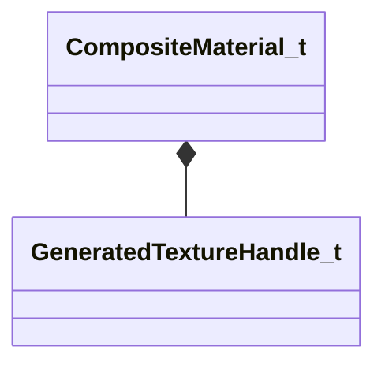

# Module: compositematerialslib

[📊 View UML Diagram](../diagrams/compositematerialslib.md)

| Name | Kind | Bases | Fields |
|------|------|-------|--------|
| [CCompositeMaterialEditorDoc](#ccompositematerialeditordoc) | class |  | 0 |
| [CompMatMutatorCondition_t](#compmatmutatorcondition_t) | class |  | 0 |
| [CompMatPropertyMutatorConditionType_t](#compmatpropertymutatorconditiontype_t) | enum |  | 3 |
| [CompMatPropertyMutatorType_t](#compmatpropertymutatortype_t) | enum |  | 10 |
| [CompMatPropertyMutator_t](#compmatpropertymutator_t) | class |  | 0 |
| [CompositeMaterialAssemblyProcedure_t](#compositematerialassemblyprocedure_t) | class |  | 0 |
| [CompositeMaterialEditorPoint_t](#compositematerialeditorpoint_t) | class |  | 0 |
| [CompositeMaterialInputContainerSourceType_t](#compositematerialinputcontainersourcetype_t) | enum |  | 6 |
| [CompositeMaterialInputContainer_t](#compositematerialinputcontainer_t) | class |  | 0 |
| [CompositeMaterialInputLooseVariableType_t](#compositematerialinputloosevariabletype_t) | enum |  | 15 |
| [CompositeMaterialInputLooseVariable_t](#compositematerialinputloosevariable_t) | class |  | 0 |
| [CompositeMaterialInputTextureType_t](#compositematerialinputtexturetype_t) | enum |  | 8 |
| [CompositeMaterialMatchFilterType_t](#compositematerialmatchfiltertype_t) | enum |  | 6 |
| [CompositeMaterialMatchFilter_t](#compositematerialmatchfilter_t) | class |  | 0 |
| [CompositeMaterialVarSystemVar_t](#compositematerialvarsystemvar_t) | enum |  | 2 |
| [CompositeMaterial_t](#compositematerial_t) | class |  | 4 |
| [GeneratedTextureHandle_t](#generatedtexturehandle_t) | class |  | 1 |

---

### CCompositeMaterialEditorDoc

**Metadata:** `MGetKV3ClassDefaults = {`, `"_class": "CCompositeMaterialEditorDoc",`, `"m_nVersion": 1,`, `"m_Points":`, `[`, `],`, `"m_KVthumbnail": null`, `}`

### CompMatMutatorCondition_t

**Metadata:** `MGetKV3ClassDefaults = {`, `"m_nMutatorCondition": "COMP_MAT_MUTATOR_CONDITION_INPUT_CONTAINER_EXISTS",`, `"m_strMutatorConditionContainerName": "",`, `"m_strMutatorConditionContainerVarName": "",`, `"m_strMutatorConditionContainerVarValue": "",`, `"m_bPassWhenTrue": true`, `}`, `MPropertyElementNameFn (UNKNOWN FOR PARSER)`

### CompMatPropertyMutatorConditionType_t

**Values:**

| Name | Value |
|------|-------|
| `COMP_MAT_MUTATOR_CONDITION_INPUT_CONTAINER_EXISTS` | 0 |
| `COMP_MAT_MUTATOR_CONDITION_INPUT_CONTAINER_VALUE_EXISTS` | 1 |
| `COMP_MAT_MUTATOR_CONDITION_INPUT_CONTAINER_VALUE_EQUALS` | 2 |

### CompMatPropertyMutatorType_t

**Values:**

| Name | Value |
|------|-------|
| `COMP_MAT_PROPERTY_MUTATOR_INIT` | 0 |
| `COMP_MAT_PROPERTY_MUTATOR_COPY_MATCHING_KEYS` | 1 |
| `COMP_MAT_PROPERTY_MUTATOR_COPY_KEYS_WITH_SUFFIX` | 2 |
| `COMP_MAT_PROPERTY_MUTATOR_COPY_PROPERTY` | 3 |
| `COMP_MAT_PROPERTY_MUTATOR_SET_VALUE` | 4 |
| `COMP_MAT_PROPERTY_MUTATOR_GENERATE_TEXTURE` | 5 |
| `COMP_MAT_PROPERTY_MUTATOR_CONDITIONAL_MUTATORS` | 6 |
| `COMP_MAT_PROPERTY_MUTATOR_POP_INPUT_QUEUE` | 7 |
| `COMP_MAT_PROPERTY_MUTATOR_DRAW_TEXT` | 8 |
| `COMP_MAT_PROPERTY_MUTATOR_RANDOM_ROLL_INPUT_VARIABLES` | 9 |

### CompMatPropertyMutator_t

**Metadata:** `MGetKV3ClassDefaults = {`, `"m_bEnabled": true,`, `"m_nMutatorCommandType": "COMP_MAT_PROPERTY_MUTATOR_SET_VALUE",`, `"m_strInitWith_Container": "",`, `"m_strCopyProperty_InputContainerSrc": "",`, `"m_strCopyProperty_InputContainerProperty": "",`, `"m_strCopyProperty_TargetProperty": "",`, `"m_strRandomRollInputVars_SeedInputVar": "",`, `"m_vecRandomRollInputVars_InputVarsToRoll":`, `[`, `],`, `"m_strCopyMatchingKeys_InputContainerSrc": "",`, `"m_strCopyKeysWithSuffix_InputContainerSrc": "",`, `"m_strCopyKeysWithSuffix_FindSuffix": "",`, `"m_strCopyKeysWithSuffix_ReplaceSuffix": "",`, `"m_nSetValue_Value":`, `{`, `"m_strName": "",`, `"m_bExposeExternally": false,`, `"m_strExposedFriendlyName": "",`, `"m_strExposedFriendlyGroupName": "",`, `"m_bExposedVariableIsFixedRange": false,`, `"m_strExposedVisibleWhenTrue": "",`, `"m_strExposedHiddenWhenTrue": "",`, `"m_strExposedValueList": "",`, `"m_nVariableType": "LOOSE_VARIABLE_TYPE_FLOAT1",`, `"m_bValueBoolean": false,`, `"m_nValueIntX": 0,`, `"m_nValueIntY": 0,`, `"m_nValueIntZ": 0,`, `"m_nValueIntW": 0,`, `"m_bHasFloatBounds": false,`, `"m_flValueFloatX": 0.000000,`, `"m_flValueFloatX_Min": 0.000000,`, `"m_flValueFloatX_Max": 1.000000,`, `"m_flValueFloatY": 0.000000,`, `"m_flValueFloatY_Min": 0.000000,`, `"m_flValueFloatY_Max": 1.000000,`, `"m_flValueFloatZ": 0.000000,`, `"m_flValueFloatZ_Min": 0.000000,`, `"m_flValueFloatZ_Max": 1.000000,`, `"m_flValueFloatW": 0.000000,`, `"m_flValueFloatW_Min": 0.000000,`, `"m_flValueFloatW_Max": 1.000000,`, `"m_cValueColor4":`, `[`, `0,`, `0,`, `0,`, `0`, `],`, `"m_nValueSystemVar": "COMPMATSYSVAR_COMPOSITETIME",`, `"m_strResourceMaterial": "",`, `"m_strTextureContentAssetPath": "",`, `"m_strTextureRuntimeResourcePath": "",`, `"m_strTextureCompilationVtexTemplate": "",`, `"m_nTextureType": "INPUT_TEXTURE_TYPE_DEFAULT",`, `"m_strString": "",`, `"m_strPanoramaPanelPath": "",`, `"m_nPanoramaRenderRes": 512`, `},`, `"m_strGenerateTexture_TargetParam": "",`, `"m_strGenerateTexture_InitialContainer": "",`, `"m_nResolution": 256,`, `"m_bIsScratchTarget": false,`, `"m_strCompressionFormat": "",`, `"m_bSplatDebugInfo": false,`, `"m_bCaptureInRenderDoc": false,`, `"m_vecTexGenInstructions":`, `[`, `],`, `"m_vecConditionalMutators":`, `[`, `],`, `"m_strPopInputQueue_Container": "",`, `"m_strDrawText_InputContainerSrc": "",`, `"m_strDrawText_InputContainerProperty": "",`, `"m_vecDrawText_Position":`, `[`, `0.000000,`, `0.000000`, `],`, `"m_colDrawText_Color":`, `[`, `255,`, `255,`, `255`, `],`, `"m_strDrawText_Font": "Times New Roman",`, `"m_vecConditions":`, `[`, `]`, `}`, `MPropertyElementNameFn (UNKNOWN FOR PARSER)`

### CompositeMaterialAssemblyProcedure_t

**Metadata:** `MGetKV3ClassDefaults = {`, `"m_vecCompMatIncludes":`, `[`, `],`, `"m_vecMatchFilters":`, `[`, `],`, `"m_vecCompositeInputContainers":`, `[`, `],`, `"m_vecPropertyMutators":`, `[`, `]`, `}`, `MPropertyElementNameFn (UNKNOWN FOR PARSER)`

### CompositeMaterialEditorPoint_t

**Metadata:** `MGetKV3ClassDefaults = {`, `"m_ModelName": "",`, `"m_nSequenceIndex": 0,`, `"m_flCycle": 0.000000,`, `"m_KVModelStateChoices": null,`, `"m_bEnableChildModel": false,`, `"m_ChildModelName": "",`, `"m_vecCompositeMaterialAssemblyProcedures":`, `[`, `]`, `}`

### CompositeMaterialInputContainerSourceType_t

**Values:**

| Name | Value |
|------|-------|
| `CONTAINER_SOURCE_TYPE_TARGET_MATERIAL` | 0 |
| `CONTAINER_SOURCE_TYPE_MATERIAL_FROM_TARGET_ATTR` | 1 |
| `CONTAINER_SOURCE_TYPE_SPECIFIC_MATERIAL` | 2 |
| `CONTAINER_SOURCE_TYPE_LOOSE_VARIABLES` | 3 |
| `CONTAINER_SOURCE_TYPE_VARIABLE_FROM_TARGET_ATTR` | 4 |
| `CONTAINER_SOURCE_TYPE_TARGET_INSTANCE_MATERIAL` | 5 |

### CompositeMaterialInputContainer_t

**Metadata:** `MGetKV3ClassDefaults = {`, `"m_bEnabled": true,`, `"m_nCompositeMaterialInputContainerSourceType": "CONTAINER_SOURCE_TYPE_TARGET_MATERIAL",`, `"m_strSpecificContainerMaterial": "",`, `"m_strAttrName": "",`, `"m_strAlias": "",`, `"m_vecLooseVariables":`, `[`, `],`, `"m_strAttrNameForVar": "",`, `"m_bExposeExternally": false`, `}`, `MPropertyElementNameFn (UNKNOWN FOR PARSER)`

### CompositeMaterialInputLooseVariableType_t

**Values:**

| Name | Value |
|------|-------|
| `LOOSE_VARIABLE_TYPE_BOOLEAN` | 0 |
| `LOOSE_VARIABLE_TYPE_INTEGER1` | 1 |
| `LOOSE_VARIABLE_TYPE_INTEGER2` | 2 |
| `LOOSE_VARIABLE_TYPE_INTEGER3` | 3 |
| `LOOSE_VARIABLE_TYPE_INTEGER4` | 4 |
| `LOOSE_VARIABLE_TYPE_FLOAT1` | 5 |
| `LOOSE_VARIABLE_TYPE_FLOAT2` | 6 |
| `LOOSE_VARIABLE_TYPE_FLOAT3` | 7 |
| `LOOSE_VARIABLE_TYPE_FLOAT4` | 8 |
| `LOOSE_VARIABLE_TYPE_COLOR4` | 9 |
| `LOOSE_VARIABLE_TYPE_STRING` | 10 |
| `LOOSE_VARIABLE_TYPE_SYSTEMVAR` | 11 |
| `LOOSE_VARIABLE_TYPE_RESOURCE_MATERIAL` | 12 |
| `LOOSE_VARIABLE_TYPE_RESOURCE_TEXTURE` | 13 |
| `LOOSE_VARIABLE_TYPE_PANORAMA_RENDER` | 14 |

### CompositeMaterialInputLooseVariable_t

**Metadata:** `MGetKV3ClassDefaults = {`, `"m_strName": "",`, `"m_bExposeExternally": false,`, `"m_strExposedFriendlyName": "",`, `"m_strExposedFriendlyGroupName": "",`, `"m_bExposedVariableIsFixedRange": false,`, `"m_strExposedVisibleWhenTrue": "",`, `"m_strExposedHiddenWhenTrue": "",`, `"m_strExposedValueList": "",`, `"m_nVariableType": "LOOSE_VARIABLE_TYPE_FLOAT1",`, `"m_bValueBoolean": false,`, `"m_nValueIntX": 0,`, `"m_nValueIntY": 0,`, `"m_nValueIntZ": 0,`, `"m_nValueIntW": 0,`, `"m_bHasFloatBounds": false,`, `"m_flValueFloatX": 0.000000,`, `"m_flValueFloatX_Min": 0.000000,`, `"m_flValueFloatX_Max": 1.000000,`, `"m_flValueFloatY": 0.000000,`, `"m_flValueFloatY_Min": 0.000000,`, `"m_flValueFloatY_Max": 1.000000,`, `"m_flValueFloatZ": 0.000000,`, `"m_flValueFloatZ_Min": 0.000000,`, `"m_flValueFloatZ_Max": 1.000000,`, `"m_flValueFloatW": 0.000000,`, `"m_flValueFloatW_Min": 0.000000,`, `"m_flValueFloatW_Max": 1.000000,`, `"m_cValueColor4":`, `[`, `0,`, `0,`, `0,`, `0`, `],`, `"m_nValueSystemVar": "COMPMATSYSVAR_COMPOSITETIME",`, `"m_strResourceMaterial": "",`, `"m_strTextureContentAssetPath": "",`, `"m_strTextureRuntimeResourcePath": "",`, `"m_strTextureCompilationVtexTemplate": "",`, `"m_nTextureType": "INPUT_TEXTURE_TYPE_DEFAULT",`, `"m_strString": "",`, `"m_strPanoramaPanelPath": "",`, `"m_nPanoramaRenderRes": 512`, `}`, `MPropertyElementNameFn (UNKNOWN FOR PARSER)`

### CompositeMaterialInputTextureType_t

**Values:**

| Name | Value |
|------|-------|
| `INPUT_TEXTURE_TYPE_DEFAULT` | 0 |
| `INPUT_TEXTURE_TYPE_NORMALMAP` | 1 |
| `INPUT_TEXTURE_TYPE_COLOR` | 2 |
| `INPUT_TEXTURE_TYPE_MASKS` | 3 |
| `INPUT_TEXTURE_TYPE_ROUGHNESS` | 4 |
| `INPUT_TEXTURE_TYPE_PEARLESCENCE_MASK` | 5 |
| `INPUT_TEXTURE_TYPE_AO` | 6 |
| `INPUT_TEXTURE_TYPE_POSITION` | 7 |

### CompositeMaterialMatchFilterType_t

**Values:**

| Name | Value |
|------|-------|
| `MATCH_FILTER_MATERIAL_ATTRIBUTE_EXISTS` | 0 |
| `MATCH_FILTER_MATERIAL_SHADER` | 1 |
| `MATCH_FILTER_MATERIAL_NAME_SUBSTR` | 2 |
| `MATCH_FILTER_MATERIAL_ATTRIBUTE_EQUALS` | 3 |
| `MATCH_FILTER_MATERIAL_PROPERTY_EXISTS` | 4 |
| `MATCH_FILTER_MATERIAL_PROPERTY_EQUALS` | 5 |

### CompositeMaterialMatchFilter_t

**Metadata:** `MGetKV3ClassDefaults = {`, `"m_nCompositeMaterialMatchFilterType": "MATCH_FILTER_MATERIAL_ATTRIBUTE_EXISTS",`, `"m_strMatchFilter": "composite_inputs",`, `"m_strMatchValue": "",`, `"m_bPassWhenTrue": true`, `}`, `MPropertyElementNameFn (UNKNOWN FOR PARSER)`

### CompositeMaterialVarSystemVar_t

**Values:**

| Name | Value |
|------|-------|
| `COMPMATSYSVAR_COMPOSITETIME` | 0 |
| `COMPMATSYSVAR_EMPTY_RESOURCE_SPACER` | 1 |

### CompositeMaterial_t

**Metadata:** `MPropertyElementNameFn (UNKNOWN FOR PARSER)`

**Relationships:**

**Fields:**

| Name | Type | Annotations |
|------|------|-------------|
| `m_TargetKVs` | KeyValues3 | `MPropertyGroupName = "Target Material"` `MPropertyAttributeEditor = "CompositeMaterialKVInspector"` |
| `m_PreGenerationKVs` | KeyValues3 | `MPropertyGroupName = "Pre-Generated Output Material"` `MPropertyAttributeEditor = "CompositeMaterialKVInspector"` |
| `m_FinalKVs` | KeyValues3 | `MPropertyGroupName = "Generated Composite Material"` `MPropertyAttributeEditor = "CompositeMaterialKVInspector"` |
| `m_vecGeneratedTextures` | CUtlVector< [GeneratedTextureHandle_t](../schemas/compositematerialslib.md#generatedtexturehandle_t) > | `MPropertyFriendlyName = "Generated Textures"` |

### GeneratedTextureHandle_t

**Metadata:** `MPropertyElementNameFn (UNKNOWN FOR PARSER)`

**Fields:**

| Name | Type | Annotations |
|------|------|-------------|
| `m_strBitmapName` | CUtlString | `MPropertyFriendlyName = "Generated Texture"` `MPropertyAttributeEditor = "CompositeMaterialTextureViewer"` |
