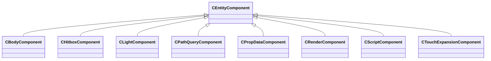
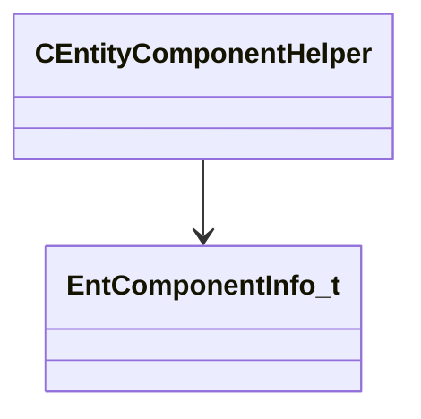
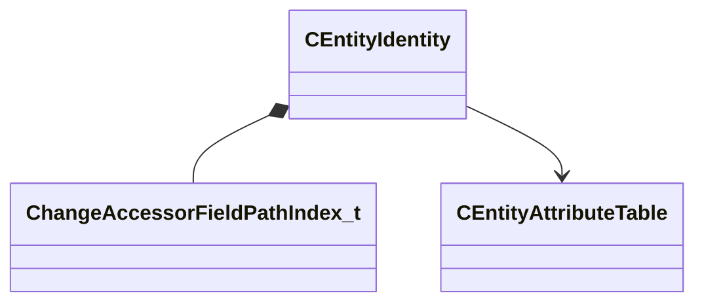
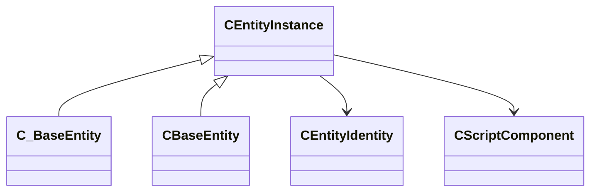
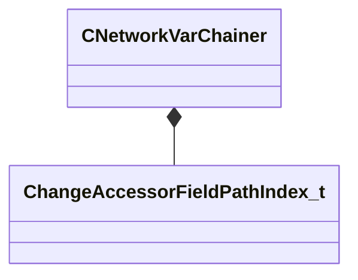
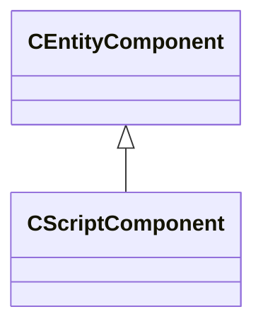
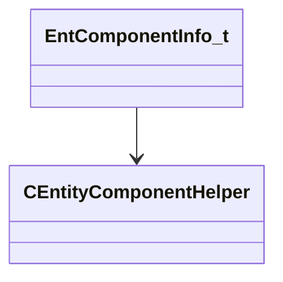

# Module: entity2

[📊 View UML Diagram](../diagrams/entity2.md)

| Name | Kind | Bases | Fields |
|------|------|-------|--------|
| [CEmptyEntityInstance](#cemptyentityinstance) | class |  | 0 |
| [CEntityAttributeTable](#centityattributetable) | class |  | 2 |
| [CEntityComponent](#centitycomponent) | class |  | 0 |
| [CEntityComponentHelper](#centitycomponenthelper) | class |  | 4 |
| [CEntityIOOutput](#centityiooutput) | class |  | 0 |
| [CEntityIdentity](#centityidentity) | class |  | 12 |
| [CEntityInstance](#centityinstance) | class |  | 3 |
| [CNetworkVarChainer](#cnetworkvarchainer) | class |  | 1 |
| [CScriptComponent](#cscriptcomponent) | class | CEntityComponent | 1 |
| [CVariantDefaultAllocator](#cvariantdefaultallocator) | class |  | 0 |
| [EntComponentInfo_t](#entcomponentinfo_t) | class |  | 7 |
| [EntInput_t](#entinput_t) | class |  | 0 |
| [EntOutput_t](#entoutput_t) | class |  | 0 |
| [EntityDormancyType_t](#entitydormancytype_t) | enum |  | 3 |
| [EntityIOTargetType_t](#entityiotargettype_t) | enum |  | 4 |
| [GameTick_t](#gametick_t) | class |  | 1 |
| [GameTime_t](#gametime_t) | class |  | 1 |

---

### CEmptyEntityInstance

### CEntityAttributeTable

**Fields:**

| Name | Type | Annotations |
|------|------|-------------|
| `m_Attributes` | CUtlOrderedMap< CUtlStringToken, Attribute_t > |  |
| `m_Names` | CUtlOrderedMap< CUtlStringToken, CUtlString > |  |

### CEntityComponent

**Derived by:** [CBodyComponent](client.md#cbodycomponent), [CHitboxComponent](client.md#chitboxcomponent), [CLightComponent](client.md#clightcomponent), [CPathQueryComponent](client.md#cpathquerycomponent), [CPropDataComponent](client.md#cpropdatacomponent), [CRenderComponent](client.md#crendercomponent), [CScriptComponent](entity2.md#cscriptcomponent), [CTouchExpansionComponent](server.md#ctouchexpansioncomponent)

**Relationships:**

### CEntityComponentHelper

**Relationships:**

**Fields:**

| Name | Type | Annotations |
|------|------|-------------|
| `m_flags` | uint32 |  |
| `m_pInfo` | [EntComponentInfo_t](../schemas/entity2.md#entcomponentinfo_t)* |  |
| `m_nPriority` | int32 |  |
| `m_pNext` | [CEntityComponentHelper](../schemas/entity2.md#centitycomponenthelper)* |  |

### CEntityIOOutput

### CEntityIdentity

**Relationships:**

**Fields:**

| Name | Type | Annotations |
|------|------|-------------|
| `m_nameStringableIndex` | int32 | `MNetworkEnable` `MNotSaved` `MNetworkChangeCallback = "entityIdentityNameChanged"` |
| `m_name` | CUtlSymbolLarge |  |
| `m_designerName` | CUtlSymbolLarge | `MNotSaved` |
| `m_flags` | uint32 | `MNotSaved` |
| `m_worldGroupId` | WorldGroupId_t | `MNotSaved` |
| `m_fDataObjectTypes` | uint32 | `MNotSaved` |
| `m_PathIndex` | [ChangeAccessorFieldPathIndex_t](../schemas/networksystem.md#changeaccessorfieldpathindex_t) | `MNotSaved` |
| `m_pAttributes` | [CEntityAttributeTable](../schemas/entity2.md#centityattributetable)* | `MSaveOpsForField = "GetAttributeDictSaveDataOps"` |
| `m_pPrev` | [CEntityIdentity](../schemas/entity2.md#centityidentity)* | `MNotSaved` |
| `m_pNext` | [CEntityIdentity](../schemas/entity2.md#centityidentity)* | `MNotSaved` |
| `m_pPrevByClass` | [CEntityIdentity](../schemas/entity2.md#centityidentity)* | `MNotSaved` |
| `m_pNextByClass` | [CEntityIdentity](../schemas/entity2.md#centityidentity)* | `MNotSaved` |

### CEntityInstance

**Derived by:** [CBaseEntity](server.md#cbaseentity), [C_BaseEntity](client.md#c_baseentity)

**Relationships:**

**Fields:**

| Name | Type | Annotations |
|------|------|-------------|
| `m_iszPrivateVScripts` | CUtlSymbolLarge |  |
| `m_pEntity` | [CEntityIdentity](../schemas/entity2.md#centityidentity)* | `MNetworkEnable` `MNetworkPriority = 56` |
| `m_CScriptComponent` | [CScriptComponent](../schemas/entity2.md#cscriptcomponent)* |  |

### CNetworkVarChainer

**Relationships:**

**Fields:**

| Name | Type | Annotations |
|------|------|-------------|
| `m_PathIndex` | [ChangeAccessorFieldPathIndex_t](../schemas/networksystem.md#changeaccessorfieldpathindex_t) |  |

### CScriptComponent

**Inherits from:** [CEntityComponent](entity2.md#centitycomponent)

**Relationships:**

**Fields:**

| Name | Type | Annotations |
|------|------|-------------|
| `m_scriptClassName` | CUtlSymbolLarge | `MNotSaved` |

### CVariantDefaultAllocator

### EntComponentInfo_t

**Relationships:**

**Fields:**

| Name | Type | Annotations |
|------|------|-------------|
| `m_pName` | char* |  |
| `m_pCPPClassname` | char* |  |
| `m_pNetworkDataReferencedDescription` | char* |  |
| `m_pNetworkDataReferencedPtrPropDescription` | char* |  |
| `m_nRuntimeIndex` | int32 |  |
| `m_nFlags` | uint32 |  |
| `m_pBaseClassComponentHelper` | [CEntityComponentHelper](../schemas/entity2.md#centitycomponenthelper)* |  |

### EntInput_t

### EntOutput_t

### EntityDormancyType_t

**Values:**

| Name | Value |
|------|-------|
| `ENTITY_NOT_DORMANT` | 0 |
| `ENTITY_DORMANT` | 1 |
| `ENTITY_SUSPENDED` | 2 |

### EntityIOTargetType_t

**Values:**

| Name | Value |
|------|-------|
| `ENTITY_IO_TARGET_INVALID` | -1 |
| `ENTITY_IO_TARGET_ENTITYNAME` | 2 |
| `ENTITY_IO_TARGET_EHANDLE` | 6 |
| `ENTITY_IO_TARGET_ENTITYNAME_OR_CLASSNAME` | 7 |

### GameTick_t

**Metadata:** `MIsBoxedIntegerType`

**Fields:**

| Name | Type | Annotations |
|------|------|-------------|
| `m_Value` | int32 |  |

### GameTime_t

**Metadata:** `MIsBoxedFloatType`

**Fields:**

| Name | Type | Annotations |
|------|------|-------------|
| `m_Value` | float32 |  |
