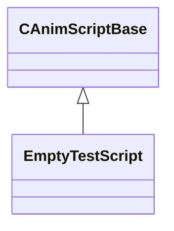

# Module: host

[📊 View UML Diagram](../diagrams/host.md)

| Name | Kind | Bases | Fields |
|------|------|-------|--------|
| [CAnimScriptBase](#canimscriptbase) | class |  | 1 |
| [EmptyTestScript](#emptytestscript) | class | CAnimScriptBase | 1 |

---

### CAnimScriptBase

**Derived by:** [EmptyTestScript](host.md#emptytestscript)

**Relationships:**

**Fields:**

| Name | Type | Annotations |
|------|------|-------------|
| `m_bIsValid` | bool |  |

### EmptyTestScript

**Inherits from:** [CAnimScriptBase](host.md#canimscriptbase)

**Relationships:**

**Fields:**

| Name | Type | Annotations |
|------|------|-------------|
| `m_hTest` | CAnimScriptParam< float32 > |  |
