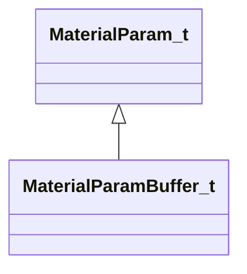
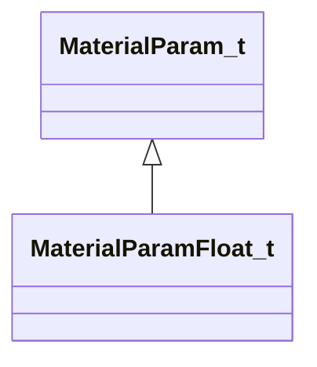
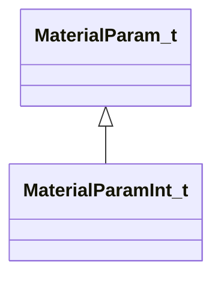
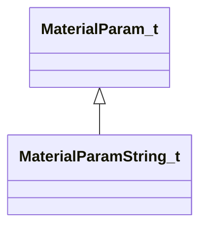
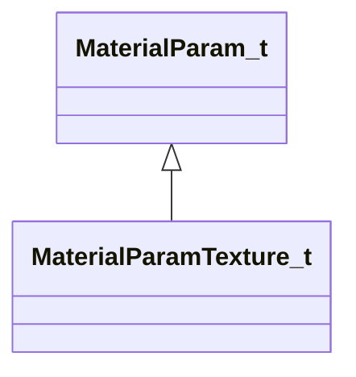
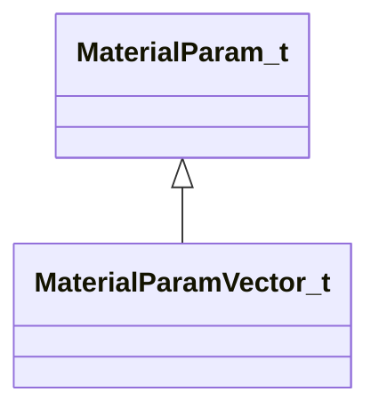
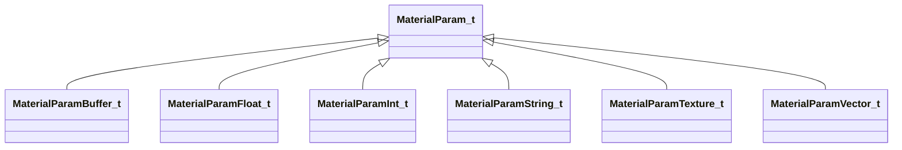

# Module: materialsystem2

[📊 View UML Diagram](../diagrams/materialsystem2.md)

| Name | Kind | Bases | Fields |
|------|------|-------|--------|
| [BloomBlendMode_t](#bloomblendmode_t) | enum |  | 3 |
| [HorizJustification_e](#horizjustification_e) | enum |  | 4 |
| [LayoutPositionType_e](#layoutpositiontype_e) | enum |  | 3 |
| [MaterialParamBuffer_t](#materialparambuffer_t) | class | MaterialParam_t | 0 |
| [MaterialParamFloat_t](#materialparamfloat_t) | class | MaterialParam_t | 0 |
| [MaterialParamInt_t](#materialparamint_t) | class | MaterialParam_t | 0 |
| [MaterialParamString_t](#materialparamstring_t) | class | MaterialParam_t | 0 |
| [MaterialParamTexture_t](#materialparamtexture_t) | class | MaterialParam_t | 0 |
| [MaterialParamVector_t](#materialparamvector_t) | class | MaterialParam_t | 0 |
| [MaterialParam_t](#materialparam_t) | class |  | 0 |
| [MaterialResourceData_t](#materialresourcedata_t) | class |  | 0 |
| [PostProcessingBloomParameters_t](#postprocessingbloomparameters_t) | class |  | 0 |
| [PostProcessingFogScatteringParameters_t](#postprocessingfogscatteringparameters_t) | class |  | 0 |
| [PostProcessingLocalContrastParameters_t](#postprocessinglocalcontrastparameters_t) | class |  | 0 |
| [PostProcessingResource_t](#postprocessingresource_t) | class |  | 0 |
| [PostProcessingTonemapParameters_t](#postprocessingtonemapparameters_t) | class |  | 0 |
| [PostProcessingVignetteParameters_t](#postprocessingvignetteparameters_t) | class |  | 0 |
| [VertJustification_e](#vertjustification_e) | enum |  | 4 |
| [ViewFadeMode_t](#viewfademode_t) | enum |  | 3 |

---

### BloomBlendMode_t

**Values:**

| Name | Value |
|------|-------|
| `BLOOM_BLEND_ADD` | 0 |
| `BLOOM_BLEND_SCREEN` | 1 |
| `BLOOM_BLEND_BLUR` | 2 |

### HorizJustification_e

**Values:**

| Name | Value |
|------|-------|
| `HORIZ_JUSTIFICATION_LEFT` | 0 |
| `HORIZ_JUSTIFICATION_CENTER` | 1 |
| `HORIZ_JUSTIFICATION_RIGHT` | 2 |
| `HORIZ_JUSTIFICATION_NONE` | 3 |

### LayoutPositionType_e

**Values:**

| Name | Value |
|------|-------|
| `LAYOUTPOSITIONTYPE_VIEWPORT_RELATIVE` | 0 |
| `LAYOUTPOSITIONTYPE_FRACTIONAL` | 1 |
| `LAYOUTPOSITIONTYPE_NONE` | 2 |

### MaterialParamBuffer_t

**Inherits from:** [MaterialParam_t](materialsystem2.md#materialparam_t)

**Metadata:** `MGetKV3ClassDefaults = {`, `"m_name": "",`, `"m_value": "[BINARY BLOB]"`, `}`

**Relationships:**

### MaterialParamFloat_t

**Inherits from:** [MaterialParam_t](materialsystem2.md#materialparam_t)

**Metadata:** `MGetKV3ClassDefaults = {`, `"m_name": "",`, `"m_flValue": 0.000000`, `}`

**Relationships:**

### MaterialParamInt_t

**Inherits from:** [MaterialParam_t](materialsystem2.md#materialparam_t)

**Metadata:** `MGetKV3ClassDefaults = {`, `"m_name": "",`, `"m_nValue": 0`, `}`

**Relationships:**

### MaterialParamString_t

**Inherits from:** [MaterialParam_t](materialsystem2.md#materialparam_t)

**Metadata:** `MGetKV3ClassDefaults = {`, `"m_name": "",`, `"m_value": ""`, `}`

**Relationships:**

### MaterialParamTexture_t

**Inherits from:** [MaterialParam_t](materialsystem2.md#materialparam_t)

**Metadata:** `MGetKV3ClassDefaults = {`, `"m_name": "",`, `"m_pValue": ""`, `}`

**Relationships:**

### MaterialParamVector_t

**Inherits from:** [MaterialParam_t](materialsystem2.md#materialparam_t)

**Metadata:** `MGetKV3ClassDefaults = {`, `"m_name": "",`, `"m_value":`, `[`, `0.000000,`, `0.000000,`, `0.000000,`, `0.000000`, `]`, `}`

**Relationships:**

### MaterialParam_t

**Derived by:** [MaterialParamBuffer_t](materialsystem2.md#materialparambuffer_t), [MaterialParamFloat_t](materialsystem2.md#materialparamfloat_t), [MaterialParamInt_t](materialsystem2.md#materialparamint_t), [MaterialParamString_t](materialsystem2.md#materialparamstring_t), [MaterialParamTexture_t](materialsystem2.md#materialparamtexture_t), [MaterialParamVector_t](materialsystem2.md#materialparamvector_t)

**Metadata:** `MGetKV3ClassDefaults = {`, `"m_name": ""`, `}`

**Relationships:**

### MaterialResourceData_t

**Metadata:** `MGetKV3ClassDefaults = {`, `"m_materialName": "",`, `"m_shaderName": "",`, `"m_intParams":`, `[`, `],`, `"m_floatParams":`, `[`, `],`, `"m_vectorParams":`, `[`, `],`, `"m_textureParams":`, `[`, `],`, `"m_dynamicParams":`, `[`, `],`, `"m_dynamicTextureParams":`, `[`, `],`, `"m_intAttributes":`, `[`, `],`, `"m_floatAttributes":`, `[`, `],`, `"m_vectorAttributes":`, `[`, `],`, `"m_textureAttributes":`, `[`, `],`, `"m_stringAttributes":`, `[`, `],`, `"m_renderAttributesUsed":`, `[`, `]`, `}`

### PostProcessingBloomParameters_t

**Metadata:** `MGetKV3ClassDefaults = {`, `"m_blendMode": "BLOOM_BLEND_ADD",`, `"m_flBloomStrength": 2.000000,`, `"m_flScreenBloomStrength": 1.000000,`, `"m_flBlurBloomStrength": 1.000000,`, `"m_flBloomThreshold": 0.000000,`, `"m_flBloomThresholdWidth": 1.000000,`, `"m_flSkyboxBloomStrength": 1.000000,`, `"m_flBloomStartValue": 1.000000,`, `"m_flComputeBloomStrength": 0.030000,`, `"m_flComputeBloomThreshold": 1.000000,`, `"m_flComputeBloomRadius": 0.600000,`, `"m_flComputeBloomEffectsScale": 1.000000,`, `"m_flComputeBloomLensDirtStrength": 0.000000,`, `"m_flComputeBloomLensDirtBlackLevel": 0.100000,`, `"m_flBlurWeight":`, `[`, `0.200000,`, `0.200000,`, `0.200000,`, `0.200000,`, `0.200000`, `],`, `"m_vBlurTint":`, `[`, `[`, `1.000000,`, `1.000000,`, `1.000000`, `],`, `[`, `1.000000,`, `1.000000,`, `1.000000`, `],`, `[`, `1.000000,`, `1.000000,`, `1.000000`, `],`, `[`, `1.000000,`, `1.000000,`, `1.000000`, `],`, `[`, `1.000000,`, `1.000000,`, `1.000000`, `]`, `]`, `}`

### PostProcessingFogScatteringParameters_t

**Metadata:** `MGetKV3ClassDefaults = {`, `"m_fRadius": 0.750000,`, `"m_fScale": 0.000000,`, `"m_fCubemapScale": 1.000000,`, `"m_fVolumetricScale": 1.000000,`, `"m_fGradientScale": 1.000000`, `}`

### PostProcessingLocalContrastParameters_t

**Metadata:** `MGetKV3ClassDefaults = {`, `"m_flLocalContrastStrength": 0.000000,`, `"m_flLocalContrastEdgeStrength": 0.000000,`, `"m_flLocalContrastVignetteStart": 0.000000,`, `"m_flLocalContrastVignetteEnd": 0.000000,`, `"m_flLocalContrastVignetteBlur": 0.000000`, `}`

### PostProcessingResource_t

**Metadata:** `MGetKV3ClassDefaults = {`, `"m_bHasTonemapParams": false,`, `"m_toneMapParams":`, `{`, `"m_flExposureBias": 0.000000,`, `"m_flShoulderStrength": 0.000000,`, `"m_flLinearStrength": 0.000000,`, `"m_flLinearAngle": 0.000000,`, `"m_flToeStrength": 0.000000,`, `"m_flToeNum": 0.000000,`, `"m_flToeDenom": 0.000000,`, `"m_flWhitePoint": 0.000000,`, `"m_flLuminanceSource": 0.000000,`, `"m_flExposureBiasShadows": 0.000000,`, `"m_flExposureBiasHighlights": 0.000000,`, `"m_flMinShadowLum": 0.000000,`, `"m_flMaxShadowLum": 0.000000,`, `"m_flMinHighlightLum": 0.000000,`, `"m_flMaxHighlightLum": 0.000000`, `},`, `"m_bHasBloomParams": false,`, `"m_bloomParams":`, `{`, `"m_blendMode": "BLOOM_BLEND_ADD",`, `"m_flBloomStrength": 2.000000,`, `"m_flScreenBloomStrength": 1.000000,`, `"m_flBlurBloomStrength": 1.000000,`, `"m_flBloomThreshold": 0.000000,`, `"m_flBloomThresholdWidth": 1.000000,`, `"m_flSkyboxBloomStrength": 1.000000,`, `"m_flBloomStartValue": 1.000000,`, `"m_flComputeBloomStrength": 0.030000,`, `"m_flComputeBloomThreshold": 1.000000,`, `"m_flComputeBloomRadius": 0.600000,`, `"m_flComputeBloomEffectsScale": 1.000000,`, `"m_flComputeBloomLensDirtStrength": 0.000000,`, `"m_flComputeBloomLensDirtBlackLevel": 0.100000,`, `"m_flBlurWeight":`, `[`, `0.200000,`, `0.200000,`, `0.200000,`, `0.200000,`, `0.200000`, `],`, `"m_vBlurTint":`, `[`, `[`, `1.000000,`, `1.000000,`, `1.000000`, `],`, `[`, `1.000000,`, `1.000000,`, `1.000000`, `],`, `[`, `1.000000,`, `1.000000,`, `1.000000`, `],`, `[`, `1.000000,`, `1.000000,`, `1.000000`, `],`, `[`, `1.000000,`, `1.000000,`, `1.000000`, `]`, `]`, `},`, `"m_bHasVignetteParams": false,`, `"m_vignetteParams":`, `{`, `"m_flVignetteStrength": 0.000000,`, `"m_vCenter":`, `[`, `0.000000,`, `0.000000`, `],`, `"m_flRadius": 0.500000,`, `"m_flRoundness": 1.000000,`, `"m_flFeather": 0.500000,`, `"m_vColorTint":`, `[`, `1.000000,`, `1.000000,`, `1.000000`, `]`, `},`, `"m_bHasLocalContrastParams": false,`, `"m_localConstrastParams":`, `{`, `"m_flLocalContrastStrength": 0.000000,`, `"m_flLocalContrastEdgeStrength": 0.000000,`, `"m_flLocalContrastVignetteStart": 0.000000,`, `"m_flLocalContrastVignetteEnd": 0.000000,`, `"m_flLocalContrastVignetteBlur": 0.000000`, `},`, `"m_nColorCorrectionVolumeDim": 0,`, `"m_colorCorrectionVolumeData": "[BINARY BLOB]",`, `"m_bHasColorCorrection": true,`, `"m_bHasFogScatteringParams": false,`, `"m_fogScatteringParams":`, `{`, `"m_fRadius": 0.750000,`, `"m_fScale": 0.000000,`, `"m_fCubemapScale": 1.000000,`, `"m_fVolumetricScale": 1.000000,`, `"m_fGradientScale": 1.000000`, `}`, `}`

### PostProcessingTonemapParameters_t

**Metadata:** `MGetKV3ClassDefaults = {`, `"m_flExposureBias": 0.000000,`, `"m_flShoulderStrength": 0.000000,`, `"m_flLinearStrength": 0.000000,`, `"m_flLinearAngle": 0.000000,`, `"m_flToeStrength": 0.000000,`, `"m_flToeNum": 0.000000,`, `"m_flToeDenom": 0.000000,`, `"m_flWhitePoint": 0.000000,`, `"m_flLuminanceSource": 0.000000,`, `"m_flExposureBiasShadows": 0.000000,`, `"m_flExposureBiasHighlights": 0.000000,`, `"m_flMinShadowLum": 0.000000,`, `"m_flMaxShadowLum": 0.000000,`, `"m_flMinHighlightLum": 0.000000,`, `"m_flMaxHighlightLum": 0.000000`, `}`

### PostProcessingVignetteParameters_t

**Metadata:** `MGetKV3ClassDefaults = {`, `"m_flVignetteStrength": 0.000000,`, `"m_vCenter":`, `[`, `0.000000,`, `0.000000`, `],`, `"m_flRadius": 0.500000,`, `"m_flRoundness": 1.000000,`, `"m_flFeather": 0.500000,`, `"m_vColorTint":`, `[`, `1.000000,`, `1.000000,`, `1.000000`, `]`, `}`

### VertJustification_e

**Values:**

| Name | Value |
|------|-------|
| `VERT_JUSTIFICATION_TOP` | 0 |
| `VERT_JUSTIFICATION_CENTER` | 1 |
| `VERT_JUSTIFICATION_BOTTOM` | 2 |
| `VERT_JUSTIFICATION_NONE` | 3 |

### ViewFadeMode_t

**Values:**

| Name | Value |
|------|-------|
| `VIEW_FADE_CONSTANT_COLOR` | 0 |
| `VIEW_FADE_MODULATE` | 1 |
| `VIEW_FADE_MOD2X` | 2 |
