# Module: modellib

[📊 View UML Diagram](../diagrams/modellib.md)

| Name | Kind | Bases | Fields |
|------|------|-------|--------|
| [AnimComponentID](#animcomponentid) | class |  | 0 |
| [AnimNodeID](#animnodeid) | class |  | 0 |
| [AnimNodeOutputID](#animnodeoutputid) | class |  | 0 |
| [AnimParamID](#animparamid) | class |  | 0 |
| [AnimScriptHandle](#animscripthandle) | class |  | 0 |
| [AnimStateID](#animstateid) | class |  | 0 |
| [AnimTagID](#animtagid) | class |  | 0 |
| [AttachmentHandle_t](#attachmenthandle_t) | class |  | 1 |
| [CAimConstraint](#caimconstraint) | class | CBaseConstraint | 0 |
| [CAnimAttachment](#canimattachment) | class |  | 5 |
| [CAnimCycle](#canimcycle) | class | CCycleBase | 0 |
| [CAnimFoot](#canimfoot) | class |  | 0 |
| [CAnimSkeleton](#canimskeleton) | class |  | 0 |
| [CAttachment](#cattachment) | class |  | 0 |
| [CBaseConstraint](#cbaseconstraint) | class | CBoneConstraintBase | 4 |
| [CBoneConstraintBase](#cboneconstraintbase) | class |  | 0 |
| [CBoneConstraintDotToMorph](#cboneconstraintdottomorph) | class | CBoneConstraintBase | 0 |
| [CBoneConstraintPoseSpaceBone](#cboneconstraintposespacebone) | class | CBaseConstraint | 0 |
| [CBoneConstraintPoseSpaceBone](#cboneconstraintposespacebone) | class |  | 2 |
| [CBoneConstraintPoseSpaceMorph](#cboneconstraintposespacemorph) | class | CBoneConstraintBase | 0 |
| [CBoneConstraintPoseSpaceMorph](#cboneconstraintposespacemorph) | class |  | 2 |
| [CBoneConstraintRbf](#cboneconstraintrbf) | class | CBoneConstraintBase | 0 |
| [CConstraintSlave](#cconstraintslave) | class |  | 0 |
| [CConstraintTarget](#cconstrainttarget) | class |  | 0 |
| [CCycleBase](#ccyclebase) | class |  | 0 |
| [CDrawCullingData](#cdrawcullingdata) | class |  | 0 |
| [CFlexController](#cflexcontroller) | class |  | 0 |
| [CFlexDesc](#cflexdesc) | class |  | 0 |
| [CFlexOp](#cflexop) | class |  | 0 |
| [CFlexRule](#cflexrule) | class |  | 0 |
| [CFootCycle](#cfootcycle) | class | CCycleBase | 0 |
| [CFootCycleDefinition](#cfootcycledefinition) | class |  | 0 |
| [CFootDefinition](#cfootdefinition) | class |  | 0 |
| [CFootMotion](#cfootmotion) | class |  | 0 |
| [CFootStride](#cfootstride) | class |  | 0 |
| [CFootTrajectories](#cfoottrajectories) | class |  | 0 |
| [CFootTrajectory](#cfoottrajectory) | class |  | 0 |
| [CHitBox](#chitbox) | class |  | 0 |
| [CHitBoxSet](#chitboxset) | class |  | 0 |
| [CHitBoxSetList](#chitboxsetlist) | class |  | 0 |
| [CMaterialDrawDescriptor](#cmaterialdrawdescriptor) | class |  | 0 |
| [CMaterialDrawDescriptor](#cmaterialdrawdescriptor) | class |  | 0 |
| [CMeshletDescriptor](#cmeshletdescriptor) | class |  | 0 |
| [CModelConfig](#cmodelconfig) | class |  | 0 |
| [CModelConfigElement](#cmodelconfigelement) | class |  | 2 |
| [CModelConfigElement_AttachedModel](#cmodelconfigelement_attachedmodel) | class | CModelConfigElement | 0 |
| [CModelConfigElement_Command](#cmodelconfigelement_command) | class | CModelConfigElement | 0 |
| [CModelConfigElement_RandomColor](#cmodelconfigelement_randomcolor) | class | CModelConfigElement | 0 |
| [CModelConfigElement_RandomPick](#cmodelconfigelement_randompick) | class | CModelConfigElement | 0 |
| [CModelConfigElement_SetBodygroup](#cmodelconfigelement_setbodygroup) | class | CModelConfigElement | 0 |
| [CModelConfigElement_SetBodygroupOnAttachedModels](#cmodelconfigelement_setbodygrouponattachedmodels) | class | CModelConfigElement | 0 |
| [CModelConfigElement_SetMaterialGroup](#cmodelconfigelement_setmaterialgroup) | class | CModelConfigElement | 0 |
| [CModelConfigElement_SetMaterialGroupOnAttachedModels](#cmodelconfigelement_setmaterialgrouponattachedmodels) | class | CModelConfigElement | 0 |
| [CModelConfigElement_SetRenderColor](#cmodelconfigelement_setrendercolor) | class | CModelConfigElement | 0 |
| [CModelConfigElement_UserPick](#cmodelconfigelement_userpick) | class | CModelConfigElement | 0 |
| [CModelConfigList](#cmodelconfiglist) | class |  | 0 |
| [CMorphBundleData](#cmorphbundledata) | class |  | 0 |
| [CMorphConstraint](#cmorphconstraint) | class | CBaseConstraint | 0 |
| [CMorphData](#cmorphdata) | class |  | 0 |
| [CMorphRectData](#cmorphrectdata) | class |  | 0 |
| [CMorphSetData](#cmorphsetdata) | class |  | 0 |
| [CNPCPhysicsHull](#cnpcphysicshull) | class |  | 0 |
| [COrientConstraint](#corientconstraint) | class | CBaseConstraint | 0 |
| [CParentConstraint](#cparentconstraint) | class | CBaseConstraint | 0 |
| [CPhysSurfaceProperties](#cphyssurfaceproperties) | class |  | 0 |
| [CPhysSurfacePropertiesAudio](#cphyssurfacepropertiesaudio) | class |  | 0 |
| [CPhysSurfacePropertiesPhysics](#cphyssurfacepropertiesphysics) | class |  | 0 |
| [CPhysSurfacePropertiesSoundNames](#cphyssurfacepropertiessoundnames) | class |  | 0 |
| [CPhysSurfacePropertiesVehicle](#cphyssurfacepropertiesvehicle) | class |  | 0 |
| [CPointConstraint](#cpointconstraint) | class | CBaseConstraint | 0 |
| [CRenderBufferBinding](#crenderbufferbinding) | class |  | 0 |
| [CRenderGroom](#crendergroom) | class |  | 0 |
| [CRenderMesh](#crendermesh) | class |  | 0 |
| [CRenderSkeleton](#crenderskeleton) | class |  | 0 |
| [CSceneObjectData](#csceneobjectdata) | class |  | 0 |
| [CSceneObjectData](#csceneobjectdata) | class |  | 0 |
| [CTiltTwistConstraint](#ctilttwistconstraint) | class | CBaseConstraint | 0 |
| [CTwistConstraint](#ctwistconstraint) | class | CBaseConstraint | 0 |
| [CVPhysXSurfacePropertiesList](#cvphysxsurfacepropertieslist) | class |  | 0 |
| [DynamicMeshDeformParams_t](#dynamicmeshdeformparams_t) | class |  | 0 |
| [FlexOpCode_t](#flexopcode_t) | enum |  | 26 |
| [InputLayoutVariation_t](#inputlayoutvariation_t) | enum |  | 4 |
| [MaterialGroup_t](#materialgroup_t) | class |  | 0 |
| [MeshDrawPrimitiveFlags_t](#meshdrawprimitiveflags_t) | enum |  | 8 |
| [ModelAnimGraph2Ref_t](#modelanimgraph2ref_t) | class |  | 0 |
| [ModelBoneFlexComponent_t](#modelboneflexcomponent_t) | enum |  | 4 |
| [ModelBoneFlexDriverControl_t](#modelboneflexdrivercontrol_t) | class |  | 0 |
| [ModelBoneFlexDriver_t](#modelboneflexdriver_t) | class |  | 0 |
| [ModelConfigAttachmentType_t](#modelconfigattachmenttype_t) | enum |  | 5 |
| [ModelEmbeddedMesh_t](#modelembeddedmesh_t) | class |  | 0 |
| [ModelMeshBufferData_t](#modelmeshbufferdata_t) | class |  | 0 |
| [ModelMeshBufferUsage_t](#modelmeshbufferusage_t) | enum |  | 7 |
| [ModelSkeletonData_t](#modelskeletondata_t) | class |  | 0 |
| [ModelSkeletonData_t](#modelskeletondata_t) | enum |  | 22 |
| [MorphBundleType_t](#morphbundletype_t) | enum |  | 4 |
| [MorphFlexControllerRemapType_t](#morphflexcontrollerremaptype_t) | enum |  | 4 |
| [MovementCapability_t](#movementcapability_t) | enum |  | 8 |
| [MovementGaitId_t](#movementgaitid_t) | class |  | 0 |
| [NPCPhysicsHullType_t](#npcphysicshulltype_t) | enum |  | 5 |
| [PermModelDataAnimatedMaterialAttribute_t](#permmodeldataanimatedmaterialattribute_t) | class |  | 0 |
| [PermModelData_t](#permmodeldata_t) | class |  | 0 |
| [PermModelExtPart_t](#permmodelextpart_t) | class |  | 0 |
| [PermModelInfo_t](#permmodelinfo_t) | class |  | 0 |
| [PermModelInfo_t](#permmodelinfo_t) | enum |  | 15 |
| [PhysShapeMarkup_t](#physshapemarkup_t) | class |  | 0 |
| [PhysSoftbodyDesc_t](#physsoftbodydesc_t) | class |  | 0 |
| [RenderBufferFlags_t](#renderbufferflags_t) | enum |  | 13 |
| [RenderHairStrandInfo_t](#renderhairstrandinfo_t) | class |  | 0 |
| [RenderInputLayoutField_t](#renderinputlayoutfield_t) | class |  | 6 |
| [RenderMeshSlotType_t](#rendermeshslottype_t) | enum |  | 3 |
| [RenderMultisampleType_t](#rendermultisampletype_t) | enum |  | 8 |
| [RenderPrimitiveType_t](#renderprimitivetype_t) | enum |  | 14 |
| [RenderSkeletonBone_t](#renderskeletonbone_t) | class |  | 0 |
| [RenderSlotType_t](#renderslottype_t) | enum |  | 3 |
| [ScriptedHeldWeaponBehavior_t](#scriptedheldweaponbehavior_t) | enum |  | 4 |
| [ScriptedMoveTo_t](#scriptedmoveto_t) | enum |  | 6 |
| [SharedMovementGait_t](#sharedmovementgait_t) | enum |  | 6 |
| [SheetSequenceIntegerId_t](#sheetsequenceintegerid_t) | class |  | 1 |
| [SkeletonAnimCapture_t](#skeletonanimcapture_t) | class |  | 0 |
| [SkeletonAnimCapture_t](#skeletonanimcapture_t) | class |  | 0 |
| [SkeletonAnimCapture_t](#skeletonanimcapture_t) | class |  | 0 |
| [SkeletonAnimCapture_t](#skeletonanimcapture_t) | class |  | 0 |
| [SkeletonAnimCapture_t](#skeletonanimcapture_t) | class |  | 0 |
| [SkeletonBoneBounds_t](#skeletonbonebounds_t) | class |  | 0 |
| [SkeletonDemoDb_t](#skeletondemodb_t) | class |  | 0 |
| [VPhysXAggregateData_t](#vphysxaggregatedata_t) | class |  | 0 |
| [VPhysXAggregateData_t](#vphysxaggregatedata_t) | enum |  | 3 |
| [VPhysXBodyPart_t](#vphysxbodypart_t) | class |  | 0 |
| [VPhysXBodyPart_t](#vphysxbodypart_t) | enum |  | 6 |
| [VPhysXCollisionAttributes_t](#vphysxcollisionattributes_t) | class |  | 0 |
| [VPhysXConstraint2_t](#vphysxconstraint2_t) | class |  | 0 |
| [VPhysXConstraintParams_t](#vphysxconstraintparams_t) | class |  | 0 |
| [VPhysXConstraintParams_t](#vphysxconstraintparams_t) | enum |  | 4 |
| [VPhysXJoint_t](#vphysxjoint_t) | class |  | 0 |
| [VPhysXJoint_t](#vphysxjoint_t) | enum |  | 3 |
| [VPhysXRange_t](#vphysxrange_t) | class |  | 0 |
| [VPhysics2ShapeDef_t](#vphysics2shapedef_t) | class |  | 0 |
| [VertexAlbedoFormat_t](#vertexalbedoformat_t) | enum |  | 3 |
| [VsInputSignatureElement_t](#vsinputsignatureelement_t) | class |  | 4 |
| [VsInputSignature_t](#vsinputsignature_t) | class |  | 2 |

---

### AnimComponentID

**Metadata:** `MGetKV3ClassDefaults = {`, `"m_id": <HIDDEN FOR DIFF>,`, `}`

### AnimNodeID

**Metadata:** `MGetKV3ClassDefaults = {`, `"m_id": <HIDDEN FOR DIFF>,`, `}`

### AnimNodeOutputID

**Metadata:** `MGetKV3ClassDefaults = {`, `"m_id": <HIDDEN FOR DIFF>,`, `}`

### AnimParamID

**Metadata:** `MGetKV3ClassDefaults = {`, `"m_id": <HIDDEN FOR DIFF>,`, `}`

### AnimScriptHandle

**Metadata:** `MGetKV3ClassDefaults = {`, `"m_id": <HIDDEN FOR DIFF>,`, `}`

### AnimStateID

**Metadata:** `MGetKV3ClassDefaults = {`, `"m_id": <HIDDEN FOR DIFF>,`, `}`

### AnimTagID

**Metadata:** `MGetKV3ClassDefaults = {`, `"m_id": <HIDDEN FOR DIFF>,`, `}`

### AttachmentHandle_t

**Metadata:** `MIsBoxedIntegerType`

**Fields:**

| Name | Type | Annotations |
|------|------|-------------|
| `m_Value` | uint8 |  |

### CAimConstraint

**Inherits from:** [CBaseConstraint](modellib.md#cbaseconstraint)

**Metadata:** `MGetKV3ClassDefaults = {`, `"_class": "CAimConstraint",`, `"m_name": "",`, `"m_vUpVector":`, `[`, `0.000000,`, `0.000000,`, `0.000000`, `],`, `"m_slaves":`, `[`, `],`, `"m_targets":`, `[`, `],`, `"m_qAimOffset":`, `[`, `0.000000,`, `0.000000,`, `0.000000,`, `1.000000`, `],`, `"m_nUpType": 0`, `}`

**Relationships:**

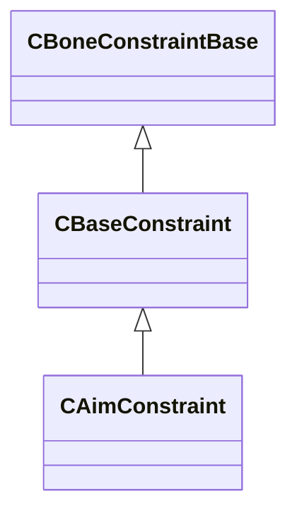

### CAnimAttachment

**Metadata:** `MGetKV3ClassDefaults = Could not parse KV3 Defaults`

**Fields:**

| Name | Type | Annotations |
|------|------|-------------|
| `m_influenceRotations` | Quaternion[3] |  |
| `m_influenceOffsets` | VectorAligned[3] |  |
| `m_influenceIndices` | int32[3] |  |
| `m_influenceWeights` | float32[3] |  |
| `m_numInfluences` | uint8 |  |

### CAnimCycle

**Inherits from:** [CCycleBase](modellib.md#ccyclebase)

**Metadata:** `MGetKV3ClassDefaults = {`, `"m_flCycle": 0.000000`, `}`

**Relationships:**

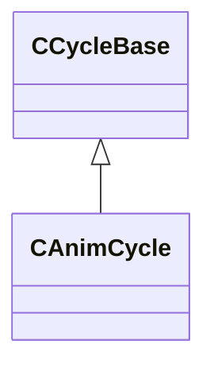

### CAnimFoot

**Metadata:** `MGetKV3ClassDefaults = {`, `"m_name": "",`, `"m_vBallOffset":`, `[`, `0.000000,`, `0.000000,`, `0.000000`, `],`, `"m_vHeelOffset":`, `[`, `0.000000,`, `0.000000,`, `0.000000`, `],`, `"m_ankleBoneIndex": -1,`, `"m_toeBoneIndex": -1`, `}`

### CAnimSkeleton

**Metadata:** `MGetKV3ClassDefaults = {`, `"_class": "CAnimSkeleton",`, `"m_localSpaceTransforms":`, `[`, `],`, `"m_modelSpaceTransforms":`, `[`, `],`, `"m_boneNames":`, `[`, `],`, `"m_children":`, `[`, `],`, `"m_parents":`, `[`, `],`, `"m_feet":`, `[`, `],`, `"m_morphNames":`, `[`, `],`, `"m_lodBoneCounts":`, `[`, `]`, `}`

### CAttachment

**Metadata:** `MGetKV3ClassDefaults = {`, `"m_name": "",`, `"m_influenceNames":`, `[`, `"",`, `"",`, `""`, `],`, `"m_vInfluenceRotations":`, `[`, `[`, `0.000000,`, `0.000000,`, `0.000000,`, `1.000000`, `],`, `[`, `0.000000,`, `0.000000,`, `0.000000,`, `1.000000`, `],`, `[`, `0.000000,`, `0.000000,`, `0.000000,`, `1.000000`, `]`, `],`, `"m_vInfluenceOffsets":`, `[`, `[`, `0.000000,`, `0.000000,`, `0.000000`, `],`, `[`, `0.000000,`, `0.000000,`, `0.000000`, `],`, `[`, `0.000000,`, `0.000000,`, `0.000000`, `]`, `],`, `"m_influenceWeights":`, `[`, `0.000000,`, `0.000000,`, `0.000000`, `],`, `"m_bInfluenceRootTransform":`, `[`, `false,`, `false,`, `false`, `],`, `"m_nInfluences": 0,`, `"m_bIgnoreRotation": false`, `}`

### CBaseConstraint

**Inherits from:** [CBoneConstraintBase](modellib.md#cboneconstraintbase)

**Derived by:** [CAimConstraint](modellib.md#caimconstraint), [CBoneConstraintPoseSpaceBone](modellib.md#cboneconstraintposespacebone), [CMorphConstraint](modellib.md#cmorphconstraint), [COrientConstraint](modellib.md#corientconstraint), [CParentConstraint](modellib.md#cparentconstraint), [CPointConstraint](modellib.md#cpointconstraint), [CTiltTwistConstraint](modellib.md#ctilttwistconstraint), [CTwistConstraint](modellib.md#ctwistconstraint)

**Metadata:** `MGetKV3ClassDefaults = Could not parse KV3 Defaults`

**Relationships:**

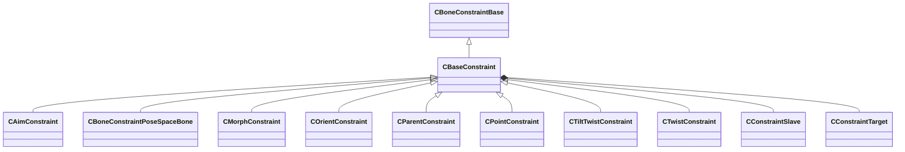

**Fields:**

| Name | Type | Annotations |
|------|------|-------------|
| `m_name` | CUtlString |  |
| `m_vUpVector` | Vector |  |
| `m_slaves` | CUtlLeanVector< [CConstraintSlave](../schemas/modellib.md#cconstraintslave) > |  |
| `m_targets` | CUtlVector< [CConstraintTarget](../schemas/modellib.md#cconstrainttarget) > |  |

### CBoneConstraintBase

**Derived by:** [CBaseConstraint](modellib.md#cbaseconstraint), [CBoneConstraintDotToMorph](modellib.md#cboneconstraintdottomorph), [CBoneConstraintPoseSpaceMorph](modellib.md#cboneconstraintposespacemorph), [CBoneConstraintRbf](modellib.md#cboneconstraintrbf)

**Metadata:** `MGetKV3ClassDefaults = Could not parse KV3 Defaults`

**Relationships:**

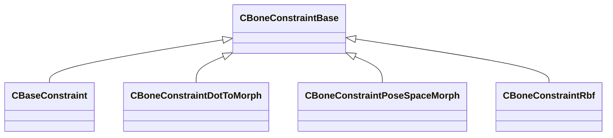

### CBoneConstraintDotToMorph

**Inherits from:** [CBoneConstraintBase](modellib.md#cboneconstraintbase)

**Metadata:** `MGetKV3ClassDefaults = {`, `"_class": "CBoneConstraintDotToMorph",`, `"m_sBoneName": "",`, `"m_sTargetBoneName": "",`, `"m_sMorphChannelName": "",`, `"m_flRemap":`, `[`, `0.000000,`, `180.000000,`, `0.000000,`, `1.000000`, `]`, `}`

**Relationships:**

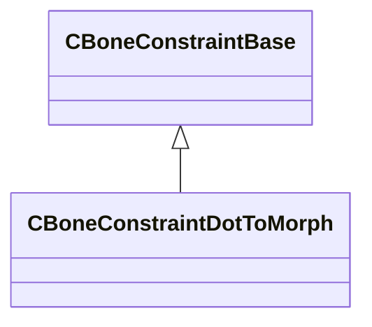

### CBoneConstraintPoseSpaceBone

**Inherits from:** [CBaseConstraint](modellib.md#cbaseconstraint)

**Metadata:** `MGetKV3ClassDefaults = {`, `"_class": "CBoneConstraintPoseSpaceBone",`, `"m_name": "",`, `"m_vUpVector":`, `[`, `0.000000,`, `0.000000,`, `0.000000`, `],`, `"m_slaves":`, `[`, `],`, `"m_targets":`, `[`, `],`, `"m_inputList":`, `[`, `],`, `"m_eRbfType": 0,`, `"m_flFalloff": 1.000000`, `}`

**Relationships:**

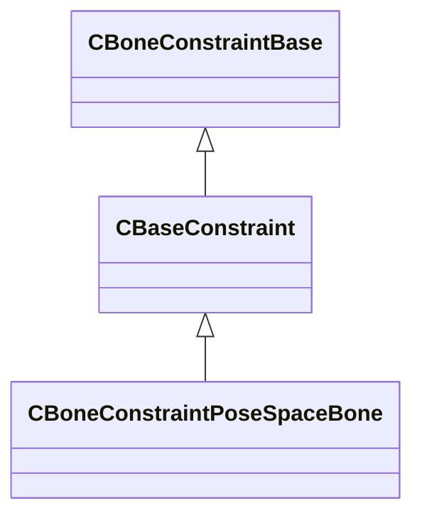

### CBoneConstraintPoseSpaceBone

**Fields:**

| Name | Type | Annotations |
|------|------|-------------|
| `m_inputValue` | Vector |  |
| `m_outputTransformList` | CUtlVector< CTransform > |  |

### CBoneConstraintPoseSpaceMorph

**Inherits from:** [CBoneConstraintBase](modellib.md#cboneconstraintbase)

**Metadata:** `MGetKV3ClassDefaults = {`, `"_class": "CBoneConstraintPoseSpaceMorph",`, `"m_sBoneName": "",`, `"m_sAttachmentName": "",`, `"m_outputMorph":`, `[`, `],`, `"m_inputList":`, `[`, `],`, `"m_bClamp": false,`, `"m_eRbfType": 0,`, `"m_flFalloff": 1.000000`, `}`

**Relationships:**

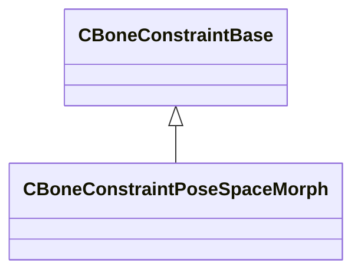

### CBoneConstraintPoseSpaceMorph

**Fields:**

| Name | Type | Annotations |
|------|------|-------------|
| `m_inputValue` | Vector |  |
| `m_outputWeightList` | CUtlVector< float32 > |  |

### CBoneConstraintRbf

**Inherits from:** [CBoneConstraintBase](modellib.md#cboneconstraintbase)

**Metadata:** `MGetKV3ClassDefaults = {`, `"_class": "CBoneConstraintRbf",`, `"m_inputBones":`, `[`, `],`, `"m_outputBones":`, `[`, `],`, `"m_rbfParameters": "[BINARY BLOB]"`, `}`

**Relationships:**

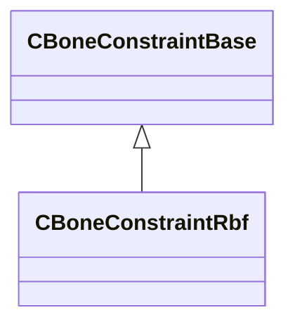

### CConstraintSlave

**Metadata:** `MGetKV3ClassDefaults = {`, `"m_qBaseOrientation":`, `[`, `0.000000,`, `0.000000,`, `0.000000,`, `1.000000`, `],`, `"m_vBasePosition":`, `[`, `0.000000,`, `0.000000,`, `0.000000`, `],`, `"m_nBoneHash": 0,`, `"m_flWeight": 0.000000,`, `"m_sName": ""`, `}`

### CConstraintTarget

**Metadata:** `MGetKV3ClassDefaults = {`, `"m_qOffset":`, `[`, `0.000000,`, `0.000000,`, `0.000000,`, `1.000000`, `],`, `"m_vOffset":`, `[`, `0.000000,`, `0.000000,`, `0.000000`, `],`, `"m_nBoneHash": 0,`, `"m_sName": "",`, `"m_flWeight": 0.000000,`, `"m_bIsAttachment": false`, `}`

### CCycleBase

**Derived by:** [CAnimCycle](modellib.md#canimcycle), [CFootCycle](modellib.md#cfootcycle)

**Metadata:** `MGetKV3ClassDefaults = {`, `"m_flCycle": 0.000000`, `}`

**Relationships:**

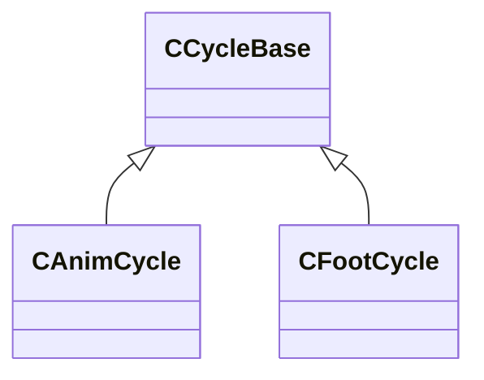

### CDrawCullingData

**Metadata:** `MGetKV3ClassDefaults = {`, `"m_ConeAxis":`, `[`, `0,`, `0,`, `0`, `],`, `"m_ConeCutoff": 0`, `}`

### CFlexController

**Metadata:** `MGetKV3ClassDefaults = {`, `"m_szName": "",`, `"m_szType": "",`, `"min": 0.000000,`, `"max": 0.000000`, `}`

### CFlexDesc

**Metadata:** `MGetKV3ClassDefaults = {`, `"m_szFacs": ""`, `}`

### CFlexOp

**Metadata:** `MGetKV3ClassDefaults = {`, `"m_OpCode": 0,`, `"m_Data": 0`, `}`

### CFlexRule

**Metadata:** `MGetKV3ClassDefaults = {`, `"m_nFlex": 0,`, `"m_FlexOps":`, `[`, `]`, `}`

### CFootCycle

**Inherits from:** [CCycleBase](modellib.md#ccyclebase)

**Metadata:** `MGetKV3ClassDefaults = {`, `"m_flCycle": 0.000000`, `}`

**Relationships:**

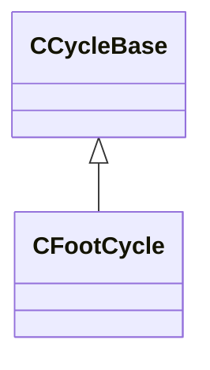

### CFootCycleDefinition

**Metadata:** `MGetKV3ClassDefaults = {`, `"m_vStancePositionMS":`, `[`, `0.000000,`, `0.000000,`, `0.000000`, `],`, `"m_vMidpointPositionMS":`, `[`, `0.000000,`, `0.000000,`, `0.000000`, `],`, `"m_flStanceDirectionMS": 0.000000,`, `"m_vToStrideStartPos":`, `[`, `0.000000,`, `0.000000,`, `0.000000`, `],`, `"m_stanceCycle":`, `{`, `"m_flCycle": 0.000000`, `},`, `"m_footLiftCycle":`, `{`, `"m_flCycle": 0.000000`, `},`, `"m_footOffCycle":`, `{`, `"m_flCycle": 0.000000`, `},`, `"m_footStrikeCycle":`, `{`, `"m_flCycle": 0.000000`, `},`, `"m_footLandCycle":`, `{`, `"m_flCycle": 0.000000`, `}`, `}`

### CFootDefinition

**Metadata:** `MGetKV3ClassDefaults = {`, `"m_name": "",`, `"m_ankleBoneName": "",`, `"m_toeBoneName": "",`, `"m_vBallOffset":`, `[`, `0.000000,`, `0.000000,`, `0.000000`, `],`, `"m_vHeelOffset":`, `[`, `0.000000,`, `0.000000,`, `0.000000`, `],`, `"m_flFootLength": -1.000000,`, `"m_flBindPoseDirectionMS": 0.000000,`, `"m_flTraceHeight": -1.000000,`, `"m_flTraceRadius": -1.000000`, `}`

### CFootMotion

**Metadata:** `MGetKV3ClassDefaults = {`, `"m_strides":`, `[`, `],`, `"m_name": "",`, `"m_bAdditive": false`, `}`

### CFootStride

**Metadata:** `MGetKV3ClassDefaults = {`, `"m_definition":`, `{`, `"m_vStancePositionMS":`, `[`, `0.000000,`, `0.000000,`, `0.000000`, `],`, `"m_vMidpointPositionMS":`, `[`, `0.000000,`, `0.000000,`, `0.000000`, `],`, `"m_flStanceDirectionMS": 0.000000,`, `"m_vToStrideStartPos":`, `[`, `0.000000,`, `0.000000,`, `0.000000`, `],`, `"m_stanceCycle":`, `{`, `"m_flCycle": 0.000000`, `},`, `"m_footLiftCycle":`, `{`, `"m_flCycle": 0.000000`, `},`, `"m_footOffCycle":`, `{`, `"m_flCycle": 0.000000`, `},`, `"m_footStrikeCycle":`, `{`, `"m_flCycle": 0.000000`, `},`, `"m_footLandCycle":`, `{`, `"m_flCycle": 0.000000`, `}`, `},`, `"m_trajectories":`, `{`, `"m_trajectories":`, `[`, `]`, `}`, `}`

### CFootTrajectories

**Metadata:** `MGetKV3ClassDefaults = {`, `"m_trajectories":`, `[`, `]`, `}`

### CFootTrajectory

**Metadata:** `MGetKV3ClassDefaults = {`, `"m_vOffset":`, `[`, `0.000000,`, `0.000000,`, `0.000000`, `],`, `"m_flRotationOffset": 0.000000,`, `"m_flProgression": 0.000000`, `}`

### CHitBox

**Metadata:** `MGetKV3ClassDefaults = {`, `"m_name": "",`, `"m_sSurfaceProperty": "",`, `"m_sBoneName": "",`, `"m_vMinBounds":`, `[`, `0.000000,`, `0.000000,`, `0.000000`, `],`, `"m_vMaxBounds":`, `[`, `0.000000,`, `0.000000,`, `0.000000`, `],`, `"m_flShapeRadius": 0.000000,`, `"m_nBoneNameHash": 0,`, `"m_nGroupId": 0,`, `"m_nShapeType": 0,`, `"m_bTranslationOnly": false,`, `"m_CRC": 0,`, `"m_cRenderColor":`, `[`, `255,`, `255,`, `255`, `],`, `"m_nHitBoxIndex": 0`, `}`

### CHitBoxSet

**Metadata:** `MGetKV3ClassDefaults = {`, `"m_name": "",`, `"m_nNameHash": 0,`, `"m_HitBoxes":`, `[`, `],`, `"m_SourceFilename": ""`, `}`

### CHitBoxSetList

**Metadata:** `MGetKV3ClassDefaults = {`, `"m_HitBoxSets":`, `[`, `]`, `}`

### CMaterialDrawDescriptor

**Metadata:** `MGetKV3ClassDefaults = {`, `"m_flUvDensity": 0.000000,`, `"m_vTintColor":`, `[`, `1.000000,`, `1.000000,`, `1.000000`, `],`, `"m_flAlpha": 1.000000,`, `"m_nNumMeshlets": 0,`, `"m_nFirstMeshlet": 0,`, `"m_nAppliedIndexOffset": 0,`, `"m_nDepthVertexBufferIndex": 255,`, `"m_nMeshletPackedIVBIndex": 255,`, `"m_rigidMeshParts":`, `[`, `],`, `"m_nPrimitiveType": "RENDER_PRIM_TRIANGLES",`, `"m_nBaseVertex": 0,`, `"m_nVertexCount": 0,`, `"m_nStartIndex": 0,`, `"m_nIndexCount": 0,`, `"m_indexBuffer":`, `{`, `"m_hBuffer": 0,`, `"m_nBindOffsetBytes": 0`, `},`, `"m_meshletPackedIVB":`, `{`, `"m_hBuffer": 0,`, `"m_nBindOffsetBytes": 0`, `},`, `"m_material": "",`, `"m_vertexBuffers":`, `[`, `]`, `}`

### CMaterialDrawDescriptor

**Metadata:** `MGetKV3ClassDefaults = {`, `"m_nRigidBLASIndex": 0,`, `"m_nBoneIndex": -1,`, `"m_nStartIndexOffset": 0,`, `"m_nPrimitiveCount": 0`, `}`

### CMeshletDescriptor

**Metadata:** `MGetKV3ClassDefaults = {`, `"m_PackedAABB":`, `{`, `"m_nMin": 0,`, `"m_nMax": 0`, `},`, `"m_CullingData":`, `{`, `"m_ConeAxis":`, `[`, `0,`, `0,`, `0`, `],`, `"m_ConeCutoff": 0`, `},`, `"m_nVertexOffset": 0,`, `"m_nTriangleOffset": 0,`, `"m_nVertexCount": 0,`, `"m_nTriangleCount": 0`, `}`

### CModelConfig

**Metadata:** `MGetKV3ClassDefaults = {`, `"m_ConfigName": "",`, `"m_Elements":`, `[`, `],`, `"m_bTopLevel": false,`, `"m_bActiveInEditorByDefault": false`, `}`

### CModelConfigElement

**Derived by:** [CModelConfigElement_AttachedModel](modellib.md#cmodelconfigelement_attachedmodel), [CModelConfigElement_Command](modellib.md#cmodelconfigelement_command), [CModelConfigElement_RandomColor](modellib.md#cmodelconfigelement_randomcolor), [CModelConfigElement_RandomPick](modellib.md#cmodelconfigelement_randompick), [CModelConfigElement_SetBodygroup](modellib.md#cmodelconfigelement_setbodygroup), [CModelConfigElement_SetBodygroupOnAttachedModels](modellib.md#cmodelconfigelement_setbodygrouponattachedmodels), [CModelConfigElement_SetMaterialGroup](modellib.md#cmodelconfigelement_setmaterialgroup), [CModelConfigElement_SetMaterialGroupOnAttachedModels](modellib.md#cmodelconfigelement_setmaterialgrouponattachedmodels), [CModelConfigElement_SetRenderColor](modellib.md#cmodelconfigelement_setrendercolor), [CModelConfigElement_UserPick](modellib.md#cmodelconfigelement_userpick)

**Metadata:** `MGetKV3ClassDefaults = Could not parse KV3 Defaults`

**Relationships:**

```mermaid
classDiagram
    CModelConfigElement <|-- CModelConfigElement_AttachedModel
    CModelConfigElement <|-- CModelConfigElement_Command
    CModelConfigElement <|-- CModelConfigElement_RandomColor
    CModelConfigElement <|-- CModelConfigElement_RandomPick
    CModelConfigElement <|-- CModelConfigElement_SetBodygroup
    CModelConfigElement <|-- CModelConfigElement_SetBodygroupOnAttachedModels
    CModelConfigElement <|-- CModelConfigElement_SetMaterialGroup
    CModelConfigElement <|-- CModelConfigElement_SetMaterialGroupOnAttachedModels
    CModelConfigElement <|-- CModelConfigElement_SetRenderColor
    CModelConfigElement <|-- CModelConfigElement_UserPick
```

**Fields:**

| Name | Type | Annotations |
|------|------|-------------|
| `m_ElementName` | CUtlString |  |
| `m_NestedElements` | CUtlVector< [CModelConfigElement](../schemas/modellib.md#cmodelconfigelement)* > |  |

### CModelConfigElement_AttachedModel

**Inherits from:** [CModelConfigElement](modellib.md#cmodelconfigelement)

**Metadata:** `MGetKV3ClassDefaults = {`, `"_class": "CModelConfigElement_AttachedModel",`, `"m_ElementName": "",`, `"m_NestedElements":`, `[`, `],`, `"m_InstanceName": "",`, `"m_EntityClass": "",`, `"m_hModel": "",`, `"m_vOffset":`, `[`, `0.000000,`, `0.000000,`, `0.000000`, `],`, `"m_aAngOffset":`, `[`, `0.000000,`, `0.000000,`, `0.000000`, `],`, `"m_AttachmentName": "",`, `"m_LocalAttachmentOffsetName": "",`, `"m_AttachmentType": "MODEL_CONFIG_ATTACHMENT_ROOT_RELATIVE",`, `"m_bBoneMergeFlex": false,`, `"m_bUserSpecifiedColor": false,`, `"m_bUserSpecifiedMaterialGroup": false,`, `"m_BodygroupOnOtherModels": "",`, `"m_MaterialGroupOnOtherModels": ""`, `}`

**Relationships:**

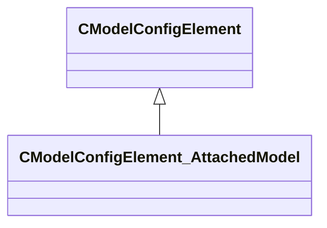

### CModelConfigElement_Command

**Inherits from:** [CModelConfigElement](modellib.md#cmodelconfigelement)

**Metadata:** `MGetKV3ClassDefaults = {`, `"_class": "CModelConfigElement_Command",`, `"m_ElementName": "",`, `"m_NestedElements":`, `[`, `],`, `"m_Command": "",`, `"m_Args": null`, `}`

**Relationships:**

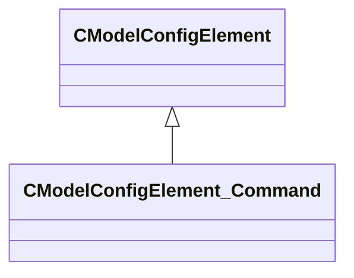

### CModelConfigElement_RandomColor

**Inherits from:** [CModelConfigElement](modellib.md#cmodelconfigelement)

**Metadata:** `MGetKV3ClassDefaults = {`, `"_class": "CModelConfigElement_RandomColor",`, `"m_ElementName": "",`, `"m_NestedElements":`, `[`, `],`, `"m_Gradient":`, `{`, `"m_Stops":`, `[`, `]`, `}`, `}`

**Relationships:**

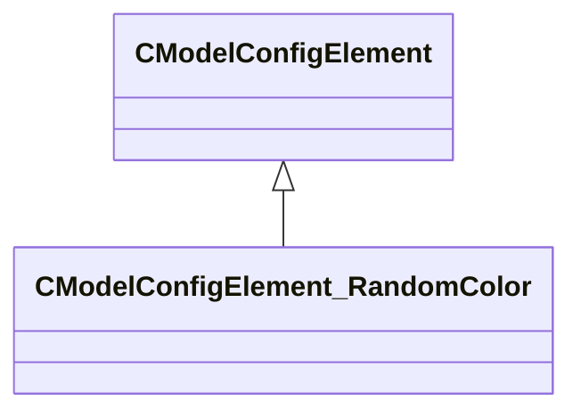

### CModelConfigElement_RandomPick

**Inherits from:** [CModelConfigElement](modellib.md#cmodelconfigelement)

**Metadata:** `MGetKV3ClassDefaults = {`, `"_class": "CModelConfigElement_RandomPick",`, `"m_ElementName": "",`, `"m_NestedElements":`, `[`, `],`, `"m_Choices":`, `[`, `],`, `"m_ChoiceWeights":`, `[`, `]`, `}`

**Relationships:**

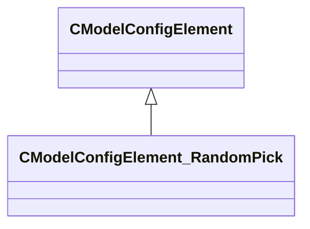

### CModelConfigElement_SetBodygroup

**Inherits from:** [CModelConfigElement](modellib.md#cmodelconfigelement)

**Metadata:** `MGetKV3ClassDefaults = {`, `"_class": "CModelConfigElement_SetBodygroup",`, `"m_ElementName": "",`, `"m_NestedElements":`, `[`, `],`, `"m_GroupName": "",`, `"m_nChoice": 0`, `}`

**Relationships:**

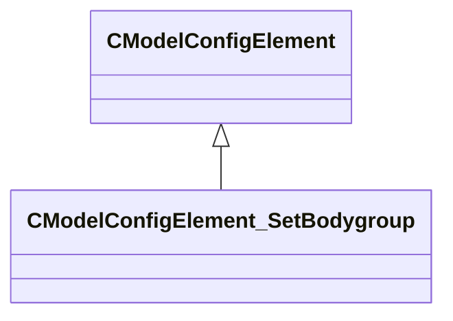

### CModelConfigElement_SetBodygroupOnAttachedModels

**Inherits from:** [CModelConfigElement](modellib.md#cmodelconfigelement)

**Metadata:** `MGetKV3ClassDefaults = {`, `"_class": "CModelConfigElement_SetBodygroupOnAttachedModels",`, `"m_ElementName": "",`, `"m_NestedElements":`, `[`, `],`, `"m_GroupName": "",`, `"m_nChoice": 0`, `}`

**Relationships:**

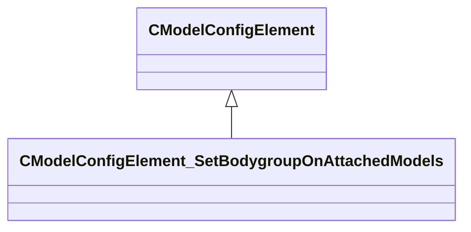

### CModelConfigElement_SetMaterialGroup

**Inherits from:** [CModelConfigElement](modellib.md#cmodelconfigelement)

**Metadata:** `MGetKV3ClassDefaults = {`, `"_class": "CModelConfigElement_SetMaterialGroup",`, `"m_ElementName": "",`, `"m_NestedElements":`, `[`, `],`, `"m_MaterialGroupName": ""`, `}`

**Relationships:**

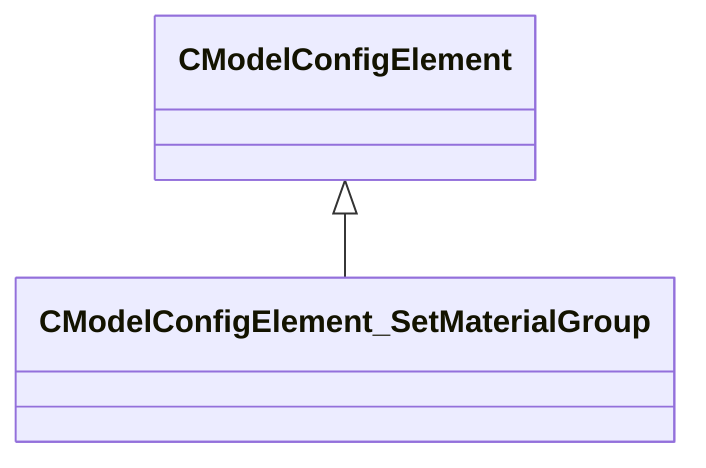

### CModelConfigElement_SetMaterialGroupOnAttachedModels

**Inherits from:** [CModelConfigElement](modellib.md#cmodelconfigelement)

**Metadata:** `MGetKV3ClassDefaults = {`, `"_class": "CModelConfigElement_SetMaterialGroupOnAttachedModels",`, `"m_ElementName": "",`, `"m_NestedElements":`, `[`, `],`, `"m_MaterialGroupName": ""`, `}`

**Relationships:**

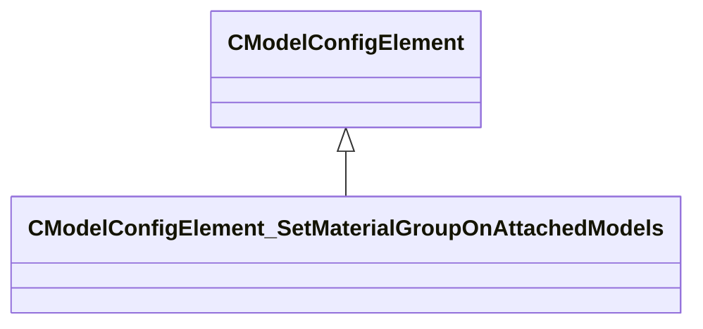

### CModelConfigElement_SetRenderColor

**Inherits from:** [CModelConfigElement](modellib.md#cmodelconfigelement)

**Metadata:** `MGetKV3ClassDefaults = {`, `"_class": "CModelConfigElement_SetRenderColor",`, `"m_ElementName": "",`, `"m_NestedElements":`, `[`, `],`, `"m_Color":`, `[`, `255,`, `255,`, `255`, `]`, `}`

**Relationships:**

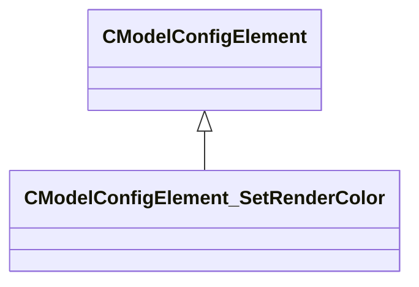

### CModelConfigElement_UserPick

**Inherits from:** [CModelConfigElement](modellib.md#cmodelconfigelement)

**Metadata:** `MGetKV3ClassDefaults = {`, `"_class": "CModelConfigElement_UserPick",`, `"m_ElementName": "",`, `"m_NestedElements":`, `[`, `],`, `"m_Choices":`, `[`, `]`, `}`

**Relationships:**

```mermaid
classDiagram
    CModelConfigElement <|-- CModelConfigElement_UserPick
```

### CModelConfigList

**Metadata:** `MGetKV3ClassDefaults = {`, `"m_bHideMaterialGroupInTools": false,`, `"m_bHideRenderColorInTools": false,`, `"m_Configs":`, `[`, `]`, `}`

### CMorphBundleData

**Metadata:** `MGetKV3ClassDefaults = {`, `"m_flULeftSrc": 0.000000,`, `"m_flVTopSrc": 0.000000,`, `"m_offsets":`, `[`, `],`, `"m_ranges":`, `[`, `]`, `}`

### CMorphConstraint

**Inherits from:** [CBaseConstraint](modellib.md#cbaseconstraint)

**Metadata:** `MGetKV3ClassDefaults = {`, `"_class": "CMorphConstraint",`, `"m_name": "",`, `"m_vUpVector":`, `[`, `0.000000,`, `0.000000,`, `0.000000`, `],`, `"m_slaves":`, `[`, `],`, `"m_targets":`, `[`, `],`, `"m_sTargetMorph": "",`, `"m_nSlaveChannel": 0,`, `"m_flMin": 0.000000,`, `"m_flMax": 1.000000`, `}`

**Relationships:**

```mermaid
classDiagram
    CBaseConstraint <|-- CMorphConstraint
    CBoneConstraintBase <|-- CBaseConstraint
```

### CMorphData

**Metadata:** `MGetKV3ClassDefaults = {`, `"m_name": "",`, `"m_morphRectDatas":`, `[`, `]`, `}`

### CMorphRectData

**Metadata:** `MGetKV3ClassDefaults = {`, `"m_nXLeftDst": 0,`, `"m_nYTopDst": 0,`, `"m_flUWidthSrc": 0.000000,`, `"m_flVHeightSrc": 0.000000,`, `"m_bundleDatas":`, `[`, `]`, `}`

### CMorphSetData

**Metadata:** `MGetKV3ClassDefaults = {`, `"m_nWidth": 0,`, `"m_nHeight": 0,`, `"m_bundleTypes":`, `[`, `],`, `"m_morphDatas":`, `[`, `],`, `"m_pTextureAtlas": "",`, `"m_FlexDesc":`, `[`, `],`, `"m_FlexControllers":`, `[`, `],`, `"m_FlexRules":`, `[`, `]`, `}`

### CNPCPhysicsHull

**Metadata:** `MGetKV3ClassDefaults = {`, `"m_sName": "",`, `"m_eType": "eInvalid",`, `"m_flCapsuleHeight": 50.000000,`, `"m_flCapsuleRadius": 11.000000,`, `"m_vCapsuleCenter1":`, `[`, `0.000000,`, `0.000000,`, `11.000000`, `],`, `"m_vCapsuleCenter2":`, `[`, `0.000000,`, `0.000000,`, `61.000000`, `],`, `"m_flGroundBoxHeight": 50.000000,`, `"m_flGroundBoxWidth": 11.000000`, `}`, `MModelGameData`, `MFgdHelper = "game_data_list{ key = 'CNPCPhysicsHull' }"`, `MFgdHelper = "npcphysicshull{}"`

### COrientConstraint

**Inherits from:** [CBaseConstraint](modellib.md#cbaseconstraint)

**Metadata:** `MGetKV3ClassDefaults = {`, `"_class": "COrientConstraint",`, `"m_name": "",`, `"m_vUpVector":`, `[`, `0.000000,`, `0.000000,`, `0.000000`, `],`, `"m_slaves":`, `[`, `],`, `"m_targets":`, `[`, `]`, `}`

**Relationships:**

```mermaid
classDiagram
    CBaseConstraint <|-- COrientConstraint
    CBoneConstraintBase <|-- CBaseConstraint
```

### CParentConstraint

**Inherits from:** [CBaseConstraint](modellib.md#cbaseconstraint)

**Metadata:** `MGetKV3ClassDefaults = {`, `"_class": "CParentConstraint",`, `"m_name": "",`, `"m_vUpVector":`, `[`, `0.000000,`, `0.000000,`, `0.000000`, `],`, `"m_slaves":`, `[`, `],`, `"m_targets":`, `[`, `]`, `}`

**Relationships:**

```mermaid
classDiagram
    CBaseConstraint <|-- CParentConstraint
    CBoneConstraintBase <|-- CBaseConstraint
```

### CPhysSurfaceProperties

**Metadata:** `MGetKV3ClassDefaults = {`, `"surfacePropertyName": "",`, `"m_nameHash": 0,`, `"m_baseNameHash": 0,`, `"hidden": false,`, `"description": "",`, `"physics":`, `{`, `"friction": 0.000000,`, `"elasticity": 0.000000,`, `"density": 0.000000,`, `"thickness": 0.100000,`, `"softcontactfrequency": 0.000000,`, `"softcontactdampingratio": 0.000000`, `},`, `"vehicleparams":`, `{`, `"wheeldrag": 0.000000,`, `"wheelfrictionscale": 1.000000`, `},`, `"audiosounds":`, `{`, `"impactsoft": "",`, `"impacthard": "",`, `"scrapesmooth": "",`, `"scraperough": "",`, `"bulletimpact": "",`, `"rolling": "",`, `"break": "",`, `"strain": "",`, `"meleeimpact": "",`, `"pushoff": "",`, `"skidstop": "",`, `"resonant": ""`, `},`, `"audioparams":`, `{`, `"audioreflectivity": 0.000000,`, `"audiohardnessfactor": 0.000000,`, `"audioroughnessfactor": 0.000000,`, `"scrapeRoughThreshold": 0.000000,`, `"impactHardThreshold": 0.000000,`, `"audioHardMinVelocity": 0.000000,`, `"staticImpactVolume": 0.000000,`, `"occlusionFactor": 0.000000`, `}`, `}`

### CPhysSurfacePropertiesAudio

**Metadata:** `MGetKV3ClassDefaults = {`, `"audioreflectivity": 0.000000,`, `"audiohardnessfactor": 0.000000,`, `"audioroughnessfactor": 0.000000,`, `"scrapeRoughThreshold": 0.000000,`, `"impactHardThreshold": 0.000000,`, `"audioHardMinVelocity": 0.000000,`, `"staticImpactVolume": 0.000000,`, `"occlusionFactor": 0.000000`, `}`

### CPhysSurfacePropertiesPhysics

**Metadata:** `MGetKV3ClassDefaults = {`, `"friction": 0.000000,`, `"elasticity": 0.000000,`, `"density": 0.000000,`, `"thickness": 0.100000,`, `"softcontactfrequency": 0.000000,`, `"softcontactdampingratio": 0.000000`, `}`

### CPhysSurfacePropertiesSoundNames

**Metadata:** `MGetKV3ClassDefaults = {`, `"impactsoft": "",`, `"impacthard": "",`, `"scrapesmooth": "",`, `"scraperough": "",`, `"bulletimpact": "",`, `"rolling": "",`, `"break": "",`, `"strain": "",`, `"meleeimpact": "",`, `"pushoff": "",`, `"skidstop": "",`, `"resonant": ""`, `}`

### CPhysSurfacePropertiesVehicle

**Metadata:** `MGetKV3ClassDefaults = {`, `"wheeldrag": 0.000000,`, `"wheelfrictionscale": 1.000000`, `}`

### CPointConstraint

**Inherits from:** [CBaseConstraint](modellib.md#cbaseconstraint)

**Metadata:** `MGetKV3ClassDefaults = {`, `"_class": "CPointConstraint",`, `"m_name": "",`, `"m_vUpVector":`, `[`, `0.000000,`, `0.000000,`, `0.000000`, `],`, `"m_slaves":`, `[`, `],`, `"m_targets":`, `[`, `]`, `}`

**Relationships:**

```mermaid
classDiagram
    CBaseConstraint <|-- CPointConstraint
    CBoneConstraintBase <|-- CBaseConstraint
```

### CRenderBufferBinding

**Metadata:** `MGetKV3ClassDefaults = {`, `"m_hBuffer": 0,`, `"m_nBindOffsetBytes": 0`, `}`

### CRenderGroom

**Metadata:** `MGetKV3ClassDefaults = {`, `"m_hairs":`, `[`, `],`, `"m_hairPositionOffsets":`, `[`, `],`, `"m_hSimParamsMat": "",`, `"m_strandSegmentCountHist":`, `[`, `],`, `"m_nMaxSegmentsPerHairStrand": 0,`, `"m_nGuideHairCount": 0,`, `"m_nHairCount": 0,`, `"m_nTotalVertexCount": 0,`, `"m_nTotalSegmentCount": 0,`, `"m_nGroomGroupID": 0,`, `"m_nAttachBoneIdx": 0,`, `"m_nAttachMeshIdx": -1,`, `"m_nAttachMeshDrawCallIdx": -1,`, `"m_bEnableSimulation": false`, `}`

### CRenderMesh

**Metadata:** `MGetKV3ClassDefaults = {`, `"_class": "CRenderMesh",`, `"m_sceneObjects":`, `[`, `],`, `"m_constraints":`, `[`, `],`, `"m_skeleton":`, `{`, `"m_bones":`, `[`, `],`, `"m_boneParents":`, `[`, `],`, `"m_nBoneWeightCount": 4`, `},`, `"m_bUseUV2ForCharting": false,`, `"m_bEmbeddedMapMesh": false,`, `"m_meshDeformParams":`, `{`, `"m_flTensionCompressScale": 0.000000,`, `"m_flTensionStretchScale": 0.000000,`, `"m_bRecomputeSmoothNormalsAfterAnimation": false,`, `"m_bComputeDynamicMeshTensionAfterAnimation": false,`, `"m_bSmoothNormalsAcrossUvSeams": false,`, `"m_bEnableEyeBulgeDeformation": false`, `},`, `"m_pGroomData": null,`, `"m_attachments":`, `[`, `],`, `"m_hitboxsets":`, `[`, `],`, `"m_morphSet": ""`, `}`

### CRenderSkeleton

**Metadata:** `MGetKV3ClassDefaults = {`, `"m_bones":`, `[`, `],`, `"m_boneParents":`, `[`, `],`, `"m_nBoneWeightCount": 4`, `}`

### CSceneObjectData

**Metadata:** `MGetKV3ClassDefaults = {`, `"m_vMinBounds":`, `[`, `340282346638528859811704183484516925440.000000,`, `340282346638528859811704183484516925440.000000,`, `340282346638528859811704183484516925440.000000`, `],`, `"m_vMaxBounds":`, `[`, `-340282346638528859811704183484516925440.000000,`, `-340282346638528859811704183484516925440.000000,`, `-340282346638528859811704183484516925440.000000`, `],`, `"m_drawCalls":`, `[`, `],`, `"m_drawBounds":`, `[`, `],`, `"m_meshlets":`, `[`, `],`, `"m_rtProxyDrawCalls":`, `[`, `],`, `"m_vTintColor":`, `[`, `0.000000,`, `0.000000,`, `0.000000,`, `0.000000`, `]`, `}`

### CSceneObjectData

**Metadata:** `MGetKV3ClassDefaults = {`, `"m_drawDesc":`, `{`, `"m_flUvDensity": 0.000000,`, `"m_vTintColor":`, `[`, `1.000000,`, `1.000000,`, `1.000000`, `],`, `"m_flAlpha": 1.000000,`, `"m_nNumMeshlets": 0,`, `"m_nFirstMeshlet": 0,`, `"m_nAppliedIndexOffset": 0,`, `"m_nDepthVertexBufferIndex": 255,`, `"m_nMeshletPackedIVBIndex": 255,`, `"m_rigidMeshParts":`, `[`, `],`, `"m_nPrimitiveType": "RENDER_PRIM_TRIANGLES",`, `"m_nBaseVertex": 0,`, `"m_nVertexCount": 0,`, `"m_nStartIndex": 0,`, `"m_nIndexCount": 0,`, `"m_indexBuffer":`, `{`, `"m_hBuffer": 0,`, `"m_nBindOffsetBytes": 0`, `},`, `"m_meshletPackedIVB":`, `{`, `"m_hBuffer": 0,`, `"m_nBindOffsetBytes": 0`, `},`, `"m_material": "",`, `"m_vertexBuffers":`, `[`, `]`, `},`, `"m_mWorldFromLocal":`, `[`, `0.000000,`, `0.000000,`, `0.000000,`, `0.000000,`, `0.000000,`, `0.000000,`, `0.000000,`, `0.000000,`, `0.000000,`, `0.000000,`, `0.000000,`, `0.000000`, `],`, `"m_nVertexAlbedoFormat": "VERTEX_ALBEDO_NONE",`, `"m_nVertexAlbedoVB": -1,`, `"m_nVertexAlbedoOffset": 0,`, `"m_nVertexAlbedoStride": 0`, `}`

### CTiltTwistConstraint

**Inherits from:** [CBaseConstraint](modellib.md#cbaseconstraint)

**Metadata:** `MGetKV3ClassDefaults = {`, `"_class": "CTiltTwistConstraint",`, `"m_name": "",`, `"m_vUpVector":`, `[`, `0.000000,`, `0.000000,`, `0.000000`, `],`, `"m_slaves":`, `[`, `],`, `"m_targets":`, `[`, `],`, `"m_nTargetAxis": 0,`, `"m_nSlaveAxis": 0`, `}`

**Relationships:**

```mermaid
classDiagram
    CBaseConstraint <|-- CTiltTwistConstraint
    CBoneConstraintBase <|-- CBaseConstraint
```

### CTwistConstraint

**Inherits from:** [CBaseConstraint](modellib.md#cbaseconstraint)

**Metadata:** `MGetKV3ClassDefaults = {`, `"_class": "CTwistConstraint",`, `"m_name": "",`, `"m_vUpVector":`, `[`, `0.000000,`, `0.000000,`, `0.000000`, `],`, `"m_slaves":`, `[`, `],`, `"m_targets":`, `[`, `],`, `"m_bInverse": false,`, `"m_qParentBindRotation":`, `[`, `0.000000,`, `0.000000,`, `0.000000,`, `1.000000`, `],`, `"m_qChildBindRotation":`, `[`, `0.000000,`, `0.000000,`, `0.000000,`, `1.000000`, `]`, `}`

**Relationships:**

```mermaid
classDiagram
    CBaseConstraint <|-- CTwistConstraint
    CBoneConstraintBase <|-- CBaseConstraint
```

### CVPhysXSurfacePropertiesList

**Metadata:** `MGetKV3ClassDefaults = {`, `"SurfacePropertiesList":`, `[`, `]`, `}`

### DynamicMeshDeformParams_t

**Metadata:** `MGetKV3ClassDefaults = {`, `"m_flTensionCompressScale": 0.000000,`, `"m_flTensionStretchScale": 0.000000,`, `"m_bRecomputeSmoothNormalsAfterAnimation": false,`, `"m_bComputeDynamicMeshTensionAfterAnimation": false,`, `"m_bSmoothNormalsAcrossUvSeams": false,`, `"m_bEnableEyeBulgeDeformation": false`, `}`

### FlexOpCode_t

**Values:**

| Name | Value |
|------|-------|
| `FLEX_OP_CONST` | 1 |
| `FLEX_OP_FETCH1` | 2 |
| `FLEX_OP_FETCH2` | 3 |
| `FLEX_OP_ADD` | 4 |
| `FLEX_OP_SUB` | 5 |
| `FLEX_OP_MUL` | 6 |
| `FLEX_OP_DIV` | 7 |
| `FLEX_OP_NEG` | 8 |
| `FLEX_OP_EXP` | 9 |
| `FLEX_OP_OPEN` | 10 |
| `FLEX_OP_CLOSE` | 11 |
| `FLEX_OP_COMMA` | 12 |
| `FLEX_OP_MAX` | 13 |
| `FLEX_OP_MIN` | 14 |
| `FLEX_OP_2WAY_0` | 15 |
| `FLEX_OP_2WAY_1` | 16 |
| `FLEX_OP_NWAY` | 17 |
| `FLEX_OP_COMBO` | 18 |
| `FLEX_OP_DOMINATE` | 19 |
| `FLEX_OP_DME_LOWER_EYELID` | 20 |
| `FLEX_OP_DME_UPPER_EYELID` | 21 |
| `FLEX_OP_SQRT` | 22 |
| `FLEX_OP_REMAPVALCLAMPED` | 23 |
| `FLEX_OP_SIN` | 24 |
| `FLEX_OP_COS` | 25 |
| `FLEX_OP_ABS` | 26 |

### InputLayoutVariation_t

**Values:**

| Name | Value |
|------|-------|
| `INPUT_LAYOUT_VARIATION_DEFAULT` | 0 |
| `INPUT_LAYOUT_VARIATION_STREAM1_INSTANCEID` | 1 |
| `INPUT_LAYOUT_VARIATION_STREAM1_INSTANCEID_MORPH_VERT_ID` | 2 |
| `INPUT_LAYOUT_VARIATION_MAX` | 3 |

### MaterialGroup_t

**Metadata:** `MGetKV3ClassDefaults = {`, `"m_name": "",`, `"m_materials":`, `[`, `]`, `}`

### MeshDrawPrimitiveFlags_t

**Values:**

| Name | Value |
|------|-------|
| `MESH_DRAW_FLAGS_NONE` | 0 |
| `MESH_DRAW_FLAGS_USE_SHADOW_FAST_PATH` | 1 |
| `MESH_DRAW_FLAGS_USE_COMPRESSED_NORMAL_TANGENT` | 2 |
| `MESH_DRAW_INPUT_LAYOUT_IS_NOT_MATCHED_TO_MATERIAL` | 8 |
| `MESH_DRAW_FLAGS_USE_COMPRESSED_PER_VERTEX_LIGHTING` | 16 |
| `MESH_DRAW_FLAGS_USE_UNCOMPRESSED_PER_VERTEX_LIGHTING` | 32 |
| `MESH_DRAW_FLAGS_CAN_BATCH_WITH_DYNAMIC_SHADER_CONSTANTS` | 64 |
| `MESH_DRAW_FLAGS_DRAW_LAST` | 128 |

### ModelAnimGraph2Ref_t

**Metadata:** `MGetKV3ClassDefaults = {`, `"m_sIdentifier": "",`, `"m_hGraph": ""`, `}`

### ModelBoneFlexComponent_t

**Values:**

| Name | Value |
|------|-------|
| `MODEL_BONE_FLEX_INVALID` | -1 |
| `MODEL_BONE_FLEX_TX` | 0 |
| `MODEL_BONE_FLEX_TY` | 1 |
| `MODEL_BONE_FLEX_TZ` | 2 |

### ModelBoneFlexDriverControl_t

**Metadata:** `MGetKV3ClassDefaults = {`, `"m_nBoneComponent": "MODEL_BONE_FLEX_TX",`, `"m_flexController": "",`, `"m_flexControllerToken": 0,`, `"m_flMin": 0.000000,`, `"m_flMax": 0.000000`, `}`

### ModelBoneFlexDriver_t

**Metadata:** `MGetKV3ClassDefaults = {`, `"m_boneName": "",`, `"m_boneNameToken": 0,`, `"m_controls":`, `[`, `]`, `}`

### ModelConfigAttachmentType_t

**Values:**

| Name | Value |
|------|-------|
| `MODEL_CONFIG_ATTACHMENT_INVALID` | -1 |
| `MODEL_CONFIG_ATTACHMENT_BONE_OR_ATTACHMENT` | 0 |
| `MODEL_CONFIG_ATTACHMENT_ROOT_RELATIVE` | 1 |
| `MODEL_CONFIG_ATTACHMENT_BONEMERGE` | 2 |
| `MODEL_CONFIG_ATTACHMENT_COUNT` | 3 |

### ModelEmbeddedMesh_t

**Metadata:** `MGetKV3ClassDefaults = {`, `"m_Name": "",`, `"m_nMeshIndex": -1,`, `"m_nDataBlock": -1,`, `"m_nMorphBlock": -1,`, `"m_vertexBuffers":`, `[`, `],`, `"m_indexBuffers":`, `[`, `],`, `"m_toolsBuffers":`, `[`, `],`, `"m_nVBIBBlock": -1,`, `"m_nToolsVBBlock": -1`, `}`

### ModelMeshBufferData_t

**Metadata:** `MGetKV3ClassDefaults = {`, `"m_nBlockIndex": -1,`, `"m_nElementCount": 0,`, `"m_nElementSizeInBytes": 0,`, `"m_bMeshoptCompressed": false,`, `"m_bMeshoptIndexSequence": false,`, `"m_bCompressedZSTD": false,`, `"m_bCreateBufferSRV": false,`, `"m_bCreateBufferUAV": false,`, `"m_bCreateRawBuffer": false,`, `"m_bCreatePooledBuffer": false,`, `"m_nBufferUsage": 0,`, `"m_inputLayoutFields":`, `[`, `]`, `}`

### ModelMeshBufferUsage_t

**Values:**

| Name | Value |
|------|-------|
| `MESH_BUFFER_USAGE_NONE` | 0 |
| `MESH_BUFFER_USAGE_VB` | 1 |
| `MESH_BUFFER_USAGE_IB` | 2 |
| `MESH_BUFFER_USAGE_ADJACENCY` | 4 |
| `MESH_BUFFER_USAGE_MESHLET_TRIS` | 8 |
| `MESH_BUFFER_USAGE_RT_PROXY` | 16 |
| `MESH_BUFFER_USAGE_VERTEX_ALBEDO` | 32 |

### ModelSkeletonData_t

**Metadata:** `MGetKV3ClassDefaults = {`, `"m_boneName":`, `[`, `],`, `"m_nParent":`, `[`, `],`, `"m_boneSphere":`, `[`, `],`, `"m_nFlag":`, `[`, `],`, `"m_bonePosParent":`, `[`, `],`, `"m_boneRotParent":`, `[`, `],`, `"m_boneScaleParent":`, `[`, `]`, `}`

### ModelSkeletonData_t

**Values:**

| Name | Value |
|------|-------|
| `FLAG_NO_BONE_FLAGS` | 0 |
| `FLAG_BONEFLEXDRIVER` | 4 |
| `FLAG_CLOTH` | 8 |
| `FLAG_PHYSICS` | 16 |
| `FLAG_ATTACHMENT` | 32 |
| `FLAG_ANIMATION` | 64 |
| `FLAG_MESH` | 128 |
| `FLAG_HITBOX` | 256 |
| `FLAG_BONE_USED_BY_VERTEX_LOD0` | 1024 |
| `FLAG_BONE_USED_BY_VERTEX_LOD1` | 2048 |
| `FLAG_BONE_USED_BY_VERTEX_LOD2` | 4096 |
| `FLAG_BONE_USED_BY_VERTEX_LOD3` | 8192 |
| `FLAG_BONE_USED_BY_VERTEX_LOD4` | 16384 |
| `FLAG_BONE_USED_BY_VERTEX_LOD5` | 32768 |
| `FLAG_BONE_USED_BY_VERTEX_LOD6` | 65536 |
| `FLAG_BONE_USED_BY_VERTEX_LOD7` | 131072 |
| `FLAG_BONE_MERGE_READ` | 262144 |
| `FLAG_BONE_MERGE_WRITE` | 524288 |
| `FLAG_ALL_BONE_FLAGS` | 1048575 |
| `BLEND_PREALIGNED` | 1048576 |
| `FLAG_RIGIDLENGTH` | 2097152 |
| `FLAG_PROCEDURAL` | 4194304 |

### MorphBundleType_t

**Values:**

| Name | Value |
|------|-------|
| `MORPH_BUNDLE_TYPE_NONE` | 0 |
| `MORPH_BUNDLE_TYPE_POSITION_SPEED` | 1 |
| `MORPH_BUNDLE_TYPE_NORMAL_WRINKLE` | 2 |
| `MORPH_BUNDLE_TYPE_COUNT` | 3 |

### MorphFlexControllerRemapType_t

**Values:**

| Name | Value |
|------|-------|
| `MORPH_FLEXCONTROLLER_REMAP_PASSTHRU` | 0 |
| `MORPH_FLEXCONTROLLER_REMAP_2WAY` | 1 |
| `MORPH_FLEXCONTROLLER_REMAP_NWAY` | 2 |
| `MORPH_FLEXCONTROLLER_REMAP_EYELID` | 3 |

### MovementCapability_t

**Values:**

| Name | Value |
|------|-------|
| `eStrafe` | 0 |
| `eIdleTurn` | 1 |
| `eStart` | 2 |
| `eStop` | 3 |
| `eInstantStop` | 4 |
| `eShuffle` | 5 |
| `ePlantedTurn` | 6 |
| `eCount` | 7 |

### MovementGaitId_t

**Metadata:** `MGetKV3ClassDefaults = {`, `"m_sId": ""`, `}`

### NPCPhysicsHullType_t

**Values:**

| Name | Value |
|------|-------|
| `eInvalid` | 0 |
| `eGroundCapsule` | 1 |
| `eCenteredCapsule` | 2 |
| `eGenericCapsule` | 3 |
| `eGroundBox` | 4 |

### PermModelDataAnimatedMaterialAttribute_t

**Metadata:** `MGetKV3ClassDefaults = {`, `"m_AttributeName": "",`, `"m_nNumChannels": 0`, `}`

### PermModelData_t

**Metadata:** `MGetKV3ClassDefaults = {`, `"m_name": "",`, `"m_modelInfo":`, `{`, `"m_nFlags": 0,`, `"m_vHullMin":`, `[`, `0.000000,`, `0.000000,`, `0.000000`, `],`, `"m_vHullMax":`, `[`, `0.000000,`, `0.000000,`, `0.000000`, `],`, `"m_vViewMin":`, `[`, `0.000000,`, `0.000000,`, `0.000000`, `],`, `"m_vViewMax":`, `[`, `0.000000,`, `0.000000,`, `0.000000`, `],`, `"m_flMass": 0.000000,`, `"m_vEyePosition":`, `[`, `0.000000,`, `0.000000,`, `0.000000`, `],`, `"m_flMaxEyeDeflection": 0.000000,`, `"m_sSurfaceProperty": "",`, `"m_keyValueText": ""`, `},`, `"m_ExtParts":`, `[`, `],`, `"m_refMeshes":`, `[`, `],`, `"m_refMeshGroupMasks":`, `[`, `],`, `"m_refPhysGroupMasks":`, `[`, `],`, `"m_refLODGroupMasks":`, `[`, `],`, `"m_lodGroupSwitchDistances":`, `[`, `],`, `"m_refPhysicsData":`, `[`, `],`, `"m_refPhysicsHitboxData":`, `[`, `],`, `"m_refAnimGroups":`, `[`, `],`, `"m_refSequenceGroups":`, `[`, `],`, `"m_meshGroups":`, `[`, `],`, `"m_materialGroups":`, `[`, `],`, `"m_nDefaultMeshGroupMask": 0,`, `"m_modelSkeleton":`, `{`, `"m_boneName":`, `[`, `],`, `"m_nParent":`, `[`, `],`, `"m_boneSphere":`, `[`, `],`, `"m_nFlag":`, `[`, `],`, `"m_bonePosParent":`, `[`, `],`, `"m_boneRotParent":`, `[`, `],`, `"m_boneScaleParent":`, `[`, `]`, `},`, `"m_remappingTable":`, `[`, `],`, `"m_remappingTableStarts":`, `[`, `],`, `"m_boneFlexDrivers":`, `[`, `],`, `"m_pModelConfigList": null,`, `"m_BodyGroupsHiddenInTools":`, `[`, `],`, `"m_refAnimIncludeModels":`, `[`, `],`, `"m_AnimatedMaterialAttributes":`, `[`, `],`, `"m_animGraph2Refs":`, `[`, `],`, `"m_vecNmSkeletonRefs":`, `[`, `]`, `}`

### PermModelExtPart_t

**Metadata:** `MGetKV3ClassDefaults = {`, `"m_Transform":`, `[`, `0.000000,`, `0.000000,`, `0.000000,`, `0.000000,`, `0.000000,`, `0.000000,`, `0.000000,`, `0.000000`, `],`, `"m_Name": "",`, `"m_nParent": 0,`, `"m_refModel": ""`, `}`

### PermModelInfo_t

**Metadata:** `MGetKV3ClassDefaults = {`, `"m_nFlags": 0,`, `"m_vHullMin":`, `[`, `0.000000,`, `0.000000,`, `0.000000`, `],`, `"m_vHullMax":`, `[`, `0.000000,`, `0.000000,`, `0.000000`, `],`, `"m_vViewMin":`, `[`, `0.000000,`, `0.000000,`, `0.000000`, `],`, `"m_vViewMax":`, `[`, `0.000000,`, `0.000000,`, `0.000000`, `],`, `"m_flMass": 0.000000,`, `"m_vEyePosition":`, `[`, `0.000000,`, `0.000000,`, `0.000000`, `],`, `"m_flMaxEyeDeflection": 0.000000,`, `"m_sSurfaceProperty": "",`, `"m_keyValueText": ""`, `}`

### PermModelInfo_t

**Values:**

| Name | Value |
|------|-------|
| `FLAG_TRANSLUCENT` | 1 |
| `FLAG_TRANSLUCENT_TWO_PASS` | 2 |
| `FLAG_MODEL_IS_RUNTIME_COMBINED` | 4 |
| `FLAG_SOURCE1_IMPORT` | 8 |
| `FLAG_MODEL_PART_CHILD` | 16 |
| `FLAG_NAV_GEN_NONE` | 32 |
| `FLAG_NAV_GEN_HULL` | 64 |
| `FLAG_NO_FORCED_FADE` | 2048 |
| `FLAG_HAS_SKINNED_MESHES` | 1024 |
| `FLAG_DO_NOT_CAST_SHADOWS` | 131072 |
| `FLAG_FORCE_PHONEME_CROSSFADE` | 4096 |
| `FLAG_NO_ANIM_EVENTS` | 1048576 |
| `FLAG_ANIMATION_DRIVEN_FLEXES` | 2097152 |
| `FLAG_IMPLICIT_BIND_POSE_SEQUENCE` | 4194304 |
| `FLAG_MODEL_DOC` | 8388608 |

### PhysShapeMarkup_t

**Metadata:** `MGetKV3ClassDefaults = {`, `"m_nBodyInAggregate": -1,`, `"m_nShapeInBody": -1,`, `"m_sHitGroup": "HITGROUP_INVALID"`, `}`

### PhysSoftbodyDesc_t

**Metadata:** `MGetKV3ClassDefaults = {`, `"m_ParticleBoneHash":`, `[`, `],`, `"m_Particles":`, `[`, `],`, `"m_Springs":`, `[`, `],`, `"m_Capsules":`, `[`, `],`, `"m_InitPose":`, `[`, `],`, `"m_ParticleBoneName":`, `[`, `]`, `}`

### RenderBufferFlags_t

**Values:**

| Name | Value |
|------|-------|
| `RENDER_BUFFER_USAGE_NONE` | 0 |
| `RENDER_BUFFER_USAGE_VERTEX_BUFFER` | 1 |
| `RENDER_BUFFER_USAGE_INDEX_BUFFER` | 2 |
| `RENDER_BUFFER_USAGE_SHADER_RESOURCE` | 4 |
| `RENDER_BUFFER_USAGE_UNORDERED_ACCESS` | 8 |
| `RENDER_BUFFER_BYTEADDRESS_BUFFER` | 16 |
| `RENDER_BUFFER_STRUCTURED_BUFFER` | 32 |
| `RENDER_BUFFER_UAV_DRAW_INDIRECT_ARGS` | 256 |
| `RENDER_BUFFER_ACCELERATION_STRUCTURE` | 512 |
| `RENDER_BUFFER_SHADER_BINDING_TABLE` | 1024 |
| `RENDER_BUFFER_POOL_ALLOCATED` | 2048 |
| `RENDER_BUFFER_USAGE_CONDITIONAL_RENDERING` | 4096 |
| `RENDER_BUFFER_IMMOVABLE_ALLOCATION` | 8192 |

### RenderHairStrandInfo_t

**Metadata:** `MGetKV3ClassDefaults = {`, `"m_nGuideHairIndices_nSurfaceTriIndex":`, `[`, `0,`, `0`, `],`, `"m_vGuideBary_vBaseBary":`, `[`, `0,`, `0,`, `0,`, `0`, `],`, `"m_vRootOffset_flLengthScale":`, `[`, `0,`, `0,`, `0,`, `0`, `],`, `"m_nPackedBaseUv":`, `[`, `0,`, `0`, `],`, `"m_nPackedSurfaceNormalOs": 0,`, `"m_nPackedSurfaceTangentOs": 0,`, `"m_nDataOffset_Segments": 0`, `}`

### RenderInputLayoutField_t

**Relationships:**

```mermaid
classDiagram
    RenderInputLayoutField_t *-- RenderSlotType_t
```

**Fields:**

| Name | Type | Annotations |
|------|------|-------------|
| `m_pSemanticName` | char[32] |  |
| `m_nSemanticIndex` | int8 |  |
| `m_nOffset` | int16 |  |
| `m_nSlot` | int8 |  |
| `m_nSlotType` | [RenderSlotType_t](../schemas/modellib.md#renderslottype_t) |  |
| `m_szShaderSemantic` | char[32] |  |

### RenderMeshSlotType_t

**Values:**

| Name | Value |
|------|-------|
| `RENDERMESH_SLOT_INVALID` | -1 |
| `RENDERMESH_SLOT_PER_VERTEX` | 0 |
| `RENDERMESH_SLOT_PER_INSTANCE` | 1 |

### RenderMultisampleType_t

**Values:**

| Name | Value |
|------|-------|
| `RENDER_MULTISAMPLE_INVALID` | -1 |
| `RENDER_MULTISAMPLE_NONE` | 0 |
| `RENDER_MULTISAMPLE_2X` | 1 |
| `RENDER_MULTISAMPLE_4X` | 2 |
| `RENDER_MULTISAMPLE_6X` | 3 |
| `RENDER_MULTISAMPLE_8X` | 4 |
| `RENDER_MULTISAMPLE_16X` | 5 |
| `RENDER_MULTISAMPLE_TYPE_COUNT` | 6 |

### RenderPrimitiveType_t

**Values:**

| Name | Value |
|------|-------|
| `RENDER_PRIM_POINTS` | 0 |
| `RENDER_PRIM_LINES` | 1 |
| `RENDER_PRIM_LINES_WITH_ADJACENCY` | 2 |
| `RENDER_PRIM_LINE_STRIP` | 3 |
| `RENDER_PRIM_LINE_STRIP_WITH_ADJACENCY` | 4 |
| `RENDER_PRIM_TRIANGLES` | 5 |
| `RENDER_PRIM_TRIANGLES_WITH_ADJACENCY` | 6 |
| `RENDER_PRIM_TRIANGLE_STRIP` | 7 |
| `RENDER_PRIM_TRIANGLE_STRIP_WITH_ADJACENCY` | 8 |
| `RENDER_PRIM_INSTANCED_QUADS` | 9 |
| `RENDER_PRIM_HETEROGENOUS` | 10 |
| `RENDER_PRIM_COMPUTE_SHADER` | 11 |
| `RENDER_PRIM_MESH_SHADER` | 12 |
| `RENDER_PRIM_TYPE_COUNT` | 13 |

### RenderSkeletonBone_t

**Metadata:** `MGetKV3ClassDefaults = {`, `"m_boneName": "",`, `"m_parentName": "",`, `"m_invBindPose":`, `[`, `1.000000,`, `0.000000,`, `0.000000,`, `0.000000,`, `0.000000,`, `1.000000,`, `0.000000,`, `0.000000,`, `0.000000,`, `0.000000,`, `1.000000,`, `0.000000`, `],`, `"m_bbox":`, `{`, `"m_vecCenter":`, `[`, `0.000000,`, `0.000000,`, `0.000000`, `],`, `"m_vecSize":`, `[`, `0.000000,`, `0.000000,`, `0.000000`, `]`, `},`, `"m_flSphereRadius": 0.000000`, `}`

### RenderSlotType_t

**Values:**

| Name | Value |
|------|-------|
| `RENDER_SLOT_INVALID` | -1 |
| `RENDER_SLOT_PER_VERTEX` | 0 |
| `RENDER_SLOT_PER_INSTANCE` | 1 |

### ScriptedHeldWeaponBehavior_t

**Values:**

| Name | Value |
|------|-------|
| `eInvalid` | -1 |
| `eHolster` | 0 |
| `eDeploy` | 1 |
| `eDrop` | 2 |

### ScriptedMoveTo_t

**Values:**

| Name | Value |
|------|-------|
| `eWait` | 0 |
| `eMoveWithGait` | 3 |
| `eTeleport` | 4 |
| `eWaitFacing` | 5 |
| `eObsoleteBackCompat1` | 1 |
| `eObsoleteBackCompat2` | 2 |

### SharedMovementGait_t

**Values:**

| Name | Value |
|------|-------|
| `eInvalid` | -1 |
| `eSlow` | 0 |
| `eMedium` | 1 |
| `eFast` | 2 |
| `eVeryFast` | 3 |
| `eCount` | 4 |

### SheetSequenceIntegerId_t

**Metadata:** `MIsBoxedIntegerType`

**Fields:**

| Name | Type | Annotations |
|------|------|-------------|
| `m_Value` | uint32 |  |

### SkeletonAnimCapture_t

**Metadata:** `MGetKV3ClassDefaults = {`, `"m_nEntIndex": -1,`, `"m_nEntParent": -1,`, `"m_ImportedCollision":`, `[`, `],`, `"m_ModelName": "",`, `"m_CaptureName": "",`, `"m_ModelBindPose":`, `[`, `],`, `"m_FeModelInitPose":`, `[`, `],`, `"m_nFlexControllers": 0,`, `"m_bPredicted": false,`, `"m_Frames":`, `[`, `]`, `}`

### SkeletonAnimCapture_t

**Metadata:** `MGetKV3ClassDefaults = {`, `"m_Name": "",`, `"m_BindPose":`, `[`, `0.000000,`, `0.000000,`, `0.000000,`, `0.000000,`, `0.000000,`, `0.000000,`, `0.000000,`, `0.000000`, `],`, `"m_nParent": -1`, `}`

### SkeletonAnimCapture_t

**Metadata:** `MGetKV3ClassDefaults = {`, `"m_tmCamera":`, `[`, `0.000000,`, `0.000000,`, `0.000000,`, `1.000000,`, `0.000000,`, `0.000000,`, `0.000000,`, `1.000000`, `],`, `"m_flTime": 0.000000`, `}`

### SkeletonAnimCapture_t

**Metadata:** `MGetKV3ClassDefaults = {`, `"m_flTime": 0.000000,`, `"m_flEntitySimTime": 0.000000,`, `"m_bTeleportTick": false,`, `"m_bPredicted": false,`, `"m_flCurTime": 0.000000,`, `"m_flRealTime": 0.000000,`, `"m_nFrameCount": 0,`, `"m_nTickCount": 0`, `}`

### SkeletonAnimCapture_t

**Metadata:** `MGetKV3ClassDefaults = {`, `"m_flTime": 0.000000,`, `"m_Stamp":`, `{`, `"m_flTime": 0.000000,`, `"m_flEntitySimTime": 0.000000,`, `"m_bTeleportTick": false,`, `"m_bPredicted": false,`, `"m_flCurTime": 0.000000,`, `"m_flRealTime": 0.000000,`, `"m_nFrameCount": 0,`, `"m_nTickCount": 0`, `},`, `"m_Transform":`, `[`, `0.000000,`, `0.000000,`, `0.000000,`, `0.000000,`, `0.000000,`, `0.000000,`, `0.000000,`, `0.000000`, `],`, `"m_bTeleport": false,`, `"m_CompositeBones":`, `[`, `],`, `"m_SimStateBones":`, `[`, `],`, `"m_FeModelAnims":`, `[`, `],`, `"m_FeModelPos":`, `[`, `],`, `"m_FlexControllerWeights":`, `[`, `]`, `}`

### SkeletonBoneBounds_t

**Metadata:** `MGetKV3ClassDefaults = {`, `"m_vecCenter":`, `[`, `0.000000,`, `0.000000,`, `0.000000`, `],`, `"m_vecSize":`, `[`, `0.000000,`, `0.000000,`, `0.000000`, `]`, `}`

### SkeletonDemoDb_t

**Metadata:** `MGetKV3ClassDefaults = {`, `"m_AnimCaptures":`, `[`, `],`, `"m_CameraTrack":`, `[`, `],`, `"m_flRecordingTime": 0.000000`, `}`

### VPhysXAggregateData_t

**Metadata:** `MGetKV3ClassDefaults = {`, `"m_nFlags": 0,`, `"m_nRefCounter": 0,`, `"m_bonesHash":`, `[`, `],`, `"m_boneNames":`, `[`, `],`, `"m_indexNames":`, `[`, `],`, `"m_indexHash":`, `[`, `],`, `"m_bindPose":`, `[`, `],`, `"m_parts":`, `[`, `],`, `"m_shapeMarkups":`, `[`, `],`, `"m_constraints2":`, `[`, `],`, `"m_joints":`, `[`, `],`, `"m_pFeModel": null,`, `"m_boneParents":`, `[`, `],`, `"m_surfacePropertyHashes":`, `[`, `],`, `"m_collisionAttributes":`, `[`, `],`, `"m_debugPartNames":`, `[`, `],`, `"m_embeddedKeyvalues": ""`, `}`

### VPhysXAggregateData_t

**Values:**

| Name | Value |
|------|-------|
| `FLAG_IS_POLYSOUP_GEOMETRY` | 1 |
| `FLAG_LEVEL_COLLISION` | 16 |
| `FLAG_IGNORE_SCALE_OBSOLETE_DO_NOT_USE` | 32 |

### VPhysXBodyPart_t

**Metadata:** `MGetKV3ClassDefaults = {`, `"m_nFlags": 0,`, `"m_flMass": 0.000000,`, `"m_rnShape":`, `{`, `"m_spheres":`, `[`, `],`, `"m_capsules":`, `[`, `],`, `"m_hulls":`, `[`, `],`, `"m_meshes":`, `[`, `],`, `"m_CollisionAttributeIndices":`, `[`, `]`, `},`, `"m_nCollisionAttributeIndex": 0,`, `"m_nReserved": 0,`, `"m_flInertiaScale": 0.000000,`, `"m_flLinearDamping": 0.000000,`, `"m_flAngularDamping": 0.000000,`, `"m_flLinearDrag": 1.000000,`, `"m_flAngularDrag": 1.000000,`, `"m_bOverrideMassCenter": false,`, `"m_vMassCenterOverride":`, `[`, `0.000000,`, `0.000000,`, `0.000000`, `]`, `}`

### VPhysXBodyPart_t

**Values:**

| Name | Value |
|------|-------|
| `FLAG_STATIC` | 1 |
| `FLAG_KINEMATIC` | 2 |
| `FLAG_JOINT` | 4 |
| `FLAG_MASS` | 8 |
| `FLAG_ALWAYS_DYNAMIC_ON_CLIENT` | 16 |
| `FLAG_DISABLE_CCD` | 32 |

### VPhysXCollisionAttributes_t

**Metadata:** `MGetKV3ClassDefaults = {`, `"m_nIncludeDetailLayerCount": 0,`, `"m_CollisionGroup": 0,`, `"m_InteractAs":`, `[`, `],`, `"m_InteractWith":`, `[`, `],`, `"m_InteractExclude":`, `[`, `],`, `"m_DetailLayers":`, `[`, `],`, `"m_CollisionGroupString": "",`, `"m_InteractAsStrings":`, `[`, `],`, `"m_InteractWithStrings":`, `[`, `],`, `"m_InteractExcludeStrings":`, `[`, `],`, `"m_DetailLayerStrings":`, `[`, `]`, `}`

### VPhysXConstraint2_t

**Metadata:** `MGetKV3ClassDefaults = {`, `"m_nFlags": 0,`, `"m_nParent": 0,`, `"m_nChild": 0,`, `"m_params":`, `{`, `"m_nType": 0,`, `"m_nTranslateMotion": 0,`, `"m_nRotateMotion": 0,`, `"m_nFlags": 0,`, `"m_anchor":`, `[`, `[`, `0.000000,`, `0.000000,`, `0.000000`, `],`, `[`, `0.000000,`, `0.000000,`, `0.000000`, `]`, `],`, `"m_axes":`, `[`, `[`, `0.000000,`, `0.000000,`, `0.000000,`, `0.000000`, `],`, `[`, `0.000000,`, `0.000000,`, `0.000000,`, `0.000000`, `]`, `],`, `"m_maxForce": 0.000000,`, `"m_maxTorque": 0.000000,`, `"m_linearLimitValue": 0.000000,`, `"m_linearLimitRestitution": 0.000000,`, `"m_linearLimitSpring": 0.000000,`, `"m_linearLimitDamping": 0.000000,`, `"m_twistLowLimitValue": 0.000000,`, `"m_twistLowLimitRestitution": 0.000000,`, `"m_twistLowLimitSpring": 0.000000,`, `"m_twistLowLimitDamping": 0.000000,`, `"m_twistHighLimitValue": 0.000000,`, `"m_twistHighLimitRestitution": 0.000000,`, `"m_twistHighLimitSpring": 0.000000,`, `"m_twistHighLimitDamping": 0.000000,`, `"m_swing1LimitValue": 0.000000,`, `"m_swing1LimitRestitution": 0.000000,`, `"m_swing1LimitSpring": 0.000000,`, `"m_swing1LimitDamping": 0.000000,`, `"m_swing2LimitValue": 0.000000,`, `"m_swing2LimitRestitution": 0.000000,`, `"m_swing2LimitSpring": 0.000000,`, `"m_swing2LimitDamping": 0.000000,`, `"m_goalPosition":`, `[`, `0.000000,`, `0.000000,`, `0.000000`, `],`, `"m_goalOrientation":`, `[`, `0.000000,`, `0.000000,`, `0.000000,`, `0.000000`, `],`, `"m_goalAngularVelocity":`, `[`, `0.000000,`, `0.000000,`, `0.000000`, `],`, `"m_driveSpringX": 0.000000,`, `"m_driveSpringY": 0.000000,`, `"m_driveSpringZ": 0.000000,`, `"m_driveDampingX": 0.000000,`, `"m_driveDampingY": 0.000000,`, `"m_driveDampingZ": 0.000000,`, `"m_driveSpringTwist": 0.000000,`, `"m_driveSpringSwing": 0.000000,`, `"m_driveSpringSlerp": 0.000000,`, `"m_driveDampingTwist": 0.000000,`, `"m_driveDampingSwing": 0.000000,`, `"m_driveDampingSlerp": 0.000000,`, `"m_solverIterationCount": 0,`, `"m_projectionLinearTolerance": 0.000000,`, `"m_projectionAngularTolerance": 0.000000`, `}`, `}`

### VPhysXConstraintParams_t

**Metadata:** `MGetKV3ClassDefaults = {`, `"m_nType": 0,`, `"m_nTranslateMotion": 0,`, `"m_nRotateMotion": 0,`, `"m_nFlags": 0,`, `"m_anchor":`, `[`, `[`, `0.000000,`, `0.000000,`, `0.000000`, `],`, `[`, `0.000000,`, `0.000000,`, `0.000000`, `]`, `],`, `"m_axes":`, `[`, `[`, `0.000000,`, `0.000000,`, `0.000000,`, `0.000000`, `],`, `[`, `0.000000,`, `0.000000,`, `0.000000,`, `0.000000`, `]`, `],`, `"m_maxForce": 0.000000,`, `"m_maxTorque": 0.000000,`, `"m_linearLimitValue": 0.000000,`, `"m_linearLimitRestitution": 0.000000,`, `"m_linearLimitSpring": 0.000000,`, `"m_linearLimitDamping": 0.000000,`, `"m_twistLowLimitValue": 0.000000,`, `"m_twistLowLimitRestitution": 0.000000,`, `"m_twistLowLimitSpring": 0.000000,`, `"m_twistLowLimitDamping": 0.000000,`, `"m_twistHighLimitValue": 0.000000,`, `"m_twistHighLimitRestitution": 0.000000,`, `"m_twistHighLimitSpring": 0.000000,`, `"m_twistHighLimitDamping": 0.000000,`, `"m_swing1LimitValue": 0.000000,`, `"m_swing1LimitRestitution": 0.000000,`, `"m_swing1LimitSpring": 0.000000,`, `"m_swing1LimitDamping": 0.000000,`, `"m_swing2LimitValue": 0.000000,`, `"m_swing2LimitRestitution": 0.000000,`, `"m_swing2LimitSpring": 0.000000,`, `"m_swing2LimitDamping": 0.000000,`, `"m_goalPosition":`, `[`, `0.000000,`, `0.000000,`, `0.000000`, `],`, `"m_goalOrientation":`, `[`, `0.000000,`, `0.000000,`, `0.000000,`, `0.000000`, `],`, `"m_goalAngularVelocity":`, `[`, `0.000000,`, `0.000000,`, `0.000000`, `],`, `"m_driveSpringX": 0.000000,`, `"m_driveSpringY": 0.000000,`, `"m_driveSpringZ": 0.000000,`, `"m_driveDampingX": 0.000000,`, `"m_driveDampingY": 0.000000,`, `"m_driveDampingZ": 0.000000,`, `"m_driveSpringTwist": 0.000000,`, `"m_driveSpringSwing": 0.000000,`, `"m_driveSpringSlerp": 0.000000,`, `"m_driveDampingTwist": 0.000000,`, `"m_driveDampingSwing": 0.000000,`, `"m_driveDampingSlerp": 0.000000,`, `"m_solverIterationCount": 0,`, `"m_projectionLinearTolerance": 0.000000,`, `"m_projectionAngularTolerance": 0.000000`, `}`

### VPhysXConstraintParams_t

**Values:**

| Name | Value |
|------|-------|
| `FLAG0_SHIFT_INTERPENETRATE` | 0 |
| `FLAG0_SHIFT_CONSTRAIN` | 1 |
| `FLAG0_SHIFT_BREAKABLE_FORCE` | 2 |
| `FLAG0_SHIFT_BREAKABLE_TORQUE` | 3 |

### VPhysXJoint_t

**Metadata:** `MGetKV3ClassDefaults = {`, `"m_nType": 0,`, `"m_nBody1": 0,`, `"m_nBody2": 0,`, `"m_nFlags": 0,`, `"m_Frame1":`, `[`, `0.000000,`, `0.000000,`, `0.000000,`, `1.000000,`, `0.000000,`, `0.000000,`, `0.000000,`, `1.000000`, `],`, `"m_Frame2":`, `[`, `0.000000,`, `0.000000,`, `0.000000,`, `1.000000,`, `0.000000,`, `0.000000,`, `0.000000,`, `1.000000`, `],`, `"m_bEnableCollision": false,`, `"m_bIsLinearConstraintDisabled": false,`, `"m_bIsAngularConstraintDisabled": false,`, `"m_bEnableLinearLimit": false,`, `"m_LinearLimit":`, `{`, `"m_flMin": 0.000000,`, `"m_flMax": 0.000000`, `},`, `"m_bEnableLinearMotor": false,`, `"m_vLinearTargetVelocity":`, `[`, `0.000000,`, `0.000000,`, `0.000000`, `],`, `"m_flMaxForce": 0.000000,`, `"m_bEnableSwingLimit": false,`, `"m_SwingLimit":`, `{`, `"m_flMin": 0.000000,`, `"m_flMax": 0.000000`, `},`, `"m_bEnableTwistLimit": false,`, `"m_TwistLimit":`, `{`, `"m_flMin": 0.000000,`, `"m_flMax": 0.000000`, `},`, `"m_bEnableAngularMotor": false,`, `"m_vAngularTargetVelocity":`, `[`, `0.000000,`, `0.000000,`, `0.000000`, `],`, `"m_flMaxTorque": 0.000000,`, `"m_flLinearFrequency": 0.000000,`, `"m_flLinearDampingRatio": 0.000000,`, `"m_flAngularFrequency": 0.000000,`, `"m_flAngularDampingRatio": 0.000000,`, `"m_flFriction": 0.000000,`, `"m_flElasticity": 0.000000,`, `"m_flElasticDamping": 0.000000,`, `"m_flPlasticity": 0.000000,`, `"m_Tag": ""`, `}`

### VPhysXJoint_t

**Values:**

| Name | Value |
|------|-------|
| `JOINT_FLAGS_NONE` | 0 |
| `JOINT_FLAGS_BODY1_FIXED` | 1 |
| `JOINT_FLAGS_USE_BLOCK_SOLVER` | 2 |

### VPhysXRange_t

**Metadata:** `MGetKV3ClassDefaults = {`, `"m_flMin": 0.000000,`, `"m_flMax": 0.000000`, `}`

### VPhysics2ShapeDef_t

**Metadata:** `MGetKV3ClassDefaults = {`, `"m_spheres":`, `[`, `],`, `"m_capsules":`, `[`, `],`, `"m_hulls":`, `[`, `],`, `"m_meshes":`, `[`, `],`, `"m_CollisionAttributeIndices":`, `[`, `]`, `}`

### VertexAlbedoFormat_t

**Values:**

| Name | Value |
|------|-------|
| `VERTEX_ALBEDO_NONE` | 0 |
| `VERTEX_ALBEDO_8888` | 1 |
| `VERTEX_ALBEDO_565` | 2 |

### VsInputSignatureElement_t

**Fields:**

| Name | Type | Annotations |
|------|------|-------------|
| `m_pName` | char[64] |  |
| `m_pSemantic` | char[64] |  |
| `m_pD3DSemanticName` | char[64] |  |
| `m_nD3DSemanticIndex` | int32 |  |

### VsInputSignature_t

**Relationships:**

```mermaid
classDiagram
    VsInputSignature_t *-- VsInputSignatureElement_t
```

**Fields:**

| Name | Type | Annotations |
|------|------|-------------|
| `m_elems` | CUtlVector< [VsInputSignatureElement_t](../schemas/modellib.md#vsinputsignatureelement_t) > |  |
| `m_depth_elems` | CUtlVector< [VsInputSignatureElement_t](../schemas/modellib.md#vsinputsignatureelement_t) > |  |
