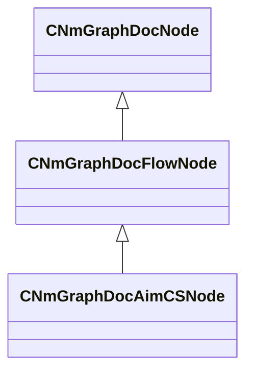
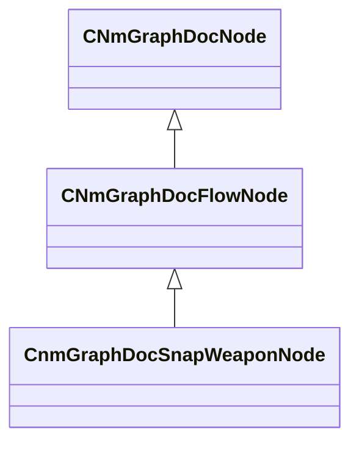

# Module: modtools

[📊 View UML Diagram](../diagrams/modtools.md)

| Name | Kind | Bases | Fields |
|------|------|-------|--------|
| [CNmGraphDocAimCSNode](#cnmgraphdocaimcsnode) | class | CNmGraphDocFlowNode | 0 |
| [CnmGraphDocSnapWeaponNode](#cnmgraphdocsnapweaponnode) | class | CNmGraphDocFlowNode | 0 |

---

### CNmGraphDocAimCSNode

**Inherits from:** [CNmGraphDocFlowNode](animdoclib.md#cnmgraphdocflownode)

**Metadata:** `MGetKV3ClassDefaults = {`, `"_class": "CNmGraphDocAimCSNode",`, `"m_ID": <HIDDEN FOR DIFF>,`, `"m_name": "",`, `"m_floatingComment": "",`, `"m_position":`, `[`, `0.000000,`, `0.000000`, `],`, `"m_pChildGraph": null,`, `"m_pSecondaryGraph": null,`, `"m_inputPins":`, `[`, `{`, `"m_ID": <HIDDEN FOR DIFF>,`, `"m_name": "Input",`, `"m_type": "Pose",`, `"m_bIsDynamicPin": false,`, `"m_bAllowMultipleOutConnections": false`, `},`, `{`, `"m_ID": <HIDDEN FOR DIFF>,`, `"m_name": "Horizontal Aim Angle",`, `"m_type": "Float",`, `"m_bIsDynamicPin": false,`, `"m_bAllowMultipleOutConnections": false`, `},`, `{`, `"m_ID": <HIDDEN FOR DIFF>,`, `"m_name": "Vertical Aim Angle",`, `"m_type": "Float",`, `"m_bIsDynamicPin": false,`, `"m_bAllowMultipleOutConnections": false`, `},`, `{`, `"m_ID": <HIDDEN FOR DIFF>,`, `"m_name": "Weapon Category",`, `"m_type": "ID",`, `"m_bIsDynamicPin": false,`, `"m_bAllowMultipleOutConnections": false`, `},`, `{`, `"m_ID": <HIDDEN FOR DIFF>,`, `"m_name": "Weapon Type",`, `"m_type": "ID",`, `"m_bIsDynamicPin": false,`, `"m_bAllowMultipleOutConnections": false`, `},`, `{`, `"m_ID": <HIDDEN FOR DIFF>,`, `"m_name": "Weapon Action",`, `"m_type": "ID",`, `"m_bIsDynamicPin": false,`, `"m_bAllowMultipleOutConnections": false`, `},`, `{`, `"m_ID": <HIDDEN FOR DIFF>,`, `"m_name": "Weapon Drop",`, `"m_type": "Float",`, `"m_bIsDynamicPin": false,`, `"m_bAllowMultipleOutConnections": false`, `},`, `{`, `"m_ID": <HIDDEN FOR DIFF>,`, `"m_name": "Crouch Weight",`, `"m_type": "Float",`, `"m_bIsDynamicPin": false,`, `"m_bAllowMultipleOutConnections": false`, `},`, `{`, `"m_ID": <HIDDEN FOR DIFF>,`, `"m_name": "Is Defusing",`, `"m_type": "Bool",`, `"m_bIsDynamicPin": false,`, `"m_bAllowMultipleOutConnections": false`, `}`, `],`, `"m_outputPins":`, `[`, `{`, `"m_ID": <HIDDEN FOR DIFF>,`, `"m_name": "Result",`, `"m_type": "Pose",`, `"m_bIsDynamicPin": false,`, `"m_bAllowMultipleOutConnections": true`, `}`, `],`, `"m_flActionBlendTimeSeconds": 0.400000,`, `"m_flHandIKBlendInTimeSeconds": 0.300000,`, `"m_flPlantingBlendTimeSeconds": 0.200000`, `}`

**Relationships:**

### CnmGraphDocSnapWeaponNode

**Inherits from:** [CNmGraphDocFlowNode](animdoclib.md#cnmgraphdocflownode)

**Metadata:** `MGetKV3ClassDefaults = {`, `"_class": "CnmGraphDocSnapWeaponNode",`, `"m_ID": <HIDDEN FOR DIFF>,`, `"m_name": "",`, `"m_floatingComment": "",`, `"m_position":`, `[`, `0.000000,`, `0.000000`, `],`, `"m_pChildGraph": null,`, `"m_pSecondaryGraph": null,`, `"m_inputPins":`, `[`, `{`, `"m_ID": <HIDDEN FOR DIFF>,`, `"m_name": "Input",`, `"m_type": "Pose",`, `"m_bIsDynamicPin": false,`, `"m_bAllowMultipleOutConnections": false`, `},`, `{`, `"m_ID": <HIDDEN FOR DIFF>,`, `"m_name": "Flashed Amount",`, `"m_type": "Float",`, `"m_bIsDynamicPin": false,`, `"m_bAllowMultipleOutConnections": false`, `},`, `{`, `"m_ID": <HIDDEN FOR DIFF>,`, `"m_name": "Weapon Category",`, `"m_type": "ID",`, `"m_bIsDynamicPin": false,`, `"m_bAllowMultipleOutConnections": false`, `},`, `{`, `"m_ID": <HIDDEN FOR DIFF>,`, `"m_name": "Weapon Type",`, `"m_type": "ID",`, `"m_bIsDynamicPin": false,`, `"m_bAllowMultipleOutConnections": false`, `}`, `],`, `"m_outputPins":`, `[`, `{`, `"m_ID": <HIDDEN FOR DIFF>,`, `"m_name": "Result",`, `"m_type": "Pose",`, `"m_bIsDynamicPin": false,`, `"m_bAllowMultipleOutConnections": true`, `}`, `]`, `}`

**Relationships:**

