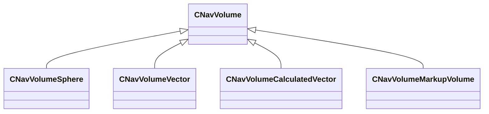
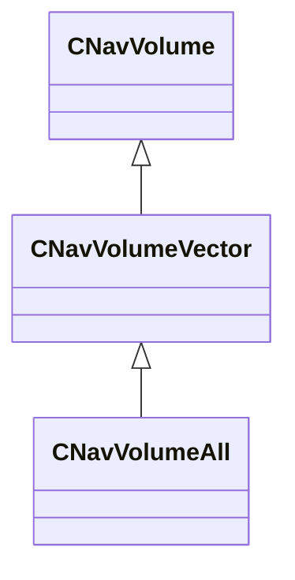
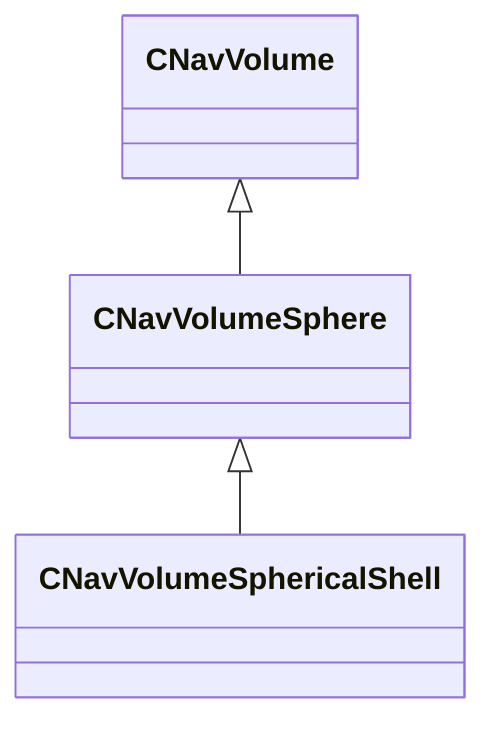

# Module: navlib

[📊 View UML Diagram](../diagrams/navlib.md)

| Name | Kind | Bases | Fields |
|------|------|-------|--------|
| [CNavHullPresetVData](#cnavhullpresetvdata) | class |  | 0 |
| [CNavHullVData](#cnavhullvdata) | class |  | 0 |
| [CNavVolume](#cnavvolume) | class |  | 0 |
| [CNavVolumeAll](#cnavvolumeall) | class | CNavVolumeVector | 0 |
| [CNavVolumeSphere](#cnavvolumesphere) | class | CNavVolume | 2 |
| [CNavVolumeSphericalShell](#cnavvolumesphericalshell) | class | CNavVolumeSphere | 1 |
| [CNavVolumeVector](#cnavvolumevector) | class | CNavVolume | 1 |
| [Extent](#extent) | class |  | 2 |
| [NavAttributeEnum](#navattributeenum) | enum |  | 20 |
| [NavDirType](#navdirtype) | enum |  | 5 |
| [NavGravity_t](#navgravity_t) | class |  | 2 |
| [NavHull_t](#navhull_t) | class |  | 1 |

---

### CNavHullPresetVData

**Metadata:** `MVDataRoot`, `MGetKV3ClassDefaults = {`, `"m_vecNavHulls":`, `[`, `]`, `}`

### CNavHullVData

**Metadata:** `MVDataRoot`, `MGetKV3ClassDefaults = {`, `"m_bAgentEnabled": true,`, `"m_agentRadius": 15.000000,`, `"m_agentHeight": 71.000000,`, `"m_agentShortHeightEnabled": false,`, `"m_agentShortHeight": 35.500000,`, `"m_agentCrawlEnabled": false,`, `"m_agentCrawlHeight": 17.500000,`, `"m_agentMaxClimb": 17.500000,`, `"m_agentMaxSlope": 50,`, `"m_agentMaxJumpDownDist": 240.000000,`, `"m_agentMaxJumpHorizDistBase": 64.000000,`, `"m_agentMaxJumpUpDist": 0.000000,`, `"m_agentBorderErosion": -1,`, `"m_flowMapGenerationEnabled": false,`, `"m_flowMapNodeMaxRadius": 400.000000`, `}`

### CNavVolume

**Derived by:** [CNavVolumeCalculatedVector](server.md#cnavvolumecalculatedvector), [CNavVolumeMarkupVolume](server.md#cnavvolumemarkupvolume), [CNavVolumeSphere](navlib.md#cnavvolumesphere), [CNavVolumeVector](navlib.md#cnavvolumevector)

**Relationships:**

### CNavVolumeAll

**Inherits from:** [CNavVolumeVector](navlib.md#cnavvolumevector)

**Relationships:**

### CNavVolumeSphere

**Inherits from:** [CNavVolume](navlib.md#cnavvolume)

**Derived by:** [CNavVolumeSphericalShell](navlib.md#cnavvolumesphericalshell)

**Relationships:**

**Fields:**

| Name | Type | Annotations |
|------|------|-------------|
| `m_vCenter` | VectorWS |  |
| `m_flRadius` | float32 |  |

### CNavVolumeSphericalShell

**Inherits from:** [CNavVolumeSphere](navlib.md#cnavvolumesphere)

**Relationships:**

**Fields:**

| Name | Type | Annotations |
|------|------|-------------|
| `m_flRadiusInner` | float32 |  |

### CNavVolumeVector

**Inherits from:** [CNavVolume](navlib.md#cnavvolume)

**Derived by:** [CNavVolumeAll](navlib.md#cnavvolumeall)

**Relationships:**

**Fields:**

| Name | Type | Annotations |
|------|------|-------------|
| `m_bHasBeenPreFiltered` | bool |  |

### Extent

**Fields:**

| Name | Type | Annotations |
|------|------|-------------|
| `lo` | VectorWS |  |
| `hi` | VectorWS |  |

### NavAttributeEnum

**Values:**

| Name | Value |
|------|-------|
| `NAV_MESH_AVOID` | 128 |
| `NAV_MESH_STAIRS` | 4096 |
| `NAV_MESH_NON_ZUP` | 32768 |
| `NAV_MESH_CROUCH_HEIGHT` | 65536 |
| `NAV_MESH_NON_ZUP_TRANSITION` | 131072 |
| `NAV_MESH_CRAWL_HEIGHT` | 262144 |
| `NAV_MESH_CROUCH` | 65536 |
| `NAV_MESH_JUMP` | 2 |
| `NAV_MESH_NO_JUMP` | 8 |
| `NAV_MESH_STOP` | 16 |
| `NAV_MESH_RUN` | 32 |
| `NAV_MESH_WALK` | 64 |
| `NAV_MESH_TRANSIENT` | 256 |
| `NAV_MESH_DONT_HIDE` | 512 |
| `NAV_MESH_STAND` | 1024 |
| `NAV_MESH_NO_HOSTAGES` | 2048 |
| `NAV_MESH_NO_MERGE` | 8192 |
| `NAV_MESH_OBSTACLE_TOP` | 16384 |
| `NAV_ATTR_FIRST_GAME_INDEX` | 19 |
| `NAV_ATTR_LAST_INDEX` | 63 |

### NavDirType

**Values:**

| Name | Value |
|------|-------|
| `NORTH` | 0 |
| `EAST` | 1 |
| `SOUTH` | 2 |
| `WEST` | 3 |
| `NUM_NAV_DIR_TYPE_DIRECTIONS` | 4 |

### NavGravity_t

**Fields:**

| Name | Type | Annotations |
|------|------|-------------|
| `m_vGravity` | Vector |  |
| `m_bDefault` | bool |  |

### NavHull_t

**Metadata:** `MGetKV3ClassDefaults = Could not parse KV3 Defaults`

**Fields:**

| Name | Type | Annotations |
|------|------|-------------|
| `m_nHullIdx` | int32 |  |
