# Module: particles

[📊 View UML Diagram](../diagrams/particles.md)

| Name | Kind | Bases | Fields |
|------|------|-------|--------|
| [BBoxVolumeType_t](#bboxvolumetype_t) | enum |  | 4 |
| [BlurFilterType_t](#blurfiltertype_t) | enum |  | 2 |
| [CBaseRendererSource2](#cbaserenderersource2) | class | CParticleFunctionRenderer | 65 |
| [CBaseTrailRenderer](#cbasetrailrenderer) | class | CBaseRendererSource2 | 7 |
| [CGeneralRandomRotation](#cgeneralrandomrotation) | class | CParticleFunctionInitializer | 6 |
| [CGeneralSpin](#cgeneralspin) | class | CParticleFunctionOperator | 3 |
| [CPAssignment_t](#cpassignment_t) | class |  | 0 |
| [CParticleFunction](#cparticlefunction) | class |  | 17 |
| [CParticleFunctionConstraint](#cparticlefunctionconstraint) | class | CParticleFunction | 0 |
| [CParticleFunctionEmitter](#cparticlefunctionemitter) | class | CParticleFunction | 1 |
| [CParticleFunctionForce](#cparticlefunctionforce) | class | CParticleFunction | 0 |
| [CParticleFunctionInitializer](#cparticlefunctioninitializer) | class | CParticleFunction | 1 |
| [CParticleFunctionOperator](#cparticlefunctionoperator) | class | CParticleFunction | 0 |
| [CParticleFunctionPreEmission](#cparticlefunctionpreemission) | class | CParticleFunctionOperator | 1 |
| [CParticleFunctionRenderer](#cparticlefunctionrenderer) | class | CParticleFunction | 3 |
| [CParticleMassCalculationParameters](#cparticlemasscalculationparameters) | class |  | 0 |
| [CParticleSystemDefinition](#cparticlesystemdefinition) | class | IParticleSystemDefinition | 0 |
| [CParticleVisibilityInputs](#cparticlevisibilityinputs) | class |  | 0 |
| [CPathParameters](#cpathparameters) | class |  | 0 |
| [CRandomNumberGeneratorParameters](#crandomnumbergeneratorparameters) | class |  | 0 |
| [CReplicationParameters](#creplicationparameters) | class |  | 0 |
| [CSpinUpdateBase](#cspinupdatebase) | class | CParticleFunctionOperator | 0 |
| [C_INIT_AddVectorToVector](#c_init_addvectortovector) | class | CParticleFunctionInitializer | 0 |
| [C_INIT_AgeNoise](#c_init_agenoise) | class | CParticleFunctionInitializer | 0 |
| [C_INIT_ChaoticAttractor](#c_init_chaoticattractor) | class | CParticleFunctionInitializer | 0 |
| [C_INIT_CheckParticleForWater](#c_init_checkparticleforwater) | class | CParticleFunctionInitializer | 0 |
| [C_INIT_ColorLitPerParticle](#c_init_colorlitperparticle) | class | CParticleFunctionInitializer | 0 |
| [C_INIT_CreateAlongPath](#c_init_createalongpath) | class | CParticleFunctionInitializer | 0 |
| [C_INIT_CreateFromCPs](#c_init_createfromcps) | class | CParticleFunctionInitializer | 0 |
| [C_INIT_CreateFromParentParticles](#c_init_createfromparentparticles) | class | CParticleFunctionInitializer | 0 |
| [C_INIT_CreateFromPlaneCache](#c_init_createfromplanecache) | class | CParticleFunctionInitializer | 0 |
| [C_INIT_CreateInEpitrochoid](#c_init_createinepitrochoid) | class | CParticleFunctionInitializer | 0 |
| [C_INIT_CreateOnGrid](#c_init_createongrid) | class | CParticleFunctionInitializer | 0 |
| [C_INIT_CreateOnModel](#c_init_createonmodel) | class | CParticleFunctionInitializer | 0 |
| [C_INIT_CreateOnModelAtHeight](#c_init_createonmodelatheight) | class | CParticleFunctionInitializer | 0 |
| [C_INIT_CreateParticleImpulse](#c_init_createparticleimpulse) | class | CParticleFunctionInitializer | 0 |
| [C_INIT_CreatePhyllotaxis](#c_init_createphyllotaxis) | class | CParticleFunctionInitializer | 0 |
| [C_INIT_CreateSequentialPath](#c_init_createsequentialpath) | class | CParticleFunctionInitializer | 0 |
| [C_INIT_CreateSequentialPathV2](#c_init_createsequentialpathv2) | class | CParticleFunctionInitializer | 0 |
| [C_INIT_CreateSpiralSphere](#c_init_createspiralsphere) | class | CParticleFunctionInitializer | 0 |
| [C_INIT_CreateWithinBox](#c_init_createwithinbox) | class | CParticleFunctionInitializer | 0 |
| [C_INIT_CreateWithinCapsuleTransform](#c_init_createwithincapsuletransform) | class | CParticleFunctionInitializer | 0 |
| [C_INIT_CreateWithinSphereTransform](#c_init_createwithinspheretransform) | class | CParticleFunctionInitializer | 0 |
| [C_INIT_CreationNoise](#c_init_creationnoise) | class | CParticleFunctionInitializer | 0 |
| [C_INIT_DistanceCull](#c_init_distancecull) | class | CParticleFunctionInitializer | 0 |
| [C_INIT_DistanceToCPInit](#c_init_distancetocpinit) | class | CParticleFunctionInitializer | 0 |
| [C_INIT_DistanceToNeighborCull](#c_init_distancetoneighborcull) | class | CParticleFunctionInitializer | 0 |
| [C_INIT_GlobalScale](#c_init_globalscale) | class | CParticleFunctionInitializer | 0 |
| [C_INIT_InheritFromParentParticles](#c_init_inheritfromparentparticles) | class | CParticleFunctionInitializer | 0 |
| [C_INIT_InheritVelocity](#c_init_inheritvelocity) | class | CParticleFunctionInitializer | 0 |
| [C_INIT_InitFloat](#c_init_initfloat) | class | CParticleFunctionInitializer | 0 |
| [C_INIT_InitFloatCollection](#c_init_initfloatcollection) | class | CParticleFunctionInitializer | 0 |
| [C_INIT_InitFromCPSnapshot](#c_init_initfromcpsnapshot) | class | CParticleFunctionInitializer | 0 |
| [C_INIT_InitFromParentKilled](#c_init_initfromparentkilled) | class | CParticleFunctionInitializer | 0 |
| [C_INIT_InitFromVectorFieldSnapshot](#c_init_initfromvectorfieldsnapshot) | class | CParticleFunctionInitializer | 0 |
| [C_INIT_InitSkinnedPositionFromCPSnapshot](#c_init_initskinnedpositionfromcpsnapshot) | class | CParticleFunctionInitializer | 0 |
| [C_INIT_InitVec](#c_init_initvec) | class | CParticleFunctionInitializer | 0 |
| [C_INIT_InitVecCollection](#c_init_initveccollection) | class | CParticleFunctionInitializer | 0 |
| [C_INIT_InitialRepulsionVelocity](#c_init_initialrepulsionvelocity) | class | CParticleFunctionInitializer | 0 |
| [C_INIT_InitialSequenceFromModel](#c_init_initialsequencefrommodel) | class | CParticleFunctionInitializer | 0 |
| [C_INIT_InitialVelocityFromHitbox](#c_init_initialvelocityfromhitbox) | class | CParticleFunctionInitializer | 0 |
| [C_INIT_InitialVelocityNoise](#c_init_initialvelocitynoise) | class | CParticleFunctionInitializer | 0 |
| [C_INIT_LifespanFromVelocity](#c_init_lifespanfromvelocity) | class | CParticleFunctionInitializer | 0 |
| [C_INIT_ModelCull](#c_init_modelcull) | class | CParticleFunctionInitializer | 0 |
| [C_INIT_MoveBetweenPoints](#c_init_movebetweenpoints) | class | CParticleFunctionInitializer | 0 |
| [C_INIT_NormalAlignToCP](#c_init_normalaligntocp) | class | CParticleFunctionInitializer | 0 |
| [C_INIT_NormalOffset](#c_init_normaloffset) | class | CParticleFunctionInitializer | 0 |
| [C_INIT_OffsetVectorToVector](#c_init_offsetvectortovector) | class | CParticleFunctionInitializer | 0 |
| [C_INIT_Orient2DRelToCP](#c_init_orient2dreltocp) | class | CParticleFunctionInitializer | 0 |
| [C_INIT_PlaneCull](#c_init_planecull) | class | CParticleFunctionInitializer | 0 |
| [C_INIT_PointList](#c_init_pointlist) | class | CParticleFunctionInitializer | 0 |
| [C_INIT_PositionOffset](#c_init_positionoffset) | class | CParticleFunctionInitializer | 0 |
| [C_INIT_PositionOffsetToCP](#c_init_positionoffsettocp) | class | CParticleFunctionInitializer | 0 |
| [C_INIT_PositionPlaceOnGround](#c_init_positionplaceonground) | class | CParticleFunctionInitializer | 0 |
| [C_INIT_PositionWarp](#c_init_positionwarp) | class | CParticleFunctionInitializer | 0 |
| [C_INIT_PositionWarpScalar](#c_init_positionwarpscalar) | class | CParticleFunctionInitializer | 0 |
| [C_INIT_QuantizeFloat](#c_init_quantizefloat) | class | CParticleFunctionInitializer | 0 |
| [C_INIT_RadiusFromCPObject](#c_init_radiusfromcpobject) | class | CParticleFunctionInitializer | 0 |
| [C_INIT_RandomAlpha](#c_init_randomalpha) | class | CParticleFunctionInitializer | 0 |
| [C_INIT_RandomAlphaWindowThreshold](#c_init_randomalphawindowthreshold) | class | CParticleFunctionInitializer | 0 |
| [C_INIT_RandomColor](#c_init_randomcolor) | class | CParticleFunctionInitializer | 0 |
| [C_INIT_RandomLifeTime](#c_init_randomlifetime) | class | CParticleFunctionInitializer | 0 |
| [C_INIT_RandomModelSequence](#c_init_randommodelsequence) | class | CParticleFunctionInitializer | 0 |
| [C_INIT_RandomNamedModelBodyPart](#c_init_randomnamedmodelbodypart) | class | C_INIT_RandomNamedModelElement | 0 |
| [C_INIT_RandomNamedModelElement](#c_init_randomnamedmodelelement) | class | CParticleFunctionInitializer | 6 |
| [C_INIT_RandomNamedModelMeshGroup](#c_init_randomnamedmodelmeshgroup) | class | C_INIT_RandomNamedModelElement | 0 |
| [C_INIT_RandomNamedModelSequence](#c_init_randomnamedmodelsequence) | class | C_INIT_RandomNamedModelElement | 0 |
| [C_INIT_RandomRadius](#c_init_randomradius) | class | CParticleFunctionInitializer | 0 |
| [C_INIT_RandomRotation](#c_init_randomrotation) | class | CGeneralRandomRotation | 0 |
| [C_INIT_RandomRotationSpeed](#c_init_randomrotationspeed) | class | CGeneralRandomRotation | 0 |
| [C_INIT_RandomScalar](#c_init_randomscalar) | class | CParticleFunctionInitializer | 0 |
| [C_INIT_RandomSecondSequence](#c_init_randomsecondsequence) | class | CParticleFunctionInitializer | 0 |
| [C_INIT_RandomSequence](#c_init_randomsequence) | class | CParticleFunctionInitializer | 0 |
| [C_INIT_RandomTrailLength](#c_init_randomtraillength) | class | CParticleFunctionInitializer | 0 |
| [C_INIT_RandomVector](#c_init_randomvector) | class | CParticleFunctionInitializer | 0 |
| [C_INIT_RandomVectorComponent](#c_init_randomvectorcomponent) | class | CParticleFunctionInitializer | 0 |
| [C_INIT_RandomYaw](#c_init_randomyaw) | class | CGeneralRandomRotation | 0 |
| [C_INIT_RandomYawFlip](#c_init_randomyawflip) | class | CParticleFunctionInitializer | 0 |
| [C_INIT_RemapInitialDirectionToTransformToVector](#c_init_remapinitialdirectiontotransformtovector) | class | CParticleFunctionInitializer | 0 |
| [C_INIT_RemapInitialTransformDirectionToRotation](#c_init_remapinitialtransformdirectiontorotation) | class | CParticleFunctionInitializer | 0 |
| [C_INIT_RemapInitialVisibilityScalar](#c_init_remapinitialvisibilityscalar) | class | CParticleFunctionInitializer | 0 |
| [C_INIT_RemapNamedModelBodyPartToScalar](#c_init_remapnamedmodelbodyparttoscalar) | class | C_INIT_RemapNamedModelElementToScalar | 0 |
| [C_INIT_RemapNamedModelElementToScalar](#c_init_remapnamedmodelelementtoscalar) | class | CParticleFunctionInitializer | 7 |
| [C_INIT_RemapNamedModelMeshGroupToScalar](#c_init_remapnamedmodelmeshgrouptoscalar) | class | C_INIT_RemapNamedModelElementToScalar | 0 |
| [C_INIT_RemapNamedModelSequenceToScalar](#c_init_remapnamedmodelsequencetoscalar) | class | C_INIT_RemapNamedModelElementToScalar | 0 |
| [C_INIT_RemapParticleCountToNamedModelBodyPartScalar](#c_init_remapparticlecounttonamedmodelbodypartscalar) | class | C_INIT_RemapParticleCountToNamedModelElementScalar | 0 |
| [C_INIT_RemapParticleCountToNamedModelElementScalar](#c_init_remapparticlecounttonamedmodelelementscalar) | class | C_INIT_RemapParticleCountToScalar | 0 |
| [C_INIT_RemapParticleCountToNamedModelMeshGroupScalar](#c_init_remapparticlecounttonamedmodelmeshgroupscalar) | class | C_INIT_RemapParticleCountToNamedModelElementScalar | 0 |
| [C_INIT_RemapParticleCountToNamedModelSequenceScalar](#c_init_remapparticlecounttonamedmodelsequencescalar) | class | C_INIT_RemapParticleCountToNamedModelElementScalar | 0 |
| [C_INIT_RemapParticleCountToScalar](#c_init_remapparticlecounttoscalar) | class | CParticleFunctionInitializer | 0 |
| [C_INIT_RemapQAnglesToRotation](#c_init_remapqanglestorotation) | class | CParticleFunctionInitializer | 0 |
| [C_INIT_RemapScalarToVector](#c_init_remapscalartovector) | class | CParticleFunctionInitializer | 0 |
| [C_INIT_RemapTransformOrientationToRotations](#c_init_remaptransformorientationtorotations) | class | CParticleFunctionInitializer | 0 |
| [C_INIT_RemapTransformToVector](#c_init_remaptransformtovector) | class | CParticleFunctionInitializer | 0 |
| [C_INIT_RingWave](#c_init_ringwave) | class | CParticleFunctionInitializer | 0 |
| [C_INIT_RtEnvCull](#c_init_rtenvcull) | class | CParticleFunctionInitializer | 0 |
| [C_INIT_ScaleVelocity](#c_init_scalevelocity) | class | CParticleFunctionInitializer | 0 |
| [C_INIT_ScreenSpacePositionOfTarget](#c_init_screenspacepositionoftarget) | class | CParticleFunctionInitializer | 0 |
| [C_INIT_SequenceFromCP](#c_init_sequencefromcp) | class | CParticleFunctionInitializer | 0 |
| [C_INIT_SequenceLifeTime](#c_init_sequencelifetime) | class | CParticleFunctionInitializer | 0 |
| [C_INIT_SetAttributeToScalarExpression](#c_init_setattributetoscalarexpression) | class | CParticleFunctionInitializer | 0 |
| [C_INIT_SetFloatAttributeToVectorExpression](#c_init_setfloatattributetovectorexpression) | class | CParticleFunctionInitializer | 0 |
| [C_INIT_SetHitboxToClosest](#c_init_sethitboxtoclosest) | class | CParticleFunctionInitializer | 0 |
| [C_INIT_SetHitboxToModel](#c_init_sethitboxtomodel) | class | CParticleFunctionInitializer | 0 |
| [C_INIT_SetRigidAttachment](#c_init_setrigidattachment) | class | CParticleFunctionInitializer | 0 |
| [C_INIT_SetVectorAttributeToVectorExpression](#c_init_setvectorattributetovectorexpression) | class | CParticleFunctionInitializer | 0 |
| [C_INIT_StatusEffect](#c_init_statuseffect) | class | CParticleFunctionInitializer | 0 |
| [C_INIT_StatusEffectCitadel](#c_init_statuseffectcitadel) | class | CParticleFunctionInitializer | 0 |
| [C_INIT_VelocityFromCP](#c_init_velocityfromcp) | class | CParticleFunctionInitializer | 0 |
| [C_INIT_VelocityFromNormal](#c_init_velocityfromnormal) | class | CParticleFunctionInitializer | 0 |
| [C_INIT_VelocityRadialRandom](#c_init_velocityradialrandom) | class | CParticleFunctionInitializer | 0 |
| [C_INIT_VelocityRandom](#c_init_velocityrandom) | class | CParticleFunctionInitializer | 0 |
| [C_OP_AlphaDecay](#c_op_alphadecay) | class | CParticleFunctionOperator | 0 |
| [C_OP_AttractToControlPoint](#c_op_attracttocontrolpoint) | class | CParticleFunctionForce | 0 |
| [C_OP_BasicMovement](#c_op_basicmovement) | class | CParticleFunctionOperator | 0 |
| [C_OP_BoxConstraint](#c_op_boxconstraint) | class | CParticleFunctionConstraint | 0 |
| [C_OP_CPOffsetToPercentageBetweenCPs](#c_op_cpoffsettopercentagebetweencps) | class | CParticleFunctionOperator | 0 |
| [C_OP_CPVelocityForce](#c_op_cpvelocityforce) | class | CParticleFunctionForce | 0 |
| [C_OP_CalculateVectorAttribute](#c_op_calculatevectorattribute) | class | CParticleFunctionOperator | 0 |
| [C_OP_Callback](#c_op_callback) | class | CParticleFunctionRenderer | 0 |
| [C_OP_ChladniWave](#c_op_chladniwave) | class | CParticleFunctionOperator | 0 |
| [C_OP_ChooseRandomChildrenInGroup](#c_op_chooserandomchildreningroup) | class | CParticleFunctionPreEmission | 0 |
| [C_OP_ClampScalar](#c_op_clampscalar) | class | CParticleFunctionOperator | 0 |
| [C_OP_ClampVector](#c_op_clampvector) | class | CParticleFunctionOperator | 0 |
| [C_OP_ClientPhysics](#c_op_clientphysics) | class | CParticleFunctionRenderer | 0 |
| [C_OP_CollideWithParentParticles](#c_op_collidewithparentparticles) | class | CParticleFunctionConstraint | 0 |
| [C_OP_CollideWithSelf](#c_op_collidewithself) | class | CParticleFunctionConstraint | 0 |
| [C_OP_ColorAdjustHSL](#c_op_coloradjusthsl) | class | CParticleFunctionOperator | 0 |
| [C_OP_ColorInterpolate](#c_op_colorinterpolate) | class | CParticleFunctionOperator | 0 |
| [C_OP_ColorInterpolateRandom](#c_op_colorinterpolaterandom) | class | CParticleFunctionOperator | 0 |
| [C_OP_ConnectParentParticleToNearest](#c_op_connectparentparticletonearest) | class | CParticleFunctionOperator | 0 |
| [C_OP_ConstrainDistance](#c_op_constraindistance) | class | CParticleFunctionConstraint | 0 |
| [C_OP_ConstrainDistanceToPath](#c_op_constraindistancetopath) | class | CParticleFunctionConstraint | 0 |
| [C_OP_ConstrainDistanceToUserSpecifiedPath](#c_op_constraindistancetouserspecifiedpath) | class | CParticleFunctionConstraint | 0 |
| [C_OP_ConstrainLineLength](#c_op_constrainlinelength) | class | CParticleFunctionConstraint | 0 |
| [C_OP_ContinuousEmitter](#c_op_continuousemitter) | class | CParticleFunctionEmitter | 0 |
| [C_OP_ControlPointToRadialScreenSpace](#c_op_controlpointtoradialscreenspace) | class | CParticleFunctionPreEmission | 0 |
| [C_OP_ControlpointLight](#c_op_controlpointlight) | class | CParticleFunctionOperator | 0 |
| [C_OP_CreateParticleSystemRenderer](#c_op_createparticlesystemrenderer) | class | CParticleFunctionRenderer | 0 |
| [C_OP_Cull](#c_op_cull) | class | CParticleFunctionOperator | 0 |
| [C_OP_CurlNoiseForce](#c_op_curlnoiseforce) | class | CParticleFunctionForce | 0 |
| [C_OP_CycleScalar](#c_op_cyclescalar) | class | CParticleFunctionOperator | 0 |
| [C_OP_CylindricalDistanceToTransform](#c_op_cylindricaldistancetotransform) | class | CParticleFunctionOperator | 0 |
| [C_OP_DampenToCP](#c_op_dampentocp) | class | CParticleFunctionOperator | 0 |
| [C_OP_Decay](#c_op_decay) | class | CParticleFunctionOperator | 0 |
| [C_OP_DecayClampCount](#c_op_decayclampcount) | class | CParticleFunctionOperator | 0 |
| [C_OP_DecayMaintainCount](#c_op_decaymaintaincount) | class | CParticleFunctionOperator | 0 |
| [C_OP_DecayOffscreen](#c_op_decayoffscreen) | class | CParticleFunctionOperator | 0 |
| [C_OP_DensityForce](#c_op_densityforce) | class | CParticleFunctionForce | 0 |
| [C_OP_DifferencePreviousParticle](#c_op_differencepreviousparticle) | class | CParticleFunctionOperator | 0 |
| [C_OP_Diffusion](#c_op_diffusion) | class | CParticleFunctionOperator | 0 |
| [C_OP_DirectionBetweenVecsToVec](#c_op_directionbetweenvecstovec) | class | CParticleFunctionOperator | 0 |
| [C_OP_DistanceBetweenCPsToCP](#c_op_distancebetweencpstocp) | class | CParticleFunctionPreEmission | 0 |
| [C_OP_DistanceBetweenTransforms](#c_op_distancebetweentransforms) | class | CParticleFunctionOperator | 0 |
| [C_OP_DistanceBetweenVecs](#c_op_distancebetweenvecs) | class | CParticleFunctionOperator | 0 |
| [C_OP_DistanceCull](#c_op_distancecull) | class | CParticleFunctionOperator | 0 |
| [C_OP_DistanceToTransform](#c_op_distancetotransform) | class | CParticleFunctionOperator | 0 |
| [C_OP_DragRelativeToPlane](#c_op_dragrelativetoplane) | class | CParticleFunctionOperator | 0 |
| [C_OP_DriveCPFromGlobalSoundFloat](#c_op_drivecpfromglobalsoundfloat) | class | CParticleFunctionPreEmission | 0 |
| [C_OP_EnableChildrenFromParentParticleCount](#c_op_enablechildrenfromparentparticlecount) | class | CParticleFunctionPreEmission | 0 |
| [C_OP_EndCapDecay](#c_op_endcapdecay) | class | CParticleFunctionOperator | 0 |
| [C_OP_EndCapTimedDecay](#c_op_endcaptimeddecay) | class | CParticleFunctionOperator | 0 |
| [C_OP_EndCapTimedFreeze](#c_op_endcaptimedfreeze) | class | CParticleFunctionOperator | 0 |
| [C_OP_ExternalGameImpulseForce](#c_op_externalgameimpulseforce) | class | CParticleFunctionForce | 0 |
| [C_OP_ExternalWindForce](#c_op_externalwindforce) | class | CParticleFunctionForce | 0 |
| [C_OP_FadeAndKill](#c_op_fadeandkill) | class | CParticleFunctionOperator | 0 |
| [C_OP_FadeAndKillForTracers](#c_op_fadeandkillfortracers) | class | CParticleFunctionOperator | 0 |
| [C_OP_FadeIn](#c_op_fadein) | class | CParticleFunctionOperator | 0 |
| [C_OP_FadeInSimple](#c_op_fadeinsimple) | class | CParticleFunctionOperator | 0 |
| [C_OP_FadeOut](#c_op_fadeout) | class | CParticleFunctionOperator | 0 |
| [C_OP_FadeOutSimple](#c_op_fadeoutsimple) | class | CParticleFunctionOperator | 0 |
| [C_OP_ForceBasedOnDistanceToPlane](#c_op_forcebasedondistancetoplane) | class | CParticleFunctionForce | 0 |
| [C_OP_ForceControlPointStub](#c_op_forcecontrolpointstub) | class | CParticleFunctionPreEmission | 0 |
| [C_OP_GameDecalRenderer](#c_op_gamedecalrenderer) | class | CParticleFunctionRenderer | 0 |
| [C_OP_GameLiquidSpill](#c_op_gameliquidspill) | class | CParticleFunctionRenderer | 0 |
| [C_OP_GlobalLight](#c_op_globallight) | class | CParticleFunctionOperator | 0 |
| [C_OP_HSVShiftToCP](#c_op_hsvshifttocp) | class | CParticleFunctionPreEmission | 0 |
| [C_OP_InheritFromParentParticles](#c_op_inheritfromparentparticles) | class | CParticleFunctionOperator | 0 |
| [C_OP_InheritFromParentParticlesV2](#c_op_inheritfromparentparticlesv2) | class | CParticleFunctionOperator | 0 |
| [C_OP_InheritFromPeerSystem](#c_op_inheritfrompeersystem) | class | CParticleFunctionOperator | 0 |
| [C_OP_InstantaneousEmitter](#c_op_instantaneousemitter) | class | CParticleFunctionEmitter | 0 |
| [C_OP_InterpolateRadius](#c_op_interpolateradius) | class | CParticleFunctionOperator | 0 |
| [C_OP_IntraParticleForce](#c_op_intraparticleforce) | class | CParticleFunctionForce | 0 |
| [C_OP_LagCompensation](#c_op_lagcompensation) | class | CParticleFunctionOperator | 0 |
| [C_OP_LazyCullCompareFloat](#c_op_lazycullcomparefloat) | class | CParticleFunctionOperator | 0 |
| [C_OP_LerpEndCapScalar](#c_op_lerpendcapscalar) | class | CParticleFunctionOperator | 0 |
| [C_OP_LerpEndCapVector](#c_op_lerpendcapvector) | class | CParticleFunctionOperator | 0 |
| [C_OP_LerpScalar](#c_op_lerpscalar) | class | CParticleFunctionOperator | 0 |
| [C_OP_LerpToInitialPosition](#c_op_lerptoinitialposition) | class | CParticleFunctionOperator | 0 |
| [C_OP_LerpToOtherAttribute](#c_op_lerptootherattribute) | class | CParticleFunctionOperator | 0 |
| [C_OP_LerpVector](#c_op_lerpvector) | class | CParticleFunctionOperator | 0 |
| [C_OP_LightningSnapshotGenerator](#c_op_lightningsnapshotgenerator) | class | CParticleFunctionPreEmission | 0 |
| [C_OP_LocalAccelerationForce](#c_op_localaccelerationforce) | class | CParticleFunctionForce | 0 |
| [C_OP_LockPoints](#c_op_lockpoints) | class | CParticleFunctionOperator | 0 |
| [C_OP_LockToBone](#c_op_locktobone) | class | CParticleFunctionOperator | 0 |
| [C_OP_LockToPointList](#c_op_locktopointlist) | class | CParticleFunctionOperator | 0 |
| [C_OP_LockToSavedSequentialPath](#c_op_locktosavedsequentialpath) | class | CParticleFunctionOperator | 0 |
| [C_OP_LockToSavedSequentialPathV2](#c_op_locktosavedsequentialpathv2) | class | CParticleFunctionOperator | 0 |
| [C_OP_MaintainEmitter](#c_op_maintainemitter) | class | CParticleFunctionEmitter | 0 |
| [C_OP_MaintainSequentialPath](#c_op_maintainsequentialpath) | class | CParticleFunctionOperator | 0 |
| [C_OP_MaxVelocity](#c_op_maxvelocity) | class | CParticleFunctionOperator | 0 |
| [C_OP_ModelCull](#c_op_modelcull) | class | CParticleFunctionOperator | 0 |
| [C_OP_ModelDampenMovement](#c_op_modeldampenmovement) | class | CParticleFunctionOperator | 0 |
| [C_OP_ModelSurfaceSnapshotGenerator](#c_op_modelsurfacesnapshotgenerator) | class | CParticleFunctionPreEmission | 0 |
| [C_OP_MoveToHitbox](#c_op_movetohitbox) | class | CParticleFunctionOperator | 0 |
| [C_OP_MovementLoopInsideSphere](#c_op_movementloopinsidesphere) | class | CParticleFunctionOperator | 0 |
| [C_OP_MovementMaintainOffset](#c_op_movementmaintainoffset) | class | CParticleFunctionOperator | 0 |
| [C_OP_MovementMoveAlongSkinnedCPSnapshot](#c_op_movementmovealongskinnedcpsnapshot) | class | CParticleFunctionOperator | 0 |
| [C_OP_MovementPlaceOnGround](#c_op_movementplaceonground) | class | CParticleFunctionOperator | 0 |
| [C_OP_MovementRigidAttachToCP](#c_op_movementrigidattachtocp) | class | CParticleFunctionOperator | 0 |
| [C_OP_MovementRotateParticleAroundAxis](#c_op_movementrotateparticlearoundaxis) | class | CParticleFunctionOperator | 0 |
| [C_OP_MovementSkinnedPositionFromCPSnapshot](#c_op_movementskinnedpositionfromcpsnapshot) | class | CParticleFunctionOperator | 0 |
| [C_OP_MultiSegmentDisplaySnapshotGenerator](#c_op_multisegmentdisplaysnapshotgenerator) | class | CParticleFunctionPreEmission | 0 |
| [C_OP_Noise](#c_op_noise) | class | CParticleFunctionOperator | 0 |
| [C_OP_NoiseEmitter](#c_op_noiseemitter) | class | CParticleFunctionEmitter | 0 |
| [C_OP_NormalLock](#c_op_normallock) | class | CParticleFunctionOperator | 0 |
| [C_OP_NormalizeVector](#c_op_normalizevector) | class | CParticleFunctionOperator | 0 |
| [C_OP_Orient2DRelToCP](#c_op_orient2dreltocp) | class | CParticleFunctionOperator | 0 |
| [C_OP_OrientTo2dDirection](#c_op_orientto2ddirection) | class | CParticleFunctionOperator | 0 |
| [C_OP_OscillateScalar](#c_op_oscillatescalar) | class | CParticleFunctionOperator | 0 |
| [C_OP_OscillateScalarSimple](#c_op_oscillatescalarsimple) | class | CParticleFunctionOperator | 0 |
| [C_OP_OscillateVector](#c_op_oscillatevector) | class | CParticleFunctionOperator | 0 |
| [C_OP_OscillateVectorSimple](#c_op_oscillatevectorsimple) | class | CParticleFunctionOperator | 0 |
| [C_OP_ParentVortices](#c_op_parentvortices) | class | CParticleFunctionForce | 0 |
| [C_OP_PerParticleForce](#c_op_perparticleforce) | class | CParticleFunctionForce | 0 |
| [C_OP_PercentageBetweenTransformLerpCPs](#c_op_percentagebetweentransformlerpcps) | class | CParticleFunctionOperator | 0 |
| [C_OP_PercentageBetweenTransforms](#c_op_percentagebetweentransforms) | class | CParticleFunctionOperator | 0 |
| [C_OP_PercentageBetweenTransformsVector](#c_op_percentagebetweentransformsvector) | class | CParticleFunctionOperator | 0 |
| [C_OP_PinParticleToCP](#c_op_pinparticletocp) | class | CParticleFunctionOperator | 0 |
| [C_OP_PinRopeSegmentParticleToParent](#c_op_pinropesegmentparticletoparent) | class | CParticleFunctionOperator | 0 |
| [C_OP_PlanarConstraint](#c_op_planarconstraint) | class | CParticleFunctionConstraint | 0 |
| [C_OP_PlaneCull](#c_op_planecull) | class | CParticleFunctionOperator | 0 |
| [C_OP_PlayEndCapWhenFinished](#c_op_playendcapwhenfinished) | class | CParticleFunctionPreEmission | 0 |
| [C_OP_PointVectorAtNextParticle](#c_op_pointvectoratnextparticle) | class | CParticleFunctionOperator | 0 |
| [C_OP_PositionLock](#c_op_positionlock) | class | CParticleFunctionOperator | 0 |
| [C_OP_QuantizeCPComponent](#c_op_quantizecpcomponent) | class | CParticleFunctionPreEmission | 0 |
| [C_OP_QuantizeFloat](#c_op_quantizefloat) | class | CParticleFunctionOperator | 0 |
| [C_OP_RadiusDecay](#c_op_radiusdecay) | class | CParticleFunctionOperator | 0 |
| [C_OP_RampCPLinearRandom](#c_op_rampcplinearrandom) | class | CParticleFunctionPreEmission | 0 |
| [C_OP_RampScalarLinear](#c_op_rampscalarlinear) | class | CParticleFunctionOperator | 0 |
| [C_OP_RampScalarLinearSimple](#c_op_rampscalarlinearsimple) | class | CParticleFunctionOperator | 0 |
| [C_OP_RampScalarSpline](#c_op_rampscalarspline) | class | CParticleFunctionOperator | 0 |
| [C_OP_RampScalarSplineSimple](#c_op_rampscalarsplinesimple) | class | CParticleFunctionOperator | 0 |
| [C_OP_RandomForce](#c_op_randomforce) | class | CParticleFunctionForce | 0 |
| [C_OP_ReadFromNeighboringParticle](#c_op_readfromneighboringparticle) | class | CParticleFunctionOperator | 0 |
| [C_OP_ReinitializeScalarEndCap](#c_op_reinitializescalarendcap) | class | CParticleFunctionOperator | 0 |
| [C_OP_RemapAverageHitboxSpeedtoCP](#c_op_remapaveragehitboxspeedtocp) | class | CParticleFunctionPreEmission | 0 |
| [C_OP_RemapAverageScalarValuetoCP](#c_op_remapaveragescalarvaluetocp) | class | CParticleFunctionPreEmission | 0 |
| [C_OP_RemapBoundingVolumetoCP](#c_op_remapboundingvolumetocp) | class | CParticleFunctionPreEmission | 0 |
| [C_OP_RemapCPVelocityToVector](#c_op_remapcpvelocitytovector) | class | CParticleFunctionOperator | 0 |
| [C_OP_RemapCPtoCP](#c_op_remapcptocp) | class | CParticleFunctionPreEmission | 0 |
| [C_OP_RemapCPtoScalar](#c_op_remapcptoscalar) | class | CParticleFunctionOperator | 0 |
| [C_OP_RemapCPtoVector](#c_op_remapcptovector) | class | CParticleFunctionOperator | 0 |
| [C_OP_RemapControlPointDirectionToVector](#c_op_remapcontrolpointdirectiontovector) | class | CParticleFunctionOperator | 0 |
| [C_OP_RemapControlPointOrientationToRotation](#c_op_remapcontrolpointorientationtorotation) | class | CParticleFunctionOperator | 0 |
| [C_OP_RemapCrossProductOfTwoVectorsToVector](#c_op_remapcrossproductoftwovectorstovector) | class | CParticleFunctionOperator | 0 |
| [C_OP_RemapDensityGradientToVectorAttribute](#c_op_remapdensitygradienttovectorattribute) | class | CParticleFunctionOperator | 0 |
| [C_OP_RemapDensityToVector](#c_op_remapdensitytovector) | class | CParticleFunctionOperator | 0 |
| [C_OP_RemapDirectionToCPToVector](#c_op_remapdirectiontocptovector) | class | CParticleFunctionOperator | 0 |
| [C_OP_RemapDistanceToLineSegmentBase](#c_op_remapdistancetolinesegmentbase) | class | CParticleFunctionOperator | 5 |
| [C_OP_RemapDistanceToLineSegmentToScalar](#c_op_remapdistancetolinesegmenttoscalar) | class | C_OP_RemapDistanceToLineSegmentBase | 0 |
| [C_OP_RemapDistanceToLineSegmentToVector](#c_op_remapdistancetolinesegmenttovector) | class | C_OP_RemapDistanceToLineSegmentBase | 0 |
| [C_OP_RemapDotProductToCP](#c_op_remapdotproducttocp) | class | CParticleFunctionPreEmission | 0 |
| [C_OP_RemapDotProductToScalar](#c_op_remapdotproducttoscalar) | class | CParticleFunctionOperator | 0 |
| [C_OP_RemapExternalWindToCP](#c_op_remapexternalwindtocp) | class | CParticleFunctionPreEmission | 0 |
| [C_OP_RemapGravityToVector](#c_op_remapgravitytovector) | class | CParticleFunctionOperator | 0 |
| [C_OP_RemapModelVolumetoCP](#c_op_remapmodelvolumetocp) | class | CParticleFunctionPreEmission | 0 |
| [C_OP_RemapNamedModelBodyPartEndCap](#c_op_remapnamedmodelbodypartendcap) | class | C_OP_RemapNamedModelElementEndCap | 0 |
| [C_OP_RemapNamedModelBodyPartOnceTimed](#c_op_remapnamedmodelbodypartoncetimed) | class | C_OP_RemapNamedModelElementOnceTimed | 0 |
| [C_OP_RemapNamedModelElementEndCap](#c_op_remapnamedmodelelementendcap) | class | CParticleFunctionOperator | 7 |
| [C_OP_RemapNamedModelElementOnceTimed](#c_op_remapnamedmodelelementoncetimed) | class | CParticleFunctionOperator | 9 |
| [C_OP_RemapNamedModelMeshGroupEndCap](#c_op_remapnamedmodelmeshgroupendcap) | class | C_OP_RemapNamedModelElementEndCap | 0 |
| [C_OP_RemapNamedModelMeshGroupOnceTimed](#c_op_remapnamedmodelmeshgrouponcetimed) | class | C_OP_RemapNamedModelElementOnceTimed | 0 |
| [C_OP_RemapNamedModelSequenceEndCap](#c_op_remapnamedmodelsequenceendcap) | class | C_OP_RemapNamedModelElementEndCap | 0 |
| [C_OP_RemapNamedModelSequenceOnceTimed](#c_op_remapnamedmodelsequenceoncetimed) | class | C_OP_RemapNamedModelElementOnceTimed | 0 |
| [C_OP_RemapParticleCountOnScalarEndCap](#c_op_remapparticlecountonscalarendcap) | class | CParticleFunctionOperator | 0 |
| [C_OP_RemapParticleCountToScalar](#c_op_remapparticlecounttoscalar) | class | CParticleFunctionOperator | 0 |
| [C_OP_RemapScalar](#c_op_remapscalar) | class | CParticleFunctionOperator | 0 |
| [C_OP_RemapScalarEndCap](#c_op_remapscalarendcap) | class | CParticleFunctionOperator | 0 |
| [C_OP_RemapScalarOnceTimed](#c_op_remapscalaroncetimed) | class | CParticleFunctionOperator | 0 |
| [C_OP_RemapSpeed](#c_op_remapspeed) | class | CParticleFunctionOperator | 0 |
| [C_OP_RemapSpeedtoCP](#c_op_remapspeedtocp) | class | CParticleFunctionPreEmission | 0 |
| [C_OP_RemapTransformOrientationToRotations](#c_op_remaptransformorientationtorotations) | class | CParticleFunctionOperator | 0 |
| [C_OP_RemapTransformOrientationToYaw](#c_op_remaptransformorientationtoyaw) | class | CParticleFunctionOperator | 0 |
| [C_OP_RemapTransformToVelocity](#c_op_remaptransformtovelocity) | class | CParticleFunctionOperator | 0 |
| [C_OP_RemapTransformVisibilityToScalar](#c_op_remaptransformvisibilitytoscalar) | class | CParticleFunctionOperator | 0 |
| [C_OP_RemapTransformVisibilityToVector](#c_op_remaptransformvisibilitytovector) | class | CParticleFunctionOperator | 0 |
| [C_OP_RemapVectorComponentToScalar](#c_op_remapvectorcomponenttoscalar) | class | CParticleFunctionOperator | 0 |
| [C_OP_RemapVectorToRotations](#c_op_remapvectortorotations) | class | CParticleFunctionOperator | 0 |
| [C_OP_RemapVectortoCP](#c_op_remapvectortocp) | class | CParticleFunctionOperator | 0 |
| [C_OP_RemapVelocityToVector](#c_op_remapvelocitytovector) | class | CParticleFunctionOperator | 0 |
| [C_OP_RemapVisibilityScalar](#c_op_remapvisibilityscalar) | class | CParticleFunctionOperator | 0 |
| [C_OP_RenderAsModels](#c_op_renderasmodels) | class | CParticleFunctionRenderer | 0 |
| [C_OP_RenderBlobs](#c_op_renderblobs) | class | CParticleFunctionRenderer | 0 |
| [C_OP_RenderCables](#c_op_rendercables) | class | CParticleFunctionRenderer | 0 |
| [C_OP_RenderClientPhysicsImpulse](#c_op_renderclientphysicsimpulse) | class | CParticleFunctionRenderer | 0 |
| [C_OP_RenderClothForce](#c_op_renderclothforce) | class | CParticleFunctionRenderer | 0 |
| [C_OP_RenderDeferredLight](#c_op_renderdeferredlight) | class | CParticleFunctionRenderer | 0 |
| [C_OP_RenderFlattenGrass](#c_op_renderflattengrass) | class | CParticleFunctionRenderer | 0 |
| [C_OP_RenderGpuImplicit](#c_op_rendergpuimplicit) | class | CParticleFunctionRenderer | 0 |
| [C_OP_RenderLightBeam](#c_op_renderlightbeam) | class | CParticleFunctionRenderer | 0 |
| [C_OP_RenderLights](#c_op_renderlights) | class | C_OP_RenderPoints | 0 |
| [C_OP_RenderMaterialProxy](#c_op_rendermaterialproxy) | class | CParticleFunctionRenderer | 0 |
| [C_OP_RenderModels](#c_op_rendermodels) | class | CParticleFunctionRenderer | 0 |
| [C_OP_RenderOmni2Light](#c_op_renderomni2light) | class | CParticleFunctionRenderer | 0 |
| [C_OP_RenderPoints](#c_op_renderpoints) | class | CParticleFunctionRenderer | 0 |
| [C_OP_RenderPostProcessing](#c_op_renderpostprocessing) | class | CParticleFunctionRenderer | 0 |
| [C_OP_RenderProjected](#c_op_renderprojected) | class | CParticleFunctionRenderer | 0 |
| [C_OP_RenderRopes](#c_op_renderropes) | class | CBaseRendererSource2 | 0 |
| [C_OP_RenderScreenShake](#c_op_renderscreenshake) | class | CParticleFunctionRenderer | 0 |
| [C_OP_RenderScreenVelocityRotate](#c_op_renderscreenvelocityrotate) | class | CParticleFunctionRenderer | 0 |
| [C_OP_RenderSimpleModelCollection](#c_op_rendersimplemodelcollection) | class | CParticleFunctionRenderer | 0 |
| [C_OP_RenderSound](#c_op_rendersound) | class | CParticleFunctionRenderer | 0 |
| [C_OP_RenderSprites](#c_op_rendersprites) | class | CBaseRendererSource2 | 0 |
| [C_OP_RenderStandardLight](#c_op_renderstandardlight) | class | CParticleFunctionRenderer | 0 |
| [C_OP_RenderStatusEffect](#c_op_renderstatuseffect) | class | CParticleFunctionRenderer | 0 |
| [C_OP_RenderStatusEffectCitadel](#c_op_renderstatuseffectcitadel) | class | CParticleFunctionRenderer | 0 |
| [C_OP_RenderText](#c_op_rendertext) | class | CParticleFunctionRenderer | 0 |
| [C_OP_RenderTrails](#c_op_rendertrails) | class | CBaseTrailRenderer | 0 |
| [C_OP_RenderTreeShake](#c_op_rendertreeshake) | class | CParticleFunctionRenderer | 0 |
| [C_OP_RenderVRHapticEvent](#c_op_rendervrhapticevent) | class | CParticleFunctionRenderer | 0 |
| [C_OP_RenderVolumetricEmitter](#c_op_rendervolumetricemitter) | class | CParticleFunctionRenderer | 0 |
| [C_OP_RepeatedTriggerChildGroup](#c_op_repeatedtriggerchildgroup) | class | CParticleFunctionPreEmission | 0 |
| [C_OP_RestartAfterDuration](#c_op_restartafterduration) | class | CParticleFunctionOperator | 0 |
| [C_OP_RopeSpringConstraint](#c_op_ropespringconstraint) | class | CParticleFunctionConstraint | 0 |
| [C_OP_RotateVector](#c_op_rotatevector) | class | CParticleFunctionOperator | 0 |
| [C_OP_RtEnvCull](#c_op_rtenvcull) | class | CParticleFunctionOperator | 0 |
| [C_OP_ScreenSpaceDistanceToEdge](#c_op_screenspacedistancetoedge) | class | CParticleFunctionOperator | 0 |
| [C_OP_ScreenSpacePositionOfTarget](#c_op_screenspacepositionoftarget) | class | CParticleFunctionOperator | 0 |
| [C_OP_ScreenSpaceRotateTowardTarget](#c_op_screenspacerotatetowardtarget) | class | CParticleFunctionOperator | 0 |
| [C_OP_SelectivelyEnableChildren](#c_op_selectivelyenablechildren) | class | CParticleFunctionPreEmission | 0 |
| [C_OP_SequenceFromModel](#c_op_sequencefrommodel) | class | CParticleFunctionOperator | 0 |
| [C_OP_SetAttributeToScalarExpression](#c_op_setattributetoscalarexpression) | class | CParticleFunctionOperator | 0 |
| [C_OP_SetCPOrientationToDirection](#c_op_setcporientationtodirection) | class | CParticleFunctionOperator | 0 |
| [C_OP_SetCPOrientationToGroundNormal](#c_op_setcporientationtogroundnormal) | class | CParticleFunctionOperator | 0 |
| [C_OP_SetCPOrientationToPointAtCP](#c_op_setcporientationtopointatcp) | class | CParticleFunctionPreEmission | 0 |
| [C_OP_SetCPtoVector](#c_op_setcptovector) | class | CParticleFunctionOperator | 0 |
| [C_OP_SetChildControlPoints](#c_op_setchildcontrolpoints) | class | CParticleFunctionOperator | 0 |
| [C_OP_SetControlPointFieldFromVectorExpression](#c_op_setcontrolpointfieldfromvectorexpression) | class | CParticleFunctionPreEmission | 0 |
| [C_OP_SetControlPointFieldToScalarExpression](#c_op_setcontrolpointfieldtoscalarexpression) | class | CParticleFunctionPreEmission | 0 |
| [C_OP_SetControlPointFieldToWater](#c_op_setcontrolpointfieldtowater) | class | CParticleFunctionPreEmission | 0 |
| [C_OP_SetControlPointFromObjectScale](#c_op_setcontrolpointfromobjectscale) | class | CParticleFunctionPreEmission | 0 |
| [C_OP_SetControlPointOrientation](#c_op_setcontrolpointorientation) | class | CParticleFunctionPreEmission | 0 |
| [C_OP_SetControlPointOrientationToCPVelocity](#c_op_setcontrolpointorientationtocpvelocity) | class | CParticleFunctionPreEmission | 0 |
| [C_OP_SetControlPointPositionToRandomActiveCP](#c_op_setcontrolpointpositiontorandomactivecp) | class | CParticleFunctionPreEmission | 0 |
| [C_OP_SetControlPointPositionToTimeOfDayValue](#c_op_setcontrolpointpositiontotimeofdayvalue) | class | CParticleFunctionPreEmission | 0 |
| [C_OP_SetControlPointPositions](#c_op_setcontrolpointpositions) | class | CParticleFunctionPreEmission | 0 |
| [C_OP_SetControlPointRotation](#c_op_setcontrolpointrotation) | class | CParticleFunctionPreEmission | 0 |
| [C_OP_SetControlPointToCPVelocity](#c_op_setcontrolpointtocpvelocity) | class | CParticleFunctionPreEmission | 0 |
| [C_OP_SetControlPointToCenter](#c_op_setcontrolpointtocenter) | class | CParticleFunctionPreEmission | 0 |
| [C_OP_SetControlPointToHMD](#c_op_setcontrolpointtohmd) | class | CParticleFunctionPreEmission | 0 |
| [C_OP_SetControlPointToHand](#c_op_setcontrolpointtohand) | class | CParticleFunctionPreEmission | 0 |
| [C_OP_SetControlPointToImpactPoint](#c_op_setcontrolpointtoimpactpoint) | class | CParticleFunctionPreEmission | 0 |
| [C_OP_SetControlPointToPlayer](#c_op_setcontrolpointtoplayer) | class | CParticleFunctionPreEmission | 0 |
| [C_OP_SetControlPointToVectorExpression](#c_op_setcontrolpointtovectorexpression) | class | CParticleFunctionPreEmission | 0 |
| [C_OP_SetControlPointToWaterSurface](#c_op_setcontrolpointtowatersurface) | class | CParticleFunctionPreEmission | 0 |
| [C_OP_SetControlPointsToModelParticles](#c_op_setcontrolpointstomodelparticles) | class | CParticleFunctionOperator | 0 |
| [C_OP_SetControlPointsToParticle](#c_op_setcontrolpointstoparticle) | class | CParticleFunctionOperator | 0 |
| [C_OP_SetFloat](#c_op_setfloat) | class | CParticleFunctionOperator | 0 |
| [C_OP_SetFloatAttributeToVectorExpression](#c_op_setfloatattributetovectorexpression) | class | CParticleFunctionOperator | 0 |
| [C_OP_SetFloatCollection](#c_op_setfloatcollection) | class | CParticleFunctionOperator | 0 |
| [C_OP_SetFromCPSnapshot](#c_op_setfromcpsnapshot) | class | CParticleFunctionOperator | 0 |
| [C_OP_SetGravityToCP](#c_op_setgravitytocp) | class | CParticleFunctionPreEmission | 0 |
| [C_OP_SetParentControlPointsToChildCP](#c_op_setparentcontrolpointstochildcp) | class | CParticleFunctionPreEmission | 0 |
| [C_OP_SetPerChildControlPoint](#c_op_setperchildcontrolpoint) | class | CParticleFunctionOperator | 0 |
| [C_OP_SetPerChildControlPointFromAttribute](#c_op_setperchildcontrolpointfromattribute) | class | CParticleFunctionOperator | 0 |
| [C_OP_SetRandomControlPointPosition](#c_op_setrandomcontrolpointposition) | class | CParticleFunctionPreEmission | 0 |
| [C_OP_SetSimulationRate](#c_op_setsimulationrate) | class | CParticleFunctionPreEmission | 0 |
| [C_OP_SetSingleControlPointPosition](#c_op_setsinglecontrolpointposition) | class | CParticleFunctionPreEmission | 0 |
| [C_OP_SetToCP](#c_op_settocp) | class | CParticleFunctionOperator | 0 |
| [C_OP_SetUserEvent](#c_op_setuserevent) | class | CParticleFunctionOperator | 0 |
| [C_OP_SetVariable](#c_op_setvariable) | class | CParticleFunctionPreEmission | 0 |
| [C_OP_SetVec](#c_op_setvec) | class | CParticleFunctionOperator | 0 |
| [C_OP_SetVectorAttributeToVectorExpression](#c_op_setvectorattributetovectorexpression) | class | CParticleFunctionOperator | 0 |
| [C_OP_ShapeMatchingConstraint](#c_op_shapematchingconstraint) | class | CParticleFunctionConstraint | 0 |
| [C_OP_SnapshotRigidSkinToBones](#c_op_snapshotrigidskintobones) | class | CParticleFunctionOperator | 0 |
| [C_OP_SnapshotSkinToBones](#c_op_snapshotskintobones) | class | CParticleFunctionOperator | 0 |
| [C_OP_Spin](#c_op_spin) | class | CGeneralSpin | 0 |
| [C_OP_SpinUpdate](#c_op_spinupdate) | class | CSpinUpdateBase | 0 |
| [C_OP_SpinYaw](#c_op_spinyaw) | class | CGeneralSpin | 0 |
| [C_OP_SpringToVectorConstraint](#c_op_springtovectorconstraint) | class | CParticleFunctionConstraint | 0 |
| [C_OP_StopAfterCPDuration](#c_op_stopaftercpduration) | class | CParticleFunctionPreEmission | 0 |
| [C_OP_TeleportBeam](#c_op_teleportbeam) | class | CParticleFunctionOperator | 0 |
| [C_OP_TimeVaryingForce](#c_op_timevaryingforce) | class | CParticleFunctionForce | 0 |
| [C_OP_TurbulenceForce](#c_op_turbulenceforce) | class | CParticleFunctionForce | 0 |
| [C_OP_TwistAroundAxis](#c_op_twistaroundaxis) | class | CParticleFunctionForce | 0 |
| [C_OP_UpdateLightSource](#c_op_updatelightsource) | class | CParticleFunctionOperator | 0 |
| [C_OP_VectorFieldSnapshot](#c_op_vectorfieldsnapshot) | class | CParticleFunctionOperator | 0 |
| [C_OP_VectorNoise](#c_op_vectornoise) | class | CParticleFunctionOperator | 0 |
| [C_OP_VelocityDecay](#c_op_velocitydecay) | class | CParticleFunctionOperator | 0 |
| [C_OP_VelocityMatchingForce](#c_op_velocitymatchingforce) | class | CParticleFunctionOperator | 0 |
| [C_OP_WaterImpulseRenderer](#c_op_waterimpulserenderer) | class | CParticleFunctionRenderer | 0 |
| [C_OP_WindForce](#c_op_windforce) | class | CParticleFunctionForce | 0 |
| [C_OP_WorldCollideConstraint](#c_op_worldcollideconstraint) | class | CParticleFunctionConstraint | 0 |
| [C_OP_WorldTraceConstraint](#c_op_worldtraceconstraint) | class | CParticleFunctionConstraint | 0 |
| [ClosestPointTestType_t](#closestpointtesttype_t) | enum |  | 3 |
| [CollisionGroupContext_t](#collisiongroupcontext_t) | class |  | 0 |
| [ControlPointReference_t](#controlpointreference_t) | class |  | 0 |
| [Detail2Combo_t](#detail2combo_t) | enum |  | 7 |
| [DetailCombo_t](#detailcombo_t) | enum |  | 4 |
| [EventTypeSelection_t](#eventtypeselection_t) | enum |  | 11 |
| [FloatInputMaterialVariable_t](#floatinputmaterialvariable_t) | class |  | 0 |
| [HitboxLerpType_t](#hitboxlerptype_t) | enum |  | 2 |
| [IParticleCollection](#iparticlecollection) | class |  | 0 |
| [IParticleSystemDefinition](#iparticlesystemdefinition) | class |  | 0 |
| [InheritableBoolType_t](#inheritablebooltype_t) | enum |  | 3 |
| [MaterialProxyType_t](#materialproxytype_t) | enum |  | 2 |
| [MaterialVariable_t](#materialvariable_t) | class |  | 0 |
| [MissingParentInheritBehavior_t](#missingparentinheritbehavior_t) | enum |  | 4 |
| [ModelHitboxType_t](#modelhitboxtype_t) | enum |  | 4 |
| [ModelReference_t](#modelreference_t) | class |  | 0 |
| [PFuncVisualizationType_t](#pfuncvisualizationtype_t) | enum |  | 7 |
| [ParticleAlphaReferenceType_t](#particlealphareferencetype_t) | enum |  | 4 |
| [ParticleAttrBoxFlags_t](#particleattrboxflags_t) | enum |  | 7 |
| [ParticleAttributeIndex_t](#particleattributeindex_t) | class |  | 1 |
| [ParticleChildrenInfo_t](#particlechildreninfo_t) | class |  | 0 |
| [ParticleCollisionGroup_t](#particlecollisiongroup_t) | enum |  | 7 |
| [ParticleCollisionMask_t](#particlecollisionmask_t) | enum |  | 10 |
| [ParticleCollisionMode_t](#particlecollisionmode_t) | enum |  | 5 |
| [ParticleControlPointAxis_t](#particlecontrolpointaxis_t) | enum |  | 6 |
| [ParticleControlPointConfiguration_t](#particlecontrolpointconfiguration_t) | class |  | 0 |
| [ParticleControlPointDriver_t](#particlecontrolpointdriver_t) | class |  | 0 |
| [ParticleDepthFeatheringMode_t](#particledepthfeatheringmode_t) | enum |  | 3 |
| [ParticleDetailLevel_t](#particledetaillevel_t) | enum |  | 4 |
| [ParticleEndcapMode_t](#particleendcapmode_t) | enum |  | 3 |
| [ParticleEntityPos_t](#particleentitypos_t) | enum |  | 3 |
| [ParticleFalloffFunction_t](#particlefallofffunction_t) | enum |  | 3 |
| [ParticleFanType_t](#particlefantype_t) | enum |  | 3 |
| [ParticleFogType_t](#particlefogtype_t) | enum |  | 3 |
| [ParticleHitboxBiasType_t](#particlehitboxbiastype_t) | enum |  | 2 |
| [ParticleHitboxDataSelection_t](#particlehitboxdataselection_t) | enum |  | 2 |
| [ParticleImpulseType_t](#particleimpulsetype_t) | enum |  | 6 |
| [ParticleLightBehaviorChoiceList_t](#particlelightbehaviorchoicelist_t) | enum |  | 3 |
| [ParticleLightFogLightingMode_t](#particlelightfoglightingmode_t) | enum |  | 3 |
| [ParticleLightTypeChoiceList_t](#particlelighttypechoicelist_t) | enum |  | 4 |
| [ParticleLightUnitChoiceList_t](#particlelightunitchoicelist_t) | enum |  | 2 |
| [ParticleLightingQuality_t](#particlelightingquality_t) | enum |  | 6 |
| [ParticleLightnintBranchBehavior_t](#particlelightnintbranchbehavior_t) | enum |  | 2 |
| [ParticleLiquidContents_t](#particleliquidcontents_t) | enum |  | 3 |
| [ParticleMassMode_t](#particlemassmode_t) | enum |  | 2 |
| [ParticleMultiSegmentCountSelection_t](#particlemultisegmentcountselection_t) | enum |  | 3 |
| [ParticleMultiSegmentInputSelection_t](#particlemultisegmentinputselection_t) | enum |  | 2 |
| [ParticleMultiSegmentSpecialCharacter_t](#particlemultisegmentspecialcharacter_t) | enum |  | 4 |
| [ParticleOmni2LightTypeChoiceList_t](#particleomni2lighttypechoicelist_t) | enum |  | 2 |
| [ParticleOrientationChoiceList_t](#particleorientationchoicelist_t) | enum |  | 6 |
| [ParticleOrientationSetMode_t](#particleorientationsetmode_t) | enum |  | 4 |
| [ParticleOrientationType_t](#particleorientationtype_t) | enum |  | 4 |
| [ParticleOutputBlendMode_t](#particleoutputblendmode_t) | enum |  | 7 |
| [ParticleParentSetMode_t](#particleparentsetmode_t) | enum |  | 3 |
| [ParticlePinDistance_t](#particlepindistance_t) | enum |  | 12 |
| [ParticlePostProcessPriorityGroup_t](#particlepostprocessprioritygroup_t) | enum |  | 6 |
| [ParticlePreviewBodyGroup_t](#particlepreviewbodygroup_t) | class |  | 0 |
| [ParticlePreviewState_t](#particlepreviewstate_t) | class |  | 0 |
| [ParticleReplicationMode_t](#particlereplicationmode_t) | enum |  | 2 |
| [ParticleRotationLockType_t](#particlerotationlocktype_t) | enum |  | 3 |
| [ParticleSelection_t](#particleselection_t) | enum |  | 3 |
| [ParticleSequenceCropOverride_t](#particlesequencecropoverride_t) | enum |  | 3 |
| [ParticleSortingChoiceList_t](#particlesortingchoicelist_t) | enum |  | 2 |
| [ParticleTextureLayerBlendType_t](#particletexturelayerblendtype_t) | enum |  | 7 |
| [ParticleToolsState_t](#particletoolsstate_t) | enum |  | 3 |
| [ParticleTopology_t](#particletopology_t) | enum |  | 5 |
| [ParticleTraceMissBehavior_t](#particletracemissbehavior_t) | enum |  | 3 |
| [ParticleTraceSet_t](#particletraceset_t) | enum |  | 4 |
| [ParticleVRHandChoiceList_t](#particlevrhandchoicelist_t) | enum |  | 4 |
| [ParticleVolumetricSmokeCreationType_t](#particlevolumetricsmokecreationtype_t) | enum |  | 2 |
| [ParticleVolumetricSmokeType_t](#particlevolumetricsmoketype_t) | enum |  | 3 |
| [PetGroundType_t](#petgroundtype_t) | enum |  | 3 |
| [PointDefinitionWithTimeValues_t](#pointdefinitionwithtimevalues_t) | class | PointDefinition_t | 0 |
| [PointDefinition_t](#pointdefinition_t) | class |  | 0 |
| [RenderModelSubModelFieldType_t](#rendermodelsubmodelfieldtype_t) | enum |  | 4 |
| [RenderProjectedMaterial_t](#renderprojectedmaterial_t) | class |  | 0 |
| [ScalarExpressionType_t](#scalarexpressiontype_t) | enum |  | 12 |
| [SequenceWeightedList_t](#sequenceweightedlist_t) | class |  | 0 |
| [SetStatisticExpressionType_t](#setstatisticexpressiontype_t) | enum |  | 8 |
| [SnapshotIndexType_t](#snapshotindextype_t) | enum |  | 2 |
| [SpriteCardPerParticleScale_t](#spritecardperparticlescale_t) | enum |  | 14 |
| [SpriteCardShaderType_t](#spritecardshadertype_t) | enum |  | 2 |
| [SpriteCardTextureChannel_t](#spritecardtexturechannel_t) | enum |  | 15 |
| [SpriteCardTextureType_t](#spritecardtexturetype_t) | enum |  | 12 |
| [StandardLightingAttenuationStyle_t](#standardlightingattenuationstyle_t) | enum |  | 2 |
| [TextureControls_t](#texturecontrols_t) | class |  | 0 |
| [TextureGroup_t](#texturegroup_t) | class |  | 0 |
| [TextureRepetitionMode_t](#texturerepetitionmode_t) | enum |  | 2 |
| [VecInputMaterialVariable_t](#vecinputmaterialvariable_t) | class |  | 0 |
| [VectorExpressionType_t](#vectorexpressiontype_t) | enum |  | 10 |
| [VectorFloatExpressionType_t](#vectorfloatexpressiontype_t) | enum |  | 7 |

---

### BBoxVolumeType_t

**Values:**

| Name | Value |
|------|-------|
| `BBOX_VOLUME` | 0 |
| `BBOX_DIMENSIONS` | 1 |
| `BBOX_MINS_MAXS` | 2 |
| `BBOX_RADIUS` | 3 |

### BlurFilterType_t

**Values:**

| Name | Value |
|------|-------|
| `BLURFILTER_GAUSSIAN` | 0 |
| `BLURFILTER_BOX` | 1 |

### CBaseRendererSource2

**Inherits from:** [CParticleFunctionRenderer](particles.md#cparticlefunctionrenderer)

**Derived by:** [CBaseTrailRenderer](particles.md#cbasetrailrenderer), [C_OP_RenderRopes](particles.md#c_op_renderropes), [C_OP_RenderSprites](particles.md#c_op_rendersprites)

**Metadata:** `MGetKV3ClassDefaults = Could not parse KV3 Defaults`

**Relationships:**

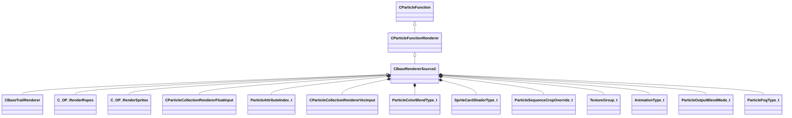

**Fields:**

| Name | Type | Annotations |
|------|------|-------------|
| `m_flRadiusScale` | [CParticleCollectionRendererFloatInput](../schemas/particleslib.md#cparticlecollectionrendererfloatinput) | `MPropertyStartGroup = "+Renderer Modifiers"` `MPropertyFriendlyName = "radius scale"` `MPropertySortPriority = 700` |
| `m_flAlphaScale` | [CParticleCollectionRendererFloatInput](../schemas/particleslib.md#cparticlecollectionrendererfloatinput) | `MPropertyFriendlyName = "alpha scale"` `MPropertySortPriority = 700` |
| `m_flRollScale` | [CParticleCollectionRendererFloatInput](../schemas/particleslib.md#cparticlecollectionrendererfloatinput) | `MPropertyFriendlyName = "rotation roll scale"` `MPropertySortPriority = 700` |
| `m_nAlpha2Field` | [ParticleAttributeIndex_t](../schemas/particles.md#particleattributeindex_t) | `MPropertyFriendlyName = "per-particle alpha scale attribute"` `MPropertyAttributeChoiceName = "particlefield_scalar"` `MPropertySortPriority = 700` |
| `m_vecColorScale` | [CParticleCollectionRendererVecInput](../schemas/particleslib.md#cparticlecollectionrenderervecinput) | `MPropertyFriendlyName = "color blend"` `MPropertySortPriority = 700` |
| `m_nColorBlendType` | [ParticleColorBlendType_t](../schemas/particleslib.md#particlecolorblendtype_t) | `MPropertyFriendlyName = "color blend type"` `MPropertySortPriority = 700` |
| `m_nShaderType` | [SpriteCardShaderType_t](../schemas/particles.md#spritecardshadertype_t) | `MPropertyStartGroup = "+Material"` `MPropertyFriendlyName = "Shader"` `MPropertySortPriority = 600` |
| `m_strShaderOverride` | CUtlString | `MPropertyFriendlyName = "Custom Shader"` `MPropertySuppressExpr = "m_nShaderType != SPRITECARD_SHADER_CUSTOM"` `MPropertySortPriority = 600` |
| `m_flCenterXOffset` | [CParticleCollectionRendererFloatInput](../schemas/particleslib.md#cparticlecollectionrendererfloatinput) | `MPropertyFriendlyName = "X offset of center point"` `MPropertySortPriority = 600` |
| `m_flCenterYOffset` | [CParticleCollectionRendererFloatInput](../schemas/particleslib.md#cparticlecollectionrendererfloatinput) | `MPropertyFriendlyName = "Y offset of center point"` `MPropertySortPriority = 600` |
| `m_flBumpStrength` | float32 | `MPropertyFriendlyName = "Bump Strength"` `MPropertySortPriority = 600` |
| `m_nCropTextureOverride` | [ParticleSequenceCropOverride_t](../schemas/particles.md#particlesequencecropoverride_t) | `MPropertyFriendlyName = "Sheet Crop Behavior"` `MPropertySortPriority = 600` |
| `m_vecTexturesInput` | CUtlLeanVector< [TextureGroup_t](../schemas/particles.md#texturegroup_t) > | `MPropertyFriendlyName = "Textures"` `MParticleRequireDefaultArrayEntry` `MPropertyAutoExpandSelf` `MPropertySortPriority = 600` |
| `m_flAnimationRate` | float32 | `MPropertyStartGroup = "Animation"` `MPropertyFriendlyName = "animation rate"` `MPropertyAttributeRange = "0 5"` `MPropertySortPriority = 500` |
| `m_nAnimationType` | [AnimationType_t](../schemas/particleslib.md#animationtype_t) | `MPropertyFriendlyName = "animation type"` `MPropertySortPriority = 500` |
| `m_bAnimateInFPS` | bool | `MPropertyFriendlyName = "set animation value in FPS"` `MPropertySortPriority = 500` |
| `m_flMotionVectorScaleU` | [CParticleCollectionRendererFloatInput](../schemas/particleslib.md#cparticlecollectionrendererfloatinput) | `MPropertyFriendlyName = "motion vector scale U"` `MPropertySortPriority = 500` |
| `m_flMotionVectorScaleV` | [CParticleCollectionRendererFloatInput](../schemas/particleslib.md#cparticlecollectionrendererfloatinput) | `MPropertyFriendlyName = "motion vector scale V"` `MPropertySortPriority = 500` |
| `m_flSelfIllumAmount` | [CParticleCollectionRendererFloatInput](../schemas/particleslib.md#cparticlecollectionrendererfloatinput) | `MPropertyStartGroup = "Lighting and Shadows"` `MPropertyFriendlyName = "self illum amount"` `MPropertyAttributeRange = "0 2"` `MPropertySortPriority = 400` |
| `m_flDiffuseAmount` | [CParticleCollectionRendererFloatInput](../schemas/particleslib.md#cparticlecollectionrendererfloatinput) | `MPropertyFriendlyName = "diffuse lighting amount"` `MPropertyAttributeRange = "0 1"` `MPropertySortPriority = 400` |
| `m_flDiffuseClamp` | [CParticleCollectionRendererFloatInput](../schemas/particleslib.md#cparticlecollectionrendererfloatinput) | `MPropertyFriendlyName = "diffuse max contribution clamp"` `MPropertyAttributeRange = "0 1"` `MPropertySortPriority = 400` `MPropertySuppressExpr = "mod != hlx"` |
| `m_nLightingControlPoint` | int32 | `MPropertyFriendlyName = "diffuse lighting origin Control Point"` `MPropertySortPriority = 400` |
| `m_nOutputBlendMode` | [ParticleOutputBlendMode_t](../schemas/particles.md#particleoutputblendmode_t) | `MPropertyStartGroup = "+Color and alpha adjustments"` `MPropertyFriendlyName = "output blend mode"` `MPropertySortPriority = 300` |
| `m_bGammaCorrectVertexColors` | bool | `MPropertyFriendlyName = "Gamma-correct vertex colors"` `MPropertySortPriority = 300` |
| `m_bSaturateColorPreAlphaBlend` | bool | `MPropertyFriendlyName = "Saturate color pre alphablend"` `MPropertySortPriority = 300` `MPropertySuppressExpr = "mod != dota && mod != hlx"` |
| `m_flAddSelfAmount` | [CParticleCollectionRendererFloatInput](../schemas/particleslib.md#cparticlecollectionrendererfloatinput) | `MPropertyFriendlyName = "add self amount over alphablend"` `MPropertySortPriority = 300` |
| `m_flDesaturation` | [CParticleCollectionRendererFloatInput](../schemas/particleslib.md#cparticlecollectionrendererfloatinput) | `MPropertyFriendlyName = "desaturation amount"` `MPropertyAttributeRange = "0 1"` `MPropertySortPriority = 300` |
| `m_flOverbrightFactor` | [CParticleCollectionRendererFloatInput](../schemas/particleslib.md#cparticlecollectionrendererfloatinput) | `MPropertyFriendlyName = "overbright factor"` `MPropertySortPriority = 300` |
| `m_nHSVShiftControlPoint` | int32 | `MPropertyFriendlyName = "HSV Shift Control Point"` `MPropertySortPriority = 300` |
| `m_nFogType` | [ParticleFogType_t](../schemas/particles.md#particlefogtype_t) | `MPropertyFriendlyName = "Apply fog to particle"` `MPropertySortPriority = 300` |
| `m_flFogAmount` | [CParticleCollectionRendererFloatInput](../schemas/particleslib.md#cparticlecollectionrendererfloatinput) | `MPropertyFriendlyName = "Fog Scale"` `MPropertySortPriority = 300` `MPropertySuppressExpr = "mod != hlx"` |
| `m_bTintByFOW` | bool | `MPropertyFriendlyName = "Apply fog of war to color"` `MPropertySortPriority = 300` `MPropertySuppressExpr = "mod != dota"` |
| `m_bTintByGlobalLight` | bool | `MPropertyFriendlyName = "Apply global light to color"` `MPropertySortPriority = 300` `MPropertySuppressExpr = "mod != dota"` |
| `m_nPerParticleAlphaReference` | [SpriteCardPerParticleScale_t](../schemas/particles.md#spritecardperparticlescale_t) | `MPropertyStartGroup = "Color and alpha adjustments/Alpha Reference"` `MPropertyFriendlyName = "alpha reference"` `MPropertySortPriority = 300` |
| `m_nPerParticleAlphaRefWindow` | [SpriteCardPerParticleScale_t](../schemas/particles.md#spritecardperparticlescale_t) | `MPropertyFriendlyName = "alpha reference window size"` `MPropertySortPriority = 300` |
| `m_nAlphaReferenceType` | [ParticleAlphaReferenceType_t](../schemas/particles.md#particlealphareferencetype_t) | `MPropertyFriendlyName = "alpha reference type"` `MPropertySortPriority = 300` |
| `m_flAlphaReferenceSoftness` | [CParticleCollectionRendererFloatInput](../schemas/particleslib.md#cparticlecollectionrendererfloatinput) | `MPropertyFriendlyName = "alpha reference softness"` `MPropertyAttributeRange = "0 1"` `MPropertySortPriority = 300` |
| `m_flSourceAlphaValueToMapToZero` | [CParticleCollectionRendererFloatInput](../schemas/particleslib.md#cparticlecollectionrendererfloatinput) | `MPropertyFriendlyName = "source alpha value to map to alpha of zero"` `MPropertyAttributeRange = "0 1"` `MPropertySortPriority = 300` |
| `m_flSourceAlphaValueToMapToOne` | [CParticleCollectionRendererFloatInput](../schemas/particleslib.md#cparticlecollectionrendererfloatinput) | `MPropertyFriendlyName = "source alpha value to map to alpha of 1"` `MPropertyAttributeRange = "0 1"` `MPropertySortPriority = 300` |
| `m_bRefract` | bool | `MPropertyStartGroup = "Refraction"` `MPropertyFriendlyName = "refract background"` `MPropertySortPriority = 200` |
| `m_bRefractSolid` | bool | `MPropertyFriendlyName = "refract draws opaque - alpha scales refraction"` `MPropertySortPriority = 200` `MPropertySuppressExpr = "!m_bRefract"` |
| `m_bRefract2Passes` | bool | `MPropertyFriendlyName = "refract in 2 passes - can refract particles behind, requires (MBOIT!)"` `MPropertySortPriority = 200` `MPropertySuppressExpr = "mod != hlx || !m_bRefract"` |
| `m_flRefractAmount` | [CParticleCollectionRendererFloatInput](../schemas/particleslib.md#cparticlecollectionrendererfloatinput) | `MPropertyFriendlyName = "refract amount"` `MPropertyAttributeRange = "-2 2"` `MPropertySortPriority = 200` `MPropertySuppressExpr = "!m_bRefract"` |
| `m_nRefractBlurRadius` | int32 | `MPropertyFriendlyName = "refract blur radius"` `MPropertySortPriority = 200` `MPropertySuppressExpr = "!m_bRefract"` |
| `m_nRefractBlurType` | [BlurFilterType_t](../schemas/particles.md#blurfiltertype_t) | `MPropertyFriendlyName = "refract blur type"` `MPropertySortPriority = 200` `MPropertySuppressExpr = "!m_bRefract"` |
| `m_bOnlyRenderInEffectsBloomPass` | bool | `MPropertyStartGroup = ""` `MPropertyFriendlyName = "Only Render in effects bloom pass"` `MPropertySortPriority = 1100` |
| `m_bOnlyRenderInEffectsWaterPass` | bool | `MPropertyFriendlyName = "Only Render in effects water pass"` `MPropertySortPriority = 1050` `MPropertySuppressExpr = "mod != csgo"` |
| `m_bUseMixedResolutionRendering` | bool | `MPropertyFriendlyName = "Use Mixed Resolution Rendering"` `MPropertySortPriority = 1200` |
| `m_bOnlyRenderInEffecsGameOverlay` | bool | `MPropertyFriendlyName = "Only Render in effects game overlay pass"` `MPropertySortPriority = 1210` `MPropertySuppressExpr = "mod != csgo"` |
| `m_stencilTestID` | char[128] | `MPropertyStartGroup = "Stencil"` `MPropertyFriendlyName = "stencil test ID"` `MPropertySortPriority = 0` |
| `m_bStencilTestExclude` | bool | `MPropertyFriendlyName = "only write where stencil is NOT stencil test ID"` `MPropertySortPriority = 0` |
| `m_stencilWriteID` | char[128] | `MPropertyFriendlyName = "stencil write ID"` `MPropertySortPriority = 0` |
| `m_bWriteStencilOnDepthPass` | bool | `MPropertyFriendlyName = "write stencil on z-buffer test success"` `MPropertySortPriority = 0` |
| `m_bWriteStencilOnDepthFail` | bool | `MPropertyFriendlyName = "write stencil on z-buffer test failure"` `MPropertySortPriority = 0` |
| `m_bReverseZBuffering` | bool | `MPropertyStartGroup = "Depth buffer control and effects"` `MPropertyFriendlyName = "reverse z-buffer test"` `MPropertySortPriority = 900` |
| `m_bDisableZBuffering` | bool | `MPropertyFriendlyName = "disable z-buffer test"` `MPropertySortPriority = 900` |
| `m_nFeatheringMode` | [ParticleDepthFeatheringMode_t](../schemas/particles.md#particledepthfeatheringmode_t) | `MPropertyFriendlyName = "Depth feathering mode"` `MPropertySortPriority = 900` |
| `m_flFeatheringMinDist` | [CParticleCollectionRendererFloatInput](../schemas/particleslib.md#cparticlecollectionrendererfloatinput) | `MPropertyFriendlyName = "particle feathering closest distance to surface"` `MPropertySortPriority = 900` |
| `m_flFeatheringMaxDist` | [CParticleCollectionRendererFloatInput](../schemas/particleslib.md#cparticlecollectionrendererfloatinput) | `MPropertyFriendlyName = "particle feathering farthest distance to surface"` `MPropertySortPriority = 900` |
| `m_flFeatheringFilter` | [CParticleCollectionRendererFloatInput](../schemas/particleslib.md#cparticlecollectionrendererfloatinput) | `MPropertyFriendlyName = "particle feathering alpha filter"` `MPropertySortPriority = 900` |
| `m_flFeatheringDepthMapFilter` | [CParticleCollectionRendererFloatInput](../schemas/particleslib.md#cparticlecollectionrendererfloatinput) | `MPropertyFriendlyName = "particle feathering depthmap layer filter"` `MPropertySortPriority = 900` `MPropertySuppressExpr = "mod != hlx"` |
| `m_flDepthBias` | [CParticleCollectionRendererFloatInput](../schemas/particleslib.md#cparticlecollectionrendererfloatinput) | `MPropertyFriendlyName = "depth comparison bias"` `MPropertySortPriority = 900` |
| `m_nSortMethod` | [ParticleSortingChoiceList_t](../schemas/particles.md#particlesortingchoicelist_t) | `MPropertyFriendlyName = "Sort Method"` `MPropertySortPriority = 900` |
| `m_bBlendFramesSeq0` | bool | `MPropertyStartGroup = "Animation"` `MPropertyFriendlyName = "blend sequence animation frames"` `MPropertySortPriority = 500` |
| `m_bMaxLuminanceBlendingSequence0` | bool | `MPropertyFriendlyName = "use max-luminance blending for sequence"` `MPropertySortPriority = 500` `MPropertySuppressExpr = "!m_bBlendFramesSeq0"` |

### CBaseTrailRenderer

**Inherits from:** [CBaseRendererSource2](particles.md#cbaserenderersource2)

**Derived by:** [C_OP_RenderTrails](particles.md#c_op_rendertrails)

**Metadata:** `MGetKV3ClassDefaults = Could not parse KV3 Defaults`

**Relationships:**

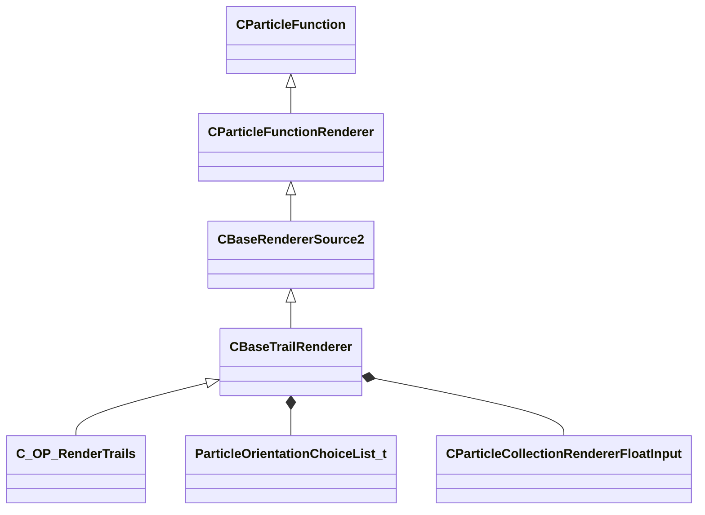

**Fields:**

| Name | Type | Annotations |
|------|------|-------------|
| `m_nOrientationType` | [ParticleOrientationChoiceList_t](../schemas/particles.md#particleorientationchoicelist_t) | `MPropertyStartGroup = "Orientation"` `MPropertyFriendlyName = "orientation type"` `MPropertySortPriority = 750` |
| `m_nOrientationControlPoint` | int32 | `MPropertyFriendlyName = "orientation control point"` `MPropertySortPriority = 750` `MPropertySuppressExpr = "m_nOrientationType != PARTICLE_ORIENTATION_ALIGN_TO_PARTICLE_NORMAL && m_nOrientationType != PARTICLE_ORIENTATION_SCREENALIGN_TO_PARTICLE_NORMAL"` |
| `m_flMinSize` | float32 | `MPropertyStartGroup = "Screenspace Fading and culling"` `MPropertyFriendlyName = "minimum visual screen-size"` `MPropertySortPriority = 900` |
| `m_flMaxSize` | float32 | `MPropertyFriendlyName = "maximum visual screen-size"` `MPropertySortPriority = 900` |
| `m_flStartFadeSize` | [CParticleCollectionRendererFloatInput](../schemas/particleslib.md#cparticlecollectionrendererfloatinput) | `MPropertyFriendlyName = "start fade screen-size"` `MPropertySortPriority = 900` |
| `m_flEndFadeSize` | [CParticleCollectionRendererFloatInput](../schemas/particleslib.md#cparticlecollectionrendererfloatinput) | `MPropertyFriendlyName = "end fade and cull screen-size"` `MPropertySortPriority = 900` |
| `m_bClampV` | bool | `MPropertyStartGroup = "Trail UV Controls"` `MPropertyFriendlyName = "Clamp Non-Sheet texture V coords"` `MPropertySortPriority = 800` |

### CGeneralRandomRotation

**Inherits from:** [CParticleFunctionInitializer](particles.md#cparticlefunctioninitializer)

**Derived by:** [C_INIT_RandomRotation](particles.md#c_init_randomrotation), [C_INIT_RandomRotationSpeed](particles.md#c_init_randomrotationspeed), [C_INIT_RandomYaw](particles.md#c_init_randomyaw)

**Metadata:** `MGetKV3ClassDefaults = Could not parse KV3 Defaults`

**Relationships:**

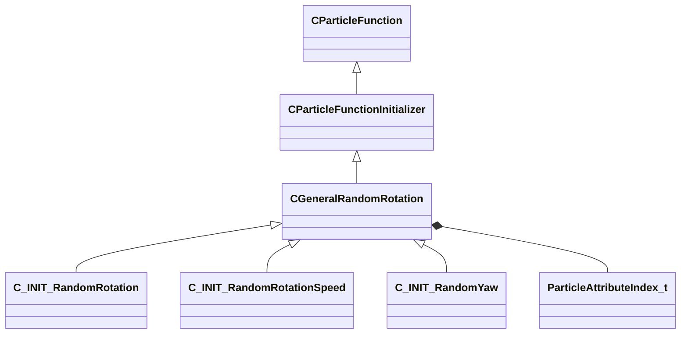

**Fields:**

| Name | Type | Annotations |
|------|------|-------------|
| `m_nFieldOutput` | [ParticleAttributeIndex_t](../schemas/particles.md#particleattributeindex_t) | `MPropertyFriendlyName = "rotation field"` `MPropertyAttributeChoiceName = "particlefield_rotation"` |
| `m_flDegrees` | float32 | `MPropertyFriendlyName = "rotation initial"` |
| `m_flDegreesMin` | float32 | `MPropertyFriendlyName = "rotation offset from initial min"` |
| `m_flDegreesMax` | float32 | `MPropertyFriendlyName = "rotation offset from initial max"` |
| `m_flRotationRandExponent` | float32 | `MPropertyFriendlyName = "rotation offset exponent"` |
| `m_bRandomlyFlipDirection` | bool | `MPropertyFriendlyName = "randomly flip direction"` |

### CGeneralSpin

**Inherits from:** [CParticleFunctionOperator](particles.md#cparticlefunctionoperator)

**Derived by:** [C_OP_Spin](particles.md#c_op_spin), [C_OP_SpinYaw](particles.md#c_op_spinyaw)

**Metadata:** `MGetKV3ClassDefaults = Could not parse KV3 Defaults`

**Relationships:**

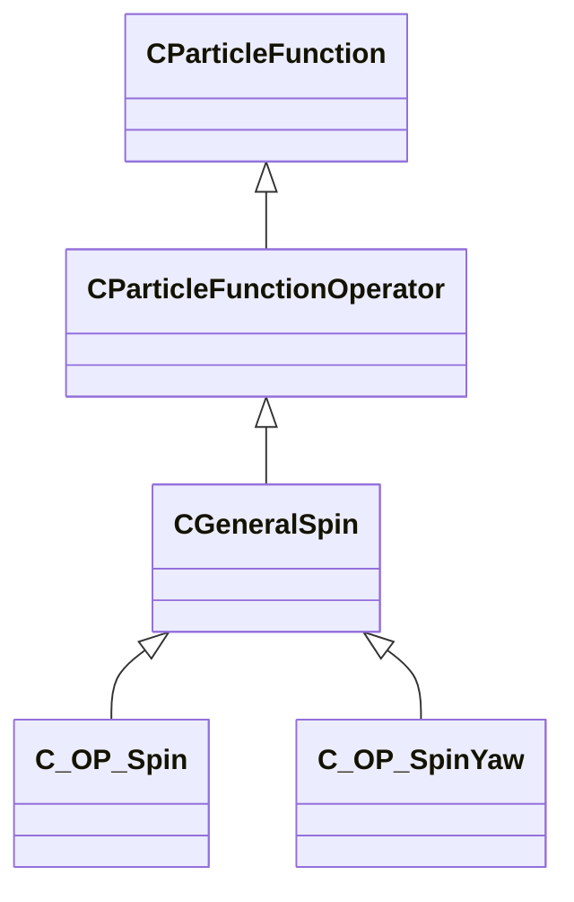

**Fields:**

| Name | Type | Annotations |
|------|------|-------------|
| `m_nSpinRateDegrees` | int32 | `MPropertyFriendlyName = "spin rate degrees"` |
| `m_nSpinRateMinDegrees` | int32 | `MPropertyFriendlyName = "spin rate min"` |
| `m_fSpinRateStopTime` | float32 | `MPropertyFriendlyName = "spin stop time"` |

### CPAssignment_t

**Metadata:** `MGetKV3ClassDefaults = {`, `"m_nCPNumber": 0,`, `"m_Pos":`, `{`, `"m_nType": "PVEC_TYPE_PARTICLE_VECTOR",`, `"m_vLiteralValue":`, `[`, `0.000000,`, `0.000000,`, `0.000000`, `],`, `"m_LiteralColor":`, `[`, `0,`, `0,`, `0`, `],`, `"m_NamedValue": "",`, `"m_bFollowNamedValue": false,`, `"m_nVectorAttribute": 0,`, `"m_vVectorAttributeScale":`, `[`, `1.000000,`, `1.000000,`, `1.000000`, `],`, `"m_nControlPoint": 0,`, `"m_nDeltaControlPoint": 0,`, `"m_vCPValueScale":`, `[`, `1.000000,`, `1.000000,`, `1.000000`, `],`, `"m_vCPRelativePosition":`, `[`, `0.000000,`, `0.000000,`, `0.000000`, `],`, `"m_vCPRelativeDir":`, `[`, `1.000000,`, `0.000000,`, `0.000000`, `],`, `"m_FloatComponentX":`, `{`, `"m_nType": "PF_TYPE_LITERAL",`, `"m_nMapType": "PF_MAP_TYPE_DIRECT",`, `"m_flLiteralValue": 0.000000,`, `"m_NamedValue": "",`, `"m_nControlPoint": 0,`, `"m_nScalarAttribute": 3,`, `"m_nVectorAttribute": 6,`, `"m_nVectorComponent": 0,`, `"m_bReverseOrder": false,`, `"m_flRandomMin": 0.000000,`, `"m_flRandomMax": 1.000000,`, `"m_bHasRandomSignFlip": false,`, `"m_nRandomSeed": <HIDDEN FOR DIFF>,`, `"m_nRandomMode": "PF_RANDOM_MODE_CONSTANT",`, `"m_strSnapshotSubset": "",`, `"m_flLOD0": 0.000000,`, `"m_flLOD1": 0.000000,`, `"m_flLOD2": 0.000000,`, `"m_flLOD3": 0.000000,`, `"m_nNoiseInputVectorAttribute": 0,`, `"m_flNoiseOutputMin": 0.000000,`, `"m_flNoiseOutputMax": 1.000000,`, `"m_flNoiseScale": 0.100000,`, `"m_vecNoiseOffsetRate":`, `[`, `0.000000,`, `0.000000,`, `0.000000`, `],`, `"m_flNoiseOffset": 0.000000,`, `"m_nNoiseOctaves": 1,`, `"m_nNoiseTurbulence": "PF_NOISE_TURB_NONE",`, `"m_nNoiseType": "PF_NOISE_TYPE_PERLIN",`, `"m_nNoiseModifier": "PF_NOISE_MODIFIER_NONE",`, `"m_flNoiseTurbulenceScale": 1.000000,`, `"m_flNoiseTurbulenceMix": 0.500000,`, `"m_flNoiseImgPreviewScale": 1.000000,`, `"m_bNoiseImgPreviewLive": true,`, `"m_flNoCameraFallback": 0.000000,`, `"m_bUseBoundsCenter": false,`, `"m_nInputMode": "PF_INPUT_MODE_CLAMPED",`, `"m_flMultFactor": 1.000000,`, `"m_flInput0": 0.000000,`, `"m_flInput1": 1.000000,`, `"m_flOutput0": 0.000000,`, `"m_flOutput1": 1.000000,`, `"m_flNotchedRangeMin": 0.000000,`, `"m_flNotchedRangeMax": 1.000000,`, `"m_flNotchedOutputOutside": 0.000000,`, `"m_flNotchedOutputInside": 1.000000,`, `"m_nRoundType": "PF_ROUND_TYPE_NEAREST",`, `"m_nBiasType": "PF_BIAS_TYPE_STANDARD",`, `"m_flBiasParameter": 0.000000,`, `"m_Curve":`, `{`, `"m_spline":`, `[`, `],`, `"m_tangents":`, `[`, `],`, `"m_vDomainMins":`, `[`, `0.000000,`, `0.000000`, `],`, `"m_vDomainMaxs":`, `[`, `0.000000,`, `0.000000`, `]`, `}`, `},`, `"m_FloatComponentY":`, `{`, `"m_nType": "PF_TYPE_LITERAL",`, `"m_nMapType": "PF_MAP_TYPE_DIRECT",`, `"m_flLiteralValue": 0.000000,`, `"m_NamedValue": "",`, `"m_nControlPoint": 0,`, `"m_nScalarAttribute": 3,`, `"m_nVectorAttribute": 6,`, `"m_nVectorComponent": 0,`, `"m_bReverseOrder": false,`, `"m_flRandomMin": 0.000000,`, `"m_flRandomMax": 1.000000,`, `"m_bHasRandomSignFlip": false,`, `"m_nRandomSeed": <HIDDEN FOR DIFF>,`, `"m_nRandomMode": "PF_RANDOM_MODE_CONSTANT",`, `"m_strSnapshotSubset": "",`, `"m_flLOD0": 0.000000,`, `"m_flLOD1": 0.000000,`, `"m_flLOD2": 0.000000,`, `"m_flLOD3": 0.000000,`, `"m_nNoiseInputVectorAttribute": 0,`, `"m_flNoiseOutputMin": 0.000000,`, `"m_flNoiseOutputMax": 1.000000,`, `"m_flNoiseScale": 0.100000,`, `"m_vecNoiseOffsetRate":`, `[`, `0.000000,`, `0.000000,`, `0.000000`, `],`, `"m_flNoiseOffset": 0.000000,`, `"m_nNoiseOctaves": 1,`, `"m_nNoiseTurbulence": "PF_NOISE_TURB_NONE",`, `"m_nNoiseType": "PF_NOISE_TYPE_PERLIN",`, `"m_nNoiseModifier": "PF_NOISE_MODIFIER_NONE",`, `"m_flNoiseTurbulenceScale": 1.000000,`, `"m_flNoiseTurbulenceMix": 0.500000,`, `"m_flNoiseImgPreviewScale": 1.000000,`, `"m_bNoiseImgPreviewLive": true,`, `"m_flNoCameraFallback": 0.000000,`, `"m_bUseBoundsCenter": false,`, `"m_nInputMode": "PF_INPUT_MODE_CLAMPED",`, `"m_flMultFactor": 1.000000,`, `"m_flInput0": 0.000000,`, `"m_flInput1": 1.000000,`, `"m_flOutput0": 0.000000,`, `"m_flOutput1": 1.000000,`, `"m_flNotchedRangeMin": 0.000000,`, `"m_flNotchedRangeMax": 1.000000,`, `"m_flNotchedOutputOutside": 0.000000,`, `"m_flNotchedOutputInside": 1.000000,`, `"m_nRoundType": "PF_ROUND_TYPE_NEAREST",`, `"m_nBiasType": "PF_BIAS_TYPE_STANDARD",`, `"m_flBiasParameter": 0.000000,`, `"m_Curve":`, `{`, `"m_spline":`, `[`, `],`, `"m_tangents":`, `[`, `],`, `"m_vDomainMins":`, `[`, `0.000000,`, `0.000000`, `],`, `"m_vDomainMaxs":`, `[`, `0.000000,`, `0.000000`, `]`, `}`, `},`, `"m_FloatComponentZ":`, `{`, `"m_nType": "PF_TYPE_LITERAL",`, `"m_nMapType": "PF_MAP_TYPE_DIRECT",`, `"m_flLiteralValue": 0.000000,`, `"m_NamedValue": "",`, `"m_nControlPoint": 0,`, `"m_nScalarAttribute": 3,`, `"m_nVectorAttribute": 6,`, `"m_nVectorComponent": 0,`, `"m_bReverseOrder": false,`, `"m_flRandomMin": 0.000000,`, `"m_flRandomMax": 1.000000,`, `"m_bHasRandomSignFlip": false,`, `"m_nRandomSeed": <HIDDEN FOR DIFF>,`, `"m_nRandomMode": "PF_RANDOM_MODE_CONSTANT",`, `"m_strSnapshotSubset": "",`, `"m_flLOD0": 0.000000,`, `"m_flLOD1": 0.000000,`, `"m_flLOD2": 0.000000,`, `"m_flLOD3": 0.000000,`, `"m_nNoiseInputVectorAttribute": 0,`, `"m_flNoiseOutputMin": 0.000000,`, `"m_flNoiseOutputMax": 1.000000,`, `"m_flNoiseScale": 0.100000,`, `"m_vecNoiseOffsetRate":`, `[`, `0.000000,`, `0.000000,`, `0.000000`, `],`, `"m_flNoiseOffset": 0.000000,`, `"m_nNoiseOctaves": 1,`, `"m_nNoiseTurbulence": "PF_NOISE_TURB_NONE",`, `"m_nNoiseType": "PF_NOISE_TYPE_PERLIN",`, `"m_nNoiseModifier": "PF_NOISE_MODIFIER_NONE",`, `"m_flNoiseTurbulenceScale": 1.000000,`, `"m_flNoiseTurbulenceMix": 0.500000,`, `"m_flNoiseImgPreviewScale": 1.000000,`, `"m_bNoiseImgPreviewLive": true,`, `"m_flNoCameraFallback": 0.000000,`, `"m_bUseBoundsCenter": false,`, `"m_nInputMode": "PF_INPUT_MODE_CLAMPED",`, `"m_flMultFactor": 1.000000,`, `"m_flInput0": 0.000000,`, `"m_flInput1": 1.000000,`, `"m_flOutput0": 0.000000,`, `"m_flOutput1": 1.000000,`, `"m_flNotchedRangeMin": 0.000000,`, `"m_flNotchedRangeMax": 1.000000,`, `"m_flNotchedOutputOutside": 0.000000,`, `"m_flNotchedOutputInside": 1.000000,`, `"m_nRoundType": "PF_ROUND_TYPE_NEAREST",`, `"m_nBiasType": "PF_BIAS_TYPE_STANDARD",`, `"m_flBiasParameter": 0.000000,`, `"m_Curve":`, `{`, `"m_spline":`, `[`, `],`, `"m_tangents":`, `[`, `],`, `"m_vDomainMins":`, `[`, `0.000000,`, `0.000000`, `],`, `"m_vDomainMaxs":`, `[`, `0.000000,`, `0.000000`, `]`, `}`, `},`, `"m_FloatInterp":`, `{`, `"m_nType": "PF_TYPE_LITERAL",`, `"m_nMapType": "PF_MAP_TYPE_DIRECT",`, `"m_flLiteralValue": 0.000000,`, `"m_NamedValue": "",`, `"m_nControlPoint": 0,`, `"m_nScalarAttribute": 3,`, `"m_nVectorAttribute": 6,`, `"m_nVectorComponent": 0,`, `"m_bReverseOrder": false,`, `"m_flRandomMin": 0.000000,`, `"m_flRandomMax": 1.000000,`, `"m_bHasRandomSignFlip": false,`, `"m_nRandomSeed": <HIDDEN FOR DIFF>,`, `"m_nRandomMode": "PF_RANDOM_MODE_CONSTANT",`, `"m_strSnapshotSubset": "",`, `"m_flLOD0": 0.000000,`, `"m_flLOD1": 0.000000,`, `"m_flLOD2": 0.000000,`, `"m_flLOD3": 0.000000,`, `"m_nNoiseInputVectorAttribute": 0,`, `"m_flNoiseOutputMin": 0.000000,`, `"m_flNoiseOutputMax": 1.000000,`, `"m_flNoiseScale": 0.100000,`, `"m_vecNoiseOffsetRate":`, `[`, `0.000000,`, `0.000000,`, `0.000000`, `],`, `"m_flNoiseOffset": 0.000000,`, `"m_nNoiseOctaves": 1,`, `"m_nNoiseTurbulence": "PF_NOISE_TURB_NONE",`, `"m_nNoiseType": "PF_NOISE_TYPE_PERLIN",`, `"m_nNoiseModifier": "PF_NOISE_MODIFIER_NONE",`, `"m_flNoiseTurbulenceScale": 1.000000,`, `"m_flNoiseTurbulenceMix": 0.500000,`, `"m_flNoiseImgPreviewScale": 1.000000,`, `"m_bNoiseImgPreviewLive": true,`, `"m_flNoCameraFallback": 0.000000,`, `"m_bUseBoundsCenter": false,`, `"m_nInputMode": "PF_INPUT_MODE_CLAMPED",`, `"m_flMultFactor": 1.000000,`, `"m_flInput0": 0.000000,`, `"m_flInput1": 1.000000,`, `"m_flOutput0": 0.000000,`, `"m_flOutput1": 1.000000,`, `"m_flNotchedRangeMin": 0.000000,`, `"m_flNotchedRangeMax": 1.000000,`, `"m_flNotchedOutputOutside": 0.000000,`, `"m_flNotchedOutputInside": 1.000000,`, `"m_nRoundType": "PF_ROUND_TYPE_NEAREST",`, `"m_nBiasType": "PF_BIAS_TYPE_STANDARD",`, `"m_flBiasParameter": 0.000000,`, `"m_Curve":`, `{`, `"m_spline":`, `[`, `],`, `"m_tangents":`, `[`, `],`, `"m_vDomainMins":`, `[`, `0.000000,`, `0.000000`, `],`, `"m_vDomainMaxs":`, `[`, `0.000000,`, `0.000000`, `]`, `}`, `},`, `"m_flInterpInput0": 0.000000,`, `"m_flInterpInput1": 1.000000,`, `"m_vInterpOutput0":`, `[`, `0.000000,`, `0.000000,`, `0.000000`, `],`, `"m_vInterpOutput1":`, `[`, `1.000000,`, `1.000000,`, `1.000000`, `],`, `"m_Gradient":`, `{`, `"m_Stops":`, `[`, `]`, `},`, `"m_vRandomMin":`, `[`, `0.000000,`, `0.000000,`, `0.000000`, `],`, `"m_vRandomMax":`, `[`, `0.000000,`, `0.000000,`, `0.000000`, `]`, `},`, `"m_nOrientationMode": "PARTICLE_ORIENTATION_SET_NONE"`, `}`

### CParticleFunction

**Derived by:** [CParticleFunctionConstraint](particles.md#cparticlefunctionconstraint), [CParticleFunctionEmitter](particles.md#cparticlefunctionemitter), [CParticleFunctionForce](particles.md#cparticlefunctionforce), [CParticleFunctionInitializer](particles.md#cparticlefunctioninitializer), [CParticleFunctionOperator](particles.md#cparticlefunctionoperator), [CParticleFunctionRenderer](particles.md#cparticlefunctionrenderer)

**Metadata:** `MGetKV3ClassDefaults = Could not parse KV3 Defaults`

**Relationships:**

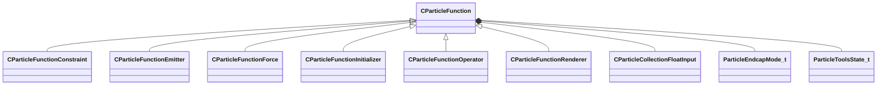

**Fields:**

| Name | Type | Annotations |
|------|------|-------------|
| `m_flOpStrength` | [CParticleCollectionFloatInput](../schemas/particleslib.md#cparticlecollectionfloatinput) | `MPropertyFriendlyName = "operator strength"` `MPropertySortPriority = -100` |
| `m_nOpEndCapState` | [ParticleEndcapMode_t](../schemas/particles.md#particleendcapmode_t) | `MPropertyFriendlyName = "operator end cap state"` `MPropertySortPriority = -100` |
| `m_nToolsState` | [ParticleToolsState_t](../schemas/particles.md#particletoolsstate_t) | `MPropertyFriendlyName = "operator enabled in tools or game only"` `MPropertySortPriority = -100` |
| `m_flOpStartFadeInTime` | float32 | `MPropertyStartGroup = "Operator Fade"` `MPropertyFriendlyName = "operator start fadein"` `MParticleAdvancedField` `MPropertySortPriority = -100` |
| `m_flOpEndFadeInTime` | float32 | `MPropertyFriendlyName = "operator end fadein"` `MParticleAdvancedField` `MPropertySortPriority = -100` |
| `m_flOpStartFadeOutTime` | float32 | `MPropertyFriendlyName = "operator start fadeout"` `MParticleAdvancedField` `MPropertySortPriority = -100` |
| `m_flOpEndFadeOutTime` | float32 | `MPropertyFriendlyName = "operator end fadeout"` `MParticleAdvancedField` `MPropertySortPriority = -100` |
| `m_flOpFadeOscillatePeriod` | float32 | `MPropertyFriendlyName = "operator fade oscillate"` `MParticleAdvancedField` `MPropertySortPriority = -100` |
| `m_bNormalizeToStopTime` | bool | `MPropertyFriendlyName = "normalize fade times to endcap"` `MParticleAdvancedField` `MPropertySortPriority = -100` |
| `m_flOpTimeOffsetMin` | float32 | `MPropertyStartGroup = "Operator Fade Time Offset"` `MPropertyFriendlyName = "operator fade time offset min"` `MParticleAdvancedField` `MPropertySortPriority = -100` |
| `m_flOpTimeOffsetMax` | float32 | `MPropertyFriendlyName = "operator fade time offset max"` `MParticleAdvancedField` `MPropertySortPriority = -100` |
| `m_nOpTimeOffsetSeed` | int32 | `MPropertyFriendlyName = "operator fade time offset seed"` `MParticleAdvancedField` `MPropertySortPriority = -100` |
| `m_nOpTimeScaleSeed` | int32 | `MPropertyStartGroup = "Operator Fade Timescale Modifiers"` `MPropertyFriendlyName = "operator fade time scale seed"` `MParticleAdvancedField` `MPropertySortPriority = -100` |
| `m_flOpTimeScaleMin` | float32 | `MPropertyFriendlyName = "operator fade time scale min"` `MParticleAdvancedField` `MPropertySortPriority = -100` |
| `m_flOpTimeScaleMax` | float32 | `MPropertyFriendlyName = "operator fade time scale max"` `MParticleAdvancedField` `MPropertySortPriority = -100` |
| `m_bDisableOperator` | bool | `MPropertyStartGroup = ""` `MPropertySuppressField` |
| `m_Notes` | CUtlString | `MPropertyFriendlyName = "operator help and notes"` `MParticleHelpField` `MPropertySortPriority = -100` |

### CParticleFunctionConstraint

**Inherits from:** [CParticleFunction](particles.md#cparticlefunction)

**Derived by:** [C_OP_BoxConstraint](particles.md#c_op_boxconstraint), [C_OP_CollideWithParentParticles](particles.md#c_op_collidewithparentparticles), [C_OP_CollideWithSelf](particles.md#c_op_collidewithself), [C_OP_ConstrainDistance](particles.md#c_op_constraindistance), [C_OP_ConstrainDistanceToPath](particles.md#c_op_constraindistancetopath), [C_OP_ConstrainDistanceToUserSpecifiedPath](particles.md#c_op_constraindistancetouserspecifiedpath), [C_OP_ConstrainLineLength](particles.md#c_op_constrainlinelength), [C_OP_PlanarConstraint](particles.md#c_op_planarconstraint), [C_OP_RopeSpringConstraint](particles.md#c_op_ropespringconstraint), [C_OP_ShapeMatchingConstraint](particles.md#c_op_shapematchingconstraint), [C_OP_SpringToVectorConstraint](particles.md#c_op_springtovectorconstraint), [C_OP_WorldCollideConstraint](particles.md#c_op_worldcollideconstraint), [C_OP_WorldTraceConstraint](particles.md#c_op_worldtraceconstraint)

**Metadata:** `MGetKV3ClassDefaults = Could not parse KV3 Defaults`

**Relationships:**

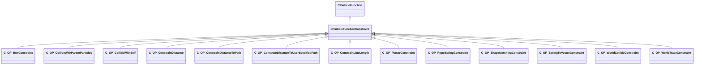

### CParticleFunctionEmitter

**Inherits from:** [CParticleFunction](particles.md#cparticlefunction)

**Derived by:** [C_OP_ContinuousEmitter](particles.md#c_op_continuousemitter), [C_OP_InstantaneousEmitter](particles.md#c_op_instantaneousemitter), [C_OP_MaintainEmitter](particles.md#c_op_maintainemitter), [C_OP_NoiseEmitter](particles.md#c_op_noiseemitter)

**Metadata:** `MGetKV3ClassDefaults = Could not parse KV3 Defaults`

**Relationships:**

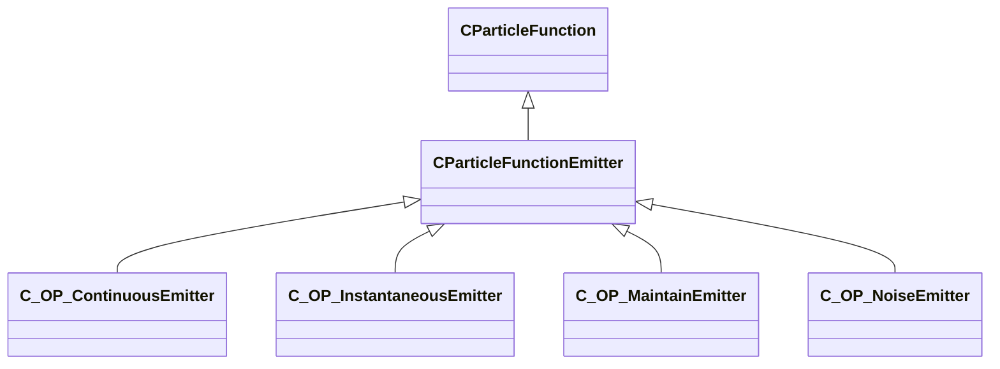

**Fields:**

| Name | Type | Annotations |
|------|------|-------------|
| `m_nEmitterIndex` | int32 | `MPropertyFriendlyName = "Emitter Index"` |

### CParticleFunctionForce

**Inherits from:** [CParticleFunction](particles.md#cparticlefunction)

**Derived by:** [C_OP_AttractToControlPoint](particles.md#c_op_attracttocontrolpoint), [C_OP_CPVelocityForce](particles.md#c_op_cpvelocityforce), [C_OP_CurlNoiseForce](particles.md#c_op_curlnoiseforce), [C_OP_DensityForce](particles.md#c_op_densityforce), [C_OP_ExternalGameImpulseForce](particles.md#c_op_externalgameimpulseforce), [C_OP_ExternalWindForce](particles.md#c_op_externalwindforce), [C_OP_ForceBasedOnDistanceToPlane](particles.md#c_op_forcebasedondistancetoplane), [C_OP_IntraParticleForce](particles.md#c_op_intraparticleforce), [C_OP_LocalAccelerationForce](particles.md#c_op_localaccelerationforce), [C_OP_ParentVortices](particles.md#c_op_parentvortices), [C_OP_PerParticleForce](particles.md#c_op_perparticleforce), [C_OP_RandomForce](particles.md#c_op_randomforce), [C_OP_TimeVaryingForce](particles.md#c_op_timevaryingforce), [C_OP_TurbulenceForce](particles.md#c_op_turbulenceforce), [C_OP_TwistAroundAxis](particles.md#c_op_twistaroundaxis), [C_OP_WindForce](particles.md#c_op_windforce)

**Metadata:** `MGetKV3ClassDefaults = Could not parse KV3 Defaults`

**Relationships:**

```mermaid
classDiagram
    CParticleFunction <|-- CParticleFunctionForce
    CParticleFunctionForce <|-- C_OP_AttractToControlPoint
    CParticleFunctionForce <|-- C_OP_CPVelocityForce
    CParticleFunctionForce <|-- C_OP_CurlNoiseForce
    CParticleFunctionForce <|-- C_OP_DensityForce
    CParticleFunctionForce <|-- C_OP_ExternalGameImpulseForce
    CParticleFunctionForce <|-- C_OP_ExternalWindForce
    CParticleFunctionForce <|-- C_OP_ForceBasedOnDistanceToPlane
    CParticleFunctionForce <|-- C_OP_IntraParticleForce
    CParticleFunctionForce <|-- C_OP_LocalAccelerationForce
    CParticleFunctionForce <|-- C_OP_ParentVortices
    CParticleFunctionForce <|-- C_OP_PerParticleForce
    CParticleFunctionForce <|-- C_OP_RandomForce
    CParticleFunctionForce <|-- C_OP_TimeVaryingForce
    CParticleFunctionForce <|-- C_OP_TurbulenceForce
    CParticleFunctionForce <|-- C_OP_TwistAroundAxis
    CParticleFunctionForce <|-- C_OP_WindForce
```

### CParticleFunctionInitializer

**Inherits from:** [CParticleFunction](particles.md#cparticlefunction)

**Derived by:** [CGeneralRandomRotation](particles.md#cgeneralrandomrotation), [C_INIT_AddVectorToVector](particles.md#c_init_addvectortovector), [C_INIT_AgeNoise](particles.md#c_init_agenoise), [C_INIT_ChaoticAttractor](particles.md#c_init_chaoticattractor), [C_INIT_CheckParticleForWater](particles.md#c_init_checkparticleforwater), [C_INIT_ColorLitPerParticle](particles.md#c_init_colorlitperparticle), [C_INIT_CreateAlongPath](particles.md#c_init_createalongpath), [C_INIT_CreateFromCPs](particles.md#c_init_createfromcps), [C_INIT_CreateFromParentParticles](particles.md#c_init_createfromparentparticles), [C_INIT_CreateFromPlaneCache](particles.md#c_init_createfromplanecache), [C_INIT_CreateInEpitrochoid](particles.md#c_init_createinepitrochoid), [C_INIT_CreateOnGrid](particles.md#c_init_createongrid), [C_INIT_CreateOnModel](particles.md#c_init_createonmodel), [C_INIT_CreateOnModelAtHeight](particles.md#c_init_createonmodelatheight), [C_INIT_CreateParticleImpulse](particles.md#c_init_createparticleimpulse), [C_INIT_CreatePhyllotaxis](particles.md#c_init_createphyllotaxis), [C_INIT_CreateSequentialPath](particles.md#c_init_createsequentialpath), [C_INIT_CreateSequentialPathV2](particles.md#c_init_createsequentialpathv2), [C_INIT_CreateSpiralSphere](particles.md#c_init_createspiralsphere), [C_INIT_CreateWithinBox](particles.md#c_init_createwithinbox), [C_INIT_CreateWithinCapsuleTransform](particles.md#c_init_createwithincapsuletransform), [C_INIT_CreateWithinSphereTransform](particles.md#c_init_createwithinspheretransform), [C_INIT_CreationNoise](particles.md#c_init_creationnoise), [C_INIT_DistanceCull](particles.md#c_init_distancecull), [C_INIT_DistanceToCPInit](particles.md#c_init_distancetocpinit), [C_INIT_DistanceToNeighborCull](particles.md#c_init_distancetoneighborcull), [C_INIT_GlobalScale](particles.md#c_init_globalscale), [C_INIT_InheritFromParentParticles](particles.md#c_init_inheritfromparentparticles), [C_INIT_InheritVelocity](particles.md#c_init_inheritvelocity), [C_INIT_InitFloat](particles.md#c_init_initfloat), [C_INIT_InitFloatCollection](particles.md#c_init_initfloatcollection), [C_INIT_InitFromCPSnapshot](particles.md#c_init_initfromcpsnapshot), [C_INIT_InitFromParentKilled](particles.md#c_init_initfromparentkilled), [C_INIT_InitFromVectorFieldSnapshot](particles.md#c_init_initfromvectorfieldsnapshot), [C_INIT_InitSkinnedPositionFromCPSnapshot](particles.md#c_init_initskinnedpositionfromcpsnapshot), [C_INIT_InitVec](particles.md#c_init_initvec), [C_INIT_InitVecCollection](particles.md#c_init_initveccollection), [C_INIT_InitialRepulsionVelocity](particles.md#c_init_initialrepulsionvelocity), [C_INIT_InitialSequenceFromModel](particles.md#c_init_initialsequencefrommodel), [C_INIT_InitialVelocityFromHitbox](particles.md#c_init_initialvelocityfromhitbox), [C_INIT_InitialVelocityNoise](particles.md#c_init_initialvelocitynoise), [C_INIT_LifespanFromVelocity](particles.md#c_init_lifespanfromvelocity), [C_INIT_ModelCull](particles.md#c_init_modelcull), [C_INIT_MoveBetweenPoints](particles.md#c_init_movebetweenpoints), [C_INIT_NormalAlignToCP](particles.md#c_init_normalaligntocp), [C_INIT_NormalOffset](particles.md#c_init_normaloffset), [C_INIT_OffsetVectorToVector](particles.md#c_init_offsetvectortovector), [C_INIT_Orient2DRelToCP](particles.md#c_init_orient2dreltocp), [C_INIT_PlaneCull](particles.md#c_init_planecull), [C_INIT_PointList](particles.md#c_init_pointlist), [C_INIT_PositionOffset](particles.md#c_init_positionoffset), [C_INIT_PositionOffsetToCP](particles.md#c_init_positionoffsettocp), [C_INIT_PositionPlaceOnGround](particles.md#c_init_positionplaceonground), [C_INIT_PositionWarp](particles.md#c_init_positionwarp), [C_INIT_PositionWarpScalar](particles.md#c_init_positionwarpscalar), [C_INIT_QuantizeFloat](particles.md#c_init_quantizefloat), [C_INIT_RadiusFromCPObject](particles.md#c_init_radiusfromcpobject), [C_INIT_RandomAlpha](particles.md#c_init_randomalpha), [C_INIT_RandomAlphaWindowThreshold](particles.md#c_init_randomalphawindowthreshold), [C_INIT_RandomColor](particles.md#c_init_randomcolor), [C_INIT_RandomLifeTime](particles.md#c_init_randomlifetime), [C_INIT_RandomModelSequence](particles.md#c_init_randommodelsequence), [C_INIT_RandomNamedModelElement](particles.md#c_init_randomnamedmodelelement), [C_INIT_RandomRadius](particles.md#c_init_randomradius), [C_INIT_RandomScalar](particles.md#c_init_randomscalar), [C_INIT_RandomSecondSequence](particles.md#c_init_randomsecondsequence), [C_INIT_RandomSequence](particles.md#c_init_randomsequence), [C_INIT_RandomTrailLength](particles.md#c_init_randomtraillength), [C_INIT_RandomVector](particles.md#c_init_randomvector), [C_INIT_RandomVectorComponent](particles.md#c_init_randomvectorcomponent), [C_INIT_RandomYawFlip](particles.md#c_init_randomyawflip), [C_INIT_RemapInitialDirectionToTransformToVector](particles.md#c_init_remapinitialdirectiontotransformtovector), [C_INIT_RemapInitialTransformDirectionToRotation](particles.md#c_init_remapinitialtransformdirectiontorotation), [C_INIT_RemapInitialVisibilityScalar](particles.md#c_init_remapinitialvisibilityscalar), [C_INIT_RemapNamedModelElementToScalar](particles.md#c_init_remapnamedmodelelementtoscalar), [C_INIT_RemapParticleCountToScalar](particles.md#c_init_remapparticlecounttoscalar), [C_INIT_RemapQAnglesToRotation](particles.md#c_init_remapqanglestorotation), [C_INIT_RemapScalarToVector](particles.md#c_init_remapscalartovector), [C_INIT_RemapTransformOrientationToRotations](particles.md#c_init_remaptransformorientationtorotations), [C_INIT_RemapTransformToVector](particles.md#c_init_remaptransformtovector), [C_INIT_RingWave](particles.md#c_init_ringwave), [C_INIT_RtEnvCull](particles.md#c_init_rtenvcull), [C_INIT_ScaleVelocity](particles.md#c_init_scalevelocity), [C_INIT_ScreenSpacePositionOfTarget](particles.md#c_init_screenspacepositionoftarget), [C_INIT_SequenceFromCP](particles.md#c_init_sequencefromcp), [C_INIT_SequenceLifeTime](particles.md#c_init_sequencelifetime), [C_INIT_SetAttributeToScalarExpression](particles.md#c_init_setattributetoscalarexpression), [C_INIT_SetFloatAttributeToVectorExpression](particles.md#c_init_setfloatattributetovectorexpression), [C_INIT_SetHitboxToClosest](particles.md#c_init_sethitboxtoclosest), [C_INIT_SetHitboxToModel](particles.md#c_init_sethitboxtomodel), [C_INIT_SetRigidAttachment](particles.md#c_init_setrigidattachment), [C_INIT_SetVectorAttributeToVectorExpression](particles.md#c_init_setvectorattributetovectorexpression), [C_INIT_StatusEffect](particles.md#c_init_statuseffect), [C_INIT_StatusEffectCitadel](particles.md#c_init_statuseffectcitadel), [C_INIT_VelocityFromCP](particles.md#c_init_velocityfromcp), [C_INIT_VelocityFromNormal](particles.md#c_init_velocityfromnormal), [C_INIT_VelocityRadialRandom](particles.md#c_init_velocityradialrandom), [C_INIT_VelocityRandom](particles.md#c_init_velocityrandom)

**Metadata:** `MGetKV3ClassDefaults = Could not parse KV3 Defaults`

**Relationships:**


**Fields:**

| Name | Type | Annotations |
|------|------|-------------|
| `m_nAssociatedEmitterIndex` | int32 | `MPropertyFriendlyName = "Associated emitter Index"` |

### CParticleFunctionOperator

**Inherits from:** [CParticleFunction](particles.md#cparticlefunction)

**Derived by:** [CGeneralSpin](particles.md#cgeneralspin), [CParticleFunctionPreEmission](particles.md#cparticlefunctionpreemission), [CSpinUpdateBase](particles.md#cspinupdatebase), [C_OP_AlphaDecay](particles.md#c_op_alphadecay), [C_OP_BasicMovement](particles.md#c_op_basicmovement), [C_OP_CPOffsetToPercentageBetweenCPs](particles.md#c_op_cpoffsettopercentagebetweencps), [C_OP_CalculateVectorAttribute](particles.md#c_op_calculatevectorattribute), [C_OP_ChladniWave](particles.md#c_op_chladniwave), [C_OP_ClampScalar](particles.md#c_op_clampscalar), [C_OP_ClampVector](particles.md#c_op_clampvector), [C_OP_ColorAdjustHSL](particles.md#c_op_coloradjusthsl), [C_OP_ColorInterpolate](particles.md#c_op_colorinterpolate), [C_OP_ColorInterpolateRandom](particles.md#c_op_colorinterpolaterandom), [C_OP_ConnectParentParticleToNearest](particles.md#c_op_connectparentparticletonearest), [C_OP_ControlpointLight](particles.md#c_op_controlpointlight), [C_OP_Cull](particles.md#c_op_cull), [C_OP_CycleScalar](particles.md#c_op_cyclescalar), [C_OP_CylindricalDistanceToTransform](particles.md#c_op_cylindricaldistancetotransform), [C_OP_DampenToCP](particles.md#c_op_dampentocp), [C_OP_Decay](particles.md#c_op_decay), [C_OP_DecayClampCount](particles.md#c_op_decayclampcount), [C_OP_DecayMaintainCount](particles.md#c_op_decaymaintaincount), [C_OP_DecayOffscreen](particles.md#c_op_decayoffscreen), [C_OP_DifferencePreviousParticle](particles.md#c_op_differencepreviousparticle), [C_OP_Diffusion](particles.md#c_op_diffusion), [C_OP_DirectionBetweenVecsToVec](particles.md#c_op_directionbetweenvecstovec), [C_OP_DistanceBetweenTransforms](particles.md#c_op_distancebetweentransforms), [C_OP_DistanceBetweenVecs](particles.md#c_op_distancebetweenvecs), [C_OP_DistanceCull](particles.md#c_op_distancecull), [C_OP_DistanceToTransform](particles.md#c_op_distancetotransform), [C_OP_DragRelativeToPlane](particles.md#c_op_dragrelativetoplane), [C_OP_EndCapDecay](particles.md#c_op_endcapdecay), [C_OP_EndCapTimedDecay](particles.md#c_op_endcaptimeddecay), [C_OP_EndCapTimedFreeze](particles.md#c_op_endcaptimedfreeze), [C_OP_FadeAndKill](particles.md#c_op_fadeandkill), [C_OP_FadeAndKillForTracers](particles.md#c_op_fadeandkillfortracers), [C_OP_FadeIn](particles.md#c_op_fadein), [C_OP_FadeInSimple](particles.md#c_op_fadeinsimple), [C_OP_FadeOut](particles.md#c_op_fadeout), [C_OP_FadeOutSimple](particles.md#c_op_fadeoutsimple), [C_OP_GlobalLight](particles.md#c_op_globallight), [C_OP_InheritFromParentParticles](particles.md#c_op_inheritfromparentparticles), [C_OP_InheritFromParentParticlesV2](particles.md#c_op_inheritfromparentparticlesv2), [C_OP_InheritFromPeerSystem](particles.md#c_op_inheritfrompeersystem), [C_OP_InterpolateRadius](particles.md#c_op_interpolateradius), [C_OP_LagCompensation](particles.md#c_op_lagcompensation), [C_OP_LazyCullCompareFloat](particles.md#c_op_lazycullcomparefloat), [C_OP_LerpEndCapScalar](particles.md#c_op_lerpendcapscalar), [C_OP_LerpEndCapVector](particles.md#c_op_lerpendcapvector), [C_OP_LerpScalar](particles.md#c_op_lerpscalar), [C_OP_LerpToInitialPosition](particles.md#c_op_lerptoinitialposition), [C_OP_LerpToOtherAttribute](particles.md#c_op_lerptootherattribute), [C_OP_LerpVector](particles.md#c_op_lerpvector), [C_OP_LockPoints](particles.md#c_op_lockpoints), [C_OP_LockToBone](particles.md#c_op_locktobone), [C_OP_LockToPointList](particles.md#c_op_locktopointlist), [C_OP_LockToSavedSequentialPath](particles.md#c_op_locktosavedsequentialpath), [C_OP_LockToSavedSequentialPathV2](particles.md#c_op_locktosavedsequentialpathv2), [C_OP_MaintainSequentialPath](particles.md#c_op_maintainsequentialpath), [C_OP_MaxVelocity](particles.md#c_op_maxvelocity), [C_OP_ModelCull](particles.md#c_op_modelcull), [C_OP_ModelDampenMovement](particles.md#c_op_modeldampenmovement), [C_OP_MoveToHitbox](particles.md#c_op_movetohitbox), [C_OP_MovementLoopInsideSphere](particles.md#c_op_movementloopinsidesphere), [C_OP_MovementMaintainOffset](particles.md#c_op_movementmaintainoffset), [C_OP_MovementMoveAlongSkinnedCPSnapshot](particles.md#c_op_movementmovealongskinnedcpsnapshot), [C_OP_MovementPlaceOnGround](particles.md#c_op_movementplaceonground), [C_OP_MovementRigidAttachToCP](particles.md#c_op_movementrigidattachtocp), [C_OP_MovementRotateParticleAroundAxis](particles.md#c_op_movementrotateparticlearoundaxis), [C_OP_MovementSkinnedPositionFromCPSnapshot](particles.md#c_op_movementskinnedpositionfromcpsnapshot), [C_OP_Noise](particles.md#c_op_noise), [C_OP_NormalLock](particles.md#c_op_normallock), [C_OP_NormalizeVector](particles.md#c_op_normalizevector), [C_OP_Orient2DRelToCP](particles.md#c_op_orient2dreltocp), [C_OP_OrientTo2dDirection](particles.md#c_op_orientto2ddirection), [C_OP_OscillateScalar](particles.md#c_op_oscillatescalar), [C_OP_OscillateScalarSimple](particles.md#c_op_oscillatescalarsimple), [C_OP_OscillateVector](particles.md#c_op_oscillatevector), [C_OP_OscillateVectorSimple](particles.md#c_op_oscillatevectorsimple), [C_OP_PercentageBetweenTransformLerpCPs](particles.md#c_op_percentagebetweentransformlerpcps), [C_OP_PercentageBetweenTransforms](particles.md#c_op_percentagebetweentransforms), [C_OP_PercentageBetweenTransformsVector](particles.md#c_op_percentagebetweentransformsvector), [C_OP_PinParticleToCP](particles.md#c_op_pinparticletocp), [C_OP_PinRopeSegmentParticleToParent](particles.md#c_op_pinropesegmentparticletoparent), [C_OP_PlaneCull](particles.md#c_op_planecull), [C_OP_PointVectorAtNextParticle](particles.md#c_op_pointvectoratnextparticle), [C_OP_PositionLock](particles.md#c_op_positionlock), [C_OP_QuantizeFloat](particles.md#c_op_quantizefloat), [C_OP_RadiusDecay](particles.md#c_op_radiusdecay), [C_OP_RampScalarLinear](particles.md#c_op_rampscalarlinear), [C_OP_RampScalarLinearSimple](particles.md#c_op_rampscalarlinearsimple), [C_OP_RampScalarSpline](particles.md#c_op_rampscalarspline), [C_OP_RampScalarSplineSimple](particles.md#c_op_rampscalarsplinesimple), [C_OP_ReadFromNeighboringParticle](particles.md#c_op_readfromneighboringparticle), [C_OP_ReinitializeScalarEndCap](particles.md#c_op_reinitializescalarendcap), [C_OP_RemapCPVelocityToVector](particles.md#c_op_remapcpvelocitytovector), [C_OP_RemapCPtoScalar](particles.md#c_op_remapcptoscalar), [C_OP_RemapCPtoVector](particles.md#c_op_remapcptovector), [C_OP_RemapControlPointDirectionToVector](particles.md#c_op_remapcontrolpointdirectiontovector), [C_OP_RemapControlPointOrientationToRotation](particles.md#c_op_remapcontrolpointorientationtorotation), [C_OP_RemapCrossProductOfTwoVectorsToVector](particles.md#c_op_remapcrossproductoftwovectorstovector), [C_OP_RemapDensityGradientToVectorAttribute](particles.md#c_op_remapdensitygradienttovectorattribute), [C_OP_RemapDensityToVector](particles.md#c_op_remapdensitytovector), [C_OP_RemapDirectionToCPToVector](particles.md#c_op_remapdirectiontocptovector), [C_OP_RemapDistanceToLineSegmentBase](particles.md#c_op_remapdistancetolinesegmentbase), [C_OP_RemapDotProductToScalar](particles.md#c_op_remapdotproducttoscalar), [C_OP_RemapGravityToVector](particles.md#c_op_remapgravitytovector), [C_OP_RemapNamedModelElementEndCap](particles.md#c_op_remapnamedmodelelementendcap), [C_OP_RemapNamedModelElementOnceTimed](particles.md#c_op_remapnamedmodelelementoncetimed), [C_OP_RemapParticleCountOnScalarEndCap](particles.md#c_op_remapparticlecountonscalarendcap), [C_OP_RemapParticleCountToScalar](particles.md#c_op_remapparticlecounttoscalar), [C_OP_RemapScalar](particles.md#c_op_remapscalar), [C_OP_RemapScalarEndCap](particles.md#c_op_remapscalarendcap), [C_OP_RemapScalarOnceTimed](particles.md#c_op_remapscalaroncetimed), [C_OP_RemapSpeed](particles.md#c_op_remapspeed), [C_OP_RemapTransformOrientationToRotations](particles.md#c_op_remaptransformorientationtorotations), [C_OP_RemapTransformOrientationToYaw](particles.md#c_op_remaptransformorientationtoyaw), [C_OP_RemapTransformToVelocity](particles.md#c_op_remaptransformtovelocity), [C_OP_RemapTransformVisibilityToScalar](particles.md#c_op_remaptransformvisibilitytoscalar), [C_OP_RemapTransformVisibilityToVector](particles.md#c_op_remaptransformvisibilitytovector), [C_OP_RemapVectorComponentToScalar](particles.md#c_op_remapvectorcomponenttoscalar), [C_OP_RemapVectorToRotations](particles.md#c_op_remapvectortorotations), [C_OP_RemapVectortoCP](particles.md#c_op_remapvectortocp), [C_OP_RemapVelocityToVector](particles.md#c_op_remapvelocitytovector), [C_OP_RemapVisibilityScalar](particles.md#c_op_remapvisibilityscalar), [C_OP_RestartAfterDuration](particles.md#c_op_restartafterduration), [C_OP_RotateVector](particles.md#c_op_rotatevector), [C_OP_RtEnvCull](particles.md#c_op_rtenvcull), [C_OP_ScreenSpaceDistanceToEdge](particles.md#c_op_screenspacedistancetoedge), [C_OP_ScreenSpacePositionOfTarget](particles.md#c_op_screenspacepositionoftarget), [C_OP_ScreenSpaceRotateTowardTarget](particles.md#c_op_screenspacerotatetowardtarget), [C_OP_SequenceFromModel](particles.md#c_op_sequencefrommodel), [C_OP_SetAttributeToScalarExpression](particles.md#c_op_setattributetoscalarexpression), [C_OP_SetCPOrientationToDirection](particles.md#c_op_setcporientationtodirection), [C_OP_SetCPOrientationToGroundNormal](particles.md#c_op_setcporientationtogroundnormal), [C_OP_SetCPtoVector](particles.md#c_op_setcptovector), [C_OP_SetChildControlPoints](particles.md#c_op_setchildcontrolpoints), [C_OP_SetControlPointsToModelParticles](particles.md#c_op_setcontrolpointstomodelparticles), [C_OP_SetControlPointsToParticle](particles.md#c_op_setcontrolpointstoparticle), [C_OP_SetFloat](particles.md#c_op_setfloat), [C_OP_SetFloatAttributeToVectorExpression](particles.md#c_op_setfloatattributetovectorexpression), [C_OP_SetFloatCollection](particles.md#c_op_setfloatcollection), [C_OP_SetFromCPSnapshot](particles.md#c_op_setfromcpsnapshot), [C_OP_SetPerChildControlPoint](particles.md#c_op_setperchildcontrolpoint), [C_OP_SetPerChildControlPointFromAttribute](particles.md#c_op_setperchildcontrolpointfromattribute), [C_OP_SetToCP](particles.md#c_op_settocp), [C_OP_SetUserEvent](particles.md#c_op_setuserevent), [C_OP_SetVec](particles.md#c_op_setvec), [C_OP_SetVectorAttributeToVectorExpression](particles.md#c_op_setvectorattributetovectorexpression), [C_OP_SnapshotRigidSkinToBones](particles.md#c_op_snapshotrigidskintobones), [C_OP_SnapshotSkinToBones](particles.md#c_op_snapshotskintobones), [C_OP_TeleportBeam](particles.md#c_op_teleportbeam), [C_OP_UpdateLightSource](particles.md#c_op_updatelightsource), [C_OP_VectorFieldSnapshot](particles.md#c_op_vectorfieldsnapshot), [C_OP_VectorNoise](particles.md#c_op_vectornoise), [C_OP_VelocityDecay](particles.md#c_op_velocitydecay), [C_OP_VelocityMatchingForce](particles.md#c_op_velocitymatchingforce)

**Metadata:** `MGetKV3ClassDefaults = Could not parse KV3 Defaults`

**Relationships:**


### CParticleFunctionPreEmission

**Inherits from:** [CParticleFunctionOperator](particles.md#cparticlefunctionoperator)

**Derived by:** [C_OP_ChooseRandomChildrenInGroup](particles.md#c_op_chooserandomchildreningroup), [C_OP_ControlPointToRadialScreenSpace](particles.md#c_op_controlpointtoradialscreenspace), [C_OP_DistanceBetweenCPsToCP](particles.md#c_op_distancebetweencpstocp), [C_OP_DriveCPFromGlobalSoundFloat](particles.md#c_op_drivecpfromglobalsoundfloat), [C_OP_EnableChildrenFromParentParticleCount](particles.md#c_op_enablechildrenfromparentparticlecount), [C_OP_ForceControlPointStub](particles.md#c_op_forcecontrolpointstub), [C_OP_HSVShiftToCP](particles.md#c_op_hsvshifttocp), [C_OP_LightningSnapshotGenerator](particles.md#c_op_lightningsnapshotgenerator), [C_OP_ModelSurfaceSnapshotGenerator](particles.md#c_op_modelsurfacesnapshotgenerator), [C_OP_MultiSegmentDisplaySnapshotGenerator](particles.md#c_op_multisegmentdisplaysnapshotgenerator), [C_OP_PlayEndCapWhenFinished](particles.md#c_op_playendcapwhenfinished), [C_OP_QuantizeCPComponent](particles.md#c_op_quantizecpcomponent), [C_OP_RampCPLinearRandom](particles.md#c_op_rampcplinearrandom), [C_OP_RemapAverageHitboxSpeedtoCP](particles.md#c_op_remapaveragehitboxspeedtocp), [C_OP_RemapAverageScalarValuetoCP](particles.md#c_op_remapaveragescalarvaluetocp), [C_OP_RemapBoundingVolumetoCP](particles.md#c_op_remapboundingvolumetocp), [C_OP_RemapCPtoCP](particles.md#c_op_remapcptocp), [C_OP_RemapDotProductToCP](particles.md#c_op_remapdotproducttocp), [C_OP_RemapExternalWindToCP](particles.md#c_op_remapexternalwindtocp), [C_OP_RemapModelVolumetoCP](particles.md#c_op_remapmodelvolumetocp), [C_OP_RemapSpeedtoCP](particles.md#c_op_remapspeedtocp), [C_OP_RepeatedTriggerChildGroup](particles.md#c_op_repeatedtriggerchildgroup), [C_OP_SelectivelyEnableChildren](particles.md#c_op_selectivelyenablechildren), [C_OP_SetCPOrientationToPointAtCP](particles.md#c_op_setcporientationtopointatcp), [C_OP_SetControlPointFieldFromVectorExpression](particles.md#c_op_setcontrolpointfieldfromvectorexpression), [C_OP_SetControlPointFieldToScalarExpression](particles.md#c_op_setcontrolpointfieldtoscalarexpression), [C_OP_SetControlPointFieldToWater](particles.md#c_op_setcontrolpointfieldtowater), [C_OP_SetControlPointFromObjectScale](particles.md#c_op_setcontrolpointfromobjectscale), [C_OP_SetControlPointOrientation](particles.md#c_op_setcontrolpointorientation), [C_OP_SetControlPointOrientationToCPVelocity](particles.md#c_op_setcontrolpointorientationtocpvelocity), [C_OP_SetControlPointPositionToRandomActiveCP](particles.md#c_op_setcontrolpointpositiontorandomactivecp), [C_OP_SetControlPointPositionToTimeOfDayValue](particles.md#c_op_setcontrolpointpositiontotimeofdayvalue), [C_OP_SetControlPointPositions](particles.md#c_op_setcontrolpointpositions), [C_OP_SetControlPointRotation](particles.md#c_op_setcontrolpointrotation), [C_OP_SetControlPointToCPVelocity](particles.md#c_op_setcontrolpointtocpvelocity), [C_OP_SetControlPointToCenter](particles.md#c_op_setcontrolpointtocenter), [C_OP_SetControlPointToHMD](particles.md#c_op_setcontrolpointtohmd), [C_OP_SetControlPointToHand](particles.md#c_op_setcontrolpointtohand), [C_OP_SetControlPointToImpactPoint](particles.md#c_op_setcontrolpointtoimpactpoint), [C_OP_SetControlPointToPlayer](particles.md#c_op_setcontrolpointtoplayer), [C_OP_SetControlPointToVectorExpression](particles.md#c_op_setcontrolpointtovectorexpression), [C_OP_SetControlPointToWaterSurface](particles.md#c_op_setcontrolpointtowatersurface), [C_OP_SetGravityToCP](particles.md#c_op_setgravitytocp), [C_OP_SetParentControlPointsToChildCP](particles.md#c_op_setparentcontrolpointstochildcp), [C_OP_SetRandomControlPointPosition](particles.md#c_op_setrandomcontrolpointposition), [C_OP_SetSimulationRate](particles.md#c_op_setsimulationrate), [C_OP_SetSingleControlPointPosition](particles.md#c_op_setsinglecontrolpointposition), [C_OP_SetVariable](particles.md#c_op_setvariable), [C_OP_StopAfterCPDuration](particles.md#c_op_stopaftercpduration)

**Metadata:** `MGetKV3ClassDefaults = Could not parse KV3 Defaults`

**Relationships:**

```mermaid
classDiagram
    CParticleFunctionOperator <|-- CParticleFunctionPreEmission
    CParticleFunction <|-- CParticleFunctionOperator
    CParticleFunctionPreEmission <|-- C_OP_ChooseRandomChildrenInGroup
    CParticleFunctionPreEmission <|-- C_OP_ControlPointToRadialScreenSpace
    CParticleFunctionPreEmission <|-- C_OP_DistanceBetweenCPsToCP
    CParticleFunctionPreEmission <|-- C_OP_DriveCPFromGlobalSoundFloat
    CParticleFunctionPreEmission <|-- C_OP_EnableChildrenFromParentParticleCount
    CParticleFunctionPreEmission <|-- C_OP_ForceControlPointStub
    CParticleFunctionPreEmission <|-- C_OP_HSVShiftToCP
    CParticleFunctionPreEmission <|-- C_OP_LightningSnapshotGenerator
    CParticleFunctionPreEmission <|-- C_OP_ModelSurfaceSnapshotGenerator
    CParticleFunctionPreEmission <|-- C_OP_MultiSegmentDisplaySnapshotGenerator
    CParticleFunctionPreEmission <|-- C_OP_PlayEndCapWhenFinished
    CParticleFunctionPreEmission <|-- C_OP_QuantizeCPComponent
    CParticleFunctionPreEmission <|-- C_OP_RampCPLinearRandom
    CParticleFunctionPreEmission <|-- C_OP_RemapAverageHitboxSpeedtoCP
    CParticleFunctionPreEmission <|-- C_OP_RemapAverageScalarValuetoCP
    CParticleFunctionPreEmission <|-- C_OP_RemapBoundingVolumetoCP
    CParticleFunctionPreEmission <|-- C_OP_RemapCPtoCP
    CParticleFunctionPreEmission <|-- C_OP_RemapDotProductToCP
    CParticleFunctionPreEmission <|-- C_OP_RemapExternalWindToCP
    CParticleFunctionPreEmission <|-- C_OP_RemapModelVolumetoCP
    CParticleFunctionPreEmission <|-- C_OP_RemapSpeedtoCP
    CParticleFunctionPreEmission <|-- C_OP_RepeatedTriggerChildGroup
    CParticleFunctionPreEmission <|-- C_OP_SelectivelyEnableChildren
    CParticleFunctionPreEmission <|-- C_OP_SetCPOrientationToPointAtCP
    CParticleFunctionPreEmission <|-- C_OP_SetControlPointFieldFromVectorExpression
    CParticleFunctionPreEmission <|-- C_OP_SetControlPointFieldToScalarExpression
    CParticleFunctionPreEmission <|-- C_OP_SetControlPointFieldToWater
    CParticleFunctionPreEmission <|-- C_OP_SetControlPointFromObjectScale
    CParticleFunctionPreEmission <|-- C_OP_SetControlPointOrientation
    CParticleFunctionPreEmission <|-- C_OP_SetControlPointOrientationToCPVelocity
    CParticleFunctionPreEmission <|-- C_OP_SetControlPointPositionToRandomActiveCP
    CParticleFunctionPreEmission <|-- C_OP_SetControlPointPositionToTimeOfDayValue
    CParticleFunctionPreEmission <|-- C_OP_SetControlPointPositions
    CParticleFunctionPreEmission <|-- C_OP_SetControlPointRotation
    CParticleFunctionPreEmission <|-- C_OP_SetControlPointToCPVelocity
    CParticleFunctionPreEmission <|-- C_OP_SetControlPointToCenter
    CParticleFunctionPreEmission <|-- C_OP_SetControlPointToHMD
    CParticleFunctionPreEmission <|-- C_OP_SetControlPointToHand
    CParticleFunctionPreEmission <|-- C_OP_SetControlPointToImpactPoint
    CParticleFunctionPreEmission <|-- C_OP_SetControlPointToPlayer
    CParticleFunctionPreEmission <|-- C_OP_SetControlPointToVectorExpression
    CParticleFunctionPreEmission <|-- C_OP_SetControlPointToWaterSurface
    CParticleFunctionPreEmission <|-- C_OP_SetGravityToCP
    CParticleFunctionPreEmission <|-- C_OP_SetParentControlPointsToChildCP
    CParticleFunctionPreEmission <|-- C_OP_SetRandomControlPointPosition
    CParticleFunctionPreEmission <|-- C_OP_SetSimulationRate
    CParticleFunctionPreEmission <|-- C_OP_SetSingleControlPointPosition
    CParticleFunctionPreEmission <|-- C_OP_SetVariable
    CParticleFunctionPreEmission <|-- C_OP_StopAfterCPDuration
```

**Fields:**

| Name | Type | Annotations |
|------|------|-------------|
| `m_bRunOnce` | bool | `MPropertyFriendlyName = "Run Only Once"` |

### CParticleFunctionRenderer

**Inherits from:** [CParticleFunction](particles.md#cparticlefunction)

**Derived by:** [CBaseRendererSource2](particles.md#cbaserenderersource2), [C_OP_Callback](particles.md#c_op_callback), [C_OP_ClientPhysics](particles.md#c_op_clientphysics), [C_OP_CreateParticleSystemRenderer](particles.md#c_op_createparticlesystemrenderer), [C_OP_GameDecalRenderer](particles.md#c_op_gamedecalrenderer), [C_OP_GameLiquidSpill](particles.md#c_op_gameliquidspill), [C_OP_RenderAsModels](particles.md#c_op_renderasmodels), [C_OP_RenderBlobs](particles.md#c_op_renderblobs), [C_OP_RenderCables](particles.md#c_op_rendercables), [C_OP_RenderClientPhysicsImpulse](particles.md#c_op_renderclientphysicsimpulse), [C_OP_RenderClothForce](particles.md#c_op_renderclothforce), [C_OP_RenderDeferredLight](particles.md#c_op_renderdeferredlight), [C_OP_RenderFlattenGrass](particles.md#c_op_renderflattengrass), [C_OP_RenderGpuImplicit](particles.md#c_op_rendergpuimplicit), [C_OP_RenderLightBeam](particles.md#c_op_renderlightbeam), [C_OP_RenderMaterialProxy](particles.md#c_op_rendermaterialproxy), [C_OP_RenderModels](particles.md#c_op_rendermodels), [C_OP_RenderOmni2Light](particles.md#c_op_renderomni2light), [C_OP_RenderPoints](particles.md#c_op_renderpoints), [C_OP_RenderPostProcessing](particles.md#c_op_renderpostprocessing), [C_OP_RenderProjected](particles.md#c_op_renderprojected), [C_OP_RenderScreenShake](particles.md#c_op_renderscreenshake), [C_OP_RenderScreenVelocityRotate](particles.md#c_op_renderscreenvelocityrotate), [C_OP_RenderSimpleModelCollection](particles.md#c_op_rendersimplemodelcollection), [C_OP_RenderSound](particles.md#c_op_rendersound), [C_OP_RenderStandardLight](particles.md#c_op_renderstandardlight), [C_OP_RenderStatusEffect](particles.md#c_op_renderstatuseffect), [C_OP_RenderStatusEffectCitadel](particles.md#c_op_renderstatuseffectcitadel), [C_OP_RenderText](particles.md#c_op_rendertext), [C_OP_RenderTreeShake](particles.md#c_op_rendertreeshake), [C_OP_RenderVRHapticEvent](particles.md#c_op_rendervrhapticevent), [C_OP_RenderVolumetricEmitter](particles.md#c_op_rendervolumetricemitter), [C_OP_WaterImpulseRenderer](particles.md#c_op_waterimpulserenderer)

**Metadata:** `MGetKV3ClassDefaults = Could not parse KV3 Defaults`

**Relationships:**

```mermaid
classDiagram
    CParticleFunction <|-- CParticleFunctionRenderer
    CParticleFunctionRenderer <|-- CBaseRendererSource2
    CParticleFunctionRenderer <|-- C_OP_Callback
    CParticleFunctionRenderer <|-- C_OP_ClientPhysics
    CParticleFunctionRenderer <|-- C_OP_CreateParticleSystemRenderer
    CParticleFunctionRenderer <|-- C_OP_GameDecalRenderer
    CParticleFunctionRenderer <|-- C_OP_GameLiquidSpill
    CParticleFunctionRenderer <|-- C_OP_RenderAsModels
    CParticleFunctionRenderer <|-- C_OP_RenderBlobs
    CParticleFunctionRenderer <|-- C_OP_RenderCables
    CParticleFunctionRenderer <|-- C_OP_RenderClientPhysicsImpulse
    CParticleFunctionRenderer <|-- C_OP_RenderClothForce
    CParticleFunctionRenderer <|-- C_OP_RenderDeferredLight
    CParticleFunctionRenderer <|-- C_OP_RenderFlattenGrass
    CParticleFunctionRenderer <|-- C_OP_RenderGpuImplicit
    CParticleFunctionRenderer <|-- C_OP_RenderLightBeam
    CParticleFunctionRenderer <|-- C_OP_RenderMaterialProxy
    CParticleFunctionRenderer <|-- C_OP_RenderModels
    CParticleFunctionRenderer <|-- C_OP_RenderOmni2Light
    CParticleFunctionRenderer <|-- C_OP_RenderPoints
    CParticleFunctionRenderer <|-- C_OP_RenderPostProcessing
    CParticleFunctionRenderer <|-- C_OP_RenderProjected
    CParticleFunctionRenderer <|-- C_OP_RenderScreenShake
    CParticleFunctionRenderer <|-- C_OP_RenderScreenVelocityRotate
    CParticleFunctionRenderer <|-- C_OP_RenderSimpleModelCollection
    CParticleFunctionRenderer <|-- C_OP_RenderSound
    CParticleFunctionRenderer <|-- C_OP_RenderStandardLight
    CParticleFunctionRenderer <|-- C_OP_RenderStatusEffect
    CParticleFunctionRenderer <|-- C_OP_RenderStatusEffectCitadel
    CParticleFunctionRenderer <|-- C_OP_RenderText
    CParticleFunctionRenderer <|-- C_OP_RenderTreeShake
    CParticleFunctionRenderer <|-- C_OP_RenderVRHapticEvent
    CParticleFunctionRenderer <|-- C_OP_RenderVolumetricEmitter
    CParticleFunctionRenderer <|-- C_OP_WaterImpulseRenderer
    CParticleFunctionRenderer *-- CParticleVisibilityInputs
```

**Fields:**

| Name | Type | Annotations |
|------|------|-------------|
| `VisibilityInputs` | [CParticleVisibilityInputs](../schemas/particles.md#cparticlevisibilityinputs) | `MPropertySortPriority = -1` |
| `m_bCannotBeRefracted` | bool | `MPropertyStartGroup = "Rendering filter"` `MPropertyFriendlyName = "I cannot be refracted through refracting objects like water"` `MPropertySortPriority = -1` |
| `m_bSkipRenderingOnMobile` | bool | `MPropertyFriendlyName = "Skip rendering on mobile"` `MPropertySortPriority = -1` |

### CParticleMassCalculationParameters

**Metadata:** `MGetKV3ClassDefaults = {`, `"m_nMassMode": "PARTICLE_MASSMODE_RADIUS_CUBED",`, `"m_flRadius":`, `{`, `"m_nType": "PF_TYPE_LITERAL",`, `"m_nMapType": "PF_MAP_TYPE_DIRECT",`, `"m_flLiteralValue": 1.000000,`, `"m_NamedValue": "",`, `"m_nControlPoint": 0,`, `"m_nScalarAttribute": 3,`, `"m_nVectorAttribute": 6,`, `"m_nVectorComponent": 0,`, `"m_bReverseOrder": false,`, `"m_flRandomMin": 0.000000,`, `"m_flRandomMax": 1.000000,`, `"m_bHasRandomSignFlip": false,`, `"m_nRandomSeed": <HIDDEN FOR DIFF>,`, `"m_nRandomMode": "PF_RANDOM_MODE_CONSTANT",`, `"m_strSnapshotSubset": "",`, `"m_flLOD0": 0.000000,`, `"m_flLOD1": 0.000000,`, `"m_flLOD2": 0.000000,`, `"m_flLOD3": 0.000000,`, `"m_nNoiseInputVectorAttribute": 0,`, `"m_flNoiseOutputMin": 0.000000,`, `"m_flNoiseOutputMax": 1.000000,`, `"m_flNoiseScale": 0.100000,`, `"m_vecNoiseOffsetRate":`, `[`, `0.000000,`, `0.000000,`, `0.000000`, `],`, `"m_flNoiseOffset": 0.000000,`, `"m_nNoiseOctaves": 1,`, `"m_nNoiseTurbulence": "PF_NOISE_TURB_NONE",`, `"m_nNoiseType": "PF_NOISE_TYPE_PERLIN",`, `"m_nNoiseModifier": "PF_NOISE_MODIFIER_NONE",`, `"m_flNoiseTurbulenceScale": 1.000000,`, `"m_flNoiseTurbulenceMix": 0.500000,`, `"m_flNoiseImgPreviewScale": 1.000000,`, `"m_bNoiseImgPreviewLive": true,`, `"m_flNoCameraFallback": 0.000000,`, `"m_bUseBoundsCenter": false,`, `"m_nInputMode": "PF_INPUT_MODE_CLAMPED",`, `"m_flMultFactor": 1.000000,`, `"m_flInput0": 0.000000,`, `"m_flInput1": 1.000000,`, `"m_flOutput0": 0.000000,`, `"m_flOutput1": 1.000000,`, `"m_flNotchedRangeMin": 0.000000,`, `"m_flNotchedRangeMax": 1.000000,`, `"m_flNotchedOutputOutside": 0.000000,`, `"m_flNotchedOutputInside": 1.000000,`, `"m_nRoundType": "PF_ROUND_TYPE_NEAREST",`, `"m_nBiasType": "PF_BIAS_TYPE_STANDARD",`, `"m_flBiasParameter": 0.000000,`, `"m_Curve":`, `{`, `"m_spline":`, `[`, `],`, `"m_tangents":`, `[`, `],`, `"m_vDomainMins":`, `[`, `0.000000,`, `0.000000`, `],`, `"m_vDomainMaxs":`, `[`, `0.000000,`, `0.000000`, `]`, `}`, `},`, `"m_flNominalRadius":`, `{`, `"m_nType": "PF_TYPE_LITERAL",`, `"m_nMapType": "PF_MAP_TYPE_DIRECT",`, `"m_flLiteralValue": 1.000000,`, `"m_NamedValue": "",`, `"m_nControlPoint": 0,`, `"m_nScalarAttribute": 3,`, `"m_nVectorAttribute": 6,`, `"m_nVectorComponent": 0,`, `"m_bReverseOrder": false,`, `"m_flRandomMin": 0.000000,`, `"m_flRandomMax": 1.000000,`, `"m_bHasRandomSignFlip": false,`, `"m_nRandomSeed": <HIDDEN FOR DIFF>,`, `"m_nRandomMode": "PF_RANDOM_MODE_CONSTANT",`, `"m_strSnapshotSubset": "",`, `"m_flLOD0": 0.000000,`, `"m_flLOD1": 0.000000,`, `"m_flLOD2": 0.000000,`, `"m_flLOD3": 0.000000,`, `"m_nNoiseInputVectorAttribute": 0,`, `"m_flNoiseOutputMin": 0.000000,`, `"m_flNoiseOutputMax": 1.000000,`, `"m_flNoiseScale": 0.100000,`, `"m_vecNoiseOffsetRate":`, `[`, `0.000000,`, `0.000000,`, `0.000000`, `],`, `"m_flNoiseOffset": 0.000000,`, `"m_nNoiseOctaves": 1,`, `"m_nNoiseTurbulence": "PF_NOISE_TURB_NONE",`, `"m_nNoiseType": "PF_NOISE_TYPE_PERLIN",`, `"m_nNoiseModifier": "PF_NOISE_MODIFIER_NONE",`, `"m_flNoiseTurbulenceScale": 1.000000,`, `"m_flNoiseTurbulenceMix": 0.500000,`, `"m_flNoiseImgPreviewScale": 1.000000,`, `"m_bNoiseImgPreviewLive": true,`, `"m_flNoCameraFallback": 0.000000,`, `"m_bUseBoundsCenter": false,`, `"m_nInputMode": "PF_INPUT_MODE_CLAMPED",`, `"m_flMultFactor": 1.000000,`, `"m_flInput0": 0.000000,`, `"m_flInput1": 1.000000,`, `"m_flOutput0": 0.000000,`, `"m_flOutput1": 1.000000,`, `"m_flNotchedRangeMin": 0.000000,`, `"m_flNotchedRangeMax": 1.000000,`, `"m_flNotchedOutputOutside": 0.000000,`, `"m_flNotchedOutputInside": 1.000000,`, `"m_nRoundType": "PF_ROUND_TYPE_NEAREST",`, `"m_nBiasType": "PF_BIAS_TYPE_STANDARD",`, `"m_flBiasParameter": 0.000000,`, `"m_Curve":`, `{`, `"m_spline":`, `[`, `],`, `"m_tangents":`, `[`, `],`, `"m_vDomainMins":`, `[`, `0.000000,`, `0.000000`, `],`, `"m_vDomainMaxs":`, `[`, `0.000000,`, `0.000000`, `]`, `}`, `},`, `"m_flScale":`, `{`, `"m_nType": "PF_TYPE_LITERAL",`, `"m_nMapType": "PF_MAP_TYPE_DIRECT",`, `"m_flLiteralValue": 1.000000,`, `"m_NamedValue": "",`, `"m_nControlPoint": 0,`, `"m_nScalarAttribute": 3,`, `"m_nVectorAttribute": 6,`, `"m_nVectorComponent": 0,`, `"m_bReverseOrder": false,`, `"m_flRandomMin": 0.000000,`, `"m_flRandomMax": 1.000000,`, `"m_bHasRandomSignFlip": false,`, `"m_nRandomSeed": <HIDDEN FOR DIFF>,`, `"m_nRandomMode": "PF_RANDOM_MODE_CONSTANT",`, `"m_strSnapshotSubset": "",`, `"m_flLOD0": 0.000000,`, `"m_flLOD1": 0.000000,`, `"m_flLOD2": 0.000000,`, `"m_flLOD3": 0.000000,`, `"m_nNoiseInputVectorAttribute": 0,`, `"m_flNoiseOutputMin": 0.000000,`, `"m_flNoiseOutputMax": 1.000000,`, `"m_flNoiseScale": 0.100000,`, `"m_vecNoiseOffsetRate":`, `[`, `0.000000,`, `0.000000,`, `0.000000`, `],`, `"m_flNoiseOffset": 0.000000,`, `"m_nNoiseOctaves": 1,`, `"m_nNoiseTurbulence": "PF_NOISE_TURB_NONE",`, `"m_nNoiseType": "PF_NOISE_TYPE_PERLIN",`, `"m_nNoiseModifier": "PF_NOISE_MODIFIER_NONE",`, `"m_flNoiseTurbulenceScale": 1.000000,`, `"m_flNoiseTurbulenceMix": 0.500000,`, `"m_flNoiseImgPreviewScale": 1.000000,`, `"m_bNoiseImgPreviewLive": true,`, `"m_flNoCameraFallback": 0.000000,`, `"m_bUseBoundsCenter": false,`, `"m_nInputMode": "PF_INPUT_MODE_CLAMPED",`, `"m_flMultFactor": 1.000000,`, `"m_flInput0": 0.000000,`, `"m_flInput1": 1.000000,`, `"m_flOutput0": 0.000000,`, `"m_flOutput1": 1.000000,`, `"m_flNotchedRangeMin": 0.000000,`, `"m_flNotchedRangeMax": 1.000000,`, `"m_flNotchedOutputOutside": 0.000000,`, `"m_flNotchedOutputInside": 1.000000,`, `"m_nRoundType": "PF_ROUND_TYPE_NEAREST",`, `"m_nBiasType": "PF_BIAS_TYPE_STANDARD",`, `"m_flBiasParameter": 0.000000,`, `"m_Curve":`, `{`, `"m_spline":`, `[`, `],`, `"m_tangents":`, `[`, `],`, `"m_vDomainMins":`, `[`, `0.000000,`, `0.000000`, `],`, `"m_vDomainMaxs":`, `[`, `0.000000,`, `0.000000`, `]`, `}`, `}`, `}`

### CParticleSystemDefinition

**Inherits from:** [IParticleSystemDefinition](particles.md#iparticlesystemdefinition)

**Metadata:** `MGetKV3ClassDefaults = {`, `"_class": "CParticleSystemDefinition",`, `"m_nBehaviorVersion": 0,`, `"m_PreEmissionOperators":`, `[`, `],`, `"m_Emitters":`, `[`, `],`, `"m_Initializers":`, `[`, `],`, `"m_Operators":`, `[`, `],`, `"m_ForceGenerators":`, `[`, `],`, `"m_Constraints":`, `[`, `],`, `"m_Renderers":`, `[`, `],`, `"m_Children":`, `[`, `],`, `"m_nFirstMultipleOverride_BackwardCompat": -1,`, `"m_nInitialParticles": 0,`, `"m_nMaxParticles": 1000,`, `"m_nGroupID": 0,`, `"m_BoundingBoxMin":`, `[`, `-10.000000,`, `-10.000000,`, `-10.000000`, `],`, `"m_BoundingBoxMax":`, `[`, `10.000000,`, `10.000000,`, `10.000000`, `],`, `"m_flDepthSortBias": 0.000000,`, `"m_nSortOverridePositionCP": -1,`, `"m_bInfiniteBounds": false,`, `"m_bEnableNamedValues": false,`, `"m_NamedValueDomain": "",`, `"m_NamedValueLocals":`, `[`, `],`, `"m_ConstantColor":`, `[`, `255,`, `255,`, `255`, `],`, `"m_ConstantNormal":`, `[`, `0.000000,`, `0.000000,`, `1.000000`, `],`, `"m_flConstantRadius": 5.000000,`, `"m_flConstantRotation": 0.000000,`, `"m_flConstantRotationSpeed": 0.000000,`, `"m_flConstantLifespan": 1.000000,`, `"m_nConstantSequenceNumber": 0,`, `"m_nConstantSequenceNumber1": 0,`, `"m_nSnapshotControlPoint": 0,`, `"m_hSnapshot": "",`, `"m_pszCullReplacementName": "",`, `"m_flCullRadius": 0.000000,`, `"m_flCullFillCost": 1.000000,`, `"m_nCullControlPoint": 0,`, `"m_hFallback": "",`, `"m_nFallbackMaxCount": -1,`, `"m_hLowViolenceDef": "",`, `"m_hReferenceReplacement": "",`, `"m_flPreSimulationTime": 0.000000,`, `"m_flStopSimulationAfterTime": 1000000000.000000,`, `"m_flMaximumTimeStep": 0.100000,`, `"m_flMaximumSimTime": 0.000000,`, `"m_flMinimumSimTime": 0.000000,`, `"m_flMinimumTimeStep": 0.000000,`, `"m_nMinimumFrames": 0,`, `"m_bIsGPUParticleSystem": false,`, `"m_nMinCPULevel": 0,`, `"m_nMinGPULevel": 0,`, `"m_flNoDrawTimeToGoToSleep": 8.000000,`, `"m_flMaxDrawDistance": -1.000000,`, `"m_flStartFadeDistance": 200000.000000,`, `"m_flMaxCreationDistance": -1.000000,`, `"m_nAggregationMinAvailableParticles": 1,`, `"m_flAggregateRadius": 0.000000,`, `"m_bShouldBatch": false,`, `"m_bShouldHitboxesFallbackToRenderBounds": true,`, `"m_bShouldHitboxesFallbackToSnapshot": true,`, `"m_bShouldHitboxesFallbackToCollisionHulls": true,`, `"m_nViewModelEffect": "INHERITABLE_BOOL_INHERIT",`, `"m_bScreenSpaceEffect": false,`, `"m_pszTargetLayerID": "",`, `"m_nSkipRenderControlPoint": -1,`, `"m_nAllowRenderControlPoint": -1,`, `"m_bShouldSort": true,`, `"m_controlPointConfigurations":`, `[`, `]`, `}`

**Relationships:**

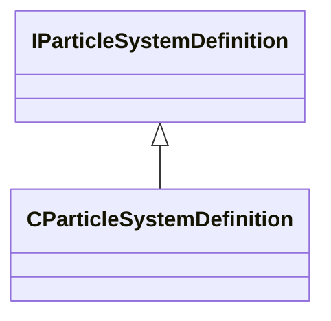

### CParticleVisibilityInputs

**Metadata:** `MGetKV3ClassDefaults = {`, `"m_flCameraBias": 0.000000,`, `"m_nCPin": -1,`, `"m_flProxyRadius": 1.000000,`, `"m_flInputMin": 0.000000,`, `"m_flInputMax": 1.000000,`, `"m_flInputPixelVisFade": 0.250000,`, `"m_flNoPixelVisibilityFallback": 1.000000,`, `"m_flDistanceInputMin": 0.000000,`, `"m_flDistanceInputMax": 0.000000,`, `"m_flDotInputMin": 0.000000,`, `"m_flDotInputMax": 0.000000,`, `"m_bDotCPAngles": true,`, `"m_bDotCameraAngles": false,`, `"m_flAlphaScaleMin": 0.000000,`, `"m_flAlphaScaleMax": 1.000000,`, `"m_flRadiusScaleMin": 1.000000,`, `"m_flRadiusScaleMax": 1.000000,`, `"m_flRadiusScaleFOVBase": 0.000000,`, `"m_bRightEye": false`, `}`

### CPathParameters

**Metadata:** `MGetKV3ClassDefaults = {`, `"m_nStartControlPointNumber": 0,`, `"m_nEndControlPointNumber": 0,`, `"m_nBulgeControl": 0,`, `"m_flBulge": 0.000000,`, `"m_flMidPoint": 0.500000,`, `"m_vStartPointOffset":`, `[`, `0.000000,`, `0.000000,`, `0.000000`, `],`, `"m_vMidPointOffset":`, `[`, `0.000000,`, `0.000000,`, `0.000000`, `],`, `"m_vEndOffset":`, `[`, `0.000000,`, `0.000000,`, `0.000000`, `]`, `}`

### CRandomNumberGeneratorParameters

**Metadata:** `MGetKV3ClassDefaults = {`, `"m_bDistributeEvenly": false,`, `"m_nSeed": -1`, `}`

### CReplicationParameters

**Metadata:** `MGetKV3ClassDefaults = {`, `"m_nReplicationMode": "PARTICLE_REPLICATIONMODE_NONE",`, `"m_bScaleChildParticleRadii": true,`, `"m_flMinRandomRadiusScale":`, `{`, `"m_nType": "PF_TYPE_LITERAL",`, `"m_nMapType": "PF_MAP_TYPE_DIRECT",`, `"m_flLiteralValue": 1.000000,`, `"m_NamedValue": "",`, `"m_nControlPoint": 0,`, `"m_nScalarAttribute": 3,`, `"m_nVectorAttribute": 6,`, `"m_nVectorComponent": 0,`, `"m_bReverseOrder": false,`, `"m_flRandomMin": 0.000000,`, `"m_flRandomMax": 1.000000,`, `"m_bHasRandomSignFlip": false,`, `"m_nRandomSeed": <HIDDEN FOR DIFF>,`, `"m_nRandomMode": "PF_RANDOM_MODE_CONSTANT",`, `"m_strSnapshotSubset": "",`, `"m_flLOD0": 0.000000,`, `"m_flLOD1": 0.000000,`, `"m_flLOD2": 0.000000,`, `"m_flLOD3": 0.000000,`, `"m_nNoiseInputVectorAttribute": 0,`, `"m_flNoiseOutputMin": 0.000000,`, `"m_flNoiseOutputMax": 1.000000,`, `"m_flNoiseScale": 0.100000,`, `"m_vecNoiseOffsetRate":`, `[`, `0.000000,`, `0.000000,`, `0.000000`, `],`, `"m_flNoiseOffset": 0.000000,`, `"m_nNoiseOctaves": 1,`, `"m_nNoiseTurbulence": "PF_NOISE_TURB_NONE",`, `"m_nNoiseType": "PF_NOISE_TYPE_PERLIN",`, `"m_nNoiseModifier": "PF_NOISE_MODIFIER_NONE",`, `"m_flNoiseTurbulenceScale": 1.000000,`, `"m_flNoiseTurbulenceMix": 0.500000,`, `"m_flNoiseImgPreviewScale": 1.000000,`, `"m_bNoiseImgPreviewLive": true,`, `"m_flNoCameraFallback": 0.000000,`, `"m_bUseBoundsCenter": false,`, `"m_nInputMode": "PF_INPUT_MODE_CLAMPED",`, `"m_flMultFactor": 1.000000,`, `"m_flInput0": 0.000000,`, `"m_flInput1": 1.000000,`, `"m_flOutput0": 0.000000,`, `"m_flOutput1": 1.000000,`, `"m_flNotchedRangeMin": 0.000000,`, `"m_flNotchedRangeMax": 1.000000,`, `"m_flNotchedOutputOutside": 0.000000,`, `"m_flNotchedOutputInside": 1.000000,`, `"m_nRoundType": "PF_ROUND_TYPE_NEAREST",`, `"m_nBiasType": "PF_BIAS_TYPE_STANDARD",`, `"m_flBiasParameter": 0.000000,`, `"m_Curve":`, `{`, `"m_spline":`, `[`, `],`, `"m_tangents":`, `[`, `],`, `"m_vDomainMins":`, `[`, `0.000000,`, `0.000000`, `],`, `"m_vDomainMaxs":`, `[`, `0.000000,`, `0.000000`, `]`, `}`, `},`, `"m_flMaxRandomRadiusScale":`, `{`, `"m_nType": "PF_TYPE_LITERAL",`, `"m_nMapType": "PF_MAP_TYPE_DIRECT",`, `"m_flLiteralValue": 1.000000,`, `"m_NamedValue": "",`, `"m_nControlPoint": 0,`, `"m_nScalarAttribute": 3,`, `"m_nVectorAttribute": 6,`, `"m_nVectorComponent": 0,`, `"m_bReverseOrder": false,`, `"m_flRandomMin": 0.000000,`, `"m_flRandomMax": 1.000000,`, `"m_bHasRandomSignFlip": false,`, `"m_nRandomSeed": <HIDDEN FOR DIFF>,`, `"m_nRandomMode": "PF_RANDOM_MODE_CONSTANT",`, `"m_strSnapshotSubset": "",`, `"m_flLOD0": 0.000000,`, `"m_flLOD1": 0.000000,`, `"m_flLOD2": 0.000000,`, `"m_flLOD3": 0.000000,`, `"m_nNoiseInputVectorAttribute": 0,`, `"m_flNoiseOutputMin": 0.000000,`, `"m_flNoiseOutputMax": 1.000000,`, `"m_flNoiseScale": 0.100000,`, `"m_vecNoiseOffsetRate":`, `[`, `0.000000,`, `0.000000,`, `0.000000`, `],`, `"m_flNoiseOffset": 0.000000,`, `"m_nNoiseOctaves": 1,`, `"m_nNoiseTurbulence": "PF_NOISE_TURB_NONE",`, `"m_nNoiseType": "PF_NOISE_TYPE_PERLIN",`, `"m_nNoiseModifier": "PF_NOISE_MODIFIER_NONE",`, `"m_flNoiseTurbulenceScale": 1.000000,`, `"m_flNoiseTurbulenceMix": 0.500000,`, `"m_flNoiseImgPreviewScale": 1.000000,`, `"m_bNoiseImgPreviewLive": true,`, `"m_flNoCameraFallback": 0.000000,`, `"m_bUseBoundsCenter": false,`, `"m_nInputMode": "PF_INPUT_MODE_CLAMPED",`, `"m_flMultFactor": 1.000000,`, `"m_flInput0": 0.000000,`, `"m_flInput1": 1.000000,`, `"m_flOutput0": 0.000000,`, `"m_flOutput1": 1.000000,`, `"m_flNotchedRangeMin": 0.000000,`, `"m_flNotchedRangeMax": 1.000000,`, `"m_flNotchedOutputOutside": 0.000000,`, `"m_flNotchedOutputInside": 1.000000,`, `"m_nRoundType": "PF_ROUND_TYPE_NEAREST",`, `"m_nBiasType": "PF_BIAS_TYPE_STANDARD",`, `"m_flBiasParameter": 0.000000,`, `"m_Curve":`, `{`, `"m_spline":`, `[`, `],`, `"m_tangents":`, `[`, `],`, `"m_vDomainMins":`, `[`, `0.000000,`, `0.000000`, `],`, `"m_vDomainMaxs":`, `[`, `0.000000,`, `0.000000`, `]`, `}`, `},`, `"m_vMinRandomDisplacement":`, `{`, `"m_nType": "PVEC_TYPE_LITERAL",`, `"m_vLiteralValue":`, `[`, `0.000000,`, `0.000000,`, `0.000000`, `],`, `"m_LiteralColor":`, `[`, `0,`, `0,`, `0`, `],`, `"m_NamedValue": "",`, `"m_bFollowNamedValue": false,`, `"m_nVectorAttribute": 6,`, `"m_vVectorAttributeScale":`, `[`, `1.000000,`, `1.000000,`, `1.000000`, `],`, `"m_nControlPoint": 0,`, `"m_nDeltaControlPoint": 0,`, `"m_vCPValueScale":`, `[`, `1.000000,`, `1.000000,`, `1.000000`, `],`, `"m_vCPRelativePosition":`, `[`, `0.000000,`, `0.000000,`, `0.000000`, `],`, `"m_vCPRelativeDir":`, `[`, `1.000000,`, `0.000000,`, `0.000000`, `],`, `"m_FloatComponentX":`, `{`, `"m_nType": "PF_TYPE_LITERAL",`, `"m_nMapType": "PF_MAP_TYPE_DIRECT",`, `"m_flLiteralValue": 0.000000,`, `"m_NamedValue": "",`, `"m_nControlPoint": 0,`, `"m_nScalarAttribute": 3,`, `"m_nVectorAttribute": 6,`, `"m_nVectorComponent": 0,`, `"m_bReverseOrder": false,`, `"m_flRandomMin": 0.000000,`, `"m_flRandomMax": 1.000000,`, `"m_bHasRandomSignFlip": false,`, `"m_nRandomSeed": <HIDDEN FOR DIFF>,`, `"m_nRandomMode": "PF_RANDOM_MODE_CONSTANT",`, `"m_strSnapshotSubset": "",`, `"m_flLOD0": 0.000000,`, `"m_flLOD1": 0.000000,`, `"m_flLOD2": 0.000000,`, `"m_flLOD3": 0.000000,`, `"m_nNoiseInputVectorAttribute": 0,`, `"m_flNoiseOutputMin": 0.000000,`, `"m_flNoiseOutputMax": 1.000000,`, `"m_flNoiseScale": 0.100000,`, `"m_vecNoiseOffsetRate":`, `[`, `0.000000,`, `0.000000,`, `0.000000`, `],`, `"m_flNoiseOffset": 0.000000,`, `"m_nNoiseOctaves": 1,`, `"m_nNoiseTurbulence": "PF_NOISE_TURB_NONE",`, `"m_nNoiseType": "PF_NOISE_TYPE_PERLIN",`, `"m_nNoiseModifier": "PF_NOISE_MODIFIER_NONE",`, `"m_flNoiseTurbulenceScale": 1.000000,`, `"m_flNoiseTurbulenceMix": 0.500000,`, `"m_flNoiseImgPreviewScale": 1.000000,`, `"m_bNoiseImgPreviewLive": true,`, `"m_flNoCameraFallback": 0.000000,`, `"m_bUseBoundsCenter": false,`, `"m_nInputMode": "PF_INPUT_MODE_CLAMPED",`, `"m_flMultFactor": 1.000000,`, `"m_flInput0": 0.000000,`, `"m_flInput1": 1.000000,`, `"m_flOutput0": 0.000000,`, `"m_flOutput1": 1.000000,`, `"m_flNotchedRangeMin": 0.000000,`, `"m_flNotchedRangeMax": 1.000000,`, `"m_flNotchedOutputOutside": 0.000000,`, `"m_flNotchedOutputInside": 1.000000,`, `"m_nRoundType": "PF_ROUND_TYPE_NEAREST",`, `"m_nBiasType": "PF_BIAS_TYPE_STANDARD",`, `"m_flBiasParameter": 0.000000,`, `"m_Curve":`, `{`, `"m_spline":`, `[`, `],`, `"m_tangents":`, `[`, `],`, `"m_vDomainMins":`, `[`, `0.000000,`, `0.000000`, `],`, `"m_vDomainMaxs":`, `[`, `0.000000,`, `0.000000`, `]`, `}`, `},`, `"m_FloatComponentY":`, `{`, `"m_nType": "PF_TYPE_LITERAL",`, `"m_nMapType": "PF_MAP_TYPE_DIRECT",`, `"m_flLiteralValue": 0.000000,`, `"m_NamedValue": "",`, `"m_nControlPoint": 0,`, `"m_nScalarAttribute": 3,`, `"m_nVectorAttribute": 6,`, `"m_nVectorComponent": 0,`, `"m_bReverseOrder": false,`, `"m_flRandomMin": 0.000000,`, `"m_flRandomMax": 1.000000,`, `"m_bHasRandomSignFlip": false,`, `"m_nRandomSeed": <HIDDEN FOR DIFF>,`, `"m_nRandomMode": "PF_RANDOM_MODE_CONSTANT",`, `"m_strSnapshotSubset": "",`, `"m_flLOD0": 0.000000,`, `"m_flLOD1": 0.000000,`, `"m_flLOD2": 0.000000,`, `"m_flLOD3": 0.000000,`, `"m_nNoiseInputVectorAttribute": 0,`, `"m_flNoiseOutputMin": 0.000000,`, `"m_flNoiseOutputMax": 1.000000,`, `"m_flNoiseScale": 0.100000,`, `"m_vecNoiseOffsetRate":`, `[`, `0.000000,`, `0.000000,`, `0.000000`, `],`, `"m_flNoiseOffset": 0.000000,`, `"m_nNoiseOctaves": 1,`, `"m_nNoiseTurbulence": "PF_NOISE_TURB_NONE",`, `"m_nNoiseType": "PF_NOISE_TYPE_PERLIN",`, `"m_nNoiseModifier": "PF_NOISE_MODIFIER_NONE",`, `"m_flNoiseTurbulenceScale": 1.000000,`, `"m_flNoiseTurbulenceMix": 0.500000,`, `"m_flNoiseImgPreviewScale": 1.000000,`, `"m_bNoiseImgPreviewLive": true,`, `"m_flNoCameraFallback": 0.000000,`, `"m_bUseBoundsCenter": false,`, `"m_nInputMode": "PF_INPUT_MODE_CLAMPED",`, `"m_flMultFactor": 1.000000,`, `"m_flInput0": 0.000000,`, `"m_flInput1": 1.000000,`, `"m_flOutput0": 0.000000,`, `"m_flOutput1": 1.000000,`, `"m_flNotchedRangeMin": 0.000000,`, `"m_flNotchedRangeMax": 1.000000,`, `"m_flNotchedOutputOutside": 0.000000,`, `"m_flNotchedOutputInside": 1.000000,`, `"m_nRoundType": "PF_ROUND_TYPE_NEAREST",`, `"m_nBiasType": "PF_BIAS_TYPE_STANDARD",`, `"m_flBiasParameter": 0.000000,`, `"m_Curve":`, `{`, `"m_spline":`, `[`, `],`, `"m_tangents":`, `[`, `],`, `"m_vDomainMins":`, `[`, `0.000000,`, `0.000000`, `],`, `"m_vDomainMaxs":`, `[`, `0.000000,`, `0.000000`, `]`, `}`, `},`, `"m_FloatComponentZ":`, `{`, `"m_nType": "PF_TYPE_LITERAL",`, `"m_nMapType": "PF_MAP_TYPE_DIRECT",`, `"m_flLiteralValue": 0.000000,`, `"m_NamedValue": "",`, `"m_nControlPoint": 0,`, `"m_nScalarAttribute": 3,`, `"m_nVectorAttribute": 6,`, `"m_nVectorComponent": 0,`, `"m_bReverseOrder": false,`, `"m_flRandomMin": 0.000000,`, `"m_flRandomMax": 1.000000,`, `"m_bHasRandomSignFlip": false,`, `"m_nRandomSeed": <HIDDEN FOR DIFF>,`, `"m_nRandomMode": "PF_RANDOM_MODE_CONSTANT",`, `"m_strSnapshotSubset": "",`, `"m_flLOD0": 0.000000,`, `"m_flLOD1": 0.000000,`, `"m_flLOD2": 0.000000,`, `"m_flLOD3": 0.000000,`, `"m_nNoiseInputVectorAttribute": 0,`, `"m_flNoiseOutputMin": 0.000000,`, `"m_flNoiseOutputMax": 1.000000,`, `"m_flNoiseScale": 0.100000,`, `"m_vecNoiseOffsetRate":`, `[`, `0.000000,`, `0.000000,`, `0.000000`, `],`, `"m_flNoiseOffset": 0.000000,`, `"m_nNoiseOctaves": 1,`, `"m_nNoiseTurbulence": "PF_NOISE_TURB_NONE",`, `"m_nNoiseType": "PF_NOISE_TYPE_PERLIN",`, `"m_nNoiseModifier": "PF_NOISE_MODIFIER_NONE",`, `"m_flNoiseTurbulenceScale": 1.000000,`, `"m_flNoiseTurbulenceMix": 0.500000,`, `"m_flNoiseImgPreviewScale": 1.000000,`, `"m_bNoiseImgPreviewLive": true,`, `"m_flNoCameraFallback": 0.000000,`, `"m_bUseBoundsCenter": false,`, `"m_nInputMode": "PF_INPUT_MODE_CLAMPED",`, `"m_flMultFactor": 1.000000,`, `"m_flInput0": 0.000000,`, `"m_flInput1": 1.000000,`, `"m_flOutput0": 0.000000,`, `"m_flOutput1": 1.000000,`, `"m_flNotchedRangeMin": 0.000000,`, `"m_flNotchedRangeMax": 1.000000,`, `"m_flNotchedOutputOutside": 0.000000,`, `"m_flNotchedOutputInside": 1.000000,`, `"m_nRoundType": "PF_ROUND_TYPE_NEAREST",`, `"m_nBiasType": "PF_BIAS_TYPE_STANDARD",`, `"m_flBiasParameter": 0.000000,`, `"m_Curve":`, `{`, `"m_spline":`, `[`, `],`, `"m_tangents":`, `[`, `],`, `"m_vDomainMins":`, `[`, `0.000000,`, `0.000000`, `],`, `"m_vDomainMaxs":`, `[`, `0.000000,`, `0.000000`, `]`, `}`, `},`, `"m_FloatInterp":`, `{`, `"m_nType": "PF_TYPE_LITERAL",`, `"m_nMapType": "PF_MAP_TYPE_DIRECT",`, `"m_flLiteralValue": 0.000000,`, `"m_NamedValue": "",`, `"m_nControlPoint": 0,`, `"m_nScalarAttribute": 3,`, `"m_nVectorAttribute": 6,`, `"m_nVectorComponent": 0,`, `"m_bReverseOrder": false,`, `"m_flRandomMin": 0.000000,`, `"m_flRandomMax": 1.000000,`, `"m_bHasRandomSignFlip": false,`, `"m_nRandomSeed": <HIDDEN FOR DIFF>,`, `"m_nRandomMode": "PF_RANDOM_MODE_CONSTANT",`, `"m_strSnapshotSubset": "",`, `"m_flLOD0": 0.000000,`, `"m_flLOD1": 0.000000,`, `"m_flLOD2": 0.000000,`, `"m_flLOD3": 0.000000,`, `"m_nNoiseInputVectorAttribute": 0,`, `"m_flNoiseOutputMin": 0.000000,`, `"m_flNoiseOutputMax": 1.000000,`, `"m_flNoiseScale": 0.100000,`, `"m_vecNoiseOffsetRate":`, `[`, `0.000000,`, `0.000000,`, `0.000000`, `],`, `"m_flNoiseOffset": 0.000000,`, `"m_nNoiseOctaves": 1,`, `"m_nNoiseTurbulence": "PF_NOISE_TURB_NONE",`, `"m_nNoiseType": "PF_NOISE_TYPE_PERLIN",`, `"m_nNoiseModifier": "PF_NOISE_MODIFIER_NONE",`, `"m_flNoiseTurbulenceScale": 1.000000,`, `"m_flNoiseTurbulenceMix": 0.500000,`, `"m_flNoiseImgPreviewScale": 1.000000,`, `"m_bNoiseImgPreviewLive": true,`, `"m_flNoCameraFallback": 0.000000,`, `"m_bUseBoundsCenter": false,`, `"m_nInputMode": "PF_INPUT_MODE_CLAMPED",`, `"m_flMultFactor": 1.000000,`, `"m_flInput0": 0.000000,`, `"m_flInput1": 1.000000,`, `"m_flOutput0": 0.000000,`, `"m_flOutput1": 1.000000,`, `"m_flNotchedRangeMin": 0.000000,`, `"m_flNotchedRangeMax": 1.000000,`, `"m_flNotchedOutputOutside": 0.000000,`, `"m_flNotchedOutputInside": 1.000000,`, `"m_nRoundType": "PF_ROUND_TYPE_NEAREST",`, `"m_nBiasType": "PF_BIAS_TYPE_STANDARD",`, `"m_flBiasParameter": 0.000000,`, `"m_Curve":`, `{`, `"m_spline":`, `[`, `],`, `"m_tangents":`, `[`, `],`, `"m_vDomainMins":`, `[`, `0.000000,`, `0.000000`, `],`, `"m_vDomainMaxs":`, `[`, `0.000000,`, `0.000000`, `]`, `}`, `},`, `"m_flInterpInput0": 0.000000,`, `"m_flInterpInput1": 1.000000,`, `"m_vInterpOutput0":`, `[`, `0.000000,`, `0.000000,`, `0.000000`, `],`, `"m_vInterpOutput1":`, `[`, `1.000000,`, `1.000000,`, `1.000000`, `],`, `"m_Gradient":`, `{`, `"m_Stops":`, `[`, `]`, `},`, `"m_vRandomMin":`, `[`, `0.000000,`, `0.000000,`, `0.000000`, `],`, `"m_vRandomMax":`, `[`, `0.000000,`, `0.000000,`, `0.000000`, `]`, `},`, `"m_vMaxRandomDisplacement":`, `{`, `"m_nType": "PVEC_TYPE_LITERAL",`, `"m_vLiteralValue":`, `[`, `0.000000,`, `0.000000,`, `0.000000`, `],`, `"m_LiteralColor":`, `[`, `0,`, `0,`, `0`, `],`, `"m_NamedValue": "",`, `"m_bFollowNamedValue": false,`, `"m_nVectorAttribute": 6,`, `"m_vVectorAttributeScale":`, `[`, `1.000000,`, `1.000000,`, `1.000000`, `],`, `"m_nControlPoint": 0,`, `"m_nDeltaControlPoint": 0,`, `"m_vCPValueScale":`, `[`, `1.000000,`, `1.000000,`, `1.000000`, `],`, `"m_vCPRelativePosition":`, `[`, `0.000000,`, `0.000000,`, `0.000000`, `],`, `"m_vCPRelativeDir":`, `[`, `1.000000,`, `0.000000,`, `0.000000`, `],`, `"m_FloatComponentX":`, `{`, `"m_nType": "PF_TYPE_LITERAL",`, `"m_nMapType": "PF_MAP_TYPE_DIRECT",`, `"m_flLiteralValue": 0.000000,`, `"m_NamedValue": "",`, `"m_nControlPoint": 0,`, `"m_nScalarAttribute": 3,`, `"m_nVectorAttribute": 6,`, `"m_nVectorComponent": 0,`, `"m_bReverseOrder": false,`, `"m_flRandomMin": 0.000000,`, `"m_flRandomMax": 1.000000,`, `"m_bHasRandomSignFlip": false,`, `"m_nRandomSeed": <HIDDEN FOR DIFF>,`, `"m_nRandomMode": "PF_RANDOM_MODE_CONSTANT",`, `"m_strSnapshotSubset": "",`, `"m_flLOD0": 0.000000,`, `"m_flLOD1": 0.000000,`, `"m_flLOD2": 0.000000,`, `"m_flLOD3": 0.000000,`, `"m_nNoiseInputVectorAttribute": 0,`, `"m_flNoiseOutputMin": 0.000000,`, `"m_flNoiseOutputMax": 1.000000,`, `"m_flNoiseScale": 0.100000,`, `"m_vecNoiseOffsetRate":`, `[`, `0.000000,`, `0.000000,`, `0.000000`, `],`, `"m_flNoiseOffset": 0.000000,`, `"m_nNoiseOctaves": 1,`, `"m_nNoiseTurbulence": "PF_NOISE_TURB_NONE",`, `"m_nNoiseType": "PF_NOISE_TYPE_PERLIN",`, `"m_nNoiseModifier": "PF_NOISE_MODIFIER_NONE",`, `"m_flNoiseTurbulenceScale": 1.000000,`, `"m_flNoiseTurbulenceMix": 0.500000,`, `"m_flNoiseImgPreviewScale": 1.000000,`, `"m_bNoiseImgPreviewLive": true,`, `"m_flNoCameraFallback": 0.000000,`, `"m_bUseBoundsCenter": false,`, `"m_nInputMode": "PF_INPUT_MODE_CLAMPED",`, `"m_flMultFactor": 1.000000,`, `"m_flInput0": 0.000000,`, `"m_flInput1": 1.000000,`, `"m_flOutput0": 0.000000,`, `"m_flOutput1": 1.000000,`, `"m_flNotchedRangeMin": 0.000000,`, `"m_flNotchedRangeMax": 1.000000,`, `"m_flNotchedOutputOutside": 0.000000,`, `"m_flNotchedOutputInside": 1.000000,`, `"m_nRoundType": "PF_ROUND_TYPE_NEAREST",`, `"m_nBiasType": "PF_BIAS_TYPE_STANDARD",`, `"m_flBiasParameter": 0.000000,`, `"m_Curve":`, `{`, `"m_spline":`, `[`, `],`, `"m_tangents":`, `[`, `],`, `"m_vDomainMins":`, `[`, `0.000000,`, `0.000000`, `],`, `"m_vDomainMaxs":`, `[`, `0.000000,`, `0.000000`, `]`, `}`, `},`, `"m_FloatComponentY":`, `{`, `"m_nType": "PF_TYPE_LITERAL",`, `"m_nMapType": "PF_MAP_TYPE_DIRECT",`, `"m_flLiteralValue": 0.000000,`, `"m_NamedValue": "",`, `"m_nControlPoint": 0,`, `"m_nScalarAttribute": 3,`, `"m_nVectorAttribute": 6,`, `"m_nVectorComponent": 0,`, `"m_bReverseOrder": false,`, `"m_flRandomMin": 0.000000,`, `"m_flRandomMax": 1.000000,`, `"m_bHasRandomSignFlip": false,`, `"m_nRandomSeed": <HIDDEN FOR DIFF>,`, `"m_nRandomMode": "PF_RANDOM_MODE_CONSTANT",`, `"m_strSnapshotSubset": "",`, `"m_flLOD0": 0.000000,`, `"m_flLOD1": 0.000000,`, `"m_flLOD2": 0.000000,`, `"m_flLOD3": 0.000000,`, `"m_nNoiseInputVectorAttribute": 0,`, `"m_flNoiseOutputMin": 0.000000,`, `"m_flNoiseOutputMax": 1.000000,`, `"m_flNoiseScale": 0.100000,`, `"m_vecNoiseOffsetRate":`, `[`, `0.000000,`, `0.000000,`, `0.000000`, `],`, `"m_flNoiseOffset": 0.000000,`, `"m_nNoiseOctaves": 1,`, `"m_nNoiseTurbulence": "PF_NOISE_TURB_NONE",`, `"m_nNoiseType": "PF_NOISE_TYPE_PERLIN",`, `"m_nNoiseModifier": "PF_NOISE_MODIFIER_NONE",`, `"m_flNoiseTurbulenceScale": 1.000000,`, `"m_flNoiseTurbulenceMix": 0.500000,`, `"m_flNoiseImgPreviewScale": 1.000000,`, `"m_bNoiseImgPreviewLive": true,`, `"m_flNoCameraFallback": 0.000000,`, `"m_bUseBoundsCenter": false,`, `"m_nInputMode": "PF_INPUT_MODE_CLAMPED",`, `"m_flMultFactor": 1.000000,`, `"m_flInput0": 0.000000,`, `"m_flInput1": 1.000000,`, `"m_flOutput0": 0.000000,`, `"m_flOutput1": 1.000000,`, `"m_flNotchedRangeMin": 0.000000,`, `"m_flNotchedRangeMax": 1.000000,`, `"m_flNotchedOutputOutside": 0.000000,`, `"m_flNotchedOutputInside": 1.000000,`, `"m_nRoundType": "PF_ROUND_TYPE_NEAREST",`, `"m_nBiasType": "PF_BIAS_TYPE_STANDARD",`, `"m_flBiasParameter": 0.000000,`, `"m_Curve":`, `{`, `"m_spline":`, `[`, `],`, `"m_tangents":`, `[`, `],`, `"m_vDomainMins":`, `[`, `0.000000,`, `0.000000`, `],`, `"m_vDomainMaxs":`, `[`, `0.000000,`, `0.000000`, `]`, `}`, `},`, `"m_FloatComponentZ":`, `{`, `"m_nType": "PF_TYPE_LITERAL",`, `"m_nMapType": "PF_MAP_TYPE_DIRECT",`, `"m_flLiteralValue": 0.000000,`, `"m_NamedValue": "",`, `"m_nControlPoint": 0,`, `"m_nScalarAttribute": 3,`, `"m_nVectorAttribute": 6,`, `"m_nVectorComponent": 0,`, `"m_bReverseOrder": false,`, `"m_flRandomMin": 0.000000,`, `"m_flRandomMax": 1.000000,`, `"m_bHasRandomSignFlip": false,`, `"m_nRandomSeed": <HIDDEN FOR DIFF>,`, `"m_nRandomMode": "PF_RANDOM_MODE_CONSTANT",`, `"m_strSnapshotSubset": "",`, `"m_flLOD0": 0.000000,`, `"m_flLOD1": 0.000000,`, `"m_flLOD2": 0.000000,`, `"m_flLOD3": 0.000000,`, `"m_nNoiseInputVectorAttribute": 0,`, `"m_flNoiseOutputMin": 0.000000,`, `"m_flNoiseOutputMax": 1.000000,`, `"m_flNoiseScale": 0.100000,`, `"m_vecNoiseOffsetRate":`, `[`, `0.000000,`, `0.000000,`, `0.000000`, `],`, `"m_flNoiseOffset": 0.000000,`, `"m_nNoiseOctaves": 1,`, `"m_nNoiseTurbulence": "PF_NOISE_TURB_NONE",`, `"m_nNoiseType": "PF_NOISE_TYPE_PERLIN",`, `"m_nNoiseModifier": "PF_NOISE_MODIFIER_NONE",`, `"m_flNoiseTurbulenceScale": 1.000000,`, `"m_flNoiseTurbulenceMix": 0.500000,`, `"m_flNoiseImgPreviewScale": 1.000000,`, `"m_bNoiseImgPreviewLive": true,`, `"m_flNoCameraFallback": 0.000000,`, `"m_bUseBoundsCenter": false,`, `"m_nInputMode": "PF_INPUT_MODE_CLAMPED",`, `"m_flMultFactor": 1.000000,`, `"m_flInput0": 0.000000,`, `"m_flInput1": 1.000000,`, `"m_flOutput0": 0.000000,`, `"m_flOutput1": 1.000000,`, `"m_flNotchedRangeMin": 0.000000,`, `"m_flNotchedRangeMax": 1.000000,`, `"m_flNotchedOutputOutside": 0.000000,`, `"m_flNotchedOutputInside": 1.000000,`, `"m_nRoundType": "PF_ROUND_TYPE_NEAREST",`, `"m_nBiasType": "PF_BIAS_TYPE_STANDARD",`, `"m_flBiasParameter": 0.000000,`, `"m_Curve":`, `{`, `"m_spline":`, `[`, `],`, `"m_tangents":`, `[`, `],`, `"m_vDomainMins":`, `[`, `0.000000,`, `0.000000`, `],`, `"m_vDomainMaxs":`, `[`, `0.000000,`, `0.000000`, `]`, `}`, `},`, `"m_FloatInterp":`, `{`, `"m_nType": "PF_TYPE_LITERAL",`, `"m_nMapType": "PF_MAP_TYPE_DIRECT",`, `"m_flLiteralValue": 0.000000,`, `"m_NamedValue": "",`, `"m_nControlPoint": 0,`, `"m_nScalarAttribute": 3,`, `"m_nVectorAttribute": 6,`, `"m_nVectorComponent": 0,`, `"m_bReverseOrder": false,`, `"m_flRandomMin": 0.000000,`, `"m_flRandomMax": 1.000000,`, `"m_bHasRandomSignFlip": false,`, `"m_nRandomSeed": <HIDDEN FOR DIFF>,`, `"m_nRandomMode": "PF_RANDOM_MODE_CONSTANT",`, `"m_strSnapshotSubset": "",`, `"m_flLOD0": 0.000000,`, `"m_flLOD1": 0.000000,`, `"m_flLOD2": 0.000000,`, `"m_flLOD3": 0.000000,`, `"m_nNoiseInputVectorAttribute": 0,`, `"m_flNoiseOutputMin": 0.000000,`, `"m_flNoiseOutputMax": 1.000000,`, `"m_flNoiseScale": 0.100000,`, `"m_vecNoiseOffsetRate":`, `[`, `0.000000,`, `0.000000,`, `0.000000`, `],`, `"m_flNoiseOffset": 0.000000,`, `"m_nNoiseOctaves": 1,`, `"m_nNoiseTurbulence": "PF_NOISE_TURB_NONE",`, `"m_nNoiseType": "PF_NOISE_TYPE_PERLIN",`, `"m_nNoiseModifier": "PF_NOISE_MODIFIER_NONE",`, `"m_flNoiseTurbulenceScale": 1.000000,`, `"m_flNoiseTurbulenceMix": 0.500000,`, `"m_flNoiseImgPreviewScale": 1.000000,`, `"m_bNoiseImgPreviewLive": true,`, `"m_flNoCameraFallback": 0.000000,`, `"m_bUseBoundsCenter": false,`, `"m_nInputMode": "PF_INPUT_MODE_CLAMPED",`, `"m_flMultFactor": 1.000000,`, `"m_flInput0": 0.000000,`, `"m_flInput1": 1.000000,`, `"m_flOutput0": 0.000000,`, `"m_flOutput1": 1.000000,`, `"m_flNotchedRangeMin": 0.000000,`, `"m_flNotchedRangeMax": 1.000000,`, `"m_flNotchedOutputOutside": 0.000000,`, `"m_flNotchedOutputInside": 1.000000,`, `"m_nRoundType": "PF_ROUND_TYPE_NEAREST",`, `"m_nBiasType": "PF_BIAS_TYPE_STANDARD",`, `"m_flBiasParameter": 0.000000,`, `"m_Curve":`, `{`, `"m_spline":`, `[`, `],`, `"m_tangents":`, `[`, `],`, `"m_vDomainMins":`, `[`, `0.000000,`, `0.000000`, `],`, `"m_vDomainMaxs":`, `[`, `0.000000,`, `0.000000`, `]`, `}`, `},`, `"m_flInterpInput0": 0.000000,`, `"m_flInterpInput1": 1.000000,`, `"m_vInterpOutput0":`, `[`, `0.000000,`, `0.000000,`, `0.000000`, `],`, `"m_vInterpOutput1":`, `[`, `1.000000,`, `1.000000,`, `1.000000`, `],`, `"m_Gradient":`, `{`, `"m_Stops":`, `[`, `]`, `},`, `"m_vRandomMin":`, `[`, `0.000000,`, `0.000000,`, `0.000000`, `],`, `"m_vRandomMax":`, `[`, `0.000000,`, `0.000000,`, `0.000000`, `]`, `},`, `"m_flModellingScale":`, `{`, `"m_nType": "PF_TYPE_LITERAL",`, `"m_nMapType": "PF_MAP_TYPE_DIRECT",`, `"m_flLiteralValue": 10.000000,`, `"m_NamedValue": "",`, `"m_nControlPoint": 0,`, `"m_nScalarAttribute": 3,`, `"m_nVectorAttribute": 6,`, `"m_nVectorComponent": 0,`, `"m_bReverseOrder": false,`, `"m_flRandomMin": 0.000000,`, `"m_flRandomMax": 1.000000,`, `"m_bHasRandomSignFlip": false,`, `"m_nRandomSeed": <HIDDEN FOR DIFF>,`, `"m_nRandomMode": "PF_RANDOM_MODE_CONSTANT",`, `"m_strSnapshotSubset": "",`, `"m_flLOD0": 0.000000,`, `"m_flLOD1": 0.000000,`, `"m_flLOD2": 0.000000,`, `"m_flLOD3": 0.000000,`, `"m_nNoiseInputVectorAttribute": 0,`, `"m_flNoiseOutputMin": 0.000000,`, `"m_flNoiseOutputMax": 1.000000,`, `"m_flNoiseScale": 0.100000,`, `"m_vecNoiseOffsetRate":`, `[`, `0.000000,`, `0.000000,`, `0.000000`, `],`, `"m_flNoiseOffset": 0.000000,`, `"m_nNoiseOctaves": 1,`, `"m_nNoiseTurbulence": "PF_NOISE_TURB_NONE",`, `"m_nNoiseType": "PF_NOISE_TYPE_PERLIN",`, `"m_nNoiseModifier": "PF_NOISE_MODIFIER_NONE",`, `"m_flNoiseTurbulenceScale": 1.000000,`, `"m_flNoiseTurbulenceMix": 0.500000,`, `"m_flNoiseImgPreviewScale": 1.000000,`, `"m_bNoiseImgPreviewLive": true,`, `"m_flNoCameraFallback": 0.000000,`, `"m_bUseBoundsCenter": false,`, `"m_nInputMode": "PF_INPUT_MODE_CLAMPED",`, `"m_flMultFactor": 1.000000,`, `"m_flInput0": 0.000000,`, `"m_flInput1": 1.000000,`, `"m_flOutput0": 0.000000,`, `"m_flOutput1": 1.000000,`, `"m_flNotchedRangeMin": 0.000000,`, `"m_flNotchedRangeMax": 1.000000,`, `"m_flNotchedOutputOutside": 0.000000,`, `"m_flNotchedOutputInside": 1.000000,`, `"m_nRoundType": "PF_ROUND_TYPE_NEAREST",`, `"m_nBiasType": "PF_BIAS_TYPE_STANDARD",`, `"m_flBiasParameter": 0.000000,`, `"m_Curve":`, `{`, `"m_spline":`, `[`, `],`, `"m_tangents":`, `[`, `],`, `"m_vDomainMins":`, `[`, `0.000000,`, `0.000000`, `],`, `"m_vDomainMaxs":`, `[`, `0.000000,`, `0.000000`, `]`, `}`, `}`, `}`

### CSpinUpdateBase

**Inherits from:** [CParticleFunctionOperator](particles.md#cparticlefunctionoperator)

**Derived by:** [C_OP_SpinUpdate](particles.md#c_op_spinupdate)

**Metadata:** `MGetKV3ClassDefaults = Could not parse KV3 Defaults`

**Relationships:**

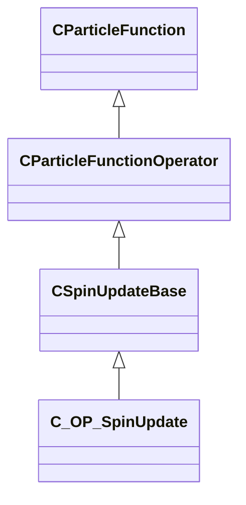

### C_INIT_AddVectorToVector

**Inherits from:** [CParticleFunctionInitializer](particles.md#cparticlefunctioninitializer)

**Metadata:** `MGetKV3ClassDefaults = {`, `"_class": "C_INIT_AddVectorToVector",`, `"m_flOpStrength":`, `{`, `"m_nType": "PF_TYPE_LITERAL",`, `"m_nMapType": "PF_MAP_TYPE_DIRECT",`, `"m_flLiteralValue": 1.000000,`, `"m_NamedValue": "",`, `"m_nControlPoint": 0,`, `"m_nScalarAttribute": 3,`, `"m_nVectorAttribute": 6,`, `"m_nVectorComponent": 0,`, `"m_bReverseOrder": false,`, `"m_flRandomMin": 0.000000,`, `"m_flRandomMax": 1.000000,`, `"m_bHasRandomSignFlip": false,`, `"m_nRandomSeed": <HIDDEN FOR DIFF>,`, `"m_nRandomMode": "PF_RANDOM_MODE_CONSTANT",`, `"m_strSnapshotSubset": "",`, `"m_flLOD0": 0.000000,`, `"m_flLOD1": 0.000000,`, `"m_flLOD2": 0.000000,`, `"m_flLOD3": 0.000000,`, `"m_nNoiseInputVectorAttribute": 0,`, `"m_flNoiseOutputMin": 0.000000,`, `"m_flNoiseOutputMax": 1.000000,`, `"m_flNoiseScale": 0.100000,`, `"m_vecNoiseOffsetRate":`, `[`, `0.000000,`, `0.000000,`, `0.000000`, `],`, `"m_flNoiseOffset": 0.000000,`, `"m_nNoiseOctaves": 1,`, `"m_nNoiseTurbulence": "PF_NOISE_TURB_NONE",`, `"m_nNoiseType": "PF_NOISE_TYPE_PERLIN",`, `"m_nNoiseModifier": "PF_NOISE_MODIFIER_NONE",`, `"m_flNoiseTurbulenceScale": 1.000000,`, `"m_flNoiseTurbulenceMix": 0.500000,`, `"m_flNoiseImgPreviewScale": 1.000000,`, `"m_bNoiseImgPreviewLive": true,`, `"m_flNoCameraFallback": 0.000000,`, `"m_bUseBoundsCenter": false,`, `"m_nInputMode": "PF_INPUT_MODE_CLAMPED",`, `"m_flMultFactor": 1.000000,`, `"m_flInput0": 0.000000,`, `"m_flInput1": 1.000000,`, `"m_flOutput0": 0.000000,`, `"m_flOutput1": 1.000000,`, `"m_flNotchedRangeMin": 0.000000,`, `"m_flNotchedRangeMax": 1.000000,`, `"m_flNotchedOutputOutside": 0.000000,`, `"m_flNotchedOutputInside": 1.000000,`, `"m_nRoundType": "PF_ROUND_TYPE_NEAREST",`, `"m_nBiasType": "PF_BIAS_TYPE_STANDARD",`, `"m_flBiasParameter": 0.000000,`, `"m_Curve":`, `{`, `"m_spline":`, `[`, `],`, `"m_tangents":`, `[`, `],`, `"m_vDomainMins":`, `[`, `0.000000,`, `0.000000`, `],`, `"m_vDomainMaxs":`, `[`, `0.000000,`, `0.000000`, `]`, `}`, `},`, `"m_nOpEndCapState": "PARTICLE_ENDCAP_ALWAYS_ON",`, `"m_nToolsState": "PARTICLE_TOOLS_STATE_ALWAYS_ON",`, `"m_flOpStartFadeInTime": 0.000000,`, `"m_flOpEndFadeInTime": 0.000000,`, `"m_flOpStartFadeOutTime": 0.000000,`, `"m_flOpEndFadeOutTime": 0.000000,`, `"m_flOpFadeOscillatePeriod": 0.000000,`, `"m_bNormalizeToStopTime": false,`, `"m_flOpTimeOffsetMin": 0.000000,`, `"m_flOpTimeOffsetMax": 0.000000,`, `"m_nOpTimeOffsetSeed": 0,`, `"m_nOpTimeScaleSeed": 0,`, `"m_flOpTimeScaleMin": 1.000000,`, `"m_flOpTimeScaleMax": 1.000000,`, `"m_bDisableOperator": false,`, `"m_Notes": "",`, `"m_nAssociatedEmitterIndex": -1,`, `"m_vecScale":`, `[`, `1.000000,`, `1.000000,`, `1.000000`, `],`, `"m_nFieldOutput": 0,`, `"m_nFieldInput": 0,`, `"m_vOffsetMin":`, `[`, `0.000000,`, `0.000000,`, `0.000000`, `],`, `"m_vOffsetMax":`, `[`, `0.000000,`, `0.000000,`, `0.000000`, `],`, `"m_randomnessParameters":`, `{`, `"m_bDistributeEvenly": false,`, `"m_nSeed": -1`, `}`, `}`

**Relationships:**

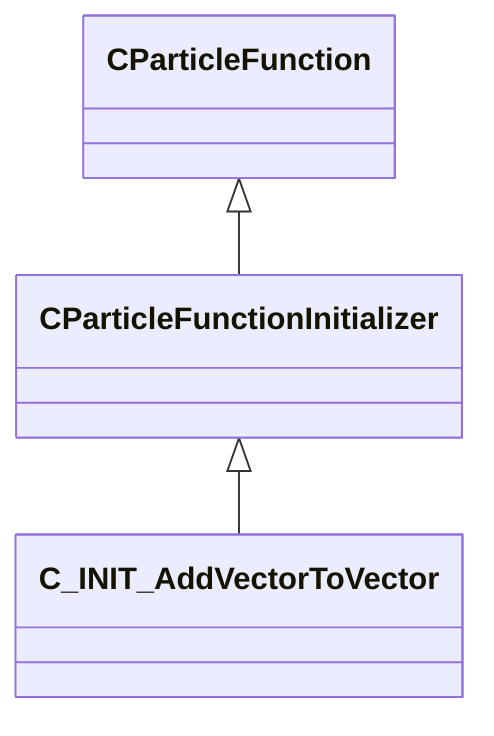

### C_INIT_AgeNoise

**Inherits from:** [CParticleFunctionInitializer](particles.md#cparticlefunctioninitializer)

**Metadata:** `MGetKV3ClassDefaults = {`, `"_class": "C_INIT_AgeNoise",`, `"m_flOpStrength":`, `{`, `"m_nType": "PF_TYPE_LITERAL",`, `"m_nMapType": "PF_MAP_TYPE_DIRECT",`, `"m_flLiteralValue": 1.000000,`, `"m_NamedValue": "",`, `"m_nControlPoint": 0,`, `"m_nScalarAttribute": 3,`, `"m_nVectorAttribute": 6,`, `"m_nVectorComponent": 0,`, `"m_bReverseOrder": false,`, `"m_flRandomMin": 0.000000,`, `"m_flRandomMax": 1.000000,`, `"m_bHasRandomSignFlip": false,`, `"m_nRandomSeed": <HIDDEN FOR DIFF>,`, `"m_nRandomMode": "PF_RANDOM_MODE_CONSTANT",`, `"m_strSnapshotSubset": "",`, `"m_flLOD0": 0.000000,`, `"m_flLOD1": 0.000000,`, `"m_flLOD2": 0.000000,`, `"m_flLOD3": 0.000000,`, `"m_nNoiseInputVectorAttribute": 0,`, `"m_flNoiseOutputMin": 0.000000,`, `"m_flNoiseOutputMax": 1.000000,`, `"m_flNoiseScale": 0.100000,`, `"m_vecNoiseOffsetRate":`, `[`, `0.000000,`, `0.000000,`, `0.000000`, `],`, `"m_flNoiseOffset": 0.000000,`, `"m_nNoiseOctaves": 1,`, `"m_nNoiseTurbulence": "PF_NOISE_TURB_NONE",`, `"m_nNoiseType": "PF_NOISE_TYPE_PERLIN",`, `"m_nNoiseModifier": "PF_NOISE_MODIFIER_NONE",`, `"m_flNoiseTurbulenceScale": 1.000000,`, `"m_flNoiseTurbulenceMix": 0.500000,`, `"m_flNoiseImgPreviewScale": 1.000000,`, `"m_bNoiseImgPreviewLive": true,`, `"m_flNoCameraFallback": 0.000000,`, `"m_bUseBoundsCenter": false,`, `"m_nInputMode": "PF_INPUT_MODE_CLAMPED",`, `"m_flMultFactor": 1.000000,`, `"m_flInput0": 0.000000,`, `"m_flInput1": 1.000000,`, `"m_flOutput0": 0.000000,`, `"m_flOutput1": 1.000000,`, `"m_flNotchedRangeMin": 0.000000,`, `"m_flNotchedRangeMax": 1.000000,`, `"m_flNotchedOutputOutside": 0.000000,`, `"m_flNotchedOutputInside": 1.000000,`, `"m_nRoundType": "PF_ROUND_TYPE_NEAREST",`, `"m_nBiasType": "PF_BIAS_TYPE_STANDARD",`, `"m_flBiasParameter": 0.000000,`, `"m_Curve":`, `{`, `"m_spline":`, `[`, `],`, `"m_tangents":`, `[`, `],`, `"m_vDomainMins":`, `[`, `0.000000,`, `0.000000`, `],`, `"m_vDomainMaxs":`, `[`, `0.000000,`, `0.000000`, `]`, `}`, `},`, `"m_nOpEndCapState": "PARTICLE_ENDCAP_ALWAYS_ON",`, `"m_nToolsState": "PARTICLE_TOOLS_STATE_ALWAYS_ON",`, `"m_flOpStartFadeInTime": 0.000000,`, `"m_flOpEndFadeInTime": 0.000000,`, `"m_flOpStartFadeOutTime": 0.000000,`, `"m_flOpEndFadeOutTime": 0.000000,`, `"m_flOpFadeOscillatePeriod": 0.000000,`, `"m_bNormalizeToStopTime": false,`, `"m_flOpTimeOffsetMin": 0.000000,`, `"m_flOpTimeOffsetMax": 0.000000,`, `"m_nOpTimeOffsetSeed": 0,`, `"m_nOpTimeScaleSeed": 0,`, `"m_flOpTimeScaleMin": 1.000000,`, `"m_flOpTimeScaleMax": 1.000000,`, `"m_bDisableOperator": false,`, `"m_Notes": "",`, `"m_nAssociatedEmitterIndex": -1,`, `"m_bAbsVal": false,`, `"m_bAbsValInv": false,`, `"m_flOffset": 0.000000,`, `"m_flAgeMin": 0.000000,`, `"m_flAgeMax": 1.000000,`, `"m_flNoiseScale": 1.000000,`, `"m_flNoiseScaleLoc": 1.000000,`, `"m_vecOffsetLoc":`, `[`, `0.000000,`, `0.000000,`, `0.000000`, `]`, `}`

**Relationships:**

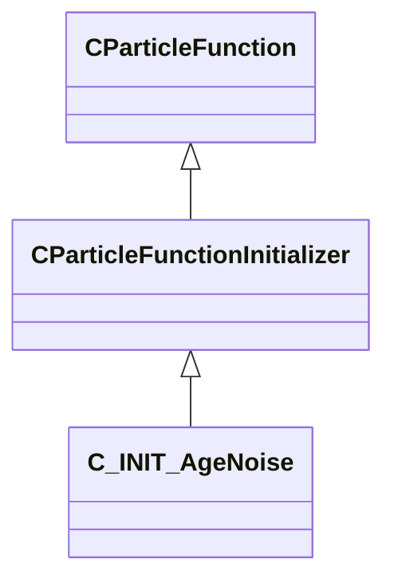

### C_INIT_ChaoticAttractor

**Inherits from:** [CParticleFunctionInitializer](particles.md#cparticlefunctioninitializer)

**Metadata:** `MGetKV3ClassDefaults = {`, `"_class": "C_INIT_ChaoticAttractor",`, `"m_flOpStrength":`, `{`, `"m_nType": "PF_TYPE_LITERAL",`, `"m_nMapType": "PF_MAP_TYPE_DIRECT",`, `"m_flLiteralValue": 1.000000,`, `"m_NamedValue": "",`, `"m_nControlPoint": 0,`, `"m_nScalarAttribute": 3,`, `"m_nVectorAttribute": 6,`, `"m_nVectorComponent": 0,`, `"m_bReverseOrder": false,`, `"m_flRandomMin": 0.000000,`, `"m_flRandomMax": 1.000000,`, `"m_bHasRandomSignFlip": false,`, `"m_nRandomSeed": <HIDDEN FOR DIFF>,`, `"m_nRandomMode": "PF_RANDOM_MODE_CONSTANT",`, `"m_strSnapshotSubset": "",`, `"m_flLOD0": 0.000000,`, `"m_flLOD1": 0.000000,`, `"m_flLOD2": 0.000000,`, `"m_flLOD3": 0.000000,`, `"m_nNoiseInputVectorAttribute": 0,`, `"m_flNoiseOutputMin": 0.000000,`, `"m_flNoiseOutputMax": 1.000000,`, `"m_flNoiseScale": 0.100000,`, `"m_vecNoiseOffsetRate":`, `[`, `0.000000,`, `0.000000,`, `0.000000`, `],`, `"m_flNoiseOffset": 0.000000,`, `"m_nNoiseOctaves": 1,`, `"m_nNoiseTurbulence": "PF_NOISE_TURB_NONE",`, `"m_nNoiseType": "PF_NOISE_TYPE_PERLIN",`, `"m_nNoiseModifier": "PF_NOISE_MODIFIER_NONE",`, `"m_flNoiseTurbulenceScale": 1.000000,`, `"m_flNoiseTurbulenceMix": 0.500000,`, `"m_flNoiseImgPreviewScale": 1.000000,`, `"m_bNoiseImgPreviewLive": true,`, `"m_flNoCameraFallback": 0.000000,`, `"m_bUseBoundsCenter": false,`, `"m_nInputMode": "PF_INPUT_MODE_CLAMPED",`, `"m_flMultFactor": 1.000000,`, `"m_flInput0": 0.000000,`, `"m_flInput1": 1.000000,`, `"m_flOutput0": 0.000000,`, `"m_flOutput1": 1.000000,`, `"m_flNotchedRangeMin": 0.000000,`, `"m_flNotchedRangeMax": 1.000000,`, `"m_flNotchedOutputOutside": 0.000000,`, `"m_flNotchedOutputInside": 1.000000,`, `"m_nRoundType": "PF_ROUND_TYPE_NEAREST",`, `"m_nBiasType": "PF_BIAS_TYPE_STANDARD",`, `"m_flBiasParameter": 0.000000,`, `"m_Curve":`, `{`, `"m_spline":`, `[`, `],`, `"m_tangents":`, `[`, `],`, `"m_vDomainMins":`, `[`, `0.000000,`, `0.000000`, `],`, `"m_vDomainMaxs":`, `[`, `0.000000,`, `0.000000`, `]`, `}`, `},`, `"m_nOpEndCapState": "PARTICLE_ENDCAP_ALWAYS_ON",`, `"m_nToolsState": "PARTICLE_TOOLS_STATE_ALWAYS_ON",`, `"m_flOpStartFadeInTime": 0.000000,`, `"m_flOpEndFadeInTime": 0.000000,`, `"m_flOpStartFadeOutTime": 0.000000,`, `"m_flOpEndFadeOutTime": 0.000000,`, `"m_flOpFadeOscillatePeriod": 0.000000,`, `"m_bNormalizeToStopTime": false,`, `"m_flOpTimeOffsetMin": 0.000000,`, `"m_flOpTimeOffsetMax": 0.000000,`, `"m_nOpTimeOffsetSeed": 0,`, `"m_nOpTimeScaleSeed": 0,`, `"m_flOpTimeScaleMin": 1.000000,`, `"m_flOpTimeScaleMax": 1.000000,`, `"m_bDisableOperator": false,`, `"m_Notes": "",`, `"m_nAssociatedEmitterIndex": -1,`, `"m_flAParm": -0.962963,`, `"m_flBParm": 2.791140,`, `"m_flCParm": 1.851850,`, `"m_flDParm": 1.500000,`, `"m_flScale": 1.000000,`, `"m_flSpeedMin": 0.000000,`, `"m_flSpeedMax": 0.000000,`, `"m_nBaseCP": 0,`, `"m_bUniformSpeed": false`, `}`

**Relationships:**

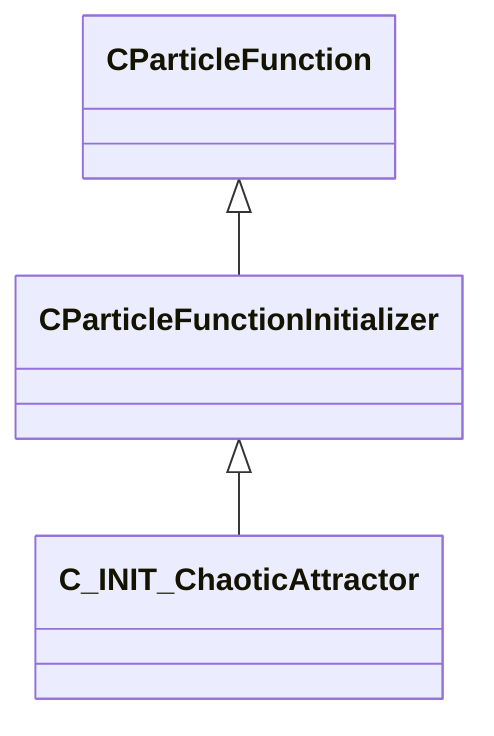

### C_INIT_CheckParticleForWater

**Inherits from:** [CParticleFunctionInitializer](particles.md#cparticlefunctioninitializer)

**Metadata:** `MGetKV3ClassDefaults = {`, `"_class": "C_INIT_CheckParticleForWater",`, `"m_flOpStrength":`, `{`, `"m_nType": "PF_TYPE_LITERAL",`, `"m_nMapType": "PF_MAP_TYPE_DIRECT",`, `"m_flLiteralValue": 1.000000,`, `"m_NamedValue": "",`, `"m_nControlPoint": 0,`, `"m_nScalarAttribute": 3,`, `"m_nVectorAttribute": 6,`, `"m_nVectorComponent": 0,`, `"m_bReverseOrder": false,`, `"m_flRandomMin": 0.000000,`, `"m_flRandomMax": 1.000000,`, `"m_bHasRandomSignFlip": false,`, `"m_nRandomSeed": <HIDDEN FOR DIFF>,`, `"m_nRandomMode": "PF_RANDOM_MODE_CONSTANT",`, `"m_strSnapshotSubset": "",`, `"m_flLOD0": 0.000000,`, `"m_flLOD1": 0.000000,`, `"m_flLOD2": 0.000000,`, `"m_flLOD3": 0.000000,`, `"m_nNoiseInputVectorAttribute": 0,`, `"m_flNoiseOutputMin": 0.000000,`, `"m_flNoiseOutputMax": 1.000000,`, `"m_flNoiseScale": 0.100000,`, `"m_vecNoiseOffsetRate":`, `[`, `0.000000,`, `0.000000,`, `0.000000`, `],`, `"m_flNoiseOffset": 0.000000,`, `"m_nNoiseOctaves": 1,`, `"m_nNoiseTurbulence": "PF_NOISE_TURB_NONE",`, `"m_nNoiseType": "PF_NOISE_TYPE_PERLIN",`, `"m_nNoiseModifier": "PF_NOISE_MODIFIER_NONE",`, `"m_flNoiseTurbulenceScale": 1.000000,`, `"m_flNoiseTurbulenceMix": 0.500000,`, `"m_flNoiseImgPreviewScale": 1.000000,`, `"m_bNoiseImgPreviewLive": true,`, `"m_flNoCameraFallback": 0.000000,`, `"m_bUseBoundsCenter": false,`, `"m_nInputMode": "PF_INPUT_MODE_CLAMPED",`, `"m_flMultFactor": 1.000000,`, `"m_flInput0": 0.000000,`, `"m_flInput1": 1.000000,`, `"m_flOutput0": 0.000000,`, `"m_flOutput1": 1.000000,`, `"m_flNotchedRangeMin": 0.000000,`, `"m_flNotchedRangeMax": 1.000000,`, `"m_flNotchedOutputOutside": 0.000000,`, `"m_flNotchedOutputInside": 1.000000,`, `"m_nRoundType": "PF_ROUND_TYPE_NEAREST",`, `"m_nBiasType": "PF_BIAS_TYPE_STANDARD",`, `"m_flBiasParameter": 0.000000,`, `"m_Curve":`, `{`, `"m_spline":`, `[`, `],`, `"m_tangents":`, `[`, `],`, `"m_vDomainMins":`, `[`, `0.000000,`, `0.000000`, `],`, `"m_vDomainMaxs":`, `[`, `0.000000,`, `0.000000`, `]`, `}`, `},`, `"m_nOpEndCapState": "PARTICLE_ENDCAP_ALWAYS_ON",`, `"m_nToolsState": "PARTICLE_TOOLS_STATE_ALWAYS_ON",`, `"m_flOpStartFadeInTime": 0.000000,`, `"m_flOpEndFadeInTime": 0.000000,`, `"m_flOpStartFadeOutTime": 0.000000,`, `"m_flOpEndFadeOutTime": 0.000000,`, `"m_flOpFadeOscillatePeriod": 0.000000,`, `"m_bNormalizeToStopTime": false,`, `"m_flOpTimeOffsetMin": 0.000000,`, `"m_flOpTimeOffsetMax": 0.000000,`, `"m_nOpTimeOffsetSeed": 0,`, `"m_nOpTimeScaleSeed": 0,`, `"m_flOpTimeScaleMin": 1.000000,`, `"m_flOpTimeScaleMax": 1.000000,`, `"m_bDisableOperator": false,`, `"m_Notes": "",`, `"m_nAssociatedEmitterIndex": -1,`, `"m_flRadius":`, `{`, `"m_nType": "PF_TYPE_LITERAL",`, `"m_nMapType": "PF_MAP_TYPE_DIRECT",`, `"m_flLiteralValue": 1.000000,`, `"m_NamedValue": "",`, `"m_nControlPoint": 0,`, `"m_nScalarAttribute": 3,`, `"m_nVectorAttribute": 6,`, `"m_nVectorComponent": 0,`, `"m_bReverseOrder": false,`, `"m_flRandomMin": 0.000000,`, `"m_flRandomMax": 1.000000,`, `"m_bHasRandomSignFlip": false,`, `"m_nRandomSeed": <HIDDEN FOR DIFF>,`, `"m_nRandomMode": "PF_RANDOM_MODE_CONSTANT",`, `"m_strSnapshotSubset": "",`, `"m_flLOD0": 0.000000,`, `"m_flLOD1": 0.000000,`, `"m_flLOD2": 0.000000,`, `"m_flLOD3": 0.000000,`, `"m_nNoiseInputVectorAttribute": 0,`, `"m_flNoiseOutputMin": 0.000000,`, `"m_flNoiseOutputMax": 1.000000,`, `"m_flNoiseScale": 0.100000,`, `"m_vecNoiseOffsetRate":`, `[`, `0.000000,`, `0.000000,`, `0.000000`, `],`, `"m_flNoiseOffset": 0.000000,`, `"m_nNoiseOctaves": 1,`, `"m_nNoiseTurbulence": "PF_NOISE_TURB_NONE",`, `"m_nNoiseType": "PF_NOISE_TYPE_PERLIN",`, `"m_nNoiseModifier": "PF_NOISE_MODIFIER_NONE",`, `"m_flNoiseTurbulenceScale": 1.000000,`, `"m_flNoiseTurbulenceMix": 0.500000,`, `"m_flNoiseImgPreviewScale": 1.000000,`, `"m_bNoiseImgPreviewLive": true,`, `"m_flNoCameraFallback": 0.000000,`, `"m_bUseBoundsCenter": false,`, `"m_nInputMode": "PF_INPUT_MODE_CLAMPED",`, `"m_flMultFactor": 1.000000,`, `"m_flInput0": 0.000000,`, `"m_flInput1": 1.000000,`, `"m_flOutput0": 0.000000,`, `"m_flOutput1": 1.000000,`, `"m_flNotchedRangeMin": 0.000000,`, `"m_flNotchedRangeMax": 1.000000,`, `"m_flNotchedOutputOutside": 0.000000,`, `"m_flNotchedOutputInside": 1.000000,`, `"m_nRoundType": "PF_ROUND_TYPE_NEAREST",`, `"m_nBiasType": "PF_BIAS_TYPE_STANDARD",`, `"m_flBiasParameter": 0.000000,`, `"m_Curve":`, `{`, `"m_spline":`, `[`, `],`, `"m_tangents":`, `[`, `],`, `"m_vDomainMins":`, `[`, `0.000000,`, `0.000000`, `],`, `"m_vDomainMaxs":`, `[`, `0.000000,`, `0.000000`, `]`, `}`, `},`, `"m_nFieldOutput": 1,`, `"m_flOutputRemap":`, `{`, `"m_nType": "PF_TYPE_INVALID",`, `"m_nMapType": "PF_MAP_TYPE_DIRECT",`, `"m_flLiteralValue": 0.000000,`, `"m_NamedValue": "",`, `"m_nControlPoint": 0,`, `"m_nScalarAttribute": 3,`, `"m_nVectorAttribute": 6,`, `"m_nVectorComponent": 0,`, `"m_bReverseOrder": false,`, `"m_flRandomMin": 0.000000,`, `"m_flRandomMax": 1.000000,`, `"m_bHasRandomSignFlip": false,`, `"m_nRandomSeed": <HIDDEN FOR DIFF>,`, `"m_nRandomMode": "PF_RANDOM_MODE_CONSTANT",`, `"m_strSnapshotSubset": "",`, `"m_flLOD0": 0.000000,`, `"m_flLOD1": 0.000000,`, `"m_flLOD2": 0.000000,`, `"m_flLOD3": 0.000000,`, `"m_nNoiseInputVectorAttribute": 0,`, `"m_flNoiseOutputMin": 0.000000,`, `"m_flNoiseOutputMax": 1.000000,`, `"m_flNoiseScale": 0.100000,`, `"m_vecNoiseOffsetRate":`, `[`, `0.000000,`, `0.000000,`, `0.000000`, `],`, `"m_flNoiseOffset": 0.000000,`, `"m_nNoiseOctaves": 1,`, `"m_nNoiseTurbulence": "PF_NOISE_TURB_NONE",`, `"m_nNoiseType": "PF_NOISE_TYPE_PERLIN",`, `"m_nNoiseModifier": "PF_NOISE_MODIFIER_NONE",`, `"m_flNoiseTurbulenceScale": 1.000000,`, `"m_flNoiseTurbulenceMix": 0.500000,`, `"m_flNoiseImgPreviewScale": 1.000000,`, `"m_bNoiseImgPreviewLive": true,`, `"m_flNoCameraFallback": 0.000000,`, `"m_bUseBoundsCenter": false,`, `"m_nInputMode": "PF_INPUT_MODE_CLAMPED",`, `"m_flMultFactor": 1.000000,`, `"m_flInput0": 0.000000,`, `"m_flInput1": 1.000000,`, `"m_flOutput0": 0.000000,`, `"m_flOutput1": 1.000000,`, `"m_flNotchedRangeMin": 0.000000,`, `"m_flNotchedRangeMax": 1.000000,`, `"m_flNotchedOutputOutside": 0.000000,`, `"m_flNotchedOutputInside": 1.000000,`, `"m_nRoundType": "PF_ROUND_TYPE_NEAREST",`, `"m_nBiasType": "PF_BIAS_TYPE_STANDARD",`, `"m_flBiasParameter": 0.000000,`, `"m_Curve":`, `{`, `"m_spline":`, `[`, `],`, `"m_tangents":`, `[`, `],`, `"m_vDomainMins":`, `[`, `0.000000,`, `0.000000`, `],`, `"m_vDomainMaxs":`, `[`, `0.000000,`, `0.000000`, `]`, `}`, `},`, `"m_nSetMethod": "PARTICLE_SET_REPLACE_VALUE"`, `}`

**Relationships:**

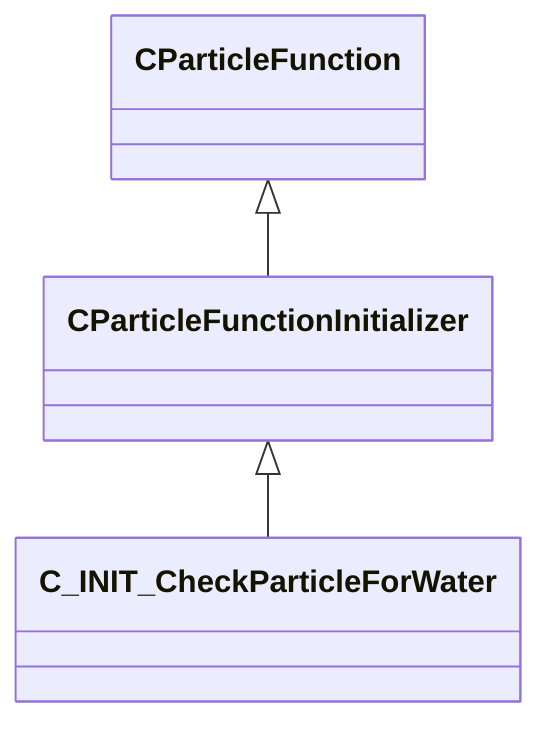

### C_INIT_ColorLitPerParticle

**Inherits from:** [CParticleFunctionInitializer](particles.md#cparticlefunctioninitializer)

**Metadata:** `MGetKV3ClassDefaults = {`, `"_class": "C_INIT_ColorLitPerParticle",`, `"m_flOpStrength":`, `{`, `"m_nType": "PF_TYPE_LITERAL",`, `"m_nMapType": "PF_MAP_TYPE_DIRECT",`, `"m_flLiteralValue": 1.000000,`, `"m_NamedValue": "",`, `"m_nControlPoint": 0,`, `"m_nScalarAttribute": 3,`, `"m_nVectorAttribute": 6,`, `"m_nVectorComponent": 0,`, `"m_bReverseOrder": false,`, `"m_flRandomMin": 0.000000,`, `"m_flRandomMax": 1.000000,`, `"m_bHasRandomSignFlip": false,`, `"m_nRandomSeed": <HIDDEN FOR DIFF>,`, `"m_nRandomMode": "PF_RANDOM_MODE_CONSTANT",`, `"m_strSnapshotSubset": "",`, `"m_flLOD0": 0.000000,`, `"m_flLOD1": 0.000000,`, `"m_flLOD2": 0.000000,`, `"m_flLOD3": 0.000000,`, `"m_nNoiseInputVectorAttribute": 0,`, `"m_flNoiseOutputMin": 0.000000,`, `"m_flNoiseOutputMax": 1.000000,`, `"m_flNoiseScale": 0.100000,`, `"m_vecNoiseOffsetRate":`, `[`, `0.000000,`, `0.000000,`, `0.000000`, `],`, `"m_flNoiseOffset": 0.000000,`, `"m_nNoiseOctaves": 1,`, `"m_nNoiseTurbulence": "PF_NOISE_TURB_NONE",`, `"m_nNoiseType": "PF_NOISE_TYPE_PERLIN",`, `"m_nNoiseModifier": "PF_NOISE_MODIFIER_NONE",`, `"m_flNoiseTurbulenceScale": 1.000000,`, `"m_flNoiseTurbulenceMix": 0.500000,`, `"m_flNoiseImgPreviewScale": 1.000000,`, `"m_bNoiseImgPreviewLive": true,`, `"m_flNoCameraFallback": 0.000000,`, `"m_bUseBoundsCenter": false,`, `"m_nInputMode": "PF_INPUT_MODE_CLAMPED",`, `"m_flMultFactor": 1.000000,`, `"m_flInput0": 0.000000,`, `"m_flInput1": 1.000000,`, `"m_flOutput0": 0.000000,`, `"m_flOutput1": 1.000000,`, `"m_flNotchedRangeMin": 0.000000,`, `"m_flNotchedRangeMax": 1.000000,`, `"m_flNotchedOutputOutside": 0.000000,`, `"m_flNotchedOutputInside": 1.000000,`, `"m_nRoundType": "PF_ROUND_TYPE_NEAREST",`, `"m_nBiasType": "PF_BIAS_TYPE_STANDARD",`, `"m_flBiasParameter": 0.000000,`, `"m_Curve":`, `{`, `"m_spline":`, `[`, `],`, `"m_tangents":`, `[`, `],`, `"m_vDomainMins":`, `[`, `0.000000,`, `0.000000`, `],`, `"m_vDomainMaxs":`, `[`, `0.000000,`, `0.000000`, `]`, `}`, `},`, `"m_nOpEndCapState": "PARTICLE_ENDCAP_ALWAYS_ON",`, `"m_nToolsState": "PARTICLE_TOOLS_STATE_ALWAYS_ON",`, `"m_flOpStartFadeInTime": 0.000000,`, `"m_flOpEndFadeInTime": 0.000000,`, `"m_flOpStartFadeOutTime": 0.000000,`, `"m_flOpEndFadeOutTime": 0.000000,`, `"m_flOpFadeOscillatePeriod": 0.000000,`, `"m_bNormalizeToStopTime": false,`, `"m_flOpTimeOffsetMin": 0.000000,`, `"m_flOpTimeOffsetMax": 0.000000,`, `"m_nOpTimeOffsetSeed": 0,`, `"m_nOpTimeScaleSeed": 0,`, `"m_flOpTimeScaleMin": 1.000000,`, `"m_flOpTimeScaleMax": 1.000000,`, `"m_bDisableOperator": false,`, `"m_Notes": "",`, `"m_nAssociatedEmitterIndex": -1,`, `"m_ColorMin":`, `[`, `255,`, `255,`, `255`, `],`, `"m_ColorMax":`, `[`, `255,`, `255,`, `255`, `],`, `"m_TintMin":`, `[`, `0,`, `0,`, `0,`, `0`, `],`, `"m_TintMax":`, `[`, `255,`, `255,`, `255`, `],`, `"m_flTintPerc": 0.000000,`, `"m_nTintBlendMode": "PARTICLEBLEND_DEFAULT",`, `"m_flLightAmplification": 1.000000`, `}`

**Relationships:**

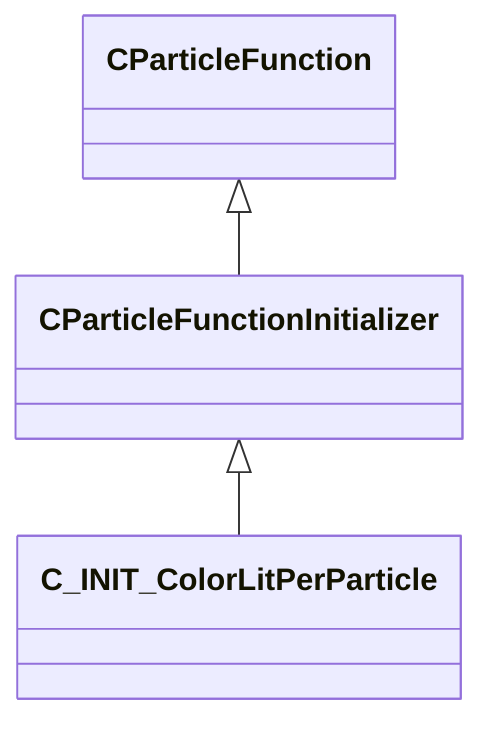

### C_INIT_CreateAlongPath

**Inherits from:** [CParticleFunctionInitializer](particles.md#cparticlefunctioninitializer)

**Metadata:** `MGetKV3ClassDefaults = {`, `"_class": "C_INIT_CreateAlongPath",`, `"m_flOpStrength":`, `{`, `"m_nType": "PF_TYPE_LITERAL",`, `"m_nMapType": "PF_MAP_TYPE_DIRECT",`, `"m_flLiteralValue": 1.000000,`, `"m_NamedValue": "",`, `"m_nControlPoint": 0,`, `"m_nScalarAttribute": 3,`, `"m_nVectorAttribute": 6,`, `"m_nVectorComponent": 0,`, `"m_bReverseOrder": false,`, `"m_flRandomMin": 0.000000,`, `"m_flRandomMax": 1.000000,`, `"m_bHasRandomSignFlip": false,`, `"m_nRandomSeed": <HIDDEN FOR DIFF>,`, `"m_nRandomMode": "PF_RANDOM_MODE_CONSTANT",`, `"m_strSnapshotSubset": "",`, `"m_flLOD0": 0.000000,`, `"m_flLOD1": 0.000000,`, `"m_flLOD2": 0.000000,`, `"m_flLOD3": 0.000000,`, `"m_nNoiseInputVectorAttribute": 0,`, `"m_flNoiseOutputMin": 0.000000,`, `"m_flNoiseOutputMax": 1.000000,`, `"m_flNoiseScale": 0.100000,`, `"m_vecNoiseOffsetRate":`, `[`, `0.000000,`, `0.000000,`, `0.000000`, `],`, `"m_flNoiseOffset": 0.000000,`, `"m_nNoiseOctaves": 1,`, `"m_nNoiseTurbulence": "PF_NOISE_TURB_NONE",`, `"m_nNoiseType": "PF_NOISE_TYPE_PERLIN",`, `"m_nNoiseModifier": "PF_NOISE_MODIFIER_NONE",`, `"m_flNoiseTurbulenceScale": 1.000000,`, `"m_flNoiseTurbulenceMix": 0.500000,`, `"m_flNoiseImgPreviewScale": 1.000000,`, `"m_bNoiseImgPreviewLive": true,`, `"m_flNoCameraFallback": 0.000000,`, `"m_bUseBoundsCenter": false,`, `"m_nInputMode": "PF_INPUT_MODE_CLAMPED",`, `"m_flMultFactor": 1.000000,`, `"m_flInput0": 0.000000,`, `"m_flInput1": 1.000000,`, `"m_flOutput0": 0.000000,`, `"m_flOutput1": 1.000000,`, `"m_flNotchedRangeMin": 0.000000,`, `"m_flNotchedRangeMax": 1.000000,`, `"m_flNotchedOutputOutside": 0.000000,`, `"m_flNotchedOutputInside": 1.000000,`, `"m_nRoundType": "PF_ROUND_TYPE_NEAREST",`, `"m_nBiasType": "PF_BIAS_TYPE_STANDARD",`, `"m_flBiasParameter": 0.000000,`, `"m_Curve":`, `{`, `"m_spline":`, `[`, `],`, `"m_tangents":`, `[`, `],`, `"m_vDomainMins":`, `[`, `0.000000,`, `0.000000`, `],`, `"m_vDomainMaxs":`, `[`, `0.000000,`, `0.000000`, `]`, `}`, `},`, `"m_nOpEndCapState": "PARTICLE_ENDCAP_ALWAYS_ON",`, `"m_nToolsState": "PARTICLE_TOOLS_STATE_ALWAYS_ON",`, `"m_flOpStartFadeInTime": 0.000000,`, `"m_flOpEndFadeInTime": 0.000000,`, `"m_flOpStartFadeOutTime": 0.000000,`, `"m_flOpEndFadeOutTime": 0.000000,`, `"m_flOpFadeOscillatePeriod": 0.000000,`, `"m_bNormalizeToStopTime": false,`, `"m_flOpTimeOffsetMin": 0.000000,`, `"m_flOpTimeOffsetMax": 0.000000,`, `"m_nOpTimeOffsetSeed": 0,`, `"m_nOpTimeScaleSeed": 0,`, `"m_flOpTimeScaleMin": 1.000000,`, `"m_flOpTimeScaleMax": 1.000000,`, `"m_bDisableOperator": false,`, `"m_Notes": "",`, `"m_nAssociatedEmitterIndex": -1,`, `"m_fMaxDistance": 0.000000,`, `"m_PathParams":`, `{`, `"m_nStartControlPointNumber": 0,`, `"m_nEndControlPointNumber": 0,`, `"m_nBulgeControl": 0,`, `"m_flBulge": 0.000000,`, `"m_flMidPoint": 0.500000,`, `"m_vStartPointOffset":`, `[`, `0.000000,`, `0.000000,`, `0.000000`, `],`, `"m_vMidPointOffset":`, `[`, `0.000000,`, `0.000000,`, `0.000000`, `],`, `"m_vEndOffset":`, `[`, `0.000000,`, `0.000000,`, `0.000000`, `]`, `},`, `"m_bUseRandomCPs": false,`, `"m_vEndOffset":`, `[`, `0.000000,`, `0.000000,`, `0.000000`, `],`, `"m_bSaveOffset": false`, `}`

**Relationships:**

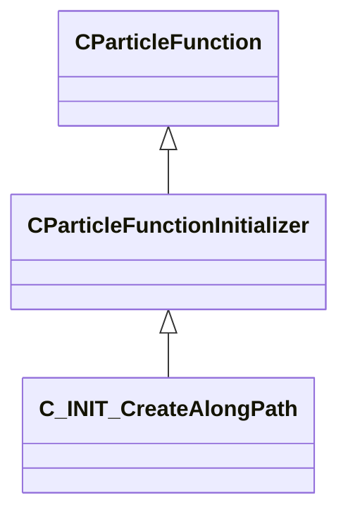

### C_INIT_CreateFromCPs

**Inherits from:** [CParticleFunctionInitializer](particles.md#cparticlefunctioninitializer)

**Metadata:** `MGetKV3ClassDefaults = {`, `"_class": "C_INIT_CreateFromCPs",`, `"m_flOpStrength":`, `{`, `"m_nType": "PF_TYPE_LITERAL",`, `"m_nMapType": "PF_MAP_TYPE_DIRECT",`, `"m_flLiteralValue": 1.000000,`, `"m_NamedValue": "",`, `"m_nControlPoint": 0,`, `"m_nScalarAttribute": 3,`, `"m_nVectorAttribute": 6,`, `"m_nVectorComponent": 0,`, `"m_bReverseOrder": false,`, `"m_flRandomMin": 0.000000,`, `"m_flRandomMax": 1.000000,`, `"m_bHasRandomSignFlip": false,`, `"m_nRandomSeed": <HIDDEN FOR DIFF>,`, `"m_nRandomMode": "PF_RANDOM_MODE_CONSTANT",`, `"m_strSnapshotSubset": "",`, `"m_flLOD0": 0.000000,`, `"m_flLOD1": 0.000000,`, `"m_flLOD2": 0.000000,`, `"m_flLOD3": 0.000000,`, `"m_nNoiseInputVectorAttribute": 0,`, `"m_flNoiseOutputMin": 0.000000,`, `"m_flNoiseOutputMax": 1.000000,`, `"m_flNoiseScale": 0.100000,`, `"m_vecNoiseOffsetRate":`, `[`, `0.000000,`, `0.000000,`, `0.000000`, `],`, `"m_flNoiseOffset": 0.000000,`, `"m_nNoiseOctaves": 1,`, `"m_nNoiseTurbulence": "PF_NOISE_TURB_NONE",`, `"m_nNoiseType": "PF_NOISE_TYPE_PERLIN",`, `"m_nNoiseModifier": "PF_NOISE_MODIFIER_NONE",`, `"m_flNoiseTurbulenceScale": 1.000000,`, `"m_flNoiseTurbulenceMix": 0.500000,`, `"m_flNoiseImgPreviewScale": 1.000000,`, `"m_bNoiseImgPreviewLive": true,`, `"m_flNoCameraFallback": 0.000000,`, `"m_bUseBoundsCenter": false,`, `"m_nInputMode": "PF_INPUT_MODE_CLAMPED",`, `"m_flMultFactor": 1.000000,`, `"m_flInput0": 0.000000,`, `"m_flInput1": 1.000000,`, `"m_flOutput0": 0.000000,`, `"m_flOutput1": 1.000000,`, `"m_flNotchedRangeMin": 0.000000,`, `"m_flNotchedRangeMax": 1.000000,`, `"m_flNotchedOutputOutside": 0.000000,`, `"m_flNotchedOutputInside": 1.000000,`, `"m_nRoundType": "PF_ROUND_TYPE_NEAREST",`, `"m_nBiasType": "PF_BIAS_TYPE_STANDARD",`, `"m_flBiasParameter": 0.000000,`, `"m_Curve":`, `{`, `"m_spline":`, `[`, `],`, `"m_tangents":`, `[`, `],`, `"m_vDomainMins":`, `[`, `0.000000,`, `0.000000`, `],`, `"m_vDomainMaxs":`, `[`, `0.000000,`, `0.000000`, `]`, `}`, `},`, `"m_nOpEndCapState": "PARTICLE_ENDCAP_ALWAYS_ON",`, `"m_nToolsState": "PARTICLE_TOOLS_STATE_ALWAYS_ON",`, `"m_flOpStartFadeInTime": 0.000000,`, `"m_flOpEndFadeInTime": 0.000000,`, `"m_flOpStartFadeOutTime": 0.000000,`, `"m_flOpEndFadeOutTime": 0.000000,`, `"m_flOpFadeOscillatePeriod": 0.000000,`, `"m_bNormalizeToStopTime": false,`, `"m_flOpTimeOffsetMin": 0.000000,`, `"m_flOpTimeOffsetMax": 0.000000,`, `"m_nOpTimeOffsetSeed": 0,`, `"m_nOpTimeScaleSeed": 0,`, `"m_flOpTimeScaleMin": 1.000000,`, `"m_flOpTimeScaleMax": 1.000000,`, `"m_bDisableOperator": false,`, `"m_Notes": "",`, `"m_nAssociatedEmitterIndex": -1,`, `"m_nIncrement": 1,`, `"m_nMinCP": 0,`, `"m_nMaxCP": 0,`, `"m_nDynamicCPCount":`, `{`, `"m_nType": "PF_TYPE_LITERAL",`, `"m_nMapType": "PF_MAP_TYPE_DIRECT",`, `"m_flLiteralValue": -1.000000,`, `"m_NamedValue": "",`, `"m_nControlPoint": 0,`, `"m_nScalarAttribute": 3,`, `"m_nVectorAttribute": 6,`, `"m_nVectorComponent": 0,`, `"m_bReverseOrder": false,`, `"m_flRandomMin": 0.000000,`, `"m_flRandomMax": 1.000000,`, `"m_bHasRandomSignFlip": false,`, `"m_nRandomSeed": <HIDDEN FOR DIFF>,`, `"m_nRandomMode": "PF_RANDOM_MODE_CONSTANT",`, `"m_strSnapshotSubset": "",`, `"m_flLOD0": 0.000000,`, `"m_flLOD1": 0.000000,`, `"m_flLOD2": 0.000000,`, `"m_flLOD3": 0.000000,`, `"m_nNoiseInputVectorAttribute": 0,`, `"m_flNoiseOutputMin": 0.000000,`, `"m_flNoiseOutputMax": 1.000000,`, `"m_flNoiseScale": 0.100000,`, `"m_vecNoiseOffsetRate":`, `[`, `0.000000,`, `0.000000,`, `0.000000`, `],`, `"m_flNoiseOffset": 0.000000,`, `"m_nNoiseOctaves": 1,`, `"m_nNoiseTurbulence": "PF_NOISE_TURB_NONE",`, `"m_nNoiseType": "PF_NOISE_TYPE_PERLIN",`, `"m_nNoiseModifier": "PF_NOISE_MODIFIER_NONE",`, `"m_flNoiseTurbulenceScale": 1.000000,`, `"m_flNoiseTurbulenceMix": 0.500000,`, `"m_flNoiseImgPreviewScale": 1.000000,`, `"m_bNoiseImgPreviewLive": true,`, `"m_flNoCameraFallback": 0.000000,`, `"m_bUseBoundsCenter": false,`, `"m_nInputMode": "PF_INPUT_MODE_CLAMPED",`, `"m_flMultFactor": 1.000000,`, `"m_flInput0": 0.000000,`, `"m_flInput1": 1.000000,`, `"m_flOutput0": 0.000000,`, `"m_flOutput1": 1.000000,`, `"m_flNotchedRangeMin": 0.000000,`, `"m_flNotchedRangeMax": 1.000000,`, `"m_flNotchedOutputOutside": 0.000000,`, `"m_flNotchedOutputInside": 1.000000,`, `"m_nRoundType": "PF_ROUND_TYPE_NEAREST",`, `"m_nBiasType": "PF_BIAS_TYPE_STANDARD",`, `"m_flBiasParameter": 0.000000,`, `"m_Curve":`, `{`, `"m_spline":`, `[`, `],`, `"m_tangents":`, `[`, `],`, `"m_vDomainMins":`, `[`, `0.000000,`, `0.000000`, `],`, `"m_vDomainMaxs":`, `[`, `0.000000,`, `0.000000`, `]`, `}`, `}`, `}`

**Relationships:**

```mermaid
classDiagram
    CParticleFunctionInitializer <|-- C_INIT_CreateFromCPs
    CParticleFunction <|-- CParticleFunctionInitializer
```

### C_INIT_CreateFromParentParticles

**Inherits from:** [CParticleFunctionInitializer](particles.md#cparticlefunctioninitializer)

**Metadata:** `MGetKV3ClassDefaults = {`, `"_class": "C_INIT_CreateFromParentParticles",`, `"m_flOpStrength":`, `{`, `"m_nType": "PF_TYPE_LITERAL",`, `"m_nMapType": "PF_MAP_TYPE_DIRECT",`, `"m_flLiteralValue": 1.000000,`, `"m_NamedValue": "",`, `"m_nControlPoint": 0,`, `"m_nScalarAttribute": 3,`, `"m_nVectorAttribute": 6,`, `"m_nVectorComponent": 0,`, `"m_bReverseOrder": false,`, `"m_flRandomMin": 0.000000,`, `"m_flRandomMax": 1.000000,`, `"m_bHasRandomSignFlip": false,`, `"m_nRandomSeed": <HIDDEN FOR DIFF>,`, `"m_nRandomMode": "PF_RANDOM_MODE_CONSTANT",`, `"m_strSnapshotSubset": "",`, `"m_flLOD0": 0.000000,`, `"m_flLOD1": 0.000000,`, `"m_flLOD2": 0.000000,`, `"m_flLOD3": 0.000000,`, `"m_nNoiseInputVectorAttribute": 0,`, `"m_flNoiseOutputMin": 0.000000,`, `"m_flNoiseOutputMax": 1.000000,`, `"m_flNoiseScale": 0.100000,`, `"m_vecNoiseOffsetRate":`, `[`, `0.000000,`, `0.000000,`, `0.000000`, `],`, `"m_flNoiseOffset": 0.000000,`, `"m_nNoiseOctaves": 1,`, `"m_nNoiseTurbulence": "PF_NOISE_TURB_NONE",`, `"m_nNoiseType": "PF_NOISE_TYPE_PERLIN",`, `"m_nNoiseModifier": "PF_NOISE_MODIFIER_NONE",`, `"m_flNoiseTurbulenceScale": 1.000000,`, `"m_flNoiseTurbulenceMix": 0.500000,`, `"m_flNoiseImgPreviewScale": 1.000000,`, `"m_bNoiseImgPreviewLive": true,`, `"m_flNoCameraFallback": 0.000000,`, `"m_bUseBoundsCenter": false,`, `"m_nInputMode": "PF_INPUT_MODE_CLAMPED",`, `"m_flMultFactor": 1.000000,`, `"m_flInput0": 0.000000,`, `"m_flInput1": 1.000000,`, `"m_flOutput0": 0.000000,`, `"m_flOutput1": 1.000000,`, `"m_flNotchedRangeMin": 0.000000,`, `"m_flNotchedRangeMax": 1.000000,`, `"m_flNotchedOutputOutside": 0.000000,`, `"m_flNotchedOutputInside": 1.000000,`, `"m_nRoundType": "PF_ROUND_TYPE_NEAREST",`, `"m_nBiasType": "PF_BIAS_TYPE_STANDARD",`, `"m_flBiasParameter": 0.000000,`, `"m_Curve":`, `{`, `"m_spline":`, `[`, `],`, `"m_tangents":`, `[`, `],`, `"m_vDomainMins":`, `[`, `0.000000,`, `0.000000`, `],`, `"m_vDomainMaxs":`, `[`, `0.000000,`, `0.000000`, `]`, `}`, `},`, `"m_nOpEndCapState": "PARTICLE_ENDCAP_ALWAYS_ON",`, `"m_nToolsState": "PARTICLE_TOOLS_STATE_ALWAYS_ON",`, `"m_flOpStartFadeInTime": 0.000000,`, `"m_flOpEndFadeInTime": 0.000000,`, `"m_flOpStartFadeOutTime": 0.000000,`, `"m_flOpEndFadeOutTime": 0.000000,`, `"m_flOpFadeOscillatePeriod": 0.000000,`, `"m_bNormalizeToStopTime": false,`, `"m_flOpTimeOffsetMin": 0.000000,`, `"m_flOpTimeOffsetMax": 0.000000,`, `"m_nOpTimeOffsetSeed": 0,`, `"m_nOpTimeScaleSeed": 0,`, `"m_flOpTimeScaleMin": 1.000000,`, `"m_flOpTimeScaleMax": 1.000000,`, `"m_bDisableOperator": false,`, `"m_Notes": "",`, `"m_nAssociatedEmitterIndex": -1,`, `"m_flVelocityScale": 0.000000,`, `"m_flIncrement": 1.000000,`, `"m_bRandomDistribution": false,`, `"m_nRandomSeed": <HIDDEN FOR DIFF>,`, `"m_bSubFrame": true,`, `"m_bSetRopeSegmentID": false`, `}`

**Relationships:**

```mermaid
classDiagram
    CParticleFunctionInitializer <|-- C_INIT_CreateFromParentParticles
    CParticleFunction <|-- CParticleFunctionInitializer
```

### C_INIT_CreateFromPlaneCache

**Inherits from:** [CParticleFunctionInitializer](particles.md#cparticlefunctioninitializer)

**Metadata:** `MGetKV3ClassDefaults = {`, `"_class": "C_INIT_CreateFromPlaneCache",`, `"m_flOpStrength":`, `{`, `"m_nType": "PF_TYPE_LITERAL",`, `"m_nMapType": "PF_MAP_TYPE_DIRECT",`, `"m_flLiteralValue": 1.000000,`, `"m_NamedValue": "",`, `"m_nControlPoint": 0,`, `"m_nScalarAttribute": 3,`, `"m_nVectorAttribute": 6,`, `"m_nVectorComponent": 0,`, `"m_bReverseOrder": false,`, `"m_flRandomMin": 0.000000,`, `"m_flRandomMax": 1.000000,`, `"m_bHasRandomSignFlip": false,`, `"m_nRandomSeed": <HIDDEN FOR DIFF>,`, `"m_nRandomMode": "PF_RANDOM_MODE_CONSTANT",`, `"m_strSnapshotSubset": "",`, `"m_flLOD0": 0.000000,`, `"m_flLOD1": 0.000000,`, `"m_flLOD2": 0.000000,`, `"m_flLOD3": 0.000000,`, `"m_nNoiseInputVectorAttribute": 0,`, `"m_flNoiseOutputMin": 0.000000,`, `"m_flNoiseOutputMax": 1.000000,`, `"m_flNoiseScale": 0.100000,`, `"m_vecNoiseOffsetRate":`, `[`, `0.000000,`, `0.000000,`, `0.000000`, `],`, `"m_flNoiseOffset": 0.000000,`, `"m_nNoiseOctaves": 1,`, `"m_nNoiseTurbulence": "PF_NOISE_TURB_NONE",`, `"m_nNoiseType": "PF_NOISE_TYPE_PERLIN",`, `"m_nNoiseModifier": "PF_NOISE_MODIFIER_NONE",`, `"m_flNoiseTurbulenceScale": 1.000000,`, `"m_flNoiseTurbulenceMix": 0.500000,`, `"m_flNoiseImgPreviewScale": 1.000000,`, `"m_bNoiseImgPreviewLive": true,`, `"m_flNoCameraFallback": 0.000000,`, `"m_bUseBoundsCenter": false,`, `"m_nInputMode": "PF_INPUT_MODE_CLAMPED",`, `"m_flMultFactor": 1.000000,`, `"m_flInput0": 0.000000,`, `"m_flInput1": 1.000000,`, `"m_flOutput0": 0.000000,`, `"m_flOutput1": 1.000000,`, `"m_flNotchedRangeMin": 0.000000,`, `"m_flNotchedRangeMax": 1.000000,`, `"m_flNotchedOutputOutside": 0.000000,`, `"m_flNotchedOutputInside": 1.000000,`, `"m_nRoundType": "PF_ROUND_TYPE_NEAREST",`, `"m_nBiasType": "PF_BIAS_TYPE_STANDARD",`, `"m_flBiasParameter": 0.000000,`, `"m_Curve":`, `{`, `"m_spline":`, `[`, `],`, `"m_tangents":`, `[`, `],`, `"m_vDomainMins":`, `[`, `0.000000,`, `0.000000`, `],`, `"m_vDomainMaxs":`, `[`, `0.000000,`, `0.000000`, `]`, `}`, `},`, `"m_nOpEndCapState": "PARTICLE_ENDCAP_ALWAYS_ON",`, `"m_nToolsState": "PARTICLE_TOOLS_STATE_ALWAYS_ON",`, `"m_flOpStartFadeInTime": 0.000000,`, `"m_flOpEndFadeInTime": 0.000000,`, `"m_flOpStartFadeOutTime": 0.000000,`, `"m_flOpEndFadeOutTime": 0.000000,`, `"m_flOpFadeOscillatePeriod": 0.000000,`, `"m_bNormalizeToStopTime": false,`, `"m_flOpTimeOffsetMin": 0.000000,`, `"m_flOpTimeOffsetMax": 0.000000,`, `"m_nOpTimeOffsetSeed": 0,`, `"m_nOpTimeScaleSeed": 0,`, `"m_flOpTimeScaleMin": 1.000000,`, `"m_flOpTimeScaleMax": 1.000000,`, `"m_bDisableOperator": false,`, `"m_Notes": "",`, `"m_nAssociatedEmitterIndex": -1,`, `"m_vecOffsetMin":`, `[`, `0.000000,`, `0.000000,`, `0.000000`, `],`, `"m_vecOffsetMax":`, `[`, `0.000000,`, `0.000000,`, `0.000000`, `],`, `"m_bUseNormal": false`, `}`

**Relationships:**

```mermaid
classDiagram
    CParticleFunctionInitializer <|-- C_INIT_CreateFromPlaneCache
    CParticleFunction <|-- CParticleFunctionInitializer
```

### C_INIT_CreateInEpitrochoid

**Inherits from:** [CParticleFunctionInitializer](particles.md#cparticlefunctioninitializer)

**Metadata:** `MGetKV3ClassDefaults = {`, `"_class": "C_INIT_CreateInEpitrochoid",`, `"m_flOpStrength":`, `{`, `"m_nType": "PF_TYPE_LITERAL",`, `"m_nMapType": "PF_MAP_TYPE_DIRECT",`, `"m_flLiteralValue": 1.000000,`, `"m_NamedValue": "",`, `"m_nControlPoint": 0,`, `"m_nScalarAttribute": 3,`, `"m_nVectorAttribute": 6,`, `"m_nVectorComponent": 0,`, `"m_bReverseOrder": false,`, `"m_flRandomMin": 0.000000,`, `"m_flRandomMax": 1.000000,`, `"m_bHasRandomSignFlip": false,`, `"m_nRandomSeed": <HIDDEN FOR DIFF>,`, `"m_nRandomMode": "PF_RANDOM_MODE_CONSTANT",`, `"m_strSnapshotSubset": "",`, `"m_flLOD0": 0.000000,`, `"m_flLOD1": 0.000000,`, `"m_flLOD2": 0.000000,`, `"m_flLOD3": 0.000000,`, `"m_nNoiseInputVectorAttribute": 0,`, `"m_flNoiseOutputMin": 0.000000,`, `"m_flNoiseOutputMax": 1.000000,`, `"m_flNoiseScale": 0.100000,`, `"m_vecNoiseOffsetRate":`, `[`, `0.000000,`, `0.000000,`, `0.000000`, `],`, `"m_flNoiseOffset": 0.000000,`, `"m_nNoiseOctaves": 1,`, `"m_nNoiseTurbulence": "PF_NOISE_TURB_NONE",`, `"m_nNoiseType": "PF_NOISE_TYPE_PERLIN",`, `"m_nNoiseModifier": "PF_NOISE_MODIFIER_NONE",`, `"m_flNoiseTurbulenceScale": 1.000000,`, `"m_flNoiseTurbulenceMix": 0.500000,`, `"m_flNoiseImgPreviewScale": 1.000000,`, `"m_bNoiseImgPreviewLive": true,`, `"m_flNoCameraFallback": 0.000000,`, `"m_bUseBoundsCenter": false,`, `"m_nInputMode": "PF_INPUT_MODE_CLAMPED",`, `"m_flMultFactor": 1.000000,`, `"m_flInput0": 0.000000,`, `"m_flInput1": 1.000000,`, `"m_flOutput0": 0.000000,`, `"m_flOutput1": 1.000000,`, `"m_flNotchedRangeMin": 0.000000,`, `"m_flNotchedRangeMax": 1.000000,`, `"m_flNotchedOutputOutside": 0.000000,`, `"m_flNotchedOutputInside": 1.000000,`, `"m_nRoundType": "PF_ROUND_TYPE_NEAREST",`, `"m_nBiasType": "PF_BIAS_TYPE_STANDARD",`, `"m_flBiasParameter": 0.000000,`, `"m_Curve":`, `{`, `"m_spline":`, `[`, `],`, `"m_tangents":`, `[`, `],`, `"m_vDomainMins":`, `[`, `0.000000,`, `0.000000`, `],`, `"m_vDomainMaxs":`, `[`, `0.000000,`, `0.000000`, `]`, `}`, `},`, `"m_nOpEndCapState": "PARTICLE_ENDCAP_ALWAYS_ON",`, `"m_nToolsState": "PARTICLE_TOOLS_STATE_ALWAYS_ON",`, `"m_flOpStartFadeInTime": 0.000000,`, `"m_flOpEndFadeInTime": 0.000000,`, `"m_flOpStartFadeOutTime": 0.000000,`, `"m_flOpEndFadeOutTime": 0.000000,`, `"m_flOpFadeOscillatePeriod": 0.000000,`, `"m_bNormalizeToStopTime": false,`, `"m_flOpTimeOffsetMin": 0.000000,`, `"m_flOpTimeOffsetMax": 0.000000,`, `"m_nOpTimeOffsetSeed": 0,`, `"m_nOpTimeScaleSeed": 0,`, `"m_flOpTimeScaleMin": 1.000000,`, `"m_flOpTimeScaleMax": 1.000000,`, `"m_bDisableOperator": false,`, `"m_Notes": "",`, `"m_nAssociatedEmitterIndex": -1,`, `"m_nComponent1": 0,`, `"m_nComponent2": 1,`, `"m_TransformInput":`, `{`, `"m_nType": "PT_TYPE_CONTROL_POINT",`, `"m_NamedValue": "",`, `"m_bFollowNamedValue": false,`, `"m_bSupportsDisabled": false,`, `"m_bUseOrientation": true,`, `"m_nControlPoint": 0,`, `"m_nControlPointRangeMax": 0,`, `"m_flEndCPGrowthTime": 0.000000`, `},`, `"m_flParticleDensity":`, `{`, `"m_nType": "PF_TYPE_LITERAL",`, `"m_nMapType": "PF_MAP_TYPE_DIRECT",`, `"m_flLiteralValue": 10.000000,`, `"m_NamedValue": "",`, `"m_nControlPoint": 0,`, `"m_nScalarAttribute": 3,`, `"m_nVectorAttribute": 6,`, `"m_nVectorComponent": 0,`, `"m_bReverseOrder": false,`, `"m_flRandomMin": 0.000000,`, `"m_flRandomMax": 1.000000,`, `"m_bHasRandomSignFlip": false,`, `"m_nRandomSeed": <HIDDEN FOR DIFF>,`, `"m_nRandomMode": "PF_RANDOM_MODE_CONSTANT",`, `"m_strSnapshotSubset": "",`, `"m_flLOD0": 0.000000,`, `"m_flLOD1": 0.000000,`, `"m_flLOD2": 0.000000,`, `"m_flLOD3": 0.000000,`, `"m_nNoiseInputVectorAttribute": 0,`, `"m_flNoiseOutputMin": 0.000000,`, `"m_flNoiseOutputMax": 1.000000,`, `"m_flNoiseScale": 0.100000,`, `"m_vecNoiseOffsetRate":`, `[`, `0.000000,`, `0.000000,`, `0.000000`, `],`, `"m_flNoiseOffset": 0.000000,`, `"m_nNoiseOctaves": 1,`, `"m_nNoiseTurbulence": "PF_NOISE_TURB_NONE",`, `"m_nNoiseType": "PF_NOISE_TYPE_PERLIN",`, `"m_nNoiseModifier": "PF_NOISE_MODIFIER_NONE",`, `"m_flNoiseTurbulenceScale": 1.000000,`, `"m_flNoiseTurbulenceMix": 0.500000,`, `"m_flNoiseImgPreviewScale": 1.000000,`, `"m_bNoiseImgPreviewLive": true,`, `"m_flNoCameraFallback": 0.000000,`, `"m_bUseBoundsCenter": false,`, `"m_nInputMode": "PF_INPUT_MODE_CLAMPED",`, `"m_flMultFactor": 1.000000,`, `"m_flInput0": 0.000000,`, `"m_flInput1": 1.000000,`, `"m_flOutput0": 0.000000,`, `"m_flOutput1": 1.000000,`, `"m_flNotchedRangeMin": 0.000000,`, `"m_flNotchedRangeMax": 1.000000,`, `"m_flNotchedOutputOutside": 0.000000,`, `"m_flNotchedOutputInside": 1.000000,`, `"m_nRoundType": "PF_ROUND_TYPE_NEAREST",`, `"m_nBiasType": "PF_BIAS_TYPE_STANDARD",`, `"m_flBiasParameter": 0.000000,`, `"m_Curve":`, `{`, `"m_spline":`, `[`, `],`, `"m_tangents":`, `[`, `],`, `"m_vDomainMins":`, `[`, `0.000000,`, `0.000000`, `],`, `"m_vDomainMaxs":`, `[`, `0.000000,`, `0.000000`, `]`, `}`, `},`, `"m_flOffset":`, `{`, `"m_nType": "PF_TYPE_LITERAL",`, `"m_nMapType": "PF_MAP_TYPE_DIRECT",`, `"m_flLiteralValue": 4.000000,`, `"m_NamedValue": "",`, `"m_nControlPoint": 0,`, `"m_nScalarAttribute": 3,`, `"m_nVectorAttribute": 6,`, `"m_nVectorComponent": 0,`, `"m_bReverseOrder": false,`, `"m_flRandomMin": 0.000000,`, `"m_flRandomMax": 1.000000,`, `"m_bHasRandomSignFlip": false,`, `"m_nRandomSeed": <HIDDEN FOR DIFF>,`, `"m_nRandomMode": "PF_RANDOM_MODE_CONSTANT",`, `"m_strSnapshotSubset": "",`, `"m_flLOD0": 0.000000,`, `"m_flLOD1": 0.000000,`, `"m_flLOD2": 0.000000,`, `"m_flLOD3": 0.000000,`, `"m_nNoiseInputVectorAttribute": 0,`, `"m_flNoiseOutputMin": 0.000000,`, `"m_flNoiseOutputMax": 1.000000,`, `"m_flNoiseScale": 0.100000,`, `"m_vecNoiseOffsetRate":`, `[`, `0.000000,`, `0.000000,`, `0.000000`, `],`, `"m_flNoiseOffset": 0.000000,`, `"m_nNoiseOctaves": 1,`, `"m_nNoiseTurbulence": "PF_NOISE_TURB_NONE",`, `"m_nNoiseType": "PF_NOISE_TYPE_PERLIN",`, `"m_nNoiseModifier": "PF_NOISE_MODIFIER_NONE",`, `"m_flNoiseTurbulenceScale": 1.000000,`, `"m_flNoiseTurbulenceMix": 0.500000,`, `"m_flNoiseImgPreviewScale": 1.000000,`, `"m_bNoiseImgPreviewLive": true,`, `"m_flNoCameraFallback": 0.000000,`, `"m_bUseBoundsCenter": false,`, `"m_nInputMode": "PF_INPUT_MODE_CLAMPED",`, `"m_flMultFactor": 1.000000,`, `"m_flInput0": 0.000000,`, `"m_flInput1": 1.000000,`, `"m_flOutput0": 0.000000,`, `"m_flOutput1": 1.000000,`, `"m_flNotchedRangeMin": 0.000000,`, `"m_flNotchedRangeMax": 1.000000,`, `"m_flNotchedOutputOutside": 0.000000,`, `"m_flNotchedOutputInside": 1.000000,`, `"m_nRoundType": "PF_ROUND_TYPE_NEAREST",`, `"m_nBiasType": "PF_BIAS_TYPE_STANDARD",`, `"m_flBiasParameter": 0.000000,`, `"m_Curve":`, `{`, `"m_spline":`, `[`, `],`, `"m_tangents":`, `[`, `],`, `"m_vDomainMins":`, `[`, `0.000000,`, `0.000000`, `],`, `"m_vDomainMaxs":`, `[`, `0.000000,`, `0.000000`, `]`, `}`, `},`, `"m_flRadius1":`, `{`, `"m_nType": "PF_TYPE_LITERAL",`, `"m_nMapType": "PF_MAP_TYPE_DIRECT",`, `"m_flLiteralValue": 40.000000,`, `"m_NamedValue": "",`, `"m_nControlPoint": 0,`, `"m_nScalarAttribute": 3,`, `"m_nVectorAttribute": 6,`, `"m_nVectorComponent": 0,`, `"m_bReverseOrder": false,`, `"m_flRandomMin": 0.000000,`, `"m_flRandomMax": 1.000000,`, `"m_bHasRandomSignFlip": false,`, `"m_nRandomSeed": <HIDDEN FOR DIFF>,`, `"m_nRandomMode": "PF_RANDOM_MODE_CONSTANT",`, `"m_strSnapshotSubset": "",`, `"m_flLOD0": 0.000000,`, `"m_flLOD1": 0.000000,`, `"m_flLOD2": 0.000000,`, `"m_flLOD3": 0.000000,`, `"m_nNoiseInputVectorAttribute": 0,`, `"m_flNoiseOutputMin": 0.000000,`, `"m_flNoiseOutputMax": 1.000000,`, `"m_flNoiseScale": 0.100000,`, `"m_vecNoiseOffsetRate":`, `[`, `0.000000,`, `0.000000,`, `0.000000`, `],`, `"m_flNoiseOffset": 0.000000,`, `"m_nNoiseOctaves": 1,`, `"m_nNoiseTurbulence": "PF_NOISE_TURB_NONE",`, `"m_nNoiseType": "PF_NOISE_TYPE_PERLIN",`, `"m_nNoiseModifier": "PF_NOISE_MODIFIER_NONE",`, `"m_flNoiseTurbulenceScale": 1.000000,`, `"m_flNoiseTurbulenceMix": 0.500000,`, `"m_flNoiseImgPreviewScale": 1.000000,`, `"m_bNoiseImgPreviewLive": true,`, `"m_flNoCameraFallback": 0.000000,`, `"m_bUseBoundsCenter": false,`, `"m_nInputMode": "PF_INPUT_MODE_CLAMPED",`, `"m_flMultFactor": 1.000000,`, `"m_flInput0": 0.000000,`, `"m_flInput1": 1.000000,`, `"m_flOutput0": 0.000000,`, `"m_flOutput1": 1.000000,`, `"m_flNotchedRangeMin": 0.000000,`, `"m_flNotchedRangeMax": 1.000000,`, `"m_flNotchedOutputOutside": 0.000000,`, `"m_flNotchedOutputInside": 1.000000,`, `"m_nRoundType": "PF_ROUND_TYPE_NEAREST",`, `"m_nBiasType": "PF_BIAS_TYPE_STANDARD",`, `"m_flBiasParameter": 0.000000,`, `"m_Curve":`, `{`, `"m_spline":`, `[`, `],`, `"m_tangents":`, `[`, `],`, `"m_vDomainMins":`, `[`, `0.000000,`, `0.000000`, `],`, `"m_vDomainMaxs":`, `[`, `0.000000,`, `0.000000`, `]`, `}`, `},`, `"m_flRadius2":`, `{`, `"m_nType": "PF_TYPE_LITERAL",`, `"m_nMapType": "PF_MAP_TYPE_DIRECT",`, `"m_flLiteralValue": 24.000000,`, `"m_NamedValue": "",`, `"m_nControlPoint": 0,`, `"m_nScalarAttribute": 3,`, `"m_nVectorAttribute": 6,`, `"m_nVectorComponent": 0,`, `"m_bReverseOrder": false,`, `"m_flRandomMin": 0.000000,`, `"m_flRandomMax": 1.000000,`, `"m_bHasRandomSignFlip": false,`, `"m_nRandomSeed": <HIDDEN FOR DIFF>,`, `"m_nRandomMode": "PF_RANDOM_MODE_CONSTANT",`, `"m_strSnapshotSubset": "",`, `"m_flLOD0": 0.000000,`, `"m_flLOD1": 0.000000,`, `"m_flLOD2": 0.000000,`, `"m_flLOD3": 0.000000,`, `"m_nNoiseInputVectorAttribute": 0,`, `"m_flNoiseOutputMin": 0.000000,`, `"m_flNoiseOutputMax": 1.000000,`, `"m_flNoiseScale": 0.100000,`, `"m_vecNoiseOffsetRate":`, `[`, `0.000000,`, `0.000000,`, `0.000000`, `],`, `"m_flNoiseOffset": 0.000000,`, `"m_nNoiseOctaves": 1,`, `"m_nNoiseTurbulence": "PF_NOISE_TURB_NONE",`, `"m_nNoiseType": "PF_NOISE_TYPE_PERLIN",`, `"m_nNoiseModifier": "PF_NOISE_MODIFIER_NONE",`, `"m_flNoiseTurbulenceScale": 1.000000,`, `"m_flNoiseTurbulenceMix": 0.500000,`, `"m_flNoiseImgPreviewScale": 1.000000,`, `"m_bNoiseImgPreviewLive": true,`, `"m_flNoCameraFallback": 0.000000,`, `"m_bUseBoundsCenter": false,`, `"m_nInputMode": "PF_INPUT_MODE_CLAMPED",`, `"m_flMultFactor": 1.000000,`, `"m_flInput0": 0.000000,`, `"m_flInput1": 1.000000,`, `"m_flOutput0": 0.000000,`, `"m_flOutput1": 1.000000,`, `"m_flNotchedRangeMin": 0.000000,`, `"m_flNotchedRangeMax": 1.000000,`, `"m_flNotchedOutputOutside": 0.000000,`, `"m_flNotchedOutputInside": 1.000000,`, `"m_nRoundType": "PF_ROUND_TYPE_NEAREST",`, `"m_nBiasType": "PF_BIAS_TYPE_STANDARD",`, `"m_flBiasParameter": 0.000000,`, `"m_Curve":`, `{`, `"m_spline":`, `[`, `],`, `"m_tangents":`, `[`, `],`, `"m_vDomainMins":`, `[`, `0.000000,`, `0.000000`, `],`, `"m_vDomainMaxs":`, `[`, `0.000000,`, `0.000000`, `]`, `}`, `},`, `"m_bUseCount": false,`, `"m_bUseLocalCoords": false,`, `"m_bOffsetExistingPos": false`, `}`

**Relationships:**

```mermaid
classDiagram
    CParticleFunctionInitializer <|-- C_INIT_CreateInEpitrochoid
    CParticleFunction <|-- CParticleFunctionInitializer
```

### C_INIT_CreateOnGrid

**Inherits from:** [CParticleFunctionInitializer](particles.md#cparticlefunctioninitializer)

**Metadata:** `MGetKV3ClassDefaults = {`, `"_class": "C_INIT_CreateOnGrid",`, `"m_flOpStrength":`, `{`, `"m_nType": "PF_TYPE_LITERAL",`, `"m_nMapType": "PF_MAP_TYPE_DIRECT",`, `"m_flLiteralValue": 1.000000,`, `"m_NamedValue": "",`, `"m_nControlPoint": 0,`, `"m_nScalarAttribute": 3,`, `"m_nVectorAttribute": 6,`, `"m_nVectorComponent": 0,`, `"m_bReverseOrder": false,`, `"m_flRandomMin": 0.000000,`, `"m_flRandomMax": 1.000000,`, `"m_bHasRandomSignFlip": false,`, `"m_nRandomSeed": <HIDDEN FOR DIFF>,`, `"m_nRandomMode": "PF_RANDOM_MODE_CONSTANT",`, `"m_strSnapshotSubset": "",`, `"m_flLOD0": 0.000000,`, `"m_flLOD1": 0.000000,`, `"m_flLOD2": 0.000000,`, `"m_flLOD3": 0.000000,`, `"m_nNoiseInputVectorAttribute": 0,`, `"m_flNoiseOutputMin": 0.000000,`, `"m_flNoiseOutputMax": 1.000000,`, `"m_flNoiseScale": 0.100000,`, `"m_vecNoiseOffsetRate":`, `[`, `0.000000,`, `0.000000,`, `0.000000`, `],`, `"m_flNoiseOffset": 0.000000,`, `"m_nNoiseOctaves": 1,`, `"m_nNoiseTurbulence": "PF_NOISE_TURB_NONE",`, `"m_nNoiseType": "PF_NOISE_TYPE_PERLIN",`, `"m_nNoiseModifier": "PF_NOISE_MODIFIER_NONE",`, `"m_flNoiseTurbulenceScale": 1.000000,`, `"m_flNoiseTurbulenceMix": 0.500000,`, `"m_flNoiseImgPreviewScale": 1.000000,`, `"m_bNoiseImgPreviewLive": true,`, `"m_flNoCameraFallback": 0.000000,`, `"m_bUseBoundsCenter": false,`, `"m_nInputMode": "PF_INPUT_MODE_CLAMPED",`, `"m_flMultFactor": 1.000000,`, `"m_flInput0": 0.000000,`, `"m_flInput1": 1.000000,`, `"m_flOutput0": 0.000000,`, `"m_flOutput1": 1.000000,`, `"m_flNotchedRangeMin": 0.000000,`, `"m_flNotchedRangeMax": 1.000000,`, `"m_flNotchedOutputOutside": 0.000000,`, `"m_flNotchedOutputInside": 1.000000,`, `"m_nRoundType": "PF_ROUND_TYPE_NEAREST",`, `"m_nBiasType": "PF_BIAS_TYPE_STANDARD",`, `"m_flBiasParameter": 0.000000,`, `"m_Curve":`, `{`, `"m_spline":`, `[`, `],`, `"m_tangents":`, `[`, `],`, `"m_vDomainMins":`, `[`, `0.000000,`, `0.000000`, `],`, `"m_vDomainMaxs":`, `[`, `0.000000,`, `0.000000`, `]`, `}`, `},`, `"m_nOpEndCapState": "PARTICLE_ENDCAP_ALWAYS_ON",`, `"m_nToolsState": "PARTICLE_TOOLS_STATE_ALWAYS_ON",`, `"m_flOpStartFadeInTime": 0.000000,`, `"m_flOpEndFadeInTime": 0.000000,`, `"m_flOpStartFadeOutTime": 0.000000,`, `"m_flOpEndFadeOutTime": 0.000000,`, `"m_flOpFadeOscillatePeriod": 0.000000,`, `"m_bNormalizeToStopTime": false,`, `"m_flOpTimeOffsetMin": 0.000000,`, `"m_flOpTimeOffsetMax": 0.000000,`, `"m_nOpTimeOffsetSeed": 0,`, `"m_nOpTimeScaleSeed": 0,`, `"m_flOpTimeScaleMin": 1.000000,`, `"m_flOpTimeScaleMax": 1.000000,`, `"m_bDisableOperator": false,`, `"m_Notes": "",`, `"m_nAssociatedEmitterIndex": -1,`, `"m_nXCount":`, `{`, `"m_nType": "PF_TYPE_LITERAL",`, `"m_nMapType": "PF_MAP_TYPE_DIRECT",`, `"m_flLiteralValue": 0.000000,`, `"m_NamedValue": "",`, `"m_nControlPoint": 0,`, `"m_nScalarAttribute": 3,`, `"m_nVectorAttribute": 6,`, `"m_nVectorComponent": 0,`, `"m_bReverseOrder": false,`, `"m_flRandomMin": 0.000000,`, `"m_flRandomMax": 1.000000,`, `"m_bHasRandomSignFlip": false,`, `"m_nRandomSeed": <HIDDEN FOR DIFF>,`, `"m_nRandomMode": "PF_RANDOM_MODE_CONSTANT",`, `"m_strSnapshotSubset": "",`, `"m_flLOD0": 0.000000,`, `"m_flLOD1": 0.000000,`, `"m_flLOD2": 0.000000,`, `"m_flLOD3": 0.000000,`, `"m_nNoiseInputVectorAttribute": 0,`, `"m_flNoiseOutputMin": 0.000000,`, `"m_flNoiseOutputMax": 1.000000,`, `"m_flNoiseScale": 0.100000,`, `"m_vecNoiseOffsetRate":`, `[`, `0.000000,`, `0.000000,`, `0.000000`, `],`, `"m_flNoiseOffset": 0.000000,`, `"m_nNoiseOctaves": 1,`, `"m_nNoiseTurbulence": "PF_NOISE_TURB_NONE",`, `"m_nNoiseType": "PF_NOISE_TYPE_PERLIN",`, `"m_nNoiseModifier": "PF_NOISE_MODIFIER_NONE",`, `"m_flNoiseTurbulenceScale": 1.000000,`, `"m_flNoiseTurbulenceMix": 0.500000,`, `"m_flNoiseImgPreviewScale": 1.000000,`, `"m_bNoiseImgPreviewLive": true,`, `"m_flNoCameraFallback": 0.000000,`, `"m_bUseBoundsCenter": false,`, `"m_nInputMode": "PF_INPUT_MODE_CLAMPED",`, `"m_flMultFactor": 1.000000,`, `"m_flInput0": 0.000000,`, `"m_flInput1": 1.000000,`, `"m_flOutput0": 0.000000,`, `"m_flOutput1": 1.000000,`, `"m_flNotchedRangeMin": 0.000000,`, `"m_flNotchedRangeMax": 1.000000,`, `"m_flNotchedOutputOutside": 0.000000,`, `"m_flNotchedOutputInside": 1.000000,`, `"m_nRoundType": "PF_ROUND_TYPE_NEAREST",`, `"m_nBiasType": "PF_BIAS_TYPE_STANDARD",`, `"m_flBiasParameter": 0.000000,`, `"m_Curve":`, `{`, `"m_spline":`, `[`, `],`, `"m_tangents":`, `[`, `],`, `"m_vDomainMins":`, `[`, `0.000000,`, `0.000000`, `],`, `"m_vDomainMaxs":`, `[`, `0.000000,`, `0.000000`, `]`, `}`, `},`, `"m_nYCount":`, `{`, `"m_nType": "PF_TYPE_LITERAL",`, `"m_nMapType": "PF_MAP_TYPE_DIRECT",`, `"m_flLiteralValue": 0.000000,`, `"m_NamedValue": "",`, `"m_nControlPoint": 0,`, `"m_nScalarAttribute": 3,`, `"m_nVectorAttribute": 6,`, `"m_nVectorComponent": 0,`, `"m_bReverseOrder": false,`, `"m_flRandomMin": 0.000000,`, `"m_flRandomMax": 1.000000,`, `"m_bHasRandomSignFlip": false,`, `"m_nRandomSeed": <HIDDEN FOR DIFF>,`, `"m_nRandomMode": "PF_RANDOM_MODE_CONSTANT",`, `"m_strSnapshotSubset": "",`, `"m_flLOD0": 0.000000,`, `"m_flLOD1": 0.000000,`, `"m_flLOD2": 0.000000,`, `"m_flLOD3": 0.000000,`, `"m_nNoiseInputVectorAttribute": 0,`, `"m_flNoiseOutputMin": 0.000000,`, `"m_flNoiseOutputMax": 1.000000,`, `"m_flNoiseScale": 0.100000,`, `"m_vecNoiseOffsetRate":`, `[`, `0.000000,`, `0.000000,`, `0.000000`, `],`, `"m_flNoiseOffset": 0.000000,`, `"m_nNoiseOctaves": 1,`, `"m_nNoiseTurbulence": "PF_NOISE_TURB_NONE",`, `"m_nNoiseType": "PF_NOISE_TYPE_PERLIN",`, `"m_nNoiseModifier": "PF_NOISE_MODIFIER_NONE",`, `"m_flNoiseTurbulenceScale": 1.000000,`, `"m_flNoiseTurbulenceMix": 0.500000,`, `"m_flNoiseImgPreviewScale": 1.000000,`, `"m_bNoiseImgPreviewLive": true,`, `"m_flNoCameraFallback": 0.000000,`, `"m_bUseBoundsCenter": false,`, `"m_nInputMode": "PF_INPUT_MODE_CLAMPED",`, `"m_flMultFactor": 1.000000,`, `"m_flInput0": 0.000000,`, `"m_flInput1": 1.000000,`, `"m_flOutput0": 0.000000,`, `"m_flOutput1": 1.000000,`, `"m_flNotchedRangeMin": 0.000000,`, `"m_flNotchedRangeMax": 1.000000,`, `"m_flNotchedOutputOutside": 0.000000,`, `"m_flNotchedOutputInside": 1.000000,`, `"m_nRoundType": "PF_ROUND_TYPE_NEAREST",`, `"m_nBiasType": "PF_BIAS_TYPE_STANDARD",`, `"m_flBiasParameter": 0.000000,`, `"m_Curve":`, `{`, `"m_spline":`, `[`, `],`, `"m_tangents":`, `[`, `],`, `"m_vDomainMins":`, `[`, `0.000000,`, `0.000000`, `],`, `"m_vDomainMaxs":`, `[`, `0.000000,`, `0.000000`, `]`, `}`, `},`, `"m_nZCount":`, `{`, `"m_nType": "PF_TYPE_LITERAL",`, `"m_nMapType": "PF_MAP_TYPE_DIRECT",`, `"m_flLiteralValue": 0.000000,`, `"m_NamedValue": "",`, `"m_nControlPoint": 0,`, `"m_nScalarAttribute": 3,`, `"m_nVectorAttribute": 6,`, `"m_nVectorComponent": 0,`, `"m_bReverseOrder": false,`, `"m_flRandomMin": 0.000000,`, `"m_flRandomMax": 1.000000,`, `"m_bHasRandomSignFlip": false,`, `"m_nRandomSeed": <HIDDEN FOR DIFF>,`, `"m_nRandomMode": "PF_RANDOM_MODE_CONSTANT",`, `"m_strSnapshotSubset": "",`, `"m_flLOD0": 0.000000,`, `"m_flLOD1": 0.000000,`, `"m_flLOD2": 0.000000,`, `"m_flLOD3": 0.000000,`, `"m_nNoiseInputVectorAttribute": 0,`, `"m_flNoiseOutputMin": 0.000000,`, `"m_flNoiseOutputMax": 1.000000,`, `"m_flNoiseScale": 0.100000,`, `"m_vecNoiseOffsetRate":`, `[`, `0.000000,`, `0.000000,`, `0.000000`, `],`, `"m_flNoiseOffset": 0.000000,`, `"m_nNoiseOctaves": 1,`, `"m_nNoiseTurbulence": "PF_NOISE_TURB_NONE",`, `"m_nNoiseType": "PF_NOISE_TYPE_PERLIN",`, `"m_nNoiseModifier": "PF_NOISE_MODIFIER_NONE",`, `"m_flNoiseTurbulenceScale": 1.000000,`, `"m_flNoiseTurbulenceMix": 0.500000,`, `"m_flNoiseImgPreviewScale": 1.000000,`, `"m_bNoiseImgPreviewLive": true,`, `"m_flNoCameraFallback": 0.000000,`, `"m_bUseBoundsCenter": false,`, `"m_nInputMode": "PF_INPUT_MODE_CLAMPED",`, `"m_flMultFactor": 1.000000,`, `"m_flInput0": 0.000000,`, `"m_flInput1": 1.000000,`, `"m_flOutput0": 0.000000,`, `"m_flOutput1": 1.000000,`, `"m_flNotchedRangeMin": 0.000000,`, `"m_flNotchedRangeMax": 1.000000,`, `"m_flNotchedOutputOutside": 0.000000,`, `"m_flNotchedOutputInside": 1.000000,`, `"m_nRoundType": "PF_ROUND_TYPE_NEAREST",`, `"m_nBiasType": "PF_BIAS_TYPE_STANDARD",`, `"m_flBiasParameter": 0.000000,`, `"m_Curve":`, `{`, `"m_spline":`, `[`, `],`, `"m_tangents":`, `[`, `],`, `"m_vDomainMins":`, `[`, `0.000000,`, `0.000000`, `],`, `"m_vDomainMaxs":`, `[`, `0.000000,`, `0.000000`, `]`, `}`, `},`, `"m_nXSpacing":`, `{`, `"m_nType": "PF_TYPE_LITERAL",`, `"m_nMapType": "PF_MAP_TYPE_DIRECT",`, `"m_flLiteralValue": 0.000000,`, `"m_NamedValue": "",`, `"m_nControlPoint": 0,`, `"m_nScalarAttribute": 3,`, `"m_nVectorAttribute": 6,`, `"m_nVectorComponent": 0,`, `"m_bReverseOrder": false,`, `"m_flRandomMin": 0.000000,`, `"m_flRandomMax": 1.000000,`, `"m_bHasRandomSignFlip": false,`, `"m_nRandomSeed": <HIDDEN FOR DIFF>,`, `"m_nRandomMode": "PF_RANDOM_MODE_CONSTANT",`, `"m_strSnapshotSubset": "",`, `"m_flLOD0": 0.000000,`, `"m_flLOD1": 0.000000,`, `"m_flLOD2": 0.000000,`, `"m_flLOD3": 0.000000,`, `"m_nNoiseInputVectorAttribute": 0,`, `"m_flNoiseOutputMin": 0.000000,`, `"m_flNoiseOutputMax": 1.000000,`, `"m_flNoiseScale": 0.100000,`, `"m_vecNoiseOffsetRate":`, `[`, `0.000000,`, `0.000000,`, `0.000000`, `],`, `"m_flNoiseOffset": 0.000000,`, `"m_nNoiseOctaves": 1,`, `"m_nNoiseTurbulence": "PF_NOISE_TURB_NONE",`, `"m_nNoiseType": "PF_NOISE_TYPE_PERLIN",`, `"m_nNoiseModifier": "PF_NOISE_MODIFIER_NONE",`, `"m_flNoiseTurbulenceScale": 1.000000,`, `"m_flNoiseTurbulenceMix": 0.500000,`, `"m_flNoiseImgPreviewScale": 1.000000,`, `"m_bNoiseImgPreviewLive": true,`, `"m_flNoCameraFallback": 0.000000,`, `"m_bUseBoundsCenter": false,`, `"m_nInputMode": "PF_INPUT_MODE_CLAMPED",`, `"m_flMultFactor": 1.000000,`, `"m_flInput0": 0.000000,`, `"m_flInput1": 1.000000,`, `"m_flOutput0": 0.000000,`, `"m_flOutput1": 1.000000,`, `"m_flNotchedRangeMin": 0.000000,`, `"m_flNotchedRangeMax": 1.000000,`, `"m_flNotchedOutputOutside": 0.000000,`, `"m_flNotchedOutputInside": 1.000000,`, `"m_nRoundType": "PF_ROUND_TYPE_NEAREST",`, `"m_nBiasType": "PF_BIAS_TYPE_STANDARD",`, `"m_flBiasParameter": 0.000000,`, `"m_Curve":`, `{`, `"m_spline":`, `[`, `],`, `"m_tangents":`, `[`, `],`, `"m_vDomainMins":`, `[`, `0.000000,`, `0.000000`, `],`, `"m_vDomainMaxs":`, `[`, `0.000000,`, `0.000000`, `]`, `}`, `},`, `"m_nYSpacing":`, `{`, `"m_nType": "PF_TYPE_LITERAL",`, `"m_nMapType": "PF_MAP_TYPE_DIRECT",`, `"m_flLiteralValue": 0.000000,`, `"m_NamedValue": "",`, `"m_nControlPoint": 0,`, `"m_nScalarAttribute": 3,`, `"m_nVectorAttribute": 6,`, `"m_nVectorComponent": 0,`, `"m_bReverseOrder": false,`, `"m_flRandomMin": 0.000000,`, `"m_flRandomMax": 1.000000,`, `"m_bHasRandomSignFlip": false,`, `"m_nRandomSeed": <HIDDEN FOR DIFF>,`, `"m_nRandomMode": "PF_RANDOM_MODE_CONSTANT",`, `"m_strSnapshotSubset": "",`, `"m_flLOD0": 0.000000,`, `"m_flLOD1": 0.000000,`, `"m_flLOD2": 0.000000,`, `"m_flLOD3": 0.000000,`, `"m_nNoiseInputVectorAttribute": 0,`, `"m_flNoiseOutputMin": 0.000000,`, `"m_flNoiseOutputMax": 1.000000,`, `"m_flNoiseScale": 0.100000,`, `"m_vecNoiseOffsetRate":`, `[`, `0.000000,`, `0.000000,`, `0.000000`, `],`, `"m_flNoiseOffset": 0.000000,`, `"m_nNoiseOctaves": 1,`, `"m_nNoiseTurbulence": "PF_NOISE_TURB_NONE",`, `"m_nNoiseType": "PF_NOISE_TYPE_PERLIN",`, `"m_nNoiseModifier": "PF_NOISE_MODIFIER_NONE",`, `"m_flNoiseTurbulenceScale": 1.000000,`, `"m_flNoiseTurbulenceMix": 0.500000,`, `"m_flNoiseImgPreviewScale": 1.000000,`, `"m_bNoiseImgPreviewLive": true,`, `"m_flNoCameraFallback": 0.000000,`, `"m_bUseBoundsCenter": false,`, `"m_nInputMode": "PF_INPUT_MODE_CLAMPED",`, `"m_flMultFactor": 1.000000,`, `"m_flInput0": 0.000000,`, `"m_flInput1": 1.000000,`, `"m_flOutput0": 0.000000,`, `"m_flOutput1": 1.000000,`, `"m_flNotchedRangeMin": 0.000000,`, `"m_flNotchedRangeMax": 1.000000,`, `"m_flNotchedOutputOutside": 0.000000,`, `"m_flNotchedOutputInside": 1.000000,`, `"m_nRoundType": "PF_ROUND_TYPE_NEAREST",`, `"m_nBiasType": "PF_BIAS_TYPE_STANDARD",`, `"m_flBiasParameter": 0.000000,`, `"m_Curve":`, `{`, `"m_spline":`, `[`, `],`, `"m_tangents":`, `[`, `],`, `"m_vDomainMins":`, `[`, `0.000000,`, `0.000000`, `],`, `"m_vDomainMaxs":`, `[`, `0.000000,`, `0.000000`, `]`, `}`, `},`, `"m_nZSpacing":`, `{`, `"m_nType": "PF_TYPE_LITERAL",`, `"m_nMapType": "PF_MAP_TYPE_DIRECT",`, `"m_flLiteralValue": 0.000000,`, `"m_NamedValue": "",`, `"m_nControlPoint": 0,`, `"m_nScalarAttribute": 3,`, `"m_nVectorAttribute": 6,`, `"m_nVectorComponent": 0,`, `"m_bReverseOrder": false,`, `"m_flRandomMin": 0.000000,`, `"m_flRandomMax": 1.000000,`, `"m_bHasRandomSignFlip": false,`, `"m_nRandomSeed": <HIDDEN FOR DIFF>,`, `"m_nRandomMode": "PF_RANDOM_MODE_CONSTANT",`, `"m_strSnapshotSubset": "",`, `"m_flLOD0": 0.000000,`, `"m_flLOD1": 0.000000,`, `"m_flLOD2": 0.000000,`, `"m_flLOD3": 0.000000,`, `"m_nNoiseInputVectorAttribute": 0,`, `"m_flNoiseOutputMin": 0.000000,`, `"m_flNoiseOutputMax": 1.000000,`, `"m_flNoiseScale": 0.100000,`, `"m_vecNoiseOffsetRate":`, `[`, `0.000000,`, `0.000000,`, `0.000000`, `],`, `"m_flNoiseOffset": 0.000000,`, `"m_nNoiseOctaves": 1,`, `"m_nNoiseTurbulence": "PF_NOISE_TURB_NONE",`, `"m_nNoiseType": "PF_NOISE_TYPE_PERLIN",`, `"m_nNoiseModifier": "PF_NOISE_MODIFIER_NONE",`, `"m_flNoiseTurbulenceScale": 1.000000,`, `"m_flNoiseTurbulenceMix": 0.500000,`, `"m_flNoiseImgPreviewScale": 1.000000,`, `"m_bNoiseImgPreviewLive": true,`, `"m_flNoCameraFallback": 0.000000,`, `"m_bUseBoundsCenter": false,`, `"m_nInputMode": "PF_INPUT_MODE_CLAMPED",`, `"m_flMultFactor": 1.000000,`, `"m_flInput0": 0.000000,`, `"m_flInput1": 1.000000,`, `"m_flOutput0": 0.000000,`, `"m_flOutput1": 1.000000,`, `"m_flNotchedRangeMin": 0.000000,`, `"m_flNotchedRangeMax": 1.000000,`, `"m_flNotchedOutputOutside": 0.000000,`, `"m_flNotchedOutputInside": 1.000000,`, `"m_nRoundType": "PF_ROUND_TYPE_NEAREST",`, `"m_nBiasType": "PF_BIAS_TYPE_STANDARD",`, `"m_flBiasParameter": 0.000000,`, `"m_Curve":`, `{`, `"m_spline":`, `[`, `],`, `"m_tangents":`, `[`, `],`, `"m_vDomainMins":`, `[`, `0.000000,`, `0.000000`, `],`, `"m_vDomainMaxs":`, `[`, `0.000000,`, `0.000000`, `]`, `}`, `},`, `"m_nControlPointNumber": 0,`, `"m_bLocalSpace": true,`, `"m_bCenter": true,`, `"m_bHollow": false`, `}`

**Relationships:**

```mermaid
classDiagram
    CParticleFunctionInitializer <|-- C_INIT_CreateOnGrid
    CParticleFunction <|-- CParticleFunctionInitializer
```

### C_INIT_CreateOnModel

**Inherits from:** [CParticleFunctionInitializer](particles.md#cparticlefunctioninitializer)

**Metadata:** `MGetKV3ClassDefaults = {`, `"_class": "C_INIT_CreateOnModel",`, `"m_flOpStrength":`, `{`, `"m_nType": "PF_TYPE_LITERAL",`, `"m_nMapType": "PF_MAP_TYPE_DIRECT",`, `"m_flLiteralValue": 1.000000,`, `"m_NamedValue": "",`, `"m_nControlPoint": 0,`, `"m_nScalarAttribute": 3,`, `"m_nVectorAttribute": 6,`, `"m_nVectorComponent": 0,`, `"m_bReverseOrder": false,`, `"m_flRandomMin": 0.000000,`, `"m_flRandomMax": 1.000000,`, `"m_bHasRandomSignFlip": false,`, `"m_nRandomSeed": <HIDDEN FOR DIFF>,`, `"m_nRandomMode": "PF_RANDOM_MODE_CONSTANT",`, `"m_strSnapshotSubset": "",`, `"m_flLOD0": 0.000000,`, `"m_flLOD1": 0.000000,`, `"m_flLOD2": 0.000000,`, `"m_flLOD3": 0.000000,`, `"m_nNoiseInputVectorAttribute": 0,`, `"m_flNoiseOutputMin": 0.000000,`, `"m_flNoiseOutputMax": 1.000000,`, `"m_flNoiseScale": 0.100000,`, `"m_vecNoiseOffsetRate":`, `[`, `0.000000,`, `0.000000,`, `0.000000`, `],`, `"m_flNoiseOffset": 0.000000,`, `"m_nNoiseOctaves": 1,`, `"m_nNoiseTurbulence": "PF_NOISE_TURB_NONE",`, `"m_nNoiseType": "PF_NOISE_TYPE_PERLIN",`, `"m_nNoiseModifier": "PF_NOISE_MODIFIER_NONE",`, `"m_flNoiseTurbulenceScale": 1.000000,`, `"m_flNoiseTurbulenceMix": 0.500000,`, `"m_flNoiseImgPreviewScale": 1.000000,`, `"m_bNoiseImgPreviewLive": true,`, `"m_flNoCameraFallback": 0.000000,`, `"m_bUseBoundsCenter": false,`, `"m_nInputMode": "PF_INPUT_MODE_CLAMPED",`, `"m_flMultFactor": 1.000000,`, `"m_flInput0": 0.000000,`, `"m_flInput1": 1.000000,`, `"m_flOutput0": 0.000000,`, `"m_flOutput1": 1.000000,`, `"m_flNotchedRangeMin": 0.000000,`, `"m_flNotchedRangeMax": 1.000000,`, `"m_flNotchedOutputOutside": 0.000000,`, `"m_flNotchedOutputInside": 1.000000,`, `"m_nRoundType": "PF_ROUND_TYPE_NEAREST",`, `"m_nBiasType": "PF_BIAS_TYPE_STANDARD",`, `"m_flBiasParameter": 0.000000,`, `"m_Curve":`, `{`, `"m_spline":`, `[`, `],`, `"m_tangents":`, `[`, `],`, `"m_vDomainMins":`, `[`, `0.000000,`, `0.000000`, `],`, `"m_vDomainMaxs":`, `[`, `0.000000,`, `0.000000`, `]`, `}`, `},`, `"m_nOpEndCapState": "PARTICLE_ENDCAP_ALWAYS_ON",`, `"m_nToolsState": "PARTICLE_TOOLS_STATE_ALWAYS_ON",`, `"m_flOpStartFadeInTime": 0.000000,`, `"m_flOpEndFadeInTime": 0.000000,`, `"m_flOpStartFadeOutTime": 0.000000,`, `"m_flOpEndFadeOutTime": 0.000000,`, `"m_flOpFadeOscillatePeriod": 0.000000,`, `"m_bNormalizeToStopTime": false,`, `"m_flOpTimeOffsetMin": 0.000000,`, `"m_flOpTimeOffsetMax": 0.000000,`, `"m_nOpTimeOffsetSeed": 0,`, `"m_nOpTimeScaleSeed": 0,`, `"m_flOpTimeScaleMin": 1.000000,`, `"m_flOpTimeScaleMax": 1.000000,`, `"m_bDisableOperator": false,`, `"m_Notes": "",`, `"m_nAssociatedEmitterIndex": -1,`, `"m_modelInput":`, `{`, `"m_nType": "PM_TYPE_CONTROL_POINT",`, `"m_NamedValue": "",`, `"m_nControlPoint": 0`, `},`, `"m_transformInput":`, `{`, `"m_nType": "PT_TYPE_CONTROL_POINT",`, `"m_NamedValue": "",`, `"m_bFollowNamedValue": false,`, `"m_bSupportsDisabled": false,`, `"m_bUseOrientation": true,`, `"m_nControlPoint": 0,`, `"m_nControlPointRangeMax": 0,`, `"m_flEndCPGrowthTime": 0.000000`, `},`, `"m_nForceInModel": 0,`, `"m_bScaleToVolume": false,`, `"m_bEvenDistribution": false,`, `"m_nDesiredHitbox":`, `{`, `"m_nType": "PF_TYPE_LITERAL",`, `"m_nMapType": "PF_MAP_TYPE_DIRECT",`, `"m_flLiteralValue": -1.000000,`, `"m_NamedValue": "",`, `"m_nControlPoint": 0,`, `"m_nScalarAttribute": 3,`, `"m_nVectorAttribute": 6,`, `"m_nVectorComponent": 0,`, `"m_bReverseOrder": false,`, `"m_flRandomMin": 0.000000,`, `"m_flRandomMax": 1.000000,`, `"m_bHasRandomSignFlip": false,`, `"m_nRandomSeed": <HIDDEN FOR DIFF>,`, `"m_nRandomMode": "PF_RANDOM_MODE_CONSTANT",`, `"m_strSnapshotSubset": "",`, `"m_flLOD0": 0.000000,`, `"m_flLOD1": 0.000000,`, `"m_flLOD2": 0.000000,`, `"m_flLOD3": 0.000000,`, `"m_nNoiseInputVectorAttribute": 0,`, `"m_flNoiseOutputMin": 0.000000,`, `"m_flNoiseOutputMax": 1.000000,`, `"m_flNoiseScale": 0.100000,`, `"m_vecNoiseOffsetRate":`, `[`, `0.000000,`, `0.000000,`, `0.000000`, `],`, `"m_flNoiseOffset": 0.000000,`, `"m_nNoiseOctaves": 1,`, `"m_nNoiseTurbulence": "PF_NOISE_TURB_NONE",`, `"m_nNoiseType": "PF_NOISE_TYPE_PERLIN",`, `"m_nNoiseModifier": "PF_NOISE_MODIFIER_NONE",`, `"m_flNoiseTurbulenceScale": 1.000000,`, `"m_flNoiseTurbulenceMix": 0.500000,`, `"m_flNoiseImgPreviewScale": 1.000000,`, `"m_bNoiseImgPreviewLive": true,`, `"m_flNoCameraFallback": 0.000000,`, `"m_bUseBoundsCenter": false,`, `"m_nInputMode": "PF_INPUT_MODE_CLAMPED",`, `"m_flMultFactor": 1.000000,`, `"m_flInput0": 0.000000,`, `"m_flInput1": 1.000000,`, `"m_flOutput0": 0.000000,`, `"m_flOutput1": 1.000000,`, `"m_flNotchedRangeMin": 0.000000,`, `"m_flNotchedRangeMax": 1.000000,`, `"m_flNotchedOutputOutside": 0.000000,`, `"m_flNotchedOutputInside": 1.000000,`, `"m_nRoundType": "PF_ROUND_TYPE_NEAREST",`, `"m_nBiasType": "PF_BIAS_TYPE_STANDARD",`, `"m_flBiasParameter": 0.000000,`, `"m_Curve":`, `{`, `"m_spline":`, `[`, `],`, `"m_tangents":`, `[`, `],`, `"m_vDomainMins":`, `[`, `0.000000,`, `0.000000`, `],`, `"m_vDomainMaxs":`, `[`, `0.000000,`, `0.000000`, `]`, `}`, `},`, `"m_nHitboxValueFromControlPointIndex": -1,`, `"m_vecHitBoxScale":`, `{`, `"m_nType": "PVEC_TYPE_LITERAL",`, `"m_vLiteralValue":`, `[`, `1.000000,`, `1.000000,`, `1.000000`, `],`, `"m_LiteralColor":`, `[`, `0,`, `0,`, `0`, `],`, `"m_NamedValue": "",`, `"m_bFollowNamedValue": false,`, `"m_nVectorAttribute": 6,`, `"m_vVectorAttributeScale":`, `[`, `1.000000,`, `1.000000,`, `1.000000`, `],`, `"m_nControlPoint": 0,`, `"m_nDeltaControlPoint": 0,`, `"m_vCPValueScale":`, `[`, `1.000000,`, `1.000000,`, `1.000000`, `],`, `"m_vCPRelativePosition":`, `[`, `0.000000,`, `0.000000,`, `0.000000`, `],`, `"m_vCPRelativeDir":`, `[`, `1.000000,`, `0.000000,`, `0.000000`, `],`, `"m_FloatComponentX":`, `{`, `"m_nType": "PF_TYPE_LITERAL",`, `"m_nMapType": "PF_MAP_TYPE_DIRECT",`, `"m_flLiteralValue": 0.000000,`, `"m_NamedValue": "",`, `"m_nControlPoint": 0,`, `"m_nScalarAttribute": 3,`, `"m_nVectorAttribute": 6,`, `"m_nVectorComponent": 0,`, `"m_bReverseOrder": false,`, `"m_flRandomMin": 0.000000,`, `"m_flRandomMax": 1.000000,`, `"m_bHasRandomSignFlip": false,`, `"m_nRandomSeed": <HIDDEN FOR DIFF>,`, `"m_nRandomMode": "PF_RANDOM_MODE_CONSTANT",`, `"m_strSnapshotSubset": "",`, `"m_flLOD0": 0.000000,`, `"m_flLOD1": 0.000000,`, `"m_flLOD2": 0.000000,`, `"m_flLOD3": 0.000000,`, `"m_nNoiseInputVectorAttribute": 0,`, `"m_flNoiseOutputMin": 0.000000,`, `"m_flNoiseOutputMax": 1.000000,`, `"m_flNoiseScale": 0.100000,`, `"m_vecNoiseOffsetRate":`, `[`, `0.000000,`, `0.000000,`, `0.000000`, `],`, `"m_flNoiseOffset": 0.000000,`, `"m_nNoiseOctaves": 1,`, `"m_nNoiseTurbulence": "PF_NOISE_TURB_NONE",`, `"m_nNoiseType": "PF_NOISE_TYPE_PERLIN",`, `"m_nNoiseModifier": "PF_NOISE_MODIFIER_NONE",`, `"m_flNoiseTurbulenceScale": 1.000000,`, `"m_flNoiseTurbulenceMix": 0.500000,`, `"m_flNoiseImgPreviewScale": 1.000000,`, `"m_bNoiseImgPreviewLive": true,`, `"m_flNoCameraFallback": 0.000000,`, `"m_bUseBoundsCenter": false,`, `"m_nInputMode": "PF_INPUT_MODE_CLAMPED",`, `"m_flMultFactor": 1.000000,`, `"m_flInput0": 0.000000,`, `"m_flInput1": 1.000000,`, `"m_flOutput0": 0.000000,`, `"m_flOutput1": 1.000000,`, `"m_flNotchedRangeMin": 0.000000,`, `"m_flNotchedRangeMax": 1.000000,`, `"m_flNotchedOutputOutside": 0.000000,`, `"m_flNotchedOutputInside": 1.000000,`, `"m_nRoundType": "PF_ROUND_TYPE_NEAREST",`, `"m_nBiasType": "PF_BIAS_TYPE_STANDARD",`, `"m_flBiasParameter": 0.000000,`, `"m_Curve":`, `{`, `"m_spline":`, `[`, `],`, `"m_tangents":`, `[`, `],`, `"m_vDomainMins":`, `[`, `0.000000,`, `0.000000`, `],`, `"m_vDomainMaxs":`, `[`, `0.000000,`, `0.000000`, `]`, `}`, `},`, `"m_FloatComponentY":`, `{`, `"m_nType": "PF_TYPE_LITERAL",`, `"m_nMapType": "PF_MAP_TYPE_DIRECT",`, `"m_flLiteralValue": 0.000000,`, `"m_NamedValue": "",`, `"m_nControlPoint": 0,`, `"m_nScalarAttribute": 3,`, `"m_nVectorAttribute": 6,`, `"m_nVectorComponent": 0,`, `"m_bReverseOrder": false,`, `"m_flRandomMin": 0.000000,`, `"m_flRandomMax": 1.000000,`, `"m_bHasRandomSignFlip": false,`, `"m_nRandomSeed": <HIDDEN FOR DIFF>,`, `"m_nRandomMode": "PF_RANDOM_MODE_CONSTANT",`, `"m_strSnapshotSubset": "",`, `"m_flLOD0": 0.000000,`, `"m_flLOD1": 0.000000,`, `"m_flLOD2": 0.000000,`, `"m_flLOD3": 0.000000,`, `"m_nNoiseInputVectorAttribute": 0,`, `"m_flNoiseOutputMin": 0.000000,`, `"m_flNoiseOutputMax": 1.000000,`, `"m_flNoiseScale": 0.100000,`, `"m_vecNoiseOffsetRate":`, `[`, `0.000000,`, `0.000000,`, `0.000000`, `],`, `"m_flNoiseOffset": 0.000000,`, `"m_nNoiseOctaves": 1,`, `"m_nNoiseTurbulence": "PF_NOISE_TURB_NONE",`, `"m_nNoiseType": "PF_NOISE_TYPE_PERLIN",`, `"m_nNoiseModifier": "PF_NOISE_MODIFIER_NONE",`, `"m_flNoiseTurbulenceScale": 1.000000,`, `"m_flNoiseTurbulenceMix": 0.500000,`, `"m_flNoiseImgPreviewScale": 1.000000,`, `"m_bNoiseImgPreviewLive": true,`, `"m_flNoCameraFallback": 0.000000,`, `"m_bUseBoundsCenter": false,`, `"m_nInputMode": "PF_INPUT_MODE_CLAMPED",`, `"m_flMultFactor": 1.000000,`, `"m_flInput0": 0.000000,`, `"m_flInput1": 1.000000,`, `"m_flOutput0": 0.000000,`, `"m_flOutput1": 1.000000,`, `"m_flNotchedRangeMin": 0.000000,`, `"m_flNotchedRangeMax": 1.000000,`, `"m_flNotchedOutputOutside": 0.000000,`, `"m_flNotchedOutputInside": 1.000000,`, `"m_nRoundType": "PF_ROUND_TYPE_NEAREST",`, `"m_nBiasType": "PF_BIAS_TYPE_STANDARD",`, `"m_flBiasParameter": 0.000000,`, `"m_Curve":`, `{`, `"m_spline":`, `[`, `],`, `"m_tangents":`, `[`, `],`, `"m_vDomainMins":`, `[`, `0.000000,`, `0.000000`, `],`, `"m_vDomainMaxs":`, `[`, `0.000000,`, `0.000000`, `]`, `}`, `},`, `"m_FloatComponentZ":`, `{`, `"m_nType": "PF_TYPE_LITERAL",`, `"m_nMapType": "PF_MAP_TYPE_DIRECT",`, `"m_flLiteralValue": 0.000000,`, `"m_NamedValue": "",`, `"m_nControlPoint": 0,`, `"m_nScalarAttribute": 3,`, `"m_nVectorAttribute": 6,`, `"m_nVectorComponent": 0,`, `"m_bReverseOrder": false,`, `"m_flRandomMin": 0.000000,`, `"m_flRandomMax": 1.000000,`, `"m_bHasRandomSignFlip": false,`, `"m_nRandomSeed": <HIDDEN FOR DIFF>,`, `"m_nRandomMode": "PF_RANDOM_MODE_CONSTANT",`, `"m_strSnapshotSubset": "",`, `"m_flLOD0": 0.000000,`, `"m_flLOD1": 0.000000,`, `"m_flLOD2": 0.000000,`, `"m_flLOD3": 0.000000,`, `"m_nNoiseInputVectorAttribute": 0,`, `"m_flNoiseOutputMin": 0.000000,`, `"m_flNoiseOutputMax": 1.000000,`, `"m_flNoiseScale": 0.100000,`, `"m_vecNoiseOffsetRate":`, `[`, `0.000000,`, `0.000000,`, `0.000000`, `],`, `"m_flNoiseOffset": 0.000000,`, `"m_nNoiseOctaves": 1,`, `"m_nNoiseTurbulence": "PF_NOISE_TURB_NONE",`, `"m_nNoiseType": "PF_NOISE_TYPE_PERLIN",`, `"m_nNoiseModifier": "PF_NOISE_MODIFIER_NONE",`, `"m_flNoiseTurbulenceScale": 1.000000,`, `"m_flNoiseTurbulenceMix": 0.500000,`, `"m_flNoiseImgPreviewScale": 1.000000,`, `"m_bNoiseImgPreviewLive": true,`, `"m_flNoCameraFallback": 0.000000,`, `"m_bUseBoundsCenter": false,`, `"m_nInputMode": "PF_INPUT_MODE_CLAMPED",`, `"m_flMultFactor": 1.000000,`, `"m_flInput0": 0.000000,`, `"m_flInput1": 1.000000,`, `"m_flOutput0": 0.000000,`, `"m_flOutput1": 1.000000,`, `"m_flNotchedRangeMin": 0.000000,`, `"m_flNotchedRangeMax": 1.000000,`, `"m_flNotchedOutputOutside": 0.000000,`, `"m_flNotchedOutputInside": 1.000000,`, `"m_nRoundType": "PF_ROUND_TYPE_NEAREST",`, `"m_nBiasType": "PF_BIAS_TYPE_STANDARD",`, `"m_flBiasParameter": 0.000000,`, `"m_Curve":`, `{`, `"m_spline":`, `[`, `],`, `"m_tangents":`, `[`, `],`, `"m_vDomainMins":`, `[`, `0.000000,`, `0.000000`, `],`, `"m_vDomainMaxs":`, `[`, `0.000000,`, `0.000000`, `]`, `}`, `},`, `"m_FloatInterp":`, `{`, `"m_nType": "PF_TYPE_LITERAL",`, `"m_nMapType": "PF_MAP_TYPE_DIRECT",`, `"m_flLiteralValue": 0.000000,`, `"m_NamedValue": "",`, `"m_nControlPoint": 0,`, `"m_nScalarAttribute": 3,`, `"m_nVectorAttribute": 6,`, `"m_nVectorComponent": 0,`, `"m_bReverseOrder": false,`, `"m_flRandomMin": 0.000000,`, `"m_flRandomMax": 1.000000,`, `"m_bHasRandomSignFlip": false,`, `"m_nRandomSeed": <HIDDEN FOR DIFF>,`, `"m_nRandomMode": "PF_RANDOM_MODE_CONSTANT",`, `"m_strSnapshotSubset": "",`, `"m_flLOD0": 0.000000,`, `"m_flLOD1": 0.000000,`, `"m_flLOD2": 0.000000,`, `"m_flLOD3": 0.000000,`, `"m_nNoiseInputVectorAttribute": 0,`, `"m_flNoiseOutputMin": 0.000000,`, `"m_flNoiseOutputMax": 1.000000,`, `"m_flNoiseScale": 0.100000,`, `"m_vecNoiseOffsetRate":`, `[`, `0.000000,`, `0.000000,`, `0.000000`, `],`, `"m_flNoiseOffset": 0.000000,`, `"m_nNoiseOctaves": 1,`, `"m_nNoiseTurbulence": "PF_NOISE_TURB_NONE",`, `"m_nNoiseType": "PF_NOISE_TYPE_PERLIN",`, `"m_nNoiseModifier": "PF_NOISE_MODIFIER_NONE",`, `"m_flNoiseTurbulenceScale": 1.000000,`, `"m_flNoiseTurbulenceMix": 0.500000,`, `"m_flNoiseImgPreviewScale": 1.000000,`, `"m_bNoiseImgPreviewLive": true,`, `"m_flNoCameraFallback": 0.000000,`, `"m_bUseBoundsCenter": false,`, `"m_nInputMode": "PF_INPUT_MODE_CLAMPED",`, `"m_flMultFactor": 1.000000,`, `"m_flInput0": 0.000000,`, `"m_flInput1": 1.000000,`, `"m_flOutput0": 0.000000,`, `"m_flOutput1": 1.000000,`, `"m_flNotchedRangeMin": 0.000000,`, `"m_flNotchedRangeMax": 1.000000,`, `"m_flNotchedOutputOutside": 0.000000,`, `"m_flNotchedOutputInside": 1.000000,`, `"m_nRoundType": "PF_ROUND_TYPE_NEAREST",`, `"m_nBiasType": "PF_BIAS_TYPE_STANDARD",`, `"m_flBiasParameter": 0.000000,`, `"m_Curve":`, `{`, `"m_spline":`, `[`, `],`, `"m_tangents":`, `[`, `],`, `"m_vDomainMins":`, `[`, `0.000000,`, `0.000000`, `],`, `"m_vDomainMaxs":`, `[`, `0.000000,`, `0.000000`, `]`, `}`, `},`, `"m_flInterpInput0": 0.000000,`, `"m_flInterpInput1": 1.000000,`, `"m_vInterpOutput0":`, `[`, `0.000000,`, `0.000000,`, `0.000000`, `],`, `"m_vInterpOutput1":`, `[`, `1.000000,`, `1.000000,`, `1.000000`, `],`, `"m_Gradient":`, `{`, `"m_Stops":`, `[`, `]`, `},`, `"m_vRandomMin":`, `[`, `0.000000,`, `0.000000,`, `0.000000`, `],`, `"m_vRandomMax":`, `[`, `0.000000,`, `0.000000,`, `0.000000`, `]`, `},`, `"m_flBoneVelocity": 0.000000,`, `"m_flMaxBoneVelocity": 0.000000,`, `"m_vecDirectionBias":`, `{`, `"m_nType": "PVEC_TYPE_LITERAL",`, `"m_vLiteralValue":`, `[`, `0.000000,`, `0.000000,`, `0.000000`, `],`, `"m_LiteralColor":`, `[`, `0,`, `0,`, `0`, `],`, `"m_NamedValue": "",`, `"m_bFollowNamedValue": false,`, `"m_nVectorAttribute": 6,`, `"m_vVectorAttributeScale":`, `[`, `1.000000,`, `1.000000,`, `1.000000`, `],`, `"m_nControlPoint": 0,`, `"m_nDeltaControlPoint": 0,`, `"m_vCPValueScale":`, `[`, `1.000000,`, `1.000000,`, `1.000000`, `],`, `"m_vCPRelativePosition":`, `[`, `0.000000,`, `0.000000,`, `0.000000`, `],`, `"m_vCPRelativeDir":`, `[`, `1.000000,`, `0.000000,`, `0.000000`, `],`, `"m_FloatComponentX":`, `{`, `"m_nType": "PF_TYPE_LITERAL",`, `"m_nMapType": "PF_MAP_TYPE_DIRECT",`, `"m_flLiteralValue": 0.000000,`, `"m_NamedValue": "",`, `"m_nControlPoint": 0,`, `"m_nScalarAttribute": 3,`, `"m_nVectorAttribute": 6,`, `"m_nVectorComponent": 0,`, `"m_bReverseOrder": false,`, `"m_flRandomMin": 0.000000,`, `"m_flRandomMax": 1.000000,`, `"m_bHasRandomSignFlip": false,`, `"m_nRandomSeed": <HIDDEN FOR DIFF>,`, `"m_nRandomMode": "PF_RANDOM_MODE_CONSTANT",`, `"m_strSnapshotSubset": "",`, `"m_flLOD0": 0.000000,`, `"m_flLOD1": 0.000000,`, `"m_flLOD2": 0.000000,`, `"m_flLOD3": 0.000000,`, `"m_nNoiseInputVectorAttribute": 0,`, `"m_flNoiseOutputMin": 0.000000,`, `"m_flNoiseOutputMax": 1.000000,`, `"m_flNoiseScale": 0.100000,`, `"m_vecNoiseOffsetRate":`, `[`, `0.000000,`, `0.000000,`, `0.000000`, `],`, `"m_flNoiseOffset": 0.000000,`, `"m_nNoiseOctaves": 1,`, `"m_nNoiseTurbulence": "PF_NOISE_TURB_NONE",`, `"m_nNoiseType": "PF_NOISE_TYPE_PERLIN",`, `"m_nNoiseModifier": "PF_NOISE_MODIFIER_NONE",`, `"m_flNoiseTurbulenceScale": 1.000000,`, `"m_flNoiseTurbulenceMix": 0.500000,`, `"m_flNoiseImgPreviewScale": 1.000000,`, `"m_bNoiseImgPreviewLive": true,`, `"m_flNoCameraFallback": 0.000000,`, `"m_bUseBoundsCenter": false,`, `"m_nInputMode": "PF_INPUT_MODE_CLAMPED",`, `"m_flMultFactor": 1.000000,`, `"m_flInput0": 0.000000,`, `"m_flInput1": 1.000000,`, `"m_flOutput0": 0.000000,`, `"m_flOutput1": 1.000000,`, `"m_flNotchedRangeMin": 0.000000,`, `"m_flNotchedRangeMax": 1.000000,`, `"m_flNotchedOutputOutside": 0.000000,`, `"m_flNotchedOutputInside": 1.000000,`, `"m_nRoundType": "PF_ROUND_TYPE_NEAREST",`, `"m_nBiasType": "PF_BIAS_TYPE_STANDARD",`, `"m_flBiasParameter": 0.000000,`, `"m_Curve":`, `{`, `"m_spline":`, `[`, `],`, `"m_tangents":`, `[`, `],`, `"m_vDomainMins":`, `[`, `0.000000,`, `0.000000`, `],`, `"m_vDomainMaxs":`, `[`, `0.000000,`, `0.000000`, `]`, `}`, `},`, `"m_FloatComponentY":`, `{`, `"m_nType": "PF_TYPE_LITERAL",`, `"m_nMapType": "PF_MAP_TYPE_DIRECT",`, `"m_flLiteralValue": 0.000000,`, `"m_NamedValue": "",`, `"m_nControlPoint": 0,`, `"m_nScalarAttribute": 3,`, `"m_nVectorAttribute": 6,`, `"m_nVectorComponent": 0,`, `"m_bReverseOrder": false,`, `"m_flRandomMin": 0.000000,`, `"m_flRandomMax": 1.000000,`, `"m_bHasRandomSignFlip": false,`, `"m_nRandomSeed": <HIDDEN FOR DIFF>,`, `"m_nRandomMode": "PF_RANDOM_MODE_CONSTANT",`, `"m_strSnapshotSubset": "",`, `"m_flLOD0": 0.000000,`, `"m_flLOD1": 0.000000,`, `"m_flLOD2": 0.000000,`, `"m_flLOD3": 0.000000,`, `"m_nNoiseInputVectorAttribute": 0,`, `"m_flNoiseOutputMin": 0.000000,`, `"m_flNoiseOutputMax": 1.000000,`, `"m_flNoiseScale": 0.100000,`, `"m_vecNoiseOffsetRate":`, `[`, `0.000000,`, `0.000000,`, `0.000000`, `],`, `"m_flNoiseOffset": 0.000000,`, `"m_nNoiseOctaves": 1,`, `"m_nNoiseTurbulence": "PF_NOISE_TURB_NONE",`, `"m_nNoiseType": "PF_NOISE_TYPE_PERLIN",`, `"m_nNoiseModifier": "PF_NOISE_MODIFIER_NONE",`, `"m_flNoiseTurbulenceScale": 1.000000,`, `"m_flNoiseTurbulenceMix": 0.500000,`, `"m_flNoiseImgPreviewScale": 1.000000,`, `"m_bNoiseImgPreviewLive": true,`, `"m_flNoCameraFallback": 0.000000,`, `"m_bUseBoundsCenter": false,`, `"m_nInputMode": "PF_INPUT_MODE_CLAMPED",`, `"m_flMultFactor": 1.000000,`, `"m_flInput0": 0.000000,`, `"m_flInput1": 1.000000,`, `"m_flOutput0": 0.000000,`, `"m_flOutput1": 1.000000,`, `"m_flNotchedRangeMin": 0.000000,`, `"m_flNotchedRangeMax": 1.000000,`, `"m_flNotchedOutputOutside": 0.000000,`, `"m_flNotchedOutputInside": 1.000000,`, `"m_nRoundType": "PF_ROUND_TYPE_NEAREST",`, `"m_nBiasType": "PF_BIAS_TYPE_STANDARD",`, `"m_flBiasParameter": 0.000000,`, `"m_Curve":`, `{`, `"m_spline":`, `[`, `],`, `"m_tangents":`, `[`, `],`, `"m_vDomainMins":`, `[`, `0.000000,`, `0.000000`, `],`, `"m_vDomainMaxs":`, `[`, `0.000000,`, `0.000000`, `]`, `}`, `},`, `"m_FloatComponentZ":`, `{`, `"m_nType": "PF_TYPE_LITERAL",`, `"m_nMapType": "PF_MAP_TYPE_DIRECT",`, `"m_flLiteralValue": 0.000000,`, `"m_NamedValue": "",`, `"m_nControlPoint": 0,`, `"m_nScalarAttribute": 3,`, `"m_nVectorAttribute": 6,`, `"m_nVectorComponent": 0,`, `"m_bReverseOrder": false,`, `"m_flRandomMin": 0.000000,`, `"m_flRandomMax": 1.000000,`, `"m_bHasRandomSignFlip": false,`, `"m_nRandomSeed": <HIDDEN FOR DIFF>,`, `"m_nRandomMode": "PF_RANDOM_MODE_CONSTANT",`, `"m_strSnapshotSubset": "",`, `"m_flLOD0": 0.000000,`, `"m_flLOD1": 0.000000,`, `"m_flLOD2": 0.000000,`, `"m_flLOD3": 0.000000,`, `"m_nNoiseInputVectorAttribute": 0,`, `"m_flNoiseOutputMin": 0.000000,`, `"m_flNoiseOutputMax": 1.000000,`, `"m_flNoiseScale": 0.100000,`, `"m_vecNoiseOffsetRate":`, `[`, `0.000000,`, `0.000000,`, `0.000000`, `],`, `"m_flNoiseOffset": 0.000000,`, `"m_nNoiseOctaves": 1,`, `"m_nNoiseTurbulence": "PF_NOISE_TURB_NONE",`, `"m_nNoiseType": "PF_NOISE_TYPE_PERLIN",`, `"m_nNoiseModifier": "PF_NOISE_MODIFIER_NONE",`, `"m_flNoiseTurbulenceScale": 1.000000,`, `"m_flNoiseTurbulenceMix": 0.500000,`, `"m_flNoiseImgPreviewScale": 1.000000,`, `"m_bNoiseImgPreviewLive": true,`, `"m_flNoCameraFallback": 0.000000,`, `"m_bUseBoundsCenter": false,`, `"m_nInputMode": "PF_INPUT_MODE_CLAMPED",`, `"m_flMultFactor": 1.000000,`, `"m_flInput0": 0.000000,`, `"m_flInput1": 1.000000,`, `"m_flOutput0": 0.000000,`, `"m_flOutput1": 1.000000,`, `"m_flNotchedRangeMin": 0.000000,`, `"m_flNotchedRangeMax": 1.000000,`, `"m_flNotchedOutputOutside": 0.000000,`, `"m_flNotchedOutputInside": 1.000000,`, `"m_nRoundType": "PF_ROUND_TYPE_NEAREST",`, `"m_nBiasType": "PF_BIAS_TYPE_STANDARD",`, `"m_flBiasParameter": 0.000000,`, `"m_Curve":`, `{`, `"m_spline":`, `[`, `],`, `"m_tangents":`, `[`, `],`, `"m_vDomainMins":`, `[`, `0.000000,`, `0.000000`, `],`, `"m_vDomainMaxs":`, `[`, `0.000000,`, `0.000000`, `]`, `}`, `},`, `"m_FloatInterp":`, `{`, `"m_nType": "PF_TYPE_LITERAL",`, `"m_nMapType": "PF_MAP_TYPE_DIRECT",`, `"m_flLiteralValue": 0.000000,`, `"m_NamedValue": "",`, `"m_nControlPoint": 0,`, `"m_nScalarAttribute": 3,`, `"m_nVectorAttribute": 6,`, `"m_nVectorComponent": 0,`, `"m_bReverseOrder": false,`, `"m_flRandomMin": 0.000000,`, `"m_flRandomMax": 1.000000,`, `"m_bHasRandomSignFlip": false,`, `"m_nRandomSeed": <HIDDEN FOR DIFF>,`, `"m_nRandomMode": "PF_RANDOM_MODE_CONSTANT",`, `"m_strSnapshotSubset": "",`, `"m_flLOD0": 0.000000,`, `"m_flLOD1": 0.000000,`, `"m_flLOD2": 0.000000,`, `"m_flLOD3": 0.000000,`, `"m_nNoiseInputVectorAttribute": 0,`, `"m_flNoiseOutputMin": 0.000000,`, `"m_flNoiseOutputMax": 1.000000,`, `"m_flNoiseScale": 0.100000,`, `"m_vecNoiseOffsetRate":`, `[`, `0.000000,`, `0.000000,`, `0.000000`, `],`, `"m_flNoiseOffset": 0.000000,`, `"m_nNoiseOctaves": 1,`, `"m_nNoiseTurbulence": "PF_NOISE_TURB_NONE",`, `"m_nNoiseType": "PF_NOISE_TYPE_PERLIN",`, `"m_nNoiseModifier": "PF_NOISE_MODIFIER_NONE",`, `"m_flNoiseTurbulenceScale": 1.000000,`, `"m_flNoiseTurbulenceMix": 0.500000,`, `"m_flNoiseImgPreviewScale": 1.000000,`, `"m_bNoiseImgPreviewLive": true,`, `"m_flNoCameraFallback": 0.000000,`, `"m_bUseBoundsCenter": false,`, `"m_nInputMode": "PF_INPUT_MODE_CLAMPED",`, `"m_flMultFactor": 1.000000,`, `"m_flInput0": 0.000000,`, `"m_flInput1": 1.000000,`, `"m_flOutput0": 0.000000,`, `"m_flOutput1": 1.000000,`, `"m_flNotchedRangeMin": 0.000000,`, `"m_flNotchedRangeMax": 1.000000,`, `"m_flNotchedOutputOutside": 0.000000,`, `"m_flNotchedOutputInside": 1.000000,`, `"m_nRoundType": "PF_ROUND_TYPE_NEAREST",`, `"m_nBiasType": "PF_BIAS_TYPE_STANDARD",`, `"m_flBiasParameter": 0.000000,`, `"m_Curve":`, `{`, `"m_spline":`, `[`, `],`, `"m_tangents":`, `[`, `],`, `"m_vDomainMins":`, `[`, `0.000000,`, `0.000000`, `],`, `"m_vDomainMaxs":`, `[`, `0.000000,`, `0.000000`, `]`, `}`, `},`, `"m_flInterpInput0": 0.000000,`, `"m_flInterpInput1": 1.000000,`, `"m_vInterpOutput0":`, `[`, `0.000000,`, `0.000000,`, `0.000000`, `],`, `"m_vInterpOutput1":`, `[`, `1.000000,`, `1.000000,`, `1.000000`, `],`, `"m_Gradient":`, `{`, `"m_Stops":`, `[`, `]`, `},`, `"m_vRandomMin":`, `[`, `0.000000,`, `0.000000,`, `0.000000`, `],`, `"m_vRandomMax":`, `[`, `0.000000,`, `0.000000,`, `0.000000`, `]`, `},`, `"m_HitboxSetName": "default",`, `"m_bLocalCoords": false,`, `"m_bUseBones": false,`, `"m_bUseMesh": false,`, `"m_flShellSize":`, `{`, `"m_nType": "PF_TYPE_LITERAL",`, `"m_nMapType": "PF_MAP_TYPE_DIRECT",`, `"m_flLiteralValue": 1.000000,`, `"m_NamedValue": "",`, `"m_nControlPoint": 0,`, `"m_nScalarAttribute": 3,`, `"m_nVectorAttribute": 6,`, `"m_nVectorComponent": 0,`, `"m_bReverseOrder": false,`, `"m_flRandomMin": 0.000000,`, `"m_flRandomMax": 1.000000,`, `"m_bHasRandomSignFlip": false,`, `"m_nRandomSeed": <HIDDEN FOR DIFF>,`, `"m_nRandomMode": "PF_RANDOM_MODE_CONSTANT",`, `"m_strSnapshotSubset": "",`, `"m_flLOD0": 0.000000,`, `"m_flLOD1": 0.000000,`, `"m_flLOD2": 0.000000,`, `"m_flLOD3": 0.000000,`, `"m_nNoiseInputVectorAttribute": 0,`, `"m_flNoiseOutputMin": 0.000000,`, `"m_flNoiseOutputMax": 1.000000,`, `"m_flNoiseScale": 0.100000,`, `"m_vecNoiseOffsetRate":`, `[`, `0.000000,`, `0.000000,`, `0.000000`, `],`, `"m_flNoiseOffset": 0.000000,`, `"m_nNoiseOctaves": 1,`, `"m_nNoiseTurbulence": "PF_NOISE_TURB_NONE",`, `"m_nNoiseType": "PF_NOISE_TYPE_PERLIN",`, `"m_nNoiseModifier": "PF_NOISE_MODIFIER_NONE",`, `"m_flNoiseTurbulenceScale": 1.000000,`, `"m_flNoiseTurbulenceMix": 0.500000,`, `"m_flNoiseImgPreviewScale": 1.000000,`, `"m_bNoiseImgPreviewLive": true,`, `"m_flNoCameraFallback": 0.000000,`, `"m_bUseBoundsCenter": false,`, `"m_nInputMode": "PF_INPUT_MODE_CLAMPED",`, `"m_flMultFactor": 1.000000,`, `"m_flInput0": 0.000000,`, `"m_flInput1": 1.000000,`, `"m_flOutput0": 0.000000,`, `"m_flOutput1": 1.000000,`, `"m_flNotchedRangeMin": 0.000000,`, `"m_flNotchedRangeMax": 1.000000,`, `"m_flNotchedOutputOutside": 0.000000,`, `"m_flNotchedOutputInside": 1.000000,`, `"m_nRoundType": "PF_ROUND_TYPE_NEAREST",`, `"m_nBiasType": "PF_BIAS_TYPE_STANDARD",`, `"m_flBiasParameter": 0.000000,`, `"m_Curve":`, `{`, `"m_spline":`, `[`, `],`, `"m_tangents":`, `[`, `],`, `"m_vDomainMins":`, `[`, `0.000000,`, `0.000000`, `],`, `"m_vDomainMaxs":`, `[`, `0.000000,`, `0.000000`, `]`, `}`, `}`, `}`

**Relationships:**

```mermaid
classDiagram
    CParticleFunctionInitializer <|-- C_INIT_CreateOnModel
    CParticleFunction <|-- CParticleFunctionInitializer
```

### C_INIT_CreateOnModelAtHeight

**Inherits from:** [CParticleFunctionInitializer](particles.md#cparticlefunctioninitializer)

**Metadata:** `MGetKV3ClassDefaults = {`, `"_class": "C_INIT_CreateOnModelAtHeight",`, `"m_flOpStrength":`, `{`, `"m_nType": "PF_TYPE_LITERAL",`, `"m_nMapType": "PF_MAP_TYPE_DIRECT",`, `"m_flLiteralValue": 1.000000,`, `"m_NamedValue": "",`, `"m_nControlPoint": 0,`, `"m_nScalarAttribute": 3,`, `"m_nVectorAttribute": 6,`, `"m_nVectorComponent": 0,`, `"m_bReverseOrder": false,`, `"m_flRandomMin": 0.000000,`, `"m_flRandomMax": 1.000000,`, `"m_bHasRandomSignFlip": false,`, `"m_nRandomSeed": <HIDDEN FOR DIFF>,`, `"m_nRandomMode": "PF_RANDOM_MODE_CONSTANT",`, `"m_strSnapshotSubset": "",`, `"m_flLOD0": 0.000000,`, `"m_flLOD1": 0.000000,`, `"m_flLOD2": 0.000000,`, `"m_flLOD3": 0.000000,`, `"m_nNoiseInputVectorAttribute": 0,`, `"m_flNoiseOutputMin": 0.000000,`, `"m_flNoiseOutputMax": 1.000000,`, `"m_flNoiseScale": 0.100000,`, `"m_vecNoiseOffsetRate":`, `[`, `0.000000,`, `0.000000,`, `0.000000`, `],`, `"m_flNoiseOffset": 0.000000,`, `"m_nNoiseOctaves": 1,`, `"m_nNoiseTurbulence": "PF_NOISE_TURB_NONE",`, `"m_nNoiseType": "PF_NOISE_TYPE_PERLIN",`, `"m_nNoiseModifier": "PF_NOISE_MODIFIER_NONE",`, `"m_flNoiseTurbulenceScale": 1.000000,`, `"m_flNoiseTurbulenceMix": 0.500000,`, `"m_flNoiseImgPreviewScale": 1.000000,`, `"m_bNoiseImgPreviewLive": true,`, `"m_flNoCameraFallback": 0.000000,`, `"m_bUseBoundsCenter": false,`, `"m_nInputMode": "PF_INPUT_MODE_CLAMPED",`, `"m_flMultFactor": 1.000000,`, `"m_flInput0": 0.000000,`, `"m_flInput1": 1.000000,`, `"m_flOutput0": 0.000000,`, `"m_flOutput1": 1.000000,`, `"m_flNotchedRangeMin": 0.000000,`, `"m_flNotchedRangeMax": 1.000000,`, `"m_flNotchedOutputOutside": 0.000000,`, `"m_flNotchedOutputInside": 1.000000,`, `"m_nRoundType": "PF_ROUND_TYPE_NEAREST",`, `"m_nBiasType": "PF_BIAS_TYPE_STANDARD",`, `"m_flBiasParameter": 0.000000,`, `"m_Curve":`, `{`, `"m_spline":`, `[`, `],`, `"m_tangents":`, `[`, `],`, `"m_vDomainMins":`, `[`, `0.000000,`, `0.000000`, `],`, `"m_vDomainMaxs":`, `[`, `0.000000,`, `0.000000`, `]`, `}`, `},`, `"m_nOpEndCapState": "PARTICLE_ENDCAP_ALWAYS_ON",`, `"m_nToolsState": "PARTICLE_TOOLS_STATE_ALWAYS_ON",`, `"m_flOpStartFadeInTime": 0.000000,`, `"m_flOpEndFadeInTime": 0.000000,`, `"m_flOpStartFadeOutTime": 0.000000,`, `"m_flOpEndFadeOutTime": 0.000000,`, `"m_flOpFadeOscillatePeriod": 0.000000,`, `"m_bNormalizeToStopTime": false,`, `"m_flOpTimeOffsetMin": 0.000000,`, `"m_flOpTimeOffsetMax": 0.000000,`, `"m_nOpTimeOffsetSeed": 0,`, `"m_nOpTimeScaleSeed": 0,`, `"m_flOpTimeScaleMin": 1.000000,`, `"m_flOpTimeScaleMax": 1.000000,`, `"m_bDisableOperator": false,`, `"m_Notes": "",`, `"m_nAssociatedEmitterIndex": -1,`, `"m_bUseBones": false,`, `"m_bForceZ": false,`, `"m_nControlPointNumber": 0,`, `"m_nHeightCP": -1,`, `"m_bUseWaterHeight": false,`, `"m_flDesiredHeight":`, `{`, `"m_nType": "PF_TYPE_LITERAL",`, `"m_nMapType": "PF_MAP_TYPE_DIRECT",`, `"m_flLiteralValue": 0.000000,`, `"m_NamedValue": "",`, `"m_nControlPoint": 0,`, `"m_nScalarAttribute": 3,`, `"m_nVectorAttribute": 6,`, `"m_nVectorComponent": 0,`, `"m_bReverseOrder": false,`, `"m_flRandomMin": 0.000000,`, `"m_flRandomMax": 1.000000,`, `"m_bHasRandomSignFlip": false,`, `"m_nRandomSeed": <HIDDEN FOR DIFF>,`, `"m_nRandomMode": "PF_RANDOM_MODE_CONSTANT",`, `"m_strSnapshotSubset": "",`, `"m_flLOD0": 0.000000,`, `"m_flLOD1": 0.000000,`, `"m_flLOD2": 0.000000,`, `"m_flLOD3": 0.000000,`, `"m_nNoiseInputVectorAttribute": 0,`, `"m_flNoiseOutputMin": 0.000000,`, `"m_flNoiseOutputMax": 1.000000,`, `"m_flNoiseScale": 0.100000,`, `"m_vecNoiseOffsetRate":`, `[`, `0.000000,`, `0.000000,`, `0.000000`, `],`, `"m_flNoiseOffset": 0.000000,`, `"m_nNoiseOctaves": 1,`, `"m_nNoiseTurbulence": "PF_NOISE_TURB_NONE",`, `"m_nNoiseType": "PF_NOISE_TYPE_PERLIN",`, `"m_nNoiseModifier": "PF_NOISE_MODIFIER_NONE",`, `"m_flNoiseTurbulenceScale": 1.000000,`, `"m_flNoiseTurbulenceMix": 0.500000,`, `"m_flNoiseImgPreviewScale": 1.000000,`, `"m_bNoiseImgPreviewLive": true,`, `"m_flNoCameraFallback": 0.000000,`, `"m_bUseBoundsCenter": false,`, `"m_nInputMode": "PF_INPUT_MODE_CLAMPED",`, `"m_flMultFactor": 1.000000,`, `"m_flInput0": 0.000000,`, `"m_flInput1": 1.000000,`, `"m_flOutput0": 0.000000,`, `"m_flOutput1": 1.000000,`, `"m_flNotchedRangeMin": 0.000000,`, `"m_flNotchedRangeMax": 1.000000,`, `"m_flNotchedOutputOutside": 0.000000,`, `"m_flNotchedOutputInside": 1.000000,`, `"m_nRoundType": "PF_ROUND_TYPE_NEAREST",`, `"m_nBiasType": "PF_BIAS_TYPE_STANDARD",`, `"m_flBiasParameter": 0.000000,`, `"m_Curve":`, `{`, `"m_spline":`, `[`, `],`, `"m_tangents":`, `[`, `],`, `"m_vDomainMins":`, `[`, `0.000000,`, `0.000000`, `],`, `"m_vDomainMaxs":`, `[`, `0.000000,`, `0.000000`, `]`, `}`, `},`, `"m_vecHitBoxScale":`, `{`, `"m_nType": "PVEC_TYPE_LITERAL",`, `"m_vLiteralValue":`, `[`, `1.000000,`, `1.000000,`, `1.000000`, `],`, `"m_LiteralColor":`, `[`, `0,`, `0,`, `0`, `],`, `"m_NamedValue": "",`, `"m_bFollowNamedValue": false,`, `"m_nVectorAttribute": 6,`, `"m_vVectorAttributeScale":`, `[`, `1.000000,`, `1.000000,`, `1.000000`, `],`, `"m_nControlPoint": 0,`, `"m_nDeltaControlPoint": 0,`, `"m_vCPValueScale":`, `[`, `1.000000,`, `1.000000,`, `1.000000`, `],`, `"m_vCPRelativePosition":`, `[`, `0.000000,`, `0.000000,`, `0.000000`, `],`, `"m_vCPRelativeDir":`, `[`, `1.000000,`, `0.000000,`, `0.000000`, `],`, `"m_FloatComponentX":`, `{`, `"m_nType": "PF_TYPE_LITERAL",`, `"m_nMapType": "PF_MAP_TYPE_DIRECT",`, `"m_flLiteralValue": 0.000000,`, `"m_NamedValue": "",`, `"m_nControlPoint": 0,`, `"m_nScalarAttribute": 3,`, `"m_nVectorAttribute": 6,`, `"m_nVectorComponent": 0,`, `"m_bReverseOrder": false,`, `"m_flRandomMin": 0.000000,`, `"m_flRandomMax": 1.000000,`, `"m_bHasRandomSignFlip": false,`, `"m_nRandomSeed": <HIDDEN FOR DIFF>,`, `"m_nRandomMode": "PF_RANDOM_MODE_CONSTANT",`, `"m_strSnapshotSubset": "",`, `"m_flLOD0": 0.000000,`, `"m_flLOD1": 0.000000,`, `"m_flLOD2": 0.000000,`, `"m_flLOD3": 0.000000,`, `"m_nNoiseInputVectorAttribute": 0,`, `"m_flNoiseOutputMin": 0.000000,`, `"m_flNoiseOutputMax": 1.000000,`, `"m_flNoiseScale": 0.100000,`, `"m_vecNoiseOffsetRate":`, `[`, `0.000000,`, `0.000000,`, `0.000000`, `],`, `"m_flNoiseOffset": 0.000000,`, `"m_nNoiseOctaves": 1,`, `"m_nNoiseTurbulence": "PF_NOISE_TURB_NONE",`, `"m_nNoiseType": "PF_NOISE_TYPE_PERLIN",`, `"m_nNoiseModifier": "PF_NOISE_MODIFIER_NONE",`, `"m_flNoiseTurbulenceScale": 1.000000,`, `"m_flNoiseTurbulenceMix": 0.500000,`, `"m_flNoiseImgPreviewScale": 1.000000,`, `"m_bNoiseImgPreviewLive": true,`, `"m_flNoCameraFallback": 0.000000,`, `"m_bUseBoundsCenter": false,`, `"m_nInputMode": "PF_INPUT_MODE_CLAMPED",`, `"m_flMultFactor": 1.000000,`, `"m_flInput0": 0.000000,`, `"m_flInput1": 1.000000,`, `"m_flOutput0": 0.000000,`, `"m_flOutput1": 1.000000,`, `"m_flNotchedRangeMin": 0.000000,`, `"m_flNotchedRangeMax": 1.000000,`, `"m_flNotchedOutputOutside": 0.000000,`, `"m_flNotchedOutputInside": 1.000000,`, `"m_nRoundType": "PF_ROUND_TYPE_NEAREST",`, `"m_nBiasType": "PF_BIAS_TYPE_STANDARD",`, `"m_flBiasParameter": 0.000000,`, `"m_Curve":`, `{`, `"m_spline":`, `[`, `],`, `"m_tangents":`, `[`, `],`, `"m_vDomainMins":`, `[`, `0.000000,`, `0.000000`, `],`, `"m_vDomainMaxs":`, `[`, `0.000000,`, `0.000000`, `]`, `}`, `},`, `"m_FloatComponentY":`, `{`, `"m_nType": "PF_TYPE_LITERAL",`, `"m_nMapType": "PF_MAP_TYPE_DIRECT",`, `"m_flLiteralValue": 0.000000,`, `"m_NamedValue": "",`, `"m_nControlPoint": 0,`, `"m_nScalarAttribute": 3,`, `"m_nVectorAttribute": 6,`, `"m_nVectorComponent": 0,`, `"m_bReverseOrder": false,`, `"m_flRandomMin": 0.000000,`, `"m_flRandomMax": 1.000000,`, `"m_bHasRandomSignFlip": false,`, `"m_nRandomSeed": <HIDDEN FOR DIFF>,`, `"m_nRandomMode": "PF_RANDOM_MODE_CONSTANT",`, `"m_strSnapshotSubset": "",`, `"m_flLOD0": 0.000000,`, `"m_flLOD1": 0.000000,`, `"m_flLOD2": 0.000000,`, `"m_flLOD3": 0.000000,`, `"m_nNoiseInputVectorAttribute": 0,`, `"m_flNoiseOutputMin": 0.000000,`, `"m_flNoiseOutputMax": 1.000000,`, `"m_flNoiseScale": 0.100000,`, `"m_vecNoiseOffsetRate":`, `[`, `0.000000,`, `0.000000,`, `0.000000`, `],`, `"m_flNoiseOffset": 0.000000,`, `"m_nNoiseOctaves": 1,`, `"m_nNoiseTurbulence": "PF_NOISE_TURB_NONE",`, `"m_nNoiseType": "PF_NOISE_TYPE_PERLIN",`, `"m_nNoiseModifier": "PF_NOISE_MODIFIER_NONE",`, `"m_flNoiseTurbulenceScale": 1.000000,`, `"m_flNoiseTurbulenceMix": 0.500000,`, `"m_flNoiseImgPreviewScale": 1.000000,`, `"m_bNoiseImgPreviewLive": true,`, `"m_flNoCameraFallback": 0.000000,`, `"m_bUseBoundsCenter": false,`, `"m_nInputMode": "PF_INPUT_MODE_CLAMPED",`, `"m_flMultFactor": 1.000000,`, `"m_flInput0": 0.000000,`, `"m_flInput1": 1.000000,`, `"m_flOutput0": 0.000000,`, `"m_flOutput1": 1.000000,`, `"m_flNotchedRangeMin": 0.000000,`, `"m_flNotchedRangeMax": 1.000000,`, `"m_flNotchedOutputOutside": 0.000000,`, `"m_flNotchedOutputInside": 1.000000,`, `"m_nRoundType": "PF_ROUND_TYPE_NEAREST",`, `"m_nBiasType": "PF_BIAS_TYPE_STANDARD",`, `"m_flBiasParameter": 0.000000,`, `"m_Curve":`, `{`, `"m_spline":`, `[`, `],`, `"m_tangents":`, `[`, `],`, `"m_vDomainMins":`, `[`, `0.000000,`, `0.000000`, `],`, `"m_vDomainMaxs":`, `[`, `0.000000,`, `0.000000`, `]`, `}`, `},`, `"m_FloatComponentZ":`, `{`, `"m_nType": "PF_TYPE_LITERAL",`, `"m_nMapType": "PF_MAP_TYPE_DIRECT",`, `"m_flLiteralValue": 0.000000,`, `"m_NamedValue": "",`, `"m_nControlPoint": 0,`, `"m_nScalarAttribute": 3,`, `"m_nVectorAttribute": 6,`, `"m_nVectorComponent": 0,`, `"m_bReverseOrder": false,`, `"m_flRandomMin": 0.000000,`, `"m_flRandomMax": 1.000000,`, `"m_bHasRandomSignFlip": false,`, `"m_nRandomSeed": <HIDDEN FOR DIFF>,`, `"m_nRandomMode": "PF_RANDOM_MODE_CONSTANT",`, `"m_strSnapshotSubset": "",`, `"m_flLOD0": 0.000000,`, `"m_flLOD1": 0.000000,`, `"m_flLOD2": 0.000000,`, `"m_flLOD3": 0.000000,`, `"m_nNoiseInputVectorAttribute": 0,`, `"m_flNoiseOutputMin": 0.000000,`, `"m_flNoiseOutputMax": 1.000000,`, `"m_flNoiseScale": 0.100000,`, `"m_vecNoiseOffsetRate":`, `[`, `0.000000,`, `0.000000,`, `0.000000`, `],`, `"m_flNoiseOffset": 0.000000,`, `"m_nNoiseOctaves": 1,`, `"m_nNoiseTurbulence": "PF_NOISE_TURB_NONE",`, `"m_nNoiseType": "PF_NOISE_TYPE_PERLIN",`, `"m_nNoiseModifier": "PF_NOISE_MODIFIER_NONE",`, `"m_flNoiseTurbulenceScale": 1.000000,`, `"m_flNoiseTurbulenceMix": 0.500000,`, `"m_flNoiseImgPreviewScale": 1.000000,`, `"m_bNoiseImgPreviewLive": true,`, `"m_flNoCameraFallback": 0.000000,`, `"m_bUseBoundsCenter": false,`, `"m_nInputMode": "PF_INPUT_MODE_CLAMPED",`, `"m_flMultFactor": 1.000000,`, `"m_flInput0": 0.000000,`, `"m_flInput1": 1.000000,`, `"m_flOutput0": 0.000000,`, `"m_flOutput1": 1.000000,`, `"m_flNotchedRangeMin": 0.000000,`, `"m_flNotchedRangeMax": 1.000000,`, `"m_flNotchedOutputOutside": 0.000000,`, `"m_flNotchedOutputInside": 1.000000,`, `"m_nRoundType": "PF_ROUND_TYPE_NEAREST",`, `"m_nBiasType": "PF_BIAS_TYPE_STANDARD",`, `"m_flBiasParameter": 0.000000,`, `"m_Curve":`, `{`, `"m_spline":`, `[`, `],`, `"m_tangents":`, `[`, `],`, `"m_vDomainMins":`, `[`, `0.000000,`, `0.000000`, `],`, `"m_vDomainMaxs":`, `[`, `0.000000,`, `0.000000`, `]`, `}`, `},`, `"m_FloatInterp":`, `{`, `"m_nType": "PF_TYPE_LITERAL",`, `"m_nMapType": "PF_MAP_TYPE_DIRECT",`, `"m_flLiteralValue": 0.000000,`, `"m_NamedValue": "",`, `"m_nControlPoint": 0,`, `"m_nScalarAttribute": 3,`, `"m_nVectorAttribute": 6,`, `"m_nVectorComponent": 0,`, `"m_bReverseOrder": false,`, `"m_flRandomMin": 0.000000,`, `"m_flRandomMax": 1.000000,`, `"m_bHasRandomSignFlip": false,`, `"m_nRandomSeed": <HIDDEN FOR DIFF>,`, `"m_nRandomMode": "PF_RANDOM_MODE_CONSTANT",`, `"m_strSnapshotSubset": "",`, `"m_flLOD0": 0.000000,`, `"m_flLOD1": 0.000000,`, `"m_flLOD2": 0.000000,`, `"m_flLOD3": 0.000000,`, `"m_nNoiseInputVectorAttribute": 0,`, `"m_flNoiseOutputMin": 0.000000,`, `"m_flNoiseOutputMax": 1.000000,`, `"m_flNoiseScale": 0.100000,`, `"m_vecNoiseOffsetRate":`, `[`, `0.000000,`, `0.000000,`, `0.000000`, `],`, `"m_flNoiseOffset": 0.000000,`, `"m_nNoiseOctaves": 1,`, `"m_nNoiseTurbulence": "PF_NOISE_TURB_NONE",`, `"m_nNoiseType": "PF_NOISE_TYPE_PERLIN",`, `"m_nNoiseModifier": "PF_NOISE_MODIFIER_NONE",`, `"m_flNoiseTurbulenceScale": 1.000000,`, `"m_flNoiseTurbulenceMix": 0.500000,`, `"m_flNoiseImgPreviewScale": 1.000000,`, `"m_bNoiseImgPreviewLive": true,`, `"m_flNoCameraFallback": 0.000000,`, `"m_bUseBoundsCenter": false,`, `"m_nInputMode": "PF_INPUT_MODE_CLAMPED",`, `"m_flMultFactor": 1.000000,`, `"m_flInput0": 0.000000,`, `"m_flInput1": 1.000000,`, `"m_flOutput0": 0.000000,`, `"m_flOutput1": 1.000000,`, `"m_flNotchedRangeMin": 0.000000,`, `"m_flNotchedRangeMax": 1.000000,`, `"m_flNotchedOutputOutside": 0.000000,`, `"m_flNotchedOutputInside": 1.000000,`, `"m_nRoundType": "PF_ROUND_TYPE_NEAREST",`, `"m_nBiasType": "PF_BIAS_TYPE_STANDARD",`, `"m_flBiasParameter": 0.000000,`, `"m_Curve":`, `{`, `"m_spline":`, `[`, `],`, `"m_tangents":`, `[`, `],`, `"m_vDomainMins":`, `[`, `0.000000,`, `0.000000`, `],`, `"m_vDomainMaxs":`, `[`, `0.000000,`, `0.000000`, `]`, `}`, `},`, `"m_flInterpInput0": 0.000000,`, `"m_flInterpInput1": 1.000000,`, `"m_vInterpOutput0":`, `[`, `0.000000,`, `0.000000,`, `0.000000`, `],`, `"m_vInterpOutput1":`, `[`, `1.000000,`, `1.000000,`, `1.000000`, `],`, `"m_Gradient":`, `{`, `"m_Stops":`, `[`, `]`, `},`, `"m_vRandomMin":`, `[`, `0.000000,`, `0.000000,`, `0.000000`, `],`, `"m_vRandomMax":`, `[`, `0.000000,`, `0.000000,`, `0.000000`, `]`, `},`, `"m_vecDirectionBias":`, `{`, `"m_nType": "PVEC_TYPE_LITERAL",`, `"m_vLiteralValue":`, `[`, `0.000000,`, `0.000000,`, `0.000000`, `],`, `"m_LiteralColor":`, `[`, `0,`, `0,`, `0`, `],`, `"m_NamedValue": "",`, `"m_bFollowNamedValue": false,`, `"m_nVectorAttribute": 6,`, `"m_vVectorAttributeScale":`, `[`, `1.000000,`, `1.000000,`, `1.000000`, `],`, `"m_nControlPoint": 0,`, `"m_nDeltaControlPoint": 0,`, `"m_vCPValueScale":`, `[`, `1.000000,`, `1.000000,`, `1.000000`, `],`, `"m_vCPRelativePosition":`, `[`, `0.000000,`, `0.000000,`, `0.000000`, `],`, `"m_vCPRelativeDir":`, `[`, `1.000000,`, `0.000000,`, `0.000000`, `],`, `"m_FloatComponentX":`, `{`, `"m_nType": "PF_TYPE_LITERAL",`, `"m_nMapType": "PF_MAP_TYPE_DIRECT",`, `"m_flLiteralValue": 0.000000,`, `"m_NamedValue": "",`, `"m_nControlPoint": 0,`, `"m_nScalarAttribute": 3,`, `"m_nVectorAttribute": 6,`, `"m_nVectorComponent": 0,`, `"m_bReverseOrder": false,`, `"m_flRandomMin": 0.000000,`, `"m_flRandomMax": 1.000000,`, `"m_bHasRandomSignFlip": false,`, `"m_nRandomSeed": <HIDDEN FOR DIFF>,`, `"m_nRandomMode": "PF_RANDOM_MODE_CONSTANT",`, `"m_strSnapshotSubset": "",`, `"m_flLOD0": 0.000000,`, `"m_flLOD1": 0.000000,`, `"m_flLOD2": 0.000000,`, `"m_flLOD3": 0.000000,`, `"m_nNoiseInputVectorAttribute": 0,`, `"m_flNoiseOutputMin": 0.000000,`, `"m_flNoiseOutputMax": 1.000000,`, `"m_flNoiseScale": 0.100000,`, `"m_vecNoiseOffsetRate":`, `[`, `0.000000,`, `0.000000,`, `0.000000`, `],`, `"m_flNoiseOffset": 0.000000,`, `"m_nNoiseOctaves": 1,`, `"m_nNoiseTurbulence": "PF_NOISE_TURB_NONE",`, `"m_nNoiseType": "PF_NOISE_TYPE_PERLIN",`, `"m_nNoiseModifier": "PF_NOISE_MODIFIER_NONE",`, `"m_flNoiseTurbulenceScale": 1.000000,`, `"m_flNoiseTurbulenceMix": 0.500000,`, `"m_flNoiseImgPreviewScale": 1.000000,`, `"m_bNoiseImgPreviewLive": true,`, `"m_flNoCameraFallback": 0.000000,`, `"m_bUseBoundsCenter": false,`, `"m_nInputMode": "PF_INPUT_MODE_CLAMPED",`, `"m_flMultFactor": 1.000000,`, `"m_flInput0": 0.000000,`, `"m_flInput1": 1.000000,`, `"m_flOutput0": 0.000000,`, `"m_flOutput1": 1.000000,`, `"m_flNotchedRangeMin": 0.000000,`, `"m_flNotchedRangeMax": 1.000000,`, `"m_flNotchedOutputOutside": 0.000000,`, `"m_flNotchedOutputInside": 1.000000,`, `"m_nRoundType": "PF_ROUND_TYPE_NEAREST",`, `"m_nBiasType": "PF_BIAS_TYPE_STANDARD",`, `"m_flBiasParameter": 0.000000,`, `"m_Curve":`, `{`, `"m_spline":`, `[`, `],`, `"m_tangents":`, `[`, `],`, `"m_vDomainMins":`, `[`, `0.000000,`, `0.000000`, `],`, `"m_vDomainMaxs":`, `[`, `0.000000,`, `0.000000`, `]`, `}`, `},`, `"m_FloatComponentY":`, `{`, `"m_nType": "PF_TYPE_LITERAL",`, `"m_nMapType": "PF_MAP_TYPE_DIRECT",`, `"m_flLiteralValue": 0.000000,`, `"m_NamedValue": "",`, `"m_nControlPoint": 0,`, `"m_nScalarAttribute": 3,`, `"m_nVectorAttribute": 6,`, `"m_nVectorComponent": 0,`, `"m_bReverseOrder": false,`, `"m_flRandomMin": 0.000000,`, `"m_flRandomMax": 1.000000,`, `"m_bHasRandomSignFlip": false,`, `"m_nRandomSeed": <HIDDEN FOR DIFF>,`, `"m_nRandomMode": "PF_RANDOM_MODE_CONSTANT",`, `"m_strSnapshotSubset": "",`, `"m_flLOD0": 0.000000,`, `"m_flLOD1": 0.000000,`, `"m_flLOD2": 0.000000,`, `"m_flLOD3": 0.000000,`, `"m_nNoiseInputVectorAttribute": 0,`, `"m_flNoiseOutputMin": 0.000000,`, `"m_flNoiseOutputMax": 1.000000,`, `"m_flNoiseScale": 0.100000,`, `"m_vecNoiseOffsetRate":`, `[`, `0.000000,`, `0.000000,`, `0.000000`, `],`, `"m_flNoiseOffset": 0.000000,`, `"m_nNoiseOctaves": 1,`, `"m_nNoiseTurbulence": "PF_NOISE_TURB_NONE",`, `"m_nNoiseType": "PF_NOISE_TYPE_PERLIN",`, `"m_nNoiseModifier": "PF_NOISE_MODIFIER_NONE",`, `"m_flNoiseTurbulenceScale": 1.000000,`, `"m_flNoiseTurbulenceMix": 0.500000,`, `"m_flNoiseImgPreviewScale": 1.000000,`, `"m_bNoiseImgPreviewLive": true,`, `"m_flNoCameraFallback": 0.000000,`, `"m_bUseBoundsCenter": false,`, `"m_nInputMode": "PF_INPUT_MODE_CLAMPED",`, `"m_flMultFactor": 1.000000,`, `"m_flInput0": 0.000000,`, `"m_flInput1": 1.000000,`, `"m_flOutput0": 0.000000,`, `"m_flOutput1": 1.000000,`, `"m_flNotchedRangeMin": 0.000000,`, `"m_flNotchedRangeMax": 1.000000,`, `"m_flNotchedOutputOutside": 0.000000,`, `"m_flNotchedOutputInside": 1.000000,`, `"m_nRoundType": "PF_ROUND_TYPE_NEAREST",`, `"m_nBiasType": "PF_BIAS_TYPE_STANDARD",`, `"m_flBiasParameter": 0.000000,`, `"m_Curve":`, `{`, `"m_spline":`, `[`, `],`, `"m_tangents":`, `[`, `],`, `"m_vDomainMins":`, `[`, `0.000000,`, `0.000000`, `],`, `"m_vDomainMaxs":`, `[`, `0.000000,`, `0.000000`, `]`, `}`, `},`, `"m_FloatComponentZ":`, `{`, `"m_nType": "PF_TYPE_LITERAL",`, `"m_nMapType": "PF_MAP_TYPE_DIRECT",`, `"m_flLiteralValue": 0.000000,`, `"m_NamedValue": "",`, `"m_nControlPoint": 0,`, `"m_nScalarAttribute": 3,`, `"m_nVectorAttribute": 6,`, `"m_nVectorComponent": 0,`, `"m_bReverseOrder": false,`, `"m_flRandomMin": 0.000000,`, `"m_flRandomMax": 1.000000,`, `"m_bHasRandomSignFlip": false,`, `"m_nRandomSeed": <HIDDEN FOR DIFF>,`, `"m_nRandomMode": "PF_RANDOM_MODE_CONSTANT",`, `"m_strSnapshotSubset": "",`, `"m_flLOD0": 0.000000,`, `"m_flLOD1": 0.000000,`, `"m_flLOD2": 0.000000,`, `"m_flLOD3": 0.000000,`, `"m_nNoiseInputVectorAttribute": 0,`, `"m_flNoiseOutputMin": 0.000000,`, `"m_flNoiseOutputMax": 1.000000,`, `"m_flNoiseScale": 0.100000,`, `"m_vecNoiseOffsetRate":`, `[`, `0.000000,`, `0.000000,`, `0.000000`, `],`, `"m_flNoiseOffset": 0.000000,`, `"m_nNoiseOctaves": 1,`, `"m_nNoiseTurbulence": "PF_NOISE_TURB_NONE",`, `"m_nNoiseType": "PF_NOISE_TYPE_PERLIN",`, `"m_nNoiseModifier": "PF_NOISE_MODIFIER_NONE",`, `"m_flNoiseTurbulenceScale": 1.000000,`, `"m_flNoiseTurbulenceMix": 0.500000,`, `"m_flNoiseImgPreviewScale": 1.000000,`, `"m_bNoiseImgPreviewLive": true,`, `"m_flNoCameraFallback": 0.000000,`, `"m_bUseBoundsCenter": false,`, `"m_nInputMode": "PF_INPUT_MODE_CLAMPED",`, `"m_flMultFactor": 1.000000,`, `"m_flInput0": 0.000000,`, `"m_flInput1": 1.000000,`, `"m_flOutput0": 0.000000,`, `"m_flOutput1": 1.000000,`, `"m_flNotchedRangeMin": 0.000000,`, `"m_flNotchedRangeMax": 1.000000,`, `"m_flNotchedOutputOutside": 0.000000,`, `"m_flNotchedOutputInside": 1.000000,`, `"m_nRoundType": "PF_ROUND_TYPE_NEAREST",`, `"m_nBiasType": "PF_BIAS_TYPE_STANDARD",`, `"m_flBiasParameter": 0.000000,`, `"m_Curve":`, `{`, `"m_spline":`, `[`, `],`, `"m_tangents":`, `[`, `],`, `"m_vDomainMins":`, `[`, `0.000000,`, `0.000000`, `],`, `"m_vDomainMaxs":`, `[`, `0.000000,`, `0.000000`, `]`, `}`, `},`, `"m_FloatInterp":`, `{`, `"m_nType": "PF_TYPE_LITERAL",`, `"m_nMapType": "PF_MAP_TYPE_DIRECT",`, `"m_flLiteralValue": 0.000000,`, `"m_NamedValue": "",`, `"m_nControlPoint": 0,`, `"m_nScalarAttribute": 3,`, `"m_nVectorAttribute": 6,`, `"m_nVectorComponent": 0,`, `"m_bReverseOrder": false,`, `"m_flRandomMin": 0.000000,`, `"m_flRandomMax": 1.000000,`, `"m_bHasRandomSignFlip": false,`, `"m_nRandomSeed": <HIDDEN FOR DIFF>,`, `"m_nRandomMode": "PF_RANDOM_MODE_CONSTANT",`, `"m_strSnapshotSubset": "",`, `"m_flLOD0": 0.000000,`, `"m_flLOD1": 0.000000,`, `"m_flLOD2": 0.000000,`, `"m_flLOD3": 0.000000,`, `"m_nNoiseInputVectorAttribute": 0,`, `"m_flNoiseOutputMin": 0.000000,`, `"m_flNoiseOutputMax": 1.000000,`, `"m_flNoiseScale": 0.100000,`, `"m_vecNoiseOffsetRate":`, `[`, `0.000000,`, `0.000000,`, `0.000000`, `],`, `"m_flNoiseOffset": 0.000000,`, `"m_nNoiseOctaves": 1,`, `"m_nNoiseTurbulence": "PF_NOISE_TURB_NONE",`, `"m_nNoiseType": "PF_NOISE_TYPE_PERLIN",`, `"m_nNoiseModifier": "PF_NOISE_MODIFIER_NONE",`, `"m_flNoiseTurbulenceScale": 1.000000,`, `"m_flNoiseTurbulenceMix": 0.500000,`, `"m_flNoiseImgPreviewScale": 1.000000,`, `"m_bNoiseImgPreviewLive": true,`, `"m_flNoCameraFallback": 0.000000,`, `"m_bUseBoundsCenter": false,`, `"m_nInputMode": "PF_INPUT_MODE_CLAMPED",`, `"m_flMultFactor": 1.000000,`, `"m_flInput0": 0.000000,`, `"m_flInput1": 1.000000,`, `"m_flOutput0": 0.000000,`, `"m_flOutput1": 1.000000,`, `"m_flNotchedRangeMin": 0.000000,`, `"m_flNotchedRangeMax": 1.000000,`, `"m_flNotchedOutputOutside": 0.000000,`, `"m_flNotchedOutputInside": 1.000000,`, `"m_nRoundType": "PF_ROUND_TYPE_NEAREST",`, `"m_nBiasType": "PF_BIAS_TYPE_STANDARD",`, `"m_flBiasParameter": 0.000000,`, `"m_Curve":`, `{`, `"m_spline":`, `[`, `],`, `"m_tangents":`, `[`, `],`, `"m_vDomainMins":`, `[`, `0.000000,`, `0.000000`, `],`, `"m_vDomainMaxs":`, `[`, `0.000000,`, `0.000000`, `]`, `}`, `},`, `"m_flInterpInput0": 0.000000,`, `"m_flInterpInput1": 1.000000,`, `"m_vInterpOutput0":`, `[`, `0.000000,`, `0.000000,`, `0.000000`, `],`, `"m_vInterpOutput1":`, `[`, `1.000000,`, `1.000000,`, `1.000000`, `],`, `"m_Gradient":`, `{`, `"m_Stops":`, `[`, `]`, `},`, `"m_vRandomMin":`, `[`, `0.000000,`, `0.000000,`, `0.000000`, `],`, `"m_vRandomMax":`, `[`, `0.000000,`, `0.000000,`, `0.000000`, `]`, `},`, `"m_nBiasType": "PARTICLE_HITBOX_BIAS_ENTITY",`, `"m_bLocalCoords": false,`, `"m_bPreferMovingBoxes": false,`, `"m_HitboxSetName": "default",`, `"m_flHitboxVelocityScale":`, `{`, `"m_nType": "PF_TYPE_LITERAL",`, `"m_nMapType": "PF_MAP_TYPE_DIRECT",`, `"m_flLiteralValue": 0.000000,`, `"m_NamedValue": "",`, `"m_nControlPoint": 0,`, `"m_nScalarAttribute": 3,`, `"m_nVectorAttribute": 6,`, `"m_nVectorComponent": 0,`, `"m_bReverseOrder": false,`, `"m_flRandomMin": 0.000000,`, `"m_flRandomMax": 1.000000,`, `"m_bHasRandomSignFlip": false,`, `"m_nRandomSeed": <HIDDEN FOR DIFF>,`, `"m_nRandomMode": "PF_RANDOM_MODE_CONSTANT",`, `"m_strSnapshotSubset": "",`, `"m_flLOD0": 0.000000,`, `"m_flLOD1": 0.000000,`, `"m_flLOD2": 0.000000,`, `"m_flLOD3": 0.000000,`, `"m_nNoiseInputVectorAttribute": 0,`, `"m_flNoiseOutputMin": 0.000000,`, `"m_flNoiseOutputMax": 1.000000,`, `"m_flNoiseScale": 0.100000,`, `"m_vecNoiseOffsetRate":`, `[`, `0.000000,`, `0.000000,`, `0.000000`, `],`, `"m_flNoiseOffset": 0.000000,`, `"m_nNoiseOctaves": 1,`, `"m_nNoiseTurbulence": "PF_NOISE_TURB_NONE",`, `"m_nNoiseType": "PF_NOISE_TYPE_PERLIN",`, `"m_nNoiseModifier": "PF_NOISE_MODIFIER_NONE",`, `"m_flNoiseTurbulenceScale": 1.000000,`, `"m_flNoiseTurbulenceMix": 0.500000,`, `"m_flNoiseImgPreviewScale": 1.000000,`, `"m_bNoiseImgPreviewLive": true,`, `"m_flNoCameraFallback": 0.000000,`, `"m_bUseBoundsCenter": false,`, `"m_nInputMode": "PF_INPUT_MODE_CLAMPED",`, `"m_flMultFactor": 1.000000,`, `"m_flInput0": 0.000000,`, `"m_flInput1": 1.000000,`, `"m_flOutput0": 0.000000,`, `"m_flOutput1": 1.000000,`, `"m_flNotchedRangeMin": 0.000000,`, `"m_flNotchedRangeMax": 1.000000,`, `"m_flNotchedOutputOutside": 0.000000,`, `"m_flNotchedOutputInside": 1.000000,`, `"m_nRoundType": "PF_ROUND_TYPE_NEAREST",`, `"m_nBiasType": "PF_BIAS_TYPE_STANDARD",`, `"m_flBiasParameter": 0.000000,`, `"m_Curve":`, `{`, `"m_spline":`, `[`, `],`, `"m_tangents":`, `[`, `],`, `"m_vDomainMins":`, `[`, `0.000000,`, `0.000000`, `],`, `"m_vDomainMaxs":`, `[`, `0.000000,`, `0.000000`, `]`, `}`, `},`, `"m_flMaxBoneVelocity":`, `{`, `"m_nType": "PF_TYPE_LITERAL",`, `"m_nMapType": "PF_MAP_TYPE_DIRECT",`, `"m_flLiteralValue": 0.000000,`, `"m_NamedValue": "",`, `"m_nControlPoint": 0,`, `"m_nScalarAttribute": 3,`, `"m_nVectorAttribute": 6,`, `"m_nVectorComponent": 0,`, `"m_bReverseOrder": false,`, `"m_flRandomMin": 0.000000,`, `"m_flRandomMax": 1.000000,`, `"m_bHasRandomSignFlip": false,`, `"m_nRandomSeed": <HIDDEN FOR DIFF>,`, `"m_nRandomMode": "PF_RANDOM_MODE_CONSTANT",`, `"m_strSnapshotSubset": "",`, `"m_flLOD0": 0.000000,`, `"m_flLOD1": 0.000000,`, `"m_flLOD2": 0.000000,`, `"m_flLOD3": 0.000000,`, `"m_nNoiseInputVectorAttribute": 0,`, `"m_flNoiseOutputMin": 0.000000,`, `"m_flNoiseOutputMax": 1.000000,`, `"m_flNoiseScale": 0.100000,`, `"m_vecNoiseOffsetRate":`, `[`, `0.000000,`, `0.000000,`, `0.000000`, `],`, `"m_flNoiseOffset": 0.000000,`, `"m_nNoiseOctaves": 1,`, `"m_nNoiseTurbulence": "PF_NOISE_TURB_NONE",`, `"m_nNoiseType": "PF_NOISE_TYPE_PERLIN",`, `"m_nNoiseModifier": "PF_NOISE_MODIFIER_NONE",`, `"m_flNoiseTurbulenceScale": 1.000000,`, `"m_flNoiseTurbulenceMix": 0.500000,`, `"m_flNoiseImgPreviewScale": 1.000000,`, `"m_bNoiseImgPreviewLive": true,`, `"m_flNoCameraFallback": 0.000000,`, `"m_bUseBoundsCenter": false,`, `"m_nInputMode": "PF_INPUT_MODE_CLAMPED",`, `"m_flMultFactor": 1.000000,`, `"m_flInput0": 0.000000,`, `"m_flInput1": 1.000000,`, `"m_flOutput0": 0.000000,`, `"m_flOutput1": 1.000000,`, `"m_flNotchedRangeMin": 0.000000,`, `"m_flNotchedRangeMax": 1.000000,`, `"m_flNotchedOutputOutside": 0.000000,`, `"m_flNotchedOutputInside": 1.000000,`, `"m_nRoundType": "PF_ROUND_TYPE_NEAREST",`, `"m_nBiasType": "PF_BIAS_TYPE_STANDARD",`, `"m_flBiasParameter": 0.000000,`, `"m_Curve":`, `{`, `"m_spline":`, `[`, `],`, `"m_tangents":`, `[`, `],`, `"m_vDomainMins":`, `[`, `0.000000,`, `0.000000`, `],`, `"m_vDomainMaxs":`, `[`, `0.000000,`, `0.000000`, `]`, `}`, `}`, `}`

**Relationships:**

```mermaid
classDiagram
    CParticleFunctionInitializer <|-- C_INIT_CreateOnModelAtHeight
    CParticleFunction <|-- CParticleFunctionInitializer
```

### C_INIT_CreateParticleImpulse

**Inherits from:** [CParticleFunctionInitializer](particles.md#cparticlefunctioninitializer)

**Metadata:** `MGetKV3ClassDefaults = {`, `"_class": "C_INIT_CreateParticleImpulse",`, `"m_flOpStrength":`, `{`, `"m_nType": "PF_TYPE_LITERAL",`, `"m_nMapType": "PF_MAP_TYPE_DIRECT",`, `"m_flLiteralValue": 1.000000,`, `"m_NamedValue": "",`, `"m_nControlPoint": 0,`, `"m_nScalarAttribute": 3,`, `"m_nVectorAttribute": 6,`, `"m_nVectorComponent": 0,`, `"m_bReverseOrder": false,`, `"m_flRandomMin": 0.000000,`, `"m_flRandomMax": 1.000000,`, `"m_bHasRandomSignFlip": false,`, `"m_nRandomSeed": <HIDDEN FOR DIFF>,`, `"m_nRandomMode": "PF_RANDOM_MODE_CONSTANT",`, `"m_strSnapshotSubset": "",`, `"m_flLOD0": 0.000000,`, `"m_flLOD1": 0.000000,`, `"m_flLOD2": 0.000000,`, `"m_flLOD3": 0.000000,`, `"m_nNoiseInputVectorAttribute": 0,`, `"m_flNoiseOutputMin": 0.000000,`, `"m_flNoiseOutputMax": 1.000000,`, `"m_flNoiseScale": 0.100000,`, `"m_vecNoiseOffsetRate":`, `[`, `0.000000,`, `0.000000,`, `0.000000`, `],`, `"m_flNoiseOffset": 0.000000,`, `"m_nNoiseOctaves": 1,`, `"m_nNoiseTurbulence": "PF_NOISE_TURB_NONE",`, `"m_nNoiseType": "PF_NOISE_TYPE_PERLIN",`, `"m_nNoiseModifier": "PF_NOISE_MODIFIER_NONE",`, `"m_flNoiseTurbulenceScale": 1.000000,`, `"m_flNoiseTurbulenceMix": 0.500000,`, `"m_flNoiseImgPreviewScale": 1.000000,`, `"m_bNoiseImgPreviewLive": true,`, `"m_flNoCameraFallback": 0.000000,`, `"m_bUseBoundsCenter": false,`, `"m_nInputMode": "PF_INPUT_MODE_CLAMPED",`, `"m_flMultFactor": 1.000000,`, `"m_flInput0": 0.000000,`, `"m_flInput1": 1.000000,`, `"m_flOutput0": 0.000000,`, `"m_flOutput1": 1.000000,`, `"m_flNotchedRangeMin": 0.000000,`, `"m_flNotchedRangeMax": 1.000000,`, `"m_flNotchedOutputOutside": 0.000000,`, `"m_flNotchedOutputInside": 1.000000,`, `"m_nRoundType": "PF_ROUND_TYPE_NEAREST",`, `"m_nBiasType": "PF_BIAS_TYPE_STANDARD",`, `"m_flBiasParameter": 0.000000,`, `"m_Curve":`, `{`, `"m_spline":`, `[`, `],`, `"m_tangents":`, `[`, `],`, `"m_vDomainMins":`, `[`, `0.000000,`, `0.000000`, `],`, `"m_vDomainMaxs":`, `[`, `0.000000,`, `0.000000`, `]`, `}`, `},`, `"m_nOpEndCapState": "PARTICLE_ENDCAP_ALWAYS_ON",`, `"m_nToolsState": "PARTICLE_TOOLS_STATE_ALWAYS_ON",`, `"m_flOpStartFadeInTime": 0.000000,`, `"m_flOpEndFadeInTime": 0.000000,`, `"m_flOpStartFadeOutTime": 0.000000,`, `"m_flOpEndFadeOutTime": 0.000000,`, `"m_flOpFadeOscillatePeriod": 0.000000,`, `"m_bNormalizeToStopTime": false,`, `"m_flOpTimeOffsetMin": 0.000000,`, `"m_flOpTimeOffsetMax": 0.000000,`, `"m_nOpTimeOffsetSeed": 0,`, `"m_nOpTimeScaleSeed": 0,`, `"m_flOpTimeScaleMin": 1.000000,`, `"m_flOpTimeScaleMax": 1.000000,`, `"m_bDisableOperator": false,`, `"m_Notes": "",`, `"m_nAssociatedEmitterIndex": -1,`, `"m_InputRadius":`, `{`, `"m_nType": "PF_TYPE_LITERAL",`, `"m_nMapType": "PF_MAP_TYPE_DIRECT",`, `"m_flLiteralValue": 0.000000,`, `"m_NamedValue": "",`, `"m_nControlPoint": 0,`, `"m_nScalarAttribute": 3,`, `"m_nVectorAttribute": 6,`, `"m_nVectorComponent": 0,`, `"m_bReverseOrder": false,`, `"m_flRandomMin": 0.000000,`, `"m_flRandomMax": 1.000000,`, `"m_bHasRandomSignFlip": false,`, `"m_nRandomSeed": <HIDDEN FOR DIFF>,`, `"m_nRandomMode": "PF_RANDOM_MODE_CONSTANT",`, `"m_strSnapshotSubset": "",`, `"m_flLOD0": 0.000000,`, `"m_flLOD1": 0.000000,`, `"m_flLOD2": 0.000000,`, `"m_flLOD3": 0.000000,`, `"m_nNoiseInputVectorAttribute": 0,`, `"m_flNoiseOutputMin": 0.000000,`, `"m_flNoiseOutputMax": 1.000000,`, `"m_flNoiseScale": 0.100000,`, `"m_vecNoiseOffsetRate":`, `[`, `0.000000,`, `0.000000,`, `0.000000`, `],`, `"m_flNoiseOffset": 0.000000,`, `"m_nNoiseOctaves": 1,`, `"m_nNoiseTurbulence": "PF_NOISE_TURB_NONE",`, `"m_nNoiseType": "PF_NOISE_TYPE_PERLIN",`, `"m_nNoiseModifier": "PF_NOISE_MODIFIER_NONE",`, `"m_flNoiseTurbulenceScale": 1.000000,`, `"m_flNoiseTurbulenceMix": 0.500000,`, `"m_flNoiseImgPreviewScale": 1.000000,`, `"m_bNoiseImgPreviewLive": true,`, `"m_flNoCameraFallback": 0.000000,`, `"m_bUseBoundsCenter": false,`, `"m_nInputMode": "PF_INPUT_MODE_CLAMPED",`, `"m_flMultFactor": 1.000000,`, `"m_flInput0": 0.000000,`, `"m_flInput1": 1.000000,`, `"m_flOutput0": 0.000000,`, `"m_flOutput1": 1.000000,`, `"m_flNotchedRangeMin": 0.000000,`, `"m_flNotchedRangeMax": 1.000000,`, `"m_flNotchedOutputOutside": 0.000000,`, `"m_flNotchedOutputInside": 1.000000,`, `"m_nRoundType": "PF_ROUND_TYPE_NEAREST",`, `"m_nBiasType": "PF_BIAS_TYPE_STANDARD",`, `"m_flBiasParameter": 0.000000,`, `"m_Curve":`, `{`, `"m_spline":`, `[`, `],`, `"m_tangents":`, `[`, `],`, `"m_vDomainMins":`, `[`, `0.000000,`, `0.000000`, `],`, `"m_vDomainMaxs":`, `[`, `0.000000,`, `0.000000`, `]`, `}`, `},`, `"m_InputMagnitude":`, `{`, `"m_nType": "PF_TYPE_LITERAL",`, `"m_nMapType": "PF_MAP_TYPE_DIRECT",`, `"m_flLiteralValue": 0.000000,`, `"m_NamedValue": "",`, `"m_nControlPoint": 0,`, `"m_nScalarAttribute": 3,`, `"m_nVectorAttribute": 6,`, `"m_nVectorComponent": 0,`, `"m_bReverseOrder": false,`, `"m_flRandomMin": 0.000000,`, `"m_flRandomMax": 1.000000,`, `"m_bHasRandomSignFlip": false,`, `"m_nRandomSeed": <HIDDEN FOR DIFF>,`, `"m_nRandomMode": "PF_RANDOM_MODE_CONSTANT",`, `"m_strSnapshotSubset": "",`, `"m_flLOD0": 0.000000,`, `"m_flLOD1": 0.000000,`, `"m_flLOD2": 0.000000,`, `"m_flLOD3": 0.000000,`, `"m_nNoiseInputVectorAttribute": 0,`, `"m_flNoiseOutputMin": 0.000000,`, `"m_flNoiseOutputMax": 1.000000,`, `"m_flNoiseScale": 0.100000,`, `"m_vecNoiseOffsetRate":`, `[`, `0.000000,`, `0.000000,`, `0.000000`, `],`, `"m_flNoiseOffset": 0.000000,`, `"m_nNoiseOctaves": 1,`, `"m_nNoiseTurbulence": "PF_NOISE_TURB_NONE",`, `"m_nNoiseType": "PF_NOISE_TYPE_PERLIN",`, `"m_nNoiseModifier": "PF_NOISE_MODIFIER_NONE",`, `"m_flNoiseTurbulenceScale": 1.000000,`, `"m_flNoiseTurbulenceMix": 0.500000,`, `"m_flNoiseImgPreviewScale": 1.000000,`, `"m_bNoiseImgPreviewLive": true,`, `"m_flNoCameraFallback": 0.000000,`, `"m_bUseBoundsCenter": false,`, `"m_nInputMode": "PF_INPUT_MODE_CLAMPED",`, `"m_flMultFactor": 1.000000,`, `"m_flInput0": 0.000000,`, `"m_flInput1": 1.000000,`, `"m_flOutput0": 0.000000,`, `"m_flOutput1": 1.000000,`, `"m_flNotchedRangeMin": 0.000000,`, `"m_flNotchedRangeMax": 1.000000,`, `"m_flNotchedOutputOutside": 0.000000,`, `"m_flNotchedOutputInside": 1.000000,`, `"m_nRoundType": "PF_ROUND_TYPE_NEAREST",`, `"m_nBiasType": "PF_BIAS_TYPE_STANDARD",`, `"m_flBiasParameter": 0.000000,`, `"m_Curve":`, `{`, `"m_spline":`, `[`, `],`, `"m_tangents":`, `[`, `],`, `"m_vDomainMins":`, `[`, `0.000000,`, `0.000000`, `],`, `"m_vDomainMaxs":`, `[`, `0.000000,`, `0.000000`, `]`, `}`, `},`, `"m_nFalloffFunction": "PARTICLE_FALLOFF_LINEAR",`, `"m_InputFalloffExp":`, `{`, `"m_nType": "PF_TYPE_LITERAL",`, `"m_nMapType": "PF_MAP_TYPE_DIRECT",`, `"m_flLiteralValue": 0.500000,`, `"m_NamedValue": "",`, `"m_nControlPoint": 0,`, `"m_nScalarAttribute": 3,`, `"m_nVectorAttribute": 6,`, `"m_nVectorComponent": 0,`, `"m_bReverseOrder": false,`, `"m_flRandomMin": 0.000000,`, `"m_flRandomMax": 1.000000,`, `"m_bHasRandomSignFlip": false,`, `"m_nRandomSeed": <HIDDEN FOR DIFF>,`, `"m_nRandomMode": "PF_RANDOM_MODE_CONSTANT",`, `"m_strSnapshotSubset": "",`, `"m_flLOD0": 0.000000,`, `"m_flLOD1": 0.000000,`, `"m_flLOD2": 0.000000,`, `"m_flLOD3": 0.000000,`, `"m_nNoiseInputVectorAttribute": 0,`, `"m_flNoiseOutputMin": 0.000000,`, `"m_flNoiseOutputMax": 1.000000,`, `"m_flNoiseScale": 0.100000,`, `"m_vecNoiseOffsetRate":`, `[`, `0.000000,`, `0.000000,`, `0.000000`, `],`, `"m_flNoiseOffset": 0.000000,`, `"m_nNoiseOctaves": 1,`, `"m_nNoiseTurbulence": "PF_NOISE_TURB_NONE",`, `"m_nNoiseType": "PF_NOISE_TYPE_PERLIN",`, `"m_nNoiseModifier": "PF_NOISE_MODIFIER_NONE",`, `"m_flNoiseTurbulenceScale": 1.000000,`, `"m_flNoiseTurbulenceMix": 0.500000,`, `"m_flNoiseImgPreviewScale": 1.000000,`, `"m_bNoiseImgPreviewLive": true,`, `"m_flNoCameraFallback": 0.000000,`, `"m_bUseBoundsCenter": false,`, `"m_nInputMode": "PF_INPUT_MODE_CLAMPED",`, `"m_flMultFactor": 1.000000,`, `"m_flInput0": 0.000000,`, `"m_flInput1": 1.000000,`, `"m_flOutput0": 0.000000,`, `"m_flOutput1": 1.000000,`, `"m_flNotchedRangeMin": 0.000000,`, `"m_flNotchedRangeMax": 1.000000,`, `"m_flNotchedOutputOutside": 0.000000,`, `"m_flNotchedOutputInside": 1.000000,`, `"m_nRoundType": "PF_ROUND_TYPE_NEAREST",`, `"m_nBiasType": "PF_BIAS_TYPE_STANDARD",`, `"m_flBiasParameter": 0.000000,`, `"m_Curve":`, `{`, `"m_spline":`, `[`, `],`, `"m_tangents":`, `[`, `],`, `"m_vDomainMins":`, `[`, `0.000000,`, `0.000000`, `],`, `"m_vDomainMaxs":`, `[`, `0.000000,`, `0.000000`, `]`, `}`, `},`, `"m_nImpulseType": "IMPULSE_TYPE_PARTICLE_SYSTEM"`, `}`

**Relationships:**

```mermaid
classDiagram
    CParticleFunctionInitializer <|-- C_INIT_CreateParticleImpulse
    CParticleFunction <|-- CParticleFunctionInitializer
```

### C_INIT_CreatePhyllotaxis

**Inherits from:** [CParticleFunctionInitializer](particles.md#cparticlefunctioninitializer)

**Metadata:** `MGetKV3ClassDefaults = {`, `"_class": "C_INIT_CreatePhyllotaxis",`, `"m_flOpStrength":`, `{`, `"m_nType": "PF_TYPE_LITERAL",`, `"m_nMapType": "PF_MAP_TYPE_DIRECT",`, `"m_flLiteralValue": 1.000000,`, `"m_NamedValue": "",`, `"m_nControlPoint": 0,`, `"m_nScalarAttribute": 3,`, `"m_nVectorAttribute": 6,`, `"m_nVectorComponent": 0,`, `"m_bReverseOrder": false,`, `"m_flRandomMin": 0.000000,`, `"m_flRandomMax": 1.000000,`, `"m_bHasRandomSignFlip": false,`, `"m_nRandomSeed": <HIDDEN FOR DIFF>,`, `"m_nRandomMode": "PF_RANDOM_MODE_CONSTANT",`, `"m_strSnapshotSubset": "",`, `"m_flLOD0": 0.000000,`, `"m_flLOD1": 0.000000,`, `"m_flLOD2": 0.000000,`, `"m_flLOD3": 0.000000,`, `"m_nNoiseInputVectorAttribute": 0,`, `"m_flNoiseOutputMin": 0.000000,`, `"m_flNoiseOutputMax": 1.000000,`, `"m_flNoiseScale": 0.100000,`, `"m_vecNoiseOffsetRate":`, `[`, `0.000000,`, `0.000000,`, `0.000000`, `],`, `"m_flNoiseOffset": 0.000000,`, `"m_nNoiseOctaves": 1,`, `"m_nNoiseTurbulence": "PF_NOISE_TURB_NONE",`, `"m_nNoiseType": "PF_NOISE_TYPE_PERLIN",`, `"m_nNoiseModifier": "PF_NOISE_MODIFIER_NONE",`, `"m_flNoiseTurbulenceScale": 1.000000,`, `"m_flNoiseTurbulenceMix": 0.500000,`, `"m_flNoiseImgPreviewScale": 1.000000,`, `"m_bNoiseImgPreviewLive": true,`, `"m_flNoCameraFallback": 0.000000,`, `"m_bUseBoundsCenter": false,`, `"m_nInputMode": "PF_INPUT_MODE_CLAMPED",`, `"m_flMultFactor": 1.000000,`, `"m_flInput0": 0.000000,`, `"m_flInput1": 1.000000,`, `"m_flOutput0": 0.000000,`, `"m_flOutput1": 1.000000,`, `"m_flNotchedRangeMin": 0.000000,`, `"m_flNotchedRangeMax": 1.000000,`, `"m_flNotchedOutputOutside": 0.000000,`, `"m_flNotchedOutputInside": 1.000000,`, `"m_nRoundType": "PF_ROUND_TYPE_NEAREST",`, `"m_nBiasType": "PF_BIAS_TYPE_STANDARD",`, `"m_flBiasParameter": 0.000000,`, `"m_Curve":`, `{`, `"m_spline":`, `[`, `],`, `"m_tangents":`, `[`, `],`, `"m_vDomainMins":`, `[`, `0.000000,`, `0.000000`, `],`, `"m_vDomainMaxs":`, `[`, `0.000000,`, `0.000000`, `]`, `}`, `},`, `"m_nOpEndCapState": "PARTICLE_ENDCAP_ALWAYS_ON",`, `"m_nToolsState": "PARTICLE_TOOLS_STATE_ALWAYS_ON",`, `"m_flOpStartFadeInTime": 0.000000,`, `"m_flOpEndFadeInTime": 0.000000,`, `"m_flOpStartFadeOutTime": 0.000000,`, `"m_flOpEndFadeOutTime": 0.000000,`, `"m_flOpFadeOscillatePeriod": 0.000000,`, `"m_bNormalizeToStopTime": false,`, `"m_flOpTimeOffsetMin": 0.000000,`, `"m_flOpTimeOffsetMax": 0.000000,`, `"m_nOpTimeOffsetSeed": 0,`, `"m_nOpTimeScaleSeed": 0,`, `"m_flOpTimeScaleMin": 1.000000,`, `"m_flOpTimeScaleMax": 1.000000,`, `"m_bDisableOperator": false,`, `"m_Notes": "",`, `"m_nAssociatedEmitterIndex": -1,`, `"m_nControlPointNumber": 0,`, `"m_nScaleCP": -1,`, `"m_nComponent": 0,`, `"m_fRadCentCore": 0.000000,`, `"m_fRadPerPoint": 1.000000,`, `"m_fRadPerPointTo": -1.000000,`, `"m_fpointAngle": 137.507996,`, `"m_fsizeOverall": 60.000000,`, `"m_fRadBias": 0.500000,`, `"m_fMinRad": 0.250000,`, `"m_fDistBias": 0.500000,`, `"m_bUseLocalCoords": false,`, `"m_bUseWithContEmit": false,`, `"m_bUseOrigRadius": true`, `}`

**Relationships:**

```mermaid
classDiagram
    CParticleFunctionInitializer <|-- C_INIT_CreatePhyllotaxis
    CParticleFunction <|-- CParticleFunctionInitializer
```

### C_INIT_CreateSequentialPath

**Inherits from:** [CParticleFunctionInitializer](particles.md#cparticlefunctioninitializer)

**Metadata:** `MParticleMaxVersion = 7`, `MParticleReplacementOp = "C_INIT_CreateSequentialPathV2"`, `MGetKV3ClassDefaults = {`, `"_class": "C_INIT_CreateSequentialPath",`, `"m_flOpStrength":`, `{`, `"m_nType": "PF_TYPE_LITERAL",`, `"m_nMapType": "PF_MAP_TYPE_DIRECT",`, `"m_flLiteralValue": 1.000000,`, `"m_NamedValue": "",`, `"m_nControlPoint": 0,`, `"m_nScalarAttribute": 3,`, `"m_nVectorAttribute": 6,`, `"m_nVectorComponent": 0,`, `"m_bReverseOrder": false,`, `"m_flRandomMin": 0.000000,`, `"m_flRandomMax": 1.000000,`, `"m_bHasRandomSignFlip": false,`, `"m_nRandomSeed": <HIDDEN FOR DIFF>,`, `"m_nRandomMode": "PF_RANDOM_MODE_CONSTANT",`, `"m_strSnapshotSubset": "",`, `"m_flLOD0": 0.000000,`, `"m_flLOD1": 0.000000,`, `"m_flLOD2": 0.000000,`, `"m_flLOD3": 0.000000,`, `"m_nNoiseInputVectorAttribute": 0,`, `"m_flNoiseOutputMin": 0.000000,`, `"m_flNoiseOutputMax": 1.000000,`, `"m_flNoiseScale": 0.100000,`, `"m_vecNoiseOffsetRate":`, `[`, `0.000000,`, `0.000000,`, `0.000000`, `],`, `"m_flNoiseOffset": 0.000000,`, `"m_nNoiseOctaves": 1,`, `"m_nNoiseTurbulence": "PF_NOISE_TURB_NONE",`, `"m_nNoiseType": "PF_NOISE_TYPE_PERLIN",`, `"m_nNoiseModifier": "PF_NOISE_MODIFIER_NONE",`, `"m_flNoiseTurbulenceScale": 1.000000,`, `"m_flNoiseTurbulenceMix": 0.500000,`, `"m_flNoiseImgPreviewScale": 1.000000,`, `"m_bNoiseImgPreviewLive": true,`, `"m_flNoCameraFallback": 0.000000,`, `"m_bUseBoundsCenter": false,`, `"m_nInputMode": "PF_INPUT_MODE_CLAMPED",`, `"m_flMultFactor": 1.000000,`, `"m_flInput0": 0.000000,`, `"m_flInput1": 1.000000,`, `"m_flOutput0": 0.000000,`, `"m_flOutput1": 1.000000,`, `"m_flNotchedRangeMin": 0.000000,`, `"m_flNotchedRangeMax": 1.000000,`, `"m_flNotchedOutputOutside": 0.000000,`, `"m_flNotchedOutputInside": 1.000000,`, `"m_nRoundType": "PF_ROUND_TYPE_NEAREST",`, `"m_nBiasType": "PF_BIAS_TYPE_STANDARD",`, `"m_flBiasParameter": 0.000000,`, `"m_Curve":`, `{`, `"m_spline":`, `[`, `],`, `"m_tangents":`, `[`, `],`, `"m_vDomainMins":`, `[`, `0.000000,`, `0.000000`, `],`, `"m_vDomainMaxs":`, `[`, `0.000000,`, `0.000000`, `]`, `}`, `},`, `"m_nOpEndCapState": "PARTICLE_ENDCAP_ALWAYS_ON",`, `"m_nToolsState": "PARTICLE_TOOLS_STATE_ALWAYS_ON",`, `"m_flOpStartFadeInTime": 0.000000,`, `"m_flOpEndFadeInTime": 0.000000,`, `"m_flOpStartFadeOutTime": 0.000000,`, `"m_flOpEndFadeOutTime": 0.000000,`, `"m_flOpFadeOscillatePeriod": 0.000000,`, `"m_bNormalizeToStopTime": false,`, `"m_flOpTimeOffsetMin": 0.000000,`, `"m_flOpTimeOffsetMax": 0.000000,`, `"m_nOpTimeOffsetSeed": 0,`, `"m_nOpTimeScaleSeed": 0,`, `"m_flOpTimeScaleMin": 1.000000,`, `"m_flOpTimeScaleMax": 1.000000,`, `"m_bDisableOperator": false,`, `"m_Notes": "",`, `"m_nAssociatedEmitterIndex": -1,`, `"m_fMaxDistance": 0.000000,`, `"m_flNumToAssign": 100.000000,`, `"m_bLoop": true,`, `"m_bCPPairs": false,`, `"m_bSaveOffset": false,`, `"m_PathParams":`, `{`, `"m_nStartControlPointNumber": 0,`, `"m_nEndControlPointNumber": 0,`, `"m_nBulgeControl": 0,`, `"m_flBulge": 0.000000,`, `"m_flMidPoint": 0.500000,`, `"m_vStartPointOffset":`, `[`, `0.000000,`, `0.000000,`, `0.000000`, `],`, `"m_vMidPointOffset":`, `[`, `0.000000,`, `0.000000,`, `0.000000`, `],`, `"m_vEndOffset":`, `[`, `0.000000,`, `0.000000,`, `0.000000`, `]`, `}`, `}`

**Relationships:**

```mermaid
classDiagram
    CParticleFunctionInitializer <|-- C_INIT_CreateSequentialPath
    CParticleFunction <|-- CParticleFunctionInitializer
```

### C_INIT_CreateSequentialPathV2

**Inherits from:** [CParticleFunctionInitializer](particles.md#cparticlefunctioninitializer)

**Metadata:** `MParticleMinVersion = 8`, `MGetKV3ClassDefaults = {`, `"_class": "C_INIT_CreateSequentialPathV2",`, `"m_flOpStrength":`, `{`, `"m_nType": "PF_TYPE_LITERAL",`, `"m_nMapType": "PF_MAP_TYPE_DIRECT",`, `"m_flLiteralValue": 1.000000,`, `"m_NamedValue": "",`, `"m_nControlPoint": 0,`, `"m_nScalarAttribute": 3,`, `"m_nVectorAttribute": 6,`, `"m_nVectorComponent": 0,`, `"m_bReverseOrder": false,`, `"m_flRandomMin": 0.000000,`, `"m_flRandomMax": 1.000000,`, `"m_bHasRandomSignFlip": false,`, `"m_nRandomSeed": <HIDDEN FOR DIFF>,`, `"m_nRandomMode": "PF_RANDOM_MODE_CONSTANT",`, `"m_strSnapshotSubset": "",`, `"m_flLOD0": 0.000000,`, `"m_flLOD1": 0.000000,`, `"m_flLOD2": 0.000000,`, `"m_flLOD3": 0.000000,`, `"m_nNoiseInputVectorAttribute": 0,`, `"m_flNoiseOutputMin": 0.000000,`, `"m_flNoiseOutputMax": 1.000000,`, `"m_flNoiseScale": 0.100000,`, `"m_vecNoiseOffsetRate":`, `[`, `0.000000,`, `0.000000,`, `0.000000`, `],`, `"m_flNoiseOffset": 0.000000,`, `"m_nNoiseOctaves": 1,`, `"m_nNoiseTurbulence": "PF_NOISE_TURB_NONE",`, `"m_nNoiseType": "PF_NOISE_TYPE_PERLIN",`, `"m_nNoiseModifier": "PF_NOISE_MODIFIER_NONE",`, `"m_flNoiseTurbulenceScale": 1.000000,`, `"m_flNoiseTurbulenceMix": 0.500000,`, `"m_flNoiseImgPreviewScale": 1.000000,`, `"m_bNoiseImgPreviewLive": true,`, `"m_flNoCameraFallback": 0.000000,`, `"m_bUseBoundsCenter": false,`, `"m_nInputMode": "PF_INPUT_MODE_CLAMPED",`, `"m_flMultFactor": 1.000000,`, `"m_flInput0": 0.000000,`, `"m_flInput1": 1.000000,`, `"m_flOutput0": 0.000000,`, `"m_flOutput1": 1.000000,`, `"m_flNotchedRangeMin": 0.000000,`, `"m_flNotchedRangeMax": 1.000000,`, `"m_flNotchedOutputOutside": 0.000000,`, `"m_flNotchedOutputInside": 1.000000,`, `"m_nRoundType": "PF_ROUND_TYPE_NEAREST",`, `"m_nBiasType": "PF_BIAS_TYPE_STANDARD",`, `"m_flBiasParameter": 0.000000,`, `"m_Curve":`, `{`, `"m_spline":`, `[`, `],`, `"m_tangents":`, `[`, `],`, `"m_vDomainMins":`, `[`, `0.000000,`, `0.000000`, `],`, `"m_vDomainMaxs":`, `[`, `0.000000,`, `0.000000`, `]`, `}`, `},`, `"m_nOpEndCapState": "PARTICLE_ENDCAP_ALWAYS_ON",`, `"m_nToolsState": "PARTICLE_TOOLS_STATE_ALWAYS_ON",`, `"m_flOpStartFadeInTime": 0.000000,`, `"m_flOpEndFadeInTime": 0.000000,`, `"m_flOpStartFadeOutTime": 0.000000,`, `"m_flOpEndFadeOutTime": 0.000000,`, `"m_flOpFadeOscillatePeriod": 0.000000,`, `"m_bNormalizeToStopTime": false,`, `"m_flOpTimeOffsetMin": 0.000000,`, `"m_flOpTimeOffsetMax": 0.000000,`, `"m_nOpTimeOffsetSeed": 0,`, `"m_nOpTimeScaleSeed": 0,`, `"m_flOpTimeScaleMin": 1.000000,`, `"m_flOpTimeScaleMax": 1.000000,`, `"m_bDisableOperator": false,`, `"m_Notes": "",`, `"m_nAssociatedEmitterIndex": -1,`, `"m_fMaxDistance":`, `{`, `"m_nType": "PF_TYPE_LITERAL",`, `"m_nMapType": "PF_MAP_TYPE_DIRECT",`, `"m_flLiteralValue": 0.000000,`, `"m_NamedValue": "",`, `"m_nControlPoint": 0,`, `"m_nScalarAttribute": 3,`, `"m_nVectorAttribute": 6,`, `"m_nVectorComponent": 0,`, `"m_bReverseOrder": false,`, `"m_flRandomMin": 0.000000,`, `"m_flRandomMax": 1.000000,`, `"m_bHasRandomSignFlip": false,`, `"m_nRandomSeed": <HIDDEN FOR DIFF>,`, `"m_nRandomMode": "PF_RANDOM_MODE_CONSTANT",`, `"m_strSnapshotSubset": "",`, `"m_flLOD0": 0.000000,`, `"m_flLOD1": 0.000000,`, `"m_flLOD2": 0.000000,`, `"m_flLOD3": 0.000000,`, `"m_nNoiseInputVectorAttribute": 0,`, `"m_flNoiseOutputMin": 0.000000,`, `"m_flNoiseOutputMax": 1.000000,`, `"m_flNoiseScale": 0.100000,`, `"m_vecNoiseOffsetRate":`, `[`, `0.000000,`, `0.000000,`, `0.000000`, `],`, `"m_flNoiseOffset": 0.000000,`, `"m_nNoiseOctaves": 1,`, `"m_nNoiseTurbulence": "PF_NOISE_TURB_NONE",`, `"m_nNoiseType": "PF_NOISE_TYPE_PERLIN",`, `"m_nNoiseModifier": "PF_NOISE_MODIFIER_NONE",`, `"m_flNoiseTurbulenceScale": 1.000000,`, `"m_flNoiseTurbulenceMix": 0.500000,`, `"m_flNoiseImgPreviewScale": 1.000000,`, `"m_bNoiseImgPreviewLive": true,`, `"m_flNoCameraFallback": 0.000000,`, `"m_bUseBoundsCenter": false,`, `"m_nInputMode": "PF_INPUT_MODE_CLAMPED",`, `"m_flMultFactor": 1.000000,`, `"m_flInput0": 0.000000,`, `"m_flInput1": 1.000000,`, `"m_flOutput0": 0.000000,`, `"m_flOutput1": 1.000000,`, `"m_flNotchedRangeMin": 0.000000,`, `"m_flNotchedRangeMax": 1.000000,`, `"m_flNotchedOutputOutside": 0.000000,`, `"m_flNotchedOutputInside": 1.000000,`, `"m_nRoundType": "PF_ROUND_TYPE_NEAREST",`, `"m_nBiasType": "PF_BIAS_TYPE_STANDARD",`, `"m_flBiasParameter": 0.000000,`, `"m_Curve":`, `{`, `"m_spline":`, `[`, `],`, `"m_tangents":`, `[`, `],`, `"m_vDomainMins":`, `[`, `0.000000,`, `0.000000`, `],`, `"m_vDomainMaxs":`, `[`, `0.000000,`, `0.000000`, `]`, `}`, `},`, `"m_flNumToAssign":`, `{`, `"m_nType": "PF_TYPE_LITERAL",`, `"m_nMapType": "PF_MAP_TYPE_DIRECT",`, `"m_flLiteralValue": 100.000000,`, `"m_NamedValue": "",`, `"m_nControlPoint": 0,`, `"m_nScalarAttribute": 3,`, `"m_nVectorAttribute": 6,`, `"m_nVectorComponent": 0,`, `"m_bReverseOrder": false,`, `"m_flRandomMin": 0.000000,`, `"m_flRandomMax": 1.000000,`, `"m_bHasRandomSignFlip": false,`, `"m_nRandomSeed": <HIDDEN FOR DIFF>,`, `"m_nRandomMode": "PF_RANDOM_MODE_CONSTANT",`, `"m_strSnapshotSubset": "",`, `"m_flLOD0": 0.000000,`, `"m_flLOD1": 0.000000,`, `"m_flLOD2": 0.000000,`, `"m_flLOD3": 0.000000,`, `"m_nNoiseInputVectorAttribute": 0,`, `"m_flNoiseOutputMin": 0.000000,`, `"m_flNoiseOutputMax": 1.000000,`, `"m_flNoiseScale": 0.100000,`, `"m_vecNoiseOffsetRate":`, `[`, `0.000000,`, `0.000000,`, `0.000000`, `],`, `"m_flNoiseOffset": 0.000000,`, `"m_nNoiseOctaves": 1,`, `"m_nNoiseTurbulence": "PF_NOISE_TURB_NONE",`, `"m_nNoiseType": "PF_NOISE_TYPE_PERLIN",`, `"m_nNoiseModifier": "PF_NOISE_MODIFIER_NONE",`, `"m_flNoiseTurbulenceScale": 1.000000,`, `"m_flNoiseTurbulenceMix": 0.500000,`, `"m_flNoiseImgPreviewScale": 1.000000,`, `"m_bNoiseImgPreviewLive": true,`, `"m_flNoCameraFallback": 0.000000,`, `"m_bUseBoundsCenter": false,`, `"m_nInputMode": "PF_INPUT_MODE_CLAMPED",`, `"m_flMultFactor": 1.000000,`, `"m_flInput0": 0.000000,`, `"m_flInput1": 1.000000,`, `"m_flOutput0": 0.000000,`, `"m_flOutput1": 1.000000,`, `"m_flNotchedRangeMin": 0.000000,`, `"m_flNotchedRangeMax": 1.000000,`, `"m_flNotchedOutputOutside": 0.000000,`, `"m_flNotchedOutputInside": 1.000000,`, `"m_nRoundType": "PF_ROUND_TYPE_NEAREST",`, `"m_nBiasType": "PF_BIAS_TYPE_STANDARD",`, `"m_flBiasParameter": 0.000000,`, `"m_Curve":`, `{`, `"m_spline":`, `[`, `],`, `"m_tangents":`, `[`, `],`, `"m_vDomainMins":`, `[`, `0.000000,`, `0.000000`, `],`, `"m_vDomainMaxs":`, `[`, `0.000000,`, `0.000000`, `]`, `}`, `},`, `"m_bLoop": true,`, `"m_bCPPairs": false,`, `"m_bSaveOffset": false,`, `"m_PathParams":`, `{`, `"m_nStartControlPointNumber": 0,`, `"m_nEndControlPointNumber": 0,`, `"m_nBulgeControl": 0,`, `"m_flBulge": 0.000000,`, `"m_flMidPoint": 0.500000,`, `"m_vStartPointOffset":`, `[`, `0.000000,`, `0.000000,`, `0.000000`, `],`, `"m_vMidPointOffset":`, `[`, `0.000000,`, `0.000000,`, `0.000000`, `],`, `"m_vEndOffset":`, `[`, `0.000000,`, `0.000000,`, `0.000000`, `]`, `}`, `}`

**Relationships:**

```mermaid
classDiagram
    CParticleFunctionInitializer <|-- C_INIT_CreateSequentialPathV2
    CParticleFunction <|-- CParticleFunctionInitializer
```

### C_INIT_CreateSpiralSphere

**Inherits from:** [CParticleFunctionInitializer](particles.md#cparticlefunctioninitializer)

**Metadata:** `MGetKV3ClassDefaults = {`, `"_class": "C_INIT_CreateSpiralSphere",`, `"m_flOpStrength":`, `{`, `"m_nType": "PF_TYPE_LITERAL",`, `"m_nMapType": "PF_MAP_TYPE_DIRECT",`, `"m_flLiteralValue": 1.000000,`, `"m_NamedValue": "",`, `"m_nControlPoint": 0,`, `"m_nScalarAttribute": 3,`, `"m_nVectorAttribute": 6,`, `"m_nVectorComponent": 0,`, `"m_bReverseOrder": false,`, `"m_flRandomMin": 0.000000,`, `"m_flRandomMax": 1.000000,`, `"m_bHasRandomSignFlip": false,`, `"m_nRandomSeed": <HIDDEN FOR DIFF>,`, `"m_nRandomMode": "PF_RANDOM_MODE_CONSTANT",`, `"m_strSnapshotSubset": "",`, `"m_flLOD0": 0.000000,`, `"m_flLOD1": 0.000000,`, `"m_flLOD2": 0.000000,`, `"m_flLOD3": 0.000000,`, `"m_nNoiseInputVectorAttribute": 0,`, `"m_flNoiseOutputMin": 0.000000,`, `"m_flNoiseOutputMax": 1.000000,`, `"m_flNoiseScale": 0.100000,`, `"m_vecNoiseOffsetRate":`, `[`, `0.000000,`, `0.000000,`, `0.000000`, `],`, `"m_flNoiseOffset": 0.000000,`, `"m_nNoiseOctaves": 1,`, `"m_nNoiseTurbulence": "PF_NOISE_TURB_NONE",`, `"m_nNoiseType": "PF_NOISE_TYPE_PERLIN",`, `"m_nNoiseModifier": "PF_NOISE_MODIFIER_NONE",`, `"m_flNoiseTurbulenceScale": 1.000000,`, `"m_flNoiseTurbulenceMix": 0.500000,`, `"m_flNoiseImgPreviewScale": 1.000000,`, `"m_bNoiseImgPreviewLive": true,`, `"m_flNoCameraFallback": 0.000000,`, `"m_bUseBoundsCenter": false,`, `"m_nInputMode": "PF_INPUT_MODE_CLAMPED",`, `"m_flMultFactor": 1.000000,`, `"m_flInput0": 0.000000,`, `"m_flInput1": 1.000000,`, `"m_flOutput0": 0.000000,`, `"m_flOutput1": 1.000000,`, `"m_flNotchedRangeMin": 0.000000,`, `"m_flNotchedRangeMax": 1.000000,`, `"m_flNotchedOutputOutside": 0.000000,`, `"m_flNotchedOutputInside": 1.000000,`, `"m_nRoundType": "PF_ROUND_TYPE_NEAREST",`, `"m_nBiasType": "PF_BIAS_TYPE_STANDARD",`, `"m_flBiasParameter": 0.000000,`, `"m_Curve":`, `{`, `"m_spline":`, `[`, `],`, `"m_tangents":`, `[`, `],`, `"m_vDomainMins":`, `[`, `0.000000,`, `0.000000`, `],`, `"m_vDomainMaxs":`, `[`, `0.000000,`, `0.000000`, `]`, `}`, `},`, `"m_nOpEndCapState": "PARTICLE_ENDCAP_ALWAYS_ON",`, `"m_nToolsState": "PARTICLE_TOOLS_STATE_ALWAYS_ON",`, `"m_flOpStartFadeInTime": 0.000000,`, `"m_flOpEndFadeInTime": 0.000000,`, `"m_flOpStartFadeOutTime": 0.000000,`, `"m_flOpEndFadeOutTime": 0.000000,`, `"m_flOpFadeOscillatePeriod": 0.000000,`, `"m_bNormalizeToStopTime": false,`, `"m_flOpTimeOffsetMin": 0.000000,`, `"m_flOpTimeOffsetMax": 0.000000,`, `"m_nOpTimeOffsetSeed": 0,`, `"m_nOpTimeScaleSeed": 0,`, `"m_flOpTimeScaleMin": 1.000000,`, `"m_flOpTimeScaleMax": 1.000000,`, `"m_bDisableOperator": false,`, `"m_Notes": "",`, `"m_nAssociatedEmitterIndex": -1,`, `"m_TransformInput":`, `{`, `"m_nType": "PT_TYPE_CONTROL_POINT",`, `"m_NamedValue": "",`, `"m_bFollowNamedValue": false,`, `"m_bSupportsDisabled": false,`, `"m_bUseOrientation": true,`, `"m_nControlPoint": 0,`, `"m_nControlPointRangeMax": 0,`, `"m_flEndCPGrowthTime": 0.000000`, `},`, `"m_flDensity":`, `{`, `"m_nType": "PF_TYPE_LITERAL",`, `"m_nMapType": "PF_MAP_TYPE_DIRECT",`, `"m_flLiteralValue": 0.000000,`, `"m_NamedValue": "",`, `"m_nControlPoint": 0,`, `"m_nScalarAttribute": 3,`, `"m_nVectorAttribute": 6,`, `"m_nVectorComponent": 0,`, `"m_bReverseOrder": false,`, `"m_flRandomMin": 0.000000,`, `"m_flRandomMax": 1.000000,`, `"m_bHasRandomSignFlip": false,`, `"m_nRandomSeed": <HIDDEN FOR DIFF>,`, `"m_nRandomMode": "PF_RANDOM_MODE_CONSTANT",`, `"m_strSnapshotSubset": "",`, `"m_flLOD0": 0.000000,`, `"m_flLOD1": 0.000000,`, `"m_flLOD2": 0.000000,`, `"m_flLOD3": 0.000000,`, `"m_nNoiseInputVectorAttribute": 0,`, `"m_flNoiseOutputMin": 0.000000,`, `"m_flNoiseOutputMax": 1.000000,`, `"m_flNoiseScale": 0.100000,`, `"m_vecNoiseOffsetRate":`, `[`, `0.000000,`, `0.000000,`, `0.000000`, `],`, `"m_flNoiseOffset": 0.000000,`, `"m_nNoiseOctaves": 1,`, `"m_nNoiseTurbulence": "PF_NOISE_TURB_NONE",`, `"m_nNoiseType": "PF_NOISE_TYPE_PERLIN",`, `"m_nNoiseModifier": "PF_NOISE_MODIFIER_NONE",`, `"m_flNoiseTurbulenceScale": 1.000000,`, `"m_flNoiseTurbulenceMix": 0.500000,`, `"m_flNoiseImgPreviewScale": 1.000000,`, `"m_bNoiseImgPreviewLive": true,`, `"m_flNoCameraFallback": 0.000000,`, `"m_bUseBoundsCenter": false,`, `"m_nInputMode": "PF_INPUT_MODE_CLAMPED",`, `"m_flMultFactor": 1.000000,`, `"m_flInput0": 0.000000,`, `"m_flInput1": 1.000000,`, `"m_flOutput0": 0.000000,`, `"m_flOutput1": 1.000000,`, `"m_flNotchedRangeMin": 0.000000,`, `"m_flNotchedRangeMax": 1.000000,`, `"m_flNotchedOutputOutside": 0.000000,`, `"m_flNotchedOutputInside": 1.000000,`, `"m_nRoundType": "PF_ROUND_TYPE_NEAREST",`, `"m_nBiasType": "PF_BIAS_TYPE_STANDARD",`, `"m_flBiasParameter": 0.000000,`, `"m_Curve":`, `{`, `"m_spline":`, `[`, `],`, `"m_tangents":`, `[`, `],`, `"m_vDomainMins":`, `[`, `0.000000,`, `0.000000`, `],`, `"m_vDomainMaxs":`, `[`, `0.000000,`, `0.000000`, `]`, `}`, `},`, `"m_flInitialRadius":`, `{`, `"m_nType": "PF_TYPE_LITERAL",`, `"m_nMapType": "PF_MAP_TYPE_DIRECT",`, `"m_flLiteralValue": 0.000000,`, `"m_NamedValue": "",`, `"m_nControlPoint": 0,`, `"m_nScalarAttribute": 3,`, `"m_nVectorAttribute": 6,`, `"m_nVectorComponent": 0,`, `"m_bReverseOrder": false,`, `"m_flRandomMin": 0.000000,`, `"m_flRandomMax": 1.000000,`, `"m_bHasRandomSignFlip": false,`, `"m_nRandomSeed": <HIDDEN FOR DIFF>,`, `"m_nRandomMode": "PF_RANDOM_MODE_CONSTANT",`, `"m_strSnapshotSubset": "",`, `"m_flLOD0": 0.000000,`, `"m_flLOD1": 0.000000,`, `"m_flLOD2": 0.000000,`, `"m_flLOD3": 0.000000,`, `"m_nNoiseInputVectorAttribute": 0,`, `"m_flNoiseOutputMin": 0.000000,`, `"m_flNoiseOutputMax": 1.000000,`, `"m_flNoiseScale": 0.100000,`, `"m_vecNoiseOffsetRate":`, `[`, `0.000000,`, `0.000000,`, `0.000000`, `],`, `"m_flNoiseOffset": 0.000000,`, `"m_nNoiseOctaves": 1,`, `"m_nNoiseTurbulence": "PF_NOISE_TURB_NONE",`, `"m_nNoiseType": "PF_NOISE_TYPE_PERLIN",`, `"m_nNoiseModifier": "PF_NOISE_MODIFIER_NONE",`, `"m_flNoiseTurbulenceScale": 1.000000,`, `"m_flNoiseTurbulenceMix": 0.500000,`, `"m_flNoiseImgPreviewScale": 1.000000,`, `"m_bNoiseImgPreviewLive": true,`, `"m_flNoCameraFallback": 0.000000,`, `"m_bUseBoundsCenter": false,`, `"m_nInputMode": "PF_INPUT_MODE_CLAMPED",`, `"m_flMultFactor": 1.000000,`, `"m_flInput0": 0.000000,`, `"m_flInput1": 1.000000,`, `"m_flOutput0": 0.000000,`, `"m_flOutput1": 1.000000,`, `"m_flNotchedRangeMin": 0.000000,`, `"m_flNotchedRangeMax": 1.000000,`, `"m_flNotchedOutputOutside": 0.000000,`, `"m_flNotchedOutputInside": 1.000000,`, `"m_nRoundType": "PF_ROUND_TYPE_NEAREST",`, `"m_nBiasType": "PF_BIAS_TYPE_STANDARD",`, `"m_flBiasParameter": 0.000000,`, `"m_Curve":`, `{`, `"m_spline":`, `[`, `],`, `"m_tangents":`, `[`, `],`, `"m_vDomainMins":`, `[`, `0.000000,`, `0.000000`, `],`, `"m_vDomainMaxs":`, `[`, `0.000000,`, `0.000000`, `]`, `}`, `},`, `"m_flInitialSpeedMin":`, `{`, `"m_nType": "PF_TYPE_LITERAL",`, `"m_nMapType": "PF_MAP_TYPE_DIRECT",`, `"m_flLiteralValue": 0.000000,`, `"m_NamedValue": "",`, `"m_nControlPoint": 0,`, `"m_nScalarAttribute": 3,`, `"m_nVectorAttribute": 6,`, `"m_nVectorComponent": 0,`, `"m_bReverseOrder": false,`, `"m_flRandomMin": 0.000000,`, `"m_flRandomMax": 1.000000,`, `"m_bHasRandomSignFlip": false,`, `"m_nRandomSeed": <HIDDEN FOR DIFF>,`, `"m_nRandomMode": "PF_RANDOM_MODE_CONSTANT",`, `"m_strSnapshotSubset": "",`, `"m_flLOD0": 0.000000,`, `"m_flLOD1": 0.000000,`, `"m_flLOD2": 0.000000,`, `"m_flLOD3": 0.000000,`, `"m_nNoiseInputVectorAttribute": 0,`, `"m_flNoiseOutputMin": 0.000000,`, `"m_flNoiseOutputMax": 1.000000,`, `"m_flNoiseScale": 0.100000,`, `"m_vecNoiseOffsetRate":`, `[`, `0.000000,`, `0.000000,`, `0.000000`, `],`, `"m_flNoiseOffset": 0.000000,`, `"m_nNoiseOctaves": 1,`, `"m_nNoiseTurbulence": "PF_NOISE_TURB_NONE",`, `"m_nNoiseType": "PF_NOISE_TYPE_PERLIN",`, `"m_nNoiseModifier": "PF_NOISE_MODIFIER_NONE",`, `"m_flNoiseTurbulenceScale": 1.000000,`, `"m_flNoiseTurbulenceMix": 0.500000,`, `"m_flNoiseImgPreviewScale": 1.000000,`, `"m_bNoiseImgPreviewLive": true,`, `"m_flNoCameraFallback": 0.000000,`, `"m_bUseBoundsCenter": false,`, `"m_nInputMode": "PF_INPUT_MODE_CLAMPED",`, `"m_flMultFactor": 1.000000,`, `"m_flInput0": 0.000000,`, `"m_flInput1": 1.000000,`, `"m_flOutput0": 0.000000,`, `"m_flOutput1": 1.000000,`, `"m_flNotchedRangeMin": 0.000000,`, `"m_flNotchedRangeMax": 1.000000,`, `"m_flNotchedOutputOutside": 0.000000,`, `"m_flNotchedOutputInside": 1.000000,`, `"m_nRoundType": "PF_ROUND_TYPE_NEAREST",`, `"m_nBiasType": "PF_BIAS_TYPE_STANDARD",`, `"m_flBiasParameter": 0.000000,`, `"m_Curve":`, `{`, `"m_spline":`, `[`, `],`, `"m_tangents":`, `[`, `],`, `"m_vDomainMins":`, `[`, `0.000000,`, `0.000000`, `],`, `"m_vDomainMaxs":`, `[`, `0.000000,`, `0.000000`, `]`, `}`, `},`, `"m_flInitialSpeedMax":`, `{`, `"m_nType": "PF_TYPE_LITERAL",`, `"m_nMapType": "PF_MAP_TYPE_DIRECT",`, `"m_flLiteralValue": 0.000000,`, `"m_NamedValue": "",`, `"m_nControlPoint": 0,`, `"m_nScalarAttribute": 3,`, `"m_nVectorAttribute": 6,`, `"m_nVectorComponent": 0,`, `"m_bReverseOrder": false,`, `"m_flRandomMin": 0.000000,`, `"m_flRandomMax": 1.000000,`, `"m_bHasRandomSignFlip": false,`, `"m_nRandomSeed": <HIDDEN FOR DIFF>,`, `"m_nRandomMode": "PF_RANDOM_MODE_CONSTANT",`, `"m_strSnapshotSubset": "",`, `"m_flLOD0": 0.000000,`, `"m_flLOD1": 0.000000,`, `"m_flLOD2": 0.000000,`, `"m_flLOD3": 0.000000,`, `"m_nNoiseInputVectorAttribute": 0,`, `"m_flNoiseOutputMin": 0.000000,`, `"m_flNoiseOutputMax": 1.000000,`, `"m_flNoiseScale": 0.100000,`, `"m_vecNoiseOffsetRate":`, `[`, `0.000000,`, `0.000000,`, `0.000000`, `],`, `"m_flNoiseOffset": 0.000000,`, `"m_nNoiseOctaves": 1,`, `"m_nNoiseTurbulence": "PF_NOISE_TURB_NONE",`, `"m_nNoiseType": "PF_NOISE_TYPE_PERLIN",`, `"m_nNoiseModifier": "PF_NOISE_MODIFIER_NONE",`, `"m_flNoiseTurbulenceScale": 1.000000,`, `"m_flNoiseTurbulenceMix": 0.500000,`, `"m_flNoiseImgPreviewScale": 1.000000,`, `"m_bNoiseImgPreviewLive": true,`, `"m_flNoCameraFallback": 0.000000,`, `"m_bUseBoundsCenter": false,`, `"m_nInputMode": "PF_INPUT_MODE_CLAMPED",`, `"m_flMultFactor": 1.000000,`, `"m_flInput0": 0.000000,`, `"m_flInput1": 1.000000,`, `"m_flOutput0": 0.000000,`, `"m_flOutput1": 1.000000,`, `"m_flNotchedRangeMin": 0.000000,`, `"m_flNotchedRangeMax": 1.000000,`, `"m_flNotchedOutputOutside": 0.000000,`, `"m_flNotchedOutputInside": 1.000000,`, `"m_nRoundType": "PF_ROUND_TYPE_NEAREST",`, `"m_nBiasType": "PF_BIAS_TYPE_STANDARD",`, `"m_flBiasParameter": 0.000000,`, `"m_Curve":`, `{`, `"m_spline":`, `[`, `],`, `"m_tangents":`, `[`, `],`, `"m_vDomainMins":`, `[`, `0.000000,`, `0.000000`, `],`, `"m_vDomainMaxs":`, `[`, `0.000000,`, `0.000000`, `]`, `}`, `},`, `"m_bUseParticleCount": false`, `}`

**Relationships:**

```mermaid
classDiagram
    CParticleFunctionInitializer <|-- C_INIT_CreateSpiralSphere
    CParticleFunction <|-- CParticleFunctionInitializer
```

### C_INIT_CreateWithinBox

**Inherits from:** [CParticleFunctionInitializer](particles.md#cparticlefunctioninitializer)

**Metadata:** `MGetKV3ClassDefaults = {`, `"_class": "C_INIT_CreateWithinBox",`, `"m_flOpStrength":`, `{`, `"m_nType": "PF_TYPE_LITERAL",`, `"m_nMapType": "PF_MAP_TYPE_DIRECT",`, `"m_flLiteralValue": 1.000000,`, `"m_NamedValue": "",`, `"m_nControlPoint": 0,`, `"m_nScalarAttribute": 3,`, `"m_nVectorAttribute": 6,`, `"m_nVectorComponent": 0,`, `"m_bReverseOrder": false,`, `"m_flRandomMin": 0.000000,`, `"m_flRandomMax": 1.000000,`, `"m_bHasRandomSignFlip": false,`, `"m_nRandomSeed": <HIDDEN FOR DIFF>,`, `"m_nRandomMode": "PF_RANDOM_MODE_CONSTANT",`, `"m_strSnapshotSubset": "",`, `"m_flLOD0": 0.000000,`, `"m_flLOD1": 0.000000,`, `"m_flLOD2": 0.000000,`, `"m_flLOD3": 0.000000,`, `"m_nNoiseInputVectorAttribute": 0,`, `"m_flNoiseOutputMin": 0.000000,`, `"m_flNoiseOutputMax": 1.000000,`, `"m_flNoiseScale": 0.100000,`, `"m_vecNoiseOffsetRate":`, `[`, `0.000000,`, `0.000000,`, `0.000000`, `],`, `"m_flNoiseOffset": 0.000000,`, `"m_nNoiseOctaves": 1,`, `"m_nNoiseTurbulence": "PF_NOISE_TURB_NONE",`, `"m_nNoiseType": "PF_NOISE_TYPE_PERLIN",`, `"m_nNoiseModifier": "PF_NOISE_MODIFIER_NONE",`, `"m_flNoiseTurbulenceScale": 1.000000,`, `"m_flNoiseTurbulenceMix": 0.500000,`, `"m_flNoiseImgPreviewScale": 1.000000,`, `"m_bNoiseImgPreviewLive": true,`, `"m_flNoCameraFallback": 0.000000,`, `"m_bUseBoundsCenter": false,`, `"m_nInputMode": "PF_INPUT_MODE_CLAMPED",`, `"m_flMultFactor": 1.000000,`, `"m_flInput0": 0.000000,`, `"m_flInput1": 1.000000,`, `"m_flOutput0": 0.000000,`, `"m_flOutput1": 1.000000,`, `"m_flNotchedRangeMin": 0.000000,`, `"m_flNotchedRangeMax": 1.000000,`, `"m_flNotchedOutputOutside": 0.000000,`, `"m_flNotchedOutputInside": 1.000000,`, `"m_nRoundType": "PF_ROUND_TYPE_NEAREST",`, `"m_nBiasType": "PF_BIAS_TYPE_STANDARD",`, `"m_flBiasParameter": 0.000000,`, `"m_Curve":`, `{`, `"m_spline":`, `[`, `],`, `"m_tangents":`, `[`, `],`, `"m_vDomainMins":`, `[`, `0.000000,`, `0.000000`, `],`, `"m_vDomainMaxs":`, `[`, `0.000000,`, `0.000000`, `]`, `}`, `},`, `"m_nOpEndCapState": "PARTICLE_ENDCAP_ALWAYS_ON",`, `"m_nToolsState": "PARTICLE_TOOLS_STATE_ALWAYS_ON",`, `"m_flOpStartFadeInTime": 0.000000,`, `"m_flOpEndFadeInTime": 0.000000,`, `"m_flOpStartFadeOutTime": 0.000000,`, `"m_flOpEndFadeOutTime": 0.000000,`, `"m_flOpFadeOscillatePeriod": 0.000000,`, `"m_bNormalizeToStopTime": false,`, `"m_flOpTimeOffsetMin": 0.000000,`, `"m_flOpTimeOffsetMax": 0.000000,`, `"m_nOpTimeOffsetSeed": 0,`, `"m_nOpTimeScaleSeed": 0,`, `"m_flOpTimeScaleMin": 1.000000,`, `"m_flOpTimeScaleMax": 1.000000,`, `"m_bDisableOperator": false,`, `"m_Notes": "",`, `"m_nAssociatedEmitterIndex": -1,`, `"m_vecMin":`, `{`, `"m_nType": "PVEC_TYPE_LITERAL",`, `"m_vLiteralValue":`, `[`, `0.000000,`, `0.000000,`, `0.000000`, `],`, `"m_LiteralColor":`, `[`, `0,`, `0,`, `0`, `],`, `"m_NamedValue": "",`, `"m_bFollowNamedValue": false,`, `"m_nVectorAttribute": 6,`, `"m_vVectorAttributeScale":`, `[`, `1.000000,`, `1.000000,`, `1.000000`, `],`, `"m_nControlPoint": 0,`, `"m_nDeltaControlPoint": 0,`, `"m_vCPValueScale":`, `[`, `1.000000,`, `1.000000,`, `1.000000`, `],`, `"m_vCPRelativePosition":`, `[`, `0.000000,`, `0.000000,`, `0.000000`, `],`, `"m_vCPRelativeDir":`, `[`, `1.000000,`, `0.000000,`, `0.000000`, `],`, `"m_FloatComponentX":`, `{`, `"m_nType": "PF_TYPE_LITERAL",`, `"m_nMapType": "PF_MAP_TYPE_DIRECT",`, `"m_flLiteralValue": 0.000000,`, `"m_NamedValue": "",`, `"m_nControlPoint": 0,`, `"m_nScalarAttribute": 3,`, `"m_nVectorAttribute": 6,`, `"m_nVectorComponent": 0,`, `"m_bReverseOrder": false,`, `"m_flRandomMin": 0.000000,`, `"m_flRandomMax": 1.000000,`, `"m_bHasRandomSignFlip": false,`, `"m_nRandomSeed": <HIDDEN FOR DIFF>,`, `"m_nRandomMode": "PF_RANDOM_MODE_CONSTANT",`, `"m_strSnapshotSubset": "",`, `"m_flLOD0": 0.000000,`, `"m_flLOD1": 0.000000,`, `"m_flLOD2": 0.000000,`, `"m_flLOD3": 0.000000,`, `"m_nNoiseInputVectorAttribute": 0,`, `"m_flNoiseOutputMin": 0.000000,`, `"m_flNoiseOutputMax": 1.000000,`, `"m_flNoiseScale": 0.100000,`, `"m_vecNoiseOffsetRate":`, `[`, `0.000000,`, `0.000000,`, `0.000000`, `],`, `"m_flNoiseOffset": 0.000000,`, `"m_nNoiseOctaves": 1,`, `"m_nNoiseTurbulence": "PF_NOISE_TURB_NONE",`, `"m_nNoiseType": "PF_NOISE_TYPE_PERLIN",`, `"m_nNoiseModifier": "PF_NOISE_MODIFIER_NONE",`, `"m_flNoiseTurbulenceScale": 1.000000,`, `"m_flNoiseTurbulenceMix": 0.500000,`, `"m_flNoiseImgPreviewScale": 1.000000,`, `"m_bNoiseImgPreviewLive": true,`, `"m_flNoCameraFallback": 0.000000,`, `"m_bUseBoundsCenter": false,`, `"m_nInputMode": "PF_INPUT_MODE_CLAMPED",`, `"m_flMultFactor": 1.000000,`, `"m_flInput0": 0.000000,`, `"m_flInput1": 1.000000,`, `"m_flOutput0": 0.000000,`, `"m_flOutput1": 1.000000,`, `"m_flNotchedRangeMin": 0.000000,`, `"m_flNotchedRangeMax": 1.000000,`, `"m_flNotchedOutputOutside": 0.000000,`, `"m_flNotchedOutputInside": 1.000000,`, `"m_nRoundType": "PF_ROUND_TYPE_NEAREST",`, `"m_nBiasType": "PF_BIAS_TYPE_STANDARD",`, `"m_flBiasParameter": 0.000000,`, `"m_Curve":`, `{`, `"m_spline":`, `[`, `],`, `"m_tangents":`, `[`, `],`, `"m_vDomainMins":`, `[`, `0.000000,`, `0.000000`, `],`, `"m_vDomainMaxs":`, `[`, `0.000000,`, `0.000000`, `]`, `}`, `},`, `"m_FloatComponentY":`, `{`, `"m_nType": "PF_TYPE_LITERAL",`, `"m_nMapType": "PF_MAP_TYPE_DIRECT",`, `"m_flLiteralValue": 0.000000,`, `"m_NamedValue": "",`, `"m_nControlPoint": 0,`, `"m_nScalarAttribute": 3,`, `"m_nVectorAttribute": 6,`, `"m_nVectorComponent": 0,`, `"m_bReverseOrder": false,`, `"m_flRandomMin": 0.000000,`, `"m_flRandomMax": 1.000000,`, `"m_bHasRandomSignFlip": false,`, `"m_nRandomSeed": <HIDDEN FOR DIFF>,`, `"m_nRandomMode": "PF_RANDOM_MODE_CONSTANT",`, `"m_strSnapshotSubset": "",`, `"m_flLOD0": 0.000000,`, `"m_flLOD1": 0.000000,`, `"m_flLOD2": 0.000000,`, `"m_flLOD3": 0.000000,`, `"m_nNoiseInputVectorAttribute": 0,`, `"m_flNoiseOutputMin": 0.000000,`, `"m_flNoiseOutputMax": 1.000000,`, `"m_flNoiseScale": 0.100000,`, `"m_vecNoiseOffsetRate":`, `[`, `0.000000,`, `0.000000,`, `0.000000`, `],`, `"m_flNoiseOffset": 0.000000,`, `"m_nNoiseOctaves": 1,`, `"m_nNoiseTurbulence": "PF_NOISE_TURB_NONE",`, `"m_nNoiseType": "PF_NOISE_TYPE_PERLIN",`, `"m_nNoiseModifier": "PF_NOISE_MODIFIER_NONE",`, `"m_flNoiseTurbulenceScale": 1.000000,`, `"m_flNoiseTurbulenceMix": 0.500000,`, `"m_flNoiseImgPreviewScale": 1.000000,`, `"m_bNoiseImgPreviewLive": true,`, `"m_flNoCameraFallback": 0.000000,`, `"m_bUseBoundsCenter": false,`, `"m_nInputMode": "PF_INPUT_MODE_CLAMPED",`, `"m_flMultFactor": 1.000000,`, `"m_flInput0": 0.000000,`, `"m_flInput1": 1.000000,`, `"m_flOutput0": 0.000000,`, `"m_flOutput1": 1.000000,`, `"m_flNotchedRangeMin": 0.000000,`, `"m_flNotchedRangeMax": 1.000000,`, `"m_flNotchedOutputOutside": 0.000000,`, `"m_flNotchedOutputInside": 1.000000,`, `"m_nRoundType": "PF_ROUND_TYPE_NEAREST",`, `"m_nBiasType": "PF_BIAS_TYPE_STANDARD",`, `"m_flBiasParameter": 0.000000,`, `"m_Curve":`, `{`, `"m_spline":`, `[`, `],`, `"m_tangents":`, `[`, `],`, `"m_vDomainMins":`, `[`, `0.000000,`, `0.000000`, `],`, `"m_vDomainMaxs":`, `[`, `0.000000,`, `0.000000`, `]`, `}`, `},`, `"m_FloatComponentZ":`, `{`, `"m_nType": "PF_TYPE_LITERAL",`, `"m_nMapType": "PF_MAP_TYPE_DIRECT",`, `"m_flLiteralValue": 0.000000,`, `"m_NamedValue": "",`, `"m_nControlPoint": 0,`, `"m_nScalarAttribute": 3,`, `"m_nVectorAttribute": 6,`, `"m_nVectorComponent": 0,`, `"m_bReverseOrder": false,`, `"m_flRandomMin": 0.000000,`, `"m_flRandomMax": 1.000000,`, `"m_bHasRandomSignFlip": false,`, `"m_nRandomSeed": <HIDDEN FOR DIFF>,`, `"m_nRandomMode": "PF_RANDOM_MODE_CONSTANT",`, `"m_strSnapshotSubset": "",`, `"m_flLOD0": 0.000000,`, `"m_flLOD1": 0.000000,`, `"m_flLOD2": 0.000000,`, `"m_flLOD3": 0.000000,`, `"m_nNoiseInputVectorAttribute": 0,`, `"m_flNoiseOutputMin": 0.000000,`, `"m_flNoiseOutputMax": 1.000000,`, `"m_flNoiseScale": 0.100000,`, `"m_vecNoiseOffsetRate":`, `[`, `0.000000,`, `0.000000,`, `0.000000`, `],`, `"m_flNoiseOffset": 0.000000,`, `"m_nNoiseOctaves": 1,`, `"m_nNoiseTurbulence": "PF_NOISE_TURB_NONE",`, `"m_nNoiseType": "PF_NOISE_TYPE_PERLIN",`, `"m_nNoiseModifier": "PF_NOISE_MODIFIER_NONE",`, `"m_flNoiseTurbulenceScale": 1.000000,`, `"m_flNoiseTurbulenceMix": 0.500000,`, `"m_flNoiseImgPreviewScale": 1.000000,`, `"m_bNoiseImgPreviewLive": true,`, `"m_flNoCameraFallback": 0.000000,`, `"m_bUseBoundsCenter": false,`, `"m_nInputMode": "PF_INPUT_MODE_CLAMPED",`, `"m_flMultFactor": 1.000000,`, `"m_flInput0": 0.000000,`, `"m_flInput1": 1.000000,`, `"m_flOutput0": 0.000000,`, `"m_flOutput1": 1.000000,`, `"m_flNotchedRangeMin": 0.000000,`, `"m_flNotchedRangeMax": 1.000000,`, `"m_flNotchedOutputOutside": 0.000000,`, `"m_flNotchedOutputInside": 1.000000,`, `"m_nRoundType": "PF_ROUND_TYPE_NEAREST",`, `"m_nBiasType": "PF_BIAS_TYPE_STANDARD",`, `"m_flBiasParameter": 0.000000,`, `"m_Curve":`, `{`, `"m_spline":`, `[`, `],`, `"m_tangents":`, `[`, `],`, `"m_vDomainMins":`, `[`, `0.000000,`, `0.000000`, `],`, `"m_vDomainMaxs":`, `[`, `0.000000,`, `0.000000`, `]`, `}`, `},`, `"m_FloatInterp":`, `{`, `"m_nType": "PF_TYPE_LITERAL",`, `"m_nMapType": "PF_MAP_TYPE_DIRECT",`, `"m_flLiteralValue": 0.000000,`, `"m_NamedValue": "",`, `"m_nControlPoint": 0,`, `"m_nScalarAttribute": 3,`, `"m_nVectorAttribute": 6,`, `"m_nVectorComponent": 0,`, `"m_bReverseOrder": false,`, `"m_flRandomMin": 0.000000,`, `"m_flRandomMax": 1.000000,`, `"m_bHasRandomSignFlip": false,`, `"m_nRandomSeed": <HIDDEN FOR DIFF>,`, `"m_nRandomMode": "PF_RANDOM_MODE_CONSTANT",`, `"m_strSnapshotSubset": "",`, `"m_flLOD0": 0.000000,`, `"m_flLOD1": 0.000000,`, `"m_flLOD2": 0.000000,`, `"m_flLOD3": 0.000000,`, `"m_nNoiseInputVectorAttribute": 0,`, `"m_flNoiseOutputMin": 0.000000,`, `"m_flNoiseOutputMax": 1.000000,`, `"m_flNoiseScale": 0.100000,`, `"m_vecNoiseOffsetRate":`, `[`, `0.000000,`, `0.000000,`, `0.000000`, `],`, `"m_flNoiseOffset": 0.000000,`, `"m_nNoiseOctaves": 1,`, `"m_nNoiseTurbulence": "PF_NOISE_TURB_NONE",`, `"m_nNoiseType": "PF_NOISE_TYPE_PERLIN",`, `"m_nNoiseModifier": "PF_NOISE_MODIFIER_NONE",`, `"m_flNoiseTurbulenceScale": 1.000000,`, `"m_flNoiseTurbulenceMix": 0.500000,`, `"m_flNoiseImgPreviewScale": 1.000000,`, `"m_bNoiseImgPreviewLive": true,`, `"m_flNoCameraFallback": 0.000000,`, `"m_bUseBoundsCenter": false,`, `"m_nInputMode": "PF_INPUT_MODE_CLAMPED",`, `"m_flMultFactor": 1.000000,`, `"m_flInput0": 0.000000,`, `"m_flInput1": 1.000000,`, `"m_flOutput0": 0.000000,`, `"m_flOutput1": 1.000000,`, `"m_flNotchedRangeMin": 0.000000,`, `"m_flNotchedRangeMax": 1.000000,`, `"m_flNotchedOutputOutside": 0.000000,`, `"m_flNotchedOutputInside": 1.000000,`, `"m_nRoundType": "PF_ROUND_TYPE_NEAREST",`, `"m_nBiasType": "PF_BIAS_TYPE_STANDARD",`, `"m_flBiasParameter": 0.000000,`, `"m_Curve":`, `{`, `"m_spline":`, `[`, `],`, `"m_tangents":`, `[`, `],`, `"m_vDomainMins":`, `[`, `0.000000,`, `0.000000`, `],`, `"m_vDomainMaxs":`, `[`, `0.000000,`, `0.000000`, `]`, `}`, `},`, `"m_flInterpInput0": 0.000000,`, `"m_flInterpInput1": 1.000000,`, `"m_vInterpOutput0":`, `[`, `0.000000,`, `0.000000,`, `0.000000`, `],`, `"m_vInterpOutput1":`, `[`, `1.000000,`, `1.000000,`, `1.000000`, `],`, `"m_Gradient":`, `{`, `"m_Stops":`, `[`, `]`, `},`, `"m_vRandomMin":`, `[`, `0.000000,`, `0.000000,`, `0.000000`, `],`, `"m_vRandomMax":`, `[`, `0.000000,`, `0.000000,`, `0.000000`, `]`, `},`, `"m_vecMax":`, `{`, `"m_nType": "PVEC_TYPE_LITERAL",`, `"m_vLiteralValue":`, `[`, `0.000000,`, `0.000000,`, `0.000000`, `],`, `"m_LiteralColor":`, `[`, `0,`, `0,`, `0`, `],`, `"m_NamedValue": "",`, `"m_bFollowNamedValue": false,`, `"m_nVectorAttribute": 6,`, `"m_vVectorAttributeScale":`, `[`, `1.000000,`, `1.000000,`, `1.000000`, `],`, `"m_nControlPoint": 0,`, `"m_nDeltaControlPoint": 0,`, `"m_vCPValueScale":`, `[`, `1.000000,`, `1.000000,`, `1.000000`, `],`, `"m_vCPRelativePosition":`, `[`, `0.000000,`, `0.000000,`, `0.000000`, `],`, `"m_vCPRelativeDir":`, `[`, `1.000000,`, `0.000000,`, `0.000000`, `],`, `"m_FloatComponentX":`, `{`, `"m_nType": "PF_TYPE_LITERAL",`, `"m_nMapType": "PF_MAP_TYPE_DIRECT",`, `"m_flLiteralValue": 0.000000,`, `"m_NamedValue": "",`, `"m_nControlPoint": 0,`, `"m_nScalarAttribute": 3,`, `"m_nVectorAttribute": 6,`, `"m_nVectorComponent": 0,`, `"m_bReverseOrder": false,`, `"m_flRandomMin": 0.000000,`, `"m_flRandomMax": 1.000000,`, `"m_bHasRandomSignFlip": false,`, `"m_nRandomSeed": <HIDDEN FOR DIFF>,`, `"m_nRandomMode": "PF_RANDOM_MODE_CONSTANT",`, `"m_strSnapshotSubset": "",`, `"m_flLOD0": 0.000000,`, `"m_flLOD1": 0.000000,`, `"m_flLOD2": 0.000000,`, `"m_flLOD3": 0.000000,`, `"m_nNoiseInputVectorAttribute": 0,`, `"m_flNoiseOutputMin": 0.000000,`, `"m_flNoiseOutputMax": 1.000000,`, `"m_flNoiseScale": 0.100000,`, `"m_vecNoiseOffsetRate":`, `[`, `0.000000,`, `0.000000,`, `0.000000`, `],`, `"m_flNoiseOffset": 0.000000,`, `"m_nNoiseOctaves": 1,`, `"m_nNoiseTurbulence": "PF_NOISE_TURB_NONE",`, `"m_nNoiseType": "PF_NOISE_TYPE_PERLIN",`, `"m_nNoiseModifier": "PF_NOISE_MODIFIER_NONE",`, `"m_flNoiseTurbulenceScale": 1.000000,`, `"m_flNoiseTurbulenceMix": 0.500000,`, `"m_flNoiseImgPreviewScale": 1.000000,`, `"m_bNoiseImgPreviewLive": true,`, `"m_flNoCameraFallback": 0.000000,`, `"m_bUseBoundsCenter": false,`, `"m_nInputMode": "PF_INPUT_MODE_CLAMPED",`, `"m_flMultFactor": 1.000000,`, `"m_flInput0": 0.000000,`, `"m_flInput1": 1.000000,`, `"m_flOutput0": 0.000000,`, `"m_flOutput1": 1.000000,`, `"m_flNotchedRangeMin": 0.000000,`, `"m_flNotchedRangeMax": 1.000000,`, `"m_flNotchedOutputOutside": 0.000000,`, `"m_flNotchedOutputInside": 1.000000,`, `"m_nRoundType": "PF_ROUND_TYPE_NEAREST",`, `"m_nBiasType": "PF_BIAS_TYPE_STANDARD",`, `"m_flBiasParameter": 0.000000,`, `"m_Curve":`, `{`, `"m_spline":`, `[`, `],`, `"m_tangents":`, `[`, `],`, `"m_vDomainMins":`, `[`, `0.000000,`, `0.000000`, `],`, `"m_vDomainMaxs":`, `[`, `0.000000,`, `0.000000`, `]`, `}`, `},`, `"m_FloatComponentY":`, `{`, `"m_nType": "PF_TYPE_LITERAL",`, `"m_nMapType": "PF_MAP_TYPE_DIRECT",`, `"m_flLiteralValue": 0.000000,`, `"m_NamedValue": "",`, `"m_nControlPoint": 0,`, `"m_nScalarAttribute": 3,`, `"m_nVectorAttribute": 6,`, `"m_nVectorComponent": 0,`, `"m_bReverseOrder": false,`, `"m_flRandomMin": 0.000000,`, `"m_flRandomMax": 1.000000,`, `"m_bHasRandomSignFlip": false,`, `"m_nRandomSeed": <HIDDEN FOR DIFF>,`, `"m_nRandomMode": "PF_RANDOM_MODE_CONSTANT",`, `"m_strSnapshotSubset": "",`, `"m_flLOD0": 0.000000,`, `"m_flLOD1": 0.000000,`, `"m_flLOD2": 0.000000,`, `"m_flLOD3": 0.000000,`, `"m_nNoiseInputVectorAttribute": 0,`, `"m_flNoiseOutputMin": 0.000000,`, `"m_flNoiseOutputMax": 1.000000,`, `"m_flNoiseScale": 0.100000,`, `"m_vecNoiseOffsetRate":`, `[`, `0.000000,`, `0.000000,`, `0.000000`, `],`, `"m_flNoiseOffset": 0.000000,`, `"m_nNoiseOctaves": 1,`, `"m_nNoiseTurbulence": "PF_NOISE_TURB_NONE",`, `"m_nNoiseType": "PF_NOISE_TYPE_PERLIN",`, `"m_nNoiseModifier": "PF_NOISE_MODIFIER_NONE",`, `"m_flNoiseTurbulenceScale": 1.000000,`, `"m_flNoiseTurbulenceMix": 0.500000,`, `"m_flNoiseImgPreviewScale": 1.000000,`, `"m_bNoiseImgPreviewLive": true,`, `"m_flNoCameraFallback": 0.000000,`, `"m_bUseBoundsCenter": false,`, `"m_nInputMode": "PF_INPUT_MODE_CLAMPED",`, `"m_flMultFactor": 1.000000,`, `"m_flInput0": 0.000000,`, `"m_flInput1": 1.000000,`, `"m_flOutput0": 0.000000,`, `"m_flOutput1": 1.000000,`, `"m_flNotchedRangeMin": 0.000000,`, `"m_flNotchedRangeMax": 1.000000,`, `"m_flNotchedOutputOutside": 0.000000,`, `"m_flNotchedOutputInside": 1.000000,`, `"m_nRoundType": "PF_ROUND_TYPE_NEAREST",`, `"m_nBiasType": "PF_BIAS_TYPE_STANDARD",`, `"m_flBiasParameter": 0.000000,`, `"m_Curve":`, `{`, `"m_spline":`, `[`, `],`, `"m_tangents":`, `[`, `],`, `"m_vDomainMins":`, `[`, `0.000000,`, `0.000000`, `],`, `"m_vDomainMaxs":`, `[`, `0.000000,`, `0.000000`, `]`, `}`, `},`, `"m_FloatComponentZ":`, `{`, `"m_nType": "PF_TYPE_LITERAL",`, `"m_nMapType": "PF_MAP_TYPE_DIRECT",`, `"m_flLiteralValue": 0.000000,`, `"m_NamedValue": "",`, `"m_nControlPoint": 0,`, `"m_nScalarAttribute": 3,`, `"m_nVectorAttribute": 6,`, `"m_nVectorComponent": 0,`, `"m_bReverseOrder": false,`, `"m_flRandomMin": 0.000000,`, `"m_flRandomMax": 1.000000,`, `"m_bHasRandomSignFlip": false,`, `"m_nRandomSeed": <HIDDEN FOR DIFF>,`, `"m_nRandomMode": "PF_RANDOM_MODE_CONSTANT",`, `"m_strSnapshotSubset": "",`, `"m_flLOD0": 0.000000,`, `"m_flLOD1": 0.000000,`, `"m_flLOD2": 0.000000,`, `"m_flLOD3": 0.000000,`, `"m_nNoiseInputVectorAttribute": 0,`, `"m_flNoiseOutputMin": 0.000000,`, `"m_flNoiseOutputMax": 1.000000,`, `"m_flNoiseScale": 0.100000,`, `"m_vecNoiseOffsetRate":`, `[`, `0.000000,`, `0.000000,`, `0.000000`, `],`, `"m_flNoiseOffset": 0.000000,`, `"m_nNoiseOctaves": 1,`, `"m_nNoiseTurbulence": "PF_NOISE_TURB_NONE",`, `"m_nNoiseType": "PF_NOISE_TYPE_PERLIN",`, `"m_nNoiseModifier": "PF_NOISE_MODIFIER_NONE",`, `"m_flNoiseTurbulenceScale": 1.000000,`, `"m_flNoiseTurbulenceMix": 0.500000,`, `"m_flNoiseImgPreviewScale": 1.000000,`, `"m_bNoiseImgPreviewLive": true,`, `"m_flNoCameraFallback": 0.000000,`, `"m_bUseBoundsCenter": false,`, `"m_nInputMode": "PF_INPUT_MODE_CLAMPED",`, `"m_flMultFactor": 1.000000,`, `"m_flInput0": 0.000000,`, `"m_flInput1": 1.000000,`, `"m_flOutput0": 0.000000,`, `"m_flOutput1": 1.000000,`, `"m_flNotchedRangeMin": 0.000000,`, `"m_flNotchedRangeMax": 1.000000,`, `"m_flNotchedOutputOutside": 0.000000,`, `"m_flNotchedOutputInside": 1.000000,`, `"m_nRoundType": "PF_ROUND_TYPE_NEAREST",`, `"m_nBiasType": "PF_BIAS_TYPE_STANDARD",`, `"m_flBiasParameter": 0.000000,`, `"m_Curve":`, `{`, `"m_spline":`, `[`, `],`, `"m_tangents":`, `[`, `],`, `"m_vDomainMins":`, `[`, `0.000000,`, `0.000000`, `],`, `"m_vDomainMaxs":`, `[`, `0.000000,`, `0.000000`, `]`, `}`, `},`, `"m_FloatInterp":`, `{`, `"m_nType": "PF_TYPE_LITERAL",`, `"m_nMapType": "PF_MAP_TYPE_DIRECT",`, `"m_flLiteralValue": 0.000000,`, `"m_NamedValue": "",`, `"m_nControlPoint": 0,`, `"m_nScalarAttribute": 3,`, `"m_nVectorAttribute": 6,`, `"m_nVectorComponent": 0,`, `"m_bReverseOrder": false,`, `"m_flRandomMin": 0.000000,`, `"m_flRandomMax": 1.000000,`, `"m_bHasRandomSignFlip": false,`, `"m_nRandomSeed": <HIDDEN FOR DIFF>,`, `"m_nRandomMode": "PF_RANDOM_MODE_CONSTANT",`, `"m_strSnapshotSubset": "",`, `"m_flLOD0": 0.000000,`, `"m_flLOD1": 0.000000,`, `"m_flLOD2": 0.000000,`, `"m_flLOD3": 0.000000,`, `"m_nNoiseInputVectorAttribute": 0,`, `"m_flNoiseOutputMin": 0.000000,`, `"m_flNoiseOutputMax": 1.000000,`, `"m_flNoiseScale": 0.100000,`, `"m_vecNoiseOffsetRate":`, `[`, `0.000000,`, `0.000000,`, `0.000000`, `],`, `"m_flNoiseOffset": 0.000000,`, `"m_nNoiseOctaves": 1,`, `"m_nNoiseTurbulence": "PF_NOISE_TURB_NONE",`, `"m_nNoiseType": "PF_NOISE_TYPE_PERLIN",`, `"m_nNoiseModifier": "PF_NOISE_MODIFIER_NONE",`, `"m_flNoiseTurbulenceScale": 1.000000,`, `"m_flNoiseTurbulenceMix": 0.500000,`, `"m_flNoiseImgPreviewScale": 1.000000,`, `"m_bNoiseImgPreviewLive": true,`, `"m_flNoCameraFallback": 0.000000,`, `"m_bUseBoundsCenter": false,`, `"m_nInputMode": "PF_INPUT_MODE_CLAMPED",`, `"m_flMultFactor": 1.000000,`, `"m_flInput0": 0.000000,`, `"m_flInput1": 1.000000,`, `"m_flOutput0": 0.000000,`, `"m_flOutput1": 1.000000,`, `"m_flNotchedRangeMin": 0.000000,`, `"m_flNotchedRangeMax": 1.000000,`, `"m_flNotchedOutputOutside": 0.000000,`, `"m_flNotchedOutputInside": 1.000000,`, `"m_nRoundType": "PF_ROUND_TYPE_NEAREST",`, `"m_nBiasType": "PF_BIAS_TYPE_STANDARD",`, `"m_flBiasParameter": 0.000000,`, `"m_Curve":`, `{`, `"m_spline":`, `[`, `],`, `"m_tangents":`, `[`, `],`, `"m_vDomainMins":`, `[`, `0.000000,`, `0.000000`, `],`, `"m_vDomainMaxs":`, `[`, `0.000000,`, `0.000000`, `]`, `}`, `},`, `"m_flInterpInput0": 0.000000,`, `"m_flInterpInput1": 1.000000,`, `"m_vInterpOutput0":`, `[`, `0.000000,`, `0.000000,`, `0.000000`, `],`, `"m_vInterpOutput1":`, `[`, `1.000000,`, `1.000000,`, `1.000000`, `],`, `"m_Gradient":`, `{`, `"m_Stops":`, `[`, `]`, `},`, `"m_vRandomMin":`, `[`, `0.000000,`, `0.000000,`, `0.000000`, `],`, `"m_vRandomMax":`, `[`, `0.000000,`, `0.000000,`, `0.000000`, `]`, `},`, `"m_nControlPointNumber": 0,`, `"m_bLocalSpace": false,`, `"m_randomnessParameters":`, `{`, `"m_bDistributeEvenly": false,`, `"m_nSeed": -1`, `},`, `"m_bUseNewCode": false`, `}`

**Relationships:**

```mermaid
classDiagram
    CParticleFunctionInitializer <|-- C_INIT_CreateWithinBox
    CParticleFunction <|-- CParticleFunctionInitializer
```

### C_INIT_CreateWithinCapsuleTransform

**Inherits from:** [CParticleFunctionInitializer](particles.md#cparticlefunctioninitializer)

**Metadata:** `MGetKV3ClassDefaults = {`, `"_class": "C_INIT_CreateWithinCapsuleTransform",`, `"m_flOpStrength":`, `{`, `"m_nType": "PF_TYPE_LITERAL",`, `"m_nMapType": "PF_MAP_TYPE_DIRECT",`, `"m_flLiteralValue": 1.000000,`, `"m_NamedValue": "",`, `"m_nControlPoint": 0,`, `"m_nScalarAttribute": 3,`, `"m_nVectorAttribute": 6,`, `"m_nVectorComponent": 0,`, `"m_bReverseOrder": false,`, `"m_flRandomMin": 0.000000,`, `"m_flRandomMax": 1.000000,`, `"m_bHasRandomSignFlip": false,`, `"m_nRandomSeed": <HIDDEN FOR DIFF>,`, `"m_nRandomMode": "PF_RANDOM_MODE_CONSTANT",`, `"m_strSnapshotSubset": "",`, `"m_flLOD0": 0.000000,`, `"m_flLOD1": 0.000000,`, `"m_flLOD2": 0.000000,`, `"m_flLOD3": 0.000000,`, `"m_nNoiseInputVectorAttribute": 0,`, `"m_flNoiseOutputMin": 0.000000,`, `"m_flNoiseOutputMax": 1.000000,`, `"m_flNoiseScale": 0.100000,`, `"m_vecNoiseOffsetRate":`, `[`, `0.000000,`, `0.000000,`, `0.000000`, `],`, `"m_flNoiseOffset": 0.000000,`, `"m_nNoiseOctaves": 1,`, `"m_nNoiseTurbulence": "PF_NOISE_TURB_NONE",`, `"m_nNoiseType": "PF_NOISE_TYPE_PERLIN",`, `"m_nNoiseModifier": "PF_NOISE_MODIFIER_NONE",`, `"m_flNoiseTurbulenceScale": 1.000000,`, `"m_flNoiseTurbulenceMix": 0.500000,`, `"m_flNoiseImgPreviewScale": 1.000000,`, `"m_bNoiseImgPreviewLive": true,`, `"m_flNoCameraFallback": 0.000000,`, `"m_bUseBoundsCenter": false,`, `"m_nInputMode": "PF_INPUT_MODE_CLAMPED",`, `"m_flMultFactor": 1.000000,`, `"m_flInput0": 0.000000,`, `"m_flInput1": 1.000000,`, `"m_flOutput0": 0.000000,`, `"m_flOutput1": 1.000000,`, `"m_flNotchedRangeMin": 0.000000,`, `"m_flNotchedRangeMax": 1.000000,`, `"m_flNotchedOutputOutside": 0.000000,`, `"m_flNotchedOutputInside": 1.000000,`, `"m_nRoundType": "PF_ROUND_TYPE_NEAREST",`, `"m_nBiasType": "PF_BIAS_TYPE_STANDARD",`, `"m_flBiasParameter": 0.000000,`, `"m_Curve":`, `{`, `"m_spline":`, `[`, `],`, `"m_tangents":`, `[`, `],`, `"m_vDomainMins":`, `[`, `0.000000,`, `0.000000`, `],`, `"m_vDomainMaxs":`, `[`, `0.000000,`, `0.000000`, `]`, `}`, `},`, `"m_nOpEndCapState": "PARTICLE_ENDCAP_ALWAYS_ON",`, `"m_nToolsState": "PARTICLE_TOOLS_STATE_ALWAYS_ON",`, `"m_flOpStartFadeInTime": 0.000000,`, `"m_flOpEndFadeInTime": 0.000000,`, `"m_flOpStartFadeOutTime": 0.000000,`, `"m_flOpEndFadeOutTime": 0.000000,`, `"m_flOpFadeOscillatePeriod": 0.000000,`, `"m_bNormalizeToStopTime": false,`, `"m_flOpTimeOffsetMin": 0.000000,`, `"m_flOpTimeOffsetMax": 0.000000,`, `"m_nOpTimeOffsetSeed": 0,`, `"m_nOpTimeScaleSeed": 0,`, `"m_flOpTimeScaleMin": 1.000000,`, `"m_flOpTimeScaleMax": 1.000000,`, `"m_bDisableOperator": false,`, `"m_Notes": "",`, `"m_nAssociatedEmitterIndex": -1,`, `"m_fRadiusMin":`, `{`, `"m_nType": "PF_TYPE_LITERAL",`, `"m_nMapType": "PF_MAP_TYPE_DIRECT",`, `"m_flLiteralValue": 0.000000,`, `"m_NamedValue": "",`, `"m_nControlPoint": 0,`, `"m_nScalarAttribute": 3,`, `"m_nVectorAttribute": 6,`, `"m_nVectorComponent": 0,`, `"m_bReverseOrder": false,`, `"m_flRandomMin": 0.000000,`, `"m_flRandomMax": 1.000000,`, `"m_bHasRandomSignFlip": false,`, `"m_nRandomSeed": <HIDDEN FOR DIFF>,`, `"m_nRandomMode": "PF_RANDOM_MODE_CONSTANT",`, `"m_strSnapshotSubset": "",`, `"m_flLOD0": 0.000000,`, `"m_flLOD1": 0.000000,`, `"m_flLOD2": 0.000000,`, `"m_flLOD3": 0.000000,`, `"m_nNoiseInputVectorAttribute": 0,`, `"m_flNoiseOutputMin": 0.000000,`, `"m_flNoiseOutputMax": 1.000000,`, `"m_flNoiseScale": 0.100000,`, `"m_vecNoiseOffsetRate":`, `[`, `0.000000,`, `0.000000,`, `0.000000`, `],`, `"m_flNoiseOffset": 0.000000,`, `"m_nNoiseOctaves": 1,`, `"m_nNoiseTurbulence": "PF_NOISE_TURB_NONE",`, `"m_nNoiseType": "PF_NOISE_TYPE_PERLIN",`, `"m_nNoiseModifier": "PF_NOISE_MODIFIER_NONE",`, `"m_flNoiseTurbulenceScale": 1.000000,`, `"m_flNoiseTurbulenceMix": 0.500000,`, `"m_flNoiseImgPreviewScale": 1.000000,`, `"m_bNoiseImgPreviewLive": true,`, `"m_flNoCameraFallback": 0.000000,`, `"m_bUseBoundsCenter": false,`, `"m_nInputMode": "PF_INPUT_MODE_CLAMPED",`, `"m_flMultFactor": 1.000000,`, `"m_flInput0": 0.000000,`, `"m_flInput1": 1.000000,`, `"m_flOutput0": 0.000000,`, `"m_flOutput1": 1.000000,`, `"m_flNotchedRangeMin": 0.000000,`, `"m_flNotchedRangeMax": 1.000000,`, `"m_flNotchedOutputOutside": 0.000000,`, `"m_flNotchedOutputInside": 1.000000,`, `"m_nRoundType": "PF_ROUND_TYPE_NEAREST",`, `"m_nBiasType": "PF_BIAS_TYPE_STANDARD",`, `"m_flBiasParameter": 0.000000,`, `"m_Curve":`, `{`, `"m_spline":`, `[`, `],`, `"m_tangents":`, `[`, `],`, `"m_vDomainMins":`, `[`, `0.000000,`, `0.000000`, `],`, `"m_vDomainMaxs":`, `[`, `0.000000,`, `0.000000`, `]`, `}`, `},`, `"m_fRadiusMax":`, `{`, `"m_nType": "PF_TYPE_LITERAL",`, `"m_nMapType": "PF_MAP_TYPE_DIRECT",`, `"m_flLiteralValue": 0.000000,`, `"m_NamedValue": "",`, `"m_nControlPoint": 0,`, `"m_nScalarAttribute": 3,`, `"m_nVectorAttribute": 6,`, `"m_nVectorComponent": 0,`, `"m_bReverseOrder": false,`, `"m_flRandomMin": 0.000000,`, `"m_flRandomMax": 1.000000,`, `"m_bHasRandomSignFlip": false,`, `"m_nRandomSeed": <HIDDEN FOR DIFF>,`, `"m_nRandomMode": "PF_RANDOM_MODE_CONSTANT",`, `"m_strSnapshotSubset": "",`, `"m_flLOD0": 0.000000,`, `"m_flLOD1": 0.000000,`, `"m_flLOD2": 0.000000,`, `"m_flLOD3": 0.000000,`, `"m_nNoiseInputVectorAttribute": 0,`, `"m_flNoiseOutputMin": 0.000000,`, `"m_flNoiseOutputMax": 1.000000,`, `"m_flNoiseScale": 0.100000,`, `"m_vecNoiseOffsetRate":`, `[`, `0.000000,`, `0.000000,`, `0.000000`, `],`, `"m_flNoiseOffset": 0.000000,`, `"m_nNoiseOctaves": 1,`, `"m_nNoiseTurbulence": "PF_NOISE_TURB_NONE",`, `"m_nNoiseType": "PF_NOISE_TYPE_PERLIN",`, `"m_nNoiseModifier": "PF_NOISE_MODIFIER_NONE",`, `"m_flNoiseTurbulenceScale": 1.000000,`, `"m_flNoiseTurbulenceMix": 0.500000,`, `"m_flNoiseImgPreviewScale": 1.000000,`, `"m_bNoiseImgPreviewLive": true,`, `"m_flNoCameraFallback": 0.000000,`, `"m_bUseBoundsCenter": false,`, `"m_nInputMode": "PF_INPUT_MODE_CLAMPED",`, `"m_flMultFactor": 1.000000,`, `"m_flInput0": 0.000000,`, `"m_flInput1": 1.000000,`, `"m_flOutput0": 0.000000,`, `"m_flOutput1": 1.000000,`, `"m_flNotchedRangeMin": 0.000000,`, `"m_flNotchedRangeMax": 1.000000,`, `"m_flNotchedOutputOutside": 0.000000,`, `"m_flNotchedOutputInside": 1.000000,`, `"m_nRoundType": "PF_ROUND_TYPE_NEAREST",`, `"m_nBiasType": "PF_BIAS_TYPE_STANDARD",`, `"m_flBiasParameter": 0.000000,`, `"m_Curve":`, `{`, `"m_spline":`, `[`, `],`, `"m_tangents":`, `[`, `],`, `"m_vDomainMins":`, `[`, `0.000000,`, `0.000000`, `],`, `"m_vDomainMaxs":`, `[`, `0.000000,`, `0.000000`, `]`, `}`, `},`, `"m_fHeight":`, `{`, `"m_nType": "PF_TYPE_LITERAL",`, `"m_nMapType": "PF_MAP_TYPE_DIRECT",`, `"m_flLiteralValue": 0.000000,`, `"m_NamedValue": "",`, `"m_nControlPoint": 0,`, `"m_nScalarAttribute": 3,`, `"m_nVectorAttribute": 6,`, `"m_nVectorComponent": 0,`, `"m_bReverseOrder": false,`, `"m_flRandomMin": 0.000000,`, `"m_flRandomMax": 1.000000,`, `"m_bHasRandomSignFlip": false,`, `"m_nRandomSeed": <HIDDEN FOR DIFF>,`, `"m_nRandomMode": "PF_RANDOM_MODE_CONSTANT",`, `"m_strSnapshotSubset": "",`, `"m_flLOD0": 0.000000,`, `"m_flLOD1": 0.000000,`, `"m_flLOD2": 0.000000,`, `"m_flLOD3": 0.000000,`, `"m_nNoiseInputVectorAttribute": 0,`, `"m_flNoiseOutputMin": 0.000000,`, `"m_flNoiseOutputMax": 1.000000,`, `"m_flNoiseScale": 0.100000,`, `"m_vecNoiseOffsetRate":`, `[`, `0.000000,`, `0.000000,`, `0.000000`, `],`, `"m_flNoiseOffset": 0.000000,`, `"m_nNoiseOctaves": 1,`, `"m_nNoiseTurbulence": "PF_NOISE_TURB_NONE",`, `"m_nNoiseType": "PF_NOISE_TYPE_PERLIN",`, `"m_nNoiseModifier": "PF_NOISE_MODIFIER_NONE",`, `"m_flNoiseTurbulenceScale": 1.000000,`, `"m_flNoiseTurbulenceMix": 0.500000,`, `"m_flNoiseImgPreviewScale": 1.000000,`, `"m_bNoiseImgPreviewLive": true,`, `"m_flNoCameraFallback": 0.000000,`, `"m_bUseBoundsCenter": false,`, `"m_nInputMode": "PF_INPUT_MODE_CLAMPED",`, `"m_flMultFactor": 1.000000,`, `"m_flInput0": 0.000000,`, `"m_flInput1": 1.000000,`, `"m_flOutput0": 0.000000,`, `"m_flOutput1": 1.000000,`, `"m_flNotchedRangeMin": 0.000000,`, `"m_flNotchedRangeMax": 1.000000,`, `"m_flNotchedOutputOutside": 0.000000,`, `"m_flNotchedOutputInside": 1.000000,`, `"m_nRoundType": "PF_ROUND_TYPE_NEAREST",`, `"m_nBiasType": "PF_BIAS_TYPE_STANDARD",`, `"m_flBiasParameter": 0.000000,`, `"m_Curve":`, `{`, `"m_spline":`, `[`, `],`, `"m_tangents":`, `[`, `],`, `"m_vDomainMins":`, `[`, `0.000000,`, `0.000000`, `],`, `"m_vDomainMaxs":`, `[`, `0.000000,`, `0.000000`, `]`, `}`, `},`, `"m_TransformInput":`, `{`, `"m_nType": "PT_TYPE_CONTROL_POINT",`, `"m_NamedValue": "",`, `"m_bFollowNamedValue": false,`, `"m_bSupportsDisabled": false,`, `"m_bUseOrientation": true,`, `"m_nControlPoint": 0,`, `"m_nControlPointRangeMax": 0,`, `"m_flEndCPGrowthTime": 0.000000`, `},`, `"m_fSpeedMin":`, `{`, `"m_nType": "PF_TYPE_LITERAL",`, `"m_nMapType": "PF_MAP_TYPE_DIRECT",`, `"m_flLiteralValue": 0.000000,`, `"m_NamedValue": "",`, `"m_nControlPoint": 0,`, `"m_nScalarAttribute": 3,`, `"m_nVectorAttribute": 6,`, `"m_nVectorComponent": 0,`, `"m_bReverseOrder": false,`, `"m_flRandomMin": 0.000000,`, `"m_flRandomMax": 1.000000,`, `"m_bHasRandomSignFlip": false,`, `"m_nRandomSeed": <HIDDEN FOR DIFF>,`, `"m_nRandomMode": "PF_RANDOM_MODE_CONSTANT",`, `"m_strSnapshotSubset": "",`, `"m_flLOD0": 0.000000,`, `"m_flLOD1": 0.000000,`, `"m_flLOD2": 0.000000,`, `"m_flLOD3": 0.000000,`, `"m_nNoiseInputVectorAttribute": 0,`, `"m_flNoiseOutputMin": 0.000000,`, `"m_flNoiseOutputMax": 1.000000,`, `"m_flNoiseScale": 0.100000,`, `"m_vecNoiseOffsetRate":`, `[`, `0.000000,`, `0.000000,`, `0.000000`, `],`, `"m_flNoiseOffset": 0.000000,`, `"m_nNoiseOctaves": 1,`, `"m_nNoiseTurbulence": "PF_NOISE_TURB_NONE",`, `"m_nNoiseType": "PF_NOISE_TYPE_PERLIN",`, `"m_nNoiseModifier": "PF_NOISE_MODIFIER_NONE",`, `"m_flNoiseTurbulenceScale": 1.000000,`, `"m_flNoiseTurbulenceMix": 0.500000,`, `"m_flNoiseImgPreviewScale": 1.000000,`, `"m_bNoiseImgPreviewLive": true,`, `"m_flNoCameraFallback": 0.000000,`, `"m_bUseBoundsCenter": false,`, `"m_nInputMode": "PF_INPUT_MODE_CLAMPED",`, `"m_flMultFactor": 1.000000,`, `"m_flInput0": 0.000000,`, `"m_flInput1": 1.000000,`, `"m_flOutput0": 0.000000,`, `"m_flOutput1": 1.000000,`, `"m_flNotchedRangeMin": 0.000000,`, `"m_flNotchedRangeMax": 1.000000,`, `"m_flNotchedOutputOutside": 0.000000,`, `"m_flNotchedOutputInside": 1.000000,`, `"m_nRoundType": "PF_ROUND_TYPE_NEAREST",`, `"m_nBiasType": "PF_BIAS_TYPE_STANDARD",`, `"m_flBiasParameter": 0.000000,`, `"m_Curve":`, `{`, `"m_spline":`, `[`, `],`, `"m_tangents":`, `[`, `],`, `"m_vDomainMins":`, `[`, `0.000000,`, `0.000000`, `],`, `"m_vDomainMaxs":`, `[`, `0.000000,`, `0.000000`, `]`, `}`, `},`, `"m_fSpeedMax":`, `{`, `"m_nType": "PF_TYPE_LITERAL",`, `"m_nMapType": "PF_MAP_TYPE_DIRECT",`, `"m_flLiteralValue": 0.000000,`, `"m_NamedValue": "",`, `"m_nControlPoint": 0,`, `"m_nScalarAttribute": 3,`, `"m_nVectorAttribute": 6,`, `"m_nVectorComponent": 0,`, `"m_bReverseOrder": false,`, `"m_flRandomMin": 0.000000,`, `"m_flRandomMax": 1.000000,`, `"m_bHasRandomSignFlip": false,`, `"m_nRandomSeed": <HIDDEN FOR DIFF>,`, `"m_nRandomMode": "PF_RANDOM_MODE_CONSTANT",`, `"m_strSnapshotSubset": "",`, `"m_flLOD0": 0.000000,`, `"m_flLOD1": 0.000000,`, `"m_flLOD2": 0.000000,`, `"m_flLOD3": 0.000000,`, `"m_nNoiseInputVectorAttribute": 0,`, `"m_flNoiseOutputMin": 0.000000,`, `"m_flNoiseOutputMax": 1.000000,`, `"m_flNoiseScale": 0.100000,`, `"m_vecNoiseOffsetRate":`, `[`, `0.000000,`, `0.000000,`, `0.000000`, `],`, `"m_flNoiseOffset": 0.000000,`, `"m_nNoiseOctaves": 1,`, `"m_nNoiseTurbulence": "PF_NOISE_TURB_NONE",`, `"m_nNoiseType": "PF_NOISE_TYPE_PERLIN",`, `"m_nNoiseModifier": "PF_NOISE_MODIFIER_NONE",`, `"m_flNoiseTurbulenceScale": 1.000000,`, `"m_flNoiseTurbulenceMix": 0.500000,`, `"m_flNoiseImgPreviewScale": 1.000000,`, `"m_bNoiseImgPreviewLive": true,`, `"m_flNoCameraFallback": 0.000000,`, `"m_bUseBoundsCenter": false,`, `"m_nInputMode": "PF_INPUT_MODE_CLAMPED",`, `"m_flMultFactor": 1.000000,`, `"m_flInput0": 0.000000,`, `"m_flInput1": 1.000000,`, `"m_flOutput0": 0.000000,`, `"m_flOutput1": 1.000000,`, `"m_flNotchedRangeMin": 0.000000,`, `"m_flNotchedRangeMax": 1.000000,`, `"m_flNotchedOutputOutside": 0.000000,`, `"m_flNotchedOutputInside": 1.000000,`, `"m_nRoundType": "PF_ROUND_TYPE_NEAREST",`, `"m_nBiasType": "PF_BIAS_TYPE_STANDARD",`, `"m_flBiasParameter": 0.000000,`, `"m_Curve":`, `{`, `"m_spline":`, `[`, `],`, `"m_tangents":`, `[`, `],`, `"m_vDomainMins":`, `[`, `0.000000,`, `0.000000`, `],`, `"m_vDomainMaxs":`, `[`, `0.000000,`, `0.000000`, `]`, `}`, `},`, `"m_fSpeedRandExp": 1.000000,`, `"m_LocalCoordinateSystemSpeedMin":`, `{`, `"m_nType": "PVEC_TYPE_LITERAL",`, `"m_vLiteralValue":`, `[`, `0.000000,`, `0.000000,`, `0.000000`, `],`, `"m_LiteralColor":`, `[`, `0,`, `0,`, `0`, `],`, `"m_NamedValue": "",`, `"m_bFollowNamedValue": false,`, `"m_nVectorAttribute": 6,`, `"m_vVectorAttributeScale":`, `[`, `1.000000,`, `1.000000,`, `1.000000`, `],`, `"m_nControlPoint": 0,`, `"m_nDeltaControlPoint": 0,`, `"m_vCPValueScale":`, `[`, `1.000000,`, `1.000000,`, `1.000000`, `],`, `"m_vCPRelativePosition":`, `[`, `0.000000,`, `0.000000,`, `0.000000`, `],`, `"m_vCPRelativeDir":`, `[`, `1.000000,`, `0.000000,`, `0.000000`, `],`, `"m_FloatComponentX":`, `{`, `"m_nType": "PF_TYPE_LITERAL",`, `"m_nMapType": "PF_MAP_TYPE_DIRECT",`, `"m_flLiteralValue": 0.000000,`, `"m_NamedValue": "",`, `"m_nControlPoint": 0,`, `"m_nScalarAttribute": 3,`, `"m_nVectorAttribute": 6,`, `"m_nVectorComponent": 0,`, `"m_bReverseOrder": false,`, `"m_flRandomMin": 0.000000,`, `"m_flRandomMax": 1.000000,`, `"m_bHasRandomSignFlip": false,`, `"m_nRandomSeed": <HIDDEN FOR DIFF>,`, `"m_nRandomMode": "PF_RANDOM_MODE_CONSTANT",`, `"m_strSnapshotSubset": "",`, `"m_flLOD0": 0.000000,`, `"m_flLOD1": 0.000000,`, `"m_flLOD2": 0.000000,`, `"m_flLOD3": 0.000000,`, `"m_nNoiseInputVectorAttribute": 0,`, `"m_flNoiseOutputMin": 0.000000,`, `"m_flNoiseOutputMax": 1.000000,`, `"m_flNoiseScale": 0.100000,`, `"m_vecNoiseOffsetRate":`, `[`, `0.000000,`, `0.000000,`, `0.000000`, `],`, `"m_flNoiseOffset": 0.000000,`, `"m_nNoiseOctaves": 1,`, `"m_nNoiseTurbulence": "PF_NOISE_TURB_NONE",`, `"m_nNoiseType": "PF_NOISE_TYPE_PERLIN",`, `"m_nNoiseModifier": "PF_NOISE_MODIFIER_NONE",`, `"m_flNoiseTurbulenceScale": 1.000000,`, `"m_flNoiseTurbulenceMix": 0.500000,`, `"m_flNoiseImgPreviewScale": 1.000000,`, `"m_bNoiseImgPreviewLive": true,`, `"m_flNoCameraFallback": 0.000000,`, `"m_bUseBoundsCenter": false,`, `"m_nInputMode": "PF_INPUT_MODE_CLAMPED",`, `"m_flMultFactor": 1.000000,`, `"m_flInput0": 0.000000,`, `"m_flInput1": 1.000000,`, `"m_flOutput0": 0.000000,`, `"m_flOutput1": 1.000000,`, `"m_flNotchedRangeMin": 0.000000,`, `"m_flNotchedRangeMax": 1.000000,`, `"m_flNotchedOutputOutside": 0.000000,`, `"m_flNotchedOutputInside": 1.000000,`, `"m_nRoundType": "PF_ROUND_TYPE_NEAREST",`, `"m_nBiasType": "PF_BIAS_TYPE_STANDARD",`, `"m_flBiasParameter": 0.000000,`, `"m_Curve":`, `{`, `"m_spline":`, `[`, `],`, `"m_tangents":`, `[`, `],`, `"m_vDomainMins":`, `[`, `0.000000,`, `0.000000`, `],`, `"m_vDomainMaxs":`, `[`, `0.000000,`, `0.000000`, `]`, `}`, `},`, `"m_FloatComponentY":`, `{`, `"m_nType": "PF_TYPE_LITERAL",`, `"m_nMapType": "PF_MAP_TYPE_DIRECT",`, `"m_flLiteralValue": 0.000000,`, `"m_NamedValue": "",`, `"m_nControlPoint": 0,`, `"m_nScalarAttribute": 3,`, `"m_nVectorAttribute": 6,`, `"m_nVectorComponent": 0,`, `"m_bReverseOrder": false,`, `"m_flRandomMin": 0.000000,`, `"m_flRandomMax": 1.000000,`, `"m_bHasRandomSignFlip": false,`, `"m_nRandomSeed": <HIDDEN FOR DIFF>,`, `"m_nRandomMode": "PF_RANDOM_MODE_CONSTANT",`, `"m_strSnapshotSubset": "",`, `"m_flLOD0": 0.000000,`, `"m_flLOD1": 0.000000,`, `"m_flLOD2": 0.000000,`, `"m_flLOD3": 0.000000,`, `"m_nNoiseInputVectorAttribute": 0,`, `"m_flNoiseOutputMin": 0.000000,`, `"m_flNoiseOutputMax": 1.000000,`, `"m_flNoiseScale": 0.100000,`, `"m_vecNoiseOffsetRate":`, `[`, `0.000000,`, `0.000000,`, `0.000000`, `],`, `"m_flNoiseOffset": 0.000000,`, `"m_nNoiseOctaves": 1,`, `"m_nNoiseTurbulence": "PF_NOISE_TURB_NONE",`, `"m_nNoiseType": "PF_NOISE_TYPE_PERLIN",`, `"m_nNoiseModifier": "PF_NOISE_MODIFIER_NONE",`, `"m_flNoiseTurbulenceScale": 1.000000,`, `"m_flNoiseTurbulenceMix": 0.500000,`, `"m_flNoiseImgPreviewScale": 1.000000,`, `"m_bNoiseImgPreviewLive": true,`, `"m_flNoCameraFallback": 0.000000,`, `"m_bUseBoundsCenter": false,`, `"m_nInputMode": "PF_INPUT_MODE_CLAMPED",`, `"m_flMultFactor": 1.000000,`, `"m_flInput0": 0.000000,`, `"m_flInput1": 1.000000,`, `"m_flOutput0": 0.000000,`, `"m_flOutput1": 1.000000,`, `"m_flNotchedRangeMin": 0.000000,`, `"m_flNotchedRangeMax": 1.000000,`, `"m_flNotchedOutputOutside": 0.000000,`, `"m_flNotchedOutputInside": 1.000000,`, `"m_nRoundType": "PF_ROUND_TYPE_NEAREST",`, `"m_nBiasType": "PF_BIAS_TYPE_STANDARD",`, `"m_flBiasParameter": 0.000000,`, `"m_Curve":`, `{`, `"m_spline":`, `[`, `],`, `"m_tangents":`, `[`, `],`, `"m_vDomainMins":`, `[`, `0.000000,`, `0.000000`, `],`, `"m_vDomainMaxs":`, `[`, `0.000000,`, `0.000000`, `]`, `}`, `},`, `"m_FloatComponentZ":`, `{`, `"m_nType": "PF_TYPE_LITERAL",`, `"m_nMapType": "PF_MAP_TYPE_DIRECT",`, `"m_flLiteralValue": 0.000000,`, `"m_NamedValue": "",`, `"m_nControlPoint": 0,`, `"m_nScalarAttribute": 3,`, `"m_nVectorAttribute": 6,`, `"m_nVectorComponent": 0,`, `"m_bReverseOrder": false,`, `"m_flRandomMin": 0.000000,`, `"m_flRandomMax": 1.000000,`, `"m_bHasRandomSignFlip": false,`, `"m_nRandomSeed": <HIDDEN FOR DIFF>,`, `"m_nRandomMode": "PF_RANDOM_MODE_CONSTANT",`, `"m_strSnapshotSubset": "",`, `"m_flLOD0": 0.000000,`, `"m_flLOD1": 0.000000,`, `"m_flLOD2": 0.000000,`, `"m_flLOD3": 0.000000,`, `"m_nNoiseInputVectorAttribute": 0,`, `"m_flNoiseOutputMin": 0.000000,`, `"m_flNoiseOutputMax": 1.000000,`, `"m_flNoiseScale": 0.100000,`, `"m_vecNoiseOffsetRate":`, `[`, `0.000000,`, `0.000000,`, `0.000000`, `],`, `"m_flNoiseOffset": 0.000000,`, `"m_nNoiseOctaves": 1,`, `"m_nNoiseTurbulence": "PF_NOISE_TURB_NONE",`, `"m_nNoiseType": "PF_NOISE_TYPE_PERLIN",`, `"m_nNoiseModifier": "PF_NOISE_MODIFIER_NONE",`, `"m_flNoiseTurbulenceScale": 1.000000,`, `"m_flNoiseTurbulenceMix": 0.500000,`, `"m_flNoiseImgPreviewScale": 1.000000,`, `"m_bNoiseImgPreviewLive": true,`, `"m_flNoCameraFallback": 0.000000,`, `"m_bUseBoundsCenter": false,`, `"m_nInputMode": "PF_INPUT_MODE_CLAMPED",`, `"m_flMultFactor": 1.000000,`, `"m_flInput0": 0.000000,`, `"m_flInput1": 1.000000,`, `"m_flOutput0": 0.000000,`, `"m_flOutput1": 1.000000,`, `"m_flNotchedRangeMin": 0.000000,`, `"m_flNotchedRangeMax": 1.000000,`, `"m_flNotchedOutputOutside": 0.000000,`, `"m_flNotchedOutputInside": 1.000000,`, `"m_nRoundType": "PF_ROUND_TYPE_NEAREST",`, `"m_nBiasType": "PF_BIAS_TYPE_STANDARD",`, `"m_flBiasParameter": 0.000000,`, `"m_Curve":`, `{`, `"m_spline":`, `[`, `],`, `"m_tangents":`, `[`, `],`, `"m_vDomainMins":`, `[`, `0.000000,`, `0.000000`, `],`, `"m_vDomainMaxs":`, `[`, `0.000000,`, `0.000000`, `]`, `}`, `},`, `"m_FloatInterp":`, `{`, `"m_nType": "PF_TYPE_LITERAL",`, `"m_nMapType": "PF_MAP_TYPE_DIRECT",`, `"m_flLiteralValue": 0.000000,`, `"m_NamedValue": "",`, `"m_nControlPoint": 0,`, `"m_nScalarAttribute": 3,`, `"m_nVectorAttribute": 6,`, `"m_nVectorComponent": 0,`, `"m_bReverseOrder": false,`, `"m_flRandomMin": 0.000000,`, `"m_flRandomMax": 1.000000,`, `"m_bHasRandomSignFlip": false,`, `"m_nRandomSeed": <HIDDEN FOR DIFF>,`, `"m_nRandomMode": "PF_RANDOM_MODE_CONSTANT",`, `"m_strSnapshotSubset": "",`, `"m_flLOD0": 0.000000,`, `"m_flLOD1": 0.000000,`, `"m_flLOD2": 0.000000,`, `"m_flLOD3": 0.000000,`, `"m_nNoiseInputVectorAttribute": 0,`, `"m_flNoiseOutputMin": 0.000000,`, `"m_flNoiseOutputMax": 1.000000,`, `"m_flNoiseScale": 0.100000,`, `"m_vecNoiseOffsetRate":`, `[`, `0.000000,`, `0.000000,`, `0.000000`, `],`, `"m_flNoiseOffset": 0.000000,`, `"m_nNoiseOctaves": 1,`, `"m_nNoiseTurbulence": "PF_NOISE_TURB_NONE",`, `"m_nNoiseType": "PF_NOISE_TYPE_PERLIN",`, `"m_nNoiseModifier": "PF_NOISE_MODIFIER_NONE",`, `"m_flNoiseTurbulenceScale": 1.000000,`, `"m_flNoiseTurbulenceMix": 0.500000,`, `"m_flNoiseImgPreviewScale": 1.000000,`, `"m_bNoiseImgPreviewLive": true,`, `"m_flNoCameraFallback": 0.000000,`, `"m_bUseBoundsCenter": false,`, `"m_nInputMode": "PF_INPUT_MODE_CLAMPED",`, `"m_flMultFactor": 1.000000,`, `"m_flInput0": 0.000000,`, `"m_flInput1": 1.000000,`, `"m_flOutput0": 0.000000,`, `"m_flOutput1": 1.000000,`, `"m_flNotchedRangeMin": 0.000000,`, `"m_flNotchedRangeMax": 1.000000,`, `"m_flNotchedOutputOutside": 0.000000,`, `"m_flNotchedOutputInside": 1.000000,`, `"m_nRoundType": "PF_ROUND_TYPE_NEAREST",`, `"m_nBiasType": "PF_BIAS_TYPE_STANDARD",`, `"m_flBiasParameter": 0.000000,`, `"m_Curve":`, `{`, `"m_spline":`, `[`, `],`, `"m_tangents":`, `[`, `],`, `"m_vDomainMins":`, `[`, `0.000000,`, `0.000000`, `],`, `"m_vDomainMaxs":`, `[`, `0.000000,`, `0.000000`, `]`, `}`, `},`, `"m_flInterpInput0": 0.000000,`, `"m_flInterpInput1": 1.000000,`, `"m_vInterpOutput0":`, `[`, `0.000000,`, `0.000000,`, `0.000000`, `],`, `"m_vInterpOutput1":`, `[`, `1.000000,`, `1.000000,`, `1.000000`, `],`, `"m_Gradient":`, `{`, `"m_Stops":`, `[`, `]`, `},`, `"m_vRandomMin":`, `[`, `0.000000,`, `0.000000,`, `0.000000`, `],`, `"m_vRandomMax":`, `[`, `0.000000,`, `0.000000,`, `0.000000`, `]`, `},`, `"m_LocalCoordinateSystemSpeedMax":`, `{`, `"m_nType": "PVEC_TYPE_LITERAL",`, `"m_vLiteralValue":`, `[`, `0.000000,`, `0.000000,`, `0.000000`, `],`, `"m_LiteralColor":`, `[`, `0,`, `0,`, `0`, `],`, `"m_NamedValue": "",`, `"m_bFollowNamedValue": false,`, `"m_nVectorAttribute": 6,`, `"m_vVectorAttributeScale":`, `[`, `1.000000,`, `1.000000,`, `1.000000`, `],`, `"m_nControlPoint": 0,`, `"m_nDeltaControlPoint": 0,`, `"m_vCPValueScale":`, `[`, `1.000000,`, `1.000000,`, `1.000000`, `],`, `"m_vCPRelativePosition":`, `[`, `0.000000,`, `0.000000,`, `0.000000`, `],`, `"m_vCPRelativeDir":`, `[`, `1.000000,`, `0.000000,`, `0.000000`, `],`, `"m_FloatComponentX":`, `{`, `"m_nType": "PF_TYPE_LITERAL",`, `"m_nMapType": "PF_MAP_TYPE_DIRECT",`, `"m_flLiteralValue": 0.000000,`, `"m_NamedValue": "",`, `"m_nControlPoint": 0,`, `"m_nScalarAttribute": 3,`, `"m_nVectorAttribute": 6,`, `"m_nVectorComponent": 0,`, `"m_bReverseOrder": false,`, `"m_flRandomMin": 0.000000,`, `"m_flRandomMax": 1.000000,`, `"m_bHasRandomSignFlip": false,`, `"m_nRandomSeed": <HIDDEN FOR DIFF>,`, `"m_nRandomMode": "PF_RANDOM_MODE_CONSTANT",`, `"m_strSnapshotSubset": "",`, `"m_flLOD0": 0.000000,`, `"m_flLOD1": 0.000000,`, `"m_flLOD2": 0.000000,`, `"m_flLOD3": 0.000000,`, `"m_nNoiseInputVectorAttribute": 0,`, `"m_flNoiseOutputMin": 0.000000,`, `"m_flNoiseOutputMax": 1.000000,`, `"m_flNoiseScale": 0.100000,`, `"m_vecNoiseOffsetRate":`, `[`, `0.000000,`, `0.000000,`, `0.000000`, `],`, `"m_flNoiseOffset": 0.000000,`, `"m_nNoiseOctaves": 1,`, `"m_nNoiseTurbulence": "PF_NOISE_TURB_NONE",`, `"m_nNoiseType": "PF_NOISE_TYPE_PERLIN",`, `"m_nNoiseModifier": "PF_NOISE_MODIFIER_NONE",`, `"m_flNoiseTurbulenceScale": 1.000000,`, `"m_flNoiseTurbulenceMix": 0.500000,`, `"m_flNoiseImgPreviewScale": 1.000000,`, `"m_bNoiseImgPreviewLive": true,`, `"m_flNoCameraFallback": 0.000000,`, `"m_bUseBoundsCenter": false,`, `"m_nInputMode": "PF_INPUT_MODE_CLAMPED",`, `"m_flMultFactor": 1.000000,`, `"m_flInput0": 0.000000,`, `"m_flInput1": 1.000000,`, `"m_flOutput0": 0.000000,`, `"m_flOutput1": 1.000000,`, `"m_flNotchedRangeMin": 0.000000,`, `"m_flNotchedRangeMax": 1.000000,`, `"m_flNotchedOutputOutside": 0.000000,`, `"m_flNotchedOutputInside": 1.000000,`, `"m_nRoundType": "PF_ROUND_TYPE_NEAREST",`, `"m_nBiasType": "PF_BIAS_TYPE_STANDARD",`, `"m_flBiasParameter": 0.000000,`, `"m_Curve":`, `{`, `"m_spline":`, `[`, `],`, `"m_tangents":`, `[`, `],`, `"m_vDomainMins":`, `[`, `0.000000,`, `0.000000`, `],`, `"m_vDomainMaxs":`, `[`, `0.000000,`, `0.000000`, `]`, `}`, `},`, `"m_FloatComponentY":`, `{`, `"m_nType": "PF_TYPE_LITERAL",`, `"m_nMapType": "PF_MAP_TYPE_DIRECT",`, `"m_flLiteralValue": 0.000000,`, `"m_NamedValue": "",`, `"m_nControlPoint": 0,`, `"m_nScalarAttribute": 3,`, `"m_nVectorAttribute": 6,`, `"m_nVectorComponent": 0,`, `"m_bReverseOrder": false,`, `"m_flRandomMin": 0.000000,`, `"m_flRandomMax": 1.000000,`, `"m_bHasRandomSignFlip": false,`, `"m_nRandomSeed": <HIDDEN FOR DIFF>,`, `"m_nRandomMode": "PF_RANDOM_MODE_CONSTANT",`, `"m_strSnapshotSubset": "",`, `"m_flLOD0": 0.000000,`, `"m_flLOD1": 0.000000,`, `"m_flLOD2": 0.000000,`, `"m_flLOD3": 0.000000,`, `"m_nNoiseInputVectorAttribute": 0,`, `"m_flNoiseOutputMin": 0.000000,`, `"m_flNoiseOutputMax": 1.000000,`, `"m_flNoiseScale": 0.100000,`, `"m_vecNoiseOffsetRate":`, `[`, `0.000000,`, `0.000000,`, `0.000000`, `],`, `"m_flNoiseOffset": 0.000000,`, `"m_nNoiseOctaves": 1,`, `"m_nNoiseTurbulence": "PF_NOISE_TURB_NONE",`, `"m_nNoiseType": "PF_NOISE_TYPE_PERLIN",`, `"m_nNoiseModifier": "PF_NOISE_MODIFIER_NONE",`, `"m_flNoiseTurbulenceScale": 1.000000,`, `"m_flNoiseTurbulenceMix": 0.500000,`, `"m_flNoiseImgPreviewScale": 1.000000,`, `"m_bNoiseImgPreviewLive": true,`, `"m_flNoCameraFallback": 0.000000,`, `"m_bUseBoundsCenter": false,`, `"m_nInputMode": "PF_INPUT_MODE_CLAMPED",`, `"m_flMultFactor": 1.000000,`, `"m_flInput0": 0.000000,`, `"m_flInput1": 1.000000,`, `"m_flOutput0": 0.000000,`, `"m_flOutput1": 1.000000,`, `"m_flNotchedRangeMin": 0.000000,`, `"m_flNotchedRangeMax": 1.000000,`, `"m_flNotchedOutputOutside": 0.000000,`, `"m_flNotchedOutputInside": 1.000000,`, `"m_nRoundType": "PF_ROUND_TYPE_NEAREST",`, `"m_nBiasType": "PF_BIAS_TYPE_STANDARD",`, `"m_flBiasParameter": 0.000000,`, `"m_Curve":`, `{`, `"m_spline":`, `[`, `],`, `"m_tangents":`, `[`, `],`, `"m_vDomainMins":`, `[`, `0.000000,`, `0.000000`, `],`, `"m_vDomainMaxs":`, `[`, `0.000000,`, `0.000000`, `]`, `}`, `},`, `"m_FloatComponentZ":`, `{`, `"m_nType": "PF_TYPE_LITERAL",`, `"m_nMapType": "PF_MAP_TYPE_DIRECT",`, `"m_flLiteralValue": 0.000000,`, `"m_NamedValue": "",`, `"m_nControlPoint": 0,`, `"m_nScalarAttribute": 3,`, `"m_nVectorAttribute": 6,`, `"m_nVectorComponent": 0,`, `"m_bReverseOrder": false,`, `"m_flRandomMin": 0.000000,`, `"m_flRandomMax": 1.000000,`, `"m_bHasRandomSignFlip": false,`, `"m_nRandomSeed": <HIDDEN FOR DIFF>,`, `"m_nRandomMode": "PF_RANDOM_MODE_CONSTANT",`, `"m_strSnapshotSubset": "",`, `"m_flLOD0": 0.000000,`, `"m_flLOD1": 0.000000,`, `"m_flLOD2": 0.000000,`, `"m_flLOD3": 0.000000,`, `"m_nNoiseInputVectorAttribute": 0,`, `"m_flNoiseOutputMin": 0.000000,`, `"m_flNoiseOutputMax": 1.000000,`, `"m_flNoiseScale": 0.100000,`, `"m_vecNoiseOffsetRate":`, `[`, `0.000000,`, `0.000000,`, `0.000000`, `],`, `"m_flNoiseOffset": 0.000000,`, `"m_nNoiseOctaves": 1,`, `"m_nNoiseTurbulence": "PF_NOISE_TURB_NONE",`, `"m_nNoiseType": "PF_NOISE_TYPE_PERLIN",`, `"m_nNoiseModifier": "PF_NOISE_MODIFIER_NONE",`, `"m_flNoiseTurbulenceScale": 1.000000,`, `"m_flNoiseTurbulenceMix": 0.500000,`, `"m_flNoiseImgPreviewScale": 1.000000,`, `"m_bNoiseImgPreviewLive": true,`, `"m_flNoCameraFallback": 0.000000,`, `"m_bUseBoundsCenter": false,`, `"m_nInputMode": "PF_INPUT_MODE_CLAMPED",`, `"m_flMultFactor": 1.000000,`, `"m_flInput0": 0.000000,`, `"m_flInput1": 1.000000,`, `"m_flOutput0": 0.000000,`, `"m_flOutput1": 1.000000,`, `"m_flNotchedRangeMin": 0.000000,`, `"m_flNotchedRangeMax": 1.000000,`, `"m_flNotchedOutputOutside": 0.000000,`, `"m_flNotchedOutputInside": 1.000000,`, `"m_nRoundType": "PF_ROUND_TYPE_NEAREST",`, `"m_nBiasType": "PF_BIAS_TYPE_STANDARD",`, `"m_flBiasParameter": 0.000000,`, `"m_Curve":`, `{`, `"m_spline":`, `[`, `],`, `"m_tangents":`, `[`, `],`, `"m_vDomainMins":`, `[`, `0.000000,`, `0.000000`, `],`, `"m_vDomainMaxs":`, `[`, `0.000000,`, `0.000000`, `]`, `}`, `},`, `"m_FloatInterp":`, `{`, `"m_nType": "PF_TYPE_LITERAL",`, `"m_nMapType": "PF_MAP_TYPE_DIRECT",`, `"m_flLiteralValue": 0.000000,`, `"m_NamedValue": "",`, `"m_nControlPoint": 0,`, `"m_nScalarAttribute": 3,`, `"m_nVectorAttribute": 6,`, `"m_nVectorComponent": 0,`, `"m_bReverseOrder": false,`, `"m_flRandomMin": 0.000000,`, `"m_flRandomMax": 1.000000,`, `"m_bHasRandomSignFlip": false,`, `"m_nRandomSeed": <HIDDEN FOR DIFF>,`, `"m_nRandomMode": "PF_RANDOM_MODE_CONSTANT",`, `"m_strSnapshotSubset": "",`, `"m_flLOD0": 0.000000,`, `"m_flLOD1": 0.000000,`, `"m_flLOD2": 0.000000,`, `"m_flLOD3": 0.000000,`, `"m_nNoiseInputVectorAttribute": 0,`, `"m_flNoiseOutputMin": 0.000000,`, `"m_flNoiseOutputMax": 1.000000,`, `"m_flNoiseScale": 0.100000,`, `"m_vecNoiseOffsetRate":`, `[`, `0.000000,`, `0.000000,`, `0.000000`, `],`, `"m_flNoiseOffset": 0.000000,`, `"m_nNoiseOctaves": 1,`, `"m_nNoiseTurbulence": "PF_NOISE_TURB_NONE",`, `"m_nNoiseType": "PF_NOISE_TYPE_PERLIN",`, `"m_nNoiseModifier": "PF_NOISE_MODIFIER_NONE",`, `"m_flNoiseTurbulenceScale": 1.000000,`, `"m_flNoiseTurbulenceMix": 0.500000,`, `"m_flNoiseImgPreviewScale": 1.000000,`, `"m_bNoiseImgPreviewLive": true,`, `"m_flNoCameraFallback": 0.000000,`, `"m_bUseBoundsCenter": false,`, `"m_nInputMode": "PF_INPUT_MODE_CLAMPED",`, `"m_flMultFactor": 1.000000,`, `"m_flInput0": 0.000000,`, `"m_flInput1": 1.000000,`, `"m_flOutput0": 0.000000,`, `"m_flOutput1": 1.000000,`, `"m_flNotchedRangeMin": 0.000000,`, `"m_flNotchedRangeMax": 1.000000,`, `"m_flNotchedOutputOutside": 0.000000,`, `"m_flNotchedOutputInside": 1.000000,`, `"m_nRoundType": "PF_ROUND_TYPE_NEAREST",`, `"m_nBiasType": "PF_BIAS_TYPE_STANDARD",`, `"m_flBiasParameter": 0.000000,`, `"m_Curve":`, `{`, `"m_spline":`, `[`, `],`, `"m_tangents":`, `[`, `],`, `"m_vDomainMins":`, `[`, `0.000000,`, `0.000000`, `],`, `"m_vDomainMaxs":`, `[`, `0.000000,`, `0.000000`, `]`, `}`, `},`, `"m_flInterpInput0": 0.000000,`, `"m_flInterpInput1": 1.000000,`, `"m_vInterpOutput0":`, `[`, `0.000000,`, `0.000000,`, `0.000000`, `],`, `"m_vInterpOutput1":`, `[`, `1.000000,`, `1.000000,`, `1.000000`, `],`, `"m_Gradient":`, `{`, `"m_Stops":`, `[`, `]`, `},`, `"m_vRandomMin":`, `[`, `0.000000,`, `0.000000,`, `0.000000`, `],`, `"m_vRandomMax":`, `[`, `0.000000,`, `0.000000,`, `0.000000`, `]`, `},`, `"m_nFieldOutput": 0,`, `"m_nFieldVelocity": 2`, `}`

**Relationships:**

```mermaid
classDiagram
    CParticleFunctionInitializer <|-- C_INIT_CreateWithinCapsuleTransform
    CParticleFunction <|-- CParticleFunctionInitializer
```

### C_INIT_CreateWithinSphereTransform

**Inherits from:** [CParticleFunctionInitializer](particles.md#cparticlefunctioninitializer)

**Metadata:** `MGetKV3ClassDefaults = {`, `"_class": "C_INIT_CreateWithinSphereTransform",`, `"m_flOpStrength":`, `{`, `"m_nType": "PF_TYPE_LITERAL",`, `"m_nMapType": "PF_MAP_TYPE_DIRECT",`, `"m_flLiteralValue": 1.000000,`, `"m_NamedValue": "",`, `"m_nControlPoint": 0,`, `"m_nScalarAttribute": 3,`, `"m_nVectorAttribute": 6,`, `"m_nVectorComponent": 0,`, `"m_bReverseOrder": false,`, `"m_flRandomMin": 0.000000,`, `"m_flRandomMax": 1.000000,`, `"m_bHasRandomSignFlip": false,`, `"m_nRandomSeed": <HIDDEN FOR DIFF>,`, `"m_nRandomMode": "PF_RANDOM_MODE_CONSTANT",`, `"m_strSnapshotSubset": "",`, `"m_flLOD0": 0.000000,`, `"m_flLOD1": 0.000000,`, `"m_flLOD2": 0.000000,`, `"m_flLOD3": 0.000000,`, `"m_nNoiseInputVectorAttribute": 0,`, `"m_flNoiseOutputMin": 0.000000,`, `"m_flNoiseOutputMax": 1.000000,`, `"m_flNoiseScale": 0.100000,`, `"m_vecNoiseOffsetRate":`, `[`, `0.000000,`, `0.000000,`, `0.000000`, `],`, `"m_flNoiseOffset": 0.000000,`, `"m_nNoiseOctaves": 1,`, `"m_nNoiseTurbulence": "PF_NOISE_TURB_NONE",`, `"m_nNoiseType": "PF_NOISE_TYPE_PERLIN",`, `"m_nNoiseModifier": "PF_NOISE_MODIFIER_NONE",`, `"m_flNoiseTurbulenceScale": 1.000000,`, `"m_flNoiseTurbulenceMix": 0.500000,`, `"m_flNoiseImgPreviewScale": 1.000000,`, `"m_bNoiseImgPreviewLive": true,`, `"m_flNoCameraFallback": 0.000000,`, `"m_bUseBoundsCenter": false,`, `"m_nInputMode": "PF_INPUT_MODE_CLAMPED",`, `"m_flMultFactor": 1.000000,`, `"m_flInput0": 0.000000,`, `"m_flInput1": 1.000000,`, `"m_flOutput0": 0.000000,`, `"m_flOutput1": 1.000000,`, `"m_flNotchedRangeMin": 0.000000,`, `"m_flNotchedRangeMax": 1.000000,`, `"m_flNotchedOutputOutside": 0.000000,`, `"m_flNotchedOutputInside": 1.000000,`, `"m_nRoundType": "PF_ROUND_TYPE_NEAREST",`, `"m_nBiasType": "PF_BIAS_TYPE_STANDARD",`, `"m_flBiasParameter": 0.000000,`, `"m_Curve":`, `{`, `"m_spline":`, `[`, `],`, `"m_tangents":`, `[`, `],`, `"m_vDomainMins":`, `[`, `0.000000,`, `0.000000`, `],`, `"m_vDomainMaxs":`, `[`, `0.000000,`, `0.000000`, `]`, `}`, `},`, `"m_nOpEndCapState": "PARTICLE_ENDCAP_ALWAYS_ON",`, `"m_nToolsState": "PARTICLE_TOOLS_STATE_ALWAYS_ON",`, `"m_flOpStartFadeInTime": 0.000000,`, `"m_flOpEndFadeInTime": 0.000000,`, `"m_flOpStartFadeOutTime": 0.000000,`, `"m_flOpEndFadeOutTime": 0.000000,`, `"m_flOpFadeOscillatePeriod": 0.000000,`, `"m_bNormalizeToStopTime": false,`, `"m_flOpTimeOffsetMin": 0.000000,`, `"m_flOpTimeOffsetMax": 0.000000,`, `"m_nOpTimeOffsetSeed": 0,`, `"m_nOpTimeScaleSeed": 0,`, `"m_flOpTimeScaleMin": 1.000000,`, `"m_flOpTimeScaleMax": 1.000000,`, `"m_bDisableOperator": false,`, `"m_Notes": "",`, `"m_nAssociatedEmitterIndex": -1,`, `"m_fRadiusMin":`, `{`, `"m_nType": "PF_TYPE_LITERAL",`, `"m_nMapType": "PF_MAP_TYPE_DIRECT",`, `"m_flLiteralValue": 0.000000,`, `"m_NamedValue": "",`, `"m_nControlPoint": 0,`, `"m_nScalarAttribute": 3,`, `"m_nVectorAttribute": 6,`, `"m_nVectorComponent": 0,`, `"m_bReverseOrder": false,`, `"m_flRandomMin": 0.000000,`, `"m_flRandomMax": 1.000000,`, `"m_bHasRandomSignFlip": false,`, `"m_nRandomSeed": <HIDDEN FOR DIFF>,`, `"m_nRandomMode": "PF_RANDOM_MODE_CONSTANT",`, `"m_strSnapshotSubset": "",`, `"m_flLOD0": 0.000000,`, `"m_flLOD1": 0.000000,`, `"m_flLOD2": 0.000000,`, `"m_flLOD3": 0.000000,`, `"m_nNoiseInputVectorAttribute": 0,`, `"m_flNoiseOutputMin": 0.000000,`, `"m_flNoiseOutputMax": 1.000000,`, `"m_flNoiseScale": 0.100000,`, `"m_vecNoiseOffsetRate":`, `[`, `0.000000,`, `0.000000,`, `0.000000`, `],`, `"m_flNoiseOffset": 0.000000,`, `"m_nNoiseOctaves": 1,`, `"m_nNoiseTurbulence": "PF_NOISE_TURB_NONE",`, `"m_nNoiseType": "PF_NOISE_TYPE_PERLIN",`, `"m_nNoiseModifier": "PF_NOISE_MODIFIER_NONE",`, `"m_flNoiseTurbulenceScale": 1.000000,`, `"m_flNoiseTurbulenceMix": 0.500000,`, `"m_flNoiseImgPreviewScale": 1.000000,`, `"m_bNoiseImgPreviewLive": true,`, `"m_flNoCameraFallback": 0.000000,`, `"m_bUseBoundsCenter": false,`, `"m_nInputMode": "PF_INPUT_MODE_CLAMPED",`, `"m_flMultFactor": 1.000000,`, `"m_flInput0": 0.000000,`, `"m_flInput1": 1.000000,`, `"m_flOutput0": 0.000000,`, `"m_flOutput1": 1.000000,`, `"m_flNotchedRangeMin": 0.000000,`, `"m_flNotchedRangeMax": 1.000000,`, `"m_flNotchedOutputOutside": 0.000000,`, `"m_flNotchedOutputInside": 1.000000,`, `"m_nRoundType": "PF_ROUND_TYPE_NEAREST",`, `"m_nBiasType": "PF_BIAS_TYPE_STANDARD",`, `"m_flBiasParameter": 0.000000,`, `"m_Curve":`, `{`, `"m_spline":`, `[`, `],`, `"m_tangents":`, `[`, `],`, `"m_vDomainMins":`, `[`, `0.000000,`, `0.000000`, `],`, `"m_vDomainMaxs":`, `[`, `0.000000,`, `0.000000`, `]`, `}`, `},`, `"m_fRadiusMax":`, `{`, `"m_nType": "PF_TYPE_LITERAL",`, `"m_nMapType": "PF_MAP_TYPE_DIRECT",`, `"m_flLiteralValue": 0.000000,`, `"m_NamedValue": "",`, `"m_nControlPoint": 0,`, `"m_nScalarAttribute": 3,`, `"m_nVectorAttribute": 6,`, `"m_nVectorComponent": 0,`, `"m_bReverseOrder": false,`, `"m_flRandomMin": 0.000000,`, `"m_flRandomMax": 1.000000,`, `"m_bHasRandomSignFlip": false,`, `"m_nRandomSeed": <HIDDEN FOR DIFF>,`, `"m_nRandomMode": "PF_RANDOM_MODE_CONSTANT",`, `"m_strSnapshotSubset": "",`, `"m_flLOD0": 0.000000,`, `"m_flLOD1": 0.000000,`, `"m_flLOD2": 0.000000,`, `"m_flLOD3": 0.000000,`, `"m_nNoiseInputVectorAttribute": 0,`, `"m_flNoiseOutputMin": 0.000000,`, `"m_flNoiseOutputMax": 1.000000,`, `"m_flNoiseScale": 0.100000,`, `"m_vecNoiseOffsetRate":`, `[`, `0.000000,`, `0.000000,`, `0.000000`, `],`, `"m_flNoiseOffset": 0.000000,`, `"m_nNoiseOctaves": 1,`, `"m_nNoiseTurbulence": "PF_NOISE_TURB_NONE",`, `"m_nNoiseType": "PF_NOISE_TYPE_PERLIN",`, `"m_nNoiseModifier": "PF_NOISE_MODIFIER_NONE",`, `"m_flNoiseTurbulenceScale": 1.000000,`, `"m_flNoiseTurbulenceMix": 0.500000,`, `"m_flNoiseImgPreviewScale": 1.000000,`, `"m_bNoiseImgPreviewLive": true,`, `"m_flNoCameraFallback": 0.000000,`, `"m_bUseBoundsCenter": false,`, `"m_nInputMode": "PF_INPUT_MODE_CLAMPED",`, `"m_flMultFactor": 1.000000,`, `"m_flInput0": 0.000000,`, `"m_flInput1": 1.000000,`, `"m_flOutput0": 0.000000,`, `"m_flOutput1": 1.000000,`, `"m_flNotchedRangeMin": 0.000000,`, `"m_flNotchedRangeMax": 1.000000,`, `"m_flNotchedOutputOutside": 0.000000,`, `"m_flNotchedOutputInside": 1.000000,`, `"m_nRoundType": "PF_ROUND_TYPE_NEAREST",`, `"m_nBiasType": "PF_BIAS_TYPE_STANDARD",`, `"m_flBiasParameter": 0.000000,`, `"m_Curve":`, `{`, `"m_spline":`, `[`, `],`, `"m_tangents":`, `[`, `],`, `"m_vDomainMins":`, `[`, `0.000000,`, `0.000000`, `],`, `"m_vDomainMaxs":`, `[`, `0.000000,`, `0.000000`, `]`, `}`, `},`, `"m_vecDistanceBias":`, `{`, `"m_nType": "PVEC_TYPE_LITERAL",`, `"m_vLiteralValue":`, `[`, `1.000000,`, `1.000000,`, `1.000000`, `],`, `"m_LiteralColor":`, `[`, `0,`, `0,`, `0`, `],`, `"m_NamedValue": "",`, `"m_bFollowNamedValue": false,`, `"m_nVectorAttribute": 6,`, `"m_vVectorAttributeScale":`, `[`, `1.000000,`, `1.000000,`, `1.000000`, `],`, `"m_nControlPoint": 0,`, `"m_nDeltaControlPoint": 0,`, `"m_vCPValueScale":`, `[`, `1.000000,`, `1.000000,`, `1.000000`, `],`, `"m_vCPRelativePosition":`, `[`, `0.000000,`, `0.000000,`, `0.000000`, `],`, `"m_vCPRelativeDir":`, `[`, `1.000000,`, `0.000000,`, `0.000000`, `],`, `"m_FloatComponentX":`, `{`, `"m_nType": "PF_TYPE_LITERAL",`, `"m_nMapType": "PF_MAP_TYPE_DIRECT",`, `"m_flLiteralValue": 0.000000,`, `"m_NamedValue": "",`, `"m_nControlPoint": 0,`, `"m_nScalarAttribute": 3,`, `"m_nVectorAttribute": 6,`, `"m_nVectorComponent": 0,`, `"m_bReverseOrder": false,`, `"m_flRandomMin": 0.000000,`, `"m_flRandomMax": 1.000000,`, `"m_bHasRandomSignFlip": false,`, `"m_nRandomSeed": <HIDDEN FOR DIFF>,`, `"m_nRandomMode": "PF_RANDOM_MODE_CONSTANT",`, `"m_strSnapshotSubset": "",`, `"m_flLOD0": 0.000000,`, `"m_flLOD1": 0.000000,`, `"m_flLOD2": 0.000000,`, `"m_flLOD3": 0.000000,`, `"m_nNoiseInputVectorAttribute": 0,`, `"m_flNoiseOutputMin": 0.000000,`, `"m_flNoiseOutputMax": 1.000000,`, `"m_flNoiseScale": 0.100000,`, `"m_vecNoiseOffsetRate":`, `[`, `0.000000,`, `0.000000,`, `0.000000`, `],`, `"m_flNoiseOffset": 0.000000,`, `"m_nNoiseOctaves": 1,`, `"m_nNoiseTurbulence": "PF_NOISE_TURB_NONE",`, `"m_nNoiseType": "PF_NOISE_TYPE_PERLIN",`, `"m_nNoiseModifier": "PF_NOISE_MODIFIER_NONE",`, `"m_flNoiseTurbulenceScale": 1.000000,`, `"m_flNoiseTurbulenceMix": 0.500000,`, `"m_flNoiseImgPreviewScale": 1.000000,`, `"m_bNoiseImgPreviewLive": true,`, `"m_flNoCameraFallback": 0.000000,`, `"m_bUseBoundsCenter": false,`, `"m_nInputMode": "PF_INPUT_MODE_CLAMPED",`, `"m_flMultFactor": 1.000000,`, `"m_flInput0": 0.000000,`, `"m_flInput1": 1.000000,`, `"m_flOutput0": 0.000000,`, `"m_flOutput1": 1.000000,`, `"m_flNotchedRangeMin": 0.000000,`, `"m_flNotchedRangeMax": 1.000000,`, `"m_flNotchedOutputOutside": 0.000000,`, `"m_flNotchedOutputInside": 1.000000,`, `"m_nRoundType": "PF_ROUND_TYPE_NEAREST",`, `"m_nBiasType": "PF_BIAS_TYPE_STANDARD",`, `"m_flBiasParameter": 0.000000,`, `"m_Curve":`, `{`, `"m_spline":`, `[`, `],`, `"m_tangents":`, `[`, `],`, `"m_vDomainMins":`, `[`, `0.000000,`, `0.000000`, `],`, `"m_vDomainMaxs":`, `[`, `0.000000,`, `0.000000`, `]`, `}`, `},`, `"m_FloatComponentY":`, `{`, `"m_nType": "PF_TYPE_LITERAL",`, `"m_nMapType": "PF_MAP_TYPE_DIRECT",`, `"m_flLiteralValue": 0.000000,`, `"m_NamedValue": "",`, `"m_nControlPoint": 0,`, `"m_nScalarAttribute": 3,`, `"m_nVectorAttribute": 6,`, `"m_nVectorComponent": 0,`, `"m_bReverseOrder": false,`, `"m_flRandomMin": 0.000000,`, `"m_flRandomMax": 1.000000,`, `"m_bHasRandomSignFlip": false,`, `"m_nRandomSeed": <HIDDEN FOR DIFF>,`, `"m_nRandomMode": "PF_RANDOM_MODE_CONSTANT",`, `"m_strSnapshotSubset": "",`, `"m_flLOD0": 0.000000,`, `"m_flLOD1": 0.000000,`, `"m_flLOD2": 0.000000,`, `"m_flLOD3": 0.000000,`, `"m_nNoiseInputVectorAttribute": 0,`, `"m_flNoiseOutputMin": 0.000000,`, `"m_flNoiseOutputMax": 1.000000,`, `"m_flNoiseScale": 0.100000,`, `"m_vecNoiseOffsetRate":`, `[`, `0.000000,`, `0.000000,`, `0.000000`, `],`, `"m_flNoiseOffset": 0.000000,`, `"m_nNoiseOctaves": 1,`, `"m_nNoiseTurbulence": "PF_NOISE_TURB_NONE",`, `"m_nNoiseType": "PF_NOISE_TYPE_PERLIN",`, `"m_nNoiseModifier": "PF_NOISE_MODIFIER_NONE",`, `"m_flNoiseTurbulenceScale": 1.000000,`, `"m_flNoiseTurbulenceMix": 0.500000,`, `"m_flNoiseImgPreviewScale": 1.000000,`, `"m_bNoiseImgPreviewLive": true,`, `"m_flNoCameraFallback": 0.000000,`, `"m_bUseBoundsCenter": false,`, `"m_nInputMode": "PF_INPUT_MODE_CLAMPED",`, `"m_flMultFactor": 1.000000,`, `"m_flInput0": 0.000000,`, `"m_flInput1": 1.000000,`, `"m_flOutput0": 0.000000,`, `"m_flOutput1": 1.000000,`, `"m_flNotchedRangeMin": 0.000000,`, `"m_flNotchedRangeMax": 1.000000,`, `"m_flNotchedOutputOutside": 0.000000,`, `"m_flNotchedOutputInside": 1.000000,`, `"m_nRoundType": "PF_ROUND_TYPE_NEAREST",`, `"m_nBiasType": "PF_BIAS_TYPE_STANDARD",`, `"m_flBiasParameter": 0.000000,`, `"m_Curve":`, `{`, `"m_spline":`, `[`, `],`, `"m_tangents":`, `[`, `],`, `"m_vDomainMins":`, `[`, `0.000000,`, `0.000000`, `],`, `"m_vDomainMaxs":`, `[`, `0.000000,`, `0.000000`, `]`, `}`, `},`, `"m_FloatComponentZ":`, `{`, `"m_nType": "PF_TYPE_LITERAL",`, `"m_nMapType": "PF_MAP_TYPE_DIRECT",`, `"m_flLiteralValue": 0.000000,`, `"m_NamedValue": "",`, `"m_nControlPoint": 0,`, `"m_nScalarAttribute": 3,`, `"m_nVectorAttribute": 6,`, `"m_nVectorComponent": 0,`, `"m_bReverseOrder": false,`, `"m_flRandomMin": 0.000000,`, `"m_flRandomMax": 1.000000,`, `"m_bHasRandomSignFlip": false,`, `"m_nRandomSeed": <HIDDEN FOR DIFF>,`, `"m_nRandomMode": "PF_RANDOM_MODE_CONSTANT",`, `"m_strSnapshotSubset": "",`, `"m_flLOD0": 0.000000,`, `"m_flLOD1": 0.000000,`, `"m_flLOD2": 0.000000,`, `"m_flLOD3": 0.000000,`, `"m_nNoiseInputVectorAttribute": 0,`, `"m_flNoiseOutputMin": 0.000000,`, `"m_flNoiseOutputMax": 1.000000,`, `"m_flNoiseScale": 0.100000,`, `"m_vecNoiseOffsetRate":`, `[`, `0.000000,`, `0.000000,`, `0.000000`, `],`, `"m_flNoiseOffset": 0.000000,`, `"m_nNoiseOctaves": 1,`, `"m_nNoiseTurbulence": "PF_NOISE_TURB_NONE",`, `"m_nNoiseType": "PF_NOISE_TYPE_PERLIN",`, `"m_nNoiseModifier": "PF_NOISE_MODIFIER_NONE",`, `"m_flNoiseTurbulenceScale": 1.000000,`, `"m_flNoiseTurbulenceMix": 0.500000,`, `"m_flNoiseImgPreviewScale": 1.000000,`, `"m_bNoiseImgPreviewLive": true,`, `"m_flNoCameraFallback": 0.000000,`, `"m_bUseBoundsCenter": false,`, `"m_nInputMode": "PF_INPUT_MODE_CLAMPED",`, `"m_flMultFactor": 1.000000,`, `"m_flInput0": 0.000000,`, `"m_flInput1": 1.000000,`, `"m_flOutput0": 0.000000,`, `"m_flOutput1": 1.000000,`, `"m_flNotchedRangeMin": 0.000000,`, `"m_flNotchedRangeMax": 1.000000,`, `"m_flNotchedOutputOutside": 0.000000,`, `"m_flNotchedOutputInside": 1.000000,`, `"m_nRoundType": "PF_ROUND_TYPE_NEAREST",`, `"m_nBiasType": "PF_BIAS_TYPE_STANDARD",`, `"m_flBiasParameter": 0.000000,`, `"m_Curve":`, `{`, `"m_spline":`, `[`, `],`, `"m_tangents":`, `[`, `],`, `"m_vDomainMins":`, `[`, `0.000000,`, `0.000000`, `],`, `"m_vDomainMaxs":`, `[`, `0.000000,`, `0.000000`, `]`, `}`, `},`, `"m_FloatInterp":`, `{`, `"m_nType": "PF_TYPE_LITERAL",`, `"m_nMapType": "PF_MAP_TYPE_DIRECT",`, `"m_flLiteralValue": 0.000000,`, `"m_NamedValue": "",`, `"m_nControlPoint": 0,`, `"m_nScalarAttribute": 3,`, `"m_nVectorAttribute": 6,`, `"m_nVectorComponent": 0,`, `"m_bReverseOrder": false,`, `"m_flRandomMin": 0.000000,`, `"m_flRandomMax": 1.000000,`, `"m_bHasRandomSignFlip": false,`, `"m_nRandomSeed": <HIDDEN FOR DIFF>,`, `"m_nRandomMode": "PF_RANDOM_MODE_CONSTANT",`, `"m_strSnapshotSubset": "",`, `"m_flLOD0": 0.000000,`, `"m_flLOD1": 0.000000,`, `"m_flLOD2": 0.000000,`, `"m_flLOD3": 0.000000,`, `"m_nNoiseInputVectorAttribute": 0,`, `"m_flNoiseOutputMin": 0.000000,`, `"m_flNoiseOutputMax": 1.000000,`, `"m_flNoiseScale": 0.100000,`, `"m_vecNoiseOffsetRate":`, `[`, `0.000000,`, `0.000000,`, `0.000000`, `],`, `"m_flNoiseOffset": 0.000000,`, `"m_nNoiseOctaves": 1,`, `"m_nNoiseTurbulence": "PF_NOISE_TURB_NONE",`, `"m_nNoiseType": "PF_NOISE_TYPE_PERLIN",`, `"m_nNoiseModifier": "PF_NOISE_MODIFIER_NONE",`, `"m_flNoiseTurbulenceScale": 1.000000,`, `"m_flNoiseTurbulenceMix": 0.500000,`, `"m_flNoiseImgPreviewScale": 1.000000,`, `"m_bNoiseImgPreviewLive": true,`, `"m_flNoCameraFallback": 0.000000,`, `"m_bUseBoundsCenter": false,`, `"m_nInputMode": "PF_INPUT_MODE_CLAMPED",`, `"m_flMultFactor": 1.000000,`, `"m_flInput0": 0.000000,`, `"m_flInput1": 1.000000,`, `"m_flOutput0": 0.000000,`, `"m_flOutput1": 1.000000,`, `"m_flNotchedRangeMin": 0.000000,`, `"m_flNotchedRangeMax": 1.000000,`, `"m_flNotchedOutputOutside": 0.000000,`, `"m_flNotchedOutputInside": 1.000000,`, `"m_nRoundType": "PF_ROUND_TYPE_NEAREST",`, `"m_nBiasType": "PF_BIAS_TYPE_STANDARD",`, `"m_flBiasParameter": 0.000000,`, `"m_Curve":`, `{`, `"m_spline":`, `[`, `],`, `"m_tangents":`, `[`, `],`, `"m_vDomainMins":`, `[`, `0.000000,`, `0.000000`, `],`, `"m_vDomainMaxs":`, `[`, `0.000000,`, `0.000000`, `]`, `}`, `},`, `"m_flInterpInput0": 0.000000,`, `"m_flInterpInput1": 1.000000,`, `"m_vInterpOutput0":`, `[`, `0.000000,`, `0.000000,`, `0.000000`, `],`, `"m_vInterpOutput1":`, `[`, `1.000000,`, `1.000000,`, `1.000000`, `],`, `"m_Gradient":`, `{`, `"m_Stops":`, `[`, `]`, `},`, `"m_vRandomMin":`, `[`, `0.000000,`, `0.000000,`, `0.000000`, `],`, `"m_vRandomMax":`, `[`, `0.000000,`, `0.000000,`, `0.000000`, `]`, `},`, `"m_vecDistanceBiasAbs":`, `[`, `0.000000,`, `0.000000,`, `0.000000`, `],`, `"m_TransformInput":`, `{`, `"m_nType": "PT_TYPE_CONTROL_POINT",`, `"m_NamedValue": "",`, `"m_bFollowNamedValue": false,`, `"m_bSupportsDisabled": false,`, `"m_bUseOrientation": true,`, `"m_nControlPoint": 0,`, `"m_nControlPointRangeMax": 0,`, `"m_flEndCPGrowthTime": 0.000000`, `},`, `"m_fSpeedMin":`, `{`, `"m_nType": "PF_TYPE_LITERAL",`, `"m_nMapType": "PF_MAP_TYPE_DIRECT",`, `"m_flLiteralValue": 0.000000,`, `"m_NamedValue": "",`, `"m_nControlPoint": 0,`, `"m_nScalarAttribute": 3,`, `"m_nVectorAttribute": 6,`, `"m_nVectorComponent": 0,`, `"m_bReverseOrder": false,`, `"m_flRandomMin": 0.000000,`, `"m_flRandomMax": 1.000000,`, `"m_bHasRandomSignFlip": false,`, `"m_nRandomSeed": <HIDDEN FOR DIFF>,`, `"m_nRandomMode": "PF_RANDOM_MODE_CONSTANT",`, `"m_strSnapshotSubset": "",`, `"m_flLOD0": 0.000000,`, `"m_flLOD1": 0.000000,`, `"m_flLOD2": 0.000000,`, `"m_flLOD3": 0.000000,`, `"m_nNoiseInputVectorAttribute": 0,`, `"m_flNoiseOutputMin": 0.000000,`, `"m_flNoiseOutputMax": 1.000000,`, `"m_flNoiseScale": 0.100000,`, `"m_vecNoiseOffsetRate":`, `[`, `0.000000,`, `0.000000,`, `0.000000`, `],`, `"m_flNoiseOffset": 0.000000,`, `"m_nNoiseOctaves": 1,`, `"m_nNoiseTurbulence": "PF_NOISE_TURB_NONE",`, `"m_nNoiseType": "PF_NOISE_TYPE_PERLIN",`, `"m_nNoiseModifier": "PF_NOISE_MODIFIER_NONE",`, `"m_flNoiseTurbulenceScale": 1.000000,`, `"m_flNoiseTurbulenceMix": 0.500000,`, `"m_flNoiseImgPreviewScale": 1.000000,`, `"m_bNoiseImgPreviewLive": true,`, `"m_flNoCameraFallback": 0.000000,`, `"m_bUseBoundsCenter": false,`, `"m_nInputMode": "PF_INPUT_MODE_CLAMPED",`, `"m_flMultFactor": 1.000000,`, `"m_flInput0": 0.000000,`, `"m_flInput1": 1.000000,`, `"m_flOutput0": 0.000000,`, `"m_flOutput1": 1.000000,`, `"m_flNotchedRangeMin": 0.000000,`, `"m_flNotchedRangeMax": 1.000000,`, `"m_flNotchedOutputOutside": 0.000000,`, `"m_flNotchedOutputInside": 1.000000,`, `"m_nRoundType": "PF_ROUND_TYPE_NEAREST",`, `"m_nBiasType": "PF_BIAS_TYPE_STANDARD",`, `"m_flBiasParameter": 0.000000,`, `"m_Curve":`, `{`, `"m_spline":`, `[`, `],`, `"m_tangents":`, `[`, `],`, `"m_vDomainMins":`, `[`, `0.000000,`, `0.000000`, `],`, `"m_vDomainMaxs":`, `[`, `0.000000,`, `0.000000`, `]`, `}`, `},`, `"m_fSpeedMax":`, `{`, `"m_nType": "PF_TYPE_LITERAL",`, `"m_nMapType": "PF_MAP_TYPE_DIRECT",`, `"m_flLiteralValue": 0.000000,`, `"m_NamedValue": "",`, `"m_nControlPoint": 0,`, `"m_nScalarAttribute": 3,`, `"m_nVectorAttribute": 6,`, `"m_nVectorComponent": 0,`, `"m_bReverseOrder": false,`, `"m_flRandomMin": 0.000000,`, `"m_flRandomMax": 1.000000,`, `"m_bHasRandomSignFlip": false,`, `"m_nRandomSeed": <HIDDEN FOR DIFF>,`, `"m_nRandomMode": "PF_RANDOM_MODE_CONSTANT",`, `"m_strSnapshotSubset": "",`, `"m_flLOD0": 0.000000,`, `"m_flLOD1": 0.000000,`, `"m_flLOD2": 0.000000,`, `"m_flLOD3": 0.000000,`, `"m_nNoiseInputVectorAttribute": 0,`, `"m_flNoiseOutputMin": 0.000000,`, `"m_flNoiseOutputMax": 1.000000,`, `"m_flNoiseScale": 0.100000,`, `"m_vecNoiseOffsetRate":`, `[`, `0.000000,`, `0.000000,`, `0.000000`, `],`, `"m_flNoiseOffset": 0.000000,`, `"m_nNoiseOctaves": 1,`, `"m_nNoiseTurbulence": "PF_NOISE_TURB_NONE",`, `"m_nNoiseType": "PF_NOISE_TYPE_PERLIN",`, `"m_nNoiseModifier": "PF_NOISE_MODIFIER_NONE",`, `"m_flNoiseTurbulenceScale": 1.000000,`, `"m_flNoiseTurbulenceMix": 0.500000,`, `"m_flNoiseImgPreviewScale": 1.000000,`, `"m_bNoiseImgPreviewLive": true,`, `"m_flNoCameraFallback": 0.000000,`, `"m_bUseBoundsCenter": false,`, `"m_nInputMode": "PF_INPUT_MODE_CLAMPED",`, `"m_flMultFactor": 1.000000,`, `"m_flInput0": 0.000000,`, `"m_flInput1": 1.000000,`, `"m_flOutput0": 0.000000,`, `"m_flOutput1": 1.000000,`, `"m_flNotchedRangeMin": 0.000000,`, `"m_flNotchedRangeMax": 1.000000,`, `"m_flNotchedOutputOutside": 0.000000,`, `"m_flNotchedOutputInside": 1.000000,`, `"m_nRoundType": "PF_ROUND_TYPE_NEAREST",`, `"m_nBiasType": "PF_BIAS_TYPE_STANDARD",`, `"m_flBiasParameter": 0.000000,`, `"m_Curve":`, `{`, `"m_spline":`, `[`, `],`, `"m_tangents":`, `[`, `],`, `"m_vDomainMins":`, `[`, `0.000000,`, `0.000000`, `],`, `"m_vDomainMaxs":`, `[`, `0.000000,`, `0.000000`, `]`, `}`, `},`, `"m_fSpeedRandExp": 1.000000,`, `"m_bLocalCoords": false,`, `"m_LocalCoordinateSystemSpeedMin":`, `{`, `"m_nType": "PVEC_TYPE_LITERAL",`, `"m_vLiteralValue":`, `[`, `0.000000,`, `0.000000,`, `0.000000`, `],`, `"m_LiteralColor":`, `[`, `0,`, `0,`, `0`, `],`, `"m_NamedValue": "",`, `"m_bFollowNamedValue": false,`, `"m_nVectorAttribute": 6,`, `"m_vVectorAttributeScale":`, `[`, `1.000000,`, `1.000000,`, `1.000000`, `],`, `"m_nControlPoint": 0,`, `"m_nDeltaControlPoint": 0,`, `"m_vCPValueScale":`, `[`, `1.000000,`, `1.000000,`, `1.000000`, `],`, `"m_vCPRelativePosition":`, `[`, `0.000000,`, `0.000000,`, `0.000000`, `],`, `"m_vCPRelativeDir":`, `[`, `1.000000,`, `0.000000,`, `0.000000`, `],`, `"m_FloatComponentX":`, `{`, `"m_nType": "PF_TYPE_LITERAL",`, `"m_nMapType": "PF_MAP_TYPE_DIRECT",`, `"m_flLiteralValue": 0.000000,`, `"m_NamedValue": "",`, `"m_nControlPoint": 0,`, `"m_nScalarAttribute": 3,`, `"m_nVectorAttribute": 6,`, `"m_nVectorComponent": 0,`, `"m_bReverseOrder": false,`, `"m_flRandomMin": 0.000000,`, `"m_flRandomMax": 1.000000,`, `"m_bHasRandomSignFlip": false,`, `"m_nRandomSeed": <HIDDEN FOR DIFF>,`, `"m_nRandomMode": "PF_RANDOM_MODE_CONSTANT",`, `"m_strSnapshotSubset": "",`, `"m_flLOD0": 0.000000,`, `"m_flLOD1": 0.000000,`, `"m_flLOD2": 0.000000,`, `"m_flLOD3": 0.000000,`, `"m_nNoiseInputVectorAttribute": 0,`, `"m_flNoiseOutputMin": 0.000000,`, `"m_flNoiseOutputMax": 1.000000,`, `"m_flNoiseScale": 0.100000,`, `"m_vecNoiseOffsetRate":`, `[`, `0.000000,`, `0.000000,`, `0.000000`, `],`, `"m_flNoiseOffset": 0.000000,`, `"m_nNoiseOctaves": 1,`, `"m_nNoiseTurbulence": "PF_NOISE_TURB_NONE",`, `"m_nNoiseType": "PF_NOISE_TYPE_PERLIN",`, `"m_nNoiseModifier": "PF_NOISE_MODIFIER_NONE",`, `"m_flNoiseTurbulenceScale": 1.000000,`, `"m_flNoiseTurbulenceMix": 0.500000,`, `"m_flNoiseImgPreviewScale": 1.000000,`, `"m_bNoiseImgPreviewLive": true,`, `"m_flNoCameraFallback": 0.000000,`, `"m_bUseBoundsCenter": false,`, `"m_nInputMode": "PF_INPUT_MODE_CLAMPED",`, `"m_flMultFactor": 1.000000,`, `"m_flInput0": 0.000000,`, `"m_flInput1": 1.000000,`, `"m_flOutput0": 0.000000,`, `"m_flOutput1": 1.000000,`, `"m_flNotchedRangeMin": 0.000000,`, `"m_flNotchedRangeMax": 1.000000,`, `"m_flNotchedOutputOutside": 0.000000,`, `"m_flNotchedOutputInside": 1.000000,`, `"m_nRoundType": "PF_ROUND_TYPE_NEAREST",`, `"m_nBiasType": "PF_BIAS_TYPE_STANDARD",`, `"m_flBiasParameter": 0.000000,`, `"m_Curve":`, `{`, `"m_spline":`, `[`, `],`, `"m_tangents":`, `[`, `],`, `"m_vDomainMins":`, `[`, `0.000000,`, `0.000000`, `],`, `"m_vDomainMaxs":`, `[`, `0.000000,`, `0.000000`, `]`, `}`, `},`, `"m_FloatComponentY":`, `{`, `"m_nType": "PF_TYPE_LITERAL",`, `"m_nMapType": "PF_MAP_TYPE_DIRECT",`, `"m_flLiteralValue": 0.000000,`, `"m_NamedValue": "",`, `"m_nControlPoint": 0,`, `"m_nScalarAttribute": 3,`, `"m_nVectorAttribute": 6,`, `"m_nVectorComponent": 0,`, `"m_bReverseOrder": false,`, `"m_flRandomMin": 0.000000,`, `"m_flRandomMax": 1.000000,`, `"m_bHasRandomSignFlip": false,`, `"m_nRandomSeed": <HIDDEN FOR DIFF>,`, `"m_nRandomMode": "PF_RANDOM_MODE_CONSTANT",`, `"m_strSnapshotSubset": "",`, `"m_flLOD0": 0.000000,`, `"m_flLOD1": 0.000000,`, `"m_flLOD2": 0.000000,`, `"m_flLOD3": 0.000000,`, `"m_nNoiseInputVectorAttribute": 0,`, `"m_flNoiseOutputMin": 0.000000,`, `"m_flNoiseOutputMax": 1.000000,`, `"m_flNoiseScale": 0.100000,`, `"m_vecNoiseOffsetRate":`, `[`, `0.000000,`, `0.000000,`, `0.000000`, `],`, `"m_flNoiseOffset": 0.000000,`, `"m_nNoiseOctaves": 1,`, `"m_nNoiseTurbulence": "PF_NOISE_TURB_NONE",`, `"m_nNoiseType": "PF_NOISE_TYPE_PERLIN",`, `"m_nNoiseModifier": "PF_NOISE_MODIFIER_NONE",`, `"m_flNoiseTurbulenceScale": 1.000000,`, `"m_flNoiseTurbulenceMix": 0.500000,`, `"m_flNoiseImgPreviewScale": 1.000000,`, `"m_bNoiseImgPreviewLive": true,`, `"m_flNoCameraFallback": 0.000000,`, `"m_bUseBoundsCenter": false,`, `"m_nInputMode": "PF_INPUT_MODE_CLAMPED",`, `"m_flMultFactor": 1.000000,`, `"m_flInput0": 0.000000,`, `"m_flInput1": 1.000000,`, `"m_flOutput0": 0.000000,`, `"m_flOutput1": 1.000000,`, `"m_flNotchedRangeMin": 0.000000,`, `"m_flNotchedRangeMax": 1.000000,`, `"m_flNotchedOutputOutside": 0.000000,`, `"m_flNotchedOutputInside": 1.000000,`, `"m_nRoundType": "PF_ROUND_TYPE_NEAREST",`, `"m_nBiasType": "PF_BIAS_TYPE_STANDARD",`, `"m_flBiasParameter": 0.000000,`, `"m_Curve":`, `{`, `"m_spline":`, `[`, `],`, `"m_tangents":`, `[`, `],`, `"m_vDomainMins":`, `[`, `0.000000,`, `0.000000`, `],`, `"m_vDomainMaxs":`, `[`, `0.000000,`, `0.000000`, `]`, `}`, `},`, `"m_FloatComponentZ":`, `{`, `"m_nType": "PF_TYPE_LITERAL",`, `"m_nMapType": "PF_MAP_TYPE_DIRECT",`, `"m_flLiteralValue": 0.000000,`, `"m_NamedValue": "",`, `"m_nControlPoint": 0,`, `"m_nScalarAttribute": 3,`, `"m_nVectorAttribute": 6,`, `"m_nVectorComponent": 0,`, `"m_bReverseOrder": false,`, `"m_flRandomMin": 0.000000,`, `"m_flRandomMax": 1.000000,`, `"m_bHasRandomSignFlip": false,`, `"m_nRandomSeed": <HIDDEN FOR DIFF>,`, `"m_nRandomMode": "PF_RANDOM_MODE_CONSTANT",`, `"m_strSnapshotSubset": "",`, `"m_flLOD0": 0.000000,`, `"m_flLOD1": 0.000000,`, `"m_flLOD2": 0.000000,`, `"m_flLOD3": 0.000000,`, `"m_nNoiseInputVectorAttribute": 0,`, `"m_flNoiseOutputMin": 0.000000,`, `"m_flNoiseOutputMax": 1.000000,`, `"m_flNoiseScale": 0.100000,`, `"m_vecNoiseOffsetRate":`, `[`, `0.000000,`, `0.000000,`, `0.000000`, `],`, `"m_flNoiseOffset": 0.000000,`, `"m_nNoiseOctaves": 1,`, `"m_nNoiseTurbulence": "PF_NOISE_TURB_NONE",`, `"m_nNoiseType": "PF_NOISE_TYPE_PERLIN",`, `"m_nNoiseModifier": "PF_NOISE_MODIFIER_NONE",`, `"m_flNoiseTurbulenceScale": 1.000000,`, `"m_flNoiseTurbulenceMix": 0.500000,`, `"m_flNoiseImgPreviewScale": 1.000000,`, `"m_bNoiseImgPreviewLive": true,`, `"m_flNoCameraFallback": 0.000000,`, `"m_bUseBoundsCenter": false,`, `"m_nInputMode": "PF_INPUT_MODE_CLAMPED",`, `"m_flMultFactor": 1.000000,`, `"m_flInput0": 0.000000,`, `"m_flInput1": 1.000000,`, `"m_flOutput0": 0.000000,`, `"m_flOutput1": 1.000000,`, `"m_flNotchedRangeMin": 0.000000,`, `"m_flNotchedRangeMax": 1.000000,`, `"m_flNotchedOutputOutside": 0.000000,`, `"m_flNotchedOutputInside": 1.000000,`, `"m_nRoundType": "PF_ROUND_TYPE_NEAREST",`, `"m_nBiasType": "PF_BIAS_TYPE_STANDARD",`, `"m_flBiasParameter": 0.000000,`, `"m_Curve":`, `{`, `"m_spline":`, `[`, `],`, `"m_tangents":`, `[`, `],`, `"m_vDomainMins":`, `[`, `0.000000,`, `0.000000`, `],`, `"m_vDomainMaxs":`, `[`, `0.000000,`, `0.000000`, `]`, `}`, `},`, `"m_FloatInterp":`, `{`, `"m_nType": "PF_TYPE_LITERAL",`, `"m_nMapType": "PF_MAP_TYPE_DIRECT",`, `"m_flLiteralValue": 0.000000,`, `"m_NamedValue": "",`, `"m_nControlPoint": 0,`, `"m_nScalarAttribute": 3,`, `"m_nVectorAttribute": 6,`, `"m_nVectorComponent": 0,`, `"m_bReverseOrder": false,`, `"m_flRandomMin": 0.000000,`, `"m_flRandomMax": 1.000000,`, `"m_bHasRandomSignFlip": false,`, `"m_nRandomSeed": <HIDDEN FOR DIFF>,`, `"m_nRandomMode": "PF_RANDOM_MODE_CONSTANT",`, `"m_strSnapshotSubset": "",`, `"m_flLOD0": 0.000000,`, `"m_flLOD1": 0.000000,`, `"m_flLOD2": 0.000000,`, `"m_flLOD3": 0.000000,`, `"m_nNoiseInputVectorAttribute": 0,`, `"m_flNoiseOutputMin": 0.000000,`, `"m_flNoiseOutputMax": 1.000000,`, `"m_flNoiseScale": 0.100000,`, `"m_vecNoiseOffsetRate":`, `[`, `0.000000,`, `0.000000,`, `0.000000`, `],`, `"m_flNoiseOffset": 0.000000,`, `"m_nNoiseOctaves": 1,`, `"m_nNoiseTurbulence": "PF_NOISE_TURB_NONE",`, `"m_nNoiseType": "PF_NOISE_TYPE_PERLIN",`, `"m_nNoiseModifier": "PF_NOISE_MODIFIER_NONE",`, `"m_flNoiseTurbulenceScale": 1.000000,`, `"m_flNoiseTurbulenceMix": 0.500000,`, `"m_flNoiseImgPreviewScale": 1.000000,`, `"m_bNoiseImgPreviewLive": true,`, `"m_flNoCameraFallback": 0.000000,`, `"m_bUseBoundsCenter": false,`, `"m_nInputMode": "PF_INPUT_MODE_CLAMPED",`, `"m_flMultFactor": 1.000000,`, `"m_flInput0": 0.000000,`, `"m_flInput1": 1.000000,`, `"m_flOutput0": 0.000000,`, `"m_flOutput1": 1.000000,`, `"m_flNotchedRangeMin": 0.000000,`, `"m_flNotchedRangeMax": 1.000000,`, `"m_flNotchedOutputOutside": 0.000000,`, `"m_flNotchedOutputInside": 1.000000,`, `"m_nRoundType": "PF_ROUND_TYPE_NEAREST",`, `"m_nBiasType": "PF_BIAS_TYPE_STANDARD",`, `"m_flBiasParameter": 0.000000,`, `"m_Curve":`, `{`, `"m_spline":`, `[`, `],`, `"m_tangents":`, `[`, `],`, `"m_vDomainMins":`, `[`, `0.000000,`, `0.000000`, `],`, `"m_vDomainMaxs":`, `[`, `0.000000,`, `0.000000`, `]`, `}`, `},`, `"m_flInterpInput0": 0.000000,`, `"m_flInterpInput1": 1.000000,`, `"m_vInterpOutput0":`, `[`, `0.000000,`, `0.000000,`, `0.000000`, `],`, `"m_vInterpOutput1":`, `[`, `1.000000,`, `1.000000,`, `1.000000`, `],`, `"m_Gradient":`, `{`, `"m_Stops":`, `[`, `]`, `},`, `"m_vRandomMin":`, `[`, `0.000000,`, `0.000000,`, `0.000000`, `],`, `"m_vRandomMax":`, `[`, `0.000000,`, `0.000000,`, `0.000000`, `]`, `},`, `"m_LocalCoordinateSystemSpeedMax":`, `{`, `"m_nType": "PVEC_TYPE_LITERAL",`, `"m_vLiteralValue":`, `[`, `0.000000,`, `0.000000,`, `0.000000`, `],`, `"m_LiteralColor":`, `[`, `0,`, `0,`, `0`, `],`, `"m_NamedValue": "",`, `"m_bFollowNamedValue": false,`, `"m_nVectorAttribute": 6,`, `"m_vVectorAttributeScale":`, `[`, `1.000000,`, `1.000000,`, `1.000000`, `],`, `"m_nControlPoint": 0,`, `"m_nDeltaControlPoint": 0,`, `"m_vCPValueScale":`, `[`, `1.000000,`, `1.000000,`, `1.000000`, `],`, `"m_vCPRelativePosition":`, `[`, `0.000000,`, `0.000000,`, `0.000000`, `],`, `"m_vCPRelativeDir":`, `[`, `1.000000,`, `0.000000,`, `0.000000`, `],`, `"m_FloatComponentX":`, `{`, `"m_nType": "PF_TYPE_LITERAL",`, `"m_nMapType": "PF_MAP_TYPE_DIRECT",`, `"m_flLiteralValue": 0.000000,`, `"m_NamedValue": "",`, `"m_nControlPoint": 0,`, `"m_nScalarAttribute": 3,`, `"m_nVectorAttribute": 6,`, `"m_nVectorComponent": 0,`, `"m_bReverseOrder": false,`, `"m_flRandomMin": 0.000000,`, `"m_flRandomMax": 1.000000,`, `"m_bHasRandomSignFlip": false,`, `"m_nRandomSeed": <HIDDEN FOR DIFF>,`, `"m_nRandomMode": "PF_RANDOM_MODE_CONSTANT",`, `"m_strSnapshotSubset": "",`, `"m_flLOD0": 0.000000,`, `"m_flLOD1": 0.000000,`, `"m_flLOD2": 0.000000,`, `"m_flLOD3": 0.000000,`, `"m_nNoiseInputVectorAttribute": 0,`, `"m_flNoiseOutputMin": 0.000000,`, `"m_flNoiseOutputMax": 1.000000,`, `"m_flNoiseScale": 0.100000,`, `"m_vecNoiseOffsetRate":`, `[`, `0.000000,`, `0.000000,`, `0.000000`, `],`, `"m_flNoiseOffset": 0.000000,`, `"m_nNoiseOctaves": 1,`, `"m_nNoiseTurbulence": "PF_NOISE_TURB_NONE",`, `"m_nNoiseType": "PF_NOISE_TYPE_PERLIN",`, `"m_nNoiseModifier": "PF_NOISE_MODIFIER_NONE",`, `"m_flNoiseTurbulenceScale": 1.000000,`, `"m_flNoiseTurbulenceMix": 0.500000,`, `"m_flNoiseImgPreviewScale": 1.000000,`, `"m_bNoiseImgPreviewLive": true,`, `"m_flNoCameraFallback": 0.000000,`, `"m_bUseBoundsCenter": false,`, `"m_nInputMode": "PF_INPUT_MODE_CLAMPED",`, `"m_flMultFactor": 1.000000,`, `"m_flInput0": 0.000000,`, `"m_flInput1": 1.000000,`, `"m_flOutput0": 0.000000,`, `"m_flOutput1": 1.000000,`, `"m_flNotchedRangeMin": 0.000000,`, `"m_flNotchedRangeMax": 1.000000,`, `"m_flNotchedOutputOutside": 0.000000,`, `"m_flNotchedOutputInside": 1.000000,`, `"m_nRoundType": "PF_ROUND_TYPE_NEAREST",`, `"m_nBiasType": "PF_BIAS_TYPE_STANDARD",`, `"m_flBiasParameter": 0.000000,`, `"m_Curve":`, `{`, `"m_spline":`, `[`, `],`, `"m_tangents":`, `[`, `],`, `"m_vDomainMins":`, `[`, `0.000000,`, `0.000000`, `],`, `"m_vDomainMaxs":`, `[`, `0.000000,`, `0.000000`, `]`, `}`, `},`, `"m_FloatComponentY":`, `{`, `"m_nType": "PF_TYPE_LITERAL",`, `"m_nMapType": "PF_MAP_TYPE_DIRECT",`, `"m_flLiteralValue": 0.000000,`, `"m_NamedValue": "",`, `"m_nControlPoint": 0,`, `"m_nScalarAttribute": 3,`, `"m_nVectorAttribute": 6,`, `"m_nVectorComponent": 0,`, `"m_bReverseOrder": false,`, `"m_flRandomMin": 0.000000,`, `"m_flRandomMax": 1.000000,`, `"m_bHasRandomSignFlip": false,`, `"m_nRandomSeed": <HIDDEN FOR DIFF>,`, `"m_nRandomMode": "PF_RANDOM_MODE_CONSTANT",`, `"m_strSnapshotSubset": "",`, `"m_flLOD0": 0.000000,`, `"m_flLOD1": 0.000000,`, `"m_flLOD2": 0.000000,`, `"m_flLOD3": 0.000000,`, `"m_nNoiseInputVectorAttribute": 0,`, `"m_flNoiseOutputMin": 0.000000,`, `"m_flNoiseOutputMax": 1.000000,`, `"m_flNoiseScale": 0.100000,`, `"m_vecNoiseOffsetRate":`, `[`, `0.000000,`, `0.000000,`, `0.000000`, `],`, `"m_flNoiseOffset": 0.000000,`, `"m_nNoiseOctaves": 1,`, `"m_nNoiseTurbulence": "PF_NOISE_TURB_NONE",`, `"m_nNoiseType": "PF_NOISE_TYPE_PERLIN",`, `"m_nNoiseModifier": "PF_NOISE_MODIFIER_NONE",`, `"m_flNoiseTurbulenceScale": 1.000000,`, `"m_flNoiseTurbulenceMix": 0.500000,`, `"m_flNoiseImgPreviewScale": 1.000000,`, `"m_bNoiseImgPreviewLive": true,`, `"m_flNoCameraFallback": 0.000000,`, `"m_bUseBoundsCenter": false,`, `"m_nInputMode": "PF_INPUT_MODE_CLAMPED",`, `"m_flMultFactor": 1.000000,`, `"m_flInput0": 0.000000,`, `"m_flInput1": 1.000000,`, `"m_flOutput0": 0.000000,`, `"m_flOutput1": 1.000000,`, `"m_flNotchedRangeMin": 0.000000,`, `"m_flNotchedRangeMax": 1.000000,`, `"m_flNotchedOutputOutside": 0.000000,`, `"m_flNotchedOutputInside": 1.000000,`, `"m_nRoundType": "PF_ROUND_TYPE_NEAREST",`, `"m_nBiasType": "PF_BIAS_TYPE_STANDARD",`, `"m_flBiasParameter": 0.000000,`, `"m_Curve":`, `{`, `"m_spline":`, `[`, `],`, `"m_tangents":`, `[`, `],`, `"m_vDomainMins":`, `[`, `0.000000,`, `0.000000`, `],`, `"m_vDomainMaxs":`, `[`, `0.000000,`, `0.000000`, `]`, `}`, `},`, `"m_FloatComponentZ":`, `{`, `"m_nType": "PF_TYPE_LITERAL",`, `"m_nMapType": "PF_MAP_TYPE_DIRECT",`, `"m_flLiteralValue": 0.000000,`, `"m_NamedValue": "",`, `"m_nControlPoint": 0,`, `"m_nScalarAttribute": 3,`, `"m_nVectorAttribute": 6,`, `"m_nVectorComponent": 0,`, `"m_bReverseOrder": false,`, `"m_flRandomMin": 0.000000,`, `"m_flRandomMax": 1.000000,`, `"m_bHasRandomSignFlip": false,`, `"m_nRandomSeed": <HIDDEN FOR DIFF>,`, `"m_nRandomMode": "PF_RANDOM_MODE_CONSTANT",`, `"m_strSnapshotSubset": "",`, `"m_flLOD0": 0.000000,`, `"m_flLOD1": 0.000000,`, `"m_flLOD2": 0.000000,`, `"m_flLOD3": 0.000000,`, `"m_nNoiseInputVectorAttribute": 0,`, `"m_flNoiseOutputMin": 0.000000,`, `"m_flNoiseOutputMax": 1.000000,`, `"m_flNoiseScale": 0.100000,`, `"m_vecNoiseOffsetRate":`, `[`, `0.000000,`, `0.000000,`, `0.000000`, `],`, `"m_flNoiseOffset": 0.000000,`, `"m_nNoiseOctaves": 1,`, `"m_nNoiseTurbulence": "PF_NOISE_TURB_NONE",`, `"m_nNoiseType": "PF_NOISE_TYPE_PERLIN",`, `"m_nNoiseModifier": "PF_NOISE_MODIFIER_NONE",`, `"m_flNoiseTurbulenceScale": 1.000000,`, `"m_flNoiseTurbulenceMix": 0.500000,`, `"m_flNoiseImgPreviewScale": 1.000000,`, `"m_bNoiseImgPreviewLive": true,`, `"m_flNoCameraFallback": 0.000000,`, `"m_bUseBoundsCenter": false,`, `"m_nInputMode": "PF_INPUT_MODE_CLAMPED",`, `"m_flMultFactor": 1.000000,`, `"m_flInput0": 0.000000,`, `"m_flInput1": 1.000000,`, `"m_flOutput0": 0.000000,`, `"m_flOutput1": 1.000000,`, `"m_flNotchedRangeMin": 0.000000,`, `"m_flNotchedRangeMax": 1.000000,`, `"m_flNotchedOutputOutside": 0.000000,`, `"m_flNotchedOutputInside": 1.000000,`, `"m_nRoundType": "PF_ROUND_TYPE_NEAREST",`, `"m_nBiasType": "PF_BIAS_TYPE_STANDARD",`, `"m_flBiasParameter": 0.000000,`, `"m_Curve":`, `{`, `"m_spline":`, `[`, `],`, `"m_tangents":`, `[`, `],`, `"m_vDomainMins":`, `[`, `0.000000,`, `0.000000`, `],`, `"m_vDomainMaxs":`, `[`, `0.000000,`, `0.000000`, `]`, `}`, `},`, `"m_FloatInterp":`, `{`, `"m_nType": "PF_TYPE_LITERAL",`, `"m_nMapType": "PF_MAP_TYPE_DIRECT",`, `"m_flLiteralValue": 0.000000,`, `"m_NamedValue": "",`, `"m_nControlPoint": 0,`, `"m_nScalarAttribute": 3,`, `"m_nVectorAttribute": 6,`, `"m_nVectorComponent": 0,`, `"m_bReverseOrder": false,`, `"m_flRandomMin": 0.000000,`, `"m_flRandomMax": 1.000000,`, `"m_bHasRandomSignFlip": false,`, `"m_nRandomSeed": <HIDDEN FOR DIFF>,`, `"m_nRandomMode": "PF_RANDOM_MODE_CONSTANT",`, `"m_strSnapshotSubset": "",`, `"m_flLOD0": 0.000000,`, `"m_flLOD1": 0.000000,`, `"m_flLOD2": 0.000000,`, `"m_flLOD3": 0.000000,`, `"m_nNoiseInputVectorAttribute": 0,`, `"m_flNoiseOutputMin": 0.000000,`, `"m_flNoiseOutputMax": 1.000000,`, `"m_flNoiseScale": 0.100000,`, `"m_vecNoiseOffsetRate":`, `[`, `0.000000,`, `0.000000,`, `0.000000`, `],`, `"m_flNoiseOffset": 0.000000,`, `"m_nNoiseOctaves": 1,`, `"m_nNoiseTurbulence": "PF_NOISE_TURB_NONE",`, `"m_nNoiseType": "PF_NOISE_TYPE_PERLIN",`, `"m_nNoiseModifier": "PF_NOISE_MODIFIER_NONE",`, `"m_flNoiseTurbulenceScale": 1.000000,`, `"m_flNoiseTurbulenceMix": 0.500000,`, `"m_flNoiseImgPreviewScale": 1.000000,`, `"m_bNoiseImgPreviewLive": true,`, `"m_flNoCameraFallback": 0.000000,`, `"m_bUseBoundsCenter": false,`, `"m_nInputMode": "PF_INPUT_MODE_CLAMPED",`, `"m_flMultFactor": 1.000000,`, `"m_flInput0": 0.000000,`, `"m_flInput1": 1.000000,`, `"m_flOutput0": 0.000000,`, `"m_flOutput1": 1.000000,`, `"m_flNotchedRangeMin": 0.000000,`, `"m_flNotchedRangeMax": 1.000000,`, `"m_flNotchedOutputOutside": 0.000000,`, `"m_flNotchedOutputInside": 1.000000,`, `"m_nRoundType": "PF_ROUND_TYPE_NEAREST",`, `"m_nBiasType": "PF_BIAS_TYPE_STANDARD",`, `"m_flBiasParameter": 0.000000,`, `"m_Curve":`, `{`, `"m_spline":`, `[`, `],`, `"m_tangents":`, `[`, `],`, `"m_vDomainMins":`, `[`, `0.000000,`, `0.000000`, `],`, `"m_vDomainMaxs":`, `[`, `0.000000,`, `0.000000`, `]`, `}`, `},`, `"m_flInterpInput0": 0.000000,`, `"m_flInterpInput1": 1.000000,`, `"m_vInterpOutput0":`, `[`, `0.000000,`, `0.000000,`, `0.000000`, `],`, `"m_vInterpOutput1":`, `[`, `1.000000,`, `1.000000,`, `1.000000`, `],`, `"m_Gradient":`, `{`, `"m_Stops":`, `[`, `]`, `},`, `"m_vRandomMin":`, `[`, `0.000000,`, `0.000000,`, `0.000000`, `],`, `"m_vRandomMax":`, `[`, `0.000000,`, `0.000000,`, `0.000000`, `]`, `},`, `"m_nFieldOutput": 0,`, `"m_nFieldVelocity": 2`, `}`, `MGPUParticleFunction`

**Relationships:**

```mermaid
classDiagram
    CParticleFunctionInitializer <|-- C_INIT_CreateWithinSphereTransform
    CParticleFunction <|-- CParticleFunctionInitializer
```

### C_INIT_CreationNoise

**Inherits from:** [CParticleFunctionInitializer](particles.md#cparticlefunctioninitializer)

**Metadata:** `MGetKV3ClassDefaults = {`, `"_class": "C_INIT_CreationNoise",`, `"m_flOpStrength":`, `{`, `"m_nType": "PF_TYPE_LITERAL",`, `"m_nMapType": "PF_MAP_TYPE_DIRECT",`, `"m_flLiteralValue": 1.000000,`, `"m_NamedValue": "",`, `"m_nControlPoint": 0,`, `"m_nScalarAttribute": 3,`, `"m_nVectorAttribute": 6,`, `"m_nVectorComponent": 0,`, `"m_bReverseOrder": false,`, `"m_flRandomMin": 0.000000,`, `"m_flRandomMax": 1.000000,`, `"m_bHasRandomSignFlip": false,`, `"m_nRandomSeed": <HIDDEN FOR DIFF>,`, `"m_nRandomMode": "PF_RANDOM_MODE_CONSTANT",`, `"m_strSnapshotSubset": "",`, `"m_flLOD0": 0.000000,`, `"m_flLOD1": 0.000000,`, `"m_flLOD2": 0.000000,`, `"m_flLOD3": 0.000000,`, `"m_nNoiseInputVectorAttribute": 0,`, `"m_flNoiseOutputMin": 0.000000,`, `"m_flNoiseOutputMax": 1.000000,`, `"m_flNoiseScale": 0.100000,`, `"m_vecNoiseOffsetRate":`, `[`, `0.000000,`, `0.000000,`, `0.000000`, `],`, `"m_flNoiseOffset": 0.000000,`, `"m_nNoiseOctaves": 1,`, `"m_nNoiseTurbulence": "PF_NOISE_TURB_NONE",`, `"m_nNoiseType": "PF_NOISE_TYPE_PERLIN",`, `"m_nNoiseModifier": "PF_NOISE_MODIFIER_NONE",`, `"m_flNoiseTurbulenceScale": 1.000000,`, `"m_flNoiseTurbulenceMix": 0.500000,`, `"m_flNoiseImgPreviewScale": 1.000000,`, `"m_bNoiseImgPreviewLive": true,`, `"m_flNoCameraFallback": 0.000000,`, `"m_bUseBoundsCenter": false,`, `"m_nInputMode": "PF_INPUT_MODE_CLAMPED",`, `"m_flMultFactor": 1.000000,`, `"m_flInput0": 0.000000,`, `"m_flInput1": 1.000000,`, `"m_flOutput0": 0.000000,`, `"m_flOutput1": 1.000000,`, `"m_flNotchedRangeMin": 0.000000,`, `"m_flNotchedRangeMax": 1.000000,`, `"m_flNotchedOutputOutside": 0.000000,`, `"m_flNotchedOutputInside": 1.000000,`, `"m_nRoundType": "PF_ROUND_TYPE_NEAREST",`, `"m_nBiasType": "PF_BIAS_TYPE_STANDARD",`, `"m_flBiasParameter": 0.000000,`, `"m_Curve":`, `{`, `"m_spline":`, `[`, `],`, `"m_tangents":`, `[`, `],`, `"m_vDomainMins":`, `[`, `0.000000,`, `0.000000`, `],`, `"m_vDomainMaxs":`, `[`, `0.000000,`, `0.000000`, `]`, `}`, `},`, `"m_nOpEndCapState": "PARTICLE_ENDCAP_ALWAYS_ON",`, `"m_nToolsState": "PARTICLE_TOOLS_STATE_ALWAYS_ON",`, `"m_flOpStartFadeInTime": 0.000000,`, `"m_flOpEndFadeInTime": 0.000000,`, `"m_flOpStartFadeOutTime": 0.000000,`, `"m_flOpEndFadeOutTime": 0.000000,`, `"m_flOpFadeOscillatePeriod": 0.000000,`, `"m_bNormalizeToStopTime": false,`, `"m_flOpTimeOffsetMin": 0.000000,`, `"m_flOpTimeOffsetMax": 0.000000,`, `"m_nOpTimeOffsetSeed": 0,`, `"m_nOpTimeScaleSeed": 0,`, `"m_flOpTimeScaleMin": 1.000000,`, `"m_flOpTimeScaleMax": 1.000000,`, `"m_bDisableOperator": false,`, `"m_Notes": "",`, `"m_nAssociatedEmitterIndex": -1,`, `"m_nFieldOutput": 3,`, `"m_bAbsVal": false,`, `"m_bAbsValInv": false,`, `"m_flOffset": 0.000000,`, `"m_flOutputMin": 0.000000,`, `"m_flOutputMax": 1.000000,`, `"m_flNoiseScale": 0.100000,`, `"m_flNoiseScaleLoc": 0.001000,`, `"m_vecOffsetLoc":`, `[`, `0.000000,`, `0.000000,`, `0.000000`, `],`, `"m_flWorldTimeScale": 0.000000`, `}`

**Relationships:**

```mermaid
classDiagram
    CParticleFunctionInitializer <|-- C_INIT_CreationNoise
    CParticleFunction <|-- CParticleFunctionInitializer
```

### C_INIT_DistanceCull

**Inherits from:** [CParticleFunctionInitializer](particles.md#cparticlefunctioninitializer)

**Metadata:** `MGetKV3ClassDefaults = {`, `"_class": "C_INIT_DistanceCull",`, `"m_flOpStrength":`, `{`, `"m_nType": "PF_TYPE_LITERAL",`, `"m_nMapType": "PF_MAP_TYPE_DIRECT",`, `"m_flLiteralValue": 1.000000,`, `"m_NamedValue": "",`, `"m_nControlPoint": 0,`, `"m_nScalarAttribute": 3,`, `"m_nVectorAttribute": 6,`, `"m_nVectorComponent": 0,`, `"m_bReverseOrder": false,`, `"m_flRandomMin": 0.000000,`, `"m_flRandomMax": 1.000000,`, `"m_bHasRandomSignFlip": false,`, `"m_nRandomSeed": <HIDDEN FOR DIFF>,`, `"m_nRandomMode": "PF_RANDOM_MODE_CONSTANT",`, `"m_strSnapshotSubset": "",`, `"m_flLOD0": 0.000000,`, `"m_flLOD1": 0.000000,`, `"m_flLOD2": 0.000000,`, `"m_flLOD3": 0.000000,`, `"m_nNoiseInputVectorAttribute": 0,`, `"m_flNoiseOutputMin": 0.000000,`, `"m_flNoiseOutputMax": 1.000000,`, `"m_flNoiseScale": 0.100000,`, `"m_vecNoiseOffsetRate":`, `[`, `0.000000,`, `0.000000,`, `0.000000`, `],`, `"m_flNoiseOffset": 0.000000,`, `"m_nNoiseOctaves": 1,`, `"m_nNoiseTurbulence": "PF_NOISE_TURB_NONE",`, `"m_nNoiseType": "PF_NOISE_TYPE_PERLIN",`, `"m_nNoiseModifier": "PF_NOISE_MODIFIER_NONE",`, `"m_flNoiseTurbulenceScale": 1.000000,`, `"m_flNoiseTurbulenceMix": 0.500000,`, `"m_flNoiseImgPreviewScale": 1.000000,`, `"m_bNoiseImgPreviewLive": true,`, `"m_flNoCameraFallback": 0.000000,`, `"m_bUseBoundsCenter": false,`, `"m_nInputMode": "PF_INPUT_MODE_CLAMPED",`, `"m_flMultFactor": 1.000000,`, `"m_flInput0": 0.000000,`, `"m_flInput1": 1.000000,`, `"m_flOutput0": 0.000000,`, `"m_flOutput1": 1.000000,`, `"m_flNotchedRangeMin": 0.000000,`, `"m_flNotchedRangeMax": 1.000000,`, `"m_flNotchedOutputOutside": 0.000000,`, `"m_flNotchedOutputInside": 1.000000,`, `"m_nRoundType": "PF_ROUND_TYPE_NEAREST",`, `"m_nBiasType": "PF_BIAS_TYPE_STANDARD",`, `"m_flBiasParameter": 0.000000,`, `"m_Curve":`, `{`, `"m_spline":`, `[`, `],`, `"m_tangents":`, `[`, `],`, `"m_vDomainMins":`, `[`, `0.000000,`, `0.000000`, `],`, `"m_vDomainMaxs":`, `[`, `0.000000,`, `0.000000`, `]`, `}`, `},`, `"m_nOpEndCapState": "PARTICLE_ENDCAP_ALWAYS_ON",`, `"m_nToolsState": "PARTICLE_TOOLS_STATE_ALWAYS_ON",`, `"m_flOpStartFadeInTime": 0.000000,`, `"m_flOpEndFadeInTime": 0.000000,`, `"m_flOpStartFadeOutTime": 0.000000,`, `"m_flOpEndFadeOutTime": 0.000000,`, `"m_flOpFadeOscillatePeriod": 0.000000,`, `"m_bNormalizeToStopTime": false,`, `"m_flOpTimeOffsetMin": 0.000000,`, `"m_flOpTimeOffsetMax": 0.000000,`, `"m_nOpTimeOffsetSeed": 0,`, `"m_nOpTimeScaleSeed": 0,`, `"m_flOpTimeScaleMin": 1.000000,`, `"m_flOpTimeScaleMax": 1.000000,`, `"m_bDisableOperator": false,`, `"m_Notes": "",`, `"m_nAssociatedEmitterIndex": -1,`, `"m_nControlPoint": 0,`, `"m_flDistance":`, `{`, `"m_nType": "PF_TYPE_LITERAL",`, `"m_nMapType": "PF_MAP_TYPE_DIRECT",`, `"m_flLiteralValue": 0.000000,`, `"m_NamedValue": "",`, `"m_nControlPoint": 0,`, `"m_nScalarAttribute": 3,`, `"m_nVectorAttribute": 6,`, `"m_nVectorComponent": 0,`, `"m_bReverseOrder": false,`, `"m_flRandomMin": 0.000000,`, `"m_flRandomMax": 1.000000,`, `"m_bHasRandomSignFlip": false,`, `"m_nRandomSeed": <HIDDEN FOR DIFF>,`, `"m_nRandomMode": "PF_RANDOM_MODE_CONSTANT",`, `"m_strSnapshotSubset": "",`, `"m_flLOD0": 0.000000,`, `"m_flLOD1": 0.000000,`, `"m_flLOD2": 0.000000,`, `"m_flLOD3": 0.000000,`, `"m_nNoiseInputVectorAttribute": 0,`, `"m_flNoiseOutputMin": 0.000000,`, `"m_flNoiseOutputMax": 1.000000,`, `"m_flNoiseScale": 0.100000,`, `"m_vecNoiseOffsetRate":`, `[`, `0.000000,`, `0.000000,`, `0.000000`, `],`, `"m_flNoiseOffset": 0.000000,`, `"m_nNoiseOctaves": 1,`, `"m_nNoiseTurbulence": "PF_NOISE_TURB_NONE",`, `"m_nNoiseType": "PF_NOISE_TYPE_PERLIN",`, `"m_nNoiseModifier": "PF_NOISE_MODIFIER_NONE",`, `"m_flNoiseTurbulenceScale": 1.000000,`, `"m_flNoiseTurbulenceMix": 0.500000,`, `"m_flNoiseImgPreviewScale": 1.000000,`, `"m_bNoiseImgPreviewLive": true,`, `"m_flNoCameraFallback": 0.000000,`, `"m_bUseBoundsCenter": false,`, `"m_nInputMode": "PF_INPUT_MODE_CLAMPED",`, `"m_flMultFactor": 1.000000,`, `"m_flInput0": 0.000000,`, `"m_flInput1": 1.000000,`, `"m_flOutput0": 0.000000,`, `"m_flOutput1": 1.000000,`, `"m_flNotchedRangeMin": 0.000000,`, `"m_flNotchedRangeMax": 1.000000,`, `"m_flNotchedOutputOutside": 0.000000,`, `"m_flNotchedOutputInside": 1.000000,`, `"m_nRoundType": "PF_ROUND_TYPE_NEAREST",`, `"m_nBiasType": "PF_BIAS_TYPE_STANDARD",`, `"m_flBiasParameter": 0.000000,`, `"m_Curve":`, `{`, `"m_spline":`, `[`, `],`, `"m_tangents":`, `[`, `],`, `"m_vDomainMins":`, `[`, `0.000000,`, `0.000000`, `],`, `"m_vDomainMaxs":`, `[`, `0.000000,`, `0.000000`, `]`, `}`, `},`, `"m_bCullInside": false`, `}`

**Relationships:**

```mermaid
classDiagram
    CParticleFunctionInitializer <|-- C_INIT_DistanceCull
    CParticleFunction <|-- CParticleFunctionInitializer
```

### C_INIT_DistanceToCPInit

**Inherits from:** [CParticleFunctionInitializer](particles.md#cparticlefunctioninitializer)

**Metadata:** `MGetKV3ClassDefaults = {`, `"_class": "C_INIT_DistanceToCPInit",`, `"m_flOpStrength":`, `{`, `"m_nType": "PF_TYPE_LITERAL",`, `"m_nMapType": "PF_MAP_TYPE_DIRECT",`, `"m_flLiteralValue": 1.000000,`, `"m_NamedValue": "",`, `"m_nControlPoint": 0,`, `"m_nScalarAttribute": 3,`, `"m_nVectorAttribute": 6,`, `"m_nVectorComponent": 0,`, `"m_bReverseOrder": false,`, `"m_flRandomMin": 0.000000,`, `"m_flRandomMax": 1.000000,`, `"m_bHasRandomSignFlip": false,`, `"m_nRandomSeed": <HIDDEN FOR DIFF>,`, `"m_nRandomMode": "PF_RANDOM_MODE_CONSTANT",`, `"m_strSnapshotSubset": "",`, `"m_flLOD0": 0.000000,`, `"m_flLOD1": 0.000000,`, `"m_flLOD2": 0.000000,`, `"m_flLOD3": 0.000000,`, `"m_nNoiseInputVectorAttribute": 0,`, `"m_flNoiseOutputMin": 0.000000,`, `"m_flNoiseOutputMax": 1.000000,`, `"m_flNoiseScale": 0.100000,`, `"m_vecNoiseOffsetRate":`, `[`, `0.000000,`, `0.000000,`, `0.000000`, `],`, `"m_flNoiseOffset": 0.000000,`, `"m_nNoiseOctaves": 1,`, `"m_nNoiseTurbulence": "PF_NOISE_TURB_NONE",`, `"m_nNoiseType": "PF_NOISE_TYPE_PERLIN",`, `"m_nNoiseModifier": "PF_NOISE_MODIFIER_NONE",`, `"m_flNoiseTurbulenceScale": 1.000000,`, `"m_flNoiseTurbulenceMix": 0.500000,`, `"m_flNoiseImgPreviewScale": 1.000000,`, `"m_bNoiseImgPreviewLive": true,`, `"m_flNoCameraFallback": 0.000000,`, `"m_bUseBoundsCenter": false,`, `"m_nInputMode": "PF_INPUT_MODE_CLAMPED",`, `"m_flMultFactor": 1.000000,`, `"m_flInput0": 0.000000,`, `"m_flInput1": 1.000000,`, `"m_flOutput0": 0.000000,`, `"m_flOutput1": 1.000000,`, `"m_flNotchedRangeMin": 0.000000,`, `"m_flNotchedRangeMax": 1.000000,`, `"m_flNotchedOutputOutside": 0.000000,`, `"m_flNotchedOutputInside": 1.000000,`, `"m_nRoundType": "PF_ROUND_TYPE_NEAREST",`, `"m_nBiasType": "PF_BIAS_TYPE_STANDARD",`, `"m_flBiasParameter": 0.000000,`, `"m_Curve":`, `{`, `"m_spline":`, `[`, `],`, `"m_tangents":`, `[`, `],`, `"m_vDomainMins":`, `[`, `0.000000,`, `0.000000`, `],`, `"m_vDomainMaxs":`, `[`, `0.000000,`, `0.000000`, `]`, `}`, `},`, `"m_nOpEndCapState": "PARTICLE_ENDCAP_ALWAYS_ON",`, `"m_nToolsState": "PARTICLE_TOOLS_STATE_ALWAYS_ON",`, `"m_flOpStartFadeInTime": 0.000000,`, `"m_flOpEndFadeInTime": 0.000000,`, `"m_flOpStartFadeOutTime": 0.000000,`, `"m_flOpEndFadeOutTime": 0.000000,`, `"m_flOpFadeOscillatePeriod": 0.000000,`, `"m_bNormalizeToStopTime": false,`, `"m_flOpTimeOffsetMin": 0.000000,`, `"m_flOpTimeOffsetMax": 0.000000,`, `"m_nOpTimeOffsetSeed": 0,`, `"m_nOpTimeScaleSeed": 0,`, `"m_flOpTimeScaleMin": 1.000000,`, `"m_flOpTimeScaleMax": 1.000000,`, `"m_bDisableOperator": false,`, `"m_Notes": "",`, `"m_nAssociatedEmitterIndex": -1,`, `"m_nFieldOutput": 3,`, `"m_flInputMin":`, `{`, `"m_nType": "PF_TYPE_LITERAL",`, `"m_nMapType": "PF_MAP_TYPE_DIRECT",`, `"m_flLiteralValue": 0.000000,`, `"m_NamedValue": "",`, `"m_nControlPoint": 0,`, `"m_nScalarAttribute": 3,`, `"m_nVectorAttribute": 6,`, `"m_nVectorComponent": 0,`, `"m_bReverseOrder": false,`, `"m_flRandomMin": 0.000000,`, `"m_flRandomMax": 1.000000,`, `"m_bHasRandomSignFlip": false,`, `"m_nRandomSeed": <HIDDEN FOR DIFF>,`, `"m_nRandomMode": "PF_RANDOM_MODE_CONSTANT",`, `"m_strSnapshotSubset": "",`, `"m_flLOD0": 0.000000,`, `"m_flLOD1": 0.000000,`, `"m_flLOD2": 0.000000,`, `"m_flLOD3": 0.000000,`, `"m_nNoiseInputVectorAttribute": 0,`, `"m_flNoiseOutputMin": 0.000000,`, `"m_flNoiseOutputMax": 1.000000,`, `"m_flNoiseScale": 0.100000,`, `"m_vecNoiseOffsetRate":`, `[`, `0.000000,`, `0.000000,`, `0.000000`, `],`, `"m_flNoiseOffset": 0.000000,`, `"m_nNoiseOctaves": 1,`, `"m_nNoiseTurbulence": "PF_NOISE_TURB_NONE",`, `"m_nNoiseType": "PF_NOISE_TYPE_PERLIN",`, `"m_nNoiseModifier": "PF_NOISE_MODIFIER_NONE",`, `"m_flNoiseTurbulenceScale": 1.000000,`, `"m_flNoiseTurbulenceMix": 0.500000,`, `"m_flNoiseImgPreviewScale": 1.000000,`, `"m_bNoiseImgPreviewLive": true,`, `"m_flNoCameraFallback": 0.000000,`, `"m_bUseBoundsCenter": false,`, `"m_nInputMode": "PF_INPUT_MODE_CLAMPED",`, `"m_flMultFactor": 1.000000,`, `"m_flInput0": 0.000000,`, `"m_flInput1": 1.000000,`, `"m_flOutput0": 0.000000,`, `"m_flOutput1": 1.000000,`, `"m_flNotchedRangeMin": 0.000000,`, `"m_flNotchedRangeMax": 1.000000,`, `"m_flNotchedOutputOutside": 0.000000,`, `"m_flNotchedOutputInside": 1.000000,`, `"m_nRoundType": "PF_ROUND_TYPE_NEAREST",`, `"m_nBiasType": "PF_BIAS_TYPE_STANDARD",`, `"m_flBiasParameter": 0.000000,`, `"m_Curve":`, `{`, `"m_spline":`, `[`, `],`, `"m_tangents":`, `[`, `],`, `"m_vDomainMins":`, `[`, `0.000000,`, `0.000000`, `],`, `"m_vDomainMaxs":`, `[`, `0.000000,`, `0.000000`, `]`, `}`, `},`, `"m_flInputMax":`, `{`, `"m_nType": "PF_TYPE_LITERAL",`, `"m_nMapType": "PF_MAP_TYPE_DIRECT",`, `"m_flLiteralValue": 128.000000,`, `"m_NamedValue": "",`, `"m_nControlPoint": 0,`, `"m_nScalarAttribute": 3,`, `"m_nVectorAttribute": 6,`, `"m_nVectorComponent": 0,`, `"m_bReverseOrder": false,`, `"m_flRandomMin": 0.000000,`, `"m_flRandomMax": 1.000000,`, `"m_bHasRandomSignFlip": false,`, `"m_nRandomSeed": <HIDDEN FOR DIFF>,`, `"m_nRandomMode": "PF_RANDOM_MODE_CONSTANT",`, `"m_strSnapshotSubset": "",`, `"m_flLOD0": 0.000000,`, `"m_flLOD1": 0.000000,`, `"m_flLOD2": 0.000000,`, `"m_flLOD3": 0.000000,`, `"m_nNoiseInputVectorAttribute": 0,`, `"m_flNoiseOutputMin": 0.000000,`, `"m_flNoiseOutputMax": 1.000000,`, `"m_flNoiseScale": 0.100000,`, `"m_vecNoiseOffsetRate":`, `[`, `0.000000,`, `0.000000,`, `0.000000`, `],`, `"m_flNoiseOffset": 0.000000,`, `"m_nNoiseOctaves": 1,`, `"m_nNoiseTurbulence": "PF_NOISE_TURB_NONE",`, `"m_nNoiseType": "PF_NOISE_TYPE_PERLIN",`, `"m_nNoiseModifier": "PF_NOISE_MODIFIER_NONE",`, `"m_flNoiseTurbulenceScale": 1.000000,`, `"m_flNoiseTurbulenceMix": 0.500000,`, `"m_flNoiseImgPreviewScale": 1.000000,`, `"m_bNoiseImgPreviewLive": true,`, `"m_flNoCameraFallback": 0.000000,`, `"m_bUseBoundsCenter": false,`, `"m_nInputMode": "PF_INPUT_MODE_CLAMPED",`, `"m_flMultFactor": 1.000000,`, `"m_flInput0": 0.000000,`, `"m_flInput1": 1.000000,`, `"m_flOutput0": 0.000000,`, `"m_flOutput1": 1.000000,`, `"m_flNotchedRangeMin": 0.000000,`, `"m_flNotchedRangeMax": 1.000000,`, `"m_flNotchedOutputOutside": 0.000000,`, `"m_flNotchedOutputInside": 1.000000,`, `"m_nRoundType": "PF_ROUND_TYPE_NEAREST",`, `"m_nBiasType": "PF_BIAS_TYPE_STANDARD",`, `"m_flBiasParameter": 0.000000,`, `"m_Curve":`, `{`, `"m_spline":`, `[`, `],`, `"m_tangents":`, `[`, `],`, `"m_vDomainMins":`, `[`, `0.000000,`, `0.000000`, `],`, `"m_vDomainMaxs":`, `[`, `0.000000,`, `0.000000`, `]`, `}`, `},`, `"m_flOutputMin":`, `{`, `"m_nType": "PF_TYPE_LITERAL",`, `"m_nMapType": "PF_MAP_TYPE_DIRECT",`, `"m_flLiteralValue": 0.000000,`, `"m_NamedValue": "",`, `"m_nControlPoint": 0,`, `"m_nScalarAttribute": 3,`, `"m_nVectorAttribute": 6,`, `"m_nVectorComponent": 0,`, `"m_bReverseOrder": false,`, `"m_flRandomMin": 0.000000,`, `"m_flRandomMax": 1.000000,`, `"m_bHasRandomSignFlip": false,`, `"m_nRandomSeed": <HIDDEN FOR DIFF>,`, `"m_nRandomMode": "PF_RANDOM_MODE_CONSTANT",`, `"m_strSnapshotSubset": "",`, `"m_flLOD0": 0.000000,`, `"m_flLOD1": 0.000000,`, `"m_flLOD2": 0.000000,`, `"m_flLOD3": 0.000000,`, `"m_nNoiseInputVectorAttribute": 0,`, `"m_flNoiseOutputMin": 0.000000,`, `"m_flNoiseOutputMax": 1.000000,`, `"m_flNoiseScale": 0.100000,`, `"m_vecNoiseOffsetRate":`, `[`, `0.000000,`, `0.000000,`, `0.000000`, `],`, `"m_flNoiseOffset": 0.000000,`, `"m_nNoiseOctaves": 1,`, `"m_nNoiseTurbulence": "PF_NOISE_TURB_NONE",`, `"m_nNoiseType": "PF_NOISE_TYPE_PERLIN",`, `"m_nNoiseModifier": "PF_NOISE_MODIFIER_NONE",`, `"m_flNoiseTurbulenceScale": 1.000000,`, `"m_flNoiseTurbulenceMix": 0.500000,`, `"m_flNoiseImgPreviewScale": 1.000000,`, `"m_bNoiseImgPreviewLive": true,`, `"m_flNoCameraFallback": 0.000000,`, `"m_bUseBoundsCenter": false,`, `"m_nInputMode": "PF_INPUT_MODE_CLAMPED",`, `"m_flMultFactor": 1.000000,`, `"m_flInput0": 0.000000,`, `"m_flInput1": 1.000000,`, `"m_flOutput0": 0.000000,`, `"m_flOutput1": 1.000000,`, `"m_flNotchedRangeMin": 0.000000,`, `"m_flNotchedRangeMax": 1.000000,`, `"m_flNotchedOutputOutside": 0.000000,`, `"m_flNotchedOutputInside": 1.000000,`, `"m_nRoundType": "PF_ROUND_TYPE_NEAREST",`, `"m_nBiasType": "PF_BIAS_TYPE_STANDARD",`, `"m_flBiasParameter": 0.000000,`, `"m_Curve":`, `{`, `"m_spline":`, `[`, `],`, `"m_tangents":`, `[`, `],`, `"m_vDomainMins":`, `[`, `0.000000,`, `0.000000`, `],`, `"m_vDomainMaxs":`, `[`, `0.000000,`, `0.000000`, `]`, `}`, `},`, `"m_flOutputMax":`, `{`, `"m_nType": "PF_TYPE_LITERAL",`, `"m_nMapType": "PF_MAP_TYPE_DIRECT",`, `"m_flLiteralValue": 1.000000,`, `"m_NamedValue": "",`, `"m_nControlPoint": 0,`, `"m_nScalarAttribute": 3,`, `"m_nVectorAttribute": 6,`, `"m_nVectorComponent": 0,`, `"m_bReverseOrder": false,`, `"m_flRandomMin": 0.000000,`, `"m_flRandomMax": 1.000000,`, `"m_bHasRandomSignFlip": false,`, `"m_nRandomSeed": <HIDDEN FOR DIFF>,`, `"m_nRandomMode": "PF_RANDOM_MODE_CONSTANT",`, `"m_strSnapshotSubset": "",`, `"m_flLOD0": 0.000000,`, `"m_flLOD1": 0.000000,`, `"m_flLOD2": 0.000000,`, `"m_flLOD3": 0.000000,`, `"m_nNoiseInputVectorAttribute": 0,`, `"m_flNoiseOutputMin": 0.000000,`, `"m_flNoiseOutputMax": 1.000000,`, `"m_flNoiseScale": 0.100000,`, `"m_vecNoiseOffsetRate":`, `[`, `0.000000,`, `0.000000,`, `0.000000`, `],`, `"m_flNoiseOffset": 0.000000,`, `"m_nNoiseOctaves": 1,`, `"m_nNoiseTurbulence": "PF_NOISE_TURB_NONE",`, `"m_nNoiseType": "PF_NOISE_TYPE_PERLIN",`, `"m_nNoiseModifier": "PF_NOISE_MODIFIER_NONE",`, `"m_flNoiseTurbulenceScale": 1.000000,`, `"m_flNoiseTurbulenceMix": 0.500000,`, `"m_flNoiseImgPreviewScale": 1.000000,`, `"m_bNoiseImgPreviewLive": true,`, `"m_flNoCameraFallback": 0.000000,`, `"m_bUseBoundsCenter": false,`, `"m_nInputMode": "PF_INPUT_MODE_CLAMPED",`, `"m_flMultFactor": 1.000000,`, `"m_flInput0": 0.000000,`, `"m_flInput1": 1.000000,`, `"m_flOutput0": 0.000000,`, `"m_flOutput1": 1.000000,`, `"m_flNotchedRangeMin": 0.000000,`, `"m_flNotchedRangeMax": 1.000000,`, `"m_flNotchedOutputOutside": 0.000000,`, `"m_flNotchedOutputInside": 1.000000,`, `"m_nRoundType": "PF_ROUND_TYPE_NEAREST",`, `"m_nBiasType": "PF_BIAS_TYPE_STANDARD",`, `"m_flBiasParameter": 0.000000,`, `"m_Curve":`, `{`, `"m_spline":`, `[`, `],`, `"m_tangents":`, `[`, `],`, `"m_vDomainMins":`, `[`, `0.000000,`, `0.000000`, `],`, `"m_vDomainMaxs":`, `[`, `0.000000,`, `0.000000`, `]`, `}`, `},`, `"m_nStartCP": 0,`, `"m_bLOS": false,`, `"m_CollisionGroupName": "NONE",`, `"m_nTraceSet": "PARTICLE_TRACE_SET_ALL",`, `"m_flMaxTraceLength":`, `{`, `"m_nType": "PF_TYPE_LITERAL",`, `"m_nMapType": "PF_MAP_TYPE_DIRECT",`, `"m_flLiteralValue": -1.000000,`, `"m_NamedValue": "",`, `"m_nControlPoint": 0,`, `"m_nScalarAttribute": 3,`, `"m_nVectorAttribute": 6,`, `"m_nVectorComponent": 0,`, `"m_bReverseOrder": false,`, `"m_flRandomMin": 0.000000,`, `"m_flRandomMax": 1.000000,`, `"m_bHasRandomSignFlip": false,`, `"m_nRandomSeed": <HIDDEN FOR DIFF>,`, `"m_nRandomMode": "PF_RANDOM_MODE_CONSTANT",`, `"m_strSnapshotSubset": "",`, `"m_flLOD0": 0.000000,`, `"m_flLOD1": 0.000000,`, `"m_flLOD2": 0.000000,`, `"m_flLOD3": 0.000000,`, `"m_nNoiseInputVectorAttribute": 0,`, `"m_flNoiseOutputMin": 0.000000,`, `"m_flNoiseOutputMax": 1.000000,`, `"m_flNoiseScale": 0.100000,`, `"m_vecNoiseOffsetRate":`, `[`, `0.000000,`, `0.000000,`, `0.000000`, `],`, `"m_flNoiseOffset": 0.000000,`, `"m_nNoiseOctaves": 1,`, `"m_nNoiseTurbulence": "PF_NOISE_TURB_NONE",`, `"m_nNoiseType": "PF_NOISE_TYPE_PERLIN",`, `"m_nNoiseModifier": "PF_NOISE_MODIFIER_NONE",`, `"m_flNoiseTurbulenceScale": 1.000000,`, `"m_flNoiseTurbulenceMix": 0.500000,`, `"m_flNoiseImgPreviewScale": 1.000000,`, `"m_bNoiseImgPreviewLive": true,`, `"m_flNoCameraFallback": 0.000000,`, `"m_bUseBoundsCenter": false,`, `"m_nInputMode": "PF_INPUT_MODE_CLAMPED",`, `"m_flMultFactor": 1.000000,`, `"m_flInput0": 0.000000,`, `"m_flInput1": 1.000000,`, `"m_flOutput0": 0.000000,`, `"m_flOutput1": 1.000000,`, `"m_flNotchedRangeMin": 0.000000,`, `"m_flNotchedRangeMax": 1.000000,`, `"m_flNotchedOutputOutside": 0.000000,`, `"m_flNotchedOutputInside": 1.000000,`, `"m_nRoundType": "PF_ROUND_TYPE_NEAREST",`, `"m_nBiasType": "PF_BIAS_TYPE_STANDARD",`, `"m_flBiasParameter": 0.000000,`, `"m_Curve":`, `{`, `"m_spline":`, `[`, `],`, `"m_tangents":`, `[`, `],`, `"m_vDomainMins":`, `[`, `0.000000,`, `0.000000`, `],`, `"m_vDomainMaxs":`, `[`, `0.000000,`, `0.000000`, `]`, `}`, `},`, `"m_flLOSScale": 0.000000,`, `"m_nSetMethod": "PARTICLE_SET_REPLACE_VALUE",`, `"m_bActiveRange": false,`, `"m_vecDistanceScale":`, `[`, `1.000000,`, `1.000000,`, `1.000000`, `],`, `"m_flRemapBias": 0.500000`, `}`

**Relationships:**

```mermaid
classDiagram
    CParticleFunctionInitializer <|-- C_INIT_DistanceToCPInit
    CParticleFunction <|-- CParticleFunctionInitializer
```

### C_INIT_DistanceToNeighborCull

**Inherits from:** [CParticleFunctionInitializer](particles.md#cparticlefunctioninitializer)

**Metadata:** `MGetKV3ClassDefaults = {`, `"_class": "C_INIT_DistanceToNeighborCull",`, `"m_flOpStrength":`, `{`, `"m_nType": "PF_TYPE_LITERAL",`, `"m_nMapType": "PF_MAP_TYPE_DIRECT",`, `"m_flLiteralValue": 1.000000,`, `"m_NamedValue": "",`, `"m_nControlPoint": 0,`, `"m_nScalarAttribute": 3,`, `"m_nVectorAttribute": 6,`, `"m_nVectorComponent": 0,`, `"m_bReverseOrder": false,`, `"m_flRandomMin": 0.000000,`, `"m_flRandomMax": 1.000000,`, `"m_bHasRandomSignFlip": false,`, `"m_nRandomSeed": <HIDDEN FOR DIFF>,`, `"m_nRandomMode": "PF_RANDOM_MODE_CONSTANT",`, `"m_strSnapshotSubset": "",`, `"m_flLOD0": 0.000000,`, `"m_flLOD1": 0.000000,`, `"m_flLOD2": 0.000000,`, `"m_flLOD3": 0.000000,`, `"m_nNoiseInputVectorAttribute": 0,`, `"m_flNoiseOutputMin": 0.000000,`, `"m_flNoiseOutputMax": 1.000000,`, `"m_flNoiseScale": 0.100000,`, `"m_vecNoiseOffsetRate":`, `[`, `0.000000,`, `0.000000,`, `0.000000`, `],`, `"m_flNoiseOffset": 0.000000,`, `"m_nNoiseOctaves": 1,`, `"m_nNoiseTurbulence": "PF_NOISE_TURB_NONE",`, `"m_nNoiseType": "PF_NOISE_TYPE_PERLIN",`, `"m_nNoiseModifier": "PF_NOISE_MODIFIER_NONE",`, `"m_flNoiseTurbulenceScale": 1.000000,`, `"m_flNoiseTurbulenceMix": 0.500000,`, `"m_flNoiseImgPreviewScale": 1.000000,`, `"m_bNoiseImgPreviewLive": true,`, `"m_flNoCameraFallback": 0.000000,`, `"m_bUseBoundsCenter": false,`, `"m_nInputMode": "PF_INPUT_MODE_CLAMPED",`, `"m_flMultFactor": 1.000000,`, `"m_flInput0": 0.000000,`, `"m_flInput1": 1.000000,`, `"m_flOutput0": 0.000000,`, `"m_flOutput1": 1.000000,`, `"m_flNotchedRangeMin": 0.000000,`, `"m_flNotchedRangeMax": 1.000000,`, `"m_flNotchedOutputOutside": 0.000000,`, `"m_flNotchedOutputInside": 1.000000,`, `"m_nRoundType": "PF_ROUND_TYPE_NEAREST",`, `"m_nBiasType": "PF_BIAS_TYPE_STANDARD",`, `"m_flBiasParameter": 0.000000,`, `"m_Curve":`, `{`, `"m_spline":`, `[`, `],`, `"m_tangents":`, `[`, `],`, `"m_vDomainMins":`, `[`, `0.000000,`, `0.000000`, `],`, `"m_vDomainMaxs":`, `[`, `0.000000,`, `0.000000`, `]`, `}`, `},`, `"m_nOpEndCapState": "PARTICLE_ENDCAP_ALWAYS_ON",`, `"m_nToolsState": "PARTICLE_TOOLS_STATE_ALWAYS_ON",`, `"m_flOpStartFadeInTime": 0.000000,`, `"m_flOpEndFadeInTime": 0.000000,`, `"m_flOpStartFadeOutTime": 0.000000,`, `"m_flOpEndFadeOutTime": 0.000000,`, `"m_flOpFadeOscillatePeriod": 0.000000,`, `"m_bNormalizeToStopTime": false,`, `"m_flOpTimeOffsetMin": 0.000000,`, `"m_flOpTimeOffsetMax": 0.000000,`, `"m_nOpTimeOffsetSeed": 0,`, `"m_nOpTimeScaleSeed": 0,`, `"m_flOpTimeScaleMin": 1.000000,`, `"m_flOpTimeScaleMax": 1.000000,`, `"m_bDisableOperator": false,`, `"m_Notes": "",`, `"m_nAssociatedEmitterIndex": -1,`, `"m_flDistance":`, `{`, `"m_nType": "PF_TYPE_LITERAL",`, `"m_nMapType": "PF_MAP_TYPE_DIRECT",`, `"m_flLiteralValue": 0.000000,`, `"m_NamedValue": "",`, `"m_nControlPoint": 0,`, `"m_nScalarAttribute": 3,`, `"m_nVectorAttribute": 6,`, `"m_nVectorComponent": 0,`, `"m_bReverseOrder": false,`, `"m_flRandomMin": 0.000000,`, `"m_flRandomMax": 1.000000,`, `"m_bHasRandomSignFlip": false,`, `"m_nRandomSeed": <HIDDEN FOR DIFF>,`, `"m_nRandomMode": "PF_RANDOM_MODE_CONSTANT",`, `"m_strSnapshotSubset": "",`, `"m_flLOD0": 0.000000,`, `"m_flLOD1": 0.000000,`, `"m_flLOD2": 0.000000,`, `"m_flLOD3": 0.000000,`, `"m_nNoiseInputVectorAttribute": 0,`, `"m_flNoiseOutputMin": 0.000000,`, `"m_flNoiseOutputMax": 1.000000,`, `"m_flNoiseScale": 0.100000,`, `"m_vecNoiseOffsetRate":`, `[`, `0.000000,`, `0.000000,`, `0.000000`, `],`, `"m_flNoiseOffset": 0.000000,`, `"m_nNoiseOctaves": 1,`, `"m_nNoiseTurbulence": "PF_NOISE_TURB_NONE",`, `"m_nNoiseType": "PF_NOISE_TYPE_PERLIN",`, `"m_nNoiseModifier": "PF_NOISE_MODIFIER_NONE",`, `"m_flNoiseTurbulenceScale": 1.000000,`, `"m_flNoiseTurbulenceMix": 0.500000,`, `"m_flNoiseImgPreviewScale": 1.000000,`, `"m_bNoiseImgPreviewLive": true,`, `"m_flNoCameraFallback": 0.000000,`, `"m_bUseBoundsCenter": false,`, `"m_nInputMode": "PF_INPUT_MODE_CLAMPED",`, `"m_flMultFactor": 1.000000,`, `"m_flInput0": 0.000000,`, `"m_flInput1": 1.000000,`, `"m_flOutput0": 0.000000,`, `"m_flOutput1": 1.000000,`, `"m_flNotchedRangeMin": 0.000000,`, `"m_flNotchedRangeMax": 1.000000,`, `"m_flNotchedOutputOutside": 0.000000,`, `"m_flNotchedOutputInside": 1.000000,`, `"m_nRoundType": "PF_ROUND_TYPE_NEAREST",`, `"m_nBiasType": "PF_BIAS_TYPE_STANDARD",`, `"m_flBiasParameter": 0.000000,`, `"m_Curve":`, `{`, `"m_spline":`, `[`, `],`, `"m_tangents":`, `[`, `],`, `"m_vDomainMins":`, `[`, `0.000000,`, `0.000000`, `],`, `"m_vDomainMaxs":`, `[`, `0.000000,`, `0.000000`, `]`, `}`, `},`, `"m_bIncludeRadii": false,`, `"m_flLifespanOverlap":`, `{`, `"m_nType": "PF_TYPE_LITERAL",`, `"m_nMapType": "PF_MAP_TYPE_DIRECT",`, `"m_flLiteralValue": 0.000000,`, `"m_NamedValue": "",`, `"m_nControlPoint": 0,`, `"m_nScalarAttribute": 3,`, `"m_nVectorAttribute": 6,`, `"m_nVectorComponent": 0,`, `"m_bReverseOrder": false,`, `"m_flRandomMin": 0.000000,`, `"m_flRandomMax": 1.000000,`, `"m_bHasRandomSignFlip": false,`, `"m_nRandomSeed": <HIDDEN FOR DIFF>,`, `"m_nRandomMode": "PF_RANDOM_MODE_CONSTANT",`, `"m_strSnapshotSubset": "",`, `"m_flLOD0": 0.000000,`, `"m_flLOD1": 0.000000,`, `"m_flLOD2": 0.000000,`, `"m_flLOD3": 0.000000,`, `"m_nNoiseInputVectorAttribute": 0,`, `"m_flNoiseOutputMin": 0.000000,`, `"m_flNoiseOutputMax": 1.000000,`, `"m_flNoiseScale": 0.100000,`, `"m_vecNoiseOffsetRate":`, `[`, `0.000000,`, `0.000000,`, `0.000000`, `],`, `"m_flNoiseOffset": 0.000000,`, `"m_nNoiseOctaves": 1,`, `"m_nNoiseTurbulence": "PF_NOISE_TURB_NONE",`, `"m_nNoiseType": "PF_NOISE_TYPE_PERLIN",`, `"m_nNoiseModifier": "PF_NOISE_MODIFIER_NONE",`, `"m_flNoiseTurbulenceScale": 1.000000,`, `"m_flNoiseTurbulenceMix": 0.500000,`, `"m_flNoiseImgPreviewScale": 1.000000,`, `"m_bNoiseImgPreviewLive": true,`, `"m_flNoCameraFallback": 0.000000,`, `"m_bUseBoundsCenter": false,`, `"m_nInputMode": "PF_INPUT_MODE_CLAMPED",`, `"m_flMultFactor": 1.000000,`, `"m_flInput0": 0.000000,`, `"m_flInput1": 1.000000,`, `"m_flOutput0": 0.000000,`, `"m_flOutput1": 1.000000,`, `"m_flNotchedRangeMin": 0.000000,`, `"m_flNotchedRangeMax": 1.000000,`, `"m_flNotchedOutputOutside": 0.000000,`, `"m_flNotchedOutputInside": 1.000000,`, `"m_nRoundType": "PF_ROUND_TYPE_NEAREST",`, `"m_nBiasType": "PF_BIAS_TYPE_STANDARD",`, `"m_flBiasParameter": 0.000000,`, `"m_Curve":`, `{`, `"m_spline":`, `[`, `],`, `"m_tangents":`, `[`, `],`, `"m_vDomainMins":`, `[`, `0.000000,`, `0.000000`, `],`, `"m_vDomainMaxs":`, `[`, `0.000000,`, `0.000000`, `]`, `}`, `},`, `"m_nFieldModify": 19,`, `"m_flModify":`, `{`, `"m_nType": "PF_TYPE_LITERAL",`, `"m_nMapType": "PF_MAP_TYPE_DIRECT",`, `"m_flLiteralValue": 0.000000,`, `"m_NamedValue": "",`, `"m_nControlPoint": 0,`, `"m_nScalarAttribute": 3,`, `"m_nVectorAttribute": 6,`, `"m_nVectorComponent": 0,`, `"m_bReverseOrder": false,`, `"m_flRandomMin": 0.000000,`, `"m_flRandomMax": 1.000000,`, `"m_bHasRandomSignFlip": false,`, `"m_nRandomSeed": <HIDDEN FOR DIFF>,`, `"m_nRandomMode": "PF_RANDOM_MODE_CONSTANT",`, `"m_strSnapshotSubset": "",`, `"m_flLOD0": 0.000000,`, `"m_flLOD1": 0.000000,`, `"m_flLOD2": 0.000000,`, `"m_flLOD3": 0.000000,`, `"m_nNoiseInputVectorAttribute": 0,`, `"m_flNoiseOutputMin": 0.000000,`, `"m_flNoiseOutputMax": 1.000000,`, `"m_flNoiseScale": 0.100000,`, `"m_vecNoiseOffsetRate":`, `[`, `0.000000,`, `0.000000,`, `0.000000`, `],`, `"m_flNoiseOffset": 0.000000,`, `"m_nNoiseOctaves": 1,`, `"m_nNoiseTurbulence": "PF_NOISE_TURB_NONE",`, `"m_nNoiseType": "PF_NOISE_TYPE_PERLIN",`, `"m_nNoiseModifier": "PF_NOISE_MODIFIER_NONE",`, `"m_flNoiseTurbulenceScale": 1.000000,`, `"m_flNoiseTurbulenceMix": 0.500000,`, `"m_flNoiseImgPreviewScale": 1.000000,`, `"m_bNoiseImgPreviewLive": true,`, `"m_flNoCameraFallback": 0.000000,`, `"m_bUseBoundsCenter": false,`, `"m_nInputMode": "PF_INPUT_MODE_CLAMPED",`, `"m_flMultFactor": 1.000000,`, `"m_flInput0": 0.000000,`, `"m_flInput1": 1.000000,`, `"m_flOutput0": 0.000000,`, `"m_flOutput1": 1.000000,`, `"m_flNotchedRangeMin": 0.000000,`, `"m_flNotchedRangeMax": 1.000000,`, `"m_flNotchedOutputOutside": 0.000000,`, `"m_flNotchedOutputInside": 1.000000,`, `"m_nRoundType": "PF_ROUND_TYPE_NEAREST",`, `"m_nBiasType": "PF_BIAS_TYPE_STANDARD",`, `"m_flBiasParameter": 0.000000,`, `"m_Curve":`, `{`, `"m_spline":`, `[`, `],`, `"m_tangents":`, `[`, `],`, `"m_vDomainMins":`, `[`, `0.000000,`, `0.000000`, `],`, `"m_vDomainMaxs":`, `[`, `0.000000,`, `0.000000`, `]`, `}`, `},`, `"m_nSetMethod": "PARTICLE_SET_REPLACE_VALUE",`, `"m_bUseNeighbor": false`, `}`

**Relationships:**

```mermaid
classDiagram
    CParticleFunctionInitializer <|-- C_INIT_DistanceToNeighborCull
    CParticleFunction <|-- CParticleFunctionInitializer
```

### C_INIT_GlobalScale

**Inherits from:** [CParticleFunctionInitializer](particles.md#cparticlefunctioninitializer)

**Metadata:** `MGetKV3ClassDefaults = {`, `"_class": "C_INIT_GlobalScale",`, `"m_flOpStrength":`, `{`, `"m_nType": "PF_TYPE_LITERAL",`, `"m_nMapType": "PF_MAP_TYPE_DIRECT",`, `"m_flLiteralValue": 1.000000,`, `"m_NamedValue": "",`, `"m_nControlPoint": 0,`, `"m_nScalarAttribute": 3,`, `"m_nVectorAttribute": 6,`, `"m_nVectorComponent": 0,`, `"m_bReverseOrder": false,`, `"m_flRandomMin": 0.000000,`, `"m_flRandomMax": 1.000000,`, `"m_bHasRandomSignFlip": false,`, `"m_nRandomSeed": <HIDDEN FOR DIFF>,`, `"m_nRandomMode": "PF_RANDOM_MODE_CONSTANT",`, `"m_strSnapshotSubset": "",`, `"m_flLOD0": 0.000000,`, `"m_flLOD1": 0.000000,`, `"m_flLOD2": 0.000000,`, `"m_flLOD3": 0.000000,`, `"m_nNoiseInputVectorAttribute": 0,`, `"m_flNoiseOutputMin": 0.000000,`, `"m_flNoiseOutputMax": 1.000000,`, `"m_flNoiseScale": 0.100000,`, `"m_vecNoiseOffsetRate":`, `[`, `0.000000,`, `0.000000,`, `0.000000`, `],`, `"m_flNoiseOffset": 0.000000,`, `"m_nNoiseOctaves": 1,`, `"m_nNoiseTurbulence": "PF_NOISE_TURB_NONE",`, `"m_nNoiseType": "PF_NOISE_TYPE_PERLIN",`, `"m_nNoiseModifier": "PF_NOISE_MODIFIER_NONE",`, `"m_flNoiseTurbulenceScale": 1.000000,`, `"m_flNoiseTurbulenceMix": 0.500000,`, `"m_flNoiseImgPreviewScale": 1.000000,`, `"m_bNoiseImgPreviewLive": true,`, `"m_flNoCameraFallback": 0.000000,`, `"m_bUseBoundsCenter": false,`, `"m_nInputMode": "PF_INPUT_MODE_CLAMPED",`, `"m_flMultFactor": 1.000000,`, `"m_flInput0": 0.000000,`, `"m_flInput1": 1.000000,`, `"m_flOutput0": 0.000000,`, `"m_flOutput1": 1.000000,`, `"m_flNotchedRangeMin": 0.000000,`, `"m_flNotchedRangeMax": 1.000000,`, `"m_flNotchedOutputOutside": 0.000000,`, `"m_flNotchedOutputInside": 1.000000,`, `"m_nRoundType": "PF_ROUND_TYPE_NEAREST",`, `"m_nBiasType": "PF_BIAS_TYPE_STANDARD",`, `"m_flBiasParameter": 0.000000,`, `"m_Curve":`, `{`, `"m_spline":`, `[`, `],`, `"m_tangents":`, `[`, `],`, `"m_vDomainMins":`, `[`, `0.000000,`, `0.000000`, `],`, `"m_vDomainMaxs":`, `[`, `0.000000,`, `0.000000`, `]`, `}`, `},`, `"m_nOpEndCapState": "PARTICLE_ENDCAP_ALWAYS_ON",`, `"m_nToolsState": "PARTICLE_TOOLS_STATE_ALWAYS_ON",`, `"m_flOpStartFadeInTime": 0.000000,`, `"m_flOpEndFadeInTime": 0.000000,`, `"m_flOpStartFadeOutTime": 0.000000,`, `"m_flOpEndFadeOutTime": 0.000000,`, `"m_flOpFadeOscillatePeriod": 0.000000,`, `"m_bNormalizeToStopTime": false,`, `"m_flOpTimeOffsetMin": 0.000000,`, `"m_flOpTimeOffsetMax": 0.000000,`, `"m_nOpTimeOffsetSeed": 0,`, `"m_nOpTimeScaleSeed": 0,`, `"m_flOpTimeScaleMin": 1.000000,`, `"m_flOpTimeScaleMax": 1.000000,`, `"m_bDisableOperator": false,`, `"m_Notes": "",`, `"m_nAssociatedEmitterIndex": -1,`, `"m_flScale": 1.000000,`, `"m_nScaleControlPointNumber": -1,`, `"m_nControlPointNumber": 0,`, `"m_bScaleRadius": true,`, `"m_bScalePosition": true,`, `"m_bScaleVelocity": true`, `}`

**Relationships:**

```mermaid
classDiagram
    CParticleFunctionInitializer <|-- C_INIT_GlobalScale
    CParticleFunction <|-- CParticleFunctionInitializer
```

### C_INIT_InheritFromParentParticles

**Inherits from:** [CParticleFunctionInitializer](particles.md#cparticlefunctioninitializer)

**Metadata:** `MGetKV3ClassDefaults = {`, `"_class": "C_INIT_InheritFromParentParticles",`, `"m_flOpStrength":`, `{`, `"m_nType": "PF_TYPE_LITERAL",`, `"m_nMapType": "PF_MAP_TYPE_DIRECT",`, `"m_flLiteralValue": 1.000000,`, `"m_NamedValue": "",`, `"m_nControlPoint": 0,`, `"m_nScalarAttribute": 3,`, `"m_nVectorAttribute": 6,`, `"m_nVectorComponent": 0,`, `"m_bReverseOrder": false,`, `"m_flRandomMin": 0.000000,`, `"m_flRandomMax": 1.000000,`, `"m_bHasRandomSignFlip": false,`, `"m_nRandomSeed": <HIDDEN FOR DIFF>,`, `"m_nRandomMode": "PF_RANDOM_MODE_CONSTANT",`, `"m_strSnapshotSubset": "",`, `"m_flLOD0": 0.000000,`, `"m_flLOD1": 0.000000,`, `"m_flLOD2": 0.000000,`, `"m_flLOD3": 0.000000,`, `"m_nNoiseInputVectorAttribute": 0,`, `"m_flNoiseOutputMin": 0.000000,`, `"m_flNoiseOutputMax": 1.000000,`, `"m_flNoiseScale": 0.100000,`, `"m_vecNoiseOffsetRate":`, `[`, `0.000000,`, `0.000000,`, `0.000000`, `],`, `"m_flNoiseOffset": 0.000000,`, `"m_nNoiseOctaves": 1,`, `"m_nNoiseTurbulence": "PF_NOISE_TURB_NONE",`, `"m_nNoiseType": "PF_NOISE_TYPE_PERLIN",`, `"m_nNoiseModifier": "PF_NOISE_MODIFIER_NONE",`, `"m_flNoiseTurbulenceScale": 1.000000,`, `"m_flNoiseTurbulenceMix": 0.500000,`, `"m_flNoiseImgPreviewScale": 1.000000,`, `"m_bNoiseImgPreviewLive": true,`, `"m_flNoCameraFallback": 0.000000,`, `"m_bUseBoundsCenter": false,`, `"m_nInputMode": "PF_INPUT_MODE_CLAMPED",`, `"m_flMultFactor": 1.000000,`, `"m_flInput0": 0.000000,`, `"m_flInput1": 1.000000,`, `"m_flOutput0": 0.000000,`, `"m_flOutput1": 1.000000,`, `"m_flNotchedRangeMin": 0.000000,`, `"m_flNotchedRangeMax": 1.000000,`, `"m_flNotchedOutputOutside": 0.000000,`, `"m_flNotchedOutputInside": 1.000000,`, `"m_nRoundType": "PF_ROUND_TYPE_NEAREST",`, `"m_nBiasType": "PF_BIAS_TYPE_STANDARD",`, `"m_flBiasParameter": 0.000000,`, `"m_Curve":`, `{`, `"m_spline":`, `[`, `],`, `"m_tangents":`, `[`, `],`, `"m_vDomainMins":`, `[`, `0.000000,`, `0.000000`, `],`, `"m_vDomainMaxs":`, `[`, `0.000000,`, `0.000000`, `]`, `}`, `},`, `"m_nOpEndCapState": "PARTICLE_ENDCAP_ALWAYS_ON",`, `"m_nToolsState": "PARTICLE_TOOLS_STATE_ALWAYS_ON",`, `"m_flOpStartFadeInTime": 0.000000,`, `"m_flOpEndFadeInTime": 0.000000,`, `"m_flOpStartFadeOutTime": 0.000000,`, `"m_flOpEndFadeOutTime": 0.000000,`, `"m_flOpFadeOscillatePeriod": 0.000000,`, `"m_bNormalizeToStopTime": false,`, `"m_flOpTimeOffsetMin": 0.000000,`, `"m_flOpTimeOffsetMax": 0.000000,`, `"m_nOpTimeOffsetSeed": 0,`, `"m_nOpTimeScaleSeed": 0,`, `"m_flOpTimeScaleMin": 1.000000,`, `"m_flOpTimeScaleMax": 1.000000,`, `"m_bDisableOperator": false,`, `"m_Notes": "",`, `"m_nAssociatedEmitterIndex": -1,`, `"m_flScale": 1.000000,`, `"m_nFieldOutput": 3,`, `"m_nIncrement": 1,`, `"m_bRandomDistribution": false,`, `"m_nRandomSeed": 0`, `}`

**Relationships:**

```mermaid
classDiagram
    CParticleFunctionInitializer <|-- C_INIT_InheritFromParentParticles
    CParticleFunction <|-- CParticleFunctionInitializer
```

### C_INIT_InheritVelocity

**Inherits from:** [CParticleFunctionInitializer](particles.md#cparticlefunctioninitializer)

**Metadata:** `MGetKV3ClassDefaults = {`, `"_class": "C_INIT_InheritVelocity",`, `"m_flOpStrength":`, `{`, `"m_nType": "PF_TYPE_LITERAL",`, `"m_nMapType": "PF_MAP_TYPE_DIRECT",`, `"m_flLiteralValue": 1.000000,`, `"m_NamedValue": "",`, `"m_nControlPoint": 0,`, `"m_nScalarAttribute": 3,`, `"m_nVectorAttribute": 6,`, `"m_nVectorComponent": 0,`, `"m_bReverseOrder": false,`, `"m_flRandomMin": 0.000000,`, `"m_flRandomMax": 1.000000,`, `"m_bHasRandomSignFlip": false,`, `"m_nRandomSeed": <HIDDEN FOR DIFF>,`, `"m_nRandomMode": "PF_RANDOM_MODE_CONSTANT",`, `"m_strSnapshotSubset": "",`, `"m_flLOD0": 0.000000,`, `"m_flLOD1": 0.000000,`, `"m_flLOD2": 0.000000,`, `"m_flLOD3": 0.000000,`, `"m_nNoiseInputVectorAttribute": 0,`, `"m_flNoiseOutputMin": 0.000000,`, `"m_flNoiseOutputMax": 1.000000,`, `"m_flNoiseScale": 0.100000,`, `"m_vecNoiseOffsetRate":`, `[`, `0.000000,`, `0.000000,`, `0.000000`, `],`, `"m_flNoiseOffset": 0.000000,`, `"m_nNoiseOctaves": 1,`, `"m_nNoiseTurbulence": "PF_NOISE_TURB_NONE",`, `"m_nNoiseType": "PF_NOISE_TYPE_PERLIN",`, `"m_nNoiseModifier": "PF_NOISE_MODIFIER_NONE",`, `"m_flNoiseTurbulenceScale": 1.000000,`, `"m_flNoiseTurbulenceMix": 0.500000,`, `"m_flNoiseImgPreviewScale": 1.000000,`, `"m_bNoiseImgPreviewLive": true,`, `"m_flNoCameraFallback": 0.000000,`, `"m_bUseBoundsCenter": false,`, `"m_nInputMode": "PF_INPUT_MODE_CLAMPED",`, `"m_flMultFactor": 1.000000,`, `"m_flInput0": 0.000000,`, `"m_flInput1": 1.000000,`, `"m_flOutput0": 0.000000,`, `"m_flOutput1": 1.000000,`, `"m_flNotchedRangeMin": 0.000000,`, `"m_flNotchedRangeMax": 1.000000,`, `"m_flNotchedOutputOutside": 0.000000,`, `"m_flNotchedOutputInside": 1.000000,`, `"m_nRoundType": "PF_ROUND_TYPE_NEAREST",`, `"m_nBiasType": "PF_BIAS_TYPE_STANDARD",`, `"m_flBiasParameter": 0.000000,`, `"m_Curve":`, `{`, `"m_spline":`, `[`, `],`, `"m_tangents":`, `[`, `],`, `"m_vDomainMins":`, `[`, `0.000000,`, `0.000000`, `],`, `"m_vDomainMaxs":`, `[`, `0.000000,`, `0.000000`, `]`, `}`, `},`, `"m_nOpEndCapState": "PARTICLE_ENDCAP_ALWAYS_ON",`, `"m_nToolsState": "PARTICLE_TOOLS_STATE_ALWAYS_ON",`, `"m_flOpStartFadeInTime": 0.000000,`, `"m_flOpEndFadeInTime": 0.000000,`, `"m_flOpStartFadeOutTime": 0.000000,`, `"m_flOpEndFadeOutTime": 0.000000,`, `"m_flOpFadeOscillatePeriod": 0.000000,`, `"m_bNormalizeToStopTime": false,`, `"m_flOpTimeOffsetMin": 0.000000,`, `"m_flOpTimeOffsetMax": 0.000000,`, `"m_nOpTimeOffsetSeed": 0,`, `"m_nOpTimeScaleSeed": 0,`, `"m_flOpTimeScaleMin": 1.000000,`, `"m_flOpTimeScaleMax": 1.000000,`, `"m_bDisableOperator": false,`, `"m_Notes": "",`, `"m_nAssociatedEmitterIndex": -1,`, `"m_nControlPointNumber": 0,`, `"m_flVelocityScale": 1.000000`, `}`, `MGPUParticleFunction`

**Relationships:**

```mermaid
classDiagram
    CParticleFunctionInitializer <|-- C_INIT_InheritVelocity
    CParticleFunction <|-- CParticleFunctionInitializer
```

### C_INIT_InitFloat

**Inherits from:** [CParticleFunctionInitializer](particles.md#cparticlefunctioninitializer)

**Metadata:** `MGetKV3ClassDefaults = {`, `"_class": "C_INIT_InitFloat",`, `"m_flOpStrength":`, `{`, `"m_nType": "PF_TYPE_LITERAL",`, `"m_nMapType": "PF_MAP_TYPE_DIRECT",`, `"m_flLiteralValue": 1.000000,`, `"m_NamedValue": "",`, `"m_nControlPoint": 0,`, `"m_nScalarAttribute": 3,`, `"m_nVectorAttribute": 6,`, `"m_nVectorComponent": 0,`, `"m_bReverseOrder": false,`, `"m_flRandomMin": 0.000000,`, `"m_flRandomMax": 1.000000,`, `"m_bHasRandomSignFlip": false,`, `"m_nRandomSeed": <HIDDEN FOR DIFF>,`, `"m_nRandomMode": "PF_RANDOM_MODE_CONSTANT",`, `"m_strSnapshotSubset": "",`, `"m_flLOD0": 0.000000,`, `"m_flLOD1": 0.000000,`, `"m_flLOD2": 0.000000,`, `"m_flLOD3": 0.000000,`, `"m_nNoiseInputVectorAttribute": 0,`, `"m_flNoiseOutputMin": 0.000000,`, `"m_flNoiseOutputMax": 1.000000,`, `"m_flNoiseScale": 0.100000,`, `"m_vecNoiseOffsetRate":`, `[`, `0.000000,`, `0.000000,`, `0.000000`, `],`, `"m_flNoiseOffset": 0.000000,`, `"m_nNoiseOctaves": 1,`, `"m_nNoiseTurbulence": "PF_NOISE_TURB_NONE",`, `"m_nNoiseType": "PF_NOISE_TYPE_PERLIN",`, `"m_nNoiseModifier": "PF_NOISE_MODIFIER_NONE",`, `"m_flNoiseTurbulenceScale": 1.000000,`, `"m_flNoiseTurbulenceMix": 0.500000,`, `"m_flNoiseImgPreviewScale": 1.000000,`, `"m_bNoiseImgPreviewLive": true,`, `"m_flNoCameraFallback": 0.000000,`, `"m_bUseBoundsCenter": false,`, `"m_nInputMode": "PF_INPUT_MODE_CLAMPED",`, `"m_flMultFactor": 1.000000,`, `"m_flInput0": 0.000000,`, `"m_flInput1": 1.000000,`, `"m_flOutput0": 0.000000,`, `"m_flOutput1": 1.000000,`, `"m_flNotchedRangeMin": 0.000000,`, `"m_flNotchedRangeMax": 1.000000,`, `"m_flNotchedOutputOutside": 0.000000,`, `"m_flNotchedOutputInside": 1.000000,`, `"m_nRoundType": "PF_ROUND_TYPE_NEAREST",`, `"m_nBiasType": "PF_BIAS_TYPE_STANDARD",`, `"m_flBiasParameter": 0.000000,`, `"m_Curve":`, `{`, `"m_spline":`, `[`, `],`, `"m_tangents":`, `[`, `],`, `"m_vDomainMins":`, `[`, `0.000000,`, `0.000000`, `],`, `"m_vDomainMaxs":`, `[`, `0.000000,`, `0.000000`, `]`, `}`, `},`, `"m_nOpEndCapState": "PARTICLE_ENDCAP_ALWAYS_ON",`, `"m_nToolsState": "PARTICLE_TOOLS_STATE_ALWAYS_ON",`, `"m_flOpStartFadeInTime": 0.000000,`, `"m_flOpEndFadeInTime": 0.000000,`, `"m_flOpStartFadeOutTime": 0.000000,`, `"m_flOpEndFadeOutTime": 0.000000,`, `"m_flOpFadeOscillatePeriod": 0.000000,`, `"m_bNormalizeToStopTime": false,`, `"m_flOpTimeOffsetMin": 0.000000,`, `"m_flOpTimeOffsetMax": 0.000000,`, `"m_nOpTimeOffsetSeed": 0,`, `"m_nOpTimeScaleSeed": 0,`, `"m_flOpTimeScaleMin": 1.000000,`, `"m_flOpTimeScaleMax": 1.000000,`, `"m_bDisableOperator": false,`, `"m_Notes": "",`, `"m_nAssociatedEmitterIndex": -1,`, `"m_InputValue":`, `{`, `"m_nType": "PF_TYPE_LITERAL",`, `"m_nMapType": "PF_MAP_TYPE_DIRECT",`, `"m_flLiteralValue": 0.000000,`, `"m_NamedValue": "",`, `"m_nControlPoint": 0,`, `"m_nScalarAttribute": 3,`, `"m_nVectorAttribute": 6,`, `"m_nVectorComponent": 0,`, `"m_bReverseOrder": false,`, `"m_flRandomMin": 0.000000,`, `"m_flRandomMax": 1.000000,`, `"m_bHasRandomSignFlip": false,`, `"m_nRandomSeed": <HIDDEN FOR DIFF>,`, `"m_nRandomMode": "PF_RANDOM_MODE_CONSTANT",`, `"m_strSnapshotSubset": "",`, `"m_flLOD0": 0.000000,`, `"m_flLOD1": 0.000000,`, `"m_flLOD2": 0.000000,`, `"m_flLOD3": 0.000000,`, `"m_nNoiseInputVectorAttribute": 0,`, `"m_flNoiseOutputMin": 0.000000,`, `"m_flNoiseOutputMax": 1.000000,`, `"m_flNoiseScale": 0.100000,`, `"m_vecNoiseOffsetRate":`, `[`, `0.000000,`, `0.000000,`, `0.000000`, `],`, `"m_flNoiseOffset": 0.000000,`, `"m_nNoiseOctaves": 1,`, `"m_nNoiseTurbulence": "PF_NOISE_TURB_NONE",`, `"m_nNoiseType": "PF_NOISE_TYPE_PERLIN",`, `"m_nNoiseModifier": "PF_NOISE_MODIFIER_NONE",`, `"m_flNoiseTurbulenceScale": 1.000000,`, `"m_flNoiseTurbulenceMix": 0.500000,`, `"m_flNoiseImgPreviewScale": 1.000000,`, `"m_bNoiseImgPreviewLive": true,`, `"m_flNoCameraFallback": 0.000000,`, `"m_bUseBoundsCenter": false,`, `"m_nInputMode": "PF_INPUT_MODE_CLAMPED",`, `"m_flMultFactor": 1.000000,`, `"m_flInput0": 0.000000,`, `"m_flInput1": 1.000000,`, `"m_flOutput0": 0.000000,`, `"m_flOutput1": 1.000000,`, `"m_flNotchedRangeMin": 0.000000,`, `"m_flNotchedRangeMax": 1.000000,`, `"m_flNotchedOutputOutside": 0.000000,`, `"m_flNotchedOutputInside": 1.000000,`, `"m_nRoundType": "PF_ROUND_TYPE_NEAREST",`, `"m_nBiasType": "PF_BIAS_TYPE_STANDARD",`, `"m_flBiasParameter": 0.000000,`, `"m_Curve":`, `{`, `"m_spline":`, `[`, `],`, `"m_tangents":`, `[`, `],`, `"m_vDomainMins":`, `[`, `0.000000,`, `0.000000`, `],`, `"m_vDomainMaxs":`, `[`, `0.000000,`, `0.000000`, `]`, `}`, `},`, `"m_nOutputField": 3,`, `"m_nSetMethod": "PARTICLE_SET_REPLACE_VALUE",`, `"m_InputStrength":`, `{`, `"m_nType": "PF_TYPE_LITERAL",`, `"m_nMapType": "PF_MAP_TYPE_DIRECT",`, `"m_flLiteralValue": 1.000000,`, `"m_NamedValue": "",`, `"m_nControlPoint": 0,`, `"m_nScalarAttribute": 3,`, `"m_nVectorAttribute": 6,`, `"m_nVectorComponent": 0,`, `"m_bReverseOrder": false,`, `"m_flRandomMin": 0.000000,`, `"m_flRandomMax": 1.000000,`, `"m_bHasRandomSignFlip": false,`, `"m_nRandomSeed": <HIDDEN FOR DIFF>,`, `"m_nRandomMode": "PF_RANDOM_MODE_CONSTANT",`, `"m_strSnapshotSubset": "",`, `"m_flLOD0": 0.000000,`, `"m_flLOD1": 0.000000,`, `"m_flLOD2": 0.000000,`, `"m_flLOD3": 0.000000,`, `"m_nNoiseInputVectorAttribute": 0,`, `"m_flNoiseOutputMin": 0.000000,`, `"m_flNoiseOutputMax": 1.000000,`, `"m_flNoiseScale": 0.100000,`, `"m_vecNoiseOffsetRate":`, `[`, `0.000000,`, `0.000000,`, `0.000000`, `],`, `"m_flNoiseOffset": 0.000000,`, `"m_nNoiseOctaves": 1,`, `"m_nNoiseTurbulence": "PF_NOISE_TURB_NONE",`, `"m_nNoiseType": "PF_NOISE_TYPE_PERLIN",`, `"m_nNoiseModifier": "PF_NOISE_MODIFIER_NONE",`, `"m_flNoiseTurbulenceScale": 1.000000,`, `"m_flNoiseTurbulenceMix": 0.500000,`, `"m_flNoiseImgPreviewScale": 1.000000,`, `"m_bNoiseImgPreviewLive": true,`, `"m_flNoCameraFallback": 0.000000,`, `"m_bUseBoundsCenter": false,`, `"m_nInputMode": "PF_INPUT_MODE_CLAMPED",`, `"m_flMultFactor": 1.000000,`, `"m_flInput0": 0.000000,`, `"m_flInput1": 1.000000,`, `"m_flOutput0": 0.000000,`, `"m_flOutput1": 1.000000,`, `"m_flNotchedRangeMin": 0.000000,`, `"m_flNotchedRangeMax": 1.000000,`, `"m_flNotchedOutputOutside": 0.000000,`, `"m_flNotchedOutputInside": 1.000000,`, `"m_nRoundType": "PF_ROUND_TYPE_NEAREST",`, `"m_nBiasType": "PF_BIAS_TYPE_STANDARD",`, `"m_flBiasParameter": 0.000000,`, `"m_Curve":`, `{`, `"m_spline":`, `[`, `],`, `"m_tangents":`, `[`, `],`, `"m_vDomainMins":`, `[`, `0.000000,`, `0.000000`, `],`, `"m_vDomainMaxs":`, `[`, `0.000000,`, `0.000000`, `]`, `}`, `}`, `}`, `MGPUParticleFunction`

**Relationships:**

```mermaid
classDiagram
    CParticleFunctionInitializer <|-- C_INIT_InitFloat
    CParticleFunction <|-- CParticleFunctionInitializer
```

### C_INIT_InitFloatCollection

**Inherits from:** [CParticleFunctionInitializer](particles.md#cparticlefunctioninitializer)

**Metadata:** `MGetKV3ClassDefaults = {`, `"_class": "C_INIT_InitFloatCollection",`, `"m_flOpStrength":`, `{`, `"m_nType": "PF_TYPE_LITERAL",`, `"m_nMapType": "PF_MAP_TYPE_DIRECT",`, `"m_flLiteralValue": 1.000000,`, `"m_NamedValue": "",`, `"m_nControlPoint": 0,`, `"m_nScalarAttribute": 3,`, `"m_nVectorAttribute": 6,`, `"m_nVectorComponent": 0,`, `"m_bReverseOrder": false,`, `"m_flRandomMin": 0.000000,`, `"m_flRandomMax": 1.000000,`, `"m_bHasRandomSignFlip": false,`, `"m_nRandomSeed": <HIDDEN FOR DIFF>,`, `"m_nRandomMode": "PF_RANDOM_MODE_CONSTANT",`, `"m_strSnapshotSubset": "",`, `"m_flLOD0": 0.000000,`, `"m_flLOD1": 0.000000,`, `"m_flLOD2": 0.000000,`, `"m_flLOD3": 0.000000,`, `"m_nNoiseInputVectorAttribute": 0,`, `"m_flNoiseOutputMin": 0.000000,`, `"m_flNoiseOutputMax": 1.000000,`, `"m_flNoiseScale": 0.100000,`, `"m_vecNoiseOffsetRate":`, `[`, `0.000000,`, `0.000000,`, `0.000000`, `],`, `"m_flNoiseOffset": 0.000000,`, `"m_nNoiseOctaves": 1,`, `"m_nNoiseTurbulence": "PF_NOISE_TURB_NONE",`, `"m_nNoiseType": "PF_NOISE_TYPE_PERLIN",`, `"m_nNoiseModifier": "PF_NOISE_MODIFIER_NONE",`, `"m_flNoiseTurbulenceScale": 1.000000,`, `"m_flNoiseTurbulenceMix": 0.500000,`, `"m_flNoiseImgPreviewScale": 1.000000,`, `"m_bNoiseImgPreviewLive": true,`, `"m_flNoCameraFallback": 0.000000,`, `"m_bUseBoundsCenter": false,`, `"m_nInputMode": "PF_INPUT_MODE_CLAMPED",`, `"m_flMultFactor": 1.000000,`, `"m_flInput0": 0.000000,`, `"m_flInput1": 1.000000,`, `"m_flOutput0": 0.000000,`, `"m_flOutput1": 1.000000,`, `"m_flNotchedRangeMin": 0.000000,`, `"m_flNotchedRangeMax": 1.000000,`, `"m_flNotchedOutputOutside": 0.000000,`, `"m_flNotchedOutputInside": 1.000000,`, `"m_nRoundType": "PF_ROUND_TYPE_NEAREST",`, `"m_nBiasType": "PF_BIAS_TYPE_STANDARD",`, `"m_flBiasParameter": 0.000000,`, `"m_Curve":`, `{`, `"m_spline":`, `[`, `],`, `"m_tangents":`, `[`, `],`, `"m_vDomainMins":`, `[`, `0.000000,`, `0.000000`, `],`, `"m_vDomainMaxs":`, `[`, `0.000000,`, `0.000000`, `]`, `}`, `},`, `"m_nOpEndCapState": "PARTICLE_ENDCAP_ALWAYS_ON",`, `"m_nToolsState": "PARTICLE_TOOLS_STATE_ALWAYS_ON",`, `"m_flOpStartFadeInTime": 0.000000,`, `"m_flOpEndFadeInTime": 0.000000,`, `"m_flOpStartFadeOutTime": 0.000000,`, `"m_flOpEndFadeOutTime": 0.000000,`, `"m_flOpFadeOscillatePeriod": 0.000000,`, `"m_bNormalizeToStopTime": false,`, `"m_flOpTimeOffsetMin": 0.000000,`, `"m_flOpTimeOffsetMax": 0.000000,`, `"m_nOpTimeOffsetSeed": 0,`, `"m_nOpTimeScaleSeed": 0,`, `"m_flOpTimeScaleMin": 1.000000,`, `"m_flOpTimeScaleMax": 1.000000,`, `"m_bDisableOperator": false,`, `"m_Notes": "",`, `"m_nAssociatedEmitterIndex": -1,`, `"m_InputValue":`, `{`, `"m_nType": "PF_TYPE_LITERAL",`, `"m_nMapType": "PF_MAP_TYPE_DIRECT",`, `"m_flLiteralValue": 0.000000,`, `"m_NamedValue": "",`, `"m_nControlPoint": 0,`, `"m_nScalarAttribute": 3,`, `"m_nVectorAttribute": 6,`, `"m_nVectorComponent": 0,`, `"m_bReverseOrder": false,`, `"m_flRandomMin": 0.000000,`, `"m_flRandomMax": 1.000000,`, `"m_bHasRandomSignFlip": false,`, `"m_nRandomSeed": <HIDDEN FOR DIFF>,`, `"m_nRandomMode": "PF_RANDOM_MODE_CONSTANT",`, `"m_strSnapshotSubset": "",`, `"m_flLOD0": 0.000000,`, `"m_flLOD1": 0.000000,`, `"m_flLOD2": 0.000000,`, `"m_flLOD3": 0.000000,`, `"m_nNoiseInputVectorAttribute": 0,`, `"m_flNoiseOutputMin": 0.000000,`, `"m_flNoiseOutputMax": 1.000000,`, `"m_flNoiseScale": 0.100000,`, `"m_vecNoiseOffsetRate":`, `[`, `0.000000,`, `0.000000,`, `0.000000`, `],`, `"m_flNoiseOffset": 0.000000,`, `"m_nNoiseOctaves": 1,`, `"m_nNoiseTurbulence": "PF_NOISE_TURB_NONE",`, `"m_nNoiseType": "PF_NOISE_TYPE_PERLIN",`, `"m_nNoiseModifier": "PF_NOISE_MODIFIER_NONE",`, `"m_flNoiseTurbulenceScale": 1.000000,`, `"m_flNoiseTurbulenceMix": 0.500000,`, `"m_flNoiseImgPreviewScale": 1.000000,`, `"m_bNoiseImgPreviewLive": true,`, `"m_flNoCameraFallback": 0.000000,`, `"m_bUseBoundsCenter": false,`, `"m_nInputMode": "PF_INPUT_MODE_CLAMPED",`, `"m_flMultFactor": 1.000000,`, `"m_flInput0": 0.000000,`, `"m_flInput1": 1.000000,`, `"m_flOutput0": 0.000000,`, `"m_flOutput1": 1.000000,`, `"m_flNotchedRangeMin": 0.000000,`, `"m_flNotchedRangeMax": 1.000000,`, `"m_flNotchedOutputOutside": 0.000000,`, `"m_flNotchedOutputInside": 1.000000,`, `"m_nRoundType": "PF_ROUND_TYPE_NEAREST",`, `"m_nBiasType": "PF_BIAS_TYPE_STANDARD",`, `"m_flBiasParameter": 0.000000,`, `"m_Curve":`, `{`, `"m_spline":`, `[`, `],`, `"m_tangents":`, `[`, `],`, `"m_vDomainMins":`, `[`, `0.000000,`, `0.000000`, `],`, `"m_vDomainMaxs":`, `[`, `0.000000,`, `0.000000`, `]`, `}`, `},`, `"m_nOutputField": 3`, `}`

**Relationships:**

```mermaid
classDiagram
    CParticleFunctionInitializer <|-- C_INIT_InitFloatCollection
    CParticleFunction <|-- CParticleFunctionInitializer
```

### C_INIT_InitFromCPSnapshot

**Inherits from:** [CParticleFunctionInitializer](particles.md#cparticlefunctioninitializer)

**Metadata:** `MGetKV3ClassDefaults = {`, `"_class": "C_INIT_InitFromCPSnapshot",`, `"m_flOpStrength":`, `{`, `"m_nType": "PF_TYPE_LITERAL",`, `"m_nMapType": "PF_MAP_TYPE_DIRECT",`, `"m_flLiteralValue": 1.000000,`, `"m_NamedValue": "",`, `"m_nControlPoint": 0,`, `"m_nScalarAttribute": 3,`, `"m_nVectorAttribute": 6,`, `"m_nVectorComponent": 0,`, `"m_bReverseOrder": false,`, `"m_flRandomMin": 0.000000,`, `"m_flRandomMax": 1.000000,`, `"m_bHasRandomSignFlip": false,`, `"m_nRandomSeed": <HIDDEN FOR DIFF>,`, `"m_nRandomMode": "PF_RANDOM_MODE_CONSTANT",`, `"m_strSnapshotSubset": "",`, `"m_flLOD0": 0.000000,`, `"m_flLOD1": 0.000000,`, `"m_flLOD2": 0.000000,`, `"m_flLOD3": 0.000000,`, `"m_nNoiseInputVectorAttribute": 0,`, `"m_flNoiseOutputMin": 0.000000,`, `"m_flNoiseOutputMax": 1.000000,`, `"m_flNoiseScale": 0.100000,`, `"m_vecNoiseOffsetRate":`, `[`, `0.000000,`, `0.000000,`, `0.000000`, `],`, `"m_flNoiseOffset": 0.000000,`, `"m_nNoiseOctaves": 1,`, `"m_nNoiseTurbulence": "PF_NOISE_TURB_NONE",`, `"m_nNoiseType": "PF_NOISE_TYPE_PERLIN",`, `"m_nNoiseModifier": "PF_NOISE_MODIFIER_NONE",`, `"m_flNoiseTurbulenceScale": 1.000000,`, `"m_flNoiseTurbulenceMix": 0.500000,`, `"m_flNoiseImgPreviewScale": 1.000000,`, `"m_bNoiseImgPreviewLive": true,`, `"m_flNoCameraFallback": 0.000000,`, `"m_bUseBoundsCenter": false,`, `"m_nInputMode": "PF_INPUT_MODE_CLAMPED",`, `"m_flMultFactor": 1.000000,`, `"m_flInput0": 0.000000,`, `"m_flInput1": 1.000000,`, `"m_flOutput0": 0.000000,`, `"m_flOutput1": 1.000000,`, `"m_flNotchedRangeMin": 0.000000,`, `"m_flNotchedRangeMax": 1.000000,`, `"m_flNotchedOutputOutside": 0.000000,`, `"m_flNotchedOutputInside": 1.000000,`, `"m_nRoundType": "PF_ROUND_TYPE_NEAREST",`, `"m_nBiasType": "PF_BIAS_TYPE_STANDARD",`, `"m_flBiasParameter": 0.000000,`, `"m_Curve":`, `{`, `"m_spline":`, `[`, `],`, `"m_tangents":`, `[`, `],`, `"m_vDomainMins":`, `[`, `0.000000,`, `0.000000`, `],`, `"m_vDomainMaxs":`, `[`, `0.000000,`, `0.000000`, `]`, `}`, `},`, `"m_nOpEndCapState": "PARTICLE_ENDCAP_ALWAYS_ON",`, `"m_nToolsState": "PARTICLE_TOOLS_STATE_ALWAYS_ON",`, `"m_flOpStartFadeInTime": 0.000000,`, `"m_flOpEndFadeInTime": 0.000000,`, `"m_flOpStartFadeOutTime": 0.000000,`, `"m_flOpEndFadeOutTime": 0.000000,`, `"m_flOpFadeOscillatePeriod": 0.000000,`, `"m_bNormalizeToStopTime": false,`, `"m_flOpTimeOffsetMin": 0.000000,`, `"m_flOpTimeOffsetMax": 0.000000,`, `"m_nOpTimeOffsetSeed": 0,`, `"m_nOpTimeScaleSeed": 0,`, `"m_flOpTimeScaleMin": 1.000000,`, `"m_flOpTimeScaleMax": 1.000000,`, `"m_bDisableOperator": false,`, `"m_Notes": "",`, `"m_nAssociatedEmitterIndex": -1,`, `"m_nControlPointNumber": 0,`, `"m_strSnapshotSubset": "",`, `"m_nAttributeToRead": -1,`, `"m_nAttributeToWrite": 0,`, `"m_nLocalSpaceCP": 0,`, `"m_bRandom": false,`, `"m_bReverse": false,`, `"m_nSnapShotIncrement":`, `{`, `"m_nType": "PF_TYPE_LITERAL",`, `"m_nMapType": "PF_MAP_TYPE_DIRECT",`, `"m_flLiteralValue": 1.000000,`, `"m_NamedValue": "",`, `"m_nControlPoint": 0,`, `"m_nScalarAttribute": 3,`, `"m_nVectorAttribute": 6,`, `"m_nVectorComponent": 0,`, `"m_bReverseOrder": false,`, `"m_flRandomMin": 0.000000,`, `"m_flRandomMax": 1.000000,`, `"m_bHasRandomSignFlip": false,`, `"m_nRandomSeed": <HIDDEN FOR DIFF>,`, `"m_nRandomMode": "PF_RANDOM_MODE_CONSTANT",`, `"m_strSnapshotSubset": "",`, `"m_flLOD0": 0.000000,`, `"m_flLOD1": 0.000000,`, `"m_flLOD2": 0.000000,`, `"m_flLOD3": 0.000000,`, `"m_nNoiseInputVectorAttribute": 0,`, `"m_flNoiseOutputMin": 0.000000,`, `"m_flNoiseOutputMax": 1.000000,`, `"m_flNoiseScale": 0.100000,`, `"m_vecNoiseOffsetRate":`, `[`, `0.000000,`, `0.000000,`, `0.000000`, `],`, `"m_flNoiseOffset": 0.000000,`, `"m_nNoiseOctaves": 1,`, `"m_nNoiseTurbulence": "PF_NOISE_TURB_NONE",`, `"m_nNoiseType": "PF_NOISE_TYPE_PERLIN",`, `"m_nNoiseModifier": "PF_NOISE_MODIFIER_NONE",`, `"m_flNoiseTurbulenceScale": 1.000000,`, `"m_flNoiseTurbulenceMix": 0.500000,`, `"m_flNoiseImgPreviewScale": 1.000000,`, `"m_bNoiseImgPreviewLive": true,`, `"m_flNoCameraFallback": 0.000000,`, `"m_bUseBoundsCenter": false,`, `"m_nInputMode": "PF_INPUT_MODE_CLAMPED",`, `"m_flMultFactor": 1.000000,`, `"m_flInput0": 0.000000,`, `"m_flInput1": 1.000000,`, `"m_flOutput0": 0.000000,`, `"m_flOutput1": 1.000000,`, `"m_flNotchedRangeMin": 0.000000,`, `"m_flNotchedRangeMax": 1.000000,`, `"m_flNotchedOutputOutside": 0.000000,`, `"m_flNotchedOutputInside": 1.000000,`, `"m_nRoundType": "PF_ROUND_TYPE_NEAREST",`, `"m_nBiasType": "PF_BIAS_TYPE_STANDARD",`, `"m_flBiasParameter": 0.000000,`, `"m_Curve":`, `{`, `"m_spline":`, `[`, `],`, `"m_tangents":`, `[`, `],`, `"m_vDomainMins":`, `[`, `0.000000,`, `0.000000`, `],`, `"m_vDomainMaxs":`, `[`, `0.000000,`, `0.000000`, `]`, `}`, `},`, `"m_nManualSnapshotIndex":`, `{`, `"m_nType": "PF_TYPE_LITERAL",`, `"m_nMapType": "PF_MAP_TYPE_DIRECT",`, `"m_flLiteralValue": -1.000000,`, `"m_NamedValue": "",`, `"m_nControlPoint": 0,`, `"m_nScalarAttribute": 3,`, `"m_nVectorAttribute": 6,`, `"m_nVectorComponent": 0,`, `"m_bReverseOrder": false,`, `"m_flRandomMin": 0.000000,`, `"m_flRandomMax": 1.000000,`, `"m_bHasRandomSignFlip": false,`, `"m_nRandomSeed": <HIDDEN FOR DIFF>,`, `"m_nRandomMode": "PF_RANDOM_MODE_CONSTANT",`, `"m_strSnapshotSubset": "",`, `"m_flLOD0": 0.000000,`, `"m_flLOD1": 0.000000,`, `"m_flLOD2": 0.000000,`, `"m_flLOD3": 0.000000,`, `"m_nNoiseInputVectorAttribute": 0,`, `"m_flNoiseOutputMin": 0.000000,`, `"m_flNoiseOutputMax": 1.000000,`, `"m_flNoiseScale": 0.100000,`, `"m_vecNoiseOffsetRate":`, `[`, `0.000000,`, `0.000000,`, `0.000000`, `],`, `"m_flNoiseOffset": 0.000000,`, `"m_nNoiseOctaves": 1,`, `"m_nNoiseTurbulence": "PF_NOISE_TURB_NONE",`, `"m_nNoiseType": "PF_NOISE_TYPE_PERLIN",`, `"m_nNoiseModifier": "PF_NOISE_MODIFIER_NONE",`, `"m_flNoiseTurbulenceScale": 1.000000,`, `"m_flNoiseTurbulenceMix": 0.500000,`, `"m_flNoiseImgPreviewScale": 1.000000,`, `"m_bNoiseImgPreviewLive": true,`, `"m_flNoCameraFallback": 0.000000,`, `"m_bUseBoundsCenter": false,`, `"m_nInputMode": "PF_INPUT_MODE_CLAMPED",`, `"m_flMultFactor": 1.000000,`, `"m_flInput0": 0.000000,`, `"m_flInput1": 1.000000,`, `"m_flOutput0": 0.000000,`, `"m_flOutput1": 1.000000,`, `"m_flNotchedRangeMin": 0.000000,`, `"m_flNotchedRangeMax": 1.000000,`, `"m_flNotchedOutputOutside": 0.000000,`, `"m_flNotchedOutputInside": 1.000000,`, `"m_nRoundType": "PF_ROUND_TYPE_NEAREST",`, `"m_nBiasType": "PF_BIAS_TYPE_STANDARD",`, `"m_flBiasParameter": 0.000000,`, `"m_Curve":`, `{`, `"m_spline":`, `[`, `],`, `"m_tangents":`, `[`, `],`, `"m_vDomainMins":`, `[`, `0.000000,`, `0.000000`, `],`, `"m_vDomainMaxs":`, `[`, `0.000000,`, `0.000000`, `]`, `}`, `},`, `"m_nRandomSeed": <HIDDEN FOR DIFF>,`, `"m_bLocalSpaceAngles": false`, `}`, `MGPUParticleFunction`

**Relationships:**

```mermaid
classDiagram
    CParticleFunctionInitializer <|-- C_INIT_InitFromCPSnapshot
    CParticleFunction <|-- CParticleFunctionInitializer
```

### C_INIT_InitFromParentKilled

**Inherits from:** [CParticleFunctionInitializer](particles.md#cparticlefunctioninitializer)

**Metadata:** `MGetKV3ClassDefaults = {`, `"_class": "C_INIT_InitFromParentKilled",`, `"m_flOpStrength":`, `{`, `"m_nType": "PF_TYPE_LITERAL",`, `"m_nMapType": "PF_MAP_TYPE_DIRECT",`, `"m_flLiteralValue": 1.000000,`, `"m_NamedValue": "",`, `"m_nControlPoint": 0,`, `"m_nScalarAttribute": 3,`, `"m_nVectorAttribute": 6,`, `"m_nVectorComponent": 0,`, `"m_bReverseOrder": false,`, `"m_flRandomMin": 0.000000,`, `"m_flRandomMax": 1.000000,`, `"m_bHasRandomSignFlip": false,`, `"m_nRandomSeed": <HIDDEN FOR DIFF>,`, `"m_nRandomMode": "PF_RANDOM_MODE_CONSTANT",`, `"m_strSnapshotSubset": "",`, `"m_flLOD0": 0.000000,`, `"m_flLOD1": 0.000000,`, `"m_flLOD2": 0.000000,`, `"m_flLOD3": 0.000000,`, `"m_nNoiseInputVectorAttribute": 0,`, `"m_flNoiseOutputMin": 0.000000,`, `"m_flNoiseOutputMax": 1.000000,`, `"m_flNoiseScale": 0.100000,`, `"m_vecNoiseOffsetRate":`, `[`, `0.000000,`, `0.000000,`, `0.000000`, `],`, `"m_flNoiseOffset": 0.000000,`, `"m_nNoiseOctaves": 1,`, `"m_nNoiseTurbulence": "PF_NOISE_TURB_NONE",`, `"m_nNoiseType": "PF_NOISE_TYPE_PERLIN",`, `"m_nNoiseModifier": "PF_NOISE_MODIFIER_NONE",`, `"m_flNoiseTurbulenceScale": 1.000000,`, `"m_flNoiseTurbulenceMix": 0.500000,`, `"m_flNoiseImgPreviewScale": 1.000000,`, `"m_bNoiseImgPreviewLive": true,`, `"m_flNoCameraFallback": 0.000000,`, `"m_bUseBoundsCenter": false,`, `"m_nInputMode": "PF_INPUT_MODE_CLAMPED",`, `"m_flMultFactor": 1.000000,`, `"m_flInput0": 0.000000,`, `"m_flInput1": 1.000000,`, `"m_flOutput0": 0.000000,`, `"m_flOutput1": 1.000000,`, `"m_flNotchedRangeMin": 0.000000,`, `"m_flNotchedRangeMax": 1.000000,`, `"m_flNotchedOutputOutside": 0.000000,`, `"m_flNotchedOutputInside": 1.000000,`, `"m_nRoundType": "PF_ROUND_TYPE_NEAREST",`, `"m_nBiasType": "PF_BIAS_TYPE_STANDARD",`, `"m_flBiasParameter": 0.000000,`, `"m_Curve":`, `{`, `"m_spline":`, `[`, `],`, `"m_tangents":`, `[`, `],`, `"m_vDomainMins":`, `[`, `0.000000,`, `0.000000`, `],`, `"m_vDomainMaxs":`, `[`, `0.000000,`, `0.000000`, `]`, `}`, `},`, `"m_nOpEndCapState": "PARTICLE_ENDCAP_ALWAYS_ON",`, `"m_nToolsState": "PARTICLE_TOOLS_STATE_ALWAYS_ON",`, `"m_flOpStartFadeInTime": 0.000000,`, `"m_flOpEndFadeInTime": 0.000000,`, `"m_flOpStartFadeOutTime": 0.000000,`, `"m_flOpEndFadeOutTime": 0.000000,`, `"m_flOpFadeOscillatePeriod": 0.000000,`, `"m_bNormalizeToStopTime": false,`, `"m_flOpTimeOffsetMin": 0.000000,`, `"m_flOpTimeOffsetMax": 0.000000,`, `"m_nOpTimeOffsetSeed": 0,`, `"m_nOpTimeScaleSeed": 0,`, `"m_flOpTimeScaleMin": 1.000000,`, `"m_flOpTimeScaleMax": 1.000000,`, `"m_bDisableOperator": false,`, `"m_Notes": "",`, `"m_nAssociatedEmitterIndex": -1,`, `"m_nAttributeToCopy": -1,`, `"m_nEventType": "PARTICLE_EVENT_TYPE_MASK_KILLED"`, `}`

**Relationships:**

```mermaid
classDiagram
    CParticleFunctionInitializer <|-- C_INIT_InitFromParentKilled
    CParticleFunction <|-- CParticleFunctionInitializer
```

### C_INIT_InitFromVectorFieldSnapshot

**Inherits from:** [CParticleFunctionInitializer](particles.md#cparticlefunctioninitializer)

**Metadata:** `MGetKV3ClassDefaults = {`, `"_class": "C_INIT_InitFromVectorFieldSnapshot",`, `"m_flOpStrength":`, `{`, `"m_nType": "PF_TYPE_LITERAL",`, `"m_nMapType": "PF_MAP_TYPE_DIRECT",`, `"m_flLiteralValue": 1.000000,`, `"m_NamedValue": "",`, `"m_nControlPoint": 0,`, `"m_nScalarAttribute": 3,`, `"m_nVectorAttribute": 6,`, `"m_nVectorComponent": 0,`, `"m_bReverseOrder": false,`, `"m_flRandomMin": 0.000000,`, `"m_flRandomMax": 1.000000,`, `"m_bHasRandomSignFlip": false,`, `"m_nRandomSeed": <HIDDEN FOR DIFF>,`, `"m_nRandomMode": "PF_RANDOM_MODE_CONSTANT",`, `"m_strSnapshotSubset": "",`, `"m_flLOD0": 0.000000,`, `"m_flLOD1": 0.000000,`, `"m_flLOD2": 0.000000,`, `"m_flLOD3": 0.000000,`, `"m_nNoiseInputVectorAttribute": 0,`, `"m_flNoiseOutputMin": 0.000000,`, `"m_flNoiseOutputMax": 1.000000,`, `"m_flNoiseScale": 0.100000,`, `"m_vecNoiseOffsetRate":`, `[`, `0.000000,`, `0.000000,`, `0.000000`, `],`, `"m_flNoiseOffset": 0.000000,`, `"m_nNoiseOctaves": 1,`, `"m_nNoiseTurbulence": "PF_NOISE_TURB_NONE",`, `"m_nNoiseType": "PF_NOISE_TYPE_PERLIN",`, `"m_nNoiseModifier": "PF_NOISE_MODIFIER_NONE",`, `"m_flNoiseTurbulenceScale": 1.000000,`, `"m_flNoiseTurbulenceMix": 0.500000,`, `"m_flNoiseImgPreviewScale": 1.000000,`, `"m_bNoiseImgPreviewLive": true,`, `"m_flNoCameraFallback": 0.000000,`, `"m_bUseBoundsCenter": false,`, `"m_nInputMode": "PF_INPUT_MODE_CLAMPED",`, `"m_flMultFactor": 1.000000,`, `"m_flInput0": 0.000000,`, `"m_flInput1": 1.000000,`, `"m_flOutput0": 0.000000,`, `"m_flOutput1": 1.000000,`, `"m_flNotchedRangeMin": 0.000000,`, `"m_flNotchedRangeMax": 1.000000,`, `"m_flNotchedOutputOutside": 0.000000,`, `"m_flNotchedOutputInside": 1.000000,`, `"m_nRoundType": "PF_ROUND_TYPE_NEAREST",`, `"m_nBiasType": "PF_BIAS_TYPE_STANDARD",`, `"m_flBiasParameter": 0.000000,`, `"m_Curve":`, `{`, `"m_spline":`, `[`, `],`, `"m_tangents":`, `[`, `],`, `"m_vDomainMins":`, `[`, `0.000000,`, `0.000000`, `],`, `"m_vDomainMaxs":`, `[`, `0.000000,`, `0.000000`, `]`, `}`, `},`, `"m_nOpEndCapState": "PARTICLE_ENDCAP_ALWAYS_ON",`, `"m_nToolsState": "PARTICLE_TOOLS_STATE_ALWAYS_ON",`, `"m_flOpStartFadeInTime": 0.000000,`, `"m_flOpEndFadeInTime": 0.000000,`, `"m_flOpStartFadeOutTime": 0.000000,`, `"m_flOpEndFadeOutTime": 0.000000,`, `"m_flOpFadeOscillatePeriod": 0.000000,`, `"m_bNormalizeToStopTime": false,`, `"m_flOpTimeOffsetMin": 0.000000,`, `"m_flOpTimeOffsetMax": 0.000000,`, `"m_nOpTimeOffsetSeed": 0,`, `"m_nOpTimeScaleSeed": 0,`, `"m_flOpTimeScaleMin": 1.000000,`, `"m_flOpTimeScaleMax": 1.000000,`, `"m_bDisableOperator": false,`, `"m_Notes": "",`, `"m_nAssociatedEmitterIndex": -1,`, `"m_nControlPointNumber": 0,`, `"m_nLocalSpaceCP": 0,`, `"m_nWeightUpdateCP": 2,`, `"m_bUseVerticalVelocity": false,`, `"m_vecScale":`, `{`, `"m_nType": "PVEC_TYPE_LITERAL",`, `"m_vLiteralValue":`, `[`, `1.000000,`, `1.000000,`, `1.000000`, `],`, `"m_LiteralColor":`, `[`, `0,`, `0,`, `0`, `],`, `"m_NamedValue": "",`, `"m_bFollowNamedValue": false,`, `"m_nVectorAttribute": 6,`, `"m_vVectorAttributeScale":`, `[`, `1.000000,`, `1.000000,`, `1.000000`, `],`, `"m_nControlPoint": 0,`, `"m_nDeltaControlPoint": 0,`, `"m_vCPValueScale":`, `[`, `1.000000,`, `1.000000,`, `1.000000`, `],`, `"m_vCPRelativePosition":`, `[`, `0.000000,`, `0.000000,`, `0.000000`, `],`, `"m_vCPRelativeDir":`, `[`, `1.000000,`, `0.000000,`, `0.000000`, `],`, `"m_FloatComponentX":`, `{`, `"m_nType": "PF_TYPE_LITERAL",`, `"m_nMapType": "PF_MAP_TYPE_DIRECT",`, `"m_flLiteralValue": 0.000000,`, `"m_NamedValue": "",`, `"m_nControlPoint": 0,`, `"m_nScalarAttribute": 3,`, `"m_nVectorAttribute": 6,`, `"m_nVectorComponent": 0,`, `"m_bReverseOrder": false,`, `"m_flRandomMin": 0.000000,`, `"m_flRandomMax": 1.000000,`, `"m_bHasRandomSignFlip": false,`, `"m_nRandomSeed": <HIDDEN FOR DIFF>,`, `"m_nRandomMode": "PF_RANDOM_MODE_CONSTANT",`, `"m_strSnapshotSubset": "",`, `"m_flLOD0": 0.000000,`, `"m_flLOD1": 0.000000,`, `"m_flLOD2": 0.000000,`, `"m_flLOD3": 0.000000,`, `"m_nNoiseInputVectorAttribute": 0,`, `"m_flNoiseOutputMin": 0.000000,`, `"m_flNoiseOutputMax": 1.000000,`, `"m_flNoiseScale": 0.100000,`, `"m_vecNoiseOffsetRate":`, `[`, `0.000000,`, `0.000000,`, `0.000000`, `],`, `"m_flNoiseOffset": 0.000000,`, `"m_nNoiseOctaves": 1,`, `"m_nNoiseTurbulence": "PF_NOISE_TURB_NONE",`, `"m_nNoiseType": "PF_NOISE_TYPE_PERLIN",`, `"m_nNoiseModifier": "PF_NOISE_MODIFIER_NONE",`, `"m_flNoiseTurbulenceScale": 1.000000,`, `"m_flNoiseTurbulenceMix": 0.500000,`, `"m_flNoiseImgPreviewScale": 1.000000,`, `"m_bNoiseImgPreviewLive": true,`, `"m_flNoCameraFallback": 0.000000,`, `"m_bUseBoundsCenter": false,`, `"m_nInputMode": "PF_INPUT_MODE_CLAMPED",`, `"m_flMultFactor": 1.000000,`, `"m_flInput0": 0.000000,`, `"m_flInput1": 1.000000,`, `"m_flOutput0": 0.000000,`, `"m_flOutput1": 1.000000,`, `"m_flNotchedRangeMin": 0.000000,`, `"m_flNotchedRangeMax": 1.000000,`, `"m_flNotchedOutputOutside": 0.000000,`, `"m_flNotchedOutputInside": 1.000000,`, `"m_nRoundType": "PF_ROUND_TYPE_NEAREST",`, `"m_nBiasType": "PF_BIAS_TYPE_STANDARD",`, `"m_flBiasParameter": 0.000000,`, `"m_Curve":`, `{`, `"m_spline":`, `[`, `],`, `"m_tangents":`, `[`, `],`, `"m_vDomainMins":`, `[`, `0.000000,`, `0.000000`, `],`, `"m_vDomainMaxs":`, `[`, `0.000000,`, `0.000000`, `]`, `}`, `},`, `"m_FloatComponentY":`, `{`, `"m_nType": "PF_TYPE_LITERAL",`, `"m_nMapType": "PF_MAP_TYPE_DIRECT",`, `"m_flLiteralValue": 0.000000,`, `"m_NamedValue": "",`, `"m_nControlPoint": 0,`, `"m_nScalarAttribute": 3,`, `"m_nVectorAttribute": 6,`, `"m_nVectorComponent": 0,`, `"m_bReverseOrder": false,`, `"m_flRandomMin": 0.000000,`, `"m_flRandomMax": 1.000000,`, `"m_bHasRandomSignFlip": false,`, `"m_nRandomSeed": <HIDDEN FOR DIFF>,`, `"m_nRandomMode": "PF_RANDOM_MODE_CONSTANT",`, `"m_strSnapshotSubset": "",`, `"m_flLOD0": 0.000000,`, `"m_flLOD1": 0.000000,`, `"m_flLOD2": 0.000000,`, `"m_flLOD3": 0.000000,`, `"m_nNoiseInputVectorAttribute": 0,`, `"m_flNoiseOutputMin": 0.000000,`, `"m_flNoiseOutputMax": 1.000000,`, `"m_flNoiseScale": 0.100000,`, `"m_vecNoiseOffsetRate":`, `[`, `0.000000,`, `0.000000,`, `0.000000`, `],`, `"m_flNoiseOffset": 0.000000,`, `"m_nNoiseOctaves": 1,`, `"m_nNoiseTurbulence": "PF_NOISE_TURB_NONE",`, `"m_nNoiseType": "PF_NOISE_TYPE_PERLIN",`, `"m_nNoiseModifier": "PF_NOISE_MODIFIER_NONE",`, `"m_flNoiseTurbulenceScale": 1.000000,`, `"m_flNoiseTurbulenceMix": 0.500000,`, `"m_flNoiseImgPreviewScale": 1.000000,`, `"m_bNoiseImgPreviewLive": true,`, `"m_flNoCameraFallback": 0.000000,`, `"m_bUseBoundsCenter": false,`, `"m_nInputMode": "PF_INPUT_MODE_CLAMPED",`, `"m_flMultFactor": 1.000000,`, `"m_flInput0": 0.000000,`, `"m_flInput1": 1.000000,`, `"m_flOutput0": 0.000000,`, `"m_flOutput1": 1.000000,`, `"m_flNotchedRangeMin": 0.000000,`, `"m_flNotchedRangeMax": 1.000000,`, `"m_flNotchedOutputOutside": 0.000000,`, `"m_flNotchedOutputInside": 1.000000,`, `"m_nRoundType": "PF_ROUND_TYPE_NEAREST",`, `"m_nBiasType": "PF_BIAS_TYPE_STANDARD",`, `"m_flBiasParameter": 0.000000,`, `"m_Curve":`, `{`, `"m_spline":`, `[`, `],`, `"m_tangents":`, `[`, `],`, `"m_vDomainMins":`, `[`, `0.000000,`, `0.000000`, `],`, `"m_vDomainMaxs":`, `[`, `0.000000,`, `0.000000`, `]`, `}`, `},`, `"m_FloatComponentZ":`, `{`, `"m_nType": "PF_TYPE_LITERAL",`, `"m_nMapType": "PF_MAP_TYPE_DIRECT",`, `"m_flLiteralValue": 0.000000,`, `"m_NamedValue": "",`, `"m_nControlPoint": 0,`, `"m_nScalarAttribute": 3,`, `"m_nVectorAttribute": 6,`, `"m_nVectorComponent": 0,`, `"m_bReverseOrder": false,`, `"m_flRandomMin": 0.000000,`, `"m_flRandomMax": 1.000000,`, `"m_bHasRandomSignFlip": false,`, `"m_nRandomSeed": <HIDDEN FOR DIFF>,`, `"m_nRandomMode": "PF_RANDOM_MODE_CONSTANT",`, `"m_strSnapshotSubset": "",`, `"m_flLOD0": 0.000000,`, `"m_flLOD1": 0.000000,`, `"m_flLOD2": 0.000000,`, `"m_flLOD3": 0.000000,`, `"m_nNoiseInputVectorAttribute": 0,`, `"m_flNoiseOutputMin": 0.000000,`, `"m_flNoiseOutputMax": 1.000000,`, `"m_flNoiseScale": 0.100000,`, `"m_vecNoiseOffsetRate":`, `[`, `0.000000,`, `0.000000,`, `0.000000`, `],`, `"m_flNoiseOffset": 0.000000,`, `"m_nNoiseOctaves": 1,`, `"m_nNoiseTurbulence": "PF_NOISE_TURB_NONE",`, `"m_nNoiseType": "PF_NOISE_TYPE_PERLIN",`, `"m_nNoiseModifier": "PF_NOISE_MODIFIER_NONE",`, `"m_flNoiseTurbulenceScale": 1.000000,`, `"m_flNoiseTurbulenceMix": 0.500000,`, `"m_flNoiseImgPreviewScale": 1.000000,`, `"m_bNoiseImgPreviewLive": true,`, `"m_flNoCameraFallback": 0.000000,`, `"m_bUseBoundsCenter": false,`, `"m_nInputMode": "PF_INPUT_MODE_CLAMPED",`, `"m_flMultFactor": 1.000000,`, `"m_flInput0": 0.000000,`, `"m_flInput1": 1.000000,`, `"m_flOutput0": 0.000000,`, `"m_flOutput1": 1.000000,`, `"m_flNotchedRangeMin": 0.000000,`, `"m_flNotchedRangeMax": 1.000000,`, `"m_flNotchedOutputOutside": 0.000000,`, `"m_flNotchedOutputInside": 1.000000,`, `"m_nRoundType": "PF_ROUND_TYPE_NEAREST",`, `"m_nBiasType": "PF_BIAS_TYPE_STANDARD",`, `"m_flBiasParameter": 0.000000,`, `"m_Curve":`, `{`, `"m_spline":`, `[`, `],`, `"m_tangents":`, `[`, `],`, `"m_vDomainMins":`, `[`, `0.000000,`, `0.000000`, `],`, `"m_vDomainMaxs":`, `[`, `0.000000,`, `0.000000`, `]`, `}`, `},`, `"m_FloatInterp":`, `{`, `"m_nType": "PF_TYPE_LITERAL",`, `"m_nMapType": "PF_MAP_TYPE_DIRECT",`, `"m_flLiteralValue": 0.000000,`, `"m_NamedValue": "",`, `"m_nControlPoint": 0,`, `"m_nScalarAttribute": 3,`, `"m_nVectorAttribute": 6,`, `"m_nVectorComponent": 0,`, `"m_bReverseOrder": false,`, `"m_flRandomMin": 0.000000,`, `"m_flRandomMax": 1.000000,`, `"m_bHasRandomSignFlip": false,`, `"m_nRandomSeed": <HIDDEN FOR DIFF>,`, `"m_nRandomMode": "PF_RANDOM_MODE_CONSTANT",`, `"m_strSnapshotSubset": "",`, `"m_flLOD0": 0.000000,`, `"m_flLOD1": 0.000000,`, `"m_flLOD2": 0.000000,`, `"m_flLOD3": 0.000000,`, `"m_nNoiseInputVectorAttribute": 0,`, `"m_flNoiseOutputMin": 0.000000,`, `"m_flNoiseOutputMax": 1.000000,`, `"m_flNoiseScale": 0.100000,`, `"m_vecNoiseOffsetRate":`, `[`, `0.000000,`, `0.000000,`, `0.000000`, `],`, `"m_flNoiseOffset": 0.000000,`, `"m_nNoiseOctaves": 1,`, `"m_nNoiseTurbulence": "PF_NOISE_TURB_NONE",`, `"m_nNoiseType": "PF_NOISE_TYPE_PERLIN",`, `"m_nNoiseModifier": "PF_NOISE_MODIFIER_NONE",`, `"m_flNoiseTurbulenceScale": 1.000000,`, `"m_flNoiseTurbulenceMix": 0.500000,`, `"m_flNoiseImgPreviewScale": 1.000000,`, `"m_bNoiseImgPreviewLive": true,`, `"m_flNoCameraFallback": 0.000000,`, `"m_bUseBoundsCenter": false,`, `"m_nInputMode": "PF_INPUT_MODE_CLAMPED",`, `"m_flMultFactor": 1.000000,`, `"m_flInput0": 0.000000,`, `"m_flInput1": 1.000000,`, `"m_flOutput0": 0.000000,`, `"m_flOutput1": 1.000000,`, `"m_flNotchedRangeMin": 0.000000,`, `"m_flNotchedRangeMax": 1.000000,`, `"m_flNotchedOutputOutside": 0.000000,`, `"m_flNotchedOutputInside": 1.000000,`, `"m_nRoundType": "PF_ROUND_TYPE_NEAREST",`, `"m_nBiasType": "PF_BIAS_TYPE_STANDARD",`, `"m_flBiasParameter": 0.000000,`, `"m_Curve":`, `{`, `"m_spline":`, `[`, `],`, `"m_tangents":`, `[`, `],`, `"m_vDomainMins":`, `[`, `0.000000,`, `0.000000`, `],`, `"m_vDomainMaxs":`, `[`, `0.000000,`, `0.000000`, `]`, `}`, `},`, `"m_flInterpInput0": 0.000000,`, `"m_flInterpInput1": 1.000000,`, `"m_vInterpOutput0":`, `[`, `0.000000,`, `0.000000,`, `0.000000`, `],`, `"m_vInterpOutput1":`, `[`, `1.000000,`, `1.000000,`, `1.000000`, `],`, `"m_Gradient":`, `{`, `"m_Stops":`, `[`, `]`, `},`, `"m_vRandomMin":`, `[`, `0.000000,`, `0.000000,`, `0.000000`, `],`, `"m_vRandomMax":`, `[`, `0.000000,`, `0.000000,`, `0.000000`, `]`, `}`, `}`

**Relationships:**

```mermaid
classDiagram
    CParticleFunctionInitializer <|-- C_INIT_InitFromVectorFieldSnapshot
    CParticleFunction <|-- CParticleFunctionInitializer
```

### C_INIT_InitSkinnedPositionFromCPSnapshot

**Inherits from:** [CParticleFunctionInitializer](particles.md#cparticlefunctioninitializer)

**Metadata:** `MGetKV3ClassDefaults = {`, `"_class": "C_INIT_InitSkinnedPositionFromCPSnapshot",`, `"m_flOpStrength":`, `{`, `"m_nType": "PF_TYPE_LITERAL",`, `"m_nMapType": "PF_MAP_TYPE_DIRECT",`, `"m_flLiteralValue": 1.000000,`, `"m_NamedValue": "",`, `"m_nControlPoint": 0,`, `"m_nScalarAttribute": 3,`, `"m_nVectorAttribute": 6,`, `"m_nVectorComponent": 0,`, `"m_bReverseOrder": false,`, `"m_flRandomMin": 0.000000,`, `"m_flRandomMax": 1.000000,`, `"m_bHasRandomSignFlip": false,`, `"m_nRandomSeed": <HIDDEN FOR DIFF>,`, `"m_nRandomMode": "PF_RANDOM_MODE_CONSTANT",`, `"m_strSnapshotSubset": "",`, `"m_flLOD0": 0.000000,`, `"m_flLOD1": 0.000000,`, `"m_flLOD2": 0.000000,`, `"m_flLOD3": 0.000000,`, `"m_nNoiseInputVectorAttribute": 0,`, `"m_flNoiseOutputMin": 0.000000,`, `"m_flNoiseOutputMax": 1.000000,`, `"m_flNoiseScale": 0.100000,`, `"m_vecNoiseOffsetRate":`, `[`, `0.000000,`, `0.000000,`, `0.000000`, `],`, `"m_flNoiseOffset": 0.000000,`, `"m_nNoiseOctaves": 1,`, `"m_nNoiseTurbulence": "PF_NOISE_TURB_NONE",`, `"m_nNoiseType": "PF_NOISE_TYPE_PERLIN",`, `"m_nNoiseModifier": "PF_NOISE_MODIFIER_NONE",`, `"m_flNoiseTurbulenceScale": 1.000000,`, `"m_flNoiseTurbulenceMix": 0.500000,`, `"m_flNoiseImgPreviewScale": 1.000000,`, `"m_bNoiseImgPreviewLive": true,`, `"m_flNoCameraFallback": 0.000000,`, `"m_bUseBoundsCenter": false,`, `"m_nInputMode": "PF_INPUT_MODE_CLAMPED",`, `"m_flMultFactor": 1.000000,`, `"m_flInput0": 0.000000,`, `"m_flInput1": 1.000000,`, `"m_flOutput0": 0.000000,`, `"m_flOutput1": 1.000000,`, `"m_flNotchedRangeMin": 0.000000,`, `"m_flNotchedRangeMax": 1.000000,`, `"m_flNotchedOutputOutside": 0.000000,`, `"m_flNotchedOutputInside": 1.000000,`, `"m_nRoundType": "PF_ROUND_TYPE_NEAREST",`, `"m_nBiasType": "PF_BIAS_TYPE_STANDARD",`, `"m_flBiasParameter": 0.000000,`, `"m_Curve":`, `{`, `"m_spline":`, `[`, `],`, `"m_tangents":`, `[`, `],`, `"m_vDomainMins":`, `[`, `0.000000,`, `0.000000`, `],`, `"m_vDomainMaxs":`, `[`, `0.000000,`, `0.000000`, `]`, `}`, `},`, `"m_nOpEndCapState": "PARTICLE_ENDCAP_ALWAYS_ON",`, `"m_nToolsState": "PARTICLE_TOOLS_STATE_ALWAYS_ON",`, `"m_flOpStartFadeInTime": 0.000000,`, `"m_flOpEndFadeInTime": 0.000000,`, `"m_flOpStartFadeOutTime": 0.000000,`, `"m_flOpEndFadeOutTime": 0.000000,`, `"m_flOpFadeOscillatePeriod": 0.000000,`, `"m_bNormalizeToStopTime": false,`, `"m_flOpTimeOffsetMin": 0.000000,`, `"m_flOpTimeOffsetMax": 0.000000,`, `"m_nOpTimeOffsetSeed": 0,`, `"m_nOpTimeScaleSeed": 0,`, `"m_flOpTimeScaleMin": 1.000000,`, `"m_flOpTimeScaleMax": 1.000000,`, `"m_bDisableOperator": false,`, `"m_Notes": "",`, `"m_nAssociatedEmitterIndex": -1,`, `"m_nSnapshotControlPointNumber": 1,`, `"m_nControlPointNumber": 0,`, `"m_bRandom": false,`, `"m_nRandomSeed": <HIDDEN FOR DIFF>,`, `"m_bRigid": false,`, `"m_bSetNormal": false,`, `"m_bIgnoreDt": false,`, `"m_flMinNormalVelocity": 0.000000,`, `"m_flMaxNormalVelocity": 0.000000,`, `"m_nIndexType": "SNAPSHOT_INDEX_INCREMENT",`, `"m_flReadIndex":`, `{`, `"m_nType": "PF_TYPE_LITERAL",`, `"m_nMapType": "PF_MAP_TYPE_DIRECT",`, `"m_flLiteralValue": 0.000000,`, `"m_NamedValue": "",`, `"m_nControlPoint": 0,`, `"m_nScalarAttribute": 3,`, `"m_nVectorAttribute": 6,`, `"m_nVectorComponent": 0,`, `"m_bReverseOrder": false,`, `"m_flRandomMin": 0.000000,`, `"m_flRandomMax": 1.000000,`, `"m_bHasRandomSignFlip": false,`, `"m_nRandomSeed": <HIDDEN FOR DIFF>,`, `"m_nRandomMode": "PF_RANDOM_MODE_CONSTANT",`, `"m_strSnapshotSubset": "",`, `"m_flLOD0": 0.000000,`, `"m_flLOD1": 0.000000,`, `"m_flLOD2": 0.000000,`, `"m_flLOD3": 0.000000,`, `"m_nNoiseInputVectorAttribute": 0,`, `"m_flNoiseOutputMin": 0.000000,`, `"m_flNoiseOutputMax": 1.000000,`, `"m_flNoiseScale": 0.100000,`, `"m_vecNoiseOffsetRate":`, `[`, `0.000000,`, `0.000000,`, `0.000000`, `],`, `"m_flNoiseOffset": 0.000000,`, `"m_nNoiseOctaves": 1,`, `"m_nNoiseTurbulence": "PF_NOISE_TURB_NONE",`, `"m_nNoiseType": "PF_NOISE_TYPE_PERLIN",`, `"m_nNoiseModifier": "PF_NOISE_MODIFIER_NONE",`, `"m_flNoiseTurbulenceScale": 1.000000,`, `"m_flNoiseTurbulenceMix": 0.500000,`, `"m_flNoiseImgPreviewScale": 1.000000,`, `"m_bNoiseImgPreviewLive": true,`, `"m_flNoCameraFallback": 0.000000,`, `"m_bUseBoundsCenter": false,`, `"m_nInputMode": "PF_INPUT_MODE_CLAMPED",`, `"m_flMultFactor": 1.000000,`, `"m_flInput0": 0.000000,`, `"m_flInput1": 1.000000,`, `"m_flOutput0": 0.000000,`, `"m_flOutput1": 1.000000,`, `"m_flNotchedRangeMin": 0.000000,`, `"m_flNotchedRangeMax": 1.000000,`, `"m_flNotchedOutputOutside": 0.000000,`, `"m_flNotchedOutputInside": 1.000000,`, `"m_nRoundType": "PF_ROUND_TYPE_NEAREST",`, `"m_nBiasType": "PF_BIAS_TYPE_STANDARD",`, `"m_flBiasParameter": 0.000000,`, `"m_Curve":`, `{`, `"m_spline":`, `[`, `],`, `"m_tangents":`, `[`, `],`, `"m_vDomainMins":`, `[`, `0.000000,`, `0.000000`, `],`, `"m_vDomainMaxs":`, `[`, `0.000000,`, `0.000000`, `]`, `}`, `},`, `"m_flIncrement": 1.000000,`, `"m_nFullLoopIncrement": 0,`, `"m_nSnapShotStartPoint": 0,`, `"m_flBoneVelocity": 0.000000,`, `"m_flBoneVelocityMax": 0.000000,`, `"m_bCopyColor": false,`, `"m_bCopyAlpha": false,`, `"m_bSetRadius": false`, `}`

**Relationships:**

```mermaid
classDiagram
    CParticleFunctionInitializer <|-- C_INIT_InitSkinnedPositionFromCPSnapshot
    CParticleFunction <|-- CParticleFunctionInitializer
```

### C_INIT_InitVec

**Inherits from:** [CParticleFunctionInitializer](particles.md#cparticlefunctioninitializer)

**Metadata:** `MGetKV3ClassDefaults = {`, `"_class": "C_INIT_InitVec",`, `"m_flOpStrength":`, `{`, `"m_nType": "PF_TYPE_LITERAL",`, `"m_nMapType": "PF_MAP_TYPE_DIRECT",`, `"m_flLiteralValue": 1.000000,`, `"m_NamedValue": "",`, `"m_nControlPoint": 0,`, `"m_nScalarAttribute": 3,`, `"m_nVectorAttribute": 6,`, `"m_nVectorComponent": 0,`, `"m_bReverseOrder": false,`, `"m_flRandomMin": 0.000000,`, `"m_flRandomMax": 1.000000,`, `"m_bHasRandomSignFlip": false,`, `"m_nRandomSeed": <HIDDEN FOR DIFF>,`, `"m_nRandomMode": "PF_RANDOM_MODE_CONSTANT",`, `"m_strSnapshotSubset": "",`, `"m_flLOD0": 0.000000,`, `"m_flLOD1": 0.000000,`, `"m_flLOD2": 0.000000,`, `"m_flLOD3": 0.000000,`, `"m_nNoiseInputVectorAttribute": 0,`, `"m_flNoiseOutputMin": 0.000000,`, `"m_flNoiseOutputMax": 1.000000,`, `"m_flNoiseScale": 0.100000,`, `"m_vecNoiseOffsetRate":`, `[`, `0.000000,`, `0.000000,`, `0.000000`, `],`, `"m_flNoiseOffset": 0.000000,`, `"m_nNoiseOctaves": 1,`, `"m_nNoiseTurbulence": "PF_NOISE_TURB_NONE",`, `"m_nNoiseType": "PF_NOISE_TYPE_PERLIN",`, `"m_nNoiseModifier": "PF_NOISE_MODIFIER_NONE",`, `"m_flNoiseTurbulenceScale": 1.000000,`, `"m_flNoiseTurbulenceMix": 0.500000,`, `"m_flNoiseImgPreviewScale": 1.000000,`, `"m_bNoiseImgPreviewLive": true,`, `"m_flNoCameraFallback": 0.000000,`, `"m_bUseBoundsCenter": false,`, `"m_nInputMode": "PF_INPUT_MODE_CLAMPED",`, `"m_flMultFactor": 1.000000,`, `"m_flInput0": 0.000000,`, `"m_flInput1": 1.000000,`, `"m_flOutput0": 0.000000,`, `"m_flOutput1": 1.000000,`, `"m_flNotchedRangeMin": 0.000000,`, `"m_flNotchedRangeMax": 1.000000,`, `"m_flNotchedOutputOutside": 0.000000,`, `"m_flNotchedOutputInside": 1.000000,`, `"m_nRoundType": "PF_ROUND_TYPE_NEAREST",`, `"m_nBiasType": "PF_BIAS_TYPE_STANDARD",`, `"m_flBiasParameter": 0.000000,`, `"m_Curve":`, `{`, `"m_spline":`, `[`, `],`, `"m_tangents":`, `[`, `],`, `"m_vDomainMins":`, `[`, `0.000000,`, `0.000000`, `],`, `"m_vDomainMaxs":`, `[`, `0.000000,`, `0.000000`, `]`, `}`, `},`, `"m_nOpEndCapState": "PARTICLE_ENDCAP_ALWAYS_ON",`, `"m_nToolsState": "PARTICLE_TOOLS_STATE_ALWAYS_ON",`, `"m_flOpStartFadeInTime": 0.000000,`, `"m_flOpEndFadeInTime": 0.000000,`, `"m_flOpStartFadeOutTime": 0.000000,`, `"m_flOpEndFadeOutTime": 0.000000,`, `"m_flOpFadeOscillatePeriod": 0.000000,`, `"m_bNormalizeToStopTime": false,`, `"m_flOpTimeOffsetMin": 0.000000,`, `"m_flOpTimeOffsetMax": 0.000000,`, `"m_nOpTimeOffsetSeed": 0,`, `"m_nOpTimeScaleSeed": 0,`, `"m_flOpTimeScaleMin": 1.000000,`, `"m_flOpTimeScaleMax": 1.000000,`, `"m_bDisableOperator": false,`, `"m_Notes": "",`, `"m_nAssociatedEmitterIndex": -1,`, `"m_InputValue":`, `{`, `"m_nType": "PVEC_TYPE_LITERAL",`, `"m_vLiteralValue":`, `[`, `0.000000,`, `0.000000,`, `0.000000`, `],`, `"m_LiteralColor":`, `[`, `0,`, `0,`, `0`, `],`, `"m_NamedValue": "",`, `"m_bFollowNamedValue": false,`, `"m_nVectorAttribute": 6,`, `"m_vVectorAttributeScale":`, `[`, `1.000000,`, `1.000000,`, `1.000000`, `],`, `"m_nControlPoint": 0,`, `"m_nDeltaControlPoint": 0,`, `"m_vCPValueScale":`, `[`, `1.000000,`, `1.000000,`, `1.000000`, `],`, `"m_vCPRelativePosition":`, `[`, `0.000000,`, `0.000000,`, `0.000000`, `],`, `"m_vCPRelativeDir":`, `[`, `1.000000,`, `0.000000,`, `0.000000`, `],`, `"m_FloatComponentX":`, `{`, `"m_nType": "PF_TYPE_LITERAL",`, `"m_nMapType": "PF_MAP_TYPE_DIRECT",`, `"m_flLiteralValue": 0.000000,`, `"m_NamedValue": "",`, `"m_nControlPoint": 0,`, `"m_nScalarAttribute": 3,`, `"m_nVectorAttribute": 6,`, `"m_nVectorComponent": 0,`, `"m_bReverseOrder": false,`, `"m_flRandomMin": 0.000000,`, `"m_flRandomMax": 1.000000,`, `"m_bHasRandomSignFlip": false,`, `"m_nRandomSeed": <HIDDEN FOR DIFF>,`, `"m_nRandomMode": "PF_RANDOM_MODE_CONSTANT",`, `"m_strSnapshotSubset": "",`, `"m_flLOD0": 0.000000,`, `"m_flLOD1": 0.000000,`, `"m_flLOD2": 0.000000,`, `"m_flLOD3": 0.000000,`, `"m_nNoiseInputVectorAttribute": 0,`, `"m_flNoiseOutputMin": 0.000000,`, `"m_flNoiseOutputMax": 1.000000,`, `"m_flNoiseScale": 0.100000,`, `"m_vecNoiseOffsetRate":`, `[`, `0.000000,`, `0.000000,`, `0.000000`, `],`, `"m_flNoiseOffset": 0.000000,`, `"m_nNoiseOctaves": 1,`, `"m_nNoiseTurbulence": "PF_NOISE_TURB_NONE",`, `"m_nNoiseType": "PF_NOISE_TYPE_PERLIN",`, `"m_nNoiseModifier": "PF_NOISE_MODIFIER_NONE",`, `"m_flNoiseTurbulenceScale": 1.000000,`, `"m_flNoiseTurbulenceMix": 0.500000,`, `"m_flNoiseImgPreviewScale": 1.000000,`, `"m_bNoiseImgPreviewLive": true,`, `"m_flNoCameraFallback": 0.000000,`, `"m_bUseBoundsCenter": false,`, `"m_nInputMode": "PF_INPUT_MODE_CLAMPED",`, `"m_flMultFactor": 1.000000,`, `"m_flInput0": 0.000000,`, `"m_flInput1": 1.000000,`, `"m_flOutput0": 0.000000,`, `"m_flOutput1": 1.000000,`, `"m_flNotchedRangeMin": 0.000000,`, `"m_flNotchedRangeMax": 1.000000,`, `"m_flNotchedOutputOutside": 0.000000,`, `"m_flNotchedOutputInside": 1.000000,`, `"m_nRoundType": "PF_ROUND_TYPE_NEAREST",`, `"m_nBiasType": "PF_BIAS_TYPE_STANDARD",`, `"m_flBiasParameter": 0.000000,`, `"m_Curve":`, `{`, `"m_spline":`, `[`, `],`, `"m_tangents":`, `[`, `],`, `"m_vDomainMins":`, `[`, `0.000000,`, `0.000000`, `],`, `"m_vDomainMaxs":`, `[`, `0.000000,`, `0.000000`, `]`, `}`, `},`, `"m_FloatComponentY":`, `{`, `"m_nType": "PF_TYPE_LITERAL",`, `"m_nMapType": "PF_MAP_TYPE_DIRECT",`, `"m_flLiteralValue": 0.000000,`, `"m_NamedValue": "",`, `"m_nControlPoint": 0,`, `"m_nScalarAttribute": 3,`, `"m_nVectorAttribute": 6,`, `"m_nVectorComponent": 0,`, `"m_bReverseOrder": false,`, `"m_flRandomMin": 0.000000,`, `"m_flRandomMax": 1.000000,`, `"m_bHasRandomSignFlip": false,`, `"m_nRandomSeed": <HIDDEN FOR DIFF>,`, `"m_nRandomMode": "PF_RANDOM_MODE_CONSTANT",`, `"m_strSnapshotSubset": "",`, `"m_flLOD0": 0.000000,`, `"m_flLOD1": 0.000000,`, `"m_flLOD2": 0.000000,`, `"m_flLOD3": 0.000000,`, `"m_nNoiseInputVectorAttribute": 0,`, `"m_flNoiseOutputMin": 0.000000,`, `"m_flNoiseOutputMax": 1.000000,`, `"m_flNoiseScale": 0.100000,`, `"m_vecNoiseOffsetRate":`, `[`, `0.000000,`, `0.000000,`, `0.000000`, `],`, `"m_flNoiseOffset": 0.000000,`, `"m_nNoiseOctaves": 1,`, `"m_nNoiseTurbulence": "PF_NOISE_TURB_NONE",`, `"m_nNoiseType": "PF_NOISE_TYPE_PERLIN",`, `"m_nNoiseModifier": "PF_NOISE_MODIFIER_NONE",`, `"m_flNoiseTurbulenceScale": 1.000000,`, `"m_flNoiseTurbulenceMix": 0.500000,`, `"m_flNoiseImgPreviewScale": 1.000000,`, `"m_bNoiseImgPreviewLive": true,`, `"m_flNoCameraFallback": 0.000000,`, `"m_bUseBoundsCenter": false,`, `"m_nInputMode": "PF_INPUT_MODE_CLAMPED",`, `"m_flMultFactor": 1.000000,`, `"m_flInput0": 0.000000,`, `"m_flInput1": 1.000000,`, `"m_flOutput0": 0.000000,`, `"m_flOutput1": 1.000000,`, `"m_flNotchedRangeMin": 0.000000,`, `"m_flNotchedRangeMax": 1.000000,`, `"m_flNotchedOutputOutside": 0.000000,`, `"m_flNotchedOutputInside": 1.000000,`, `"m_nRoundType": "PF_ROUND_TYPE_NEAREST",`, `"m_nBiasType": "PF_BIAS_TYPE_STANDARD",`, `"m_flBiasParameter": 0.000000,`, `"m_Curve":`, `{`, `"m_spline":`, `[`, `],`, `"m_tangents":`, `[`, `],`, `"m_vDomainMins":`, `[`, `0.000000,`, `0.000000`, `],`, `"m_vDomainMaxs":`, `[`, `0.000000,`, `0.000000`, `]`, `}`, `},`, `"m_FloatComponentZ":`, `{`, `"m_nType": "PF_TYPE_LITERAL",`, `"m_nMapType": "PF_MAP_TYPE_DIRECT",`, `"m_flLiteralValue": 0.000000,`, `"m_NamedValue": "",`, `"m_nControlPoint": 0,`, `"m_nScalarAttribute": 3,`, `"m_nVectorAttribute": 6,`, `"m_nVectorComponent": 0,`, `"m_bReverseOrder": false,`, `"m_flRandomMin": 0.000000,`, `"m_flRandomMax": 1.000000,`, `"m_bHasRandomSignFlip": false,`, `"m_nRandomSeed": <HIDDEN FOR DIFF>,`, `"m_nRandomMode": "PF_RANDOM_MODE_CONSTANT",`, `"m_strSnapshotSubset": "",`, `"m_flLOD0": 0.000000,`, `"m_flLOD1": 0.000000,`, `"m_flLOD2": 0.000000,`, `"m_flLOD3": 0.000000,`, `"m_nNoiseInputVectorAttribute": 0,`, `"m_flNoiseOutputMin": 0.000000,`, `"m_flNoiseOutputMax": 1.000000,`, `"m_flNoiseScale": 0.100000,`, `"m_vecNoiseOffsetRate":`, `[`, `0.000000,`, `0.000000,`, `0.000000`, `],`, `"m_flNoiseOffset": 0.000000,`, `"m_nNoiseOctaves": 1,`, `"m_nNoiseTurbulence": "PF_NOISE_TURB_NONE",`, `"m_nNoiseType": "PF_NOISE_TYPE_PERLIN",`, `"m_nNoiseModifier": "PF_NOISE_MODIFIER_NONE",`, `"m_flNoiseTurbulenceScale": 1.000000,`, `"m_flNoiseTurbulenceMix": 0.500000,`, `"m_flNoiseImgPreviewScale": 1.000000,`, `"m_bNoiseImgPreviewLive": true,`, `"m_flNoCameraFallback": 0.000000,`, `"m_bUseBoundsCenter": false,`, `"m_nInputMode": "PF_INPUT_MODE_CLAMPED",`, `"m_flMultFactor": 1.000000,`, `"m_flInput0": 0.000000,`, `"m_flInput1": 1.000000,`, `"m_flOutput0": 0.000000,`, `"m_flOutput1": 1.000000,`, `"m_flNotchedRangeMin": 0.000000,`, `"m_flNotchedRangeMax": 1.000000,`, `"m_flNotchedOutputOutside": 0.000000,`, `"m_flNotchedOutputInside": 1.000000,`, `"m_nRoundType": "PF_ROUND_TYPE_NEAREST",`, `"m_nBiasType": "PF_BIAS_TYPE_STANDARD",`, `"m_flBiasParameter": 0.000000,`, `"m_Curve":`, `{`, `"m_spline":`, `[`, `],`, `"m_tangents":`, `[`, `],`, `"m_vDomainMins":`, `[`, `0.000000,`, `0.000000`, `],`, `"m_vDomainMaxs":`, `[`, `0.000000,`, `0.000000`, `]`, `}`, `},`, `"m_FloatInterp":`, `{`, `"m_nType": "PF_TYPE_LITERAL",`, `"m_nMapType": "PF_MAP_TYPE_DIRECT",`, `"m_flLiteralValue": 0.000000,`, `"m_NamedValue": "",`, `"m_nControlPoint": 0,`, `"m_nScalarAttribute": 3,`, `"m_nVectorAttribute": 6,`, `"m_nVectorComponent": 0,`, `"m_bReverseOrder": false,`, `"m_flRandomMin": 0.000000,`, `"m_flRandomMax": 1.000000,`, `"m_bHasRandomSignFlip": false,`, `"m_nRandomSeed": <HIDDEN FOR DIFF>,`, `"m_nRandomMode": "PF_RANDOM_MODE_CONSTANT",`, `"m_strSnapshotSubset": "",`, `"m_flLOD0": 0.000000,`, `"m_flLOD1": 0.000000,`, `"m_flLOD2": 0.000000,`, `"m_flLOD3": 0.000000,`, `"m_nNoiseInputVectorAttribute": 0,`, `"m_flNoiseOutputMin": 0.000000,`, `"m_flNoiseOutputMax": 1.000000,`, `"m_flNoiseScale": 0.100000,`, `"m_vecNoiseOffsetRate":`, `[`, `0.000000,`, `0.000000,`, `0.000000`, `],`, `"m_flNoiseOffset": 0.000000,`, `"m_nNoiseOctaves": 1,`, `"m_nNoiseTurbulence": "PF_NOISE_TURB_NONE",`, `"m_nNoiseType": "PF_NOISE_TYPE_PERLIN",`, `"m_nNoiseModifier": "PF_NOISE_MODIFIER_NONE",`, `"m_flNoiseTurbulenceScale": 1.000000,`, `"m_flNoiseTurbulenceMix": 0.500000,`, `"m_flNoiseImgPreviewScale": 1.000000,`, `"m_bNoiseImgPreviewLive": true,`, `"m_flNoCameraFallback": 0.000000,`, `"m_bUseBoundsCenter": false,`, `"m_nInputMode": "PF_INPUT_MODE_CLAMPED",`, `"m_flMultFactor": 1.000000,`, `"m_flInput0": 0.000000,`, `"m_flInput1": 1.000000,`, `"m_flOutput0": 0.000000,`, `"m_flOutput1": 1.000000,`, `"m_flNotchedRangeMin": 0.000000,`, `"m_flNotchedRangeMax": 1.000000,`, `"m_flNotchedOutputOutside": 0.000000,`, `"m_flNotchedOutputInside": 1.000000,`, `"m_nRoundType": "PF_ROUND_TYPE_NEAREST",`, `"m_nBiasType": "PF_BIAS_TYPE_STANDARD",`, `"m_flBiasParameter": 0.000000,`, `"m_Curve":`, `{`, `"m_spline":`, `[`, `],`, `"m_tangents":`, `[`, `],`, `"m_vDomainMins":`, `[`, `0.000000,`, `0.000000`, `],`, `"m_vDomainMaxs":`, `[`, `0.000000,`, `0.000000`, `]`, `}`, `},`, `"m_flInterpInput0": 0.000000,`, `"m_flInterpInput1": 1.000000,`, `"m_vInterpOutput0":`, `[`, `0.000000,`, `0.000000,`, `0.000000`, `],`, `"m_vInterpOutput1":`, `[`, `1.000000,`, `1.000000,`, `1.000000`, `],`, `"m_Gradient":`, `{`, `"m_Stops":`, `[`, `]`, `},`, `"m_vRandomMin":`, `[`, `0.000000,`, `0.000000,`, `0.000000`, `],`, `"m_vRandomMax":`, `[`, `0.000000,`, `0.000000,`, `0.000000`, `]`, `},`, `"m_nOutputField": 6,`, `"m_nSetMethod": "PARTICLE_SET_REPLACE_VALUE",`, `"m_bNormalizedOutput": false,`, `"m_bWritePreviousPosition": false`, `}`, `MGPUParticleFunction`

**Relationships:**

```mermaid
classDiagram
    CParticleFunctionInitializer <|-- C_INIT_InitVec
    CParticleFunction <|-- CParticleFunctionInitializer
```

### C_INIT_InitVecCollection

**Inherits from:** [CParticleFunctionInitializer](particles.md#cparticlefunctioninitializer)

**Metadata:** `MGetKV3ClassDefaults = {`, `"_class": "C_INIT_InitVecCollection",`, `"m_flOpStrength":`, `{`, `"m_nType": "PF_TYPE_LITERAL",`, `"m_nMapType": "PF_MAP_TYPE_DIRECT",`, `"m_flLiteralValue": 1.000000,`, `"m_NamedValue": "",`, `"m_nControlPoint": 0,`, `"m_nScalarAttribute": 3,`, `"m_nVectorAttribute": 6,`, `"m_nVectorComponent": 0,`, `"m_bReverseOrder": false,`, `"m_flRandomMin": 0.000000,`, `"m_flRandomMax": 1.000000,`, `"m_bHasRandomSignFlip": false,`, `"m_nRandomSeed": <HIDDEN FOR DIFF>,`, `"m_nRandomMode": "PF_RANDOM_MODE_CONSTANT",`, `"m_strSnapshotSubset": "",`, `"m_flLOD0": 0.000000,`, `"m_flLOD1": 0.000000,`, `"m_flLOD2": 0.000000,`, `"m_flLOD3": 0.000000,`, `"m_nNoiseInputVectorAttribute": 0,`, `"m_flNoiseOutputMin": 0.000000,`, `"m_flNoiseOutputMax": 1.000000,`, `"m_flNoiseScale": 0.100000,`, `"m_vecNoiseOffsetRate":`, `[`, `0.000000,`, `0.000000,`, `0.000000`, `],`, `"m_flNoiseOffset": 0.000000,`, `"m_nNoiseOctaves": 1,`, `"m_nNoiseTurbulence": "PF_NOISE_TURB_NONE",`, `"m_nNoiseType": "PF_NOISE_TYPE_PERLIN",`, `"m_nNoiseModifier": "PF_NOISE_MODIFIER_NONE",`, `"m_flNoiseTurbulenceScale": 1.000000,`, `"m_flNoiseTurbulenceMix": 0.500000,`, `"m_flNoiseImgPreviewScale": 1.000000,`, `"m_bNoiseImgPreviewLive": true,`, `"m_flNoCameraFallback": 0.000000,`, `"m_bUseBoundsCenter": false,`, `"m_nInputMode": "PF_INPUT_MODE_CLAMPED",`, `"m_flMultFactor": 1.000000,`, `"m_flInput0": 0.000000,`, `"m_flInput1": 1.000000,`, `"m_flOutput0": 0.000000,`, `"m_flOutput1": 1.000000,`, `"m_flNotchedRangeMin": 0.000000,`, `"m_flNotchedRangeMax": 1.000000,`, `"m_flNotchedOutputOutside": 0.000000,`, `"m_flNotchedOutputInside": 1.000000,`, `"m_nRoundType": "PF_ROUND_TYPE_NEAREST",`, `"m_nBiasType": "PF_BIAS_TYPE_STANDARD",`, `"m_flBiasParameter": 0.000000,`, `"m_Curve":`, `{`, `"m_spline":`, `[`, `],`, `"m_tangents":`, `[`, `],`, `"m_vDomainMins":`, `[`, `0.000000,`, `0.000000`, `],`, `"m_vDomainMaxs":`, `[`, `0.000000,`, `0.000000`, `]`, `}`, `},`, `"m_nOpEndCapState": "PARTICLE_ENDCAP_ALWAYS_ON",`, `"m_nToolsState": "PARTICLE_TOOLS_STATE_ALWAYS_ON",`, `"m_flOpStartFadeInTime": 0.000000,`, `"m_flOpEndFadeInTime": 0.000000,`, `"m_flOpStartFadeOutTime": 0.000000,`, `"m_flOpEndFadeOutTime": 0.000000,`, `"m_flOpFadeOscillatePeriod": 0.000000,`, `"m_bNormalizeToStopTime": false,`, `"m_flOpTimeOffsetMin": 0.000000,`, `"m_flOpTimeOffsetMax": 0.000000,`, `"m_nOpTimeOffsetSeed": 0,`, `"m_nOpTimeScaleSeed": 0,`, `"m_flOpTimeScaleMin": 1.000000,`, `"m_flOpTimeScaleMax": 1.000000,`, `"m_bDisableOperator": false,`, `"m_Notes": "",`, `"m_nAssociatedEmitterIndex": -1,`, `"m_InputValue":`, `{`, `"m_nType": "PVEC_TYPE_LITERAL",`, `"m_vLiteralValue":`, `[`, `0.000000,`, `0.000000,`, `0.000000`, `],`, `"m_LiteralColor":`, `[`, `0,`, `0,`, `0`, `],`, `"m_NamedValue": "",`, `"m_bFollowNamedValue": false,`, `"m_nVectorAttribute": 6,`, `"m_vVectorAttributeScale":`, `[`, `1.000000,`, `1.000000,`, `1.000000`, `],`, `"m_nControlPoint": 0,`, `"m_nDeltaControlPoint": 0,`, `"m_vCPValueScale":`, `[`, `1.000000,`, `1.000000,`, `1.000000`, `],`, `"m_vCPRelativePosition":`, `[`, `0.000000,`, `0.000000,`, `0.000000`, `],`, `"m_vCPRelativeDir":`, `[`, `1.000000,`, `0.000000,`, `0.000000`, `],`, `"m_FloatComponentX":`, `{`, `"m_nType": "PF_TYPE_LITERAL",`, `"m_nMapType": "PF_MAP_TYPE_DIRECT",`, `"m_flLiteralValue": 0.000000,`, `"m_NamedValue": "",`, `"m_nControlPoint": 0,`, `"m_nScalarAttribute": 3,`, `"m_nVectorAttribute": 6,`, `"m_nVectorComponent": 0,`, `"m_bReverseOrder": false,`, `"m_flRandomMin": 0.000000,`, `"m_flRandomMax": 1.000000,`, `"m_bHasRandomSignFlip": false,`, `"m_nRandomSeed": <HIDDEN FOR DIFF>,`, `"m_nRandomMode": "PF_RANDOM_MODE_CONSTANT",`, `"m_strSnapshotSubset": "",`, `"m_flLOD0": 0.000000,`, `"m_flLOD1": 0.000000,`, `"m_flLOD2": 0.000000,`, `"m_flLOD3": 0.000000,`, `"m_nNoiseInputVectorAttribute": 0,`, `"m_flNoiseOutputMin": 0.000000,`, `"m_flNoiseOutputMax": 1.000000,`, `"m_flNoiseScale": 0.100000,`, `"m_vecNoiseOffsetRate":`, `[`, `0.000000,`, `0.000000,`, `0.000000`, `],`, `"m_flNoiseOffset": 0.000000,`, `"m_nNoiseOctaves": 1,`, `"m_nNoiseTurbulence": "PF_NOISE_TURB_NONE",`, `"m_nNoiseType": "PF_NOISE_TYPE_PERLIN",`, `"m_nNoiseModifier": "PF_NOISE_MODIFIER_NONE",`, `"m_flNoiseTurbulenceScale": 1.000000,`, `"m_flNoiseTurbulenceMix": 0.500000,`, `"m_flNoiseImgPreviewScale": 1.000000,`, `"m_bNoiseImgPreviewLive": true,`, `"m_flNoCameraFallback": 0.000000,`, `"m_bUseBoundsCenter": false,`, `"m_nInputMode": "PF_INPUT_MODE_CLAMPED",`, `"m_flMultFactor": 1.000000,`, `"m_flInput0": 0.000000,`, `"m_flInput1": 1.000000,`, `"m_flOutput0": 0.000000,`, `"m_flOutput1": 1.000000,`, `"m_flNotchedRangeMin": 0.000000,`, `"m_flNotchedRangeMax": 1.000000,`, `"m_flNotchedOutputOutside": 0.000000,`, `"m_flNotchedOutputInside": 1.000000,`, `"m_nRoundType": "PF_ROUND_TYPE_NEAREST",`, `"m_nBiasType": "PF_BIAS_TYPE_STANDARD",`, `"m_flBiasParameter": 0.000000,`, `"m_Curve":`, `{`, `"m_spline":`, `[`, `],`, `"m_tangents":`, `[`, `],`, `"m_vDomainMins":`, `[`, `0.000000,`, `0.000000`, `],`, `"m_vDomainMaxs":`, `[`, `0.000000,`, `0.000000`, `]`, `}`, `},`, `"m_FloatComponentY":`, `{`, `"m_nType": "PF_TYPE_LITERAL",`, `"m_nMapType": "PF_MAP_TYPE_DIRECT",`, `"m_flLiteralValue": 0.000000,`, `"m_NamedValue": "",`, `"m_nControlPoint": 0,`, `"m_nScalarAttribute": 3,`, `"m_nVectorAttribute": 6,`, `"m_nVectorComponent": 0,`, `"m_bReverseOrder": false,`, `"m_flRandomMin": 0.000000,`, `"m_flRandomMax": 1.000000,`, `"m_bHasRandomSignFlip": false,`, `"m_nRandomSeed": <HIDDEN FOR DIFF>,`, `"m_nRandomMode": "PF_RANDOM_MODE_CONSTANT",`, `"m_strSnapshotSubset": "",`, `"m_flLOD0": 0.000000,`, `"m_flLOD1": 0.000000,`, `"m_flLOD2": 0.000000,`, `"m_flLOD3": 0.000000,`, `"m_nNoiseInputVectorAttribute": 0,`, `"m_flNoiseOutputMin": 0.000000,`, `"m_flNoiseOutputMax": 1.000000,`, `"m_flNoiseScale": 0.100000,`, `"m_vecNoiseOffsetRate":`, `[`, `0.000000,`, `0.000000,`, `0.000000`, `],`, `"m_flNoiseOffset": 0.000000,`, `"m_nNoiseOctaves": 1,`, `"m_nNoiseTurbulence": "PF_NOISE_TURB_NONE",`, `"m_nNoiseType": "PF_NOISE_TYPE_PERLIN",`, `"m_nNoiseModifier": "PF_NOISE_MODIFIER_NONE",`, `"m_flNoiseTurbulenceScale": 1.000000,`, `"m_flNoiseTurbulenceMix": 0.500000,`, `"m_flNoiseImgPreviewScale": 1.000000,`, `"m_bNoiseImgPreviewLive": true,`, `"m_flNoCameraFallback": 0.000000,`, `"m_bUseBoundsCenter": false,`, `"m_nInputMode": "PF_INPUT_MODE_CLAMPED",`, `"m_flMultFactor": 1.000000,`, `"m_flInput0": 0.000000,`, `"m_flInput1": 1.000000,`, `"m_flOutput0": 0.000000,`, `"m_flOutput1": 1.000000,`, `"m_flNotchedRangeMin": 0.000000,`, `"m_flNotchedRangeMax": 1.000000,`, `"m_flNotchedOutputOutside": 0.000000,`, `"m_flNotchedOutputInside": 1.000000,`, `"m_nRoundType": "PF_ROUND_TYPE_NEAREST",`, `"m_nBiasType": "PF_BIAS_TYPE_STANDARD",`, `"m_flBiasParameter": 0.000000,`, `"m_Curve":`, `{`, `"m_spline":`, `[`, `],`, `"m_tangents":`, `[`, `],`, `"m_vDomainMins":`, `[`, `0.000000,`, `0.000000`, `],`, `"m_vDomainMaxs":`, `[`, `0.000000,`, `0.000000`, `]`, `}`, `},`, `"m_FloatComponentZ":`, `{`, `"m_nType": "PF_TYPE_LITERAL",`, `"m_nMapType": "PF_MAP_TYPE_DIRECT",`, `"m_flLiteralValue": 0.000000,`, `"m_NamedValue": "",`, `"m_nControlPoint": 0,`, `"m_nScalarAttribute": 3,`, `"m_nVectorAttribute": 6,`, `"m_nVectorComponent": 0,`, `"m_bReverseOrder": false,`, `"m_flRandomMin": 0.000000,`, `"m_flRandomMax": 1.000000,`, `"m_bHasRandomSignFlip": false,`, `"m_nRandomSeed": <HIDDEN FOR DIFF>,`, `"m_nRandomMode": "PF_RANDOM_MODE_CONSTANT",`, `"m_strSnapshotSubset": "",`, `"m_flLOD0": 0.000000,`, `"m_flLOD1": 0.000000,`, `"m_flLOD2": 0.000000,`, `"m_flLOD3": 0.000000,`, `"m_nNoiseInputVectorAttribute": 0,`, `"m_flNoiseOutputMin": 0.000000,`, `"m_flNoiseOutputMax": 1.000000,`, `"m_flNoiseScale": 0.100000,`, `"m_vecNoiseOffsetRate":`, `[`, `0.000000,`, `0.000000,`, `0.000000`, `],`, `"m_flNoiseOffset": 0.000000,`, `"m_nNoiseOctaves": 1,`, `"m_nNoiseTurbulence": "PF_NOISE_TURB_NONE",`, `"m_nNoiseType": "PF_NOISE_TYPE_PERLIN",`, `"m_nNoiseModifier": "PF_NOISE_MODIFIER_NONE",`, `"m_flNoiseTurbulenceScale": 1.000000,`, `"m_flNoiseTurbulenceMix": 0.500000,`, `"m_flNoiseImgPreviewScale": 1.000000,`, `"m_bNoiseImgPreviewLive": true,`, `"m_flNoCameraFallback": 0.000000,`, `"m_bUseBoundsCenter": false,`, `"m_nInputMode": "PF_INPUT_MODE_CLAMPED",`, `"m_flMultFactor": 1.000000,`, `"m_flInput0": 0.000000,`, `"m_flInput1": 1.000000,`, `"m_flOutput0": 0.000000,`, `"m_flOutput1": 1.000000,`, `"m_flNotchedRangeMin": 0.000000,`, `"m_flNotchedRangeMax": 1.000000,`, `"m_flNotchedOutputOutside": 0.000000,`, `"m_flNotchedOutputInside": 1.000000,`, `"m_nRoundType": "PF_ROUND_TYPE_NEAREST",`, `"m_nBiasType": "PF_BIAS_TYPE_STANDARD",`, `"m_flBiasParameter": 0.000000,`, `"m_Curve":`, `{`, `"m_spline":`, `[`, `],`, `"m_tangents":`, `[`, `],`, `"m_vDomainMins":`, `[`, `0.000000,`, `0.000000`, `],`, `"m_vDomainMaxs":`, `[`, `0.000000,`, `0.000000`, `]`, `}`, `},`, `"m_FloatInterp":`, `{`, `"m_nType": "PF_TYPE_LITERAL",`, `"m_nMapType": "PF_MAP_TYPE_DIRECT",`, `"m_flLiteralValue": 0.000000,`, `"m_NamedValue": "",`, `"m_nControlPoint": 0,`, `"m_nScalarAttribute": 3,`, `"m_nVectorAttribute": 6,`, `"m_nVectorComponent": 0,`, `"m_bReverseOrder": false,`, `"m_flRandomMin": 0.000000,`, `"m_flRandomMax": 1.000000,`, `"m_bHasRandomSignFlip": false,`, `"m_nRandomSeed": <HIDDEN FOR DIFF>,`, `"m_nRandomMode": "PF_RANDOM_MODE_CONSTANT",`, `"m_strSnapshotSubset": "",`, `"m_flLOD0": 0.000000,`, `"m_flLOD1": 0.000000,`, `"m_flLOD2": 0.000000,`, `"m_flLOD3": 0.000000,`, `"m_nNoiseInputVectorAttribute": 0,`, `"m_flNoiseOutputMin": 0.000000,`, `"m_flNoiseOutputMax": 1.000000,`, `"m_flNoiseScale": 0.100000,`, `"m_vecNoiseOffsetRate":`, `[`, `0.000000,`, `0.000000,`, `0.000000`, `],`, `"m_flNoiseOffset": 0.000000,`, `"m_nNoiseOctaves": 1,`, `"m_nNoiseTurbulence": "PF_NOISE_TURB_NONE",`, `"m_nNoiseType": "PF_NOISE_TYPE_PERLIN",`, `"m_nNoiseModifier": "PF_NOISE_MODIFIER_NONE",`, `"m_flNoiseTurbulenceScale": 1.000000,`, `"m_flNoiseTurbulenceMix": 0.500000,`, `"m_flNoiseImgPreviewScale": 1.000000,`, `"m_bNoiseImgPreviewLive": true,`, `"m_flNoCameraFallback": 0.000000,`, `"m_bUseBoundsCenter": false,`, `"m_nInputMode": "PF_INPUT_MODE_CLAMPED",`, `"m_flMultFactor": 1.000000,`, `"m_flInput0": 0.000000,`, `"m_flInput1": 1.000000,`, `"m_flOutput0": 0.000000,`, `"m_flOutput1": 1.000000,`, `"m_flNotchedRangeMin": 0.000000,`, `"m_flNotchedRangeMax": 1.000000,`, `"m_flNotchedOutputOutside": 0.000000,`, `"m_flNotchedOutputInside": 1.000000,`, `"m_nRoundType": "PF_ROUND_TYPE_NEAREST",`, `"m_nBiasType": "PF_BIAS_TYPE_STANDARD",`, `"m_flBiasParameter": 0.000000,`, `"m_Curve":`, `{`, `"m_spline":`, `[`, `],`, `"m_tangents":`, `[`, `],`, `"m_vDomainMins":`, `[`, `0.000000,`, `0.000000`, `],`, `"m_vDomainMaxs":`, `[`, `0.000000,`, `0.000000`, `]`, `}`, `},`, `"m_flInterpInput0": 0.000000,`, `"m_flInterpInput1": 1.000000,`, `"m_vInterpOutput0":`, `[`, `0.000000,`, `0.000000,`, `0.000000`, `],`, `"m_vInterpOutput1":`, `[`, `1.000000,`, `1.000000,`, `1.000000`, `],`, `"m_Gradient":`, `{`, `"m_Stops":`, `[`, `]`, `},`, `"m_vRandomMin":`, `[`, `0.000000,`, `0.000000,`, `0.000000`, `],`, `"m_vRandomMax":`, `[`, `0.000000,`, `0.000000,`, `0.000000`, `]`, `},`, `"m_nOutputField": 6`, `}`

**Relationships:**

```mermaid
classDiagram
    CParticleFunctionInitializer <|-- C_INIT_InitVecCollection
    CParticleFunction <|-- CParticleFunctionInitializer
```

### C_INIT_InitialRepulsionVelocity

**Inherits from:** [CParticleFunctionInitializer](particles.md#cparticlefunctioninitializer)

**Metadata:** `MGetKV3ClassDefaults = {`, `"_class": "C_INIT_InitialRepulsionVelocity",`, `"m_flOpStrength":`, `{`, `"m_nType": "PF_TYPE_LITERAL",`, `"m_nMapType": "PF_MAP_TYPE_DIRECT",`, `"m_flLiteralValue": 1.000000,`, `"m_NamedValue": "",`, `"m_nControlPoint": 0,`, `"m_nScalarAttribute": 3,`, `"m_nVectorAttribute": 6,`, `"m_nVectorComponent": 0,`, `"m_bReverseOrder": false,`, `"m_flRandomMin": 0.000000,`, `"m_flRandomMax": 1.000000,`, `"m_bHasRandomSignFlip": false,`, `"m_nRandomSeed": <HIDDEN FOR DIFF>,`, `"m_nRandomMode": "PF_RANDOM_MODE_CONSTANT",`, `"m_strSnapshotSubset": "",`, `"m_flLOD0": 0.000000,`, `"m_flLOD1": 0.000000,`, `"m_flLOD2": 0.000000,`, `"m_flLOD3": 0.000000,`, `"m_nNoiseInputVectorAttribute": 0,`, `"m_flNoiseOutputMin": 0.000000,`, `"m_flNoiseOutputMax": 1.000000,`, `"m_flNoiseScale": 0.100000,`, `"m_vecNoiseOffsetRate":`, `[`, `0.000000,`, `0.000000,`, `0.000000`, `],`, `"m_flNoiseOffset": 0.000000,`, `"m_nNoiseOctaves": 1,`, `"m_nNoiseTurbulence": "PF_NOISE_TURB_NONE",`, `"m_nNoiseType": "PF_NOISE_TYPE_PERLIN",`, `"m_nNoiseModifier": "PF_NOISE_MODIFIER_NONE",`, `"m_flNoiseTurbulenceScale": 1.000000,`, `"m_flNoiseTurbulenceMix": 0.500000,`, `"m_flNoiseImgPreviewScale": 1.000000,`, `"m_bNoiseImgPreviewLive": true,`, `"m_flNoCameraFallback": 0.000000,`, `"m_bUseBoundsCenter": false,`, `"m_nInputMode": "PF_INPUT_MODE_CLAMPED",`, `"m_flMultFactor": 1.000000,`, `"m_flInput0": 0.000000,`, `"m_flInput1": 1.000000,`, `"m_flOutput0": 0.000000,`, `"m_flOutput1": 1.000000,`, `"m_flNotchedRangeMin": 0.000000,`, `"m_flNotchedRangeMax": 1.000000,`, `"m_flNotchedOutputOutside": 0.000000,`, `"m_flNotchedOutputInside": 1.000000,`, `"m_nRoundType": "PF_ROUND_TYPE_NEAREST",`, `"m_nBiasType": "PF_BIAS_TYPE_STANDARD",`, `"m_flBiasParameter": 0.000000,`, `"m_Curve":`, `{`, `"m_spline":`, `[`, `],`, `"m_tangents":`, `[`, `],`, `"m_vDomainMins":`, `[`, `0.000000,`, `0.000000`, `],`, `"m_vDomainMaxs":`, `[`, `0.000000,`, `0.000000`, `]`, `}`, `},`, `"m_nOpEndCapState": "PARTICLE_ENDCAP_ALWAYS_ON",`, `"m_nToolsState": "PARTICLE_TOOLS_STATE_ALWAYS_ON",`, `"m_flOpStartFadeInTime": 0.000000,`, `"m_flOpEndFadeInTime": 0.000000,`, `"m_flOpStartFadeOutTime": 0.000000,`, `"m_flOpEndFadeOutTime": 0.000000,`, `"m_flOpFadeOscillatePeriod": 0.000000,`, `"m_bNormalizeToStopTime": false,`, `"m_flOpTimeOffsetMin": 0.000000,`, `"m_flOpTimeOffsetMax": 0.000000,`, `"m_nOpTimeOffsetSeed": 0,`, `"m_nOpTimeScaleSeed": 0,`, `"m_flOpTimeScaleMin": 1.000000,`, `"m_flOpTimeScaleMax": 1.000000,`, `"m_bDisableOperator": false,`, `"m_Notes": "",`, `"m_nAssociatedEmitterIndex": -1,`, `"m_CollisionGroupName": "NONE",`, `"m_nTraceSet": "PARTICLE_TRACE_SET_ALL",`, `"m_vecOutputMin":`, `[`, `0.000000,`, `0.000000,`, `0.000000`, `],`, `"m_vecOutputMax":`, `[`, `1.000000,`, `1.000000,`, `1.000000`, `],`, `"m_nControlPointNumber": 0,`, `"m_bPerParticle": false,`, `"m_bTranslate": false,`, `"m_bProportional": false,`, `"m_flTraceLength": 64.000000,`, `"m_bPerParticleTR": false,`, `"m_bInherit": false,`, `"m_nChildCP": -1,`, `"m_nChildGroupID": 0`, `}`

**Relationships:**

```mermaid
classDiagram
    CParticleFunctionInitializer <|-- C_INIT_InitialRepulsionVelocity
    CParticleFunction <|-- CParticleFunctionInitializer
```

### C_INIT_InitialSequenceFromModel

**Inherits from:** [CParticleFunctionInitializer](particles.md#cparticlefunctioninitializer)

**Metadata:** `MGetKV3ClassDefaults = {`, `"_class": "C_INIT_InitialSequenceFromModel",`, `"m_flOpStrength":`, `{`, `"m_nType": "PF_TYPE_LITERAL",`, `"m_nMapType": "PF_MAP_TYPE_DIRECT",`, `"m_flLiteralValue": 1.000000,`, `"m_NamedValue": "",`, `"m_nControlPoint": 0,`, `"m_nScalarAttribute": 3,`, `"m_nVectorAttribute": 6,`, `"m_nVectorComponent": 0,`, `"m_bReverseOrder": false,`, `"m_flRandomMin": 0.000000,`, `"m_flRandomMax": 1.000000,`, `"m_bHasRandomSignFlip": false,`, `"m_nRandomSeed": <HIDDEN FOR DIFF>,`, `"m_nRandomMode": "PF_RANDOM_MODE_CONSTANT",`, `"m_strSnapshotSubset": "",`, `"m_flLOD0": 0.000000,`, `"m_flLOD1": 0.000000,`, `"m_flLOD2": 0.000000,`, `"m_flLOD3": 0.000000,`, `"m_nNoiseInputVectorAttribute": 0,`, `"m_flNoiseOutputMin": 0.000000,`, `"m_flNoiseOutputMax": 1.000000,`, `"m_flNoiseScale": 0.100000,`, `"m_vecNoiseOffsetRate":`, `[`, `0.000000,`, `0.000000,`, `0.000000`, `],`, `"m_flNoiseOffset": 0.000000,`, `"m_nNoiseOctaves": 1,`, `"m_nNoiseTurbulence": "PF_NOISE_TURB_NONE",`, `"m_nNoiseType": "PF_NOISE_TYPE_PERLIN",`, `"m_nNoiseModifier": "PF_NOISE_MODIFIER_NONE",`, `"m_flNoiseTurbulenceScale": 1.000000,`, `"m_flNoiseTurbulenceMix": 0.500000,`, `"m_flNoiseImgPreviewScale": 1.000000,`, `"m_bNoiseImgPreviewLive": true,`, `"m_flNoCameraFallback": 0.000000,`, `"m_bUseBoundsCenter": false,`, `"m_nInputMode": "PF_INPUT_MODE_CLAMPED",`, `"m_flMultFactor": 1.000000,`, `"m_flInput0": 0.000000,`, `"m_flInput1": 1.000000,`, `"m_flOutput0": 0.000000,`, `"m_flOutput1": 1.000000,`, `"m_flNotchedRangeMin": 0.000000,`, `"m_flNotchedRangeMax": 1.000000,`, `"m_flNotchedOutputOutside": 0.000000,`, `"m_flNotchedOutputInside": 1.000000,`, `"m_nRoundType": "PF_ROUND_TYPE_NEAREST",`, `"m_nBiasType": "PF_BIAS_TYPE_STANDARD",`, `"m_flBiasParameter": 0.000000,`, `"m_Curve":`, `{`, `"m_spline":`, `[`, `],`, `"m_tangents":`, `[`, `],`, `"m_vDomainMins":`, `[`, `0.000000,`, `0.000000`, `],`, `"m_vDomainMaxs":`, `[`, `0.000000,`, `0.000000`, `]`, `}`, `},`, `"m_nOpEndCapState": "PARTICLE_ENDCAP_ALWAYS_ON",`, `"m_nToolsState": "PARTICLE_TOOLS_STATE_ALWAYS_ON",`, `"m_flOpStartFadeInTime": 0.000000,`, `"m_flOpEndFadeInTime": 0.000000,`, `"m_flOpStartFadeOutTime": 0.000000,`, `"m_flOpEndFadeOutTime": 0.000000,`, `"m_flOpFadeOscillatePeriod": 0.000000,`, `"m_bNormalizeToStopTime": false,`, `"m_flOpTimeOffsetMin": 0.000000,`, `"m_flOpTimeOffsetMax": 0.000000,`, `"m_nOpTimeOffsetSeed": 0,`, `"m_nOpTimeScaleSeed": 0,`, `"m_flOpTimeScaleMin": 1.000000,`, `"m_flOpTimeScaleMax": 1.000000,`, `"m_bDisableOperator": false,`, `"m_Notes": "",`, `"m_nAssociatedEmitterIndex": -1,`, `"m_nControlPointNumber": 0,`, `"m_nFieldOutput": 3,`, `"m_nFieldOutputAnim": 19,`, `"m_flInputMin": 0.000000,`, `"m_flInputMax": 1.000000,`, `"m_flOutputMin": 0.000000,`, `"m_flOutputMax": 1.000000,`, `"m_nSetMethod": "PARTICLE_SET_REPLACE_VALUE"`, `}`

**Relationships:**

```mermaid
classDiagram
    CParticleFunctionInitializer <|-- C_INIT_InitialSequenceFromModel
    CParticleFunction <|-- CParticleFunctionInitializer
```

### C_INIT_InitialVelocityFromHitbox

**Inherits from:** [CParticleFunctionInitializer](particles.md#cparticlefunctioninitializer)

**Metadata:** `MGetKV3ClassDefaults = {`, `"_class": "C_INIT_InitialVelocityFromHitbox",`, `"m_flOpStrength":`, `{`, `"m_nType": "PF_TYPE_LITERAL",`, `"m_nMapType": "PF_MAP_TYPE_DIRECT",`, `"m_flLiteralValue": 1.000000,`, `"m_NamedValue": "",`, `"m_nControlPoint": 0,`, `"m_nScalarAttribute": 3,`, `"m_nVectorAttribute": 6,`, `"m_nVectorComponent": 0,`, `"m_bReverseOrder": false,`, `"m_flRandomMin": 0.000000,`, `"m_flRandomMax": 1.000000,`, `"m_bHasRandomSignFlip": false,`, `"m_nRandomSeed": <HIDDEN FOR DIFF>,`, `"m_nRandomMode": "PF_RANDOM_MODE_CONSTANT",`, `"m_strSnapshotSubset": "",`, `"m_flLOD0": 0.000000,`, `"m_flLOD1": 0.000000,`, `"m_flLOD2": 0.000000,`, `"m_flLOD3": 0.000000,`, `"m_nNoiseInputVectorAttribute": 0,`, `"m_flNoiseOutputMin": 0.000000,`, `"m_flNoiseOutputMax": 1.000000,`, `"m_flNoiseScale": 0.100000,`, `"m_vecNoiseOffsetRate":`, `[`, `0.000000,`, `0.000000,`, `0.000000`, `],`, `"m_flNoiseOffset": 0.000000,`, `"m_nNoiseOctaves": 1,`, `"m_nNoiseTurbulence": "PF_NOISE_TURB_NONE",`, `"m_nNoiseType": "PF_NOISE_TYPE_PERLIN",`, `"m_nNoiseModifier": "PF_NOISE_MODIFIER_NONE",`, `"m_flNoiseTurbulenceScale": 1.000000,`, `"m_flNoiseTurbulenceMix": 0.500000,`, `"m_flNoiseImgPreviewScale": 1.000000,`, `"m_bNoiseImgPreviewLive": true,`, `"m_flNoCameraFallback": 0.000000,`, `"m_bUseBoundsCenter": false,`, `"m_nInputMode": "PF_INPUT_MODE_CLAMPED",`, `"m_flMultFactor": 1.000000,`, `"m_flInput0": 0.000000,`, `"m_flInput1": 1.000000,`, `"m_flOutput0": 0.000000,`, `"m_flOutput1": 1.000000,`, `"m_flNotchedRangeMin": 0.000000,`, `"m_flNotchedRangeMax": 1.000000,`, `"m_flNotchedOutputOutside": 0.000000,`, `"m_flNotchedOutputInside": 1.000000,`, `"m_nRoundType": "PF_ROUND_TYPE_NEAREST",`, `"m_nBiasType": "PF_BIAS_TYPE_STANDARD",`, `"m_flBiasParameter": 0.000000,`, `"m_Curve":`, `{`, `"m_spline":`, `[`, `],`, `"m_tangents":`, `[`, `],`, `"m_vDomainMins":`, `[`, `0.000000,`, `0.000000`, `],`, `"m_vDomainMaxs":`, `[`, `0.000000,`, `0.000000`, `]`, `}`, `},`, `"m_nOpEndCapState": "PARTICLE_ENDCAP_ALWAYS_ON",`, `"m_nToolsState": "PARTICLE_TOOLS_STATE_ALWAYS_ON",`, `"m_flOpStartFadeInTime": 0.000000,`, `"m_flOpEndFadeInTime": 0.000000,`, `"m_flOpStartFadeOutTime": 0.000000,`, `"m_flOpEndFadeOutTime": 0.000000,`, `"m_flOpFadeOscillatePeriod": 0.000000,`, `"m_bNormalizeToStopTime": false,`, `"m_flOpTimeOffsetMin": 0.000000,`, `"m_flOpTimeOffsetMax": 0.000000,`, `"m_nOpTimeOffsetSeed": 0,`, `"m_nOpTimeScaleSeed": 0,`, `"m_flOpTimeScaleMin": 1.000000,`, `"m_flOpTimeScaleMax": 1.000000,`, `"m_bDisableOperator": false,`, `"m_Notes": "",`, `"m_nAssociatedEmitterIndex": -1,`, `"m_flVelocityMin": 0.000000,`, `"m_flVelocityMax": 0.000000,`, `"m_nControlPointNumber": 0,`, `"m_HitboxSetName": "default",`, `"m_bUseBones": false`, `}`

**Relationships:**

```mermaid
classDiagram
    CParticleFunctionInitializer <|-- C_INIT_InitialVelocityFromHitbox
    CParticleFunction <|-- CParticleFunctionInitializer
```

### C_INIT_InitialVelocityNoise

**Inherits from:** [CParticleFunctionInitializer](particles.md#cparticlefunctioninitializer)

**Metadata:** `MGetKV3ClassDefaults = {`, `"_class": "C_INIT_InitialVelocityNoise",`, `"m_flOpStrength":`, `{`, `"m_nType": "PF_TYPE_LITERAL",`, `"m_nMapType": "PF_MAP_TYPE_DIRECT",`, `"m_flLiteralValue": 1.000000,`, `"m_NamedValue": "",`, `"m_nControlPoint": 0,`, `"m_nScalarAttribute": 3,`, `"m_nVectorAttribute": 6,`, `"m_nVectorComponent": 0,`, `"m_bReverseOrder": false,`, `"m_flRandomMin": 0.000000,`, `"m_flRandomMax": 1.000000,`, `"m_bHasRandomSignFlip": false,`, `"m_nRandomSeed": <HIDDEN FOR DIFF>,`, `"m_nRandomMode": "PF_RANDOM_MODE_CONSTANT",`, `"m_strSnapshotSubset": "",`, `"m_flLOD0": 0.000000,`, `"m_flLOD1": 0.000000,`, `"m_flLOD2": 0.000000,`, `"m_flLOD3": 0.000000,`, `"m_nNoiseInputVectorAttribute": 0,`, `"m_flNoiseOutputMin": 0.000000,`, `"m_flNoiseOutputMax": 1.000000,`, `"m_flNoiseScale": 0.100000,`, `"m_vecNoiseOffsetRate":`, `[`, `0.000000,`, `0.000000,`, `0.000000`, `],`, `"m_flNoiseOffset": 0.000000,`, `"m_nNoiseOctaves": 1,`, `"m_nNoiseTurbulence": "PF_NOISE_TURB_NONE",`, `"m_nNoiseType": "PF_NOISE_TYPE_PERLIN",`, `"m_nNoiseModifier": "PF_NOISE_MODIFIER_NONE",`, `"m_flNoiseTurbulenceScale": 1.000000,`, `"m_flNoiseTurbulenceMix": 0.500000,`, `"m_flNoiseImgPreviewScale": 1.000000,`, `"m_bNoiseImgPreviewLive": true,`, `"m_flNoCameraFallback": 0.000000,`, `"m_bUseBoundsCenter": false,`, `"m_nInputMode": "PF_INPUT_MODE_CLAMPED",`, `"m_flMultFactor": 1.000000,`, `"m_flInput0": 0.000000,`, `"m_flInput1": 1.000000,`, `"m_flOutput0": 0.000000,`, `"m_flOutput1": 1.000000,`, `"m_flNotchedRangeMin": 0.000000,`, `"m_flNotchedRangeMax": 1.000000,`, `"m_flNotchedOutputOutside": 0.000000,`, `"m_flNotchedOutputInside": 1.000000,`, `"m_nRoundType": "PF_ROUND_TYPE_NEAREST",`, `"m_nBiasType": "PF_BIAS_TYPE_STANDARD",`, `"m_flBiasParameter": 0.000000,`, `"m_Curve":`, `{`, `"m_spline":`, `[`, `],`, `"m_tangents":`, `[`, `],`, `"m_vDomainMins":`, `[`, `0.000000,`, `0.000000`, `],`, `"m_vDomainMaxs":`, `[`, `0.000000,`, `0.000000`, `]`, `}`, `},`, `"m_nOpEndCapState": "PARTICLE_ENDCAP_ALWAYS_ON",`, `"m_nToolsState": "PARTICLE_TOOLS_STATE_ALWAYS_ON",`, `"m_flOpStartFadeInTime": 0.000000,`, `"m_flOpEndFadeInTime": 0.000000,`, `"m_flOpStartFadeOutTime": 0.000000,`, `"m_flOpEndFadeOutTime": 0.000000,`, `"m_flOpFadeOscillatePeriod": 0.000000,`, `"m_bNormalizeToStopTime": false,`, `"m_flOpTimeOffsetMin": 0.000000,`, `"m_flOpTimeOffsetMax": 0.000000,`, `"m_nOpTimeOffsetSeed": 0,`, `"m_nOpTimeScaleSeed": 0,`, `"m_flOpTimeScaleMin": 1.000000,`, `"m_flOpTimeScaleMax": 1.000000,`, `"m_bDisableOperator": false,`, `"m_Notes": "",`, `"m_nAssociatedEmitterIndex": -1,`, `"m_vecAbsVal":`, `[`, `0.000000,`, `0.000000,`, `0.000000`, `],`, `"m_vecAbsValInv":`, `[`, `0.000000,`, `0.000000,`, `0.000000`, `],`, `"m_vecOffsetLoc":`, `{`, `"m_nType": "PVEC_TYPE_LITERAL",`, `"m_vLiteralValue":`, `[`, `0.000000,`, `0.000000,`, `0.000000`, `],`, `"m_LiteralColor":`, `[`, `0,`, `0,`, `0`, `],`, `"m_NamedValue": "",`, `"m_bFollowNamedValue": false,`, `"m_nVectorAttribute": 6,`, `"m_vVectorAttributeScale":`, `[`, `1.000000,`, `1.000000,`, `1.000000`, `],`, `"m_nControlPoint": 0,`, `"m_nDeltaControlPoint": 0,`, `"m_vCPValueScale":`, `[`, `1.000000,`, `1.000000,`, `1.000000`, `],`, `"m_vCPRelativePosition":`, `[`, `0.000000,`, `0.000000,`, `0.000000`, `],`, `"m_vCPRelativeDir":`, `[`, `1.000000,`, `0.000000,`, `0.000000`, `],`, `"m_FloatComponentX":`, `{`, `"m_nType": "PF_TYPE_LITERAL",`, `"m_nMapType": "PF_MAP_TYPE_DIRECT",`, `"m_flLiteralValue": 0.000000,`, `"m_NamedValue": "",`, `"m_nControlPoint": 0,`, `"m_nScalarAttribute": 3,`, `"m_nVectorAttribute": 6,`, `"m_nVectorComponent": 0,`, `"m_bReverseOrder": false,`, `"m_flRandomMin": 0.000000,`, `"m_flRandomMax": 1.000000,`, `"m_bHasRandomSignFlip": false,`, `"m_nRandomSeed": <HIDDEN FOR DIFF>,`, `"m_nRandomMode": "PF_RANDOM_MODE_CONSTANT",`, `"m_strSnapshotSubset": "",`, `"m_flLOD0": 0.000000,`, `"m_flLOD1": 0.000000,`, `"m_flLOD2": 0.000000,`, `"m_flLOD3": 0.000000,`, `"m_nNoiseInputVectorAttribute": 0,`, `"m_flNoiseOutputMin": 0.000000,`, `"m_flNoiseOutputMax": 1.000000,`, `"m_flNoiseScale": 0.100000,`, `"m_vecNoiseOffsetRate":`, `[`, `0.000000,`, `0.000000,`, `0.000000`, `],`, `"m_flNoiseOffset": 0.000000,`, `"m_nNoiseOctaves": 1,`, `"m_nNoiseTurbulence": "PF_NOISE_TURB_NONE",`, `"m_nNoiseType": "PF_NOISE_TYPE_PERLIN",`, `"m_nNoiseModifier": "PF_NOISE_MODIFIER_NONE",`, `"m_flNoiseTurbulenceScale": 1.000000,`, `"m_flNoiseTurbulenceMix": 0.500000,`, `"m_flNoiseImgPreviewScale": 1.000000,`, `"m_bNoiseImgPreviewLive": true,`, `"m_flNoCameraFallback": 0.000000,`, `"m_bUseBoundsCenter": false,`, `"m_nInputMode": "PF_INPUT_MODE_CLAMPED",`, `"m_flMultFactor": 1.000000,`, `"m_flInput0": 0.000000,`, `"m_flInput1": 1.000000,`, `"m_flOutput0": 0.000000,`, `"m_flOutput1": 1.000000,`, `"m_flNotchedRangeMin": 0.000000,`, `"m_flNotchedRangeMax": 1.000000,`, `"m_flNotchedOutputOutside": 0.000000,`, `"m_flNotchedOutputInside": 1.000000,`, `"m_nRoundType": "PF_ROUND_TYPE_NEAREST",`, `"m_nBiasType": "PF_BIAS_TYPE_STANDARD",`, `"m_flBiasParameter": 0.000000,`, `"m_Curve":`, `{`, `"m_spline":`, `[`, `],`, `"m_tangents":`, `[`, `],`, `"m_vDomainMins":`, `[`, `0.000000,`, `0.000000`, `],`, `"m_vDomainMaxs":`, `[`, `0.000000,`, `0.000000`, `]`, `}`, `},`, `"m_FloatComponentY":`, `{`, `"m_nType": "PF_TYPE_LITERAL",`, `"m_nMapType": "PF_MAP_TYPE_DIRECT",`, `"m_flLiteralValue": 0.000000,`, `"m_NamedValue": "",`, `"m_nControlPoint": 0,`, `"m_nScalarAttribute": 3,`, `"m_nVectorAttribute": 6,`, `"m_nVectorComponent": 0,`, `"m_bReverseOrder": false,`, `"m_flRandomMin": 0.000000,`, `"m_flRandomMax": 1.000000,`, `"m_bHasRandomSignFlip": false,`, `"m_nRandomSeed": <HIDDEN FOR DIFF>,`, `"m_nRandomMode": "PF_RANDOM_MODE_CONSTANT",`, `"m_strSnapshotSubset": "",`, `"m_flLOD0": 0.000000,`, `"m_flLOD1": 0.000000,`, `"m_flLOD2": 0.000000,`, `"m_flLOD3": 0.000000,`, `"m_nNoiseInputVectorAttribute": 0,`, `"m_flNoiseOutputMin": 0.000000,`, `"m_flNoiseOutputMax": 1.000000,`, `"m_flNoiseScale": 0.100000,`, `"m_vecNoiseOffsetRate":`, `[`, `0.000000,`, `0.000000,`, `0.000000`, `],`, `"m_flNoiseOffset": 0.000000,`, `"m_nNoiseOctaves": 1,`, `"m_nNoiseTurbulence": "PF_NOISE_TURB_NONE",`, `"m_nNoiseType": "PF_NOISE_TYPE_PERLIN",`, `"m_nNoiseModifier": "PF_NOISE_MODIFIER_NONE",`, `"m_flNoiseTurbulenceScale": 1.000000,`, `"m_flNoiseTurbulenceMix": 0.500000,`, `"m_flNoiseImgPreviewScale": 1.000000,`, `"m_bNoiseImgPreviewLive": true,`, `"m_flNoCameraFallback": 0.000000,`, `"m_bUseBoundsCenter": false,`, `"m_nInputMode": "PF_INPUT_MODE_CLAMPED",`, `"m_flMultFactor": 1.000000,`, `"m_flInput0": 0.000000,`, `"m_flInput1": 1.000000,`, `"m_flOutput0": 0.000000,`, `"m_flOutput1": 1.000000,`, `"m_flNotchedRangeMin": 0.000000,`, `"m_flNotchedRangeMax": 1.000000,`, `"m_flNotchedOutputOutside": 0.000000,`, `"m_flNotchedOutputInside": 1.000000,`, `"m_nRoundType": "PF_ROUND_TYPE_NEAREST",`, `"m_nBiasType": "PF_BIAS_TYPE_STANDARD",`, `"m_flBiasParameter": 0.000000,`, `"m_Curve":`, `{`, `"m_spline":`, `[`, `],`, `"m_tangents":`, `[`, `],`, `"m_vDomainMins":`, `[`, `0.000000,`, `0.000000`, `],`, `"m_vDomainMaxs":`, `[`, `0.000000,`, `0.000000`, `]`, `}`, `},`, `"m_FloatComponentZ":`, `{`, `"m_nType": "PF_TYPE_LITERAL",`, `"m_nMapType": "PF_MAP_TYPE_DIRECT",`, `"m_flLiteralValue": 0.000000,`, `"m_NamedValue": "",`, `"m_nControlPoint": 0,`, `"m_nScalarAttribute": 3,`, `"m_nVectorAttribute": 6,`, `"m_nVectorComponent": 0,`, `"m_bReverseOrder": false,`, `"m_flRandomMin": 0.000000,`, `"m_flRandomMax": 1.000000,`, `"m_bHasRandomSignFlip": false,`, `"m_nRandomSeed": <HIDDEN FOR DIFF>,`, `"m_nRandomMode": "PF_RANDOM_MODE_CONSTANT",`, `"m_strSnapshotSubset": "",`, `"m_flLOD0": 0.000000,`, `"m_flLOD1": 0.000000,`, `"m_flLOD2": 0.000000,`, `"m_flLOD3": 0.000000,`, `"m_nNoiseInputVectorAttribute": 0,`, `"m_flNoiseOutputMin": 0.000000,`, `"m_flNoiseOutputMax": 1.000000,`, `"m_flNoiseScale": 0.100000,`, `"m_vecNoiseOffsetRate":`, `[`, `0.000000,`, `0.000000,`, `0.000000`, `],`, `"m_flNoiseOffset": 0.000000,`, `"m_nNoiseOctaves": 1,`, `"m_nNoiseTurbulence": "PF_NOISE_TURB_NONE",`, `"m_nNoiseType": "PF_NOISE_TYPE_PERLIN",`, `"m_nNoiseModifier": "PF_NOISE_MODIFIER_NONE",`, `"m_flNoiseTurbulenceScale": 1.000000,`, `"m_flNoiseTurbulenceMix": 0.500000,`, `"m_flNoiseImgPreviewScale": 1.000000,`, `"m_bNoiseImgPreviewLive": true,`, `"m_flNoCameraFallback": 0.000000,`, `"m_bUseBoundsCenter": false,`, `"m_nInputMode": "PF_INPUT_MODE_CLAMPED",`, `"m_flMultFactor": 1.000000,`, `"m_flInput0": 0.000000,`, `"m_flInput1": 1.000000,`, `"m_flOutput0": 0.000000,`, `"m_flOutput1": 1.000000,`, `"m_flNotchedRangeMin": 0.000000,`, `"m_flNotchedRangeMax": 1.000000,`, `"m_flNotchedOutputOutside": 0.000000,`, `"m_flNotchedOutputInside": 1.000000,`, `"m_nRoundType": "PF_ROUND_TYPE_NEAREST",`, `"m_nBiasType": "PF_BIAS_TYPE_STANDARD",`, `"m_flBiasParameter": 0.000000,`, `"m_Curve":`, `{`, `"m_spline":`, `[`, `],`, `"m_tangents":`, `[`, `],`, `"m_vDomainMins":`, `[`, `0.000000,`, `0.000000`, `],`, `"m_vDomainMaxs":`, `[`, `0.000000,`, `0.000000`, `]`, `}`, `},`, `"m_FloatInterp":`, `{`, `"m_nType": "PF_TYPE_LITERAL",`, `"m_nMapType": "PF_MAP_TYPE_DIRECT",`, `"m_flLiteralValue": 0.000000,`, `"m_NamedValue": "",`, `"m_nControlPoint": 0,`, `"m_nScalarAttribute": 3,`, `"m_nVectorAttribute": 6,`, `"m_nVectorComponent": 0,`, `"m_bReverseOrder": false,`, `"m_flRandomMin": 0.000000,`, `"m_flRandomMax": 1.000000,`, `"m_bHasRandomSignFlip": false,`, `"m_nRandomSeed": <HIDDEN FOR DIFF>,`, `"m_nRandomMode": "PF_RANDOM_MODE_CONSTANT",`, `"m_strSnapshotSubset": "",`, `"m_flLOD0": 0.000000,`, `"m_flLOD1": 0.000000,`, `"m_flLOD2": 0.000000,`, `"m_flLOD3": 0.000000,`, `"m_nNoiseInputVectorAttribute": 0,`, `"m_flNoiseOutputMin": 0.000000,`, `"m_flNoiseOutputMax": 1.000000,`, `"m_flNoiseScale": 0.100000,`, `"m_vecNoiseOffsetRate":`, `[`, `0.000000,`, `0.000000,`, `0.000000`, `],`, `"m_flNoiseOffset": 0.000000,`, `"m_nNoiseOctaves": 1,`, `"m_nNoiseTurbulence": "PF_NOISE_TURB_NONE",`, `"m_nNoiseType": "PF_NOISE_TYPE_PERLIN",`, `"m_nNoiseModifier": "PF_NOISE_MODIFIER_NONE",`, `"m_flNoiseTurbulenceScale": 1.000000,`, `"m_flNoiseTurbulenceMix": 0.500000,`, `"m_flNoiseImgPreviewScale": 1.000000,`, `"m_bNoiseImgPreviewLive": true,`, `"m_flNoCameraFallback": 0.000000,`, `"m_bUseBoundsCenter": false,`, `"m_nInputMode": "PF_INPUT_MODE_CLAMPED",`, `"m_flMultFactor": 1.000000,`, `"m_flInput0": 0.000000,`, `"m_flInput1": 1.000000,`, `"m_flOutput0": 0.000000,`, `"m_flOutput1": 1.000000,`, `"m_flNotchedRangeMin": 0.000000,`, `"m_flNotchedRangeMax": 1.000000,`, `"m_flNotchedOutputOutside": 0.000000,`, `"m_flNotchedOutputInside": 1.000000,`, `"m_nRoundType": "PF_ROUND_TYPE_NEAREST",`, `"m_nBiasType": "PF_BIAS_TYPE_STANDARD",`, `"m_flBiasParameter": 0.000000,`, `"m_Curve":`, `{`, `"m_spline":`, `[`, `],`, `"m_tangents":`, `[`, `],`, `"m_vDomainMins":`, `[`, `0.000000,`, `0.000000`, `],`, `"m_vDomainMaxs":`, `[`, `0.000000,`, `0.000000`, `]`, `}`, `},`, `"m_flInterpInput0": 0.000000,`, `"m_flInterpInput1": 1.000000,`, `"m_vInterpOutput0":`, `[`, `0.000000,`, `0.000000,`, `0.000000`, `],`, `"m_vInterpOutput1":`, `[`, `1.000000,`, `1.000000,`, `1.000000`, `],`, `"m_Gradient":`, `{`, `"m_Stops":`, `[`, `]`, `},`, `"m_vRandomMin":`, `[`, `0.000000,`, `0.000000,`, `0.000000`, `],`, `"m_vRandomMax":`, `[`, `0.000000,`, `0.000000,`, `0.000000`, `]`, `},`, `"m_flOffset":`, `{`, `"m_nType": "PF_TYPE_LITERAL",`, `"m_nMapType": "PF_MAP_TYPE_DIRECT",`, `"m_flLiteralValue": 0.000000,`, `"m_NamedValue": "",`, `"m_nControlPoint": 0,`, `"m_nScalarAttribute": 3,`, `"m_nVectorAttribute": 6,`, `"m_nVectorComponent": 0,`, `"m_bReverseOrder": false,`, `"m_flRandomMin": 0.000000,`, `"m_flRandomMax": 1.000000,`, `"m_bHasRandomSignFlip": false,`, `"m_nRandomSeed": <HIDDEN FOR DIFF>,`, `"m_nRandomMode": "PF_RANDOM_MODE_CONSTANT",`, `"m_strSnapshotSubset": "",`, `"m_flLOD0": 0.000000,`, `"m_flLOD1": 0.000000,`, `"m_flLOD2": 0.000000,`, `"m_flLOD3": 0.000000,`, `"m_nNoiseInputVectorAttribute": 0,`, `"m_flNoiseOutputMin": 0.000000,`, `"m_flNoiseOutputMax": 1.000000,`, `"m_flNoiseScale": 0.100000,`, `"m_vecNoiseOffsetRate":`, `[`, `0.000000,`, `0.000000,`, `0.000000`, `],`, `"m_flNoiseOffset": 0.000000,`, `"m_nNoiseOctaves": 1,`, `"m_nNoiseTurbulence": "PF_NOISE_TURB_NONE",`, `"m_nNoiseType": "PF_NOISE_TYPE_PERLIN",`, `"m_nNoiseModifier": "PF_NOISE_MODIFIER_NONE",`, `"m_flNoiseTurbulenceScale": 1.000000,`, `"m_flNoiseTurbulenceMix": 0.500000,`, `"m_flNoiseImgPreviewScale": 1.000000,`, `"m_bNoiseImgPreviewLive": true,`, `"m_flNoCameraFallback": 0.000000,`, `"m_bUseBoundsCenter": false,`, `"m_nInputMode": "PF_INPUT_MODE_CLAMPED",`, `"m_flMultFactor": 1.000000,`, `"m_flInput0": 0.000000,`, `"m_flInput1": 1.000000,`, `"m_flOutput0": 0.000000,`, `"m_flOutput1": 1.000000,`, `"m_flNotchedRangeMin": 0.000000,`, `"m_flNotchedRangeMax": 1.000000,`, `"m_flNotchedOutputOutside": 0.000000,`, `"m_flNotchedOutputInside": 1.000000,`, `"m_nRoundType": "PF_ROUND_TYPE_NEAREST",`, `"m_nBiasType": "PF_BIAS_TYPE_STANDARD",`, `"m_flBiasParameter": 0.000000,`, `"m_Curve":`, `{`, `"m_spline":`, `[`, `],`, `"m_tangents":`, `[`, `],`, `"m_vDomainMins":`, `[`, `0.000000,`, `0.000000`, `],`, `"m_vDomainMaxs":`, `[`, `0.000000,`, `0.000000`, `]`, `}`, `},`, `"m_vecOutputMin":`, `{`, `"m_nType": "PVEC_TYPE_LITERAL",`, `"m_vLiteralValue":`, `[`, `0.000000,`, `0.000000,`, `0.000000`, `],`, `"m_LiteralColor":`, `[`, `0,`, `0,`, `0`, `],`, `"m_NamedValue": "",`, `"m_bFollowNamedValue": false,`, `"m_nVectorAttribute": 6,`, `"m_vVectorAttributeScale":`, `[`, `1.000000,`, `1.000000,`, `1.000000`, `],`, `"m_nControlPoint": 0,`, `"m_nDeltaControlPoint": 0,`, `"m_vCPValueScale":`, `[`, `1.000000,`, `1.000000,`, `1.000000`, `],`, `"m_vCPRelativePosition":`, `[`, `0.000000,`, `0.000000,`, `0.000000`, `],`, `"m_vCPRelativeDir":`, `[`, `1.000000,`, `0.000000,`, `0.000000`, `],`, `"m_FloatComponentX":`, `{`, `"m_nType": "PF_TYPE_LITERAL",`, `"m_nMapType": "PF_MAP_TYPE_DIRECT",`, `"m_flLiteralValue": 0.000000,`, `"m_NamedValue": "",`, `"m_nControlPoint": 0,`, `"m_nScalarAttribute": 3,`, `"m_nVectorAttribute": 6,`, `"m_nVectorComponent": 0,`, `"m_bReverseOrder": false,`, `"m_flRandomMin": 0.000000,`, `"m_flRandomMax": 1.000000,`, `"m_bHasRandomSignFlip": false,`, `"m_nRandomSeed": <HIDDEN FOR DIFF>,`, `"m_nRandomMode": "PF_RANDOM_MODE_CONSTANT",`, `"m_strSnapshotSubset": "",`, `"m_flLOD0": 0.000000,`, `"m_flLOD1": 0.000000,`, `"m_flLOD2": 0.000000,`, `"m_flLOD3": 0.000000,`, `"m_nNoiseInputVectorAttribute": 0,`, `"m_flNoiseOutputMin": 0.000000,`, `"m_flNoiseOutputMax": 1.000000,`, `"m_flNoiseScale": 0.100000,`, `"m_vecNoiseOffsetRate":`, `[`, `0.000000,`, `0.000000,`, `0.000000`, `],`, `"m_flNoiseOffset": 0.000000,`, `"m_nNoiseOctaves": 1,`, `"m_nNoiseTurbulence": "PF_NOISE_TURB_NONE",`, `"m_nNoiseType": "PF_NOISE_TYPE_PERLIN",`, `"m_nNoiseModifier": "PF_NOISE_MODIFIER_NONE",`, `"m_flNoiseTurbulenceScale": 1.000000,`, `"m_flNoiseTurbulenceMix": 0.500000,`, `"m_flNoiseImgPreviewScale": 1.000000,`, `"m_bNoiseImgPreviewLive": true,`, `"m_flNoCameraFallback": 0.000000,`, `"m_bUseBoundsCenter": false,`, `"m_nInputMode": "PF_INPUT_MODE_CLAMPED",`, `"m_flMultFactor": 1.000000,`, `"m_flInput0": 0.000000,`, `"m_flInput1": 1.000000,`, `"m_flOutput0": 0.000000,`, `"m_flOutput1": 1.000000,`, `"m_flNotchedRangeMin": 0.000000,`, `"m_flNotchedRangeMax": 1.000000,`, `"m_flNotchedOutputOutside": 0.000000,`, `"m_flNotchedOutputInside": 1.000000,`, `"m_nRoundType": "PF_ROUND_TYPE_NEAREST",`, `"m_nBiasType": "PF_BIAS_TYPE_STANDARD",`, `"m_flBiasParameter": 0.000000,`, `"m_Curve":`, `{`, `"m_spline":`, `[`, `],`, `"m_tangents":`, `[`, `],`, `"m_vDomainMins":`, `[`, `0.000000,`, `0.000000`, `],`, `"m_vDomainMaxs":`, `[`, `0.000000,`, `0.000000`, `]`, `}`, `},`, `"m_FloatComponentY":`, `{`, `"m_nType": "PF_TYPE_LITERAL",`, `"m_nMapType": "PF_MAP_TYPE_DIRECT",`, `"m_flLiteralValue": 0.000000,`, `"m_NamedValue": "",`, `"m_nControlPoint": 0,`, `"m_nScalarAttribute": 3,`, `"m_nVectorAttribute": 6,`, `"m_nVectorComponent": 0,`, `"m_bReverseOrder": false,`, `"m_flRandomMin": 0.000000,`, `"m_flRandomMax": 1.000000,`, `"m_bHasRandomSignFlip": false,`, `"m_nRandomSeed": <HIDDEN FOR DIFF>,`, `"m_nRandomMode": "PF_RANDOM_MODE_CONSTANT",`, `"m_strSnapshotSubset": "",`, `"m_flLOD0": 0.000000,`, `"m_flLOD1": 0.000000,`, `"m_flLOD2": 0.000000,`, `"m_flLOD3": 0.000000,`, `"m_nNoiseInputVectorAttribute": 0,`, `"m_flNoiseOutputMin": 0.000000,`, `"m_flNoiseOutputMax": 1.000000,`, `"m_flNoiseScale": 0.100000,`, `"m_vecNoiseOffsetRate":`, `[`, `0.000000,`, `0.000000,`, `0.000000`, `],`, `"m_flNoiseOffset": 0.000000,`, `"m_nNoiseOctaves": 1,`, `"m_nNoiseTurbulence": "PF_NOISE_TURB_NONE",`, `"m_nNoiseType": "PF_NOISE_TYPE_PERLIN",`, `"m_nNoiseModifier": "PF_NOISE_MODIFIER_NONE",`, `"m_flNoiseTurbulenceScale": 1.000000,`, `"m_flNoiseTurbulenceMix": 0.500000,`, `"m_flNoiseImgPreviewScale": 1.000000,`, `"m_bNoiseImgPreviewLive": true,`, `"m_flNoCameraFallback": 0.000000,`, `"m_bUseBoundsCenter": false,`, `"m_nInputMode": "PF_INPUT_MODE_CLAMPED",`, `"m_flMultFactor": 1.000000,`, `"m_flInput0": 0.000000,`, `"m_flInput1": 1.000000,`, `"m_flOutput0": 0.000000,`, `"m_flOutput1": 1.000000,`, `"m_flNotchedRangeMin": 0.000000,`, `"m_flNotchedRangeMax": 1.000000,`, `"m_flNotchedOutputOutside": 0.000000,`, `"m_flNotchedOutputInside": 1.000000,`, `"m_nRoundType": "PF_ROUND_TYPE_NEAREST",`, `"m_nBiasType": "PF_BIAS_TYPE_STANDARD",`, `"m_flBiasParameter": 0.000000,`, `"m_Curve":`, `{`, `"m_spline":`, `[`, `],`, `"m_tangents":`, `[`, `],`, `"m_vDomainMins":`, `[`, `0.000000,`, `0.000000`, `],`, `"m_vDomainMaxs":`, `[`, `0.000000,`, `0.000000`, `]`, `}`, `},`, `"m_FloatComponentZ":`, `{`, `"m_nType": "PF_TYPE_LITERAL",`, `"m_nMapType": "PF_MAP_TYPE_DIRECT",`, `"m_flLiteralValue": 0.000000,`, `"m_NamedValue": "",`, `"m_nControlPoint": 0,`, `"m_nScalarAttribute": 3,`, `"m_nVectorAttribute": 6,`, `"m_nVectorComponent": 0,`, `"m_bReverseOrder": false,`, `"m_flRandomMin": 0.000000,`, `"m_flRandomMax": 1.000000,`, `"m_bHasRandomSignFlip": false,`, `"m_nRandomSeed": <HIDDEN FOR DIFF>,`, `"m_nRandomMode": "PF_RANDOM_MODE_CONSTANT",`, `"m_strSnapshotSubset": "",`, `"m_flLOD0": 0.000000,`, `"m_flLOD1": 0.000000,`, `"m_flLOD2": 0.000000,`, `"m_flLOD3": 0.000000,`, `"m_nNoiseInputVectorAttribute": 0,`, `"m_flNoiseOutputMin": 0.000000,`, `"m_flNoiseOutputMax": 1.000000,`, `"m_flNoiseScale": 0.100000,`, `"m_vecNoiseOffsetRate":`, `[`, `0.000000,`, `0.000000,`, `0.000000`, `],`, `"m_flNoiseOffset": 0.000000,`, `"m_nNoiseOctaves": 1,`, `"m_nNoiseTurbulence": "PF_NOISE_TURB_NONE",`, `"m_nNoiseType": "PF_NOISE_TYPE_PERLIN",`, `"m_nNoiseModifier": "PF_NOISE_MODIFIER_NONE",`, `"m_flNoiseTurbulenceScale": 1.000000,`, `"m_flNoiseTurbulenceMix": 0.500000,`, `"m_flNoiseImgPreviewScale": 1.000000,`, `"m_bNoiseImgPreviewLive": true,`, `"m_flNoCameraFallback": 0.000000,`, `"m_bUseBoundsCenter": false,`, `"m_nInputMode": "PF_INPUT_MODE_CLAMPED",`, `"m_flMultFactor": 1.000000,`, `"m_flInput0": 0.000000,`, `"m_flInput1": 1.000000,`, `"m_flOutput0": 0.000000,`, `"m_flOutput1": 1.000000,`, `"m_flNotchedRangeMin": 0.000000,`, `"m_flNotchedRangeMax": 1.000000,`, `"m_flNotchedOutputOutside": 0.000000,`, `"m_flNotchedOutputInside": 1.000000,`, `"m_nRoundType": "PF_ROUND_TYPE_NEAREST",`, `"m_nBiasType": "PF_BIAS_TYPE_STANDARD",`, `"m_flBiasParameter": 0.000000,`, `"m_Curve":`, `{`, `"m_spline":`, `[`, `],`, `"m_tangents":`, `[`, `],`, `"m_vDomainMins":`, `[`, `0.000000,`, `0.000000`, `],`, `"m_vDomainMaxs":`, `[`, `0.000000,`, `0.000000`, `]`, `}`, `},`, `"m_FloatInterp":`, `{`, `"m_nType": "PF_TYPE_LITERAL",`, `"m_nMapType": "PF_MAP_TYPE_DIRECT",`, `"m_flLiteralValue": 0.000000,`, `"m_NamedValue": "",`, `"m_nControlPoint": 0,`, `"m_nScalarAttribute": 3,`, `"m_nVectorAttribute": 6,`, `"m_nVectorComponent": 0,`, `"m_bReverseOrder": false,`, `"m_flRandomMin": 0.000000,`, `"m_flRandomMax": 1.000000,`, `"m_bHasRandomSignFlip": false,`, `"m_nRandomSeed": <HIDDEN FOR DIFF>,`, `"m_nRandomMode": "PF_RANDOM_MODE_CONSTANT",`, `"m_strSnapshotSubset": "",`, `"m_flLOD0": 0.000000,`, `"m_flLOD1": 0.000000,`, `"m_flLOD2": 0.000000,`, `"m_flLOD3": 0.000000,`, `"m_nNoiseInputVectorAttribute": 0,`, `"m_flNoiseOutputMin": 0.000000,`, `"m_flNoiseOutputMax": 1.000000,`, `"m_flNoiseScale": 0.100000,`, `"m_vecNoiseOffsetRate":`, `[`, `0.000000,`, `0.000000,`, `0.000000`, `],`, `"m_flNoiseOffset": 0.000000,`, `"m_nNoiseOctaves": 1,`, `"m_nNoiseTurbulence": "PF_NOISE_TURB_NONE",`, `"m_nNoiseType": "PF_NOISE_TYPE_PERLIN",`, `"m_nNoiseModifier": "PF_NOISE_MODIFIER_NONE",`, `"m_flNoiseTurbulenceScale": 1.000000,`, `"m_flNoiseTurbulenceMix": 0.500000,`, `"m_flNoiseImgPreviewScale": 1.000000,`, `"m_bNoiseImgPreviewLive": true,`, `"m_flNoCameraFallback": 0.000000,`, `"m_bUseBoundsCenter": false,`, `"m_nInputMode": "PF_INPUT_MODE_CLAMPED",`, `"m_flMultFactor": 1.000000,`, `"m_flInput0": 0.000000,`, `"m_flInput1": 1.000000,`, `"m_flOutput0": 0.000000,`, `"m_flOutput1": 1.000000,`, `"m_flNotchedRangeMin": 0.000000,`, `"m_flNotchedRangeMax": 1.000000,`, `"m_flNotchedOutputOutside": 0.000000,`, `"m_flNotchedOutputInside": 1.000000,`, `"m_nRoundType": "PF_ROUND_TYPE_NEAREST",`, `"m_nBiasType": "PF_BIAS_TYPE_STANDARD",`, `"m_flBiasParameter": 0.000000,`, `"m_Curve":`, `{`, `"m_spline":`, `[`, `],`, `"m_tangents":`, `[`, `],`, `"m_vDomainMins":`, `[`, `0.000000,`, `0.000000`, `],`, `"m_vDomainMaxs":`, `[`, `0.000000,`, `0.000000`, `]`, `}`, `},`, `"m_flInterpInput0": 0.000000,`, `"m_flInterpInput1": 1.000000,`, `"m_vInterpOutput0":`, `[`, `0.000000,`, `0.000000,`, `0.000000`, `],`, `"m_vInterpOutput1":`, `[`, `1.000000,`, `1.000000,`, `1.000000`, `],`, `"m_Gradient":`, `{`, `"m_Stops":`, `[`, `]`, `},`, `"m_vRandomMin":`, `[`, `0.000000,`, `0.000000,`, `0.000000`, `],`, `"m_vRandomMax":`, `[`, `0.000000,`, `0.000000,`, `0.000000`, `]`, `},`, `"m_vecOutputMax":`, `{`, `"m_nType": "PVEC_TYPE_LITERAL",`, `"m_vLiteralValue":`, `[`, `1.000000,`, `1.000000,`, `1.000000`, `],`, `"m_LiteralColor":`, `[`, `0,`, `0,`, `0`, `],`, `"m_NamedValue": "",`, `"m_bFollowNamedValue": false,`, `"m_nVectorAttribute": 6,`, `"m_vVectorAttributeScale":`, `[`, `1.000000,`, `1.000000,`, `1.000000`, `],`, `"m_nControlPoint": 0,`, `"m_nDeltaControlPoint": 0,`, `"m_vCPValueScale":`, `[`, `1.000000,`, `1.000000,`, `1.000000`, `],`, `"m_vCPRelativePosition":`, `[`, `0.000000,`, `0.000000,`, `0.000000`, `],`, `"m_vCPRelativeDir":`, `[`, `1.000000,`, `0.000000,`, `0.000000`, `],`, `"m_FloatComponentX":`, `{`, `"m_nType": "PF_TYPE_LITERAL",`, `"m_nMapType": "PF_MAP_TYPE_DIRECT",`, `"m_flLiteralValue": 0.000000,`, `"m_NamedValue": "",`, `"m_nControlPoint": 0,`, `"m_nScalarAttribute": 3,`, `"m_nVectorAttribute": 6,`, `"m_nVectorComponent": 0,`, `"m_bReverseOrder": false,`, `"m_flRandomMin": 0.000000,`, `"m_flRandomMax": 1.000000,`, `"m_bHasRandomSignFlip": false,`, `"m_nRandomSeed": <HIDDEN FOR DIFF>,`, `"m_nRandomMode": "PF_RANDOM_MODE_CONSTANT",`, `"m_strSnapshotSubset": "",`, `"m_flLOD0": 0.000000,`, `"m_flLOD1": 0.000000,`, `"m_flLOD2": 0.000000,`, `"m_flLOD3": 0.000000,`, `"m_nNoiseInputVectorAttribute": 0,`, `"m_flNoiseOutputMin": 0.000000,`, `"m_flNoiseOutputMax": 1.000000,`, `"m_flNoiseScale": 0.100000,`, `"m_vecNoiseOffsetRate":`, `[`, `0.000000,`, `0.000000,`, `0.000000`, `],`, `"m_flNoiseOffset": 0.000000,`, `"m_nNoiseOctaves": 1,`, `"m_nNoiseTurbulence": "PF_NOISE_TURB_NONE",`, `"m_nNoiseType": "PF_NOISE_TYPE_PERLIN",`, `"m_nNoiseModifier": "PF_NOISE_MODIFIER_NONE",`, `"m_flNoiseTurbulenceScale": 1.000000,`, `"m_flNoiseTurbulenceMix": 0.500000,`, `"m_flNoiseImgPreviewScale": 1.000000,`, `"m_bNoiseImgPreviewLive": true,`, `"m_flNoCameraFallback": 0.000000,`, `"m_bUseBoundsCenter": false,`, `"m_nInputMode": "PF_INPUT_MODE_CLAMPED",`, `"m_flMultFactor": 1.000000,`, `"m_flInput0": 0.000000,`, `"m_flInput1": 1.000000,`, `"m_flOutput0": 0.000000,`, `"m_flOutput1": 1.000000,`, `"m_flNotchedRangeMin": 0.000000,`, `"m_flNotchedRangeMax": 1.000000,`, `"m_flNotchedOutputOutside": 0.000000,`, `"m_flNotchedOutputInside": 1.000000,`, `"m_nRoundType": "PF_ROUND_TYPE_NEAREST",`, `"m_nBiasType": "PF_BIAS_TYPE_STANDARD",`, `"m_flBiasParameter": 0.000000,`, `"m_Curve":`, `{`, `"m_spline":`, `[`, `],`, `"m_tangents":`, `[`, `],`, `"m_vDomainMins":`, `[`, `0.000000,`, `0.000000`, `],`, `"m_vDomainMaxs":`, `[`, `0.000000,`, `0.000000`, `]`, `}`, `},`, `"m_FloatComponentY":`, `{`, `"m_nType": "PF_TYPE_LITERAL",`, `"m_nMapType": "PF_MAP_TYPE_DIRECT",`, `"m_flLiteralValue": 0.000000,`, `"m_NamedValue": "",`, `"m_nControlPoint": 0,`, `"m_nScalarAttribute": 3,`, `"m_nVectorAttribute": 6,`, `"m_nVectorComponent": 0,`, `"m_bReverseOrder": false,`, `"m_flRandomMin": 0.000000,`, `"m_flRandomMax": 1.000000,`, `"m_bHasRandomSignFlip": false,`, `"m_nRandomSeed": <HIDDEN FOR DIFF>,`, `"m_nRandomMode": "PF_RANDOM_MODE_CONSTANT",`, `"m_strSnapshotSubset": "",`, `"m_flLOD0": 0.000000,`, `"m_flLOD1": 0.000000,`, `"m_flLOD2": 0.000000,`, `"m_flLOD3": 0.000000,`, `"m_nNoiseInputVectorAttribute": 0,`, `"m_flNoiseOutputMin": 0.000000,`, `"m_flNoiseOutputMax": 1.000000,`, `"m_flNoiseScale": 0.100000,`, `"m_vecNoiseOffsetRate":`, `[`, `0.000000,`, `0.000000,`, `0.000000`, `],`, `"m_flNoiseOffset": 0.000000,`, `"m_nNoiseOctaves": 1,`, `"m_nNoiseTurbulence": "PF_NOISE_TURB_NONE",`, `"m_nNoiseType": "PF_NOISE_TYPE_PERLIN",`, `"m_nNoiseModifier": "PF_NOISE_MODIFIER_NONE",`, `"m_flNoiseTurbulenceScale": 1.000000,`, `"m_flNoiseTurbulenceMix": 0.500000,`, `"m_flNoiseImgPreviewScale": 1.000000,`, `"m_bNoiseImgPreviewLive": true,`, `"m_flNoCameraFallback": 0.000000,`, `"m_bUseBoundsCenter": false,`, `"m_nInputMode": "PF_INPUT_MODE_CLAMPED",`, `"m_flMultFactor": 1.000000,`, `"m_flInput0": 0.000000,`, `"m_flInput1": 1.000000,`, `"m_flOutput0": 0.000000,`, `"m_flOutput1": 1.000000,`, `"m_flNotchedRangeMin": 0.000000,`, `"m_flNotchedRangeMax": 1.000000,`, `"m_flNotchedOutputOutside": 0.000000,`, `"m_flNotchedOutputInside": 1.000000,`, `"m_nRoundType": "PF_ROUND_TYPE_NEAREST",`, `"m_nBiasType": "PF_BIAS_TYPE_STANDARD",`, `"m_flBiasParameter": 0.000000,`, `"m_Curve":`, `{`, `"m_spline":`, `[`, `],`, `"m_tangents":`, `[`, `],`, `"m_vDomainMins":`, `[`, `0.000000,`, `0.000000`, `],`, `"m_vDomainMaxs":`, `[`, `0.000000,`, `0.000000`, `]`, `}`, `},`, `"m_FloatComponentZ":`, `{`, `"m_nType": "PF_TYPE_LITERAL",`, `"m_nMapType": "PF_MAP_TYPE_DIRECT",`, `"m_flLiteralValue": 0.000000,`, `"m_NamedValue": "",`, `"m_nControlPoint": 0,`, `"m_nScalarAttribute": 3,`, `"m_nVectorAttribute": 6,`, `"m_nVectorComponent": 0,`, `"m_bReverseOrder": false,`, `"m_flRandomMin": 0.000000,`, `"m_flRandomMax": 1.000000,`, `"m_bHasRandomSignFlip": false,`, `"m_nRandomSeed": <HIDDEN FOR DIFF>,`, `"m_nRandomMode": "PF_RANDOM_MODE_CONSTANT",`, `"m_strSnapshotSubset": "",`, `"m_flLOD0": 0.000000,`, `"m_flLOD1": 0.000000,`, `"m_flLOD2": 0.000000,`, `"m_flLOD3": 0.000000,`, `"m_nNoiseInputVectorAttribute": 0,`, `"m_flNoiseOutputMin": 0.000000,`, `"m_flNoiseOutputMax": 1.000000,`, `"m_flNoiseScale": 0.100000,`, `"m_vecNoiseOffsetRate":`, `[`, `0.000000,`, `0.000000,`, `0.000000`, `],`, `"m_flNoiseOffset": 0.000000,`, `"m_nNoiseOctaves": 1,`, `"m_nNoiseTurbulence": "PF_NOISE_TURB_NONE",`, `"m_nNoiseType": "PF_NOISE_TYPE_PERLIN",`, `"m_nNoiseModifier": "PF_NOISE_MODIFIER_NONE",`, `"m_flNoiseTurbulenceScale": 1.000000,`, `"m_flNoiseTurbulenceMix": 0.500000,`, `"m_flNoiseImgPreviewScale": 1.000000,`, `"m_bNoiseImgPreviewLive": true,`, `"m_flNoCameraFallback": 0.000000,`, `"m_bUseBoundsCenter": false,`, `"m_nInputMode": "PF_INPUT_MODE_CLAMPED",`, `"m_flMultFactor": 1.000000,`, `"m_flInput0": 0.000000,`, `"m_flInput1": 1.000000,`, `"m_flOutput0": 0.000000,`, `"m_flOutput1": 1.000000,`, `"m_flNotchedRangeMin": 0.000000,`, `"m_flNotchedRangeMax": 1.000000,`, `"m_flNotchedOutputOutside": 0.000000,`, `"m_flNotchedOutputInside": 1.000000,`, `"m_nRoundType": "PF_ROUND_TYPE_NEAREST",`, `"m_nBiasType": "PF_BIAS_TYPE_STANDARD",`, `"m_flBiasParameter": 0.000000,`, `"m_Curve":`, `{`, `"m_spline":`, `[`, `],`, `"m_tangents":`, `[`, `],`, `"m_vDomainMins":`, `[`, `0.000000,`, `0.000000`, `],`, `"m_vDomainMaxs":`, `[`, `0.000000,`, `0.000000`, `]`, `}`, `},`, `"m_FloatInterp":`, `{`, `"m_nType": "PF_TYPE_LITERAL",`, `"m_nMapType": "PF_MAP_TYPE_DIRECT",`, `"m_flLiteralValue": 0.000000,`, `"m_NamedValue": "",`, `"m_nControlPoint": 0,`, `"m_nScalarAttribute": 3,`, `"m_nVectorAttribute": 6,`, `"m_nVectorComponent": 0,`, `"m_bReverseOrder": false,`, `"m_flRandomMin": 0.000000,`, `"m_flRandomMax": 1.000000,`, `"m_bHasRandomSignFlip": false,`, `"m_nRandomSeed": <HIDDEN FOR DIFF>,`, `"m_nRandomMode": "PF_RANDOM_MODE_CONSTANT",`, `"m_strSnapshotSubset": "",`, `"m_flLOD0": 0.000000,`, `"m_flLOD1": 0.000000,`, `"m_flLOD2": 0.000000,`, `"m_flLOD3": 0.000000,`, `"m_nNoiseInputVectorAttribute": 0,`, `"m_flNoiseOutputMin": 0.000000,`, `"m_flNoiseOutputMax": 1.000000,`, `"m_flNoiseScale": 0.100000,`, `"m_vecNoiseOffsetRate":`, `[`, `0.000000,`, `0.000000,`, `0.000000`, `],`, `"m_flNoiseOffset": 0.000000,`, `"m_nNoiseOctaves": 1,`, `"m_nNoiseTurbulence": "PF_NOISE_TURB_NONE",`, `"m_nNoiseType": "PF_NOISE_TYPE_PERLIN",`, `"m_nNoiseModifier": "PF_NOISE_MODIFIER_NONE",`, `"m_flNoiseTurbulenceScale": 1.000000,`, `"m_flNoiseTurbulenceMix": 0.500000,`, `"m_flNoiseImgPreviewScale": 1.000000,`, `"m_bNoiseImgPreviewLive": true,`, `"m_flNoCameraFallback": 0.000000,`, `"m_bUseBoundsCenter": false,`, `"m_nInputMode": "PF_INPUT_MODE_CLAMPED",`, `"m_flMultFactor": 1.000000,`, `"m_flInput0": 0.000000,`, `"m_flInput1": 1.000000,`, `"m_flOutput0": 0.000000,`, `"m_flOutput1": 1.000000,`, `"m_flNotchedRangeMin": 0.000000,`, `"m_flNotchedRangeMax": 1.000000,`, `"m_flNotchedOutputOutside": 0.000000,`, `"m_flNotchedOutputInside": 1.000000,`, `"m_nRoundType": "PF_ROUND_TYPE_NEAREST",`, `"m_nBiasType": "PF_BIAS_TYPE_STANDARD",`, `"m_flBiasParameter": 0.000000,`, `"m_Curve":`, `{`, `"m_spline":`, `[`, `],`, `"m_tangents":`, `[`, `],`, `"m_vDomainMins":`, `[`, `0.000000,`, `0.000000`, `],`, `"m_vDomainMaxs":`, `[`, `0.000000,`, `0.000000`, `]`, `}`, `},`, `"m_flInterpInput0": 0.000000,`, `"m_flInterpInput1": 1.000000,`, `"m_vInterpOutput0":`, `[`, `0.000000,`, `0.000000,`, `0.000000`, `],`, `"m_vInterpOutput1":`, `[`, `1.000000,`, `1.000000,`, `1.000000`, `],`, `"m_Gradient":`, `{`, `"m_Stops":`, `[`, `]`, `},`, `"m_vRandomMin":`, `[`, `0.000000,`, `0.000000,`, `0.000000`, `],`, `"m_vRandomMax":`, `[`, `0.000000,`, `0.000000,`, `0.000000`, `]`, `},`, `"m_flNoiseScale":`, `{`, `"m_nType": "PF_TYPE_LITERAL",`, `"m_nMapType": "PF_MAP_TYPE_DIRECT",`, `"m_flLiteralValue": 1.000000,`, `"m_NamedValue": "",`, `"m_nControlPoint": 0,`, `"m_nScalarAttribute": 3,`, `"m_nVectorAttribute": 6,`, `"m_nVectorComponent": 0,`, `"m_bReverseOrder": false,`, `"m_flRandomMin": 0.000000,`, `"m_flRandomMax": 1.000000,`, `"m_bHasRandomSignFlip": false,`, `"m_nRandomSeed": <HIDDEN FOR DIFF>,`, `"m_nRandomMode": "PF_RANDOM_MODE_CONSTANT",`, `"m_strSnapshotSubset": "",`, `"m_flLOD0": 0.000000,`, `"m_flLOD1": 0.000000,`, `"m_flLOD2": 0.000000,`, `"m_flLOD3": 0.000000,`, `"m_nNoiseInputVectorAttribute": 0,`, `"m_flNoiseOutputMin": 0.000000,`, `"m_flNoiseOutputMax": 1.000000,`, `"m_flNoiseScale": 0.100000,`, `"m_vecNoiseOffsetRate":`, `[`, `0.000000,`, `0.000000,`, `0.000000`, `],`, `"m_flNoiseOffset": 0.000000,`, `"m_nNoiseOctaves": 1,`, `"m_nNoiseTurbulence": "PF_NOISE_TURB_NONE",`, `"m_nNoiseType": "PF_NOISE_TYPE_PERLIN",`, `"m_nNoiseModifier": "PF_NOISE_MODIFIER_NONE",`, `"m_flNoiseTurbulenceScale": 1.000000,`, `"m_flNoiseTurbulenceMix": 0.500000,`, `"m_flNoiseImgPreviewScale": 1.000000,`, `"m_bNoiseImgPreviewLive": true,`, `"m_flNoCameraFallback": 0.000000,`, `"m_bUseBoundsCenter": false,`, `"m_nInputMode": "PF_INPUT_MODE_CLAMPED",`, `"m_flMultFactor": 1.000000,`, `"m_flInput0": 0.000000,`, `"m_flInput1": 1.000000,`, `"m_flOutput0": 0.000000,`, `"m_flOutput1": 1.000000,`, `"m_flNotchedRangeMin": 0.000000,`, `"m_flNotchedRangeMax": 1.000000,`, `"m_flNotchedOutputOutside": 0.000000,`, `"m_flNotchedOutputInside": 1.000000,`, `"m_nRoundType": "PF_ROUND_TYPE_NEAREST",`, `"m_nBiasType": "PF_BIAS_TYPE_STANDARD",`, `"m_flBiasParameter": 0.000000,`, `"m_Curve":`, `{`, `"m_spline":`, `[`, `],`, `"m_tangents":`, `[`, `],`, `"m_vDomainMins":`, `[`, `0.000000,`, `0.000000`, `],`, `"m_vDomainMaxs":`, `[`, `0.000000,`, `0.000000`, `]`, `}`, `},`, `"m_flNoiseScaleLoc":`, `{`, `"m_nType": "PF_TYPE_LITERAL",`, `"m_nMapType": "PF_MAP_TYPE_DIRECT",`, `"m_flLiteralValue": 0.010000,`, `"m_NamedValue": "",`, `"m_nControlPoint": 0,`, `"m_nScalarAttribute": 3,`, `"m_nVectorAttribute": 6,`, `"m_nVectorComponent": 0,`, `"m_bReverseOrder": false,`, `"m_flRandomMin": 0.000000,`, `"m_flRandomMax": 1.000000,`, `"m_bHasRandomSignFlip": false,`, `"m_nRandomSeed": <HIDDEN FOR DIFF>,`, `"m_nRandomMode": "PF_RANDOM_MODE_CONSTANT",`, `"m_strSnapshotSubset": "",`, `"m_flLOD0": 0.000000,`, `"m_flLOD1": 0.000000,`, `"m_flLOD2": 0.000000,`, `"m_flLOD3": 0.000000,`, `"m_nNoiseInputVectorAttribute": 0,`, `"m_flNoiseOutputMin": 0.000000,`, `"m_flNoiseOutputMax": 1.000000,`, `"m_flNoiseScale": 0.100000,`, `"m_vecNoiseOffsetRate":`, `[`, `0.000000,`, `0.000000,`, `0.000000`, `],`, `"m_flNoiseOffset": 0.000000,`, `"m_nNoiseOctaves": 1,`, `"m_nNoiseTurbulence": "PF_NOISE_TURB_NONE",`, `"m_nNoiseType": "PF_NOISE_TYPE_PERLIN",`, `"m_nNoiseModifier": "PF_NOISE_MODIFIER_NONE",`, `"m_flNoiseTurbulenceScale": 1.000000,`, `"m_flNoiseTurbulenceMix": 0.500000,`, `"m_flNoiseImgPreviewScale": 1.000000,`, `"m_bNoiseImgPreviewLive": true,`, `"m_flNoCameraFallback": 0.000000,`, `"m_bUseBoundsCenter": false,`, `"m_nInputMode": "PF_INPUT_MODE_CLAMPED",`, `"m_flMultFactor": 1.000000,`, `"m_flInput0": 0.000000,`, `"m_flInput1": 1.000000,`, `"m_flOutput0": 0.000000,`, `"m_flOutput1": 1.000000,`, `"m_flNotchedRangeMin": 0.000000,`, `"m_flNotchedRangeMax": 1.000000,`, `"m_flNotchedOutputOutside": 0.000000,`, `"m_flNotchedOutputInside": 1.000000,`, `"m_nRoundType": "PF_ROUND_TYPE_NEAREST",`, `"m_nBiasType": "PF_BIAS_TYPE_STANDARD",`, `"m_flBiasParameter": 0.000000,`, `"m_Curve":`, `{`, `"m_spline":`, `[`, `],`, `"m_tangents":`, `[`, `],`, `"m_vDomainMins":`, `[`, `0.000000,`, `0.000000`, `],`, `"m_vDomainMaxs":`, `[`, `0.000000,`, `0.000000`, `]`, `}`, `},`, `"m_TransformInput":`, `{`, `"m_nType": "PT_TYPE_INVALID",`, `"m_NamedValue": "",`, `"m_bFollowNamedValue": false,`, `"m_bSupportsDisabled": false,`, `"m_bUseOrientation": true,`, `"m_nControlPoint": 0,`, `"m_nControlPointRangeMax": 0,`, `"m_flEndCPGrowthTime": 0.000000`, `},`, `"m_bIgnoreDt": false`, `}`, `MGPUParticleFunction`

**Relationships:**

```mermaid
classDiagram
    CParticleFunctionInitializer <|-- C_INIT_InitialVelocityNoise
    CParticleFunction <|-- CParticleFunctionInitializer
```

### C_INIT_LifespanFromVelocity

**Inherits from:** [CParticleFunctionInitializer](particles.md#cparticlefunctioninitializer)

**Metadata:** `MGetKV3ClassDefaults = {`, `"_class": "C_INIT_LifespanFromVelocity",`, `"m_flOpStrength":`, `{`, `"m_nType": "PF_TYPE_LITERAL",`, `"m_nMapType": "PF_MAP_TYPE_DIRECT",`, `"m_flLiteralValue": 1.000000,`, `"m_NamedValue": "",`, `"m_nControlPoint": 0,`, `"m_nScalarAttribute": 3,`, `"m_nVectorAttribute": 6,`, `"m_nVectorComponent": 0,`, `"m_bReverseOrder": false,`, `"m_flRandomMin": 0.000000,`, `"m_flRandomMax": 1.000000,`, `"m_bHasRandomSignFlip": false,`, `"m_nRandomSeed": <HIDDEN FOR DIFF>,`, `"m_nRandomMode": "PF_RANDOM_MODE_CONSTANT",`, `"m_strSnapshotSubset": "",`, `"m_flLOD0": 0.000000,`, `"m_flLOD1": 0.000000,`, `"m_flLOD2": 0.000000,`, `"m_flLOD3": 0.000000,`, `"m_nNoiseInputVectorAttribute": 0,`, `"m_flNoiseOutputMin": 0.000000,`, `"m_flNoiseOutputMax": 1.000000,`, `"m_flNoiseScale": 0.100000,`, `"m_vecNoiseOffsetRate":`, `[`, `0.000000,`, `0.000000,`, `0.000000`, `],`, `"m_flNoiseOffset": 0.000000,`, `"m_nNoiseOctaves": 1,`, `"m_nNoiseTurbulence": "PF_NOISE_TURB_NONE",`, `"m_nNoiseType": "PF_NOISE_TYPE_PERLIN",`, `"m_nNoiseModifier": "PF_NOISE_MODIFIER_NONE",`, `"m_flNoiseTurbulenceScale": 1.000000,`, `"m_flNoiseTurbulenceMix": 0.500000,`, `"m_flNoiseImgPreviewScale": 1.000000,`, `"m_bNoiseImgPreviewLive": true,`, `"m_flNoCameraFallback": 0.000000,`, `"m_bUseBoundsCenter": false,`, `"m_nInputMode": "PF_INPUT_MODE_CLAMPED",`, `"m_flMultFactor": 1.000000,`, `"m_flInput0": 0.000000,`, `"m_flInput1": 1.000000,`, `"m_flOutput0": 0.000000,`, `"m_flOutput1": 1.000000,`, `"m_flNotchedRangeMin": 0.000000,`, `"m_flNotchedRangeMax": 1.000000,`, `"m_flNotchedOutputOutside": 0.000000,`, `"m_flNotchedOutputInside": 1.000000,`, `"m_nRoundType": "PF_ROUND_TYPE_NEAREST",`, `"m_nBiasType": "PF_BIAS_TYPE_STANDARD",`, `"m_flBiasParameter": 0.000000,`, `"m_Curve":`, `{`, `"m_spline":`, `[`, `],`, `"m_tangents":`, `[`, `],`, `"m_vDomainMins":`, `[`, `0.000000,`, `0.000000`, `],`, `"m_vDomainMaxs":`, `[`, `0.000000,`, `0.000000`, `]`, `}`, `},`, `"m_nOpEndCapState": "PARTICLE_ENDCAP_ALWAYS_ON",`, `"m_nToolsState": "PARTICLE_TOOLS_STATE_ALWAYS_ON",`, `"m_flOpStartFadeInTime": 0.000000,`, `"m_flOpEndFadeInTime": 0.000000,`, `"m_flOpStartFadeOutTime": 0.000000,`, `"m_flOpEndFadeOutTime": 0.000000,`, `"m_flOpFadeOscillatePeriod": 0.000000,`, `"m_bNormalizeToStopTime": false,`, `"m_flOpTimeOffsetMin": 0.000000,`, `"m_flOpTimeOffsetMax": 0.000000,`, `"m_nOpTimeOffsetSeed": 0,`, `"m_nOpTimeScaleSeed": 0,`, `"m_flOpTimeScaleMin": 1.000000,`, `"m_flOpTimeScaleMax": 1.000000,`, `"m_bDisableOperator": false,`, `"m_Notes": "",`, `"m_nAssociatedEmitterIndex": -1,`, `"m_vecComponentScale":`, `[`, `1.000000,`, `1.000000,`, `1.000000`, `],`, `"m_flTraceOffset": 0.000000,`, `"m_flMaxTraceLength": 1024.000000,`, `"m_flTraceTolerance": 64.000000,`, `"m_nMaxPlanes": 16,`, `"m_CollisionGroupName": "NONE",`, `"m_nTraceSet": "PARTICLE_TRACE_SET_ALL",`, `"m_bIncludeWater": true`, `}`

**Relationships:**

```mermaid
classDiagram
    CParticleFunctionInitializer <|-- C_INIT_LifespanFromVelocity
    CParticleFunction <|-- CParticleFunctionInitializer
```

### C_INIT_ModelCull

**Inherits from:** [CParticleFunctionInitializer](particles.md#cparticlefunctioninitializer)

**Metadata:** `MGetKV3ClassDefaults = {`, `"_class": "C_INIT_ModelCull",`, `"m_flOpStrength":`, `{`, `"m_nType": "PF_TYPE_LITERAL",`, `"m_nMapType": "PF_MAP_TYPE_DIRECT",`, `"m_flLiteralValue": 1.000000,`, `"m_NamedValue": "",`, `"m_nControlPoint": 0,`, `"m_nScalarAttribute": 3,`, `"m_nVectorAttribute": 6,`, `"m_nVectorComponent": 0,`, `"m_bReverseOrder": false,`, `"m_flRandomMin": 0.000000,`, `"m_flRandomMax": 1.000000,`, `"m_bHasRandomSignFlip": false,`, `"m_nRandomSeed": <HIDDEN FOR DIFF>,`, `"m_nRandomMode": "PF_RANDOM_MODE_CONSTANT",`, `"m_strSnapshotSubset": "",`, `"m_flLOD0": 0.000000,`, `"m_flLOD1": 0.000000,`, `"m_flLOD2": 0.000000,`, `"m_flLOD3": 0.000000,`, `"m_nNoiseInputVectorAttribute": 0,`, `"m_flNoiseOutputMin": 0.000000,`, `"m_flNoiseOutputMax": 1.000000,`, `"m_flNoiseScale": 0.100000,`, `"m_vecNoiseOffsetRate":`, `[`, `0.000000,`, `0.000000,`, `0.000000`, `],`, `"m_flNoiseOffset": 0.000000,`, `"m_nNoiseOctaves": 1,`, `"m_nNoiseTurbulence": "PF_NOISE_TURB_NONE",`, `"m_nNoiseType": "PF_NOISE_TYPE_PERLIN",`, `"m_nNoiseModifier": "PF_NOISE_MODIFIER_NONE",`, `"m_flNoiseTurbulenceScale": 1.000000,`, `"m_flNoiseTurbulenceMix": 0.500000,`, `"m_flNoiseImgPreviewScale": 1.000000,`, `"m_bNoiseImgPreviewLive": true,`, `"m_flNoCameraFallback": 0.000000,`, `"m_bUseBoundsCenter": false,`, `"m_nInputMode": "PF_INPUT_MODE_CLAMPED",`, `"m_flMultFactor": 1.000000,`, `"m_flInput0": 0.000000,`, `"m_flInput1": 1.000000,`, `"m_flOutput0": 0.000000,`, `"m_flOutput1": 1.000000,`, `"m_flNotchedRangeMin": 0.000000,`, `"m_flNotchedRangeMax": 1.000000,`, `"m_flNotchedOutputOutside": 0.000000,`, `"m_flNotchedOutputInside": 1.000000,`, `"m_nRoundType": "PF_ROUND_TYPE_NEAREST",`, `"m_nBiasType": "PF_BIAS_TYPE_STANDARD",`, `"m_flBiasParameter": 0.000000,`, `"m_Curve":`, `{`, `"m_spline":`, `[`, `],`, `"m_tangents":`, `[`, `],`, `"m_vDomainMins":`, `[`, `0.000000,`, `0.000000`, `],`, `"m_vDomainMaxs":`, `[`, `0.000000,`, `0.000000`, `]`, `}`, `},`, `"m_nOpEndCapState": "PARTICLE_ENDCAP_ALWAYS_ON",`, `"m_nToolsState": "PARTICLE_TOOLS_STATE_ALWAYS_ON",`, `"m_flOpStartFadeInTime": 0.000000,`, `"m_flOpEndFadeInTime": 0.000000,`, `"m_flOpStartFadeOutTime": 0.000000,`, `"m_flOpEndFadeOutTime": 0.000000,`, `"m_flOpFadeOscillatePeriod": 0.000000,`, `"m_bNormalizeToStopTime": false,`, `"m_flOpTimeOffsetMin": 0.000000,`, `"m_flOpTimeOffsetMax": 0.000000,`, `"m_nOpTimeOffsetSeed": 0,`, `"m_nOpTimeScaleSeed": 0,`, `"m_flOpTimeScaleMin": 1.000000,`, `"m_flOpTimeScaleMax": 1.000000,`, `"m_bDisableOperator": false,`, `"m_Notes": "",`, `"m_nAssociatedEmitterIndex": -1,`, `"m_nControlPointNumber": 0,`, `"m_bBoundBox": false,`, `"m_bCullOutside": false,`, `"m_bUseBones": false,`, `"m_HitboxSetName": "default"`, `}`

**Relationships:**

```mermaid
classDiagram
    CParticleFunctionInitializer <|-- C_INIT_ModelCull
    CParticleFunction <|-- CParticleFunctionInitializer
```

### C_INIT_MoveBetweenPoints

**Inherits from:** [CParticleFunctionInitializer](particles.md#cparticlefunctioninitializer)

**Metadata:** `MGetKV3ClassDefaults = {`, `"_class": "C_INIT_MoveBetweenPoints",`, `"m_flOpStrength":`, `{`, `"m_nType": "PF_TYPE_LITERAL",`, `"m_nMapType": "PF_MAP_TYPE_DIRECT",`, `"m_flLiteralValue": 1.000000,`, `"m_NamedValue": "",`, `"m_nControlPoint": 0,`, `"m_nScalarAttribute": 3,`, `"m_nVectorAttribute": 6,`, `"m_nVectorComponent": 0,`, `"m_bReverseOrder": false,`, `"m_flRandomMin": 0.000000,`, `"m_flRandomMax": 1.000000,`, `"m_bHasRandomSignFlip": false,`, `"m_nRandomSeed": <HIDDEN FOR DIFF>,`, `"m_nRandomMode": "PF_RANDOM_MODE_CONSTANT",`, `"m_strSnapshotSubset": "",`, `"m_flLOD0": 0.000000,`, `"m_flLOD1": 0.000000,`, `"m_flLOD2": 0.000000,`, `"m_flLOD3": 0.000000,`, `"m_nNoiseInputVectorAttribute": 0,`, `"m_flNoiseOutputMin": 0.000000,`, `"m_flNoiseOutputMax": 1.000000,`, `"m_flNoiseScale": 0.100000,`, `"m_vecNoiseOffsetRate":`, `[`, `0.000000,`, `0.000000,`, `0.000000`, `],`, `"m_flNoiseOffset": 0.000000,`, `"m_nNoiseOctaves": 1,`, `"m_nNoiseTurbulence": "PF_NOISE_TURB_NONE",`, `"m_nNoiseType": "PF_NOISE_TYPE_PERLIN",`, `"m_nNoiseModifier": "PF_NOISE_MODIFIER_NONE",`, `"m_flNoiseTurbulenceScale": 1.000000,`, `"m_flNoiseTurbulenceMix": 0.500000,`, `"m_flNoiseImgPreviewScale": 1.000000,`, `"m_bNoiseImgPreviewLive": true,`, `"m_flNoCameraFallback": 0.000000,`, `"m_bUseBoundsCenter": false,`, `"m_nInputMode": "PF_INPUT_MODE_CLAMPED",`, `"m_flMultFactor": 1.000000,`, `"m_flInput0": 0.000000,`, `"m_flInput1": 1.000000,`, `"m_flOutput0": 0.000000,`, `"m_flOutput1": 1.000000,`, `"m_flNotchedRangeMin": 0.000000,`, `"m_flNotchedRangeMax": 1.000000,`, `"m_flNotchedOutputOutside": 0.000000,`, `"m_flNotchedOutputInside": 1.000000,`, `"m_nRoundType": "PF_ROUND_TYPE_NEAREST",`, `"m_nBiasType": "PF_BIAS_TYPE_STANDARD",`, `"m_flBiasParameter": 0.000000,`, `"m_Curve":`, `{`, `"m_spline":`, `[`, `],`, `"m_tangents":`, `[`, `],`, `"m_vDomainMins":`, `[`, `0.000000,`, `0.000000`, `],`, `"m_vDomainMaxs":`, `[`, `0.000000,`, `0.000000`, `]`, `}`, `},`, `"m_nOpEndCapState": "PARTICLE_ENDCAP_ALWAYS_ON",`, `"m_nToolsState": "PARTICLE_TOOLS_STATE_ALWAYS_ON",`, `"m_flOpStartFadeInTime": 0.000000,`, `"m_flOpEndFadeInTime": 0.000000,`, `"m_flOpStartFadeOutTime": 0.000000,`, `"m_flOpEndFadeOutTime": 0.000000,`, `"m_flOpFadeOscillatePeriod": 0.000000,`, `"m_bNormalizeToStopTime": false,`, `"m_flOpTimeOffsetMin": 0.000000,`, `"m_flOpTimeOffsetMax": 0.000000,`, `"m_nOpTimeOffsetSeed": 0,`, `"m_nOpTimeScaleSeed": 0,`, `"m_flOpTimeScaleMin": 1.000000,`, `"m_flOpTimeScaleMax": 1.000000,`, `"m_bDisableOperator": false,`, `"m_Notes": "",`, `"m_nAssociatedEmitterIndex": -1,`, `"m_flSpeedMin":`, `{`, `"m_nType": "PF_TYPE_LITERAL",`, `"m_nMapType": "PF_MAP_TYPE_DIRECT",`, `"m_flLiteralValue": 1.000000,`, `"m_NamedValue": "",`, `"m_nControlPoint": 0,`, `"m_nScalarAttribute": 3,`, `"m_nVectorAttribute": 6,`, `"m_nVectorComponent": 0,`, `"m_bReverseOrder": false,`, `"m_flRandomMin": 0.000000,`, `"m_flRandomMax": 1.000000,`, `"m_bHasRandomSignFlip": false,`, `"m_nRandomSeed": <HIDDEN FOR DIFF>,`, `"m_nRandomMode": "PF_RANDOM_MODE_CONSTANT",`, `"m_strSnapshotSubset": "",`, `"m_flLOD0": 0.000000,`, `"m_flLOD1": 0.000000,`, `"m_flLOD2": 0.000000,`, `"m_flLOD3": 0.000000,`, `"m_nNoiseInputVectorAttribute": 0,`, `"m_flNoiseOutputMin": 0.000000,`, `"m_flNoiseOutputMax": 1.000000,`, `"m_flNoiseScale": 0.100000,`, `"m_vecNoiseOffsetRate":`, `[`, `0.000000,`, `0.000000,`, `0.000000`, `],`, `"m_flNoiseOffset": 0.000000,`, `"m_nNoiseOctaves": 1,`, `"m_nNoiseTurbulence": "PF_NOISE_TURB_NONE",`, `"m_nNoiseType": "PF_NOISE_TYPE_PERLIN",`, `"m_nNoiseModifier": "PF_NOISE_MODIFIER_NONE",`, `"m_flNoiseTurbulenceScale": 1.000000,`, `"m_flNoiseTurbulenceMix": 0.500000,`, `"m_flNoiseImgPreviewScale": 1.000000,`, `"m_bNoiseImgPreviewLive": true,`, `"m_flNoCameraFallback": 0.000000,`, `"m_bUseBoundsCenter": false,`, `"m_nInputMode": "PF_INPUT_MODE_CLAMPED",`, `"m_flMultFactor": 1.000000,`, `"m_flInput0": 0.000000,`, `"m_flInput1": 1.000000,`, `"m_flOutput0": 0.000000,`, `"m_flOutput1": 1.000000,`, `"m_flNotchedRangeMin": 0.000000,`, `"m_flNotchedRangeMax": 1.000000,`, `"m_flNotchedOutputOutside": 0.000000,`, `"m_flNotchedOutputInside": 1.000000,`, `"m_nRoundType": "PF_ROUND_TYPE_NEAREST",`, `"m_nBiasType": "PF_BIAS_TYPE_STANDARD",`, `"m_flBiasParameter": 0.000000,`, `"m_Curve":`, `{`, `"m_spline":`, `[`, `],`, `"m_tangents":`, `[`, `],`, `"m_vDomainMins":`, `[`, `0.000000,`, `0.000000`, `],`, `"m_vDomainMaxs":`, `[`, `0.000000,`, `0.000000`, `]`, `}`, `},`, `"m_flSpeedMax":`, `{`, `"m_nType": "PF_TYPE_LITERAL",`, `"m_nMapType": "PF_MAP_TYPE_DIRECT",`, `"m_flLiteralValue": 1.000000,`, `"m_NamedValue": "",`, `"m_nControlPoint": 0,`, `"m_nScalarAttribute": 3,`, `"m_nVectorAttribute": 6,`, `"m_nVectorComponent": 0,`, `"m_bReverseOrder": false,`, `"m_flRandomMin": 0.000000,`, `"m_flRandomMax": 1.000000,`, `"m_bHasRandomSignFlip": false,`, `"m_nRandomSeed": <HIDDEN FOR DIFF>,`, `"m_nRandomMode": "PF_RANDOM_MODE_CONSTANT",`, `"m_strSnapshotSubset": "",`, `"m_flLOD0": 0.000000,`, `"m_flLOD1": 0.000000,`, `"m_flLOD2": 0.000000,`, `"m_flLOD3": 0.000000,`, `"m_nNoiseInputVectorAttribute": 0,`, `"m_flNoiseOutputMin": 0.000000,`, `"m_flNoiseOutputMax": 1.000000,`, `"m_flNoiseScale": 0.100000,`, `"m_vecNoiseOffsetRate":`, `[`, `0.000000,`, `0.000000,`, `0.000000`, `],`, `"m_flNoiseOffset": 0.000000,`, `"m_nNoiseOctaves": 1,`, `"m_nNoiseTurbulence": "PF_NOISE_TURB_NONE",`, `"m_nNoiseType": "PF_NOISE_TYPE_PERLIN",`, `"m_nNoiseModifier": "PF_NOISE_MODIFIER_NONE",`, `"m_flNoiseTurbulenceScale": 1.000000,`, `"m_flNoiseTurbulenceMix": 0.500000,`, `"m_flNoiseImgPreviewScale": 1.000000,`, `"m_bNoiseImgPreviewLive": true,`, `"m_flNoCameraFallback": 0.000000,`, `"m_bUseBoundsCenter": false,`, `"m_nInputMode": "PF_INPUT_MODE_CLAMPED",`, `"m_flMultFactor": 1.000000,`, `"m_flInput0": 0.000000,`, `"m_flInput1": 1.000000,`, `"m_flOutput0": 0.000000,`, `"m_flOutput1": 1.000000,`, `"m_flNotchedRangeMin": 0.000000,`, `"m_flNotchedRangeMax": 1.000000,`, `"m_flNotchedOutputOutside": 0.000000,`, `"m_flNotchedOutputInside": 1.000000,`, `"m_nRoundType": "PF_ROUND_TYPE_NEAREST",`, `"m_nBiasType": "PF_BIAS_TYPE_STANDARD",`, `"m_flBiasParameter": 0.000000,`, `"m_Curve":`, `{`, `"m_spline":`, `[`, `],`, `"m_tangents":`, `[`, `],`, `"m_vDomainMins":`, `[`, `0.000000,`, `0.000000`, `],`, `"m_vDomainMaxs":`, `[`, `0.000000,`, `0.000000`, `]`, `}`, `},`, `"m_flEndSpread":`, `{`, `"m_nType": "PF_TYPE_LITERAL",`, `"m_nMapType": "PF_MAP_TYPE_DIRECT",`, `"m_flLiteralValue": 0.000000,`, `"m_NamedValue": "",`, `"m_nControlPoint": 0,`, `"m_nScalarAttribute": 3,`, `"m_nVectorAttribute": 6,`, `"m_nVectorComponent": 0,`, `"m_bReverseOrder": false,`, `"m_flRandomMin": 0.000000,`, `"m_flRandomMax": 1.000000,`, `"m_bHasRandomSignFlip": false,`, `"m_nRandomSeed": <HIDDEN FOR DIFF>,`, `"m_nRandomMode": "PF_RANDOM_MODE_CONSTANT",`, `"m_strSnapshotSubset": "",`, `"m_flLOD0": 0.000000,`, `"m_flLOD1": 0.000000,`, `"m_flLOD2": 0.000000,`, `"m_flLOD3": 0.000000,`, `"m_nNoiseInputVectorAttribute": 0,`, `"m_flNoiseOutputMin": 0.000000,`, `"m_flNoiseOutputMax": 1.000000,`, `"m_flNoiseScale": 0.100000,`, `"m_vecNoiseOffsetRate":`, `[`, `0.000000,`, `0.000000,`, `0.000000`, `],`, `"m_flNoiseOffset": 0.000000,`, `"m_nNoiseOctaves": 1,`, `"m_nNoiseTurbulence": "PF_NOISE_TURB_NONE",`, `"m_nNoiseType": "PF_NOISE_TYPE_PERLIN",`, `"m_nNoiseModifier": "PF_NOISE_MODIFIER_NONE",`, `"m_flNoiseTurbulenceScale": 1.000000,`, `"m_flNoiseTurbulenceMix": 0.500000,`, `"m_flNoiseImgPreviewScale": 1.000000,`, `"m_bNoiseImgPreviewLive": true,`, `"m_flNoCameraFallback": 0.000000,`, `"m_bUseBoundsCenter": false,`, `"m_nInputMode": "PF_INPUT_MODE_CLAMPED",`, `"m_flMultFactor": 1.000000,`, `"m_flInput0": 0.000000,`, `"m_flInput1": 1.000000,`, `"m_flOutput0": 0.000000,`, `"m_flOutput1": 1.000000,`, `"m_flNotchedRangeMin": 0.000000,`, `"m_flNotchedRangeMax": 1.000000,`, `"m_flNotchedOutputOutside": 0.000000,`, `"m_flNotchedOutputInside": 1.000000,`, `"m_nRoundType": "PF_ROUND_TYPE_NEAREST",`, `"m_nBiasType": "PF_BIAS_TYPE_STANDARD",`, `"m_flBiasParameter": 0.000000,`, `"m_Curve":`, `{`, `"m_spline":`, `[`, `],`, `"m_tangents":`, `[`, `],`, `"m_vDomainMins":`, `[`, `0.000000,`, `0.000000`, `],`, `"m_vDomainMaxs":`, `[`, `0.000000,`, `0.000000`, `]`, `}`, `},`, `"m_flStartOffset":`, `{`, `"m_nType": "PF_TYPE_LITERAL",`, `"m_nMapType": "PF_MAP_TYPE_DIRECT",`, `"m_flLiteralValue": 0.000000,`, `"m_NamedValue": "",`, `"m_nControlPoint": 0,`, `"m_nScalarAttribute": 3,`, `"m_nVectorAttribute": 6,`, `"m_nVectorComponent": 0,`, `"m_bReverseOrder": false,`, `"m_flRandomMin": 0.000000,`, `"m_flRandomMax": 1.000000,`, `"m_bHasRandomSignFlip": false,`, `"m_nRandomSeed": <HIDDEN FOR DIFF>,`, `"m_nRandomMode": "PF_RANDOM_MODE_CONSTANT",`, `"m_strSnapshotSubset": "",`, `"m_flLOD0": 0.000000,`, `"m_flLOD1": 0.000000,`, `"m_flLOD2": 0.000000,`, `"m_flLOD3": 0.000000,`, `"m_nNoiseInputVectorAttribute": 0,`, `"m_flNoiseOutputMin": 0.000000,`, `"m_flNoiseOutputMax": 1.000000,`, `"m_flNoiseScale": 0.100000,`, `"m_vecNoiseOffsetRate":`, `[`, `0.000000,`, `0.000000,`, `0.000000`, `],`, `"m_flNoiseOffset": 0.000000,`, `"m_nNoiseOctaves": 1,`, `"m_nNoiseTurbulence": "PF_NOISE_TURB_NONE",`, `"m_nNoiseType": "PF_NOISE_TYPE_PERLIN",`, `"m_nNoiseModifier": "PF_NOISE_MODIFIER_NONE",`, `"m_flNoiseTurbulenceScale": 1.000000,`, `"m_flNoiseTurbulenceMix": 0.500000,`, `"m_flNoiseImgPreviewScale": 1.000000,`, `"m_bNoiseImgPreviewLive": true,`, `"m_flNoCameraFallback": 0.000000,`, `"m_bUseBoundsCenter": false,`, `"m_nInputMode": "PF_INPUT_MODE_CLAMPED",`, `"m_flMultFactor": 1.000000,`, `"m_flInput0": 0.000000,`, `"m_flInput1": 1.000000,`, `"m_flOutput0": 0.000000,`, `"m_flOutput1": 1.000000,`, `"m_flNotchedRangeMin": 0.000000,`, `"m_flNotchedRangeMax": 1.000000,`, `"m_flNotchedOutputOutside": 0.000000,`, `"m_flNotchedOutputInside": 1.000000,`, `"m_nRoundType": "PF_ROUND_TYPE_NEAREST",`, `"m_nBiasType": "PF_BIAS_TYPE_STANDARD",`, `"m_flBiasParameter": 0.000000,`, `"m_Curve":`, `{`, `"m_spline":`, `[`, `],`, `"m_tangents":`, `[`, `],`, `"m_vDomainMins":`, `[`, `0.000000,`, `0.000000`, `],`, `"m_vDomainMaxs":`, `[`, `0.000000,`, `0.000000`, `]`, `}`, `},`, `"m_flEndOffset":`, `{`, `"m_nType": "PF_TYPE_LITERAL",`, `"m_nMapType": "PF_MAP_TYPE_DIRECT",`, `"m_flLiteralValue": 0.000000,`, `"m_NamedValue": "",`, `"m_nControlPoint": 0,`, `"m_nScalarAttribute": 3,`, `"m_nVectorAttribute": 6,`, `"m_nVectorComponent": 0,`, `"m_bReverseOrder": false,`, `"m_flRandomMin": 0.000000,`, `"m_flRandomMax": 1.000000,`, `"m_bHasRandomSignFlip": false,`, `"m_nRandomSeed": <HIDDEN FOR DIFF>,`, `"m_nRandomMode": "PF_RANDOM_MODE_CONSTANT",`, `"m_strSnapshotSubset": "",`, `"m_flLOD0": 0.000000,`, `"m_flLOD1": 0.000000,`, `"m_flLOD2": 0.000000,`, `"m_flLOD3": 0.000000,`, `"m_nNoiseInputVectorAttribute": 0,`, `"m_flNoiseOutputMin": 0.000000,`, `"m_flNoiseOutputMax": 1.000000,`, `"m_flNoiseScale": 0.100000,`, `"m_vecNoiseOffsetRate":`, `[`, `0.000000,`, `0.000000,`, `0.000000`, `],`, `"m_flNoiseOffset": 0.000000,`, `"m_nNoiseOctaves": 1,`, `"m_nNoiseTurbulence": "PF_NOISE_TURB_NONE",`, `"m_nNoiseType": "PF_NOISE_TYPE_PERLIN",`, `"m_nNoiseModifier": "PF_NOISE_MODIFIER_NONE",`, `"m_flNoiseTurbulenceScale": 1.000000,`, `"m_flNoiseTurbulenceMix": 0.500000,`, `"m_flNoiseImgPreviewScale": 1.000000,`, `"m_bNoiseImgPreviewLive": true,`, `"m_flNoCameraFallback": 0.000000,`, `"m_bUseBoundsCenter": false,`, `"m_nInputMode": "PF_INPUT_MODE_CLAMPED",`, `"m_flMultFactor": 1.000000,`, `"m_flInput0": 0.000000,`, `"m_flInput1": 1.000000,`, `"m_flOutput0": 0.000000,`, `"m_flOutput1": 1.000000,`, `"m_flNotchedRangeMin": 0.000000,`, `"m_flNotchedRangeMax": 1.000000,`, `"m_flNotchedOutputOutside": 0.000000,`, `"m_flNotchedOutputInside": 1.000000,`, `"m_nRoundType": "PF_ROUND_TYPE_NEAREST",`, `"m_nBiasType": "PF_BIAS_TYPE_STANDARD",`, `"m_flBiasParameter": 0.000000,`, `"m_Curve":`, `{`, `"m_spline":`, `[`, `],`, `"m_tangents":`, `[`, `],`, `"m_vDomainMins":`, `[`, `0.000000,`, `0.000000`, `],`, `"m_vDomainMaxs":`, `[`, `0.000000,`, `0.000000`, `]`, `}`, `},`, `"m_nEndControlPointNumber": 1,`, `"m_bTrailBias": false`, `}`

**Relationships:**

```mermaid
classDiagram
    CParticleFunctionInitializer <|-- C_INIT_MoveBetweenPoints
    CParticleFunction <|-- CParticleFunctionInitializer
```

### C_INIT_NormalAlignToCP

**Inherits from:** [CParticleFunctionInitializer](particles.md#cparticlefunctioninitializer)

**Metadata:** `MGetKV3ClassDefaults = {`, `"_class": "C_INIT_NormalAlignToCP",`, `"m_flOpStrength":`, `{`, `"m_nType": "PF_TYPE_LITERAL",`, `"m_nMapType": "PF_MAP_TYPE_DIRECT",`, `"m_flLiteralValue": 1.000000,`, `"m_NamedValue": "",`, `"m_nControlPoint": 0,`, `"m_nScalarAttribute": 3,`, `"m_nVectorAttribute": 6,`, `"m_nVectorComponent": 0,`, `"m_bReverseOrder": false,`, `"m_flRandomMin": 0.000000,`, `"m_flRandomMax": 1.000000,`, `"m_bHasRandomSignFlip": false,`, `"m_nRandomSeed": <HIDDEN FOR DIFF>,`, `"m_nRandomMode": "PF_RANDOM_MODE_CONSTANT",`, `"m_strSnapshotSubset": "",`, `"m_flLOD0": 0.000000,`, `"m_flLOD1": 0.000000,`, `"m_flLOD2": 0.000000,`, `"m_flLOD3": 0.000000,`, `"m_nNoiseInputVectorAttribute": 0,`, `"m_flNoiseOutputMin": 0.000000,`, `"m_flNoiseOutputMax": 1.000000,`, `"m_flNoiseScale": 0.100000,`, `"m_vecNoiseOffsetRate":`, `[`, `0.000000,`, `0.000000,`, `0.000000`, `],`, `"m_flNoiseOffset": 0.000000,`, `"m_nNoiseOctaves": 1,`, `"m_nNoiseTurbulence": "PF_NOISE_TURB_NONE",`, `"m_nNoiseType": "PF_NOISE_TYPE_PERLIN",`, `"m_nNoiseModifier": "PF_NOISE_MODIFIER_NONE",`, `"m_flNoiseTurbulenceScale": 1.000000,`, `"m_flNoiseTurbulenceMix": 0.500000,`, `"m_flNoiseImgPreviewScale": 1.000000,`, `"m_bNoiseImgPreviewLive": true,`, `"m_flNoCameraFallback": 0.000000,`, `"m_bUseBoundsCenter": false,`, `"m_nInputMode": "PF_INPUT_MODE_CLAMPED",`, `"m_flMultFactor": 1.000000,`, `"m_flInput0": 0.000000,`, `"m_flInput1": 1.000000,`, `"m_flOutput0": 0.000000,`, `"m_flOutput1": 1.000000,`, `"m_flNotchedRangeMin": 0.000000,`, `"m_flNotchedRangeMax": 1.000000,`, `"m_flNotchedOutputOutside": 0.000000,`, `"m_flNotchedOutputInside": 1.000000,`, `"m_nRoundType": "PF_ROUND_TYPE_NEAREST",`, `"m_nBiasType": "PF_BIAS_TYPE_STANDARD",`, `"m_flBiasParameter": 0.000000,`, `"m_Curve":`, `{`, `"m_spline":`, `[`, `],`, `"m_tangents":`, `[`, `],`, `"m_vDomainMins":`, `[`, `0.000000,`, `0.000000`, `],`, `"m_vDomainMaxs":`, `[`, `0.000000,`, `0.000000`, `]`, `}`, `},`, `"m_nOpEndCapState": "PARTICLE_ENDCAP_ALWAYS_ON",`, `"m_nToolsState": "PARTICLE_TOOLS_STATE_ALWAYS_ON",`, `"m_flOpStartFadeInTime": 0.000000,`, `"m_flOpEndFadeInTime": 0.000000,`, `"m_flOpStartFadeOutTime": 0.000000,`, `"m_flOpEndFadeOutTime": 0.000000,`, `"m_flOpFadeOscillatePeriod": 0.000000,`, `"m_bNormalizeToStopTime": false,`, `"m_flOpTimeOffsetMin": 0.000000,`, `"m_flOpTimeOffsetMax": 0.000000,`, `"m_nOpTimeOffsetSeed": 0,`, `"m_nOpTimeScaleSeed": 0,`, `"m_flOpTimeScaleMin": 1.000000,`, `"m_flOpTimeScaleMax": 1.000000,`, `"m_bDisableOperator": false,`, `"m_Notes": "",`, `"m_nAssociatedEmitterIndex": -1,`, `"m_transformInput":`, `{`, `"m_nType": "PT_TYPE_CONTROL_POINT",`, `"m_NamedValue": "",`, `"m_bFollowNamedValue": false,`, `"m_bSupportsDisabled": false,`, `"m_bUseOrientation": true,`, `"m_nControlPoint": 0,`, `"m_nControlPointRangeMax": 0,`, `"m_flEndCPGrowthTime": 0.000000`, `},`, `"m_nControlPointAxis": "PARTICLE_CP_AXIS_X"`, `}`

**Relationships:**

```mermaid
classDiagram
    CParticleFunctionInitializer <|-- C_INIT_NormalAlignToCP
    CParticleFunction <|-- CParticleFunctionInitializer
```

### C_INIT_NormalOffset

**Inherits from:** [CParticleFunctionInitializer](particles.md#cparticlefunctioninitializer)

**Metadata:** `MGetKV3ClassDefaults = {`, `"_class": "C_INIT_NormalOffset",`, `"m_flOpStrength":`, `{`, `"m_nType": "PF_TYPE_LITERAL",`, `"m_nMapType": "PF_MAP_TYPE_DIRECT",`, `"m_flLiteralValue": 1.000000,`, `"m_NamedValue": "",`, `"m_nControlPoint": 0,`, `"m_nScalarAttribute": 3,`, `"m_nVectorAttribute": 6,`, `"m_nVectorComponent": 0,`, `"m_bReverseOrder": false,`, `"m_flRandomMin": 0.000000,`, `"m_flRandomMax": 1.000000,`, `"m_bHasRandomSignFlip": false,`, `"m_nRandomSeed": <HIDDEN FOR DIFF>,`, `"m_nRandomMode": "PF_RANDOM_MODE_CONSTANT",`, `"m_strSnapshotSubset": "",`, `"m_flLOD0": 0.000000,`, `"m_flLOD1": 0.000000,`, `"m_flLOD2": 0.000000,`, `"m_flLOD3": 0.000000,`, `"m_nNoiseInputVectorAttribute": 0,`, `"m_flNoiseOutputMin": 0.000000,`, `"m_flNoiseOutputMax": 1.000000,`, `"m_flNoiseScale": 0.100000,`, `"m_vecNoiseOffsetRate":`, `[`, `0.000000,`, `0.000000,`, `0.000000`, `],`, `"m_flNoiseOffset": 0.000000,`, `"m_nNoiseOctaves": 1,`, `"m_nNoiseTurbulence": "PF_NOISE_TURB_NONE",`, `"m_nNoiseType": "PF_NOISE_TYPE_PERLIN",`, `"m_nNoiseModifier": "PF_NOISE_MODIFIER_NONE",`, `"m_flNoiseTurbulenceScale": 1.000000,`, `"m_flNoiseTurbulenceMix": 0.500000,`, `"m_flNoiseImgPreviewScale": 1.000000,`, `"m_bNoiseImgPreviewLive": true,`, `"m_flNoCameraFallback": 0.000000,`, `"m_bUseBoundsCenter": false,`, `"m_nInputMode": "PF_INPUT_MODE_CLAMPED",`, `"m_flMultFactor": 1.000000,`, `"m_flInput0": 0.000000,`, `"m_flInput1": 1.000000,`, `"m_flOutput0": 0.000000,`, `"m_flOutput1": 1.000000,`, `"m_flNotchedRangeMin": 0.000000,`, `"m_flNotchedRangeMax": 1.000000,`, `"m_flNotchedOutputOutside": 0.000000,`, `"m_flNotchedOutputInside": 1.000000,`, `"m_nRoundType": "PF_ROUND_TYPE_NEAREST",`, `"m_nBiasType": "PF_BIAS_TYPE_STANDARD",`, `"m_flBiasParameter": 0.000000,`, `"m_Curve":`, `{`, `"m_spline":`, `[`, `],`, `"m_tangents":`, `[`, `],`, `"m_vDomainMins":`, `[`, `0.000000,`, `0.000000`, `],`, `"m_vDomainMaxs":`, `[`, `0.000000,`, `0.000000`, `]`, `}`, `},`, `"m_nOpEndCapState": "PARTICLE_ENDCAP_ALWAYS_ON",`, `"m_nToolsState": "PARTICLE_TOOLS_STATE_ALWAYS_ON",`, `"m_flOpStartFadeInTime": 0.000000,`, `"m_flOpEndFadeInTime": 0.000000,`, `"m_flOpStartFadeOutTime": 0.000000,`, `"m_flOpEndFadeOutTime": 0.000000,`, `"m_flOpFadeOscillatePeriod": 0.000000,`, `"m_bNormalizeToStopTime": false,`, `"m_flOpTimeOffsetMin": 0.000000,`, `"m_flOpTimeOffsetMax": 0.000000,`, `"m_nOpTimeOffsetSeed": 0,`, `"m_nOpTimeScaleSeed": 0,`, `"m_flOpTimeScaleMin": 1.000000,`, `"m_flOpTimeScaleMax": 1.000000,`, `"m_bDisableOperator": false,`, `"m_Notes": "",`, `"m_nAssociatedEmitterIndex": -1,`, `"m_OffsetMin":`, `[`, `0.000000,`, `0.000000,`, `0.000000`, `],`, `"m_OffsetMax":`, `[`, `0.000000,`, `0.000000,`, `0.000000`, `],`, `"m_nControlPointNumber": 0,`, `"m_bLocalCoords": false,`, `"m_bNormalize": false`, `}`

**Relationships:**

```mermaid
classDiagram
    CParticleFunctionInitializer <|-- C_INIT_NormalOffset
    CParticleFunction <|-- CParticleFunctionInitializer
```

### C_INIT_OffsetVectorToVector

**Inherits from:** [CParticleFunctionInitializer](particles.md#cparticlefunctioninitializer)

**Metadata:** `MGetKV3ClassDefaults = {`, `"_class": "C_INIT_OffsetVectorToVector",`, `"m_flOpStrength":`, `{`, `"m_nType": "PF_TYPE_LITERAL",`, `"m_nMapType": "PF_MAP_TYPE_DIRECT",`, `"m_flLiteralValue": 1.000000,`, `"m_NamedValue": "",`, `"m_nControlPoint": 0,`, `"m_nScalarAttribute": 3,`, `"m_nVectorAttribute": 6,`, `"m_nVectorComponent": 0,`, `"m_bReverseOrder": false,`, `"m_flRandomMin": 0.000000,`, `"m_flRandomMax": 1.000000,`, `"m_bHasRandomSignFlip": false,`, `"m_nRandomSeed": <HIDDEN FOR DIFF>,`, `"m_nRandomMode": "PF_RANDOM_MODE_CONSTANT",`, `"m_strSnapshotSubset": "",`, `"m_flLOD0": 0.000000,`, `"m_flLOD1": 0.000000,`, `"m_flLOD2": 0.000000,`, `"m_flLOD3": 0.000000,`, `"m_nNoiseInputVectorAttribute": 0,`, `"m_flNoiseOutputMin": 0.000000,`, `"m_flNoiseOutputMax": 1.000000,`, `"m_flNoiseScale": 0.100000,`, `"m_vecNoiseOffsetRate":`, `[`, `0.000000,`, `0.000000,`, `0.000000`, `],`, `"m_flNoiseOffset": 0.000000,`, `"m_nNoiseOctaves": 1,`, `"m_nNoiseTurbulence": "PF_NOISE_TURB_NONE",`, `"m_nNoiseType": "PF_NOISE_TYPE_PERLIN",`, `"m_nNoiseModifier": "PF_NOISE_MODIFIER_NONE",`, `"m_flNoiseTurbulenceScale": 1.000000,`, `"m_flNoiseTurbulenceMix": 0.500000,`, `"m_flNoiseImgPreviewScale": 1.000000,`, `"m_bNoiseImgPreviewLive": true,`, `"m_flNoCameraFallback": 0.000000,`, `"m_bUseBoundsCenter": false,`, `"m_nInputMode": "PF_INPUT_MODE_CLAMPED",`, `"m_flMultFactor": 1.000000,`, `"m_flInput0": 0.000000,`, `"m_flInput1": 1.000000,`, `"m_flOutput0": 0.000000,`, `"m_flOutput1": 1.000000,`, `"m_flNotchedRangeMin": 0.000000,`, `"m_flNotchedRangeMax": 1.000000,`, `"m_flNotchedOutputOutside": 0.000000,`, `"m_flNotchedOutputInside": 1.000000,`, `"m_nRoundType": "PF_ROUND_TYPE_NEAREST",`, `"m_nBiasType": "PF_BIAS_TYPE_STANDARD",`, `"m_flBiasParameter": 0.000000,`, `"m_Curve":`, `{`, `"m_spline":`, `[`, `],`, `"m_tangents":`, `[`, `],`, `"m_vDomainMins":`, `[`, `0.000000,`, `0.000000`, `],`, `"m_vDomainMaxs":`, `[`, `0.000000,`, `0.000000`, `]`, `}`, `},`, `"m_nOpEndCapState": "PARTICLE_ENDCAP_ALWAYS_ON",`, `"m_nToolsState": "PARTICLE_TOOLS_STATE_ALWAYS_ON",`, `"m_flOpStartFadeInTime": 0.000000,`, `"m_flOpEndFadeInTime": 0.000000,`, `"m_flOpStartFadeOutTime": 0.000000,`, `"m_flOpEndFadeOutTime": 0.000000,`, `"m_flOpFadeOscillatePeriod": 0.000000,`, `"m_bNormalizeToStopTime": false,`, `"m_flOpTimeOffsetMin": 0.000000,`, `"m_flOpTimeOffsetMax": 0.000000,`, `"m_nOpTimeOffsetSeed": 0,`, `"m_nOpTimeScaleSeed": 0,`, `"m_flOpTimeScaleMin": 1.000000,`, `"m_flOpTimeScaleMax": 1.000000,`, `"m_bDisableOperator": false,`, `"m_Notes": "",`, `"m_nAssociatedEmitterIndex": -1,`, `"m_nFieldInput": 0,`, `"m_nFieldOutput": 0,`, `"m_vecOutputMin":`, `[`, `0.000000,`, `0.000000,`, `0.000000`, `],`, `"m_vecOutputMax":`, `[`, `1.000000,`, `1.000000,`, `1.000000`, `],`, `"m_randomnessParameters":`, `{`, `"m_bDistributeEvenly": false,`, `"m_nSeed": -1`, `}`, `}`

**Relationships:**

```mermaid
classDiagram
    CParticleFunctionInitializer <|-- C_INIT_OffsetVectorToVector
    CParticleFunction <|-- CParticleFunctionInitializer
```

### C_INIT_Orient2DRelToCP

**Inherits from:** [CParticleFunctionInitializer](particles.md#cparticlefunctioninitializer)

**Metadata:** `MGetKV3ClassDefaults = {`, `"_class": "C_INIT_Orient2DRelToCP",`, `"m_flOpStrength":`, `{`, `"m_nType": "PF_TYPE_LITERAL",`, `"m_nMapType": "PF_MAP_TYPE_DIRECT",`, `"m_flLiteralValue": 1.000000,`, `"m_NamedValue": "",`, `"m_nControlPoint": 0,`, `"m_nScalarAttribute": 3,`, `"m_nVectorAttribute": 6,`, `"m_nVectorComponent": 0,`, `"m_bReverseOrder": false,`, `"m_flRandomMin": 0.000000,`, `"m_flRandomMax": 1.000000,`, `"m_bHasRandomSignFlip": false,`, `"m_nRandomSeed": <HIDDEN FOR DIFF>,`, `"m_nRandomMode": "PF_RANDOM_MODE_CONSTANT",`, `"m_strSnapshotSubset": "",`, `"m_flLOD0": 0.000000,`, `"m_flLOD1": 0.000000,`, `"m_flLOD2": 0.000000,`, `"m_flLOD3": 0.000000,`, `"m_nNoiseInputVectorAttribute": 0,`, `"m_flNoiseOutputMin": 0.000000,`, `"m_flNoiseOutputMax": 1.000000,`, `"m_flNoiseScale": 0.100000,`, `"m_vecNoiseOffsetRate":`, `[`, `0.000000,`, `0.000000,`, `0.000000`, `],`, `"m_flNoiseOffset": 0.000000,`, `"m_nNoiseOctaves": 1,`, `"m_nNoiseTurbulence": "PF_NOISE_TURB_NONE",`, `"m_nNoiseType": "PF_NOISE_TYPE_PERLIN",`, `"m_nNoiseModifier": "PF_NOISE_MODIFIER_NONE",`, `"m_flNoiseTurbulenceScale": 1.000000,`, `"m_flNoiseTurbulenceMix": 0.500000,`, `"m_flNoiseImgPreviewScale": 1.000000,`, `"m_bNoiseImgPreviewLive": true,`, `"m_flNoCameraFallback": 0.000000,`, `"m_bUseBoundsCenter": false,`, `"m_nInputMode": "PF_INPUT_MODE_CLAMPED",`, `"m_flMultFactor": 1.000000,`, `"m_flInput0": 0.000000,`, `"m_flInput1": 1.000000,`, `"m_flOutput0": 0.000000,`, `"m_flOutput1": 1.000000,`, `"m_flNotchedRangeMin": 0.000000,`, `"m_flNotchedRangeMax": 1.000000,`, `"m_flNotchedOutputOutside": 0.000000,`, `"m_flNotchedOutputInside": 1.000000,`, `"m_nRoundType": "PF_ROUND_TYPE_NEAREST",`, `"m_nBiasType": "PF_BIAS_TYPE_STANDARD",`, `"m_flBiasParameter": 0.000000,`, `"m_Curve":`, `{`, `"m_spline":`, `[`, `],`, `"m_tangents":`, `[`, `],`, `"m_vDomainMins":`, `[`, `0.000000,`, `0.000000`, `],`, `"m_vDomainMaxs":`, `[`, `0.000000,`, `0.000000`, `]`, `}`, `},`, `"m_nOpEndCapState": "PARTICLE_ENDCAP_ALWAYS_ON",`, `"m_nToolsState": "PARTICLE_TOOLS_STATE_ALWAYS_ON",`, `"m_flOpStartFadeInTime": 0.000000,`, `"m_flOpEndFadeInTime": 0.000000,`, `"m_flOpStartFadeOutTime": 0.000000,`, `"m_flOpEndFadeOutTime": 0.000000,`, `"m_flOpFadeOscillatePeriod": 0.000000,`, `"m_bNormalizeToStopTime": false,`, `"m_flOpTimeOffsetMin": 0.000000,`, `"m_flOpTimeOffsetMax": 0.000000,`, `"m_nOpTimeOffsetSeed": 0,`, `"m_nOpTimeScaleSeed": 0,`, `"m_flOpTimeScaleMin": 1.000000,`, `"m_flOpTimeScaleMax": 1.000000,`, `"m_bDisableOperator": false,`, `"m_Notes": "",`, `"m_nAssociatedEmitterIndex": -1,`, `"m_nCP": 0,`, `"m_nFieldOutput": 4,`, `"m_flRotOffset": 0.000000`, `}`

**Relationships:**

```mermaid
classDiagram
    CParticleFunctionInitializer <|-- C_INIT_Orient2DRelToCP
    CParticleFunction <|-- CParticleFunctionInitializer
```

### C_INIT_PlaneCull

**Inherits from:** [CParticleFunctionInitializer](particles.md#cparticlefunctioninitializer)

**Metadata:** `MGetKV3ClassDefaults = {`, `"_class": "C_INIT_PlaneCull",`, `"m_flOpStrength":`, `{`, `"m_nType": "PF_TYPE_LITERAL",`, `"m_nMapType": "PF_MAP_TYPE_DIRECT",`, `"m_flLiteralValue": 1.000000,`, `"m_NamedValue": "",`, `"m_nControlPoint": 0,`, `"m_nScalarAttribute": 3,`, `"m_nVectorAttribute": 6,`, `"m_nVectorComponent": 0,`, `"m_bReverseOrder": false,`, `"m_flRandomMin": 0.000000,`, `"m_flRandomMax": 1.000000,`, `"m_bHasRandomSignFlip": false,`, `"m_nRandomSeed": <HIDDEN FOR DIFF>,`, `"m_nRandomMode": "PF_RANDOM_MODE_CONSTANT",`, `"m_strSnapshotSubset": "",`, `"m_flLOD0": 0.000000,`, `"m_flLOD1": 0.000000,`, `"m_flLOD2": 0.000000,`, `"m_flLOD3": 0.000000,`, `"m_nNoiseInputVectorAttribute": 0,`, `"m_flNoiseOutputMin": 0.000000,`, `"m_flNoiseOutputMax": 1.000000,`, `"m_flNoiseScale": 0.100000,`, `"m_vecNoiseOffsetRate":`, `[`, `0.000000,`, `0.000000,`, `0.000000`, `],`, `"m_flNoiseOffset": 0.000000,`, `"m_nNoiseOctaves": 1,`, `"m_nNoiseTurbulence": "PF_NOISE_TURB_NONE",`, `"m_nNoiseType": "PF_NOISE_TYPE_PERLIN",`, `"m_nNoiseModifier": "PF_NOISE_MODIFIER_NONE",`, `"m_flNoiseTurbulenceScale": 1.000000,`, `"m_flNoiseTurbulenceMix": 0.500000,`, `"m_flNoiseImgPreviewScale": 1.000000,`, `"m_bNoiseImgPreviewLive": true,`, `"m_flNoCameraFallback": 0.000000,`, `"m_bUseBoundsCenter": false,`, `"m_nInputMode": "PF_INPUT_MODE_CLAMPED",`, `"m_flMultFactor": 1.000000,`, `"m_flInput0": 0.000000,`, `"m_flInput1": 1.000000,`, `"m_flOutput0": 0.000000,`, `"m_flOutput1": 1.000000,`, `"m_flNotchedRangeMin": 0.000000,`, `"m_flNotchedRangeMax": 1.000000,`, `"m_flNotchedOutputOutside": 0.000000,`, `"m_flNotchedOutputInside": 1.000000,`, `"m_nRoundType": "PF_ROUND_TYPE_NEAREST",`, `"m_nBiasType": "PF_BIAS_TYPE_STANDARD",`, `"m_flBiasParameter": 0.000000,`, `"m_Curve":`, `{`, `"m_spline":`, `[`, `],`, `"m_tangents":`, `[`, `],`, `"m_vDomainMins":`, `[`, `0.000000,`, `0.000000`, `],`, `"m_vDomainMaxs":`, `[`, `0.000000,`, `0.000000`, `]`, `}`, `},`, `"m_nOpEndCapState": "PARTICLE_ENDCAP_ALWAYS_ON",`, `"m_nToolsState": "PARTICLE_TOOLS_STATE_ALWAYS_ON",`, `"m_flOpStartFadeInTime": 0.000000,`, `"m_flOpEndFadeInTime": 0.000000,`, `"m_flOpStartFadeOutTime": 0.000000,`, `"m_flOpEndFadeOutTime": 0.000000,`, `"m_flOpFadeOscillatePeriod": 0.000000,`, `"m_bNormalizeToStopTime": false,`, `"m_flOpTimeOffsetMin": 0.000000,`, `"m_flOpTimeOffsetMax": 0.000000,`, `"m_nOpTimeOffsetSeed": 0,`, `"m_nOpTimeScaleSeed": 0,`, `"m_flOpTimeScaleMin": 1.000000,`, `"m_flOpTimeScaleMax": 1.000000,`, `"m_bDisableOperator": false,`, `"m_Notes": "",`, `"m_nAssociatedEmitterIndex": -1,`, `"m_nControlPoint": 0,`, `"m_flDistance":`, `{`, `"m_nType": "PF_TYPE_LITERAL",`, `"m_nMapType": "PF_MAP_TYPE_DIRECT",`, `"m_flLiteralValue": 0.000000,`, `"m_NamedValue": "",`, `"m_nControlPoint": 0,`, `"m_nScalarAttribute": 3,`, `"m_nVectorAttribute": 6,`, `"m_nVectorComponent": 0,`, `"m_bReverseOrder": false,`, `"m_flRandomMin": 0.000000,`, `"m_flRandomMax": 1.000000,`, `"m_bHasRandomSignFlip": false,`, `"m_nRandomSeed": <HIDDEN FOR DIFF>,`, `"m_nRandomMode": "PF_RANDOM_MODE_CONSTANT",`, `"m_strSnapshotSubset": "",`, `"m_flLOD0": 0.000000,`, `"m_flLOD1": 0.000000,`, `"m_flLOD2": 0.000000,`, `"m_flLOD3": 0.000000,`, `"m_nNoiseInputVectorAttribute": 0,`, `"m_flNoiseOutputMin": 0.000000,`, `"m_flNoiseOutputMax": 1.000000,`, `"m_flNoiseScale": 0.100000,`, `"m_vecNoiseOffsetRate":`, `[`, `0.000000,`, `0.000000,`, `0.000000`, `],`, `"m_flNoiseOffset": 0.000000,`, `"m_nNoiseOctaves": 1,`, `"m_nNoiseTurbulence": "PF_NOISE_TURB_NONE",`, `"m_nNoiseType": "PF_NOISE_TYPE_PERLIN",`, `"m_nNoiseModifier": "PF_NOISE_MODIFIER_NONE",`, `"m_flNoiseTurbulenceScale": 1.000000,`, `"m_flNoiseTurbulenceMix": 0.500000,`, `"m_flNoiseImgPreviewScale": 1.000000,`, `"m_bNoiseImgPreviewLive": true,`, `"m_flNoCameraFallback": 0.000000,`, `"m_bUseBoundsCenter": false,`, `"m_nInputMode": "PF_INPUT_MODE_CLAMPED",`, `"m_flMultFactor": 1.000000,`, `"m_flInput0": 0.000000,`, `"m_flInput1": 1.000000,`, `"m_flOutput0": 0.000000,`, `"m_flOutput1": 1.000000,`, `"m_flNotchedRangeMin": 0.000000,`, `"m_flNotchedRangeMax": 1.000000,`, `"m_flNotchedOutputOutside": 0.000000,`, `"m_flNotchedOutputInside": 1.000000,`, `"m_nRoundType": "PF_ROUND_TYPE_NEAREST",`, `"m_nBiasType": "PF_BIAS_TYPE_STANDARD",`, `"m_flBiasParameter": 0.000000,`, `"m_Curve":`, `{`, `"m_spline":`, `[`, `],`, `"m_tangents":`, `[`, `],`, `"m_vDomainMins":`, `[`, `0.000000,`, `0.000000`, `],`, `"m_vDomainMaxs":`, `[`, `0.000000,`, `0.000000`, `]`, `}`, `},`, `"m_bCullInside": false`, `}`

**Relationships:**

```mermaid
classDiagram
    CParticleFunctionInitializer <|-- C_INIT_PlaneCull
    CParticleFunction <|-- CParticleFunctionInitializer
```

### C_INIT_PointList

**Inherits from:** [CParticleFunctionInitializer](particles.md#cparticlefunctioninitializer)

**Metadata:** `MGetKV3ClassDefaults = {`, `"_class": "C_INIT_PointList",`, `"m_flOpStrength":`, `{`, `"m_nType": "PF_TYPE_LITERAL",`, `"m_nMapType": "PF_MAP_TYPE_DIRECT",`, `"m_flLiteralValue": 1.000000,`, `"m_NamedValue": "",`, `"m_nControlPoint": 0,`, `"m_nScalarAttribute": 3,`, `"m_nVectorAttribute": 6,`, `"m_nVectorComponent": 0,`, `"m_bReverseOrder": false,`, `"m_flRandomMin": 0.000000,`, `"m_flRandomMax": 1.000000,`, `"m_bHasRandomSignFlip": false,`, `"m_nRandomSeed": <HIDDEN FOR DIFF>,`, `"m_nRandomMode": "PF_RANDOM_MODE_CONSTANT",`, `"m_strSnapshotSubset": "",`, `"m_flLOD0": 0.000000,`, `"m_flLOD1": 0.000000,`, `"m_flLOD2": 0.000000,`, `"m_flLOD3": 0.000000,`, `"m_nNoiseInputVectorAttribute": 0,`, `"m_flNoiseOutputMin": 0.000000,`, `"m_flNoiseOutputMax": 1.000000,`, `"m_flNoiseScale": 0.100000,`, `"m_vecNoiseOffsetRate":`, `[`, `0.000000,`, `0.000000,`, `0.000000`, `],`, `"m_flNoiseOffset": 0.000000,`, `"m_nNoiseOctaves": 1,`, `"m_nNoiseTurbulence": "PF_NOISE_TURB_NONE",`, `"m_nNoiseType": "PF_NOISE_TYPE_PERLIN",`, `"m_nNoiseModifier": "PF_NOISE_MODIFIER_NONE",`, `"m_flNoiseTurbulenceScale": 1.000000,`, `"m_flNoiseTurbulenceMix": 0.500000,`, `"m_flNoiseImgPreviewScale": 1.000000,`, `"m_bNoiseImgPreviewLive": true,`, `"m_flNoCameraFallback": 0.000000,`, `"m_bUseBoundsCenter": false,`, `"m_nInputMode": "PF_INPUT_MODE_CLAMPED",`, `"m_flMultFactor": 1.000000,`, `"m_flInput0": 0.000000,`, `"m_flInput1": 1.000000,`, `"m_flOutput0": 0.000000,`, `"m_flOutput1": 1.000000,`, `"m_flNotchedRangeMin": 0.000000,`, `"m_flNotchedRangeMax": 1.000000,`, `"m_flNotchedOutputOutside": 0.000000,`, `"m_flNotchedOutputInside": 1.000000,`, `"m_nRoundType": "PF_ROUND_TYPE_NEAREST",`, `"m_nBiasType": "PF_BIAS_TYPE_STANDARD",`, `"m_flBiasParameter": 0.000000,`, `"m_Curve":`, `{`, `"m_spline":`, `[`, `],`, `"m_tangents":`, `[`, `],`, `"m_vDomainMins":`, `[`, `0.000000,`, `0.000000`, `],`, `"m_vDomainMaxs":`, `[`, `0.000000,`, `0.000000`, `]`, `}`, `},`, `"m_nOpEndCapState": "PARTICLE_ENDCAP_ALWAYS_ON",`, `"m_nToolsState": "PARTICLE_TOOLS_STATE_ALWAYS_ON",`, `"m_flOpStartFadeInTime": 0.000000,`, `"m_flOpEndFadeInTime": 0.000000,`, `"m_flOpStartFadeOutTime": 0.000000,`, `"m_flOpEndFadeOutTime": 0.000000,`, `"m_flOpFadeOscillatePeriod": 0.000000,`, `"m_bNormalizeToStopTime": false,`, `"m_flOpTimeOffsetMin": 0.000000,`, `"m_flOpTimeOffsetMax": 0.000000,`, `"m_nOpTimeOffsetSeed": 0,`, `"m_nOpTimeScaleSeed": 0,`, `"m_flOpTimeScaleMin": 1.000000,`, `"m_flOpTimeScaleMax": 1.000000,`, `"m_bDisableOperator": false,`, `"m_Notes": "",`, `"m_nAssociatedEmitterIndex": -1,`, `"m_nFieldOutput": 0,`, `"m_pointList":`, `[`, `],`, `"m_bPlaceAlongPath": false,`, `"m_bClosedLoop": false,`, `"m_nNumPointsAlongPath": 20`, `}`

**Relationships:**

```mermaid
classDiagram
    CParticleFunctionInitializer <|-- C_INIT_PointList
    CParticleFunction <|-- CParticleFunctionInitializer
```

### C_INIT_PositionOffset

**Inherits from:** [CParticleFunctionInitializer](particles.md#cparticlefunctioninitializer)

**Metadata:** `MGetKV3ClassDefaults = {`, `"_class": "C_INIT_PositionOffset",`, `"m_flOpStrength":`, `{`, `"m_nType": "PF_TYPE_LITERAL",`, `"m_nMapType": "PF_MAP_TYPE_DIRECT",`, `"m_flLiteralValue": 1.000000,`, `"m_NamedValue": "",`, `"m_nControlPoint": 0,`, `"m_nScalarAttribute": 3,`, `"m_nVectorAttribute": 6,`, `"m_nVectorComponent": 0,`, `"m_bReverseOrder": false,`, `"m_flRandomMin": 0.000000,`, `"m_flRandomMax": 1.000000,`, `"m_bHasRandomSignFlip": false,`, `"m_nRandomSeed": <HIDDEN FOR DIFF>,`, `"m_nRandomMode": "PF_RANDOM_MODE_CONSTANT",`, `"m_strSnapshotSubset": "",`, `"m_flLOD0": 0.000000,`, `"m_flLOD1": 0.000000,`, `"m_flLOD2": 0.000000,`, `"m_flLOD3": 0.000000,`, `"m_nNoiseInputVectorAttribute": 0,`, `"m_flNoiseOutputMin": 0.000000,`, `"m_flNoiseOutputMax": 1.000000,`, `"m_flNoiseScale": 0.100000,`, `"m_vecNoiseOffsetRate":`, `[`, `0.000000,`, `0.000000,`, `0.000000`, `],`, `"m_flNoiseOffset": 0.000000,`, `"m_nNoiseOctaves": 1,`, `"m_nNoiseTurbulence": "PF_NOISE_TURB_NONE",`, `"m_nNoiseType": "PF_NOISE_TYPE_PERLIN",`, `"m_nNoiseModifier": "PF_NOISE_MODIFIER_NONE",`, `"m_flNoiseTurbulenceScale": 1.000000,`, `"m_flNoiseTurbulenceMix": 0.500000,`, `"m_flNoiseImgPreviewScale": 1.000000,`, `"m_bNoiseImgPreviewLive": true,`, `"m_flNoCameraFallback": 0.000000,`, `"m_bUseBoundsCenter": false,`, `"m_nInputMode": "PF_INPUT_MODE_CLAMPED",`, `"m_flMultFactor": 1.000000,`, `"m_flInput0": 0.000000,`, `"m_flInput1": 1.000000,`, `"m_flOutput0": 0.000000,`, `"m_flOutput1": 1.000000,`, `"m_flNotchedRangeMin": 0.000000,`, `"m_flNotchedRangeMax": 1.000000,`, `"m_flNotchedOutputOutside": 0.000000,`, `"m_flNotchedOutputInside": 1.000000,`, `"m_nRoundType": "PF_ROUND_TYPE_NEAREST",`, `"m_nBiasType": "PF_BIAS_TYPE_STANDARD",`, `"m_flBiasParameter": 0.000000,`, `"m_Curve":`, `{`, `"m_spline":`, `[`, `],`, `"m_tangents":`, `[`, `],`, `"m_vDomainMins":`, `[`, `0.000000,`, `0.000000`, `],`, `"m_vDomainMaxs":`, `[`, `0.000000,`, `0.000000`, `]`, `}`, `},`, `"m_nOpEndCapState": "PARTICLE_ENDCAP_ALWAYS_ON",`, `"m_nToolsState": "PARTICLE_TOOLS_STATE_ALWAYS_ON",`, `"m_flOpStartFadeInTime": 0.000000,`, `"m_flOpEndFadeInTime": 0.000000,`, `"m_flOpStartFadeOutTime": 0.000000,`, `"m_flOpEndFadeOutTime": 0.000000,`, `"m_flOpFadeOscillatePeriod": 0.000000,`, `"m_bNormalizeToStopTime": false,`, `"m_flOpTimeOffsetMin": 0.000000,`, `"m_flOpTimeOffsetMax": 0.000000,`, `"m_nOpTimeOffsetSeed": 0,`, `"m_nOpTimeScaleSeed": 0,`, `"m_flOpTimeScaleMin": 1.000000,`, `"m_flOpTimeScaleMax": 1.000000,`, `"m_bDisableOperator": false,`, `"m_Notes": "",`, `"m_nAssociatedEmitterIndex": -1,`, `"m_OffsetMin":`, `{`, `"m_nType": "PVEC_TYPE_LITERAL",`, `"m_vLiteralValue":`, `[`, `0.000000,`, `0.000000,`, `0.000000`, `],`, `"m_LiteralColor":`, `[`, `0,`, `0,`, `0`, `],`, `"m_NamedValue": "",`, `"m_bFollowNamedValue": false,`, `"m_nVectorAttribute": 6,`, `"m_vVectorAttributeScale":`, `[`, `1.000000,`, `1.000000,`, `1.000000`, `],`, `"m_nControlPoint": 0,`, `"m_nDeltaControlPoint": 0,`, `"m_vCPValueScale":`, `[`, `1.000000,`, `1.000000,`, `1.000000`, `],`, `"m_vCPRelativePosition":`, `[`, `0.000000,`, `0.000000,`, `0.000000`, `],`, `"m_vCPRelativeDir":`, `[`, `1.000000,`, `0.000000,`, `0.000000`, `],`, `"m_FloatComponentX":`, `{`, `"m_nType": "PF_TYPE_LITERAL",`, `"m_nMapType": "PF_MAP_TYPE_DIRECT",`, `"m_flLiteralValue": 0.000000,`, `"m_NamedValue": "",`, `"m_nControlPoint": 0,`, `"m_nScalarAttribute": 3,`, `"m_nVectorAttribute": 6,`, `"m_nVectorComponent": 0,`, `"m_bReverseOrder": false,`, `"m_flRandomMin": 0.000000,`, `"m_flRandomMax": 1.000000,`, `"m_bHasRandomSignFlip": false,`, `"m_nRandomSeed": <HIDDEN FOR DIFF>,`, `"m_nRandomMode": "PF_RANDOM_MODE_CONSTANT",`, `"m_strSnapshotSubset": "",`, `"m_flLOD0": 0.000000,`, `"m_flLOD1": 0.000000,`, `"m_flLOD2": 0.000000,`, `"m_flLOD3": 0.000000,`, `"m_nNoiseInputVectorAttribute": 0,`, `"m_flNoiseOutputMin": 0.000000,`, `"m_flNoiseOutputMax": 1.000000,`, `"m_flNoiseScale": 0.100000,`, `"m_vecNoiseOffsetRate":`, `[`, `0.000000,`, `0.000000,`, `0.000000`, `],`, `"m_flNoiseOffset": 0.000000,`, `"m_nNoiseOctaves": 1,`, `"m_nNoiseTurbulence": "PF_NOISE_TURB_NONE",`, `"m_nNoiseType": "PF_NOISE_TYPE_PERLIN",`, `"m_nNoiseModifier": "PF_NOISE_MODIFIER_NONE",`, `"m_flNoiseTurbulenceScale": 1.000000,`, `"m_flNoiseTurbulenceMix": 0.500000,`, `"m_flNoiseImgPreviewScale": 1.000000,`, `"m_bNoiseImgPreviewLive": true,`, `"m_flNoCameraFallback": 0.000000,`, `"m_bUseBoundsCenter": false,`, `"m_nInputMode": "PF_INPUT_MODE_CLAMPED",`, `"m_flMultFactor": 1.000000,`, `"m_flInput0": 0.000000,`, `"m_flInput1": 1.000000,`, `"m_flOutput0": 0.000000,`, `"m_flOutput1": 1.000000,`, `"m_flNotchedRangeMin": 0.000000,`, `"m_flNotchedRangeMax": 1.000000,`, `"m_flNotchedOutputOutside": 0.000000,`, `"m_flNotchedOutputInside": 1.000000,`, `"m_nRoundType": "PF_ROUND_TYPE_NEAREST",`, `"m_nBiasType": "PF_BIAS_TYPE_STANDARD",`, `"m_flBiasParameter": 0.000000,`, `"m_Curve":`, `{`, `"m_spline":`, `[`, `],`, `"m_tangents":`, `[`, `],`, `"m_vDomainMins":`, `[`, `0.000000,`, `0.000000`, `],`, `"m_vDomainMaxs":`, `[`, `0.000000,`, `0.000000`, `]`, `}`, `},`, `"m_FloatComponentY":`, `{`, `"m_nType": "PF_TYPE_LITERAL",`, `"m_nMapType": "PF_MAP_TYPE_DIRECT",`, `"m_flLiteralValue": 0.000000,`, `"m_NamedValue": "",`, `"m_nControlPoint": 0,`, `"m_nScalarAttribute": 3,`, `"m_nVectorAttribute": 6,`, `"m_nVectorComponent": 0,`, `"m_bReverseOrder": false,`, `"m_flRandomMin": 0.000000,`, `"m_flRandomMax": 1.000000,`, `"m_bHasRandomSignFlip": false,`, `"m_nRandomSeed": <HIDDEN FOR DIFF>,`, `"m_nRandomMode": "PF_RANDOM_MODE_CONSTANT",`, `"m_strSnapshotSubset": "",`, `"m_flLOD0": 0.000000,`, `"m_flLOD1": 0.000000,`, `"m_flLOD2": 0.000000,`, `"m_flLOD3": 0.000000,`, `"m_nNoiseInputVectorAttribute": 0,`, `"m_flNoiseOutputMin": 0.000000,`, `"m_flNoiseOutputMax": 1.000000,`, `"m_flNoiseScale": 0.100000,`, `"m_vecNoiseOffsetRate":`, `[`, `0.000000,`, `0.000000,`, `0.000000`, `],`, `"m_flNoiseOffset": 0.000000,`, `"m_nNoiseOctaves": 1,`, `"m_nNoiseTurbulence": "PF_NOISE_TURB_NONE",`, `"m_nNoiseType": "PF_NOISE_TYPE_PERLIN",`, `"m_nNoiseModifier": "PF_NOISE_MODIFIER_NONE",`, `"m_flNoiseTurbulenceScale": 1.000000,`, `"m_flNoiseTurbulenceMix": 0.500000,`, `"m_flNoiseImgPreviewScale": 1.000000,`, `"m_bNoiseImgPreviewLive": true,`, `"m_flNoCameraFallback": 0.000000,`, `"m_bUseBoundsCenter": false,`, `"m_nInputMode": "PF_INPUT_MODE_CLAMPED",`, `"m_flMultFactor": 1.000000,`, `"m_flInput0": 0.000000,`, `"m_flInput1": 1.000000,`, `"m_flOutput0": 0.000000,`, `"m_flOutput1": 1.000000,`, `"m_flNotchedRangeMin": 0.000000,`, `"m_flNotchedRangeMax": 1.000000,`, `"m_flNotchedOutputOutside": 0.000000,`, `"m_flNotchedOutputInside": 1.000000,`, `"m_nRoundType": "PF_ROUND_TYPE_NEAREST",`, `"m_nBiasType": "PF_BIAS_TYPE_STANDARD",`, `"m_flBiasParameter": 0.000000,`, `"m_Curve":`, `{`, `"m_spline":`, `[`, `],`, `"m_tangents":`, `[`, `],`, `"m_vDomainMins":`, `[`, `0.000000,`, `0.000000`, `],`, `"m_vDomainMaxs":`, `[`, `0.000000,`, `0.000000`, `]`, `}`, `},`, `"m_FloatComponentZ":`, `{`, `"m_nType": "PF_TYPE_LITERAL",`, `"m_nMapType": "PF_MAP_TYPE_DIRECT",`, `"m_flLiteralValue": 0.000000,`, `"m_NamedValue": "",`, `"m_nControlPoint": 0,`, `"m_nScalarAttribute": 3,`, `"m_nVectorAttribute": 6,`, `"m_nVectorComponent": 0,`, `"m_bReverseOrder": false,`, `"m_flRandomMin": 0.000000,`, `"m_flRandomMax": 1.000000,`, `"m_bHasRandomSignFlip": false,`, `"m_nRandomSeed": <HIDDEN FOR DIFF>,`, `"m_nRandomMode": "PF_RANDOM_MODE_CONSTANT",`, `"m_strSnapshotSubset": "",`, `"m_flLOD0": 0.000000,`, `"m_flLOD1": 0.000000,`, `"m_flLOD2": 0.000000,`, `"m_flLOD3": 0.000000,`, `"m_nNoiseInputVectorAttribute": 0,`, `"m_flNoiseOutputMin": 0.000000,`, `"m_flNoiseOutputMax": 1.000000,`, `"m_flNoiseScale": 0.100000,`, `"m_vecNoiseOffsetRate":`, `[`, `0.000000,`, `0.000000,`, `0.000000`, `],`, `"m_flNoiseOffset": 0.000000,`, `"m_nNoiseOctaves": 1,`, `"m_nNoiseTurbulence": "PF_NOISE_TURB_NONE",`, `"m_nNoiseType": "PF_NOISE_TYPE_PERLIN",`, `"m_nNoiseModifier": "PF_NOISE_MODIFIER_NONE",`, `"m_flNoiseTurbulenceScale": 1.000000,`, `"m_flNoiseTurbulenceMix": 0.500000,`, `"m_flNoiseImgPreviewScale": 1.000000,`, `"m_bNoiseImgPreviewLive": true,`, `"m_flNoCameraFallback": 0.000000,`, `"m_bUseBoundsCenter": false,`, `"m_nInputMode": "PF_INPUT_MODE_CLAMPED",`, `"m_flMultFactor": 1.000000,`, `"m_flInput0": 0.000000,`, `"m_flInput1": 1.000000,`, `"m_flOutput0": 0.000000,`, `"m_flOutput1": 1.000000,`, `"m_flNotchedRangeMin": 0.000000,`, `"m_flNotchedRangeMax": 1.000000,`, `"m_flNotchedOutputOutside": 0.000000,`, `"m_flNotchedOutputInside": 1.000000,`, `"m_nRoundType": "PF_ROUND_TYPE_NEAREST",`, `"m_nBiasType": "PF_BIAS_TYPE_STANDARD",`, `"m_flBiasParameter": 0.000000,`, `"m_Curve":`, `{`, `"m_spline":`, `[`, `],`, `"m_tangents":`, `[`, `],`, `"m_vDomainMins":`, `[`, `0.000000,`, `0.000000`, `],`, `"m_vDomainMaxs":`, `[`, `0.000000,`, `0.000000`, `]`, `}`, `},`, `"m_FloatInterp":`, `{`, `"m_nType": "PF_TYPE_LITERAL",`, `"m_nMapType": "PF_MAP_TYPE_DIRECT",`, `"m_flLiteralValue": 0.000000,`, `"m_NamedValue": "",`, `"m_nControlPoint": 0,`, `"m_nScalarAttribute": 3,`, `"m_nVectorAttribute": 6,`, `"m_nVectorComponent": 0,`, `"m_bReverseOrder": false,`, `"m_flRandomMin": 0.000000,`, `"m_flRandomMax": 1.000000,`, `"m_bHasRandomSignFlip": false,`, `"m_nRandomSeed": <HIDDEN FOR DIFF>,`, `"m_nRandomMode": "PF_RANDOM_MODE_CONSTANT",`, `"m_strSnapshotSubset": "",`, `"m_flLOD0": 0.000000,`, `"m_flLOD1": 0.000000,`, `"m_flLOD2": 0.000000,`, `"m_flLOD3": 0.000000,`, `"m_nNoiseInputVectorAttribute": 0,`, `"m_flNoiseOutputMin": 0.000000,`, `"m_flNoiseOutputMax": 1.000000,`, `"m_flNoiseScale": 0.100000,`, `"m_vecNoiseOffsetRate":`, `[`, `0.000000,`, `0.000000,`, `0.000000`, `],`, `"m_flNoiseOffset": 0.000000,`, `"m_nNoiseOctaves": 1,`, `"m_nNoiseTurbulence": "PF_NOISE_TURB_NONE",`, `"m_nNoiseType": "PF_NOISE_TYPE_PERLIN",`, `"m_nNoiseModifier": "PF_NOISE_MODIFIER_NONE",`, `"m_flNoiseTurbulenceScale": 1.000000,`, `"m_flNoiseTurbulenceMix": 0.500000,`, `"m_flNoiseImgPreviewScale": 1.000000,`, `"m_bNoiseImgPreviewLive": true,`, `"m_flNoCameraFallback": 0.000000,`, `"m_bUseBoundsCenter": false,`, `"m_nInputMode": "PF_INPUT_MODE_CLAMPED",`, `"m_flMultFactor": 1.000000,`, `"m_flInput0": 0.000000,`, `"m_flInput1": 1.000000,`, `"m_flOutput0": 0.000000,`, `"m_flOutput1": 1.000000,`, `"m_flNotchedRangeMin": 0.000000,`, `"m_flNotchedRangeMax": 1.000000,`, `"m_flNotchedOutputOutside": 0.000000,`, `"m_flNotchedOutputInside": 1.000000,`, `"m_nRoundType": "PF_ROUND_TYPE_NEAREST",`, `"m_nBiasType": "PF_BIAS_TYPE_STANDARD",`, `"m_flBiasParameter": 0.000000,`, `"m_Curve":`, `{`, `"m_spline":`, `[`, `],`, `"m_tangents":`, `[`, `],`, `"m_vDomainMins":`, `[`, `0.000000,`, `0.000000`, `],`, `"m_vDomainMaxs":`, `[`, `0.000000,`, `0.000000`, `]`, `}`, `},`, `"m_flInterpInput0": 0.000000,`, `"m_flInterpInput1": 1.000000,`, `"m_vInterpOutput0":`, `[`, `0.000000,`, `0.000000,`, `0.000000`, `],`, `"m_vInterpOutput1":`, `[`, `1.000000,`, `1.000000,`, `1.000000`, `],`, `"m_Gradient":`, `{`, `"m_Stops":`, `[`, `]`, `},`, `"m_vRandomMin":`, `[`, `0.000000,`, `0.000000,`, `0.000000`, `],`, `"m_vRandomMax":`, `[`, `0.000000,`, `0.000000,`, `0.000000`, `]`, `},`, `"m_OffsetMax":`, `{`, `"m_nType": "PVEC_TYPE_LITERAL",`, `"m_vLiteralValue":`, `[`, `0.000000,`, `0.000000,`, `0.000000`, `],`, `"m_LiteralColor":`, `[`, `0,`, `0,`, `0`, `],`, `"m_NamedValue": "",`, `"m_bFollowNamedValue": false,`, `"m_nVectorAttribute": 6,`, `"m_vVectorAttributeScale":`, `[`, `1.000000,`, `1.000000,`, `1.000000`, `],`, `"m_nControlPoint": 0,`, `"m_nDeltaControlPoint": 0,`, `"m_vCPValueScale":`, `[`, `1.000000,`, `1.000000,`, `1.000000`, `],`, `"m_vCPRelativePosition":`, `[`, `0.000000,`, `0.000000,`, `0.000000`, `],`, `"m_vCPRelativeDir":`, `[`, `1.000000,`, `0.000000,`, `0.000000`, `],`, `"m_FloatComponentX":`, `{`, `"m_nType": "PF_TYPE_LITERAL",`, `"m_nMapType": "PF_MAP_TYPE_DIRECT",`, `"m_flLiteralValue": 0.000000,`, `"m_NamedValue": "",`, `"m_nControlPoint": 0,`, `"m_nScalarAttribute": 3,`, `"m_nVectorAttribute": 6,`, `"m_nVectorComponent": 0,`, `"m_bReverseOrder": false,`, `"m_flRandomMin": 0.000000,`, `"m_flRandomMax": 1.000000,`, `"m_bHasRandomSignFlip": false,`, `"m_nRandomSeed": <HIDDEN FOR DIFF>,`, `"m_nRandomMode": "PF_RANDOM_MODE_CONSTANT",`, `"m_strSnapshotSubset": "",`, `"m_flLOD0": 0.000000,`, `"m_flLOD1": 0.000000,`, `"m_flLOD2": 0.000000,`, `"m_flLOD3": 0.000000,`, `"m_nNoiseInputVectorAttribute": 0,`, `"m_flNoiseOutputMin": 0.000000,`, `"m_flNoiseOutputMax": 1.000000,`, `"m_flNoiseScale": 0.100000,`, `"m_vecNoiseOffsetRate":`, `[`, `0.000000,`, `0.000000,`, `0.000000`, `],`, `"m_flNoiseOffset": 0.000000,`, `"m_nNoiseOctaves": 1,`, `"m_nNoiseTurbulence": "PF_NOISE_TURB_NONE",`, `"m_nNoiseType": "PF_NOISE_TYPE_PERLIN",`, `"m_nNoiseModifier": "PF_NOISE_MODIFIER_NONE",`, `"m_flNoiseTurbulenceScale": 1.000000,`, `"m_flNoiseTurbulenceMix": 0.500000,`, `"m_flNoiseImgPreviewScale": 1.000000,`, `"m_bNoiseImgPreviewLive": true,`, `"m_flNoCameraFallback": 0.000000,`, `"m_bUseBoundsCenter": false,`, `"m_nInputMode": "PF_INPUT_MODE_CLAMPED",`, `"m_flMultFactor": 1.000000,`, `"m_flInput0": 0.000000,`, `"m_flInput1": 1.000000,`, `"m_flOutput0": 0.000000,`, `"m_flOutput1": 1.000000,`, `"m_flNotchedRangeMin": 0.000000,`, `"m_flNotchedRangeMax": 1.000000,`, `"m_flNotchedOutputOutside": 0.000000,`, `"m_flNotchedOutputInside": 1.000000,`, `"m_nRoundType": "PF_ROUND_TYPE_NEAREST",`, `"m_nBiasType": "PF_BIAS_TYPE_STANDARD",`, `"m_flBiasParameter": 0.000000,`, `"m_Curve":`, `{`, `"m_spline":`, `[`, `],`, `"m_tangents":`, `[`, `],`, `"m_vDomainMins":`, `[`, `0.000000,`, `0.000000`, `],`, `"m_vDomainMaxs":`, `[`, `0.000000,`, `0.000000`, `]`, `}`, `},`, `"m_FloatComponentY":`, `{`, `"m_nType": "PF_TYPE_LITERAL",`, `"m_nMapType": "PF_MAP_TYPE_DIRECT",`, `"m_flLiteralValue": 0.000000,`, `"m_NamedValue": "",`, `"m_nControlPoint": 0,`, `"m_nScalarAttribute": 3,`, `"m_nVectorAttribute": 6,`, `"m_nVectorComponent": 0,`, `"m_bReverseOrder": false,`, `"m_flRandomMin": 0.000000,`, `"m_flRandomMax": 1.000000,`, `"m_bHasRandomSignFlip": false,`, `"m_nRandomSeed": <HIDDEN FOR DIFF>,`, `"m_nRandomMode": "PF_RANDOM_MODE_CONSTANT",`, `"m_strSnapshotSubset": "",`, `"m_flLOD0": 0.000000,`, `"m_flLOD1": 0.000000,`, `"m_flLOD2": 0.000000,`, `"m_flLOD3": 0.000000,`, `"m_nNoiseInputVectorAttribute": 0,`, `"m_flNoiseOutputMin": 0.000000,`, `"m_flNoiseOutputMax": 1.000000,`, `"m_flNoiseScale": 0.100000,`, `"m_vecNoiseOffsetRate":`, `[`, `0.000000,`, `0.000000,`, `0.000000`, `],`, `"m_flNoiseOffset": 0.000000,`, `"m_nNoiseOctaves": 1,`, `"m_nNoiseTurbulence": "PF_NOISE_TURB_NONE",`, `"m_nNoiseType": "PF_NOISE_TYPE_PERLIN",`, `"m_nNoiseModifier": "PF_NOISE_MODIFIER_NONE",`, `"m_flNoiseTurbulenceScale": 1.000000,`, `"m_flNoiseTurbulenceMix": 0.500000,`, `"m_flNoiseImgPreviewScale": 1.000000,`, `"m_bNoiseImgPreviewLive": true,`, `"m_flNoCameraFallback": 0.000000,`, `"m_bUseBoundsCenter": false,`, `"m_nInputMode": "PF_INPUT_MODE_CLAMPED",`, `"m_flMultFactor": 1.000000,`, `"m_flInput0": 0.000000,`, `"m_flInput1": 1.000000,`, `"m_flOutput0": 0.000000,`, `"m_flOutput1": 1.000000,`, `"m_flNotchedRangeMin": 0.000000,`, `"m_flNotchedRangeMax": 1.000000,`, `"m_flNotchedOutputOutside": 0.000000,`, `"m_flNotchedOutputInside": 1.000000,`, `"m_nRoundType": "PF_ROUND_TYPE_NEAREST",`, `"m_nBiasType": "PF_BIAS_TYPE_STANDARD",`, `"m_flBiasParameter": 0.000000,`, `"m_Curve":`, `{`, `"m_spline":`, `[`, `],`, `"m_tangents":`, `[`, `],`, `"m_vDomainMins":`, `[`, `0.000000,`, `0.000000`, `],`, `"m_vDomainMaxs":`, `[`, `0.000000,`, `0.000000`, `]`, `}`, `},`, `"m_FloatComponentZ":`, `{`, `"m_nType": "PF_TYPE_LITERAL",`, `"m_nMapType": "PF_MAP_TYPE_DIRECT",`, `"m_flLiteralValue": 0.000000,`, `"m_NamedValue": "",`, `"m_nControlPoint": 0,`, `"m_nScalarAttribute": 3,`, `"m_nVectorAttribute": 6,`, `"m_nVectorComponent": 0,`, `"m_bReverseOrder": false,`, `"m_flRandomMin": 0.000000,`, `"m_flRandomMax": 1.000000,`, `"m_bHasRandomSignFlip": false,`, `"m_nRandomSeed": <HIDDEN FOR DIFF>,`, `"m_nRandomMode": "PF_RANDOM_MODE_CONSTANT",`, `"m_strSnapshotSubset": "",`, `"m_flLOD0": 0.000000,`, `"m_flLOD1": 0.000000,`, `"m_flLOD2": 0.000000,`, `"m_flLOD3": 0.000000,`, `"m_nNoiseInputVectorAttribute": 0,`, `"m_flNoiseOutputMin": 0.000000,`, `"m_flNoiseOutputMax": 1.000000,`, `"m_flNoiseScale": 0.100000,`, `"m_vecNoiseOffsetRate":`, `[`, `0.000000,`, `0.000000,`, `0.000000`, `],`, `"m_flNoiseOffset": 0.000000,`, `"m_nNoiseOctaves": 1,`, `"m_nNoiseTurbulence": "PF_NOISE_TURB_NONE",`, `"m_nNoiseType": "PF_NOISE_TYPE_PERLIN",`, `"m_nNoiseModifier": "PF_NOISE_MODIFIER_NONE",`, `"m_flNoiseTurbulenceScale": 1.000000,`, `"m_flNoiseTurbulenceMix": 0.500000,`, `"m_flNoiseImgPreviewScale": 1.000000,`, `"m_bNoiseImgPreviewLive": true,`, `"m_flNoCameraFallback": 0.000000,`, `"m_bUseBoundsCenter": false,`, `"m_nInputMode": "PF_INPUT_MODE_CLAMPED",`, `"m_flMultFactor": 1.000000,`, `"m_flInput0": 0.000000,`, `"m_flInput1": 1.000000,`, `"m_flOutput0": 0.000000,`, `"m_flOutput1": 1.000000,`, `"m_flNotchedRangeMin": 0.000000,`, `"m_flNotchedRangeMax": 1.000000,`, `"m_flNotchedOutputOutside": 0.000000,`, `"m_flNotchedOutputInside": 1.000000,`, `"m_nRoundType": "PF_ROUND_TYPE_NEAREST",`, `"m_nBiasType": "PF_BIAS_TYPE_STANDARD",`, `"m_flBiasParameter": 0.000000,`, `"m_Curve":`, `{`, `"m_spline":`, `[`, `],`, `"m_tangents":`, `[`, `],`, `"m_vDomainMins":`, `[`, `0.000000,`, `0.000000`, `],`, `"m_vDomainMaxs":`, `[`, `0.000000,`, `0.000000`, `]`, `}`, `},`, `"m_FloatInterp":`, `{`, `"m_nType": "PF_TYPE_LITERAL",`, `"m_nMapType": "PF_MAP_TYPE_DIRECT",`, `"m_flLiteralValue": 0.000000,`, `"m_NamedValue": "",`, `"m_nControlPoint": 0,`, `"m_nScalarAttribute": 3,`, `"m_nVectorAttribute": 6,`, `"m_nVectorComponent": 0,`, `"m_bReverseOrder": false,`, `"m_flRandomMin": 0.000000,`, `"m_flRandomMax": 1.000000,`, `"m_bHasRandomSignFlip": false,`, `"m_nRandomSeed": <HIDDEN FOR DIFF>,`, `"m_nRandomMode": "PF_RANDOM_MODE_CONSTANT",`, `"m_strSnapshotSubset": "",`, `"m_flLOD0": 0.000000,`, `"m_flLOD1": 0.000000,`, `"m_flLOD2": 0.000000,`, `"m_flLOD3": 0.000000,`, `"m_nNoiseInputVectorAttribute": 0,`, `"m_flNoiseOutputMin": 0.000000,`, `"m_flNoiseOutputMax": 1.000000,`, `"m_flNoiseScale": 0.100000,`, `"m_vecNoiseOffsetRate":`, `[`, `0.000000,`, `0.000000,`, `0.000000`, `],`, `"m_flNoiseOffset": 0.000000,`, `"m_nNoiseOctaves": 1,`, `"m_nNoiseTurbulence": "PF_NOISE_TURB_NONE",`, `"m_nNoiseType": "PF_NOISE_TYPE_PERLIN",`, `"m_nNoiseModifier": "PF_NOISE_MODIFIER_NONE",`, `"m_flNoiseTurbulenceScale": 1.000000,`, `"m_flNoiseTurbulenceMix": 0.500000,`, `"m_flNoiseImgPreviewScale": 1.000000,`, `"m_bNoiseImgPreviewLive": true,`, `"m_flNoCameraFallback": 0.000000,`, `"m_bUseBoundsCenter": false,`, `"m_nInputMode": "PF_INPUT_MODE_CLAMPED",`, `"m_flMultFactor": 1.000000,`, `"m_flInput0": 0.000000,`, `"m_flInput1": 1.000000,`, `"m_flOutput0": 0.000000,`, `"m_flOutput1": 1.000000,`, `"m_flNotchedRangeMin": 0.000000,`, `"m_flNotchedRangeMax": 1.000000,`, `"m_flNotchedOutputOutside": 0.000000,`, `"m_flNotchedOutputInside": 1.000000,`, `"m_nRoundType": "PF_ROUND_TYPE_NEAREST",`, `"m_nBiasType": "PF_BIAS_TYPE_STANDARD",`, `"m_flBiasParameter": 0.000000,`, `"m_Curve":`, `{`, `"m_spline":`, `[`, `],`, `"m_tangents":`, `[`, `],`, `"m_vDomainMins":`, `[`, `0.000000,`, `0.000000`, `],`, `"m_vDomainMaxs":`, `[`, `0.000000,`, `0.000000`, `]`, `}`, `},`, `"m_flInterpInput0": 0.000000,`, `"m_flInterpInput1": 1.000000,`, `"m_vInterpOutput0":`, `[`, `0.000000,`, `0.000000,`, `0.000000`, `],`, `"m_vInterpOutput1":`, `[`, `1.000000,`, `1.000000,`, `1.000000`, `],`, `"m_Gradient":`, `{`, `"m_Stops":`, `[`, `]`, `},`, `"m_vRandomMin":`, `[`, `0.000000,`, `0.000000,`, `0.000000`, `],`, `"m_vRandomMax":`, `[`, `0.000000,`, `0.000000,`, `0.000000`, `]`, `},`, `"m_TransformInput":`, `{`, `"m_nType": "PT_TYPE_CONTROL_POINT",`, `"m_NamedValue": "",`, `"m_bFollowNamedValue": false,`, `"m_bSupportsDisabled": false,`, `"m_bUseOrientation": true,`, `"m_nControlPoint": 0,`, `"m_nControlPointRangeMax": 0,`, `"m_flEndCPGrowthTime": 0.000000`, `},`, `"m_bLocalCoords": false,`, `"m_bProportional": false,`, `"m_randomnessParameters":`, `{`, `"m_bDistributeEvenly": false,`, `"m_nSeed": -1`, `}`, `}`, `MGPUParticleFunction`

**Relationships:**

```mermaid
classDiagram
    CParticleFunctionInitializer <|-- C_INIT_PositionOffset
    CParticleFunction <|-- CParticleFunctionInitializer
```

### C_INIT_PositionOffsetToCP

**Inherits from:** [CParticleFunctionInitializer](particles.md#cparticlefunctioninitializer)

**Metadata:** `MGetKV3ClassDefaults = {`, `"_class": "C_INIT_PositionOffsetToCP",`, `"m_flOpStrength":`, `{`, `"m_nType": "PF_TYPE_LITERAL",`, `"m_nMapType": "PF_MAP_TYPE_DIRECT",`, `"m_flLiteralValue": 1.000000,`, `"m_NamedValue": "",`, `"m_nControlPoint": 0,`, `"m_nScalarAttribute": 3,`, `"m_nVectorAttribute": 6,`, `"m_nVectorComponent": 0,`, `"m_bReverseOrder": false,`, `"m_flRandomMin": 0.000000,`, `"m_flRandomMax": 1.000000,`, `"m_bHasRandomSignFlip": false,`, `"m_nRandomSeed": <HIDDEN FOR DIFF>,`, `"m_nRandomMode": "PF_RANDOM_MODE_CONSTANT",`, `"m_strSnapshotSubset": "",`, `"m_flLOD0": 0.000000,`, `"m_flLOD1": 0.000000,`, `"m_flLOD2": 0.000000,`, `"m_flLOD3": 0.000000,`, `"m_nNoiseInputVectorAttribute": 0,`, `"m_flNoiseOutputMin": 0.000000,`, `"m_flNoiseOutputMax": 1.000000,`, `"m_flNoiseScale": 0.100000,`, `"m_vecNoiseOffsetRate":`, `[`, `0.000000,`, `0.000000,`, `0.000000`, `],`, `"m_flNoiseOffset": 0.000000,`, `"m_nNoiseOctaves": 1,`, `"m_nNoiseTurbulence": "PF_NOISE_TURB_NONE",`, `"m_nNoiseType": "PF_NOISE_TYPE_PERLIN",`, `"m_nNoiseModifier": "PF_NOISE_MODIFIER_NONE",`, `"m_flNoiseTurbulenceScale": 1.000000,`, `"m_flNoiseTurbulenceMix": 0.500000,`, `"m_flNoiseImgPreviewScale": 1.000000,`, `"m_bNoiseImgPreviewLive": true,`, `"m_flNoCameraFallback": 0.000000,`, `"m_bUseBoundsCenter": false,`, `"m_nInputMode": "PF_INPUT_MODE_CLAMPED",`, `"m_flMultFactor": 1.000000,`, `"m_flInput0": 0.000000,`, `"m_flInput1": 1.000000,`, `"m_flOutput0": 0.000000,`, `"m_flOutput1": 1.000000,`, `"m_flNotchedRangeMin": 0.000000,`, `"m_flNotchedRangeMax": 1.000000,`, `"m_flNotchedOutputOutside": 0.000000,`, `"m_flNotchedOutputInside": 1.000000,`, `"m_nRoundType": "PF_ROUND_TYPE_NEAREST",`, `"m_nBiasType": "PF_BIAS_TYPE_STANDARD",`, `"m_flBiasParameter": 0.000000,`, `"m_Curve":`, `{`, `"m_spline":`, `[`, `],`, `"m_tangents":`, `[`, `],`, `"m_vDomainMins":`, `[`, `0.000000,`, `0.000000`, `],`, `"m_vDomainMaxs":`, `[`, `0.000000,`, `0.000000`, `]`, `}`, `},`, `"m_nOpEndCapState": "PARTICLE_ENDCAP_ALWAYS_ON",`, `"m_nToolsState": "PARTICLE_TOOLS_STATE_ALWAYS_ON",`, `"m_flOpStartFadeInTime": 0.000000,`, `"m_flOpEndFadeInTime": 0.000000,`, `"m_flOpStartFadeOutTime": 0.000000,`, `"m_flOpEndFadeOutTime": 0.000000,`, `"m_flOpFadeOscillatePeriod": 0.000000,`, `"m_bNormalizeToStopTime": false,`, `"m_flOpTimeOffsetMin": 0.000000,`, `"m_flOpTimeOffsetMax": 0.000000,`, `"m_nOpTimeOffsetSeed": 0,`, `"m_nOpTimeScaleSeed": 0,`, `"m_flOpTimeScaleMin": 1.000000,`, `"m_flOpTimeScaleMax": 1.000000,`, `"m_bDisableOperator": false,`, `"m_Notes": "",`, `"m_nAssociatedEmitterIndex": -1,`, `"m_nControlPointNumberStart": 0,`, `"m_nControlPointNumberEnd": 1,`, `"m_bLocalCoords": false`, `}`

**Relationships:**

```mermaid
classDiagram
    CParticleFunctionInitializer <|-- C_INIT_PositionOffsetToCP
    CParticleFunction <|-- CParticleFunctionInitializer
```

### C_INIT_PositionPlaceOnGround

**Inherits from:** [CParticleFunctionInitializer](particles.md#cparticlefunctioninitializer)

**Metadata:** `MGetKV3ClassDefaults = {`, `"_class": "C_INIT_PositionPlaceOnGround",`, `"m_flOpStrength":`, `{`, `"m_nType": "PF_TYPE_LITERAL",`, `"m_nMapType": "PF_MAP_TYPE_DIRECT",`, `"m_flLiteralValue": 1.000000,`, `"m_NamedValue": "",`, `"m_nControlPoint": 0,`, `"m_nScalarAttribute": 3,`, `"m_nVectorAttribute": 6,`, `"m_nVectorComponent": 0,`, `"m_bReverseOrder": false,`, `"m_flRandomMin": 0.000000,`, `"m_flRandomMax": 1.000000,`, `"m_bHasRandomSignFlip": false,`, `"m_nRandomSeed": <HIDDEN FOR DIFF>,`, `"m_nRandomMode": "PF_RANDOM_MODE_CONSTANT",`, `"m_strSnapshotSubset": "",`, `"m_flLOD0": 0.000000,`, `"m_flLOD1": 0.000000,`, `"m_flLOD2": 0.000000,`, `"m_flLOD3": 0.000000,`, `"m_nNoiseInputVectorAttribute": 0,`, `"m_flNoiseOutputMin": 0.000000,`, `"m_flNoiseOutputMax": 1.000000,`, `"m_flNoiseScale": 0.100000,`, `"m_vecNoiseOffsetRate":`, `[`, `0.000000,`, `0.000000,`, `0.000000`, `],`, `"m_flNoiseOffset": 0.000000,`, `"m_nNoiseOctaves": 1,`, `"m_nNoiseTurbulence": "PF_NOISE_TURB_NONE",`, `"m_nNoiseType": "PF_NOISE_TYPE_PERLIN",`, `"m_nNoiseModifier": "PF_NOISE_MODIFIER_NONE",`, `"m_flNoiseTurbulenceScale": 1.000000,`, `"m_flNoiseTurbulenceMix": 0.500000,`, `"m_flNoiseImgPreviewScale": 1.000000,`, `"m_bNoiseImgPreviewLive": true,`, `"m_flNoCameraFallback": 0.000000,`, `"m_bUseBoundsCenter": false,`, `"m_nInputMode": "PF_INPUT_MODE_CLAMPED",`, `"m_flMultFactor": 1.000000,`, `"m_flInput0": 0.000000,`, `"m_flInput1": 1.000000,`, `"m_flOutput0": 0.000000,`, `"m_flOutput1": 1.000000,`, `"m_flNotchedRangeMin": 0.000000,`, `"m_flNotchedRangeMax": 1.000000,`, `"m_flNotchedOutputOutside": 0.000000,`, `"m_flNotchedOutputInside": 1.000000,`, `"m_nRoundType": "PF_ROUND_TYPE_NEAREST",`, `"m_nBiasType": "PF_BIAS_TYPE_STANDARD",`, `"m_flBiasParameter": 0.000000,`, `"m_Curve":`, `{`, `"m_spline":`, `[`, `],`, `"m_tangents":`, `[`, `],`, `"m_vDomainMins":`, `[`, `0.000000,`, `0.000000`, `],`, `"m_vDomainMaxs":`, `[`, `0.000000,`, `0.000000`, `]`, `}`, `},`, `"m_nOpEndCapState": "PARTICLE_ENDCAP_ALWAYS_ON",`, `"m_nToolsState": "PARTICLE_TOOLS_STATE_ALWAYS_ON",`, `"m_flOpStartFadeInTime": 0.000000,`, `"m_flOpEndFadeInTime": 0.000000,`, `"m_flOpStartFadeOutTime": 0.000000,`, `"m_flOpEndFadeOutTime": 0.000000,`, `"m_flOpFadeOscillatePeriod": 0.000000,`, `"m_bNormalizeToStopTime": false,`, `"m_flOpTimeOffsetMin": 0.000000,`, `"m_flOpTimeOffsetMax": 0.000000,`, `"m_nOpTimeOffsetSeed": 0,`, `"m_nOpTimeScaleSeed": 0,`, `"m_flOpTimeScaleMin": 1.000000,`, `"m_flOpTimeScaleMax": 1.000000,`, `"m_bDisableOperator": false,`, `"m_Notes": "",`, `"m_nAssociatedEmitterIndex": -1,`, `"m_flOffset":`, `{`, `"m_nType": "PF_TYPE_LITERAL",`, `"m_nMapType": "PF_MAP_TYPE_DIRECT",`, `"m_flLiteralValue": 0.000000,`, `"m_NamedValue": "",`, `"m_nControlPoint": 0,`, `"m_nScalarAttribute": 3,`, `"m_nVectorAttribute": 6,`, `"m_nVectorComponent": 0,`, `"m_bReverseOrder": false,`, `"m_flRandomMin": 0.000000,`, `"m_flRandomMax": 1.000000,`, `"m_bHasRandomSignFlip": false,`, `"m_nRandomSeed": <HIDDEN FOR DIFF>,`, `"m_nRandomMode": "PF_RANDOM_MODE_CONSTANT",`, `"m_strSnapshotSubset": "",`, `"m_flLOD0": 0.000000,`, `"m_flLOD1": 0.000000,`, `"m_flLOD2": 0.000000,`, `"m_flLOD3": 0.000000,`, `"m_nNoiseInputVectorAttribute": 0,`, `"m_flNoiseOutputMin": 0.000000,`, `"m_flNoiseOutputMax": 1.000000,`, `"m_flNoiseScale": 0.100000,`, `"m_vecNoiseOffsetRate":`, `[`, `0.000000,`, `0.000000,`, `0.000000`, `],`, `"m_flNoiseOffset": 0.000000,`, `"m_nNoiseOctaves": 1,`, `"m_nNoiseTurbulence": "PF_NOISE_TURB_NONE",`, `"m_nNoiseType": "PF_NOISE_TYPE_PERLIN",`, `"m_nNoiseModifier": "PF_NOISE_MODIFIER_NONE",`, `"m_flNoiseTurbulenceScale": 1.000000,`, `"m_flNoiseTurbulenceMix": 0.500000,`, `"m_flNoiseImgPreviewScale": 1.000000,`, `"m_bNoiseImgPreviewLive": true,`, `"m_flNoCameraFallback": 0.000000,`, `"m_bUseBoundsCenter": false,`, `"m_nInputMode": "PF_INPUT_MODE_CLAMPED",`, `"m_flMultFactor": 1.000000,`, `"m_flInput0": 0.000000,`, `"m_flInput1": 1.000000,`, `"m_flOutput0": 0.000000,`, `"m_flOutput1": 1.000000,`, `"m_flNotchedRangeMin": 0.000000,`, `"m_flNotchedRangeMax": 1.000000,`, `"m_flNotchedOutputOutside": 0.000000,`, `"m_flNotchedOutputInside": 1.000000,`, `"m_nRoundType": "PF_ROUND_TYPE_NEAREST",`, `"m_nBiasType": "PF_BIAS_TYPE_STANDARD",`, `"m_flBiasParameter": 0.000000,`, `"m_Curve":`, `{`, `"m_spline":`, `[`, `],`, `"m_tangents":`, `[`, `],`, `"m_vDomainMins":`, `[`, `0.000000,`, `0.000000`, `],`, `"m_vDomainMaxs":`, `[`, `0.000000,`, `0.000000`, `]`, `}`, `},`, `"m_flMaxTraceLength":`, `{`, `"m_nType": "PF_TYPE_LITERAL",`, `"m_nMapType": "PF_MAP_TYPE_DIRECT",`, `"m_flLiteralValue": 128.000000,`, `"m_NamedValue": "",`, `"m_nControlPoint": 0,`, `"m_nScalarAttribute": 3,`, `"m_nVectorAttribute": 6,`, `"m_nVectorComponent": 0,`, `"m_bReverseOrder": false,`, `"m_flRandomMin": 0.000000,`, `"m_flRandomMax": 1.000000,`, `"m_bHasRandomSignFlip": false,`, `"m_nRandomSeed": <HIDDEN FOR DIFF>,`, `"m_nRandomMode": "PF_RANDOM_MODE_CONSTANT",`, `"m_strSnapshotSubset": "",`, `"m_flLOD0": 0.000000,`, `"m_flLOD1": 0.000000,`, `"m_flLOD2": 0.000000,`, `"m_flLOD3": 0.000000,`, `"m_nNoiseInputVectorAttribute": 0,`, `"m_flNoiseOutputMin": 0.000000,`, `"m_flNoiseOutputMax": 1.000000,`, `"m_flNoiseScale": 0.100000,`, `"m_vecNoiseOffsetRate":`, `[`, `0.000000,`, `0.000000,`, `0.000000`, `],`, `"m_flNoiseOffset": 0.000000,`, `"m_nNoiseOctaves": 1,`, `"m_nNoiseTurbulence": "PF_NOISE_TURB_NONE",`, `"m_nNoiseType": "PF_NOISE_TYPE_PERLIN",`, `"m_nNoiseModifier": "PF_NOISE_MODIFIER_NONE",`, `"m_flNoiseTurbulenceScale": 1.000000,`, `"m_flNoiseTurbulenceMix": 0.500000,`, `"m_flNoiseImgPreviewScale": 1.000000,`, `"m_bNoiseImgPreviewLive": true,`, `"m_flNoCameraFallback": 0.000000,`, `"m_bUseBoundsCenter": false,`, `"m_nInputMode": "PF_INPUT_MODE_CLAMPED",`, `"m_flMultFactor": 1.000000,`, `"m_flInput0": 0.000000,`, `"m_flInput1": 1.000000,`, `"m_flOutput0": 0.000000,`, `"m_flOutput1": 1.000000,`, `"m_flNotchedRangeMin": 0.000000,`, `"m_flNotchedRangeMax": 1.000000,`, `"m_flNotchedOutputOutside": 0.000000,`, `"m_flNotchedOutputInside": 1.000000,`, `"m_nRoundType": "PF_ROUND_TYPE_NEAREST",`, `"m_nBiasType": "PF_BIAS_TYPE_STANDARD",`, `"m_flBiasParameter": 0.000000,`, `"m_Curve":`, `{`, `"m_spline":`, `[`, `],`, `"m_tangents":`, `[`, `],`, `"m_vDomainMins":`, `[`, `0.000000,`, `0.000000`, `],`, `"m_vDomainMaxs":`, `[`, `0.000000,`, `0.000000`, `]`, `}`, `},`, `"m_vecTraceDir":`, `{`, `"m_nType": "PVEC_TYPE_LITERAL",`, `"m_vLiteralValue":`, `[`, `0.000000,`, `0.000000,`, `-1.000000`, `],`, `"m_LiteralColor":`, `[`, `0,`, `0,`, `0`, `],`, `"m_NamedValue": "",`, `"m_bFollowNamedValue": false,`, `"m_nVectorAttribute": 6,`, `"m_vVectorAttributeScale":`, `[`, `1.000000,`, `1.000000,`, `1.000000`, `],`, `"m_nControlPoint": 0,`, `"m_nDeltaControlPoint": 0,`, `"m_vCPValueScale":`, `[`, `1.000000,`, `1.000000,`, `1.000000`, `],`, `"m_vCPRelativePosition":`, `[`, `0.000000,`, `0.000000,`, `0.000000`, `],`, `"m_vCPRelativeDir":`, `[`, `1.000000,`, `0.000000,`, `0.000000`, `],`, `"m_FloatComponentX":`, `{`, `"m_nType": "PF_TYPE_LITERAL",`, `"m_nMapType": "PF_MAP_TYPE_DIRECT",`, `"m_flLiteralValue": 0.000000,`, `"m_NamedValue": "",`, `"m_nControlPoint": 0,`, `"m_nScalarAttribute": 3,`, `"m_nVectorAttribute": 6,`, `"m_nVectorComponent": 0,`, `"m_bReverseOrder": false,`, `"m_flRandomMin": 0.000000,`, `"m_flRandomMax": 1.000000,`, `"m_bHasRandomSignFlip": false,`, `"m_nRandomSeed": <HIDDEN FOR DIFF>,`, `"m_nRandomMode": "PF_RANDOM_MODE_CONSTANT",`, `"m_strSnapshotSubset": "",`, `"m_flLOD0": 0.000000,`, `"m_flLOD1": 0.000000,`, `"m_flLOD2": 0.000000,`, `"m_flLOD3": 0.000000,`, `"m_nNoiseInputVectorAttribute": 0,`, `"m_flNoiseOutputMin": 0.000000,`, `"m_flNoiseOutputMax": 1.000000,`, `"m_flNoiseScale": 0.100000,`, `"m_vecNoiseOffsetRate":`, `[`, `0.000000,`, `0.000000,`, `0.000000`, `],`, `"m_flNoiseOffset": 0.000000,`, `"m_nNoiseOctaves": 1,`, `"m_nNoiseTurbulence": "PF_NOISE_TURB_NONE",`, `"m_nNoiseType": "PF_NOISE_TYPE_PERLIN",`, `"m_nNoiseModifier": "PF_NOISE_MODIFIER_NONE",`, `"m_flNoiseTurbulenceScale": 1.000000,`, `"m_flNoiseTurbulenceMix": 0.500000,`, `"m_flNoiseImgPreviewScale": 1.000000,`, `"m_bNoiseImgPreviewLive": true,`, `"m_flNoCameraFallback": 0.000000,`, `"m_bUseBoundsCenter": false,`, `"m_nInputMode": "PF_INPUT_MODE_CLAMPED",`, `"m_flMultFactor": 1.000000,`, `"m_flInput0": 0.000000,`, `"m_flInput1": 1.000000,`, `"m_flOutput0": 0.000000,`, `"m_flOutput1": 1.000000,`, `"m_flNotchedRangeMin": 0.000000,`, `"m_flNotchedRangeMax": 1.000000,`, `"m_flNotchedOutputOutside": 0.000000,`, `"m_flNotchedOutputInside": 1.000000,`, `"m_nRoundType": "PF_ROUND_TYPE_NEAREST",`, `"m_nBiasType": "PF_BIAS_TYPE_STANDARD",`, `"m_flBiasParameter": 0.000000,`, `"m_Curve":`, `{`, `"m_spline":`, `[`, `],`, `"m_tangents":`, `[`, `],`, `"m_vDomainMins":`, `[`, `0.000000,`, `0.000000`, `],`, `"m_vDomainMaxs":`, `[`, `0.000000,`, `0.000000`, `]`, `}`, `},`, `"m_FloatComponentY":`, `{`, `"m_nType": "PF_TYPE_LITERAL",`, `"m_nMapType": "PF_MAP_TYPE_DIRECT",`, `"m_flLiteralValue": 0.000000,`, `"m_NamedValue": "",`, `"m_nControlPoint": 0,`, `"m_nScalarAttribute": 3,`, `"m_nVectorAttribute": 6,`, `"m_nVectorComponent": 0,`, `"m_bReverseOrder": false,`, `"m_flRandomMin": 0.000000,`, `"m_flRandomMax": 1.000000,`, `"m_bHasRandomSignFlip": false,`, `"m_nRandomSeed": <HIDDEN FOR DIFF>,`, `"m_nRandomMode": "PF_RANDOM_MODE_CONSTANT",`, `"m_strSnapshotSubset": "",`, `"m_flLOD0": 0.000000,`, `"m_flLOD1": 0.000000,`, `"m_flLOD2": 0.000000,`, `"m_flLOD3": 0.000000,`, `"m_nNoiseInputVectorAttribute": 0,`, `"m_flNoiseOutputMin": 0.000000,`, `"m_flNoiseOutputMax": 1.000000,`, `"m_flNoiseScale": 0.100000,`, `"m_vecNoiseOffsetRate":`, `[`, `0.000000,`, `0.000000,`, `0.000000`, `],`, `"m_flNoiseOffset": 0.000000,`, `"m_nNoiseOctaves": 1,`, `"m_nNoiseTurbulence": "PF_NOISE_TURB_NONE",`, `"m_nNoiseType": "PF_NOISE_TYPE_PERLIN",`, `"m_nNoiseModifier": "PF_NOISE_MODIFIER_NONE",`, `"m_flNoiseTurbulenceScale": 1.000000,`, `"m_flNoiseTurbulenceMix": 0.500000,`, `"m_flNoiseImgPreviewScale": 1.000000,`, `"m_bNoiseImgPreviewLive": true,`, `"m_flNoCameraFallback": 0.000000,`, `"m_bUseBoundsCenter": false,`, `"m_nInputMode": "PF_INPUT_MODE_CLAMPED",`, `"m_flMultFactor": 1.000000,`, `"m_flInput0": 0.000000,`, `"m_flInput1": 1.000000,`, `"m_flOutput0": 0.000000,`, `"m_flOutput1": 1.000000,`, `"m_flNotchedRangeMin": 0.000000,`, `"m_flNotchedRangeMax": 1.000000,`, `"m_flNotchedOutputOutside": 0.000000,`, `"m_flNotchedOutputInside": 1.000000,`, `"m_nRoundType": "PF_ROUND_TYPE_NEAREST",`, `"m_nBiasType": "PF_BIAS_TYPE_STANDARD",`, `"m_flBiasParameter": 0.000000,`, `"m_Curve":`, `{`, `"m_spline":`, `[`, `],`, `"m_tangents":`, `[`, `],`, `"m_vDomainMins":`, `[`, `0.000000,`, `0.000000`, `],`, `"m_vDomainMaxs":`, `[`, `0.000000,`, `0.000000`, `]`, `}`, `},`, `"m_FloatComponentZ":`, `{`, `"m_nType": "PF_TYPE_LITERAL",`, `"m_nMapType": "PF_MAP_TYPE_DIRECT",`, `"m_flLiteralValue": 0.000000,`, `"m_NamedValue": "",`, `"m_nControlPoint": 0,`, `"m_nScalarAttribute": 3,`, `"m_nVectorAttribute": 6,`, `"m_nVectorComponent": 0,`, `"m_bReverseOrder": false,`, `"m_flRandomMin": 0.000000,`, `"m_flRandomMax": 1.000000,`, `"m_bHasRandomSignFlip": false,`, `"m_nRandomSeed": <HIDDEN FOR DIFF>,`, `"m_nRandomMode": "PF_RANDOM_MODE_CONSTANT",`, `"m_strSnapshotSubset": "",`, `"m_flLOD0": 0.000000,`, `"m_flLOD1": 0.000000,`, `"m_flLOD2": 0.000000,`, `"m_flLOD3": 0.000000,`, `"m_nNoiseInputVectorAttribute": 0,`, `"m_flNoiseOutputMin": 0.000000,`, `"m_flNoiseOutputMax": 1.000000,`, `"m_flNoiseScale": 0.100000,`, `"m_vecNoiseOffsetRate":`, `[`, `0.000000,`, `0.000000,`, `0.000000`, `],`, `"m_flNoiseOffset": 0.000000,`, `"m_nNoiseOctaves": 1,`, `"m_nNoiseTurbulence": "PF_NOISE_TURB_NONE",`, `"m_nNoiseType": "PF_NOISE_TYPE_PERLIN",`, `"m_nNoiseModifier": "PF_NOISE_MODIFIER_NONE",`, `"m_flNoiseTurbulenceScale": 1.000000,`, `"m_flNoiseTurbulenceMix": 0.500000,`, `"m_flNoiseImgPreviewScale": 1.000000,`, `"m_bNoiseImgPreviewLive": true,`, `"m_flNoCameraFallback": 0.000000,`, `"m_bUseBoundsCenter": false,`, `"m_nInputMode": "PF_INPUT_MODE_CLAMPED",`, `"m_flMultFactor": 1.000000,`, `"m_flInput0": 0.000000,`, `"m_flInput1": 1.000000,`, `"m_flOutput0": 0.000000,`, `"m_flOutput1": 1.000000,`, `"m_flNotchedRangeMin": 0.000000,`, `"m_flNotchedRangeMax": 1.000000,`, `"m_flNotchedOutputOutside": 0.000000,`, `"m_flNotchedOutputInside": 1.000000,`, `"m_nRoundType": "PF_ROUND_TYPE_NEAREST",`, `"m_nBiasType": "PF_BIAS_TYPE_STANDARD",`, `"m_flBiasParameter": 0.000000,`, `"m_Curve":`, `{`, `"m_spline":`, `[`, `],`, `"m_tangents":`, `[`, `],`, `"m_vDomainMins":`, `[`, `0.000000,`, `0.000000`, `],`, `"m_vDomainMaxs":`, `[`, `0.000000,`, `0.000000`, `]`, `}`, `},`, `"m_FloatInterp":`, `{`, `"m_nType": "PF_TYPE_LITERAL",`, `"m_nMapType": "PF_MAP_TYPE_DIRECT",`, `"m_flLiteralValue": 0.000000,`, `"m_NamedValue": "",`, `"m_nControlPoint": 0,`, `"m_nScalarAttribute": 3,`, `"m_nVectorAttribute": 6,`, `"m_nVectorComponent": 0,`, `"m_bReverseOrder": false,`, `"m_flRandomMin": 0.000000,`, `"m_flRandomMax": 1.000000,`, `"m_bHasRandomSignFlip": false,`, `"m_nRandomSeed": <HIDDEN FOR DIFF>,`, `"m_nRandomMode": "PF_RANDOM_MODE_CONSTANT",`, `"m_strSnapshotSubset": "",`, `"m_flLOD0": 0.000000,`, `"m_flLOD1": 0.000000,`, `"m_flLOD2": 0.000000,`, `"m_flLOD3": 0.000000,`, `"m_nNoiseInputVectorAttribute": 0,`, `"m_flNoiseOutputMin": 0.000000,`, `"m_flNoiseOutputMax": 1.000000,`, `"m_flNoiseScale": 0.100000,`, `"m_vecNoiseOffsetRate":`, `[`, `0.000000,`, `0.000000,`, `0.000000`, `],`, `"m_flNoiseOffset": 0.000000,`, `"m_nNoiseOctaves": 1,`, `"m_nNoiseTurbulence": "PF_NOISE_TURB_NONE",`, `"m_nNoiseType": "PF_NOISE_TYPE_PERLIN",`, `"m_nNoiseModifier": "PF_NOISE_MODIFIER_NONE",`, `"m_flNoiseTurbulenceScale": 1.000000,`, `"m_flNoiseTurbulenceMix": 0.500000,`, `"m_flNoiseImgPreviewScale": 1.000000,`, `"m_bNoiseImgPreviewLive": true,`, `"m_flNoCameraFallback": 0.000000,`, `"m_bUseBoundsCenter": false,`, `"m_nInputMode": "PF_INPUT_MODE_CLAMPED",`, `"m_flMultFactor": 1.000000,`, `"m_flInput0": 0.000000,`, `"m_flInput1": 1.000000,`, `"m_flOutput0": 0.000000,`, `"m_flOutput1": 1.000000,`, `"m_flNotchedRangeMin": 0.000000,`, `"m_flNotchedRangeMax": 1.000000,`, `"m_flNotchedOutputOutside": 0.000000,`, `"m_flNotchedOutputInside": 1.000000,`, `"m_nRoundType": "PF_ROUND_TYPE_NEAREST",`, `"m_nBiasType": "PF_BIAS_TYPE_STANDARD",`, `"m_flBiasParameter": 0.000000,`, `"m_Curve":`, `{`, `"m_spline":`, `[`, `],`, `"m_tangents":`, `[`, `],`, `"m_vDomainMins":`, `[`, `0.000000,`, `0.000000`, `],`, `"m_vDomainMaxs":`, `[`, `0.000000,`, `0.000000`, `]`, `}`, `},`, `"m_flInterpInput0": 0.000000,`, `"m_flInterpInput1": 1.000000,`, `"m_vInterpOutput0":`, `[`, `0.000000,`, `0.000000,`, `0.000000`, `],`, `"m_vInterpOutput1":`, `[`, `1.000000,`, `1.000000,`, `1.000000`, `],`, `"m_Gradient":`, `{`, `"m_Stops":`, `[`, `]`, `},`, `"m_vRandomMin":`, `[`, `0.000000,`, `0.000000,`, `0.000000`, `],`, `"m_vRandomMax":`, `[`, `0.000000,`, `0.000000,`, `0.000000`, `]`, `},`, `"m_CollisionGroupName": "NONE",`, `"m_nTraceSet": "PARTICLE_TRACE_SET_ALL",`, `"m_nTraceMissBehavior": "PARTICLE_TRACE_MISS_BEHAVIOR_TRACE_END",`, `"m_bIncludeWater": false,`, `"m_nAttribute": 0,`, `"m_bSetPXYZOnly": false,`, `"m_bSetNormal": false,`, `"m_nGroundNormalAttribute": 21,`, `"m_bOffsetonColOnly": false,`, `"m_flOffsetByRadiusFactor": 0.000000,`, `"m_nPreserveOffsetCP": -1,`, `"m_nIgnoreCP": -1`, `}`

**Relationships:**

```mermaid
classDiagram
    CParticleFunctionInitializer <|-- C_INIT_PositionPlaceOnGround
    CParticleFunction <|-- CParticleFunctionInitializer
```

### C_INIT_PositionWarp

**Inherits from:** [CParticleFunctionInitializer](particles.md#cparticlefunctioninitializer)

**Metadata:** `MGetKV3ClassDefaults = {`, `"_class": "C_INIT_PositionWarp",`, `"m_flOpStrength":`, `{`, `"m_nType": "PF_TYPE_LITERAL",`, `"m_nMapType": "PF_MAP_TYPE_DIRECT",`, `"m_flLiteralValue": 1.000000,`, `"m_NamedValue": "",`, `"m_nControlPoint": 0,`, `"m_nScalarAttribute": 3,`, `"m_nVectorAttribute": 6,`, `"m_nVectorComponent": 0,`, `"m_bReverseOrder": false,`, `"m_flRandomMin": 0.000000,`, `"m_flRandomMax": 1.000000,`, `"m_bHasRandomSignFlip": false,`, `"m_nRandomSeed": <HIDDEN FOR DIFF>,`, `"m_nRandomMode": "PF_RANDOM_MODE_CONSTANT",`, `"m_strSnapshotSubset": "",`, `"m_flLOD0": 0.000000,`, `"m_flLOD1": 0.000000,`, `"m_flLOD2": 0.000000,`, `"m_flLOD3": 0.000000,`, `"m_nNoiseInputVectorAttribute": 0,`, `"m_flNoiseOutputMin": 0.000000,`, `"m_flNoiseOutputMax": 1.000000,`, `"m_flNoiseScale": 0.100000,`, `"m_vecNoiseOffsetRate":`, `[`, `0.000000,`, `0.000000,`, `0.000000`, `],`, `"m_flNoiseOffset": 0.000000,`, `"m_nNoiseOctaves": 1,`, `"m_nNoiseTurbulence": "PF_NOISE_TURB_NONE",`, `"m_nNoiseType": "PF_NOISE_TYPE_PERLIN",`, `"m_nNoiseModifier": "PF_NOISE_MODIFIER_NONE",`, `"m_flNoiseTurbulenceScale": 1.000000,`, `"m_flNoiseTurbulenceMix": 0.500000,`, `"m_flNoiseImgPreviewScale": 1.000000,`, `"m_bNoiseImgPreviewLive": true,`, `"m_flNoCameraFallback": 0.000000,`, `"m_bUseBoundsCenter": false,`, `"m_nInputMode": "PF_INPUT_MODE_CLAMPED",`, `"m_flMultFactor": 1.000000,`, `"m_flInput0": 0.000000,`, `"m_flInput1": 1.000000,`, `"m_flOutput0": 0.000000,`, `"m_flOutput1": 1.000000,`, `"m_flNotchedRangeMin": 0.000000,`, `"m_flNotchedRangeMax": 1.000000,`, `"m_flNotchedOutputOutside": 0.000000,`, `"m_flNotchedOutputInside": 1.000000,`, `"m_nRoundType": "PF_ROUND_TYPE_NEAREST",`, `"m_nBiasType": "PF_BIAS_TYPE_STANDARD",`, `"m_flBiasParameter": 0.000000,`, `"m_Curve":`, `{`, `"m_spline":`, `[`, `],`, `"m_tangents":`, `[`, `],`, `"m_vDomainMins":`, `[`, `0.000000,`, `0.000000`, `],`, `"m_vDomainMaxs":`, `[`, `0.000000,`, `0.000000`, `]`, `}`, `},`, `"m_nOpEndCapState": "PARTICLE_ENDCAP_ALWAYS_ON",`, `"m_nToolsState": "PARTICLE_TOOLS_STATE_ALWAYS_ON",`, `"m_flOpStartFadeInTime": 0.000000,`, `"m_flOpEndFadeInTime": 0.000000,`, `"m_flOpStartFadeOutTime": 0.000000,`, `"m_flOpEndFadeOutTime": 0.000000,`, `"m_flOpFadeOscillatePeriod": 0.000000,`, `"m_bNormalizeToStopTime": false,`, `"m_flOpTimeOffsetMin": 0.000000,`, `"m_flOpTimeOffsetMax": 0.000000,`, `"m_nOpTimeOffsetSeed": 0,`, `"m_nOpTimeScaleSeed": 0,`, `"m_flOpTimeScaleMin": 1.000000,`, `"m_flOpTimeScaleMax": 1.000000,`, `"m_bDisableOperator": false,`, `"m_Notes": "",`, `"m_nAssociatedEmitterIndex": -1,`, `"m_vecWarpMin":`, `{`, `"m_nType": "PVEC_TYPE_LITERAL",`, `"m_vLiteralValue":`, `[`, `1.000000,`, `1.000000,`, `1.000000`, `],`, `"m_LiteralColor":`, `[`, `0,`, `0,`, `0`, `],`, `"m_NamedValue": "",`, `"m_bFollowNamedValue": false,`, `"m_nVectorAttribute": 6,`, `"m_vVectorAttributeScale":`, `[`, `1.000000,`, `1.000000,`, `1.000000`, `],`, `"m_nControlPoint": 0,`, `"m_nDeltaControlPoint": 0,`, `"m_vCPValueScale":`, `[`, `1.000000,`, `1.000000,`, `1.000000`, `],`, `"m_vCPRelativePosition":`, `[`, `0.000000,`, `0.000000,`, `0.000000`, `],`, `"m_vCPRelativeDir":`, `[`, `1.000000,`, `0.000000,`, `0.000000`, `],`, `"m_FloatComponentX":`, `{`, `"m_nType": "PF_TYPE_LITERAL",`, `"m_nMapType": "PF_MAP_TYPE_DIRECT",`, `"m_flLiteralValue": 0.000000,`, `"m_NamedValue": "",`, `"m_nControlPoint": 0,`, `"m_nScalarAttribute": 3,`, `"m_nVectorAttribute": 6,`, `"m_nVectorComponent": 0,`, `"m_bReverseOrder": false,`, `"m_flRandomMin": 0.000000,`, `"m_flRandomMax": 1.000000,`, `"m_bHasRandomSignFlip": false,`, `"m_nRandomSeed": <HIDDEN FOR DIFF>,`, `"m_nRandomMode": "PF_RANDOM_MODE_CONSTANT",`, `"m_strSnapshotSubset": "",`, `"m_flLOD0": 0.000000,`, `"m_flLOD1": 0.000000,`, `"m_flLOD2": 0.000000,`, `"m_flLOD3": 0.000000,`, `"m_nNoiseInputVectorAttribute": 0,`, `"m_flNoiseOutputMin": 0.000000,`, `"m_flNoiseOutputMax": 1.000000,`, `"m_flNoiseScale": 0.100000,`, `"m_vecNoiseOffsetRate":`, `[`, `0.000000,`, `0.000000,`, `0.000000`, `],`, `"m_flNoiseOffset": 0.000000,`, `"m_nNoiseOctaves": 1,`, `"m_nNoiseTurbulence": "PF_NOISE_TURB_NONE",`, `"m_nNoiseType": "PF_NOISE_TYPE_PERLIN",`, `"m_nNoiseModifier": "PF_NOISE_MODIFIER_NONE",`, `"m_flNoiseTurbulenceScale": 1.000000,`, `"m_flNoiseTurbulenceMix": 0.500000,`, `"m_flNoiseImgPreviewScale": 1.000000,`, `"m_bNoiseImgPreviewLive": true,`, `"m_flNoCameraFallback": 0.000000,`, `"m_bUseBoundsCenter": false,`, `"m_nInputMode": "PF_INPUT_MODE_CLAMPED",`, `"m_flMultFactor": 1.000000,`, `"m_flInput0": 0.000000,`, `"m_flInput1": 1.000000,`, `"m_flOutput0": 0.000000,`, `"m_flOutput1": 1.000000,`, `"m_flNotchedRangeMin": 0.000000,`, `"m_flNotchedRangeMax": 1.000000,`, `"m_flNotchedOutputOutside": 0.000000,`, `"m_flNotchedOutputInside": 1.000000,`, `"m_nRoundType": "PF_ROUND_TYPE_NEAREST",`, `"m_nBiasType": "PF_BIAS_TYPE_STANDARD",`, `"m_flBiasParameter": 0.000000,`, `"m_Curve":`, `{`, `"m_spline":`, `[`, `],`, `"m_tangents":`, `[`, `],`, `"m_vDomainMins":`, `[`, `0.000000,`, `0.000000`, `],`, `"m_vDomainMaxs":`, `[`, `0.000000,`, `0.000000`, `]`, `}`, `},`, `"m_FloatComponentY":`, `{`, `"m_nType": "PF_TYPE_LITERAL",`, `"m_nMapType": "PF_MAP_TYPE_DIRECT",`, `"m_flLiteralValue": 0.000000,`, `"m_NamedValue": "",`, `"m_nControlPoint": 0,`, `"m_nScalarAttribute": 3,`, `"m_nVectorAttribute": 6,`, `"m_nVectorComponent": 0,`, `"m_bReverseOrder": false,`, `"m_flRandomMin": 0.000000,`, `"m_flRandomMax": 1.000000,`, `"m_bHasRandomSignFlip": false,`, `"m_nRandomSeed": <HIDDEN FOR DIFF>,`, `"m_nRandomMode": "PF_RANDOM_MODE_CONSTANT",`, `"m_strSnapshotSubset": "",`, `"m_flLOD0": 0.000000,`, `"m_flLOD1": 0.000000,`, `"m_flLOD2": 0.000000,`, `"m_flLOD3": 0.000000,`, `"m_nNoiseInputVectorAttribute": 0,`, `"m_flNoiseOutputMin": 0.000000,`, `"m_flNoiseOutputMax": 1.000000,`, `"m_flNoiseScale": 0.100000,`, `"m_vecNoiseOffsetRate":`, `[`, `0.000000,`, `0.000000,`, `0.000000`, `],`, `"m_flNoiseOffset": 0.000000,`, `"m_nNoiseOctaves": 1,`, `"m_nNoiseTurbulence": "PF_NOISE_TURB_NONE",`, `"m_nNoiseType": "PF_NOISE_TYPE_PERLIN",`, `"m_nNoiseModifier": "PF_NOISE_MODIFIER_NONE",`, `"m_flNoiseTurbulenceScale": 1.000000,`, `"m_flNoiseTurbulenceMix": 0.500000,`, `"m_flNoiseImgPreviewScale": 1.000000,`, `"m_bNoiseImgPreviewLive": true,`, `"m_flNoCameraFallback": 0.000000,`, `"m_bUseBoundsCenter": false,`, `"m_nInputMode": "PF_INPUT_MODE_CLAMPED",`, `"m_flMultFactor": 1.000000,`, `"m_flInput0": 0.000000,`, `"m_flInput1": 1.000000,`, `"m_flOutput0": 0.000000,`, `"m_flOutput1": 1.000000,`, `"m_flNotchedRangeMin": 0.000000,`, `"m_flNotchedRangeMax": 1.000000,`, `"m_flNotchedOutputOutside": 0.000000,`, `"m_flNotchedOutputInside": 1.000000,`, `"m_nRoundType": "PF_ROUND_TYPE_NEAREST",`, `"m_nBiasType": "PF_BIAS_TYPE_STANDARD",`, `"m_flBiasParameter": 0.000000,`, `"m_Curve":`, `{`, `"m_spline":`, `[`, `],`, `"m_tangents":`, `[`, `],`, `"m_vDomainMins":`, `[`, `0.000000,`, `0.000000`, `],`, `"m_vDomainMaxs":`, `[`, `0.000000,`, `0.000000`, `]`, `}`, `},`, `"m_FloatComponentZ":`, `{`, `"m_nType": "PF_TYPE_LITERAL",`, `"m_nMapType": "PF_MAP_TYPE_DIRECT",`, `"m_flLiteralValue": 0.000000,`, `"m_NamedValue": "",`, `"m_nControlPoint": 0,`, `"m_nScalarAttribute": 3,`, `"m_nVectorAttribute": 6,`, `"m_nVectorComponent": 0,`, `"m_bReverseOrder": false,`, `"m_flRandomMin": 0.000000,`, `"m_flRandomMax": 1.000000,`, `"m_bHasRandomSignFlip": false,`, `"m_nRandomSeed": <HIDDEN FOR DIFF>,`, `"m_nRandomMode": "PF_RANDOM_MODE_CONSTANT",`, `"m_strSnapshotSubset": "",`, `"m_flLOD0": 0.000000,`, `"m_flLOD1": 0.000000,`, `"m_flLOD2": 0.000000,`, `"m_flLOD3": 0.000000,`, `"m_nNoiseInputVectorAttribute": 0,`, `"m_flNoiseOutputMin": 0.000000,`, `"m_flNoiseOutputMax": 1.000000,`, `"m_flNoiseScale": 0.100000,`, `"m_vecNoiseOffsetRate":`, `[`, `0.000000,`, `0.000000,`, `0.000000`, `],`, `"m_flNoiseOffset": 0.000000,`, `"m_nNoiseOctaves": 1,`, `"m_nNoiseTurbulence": "PF_NOISE_TURB_NONE",`, `"m_nNoiseType": "PF_NOISE_TYPE_PERLIN",`, `"m_nNoiseModifier": "PF_NOISE_MODIFIER_NONE",`, `"m_flNoiseTurbulenceScale": 1.000000,`, `"m_flNoiseTurbulenceMix": 0.500000,`, `"m_flNoiseImgPreviewScale": 1.000000,`, `"m_bNoiseImgPreviewLive": true,`, `"m_flNoCameraFallback": 0.000000,`, `"m_bUseBoundsCenter": false,`, `"m_nInputMode": "PF_INPUT_MODE_CLAMPED",`, `"m_flMultFactor": 1.000000,`, `"m_flInput0": 0.000000,`, `"m_flInput1": 1.000000,`, `"m_flOutput0": 0.000000,`, `"m_flOutput1": 1.000000,`, `"m_flNotchedRangeMin": 0.000000,`, `"m_flNotchedRangeMax": 1.000000,`, `"m_flNotchedOutputOutside": 0.000000,`, `"m_flNotchedOutputInside": 1.000000,`, `"m_nRoundType": "PF_ROUND_TYPE_NEAREST",`, `"m_nBiasType": "PF_BIAS_TYPE_STANDARD",`, `"m_flBiasParameter": 0.000000,`, `"m_Curve":`, `{`, `"m_spline":`, `[`, `],`, `"m_tangents":`, `[`, `],`, `"m_vDomainMins":`, `[`, `0.000000,`, `0.000000`, `],`, `"m_vDomainMaxs":`, `[`, `0.000000,`, `0.000000`, `]`, `}`, `},`, `"m_FloatInterp":`, `{`, `"m_nType": "PF_TYPE_LITERAL",`, `"m_nMapType": "PF_MAP_TYPE_DIRECT",`, `"m_flLiteralValue": 0.000000,`, `"m_NamedValue": "",`, `"m_nControlPoint": 0,`, `"m_nScalarAttribute": 3,`, `"m_nVectorAttribute": 6,`, `"m_nVectorComponent": 0,`, `"m_bReverseOrder": false,`, `"m_flRandomMin": 0.000000,`, `"m_flRandomMax": 1.000000,`, `"m_bHasRandomSignFlip": false,`, `"m_nRandomSeed": <HIDDEN FOR DIFF>,`, `"m_nRandomMode": "PF_RANDOM_MODE_CONSTANT",`, `"m_strSnapshotSubset": "",`, `"m_flLOD0": 0.000000,`, `"m_flLOD1": 0.000000,`, `"m_flLOD2": 0.000000,`, `"m_flLOD3": 0.000000,`, `"m_nNoiseInputVectorAttribute": 0,`, `"m_flNoiseOutputMin": 0.000000,`, `"m_flNoiseOutputMax": 1.000000,`, `"m_flNoiseScale": 0.100000,`, `"m_vecNoiseOffsetRate":`, `[`, `0.000000,`, `0.000000,`, `0.000000`, `],`, `"m_flNoiseOffset": 0.000000,`, `"m_nNoiseOctaves": 1,`, `"m_nNoiseTurbulence": "PF_NOISE_TURB_NONE",`, `"m_nNoiseType": "PF_NOISE_TYPE_PERLIN",`, `"m_nNoiseModifier": "PF_NOISE_MODIFIER_NONE",`, `"m_flNoiseTurbulenceScale": 1.000000,`, `"m_flNoiseTurbulenceMix": 0.500000,`, `"m_flNoiseImgPreviewScale": 1.000000,`, `"m_bNoiseImgPreviewLive": true,`, `"m_flNoCameraFallback": 0.000000,`, `"m_bUseBoundsCenter": false,`, `"m_nInputMode": "PF_INPUT_MODE_CLAMPED",`, `"m_flMultFactor": 1.000000,`, `"m_flInput0": 0.000000,`, `"m_flInput1": 1.000000,`, `"m_flOutput0": 0.000000,`, `"m_flOutput1": 1.000000,`, `"m_flNotchedRangeMin": 0.000000,`, `"m_flNotchedRangeMax": 1.000000,`, `"m_flNotchedOutputOutside": 0.000000,`, `"m_flNotchedOutputInside": 1.000000,`, `"m_nRoundType": "PF_ROUND_TYPE_NEAREST",`, `"m_nBiasType": "PF_BIAS_TYPE_STANDARD",`, `"m_flBiasParameter": 0.000000,`, `"m_Curve":`, `{`, `"m_spline":`, `[`, `],`, `"m_tangents":`, `[`, `],`, `"m_vDomainMins":`, `[`, `0.000000,`, `0.000000`, `],`, `"m_vDomainMaxs":`, `[`, `0.000000,`, `0.000000`, `]`, `}`, `},`, `"m_flInterpInput0": 0.000000,`, `"m_flInterpInput1": 1.000000,`, `"m_vInterpOutput0":`, `[`, `0.000000,`, `0.000000,`, `0.000000`, `],`, `"m_vInterpOutput1":`, `[`, `1.000000,`, `1.000000,`, `1.000000`, `],`, `"m_Gradient":`, `{`, `"m_Stops":`, `[`, `]`, `},`, `"m_vRandomMin":`, `[`, `0.000000,`, `0.000000,`, `0.000000`, `],`, `"m_vRandomMax":`, `[`, `0.000000,`, `0.000000,`, `0.000000`, `]`, `},`, `"m_vecWarpMax":`, `{`, `"m_nType": "PVEC_TYPE_LITERAL",`, `"m_vLiteralValue":`, `[`, `1.000000,`, `1.000000,`, `1.000000`, `],`, `"m_LiteralColor":`, `[`, `0,`, `0,`, `0`, `],`, `"m_NamedValue": "",`, `"m_bFollowNamedValue": false,`, `"m_nVectorAttribute": 6,`, `"m_vVectorAttributeScale":`, `[`, `1.000000,`, `1.000000,`, `1.000000`, `],`, `"m_nControlPoint": 0,`, `"m_nDeltaControlPoint": 0,`, `"m_vCPValueScale":`, `[`, `1.000000,`, `1.000000,`, `1.000000`, `],`, `"m_vCPRelativePosition":`, `[`, `0.000000,`, `0.000000,`, `0.000000`, `],`, `"m_vCPRelativeDir":`, `[`, `1.000000,`, `0.000000,`, `0.000000`, `],`, `"m_FloatComponentX":`, `{`, `"m_nType": "PF_TYPE_LITERAL",`, `"m_nMapType": "PF_MAP_TYPE_DIRECT",`, `"m_flLiteralValue": 0.000000,`, `"m_NamedValue": "",`, `"m_nControlPoint": 0,`, `"m_nScalarAttribute": 3,`, `"m_nVectorAttribute": 6,`, `"m_nVectorComponent": 0,`, `"m_bReverseOrder": false,`, `"m_flRandomMin": 0.000000,`, `"m_flRandomMax": 1.000000,`, `"m_bHasRandomSignFlip": false,`, `"m_nRandomSeed": <HIDDEN FOR DIFF>,`, `"m_nRandomMode": "PF_RANDOM_MODE_CONSTANT",`, `"m_strSnapshotSubset": "",`, `"m_flLOD0": 0.000000,`, `"m_flLOD1": 0.000000,`, `"m_flLOD2": 0.000000,`, `"m_flLOD3": 0.000000,`, `"m_nNoiseInputVectorAttribute": 0,`, `"m_flNoiseOutputMin": 0.000000,`, `"m_flNoiseOutputMax": 1.000000,`, `"m_flNoiseScale": 0.100000,`, `"m_vecNoiseOffsetRate":`, `[`, `0.000000,`, `0.000000,`, `0.000000`, `],`, `"m_flNoiseOffset": 0.000000,`, `"m_nNoiseOctaves": 1,`, `"m_nNoiseTurbulence": "PF_NOISE_TURB_NONE",`, `"m_nNoiseType": "PF_NOISE_TYPE_PERLIN",`, `"m_nNoiseModifier": "PF_NOISE_MODIFIER_NONE",`, `"m_flNoiseTurbulenceScale": 1.000000,`, `"m_flNoiseTurbulenceMix": 0.500000,`, `"m_flNoiseImgPreviewScale": 1.000000,`, `"m_bNoiseImgPreviewLive": true,`, `"m_flNoCameraFallback": 0.000000,`, `"m_bUseBoundsCenter": false,`, `"m_nInputMode": "PF_INPUT_MODE_CLAMPED",`, `"m_flMultFactor": 1.000000,`, `"m_flInput0": 0.000000,`, `"m_flInput1": 1.000000,`, `"m_flOutput0": 0.000000,`, `"m_flOutput1": 1.000000,`, `"m_flNotchedRangeMin": 0.000000,`, `"m_flNotchedRangeMax": 1.000000,`, `"m_flNotchedOutputOutside": 0.000000,`, `"m_flNotchedOutputInside": 1.000000,`, `"m_nRoundType": "PF_ROUND_TYPE_NEAREST",`, `"m_nBiasType": "PF_BIAS_TYPE_STANDARD",`, `"m_flBiasParameter": 0.000000,`, `"m_Curve":`, `{`, `"m_spline":`, `[`, `],`, `"m_tangents":`, `[`, `],`, `"m_vDomainMins":`, `[`, `0.000000,`, `0.000000`, `],`, `"m_vDomainMaxs":`, `[`, `0.000000,`, `0.000000`, `]`, `}`, `},`, `"m_FloatComponentY":`, `{`, `"m_nType": "PF_TYPE_LITERAL",`, `"m_nMapType": "PF_MAP_TYPE_DIRECT",`, `"m_flLiteralValue": 0.000000,`, `"m_NamedValue": "",`, `"m_nControlPoint": 0,`, `"m_nScalarAttribute": 3,`, `"m_nVectorAttribute": 6,`, `"m_nVectorComponent": 0,`, `"m_bReverseOrder": false,`, `"m_flRandomMin": 0.000000,`, `"m_flRandomMax": 1.000000,`, `"m_bHasRandomSignFlip": false,`, `"m_nRandomSeed": <HIDDEN FOR DIFF>,`, `"m_nRandomMode": "PF_RANDOM_MODE_CONSTANT",`, `"m_strSnapshotSubset": "",`, `"m_flLOD0": 0.000000,`, `"m_flLOD1": 0.000000,`, `"m_flLOD2": 0.000000,`, `"m_flLOD3": 0.000000,`, `"m_nNoiseInputVectorAttribute": 0,`, `"m_flNoiseOutputMin": 0.000000,`, `"m_flNoiseOutputMax": 1.000000,`, `"m_flNoiseScale": 0.100000,`, `"m_vecNoiseOffsetRate":`, `[`, `0.000000,`, `0.000000,`, `0.000000`, `],`, `"m_flNoiseOffset": 0.000000,`, `"m_nNoiseOctaves": 1,`, `"m_nNoiseTurbulence": "PF_NOISE_TURB_NONE",`, `"m_nNoiseType": "PF_NOISE_TYPE_PERLIN",`, `"m_nNoiseModifier": "PF_NOISE_MODIFIER_NONE",`, `"m_flNoiseTurbulenceScale": 1.000000,`, `"m_flNoiseTurbulenceMix": 0.500000,`, `"m_flNoiseImgPreviewScale": 1.000000,`, `"m_bNoiseImgPreviewLive": true,`, `"m_flNoCameraFallback": 0.000000,`, `"m_bUseBoundsCenter": false,`, `"m_nInputMode": "PF_INPUT_MODE_CLAMPED",`, `"m_flMultFactor": 1.000000,`, `"m_flInput0": 0.000000,`, `"m_flInput1": 1.000000,`, `"m_flOutput0": 0.000000,`, `"m_flOutput1": 1.000000,`, `"m_flNotchedRangeMin": 0.000000,`, `"m_flNotchedRangeMax": 1.000000,`, `"m_flNotchedOutputOutside": 0.000000,`, `"m_flNotchedOutputInside": 1.000000,`, `"m_nRoundType": "PF_ROUND_TYPE_NEAREST",`, `"m_nBiasType": "PF_BIAS_TYPE_STANDARD",`, `"m_flBiasParameter": 0.000000,`, `"m_Curve":`, `{`, `"m_spline":`, `[`, `],`, `"m_tangents":`, `[`, `],`, `"m_vDomainMins":`, `[`, `0.000000,`, `0.000000`, `],`, `"m_vDomainMaxs":`, `[`, `0.000000,`, `0.000000`, `]`, `}`, `},`, `"m_FloatComponentZ":`, `{`, `"m_nType": "PF_TYPE_LITERAL",`, `"m_nMapType": "PF_MAP_TYPE_DIRECT",`, `"m_flLiteralValue": 0.000000,`, `"m_NamedValue": "",`, `"m_nControlPoint": 0,`, `"m_nScalarAttribute": 3,`, `"m_nVectorAttribute": 6,`, `"m_nVectorComponent": 0,`, `"m_bReverseOrder": false,`, `"m_flRandomMin": 0.000000,`, `"m_flRandomMax": 1.000000,`, `"m_bHasRandomSignFlip": false,`, `"m_nRandomSeed": <HIDDEN FOR DIFF>,`, `"m_nRandomMode": "PF_RANDOM_MODE_CONSTANT",`, `"m_strSnapshotSubset": "",`, `"m_flLOD0": 0.000000,`, `"m_flLOD1": 0.000000,`, `"m_flLOD2": 0.000000,`, `"m_flLOD3": 0.000000,`, `"m_nNoiseInputVectorAttribute": 0,`, `"m_flNoiseOutputMin": 0.000000,`, `"m_flNoiseOutputMax": 1.000000,`, `"m_flNoiseScale": 0.100000,`, `"m_vecNoiseOffsetRate":`, `[`, `0.000000,`, `0.000000,`, `0.000000`, `],`, `"m_flNoiseOffset": 0.000000,`, `"m_nNoiseOctaves": 1,`, `"m_nNoiseTurbulence": "PF_NOISE_TURB_NONE",`, `"m_nNoiseType": "PF_NOISE_TYPE_PERLIN",`, `"m_nNoiseModifier": "PF_NOISE_MODIFIER_NONE",`, `"m_flNoiseTurbulenceScale": 1.000000,`, `"m_flNoiseTurbulenceMix": 0.500000,`, `"m_flNoiseImgPreviewScale": 1.000000,`, `"m_bNoiseImgPreviewLive": true,`, `"m_flNoCameraFallback": 0.000000,`, `"m_bUseBoundsCenter": false,`, `"m_nInputMode": "PF_INPUT_MODE_CLAMPED",`, `"m_flMultFactor": 1.000000,`, `"m_flInput0": 0.000000,`, `"m_flInput1": 1.000000,`, `"m_flOutput0": 0.000000,`, `"m_flOutput1": 1.000000,`, `"m_flNotchedRangeMin": 0.000000,`, `"m_flNotchedRangeMax": 1.000000,`, `"m_flNotchedOutputOutside": 0.000000,`, `"m_flNotchedOutputInside": 1.000000,`, `"m_nRoundType": "PF_ROUND_TYPE_NEAREST",`, `"m_nBiasType": "PF_BIAS_TYPE_STANDARD",`, `"m_flBiasParameter": 0.000000,`, `"m_Curve":`, `{`, `"m_spline":`, `[`, `],`, `"m_tangents":`, `[`, `],`, `"m_vDomainMins":`, `[`, `0.000000,`, `0.000000`, `],`, `"m_vDomainMaxs":`, `[`, `0.000000,`, `0.000000`, `]`, `}`, `},`, `"m_FloatInterp":`, `{`, `"m_nType": "PF_TYPE_LITERAL",`, `"m_nMapType": "PF_MAP_TYPE_DIRECT",`, `"m_flLiteralValue": 0.000000,`, `"m_NamedValue": "",`, `"m_nControlPoint": 0,`, `"m_nScalarAttribute": 3,`, `"m_nVectorAttribute": 6,`, `"m_nVectorComponent": 0,`, `"m_bReverseOrder": false,`, `"m_flRandomMin": 0.000000,`, `"m_flRandomMax": 1.000000,`, `"m_bHasRandomSignFlip": false,`, `"m_nRandomSeed": <HIDDEN FOR DIFF>,`, `"m_nRandomMode": "PF_RANDOM_MODE_CONSTANT",`, `"m_strSnapshotSubset": "",`, `"m_flLOD0": 0.000000,`, `"m_flLOD1": 0.000000,`, `"m_flLOD2": 0.000000,`, `"m_flLOD3": 0.000000,`, `"m_nNoiseInputVectorAttribute": 0,`, `"m_flNoiseOutputMin": 0.000000,`, `"m_flNoiseOutputMax": 1.000000,`, `"m_flNoiseScale": 0.100000,`, `"m_vecNoiseOffsetRate":`, `[`, `0.000000,`, `0.000000,`, `0.000000`, `],`, `"m_flNoiseOffset": 0.000000,`, `"m_nNoiseOctaves": 1,`, `"m_nNoiseTurbulence": "PF_NOISE_TURB_NONE",`, `"m_nNoiseType": "PF_NOISE_TYPE_PERLIN",`, `"m_nNoiseModifier": "PF_NOISE_MODIFIER_NONE",`, `"m_flNoiseTurbulenceScale": 1.000000,`, `"m_flNoiseTurbulenceMix": 0.500000,`, `"m_flNoiseImgPreviewScale": 1.000000,`, `"m_bNoiseImgPreviewLive": true,`, `"m_flNoCameraFallback": 0.000000,`, `"m_bUseBoundsCenter": false,`, `"m_nInputMode": "PF_INPUT_MODE_CLAMPED",`, `"m_flMultFactor": 1.000000,`, `"m_flInput0": 0.000000,`, `"m_flInput1": 1.000000,`, `"m_flOutput0": 0.000000,`, `"m_flOutput1": 1.000000,`, `"m_flNotchedRangeMin": 0.000000,`, `"m_flNotchedRangeMax": 1.000000,`, `"m_flNotchedOutputOutside": 0.000000,`, `"m_flNotchedOutputInside": 1.000000,`, `"m_nRoundType": "PF_ROUND_TYPE_NEAREST",`, `"m_nBiasType": "PF_BIAS_TYPE_STANDARD",`, `"m_flBiasParameter": 0.000000,`, `"m_Curve":`, `{`, `"m_spline":`, `[`, `],`, `"m_tangents":`, `[`, `],`, `"m_vDomainMins":`, `[`, `0.000000,`, `0.000000`, `],`, `"m_vDomainMaxs":`, `[`, `0.000000,`, `0.000000`, `]`, `}`, `},`, `"m_flInterpInput0": 0.000000,`, `"m_flInterpInput1": 1.000000,`, `"m_vInterpOutput0":`, `[`, `0.000000,`, `0.000000,`, `0.000000`, `],`, `"m_vInterpOutput1":`, `[`, `1.000000,`, `1.000000,`, `1.000000`, `],`, `"m_Gradient":`, `{`, `"m_Stops":`, `[`, `]`, `},`, `"m_vRandomMin":`, `[`, `0.000000,`, `0.000000,`, `0.000000`, `],`, `"m_vRandomMax":`, `[`, `0.000000,`, `0.000000,`, `0.000000`, `]`, `},`, `"m_nScaleControlPointNumber": -1,`, `"m_nControlPointNumber": 0,`, `"m_nRadiusComponent": -1,`, `"m_flWarpTime": 0.000000,`, `"m_flWarpStartTime": 0.000000,`, `"m_flPrevPosScale": 1.000000,`, `"m_bInvertWarp": false,`, `"m_bUseCount": false`, `}`

**Relationships:**

```mermaid
classDiagram
    CParticleFunctionInitializer <|-- C_INIT_PositionWarp
    CParticleFunction <|-- CParticleFunctionInitializer
```

### C_INIT_PositionWarpScalar

**Inherits from:** [CParticleFunctionInitializer](particles.md#cparticlefunctioninitializer)

**Metadata:** `MGetKV3ClassDefaults = {`, `"_class": "C_INIT_PositionWarpScalar",`, `"m_flOpStrength":`, `{`, `"m_nType": "PF_TYPE_LITERAL",`, `"m_nMapType": "PF_MAP_TYPE_DIRECT",`, `"m_flLiteralValue": 1.000000,`, `"m_NamedValue": "",`, `"m_nControlPoint": 0,`, `"m_nScalarAttribute": 3,`, `"m_nVectorAttribute": 6,`, `"m_nVectorComponent": 0,`, `"m_bReverseOrder": false,`, `"m_flRandomMin": 0.000000,`, `"m_flRandomMax": 1.000000,`, `"m_bHasRandomSignFlip": false,`, `"m_nRandomSeed": <HIDDEN FOR DIFF>,`, `"m_nRandomMode": "PF_RANDOM_MODE_CONSTANT",`, `"m_strSnapshotSubset": "",`, `"m_flLOD0": 0.000000,`, `"m_flLOD1": 0.000000,`, `"m_flLOD2": 0.000000,`, `"m_flLOD3": 0.000000,`, `"m_nNoiseInputVectorAttribute": 0,`, `"m_flNoiseOutputMin": 0.000000,`, `"m_flNoiseOutputMax": 1.000000,`, `"m_flNoiseScale": 0.100000,`, `"m_vecNoiseOffsetRate":`, `[`, `0.000000,`, `0.000000,`, `0.000000`, `],`, `"m_flNoiseOffset": 0.000000,`, `"m_nNoiseOctaves": 1,`, `"m_nNoiseTurbulence": "PF_NOISE_TURB_NONE",`, `"m_nNoiseType": "PF_NOISE_TYPE_PERLIN",`, `"m_nNoiseModifier": "PF_NOISE_MODIFIER_NONE",`, `"m_flNoiseTurbulenceScale": 1.000000,`, `"m_flNoiseTurbulenceMix": 0.500000,`, `"m_flNoiseImgPreviewScale": 1.000000,`, `"m_bNoiseImgPreviewLive": true,`, `"m_flNoCameraFallback": 0.000000,`, `"m_bUseBoundsCenter": false,`, `"m_nInputMode": "PF_INPUT_MODE_CLAMPED",`, `"m_flMultFactor": 1.000000,`, `"m_flInput0": 0.000000,`, `"m_flInput1": 1.000000,`, `"m_flOutput0": 0.000000,`, `"m_flOutput1": 1.000000,`, `"m_flNotchedRangeMin": 0.000000,`, `"m_flNotchedRangeMax": 1.000000,`, `"m_flNotchedOutputOutside": 0.000000,`, `"m_flNotchedOutputInside": 1.000000,`, `"m_nRoundType": "PF_ROUND_TYPE_NEAREST",`, `"m_nBiasType": "PF_BIAS_TYPE_STANDARD",`, `"m_flBiasParameter": 0.000000,`, `"m_Curve":`, `{`, `"m_spline":`, `[`, `],`, `"m_tangents":`, `[`, `],`, `"m_vDomainMins":`, `[`, `0.000000,`, `0.000000`, `],`, `"m_vDomainMaxs":`, `[`, `0.000000,`, `0.000000`, `]`, `}`, `},`, `"m_nOpEndCapState": "PARTICLE_ENDCAP_ALWAYS_ON",`, `"m_nToolsState": "PARTICLE_TOOLS_STATE_ALWAYS_ON",`, `"m_flOpStartFadeInTime": 0.000000,`, `"m_flOpEndFadeInTime": 0.000000,`, `"m_flOpStartFadeOutTime": 0.000000,`, `"m_flOpEndFadeOutTime": 0.000000,`, `"m_flOpFadeOscillatePeriod": 0.000000,`, `"m_bNormalizeToStopTime": false,`, `"m_flOpTimeOffsetMin": 0.000000,`, `"m_flOpTimeOffsetMax": 0.000000,`, `"m_nOpTimeOffsetSeed": 0,`, `"m_nOpTimeScaleSeed": 0,`, `"m_flOpTimeScaleMin": 1.000000,`, `"m_flOpTimeScaleMax": 1.000000,`, `"m_bDisableOperator": false,`, `"m_Notes": "",`, `"m_nAssociatedEmitterIndex": -1,`, `"m_vecWarpMin":`, `[`, `1.000000,`, `1.000000,`, `1.000000`, `],`, `"m_vecWarpMax":`, `[`, `1.000000,`, `1.000000,`, `1.000000`, `],`, `"m_InputValue":`, `{`, `"m_nType": "PF_TYPE_LITERAL",`, `"m_nMapType": "PF_MAP_TYPE_DIRECT",`, `"m_flLiteralValue": 0.000000,`, `"m_NamedValue": "",`, `"m_nControlPoint": 0,`, `"m_nScalarAttribute": 3,`, `"m_nVectorAttribute": 6,`, `"m_nVectorComponent": 0,`, `"m_bReverseOrder": false,`, `"m_flRandomMin": 0.000000,`, `"m_flRandomMax": 1.000000,`, `"m_bHasRandomSignFlip": false,`, `"m_nRandomSeed": <HIDDEN FOR DIFF>,`, `"m_nRandomMode": "PF_RANDOM_MODE_CONSTANT",`, `"m_strSnapshotSubset": "",`, `"m_flLOD0": 0.000000,`, `"m_flLOD1": 0.000000,`, `"m_flLOD2": 0.000000,`, `"m_flLOD3": 0.000000,`, `"m_nNoiseInputVectorAttribute": 0,`, `"m_flNoiseOutputMin": 0.000000,`, `"m_flNoiseOutputMax": 1.000000,`, `"m_flNoiseScale": 0.100000,`, `"m_vecNoiseOffsetRate":`, `[`, `0.000000,`, `0.000000,`, `0.000000`, `],`, `"m_flNoiseOffset": 0.000000,`, `"m_nNoiseOctaves": 1,`, `"m_nNoiseTurbulence": "PF_NOISE_TURB_NONE",`, `"m_nNoiseType": "PF_NOISE_TYPE_PERLIN",`, `"m_nNoiseModifier": "PF_NOISE_MODIFIER_NONE",`, `"m_flNoiseTurbulenceScale": 1.000000,`, `"m_flNoiseTurbulenceMix": 0.500000,`, `"m_flNoiseImgPreviewScale": 1.000000,`, `"m_bNoiseImgPreviewLive": true,`, `"m_flNoCameraFallback": 0.000000,`, `"m_bUseBoundsCenter": false,`, `"m_nInputMode": "PF_INPUT_MODE_CLAMPED",`, `"m_flMultFactor": 1.000000,`, `"m_flInput0": 0.000000,`, `"m_flInput1": 1.000000,`, `"m_flOutput0": 0.000000,`, `"m_flOutput1": 1.000000,`, `"m_flNotchedRangeMin": 0.000000,`, `"m_flNotchedRangeMax": 1.000000,`, `"m_flNotchedOutputOutside": 0.000000,`, `"m_flNotchedOutputInside": 1.000000,`, `"m_nRoundType": "PF_ROUND_TYPE_NEAREST",`, `"m_nBiasType": "PF_BIAS_TYPE_STANDARD",`, `"m_flBiasParameter": 0.000000,`, `"m_Curve":`, `{`, `"m_spline":`, `[`, `],`, `"m_tangents":`, `[`, `],`, `"m_vDomainMins":`, `[`, `0.000000,`, `0.000000`, `],`, `"m_vDomainMaxs":`, `[`, `0.000000,`, `0.000000`, `]`, `}`, `},`, `"m_flPrevPosScale": 1.000000,`, `"m_nScaleControlPointNumber": -1,`, `"m_nControlPointNumber": 0`, `}`

**Relationships:**

```mermaid
classDiagram
    CParticleFunctionInitializer <|-- C_INIT_PositionWarpScalar
    CParticleFunction <|-- CParticleFunctionInitializer
```

### C_INIT_QuantizeFloat

**Inherits from:** [CParticleFunctionInitializer](particles.md#cparticlefunctioninitializer)

**Metadata:** `MGetKV3ClassDefaults = {`, `"_class": "C_INIT_QuantizeFloat",`, `"m_flOpStrength":`, `{`, `"m_nType": "PF_TYPE_LITERAL",`, `"m_nMapType": "PF_MAP_TYPE_DIRECT",`, `"m_flLiteralValue": 1.000000,`, `"m_NamedValue": "",`, `"m_nControlPoint": 0,`, `"m_nScalarAttribute": 3,`, `"m_nVectorAttribute": 6,`, `"m_nVectorComponent": 0,`, `"m_bReverseOrder": false,`, `"m_flRandomMin": 0.000000,`, `"m_flRandomMax": 1.000000,`, `"m_bHasRandomSignFlip": false,`, `"m_nRandomSeed": <HIDDEN FOR DIFF>,`, `"m_nRandomMode": "PF_RANDOM_MODE_CONSTANT",`, `"m_strSnapshotSubset": "",`, `"m_flLOD0": 0.000000,`, `"m_flLOD1": 0.000000,`, `"m_flLOD2": 0.000000,`, `"m_flLOD3": 0.000000,`, `"m_nNoiseInputVectorAttribute": 0,`, `"m_flNoiseOutputMin": 0.000000,`, `"m_flNoiseOutputMax": 1.000000,`, `"m_flNoiseScale": 0.100000,`, `"m_vecNoiseOffsetRate":`, `[`, `0.000000,`, `0.000000,`, `0.000000`, `],`, `"m_flNoiseOffset": 0.000000,`, `"m_nNoiseOctaves": 1,`, `"m_nNoiseTurbulence": "PF_NOISE_TURB_NONE",`, `"m_nNoiseType": "PF_NOISE_TYPE_PERLIN",`, `"m_nNoiseModifier": "PF_NOISE_MODIFIER_NONE",`, `"m_flNoiseTurbulenceScale": 1.000000,`, `"m_flNoiseTurbulenceMix": 0.500000,`, `"m_flNoiseImgPreviewScale": 1.000000,`, `"m_bNoiseImgPreviewLive": true,`, `"m_flNoCameraFallback": 0.000000,`, `"m_bUseBoundsCenter": false,`, `"m_nInputMode": "PF_INPUT_MODE_CLAMPED",`, `"m_flMultFactor": 1.000000,`, `"m_flInput0": 0.000000,`, `"m_flInput1": 1.000000,`, `"m_flOutput0": 0.000000,`, `"m_flOutput1": 1.000000,`, `"m_flNotchedRangeMin": 0.000000,`, `"m_flNotchedRangeMax": 1.000000,`, `"m_flNotchedOutputOutside": 0.000000,`, `"m_flNotchedOutputInside": 1.000000,`, `"m_nRoundType": "PF_ROUND_TYPE_NEAREST",`, `"m_nBiasType": "PF_BIAS_TYPE_STANDARD",`, `"m_flBiasParameter": 0.000000,`, `"m_Curve":`, `{`, `"m_spline":`, `[`, `],`, `"m_tangents":`, `[`, `],`, `"m_vDomainMins":`, `[`, `0.000000,`, `0.000000`, `],`, `"m_vDomainMaxs":`, `[`, `0.000000,`, `0.000000`, `]`, `}`, `},`, `"m_nOpEndCapState": "PARTICLE_ENDCAP_ALWAYS_ON",`, `"m_nToolsState": "PARTICLE_TOOLS_STATE_ALWAYS_ON",`, `"m_flOpStartFadeInTime": 0.000000,`, `"m_flOpEndFadeInTime": 0.000000,`, `"m_flOpStartFadeOutTime": 0.000000,`, `"m_flOpEndFadeOutTime": 0.000000,`, `"m_flOpFadeOscillatePeriod": 0.000000,`, `"m_bNormalizeToStopTime": false,`, `"m_flOpTimeOffsetMin": 0.000000,`, `"m_flOpTimeOffsetMax": 0.000000,`, `"m_nOpTimeOffsetSeed": 0,`, `"m_nOpTimeScaleSeed": 0,`, `"m_flOpTimeScaleMin": 1.000000,`, `"m_flOpTimeScaleMax": 1.000000,`, `"m_bDisableOperator": false,`, `"m_Notes": "",`, `"m_nAssociatedEmitterIndex": -1,`, `"m_InputValue":`, `{`, `"m_nType": "PF_TYPE_LITERAL",`, `"m_nMapType": "PF_MAP_TYPE_DIRECT",`, `"m_flLiteralValue": 0.000000,`, `"m_NamedValue": "",`, `"m_nControlPoint": 0,`, `"m_nScalarAttribute": 3,`, `"m_nVectorAttribute": 6,`, `"m_nVectorComponent": 0,`, `"m_bReverseOrder": false,`, `"m_flRandomMin": 0.000000,`, `"m_flRandomMax": 1.000000,`, `"m_bHasRandomSignFlip": false,`, `"m_nRandomSeed": <HIDDEN FOR DIFF>,`, `"m_nRandomMode": "PF_RANDOM_MODE_CONSTANT",`, `"m_strSnapshotSubset": "",`, `"m_flLOD0": 0.000000,`, `"m_flLOD1": 0.000000,`, `"m_flLOD2": 0.000000,`, `"m_flLOD3": 0.000000,`, `"m_nNoiseInputVectorAttribute": 0,`, `"m_flNoiseOutputMin": 0.000000,`, `"m_flNoiseOutputMax": 1.000000,`, `"m_flNoiseScale": 0.100000,`, `"m_vecNoiseOffsetRate":`, `[`, `0.000000,`, `0.000000,`, `0.000000`, `],`, `"m_flNoiseOffset": 0.000000,`, `"m_nNoiseOctaves": 1,`, `"m_nNoiseTurbulence": "PF_NOISE_TURB_NONE",`, `"m_nNoiseType": "PF_NOISE_TYPE_PERLIN",`, `"m_nNoiseModifier": "PF_NOISE_MODIFIER_NONE",`, `"m_flNoiseTurbulenceScale": 1.000000,`, `"m_flNoiseTurbulenceMix": 0.500000,`, `"m_flNoiseImgPreviewScale": 1.000000,`, `"m_bNoiseImgPreviewLive": true,`, `"m_flNoCameraFallback": 0.000000,`, `"m_bUseBoundsCenter": false,`, `"m_nInputMode": "PF_INPUT_MODE_CLAMPED",`, `"m_flMultFactor": 1.000000,`, `"m_flInput0": 0.000000,`, `"m_flInput1": 1.000000,`, `"m_flOutput0": 0.000000,`, `"m_flOutput1": 1.000000,`, `"m_flNotchedRangeMin": 0.000000,`, `"m_flNotchedRangeMax": 1.000000,`, `"m_flNotchedOutputOutside": 0.000000,`, `"m_flNotchedOutputInside": 1.000000,`, `"m_nRoundType": "PF_ROUND_TYPE_NEAREST",`, `"m_nBiasType": "PF_BIAS_TYPE_STANDARD",`, `"m_flBiasParameter": 0.000000,`, `"m_Curve":`, `{`, `"m_spline":`, `[`, `],`, `"m_tangents":`, `[`, `],`, `"m_vDomainMins":`, `[`, `0.000000,`, `0.000000`, `],`, `"m_vDomainMaxs":`, `[`, `0.000000,`, `0.000000`, `]`, `}`, `},`, `"m_nOutputField": 3`, `}`

**Relationships:**

```mermaid
classDiagram
    CParticleFunctionInitializer <|-- C_INIT_QuantizeFloat
    CParticleFunction <|-- CParticleFunctionInitializer
```

### C_INIT_RadiusFromCPObject

**Inherits from:** [CParticleFunctionInitializer](particles.md#cparticlefunctioninitializer)

**Metadata:** `MGetKV3ClassDefaults = {`, `"_class": "C_INIT_RadiusFromCPObject",`, `"m_flOpStrength":`, `{`, `"m_nType": "PF_TYPE_LITERAL",`, `"m_nMapType": "PF_MAP_TYPE_DIRECT",`, `"m_flLiteralValue": 1.000000,`, `"m_NamedValue": "",`, `"m_nControlPoint": 0,`, `"m_nScalarAttribute": 3,`, `"m_nVectorAttribute": 6,`, `"m_nVectorComponent": 0,`, `"m_bReverseOrder": false,`, `"m_flRandomMin": 0.000000,`, `"m_flRandomMax": 1.000000,`, `"m_bHasRandomSignFlip": false,`, `"m_nRandomSeed": <HIDDEN FOR DIFF>,`, `"m_nRandomMode": "PF_RANDOM_MODE_CONSTANT",`, `"m_strSnapshotSubset": "",`, `"m_flLOD0": 0.000000,`, `"m_flLOD1": 0.000000,`, `"m_flLOD2": 0.000000,`, `"m_flLOD3": 0.000000,`, `"m_nNoiseInputVectorAttribute": 0,`, `"m_flNoiseOutputMin": 0.000000,`, `"m_flNoiseOutputMax": 1.000000,`, `"m_flNoiseScale": 0.100000,`, `"m_vecNoiseOffsetRate":`, `[`, `0.000000,`, `0.000000,`, `0.000000`, `],`, `"m_flNoiseOffset": 0.000000,`, `"m_nNoiseOctaves": 1,`, `"m_nNoiseTurbulence": "PF_NOISE_TURB_NONE",`, `"m_nNoiseType": "PF_NOISE_TYPE_PERLIN",`, `"m_nNoiseModifier": "PF_NOISE_MODIFIER_NONE",`, `"m_flNoiseTurbulenceScale": 1.000000,`, `"m_flNoiseTurbulenceMix": 0.500000,`, `"m_flNoiseImgPreviewScale": 1.000000,`, `"m_bNoiseImgPreviewLive": true,`, `"m_flNoCameraFallback": 0.000000,`, `"m_bUseBoundsCenter": false,`, `"m_nInputMode": "PF_INPUT_MODE_CLAMPED",`, `"m_flMultFactor": 1.000000,`, `"m_flInput0": 0.000000,`, `"m_flInput1": 1.000000,`, `"m_flOutput0": 0.000000,`, `"m_flOutput1": 1.000000,`, `"m_flNotchedRangeMin": 0.000000,`, `"m_flNotchedRangeMax": 1.000000,`, `"m_flNotchedOutputOutside": 0.000000,`, `"m_flNotchedOutputInside": 1.000000,`, `"m_nRoundType": "PF_ROUND_TYPE_NEAREST",`, `"m_nBiasType": "PF_BIAS_TYPE_STANDARD",`, `"m_flBiasParameter": 0.000000,`, `"m_Curve":`, `{`, `"m_spline":`, `[`, `],`, `"m_tangents":`, `[`, `],`, `"m_vDomainMins":`, `[`, `0.000000,`, `0.000000`, `],`, `"m_vDomainMaxs":`, `[`, `0.000000,`, `0.000000`, `]`, `}`, `},`, `"m_nOpEndCapState": "PARTICLE_ENDCAP_ALWAYS_ON",`, `"m_nToolsState": "PARTICLE_TOOLS_STATE_ALWAYS_ON",`, `"m_flOpStartFadeInTime": 0.000000,`, `"m_flOpEndFadeInTime": 0.000000,`, `"m_flOpStartFadeOutTime": 0.000000,`, `"m_flOpEndFadeOutTime": 0.000000,`, `"m_flOpFadeOscillatePeriod": 0.000000,`, `"m_bNormalizeToStopTime": false,`, `"m_flOpTimeOffsetMin": 0.000000,`, `"m_flOpTimeOffsetMax": 0.000000,`, `"m_nOpTimeOffsetSeed": 0,`, `"m_nOpTimeScaleSeed": 0,`, `"m_flOpTimeScaleMin": 1.000000,`, `"m_flOpTimeScaleMax": 1.000000,`, `"m_bDisableOperator": false,`, `"m_Notes": "",`, `"m_nAssociatedEmitterIndex": -1,`, `"m_nControlPoint": 0`, `}`

**Relationships:**

```mermaid
classDiagram
    CParticleFunctionInitializer <|-- C_INIT_RadiusFromCPObject
    CParticleFunction <|-- CParticleFunctionInitializer
```

### C_INIT_RandomAlpha

**Inherits from:** [CParticleFunctionInitializer](particles.md#cparticlefunctioninitializer)

**Metadata:** `MGetKV3ClassDefaults = {`, `"_class": "C_INIT_RandomAlpha",`, `"m_flOpStrength":`, `{`, `"m_nType": "PF_TYPE_LITERAL",`, `"m_nMapType": "PF_MAP_TYPE_DIRECT",`, `"m_flLiteralValue": 1.000000,`, `"m_NamedValue": "",`, `"m_nControlPoint": 0,`, `"m_nScalarAttribute": 3,`, `"m_nVectorAttribute": 6,`, `"m_nVectorComponent": 0,`, `"m_bReverseOrder": false,`, `"m_flRandomMin": 0.000000,`, `"m_flRandomMax": 1.000000,`, `"m_bHasRandomSignFlip": false,`, `"m_nRandomSeed": <HIDDEN FOR DIFF>,`, `"m_nRandomMode": "PF_RANDOM_MODE_CONSTANT",`, `"m_strSnapshotSubset": "",`, `"m_flLOD0": 0.000000,`, `"m_flLOD1": 0.000000,`, `"m_flLOD2": 0.000000,`, `"m_flLOD3": 0.000000,`, `"m_nNoiseInputVectorAttribute": 0,`, `"m_flNoiseOutputMin": 0.000000,`, `"m_flNoiseOutputMax": 1.000000,`, `"m_flNoiseScale": 0.100000,`, `"m_vecNoiseOffsetRate":`, `[`, `0.000000,`, `0.000000,`, `0.000000`, `],`, `"m_flNoiseOffset": 0.000000,`, `"m_nNoiseOctaves": 1,`, `"m_nNoiseTurbulence": "PF_NOISE_TURB_NONE",`, `"m_nNoiseType": "PF_NOISE_TYPE_PERLIN",`, `"m_nNoiseModifier": "PF_NOISE_MODIFIER_NONE",`, `"m_flNoiseTurbulenceScale": 1.000000,`, `"m_flNoiseTurbulenceMix": 0.500000,`, `"m_flNoiseImgPreviewScale": 1.000000,`, `"m_bNoiseImgPreviewLive": true,`, `"m_flNoCameraFallback": 0.000000,`, `"m_bUseBoundsCenter": false,`, `"m_nInputMode": "PF_INPUT_MODE_CLAMPED",`, `"m_flMultFactor": 1.000000,`, `"m_flInput0": 0.000000,`, `"m_flInput1": 1.000000,`, `"m_flOutput0": 0.000000,`, `"m_flOutput1": 1.000000,`, `"m_flNotchedRangeMin": 0.000000,`, `"m_flNotchedRangeMax": 1.000000,`, `"m_flNotchedOutputOutside": 0.000000,`, `"m_flNotchedOutputInside": 1.000000,`, `"m_nRoundType": "PF_ROUND_TYPE_NEAREST",`, `"m_nBiasType": "PF_BIAS_TYPE_STANDARD",`, `"m_flBiasParameter": 0.000000,`, `"m_Curve":`, `{`, `"m_spline":`, `[`, `],`, `"m_tangents":`, `[`, `],`, `"m_vDomainMins":`, `[`, `0.000000,`, `0.000000`, `],`, `"m_vDomainMaxs":`, `[`, `0.000000,`, `0.000000`, `]`, `}`, `},`, `"m_nOpEndCapState": "PARTICLE_ENDCAP_ALWAYS_ON",`, `"m_nToolsState": "PARTICLE_TOOLS_STATE_ALWAYS_ON",`, `"m_flOpStartFadeInTime": 0.000000,`, `"m_flOpEndFadeInTime": 0.000000,`, `"m_flOpStartFadeOutTime": 0.000000,`, `"m_flOpEndFadeOutTime": 0.000000,`, `"m_flOpFadeOscillatePeriod": 0.000000,`, `"m_bNormalizeToStopTime": false,`, `"m_flOpTimeOffsetMin": 0.000000,`, `"m_flOpTimeOffsetMax": 0.000000,`, `"m_nOpTimeOffsetSeed": 0,`, `"m_nOpTimeScaleSeed": 0,`, `"m_flOpTimeScaleMin": 1.000000,`, `"m_flOpTimeScaleMax": 1.000000,`, `"m_bDisableOperator": false,`, `"m_Notes": "",`, `"m_nAssociatedEmitterIndex": -1,`, `"m_nFieldOutput": 7,`, `"m_nAlphaMin": 255,`, `"m_nAlphaMax": 255,`, `"m_flAlphaRandExponent": 1.000000`, `}`

**Relationships:**

```mermaid
classDiagram
    CParticleFunctionInitializer <|-- C_INIT_RandomAlpha
    CParticleFunction <|-- CParticleFunctionInitializer
```

### C_INIT_RandomAlphaWindowThreshold

**Inherits from:** [CParticleFunctionInitializer](particles.md#cparticlefunctioninitializer)

**Metadata:** `MGetKV3ClassDefaults = {`, `"_class": "C_INIT_RandomAlphaWindowThreshold",`, `"m_flOpStrength":`, `{`, `"m_nType": "PF_TYPE_LITERAL",`, `"m_nMapType": "PF_MAP_TYPE_DIRECT",`, `"m_flLiteralValue": 1.000000,`, `"m_NamedValue": "",`, `"m_nControlPoint": 0,`, `"m_nScalarAttribute": 3,`, `"m_nVectorAttribute": 6,`, `"m_nVectorComponent": 0,`, `"m_bReverseOrder": false,`, `"m_flRandomMin": 0.000000,`, `"m_flRandomMax": 1.000000,`, `"m_bHasRandomSignFlip": false,`, `"m_nRandomSeed": <HIDDEN FOR DIFF>,`, `"m_nRandomMode": "PF_RANDOM_MODE_CONSTANT",`, `"m_strSnapshotSubset": "",`, `"m_flLOD0": 0.000000,`, `"m_flLOD1": 0.000000,`, `"m_flLOD2": 0.000000,`, `"m_flLOD3": 0.000000,`, `"m_nNoiseInputVectorAttribute": 0,`, `"m_flNoiseOutputMin": 0.000000,`, `"m_flNoiseOutputMax": 1.000000,`, `"m_flNoiseScale": 0.100000,`, `"m_vecNoiseOffsetRate":`, `[`, `0.000000,`, `0.000000,`, `0.000000`, `],`, `"m_flNoiseOffset": 0.000000,`, `"m_nNoiseOctaves": 1,`, `"m_nNoiseTurbulence": "PF_NOISE_TURB_NONE",`, `"m_nNoiseType": "PF_NOISE_TYPE_PERLIN",`, `"m_nNoiseModifier": "PF_NOISE_MODIFIER_NONE",`, `"m_flNoiseTurbulenceScale": 1.000000,`, `"m_flNoiseTurbulenceMix": 0.500000,`, `"m_flNoiseImgPreviewScale": 1.000000,`, `"m_bNoiseImgPreviewLive": true,`, `"m_flNoCameraFallback": 0.000000,`, `"m_bUseBoundsCenter": false,`, `"m_nInputMode": "PF_INPUT_MODE_CLAMPED",`, `"m_flMultFactor": 1.000000,`, `"m_flInput0": 0.000000,`, `"m_flInput1": 1.000000,`, `"m_flOutput0": 0.000000,`, `"m_flOutput1": 1.000000,`, `"m_flNotchedRangeMin": 0.000000,`, `"m_flNotchedRangeMax": 1.000000,`, `"m_flNotchedOutputOutside": 0.000000,`, `"m_flNotchedOutputInside": 1.000000,`, `"m_nRoundType": "PF_ROUND_TYPE_NEAREST",`, `"m_nBiasType": "PF_BIAS_TYPE_STANDARD",`, `"m_flBiasParameter": 0.000000,`, `"m_Curve":`, `{`, `"m_spline":`, `[`, `],`, `"m_tangents":`, `[`, `],`, `"m_vDomainMins":`, `[`, `0.000000,`, `0.000000`, `],`, `"m_vDomainMaxs":`, `[`, `0.000000,`, `0.000000`, `]`, `}`, `},`, `"m_nOpEndCapState": "PARTICLE_ENDCAP_ALWAYS_ON",`, `"m_nToolsState": "PARTICLE_TOOLS_STATE_ALWAYS_ON",`, `"m_flOpStartFadeInTime": 0.000000,`, `"m_flOpEndFadeInTime": 0.000000,`, `"m_flOpStartFadeOutTime": 0.000000,`, `"m_flOpEndFadeOutTime": 0.000000,`, `"m_flOpFadeOscillatePeriod": 0.000000,`, `"m_bNormalizeToStopTime": false,`, `"m_flOpTimeOffsetMin": 0.000000,`, `"m_flOpTimeOffsetMax": 0.000000,`, `"m_nOpTimeOffsetSeed": 0,`, `"m_nOpTimeScaleSeed": 0,`, `"m_flOpTimeScaleMin": 1.000000,`, `"m_flOpTimeScaleMax": 1.000000,`, `"m_bDisableOperator": false,`, `"m_Notes": "",`, `"m_nAssociatedEmitterIndex": -1,`, `"m_flMin": 0.000000,`, `"m_flMax": 0.000000,`, `"m_flExponent": 1.000000`, `}`

**Relationships:**

```mermaid
classDiagram
    CParticleFunctionInitializer <|-- C_INIT_RandomAlphaWindowThreshold
    CParticleFunction <|-- CParticleFunctionInitializer
```

### C_INIT_RandomColor

**Inherits from:** [CParticleFunctionInitializer](particles.md#cparticlefunctioninitializer)

**Metadata:** `MGetKV3ClassDefaults = {`, `"_class": "C_INIT_RandomColor",`, `"m_flOpStrength":`, `{`, `"m_nType": "PF_TYPE_LITERAL",`, `"m_nMapType": "PF_MAP_TYPE_DIRECT",`, `"m_flLiteralValue": 1.000000,`, `"m_NamedValue": "",`, `"m_nControlPoint": 0,`, `"m_nScalarAttribute": 3,`, `"m_nVectorAttribute": 6,`, `"m_nVectorComponent": 0,`, `"m_bReverseOrder": false,`, `"m_flRandomMin": 0.000000,`, `"m_flRandomMax": 1.000000,`, `"m_bHasRandomSignFlip": false,`, `"m_nRandomSeed": <HIDDEN FOR DIFF>,`, `"m_nRandomMode": "PF_RANDOM_MODE_CONSTANT",`, `"m_strSnapshotSubset": "",`, `"m_flLOD0": 0.000000,`, `"m_flLOD1": 0.000000,`, `"m_flLOD2": 0.000000,`, `"m_flLOD3": 0.000000,`, `"m_nNoiseInputVectorAttribute": 0,`, `"m_flNoiseOutputMin": 0.000000,`, `"m_flNoiseOutputMax": 1.000000,`, `"m_flNoiseScale": 0.100000,`, `"m_vecNoiseOffsetRate":`, `[`, `0.000000,`, `0.000000,`, `0.000000`, `],`, `"m_flNoiseOffset": 0.000000,`, `"m_nNoiseOctaves": 1,`, `"m_nNoiseTurbulence": "PF_NOISE_TURB_NONE",`, `"m_nNoiseType": "PF_NOISE_TYPE_PERLIN",`, `"m_nNoiseModifier": "PF_NOISE_MODIFIER_NONE",`, `"m_flNoiseTurbulenceScale": 1.000000,`, `"m_flNoiseTurbulenceMix": 0.500000,`, `"m_flNoiseImgPreviewScale": 1.000000,`, `"m_bNoiseImgPreviewLive": true,`, `"m_flNoCameraFallback": 0.000000,`, `"m_bUseBoundsCenter": false,`, `"m_nInputMode": "PF_INPUT_MODE_CLAMPED",`, `"m_flMultFactor": 1.000000,`, `"m_flInput0": 0.000000,`, `"m_flInput1": 1.000000,`, `"m_flOutput0": 0.000000,`, `"m_flOutput1": 1.000000,`, `"m_flNotchedRangeMin": 0.000000,`, `"m_flNotchedRangeMax": 1.000000,`, `"m_flNotchedOutputOutside": 0.000000,`, `"m_flNotchedOutputInside": 1.000000,`, `"m_nRoundType": "PF_ROUND_TYPE_NEAREST",`, `"m_nBiasType": "PF_BIAS_TYPE_STANDARD",`, `"m_flBiasParameter": 0.000000,`, `"m_Curve":`, `{`, `"m_spline":`, `[`, `],`, `"m_tangents":`, `[`, `],`, `"m_vDomainMins":`, `[`, `0.000000,`, `0.000000`, `],`, `"m_vDomainMaxs":`, `[`, `0.000000,`, `0.000000`, `]`, `}`, `},`, `"m_nOpEndCapState": "PARTICLE_ENDCAP_ALWAYS_ON",`, `"m_nToolsState": "PARTICLE_TOOLS_STATE_ALWAYS_ON",`, `"m_flOpStartFadeInTime": 0.000000,`, `"m_flOpEndFadeInTime": 0.000000,`, `"m_flOpStartFadeOutTime": 0.000000,`, `"m_flOpEndFadeOutTime": 0.000000,`, `"m_flOpFadeOscillatePeriod": 0.000000,`, `"m_bNormalizeToStopTime": false,`, `"m_flOpTimeOffsetMin": 0.000000,`, `"m_flOpTimeOffsetMax": 0.000000,`, `"m_nOpTimeOffsetSeed": 0,`, `"m_nOpTimeScaleSeed": 0,`, `"m_flOpTimeScaleMin": 1.000000,`, `"m_flOpTimeScaleMax": 1.000000,`, `"m_bDisableOperator": false,`, `"m_Notes": "",`, `"m_nAssociatedEmitterIndex": -1,`, `"m_ColorMin":`, `[`, `255,`, `255,`, `255`, `],`, `"m_ColorMax":`, `[`, `255,`, `255,`, `255`, `],`, `"m_TintMin":`, `[`, `0,`, `0,`, `0`, `],`, `"m_TintMax":`, `[`, `255,`, `255,`, `255`, `],`, `"m_flTintPerc": 0.000000,`, `"m_flUpdateThreshold": 32.000000,`, `"m_nTintCP": 0,`, `"m_nFieldOutput": 6,`, `"m_nTintBlendMode": "PARTICLEBLEND_DEFAULT",`, `"m_flLightAmplification": 1.000000`, `}`, `MGPUParticleFunction`

**Relationships:**

```mermaid
classDiagram
    CParticleFunctionInitializer <|-- C_INIT_RandomColor
    CParticleFunction <|-- CParticleFunctionInitializer
```

### C_INIT_RandomLifeTime

**Inherits from:** [CParticleFunctionInitializer](particles.md#cparticlefunctioninitializer)

**Metadata:** `MGetKV3ClassDefaults = {`, `"_class": "C_INIT_RandomLifeTime",`, `"m_flOpStrength":`, `{`, `"m_nType": "PF_TYPE_LITERAL",`, `"m_nMapType": "PF_MAP_TYPE_DIRECT",`, `"m_flLiteralValue": 1.000000,`, `"m_NamedValue": "",`, `"m_nControlPoint": 0,`, `"m_nScalarAttribute": 3,`, `"m_nVectorAttribute": 6,`, `"m_nVectorComponent": 0,`, `"m_bReverseOrder": false,`, `"m_flRandomMin": 0.000000,`, `"m_flRandomMax": 1.000000,`, `"m_bHasRandomSignFlip": false,`, `"m_nRandomSeed": <HIDDEN FOR DIFF>,`, `"m_nRandomMode": "PF_RANDOM_MODE_CONSTANT",`, `"m_strSnapshotSubset": "",`, `"m_flLOD0": 0.000000,`, `"m_flLOD1": 0.000000,`, `"m_flLOD2": 0.000000,`, `"m_flLOD3": 0.000000,`, `"m_nNoiseInputVectorAttribute": 0,`, `"m_flNoiseOutputMin": 0.000000,`, `"m_flNoiseOutputMax": 1.000000,`, `"m_flNoiseScale": 0.100000,`, `"m_vecNoiseOffsetRate":`, `[`, `0.000000,`, `0.000000,`, `0.000000`, `],`, `"m_flNoiseOffset": 0.000000,`, `"m_nNoiseOctaves": 1,`, `"m_nNoiseTurbulence": "PF_NOISE_TURB_NONE",`, `"m_nNoiseType": "PF_NOISE_TYPE_PERLIN",`, `"m_nNoiseModifier": "PF_NOISE_MODIFIER_NONE",`, `"m_flNoiseTurbulenceScale": 1.000000,`, `"m_flNoiseTurbulenceMix": 0.500000,`, `"m_flNoiseImgPreviewScale": 1.000000,`, `"m_bNoiseImgPreviewLive": true,`, `"m_flNoCameraFallback": 0.000000,`, `"m_bUseBoundsCenter": false,`, `"m_nInputMode": "PF_INPUT_MODE_CLAMPED",`, `"m_flMultFactor": 1.000000,`, `"m_flInput0": 0.000000,`, `"m_flInput1": 1.000000,`, `"m_flOutput0": 0.000000,`, `"m_flOutput1": 1.000000,`, `"m_flNotchedRangeMin": 0.000000,`, `"m_flNotchedRangeMax": 1.000000,`, `"m_flNotchedOutputOutside": 0.000000,`, `"m_flNotchedOutputInside": 1.000000,`, `"m_nRoundType": "PF_ROUND_TYPE_NEAREST",`, `"m_nBiasType": "PF_BIAS_TYPE_STANDARD",`, `"m_flBiasParameter": 0.000000,`, `"m_Curve":`, `{`, `"m_spline":`, `[`, `],`, `"m_tangents":`, `[`, `],`, `"m_vDomainMins":`, `[`, `0.000000,`, `0.000000`, `],`, `"m_vDomainMaxs":`, `[`, `0.000000,`, `0.000000`, `]`, `}`, `},`, `"m_nOpEndCapState": "PARTICLE_ENDCAP_ALWAYS_ON",`, `"m_nToolsState": "PARTICLE_TOOLS_STATE_ALWAYS_ON",`, `"m_flOpStartFadeInTime": 0.000000,`, `"m_flOpEndFadeInTime": 0.000000,`, `"m_flOpStartFadeOutTime": 0.000000,`, `"m_flOpEndFadeOutTime": 0.000000,`, `"m_flOpFadeOscillatePeriod": 0.000000,`, `"m_bNormalizeToStopTime": false,`, `"m_flOpTimeOffsetMin": 0.000000,`, `"m_flOpTimeOffsetMax": 0.000000,`, `"m_nOpTimeOffsetSeed": 0,`, `"m_nOpTimeScaleSeed": 0,`, `"m_flOpTimeScaleMin": 1.000000,`, `"m_flOpTimeScaleMax": 1.000000,`, `"m_bDisableOperator": false,`, `"m_Notes": "",`, `"m_nAssociatedEmitterIndex": -1,`, `"m_fLifetimeMin": 0.000000,`, `"m_fLifetimeMax": 0.000000,`, `"m_fLifetimeRandExponent": 1.000000`, `}`

**Relationships:**

```mermaid
classDiagram
    CParticleFunctionInitializer <|-- C_INIT_RandomLifeTime
    CParticleFunction <|-- CParticleFunctionInitializer
```

### C_INIT_RandomModelSequence

**Inherits from:** [CParticleFunctionInitializer](particles.md#cparticlefunctioninitializer)

**Metadata:** `MGetKV3ClassDefaults = {`, `"_class": "C_INIT_RandomModelSequence",`, `"m_flOpStrength":`, `{`, `"m_nType": "PF_TYPE_LITERAL",`, `"m_nMapType": "PF_MAP_TYPE_DIRECT",`, `"m_flLiteralValue": 1.000000,`, `"m_NamedValue": "",`, `"m_nControlPoint": 0,`, `"m_nScalarAttribute": 3,`, `"m_nVectorAttribute": 6,`, `"m_nVectorComponent": 0,`, `"m_bReverseOrder": false,`, `"m_flRandomMin": 0.000000,`, `"m_flRandomMax": 1.000000,`, `"m_bHasRandomSignFlip": false,`, `"m_nRandomSeed": <HIDDEN FOR DIFF>,`, `"m_nRandomMode": "PF_RANDOM_MODE_CONSTANT",`, `"m_strSnapshotSubset": "",`, `"m_flLOD0": 0.000000,`, `"m_flLOD1": 0.000000,`, `"m_flLOD2": 0.000000,`, `"m_flLOD3": 0.000000,`, `"m_nNoiseInputVectorAttribute": 0,`, `"m_flNoiseOutputMin": 0.000000,`, `"m_flNoiseOutputMax": 1.000000,`, `"m_flNoiseScale": 0.100000,`, `"m_vecNoiseOffsetRate":`, `[`, `0.000000,`, `0.000000,`, `0.000000`, `],`, `"m_flNoiseOffset": 0.000000,`, `"m_nNoiseOctaves": 1,`, `"m_nNoiseTurbulence": "PF_NOISE_TURB_NONE",`, `"m_nNoiseType": "PF_NOISE_TYPE_PERLIN",`, `"m_nNoiseModifier": "PF_NOISE_MODIFIER_NONE",`, `"m_flNoiseTurbulenceScale": 1.000000,`, `"m_flNoiseTurbulenceMix": 0.500000,`, `"m_flNoiseImgPreviewScale": 1.000000,`, `"m_bNoiseImgPreviewLive": true,`, `"m_flNoCameraFallback": 0.000000,`, `"m_bUseBoundsCenter": false,`, `"m_nInputMode": "PF_INPUT_MODE_CLAMPED",`, `"m_flMultFactor": 1.000000,`, `"m_flInput0": 0.000000,`, `"m_flInput1": 1.000000,`, `"m_flOutput0": 0.000000,`, `"m_flOutput1": 1.000000,`, `"m_flNotchedRangeMin": 0.000000,`, `"m_flNotchedRangeMax": 1.000000,`, `"m_flNotchedOutputOutside": 0.000000,`, `"m_flNotchedOutputInside": 1.000000,`, `"m_nRoundType": "PF_ROUND_TYPE_NEAREST",`, `"m_nBiasType": "PF_BIAS_TYPE_STANDARD",`, `"m_flBiasParameter": 0.000000,`, `"m_Curve":`, `{`, `"m_spline":`, `[`, `],`, `"m_tangents":`, `[`, `],`, `"m_vDomainMins":`, `[`, `0.000000,`, `0.000000`, `],`, `"m_vDomainMaxs":`, `[`, `0.000000,`, `0.000000`, `]`, `}`, `},`, `"m_nOpEndCapState": "PARTICLE_ENDCAP_ALWAYS_ON",`, `"m_nToolsState": "PARTICLE_TOOLS_STATE_ALWAYS_ON",`, `"m_flOpStartFadeInTime": 0.000000,`, `"m_flOpEndFadeInTime": 0.000000,`, `"m_flOpStartFadeOutTime": 0.000000,`, `"m_flOpEndFadeOutTime": 0.000000,`, `"m_flOpFadeOscillatePeriod": 0.000000,`, `"m_bNormalizeToStopTime": false,`, `"m_flOpTimeOffsetMin": 0.000000,`, `"m_flOpTimeOffsetMax": 0.000000,`, `"m_nOpTimeOffsetSeed": 0,`, `"m_nOpTimeScaleSeed": 0,`, `"m_flOpTimeScaleMin": 1.000000,`, `"m_flOpTimeScaleMax": 1.000000,`, `"m_bDisableOperator": false,`, `"m_Notes": "",`, `"m_nAssociatedEmitterIndex": -1,`, `"m_ActivityName": "",`, `"m_SequenceName": "",`, `"m_hModel": ""`, `}`

**Relationships:**

```mermaid
classDiagram
    CParticleFunctionInitializer <|-- C_INIT_RandomModelSequence
    CParticleFunction <|-- CParticleFunctionInitializer
```

### C_INIT_RandomNamedModelBodyPart

**Inherits from:** [C_INIT_RandomNamedModelElement](particles.md#c_init_randomnamedmodelelement)

**Metadata:** `MGetKV3ClassDefaults = {`, `"_class": "C_INIT_RandomNamedModelBodyPart",`, `"m_flOpStrength":`, `{`, `"m_nType": "PF_TYPE_LITERAL",`, `"m_nMapType": "PF_MAP_TYPE_DIRECT",`, `"m_flLiteralValue": 1.000000,`, `"m_NamedValue": "",`, `"m_nControlPoint": 0,`, `"m_nScalarAttribute": 3,`, `"m_nVectorAttribute": 6,`, `"m_nVectorComponent": 0,`, `"m_bReverseOrder": false,`, `"m_flRandomMin": 0.000000,`, `"m_flRandomMax": 1.000000,`, `"m_bHasRandomSignFlip": false,`, `"m_nRandomSeed": <HIDDEN FOR DIFF>,`, `"m_nRandomMode": "PF_RANDOM_MODE_CONSTANT",`, `"m_strSnapshotSubset": "",`, `"m_flLOD0": 0.000000,`, `"m_flLOD1": 0.000000,`, `"m_flLOD2": 0.000000,`, `"m_flLOD3": 0.000000,`, `"m_nNoiseInputVectorAttribute": 0,`, `"m_flNoiseOutputMin": 0.000000,`, `"m_flNoiseOutputMax": 1.000000,`, `"m_flNoiseScale": 0.100000,`, `"m_vecNoiseOffsetRate":`, `[`, `0.000000,`, `0.000000,`, `0.000000`, `],`, `"m_flNoiseOffset": 0.000000,`, `"m_nNoiseOctaves": 1,`, `"m_nNoiseTurbulence": "PF_NOISE_TURB_NONE",`, `"m_nNoiseType": "PF_NOISE_TYPE_PERLIN",`, `"m_nNoiseModifier": "PF_NOISE_MODIFIER_NONE",`, `"m_flNoiseTurbulenceScale": 1.000000,`, `"m_flNoiseTurbulenceMix": 0.500000,`, `"m_flNoiseImgPreviewScale": 1.000000,`, `"m_bNoiseImgPreviewLive": true,`, `"m_flNoCameraFallback": 0.000000,`, `"m_bUseBoundsCenter": false,`, `"m_nInputMode": "PF_INPUT_MODE_CLAMPED",`, `"m_flMultFactor": 1.000000,`, `"m_flInput0": 0.000000,`, `"m_flInput1": 1.000000,`, `"m_flOutput0": 0.000000,`, `"m_flOutput1": 1.000000,`, `"m_flNotchedRangeMin": 0.000000,`, `"m_flNotchedRangeMax": 1.000000,`, `"m_flNotchedOutputOutside": 0.000000,`, `"m_flNotchedOutputInside": 1.000000,`, `"m_nRoundType": "PF_ROUND_TYPE_NEAREST",`, `"m_nBiasType": "PF_BIAS_TYPE_STANDARD",`, `"m_flBiasParameter": 0.000000,`, `"m_Curve":`, `{`, `"m_spline":`, `[`, `],`, `"m_tangents":`, `[`, `],`, `"m_vDomainMins":`, `[`, `0.000000,`, `0.000000`, `],`, `"m_vDomainMaxs":`, `[`, `0.000000,`, `0.000000`, `]`, `}`, `},`, `"m_nOpEndCapState": "PARTICLE_ENDCAP_ALWAYS_ON",`, `"m_nToolsState": "PARTICLE_TOOLS_STATE_ALWAYS_ON",`, `"m_flOpStartFadeInTime": 0.000000,`, `"m_flOpEndFadeInTime": 0.000000,`, `"m_flOpStartFadeOutTime": 0.000000,`, `"m_flOpEndFadeOutTime": 0.000000,`, `"m_flOpFadeOscillatePeriod": 0.000000,`, `"m_bNormalizeToStopTime": false,`, `"m_flOpTimeOffsetMin": 0.000000,`, `"m_flOpTimeOffsetMax": 0.000000,`, `"m_nOpTimeOffsetSeed": 0,`, `"m_nOpTimeScaleSeed": 0,`, `"m_flOpTimeScaleMin": 1.000000,`, `"m_flOpTimeScaleMax": 1.000000,`, `"m_bDisableOperator": false,`, `"m_Notes": "",`, `"m_nAssociatedEmitterIndex": -1,`, `"m_hModel": "",`, `"m_names":`, `[`, `],`, `"m_bShuffle": false,`, `"m_bLinear": false,`, `"m_bModelFromRenderer": false,`, `"m_nFieldOutput": 9`, `}`

**Relationships:**

```mermaid
classDiagram
    C_INIT_RandomNamedModelElement <|-- C_INIT_RandomNamedModelBodyPart
    CParticleFunctionInitializer <|-- C_INIT_RandomNamedModelElement
    CParticleFunction <|-- CParticleFunctionInitializer
```

### C_INIT_RandomNamedModelElement

**Inherits from:** [CParticleFunctionInitializer](particles.md#cparticlefunctioninitializer)

**Derived by:** [C_INIT_RandomNamedModelBodyPart](particles.md#c_init_randomnamedmodelbodypart), [C_INIT_RandomNamedModelMeshGroup](particles.md#c_init_randomnamedmodelmeshgroup), [C_INIT_RandomNamedModelSequence](particles.md#c_init_randomnamedmodelsequence)

**Metadata:** `MGetKV3ClassDefaults = Could not parse KV3 Defaults`

**Relationships:**

```mermaid
classDiagram
    CParticleFunctionInitializer <|-- C_INIT_RandomNamedModelElement
    CParticleFunction <|-- CParticleFunctionInitializer
    C_INIT_RandomNamedModelElement <|-- C_INIT_RandomNamedModelBodyPart
    C_INIT_RandomNamedModelElement <|-- C_INIT_RandomNamedModelMeshGroup
    C_INIT_RandomNamedModelElement <|-- C_INIT_RandomNamedModelSequence
    C_INIT_RandomNamedModelElement *-- InfoForResourceTypeCModel
    C_INIT_RandomNamedModelElement *-- ParticleAttributeIndex_t
```

**Fields:**

| Name | Type | Annotations |
|------|------|-------------|
| `m_hModel` | CStrongHandle< [InfoForResourceTypeCModel](../schemas/resourcesystem.md#infoforresourcetypecmodel) > |  |
| `m_names` | CUtlVector< CUtlString > | `MPropertyFriendlyName = "names"` |
| `m_bShuffle` | bool | `MPropertyFriendlyName = "shuffle"` |
| `m_bLinear` | bool | `MPropertyFriendlyName = "linear"` |
| `m_bModelFromRenderer` | bool | `MPropertyFriendlyName = "model from renderer"` |
| `m_nFieldOutput` | [ParticleAttributeIndex_t](../schemas/particles.md#particleattributeindex_t) | `MPropertyFriendlyName = "output field"` `MPropertyAttributeChoiceName = "particlefield_scalar"` |

### C_INIT_RandomNamedModelMeshGroup

**Inherits from:** [C_INIT_RandomNamedModelElement](particles.md#c_init_randomnamedmodelelement)

**Metadata:** `MGetKV3ClassDefaults = {`, `"_class": "C_INIT_RandomNamedModelMeshGroup",`, `"m_flOpStrength":`, `{`, `"m_nType": "PF_TYPE_LITERAL",`, `"m_nMapType": "PF_MAP_TYPE_DIRECT",`, `"m_flLiteralValue": 1.000000,`, `"m_NamedValue": "",`, `"m_nControlPoint": 0,`, `"m_nScalarAttribute": 3,`, `"m_nVectorAttribute": 6,`, `"m_nVectorComponent": 0,`, `"m_bReverseOrder": false,`, `"m_flRandomMin": 0.000000,`, `"m_flRandomMax": 1.000000,`, `"m_bHasRandomSignFlip": false,`, `"m_nRandomSeed": <HIDDEN FOR DIFF>,`, `"m_nRandomMode": "PF_RANDOM_MODE_CONSTANT",`, `"m_strSnapshotSubset": "",`, `"m_flLOD0": 0.000000,`, `"m_flLOD1": 0.000000,`, `"m_flLOD2": 0.000000,`, `"m_flLOD3": 0.000000,`, `"m_nNoiseInputVectorAttribute": 0,`, `"m_flNoiseOutputMin": 0.000000,`, `"m_flNoiseOutputMax": 1.000000,`, `"m_flNoiseScale": 0.100000,`, `"m_vecNoiseOffsetRate":`, `[`, `0.000000,`, `0.000000,`, `0.000000`, `],`, `"m_flNoiseOffset": 0.000000,`, `"m_nNoiseOctaves": 1,`, `"m_nNoiseTurbulence": "PF_NOISE_TURB_NONE",`, `"m_nNoiseType": "PF_NOISE_TYPE_PERLIN",`, `"m_nNoiseModifier": "PF_NOISE_MODIFIER_NONE",`, `"m_flNoiseTurbulenceScale": 1.000000,`, `"m_flNoiseTurbulenceMix": 0.500000,`, `"m_flNoiseImgPreviewScale": 1.000000,`, `"m_bNoiseImgPreviewLive": true,`, `"m_flNoCameraFallback": 0.000000,`, `"m_bUseBoundsCenter": false,`, `"m_nInputMode": "PF_INPUT_MODE_CLAMPED",`, `"m_flMultFactor": 1.000000,`, `"m_flInput0": 0.000000,`, `"m_flInput1": 1.000000,`, `"m_flOutput0": 0.000000,`, `"m_flOutput1": 1.000000,`, `"m_flNotchedRangeMin": 0.000000,`, `"m_flNotchedRangeMax": 1.000000,`, `"m_flNotchedOutputOutside": 0.000000,`, `"m_flNotchedOutputInside": 1.000000,`, `"m_nRoundType": "PF_ROUND_TYPE_NEAREST",`, `"m_nBiasType": "PF_BIAS_TYPE_STANDARD",`, `"m_flBiasParameter": 0.000000,`, `"m_Curve":`, `{`, `"m_spline":`, `[`, `],`, `"m_tangents":`, `[`, `],`, `"m_vDomainMins":`, `[`, `0.000000,`, `0.000000`, `],`, `"m_vDomainMaxs":`, `[`, `0.000000,`, `0.000000`, `]`, `}`, `},`, `"m_nOpEndCapState": "PARTICLE_ENDCAP_ALWAYS_ON",`, `"m_nToolsState": "PARTICLE_TOOLS_STATE_ALWAYS_ON",`, `"m_flOpStartFadeInTime": 0.000000,`, `"m_flOpEndFadeInTime": 0.000000,`, `"m_flOpStartFadeOutTime": 0.000000,`, `"m_flOpEndFadeOutTime": 0.000000,`, `"m_flOpFadeOscillatePeriod": 0.000000,`, `"m_bNormalizeToStopTime": false,`, `"m_flOpTimeOffsetMin": 0.000000,`, `"m_flOpTimeOffsetMax": 0.000000,`, `"m_nOpTimeOffsetSeed": 0,`, `"m_nOpTimeScaleSeed": 0,`, `"m_flOpTimeScaleMin": 1.000000,`, `"m_flOpTimeScaleMax": 1.000000,`, `"m_bDisableOperator": false,`, `"m_Notes": "",`, `"m_nAssociatedEmitterIndex": -1,`, `"m_hModel": "",`, `"m_names":`, `[`, `],`, `"m_bShuffle": false,`, `"m_bLinear": false,`, `"m_bModelFromRenderer": false,`, `"m_nFieldOutput": 9`, `}`

**Relationships:**

```mermaid
classDiagram
    C_INIT_RandomNamedModelElement <|-- C_INIT_RandomNamedModelMeshGroup
    CParticleFunctionInitializer <|-- C_INIT_RandomNamedModelElement
    CParticleFunction <|-- CParticleFunctionInitializer
```

### C_INIT_RandomNamedModelSequence

**Inherits from:** [C_INIT_RandomNamedModelElement](particles.md#c_init_randomnamedmodelelement)

**Metadata:** `MGetKV3ClassDefaults = {`, `"_class": "C_INIT_RandomNamedModelSequence",`, `"m_flOpStrength":`, `{`, `"m_nType": "PF_TYPE_LITERAL",`, `"m_nMapType": "PF_MAP_TYPE_DIRECT",`, `"m_flLiteralValue": 1.000000,`, `"m_NamedValue": "",`, `"m_nControlPoint": 0,`, `"m_nScalarAttribute": 3,`, `"m_nVectorAttribute": 6,`, `"m_nVectorComponent": 0,`, `"m_bReverseOrder": false,`, `"m_flRandomMin": 0.000000,`, `"m_flRandomMax": 1.000000,`, `"m_bHasRandomSignFlip": false,`, `"m_nRandomSeed": <HIDDEN FOR DIFF>,`, `"m_nRandomMode": "PF_RANDOM_MODE_CONSTANT",`, `"m_strSnapshotSubset": "",`, `"m_flLOD0": 0.000000,`, `"m_flLOD1": 0.000000,`, `"m_flLOD2": 0.000000,`, `"m_flLOD3": 0.000000,`, `"m_nNoiseInputVectorAttribute": 0,`, `"m_flNoiseOutputMin": 0.000000,`, `"m_flNoiseOutputMax": 1.000000,`, `"m_flNoiseScale": 0.100000,`, `"m_vecNoiseOffsetRate":`, `[`, `0.000000,`, `0.000000,`, `0.000000`, `],`, `"m_flNoiseOffset": 0.000000,`, `"m_nNoiseOctaves": 1,`, `"m_nNoiseTurbulence": "PF_NOISE_TURB_NONE",`, `"m_nNoiseType": "PF_NOISE_TYPE_PERLIN",`, `"m_nNoiseModifier": "PF_NOISE_MODIFIER_NONE",`, `"m_flNoiseTurbulenceScale": 1.000000,`, `"m_flNoiseTurbulenceMix": 0.500000,`, `"m_flNoiseImgPreviewScale": 1.000000,`, `"m_bNoiseImgPreviewLive": true,`, `"m_flNoCameraFallback": 0.000000,`, `"m_bUseBoundsCenter": false,`, `"m_nInputMode": "PF_INPUT_MODE_CLAMPED",`, `"m_flMultFactor": 1.000000,`, `"m_flInput0": 0.000000,`, `"m_flInput1": 1.000000,`, `"m_flOutput0": 0.000000,`, `"m_flOutput1": 1.000000,`, `"m_flNotchedRangeMin": 0.000000,`, `"m_flNotchedRangeMax": 1.000000,`, `"m_flNotchedOutputOutside": 0.000000,`, `"m_flNotchedOutputInside": 1.000000,`, `"m_nRoundType": "PF_ROUND_TYPE_NEAREST",`, `"m_nBiasType": "PF_BIAS_TYPE_STANDARD",`, `"m_flBiasParameter": 0.000000,`, `"m_Curve":`, `{`, `"m_spline":`, `[`, `],`, `"m_tangents":`, `[`, `],`, `"m_vDomainMins":`, `[`, `0.000000,`, `0.000000`, `],`, `"m_vDomainMaxs":`, `[`, `0.000000,`, `0.000000`, `]`, `}`, `},`, `"m_nOpEndCapState": "PARTICLE_ENDCAP_ALWAYS_ON",`, `"m_nToolsState": "PARTICLE_TOOLS_STATE_ALWAYS_ON",`, `"m_flOpStartFadeInTime": 0.000000,`, `"m_flOpEndFadeInTime": 0.000000,`, `"m_flOpStartFadeOutTime": 0.000000,`, `"m_flOpEndFadeOutTime": 0.000000,`, `"m_flOpFadeOscillatePeriod": 0.000000,`, `"m_bNormalizeToStopTime": false,`, `"m_flOpTimeOffsetMin": 0.000000,`, `"m_flOpTimeOffsetMax": 0.000000,`, `"m_nOpTimeOffsetSeed": 0,`, `"m_nOpTimeScaleSeed": 0,`, `"m_flOpTimeScaleMin": 1.000000,`, `"m_flOpTimeScaleMax": 1.000000,`, `"m_bDisableOperator": false,`, `"m_Notes": "",`, `"m_nAssociatedEmitterIndex": -1,`, `"m_hModel": "",`, `"m_names":`, `[`, `],`, `"m_bShuffle": false,`, `"m_bLinear": false,`, `"m_bModelFromRenderer": false,`, `"m_nFieldOutput": 9`, `}`

**Relationships:**

```mermaid
classDiagram
    C_INIT_RandomNamedModelElement <|-- C_INIT_RandomNamedModelSequence
    CParticleFunctionInitializer <|-- C_INIT_RandomNamedModelElement
    CParticleFunction <|-- CParticleFunctionInitializer
```

### C_INIT_RandomRadius

**Inherits from:** [CParticleFunctionInitializer](particles.md#cparticlefunctioninitializer)

**Metadata:** `MGetKV3ClassDefaults = {`, `"_class": "C_INIT_RandomRadius",`, `"m_flOpStrength":`, `{`, `"m_nType": "PF_TYPE_LITERAL",`, `"m_nMapType": "PF_MAP_TYPE_DIRECT",`, `"m_flLiteralValue": 1.000000,`, `"m_NamedValue": "",`, `"m_nControlPoint": 0,`, `"m_nScalarAttribute": 3,`, `"m_nVectorAttribute": 6,`, `"m_nVectorComponent": 0,`, `"m_bReverseOrder": false,`, `"m_flRandomMin": 0.000000,`, `"m_flRandomMax": 1.000000,`, `"m_bHasRandomSignFlip": false,`, `"m_nRandomSeed": <HIDDEN FOR DIFF>,`, `"m_nRandomMode": "PF_RANDOM_MODE_CONSTANT",`, `"m_strSnapshotSubset": "",`, `"m_flLOD0": 0.000000,`, `"m_flLOD1": 0.000000,`, `"m_flLOD2": 0.000000,`, `"m_flLOD3": 0.000000,`, `"m_nNoiseInputVectorAttribute": 0,`, `"m_flNoiseOutputMin": 0.000000,`, `"m_flNoiseOutputMax": 1.000000,`, `"m_flNoiseScale": 0.100000,`, `"m_vecNoiseOffsetRate":`, `[`, `0.000000,`, `0.000000,`, `0.000000`, `],`, `"m_flNoiseOffset": 0.000000,`, `"m_nNoiseOctaves": 1,`, `"m_nNoiseTurbulence": "PF_NOISE_TURB_NONE",`, `"m_nNoiseType": "PF_NOISE_TYPE_PERLIN",`, `"m_nNoiseModifier": "PF_NOISE_MODIFIER_NONE",`, `"m_flNoiseTurbulenceScale": 1.000000,`, `"m_flNoiseTurbulenceMix": 0.500000,`, `"m_flNoiseImgPreviewScale": 1.000000,`, `"m_bNoiseImgPreviewLive": true,`, `"m_flNoCameraFallback": 0.000000,`, `"m_bUseBoundsCenter": false,`, `"m_nInputMode": "PF_INPUT_MODE_CLAMPED",`, `"m_flMultFactor": 1.000000,`, `"m_flInput0": 0.000000,`, `"m_flInput1": 1.000000,`, `"m_flOutput0": 0.000000,`, `"m_flOutput1": 1.000000,`, `"m_flNotchedRangeMin": 0.000000,`, `"m_flNotchedRangeMax": 1.000000,`, `"m_flNotchedOutputOutside": 0.000000,`, `"m_flNotchedOutputInside": 1.000000,`, `"m_nRoundType": "PF_ROUND_TYPE_NEAREST",`, `"m_nBiasType": "PF_BIAS_TYPE_STANDARD",`, `"m_flBiasParameter": 0.000000,`, `"m_Curve":`, `{`, `"m_spline":`, `[`, `],`, `"m_tangents":`, `[`, `],`, `"m_vDomainMins":`, `[`, `0.000000,`, `0.000000`, `],`, `"m_vDomainMaxs":`, `[`, `0.000000,`, `0.000000`, `]`, `}`, `},`, `"m_nOpEndCapState": "PARTICLE_ENDCAP_ALWAYS_ON",`, `"m_nToolsState": "PARTICLE_TOOLS_STATE_ALWAYS_ON",`, `"m_flOpStartFadeInTime": 0.000000,`, `"m_flOpEndFadeInTime": 0.000000,`, `"m_flOpStartFadeOutTime": 0.000000,`, `"m_flOpEndFadeOutTime": 0.000000,`, `"m_flOpFadeOscillatePeriod": 0.000000,`, `"m_bNormalizeToStopTime": false,`, `"m_flOpTimeOffsetMin": 0.000000,`, `"m_flOpTimeOffsetMax": 0.000000,`, `"m_nOpTimeOffsetSeed": 0,`, `"m_nOpTimeScaleSeed": 0,`, `"m_flOpTimeScaleMin": 1.000000,`, `"m_flOpTimeScaleMax": 1.000000,`, `"m_bDisableOperator": false,`, `"m_Notes": "",`, `"m_nAssociatedEmitterIndex": -1,`, `"m_flRadiusMin": 1.000000,`, `"m_flRadiusMax": 1.000000,`, `"m_flRadiusRandExponent": 1.000000`, `}`

**Relationships:**

```mermaid
classDiagram
    CParticleFunctionInitializer <|-- C_INIT_RandomRadius
    CParticleFunction <|-- CParticleFunctionInitializer
```

### C_INIT_RandomRotation

**Inherits from:** [CGeneralRandomRotation](particles.md#cgeneralrandomrotation)

**Metadata:** `MGetKV3ClassDefaults = {`, `"_class": "C_INIT_RandomRotation",`, `"m_flOpStrength":`, `{`, `"m_nType": "PF_TYPE_LITERAL",`, `"m_nMapType": "PF_MAP_TYPE_DIRECT",`, `"m_flLiteralValue": 1.000000,`, `"m_NamedValue": "",`, `"m_nControlPoint": 0,`, `"m_nScalarAttribute": 3,`, `"m_nVectorAttribute": 6,`, `"m_nVectorComponent": 0,`, `"m_bReverseOrder": false,`, `"m_flRandomMin": 0.000000,`, `"m_flRandomMax": 1.000000,`, `"m_bHasRandomSignFlip": false,`, `"m_nRandomSeed": <HIDDEN FOR DIFF>,`, `"m_nRandomMode": "PF_RANDOM_MODE_CONSTANT",`, `"m_strSnapshotSubset": "",`, `"m_flLOD0": 0.000000,`, `"m_flLOD1": 0.000000,`, `"m_flLOD2": 0.000000,`, `"m_flLOD3": 0.000000,`, `"m_nNoiseInputVectorAttribute": 0,`, `"m_flNoiseOutputMin": 0.000000,`, `"m_flNoiseOutputMax": 1.000000,`, `"m_flNoiseScale": 0.100000,`, `"m_vecNoiseOffsetRate":`, `[`, `0.000000,`, `0.000000,`, `0.000000`, `],`, `"m_flNoiseOffset": 0.000000,`, `"m_nNoiseOctaves": 1,`, `"m_nNoiseTurbulence": "PF_NOISE_TURB_NONE",`, `"m_nNoiseType": "PF_NOISE_TYPE_PERLIN",`, `"m_nNoiseModifier": "PF_NOISE_MODIFIER_NONE",`, `"m_flNoiseTurbulenceScale": 1.000000,`, `"m_flNoiseTurbulenceMix": 0.500000,`, `"m_flNoiseImgPreviewScale": 1.000000,`, `"m_bNoiseImgPreviewLive": true,`, `"m_flNoCameraFallback": 0.000000,`, `"m_bUseBoundsCenter": false,`, `"m_nInputMode": "PF_INPUT_MODE_CLAMPED",`, `"m_flMultFactor": 1.000000,`, `"m_flInput0": 0.000000,`, `"m_flInput1": 1.000000,`, `"m_flOutput0": 0.000000,`, `"m_flOutput1": 1.000000,`, `"m_flNotchedRangeMin": 0.000000,`, `"m_flNotchedRangeMax": 1.000000,`, `"m_flNotchedOutputOutside": 0.000000,`, `"m_flNotchedOutputInside": 1.000000,`, `"m_nRoundType": "PF_ROUND_TYPE_NEAREST",`, `"m_nBiasType": "PF_BIAS_TYPE_STANDARD",`, `"m_flBiasParameter": 0.000000,`, `"m_Curve":`, `{`, `"m_spline":`, `[`, `],`, `"m_tangents":`, `[`, `],`, `"m_vDomainMins":`, `[`, `0.000000,`, `0.000000`, `],`, `"m_vDomainMaxs":`, `[`, `0.000000,`, `0.000000`, `]`, `}`, `},`, `"m_nOpEndCapState": "PARTICLE_ENDCAP_ALWAYS_ON",`, `"m_nToolsState": "PARTICLE_TOOLS_STATE_ALWAYS_ON",`, `"m_flOpStartFadeInTime": 0.000000,`, `"m_flOpEndFadeInTime": 0.000000,`, `"m_flOpStartFadeOutTime": 0.000000,`, `"m_flOpEndFadeOutTime": 0.000000,`, `"m_flOpFadeOscillatePeriod": 0.000000,`, `"m_bNormalizeToStopTime": false,`, `"m_flOpTimeOffsetMin": 0.000000,`, `"m_flOpTimeOffsetMax": 0.000000,`, `"m_nOpTimeOffsetSeed": 0,`, `"m_nOpTimeScaleSeed": 0,`, `"m_flOpTimeScaleMin": 1.000000,`, `"m_flOpTimeScaleMax": 1.000000,`, `"m_bDisableOperator": false,`, `"m_Notes": "",`, `"m_nAssociatedEmitterIndex": -1,`, `"m_nFieldOutput": 4,`, `"m_flDegrees": 0.000000,`, `"m_flDegreesMin": 0.000000,`, `"m_flDegreesMax": 360.000000,`, `"m_flRotationRandExponent": 1.000000,`, `"m_bRandomlyFlipDirection": true`, `}`

**Relationships:**

```mermaid
classDiagram
    CGeneralRandomRotation <|-- C_INIT_RandomRotation
    CParticleFunctionInitializer <|-- CGeneralRandomRotation
    CParticleFunction <|-- CParticleFunctionInitializer
```

### C_INIT_RandomRotationSpeed

**Inherits from:** [CGeneralRandomRotation](particles.md#cgeneralrandomrotation)

**Metadata:** `MGetKV3ClassDefaults = {`, `"_class": "C_INIT_RandomRotationSpeed",`, `"m_flOpStrength":`, `{`, `"m_nType": "PF_TYPE_LITERAL",`, `"m_nMapType": "PF_MAP_TYPE_DIRECT",`, `"m_flLiteralValue": 1.000000,`, `"m_NamedValue": "",`, `"m_nControlPoint": 0,`, `"m_nScalarAttribute": 3,`, `"m_nVectorAttribute": 6,`, `"m_nVectorComponent": 0,`, `"m_bReverseOrder": false,`, `"m_flRandomMin": 0.000000,`, `"m_flRandomMax": 1.000000,`, `"m_bHasRandomSignFlip": false,`, `"m_nRandomSeed": <HIDDEN FOR DIFF>,`, `"m_nRandomMode": "PF_RANDOM_MODE_CONSTANT",`, `"m_strSnapshotSubset": "",`, `"m_flLOD0": 0.000000,`, `"m_flLOD1": 0.000000,`, `"m_flLOD2": 0.000000,`, `"m_flLOD3": 0.000000,`, `"m_nNoiseInputVectorAttribute": 0,`, `"m_flNoiseOutputMin": 0.000000,`, `"m_flNoiseOutputMax": 1.000000,`, `"m_flNoiseScale": 0.100000,`, `"m_vecNoiseOffsetRate":`, `[`, `0.000000,`, `0.000000,`, `0.000000`, `],`, `"m_flNoiseOffset": 0.000000,`, `"m_nNoiseOctaves": 1,`, `"m_nNoiseTurbulence": "PF_NOISE_TURB_NONE",`, `"m_nNoiseType": "PF_NOISE_TYPE_PERLIN",`, `"m_nNoiseModifier": "PF_NOISE_MODIFIER_NONE",`, `"m_flNoiseTurbulenceScale": 1.000000,`, `"m_flNoiseTurbulenceMix": 0.500000,`, `"m_flNoiseImgPreviewScale": 1.000000,`, `"m_bNoiseImgPreviewLive": true,`, `"m_flNoCameraFallback": 0.000000,`, `"m_bUseBoundsCenter": false,`, `"m_nInputMode": "PF_INPUT_MODE_CLAMPED",`, `"m_flMultFactor": 1.000000,`, `"m_flInput0": 0.000000,`, `"m_flInput1": 1.000000,`, `"m_flOutput0": 0.000000,`, `"m_flOutput1": 1.000000,`, `"m_flNotchedRangeMin": 0.000000,`, `"m_flNotchedRangeMax": 1.000000,`, `"m_flNotchedOutputOutside": 0.000000,`, `"m_flNotchedOutputInside": 1.000000,`, `"m_nRoundType": "PF_ROUND_TYPE_NEAREST",`, `"m_nBiasType": "PF_BIAS_TYPE_STANDARD",`, `"m_flBiasParameter": 0.000000,`, `"m_Curve":`, `{`, `"m_spline":`, `[`, `],`, `"m_tangents":`, `[`, `],`, `"m_vDomainMins":`, `[`, `0.000000,`, `0.000000`, `],`, `"m_vDomainMaxs":`, `[`, `0.000000,`, `0.000000`, `]`, `}`, `},`, `"m_nOpEndCapState": "PARTICLE_ENDCAP_ALWAYS_ON",`, `"m_nToolsState": "PARTICLE_TOOLS_STATE_ALWAYS_ON",`, `"m_flOpStartFadeInTime": 0.000000,`, `"m_flOpEndFadeInTime": 0.000000,`, `"m_flOpStartFadeOutTime": 0.000000,`, `"m_flOpEndFadeOutTime": 0.000000,`, `"m_flOpFadeOscillatePeriod": 0.000000,`, `"m_bNormalizeToStopTime": false,`, `"m_flOpTimeOffsetMin": 0.000000,`, `"m_flOpTimeOffsetMax": 0.000000,`, `"m_nOpTimeOffsetSeed": 0,`, `"m_nOpTimeScaleSeed": 0,`, `"m_flOpTimeScaleMin": 1.000000,`, `"m_flOpTimeScaleMax": 1.000000,`, `"m_bDisableOperator": false,`, `"m_Notes": "",`, `"m_nAssociatedEmitterIndex": -1,`, `"m_nFieldOutput": 4,`, `"m_flDegrees": 0.000000,`, `"m_flDegreesMin": 0.000000,`, `"m_flDegreesMax": 360.000000,`, `"m_flRotationRandExponent": 1.000000,`, `"m_bRandomlyFlipDirection": true`, `}`

**Relationships:**

```mermaid
classDiagram
    CGeneralRandomRotation <|-- C_INIT_RandomRotationSpeed
    CParticleFunctionInitializer <|-- CGeneralRandomRotation
    CParticleFunction <|-- CParticleFunctionInitializer
```

### C_INIT_RandomScalar

**Inherits from:** [CParticleFunctionInitializer](particles.md#cparticlefunctioninitializer)

**Metadata:** `MGetKV3ClassDefaults = {`, `"_class": "C_INIT_RandomScalar",`, `"m_flOpStrength":`, `{`, `"m_nType": "PF_TYPE_LITERAL",`, `"m_nMapType": "PF_MAP_TYPE_DIRECT",`, `"m_flLiteralValue": 1.000000,`, `"m_NamedValue": "",`, `"m_nControlPoint": 0,`, `"m_nScalarAttribute": 3,`, `"m_nVectorAttribute": 6,`, `"m_nVectorComponent": 0,`, `"m_bReverseOrder": false,`, `"m_flRandomMin": 0.000000,`, `"m_flRandomMax": 1.000000,`, `"m_bHasRandomSignFlip": false,`, `"m_nRandomSeed": <HIDDEN FOR DIFF>,`, `"m_nRandomMode": "PF_RANDOM_MODE_CONSTANT",`, `"m_strSnapshotSubset": "",`, `"m_flLOD0": 0.000000,`, `"m_flLOD1": 0.000000,`, `"m_flLOD2": 0.000000,`, `"m_flLOD3": 0.000000,`, `"m_nNoiseInputVectorAttribute": 0,`, `"m_flNoiseOutputMin": 0.000000,`, `"m_flNoiseOutputMax": 1.000000,`, `"m_flNoiseScale": 0.100000,`, `"m_vecNoiseOffsetRate":`, `[`, `0.000000,`, `0.000000,`, `0.000000`, `],`, `"m_flNoiseOffset": 0.000000,`, `"m_nNoiseOctaves": 1,`, `"m_nNoiseTurbulence": "PF_NOISE_TURB_NONE",`, `"m_nNoiseType": "PF_NOISE_TYPE_PERLIN",`, `"m_nNoiseModifier": "PF_NOISE_MODIFIER_NONE",`, `"m_flNoiseTurbulenceScale": 1.000000,`, `"m_flNoiseTurbulenceMix": 0.500000,`, `"m_flNoiseImgPreviewScale": 1.000000,`, `"m_bNoiseImgPreviewLive": true,`, `"m_flNoCameraFallback": 0.000000,`, `"m_bUseBoundsCenter": false,`, `"m_nInputMode": "PF_INPUT_MODE_CLAMPED",`, `"m_flMultFactor": 1.000000,`, `"m_flInput0": 0.000000,`, `"m_flInput1": 1.000000,`, `"m_flOutput0": 0.000000,`, `"m_flOutput1": 1.000000,`, `"m_flNotchedRangeMin": 0.000000,`, `"m_flNotchedRangeMax": 1.000000,`, `"m_flNotchedOutputOutside": 0.000000,`, `"m_flNotchedOutputInside": 1.000000,`, `"m_nRoundType": "PF_ROUND_TYPE_NEAREST",`, `"m_nBiasType": "PF_BIAS_TYPE_STANDARD",`, `"m_flBiasParameter": 0.000000,`, `"m_Curve":`, `{`, `"m_spline":`, `[`, `],`, `"m_tangents":`, `[`, `],`, `"m_vDomainMins":`, `[`, `0.000000,`, `0.000000`, `],`, `"m_vDomainMaxs":`, `[`, `0.000000,`, `0.000000`, `]`, `}`, `},`, `"m_nOpEndCapState": "PARTICLE_ENDCAP_ALWAYS_ON",`, `"m_nToolsState": "PARTICLE_TOOLS_STATE_ALWAYS_ON",`, `"m_flOpStartFadeInTime": 0.000000,`, `"m_flOpEndFadeInTime": 0.000000,`, `"m_flOpStartFadeOutTime": 0.000000,`, `"m_flOpEndFadeOutTime": 0.000000,`, `"m_flOpFadeOscillatePeriod": 0.000000,`, `"m_bNormalizeToStopTime": false,`, `"m_flOpTimeOffsetMin": 0.000000,`, `"m_flOpTimeOffsetMax": 0.000000,`, `"m_nOpTimeOffsetSeed": 0,`, `"m_nOpTimeScaleSeed": 0,`, `"m_flOpTimeScaleMin": 1.000000,`, `"m_flOpTimeScaleMax": 1.000000,`, `"m_bDisableOperator": false,`, `"m_Notes": "",`, `"m_nAssociatedEmitterIndex": -1,`, `"m_flMin": 0.000000,`, `"m_flMax": 0.000000,`, `"m_flExponent": 1.000000,`, `"m_nFieldOutput": 3`, `}`

**Relationships:**

```mermaid
classDiagram
    CParticleFunctionInitializer <|-- C_INIT_RandomScalar
    CParticleFunction <|-- CParticleFunctionInitializer
```

### C_INIT_RandomSecondSequence

**Inherits from:** [CParticleFunctionInitializer](particles.md#cparticlefunctioninitializer)

**Metadata:** `MGetKV3ClassDefaults = {`, `"_class": "C_INIT_RandomSecondSequence",`, `"m_flOpStrength":`, `{`, `"m_nType": "PF_TYPE_LITERAL",`, `"m_nMapType": "PF_MAP_TYPE_DIRECT",`, `"m_flLiteralValue": 1.000000,`, `"m_NamedValue": "",`, `"m_nControlPoint": 0,`, `"m_nScalarAttribute": 3,`, `"m_nVectorAttribute": 6,`, `"m_nVectorComponent": 0,`, `"m_bReverseOrder": false,`, `"m_flRandomMin": 0.000000,`, `"m_flRandomMax": 1.000000,`, `"m_bHasRandomSignFlip": false,`, `"m_nRandomSeed": <HIDDEN FOR DIFF>,`, `"m_nRandomMode": "PF_RANDOM_MODE_CONSTANT",`, `"m_strSnapshotSubset": "",`, `"m_flLOD0": 0.000000,`, `"m_flLOD1": 0.000000,`, `"m_flLOD2": 0.000000,`, `"m_flLOD3": 0.000000,`, `"m_nNoiseInputVectorAttribute": 0,`, `"m_flNoiseOutputMin": 0.000000,`, `"m_flNoiseOutputMax": 1.000000,`, `"m_flNoiseScale": 0.100000,`, `"m_vecNoiseOffsetRate":`, `[`, `0.000000,`, `0.000000,`, `0.000000`, `],`, `"m_flNoiseOffset": 0.000000,`, `"m_nNoiseOctaves": 1,`, `"m_nNoiseTurbulence": "PF_NOISE_TURB_NONE",`, `"m_nNoiseType": "PF_NOISE_TYPE_PERLIN",`, `"m_nNoiseModifier": "PF_NOISE_MODIFIER_NONE",`, `"m_flNoiseTurbulenceScale": 1.000000,`, `"m_flNoiseTurbulenceMix": 0.500000,`, `"m_flNoiseImgPreviewScale": 1.000000,`, `"m_bNoiseImgPreviewLive": true,`, `"m_flNoCameraFallback": 0.000000,`, `"m_bUseBoundsCenter": false,`, `"m_nInputMode": "PF_INPUT_MODE_CLAMPED",`, `"m_flMultFactor": 1.000000,`, `"m_flInput0": 0.000000,`, `"m_flInput1": 1.000000,`, `"m_flOutput0": 0.000000,`, `"m_flOutput1": 1.000000,`, `"m_flNotchedRangeMin": 0.000000,`, `"m_flNotchedRangeMax": 1.000000,`, `"m_flNotchedOutputOutside": 0.000000,`, `"m_flNotchedOutputInside": 1.000000,`, `"m_nRoundType": "PF_ROUND_TYPE_NEAREST",`, `"m_nBiasType": "PF_BIAS_TYPE_STANDARD",`, `"m_flBiasParameter": 0.000000,`, `"m_Curve":`, `{`, `"m_spline":`, `[`, `],`, `"m_tangents":`, `[`, `],`, `"m_vDomainMins":`, `[`, `0.000000,`, `0.000000`, `],`, `"m_vDomainMaxs":`, `[`, `0.000000,`, `0.000000`, `]`, `}`, `},`, `"m_nOpEndCapState": "PARTICLE_ENDCAP_ALWAYS_ON",`, `"m_nToolsState": "PARTICLE_TOOLS_STATE_ALWAYS_ON",`, `"m_flOpStartFadeInTime": 0.000000,`, `"m_flOpEndFadeInTime": 0.000000,`, `"m_flOpStartFadeOutTime": 0.000000,`, `"m_flOpEndFadeOutTime": 0.000000,`, `"m_flOpFadeOscillatePeriod": 0.000000,`, `"m_bNormalizeToStopTime": false,`, `"m_flOpTimeOffsetMin": 0.000000,`, `"m_flOpTimeOffsetMax": 0.000000,`, `"m_nOpTimeOffsetSeed": 0,`, `"m_nOpTimeScaleSeed": 0,`, `"m_flOpTimeScaleMin": 1.000000,`, `"m_flOpTimeScaleMax": 1.000000,`, `"m_bDisableOperator": false,`, `"m_Notes": "",`, `"m_nAssociatedEmitterIndex": -1,`, `"m_nSequenceMin": 0,`, `"m_nSequenceMax": 0`, `}`

**Relationships:**

```mermaid
classDiagram
    CParticleFunctionInitializer <|-- C_INIT_RandomSecondSequence
    CParticleFunction <|-- CParticleFunctionInitializer
```

### C_INIT_RandomSequence

**Inherits from:** [CParticleFunctionInitializer](particles.md#cparticlefunctioninitializer)

**Metadata:** `MGetKV3ClassDefaults = {`, `"_class": "C_INIT_RandomSequence",`, `"m_flOpStrength":`, `{`, `"m_nType": "PF_TYPE_LITERAL",`, `"m_nMapType": "PF_MAP_TYPE_DIRECT",`, `"m_flLiteralValue": 1.000000,`, `"m_NamedValue": "",`, `"m_nControlPoint": 0,`, `"m_nScalarAttribute": 3,`, `"m_nVectorAttribute": 6,`, `"m_nVectorComponent": 0,`, `"m_bReverseOrder": false,`, `"m_flRandomMin": 0.000000,`, `"m_flRandomMax": 1.000000,`, `"m_bHasRandomSignFlip": false,`, `"m_nRandomSeed": <HIDDEN FOR DIFF>,`, `"m_nRandomMode": "PF_RANDOM_MODE_CONSTANT",`, `"m_strSnapshotSubset": "",`, `"m_flLOD0": 0.000000,`, `"m_flLOD1": 0.000000,`, `"m_flLOD2": 0.000000,`, `"m_flLOD3": 0.000000,`, `"m_nNoiseInputVectorAttribute": 0,`, `"m_flNoiseOutputMin": 0.000000,`, `"m_flNoiseOutputMax": 1.000000,`, `"m_flNoiseScale": 0.100000,`, `"m_vecNoiseOffsetRate":`, `[`, `0.000000,`, `0.000000,`, `0.000000`, `],`, `"m_flNoiseOffset": 0.000000,`, `"m_nNoiseOctaves": 1,`, `"m_nNoiseTurbulence": "PF_NOISE_TURB_NONE",`, `"m_nNoiseType": "PF_NOISE_TYPE_PERLIN",`, `"m_nNoiseModifier": "PF_NOISE_MODIFIER_NONE",`, `"m_flNoiseTurbulenceScale": 1.000000,`, `"m_flNoiseTurbulenceMix": 0.500000,`, `"m_flNoiseImgPreviewScale": 1.000000,`, `"m_bNoiseImgPreviewLive": true,`, `"m_flNoCameraFallback": 0.000000,`, `"m_bUseBoundsCenter": false,`, `"m_nInputMode": "PF_INPUT_MODE_CLAMPED",`, `"m_flMultFactor": 1.000000,`, `"m_flInput0": 0.000000,`, `"m_flInput1": 1.000000,`, `"m_flOutput0": 0.000000,`, `"m_flOutput1": 1.000000,`, `"m_flNotchedRangeMin": 0.000000,`, `"m_flNotchedRangeMax": 1.000000,`, `"m_flNotchedOutputOutside": 0.000000,`, `"m_flNotchedOutputInside": 1.000000,`, `"m_nRoundType": "PF_ROUND_TYPE_NEAREST",`, `"m_nBiasType": "PF_BIAS_TYPE_STANDARD",`, `"m_flBiasParameter": 0.000000,`, `"m_Curve":`, `{`, `"m_spline":`, `[`, `],`, `"m_tangents":`, `[`, `],`, `"m_vDomainMins":`, `[`, `0.000000,`, `0.000000`, `],`, `"m_vDomainMaxs":`, `[`, `0.000000,`, `0.000000`, `]`, `}`, `},`, `"m_nOpEndCapState": "PARTICLE_ENDCAP_ALWAYS_ON",`, `"m_nToolsState": "PARTICLE_TOOLS_STATE_ALWAYS_ON",`, `"m_flOpStartFadeInTime": 0.000000,`, `"m_flOpEndFadeInTime": 0.000000,`, `"m_flOpStartFadeOutTime": 0.000000,`, `"m_flOpEndFadeOutTime": 0.000000,`, `"m_flOpFadeOscillatePeriod": 0.000000,`, `"m_bNormalizeToStopTime": false,`, `"m_flOpTimeOffsetMin": 0.000000,`, `"m_flOpTimeOffsetMax": 0.000000,`, `"m_nOpTimeOffsetSeed": 0,`, `"m_nOpTimeScaleSeed": 0,`, `"m_flOpTimeScaleMin": 1.000000,`, `"m_flOpTimeScaleMax": 1.000000,`, `"m_bDisableOperator": false,`, `"m_Notes": "",`, `"m_nAssociatedEmitterIndex": -1,`, `"m_nSequenceMin": 0,`, `"m_nSequenceMax": 0,`, `"m_bShuffle": false,`, `"m_bLinear": false,`, `"m_WeightedList":`, `[`, `]`, `}`

**Relationships:**

```mermaid
classDiagram
    CParticleFunctionInitializer <|-- C_INIT_RandomSequence
    CParticleFunction <|-- CParticleFunctionInitializer
```

### C_INIT_RandomTrailLength

**Inherits from:** [CParticleFunctionInitializer](particles.md#cparticlefunctioninitializer)

**Metadata:** `MGetKV3ClassDefaults = {`, `"_class": "C_INIT_RandomTrailLength",`, `"m_flOpStrength":`, `{`, `"m_nType": "PF_TYPE_LITERAL",`, `"m_nMapType": "PF_MAP_TYPE_DIRECT",`, `"m_flLiteralValue": 1.000000,`, `"m_NamedValue": "",`, `"m_nControlPoint": 0,`, `"m_nScalarAttribute": 3,`, `"m_nVectorAttribute": 6,`, `"m_nVectorComponent": 0,`, `"m_bReverseOrder": false,`, `"m_flRandomMin": 0.000000,`, `"m_flRandomMax": 1.000000,`, `"m_bHasRandomSignFlip": false,`, `"m_nRandomSeed": <HIDDEN FOR DIFF>,`, `"m_nRandomMode": "PF_RANDOM_MODE_CONSTANT",`, `"m_strSnapshotSubset": "",`, `"m_flLOD0": 0.000000,`, `"m_flLOD1": 0.000000,`, `"m_flLOD2": 0.000000,`, `"m_flLOD3": 0.000000,`, `"m_nNoiseInputVectorAttribute": 0,`, `"m_flNoiseOutputMin": 0.000000,`, `"m_flNoiseOutputMax": 1.000000,`, `"m_flNoiseScale": 0.100000,`, `"m_vecNoiseOffsetRate":`, `[`, `0.000000,`, `0.000000,`, `0.000000`, `],`, `"m_flNoiseOffset": 0.000000,`, `"m_nNoiseOctaves": 1,`, `"m_nNoiseTurbulence": "PF_NOISE_TURB_NONE",`, `"m_nNoiseType": "PF_NOISE_TYPE_PERLIN",`, `"m_nNoiseModifier": "PF_NOISE_MODIFIER_NONE",`, `"m_flNoiseTurbulenceScale": 1.000000,`, `"m_flNoiseTurbulenceMix": 0.500000,`, `"m_flNoiseImgPreviewScale": 1.000000,`, `"m_bNoiseImgPreviewLive": true,`, `"m_flNoCameraFallback": 0.000000,`, `"m_bUseBoundsCenter": false,`, `"m_nInputMode": "PF_INPUT_MODE_CLAMPED",`, `"m_flMultFactor": 1.000000,`, `"m_flInput0": 0.000000,`, `"m_flInput1": 1.000000,`, `"m_flOutput0": 0.000000,`, `"m_flOutput1": 1.000000,`, `"m_flNotchedRangeMin": 0.000000,`, `"m_flNotchedRangeMax": 1.000000,`, `"m_flNotchedOutputOutside": 0.000000,`, `"m_flNotchedOutputInside": 1.000000,`, `"m_nRoundType": "PF_ROUND_TYPE_NEAREST",`, `"m_nBiasType": "PF_BIAS_TYPE_STANDARD",`, `"m_flBiasParameter": 0.000000,`, `"m_Curve":`, `{`, `"m_spline":`, `[`, `],`, `"m_tangents":`, `[`, `],`, `"m_vDomainMins":`, `[`, `0.000000,`, `0.000000`, `],`, `"m_vDomainMaxs":`, `[`, `0.000000,`, `0.000000`, `]`, `}`, `},`, `"m_nOpEndCapState": "PARTICLE_ENDCAP_ALWAYS_ON",`, `"m_nToolsState": "PARTICLE_TOOLS_STATE_ALWAYS_ON",`, `"m_flOpStartFadeInTime": 0.000000,`, `"m_flOpEndFadeInTime": 0.000000,`, `"m_flOpStartFadeOutTime": 0.000000,`, `"m_flOpEndFadeOutTime": 0.000000,`, `"m_flOpFadeOscillatePeriod": 0.000000,`, `"m_bNormalizeToStopTime": false,`, `"m_flOpTimeOffsetMin": 0.000000,`, `"m_flOpTimeOffsetMax": 0.000000,`, `"m_nOpTimeOffsetSeed": 0,`, `"m_nOpTimeScaleSeed": 0,`, `"m_flOpTimeScaleMin": 1.000000,`, `"m_flOpTimeScaleMax": 1.000000,`, `"m_bDisableOperator": false,`, `"m_Notes": "",`, `"m_nAssociatedEmitterIndex": -1,`, `"m_flMinLength": 0.100000,`, `"m_flMaxLength": 0.100000,`, `"m_flLengthRandExponent": 1.000000`, `}`

**Relationships:**

```mermaid
classDiagram
    CParticleFunctionInitializer <|-- C_INIT_RandomTrailLength
    CParticleFunction <|-- CParticleFunctionInitializer
```

### C_INIT_RandomVector

**Inherits from:** [CParticleFunctionInitializer](particles.md#cparticlefunctioninitializer)

**Metadata:** `MGetKV3ClassDefaults = {`, `"_class": "C_INIT_RandomVector",`, `"m_flOpStrength":`, `{`, `"m_nType": "PF_TYPE_LITERAL",`, `"m_nMapType": "PF_MAP_TYPE_DIRECT",`, `"m_flLiteralValue": 1.000000,`, `"m_NamedValue": "",`, `"m_nControlPoint": 0,`, `"m_nScalarAttribute": 3,`, `"m_nVectorAttribute": 6,`, `"m_nVectorComponent": 0,`, `"m_bReverseOrder": false,`, `"m_flRandomMin": 0.000000,`, `"m_flRandomMax": 1.000000,`, `"m_bHasRandomSignFlip": false,`, `"m_nRandomSeed": <HIDDEN FOR DIFF>,`, `"m_nRandomMode": "PF_RANDOM_MODE_CONSTANT",`, `"m_strSnapshotSubset": "",`, `"m_flLOD0": 0.000000,`, `"m_flLOD1": 0.000000,`, `"m_flLOD2": 0.000000,`, `"m_flLOD3": 0.000000,`, `"m_nNoiseInputVectorAttribute": 0,`, `"m_flNoiseOutputMin": 0.000000,`, `"m_flNoiseOutputMax": 1.000000,`, `"m_flNoiseScale": 0.100000,`, `"m_vecNoiseOffsetRate":`, `[`, `0.000000,`, `0.000000,`, `0.000000`, `],`, `"m_flNoiseOffset": 0.000000,`, `"m_nNoiseOctaves": 1,`, `"m_nNoiseTurbulence": "PF_NOISE_TURB_NONE",`, `"m_nNoiseType": "PF_NOISE_TYPE_PERLIN",`, `"m_nNoiseModifier": "PF_NOISE_MODIFIER_NONE",`, `"m_flNoiseTurbulenceScale": 1.000000,`, `"m_flNoiseTurbulenceMix": 0.500000,`, `"m_flNoiseImgPreviewScale": 1.000000,`, `"m_bNoiseImgPreviewLive": true,`, `"m_flNoCameraFallback": 0.000000,`, `"m_bUseBoundsCenter": false,`, `"m_nInputMode": "PF_INPUT_MODE_CLAMPED",`, `"m_flMultFactor": 1.000000,`, `"m_flInput0": 0.000000,`, `"m_flInput1": 1.000000,`, `"m_flOutput0": 0.000000,`, `"m_flOutput1": 1.000000,`, `"m_flNotchedRangeMin": 0.000000,`, `"m_flNotchedRangeMax": 1.000000,`, `"m_flNotchedOutputOutside": 0.000000,`, `"m_flNotchedOutputInside": 1.000000,`, `"m_nRoundType": "PF_ROUND_TYPE_NEAREST",`, `"m_nBiasType": "PF_BIAS_TYPE_STANDARD",`, `"m_flBiasParameter": 0.000000,`, `"m_Curve":`, `{`, `"m_spline":`, `[`, `],`, `"m_tangents":`, `[`, `],`, `"m_vDomainMins":`, `[`, `0.000000,`, `0.000000`, `],`, `"m_vDomainMaxs":`, `[`, `0.000000,`, `0.000000`, `]`, `}`, `},`, `"m_nOpEndCapState": "PARTICLE_ENDCAP_ALWAYS_ON",`, `"m_nToolsState": "PARTICLE_TOOLS_STATE_ALWAYS_ON",`, `"m_flOpStartFadeInTime": 0.000000,`, `"m_flOpEndFadeInTime": 0.000000,`, `"m_flOpStartFadeOutTime": 0.000000,`, `"m_flOpEndFadeOutTime": 0.000000,`, `"m_flOpFadeOscillatePeriod": 0.000000,`, `"m_bNormalizeToStopTime": false,`, `"m_flOpTimeOffsetMin": 0.000000,`, `"m_flOpTimeOffsetMax": 0.000000,`, `"m_nOpTimeOffsetSeed": 0,`, `"m_nOpTimeScaleSeed": 0,`, `"m_flOpTimeScaleMin": 1.000000,`, `"m_flOpTimeScaleMax": 1.000000,`, `"m_bDisableOperator": false,`, `"m_Notes": "",`, `"m_nAssociatedEmitterIndex": -1,`, `"m_vecMin":`, `[`, `0.000000,`, `0.000000,`, `0.000000`, `],`, `"m_vecMax":`, `[`, `0.000000,`, `0.000000,`, `0.000000`, `],`, `"m_nFieldOutput": 0,`, `"m_randomnessParameters":`, `{`, `"m_bDistributeEvenly": false,`, `"m_nSeed": -1`, `}`, `}`

**Relationships:**

```mermaid
classDiagram
    CParticleFunctionInitializer <|-- C_INIT_RandomVector
    CParticleFunction <|-- CParticleFunctionInitializer
```

### C_INIT_RandomVectorComponent

**Inherits from:** [CParticleFunctionInitializer](particles.md#cparticlefunctioninitializer)

**Metadata:** `MGetKV3ClassDefaults = {`, `"_class": "C_INIT_RandomVectorComponent",`, `"m_flOpStrength":`, `{`, `"m_nType": "PF_TYPE_LITERAL",`, `"m_nMapType": "PF_MAP_TYPE_DIRECT",`, `"m_flLiteralValue": 1.000000,`, `"m_NamedValue": "",`, `"m_nControlPoint": 0,`, `"m_nScalarAttribute": 3,`, `"m_nVectorAttribute": 6,`, `"m_nVectorComponent": 0,`, `"m_bReverseOrder": false,`, `"m_flRandomMin": 0.000000,`, `"m_flRandomMax": 1.000000,`, `"m_bHasRandomSignFlip": false,`, `"m_nRandomSeed": <HIDDEN FOR DIFF>,`, `"m_nRandomMode": "PF_RANDOM_MODE_CONSTANT",`, `"m_strSnapshotSubset": "",`, `"m_flLOD0": 0.000000,`, `"m_flLOD1": 0.000000,`, `"m_flLOD2": 0.000000,`, `"m_flLOD3": 0.000000,`, `"m_nNoiseInputVectorAttribute": 0,`, `"m_flNoiseOutputMin": 0.000000,`, `"m_flNoiseOutputMax": 1.000000,`, `"m_flNoiseScale": 0.100000,`, `"m_vecNoiseOffsetRate":`, `[`, `0.000000,`, `0.000000,`, `0.000000`, `],`, `"m_flNoiseOffset": 0.000000,`, `"m_nNoiseOctaves": 1,`, `"m_nNoiseTurbulence": "PF_NOISE_TURB_NONE",`, `"m_nNoiseType": "PF_NOISE_TYPE_PERLIN",`, `"m_nNoiseModifier": "PF_NOISE_MODIFIER_NONE",`, `"m_flNoiseTurbulenceScale": 1.000000,`, `"m_flNoiseTurbulenceMix": 0.500000,`, `"m_flNoiseImgPreviewScale": 1.000000,`, `"m_bNoiseImgPreviewLive": true,`, `"m_flNoCameraFallback": 0.000000,`, `"m_bUseBoundsCenter": false,`, `"m_nInputMode": "PF_INPUT_MODE_CLAMPED",`, `"m_flMultFactor": 1.000000,`, `"m_flInput0": 0.000000,`, `"m_flInput1": 1.000000,`, `"m_flOutput0": 0.000000,`, `"m_flOutput1": 1.000000,`, `"m_flNotchedRangeMin": 0.000000,`, `"m_flNotchedRangeMax": 1.000000,`, `"m_flNotchedOutputOutside": 0.000000,`, `"m_flNotchedOutputInside": 1.000000,`, `"m_nRoundType": "PF_ROUND_TYPE_NEAREST",`, `"m_nBiasType": "PF_BIAS_TYPE_STANDARD",`, `"m_flBiasParameter": 0.000000,`, `"m_Curve":`, `{`, `"m_spline":`, `[`, `],`, `"m_tangents":`, `[`, `],`, `"m_vDomainMins":`, `[`, `0.000000,`, `0.000000`, `],`, `"m_vDomainMaxs":`, `[`, `0.000000,`, `0.000000`, `]`, `}`, `},`, `"m_nOpEndCapState": "PARTICLE_ENDCAP_ALWAYS_ON",`, `"m_nToolsState": "PARTICLE_TOOLS_STATE_ALWAYS_ON",`, `"m_flOpStartFadeInTime": 0.000000,`, `"m_flOpEndFadeInTime": 0.000000,`, `"m_flOpStartFadeOutTime": 0.000000,`, `"m_flOpEndFadeOutTime": 0.000000,`, `"m_flOpFadeOscillatePeriod": 0.000000,`, `"m_bNormalizeToStopTime": false,`, `"m_flOpTimeOffsetMin": 0.000000,`, `"m_flOpTimeOffsetMax": 0.000000,`, `"m_nOpTimeOffsetSeed": 0,`, `"m_nOpTimeScaleSeed": 0,`, `"m_flOpTimeScaleMin": 1.000000,`, `"m_flOpTimeScaleMax": 1.000000,`, `"m_bDisableOperator": false,`, `"m_Notes": "",`, `"m_nAssociatedEmitterIndex": -1,`, `"m_flMin": 0.000000,`, `"m_flMax": 0.000000,`, `"m_nFieldOutput": 0,`, `"m_nComponent": 0`, `}`

**Relationships:**

```mermaid
classDiagram
    CParticleFunctionInitializer <|-- C_INIT_RandomVectorComponent
    CParticleFunction <|-- CParticleFunctionInitializer
```

### C_INIT_RandomYaw

**Inherits from:** [CGeneralRandomRotation](particles.md#cgeneralrandomrotation)

**Metadata:** `MGetKV3ClassDefaults = {`, `"_class": "C_INIT_RandomYaw",`, `"m_flOpStrength":`, `{`, `"m_nType": "PF_TYPE_LITERAL",`, `"m_nMapType": "PF_MAP_TYPE_DIRECT",`, `"m_flLiteralValue": 1.000000,`, `"m_NamedValue": "",`, `"m_nControlPoint": 0,`, `"m_nScalarAttribute": 3,`, `"m_nVectorAttribute": 6,`, `"m_nVectorComponent": 0,`, `"m_bReverseOrder": false,`, `"m_flRandomMin": 0.000000,`, `"m_flRandomMax": 1.000000,`, `"m_bHasRandomSignFlip": false,`, `"m_nRandomSeed": <HIDDEN FOR DIFF>,`, `"m_nRandomMode": "PF_RANDOM_MODE_CONSTANT",`, `"m_strSnapshotSubset": "",`, `"m_flLOD0": 0.000000,`, `"m_flLOD1": 0.000000,`, `"m_flLOD2": 0.000000,`, `"m_flLOD3": 0.000000,`, `"m_nNoiseInputVectorAttribute": 0,`, `"m_flNoiseOutputMin": 0.000000,`, `"m_flNoiseOutputMax": 1.000000,`, `"m_flNoiseScale": 0.100000,`, `"m_vecNoiseOffsetRate":`, `[`, `0.000000,`, `0.000000,`, `0.000000`, `],`, `"m_flNoiseOffset": 0.000000,`, `"m_nNoiseOctaves": 1,`, `"m_nNoiseTurbulence": "PF_NOISE_TURB_NONE",`, `"m_nNoiseType": "PF_NOISE_TYPE_PERLIN",`, `"m_nNoiseModifier": "PF_NOISE_MODIFIER_NONE",`, `"m_flNoiseTurbulenceScale": 1.000000,`, `"m_flNoiseTurbulenceMix": 0.500000,`, `"m_flNoiseImgPreviewScale": 1.000000,`, `"m_bNoiseImgPreviewLive": true,`, `"m_flNoCameraFallback": 0.000000,`, `"m_bUseBoundsCenter": false,`, `"m_nInputMode": "PF_INPUT_MODE_CLAMPED",`, `"m_flMultFactor": 1.000000,`, `"m_flInput0": 0.000000,`, `"m_flInput1": 1.000000,`, `"m_flOutput0": 0.000000,`, `"m_flOutput1": 1.000000,`, `"m_flNotchedRangeMin": 0.000000,`, `"m_flNotchedRangeMax": 1.000000,`, `"m_flNotchedOutputOutside": 0.000000,`, `"m_flNotchedOutputInside": 1.000000,`, `"m_nRoundType": "PF_ROUND_TYPE_NEAREST",`, `"m_nBiasType": "PF_BIAS_TYPE_STANDARD",`, `"m_flBiasParameter": 0.000000,`, `"m_Curve":`, `{`, `"m_spline":`, `[`, `],`, `"m_tangents":`, `[`, `],`, `"m_vDomainMins":`, `[`, `0.000000,`, `0.000000`, `],`, `"m_vDomainMaxs":`, `[`, `0.000000,`, `0.000000`, `]`, `}`, `},`, `"m_nOpEndCapState": "PARTICLE_ENDCAP_ALWAYS_ON",`, `"m_nToolsState": "PARTICLE_TOOLS_STATE_ALWAYS_ON",`, `"m_flOpStartFadeInTime": 0.000000,`, `"m_flOpEndFadeInTime": 0.000000,`, `"m_flOpStartFadeOutTime": 0.000000,`, `"m_flOpEndFadeOutTime": 0.000000,`, `"m_flOpFadeOscillatePeriod": 0.000000,`, `"m_bNormalizeToStopTime": false,`, `"m_flOpTimeOffsetMin": 0.000000,`, `"m_flOpTimeOffsetMax": 0.000000,`, `"m_nOpTimeOffsetSeed": 0,`, `"m_nOpTimeScaleSeed": 0,`, `"m_flOpTimeScaleMin": 1.000000,`, `"m_flOpTimeScaleMax": 1.000000,`, `"m_bDisableOperator": false,`, `"m_Notes": "",`, `"m_nAssociatedEmitterIndex": -1,`, `"m_nFieldOutput": 4,`, `"m_flDegrees": 0.000000,`, `"m_flDegreesMin": 0.000000,`, `"m_flDegreesMax": 360.000000,`, `"m_flRotationRandExponent": 1.000000,`, `"m_bRandomlyFlipDirection": true`, `}`

**Relationships:**

```mermaid
classDiagram
    CGeneralRandomRotation <|-- C_INIT_RandomYaw
    CParticleFunctionInitializer <|-- CGeneralRandomRotation
    CParticleFunction <|-- CParticleFunctionInitializer
```

### C_INIT_RandomYawFlip

**Inherits from:** [CParticleFunctionInitializer](particles.md#cparticlefunctioninitializer)

**Metadata:** `MGetKV3ClassDefaults = {`, `"_class": "C_INIT_RandomYawFlip",`, `"m_flOpStrength":`, `{`, `"m_nType": "PF_TYPE_LITERAL",`, `"m_nMapType": "PF_MAP_TYPE_DIRECT",`, `"m_flLiteralValue": 1.000000,`, `"m_NamedValue": "",`, `"m_nControlPoint": 0,`, `"m_nScalarAttribute": 3,`, `"m_nVectorAttribute": 6,`, `"m_nVectorComponent": 0,`, `"m_bReverseOrder": false,`, `"m_flRandomMin": 0.000000,`, `"m_flRandomMax": 1.000000,`, `"m_bHasRandomSignFlip": false,`, `"m_nRandomSeed": <HIDDEN FOR DIFF>,`, `"m_nRandomMode": "PF_RANDOM_MODE_CONSTANT",`, `"m_strSnapshotSubset": "",`, `"m_flLOD0": 0.000000,`, `"m_flLOD1": 0.000000,`, `"m_flLOD2": 0.000000,`, `"m_flLOD3": 0.000000,`, `"m_nNoiseInputVectorAttribute": 0,`, `"m_flNoiseOutputMin": 0.000000,`, `"m_flNoiseOutputMax": 1.000000,`, `"m_flNoiseScale": 0.100000,`, `"m_vecNoiseOffsetRate":`, `[`, `0.000000,`, `0.000000,`, `0.000000`, `],`, `"m_flNoiseOffset": 0.000000,`, `"m_nNoiseOctaves": 1,`, `"m_nNoiseTurbulence": "PF_NOISE_TURB_NONE",`, `"m_nNoiseType": "PF_NOISE_TYPE_PERLIN",`, `"m_nNoiseModifier": "PF_NOISE_MODIFIER_NONE",`, `"m_flNoiseTurbulenceScale": 1.000000,`, `"m_flNoiseTurbulenceMix": 0.500000,`, `"m_flNoiseImgPreviewScale": 1.000000,`, `"m_bNoiseImgPreviewLive": true,`, `"m_flNoCameraFallback": 0.000000,`, `"m_bUseBoundsCenter": false,`, `"m_nInputMode": "PF_INPUT_MODE_CLAMPED",`, `"m_flMultFactor": 1.000000,`, `"m_flInput0": 0.000000,`, `"m_flInput1": 1.000000,`, `"m_flOutput0": 0.000000,`, `"m_flOutput1": 1.000000,`, `"m_flNotchedRangeMin": 0.000000,`, `"m_flNotchedRangeMax": 1.000000,`, `"m_flNotchedOutputOutside": 0.000000,`, `"m_flNotchedOutputInside": 1.000000,`, `"m_nRoundType": "PF_ROUND_TYPE_NEAREST",`, `"m_nBiasType": "PF_BIAS_TYPE_STANDARD",`, `"m_flBiasParameter": 0.000000,`, `"m_Curve":`, `{`, `"m_spline":`, `[`, `],`, `"m_tangents":`, `[`, `],`, `"m_vDomainMins":`, `[`, `0.000000,`, `0.000000`, `],`, `"m_vDomainMaxs":`, `[`, `0.000000,`, `0.000000`, `]`, `}`, `},`, `"m_nOpEndCapState": "PARTICLE_ENDCAP_ALWAYS_ON",`, `"m_nToolsState": "PARTICLE_TOOLS_STATE_ALWAYS_ON",`, `"m_flOpStartFadeInTime": 0.000000,`, `"m_flOpEndFadeInTime": 0.000000,`, `"m_flOpStartFadeOutTime": 0.000000,`, `"m_flOpEndFadeOutTime": 0.000000,`, `"m_flOpFadeOscillatePeriod": 0.000000,`, `"m_bNormalizeToStopTime": false,`, `"m_flOpTimeOffsetMin": 0.000000,`, `"m_flOpTimeOffsetMax": 0.000000,`, `"m_nOpTimeOffsetSeed": 0,`, `"m_nOpTimeScaleSeed": 0,`, `"m_flOpTimeScaleMin": 1.000000,`, `"m_flOpTimeScaleMax": 1.000000,`, `"m_bDisableOperator": false,`, `"m_Notes": "",`, `"m_nAssociatedEmitterIndex": -1,`, `"m_flPercent": 0.500000`, `}`, `MGPUParticleFunction`

**Relationships:**

```mermaid
classDiagram
    CParticleFunctionInitializer <|-- C_INIT_RandomYawFlip
    CParticleFunction <|-- CParticleFunctionInitializer
```

### C_INIT_RemapInitialDirectionToTransformToVector

**Inherits from:** [CParticleFunctionInitializer](particles.md#cparticlefunctioninitializer)

**Metadata:** `MGetKV3ClassDefaults = {`, `"_class": "C_INIT_RemapInitialDirectionToTransformToVector",`, `"m_flOpStrength":`, `{`, `"m_nType": "PF_TYPE_LITERAL",`, `"m_nMapType": "PF_MAP_TYPE_DIRECT",`, `"m_flLiteralValue": 1.000000,`, `"m_NamedValue": "",`, `"m_nControlPoint": 0,`, `"m_nScalarAttribute": 3,`, `"m_nVectorAttribute": 6,`, `"m_nVectorComponent": 0,`, `"m_bReverseOrder": false,`, `"m_flRandomMin": 0.000000,`, `"m_flRandomMax": 1.000000,`, `"m_bHasRandomSignFlip": false,`, `"m_nRandomSeed": <HIDDEN FOR DIFF>,`, `"m_nRandomMode": "PF_RANDOM_MODE_CONSTANT",`, `"m_strSnapshotSubset": "",`, `"m_flLOD0": 0.000000,`, `"m_flLOD1": 0.000000,`, `"m_flLOD2": 0.000000,`, `"m_flLOD3": 0.000000,`, `"m_nNoiseInputVectorAttribute": 0,`, `"m_flNoiseOutputMin": 0.000000,`, `"m_flNoiseOutputMax": 1.000000,`, `"m_flNoiseScale": 0.100000,`, `"m_vecNoiseOffsetRate":`, `[`, `0.000000,`, `0.000000,`, `0.000000`, `],`, `"m_flNoiseOffset": 0.000000,`, `"m_nNoiseOctaves": 1,`, `"m_nNoiseTurbulence": "PF_NOISE_TURB_NONE",`, `"m_nNoiseType": "PF_NOISE_TYPE_PERLIN",`, `"m_nNoiseModifier": "PF_NOISE_MODIFIER_NONE",`, `"m_flNoiseTurbulenceScale": 1.000000,`, `"m_flNoiseTurbulenceMix": 0.500000,`, `"m_flNoiseImgPreviewScale": 1.000000,`, `"m_bNoiseImgPreviewLive": true,`, `"m_flNoCameraFallback": 0.000000,`, `"m_bUseBoundsCenter": false,`, `"m_nInputMode": "PF_INPUT_MODE_CLAMPED",`, `"m_flMultFactor": 1.000000,`, `"m_flInput0": 0.000000,`, `"m_flInput1": 1.000000,`, `"m_flOutput0": 0.000000,`, `"m_flOutput1": 1.000000,`, `"m_flNotchedRangeMin": 0.000000,`, `"m_flNotchedRangeMax": 1.000000,`, `"m_flNotchedOutputOutside": 0.000000,`, `"m_flNotchedOutputInside": 1.000000,`, `"m_nRoundType": "PF_ROUND_TYPE_NEAREST",`, `"m_nBiasType": "PF_BIAS_TYPE_STANDARD",`, `"m_flBiasParameter": 0.000000,`, `"m_Curve":`, `{`, `"m_spline":`, `[`, `],`, `"m_tangents":`, `[`, `],`, `"m_vDomainMins":`, `[`, `0.000000,`, `0.000000`, `],`, `"m_vDomainMaxs":`, `[`, `0.000000,`, `0.000000`, `]`, `}`, `},`, `"m_nOpEndCapState": "PARTICLE_ENDCAP_ALWAYS_ON",`, `"m_nToolsState": "PARTICLE_TOOLS_STATE_ALWAYS_ON",`, `"m_flOpStartFadeInTime": 0.000000,`, `"m_flOpEndFadeInTime": 0.000000,`, `"m_flOpStartFadeOutTime": 0.000000,`, `"m_flOpEndFadeOutTime": 0.000000,`, `"m_flOpFadeOscillatePeriod": 0.000000,`, `"m_bNormalizeToStopTime": false,`, `"m_flOpTimeOffsetMin": 0.000000,`, `"m_flOpTimeOffsetMax": 0.000000,`, `"m_nOpTimeOffsetSeed": 0,`, `"m_nOpTimeScaleSeed": 0,`, `"m_flOpTimeScaleMin": 1.000000,`, `"m_flOpTimeScaleMax": 1.000000,`, `"m_bDisableOperator": false,`, `"m_Notes": "",`, `"m_nAssociatedEmitterIndex": -1,`, `"m_TransformInput":`, `{`, `"m_nType": "PT_TYPE_CONTROL_POINT",`, `"m_NamedValue": "",`, `"m_bFollowNamedValue": false,`, `"m_bSupportsDisabled": false,`, `"m_bUseOrientation": true,`, `"m_nControlPoint": 0,`, `"m_nControlPointRangeMax": 0,`, `"m_flEndCPGrowthTime": 0.000000`, `},`, `"m_nFieldOutput": 0,`, `"m_flScale": 1.000000,`, `"m_flOffsetRot": 0.000000,`, `"m_vecOffsetAxis":`, `[`, `0.000000,`, `0.000000,`, `0.000000`, `],`, `"m_bNormalize": false`, `}`

**Relationships:**

```mermaid
classDiagram
    CParticleFunctionInitializer <|-- C_INIT_RemapInitialDirectionToTransformToVector
    CParticleFunction <|-- CParticleFunctionInitializer
```

### C_INIT_RemapInitialTransformDirectionToRotation

**Inherits from:** [CParticleFunctionInitializer](particles.md#cparticlefunctioninitializer)

**Metadata:** `MGetKV3ClassDefaults = {`, `"_class": "C_INIT_RemapInitialTransformDirectionToRotation",`, `"m_flOpStrength":`, `{`, `"m_nType": "PF_TYPE_LITERAL",`, `"m_nMapType": "PF_MAP_TYPE_DIRECT",`, `"m_flLiteralValue": 1.000000,`, `"m_NamedValue": "",`, `"m_nControlPoint": 0,`, `"m_nScalarAttribute": 3,`, `"m_nVectorAttribute": 6,`, `"m_nVectorComponent": 0,`, `"m_bReverseOrder": false,`, `"m_flRandomMin": 0.000000,`, `"m_flRandomMax": 1.000000,`, `"m_bHasRandomSignFlip": false,`, `"m_nRandomSeed": <HIDDEN FOR DIFF>,`, `"m_nRandomMode": "PF_RANDOM_MODE_CONSTANT",`, `"m_strSnapshotSubset": "",`, `"m_flLOD0": 0.000000,`, `"m_flLOD1": 0.000000,`, `"m_flLOD2": 0.000000,`, `"m_flLOD3": 0.000000,`, `"m_nNoiseInputVectorAttribute": 0,`, `"m_flNoiseOutputMin": 0.000000,`, `"m_flNoiseOutputMax": 1.000000,`, `"m_flNoiseScale": 0.100000,`, `"m_vecNoiseOffsetRate":`, `[`, `0.000000,`, `0.000000,`, `0.000000`, `],`, `"m_flNoiseOffset": 0.000000,`, `"m_nNoiseOctaves": 1,`, `"m_nNoiseTurbulence": "PF_NOISE_TURB_NONE",`, `"m_nNoiseType": "PF_NOISE_TYPE_PERLIN",`, `"m_nNoiseModifier": "PF_NOISE_MODIFIER_NONE",`, `"m_flNoiseTurbulenceScale": 1.000000,`, `"m_flNoiseTurbulenceMix": 0.500000,`, `"m_flNoiseImgPreviewScale": 1.000000,`, `"m_bNoiseImgPreviewLive": true,`, `"m_flNoCameraFallback": 0.000000,`, `"m_bUseBoundsCenter": false,`, `"m_nInputMode": "PF_INPUT_MODE_CLAMPED",`, `"m_flMultFactor": 1.000000,`, `"m_flInput0": 0.000000,`, `"m_flInput1": 1.000000,`, `"m_flOutput0": 0.000000,`, `"m_flOutput1": 1.000000,`, `"m_flNotchedRangeMin": 0.000000,`, `"m_flNotchedRangeMax": 1.000000,`, `"m_flNotchedOutputOutside": 0.000000,`, `"m_flNotchedOutputInside": 1.000000,`, `"m_nRoundType": "PF_ROUND_TYPE_NEAREST",`, `"m_nBiasType": "PF_BIAS_TYPE_STANDARD",`, `"m_flBiasParameter": 0.000000,`, `"m_Curve":`, `{`, `"m_spline":`, `[`, `],`, `"m_tangents":`, `[`, `],`, `"m_vDomainMins":`, `[`, `0.000000,`, `0.000000`, `],`, `"m_vDomainMaxs":`, `[`, `0.000000,`, `0.000000`, `]`, `}`, `},`, `"m_nOpEndCapState": "PARTICLE_ENDCAP_ALWAYS_ON",`, `"m_nToolsState": "PARTICLE_TOOLS_STATE_ALWAYS_ON",`, `"m_flOpStartFadeInTime": 0.000000,`, `"m_flOpEndFadeInTime": 0.000000,`, `"m_flOpStartFadeOutTime": 0.000000,`, `"m_flOpEndFadeOutTime": 0.000000,`, `"m_flOpFadeOscillatePeriod": 0.000000,`, `"m_bNormalizeToStopTime": false,`, `"m_flOpTimeOffsetMin": 0.000000,`, `"m_flOpTimeOffsetMax": 0.000000,`, `"m_nOpTimeOffsetSeed": 0,`, `"m_nOpTimeScaleSeed": 0,`, `"m_flOpTimeScaleMin": 1.000000,`, `"m_flOpTimeScaleMax": 1.000000,`, `"m_bDisableOperator": false,`, `"m_Notes": "",`, `"m_nAssociatedEmitterIndex": -1,`, `"m_TransformInput":`, `{`, `"m_nType": "PT_TYPE_CONTROL_POINT",`, `"m_NamedValue": "",`, `"m_bFollowNamedValue": false,`, `"m_bSupportsDisabled": false,`, `"m_bUseOrientation": true,`, `"m_nControlPoint": 0,`, `"m_nControlPointRangeMax": 0,`, `"m_flEndCPGrowthTime": 0.000000`, `},`, `"m_nFieldOutput": 12,`, `"m_flOffsetRot": 0.000000,`, `"m_nComponent": 1`, `}`

**Relationships:**

```mermaid
classDiagram
    CParticleFunctionInitializer <|-- C_INIT_RemapInitialTransformDirectionToRotation
    CParticleFunction <|-- CParticleFunctionInitializer
```

### C_INIT_RemapInitialVisibilityScalar

**Inherits from:** [CParticleFunctionInitializer](particles.md#cparticlefunctioninitializer)

**Metadata:** `MGetKV3ClassDefaults = {`, `"_class": "C_INIT_RemapInitialVisibilityScalar",`, `"m_flOpStrength":`, `{`, `"m_nType": "PF_TYPE_LITERAL",`, `"m_nMapType": "PF_MAP_TYPE_DIRECT",`, `"m_flLiteralValue": 1.000000,`, `"m_NamedValue": "",`, `"m_nControlPoint": 0,`, `"m_nScalarAttribute": 3,`, `"m_nVectorAttribute": 6,`, `"m_nVectorComponent": 0,`, `"m_bReverseOrder": false,`, `"m_flRandomMin": 0.000000,`, `"m_flRandomMax": 1.000000,`, `"m_bHasRandomSignFlip": false,`, `"m_nRandomSeed": <HIDDEN FOR DIFF>,`, `"m_nRandomMode": "PF_RANDOM_MODE_CONSTANT",`, `"m_strSnapshotSubset": "",`, `"m_flLOD0": 0.000000,`, `"m_flLOD1": 0.000000,`, `"m_flLOD2": 0.000000,`, `"m_flLOD3": 0.000000,`, `"m_nNoiseInputVectorAttribute": 0,`, `"m_flNoiseOutputMin": 0.000000,`, `"m_flNoiseOutputMax": 1.000000,`, `"m_flNoiseScale": 0.100000,`, `"m_vecNoiseOffsetRate":`, `[`, `0.000000,`, `0.000000,`, `0.000000`, `],`, `"m_flNoiseOffset": 0.000000,`, `"m_nNoiseOctaves": 1,`, `"m_nNoiseTurbulence": "PF_NOISE_TURB_NONE",`, `"m_nNoiseType": "PF_NOISE_TYPE_PERLIN",`, `"m_nNoiseModifier": "PF_NOISE_MODIFIER_NONE",`, `"m_flNoiseTurbulenceScale": 1.000000,`, `"m_flNoiseTurbulenceMix": 0.500000,`, `"m_flNoiseImgPreviewScale": 1.000000,`, `"m_bNoiseImgPreviewLive": true,`, `"m_flNoCameraFallback": 0.000000,`, `"m_bUseBoundsCenter": false,`, `"m_nInputMode": "PF_INPUT_MODE_CLAMPED",`, `"m_flMultFactor": 1.000000,`, `"m_flInput0": 0.000000,`, `"m_flInput1": 1.000000,`, `"m_flOutput0": 0.000000,`, `"m_flOutput1": 1.000000,`, `"m_flNotchedRangeMin": 0.000000,`, `"m_flNotchedRangeMax": 1.000000,`, `"m_flNotchedOutputOutside": 0.000000,`, `"m_flNotchedOutputInside": 1.000000,`, `"m_nRoundType": "PF_ROUND_TYPE_NEAREST",`, `"m_nBiasType": "PF_BIAS_TYPE_STANDARD",`, `"m_flBiasParameter": 0.000000,`, `"m_Curve":`, `{`, `"m_spline":`, `[`, `],`, `"m_tangents":`, `[`, `],`, `"m_vDomainMins":`, `[`, `0.000000,`, `0.000000`, `],`, `"m_vDomainMaxs":`, `[`, `0.000000,`, `0.000000`, `]`, `}`, `},`, `"m_nOpEndCapState": "PARTICLE_ENDCAP_ALWAYS_ON",`, `"m_nToolsState": "PARTICLE_TOOLS_STATE_ALWAYS_ON",`, `"m_flOpStartFadeInTime": 0.000000,`, `"m_flOpEndFadeInTime": 0.000000,`, `"m_flOpStartFadeOutTime": 0.000000,`, `"m_flOpEndFadeOutTime": 0.000000,`, `"m_flOpFadeOscillatePeriod": 0.000000,`, `"m_bNormalizeToStopTime": false,`, `"m_flOpTimeOffsetMin": 0.000000,`, `"m_flOpTimeOffsetMax": 0.000000,`, `"m_nOpTimeOffsetSeed": 0,`, `"m_nOpTimeScaleSeed": 0,`, `"m_flOpTimeScaleMin": 1.000000,`, `"m_flOpTimeScaleMax": 1.000000,`, `"m_bDisableOperator": false,`, `"m_Notes": "",`, `"m_nAssociatedEmitterIndex": -1,`, `"m_nFieldOutput": 3,`, `"m_flInputMin": 0.000000,`, `"m_flInputMax": 1.000000,`, `"m_flOutputMin": 0.000000,`, `"m_flOutputMax": 1.000000`, `}`

**Relationships:**

```mermaid
classDiagram
    CParticleFunctionInitializer <|-- C_INIT_RemapInitialVisibilityScalar
    CParticleFunction <|-- CParticleFunctionInitializer
```

### C_INIT_RemapNamedModelBodyPartToScalar

**Inherits from:** [C_INIT_RemapNamedModelElementToScalar](particles.md#c_init_remapnamedmodelelementtoscalar)

**Metadata:** `MGetKV3ClassDefaults = {`, `"_class": "C_INIT_RemapNamedModelBodyPartToScalar",`, `"m_flOpStrength":`, `{`, `"m_nType": "PF_TYPE_LITERAL",`, `"m_nMapType": "PF_MAP_TYPE_DIRECT",`, `"m_flLiteralValue": 1.000000,`, `"m_NamedValue": "",`, `"m_nControlPoint": 0,`, `"m_nScalarAttribute": 3,`, `"m_nVectorAttribute": 6,`, `"m_nVectorComponent": 0,`, `"m_bReverseOrder": false,`, `"m_flRandomMin": 0.000000,`, `"m_flRandomMax": 1.000000,`, `"m_bHasRandomSignFlip": false,`, `"m_nRandomSeed": <HIDDEN FOR DIFF>,`, `"m_nRandomMode": "PF_RANDOM_MODE_CONSTANT",`, `"m_strSnapshotSubset": "",`, `"m_flLOD0": 0.000000,`, `"m_flLOD1": 0.000000,`, `"m_flLOD2": 0.000000,`, `"m_flLOD3": 0.000000,`, `"m_nNoiseInputVectorAttribute": 0,`, `"m_flNoiseOutputMin": 0.000000,`, `"m_flNoiseOutputMax": 1.000000,`, `"m_flNoiseScale": 0.100000,`, `"m_vecNoiseOffsetRate":`, `[`, `0.000000,`, `0.000000,`, `0.000000`, `],`, `"m_flNoiseOffset": 0.000000,`, `"m_nNoiseOctaves": 1,`, `"m_nNoiseTurbulence": "PF_NOISE_TURB_NONE",`, `"m_nNoiseType": "PF_NOISE_TYPE_PERLIN",`, `"m_nNoiseModifier": "PF_NOISE_MODIFIER_NONE",`, `"m_flNoiseTurbulenceScale": 1.000000,`, `"m_flNoiseTurbulenceMix": 0.500000,`, `"m_flNoiseImgPreviewScale": 1.000000,`, `"m_bNoiseImgPreviewLive": true,`, `"m_flNoCameraFallback": 0.000000,`, `"m_bUseBoundsCenter": false,`, `"m_nInputMode": "PF_INPUT_MODE_CLAMPED",`, `"m_flMultFactor": 1.000000,`, `"m_flInput0": 0.000000,`, `"m_flInput1": 1.000000,`, `"m_flOutput0": 0.000000,`, `"m_flOutput1": 1.000000,`, `"m_flNotchedRangeMin": 0.000000,`, `"m_flNotchedRangeMax": 1.000000,`, `"m_flNotchedOutputOutside": 0.000000,`, `"m_flNotchedOutputInside": 1.000000,`, `"m_nRoundType": "PF_ROUND_TYPE_NEAREST",`, `"m_nBiasType": "PF_BIAS_TYPE_STANDARD",`, `"m_flBiasParameter": 0.000000,`, `"m_Curve":`, `{`, `"m_spline":`, `[`, `],`, `"m_tangents":`, `[`, `],`, `"m_vDomainMins":`, `[`, `0.000000,`, `0.000000`, `],`, `"m_vDomainMaxs":`, `[`, `0.000000,`, `0.000000`, `]`, `}`, `},`, `"m_nOpEndCapState": "PARTICLE_ENDCAP_ALWAYS_ON",`, `"m_nToolsState": "PARTICLE_TOOLS_STATE_ALWAYS_ON",`, `"m_flOpStartFadeInTime": 0.000000,`, `"m_flOpEndFadeInTime": 0.000000,`, `"m_flOpStartFadeOutTime": 0.000000,`, `"m_flOpEndFadeOutTime": 0.000000,`, `"m_flOpFadeOscillatePeriod": 0.000000,`, `"m_bNormalizeToStopTime": false,`, `"m_flOpTimeOffsetMin": 0.000000,`, `"m_flOpTimeOffsetMax": 0.000000,`, `"m_nOpTimeOffsetSeed": 0,`, `"m_nOpTimeScaleSeed": 0,`, `"m_flOpTimeScaleMin": 1.000000,`, `"m_flOpTimeScaleMax": 1.000000,`, `"m_bDisableOperator": false,`, `"m_Notes": "",`, `"m_nAssociatedEmitterIndex": -1,`, `"m_hModel": "",`, `"m_names":`, `[`, `],`, `"m_values":`, `[`, `],`, `"m_nFieldInput": 9,`, `"m_nFieldOutput": 3,`, `"m_nSetMethod": "PARTICLE_SET_REPLACE_VALUE",`, `"m_bModelFromRenderer": false`, `}`

**Relationships:**

```mermaid
classDiagram
    C_INIT_RemapNamedModelElementToScalar <|-- C_INIT_RemapNamedModelBodyPartToScalar
    CParticleFunctionInitializer <|-- C_INIT_RemapNamedModelElementToScalar
    CParticleFunction <|-- CParticleFunctionInitializer
```

### C_INIT_RemapNamedModelElementToScalar

**Inherits from:** [CParticleFunctionInitializer](particles.md#cparticlefunctioninitializer)

**Derived by:** [C_INIT_RemapNamedModelBodyPartToScalar](particles.md#c_init_remapnamedmodelbodyparttoscalar), [C_INIT_RemapNamedModelMeshGroupToScalar](particles.md#c_init_remapnamedmodelmeshgrouptoscalar), [C_INIT_RemapNamedModelSequenceToScalar](particles.md#c_init_remapnamedmodelsequencetoscalar)

**Metadata:** `MGetKV3ClassDefaults = Could not parse KV3 Defaults`

**Relationships:**

```mermaid
classDiagram
    CParticleFunctionInitializer <|-- C_INIT_RemapNamedModelElementToScalar
    CParticleFunction <|-- CParticleFunctionInitializer
    C_INIT_RemapNamedModelElementToScalar <|-- C_INIT_RemapNamedModelBodyPartToScalar
    C_INIT_RemapNamedModelElementToScalar <|-- C_INIT_RemapNamedModelMeshGroupToScalar
    C_INIT_RemapNamedModelElementToScalar <|-- C_INIT_RemapNamedModelSequenceToScalar
    C_INIT_RemapNamedModelElementToScalar *-- InfoForResourceTypeCModel
    C_INIT_RemapNamedModelElementToScalar *-- ParticleAttributeIndex_t
    C_INIT_RemapNamedModelElementToScalar *-- ParticleSetMethod_t
```

**Fields:**

| Name | Type | Annotations |
|------|------|-------------|
| `m_hModel` | CStrongHandle< [InfoForResourceTypeCModel](../schemas/resourcesystem.md#infoforresourcetypecmodel) > |  |
| `m_names` | CUtlVector< CUtlString > | `MPropertyFriendlyName = "names"` |
| `m_values` | CUtlVector< float32 > | `MPropertyFriendlyName = "remap values for names"` |
| `m_nFieldInput` | [ParticleAttributeIndex_t](../schemas/particles.md#particleattributeindex_t) | `MPropertyFriendlyName = "input field"` `MPropertyAttributeChoiceName = "particlefield_scalar"` |
| `m_nFieldOutput` | [ParticleAttributeIndex_t](../schemas/particles.md#particleattributeindex_t) | `MPropertyFriendlyName = "output field"` `MPropertyAttributeChoiceName = "particlefield_scalar"` |
| `m_nSetMethod` | [ParticleSetMethod_t](../schemas/particleslib.md#particlesetmethod_t) | `MPropertyFriendlyName = "set value method"` |
| `m_bModelFromRenderer` | bool | `MPropertyFriendlyName = "model from renderer"` |

### C_INIT_RemapNamedModelMeshGroupToScalar

**Inherits from:** [C_INIT_RemapNamedModelElementToScalar](particles.md#c_init_remapnamedmodelelementtoscalar)

**Metadata:** `MGetKV3ClassDefaults = {`, `"_class": "C_INIT_RemapNamedModelMeshGroupToScalar",`, `"m_flOpStrength":`, `{`, `"m_nType": "PF_TYPE_LITERAL",`, `"m_nMapType": "PF_MAP_TYPE_DIRECT",`, `"m_flLiteralValue": 1.000000,`, `"m_NamedValue": "",`, `"m_nControlPoint": 0,`, `"m_nScalarAttribute": 3,`, `"m_nVectorAttribute": 6,`, `"m_nVectorComponent": 0,`, `"m_bReverseOrder": false,`, `"m_flRandomMin": 0.000000,`, `"m_flRandomMax": 1.000000,`, `"m_bHasRandomSignFlip": false,`, `"m_nRandomSeed": <HIDDEN FOR DIFF>,`, `"m_nRandomMode": "PF_RANDOM_MODE_CONSTANT",`, `"m_strSnapshotSubset": "",`, `"m_flLOD0": 0.000000,`, `"m_flLOD1": 0.000000,`, `"m_flLOD2": 0.000000,`, `"m_flLOD3": 0.000000,`, `"m_nNoiseInputVectorAttribute": 0,`, `"m_flNoiseOutputMin": 0.000000,`, `"m_flNoiseOutputMax": 1.000000,`, `"m_flNoiseScale": 0.100000,`, `"m_vecNoiseOffsetRate":`, `[`, `0.000000,`, `0.000000,`, `0.000000`, `],`, `"m_flNoiseOffset": 0.000000,`, `"m_nNoiseOctaves": 1,`, `"m_nNoiseTurbulence": "PF_NOISE_TURB_NONE",`, `"m_nNoiseType": "PF_NOISE_TYPE_PERLIN",`, `"m_nNoiseModifier": "PF_NOISE_MODIFIER_NONE",`, `"m_flNoiseTurbulenceScale": 1.000000,`, `"m_flNoiseTurbulenceMix": 0.500000,`, `"m_flNoiseImgPreviewScale": 1.000000,`, `"m_bNoiseImgPreviewLive": true,`, `"m_flNoCameraFallback": 0.000000,`, `"m_bUseBoundsCenter": false,`, `"m_nInputMode": "PF_INPUT_MODE_CLAMPED",`, `"m_flMultFactor": 1.000000,`, `"m_flInput0": 0.000000,`, `"m_flInput1": 1.000000,`, `"m_flOutput0": 0.000000,`, `"m_flOutput1": 1.000000,`, `"m_flNotchedRangeMin": 0.000000,`, `"m_flNotchedRangeMax": 1.000000,`, `"m_flNotchedOutputOutside": 0.000000,`, `"m_flNotchedOutputInside": 1.000000,`, `"m_nRoundType": "PF_ROUND_TYPE_NEAREST",`, `"m_nBiasType": "PF_BIAS_TYPE_STANDARD",`, `"m_flBiasParameter": 0.000000,`, `"m_Curve":`, `{`, `"m_spline":`, `[`, `],`, `"m_tangents":`, `[`, `],`, `"m_vDomainMins":`, `[`, `0.000000,`, `0.000000`, `],`, `"m_vDomainMaxs":`, `[`, `0.000000,`, `0.000000`, `]`, `}`, `},`, `"m_nOpEndCapState": "PARTICLE_ENDCAP_ALWAYS_ON",`, `"m_nToolsState": "PARTICLE_TOOLS_STATE_ALWAYS_ON",`, `"m_flOpStartFadeInTime": 0.000000,`, `"m_flOpEndFadeInTime": 0.000000,`, `"m_flOpStartFadeOutTime": 0.000000,`, `"m_flOpEndFadeOutTime": 0.000000,`, `"m_flOpFadeOscillatePeriod": 0.000000,`, `"m_bNormalizeToStopTime": false,`, `"m_flOpTimeOffsetMin": 0.000000,`, `"m_flOpTimeOffsetMax": 0.000000,`, `"m_nOpTimeOffsetSeed": 0,`, `"m_nOpTimeScaleSeed": 0,`, `"m_flOpTimeScaleMin": 1.000000,`, `"m_flOpTimeScaleMax": 1.000000,`, `"m_bDisableOperator": false,`, `"m_Notes": "",`, `"m_nAssociatedEmitterIndex": -1,`, `"m_hModel": "",`, `"m_names":`, `[`, `],`, `"m_values":`, `[`, `],`, `"m_nFieldInput": 9,`, `"m_nFieldOutput": 3,`, `"m_nSetMethod": "PARTICLE_SET_REPLACE_VALUE",`, `"m_bModelFromRenderer": false`, `}`

**Relationships:**

```mermaid
classDiagram
    C_INIT_RemapNamedModelElementToScalar <|-- C_INIT_RemapNamedModelMeshGroupToScalar
    CParticleFunctionInitializer <|-- C_INIT_RemapNamedModelElementToScalar
    CParticleFunction <|-- CParticleFunctionInitializer
```

### C_INIT_RemapNamedModelSequenceToScalar

**Inherits from:** [C_INIT_RemapNamedModelElementToScalar](particles.md#c_init_remapnamedmodelelementtoscalar)

**Metadata:** `MGetKV3ClassDefaults = {`, `"_class": "C_INIT_RemapNamedModelSequenceToScalar",`, `"m_flOpStrength":`, `{`, `"m_nType": "PF_TYPE_LITERAL",`, `"m_nMapType": "PF_MAP_TYPE_DIRECT",`, `"m_flLiteralValue": 1.000000,`, `"m_NamedValue": "",`, `"m_nControlPoint": 0,`, `"m_nScalarAttribute": 3,`, `"m_nVectorAttribute": 6,`, `"m_nVectorComponent": 0,`, `"m_bReverseOrder": false,`, `"m_flRandomMin": 0.000000,`, `"m_flRandomMax": 1.000000,`, `"m_bHasRandomSignFlip": false,`, `"m_nRandomSeed": <HIDDEN FOR DIFF>,`, `"m_nRandomMode": "PF_RANDOM_MODE_CONSTANT",`, `"m_strSnapshotSubset": "",`, `"m_flLOD0": 0.000000,`, `"m_flLOD1": 0.000000,`, `"m_flLOD2": 0.000000,`, `"m_flLOD3": 0.000000,`, `"m_nNoiseInputVectorAttribute": 0,`, `"m_flNoiseOutputMin": 0.000000,`, `"m_flNoiseOutputMax": 1.000000,`, `"m_flNoiseScale": 0.100000,`, `"m_vecNoiseOffsetRate":`, `[`, `0.000000,`, `0.000000,`, `0.000000`, `],`, `"m_flNoiseOffset": 0.000000,`, `"m_nNoiseOctaves": 1,`, `"m_nNoiseTurbulence": "PF_NOISE_TURB_NONE",`, `"m_nNoiseType": "PF_NOISE_TYPE_PERLIN",`, `"m_nNoiseModifier": "PF_NOISE_MODIFIER_NONE",`, `"m_flNoiseTurbulenceScale": 1.000000,`, `"m_flNoiseTurbulenceMix": 0.500000,`, `"m_flNoiseImgPreviewScale": 1.000000,`, `"m_bNoiseImgPreviewLive": true,`, `"m_flNoCameraFallback": 0.000000,`, `"m_bUseBoundsCenter": false,`, `"m_nInputMode": "PF_INPUT_MODE_CLAMPED",`, `"m_flMultFactor": 1.000000,`, `"m_flInput0": 0.000000,`, `"m_flInput1": 1.000000,`, `"m_flOutput0": 0.000000,`, `"m_flOutput1": 1.000000,`, `"m_flNotchedRangeMin": 0.000000,`, `"m_flNotchedRangeMax": 1.000000,`, `"m_flNotchedOutputOutside": 0.000000,`, `"m_flNotchedOutputInside": 1.000000,`, `"m_nRoundType": "PF_ROUND_TYPE_NEAREST",`, `"m_nBiasType": "PF_BIAS_TYPE_STANDARD",`, `"m_flBiasParameter": 0.000000,`, `"m_Curve":`, `{`, `"m_spline":`, `[`, `],`, `"m_tangents":`, `[`, `],`, `"m_vDomainMins":`, `[`, `0.000000,`, `0.000000`, `],`, `"m_vDomainMaxs":`, `[`, `0.000000,`, `0.000000`, `]`, `}`, `},`, `"m_nOpEndCapState": "PARTICLE_ENDCAP_ALWAYS_ON",`, `"m_nToolsState": "PARTICLE_TOOLS_STATE_ALWAYS_ON",`, `"m_flOpStartFadeInTime": 0.000000,`, `"m_flOpEndFadeInTime": 0.000000,`, `"m_flOpStartFadeOutTime": 0.000000,`, `"m_flOpEndFadeOutTime": 0.000000,`, `"m_flOpFadeOscillatePeriod": 0.000000,`, `"m_bNormalizeToStopTime": false,`, `"m_flOpTimeOffsetMin": 0.000000,`, `"m_flOpTimeOffsetMax": 0.000000,`, `"m_nOpTimeOffsetSeed": 0,`, `"m_nOpTimeScaleSeed": 0,`, `"m_flOpTimeScaleMin": 1.000000,`, `"m_flOpTimeScaleMax": 1.000000,`, `"m_bDisableOperator": false,`, `"m_Notes": "",`, `"m_nAssociatedEmitterIndex": -1,`, `"m_hModel": "",`, `"m_names":`, `[`, `],`, `"m_values":`, `[`, `],`, `"m_nFieldInput": 9,`, `"m_nFieldOutput": 3,`, `"m_nSetMethod": "PARTICLE_SET_REPLACE_VALUE",`, `"m_bModelFromRenderer": false`, `}`

**Relationships:**

```mermaid
classDiagram
    C_INIT_RemapNamedModelElementToScalar <|-- C_INIT_RemapNamedModelSequenceToScalar
    CParticleFunctionInitializer <|-- C_INIT_RemapNamedModelElementToScalar
    CParticleFunction <|-- CParticleFunctionInitializer
```

### C_INIT_RemapParticleCountToNamedModelBodyPartScalar

**Inherits from:** [C_INIT_RemapParticleCountToNamedModelElementScalar](particles.md#c_init_remapparticlecounttonamedmodelelementscalar)

**Metadata:** `MGetKV3ClassDefaults = {`, `"_class": "C_INIT_RemapParticleCountToNamedModelBodyPartScalar",`, `"m_flOpStrength":`, `{`, `"m_nType": "PF_TYPE_LITERAL",`, `"m_nMapType": "PF_MAP_TYPE_DIRECT",`, `"m_flLiteralValue": 1.000000,`, `"m_NamedValue": "",`, `"m_nControlPoint": 0,`, `"m_nScalarAttribute": 3,`, `"m_nVectorAttribute": 6,`, `"m_nVectorComponent": 0,`, `"m_bReverseOrder": false,`, `"m_flRandomMin": 0.000000,`, `"m_flRandomMax": 1.000000,`, `"m_bHasRandomSignFlip": false,`, `"m_nRandomSeed": <HIDDEN FOR DIFF>,`, `"m_nRandomMode": "PF_RANDOM_MODE_CONSTANT",`, `"m_strSnapshotSubset": "",`, `"m_flLOD0": 0.000000,`, `"m_flLOD1": 0.000000,`, `"m_flLOD2": 0.000000,`, `"m_flLOD3": 0.000000,`, `"m_nNoiseInputVectorAttribute": 0,`, `"m_flNoiseOutputMin": 0.000000,`, `"m_flNoiseOutputMax": 1.000000,`, `"m_flNoiseScale": 0.100000,`, `"m_vecNoiseOffsetRate":`, `[`, `0.000000,`, `0.000000,`, `0.000000`, `],`, `"m_flNoiseOffset": 0.000000,`, `"m_nNoiseOctaves": 1,`, `"m_nNoiseTurbulence": "PF_NOISE_TURB_NONE",`, `"m_nNoiseType": "PF_NOISE_TYPE_PERLIN",`, `"m_nNoiseModifier": "PF_NOISE_MODIFIER_NONE",`, `"m_flNoiseTurbulenceScale": 1.000000,`, `"m_flNoiseTurbulenceMix": 0.500000,`, `"m_flNoiseImgPreviewScale": 1.000000,`, `"m_bNoiseImgPreviewLive": true,`, `"m_flNoCameraFallback": 0.000000,`, `"m_bUseBoundsCenter": false,`, `"m_nInputMode": "PF_INPUT_MODE_CLAMPED",`, `"m_flMultFactor": 1.000000,`, `"m_flInput0": 0.000000,`, `"m_flInput1": 1.000000,`, `"m_flOutput0": 0.000000,`, `"m_flOutput1": 1.000000,`, `"m_flNotchedRangeMin": 0.000000,`, `"m_flNotchedRangeMax": 1.000000,`, `"m_flNotchedOutputOutside": 0.000000,`, `"m_flNotchedOutputInside": 1.000000,`, `"m_nRoundType": "PF_ROUND_TYPE_NEAREST",`, `"m_nBiasType": "PF_BIAS_TYPE_STANDARD",`, `"m_flBiasParameter": 0.000000,`, `"m_Curve":`, `{`, `"m_spline":`, `[`, `],`, `"m_tangents":`, `[`, `],`, `"m_vDomainMins":`, `[`, `0.000000,`, `0.000000`, `],`, `"m_vDomainMaxs":`, `[`, `0.000000,`, `0.000000`, `]`, `}`, `},`, `"m_nOpEndCapState": "PARTICLE_ENDCAP_ALWAYS_ON",`, `"m_nToolsState": "PARTICLE_TOOLS_STATE_ALWAYS_ON",`, `"m_flOpStartFadeInTime": 0.000000,`, `"m_flOpEndFadeInTime": 0.000000,`, `"m_flOpStartFadeOutTime": 0.000000,`, `"m_flOpEndFadeOutTime": 0.000000,`, `"m_flOpFadeOscillatePeriod": 0.000000,`, `"m_bNormalizeToStopTime": false,`, `"m_flOpTimeOffsetMin": 0.000000,`, `"m_flOpTimeOffsetMax": 0.000000,`, `"m_nOpTimeOffsetSeed": 0,`, `"m_nOpTimeScaleSeed": 0,`, `"m_flOpTimeScaleMin": 1.000000,`, `"m_flOpTimeScaleMax": 1.000000,`, `"m_bDisableOperator": false,`, `"m_Notes": "",`, `"m_nAssociatedEmitterIndex": -1,`, `"m_nFieldOutput": 3,`, `"m_nInputMin": 0,`, `"m_nInputMax": 10,`, `"m_nScaleControlPoint": -1,`, `"m_nScaleControlPointField": 0,`, `"m_flOutputMin": 0.000000,`, `"m_flOutputMax": 1.000000,`, `"m_nSetMethod": "PARTICLE_SET_REPLACE_VALUE",`, `"m_bActiveRange": false,`, `"m_bInvert": false,`, `"m_bWrap": false,`, `"m_flRemapBias": 0.500000,`, `"m_hModel": "",`, `"m_outputMinName": "",`, `"m_outputMaxName": "",`, `"m_bModelFromRenderer": false`, `}`

**Relationships:**

```mermaid
classDiagram
    C_INIT_RemapParticleCountToNamedModelElementScalar <|-- C_INIT_RemapParticleCountToNamedModelBodyPartScalar
    C_INIT_RemapParticleCountToScalar <|-- C_INIT_RemapParticleCountToNamedModelElementScalar
    CParticleFunctionInitializer <|-- C_INIT_RemapParticleCountToScalar
    CParticleFunction <|-- CParticleFunctionInitializer
```

### C_INIT_RemapParticleCountToNamedModelElementScalar

**Inherits from:** [C_INIT_RemapParticleCountToScalar](particles.md#c_init_remapparticlecounttoscalar)

**Derived by:** [C_INIT_RemapParticleCountToNamedModelBodyPartScalar](particles.md#c_init_remapparticlecounttonamedmodelbodypartscalar), [C_INIT_RemapParticleCountToNamedModelMeshGroupScalar](particles.md#c_init_remapparticlecounttonamedmodelmeshgroupscalar), [C_INIT_RemapParticleCountToNamedModelSequenceScalar](particles.md#c_init_remapparticlecounttonamedmodelsequencescalar)

**Metadata:** `MGetKV3ClassDefaults = {`, `"_class": "C_INIT_RemapParticleCountToNamedModelElementScalar",`, `"m_flOpStrength":`, `{`, `"m_nType": "PF_TYPE_LITERAL",`, `"m_nMapType": "PF_MAP_TYPE_DIRECT",`, `"m_flLiteralValue": 1.000000,`, `"m_NamedValue": "",`, `"m_nControlPoint": 0,`, `"m_nScalarAttribute": 3,`, `"m_nVectorAttribute": 6,`, `"m_nVectorComponent": 0,`, `"m_bReverseOrder": false,`, `"m_flRandomMin": 0.000000,`, `"m_flRandomMax": 1.000000,`, `"m_bHasRandomSignFlip": false,`, `"m_nRandomSeed": <HIDDEN FOR DIFF>,`, `"m_nRandomMode": "PF_RANDOM_MODE_CONSTANT",`, `"m_strSnapshotSubset": "",`, `"m_flLOD0": 0.000000,`, `"m_flLOD1": 0.000000,`, `"m_flLOD2": 0.000000,`, `"m_flLOD3": 0.000000,`, `"m_nNoiseInputVectorAttribute": 0,`, `"m_flNoiseOutputMin": 0.000000,`, `"m_flNoiseOutputMax": 1.000000,`, `"m_flNoiseScale": 0.100000,`, `"m_vecNoiseOffsetRate":`, `[`, `0.000000,`, `0.000000,`, `0.000000`, `],`, `"m_flNoiseOffset": 0.000000,`, `"m_nNoiseOctaves": 1,`, `"m_nNoiseTurbulence": "PF_NOISE_TURB_NONE",`, `"m_nNoiseType": "PF_NOISE_TYPE_PERLIN",`, `"m_nNoiseModifier": "PF_NOISE_MODIFIER_NONE",`, `"m_flNoiseTurbulenceScale": 1.000000,`, `"m_flNoiseTurbulenceMix": 0.500000,`, `"m_flNoiseImgPreviewScale": 1.000000,`, `"m_bNoiseImgPreviewLive": true,`, `"m_flNoCameraFallback": 0.000000,`, `"m_bUseBoundsCenter": false,`, `"m_nInputMode": "PF_INPUT_MODE_CLAMPED",`, `"m_flMultFactor": 1.000000,`, `"m_flInput0": 0.000000,`, `"m_flInput1": 1.000000,`, `"m_flOutput0": 0.000000,`, `"m_flOutput1": 1.000000,`, `"m_flNotchedRangeMin": 0.000000,`, `"m_flNotchedRangeMax": 1.000000,`, `"m_flNotchedOutputOutside": 0.000000,`, `"m_flNotchedOutputInside": 1.000000,`, `"m_nRoundType": "PF_ROUND_TYPE_NEAREST",`, `"m_nBiasType": "PF_BIAS_TYPE_STANDARD",`, `"m_flBiasParameter": 0.000000,`, `"m_Curve":`, `{`, `"m_spline":`, `[`, `],`, `"m_tangents":`, `[`, `],`, `"m_vDomainMins":`, `[`, `0.000000,`, `0.000000`, `],`, `"m_vDomainMaxs":`, `[`, `0.000000,`, `0.000000`, `]`, `}`, `},`, `"m_nOpEndCapState": "PARTICLE_ENDCAP_ALWAYS_ON",`, `"m_nToolsState": "PARTICLE_TOOLS_STATE_ALWAYS_ON",`, `"m_flOpStartFadeInTime": 0.000000,`, `"m_flOpEndFadeInTime": 0.000000,`, `"m_flOpStartFadeOutTime": 0.000000,`, `"m_flOpEndFadeOutTime": 0.000000,`, `"m_flOpFadeOscillatePeriod": 0.000000,`, `"m_bNormalizeToStopTime": false,`, `"m_flOpTimeOffsetMin": 0.000000,`, `"m_flOpTimeOffsetMax": 0.000000,`, `"m_nOpTimeOffsetSeed": 0,`, `"m_nOpTimeScaleSeed": 0,`, `"m_flOpTimeScaleMin": 1.000000,`, `"m_flOpTimeScaleMax": 1.000000,`, `"m_bDisableOperator": false,`, `"m_Notes": "",`, `"m_nAssociatedEmitterIndex": -1,`, `"m_nFieldOutput": 3,`, `"m_nInputMin": 0,`, `"m_nInputMax": 10,`, `"m_nScaleControlPoint": -1,`, `"m_nScaleControlPointField": 0,`, `"m_flOutputMin": 0.000000,`, `"m_flOutputMax": 1.000000,`, `"m_nSetMethod": "PARTICLE_SET_REPLACE_VALUE",`, `"m_bActiveRange": false,`, `"m_bInvert": false,`, `"m_bWrap": false,`, `"m_flRemapBias": 0.500000,`, `"m_hModel": "",`, `"m_outputMinName": "",`, `"m_outputMaxName": "",`, `"m_bModelFromRenderer": false`, `}`

**Relationships:**

```mermaid
classDiagram
    C_INIT_RemapParticleCountToScalar <|-- C_INIT_RemapParticleCountToNamedModelElementScalar
    CParticleFunctionInitializer <|-- C_INIT_RemapParticleCountToScalar
    CParticleFunction <|-- CParticleFunctionInitializer
    C_INIT_RemapParticleCountToNamedModelElementScalar <|-- C_INIT_RemapParticleCountToNamedModelBodyPartScalar
    C_INIT_RemapParticleCountToNamedModelElementScalar <|-- C_INIT_RemapParticleCountToNamedModelMeshGroupScalar
    C_INIT_RemapParticleCountToNamedModelElementScalar <|-- C_INIT_RemapParticleCountToNamedModelSequenceScalar
```

### C_INIT_RemapParticleCountToNamedModelMeshGroupScalar

**Inherits from:** [C_INIT_RemapParticleCountToNamedModelElementScalar](particles.md#c_init_remapparticlecounttonamedmodelelementscalar)

**Metadata:** `MGetKV3ClassDefaults = {`, `"_class": "C_INIT_RemapParticleCountToNamedModelMeshGroupScalar",`, `"m_flOpStrength":`, `{`, `"m_nType": "PF_TYPE_LITERAL",`, `"m_nMapType": "PF_MAP_TYPE_DIRECT",`, `"m_flLiteralValue": 1.000000,`, `"m_NamedValue": "",`, `"m_nControlPoint": 0,`, `"m_nScalarAttribute": 3,`, `"m_nVectorAttribute": 6,`, `"m_nVectorComponent": 0,`, `"m_bReverseOrder": false,`, `"m_flRandomMin": 0.000000,`, `"m_flRandomMax": 1.000000,`, `"m_bHasRandomSignFlip": false,`, `"m_nRandomSeed": <HIDDEN FOR DIFF>,`, `"m_nRandomMode": "PF_RANDOM_MODE_CONSTANT",`, `"m_strSnapshotSubset": "",`, `"m_flLOD0": 0.000000,`, `"m_flLOD1": 0.000000,`, `"m_flLOD2": 0.000000,`, `"m_flLOD3": 0.000000,`, `"m_nNoiseInputVectorAttribute": 0,`, `"m_flNoiseOutputMin": 0.000000,`, `"m_flNoiseOutputMax": 1.000000,`, `"m_flNoiseScale": 0.100000,`, `"m_vecNoiseOffsetRate":`, `[`, `0.000000,`, `0.000000,`, `0.000000`, `],`, `"m_flNoiseOffset": 0.000000,`, `"m_nNoiseOctaves": 1,`, `"m_nNoiseTurbulence": "PF_NOISE_TURB_NONE",`, `"m_nNoiseType": "PF_NOISE_TYPE_PERLIN",`, `"m_nNoiseModifier": "PF_NOISE_MODIFIER_NONE",`, `"m_flNoiseTurbulenceScale": 1.000000,`, `"m_flNoiseTurbulenceMix": 0.500000,`, `"m_flNoiseImgPreviewScale": 1.000000,`, `"m_bNoiseImgPreviewLive": true,`, `"m_flNoCameraFallback": 0.000000,`, `"m_bUseBoundsCenter": false,`, `"m_nInputMode": "PF_INPUT_MODE_CLAMPED",`, `"m_flMultFactor": 1.000000,`, `"m_flInput0": 0.000000,`, `"m_flInput1": 1.000000,`, `"m_flOutput0": 0.000000,`, `"m_flOutput1": 1.000000,`, `"m_flNotchedRangeMin": 0.000000,`, `"m_flNotchedRangeMax": 1.000000,`, `"m_flNotchedOutputOutside": 0.000000,`, `"m_flNotchedOutputInside": 1.000000,`, `"m_nRoundType": "PF_ROUND_TYPE_NEAREST",`, `"m_nBiasType": "PF_BIAS_TYPE_STANDARD",`, `"m_flBiasParameter": 0.000000,`, `"m_Curve":`, `{`, `"m_spline":`, `[`, `],`, `"m_tangents":`, `[`, `],`, `"m_vDomainMins":`, `[`, `0.000000,`, `0.000000`, `],`, `"m_vDomainMaxs":`, `[`, `0.000000,`, `0.000000`, `]`, `}`, `},`, `"m_nOpEndCapState": "PARTICLE_ENDCAP_ALWAYS_ON",`, `"m_nToolsState": "PARTICLE_TOOLS_STATE_ALWAYS_ON",`, `"m_flOpStartFadeInTime": 0.000000,`, `"m_flOpEndFadeInTime": 0.000000,`, `"m_flOpStartFadeOutTime": 0.000000,`, `"m_flOpEndFadeOutTime": 0.000000,`, `"m_flOpFadeOscillatePeriod": 0.000000,`, `"m_bNormalizeToStopTime": false,`, `"m_flOpTimeOffsetMin": 0.000000,`, `"m_flOpTimeOffsetMax": 0.000000,`, `"m_nOpTimeOffsetSeed": 0,`, `"m_nOpTimeScaleSeed": 0,`, `"m_flOpTimeScaleMin": 1.000000,`, `"m_flOpTimeScaleMax": 1.000000,`, `"m_bDisableOperator": false,`, `"m_Notes": "",`, `"m_nAssociatedEmitterIndex": -1,`, `"m_nFieldOutput": 3,`, `"m_nInputMin": 0,`, `"m_nInputMax": 10,`, `"m_nScaleControlPoint": -1,`, `"m_nScaleControlPointField": 0,`, `"m_flOutputMin": 0.000000,`, `"m_flOutputMax": 1.000000,`, `"m_nSetMethod": "PARTICLE_SET_REPLACE_VALUE",`, `"m_bActiveRange": false,`, `"m_bInvert": false,`, `"m_bWrap": false,`, `"m_flRemapBias": 0.500000,`, `"m_hModel": "",`, `"m_outputMinName": "",`, `"m_outputMaxName": "",`, `"m_bModelFromRenderer": false`, `}`

**Relationships:**

```mermaid
classDiagram
    C_INIT_RemapParticleCountToNamedModelElementScalar <|-- C_INIT_RemapParticleCountToNamedModelMeshGroupScalar
    C_INIT_RemapParticleCountToScalar <|-- C_INIT_RemapParticleCountToNamedModelElementScalar
    CParticleFunctionInitializer <|-- C_INIT_RemapParticleCountToScalar
    CParticleFunction <|-- CParticleFunctionInitializer
```

### C_INIT_RemapParticleCountToNamedModelSequenceScalar

**Inherits from:** [C_INIT_RemapParticleCountToNamedModelElementScalar](particles.md#c_init_remapparticlecounttonamedmodelelementscalar)

**Metadata:** `MGetKV3ClassDefaults = {`, `"_class": "C_INIT_RemapParticleCountToNamedModelSequenceScalar",`, `"m_flOpStrength":`, `{`, `"m_nType": "PF_TYPE_LITERAL",`, `"m_nMapType": "PF_MAP_TYPE_DIRECT",`, `"m_flLiteralValue": 1.000000,`, `"m_NamedValue": "",`, `"m_nControlPoint": 0,`, `"m_nScalarAttribute": 3,`, `"m_nVectorAttribute": 6,`, `"m_nVectorComponent": 0,`, `"m_bReverseOrder": false,`, `"m_flRandomMin": 0.000000,`, `"m_flRandomMax": 1.000000,`, `"m_bHasRandomSignFlip": false,`, `"m_nRandomSeed": <HIDDEN FOR DIFF>,`, `"m_nRandomMode": "PF_RANDOM_MODE_CONSTANT",`, `"m_strSnapshotSubset": "",`, `"m_flLOD0": 0.000000,`, `"m_flLOD1": 0.000000,`, `"m_flLOD2": 0.000000,`, `"m_flLOD3": 0.000000,`, `"m_nNoiseInputVectorAttribute": 0,`, `"m_flNoiseOutputMin": 0.000000,`, `"m_flNoiseOutputMax": 1.000000,`, `"m_flNoiseScale": 0.100000,`, `"m_vecNoiseOffsetRate":`, `[`, `0.000000,`, `0.000000,`, `0.000000`, `],`, `"m_flNoiseOffset": 0.000000,`, `"m_nNoiseOctaves": 1,`, `"m_nNoiseTurbulence": "PF_NOISE_TURB_NONE",`, `"m_nNoiseType": "PF_NOISE_TYPE_PERLIN",`, `"m_nNoiseModifier": "PF_NOISE_MODIFIER_NONE",`, `"m_flNoiseTurbulenceScale": 1.000000,`, `"m_flNoiseTurbulenceMix": 0.500000,`, `"m_flNoiseImgPreviewScale": 1.000000,`, `"m_bNoiseImgPreviewLive": true,`, `"m_flNoCameraFallback": 0.000000,`, `"m_bUseBoundsCenter": false,`, `"m_nInputMode": "PF_INPUT_MODE_CLAMPED",`, `"m_flMultFactor": 1.000000,`, `"m_flInput0": 0.000000,`, `"m_flInput1": 1.000000,`, `"m_flOutput0": 0.000000,`, `"m_flOutput1": 1.000000,`, `"m_flNotchedRangeMin": 0.000000,`, `"m_flNotchedRangeMax": 1.000000,`, `"m_flNotchedOutputOutside": 0.000000,`, `"m_flNotchedOutputInside": 1.000000,`, `"m_nRoundType": "PF_ROUND_TYPE_NEAREST",`, `"m_nBiasType": "PF_BIAS_TYPE_STANDARD",`, `"m_flBiasParameter": 0.000000,`, `"m_Curve":`, `{`, `"m_spline":`, `[`, `],`, `"m_tangents":`, `[`, `],`, `"m_vDomainMins":`, `[`, `0.000000,`, `0.000000`, `],`, `"m_vDomainMaxs":`, `[`, `0.000000,`, `0.000000`, `]`, `}`, `},`, `"m_nOpEndCapState": "PARTICLE_ENDCAP_ALWAYS_ON",`, `"m_nToolsState": "PARTICLE_TOOLS_STATE_ALWAYS_ON",`, `"m_flOpStartFadeInTime": 0.000000,`, `"m_flOpEndFadeInTime": 0.000000,`, `"m_flOpStartFadeOutTime": 0.000000,`, `"m_flOpEndFadeOutTime": 0.000000,`, `"m_flOpFadeOscillatePeriod": 0.000000,`, `"m_bNormalizeToStopTime": false,`, `"m_flOpTimeOffsetMin": 0.000000,`, `"m_flOpTimeOffsetMax": 0.000000,`, `"m_nOpTimeOffsetSeed": 0,`, `"m_nOpTimeScaleSeed": 0,`, `"m_flOpTimeScaleMin": 1.000000,`, `"m_flOpTimeScaleMax": 1.000000,`, `"m_bDisableOperator": false,`, `"m_Notes": "",`, `"m_nAssociatedEmitterIndex": -1,`, `"m_nFieldOutput": 3,`, `"m_nInputMin": 0,`, `"m_nInputMax": 10,`, `"m_nScaleControlPoint": -1,`, `"m_nScaleControlPointField": 0,`, `"m_flOutputMin": 0.000000,`, `"m_flOutputMax": 1.000000,`, `"m_nSetMethod": "PARTICLE_SET_REPLACE_VALUE",`, `"m_bActiveRange": false,`, `"m_bInvert": false,`, `"m_bWrap": false,`, `"m_flRemapBias": 0.500000,`, `"m_hModel": "",`, `"m_outputMinName": "",`, `"m_outputMaxName": "",`, `"m_bModelFromRenderer": false`, `}`

**Relationships:**

```mermaid
classDiagram
    C_INIT_RemapParticleCountToNamedModelElementScalar <|-- C_INIT_RemapParticleCountToNamedModelSequenceScalar
    C_INIT_RemapParticleCountToScalar <|-- C_INIT_RemapParticleCountToNamedModelElementScalar
    CParticleFunctionInitializer <|-- C_INIT_RemapParticleCountToScalar
    CParticleFunction <|-- CParticleFunctionInitializer
```

### C_INIT_RemapParticleCountToScalar

**Inherits from:** [CParticleFunctionInitializer](particles.md#cparticlefunctioninitializer)

**Derived by:** [C_INIT_RemapParticleCountToNamedModelElementScalar](particles.md#c_init_remapparticlecounttonamedmodelelementscalar)

**Metadata:** `MGetKV3ClassDefaults = {`, `"_class": "C_INIT_RemapParticleCountToScalar",`, `"m_flOpStrength":`, `{`, `"m_nType": "PF_TYPE_LITERAL",`, `"m_nMapType": "PF_MAP_TYPE_DIRECT",`, `"m_flLiteralValue": 1.000000,`, `"m_NamedValue": "",`, `"m_nControlPoint": 0,`, `"m_nScalarAttribute": 3,`, `"m_nVectorAttribute": 6,`, `"m_nVectorComponent": 0,`, `"m_bReverseOrder": false,`, `"m_flRandomMin": 0.000000,`, `"m_flRandomMax": 1.000000,`, `"m_bHasRandomSignFlip": false,`, `"m_nRandomSeed": <HIDDEN FOR DIFF>,`, `"m_nRandomMode": "PF_RANDOM_MODE_CONSTANT",`, `"m_strSnapshotSubset": "",`, `"m_flLOD0": 0.000000,`, `"m_flLOD1": 0.000000,`, `"m_flLOD2": 0.000000,`, `"m_flLOD3": 0.000000,`, `"m_nNoiseInputVectorAttribute": 0,`, `"m_flNoiseOutputMin": 0.000000,`, `"m_flNoiseOutputMax": 1.000000,`, `"m_flNoiseScale": 0.100000,`, `"m_vecNoiseOffsetRate":`, `[`, `0.000000,`, `0.000000,`, `0.000000`, `],`, `"m_flNoiseOffset": 0.000000,`, `"m_nNoiseOctaves": 1,`, `"m_nNoiseTurbulence": "PF_NOISE_TURB_NONE",`, `"m_nNoiseType": "PF_NOISE_TYPE_PERLIN",`, `"m_nNoiseModifier": "PF_NOISE_MODIFIER_NONE",`, `"m_flNoiseTurbulenceScale": 1.000000,`, `"m_flNoiseTurbulenceMix": 0.500000,`, `"m_flNoiseImgPreviewScale": 1.000000,`, `"m_bNoiseImgPreviewLive": true,`, `"m_flNoCameraFallback": 0.000000,`, `"m_bUseBoundsCenter": false,`, `"m_nInputMode": "PF_INPUT_MODE_CLAMPED",`, `"m_flMultFactor": 1.000000,`, `"m_flInput0": 0.000000,`, `"m_flInput1": 1.000000,`, `"m_flOutput0": 0.000000,`, `"m_flOutput1": 1.000000,`, `"m_flNotchedRangeMin": 0.000000,`, `"m_flNotchedRangeMax": 1.000000,`, `"m_flNotchedOutputOutside": 0.000000,`, `"m_flNotchedOutputInside": 1.000000,`, `"m_nRoundType": "PF_ROUND_TYPE_NEAREST",`, `"m_nBiasType": "PF_BIAS_TYPE_STANDARD",`, `"m_flBiasParameter": 0.000000,`, `"m_Curve":`, `{`, `"m_spline":`, `[`, `],`, `"m_tangents":`, `[`, `],`, `"m_vDomainMins":`, `[`, `0.000000,`, `0.000000`, `],`, `"m_vDomainMaxs":`, `[`, `0.000000,`, `0.000000`, `]`, `}`, `},`, `"m_nOpEndCapState": "PARTICLE_ENDCAP_ALWAYS_ON",`, `"m_nToolsState": "PARTICLE_TOOLS_STATE_ALWAYS_ON",`, `"m_flOpStartFadeInTime": 0.000000,`, `"m_flOpEndFadeInTime": 0.000000,`, `"m_flOpStartFadeOutTime": 0.000000,`, `"m_flOpEndFadeOutTime": 0.000000,`, `"m_flOpFadeOscillatePeriod": 0.000000,`, `"m_bNormalizeToStopTime": false,`, `"m_flOpTimeOffsetMin": 0.000000,`, `"m_flOpTimeOffsetMax": 0.000000,`, `"m_nOpTimeOffsetSeed": 0,`, `"m_nOpTimeScaleSeed": 0,`, `"m_flOpTimeScaleMin": 1.000000,`, `"m_flOpTimeScaleMax": 1.000000,`, `"m_bDisableOperator": false,`, `"m_Notes": "",`, `"m_nAssociatedEmitterIndex": -1,`, `"m_nFieldOutput": 3,`, `"m_nInputMin": 0,`, `"m_nInputMax": 10,`, `"m_nScaleControlPoint": -1,`, `"m_nScaleControlPointField": 0,`, `"m_flOutputMin": 0.000000,`, `"m_flOutputMax": 1.000000,`, `"m_nSetMethod": "PARTICLE_SET_REPLACE_VALUE",`, `"m_bActiveRange": false,`, `"m_bInvert": false,`, `"m_bWrap": false,`, `"m_flRemapBias": 0.500000`, `}`

**Relationships:**

```mermaid
classDiagram
    CParticleFunctionInitializer <|-- C_INIT_RemapParticleCountToScalar
    CParticleFunction <|-- CParticleFunctionInitializer
    C_INIT_RemapParticleCountToScalar <|-- C_INIT_RemapParticleCountToNamedModelElementScalar
```

### C_INIT_RemapQAnglesToRotation

**Inherits from:** [CParticleFunctionInitializer](particles.md#cparticlefunctioninitializer)

**Metadata:** `MGetKV3ClassDefaults = {`, `"_class": "C_INIT_RemapQAnglesToRotation",`, `"m_flOpStrength":`, `{`, `"m_nType": "PF_TYPE_LITERAL",`, `"m_nMapType": "PF_MAP_TYPE_DIRECT",`, `"m_flLiteralValue": 1.000000,`, `"m_NamedValue": "",`, `"m_nControlPoint": 0,`, `"m_nScalarAttribute": 3,`, `"m_nVectorAttribute": 6,`, `"m_nVectorComponent": 0,`, `"m_bReverseOrder": false,`, `"m_flRandomMin": 0.000000,`, `"m_flRandomMax": 1.000000,`, `"m_bHasRandomSignFlip": false,`, `"m_nRandomSeed": <HIDDEN FOR DIFF>,`, `"m_nRandomMode": "PF_RANDOM_MODE_CONSTANT",`, `"m_strSnapshotSubset": "",`, `"m_flLOD0": 0.000000,`, `"m_flLOD1": 0.000000,`, `"m_flLOD2": 0.000000,`, `"m_flLOD3": 0.000000,`, `"m_nNoiseInputVectorAttribute": 0,`, `"m_flNoiseOutputMin": 0.000000,`, `"m_flNoiseOutputMax": 1.000000,`, `"m_flNoiseScale": 0.100000,`, `"m_vecNoiseOffsetRate":`, `[`, `0.000000,`, `0.000000,`, `0.000000`, `],`, `"m_flNoiseOffset": 0.000000,`, `"m_nNoiseOctaves": 1,`, `"m_nNoiseTurbulence": "PF_NOISE_TURB_NONE",`, `"m_nNoiseType": "PF_NOISE_TYPE_PERLIN",`, `"m_nNoiseModifier": "PF_NOISE_MODIFIER_NONE",`, `"m_flNoiseTurbulenceScale": 1.000000,`, `"m_flNoiseTurbulenceMix": 0.500000,`, `"m_flNoiseImgPreviewScale": 1.000000,`, `"m_bNoiseImgPreviewLive": true,`, `"m_flNoCameraFallback": 0.000000,`, `"m_bUseBoundsCenter": false,`, `"m_nInputMode": "PF_INPUT_MODE_CLAMPED",`, `"m_flMultFactor": 1.000000,`, `"m_flInput0": 0.000000,`, `"m_flInput1": 1.000000,`, `"m_flOutput0": 0.000000,`, `"m_flOutput1": 1.000000,`, `"m_flNotchedRangeMin": 0.000000,`, `"m_flNotchedRangeMax": 1.000000,`, `"m_flNotchedOutputOutside": 0.000000,`, `"m_flNotchedOutputInside": 1.000000,`, `"m_nRoundType": "PF_ROUND_TYPE_NEAREST",`, `"m_nBiasType": "PF_BIAS_TYPE_STANDARD",`, `"m_flBiasParameter": 0.000000,`, `"m_Curve":`, `{`, `"m_spline":`, `[`, `],`, `"m_tangents":`, `[`, `],`, `"m_vDomainMins":`, `[`, `0.000000,`, `0.000000`, `],`, `"m_vDomainMaxs":`, `[`, `0.000000,`, `0.000000`, `]`, `}`, `},`, `"m_nOpEndCapState": "PARTICLE_ENDCAP_ALWAYS_ON",`, `"m_nToolsState": "PARTICLE_TOOLS_STATE_ALWAYS_ON",`, `"m_flOpStartFadeInTime": 0.000000,`, `"m_flOpEndFadeInTime": 0.000000,`, `"m_flOpStartFadeOutTime": 0.000000,`, `"m_flOpEndFadeOutTime": 0.000000,`, `"m_flOpFadeOscillatePeriod": 0.000000,`, `"m_bNormalizeToStopTime": false,`, `"m_flOpTimeOffsetMin": 0.000000,`, `"m_flOpTimeOffsetMax": 0.000000,`, `"m_nOpTimeOffsetSeed": 0,`, `"m_nOpTimeScaleSeed": 0,`, `"m_flOpTimeScaleMin": 1.000000,`, `"m_flOpTimeScaleMax": 1.000000,`, `"m_bDisableOperator": false,`, `"m_Notes": "",`, `"m_nAssociatedEmitterIndex": -1,`, `"m_TransformInput":`, `{`, `"m_nType": "PT_TYPE_CONTROL_POINT",`, `"m_NamedValue": "",`, `"m_bFollowNamedValue": false,`, `"m_bSupportsDisabled": false,`, `"m_bUseOrientation": true,`, `"m_nControlPoint": 0,`, `"m_nControlPointRangeMax": 0,`, `"m_flEndCPGrowthTime": 0.000000`, `}`, `}`

**Relationships:**

```mermaid
classDiagram
    CParticleFunctionInitializer <|-- C_INIT_RemapQAnglesToRotation
    CParticleFunction <|-- CParticleFunctionInitializer
```

### C_INIT_RemapScalarToVector

**Inherits from:** [CParticleFunctionInitializer](particles.md#cparticlefunctioninitializer)

**Metadata:** `MGetKV3ClassDefaults = {`, `"_class": "C_INIT_RemapScalarToVector",`, `"m_flOpStrength":`, `{`, `"m_nType": "PF_TYPE_LITERAL",`, `"m_nMapType": "PF_MAP_TYPE_DIRECT",`, `"m_flLiteralValue": 1.000000,`, `"m_NamedValue": "",`, `"m_nControlPoint": 0,`, `"m_nScalarAttribute": 3,`, `"m_nVectorAttribute": 6,`, `"m_nVectorComponent": 0,`, `"m_bReverseOrder": false,`, `"m_flRandomMin": 0.000000,`, `"m_flRandomMax": 1.000000,`, `"m_bHasRandomSignFlip": false,`, `"m_nRandomSeed": <HIDDEN FOR DIFF>,`, `"m_nRandomMode": "PF_RANDOM_MODE_CONSTANT",`, `"m_strSnapshotSubset": "",`, `"m_flLOD0": 0.000000,`, `"m_flLOD1": 0.000000,`, `"m_flLOD2": 0.000000,`, `"m_flLOD3": 0.000000,`, `"m_nNoiseInputVectorAttribute": 0,`, `"m_flNoiseOutputMin": 0.000000,`, `"m_flNoiseOutputMax": 1.000000,`, `"m_flNoiseScale": 0.100000,`, `"m_vecNoiseOffsetRate":`, `[`, `0.000000,`, `0.000000,`, `0.000000`, `],`, `"m_flNoiseOffset": 0.000000,`, `"m_nNoiseOctaves": 1,`, `"m_nNoiseTurbulence": "PF_NOISE_TURB_NONE",`, `"m_nNoiseType": "PF_NOISE_TYPE_PERLIN",`, `"m_nNoiseModifier": "PF_NOISE_MODIFIER_NONE",`, `"m_flNoiseTurbulenceScale": 1.000000,`, `"m_flNoiseTurbulenceMix": 0.500000,`, `"m_flNoiseImgPreviewScale": 1.000000,`, `"m_bNoiseImgPreviewLive": true,`, `"m_flNoCameraFallback": 0.000000,`, `"m_bUseBoundsCenter": false,`, `"m_nInputMode": "PF_INPUT_MODE_CLAMPED",`, `"m_flMultFactor": 1.000000,`, `"m_flInput0": 0.000000,`, `"m_flInput1": 1.000000,`, `"m_flOutput0": 0.000000,`, `"m_flOutput1": 1.000000,`, `"m_flNotchedRangeMin": 0.000000,`, `"m_flNotchedRangeMax": 1.000000,`, `"m_flNotchedOutputOutside": 0.000000,`, `"m_flNotchedOutputInside": 1.000000,`, `"m_nRoundType": "PF_ROUND_TYPE_NEAREST",`, `"m_nBiasType": "PF_BIAS_TYPE_STANDARD",`, `"m_flBiasParameter": 0.000000,`, `"m_Curve":`, `{`, `"m_spline":`, `[`, `],`, `"m_tangents":`, `[`, `],`, `"m_vDomainMins":`, `[`, `0.000000,`, `0.000000`, `],`, `"m_vDomainMaxs":`, `[`, `0.000000,`, `0.000000`, `]`, `}`, `},`, `"m_nOpEndCapState": "PARTICLE_ENDCAP_ALWAYS_ON",`, `"m_nToolsState": "PARTICLE_TOOLS_STATE_ALWAYS_ON",`, `"m_flOpStartFadeInTime": 0.000000,`, `"m_flOpEndFadeInTime": 0.000000,`, `"m_flOpStartFadeOutTime": 0.000000,`, `"m_flOpEndFadeOutTime": 0.000000,`, `"m_flOpFadeOscillatePeriod": 0.000000,`, `"m_bNormalizeToStopTime": false,`, `"m_flOpTimeOffsetMin": 0.000000,`, `"m_flOpTimeOffsetMax": 0.000000,`, `"m_nOpTimeOffsetSeed": 0,`, `"m_nOpTimeScaleSeed": 0,`, `"m_flOpTimeScaleMin": 1.000000,`, `"m_flOpTimeScaleMax": 1.000000,`, `"m_bDisableOperator": false,`, `"m_Notes": "",`, `"m_nAssociatedEmitterIndex": -1,`, `"m_nFieldInput": 8,`, `"m_nFieldOutput": 0,`, `"m_flInputMin": 0.000000,`, `"m_flInputMax": 1.000000,`, `"m_vecOutputMin":`, `[`, `0.000000,`, `0.000000,`, `0.000000`, `],`, `"m_vecOutputMax":`, `[`, `1.000000,`, `1.000000,`, `1.000000`, `],`, `"m_flStartTime": -1.000000,`, `"m_flEndTime": -1.000000,`, `"m_nSetMethod": "PARTICLE_SET_REPLACE_VALUE",`, `"m_nControlPointNumber": 0,`, `"m_bLocalCoords": true,`, `"m_flRemapBias": 0.500000`, `}`

**Relationships:**

```mermaid
classDiagram
    CParticleFunctionInitializer <|-- C_INIT_RemapScalarToVector
    CParticleFunction <|-- CParticleFunctionInitializer
```

### C_INIT_RemapTransformOrientationToRotations

**Inherits from:** [CParticleFunctionInitializer](particles.md#cparticlefunctioninitializer)

**Metadata:** `MGetKV3ClassDefaults = {`, `"_class": "C_INIT_RemapTransformOrientationToRotations",`, `"m_flOpStrength":`, `{`, `"m_nType": "PF_TYPE_LITERAL",`, `"m_nMapType": "PF_MAP_TYPE_DIRECT",`, `"m_flLiteralValue": 1.000000,`, `"m_NamedValue": "",`, `"m_nControlPoint": 0,`, `"m_nScalarAttribute": 3,`, `"m_nVectorAttribute": 6,`, `"m_nVectorComponent": 0,`, `"m_bReverseOrder": false,`, `"m_flRandomMin": 0.000000,`, `"m_flRandomMax": 1.000000,`, `"m_bHasRandomSignFlip": false,`, `"m_nRandomSeed": <HIDDEN FOR DIFF>,`, `"m_nRandomMode": "PF_RANDOM_MODE_CONSTANT",`, `"m_strSnapshotSubset": "",`, `"m_flLOD0": 0.000000,`, `"m_flLOD1": 0.000000,`, `"m_flLOD2": 0.000000,`, `"m_flLOD3": 0.000000,`, `"m_nNoiseInputVectorAttribute": 0,`, `"m_flNoiseOutputMin": 0.000000,`, `"m_flNoiseOutputMax": 1.000000,`, `"m_flNoiseScale": 0.100000,`, `"m_vecNoiseOffsetRate":`, `[`, `0.000000,`, `0.000000,`, `0.000000`, `],`, `"m_flNoiseOffset": 0.000000,`, `"m_nNoiseOctaves": 1,`, `"m_nNoiseTurbulence": "PF_NOISE_TURB_NONE",`, `"m_nNoiseType": "PF_NOISE_TYPE_PERLIN",`, `"m_nNoiseModifier": "PF_NOISE_MODIFIER_NONE",`, `"m_flNoiseTurbulenceScale": 1.000000,`, `"m_flNoiseTurbulenceMix": 0.500000,`, `"m_flNoiseImgPreviewScale": 1.000000,`, `"m_bNoiseImgPreviewLive": true,`, `"m_flNoCameraFallback": 0.000000,`, `"m_bUseBoundsCenter": false,`, `"m_nInputMode": "PF_INPUT_MODE_CLAMPED",`, `"m_flMultFactor": 1.000000,`, `"m_flInput0": 0.000000,`, `"m_flInput1": 1.000000,`, `"m_flOutput0": 0.000000,`, `"m_flOutput1": 1.000000,`, `"m_flNotchedRangeMin": 0.000000,`, `"m_flNotchedRangeMax": 1.000000,`, `"m_flNotchedOutputOutside": 0.000000,`, `"m_flNotchedOutputInside": 1.000000,`, `"m_nRoundType": "PF_ROUND_TYPE_NEAREST",`, `"m_nBiasType": "PF_BIAS_TYPE_STANDARD",`, `"m_flBiasParameter": 0.000000,`, `"m_Curve":`, `{`, `"m_spline":`, `[`, `],`, `"m_tangents":`, `[`, `],`, `"m_vDomainMins":`, `[`, `0.000000,`, `0.000000`, `],`, `"m_vDomainMaxs":`, `[`, `0.000000,`, `0.000000`, `]`, `}`, `},`, `"m_nOpEndCapState": "PARTICLE_ENDCAP_ALWAYS_ON",`, `"m_nToolsState": "PARTICLE_TOOLS_STATE_ALWAYS_ON",`, `"m_flOpStartFadeInTime": 0.000000,`, `"m_flOpEndFadeInTime": 0.000000,`, `"m_flOpStartFadeOutTime": 0.000000,`, `"m_flOpEndFadeOutTime": 0.000000,`, `"m_flOpFadeOscillatePeriod": 0.000000,`, `"m_bNormalizeToStopTime": false,`, `"m_flOpTimeOffsetMin": 0.000000,`, `"m_flOpTimeOffsetMax": 0.000000,`, `"m_nOpTimeOffsetSeed": 0,`, `"m_nOpTimeScaleSeed": 0,`, `"m_flOpTimeScaleMin": 1.000000,`, `"m_flOpTimeScaleMax": 1.000000,`, `"m_bDisableOperator": false,`, `"m_Notes": "",`, `"m_nAssociatedEmitterIndex": -1,`, `"m_TransformInput":`, `{`, `"m_nType": "PT_TYPE_CONTROL_POINT",`, `"m_NamedValue": "",`, `"m_bFollowNamedValue": false,`, `"m_bSupportsDisabled": false,`, `"m_bUseOrientation": true,`, `"m_nControlPoint": 0,`, `"m_nControlPointRangeMax": 0,`, `"m_flEndCPGrowthTime": 0.000000`, `},`, `"m_vecRotation":`, `[`, `0.000000,`, `0.000000,`, `0.000000`, `],`, `"m_bUseQuat": false,`, `"m_bWriteNormal": false`, `}`

**Relationships:**

```mermaid
classDiagram
    CParticleFunctionInitializer <|-- C_INIT_RemapTransformOrientationToRotations
    CParticleFunction <|-- CParticleFunctionInitializer
```

### C_INIT_RemapTransformToVector

**Inherits from:** [CParticleFunctionInitializer](particles.md#cparticlefunctioninitializer)

**Metadata:** `MGetKV3ClassDefaults = {`, `"_class": "C_INIT_RemapTransformToVector",`, `"m_flOpStrength":`, `{`, `"m_nType": "PF_TYPE_LITERAL",`, `"m_nMapType": "PF_MAP_TYPE_DIRECT",`, `"m_flLiteralValue": 1.000000,`, `"m_NamedValue": "",`, `"m_nControlPoint": 0,`, `"m_nScalarAttribute": 3,`, `"m_nVectorAttribute": 6,`, `"m_nVectorComponent": 0,`, `"m_bReverseOrder": false,`, `"m_flRandomMin": 0.000000,`, `"m_flRandomMax": 1.000000,`, `"m_bHasRandomSignFlip": false,`, `"m_nRandomSeed": <HIDDEN FOR DIFF>,`, `"m_nRandomMode": "PF_RANDOM_MODE_CONSTANT",`, `"m_strSnapshotSubset": "",`, `"m_flLOD0": 0.000000,`, `"m_flLOD1": 0.000000,`, `"m_flLOD2": 0.000000,`, `"m_flLOD3": 0.000000,`, `"m_nNoiseInputVectorAttribute": 0,`, `"m_flNoiseOutputMin": 0.000000,`, `"m_flNoiseOutputMax": 1.000000,`, `"m_flNoiseScale": 0.100000,`, `"m_vecNoiseOffsetRate":`, `[`, `0.000000,`, `0.000000,`, `0.000000`, `],`, `"m_flNoiseOffset": 0.000000,`, `"m_nNoiseOctaves": 1,`, `"m_nNoiseTurbulence": "PF_NOISE_TURB_NONE",`, `"m_nNoiseType": "PF_NOISE_TYPE_PERLIN",`, `"m_nNoiseModifier": "PF_NOISE_MODIFIER_NONE",`, `"m_flNoiseTurbulenceScale": 1.000000,`, `"m_flNoiseTurbulenceMix": 0.500000,`, `"m_flNoiseImgPreviewScale": 1.000000,`, `"m_bNoiseImgPreviewLive": true,`, `"m_flNoCameraFallback": 0.000000,`, `"m_bUseBoundsCenter": false,`, `"m_nInputMode": "PF_INPUT_MODE_CLAMPED",`, `"m_flMultFactor": 1.000000,`, `"m_flInput0": 0.000000,`, `"m_flInput1": 1.000000,`, `"m_flOutput0": 0.000000,`, `"m_flOutput1": 1.000000,`, `"m_flNotchedRangeMin": 0.000000,`, `"m_flNotchedRangeMax": 1.000000,`, `"m_flNotchedOutputOutside": 0.000000,`, `"m_flNotchedOutputInside": 1.000000,`, `"m_nRoundType": "PF_ROUND_TYPE_NEAREST",`, `"m_nBiasType": "PF_BIAS_TYPE_STANDARD",`, `"m_flBiasParameter": 0.000000,`, `"m_Curve":`, `{`, `"m_spline":`, `[`, `],`, `"m_tangents":`, `[`, `],`, `"m_vDomainMins":`, `[`, `0.000000,`, `0.000000`, `],`, `"m_vDomainMaxs":`, `[`, `0.000000,`, `0.000000`, `]`, `}`, `},`, `"m_nOpEndCapState": "PARTICLE_ENDCAP_ALWAYS_ON",`, `"m_nToolsState": "PARTICLE_TOOLS_STATE_ALWAYS_ON",`, `"m_flOpStartFadeInTime": 0.000000,`, `"m_flOpEndFadeInTime": 0.000000,`, `"m_flOpStartFadeOutTime": 0.000000,`, `"m_flOpEndFadeOutTime": 0.000000,`, `"m_flOpFadeOscillatePeriod": 0.000000,`, `"m_bNormalizeToStopTime": false,`, `"m_flOpTimeOffsetMin": 0.000000,`, `"m_flOpTimeOffsetMax": 0.000000,`, `"m_nOpTimeOffsetSeed": 0,`, `"m_nOpTimeScaleSeed": 0,`, `"m_flOpTimeScaleMin": 1.000000,`, `"m_flOpTimeScaleMax": 1.000000,`, `"m_bDisableOperator": false,`, `"m_Notes": "",`, `"m_nAssociatedEmitterIndex": -1,`, `"m_nFieldOutput": 0,`, `"m_vInputMin":`, `[`, `0.000000,`, `0.000000,`, `0.000000`, `],`, `"m_vInputMax":`, `[`, `0.000000,`, `0.000000,`, `0.000000`, `],`, `"m_vOutputMin":`, `[`, `0.000000,`, `0.000000,`, `0.000000`, `],`, `"m_vOutputMax":`, `[`, `0.000000,`, `0.000000,`, `0.000000`, `],`, `"m_TransformInput":`, `{`, `"m_nType": "PT_TYPE_CONTROL_POINT",`, `"m_NamedValue": "",`, `"m_bFollowNamedValue": false,`, `"m_bSupportsDisabled": false,`, `"m_bUseOrientation": true,`, `"m_nControlPoint": 0,`, `"m_nControlPointRangeMax": 0,`, `"m_flEndCPGrowthTime": 0.000000`, `},`, `"m_LocalSpaceTransform":`, `{`, `"m_nType": "PT_TYPE_INVALID",`, `"m_NamedValue": "",`, `"m_bFollowNamedValue": false,`, `"m_bSupportsDisabled": false,`, `"m_bUseOrientation": true,`, `"m_nControlPoint": 0,`, `"m_nControlPointRangeMax": 0,`, `"m_flEndCPGrowthTime": 0.000000`, `},`, `"m_flStartTime": -1.000000,`, `"m_flEndTime": -1.000000,`, `"m_nSetMethod": "PARTICLE_SET_REPLACE_VALUE",`, `"m_bOffset": false,`, `"m_bAccelerate": false,`, `"m_flRemapBias": 0.500000`, `}`

**Relationships:**

```mermaid
classDiagram
    CParticleFunctionInitializer <|-- C_INIT_RemapTransformToVector
    CParticleFunction <|-- CParticleFunctionInitializer
```

### C_INIT_RingWave

**Inherits from:** [CParticleFunctionInitializer](particles.md#cparticlefunctioninitializer)

**Metadata:** `MGetKV3ClassDefaults = {`, `"_class": "C_INIT_RingWave",`, `"m_flOpStrength":`, `{`, `"m_nType": "PF_TYPE_LITERAL",`, `"m_nMapType": "PF_MAP_TYPE_DIRECT",`, `"m_flLiteralValue": 1.000000,`, `"m_NamedValue": "",`, `"m_nControlPoint": 0,`, `"m_nScalarAttribute": 3,`, `"m_nVectorAttribute": 6,`, `"m_nVectorComponent": 0,`, `"m_bReverseOrder": false,`, `"m_flRandomMin": 0.000000,`, `"m_flRandomMax": 1.000000,`, `"m_bHasRandomSignFlip": false,`, `"m_nRandomSeed": <HIDDEN FOR DIFF>,`, `"m_nRandomMode": "PF_RANDOM_MODE_CONSTANT",`, `"m_strSnapshotSubset": "",`, `"m_flLOD0": 0.000000,`, `"m_flLOD1": 0.000000,`, `"m_flLOD2": 0.000000,`, `"m_flLOD3": 0.000000,`, `"m_nNoiseInputVectorAttribute": 0,`, `"m_flNoiseOutputMin": 0.000000,`, `"m_flNoiseOutputMax": 1.000000,`, `"m_flNoiseScale": 0.100000,`, `"m_vecNoiseOffsetRate":`, `[`, `0.000000,`, `0.000000,`, `0.000000`, `],`, `"m_flNoiseOffset": 0.000000,`, `"m_nNoiseOctaves": 1,`, `"m_nNoiseTurbulence": "PF_NOISE_TURB_NONE",`, `"m_nNoiseType": "PF_NOISE_TYPE_PERLIN",`, `"m_nNoiseModifier": "PF_NOISE_MODIFIER_NONE",`, `"m_flNoiseTurbulenceScale": 1.000000,`, `"m_flNoiseTurbulenceMix": 0.500000,`, `"m_flNoiseImgPreviewScale": 1.000000,`, `"m_bNoiseImgPreviewLive": true,`, `"m_flNoCameraFallback": 0.000000,`, `"m_bUseBoundsCenter": false,`, `"m_nInputMode": "PF_INPUT_MODE_CLAMPED",`, `"m_flMultFactor": 1.000000,`, `"m_flInput0": 0.000000,`, `"m_flInput1": 1.000000,`, `"m_flOutput0": 0.000000,`, `"m_flOutput1": 1.000000,`, `"m_flNotchedRangeMin": 0.000000,`, `"m_flNotchedRangeMax": 1.000000,`, `"m_flNotchedOutputOutside": 0.000000,`, `"m_flNotchedOutputInside": 1.000000,`, `"m_nRoundType": "PF_ROUND_TYPE_NEAREST",`, `"m_nBiasType": "PF_BIAS_TYPE_STANDARD",`, `"m_flBiasParameter": 0.000000,`, `"m_Curve":`, `{`, `"m_spline":`, `[`, `],`, `"m_tangents":`, `[`, `],`, `"m_vDomainMins":`, `[`, `0.000000,`, `0.000000`, `],`, `"m_vDomainMaxs":`, `[`, `0.000000,`, `0.000000`, `]`, `}`, `},`, `"m_nOpEndCapState": "PARTICLE_ENDCAP_ALWAYS_ON",`, `"m_nToolsState": "PARTICLE_TOOLS_STATE_ALWAYS_ON",`, `"m_flOpStartFadeInTime": 0.000000,`, `"m_flOpEndFadeInTime": 0.000000,`, `"m_flOpStartFadeOutTime": 0.000000,`, `"m_flOpEndFadeOutTime": 0.000000,`, `"m_flOpFadeOscillatePeriod": 0.000000,`, `"m_bNormalizeToStopTime": false,`, `"m_flOpTimeOffsetMin": 0.000000,`, `"m_flOpTimeOffsetMax": 0.000000,`, `"m_nOpTimeOffsetSeed": 0,`, `"m_nOpTimeScaleSeed": 0,`, `"m_flOpTimeScaleMin": 1.000000,`, `"m_flOpTimeScaleMax": 1.000000,`, `"m_bDisableOperator": false,`, `"m_Notes": "",`, `"m_nAssociatedEmitterIndex": -1,`, `"m_TransformInput":`, `{`, `"m_nType": "PT_TYPE_CONTROL_POINT",`, `"m_NamedValue": "",`, `"m_bFollowNamedValue": false,`, `"m_bSupportsDisabled": false,`, `"m_bUseOrientation": true,`, `"m_nControlPoint": 0,`, `"m_nControlPointRangeMax": 0,`, `"m_flEndCPGrowthTime": 0.000000`, `},`, `"m_flParticlesPerOrbit":`, `{`, `"m_nType": "PF_TYPE_LITERAL",`, `"m_nMapType": "PF_MAP_TYPE_DIRECT",`, `"m_flLiteralValue": -1.000000,`, `"m_NamedValue": "",`, `"m_nControlPoint": 0,`, `"m_nScalarAttribute": 3,`, `"m_nVectorAttribute": 6,`, `"m_nVectorComponent": 0,`, `"m_bReverseOrder": false,`, `"m_flRandomMin": 0.000000,`, `"m_flRandomMax": 1.000000,`, `"m_bHasRandomSignFlip": false,`, `"m_nRandomSeed": <HIDDEN FOR DIFF>,`, `"m_nRandomMode": "PF_RANDOM_MODE_CONSTANT",`, `"m_strSnapshotSubset": "",`, `"m_flLOD0": 0.000000,`, `"m_flLOD1": 0.000000,`, `"m_flLOD2": 0.000000,`, `"m_flLOD3": 0.000000,`, `"m_nNoiseInputVectorAttribute": 0,`, `"m_flNoiseOutputMin": 0.000000,`, `"m_flNoiseOutputMax": 1.000000,`, `"m_flNoiseScale": 0.100000,`, `"m_vecNoiseOffsetRate":`, `[`, `0.000000,`, `0.000000,`, `0.000000`, `],`, `"m_flNoiseOffset": 0.000000,`, `"m_nNoiseOctaves": 1,`, `"m_nNoiseTurbulence": "PF_NOISE_TURB_NONE",`, `"m_nNoiseType": "PF_NOISE_TYPE_PERLIN",`, `"m_nNoiseModifier": "PF_NOISE_MODIFIER_NONE",`, `"m_flNoiseTurbulenceScale": 1.000000,`, `"m_flNoiseTurbulenceMix": 0.500000,`, `"m_flNoiseImgPreviewScale": 1.000000,`, `"m_bNoiseImgPreviewLive": true,`, `"m_flNoCameraFallback": 0.000000,`, `"m_bUseBoundsCenter": false,`, `"m_nInputMode": "PF_INPUT_MODE_CLAMPED",`, `"m_flMultFactor": 1.000000,`, `"m_flInput0": 0.000000,`, `"m_flInput1": 1.000000,`, `"m_flOutput0": 0.000000,`, `"m_flOutput1": 1.000000,`, `"m_flNotchedRangeMin": 0.000000,`, `"m_flNotchedRangeMax": 1.000000,`, `"m_flNotchedOutputOutside": 0.000000,`, `"m_flNotchedOutputInside": 1.000000,`, `"m_nRoundType": "PF_ROUND_TYPE_NEAREST",`, `"m_nBiasType": "PF_BIAS_TYPE_STANDARD",`, `"m_flBiasParameter": 0.000000,`, `"m_Curve":`, `{`, `"m_spline":`, `[`, `],`, `"m_tangents":`, `[`, `],`, `"m_vDomainMins":`, `[`, `0.000000,`, `0.000000`, `],`, `"m_vDomainMaxs":`, `[`, `0.000000,`, `0.000000`, `]`, `}`, `},`, `"m_flInitialRadius":`, `{`, `"m_nType": "PF_TYPE_LITERAL",`, `"m_nMapType": "PF_MAP_TYPE_DIRECT",`, `"m_flLiteralValue": 0.000000,`, `"m_NamedValue": "",`, `"m_nControlPoint": 0,`, `"m_nScalarAttribute": 3,`, `"m_nVectorAttribute": 6,`, `"m_nVectorComponent": 0,`, `"m_bReverseOrder": false,`, `"m_flRandomMin": 0.000000,`, `"m_flRandomMax": 1.000000,`, `"m_bHasRandomSignFlip": false,`, `"m_nRandomSeed": <HIDDEN FOR DIFF>,`, `"m_nRandomMode": "PF_RANDOM_MODE_CONSTANT",`, `"m_strSnapshotSubset": "",`, `"m_flLOD0": 0.000000,`, `"m_flLOD1": 0.000000,`, `"m_flLOD2": 0.000000,`, `"m_flLOD3": 0.000000,`, `"m_nNoiseInputVectorAttribute": 0,`, `"m_flNoiseOutputMin": 0.000000,`, `"m_flNoiseOutputMax": 1.000000,`, `"m_flNoiseScale": 0.100000,`, `"m_vecNoiseOffsetRate":`, `[`, `0.000000,`, `0.000000,`, `0.000000`, `],`, `"m_flNoiseOffset": 0.000000,`, `"m_nNoiseOctaves": 1,`, `"m_nNoiseTurbulence": "PF_NOISE_TURB_NONE",`, `"m_nNoiseType": "PF_NOISE_TYPE_PERLIN",`, `"m_nNoiseModifier": "PF_NOISE_MODIFIER_NONE",`, `"m_flNoiseTurbulenceScale": 1.000000,`, `"m_flNoiseTurbulenceMix": 0.500000,`, `"m_flNoiseImgPreviewScale": 1.000000,`, `"m_bNoiseImgPreviewLive": true,`, `"m_flNoCameraFallback": 0.000000,`, `"m_bUseBoundsCenter": false,`, `"m_nInputMode": "PF_INPUT_MODE_CLAMPED",`, `"m_flMultFactor": 1.000000,`, `"m_flInput0": 0.000000,`, `"m_flInput1": 1.000000,`, `"m_flOutput0": 0.000000,`, `"m_flOutput1": 1.000000,`, `"m_flNotchedRangeMin": 0.000000,`, `"m_flNotchedRangeMax": 1.000000,`, `"m_flNotchedOutputOutside": 0.000000,`, `"m_flNotchedOutputInside": 1.000000,`, `"m_nRoundType": "PF_ROUND_TYPE_NEAREST",`, `"m_nBiasType": "PF_BIAS_TYPE_STANDARD",`, `"m_flBiasParameter": 0.000000,`, `"m_Curve":`, `{`, `"m_spline":`, `[`, `],`, `"m_tangents":`, `[`, `],`, `"m_vDomainMins":`, `[`, `0.000000,`, `0.000000`, `],`, `"m_vDomainMaxs":`, `[`, `0.000000,`, `0.000000`, `]`, `}`, `},`, `"m_flThickness":`, `{`, `"m_nType": "PF_TYPE_LITERAL",`, `"m_nMapType": "PF_MAP_TYPE_DIRECT",`, `"m_flLiteralValue": 0.000000,`, `"m_NamedValue": "",`, `"m_nControlPoint": 0,`, `"m_nScalarAttribute": 3,`, `"m_nVectorAttribute": 6,`, `"m_nVectorComponent": 0,`, `"m_bReverseOrder": false,`, `"m_flRandomMin": 0.000000,`, `"m_flRandomMax": 1.000000,`, `"m_bHasRandomSignFlip": false,`, `"m_nRandomSeed": <HIDDEN FOR DIFF>,`, `"m_nRandomMode": "PF_RANDOM_MODE_CONSTANT",`, `"m_strSnapshotSubset": "",`, `"m_flLOD0": 0.000000,`, `"m_flLOD1": 0.000000,`, `"m_flLOD2": 0.000000,`, `"m_flLOD3": 0.000000,`, `"m_nNoiseInputVectorAttribute": 0,`, `"m_flNoiseOutputMin": 0.000000,`, `"m_flNoiseOutputMax": 1.000000,`, `"m_flNoiseScale": 0.100000,`, `"m_vecNoiseOffsetRate":`, `[`, `0.000000,`, `0.000000,`, `0.000000`, `],`, `"m_flNoiseOffset": 0.000000,`, `"m_nNoiseOctaves": 1,`, `"m_nNoiseTurbulence": "PF_NOISE_TURB_NONE",`, `"m_nNoiseType": "PF_NOISE_TYPE_PERLIN",`, `"m_nNoiseModifier": "PF_NOISE_MODIFIER_NONE",`, `"m_flNoiseTurbulenceScale": 1.000000,`, `"m_flNoiseTurbulenceMix": 0.500000,`, `"m_flNoiseImgPreviewScale": 1.000000,`, `"m_bNoiseImgPreviewLive": true,`, `"m_flNoCameraFallback": 0.000000,`, `"m_bUseBoundsCenter": false,`, `"m_nInputMode": "PF_INPUT_MODE_CLAMPED",`, `"m_flMultFactor": 1.000000,`, `"m_flInput0": 0.000000,`, `"m_flInput1": 1.000000,`, `"m_flOutput0": 0.000000,`, `"m_flOutput1": 1.000000,`, `"m_flNotchedRangeMin": 0.000000,`, `"m_flNotchedRangeMax": 1.000000,`, `"m_flNotchedOutputOutside": 0.000000,`, `"m_flNotchedOutputInside": 1.000000,`, `"m_nRoundType": "PF_ROUND_TYPE_NEAREST",`, `"m_nBiasType": "PF_BIAS_TYPE_STANDARD",`, `"m_flBiasParameter": 0.000000,`, `"m_Curve":`, `{`, `"m_spline":`, `[`, `],`, `"m_tangents":`, `[`, `],`, `"m_vDomainMins":`, `[`, `0.000000,`, `0.000000`, `],`, `"m_vDomainMaxs":`, `[`, `0.000000,`, `0.000000`, `]`, `}`, `},`, `"m_flInitialSpeedMin":`, `{`, `"m_nType": "PF_TYPE_LITERAL",`, `"m_nMapType": "PF_MAP_TYPE_DIRECT",`, `"m_flLiteralValue": 0.000000,`, `"m_NamedValue": "",`, `"m_nControlPoint": 0,`, `"m_nScalarAttribute": 3,`, `"m_nVectorAttribute": 6,`, `"m_nVectorComponent": 0,`, `"m_bReverseOrder": false,`, `"m_flRandomMin": 0.000000,`, `"m_flRandomMax": 1.000000,`, `"m_bHasRandomSignFlip": false,`, `"m_nRandomSeed": <HIDDEN FOR DIFF>,`, `"m_nRandomMode": "PF_RANDOM_MODE_CONSTANT",`, `"m_strSnapshotSubset": "",`, `"m_flLOD0": 0.000000,`, `"m_flLOD1": 0.000000,`, `"m_flLOD2": 0.000000,`, `"m_flLOD3": 0.000000,`, `"m_nNoiseInputVectorAttribute": 0,`, `"m_flNoiseOutputMin": 0.000000,`, `"m_flNoiseOutputMax": 1.000000,`, `"m_flNoiseScale": 0.100000,`, `"m_vecNoiseOffsetRate":`, `[`, `0.000000,`, `0.000000,`, `0.000000`, `],`, `"m_flNoiseOffset": 0.000000,`, `"m_nNoiseOctaves": 1,`, `"m_nNoiseTurbulence": "PF_NOISE_TURB_NONE",`, `"m_nNoiseType": "PF_NOISE_TYPE_PERLIN",`, `"m_nNoiseModifier": "PF_NOISE_MODIFIER_NONE",`, `"m_flNoiseTurbulenceScale": 1.000000,`, `"m_flNoiseTurbulenceMix": 0.500000,`, `"m_flNoiseImgPreviewScale": 1.000000,`, `"m_bNoiseImgPreviewLive": true,`, `"m_flNoCameraFallback": 0.000000,`, `"m_bUseBoundsCenter": false,`, `"m_nInputMode": "PF_INPUT_MODE_CLAMPED",`, `"m_flMultFactor": 1.000000,`, `"m_flInput0": 0.000000,`, `"m_flInput1": 1.000000,`, `"m_flOutput0": 0.000000,`, `"m_flOutput1": 1.000000,`, `"m_flNotchedRangeMin": 0.000000,`, `"m_flNotchedRangeMax": 1.000000,`, `"m_flNotchedOutputOutside": 0.000000,`, `"m_flNotchedOutputInside": 1.000000,`, `"m_nRoundType": "PF_ROUND_TYPE_NEAREST",`, `"m_nBiasType": "PF_BIAS_TYPE_STANDARD",`, `"m_flBiasParameter": 0.000000,`, `"m_Curve":`, `{`, `"m_spline":`, `[`, `],`, `"m_tangents":`, `[`, `],`, `"m_vDomainMins":`, `[`, `0.000000,`, `0.000000`, `],`, `"m_vDomainMaxs":`, `[`, `0.000000,`, `0.000000`, `]`, `}`, `},`, `"m_flInitialSpeedMax":`, `{`, `"m_nType": "PF_TYPE_LITERAL",`, `"m_nMapType": "PF_MAP_TYPE_DIRECT",`, `"m_flLiteralValue": 0.000000,`, `"m_NamedValue": "",`, `"m_nControlPoint": 0,`, `"m_nScalarAttribute": 3,`, `"m_nVectorAttribute": 6,`, `"m_nVectorComponent": 0,`, `"m_bReverseOrder": false,`, `"m_flRandomMin": 0.000000,`, `"m_flRandomMax": 1.000000,`, `"m_bHasRandomSignFlip": false,`, `"m_nRandomSeed": <HIDDEN FOR DIFF>,`, `"m_nRandomMode": "PF_RANDOM_MODE_CONSTANT",`, `"m_strSnapshotSubset": "",`, `"m_flLOD0": 0.000000,`, `"m_flLOD1": 0.000000,`, `"m_flLOD2": 0.000000,`, `"m_flLOD3": 0.000000,`, `"m_nNoiseInputVectorAttribute": 0,`, `"m_flNoiseOutputMin": 0.000000,`, `"m_flNoiseOutputMax": 1.000000,`, `"m_flNoiseScale": 0.100000,`, `"m_vecNoiseOffsetRate":`, `[`, `0.000000,`, `0.000000,`, `0.000000`, `],`, `"m_flNoiseOffset": 0.000000,`, `"m_nNoiseOctaves": 1,`, `"m_nNoiseTurbulence": "PF_NOISE_TURB_NONE",`, `"m_nNoiseType": "PF_NOISE_TYPE_PERLIN",`, `"m_nNoiseModifier": "PF_NOISE_MODIFIER_NONE",`, `"m_flNoiseTurbulenceScale": 1.000000,`, `"m_flNoiseTurbulenceMix": 0.500000,`, `"m_flNoiseImgPreviewScale": 1.000000,`, `"m_bNoiseImgPreviewLive": true,`, `"m_flNoCameraFallback": 0.000000,`, `"m_bUseBoundsCenter": false,`, `"m_nInputMode": "PF_INPUT_MODE_CLAMPED",`, `"m_flMultFactor": 1.000000,`, `"m_flInput0": 0.000000,`, `"m_flInput1": 1.000000,`, `"m_flOutput0": 0.000000,`, `"m_flOutput1": 1.000000,`, `"m_flNotchedRangeMin": 0.000000,`, `"m_flNotchedRangeMax": 1.000000,`, `"m_flNotchedOutputOutside": 0.000000,`, `"m_flNotchedOutputInside": 1.000000,`, `"m_nRoundType": "PF_ROUND_TYPE_NEAREST",`, `"m_nBiasType": "PF_BIAS_TYPE_STANDARD",`, `"m_flBiasParameter": 0.000000,`, `"m_Curve":`, `{`, `"m_spline":`, `[`, `],`, `"m_tangents":`, `[`, `],`, `"m_vDomainMins":`, `[`, `0.000000,`, `0.000000`, `],`, `"m_vDomainMaxs":`, `[`, `0.000000,`, `0.000000`, `]`, `}`, `},`, `"m_flRoll":`, `{`, `"m_nType": "PF_TYPE_LITERAL",`, `"m_nMapType": "PF_MAP_TYPE_DIRECT",`, `"m_flLiteralValue": 0.000000,`, `"m_NamedValue": "",`, `"m_nControlPoint": 0,`, `"m_nScalarAttribute": 3,`, `"m_nVectorAttribute": 6,`, `"m_nVectorComponent": 0,`, `"m_bReverseOrder": false,`, `"m_flRandomMin": 0.000000,`, `"m_flRandomMax": 1.000000,`, `"m_bHasRandomSignFlip": false,`, `"m_nRandomSeed": <HIDDEN FOR DIFF>,`, `"m_nRandomMode": "PF_RANDOM_MODE_CONSTANT",`, `"m_strSnapshotSubset": "",`, `"m_flLOD0": 0.000000,`, `"m_flLOD1": 0.000000,`, `"m_flLOD2": 0.000000,`, `"m_flLOD3": 0.000000,`, `"m_nNoiseInputVectorAttribute": 0,`, `"m_flNoiseOutputMin": 0.000000,`, `"m_flNoiseOutputMax": 1.000000,`, `"m_flNoiseScale": 0.100000,`, `"m_vecNoiseOffsetRate":`, `[`, `0.000000,`, `0.000000,`, `0.000000`, `],`, `"m_flNoiseOffset": 0.000000,`, `"m_nNoiseOctaves": 1,`, `"m_nNoiseTurbulence": "PF_NOISE_TURB_NONE",`, `"m_nNoiseType": "PF_NOISE_TYPE_PERLIN",`, `"m_nNoiseModifier": "PF_NOISE_MODIFIER_NONE",`, `"m_flNoiseTurbulenceScale": 1.000000,`, `"m_flNoiseTurbulenceMix": 0.500000,`, `"m_flNoiseImgPreviewScale": 1.000000,`, `"m_bNoiseImgPreviewLive": true,`, `"m_flNoCameraFallback": 0.000000,`, `"m_bUseBoundsCenter": false,`, `"m_nInputMode": "PF_INPUT_MODE_CLAMPED",`, `"m_flMultFactor": 1.000000,`, `"m_flInput0": 0.000000,`, `"m_flInput1": 1.000000,`, `"m_flOutput0": 0.000000,`, `"m_flOutput1": 1.000000,`, `"m_flNotchedRangeMin": 0.000000,`, `"m_flNotchedRangeMax": 1.000000,`, `"m_flNotchedOutputOutside": 0.000000,`, `"m_flNotchedOutputInside": 1.000000,`, `"m_nRoundType": "PF_ROUND_TYPE_NEAREST",`, `"m_nBiasType": "PF_BIAS_TYPE_STANDARD",`, `"m_flBiasParameter": 0.000000,`, `"m_Curve":`, `{`, `"m_spline":`, `[`, `],`, `"m_tangents":`, `[`, `],`, `"m_vDomainMins":`, `[`, `0.000000,`, `0.000000`, `],`, `"m_vDomainMaxs":`, `[`, `0.000000,`, `0.000000`, `]`, `}`, `},`, `"m_flPitch":`, `{`, `"m_nType": "PF_TYPE_LITERAL",`, `"m_nMapType": "PF_MAP_TYPE_DIRECT",`, `"m_flLiteralValue": 0.000000,`, `"m_NamedValue": "",`, `"m_nControlPoint": 0,`, `"m_nScalarAttribute": 3,`, `"m_nVectorAttribute": 6,`, `"m_nVectorComponent": 0,`, `"m_bReverseOrder": false,`, `"m_flRandomMin": 0.000000,`, `"m_flRandomMax": 1.000000,`, `"m_bHasRandomSignFlip": false,`, `"m_nRandomSeed": <HIDDEN FOR DIFF>,`, `"m_nRandomMode": "PF_RANDOM_MODE_CONSTANT",`, `"m_strSnapshotSubset": "",`, `"m_flLOD0": 0.000000,`, `"m_flLOD1": 0.000000,`, `"m_flLOD2": 0.000000,`, `"m_flLOD3": 0.000000,`, `"m_nNoiseInputVectorAttribute": 0,`, `"m_flNoiseOutputMin": 0.000000,`, `"m_flNoiseOutputMax": 1.000000,`, `"m_flNoiseScale": 0.100000,`, `"m_vecNoiseOffsetRate":`, `[`, `0.000000,`, `0.000000,`, `0.000000`, `],`, `"m_flNoiseOffset": 0.000000,`, `"m_nNoiseOctaves": 1,`, `"m_nNoiseTurbulence": "PF_NOISE_TURB_NONE",`, `"m_nNoiseType": "PF_NOISE_TYPE_PERLIN",`, `"m_nNoiseModifier": "PF_NOISE_MODIFIER_NONE",`, `"m_flNoiseTurbulenceScale": 1.000000,`, `"m_flNoiseTurbulenceMix": 0.500000,`, `"m_flNoiseImgPreviewScale": 1.000000,`, `"m_bNoiseImgPreviewLive": true,`, `"m_flNoCameraFallback": 0.000000,`, `"m_bUseBoundsCenter": false,`, `"m_nInputMode": "PF_INPUT_MODE_CLAMPED",`, `"m_flMultFactor": 1.000000,`, `"m_flInput0": 0.000000,`, `"m_flInput1": 1.000000,`, `"m_flOutput0": 0.000000,`, `"m_flOutput1": 1.000000,`, `"m_flNotchedRangeMin": 0.000000,`, `"m_flNotchedRangeMax": 1.000000,`, `"m_flNotchedOutputOutside": 0.000000,`, `"m_flNotchedOutputInside": 1.000000,`, `"m_nRoundType": "PF_ROUND_TYPE_NEAREST",`, `"m_nBiasType": "PF_BIAS_TYPE_STANDARD",`, `"m_flBiasParameter": 0.000000,`, `"m_Curve":`, `{`, `"m_spline":`, `[`, `],`, `"m_tangents":`, `[`, `],`, `"m_vDomainMins":`, `[`, `0.000000,`, `0.000000`, `],`, `"m_vDomainMaxs":`, `[`, `0.000000,`, `0.000000`, `]`, `}`, `},`, `"m_flYaw":`, `{`, `"m_nType": "PF_TYPE_LITERAL",`, `"m_nMapType": "PF_MAP_TYPE_DIRECT",`, `"m_flLiteralValue": 0.000000,`, `"m_NamedValue": "",`, `"m_nControlPoint": 0,`, `"m_nScalarAttribute": 3,`, `"m_nVectorAttribute": 6,`, `"m_nVectorComponent": 0,`, `"m_bReverseOrder": false,`, `"m_flRandomMin": 0.000000,`, `"m_flRandomMax": 1.000000,`, `"m_bHasRandomSignFlip": false,`, `"m_nRandomSeed": <HIDDEN FOR DIFF>,`, `"m_nRandomMode": "PF_RANDOM_MODE_CONSTANT",`, `"m_strSnapshotSubset": "",`, `"m_flLOD0": 0.000000,`, `"m_flLOD1": 0.000000,`, `"m_flLOD2": 0.000000,`, `"m_flLOD3": 0.000000,`, `"m_nNoiseInputVectorAttribute": 0,`, `"m_flNoiseOutputMin": 0.000000,`, `"m_flNoiseOutputMax": 1.000000,`, `"m_flNoiseScale": 0.100000,`, `"m_vecNoiseOffsetRate":`, `[`, `0.000000,`, `0.000000,`, `0.000000`, `],`, `"m_flNoiseOffset": 0.000000,`, `"m_nNoiseOctaves": 1,`, `"m_nNoiseTurbulence": "PF_NOISE_TURB_NONE",`, `"m_nNoiseType": "PF_NOISE_TYPE_PERLIN",`, `"m_nNoiseModifier": "PF_NOISE_MODIFIER_NONE",`, `"m_flNoiseTurbulenceScale": 1.000000,`, `"m_flNoiseTurbulenceMix": 0.500000,`, `"m_flNoiseImgPreviewScale": 1.000000,`, `"m_bNoiseImgPreviewLive": true,`, `"m_flNoCameraFallback": 0.000000,`, `"m_bUseBoundsCenter": false,`, `"m_nInputMode": "PF_INPUT_MODE_CLAMPED",`, `"m_flMultFactor": 1.000000,`, `"m_flInput0": 0.000000,`, `"m_flInput1": 1.000000,`, `"m_flOutput0": 0.000000,`, `"m_flOutput1": 1.000000,`, `"m_flNotchedRangeMin": 0.000000,`, `"m_flNotchedRangeMax": 1.000000,`, `"m_flNotchedOutputOutside": 0.000000,`, `"m_flNotchedOutputInside": 1.000000,`, `"m_nRoundType": "PF_ROUND_TYPE_NEAREST",`, `"m_nBiasType": "PF_BIAS_TYPE_STANDARD",`, `"m_flBiasParameter": 0.000000,`, `"m_Curve":`, `{`, `"m_spline":`, `[`, `],`, `"m_tangents":`, `[`, `],`, `"m_vDomainMins":`, `[`, `0.000000,`, `0.000000`, `],`, `"m_vDomainMaxs":`, `[`, `0.000000,`, `0.000000`, `]`, `}`, `},`, `"m_bEvenDistribution": false,`, `"m_bXYVelocityOnly": true`, `}`

**Relationships:**

```mermaid
classDiagram
    CParticleFunctionInitializer <|-- C_INIT_RingWave
    CParticleFunction <|-- CParticleFunctionInitializer
```

### C_INIT_RtEnvCull

**Inherits from:** [CParticleFunctionInitializer](particles.md#cparticlefunctioninitializer)

**Metadata:** `MGetKV3ClassDefaults = {`, `"_class": "C_INIT_RtEnvCull",`, `"m_flOpStrength":`, `{`, `"m_nType": "PF_TYPE_LITERAL",`, `"m_nMapType": "PF_MAP_TYPE_DIRECT",`, `"m_flLiteralValue": 1.000000,`, `"m_NamedValue": "",`, `"m_nControlPoint": 0,`, `"m_nScalarAttribute": 3,`, `"m_nVectorAttribute": 6,`, `"m_nVectorComponent": 0,`, `"m_bReverseOrder": false,`, `"m_flRandomMin": 0.000000,`, `"m_flRandomMax": 1.000000,`, `"m_bHasRandomSignFlip": false,`, `"m_nRandomSeed": <HIDDEN FOR DIFF>,`, `"m_nRandomMode": "PF_RANDOM_MODE_CONSTANT",`, `"m_strSnapshotSubset": "",`, `"m_flLOD0": 0.000000,`, `"m_flLOD1": 0.000000,`, `"m_flLOD2": 0.000000,`, `"m_flLOD3": 0.000000,`, `"m_nNoiseInputVectorAttribute": 0,`, `"m_flNoiseOutputMin": 0.000000,`, `"m_flNoiseOutputMax": 1.000000,`, `"m_flNoiseScale": 0.100000,`, `"m_vecNoiseOffsetRate":`, `[`, `0.000000,`, `0.000000,`, `0.000000`, `],`, `"m_flNoiseOffset": 0.000000,`, `"m_nNoiseOctaves": 1,`, `"m_nNoiseTurbulence": "PF_NOISE_TURB_NONE",`, `"m_nNoiseType": "PF_NOISE_TYPE_PERLIN",`, `"m_nNoiseModifier": "PF_NOISE_MODIFIER_NONE",`, `"m_flNoiseTurbulenceScale": 1.000000,`, `"m_flNoiseTurbulenceMix": 0.500000,`, `"m_flNoiseImgPreviewScale": 1.000000,`, `"m_bNoiseImgPreviewLive": true,`, `"m_flNoCameraFallback": 0.000000,`, `"m_bUseBoundsCenter": false,`, `"m_nInputMode": "PF_INPUT_MODE_CLAMPED",`, `"m_flMultFactor": 1.000000,`, `"m_flInput0": 0.000000,`, `"m_flInput1": 1.000000,`, `"m_flOutput0": 0.000000,`, `"m_flOutput1": 1.000000,`, `"m_flNotchedRangeMin": 0.000000,`, `"m_flNotchedRangeMax": 1.000000,`, `"m_flNotchedOutputOutside": 0.000000,`, `"m_flNotchedOutputInside": 1.000000,`, `"m_nRoundType": "PF_ROUND_TYPE_NEAREST",`, `"m_nBiasType": "PF_BIAS_TYPE_STANDARD",`, `"m_flBiasParameter": 0.000000,`, `"m_Curve":`, `{`, `"m_spline":`, `[`, `],`, `"m_tangents":`, `[`, `],`, `"m_vDomainMins":`, `[`, `0.000000,`, `0.000000`, `],`, `"m_vDomainMaxs":`, `[`, `0.000000,`, `0.000000`, `]`, `}`, `},`, `"m_nOpEndCapState": "PARTICLE_ENDCAP_ALWAYS_ON",`, `"m_nToolsState": "PARTICLE_TOOLS_STATE_ALWAYS_ON",`, `"m_flOpStartFadeInTime": 0.000000,`, `"m_flOpEndFadeInTime": 0.000000,`, `"m_flOpStartFadeOutTime": 0.000000,`, `"m_flOpEndFadeOutTime": 0.000000,`, `"m_flOpFadeOscillatePeriod": 0.000000,`, `"m_bNormalizeToStopTime": false,`, `"m_flOpTimeOffsetMin": 0.000000,`, `"m_flOpTimeOffsetMax": 0.000000,`, `"m_nOpTimeOffsetSeed": 0,`, `"m_nOpTimeScaleSeed": 0,`, `"m_flOpTimeScaleMin": 1.000000,`, `"m_flOpTimeScaleMax": 1.000000,`, `"m_bDisableOperator": false,`, `"m_Notes": "",`, `"m_nAssociatedEmitterIndex": -1,`, `"m_vecTestDir":`, `[`, `0.000000,`, `0.000000,`, `1.000000`, `],`, `"m_vecTestNormal":`, `[`, `0.000000,`, `0.000000,`, `0.000000`, `],`, `"m_bUseVelocity": false,`, `"m_bCullOnMiss": false,`, `"m_bLifeAdjust": false,`, `"m_RtEnvName": "PRECIPITATION",`, `"m_nRTEnvCP": -1,`, `"m_nComponent": 0`, `}`

**Relationships:**

```mermaid
classDiagram
    CParticleFunctionInitializer <|-- C_INIT_RtEnvCull
    CParticleFunction <|-- CParticleFunctionInitializer
```

### C_INIT_ScaleVelocity

**Inherits from:** [CParticleFunctionInitializer](particles.md#cparticlefunctioninitializer)

**Metadata:** `MGetKV3ClassDefaults = {`, `"_class": "C_INIT_ScaleVelocity",`, `"m_flOpStrength":`, `{`, `"m_nType": "PF_TYPE_LITERAL",`, `"m_nMapType": "PF_MAP_TYPE_DIRECT",`, `"m_flLiteralValue": 1.000000,`, `"m_NamedValue": "",`, `"m_nControlPoint": 0,`, `"m_nScalarAttribute": 3,`, `"m_nVectorAttribute": 6,`, `"m_nVectorComponent": 0,`, `"m_bReverseOrder": false,`, `"m_flRandomMin": 0.000000,`, `"m_flRandomMax": 1.000000,`, `"m_bHasRandomSignFlip": false,`, `"m_nRandomSeed": <HIDDEN FOR DIFF>,`, `"m_nRandomMode": "PF_RANDOM_MODE_CONSTANT",`, `"m_strSnapshotSubset": "",`, `"m_flLOD0": 0.000000,`, `"m_flLOD1": 0.000000,`, `"m_flLOD2": 0.000000,`, `"m_flLOD3": 0.000000,`, `"m_nNoiseInputVectorAttribute": 0,`, `"m_flNoiseOutputMin": 0.000000,`, `"m_flNoiseOutputMax": 1.000000,`, `"m_flNoiseScale": 0.100000,`, `"m_vecNoiseOffsetRate":`, `[`, `0.000000,`, `0.000000,`, `0.000000`, `],`, `"m_flNoiseOffset": 0.000000,`, `"m_nNoiseOctaves": 1,`, `"m_nNoiseTurbulence": "PF_NOISE_TURB_NONE",`, `"m_nNoiseType": "PF_NOISE_TYPE_PERLIN",`, `"m_nNoiseModifier": "PF_NOISE_MODIFIER_NONE",`, `"m_flNoiseTurbulenceScale": 1.000000,`, `"m_flNoiseTurbulenceMix": 0.500000,`, `"m_flNoiseImgPreviewScale": 1.000000,`, `"m_bNoiseImgPreviewLive": true,`, `"m_flNoCameraFallback": 0.000000,`, `"m_bUseBoundsCenter": false,`, `"m_nInputMode": "PF_INPUT_MODE_CLAMPED",`, `"m_flMultFactor": 1.000000,`, `"m_flInput0": 0.000000,`, `"m_flInput1": 1.000000,`, `"m_flOutput0": 0.000000,`, `"m_flOutput1": 1.000000,`, `"m_flNotchedRangeMin": 0.000000,`, `"m_flNotchedRangeMax": 1.000000,`, `"m_flNotchedOutputOutside": 0.000000,`, `"m_flNotchedOutputInside": 1.000000,`, `"m_nRoundType": "PF_ROUND_TYPE_NEAREST",`, `"m_nBiasType": "PF_BIAS_TYPE_STANDARD",`, `"m_flBiasParameter": 0.000000,`, `"m_Curve":`, `{`, `"m_spline":`, `[`, `],`, `"m_tangents":`, `[`, `],`, `"m_vDomainMins":`, `[`, `0.000000,`, `0.000000`, `],`, `"m_vDomainMaxs":`, `[`, `0.000000,`, `0.000000`, `]`, `}`, `},`, `"m_nOpEndCapState": "PARTICLE_ENDCAP_ALWAYS_ON",`, `"m_nToolsState": "PARTICLE_TOOLS_STATE_ALWAYS_ON",`, `"m_flOpStartFadeInTime": 0.000000,`, `"m_flOpEndFadeInTime": 0.000000,`, `"m_flOpStartFadeOutTime": 0.000000,`, `"m_flOpEndFadeOutTime": 0.000000,`, `"m_flOpFadeOscillatePeriod": 0.000000,`, `"m_bNormalizeToStopTime": false,`, `"m_flOpTimeOffsetMin": 0.000000,`, `"m_flOpTimeOffsetMax": 0.000000,`, `"m_nOpTimeOffsetSeed": 0,`, `"m_nOpTimeScaleSeed": 0,`, `"m_flOpTimeScaleMin": 1.000000,`, `"m_flOpTimeScaleMax": 1.000000,`, `"m_bDisableOperator": false,`, `"m_Notes": "",`, `"m_nAssociatedEmitterIndex": -1,`, `"m_vecScale":`, `{`, `"m_nType": "PVEC_TYPE_LITERAL",`, `"m_vLiteralValue":`, `[`, `1.000000,`, `1.000000,`, `1.000000`, `],`, `"m_LiteralColor":`, `[`, `0,`, `0,`, `0`, `],`, `"m_NamedValue": "",`, `"m_bFollowNamedValue": false,`, `"m_nVectorAttribute": 6,`, `"m_vVectorAttributeScale":`, `[`, `1.000000,`, `1.000000,`, `1.000000`, `],`, `"m_nControlPoint": 0,`, `"m_nDeltaControlPoint": 0,`, `"m_vCPValueScale":`, `[`, `1.000000,`, `1.000000,`, `1.000000`, `],`, `"m_vCPRelativePosition":`, `[`, `0.000000,`, `0.000000,`, `0.000000`, `],`, `"m_vCPRelativeDir":`, `[`, `1.000000,`, `0.000000,`, `0.000000`, `],`, `"m_FloatComponentX":`, `{`, `"m_nType": "PF_TYPE_LITERAL",`, `"m_nMapType": "PF_MAP_TYPE_DIRECT",`, `"m_flLiteralValue": 0.000000,`, `"m_NamedValue": "",`, `"m_nControlPoint": 0,`, `"m_nScalarAttribute": 3,`, `"m_nVectorAttribute": 6,`, `"m_nVectorComponent": 0,`, `"m_bReverseOrder": false,`, `"m_flRandomMin": 0.000000,`, `"m_flRandomMax": 1.000000,`, `"m_bHasRandomSignFlip": false,`, `"m_nRandomSeed": <HIDDEN FOR DIFF>,`, `"m_nRandomMode": "PF_RANDOM_MODE_CONSTANT",`, `"m_strSnapshotSubset": "",`, `"m_flLOD0": 0.000000,`, `"m_flLOD1": 0.000000,`, `"m_flLOD2": 0.000000,`, `"m_flLOD3": 0.000000,`, `"m_nNoiseInputVectorAttribute": 0,`, `"m_flNoiseOutputMin": 0.000000,`, `"m_flNoiseOutputMax": 1.000000,`, `"m_flNoiseScale": 0.100000,`, `"m_vecNoiseOffsetRate":`, `[`, `0.000000,`, `0.000000,`, `0.000000`, `],`, `"m_flNoiseOffset": 0.000000,`, `"m_nNoiseOctaves": 1,`, `"m_nNoiseTurbulence": "PF_NOISE_TURB_NONE",`, `"m_nNoiseType": "PF_NOISE_TYPE_PERLIN",`, `"m_nNoiseModifier": "PF_NOISE_MODIFIER_NONE",`, `"m_flNoiseTurbulenceScale": 1.000000,`, `"m_flNoiseTurbulenceMix": 0.500000,`, `"m_flNoiseImgPreviewScale": 1.000000,`, `"m_bNoiseImgPreviewLive": true,`, `"m_flNoCameraFallback": 0.000000,`, `"m_bUseBoundsCenter": false,`, `"m_nInputMode": "PF_INPUT_MODE_CLAMPED",`, `"m_flMultFactor": 1.000000,`, `"m_flInput0": 0.000000,`, `"m_flInput1": 1.000000,`, `"m_flOutput0": 0.000000,`, `"m_flOutput1": 1.000000,`, `"m_flNotchedRangeMin": 0.000000,`, `"m_flNotchedRangeMax": 1.000000,`, `"m_flNotchedOutputOutside": 0.000000,`, `"m_flNotchedOutputInside": 1.000000,`, `"m_nRoundType": "PF_ROUND_TYPE_NEAREST",`, `"m_nBiasType": "PF_BIAS_TYPE_STANDARD",`, `"m_flBiasParameter": 0.000000,`, `"m_Curve":`, `{`, `"m_spline":`, `[`, `],`, `"m_tangents":`, `[`, `],`, `"m_vDomainMins":`, `[`, `0.000000,`, `0.000000`, `],`, `"m_vDomainMaxs":`, `[`, `0.000000,`, `0.000000`, `]`, `}`, `},`, `"m_FloatComponentY":`, `{`, `"m_nType": "PF_TYPE_LITERAL",`, `"m_nMapType": "PF_MAP_TYPE_DIRECT",`, `"m_flLiteralValue": 0.000000,`, `"m_NamedValue": "",`, `"m_nControlPoint": 0,`, `"m_nScalarAttribute": 3,`, `"m_nVectorAttribute": 6,`, `"m_nVectorComponent": 0,`, `"m_bReverseOrder": false,`, `"m_flRandomMin": 0.000000,`, `"m_flRandomMax": 1.000000,`, `"m_bHasRandomSignFlip": false,`, `"m_nRandomSeed": <HIDDEN FOR DIFF>,`, `"m_nRandomMode": "PF_RANDOM_MODE_CONSTANT",`, `"m_strSnapshotSubset": "",`, `"m_flLOD0": 0.000000,`, `"m_flLOD1": 0.000000,`, `"m_flLOD2": 0.000000,`, `"m_flLOD3": 0.000000,`, `"m_nNoiseInputVectorAttribute": 0,`, `"m_flNoiseOutputMin": 0.000000,`, `"m_flNoiseOutputMax": 1.000000,`, `"m_flNoiseScale": 0.100000,`, `"m_vecNoiseOffsetRate":`, `[`, `0.000000,`, `0.000000,`, `0.000000`, `],`, `"m_flNoiseOffset": 0.000000,`, `"m_nNoiseOctaves": 1,`, `"m_nNoiseTurbulence": "PF_NOISE_TURB_NONE",`, `"m_nNoiseType": "PF_NOISE_TYPE_PERLIN",`, `"m_nNoiseModifier": "PF_NOISE_MODIFIER_NONE",`, `"m_flNoiseTurbulenceScale": 1.000000,`, `"m_flNoiseTurbulenceMix": 0.500000,`, `"m_flNoiseImgPreviewScale": 1.000000,`, `"m_bNoiseImgPreviewLive": true,`, `"m_flNoCameraFallback": 0.000000,`, `"m_bUseBoundsCenter": false,`, `"m_nInputMode": "PF_INPUT_MODE_CLAMPED",`, `"m_flMultFactor": 1.000000,`, `"m_flInput0": 0.000000,`, `"m_flInput1": 1.000000,`, `"m_flOutput0": 0.000000,`, `"m_flOutput1": 1.000000,`, `"m_flNotchedRangeMin": 0.000000,`, `"m_flNotchedRangeMax": 1.000000,`, `"m_flNotchedOutputOutside": 0.000000,`, `"m_flNotchedOutputInside": 1.000000,`, `"m_nRoundType": "PF_ROUND_TYPE_NEAREST",`, `"m_nBiasType": "PF_BIAS_TYPE_STANDARD",`, `"m_flBiasParameter": 0.000000,`, `"m_Curve":`, `{`, `"m_spline":`, `[`, `],`, `"m_tangents":`, `[`, `],`, `"m_vDomainMins":`, `[`, `0.000000,`, `0.000000`, `],`, `"m_vDomainMaxs":`, `[`, `0.000000,`, `0.000000`, `]`, `}`, `},`, `"m_FloatComponentZ":`, `{`, `"m_nType": "PF_TYPE_LITERAL",`, `"m_nMapType": "PF_MAP_TYPE_DIRECT",`, `"m_flLiteralValue": 0.000000,`, `"m_NamedValue": "",`, `"m_nControlPoint": 0,`, `"m_nScalarAttribute": 3,`, `"m_nVectorAttribute": 6,`, `"m_nVectorComponent": 0,`, `"m_bReverseOrder": false,`, `"m_flRandomMin": 0.000000,`, `"m_flRandomMax": 1.000000,`, `"m_bHasRandomSignFlip": false,`, `"m_nRandomSeed": <HIDDEN FOR DIFF>,`, `"m_nRandomMode": "PF_RANDOM_MODE_CONSTANT",`, `"m_strSnapshotSubset": "",`, `"m_flLOD0": 0.000000,`, `"m_flLOD1": 0.000000,`, `"m_flLOD2": 0.000000,`, `"m_flLOD3": 0.000000,`, `"m_nNoiseInputVectorAttribute": 0,`, `"m_flNoiseOutputMin": 0.000000,`, `"m_flNoiseOutputMax": 1.000000,`, `"m_flNoiseScale": 0.100000,`, `"m_vecNoiseOffsetRate":`, `[`, `0.000000,`, `0.000000,`, `0.000000`, `],`, `"m_flNoiseOffset": 0.000000,`, `"m_nNoiseOctaves": 1,`, `"m_nNoiseTurbulence": "PF_NOISE_TURB_NONE",`, `"m_nNoiseType": "PF_NOISE_TYPE_PERLIN",`, `"m_nNoiseModifier": "PF_NOISE_MODIFIER_NONE",`, `"m_flNoiseTurbulenceScale": 1.000000,`, `"m_flNoiseTurbulenceMix": 0.500000,`, `"m_flNoiseImgPreviewScale": 1.000000,`, `"m_bNoiseImgPreviewLive": true,`, `"m_flNoCameraFallback": 0.000000,`, `"m_bUseBoundsCenter": false,`, `"m_nInputMode": "PF_INPUT_MODE_CLAMPED",`, `"m_flMultFactor": 1.000000,`, `"m_flInput0": 0.000000,`, `"m_flInput1": 1.000000,`, `"m_flOutput0": 0.000000,`, `"m_flOutput1": 1.000000,`, `"m_flNotchedRangeMin": 0.000000,`, `"m_flNotchedRangeMax": 1.000000,`, `"m_flNotchedOutputOutside": 0.000000,`, `"m_flNotchedOutputInside": 1.000000,`, `"m_nRoundType": "PF_ROUND_TYPE_NEAREST",`, `"m_nBiasType": "PF_BIAS_TYPE_STANDARD",`, `"m_flBiasParameter": 0.000000,`, `"m_Curve":`, `{`, `"m_spline":`, `[`, `],`, `"m_tangents":`, `[`, `],`, `"m_vDomainMins":`, `[`, `0.000000,`, `0.000000`, `],`, `"m_vDomainMaxs":`, `[`, `0.000000,`, `0.000000`, `]`, `}`, `},`, `"m_FloatInterp":`, `{`, `"m_nType": "PF_TYPE_LITERAL",`, `"m_nMapType": "PF_MAP_TYPE_DIRECT",`, `"m_flLiteralValue": 0.000000,`, `"m_NamedValue": "",`, `"m_nControlPoint": 0,`, `"m_nScalarAttribute": 3,`, `"m_nVectorAttribute": 6,`, `"m_nVectorComponent": 0,`, `"m_bReverseOrder": false,`, `"m_flRandomMin": 0.000000,`, `"m_flRandomMax": 1.000000,`, `"m_bHasRandomSignFlip": false,`, `"m_nRandomSeed": <HIDDEN FOR DIFF>,`, `"m_nRandomMode": "PF_RANDOM_MODE_CONSTANT",`, `"m_strSnapshotSubset": "",`, `"m_flLOD0": 0.000000,`, `"m_flLOD1": 0.000000,`, `"m_flLOD2": 0.000000,`, `"m_flLOD3": 0.000000,`, `"m_nNoiseInputVectorAttribute": 0,`, `"m_flNoiseOutputMin": 0.000000,`, `"m_flNoiseOutputMax": 1.000000,`, `"m_flNoiseScale": 0.100000,`, `"m_vecNoiseOffsetRate":`, `[`, `0.000000,`, `0.000000,`, `0.000000`, `],`, `"m_flNoiseOffset": 0.000000,`, `"m_nNoiseOctaves": 1,`, `"m_nNoiseTurbulence": "PF_NOISE_TURB_NONE",`, `"m_nNoiseType": "PF_NOISE_TYPE_PERLIN",`, `"m_nNoiseModifier": "PF_NOISE_MODIFIER_NONE",`, `"m_flNoiseTurbulenceScale": 1.000000,`, `"m_flNoiseTurbulenceMix": 0.500000,`, `"m_flNoiseImgPreviewScale": 1.000000,`, `"m_bNoiseImgPreviewLive": true,`, `"m_flNoCameraFallback": 0.000000,`, `"m_bUseBoundsCenter": false,`, `"m_nInputMode": "PF_INPUT_MODE_CLAMPED",`, `"m_flMultFactor": 1.000000,`, `"m_flInput0": 0.000000,`, `"m_flInput1": 1.000000,`, `"m_flOutput0": 0.000000,`, `"m_flOutput1": 1.000000,`, `"m_flNotchedRangeMin": 0.000000,`, `"m_flNotchedRangeMax": 1.000000,`, `"m_flNotchedOutputOutside": 0.000000,`, `"m_flNotchedOutputInside": 1.000000,`, `"m_nRoundType": "PF_ROUND_TYPE_NEAREST",`, `"m_nBiasType": "PF_BIAS_TYPE_STANDARD",`, `"m_flBiasParameter": 0.000000,`, `"m_Curve":`, `{`, `"m_spline":`, `[`, `],`, `"m_tangents":`, `[`, `],`, `"m_vDomainMins":`, `[`, `0.000000,`, `0.000000`, `],`, `"m_vDomainMaxs":`, `[`, `0.000000,`, `0.000000`, `]`, `}`, `},`, `"m_flInterpInput0": 0.000000,`, `"m_flInterpInput1": 1.000000,`, `"m_vInterpOutput0":`, `[`, `0.000000,`, `0.000000,`, `0.000000`, `],`, `"m_vInterpOutput1":`, `[`, `1.000000,`, `1.000000,`, `1.000000`, `],`, `"m_Gradient":`, `{`, `"m_Stops":`, `[`, `]`, `},`, `"m_vRandomMin":`, `[`, `0.000000,`, `0.000000,`, `0.000000`, `],`, `"m_vRandomMax":`, `[`, `0.000000,`, `0.000000,`, `0.000000`, `]`, `}`, `}`

**Relationships:**

```mermaid
classDiagram
    CParticleFunctionInitializer <|-- C_INIT_ScaleVelocity
    CParticleFunction <|-- CParticleFunctionInitializer
```

### C_INIT_ScreenSpacePositionOfTarget

**Inherits from:** [CParticleFunctionInitializer](particles.md#cparticlefunctioninitializer)

**Metadata:** `MGetKV3ClassDefaults = {`, `"_class": "C_INIT_ScreenSpacePositionOfTarget",`, `"m_flOpStrength":`, `{`, `"m_nType": "PF_TYPE_LITERAL",`, `"m_nMapType": "PF_MAP_TYPE_DIRECT",`, `"m_flLiteralValue": 1.000000,`, `"m_NamedValue": "",`, `"m_nControlPoint": 0,`, `"m_nScalarAttribute": 3,`, `"m_nVectorAttribute": 6,`, `"m_nVectorComponent": 0,`, `"m_bReverseOrder": false,`, `"m_flRandomMin": 0.000000,`, `"m_flRandomMax": 1.000000,`, `"m_bHasRandomSignFlip": false,`, `"m_nRandomSeed": <HIDDEN FOR DIFF>,`, `"m_nRandomMode": "PF_RANDOM_MODE_CONSTANT",`, `"m_strSnapshotSubset": "",`, `"m_flLOD0": 0.000000,`, `"m_flLOD1": 0.000000,`, `"m_flLOD2": 0.000000,`, `"m_flLOD3": 0.000000,`, `"m_nNoiseInputVectorAttribute": 0,`, `"m_flNoiseOutputMin": 0.000000,`, `"m_flNoiseOutputMax": 1.000000,`, `"m_flNoiseScale": 0.100000,`, `"m_vecNoiseOffsetRate":`, `[`, `0.000000,`, `0.000000,`, `0.000000`, `],`, `"m_flNoiseOffset": 0.000000,`, `"m_nNoiseOctaves": 1,`, `"m_nNoiseTurbulence": "PF_NOISE_TURB_NONE",`, `"m_nNoiseType": "PF_NOISE_TYPE_PERLIN",`, `"m_nNoiseModifier": "PF_NOISE_MODIFIER_NONE",`, `"m_flNoiseTurbulenceScale": 1.000000,`, `"m_flNoiseTurbulenceMix": 0.500000,`, `"m_flNoiseImgPreviewScale": 1.000000,`, `"m_bNoiseImgPreviewLive": true,`, `"m_flNoCameraFallback": 0.000000,`, `"m_bUseBoundsCenter": false,`, `"m_nInputMode": "PF_INPUT_MODE_CLAMPED",`, `"m_flMultFactor": 1.000000,`, `"m_flInput0": 0.000000,`, `"m_flInput1": 1.000000,`, `"m_flOutput0": 0.000000,`, `"m_flOutput1": 1.000000,`, `"m_flNotchedRangeMin": 0.000000,`, `"m_flNotchedRangeMax": 1.000000,`, `"m_flNotchedOutputOutside": 0.000000,`, `"m_flNotchedOutputInside": 1.000000,`, `"m_nRoundType": "PF_ROUND_TYPE_NEAREST",`, `"m_nBiasType": "PF_BIAS_TYPE_STANDARD",`, `"m_flBiasParameter": 0.000000,`, `"m_Curve":`, `{`, `"m_spline":`, `[`, `],`, `"m_tangents":`, `[`, `],`, `"m_vDomainMins":`, `[`, `0.000000,`, `0.000000`, `],`, `"m_vDomainMaxs":`, `[`, `0.000000,`, `0.000000`, `]`, `}`, `},`, `"m_nOpEndCapState": "PARTICLE_ENDCAP_ALWAYS_ON",`, `"m_nToolsState": "PARTICLE_TOOLS_STATE_ALWAYS_ON",`, `"m_flOpStartFadeInTime": 0.000000,`, `"m_flOpEndFadeInTime": 0.000000,`, `"m_flOpStartFadeOutTime": 0.000000,`, `"m_flOpEndFadeOutTime": 0.000000,`, `"m_flOpFadeOscillatePeriod": 0.000000,`, `"m_bNormalizeToStopTime": false,`, `"m_flOpTimeOffsetMin": 0.000000,`, `"m_flOpTimeOffsetMax": 0.000000,`, `"m_nOpTimeOffsetSeed": 0,`, `"m_nOpTimeScaleSeed": 0,`, `"m_flOpTimeScaleMin": 1.000000,`, `"m_flOpTimeScaleMax": 1.000000,`, `"m_bDisableOperator": false,`, `"m_Notes": "",`, `"m_nAssociatedEmitterIndex": -1,`, `"m_vecTargetPosition":`, `{`, `"m_nType": "PVEC_TYPE_LITERAL",`, `"m_vLiteralValue":`, `[`, `0.000000,`, `0.000000,`, `0.000000`, `],`, `"m_LiteralColor":`, `[`, `0,`, `0,`, `0`, `],`, `"m_NamedValue": "",`, `"m_bFollowNamedValue": false,`, `"m_nVectorAttribute": 6,`, `"m_vVectorAttributeScale":`, `[`, `1.000000,`, `1.000000,`, `1.000000`, `],`, `"m_nControlPoint": 0,`, `"m_nDeltaControlPoint": 0,`, `"m_vCPValueScale":`, `[`, `1.000000,`, `1.000000,`, `1.000000`, `],`, `"m_vCPRelativePosition":`, `[`, `0.000000,`, `0.000000,`, `0.000000`, `],`, `"m_vCPRelativeDir":`, `[`, `1.000000,`, `0.000000,`, `0.000000`, `],`, `"m_FloatComponentX":`, `{`, `"m_nType": "PF_TYPE_LITERAL",`, `"m_nMapType": "PF_MAP_TYPE_DIRECT",`, `"m_flLiteralValue": 0.000000,`, `"m_NamedValue": "",`, `"m_nControlPoint": 0,`, `"m_nScalarAttribute": 3,`, `"m_nVectorAttribute": 6,`, `"m_nVectorComponent": 0,`, `"m_bReverseOrder": false,`, `"m_flRandomMin": 0.000000,`, `"m_flRandomMax": 1.000000,`, `"m_bHasRandomSignFlip": false,`, `"m_nRandomSeed": <HIDDEN FOR DIFF>,`, `"m_nRandomMode": "PF_RANDOM_MODE_CONSTANT",`, `"m_strSnapshotSubset": "",`, `"m_flLOD0": 0.000000,`, `"m_flLOD1": 0.000000,`, `"m_flLOD2": 0.000000,`, `"m_flLOD3": 0.000000,`, `"m_nNoiseInputVectorAttribute": 0,`, `"m_flNoiseOutputMin": 0.000000,`, `"m_flNoiseOutputMax": 1.000000,`, `"m_flNoiseScale": 0.100000,`, `"m_vecNoiseOffsetRate":`, `[`, `0.000000,`, `0.000000,`, `0.000000`, `],`, `"m_flNoiseOffset": 0.000000,`, `"m_nNoiseOctaves": 1,`, `"m_nNoiseTurbulence": "PF_NOISE_TURB_NONE",`, `"m_nNoiseType": "PF_NOISE_TYPE_PERLIN",`, `"m_nNoiseModifier": "PF_NOISE_MODIFIER_NONE",`, `"m_flNoiseTurbulenceScale": 1.000000,`, `"m_flNoiseTurbulenceMix": 0.500000,`, `"m_flNoiseImgPreviewScale": 1.000000,`, `"m_bNoiseImgPreviewLive": true,`, `"m_flNoCameraFallback": 0.000000,`, `"m_bUseBoundsCenter": false,`, `"m_nInputMode": "PF_INPUT_MODE_CLAMPED",`, `"m_flMultFactor": 1.000000,`, `"m_flInput0": 0.000000,`, `"m_flInput1": 1.000000,`, `"m_flOutput0": 0.000000,`, `"m_flOutput1": 1.000000,`, `"m_flNotchedRangeMin": 0.000000,`, `"m_flNotchedRangeMax": 1.000000,`, `"m_flNotchedOutputOutside": 0.000000,`, `"m_flNotchedOutputInside": 1.000000,`, `"m_nRoundType": "PF_ROUND_TYPE_NEAREST",`, `"m_nBiasType": "PF_BIAS_TYPE_STANDARD",`, `"m_flBiasParameter": 0.000000,`, `"m_Curve":`, `{`, `"m_spline":`, `[`, `],`, `"m_tangents":`, `[`, `],`, `"m_vDomainMins":`, `[`, `0.000000,`, `0.000000`, `],`, `"m_vDomainMaxs":`, `[`, `0.000000,`, `0.000000`, `]`, `}`, `},`, `"m_FloatComponentY":`, `{`, `"m_nType": "PF_TYPE_LITERAL",`, `"m_nMapType": "PF_MAP_TYPE_DIRECT",`, `"m_flLiteralValue": 0.000000,`, `"m_NamedValue": "",`, `"m_nControlPoint": 0,`, `"m_nScalarAttribute": 3,`, `"m_nVectorAttribute": 6,`, `"m_nVectorComponent": 0,`, `"m_bReverseOrder": false,`, `"m_flRandomMin": 0.000000,`, `"m_flRandomMax": 1.000000,`, `"m_bHasRandomSignFlip": false,`, `"m_nRandomSeed": <HIDDEN FOR DIFF>,`, `"m_nRandomMode": "PF_RANDOM_MODE_CONSTANT",`, `"m_strSnapshotSubset": "",`, `"m_flLOD0": 0.000000,`, `"m_flLOD1": 0.000000,`, `"m_flLOD2": 0.000000,`, `"m_flLOD3": 0.000000,`, `"m_nNoiseInputVectorAttribute": 0,`, `"m_flNoiseOutputMin": 0.000000,`, `"m_flNoiseOutputMax": 1.000000,`, `"m_flNoiseScale": 0.100000,`, `"m_vecNoiseOffsetRate":`, `[`, `0.000000,`, `0.000000,`, `0.000000`, `],`, `"m_flNoiseOffset": 0.000000,`, `"m_nNoiseOctaves": 1,`, `"m_nNoiseTurbulence": "PF_NOISE_TURB_NONE",`, `"m_nNoiseType": "PF_NOISE_TYPE_PERLIN",`, `"m_nNoiseModifier": "PF_NOISE_MODIFIER_NONE",`, `"m_flNoiseTurbulenceScale": 1.000000,`, `"m_flNoiseTurbulenceMix": 0.500000,`, `"m_flNoiseImgPreviewScale": 1.000000,`, `"m_bNoiseImgPreviewLive": true,`, `"m_flNoCameraFallback": 0.000000,`, `"m_bUseBoundsCenter": false,`, `"m_nInputMode": "PF_INPUT_MODE_CLAMPED",`, `"m_flMultFactor": 1.000000,`, `"m_flInput0": 0.000000,`, `"m_flInput1": 1.000000,`, `"m_flOutput0": 0.000000,`, `"m_flOutput1": 1.000000,`, `"m_flNotchedRangeMin": 0.000000,`, `"m_flNotchedRangeMax": 1.000000,`, `"m_flNotchedOutputOutside": 0.000000,`, `"m_flNotchedOutputInside": 1.000000,`, `"m_nRoundType": "PF_ROUND_TYPE_NEAREST",`, `"m_nBiasType": "PF_BIAS_TYPE_STANDARD",`, `"m_flBiasParameter": 0.000000,`, `"m_Curve":`, `{`, `"m_spline":`, `[`, `],`, `"m_tangents":`, `[`, `],`, `"m_vDomainMins":`, `[`, `0.000000,`, `0.000000`, `],`, `"m_vDomainMaxs":`, `[`, `0.000000,`, `0.000000`, `]`, `}`, `},`, `"m_FloatComponentZ":`, `{`, `"m_nType": "PF_TYPE_LITERAL",`, `"m_nMapType": "PF_MAP_TYPE_DIRECT",`, `"m_flLiteralValue": 0.000000,`, `"m_NamedValue": "",`, `"m_nControlPoint": 0,`, `"m_nScalarAttribute": 3,`, `"m_nVectorAttribute": 6,`, `"m_nVectorComponent": 0,`, `"m_bReverseOrder": false,`, `"m_flRandomMin": 0.000000,`, `"m_flRandomMax": 1.000000,`, `"m_bHasRandomSignFlip": false,`, `"m_nRandomSeed": <HIDDEN FOR DIFF>,`, `"m_nRandomMode": "PF_RANDOM_MODE_CONSTANT",`, `"m_strSnapshotSubset": "",`, `"m_flLOD0": 0.000000,`, `"m_flLOD1": 0.000000,`, `"m_flLOD2": 0.000000,`, `"m_flLOD3": 0.000000,`, `"m_nNoiseInputVectorAttribute": 0,`, `"m_flNoiseOutputMin": 0.000000,`, `"m_flNoiseOutputMax": 1.000000,`, `"m_flNoiseScale": 0.100000,`, `"m_vecNoiseOffsetRate":`, `[`, `0.000000,`, `0.000000,`, `0.000000`, `],`, `"m_flNoiseOffset": 0.000000,`, `"m_nNoiseOctaves": 1,`, `"m_nNoiseTurbulence": "PF_NOISE_TURB_NONE",`, `"m_nNoiseType": "PF_NOISE_TYPE_PERLIN",`, `"m_nNoiseModifier": "PF_NOISE_MODIFIER_NONE",`, `"m_flNoiseTurbulenceScale": 1.000000,`, `"m_flNoiseTurbulenceMix": 0.500000,`, `"m_flNoiseImgPreviewScale": 1.000000,`, `"m_bNoiseImgPreviewLive": true,`, `"m_flNoCameraFallback": 0.000000,`, `"m_bUseBoundsCenter": false,`, `"m_nInputMode": "PF_INPUT_MODE_CLAMPED",`, `"m_flMultFactor": 1.000000,`, `"m_flInput0": 0.000000,`, `"m_flInput1": 1.000000,`, `"m_flOutput0": 0.000000,`, `"m_flOutput1": 1.000000,`, `"m_flNotchedRangeMin": 0.000000,`, `"m_flNotchedRangeMax": 1.000000,`, `"m_flNotchedOutputOutside": 0.000000,`, `"m_flNotchedOutputInside": 1.000000,`, `"m_nRoundType": "PF_ROUND_TYPE_NEAREST",`, `"m_nBiasType": "PF_BIAS_TYPE_STANDARD",`, `"m_flBiasParameter": 0.000000,`, `"m_Curve":`, `{`, `"m_spline":`, `[`, `],`, `"m_tangents":`, `[`, `],`, `"m_vDomainMins":`, `[`, `0.000000,`, `0.000000`, `],`, `"m_vDomainMaxs":`, `[`, `0.000000,`, `0.000000`, `]`, `}`, `},`, `"m_FloatInterp":`, `{`, `"m_nType": "PF_TYPE_LITERAL",`, `"m_nMapType": "PF_MAP_TYPE_DIRECT",`, `"m_flLiteralValue": 0.000000,`, `"m_NamedValue": "",`, `"m_nControlPoint": 0,`, `"m_nScalarAttribute": 3,`, `"m_nVectorAttribute": 6,`, `"m_nVectorComponent": 0,`, `"m_bReverseOrder": false,`, `"m_flRandomMin": 0.000000,`, `"m_flRandomMax": 1.000000,`, `"m_bHasRandomSignFlip": false,`, `"m_nRandomSeed": <HIDDEN FOR DIFF>,`, `"m_nRandomMode": "PF_RANDOM_MODE_CONSTANT",`, `"m_strSnapshotSubset": "",`, `"m_flLOD0": 0.000000,`, `"m_flLOD1": 0.000000,`, `"m_flLOD2": 0.000000,`, `"m_flLOD3": 0.000000,`, `"m_nNoiseInputVectorAttribute": 0,`, `"m_flNoiseOutputMin": 0.000000,`, `"m_flNoiseOutputMax": 1.000000,`, `"m_flNoiseScale": 0.100000,`, `"m_vecNoiseOffsetRate":`, `[`, `0.000000,`, `0.000000,`, `0.000000`, `],`, `"m_flNoiseOffset": 0.000000,`, `"m_nNoiseOctaves": 1,`, `"m_nNoiseTurbulence": "PF_NOISE_TURB_NONE",`, `"m_nNoiseType": "PF_NOISE_TYPE_PERLIN",`, `"m_nNoiseModifier": "PF_NOISE_MODIFIER_NONE",`, `"m_flNoiseTurbulenceScale": 1.000000,`, `"m_flNoiseTurbulenceMix": 0.500000,`, `"m_flNoiseImgPreviewScale": 1.000000,`, `"m_bNoiseImgPreviewLive": true,`, `"m_flNoCameraFallback": 0.000000,`, `"m_bUseBoundsCenter": false,`, `"m_nInputMode": "PF_INPUT_MODE_CLAMPED",`, `"m_flMultFactor": 1.000000,`, `"m_flInput0": 0.000000,`, `"m_flInput1": 1.000000,`, `"m_flOutput0": 0.000000,`, `"m_flOutput1": 1.000000,`, `"m_flNotchedRangeMin": 0.000000,`, `"m_flNotchedRangeMax": 1.000000,`, `"m_flNotchedOutputOutside": 0.000000,`, `"m_flNotchedOutputInside": 1.000000,`, `"m_nRoundType": "PF_ROUND_TYPE_NEAREST",`, `"m_nBiasType": "PF_BIAS_TYPE_STANDARD",`, `"m_flBiasParameter": 0.000000,`, `"m_Curve":`, `{`, `"m_spline":`, `[`, `],`, `"m_tangents":`, `[`, `],`, `"m_vDomainMins":`, `[`, `0.000000,`, `0.000000`, `],`, `"m_vDomainMaxs":`, `[`, `0.000000,`, `0.000000`, `]`, `}`, `},`, `"m_flInterpInput0": 0.000000,`, `"m_flInterpInput1": 1.000000,`, `"m_vInterpOutput0":`, `[`, `0.000000,`, `0.000000,`, `0.000000`, `],`, `"m_vInterpOutput1":`, `[`, `1.000000,`, `1.000000,`, `1.000000`, `],`, `"m_Gradient":`, `{`, `"m_Stops":`, `[`, `]`, `},`, `"m_vRandomMin":`, `[`, `0.000000,`, `0.000000,`, `0.000000`, `],`, `"m_vRandomMax":`, `[`, `0.000000,`, `0.000000,`, `0.000000`, `]`, `},`, `"m_bOututBehindness": false,`, `"m_nBehindFieldOutput": 7,`, `"m_flBehindOutputRemap":`, `{`, `"m_nType": "PF_TYPE_INVALID",`, `"m_nMapType": "PF_MAP_TYPE_DIRECT",`, `"m_flLiteralValue": 0.000000,`, `"m_NamedValue": "",`, `"m_nControlPoint": 0,`, `"m_nScalarAttribute": 3,`, `"m_nVectorAttribute": 6,`, `"m_nVectorComponent": 0,`, `"m_bReverseOrder": false,`, `"m_flRandomMin": 0.000000,`, `"m_flRandomMax": 1.000000,`, `"m_bHasRandomSignFlip": false,`, `"m_nRandomSeed": <HIDDEN FOR DIFF>,`, `"m_nRandomMode": "PF_RANDOM_MODE_CONSTANT",`, `"m_strSnapshotSubset": "",`, `"m_flLOD0": 0.000000,`, `"m_flLOD1": 0.000000,`, `"m_flLOD2": 0.000000,`, `"m_flLOD3": 0.000000,`, `"m_nNoiseInputVectorAttribute": 0,`, `"m_flNoiseOutputMin": 0.000000,`, `"m_flNoiseOutputMax": 1.000000,`, `"m_flNoiseScale": 0.100000,`, `"m_vecNoiseOffsetRate":`, `[`, `0.000000,`, `0.000000,`, `0.000000`, `],`, `"m_flNoiseOffset": 0.000000,`, `"m_nNoiseOctaves": 1,`, `"m_nNoiseTurbulence": "PF_NOISE_TURB_NONE",`, `"m_nNoiseType": "PF_NOISE_TYPE_PERLIN",`, `"m_nNoiseModifier": "PF_NOISE_MODIFIER_NONE",`, `"m_flNoiseTurbulenceScale": 1.000000,`, `"m_flNoiseTurbulenceMix": 0.500000,`, `"m_flNoiseImgPreviewScale": 1.000000,`, `"m_bNoiseImgPreviewLive": true,`, `"m_flNoCameraFallback": 0.000000,`, `"m_bUseBoundsCenter": false,`, `"m_nInputMode": "PF_INPUT_MODE_CLAMPED",`, `"m_flMultFactor": 1.000000,`, `"m_flInput0": 0.000000,`, `"m_flInput1": 1.000000,`, `"m_flOutput0": 0.000000,`, `"m_flOutput1": 1.000000,`, `"m_flNotchedRangeMin": 0.000000,`, `"m_flNotchedRangeMax": 1.000000,`, `"m_flNotchedOutputOutside": 0.000000,`, `"m_flNotchedOutputInside": 1.000000,`, `"m_nRoundType": "PF_ROUND_TYPE_NEAREST",`, `"m_nBiasType": "PF_BIAS_TYPE_STANDARD",`, `"m_flBiasParameter": 0.000000,`, `"m_Curve":`, `{`, `"m_spline":`, `[`, `],`, `"m_tangents":`, `[`, `],`, `"m_vDomainMins":`, `[`, `0.000000,`, `0.000000`, `],`, `"m_vDomainMaxs":`, `[`, `0.000000,`, `0.000000`, `]`, `}`, `}`, `}`

**Relationships:**

```mermaid
classDiagram
    CParticleFunctionInitializer <|-- C_INIT_ScreenSpacePositionOfTarget
    CParticleFunction <|-- CParticleFunctionInitializer
```

### C_INIT_SequenceFromCP

**Inherits from:** [CParticleFunctionInitializer](particles.md#cparticlefunctioninitializer)

**Metadata:** `MGetKV3ClassDefaults = {`, `"_class": "C_INIT_SequenceFromCP",`, `"m_flOpStrength":`, `{`, `"m_nType": "PF_TYPE_LITERAL",`, `"m_nMapType": "PF_MAP_TYPE_DIRECT",`, `"m_flLiteralValue": 1.000000,`, `"m_NamedValue": "",`, `"m_nControlPoint": 0,`, `"m_nScalarAttribute": 3,`, `"m_nVectorAttribute": 6,`, `"m_nVectorComponent": 0,`, `"m_bReverseOrder": false,`, `"m_flRandomMin": 0.000000,`, `"m_flRandomMax": 1.000000,`, `"m_bHasRandomSignFlip": false,`, `"m_nRandomSeed": <HIDDEN FOR DIFF>,`, `"m_nRandomMode": "PF_RANDOM_MODE_CONSTANT",`, `"m_strSnapshotSubset": "",`, `"m_flLOD0": 0.000000,`, `"m_flLOD1": 0.000000,`, `"m_flLOD2": 0.000000,`, `"m_flLOD3": 0.000000,`, `"m_nNoiseInputVectorAttribute": 0,`, `"m_flNoiseOutputMin": 0.000000,`, `"m_flNoiseOutputMax": 1.000000,`, `"m_flNoiseScale": 0.100000,`, `"m_vecNoiseOffsetRate":`, `[`, `0.000000,`, `0.000000,`, `0.000000`, `],`, `"m_flNoiseOffset": 0.000000,`, `"m_nNoiseOctaves": 1,`, `"m_nNoiseTurbulence": "PF_NOISE_TURB_NONE",`, `"m_nNoiseType": "PF_NOISE_TYPE_PERLIN",`, `"m_nNoiseModifier": "PF_NOISE_MODIFIER_NONE",`, `"m_flNoiseTurbulenceScale": 1.000000,`, `"m_flNoiseTurbulenceMix": 0.500000,`, `"m_flNoiseImgPreviewScale": 1.000000,`, `"m_bNoiseImgPreviewLive": true,`, `"m_flNoCameraFallback": 0.000000,`, `"m_bUseBoundsCenter": false,`, `"m_nInputMode": "PF_INPUT_MODE_CLAMPED",`, `"m_flMultFactor": 1.000000,`, `"m_flInput0": 0.000000,`, `"m_flInput1": 1.000000,`, `"m_flOutput0": 0.000000,`, `"m_flOutput1": 1.000000,`, `"m_flNotchedRangeMin": 0.000000,`, `"m_flNotchedRangeMax": 1.000000,`, `"m_flNotchedOutputOutside": 0.000000,`, `"m_flNotchedOutputInside": 1.000000,`, `"m_nRoundType": "PF_ROUND_TYPE_NEAREST",`, `"m_nBiasType": "PF_BIAS_TYPE_STANDARD",`, `"m_flBiasParameter": 0.000000,`, `"m_Curve":`, `{`, `"m_spline":`, `[`, `],`, `"m_tangents":`, `[`, `],`, `"m_vDomainMins":`, `[`, `0.000000,`, `0.000000`, `],`, `"m_vDomainMaxs":`, `[`, `0.000000,`, `0.000000`, `]`, `}`, `},`, `"m_nOpEndCapState": "PARTICLE_ENDCAP_ALWAYS_ON",`, `"m_nToolsState": "PARTICLE_TOOLS_STATE_ALWAYS_ON",`, `"m_flOpStartFadeInTime": 0.000000,`, `"m_flOpEndFadeInTime": 0.000000,`, `"m_flOpStartFadeOutTime": 0.000000,`, `"m_flOpEndFadeOutTime": 0.000000,`, `"m_flOpFadeOscillatePeriod": 0.000000,`, `"m_bNormalizeToStopTime": false,`, `"m_flOpTimeOffsetMin": 0.000000,`, `"m_flOpTimeOffsetMax": 0.000000,`, `"m_nOpTimeOffsetSeed": 0,`, `"m_nOpTimeScaleSeed": 0,`, `"m_flOpTimeScaleMin": 1.000000,`, `"m_flOpTimeScaleMax": 1.000000,`, `"m_bDisableOperator": false,`, `"m_Notes": "",`, `"m_nAssociatedEmitterIndex": -1,`, `"m_bKillUnused": false,`, `"m_bRadiusScale": false,`, `"m_nCP": 1,`, `"m_vecOffset":`, `[`, `0.000000,`, `0.000000,`, `0.000000`, `]`, `}`

**Relationships:**

```mermaid
classDiagram
    CParticleFunctionInitializer <|-- C_INIT_SequenceFromCP
    CParticleFunction <|-- CParticleFunctionInitializer
```

### C_INIT_SequenceLifeTime

**Inherits from:** [CParticleFunctionInitializer](particles.md#cparticlefunctioninitializer)

**Metadata:** `MGetKV3ClassDefaults = {`, `"_class": "C_INIT_SequenceLifeTime",`, `"m_flOpStrength":`, `{`, `"m_nType": "PF_TYPE_LITERAL",`, `"m_nMapType": "PF_MAP_TYPE_DIRECT",`, `"m_flLiteralValue": 1.000000,`, `"m_NamedValue": "",`, `"m_nControlPoint": 0,`, `"m_nScalarAttribute": 3,`, `"m_nVectorAttribute": 6,`, `"m_nVectorComponent": 0,`, `"m_bReverseOrder": false,`, `"m_flRandomMin": 0.000000,`, `"m_flRandomMax": 1.000000,`, `"m_bHasRandomSignFlip": false,`, `"m_nRandomSeed": <HIDDEN FOR DIFF>,`, `"m_nRandomMode": "PF_RANDOM_MODE_CONSTANT",`, `"m_strSnapshotSubset": "",`, `"m_flLOD0": 0.000000,`, `"m_flLOD1": 0.000000,`, `"m_flLOD2": 0.000000,`, `"m_flLOD3": 0.000000,`, `"m_nNoiseInputVectorAttribute": 0,`, `"m_flNoiseOutputMin": 0.000000,`, `"m_flNoiseOutputMax": 1.000000,`, `"m_flNoiseScale": 0.100000,`, `"m_vecNoiseOffsetRate":`, `[`, `0.000000,`, `0.000000,`, `0.000000`, `],`, `"m_flNoiseOffset": 0.000000,`, `"m_nNoiseOctaves": 1,`, `"m_nNoiseTurbulence": "PF_NOISE_TURB_NONE",`, `"m_nNoiseType": "PF_NOISE_TYPE_PERLIN",`, `"m_nNoiseModifier": "PF_NOISE_MODIFIER_NONE",`, `"m_flNoiseTurbulenceScale": 1.000000,`, `"m_flNoiseTurbulenceMix": 0.500000,`, `"m_flNoiseImgPreviewScale": 1.000000,`, `"m_bNoiseImgPreviewLive": true,`, `"m_flNoCameraFallback": 0.000000,`, `"m_bUseBoundsCenter": false,`, `"m_nInputMode": "PF_INPUT_MODE_CLAMPED",`, `"m_flMultFactor": 1.000000,`, `"m_flInput0": 0.000000,`, `"m_flInput1": 1.000000,`, `"m_flOutput0": 0.000000,`, `"m_flOutput1": 1.000000,`, `"m_flNotchedRangeMin": 0.000000,`, `"m_flNotchedRangeMax": 1.000000,`, `"m_flNotchedOutputOutside": 0.000000,`, `"m_flNotchedOutputInside": 1.000000,`, `"m_nRoundType": "PF_ROUND_TYPE_NEAREST",`, `"m_nBiasType": "PF_BIAS_TYPE_STANDARD",`, `"m_flBiasParameter": 0.000000,`, `"m_Curve":`, `{`, `"m_spline":`, `[`, `],`, `"m_tangents":`, `[`, `],`, `"m_vDomainMins":`, `[`, `0.000000,`, `0.000000`, `],`, `"m_vDomainMaxs":`, `[`, `0.000000,`, `0.000000`, `]`, `}`, `},`, `"m_nOpEndCapState": "PARTICLE_ENDCAP_ALWAYS_ON",`, `"m_nToolsState": "PARTICLE_TOOLS_STATE_ALWAYS_ON",`, `"m_flOpStartFadeInTime": 0.000000,`, `"m_flOpEndFadeInTime": 0.000000,`, `"m_flOpStartFadeOutTime": 0.000000,`, `"m_flOpEndFadeOutTime": 0.000000,`, `"m_flOpFadeOscillatePeriod": 0.000000,`, `"m_bNormalizeToStopTime": false,`, `"m_flOpTimeOffsetMin": 0.000000,`, `"m_flOpTimeOffsetMax": 0.000000,`, `"m_nOpTimeOffsetSeed": 0,`, `"m_nOpTimeScaleSeed": 0,`, `"m_flOpTimeScaleMin": 1.000000,`, `"m_flOpTimeScaleMax": 1.000000,`, `"m_bDisableOperator": false,`, `"m_Notes": "",`, `"m_nAssociatedEmitterIndex": -1,`, `"m_flFramerate": 30.000000`, `}`

**Relationships:**

```mermaid
classDiagram
    CParticleFunctionInitializer <|-- C_INIT_SequenceLifeTime
    CParticleFunction <|-- CParticleFunctionInitializer
```

### C_INIT_SetAttributeToScalarExpression

**Inherits from:** [CParticleFunctionInitializer](particles.md#cparticlefunctioninitializer)

**Metadata:** `MGetKV3ClassDefaults = {`, `"_class": "C_INIT_SetAttributeToScalarExpression",`, `"m_flOpStrength":`, `{`, `"m_nType": "PF_TYPE_LITERAL",`, `"m_nMapType": "PF_MAP_TYPE_DIRECT",`, `"m_flLiteralValue": 1.000000,`, `"m_NamedValue": "",`, `"m_nControlPoint": 0,`, `"m_nScalarAttribute": 3,`, `"m_nVectorAttribute": 6,`, `"m_nVectorComponent": 0,`, `"m_bReverseOrder": false,`, `"m_flRandomMin": 0.000000,`, `"m_flRandomMax": 1.000000,`, `"m_bHasRandomSignFlip": false,`, `"m_nRandomSeed": <HIDDEN FOR DIFF>,`, `"m_nRandomMode": "PF_RANDOM_MODE_CONSTANT",`, `"m_strSnapshotSubset": "",`, `"m_flLOD0": 0.000000,`, `"m_flLOD1": 0.000000,`, `"m_flLOD2": 0.000000,`, `"m_flLOD3": 0.000000,`, `"m_nNoiseInputVectorAttribute": 0,`, `"m_flNoiseOutputMin": 0.000000,`, `"m_flNoiseOutputMax": 1.000000,`, `"m_flNoiseScale": 0.100000,`, `"m_vecNoiseOffsetRate":`, `[`, `0.000000,`, `0.000000,`, `0.000000`, `],`, `"m_flNoiseOffset": 0.000000,`, `"m_nNoiseOctaves": 1,`, `"m_nNoiseTurbulence": "PF_NOISE_TURB_NONE",`, `"m_nNoiseType": "PF_NOISE_TYPE_PERLIN",`, `"m_nNoiseModifier": "PF_NOISE_MODIFIER_NONE",`, `"m_flNoiseTurbulenceScale": 1.000000,`, `"m_flNoiseTurbulenceMix": 0.500000,`, `"m_flNoiseImgPreviewScale": 1.000000,`, `"m_bNoiseImgPreviewLive": true,`, `"m_flNoCameraFallback": 0.000000,`, `"m_bUseBoundsCenter": false,`, `"m_nInputMode": "PF_INPUT_MODE_CLAMPED",`, `"m_flMultFactor": 1.000000,`, `"m_flInput0": 0.000000,`, `"m_flInput1": 1.000000,`, `"m_flOutput0": 0.000000,`, `"m_flOutput1": 1.000000,`, `"m_flNotchedRangeMin": 0.000000,`, `"m_flNotchedRangeMax": 1.000000,`, `"m_flNotchedOutputOutside": 0.000000,`, `"m_flNotchedOutputInside": 1.000000,`, `"m_nRoundType": "PF_ROUND_TYPE_NEAREST",`, `"m_nBiasType": "PF_BIAS_TYPE_STANDARD",`, `"m_flBiasParameter": 0.000000,`, `"m_Curve":`, `{`, `"m_spline":`, `[`, `],`, `"m_tangents":`, `[`, `],`, `"m_vDomainMins":`, `[`, `0.000000,`, `0.000000`, `],`, `"m_vDomainMaxs":`, `[`, `0.000000,`, `0.000000`, `]`, `}`, `},`, `"m_nOpEndCapState": "PARTICLE_ENDCAP_ALWAYS_ON",`, `"m_nToolsState": "PARTICLE_TOOLS_STATE_ALWAYS_ON",`, `"m_flOpStartFadeInTime": 0.000000,`, `"m_flOpEndFadeInTime": 0.000000,`, `"m_flOpStartFadeOutTime": 0.000000,`, `"m_flOpEndFadeOutTime": 0.000000,`, `"m_flOpFadeOscillatePeriod": 0.000000,`, `"m_bNormalizeToStopTime": false,`, `"m_flOpTimeOffsetMin": 0.000000,`, `"m_flOpTimeOffsetMax": 0.000000,`, `"m_nOpTimeOffsetSeed": 0,`, `"m_nOpTimeScaleSeed": 0,`, `"m_flOpTimeScaleMin": 1.000000,`, `"m_flOpTimeScaleMax": 1.000000,`, `"m_bDisableOperator": false,`, `"m_Notes": "",`, `"m_nAssociatedEmitterIndex": -1,`, `"m_nExpression": "SCALAR_EXPRESSION_ADD",`, `"m_flInput1":`, `{`, `"m_nType": "PF_TYPE_LITERAL",`, `"m_nMapType": "PF_MAP_TYPE_DIRECT",`, `"m_flLiteralValue": 0.000000,`, `"m_NamedValue": "",`, `"m_nControlPoint": 0,`, `"m_nScalarAttribute": 3,`, `"m_nVectorAttribute": 6,`, `"m_nVectorComponent": 0,`, `"m_bReverseOrder": false,`, `"m_flRandomMin": 0.000000,`, `"m_flRandomMax": 1.000000,`, `"m_bHasRandomSignFlip": false,`, `"m_nRandomSeed": <HIDDEN FOR DIFF>,`, `"m_nRandomMode": "PF_RANDOM_MODE_CONSTANT",`, `"m_strSnapshotSubset": "",`, `"m_flLOD0": 0.000000,`, `"m_flLOD1": 0.000000,`, `"m_flLOD2": 0.000000,`, `"m_flLOD3": 0.000000,`, `"m_nNoiseInputVectorAttribute": 0,`, `"m_flNoiseOutputMin": 0.000000,`, `"m_flNoiseOutputMax": 1.000000,`, `"m_flNoiseScale": 0.100000,`, `"m_vecNoiseOffsetRate":`, `[`, `0.000000,`, `0.000000,`, `0.000000`, `],`, `"m_flNoiseOffset": 0.000000,`, `"m_nNoiseOctaves": 1,`, `"m_nNoiseTurbulence": "PF_NOISE_TURB_NONE",`, `"m_nNoiseType": "PF_NOISE_TYPE_PERLIN",`, `"m_nNoiseModifier": "PF_NOISE_MODIFIER_NONE",`, `"m_flNoiseTurbulenceScale": 1.000000,`, `"m_flNoiseTurbulenceMix": 0.500000,`, `"m_flNoiseImgPreviewScale": 1.000000,`, `"m_bNoiseImgPreviewLive": true,`, `"m_flNoCameraFallback": 0.000000,`, `"m_bUseBoundsCenter": false,`, `"m_nInputMode": "PF_INPUT_MODE_CLAMPED",`, `"m_flMultFactor": 1.000000,`, `"m_flInput0": 0.000000,`, `"m_flInput1": 1.000000,`, `"m_flOutput0": 0.000000,`, `"m_flOutput1": 1.000000,`, `"m_flNotchedRangeMin": 0.000000,`, `"m_flNotchedRangeMax": 1.000000,`, `"m_flNotchedOutputOutside": 0.000000,`, `"m_flNotchedOutputInside": 1.000000,`, `"m_nRoundType": "PF_ROUND_TYPE_NEAREST",`, `"m_nBiasType": "PF_BIAS_TYPE_STANDARD",`, `"m_flBiasParameter": 0.000000,`, `"m_Curve":`, `{`, `"m_spline":`, `[`, `],`, `"m_tangents":`, `[`, `],`, `"m_vDomainMins":`, `[`, `0.000000,`, `0.000000`, `],`, `"m_vDomainMaxs":`, `[`, `0.000000,`, `0.000000`, `]`, `}`, `},`, `"m_flInput2":`, `{`, `"m_nType": "PF_TYPE_LITERAL",`, `"m_nMapType": "PF_MAP_TYPE_DIRECT",`, `"m_flLiteralValue": 0.000000,`, `"m_NamedValue": "",`, `"m_nControlPoint": 0,`, `"m_nScalarAttribute": 3,`, `"m_nVectorAttribute": 6,`, `"m_nVectorComponent": 0,`, `"m_bReverseOrder": false,`, `"m_flRandomMin": 0.000000,`, `"m_flRandomMax": 1.000000,`, `"m_bHasRandomSignFlip": false,`, `"m_nRandomSeed": <HIDDEN FOR DIFF>,`, `"m_nRandomMode": "PF_RANDOM_MODE_CONSTANT",`, `"m_strSnapshotSubset": "",`, `"m_flLOD0": 0.000000,`, `"m_flLOD1": 0.000000,`, `"m_flLOD2": 0.000000,`, `"m_flLOD3": 0.000000,`, `"m_nNoiseInputVectorAttribute": 0,`, `"m_flNoiseOutputMin": 0.000000,`, `"m_flNoiseOutputMax": 1.000000,`, `"m_flNoiseScale": 0.100000,`, `"m_vecNoiseOffsetRate":`, `[`, `0.000000,`, `0.000000,`, `0.000000`, `],`, `"m_flNoiseOffset": 0.000000,`, `"m_nNoiseOctaves": 1,`, `"m_nNoiseTurbulence": "PF_NOISE_TURB_NONE",`, `"m_nNoiseType": "PF_NOISE_TYPE_PERLIN",`, `"m_nNoiseModifier": "PF_NOISE_MODIFIER_NONE",`, `"m_flNoiseTurbulenceScale": 1.000000,`, `"m_flNoiseTurbulenceMix": 0.500000,`, `"m_flNoiseImgPreviewScale": 1.000000,`, `"m_bNoiseImgPreviewLive": true,`, `"m_flNoCameraFallback": 0.000000,`, `"m_bUseBoundsCenter": false,`, `"m_nInputMode": "PF_INPUT_MODE_CLAMPED",`, `"m_flMultFactor": 1.000000,`, `"m_flInput0": 0.000000,`, `"m_flInput1": 1.000000,`, `"m_flOutput0": 0.000000,`, `"m_flOutput1": 1.000000,`, `"m_flNotchedRangeMin": 0.000000,`, `"m_flNotchedRangeMax": 1.000000,`, `"m_flNotchedOutputOutside": 0.000000,`, `"m_flNotchedOutputInside": 1.000000,`, `"m_nRoundType": "PF_ROUND_TYPE_NEAREST",`, `"m_nBiasType": "PF_BIAS_TYPE_STANDARD",`, `"m_flBiasParameter": 0.000000,`, `"m_Curve":`, `{`, `"m_spline":`, `[`, `],`, `"m_tangents":`, `[`, `],`, `"m_vDomainMins":`, `[`, `0.000000,`, `0.000000`, `],`, `"m_vDomainMaxs":`, `[`, `0.000000,`, `0.000000`, `]`, `}`, `},`, `"m_flOutputRemap":`, `{`, `"m_nType": "PF_TYPE_INVALID",`, `"m_nMapType": "PF_MAP_TYPE_DIRECT",`, `"m_flLiteralValue": 0.000000,`, `"m_NamedValue": "",`, `"m_nControlPoint": 0,`, `"m_nScalarAttribute": 3,`, `"m_nVectorAttribute": 6,`, `"m_nVectorComponent": 0,`, `"m_bReverseOrder": false,`, `"m_flRandomMin": 0.000000,`, `"m_flRandomMax": 1.000000,`, `"m_bHasRandomSignFlip": false,`, `"m_nRandomSeed": <HIDDEN FOR DIFF>,`, `"m_nRandomMode": "PF_RANDOM_MODE_CONSTANT",`, `"m_strSnapshotSubset": "",`, `"m_flLOD0": 0.000000,`, `"m_flLOD1": 0.000000,`, `"m_flLOD2": 0.000000,`, `"m_flLOD3": 0.000000,`, `"m_nNoiseInputVectorAttribute": 0,`, `"m_flNoiseOutputMin": 0.000000,`, `"m_flNoiseOutputMax": 1.000000,`, `"m_flNoiseScale": 0.100000,`, `"m_vecNoiseOffsetRate":`, `[`, `0.000000,`, `0.000000,`, `0.000000`, `],`, `"m_flNoiseOffset": 0.000000,`, `"m_nNoiseOctaves": 1,`, `"m_nNoiseTurbulence": "PF_NOISE_TURB_NONE",`, `"m_nNoiseType": "PF_NOISE_TYPE_PERLIN",`, `"m_nNoiseModifier": "PF_NOISE_MODIFIER_NONE",`, `"m_flNoiseTurbulenceScale": 1.000000,`, `"m_flNoiseTurbulenceMix": 0.500000,`, `"m_flNoiseImgPreviewScale": 1.000000,`, `"m_bNoiseImgPreviewLive": true,`, `"m_flNoCameraFallback": 0.000000,`, `"m_bUseBoundsCenter": false,`, `"m_nInputMode": "PF_INPUT_MODE_CLAMPED",`, `"m_flMultFactor": 1.000000,`, `"m_flInput0": 0.000000,`, `"m_flInput1": 1.000000,`, `"m_flOutput0": 0.000000,`, `"m_flOutput1": 1.000000,`, `"m_flNotchedRangeMin": 0.000000,`, `"m_flNotchedRangeMax": 1.000000,`, `"m_flNotchedOutputOutside": 0.000000,`, `"m_flNotchedOutputInside": 1.000000,`, `"m_nRoundType": "PF_ROUND_TYPE_NEAREST",`, `"m_nBiasType": "PF_BIAS_TYPE_STANDARD",`, `"m_flBiasParameter": 0.000000,`, `"m_Curve":`, `{`, `"m_spline":`, `[`, `],`, `"m_tangents":`, `[`, `],`, `"m_vDomainMins":`, `[`, `0.000000,`, `0.000000`, `],`, `"m_vDomainMaxs":`, `[`, `0.000000,`, `0.000000`, `]`, `}`, `},`, `"m_nOutputField": 3,`, `"m_nSetMethod": "PARTICLE_SET_REPLACE_VALUE"`, `}`

**Relationships:**

```mermaid
classDiagram
    CParticleFunctionInitializer <|-- C_INIT_SetAttributeToScalarExpression
    CParticleFunction <|-- CParticleFunctionInitializer
```

### C_INIT_SetFloatAttributeToVectorExpression

**Inherits from:** [CParticleFunctionInitializer](particles.md#cparticlefunctioninitializer)

**Metadata:** `MGetKV3ClassDefaults = {`, `"_class": "C_INIT_SetFloatAttributeToVectorExpression",`, `"m_flOpStrength":`, `{`, `"m_nType": "PF_TYPE_LITERAL",`, `"m_nMapType": "PF_MAP_TYPE_DIRECT",`, `"m_flLiteralValue": 1.000000,`, `"m_NamedValue": "",`, `"m_nControlPoint": 0,`, `"m_nScalarAttribute": 3,`, `"m_nVectorAttribute": 6,`, `"m_nVectorComponent": 0,`, `"m_bReverseOrder": false,`, `"m_flRandomMin": 0.000000,`, `"m_flRandomMax": 1.000000,`, `"m_bHasRandomSignFlip": false,`, `"m_nRandomSeed": <HIDDEN FOR DIFF>,`, `"m_nRandomMode": "PF_RANDOM_MODE_CONSTANT",`, `"m_strSnapshotSubset": "",`, `"m_flLOD0": 0.000000,`, `"m_flLOD1": 0.000000,`, `"m_flLOD2": 0.000000,`, `"m_flLOD3": 0.000000,`, `"m_nNoiseInputVectorAttribute": 0,`, `"m_flNoiseOutputMin": 0.000000,`, `"m_flNoiseOutputMax": 1.000000,`, `"m_flNoiseScale": 0.100000,`, `"m_vecNoiseOffsetRate":`, `[`, `0.000000,`, `0.000000,`, `0.000000`, `],`, `"m_flNoiseOffset": 0.000000,`, `"m_nNoiseOctaves": 1,`, `"m_nNoiseTurbulence": "PF_NOISE_TURB_NONE",`, `"m_nNoiseType": "PF_NOISE_TYPE_PERLIN",`, `"m_nNoiseModifier": "PF_NOISE_MODIFIER_NONE",`, `"m_flNoiseTurbulenceScale": 1.000000,`, `"m_flNoiseTurbulenceMix": 0.500000,`, `"m_flNoiseImgPreviewScale": 1.000000,`, `"m_bNoiseImgPreviewLive": true,`, `"m_flNoCameraFallback": 0.000000,`, `"m_bUseBoundsCenter": false,`, `"m_nInputMode": "PF_INPUT_MODE_CLAMPED",`, `"m_flMultFactor": 1.000000,`, `"m_flInput0": 0.000000,`, `"m_flInput1": 1.000000,`, `"m_flOutput0": 0.000000,`, `"m_flOutput1": 1.000000,`, `"m_flNotchedRangeMin": 0.000000,`, `"m_flNotchedRangeMax": 1.000000,`, `"m_flNotchedOutputOutside": 0.000000,`, `"m_flNotchedOutputInside": 1.000000,`, `"m_nRoundType": "PF_ROUND_TYPE_NEAREST",`, `"m_nBiasType": "PF_BIAS_TYPE_STANDARD",`, `"m_flBiasParameter": 0.000000,`, `"m_Curve":`, `{`, `"m_spline":`, `[`, `],`, `"m_tangents":`, `[`, `],`, `"m_vDomainMins":`, `[`, `0.000000,`, `0.000000`, `],`, `"m_vDomainMaxs":`, `[`, `0.000000,`, `0.000000`, `]`, `}`, `},`, `"m_nOpEndCapState": "PARTICLE_ENDCAP_ALWAYS_ON",`, `"m_nToolsState": "PARTICLE_TOOLS_STATE_ALWAYS_ON",`, `"m_flOpStartFadeInTime": 0.000000,`, `"m_flOpEndFadeInTime": 0.000000,`, `"m_flOpStartFadeOutTime": 0.000000,`, `"m_flOpEndFadeOutTime": 0.000000,`, `"m_flOpFadeOscillatePeriod": 0.000000,`, `"m_bNormalizeToStopTime": false,`, `"m_flOpTimeOffsetMin": 0.000000,`, `"m_flOpTimeOffsetMax": 0.000000,`, `"m_nOpTimeOffsetSeed": 0,`, `"m_nOpTimeScaleSeed": 0,`, `"m_flOpTimeScaleMin": 1.000000,`, `"m_flOpTimeScaleMax": 1.000000,`, `"m_bDisableOperator": false,`, `"m_Notes": "",`, `"m_nAssociatedEmitterIndex": -1,`, `"m_nExpression": "VECTOR_FLOAT_EXPRESSION_DOTPRODUCT",`, `"m_vInput1":`, `{`, `"m_nType": "PVEC_TYPE_LITERAL",`, `"m_vLiteralValue":`, `[`, `0.000000,`, `0.000000,`, `0.000000`, `],`, `"m_LiteralColor":`, `[`, `0,`, `0,`, `0`, `],`, `"m_NamedValue": "",`, `"m_bFollowNamedValue": false,`, `"m_nVectorAttribute": 6,`, `"m_vVectorAttributeScale":`, `[`, `1.000000,`, `1.000000,`, `1.000000`, `],`, `"m_nControlPoint": 0,`, `"m_nDeltaControlPoint": 0,`, `"m_vCPValueScale":`, `[`, `1.000000,`, `1.000000,`, `1.000000`, `],`, `"m_vCPRelativePosition":`, `[`, `0.000000,`, `0.000000,`, `0.000000`, `],`, `"m_vCPRelativeDir":`, `[`, `1.000000,`, `0.000000,`, `0.000000`, `],`, `"m_FloatComponentX":`, `{`, `"m_nType": "PF_TYPE_LITERAL",`, `"m_nMapType": "PF_MAP_TYPE_DIRECT",`, `"m_flLiteralValue": 0.000000,`, `"m_NamedValue": "",`, `"m_nControlPoint": 0,`, `"m_nScalarAttribute": 3,`, `"m_nVectorAttribute": 6,`, `"m_nVectorComponent": 0,`, `"m_bReverseOrder": false,`, `"m_flRandomMin": 0.000000,`, `"m_flRandomMax": 1.000000,`, `"m_bHasRandomSignFlip": false,`, `"m_nRandomSeed": <HIDDEN FOR DIFF>,`, `"m_nRandomMode": "PF_RANDOM_MODE_CONSTANT",`, `"m_strSnapshotSubset": "",`, `"m_flLOD0": 0.000000,`, `"m_flLOD1": 0.000000,`, `"m_flLOD2": 0.000000,`, `"m_flLOD3": 0.000000,`, `"m_nNoiseInputVectorAttribute": 0,`, `"m_flNoiseOutputMin": 0.000000,`, `"m_flNoiseOutputMax": 1.000000,`, `"m_flNoiseScale": 0.100000,`, `"m_vecNoiseOffsetRate":`, `[`, `0.000000,`, `0.000000,`, `0.000000`, `],`, `"m_flNoiseOffset": 0.000000,`, `"m_nNoiseOctaves": 1,`, `"m_nNoiseTurbulence": "PF_NOISE_TURB_NONE",`, `"m_nNoiseType": "PF_NOISE_TYPE_PERLIN",`, `"m_nNoiseModifier": "PF_NOISE_MODIFIER_NONE",`, `"m_flNoiseTurbulenceScale": 1.000000,`, `"m_flNoiseTurbulenceMix": 0.500000,`, `"m_flNoiseImgPreviewScale": 1.000000,`, `"m_bNoiseImgPreviewLive": true,`, `"m_flNoCameraFallback": 0.000000,`, `"m_bUseBoundsCenter": false,`, `"m_nInputMode": "PF_INPUT_MODE_CLAMPED",`, `"m_flMultFactor": 1.000000,`, `"m_flInput0": 0.000000,`, `"m_flInput1": 1.000000,`, `"m_flOutput0": 0.000000,`, `"m_flOutput1": 1.000000,`, `"m_flNotchedRangeMin": 0.000000,`, `"m_flNotchedRangeMax": 1.000000,`, `"m_flNotchedOutputOutside": 0.000000,`, `"m_flNotchedOutputInside": 1.000000,`, `"m_nRoundType": "PF_ROUND_TYPE_NEAREST",`, `"m_nBiasType": "PF_BIAS_TYPE_STANDARD",`, `"m_flBiasParameter": 0.000000,`, `"m_Curve":`, `{`, `"m_spline":`, `[`, `],`, `"m_tangents":`, `[`, `],`, `"m_vDomainMins":`, `[`, `0.000000,`, `0.000000`, `],`, `"m_vDomainMaxs":`, `[`, `0.000000,`, `0.000000`, `]`, `}`, `},`, `"m_FloatComponentY":`, `{`, `"m_nType": "PF_TYPE_LITERAL",`, `"m_nMapType": "PF_MAP_TYPE_DIRECT",`, `"m_flLiteralValue": 0.000000,`, `"m_NamedValue": "",`, `"m_nControlPoint": 0,`, `"m_nScalarAttribute": 3,`, `"m_nVectorAttribute": 6,`, `"m_nVectorComponent": 0,`, `"m_bReverseOrder": false,`, `"m_flRandomMin": 0.000000,`, `"m_flRandomMax": 1.000000,`, `"m_bHasRandomSignFlip": false,`, `"m_nRandomSeed": <HIDDEN FOR DIFF>,`, `"m_nRandomMode": "PF_RANDOM_MODE_CONSTANT",`, `"m_strSnapshotSubset": "",`, `"m_flLOD0": 0.000000,`, `"m_flLOD1": 0.000000,`, `"m_flLOD2": 0.000000,`, `"m_flLOD3": 0.000000,`, `"m_nNoiseInputVectorAttribute": 0,`, `"m_flNoiseOutputMin": 0.000000,`, `"m_flNoiseOutputMax": 1.000000,`, `"m_flNoiseScale": 0.100000,`, `"m_vecNoiseOffsetRate":`, `[`, `0.000000,`, `0.000000,`, `0.000000`, `],`, `"m_flNoiseOffset": 0.000000,`, `"m_nNoiseOctaves": 1,`, `"m_nNoiseTurbulence": "PF_NOISE_TURB_NONE",`, `"m_nNoiseType": "PF_NOISE_TYPE_PERLIN",`, `"m_nNoiseModifier": "PF_NOISE_MODIFIER_NONE",`, `"m_flNoiseTurbulenceScale": 1.000000,`, `"m_flNoiseTurbulenceMix": 0.500000,`, `"m_flNoiseImgPreviewScale": 1.000000,`, `"m_bNoiseImgPreviewLive": true,`, `"m_flNoCameraFallback": 0.000000,`, `"m_bUseBoundsCenter": false,`, `"m_nInputMode": "PF_INPUT_MODE_CLAMPED",`, `"m_flMultFactor": 1.000000,`, `"m_flInput0": 0.000000,`, `"m_flInput1": 1.000000,`, `"m_flOutput0": 0.000000,`, `"m_flOutput1": 1.000000,`, `"m_flNotchedRangeMin": 0.000000,`, `"m_flNotchedRangeMax": 1.000000,`, `"m_flNotchedOutputOutside": 0.000000,`, `"m_flNotchedOutputInside": 1.000000,`, `"m_nRoundType": "PF_ROUND_TYPE_NEAREST",`, `"m_nBiasType": "PF_BIAS_TYPE_STANDARD",`, `"m_flBiasParameter": 0.000000,`, `"m_Curve":`, `{`, `"m_spline":`, `[`, `],`, `"m_tangents":`, `[`, `],`, `"m_vDomainMins":`, `[`, `0.000000,`, `0.000000`, `],`, `"m_vDomainMaxs":`, `[`, `0.000000,`, `0.000000`, `]`, `}`, `},`, `"m_FloatComponentZ":`, `{`, `"m_nType": "PF_TYPE_LITERAL",`, `"m_nMapType": "PF_MAP_TYPE_DIRECT",`, `"m_flLiteralValue": 0.000000,`, `"m_NamedValue": "",`, `"m_nControlPoint": 0,`, `"m_nScalarAttribute": 3,`, `"m_nVectorAttribute": 6,`, `"m_nVectorComponent": 0,`, `"m_bReverseOrder": false,`, `"m_flRandomMin": 0.000000,`, `"m_flRandomMax": 1.000000,`, `"m_bHasRandomSignFlip": false,`, `"m_nRandomSeed": <HIDDEN FOR DIFF>,`, `"m_nRandomMode": "PF_RANDOM_MODE_CONSTANT",`, `"m_strSnapshotSubset": "",`, `"m_flLOD0": 0.000000,`, `"m_flLOD1": 0.000000,`, `"m_flLOD2": 0.000000,`, `"m_flLOD3": 0.000000,`, `"m_nNoiseInputVectorAttribute": 0,`, `"m_flNoiseOutputMin": 0.000000,`, `"m_flNoiseOutputMax": 1.000000,`, `"m_flNoiseScale": 0.100000,`, `"m_vecNoiseOffsetRate":`, `[`, `0.000000,`, `0.000000,`, `0.000000`, `],`, `"m_flNoiseOffset": 0.000000,`, `"m_nNoiseOctaves": 1,`, `"m_nNoiseTurbulence": "PF_NOISE_TURB_NONE",`, `"m_nNoiseType": "PF_NOISE_TYPE_PERLIN",`, `"m_nNoiseModifier": "PF_NOISE_MODIFIER_NONE",`, `"m_flNoiseTurbulenceScale": 1.000000,`, `"m_flNoiseTurbulenceMix": 0.500000,`, `"m_flNoiseImgPreviewScale": 1.000000,`, `"m_bNoiseImgPreviewLive": true,`, `"m_flNoCameraFallback": 0.000000,`, `"m_bUseBoundsCenter": false,`, `"m_nInputMode": "PF_INPUT_MODE_CLAMPED",`, `"m_flMultFactor": 1.000000,`, `"m_flInput0": 0.000000,`, `"m_flInput1": 1.000000,`, `"m_flOutput0": 0.000000,`, `"m_flOutput1": 1.000000,`, `"m_flNotchedRangeMin": 0.000000,`, `"m_flNotchedRangeMax": 1.000000,`, `"m_flNotchedOutputOutside": 0.000000,`, `"m_flNotchedOutputInside": 1.000000,`, `"m_nRoundType": "PF_ROUND_TYPE_NEAREST",`, `"m_nBiasType": "PF_BIAS_TYPE_STANDARD",`, `"m_flBiasParameter": 0.000000,`, `"m_Curve":`, `{`, `"m_spline":`, `[`, `],`, `"m_tangents":`, `[`, `],`, `"m_vDomainMins":`, `[`, `0.000000,`, `0.000000`, `],`, `"m_vDomainMaxs":`, `[`, `0.000000,`, `0.000000`, `]`, `}`, `},`, `"m_FloatInterp":`, `{`, `"m_nType": "PF_TYPE_LITERAL",`, `"m_nMapType": "PF_MAP_TYPE_DIRECT",`, `"m_flLiteralValue": 0.000000,`, `"m_NamedValue": "",`, `"m_nControlPoint": 0,`, `"m_nScalarAttribute": 3,`, `"m_nVectorAttribute": 6,`, `"m_nVectorComponent": 0,`, `"m_bReverseOrder": false,`, `"m_flRandomMin": 0.000000,`, `"m_flRandomMax": 1.000000,`, `"m_bHasRandomSignFlip": false,`, `"m_nRandomSeed": <HIDDEN FOR DIFF>,`, `"m_nRandomMode": "PF_RANDOM_MODE_CONSTANT",`, `"m_strSnapshotSubset": "",`, `"m_flLOD0": 0.000000,`, `"m_flLOD1": 0.000000,`, `"m_flLOD2": 0.000000,`, `"m_flLOD3": 0.000000,`, `"m_nNoiseInputVectorAttribute": 0,`, `"m_flNoiseOutputMin": 0.000000,`, `"m_flNoiseOutputMax": 1.000000,`, `"m_flNoiseScale": 0.100000,`, `"m_vecNoiseOffsetRate":`, `[`, `0.000000,`, `0.000000,`, `0.000000`, `],`, `"m_flNoiseOffset": 0.000000,`, `"m_nNoiseOctaves": 1,`, `"m_nNoiseTurbulence": "PF_NOISE_TURB_NONE",`, `"m_nNoiseType": "PF_NOISE_TYPE_PERLIN",`, `"m_nNoiseModifier": "PF_NOISE_MODIFIER_NONE",`, `"m_flNoiseTurbulenceScale": 1.000000,`, `"m_flNoiseTurbulenceMix": 0.500000,`, `"m_flNoiseImgPreviewScale": 1.000000,`, `"m_bNoiseImgPreviewLive": true,`, `"m_flNoCameraFallback": 0.000000,`, `"m_bUseBoundsCenter": false,`, `"m_nInputMode": "PF_INPUT_MODE_CLAMPED",`, `"m_flMultFactor": 1.000000,`, `"m_flInput0": 0.000000,`, `"m_flInput1": 1.000000,`, `"m_flOutput0": 0.000000,`, `"m_flOutput1": 1.000000,`, `"m_flNotchedRangeMin": 0.000000,`, `"m_flNotchedRangeMax": 1.000000,`, `"m_flNotchedOutputOutside": 0.000000,`, `"m_flNotchedOutputInside": 1.000000,`, `"m_nRoundType": "PF_ROUND_TYPE_NEAREST",`, `"m_nBiasType": "PF_BIAS_TYPE_STANDARD",`, `"m_flBiasParameter": 0.000000,`, `"m_Curve":`, `{`, `"m_spline":`, `[`, `],`, `"m_tangents":`, `[`, `],`, `"m_vDomainMins":`, `[`, `0.000000,`, `0.000000`, `],`, `"m_vDomainMaxs":`, `[`, `0.000000,`, `0.000000`, `]`, `}`, `},`, `"m_flInterpInput0": 0.000000,`, `"m_flInterpInput1": 1.000000,`, `"m_vInterpOutput0":`, `[`, `0.000000,`, `0.000000,`, `0.000000`, `],`, `"m_vInterpOutput1":`, `[`, `1.000000,`, `1.000000,`, `1.000000`, `],`, `"m_Gradient":`, `{`, `"m_Stops":`, `[`, `]`, `},`, `"m_vRandomMin":`, `[`, `0.000000,`, `0.000000,`, `0.000000`, `],`, `"m_vRandomMax":`, `[`, `0.000000,`, `0.000000,`, `0.000000`, `]`, `},`, `"m_vInput2":`, `{`, `"m_nType": "PVEC_TYPE_LITERAL",`, `"m_vLiteralValue":`, `[`, `0.000000,`, `0.000000,`, `0.000000`, `],`, `"m_LiteralColor":`, `[`, `0,`, `0,`, `0`, `],`, `"m_NamedValue": "",`, `"m_bFollowNamedValue": false,`, `"m_nVectorAttribute": 6,`, `"m_vVectorAttributeScale":`, `[`, `1.000000,`, `1.000000,`, `1.000000`, `],`, `"m_nControlPoint": 0,`, `"m_nDeltaControlPoint": 0,`, `"m_vCPValueScale":`, `[`, `1.000000,`, `1.000000,`, `1.000000`, `],`, `"m_vCPRelativePosition":`, `[`, `0.000000,`, `0.000000,`, `0.000000`, `],`, `"m_vCPRelativeDir":`, `[`, `1.000000,`, `0.000000,`, `0.000000`, `],`, `"m_FloatComponentX":`, `{`, `"m_nType": "PF_TYPE_LITERAL",`, `"m_nMapType": "PF_MAP_TYPE_DIRECT",`, `"m_flLiteralValue": 0.000000,`, `"m_NamedValue": "",`, `"m_nControlPoint": 0,`, `"m_nScalarAttribute": 3,`, `"m_nVectorAttribute": 6,`, `"m_nVectorComponent": 0,`, `"m_bReverseOrder": false,`, `"m_flRandomMin": 0.000000,`, `"m_flRandomMax": 1.000000,`, `"m_bHasRandomSignFlip": false,`, `"m_nRandomSeed": <HIDDEN FOR DIFF>,`, `"m_nRandomMode": "PF_RANDOM_MODE_CONSTANT",`, `"m_strSnapshotSubset": "",`, `"m_flLOD0": 0.000000,`, `"m_flLOD1": 0.000000,`, `"m_flLOD2": 0.000000,`, `"m_flLOD3": 0.000000,`, `"m_nNoiseInputVectorAttribute": 0,`, `"m_flNoiseOutputMin": 0.000000,`, `"m_flNoiseOutputMax": 1.000000,`, `"m_flNoiseScale": 0.100000,`, `"m_vecNoiseOffsetRate":`, `[`, `0.000000,`, `0.000000,`, `0.000000`, `],`, `"m_flNoiseOffset": 0.000000,`, `"m_nNoiseOctaves": 1,`, `"m_nNoiseTurbulence": "PF_NOISE_TURB_NONE",`, `"m_nNoiseType": "PF_NOISE_TYPE_PERLIN",`, `"m_nNoiseModifier": "PF_NOISE_MODIFIER_NONE",`, `"m_flNoiseTurbulenceScale": 1.000000,`, `"m_flNoiseTurbulenceMix": 0.500000,`, `"m_flNoiseImgPreviewScale": 1.000000,`, `"m_bNoiseImgPreviewLive": true,`, `"m_flNoCameraFallback": 0.000000,`, `"m_bUseBoundsCenter": false,`, `"m_nInputMode": "PF_INPUT_MODE_CLAMPED",`, `"m_flMultFactor": 1.000000,`, `"m_flInput0": 0.000000,`, `"m_flInput1": 1.000000,`, `"m_flOutput0": 0.000000,`, `"m_flOutput1": 1.000000,`, `"m_flNotchedRangeMin": 0.000000,`, `"m_flNotchedRangeMax": 1.000000,`, `"m_flNotchedOutputOutside": 0.000000,`, `"m_flNotchedOutputInside": 1.000000,`, `"m_nRoundType": "PF_ROUND_TYPE_NEAREST",`, `"m_nBiasType": "PF_BIAS_TYPE_STANDARD",`, `"m_flBiasParameter": 0.000000,`, `"m_Curve":`, `{`, `"m_spline":`, `[`, `],`, `"m_tangents":`, `[`, `],`, `"m_vDomainMins":`, `[`, `0.000000,`, `0.000000`, `],`, `"m_vDomainMaxs":`, `[`, `0.000000,`, `0.000000`, `]`, `}`, `},`, `"m_FloatComponentY":`, `{`, `"m_nType": "PF_TYPE_LITERAL",`, `"m_nMapType": "PF_MAP_TYPE_DIRECT",`, `"m_flLiteralValue": 0.000000,`, `"m_NamedValue": "",`, `"m_nControlPoint": 0,`, `"m_nScalarAttribute": 3,`, `"m_nVectorAttribute": 6,`, `"m_nVectorComponent": 0,`, `"m_bReverseOrder": false,`, `"m_flRandomMin": 0.000000,`, `"m_flRandomMax": 1.000000,`, `"m_bHasRandomSignFlip": false,`, `"m_nRandomSeed": <HIDDEN FOR DIFF>,`, `"m_nRandomMode": "PF_RANDOM_MODE_CONSTANT",`, `"m_strSnapshotSubset": "",`, `"m_flLOD0": 0.000000,`, `"m_flLOD1": 0.000000,`, `"m_flLOD2": 0.000000,`, `"m_flLOD3": 0.000000,`, `"m_nNoiseInputVectorAttribute": 0,`, `"m_flNoiseOutputMin": 0.000000,`, `"m_flNoiseOutputMax": 1.000000,`, `"m_flNoiseScale": 0.100000,`, `"m_vecNoiseOffsetRate":`, `[`, `0.000000,`, `0.000000,`, `0.000000`, `],`, `"m_flNoiseOffset": 0.000000,`, `"m_nNoiseOctaves": 1,`, `"m_nNoiseTurbulence": "PF_NOISE_TURB_NONE",`, `"m_nNoiseType": "PF_NOISE_TYPE_PERLIN",`, `"m_nNoiseModifier": "PF_NOISE_MODIFIER_NONE",`, `"m_flNoiseTurbulenceScale": 1.000000,`, `"m_flNoiseTurbulenceMix": 0.500000,`, `"m_flNoiseImgPreviewScale": 1.000000,`, `"m_bNoiseImgPreviewLive": true,`, `"m_flNoCameraFallback": 0.000000,`, `"m_bUseBoundsCenter": false,`, `"m_nInputMode": "PF_INPUT_MODE_CLAMPED",`, `"m_flMultFactor": 1.000000,`, `"m_flInput0": 0.000000,`, `"m_flInput1": 1.000000,`, `"m_flOutput0": 0.000000,`, `"m_flOutput1": 1.000000,`, `"m_flNotchedRangeMin": 0.000000,`, `"m_flNotchedRangeMax": 1.000000,`, `"m_flNotchedOutputOutside": 0.000000,`, `"m_flNotchedOutputInside": 1.000000,`, `"m_nRoundType": "PF_ROUND_TYPE_NEAREST",`, `"m_nBiasType": "PF_BIAS_TYPE_STANDARD",`, `"m_flBiasParameter": 0.000000,`, `"m_Curve":`, `{`, `"m_spline":`, `[`, `],`, `"m_tangents":`, `[`, `],`, `"m_vDomainMins":`, `[`, `0.000000,`, `0.000000`, `],`, `"m_vDomainMaxs":`, `[`, `0.000000,`, `0.000000`, `]`, `}`, `},`, `"m_FloatComponentZ":`, `{`, `"m_nType": "PF_TYPE_LITERAL",`, `"m_nMapType": "PF_MAP_TYPE_DIRECT",`, `"m_flLiteralValue": 0.000000,`, `"m_NamedValue": "",`, `"m_nControlPoint": 0,`, `"m_nScalarAttribute": 3,`, `"m_nVectorAttribute": 6,`, `"m_nVectorComponent": 0,`, `"m_bReverseOrder": false,`, `"m_flRandomMin": 0.000000,`, `"m_flRandomMax": 1.000000,`, `"m_bHasRandomSignFlip": false,`, `"m_nRandomSeed": <HIDDEN FOR DIFF>,`, `"m_nRandomMode": "PF_RANDOM_MODE_CONSTANT",`, `"m_strSnapshotSubset": "",`, `"m_flLOD0": 0.000000,`, `"m_flLOD1": 0.000000,`, `"m_flLOD2": 0.000000,`, `"m_flLOD3": 0.000000,`, `"m_nNoiseInputVectorAttribute": 0,`, `"m_flNoiseOutputMin": 0.000000,`, `"m_flNoiseOutputMax": 1.000000,`, `"m_flNoiseScale": 0.100000,`, `"m_vecNoiseOffsetRate":`, `[`, `0.000000,`, `0.000000,`, `0.000000`, `],`, `"m_flNoiseOffset": 0.000000,`, `"m_nNoiseOctaves": 1,`, `"m_nNoiseTurbulence": "PF_NOISE_TURB_NONE",`, `"m_nNoiseType": "PF_NOISE_TYPE_PERLIN",`, `"m_nNoiseModifier": "PF_NOISE_MODIFIER_NONE",`, `"m_flNoiseTurbulenceScale": 1.000000,`, `"m_flNoiseTurbulenceMix": 0.500000,`, `"m_flNoiseImgPreviewScale": 1.000000,`, `"m_bNoiseImgPreviewLive": true,`, `"m_flNoCameraFallback": 0.000000,`, `"m_bUseBoundsCenter": false,`, `"m_nInputMode": "PF_INPUT_MODE_CLAMPED",`, `"m_flMultFactor": 1.000000,`, `"m_flInput0": 0.000000,`, `"m_flInput1": 1.000000,`, `"m_flOutput0": 0.000000,`, `"m_flOutput1": 1.000000,`, `"m_flNotchedRangeMin": 0.000000,`, `"m_flNotchedRangeMax": 1.000000,`, `"m_flNotchedOutputOutside": 0.000000,`, `"m_flNotchedOutputInside": 1.000000,`, `"m_nRoundType": "PF_ROUND_TYPE_NEAREST",`, `"m_nBiasType": "PF_BIAS_TYPE_STANDARD",`, `"m_flBiasParameter": 0.000000,`, `"m_Curve":`, `{`, `"m_spline":`, `[`, `],`, `"m_tangents":`, `[`, `],`, `"m_vDomainMins":`, `[`, `0.000000,`, `0.000000`, `],`, `"m_vDomainMaxs":`, `[`, `0.000000,`, `0.000000`, `]`, `}`, `},`, `"m_FloatInterp":`, `{`, `"m_nType": "PF_TYPE_LITERAL",`, `"m_nMapType": "PF_MAP_TYPE_DIRECT",`, `"m_flLiteralValue": 0.000000,`, `"m_NamedValue": "",`, `"m_nControlPoint": 0,`, `"m_nScalarAttribute": 3,`, `"m_nVectorAttribute": 6,`, `"m_nVectorComponent": 0,`, `"m_bReverseOrder": false,`, `"m_flRandomMin": 0.000000,`, `"m_flRandomMax": 1.000000,`, `"m_bHasRandomSignFlip": false,`, `"m_nRandomSeed": <HIDDEN FOR DIFF>,`, `"m_nRandomMode": "PF_RANDOM_MODE_CONSTANT",`, `"m_strSnapshotSubset": "",`, `"m_flLOD0": 0.000000,`, `"m_flLOD1": 0.000000,`, `"m_flLOD2": 0.000000,`, `"m_flLOD3": 0.000000,`, `"m_nNoiseInputVectorAttribute": 0,`, `"m_flNoiseOutputMin": 0.000000,`, `"m_flNoiseOutputMax": 1.000000,`, `"m_flNoiseScale": 0.100000,`, `"m_vecNoiseOffsetRate":`, `[`, `0.000000,`, `0.000000,`, `0.000000`, `],`, `"m_flNoiseOffset": 0.000000,`, `"m_nNoiseOctaves": 1,`, `"m_nNoiseTurbulence": "PF_NOISE_TURB_NONE",`, `"m_nNoiseType": "PF_NOISE_TYPE_PERLIN",`, `"m_nNoiseModifier": "PF_NOISE_MODIFIER_NONE",`, `"m_flNoiseTurbulenceScale": 1.000000,`, `"m_flNoiseTurbulenceMix": 0.500000,`, `"m_flNoiseImgPreviewScale": 1.000000,`, `"m_bNoiseImgPreviewLive": true,`, `"m_flNoCameraFallback": 0.000000,`, `"m_bUseBoundsCenter": false,`, `"m_nInputMode": "PF_INPUT_MODE_CLAMPED",`, `"m_flMultFactor": 1.000000,`, `"m_flInput0": 0.000000,`, `"m_flInput1": 1.000000,`, `"m_flOutput0": 0.000000,`, `"m_flOutput1": 1.000000,`, `"m_flNotchedRangeMin": 0.000000,`, `"m_flNotchedRangeMax": 1.000000,`, `"m_flNotchedOutputOutside": 0.000000,`, `"m_flNotchedOutputInside": 1.000000,`, `"m_nRoundType": "PF_ROUND_TYPE_NEAREST",`, `"m_nBiasType": "PF_BIAS_TYPE_STANDARD",`, `"m_flBiasParameter": 0.000000,`, `"m_Curve":`, `{`, `"m_spline":`, `[`, `],`, `"m_tangents":`, `[`, `],`, `"m_vDomainMins":`, `[`, `0.000000,`, `0.000000`, `],`, `"m_vDomainMaxs":`, `[`, `0.000000,`, `0.000000`, `]`, `}`, `},`, `"m_flInterpInput0": 0.000000,`, `"m_flInterpInput1": 1.000000,`, `"m_vInterpOutput0":`, `[`, `0.000000,`, `0.000000,`, `0.000000`, `],`, `"m_vInterpOutput1":`, `[`, `1.000000,`, `1.000000,`, `1.000000`, `],`, `"m_Gradient":`, `{`, `"m_Stops":`, `[`, `]`, `},`, `"m_vRandomMin":`, `[`, `0.000000,`, `0.000000,`, `0.000000`, `],`, `"m_vRandomMax":`, `[`, `0.000000,`, `0.000000,`, `0.000000`, `]`, `},`, `"m_flOutputRemap":`, `{`, `"m_nType": "PF_TYPE_INVALID",`, `"m_nMapType": "PF_MAP_TYPE_DIRECT",`, `"m_flLiteralValue": 0.000000,`, `"m_NamedValue": "",`, `"m_nControlPoint": 0,`, `"m_nScalarAttribute": 3,`, `"m_nVectorAttribute": 6,`, `"m_nVectorComponent": 0,`, `"m_bReverseOrder": false,`, `"m_flRandomMin": 0.000000,`, `"m_flRandomMax": 1.000000,`, `"m_bHasRandomSignFlip": false,`, `"m_nRandomSeed": <HIDDEN FOR DIFF>,`, `"m_nRandomMode": "PF_RANDOM_MODE_CONSTANT",`, `"m_strSnapshotSubset": "",`, `"m_flLOD0": 0.000000,`, `"m_flLOD1": 0.000000,`, `"m_flLOD2": 0.000000,`, `"m_flLOD3": 0.000000,`, `"m_nNoiseInputVectorAttribute": 0,`, `"m_flNoiseOutputMin": 0.000000,`, `"m_flNoiseOutputMax": 1.000000,`, `"m_flNoiseScale": 0.100000,`, `"m_vecNoiseOffsetRate":`, `[`, `0.000000,`, `0.000000,`, `0.000000`, `],`, `"m_flNoiseOffset": 0.000000,`, `"m_nNoiseOctaves": 1,`, `"m_nNoiseTurbulence": "PF_NOISE_TURB_NONE",`, `"m_nNoiseType": "PF_NOISE_TYPE_PERLIN",`, `"m_nNoiseModifier": "PF_NOISE_MODIFIER_NONE",`, `"m_flNoiseTurbulenceScale": 1.000000,`, `"m_flNoiseTurbulenceMix": 0.500000,`, `"m_flNoiseImgPreviewScale": 1.000000,`, `"m_bNoiseImgPreviewLive": true,`, `"m_flNoCameraFallback": 0.000000,`, `"m_bUseBoundsCenter": false,`, `"m_nInputMode": "PF_INPUT_MODE_CLAMPED",`, `"m_flMultFactor": 1.000000,`, `"m_flInput0": 0.000000,`, `"m_flInput1": 1.000000,`, `"m_flOutput0": 0.000000,`, `"m_flOutput1": 1.000000,`, `"m_flNotchedRangeMin": 0.000000,`, `"m_flNotchedRangeMax": 1.000000,`, `"m_flNotchedOutputOutside": 0.000000,`, `"m_flNotchedOutputInside": 1.000000,`, `"m_nRoundType": "PF_ROUND_TYPE_NEAREST",`, `"m_nBiasType": "PF_BIAS_TYPE_STANDARD",`, `"m_flBiasParameter": 0.000000,`, `"m_Curve":`, `{`, `"m_spline":`, `[`, `],`, `"m_tangents":`, `[`, `],`, `"m_vDomainMins":`, `[`, `0.000000,`, `0.000000`, `],`, `"m_vDomainMaxs":`, `[`, `0.000000,`, `0.000000`, `]`, `}`, `},`, `"m_nOutputField": 3,`, `"m_nSetMethod": "PARTICLE_SET_REPLACE_VALUE"`, `}`

**Relationships:**

```mermaid
classDiagram
    CParticleFunctionInitializer <|-- C_INIT_SetFloatAttributeToVectorExpression
    CParticleFunction <|-- CParticleFunctionInitializer
```

### C_INIT_SetHitboxToClosest

**Inherits from:** [CParticleFunctionInitializer](particles.md#cparticlefunctioninitializer)

**Metadata:** `MGetKV3ClassDefaults = {`, `"_class": "C_INIT_SetHitboxToClosest",`, `"m_flOpStrength":`, `{`, `"m_nType": "PF_TYPE_LITERAL",`, `"m_nMapType": "PF_MAP_TYPE_DIRECT",`, `"m_flLiteralValue": 1.000000,`, `"m_NamedValue": "",`, `"m_nControlPoint": 0,`, `"m_nScalarAttribute": 3,`, `"m_nVectorAttribute": 6,`, `"m_nVectorComponent": 0,`, `"m_bReverseOrder": false,`, `"m_flRandomMin": 0.000000,`, `"m_flRandomMax": 1.000000,`, `"m_bHasRandomSignFlip": false,`, `"m_nRandomSeed": <HIDDEN FOR DIFF>,`, `"m_nRandomMode": "PF_RANDOM_MODE_CONSTANT",`, `"m_strSnapshotSubset": "",`, `"m_flLOD0": 0.000000,`, `"m_flLOD1": 0.000000,`, `"m_flLOD2": 0.000000,`, `"m_flLOD3": 0.000000,`, `"m_nNoiseInputVectorAttribute": 0,`, `"m_flNoiseOutputMin": 0.000000,`, `"m_flNoiseOutputMax": 1.000000,`, `"m_flNoiseScale": 0.100000,`, `"m_vecNoiseOffsetRate":`, `[`, `0.000000,`, `0.000000,`, `0.000000`, `],`, `"m_flNoiseOffset": 0.000000,`, `"m_nNoiseOctaves": 1,`, `"m_nNoiseTurbulence": "PF_NOISE_TURB_NONE",`, `"m_nNoiseType": "PF_NOISE_TYPE_PERLIN",`, `"m_nNoiseModifier": "PF_NOISE_MODIFIER_NONE",`, `"m_flNoiseTurbulenceScale": 1.000000,`, `"m_flNoiseTurbulenceMix": 0.500000,`, `"m_flNoiseImgPreviewScale": 1.000000,`, `"m_bNoiseImgPreviewLive": true,`, `"m_flNoCameraFallback": 0.000000,`, `"m_bUseBoundsCenter": false,`, `"m_nInputMode": "PF_INPUT_MODE_CLAMPED",`, `"m_flMultFactor": 1.000000,`, `"m_flInput0": 0.000000,`, `"m_flInput1": 1.000000,`, `"m_flOutput0": 0.000000,`, `"m_flOutput1": 1.000000,`, `"m_flNotchedRangeMin": 0.000000,`, `"m_flNotchedRangeMax": 1.000000,`, `"m_flNotchedOutputOutside": 0.000000,`, `"m_flNotchedOutputInside": 1.000000,`, `"m_nRoundType": "PF_ROUND_TYPE_NEAREST",`, `"m_nBiasType": "PF_BIAS_TYPE_STANDARD",`, `"m_flBiasParameter": 0.000000,`, `"m_Curve":`, `{`, `"m_spline":`, `[`, `],`, `"m_tangents":`, `[`, `],`, `"m_vDomainMins":`, `[`, `0.000000,`, `0.000000`, `],`, `"m_vDomainMaxs":`, `[`, `0.000000,`, `0.000000`, `]`, `}`, `},`, `"m_nOpEndCapState": "PARTICLE_ENDCAP_ALWAYS_ON",`, `"m_nToolsState": "PARTICLE_TOOLS_STATE_ALWAYS_ON",`, `"m_flOpStartFadeInTime": 0.000000,`, `"m_flOpEndFadeInTime": 0.000000,`, `"m_flOpStartFadeOutTime": 0.000000,`, `"m_flOpEndFadeOutTime": 0.000000,`, `"m_flOpFadeOscillatePeriod": 0.000000,`, `"m_bNormalizeToStopTime": false,`, `"m_flOpTimeOffsetMin": 0.000000,`, `"m_flOpTimeOffsetMax": 0.000000,`, `"m_nOpTimeOffsetSeed": 0,`, `"m_nOpTimeScaleSeed": 0,`, `"m_flOpTimeScaleMin": 1.000000,`, `"m_flOpTimeScaleMax": 1.000000,`, `"m_bDisableOperator": false,`, `"m_Notes": "",`, `"m_nAssociatedEmitterIndex": -1,`, `"m_nControlPointNumber": 0,`, `"m_nDesiredHitbox": -1,`, `"m_vecHitBoxScale":`, `{`, `"m_nType": "PVEC_TYPE_LITERAL",`, `"m_vLiteralValue":`, `[`, `1.000000,`, `1.000000,`, `1.000000`, `],`, `"m_LiteralColor":`, `[`, `0,`, `0,`, `0`, `],`, `"m_NamedValue": "",`, `"m_bFollowNamedValue": false,`, `"m_nVectorAttribute": 6,`, `"m_vVectorAttributeScale":`, `[`, `1.000000,`, `1.000000,`, `1.000000`, `],`, `"m_nControlPoint": 0,`, `"m_nDeltaControlPoint": 0,`, `"m_vCPValueScale":`, `[`, `1.000000,`, `1.000000,`, `1.000000`, `],`, `"m_vCPRelativePosition":`, `[`, `0.000000,`, `0.000000,`, `0.000000`, `],`, `"m_vCPRelativeDir":`, `[`, `1.000000,`, `0.000000,`, `0.000000`, `],`, `"m_FloatComponentX":`, `{`, `"m_nType": "PF_TYPE_LITERAL",`, `"m_nMapType": "PF_MAP_TYPE_DIRECT",`, `"m_flLiteralValue": 0.000000,`, `"m_NamedValue": "",`, `"m_nControlPoint": 0,`, `"m_nScalarAttribute": 3,`, `"m_nVectorAttribute": 6,`, `"m_nVectorComponent": 0,`, `"m_bReverseOrder": false,`, `"m_flRandomMin": 0.000000,`, `"m_flRandomMax": 1.000000,`, `"m_bHasRandomSignFlip": false,`, `"m_nRandomSeed": <HIDDEN FOR DIFF>,`, `"m_nRandomMode": "PF_RANDOM_MODE_CONSTANT",`, `"m_strSnapshotSubset": "",`, `"m_flLOD0": 0.000000,`, `"m_flLOD1": 0.000000,`, `"m_flLOD2": 0.000000,`, `"m_flLOD3": 0.000000,`, `"m_nNoiseInputVectorAttribute": 0,`, `"m_flNoiseOutputMin": 0.000000,`, `"m_flNoiseOutputMax": 1.000000,`, `"m_flNoiseScale": 0.100000,`, `"m_vecNoiseOffsetRate":`, `[`, `0.000000,`, `0.000000,`, `0.000000`, `],`, `"m_flNoiseOffset": 0.000000,`, `"m_nNoiseOctaves": 1,`, `"m_nNoiseTurbulence": "PF_NOISE_TURB_NONE",`, `"m_nNoiseType": "PF_NOISE_TYPE_PERLIN",`, `"m_nNoiseModifier": "PF_NOISE_MODIFIER_NONE",`, `"m_flNoiseTurbulenceScale": 1.000000,`, `"m_flNoiseTurbulenceMix": 0.500000,`, `"m_flNoiseImgPreviewScale": 1.000000,`, `"m_bNoiseImgPreviewLive": true,`, `"m_flNoCameraFallback": 0.000000,`, `"m_bUseBoundsCenter": false,`, `"m_nInputMode": "PF_INPUT_MODE_CLAMPED",`, `"m_flMultFactor": 1.000000,`, `"m_flInput0": 0.000000,`, `"m_flInput1": 1.000000,`, `"m_flOutput0": 0.000000,`, `"m_flOutput1": 1.000000,`, `"m_flNotchedRangeMin": 0.000000,`, `"m_flNotchedRangeMax": 1.000000,`, `"m_flNotchedOutputOutside": 0.000000,`, `"m_flNotchedOutputInside": 1.000000,`, `"m_nRoundType": "PF_ROUND_TYPE_NEAREST",`, `"m_nBiasType": "PF_BIAS_TYPE_STANDARD",`, `"m_flBiasParameter": 0.000000,`, `"m_Curve":`, `{`, `"m_spline":`, `[`, `],`, `"m_tangents":`, `[`, `],`, `"m_vDomainMins":`, `[`, `0.000000,`, `0.000000`, `],`, `"m_vDomainMaxs":`, `[`, `0.000000,`, `0.000000`, `]`, `}`, `},`, `"m_FloatComponentY":`, `{`, `"m_nType": "PF_TYPE_LITERAL",`, `"m_nMapType": "PF_MAP_TYPE_DIRECT",`, `"m_flLiteralValue": 0.000000,`, `"m_NamedValue": "",`, `"m_nControlPoint": 0,`, `"m_nScalarAttribute": 3,`, `"m_nVectorAttribute": 6,`, `"m_nVectorComponent": 0,`, `"m_bReverseOrder": false,`, `"m_flRandomMin": 0.000000,`, `"m_flRandomMax": 1.000000,`, `"m_bHasRandomSignFlip": false,`, `"m_nRandomSeed": <HIDDEN FOR DIFF>,`, `"m_nRandomMode": "PF_RANDOM_MODE_CONSTANT",`, `"m_strSnapshotSubset": "",`, `"m_flLOD0": 0.000000,`, `"m_flLOD1": 0.000000,`, `"m_flLOD2": 0.000000,`, `"m_flLOD3": 0.000000,`, `"m_nNoiseInputVectorAttribute": 0,`, `"m_flNoiseOutputMin": 0.000000,`, `"m_flNoiseOutputMax": 1.000000,`, `"m_flNoiseScale": 0.100000,`, `"m_vecNoiseOffsetRate":`, `[`, `0.000000,`, `0.000000,`, `0.000000`, `],`, `"m_flNoiseOffset": 0.000000,`, `"m_nNoiseOctaves": 1,`, `"m_nNoiseTurbulence": "PF_NOISE_TURB_NONE",`, `"m_nNoiseType": "PF_NOISE_TYPE_PERLIN",`, `"m_nNoiseModifier": "PF_NOISE_MODIFIER_NONE",`, `"m_flNoiseTurbulenceScale": 1.000000,`, `"m_flNoiseTurbulenceMix": 0.500000,`, `"m_flNoiseImgPreviewScale": 1.000000,`, `"m_bNoiseImgPreviewLive": true,`, `"m_flNoCameraFallback": 0.000000,`, `"m_bUseBoundsCenter": false,`, `"m_nInputMode": "PF_INPUT_MODE_CLAMPED",`, `"m_flMultFactor": 1.000000,`, `"m_flInput0": 0.000000,`, `"m_flInput1": 1.000000,`, `"m_flOutput0": 0.000000,`, `"m_flOutput1": 1.000000,`, `"m_flNotchedRangeMin": 0.000000,`, `"m_flNotchedRangeMax": 1.000000,`, `"m_flNotchedOutputOutside": 0.000000,`, `"m_flNotchedOutputInside": 1.000000,`, `"m_nRoundType": "PF_ROUND_TYPE_NEAREST",`, `"m_nBiasType": "PF_BIAS_TYPE_STANDARD",`, `"m_flBiasParameter": 0.000000,`, `"m_Curve":`, `{`, `"m_spline":`, `[`, `],`, `"m_tangents":`, `[`, `],`, `"m_vDomainMins":`, `[`, `0.000000,`, `0.000000`, `],`, `"m_vDomainMaxs":`, `[`, `0.000000,`, `0.000000`, `]`, `}`, `},`, `"m_FloatComponentZ":`, `{`, `"m_nType": "PF_TYPE_LITERAL",`, `"m_nMapType": "PF_MAP_TYPE_DIRECT",`, `"m_flLiteralValue": 0.000000,`, `"m_NamedValue": "",`, `"m_nControlPoint": 0,`, `"m_nScalarAttribute": 3,`, `"m_nVectorAttribute": 6,`, `"m_nVectorComponent": 0,`, `"m_bReverseOrder": false,`, `"m_flRandomMin": 0.000000,`, `"m_flRandomMax": 1.000000,`, `"m_bHasRandomSignFlip": false,`, `"m_nRandomSeed": <HIDDEN FOR DIFF>,`, `"m_nRandomMode": "PF_RANDOM_MODE_CONSTANT",`, `"m_strSnapshotSubset": "",`, `"m_flLOD0": 0.000000,`, `"m_flLOD1": 0.000000,`, `"m_flLOD2": 0.000000,`, `"m_flLOD3": 0.000000,`, `"m_nNoiseInputVectorAttribute": 0,`, `"m_flNoiseOutputMin": 0.000000,`, `"m_flNoiseOutputMax": 1.000000,`, `"m_flNoiseScale": 0.100000,`, `"m_vecNoiseOffsetRate":`, `[`, `0.000000,`, `0.000000,`, `0.000000`, `],`, `"m_flNoiseOffset": 0.000000,`, `"m_nNoiseOctaves": 1,`, `"m_nNoiseTurbulence": "PF_NOISE_TURB_NONE",`, `"m_nNoiseType": "PF_NOISE_TYPE_PERLIN",`, `"m_nNoiseModifier": "PF_NOISE_MODIFIER_NONE",`, `"m_flNoiseTurbulenceScale": 1.000000,`, `"m_flNoiseTurbulenceMix": 0.500000,`, `"m_flNoiseImgPreviewScale": 1.000000,`, `"m_bNoiseImgPreviewLive": true,`, `"m_flNoCameraFallback": 0.000000,`, `"m_bUseBoundsCenter": false,`, `"m_nInputMode": "PF_INPUT_MODE_CLAMPED",`, `"m_flMultFactor": 1.000000,`, `"m_flInput0": 0.000000,`, `"m_flInput1": 1.000000,`, `"m_flOutput0": 0.000000,`, `"m_flOutput1": 1.000000,`, `"m_flNotchedRangeMin": 0.000000,`, `"m_flNotchedRangeMax": 1.000000,`, `"m_flNotchedOutputOutside": 0.000000,`, `"m_flNotchedOutputInside": 1.000000,`, `"m_nRoundType": "PF_ROUND_TYPE_NEAREST",`, `"m_nBiasType": "PF_BIAS_TYPE_STANDARD",`, `"m_flBiasParameter": 0.000000,`, `"m_Curve":`, `{`, `"m_spline":`, `[`, `],`, `"m_tangents":`, `[`, `],`, `"m_vDomainMins":`, `[`, `0.000000,`, `0.000000`, `],`, `"m_vDomainMaxs":`, `[`, `0.000000,`, `0.000000`, `]`, `}`, `},`, `"m_FloatInterp":`, `{`, `"m_nType": "PF_TYPE_LITERAL",`, `"m_nMapType": "PF_MAP_TYPE_DIRECT",`, `"m_flLiteralValue": 0.000000,`, `"m_NamedValue": "",`, `"m_nControlPoint": 0,`, `"m_nScalarAttribute": 3,`, `"m_nVectorAttribute": 6,`, `"m_nVectorComponent": 0,`, `"m_bReverseOrder": false,`, `"m_flRandomMin": 0.000000,`, `"m_flRandomMax": 1.000000,`, `"m_bHasRandomSignFlip": false,`, `"m_nRandomSeed": <HIDDEN FOR DIFF>,`, `"m_nRandomMode": "PF_RANDOM_MODE_CONSTANT",`, `"m_strSnapshotSubset": "",`, `"m_flLOD0": 0.000000,`, `"m_flLOD1": 0.000000,`, `"m_flLOD2": 0.000000,`, `"m_flLOD3": 0.000000,`, `"m_nNoiseInputVectorAttribute": 0,`, `"m_flNoiseOutputMin": 0.000000,`, `"m_flNoiseOutputMax": 1.000000,`, `"m_flNoiseScale": 0.100000,`, `"m_vecNoiseOffsetRate":`, `[`, `0.000000,`, `0.000000,`, `0.000000`, `],`, `"m_flNoiseOffset": 0.000000,`, `"m_nNoiseOctaves": 1,`, `"m_nNoiseTurbulence": "PF_NOISE_TURB_NONE",`, `"m_nNoiseType": "PF_NOISE_TYPE_PERLIN",`, `"m_nNoiseModifier": "PF_NOISE_MODIFIER_NONE",`, `"m_flNoiseTurbulenceScale": 1.000000,`, `"m_flNoiseTurbulenceMix": 0.500000,`, `"m_flNoiseImgPreviewScale": 1.000000,`, `"m_bNoiseImgPreviewLive": true,`, `"m_flNoCameraFallback": 0.000000,`, `"m_bUseBoundsCenter": false,`, `"m_nInputMode": "PF_INPUT_MODE_CLAMPED",`, `"m_flMultFactor": 1.000000,`, `"m_flInput0": 0.000000,`, `"m_flInput1": 1.000000,`, `"m_flOutput0": 0.000000,`, `"m_flOutput1": 1.000000,`, `"m_flNotchedRangeMin": 0.000000,`, `"m_flNotchedRangeMax": 1.000000,`, `"m_flNotchedOutputOutside": 0.000000,`, `"m_flNotchedOutputInside": 1.000000,`, `"m_nRoundType": "PF_ROUND_TYPE_NEAREST",`, `"m_nBiasType": "PF_BIAS_TYPE_STANDARD",`, `"m_flBiasParameter": 0.000000,`, `"m_Curve":`, `{`, `"m_spline":`, `[`, `],`, `"m_tangents":`, `[`, `],`, `"m_vDomainMins":`, `[`, `0.000000,`, `0.000000`, `],`, `"m_vDomainMaxs":`, `[`, `0.000000,`, `0.000000`, `]`, `}`, `},`, `"m_flInterpInput0": 0.000000,`, `"m_flInterpInput1": 1.000000,`, `"m_vInterpOutput0":`, `[`, `0.000000,`, `0.000000,`, `0.000000`, `],`, `"m_vInterpOutput1":`, `[`, `1.000000,`, `1.000000,`, `1.000000`, `],`, `"m_Gradient":`, `{`, `"m_Stops":`, `[`, `]`, `},`, `"m_vRandomMin":`, `[`, `0.000000,`, `0.000000,`, `0.000000`, `],`, `"m_vRandomMax":`, `[`, `0.000000,`, `0.000000,`, `0.000000`, `]`, `},`, `"m_HitboxSetName": "default",`, `"m_bUseBones": false,`, `"m_bUseClosestPointOnHitbox": false,`, `"m_nTestType": "PARTICLE_CLOSEST_TYPE_BOX",`, `"m_flHybridRatio":`, `{`, `"m_nType": "PF_TYPE_LITERAL",`, `"m_nMapType": "PF_MAP_TYPE_DIRECT",`, `"m_flLiteralValue": 0.500000,`, `"m_NamedValue": "",`, `"m_nControlPoint": 0,`, `"m_nScalarAttribute": 3,`, `"m_nVectorAttribute": 6,`, `"m_nVectorComponent": 0,`, `"m_bReverseOrder": false,`, `"m_flRandomMin": 0.000000,`, `"m_flRandomMax": 1.000000,`, `"m_bHasRandomSignFlip": false,`, `"m_nRandomSeed": <HIDDEN FOR DIFF>,`, `"m_nRandomMode": "PF_RANDOM_MODE_CONSTANT",`, `"m_strSnapshotSubset": "",`, `"m_flLOD0": 0.000000,`, `"m_flLOD1": 0.000000,`, `"m_flLOD2": 0.000000,`, `"m_flLOD3": 0.000000,`, `"m_nNoiseInputVectorAttribute": 0,`, `"m_flNoiseOutputMin": 0.000000,`, `"m_flNoiseOutputMax": 1.000000,`, `"m_flNoiseScale": 0.100000,`, `"m_vecNoiseOffsetRate":`, `[`, `0.000000,`, `0.000000,`, `0.000000`, `],`, `"m_flNoiseOffset": 0.000000,`, `"m_nNoiseOctaves": 1,`, `"m_nNoiseTurbulence": "PF_NOISE_TURB_NONE",`, `"m_nNoiseType": "PF_NOISE_TYPE_PERLIN",`, `"m_nNoiseModifier": "PF_NOISE_MODIFIER_NONE",`, `"m_flNoiseTurbulenceScale": 1.000000,`, `"m_flNoiseTurbulenceMix": 0.500000,`, `"m_flNoiseImgPreviewScale": 1.000000,`, `"m_bNoiseImgPreviewLive": true,`, `"m_flNoCameraFallback": 0.000000,`, `"m_bUseBoundsCenter": false,`, `"m_nInputMode": "PF_INPUT_MODE_CLAMPED",`, `"m_flMultFactor": 1.000000,`, `"m_flInput0": 0.000000,`, `"m_flInput1": 1.000000,`, `"m_flOutput0": 0.000000,`, `"m_flOutput1": 1.000000,`, `"m_flNotchedRangeMin": 0.000000,`, `"m_flNotchedRangeMax": 1.000000,`, `"m_flNotchedOutputOutside": 0.000000,`, `"m_flNotchedOutputInside": 1.000000,`, `"m_nRoundType": "PF_ROUND_TYPE_NEAREST",`, `"m_nBiasType": "PF_BIAS_TYPE_STANDARD",`, `"m_flBiasParameter": 0.000000,`, `"m_Curve":`, `{`, `"m_spline":`, `[`, `],`, `"m_tangents":`, `[`, `],`, `"m_vDomainMins":`, `[`, `0.000000,`, `0.000000`, `],`, `"m_vDomainMaxs":`, `[`, `0.000000,`, `0.000000`, `]`, `}`, `},`, `"m_bUpdatePosition": false`, `}`

**Relationships:**

```mermaid
classDiagram
    CParticleFunctionInitializer <|-- C_INIT_SetHitboxToClosest
    CParticleFunction <|-- CParticleFunctionInitializer
```

### C_INIT_SetHitboxToModel

**Inherits from:** [CParticleFunctionInitializer](particles.md#cparticlefunctioninitializer)

**Metadata:** `MGetKV3ClassDefaults = {`, `"_class": "C_INIT_SetHitboxToModel",`, `"m_flOpStrength":`, `{`, `"m_nType": "PF_TYPE_LITERAL",`, `"m_nMapType": "PF_MAP_TYPE_DIRECT",`, `"m_flLiteralValue": 1.000000,`, `"m_NamedValue": "",`, `"m_nControlPoint": 0,`, `"m_nScalarAttribute": 3,`, `"m_nVectorAttribute": 6,`, `"m_nVectorComponent": 0,`, `"m_bReverseOrder": false,`, `"m_flRandomMin": 0.000000,`, `"m_flRandomMax": 1.000000,`, `"m_bHasRandomSignFlip": false,`, `"m_nRandomSeed": <HIDDEN FOR DIFF>,`, `"m_nRandomMode": "PF_RANDOM_MODE_CONSTANT",`, `"m_strSnapshotSubset": "",`, `"m_flLOD0": 0.000000,`, `"m_flLOD1": 0.000000,`, `"m_flLOD2": 0.000000,`, `"m_flLOD3": 0.000000,`, `"m_nNoiseInputVectorAttribute": 0,`, `"m_flNoiseOutputMin": 0.000000,`, `"m_flNoiseOutputMax": 1.000000,`, `"m_flNoiseScale": 0.100000,`, `"m_vecNoiseOffsetRate":`, `[`, `0.000000,`, `0.000000,`, `0.000000`, `],`, `"m_flNoiseOffset": 0.000000,`, `"m_nNoiseOctaves": 1,`, `"m_nNoiseTurbulence": "PF_NOISE_TURB_NONE",`, `"m_nNoiseType": "PF_NOISE_TYPE_PERLIN",`, `"m_nNoiseModifier": "PF_NOISE_MODIFIER_NONE",`, `"m_flNoiseTurbulenceScale": 1.000000,`, `"m_flNoiseTurbulenceMix": 0.500000,`, `"m_flNoiseImgPreviewScale": 1.000000,`, `"m_bNoiseImgPreviewLive": true,`, `"m_flNoCameraFallback": 0.000000,`, `"m_bUseBoundsCenter": false,`, `"m_nInputMode": "PF_INPUT_MODE_CLAMPED",`, `"m_flMultFactor": 1.000000,`, `"m_flInput0": 0.000000,`, `"m_flInput1": 1.000000,`, `"m_flOutput0": 0.000000,`, `"m_flOutput1": 1.000000,`, `"m_flNotchedRangeMin": 0.000000,`, `"m_flNotchedRangeMax": 1.000000,`, `"m_flNotchedOutputOutside": 0.000000,`, `"m_flNotchedOutputInside": 1.000000,`, `"m_nRoundType": "PF_ROUND_TYPE_NEAREST",`, `"m_nBiasType": "PF_BIAS_TYPE_STANDARD",`, `"m_flBiasParameter": 0.000000,`, `"m_Curve":`, `{`, `"m_spline":`, `[`, `],`, `"m_tangents":`, `[`, `],`, `"m_vDomainMins":`, `[`, `0.000000,`, `0.000000`, `],`, `"m_vDomainMaxs":`, `[`, `0.000000,`, `0.000000`, `]`, `}`, `},`, `"m_nOpEndCapState": "PARTICLE_ENDCAP_ALWAYS_ON",`, `"m_nToolsState": "PARTICLE_TOOLS_STATE_ALWAYS_ON",`, `"m_flOpStartFadeInTime": 0.000000,`, `"m_flOpEndFadeInTime": 0.000000,`, `"m_flOpStartFadeOutTime": 0.000000,`, `"m_flOpEndFadeOutTime": 0.000000,`, `"m_flOpFadeOscillatePeriod": 0.000000,`, `"m_bNormalizeToStopTime": false,`, `"m_flOpTimeOffsetMin": 0.000000,`, `"m_flOpTimeOffsetMax": 0.000000,`, `"m_nOpTimeOffsetSeed": 0,`, `"m_nOpTimeScaleSeed": 0,`, `"m_flOpTimeScaleMin": 1.000000,`, `"m_flOpTimeScaleMax": 1.000000,`, `"m_bDisableOperator": false,`, `"m_Notes": "",`, `"m_nAssociatedEmitterIndex": -1,`, `"m_nControlPointNumber": 0,`, `"m_nForceInModel": 0,`, `"m_bEvenDistribution": false,`, `"m_nDesiredHitbox": -1,`, `"m_vecHitBoxScale":`, `{`, `"m_nType": "PVEC_TYPE_LITERAL",`, `"m_vLiteralValue":`, `[`, `1.000000,`, `1.000000,`, `1.000000`, `],`, `"m_LiteralColor":`, `[`, `0,`, `0,`, `0`, `],`, `"m_NamedValue": "",`, `"m_bFollowNamedValue": false,`, `"m_nVectorAttribute": 6,`, `"m_vVectorAttributeScale":`, `[`, `1.000000,`, `1.000000,`, `1.000000`, `],`, `"m_nControlPoint": 0,`, `"m_nDeltaControlPoint": 0,`, `"m_vCPValueScale":`, `[`, `1.000000,`, `1.000000,`, `1.000000`, `],`, `"m_vCPRelativePosition":`, `[`, `0.000000,`, `0.000000,`, `0.000000`, `],`, `"m_vCPRelativeDir":`, `[`, `1.000000,`, `0.000000,`, `0.000000`, `],`, `"m_FloatComponentX":`, `{`, `"m_nType": "PF_TYPE_LITERAL",`, `"m_nMapType": "PF_MAP_TYPE_DIRECT",`, `"m_flLiteralValue": 0.000000,`, `"m_NamedValue": "",`, `"m_nControlPoint": 0,`, `"m_nScalarAttribute": 3,`, `"m_nVectorAttribute": 6,`, `"m_nVectorComponent": 0,`, `"m_bReverseOrder": false,`, `"m_flRandomMin": 0.000000,`, `"m_flRandomMax": 1.000000,`, `"m_bHasRandomSignFlip": false,`, `"m_nRandomSeed": <HIDDEN FOR DIFF>,`, `"m_nRandomMode": "PF_RANDOM_MODE_CONSTANT",`, `"m_strSnapshotSubset": "",`, `"m_flLOD0": 0.000000,`, `"m_flLOD1": 0.000000,`, `"m_flLOD2": 0.000000,`, `"m_flLOD3": 0.000000,`, `"m_nNoiseInputVectorAttribute": 0,`, `"m_flNoiseOutputMin": 0.000000,`, `"m_flNoiseOutputMax": 1.000000,`, `"m_flNoiseScale": 0.100000,`, `"m_vecNoiseOffsetRate":`, `[`, `0.000000,`, `0.000000,`, `0.000000`, `],`, `"m_flNoiseOffset": 0.000000,`, `"m_nNoiseOctaves": 1,`, `"m_nNoiseTurbulence": "PF_NOISE_TURB_NONE",`, `"m_nNoiseType": "PF_NOISE_TYPE_PERLIN",`, `"m_nNoiseModifier": "PF_NOISE_MODIFIER_NONE",`, `"m_flNoiseTurbulenceScale": 1.000000,`, `"m_flNoiseTurbulenceMix": 0.500000,`, `"m_flNoiseImgPreviewScale": 1.000000,`, `"m_bNoiseImgPreviewLive": true,`, `"m_flNoCameraFallback": 0.000000,`, `"m_bUseBoundsCenter": false,`, `"m_nInputMode": "PF_INPUT_MODE_CLAMPED",`, `"m_flMultFactor": 1.000000,`, `"m_flInput0": 0.000000,`, `"m_flInput1": 1.000000,`, `"m_flOutput0": 0.000000,`, `"m_flOutput1": 1.000000,`, `"m_flNotchedRangeMin": 0.000000,`, `"m_flNotchedRangeMax": 1.000000,`, `"m_flNotchedOutputOutside": 0.000000,`, `"m_flNotchedOutputInside": 1.000000,`, `"m_nRoundType": "PF_ROUND_TYPE_NEAREST",`, `"m_nBiasType": "PF_BIAS_TYPE_STANDARD",`, `"m_flBiasParameter": 0.000000,`, `"m_Curve":`, `{`, `"m_spline":`, `[`, `],`, `"m_tangents":`, `[`, `],`, `"m_vDomainMins":`, `[`, `0.000000,`, `0.000000`, `],`, `"m_vDomainMaxs":`, `[`, `0.000000,`, `0.000000`, `]`, `}`, `},`, `"m_FloatComponentY":`, `{`, `"m_nType": "PF_TYPE_LITERAL",`, `"m_nMapType": "PF_MAP_TYPE_DIRECT",`, `"m_flLiteralValue": 0.000000,`, `"m_NamedValue": "",`, `"m_nControlPoint": 0,`, `"m_nScalarAttribute": 3,`, `"m_nVectorAttribute": 6,`, `"m_nVectorComponent": 0,`, `"m_bReverseOrder": false,`, `"m_flRandomMin": 0.000000,`, `"m_flRandomMax": 1.000000,`, `"m_bHasRandomSignFlip": false,`, `"m_nRandomSeed": <HIDDEN FOR DIFF>,`, `"m_nRandomMode": "PF_RANDOM_MODE_CONSTANT",`, `"m_strSnapshotSubset": "",`, `"m_flLOD0": 0.000000,`, `"m_flLOD1": 0.000000,`, `"m_flLOD2": 0.000000,`, `"m_flLOD3": 0.000000,`, `"m_nNoiseInputVectorAttribute": 0,`, `"m_flNoiseOutputMin": 0.000000,`, `"m_flNoiseOutputMax": 1.000000,`, `"m_flNoiseScale": 0.100000,`, `"m_vecNoiseOffsetRate":`, `[`, `0.000000,`, `0.000000,`, `0.000000`, `],`, `"m_flNoiseOffset": 0.000000,`, `"m_nNoiseOctaves": 1,`, `"m_nNoiseTurbulence": "PF_NOISE_TURB_NONE",`, `"m_nNoiseType": "PF_NOISE_TYPE_PERLIN",`, `"m_nNoiseModifier": "PF_NOISE_MODIFIER_NONE",`, `"m_flNoiseTurbulenceScale": 1.000000,`, `"m_flNoiseTurbulenceMix": 0.500000,`, `"m_flNoiseImgPreviewScale": 1.000000,`, `"m_bNoiseImgPreviewLive": true,`, `"m_flNoCameraFallback": 0.000000,`, `"m_bUseBoundsCenter": false,`, `"m_nInputMode": "PF_INPUT_MODE_CLAMPED",`, `"m_flMultFactor": 1.000000,`, `"m_flInput0": 0.000000,`, `"m_flInput1": 1.000000,`, `"m_flOutput0": 0.000000,`, `"m_flOutput1": 1.000000,`, `"m_flNotchedRangeMin": 0.000000,`, `"m_flNotchedRangeMax": 1.000000,`, `"m_flNotchedOutputOutside": 0.000000,`, `"m_flNotchedOutputInside": 1.000000,`, `"m_nRoundType": "PF_ROUND_TYPE_NEAREST",`, `"m_nBiasType": "PF_BIAS_TYPE_STANDARD",`, `"m_flBiasParameter": 0.000000,`, `"m_Curve":`, `{`, `"m_spline":`, `[`, `],`, `"m_tangents":`, `[`, `],`, `"m_vDomainMins":`, `[`, `0.000000,`, `0.000000`, `],`, `"m_vDomainMaxs":`, `[`, `0.000000,`, `0.000000`, `]`, `}`, `},`, `"m_FloatComponentZ":`, `{`, `"m_nType": "PF_TYPE_LITERAL",`, `"m_nMapType": "PF_MAP_TYPE_DIRECT",`, `"m_flLiteralValue": 0.000000,`, `"m_NamedValue": "",`, `"m_nControlPoint": 0,`, `"m_nScalarAttribute": 3,`, `"m_nVectorAttribute": 6,`, `"m_nVectorComponent": 0,`, `"m_bReverseOrder": false,`, `"m_flRandomMin": 0.000000,`, `"m_flRandomMax": 1.000000,`, `"m_bHasRandomSignFlip": false,`, `"m_nRandomSeed": <HIDDEN FOR DIFF>,`, `"m_nRandomMode": "PF_RANDOM_MODE_CONSTANT",`, `"m_strSnapshotSubset": "",`, `"m_flLOD0": 0.000000,`, `"m_flLOD1": 0.000000,`, `"m_flLOD2": 0.000000,`, `"m_flLOD3": 0.000000,`, `"m_nNoiseInputVectorAttribute": 0,`, `"m_flNoiseOutputMin": 0.000000,`, `"m_flNoiseOutputMax": 1.000000,`, `"m_flNoiseScale": 0.100000,`, `"m_vecNoiseOffsetRate":`, `[`, `0.000000,`, `0.000000,`, `0.000000`, `],`, `"m_flNoiseOffset": 0.000000,`, `"m_nNoiseOctaves": 1,`, `"m_nNoiseTurbulence": "PF_NOISE_TURB_NONE",`, `"m_nNoiseType": "PF_NOISE_TYPE_PERLIN",`, `"m_nNoiseModifier": "PF_NOISE_MODIFIER_NONE",`, `"m_flNoiseTurbulenceScale": 1.000000,`, `"m_flNoiseTurbulenceMix": 0.500000,`, `"m_flNoiseImgPreviewScale": 1.000000,`, `"m_bNoiseImgPreviewLive": true,`, `"m_flNoCameraFallback": 0.000000,`, `"m_bUseBoundsCenter": false,`, `"m_nInputMode": "PF_INPUT_MODE_CLAMPED",`, `"m_flMultFactor": 1.000000,`, `"m_flInput0": 0.000000,`, `"m_flInput1": 1.000000,`, `"m_flOutput0": 0.000000,`, `"m_flOutput1": 1.000000,`, `"m_flNotchedRangeMin": 0.000000,`, `"m_flNotchedRangeMax": 1.000000,`, `"m_flNotchedOutputOutside": 0.000000,`, `"m_flNotchedOutputInside": 1.000000,`, `"m_nRoundType": "PF_ROUND_TYPE_NEAREST",`, `"m_nBiasType": "PF_BIAS_TYPE_STANDARD",`, `"m_flBiasParameter": 0.000000,`, `"m_Curve":`, `{`, `"m_spline":`, `[`, `],`, `"m_tangents":`, `[`, `],`, `"m_vDomainMins":`, `[`, `0.000000,`, `0.000000`, `],`, `"m_vDomainMaxs":`, `[`, `0.000000,`, `0.000000`, `]`, `}`, `},`, `"m_FloatInterp":`, `{`, `"m_nType": "PF_TYPE_LITERAL",`, `"m_nMapType": "PF_MAP_TYPE_DIRECT",`, `"m_flLiteralValue": 0.000000,`, `"m_NamedValue": "",`, `"m_nControlPoint": 0,`, `"m_nScalarAttribute": 3,`, `"m_nVectorAttribute": 6,`, `"m_nVectorComponent": 0,`, `"m_bReverseOrder": false,`, `"m_flRandomMin": 0.000000,`, `"m_flRandomMax": 1.000000,`, `"m_bHasRandomSignFlip": false,`, `"m_nRandomSeed": <HIDDEN FOR DIFF>,`, `"m_nRandomMode": "PF_RANDOM_MODE_CONSTANT",`, `"m_strSnapshotSubset": "",`, `"m_flLOD0": 0.000000,`, `"m_flLOD1": 0.000000,`, `"m_flLOD2": 0.000000,`, `"m_flLOD3": 0.000000,`, `"m_nNoiseInputVectorAttribute": 0,`, `"m_flNoiseOutputMin": 0.000000,`, `"m_flNoiseOutputMax": 1.000000,`, `"m_flNoiseScale": 0.100000,`, `"m_vecNoiseOffsetRate":`, `[`, `0.000000,`, `0.000000,`, `0.000000`, `],`, `"m_flNoiseOffset": 0.000000,`, `"m_nNoiseOctaves": 1,`, `"m_nNoiseTurbulence": "PF_NOISE_TURB_NONE",`, `"m_nNoiseType": "PF_NOISE_TYPE_PERLIN",`, `"m_nNoiseModifier": "PF_NOISE_MODIFIER_NONE",`, `"m_flNoiseTurbulenceScale": 1.000000,`, `"m_flNoiseTurbulenceMix": 0.500000,`, `"m_flNoiseImgPreviewScale": 1.000000,`, `"m_bNoiseImgPreviewLive": true,`, `"m_flNoCameraFallback": 0.000000,`, `"m_bUseBoundsCenter": false,`, `"m_nInputMode": "PF_INPUT_MODE_CLAMPED",`, `"m_flMultFactor": 1.000000,`, `"m_flInput0": 0.000000,`, `"m_flInput1": 1.000000,`, `"m_flOutput0": 0.000000,`, `"m_flOutput1": 1.000000,`, `"m_flNotchedRangeMin": 0.000000,`, `"m_flNotchedRangeMax": 1.000000,`, `"m_flNotchedOutputOutside": 0.000000,`, `"m_flNotchedOutputInside": 1.000000,`, `"m_nRoundType": "PF_ROUND_TYPE_NEAREST",`, `"m_nBiasType": "PF_BIAS_TYPE_STANDARD",`, `"m_flBiasParameter": 0.000000,`, `"m_Curve":`, `{`, `"m_spline":`, `[`, `],`, `"m_tangents":`, `[`, `],`, `"m_vDomainMins":`, `[`, `0.000000,`, `0.000000`, `],`, `"m_vDomainMaxs":`, `[`, `0.000000,`, `0.000000`, `]`, `}`, `},`, `"m_flInterpInput0": 0.000000,`, `"m_flInterpInput1": 1.000000,`, `"m_vInterpOutput0":`, `[`, `0.000000,`, `0.000000,`, `0.000000`, `],`, `"m_vInterpOutput1":`, `[`, `1.000000,`, `1.000000,`, `1.000000`, `],`, `"m_Gradient":`, `{`, `"m_Stops":`, `[`, `]`, `},`, `"m_vRandomMin":`, `[`, `0.000000,`, `0.000000,`, `0.000000`, `],`, `"m_vRandomMax":`, `[`, `0.000000,`, `0.000000,`, `0.000000`, `]`, `},`, `"m_vecDirectionBias":`, `[`, `0.000000,`, `0.000000,`, `0.000000`, `],`, `"m_bMaintainHitbox": false,`, `"m_bUseBones": false,`, `"m_HitboxSetName": "default",`, `"m_flShellSize":`, `{`, `"m_nType": "PF_TYPE_LITERAL",`, `"m_nMapType": "PF_MAP_TYPE_DIRECT",`, `"m_flLiteralValue": 1.000000,`, `"m_NamedValue": "",`, `"m_nControlPoint": 0,`, `"m_nScalarAttribute": 3,`, `"m_nVectorAttribute": 6,`, `"m_nVectorComponent": 0,`, `"m_bReverseOrder": false,`, `"m_flRandomMin": 0.000000,`, `"m_flRandomMax": 1.000000,`, `"m_bHasRandomSignFlip": false,`, `"m_nRandomSeed": <HIDDEN FOR DIFF>,`, `"m_nRandomMode": "PF_RANDOM_MODE_CONSTANT",`, `"m_strSnapshotSubset": "",`, `"m_flLOD0": 0.000000,`, `"m_flLOD1": 0.000000,`, `"m_flLOD2": 0.000000,`, `"m_flLOD3": 0.000000,`, `"m_nNoiseInputVectorAttribute": 0,`, `"m_flNoiseOutputMin": 0.000000,`, `"m_flNoiseOutputMax": 1.000000,`, `"m_flNoiseScale": 0.100000,`, `"m_vecNoiseOffsetRate":`, `[`, `0.000000,`, `0.000000,`, `0.000000`, `],`, `"m_flNoiseOffset": 0.000000,`, `"m_nNoiseOctaves": 1,`, `"m_nNoiseTurbulence": "PF_NOISE_TURB_NONE",`, `"m_nNoiseType": "PF_NOISE_TYPE_PERLIN",`, `"m_nNoiseModifier": "PF_NOISE_MODIFIER_NONE",`, `"m_flNoiseTurbulenceScale": 1.000000,`, `"m_flNoiseTurbulenceMix": 0.500000,`, `"m_flNoiseImgPreviewScale": 1.000000,`, `"m_bNoiseImgPreviewLive": true,`, `"m_flNoCameraFallback": 0.000000,`, `"m_bUseBoundsCenter": false,`, `"m_nInputMode": "PF_INPUT_MODE_CLAMPED",`, `"m_flMultFactor": 1.000000,`, `"m_flInput0": 0.000000,`, `"m_flInput1": 1.000000,`, `"m_flOutput0": 0.000000,`, `"m_flOutput1": 1.000000,`, `"m_flNotchedRangeMin": 0.000000,`, `"m_flNotchedRangeMax": 1.000000,`, `"m_flNotchedOutputOutside": 0.000000,`, `"m_flNotchedOutputInside": 1.000000,`, `"m_nRoundType": "PF_ROUND_TYPE_NEAREST",`, `"m_nBiasType": "PF_BIAS_TYPE_STANDARD",`, `"m_flBiasParameter": 0.000000,`, `"m_Curve":`, `{`, `"m_spline":`, `[`, `],`, `"m_tangents":`, `[`, `],`, `"m_vDomainMins":`, `[`, `0.000000,`, `0.000000`, `],`, `"m_vDomainMaxs":`, `[`, `0.000000,`, `0.000000`, `]`, `}`, `}`, `}`

**Relationships:**

```mermaid
classDiagram
    CParticleFunctionInitializer <|-- C_INIT_SetHitboxToModel
    CParticleFunction <|-- CParticleFunctionInitializer
```

### C_INIT_SetRigidAttachment

**Inherits from:** [CParticleFunctionInitializer](particles.md#cparticlefunctioninitializer)

**Metadata:** `MGetKV3ClassDefaults = {`, `"_class": "C_INIT_SetRigidAttachment",`, `"m_flOpStrength":`, `{`, `"m_nType": "PF_TYPE_LITERAL",`, `"m_nMapType": "PF_MAP_TYPE_DIRECT",`, `"m_flLiteralValue": 1.000000,`, `"m_NamedValue": "",`, `"m_nControlPoint": 0,`, `"m_nScalarAttribute": 3,`, `"m_nVectorAttribute": 6,`, `"m_nVectorComponent": 0,`, `"m_bReverseOrder": false,`, `"m_flRandomMin": 0.000000,`, `"m_flRandomMax": 1.000000,`, `"m_bHasRandomSignFlip": false,`, `"m_nRandomSeed": <HIDDEN FOR DIFF>,`, `"m_nRandomMode": "PF_RANDOM_MODE_CONSTANT",`, `"m_strSnapshotSubset": "",`, `"m_flLOD0": 0.000000,`, `"m_flLOD1": 0.000000,`, `"m_flLOD2": 0.000000,`, `"m_flLOD3": 0.000000,`, `"m_nNoiseInputVectorAttribute": 0,`, `"m_flNoiseOutputMin": 0.000000,`, `"m_flNoiseOutputMax": 1.000000,`, `"m_flNoiseScale": 0.100000,`, `"m_vecNoiseOffsetRate":`, `[`, `0.000000,`, `0.000000,`, `0.000000`, `],`, `"m_flNoiseOffset": 0.000000,`, `"m_nNoiseOctaves": 1,`, `"m_nNoiseTurbulence": "PF_NOISE_TURB_NONE",`, `"m_nNoiseType": "PF_NOISE_TYPE_PERLIN",`, `"m_nNoiseModifier": "PF_NOISE_MODIFIER_NONE",`, `"m_flNoiseTurbulenceScale": 1.000000,`, `"m_flNoiseTurbulenceMix": 0.500000,`, `"m_flNoiseImgPreviewScale": 1.000000,`, `"m_bNoiseImgPreviewLive": true,`, `"m_flNoCameraFallback": 0.000000,`, `"m_bUseBoundsCenter": false,`, `"m_nInputMode": "PF_INPUT_MODE_CLAMPED",`, `"m_flMultFactor": 1.000000,`, `"m_flInput0": 0.000000,`, `"m_flInput1": 1.000000,`, `"m_flOutput0": 0.000000,`, `"m_flOutput1": 1.000000,`, `"m_flNotchedRangeMin": 0.000000,`, `"m_flNotchedRangeMax": 1.000000,`, `"m_flNotchedOutputOutside": 0.000000,`, `"m_flNotchedOutputInside": 1.000000,`, `"m_nRoundType": "PF_ROUND_TYPE_NEAREST",`, `"m_nBiasType": "PF_BIAS_TYPE_STANDARD",`, `"m_flBiasParameter": 0.000000,`, `"m_Curve":`, `{`, `"m_spline":`, `[`, `],`, `"m_tangents":`, `[`, `],`, `"m_vDomainMins":`, `[`, `0.000000,`, `0.000000`, `],`, `"m_vDomainMaxs":`, `[`, `0.000000,`, `0.000000`, `]`, `}`, `},`, `"m_nOpEndCapState": "PARTICLE_ENDCAP_ALWAYS_ON",`, `"m_nToolsState": "PARTICLE_TOOLS_STATE_ALWAYS_ON",`, `"m_flOpStartFadeInTime": 0.000000,`, `"m_flOpEndFadeInTime": 0.000000,`, `"m_flOpStartFadeOutTime": 0.000000,`, `"m_flOpEndFadeOutTime": 0.000000,`, `"m_flOpFadeOscillatePeriod": 0.000000,`, `"m_bNormalizeToStopTime": false,`, `"m_flOpTimeOffsetMin": 0.000000,`, `"m_flOpTimeOffsetMax": 0.000000,`, `"m_nOpTimeOffsetSeed": 0,`, `"m_nOpTimeScaleSeed": 0,`, `"m_flOpTimeScaleMin": 1.000000,`, `"m_flOpTimeScaleMax": 1.000000,`, `"m_bDisableOperator": false,`, `"m_Notes": "",`, `"m_nAssociatedEmitterIndex": -1,`, `"m_nControlPointNumber": 0,`, `"m_nFieldInput": 0,`, `"m_nFieldOutput": 2,`, `"m_bLocalSpace": true`, `}`

**Relationships:**

```mermaid
classDiagram
    CParticleFunctionInitializer <|-- C_INIT_SetRigidAttachment
    CParticleFunction <|-- CParticleFunctionInitializer
```

### C_INIT_SetVectorAttributeToVectorExpression

**Inherits from:** [CParticleFunctionInitializer](particles.md#cparticlefunctioninitializer)

**Metadata:** `MGetKV3ClassDefaults = {`, `"_class": "C_INIT_SetVectorAttributeToVectorExpression",`, `"m_flOpStrength":`, `{`, `"m_nType": "PF_TYPE_LITERAL",`, `"m_nMapType": "PF_MAP_TYPE_DIRECT",`, `"m_flLiteralValue": 1.000000,`, `"m_NamedValue": "",`, `"m_nControlPoint": 0,`, `"m_nScalarAttribute": 3,`, `"m_nVectorAttribute": 6,`, `"m_nVectorComponent": 0,`, `"m_bReverseOrder": false,`, `"m_flRandomMin": 0.000000,`, `"m_flRandomMax": 1.000000,`, `"m_bHasRandomSignFlip": false,`, `"m_nRandomSeed": <HIDDEN FOR DIFF>,`, `"m_nRandomMode": "PF_RANDOM_MODE_CONSTANT",`, `"m_strSnapshotSubset": "",`, `"m_flLOD0": 0.000000,`, `"m_flLOD1": 0.000000,`, `"m_flLOD2": 0.000000,`, `"m_flLOD3": 0.000000,`, `"m_nNoiseInputVectorAttribute": 0,`, `"m_flNoiseOutputMin": 0.000000,`, `"m_flNoiseOutputMax": 1.000000,`, `"m_flNoiseScale": 0.100000,`, `"m_vecNoiseOffsetRate":`, `[`, `0.000000,`, `0.000000,`, `0.000000`, `],`, `"m_flNoiseOffset": 0.000000,`, `"m_nNoiseOctaves": 1,`, `"m_nNoiseTurbulence": "PF_NOISE_TURB_NONE",`, `"m_nNoiseType": "PF_NOISE_TYPE_PERLIN",`, `"m_nNoiseModifier": "PF_NOISE_MODIFIER_NONE",`, `"m_flNoiseTurbulenceScale": 1.000000,`, `"m_flNoiseTurbulenceMix": 0.500000,`, `"m_flNoiseImgPreviewScale": 1.000000,`, `"m_bNoiseImgPreviewLive": true,`, `"m_flNoCameraFallback": 0.000000,`, `"m_bUseBoundsCenter": false,`, `"m_nInputMode": "PF_INPUT_MODE_CLAMPED",`, `"m_flMultFactor": 1.000000,`, `"m_flInput0": 0.000000,`, `"m_flInput1": 1.000000,`, `"m_flOutput0": 0.000000,`, `"m_flOutput1": 1.000000,`, `"m_flNotchedRangeMin": 0.000000,`, `"m_flNotchedRangeMax": 1.000000,`, `"m_flNotchedOutputOutside": 0.000000,`, `"m_flNotchedOutputInside": 1.000000,`, `"m_nRoundType": "PF_ROUND_TYPE_NEAREST",`, `"m_nBiasType": "PF_BIAS_TYPE_STANDARD",`, `"m_flBiasParameter": 0.000000,`, `"m_Curve":`, `{`, `"m_spline":`, `[`, `],`, `"m_tangents":`, `[`, `],`, `"m_vDomainMins":`, `[`, `0.000000,`, `0.000000`, `],`, `"m_vDomainMaxs":`, `[`, `0.000000,`, `0.000000`, `]`, `}`, `},`, `"m_nOpEndCapState": "PARTICLE_ENDCAP_ALWAYS_ON",`, `"m_nToolsState": "PARTICLE_TOOLS_STATE_ALWAYS_ON",`, `"m_flOpStartFadeInTime": 0.000000,`, `"m_flOpEndFadeInTime": 0.000000,`, `"m_flOpStartFadeOutTime": 0.000000,`, `"m_flOpEndFadeOutTime": 0.000000,`, `"m_flOpFadeOscillatePeriod": 0.000000,`, `"m_bNormalizeToStopTime": false,`, `"m_flOpTimeOffsetMin": 0.000000,`, `"m_flOpTimeOffsetMax": 0.000000,`, `"m_nOpTimeOffsetSeed": 0,`, `"m_nOpTimeScaleSeed": 0,`, `"m_flOpTimeScaleMin": 1.000000,`, `"m_flOpTimeScaleMax": 1.000000,`, `"m_bDisableOperator": false,`, `"m_Notes": "",`, `"m_nAssociatedEmitterIndex": -1,`, `"m_nExpression": "VECTOR_EXPRESSION_ADD",`, `"m_vInput1":`, `{`, `"m_nType": "PVEC_TYPE_LITERAL",`, `"m_vLiteralValue":`, `[`, `0.000000,`, `0.000000,`, `0.000000`, `],`, `"m_LiteralColor":`, `[`, `0,`, `0,`, `0`, `],`, `"m_NamedValue": "",`, `"m_bFollowNamedValue": false,`, `"m_nVectorAttribute": 6,`, `"m_vVectorAttributeScale":`, `[`, `1.000000,`, `1.000000,`, `1.000000`, `],`, `"m_nControlPoint": 0,`, `"m_nDeltaControlPoint": 0,`, `"m_vCPValueScale":`, `[`, `1.000000,`, `1.000000,`, `1.000000`, `],`, `"m_vCPRelativePosition":`, `[`, `0.000000,`, `0.000000,`, `0.000000`, `],`, `"m_vCPRelativeDir":`, `[`, `1.000000,`, `0.000000,`, `0.000000`, `],`, `"m_FloatComponentX":`, `{`, `"m_nType": "PF_TYPE_LITERAL",`, `"m_nMapType": "PF_MAP_TYPE_DIRECT",`, `"m_flLiteralValue": 0.000000,`, `"m_NamedValue": "",`, `"m_nControlPoint": 0,`, `"m_nScalarAttribute": 3,`, `"m_nVectorAttribute": 6,`, `"m_nVectorComponent": 0,`, `"m_bReverseOrder": false,`, `"m_flRandomMin": 0.000000,`, `"m_flRandomMax": 1.000000,`, `"m_bHasRandomSignFlip": false,`, `"m_nRandomSeed": <HIDDEN FOR DIFF>,`, `"m_nRandomMode": "PF_RANDOM_MODE_CONSTANT",`, `"m_strSnapshotSubset": "",`, `"m_flLOD0": 0.000000,`, `"m_flLOD1": 0.000000,`, `"m_flLOD2": 0.000000,`, `"m_flLOD3": 0.000000,`, `"m_nNoiseInputVectorAttribute": 0,`, `"m_flNoiseOutputMin": 0.000000,`, `"m_flNoiseOutputMax": 1.000000,`, `"m_flNoiseScale": 0.100000,`, `"m_vecNoiseOffsetRate":`, `[`, `0.000000,`, `0.000000,`, `0.000000`, `],`, `"m_flNoiseOffset": 0.000000,`, `"m_nNoiseOctaves": 1,`, `"m_nNoiseTurbulence": "PF_NOISE_TURB_NONE",`, `"m_nNoiseType": "PF_NOISE_TYPE_PERLIN",`, `"m_nNoiseModifier": "PF_NOISE_MODIFIER_NONE",`, `"m_flNoiseTurbulenceScale": 1.000000,`, `"m_flNoiseTurbulenceMix": 0.500000,`, `"m_flNoiseImgPreviewScale": 1.000000,`, `"m_bNoiseImgPreviewLive": true,`, `"m_flNoCameraFallback": 0.000000,`, `"m_bUseBoundsCenter": false,`, `"m_nInputMode": "PF_INPUT_MODE_CLAMPED",`, `"m_flMultFactor": 1.000000,`, `"m_flInput0": 0.000000,`, `"m_flInput1": 1.000000,`, `"m_flOutput0": 0.000000,`, `"m_flOutput1": 1.000000,`, `"m_flNotchedRangeMin": 0.000000,`, `"m_flNotchedRangeMax": 1.000000,`, `"m_flNotchedOutputOutside": 0.000000,`, `"m_flNotchedOutputInside": 1.000000,`, `"m_nRoundType": "PF_ROUND_TYPE_NEAREST",`, `"m_nBiasType": "PF_BIAS_TYPE_STANDARD",`, `"m_flBiasParameter": 0.000000,`, `"m_Curve":`, `{`, `"m_spline":`, `[`, `],`, `"m_tangents":`, `[`, `],`, `"m_vDomainMins":`, `[`, `0.000000,`, `0.000000`, `],`, `"m_vDomainMaxs":`, `[`, `0.000000,`, `0.000000`, `]`, `}`, `},`, `"m_FloatComponentY":`, `{`, `"m_nType": "PF_TYPE_LITERAL",`, `"m_nMapType": "PF_MAP_TYPE_DIRECT",`, `"m_flLiteralValue": 0.000000,`, `"m_NamedValue": "",`, `"m_nControlPoint": 0,`, `"m_nScalarAttribute": 3,`, `"m_nVectorAttribute": 6,`, `"m_nVectorComponent": 0,`, `"m_bReverseOrder": false,`, `"m_flRandomMin": 0.000000,`, `"m_flRandomMax": 1.000000,`, `"m_bHasRandomSignFlip": false,`, `"m_nRandomSeed": <HIDDEN FOR DIFF>,`, `"m_nRandomMode": "PF_RANDOM_MODE_CONSTANT",`, `"m_strSnapshotSubset": "",`, `"m_flLOD0": 0.000000,`, `"m_flLOD1": 0.000000,`, `"m_flLOD2": 0.000000,`, `"m_flLOD3": 0.000000,`, `"m_nNoiseInputVectorAttribute": 0,`, `"m_flNoiseOutputMin": 0.000000,`, `"m_flNoiseOutputMax": 1.000000,`, `"m_flNoiseScale": 0.100000,`, `"m_vecNoiseOffsetRate":`, `[`, `0.000000,`, `0.000000,`, `0.000000`, `],`, `"m_flNoiseOffset": 0.000000,`, `"m_nNoiseOctaves": 1,`, `"m_nNoiseTurbulence": "PF_NOISE_TURB_NONE",`, `"m_nNoiseType": "PF_NOISE_TYPE_PERLIN",`, `"m_nNoiseModifier": "PF_NOISE_MODIFIER_NONE",`, `"m_flNoiseTurbulenceScale": 1.000000,`, `"m_flNoiseTurbulenceMix": 0.500000,`, `"m_flNoiseImgPreviewScale": 1.000000,`, `"m_bNoiseImgPreviewLive": true,`, `"m_flNoCameraFallback": 0.000000,`, `"m_bUseBoundsCenter": false,`, `"m_nInputMode": "PF_INPUT_MODE_CLAMPED",`, `"m_flMultFactor": 1.000000,`, `"m_flInput0": 0.000000,`, `"m_flInput1": 1.000000,`, `"m_flOutput0": 0.000000,`, `"m_flOutput1": 1.000000,`, `"m_flNotchedRangeMin": 0.000000,`, `"m_flNotchedRangeMax": 1.000000,`, `"m_flNotchedOutputOutside": 0.000000,`, `"m_flNotchedOutputInside": 1.000000,`, `"m_nRoundType": "PF_ROUND_TYPE_NEAREST",`, `"m_nBiasType": "PF_BIAS_TYPE_STANDARD",`, `"m_flBiasParameter": 0.000000,`, `"m_Curve":`, `{`, `"m_spline":`, `[`, `],`, `"m_tangents":`, `[`, `],`, `"m_vDomainMins":`, `[`, `0.000000,`, `0.000000`, `],`, `"m_vDomainMaxs":`, `[`, `0.000000,`, `0.000000`, `]`, `}`, `},`, `"m_FloatComponentZ":`, `{`, `"m_nType": "PF_TYPE_LITERAL",`, `"m_nMapType": "PF_MAP_TYPE_DIRECT",`, `"m_flLiteralValue": 0.000000,`, `"m_NamedValue": "",`, `"m_nControlPoint": 0,`, `"m_nScalarAttribute": 3,`, `"m_nVectorAttribute": 6,`, `"m_nVectorComponent": 0,`, `"m_bReverseOrder": false,`, `"m_flRandomMin": 0.000000,`, `"m_flRandomMax": 1.000000,`, `"m_bHasRandomSignFlip": false,`, `"m_nRandomSeed": <HIDDEN FOR DIFF>,`, `"m_nRandomMode": "PF_RANDOM_MODE_CONSTANT",`, `"m_strSnapshotSubset": "",`, `"m_flLOD0": 0.000000,`, `"m_flLOD1": 0.000000,`, `"m_flLOD2": 0.000000,`, `"m_flLOD3": 0.000000,`, `"m_nNoiseInputVectorAttribute": 0,`, `"m_flNoiseOutputMin": 0.000000,`, `"m_flNoiseOutputMax": 1.000000,`, `"m_flNoiseScale": 0.100000,`, `"m_vecNoiseOffsetRate":`, `[`, `0.000000,`, `0.000000,`, `0.000000`, `],`, `"m_flNoiseOffset": 0.000000,`, `"m_nNoiseOctaves": 1,`, `"m_nNoiseTurbulence": "PF_NOISE_TURB_NONE",`, `"m_nNoiseType": "PF_NOISE_TYPE_PERLIN",`, `"m_nNoiseModifier": "PF_NOISE_MODIFIER_NONE",`, `"m_flNoiseTurbulenceScale": 1.000000,`, `"m_flNoiseTurbulenceMix": 0.500000,`, `"m_flNoiseImgPreviewScale": 1.000000,`, `"m_bNoiseImgPreviewLive": true,`, `"m_flNoCameraFallback": 0.000000,`, `"m_bUseBoundsCenter": false,`, `"m_nInputMode": "PF_INPUT_MODE_CLAMPED",`, `"m_flMultFactor": 1.000000,`, `"m_flInput0": 0.000000,`, `"m_flInput1": 1.000000,`, `"m_flOutput0": 0.000000,`, `"m_flOutput1": 1.000000,`, `"m_flNotchedRangeMin": 0.000000,`, `"m_flNotchedRangeMax": 1.000000,`, `"m_flNotchedOutputOutside": 0.000000,`, `"m_flNotchedOutputInside": 1.000000,`, `"m_nRoundType": "PF_ROUND_TYPE_NEAREST",`, `"m_nBiasType": "PF_BIAS_TYPE_STANDARD",`, `"m_flBiasParameter": 0.000000,`, `"m_Curve":`, `{`, `"m_spline":`, `[`, `],`, `"m_tangents":`, `[`, `],`, `"m_vDomainMins":`, `[`, `0.000000,`, `0.000000`, `],`, `"m_vDomainMaxs":`, `[`, `0.000000,`, `0.000000`, `]`, `}`, `},`, `"m_FloatInterp":`, `{`, `"m_nType": "PF_TYPE_LITERAL",`, `"m_nMapType": "PF_MAP_TYPE_DIRECT",`, `"m_flLiteralValue": 0.000000,`, `"m_NamedValue": "",`, `"m_nControlPoint": 0,`, `"m_nScalarAttribute": 3,`, `"m_nVectorAttribute": 6,`, `"m_nVectorComponent": 0,`, `"m_bReverseOrder": false,`, `"m_flRandomMin": 0.000000,`, `"m_flRandomMax": 1.000000,`, `"m_bHasRandomSignFlip": false,`, `"m_nRandomSeed": <HIDDEN FOR DIFF>,`, `"m_nRandomMode": "PF_RANDOM_MODE_CONSTANT",`, `"m_strSnapshotSubset": "",`, `"m_flLOD0": 0.000000,`, `"m_flLOD1": 0.000000,`, `"m_flLOD2": 0.000000,`, `"m_flLOD3": 0.000000,`, `"m_nNoiseInputVectorAttribute": 0,`, `"m_flNoiseOutputMin": 0.000000,`, `"m_flNoiseOutputMax": 1.000000,`, `"m_flNoiseScale": 0.100000,`, `"m_vecNoiseOffsetRate":`, `[`, `0.000000,`, `0.000000,`, `0.000000`, `],`, `"m_flNoiseOffset": 0.000000,`, `"m_nNoiseOctaves": 1,`, `"m_nNoiseTurbulence": "PF_NOISE_TURB_NONE",`, `"m_nNoiseType": "PF_NOISE_TYPE_PERLIN",`, `"m_nNoiseModifier": "PF_NOISE_MODIFIER_NONE",`, `"m_flNoiseTurbulenceScale": 1.000000,`, `"m_flNoiseTurbulenceMix": 0.500000,`, `"m_flNoiseImgPreviewScale": 1.000000,`, `"m_bNoiseImgPreviewLive": true,`, `"m_flNoCameraFallback": 0.000000,`, `"m_bUseBoundsCenter": false,`, `"m_nInputMode": "PF_INPUT_MODE_CLAMPED",`, `"m_flMultFactor": 1.000000,`, `"m_flInput0": 0.000000,`, `"m_flInput1": 1.000000,`, `"m_flOutput0": 0.000000,`, `"m_flOutput1": 1.000000,`, `"m_flNotchedRangeMin": 0.000000,`, `"m_flNotchedRangeMax": 1.000000,`, `"m_flNotchedOutputOutside": 0.000000,`, `"m_flNotchedOutputInside": 1.000000,`, `"m_nRoundType": "PF_ROUND_TYPE_NEAREST",`, `"m_nBiasType": "PF_BIAS_TYPE_STANDARD",`, `"m_flBiasParameter": 0.000000,`, `"m_Curve":`, `{`, `"m_spline":`, `[`, `],`, `"m_tangents":`, `[`, `],`, `"m_vDomainMins":`, `[`, `0.000000,`, `0.000000`, `],`, `"m_vDomainMaxs":`, `[`, `0.000000,`, `0.000000`, `]`, `}`, `},`, `"m_flInterpInput0": 0.000000,`, `"m_flInterpInput1": 1.000000,`, `"m_vInterpOutput0":`, `[`, `0.000000,`, `0.000000,`, `0.000000`, `],`, `"m_vInterpOutput1":`, `[`, `1.000000,`, `1.000000,`, `1.000000`, `],`, `"m_Gradient":`, `{`, `"m_Stops":`, `[`, `]`, `},`, `"m_vRandomMin":`, `[`, `0.000000,`, `0.000000,`, `0.000000`, `],`, `"m_vRandomMax":`, `[`, `0.000000,`, `0.000000,`, `0.000000`, `]`, `},`, `"m_vInput2":`, `{`, `"m_nType": "PVEC_TYPE_LITERAL",`, `"m_vLiteralValue":`, `[`, `0.000000,`, `0.000000,`, `0.000000`, `],`, `"m_LiteralColor":`, `[`, `0,`, `0,`, `0`, `],`, `"m_NamedValue": "",`, `"m_bFollowNamedValue": false,`, `"m_nVectorAttribute": 6,`, `"m_vVectorAttributeScale":`, `[`, `1.000000,`, `1.000000,`, `1.000000`, `],`, `"m_nControlPoint": 0,`, `"m_nDeltaControlPoint": 0,`, `"m_vCPValueScale":`, `[`, `1.000000,`, `1.000000,`, `1.000000`, `],`, `"m_vCPRelativePosition":`, `[`, `0.000000,`, `0.000000,`, `0.000000`, `],`, `"m_vCPRelativeDir":`, `[`, `1.000000,`, `0.000000,`, `0.000000`, `],`, `"m_FloatComponentX":`, `{`, `"m_nType": "PF_TYPE_LITERAL",`, `"m_nMapType": "PF_MAP_TYPE_DIRECT",`, `"m_flLiteralValue": 0.000000,`, `"m_NamedValue": "",`, `"m_nControlPoint": 0,`, `"m_nScalarAttribute": 3,`, `"m_nVectorAttribute": 6,`, `"m_nVectorComponent": 0,`, `"m_bReverseOrder": false,`, `"m_flRandomMin": 0.000000,`, `"m_flRandomMax": 1.000000,`, `"m_bHasRandomSignFlip": false,`, `"m_nRandomSeed": <HIDDEN FOR DIFF>,`, `"m_nRandomMode": "PF_RANDOM_MODE_CONSTANT",`, `"m_strSnapshotSubset": "",`, `"m_flLOD0": 0.000000,`, `"m_flLOD1": 0.000000,`, `"m_flLOD2": 0.000000,`, `"m_flLOD3": 0.000000,`, `"m_nNoiseInputVectorAttribute": 0,`, `"m_flNoiseOutputMin": 0.000000,`, `"m_flNoiseOutputMax": 1.000000,`, `"m_flNoiseScale": 0.100000,`, `"m_vecNoiseOffsetRate":`, `[`, `0.000000,`, `0.000000,`, `0.000000`, `],`, `"m_flNoiseOffset": 0.000000,`, `"m_nNoiseOctaves": 1,`, `"m_nNoiseTurbulence": "PF_NOISE_TURB_NONE",`, `"m_nNoiseType": "PF_NOISE_TYPE_PERLIN",`, `"m_nNoiseModifier": "PF_NOISE_MODIFIER_NONE",`, `"m_flNoiseTurbulenceScale": 1.000000,`, `"m_flNoiseTurbulenceMix": 0.500000,`, `"m_flNoiseImgPreviewScale": 1.000000,`, `"m_bNoiseImgPreviewLive": true,`, `"m_flNoCameraFallback": 0.000000,`, `"m_bUseBoundsCenter": false,`, `"m_nInputMode": "PF_INPUT_MODE_CLAMPED",`, `"m_flMultFactor": 1.000000,`, `"m_flInput0": 0.000000,`, `"m_flInput1": 1.000000,`, `"m_flOutput0": 0.000000,`, `"m_flOutput1": 1.000000,`, `"m_flNotchedRangeMin": 0.000000,`, `"m_flNotchedRangeMax": 1.000000,`, `"m_flNotchedOutputOutside": 0.000000,`, `"m_flNotchedOutputInside": 1.000000,`, `"m_nRoundType": "PF_ROUND_TYPE_NEAREST",`, `"m_nBiasType": "PF_BIAS_TYPE_STANDARD",`, `"m_flBiasParameter": 0.000000,`, `"m_Curve":`, `{`, `"m_spline":`, `[`, `],`, `"m_tangents":`, `[`, `],`, `"m_vDomainMins":`, `[`, `0.000000,`, `0.000000`, `],`, `"m_vDomainMaxs":`, `[`, `0.000000,`, `0.000000`, `]`, `}`, `},`, `"m_FloatComponentY":`, `{`, `"m_nType": "PF_TYPE_LITERAL",`, `"m_nMapType": "PF_MAP_TYPE_DIRECT",`, `"m_flLiteralValue": 0.000000,`, `"m_NamedValue": "",`, `"m_nControlPoint": 0,`, `"m_nScalarAttribute": 3,`, `"m_nVectorAttribute": 6,`, `"m_nVectorComponent": 0,`, `"m_bReverseOrder": false,`, `"m_flRandomMin": 0.000000,`, `"m_flRandomMax": 1.000000,`, `"m_bHasRandomSignFlip": false,`, `"m_nRandomSeed": <HIDDEN FOR DIFF>,`, `"m_nRandomMode": "PF_RANDOM_MODE_CONSTANT",`, `"m_strSnapshotSubset": "",`, `"m_flLOD0": 0.000000,`, `"m_flLOD1": 0.000000,`, `"m_flLOD2": 0.000000,`, `"m_flLOD3": 0.000000,`, `"m_nNoiseInputVectorAttribute": 0,`, `"m_flNoiseOutputMin": 0.000000,`, `"m_flNoiseOutputMax": 1.000000,`, `"m_flNoiseScale": 0.100000,`, `"m_vecNoiseOffsetRate":`, `[`, `0.000000,`, `0.000000,`, `0.000000`, `],`, `"m_flNoiseOffset": 0.000000,`, `"m_nNoiseOctaves": 1,`, `"m_nNoiseTurbulence": "PF_NOISE_TURB_NONE",`, `"m_nNoiseType": "PF_NOISE_TYPE_PERLIN",`, `"m_nNoiseModifier": "PF_NOISE_MODIFIER_NONE",`, `"m_flNoiseTurbulenceScale": 1.000000,`, `"m_flNoiseTurbulenceMix": 0.500000,`, `"m_flNoiseImgPreviewScale": 1.000000,`, `"m_bNoiseImgPreviewLive": true,`, `"m_flNoCameraFallback": 0.000000,`, `"m_bUseBoundsCenter": false,`, `"m_nInputMode": "PF_INPUT_MODE_CLAMPED",`, `"m_flMultFactor": 1.000000,`, `"m_flInput0": 0.000000,`, `"m_flInput1": 1.000000,`, `"m_flOutput0": 0.000000,`, `"m_flOutput1": 1.000000,`, `"m_flNotchedRangeMin": 0.000000,`, `"m_flNotchedRangeMax": 1.000000,`, `"m_flNotchedOutputOutside": 0.000000,`, `"m_flNotchedOutputInside": 1.000000,`, `"m_nRoundType": "PF_ROUND_TYPE_NEAREST",`, `"m_nBiasType": "PF_BIAS_TYPE_STANDARD",`, `"m_flBiasParameter": 0.000000,`, `"m_Curve":`, `{`, `"m_spline":`, `[`, `],`, `"m_tangents":`, `[`, `],`, `"m_vDomainMins":`, `[`, `0.000000,`, `0.000000`, `],`, `"m_vDomainMaxs":`, `[`, `0.000000,`, `0.000000`, `]`, `}`, `},`, `"m_FloatComponentZ":`, `{`, `"m_nType": "PF_TYPE_LITERAL",`, `"m_nMapType": "PF_MAP_TYPE_DIRECT",`, `"m_flLiteralValue": 0.000000,`, `"m_NamedValue": "",`, `"m_nControlPoint": 0,`, `"m_nScalarAttribute": 3,`, `"m_nVectorAttribute": 6,`, `"m_nVectorComponent": 0,`, `"m_bReverseOrder": false,`, `"m_flRandomMin": 0.000000,`, `"m_flRandomMax": 1.000000,`, `"m_bHasRandomSignFlip": false,`, `"m_nRandomSeed": <HIDDEN FOR DIFF>,`, `"m_nRandomMode": "PF_RANDOM_MODE_CONSTANT",`, `"m_strSnapshotSubset": "",`, `"m_flLOD0": 0.000000,`, `"m_flLOD1": 0.000000,`, `"m_flLOD2": 0.000000,`, `"m_flLOD3": 0.000000,`, `"m_nNoiseInputVectorAttribute": 0,`, `"m_flNoiseOutputMin": 0.000000,`, `"m_flNoiseOutputMax": 1.000000,`, `"m_flNoiseScale": 0.100000,`, `"m_vecNoiseOffsetRate":`, `[`, `0.000000,`, `0.000000,`, `0.000000`, `],`, `"m_flNoiseOffset": 0.000000,`, `"m_nNoiseOctaves": 1,`, `"m_nNoiseTurbulence": "PF_NOISE_TURB_NONE",`, `"m_nNoiseType": "PF_NOISE_TYPE_PERLIN",`, `"m_nNoiseModifier": "PF_NOISE_MODIFIER_NONE",`, `"m_flNoiseTurbulenceScale": 1.000000,`, `"m_flNoiseTurbulenceMix": 0.500000,`, `"m_flNoiseImgPreviewScale": 1.000000,`, `"m_bNoiseImgPreviewLive": true,`, `"m_flNoCameraFallback": 0.000000,`, `"m_bUseBoundsCenter": false,`, `"m_nInputMode": "PF_INPUT_MODE_CLAMPED",`, `"m_flMultFactor": 1.000000,`, `"m_flInput0": 0.000000,`, `"m_flInput1": 1.000000,`, `"m_flOutput0": 0.000000,`, `"m_flOutput1": 1.000000,`, `"m_flNotchedRangeMin": 0.000000,`, `"m_flNotchedRangeMax": 1.000000,`, `"m_flNotchedOutputOutside": 0.000000,`, `"m_flNotchedOutputInside": 1.000000,`, `"m_nRoundType": "PF_ROUND_TYPE_NEAREST",`, `"m_nBiasType": "PF_BIAS_TYPE_STANDARD",`, `"m_flBiasParameter": 0.000000,`, `"m_Curve":`, `{`, `"m_spline":`, `[`, `],`, `"m_tangents":`, `[`, `],`, `"m_vDomainMins":`, `[`, `0.000000,`, `0.000000`, `],`, `"m_vDomainMaxs":`, `[`, `0.000000,`, `0.000000`, `]`, `}`, `},`, `"m_FloatInterp":`, `{`, `"m_nType": "PF_TYPE_LITERAL",`, `"m_nMapType": "PF_MAP_TYPE_DIRECT",`, `"m_flLiteralValue": 0.000000,`, `"m_NamedValue": "",`, `"m_nControlPoint": 0,`, `"m_nScalarAttribute": 3,`, `"m_nVectorAttribute": 6,`, `"m_nVectorComponent": 0,`, `"m_bReverseOrder": false,`, `"m_flRandomMin": 0.000000,`, `"m_flRandomMax": 1.000000,`, `"m_bHasRandomSignFlip": false,`, `"m_nRandomSeed": <HIDDEN FOR DIFF>,`, `"m_nRandomMode": "PF_RANDOM_MODE_CONSTANT",`, `"m_strSnapshotSubset": "",`, `"m_flLOD0": 0.000000,`, `"m_flLOD1": 0.000000,`, `"m_flLOD2": 0.000000,`, `"m_flLOD3": 0.000000,`, `"m_nNoiseInputVectorAttribute": 0,`, `"m_flNoiseOutputMin": 0.000000,`, `"m_flNoiseOutputMax": 1.000000,`, `"m_flNoiseScale": 0.100000,`, `"m_vecNoiseOffsetRate":`, `[`, `0.000000,`, `0.000000,`, `0.000000`, `],`, `"m_flNoiseOffset": 0.000000,`, `"m_nNoiseOctaves": 1,`, `"m_nNoiseTurbulence": "PF_NOISE_TURB_NONE",`, `"m_nNoiseType": "PF_NOISE_TYPE_PERLIN",`, `"m_nNoiseModifier": "PF_NOISE_MODIFIER_NONE",`, `"m_flNoiseTurbulenceScale": 1.000000,`, `"m_flNoiseTurbulenceMix": 0.500000,`, `"m_flNoiseImgPreviewScale": 1.000000,`, `"m_bNoiseImgPreviewLive": true,`, `"m_flNoCameraFallback": 0.000000,`, `"m_bUseBoundsCenter": false,`, `"m_nInputMode": "PF_INPUT_MODE_CLAMPED",`, `"m_flMultFactor": 1.000000,`, `"m_flInput0": 0.000000,`, `"m_flInput1": 1.000000,`, `"m_flOutput0": 0.000000,`, `"m_flOutput1": 1.000000,`, `"m_flNotchedRangeMin": 0.000000,`, `"m_flNotchedRangeMax": 1.000000,`, `"m_flNotchedOutputOutside": 0.000000,`, `"m_flNotchedOutputInside": 1.000000,`, `"m_nRoundType": "PF_ROUND_TYPE_NEAREST",`, `"m_nBiasType": "PF_BIAS_TYPE_STANDARD",`, `"m_flBiasParameter": 0.000000,`, `"m_Curve":`, `{`, `"m_spline":`, `[`, `],`, `"m_tangents":`, `[`, `],`, `"m_vDomainMins":`, `[`, `0.000000,`, `0.000000`, `],`, `"m_vDomainMaxs":`, `[`, `0.000000,`, `0.000000`, `]`, `}`, `},`, `"m_flInterpInput0": 0.000000,`, `"m_flInterpInput1": 1.000000,`, `"m_vInterpOutput0":`, `[`, `0.000000,`, `0.000000,`, `0.000000`, `],`, `"m_vInterpOutput1":`, `[`, `1.000000,`, `1.000000,`, `1.000000`, `],`, `"m_Gradient":`, `{`, `"m_Stops":`, `[`, `]`, `},`, `"m_vRandomMin":`, `[`, `0.000000,`, `0.000000,`, `0.000000`, `],`, `"m_vRandomMax":`, `[`, `0.000000,`, `0.000000,`, `0.000000`, `]`, `},`, `"m_flLerp":`, `{`, `"m_nType": "PF_TYPE_LITERAL",`, `"m_nMapType": "PF_MAP_TYPE_DIRECT",`, `"m_flLiteralValue": 0.000000,`, `"m_NamedValue": "",`, `"m_nControlPoint": 0,`, `"m_nScalarAttribute": 3,`, `"m_nVectorAttribute": 6,`, `"m_nVectorComponent": 0,`, `"m_bReverseOrder": false,`, `"m_flRandomMin": 0.000000,`, `"m_flRandomMax": 1.000000,`, `"m_bHasRandomSignFlip": false,`, `"m_nRandomSeed": <HIDDEN FOR DIFF>,`, `"m_nRandomMode": "PF_RANDOM_MODE_CONSTANT",`, `"m_strSnapshotSubset": "",`, `"m_flLOD0": 0.000000,`, `"m_flLOD1": 0.000000,`, `"m_flLOD2": 0.000000,`, `"m_flLOD3": 0.000000,`, `"m_nNoiseInputVectorAttribute": 0,`, `"m_flNoiseOutputMin": 0.000000,`, `"m_flNoiseOutputMax": 1.000000,`, `"m_flNoiseScale": 0.100000,`, `"m_vecNoiseOffsetRate":`, `[`, `0.000000,`, `0.000000,`, `0.000000`, `],`, `"m_flNoiseOffset": 0.000000,`, `"m_nNoiseOctaves": 1,`, `"m_nNoiseTurbulence": "PF_NOISE_TURB_NONE",`, `"m_nNoiseType": "PF_NOISE_TYPE_PERLIN",`, `"m_nNoiseModifier": "PF_NOISE_MODIFIER_NONE",`, `"m_flNoiseTurbulenceScale": 1.000000,`, `"m_flNoiseTurbulenceMix": 0.500000,`, `"m_flNoiseImgPreviewScale": 1.000000,`, `"m_bNoiseImgPreviewLive": true,`, `"m_flNoCameraFallback": 0.000000,`, `"m_bUseBoundsCenter": false,`, `"m_nInputMode": "PF_INPUT_MODE_CLAMPED",`, `"m_flMultFactor": 1.000000,`, `"m_flInput0": 0.000000,`, `"m_flInput1": 1.000000,`, `"m_flOutput0": 0.000000,`, `"m_flOutput1": 1.000000,`, `"m_flNotchedRangeMin": 0.000000,`, `"m_flNotchedRangeMax": 1.000000,`, `"m_flNotchedOutputOutside": 0.000000,`, `"m_flNotchedOutputInside": 1.000000,`, `"m_nRoundType": "PF_ROUND_TYPE_NEAREST",`, `"m_nBiasType": "PF_BIAS_TYPE_STANDARD",`, `"m_flBiasParameter": 0.000000,`, `"m_Curve":`, `{`, `"m_spline":`, `[`, `],`, `"m_tangents":`, `[`, `],`, `"m_vDomainMins":`, `[`, `0.000000,`, `0.000000`, `],`, `"m_vDomainMaxs":`, `[`, `0.000000,`, `0.000000`, `]`, `}`, `},`, `"m_nOutputField": 21,`, `"m_nSetMethod": "PARTICLE_SET_REPLACE_VALUE",`, `"m_bNormalizedOutput": false`, `}`

**Relationships:**

```mermaid
classDiagram
    CParticleFunctionInitializer <|-- C_INIT_SetVectorAttributeToVectorExpression
    CParticleFunction <|-- CParticleFunctionInitializer
```

### C_INIT_StatusEffect

**Inherits from:** [CParticleFunctionInitializer](particles.md#cparticlefunctioninitializer)

**Metadata:** `MGetKV3ClassDefaults = {`, `"_class": "C_INIT_StatusEffect",`, `"m_flOpStrength":`, `{`, `"m_nType": "PF_TYPE_LITERAL",`, `"m_nMapType": "PF_MAP_TYPE_DIRECT",`, `"m_flLiteralValue": 1.000000,`, `"m_NamedValue": "",`, `"m_nControlPoint": 0,`, `"m_nScalarAttribute": 3,`, `"m_nVectorAttribute": 6,`, `"m_nVectorComponent": 0,`, `"m_bReverseOrder": false,`, `"m_flRandomMin": 0.000000,`, `"m_flRandomMax": 1.000000,`, `"m_bHasRandomSignFlip": false,`, `"m_nRandomSeed": <HIDDEN FOR DIFF>,`, `"m_nRandomMode": "PF_RANDOM_MODE_CONSTANT",`, `"m_strSnapshotSubset": "",`, `"m_flLOD0": 0.000000,`, `"m_flLOD1": 0.000000,`, `"m_flLOD2": 0.000000,`, `"m_flLOD3": 0.000000,`, `"m_nNoiseInputVectorAttribute": 0,`, `"m_flNoiseOutputMin": 0.000000,`, `"m_flNoiseOutputMax": 1.000000,`, `"m_flNoiseScale": 0.100000,`, `"m_vecNoiseOffsetRate":`, `[`, `0.000000,`, `0.000000,`, `0.000000`, `],`, `"m_flNoiseOffset": 0.000000,`, `"m_nNoiseOctaves": 1,`, `"m_nNoiseTurbulence": "PF_NOISE_TURB_NONE",`, `"m_nNoiseType": "PF_NOISE_TYPE_PERLIN",`, `"m_nNoiseModifier": "PF_NOISE_MODIFIER_NONE",`, `"m_flNoiseTurbulenceScale": 1.000000,`, `"m_flNoiseTurbulenceMix": 0.500000,`, `"m_flNoiseImgPreviewScale": 1.000000,`, `"m_bNoiseImgPreviewLive": true,`, `"m_flNoCameraFallback": 0.000000,`, `"m_bUseBoundsCenter": false,`, `"m_nInputMode": "PF_INPUT_MODE_CLAMPED",`, `"m_flMultFactor": 1.000000,`, `"m_flInput0": 0.000000,`, `"m_flInput1": 1.000000,`, `"m_flOutput0": 0.000000,`, `"m_flOutput1": 1.000000,`, `"m_flNotchedRangeMin": 0.000000,`, `"m_flNotchedRangeMax": 1.000000,`, `"m_flNotchedOutputOutside": 0.000000,`, `"m_flNotchedOutputInside": 1.000000,`, `"m_nRoundType": "PF_ROUND_TYPE_NEAREST",`, `"m_nBiasType": "PF_BIAS_TYPE_STANDARD",`, `"m_flBiasParameter": 0.000000,`, `"m_Curve":`, `{`, `"m_spline":`, `[`, `],`, `"m_tangents":`, `[`, `],`, `"m_vDomainMins":`, `[`, `0.000000,`, `0.000000`, `],`, `"m_vDomainMaxs":`, `[`, `0.000000,`, `0.000000`, `]`, `}`, `},`, `"m_nOpEndCapState": "PARTICLE_ENDCAP_ALWAYS_ON",`, `"m_nToolsState": "PARTICLE_TOOLS_STATE_ALWAYS_ON",`, `"m_flOpStartFadeInTime": 0.000000,`, `"m_flOpEndFadeInTime": 0.000000,`, `"m_flOpStartFadeOutTime": 0.000000,`, `"m_flOpEndFadeOutTime": 0.000000,`, `"m_flOpFadeOscillatePeriod": 0.000000,`, `"m_bNormalizeToStopTime": false,`, `"m_flOpTimeOffsetMin": 0.000000,`, `"m_flOpTimeOffsetMax": 0.000000,`, `"m_nOpTimeOffsetSeed": 0,`, `"m_nOpTimeScaleSeed": 0,`, `"m_flOpTimeScaleMin": 1.000000,`, `"m_flOpTimeScaleMax": 1.000000,`, `"m_bDisableOperator": false,`, `"m_Notes": "",`, `"m_nAssociatedEmitterIndex": -1,`, `"m_nDetail2Combo": "DETAIL_2_COMBO_UNINITIALIZED",`, `"m_flDetail2Rotation": -1.000000,`, `"m_flDetail2Scale": -1.000000,`, `"m_flDetail2BlendFactor": -1.000000,`, `"m_flColorWarpIntensity": -1.000000,`, `"m_flDiffuseWarpBlendToFull": -1.000000,`, `"m_flEnvMapIntensity": -1.000000,`, `"m_flAmbientScale": -1.000000,`, `"m_specularColor":`, `[`, `0,`, `0,`, `0`, `],`, `"m_flSpecularScale": -1.000000,`, `"m_flSpecularExponent": -1.000000,`, `"m_flSpecularExponentBlendToFull": -1.000000,`, `"m_flSpecularBlendToFull": -1.000000,`, `"m_rimLightColor":`, `[`, `0,`, `0,`, `0`, `],`, `"m_flRimLightScale": -1.000000,`, `"m_flReflectionsTintByBaseBlendToNone": -1.000000,`, `"m_flMetalnessBlendToFull": -1.000000,`, `"m_flSelfIllumBlendToFull": -1.000000`, `}`

**Relationships:**

```mermaid
classDiagram
    CParticleFunctionInitializer <|-- C_INIT_StatusEffect
    CParticleFunction <|-- CParticleFunctionInitializer
```

### C_INIT_StatusEffectCitadel

**Inherits from:** [CParticleFunctionInitializer](particles.md#cparticlefunctioninitializer)

**Metadata:** `MGetKV3ClassDefaults = {`, `"_class": "C_INIT_StatusEffectCitadel",`, `"m_flOpStrength":`, `{`, `"m_nType": "PF_TYPE_LITERAL",`, `"m_nMapType": "PF_MAP_TYPE_DIRECT",`, `"m_flLiteralValue": 1.000000,`, `"m_NamedValue": "",`, `"m_nControlPoint": 0,`, `"m_nScalarAttribute": 3,`, `"m_nVectorAttribute": 6,`, `"m_nVectorComponent": 0,`, `"m_bReverseOrder": false,`, `"m_flRandomMin": 0.000000,`, `"m_flRandomMax": 1.000000,`, `"m_bHasRandomSignFlip": false,`, `"m_nRandomSeed": <HIDDEN FOR DIFF>,`, `"m_nRandomMode": "PF_RANDOM_MODE_CONSTANT",`, `"m_strSnapshotSubset": "",`, `"m_flLOD0": 0.000000,`, `"m_flLOD1": 0.000000,`, `"m_flLOD2": 0.000000,`, `"m_flLOD3": 0.000000,`, `"m_nNoiseInputVectorAttribute": 0,`, `"m_flNoiseOutputMin": 0.000000,`, `"m_flNoiseOutputMax": 1.000000,`, `"m_flNoiseScale": 0.100000,`, `"m_vecNoiseOffsetRate":`, `[`, `0.000000,`, `0.000000,`, `0.000000`, `],`, `"m_flNoiseOffset": 0.000000,`, `"m_nNoiseOctaves": 1,`, `"m_nNoiseTurbulence": "PF_NOISE_TURB_NONE",`, `"m_nNoiseType": "PF_NOISE_TYPE_PERLIN",`, `"m_nNoiseModifier": "PF_NOISE_MODIFIER_NONE",`, `"m_flNoiseTurbulenceScale": 1.000000,`, `"m_flNoiseTurbulenceMix": 0.500000,`, `"m_flNoiseImgPreviewScale": 1.000000,`, `"m_bNoiseImgPreviewLive": true,`, `"m_flNoCameraFallback": 0.000000,`, `"m_bUseBoundsCenter": false,`, `"m_nInputMode": "PF_INPUT_MODE_CLAMPED",`, `"m_flMultFactor": 1.000000,`, `"m_flInput0": 0.000000,`, `"m_flInput1": 1.000000,`, `"m_flOutput0": 0.000000,`, `"m_flOutput1": 1.000000,`, `"m_flNotchedRangeMin": 0.000000,`, `"m_flNotchedRangeMax": 1.000000,`, `"m_flNotchedOutputOutside": 0.000000,`, `"m_flNotchedOutputInside": 1.000000,`, `"m_nRoundType": "PF_ROUND_TYPE_NEAREST",`, `"m_nBiasType": "PF_BIAS_TYPE_STANDARD",`, `"m_flBiasParameter": 0.000000,`, `"m_Curve":`, `{`, `"m_spline":`, `[`, `],`, `"m_tangents":`, `[`, `],`, `"m_vDomainMins":`, `[`, `0.000000,`, `0.000000`, `],`, `"m_vDomainMaxs":`, `[`, `0.000000,`, `0.000000`, `]`, `}`, `},`, `"m_nOpEndCapState": "PARTICLE_ENDCAP_ALWAYS_ON",`, `"m_nToolsState": "PARTICLE_TOOLS_STATE_ALWAYS_ON",`, `"m_flOpStartFadeInTime": 0.000000,`, `"m_flOpEndFadeInTime": 0.000000,`, `"m_flOpStartFadeOutTime": 0.000000,`, `"m_flOpEndFadeOutTime": 0.000000,`, `"m_flOpFadeOscillatePeriod": 0.000000,`, `"m_bNormalizeToStopTime": false,`, `"m_flOpTimeOffsetMin": 0.000000,`, `"m_flOpTimeOffsetMax": 0.000000,`, `"m_nOpTimeOffsetSeed": 0,`, `"m_nOpTimeScaleSeed": 0,`, `"m_flOpTimeScaleMin": 1.000000,`, `"m_flOpTimeScaleMax": 1.000000,`, `"m_bDisableOperator": false,`, `"m_Notes": "",`, `"m_nAssociatedEmitterIndex": -1,`, `"m_flSFXColorWarpAmount": 0.000000,`, `"m_flSFXNormalAmount": 0.000000,`, `"m_flSFXMetalnessAmount": 0.000000,`, `"m_flSFXRoughnessAmount": 0.000000,`, `"m_flSFXSelfIllumAmount": 0.000000,`, `"m_flSFXSScale": 1.000000,`, `"m_flSFXSScrollX": 0.000000,`, `"m_flSFXSScrollY": 0.000000,`, `"m_flSFXSScrollZ": 0.000000,`, `"m_flSFXSOffsetX": 0.000000,`, `"m_flSFXSOffsetY": 0.000000,`, `"m_flSFXSOffsetZ": 0.000000,`, `"m_nDetailCombo": "DETAIL_COMBO_OFF",`, `"m_flSFXSDetailAmount": 0.000000,`, `"m_flSFXSDetailScale": 1.000000,`, `"m_flSFXSDetailScrollX": 0.000000,`, `"m_flSFXSDetailScrollY": 0.000000,`, `"m_flSFXSDetailScrollZ": 0.000000,`, `"m_flSFXSUseModelUVs": 0.000000`, `}`

**Relationships:**

```mermaid
classDiagram
    CParticleFunctionInitializer <|-- C_INIT_StatusEffectCitadel
    CParticleFunction <|-- CParticleFunctionInitializer
```

### C_INIT_VelocityFromCP

**Inherits from:** [CParticleFunctionInitializer](particles.md#cparticlefunctioninitializer)

**Metadata:** `MGetKV3ClassDefaults = {`, `"_class": "C_INIT_VelocityFromCP",`, `"m_flOpStrength":`, `{`, `"m_nType": "PF_TYPE_LITERAL",`, `"m_nMapType": "PF_MAP_TYPE_DIRECT",`, `"m_flLiteralValue": 1.000000,`, `"m_NamedValue": "",`, `"m_nControlPoint": 0,`, `"m_nScalarAttribute": 3,`, `"m_nVectorAttribute": 6,`, `"m_nVectorComponent": 0,`, `"m_bReverseOrder": false,`, `"m_flRandomMin": 0.000000,`, `"m_flRandomMax": 1.000000,`, `"m_bHasRandomSignFlip": false,`, `"m_nRandomSeed": <HIDDEN FOR DIFF>,`, `"m_nRandomMode": "PF_RANDOM_MODE_CONSTANT",`, `"m_strSnapshotSubset": "",`, `"m_flLOD0": 0.000000,`, `"m_flLOD1": 0.000000,`, `"m_flLOD2": 0.000000,`, `"m_flLOD3": 0.000000,`, `"m_nNoiseInputVectorAttribute": 0,`, `"m_flNoiseOutputMin": 0.000000,`, `"m_flNoiseOutputMax": 1.000000,`, `"m_flNoiseScale": 0.100000,`, `"m_vecNoiseOffsetRate":`, `[`, `0.000000,`, `0.000000,`, `0.000000`, `],`, `"m_flNoiseOffset": 0.000000,`, `"m_nNoiseOctaves": 1,`, `"m_nNoiseTurbulence": "PF_NOISE_TURB_NONE",`, `"m_nNoiseType": "PF_NOISE_TYPE_PERLIN",`, `"m_nNoiseModifier": "PF_NOISE_MODIFIER_NONE",`, `"m_flNoiseTurbulenceScale": 1.000000,`, `"m_flNoiseTurbulenceMix": 0.500000,`, `"m_flNoiseImgPreviewScale": 1.000000,`, `"m_bNoiseImgPreviewLive": true,`, `"m_flNoCameraFallback": 0.000000,`, `"m_bUseBoundsCenter": false,`, `"m_nInputMode": "PF_INPUT_MODE_CLAMPED",`, `"m_flMultFactor": 1.000000,`, `"m_flInput0": 0.000000,`, `"m_flInput1": 1.000000,`, `"m_flOutput0": 0.000000,`, `"m_flOutput1": 1.000000,`, `"m_flNotchedRangeMin": 0.000000,`, `"m_flNotchedRangeMax": 1.000000,`, `"m_flNotchedOutputOutside": 0.000000,`, `"m_flNotchedOutputInside": 1.000000,`, `"m_nRoundType": "PF_ROUND_TYPE_NEAREST",`, `"m_nBiasType": "PF_BIAS_TYPE_STANDARD",`, `"m_flBiasParameter": 0.000000,`, `"m_Curve":`, `{`, `"m_spline":`, `[`, `],`, `"m_tangents":`, `[`, `],`, `"m_vDomainMins":`, `[`, `0.000000,`, `0.000000`, `],`, `"m_vDomainMaxs":`, `[`, `0.000000,`, `0.000000`, `]`, `}`, `},`, `"m_nOpEndCapState": "PARTICLE_ENDCAP_ALWAYS_ON",`, `"m_nToolsState": "PARTICLE_TOOLS_STATE_ALWAYS_ON",`, `"m_flOpStartFadeInTime": 0.000000,`, `"m_flOpEndFadeInTime": 0.000000,`, `"m_flOpStartFadeOutTime": 0.000000,`, `"m_flOpEndFadeOutTime": 0.000000,`, `"m_flOpFadeOscillatePeriod": 0.000000,`, `"m_bNormalizeToStopTime": false,`, `"m_flOpTimeOffsetMin": 0.000000,`, `"m_flOpTimeOffsetMax": 0.000000,`, `"m_nOpTimeOffsetSeed": 0,`, `"m_nOpTimeScaleSeed": 0,`, `"m_flOpTimeScaleMin": 1.000000,`, `"m_flOpTimeScaleMax": 1.000000,`, `"m_bDisableOperator": false,`, `"m_Notes": "",`, `"m_nAssociatedEmitterIndex": -1,`, `"m_velocityInput":`, `{`, `"m_nType": "PVEC_TYPE_CP_VALUE",`, `"m_vLiteralValue":`, `[`, `0.000000,`, `0.000000,`, `0.000000`, `],`, `"m_LiteralColor":`, `[`, `0,`, `0,`, `0`, `],`, `"m_NamedValue": "",`, `"m_bFollowNamedValue": false,`, `"m_nVectorAttribute": 6,`, `"m_vVectorAttributeScale":`, `[`, `1.000000,`, `1.000000,`, `1.000000`, `],`, `"m_nControlPoint": 0,`, `"m_nDeltaControlPoint": 0,`, `"m_vCPValueScale":`, `[`, `1.000000,`, `1.000000,`, `1.000000`, `],`, `"m_vCPRelativePosition":`, `[`, `0.000000,`, `0.000000,`, `0.000000`, `],`, `"m_vCPRelativeDir":`, `[`, `1.000000,`, `0.000000,`, `0.000000`, `],`, `"m_FloatComponentX":`, `{`, `"m_nType": "PF_TYPE_LITERAL",`, `"m_nMapType": "PF_MAP_TYPE_DIRECT",`, `"m_flLiteralValue": 0.000000,`, `"m_NamedValue": "",`, `"m_nControlPoint": 0,`, `"m_nScalarAttribute": 3,`, `"m_nVectorAttribute": 6,`, `"m_nVectorComponent": 0,`, `"m_bReverseOrder": false,`, `"m_flRandomMin": 0.000000,`, `"m_flRandomMax": 1.000000,`, `"m_bHasRandomSignFlip": false,`, `"m_nRandomSeed": <HIDDEN FOR DIFF>,`, `"m_nRandomMode": "PF_RANDOM_MODE_CONSTANT",`, `"m_strSnapshotSubset": "",`, `"m_flLOD0": 0.000000,`, `"m_flLOD1": 0.000000,`, `"m_flLOD2": 0.000000,`, `"m_flLOD3": 0.000000,`, `"m_nNoiseInputVectorAttribute": 0,`, `"m_flNoiseOutputMin": 0.000000,`, `"m_flNoiseOutputMax": 1.000000,`, `"m_flNoiseScale": 0.100000,`, `"m_vecNoiseOffsetRate":`, `[`, `0.000000,`, `0.000000,`, `0.000000`, `],`, `"m_flNoiseOffset": 0.000000,`, `"m_nNoiseOctaves": 1,`, `"m_nNoiseTurbulence": "PF_NOISE_TURB_NONE",`, `"m_nNoiseType": "PF_NOISE_TYPE_PERLIN",`, `"m_nNoiseModifier": "PF_NOISE_MODIFIER_NONE",`, `"m_flNoiseTurbulenceScale": 1.000000,`, `"m_flNoiseTurbulenceMix": 0.500000,`, `"m_flNoiseImgPreviewScale": 1.000000,`, `"m_bNoiseImgPreviewLive": true,`, `"m_flNoCameraFallback": 0.000000,`, `"m_bUseBoundsCenter": false,`, `"m_nInputMode": "PF_INPUT_MODE_CLAMPED",`, `"m_flMultFactor": 1.000000,`, `"m_flInput0": 0.000000,`, `"m_flInput1": 1.000000,`, `"m_flOutput0": 0.000000,`, `"m_flOutput1": 1.000000,`, `"m_flNotchedRangeMin": 0.000000,`, `"m_flNotchedRangeMax": 1.000000,`, `"m_flNotchedOutputOutside": 0.000000,`, `"m_flNotchedOutputInside": 1.000000,`, `"m_nRoundType": "PF_ROUND_TYPE_NEAREST",`, `"m_nBiasType": "PF_BIAS_TYPE_STANDARD",`, `"m_flBiasParameter": 0.000000,`, `"m_Curve":`, `{`, `"m_spline":`, `[`, `],`, `"m_tangents":`, `[`, `],`, `"m_vDomainMins":`, `[`, `0.000000,`, `0.000000`, `],`, `"m_vDomainMaxs":`, `[`, `0.000000,`, `0.000000`, `]`, `}`, `},`, `"m_FloatComponentY":`, `{`, `"m_nType": "PF_TYPE_LITERAL",`, `"m_nMapType": "PF_MAP_TYPE_DIRECT",`, `"m_flLiteralValue": 0.000000,`, `"m_NamedValue": "",`, `"m_nControlPoint": 0,`, `"m_nScalarAttribute": 3,`, `"m_nVectorAttribute": 6,`, `"m_nVectorComponent": 0,`, `"m_bReverseOrder": false,`, `"m_flRandomMin": 0.000000,`, `"m_flRandomMax": 1.000000,`, `"m_bHasRandomSignFlip": false,`, `"m_nRandomSeed": <HIDDEN FOR DIFF>,`, `"m_nRandomMode": "PF_RANDOM_MODE_CONSTANT",`, `"m_strSnapshotSubset": "",`, `"m_flLOD0": 0.000000,`, `"m_flLOD1": 0.000000,`, `"m_flLOD2": 0.000000,`, `"m_flLOD3": 0.000000,`, `"m_nNoiseInputVectorAttribute": 0,`, `"m_flNoiseOutputMin": 0.000000,`, `"m_flNoiseOutputMax": 1.000000,`, `"m_flNoiseScale": 0.100000,`, `"m_vecNoiseOffsetRate":`, `[`, `0.000000,`, `0.000000,`, `0.000000`, `],`, `"m_flNoiseOffset": 0.000000,`, `"m_nNoiseOctaves": 1,`, `"m_nNoiseTurbulence": "PF_NOISE_TURB_NONE",`, `"m_nNoiseType": "PF_NOISE_TYPE_PERLIN",`, `"m_nNoiseModifier": "PF_NOISE_MODIFIER_NONE",`, `"m_flNoiseTurbulenceScale": 1.000000,`, `"m_flNoiseTurbulenceMix": 0.500000,`, `"m_flNoiseImgPreviewScale": 1.000000,`, `"m_bNoiseImgPreviewLive": true,`, `"m_flNoCameraFallback": 0.000000,`, `"m_bUseBoundsCenter": false,`, `"m_nInputMode": "PF_INPUT_MODE_CLAMPED",`, `"m_flMultFactor": 1.000000,`, `"m_flInput0": 0.000000,`, `"m_flInput1": 1.000000,`, `"m_flOutput0": 0.000000,`, `"m_flOutput1": 1.000000,`, `"m_flNotchedRangeMin": 0.000000,`, `"m_flNotchedRangeMax": 1.000000,`, `"m_flNotchedOutputOutside": 0.000000,`, `"m_flNotchedOutputInside": 1.000000,`, `"m_nRoundType": "PF_ROUND_TYPE_NEAREST",`, `"m_nBiasType": "PF_BIAS_TYPE_STANDARD",`, `"m_flBiasParameter": 0.000000,`, `"m_Curve":`, `{`, `"m_spline":`, `[`, `],`, `"m_tangents":`, `[`, `],`, `"m_vDomainMins":`, `[`, `0.000000,`, `0.000000`, `],`, `"m_vDomainMaxs":`, `[`, `0.000000,`, `0.000000`, `]`, `}`, `},`, `"m_FloatComponentZ":`, `{`, `"m_nType": "PF_TYPE_LITERAL",`, `"m_nMapType": "PF_MAP_TYPE_DIRECT",`, `"m_flLiteralValue": 0.000000,`, `"m_NamedValue": "",`, `"m_nControlPoint": 0,`, `"m_nScalarAttribute": 3,`, `"m_nVectorAttribute": 6,`, `"m_nVectorComponent": 0,`, `"m_bReverseOrder": false,`, `"m_flRandomMin": 0.000000,`, `"m_flRandomMax": 1.000000,`, `"m_bHasRandomSignFlip": false,`, `"m_nRandomSeed": <HIDDEN FOR DIFF>,`, `"m_nRandomMode": "PF_RANDOM_MODE_CONSTANT",`, `"m_strSnapshotSubset": "",`, `"m_flLOD0": 0.000000,`, `"m_flLOD1": 0.000000,`, `"m_flLOD2": 0.000000,`, `"m_flLOD3": 0.000000,`, `"m_nNoiseInputVectorAttribute": 0,`, `"m_flNoiseOutputMin": 0.000000,`, `"m_flNoiseOutputMax": 1.000000,`, `"m_flNoiseScale": 0.100000,`, `"m_vecNoiseOffsetRate":`, `[`, `0.000000,`, `0.000000,`, `0.000000`, `],`, `"m_flNoiseOffset": 0.000000,`, `"m_nNoiseOctaves": 1,`, `"m_nNoiseTurbulence": "PF_NOISE_TURB_NONE",`, `"m_nNoiseType": "PF_NOISE_TYPE_PERLIN",`, `"m_nNoiseModifier": "PF_NOISE_MODIFIER_NONE",`, `"m_flNoiseTurbulenceScale": 1.000000,`, `"m_flNoiseTurbulenceMix": 0.500000,`, `"m_flNoiseImgPreviewScale": 1.000000,`, `"m_bNoiseImgPreviewLive": true,`, `"m_flNoCameraFallback": 0.000000,`, `"m_bUseBoundsCenter": false,`, `"m_nInputMode": "PF_INPUT_MODE_CLAMPED",`, `"m_flMultFactor": 1.000000,`, `"m_flInput0": 0.000000,`, `"m_flInput1": 1.000000,`, `"m_flOutput0": 0.000000,`, `"m_flOutput1": 1.000000,`, `"m_flNotchedRangeMin": 0.000000,`, `"m_flNotchedRangeMax": 1.000000,`, `"m_flNotchedOutputOutside": 0.000000,`, `"m_flNotchedOutputInside": 1.000000,`, `"m_nRoundType": "PF_ROUND_TYPE_NEAREST",`, `"m_nBiasType": "PF_BIAS_TYPE_STANDARD",`, `"m_flBiasParameter": 0.000000,`, `"m_Curve":`, `{`, `"m_spline":`, `[`, `],`, `"m_tangents":`, `[`, `],`, `"m_vDomainMins":`, `[`, `0.000000,`, `0.000000`, `],`, `"m_vDomainMaxs":`, `[`, `0.000000,`, `0.000000`, `]`, `}`, `},`, `"m_FloatInterp":`, `{`, `"m_nType": "PF_TYPE_LITERAL",`, `"m_nMapType": "PF_MAP_TYPE_DIRECT",`, `"m_flLiteralValue": 0.000000,`, `"m_NamedValue": "",`, `"m_nControlPoint": 0,`, `"m_nScalarAttribute": 3,`, `"m_nVectorAttribute": 6,`, `"m_nVectorComponent": 0,`, `"m_bReverseOrder": false,`, `"m_flRandomMin": 0.000000,`, `"m_flRandomMax": 1.000000,`, `"m_bHasRandomSignFlip": false,`, `"m_nRandomSeed": <HIDDEN FOR DIFF>,`, `"m_nRandomMode": "PF_RANDOM_MODE_CONSTANT",`, `"m_strSnapshotSubset": "",`, `"m_flLOD0": 0.000000,`, `"m_flLOD1": 0.000000,`, `"m_flLOD2": 0.000000,`, `"m_flLOD3": 0.000000,`, `"m_nNoiseInputVectorAttribute": 0,`, `"m_flNoiseOutputMin": 0.000000,`, `"m_flNoiseOutputMax": 1.000000,`, `"m_flNoiseScale": 0.100000,`, `"m_vecNoiseOffsetRate":`, `[`, `0.000000,`, `0.000000,`, `0.000000`, `],`, `"m_flNoiseOffset": 0.000000,`, `"m_nNoiseOctaves": 1,`, `"m_nNoiseTurbulence": "PF_NOISE_TURB_NONE",`, `"m_nNoiseType": "PF_NOISE_TYPE_PERLIN",`, `"m_nNoiseModifier": "PF_NOISE_MODIFIER_NONE",`, `"m_flNoiseTurbulenceScale": 1.000000,`, `"m_flNoiseTurbulenceMix": 0.500000,`, `"m_flNoiseImgPreviewScale": 1.000000,`, `"m_bNoiseImgPreviewLive": true,`, `"m_flNoCameraFallback": 0.000000,`, `"m_bUseBoundsCenter": false,`, `"m_nInputMode": "PF_INPUT_MODE_CLAMPED",`, `"m_flMultFactor": 1.000000,`, `"m_flInput0": 0.000000,`, `"m_flInput1": 1.000000,`, `"m_flOutput0": 0.000000,`, `"m_flOutput1": 1.000000,`, `"m_flNotchedRangeMin": 0.000000,`, `"m_flNotchedRangeMax": 1.000000,`, `"m_flNotchedOutputOutside": 0.000000,`, `"m_flNotchedOutputInside": 1.000000,`, `"m_nRoundType": "PF_ROUND_TYPE_NEAREST",`, `"m_nBiasType": "PF_BIAS_TYPE_STANDARD",`, `"m_flBiasParameter": 0.000000,`, `"m_Curve":`, `{`, `"m_spline":`, `[`, `],`, `"m_tangents":`, `[`, `],`, `"m_vDomainMins":`, `[`, `0.000000,`, `0.000000`, `],`, `"m_vDomainMaxs":`, `[`, `0.000000,`, `0.000000`, `]`, `}`, `},`, `"m_flInterpInput0": 0.000000,`, `"m_flInterpInput1": 1.000000,`, `"m_vInterpOutput0":`, `[`, `0.000000,`, `0.000000,`, `0.000000`, `],`, `"m_vInterpOutput1":`, `[`, `1.000000,`, `1.000000,`, `1.000000`, `],`, `"m_Gradient":`, `{`, `"m_Stops":`, `[`, `]`, `},`, `"m_vRandomMin":`, `[`, `0.000000,`, `0.000000,`, `0.000000`, `],`, `"m_vRandomMax":`, `[`, `0.000000,`, `0.000000,`, `0.000000`, `]`, `},`, `"m_transformInput":`, `{`, `"m_nType": "PT_TYPE_INVALID",`, `"m_NamedValue": "",`, `"m_bFollowNamedValue": false,`, `"m_bSupportsDisabled": false,`, `"m_bUseOrientation": true,`, `"m_nControlPoint": 0,`, `"m_nControlPointRangeMax": 0,`, `"m_flEndCPGrowthTime": 0.000000`, `},`, `"m_flVelocityScale": 1.000000,`, `"m_bDirectionOnly": false`, `}`, `MGPUParticleFunction`

**Relationships:**

```mermaid
classDiagram
    CParticleFunctionInitializer <|-- C_INIT_VelocityFromCP
    CParticleFunction <|-- CParticleFunctionInitializer
```

### C_INIT_VelocityFromNormal

**Inherits from:** [CParticleFunctionInitializer](particles.md#cparticlefunctioninitializer)

**Metadata:** `MGetKV3ClassDefaults = {`, `"_class": "C_INIT_VelocityFromNormal",`, `"m_flOpStrength":`, `{`, `"m_nType": "PF_TYPE_LITERAL",`, `"m_nMapType": "PF_MAP_TYPE_DIRECT",`, `"m_flLiteralValue": 1.000000,`, `"m_NamedValue": "",`, `"m_nControlPoint": 0,`, `"m_nScalarAttribute": 3,`, `"m_nVectorAttribute": 6,`, `"m_nVectorComponent": 0,`, `"m_bReverseOrder": false,`, `"m_flRandomMin": 0.000000,`, `"m_flRandomMax": 1.000000,`, `"m_bHasRandomSignFlip": false,`, `"m_nRandomSeed": <HIDDEN FOR DIFF>,`, `"m_nRandomMode": "PF_RANDOM_MODE_CONSTANT",`, `"m_strSnapshotSubset": "",`, `"m_flLOD0": 0.000000,`, `"m_flLOD1": 0.000000,`, `"m_flLOD2": 0.000000,`, `"m_flLOD3": 0.000000,`, `"m_nNoiseInputVectorAttribute": 0,`, `"m_flNoiseOutputMin": 0.000000,`, `"m_flNoiseOutputMax": 1.000000,`, `"m_flNoiseScale": 0.100000,`, `"m_vecNoiseOffsetRate":`, `[`, `0.000000,`, `0.000000,`, `0.000000`, `],`, `"m_flNoiseOffset": 0.000000,`, `"m_nNoiseOctaves": 1,`, `"m_nNoiseTurbulence": "PF_NOISE_TURB_NONE",`, `"m_nNoiseType": "PF_NOISE_TYPE_PERLIN",`, `"m_nNoiseModifier": "PF_NOISE_MODIFIER_NONE",`, `"m_flNoiseTurbulenceScale": 1.000000,`, `"m_flNoiseTurbulenceMix": 0.500000,`, `"m_flNoiseImgPreviewScale": 1.000000,`, `"m_bNoiseImgPreviewLive": true,`, `"m_flNoCameraFallback": 0.000000,`, `"m_bUseBoundsCenter": false,`, `"m_nInputMode": "PF_INPUT_MODE_CLAMPED",`, `"m_flMultFactor": 1.000000,`, `"m_flInput0": 0.000000,`, `"m_flInput1": 1.000000,`, `"m_flOutput0": 0.000000,`, `"m_flOutput1": 1.000000,`, `"m_flNotchedRangeMin": 0.000000,`, `"m_flNotchedRangeMax": 1.000000,`, `"m_flNotchedOutputOutside": 0.000000,`, `"m_flNotchedOutputInside": 1.000000,`, `"m_nRoundType": "PF_ROUND_TYPE_NEAREST",`, `"m_nBiasType": "PF_BIAS_TYPE_STANDARD",`, `"m_flBiasParameter": 0.000000,`, `"m_Curve":`, `{`, `"m_spline":`, `[`, `],`, `"m_tangents":`, `[`, `],`, `"m_vDomainMins":`, `[`, `0.000000,`, `0.000000`, `],`, `"m_vDomainMaxs":`, `[`, `0.000000,`, `0.000000`, `]`, `}`, `},`, `"m_nOpEndCapState": "PARTICLE_ENDCAP_ALWAYS_ON",`, `"m_nToolsState": "PARTICLE_TOOLS_STATE_ALWAYS_ON",`, `"m_flOpStartFadeInTime": 0.000000,`, `"m_flOpEndFadeInTime": 0.000000,`, `"m_flOpStartFadeOutTime": 0.000000,`, `"m_flOpEndFadeOutTime": 0.000000,`, `"m_flOpFadeOscillatePeriod": 0.000000,`, `"m_bNormalizeToStopTime": false,`, `"m_flOpTimeOffsetMin": 0.000000,`, `"m_flOpTimeOffsetMax": 0.000000,`, `"m_nOpTimeOffsetSeed": 0,`, `"m_nOpTimeScaleSeed": 0,`, `"m_flOpTimeScaleMin": 1.000000,`, `"m_flOpTimeScaleMax": 1.000000,`, `"m_bDisableOperator": false,`, `"m_Notes": "",`, `"m_nAssociatedEmitterIndex": -1,`, `"m_fSpeedMin": 0.000000,`, `"m_fSpeedMax": 0.000000,`, `"m_bIgnoreDt": false`, `}`

**Relationships:**

```mermaid
classDiagram
    CParticleFunctionInitializer <|-- C_INIT_VelocityFromNormal
    CParticleFunction <|-- CParticleFunctionInitializer
```

### C_INIT_VelocityRadialRandom

**Inherits from:** [CParticleFunctionInitializer](particles.md#cparticlefunctioninitializer)

**Metadata:** `MGetKV3ClassDefaults = {`, `"_class": "C_INIT_VelocityRadialRandom",`, `"m_flOpStrength":`, `{`, `"m_nType": "PF_TYPE_LITERAL",`, `"m_nMapType": "PF_MAP_TYPE_DIRECT",`, `"m_flLiteralValue": 1.000000,`, `"m_NamedValue": "",`, `"m_nControlPoint": 0,`, `"m_nScalarAttribute": 3,`, `"m_nVectorAttribute": 6,`, `"m_nVectorComponent": 0,`, `"m_bReverseOrder": false,`, `"m_flRandomMin": 0.000000,`, `"m_flRandomMax": 1.000000,`, `"m_bHasRandomSignFlip": false,`, `"m_nRandomSeed": <HIDDEN FOR DIFF>,`, `"m_nRandomMode": "PF_RANDOM_MODE_CONSTANT",`, `"m_strSnapshotSubset": "",`, `"m_flLOD0": 0.000000,`, `"m_flLOD1": 0.000000,`, `"m_flLOD2": 0.000000,`, `"m_flLOD3": 0.000000,`, `"m_nNoiseInputVectorAttribute": 0,`, `"m_flNoiseOutputMin": 0.000000,`, `"m_flNoiseOutputMax": 1.000000,`, `"m_flNoiseScale": 0.100000,`, `"m_vecNoiseOffsetRate":`, `[`, `0.000000,`, `0.000000,`, `0.000000`, `],`, `"m_flNoiseOffset": 0.000000,`, `"m_nNoiseOctaves": 1,`, `"m_nNoiseTurbulence": "PF_NOISE_TURB_NONE",`, `"m_nNoiseType": "PF_NOISE_TYPE_PERLIN",`, `"m_nNoiseModifier": "PF_NOISE_MODIFIER_NONE",`, `"m_flNoiseTurbulenceScale": 1.000000,`, `"m_flNoiseTurbulenceMix": 0.500000,`, `"m_flNoiseImgPreviewScale": 1.000000,`, `"m_bNoiseImgPreviewLive": true,`, `"m_flNoCameraFallback": 0.000000,`, `"m_bUseBoundsCenter": false,`, `"m_nInputMode": "PF_INPUT_MODE_CLAMPED",`, `"m_flMultFactor": 1.000000,`, `"m_flInput0": 0.000000,`, `"m_flInput1": 1.000000,`, `"m_flOutput0": 0.000000,`, `"m_flOutput1": 1.000000,`, `"m_flNotchedRangeMin": 0.000000,`, `"m_flNotchedRangeMax": 1.000000,`, `"m_flNotchedOutputOutside": 0.000000,`, `"m_flNotchedOutputInside": 1.000000,`, `"m_nRoundType": "PF_ROUND_TYPE_NEAREST",`, `"m_nBiasType": "PF_BIAS_TYPE_STANDARD",`, `"m_flBiasParameter": 0.000000,`, `"m_Curve":`, `{`, `"m_spline":`, `[`, `],`, `"m_tangents":`, `[`, `],`, `"m_vDomainMins":`, `[`, `0.000000,`, `0.000000`, `],`, `"m_vDomainMaxs":`, `[`, `0.000000,`, `0.000000`, `]`, `}`, `},`, `"m_nOpEndCapState": "PARTICLE_ENDCAP_ALWAYS_ON",`, `"m_nToolsState": "PARTICLE_TOOLS_STATE_ALWAYS_ON",`, `"m_flOpStartFadeInTime": 0.000000,`, `"m_flOpEndFadeInTime": 0.000000,`, `"m_flOpStartFadeOutTime": 0.000000,`, `"m_flOpEndFadeOutTime": 0.000000,`, `"m_flOpFadeOscillatePeriod": 0.000000,`, `"m_bNormalizeToStopTime": false,`, `"m_flOpTimeOffsetMin": 0.000000,`, `"m_flOpTimeOffsetMax": 0.000000,`, `"m_nOpTimeOffsetSeed": 0,`, `"m_nOpTimeScaleSeed": 0,`, `"m_flOpTimeScaleMin": 1.000000,`, `"m_flOpTimeScaleMax": 1.000000,`, `"m_bDisableOperator": false,`, `"m_Notes": "",`, `"m_nAssociatedEmitterIndex": -1,`, `"m_bPerParticleCenter": false,`, `"m_nControlPointNumber": 0,`, `"m_vecPosition":`, `{`, `"m_nType": "PVEC_TYPE_LITERAL",`, `"m_vLiteralValue":`, `[`, `0.000000,`, `0.000000,`, `0.000000`, `],`, `"m_LiteralColor":`, `[`, `0,`, `0,`, `0`, `],`, `"m_NamedValue": "",`, `"m_bFollowNamedValue": false,`, `"m_nVectorAttribute": 6,`, `"m_vVectorAttributeScale":`, `[`, `1.000000,`, `1.000000,`, `1.000000`, `],`, `"m_nControlPoint": 0,`, `"m_nDeltaControlPoint": 0,`, `"m_vCPValueScale":`, `[`, `1.000000,`, `1.000000,`, `1.000000`, `],`, `"m_vCPRelativePosition":`, `[`, `0.000000,`, `0.000000,`, `0.000000`, `],`, `"m_vCPRelativeDir":`, `[`, `1.000000,`, `0.000000,`, `0.000000`, `],`, `"m_FloatComponentX":`, `{`, `"m_nType": "PF_TYPE_LITERAL",`, `"m_nMapType": "PF_MAP_TYPE_DIRECT",`, `"m_flLiteralValue": 0.000000,`, `"m_NamedValue": "",`, `"m_nControlPoint": 0,`, `"m_nScalarAttribute": 3,`, `"m_nVectorAttribute": 6,`, `"m_nVectorComponent": 0,`, `"m_bReverseOrder": false,`, `"m_flRandomMin": 0.000000,`, `"m_flRandomMax": 1.000000,`, `"m_bHasRandomSignFlip": false,`, `"m_nRandomSeed": <HIDDEN FOR DIFF>,`, `"m_nRandomMode": "PF_RANDOM_MODE_CONSTANT",`, `"m_strSnapshotSubset": "",`, `"m_flLOD0": 0.000000,`, `"m_flLOD1": 0.000000,`, `"m_flLOD2": 0.000000,`, `"m_flLOD3": 0.000000,`, `"m_nNoiseInputVectorAttribute": 0,`, `"m_flNoiseOutputMin": 0.000000,`, `"m_flNoiseOutputMax": 1.000000,`, `"m_flNoiseScale": 0.100000,`, `"m_vecNoiseOffsetRate":`, `[`, `0.000000,`, `0.000000,`, `0.000000`, `],`, `"m_flNoiseOffset": 0.000000,`, `"m_nNoiseOctaves": 1,`, `"m_nNoiseTurbulence": "PF_NOISE_TURB_NONE",`, `"m_nNoiseType": "PF_NOISE_TYPE_PERLIN",`, `"m_nNoiseModifier": "PF_NOISE_MODIFIER_NONE",`, `"m_flNoiseTurbulenceScale": 1.000000,`, `"m_flNoiseTurbulenceMix": 0.500000,`, `"m_flNoiseImgPreviewScale": 1.000000,`, `"m_bNoiseImgPreviewLive": true,`, `"m_flNoCameraFallback": 0.000000,`, `"m_bUseBoundsCenter": false,`, `"m_nInputMode": "PF_INPUT_MODE_CLAMPED",`, `"m_flMultFactor": 1.000000,`, `"m_flInput0": 0.000000,`, `"m_flInput1": 1.000000,`, `"m_flOutput0": 0.000000,`, `"m_flOutput1": 1.000000,`, `"m_flNotchedRangeMin": 0.000000,`, `"m_flNotchedRangeMax": 1.000000,`, `"m_flNotchedOutputOutside": 0.000000,`, `"m_flNotchedOutputInside": 1.000000,`, `"m_nRoundType": "PF_ROUND_TYPE_NEAREST",`, `"m_nBiasType": "PF_BIAS_TYPE_STANDARD",`, `"m_flBiasParameter": 0.000000,`, `"m_Curve":`, `{`, `"m_spline":`, `[`, `],`, `"m_tangents":`, `[`, `],`, `"m_vDomainMins":`, `[`, `0.000000,`, `0.000000`, `],`, `"m_vDomainMaxs":`, `[`, `0.000000,`, `0.000000`, `]`, `}`, `},`, `"m_FloatComponentY":`, `{`, `"m_nType": "PF_TYPE_LITERAL",`, `"m_nMapType": "PF_MAP_TYPE_DIRECT",`, `"m_flLiteralValue": 0.000000,`, `"m_NamedValue": "",`, `"m_nControlPoint": 0,`, `"m_nScalarAttribute": 3,`, `"m_nVectorAttribute": 6,`, `"m_nVectorComponent": 0,`, `"m_bReverseOrder": false,`, `"m_flRandomMin": 0.000000,`, `"m_flRandomMax": 1.000000,`, `"m_bHasRandomSignFlip": false,`, `"m_nRandomSeed": <HIDDEN FOR DIFF>,`, `"m_nRandomMode": "PF_RANDOM_MODE_CONSTANT",`, `"m_strSnapshotSubset": "",`, `"m_flLOD0": 0.000000,`, `"m_flLOD1": 0.000000,`, `"m_flLOD2": 0.000000,`, `"m_flLOD3": 0.000000,`, `"m_nNoiseInputVectorAttribute": 0,`, `"m_flNoiseOutputMin": 0.000000,`, `"m_flNoiseOutputMax": 1.000000,`, `"m_flNoiseScale": 0.100000,`, `"m_vecNoiseOffsetRate":`, `[`, `0.000000,`, `0.000000,`, `0.000000`, `],`, `"m_flNoiseOffset": 0.000000,`, `"m_nNoiseOctaves": 1,`, `"m_nNoiseTurbulence": "PF_NOISE_TURB_NONE",`, `"m_nNoiseType": "PF_NOISE_TYPE_PERLIN",`, `"m_nNoiseModifier": "PF_NOISE_MODIFIER_NONE",`, `"m_flNoiseTurbulenceScale": 1.000000,`, `"m_flNoiseTurbulenceMix": 0.500000,`, `"m_flNoiseImgPreviewScale": 1.000000,`, `"m_bNoiseImgPreviewLive": true,`, `"m_flNoCameraFallback": 0.000000,`, `"m_bUseBoundsCenter": false,`, `"m_nInputMode": "PF_INPUT_MODE_CLAMPED",`, `"m_flMultFactor": 1.000000,`, `"m_flInput0": 0.000000,`, `"m_flInput1": 1.000000,`, `"m_flOutput0": 0.000000,`, `"m_flOutput1": 1.000000,`, `"m_flNotchedRangeMin": 0.000000,`, `"m_flNotchedRangeMax": 1.000000,`, `"m_flNotchedOutputOutside": 0.000000,`, `"m_flNotchedOutputInside": 1.000000,`, `"m_nRoundType": "PF_ROUND_TYPE_NEAREST",`, `"m_nBiasType": "PF_BIAS_TYPE_STANDARD",`, `"m_flBiasParameter": 0.000000,`, `"m_Curve":`, `{`, `"m_spline":`, `[`, `],`, `"m_tangents":`, `[`, `],`, `"m_vDomainMins":`, `[`, `0.000000,`, `0.000000`, `],`, `"m_vDomainMaxs":`, `[`, `0.000000,`, `0.000000`, `]`, `}`, `},`, `"m_FloatComponentZ":`, `{`, `"m_nType": "PF_TYPE_LITERAL",`, `"m_nMapType": "PF_MAP_TYPE_DIRECT",`, `"m_flLiteralValue": 0.000000,`, `"m_NamedValue": "",`, `"m_nControlPoint": 0,`, `"m_nScalarAttribute": 3,`, `"m_nVectorAttribute": 6,`, `"m_nVectorComponent": 0,`, `"m_bReverseOrder": false,`, `"m_flRandomMin": 0.000000,`, `"m_flRandomMax": 1.000000,`, `"m_bHasRandomSignFlip": false,`, `"m_nRandomSeed": <HIDDEN FOR DIFF>,`, `"m_nRandomMode": "PF_RANDOM_MODE_CONSTANT",`, `"m_strSnapshotSubset": "",`, `"m_flLOD0": 0.000000,`, `"m_flLOD1": 0.000000,`, `"m_flLOD2": 0.000000,`, `"m_flLOD3": 0.000000,`, `"m_nNoiseInputVectorAttribute": 0,`, `"m_flNoiseOutputMin": 0.000000,`, `"m_flNoiseOutputMax": 1.000000,`, `"m_flNoiseScale": 0.100000,`, `"m_vecNoiseOffsetRate":`, `[`, `0.000000,`, `0.000000,`, `0.000000`, `],`, `"m_flNoiseOffset": 0.000000,`, `"m_nNoiseOctaves": 1,`, `"m_nNoiseTurbulence": "PF_NOISE_TURB_NONE",`, `"m_nNoiseType": "PF_NOISE_TYPE_PERLIN",`, `"m_nNoiseModifier": "PF_NOISE_MODIFIER_NONE",`, `"m_flNoiseTurbulenceScale": 1.000000,`, `"m_flNoiseTurbulenceMix": 0.500000,`, `"m_flNoiseImgPreviewScale": 1.000000,`, `"m_bNoiseImgPreviewLive": true,`, `"m_flNoCameraFallback": 0.000000,`, `"m_bUseBoundsCenter": false,`, `"m_nInputMode": "PF_INPUT_MODE_CLAMPED",`, `"m_flMultFactor": 1.000000,`, `"m_flInput0": 0.000000,`, `"m_flInput1": 1.000000,`, `"m_flOutput0": 0.000000,`, `"m_flOutput1": 1.000000,`, `"m_flNotchedRangeMin": 0.000000,`, `"m_flNotchedRangeMax": 1.000000,`, `"m_flNotchedOutputOutside": 0.000000,`, `"m_flNotchedOutputInside": 1.000000,`, `"m_nRoundType": "PF_ROUND_TYPE_NEAREST",`, `"m_nBiasType": "PF_BIAS_TYPE_STANDARD",`, `"m_flBiasParameter": 0.000000,`, `"m_Curve":`, `{`, `"m_spline":`, `[`, `],`, `"m_tangents":`, `[`, `],`, `"m_vDomainMins":`, `[`, `0.000000,`, `0.000000`, `],`, `"m_vDomainMaxs":`, `[`, `0.000000,`, `0.000000`, `]`, `}`, `},`, `"m_FloatInterp":`, `{`, `"m_nType": "PF_TYPE_LITERAL",`, `"m_nMapType": "PF_MAP_TYPE_DIRECT",`, `"m_flLiteralValue": 0.000000,`, `"m_NamedValue": "",`, `"m_nControlPoint": 0,`, `"m_nScalarAttribute": 3,`, `"m_nVectorAttribute": 6,`, `"m_nVectorComponent": 0,`, `"m_bReverseOrder": false,`, `"m_flRandomMin": 0.000000,`, `"m_flRandomMax": 1.000000,`, `"m_bHasRandomSignFlip": false,`, `"m_nRandomSeed": <HIDDEN FOR DIFF>,`, `"m_nRandomMode": "PF_RANDOM_MODE_CONSTANT",`, `"m_strSnapshotSubset": "",`, `"m_flLOD0": 0.000000,`, `"m_flLOD1": 0.000000,`, `"m_flLOD2": 0.000000,`, `"m_flLOD3": 0.000000,`, `"m_nNoiseInputVectorAttribute": 0,`, `"m_flNoiseOutputMin": 0.000000,`, `"m_flNoiseOutputMax": 1.000000,`, `"m_flNoiseScale": 0.100000,`, `"m_vecNoiseOffsetRate":`, `[`, `0.000000,`, `0.000000,`, `0.000000`, `],`, `"m_flNoiseOffset": 0.000000,`, `"m_nNoiseOctaves": 1,`, `"m_nNoiseTurbulence": "PF_NOISE_TURB_NONE",`, `"m_nNoiseType": "PF_NOISE_TYPE_PERLIN",`, `"m_nNoiseModifier": "PF_NOISE_MODIFIER_NONE",`, `"m_flNoiseTurbulenceScale": 1.000000,`, `"m_flNoiseTurbulenceMix": 0.500000,`, `"m_flNoiseImgPreviewScale": 1.000000,`, `"m_bNoiseImgPreviewLive": true,`, `"m_flNoCameraFallback": 0.000000,`, `"m_bUseBoundsCenter": false,`, `"m_nInputMode": "PF_INPUT_MODE_CLAMPED",`, `"m_flMultFactor": 1.000000,`, `"m_flInput0": 0.000000,`, `"m_flInput1": 1.000000,`, `"m_flOutput0": 0.000000,`, `"m_flOutput1": 1.000000,`, `"m_flNotchedRangeMin": 0.000000,`, `"m_flNotchedRangeMax": 1.000000,`, `"m_flNotchedOutputOutside": 0.000000,`, `"m_flNotchedOutputInside": 1.000000,`, `"m_nRoundType": "PF_ROUND_TYPE_NEAREST",`, `"m_nBiasType": "PF_BIAS_TYPE_STANDARD",`, `"m_flBiasParameter": 0.000000,`, `"m_Curve":`, `{`, `"m_spline":`, `[`, `],`, `"m_tangents":`, `[`, `],`, `"m_vDomainMins":`, `[`, `0.000000,`, `0.000000`, `],`, `"m_vDomainMaxs":`, `[`, `0.000000,`, `0.000000`, `]`, `}`, `},`, `"m_flInterpInput0": 0.000000,`, `"m_flInterpInput1": 1.000000,`, `"m_vInterpOutput0":`, `[`, `0.000000,`, `0.000000,`, `0.000000`, `],`, `"m_vInterpOutput1":`, `[`, `1.000000,`, `1.000000,`, `1.000000`, `],`, `"m_Gradient":`, `{`, `"m_Stops":`, `[`, `]`, `},`, `"m_vRandomMin":`, `[`, `0.000000,`, `0.000000,`, `0.000000`, `],`, `"m_vRandomMax":`, `[`, `0.000000,`, `0.000000,`, `0.000000`, `]`, `},`, `"m_vecFwd":`, `{`, `"m_nType": "PVEC_TYPE_LITERAL",`, `"m_vLiteralValue":`, `[`, `1.000000,`, `0.000000,`, `0.000000`, `],`, `"m_LiteralColor":`, `[`, `0,`, `0,`, `0`, `],`, `"m_NamedValue": "",`, `"m_bFollowNamedValue": false,`, `"m_nVectorAttribute": 6,`, `"m_vVectorAttributeScale":`, `[`, `1.000000,`, `1.000000,`, `1.000000`, `],`, `"m_nControlPoint": 0,`, `"m_nDeltaControlPoint": 0,`, `"m_vCPValueScale":`, `[`, `1.000000,`, `1.000000,`, `1.000000`, `],`, `"m_vCPRelativePosition":`, `[`, `0.000000,`, `0.000000,`, `0.000000`, `],`, `"m_vCPRelativeDir":`, `[`, `1.000000,`, `0.000000,`, `0.000000`, `],`, `"m_FloatComponentX":`, `{`, `"m_nType": "PF_TYPE_LITERAL",`, `"m_nMapType": "PF_MAP_TYPE_DIRECT",`, `"m_flLiteralValue": 0.000000,`, `"m_NamedValue": "",`, `"m_nControlPoint": 0,`, `"m_nScalarAttribute": 3,`, `"m_nVectorAttribute": 6,`, `"m_nVectorComponent": 0,`, `"m_bReverseOrder": false,`, `"m_flRandomMin": 0.000000,`, `"m_flRandomMax": 1.000000,`, `"m_bHasRandomSignFlip": false,`, `"m_nRandomSeed": <HIDDEN FOR DIFF>,`, `"m_nRandomMode": "PF_RANDOM_MODE_CONSTANT",`, `"m_strSnapshotSubset": "",`, `"m_flLOD0": 0.000000,`, `"m_flLOD1": 0.000000,`, `"m_flLOD2": 0.000000,`, `"m_flLOD3": 0.000000,`, `"m_nNoiseInputVectorAttribute": 0,`, `"m_flNoiseOutputMin": 0.000000,`, `"m_flNoiseOutputMax": 1.000000,`, `"m_flNoiseScale": 0.100000,`, `"m_vecNoiseOffsetRate":`, `[`, `0.000000,`, `0.000000,`, `0.000000`, `],`, `"m_flNoiseOffset": 0.000000,`, `"m_nNoiseOctaves": 1,`, `"m_nNoiseTurbulence": "PF_NOISE_TURB_NONE",`, `"m_nNoiseType": "PF_NOISE_TYPE_PERLIN",`, `"m_nNoiseModifier": "PF_NOISE_MODIFIER_NONE",`, `"m_flNoiseTurbulenceScale": 1.000000,`, `"m_flNoiseTurbulenceMix": 0.500000,`, `"m_flNoiseImgPreviewScale": 1.000000,`, `"m_bNoiseImgPreviewLive": true,`, `"m_flNoCameraFallback": 0.000000,`, `"m_bUseBoundsCenter": false,`, `"m_nInputMode": "PF_INPUT_MODE_CLAMPED",`, `"m_flMultFactor": 1.000000,`, `"m_flInput0": 0.000000,`, `"m_flInput1": 1.000000,`, `"m_flOutput0": 0.000000,`, `"m_flOutput1": 1.000000,`, `"m_flNotchedRangeMin": 0.000000,`, `"m_flNotchedRangeMax": 1.000000,`, `"m_flNotchedOutputOutside": 0.000000,`, `"m_flNotchedOutputInside": 1.000000,`, `"m_nRoundType": "PF_ROUND_TYPE_NEAREST",`, `"m_nBiasType": "PF_BIAS_TYPE_STANDARD",`, `"m_flBiasParameter": 0.000000,`, `"m_Curve":`, `{`, `"m_spline":`, `[`, `],`, `"m_tangents":`, `[`, `],`, `"m_vDomainMins":`, `[`, `0.000000,`, `0.000000`, `],`, `"m_vDomainMaxs":`, `[`, `0.000000,`, `0.000000`, `]`, `}`, `},`, `"m_FloatComponentY":`, `{`, `"m_nType": "PF_TYPE_LITERAL",`, `"m_nMapType": "PF_MAP_TYPE_DIRECT",`, `"m_flLiteralValue": 0.000000,`, `"m_NamedValue": "",`, `"m_nControlPoint": 0,`, `"m_nScalarAttribute": 3,`, `"m_nVectorAttribute": 6,`, `"m_nVectorComponent": 0,`, `"m_bReverseOrder": false,`, `"m_flRandomMin": 0.000000,`, `"m_flRandomMax": 1.000000,`, `"m_bHasRandomSignFlip": false,`, `"m_nRandomSeed": <HIDDEN FOR DIFF>,`, `"m_nRandomMode": "PF_RANDOM_MODE_CONSTANT",`, `"m_strSnapshotSubset": "",`, `"m_flLOD0": 0.000000,`, `"m_flLOD1": 0.000000,`, `"m_flLOD2": 0.000000,`, `"m_flLOD3": 0.000000,`, `"m_nNoiseInputVectorAttribute": 0,`, `"m_flNoiseOutputMin": 0.000000,`, `"m_flNoiseOutputMax": 1.000000,`, `"m_flNoiseScale": 0.100000,`, `"m_vecNoiseOffsetRate":`, `[`, `0.000000,`, `0.000000,`, `0.000000`, `],`, `"m_flNoiseOffset": 0.000000,`, `"m_nNoiseOctaves": 1,`, `"m_nNoiseTurbulence": "PF_NOISE_TURB_NONE",`, `"m_nNoiseType": "PF_NOISE_TYPE_PERLIN",`, `"m_nNoiseModifier": "PF_NOISE_MODIFIER_NONE",`, `"m_flNoiseTurbulenceScale": 1.000000,`, `"m_flNoiseTurbulenceMix": 0.500000,`, `"m_flNoiseImgPreviewScale": 1.000000,`, `"m_bNoiseImgPreviewLive": true,`, `"m_flNoCameraFallback": 0.000000,`, `"m_bUseBoundsCenter": false,`, `"m_nInputMode": "PF_INPUT_MODE_CLAMPED",`, `"m_flMultFactor": 1.000000,`, `"m_flInput0": 0.000000,`, `"m_flInput1": 1.000000,`, `"m_flOutput0": 0.000000,`, `"m_flOutput1": 1.000000,`, `"m_flNotchedRangeMin": 0.000000,`, `"m_flNotchedRangeMax": 1.000000,`, `"m_flNotchedOutputOutside": 0.000000,`, `"m_flNotchedOutputInside": 1.000000,`, `"m_nRoundType": "PF_ROUND_TYPE_NEAREST",`, `"m_nBiasType": "PF_BIAS_TYPE_STANDARD",`, `"m_flBiasParameter": 0.000000,`, `"m_Curve":`, `{`, `"m_spline":`, `[`, `],`, `"m_tangents":`, `[`, `],`, `"m_vDomainMins":`, `[`, `0.000000,`, `0.000000`, `],`, `"m_vDomainMaxs":`, `[`, `0.000000,`, `0.000000`, `]`, `}`, `},`, `"m_FloatComponentZ":`, `{`, `"m_nType": "PF_TYPE_LITERAL",`, `"m_nMapType": "PF_MAP_TYPE_DIRECT",`, `"m_flLiteralValue": 0.000000,`, `"m_NamedValue": "",`, `"m_nControlPoint": 0,`, `"m_nScalarAttribute": 3,`, `"m_nVectorAttribute": 6,`, `"m_nVectorComponent": 0,`, `"m_bReverseOrder": false,`, `"m_flRandomMin": 0.000000,`, `"m_flRandomMax": 1.000000,`, `"m_bHasRandomSignFlip": false,`, `"m_nRandomSeed": <HIDDEN FOR DIFF>,`, `"m_nRandomMode": "PF_RANDOM_MODE_CONSTANT",`, `"m_strSnapshotSubset": "",`, `"m_flLOD0": 0.000000,`, `"m_flLOD1": 0.000000,`, `"m_flLOD2": 0.000000,`, `"m_flLOD3": 0.000000,`, `"m_nNoiseInputVectorAttribute": 0,`, `"m_flNoiseOutputMin": 0.000000,`, `"m_flNoiseOutputMax": 1.000000,`, `"m_flNoiseScale": 0.100000,`, `"m_vecNoiseOffsetRate":`, `[`, `0.000000,`, `0.000000,`, `0.000000`, `],`, `"m_flNoiseOffset": 0.000000,`, `"m_nNoiseOctaves": 1,`, `"m_nNoiseTurbulence": "PF_NOISE_TURB_NONE",`, `"m_nNoiseType": "PF_NOISE_TYPE_PERLIN",`, `"m_nNoiseModifier": "PF_NOISE_MODIFIER_NONE",`, `"m_flNoiseTurbulenceScale": 1.000000,`, `"m_flNoiseTurbulenceMix": 0.500000,`, `"m_flNoiseImgPreviewScale": 1.000000,`, `"m_bNoiseImgPreviewLive": true,`, `"m_flNoCameraFallback": 0.000000,`, `"m_bUseBoundsCenter": false,`, `"m_nInputMode": "PF_INPUT_MODE_CLAMPED",`, `"m_flMultFactor": 1.000000,`, `"m_flInput0": 0.000000,`, `"m_flInput1": 1.000000,`, `"m_flOutput0": 0.000000,`, `"m_flOutput1": 1.000000,`, `"m_flNotchedRangeMin": 0.000000,`, `"m_flNotchedRangeMax": 1.000000,`, `"m_flNotchedOutputOutside": 0.000000,`, `"m_flNotchedOutputInside": 1.000000,`, `"m_nRoundType": "PF_ROUND_TYPE_NEAREST",`, `"m_nBiasType": "PF_BIAS_TYPE_STANDARD",`, `"m_flBiasParameter": 0.000000,`, `"m_Curve":`, `{`, `"m_spline":`, `[`, `],`, `"m_tangents":`, `[`, `],`, `"m_vDomainMins":`, `[`, `0.000000,`, `0.000000`, `],`, `"m_vDomainMaxs":`, `[`, `0.000000,`, `0.000000`, `]`, `}`, `},`, `"m_FloatInterp":`, `{`, `"m_nType": "PF_TYPE_LITERAL",`, `"m_nMapType": "PF_MAP_TYPE_DIRECT",`, `"m_flLiteralValue": 0.000000,`, `"m_NamedValue": "",`, `"m_nControlPoint": 0,`, `"m_nScalarAttribute": 3,`, `"m_nVectorAttribute": 6,`, `"m_nVectorComponent": 0,`, `"m_bReverseOrder": false,`, `"m_flRandomMin": 0.000000,`, `"m_flRandomMax": 1.000000,`, `"m_bHasRandomSignFlip": false,`, `"m_nRandomSeed": <HIDDEN FOR DIFF>,`, `"m_nRandomMode": "PF_RANDOM_MODE_CONSTANT",`, `"m_strSnapshotSubset": "",`, `"m_flLOD0": 0.000000,`, `"m_flLOD1": 0.000000,`, `"m_flLOD2": 0.000000,`, `"m_flLOD3": 0.000000,`, `"m_nNoiseInputVectorAttribute": 0,`, `"m_flNoiseOutputMin": 0.000000,`, `"m_flNoiseOutputMax": 1.000000,`, `"m_flNoiseScale": 0.100000,`, `"m_vecNoiseOffsetRate":`, `[`, `0.000000,`, `0.000000,`, `0.000000`, `],`, `"m_flNoiseOffset": 0.000000,`, `"m_nNoiseOctaves": 1,`, `"m_nNoiseTurbulence": "PF_NOISE_TURB_NONE",`, `"m_nNoiseType": "PF_NOISE_TYPE_PERLIN",`, `"m_nNoiseModifier": "PF_NOISE_MODIFIER_NONE",`, `"m_flNoiseTurbulenceScale": 1.000000,`, `"m_flNoiseTurbulenceMix": 0.500000,`, `"m_flNoiseImgPreviewScale": 1.000000,`, `"m_bNoiseImgPreviewLive": true,`, `"m_flNoCameraFallback": 0.000000,`, `"m_bUseBoundsCenter": false,`, `"m_nInputMode": "PF_INPUT_MODE_CLAMPED",`, `"m_flMultFactor": 1.000000,`, `"m_flInput0": 0.000000,`, `"m_flInput1": 1.000000,`, `"m_flOutput0": 0.000000,`, `"m_flOutput1": 1.000000,`, `"m_flNotchedRangeMin": 0.000000,`, `"m_flNotchedRangeMax": 1.000000,`, `"m_flNotchedOutputOutside": 0.000000,`, `"m_flNotchedOutputInside": 1.000000,`, `"m_nRoundType": "PF_ROUND_TYPE_NEAREST",`, `"m_nBiasType": "PF_BIAS_TYPE_STANDARD",`, `"m_flBiasParameter": 0.000000,`, `"m_Curve":`, `{`, `"m_spline":`, `[`, `],`, `"m_tangents":`, `[`, `],`, `"m_vDomainMins":`, `[`, `0.000000,`, `0.000000`, `],`, `"m_vDomainMaxs":`, `[`, `0.000000,`, `0.000000`, `]`, `}`, `},`, `"m_flInterpInput0": 0.000000,`, `"m_flInterpInput1": 1.000000,`, `"m_vInterpOutput0":`, `[`, `0.000000,`, `0.000000,`, `0.000000`, `],`, `"m_vInterpOutput1":`, `[`, `1.000000,`, `1.000000,`, `1.000000`, `],`, `"m_Gradient":`, `{`, `"m_Stops":`, `[`, `]`, `},`, `"m_vRandomMin":`, `[`, `0.000000,`, `0.000000,`, `0.000000`, `],`, `"m_vRandomMax":`, `[`, `0.000000,`, `0.000000,`, `0.000000`, `]`, `},`, `"m_fSpeedMin":`, `{`, `"m_nType": "PF_TYPE_LITERAL",`, `"m_nMapType": "PF_MAP_TYPE_DIRECT",`, `"m_flLiteralValue": 0.000000,`, `"m_NamedValue": "",`, `"m_nControlPoint": 0,`, `"m_nScalarAttribute": 3,`, `"m_nVectorAttribute": 6,`, `"m_nVectorComponent": 0,`, `"m_bReverseOrder": false,`, `"m_flRandomMin": 0.000000,`, `"m_flRandomMax": 1.000000,`, `"m_bHasRandomSignFlip": false,`, `"m_nRandomSeed": <HIDDEN FOR DIFF>,`, `"m_nRandomMode": "PF_RANDOM_MODE_CONSTANT",`, `"m_strSnapshotSubset": "",`, `"m_flLOD0": 0.000000,`, `"m_flLOD1": 0.000000,`, `"m_flLOD2": 0.000000,`, `"m_flLOD3": 0.000000,`, `"m_nNoiseInputVectorAttribute": 0,`, `"m_flNoiseOutputMin": 0.000000,`, `"m_flNoiseOutputMax": 1.000000,`, `"m_flNoiseScale": 0.100000,`, `"m_vecNoiseOffsetRate":`, `[`, `0.000000,`, `0.000000,`, `0.000000`, `],`, `"m_flNoiseOffset": 0.000000,`, `"m_nNoiseOctaves": 1,`, `"m_nNoiseTurbulence": "PF_NOISE_TURB_NONE",`, `"m_nNoiseType": "PF_NOISE_TYPE_PERLIN",`, `"m_nNoiseModifier": "PF_NOISE_MODIFIER_NONE",`, `"m_flNoiseTurbulenceScale": 1.000000,`, `"m_flNoiseTurbulenceMix": 0.500000,`, `"m_flNoiseImgPreviewScale": 1.000000,`, `"m_bNoiseImgPreviewLive": true,`, `"m_flNoCameraFallback": 0.000000,`, `"m_bUseBoundsCenter": false,`, `"m_nInputMode": "PF_INPUT_MODE_CLAMPED",`, `"m_flMultFactor": 1.000000,`, `"m_flInput0": 0.000000,`, `"m_flInput1": 1.000000,`, `"m_flOutput0": 0.000000,`, `"m_flOutput1": 1.000000,`, `"m_flNotchedRangeMin": 0.000000,`, `"m_flNotchedRangeMax": 1.000000,`, `"m_flNotchedOutputOutside": 0.000000,`, `"m_flNotchedOutputInside": 1.000000,`, `"m_nRoundType": "PF_ROUND_TYPE_NEAREST",`, `"m_nBiasType": "PF_BIAS_TYPE_STANDARD",`, `"m_flBiasParameter": 0.000000,`, `"m_Curve":`, `{`, `"m_spline":`, `[`, `],`, `"m_tangents":`, `[`, `],`, `"m_vDomainMins":`, `[`, `0.000000,`, `0.000000`, `],`, `"m_vDomainMaxs":`, `[`, `0.000000,`, `0.000000`, `]`, `}`, `},`, `"m_fSpeedMax":`, `{`, `"m_nType": "PF_TYPE_LITERAL",`, `"m_nMapType": "PF_MAP_TYPE_DIRECT",`, `"m_flLiteralValue": 0.000000,`, `"m_NamedValue": "",`, `"m_nControlPoint": 0,`, `"m_nScalarAttribute": 3,`, `"m_nVectorAttribute": 6,`, `"m_nVectorComponent": 0,`, `"m_bReverseOrder": false,`, `"m_flRandomMin": 0.000000,`, `"m_flRandomMax": 1.000000,`, `"m_bHasRandomSignFlip": false,`, `"m_nRandomSeed": <HIDDEN FOR DIFF>,`, `"m_nRandomMode": "PF_RANDOM_MODE_CONSTANT",`, `"m_strSnapshotSubset": "",`, `"m_flLOD0": 0.000000,`, `"m_flLOD1": 0.000000,`, `"m_flLOD2": 0.000000,`, `"m_flLOD3": 0.000000,`, `"m_nNoiseInputVectorAttribute": 0,`, `"m_flNoiseOutputMin": 0.000000,`, `"m_flNoiseOutputMax": 1.000000,`, `"m_flNoiseScale": 0.100000,`, `"m_vecNoiseOffsetRate":`, `[`, `0.000000,`, `0.000000,`, `0.000000`, `],`, `"m_flNoiseOffset": 0.000000,`, `"m_nNoiseOctaves": 1,`, `"m_nNoiseTurbulence": "PF_NOISE_TURB_NONE",`, `"m_nNoiseType": "PF_NOISE_TYPE_PERLIN",`, `"m_nNoiseModifier": "PF_NOISE_MODIFIER_NONE",`, `"m_flNoiseTurbulenceScale": 1.000000,`, `"m_flNoiseTurbulenceMix": 0.500000,`, `"m_flNoiseImgPreviewScale": 1.000000,`, `"m_bNoiseImgPreviewLive": true,`, `"m_flNoCameraFallback": 0.000000,`, `"m_bUseBoundsCenter": false,`, `"m_nInputMode": "PF_INPUT_MODE_CLAMPED",`, `"m_flMultFactor": 1.000000,`, `"m_flInput0": 0.000000,`, `"m_flInput1": 1.000000,`, `"m_flOutput0": 0.000000,`, `"m_flOutput1": 1.000000,`, `"m_flNotchedRangeMin": 0.000000,`, `"m_flNotchedRangeMax": 1.000000,`, `"m_flNotchedOutputOutside": 0.000000,`, `"m_flNotchedOutputInside": 1.000000,`, `"m_nRoundType": "PF_ROUND_TYPE_NEAREST",`, `"m_nBiasType": "PF_BIAS_TYPE_STANDARD",`, `"m_flBiasParameter": 0.000000,`, `"m_Curve":`, `{`, `"m_spline":`, `[`, `],`, `"m_tangents":`, `[`, `],`, `"m_vDomainMins":`, `[`, `0.000000,`, `0.000000`, `],`, `"m_vDomainMaxs":`, `[`, `0.000000,`, `0.000000`, `]`, `}`, `},`, `"m_vecLocalCoordinateSystemSpeedScale":`, `[`, `1.000000,`, `1.000000,`, `1.000000`, `],`, `"m_bIgnoreDelta": false`, `}`

**Relationships:**

```mermaid
classDiagram
    CParticleFunctionInitializer <|-- C_INIT_VelocityRadialRandom
    CParticleFunction <|-- CParticleFunctionInitializer
```

### C_INIT_VelocityRandom

**Inherits from:** [CParticleFunctionInitializer](particles.md#cparticlefunctioninitializer)

**Metadata:** `MGetKV3ClassDefaults = {`, `"_class": "C_INIT_VelocityRandom",`, `"m_flOpStrength":`, `{`, `"m_nType": "PF_TYPE_LITERAL",`, `"m_nMapType": "PF_MAP_TYPE_DIRECT",`, `"m_flLiteralValue": 1.000000,`, `"m_NamedValue": "",`, `"m_nControlPoint": 0,`, `"m_nScalarAttribute": 3,`, `"m_nVectorAttribute": 6,`, `"m_nVectorComponent": 0,`, `"m_bReverseOrder": false,`, `"m_flRandomMin": 0.000000,`, `"m_flRandomMax": 1.000000,`, `"m_bHasRandomSignFlip": false,`, `"m_nRandomSeed": <HIDDEN FOR DIFF>,`, `"m_nRandomMode": "PF_RANDOM_MODE_CONSTANT",`, `"m_strSnapshotSubset": "",`, `"m_flLOD0": 0.000000,`, `"m_flLOD1": 0.000000,`, `"m_flLOD2": 0.000000,`, `"m_flLOD3": 0.000000,`, `"m_nNoiseInputVectorAttribute": 0,`, `"m_flNoiseOutputMin": 0.000000,`, `"m_flNoiseOutputMax": 1.000000,`, `"m_flNoiseScale": 0.100000,`, `"m_vecNoiseOffsetRate":`, `[`, `0.000000,`, `0.000000,`, `0.000000`, `],`, `"m_flNoiseOffset": 0.000000,`, `"m_nNoiseOctaves": 1,`, `"m_nNoiseTurbulence": "PF_NOISE_TURB_NONE",`, `"m_nNoiseType": "PF_NOISE_TYPE_PERLIN",`, `"m_nNoiseModifier": "PF_NOISE_MODIFIER_NONE",`, `"m_flNoiseTurbulenceScale": 1.000000,`, `"m_flNoiseTurbulenceMix": 0.500000,`, `"m_flNoiseImgPreviewScale": 1.000000,`, `"m_bNoiseImgPreviewLive": true,`, `"m_flNoCameraFallback": 0.000000,`, `"m_bUseBoundsCenter": false,`, `"m_nInputMode": "PF_INPUT_MODE_CLAMPED",`, `"m_flMultFactor": 1.000000,`, `"m_flInput0": 0.000000,`, `"m_flInput1": 1.000000,`, `"m_flOutput0": 0.000000,`, `"m_flOutput1": 1.000000,`, `"m_flNotchedRangeMin": 0.000000,`, `"m_flNotchedRangeMax": 1.000000,`, `"m_flNotchedOutputOutside": 0.000000,`, `"m_flNotchedOutputInside": 1.000000,`, `"m_nRoundType": "PF_ROUND_TYPE_NEAREST",`, `"m_nBiasType": "PF_BIAS_TYPE_STANDARD",`, `"m_flBiasParameter": 0.000000,`, `"m_Curve":`, `{`, `"m_spline":`, `[`, `],`, `"m_tangents":`, `[`, `],`, `"m_vDomainMins":`, `[`, `0.000000,`, `0.000000`, `],`, `"m_vDomainMaxs":`, `[`, `0.000000,`, `0.000000`, `]`, `}`, `},`, `"m_nOpEndCapState": "PARTICLE_ENDCAP_ALWAYS_ON",`, `"m_nToolsState": "PARTICLE_TOOLS_STATE_ALWAYS_ON",`, `"m_flOpStartFadeInTime": 0.000000,`, `"m_flOpEndFadeInTime": 0.000000,`, `"m_flOpStartFadeOutTime": 0.000000,`, `"m_flOpEndFadeOutTime": 0.000000,`, `"m_flOpFadeOscillatePeriod": 0.000000,`, `"m_bNormalizeToStopTime": false,`, `"m_flOpTimeOffsetMin": 0.000000,`, `"m_flOpTimeOffsetMax": 0.000000,`, `"m_nOpTimeOffsetSeed": 0,`, `"m_nOpTimeScaleSeed": 0,`, `"m_flOpTimeScaleMin": 1.000000,`, `"m_flOpTimeScaleMax": 1.000000,`, `"m_bDisableOperator": false,`, `"m_Notes": "",`, `"m_nAssociatedEmitterIndex": -1,`, `"m_nControlPointNumber": 0,`, `"m_fSpeedMin":`, `{`, `"m_nType": "PF_TYPE_LITERAL",`, `"m_nMapType": "PF_MAP_TYPE_DIRECT",`, `"m_flLiteralValue": 0.000000,`, `"m_NamedValue": "",`, `"m_nControlPoint": 0,`, `"m_nScalarAttribute": 3,`, `"m_nVectorAttribute": 6,`, `"m_nVectorComponent": 0,`, `"m_bReverseOrder": false,`, `"m_flRandomMin": 0.000000,`, `"m_flRandomMax": 1.000000,`, `"m_bHasRandomSignFlip": false,`, `"m_nRandomSeed": <HIDDEN FOR DIFF>,`, `"m_nRandomMode": "PF_RANDOM_MODE_CONSTANT",`, `"m_strSnapshotSubset": "",`, `"m_flLOD0": 0.000000,`, `"m_flLOD1": 0.000000,`, `"m_flLOD2": 0.000000,`, `"m_flLOD3": 0.000000,`, `"m_nNoiseInputVectorAttribute": 0,`, `"m_flNoiseOutputMin": 0.000000,`, `"m_flNoiseOutputMax": 1.000000,`, `"m_flNoiseScale": 0.100000,`, `"m_vecNoiseOffsetRate":`, `[`, `0.000000,`, `0.000000,`, `0.000000`, `],`, `"m_flNoiseOffset": 0.000000,`, `"m_nNoiseOctaves": 1,`, `"m_nNoiseTurbulence": "PF_NOISE_TURB_NONE",`, `"m_nNoiseType": "PF_NOISE_TYPE_PERLIN",`, `"m_nNoiseModifier": "PF_NOISE_MODIFIER_NONE",`, `"m_flNoiseTurbulenceScale": 1.000000,`, `"m_flNoiseTurbulenceMix": 0.500000,`, `"m_flNoiseImgPreviewScale": 1.000000,`, `"m_bNoiseImgPreviewLive": true,`, `"m_flNoCameraFallback": 0.000000,`, `"m_bUseBoundsCenter": false,`, `"m_nInputMode": "PF_INPUT_MODE_CLAMPED",`, `"m_flMultFactor": 1.000000,`, `"m_flInput0": 0.000000,`, `"m_flInput1": 1.000000,`, `"m_flOutput0": 0.000000,`, `"m_flOutput1": 1.000000,`, `"m_flNotchedRangeMin": 0.000000,`, `"m_flNotchedRangeMax": 1.000000,`, `"m_flNotchedOutputOutside": 0.000000,`, `"m_flNotchedOutputInside": 1.000000,`, `"m_nRoundType": "PF_ROUND_TYPE_NEAREST",`, `"m_nBiasType": "PF_BIAS_TYPE_STANDARD",`, `"m_flBiasParameter": 0.000000,`, `"m_Curve":`, `{`, `"m_spline":`, `[`, `],`, `"m_tangents":`, `[`, `],`, `"m_vDomainMins":`, `[`, `0.000000,`, `0.000000`, `],`, `"m_vDomainMaxs":`, `[`, `0.000000,`, `0.000000`, `]`, `}`, `},`, `"m_fSpeedMax":`, `{`, `"m_nType": "PF_TYPE_LITERAL",`, `"m_nMapType": "PF_MAP_TYPE_DIRECT",`, `"m_flLiteralValue": 0.000000,`, `"m_NamedValue": "",`, `"m_nControlPoint": 0,`, `"m_nScalarAttribute": 3,`, `"m_nVectorAttribute": 6,`, `"m_nVectorComponent": 0,`, `"m_bReverseOrder": false,`, `"m_flRandomMin": 0.000000,`, `"m_flRandomMax": 1.000000,`, `"m_bHasRandomSignFlip": false,`, `"m_nRandomSeed": <HIDDEN FOR DIFF>,`, `"m_nRandomMode": "PF_RANDOM_MODE_CONSTANT",`, `"m_strSnapshotSubset": "",`, `"m_flLOD0": 0.000000,`, `"m_flLOD1": 0.000000,`, `"m_flLOD2": 0.000000,`, `"m_flLOD3": 0.000000,`, `"m_nNoiseInputVectorAttribute": 0,`, `"m_flNoiseOutputMin": 0.000000,`, `"m_flNoiseOutputMax": 1.000000,`, `"m_flNoiseScale": 0.100000,`, `"m_vecNoiseOffsetRate":`, `[`, `0.000000,`, `0.000000,`, `0.000000`, `],`, `"m_flNoiseOffset": 0.000000,`, `"m_nNoiseOctaves": 1,`, `"m_nNoiseTurbulence": "PF_NOISE_TURB_NONE",`, `"m_nNoiseType": "PF_NOISE_TYPE_PERLIN",`, `"m_nNoiseModifier": "PF_NOISE_MODIFIER_NONE",`, `"m_flNoiseTurbulenceScale": 1.000000,`, `"m_flNoiseTurbulenceMix": 0.500000,`, `"m_flNoiseImgPreviewScale": 1.000000,`, `"m_bNoiseImgPreviewLive": true,`, `"m_flNoCameraFallback": 0.000000,`, `"m_bUseBoundsCenter": false,`, `"m_nInputMode": "PF_INPUT_MODE_CLAMPED",`, `"m_flMultFactor": 1.000000,`, `"m_flInput0": 0.000000,`, `"m_flInput1": 1.000000,`, `"m_flOutput0": 0.000000,`, `"m_flOutput1": 1.000000,`, `"m_flNotchedRangeMin": 0.000000,`, `"m_flNotchedRangeMax": 1.000000,`, `"m_flNotchedOutputOutside": 0.000000,`, `"m_flNotchedOutputInside": 1.000000,`, `"m_nRoundType": "PF_ROUND_TYPE_NEAREST",`, `"m_nBiasType": "PF_BIAS_TYPE_STANDARD",`, `"m_flBiasParameter": 0.000000,`, `"m_Curve":`, `{`, `"m_spline":`, `[`, `],`, `"m_tangents":`, `[`, `],`, `"m_vDomainMins":`, `[`, `0.000000,`, `0.000000`, `],`, `"m_vDomainMaxs":`, `[`, `0.000000,`, `0.000000`, `]`, `}`, `},`, `"m_LocalCoordinateSystemSpeedMin":`, `{`, `"m_nType": "PVEC_TYPE_LITERAL",`, `"m_vLiteralValue":`, `[`, `0.000000,`, `0.000000,`, `0.000000`, `],`, `"m_LiteralColor":`, `[`, `0,`, `0,`, `0`, `],`, `"m_NamedValue": "",`, `"m_bFollowNamedValue": false,`, `"m_nVectorAttribute": 6,`, `"m_vVectorAttributeScale":`, `[`, `1.000000,`, `1.000000,`, `1.000000`, `],`, `"m_nControlPoint": 0,`, `"m_nDeltaControlPoint": 0,`, `"m_vCPValueScale":`, `[`, `1.000000,`, `1.000000,`, `1.000000`, `],`, `"m_vCPRelativePosition":`, `[`, `0.000000,`, `0.000000,`, `0.000000`, `],`, `"m_vCPRelativeDir":`, `[`, `1.000000,`, `0.000000,`, `0.000000`, `],`, `"m_FloatComponentX":`, `{`, `"m_nType": "PF_TYPE_LITERAL",`, `"m_nMapType": "PF_MAP_TYPE_DIRECT",`, `"m_flLiteralValue": 0.000000,`, `"m_NamedValue": "",`, `"m_nControlPoint": 0,`, `"m_nScalarAttribute": 3,`, `"m_nVectorAttribute": 6,`, `"m_nVectorComponent": 0,`, `"m_bReverseOrder": false,`, `"m_flRandomMin": 0.000000,`, `"m_flRandomMax": 1.000000,`, `"m_bHasRandomSignFlip": false,`, `"m_nRandomSeed": <HIDDEN FOR DIFF>,`, `"m_nRandomMode": "PF_RANDOM_MODE_CONSTANT",`, `"m_strSnapshotSubset": "",`, `"m_flLOD0": 0.000000,`, `"m_flLOD1": 0.000000,`, `"m_flLOD2": 0.000000,`, `"m_flLOD3": 0.000000,`, `"m_nNoiseInputVectorAttribute": 0,`, `"m_flNoiseOutputMin": 0.000000,`, `"m_flNoiseOutputMax": 1.000000,`, `"m_flNoiseScale": 0.100000,`, `"m_vecNoiseOffsetRate":`, `[`, `0.000000,`, `0.000000,`, `0.000000`, `],`, `"m_flNoiseOffset": 0.000000,`, `"m_nNoiseOctaves": 1,`, `"m_nNoiseTurbulence": "PF_NOISE_TURB_NONE",`, `"m_nNoiseType": "PF_NOISE_TYPE_PERLIN",`, `"m_nNoiseModifier": "PF_NOISE_MODIFIER_NONE",`, `"m_flNoiseTurbulenceScale": 1.000000,`, `"m_flNoiseTurbulenceMix": 0.500000,`, `"m_flNoiseImgPreviewScale": 1.000000,`, `"m_bNoiseImgPreviewLive": true,`, `"m_flNoCameraFallback": 0.000000,`, `"m_bUseBoundsCenter": false,`, `"m_nInputMode": "PF_INPUT_MODE_CLAMPED",`, `"m_flMultFactor": 1.000000,`, `"m_flInput0": 0.000000,`, `"m_flInput1": 1.000000,`, `"m_flOutput0": 0.000000,`, `"m_flOutput1": 1.000000,`, `"m_flNotchedRangeMin": 0.000000,`, `"m_flNotchedRangeMax": 1.000000,`, `"m_flNotchedOutputOutside": 0.000000,`, `"m_flNotchedOutputInside": 1.000000,`, `"m_nRoundType": "PF_ROUND_TYPE_NEAREST",`, `"m_nBiasType": "PF_BIAS_TYPE_STANDARD",`, `"m_flBiasParameter": 0.000000,`, `"m_Curve":`, `{`, `"m_spline":`, `[`, `],`, `"m_tangents":`, `[`, `],`, `"m_vDomainMins":`, `[`, `0.000000,`, `0.000000`, `],`, `"m_vDomainMaxs":`, `[`, `0.000000,`, `0.000000`, `]`, `}`, `},`, `"m_FloatComponentY":`, `{`, `"m_nType": "PF_TYPE_LITERAL",`, `"m_nMapType": "PF_MAP_TYPE_DIRECT",`, `"m_flLiteralValue": 0.000000,`, `"m_NamedValue": "",`, `"m_nControlPoint": 0,`, `"m_nScalarAttribute": 3,`, `"m_nVectorAttribute": 6,`, `"m_nVectorComponent": 0,`, `"m_bReverseOrder": false,`, `"m_flRandomMin": 0.000000,`, `"m_flRandomMax": 1.000000,`, `"m_bHasRandomSignFlip": false,`, `"m_nRandomSeed": <HIDDEN FOR DIFF>,`, `"m_nRandomMode": "PF_RANDOM_MODE_CONSTANT",`, `"m_strSnapshotSubset": "",`, `"m_flLOD0": 0.000000,`, `"m_flLOD1": 0.000000,`, `"m_flLOD2": 0.000000,`, `"m_flLOD3": 0.000000,`, `"m_nNoiseInputVectorAttribute": 0,`, `"m_flNoiseOutputMin": 0.000000,`, `"m_flNoiseOutputMax": 1.000000,`, `"m_flNoiseScale": 0.100000,`, `"m_vecNoiseOffsetRate":`, `[`, `0.000000,`, `0.000000,`, `0.000000`, `],`, `"m_flNoiseOffset": 0.000000,`, `"m_nNoiseOctaves": 1,`, `"m_nNoiseTurbulence": "PF_NOISE_TURB_NONE",`, `"m_nNoiseType": "PF_NOISE_TYPE_PERLIN",`, `"m_nNoiseModifier": "PF_NOISE_MODIFIER_NONE",`, `"m_flNoiseTurbulenceScale": 1.000000,`, `"m_flNoiseTurbulenceMix": 0.500000,`, `"m_flNoiseImgPreviewScale": 1.000000,`, `"m_bNoiseImgPreviewLive": true,`, `"m_flNoCameraFallback": 0.000000,`, `"m_bUseBoundsCenter": false,`, `"m_nInputMode": "PF_INPUT_MODE_CLAMPED",`, `"m_flMultFactor": 1.000000,`, `"m_flInput0": 0.000000,`, `"m_flInput1": 1.000000,`, `"m_flOutput0": 0.000000,`, `"m_flOutput1": 1.000000,`, `"m_flNotchedRangeMin": 0.000000,`, `"m_flNotchedRangeMax": 1.000000,`, `"m_flNotchedOutputOutside": 0.000000,`, `"m_flNotchedOutputInside": 1.000000,`, `"m_nRoundType": "PF_ROUND_TYPE_NEAREST",`, `"m_nBiasType": "PF_BIAS_TYPE_STANDARD",`, `"m_flBiasParameter": 0.000000,`, `"m_Curve":`, `{`, `"m_spline":`, `[`, `],`, `"m_tangents":`, `[`, `],`, `"m_vDomainMins":`, `[`, `0.000000,`, `0.000000`, `],`, `"m_vDomainMaxs":`, `[`, `0.000000,`, `0.000000`, `]`, `}`, `},`, `"m_FloatComponentZ":`, `{`, `"m_nType": "PF_TYPE_LITERAL",`, `"m_nMapType": "PF_MAP_TYPE_DIRECT",`, `"m_flLiteralValue": 0.000000,`, `"m_NamedValue": "",`, `"m_nControlPoint": 0,`, `"m_nScalarAttribute": 3,`, `"m_nVectorAttribute": 6,`, `"m_nVectorComponent": 0,`, `"m_bReverseOrder": false,`, `"m_flRandomMin": 0.000000,`, `"m_flRandomMax": 1.000000,`, `"m_bHasRandomSignFlip": false,`, `"m_nRandomSeed": <HIDDEN FOR DIFF>,`, `"m_nRandomMode": "PF_RANDOM_MODE_CONSTANT",`, `"m_strSnapshotSubset": "",`, `"m_flLOD0": 0.000000,`, `"m_flLOD1": 0.000000,`, `"m_flLOD2": 0.000000,`, `"m_flLOD3": 0.000000,`, `"m_nNoiseInputVectorAttribute": 0,`, `"m_flNoiseOutputMin": 0.000000,`, `"m_flNoiseOutputMax": 1.000000,`, `"m_flNoiseScale": 0.100000,`, `"m_vecNoiseOffsetRate":`, `[`, `0.000000,`, `0.000000,`, `0.000000`, `],`, `"m_flNoiseOffset": 0.000000,`, `"m_nNoiseOctaves": 1,`, `"m_nNoiseTurbulence": "PF_NOISE_TURB_NONE",`, `"m_nNoiseType": "PF_NOISE_TYPE_PERLIN",`, `"m_nNoiseModifier": "PF_NOISE_MODIFIER_NONE",`, `"m_flNoiseTurbulenceScale": 1.000000,`, `"m_flNoiseTurbulenceMix": 0.500000,`, `"m_flNoiseImgPreviewScale": 1.000000,`, `"m_bNoiseImgPreviewLive": true,`, `"m_flNoCameraFallback": 0.000000,`, `"m_bUseBoundsCenter": false,`, `"m_nInputMode": "PF_INPUT_MODE_CLAMPED",`, `"m_flMultFactor": 1.000000,`, `"m_flInput0": 0.000000,`, `"m_flInput1": 1.000000,`, `"m_flOutput0": 0.000000,`, `"m_flOutput1": 1.000000,`, `"m_flNotchedRangeMin": 0.000000,`, `"m_flNotchedRangeMax": 1.000000,`, `"m_flNotchedOutputOutside": 0.000000,`, `"m_flNotchedOutputInside": 1.000000,`, `"m_nRoundType": "PF_ROUND_TYPE_NEAREST",`, `"m_nBiasType": "PF_BIAS_TYPE_STANDARD",`, `"m_flBiasParameter": 0.000000,`, `"m_Curve":`, `{`, `"m_spline":`, `[`, `],`, `"m_tangents":`, `[`, `],`, `"m_vDomainMins":`, `[`, `0.000000,`, `0.000000`, `],`, `"m_vDomainMaxs":`, `[`, `0.000000,`, `0.000000`, `]`, `}`, `},`, `"m_FloatInterp":`, `{`, `"m_nType": "PF_TYPE_LITERAL",`, `"m_nMapType": "PF_MAP_TYPE_DIRECT",`, `"m_flLiteralValue": 0.000000,`, `"m_NamedValue": "",`, `"m_nControlPoint": 0,`, `"m_nScalarAttribute": 3,`, `"m_nVectorAttribute": 6,`, `"m_nVectorComponent": 0,`, `"m_bReverseOrder": false,`, `"m_flRandomMin": 0.000000,`, `"m_flRandomMax": 1.000000,`, `"m_bHasRandomSignFlip": false,`, `"m_nRandomSeed": <HIDDEN FOR DIFF>,`, `"m_nRandomMode": "PF_RANDOM_MODE_CONSTANT",`, `"m_strSnapshotSubset": "",`, `"m_flLOD0": 0.000000,`, `"m_flLOD1": 0.000000,`, `"m_flLOD2": 0.000000,`, `"m_flLOD3": 0.000000,`, `"m_nNoiseInputVectorAttribute": 0,`, `"m_flNoiseOutputMin": 0.000000,`, `"m_flNoiseOutputMax": 1.000000,`, `"m_flNoiseScale": 0.100000,`, `"m_vecNoiseOffsetRate":`, `[`, `0.000000,`, `0.000000,`, `0.000000`, `],`, `"m_flNoiseOffset": 0.000000,`, `"m_nNoiseOctaves": 1,`, `"m_nNoiseTurbulence": "PF_NOISE_TURB_NONE",`, `"m_nNoiseType": "PF_NOISE_TYPE_PERLIN",`, `"m_nNoiseModifier": "PF_NOISE_MODIFIER_NONE",`, `"m_flNoiseTurbulenceScale": 1.000000,`, `"m_flNoiseTurbulenceMix": 0.500000,`, `"m_flNoiseImgPreviewScale": 1.000000,`, `"m_bNoiseImgPreviewLive": true,`, `"m_flNoCameraFallback": 0.000000,`, `"m_bUseBoundsCenter": false,`, `"m_nInputMode": "PF_INPUT_MODE_CLAMPED",`, `"m_flMultFactor": 1.000000,`, `"m_flInput0": 0.000000,`, `"m_flInput1": 1.000000,`, `"m_flOutput0": 0.000000,`, `"m_flOutput1": 1.000000,`, `"m_flNotchedRangeMin": 0.000000,`, `"m_flNotchedRangeMax": 1.000000,`, `"m_flNotchedOutputOutside": 0.000000,`, `"m_flNotchedOutputInside": 1.000000,`, `"m_nRoundType": "PF_ROUND_TYPE_NEAREST",`, `"m_nBiasType": "PF_BIAS_TYPE_STANDARD",`, `"m_flBiasParameter": 0.000000,`, `"m_Curve":`, `{`, `"m_spline":`, `[`, `],`, `"m_tangents":`, `[`, `],`, `"m_vDomainMins":`, `[`, `0.000000,`, `0.000000`, `],`, `"m_vDomainMaxs":`, `[`, `0.000000,`, `0.000000`, `]`, `}`, `},`, `"m_flInterpInput0": 0.000000,`, `"m_flInterpInput1": 1.000000,`, `"m_vInterpOutput0":`, `[`, `0.000000,`, `0.000000,`, `0.000000`, `],`, `"m_vInterpOutput1":`, `[`, `1.000000,`, `1.000000,`, `1.000000`, `],`, `"m_Gradient":`, `{`, `"m_Stops":`, `[`, `]`, `},`, `"m_vRandomMin":`, `[`, `0.000000,`, `0.000000,`, `0.000000`, `],`, `"m_vRandomMax":`, `[`, `0.000000,`, `0.000000,`, `0.000000`, `]`, `},`, `"m_LocalCoordinateSystemSpeedMax":`, `{`, `"m_nType": "PVEC_TYPE_LITERAL",`, `"m_vLiteralValue":`, `[`, `0.000000,`, `0.000000,`, `0.000000`, `],`, `"m_LiteralColor":`, `[`, `0,`, `0,`, `0`, `],`, `"m_NamedValue": "",`, `"m_bFollowNamedValue": false,`, `"m_nVectorAttribute": 6,`, `"m_vVectorAttributeScale":`, `[`, `1.000000,`, `1.000000,`, `1.000000`, `],`, `"m_nControlPoint": 0,`, `"m_nDeltaControlPoint": 0,`, `"m_vCPValueScale":`, `[`, `1.000000,`, `1.000000,`, `1.000000`, `],`, `"m_vCPRelativePosition":`, `[`, `0.000000,`, `0.000000,`, `0.000000`, `],`, `"m_vCPRelativeDir":`, `[`, `1.000000,`, `0.000000,`, `0.000000`, `],`, `"m_FloatComponentX":`, `{`, `"m_nType": "PF_TYPE_LITERAL",`, `"m_nMapType": "PF_MAP_TYPE_DIRECT",`, `"m_flLiteralValue": 0.000000,`, `"m_NamedValue": "",`, `"m_nControlPoint": 0,`, `"m_nScalarAttribute": 3,`, `"m_nVectorAttribute": 6,`, `"m_nVectorComponent": 0,`, `"m_bReverseOrder": false,`, `"m_flRandomMin": 0.000000,`, `"m_flRandomMax": 1.000000,`, `"m_bHasRandomSignFlip": false,`, `"m_nRandomSeed": <HIDDEN FOR DIFF>,`, `"m_nRandomMode": "PF_RANDOM_MODE_CONSTANT",`, `"m_strSnapshotSubset": "",`, `"m_flLOD0": 0.000000,`, `"m_flLOD1": 0.000000,`, `"m_flLOD2": 0.000000,`, `"m_flLOD3": 0.000000,`, `"m_nNoiseInputVectorAttribute": 0,`, `"m_flNoiseOutputMin": 0.000000,`, `"m_flNoiseOutputMax": 1.000000,`, `"m_flNoiseScale": 0.100000,`, `"m_vecNoiseOffsetRate":`, `[`, `0.000000,`, `0.000000,`, `0.000000`, `],`, `"m_flNoiseOffset": 0.000000,`, `"m_nNoiseOctaves": 1,`, `"m_nNoiseTurbulence": "PF_NOISE_TURB_NONE",`, `"m_nNoiseType": "PF_NOISE_TYPE_PERLIN",`, `"m_nNoiseModifier": "PF_NOISE_MODIFIER_NONE",`, `"m_flNoiseTurbulenceScale": 1.000000,`, `"m_flNoiseTurbulenceMix": 0.500000,`, `"m_flNoiseImgPreviewScale": 1.000000,`, `"m_bNoiseImgPreviewLive": true,`, `"m_flNoCameraFallback": 0.000000,`, `"m_bUseBoundsCenter": false,`, `"m_nInputMode": "PF_INPUT_MODE_CLAMPED",`, `"m_flMultFactor": 1.000000,`, `"m_flInput0": 0.000000,`, `"m_flInput1": 1.000000,`, `"m_flOutput0": 0.000000,`, `"m_flOutput1": 1.000000,`, `"m_flNotchedRangeMin": 0.000000,`, `"m_flNotchedRangeMax": 1.000000,`, `"m_flNotchedOutputOutside": 0.000000,`, `"m_flNotchedOutputInside": 1.000000,`, `"m_nRoundType": "PF_ROUND_TYPE_NEAREST",`, `"m_nBiasType": "PF_BIAS_TYPE_STANDARD",`, `"m_flBiasParameter": 0.000000,`, `"m_Curve":`, `{`, `"m_spline":`, `[`, `],`, `"m_tangents":`, `[`, `],`, `"m_vDomainMins":`, `[`, `0.000000,`, `0.000000`, `],`, `"m_vDomainMaxs":`, `[`, `0.000000,`, `0.000000`, `]`, `}`, `},`, `"m_FloatComponentY":`, `{`, `"m_nType": "PF_TYPE_LITERAL",`, `"m_nMapType": "PF_MAP_TYPE_DIRECT",`, `"m_flLiteralValue": 0.000000,`, `"m_NamedValue": "",`, `"m_nControlPoint": 0,`, `"m_nScalarAttribute": 3,`, `"m_nVectorAttribute": 6,`, `"m_nVectorComponent": 0,`, `"m_bReverseOrder": false,`, `"m_flRandomMin": 0.000000,`, `"m_flRandomMax": 1.000000,`, `"m_bHasRandomSignFlip": false,`, `"m_nRandomSeed": <HIDDEN FOR DIFF>,`, `"m_nRandomMode": "PF_RANDOM_MODE_CONSTANT",`, `"m_strSnapshotSubset": "",`, `"m_flLOD0": 0.000000,`, `"m_flLOD1": 0.000000,`, `"m_flLOD2": 0.000000,`, `"m_flLOD3": 0.000000,`, `"m_nNoiseInputVectorAttribute": 0,`, `"m_flNoiseOutputMin": 0.000000,`, `"m_flNoiseOutputMax": 1.000000,`, `"m_flNoiseScale": 0.100000,`, `"m_vecNoiseOffsetRate":`, `[`, `0.000000,`, `0.000000,`, `0.000000`, `],`, `"m_flNoiseOffset": 0.000000,`, `"m_nNoiseOctaves": 1,`, `"m_nNoiseTurbulence": "PF_NOISE_TURB_NONE",`, `"m_nNoiseType": "PF_NOISE_TYPE_PERLIN",`, `"m_nNoiseModifier": "PF_NOISE_MODIFIER_NONE",`, `"m_flNoiseTurbulenceScale": 1.000000,`, `"m_flNoiseTurbulenceMix": 0.500000,`, `"m_flNoiseImgPreviewScale": 1.000000,`, `"m_bNoiseImgPreviewLive": true,`, `"m_flNoCameraFallback": 0.000000,`, `"m_bUseBoundsCenter": false,`, `"m_nInputMode": "PF_INPUT_MODE_CLAMPED",`, `"m_flMultFactor": 1.000000,`, `"m_flInput0": 0.000000,`, `"m_flInput1": 1.000000,`, `"m_flOutput0": 0.000000,`, `"m_flOutput1": 1.000000,`, `"m_flNotchedRangeMin": 0.000000,`, `"m_flNotchedRangeMax": 1.000000,`, `"m_flNotchedOutputOutside": 0.000000,`, `"m_flNotchedOutputInside": 1.000000,`, `"m_nRoundType": "PF_ROUND_TYPE_NEAREST",`, `"m_nBiasType": "PF_BIAS_TYPE_STANDARD",`, `"m_flBiasParameter": 0.000000,`, `"m_Curve":`, `{`, `"m_spline":`, `[`, `],`, `"m_tangents":`, `[`, `],`, `"m_vDomainMins":`, `[`, `0.000000,`, `0.000000`, `],`, `"m_vDomainMaxs":`, `[`, `0.000000,`, `0.000000`, `]`, `}`, `},`, `"m_FloatComponentZ":`, `{`, `"m_nType": "PF_TYPE_LITERAL",`, `"m_nMapType": "PF_MAP_TYPE_DIRECT",`, `"m_flLiteralValue": 0.000000,`, `"m_NamedValue": "",`, `"m_nControlPoint": 0,`, `"m_nScalarAttribute": 3,`, `"m_nVectorAttribute": 6,`, `"m_nVectorComponent": 0,`, `"m_bReverseOrder": false,`, `"m_flRandomMin": 0.000000,`, `"m_flRandomMax": 1.000000,`, `"m_bHasRandomSignFlip": false,`, `"m_nRandomSeed": <HIDDEN FOR DIFF>,`, `"m_nRandomMode": "PF_RANDOM_MODE_CONSTANT",`, `"m_strSnapshotSubset": "",`, `"m_flLOD0": 0.000000,`, `"m_flLOD1": 0.000000,`, `"m_flLOD2": 0.000000,`, `"m_flLOD3": 0.000000,`, `"m_nNoiseInputVectorAttribute": 0,`, `"m_flNoiseOutputMin": 0.000000,`, `"m_flNoiseOutputMax": 1.000000,`, `"m_flNoiseScale": 0.100000,`, `"m_vecNoiseOffsetRate":`, `[`, `0.000000,`, `0.000000,`, `0.000000`, `],`, `"m_flNoiseOffset": 0.000000,`, `"m_nNoiseOctaves": 1,`, `"m_nNoiseTurbulence": "PF_NOISE_TURB_NONE",`, `"m_nNoiseType": "PF_NOISE_TYPE_PERLIN",`, `"m_nNoiseModifier": "PF_NOISE_MODIFIER_NONE",`, `"m_flNoiseTurbulenceScale": 1.000000,`, `"m_flNoiseTurbulenceMix": 0.500000,`, `"m_flNoiseImgPreviewScale": 1.000000,`, `"m_bNoiseImgPreviewLive": true,`, `"m_flNoCameraFallback": 0.000000,`, `"m_bUseBoundsCenter": false,`, `"m_nInputMode": "PF_INPUT_MODE_CLAMPED",`, `"m_flMultFactor": 1.000000,`, `"m_flInput0": 0.000000,`, `"m_flInput1": 1.000000,`, `"m_flOutput0": 0.000000,`, `"m_flOutput1": 1.000000,`, `"m_flNotchedRangeMin": 0.000000,`, `"m_flNotchedRangeMax": 1.000000,`, `"m_flNotchedOutputOutside": 0.000000,`, `"m_flNotchedOutputInside": 1.000000,`, `"m_nRoundType": "PF_ROUND_TYPE_NEAREST",`, `"m_nBiasType": "PF_BIAS_TYPE_STANDARD",`, `"m_flBiasParameter": 0.000000,`, `"m_Curve":`, `{`, `"m_spline":`, `[`, `],`, `"m_tangents":`, `[`, `],`, `"m_vDomainMins":`, `[`, `0.000000,`, `0.000000`, `],`, `"m_vDomainMaxs":`, `[`, `0.000000,`, `0.000000`, `]`, `}`, `},`, `"m_FloatInterp":`, `{`, `"m_nType": "PF_TYPE_LITERAL",`, `"m_nMapType": "PF_MAP_TYPE_DIRECT",`, `"m_flLiteralValue": 0.000000,`, `"m_NamedValue": "",`, `"m_nControlPoint": 0,`, `"m_nScalarAttribute": 3,`, `"m_nVectorAttribute": 6,`, `"m_nVectorComponent": 0,`, `"m_bReverseOrder": false,`, `"m_flRandomMin": 0.000000,`, `"m_flRandomMax": 1.000000,`, `"m_bHasRandomSignFlip": false,`, `"m_nRandomSeed": <HIDDEN FOR DIFF>,`, `"m_nRandomMode": "PF_RANDOM_MODE_CONSTANT",`, `"m_strSnapshotSubset": "",`, `"m_flLOD0": 0.000000,`, `"m_flLOD1": 0.000000,`, `"m_flLOD2": 0.000000,`, `"m_flLOD3": 0.000000,`, `"m_nNoiseInputVectorAttribute": 0,`, `"m_flNoiseOutputMin": 0.000000,`, `"m_flNoiseOutputMax": 1.000000,`, `"m_flNoiseScale": 0.100000,`, `"m_vecNoiseOffsetRate":`, `[`, `0.000000,`, `0.000000,`, `0.000000`, `],`, `"m_flNoiseOffset": 0.000000,`, `"m_nNoiseOctaves": 1,`, `"m_nNoiseTurbulence": "PF_NOISE_TURB_NONE",`, `"m_nNoiseType": "PF_NOISE_TYPE_PERLIN",`, `"m_nNoiseModifier": "PF_NOISE_MODIFIER_NONE",`, `"m_flNoiseTurbulenceScale": 1.000000,`, `"m_flNoiseTurbulenceMix": 0.500000,`, `"m_flNoiseImgPreviewScale": 1.000000,`, `"m_bNoiseImgPreviewLive": true,`, `"m_flNoCameraFallback": 0.000000,`, `"m_bUseBoundsCenter": false,`, `"m_nInputMode": "PF_INPUT_MODE_CLAMPED",`, `"m_flMultFactor": 1.000000,`, `"m_flInput0": 0.000000,`, `"m_flInput1": 1.000000,`, `"m_flOutput0": 0.000000,`, `"m_flOutput1": 1.000000,`, `"m_flNotchedRangeMin": 0.000000,`, `"m_flNotchedRangeMax": 1.000000,`, `"m_flNotchedOutputOutside": 0.000000,`, `"m_flNotchedOutputInside": 1.000000,`, `"m_nRoundType": "PF_ROUND_TYPE_NEAREST",`, `"m_nBiasType": "PF_BIAS_TYPE_STANDARD",`, `"m_flBiasParameter": 0.000000,`, `"m_Curve":`, `{`, `"m_spline":`, `[`, `],`, `"m_tangents":`, `[`, `],`, `"m_vDomainMins":`, `[`, `0.000000,`, `0.000000`, `],`, `"m_vDomainMaxs":`, `[`, `0.000000,`, `0.000000`, `]`, `}`, `},`, `"m_flInterpInput0": 0.000000,`, `"m_flInterpInput1": 1.000000,`, `"m_vInterpOutput0":`, `[`, `0.000000,`, `0.000000,`, `0.000000`, `],`, `"m_vInterpOutput1":`, `[`, `1.000000,`, `1.000000,`, `1.000000`, `],`, `"m_Gradient":`, `{`, `"m_Stops":`, `[`, `]`, `},`, `"m_vRandomMin":`, `[`, `0.000000,`, `0.000000,`, `0.000000`, `],`, `"m_vRandomMax":`, `[`, `0.000000,`, `0.000000,`, `0.000000`, `]`, `},`, `"m_bIgnoreDT": false,`, `"m_randomnessParameters":`, `{`, `"m_bDistributeEvenly": false,`, `"m_nSeed": -1`, `}`, `}`, `MGPUParticleFunction`

**Relationships:**

```mermaid
classDiagram
    CParticleFunctionInitializer <|-- C_INIT_VelocityRandom
    CParticleFunction <|-- CParticleFunctionInitializer
```

### C_OP_AlphaDecay

**Inherits from:** [CParticleFunctionOperator](particles.md#cparticlefunctionoperator)

**Metadata:** `MGetKV3ClassDefaults = {`, `"_class": "C_OP_AlphaDecay",`, `"m_flOpStrength":`, `{`, `"m_nType": "PF_TYPE_LITERAL",`, `"m_nMapType": "PF_MAP_TYPE_DIRECT",`, `"m_flLiteralValue": 1.000000,`, `"m_NamedValue": "",`, `"m_nControlPoint": 0,`, `"m_nScalarAttribute": 3,`, `"m_nVectorAttribute": 6,`, `"m_nVectorComponent": 0,`, `"m_bReverseOrder": false,`, `"m_flRandomMin": 0.000000,`, `"m_flRandomMax": 1.000000,`, `"m_bHasRandomSignFlip": false,`, `"m_nRandomSeed": <HIDDEN FOR DIFF>,`, `"m_nRandomMode": "PF_RANDOM_MODE_CONSTANT",`, `"m_strSnapshotSubset": "",`, `"m_flLOD0": 0.000000,`, `"m_flLOD1": 0.000000,`, `"m_flLOD2": 0.000000,`, `"m_flLOD3": 0.000000,`, `"m_nNoiseInputVectorAttribute": 0,`, `"m_flNoiseOutputMin": 0.000000,`, `"m_flNoiseOutputMax": 1.000000,`, `"m_flNoiseScale": 0.100000,`, `"m_vecNoiseOffsetRate":`, `[`, `0.000000,`, `0.000000,`, `0.000000`, `],`, `"m_flNoiseOffset": 0.000000,`, `"m_nNoiseOctaves": 1,`, `"m_nNoiseTurbulence": "PF_NOISE_TURB_NONE",`, `"m_nNoiseType": "PF_NOISE_TYPE_PERLIN",`, `"m_nNoiseModifier": "PF_NOISE_MODIFIER_NONE",`, `"m_flNoiseTurbulenceScale": 1.000000,`, `"m_flNoiseTurbulenceMix": 0.500000,`, `"m_flNoiseImgPreviewScale": 1.000000,`, `"m_bNoiseImgPreviewLive": true,`, `"m_flNoCameraFallback": 0.000000,`, `"m_bUseBoundsCenter": false,`, `"m_nInputMode": "PF_INPUT_MODE_CLAMPED",`, `"m_flMultFactor": 1.000000,`, `"m_flInput0": 0.000000,`, `"m_flInput1": 1.000000,`, `"m_flOutput0": 0.000000,`, `"m_flOutput1": 1.000000,`, `"m_flNotchedRangeMin": 0.000000,`, `"m_flNotchedRangeMax": 1.000000,`, `"m_flNotchedOutputOutside": 0.000000,`, `"m_flNotchedOutputInside": 1.000000,`, `"m_nRoundType": "PF_ROUND_TYPE_NEAREST",`, `"m_nBiasType": "PF_BIAS_TYPE_STANDARD",`, `"m_flBiasParameter": 0.000000,`, `"m_Curve":`, `{`, `"m_spline":`, `[`, `],`, `"m_tangents":`, `[`, `],`, `"m_vDomainMins":`, `[`, `0.000000,`, `0.000000`, `],`, `"m_vDomainMaxs":`, `[`, `0.000000,`, `0.000000`, `]`, `}`, `},`, `"m_nOpEndCapState": "PARTICLE_ENDCAP_ALWAYS_ON",`, `"m_nToolsState": "PARTICLE_TOOLS_STATE_ALWAYS_ON",`, `"m_flOpStartFadeInTime": 0.000000,`, `"m_flOpEndFadeInTime": 0.000000,`, `"m_flOpStartFadeOutTime": 0.000000,`, `"m_flOpEndFadeOutTime": 0.000000,`, `"m_flOpFadeOscillatePeriod": 0.000000,`, `"m_bNormalizeToStopTime": false,`, `"m_flOpTimeOffsetMin": 0.000000,`, `"m_flOpTimeOffsetMax": 0.000000,`, `"m_nOpTimeOffsetSeed": 0,`, `"m_nOpTimeScaleSeed": 0,`, `"m_flOpTimeScaleMin": 1.000000,`, `"m_flOpTimeScaleMax": 1.000000,`, `"m_bDisableOperator": false,`, `"m_Notes": "",`, `"m_flMinAlpha": 0.000000`, `}`

**Relationships:**

```mermaid
classDiagram
    CParticleFunctionOperator <|-- C_OP_AlphaDecay
    CParticleFunction <|-- CParticleFunctionOperator
```

### C_OP_AttractToControlPoint

**Inherits from:** [CParticleFunctionForce](particles.md#cparticlefunctionforce)

**Metadata:** `MGetKV3ClassDefaults = {`, `"_class": "C_OP_AttractToControlPoint",`, `"m_flOpStrength":`, `{`, `"m_nType": "PF_TYPE_LITERAL",`, `"m_nMapType": "PF_MAP_TYPE_DIRECT",`, `"m_flLiteralValue": 1.000000,`, `"m_NamedValue": "",`, `"m_nControlPoint": 0,`, `"m_nScalarAttribute": 3,`, `"m_nVectorAttribute": 6,`, `"m_nVectorComponent": 0,`, `"m_bReverseOrder": false,`, `"m_flRandomMin": 0.000000,`, `"m_flRandomMax": 1.000000,`, `"m_bHasRandomSignFlip": false,`, `"m_nRandomSeed": <HIDDEN FOR DIFF>,`, `"m_nRandomMode": "PF_RANDOM_MODE_CONSTANT",`, `"m_strSnapshotSubset": "",`, `"m_flLOD0": 0.000000,`, `"m_flLOD1": 0.000000,`, `"m_flLOD2": 0.000000,`, `"m_flLOD3": 0.000000,`, `"m_nNoiseInputVectorAttribute": 0,`, `"m_flNoiseOutputMin": 0.000000,`, `"m_flNoiseOutputMax": 1.000000,`, `"m_flNoiseScale": 0.100000,`, `"m_vecNoiseOffsetRate":`, `[`, `0.000000,`, `0.000000,`, `0.000000`, `],`, `"m_flNoiseOffset": 0.000000,`, `"m_nNoiseOctaves": 1,`, `"m_nNoiseTurbulence": "PF_NOISE_TURB_NONE",`, `"m_nNoiseType": "PF_NOISE_TYPE_PERLIN",`, `"m_nNoiseModifier": "PF_NOISE_MODIFIER_NONE",`, `"m_flNoiseTurbulenceScale": 1.000000,`, `"m_flNoiseTurbulenceMix": 0.500000,`, `"m_flNoiseImgPreviewScale": 1.000000,`, `"m_bNoiseImgPreviewLive": true,`, `"m_flNoCameraFallback": 0.000000,`, `"m_bUseBoundsCenter": false,`, `"m_nInputMode": "PF_INPUT_MODE_CLAMPED",`, `"m_flMultFactor": 1.000000,`, `"m_flInput0": 0.000000,`, `"m_flInput1": 1.000000,`, `"m_flOutput0": 0.000000,`, `"m_flOutput1": 1.000000,`, `"m_flNotchedRangeMin": 0.000000,`, `"m_flNotchedRangeMax": 1.000000,`, `"m_flNotchedOutputOutside": 0.000000,`, `"m_flNotchedOutputInside": 1.000000,`, `"m_nRoundType": "PF_ROUND_TYPE_NEAREST",`, `"m_nBiasType": "PF_BIAS_TYPE_STANDARD",`, `"m_flBiasParameter": 0.000000,`, `"m_Curve":`, `{`, `"m_spline":`, `[`, `],`, `"m_tangents":`, `[`, `],`, `"m_vDomainMins":`, `[`, `0.000000,`, `0.000000`, `],`, `"m_vDomainMaxs":`, `[`, `0.000000,`, `0.000000`, `]`, `}`, `},`, `"m_nOpEndCapState": "PARTICLE_ENDCAP_ALWAYS_ON",`, `"m_nToolsState": "PARTICLE_TOOLS_STATE_ALWAYS_ON",`, `"m_flOpStartFadeInTime": 0.000000,`, `"m_flOpEndFadeInTime": 0.000000,`, `"m_flOpStartFadeOutTime": 0.000000,`, `"m_flOpEndFadeOutTime": 0.000000,`, `"m_flOpFadeOscillatePeriod": 0.000000,`, `"m_bNormalizeToStopTime": false,`, `"m_flOpTimeOffsetMin": 0.000000,`, `"m_flOpTimeOffsetMax": 0.000000,`, `"m_nOpTimeOffsetSeed": 0,`, `"m_nOpTimeScaleSeed": 0,`, `"m_flOpTimeScaleMin": 1.000000,`, `"m_flOpTimeScaleMax": 1.000000,`, `"m_bDisableOperator": false,`, `"m_Notes": "",`, `"m_vecComponentScale":`, `[`, `1.000000,`, `1.000000,`, `1.000000`, `],`, `"m_fForceAmount":`, `{`, `"m_nType": "PF_TYPE_LITERAL",`, `"m_nMapType": "PF_MAP_TYPE_DIRECT",`, `"m_flLiteralValue": 100.000000,`, `"m_NamedValue": "",`, `"m_nControlPoint": 0,`, `"m_nScalarAttribute": 3,`, `"m_nVectorAttribute": 6,`, `"m_nVectorComponent": 0,`, `"m_bReverseOrder": false,`, `"m_flRandomMin": 0.000000,`, `"m_flRandomMax": 1.000000,`, `"m_bHasRandomSignFlip": false,`, `"m_nRandomSeed": <HIDDEN FOR DIFF>,`, `"m_nRandomMode": "PF_RANDOM_MODE_CONSTANT",`, `"m_strSnapshotSubset": "",`, `"m_flLOD0": 0.000000,`, `"m_flLOD1": 0.000000,`, `"m_flLOD2": 0.000000,`, `"m_flLOD3": 0.000000,`, `"m_nNoiseInputVectorAttribute": 0,`, `"m_flNoiseOutputMin": 0.000000,`, `"m_flNoiseOutputMax": 1.000000,`, `"m_flNoiseScale": 0.100000,`, `"m_vecNoiseOffsetRate":`, `[`, `0.000000,`, `0.000000,`, `0.000000`, `],`, `"m_flNoiseOffset": 0.000000,`, `"m_nNoiseOctaves": 1,`, `"m_nNoiseTurbulence": "PF_NOISE_TURB_NONE",`, `"m_nNoiseType": "PF_NOISE_TYPE_PERLIN",`, `"m_nNoiseModifier": "PF_NOISE_MODIFIER_NONE",`, `"m_flNoiseTurbulenceScale": 1.000000,`, `"m_flNoiseTurbulenceMix": 0.500000,`, `"m_flNoiseImgPreviewScale": 1.000000,`, `"m_bNoiseImgPreviewLive": true,`, `"m_flNoCameraFallback": 0.000000,`, `"m_bUseBoundsCenter": false,`, `"m_nInputMode": "PF_INPUT_MODE_CLAMPED",`, `"m_flMultFactor": 1.000000,`, `"m_flInput0": 0.000000,`, `"m_flInput1": 1.000000,`, `"m_flOutput0": 0.000000,`, `"m_flOutput1": 1.000000,`, `"m_flNotchedRangeMin": 0.000000,`, `"m_flNotchedRangeMax": 1.000000,`, `"m_flNotchedOutputOutside": 0.000000,`, `"m_flNotchedOutputInside": 1.000000,`, `"m_nRoundType": "PF_ROUND_TYPE_NEAREST",`, `"m_nBiasType": "PF_BIAS_TYPE_STANDARD",`, `"m_flBiasParameter": 0.000000,`, `"m_Curve":`, `{`, `"m_spline":`, `[`, `],`, `"m_tangents":`, `[`, `],`, `"m_vDomainMins":`, `[`, `0.000000,`, `0.000000`, `],`, `"m_vDomainMaxs":`, `[`, `0.000000,`, `0.000000`, `]`, `}`, `},`, `"m_fFalloffPower": 2.000000,`, `"m_TransformInput":`, `{`, `"m_nType": "PT_TYPE_CONTROL_POINT",`, `"m_NamedValue": "",`, `"m_bFollowNamedValue": false,`, `"m_bSupportsDisabled": false,`, `"m_bUseOrientation": false,`, `"m_nControlPoint": 0,`, `"m_nControlPointRangeMax": 0,`, `"m_flEndCPGrowthTime": 0.000000`, `},`, `"m_fForceAmountMin":`, `{`, `"m_nType": "PF_TYPE_LITERAL",`, `"m_nMapType": "PF_MAP_TYPE_DIRECT",`, `"m_flLiteralValue": 0.000000,`, `"m_NamedValue": "",`, `"m_nControlPoint": 0,`, `"m_nScalarAttribute": 3,`, `"m_nVectorAttribute": 6,`, `"m_nVectorComponent": 0,`, `"m_bReverseOrder": false,`, `"m_flRandomMin": 0.000000,`, `"m_flRandomMax": 1.000000,`, `"m_bHasRandomSignFlip": false,`, `"m_nRandomSeed": <HIDDEN FOR DIFF>,`, `"m_nRandomMode": "PF_RANDOM_MODE_CONSTANT",`, `"m_strSnapshotSubset": "",`, `"m_flLOD0": 0.000000,`, `"m_flLOD1": 0.000000,`, `"m_flLOD2": 0.000000,`, `"m_flLOD3": 0.000000,`, `"m_nNoiseInputVectorAttribute": 0,`, `"m_flNoiseOutputMin": 0.000000,`, `"m_flNoiseOutputMax": 1.000000,`, `"m_flNoiseScale": 0.100000,`, `"m_vecNoiseOffsetRate":`, `[`, `0.000000,`, `0.000000,`, `0.000000`, `],`, `"m_flNoiseOffset": 0.000000,`, `"m_nNoiseOctaves": 1,`, `"m_nNoiseTurbulence": "PF_NOISE_TURB_NONE",`, `"m_nNoiseType": "PF_NOISE_TYPE_PERLIN",`, `"m_nNoiseModifier": "PF_NOISE_MODIFIER_NONE",`, `"m_flNoiseTurbulenceScale": 1.000000,`, `"m_flNoiseTurbulenceMix": 0.500000,`, `"m_flNoiseImgPreviewScale": 1.000000,`, `"m_bNoiseImgPreviewLive": true,`, `"m_flNoCameraFallback": 0.000000,`, `"m_bUseBoundsCenter": false,`, `"m_nInputMode": "PF_INPUT_MODE_CLAMPED",`, `"m_flMultFactor": 1.000000,`, `"m_flInput0": 0.000000,`, `"m_flInput1": 1.000000,`, `"m_flOutput0": 0.000000,`, `"m_flOutput1": 1.000000,`, `"m_flNotchedRangeMin": 0.000000,`, `"m_flNotchedRangeMax": 1.000000,`, `"m_flNotchedOutputOutside": 0.000000,`, `"m_flNotchedOutputInside": 1.000000,`, `"m_nRoundType": "PF_ROUND_TYPE_NEAREST",`, `"m_nBiasType": "PF_BIAS_TYPE_STANDARD",`, `"m_flBiasParameter": 0.000000,`, `"m_Curve":`, `{`, `"m_spline":`, `[`, `],`, `"m_tangents":`, `[`, `],`, `"m_vDomainMins":`, `[`, `0.000000,`, `0.000000`, `],`, `"m_vDomainMaxs":`, `[`, `0.000000,`, `0.000000`, `]`, `}`, `},`, `"m_bApplyMinForce": false`, `}`, `MGPUParticleFunction`

**Relationships:**

```mermaid
classDiagram
    CParticleFunctionForce <|-- C_OP_AttractToControlPoint
    CParticleFunction <|-- CParticleFunctionForce
```

### C_OP_BasicMovement

**Inherits from:** [CParticleFunctionOperator](particles.md#cparticlefunctionoperator)

**Metadata:** `MGetKV3ClassDefaults = {`, `"_class": "C_OP_BasicMovement",`, `"m_flOpStrength":`, `{`, `"m_nType": "PF_TYPE_LITERAL",`, `"m_nMapType": "PF_MAP_TYPE_DIRECT",`, `"m_flLiteralValue": 1.000000,`, `"m_NamedValue": "",`, `"m_nControlPoint": 0,`, `"m_nScalarAttribute": 3,`, `"m_nVectorAttribute": 6,`, `"m_nVectorComponent": 0,`, `"m_bReverseOrder": false,`, `"m_flRandomMin": 0.000000,`, `"m_flRandomMax": 1.000000,`, `"m_bHasRandomSignFlip": false,`, `"m_nRandomSeed": <HIDDEN FOR DIFF>,`, `"m_nRandomMode": "PF_RANDOM_MODE_CONSTANT",`, `"m_strSnapshotSubset": "",`, `"m_flLOD0": 0.000000,`, `"m_flLOD1": 0.000000,`, `"m_flLOD2": 0.000000,`, `"m_flLOD3": 0.000000,`, `"m_nNoiseInputVectorAttribute": 0,`, `"m_flNoiseOutputMin": 0.000000,`, `"m_flNoiseOutputMax": 1.000000,`, `"m_flNoiseScale": 0.100000,`, `"m_vecNoiseOffsetRate":`, `[`, `0.000000,`, `0.000000,`, `0.000000`, `],`, `"m_flNoiseOffset": 0.000000,`, `"m_nNoiseOctaves": 1,`, `"m_nNoiseTurbulence": "PF_NOISE_TURB_NONE",`, `"m_nNoiseType": "PF_NOISE_TYPE_PERLIN",`, `"m_nNoiseModifier": "PF_NOISE_MODIFIER_NONE",`, `"m_flNoiseTurbulenceScale": 1.000000,`, `"m_flNoiseTurbulenceMix": 0.500000,`, `"m_flNoiseImgPreviewScale": 1.000000,`, `"m_bNoiseImgPreviewLive": true,`, `"m_flNoCameraFallback": 0.000000,`, `"m_bUseBoundsCenter": false,`, `"m_nInputMode": "PF_INPUT_MODE_CLAMPED",`, `"m_flMultFactor": 1.000000,`, `"m_flInput0": 0.000000,`, `"m_flInput1": 1.000000,`, `"m_flOutput0": 0.000000,`, `"m_flOutput1": 1.000000,`, `"m_flNotchedRangeMin": 0.000000,`, `"m_flNotchedRangeMax": 1.000000,`, `"m_flNotchedOutputOutside": 0.000000,`, `"m_flNotchedOutputInside": 1.000000,`, `"m_nRoundType": "PF_ROUND_TYPE_NEAREST",`, `"m_nBiasType": "PF_BIAS_TYPE_STANDARD",`, `"m_flBiasParameter": 0.000000,`, `"m_Curve":`, `{`, `"m_spline":`, `[`, `],`, `"m_tangents":`, `[`, `],`, `"m_vDomainMins":`, `[`, `0.000000,`, `0.000000`, `],`, `"m_vDomainMaxs":`, `[`, `0.000000,`, `0.000000`, `]`, `}`, `},`, `"m_nOpEndCapState": "PARTICLE_ENDCAP_ALWAYS_ON",`, `"m_nToolsState": "PARTICLE_TOOLS_STATE_ALWAYS_ON",`, `"m_flOpStartFadeInTime": 0.000000,`, `"m_flOpEndFadeInTime": 0.000000,`, `"m_flOpStartFadeOutTime": 0.000000,`, `"m_flOpEndFadeOutTime": 0.000000,`, `"m_flOpFadeOscillatePeriod": 0.000000,`, `"m_bNormalizeToStopTime": false,`, `"m_flOpTimeOffsetMin": 0.000000,`, `"m_flOpTimeOffsetMax": 0.000000,`, `"m_nOpTimeOffsetSeed": 0,`, `"m_nOpTimeScaleSeed": 0,`, `"m_flOpTimeScaleMin": 1.000000,`, `"m_flOpTimeScaleMax": 1.000000,`, `"m_bDisableOperator": false,`, `"m_Notes": "",`, `"m_Gravity":`, `{`, `"m_nType": "PVEC_TYPE_LITERAL",`, `"m_vLiteralValue":`, `[`, `0.000000,`, `0.000000,`, `0.000000`, `],`, `"m_LiteralColor":`, `[`, `0,`, `0,`, `0`, `],`, `"m_NamedValue": "",`, `"m_bFollowNamedValue": false,`, `"m_nVectorAttribute": 6,`, `"m_vVectorAttributeScale":`, `[`, `1.000000,`, `1.000000,`, `1.000000`, `],`, `"m_nControlPoint": 0,`, `"m_nDeltaControlPoint": 0,`, `"m_vCPValueScale":`, `[`, `1.000000,`, `1.000000,`, `1.000000`, `],`, `"m_vCPRelativePosition":`, `[`, `0.000000,`, `0.000000,`, `0.000000`, `],`, `"m_vCPRelativeDir":`, `[`, `1.000000,`, `0.000000,`, `0.000000`, `],`, `"m_FloatComponentX":`, `{`, `"m_nType": "PF_TYPE_LITERAL",`, `"m_nMapType": "PF_MAP_TYPE_DIRECT",`, `"m_flLiteralValue": 0.000000,`, `"m_NamedValue": "",`, `"m_nControlPoint": 0,`, `"m_nScalarAttribute": 3,`, `"m_nVectorAttribute": 6,`, `"m_nVectorComponent": 0,`, `"m_bReverseOrder": false,`, `"m_flRandomMin": 0.000000,`, `"m_flRandomMax": 1.000000,`, `"m_bHasRandomSignFlip": false,`, `"m_nRandomSeed": <HIDDEN FOR DIFF>,`, `"m_nRandomMode": "PF_RANDOM_MODE_CONSTANT",`, `"m_strSnapshotSubset": "",`, `"m_flLOD0": 0.000000,`, `"m_flLOD1": 0.000000,`, `"m_flLOD2": 0.000000,`, `"m_flLOD3": 0.000000,`, `"m_nNoiseInputVectorAttribute": 0,`, `"m_flNoiseOutputMin": 0.000000,`, `"m_flNoiseOutputMax": 1.000000,`, `"m_flNoiseScale": 0.100000,`, `"m_vecNoiseOffsetRate":`, `[`, `0.000000,`, `0.000000,`, `0.000000`, `],`, `"m_flNoiseOffset": 0.000000,`, `"m_nNoiseOctaves": 1,`, `"m_nNoiseTurbulence": "PF_NOISE_TURB_NONE",`, `"m_nNoiseType": "PF_NOISE_TYPE_PERLIN",`, `"m_nNoiseModifier": "PF_NOISE_MODIFIER_NONE",`, `"m_flNoiseTurbulenceScale": 1.000000,`, `"m_flNoiseTurbulenceMix": 0.500000,`, `"m_flNoiseImgPreviewScale": 1.000000,`, `"m_bNoiseImgPreviewLive": true,`, `"m_flNoCameraFallback": 0.000000,`, `"m_bUseBoundsCenter": false,`, `"m_nInputMode": "PF_INPUT_MODE_CLAMPED",`, `"m_flMultFactor": 1.000000,`, `"m_flInput0": 0.000000,`, `"m_flInput1": 1.000000,`, `"m_flOutput0": 0.000000,`, `"m_flOutput1": 1.000000,`, `"m_flNotchedRangeMin": 0.000000,`, `"m_flNotchedRangeMax": 1.000000,`, `"m_flNotchedOutputOutside": 0.000000,`, `"m_flNotchedOutputInside": 1.000000,`, `"m_nRoundType": "PF_ROUND_TYPE_NEAREST",`, `"m_nBiasType": "PF_BIAS_TYPE_STANDARD",`, `"m_flBiasParameter": 0.000000,`, `"m_Curve":`, `{`, `"m_spline":`, `[`, `],`, `"m_tangents":`, `[`, `],`, `"m_vDomainMins":`, `[`, `0.000000,`, `0.000000`, `],`, `"m_vDomainMaxs":`, `[`, `0.000000,`, `0.000000`, `]`, `}`, `},`, `"m_FloatComponentY":`, `{`, `"m_nType": "PF_TYPE_LITERAL",`, `"m_nMapType": "PF_MAP_TYPE_DIRECT",`, `"m_flLiteralValue": 0.000000,`, `"m_NamedValue": "",`, `"m_nControlPoint": 0,`, `"m_nScalarAttribute": 3,`, `"m_nVectorAttribute": 6,`, `"m_nVectorComponent": 0,`, `"m_bReverseOrder": false,`, `"m_flRandomMin": 0.000000,`, `"m_flRandomMax": 1.000000,`, `"m_bHasRandomSignFlip": false,`, `"m_nRandomSeed": <HIDDEN FOR DIFF>,`, `"m_nRandomMode": "PF_RANDOM_MODE_CONSTANT",`, `"m_strSnapshotSubset": "",`, `"m_flLOD0": 0.000000,`, `"m_flLOD1": 0.000000,`, `"m_flLOD2": 0.000000,`, `"m_flLOD3": 0.000000,`, `"m_nNoiseInputVectorAttribute": 0,`, `"m_flNoiseOutputMin": 0.000000,`, `"m_flNoiseOutputMax": 1.000000,`, `"m_flNoiseScale": 0.100000,`, `"m_vecNoiseOffsetRate":`, `[`, `0.000000,`, `0.000000,`, `0.000000`, `],`, `"m_flNoiseOffset": 0.000000,`, `"m_nNoiseOctaves": 1,`, `"m_nNoiseTurbulence": "PF_NOISE_TURB_NONE",`, `"m_nNoiseType": "PF_NOISE_TYPE_PERLIN",`, `"m_nNoiseModifier": "PF_NOISE_MODIFIER_NONE",`, `"m_flNoiseTurbulenceScale": 1.000000,`, `"m_flNoiseTurbulenceMix": 0.500000,`, `"m_flNoiseImgPreviewScale": 1.000000,`, `"m_bNoiseImgPreviewLive": true,`, `"m_flNoCameraFallback": 0.000000,`, `"m_bUseBoundsCenter": false,`, `"m_nInputMode": "PF_INPUT_MODE_CLAMPED",`, `"m_flMultFactor": 1.000000,`, `"m_flInput0": 0.000000,`, `"m_flInput1": 1.000000,`, `"m_flOutput0": 0.000000,`, `"m_flOutput1": 1.000000,`, `"m_flNotchedRangeMin": 0.000000,`, `"m_flNotchedRangeMax": 1.000000,`, `"m_flNotchedOutputOutside": 0.000000,`, `"m_flNotchedOutputInside": 1.000000,`, `"m_nRoundType": "PF_ROUND_TYPE_NEAREST",`, `"m_nBiasType": "PF_BIAS_TYPE_STANDARD",`, `"m_flBiasParameter": 0.000000,`, `"m_Curve":`, `{`, `"m_spline":`, `[`, `],`, `"m_tangents":`, `[`, `],`, `"m_vDomainMins":`, `[`, `0.000000,`, `0.000000`, `],`, `"m_vDomainMaxs":`, `[`, `0.000000,`, `0.000000`, `]`, `}`, `},`, `"m_FloatComponentZ":`, `{`, `"m_nType": "PF_TYPE_LITERAL",`, `"m_nMapType": "PF_MAP_TYPE_DIRECT",`, `"m_flLiteralValue": 0.000000,`, `"m_NamedValue": "",`, `"m_nControlPoint": 0,`, `"m_nScalarAttribute": 3,`, `"m_nVectorAttribute": 6,`, `"m_nVectorComponent": 0,`, `"m_bReverseOrder": false,`, `"m_flRandomMin": 0.000000,`, `"m_flRandomMax": 1.000000,`, `"m_bHasRandomSignFlip": false,`, `"m_nRandomSeed": <HIDDEN FOR DIFF>,`, `"m_nRandomMode": "PF_RANDOM_MODE_CONSTANT",`, `"m_strSnapshotSubset": "",`, `"m_flLOD0": 0.000000,`, `"m_flLOD1": 0.000000,`, `"m_flLOD2": 0.000000,`, `"m_flLOD3": 0.000000,`, `"m_nNoiseInputVectorAttribute": 0,`, `"m_flNoiseOutputMin": 0.000000,`, `"m_flNoiseOutputMax": 1.000000,`, `"m_flNoiseScale": 0.100000,`, `"m_vecNoiseOffsetRate":`, `[`, `0.000000,`, `0.000000,`, `0.000000`, `],`, `"m_flNoiseOffset": 0.000000,`, `"m_nNoiseOctaves": 1,`, `"m_nNoiseTurbulence": "PF_NOISE_TURB_NONE",`, `"m_nNoiseType": "PF_NOISE_TYPE_PERLIN",`, `"m_nNoiseModifier": "PF_NOISE_MODIFIER_NONE",`, `"m_flNoiseTurbulenceScale": 1.000000,`, `"m_flNoiseTurbulenceMix": 0.500000,`, `"m_flNoiseImgPreviewScale": 1.000000,`, `"m_bNoiseImgPreviewLive": true,`, `"m_flNoCameraFallback": 0.000000,`, `"m_bUseBoundsCenter": false,`, `"m_nInputMode": "PF_INPUT_MODE_CLAMPED",`, `"m_flMultFactor": 1.000000,`, `"m_flInput0": 0.000000,`, `"m_flInput1": 1.000000,`, `"m_flOutput0": 0.000000,`, `"m_flOutput1": 1.000000,`, `"m_flNotchedRangeMin": 0.000000,`, `"m_flNotchedRangeMax": 1.000000,`, `"m_flNotchedOutputOutside": 0.000000,`, `"m_flNotchedOutputInside": 1.000000,`, `"m_nRoundType": "PF_ROUND_TYPE_NEAREST",`, `"m_nBiasType": "PF_BIAS_TYPE_STANDARD",`, `"m_flBiasParameter": 0.000000,`, `"m_Curve":`, `{`, `"m_spline":`, `[`, `],`, `"m_tangents":`, `[`, `],`, `"m_vDomainMins":`, `[`, `0.000000,`, `0.000000`, `],`, `"m_vDomainMaxs":`, `[`, `0.000000,`, `0.000000`, `]`, `}`, `},`, `"m_FloatInterp":`, `{`, `"m_nType": "PF_TYPE_LITERAL",`, `"m_nMapType": "PF_MAP_TYPE_DIRECT",`, `"m_flLiteralValue": 0.000000,`, `"m_NamedValue": "",`, `"m_nControlPoint": 0,`, `"m_nScalarAttribute": 3,`, `"m_nVectorAttribute": 6,`, `"m_nVectorComponent": 0,`, `"m_bReverseOrder": false,`, `"m_flRandomMin": 0.000000,`, `"m_flRandomMax": 1.000000,`, `"m_bHasRandomSignFlip": false,`, `"m_nRandomSeed": <HIDDEN FOR DIFF>,`, `"m_nRandomMode": "PF_RANDOM_MODE_CONSTANT",`, `"m_strSnapshotSubset": "",`, `"m_flLOD0": 0.000000,`, `"m_flLOD1": 0.000000,`, `"m_flLOD2": 0.000000,`, `"m_flLOD3": 0.000000,`, `"m_nNoiseInputVectorAttribute": 0,`, `"m_flNoiseOutputMin": 0.000000,`, `"m_flNoiseOutputMax": 1.000000,`, `"m_flNoiseScale": 0.100000,`, `"m_vecNoiseOffsetRate":`, `[`, `0.000000,`, `0.000000,`, `0.000000`, `],`, `"m_flNoiseOffset": 0.000000,`, `"m_nNoiseOctaves": 1,`, `"m_nNoiseTurbulence": "PF_NOISE_TURB_NONE",`, `"m_nNoiseType": "PF_NOISE_TYPE_PERLIN",`, `"m_nNoiseModifier": "PF_NOISE_MODIFIER_NONE",`, `"m_flNoiseTurbulenceScale": 1.000000,`, `"m_flNoiseTurbulenceMix": 0.500000,`, `"m_flNoiseImgPreviewScale": 1.000000,`, `"m_bNoiseImgPreviewLive": true,`, `"m_flNoCameraFallback": 0.000000,`, `"m_bUseBoundsCenter": false,`, `"m_nInputMode": "PF_INPUT_MODE_CLAMPED",`, `"m_flMultFactor": 1.000000,`, `"m_flInput0": 0.000000,`, `"m_flInput1": 1.000000,`, `"m_flOutput0": 0.000000,`, `"m_flOutput1": 1.000000,`, `"m_flNotchedRangeMin": 0.000000,`, `"m_flNotchedRangeMax": 1.000000,`, `"m_flNotchedOutputOutside": 0.000000,`, `"m_flNotchedOutputInside": 1.000000,`, `"m_nRoundType": "PF_ROUND_TYPE_NEAREST",`, `"m_nBiasType": "PF_BIAS_TYPE_STANDARD",`, `"m_flBiasParameter": 0.000000,`, `"m_Curve":`, `{`, `"m_spline":`, `[`, `],`, `"m_tangents":`, `[`, `],`, `"m_vDomainMins":`, `[`, `0.000000,`, `0.000000`, `],`, `"m_vDomainMaxs":`, `[`, `0.000000,`, `0.000000`, `]`, `}`, `},`, `"m_flInterpInput0": 0.000000,`, `"m_flInterpInput1": 1.000000,`, `"m_vInterpOutput0":`, `[`, `0.000000,`, `0.000000,`, `0.000000`, `],`, `"m_vInterpOutput1":`, `[`, `1.000000,`, `1.000000,`, `1.000000`, `],`, `"m_Gradient":`, `{`, `"m_Stops":`, `[`, `]`, `},`, `"m_vRandomMin":`, `[`, `0.000000,`, `0.000000,`, `0.000000`, `],`, `"m_vRandomMax":`, `[`, `0.000000,`, `0.000000,`, `0.000000`, `]`, `},`, `"m_fDrag":`, `{`, `"m_nType": "PF_TYPE_LITERAL",`, `"m_nMapType": "PF_MAP_TYPE_DIRECT",`, `"m_flLiteralValue": 0.000000,`, `"m_NamedValue": "",`, `"m_nControlPoint": 0,`, `"m_nScalarAttribute": 3,`, `"m_nVectorAttribute": 6,`, `"m_nVectorComponent": 0,`, `"m_bReverseOrder": false,`, `"m_flRandomMin": 0.000000,`, `"m_flRandomMax": 1.000000,`, `"m_bHasRandomSignFlip": false,`, `"m_nRandomSeed": <HIDDEN FOR DIFF>,`, `"m_nRandomMode": "PF_RANDOM_MODE_CONSTANT",`, `"m_strSnapshotSubset": "",`, `"m_flLOD0": 0.000000,`, `"m_flLOD1": 0.000000,`, `"m_flLOD2": 0.000000,`, `"m_flLOD3": 0.000000,`, `"m_nNoiseInputVectorAttribute": 0,`, `"m_flNoiseOutputMin": 0.000000,`, `"m_flNoiseOutputMax": 1.000000,`, `"m_flNoiseScale": 0.100000,`, `"m_vecNoiseOffsetRate":`, `[`, `0.000000,`, `0.000000,`, `0.000000`, `],`, `"m_flNoiseOffset": 0.000000,`, `"m_nNoiseOctaves": 1,`, `"m_nNoiseTurbulence": "PF_NOISE_TURB_NONE",`, `"m_nNoiseType": "PF_NOISE_TYPE_PERLIN",`, `"m_nNoiseModifier": "PF_NOISE_MODIFIER_NONE",`, `"m_flNoiseTurbulenceScale": 1.000000,`, `"m_flNoiseTurbulenceMix": 0.500000,`, `"m_flNoiseImgPreviewScale": 1.000000,`, `"m_bNoiseImgPreviewLive": true,`, `"m_flNoCameraFallback": 0.000000,`, `"m_bUseBoundsCenter": false,`, `"m_nInputMode": "PF_INPUT_MODE_CLAMPED",`, `"m_flMultFactor": 1.000000,`, `"m_flInput0": 0.000000,`, `"m_flInput1": 1.000000,`, `"m_flOutput0": 0.000000,`, `"m_flOutput1": 1.000000,`, `"m_flNotchedRangeMin": 0.000000,`, `"m_flNotchedRangeMax": 1.000000,`, `"m_flNotchedOutputOutside": 0.000000,`, `"m_flNotchedOutputInside": 1.000000,`, `"m_nRoundType": "PF_ROUND_TYPE_NEAREST",`, `"m_nBiasType": "PF_BIAS_TYPE_STANDARD",`, `"m_flBiasParameter": 0.000000,`, `"m_Curve":`, `{`, `"m_spline":`, `[`, `],`, `"m_tangents":`, `[`, `],`, `"m_vDomainMins":`, `[`, `0.000000,`, `0.000000`, `],`, `"m_vDomainMaxs":`, `[`, `0.000000,`, `0.000000`, `]`, `}`, `},`, `"m_massControls":`, `{`, `"m_nMassMode": "PARTICLE_MASSMODE_RADIUS_CUBED",`, `"m_flRadius":`, `{`, `"m_nType": "PF_TYPE_LITERAL",`, `"m_nMapType": "PF_MAP_TYPE_DIRECT",`, `"m_flLiteralValue": 1.000000,`, `"m_NamedValue": "",`, `"m_nControlPoint": 0,`, `"m_nScalarAttribute": 3,`, `"m_nVectorAttribute": 6,`, `"m_nVectorComponent": 0,`, `"m_bReverseOrder": false,`, `"m_flRandomMin": 0.000000,`, `"m_flRandomMax": 1.000000,`, `"m_bHasRandomSignFlip": false,`, `"m_nRandomSeed": <HIDDEN FOR DIFF>,`, `"m_nRandomMode": "PF_RANDOM_MODE_CONSTANT",`, `"m_strSnapshotSubset": "",`, `"m_flLOD0": 0.000000,`, `"m_flLOD1": 0.000000,`, `"m_flLOD2": 0.000000,`, `"m_flLOD3": 0.000000,`, `"m_nNoiseInputVectorAttribute": 0,`, `"m_flNoiseOutputMin": 0.000000,`, `"m_flNoiseOutputMax": 1.000000,`, `"m_flNoiseScale": 0.100000,`, `"m_vecNoiseOffsetRate":`, `[`, `0.000000,`, `0.000000,`, `0.000000`, `],`, `"m_flNoiseOffset": 0.000000,`, `"m_nNoiseOctaves": 1,`, `"m_nNoiseTurbulence": "PF_NOISE_TURB_NONE",`, `"m_nNoiseType": "PF_NOISE_TYPE_PERLIN",`, `"m_nNoiseModifier": "PF_NOISE_MODIFIER_NONE",`, `"m_flNoiseTurbulenceScale": 1.000000,`, `"m_flNoiseTurbulenceMix": 0.500000,`, `"m_flNoiseImgPreviewScale": 1.000000,`, `"m_bNoiseImgPreviewLive": true,`, `"m_flNoCameraFallback": 0.000000,`, `"m_bUseBoundsCenter": false,`, `"m_nInputMode": "PF_INPUT_MODE_CLAMPED",`, `"m_flMultFactor": 1.000000,`, `"m_flInput0": 0.000000,`, `"m_flInput1": 1.000000,`, `"m_flOutput0": 0.000000,`, `"m_flOutput1": 1.000000,`, `"m_flNotchedRangeMin": 0.000000,`, `"m_flNotchedRangeMax": 1.000000,`, `"m_flNotchedOutputOutside": 0.000000,`, `"m_flNotchedOutputInside": 1.000000,`, `"m_nRoundType": "PF_ROUND_TYPE_NEAREST",`, `"m_nBiasType": "PF_BIAS_TYPE_STANDARD",`, `"m_flBiasParameter": 0.000000,`, `"m_Curve":`, `{`, `"m_spline":`, `[`, `],`, `"m_tangents":`, `[`, `],`, `"m_vDomainMins":`, `[`, `0.000000,`, `0.000000`, `],`, `"m_vDomainMaxs":`, `[`, `0.000000,`, `0.000000`, `]`, `}`, `},`, `"m_flNominalRadius":`, `{`, `"m_nType": "PF_TYPE_LITERAL",`, `"m_nMapType": "PF_MAP_TYPE_DIRECT",`, `"m_flLiteralValue": 1.000000,`, `"m_NamedValue": "",`, `"m_nControlPoint": 0,`, `"m_nScalarAttribute": 3,`, `"m_nVectorAttribute": 6,`, `"m_nVectorComponent": 0,`, `"m_bReverseOrder": false,`, `"m_flRandomMin": 0.000000,`, `"m_flRandomMax": 1.000000,`, `"m_bHasRandomSignFlip": false,`, `"m_nRandomSeed": <HIDDEN FOR DIFF>,`, `"m_nRandomMode": "PF_RANDOM_MODE_CONSTANT",`, `"m_strSnapshotSubset": "",`, `"m_flLOD0": 0.000000,`, `"m_flLOD1": 0.000000,`, `"m_flLOD2": 0.000000,`, `"m_flLOD3": 0.000000,`, `"m_nNoiseInputVectorAttribute": 0,`, `"m_flNoiseOutputMin": 0.000000,`, `"m_flNoiseOutputMax": 1.000000,`, `"m_flNoiseScale": 0.100000,`, `"m_vecNoiseOffsetRate":`, `[`, `0.000000,`, `0.000000,`, `0.000000`, `],`, `"m_flNoiseOffset": 0.000000,`, `"m_nNoiseOctaves": 1,`, `"m_nNoiseTurbulence": "PF_NOISE_TURB_NONE",`, `"m_nNoiseType": "PF_NOISE_TYPE_PERLIN",`, `"m_nNoiseModifier": "PF_NOISE_MODIFIER_NONE",`, `"m_flNoiseTurbulenceScale": 1.000000,`, `"m_flNoiseTurbulenceMix": 0.500000,`, `"m_flNoiseImgPreviewScale": 1.000000,`, `"m_bNoiseImgPreviewLive": true,`, `"m_flNoCameraFallback": 0.000000,`, `"m_bUseBoundsCenter": false,`, `"m_nInputMode": "PF_INPUT_MODE_CLAMPED",`, `"m_flMultFactor": 1.000000,`, `"m_flInput0": 0.000000,`, `"m_flInput1": 1.000000,`, `"m_flOutput0": 0.000000,`, `"m_flOutput1": 1.000000,`, `"m_flNotchedRangeMin": 0.000000,`, `"m_flNotchedRangeMax": 1.000000,`, `"m_flNotchedOutputOutside": 0.000000,`, `"m_flNotchedOutputInside": 1.000000,`, `"m_nRoundType": "PF_ROUND_TYPE_NEAREST",`, `"m_nBiasType": "PF_BIAS_TYPE_STANDARD",`, `"m_flBiasParameter": 0.000000,`, `"m_Curve":`, `{`, `"m_spline":`, `[`, `],`, `"m_tangents":`, `[`, `],`, `"m_vDomainMins":`, `[`, `0.000000,`, `0.000000`, `],`, `"m_vDomainMaxs":`, `[`, `0.000000,`, `0.000000`, `]`, `}`, `},`, `"m_flScale":`, `{`, `"m_nType": "PF_TYPE_LITERAL",`, `"m_nMapType": "PF_MAP_TYPE_DIRECT",`, `"m_flLiteralValue": 1.000000,`, `"m_NamedValue": "",`, `"m_nControlPoint": 0,`, `"m_nScalarAttribute": 3,`, `"m_nVectorAttribute": 6,`, `"m_nVectorComponent": 0,`, `"m_bReverseOrder": false,`, `"m_flRandomMin": 0.000000,`, `"m_flRandomMax": 1.000000,`, `"m_bHasRandomSignFlip": false,`, `"m_nRandomSeed": <HIDDEN FOR DIFF>,`, `"m_nRandomMode": "PF_RANDOM_MODE_CONSTANT",`, `"m_strSnapshotSubset": "",`, `"m_flLOD0": 0.000000,`, `"m_flLOD1": 0.000000,`, `"m_flLOD2": 0.000000,`, `"m_flLOD3": 0.000000,`, `"m_nNoiseInputVectorAttribute": 0,`, `"m_flNoiseOutputMin": 0.000000,`, `"m_flNoiseOutputMax": 1.000000,`, `"m_flNoiseScale": 0.100000,`, `"m_vecNoiseOffsetRate":`, `[`, `0.000000,`, `0.000000,`, `0.000000`, `],`, `"m_flNoiseOffset": 0.000000,`, `"m_nNoiseOctaves": 1,`, `"m_nNoiseTurbulence": "PF_NOISE_TURB_NONE",`, `"m_nNoiseType": "PF_NOISE_TYPE_PERLIN",`, `"m_nNoiseModifier": "PF_NOISE_MODIFIER_NONE",`, `"m_flNoiseTurbulenceScale": 1.000000,`, `"m_flNoiseTurbulenceMix": 0.500000,`, `"m_flNoiseImgPreviewScale": 1.000000,`, `"m_bNoiseImgPreviewLive": true,`, `"m_flNoCameraFallback": 0.000000,`, `"m_bUseBoundsCenter": false,`, `"m_nInputMode": "PF_INPUT_MODE_CLAMPED",`, `"m_flMultFactor": 1.000000,`, `"m_flInput0": 0.000000,`, `"m_flInput1": 1.000000,`, `"m_flOutput0": 0.000000,`, `"m_flOutput1": 1.000000,`, `"m_flNotchedRangeMin": 0.000000,`, `"m_flNotchedRangeMax": 1.000000,`, `"m_flNotchedOutputOutside": 0.000000,`, `"m_flNotchedOutputInside": 1.000000,`, `"m_nRoundType": "PF_ROUND_TYPE_NEAREST",`, `"m_nBiasType": "PF_BIAS_TYPE_STANDARD",`, `"m_flBiasParameter": 0.000000,`, `"m_Curve":`, `{`, `"m_spline":`, `[`, `],`, `"m_tangents":`, `[`, `],`, `"m_vDomainMins":`, `[`, `0.000000,`, `0.000000`, `],`, `"m_vDomainMaxs":`, `[`, `0.000000,`, `0.000000`, `]`, `}`, `}`, `},`, `"m_nMaxConstraintPasses": 3,`, `"m_bUseNewCode": false`, `}`, `MGPUParticleFunction`

**Relationships:**

```mermaid
classDiagram
    CParticleFunctionOperator <|-- C_OP_BasicMovement
    CParticleFunction <|-- CParticleFunctionOperator
```

### C_OP_BoxConstraint

**Inherits from:** [CParticleFunctionConstraint](particles.md#cparticlefunctionconstraint)

**Metadata:** `MGetKV3ClassDefaults = {`, `"_class": "C_OP_BoxConstraint",`, `"m_flOpStrength":`, `{`, `"m_nType": "PF_TYPE_LITERAL",`, `"m_nMapType": "PF_MAP_TYPE_DIRECT",`, `"m_flLiteralValue": 1.000000,`, `"m_NamedValue": "",`, `"m_nControlPoint": 0,`, `"m_nScalarAttribute": 3,`, `"m_nVectorAttribute": 6,`, `"m_nVectorComponent": 0,`, `"m_bReverseOrder": false,`, `"m_flRandomMin": 0.000000,`, `"m_flRandomMax": 1.000000,`, `"m_bHasRandomSignFlip": false,`, `"m_nRandomSeed": <HIDDEN FOR DIFF>,`, `"m_nRandomMode": "PF_RANDOM_MODE_CONSTANT",`, `"m_strSnapshotSubset": "",`, `"m_flLOD0": 0.000000,`, `"m_flLOD1": 0.000000,`, `"m_flLOD2": 0.000000,`, `"m_flLOD3": 0.000000,`, `"m_nNoiseInputVectorAttribute": 0,`, `"m_flNoiseOutputMin": 0.000000,`, `"m_flNoiseOutputMax": 1.000000,`, `"m_flNoiseScale": 0.100000,`, `"m_vecNoiseOffsetRate":`, `[`, `0.000000,`, `0.000000,`, `0.000000`, `],`, `"m_flNoiseOffset": 0.000000,`, `"m_nNoiseOctaves": 1,`, `"m_nNoiseTurbulence": "PF_NOISE_TURB_NONE",`, `"m_nNoiseType": "PF_NOISE_TYPE_PERLIN",`, `"m_nNoiseModifier": "PF_NOISE_MODIFIER_NONE",`, `"m_flNoiseTurbulenceScale": 1.000000,`, `"m_flNoiseTurbulenceMix": 0.500000,`, `"m_flNoiseImgPreviewScale": 1.000000,`, `"m_bNoiseImgPreviewLive": true,`, `"m_flNoCameraFallback": 0.000000,`, `"m_bUseBoundsCenter": false,`, `"m_nInputMode": "PF_INPUT_MODE_CLAMPED",`, `"m_flMultFactor": 1.000000,`, `"m_flInput0": 0.000000,`, `"m_flInput1": 1.000000,`, `"m_flOutput0": 0.000000,`, `"m_flOutput1": 1.000000,`, `"m_flNotchedRangeMin": 0.000000,`, `"m_flNotchedRangeMax": 1.000000,`, `"m_flNotchedOutputOutside": 0.000000,`, `"m_flNotchedOutputInside": 1.000000,`, `"m_nRoundType": "PF_ROUND_TYPE_NEAREST",`, `"m_nBiasType": "PF_BIAS_TYPE_STANDARD",`, `"m_flBiasParameter": 0.000000,`, `"m_Curve":`, `{`, `"m_spline":`, `[`, `],`, `"m_tangents":`, `[`, `],`, `"m_vDomainMins":`, `[`, `0.000000,`, `0.000000`, `],`, `"m_vDomainMaxs":`, `[`, `0.000000,`, `0.000000`, `]`, `}`, `},`, `"m_nOpEndCapState": "PARTICLE_ENDCAP_ALWAYS_ON",`, `"m_nToolsState": "PARTICLE_TOOLS_STATE_ALWAYS_ON",`, `"m_flOpStartFadeInTime": 0.000000,`, `"m_flOpEndFadeInTime": 0.000000,`, `"m_flOpStartFadeOutTime": 0.000000,`, `"m_flOpEndFadeOutTime": 0.000000,`, `"m_flOpFadeOscillatePeriod": 0.000000,`, `"m_bNormalizeToStopTime": false,`, `"m_flOpTimeOffsetMin": 0.000000,`, `"m_flOpTimeOffsetMax": 0.000000,`, `"m_nOpTimeOffsetSeed": 0,`, `"m_nOpTimeScaleSeed": 0,`, `"m_flOpTimeScaleMin": 1.000000,`, `"m_flOpTimeScaleMax": 1.000000,`, `"m_bDisableOperator": false,`, `"m_Notes": "",`, `"m_vecMin":`, `{`, `"m_nType": "PVEC_TYPE_LITERAL",`, `"m_vLiteralValue":`, `[`, `0.000000,`, `0.000000,`, `0.000000`, `],`, `"m_LiteralColor":`, `[`, `0,`, `0,`, `0`, `],`, `"m_NamedValue": "",`, `"m_bFollowNamedValue": false,`, `"m_nVectorAttribute": 6,`, `"m_vVectorAttributeScale":`, `[`, `1.000000,`, `1.000000,`, `1.000000`, `],`, `"m_nControlPoint": 0,`, `"m_nDeltaControlPoint": 0,`, `"m_vCPValueScale":`, `[`, `1.000000,`, `1.000000,`, `1.000000`, `],`, `"m_vCPRelativePosition":`, `[`, `0.000000,`, `0.000000,`, `0.000000`, `],`, `"m_vCPRelativeDir":`, `[`, `1.000000,`, `0.000000,`, `0.000000`, `],`, `"m_FloatComponentX":`, `{`, `"m_nType": "PF_TYPE_LITERAL",`, `"m_nMapType": "PF_MAP_TYPE_DIRECT",`, `"m_flLiteralValue": 0.000000,`, `"m_NamedValue": "",`, `"m_nControlPoint": 0,`, `"m_nScalarAttribute": 3,`, `"m_nVectorAttribute": 6,`, `"m_nVectorComponent": 0,`, `"m_bReverseOrder": false,`, `"m_flRandomMin": 0.000000,`, `"m_flRandomMax": 1.000000,`, `"m_bHasRandomSignFlip": false,`, `"m_nRandomSeed": <HIDDEN FOR DIFF>,`, `"m_nRandomMode": "PF_RANDOM_MODE_CONSTANT",`, `"m_strSnapshotSubset": "",`, `"m_flLOD0": 0.000000,`, `"m_flLOD1": 0.000000,`, `"m_flLOD2": 0.000000,`, `"m_flLOD3": 0.000000,`, `"m_nNoiseInputVectorAttribute": 0,`, `"m_flNoiseOutputMin": 0.000000,`, `"m_flNoiseOutputMax": 1.000000,`, `"m_flNoiseScale": 0.100000,`, `"m_vecNoiseOffsetRate":`, `[`, `0.000000,`, `0.000000,`, `0.000000`, `],`, `"m_flNoiseOffset": 0.000000,`, `"m_nNoiseOctaves": 1,`, `"m_nNoiseTurbulence": "PF_NOISE_TURB_NONE",`, `"m_nNoiseType": "PF_NOISE_TYPE_PERLIN",`, `"m_nNoiseModifier": "PF_NOISE_MODIFIER_NONE",`, `"m_flNoiseTurbulenceScale": 1.000000,`, `"m_flNoiseTurbulenceMix": 0.500000,`, `"m_flNoiseImgPreviewScale": 1.000000,`, `"m_bNoiseImgPreviewLive": true,`, `"m_flNoCameraFallback": 0.000000,`, `"m_bUseBoundsCenter": false,`, `"m_nInputMode": "PF_INPUT_MODE_CLAMPED",`, `"m_flMultFactor": 1.000000,`, `"m_flInput0": 0.000000,`, `"m_flInput1": 1.000000,`, `"m_flOutput0": 0.000000,`, `"m_flOutput1": 1.000000,`, `"m_flNotchedRangeMin": 0.000000,`, `"m_flNotchedRangeMax": 1.000000,`, `"m_flNotchedOutputOutside": 0.000000,`, `"m_flNotchedOutputInside": 1.000000,`, `"m_nRoundType": "PF_ROUND_TYPE_NEAREST",`, `"m_nBiasType": "PF_BIAS_TYPE_STANDARD",`, `"m_flBiasParameter": 0.000000,`, `"m_Curve":`, `{`, `"m_spline":`, `[`, `],`, `"m_tangents":`, `[`, `],`, `"m_vDomainMins":`, `[`, `0.000000,`, `0.000000`, `],`, `"m_vDomainMaxs":`, `[`, `0.000000,`, `0.000000`, `]`, `}`, `},`, `"m_FloatComponentY":`, `{`, `"m_nType": "PF_TYPE_LITERAL",`, `"m_nMapType": "PF_MAP_TYPE_DIRECT",`, `"m_flLiteralValue": 0.000000,`, `"m_NamedValue": "",`, `"m_nControlPoint": 0,`, `"m_nScalarAttribute": 3,`, `"m_nVectorAttribute": 6,`, `"m_nVectorComponent": 0,`, `"m_bReverseOrder": false,`, `"m_flRandomMin": 0.000000,`, `"m_flRandomMax": 1.000000,`, `"m_bHasRandomSignFlip": false,`, `"m_nRandomSeed": <HIDDEN FOR DIFF>,`, `"m_nRandomMode": "PF_RANDOM_MODE_CONSTANT",`, `"m_strSnapshotSubset": "",`, `"m_flLOD0": 0.000000,`, `"m_flLOD1": 0.000000,`, `"m_flLOD2": 0.000000,`, `"m_flLOD3": 0.000000,`, `"m_nNoiseInputVectorAttribute": 0,`, `"m_flNoiseOutputMin": 0.000000,`, `"m_flNoiseOutputMax": 1.000000,`, `"m_flNoiseScale": 0.100000,`, `"m_vecNoiseOffsetRate":`, `[`, `0.000000,`, `0.000000,`, `0.000000`, `],`, `"m_flNoiseOffset": 0.000000,`, `"m_nNoiseOctaves": 1,`, `"m_nNoiseTurbulence": "PF_NOISE_TURB_NONE",`, `"m_nNoiseType": "PF_NOISE_TYPE_PERLIN",`, `"m_nNoiseModifier": "PF_NOISE_MODIFIER_NONE",`, `"m_flNoiseTurbulenceScale": 1.000000,`, `"m_flNoiseTurbulenceMix": 0.500000,`, `"m_flNoiseImgPreviewScale": 1.000000,`, `"m_bNoiseImgPreviewLive": true,`, `"m_flNoCameraFallback": 0.000000,`, `"m_bUseBoundsCenter": false,`, `"m_nInputMode": "PF_INPUT_MODE_CLAMPED",`, `"m_flMultFactor": 1.000000,`, `"m_flInput0": 0.000000,`, `"m_flInput1": 1.000000,`, `"m_flOutput0": 0.000000,`, `"m_flOutput1": 1.000000,`, `"m_flNotchedRangeMin": 0.000000,`, `"m_flNotchedRangeMax": 1.000000,`, `"m_flNotchedOutputOutside": 0.000000,`, `"m_flNotchedOutputInside": 1.000000,`, `"m_nRoundType": "PF_ROUND_TYPE_NEAREST",`, `"m_nBiasType": "PF_BIAS_TYPE_STANDARD",`, `"m_flBiasParameter": 0.000000,`, `"m_Curve":`, `{`, `"m_spline":`, `[`, `],`, `"m_tangents":`, `[`, `],`, `"m_vDomainMins":`, `[`, `0.000000,`, `0.000000`, `],`, `"m_vDomainMaxs":`, `[`, `0.000000,`, `0.000000`, `]`, `}`, `},`, `"m_FloatComponentZ":`, `{`, `"m_nType": "PF_TYPE_LITERAL",`, `"m_nMapType": "PF_MAP_TYPE_DIRECT",`, `"m_flLiteralValue": 0.000000,`, `"m_NamedValue": "",`, `"m_nControlPoint": 0,`, `"m_nScalarAttribute": 3,`, `"m_nVectorAttribute": 6,`, `"m_nVectorComponent": 0,`, `"m_bReverseOrder": false,`, `"m_flRandomMin": 0.000000,`, `"m_flRandomMax": 1.000000,`, `"m_bHasRandomSignFlip": false,`, `"m_nRandomSeed": <HIDDEN FOR DIFF>,`, `"m_nRandomMode": "PF_RANDOM_MODE_CONSTANT",`, `"m_strSnapshotSubset": "",`, `"m_flLOD0": 0.000000,`, `"m_flLOD1": 0.000000,`, `"m_flLOD2": 0.000000,`, `"m_flLOD3": 0.000000,`, `"m_nNoiseInputVectorAttribute": 0,`, `"m_flNoiseOutputMin": 0.000000,`, `"m_flNoiseOutputMax": 1.000000,`, `"m_flNoiseScale": 0.100000,`, `"m_vecNoiseOffsetRate":`, `[`, `0.000000,`, `0.000000,`, `0.000000`, `],`, `"m_flNoiseOffset": 0.000000,`, `"m_nNoiseOctaves": 1,`, `"m_nNoiseTurbulence": "PF_NOISE_TURB_NONE",`, `"m_nNoiseType": "PF_NOISE_TYPE_PERLIN",`, `"m_nNoiseModifier": "PF_NOISE_MODIFIER_NONE",`, `"m_flNoiseTurbulenceScale": 1.000000,`, `"m_flNoiseTurbulenceMix": 0.500000,`, `"m_flNoiseImgPreviewScale": 1.000000,`, `"m_bNoiseImgPreviewLive": true,`, `"m_flNoCameraFallback": 0.000000,`, `"m_bUseBoundsCenter": false,`, `"m_nInputMode": "PF_INPUT_MODE_CLAMPED",`, `"m_flMultFactor": 1.000000,`, `"m_flInput0": 0.000000,`, `"m_flInput1": 1.000000,`, `"m_flOutput0": 0.000000,`, `"m_flOutput1": 1.000000,`, `"m_flNotchedRangeMin": 0.000000,`, `"m_flNotchedRangeMax": 1.000000,`, `"m_flNotchedOutputOutside": 0.000000,`, `"m_flNotchedOutputInside": 1.000000,`, `"m_nRoundType": "PF_ROUND_TYPE_NEAREST",`, `"m_nBiasType": "PF_BIAS_TYPE_STANDARD",`, `"m_flBiasParameter": 0.000000,`, `"m_Curve":`, `{`, `"m_spline":`, `[`, `],`, `"m_tangents":`, `[`, `],`, `"m_vDomainMins":`, `[`, `0.000000,`, `0.000000`, `],`, `"m_vDomainMaxs":`, `[`, `0.000000,`, `0.000000`, `]`, `}`, `},`, `"m_FloatInterp":`, `{`, `"m_nType": "PF_TYPE_LITERAL",`, `"m_nMapType": "PF_MAP_TYPE_DIRECT",`, `"m_flLiteralValue": 0.000000,`, `"m_NamedValue": "",`, `"m_nControlPoint": 0,`, `"m_nScalarAttribute": 3,`, `"m_nVectorAttribute": 6,`, `"m_nVectorComponent": 0,`, `"m_bReverseOrder": false,`, `"m_flRandomMin": 0.000000,`, `"m_flRandomMax": 1.000000,`, `"m_bHasRandomSignFlip": false,`, `"m_nRandomSeed": <HIDDEN FOR DIFF>,`, `"m_nRandomMode": "PF_RANDOM_MODE_CONSTANT",`, `"m_strSnapshotSubset": "",`, `"m_flLOD0": 0.000000,`, `"m_flLOD1": 0.000000,`, `"m_flLOD2": 0.000000,`, `"m_flLOD3": 0.000000,`, `"m_nNoiseInputVectorAttribute": 0,`, `"m_flNoiseOutputMin": 0.000000,`, `"m_flNoiseOutputMax": 1.000000,`, `"m_flNoiseScale": 0.100000,`, `"m_vecNoiseOffsetRate":`, `[`, `0.000000,`, `0.000000,`, `0.000000`, `],`, `"m_flNoiseOffset": 0.000000,`, `"m_nNoiseOctaves": 1,`, `"m_nNoiseTurbulence": "PF_NOISE_TURB_NONE",`, `"m_nNoiseType": "PF_NOISE_TYPE_PERLIN",`, `"m_nNoiseModifier": "PF_NOISE_MODIFIER_NONE",`, `"m_flNoiseTurbulenceScale": 1.000000,`, `"m_flNoiseTurbulenceMix": 0.500000,`, `"m_flNoiseImgPreviewScale": 1.000000,`, `"m_bNoiseImgPreviewLive": true,`, `"m_flNoCameraFallback": 0.000000,`, `"m_bUseBoundsCenter": false,`, `"m_nInputMode": "PF_INPUT_MODE_CLAMPED",`, `"m_flMultFactor": 1.000000,`, `"m_flInput0": 0.000000,`, `"m_flInput1": 1.000000,`, `"m_flOutput0": 0.000000,`, `"m_flOutput1": 1.000000,`, `"m_flNotchedRangeMin": 0.000000,`, `"m_flNotchedRangeMax": 1.000000,`, `"m_flNotchedOutputOutside": 0.000000,`, `"m_flNotchedOutputInside": 1.000000,`, `"m_nRoundType": "PF_ROUND_TYPE_NEAREST",`, `"m_nBiasType": "PF_BIAS_TYPE_STANDARD",`, `"m_flBiasParameter": 0.000000,`, `"m_Curve":`, `{`, `"m_spline":`, `[`, `],`, `"m_tangents":`, `[`, `],`, `"m_vDomainMins":`, `[`, `0.000000,`, `0.000000`, `],`, `"m_vDomainMaxs":`, `[`, `0.000000,`, `0.000000`, `]`, `}`, `},`, `"m_flInterpInput0": 0.000000,`, `"m_flInterpInput1": 1.000000,`, `"m_vInterpOutput0":`, `[`, `0.000000,`, `0.000000,`, `0.000000`, `],`, `"m_vInterpOutput1":`, `[`, `1.000000,`, `1.000000,`, `1.000000`, `],`, `"m_Gradient":`, `{`, `"m_Stops":`, `[`, `]`, `},`, `"m_vRandomMin":`, `[`, `0.000000,`, `0.000000,`, `0.000000`, `],`, `"m_vRandomMax":`, `[`, `0.000000,`, `0.000000,`, `0.000000`, `]`, `},`, `"m_vecMax":`, `{`, `"m_nType": "PVEC_TYPE_LITERAL",`, `"m_vLiteralValue":`, `[`, `0.000000,`, `0.000000,`, `0.000000`, `],`, `"m_LiteralColor":`, `[`, `0,`, `0,`, `0`, `],`, `"m_NamedValue": "",`, `"m_bFollowNamedValue": false,`, `"m_nVectorAttribute": 6,`, `"m_vVectorAttributeScale":`, `[`, `1.000000,`, `1.000000,`, `1.000000`, `],`, `"m_nControlPoint": 0,`, `"m_nDeltaControlPoint": 0,`, `"m_vCPValueScale":`, `[`, `1.000000,`, `1.000000,`, `1.000000`, `],`, `"m_vCPRelativePosition":`, `[`, `0.000000,`, `0.000000,`, `0.000000`, `],`, `"m_vCPRelativeDir":`, `[`, `1.000000,`, `0.000000,`, `0.000000`, `],`, `"m_FloatComponentX":`, `{`, `"m_nType": "PF_TYPE_LITERAL",`, `"m_nMapType": "PF_MAP_TYPE_DIRECT",`, `"m_flLiteralValue": 0.000000,`, `"m_NamedValue": "",`, `"m_nControlPoint": 0,`, `"m_nScalarAttribute": 3,`, `"m_nVectorAttribute": 6,`, `"m_nVectorComponent": 0,`, `"m_bReverseOrder": false,`, `"m_flRandomMin": 0.000000,`, `"m_flRandomMax": 1.000000,`, `"m_bHasRandomSignFlip": false,`, `"m_nRandomSeed": <HIDDEN FOR DIFF>,`, `"m_nRandomMode": "PF_RANDOM_MODE_CONSTANT",`, `"m_strSnapshotSubset": "",`, `"m_flLOD0": 0.000000,`, `"m_flLOD1": 0.000000,`, `"m_flLOD2": 0.000000,`, `"m_flLOD3": 0.000000,`, `"m_nNoiseInputVectorAttribute": 0,`, `"m_flNoiseOutputMin": 0.000000,`, `"m_flNoiseOutputMax": 1.000000,`, `"m_flNoiseScale": 0.100000,`, `"m_vecNoiseOffsetRate":`, `[`, `0.000000,`, `0.000000,`, `0.000000`, `],`, `"m_flNoiseOffset": 0.000000,`, `"m_nNoiseOctaves": 1,`, `"m_nNoiseTurbulence": "PF_NOISE_TURB_NONE",`, `"m_nNoiseType": "PF_NOISE_TYPE_PERLIN",`, `"m_nNoiseModifier": "PF_NOISE_MODIFIER_NONE",`, `"m_flNoiseTurbulenceScale": 1.000000,`, `"m_flNoiseTurbulenceMix": 0.500000,`, `"m_flNoiseImgPreviewScale": 1.000000,`, `"m_bNoiseImgPreviewLive": true,`, `"m_flNoCameraFallback": 0.000000,`, `"m_bUseBoundsCenter": false,`, `"m_nInputMode": "PF_INPUT_MODE_CLAMPED",`, `"m_flMultFactor": 1.000000,`, `"m_flInput0": 0.000000,`, `"m_flInput1": 1.000000,`, `"m_flOutput0": 0.000000,`, `"m_flOutput1": 1.000000,`, `"m_flNotchedRangeMin": 0.000000,`, `"m_flNotchedRangeMax": 1.000000,`, `"m_flNotchedOutputOutside": 0.000000,`, `"m_flNotchedOutputInside": 1.000000,`, `"m_nRoundType": "PF_ROUND_TYPE_NEAREST",`, `"m_nBiasType": "PF_BIAS_TYPE_STANDARD",`, `"m_flBiasParameter": 0.000000,`, `"m_Curve":`, `{`, `"m_spline":`, `[`, `],`, `"m_tangents":`, `[`, `],`, `"m_vDomainMins":`, `[`, `0.000000,`, `0.000000`, `],`, `"m_vDomainMaxs":`, `[`, `0.000000,`, `0.000000`, `]`, `}`, `},`, `"m_FloatComponentY":`, `{`, `"m_nType": "PF_TYPE_LITERAL",`, `"m_nMapType": "PF_MAP_TYPE_DIRECT",`, `"m_flLiteralValue": 0.000000,`, `"m_NamedValue": "",`, `"m_nControlPoint": 0,`, `"m_nScalarAttribute": 3,`, `"m_nVectorAttribute": 6,`, `"m_nVectorComponent": 0,`, `"m_bReverseOrder": false,`, `"m_flRandomMin": 0.000000,`, `"m_flRandomMax": 1.000000,`, `"m_bHasRandomSignFlip": false,`, `"m_nRandomSeed": <HIDDEN FOR DIFF>,`, `"m_nRandomMode": "PF_RANDOM_MODE_CONSTANT",`, `"m_strSnapshotSubset": "",`, `"m_flLOD0": 0.000000,`, `"m_flLOD1": 0.000000,`, `"m_flLOD2": 0.000000,`, `"m_flLOD3": 0.000000,`, `"m_nNoiseInputVectorAttribute": 0,`, `"m_flNoiseOutputMin": 0.000000,`, `"m_flNoiseOutputMax": 1.000000,`, `"m_flNoiseScale": 0.100000,`, `"m_vecNoiseOffsetRate":`, `[`, `0.000000,`, `0.000000,`, `0.000000`, `],`, `"m_flNoiseOffset": 0.000000,`, `"m_nNoiseOctaves": 1,`, `"m_nNoiseTurbulence": "PF_NOISE_TURB_NONE",`, `"m_nNoiseType": "PF_NOISE_TYPE_PERLIN",`, `"m_nNoiseModifier": "PF_NOISE_MODIFIER_NONE",`, `"m_flNoiseTurbulenceScale": 1.000000,`, `"m_flNoiseTurbulenceMix": 0.500000,`, `"m_flNoiseImgPreviewScale": 1.000000,`, `"m_bNoiseImgPreviewLive": true,`, `"m_flNoCameraFallback": 0.000000,`, `"m_bUseBoundsCenter": false,`, `"m_nInputMode": "PF_INPUT_MODE_CLAMPED",`, `"m_flMultFactor": 1.000000,`, `"m_flInput0": 0.000000,`, `"m_flInput1": 1.000000,`, `"m_flOutput0": 0.000000,`, `"m_flOutput1": 1.000000,`, `"m_flNotchedRangeMin": 0.000000,`, `"m_flNotchedRangeMax": 1.000000,`, `"m_flNotchedOutputOutside": 0.000000,`, `"m_flNotchedOutputInside": 1.000000,`, `"m_nRoundType": "PF_ROUND_TYPE_NEAREST",`, `"m_nBiasType": "PF_BIAS_TYPE_STANDARD",`, `"m_flBiasParameter": 0.000000,`, `"m_Curve":`, `{`, `"m_spline":`, `[`, `],`, `"m_tangents":`, `[`, `],`, `"m_vDomainMins":`, `[`, `0.000000,`, `0.000000`, `],`, `"m_vDomainMaxs":`, `[`, `0.000000,`, `0.000000`, `]`, `}`, `},`, `"m_FloatComponentZ":`, `{`, `"m_nType": "PF_TYPE_LITERAL",`, `"m_nMapType": "PF_MAP_TYPE_DIRECT",`, `"m_flLiteralValue": 0.000000,`, `"m_NamedValue": "",`, `"m_nControlPoint": 0,`, `"m_nScalarAttribute": 3,`, `"m_nVectorAttribute": 6,`, `"m_nVectorComponent": 0,`, `"m_bReverseOrder": false,`, `"m_flRandomMin": 0.000000,`, `"m_flRandomMax": 1.000000,`, `"m_bHasRandomSignFlip": false,`, `"m_nRandomSeed": <HIDDEN FOR DIFF>,`, `"m_nRandomMode": "PF_RANDOM_MODE_CONSTANT",`, `"m_strSnapshotSubset": "",`, `"m_flLOD0": 0.000000,`, `"m_flLOD1": 0.000000,`, `"m_flLOD2": 0.000000,`, `"m_flLOD3": 0.000000,`, `"m_nNoiseInputVectorAttribute": 0,`, `"m_flNoiseOutputMin": 0.000000,`, `"m_flNoiseOutputMax": 1.000000,`, `"m_flNoiseScale": 0.100000,`, `"m_vecNoiseOffsetRate":`, `[`, `0.000000,`, `0.000000,`, `0.000000`, `],`, `"m_flNoiseOffset": 0.000000,`, `"m_nNoiseOctaves": 1,`, `"m_nNoiseTurbulence": "PF_NOISE_TURB_NONE",`, `"m_nNoiseType": "PF_NOISE_TYPE_PERLIN",`, `"m_nNoiseModifier": "PF_NOISE_MODIFIER_NONE",`, `"m_flNoiseTurbulenceScale": 1.000000,`, `"m_flNoiseTurbulenceMix": 0.500000,`, `"m_flNoiseImgPreviewScale": 1.000000,`, `"m_bNoiseImgPreviewLive": true,`, `"m_flNoCameraFallback": 0.000000,`, `"m_bUseBoundsCenter": false,`, `"m_nInputMode": "PF_INPUT_MODE_CLAMPED",`, `"m_flMultFactor": 1.000000,`, `"m_flInput0": 0.000000,`, `"m_flInput1": 1.000000,`, `"m_flOutput0": 0.000000,`, `"m_flOutput1": 1.000000,`, `"m_flNotchedRangeMin": 0.000000,`, `"m_flNotchedRangeMax": 1.000000,`, `"m_flNotchedOutputOutside": 0.000000,`, `"m_flNotchedOutputInside": 1.000000,`, `"m_nRoundType": "PF_ROUND_TYPE_NEAREST",`, `"m_nBiasType": "PF_BIAS_TYPE_STANDARD",`, `"m_flBiasParameter": 0.000000,`, `"m_Curve":`, `{`, `"m_spline":`, `[`, `],`, `"m_tangents":`, `[`, `],`, `"m_vDomainMins":`, `[`, `0.000000,`, `0.000000`, `],`, `"m_vDomainMaxs":`, `[`, `0.000000,`, `0.000000`, `]`, `}`, `},`, `"m_FloatInterp":`, `{`, `"m_nType": "PF_TYPE_LITERAL",`, `"m_nMapType": "PF_MAP_TYPE_DIRECT",`, `"m_flLiteralValue": 0.000000,`, `"m_NamedValue": "",`, `"m_nControlPoint": 0,`, `"m_nScalarAttribute": 3,`, `"m_nVectorAttribute": 6,`, `"m_nVectorComponent": 0,`, `"m_bReverseOrder": false,`, `"m_flRandomMin": 0.000000,`, `"m_flRandomMax": 1.000000,`, `"m_bHasRandomSignFlip": false,`, `"m_nRandomSeed": <HIDDEN FOR DIFF>,`, `"m_nRandomMode": "PF_RANDOM_MODE_CONSTANT",`, `"m_strSnapshotSubset": "",`, `"m_flLOD0": 0.000000,`, `"m_flLOD1": 0.000000,`, `"m_flLOD2": 0.000000,`, `"m_flLOD3": 0.000000,`, `"m_nNoiseInputVectorAttribute": 0,`, `"m_flNoiseOutputMin": 0.000000,`, `"m_flNoiseOutputMax": 1.000000,`, `"m_flNoiseScale": 0.100000,`, `"m_vecNoiseOffsetRate":`, `[`, `0.000000,`, `0.000000,`, `0.000000`, `],`, `"m_flNoiseOffset": 0.000000,`, `"m_nNoiseOctaves": 1,`, `"m_nNoiseTurbulence": "PF_NOISE_TURB_NONE",`, `"m_nNoiseType": "PF_NOISE_TYPE_PERLIN",`, `"m_nNoiseModifier": "PF_NOISE_MODIFIER_NONE",`, `"m_flNoiseTurbulenceScale": 1.000000,`, `"m_flNoiseTurbulenceMix": 0.500000,`, `"m_flNoiseImgPreviewScale": 1.000000,`, `"m_bNoiseImgPreviewLive": true,`, `"m_flNoCameraFallback": 0.000000,`, `"m_bUseBoundsCenter": false,`, `"m_nInputMode": "PF_INPUT_MODE_CLAMPED",`, `"m_flMultFactor": 1.000000,`, `"m_flInput0": 0.000000,`, `"m_flInput1": 1.000000,`, `"m_flOutput0": 0.000000,`, `"m_flOutput1": 1.000000,`, `"m_flNotchedRangeMin": 0.000000,`, `"m_flNotchedRangeMax": 1.000000,`, `"m_flNotchedOutputOutside": 0.000000,`, `"m_flNotchedOutputInside": 1.000000,`, `"m_nRoundType": "PF_ROUND_TYPE_NEAREST",`, `"m_nBiasType": "PF_BIAS_TYPE_STANDARD",`, `"m_flBiasParameter": 0.000000,`, `"m_Curve":`, `{`, `"m_spline":`, `[`, `],`, `"m_tangents":`, `[`, `],`, `"m_vDomainMins":`, `[`, `0.000000,`, `0.000000`, `],`, `"m_vDomainMaxs":`, `[`, `0.000000,`, `0.000000`, `]`, `}`, `},`, `"m_flInterpInput0": 0.000000,`, `"m_flInterpInput1": 1.000000,`, `"m_vInterpOutput0":`, `[`, `0.000000,`, `0.000000,`, `0.000000`, `],`, `"m_vInterpOutput1":`, `[`, `1.000000,`, `1.000000,`, `1.000000`, `],`, `"m_Gradient":`, `{`, `"m_Stops":`, `[`, `]`, `},`, `"m_vRandomMin":`, `[`, `0.000000,`, `0.000000,`, `0.000000`, `],`, `"m_vRandomMax":`, `[`, `0.000000,`, `0.000000,`, `0.000000`, `]`, `},`, `"m_nCP": 0,`, `"m_bLocalSpace": false,`, `"m_bAccountForRadius": false`, `}`

**Relationships:**

```mermaid
classDiagram
    CParticleFunctionConstraint <|-- C_OP_BoxConstraint
    CParticleFunction <|-- CParticleFunctionConstraint
```

### C_OP_CPOffsetToPercentageBetweenCPs

**Inherits from:** [CParticleFunctionOperator](particles.md#cparticlefunctionoperator)

**Metadata:** `MGetKV3ClassDefaults = {`, `"_class": "C_OP_CPOffsetToPercentageBetweenCPs",`, `"m_flOpStrength":`, `{`, `"m_nType": "PF_TYPE_LITERAL",`, `"m_nMapType": "PF_MAP_TYPE_DIRECT",`, `"m_flLiteralValue": 1.000000,`, `"m_NamedValue": "",`, `"m_nControlPoint": 0,`, `"m_nScalarAttribute": 3,`, `"m_nVectorAttribute": 6,`, `"m_nVectorComponent": 0,`, `"m_bReverseOrder": false,`, `"m_flRandomMin": 0.000000,`, `"m_flRandomMax": 1.000000,`, `"m_bHasRandomSignFlip": false,`, `"m_nRandomSeed": <HIDDEN FOR DIFF>,`, `"m_nRandomMode": "PF_RANDOM_MODE_CONSTANT",`, `"m_strSnapshotSubset": "",`, `"m_flLOD0": 0.000000,`, `"m_flLOD1": 0.000000,`, `"m_flLOD2": 0.000000,`, `"m_flLOD3": 0.000000,`, `"m_nNoiseInputVectorAttribute": 0,`, `"m_flNoiseOutputMin": 0.000000,`, `"m_flNoiseOutputMax": 1.000000,`, `"m_flNoiseScale": 0.100000,`, `"m_vecNoiseOffsetRate":`, `[`, `0.000000,`, `0.000000,`, `0.000000`, `],`, `"m_flNoiseOffset": 0.000000,`, `"m_nNoiseOctaves": 1,`, `"m_nNoiseTurbulence": "PF_NOISE_TURB_NONE",`, `"m_nNoiseType": "PF_NOISE_TYPE_PERLIN",`, `"m_nNoiseModifier": "PF_NOISE_MODIFIER_NONE",`, `"m_flNoiseTurbulenceScale": 1.000000,`, `"m_flNoiseTurbulenceMix": 0.500000,`, `"m_flNoiseImgPreviewScale": 1.000000,`, `"m_bNoiseImgPreviewLive": true,`, `"m_flNoCameraFallback": 0.000000,`, `"m_bUseBoundsCenter": false,`, `"m_nInputMode": "PF_INPUT_MODE_CLAMPED",`, `"m_flMultFactor": 1.000000,`, `"m_flInput0": 0.000000,`, `"m_flInput1": 1.000000,`, `"m_flOutput0": 0.000000,`, `"m_flOutput1": 1.000000,`, `"m_flNotchedRangeMin": 0.000000,`, `"m_flNotchedRangeMax": 1.000000,`, `"m_flNotchedOutputOutside": 0.000000,`, `"m_flNotchedOutputInside": 1.000000,`, `"m_nRoundType": "PF_ROUND_TYPE_NEAREST",`, `"m_nBiasType": "PF_BIAS_TYPE_STANDARD",`, `"m_flBiasParameter": 0.000000,`, `"m_Curve":`, `{`, `"m_spline":`, `[`, `],`, `"m_tangents":`, `[`, `],`, `"m_vDomainMins":`, `[`, `0.000000,`, `0.000000`, `],`, `"m_vDomainMaxs":`, `[`, `0.000000,`, `0.000000`, `]`, `}`, `},`, `"m_nOpEndCapState": "PARTICLE_ENDCAP_ALWAYS_ON",`, `"m_nToolsState": "PARTICLE_TOOLS_STATE_ALWAYS_ON",`, `"m_flOpStartFadeInTime": 0.000000,`, `"m_flOpEndFadeInTime": 0.000000,`, `"m_flOpStartFadeOutTime": 0.000000,`, `"m_flOpEndFadeOutTime": 0.000000,`, `"m_flOpFadeOscillatePeriod": 0.000000,`, `"m_bNormalizeToStopTime": false,`, `"m_flOpTimeOffsetMin": 0.000000,`, `"m_flOpTimeOffsetMax": 0.000000,`, `"m_nOpTimeOffsetSeed": 0,`, `"m_nOpTimeScaleSeed": 0,`, `"m_flOpTimeScaleMin": 1.000000,`, `"m_flOpTimeScaleMax": 1.000000,`, `"m_bDisableOperator": false,`, `"m_Notes": "",`, `"m_flInputMin": 0.000000,`, `"m_flInputMax": 1.000000,`, `"m_flInputBias": 0.500000,`, `"m_nStartCP": 0,`, `"m_nEndCP": 1,`, `"m_nOffsetCP": 2,`, `"m_nOuputCP": 4,`, `"m_nInputCP": 3,`, `"m_bRadialCheck": true,`, `"m_bScaleOffset": false,`, `"m_vecOffset":`, `[`, `0.000000,`, `0.000000,`, `0.000000`, `]`, `}`

**Relationships:**

```mermaid
classDiagram
    CParticleFunctionOperator <|-- C_OP_CPOffsetToPercentageBetweenCPs
    CParticleFunction <|-- CParticleFunctionOperator
```

### C_OP_CPVelocityForce

**Inherits from:** [CParticleFunctionForce](particles.md#cparticlefunctionforce)

**Metadata:** `MGetKV3ClassDefaults = {`, `"_class": "C_OP_CPVelocityForce",`, `"m_flOpStrength":`, `{`, `"m_nType": "PF_TYPE_LITERAL",`, `"m_nMapType": "PF_MAP_TYPE_DIRECT",`, `"m_flLiteralValue": 1.000000,`, `"m_NamedValue": "",`, `"m_nControlPoint": 0,`, `"m_nScalarAttribute": 3,`, `"m_nVectorAttribute": 6,`, `"m_nVectorComponent": 0,`, `"m_bReverseOrder": false,`, `"m_flRandomMin": 0.000000,`, `"m_flRandomMax": 1.000000,`, `"m_bHasRandomSignFlip": false,`, `"m_nRandomSeed": <HIDDEN FOR DIFF>,`, `"m_nRandomMode": "PF_RANDOM_MODE_CONSTANT",`, `"m_strSnapshotSubset": "",`, `"m_flLOD0": 0.000000,`, `"m_flLOD1": 0.000000,`, `"m_flLOD2": 0.000000,`, `"m_flLOD3": 0.000000,`, `"m_nNoiseInputVectorAttribute": 0,`, `"m_flNoiseOutputMin": 0.000000,`, `"m_flNoiseOutputMax": 1.000000,`, `"m_flNoiseScale": 0.100000,`, `"m_vecNoiseOffsetRate":`, `[`, `0.000000,`, `0.000000,`, `0.000000`, `],`, `"m_flNoiseOffset": 0.000000,`, `"m_nNoiseOctaves": 1,`, `"m_nNoiseTurbulence": "PF_NOISE_TURB_NONE",`, `"m_nNoiseType": "PF_NOISE_TYPE_PERLIN",`, `"m_nNoiseModifier": "PF_NOISE_MODIFIER_NONE",`, `"m_flNoiseTurbulenceScale": 1.000000,`, `"m_flNoiseTurbulenceMix": 0.500000,`, `"m_flNoiseImgPreviewScale": 1.000000,`, `"m_bNoiseImgPreviewLive": true,`, `"m_flNoCameraFallback": 0.000000,`, `"m_bUseBoundsCenter": false,`, `"m_nInputMode": "PF_INPUT_MODE_CLAMPED",`, `"m_flMultFactor": 1.000000,`, `"m_flInput0": 0.000000,`, `"m_flInput1": 1.000000,`, `"m_flOutput0": 0.000000,`, `"m_flOutput1": 1.000000,`, `"m_flNotchedRangeMin": 0.000000,`, `"m_flNotchedRangeMax": 1.000000,`, `"m_flNotchedOutputOutside": 0.000000,`, `"m_flNotchedOutputInside": 1.000000,`, `"m_nRoundType": "PF_ROUND_TYPE_NEAREST",`, `"m_nBiasType": "PF_BIAS_TYPE_STANDARD",`, `"m_flBiasParameter": 0.000000,`, `"m_Curve":`, `{`, `"m_spline":`, `[`, `],`, `"m_tangents":`, `[`, `],`, `"m_vDomainMins":`, `[`, `0.000000,`, `0.000000`, `],`, `"m_vDomainMaxs":`, `[`, `0.000000,`, `0.000000`, `]`, `}`, `},`, `"m_nOpEndCapState": "PARTICLE_ENDCAP_ALWAYS_ON",`, `"m_nToolsState": "PARTICLE_TOOLS_STATE_ALWAYS_ON",`, `"m_flOpStartFadeInTime": 0.000000,`, `"m_flOpEndFadeInTime": 0.000000,`, `"m_flOpStartFadeOutTime": 0.000000,`, `"m_flOpEndFadeOutTime": 0.000000,`, `"m_flOpFadeOscillatePeriod": 0.000000,`, `"m_bNormalizeToStopTime": false,`, `"m_flOpTimeOffsetMin": 0.000000,`, `"m_flOpTimeOffsetMax": 0.000000,`, `"m_nOpTimeOffsetSeed": 0,`, `"m_nOpTimeScaleSeed": 0,`, `"m_flOpTimeScaleMin": 1.000000,`, `"m_flOpTimeScaleMax": 1.000000,`, `"m_bDisableOperator": false,`, `"m_Notes": "",`, `"m_nControlPointNumber": 0,`, `"m_flScale":`, `{`, `"m_nType": "PF_TYPE_LITERAL",`, `"m_nMapType": "PF_MAP_TYPE_DIRECT",`, `"m_flLiteralValue": 1.000000,`, `"m_NamedValue": "",`, `"m_nControlPoint": 0,`, `"m_nScalarAttribute": 3,`, `"m_nVectorAttribute": 6,`, `"m_nVectorComponent": 0,`, `"m_bReverseOrder": false,`, `"m_flRandomMin": 0.000000,`, `"m_flRandomMax": 1.000000,`, `"m_bHasRandomSignFlip": false,`, `"m_nRandomSeed": <HIDDEN FOR DIFF>,`, `"m_nRandomMode": "PF_RANDOM_MODE_CONSTANT",`, `"m_strSnapshotSubset": "",`, `"m_flLOD0": 0.000000,`, `"m_flLOD1": 0.000000,`, `"m_flLOD2": 0.000000,`, `"m_flLOD3": 0.000000,`, `"m_nNoiseInputVectorAttribute": 0,`, `"m_flNoiseOutputMin": 0.000000,`, `"m_flNoiseOutputMax": 1.000000,`, `"m_flNoiseScale": 0.100000,`, `"m_vecNoiseOffsetRate":`, `[`, `0.000000,`, `0.000000,`, `0.000000`, `],`, `"m_flNoiseOffset": 0.000000,`, `"m_nNoiseOctaves": 1,`, `"m_nNoiseTurbulence": "PF_NOISE_TURB_NONE",`, `"m_nNoiseType": "PF_NOISE_TYPE_PERLIN",`, `"m_nNoiseModifier": "PF_NOISE_MODIFIER_NONE",`, `"m_flNoiseTurbulenceScale": 1.000000,`, `"m_flNoiseTurbulenceMix": 0.500000,`, `"m_flNoiseImgPreviewScale": 1.000000,`, `"m_bNoiseImgPreviewLive": true,`, `"m_flNoCameraFallback": 0.000000,`, `"m_bUseBoundsCenter": false,`, `"m_nInputMode": "PF_INPUT_MODE_CLAMPED",`, `"m_flMultFactor": 1.000000,`, `"m_flInput0": 0.000000,`, `"m_flInput1": 1.000000,`, `"m_flOutput0": 0.000000,`, `"m_flOutput1": 1.000000,`, `"m_flNotchedRangeMin": 0.000000,`, `"m_flNotchedRangeMax": 1.000000,`, `"m_flNotchedOutputOutside": 0.000000,`, `"m_flNotchedOutputInside": 1.000000,`, `"m_nRoundType": "PF_ROUND_TYPE_NEAREST",`, `"m_nBiasType": "PF_BIAS_TYPE_STANDARD",`, `"m_flBiasParameter": 0.000000,`, `"m_Curve":`, `{`, `"m_spline":`, `[`, `],`, `"m_tangents":`, `[`, `],`, `"m_vDomainMins":`, `[`, `0.000000,`, `0.000000`, `],`, `"m_vDomainMaxs":`, `[`, `0.000000,`, `0.000000`, `]`, `}`, `}`, `}`

**Relationships:**

```mermaid
classDiagram
    CParticleFunctionForce <|-- C_OP_CPVelocityForce
    CParticleFunction <|-- CParticleFunctionForce
```

### C_OP_CalculateVectorAttribute

**Inherits from:** [CParticleFunctionOperator](particles.md#cparticlefunctionoperator)

**Metadata:** `MGetKV3ClassDefaults = {`, `"_class": "C_OP_CalculateVectorAttribute",`, `"m_flOpStrength":`, `{`, `"m_nType": "PF_TYPE_LITERAL",`, `"m_nMapType": "PF_MAP_TYPE_DIRECT",`, `"m_flLiteralValue": 1.000000,`, `"m_NamedValue": "",`, `"m_nControlPoint": 0,`, `"m_nScalarAttribute": 3,`, `"m_nVectorAttribute": 6,`, `"m_nVectorComponent": 0,`, `"m_bReverseOrder": false,`, `"m_flRandomMin": 0.000000,`, `"m_flRandomMax": 1.000000,`, `"m_bHasRandomSignFlip": false,`, `"m_nRandomSeed": <HIDDEN FOR DIFF>,`, `"m_nRandomMode": "PF_RANDOM_MODE_CONSTANT",`, `"m_strSnapshotSubset": "",`, `"m_flLOD0": 0.000000,`, `"m_flLOD1": 0.000000,`, `"m_flLOD2": 0.000000,`, `"m_flLOD3": 0.000000,`, `"m_nNoiseInputVectorAttribute": 0,`, `"m_flNoiseOutputMin": 0.000000,`, `"m_flNoiseOutputMax": 1.000000,`, `"m_flNoiseScale": 0.100000,`, `"m_vecNoiseOffsetRate":`, `[`, `0.000000,`, `0.000000,`, `0.000000`, `],`, `"m_flNoiseOffset": 0.000000,`, `"m_nNoiseOctaves": 1,`, `"m_nNoiseTurbulence": "PF_NOISE_TURB_NONE",`, `"m_nNoiseType": "PF_NOISE_TYPE_PERLIN",`, `"m_nNoiseModifier": "PF_NOISE_MODIFIER_NONE",`, `"m_flNoiseTurbulenceScale": 1.000000,`, `"m_flNoiseTurbulenceMix": 0.500000,`, `"m_flNoiseImgPreviewScale": 1.000000,`, `"m_bNoiseImgPreviewLive": true,`, `"m_flNoCameraFallback": 0.000000,`, `"m_bUseBoundsCenter": false,`, `"m_nInputMode": "PF_INPUT_MODE_CLAMPED",`, `"m_flMultFactor": 1.000000,`, `"m_flInput0": 0.000000,`, `"m_flInput1": 1.000000,`, `"m_flOutput0": 0.000000,`, `"m_flOutput1": 1.000000,`, `"m_flNotchedRangeMin": 0.000000,`, `"m_flNotchedRangeMax": 1.000000,`, `"m_flNotchedOutputOutside": 0.000000,`, `"m_flNotchedOutputInside": 1.000000,`, `"m_nRoundType": "PF_ROUND_TYPE_NEAREST",`, `"m_nBiasType": "PF_BIAS_TYPE_STANDARD",`, `"m_flBiasParameter": 0.000000,`, `"m_Curve":`, `{`, `"m_spline":`, `[`, `],`, `"m_tangents":`, `[`, `],`, `"m_vDomainMins":`, `[`, `0.000000,`, `0.000000`, `],`, `"m_vDomainMaxs":`, `[`, `0.000000,`, `0.000000`, `]`, `}`, `},`, `"m_nOpEndCapState": "PARTICLE_ENDCAP_ALWAYS_ON",`, `"m_nToolsState": "PARTICLE_TOOLS_STATE_ALWAYS_ON",`, `"m_flOpStartFadeInTime": 0.000000,`, `"m_flOpEndFadeInTime": 0.000000,`, `"m_flOpStartFadeOutTime": 0.000000,`, `"m_flOpEndFadeOutTime": 0.000000,`, `"m_flOpFadeOscillatePeriod": 0.000000,`, `"m_bNormalizeToStopTime": false,`, `"m_flOpTimeOffsetMin": 0.000000,`, `"m_flOpTimeOffsetMax": 0.000000,`, `"m_nOpTimeOffsetSeed": 0,`, `"m_nOpTimeScaleSeed": 0,`, `"m_flOpTimeScaleMin": 1.000000,`, `"m_flOpTimeScaleMax": 1.000000,`, `"m_bDisableOperator": false,`, `"m_Notes": "",`, `"m_vStartValue":`, `[`, `0.000000,`, `0.000000,`, `0.000000`, `],`, `"m_nFieldInput1": 0,`, `"m_flInputScale1": 1.000000,`, `"m_nFieldInput2": 0,`, `"m_flInputScale2": 0.000000,`, `"m_nControlPointInput1":`, `{`, `"m_controlPointNameString": 0,`, `"m_vOffsetFromControlPoint":`, `[`, `0.000000,`, `0.000000,`, `0.000000`, `],`, `"m_bOffsetInLocalSpace": false`, `},`, `"m_flControlPointScale1": -1.000000,`, `"m_nControlPointInput2":`, `{`, `"m_controlPointNameString": 0,`, `"m_vOffsetFromControlPoint":`, `[`, `0.000000,`, `0.000000,`, `0.000000`, `],`, `"m_bOffsetInLocalSpace": false`, `},`, `"m_flControlPointScale2": 0.000000,`, `"m_nFieldOutput": 21,`, `"m_vFinalOutputScale":`, `[`, `1.000000,`, `1.000000,`, `1.000000`, `]`, `}`

**Relationships:**

```mermaid
classDiagram
    CParticleFunctionOperator <|-- C_OP_CalculateVectorAttribute
    CParticleFunction <|-- CParticleFunctionOperator
```

### C_OP_Callback

**Inherits from:** [CParticleFunctionRenderer](particles.md#cparticlefunctionrenderer)

**Metadata:** `MGetKV3ClassDefaults = {`, `"_class": "C_OP_Callback",`, `"m_flOpStrength":`, `{`, `"m_nType": "PF_TYPE_LITERAL",`, `"m_nMapType": "PF_MAP_TYPE_DIRECT",`, `"m_flLiteralValue": 1.000000,`, `"m_NamedValue": "",`, `"m_nControlPoint": 0,`, `"m_nScalarAttribute": 3,`, `"m_nVectorAttribute": 6,`, `"m_nVectorComponent": 0,`, `"m_bReverseOrder": false,`, `"m_flRandomMin": 0.000000,`, `"m_flRandomMax": 1.000000,`, `"m_bHasRandomSignFlip": false,`, `"m_nRandomSeed": <HIDDEN FOR DIFF>,`, `"m_nRandomMode": "PF_RANDOM_MODE_CONSTANT",`, `"m_strSnapshotSubset": "",`, `"m_flLOD0": 0.000000,`, `"m_flLOD1": 0.000000,`, `"m_flLOD2": 0.000000,`, `"m_flLOD3": 0.000000,`, `"m_nNoiseInputVectorAttribute": 0,`, `"m_flNoiseOutputMin": 0.000000,`, `"m_flNoiseOutputMax": 1.000000,`, `"m_flNoiseScale": 0.100000,`, `"m_vecNoiseOffsetRate":`, `[`, `0.000000,`, `0.000000,`, `0.000000`, `],`, `"m_flNoiseOffset": 0.000000,`, `"m_nNoiseOctaves": 1,`, `"m_nNoiseTurbulence": "PF_NOISE_TURB_NONE",`, `"m_nNoiseType": "PF_NOISE_TYPE_PERLIN",`, `"m_nNoiseModifier": "PF_NOISE_MODIFIER_NONE",`, `"m_flNoiseTurbulenceScale": 1.000000,`, `"m_flNoiseTurbulenceMix": 0.500000,`, `"m_flNoiseImgPreviewScale": 1.000000,`, `"m_bNoiseImgPreviewLive": true,`, `"m_flNoCameraFallback": 0.000000,`, `"m_bUseBoundsCenter": false,`, `"m_nInputMode": "PF_INPUT_MODE_CLAMPED",`, `"m_flMultFactor": 1.000000,`, `"m_flInput0": 0.000000,`, `"m_flInput1": 1.000000,`, `"m_flOutput0": 0.000000,`, `"m_flOutput1": 1.000000,`, `"m_flNotchedRangeMin": 0.000000,`, `"m_flNotchedRangeMax": 1.000000,`, `"m_flNotchedOutputOutside": 0.000000,`, `"m_flNotchedOutputInside": 1.000000,`, `"m_nRoundType": "PF_ROUND_TYPE_NEAREST",`, `"m_nBiasType": "PF_BIAS_TYPE_STANDARD",`, `"m_flBiasParameter": 0.000000,`, `"m_Curve":`, `{`, `"m_spline":`, `[`, `],`, `"m_tangents":`, `[`, `],`, `"m_vDomainMins":`, `[`, `0.000000,`, `0.000000`, `],`, `"m_vDomainMaxs":`, `[`, `0.000000,`, `0.000000`, `]`, `}`, `},`, `"m_nOpEndCapState": "PARTICLE_ENDCAP_ALWAYS_ON",`, `"m_nToolsState": "PARTICLE_TOOLS_STATE_ALWAYS_ON",`, `"m_flOpStartFadeInTime": 0.000000,`, `"m_flOpEndFadeInTime": 0.000000,`, `"m_flOpStartFadeOutTime": 0.000000,`, `"m_flOpEndFadeOutTime": 0.000000,`, `"m_flOpFadeOscillatePeriod": 0.000000,`, `"m_bNormalizeToStopTime": false,`, `"m_flOpTimeOffsetMin": 0.000000,`, `"m_flOpTimeOffsetMax": 0.000000,`, `"m_nOpTimeOffsetSeed": 0,`, `"m_nOpTimeScaleSeed": 0,`, `"m_flOpTimeScaleMin": 1.000000,`, `"m_flOpTimeScaleMax": 1.000000,`, `"m_bDisableOperator": false,`, `"m_Notes": "",`, `"VisibilityInputs":`, `{`, `"m_flCameraBias": 0.000000,`, `"m_nCPin": -1,`, `"m_flProxyRadius": 1.000000,`, `"m_flInputMin": 0.000000,`, `"m_flInputMax": 1.000000,`, `"m_flInputPixelVisFade": 0.250000,`, `"m_flNoPixelVisibilityFallback": 1.000000,`, `"m_flDistanceInputMin": 0.000000,`, `"m_flDistanceInputMax": 0.000000,`, `"m_flDotInputMin": 0.000000,`, `"m_flDotInputMax": 0.000000,`, `"m_bDotCPAngles": true,`, `"m_bDotCameraAngles": false,`, `"m_flAlphaScaleMin": 0.000000,`, `"m_flAlphaScaleMax": 1.000000,`, `"m_flRadiusScaleMin": 1.000000,`, `"m_flRadiusScaleMax": 1.000000,`, `"m_flRadiusScaleFOVBase": 0.000000,`, `"m_bRightEye": false`, `},`, `"m_bCannotBeRefracted": true,`, `"m_bSkipRenderingOnMobile": false`, `}`

**Relationships:**

```mermaid
classDiagram
    CParticleFunctionRenderer <|-- C_OP_Callback
    CParticleFunction <|-- CParticleFunctionRenderer
```

### C_OP_ChladniWave

**Inherits from:** [CParticleFunctionOperator](particles.md#cparticlefunctionoperator)

**Metadata:** `MGetKV3ClassDefaults = {`, `"_class": "C_OP_ChladniWave",`, `"m_flOpStrength":`, `{`, `"m_nType": "PF_TYPE_LITERAL",`, `"m_nMapType": "PF_MAP_TYPE_DIRECT",`, `"m_flLiteralValue": 1.000000,`, `"m_NamedValue": "",`, `"m_nControlPoint": 0,`, `"m_nScalarAttribute": 3,`, `"m_nVectorAttribute": 6,`, `"m_nVectorComponent": 0,`, `"m_bReverseOrder": false,`, `"m_flRandomMin": 0.000000,`, `"m_flRandomMax": 1.000000,`, `"m_bHasRandomSignFlip": false,`, `"m_nRandomSeed": <HIDDEN FOR DIFF>,`, `"m_nRandomMode": "PF_RANDOM_MODE_CONSTANT",`, `"m_strSnapshotSubset": "",`, `"m_flLOD0": 0.000000,`, `"m_flLOD1": 0.000000,`, `"m_flLOD2": 0.000000,`, `"m_flLOD3": 0.000000,`, `"m_nNoiseInputVectorAttribute": 0,`, `"m_flNoiseOutputMin": 0.000000,`, `"m_flNoiseOutputMax": 1.000000,`, `"m_flNoiseScale": 0.100000,`, `"m_vecNoiseOffsetRate":`, `[`, `0.000000,`, `0.000000,`, `0.000000`, `],`, `"m_flNoiseOffset": 0.000000,`, `"m_nNoiseOctaves": 1,`, `"m_nNoiseTurbulence": "PF_NOISE_TURB_NONE",`, `"m_nNoiseType": "PF_NOISE_TYPE_PERLIN",`, `"m_nNoiseModifier": "PF_NOISE_MODIFIER_NONE",`, `"m_flNoiseTurbulenceScale": 1.000000,`, `"m_flNoiseTurbulenceMix": 0.500000,`, `"m_flNoiseImgPreviewScale": 1.000000,`, `"m_bNoiseImgPreviewLive": true,`, `"m_flNoCameraFallback": 0.000000,`, `"m_bUseBoundsCenter": false,`, `"m_nInputMode": "PF_INPUT_MODE_CLAMPED",`, `"m_flMultFactor": 1.000000,`, `"m_flInput0": 0.000000,`, `"m_flInput1": 1.000000,`, `"m_flOutput0": 0.000000,`, `"m_flOutput1": 1.000000,`, `"m_flNotchedRangeMin": 0.000000,`, `"m_flNotchedRangeMax": 1.000000,`, `"m_flNotchedOutputOutside": 0.000000,`, `"m_flNotchedOutputInside": 1.000000,`, `"m_nRoundType": "PF_ROUND_TYPE_NEAREST",`, `"m_nBiasType": "PF_BIAS_TYPE_STANDARD",`, `"m_flBiasParameter": 0.000000,`, `"m_Curve":`, `{`, `"m_spline":`, `[`, `],`, `"m_tangents":`, `[`, `],`, `"m_vDomainMins":`, `[`, `0.000000,`, `0.000000`, `],`, `"m_vDomainMaxs":`, `[`, `0.000000,`, `0.000000`, `]`, `}`, `},`, `"m_nOpEndCapState": "PARTICLE_ENDCAP_ALWAYS_ON",`, `"m_nToolsState": "PARTICLE_TOOLS_STATE_ALWAYS_ON",`, `"m_flOpStartFadeInTime": 0.000000,`, `"m_flOpEndFadeInTime": 0.000000,`, `"m_flOpStartFadeOutTime": 0.000000,`, `"m_flOpEndFadeOutTime": 0.000000,`, `"m_flOpFadeOscillatePeriod": 0.000000,`, `"m_bNormalizeToStopTime": false,`, `"m_flOpTimeOffsetMin": 0.000000,`, `"m_flOpTimeOffsetMax": 0.000000,`, `"m_nOpTimeOffsetSeed": 0,`, `"m_nOpTimeScaleSeed": 0,`, `"m_flOpTimeScaleMin": 1.000000,`, `"m_flOpTimeScaleMax": 1.000000,`, `"m_bDisableOperator": false,`, `"m_Notes": "",`, `"m_nFieldOutput": 3,`, `"m_flInputMin":`, `{`, `"m_nType": "PF_TYPE_LITERAL",`, `"m_nMapType": "PF_MAP_TYPE_DIRECT",`, `"m_flLiteralValue": -2.000000,`, `"m_NamedValue": "",`, `"m_nControlPoint": 0,`, `"m_nScalarAttribute": 3,`, `"m_nVectorAttribute": 6,`, `"m_nVectorComponent": 0,`, `"m_bReverseOrder": false,`, `"m_flRandomMin": 0.000000,`, `"m_flRandomMax": 1.000000,`, `"m_bHasRandomSignFlip": false,`, `"m_nRandomSeed": <HIDDEN FOR DIFF>,`, `"m_nRandomMode": "PF_RANDOM_MODE_CONSTANT",`, `"m_strSnapshotSubset": "",`, `"m_flLOD0": 0.000000,`, `"m_flLOD1": 0.000000,`, `"m_flLOD2": 0.000000,`, `"m_flLOD3": 0.000000,`, `"m_nNoiseInputVectorAttribute": 0,`, `"m_flNoiseOutputMin": 0.000000,`, `"m_flNoiseOutputMax": 1.000000,`, `"m_flNoiseScale": 0.100000,`, `"m_vecNoiseOffsetRate":`, `[`, `0.000000,`, `0.000000,`, `0.000000`, `],`, `"m_flNoiseOffset": 0.000000,`, `"m_nNoiseOctaves": 1,`, `"m_nNoiseTurbulence": "PF_NOISE_TURB_NONE",`, `"m_nNoiseType": "PF_NOISE_TYPE_PERLIN",`, `"m_nNoiseModifier": "PF_NOISE_MODIFIER_NONE",`, `"m_flNoiseTurbulenceScale": 1.000000,`, `"m_flNoiseTurbulenceMix": 0.500000,`, `"m_flNoiseImgPreviewScale": 1.000000,`, `"m_bNoiseImgPreviewLive": true,`, `"m_flNoCameraFallback": 0.000000,`, `"m_bUseBoundsCenter": false,`, `"m_nInputMode": "PF_INPUT_MODE_CLAMPED",`, `"m_flMultFactor": 1.000000,`, `"m_flInput0": 0.000000,`, `"m_flInput1": 1.000000,`, `"m_flOutput0": 0.000000,`, `"m_flOutput1": 1.000000,`, `"m_flNotchedRangeMin": 0.000000,`, `"m_flNotchedRangeMax": 1.000000,`, `"m_flNotchedOutputOutside": 0.000000,`, `"m_flNotchedOutputInside": 1.000000,`, `"m_nRoundType": "PF_ROUND_TYPE_NEAREST",`, `"m_nBiasType": "PF_BIAS_TYPE_STANDARD",`, `"m_flBiasParameter": 0.000000,`, `"m_Curve":`, `{`, `"m_spline":`, `[`, `],`, `"m_tangents":`, `[`, `],`, `"m_vDomainMins":`, `[`, `0.000000,`, `0.000000`, `],`, `"m_vDomainMaxs":`, `[`, `0.000000,`, `0.000000`, `]`, `}`, `},`, `"m_flInputMax":`, `{`, `"m_nType": "PF_TYPE_LITERAL",`, `"m_nMapType": "PF_MAP_TYPE_DIRECT",`, `"m_flLiteralValue": 2.000000,`, `"m_NamedValue": "",`, `"m_nControlPoint": 0,`, `"m_nScalarAttribute": 3,`, `"m_nVectorAttribute": 6,`, `"m_nVectorComponent": 0,`, `"m_bReverseOrder": false,`, `"m_flRandomMin": 0.000000,`, `"m_flRandomMax": 1.000000,`, `"m_bHasRandomSignFlip": false,`, `"m_nRandomSeed": <HIDDEN FOR DIFF>,`, `"m_nRandomMode": "PF_RANDOM_MODE_CONSTANT",`, `"m_strSnapshotSubset": "",`, `"m_flLOD0": 0.000000,`, `"m_flLOD1": 0.000000,`, `"m_flLOD2": 0.000000,`, `"m_flLOD3": 0.000000,`, `"m_nNoiseInputVectorAttribute": 0,`, `"m_flNoiseOutputMin": 0.000000,`, `"m_flNoiseOutputMax": 1.000000,`, `"m_flNoiseScale": 0.100000,`, `"m_vecNoiseOffsetRate":`, `[`, `0.000000,`, `0.000000,`, `0.000000`, `],`, `"m_flNoiseOffset": 0.000000,`, `"m_nNoiseOctaves": 1,`, `"m_nNoiseTurbulence": "PF_NOISE_TURB_NONE",`, `"m_nNoiseType": "PF_NOISE_TYPE_PERLIN",`, `"m_nNoiseModifier": "PF_NOISE_MODIFIER_NONE",`, `"m_flNoiseTurbulenceScale": 1.000000,`, `"m_flNoiseTurbulenceMix": 0.500000,`, `"m_flNoiseImgPreviewScale": 1.000000,`, `"m_bNoiseImgPreviewLive": true,`, `"m_flNoCameraFallback": 0.000000,`, `"m_bUseBoundsCenter": false,`, `"m_nInputMode": "PF_INPUT_MODE_CLAMPED",`, `"m_flMultFactor": 1.000000,`, `"m_flInput0": 0.000000,`, `"m_flInput1": 1.000000,`, `"m_flOutput0": 0.000000,`, `"m_flOutput1": 1.000000,`, `"m_flNotchedRangeMin": 0.000000,`, `"m_flNotchedRangeMax": 1.000000,`, `"m_flNotchedOutputOutside": 0.000000,`, `"m_flNotchedOutputInside": 1.000000,`, `"m_nRoundType": "PF_ROUND_TYPE_NEAREST",`, `"m_nBiasType": "PF_BIAS_TYPE_STANDARD",`, `"m_flBiasParameter": 0.000000,`, `"m_Curve":`, `{`, `"m_spline":`, `[`, `],`, `"m_tangents":`, `[`, `],`, `"m_vDomainMins":`, `[`, `0.000000,`, `0.000000`, `],`, `"m_vDomainMaxs":`, `[`, `0.000000,`, `0.000000`, `]`, `}`, `},`, `"m_flOutputMin":`, `{`, `"m_nType": "PF_TYPE_LITERAL",`, `"m_nMapType": "PF_MAP_TYPE_DIRECT",`, `"m_flLiteralValue": 0.000000,`, `"m_NamedValue": "",`, `"m_nControlPoint": 0,`, `"m_nScalarAttribute": 3,`, `"m_nVectorAttribute": 6,`, `"m_nVectorComponent": 0,`, `"m_bReverseOrder": false,`, `"m_flRandomMin": 0.000000,`, `"m_flRandomMax": 1.000000,`, `"m_bHasRandomSignFlip": false,`, `"m_nRandomSeed": <HIDDEN FOR DIFF>,`, `"m_nRandomMode": "PF_RANDOM_MODE_CONSTANT",`, `"m_strSnapshotSubset": "",`, `"m_flLOD0": 0.000000,`, `"m_flLOD1": 0.000000,`, `"m_flLOD2": 0.000000,`, `"m_flLOD3": 0.000000,`, `"m_nNoiseInputVectorAttribute": 0,`, `"m_flNoiseOutputMin": 0.000000,`, `"m_flNoiseOutputMax": 1.000000,`, `"m_flNoiseScale": 0.100000,`, `"m_vecNoiseOffsetRate":`, `[`, `0.000000,`, `0.000000,`, `0.000000`, `],`, `"m_flNoiseOffset": 0.000000,`, `"m_nNoiseOctaves": 1,`, `"m_nNoiseTurbulence": "PF_NOISE_TURB_NONE",`, `"m_nNoiseType": "PF_NOISE_TYPE_PERLIN",`, `"m_nNoiseModifier": "PF_NOISE_MODIFIER_NONE",`, `"m_flNoiseTurbulenceScale": 1.000000,`, `"m_flNoiseTurbulenceMix": 0.500000,`, `"m_flNoiseImgPreviewScale": 1.000000,`, `"m_bNoiseImgPreviewLive": true,`, `"m_flNoCameraFallback": 0.000000,`, `"m_bUseBoundsCenter": false,`, `"m_nInputMode": "PF_INPUT_MODE_CLAMPED",`, `"m_flMultFactor": 1.000000,`, `"m_flInput0": 0.000000,`, `"m_flInput1": 1.000000,`, `"m_flOutput0": 0.000000,`, `"m_flOutput1": 1.000000,`, `"m_flNotchedRangeMin": 0.000000,`, `"m_flNotchedRangeMax": 1.000000,`, `"m_flNotchedOutputOutside": 0.000000,`, `"m_flNotchedOutputInside": 1.000000,`, `"m_nRoundType": "PF_ROUND_TYPE_NEAREST",`, `"m_nBiasType": "PF_BIAS_TYPE_STANDARD",`, `"m_flBiasParameter": 0.000000,`, `"m_Curve":`, `{`, `"m_spline":`, `[`, `],`, `"m_tangents":`, `[`, `],`, `"m_vDomainMins":`, `[`, `0.000000,`, `0.000000`, `],`, `"m_vDomainMaxs":`, `[`, `0.000000,`, `0.000000`, `]`, `}`, `},`, `"m_flOutputMax":`, `{`, `"m_nType": "PF_TYPE_LITERAL",`, `"m_nMapType": "PF_MAP_TYPE_DIRECT",`, `"m_flLiteralValue": 1.000000,`, `"m_NamedValue": "",`, `"m_nControlPoint": 0,`, `"m_nScalarAttribute": 3,`, `"m_nVectorAttribute": 6,`, `"m_nVectorComponent": 0,`, `"m_bReverseOrder": false,`, `"m_flRandomMin": 0.000000,`, `"m_flRandomMax": 1.000000,`, `"m_bHasRandomSignFlip": false,`, `"m_nRandomSeed": <HIDDEN FOR DIFF>,`, `"m_nRandomMode": "PF_RANDOM_MODE_CONSTANT",`, `"m_strSnapshotSubset": "",`, `"m_flLOD0": 0.000000,`, `"m_flLOD1": 0.000000,`, `"m_flLOD2": 0.000000,`, `"m_flLOD3": 0.000000,`, `"m_nNoiseInputVectorAttribute": 0,`, `"m_flNoiseOutputMin": 0.000000,`, `"m_flNoiseOutputMax": 1.000000,`, `"m_flNoiseScale": 0.100000,`, `"m_vecNoiseOffsetRate":`, `[`, `0.000000,`, `0.000000,`, `0.000000`, `],`, `"m_flNoiseOffset": 0.000000,`, `"m_nNoiseOctaves": 1,`, `"m_nNoiseTurbulence": "PF_NOISE_TURB_NONE",`, `"m_nNoiseType": "PF_NOISE_TYPE_PERLIN",`, `"m_nNoiseModifier": "PF_NOISE_MODIFIER_NONE",`, `"m_flNoiseTurbulenceScale": 1.000000,`, `"m_flNoiseTurbulenceMix": 0.500000,`, `"m_flNoiseImgPreviewScale": 1.000000,`, `"m_bNoiseImgPreviewLive": true,`, `"m_flNoCameraFallback": 0.000000,`, `"m_bUseBoundsCenter": false,`, `"m_nInputMode": "PF_INPUT_MODE_CLAMPED",`, `"m_flMultFactor": 1.000000,`, `"m_flInput0": 0.000000,`, `"m_flInput1": 1.000000,`, `"m_flOutput0": 0.000000,`, `"m_flOutput1": 1.000000,`, `"m_flNotchedRangeMin": 0.000000,`, `"m_flNotchedRangeMax": 1.000000,`, `"m_flNotchedOutputOutside": 0.000000,`, `"m_flNotchedOutputInside": 1.000000,`, `"m_nRoundType": "PF_ROUND_TYPE_NEAREST",`, `"m_nBiasType": "PF_BIAS_TYPE_STANDARD",`, `"m_flBiasParameter": 0.000000,`, `"m_Curve":`, `{`, `"m_spline":`, `[`, `],`, `"m_tangents":`, `[`, `],`, `"m_vDomainMins":`, `[`, `0.000000,`, `0.000000`, `],`, `"m_vDomainMaxs":`, `[`, `0.000000,`, `0.000000`, `]`, `}`, `},`, `"m_vecWaveLength":`, `{`, `"m_nType": "PVEC_TYPE_LITERAL",`, `"m_vLiteralValue":`, `[`, `64.000000,`, `64.000000,`, `64.000000`, `],`, `"m_LiteralColor":`, `[`, `0,`, `0,`, `0`, `],`, `"m_NamedValue": "",`, `"m_bFollowNamedValue": false,`, `"m_nVectorAttribute": 6,`, `"m_vVectorAttributeScale":`, `[`, `1.000000,`, `1.000000,`, `1.000000`, `],`, `"m_nControlPoint": 0,`, `"m_nDeltaControlPoint": 0,`, `"m_vCPValueScale":`, `[`, `1.000000,`, `1.000000,`, `1.000000`, `],`, `"m_vCPRelativePosition":`, `[`, `0.000000,`, `0.000000,`, `0.000000`, `],`, `"m_vCPRelativeDir":`, `[`, `1.000000,`, `0.000000,`, `0.000000`, `],`, `"m_FloatComponentX":`, `{`, `"m_nType": "PF_TYPE_LITERAL",`, `"m_nMapType": "PF_MAP_TYPE_DIRECT",`, `"m_flLiteralValue": 0.000000,`, `"m_NamedValue": "",`, `"m_nControlPoint": 0,`, `"m_nScalarAttribute": 3,`, `"m_nVectorAttribute": 6,`, `"m_nVectorComponent": 0,`, `"m_bReverseOrder": false,`, `"m_flRandomMin": 0.000000,`, `"m_flRandomMax": 1.000000,`, `"m_bHasRandomSignFlip": false,`, `"m_nRandomSeed": <HIDDEN FOR DIFF>,`, `"m_nRandomMode": "PF_RANDOM_MODE_CONSTANT",`, `"m_strSnapshotSubset": "",`, `"m_flLOD0": 0.000000,`, `"m_flLOD1": 0.000000,`, `"m_flLOD2": 0.000000,`, `"m_flLOD3": 0.000000,`, `"m_nNoiseInputVectorAttribute": 0,`, `"m_flNoiseOutputMin": 0.000000,`, `"m_flNoiseOutputMax": 1.000000,`, `"m_flNoiseScale": 0.100000,`, `"m_vecNoiseOffsetRate":`, `[`, `0.000000,`, `0.000000,`, `0.000000`, `],`, `"m_flNoiseOffset": 0.000000,`, `"m_nNoiseOctaves": 1,`, `"m_nNoiseTurbulence": "PF_NOISE_TURB_NONE",`, `"m_nNoiseType": "PF_NOISE_TYPE_PERLIN",`, `"m_nNoiseModifier": "PF_NOISE_MODIFIER_NONE",`, `"m_flNoiseTurbulenceScale": 1.000000,`, `"m_flNoiseTurbulenceMix": 0.500000,`, `"m_flNoiseImgPreviewScale": 1.000000,`, `"m_bNoiseImgPreviewLive": true,`, `"m_flNoCameraFallback": 0.000000,`, `"m_bUseBoundsCenter": false,`, `"m_nInputMode": "PF_INPUT_MODE_CLAMPED",`, `"m_flMultFactor": 1.000000,`, `"m_flInput0": 0.000000,`, `"m_flInput1": 1.000000,`, `"m_flOutput0": 0.000000,`, `"m_flOutput1": 1.000000,`, `"m_flNotchedRangeMin": 0.000000,`, `"m_flNotchedRangeMax": 1.000000,`, `"m_flNotchedOutputOutside": 0.000000,`, `"m_flNotchedOutputInside": 1.000000,`, `"m_nRoundType": "PF_ROUND_TYPE_NEAREST",`, `"m_nBiasType": "PF_BIAS_TYPE_STANDARD",`, `"m_flBiasParameter": 0.000000,`, `"m_Curve":`, `{`, `"m_spline":`, `[`, `],`, `"m_tangents":`, `[`, `],`, `"m_vDomainMins":`, `[`, `0.000000,`, `0.000000`, `],`, `"m_vDomainMaxs":`, `[`, `0.000000,`, `0.000000`, `]`, `}`, `},`, `"m_FloatComponentY":`, `{`, `"m_nType": "PF_TYPE_LITERAL",`, `"m_nMapType": "PF_MAP_TYPE_DIRECT",`, `"m_flLiteralValue": 0.000000,`, `"m_NamedValue": "",`, `"m_nControlPoint": 0,`, `"m_nScalarAttribute": 3,`, `"m_nVectorAttribute": 6,`, `"m_nVectorComponent": 0,`, `"m_bReverseOrder": false,`, `"m_flRandomMin": 0.000000,`, `"m_flRandomMax": 1.000000,`, `"m_bHasRandomSignFlip": false,`, `"m_nRandomSeed": <HIDDEN FOR DIFF>,`, `"m_nRandomMode": "PF_RANDOM_MODE_CONSTANT",`, `"m_strSnapshotSubset": "",`, `"m_flLOD0": 0.000000,`, `"m_flLOD1": 0.000000,`, `"m_flLOD2": 0.000000,`, `"m_flLOD3": 0.000000,`, `"m_nNoiseInputVectorAttribute": 0,`, `"m_flNoiseOutputMin": 0.000000,`, `"m_flNoiseOutputMax": 1.000000,`, `"m_flNoiseScale": 0.100000,`, `"m_vecNoiseOffsetRate":`, `[`, `0.000000,`, `0.000000,`, `0.000000`, `],`, `"m_flNoiseOffset": 0.000000,`, `"m_nNoiseOctaves": 1,`, `"m_nNoiseTurbulence": "PF_NOISE_TURB_NONE",`, `"m_nNoiseType": "PF_NOISE_TYPE_PERLIN",`, `"m_nNoiseModifier": "PF_NOISE_MODIFIER_NONE",`, `"m_flNoiseTurbulenceScale": 1.000000,`, `"m_flNoiseTurbulenceMix": 0.500000,`, `"m_flNoiseImgPreviewScale": 1.000000,`, `"m_bNoiseImgPreviewLive": true,`, `"m_flNoCameraFallback": 0.000000,`, `"m_bUseBoundsCenter": false,`, `"m_nInputMode": "PF_INPUT_MODE_CLAMPED",`, `"m_flMultFactor": 1.000000,`, `"m_flInput0": 0.000000,`, `"m_flInput1": 1.000000,`, `"m_flOutput0": 0.000000,`, `"m_flOutput1": 1.000000,`, `"m_flNotchedRangeMin": 0.000000,`, `"m_flNotchedRangeMax": 1.000000,`, `"m_flNotchedOutputOutside": 0.000000,`, `"m_flNotchedOutputInside": 1.000000,`, `"m_nRoundType": "PF_ROUND_TYPE_NEAREST",`, `"m_nBiasType": "PF_BIAS_TYPE_STANDARD",`, `"m_flBiasParameter": 0.000000,`, `"m_Curve":`, `{`, `"m_spline":`, `[`, `],`, `"m_tangents":`, `[`, `],`, `"m_vDomainMins":`, `[`, `0.000000,`, `0.000000`, `],`, `"m_vDomainMaxs":`, `[`, `0.000000,`, `0.000000`, `]`, `}`, `},`, `"m_FloatComponentZ":`, `{`, `"m_nType": "PF_TYPE_LITERAL",`, `"m_nMapType": "PF_MAP_TYPE_DIRECT",`, `"m_flLiteralValue": 0.000000,`, `"m_NamedValue": "",`, `"m_nControlPoint": 0,`, `"m_nScalarAttribute": 3,`, `"m_nVectorAttribute": 6,`, `"m_nVectorComponent": 0,`, `"m_bReverseOrder": false,`, `"m_flRandomMin": 0.000000,`, `"m_flRandomMax": 1.000000,`, `"m_bHasRandomSignFlip": false,`, `"m_nRandomSeed": <HIDDEN FOR DIFF>,`, `"m_nRandomMode": "PF_RANDOM_MODE_CONSTANT",`, `"m_strSnapshotSubset": "",`, `"m_flLOD0": 0.000000,`, `"m_flLOD1": 0.000000,`, `"m_flLOD2": 0.000000,`, `"m_flLOD3": 0.000000,`, `"m_nNoiseInputVectorAttribute": 0,`, `"m_flNoiseOutputMin": 0.000000,`, `"m_flNoiseOutputMax": 1.000000,`, `"m_flNoiseScale": 0.100000,`, `"m_vecNoiseOffsetRate":`, `[`, `0.000000,`, `0.000000,`, `0.000000`, `],`, `"m_flNoiseOffset": 0.000000,`, `"m_nNoiseOctaves": 1,`, `"m_nNoiseTurbulence": "PF_NOISE_TURB_NONE",`, `"m_nNoiseType": "PF_NOISE_TYPE_PERLIN",`, `"m_nNoiseModifier": "PF_NOISE_MODIFIER_NONE",`, `"m_flNoiseTurbulenceScale": 1.000000,`, `"m_flNoiseTurbulenceMix": 0.500000,`, `"m_flNoiseImgPreviewScale": 1.000000,`, `"m_bNoiseImgPreviewLive": true,`, `"m_flNoCameraFallback": 0.000000,`, `"m_bUseBoundsCenter": false,`, `"m_nInputMode": "PF_INPUT_MODE_CLAMPED",`, `"m_flMultFactor": 1.000000,`, `"m_flInput0": 0.000000,`, `"m_flInput1": 1.000000,`, `"m_flOutput0": 0.000000,`, `"m_flOutput1": 1.000000,`, `"m_flNotchedRangeMin": 0.000000,`, `"m_flNotchedRangeMax": 1.000000,`, `"m_flNotchedOutputOutside": 0.000000,`, `"m_flNotchedOutputInside": 1.000000,`, `"m_nRoundType": "PF_ROUND_TYPE_NEAREST",`, `"m_nBiasType": "PF_BIAS_TYPE_STANDARD",`, `"m_flBiasParameter": 0.000000,`, `"m_Curve":`, `{`, `"m_spline":`, `[`, `],`, `"m_tangents":`, `[`, `],`, `"m_vDomainMins":`, `[`, `0.000000,`, `0.000000`, `],`, `"m_vDomainMaxs":`, `[`, `0.000000,`, `0.000000`, `]`, `}`, `},`, `"m_FloatInterp":`, `{`, `"m_nType": "PF_TYPE_LITERAL",`, `"m_nMapType": "PF_MAP_TYPE_DIRECT",`, `"m_flLiteralValue": 0.000000,`, `"m_NamedValue": "",`, `"m_nControlPoint": 0,`, `"m_nScalarAttribute": 3,`, `"m_nVectorAttribute": 6,`, `"m_nVectorComponent": 0,`, `"m_bReverseOrder": false,`, `"m_flRandomMin": 0.000000,`, `"m_flRandomMax": 1.000000,`, `"m_bHasRandomSignFlip": false,`, `"m_nRandomSeed": <HIDDEN FOR DIFF>,`, `"m_nRandomMode": "PF_RANDOM_MODE_CONSTANT",`, `"m_strSnapshotSubset": "",`, `"m_flLOD0": 0.000000,`, `"m_flLOD1": 0.000000,`, `"m_flLOD2": 0.000000,`, `"m_flLOD3": 0.000000,`, `"m_nNoiseInputVectorAttribute": 0,`, `"m_flNoiseOutputMin": 0.000000,`, `"m_flNoiseOutputMax": 1.000000,`, `"m_flNoiseScale": 0.100000,`, `"m_vecNoiseOffsetRate":`, `[`, `0.000000,`, `0.000000,`, `0.000000`, `],`, `"m_flNoiseOffset": 0.000000,`, `"m_nNoiseOctaves": 1,`, `"m_nNoiseTurbulence": "PF_NOISE_TURB_NONE",`, `"m_nNoiseType": "PF_NOISE_TYPE_PERLIN",`, `"m_nNoiseModifier": "PF_NOISE_MODIFIER_NONE",`, `"m_flNoiseTurbulenceScale": 1.000000,`, `"m_flNoiseTurbulenceMix": 0.500000,`, `"m_flNoiseImgPreviewScale": 1.000000,`, `"m_bNoiseImgPreviewLive": true,`, `"m_flNoCameraFallback": 0.000000,`, `"m_bUseBoundsCenter": false,`, `"m_nInputMode": "PF_INPUT_MODE_CLAMPED",`, `"m_flMultFactor": 1.000000,`, `"m_flInput0": 0.000000,`, `"m_flInput1": 1.000000,`, `"m_flOutput0": 0.000000,`, `"m_flOutput1": 1.000000,`, `"m_flNotchedRangeMin": 0.000000,`, `"m_flNotchedRangeMax": 1.000000,`, `"m_flNotchedOutputOutside": 0.000000,`, `"m_flNotchedOutputInside": 1.000000,`, `"m_nRoundType": "PF_ROUND_TYPE_NEAREST",`, `"m_nBiasType": "PF_BIAS_TYPE_STANDARD",`, `"m_flBiasParameter": 0.000000,`, `"m_Curve":`, `{`, `"m_spline":`, `[`, `],`, `"m_tangents":`, `[`, `],`, `"m_vDomainMins":`, `[`, `0.000000,`, `0.000000`, `],`, `"m_vDomainMaxs":`, `[`, `0.000000,`, `0.000000`, `]`, `}`, `},`, `"m_flInterpInput0": 0.000000,`, `"m_flInterpInput1": 1.000000,`, `"m_vInterpOutput0":`, `[`, `0.000000,`, `0.000000,`, `0.000000`, `],`, `"m_vInterpOutput1":`, `[`, `1.000000,`, `1.000000,`, `1.000000`, `],`, `"m_Gradient":`, `{`, `"m_Stops":`, `[`, `]`, `},`, `"m_vRandomMin":`, `[`, `0.000000,`, `0.000000,`, `0.000000`, `],`, `"m_vRandomMax":`, `[`, `0.000000,`, `0.000000,`, `0.000000`, `]`, `},`, `"m_vecHarmonics":`, `{`, `"m_nType": "PVEC_TYPE_LITERAL",`, `"m_vLiteralValue":`, `[`, `2.000000,`, `3.000000,`, `0.000000`, `],`, `"m_LiteralColor":`, `[`, `0,`, `0,`, `0`, `],`, `"m_NamedValue": "",`, `"m_bFollowNamedValue": false,`, `"m_nVectorAttribute": 6,`, `"m_vVectorAttributeScale":`, `[`, `1.000000,`, `1.000000,`, `1.000000`, `],`, `"m_nControlPoint": 0,`, `"m_nDeltaControlPoint": 0,`, `"m_vCPValueScale":`, `[`, `1.000000,`, `1.000000,`, `1.000000`, `],`, `"m_vCPRelativePosition":`, `[`, `0.000000,`, `0.000000,`, `0.000000`, `],`, `"m_vCPRelativeDir":`, `[`, `1.000000,`, `0.000000,`, `0.000000`, `],`, `"m_FloatComponentX":`, `{`, `"m_nType": "PF_TYPE_LITERAL",`, `"m_nMapType": "PF_MAP_TYPE_DIRECT",`, `"m_flLiteralValue": 0.000000,`, `"m_NamedValue": "",`, `"m_nControlPoint": 0,`, `"m_nScalarAttribute": 3,`, `"m_nVectorAttribute": 6,`, `"m_nVectorComponent": 0,`, `"m_bReverseOrder": false,`, `"m_flRandomMin": 0.000000,`, `"m_flRandomMax": 1.000000,`, `"m_bHasRandomSignFlip": false,`, `"m_nRandomSeed": <HIDDEN FOR DIFF>,`, `"m_nRandomMode": "PF_RANDOM_MODE_CONSTANT",`, `"m_strSnapshotSubset": "",`, `"m_flLOD0": 0.000000,`, `"m_flLOD1": 0.000000,`, `"m_flLOD2": 0.000000,`, `"m_flLOD3": 0.000000,`, `"m_nNoiseInputVectorAttribute": 0,`, `"m_flNoiseOutputMin": 0.000000,`, `"m_flNoiseOutputMax": 1.000000,`, `"m_flNoiseScale": 0.100000,`, `"m_vecNoiseOffsetRate":`, `[`, `0.000000,`, `0.000000,`, `0.000000`, `],`, `"m_flNoiseOffset": 0.000000,`, `"m_nNoiseOctaves": 1,`, `"m_nNoiseTurbulence": "PF_NOISE_TURB_NONE",`, `"m_nNoiseType": "PF_NOISE_TYPE_PERLIN",`, `"m_nNoiseModifier": "PF_NOISE_MODIFIER_NONE",`, `"m_flNoiseTurbulenceScale": 1.000000,`, `"m_flNoiseTurbulenceMix": 0.500000,`, `"m_flNoiseImgPreviewScale": 1.000000,`, `"m_bNoiseImgPreviewLive": true,`, `"m_flNoCameraFallback": 0.000000,`, `"m_bUseBoundsCenter": false,`, `"m_nInputMode": "PF_INPUT_MODE_CLAMPED",`, `"m_flMultFactor": 1.000000,`, `"m_flInput0": 0.000000,`, `"m_flInput1": 1.000000,`, `"m_flOutput0": 0.000000,`, `"m_flOutput1": 1.000000,`, `"m_flNotchedRangeMin": 0.000000,`, `"m_flNotchedRangeMax": 1.000000,`, `"m_flNotchedOutputOutside": 0.000000,`, `"m_flNotchedOutputInside": 1.000000,`, `"m_nRoundType": "PF_ROUND_TYPE_NEAREST",`, `"m_nBiasType": "PF_BIAS_TYPE_STANDARD",`, `"m_flBiasParameter": 0.000000,`, `"m_Curve":`, `{`, `"m_spline":`, `[`, `],`, `"m_tangents":`, `[`, `],`, `"m_vDomainMins":`, `[`, `0.000000,`, `0.000000`, `],`, `"m_vDomainMaxs":`, `[`, `0.000000,`, `0.000000`, `]`, `}`, `},`, `"m_FloatComponentY":`, `{`, `"m_nType": "PF_TYPE_LITERAL",`, `"m_nMapType": "PF_MAP_TYPE_DIRECT",`, `"m_flLiteralValue": 0.000000,`, `"m_NamedValue": "",`, `"m_nControlPoint": 0,`, `"m_nScalarAttribute": 3,`, `"m_nVectorAttribute": 6,`, `"m_nVectorComponent": 0,`, `"m_bReverseOrder": false,`, `"m_flRandomMin": 0.000000,`, `"m_flRandomMax": 1.000000,`, `"m_bHasRandomSignFlip": false,`, `"m_nRandomSeed": <HIDDEN FOR DIFF>,`, `"m_nRandomMode": "PF_RANDOM_MODE_CONSTANT",`, `"m_strSnapshotSubset": "",`, `"m_flLOD0": 0.000000,`, `"m_flLOD1": 0.000000,`, `"m_flLOD2": 0.000000,`, `"m_flLOD3": 0.000000,`, `"m_nNoiseInputVectorAttribute": 0,`, `"m_flNoiseOutputMin": 0.000000,`, `"m_flNoiseOutputMax": 1.000000,`, `"m_flNoiseScale": 0.100000,`, `"m_vecNoiseOffsetRate":`, `[`, `0.000000,`, `0.000000,`, `0.000000`, `],`, `"m_flNoiseOffset": 0.000000,`, `"m_nNoiseOctaves": 1,`, `"m_nNoiseTurbulence": "PF_NOISE_TURB_NONE",`, `"m_nNoiseType": "PF_NOISE_TYPE_PERLIN",`, `"m_nNoiseModifier": "PF_NOISE_MODIFIER_NONE",`, `"m_flNoiseTurbulenceScale": 1.000000,`, `"m_flNoiseTurbulenceMix": 0.500000,`, `"m_flNoiseImgPreviewScale": 1.000000,`, `"m_bNoiseImgPreviewLive": true,`, `"m_flNoCameraFallback": 0.000000,`, `"m_bUseBoundsCenter": false,`, `"m_nInputMode": "PF_INPUT_MODE_CLAMPED",`, `"m_flMultFactor": 1.000000,`, `"m_flInput0": 0.000000,`, `"m_flInput1": 1.000000,`, `"m_flOutput0": 0.000000,`, `"m_flOutput1": 1.000000,`, `"m_flNotchedRangeMin": 0.000000,`, `"m_flNotchedRangeMax": 1.000000,`, `"m_flNotchedOutputOutside": 0.000000,`, `"m_flNotchedOutputInside": 1.000000,`, `"m_nRoundType": "PF_ROUND_TYPE_NEAREST",`, `"m_nBiasType": "PF_BIAS_TYPE_STANDARD",`, `"m_flBiasParameter": 0.000000,`, `"m_Curve":`, `{`, `"m_spline":`, `[`, `],`, `"m_tangents":`, `[`, `],`, `"m_vDomainMins":`, `[`, `0.000000,`, `0.000000`, `],`, `"m_vDomainMaxs":`, `[`, `0.000000,`, `0.000000`, `]`, `}`, `},`, `"m_FloatComponentZ":`, `{`, `"m_nType": "PF_TYPE_LITERAL",`, `"m_nMapType": "PF_MAP_TYPE_DIRECT",`, `"m_flLiteralValue": 0.000000,`, `"m_NamedValue": "",`, `"m_nControlPoint": 0,`, `"m_nScalarAttribute": 3,`, `"m_nVectorAttribute": 6,`, `"m_nVectorComponent": 0,`, `"m_bReverseOrder": false,`, `"m_flRandomMin": 0.000000,`, `"m_flRandomMax": 1.000000,`, `"m_bHasRandomSignFlip": false,`, `"m_nRandomSeed": <HIDDEN FOR DIFF>,`, `"m_nRandomMode": "PF_RANDOM_MODE_CONSTANT",`, `"m_strSnapshotSubset": "",`, `"m_flLOD0": 0.000000,`, `"m_flLOD1": 0.000000,`, `"m_flLOD2": 0.000000,`, `"m_flLOD3": 0.000000,`, `"m_nNoiseInputVectorAttribute": 0,`, `"m_flNoiseOutputMin": 0.000000,`, `"m_flNoiseOutputMax": 1.000000,`, `"m_flNoiseScale": 0.100000,`, `"m_vecNoiseOffsetRate":`, `[`, `0.000000,`, `0.000000,`, `0.000000`, `],`, `"m_flNoiseOffset": 0.000000,`, `"m_nNoiseOctaves": 1,`, `"m_nNoiseTurbulence": "PF_NOISE_TURB_NONE",`, `"m_nNoiseType": "PF_NOISE_TYPE_PERLIN",`, `"m_nNoiseModifier": "PF_NOISE_MODIFIER_NONE",`, `"m_flNoiseTurbulenceScale": 1.000000,`, `"m_flNoiseTurbulenceMix": 0.500000,`, `"m_flNoiseImgPreviewScale": 1.000000,`, `"m_bNoiseImgPreviewLive": true,`, `"m_flNoCameraFallback": 0.000000,`, `"m_bUseBoundsCenter": false,`, `"m_nInputMode": "PF_INPUT_MODE_CLAMPED",`, `"m_flMultFactor": 1.000000,`, `"m_flInput0": 0.000000,`, `"m_flInput1": 1.000000,`, `"m_flOutput0": 0.000000,`, `"m_flOutput1": 1.000000,`, `"m_flNotchedRangeMin": 0.000000,`, `"m_flNotchedRangeMax": 1.000000,`, `"m_flNotchedOutputOutside": 0.000000,`, `"m_flNotchedOutputInside": 1.000000,`, `"m_nRoundType": "PF_ROUND_TYPE_NEAREST",`, `"m_nBiasType": "PF_BIAS_TYPE_STANDARD",`, `"m_flBiasParameter": 0.000000,`, `"m_Curve":`, `{`, `"m_spline":`, `[`, `],`, `"m_tangents":`, `[`, `],`, `"m_vDomainMins":`, `[`, `0.000000,`, `0.000000`, `],`, `"m_vDomainMaxs":`, `[`, `0.000000,`, `0.000000`, `]`, `}`, `},`, `"m_FloatInterp":`, `{`, `"m_nType": "PF_TYPE_LITERAL",`, `"m_nMapType": "PF_MAP_TYPE_DIRECT",`, `"m_flLiteralValue": 0.000000,`, `"m_NamedValue": "",`, `"m_nControlPoint": 0,`, `"m_nScalarAttribute": 3,`, `"m_nVectorAttribute": 6,`, `"m_nVectorComponent": 0,`, `"m_bReverseOrder": false,`, `"m_flRandomMin": 0.000000,`, `"m_flRandomMax": 1.000000,`, `"m_bHasRandomSignFlip": false,`, `"m_nRandomSeed": <HIDDEN FOR DIFF>,`, `"m_nRandomMode": "PF_RANDOM_MODE_CONSTANT",`, `"m_strSnapshotSubset": "",`, `"m_flLOD0": 0.000000,`, `"m_flLOD1": 0.000000,`, `"m_flLOD2": 0.000000,`, `"m_flLOD3": 0.000000,`, `"m_nNoiseInputVectorAttribute": 0,`, `"m_flNoiseOutputMin": 0.000000,`, `"m_flNoiseOutputMax": 1.000000,`, `"m_flNoiseScale": 0.100000,`, `"m_vecNoiseOffsetRate":`, `[`, `0.000000,`, `0.000000,`, `0.000000`, `],`, `"m_flNoiseOffset": 0.000000,`, `"m_nNoiseOctaves": 1,`, `"m_nNoiseTurbulence": "PF_NOISE_TURB_NONE",`, `"m_nNoiseType": "PF_NOISE_TYPE_PERLIN",`, `"m_nNoiseModifier": "PF_NOISE_MODIFIER_NONE",`, `"m_flNoiseTurbulenceScale": 1.000000,`, `"m_flNoiseTurbulenceMix": 0.500000,`, `"m_flNoiseImgPreviewScale": 1.000000,`, `"m_bNoiseImgPreviewLive": true,`, `"m_flNoCameraFallback": 0.000000,`, `"m_bUseBoundsCenter": false,`, `"m_nInputMode": "PF_INPUT_MODE_CLAMPED",`, `"m_flMultFactor": 1.000000,`, `"m_flInput0": 0.000000,`, `"m_flInput1": 1.000000,`, `"m_flOutput0": 0.000000,`, `"m_flOutput1": 1.000000,`, `"m_flNotchedRangeMin": 0.000000,`, `"m_flNotchedRangeMax": 1.000000,`, `"m_flNotchedOutputOutside": 0.000000,`, `"m_flNotchedOutputInside": 1.000000,`, `"m_nRoundType": "PF_ROUND_TYPE_NEAREST",`, `"m_nBiasType": "PF_BIAS_TYPE_STANDARD",`, `"m_flBiasParameter": 0.000000,`, `"m_Curve":`, `{`, `"m_spline":`, `[`, `],`, `"m_tangents":`, `[`, `],`, `"m_vDomainMins":`, `[`, `0.000000,`, `0.000000`, `],`, `"m_vDomainMaxs":`, `[`, `0.000000,`, `0.000000`, `]`, `}`, `},`, `"m_flInterpInput0": 0.000000,`, `"m_flInterpInput1": 1.000000,`, `"m_vInterpOutput0":`, `[`, `0.000000,`, `0.000000,`, `0.000000`, `],`, `"m_vInterpOutput1":`, `[`, `1.000000,`, `1.000000,`, `1.000000`, `],`, `"m_Gradient":`, `{`, `"m_Stops":`, `[`, `]`, `},`, `"m_vRandomMin":`, `[`, `0.000000,`, `0.000000,`, `0.000000`, `],`, `"m_vRandomMax":`, `[`, `0.000000,`, `0.000000,`, `0.000000`, `]`, `},`, `"m_nSetMethod": "PARTICLE_SET_REPLACE_VALUE",`, `"m_nLocalSpaceControlPoint": -1,`, `"m_b3D": false`, `}`

**Relationships:**

```mermaid
classDiagram
    CParticleFunctionOperator <|-- C_OP_ChladniWave
    CParticleFunction <|-- CParticleFunctionOperator
```

### C_OP_ChooseRandomChildrenInGroup

**Inherits from:** [CParticleFunctionPreEmission](particles.md#cparticlefunctionpreemission)

**Metadata:** `MGetKV3ClassDefaults = {`, `"_class": "C_OP_ChooseRandomChildrenInGroup",`, `"m_flOpStrength":`, `{`, `"m_nType": "PF_TYPE_LITERAL",`, `"m_nMapType": "PF_MAP_TYPE_DIRECT",`, `"m_flLiteralValue": 1.000000,`, `"m_NamedValue": "",`, `"m_nControlPoint": 0,`, `"m_nScalarAttribute": 3,`, `"m_nVectorAttribute": 6,`, `"m_nVectorComponent": 0,`, `"m_bReverseOrder": false,`, `"m_flRandomMin": 0.000000,`, `"m_flRandomMax": 1.000000,`, `"m_bHasRandomSignFlip": false,`, `"m_nRandomSeed": <HIDDEN FOR DIFF>,`, `"m_nRandomMode": "PF_RANDOM_MODE_CONSTANT",`, `"m_strSnapshotSubset": "",`, `"m_flLOD0": 0.000000,`, `"m_flLOD1": 0.000000,`, `"m_flLOD2": 0.000000,`, `"m_flLOD3": 0.000000,`, `"m_nNoiseInputVectorAttribute": 0,`, `"m_flNoiseOutputMin": 0.000000,`, `"m_flNoiseOutputMax": 1.000000,`, `"m_flNoiseScale": 0.100000,`, `"m_vecNoiseOffsetRate":`, `[`, `0.000000,`, `0.000000,`, `0.000000`, `],`, `"m_flNoiseOffset": 0.000000,`, `"m_nNoiseOctaves": 1,`, `"m_nNoiseTurbulence": "PF_NOISE_TURB_NONE",`, `"m_nNoiseType": "PF_NOISE_TYPE_PERLIN",`, `"m_nNoiseModifier": "PF_NOISE_MODIFIER_NONE",`, `"m_flNoiseTurbulenceScale": 1.000000,`, `"m_flNoiseTurbulenceMix": 0.500000,`, `"m_flNoiseImgPreviewScale": 1.000000,`, `"m_bNoiseImgPreviewLive": true,`, `"m_flNoCameraFallback": 0.000000,`, `"m_bUseBoundsCenter": false,`, `"m_nInputMode": "PF_INPUT_MODE_CLAMPED",`, `"m_flMultFactor": 1.000000,`, `"m_flInput0": 0.000000,`, `"m_flInput1": 1.000000,`, `"m_flOutput0": 0.000000,`, `"m_flOutput1": 1.000000,`, `"m_flNotchedRangeMin": 0.000000,`, `"m_flNotchedRangeMax": 1.000000,`, `"m_flNotchedOutputOutside": 0.000000,`, `"m_flNotchedOutputInside": 1.000000,`, `"m_nRoundType": "PF_ROUND_TYPE_NEAREST",`, `"m_nBiasType": "PF_BIAS_TYPE_STANDARD",`, `"m_flBiasParameter": 0.000000,`, `"m_Curve":`, `{`, `"m_spline":`, `[`, `],`, `"m_tangents":`, `[`, `],`, `"m_vDomainMins":`, `[`, `0.000000,`, `0.000000`, `],`, `"m_vDomainMaxs":`, `[`, `0.000000,`, `0.000000`, `]`, `}`, `},`, `"m_nOpEndCapState": "PARTICLE_ENDCAP_ALWAYS_ON",`, `"m_nToolsState": "PARTICLE_TOOLS_STATE_ALWAYS_ON",`, `"m_flOpStartFadeInTime": 0.000000,`, `"m_flOpEndFadeInTime": 0.000000,`, `"m_flOpStartFadeOutTime": 0.000000,`, `"m_flOpEndFadeOutTime": 0.000000,`, `"m_flOpFadeOscillatePeriod": 0.000000,`, `"m_bNormalizeToStopTime": false,`, `"m_flOpTimeOffsetMin": 0.000000,`, `"m_flOpTimeOffsetMax": 0.000000,`, `"m_nOpTimeOffsetSeed": 0,`, `"m_nOpTimeScaleSeed": 0,`, `"m_flOpTimeScaleMin": 1.000000,`, `"m_flOpTimeScaleMax": 1.000000,`, `"m_bDisableOperator": false,`, `"m_Notes": "",`, `"m_bRunOnce": false,`, `"m_nChildGroupID": 1,`, `"m_flNumberOfChildren":`, `{`, `"m_nType": "PF_TYPE_LITERAL",`, `"m_nMapType": "PF_MAP_TYPE_DIRECT",`, `"m_flLiteralValue": 1.000000,`, `"m_NamedValue": "",`, `"m_nControlPoint": 0,`, `"m_nScalarAttribute": 3,`, `"m_nVectorAttribute": 6,`, `"m_nVectorComponent": 0,`, `"m_bReverseOrder": false,`, `"m_flRandomMin": 0.000000,`, `"m_flRandomMax": 1.000000,`, `"m_bHasRandomSignFlip": false,`, `"m_nRandomSeed": <HIDDEN FOR DIFF>,`, `"m_nRandomMode": "PF_RANDOM_MODE_CONSTANT",`, `"m_strSnapshotSubset": "",`, `"m_flLOD0": 0.000000,`, `"m_flLOD1": 0.000000,`, `"m_flLOD2": 0.000000,`, `"m_flLOD3": 0.000000,`, `"m_nNoiseInputVectorAttribute": 0,`, `"m_flNoiseOutputMin": 0.000000,`, `"m_flNoiseOutputMax": 1.000000,`, `"m_flNoiseScale": 0.100000,`, `"m_vecNoiseOffsetRate":`, `[`, `0.000000,`, `0.000000,`, `0.000000`, `],`, `"m_flNoiseOffset": 0.000000,`, `"m_nNoiseOctaves": 1,`, `"m_nNoiseTurbulence": "PF_NOISE_TURB_NONE",`, `"m_nNoiseType": "PF_NOISE_TYPE_PERLIN",`, `"m_nNoiseModifier": "PF_NOISE_MODIFIER_NONE",`, `"m_flNoiseTurbulenceScale": 1.000000,`, `"m_flNoiseTurbulenceMix": 0.500000,`, `"m_flNoiseImgPreviewScale": 1.000000,`, `"m_bNoiseImgPreviewLive": true,`, `"m_flNoCameraFallback": 0.000000,`, `"m_bUseBoundsCenter": false,`, `"m_nInputMode": "PF_INPUT_MODE_CLAMPED",`, `"m_flMultFactor": 1.000000,`, `"m_flInput0": 0.000000,`, `"m_flInput1": 1.000000,`, `"m_flOutput0": 0.000000,`, `"m_flOutput1": 1.000000,`, `"m_flNotchedRangeMin": 0.000000,`, `"m_flNotchedRangeMax": 1.000000,`, `"m_flNotchedOutputOutside": 0.000000,`, `"m_flNotchedOutputInside": 1.000000,`, `"m_nRoundType": "PF_ROUND_TYPE_NEAREST",`, `"m_nBiasType": "PF_BIAS_TYPE_STANDARD",`, `"m_flBiasParameter": 0.000000,`, `"m_Curve":`, `{`, `"m_spline":`, `[`, `],`, `"m_tangents":`, `[`, `],`, `"m_vDomainMins":`, `[`, `0.000000,`, `0.000000`, `],`, `"m_vDomainMaxs":`, `[`, `0.000000,`, `0.000000`, `]`, `}`, `}`, `}`

**Relationships:**

```mermaid
classDiagram
    CParticleFunctionPreEmission <|-- C_OP_ChooseRandomChildrenInGroup
    CParticleFunctionOperator <|-- CParticleFunctionPreEmission
    CParticleFunction <|-- CParticleFunctionOperator
```

### C_OP_ClampScalar

**Inherits from:** [CParticleFunctionOperator](particles.md#cparticlefunctionoperator)

**Metadata:** `MGetKV3ClassDefaults = {`, `"_class": "C_OP_ClampScalar",`, `"m_flOpStrength":`, `{`, `"m_nType": "PF_TYPE_LITERAL",`, `"m_nMapType": "PF_MAP_TYPE_DIRECT",`, `"m_flLiteralValue": 1.000000,`, `"m_NamedValue": "",`, `"m_nControlPoint": 0,`, `"m_nScalarAttribute": 3,`, `"m_nVectorAttribute": 6,`, `"m_nVectorComponent": 0,`, `"m_bReverseOrder": false,`, `"m_flRandomMin": 0.000000,`, `"m_flRandomMax": 1.000000,`, `"m_bHasRandomSignFlip": false,`, `"m_nRandomSeed": <HIDDEN FOR DIFF>,`, `"m_nRandomMode": "PF_RANDOM_MODE_CONSTANT",`, `"m_strSnapshotSubset": "",`, `"m_flLOD0": 0.000000,`, `"m_flLOD1": 0.000000,`, `"m_flLOD2": 0.000000,`, `"m_flLOD3": 0.000000,`, `"m_nNoiseInputVectorAttribute": 0,`, `"m_flNoiseOutputMin": 0.000000,`, `"m_flNoiseOutputMax": 1.000000,`, `"m_flNoiseScale": 0.100000,`, `"m_vecNoiseOffsetRate":`, `[`, `0.000000,`, `0.000000,`, `0.000000`, `],`, `"m_flNoiseOffset": 0.000000,`, `"m_nNoiseOctaves": 1,`, `"m_nNoiseTurbulence": "PF_NOISE_TURB_NONE",`, `"m_nNoiseType": "PF_NOISE_TYPE_PERLIN",`, `"m_nNoiseModifier": "PF_NOISE_MODIFIER_NONE",`, `"m_flNoiseTurbulenceScale": 1.000000,`, `"m_flNoiseTurbulenceMix": 0.500000,`, `"m_flNoiseImgPreviewScale": 1.000000,`, `"m_bNoiseImgPreviewLive": true,`, `"m_flNoCameraFallback": 0.000000,`, `"m_bUseBoundsCenter": false,`, `"m_nInputMode": "PF_INPUT_MODE_CLAMPED",`, `"m_flMultFactor": 1.000000,`, `"m_flInput0": 0.000000,`, `"m_flInput1": 1.000000,`, `"m_flOutput0": 0.000000,`, `"m_flOutput1": 1.000000,`, `"m_flNotchedRangeMin": 0.000000,`, `"m_flNotchedRangeMax": 1.000000,`, `"m_flNotchedOutputOutside": 0.000000,`, `"m_flNotchedOutputInside": 1.000000,`, `"m_nRoundType": "PF_ROUND_TYPE_NEAREST",`, `"m_nBiasType": "PF_BIAS_TYPE_STANDARD",`, `"m_flBiasParameter": 0.000000,`, `"m_Curve":`, `{`, `"m_spline":`, `[`, `],`, `"m_tangents":`, `[`, `],`, `"m_vDomainMins":`, `[`, `0.000000,`, `0.000000`, `],`, `"m_vDomainMaxs":`, `[`, `0.000000,`, `0.000000`, `]`, `}`, `},`, `"m_nOpEndCapState": "PARTICLE_ENDCAP_ALWAYS_ON",`, `"m_nToolsState": "PARTICLE_TOOLS_STATE_ALWAYS_ON",`, `"m_flOpStartFadeInTime": 0.000000,`, `"m_flOpEndFadeInTime": 0.000000,`, `"m_flOpStartFadeOutTime": 0.000000,`, `"m_flOpEndFadeOutTime": 0.000000,`, `"m_flOpFadeOscillatePeriod": 0.000000,`, `"m_bNormalizeToStopTime": false,`, `"m_flOpTimeOffsetMin": 0.000000,`, `"m_flOpTimeOffsetMax": 0.000000,`, `"m_nOpTimeOffsetSeed": 0,`, `"m_nOpTimeScaleSeed": 0,`, `"m_flOpTimeScaleMin": 1.000000,`, `"m_flOpTimeScaleMax": 1.000000,`, `"m_bDisableOperator": false,`, `"m_Notes": "",`, `"m_nFieldOutput": 3,`, `"m_flOutputMin":`, `{`, `"m_nType": "PF_TYPE_LITERAL",`, `"m_nMapType": "PF_MAP_TYPE_DIRECT",`, `"m_flLiteralValue": 0.000000,`, `"m_NamedValue": "",`, `"m_nControlPoint": 0,`, `"m_nScalarAttribute": 3,`, `"m_nVectorAttribute": 6,`, `"m_nVectorComponent": 0,`, `"m_bReverseOrder": false,`, `"m_flRandomMin": 0.000000,`, `"m_flRandomMax": 1.000000,`, `"m_bHasRandomSignFlip": false,`, `"m_nRandomSeed": <HIDDEN FOR DIFF>,`, `"m_nRandomMode": "PF_RANDOM_MODE_CONSTANT",`, `"m_strSnapshotSubset": "",`, `"m_flLOD0": 0.000000,`, `"m_flLOD1": 0.000000,`, `"m_flLOD2": 0.000000,`, `"m_flLOD3": 0.000000,`, `"m_nNoiseInputVectorAttribute": 0,`, `"m_flNoiseOutputMin": 0.000000,`, `"m_flNoiseOutputMax": 1.000000,`, `"m_flNoiseScale": 0.100000,`, `"m_vecNoiseOffsetRate":`, `[`, `0.000000,`, `0.000000,`, `0.000000`, `],`, `"m_flNoiseOffset": 0.000000,`, `"m_nNoiseOctaves": 1,`, `"m_nNoiseTurbulence": "PF_NOISE_TURB_NONE",`, `"m_nNoiseType": "PF_NOISE_TYPE_PERLIN",`, `"m_nNoiseModifier": "PF_NOISE_MODIFIER_NONE",`, `"m_flNoiseTurbulenceScale": 1.000000,`, `"m_flNoiseTurbulenceMix": 0.500000,`, `"m_flNoiseImgPreviewScale": 1.000000,`, `"m_bNoiseImgPreviewLive": true,`, `"m_flNoCameraFallback": 0.000000,`, `"m_bUseBoundsCenter": false,`, `"m_nInputMode": "PF_INPUT_MODE_CLAMPED",`, `"m_flMultFactor": 1.000000,`, `"m_flInput0": 0.000000,`, `"m_flInput1": 1.000000,`, `"m_flOutput0": 0.000000,`, `"m_flOutput1": 1.000000,`, `"m_flNotchedRangeMin": 0.000000,`, `"m_flNotchedRangeMax": 1.000000,`, `"m_flNotchedOutputOutside": 0.000000,`, `"m_flNotchedOutputInside": 1.000000,`, `"m_nRoundType": "PF_ROUND_TYPE_NEAREST",`, `"m_nBiasType": "PF_BIAS_TYPE_STANDARD",`, `"m_flBiasParameter": 0.000000,`, `"m_Curve":`, `{`, `"m_spline":`, `[`, `],`, `"m_tangents":`, `[`, `],`, `"m_vDomainMins":`, `[`, `0.000000,`, `0.000000`, `],`, `"m_vDomainMaxs":`, `[`, `0.000000,`, `0.000000`, `]`, `}`, `},`, `"m_flOutputMax":`, `{`, `"m_nType": "PF_TYPE_LITERAL",`, `"m_nMapType": "PF_MAP_TYPE_DIRECT",`, `"m_flLiteralValue": 1.000000,`, `"m_NamedValue": "",`, `"m_nControlPoint": 0,`, `"m_nScalarAttribute": 3,`, `"m_nVectorAttribute": 6,`, `"m_nVectorComponent": 0,`, `"m_bReverseOrder": false,`, `"m_flRandomMin": 0.000000,`, `"m_flRandomMax": 1.000000,`, `"m_bHasRandomSignFlip": false,`, `"m_nRandomSeed": <HIDDEN FOR DIFF>,`, `"m_nRandomMode": "PF_RANDOM_MODE_CONSTANT",`, `"m_strSnapshotSubset": "",`, `"m_flLOD0": 0.000000,`, `"m_flLOD1": 0.000000,`, `"m_flLOD2": 0.000000,`, `"m_flLOD3": 0.000000,`, `"m_nNoiseInputVectorAttribute": 0,`, `"m_flNoiseOutputMin": 0.000000,`, `"m_flNoiseOutputMax": 1.000000,`, `"m_flNoiseScale": 0.100000,`, `"m_vecNoiseOffsetRate":`, `[`, `0.000000,`, `0.000000,`, `0.000000`, `],`, `"m_flNoiseOffset": 0.000000,`, `"m_nNoiseOctaves": 1,`, `"m_nNoiseTurbulence": "PF_NOISE_TURB_NONE",`, `"m_nNoiseType": "PF_NOISE_TYPE_PERLIN",`, `"m_nNoiseModifier": "PF_NOISE_MODIFIER_NONE",`, `"m_flNoiseTurbulenceScale": 1.000000,`, `"m_flNoiseTurbulenceMix": 0.500000,`, `"m_flNoiseImgPreviewScale": 1.000000,`, `"m_bNoiseImgPreviewLive": true,`, `"m_flNoCameraFallback": 0.000000,`, `"m_bUseBoundsCenter": false,`, `"m_nInputMode": "PF_INPUT_MODE_CLAMPED",`, `"m_flMultFactor": 1.000000,`, `"m_flInput0": 0.000000,`, `"m_flInput1": 1.000000,`, `"m_flOutput0": 0.000000,`, `"m_flOutput1": 1.000000,`, `"m_flNotchedRangeMin": 0.000000,`, `"m_flNotchedRangeMax": 1.000000,`, `"m_flNotchedOutputOutside": 0.000000,`, `"m_flNotchedOutputInside": 1.000000,`, `"m_nRoundType": "PF_ROUND_TYPE_NEAREST",`, `"m_nBiasType": "PF_BIAS_TYPE_STANDARD",`, `"m_flBiasParameter": 0.000000,`, `"m_Curve":`, `{`, `"m_spline":`, `[`, `],`, `"m_tangents":`, `[`, `],`, `"m_vDomainMins":`, `[`, `0.000000,`, `0.000000`, `],`, `"m_vDomainMaxs":`, `[`, `0.000000,`, `0.000000`, `]`, `}`, `}`, `}`

**Relationships:**

```mermaid
classDiagram
    CParticleFunctionOperator <|-- C_OP_ClampScalar
    CParticleFunction <|-- CParticleFunctionOperator
```

### C_OP_ClampVector

**Inherits from:** [CParticleFunctionOperator](particles.md#cparticlefunctionoperator)

**Metadata:** `MGetKV3ClassDefaults = {`, `"_class": "C_OP_ClampVector",`, `"m_flOpStrength":`, `{`, `"m_nType": "PF_TYPE_LITERAL",`, `"m_nMapType": "PF_MAP_TYPE_DIRECT",`, `"m_flLiteralValue": 1.000000,`, `"m_NamedValue": "",`, `"m_nControlPoint": 0,`, `"m_nScalarAttribute": 3,`, `"m_nVectorAttribute": 6,`, `"m_nVectorComponent": 0,`, `"m_bReverseOrder": false,`, `"m_flRandomMin": 0.000000,`, `"m_flRandomMax": 1.000000,`, `"m_bHasRandomSignFlip": false,`, `"m_nRandomSeed": <HIDDEN FOR DIFF>,`, `"m_nRandomMode": "PF_RANDOM_MODE_CONSTANT",`, `"m_strSnapshotSubset": "",`, `"m_flLOD0": 0.000000,`, `"m_flLOD1": 0.000000,`, `"m_flLOD2": 0.000000,`, `"m_flLOD3": 0.000000,`, `"m_nNoiseInputVectorAttribute": 0,`, `"m_flNoiseOutputMin": 0.000000,`, `"m_flNoiseOutputMax": 1.000000,`, `"m_flNoiseScale": 0.100000,`, `"m_vecNoiseOffsetRate":`, `[`, `0.000000,`, `0.000000,`, `0.000000`, `],`, `"m_flNoiseOffset": 0.000000,`, `"m_nNoiseOctaves": 1,`, `"m_nNoiseTurbulence": "PF_NOISE_TURB_NONE",`, `"m_nNoiseType": "PF_NOISE_TYPE_PERLIN",`, `"m_nNoiseModifier": "PF_NOISE_MODIFIER_NONE",`, `"m_flNoiseTurbulenceScale": 1.000000,`, `"m_flNoiseTurbulenceMix": 0.500000,`, `"m_flNoiseImgPreviewScale": 1.000000,`, `"m_bNoiseImgPreviewLive": true,`, `"m_flNoCameraFallback": 0.000000,`, `"m_bUseBoundsCenter": false,`, `"m_nInputMode": "PF_INPUT_MODE_CLAMPED",`, `"m_flMultFactor": 1.000000,`, `"m_flInput0": 0.000000,`, `"m_flInput1": 1.000000,`, `"m_flOutput0": 0.000000,`, `"m_flOutput1": 1.000000,`, `"m_flNotchedRangeMin": 0.000000,`, `"m_flNotchedRangeMax": 1.000000,`, `"m_flNotchedOutputOutside": 0.000000,`, `"m_flNotchedOutputInside": 1.000000,`, `"m_nRoundType": "PF_ROUND_TYPE_NEAREST",`, `"m_nBiasType": "PF_BIAS_TYPE_STANDARD",`, `"m_flBiasParameter": 0.000000,`, `"m_Curve":`, `{`, `"m_spline":`, `[`, `],`, `"m_tangents":`, `[`, `],`, `"m_vDomainMins":`, `[`, `0.000000,`, `0.000000`, `],`, `"m_vDomainMaxs":`, `[`, `0.000000,`, `0.000000`, `]`, `}`, `},`, `"m_nOpEndCapState": "PARTICLE_ENDCAP_ALWAYS_ON",`, `"m_nToolsState": "PARTICLE_TOOLS_STATE_ALWAYS_ON",`, `"m_flOpStartFadeInTime": 0.000000,`, `"m_flOpEndFadeInTime": 0.000000,`, `"m_flOpStartFadeOutTime": 0.000000,`, `"m_flOpEndFadeOutTime": 0.000000,`, `"m_flOpFadeOscillatePeriod": 0.000000,`, `"m_bNormalizeToStopTime": false,`, `"m_flOpTimeOffsetMin": 0.000000,`, `"m_flOpTimeOffsetMax": 0.000000,`, `"m_nOpTimeOffsetSeed": 0,`, `"m_nOpTimeScaleSeed": 0,`, `"m_flOpTimeScaleMin": 1.000000,`, `"m_flOpTimeScaleMax": 1.000000,`, `"m_bDisableOperator": false,`, `"m_Notes": "",`, `"m_nFieldOutput": 0,`, `"m_vecOutputMin":`, `{`, `"m_nType": "PVEC_TYPE_LITERAL",`, `"m_vLiteralValue":`, `[`, `0.000000,`, `0.000000,`, `0.000000`, `],`, `"m_LiteralColor":`, `[`, `0,`, `0,`, `0`, `],`, `"m_NamedValue": "",`, `"m_bFollowNamedValue": false,`, `"m_nVectorAttribute": 6,`, `"m_vVectorAttributeScale":`, `[`, `1.000000,`, `1.000000,`, `1.000000`, `],`, `"m_nControlPoint": 0,`, `"m_nDeltaControlPoint": 0,`, `"m_vCPValueScale":`, `[`, `1.000000,`, `1.000000,`, `1.000000`, `],`, `"m_vCPRelativePosition":`, `[`, `0.000000,`, `0.000000,`, `0.000000`, `],`, `"m_vCPRelativeDir":`, `[`, `1.000000,`, `0.000000,`, `0.000000`, `],`, `"m_FloatComponentX":`, `{`, `"m_nType": "PF_TYPE_LITERAL",`, `"m_nMapType": "PF_MAP_TYPE_DIRECT",`, `"m_flLiteralValue": 0.000000,`, `"m_NamedValue": "",`, `"m_nControlPoint": 0,`, `"m_nScalarAttribute": 3,`, `"m_nVectorAttribute": 6,`, `"m_nVectorComponent": 0,`, `"m_bReverseOrder": false,`, `"m_flRandomMin": 0.000000,`, `"m_flRandomMax": 1.000000,`, `"m_bHasRandomSignFlip": false,`, `"m_nRandomSeed": <HIDDEN FOR DIFF>,`, `"m_nRandomMode": "PF_RANDOM_MODE_CONSTANT",`, `"m_strSnapshotSubset": "",`, `"m_flLOD0": 0.000000,`, `"m_flLOD1": 0.000000,`, `"m_flLOD2": 0.000000,`, `"m_flLOD3": 0.000000,`, `"m_nNoiseInputVectorAttribute": 0,`, `"m_flNoiseOutputMin": 0.000000,`, `"m_flNoiseOutputMax": 1.000000,`, `"m_flNoiseScale": 0.100000,`, `"m_vecNoiseOffsetRate":`, `[`, `0.000000,`, `0.000000,`, `0.000000`, `],`, `"m_flNoiseOffset": 0.000000,`, `"m_nNoiseOctaves": 1,`, `"m_nNoiseTurbulence": "PF_NOISE_TURB_NONE",`, `"m_nNoiseType": "PF_NOISE_TYPE_PERLIN",`, `"m_nNoiseModifier": "PF_NOISE_MODIFIER_NONE",`, `"m_flNoiseTurbulenceScale": 1.000000,`, `"m_flNoiseTurbulenceMix": 0.500000,`, `"m_flNoiseImgPreviewScale": 1.000000,`, `"m_bNoiseImgPreviewLive": true,`, `"m_flNoCameraFallback": 0.000000,`, `"m_bUseBoundsCenter": false,`, `"m_nInputMode": "PF_INPUT_MODE_CLAMPED",`, `"m_flMultFactor": 1.000000,`, `"m_flInput0": 0.000000,`, `"m_flInput1": 1.000000,`, `"m_flOutput0": 0.000000,`, `"m_flOutput1": 1.000000,`, `"m_flNotchedRangeMin": 0.000000,`, `"m_flNotchedRangeMax": 1.000000,`, `"m_flNotchedOutputOutside": 0.000000,`, `"m_flNotchedOutputInside": 1.000000,`, `"m_nRoundType": "PF_ROUND_TYPE_NEAREST",`, `"m_nBiasType": "PF_BIAS_TYPE_STANDARD",`, `"m_flBiasParameter": 0.000000,`, `"m_Curve":`, `{`, `"m_spline":`, `[`, `],`, `"m_tangents":`, `[`, `],`, `"m_vDomainMins":`, `[`, `0.000000,`, `0.000000`, `],`, `"m_vDomainMaxs":`, `[`, `0.000000,`, `0.000000`, `]`, `}`, `},`, `"m_FloatComponentY":`, `{`, `"m_nType": "PF_TYPE_LITERAL",`, `"m_nMapType": "PF_MAP_TYPE_DIRECT",`, `"m_flLiteralValue": 0.000000,`, `"m_NamedValue": "",`, `"m_nControlPoint": 0,`, `"m_nScalarAttribute": 3,`, `"m_nVectorAttribute": 6,`, `"m_nVectorComponent": 0,`, `"m_bReverseOrder": false,`, `"m_flRandomMin": 0.000000,`, `"m_flRandomMax": 1.000000,`, `"m_bHasRandomSignFlip": false,`, `"m_nRandomSeed": <HIDDEN FOR DIFF>,`, `"m_nRandomMode": "PF_RANDOM_MODE_CONSTANT",`, `"m_strSnapshotSubset": "",`, `"m_flLOD0": 0.000000,`, `"m_flLOD1": 0.000000,`, `"m_flLOD2": 0.000000,`, `"m_flLOD3": 0.000000,`, `"m_nNoiseInputVectorAttribute": 0,`, `"m_flNoiseOutputMin": 0.000000,`, `"m_flNoiseOutputMax": 1.000000,`, `"m_flNoiseScale": 0.100000,`, `"m_vecNoiseOffsetRate":`, `[`, `0.000000,`, `0.000000,`, `0.000000`, `],`, `"m_flNoiseOffset": 0.000000,`, `"m_nNoiseOctaves": 1,`, `"m_nNoiseTurbulence": "PF_NOISE_TURB_NONE",`, `"m_nNoiseType": "PF_NOISE_TYPE_PERLIN",`, `"m_nNoiseModifier": "PF_NOISE_MODIFIER_NONE",`, `"m_flNoiseTurbulenceScale": 1.000000,`, `"m_flNoiseTurbulenceMix": 0.500000,`, `"m_flNoiseImgPreviewScale": 1.000000,`, `"m_bNoiseImgPreviewLive": true,`, `"m_flNoCameraFallback": 0.000000,`, `"m_bUseBoundsCenter": false,`, `"m_nInputMode": "PF_INPUT_MODE_CLAMPED",`, `"m_flMultFactor": 1.000000,`, `"m_flInput0": 0.000000,`, `"m_flInput1": 1.000000,`, `"m_flOutput0": 0.000000,`, `"m_flOutput1": 1.000000,`, `"m_flNotchedRangeMin": 0.000000,`, `"m_flNotchedRangeMax": 1.000000,`, `"m_flNotchedOutputOutside": 0.000000,`, `"m_flNotchedOutputInside": 1.000000,`, `"m_nRoundType": "PF_ROUND_TYPE_NEAREST",`, `"m_nBiasType": "PF_BIAS_TYPE_STANDARD",`, `"m_flBiasParameter": 0.000000,`, `"m_Curve":`, `{`, `"m_spline":`, `[`, `],`, `"m_tangents":`, `[`, `],`, `"m_vDomainMins":`, `[`, `0.000000,`, `0.000000`, `],`, `"m_vDomainMaxs":`, `[`, `0.000000,`, `0.000000`, `]`, `}`, `},`, `"m_FloatComponentZ":`, `{`, `"m_nType": "PF_TYPE_LITERAL",`, `"m_nMapType": "PF_MAP_TYPE_DIRECT",`, `"m_flLiteralValue": 0.000000,`, `"m_NamedValue": "",`, `"m_nControlPoint": 0,`, `"m_nScalarAttribute": 3,`, `"m_nVectorAttribute": 6,`, `"m_nVectorComponent": 0,`, `"m_bReverseOrder": false,`, `"m_flRandomMin": 0.000000,`, `"m_flRandomMax": 1.000000,`, `"m_bHasRandomSignFlip": false,`, `"m_nRandomSeed": <HIDDEN FOR DIFF>,`, `"m_nRandomMode": "PF_RANDOM_MODE_CONSTANT",`, `"m_strSnapshotSubset": "",`, `"m_flLOD0": 0.000000,`, `"m_flLOD1": 0.000000,`, `"m_flLOD2": 0.000000,`, `"m_flLOD3": 0.000000,`, `"m_nNoiseInputVectorAttribute": 0,`, `"m_flNoiseOutputMin": 0.000000,`, `"m_flNoiseOutputMax": 1.000000,`, `"m_flNoiseScale": 0.100000,`, `"m_vecNoiseOffsetRate":`, `[`, `0.000000,`, `0.000000,`, `0.000000`, `],`, `"m_flNoiseOffset": 0.000000,`, `"m_nNoiseOctaves": 1,`, `"m_nNoiseTurbulence": "PF_NOISE_TURB_NONE",`, `"m_nNoiseType": "PF_NOISE_TYPE_PERLIN",`, `"m_nNoiseModifier": "PF_NOISE_MODIFIER_NONE",`, `"m_flNoiseTurbulenceScale": 1.000000,`, `"m_flNoiseTurbulenceMix": 0.500000,`, `"m_flNoiseImgPreviewScale": 1.000000,`, `"m_bNoiseImgPreviewLive": true,`, `"m_flNoCameraFallback": 0.000000,`, `"m_bUseBoundsCenter": false,`, `"m_nInputMode": "PF_INPUT_MODE_CLAMPED",`, `"m_flMultFactor": 1.000000,`, `"m_flInput0": 0.000000,`, `"m_flInput1": 1.000000,`, `"m_flOutput0": 0.000000,`, `"m_flOutput1": 1.000000,`, `"m_flNotchedRangeMin": 0.000000,`, `"m_flNotchedRangeMax": 1.000000,`, `"m_flNotchedOutputOutside": 0.000000,`, `"m_flNotchedOutputInside": 1.000000,`, `"m_nRoundType": "PF_ROUND_TYPE_NEAREST",`, `"m_nBiasType": "PF_BIAS_TYPE_STANDARD",`, `"m_flBiasParameter": 0.000000,`, `"m_Curve":`, `{`, `"m_spline":`, `[`, `],`, `"m_tangents":`, `[`, `],`, `"m_vDomainMins":`, `[`, `0.000000,`, `0.000000`, `],`, `"m_vDomainMaxs":`, `[`, `0.000000,`, `0.000000`, `]`, `}`, `},`, `"m_FloatInterp":`, `{`, `"m_nType": "PF_TYPE_LITERAL",`, `"m_nMapType": "PF_MAP_TYPE_DIRECT",`, `"m_flLiteralValue": 0.000000,`, `"m_NamedValue": "",`, `"m_nControlPoint": 0,`, `"m_nScalarAttribute": 3,`, `"m_nVectorAttribute": 6,`, `"m_nVectorComponent": 0,`, `"m_bReverseOrder": false,`, `"m_flRandomMin": 0.000000,`, `"m_flRandomMax": 1.000000,`, `"m_bHasRandomSignFlip": false,`, `"m_nRandomSeed": <HIDDEN FOR DIFF>,`, `"m_nRandomMode": "PF_RANDOM_MODE_CONSTANT",`, `"m_strSnapshotSubset": "",`, `"m_flLOD0": 0.000000,`, `"m_flLOD1": 0.000000,`, `"m_flLOD2": 0.000000,`, `"m_flLOD3": 0.000000,`, `"m_nNoiseInputVectorAttribute": 0,`, `"m_flNoiseOutputMin": 0.000000,`, `"m_flNoiseOutputMax": 1.000000,`, `"m_flNoiseScale": 0.100000,`, `"m_vecNoiseOffsetRate":`, `[`, `0.000000,`, `0.000000,`, `0.000000`, `],`, `"m_flNoiseOffset": 0.000000,`, `"m_nNoiseOctaves": 1,`, `"m_nNoiseTurbulence": "PF_NOISE_TURB_NONE",`, `"m_nNoiseType": "PF_NOISE_TYPE_PERLIN",`, `"m_nNoiseModifier": "PF_NOISE_MODIFIER_NONE",`, `"m_flNoiseTurbulenceScale": 1.000000,`, `"m_flNoiseTurbulenceMix": 0.500000,`, `"m_flNoiseImgPreviewScale": 1.000000,`, `"m_bNoiseImgPreviewLive": true,`, `"m_flNoCameraFallback": 0.000000,`, `"m_bUseBoundsCenter": false,`, `"m_nInputMode": "PF_INPUT_MODE_CLAMPED",`, `"m_flMultFactor": 1.000000,`, `"m_flInput0": 0.000000,`, `"m_flInput1": 1.000000,`, `"m_flOutput0": 0.000000,`, `"m_flOutput1": 1.000000,`, `"m_flNotchedRangeMin": 0.000000,`, `"m_flNotchedRangeMax": 1.000000,`, `"m_flNotchedOutputOutside": 0.000000,`, `"m_flNotchedOutputInside": 1.000000,`, `"m_nRoundType": "PF_ROUND_TYPE_NEAREST",`, `"m_nBiasType": "PF_BIAS_TYPE_STANDARD",`, `"m_flBiasParameter": 0.000000,`, `"m_Curve":`, `{`, `"m_spline":`, `[`, `],`, `"m_tangents":`, `[`, `],`, `"m_vDomainMins":`, `[`, `0.000000,`, `0.000000`, `],`, `"m_vDomainMaxs":`, `[`, `0.000000,`, `0.000000`, `]`, `}`, `},`, `"m_flInterpInput0": 0.000000,`, `"m_flInterpInput1": 1.000000,`, `"m_vInterpOutput0":`, `[`, `0.000000,`, `0.000000,`, `0.000000`, `],`, `"m_vInterpOutput1":`, `[`, `1.000000,`, `1.000000,`, `1.000000`, `],`, `"m_Gradient":`, `{`, `"m_Stops":`, `[`, `]`, `},`, `"m_vRandomMin":`, `[`, `0.000000,`, `0.000000,`, `0.000000`, `],`, `"m_vRandomMax":`, `[`, `0.000000,`, `0.000000,`, `0.000000`, `]`, `},`, `"m_vecOutputMax":`, `{`, `"m_nType": "PVEC_TYPE_LITERAL",`, `"m_vLiteralValue":`, `[`, `1.000000,`, `1.000000,`, `1.000000`, `],`, `"m_LiteralColor":`, `[`, `0,`, `0,`, `0`, `],`, `"m_NamedValue": "",`, `"m_bFollowNamedValue": false,`, `"m_nVectorAttribute": 6,`, `"m_vVectorAttributeScale":`, `[`, `1.000000,`, `1.000000,`, `1.000000`, `],`, `"m_nControlPoint": 0,`, `"m_nDeltaControlPoint": 0,`, `"m_vCPValueScale":`, `[`, `1.000000,`, `1.000000,`, `1.000000`, `],`, `"m_vCPRelativePosition":`, `[`, `0.000000,`, `0.000000,`, `0.000000`, `],`, `"m_vCPRelativeDir":`, `[`, `1.000000,`, `0.000000,`, `0.000000`, `],`, `"m_FloatComponentX":`, `{`, `"m_nType": "PF_TYPE_LITERAL",`, `"m_nMapType": "PF_MAP_TYPE_DIRECT",`, `"m_flLiteralValue": 0.000000,`, `"m_NamedValue": "",`, `"m_nControlPoint": 0,`, `"m_nScalarAttribute": 3,`, `"m_nVectorAttribute": 6,`, `"m_nVectorComponent": 0,`, `"m_bReverseOrder": false,`, `"m_flRandomMin": 0.000000,`, `"m_flRandomMax": 1.000000,`, `"m_bHasRandomSignFlip": false,`, `"m_nRandomSeed": <HIDDEN FOR DIFF>,`, `"m_nRandomMode": "PF_RANDOM_MODE_CONSTANT",`, `"m_strSnapshotSubset": "",`, `"m_flLOD0": 0.000000,`, `"m_flLOD1": 0.000000,`, `"m_flLOD2": 0.000000,`, `"m_flLOD3": 0.000000,`, `"m_nNoiseInputVectorAttribute": 0,`, `"m_flNoiseOutputMin": 0.000000,`, `"m_flNoiseOutputMax": 1.000000,`, `"m_flNoiseScale": 0.100000,`, `"m_vecNoiseOffsetRate":`, `[`, `0.000000,`, `0.000000,`, `0.000000`, `],`, `"m_flNoiseOffset": 0.000000,`, `"m_nNoiseOctaves": 1,`, `"m_nNoiseTurbulence": "PF_NOISE_TURB_NONE",`, `"m_nNoiseType": "PF_NOISE_TYPE_PERLIN",`, `"m_nNoiseModifier": "PF_NOISE_MODIFIER_NONE",`, `"m_flNoiseTurbulenceScale": 1.000000,`, `"m_flNoiseTurbulenceMix": 0.500000,`, `"m_flNoiseImgPreviewScale": 1.000000,`, `"m_bNoiseImgPreviewLive": true,`, `"m_flNoCameraFallback": 0.000000,`, `"m_bUseBoundsCenter": false,`, `"m_nInputMode": "PF_INPUT_MODE_CLAMPED",`, `"m_flMultFactor": 1.000000,`, `"m_flInput0": 0.000000,`, `"m_flInput1": 1.000000,`, `"m_flOutput0": 0.000000,`, `"m_flOutput1": 1.000000,`, `"m_flNotchedRangeMin": 0.000000,`, `"m_flNotchedRangeMax": 1.000000,`, `"m_flNotchedOutputOutside": 0.000000,`, `"m_flNotchedOutputInside": 1.000000,`, `"m_nRoundType": "PF_ROUND_TYPE_NEAREST",`, `"m_nBiasType": "PF_BIAS_TYPE_STANDARD",`, `"m_flBiasParameter": 0.000000,`, `"m_Curve":`, `{`, `"m_spline":`, `[`, `],`, `"m_tangents":`, `[`, `],`, `"m_vDomainMins":`, `[`, `0.000000,`, `0.000000`, `],`, `"m_vDomainMaxs":`, `[`, `0.000000,`, `0.000000`, `]`, `}`, `},`, `"m_FloatComponentY":`, `{`, `"m_nType": "PF_TYPE_LITERAL",`, `"m_nMapType": "PF_MAP_TYPE_DIRECT",`, `"m_flLiteralValue": 0.000000,`, `"m_NamedValue": "",`, `"m_nControlPoint": 0,`, `"m_nScalarAttribute": 3,`, `"m_nVectorAttribute": 6,`, `"m_nVectorComponent": 0,`, `"m_bReverseOrder": false,`, `"m_flRandomMin": 0.000000,`, `"m_flRandomMax": 1.000000,`, `"m_bHasRandomSignFlip": false,`, `"m_nRandomSeed": <HIDDEN FOR DIFF>,`, `"m_nRandomMode": "PF_RANDOM_MODE_CONSTANT",`, `"m_strSnapshotSubset": "",`, `"m_flLOD0": 0.000000,`, `"m_flLOD1": 0.000000,`, `"m_flLOD2": 0.000000,`, `"m_flLOD3": 0.000000,`, `"m_nNoiseInputVectorAttribute": 0,`, `"m_flNoiseOutputMin": 0.000000,`, `"m_flNoiseOutputMax": 1.000000,`, `"m_flNoiseScale": 0.100000,`, `"m_vecNoiseOffsetRate":`, `[`, `0.000000,`, `0.000000,`, `0.000000`, `],`, `"m_flNoiseOffset": 0.000000,`, `"m_nNoiseOctaves": 1,`, `"m_nNoiseTurbulence": "PF_NOISE_TURB_NONE",`, `"m_nNoiseType": "PF_NOISE_TYPE_PERLIN",`, `"m_nNoiseModifier": "PF_NOISE_MODIFIER_NONE",`, `"m_flNoiseTurbulenceScale": 1.000000,`, `"m_flNoiseTurbulenceMix": 0.500000,`, `"m_flNoiseImgPreviewScale": 1.000000,`, `"m_bNoiseImgPreviewLive": true,`, `"m_flNoCameraFallback": 0.000000,`, `"m_bUseBoundsCenter": false,`, `"m_nInputMode": "PF_INPUT_MODE_CLAMPED",`, `"m_flMultFactor": 1.000000,`, `"m_flInput0": 0.000000,`, `"m_flInput1": 1.000000,`, `"m_flOutput0": 0.000000,`, `"m_flOutput1": 1.000000,`, `"m_flNotchedRangeMin": 0.000000,`, `"m_flNotchedRangeMax": 1.000000,`, `"m_flNotchedOutputOutside": 0.000000,`, `"m_flNotchedOutputInside": 1.000000,`, `"m_nRoundType": "PF_ROUND_TYPE_NEAREST",`, `"m_nBiasType": "PF_BIAS_TYPE_STANDARD",`, `"m_flBiasParameter": 0.000000,`, `"m_Curve":`, `{`, `"m_spline":`, `[`, `],`, `"m_tangents":`, `[`, `],`, `"m_vDomainMins":`, `[`, `0.000000,`, `0.000000`, `],`, `"m_vDomainMaxs":`, `[`, `0.000000,`, `0.000000`, `]`, `}`, `},`, `"m_FloatComponentZ":`, `{`, `"m_nType": "PF_TYPE_LITERAL",`, `"m_nMapType": "PF_MAP_TYPE_DIRECT",`, `"m_flLiteralValue": 0.000000,`, `"m_NamedValue": "",`, `"m_nControlPoint": 0,`, `"m_nScalarAttribute": 3,`, `"m_nVectorAttribute": 6,`, `"m_nVectorComponent": 0,`, `"m_bReverseOrder": false,`, `"m_flRandomMin": 0.000000,`, `"m_flRandomMax": 1.000000,`, `"m_bHasRandomSignFlip": false,`, `"m_nRandomSeed": <HIDDEN FOR DIFF>,`, `"m_nRandomMode": "PF_RANDOM_MODE_CONSTANT",`, `"m_strSnapshotSubset": "",`, `"m_flLOD0": 0.000000,`, `"m_flLOD1": 0.000000,`, `"m_flLOD2": 0.000000,`, `"m_flLOD3": 0.000000,`, `"m_nNoiseInputVectorAttribute": 0,`, `"m_flNoiseOutputMin": 0.000000,`, `"m_flNoiseOutputMax": 1.000000,`, `"m_flNoiseScale": 0.100000,`, `"m_vecNoiseOffsetRate":`, `[`, `0.000000,`, `0.000000,`, `0.000000`, `],`, `"m_flNoiseOffset": 0.000000,`, `"m_nNoiseOctaves": 1,`, `"m_nNoiseTurbulence": "PF_NOISE_TURB_NONE",`, `"m_nNoiseType": "PF_NOISE_TYPE_PERLIN",`, `"m_nNoiseModifier": "PF_NOISE_MODIFIER_NONE",`, `"m_flNoiseTurbulenceScale": 1.000000,`, `"m_flNoiseTurbulenceMix": 0.500000,`, `"m_flNoiseImgPreviewScale": 1.000000,`, `"m_bNoiseImgPreviewLive": true,`, `"m_flNoCameraFallback": 0.000000,`, `"m_bUseBoundsCenter": false,`, `"m_nInputMode": "PF_INPUT_MODE_CLAMPED",`, `"m_flMultFactor": 1.000000,`, `"m_flInput0": 0.000000,`, `"m_flInput1": 1.000000,`, `"m_flOutput0": 0.000000,`, `"m_flOutput1": 1.000000,`, `"m_flNotchedRangeMin": 0.000000,`, `"m_flNotchedRangeMax": 1.000000,`, `"m_flNotchedOutputOutside": 0.000000,`, `"m_flNotchedOutputInside": 1.000000,`, `"m_nRoundType": "PF_ROUND_TYPE_NEAREST",`, `"m_nBiasType": "PF_BIAS_TYPE_STANDARD",`, `"m_flBiasParameter": 0.000000,`, `"m_Curve":`, `{`, `"m_spline":`, `[`, `],`, `"m_tangents":`, `[`, `],`, `"m_vDomainMins":`, `[`, `0.000000,`, `0.000000`, `],`, `"m_vDomainMaxs":`, `[`, `0.000000,`, `0.000000`, `]`, `}`, `},`, `"m_FloatInterp":`, `{`, `"m_nType": "PF_TYPE_LITERAL",`, `"m_nMapType": "PF_MAP_TYPE_DIRECT",`, `"m_flLiteralValue": 0.000000,`, `"m_NamedValue": "",`, `"m_nControlPoint": 0,`, `"m_nScalarAttribute": 3,`, `"m_nVectorAttribute": 6,`, `"m_nVectorComponent": 0,`, `"m_bReverseOrder": false,`, `"m_flRandomMin": 0.000000,`, `"m_flRandomMax": 1.000000,`, `"m_bHasRandomSignFlip": false,`, `"m_nRandomSeed": <HIDDEN FOR DIFF>,`, `"m_nRandomMode": "PF_RANDOM_MODE_CONSTANT",`, `"m_strSnapshotSubset": "",`, `"m_flLOD0": 0.000000,`, `"m_flLOD1": 0.000000,`, `"m_flLOD2": 0.000000,`, `"m_flLOD3": 0.000000,`, `"m_nNoiseInputVectorAttribute": 0,`, `"m_flNoiseOutputMin": 0.000000,`, `"m_flNoiseOutputMax": 1.000000,`, `"m_flNoiseScale": 0.100000,`, `"m_vecNoiseOffsetRate":`, `[`, `0.000000,`, `0.000000,`, `0.000000`, `],`, `"m_flNoiseOffset": 0.000000,`, `"m_nNoiseOctaves": 1,`, `"m_nNoiseTurbulence": "PF_NOISE_TURB_NONE",`, `"m_nNoiseType": "PF_NOISE_TYPE_PERLIN",`, `"m_nNoiseModifier": "PF_NOISE_MODIFIER_NONE",`, `"m_flNoiseTurbulenceScale": 1.000000,`, `"m_flNoiseTurbulenceMix": 0.500000,`, `"m_flNoiseImgPreviewScale": 1.000000,`, `"m_bNoiseImgPreviewLive": true,`, `"m_flNoCameraFallback": 0.000000,`, `"m_bUseBoundsCenter": false,`, `"m_nInputMode": "PF_INPUT_MODE_CLAMPED",`, `"m_flMultFactor": 1.000000,`, `"m_flInput0": 0.000000,`, `"m_flInput1": 1.000000,`, `"m_flOutput0": 0.000000,`, `"m_flOutput1": 1.000000,`, `"m_flNotchedRangeMin": 0.000000,`, `"m_flNotchedRangeMax": 1.000000,`, `"m_flNotchedOutputOutside": 0.000000,`, `"m_flNotchedOutputInside": 1.000000,`, `"m_nRoundType": "PF_ROUND_TYPE_NEAREST",`, `"m_nBiasType": "PF_BIAS_TYPE_STANDARD",`, `"m_flBiasParameter": 0.000000,`, `"m_Curve":`, `{`, `"m_spline":`, `[`, `],`, `"m_tangents":`, `[`, `],`, `"m_vDomainMins":`, `[`, `0.000000,`, `0.000000`, `],`, `"m_vDomainMaxs":`, `[`, `0.000000,`, `0.000000`, `]`, `}`, `},`, `"m_flInterpInput0": 0.000000,`, `"m_flInterpInput1": 1.000000,`, `"m_vInterpOutput0":`, `[`, `0.000000,`, `0.000000,`, `0.000000`, `],`, `"m_vInterpOutput1":`, `[`, `1.000000,`, `1.000000,`, `1.000000`, `],`, `"m_Gradient":`, `{`, `"m_Stops":`, `[`, `]`, `},`, `"m_vRandomMin":`, `[`, `0.000000,`, `0.000000,`, `0.000000`, `],`, `"m_vRandomMax":`, `[`, `0.000000,`, `0.000000,`, `0.000000`, `]`, `}`, `}`

**Relationships:**

```mermaid
classDiagram
    CParticleFunctionOperator <|-- C_OP_ClampVector
    CParticleFunction <|-- CParticleFunctionOperator
```

### C_OP_ClientPhysics

**Inherits from:** [CParticleFunctionRenderer](particles.md#cparticlefunctionrenderer)

**Metadata:** `MGetKV3ClassDefaults = {`, `"_class": "C_OP_ClientPhysics",`, `"m_flOpStrength":`, `{`, `"m_nType": "PF_TYPE_LITERAL",`, `"m_nMapType": "PF_MAP_TYPE_DIRECT",`, `"m_flLiteralValue": 1.000000,`, `"m_NamedValue": "",`, `"m_nControlPoint": 0,`, `"m_nScalarAttribute": 3,`, `"m_nVectorAttribute": 6,`, `"m_nVectorComponent": 0,`, `"m_bReverseOrder": false,`, `"m_flRandomMin": 0.000000,`, `"m_flRandomMax": 1.000000,`, `"m_bHasRandomSignFlip": false,`, `"m_nRandomSeed": <HIDDEN FOR DIFF>,`, `"m_nRandomMode": "PF_RANDOM_MODE_CONSTANT",`, `"m_strSnapshotSubset": "",`, `"m_flLOD0": 0.000000,`, `"m_flLOD1": 0.000000,`, `"m_flLOD2": 0.000000,`, `"m_flLOD3": 0.000000,`, `"m_nNoiseInputVectorAttribute": 0,`, `"m_flNoiseOutputMin": 0.000000,`, `"m_flNoiseOutputMax": 1.000000,`, `"m_flNoiseScale": 0.100000,`, `"m_vecNoiseOffsetRate":`, `[`, `0.000000,`, `0.000000,`, `0.000000`, `],`, `"m_flNoiseOffset": 0.000000,`, `"m_nNoiseOctaves": 1,`, `"m_nNoiseTurbulence": "PF_NOISE_TURB_NONE",`, `"m_nNoiseType": "PF_NOISE_TYPE_PERLIN",`, `"m_nNoiseModifier": "PF_NOISE_MODIFIER_NONE",`, `"m_flNoiseTurbulenceScale": 1.000000,`, `"m_flNoiseTurbulenceMix": 0.500000,`, `"m_flNoiseImgPreviewScale": 1.000000,`, `"m_bNoiseImgPreviewLive": true,`, `"m_flNoCameraFallback": 0.000000,`, `"m_bUseBoundsCenter": false,`, `"m_nInputMode": "PF_INPUT_MODE_CLAMPED",`, `"m_flMultFactor": 1.000000,`, `"m_flInput0": 0.000000,`, `"m_flInput1": 1.000000,`, `"m_flOutput0": 0.000000,`, `"m_flOutput1": 1.000000,`, `"m_flNotchedRangeMin": 0.000000,`, `"m_flNotchedRangeMax": 1.000000,`, `"m_flNotchedOutputOutside": 0.000000,`, `"m_flNotchedOutputInside": 1.000000,`, `"m_nRoundType": "PF_ROUND_TYPE_NEAREST",`, `"m_nBiasType": "PF_BIAS_TYPE_STANDARD",`, `"m_flBiasParameter": 0.000000,`, `"m_Curve":`, `{`, `"m_spline":`, `[`, `],`, `"m_tangents":`, `[`, `],`, `"m_vDomainMins":`, `[`, `0.000000,`, `0.000000`, `],`, `"m_vDomainMaxs":`, `[`, `0.000000,`, `0.000000`, `]`, `}`, `},`, `"m_nOpEndCapState": "PARTICLE_ENDCAP_ALWAYS_ON",`, `"m_nToolsState": "PARTICLE_TOOLS_STATE_ALWAYS_ON",`, `"m_flOpStartFadeInTime": 0.000000,`, `"m_flOpEndFadeInTime": 0.000000,`, `"m_flOpStartFadeOutTime": 0.000000,`, `"m_flOpEndFadeOutTime": 0.000000,`, `"m_flOpFadeOscillatePeriod": 0.000000,`, `"m_bNormalizeToStopTime": false,`, `"m_flOpTimeOffsetMin": 0.000000,`, `"m_flOpTimeOffsetMax": 0.000000,`, `"m_nOpTimeOffsetSeed": 0,`, `"m_nOpTimeScaleSeed": 0,`, `"m_flOpTimeScaleMin": 1.000000,`, `"m_flOpTimeScaleMax": 1.000000,`, `"m_bDisableOperator": false,`, `"m_Notes": "",`, `"VisibilityInputs":`, `{`, `"m_flCameraBias": 0.000000,`, `"m_nCPin": -1,`, `"m_flProxyRadius": 1.000000,`, `"m_flInputMin": 0.000000,`, `"m_flInputMax": 1.000000,`, `"m_flInputPixelVisFade": 0.250000,`, `"m_flNoPixelVisibilityFallback": 1.000000,`, `"m_flDistanceInputMin": 0.000000,`, `"m_flDistanceInputMax": 0.000000,`, `"m_flDotInputMin": 0.000000,`, `"m_flDotInputMax": 0.000000,`, `"m_bDotCPAngles": true,`, `"m_bDotCameraAngles": false,`, `"m_flAlphaScaleMin": 0.000000,`, `"m_flAlphaScaleMax": 1.000000,`, `"m_flRadiusScaleMin": 1.000000,`, `"m_flRadiusScaleMax": 1.000000,`, `"m_flRadiusScaleFOVBase": 0.000000,`, `"m_bRightEye": false`, `},`, `"m_bCannotBeRefracted": true,`, `"m_bSkipRenderingOnMobile": false,`, `"m_strPhysicsType": "",`, `"m_bStartAsleep": false,`, `"m_flPlayerWakeRadius":`, `{`, `"m_nType": "PF_TYPE_LITERAL",`, `"m_nMapType": "PF_MAP_TYPE_DIRECT",`, `"m_flLiteralValue": -1.000000,`, `"m_NamedValue": "",`, `"m_nControlPoint": 0,`, `"m_nScalarAttribute": 3,`, `"m_nVectorAttribute": 6,`, `"m_nVectorComponent": 0,`, `"m_bReverseOrder": false,`, `"m_flRandomMin": 0.000000,`, `"m_flRandomMax": 1.000000,`, `"m_bHasRandomSignFlip": false,`, `"m_nRandomSeed": <HIDDEN FOR DIFF>,`, `"m_nRandomMode": "PF_RANDOM_MODE_CONSTANT",`, `"m_strSnapshotSubset": "",`, `"m_flLOD0": 0.000000,`, `"m_flLOD1": 0.000000,`, `"m_flLOD2": 0.000000,`, `"m_flLOD3": 0.000000,`, `"m_nNoiseInputVectorAttribute": 0,`, `"m_flNoiseOutputMin": 0.000000,`, `"m_flNoiseOutputMax": 1.000000,`, `"m_flNoiseScale": 0.100000,`, `"m_vecNoiseOffsetRate":`, `[`, `0.000000,`, `0.000000,`, `0.000000`, `],`, `"m_flNoiseOffset": 0.000000,`, `"m_nNoiseOctaves": 1,`, `"m_nNoiseTurbulence": "PF_NOISE_TURB_NONE",`, `"m_nNoiseType": "PF_NOISE_TYPE_PERLIN",`, `"m_nNoiseModifier": "PF_NOISE_MODIFIER_NONE",`, `"m_flNoiseTurbulenceScale": 1.000000,`, `"m_flNoiseTurbulenceMix": 0.500000,`, `"m_flNoiseImgPreviewScale": 1.000000,`, `"m_bNoiseImgPreviewLive": true,`, `"m_flNoCameraFallback": 0.000000,`, `"m_bUseBoundsCenter": false,`, `"m_nInputMode": "PF_INPUT_MODE_CLAMPED",`, `"m_flMultFactor": 1.000000,`, `"m_flInput0": 0.000000,`, `"m_flInput1": 1.000000,`, `"m_flOutput0": 0.000000,`, `"m_flOutput1": 1.000000,`, `"m_flNotchedRangeMin": 0.000000,`, `"m_flNotchedRangeMax": 1.000000,`, `"m_flNotchedOutputOutside": 0.000000,`, `"m_flNotchedOutputInside": 1.000000,`, `"m_nRoundType": "PF_ROUND_TYPE_NEAREST",`, `"m_nBiasType": "PF_BIAS_TYPE_STANDARD",`, `"m_flBiasParameter": 0.000000,`, `"m_Curve":`, `{`, `"m_spline":`, `[`, `],`, `"m_tangents":`, `[`, `],`, `"m_vDomainMins":`, `[`, `0.000000,`, `0.000000`, `],`, `"m_vDomainMaxs":`, `[`, `0.000000,`, `0.000000`, `]`, `}`, `},`, `"m_flVehicleWakeRadius":`, `{`, `"m_nType": "PF_TYPE_LITERAL",`, `"m_nMapType": "PF_MAP_TYPE_DIRECT",`, `"m_flLiteralValue": -1.000000,`, `"m_NamedValue": "",`, `"m_nControlPoint": 0,`, `"m_nScalarAttribute": 3,`, `"m_nVectorAttribute": 6,`, `"m_nVectorComponent": 0,`, `"m_bReverseOrder": false,`, `"m_flRandomMin": 0.000000,`, `"m_flRandomMax": 1.000000,`, `"m_bHasRandomSignFlip": false,`, `"m_nRandomSeed": <HIDDEN FOR DIFF>,`, `"m_nRandomMode": "PF_RANDOM_MODE_CONSTANT",`, `"m_strSnapshotSubset": "",`, `"m_flLOD0": 0.000000,`, `"m_flLOD1": 0.000000,`, `"m_flLOD2": 0.000000,`, `"m_flLOD3": 0.000000,`, `"m_nNoiseInputVectorAttribute": 0,`, `"m_flNoiseOutputMin": 0.000000,`, `"m_flNoiseOutputMax": 1.000000,`, `"m_flNoiseScale": 0.100000,`, `"m_vecNoiseOffsetRate":`, `[`, `0.000000,`, `0.000000,`, `0.000000`, `],`, `"m_flNoiseOffset": 0.000000,`, `"m_nNoiseOctaves": 1,`, `"m_nNoiseTurbulence": "PF_NOISE_TURB_NONE",`, `"m_nNoiseType": "PF_NOISE_TYPE_PERLIN",`, `"m_nNoiseModifier": "PF_NOISE_MODIFIER_NONE",`, `"m_flNoiseTurbulenceScale": 1.000000,`, `"m_flNoiseTurbulenceMix": 0.500000,`, `"m_flNoiseImgPreviewScale": 1.000000,`, `"m_bNoiseImgPreviewLive": true,`, `"m_flNoCameraFallback": 0.000000,`, `"m_bUseBoundsCenter": false,`, `"m_nInputMode": "PF_INPUT_MODE_CLAMPED",`, `"m_flMultFactor": 1.000000,`, `"m_flInput0": 0.000000,`, `"m_flInput1": 1.000000,`, `"m_flOutput0": 0.000000,`, `"m_flOutput1": 1.000000,`, `"m_flNotchedRangeMin": 0.000000,`, `"m_flNotchedRangeMax": 1.000000,`, `"m_flNotchedOutputOutside": 0.000000,`, `"m_flNotchedOutputInside": 1.000000,`, `"m_nRoundType": "PF_ROUND_TYPE_NEAREST",`, `"m_nBiasType": "PF_BIAS_TYPE_STANDARD",`, `"m_flBiasParameter": 0.000000,`, `"m_Curve":`, `{`, `"m_spline":`, `[`, `],`, `"m_tangents":`, `[`, `],`, `"m_vDomainMins":`, `[`, `0.000000,`, `0.000000`, `],`, `"m_vDomainMaxs":`, `[`, `0.000000,`, `0.000000`, `]`, `}`, `},`, `"m_bUseHighQualitySimulation": false,`, `"m_nMaxParticleCount": 25000,`, `"m_bRespectExclusionVolumes": false,`, `"m_bKillParticles": true,`, `"m_bDeleteSim": false,`, `"m_nControlPoint": 0,`, `"m_nForcedSimId": -1,`, `"m_nColorBlendType": "PARTICLE_COLOR_BLEND_MULTIPLY",`, `"m_nForcedStatusEffects": ""`, `}`

**Relationships:**

```mermaid
classDiagram
    CParticleFunctionRenderer <|-- C_OP_ClientPhysics
    CParticleFunction <|-- CParticleFunctionRenderer
```

### C_OP_CollideWithParentParticles

**Inherits from:** [CParticleFunctionConstraint](particles.md#cparticlefunctionconstraint)

**Metadata:** `MGetKV3ClassDefaults = {`, `"_class": "C_OP_CollideWithParentParticles",`, `"m_flOpStrength":`, `{`, `"m_nType": "PF_TYPE_LITERAL",`, `"m_nMapType": "PF_MAP_TYPE_DIRECT",`, `"m_flLiteralValue": 1.000000,`, `"m_NamedValue": "",`, `"m_nControlPoint": 0,`, `"m_nScalarAttribute": 3,`, `"m_nVectorAttribute": 6,`, `"m_nVectorComponent": 0,`, `"m_bReverseOrder": false,`, `"m_flRandomMin": 0.000000,`, `"m_flRandomMax": 1.000000,`, `"m_bHasRandomSignFlip": false,`, `"m_nRandomSeed": <HIDDEN FOR DIFF>,`, `"m_nRandomMode": "PF_RANDOM_MODE_CONSTANT",`, `"m_strSnapshotSubset": "",`, `"m_flLOD0": 0.000000,`, `"m_flLOD1": 0.000000,`, `"m_flLOD2": 0.000000,`, `"m_flLOD3": 0.000000,`, `"m_nNoiseInputVectorAttribute": 0,`, `"m_flNoiseOutputMin": 0.000000,`, `"m_flNoiseOutputMax": 1.000000,`, `"m_flNoiseScale": 0.100000,`, `"m_vecNoiseOffsetRate":`, `[`, `0.000000,`, `0.000000,`, `0.000000`, `],`, `"m_flNoiseOffset": 0.000000,`, `"m_nNoiseOctaves": 1,`, `"m_nNoiseTurbulence": "PF_NOISE_TURB_NONE",`, `"m_nNoiseType": "PF_NOISE_TYPE_PERLIN",`, `"m_nNoiseModifier": "PF_NOISE_MODIFIER_NONE",`, `"m_flNoiseTurbulenceScale": 1.000000,`, `"m_flNoiseTurbulenceMix": 0.500000,`, `"m_flNoiseImgPreviewScale": 1.000000,`, `"m_bNoiseImgPreviewLive": true,`, `"m_flNoCameraFallback": 0.000000,`, `"m_bUseBoundsCenter": false,`, `"m_nInputMode": "PF_INPUT_MODE_CLAMPED",`, `"m_flMultFactor": 1.000000,`, `"m_flInput0": 0.000000,`, `"m_flInput1": 1.000000,`, `"m_flOutput0": 0.000000,`, `"m_flOutput1": 1.000000,`, `"m_flNotchedRangeMin": 0.000000,`, `"m_flNotchedRangeMax": 1.000000,`, `"m_flNotchedOutputOutside": 0.000000,`, `"m_flNotchedOutputInside": 1.000000,`, `"m_nRoundType": "PF_ROUND_TYPE_NEAREST",`, `"m_nBiasType": "PF_BIAS_TYPE_STANDARD",`, `"m_flBiasParameter": 0.000000,`, `"m_Curve":`, `{`, `"m_spline":`, `[`, `],`, `"m_tangents":`, `[`, `],`, `"m_vDomainMins":`, `[`, `0.000000,`, `0.000000`, `],`, `"m_vDomainMaxs":`, `[`, `0.000000,`, `0.000000`, `]`, `}`, `},`, `"m_nOpEndCapState": "PARTICLE_ENDCAP_ALWAYS_ON",`, `"m_nToolsState": "PARTICLE_TOOLS_STATE_ALWAYS_ON",`, `"m_flOpStartFadeInTime": 0.000000,`, `"m_flOpEndFadeInTime": 0.000000,`, `"m_flOpStartFadeOutTime": 0.000000,`, `"m_flOpEndFadeOutTime": 0.000000,`, `"m_flOpFadeOscillatePeriod": 0.000000,`, `"m_bNormalizeToStopTime": false,`, `"m_flOpTimeOffsetMin": 0.000000,`, `"m_flOpTimeOffsetMax": 0.000000,`, `"m_nOpTimeOffsetSeed": 0,`, `"m_nOpTimeScaleSeed": 0,`, `"m_flOpTimeScaleMin": 1.000000,`, `"m_flOpTimeScaleMax": 1.000000,`, `"m_bDisableOperator": false,`, `"m_Notes": "",`, `"m_flParentRadiusScale":`, `{`, `"m_nType": "PF_TYPE_LITERAL",`, `"m_nMapType": "PF_MAP_TYPE_DIRECT",`, `"m_flLiteralValue": 1.000000,`, `"m_NamedValue": "",`, `"m_nControlPoint": 0,`, `"m_nScalarAttribute": 3,`, `"m_nVectorAttribute": 6,`, `"m_nVectorComponent": 0,`, `"m_bReverseOrder": false,`, `"m_flRandomMin": 0.000000,`, `"m_flRandomMax": 1.000000,`, `"m_bHasRandomSignFlip": false,`, `"m_nRandomSeed": <HIDDEN FOR DIFF>,`, `"m_nRandomMode": "PF_RANDOM_MODE_CONSTANT",`, `"m_strSnapshotSubset": "",`, `"m_flLOD0": 0.000000,`, `"m_flLOD1": 0.000000,`, `"m_flLOD2": 0.000000,`, `"m_flLOD3": 0.000000,`, `"m_nNoiseInputVectorAttribute": 0,`, `"m_flNoiseOutputMin": 0.000000,`, `"m_flNoiseOutputMax": 1.000000,`, `"m_flNoiseScale": 0.100000,`, `"m_vecNoiseOffsetRate":`, `[`, `0.000000,`, `0.000000,`, `0.000000`, `],`, `"m_flNoiseOffset": 0.000000,`, `"m_nNoiseOctaves": 1,`, `"m_nNoiseTurbulence": "PF_NOISE_TURB_NONE",`, `"m_nNoiseType": "PF_NOISE_TYPE_PERLIN",`, `"m_nNoiseModifier": "PF_NOISE_MODIFIER_NONE",`, `"m_flNoiseTurbulenceScale": 1.000000,`, `"m_flNoiseTurbulenceMix": 0.500000,`, `"m_flNoiseImgPreviewScale": 1.000000,`, `"m_bNoiseImgPreviewLive": true,`, `"m_flNoCameraFallback": 0.000000,`, `"m_bUseBoundsCenter": false,`, `"m_nInputMode": "PF_INPUT_MODE_CLAMPED",`, `"m_flMultFactor": 1.000000,`, `"m_flInput0": 0.000000,`, `"m_flInput1": 1.000000,`, `"m_flOutput0": 0.000000,`, `"m_flOutput1": 1.000000,`, `"m_flNotchedRangeMin": 0.000000,`, `"m_flNotchedRangeMax": 1.000000,`, `"m_flNotchedOutputOutside": 0.000000,`, `"m_flNotchedOutputInside": 1.000000,`, `"m_nRoundType": "PF_ROUND_TYPE_NEAREST",`, `"m_nBiasType": "PF_BIAS_TYPE_STANDARD",`, `"m_flBiasParameter": 0.000000,`, `"m_Curve":`, `{`, `"m_spline":`, `[`, `],`, `"m_tangents":`, `[`, `],`, `"m_vDomainMins":`, `[`, `0.000000,`, `0.000000`, `],`, `"m_vDomainMaxs":`, `[`, `0.000000,`, `0.000000`, `]`, `}`, `},`, `"m_flRadiusScale":`, `{`, `"m_nType": "PF_TYPE_LITERAL",`, `"m_nMapType": "PF_MAP_TYPE_DIRECT",`, `"m_flLiteralValue": 1.000000,`, `"m_NamedValue": "",`, `"m_nControlPoint": 0,`, `"m_nScalarAttribute": 3,`, `"m_nVectorAttribute": 6,`, `"m_nVectorComponent": 0,`, `"m_bReverseOrder": false,`, `"m_flRandomMin": 0.000000,`, `"m_flRandomMax": 1.000000,`, `"m_bHasRandomSignFlip": false,`, `"m_nRandomSeed": <HIDDEN FOR DIFF>,`, `"m_nRandomMode": "PF_RANDOM_MODE_CONSTANT",`, `"m_strSnapshotSubset": "",`, `"m_flLOD0": 0.000000,`, `"m_flLOD1": 0.000000,`, `"m_flLOD2": 0.000000,`, `"m_flLOD3": 0.000000,`, `"m_nNoiseInputVectorAttribute": 0,`, `"m_flNoiseOutputMin": 0.000000,`, `"m_flNoiseOutputMax": 1.000000,`, `"m_flNoiseScale": 0.100000,`, `"m_vecNoiseOffsetRate":`, `[`, `0.000000,`, `0.000000,`, `0.000000`, `],`, `"m_flNoiseOffset": 0.000000,`, `"m_nNoiseOctaves": 1,`, `"m_nNoiseTurbulence": "PF_NOISE_TURB_NONE",`, `"m_nNoiseType": "PF_NOISE_TYPE_PERLIN",`, `"m_nNoiseModifier": "PF_NOISE_MODIFIER_NONE",`, `"m_flNoiseTurbulenceScale": 1.000000,`, `"m_flNoiseTurbulenceMix": 0.500000,`, `"m_flNoiseImgPreviewScale": 1.000000,`, `"m_bNoiseImgPreviewLive": true,`, `"m_flNoCameraFallback": 0.000000,`, `"m_bUseBoundsCenter": false,`, `"m_nInputMode": "PF_INPUT_MODE_CLAMPED",`, `"m_flMultFactor": 1.000000,`, `"m_flInput0": 0.000000,`, `"m_flInput1": 1.000000,`, `"m_flOutput0": 0.000000,`, `"m_flOutput1": 1.000000,`, `"m_flNotchedRangeMin": 0.000000,`, `"m_flNotchedRangeMax": 1.000000,`, `"m_flNotchedOutputOutside": 0.000000,`, `"m_flNotchedOutputInside": 1.000000,`, `"m_nRoundType": "PF_ROUND_TYPE_NEAREST",`, `"m_nBiasType": "PF_BIAS_TYPE_STANDARD",`, `"m_flBiasParameter": 0.000000,`, `"m_Curve":`, `{`, `"m_spline":`, `[`, `],`, `"m_tangents":`, `[`, `],`, `"m_vDomainMins":`, `[`, `0.000000,`, `0.000000`, `],`, `"m_vDomainMaxs":`, `[`, `0.000000,`, `0.000000`, `]`, `}`, `}`, `}`

**Relationships:**

```mermaid
classDiagram
    CParticleFunctionConstraint <|-- C_OP_CollideWithParentParticles
    CParticleFunction <|-- CParticleFunctionConstraint
```

### C_OP_CollideWithSelf

**Inherits from:** [CParticleFunctionConstraint](particles.md#cparticlefunctionconstraint)

**Metadata:** `MGetKV3ClassDefaults = {`, `"_class": "C_OP_CollideWithSelf",`, `"m_flOpStrength":`, `{`, `"m_nType": "PF_TYPE_LITERAL",`, `"m_nMapType": "PF_MAP_TYPE_DIRECT",`, `"m_flLiteralValue": 1.000000,`, `"m_NamedValue": "",`, `"m_nControlPoint": 0,`, `"m_nScalarAttribute": 3,`, `"m_nVectorAttribute": 6,`, `"m_nVectorComponent": 0,`, `"m_bReverseOrder": false,`, `"m_flRandomMin": 0.000000,`, `"m_flRandomMax": 1.000000,`, `"m_bHasRandomSignFlip": false,`, `"m_nRandomSeed": <HIDDEN FOR DIFF>,`, `"m_nRandomMode": "PF_RANDOM_MODE_CONSTANT",`, `"m_strSnapshotSubset": "",`, `"m_flLOD0": 0.000000,`, `"m_flLOD1": 0.000000,`, `"m_flLOD2": 0.000000,`, `"m_flLOD3": 0.000000,`, `"m_nNoiseInputVectorAttribute": 0,`, `"m_flNoiseOutputMin": 0.000000,`, `"m_flNoiseOutputMax": 1.000000,`, `"m_flNoiseScale": 0.100000,`, `"m_vecNoiseOffsetRate":`, `[`, `0.000000,`, `0.000000,`, `0.000000`, `],`, `"m_flNoiseOffset": 0.000000,`, `"m_nNoiseOctaves": 1,`, `"m_nNoiseTurbulence": "PF_NOISE_TURB_NONE",`, `"m_nNoiseType": "PF_NOISE_TYPE_PERLIN",`, `"m_nNoiseModifier": "PF_NOISE_MODIFIER_NONE",`, `"m_flNoiseTurbulenceScale": 1.000000,`, `"m_flNoiseTurbulenceMix": 0.500000,`, `"m_flNoiseImgPreviewScale": 1.000000,`, `"m_bNoiseImgPreviewLive": true,`, `"m_flNoCameraFallback": 0.000000,`, `"m_bUseBoundsCenter": false,`, `"m_nInputMode": "PF_INPUT_MODE_CLAMPED",`, `"m_flMultFactor": 1.000000,`, `"m_flInput0": 0.000000,`, `"m_flInput1": 1.000000,`, `"m_flOutput0": 0.000000,`, `"m_flOutput1": 1.000000,`, `"m_flNotchedRangeMin": 0.000000,`, `"m_flNotchedRangeMax": 1.000000,`, `"m_flNotchedOutputOutside": 0.000000,`, `"m_flNotchedOutputInside": 1.000000,`, `"m_nRoundType": "PF_ROUND_TYPE_NEAREST",`, `"m_nBiasType": "PF_BIAS_TYPE_STANDARD",`, `"m_flBiasParameter": 0.000000,`, `"m_Curve":`, `{`, `"m_spline":`, `[`, `],`, `"m_tangents":`, `[`, `],`, `"m_vDomainMins":`, `[`, `0.000000,`, `0.000000`, `],`, `"m_vDomainMaxs":`, `[`, `0.000000,`, `0.000000`, `]`, `}`, `},`, `"m_nOpEndCapState": "PARTICLE_ENDCAP_ALWAYS_ON",`, `"m_nToolsState": "PARTICLE_TOOLS_STATE_ALWAYS_ON",`, `"m_flOpStartFadeInTime": 0.000000,`, `"m_flOpEndFadeInTime": 0.000000,`, `"m_flOpStartFadeOutTime": 0.000000,`, `"m_flOpEndFadeOutTime": 0.000000,`, `"m_flOpFadeOscillatePeriod": 0.000000,`, `"m_bNormalizeToStopTime": false,`, `"m_flOpTimeOffsetMin": 0.000000,`, `"m_flOpTimeOffsetMax": 0.000000,`, `"m_nOpTimeOffsetSeed": 0,`, `"m_nOpTimeScaleSeed": 0,`, `"m_flOpTimeScaleMin": 1.000000,`, `"m_flOpTimeScaleMax": 1.000000,`, `"m_bDisableOperator": false,`, `"m_Notes": "",`, `"m_flRadiusScale":`, `{`, `"m_nType": "PF_TYPE_LITERAL",`, `"m_nMapType": "PF_MAP_TYPE_DIRECT",`, `"m_flLiteralValue": 1.000000,`, `"m_NamedValue": "",`, `"m_nControlPoint": 0,`, `"m_nScalarAttribute": 3,`, `"m_nVectorAttribute": 6,`, `"m_nVectorComponent": 0,`, `"m_bReverseOrder": false,`, `"m_flRandomMin": 0.000000,`, `"m_flRandomMax": 1.000000,`, `"m_bHasRandomSignFlip": false,`, `"m_nRandomSeed": <HIDDEN FOR DIFF>,`, `"m_nRandomMode": "PF_RANDOM_MODE_CONSTANT",`, `"m_strSnapshotSubset": "",`, `"m_flLOD0": 0.000000,`, `"m_flLOD1": 0.000000,`, `"m_flLOD2": 0.000000,`, `"m_flLOD3": 0.000000,`, `"m_nNoiseInputVectorAttribute": 0,`, `"m_flNoiseOutputMin": 0.000000,`, `"m_flNoiseOutputMax": 1.000000,`, `"m_flNoiseScale": 0.100000,`, `"m_vecNoiseOffsetRate":`, `[`, `0.000000,`, `0.000000,`, `0.000000`, `],`, `"m_flNoiseOffset": 0.000000,`, `"m_nNoiseOctaves": 1,`, `"m_nNoiseTurbulence": "PF_NOISE_TURB_NONE",`, `"m_nNoiseType": "PF_NOISE_TYPE_PERLIN",`, `"m_nNoiseModifier": "PF_NOISE_MODIFIER_NONE",`, `"m_flNoiseTurbulenceScale": 1.000000,`, `"m_flNoiseTurbulenceMix": 0.500000,`, `"m_flNoiseImgPreviewScale": 1.000000,`, `"m_bNoiseImgPreviewLive": true,`, `"m_flNoCameraFallback": 0.000000,`, `"m_bUseBoundsCenter": false,`, `"m_nInputMode": "PF_INPUT_MODE_CLAMPED",`, `"m_flMultFactor": 1.000000,`, `"m_flInput0": 0.000000,`, `"m_flInput1": 1.000000,`, `"m_flOutput0": 0.000000,`, `"m_flOutput1": 1.000000,`, `"m_flNotchedRangeMin": 0.000000,`, `"m_flNotchedRangeMax": 1.000000,`, `"m_flNotchedOutputOutside": 0.000000,`, `"m_flNotchedOutputInside": 1.000000,`, `"m_nRoundType": "PF_ROUND_TYPE_NEAREST",`, `"m_nBiasType": "PF_BIAS_TYPE_STANDARD",`, `"m_flBiasParameter": 0.000000,`, `"m_Curve":`, `{`, `"m_spline":`, `[`, `],`, `"m_tangents":`, `[`, `],`, `"m_vDomainMins":`, `[`, `0.000000,`, `0.000000`, `],`, `"m_vDomainMaxs":`, `[`, `0.000000,`, `0.000000`, `]`, `}`, `},`, `"m_flMinimumSpeed":`, `{`, `"m_nType": "PF_TYPE_LITERAL",`, `"m_nMapType": "PF_MAP_TYPE_DIRECT",`, `"m_flLiteralValue": 1.000000,`, `"m_NamedValue": "",`, `"m_nControlPoint": 0,`, `"m_nScalarAttribute": 3,`, `"m_nVectorAttribute": 6,`, `"m_nVectorComponent": 0,`, `"m_bReverseOrder": false,`, `"m_flRandomMin": 0.000000,`, `"m_flRandomMax": 1.000000,`, `"m_bHasRandomSignFlip": false,`, `"m_nRandomSeed": <HIDDEN FOR DIFF>,`, `"m_nRandomMode": "PF_RANDOM_MODE_CONSTANT",`, `"m_strSnapshotSubset": "",`, `"m_flLOD0": 0.000000,`, `"m_flLOD1": 0.000000,`, `"m_flLOD2": 0.000000,`, `"m_flLOD3": 0.000000,`, `"m_nNoiseInputVectorAttribute": 0,`, `"m_flNoiseOutputMin": 0.000000,`, `"m_flNoiseOutputMax": 1.000000,`, `"m_flNoiseScale": 0.100000,`, `"m_vecNoiseOffsetRate":`, `[`, `0.000000,`, `0.000000,`, `0.000000`, `],`, `"m_flNoiseOffset": 0.000000,`, `"m_nNoiseOctaves": 1,`, `"m_nNoiseTurbulence": "PF_NOISE_TURB_NONE",`, `"m_nNoiseType": "PF_NOISE_TYPE_PERLIN",`, `"m_nNoiseModifier": "PF_NOISE_MODIFIER_NONE",`, `"m_flNoiseTurbulenceScale": 1.000000,`, `"m_flNoiseTurbulenceMix": 0.500000,`, `"m_flNoiseImgPreviewScale": 1.000000,`, `"m_bNoiseImgPreviewLive": true,`, `"m_flNoCameraFallback": 0.000000,`, `"m_bUseBoundsCenter": false,`, `"m_nInputMode": "PF_INPUT_MODE_CLAMPED",`, `"m_flMultFactor": 1.000000,`, `"m_flInput0": 0.000000,`, `"m_flInput1": 1.000000,`, `"m_flOutput0": 0.000000,`, `"m_flOutput1": 1.000000,`, `"m_flNotchedRangeMin": 0.000000,`, `"m_flNotchedRangeMax": 1.000000,`, `"m_flNotchedOutputOutside": 0.000000,`, `"m_flNotchedOutputInside": 1.000000,`, `"m_nRoundType": "PF_ROUND_TYPE_NEAREST",`, `"m_nBiasType": "PF_BIAS_TYPE_STANDARD",`, `"m_flBiasParameter": 0.000000,`, `"m_Curve":`, `{`, `"m_spline":`, `[`, `],`, `"m_tangents":`, `[`, `],`, `"m_vDomainMins":`, `[`, `0.000000,`, `0.000000`, `],`, `"m_vDomainMaxs":`, `[`, `0.000000,`, `0.000000`, `]`, `}`, `}`, `}`

**Relationships:**

```mermaid
classDiagram
    CParticleFunctionConstraint <|-- C_OP_CollideWithSelf
    CParticleFunction <|-- CParticleFunctionConstraint
```

### C_OP_ColorAdjustHSL

**Inherits from:** [CParticleFunctionOperator](particles.md#cparticlefunctionoperator)

**Metadata:** `MGetKV3ClassDefaults = {`, `"_class": "C_OP_ColorAdjustHSL",`, `"m_flOpStrength":`, `{`, `"m_nType": "PF_TYPE_LITERAL",`, `"m_nMapType": "PF_MAP_TYPE_DIRECT",`, `"m_flLiteralValue": 1.000000,`, `"m_NamedValue": "",`, `"m_nControlPoint": 0,`, `"m_nScalarAttribute": 3,`, `"m_nVectorAttribute": 6,`, `"m_nVectorComponent": 0,`, `"m_bReverseOrder": false,`, `"m_flRandomMin": 0.000000,`, `"m_flRandomMax": 1.000000,`, `"m_bHasRandomSignFlip": false,`, `"m_nRandomSeed": <HIDDEN FOR DIFF>,`, `"m_nRandomMode": "PF_RANDOM_MODE_CONSTANT",`, `"m_strSnapshotSubset": "",`, `"m_flLOD0": 0.000000,`, `"m_flLOD1": 0.000000,`, `"m_flLOD2": 0.000000,`, `"m_flLOD3": 0.000000,`, `"m_nNoiseInputVectorAttribute": 0,`, `"m_flNoiseOutputMin": 0.000000,`, `"m_flNoiseOutputMax": 1.000000,`, `"m_flNoiseScale": 0.100000,`, `"m_vecNoiseOffsetRate":`, `[`, `0.000000,`, `0.000000,`, `0.000000`, `],`, `"m_flNoiseOffset": 0.000000,`, `"m_nNoiseOctaves": 1,`, `"m_nNoiseTurbulence": "PF_NOISE_TURB_NONE",`, `"m_nNoiseType": "PF_NOISE_TYPE_PERLIN",`, `"m_nNoiseModifier": "PF_NOISE_MODIFIER_NONE",`, `"m_flNoiseTurbulenceScale": 1.000000,`, `"m_flNoiseTurbulenceMix": 0.500000,`, `"m_flNoiseImgPreviewScale": 1.000000,`, `"m_bNoiseImgPreviewLive": true,`, `"m_flNoCameraFallback": 0.000000,`, `"m_bUseBoundsCenter": false,`, `"m_nInputMode": "PF_INPUT_MODE_CLAMPED",`, `"m_flMultFactor": 1.000000,`, `"m_flInput0": 0.000000,`, `"m_flInput1": 1.000000,`, `"m_flOutput0": 0.000000,`, `"m_flOutput1": 1.000000,`, `"m_flNotchedRangeMin": 0.000000,`, `"m_flNotchedRangeMax": 1.000000,`, `"m_flNotchedOutputOutside": 0.000000,`, `"m_flNotchedOutputInside": 1.000000,`, `"m_nRoundType": "PF_ROUND_TYPE_NEAREST",`, `"m_nBiasType": "PF_BIAS_TYPE_STANDARD",`, `"m_flBiasParameter": 0.000000,`, `"m_Curve":`, `{`, `"m_spline":`, `[`, `],`, `"m_tangents":`, `[`, `],`, `"m_vDomainMins":`, `[`, `0.000000,`, `0.000000`, `],`, `"m_vDomainMaxs":`, `[`, `0.000000,`, `0.000000`, `]`, `}`, `},`, `"m_nOpEndCapState": "PARTICLE_ENDCAP_ALWAYS_ON",`, `"m_nToolsState": "PARTICLE_TOOLS_STATE_ALWAYS_ON",`, `"m_flOpStartFadeInTime": 0.000000,`, `"m_flOpEndFadeInTime": 0.000000,`, `"m_flOpStartFadeOutTime": 0.000000,`, `"m_flOpEndFadeOutTime": 0.000000,`, `"m_flOpFadeOscillatePeriod": 0.000000,`, `"m_bNormalizeToStopTime": false,`, `"m_flOpTimeOffsetMin": 0.000000,`, `"m_flOpTimeOffsetMax": 0.000000,`, `"m_nOpTimeOffsetSeed": 0,`, `"m_nOpTimeScaleSeed": 0,`, `"m_flOpTimeScaleMin": 1.000000,`, `"m_flOpTimeScaleMax": 1.000000,`, `"m_bDisableOperator": false,`, `"m_Notes": "",`, `"m_flHueAdjust":`, `{`, `"m_nType": "PF_TYPE_LITERAL",`, `"m_nMapType": "PF_MAP_TYPE_DIRECT",`, `"m_flLiteralValue": 0.000000,`, `"m_NamedValue": "",`, `"m_nControlPoint": 0,`, `"m_nScalarAttribute": 3,`, `"m_nVectorAttribute": 6,`, `"m_nVectorComponent": 0,`, `"m_bReverseOrder": false,`, `"m_flRandomMin": 0.000000,`, `"m_flRandomMax": 1.000000,`, `"m_bHasRandomSignFlip": false,`, `"m_nRandomSeed": <HIDDEN FOR DIFF>,`, `"m_nRandomMode": "PF_RANDOM_MODE_CONSTANT",`, `"m_strSnapshotSubset": "",`, `"m_flLOD0": 0.000000,`, `"m_flLOD1": 0.000000,`, `"m_flLOD2": 0.000000,`, `"m_flLOD3": 0.000000,`, `"m_nNoiseInputVectorAttribute": 0,`, `"m_flNoiseOutputMin": 0.000000,`, `"m_flNoiseOutputMax": 1.000000,`, `"m_flNoiseScale": 0.100000,`, `"m_vecNoiseOffsetRate":`, `[`, `0.000000,`, `0.000000,`, `0.000000`, `],`, `"m_flNoiseOffset": 0.000000,`, `"m_nNoiseOctaves": 1,`, `"m_nNoiseTurbulence": "PF_NOISE_TURB_NONE",`, `"m_nNoiseType": "PF_NOISE_TYPE_PERLIN",`, `"m_nNoiseModifier": "PF_NOISE_MODIFIER_NONE",`, `"m_flNoiseTurbulenceScale": 1.000000,`, `"m_flNoiseTurbulenceMix": 0.500000,`, `"m_flNoiseImgPreviewScale": 1.000000,`, `"m_bNoiseImgPreviewLive": true,`, `"m_flNoCameraFallback": 0.000000,`, `"m_bUseBoundsCenter": false,`, `"m_nInputMode": "PF_INPUT_MODE_CLAMPED",`, `"m_flMultFactor": 1.000000,`, `"m_flInput0": 0.000000,`, `"m_flInput1": 1.000000,`, `"m_flOutput0": 0.000000,`, `"m_flOutput1": 1.000000,`, `"m_flNotchedRangeMin": 0.000000,`, `"m_flNotchedRangeMax": 1.000000,`, `"m_flNotchedOutputOutside": 0.000000,`, `"m_flNotchedOutputInside": 1.000000,`, `"m_nRoundType": "PF_ROUND_TYPE_NEAREST",`, `"m_nBiasType": "PF_BIAS_TYPE_STANDARD",`, `"m_flBiasParameter": 0.000000,`, `"m_Curve":`, `{`, `"m_spline":`, `[`, `],`, `"m_tangents":`, `[`, `],`, `"m_vDomainMins":`, `[`, `0.000000,`, `0.000000`, `],`, `"m_vDomainMaxs":`, `[`, `0.000000,`, `0.000000`, `]`, `}`, `},`, `"m_flSaturationAdjust":`, `{`, `"m_nType": "PF_TYPE_LITERAL",`, `"m_nMapType": "PF_MAP_TYPE_DIRECT",`, `"m_flLiteralValue": 0.000000,`, `"m_NamedValue": "",`, `"m_nControlPoint": 0,`, `"m_nScalarAttribute": 3,`, `"m_nVectorAttribute": 6,`, `"m_nVectorComponent": 0,`, `"m_bReverseOrder": false,`, `"m_flRandomMin": 0.000000,`, `"m_flRandomMax": 1.000000,`, `"m_bHasRandomSignFlip": false,`, `"m_nRandomSeed": <HIDDEN FOR DIFF>,`, `"m_nRandomMode": "PF_RANDOM_MODE_CONSTANT",`, `"m_strSnapshotSubset": "",`, `"m_flLOD0": 0.000000,`, `"m_flLOD1": 0.000000,`, `"m_flLOD2": 0.000000,`, `"m_flLOD3": 0.000000,`, `"m_nNoiseInputVectorAttribute": 0,`, `"m_flNoiseOutputMin": 0.000000,`, `"m_flNoiseOutputMax": 1.000000,`, `"m_flNoiseScale": 0.100000,`, `"m_vecNoiseOffsetRate":`, `[`, `0.000000,`, `0.000000,`, `0.000000`, `],`, `"m_flNoiseOffset": 0.000000,`, `"m_nNoiseOctaves": 1,`, `"m_nNoiseTurbulence": "PF_NOISE_TURB_NONE",`, `"m_nNoiseType": "PF_NOISE_TYPE_PERLIN",`, `"m_nNoiseModifier": "PF_NOISE_MODIFIER_NONE",`, `"m_flNoiseTurbulenceScale": 1.000000,`, `"m_flNoiseTurbulenceMix": 0.500000,`, `"m_flNoiseImgPreviewScale": 1.000000,`, `"m_bNoiseImgPreviewLive": true,`, `"m_flNoCameraFallback": 0.000000,`, `"m_bUseBoundsCenter": false,`, `"m_nInputMode": "PF_INPUT_MODE_CLAMPED",`, `"m_flMultFactor": 1.000000,`, `"m_flInput0": 0.000000,`, `"m_flInput1": 1.000000,`, `"m_flOutput0": 0.000000,`, `"m_flOutput1": 1.000000,`, `"m_flNotchedRangeMin": 0.000000,`, `"m_flNotchedRangeMax": 1.000000,`, `"m_flNotchedOutputOutside": 0.000000,`, `"m_flNotchedOutputInside": 1.000000,`, `"m_nRoundType": "PF_ROUND_TYPE_NEAREST",`, `"m_nBiasType": "PF_BIAS_TYPE_STANDARD",`, `"m_flBiasParameter": 0.000000,`, `"m_Curve":`, `{`, `"m_spline":`, `[`, `],`, `"m_tangents":`, `[`, `],`, `"m_vDomainMins":`, `[`, `0.000000,`, `0.000000`, `],`, `"m_vDomainMaxs":`, `[`, `0.000000,`, `0.000000`, `]`, `}`, `},`, `"m_flLightnessAdjust":`, `{`, `"m_nType": "PF_TYPE_LITERAL",`, `"m_nMapType": "PF_MAP_TYPE_DIRECT",`, `"m_flLiteralValue": 0.000000,`, `"m_NamedValue": "",`, `"m_nControlPoint": 0,`, `"m_nScalarAttribute": 3,`, `"m_nVectorAttribute": 6,`, `"m_nVectorComponent": 0,`, `"m_bReverseOrder": false,`, `"m_flRandomMin": 0.000000,`, `"m_flRandomMax": 1.000000,`, `"m_bHasRandomSignFlip": false,`, `"m_nRandomSeed": <HIDDEN FOR DIFF>,`, `"m_nRandomMode": "PF_RANDOM_MODE_CONSTANT",`, `"m_strSnapshotSubset": "",`, `"m_flLOD0": 0.000000,`, `"m_flLOD1": 0.000000,`, `"m_flLOD2": 0.000000,`, `"m_flLOD3": 0.000000,`, `"m_nNoiseInputVectorAttribute": 0,`, `"m_flNoiseOutputMin": 0.000000,`, `"m_flNoiseOutputMax": 1.000000,`, `"m_flNoiseScale": 0.100000,`, `"m_vecNoiseOffsetRate":`, `[`, `0.000000,`, `0.000000,`, `0.000000`, `],`, `"m_flNoiseOffset": 0.000000,`, `"m_nNoiseOctaves": 1,`, `"m_nNoiseTurbulence": "PF_NOISE_TURB_NONE",`, `"m_nNoiseType": "PF_NOISE_TYPE_PERLIN",`, `"m_nNoiseModifier": "PF_NOISE_MODIFIER_NONE",`, `"m_flNoiseTurbulenceScale": 1.000000,`, `"m_flNoiseTurbulenceMix": 0.500000,`, `"m_flNoiseImgPreviewScale": 1.000000,`, `"m_bNoiseImgPreviewLive": true,`, `"m_flNoCameraFallback": 0.000000,`, `"m_bUseBoundsCenter": false,`, `"m_nInputMode": "PF_INPUT_MODE_CLAMPED",`, `"m_flMultFactor": 1.000000,`, `"m_flInput0": 0.000000,`, `"m_flInput1": 1.000000,`, `"m_flOutput0": 0.000000,`, `"m_flOutput1": 1.000000,`, `"m_flNotchedRangeMin": 0.000000,`, `"m_flNotchedRangeMax": 1.000000,`, `"m_flNotchedOutputOutside": 0.000000,`, `"m_flNotchedOutputInside": 1.000000,`, `"m_nRoundType": "PF_ROUND_TYPE_NEAREST",`, `"m_nBiasType": "PF_BIAS_TYPE_STANDARD",`, `"m_flBiasParameter": 0.000000,`, `"m_Curve":`, `{`, `"m_spline":`, `[`, `],`, `"m_tangents":`, `[`, `],`, `"m_vDomainMins":`, `[`, `0.000000,`, `0.000000`, `],`, `"m_vDomainMaxs":`, `[`, `0.000000,`, `0.000000`, `]`, `}`, `}`, `}`

**Relationships:**

```mermaid
classDiagram
    CParticleFunctionOperator <|-- C_OP_ColorAdjustHSL
    CParticleFunction <|-- CParticleFunctionOperator
```

### C_OP_ColorInterpolate

**Inherits from:** [CParticleFunctionOperator](particles.md#cparticlefunctionoperator)

**Metadata:** `MGetKV3ClassDefaults = {`, `"_class": "C_OP_ColorInterpolate",`, `"m_flOpStrength":`, `{`, `"m_nType": "PF_TYPE_LITERAL",`, `"m_nMapType": "PF_MAP_TYPE_DIRECT",`, `"m_flLiteralValue": 1.000000,`, `"m_NamedValue": "",`, `"m_nControlPoint": 0,`, `"m_nScalarAttribute": 3,`, `"m_nVectorAttribute": 6,`, `"m_nVectorComponent": 0,`, `"m_bReverseOrder": false,`, `"m_flRandomMin": 0.000000,`, `"m_flRandomMax": 1.000000,`, `"m_bHasRandomSignFlip": false,`, `"m_nRandomSeed": <HIDDEN FOR DIFF>,`, `"m_nRandomMode": "PF_RANDOM_MODE_CONSTANT",`, `"m_strSnapshotSubset": "",`, `"m_flLOD0": 0.000000,`, `"m_flLOD1": 0.000000,`, `"m_flLOD2": 0.000000,`, `"m_flLOD3": 0.000000,`, `"m_nNoiseInputVectorAttribute": 0,`, `"m_flNoiseOutputMin": 0.000000,`, `"m_flNoiseOutputMax": 1.000000,`, `"m_flNoiseScale": 0.100000,`, `"m_vecNoiseOffsetRate":`, `[`, `0.000000,`, `0.000000,`, `0.000000`, `],`, `"m_flNoiseOffset": 0.000000,`, `"m_nNoiseOctaves": 1,`, `"m_nNoiseTurbulence": "PF_NOISE_TURB_NONE",`, `"m_nNoiseType": "PF_NOISE_TYPE_PERLIN",`, `"m_nNoiseModifier": "PF_NOISE_MODIFIER_NONE",`, `"m_flNoiseTurbulenceScale": 1.000000,`, `"m_flNoiseTurbulenceMix": 0.500000,`, `"m_flNoiseImgPreviewScale": 1.000000,`, `"m_bNoiseImgPreviewLive": true,`, `"m_flNoCameraFallback": 0.000000,`, `"m_bUseBoundsCenter": false,`, `"m_nInputMode": "PF_INPUT_MODE_CLAMPED",`, `"m_flMultFactor": 1.000000,`, `"m_flInput0": 0.000000,`, `"m_flInput1": 1.000000,`, `"m_flOutput0": 0.000000,`, `"m_flOutput1": 1.000000,`, `"m_flNotchedRangeMin": 0.000000,`, `"m_flNotchedRangeMax": 1.000000,`, `"m_flNotchedOutputOutside": 0.000000,`, `"m_flNotchedOutputInside": 1.000000,`, `"m_nRoundType": "PF_ROUND_TYPE_NEAREST",`, `"m_nBiasType": "PF_BIAS_TYPE_STANDARD",`, `"m_flBiasParameter": 0.000000,`, `"m_Curve":`, `{`, `"m_spline":`, `[`, `],`, `"m_tangents":`, `[`, `],`, `"m_vDomainMins":`, `[`, `0.000000,`, `0.000000`, `],`, `"m_vDomainMaxs":`, `[`, `0.000000,`, `0.000000`, `]`, `}`, `},`, `"m_nOpEndCapState": "PARTICLE_ENDCAP_ALWAYS_ON",`, `"m_nToolsState": "PARTICLE_TOOLS_STATE_ALWAYS_ON",`, `"m_flOpStartFadeInTime": 0.000000,`, `"m_flOpEndFadeInTime": 0.000000,`, `"m_flOpStartFadeOutTime": 0.000000,`, `"m_flOpEndFadeOutTime": 0.000000,`, `"m_flOpFadeOscillatePeriod": 0.000000,`, `"m_bNormalizeToStopTime": false,`, `"m_flOpTimeOffsetMin": 0.000000,`, `"m_flOpTimeOffsetMax": 0.000000,`, `"m_nOpTimeOffsetSeed": 0,`, `"m_nOpTimeScaleSeed": 0,`, `"m_flOpTimeScaleMin": 1.000000,`, `"m_flOpTimeScaleMax": 1.000000,`, `"m_bDisableOperator": false,`, `"m_Notes": "",`, `"m_ColorFade":`, `[`, `255,`, `255,`, `255`, `],`, `"m_flFadeStartTime": 0.000000,`, `"m_flFadeEndTime": 1.000000,`, `"m_nFieldOutput": 6,`, `"m_bEaseInOut": true`, `}`

**Relationships:**

```mermaid
classDiagram
    CParticleFunctionOperator <|-- C_OP_ColorInterpolate
    CParticleFunction <|-- CParticleFunctionOperator
```

### C_OP_ColorInterpolateRandom

**Inherits from:** [CParticleFunctionOperator](particles.md#cparticlefunctionoperator)

**Metadata:** `MGetKV3ClassDefaults = {`, `"_class": "C_OP_ColorInterpolateRandom",`, `"m_flOpStrength":`, `{`, `"m_nType": "PF_TYPE_LITERAL",`, `"m_nMapType": "PF_MAP_TYPE_DIRECT",`, `"m_flLiteralValue": 1.000000,`, `"m_NamedValue": "",`, `"m_nControlPoint": 0,`, `"m_nScalarAttribute": 3,`, `"m_nVectorAttribute": 6,`, `"m_nVectorComponent": 0,`, `"m_bReverseOrder": false,`, `"m_flRandomMin": 0.000000,`, `"m_flRandomMax": 1.000000,`, `"m_bHasRandomSignFlip": false,`, `"m_nRandomSeed": <HIDDEN FOR DIFF>,`, `"m_nRandomMode": "PF_RANDOM_MODE_CONSTANT",`, `"m_strSnapshotSubset": "",`, `"m_flLOD0": 0.000000,`, `"m_flLOD1": 0.000000,`, `"m_flLOD2": 0.000000,`, `"m_flLOD3": 0.000000,`, `"m_nNoiseInputVectorAttribute": 0,`, `"m_flNoiseOutputMin": 0.000000,`, `"m_flNoiseOutputMax": 1.000000,`, `"m_flNoiseScale": 0.100000,`, `"m_vecNoiseOffsetRate":`, `[`, `0.000000,`, `0.000000,`, `0.000000`, `],`, `"m_flNoiseOffset": 0.000000,`, `"m_nNoiseOctaves": 1,`, `"m_nNoiseTurbulence": "PF_NOISE_TURB_NONE",`, `"m_nNoiseType": "PF_NOISE_TYPE_PERLIN",`, `"m_nNoiseModifier": "PF_NOISE_MODIFIER_NONE",`, `"m_flNoiseTurbulenceScale": 1.000000,`, `"m_flNoiseTurbulenceMix": 0.500000,`, `"m_flNoiseImgPreviewScale": 1.000000,`, `"m_bNoiseImgPreviewLive": true,`, `"m_flNoCameraFallback": 0.000000,`, `"m_bUseBoundsCenter": false,`, `"m_nInputMode": "PF_INPUT_MODE_CLAMPED",`, `"m_flMultFactor": 1.000000,`, `"m_flInput0": 0.000000,`, `"m_flInput1": 1.000000,`, `"m_flOutput0": 0.000000,`, `"m_flOutput1": 1.000000,`, `"m_flNotchedRangeMin": 0.000000,`, `"m_flNotchedRangeMax": 1.000000,`, `"m_flNotchedOutputOutside": 0.000000,`, `"m_flNotchedOutputInside": 1.000000,`, `"m_nRoundType": "PF_ROUND_TYPE_NEAREST",`, `"m_nBiasType": "PF_BIAS_TYPE_STANDARD",`, `"m_flBiasParameter": 0.000000,`, `"m_Curve":`, `{`, `"m_spline":`, `[`, `],`, `"m_tangents":`, `[`, `],`, `"m_vDomainMins":`, `[`, `0.000000,`, `0.000000`, `],`, `"m_vDomainMaxs":`, `[`, `0.000000,`, `0.000000`, `]`, `}`, `},`, `"m_nOpEndCapState": "PARTICLE_ENDCAP_ALWAYS_ON",`, `"m_nToolsState": "PARTICLE_TOOLS_STATE_ALWAYS_ON",`, `"m_flOpStartFadeInTime": 0.000000,`, `"m_flOpEndFadeInTime": 0.000000,`, `"m_flOpStartFadeOutTime": 0.000000,`, `"m_flOpEndFadeOutTime": 0.000000,`, `"m_flOpFadeOscillatePeriod": 0.000000,`, `"m_bNormalizeToStopTime": false,`, `"m_flOpTimeOffsetMin": 0.000000,`, `"m_flOpTimeOffsetMax": 0.000000,`, `"m_nOpTimeOffsetSeed": 0,`, `"m_nOpTimeScaleSeed": 0,`, `"m_flOpTimeScaleMin": 1.000000,`, `"m_flOpTimeScaleMax": 1.000000,`, `"m_bDisableOperator": false,`, `"m_Notes": "",`, `"m_ColorFadeMin":`, `[`, `255,`, `255,`, `255`, `],`, `"m_ColorFadeMax":`, `[`, `255,`, `255,`, `255`, `],`, `"m_flFadeStartTime": 0.000000,`, `"m_flFadeEndTime": 1.000000,`, `"m_nFieldOutput": 6,`, `"m_bEaseInOut": true`, `}`

**Relationships:**

```mermaid
classDiagram
    CParticleFunctionOperator <|-- C_OP_ColorInterpolateRandom
    CParticleFunction <|-- CParticleFunctionOperator
```

### C_OP_ConnectParentParticleToNearest

**Inherits from:** [CParticleFunctionOperator](particles.md#cparticlefunctionoperator)

**Metadata:** `MGetKV3ClassDefaults = {`, `"_class": "C_OP_ConnectParentParticleToNearest",`, `"m_flOpStrength":`, `{`, `"m_nType": "PF_TYPE_LITERAL",`, `"m_nMapType": "PF_MAP_TYPE_DIRECT",`, `"m_flLiteralValue": 1.000000,`, `"m_NamedValue": "",`, `"m_nControlPoint": 0,`, `"m_nScalarAttribute": 3,`, `"m_nVectorAttribute": 6,`, `"m_nVectorComponent": 0,`, `"m_bReverseOrder": false,`, `"m_flRandomMin": 0.000000,`, `"m_flRandomMax": 1.000000,`, `"m_bHasRandomSignFlip": false,`, `"m_nRandomSeed": <HIDDEN FOR DIFF>,`, `"m_nRandomMode": "PF_RANDOM_MODE_CONSTANT",`, `"m_strSnapshotSubset": "",`, `"m_flLOD0": 0.000000,`, `"m_flLOD1": 0.000000,`, `"m_flLOD2": 0.000000,`, `"m_flLOD3": 0.000000,`, `"m_nNoiseInputVectorAttribute": 0,`, `"m_flNoiseOutputMin": 0.000000,`, `"m_flNoiseOutputMax": 1.000000,`, `"m_flNoiseScale": 0.100000,`, `"m_vecNoiseOffsetRate":`, `[`, `0.000000,`, `0.000000,`, `0.000000`, `],`, `"m_flNoiseOffset": 0.000000,`, `"m_nNoiseOctaves": 1,`, `"m_nNoiseTurbulence": "PF_NOISE_TURB_NONE",`, `"m_nNoiseType": "PF_NOISE_TYPE_PERLIN",`, `"m_nNoiseModifier": "PF_NOISE_MODIFIER_NONE",`, `"m_flNoiseTurbulenceScale": 1.000000,`, `"m_flNoiseTurbulenceMix": 0.500000,`, `"m_flNoiseImgPreviewScale": 1.000000,`, `"m_bNoiseImgPreviewLive": true,`, `"m_flNoCameraFallback": 0.000000,`, `"m_bUseBoundsCenter": false,`, `"m_nInputMode": "PF_INPUT_MODE_CLAMPED",`, `"m_flMultFactor": 1.000000,`, `"m_flInput0": 0.000000,`, `"m_flInput1": 1.000000,`, `"m_flOutput0": 0.000000,`, `"m_flOutput1": 1.000000,`, `"m_flNotchedRangeMin": 0.000000,`, `"m_flNotchedRangeMax": 1.000000,`, `"m_flNotchedOutputOutside": 0.000000,`, `"m_flNotchedOutputInside": 1.000000,`, `"m_nRoundType": "PF_ROUND_TYPE_NEAREST",`, `"m_nBiasType": "PF_BIAS_TYPE_STANDARD",`, `"m_flBiasParameter": 0.000000,`, `"m_Curve":`, `{`, `"m_spline":`, `[`, `],`, `"m_tangents":`, `[`, `],`, `"m_vDomainMins":`, `[`, `0.000000,`, `0.000000`, `],`, `"m_vDomainMaxs":`, `[`, `0.000000,`, `0.000000`, `]`, `}`, `},`, `"m_nOpEndCapState": "PARTICLE_ENDCAP_ALWAYS_ON",`, `"m_nToolsState": "PARTICLE_TOOLS_STATE_ALWAYS_ON",`, `"m_flOpStartFadeInTime": 0.000000,`, `"m_flOpEndFadeInTime": 0.000000,`, `"m_flOpStartFadeOutTime": 0.000000,`, `"m_flOpEndFadeOutTime": 0.000000,`, `"m_flOpFadeOscillatePeriod": 0.000000,`, `"m_bNormalizeToStopTime": false,`, `"m_flOpTimeOffsetMin": 0.000000,`, `"m_flOpTimeOffsetMax": 0.000000,`, `"m_nOpTimeOffsetSeed": 0,`, `"m_nOpTimeScaleSeed": 0,`, `"m_flOpTimeScaleMin": 1.000000,`, `"m_flOpTimeScaleMax": 1.000000,`, `"m_bDisableOperator": false,`, `"m_Notes": "",`, `"m_nFirstControlPoint": 0,`, `"m_nSecondControlPoint": 1,`, `"m_bUseRadius": false,`, `"m_flRadiusScale":`, `{`, `"m_nType": "PF_TYPE_LITERAL",`, `"m_nMapType": "PF_MAP_TYPE_DIRECT",`, `"m_flLiteralValue": 1.000000,`, `"m_NamedValue": "",`, `"m_nControlPoint": 0,`, `"m_nScalarAttribute": 3,`, `"m_nVectorAttribute": 6,`, `"m_nVectorComponent": 0,`, `"m_bReverseOrder": false,`, `"m_flRandomMin": 0.000000,`, `"m_flRandomMax": 1.000000,`, `"m_bHasRandomSignFlip": false,`, `"m_nRandomSeed": <HIDDEN FOR DIFF>,`, `"m_nRandomMode": "PF_RANDOM_MODE_CONSTANT",`, `"m_strSnapshotSubset": "",`, `"m_flLOD0": 0.000000,`, `"m_flLOD1": 0.000000,`, `"m_flLOD2": 0.000000,`, `"m_flLOD3": 0.000000,`, `"m_nNoiseInputVectorAttribute": 0,`, `"m_flNoiseOutputMin": 0.000000,`, `"m_flNoiseOutputMax": 1.000000,`, `"m_flNoiseScale": 0.100000,`, `"m_vecNoiseOffsetRate":`, `[`, `0.000000,`, `0.000000,`, `0.000000`, `],`, `"m_flNoiseOffset": 0.000000,`, `"m_nNoiseOctaves": 1,`, `"m_nNoiseTurbulence": "PF_NOISE_TURB_NONE",`, `"m_nNoiseType": "PF_NOISE_TYPE_PERLIN",`, `"m_nNoiseModifier": "PF_NOISE_MODIFIER_NONE",`, `"m_flNoiseTurbulenceScale": 1.000000,`, `"m_flNoiseTurbulenceMix": 0.500000,`, `"m_flNoiseImgPreviewScale": 1.000000,`, `"m_bNoiseImgPreviewLive": true,`, `"m_flNoCameraFallback": 0.000000,`, `"m_bUseBoundsCenter": false,`, `"m_nInputMode": "PF_INPUT_MODE_CLAMPED",`, `"m_flMultFactor": 1.000000,`, `"m_flInput0": 0.000000,`, `"m_flInput1": 1.000000,`, `"m_flOutput0": 0.000000,`, `"m_flOutput1": 1.000000,`, `"m_flNotchedRangeMin": 0.000000,`, `"m_flNotchedRangeMax": 1.000000,`, `"m_flNotchedOutputOutside": 0.000000,`, `"m_flNotchedOutputInside": 1.000000,`, `"m_nRoundType": "PF_ROUND_TYPE_NEAREST",`, `"m_nBiasType": "PF_BIAS_TYPE_STANDARD",`, `"m_flBiasParameter": 0.000000,`, `"m_Curve":`, `{`, `"m_spline":`, `[`, `],`, `"m_tangents":`, `[`, `],`, `"m_vDomainMins":`, `[`, `0.000000,`, `0.000000`, `],`, `"m_vDomainMaxs":`, `[`, `0.000000,`, `0.000000`, `]`, `}`, `},`, `"m_flParentRadiusScale":`, `{`, `"m_nType": "PF_TYPE_LITERAL",`, `"m_nMapType": "PF_MAP_TYPE_DIRECT",`, `"m_flLiteralValue": 1.000000,`, `"m_NamedValue": "",`, `"m_nControlPoint": 0,`, `"m_nScalarAttribute": 3,`, `"m_nVectorAttribute": 6,`, `"m_nVectorComponent": 0,`, `"m_bReverseOrder": false,`, `"m_flRandomMin": 0.000000,`, `"m_flRandomMax": 1.000000,`, `"m_bHasRandomSignFlip": false,`, `"m_nRandomSeed": <HIDDEN FOR DIFF>,`, `"m_nRandomMode": "PF_RANDOM_MODE_CONSTANT",`, `"m_strSnapshotSubset": "",`, `"m_flLOD0": 0.000000,`, `"m_flLOD1": 0.000000,`, `"m_flLOD2": 0.000000,`, `"m_flLOD3": 0.000000,`, `"m_nNoiseInputVectorAttribute": 0,`, `"m_flNoiseOutputMin": 0.000000,`, `"m_flNoiseOutputMax": 1.000000,`, `"m_flNoiseScale": 0.100000,`, `"m_vecNoiseOffsetRate":`, `[`, `0.000000,`, `0.000000,`, `0.000000`, `],`, `"m_flNoiseOffset": 0.000000,`, `"m_nNoiseOctaves": 1,`, `"m_nNoiseTurbulence": "PF_NOISE_TURB_NONE",`, `"m_nNoiseType": "PF_NOISE_TYPE_PERLIN",`, `"m_nNoiseModifier": "PF_NOISE_MODIFIER_NONE",`, `"m_flNoiseTurbulenceScale": 1.000000,`, `"m_flNoiseTurbulenceMix": 0.500000,`, `"m_flNoiseImgPreviewScale": 1.000000,`, `"m_bNoiseImgPreviewLive": true,`, `"m_flNoCameraFallback": 0.000000,`, `"m_bUseBoundsCenter": false,`, `"m_nInputMode": "PF_INPUT_MODE_CLAMPED",`, `"m_flMultFactor": 1.000000,`, `"m_flInput0": 0.000000,`, `"m_flInput1": 1.000000,`, `"m_flOutput0": 0.000000,`, `"m_flOutput1": 1.000000,`, `"m_flNotchedRangeMin": 0.000000,`, `"m_flNotchedRangeMax": 1.000000,`, `"m_flNotchedOutputOutside": 0.000000,`, `"m_flNotchedOutputInside": 1.000000,`, `"m_nRoundType": "PF_ROUND_TYPE_NEAREST",`, `"m_nBiasType": "PF_BIAS_TYPE_STANDARD",`, `"m_flBiasParameter": 0.000000,`, `"m_Curve":`, `{`, `"m_spline":`, `[`, `],`, `"m_tangents":`, `[`, `],`, `"m_vDomainMins":`, `[`, `0.000000,`, `0.000000`, `],`, `"m_vDomainMaxs":`, `[`, `0.000000,`, `0.000000`, `]`, `}`, `}`, `}`

**Relationships:**

```mermaid
classDiagram
    CParticleFunctionOperator <|-- C_OP_ConnectParentParticleToNearest
    CParticleFunction <|-- CParticleFunctionOperator
```

### C_OP_ConstrainDistance

**Inherits from:** [CParticleFunctionConstraint](particles.md#cparticlefunctionconstraint)

**Metadata:** `MGetKV3ClassDefaults = {`, `"_class": "C_OP_ConstrainDistance",`, `"m_flOpStrength":`, `{`, `"m_nType": "PF_TYPE_LITERAL",`, `"m_nMapType": "PF_MAP_TYPE_DIRECT",`, `"m_flLiteralValue": 1.000000,`, `"m_NamedValue": "",`, `"m_nControlPoint": 0,`, `"m_nScalarAttribute": 3,`, `"m_nVectorAttribute": 6,`, `"m_nVectorComponent": 0,`, `"m_bReverseOrder": false,`, `"m_flRandomMin": 0.000000,`, `"m_flRandomMax": 1.000000,`, `"m_bHasRandomSignFlip": false,`, `"m_nRandomSeed": <HIDDEN FOR DIFF>,`, `"m_nRandomMode": "PF_RANDOM_MODE_CONSTANT",`, `"m_strSnapshotSubset": "",`, `"m_flLOD0": 0.000000,`, `"m_flLOD1": 0.000000,`, `"m_flLOD2": 0.000000,`, `"m_flLOD3": 0.000000,`, `"m_nNoiseInputVectorAttribute": 0,`, `"m_flNoiseOutputMin": 0.000000,`, `"m_flNoiseOutputMax": 1.000000,`, `"m_flNoiseScale": 0.100000,`, `"m_vecNoiseOffsetRate":`, `[`, `0.000000,`, `0.000000,`, `0.000000`, `],`, `"m_flNoiseOffset": 0.000000,`, `"m_nNoiseOctaves": 1,`, `"m_nNoiseTurbulence": "PF_NOISE_TURB_NONE",`, `"m_nNoiseType": "PF_NOISE_TYPE_PERLIN",`, `"m_nNoiseModifier": "PF_NOISE_MODIFIER_NONE",`, `"m_flNoiseTurbulenceScale": 1.000000,`, `"m_flNoiseTurbulenceMix": 0.500000,`, `"m_flNoiseImgPreviewScale": 1.000000,`, `"m_bNoiseImgPreviewLive": true,`, `"m_flNoCameraFallback": 0.000000,`, `"m_bUseBoundsCenter": false,`, `"m_nInputMode": "PF_INPUT_MODE_CLAMPED",`, `"m_flMultFactor": 1.000000,`, `"m_flInput0": 0.000000,`, `"m_flInput1": 1.000000,`, `"m_flOutput0": 0.000000,`, `"m_flOutput1": 1.000000,`, `"m_flNotchedRangeMin": 0.000000,`, `"m_flNotchedRangeMax": 1.000000,`, `"m_flNotchedOutputOutside": 0.000000,`, `"m_flNotchedOutputInside": 1.000000,`, `"m_nRoundType": "PF_ROUND_TYPE_NEAREST",`, `"m_nBiasType": "PF_BIAS_TYPE_STANDARD",`, `"m_flBiasParameter": 0.000000,`, `"m_Curve":`, `{`, `"m_spline":`, `[`, `],`, `"m_tangents":`, `[`, `],`, `"m_vDomainMins":`, `[`, `0.000000,`, `0.000000`, `],`, `"m_vDomainMaxs":`, `[`, `0.000000,`, `0.000000`, `]`, `}`, `},`, `"m_nOpEndCapState": "PARTICLE_ENDCAP_ALWAYS_ON",`, `"m_nToolsState": "PARTICLE_TOOLS_STATE_ALWAYS_ON",`, `"m_flOpStartFadeInTime": 0.000000,`, `"m_flOpEndFadeInTime": 0.000000,`, `"m_flOpStartFadeOutTime": 0.000000,`, `"m_flOpEndFadeOutTime": 0.000000,`, `"m_flOpFadeOscillatePeriod": 0.000000,`, `"m_bNormalizeToStopTime": false,`, `"m_flOpTimeOffsetMin": 0.000000,`, `"m_flOpTimeOffsetMax": 0.000000,`, `"m_nOpTimeOffsetSeed": 0,`, `"m_nOpTimeScaleSeed": 0,`, `"m_flOpTimeScaleMin": 1.000000,`, `"m_flOpTimeScaleMax": 1.000000,`, `"m_bDisableOperator": false,`, `"m_Notes": "",`, `"m_fMinDistance":`, `{`, `"m_nType": "PF_TYPE_LITERAL",`, `"m_nMapType": "PF_MAP_TYPE_DIRECT",`, `"m_flLiteralValue": 0.000000,`, `"m_NamedValue": "",`, `"m_nControlPoint": 0,`, `"m_nScalarAttribute": 3,`, `"m_nVectorAttribute": 6,`, `"m_nVectorComponent": 0,`, `"m_bReverseOrder": false,`, `"m_flRandomMin": 0.000000,`, `"m_flRandomMax": 1.000000,`, `"m_bHasRandomSignFlip": false,`, `"m_nRandomSeed": <HIDDEN FOR DIFF>,`, `"m_nRandomMode": "PF_RANDOM_MODE_CONSTANT",`, `"m_strSnapshotSubset": "",`, `"m_flLOD0": 0.000000,`, `"m_flLOD1": 0.000000,`, `"m_flLOD2": 0.000000,`, `"m_flLOD3": 0.000000,`, `"m_nNoiseInputVectorAttribute": 0,`, `"m_flNoiseOutputMin": 0.000000,`, `"m_flNoiseOutputMax": 1.000000,`, `"m_flNoiseScale": 0.100000,`, `"m_vecNoiseOffsetRate":`, `[`, `0.000000,`, `0.000000,`, `0.000000`, `],`, `"m_flNoiseOffset": 0.000000,`, `"m_nNoiseOctaves": 1,`, `"m_nNoiseTurbulence": "PF_NOISE_TURB_NONE",`, `"m_nNoiseType": "PF_NOISE_TYPE_PERLIN",`, `"m_nNoiseModifier": "PF_NOISE_MODIFIER_NONE",`, `"m_flNoiseTurbulenceScale": 1.000000,`, `"m_flNoiseTurbulenceMix": 0.500000,`, `"m_flNoiseImgPreviewScale": 1.000000,`, `"m_bNoiseImgPreviewLive": true,`, `"m_flNoCameraFallback": 0.000000,`, `"m_bUseBoundsCenter": false,`, `"m_nInputMode": "PF_INPUT_MODE_CLAMPED",`, `"m_flMultFactor": 1.000000,`, `"m_flInput0": 0.000000,`, `"m_flInput1": 1.000000,`, `"m_flOutput0": 0.000000,`, `"m_flOutput1": 1.000000,`, `"m_flNotchedRangeMin": 0.000000,`, `"m_flNotchedRangeMax": 1.000000,`, `"m_flNotchedOutputOutside": 0.000000,`, `"m_flNotchedOutputInside": 1.000000,`, `"m_nRoundType": "PF_ROUND_TYPE_NEAREST",`, `"m_nBiasType": "PF_BIAS_TYPE_STANDARD",`, `"m_flBiasParameter": 0.000000,`, `"m_Curve":`, `{`, `"m_spline":`, `[`, `],`, `"m_tangents":`, `[`, `],`, `"m_vDomainMins":`, `[`, `0.000000,`, `0.000000`, `],`, `"m_vDomainMaxs":`, `[`, `0.000000,`, `0.000000`, `]`, `}`, `},`, `"m_fMaxDistance":`, `{`, `"m_nType": "PF_TYPE_LITERAL",`, `"m_nMapType": "PF_MAP_TYPE_DIRECT",`, `"m_flLiteralValue": 100.000000,`, `"m_NamedValue": "",`, `"m_nControlPoint": 0,`, `"m_nScalarAttribute": 3,`, `"m_nVectorAttribute": 6,`, `"m_nVectorComponent": 0,`, `"m_bReverseOrder": false,`, `"m_flRandomMin": 0.000000,`, `"m_flRandomMax": 1.000000,`, `"m_bHasRandomSignFlip": false,`, `"m_nRandomSeed": <HIDDEN FOR DIFF>,`, `"m_nRandomMode": "PF_RANDOM_MODE_CONSTANT",`, `"m_strSnapshotSubset": "",`, `"m_flLOD0": 0.000000,`, `"m_flLOD1": 0.000000,`, `"m_flLOD2": 0.000000,`, `"m_flLOD3": 0.000000,`, `"m_nNoiseInputVectorAttribute": 0,`, `"m_flNoiseOutputMin": 0.000000,`, `"m_flNoiseOutputMax": 1.000000,`, `"m_flNoiseScale": 0.100000,`, `"m_vecNoiseOffsetRate":`, `[`, `0.000000,`, `0.000000,`, `0.000000`, `],`, `"m_flNoiseOffset": 0.000000,`, `"m_nNoiseOctaves": 1,`, `"m_nNoiseTurbulence": "PF_NOISE_TURB_NONE",`, `"m_nNoiseType": "PF_NOISE_TYPE_PERLIN",`, `"m_nNoiseModifier": "PF_NOISE_MODIFIER_NONE",`, `"m_flNoiseTurbulenceScale": 1.000000,`, `"m_flNoiseTurbulenceMix": 0.500000,`, `"m_flNoiseImgPreviewScale": 1.000000,`, `"m_bNoiseImgPreviewLive": true,`, `"m_flNoCameraFallback": 0.000000,`, `"m_bUseBoundsCenter": false,`, `"m_nInputMode": "PF_INPUT_MODE_CLAMPED",`, `"m_flMultFactor": 1.000000,`, `"m_flInput0": 0.000000,`, `"m_flInput1": 1.000000,`, `"m_flOutput0": 0.000000,`, `"m_flOutput1": 1.000000,`, `"m_flNotchedRangeMin": 0.000000,`, `"m_flNotchedRangeMax": 1.000000,`, `"m_flNotchedOutputOutside": 0.000000,`, `"m_flNotchedOutputInside": 1.000000,`, `"m_nRoundType": "PF_ROUND_TYPE_NEAREST",`, `"m_nBiasType": "PF_BIAS_TYPE_STANDARD",`, `"m_flBiasParameter": 0.000000,`, `"m_Curve":`, `{`, `"m_spline":`, `[`, `],`, `"m_tangents":`, `[`, `],`, `"m_vDomainMins":`, `[`, `0.000000,`, `0.000000`, `],`, `"m_vDomainMaxs":`, `[`, `0.000000,`, `0.000000`, `]`, `}`, `},`, `"m_nControlPointNumber": 0,`, `"m_CenterOffset":`, `[`, `0.000000,`, `0.000000,`, `0.000000`, `],`, `"m_bGlobalCenter": false`, `}`

**Relationships:**

```mermaid
classDiagram
    CParticleFunctionConstraint <|-- C_OP_ConstrainDistance
    CParticleFunction <|-- CParticleFunctionConstraint
```

### C_OP_ConstrainDistanceToPath

**Inherits from:** [CParticleFunctionConstraint](particles.md#cparticlefunctionconstraint)

**Metadata:** `MGetKV3ClassDefaults = {`, `"_class": "C_OP_ConstrainDistanceToPath",`, `"m_flOpStrength":`, `{`, `"m_nType": "PF_TYPE_LITERAL",`, `"m_nMapType": "PF_MAP_TYPE_DIRECT",`, `"m_flLiteralValue": 1.000000,`, `"m_NamedValue": "",`, `"m_nControlPoint": 0,`, `"m_nScalarAttribute": 3,`, `"m_nVectorAttribute": 6,`, `"m_nVectorComponent": 0,`, `"m_bReverseOrder": false,`, `"m_flRandomMin": 0.000000,`, `"m_flRandomMax": 1.000000,`, `"m_bHasRandomSignFlip": false,`, `"m_nRandomSeed": <HIDDEN FOR DIFF>,`, `"m_nRandomMode": "PF_RANDOM_MODE_CONSTANT",`, `"m_strSnapshotSubset": "",`, `"m_flLOD0": 0.000000,`, `"m_flLOD1": 0.000000,`, `"m_flLOD2": 0.000000,`, `"m_flLOD3": 0.000000,`, `"m_nNoiseInputVectorAttribute": 0,`, `"m_flNoiseOutputMin": 0.000000,`, `"m_flNoiseOutputMax": 1.000000,`, `"m_flNoiseScale": 0.100000,`, `"m_vecNoiseOffsetRate":`, `[`, `0.000000,`, `0.000000,`, `0.000000`, `],`, `"m_flNoiseOffset": 0.000000,`, `"m_nNoiseOctaves": 1,`, `"m_nNoiseTurbulence": "PF_NOISE_TURB_NONE",`, `"m_nNoiseType": "PF_NOISE_TYPE_PERLIN",`, `"m_nNoiseModifier": "PF_NOISE_MODIFIER_NONE",`, `"m_flNoiseTurbulenceScale": 1.000000,`, `"m_flNoiseTurbulenceMix": 0.500000,`, `"m_flNoiseImgPreviewScale": 1.000000,`, `"m_bNoiseImgPreviewLive": true,`, `"m_flNoCameraFallback": 0.000000,`, `"m_bUseBoundsCenter": false,`, `"m_nInputMode": "PF_INPUT_MODE_CLAMPED",`, `"m_flMultFactor": 1.000000,`, `"m_flInput0": 0.000000,`, `"m_flInput1": 1.000000,`, `"m_flOutput0": 0.000000,`, `"m_flOutput1": 1.000000,`, `"m_flNotchedRangeMin": 0.000000,`, `"m_flNotchedRangeMax": 1.000000,`, `"m_flNotchedOutputOutside": 0.000000,`, `"m_flNotchedOutputInside": 1.000000,`, `"m_nRoundType": "PF_ROUND_TYPE_NEAREST",`, `"m_nBiasType": "PF_BIAS_TYPE_STANDARD",`, `"m_flBiasParameter": 0.000000,`, `"m_Curve":`, `{`, `"m_spline":`, `[`, `],`, `"m_tangents":`, `[`, `],`, `"m_vDomainMins":`, `[`, `0.000000,`, `0.000000`, `],`, `"m_vDomainMaxs":`, `[`, `0.000000,`, `0.000000`, `]`, `}`, `},`, `"m_nOpEndCapState": "PARTICLE_ENDCAP_ALWAYS_ON",`, `"m_nToolsState": "PARTICLE_TOOLS_STATE_ALWAYS_ON",`, `"m_flOpStartFadeInTime": 0.000000,`, `"m_flOpEndFadeInTime": 0.000000,`, `"m_flOpStartFadeOutTime": 0.000000,`, `"m_flOpEndFadeOutTime": 0.000000,`, `"m_flOpFadeOscillatePeriod": 0.000000,`, `"m_bNormalizeToStopTime": false,`, `"m_flOpTimeOffsetMin": 0.000000,`, `"m_flOpTimeOffsetMax": 0.000000,`, `"m_nOpTimeOffsetSeed": 0,`, `"m_nOpTimeScaleSeed": 0,`, `"m_flOpTimeScaleMin": 1.000000,`, `"m_flOpTimeScaleMax": 1.000000,`, `"m_bDisableOperator": false,`, `"m_Notes": "",`, `"m_fMinDistance": 0.000000,`, `"m_flMaxDistance0": 100.000000,`, `"m_flMaxDistanceMid": -1.000000,`, `"m_flMaxDistance1": -1.000000,`, `"m_PathParameters":`, `{`, `"m_nStartControlPointNumber": 0,`, `"m_nEndControlPointNumber": 0,`, `"m_nBulgeControl": 0,`, `"m_flBulge": 0.000000,`, `"m_flMidPoint": 0.500000,`, `"m_vStartPointOffset":`, `[`, `0.000000,`, `0.000000,`, `0.000000`, `],`, `"m_vMidPointOffset":`, `[`, `0.000000,`, `0.000000,`, `0.000000`, `],`, `"m_vEndOffset":`, `[`, `0.000000,`, `0.000000,`, `0.000000`, `]`, `},`, `"m_flTravelTime": 10.000000,`, `"m_nFieldScale": 19,`, `"m_nManualTField": 19`, `}`

**Relationships:**

```mermaid
classDiagram
    CParticleFunctionConstraint <|-- C_OP_ConstrainDistanceToPath
    CParticleFunction <|-- CParticleFunctionConstraint
```

### C_OP_ConstrainDistanceToUserSpecifiedPath

**Inherits from:** [CParticleFunctionConstraint](particles.md#cparticlefunctionconstraint)

**Metadata:** `MGetKV3ClassDefaults = {`, `"_class": "C_OP_ConstrainDistanceToUserSpecifiedPath",`, `"m_flOpStrength":`, `{`, `"m_nType": "PF_TYPE_LITERAL",`, `"m_nMapType": "PF_MAP_TYPE_DIRECT",`, `"m_flLiteralValue": 1.000000,`, `"m_NamedValue": "",`, `"m_nControlPoint": 0,`, `"m_nScalarAttribute": 3,`, `"m_nVectorAttribute": 6,`, `"m_nVectorComponent": 0,`, `"m_bReverseOrder": false,`, `"m_flRandomMin": 0.000000,`, `"m_flRandomMax": 1.000000,`, `"m_bHasRandomSignFlip": false,`, `"m_nRandomSeed": <HIDDEN FOR DIFF>,`, `"m_nRandomMode": "PF_RANDOM_MODE_CONSTANT",`, `"m_strSnapshotSubset": "",`, `"m_flLOD0": 0.000000,`, `"m_flLOD1": 0.000000,`, `"m_flLOD2": 0.000000,`, `"m_flLOD3": 0.000000,`, `"m_nNoiseInputVectorAttribute": 0,`, `"m_flNoiseOutputMin": 0.000000,`, `"m_flNoiseOutputMax": 1.000000,`, `"m_flNoiseScale": 0.100000,`, `"m_vecNoiseOffsetRate":`, `[`, `0.000000,`, `0.000000,`, `0.000000`, `],`, `"m_flNoiseOffset": 0.000000,`, `"m_nNoiseOctaves": 1,`, `"m_nNoiseTurbulence": "PF_NOISE_TURB_NONE",`, `"m_nNoiseType": "PF_NOISE_TYPE_PERLIN",`, `"m_nNoiseModifier": "PF_NOISE_MODIFIER_NONE",`, `"m_flNoiseTurbulenceScale": 1.000000,`, `"m_flNoiseTurbulenceMix": 0.500000,`, `"m_flNoiseImgPreviewScale": 1.000000,`, `"m_bNoiseImgPreviewLive": true,`, `"m_flNoCameraFallback": 0.000000,`, `"m_bUseBoundsCenter": false,`, `"m_nInputMode": "PF_INPUT_MODE_CLAMPED",`, `"m_flMultFactor": 1.000000,`, `"m_flInput0": 0.000000,`, `"m_flInput1": 1.000000,`, `"m_flOutput0": 0.000000,`, `"m_flOutput1": 1.000000,`, `"m_flNotchedRangeMin": 0.000000,`, `"m_flNotchedRangeMax": 1.000000,`, `"m_flNotchedOutputOutside": 0.000000,`, `"m_flNotchedOutputInside": 1.000000,`, `"m_nRoundType": "PF_ROUND_TYPE_NEAREST",`, `"m_nBiasType": "PF_BIAS_TYPE_STANDARD",`, `"m_flBiasParameter": 0.000000,`, `"m_Curve":`, `{`, `"m_spline":`, `[`, `],`, `"m_tangents":`, `[`, `],`, `"m_vDomainMins":`, `[`, `0.000000,`, `0.000000`, `],`, `"m_vDomainMaxs":`, `[`, `0.000000,`, `0.000000`, `]`, `}`, `},`, `"m_nOpEndCapState": "PARTICLE_ENDCAP_ALWAYS_ON",`, `"m_nToolsState": "PARTICLE_TOOLS_STATE_ALWAYS_ON",`, `"m_flOpStartFadeInTime": 0.000000,`, `"m_flOpEndFadeInTime": 0.000000,`, `"m_flOpStartFadeOutTime": 0.000000,`, `"m_flOpEndFadeOutTime": 0.000000,`, `"m_flOpFadeOscillatePeriod": 0.000000,`, `"m_bNormalizeToStopTime": false,`, `"m_flOpTimeOffsetMin": 0.000000,`, `"m_flOpTimeOffsetMax": 0.000000,`, `"m_nOpTimeOffsetSeed": 0,`, `"m_nOpTimeScaleSeed": 0,`, `"m_flOpTimeScaleMin": 1.000000,`, `"m_flOpTimeScaleMax": 1.000000,`, `"m_bDisableOperator": false,`, `"m_Notes": "",`, `"m_fMinDistance": 0.000000,`, `"m_flMaxDistance": 100.000000,`, `"m_flTimeScale": 1.000000,`, `"m_bLoopedPath": false,`, `"m_pointList":`, `[`, `]`, `}`

**Relationships:**

```mermaid
classDiagram
    CParticleFunctionConstraint <|-- C_OP_ConstrainDistanceToUserSpecifiedPath
    CParticleFunction <|-- CParticleFunctionConstraint
```

### C_OP_ConstrainLineLength

**Inherits from:** [CParticleFunctionConstraint](particles.md#cparticlefunctionconstraint)

**Metadata:** `MGetKV3ClassDefaults = {`, `"_class": "C_OP_ConstrainLineLength",`, `"m_flOpStrength":`, `{`, `"m_nType": "PF_TYPE_LITERAL",`, `"m_nMapType": "PF_MAP_TYPE_DIRECT",`, `"m_flLiteralValue": 1.000000,`, `"m_NamedValue": "",`, `"m_nControlPoint": 0,`, `"m_nScalarAttribute": 3,`, `"m_nVectorAttribute": 6,`, `"m_nVectorComponent": 0,`, `"m_bReverseOrder": false,`, `"m_flRandomMin": 0.000000,`, `"m_flRandomMax": 1.000000,`, `"m_bHasRandomSignFlip": false,`, `"m_nRandomSeed": <HIDDEN FOR DIFF>,`, `"m_nRandomMode": "PF_RANDOM_MODE_CONSTANT",`, `"m_strSnapshotSubset": "",`, `"m_flLOD0": 0.000000,`, `"m_flLOD1": 0.000000,`, `"m_flLOD2": 0.000000,`, `"m_flLOD3": 0.000000,`, `"m_nNoiseInputVectorAttribute": 0,`, `"m_flNoiseOutputMin": 0.000000,`, `"m_flNoiseOutputMax": 1.000000,`, `"m_flNoiseScale": 0.100000,`, `"m_vecNoiseOffsetRate":`, `[`, `0.000000,`, `0.000000,`, `0.000000`, `],`, `"m_flNoiseOffset": 0.000000,`, `"m_nNoiseOctaves": 1,`, `"m_nNoiseTurbulence": "PF_NOISE_TURB_NONE",`, `"m_nNoiseType": "PF_NOISE_TYPE_PERLIN",`, `"m_nNoiseModifier": "PF_NOISE_MODIFIER_NONE",`, `"m_flNoiseTurbulenceScale": 1.000000,`, `"m_flNoiseTurbulenceMix": 0.500000,`, `"m_flNoiseImgPreviewScale": 1.000000,`, `"m_bNoiseImgPreviewLive": true,`, `"m_flNoCameraFallback": 0.000000,`, `"m_bUseBoundsCenter": false,`, `"m_nInputMode": "PF_INPUT_MODE_CLAMPED",`, `"m_flMultFactor": 1.000000,`, `"m_flInput0": 0.000000,`, `"m_flInput1": 1.000000,`, `"m_flOutput0": 0.000000,`, `"m_flOutput1": 1.000000,`, `"m_flNotchedRangeMin": 0.000000,`, `"m_flNotchedRangeMax": 1.000000,`, `"m_flNotchedOutputOutside": 0.000000,`, `"m_flNotchedOutputInside": 1.000000,`, `"m_nRoundType": "PF_ROUND_TYPE_NEAREST",`, `"m_nBiasType": "PF_BIAS_TYPE_STANDARD",`, `"m_flBiasParameter": 0.000000,`, `"m_Curve":`, `{`, `"m_spline":`, `[`, `],`, `"m_tangents":`, `[`, `],`, `"m_vDomainMins":`, `[`, `0.000000,`, `0.000000`, `],`, `"m_vDomainMaxs":`, `[`, `0.000000,`, `0.000000`, `]`, `}`, `},`, `"m_nOpEndCapState": "PARTICLE_ENDCAP_ALWAYS_ON",`, `"m_nToolsState": "PARTICLE_TOOLS_STATE_ALWAYS_ON",`, `"m_flOpStartFadeInTime": 0.000000,`, `"m_flOpEndFadeInTime": 0.000000,`, `"m_flOpStartFadeOutTime": 0.000000,`, `"m_flOpEndFadeOutTime": 0.000000,`, `"m_flOpFadeOscillatePeriod": 0.000000,`, `"m_bNormalizeToStopTime": false,`, `"m_flOpTimeOffsetMin": 0.000000,`, `"m_flOpTimeOffsetMax": 0.000000,`, `"m_nOpTimeOffsetSeed": 0,`, `"m_nOpTimeScaleSeed": 0,`, `"m_flOpTimeScaleMin": 1.000000,`, `"m_flOpTimeScaleMax": 1.000000,`, `"m_bDisableOperator": false,`, `"m_Notes": "",`, `"m_flMinDistance": 1.000000,`, `"m_flMaxDistance": 10.000000`, `}`

**Relationships:**

```mermaid
classDiagram
    CParticleFunctionConstraint <|-- C_OP_ConstrainLineLength
    CParticleFunction <|-- CParticleFunctionConstraint
```

### C_OP_ContinuousEmitter

**Inherits from:** [CParticleFunctionEmitter](particles.md#cparticlefunctionemitter)

**Metadata:** `MGetKV3ClassDefaults = {`, `"_class": "C_OP_ContinuousEmitter",`, `"m_flOpStrength":`, `{`, `"m_nType": "PF_TYPE_LITERAL",`, `"m_nMapType": "PF_MAP_TYPE_DIRECT",`, `"m_flLiteralValue": 1.000000,`, `"m_NamedValue": "",`, `"m_nControlPoint": 0,`, `"m_nScalarAttribute": 3,`, `"m_nVectorAttribute": 6,`, `"m_nVectorComponent": 0,`, `"m_bReverseOrder": false,`, `"m_flRandomMin": 0.000000,`, `"m_flRandomMax": 1.000000,`, `"m_bHasRandomSignFlip": false,`, `"m_nRandomSeed": <HIDDEN FOR DIFF>,`, `"m_nRandomMode": "PF_RANDOM_MODE_CONSTANT",`, `"m_strSnapshotSubset": "",`, `"m_flLOD0": 0.000000,`, `"m_flLOD1": 0.000000,`, `"m_flLOD2": 0.000000,`, `"m_flLOD3": 0.000000,`, `"m_nNoiseInputVectorAttribute": 0,`, `"m_flNoiseOutputMin": 0.000000,`, `"m_flNoiseOutputMax": 1.000000,`, `"m_flNoiseScale": 0.100000,`, `"m_vecNoiseOffsetRate":`, `[`, `0.000000,`, `0.000000,`, `0.000000`, `],`, `"m_flNoiseOffset": 0.000000,`, `"m_nNoiseOctaves": 1,`, `"m_nNoiseTurbulence": "PF_NOISE_TURB_NONE",`, `"m_nNoiseType": "PF_NOISE_TYPE_PERLIN",`, `"m_nNoiseModifier": "PF_NOISE_MODIFIER_NONE",`, `"m_flNoiseTurbulenceScale": 1.000000,`, `"m_flNoiseTurbulenceMix": 0.500000,`, `"m_flNoiseImgPreviewScale": 1.000000,`, `"m_bNoiseImgPreviewLive": true,`, `"m_flNoCameraFallback": 0.000000,`, `"m_bUseBoundsCenter": false,`, `"m_nInputMode": "PF_INPUT_MODE_CLAMPED",`, `"m_flMultFactor": 1.000000,`, `"m_flInput0": 0.000000,`, `"m_flInput1": 1.000000,`, `"m_flOutput0": 0.000000,`, `"m_flOutput1": 1.000000,`, `"m_flNotchedRangeMin": 0.000000,`, `"m_flNotchedRangeMax": 1.000000,`, `"m_flNotchedOutputOutside": 0.000000,`, `"m_flNotchedOutputInside": 1.000000,`, `"m_nRoundType": "PF_ROUND_TYPE_NEAREST",`, `"m_nBiasType": "PF_BIAS_TYPE_STANDARD",`, `"m_flBiasParameter": 0.000000,`, `"m_Curve":`, `{`, `"m_spline":`, `[`, `],`, `"m_tangents":`, `[`, `],`, `"m_vDomainMins":`, `[`, `0.000000,`, `0.000000`, `],`, `"m_vDomainMaxs":`, `[`, `0.000000,`, `0.000000`, `]`, `}`, `},`, `"m_nOpEndCapState": "PARTICLE_ENDCAP_ALWAYS_ON",`, `"m_nToolsState": "PARTICLE_TOOLS_STATE_ALWAYS_ON",`, `"m_flOpStartFadeInTime": 0.000000,`, `"m_flOpEndFadeInTime": 0.000000,`, `"m_flOpStartFadeOutTime": 0.000000,`, `"m_flOpEndFadeOutTime": 0.000000,`, `"m_flOpFadeOscillatePeriod": 0.000000,`, `"m_bNormalizeToStopTime": false,`, `"m_flOpTimeOffsetMin": 0.000000,`, `"m_flOpTimeOffsetMax": 0.000000,`, `"m_nOpTimeOffsetSeed": 0,`, `"m_nOpTimeScaleSeed": 0,`, `"m_flOpTimeScaleMin": 1.000000,`, `"m_flOpTimeScaleMax": 1.000000,`, `"m_bDisableOperator": false,`, `"m_Notes": "",`, `"m_nEmitterIndex": -1,`, `"m_flEmissionDuration":`, `{`, `"m_nType": "PF_TYPE_LITERAL",`, `"m_nMapType": "PF_MAP_TYPE_DIRECT",`, `"m_flLiteralValue": 0.000000,`, `"m_NamedValue": "",`, `"m_nControlPoint": 0,`, `"m_nScalarAttribute": 3,`, `"m_nVectorAttribute": 6,`, `"m_nVectorComponent": 0,`, `"m_bReverseOrder": false,`, `"m_flRandomMin": 0.000000,`, `"m_flRandomMax": 1.000000,`, `"m_bHasRandomSignFlip": false,`, `"m_nRandomSeed": <HIDDEN FOR DIFF>,`, `"m_nRandomMode": "PF_RANDOM_MODE_CONSTANT",`, `"m_strSnapshotSubset": "",`, `"m_flLOD0": 0.000000,`, `"m_flLOD1": 0.000000,`, `"m_flLOD2": 0.000000,`, `"m_flLOD3": 0.000000,`, `"m_nNoiseInputVectorAttribute": 0,`, `"m_flNoiseOutputMin": 0.000000,`, `"m_flNoiseOutputMax": 1.000000,`, `"m_flNoiseScale": 0.100000,`, `"m_vecNoiseOffsetRate":`, `[`, `0.000000,`, `0.000000,`, `0.000000`, `],`, `"m_flNoiseOffset": 0.000000,`, `"m_nNoiseOctaves": 1,`, `"m_nNoiseTurbulence": "PF_NOISE_TURB_NONE",`, `"m_nNoiseType": "PF_NOISE_TYPE_PERLIN",`, `"m_nNoiseModifier": "PF_NOISE_MODIFIER_NONE",`, `"m_flNoiseTurbulenceScale": 1.000000,`, `"m_flNoiseTurbulenceMix": 0.500000,`, `"m_flNoiseImgPreviewScale": 1.000000,`, `"m_bNoiseImgPreviewLive": true,`, `"m_flNoCameraFallback": 0.000000,`, `"m_bUseBoundsCenter": false,`, `"m_nInputMode": "PF_INPUT_MODE_CLAMPED",`, `"m_flMultFactor": 1.000000,`, `"m_flInput0": 0.000000,`, `"m_flInput1": 1.000000,`, `"m_flOutput0": 0.000000,`, `"m_flOutput1": 1.000000,`, `"m_flNotchedRangeMin": 0.000000,`, `"m_flNotchedRangeMax": 1.000000,`, `"m_flNotchedOutputOutside": 0.000000,`, `"m_flNotchedOutputInside": 1.000000,`, `"m_nRoundType": "PF_ROUND_TYPE_NEAREST",`, `"m_nBiasType": "PF_BIAS_TYPE_STANDARD",`, `"m_flBiasParameter": 0.000000,`, `"m_Curve":`, `{`, `"m_spline":`, `[`, `],`, `"m_tangents":`, `[`, `],`, `"m_vDomainMins":`, `[`, `0.000000,`, `0.000000`, `],`, `"m_vDomainMaxs":`, `[`, `0.000000,`, `0.000000`, `]`, `}`, `},`, `"m_flStartTime":`, `{`, `"m_nType": "PF_TYPE_LITERAL",`, `"m_nMapType": "PF_MAP_TYPE_DIRECT",`, `"m_flLiteralValue": 0.000000,`, `"m_NamedValue": "",`, `"m_nControlPoint": 0,`, `"m_nScalarAttribute": 3,`, `"m_nVectorAttribute": 6,`, `"m_nVectorComponent": 0,`, `"m_bReverseOrder": false,`, `"m_flRandomMin": 0.000000,`, `"m_flRandomMax": 1.000000,`, `"m_bHasRandomSignFlip": false,`, `"m_nRandomSeed": <HIDDEN FOR DIFF>,`, `"m_nRandomMode": "PF_RANDOM_MODE_CONSTANT",`, `"m_strSnapshotSubset": "",`, `"m_flLOD0": 0.000000,`, `"m_flLOD1": 0.000000,`, `"m_flLOD2": 0.000000,`, `"m_flLOD3": 0.000000,`, `"m_nNoiseInputVectorAttribute": 0,`, `"m_flNoiseOutputMin": 0.000000,`, `"m_flNoiseOutputMax": 1.000000,`, `"m_flNoiseScale": 0.100000,`, `"m_vecNoiseOffsetRate":`, `[`, `0.000000,`, `0.000000,`, `0.000000`, `],`, `"m_flNoiseOffset": 0.000000,`, `"m_nNoiseOctaves": 1,`, `"m_nNoiseTurbulence": "PF_NOISE_TURB_NONE",`, `"m_nNoiseType": "PF_NOISE_TYPE_PERLIN",`, `"m_nNoiseModifier": "PF_NOISE_MODIFIER_NONE",`, `"m_flNoiseTurbulenceScale": 1.000000,`, `"m_flNoiseTurbulenceMix": 0.500000,`, `"m_flNoiseImgPreviewScale": 1.000000,`, `"m_bNoiseImgPreviewLive": true,`, `"m_flNoCameraFallback": 0.000000,`, `"m_bUseBoundsCenter": false,`, `"m_nInputMode": "PF_INPUT_MODE_CLAMPED",`, `"m_flMultFactor": 1.000000,`, `"m_flInput0": 0.000000,`, `"m_flInput1": 1.000000,`, `"m_flOutput0": 0.000000,`, `"m_flOutput1": 1.000000,`, `"m_flNotchedRangeMin": 0.000000,`, `"m_flNotchedRangeMax": 1.000000,`, `"m_flNotchedOutputOutside": 0.000000,`, `"m_flNotchedOutputInside": 1.000000,`, `"m_nRoundType": "PF_ROUND_TYPE_NEAREST",`, `"m_nBiasType": "PF_BIAS_TYPE_STANDARD",`, `"m_flBiasParameter": 0.000000,`, `"m_Curve":`, `{`, `"m_spline":`, `[`, `],`, `"m_tangents":`, `[`, `],`, `"m_vDomainMins":`, `[`, `0.000000,`, `0.000000`, `],`, `"m_vDomainMaxs":`, `[`, `0.000000,`, `0.000000`, `]`, `}`, `},`, `"m_flEmitRate":`, `{`, `"m_nType": "PF_TYPE_LITERAL",`, `"m_nMapType": "PF_MAP_TYPE_DIRECT",`, `"m_flLiteralValue": 100.000000,`, `"m_NamedValue": "",`, `"m_nControlPoint": 0,`, `"m_nScalarAttribute": 3,`, `"m_nVectorAttribute": 6,`, `"m_nVectorComponent": 0,`, `"m_bReverseOrder": false,`, `"m_flRandomMin": 0.000000,`, `"m_flRandomMax": 1.000000,`, `"m_bHasRandomSignFlip": false,`, `"m_nRandomSeed": <HIDDEN FOR DIFF>,`, `"m_nRandomMode": "PF_RANDOM_MODE_CONSTANT",`, `"m_strSnapshotSubset": "",`, `"m_flLOD0": 0.000000,`, `"m_flLOD1": 0.000000,`, `"m_flLOD2": 0.000000,`, `"m_flLOD3": 0.000000,`, `"m_nNoiseInputVectorAttribute": 0,`, `"m_flNoiseOutputMin": 0.000000,`, `"m_flNoiseOutputMax": 1.000000,`, `"m_flNoiseScale": 0.100000,`, `"m_vecNoiseOffsetRate":`, `[`, `0.000000,`, `0.000000,`, `0.000000`, `],`, `"m_flNoiseOffset": 0.000000,`, `"m_nNoiseOctaves": 1,`, `"m_nNoiseTurbulence": "PF_NOISE_TURB_NONE",`, `"m_nNoiseType": "PF_NOISE_TYPE_PERLIN",`, `"m_nNoiseModifier": "PF_NOISE_MODIFIER_NONE",`, `"m_flNoiseTurbulenceScale": 1.000000,`, `"m_flNoiseTurbulenceMix": 0.500000,`, `"m_flNoiseImgPreviewScale": 1.000000,`, `"m_bNoiseImgPreviewLive": true,`, `"m_flNoCameraFallback": 0.000000,`, `"m_bUseBoundsCenter": false,`, `"m_nInputMode": "PF_INPUT_MODE_CLAMPED",`, `"m_flMultFactor": 1.000000,`, `"m_flInput0": 0.000000,`, `"m_flInput1": 1.000000,`, `"m_flOutput0": 0.000000,`, `"m_flOutput1": 1.000000,`, `"m_flNotchedRangeMin": 0.000000,`, `"m_flNotchedRangeMax": 1.000000,`, `"m_flNotchedOutputOutside": 0.000000,`, `"m_flNotchedOutputInside": 1.000000,`, `"m_nRoundType": "PF_ROUND_TYPE_NEAREST",`, `"m_nBiasType": "PF_BIAS_TYPE_STANDARD",`, `"m_flBiasParameter": 0.000000,`, `"m_Curve":`, `{`, `"m_spline":`, `[`, `],`, `"m_tangents":`, `[`, `],`, `"m_vDomainMins":`, `[`, `0.000000,`, `0.000000`, `],`, `"m_vDomainMaxs":`, `[`, `0.000000,`, `0.000000`, `]`, `}`, `},`, `"m_flEmissionScale": 0.000000,`, `"m_flScalePerParentParticle": 0.000000,`, `"m_bInitFromKilledParentParticles": false,`, `"m_nEventType": "PARTICLE_EVENT_TYPE_MASK_KILLED",`, `"m_nSnapshotControlPoint": -1,`, `"m_strSnapshotSubset": "",`, `"m_nLimitPerUpdate": 0,`, `"m_bForceEmitOnFirstUpdate": false,`, `"m_bForceEmitOnLastUpdate": false`, `}`

**Relationships:**

```mermaid
classDiagram
    CParticleFunctionEmitter <|-- C_OP_ContinuousEmitter
    CParticleFunction <|-- CParticleFunctionEmitter
```

### C_OP_ControlPointToRadialScreenSpace

**Inherits from:** [CParticleFunctionPreEmission](particles.md#cparticlefunctionpreemission)

**Metadata:** `MGetKV3ClassDefaults = {`, `"_class": "C_OP_ControlPointToRadialScreenSpace",`, `"m_flOpStrength":`, `{`, `"m_nType": "PF_TYPE_LITERAL",`, `"m_nMapType": "PF_MAP_TYPE_DIRECT",`, `"m_flLiteralValue": 1.000000,`, `"m_NamedValue": "",`, `"m_nControlPoint": 0,`, `"m_nScalarAttribute": 3,`, `"m_nVectorAttribute": 6,`, `"m_nVectorComponent": 0,`, `"m_bReverseOrder": false,`, `"m_flRandomMin": 0.000000,`, `"m_flRandomMax": 1.000000,`, `"m_bHasRandomSignFlip": false,`, `"m_nRandomSeed": <HIDDEN FOR DIFF>,`, `"m_nRandomMode": "PF_RANDOM_MODE_CONSTANT",`, `"m_strSnapshotSubset": "",`, `"m_flLOD0": 0.000000,`, `"m_flLOD1": 0.000000,`, `"m_flLOD2": 0.000000,`, `"m_flLOD3": 0.000000,`, `"m_nNoiseInputVectorAttribute": 0,`, `"m_flNoiseOutputMin": 0.000000,`, `"m_flNoiseOutputMax": 1.000000,`, `"m_flNoiseScale": 0.100000,`, `"m_vecNoiseOffsetRate":`, `[`, `0.000000,`, `0.000000,`, `0.000000`, `],`, `"m_flNoiseOffset": 0.000000,`, `"m_nNoiseOctaves": 1,`, `"m_nNoiseTurbulence": "PF_NOISE_TURB_NONE",`, `"m_nNoiseType": "PF_NOISE_TYPE_PERLIN",`, `"m_nNoiseModifier": "PF_NOISE_MODIFIER_NONE",`, `"m_flNoiseTurbulenceScale": 1.000000,`, `"m_flNoiseTurbulenceMix": 0.500000,`, `"m_flNoiseImgPreviewScale": 1.000000,`, `"m_bNoiseImgPreviewLive": true,`, `"m_flNoCameraFallback": 0.000000,`, `"m_bUseBoundsCenter": false,`, `"m_nInputMode": "PF_INPUT_MODE_CLAMPED",`, `"m_flMultFactor": 1.000000,`, `"m_flInput0": 0.000000,`, `"m_flInput1": 1.000000,`, `"m_flOutput0": 0.000000,`, `"m_flOutput1": 1.000000,`, `"m_flNotchedRangeMin": 0.000000,`, `"m_flNotchedRangeMax": 1.000000,`, `"m_flNotchedOutputOutside": 0.000000,`, `"m_flNotchedOutputInside": 1.000000,`, `"m_nRoundType": "PF_ROUND_TYPE_NEAREST",`, `"m_nBiasType": "PF_BIAS_TYPE_STANDARD",`, `"m_flBiasParameter": 0.000000,`, `"m_Curve":`, `{`, `"m_spline":`, `[`, `],`, `"m_tangents":`, `[`, `],`, `"m_vDomainMins":`, `[`, `0.000000,`, `0.000000`, `],`, `"m_vDomainMaxs":`, `[`, `0.000000,`, `0.000000`, `]`, `}`, `},`, `"m_nOpEndCapState": "PARTICLE_ENDCAP_ALWAYS_ON",`, `"m_nToolsState": "PARTICLE_TOOLS_STATE_ALWAYS_ON",`, `"m_flOpStartFadeInTime": 0.000000,`, `"m_flOpEndFadeInTime": 0.000000,`, `"m_flOpStartFadeOutTime": 0.000000,`, `"m_flOpEndFadeOutTime": 0.000000,`, `"m_flOpFadeOscillatePeriod": 0.000000,`, `"m_bNormalizeToStopTime": false,`, `"m_flOpTimeOffsetMin": 0.000000,`, `"m_flOpTimeOffsetMax": 0.000000,`, `"m_nOpTimeOffsetSeed": 0,`, `"m_nOpTimeScaleSeed": 0,`, `"m_flOpTimeScaleMin": 1.000000,`, `"m_flOpTimeScaleMax": 1.000000,`, `"m_bDisableOperator": false,`, `"m_Notes": "",`, `"m_bRunOnce": false,`, `"m_nCPIn": 0,`, `"m_vecCP1Pos":`, `[`, `0.000000,`, `0.000000,`, `0.000000`, `],`, `"m_nCPOut": 1,`, `"m_nCPOutField": 0,`, `"m_nCPSSPosOut": 4`, `}`

**Relationships:**

```mermaid
classDiagram
    CParticleFunctionPreEmission <|-- C_OP_ControlPointToRadialScreenSpace
    CParticleFunctionOperator <|-- CParticleFunctionPreEmission
    CParticleFunction <|-- CParticleFunctionOperator
```

### C_OP_ControlpointLight

**Inherits from:** [CParticleFunctionOperator](particles.md#cparticlefunctionoperator)

**Metadata:** `MGetKV3ClassDefaults = {`, `"_class": "C_OP_ControlpointLight",`, `"m_flOpStrength":`, `{`, `"m_nType": "PF_TYPE_LITERAL",`, `"m_nMapType": "PF_MAP_TYPE_DIRECT",`, `"m_flLiteralValue": 1.000000,`, `"m_NamedValue": "",`, `"m_nControlPoint": 0,`, `"m_nScalarAttribute": 3,`, `"m_nVectorAttribute": 6,`, `"m_nVectorComponent": 0,`, `"m_bReverseOrder": false,`, `"m_flRandomMin": 0.000000,`, `"m_flRandomMax": 1.000000,`, `"m_bHasRandomSignFlip": false,`, `"m_nRandomSeed": <HIDDEN FOR DIFF>,`, `"m_nRandomMode": "PF_RANDOM_MODE_CONSTANT",`, `"m_strSnapshotSubset": "",`, `"m_flLOD0": 0.000000,`, `"m_flLOD1": 0.000000,`, `"m_flLOD2": 0.000000,`, `"m_flLOD3": 0.000000,`, `"m_nNoiseInputVectorAttribute": 0,`, `"m_flNoiseOutputMin": 0.000000,`, `"m_flNoiseOutputMax": 1.000000,`, `"m_flNoiseScale": 0.100000,`, `"m_vecNoiseOffsetRate":`, `[`, `0.000000,`, `0.000000,`, `0.000000`, `],`, `"m_flNoiseOffset": 0.000000,`, `"m_nNoiseOctaves": 1,`, `"m_nNoiseTurbulence": "PF_NOISE_TURB_NONE",`, `"m_nNoiseType": "PF_NOISE_TYPE_PERLIN",`, `"m_nNoiseModifier": "PF_NOISE_MODIFIER_NONE",`, `"m_flNoiseTurbulenceScale": 1.000000,`, `"m_flNoiseTurbulenceMix": 0.500000,`, `"m_flNoiseImgPreviewScale": 1.000000,`, `"m_bNoiseImgPreviewLive": true,`, `"m_flNoCameraFallback": 0.000000,`, `"m_bUseBoundsCenter": false,`, `"m_nInputMode": "PF_INPUT_MODE_CLAMPED",`, `"m_flMultFactor": 1.000000,`, `"m_flInput0": 0.000000,`, `"m_flInput1": 1.000000,`, `"m_flOutput0": 0.000000,`, `"m_flOutput1": 1.000000,`, `"m_flNotchedRangeMin": 0.000000,`, `"m_flNotchedRangeMax": 1.000000,`, `"m_flNotchedOutputOutside": 0.000000,`, `"m_flNotchedOutputInside": 1.000000,`, `"m_nRoundType": "PF_ROUND_TYPE_NEAREST",`, `"m_nBiasType": "PF_BIAS_TYPE_STANDARD",`, `"m_flBiasParameter": 0.000000,`, `"m_Curve":`, `{`, `"m_spline":`, `[`, `],`, `"m_tangents":`, `[`, `],`, `"m_vDomainMins":`, `[`, `0.000000,`, `0.000000`, `],`, `"m_vDomainMaxs":`, `[`, `0.000000,`, `0.000000`, `]`, `}`, `},`, `"m_nOpEndCapState": "PARTICLE_ENDCAP_ALWAYS_ON",`, `"m_nToolsState": "PARTICLE_TOOLS_STATE_ALWAYS_ON",`, `"m_flOpStartFadeInTime": 0.000000,`, `"m_flOpEndFadeInTime": 0.000000,`, `"m_flOpStartFadeOutTime": 0.000000,`, `"m_flOpEndFadeOutTime": 0.000000,`, `"m_flOpFadeOscillatePeriod": 0.000000,`, `"m_bNormalizeToStopTime": false,`, `"m_flOpTimeOffsetMin": 0.000000,`, `"m_flOpTimeOffsetMax": 0.000000,`, `"m_nOpTimeOffsetSeed": 0,`, `"m_nOpTimeScaleSeed": 0,`, `"m_flOpTimeScaleMin": 1.000000,`, `"m_flOpTimeScaleMax": 1.000000,`, `"m_bDisableOperator": false,`, `"m_Notes": "",`, `"m_flScale": 0.000000,`, `"m_nControlPoint1": 0,`, `"m_nControlPoint2": 0,`, `"m_nControlPoint3": 0,`, `"m_nControlPoint4": 0,`, `"m_vecCPOffset1":`, `[`, `0.000000,`, `0.000000,`, `0.000000`, `],`, `"m_vecCPOffset2":`, `[`, `0.000000,`, `0.000000,`, `0.000000`, `],`, `"m_vecCPOffset3":`, `[`, `0.000000,`, `0.000000,`, `0.000000`, `],`, `"m_vecCPOffset4":`, `[`, `0.000000,`, `0.000000,`, `0.000000`, `],`, `"m_LightFiftyDist1": 100.000000,`, `"m_LightZeroDist1": 200.000000,`, `"m_LightFiftyDist2": 100.000000,`, `"m_LightZeroDist2": 200.000000,`, `"m_LightFiftyDist3": 100.000000,`, `"m_LightZeroDist3": 200.000000,`, `"m_LightFiftyDist4": 100.000000,`, `"m_LightZeroDist4": 200.000000,`, `"m_LightColor1":`, `[`, `0,`, `0,`, `0`, `],`, `"m_LightColor2":`, `[`, `0,`, `0,`, `0`, `],`, `"m_LightColor3":`, `[`, `0,`, `0,`, `0`, `],`, `"m_LightColor4":`, `[`, `0,`, `0,`, `0`, `],`, `"m_bLightType1": false,`, `"m_bLightType2": false,`, `"m_bLightType3": false,`, `"m_bLightType4": false,`, `"m_bLightDynamic1": false,`, `"m_bLightDynamic2": false,`, `"m_bLightDynamic3": false,`, `"m_bLightDynamic4": false,`, `"m_bUseNormal": false,`, `"m_bUseHLambert": true,`, `"m_bClampLowerRange": false,`, `"m_bClampUpperRange": false`, `}`

**Relationships:**

```mermaid
classDiagram
    CParticleFunctionOperator <|-- C_OP_ControlpointLight
    CParticleFunction <|-- CParticleFunctionOperator
```

### C_OP_CreateParticleSystemRenderer

**Inherits from:** [CParticleFunctionRenderer](particles.md#cparticlefunctionrenderer)

**Metadata:** `MGetKV3ClassDefaults = {`, `"_class": "C_OP_CreateParticleSystemRenderer",`, `"m_flOpStrength":`, `{`, `"m_nType": "PF_TYPE_LITERAL",`, `"m_nMapType": "PF_MAP_TYPE_DIRECT",`, `"m_flLiteralValue": 1.000000,`, `"m_NamedValue": "",`, `"m_nControlPoint": 0,`, `"m_nScalarAttribute": 3,`, `"m_nVectorAttribute": 6,`, `"m_nVectorComponent": 0,`, `"m_bReverseOrder": false,`, `"m_flRandomMin": 0.000000,`, `"m_flRandomMax": 1.000000,`, `"m_bHasRandomSignFlip": false,`, `"m_nRandomSeed": <HIDDEN FOR DIFF>,`, `"m_nRandomMode": "PF_RANDOM_MODE_CONSTANT",`, `"m_strSnapshotSubset": "",`, `"m_flLOD0": 0.000000,`, `"m_flLOD1": 0.000000,`, `"m_flLOD2": 0.000000,`, `"m_flLOD3": 0.000000,`, `"m_nNoiseInputVectorAttribute": 0,`, `"m_flNoiseOutputMin": 0.000000,`, `"m_flNoiseOutputMax": 1.000000,`, `"m_flNoiseScale": 0.100000,`, `"m_vecNoiseOffsetRate":`, `[`, `0.000000,`, `0.000000,`, `0.000000`, `],`, `"m_flNoiseOffset": 0.000000,`, `"m_nNoiseOctaves": 1,`, `"m_nNoiseTurbulence": "PF_NOISE_TURB_NONE",`, `"m_nNoiseType": "PF_NOISE_TYPE_PERLIN",`, `"m_nNoiseModifier": "PF_NOISE_MODIFIER_NONE",`, `"m_flNoiseTurbulenceScale": 1.000000,`, `"m_flNoiseTurbulenceMix": 0.500000,`, `"m_flNoiseImgPreviewScale": 1.000000,`, `"m_bNoiseImgPreviewLive": true,`, `"m_flNoCameraFallback": 0.000000,`, `"m_bUseBoundsCenter": false,`, `"m_nInputMode": "PF_INPUT_MODE_CLAMPED",`, `"m_flMultFactor": 1.000000,`, `"m_flInput0": 0.000000,`, `"m_flInput1": 1.000000,`, `"m_flOutput0": 0.000000,`, `"m_flOutput1": 1.000000,`, `"m_flNotchedRangeMin": 0.000000,`, `"m_flNotchedRangeMax": 1.000000,`, `"m_flNotchedOutputOutside": 0.000000,`, `"m_flNotchedOutputInside": 1.000000,`, `"m_nRoundType": "PF_ROUND_TYPE_NEAREST",`, `"m_nBiasType": "PF_BIAS_TYPE_STANDARD",`, `"m_flBiasParameter": 0.000000,`, `"m_Curve":`, `{`, `"m_spline":`, `[`, `],`, `"m_tangents":`, `[`, `],`, `"m_vDomainMins":`, `[`, `0.000000,`, `0.000000`, `],`, `"m_vDomainMaxs":`, `[`, `0.000000,`, `0.000000`, `]`, `}`, `},`, `"m_nOpEndCapState": "PARTICLE_ENDCAP_ALWAYS_ON",`, `"m_nToolsState": "PARTICLE_TOOLS_STATE_ALWAYS_ON",`, `"m_flOpStartFadeInTime": 0.000000,`, `"m_flOpEndFadeInTime": 0.000000,`, `"m_flOpStartFadeOutTime": 0.000000,`, `"m_flOpEndFadeOutTime": 0.000000,`, `"m_flOpFadeOscillatePeriod": 0.000000,`, `"m_bNormalizeToStopTime": false,`, `"m_flOpTimeOffsetMin": 0.000000,`, `"m_flOpTimeOffsetMax": 0.000000,`, `"m_nOpTimeOffsetSeed": 0,`, `"m_nOpTimeScaleSeed": 0,`, `"m_flOpTimeScaleMin": 1.000000,`, `"m_flOpTimeScaleMax": 1.000000,`, `"m_bDisableOperator": false,`, `"m_Notes": "",`, `"VisibilityInputs":`, `{`, `"m_flCameraBias": 0.000000,`, `"m_nCPin": -1,`, `"m_flProxyRadius": 1.000000,`, `"m_flInputMin": 0.000000,`, `"m_flInputMax": 1.000000,`, `"m_flInputPixelVisFade": 0.250000,`, `"m_flNoPixelVisibilityFallback": 1.000000,`, `"m_flDistanceInputMin": 0.000000,`, `"m_flDistanceInputMax": 0.000000,`, `"m_flDotInputMin": 0.000000,`, `"m_flDotInputMax": 0.000000,`, `"m_bDotCPAngles": true,`, `"m_bDotCameraAngles": false,`, `"m_flAlphaScaleMin": 0.000000,`, `"m_flAlphaScaleMax": 1.000000,`, `"m_flRadiusScaleMin": 1.000000,`, `"m_flRadiusScaleMax": 1.000000,`, `"m_flRadiusScaleFOVBase": 0.000000,`, `"m_bRightEye": false`, `},`, `"m_bCannotBeRefracted": true,`, `"m_bSkipRenderingOnMobile": false,`, `"m_hEffect": "",`, `"m_nEventType": "PARTICLE_EVENT_TYPE_MASK_COLLISION",`, `"m_vecCPs":`, `[`, `],`, `"m_szParticleConfig": "",`, `"m_AggregationPos":`, `{`, `"m_nType": "PVEC_TYPE_PARTICLE_VECTOR",`, `"m_vLiteralValue":`, `[`, `0.000000,`, `0.000000,`, `0.000000`, `],`, `"m_LiteralColor":`, `[`, `0,`, `0,`, `0`, `],`, `"m_NamedValue": "",`, `"m_bFollowNamedValue": false,`, `"m_nVectorAttribute": 0,`, `"m_vVectorAttributeScale":`, `[`, `1.000000,`, `1.000000,`, `1.000000`, `],`, `"m_nControlPoint": 0,`, `"m_nDeltaControlPoint": 0,`, `"m_vCPValueScale":`, `[`, `1.000000,`, `1.000000,`, `1.000000`, `],`, `"m_vCPRelativePosition":`, `[`, `0.000000,`, `0.000000,`, `0.000000`, `],`, `"m_vCPRelativeDir":`, `[`, `1.000000,`, `0.000000,`, `0.000000`, `],`, `"m_FloatComponentX":`, `{`, `"m_nType": "PF_TYPE_LITERAL",`, `"m_nMapType": "PF_MAP_TYPE_DIRECT",`, `"m_flLiteralValue": 0.000000,`, `"m_NamedValue": "",`, `"m_nControlPoint": 0,`, `"m_nScalarAttribute": 3,`, `"m_nVectorAttribute": 6,`, `"m_nVectorComponent": 0,`, `"m_bReverseOrder": false,`, `"m_flRandomMin": 0.000000,`, `"m_flRandomMax": 1.000000,`, `"m_bHasRandomSignFlip": false,`, `"m_nRandomSeed": <HIDDEN FOR DIFF>,`, `"m_nRandomMode": "PF_RANDOM_MODE_CONSTANT",`, `"m_strSnapshotSubset": "",`, `"m_flLOD0": 0.000000,`, `"m_flLOD1": 0.000000,`, `"m_flLOD2": 0.000000,`, `"m_flLOD3": 0.000000,`, `"m_nNoiseInputVectorAttribute": 0,`, `"m_flNoiseOutputMin": 0.000000,`, `"m_flNoiseOutputMax": 1.000000,`, `"m_flNoiseScale": 0.100000,`, `"m_vecNoiseOffsetRate":`, `[`, `0.000000,`, `0.000000,`, `0.000000`, `],`, `"m_flNoiseOffset": 0.000000,`, `"m_nNoiseOctaves": 1,`, `"m_nNoiseTurbulence": "PF_NOISE_TURB_NONE",`, `"m_nNoiseType": "PF_NOISE_TYPE_PERLIN",`, `"m_nNoiseModifier": "PF_NOISE_MODIFIER_NONE",`, `"m_flNoiseTurbulenceScale": 1.000000,`, `"m_flNoiseTurbulenceMix": 0.500000,`, `"m_flNoiseImgPreviewScale": 1.000000,`, `"m_bNoiseImgPreviewLive": true,`, `"m_flNoCameraFallback": 0.000000,`, `"m_bUseBoundsCenter": false,`, `"m_nInputMode": "PF_INPUT_MODE_CLAMPED",`, `"m_flMultFactor": 1.000000,`, `"m_flInput0": 0.000000,`, `"m_flInput1": 1.000000,`, `"m_flOutput0": 0.000000,`, `"m_flOutput1": 1.000000,`, `"m_flNotchedRangeMin": 0.000000,`, `"m_flNotchedRangeMax": 1.000000,`, `"m_flNotchedOutputOutside": 0.000000,`, `"m_flNotchedOutputInside": 1.000000,`, `"m_nRoundType": "PF_ROUND_TYPE_NEAREST",`, `"m_nBiasType": "PF_BIAS_TYPE_STANDARD",`, `"m_flBiasParameter": 0.000000,`, `"m_Curve":`, `{`, `"m_spline":`, `[`, `],`, `"m_tangents":`, `[`, `],`, `"m_vDomainMins":`, `[`, `0.000000,`, `0.000000`, `],`, `"m_vDomainMaxs":`, `[`, `0.000000,`, `0.000000`, `]`, `}`, `},`, `"m_FloatComponentY":`, `{`, `"m_nType": "PF_TYPE_LITERAL",`, `"m_nMapType": "PF_MAP_TYPE_DIRECT",`, `"m_flLiteralValue": 0.000000,`, `"m_NamedValue": "",`, `"m_nControlPoint": 0,`, `"m_nScalarAttribute": 3,`, `"m_nVectorAttribute": 6,`, `"m_nVectorComponent": 0,`, `"m_bReverseOrder": false,`, `"m_flRandomMin": 0.000000,`, `"m_flRandomMax": 1.000000,`, `"m_bHasRandomSignFlip": false,`, `"m_nRandomSeed": <HIDDEN FOR DIFF>,`, `"m_nRandomMode": "PF_RANDOM_MODE_CONSTANT",`, `"m_strSnapshotSubset": "",`, `"m_flLOD0": 0.000000,`, `"m_flLOD1": 0.000000,`, `"m_flLOD2": 0.000000,`, `"m_flLOD3": 0.000000,`, `"m_nNoiseInputVectorAttribute": 0,`, `"m_flNoiseOutputMin": 0.000000,`, `"m_flNoiseOutputMax": 1.000000,`, `"m_flNoiseScale": 0.100000,`, `"m_vecNoiseOffsetRate":`, `[`, `0.000000,`, `0.000000,`, `0.000000`, `],`, `"m_flNoiseOffset": 0.000000,`, `"m_nNoiseOctaves": 1,`, `"m_nNoiseTurbulence": "PF_NOISE_TURB_NONE",`, `"m_nNoiseType": "PF_NOISE_TYPE_PERLIN",`, `"m_nNoiseModifier": "PF_NOISE_MODIFIER_NONE",`, `"m_flNoiseTurbulenceScale": 1.000000,`, `"m_flNoiseTurbulenceMix": 0.500000,`, `"m_flNoiseImgPreviewScale": 1.000000,`, `"m_bNoiseImgPreviewLive": true,`, `"m_flNoCameraFallback": 0.000000,`, `"m_bUseBoundsCenter": false,`, `"m_nInputMode": "PF_INPUT_MODE_CLAMPED",`, `"m_flMultFactor": 1.000000,`, `"m_flInput0": 0.000000,`, `"m_flInput1": 1.000000,`, `"m_flOutput0": 0.000000,`, `"m_flOutput1": 1.000000,`, `"m_flNotchedRangeMin": 0.000000,`, `"m_flNotchedRangeMax": 1.000000,`, `"m_flNotchedOutputOutside": 0.000000,`, `"m_flNotchedOutputInside": 1.000000,`, `"m_nRoundType": "PF_ROUND_TYPE_NEAREST",`, `"m_nBiasType": "PF_BIAS_TYPE_STANDARD",`, `"m_flBiasParameter": 0.000000,`, `"m_Curve":`, `{`, `"m_spline":`, `[`, `],`, `"m_tangents":`, `[`, `],`, `"m_vDomainMins":`, `[`, `0.000000,`, `0.000000`, `],`, `"m_vDomainMaxs":`, `[`, `0.000000,`, `0.000000`, `]`, `}`, `},`, `"m_FloatComponentZ":`, `{`, `"m_nType": "PF_TYPE_LITERAL",`, `"m_nMapType": "PF_MAP_TYPE_DIRECT",`, `"m_flLiteralValue": 0.000000,`, `"m_NamedValue": "",`, `"m_nControlPoint": 0,`, `"m_nScalarAttribute": 3,`, `"m_nVectorAttribute": 6,`, `"m_nVectorComponent": 0,`, `"m_bReverseOrder": false,`, `"m_flRandomMin": 0.000000,`, `"m_flRandomMax": 1.000000,`, `"m_bHasRandomSignFlip": false,`, `"m_nRandomSeed": <HIDDEN FOR DIFF>,`, `"m_nRandomMode": "PF_RANDOM_MODE_CONSTANT",`, `"m_strSnapshotSubset": "",`, `"m_flLOD0": 0.000000,`, `"m_flLOD1": 0.000000,`, `"m_flLOD2": 0.000000,`, `"m_flLOD3": 0.000000,`, `"m_nNoiseInputVectorAttribute": 0,`, `"m_flNoiseOutputMin": 0.000000,`, `"m_flNoiseOutputMax": 1.000000,`, `"m_flNoiseScale": 0.100000,`, `"m_vecNoiseOffsetRate":`, `[`, `0.000000,`, `0.000000,`, `0.000000`, `],`, `"m_flNoiseOffset": 0.000000,`, `"m_nNoiseOctaves": 1,`, `"m_nNoiseTurbulence": "PF_NOISE_TURB_NONE",`, `"m_nNoiseType": "PF_NOISE_TYPE_PERLIN",`, `"m_nNoiseModifier": "PF_NOISE_MODIFIER_NONE",`, `"m_flNoiseTurbulenceScale": 1.000000,`, `"m_flNoiseTurbulenceMix": 0.500000,`, `"m_flNoiseImgPreviewScale": 1.000000,`, `"m_bNoiseImgPreviewLive": true,`, `"m_flNoCameraFallback": 0.000000,`, `"m_bUseBoundsCenter": false,`, `"m_nInputMode": "PF_INPUT_MODE_CLAMPED",`, `"m_flMultFactor": 1.000000,`, `"m_flInput0": 0.000000,`, `"m_flInput1": 1.000000,`, `"m_flOutput0": 0.000000,`, `"m_flOutput1": 1.000000,`, `"m_flNotchedRangeMin": 0.000000,`, `"m_flNotchedRangeMax": 1.000000,`, `"m_flNotchedOutputOutside": 0.000000,`, `"m_flNotchedOutputInside": 1.000000,`, `"m_nRoundType": "PF_ROUND_TYPE_NEAREST",`, `"m_nBiasType": "PF_BIAS_TYPE_STANDARD",`, `"m_flBiasParameter": 0.000000,`, `"m_Curve":`, `{`, `"m_spline":`, `[`, `],`, `"m_tangents":`, `[`, `],`, `"m_vDomainMins":`, `[`, `0.000000,`, `0.000000`, `],`, `"m_vDomainMaxs":`, `[`, `0.000000,`, `0.000000`, `]`, `}`, `},`, `"m_FloatInterp":`, `{`, `"m_nType": "PF_TYPE_LITERAL",`, `"m_nMapType": "PF_MAP_TYPE_DIRECT",`, `"m_flLiteralValue": 0.000000,`, `"m_NamedValue": "",`, `"m_nControlPoint": 0,`, `"m_nScalarAttribute": 3,`, `"m_nVectorAttribute": 6,`, `"m_nVectorComponent": 0,`, `"m_bReverseOrder": false,`, `"m_flRandomMin": 0.000000,`, `"m_flRandomMax": 1.000000,`, `"m_bHasRandomSignFlip": false,`, `"m_nRandomSeed": <HIDDEN FOR DIFF>,`, `"m_nRandomMode": "PF_RANDOM_MODE_CONSTANT",`, `"m_strSnapshotSubset": "",`, `"m_flLOD0": 0.000000,`, `"m_flLOD1": 0.000000,`, `"m_flLOD2": 0.000000,`, `"m_flLOD3": 0.000000,`, `"m_nNoiseInputVectorAttribute": 0,`, `"m_flNoiseOutputMin": 0.000000,`, `"m_flNoiseOutputMax": 1.000000,`, `"m_flNoiseScale": 0.100000,`, `"m_vecNoiseOffsetRate":`, `[`, `0.000000,`, `0.000000,`, `0.000000`, `],`, `"m_flNoiseOffset": 0.000000,`, `"m_nNoiseOctaves": 1,`, `"m_nNoiseTurbulence": "PF_NOISE_TURB_NONE",`, `"m_nNoiseType": "PF_NOISE_TYPE_PERLIN",`, `"m_nNoiseModifier": "PF_NOISE_MODIFIER_NONE",`, `"m_flNoiseTurbulenceScale": 1.000000,`, `"m_flNoiseTurbulenceMix": 0.500000,`, `"m_flNoiseImgPreviewScale": 1.000000,`, `"m_bNoiseImgPreviewLive": true,`, `"m_flNoCameraFallback": 0.000000,`, `"m_bUseBoundsCenter": false,`, `"m_nInputMode": "PF_INPUT_MODE_CLAMPED",`, `"m_flMultFactor": 1.000000,`, `"m_flInput0": 0.000000,`, `"m_flInput1": 1.000000,`, `"m_flOutput0": 0.000000,`, `"m_flOutput1": 1.000000,`, `"m_flNotchedRangeMin": 0.000000,`, `"m_flNotchedRangeMax": 1.000000,`, `"m_flNotchedOutputOutside": 0.000000,`, `"m_flNotchedOutputInside": 1.000000,`, `"m_nRoundType": "PF_ROUND_TYPE_NEAREST",`, `"m_nBiasType": "PF_BIAS_TYPE_STANDARD",`, `"m_flBiasParameter": 0.000000,`, `"m_Curve":`, `{`, `"m_spline":`, `[`, `],`, `"m_tangents":`, `[`, `],`, `"m_vDomainMins":`, `[`, `0.000000,`, `0.000000`, `],`, `"m_vDomainMaxs":`, `[`, `0.000000,`, `0.000000`, `]`, `}`, `},`, `"m_flInterpInput0": 0.000000,`, `"m_flInterpInput1": 1.000000,`, `"m_vInterpOutput0":`, `[`, `0.000000,`, `0.000000,`, `0.000000`, `],`, `"m_vInterpOutput1":`, `[`, `1.000000,`, `1.000000,`, `1.000000`, `],`, `"m_Gradient":`, `{`, `"m_Stops":`, `[`, `]`, `},`, `"m_vRandomMin":`, `[`, `0.000000,`, `0.000000,`, `0.000000`, `],`, `"m_vRandomMax":`, `[`, `0.000000,`, `0.000000,`, `0.000000`, `]`, `}`, `}`

**Relationships:**

```mermaid
classDiagram
    CParticleFunctionRenderer <|-- C_OP_CreateParticleSystemRenderer
    CParticleFunction <|-- CParticleFunctionRenderer
```

### C_OP_Cull

**Inherits from:** [CParticleFunctionOperator](particles.md#cparticlefunctionoperator)

**Metadata:** `MGetKV3ClassDefaults = {`, `"_class": "C_OP_Cull",`, `"m_flOpStrength":`, `{`, `"m_nType": "PF_TYPE_LITERAL",`, `"m_nMapType": "PF_MAP_TYPE_DIRECT",`, `"m_flLiteralValue": 1.000000,`, `"m_NamedValue": "",`, `"m_nControlPoint": 0,`, `"m_nScalarAttribute": 3,`, `"m_nVectorAttribute": 6,`, `"m_nVectorComponent": 0,`, `"m_bReverseOrder": false,`, `"m_flRandomMin": 0.000000,`, `"m_flRandomMax": 1.000000,`, `"m_bHasRandomSignFlip": false,`, `"m_nRandomSeed": <HIDDEN FOR DIFF>,`, `"m_nRandomMode": "PF_RANDOM_MODE_CONSTANT",`, `"m_strSnapshotSubset": "",`, `"m_flLOD0": 0.000000,`, `"m_flLOD1": 0.000000,`, `"m_flLOD2": 0.000000,`, `"m_flLOD3": 0.000000,`, `"m_nNoiseInputVectorAttribute": 0,`, `"m_flNoiseOutputMin": 0.000000,`, `"m_flNoiseOutputMax": 1.000000,`, `"m_flNoiseScale": 0.100000,`, `"m_vecNoiseOffsetRate":`, `[`, `0.000000,`, `0.000000,`, `0.000000`, `],`, `"m_flNoiseOffset": 0.000000,`, `"m_nNoiseOctaves": 1,`, `"m_nNoiseTurbulence": "PF_NOISE_TURB_NONE",`, `"m_nNoiseType": "PF_NOISE_TYPE_PERLIN",`, `"m_nNoiseModifier": "PF_NOISE_MODIFIER_NONE",`, `"m_flNoiseTurbulenceScale": 1.000000,`, `"m_flNoiseTurbulenceMix": 0.500000,`, `"m_flNoiseImgPreviewScale": 1.000000,`, `"m_bNoiseImgPreviewLive": true,`, `"m_flNoCameraFallback": 0.000000,`, `"m_bUseBoundsCenter": false,`, `"m_nInputMode": "PF_INPUT_MODE_CLAMPED",`, `"m_flMultFactor": 1.000000,`, `"m_flInput0": 0.000000,`, `"m_flInput1": 1.000000,`, `"m_flOutput0": 0.000000,`, `"m_flOutput1": 1.000000,`, `"m_flNotchedRangeMin": 0.000000,`, `"m_flNotchedRangeMax": 1.000000,`, `"m_flNotchedOutputOutside": 0.000000,`, `"m_flNotchedOutputInside": 1.000000,`, `"m_nRoundType": "PF_ROUND_TYPE_NEAREST",`, `"m_nBiasType": "PF_BIAS_TYPE_STANDARD",`, `"m_flBiasParameter": 0.000000,`, `"m_Curve":`, `{`, `"m_spline":`, `[`, `],`, `"m_tangents":`, `[`, `],`, `"m_vDomainMins":`, `[`, `0.000000,`, `0.000000`, `],`, `"m_vDomainMaxs":`, `[`, `0.000000,`, `0.000000`, `]`, `}`, `},`, `"m_nOpEndCapState": "PARTICLE_ENDCAP_ALWAYS_ON",`, `"m_nToolsState": "PARTICLE_TOOLS_STATE_ALWAYS_ON",`, `"m_flOpStartFadeInTime": 0.000000,`, `"m_flOpEndFadeInTime": 0.000000,`, `"m_flOpStartFadeOutTime": 0.000000,`, `"m_flOpEndFadeOutTime": 0.000000,`, `"m_flOpFadeOscillatePeriod": 0.000000,`, `"m_bNormalizeToStopTime": false,`, `"m_flOpTimeOffsetMin": 0.000000,`, `"m_flOpTimeOffsetMax": 0.000000,`, `"m_nOpTimeOffsetSeed": 0,`, `"m_nOpTimeScaleSeed": 0,`, `"m_flOpTimeScaleMin": 1.000000,`, `"m_flOpTimeScaleMax": 1.000000,`, `"m_bDisableOperator": false,`, `"m_Notes": "",`, `"m_flCullPerc": 0.500000,`, `"m_flCullStart": 0.000000,`, `"m_flCullEnd": 1.000000,`, `"m_flCullExp": 1.000000`, `}`

**Relationships:**

```mermaid
classDiagram
    CParticleFunctionOperator <|-- C_OP_Cull
    CParticleFunction <|-- CParticleFunctionOperator
```

### C_OP_CurlNoiseForce

**Inherits from:** [CParticleFunctionForce](particles.md#cparticlefunctionforce)

**Metadata:** `MGetKV3ClassDefaults = {`, `"_class": "C_OP_CurlNoiseForce",`, `"m_flOpStrength":`, `{`, `"m_nType": "PF_TYPE_LITERAL",`, `"m_nMapType": "PF_MAP_TYPE_DIRECT",`, `"m_flLiteralValue": 1.000000,`, `"m_NamedValue": "",`, `"m_nControlPoint": 0,`, `"m_nScalarAttribute": 3,`, `"m_nVectorAttribute": 6,`, `"m_nVectorComponent": 0,`, `"m_bReverseOrder": false,`, `"m_flRandomMin": 0.000000,`, `"m_flRandomMax": 1.000000,`, `"m_bHasRandomSignFlip": false,`, `"m_nRandomSeed": <HIDDEN FOR DIFF>,`, `"m_nRandomMode": "PF_RANDOM_MODE_CONSTANT",`, `"m_strSnapshotSubset": "",`, `"m_flLOD0": 0.000000,`, `"m_flLOD1": 0.000000,`, `"m_flLOD2": 0.000000,`, `"m_flLOD3": 0.000000,`, `"m_nNoiseInputVectorAttribute": 0,`, `"m_flNoiseOutputMin": 0.000000,`, `"m_flNoiseOutputMax": 1.000000,`, `"m_flNoiseScale": 0.100000,`, `"m_vecNoiseOffsetRate":`, `[`, `0.000000,`, `0.000000,`, `0.000000`, `],`, `"m_flNoiseOffset": 0.000000,`, `"m_nNoiseOctaves": 1,`, `"m_nNoiseTurbulence": "PF_NOISE_TURB_NONE",`, `"m_nNoiseType": "PF_NOISE_TYPE_PERLIN",`, `"m_nNoiseModifier": "PF_NOISE_MODIFIER_NONE",`, `"m_flNoiseTurbulenceScale": 1.000000,`, `"m_flNoiseTurbulenceMix": 0.500000,`, `"m_flNoiseImgPreviewScale": 1.000000,`, `"m_bNoiseImgPreviewLive": true,`, `"m_flNoCameraFallback": 0.000000,`, `"m_bUseBoundsCenter": false,`, `"m_nInputMode": "PF_INPUT_MODE_CLAMPED",`, `"m_flMultFactor": 1.000000,`, `"m_flInput0": 0.000000,`, `"m_flInput1": 1.000000,`, `"m_flOutput0": 0.000000,`, `"m_flOutput1": 1.000000,`, `"m_flNotchedRangeMin": 0.000000,`, `"m_flNotchedRangeMax": 1.000000,`, `"m_flNotchedOutputOutside": 0.000000,`, `"m_flNotchedOutputInside": 1.000000,`, `"m_nRoundType": "PF_ROUND_TYPE_NEAREST",`, `"m_nBiasType": "PF_BIAS_TYPE_STANDARD",`, `"m_flBiasParameter": 0.000000,`, `"m_Curve":`, `{`, `"m_spline":`, `[`, `],`, `"m_tangents":`, `[`, `],`, `"m_vDomainMins":`, `[`, `0.000000,`, `0.000000`, `],`, `"m_vDomainMaxs":`, `[`, `0.000000,`, `0.000000`, `]`, `}`, `},`, `"m_nOpEndCapState": "PARTICLE_ENDCAP_ALWAYS_ON",`, `"m_nToolsState": "PARTICLE_TOOLS_STATE_ALWAYS_ON",`, `"m_flOpStartFadeInTime": 0.000000,`, `"m_flOpEndFadeInTime": 0.000000,`, `"m_flOpStartFadeOutTime": 0.000000,`, `"m_flOpEndFadeOutTime": 0.000000,`, `"m_flOpFadeOscillatePeriod": 0.000000,`, `"m_bNormalizeToStopTime": false,`, `"m_flOpTimeOffsetMin": 0.000000,`, `"m_flOpTimeOffsetMax": 0.000000,`, `"m_nOpTimeOffsetSeed": 0,`, `"m_nOpTimeScaleSeed": 0,`, `"m_flOpTimeScaleMin": 1.000000,`, `"m_flOpTimeScaleMax": 1.000000,`, `"m_bDisableOperator": false,`, `"m_Notes": "",`, `"m_nNoiseType": "PARTICLE_DIR_NOISE_PERLIN",`, `"m_vecNoiseFreq":`, `{`, `"m_nType": "PVEC_TYPE_LITERAL",`, `"m_vLiteralValue":`, `[`, `0.020000,`, `0.020000,`, `0.020000`, `],`, `"m_LiteralColor":`, `[`, `0,`, `0,`, `0`, `],`, `"m_NamedValue": "",`, `"m_bFollowNamedValue": false,`, `"m_nVectorAttribute": 6,`, `"m_vVectorAttributeScale":`, `[`, `1.000000,`, `1.000000,`, `1.000000`, `],`, `"m_nControlPoint": 0,`, `"m_nDeltaControlPoint": 0,`, `"m_vCPValueScale":`, `[`, `1.000000,`, `1.000000,`, `1.000000`, `],`, `"m_vCPRelativePosition":`, `[`, `0.000000,`, `0.000000,`, `0.000000`, `],`, `"m_vCPRelativeDir":`, `[`, `1.000000,`, `0.000000,`, `0.000000`, `],`, `"m_FloatComponentX":`, `{`, `"m_nType": "PF_TYPE_LITERAL",`, `"m_nMapType": "PF_MAP_TYPE_DIRECT",`, `"m_flLiteralValue": 0.000000,`, `"m_NamedValue": "",`, `"m_nControlPoint": 0,`, `"m_nScalarAttribute": 3,`, `"m_nVectorAttribute": 6,`, `"m_nVectorComponent": 0,`, `"m_bReverseOrder": false,`, `"m_flRandomMin": 0.000000,`, `"m_flRandomMax": 1.000000,`, `"m_bHasRandomSignFlip": false,`, `"m_nRandomSeed": <HIDDEN FOR DIFF>,`, `"m_nRandomMode": "PF_RANDOM_MODE_CONSTANT",`, `"m_strSnapshotSubset": "",`, `"m_flLOD0": 0.000000,`, `"m_flLOD1": 0.000000,`, `"m_flLOD2": 0.000000,`, `"m_flLOD3": 0.000000,`, `"m_nNoiseInputVectorAttribute": 0,`, `"m_flNoiseOutputMin": 0.000000,`, `"m_flNoiseOutputMax": 1.000000,`, `"m_flNoiseScale": 0.100000,`, `"m_vecNoiseOffsetRate":`, `[`, `0.000000,`, `0.000000,`, `0.000000`, `],`, `"m_flNoiseOffset": 0.000000,`, `"m_nNoiseOctaves": 1,`, `"m_nNoiseTurbulence": "PF_NOISE_TURB_NONE",`, `"m_nNoiseType": "PF_NOISE_TYPE_PERLIN",`, `"m_nNoiseModifier": "PF_NOISE_MODIFIER_NONE",`, `"m_flNoiseTurbulenceScale": 1.000000,`, `"m_flNoiseTurbulenceMix": 0.500000,`, `"m_flNoiseImgPreviewScale": 1.000000,`, `"m_bNoiseImgPreviewLive": true,`, `"m_flNoCameraFallback": 0.000000,`, `"m_bUseBoundsCenter": false,`, `"m_nInputMode": "PF_INPUT_MODE_CLAMPED",`, `"m_flMultFactor": 1.000000,`, `"m_flInput0": 0.000000,`, `"m_flInput1": 1.000000,`, `"m_flOutput0": 0.000000,`, `"m_flOutput1": 1.000000,`, `"m_flNotchedRangeMin": 0.000000,`, `"m_flNotchedRangeMax": 1.000000,`, `"m_flNotchedOutputOutside": 0.000000,`, `"m_flNotchedOutputInside": 1.000000,`, `"m_nRoundType": "PF_ROUND_TYPE_NEAREST",`, `"m_nBiasType": "PF_BIAS_TYPE_STANDARD",`, `"m_flBiasParameter": 0.000000,`, `"m_Curve":`, `{`, `"m_spline":`, `[`, `],`, `"m_tangents":`, `[`, `],`, `"m_vDomainMins":`, `[`, `0.000000,`, `0.000000`, `],`, `"m_vDomainMaxs":`, `[`, `0.000000,`, `0.000000`, `]`, `}`, `},`, `"m_FloatComponentY":`, `{`, `"m_nType": "PF_TYPE_LITERAL",`, `"m_nMapType": "PF_MAP_TYPE_DIRECT",`, `"m_flLiteralValue": 0.000000,`, `"m_NamedValue": "",`, `"m_nControlPoint": 0,`, `"m_nScalarAttribute": 3,`, `"m_nVectorAttribute": 6,`, `"m_nVectorComponent": 0,`, `"m_bReverseOrder": false,`, `"m_flRandomMin": 0.000000,`, `"m_flRandomMax": 1.000000,`, `"m_bHasRandomSignFlip": false,`, `"m_nRandomSeed": <HIDDEN FOR DIFF>,`, `"m_nRandomMode": "PF_RANDOM_MODE_CONSTANT",`, `"m_strSnapshotSubset": "",`, `"m_flLOD0": 0.000000,`, `"m_flLOD1": 0.000000,`, `"m_flLOD2": 0.000000,`, `"m_flLOD3": 0.000000,`, `"m_nNoiseInputVectorAttribute": 0,`, `"m_flNoiseOutputMin": 0.000000,`, `"m_flNoiseOutputMax": 1.000000,`, `"m_flNoiseScale": 0.100000,`, `"m_vecNoiseOffsetRate":`, `[`, `0.000000,`, `0.000000,`, `0.000000`, `],`, `"m_flNoiseOffset": 0.000000,`, `"m_nNoiseOctaves": 1,`, `"m_nNoiseTurbulence": "PF_NOISE_TURB_NONE",`, `"m_nNoiseType": "PF_NOISE_TYPE_PERLIN",`, `"m_nNoiseModifier": "PF_NOISE_MODIFIER_NONE",`, `"m_flNoiseTurbulenceScale": 1.000000,`, `"m_flNoiseTurbulenceMix": 0.500000,`, `"m_flNoiseImgPreviewScale": 1.000000,`, `"m_bNoiseImgPreviewLive": true,`, `"m_flNoCameraFallback": 0.000000,`, `"m_bUseBoundsCenter": false,`, `"m_nInputMode": "PF_INPUT_MODE_CLAMPED",`, `"m_flMultFactor": 1.000000,`, `"m_flInput0": 0.000000,`, `"m_flInput1": 1.000000,`, `"m_flOutput0": 0.000000,`, `"m_flOutput1": 1.000000,`, `"m_flNotchedRangeMin": 0.000000,`, `"m_flNotchedRangeMax": 1.000000,`, `"m_flNotchedOutputOutside": 0.000000,`, `"m_flNotchedOutputInside": 1.000000,`, `"m_nRoundType": "PF_ROUND_TYPE_NEAREST",`, `"m_nBiasType": "PF_BIAS_TYPE_STANDARD",`, `"m_flBiasParameter": 0.000000,`, `"m_Curve":`, `{`, `"m_spline":`, `[`, `],`, `"m_tangents":`, `[`, `],`, `"m_vDomainMins":`, `[`, `0.000000,`, `0.000000`, `],`, `"m_vDomainMaxs":`, `[`, `0.000000,`, `0.000000`, `]`, `}`, `},`, `"m_FloatComponentZ":`, `{`, `"m_nType": "PF_TYPE_LITERAL",`, `"m_nMapType": "PF_MAP_TYPE_DIRECT",`, `"m_flLiteralValue": 0.000000,`, `"m_NamedValue": "",`, `"m_nControlPoint": 0,`, `"m_nScalarAttribute": 3,`, `"m_nVectorAttribute": 6,`, `"m_nVectorComponent": 0,`, `"m_bReverseOrder": false,`, `"m_flRandomMin": 0.000000,`, `"m_flRandomMax": 1.000000,`, `"m_bHasRandomSignFlip": false,`, `"m_nRandomSeed": <HIDDEN FOR DIFF>,`, `"m_nRandomMode": "PF_RANDOM_MODE_CONSTANT",`, `"m_strSnapshotSubset": "",`, `"m_flLOD0": 0.000000,`, `"m_flLOD1": 0.000000,`, `"m_flLOD2": 0.000000,`, `"m_flLOD3": 0.000000,`, `"m_nNoiseInputVectorAttribute": 0,`, `"m_flNoiseOutputMin": 0.000000,`, `"m_flNoiseOutputMax": 1.000000,`, `"m_flNoiseScale": 0.100000,`, `"m_vecNoiseOffsetRate":`, `[`, `0.000000,`, `0.000000,`, `0.000000`, `],`, `"m_flNoiseOffset": 0.000000,`, `"m_nNoiseOctaves": 1,`, `"m_nNoiseTurbulence": "PF_NOISE_TURB_NONE",`, `"m_nNoiseType": "PF_NOISE_TYPE_PERLIN",`, `"m_nNoiseModifier": "PF_NOISE_MODIFIER_NONE",`, `"m_flNoiseTurbulenceScale": 1.000000,`, `"m_flNoiseTurbulenceMix": 0.500000,`, `"m_flNoiseImgPreviewScale": 1.000000,`, `"m_bNoiseImgPreviewLive": true,`, `"m_flNoCameraFallback": 0.000000,`, `"m_bUseBoundsCenter": false,`, `"m_nInputMode": "PF_INPUT_MODE_CLAMPED",`, `"m_flMultFactor": 1.000000,`, `"m_flInput0": 0.000000,`, `"m_flInput1": 1.000000,`, `"m_flOutput0": 0.000000,`, `"m_flOutput1": 1.000000,`, `"m_flNotchedRangeMin": 0.000000,`, `"m_flNotchedRangeMax": 1.000000,`, `"m_flNotchedOutputOutside": 0.000000,`, `"m_flNotchedOutputInside": 1.000000,`, `"m_nRoundType": "PF_ROUND_TYPE_NEAREST",`, `"m_nBiasType": "PF_BIAS_TYPE_STANDARD",`, `"m_flBiasParameter": 0.000000,`, `"m_Curve":`, `{`, `"m_spline":`, `[`, `],`, `"m_tangents":`, `[`, `],`, `"m_vDomainMins":`, `[`, `0.000000,`, `0.000000`, `],`, `"m_vDomainMaxs":`, `[`, `0.000000,`, `0.000000`, `]`, `}`, `},`, `"m_FloatInterp":`, `{`, `"m_nType": "PF_TYPE_LITERAL",`, `"m_nMapType": "PF_MAP_TYPE_DIRECT",`, `"m_flLiteralValue": 0.000000,`, `"m_NamedValue": "",`, `"m_nControlPoint": 0,`, `"m_nScalarAttribute": 3,`, `"m_nVectorAttribute": 6,`, `"m_nVectorComponent": 0,`, `"m_bReverseOrder": false,`, `"m_flRandomMin": 0.000000,`, `"m_flRandomMax": 1.000000,`, `"m_bHasRandomSignFlip": false,`, `"m_nRandomSeed": <HIDDEN FOR DIFF>,`, `"m_nRandomMode": "PF_RANDOM_MODE_CONSTANT",`, `"m_strSnapshotSubset": "",`, `"m_flLOD0": 0.000000,`, `"m_flLOD1": 0.000000,`, `"m_flLOD2": 0.000000,`, `"m_flLOD3": 0.000000,`, `"m_nNoiseInputVectorAttribute": 0,`, `"m_flNoiseOutputMin": 0.000000,`, `"m_flNoiseOutputMax": 1.000000,`, `"m_flNoiseScale": 0.100000,`, `"m_vecNoiseOffsetRate":`, `[`, `0.000000,`, `0.000000,`, `0.000000`, `],`, `"m_flNoiseOffset": 0.000000,`, `"m_nNoiseOctaves": 1,`, `"m_nNoiseTurbulence": "PF_NOISE_TURB_NONE",`, `"m_nNoiseType": "PF_NOISE_TYPE_PERLIN",`, `"m_nNoiseModifier": "PF_NOISE_MODIFIER_NONE",`, `"m_flNoiseTurbulenceScale": 1.000000,`, `"m_flNoiseTurbulenceMix": 0.500000,`, `"m_flNoiseImgPreviewScale": 1.000000,`, `"m_bNoiseImgPreviewLive": true,`, `"m_flNoCameraFallback": 0.000000,`, `"m_bUseBoundsCenter": false,`, `"m_nInputMode": "PF_INPUT_MODE_CLAMPED",`, `"m_flMultFactor": 1.000000,`, `"m_flInput0": 0.000000,`, `"m_flInput1": 1.000000,`, `"m_flOutput0": 0.000000,`, `"m_flOutput1": 1.000000,`, `"m_flNotchedRangeMin": 0.000000,`, `"m_flNotchedRangeMax": 1.000000,`, `"m_flNotchedOutputOutside": 0.000000,`, `"m_flNotchedOutputInside": 1.000000,`, `"m_nRoundType": "PF_ROUND_TYPE_NEAREST",`, `"m_nBiasType": "PF_BIAS_TYPE_STANDARD",`, `"m_flBiasParameter": 0.000000,`, `"m_Curve":`, `{`, `"m_spline":`, `[`, `],`, `"m_tangents":`, `[`, `],`, `"m_vDomainMins":`, `[`, `0.000000,`, `0.000000`, `],`, `"m_vDomainMaxs":`, `[`, `0.000000,`, `0.000000`, `]`, `}`, `},`, `"m_flInterpInput0": 0.000000,`, `"m_flInterpInput1": 1.000000,`, `"m_vInterpOutput0":`, `[`, `0.000000,`, `0.000000,`, `0.000000`, `],`, `"m_vInterpOutput1":`, `[`, `1.000000,`, `1.000000,`, `1.000000`, `],`, `"m_Gradient":`, `{`, `"m_Stops":`, `[`, `]`, `},`, `"m_vRandomMin":`, `[`, `0.000000,`, `0.000000,`, `0.000000`, `],`, `"m_vRandomMax":`, `[`, `0.000000,`, `0.000000,`, `0.000000`, `]`, `},`, `"m_vecNoiseScale":`, `{`, `"m_nType": "PVEC_TYPE_LITERAL",`, `"m_vLiteralValue":`, `[`, `1000.000000,`, `1000.000000,`, `1000.000000`, `],`, `"m_LiteralColor":`, `[`, `0,`, `0,`, `0`, `],`, `"m_NamedValue": "",`, `"m_bFollowNamedValue": false,`, `"m_nVectorAttribute": 6,`, `"m_vVectorAttributeScale":`, `[`, `1.000000,`, `1.000000,`, `1.000000`, `],`, `"m_nControlPoint": 0,`, `"m_nDeltaControlPoint": 0,`, `"m_vCPValueScale":`, `[`, `1.000000,`, `1.000000,`, `1.000000`, `],`, `"m_vCPRelativePosition":`, `[`, `0.000000,`, `0.000000,`, `0.000000`, `],`, `"m_vCPRelativeDir":`, `[`, `1.000000,`, `0.000000,`, `0.000000`, `],`, `"m_FloatComponentX":`, `{`, `"m_nType": "PF_TYPE_LITERAL",`, `"m_nMapType": "PF_MAP_TYPE_DIRECT",`, `"m_flLiteralValue": 0.000000,`, `"m_NamedValue": "",`, `"m_nControlPoint": 0,`, `"m_nScalarAttribute": 3,`, `"m_nVectorAttribute": 6,`, `"m_nVectorComponent": 0,`, `"m_bReverseOrder": false,`, `"m_flRandomMin": 0.000000,`, `"m_flRandomMax": 1.000000,`, `"m_bHasRandomSignFlip": false,`, `"m_nRandomSeed": <HIDDEN FOR DIFF>,`, `"m_nRandomMode": "PF_RANDOM_MODE_CONSTANT",`, `"m_strSnapshotSubset": "",`, `"m_flLOD0": 0.000000,`, `"m_flLOD1": 0.000000,`, `"m_flLOD2": 0.000000,`, `"m_flLOD3": 0.000000,`, `"m_nNoiseInputVectorAttribute": 0,`, `"m_flNoiseOutputMin": 0.000000,`, `"m_flNoiseOutputMax": 1.000000,`, `"m_flNoiseScale": 0.100000,`, `"m_vecNoiseOffsetRate":`, `[`, `0.000000,`, `0.000000,`, `0.000000`, `],`, `"m_flNoiseOffset": 0.000000,`, `"m_nNoiseOctaves": 1,`, `"m_nNoiseTurbulence": "PF_NOISE_TURB_NONE",`, `"m_nNoiseType": "PF_NOISE_TYPE_PERLIN",`, `"m_nNoiseModifier": "PF_NOISE_MODIFIER_NONE",`, `"m_flNoiseTurbulenceScale": 1.000000,`, `"m_flNoiseTurbulenceMix": 0.500000,`, `"m_flNoiseImgPreviewScale": 1.000000,`, `"m_bNoiseImgPreviewLive": true,`, `"m_flNoCameraFallback": 0.000000,`, `"m_bUseBoundsCenter": false,`, `"m_nInputMode": "PF_INPUT_MODE_CLAMPED",`, `"m_flMultFactor": 1.000000,`, `"m_flInput0": 0.000000,`, `"m_flInput1": 1.000000,`, `"m_flOutput0": 0.000000,`, `"m_flOutput1": 1.000000,`, `"m_flNotchedRangeMin": 0.000000,`, `"m_flNotchedRangeMax": 1.000000,`, `"m_flNotchedOutputOutside": 0.000000,`, `"m_flNotchedOutputInside": 1.000000,`, `"m_nRoundType": "PF_ROUND_TYPE_NEAREST",`, `"m_nBiasType": "PF_BIAS_TYPE_STANDARD",`, `"m_flBiasParameter": 0.000000,`, `"m_Curve":`, `{`, `"m_spline":`, `[`, `],`, `"m_tangents":`, `[`, `],`, `"m_vDomainMins":`, `[`, `0.000000,`, `0.000000`, `],`, `"m_vDomainMaxs":`, `[`, `0.000000,`, `0.000000`, `]`, `}`, `},`, `"m_FloatComponentY":`, `{`, `"m_nType": "PF_TYPE_LITERAL",`, `"m_nMapType": "PF_MAP_TYPE_DIRECT",`, `"m_flLiteralValue": 0.000000,`, `"m_NamedValue": "",`, `"m_nControlPoint": 0,`, `"m_nScalarAttribute": 3,`, `"m_nVectorAttribute": 6,`, `"m_nVectorComponent": 0,`, `"m_bReverseOrder": false,`, `"m_flRandomMin": 0.000000,`, `"m_flRandomMax": 1.000000,`, `"m_bHasRandomSignFlip": false,`, `"m_nRandomSeed": <HIDDEN FOR DIFF>,`, `"m_nRandomMode": "PF_RANDOM_MODE_CONSTANT",`, `"m_strSnapshotSubset": "",`, `"m_flLOD0": 0.000000,`, `"m_flLOD1": 0.000000,`, `"m_flLOD2": 0.000000,`, `"m_flLOD3": 0.000000,`, `"m_nNoiseInputVectorAttribute": 0,`, `"m_flNoiseOutputMin": 0.000000,`, `"m_flNoiseOutputMax": 1.000000,`, `"m_flNoiseScale": 0.100000,`, `"m_vecNoiseOffsetRate":`, `[`, `0.000000,`, `0.000000,`, `0.000000`, `],`, `"m_flNoiseOffset": 0.000000,`, `"m_nNoiseOctaves": 1,`, `"m_nNoiseTurbulence": "PF_NOISE_TURB_NONE",`, `"m_nNoiseType": "PF_NOISE_TYPE_PERLIN",`, `"m_nNoiseModifier": "PF_NOISE_MODIFIER_NONE",`, `"m_flNoiseTurbulenceScale": 1.000000,`, `"m_flNoiseTurbulenceMix": 0.500000,`, `"m_flNoiseImgPreviewScale": 1.000000,`, `"m_bNoiseImgPreviewLive": true,`, `"m_flNoCameraFallback": 0.000000,`, `"m_bUseBoundsCenter": false,`, `"m_nInputMode": "PF_INPUT_MODE_CLAMPED",`, `"m_flMultFactor": 1.000000,`, `"m_flInput0": 0.000000,`, `"m_flInput1": 1.000000,`, `"m_flOutput0": 0.000000,`, `"m_flOutput1": 1.000000,`, `"m_flNotchedRangeMin": 0.000000,`, `"m_flNotchedRangeMax": 1.000000,`, `"m_flNotchedOutputOutside": 0.000000,`, `"m_flNotchedOutputInside": 1.000000,`, `"m_nRoundType": "PF_ROUND_TYPE_NEAREST",`, `"m_nBiasType": "PF_BIAS_TYPE_STANDARD",`, `"m_flBiasParameter": 0.000000,`, `"m_Curve":`, `{`, `"m_spline":`, `[`, `],`, `"m_tangents":`, `[`, `],`, `"m_vDomainMins":`, `[`, `0.000000,`, `0.000000`, `],`, `"m_vDomainMaxs":`, `[`, `0.000000,`, `0.000000`, `]`, `}`, `},`, `"m_FloatComponentZ":`, `{`, `"m_nType": "PF_TYPE_LITERAL",`, `"m_nMapType": "PF_MAP_TYPE_DIRECT",`, `"m_flLiteralValue": 0.000000,`, `"m_NamedValue": "",`, `"m_nControlPoint": 0,`, `"m_nScalarAttribute": 3,`, `"m_nVectorAttribute": 6,`, `"m_nVectorComponent": 0,`, `"m_bReverseOrder": false,`, `"m_flRandomMin": 0.000000,`, `"m_flRandomMax": 1.000000,`, `"m_bHasRandomSignFlip": false,`, `"m_nRandomSeed": <HIDDEN FOR DIFF>,`, `"m_nRandomMode": "PF_RANDOM_MODE_CONSTANT",`, `"m_strSnapshotSubset": "",`, `"m_flLOD0": 0.000000,`, `"m_flLOD1": 0.000000,`, `"m_flLOD2": 0.000000,`, `"m_flLOD3": 0.000000,`, `"m_nNoiseInputVectorAttribute": 0,`, `"m_flNoiseOutputMin": 0.000000,`, `"m_flNoiseOutputMax": 1.000000,`, `"m_flNoiseScale": 0.100000,`, `"m_vecNoiseOffsetRate":`, `[`, `0.000000,`, `0.000000,`, `0.000000`, `],`, `"m_flNoiseOffset": 0.000000,`, `"m_nNoiseOctaves": 1,`, `"m_nNoiseTurbulence": "PF_NOISE_TURB_NONE",`, `"m_nNoiseType": "PF_NOISE_TYPE_PERLIN",`, `"m_nNoiseModifier": "PF_NOISE_MODIFIER_NONE",`, `"m_flNoiseTurbulenceScale": 1.000000,`, `"m_flNoiseTurbulenceMix": 0.500000,`, `"m_flNoiseImgPreviewScale": 1.000000,`, `"m_bNoiseImgPreviewLive": true,`, `"m_flNoCameraFallback": 0.000000,`, `"m_bUseBoundsCenter": false,`, `"m_nInputMode": "PF_INPUT_MODE_CLAMPED",`, `"m_flMultFactor": 1.000000,`, `"m_flInput0": 0.000000,`, `"m_flInput1": 1.000000,`, `"m_flOutput0": 0.000000,`, `"m_flOutput1": 1.000000,`, `"m_flNotchedRangeMin": 0.000000,`, `"m_flNotchedRangeMax": 1.000000,`, `"m_flNotchedOutputOutside": 0.000000,`, `"m_flNotchedOutputInside": 1.000000,`, `"m_nRoundType": "PF_ROUND_TYPE_NEAREST",`, `"m_nBiasType": "PF_BIAS_TYPE_STANDARD",`, `"m_flBiasParameter": 0.000000,`, `"m_Curve":`, `{`, `"m_spline":`, `[`, `],`, `"m_tangents":`, `[`, `],`, `"m_vDomainMins":`, `[`, `0.000000,`, `0.000000`, `],`, `"m_vDomainMaxs":`, `[`, `0.000000,`, `0.000000`, `]`, `}`, `},`, `"m_FloatInterp":`, `{`, `"m_nType": "PF_TYPE_LITERAL",`, `"m_nMapType": "PF_MAP_TYPE_DIRECT",`, `"m_flLiteralValue": 0.000000,`, `"m_NamedValue": "",`, `"m_nControlPoint": 0,`, `"m_nScalarAttribute": 3,`, `"m_nVectorAttribute": 6,`, `"m_nVectorComponent": 0,`, `"m_bReverseOrder": false,`, `"m_flRandomMin": 0.000000,`, `"m_flRandomMax": 1.000000,`, `"m_bHasRandomSignFlip": false,`, `"m_nRandomSeed": <HIDDEN FOR DIFF>,`, `"m_nRandomMode": "PF_RANDOM_MODE_CONSTANT",`, `"m_strSnapshotSubset": "",`, `"m_flLOD0": 0.000000,`, `"m_flLOD1": 0.000000,`, `"m_flLOD2": 0.000000,`, `"m_flLOD3": 0.000000,`, `"m_nNoiseInputVectorAttribute": 0,`, `"m_flNoiseOutputMin": 0.000000,`, `"m_flNoiseOutputMax": 1.000000,`, `"m_flNoiseScale": 0.100000,`, `"m_vecNoiseOffsetRate":`, `[`, `0.000000,`, `0.000000,`, `0.000000`, `],`, `"m_flNoiseOffset": 0.000000,`, `"m_nNoiseOctaves": 1,`, `"m_nNoiseTurbulence": "PF_NOISE_TURB_NONE",`, `"m_nNoiseType": "PF_NOISE_TYPE_PERLIN",`, `"m_nNoiseModifier": "PF_NOISE_MODIFIER_NONE",`, `"m_flNoiseTurbulenceScale": 1.000000,`, `"m_flNoiseTurbulenceMix": 0.500000,`, `"m_flNoiseImgPreviewScale": 1.000000,`, `"m_bNoiseImgPreviewLive": true,`, `"m_flNoCameraFallback": 0.000000,`, `"m_bUseBoundsCenter": false,`, `"m_nInputMode": "PF_INPUT_MODE_CLAMPED",`, `"m_flMultFactor": 1.000000,`, `"m_flInput0": 0.000000,`, `"m_flInput1": 1.000000,`, `"m_flOutput0": 0.000000,`, `"m_flOutput1": 1.000000,`, `"m_flNotchedRangeMin": 0.000000,`, `"m_flNotchedRangeMax": 1.000000,`, `"m_flNotchedOutputOutside": 0.000000,`, `"m_flNotchedOutputInside": 1.000000,`, `"m_nRoundType": "PF_ROUND_TYPE_NEAREST",`, `"m_nBiasType": "PF_BIAS_TYPE_STANDARD",`, `"m_flBiasParameter": 0.000000,`, `"m_Curve":`, `{`, `"m_spline":`, `[`, `],`, `"m_tangents":`, `[`, `],`, `"m_vDomainMins":`, `[`, `0.000000,`, `0.000000`, `],`, `"m_vDomainMaxs":`, `[`, `0.000000,`, `0.000000`, `]`, `}`, `},`, `"m_flInterpInput0": 0.000000,`, `"m_flInterpInput1": 1.000000,`, `"m_vInterpOutput0":`, `[`, `0.000000,`, `0.000000,`, `0.000000`, `],`, `"m_vInterpOutput1":`, `[`, `1.000000,`, `1.000000,`, `1.000000`, `],`, `"m_Gradient":`, `{`, `"m_Stops":`, `[`, `]`, `},`, `"m_vRandomMin":`, `[`, `0.000000,`, `0.000000,`, `0.000000`, `],`, `"m_vRandomMax":`, `[`, `0.000000,`, `0.000000,`, `0.000000`, `]`, `},`, `"m_vecOffset":`, `{`, `"m_nType": "PVEC_TYPE_LITERAL",`, `"m_vLiteralValue":`, `[`, `0.000000,`, `0.000000,`, `0.000000`, `],`, `"m_LiteralColor":`, `[`, `0,`, `0,`, `0`, `],`, `"m_NamedValue": "",`, `"m_bFollowNamedValue": false,`, `"m_nVectorAttribute": 6,`, `"m_vVectorAttributeScale":`, `[`, `1.000000,`, `1.000000,`, `1.000000`, `],`, `"m_nControlPoint": 0,`, `"m_nDeltaControlPoint": 0,`, `"m_vCPValueScale":`, `[`, `1.000000,`, `1.000000,`, `1.000000`, `],`, `"m_vCPRelativePosition":`, `[`, `0.000000,`, `0.000000,`, `0.000000`, `],`, `"m_vCPRelativeDir":`, `[`, `1.000000,`, `0.000000,`, `0.000000`, `],`, `"m_FloatComponentX":`, `{`, `"m_nType": "PF_TYPE_LITERAL",`, `"m_nMapType": "PF_MAP_TYPE_DIRECT",`, `"m_flLiteralValue": 0.000000,`, `"m_NamedValue": "",`, `"m_nControlPoint": 0,`, `"m_nScalarAttribute": 3,`, `"m_nVectorAttribute": 6,`, `"m_nVectorComponent": 0,`, `"m_bReverseOrder": false,`, `"m_flRandomMin": 0.000000,`, `"m_flRandomMax": 1.000000,`, `"m_bHasRandomSignFlip": false,`, `"m_nRandomSeed": <HIDDEN FOR DIFF>,`, `"m_nRandomMode": "PF_RANDOM_MODE_CONSTANT",`, `"m_strSnapshotSubset": "",`, `"m_flLOD0": 0.000000,`, `"m_flLOD1": 0.000000,`, `"m_flLOD2": 0.000000,`, `"m_flLOD3": 0.000000,`, `"m_nNoiseInputVectorAttribute": 0,`, `"m_flNoiseOutputMin": 0.000000,`, `"m_flNoiseOutputMax": 1.000000,`, `"m_flNoiseScale": 0.100000,`, `"m_vecNoiseOffsetRate":`, `[`, `0.000000,`, `0.000000,`, `0.000000`, `],`, `"m_flNoiseOffset": 0.000000,`, `"m_nNoiseOctaves": 1,`, `"m_nNoiseTurbulence": "PF_NOISE_TURB_NONE",`, `"m_nNoiseType": "PF_NOISE_TYPE_PERLIN",`, `"m_nNoiseModifier": "PF_NOISE_MODIFIER_NONE",`, `"m_flNoiseTurbulenceScale": 1.000000,`, `"m_flNoiseTurbulenceMix": 0.500000,`, `"m_flNoiseImgPreviewScale": 1.000000,`, `"m_bNoiseImgPreviewLive": true,`, `"m_flNoCameraFallback": 0.000000,`, `"m_bUseBoundsCenter": false,`, `"m_nInputMode": "PF_INPUT_MODE_CLAMPED",`, `"m_flMultFactor": 1.000000,`, `"m_flInput0": 0.000000,`, `"m_flInput1": 1.000000,`, `"m_flOutput0": 0.000000,`, `"m_flOutput1": 1.000000,`, `"m_flNotchedRangeMin": 0.000000,`, `"m_flNotchedRangeMax": 1.000000,`, `"m_flNotchedOutputOutside": 0.000000,`, `"m_flNotchedOutputInside": 1.000000,`, `"m_nRoundType": "PF_ROUND_TYPE_NEAREST",`, `"m_nBiasType": "PF_BIAS_TYPE_STANDARD",`, `"m_flBiasParameter": 0.000000,`, `"m_Curve":`, `{`, `"m_spline":`, `[`, `],`, `"m_tangents":`, `[`, `],`, `"m_vDomainMins":`, `[`, `0.000000,`, `0.000000`, `],`, `"m_vDomainMaxs":`, `[`, `0.000000,`, `0.000000`, `]`, `}`, `},`, `"m_FloatComponentY":`, `{`, `"m_nType": "PF_TYPE_LITERAL",`, `"m_nMapType": "PF_MAP_TYPE_DIRECT",`, `"m_flLiteralValue": 0.000000,`, `"m_NamedValue": "",`, `"m_nControlPoint": 0,`, `"m_nScalarAttribute": 3,`, `"m_nVectorAttribute": 6,`, `"m_nVectorComponent": 0,`, `"m_bReverseOrder": false,`, `"m_flRandomMin": 0.000000,`, `"m_flRandomMax": 1.000000,`, `"m_bHasRandomSignFlip": false,`, `"m_nRandomSeed": <HIDDEN FOR DIFF>,`, `"m_nRandomMode": "PF_RANDOM_MODE_CONSTANT",`, `"m_strSnapshotSubset": "",`, `"m_flLOD0": 0.000000,`, `"m_flLOD1": 0.000000,`, `"m_flLOD2": 0.000000,`, `"m_flLOD3": 0.000000,`, `"m_nNoiseInputVectorAttribute": 0,`, `"m_flNoiseOutputMin": 0.000000,`, `"m_flNoiseOutputMax": 1.000000,`, `"m_flNoiseScale": 0.100000,`, `"m_vecNoiseOffsetRate":`, `[`, `0.000000,`, `0.000000,`, `0.000000`, `],`, `"m_flNoiseOffset": 0.000000,`, `"m_nNoiseOctaves": 1,`, `"m_nNoiseTurbulence": "PF_NOISE_TURB_NONE",`, `"m_nNoiseType": "PF_NOISE_TYPE_PERLIN",`, `"m_nNoiseModifier": "PF_NOISE_MODIFIER_NONE",`, `"m_flNoiseTurbulenceScale": 1.000000,`, `"m_flNoiseTurbulenceMix": 0.500000,`, `"m_flNoiseImgPreviewScale": 1.000000,`, `"m_bNoiseImgPreviewLive": true,`, `"m_flNoCameraFallback": 0.000000,`, `"m_bUseBoundsCenter": false,`, `"m_nInputMode": "PF_INPUT_MODE_CLAMPED",`, `"m_flMultFactor": 1.000000,`, `"m_flInput0": 0.000000,`, `"m_flInput1": 1.000000,`, `"m_flOutput0": 0.000000,`, `"m_flOutput1": 1.000000,`, `"m_flNotchedRangeMin": 0.000000,`, `"m_flNotchedRangeMax": 1.000000,`, `"m_flNotchedOutputOutside": 0.000000,`, `"m_flNotchedOutputInside": 1.000000,`, `"m_nRoundType": "PF_ROUND_TYPE_NEAREST",`, `"m_nBiasType": "PF_BIAS_TYPE_STANDARD",`, `"m_flBiasParameter": 0.000000,`, `"m_Curve":`, `{`, `"m_spline":`, `[`, `],`, `"m_tangents":`, `[`, `],`, `"m_vDomainMins":`, `[`, `0.000000,`, `0.000000`, `],`, `"m_vDomainMaxs":`, `[`, `0.000000,`, `0.000000`, `]`, `}`, `},`, `"m_FloatComponentZ":`, `{`, `"m_nType": "PF_TYPE_LITERAL",`, `"m_nMapType": "PF_MAP_TYPE_DIRECT",`, `"m_flLiteralValue": 0.000000,`, `"m_NamedValue": "",`, `"m_nControlPoint": 0,`, `"m_nScalarAttribute": 3,`, `"m_nVectorAttribute": 6,`, `"m_nVectorComponent": 0,`, `"m_bReverseOrder": false,`, `"m_flRandomMin": 0.000000,`, `"m_flRandomMax": 1.000000,`, `"m_bHasRandomSignFlip": false,`, `"m_nRandomSeed": <HIDDEN FOR DIFF>,`, `"m_nRandomMode": "PF_RANDOM_MODE_CONSTANT",`, `"m_strSnapshotSubset": "",`, `"m_flLOD0": 0.000000,`, `"m_flLOD1": 0.000000,`, `"m_flLOD2": 0.000000,`, `"m_flLOD3": 0.000000,`, `"m_nNoiseInputVectorAttribute": 0,`, `"m_flNoiseOutputMin": 0.000000,`, `"m_flNoiseOutputMax": 1.000000,`, `"m_flNoiseScale": 0.100000,`, `"m_vecNoiseOffsetRate":`, `[`, `0.000000,`, `0.000000,`, `0.000000`, `],`, `"m_flNoiseOffset": 0.000000,`, `"m_nNoiseOctaves": 1,`, `"m_nNoiseTurbulence": "PF_NOISE_TURB_NONE",`, `"m_nNoiseType": "PF_NOISE_TYPE_PERLIN",`, `"m_nNoiseModifier": "PF_NOISE_MODIFIER_NONE",`, `"m_flNoiseTurbulenceScale": 1.000000,`, `"m_flNoiseTurbulenceMix": 0.500000,`, `"m_flNoiseImgPreviewScale": 1.000000,`, `"m_bNoiseImgPreviewLive": true,`, `"m_flNoCameraFallback": 0.000000,`, `"m_bUseBoundsCenter": false,`, `"m_nInputMode": "PF_INPUT_MODE_CLAMPED",`, `"m_flMultFactor": 1.000000,`, `"m_flInput0": 0.000000,`, `"m_flInput1": 1.000000,`, `"m_flOutput0": 0.000000,`, `"m_flOutput1": 1.000000,`, `"m_flNotchedRangeMin": 0.000000,`, `"m_flNotchedRangeMax": 1.000000,`, `"m_flNotchedOutputOutside": 0.000000,`, `"m_flNotchedOutputInside": 1.000000,`, `"m_nRoundType": "PF_ROUND_TYPE_NEAREST",`, `"m_nBiasType": "PF_BIAS_TYPE_STANDARD",`, `"m_flBiasParameter": 0.000000,`, `"m_Curve":`, `{`, `"m_spline":`, `[`, `],`, `"m_tangents":`, `[`, `],`, `"m_vDomainMins":`, `[`, `0.000000,`, `0.000000`, `],`, `"m_vDomainMaxs":`, `[`, `0.000000,`, `0.000000`, `]`, `}`, `},`, `"m_FloatInterp":`, `{`, `"m_nType": "PF_TYPE_LITERAL",`, `"m_nMapType": "PF_MAP_TYPE_DIRECT",`, `"m_flLiteralValue": 0.000000,`, `"m_NamedValue": "",`, `"m_nControlPoint": 0,`, `"m_nScalarAttribute": 3,`, `"m_nVectorAttribute": 6,`, `"m_nVectorComponent": 0,`, `"m_bReverseOrder": false,`, `"m_flRandomMin": 0.000000,`, `"m_flRandomMax": 1.000000,`, `"m_bHasRandomSignFlip": false,`, `"m_nRandomSeed": <HIDDEN FOR DIFF>,`, `"m_nRandomMode": "PF_RANDOM_MODE_CONSTANT",`, `"m_strSnapshotSubset": "",`, `"m_flLOD0": 0.000000,`, `"m_flLOD1": 0.000000,`, `"m_flLOD2": 0.000000,`, `"m_flLOD3": 0.000000,`, `"m_nNoiseInputVectorAttribute": 0,`, `"m_flNoiseOutputMin": 0.000000,`, `"m_flNoiseOutputMax": 1.000000,`, `"m_flNoiseScale": 0.100000,`, `"m_vecNoiseOffsetRate":`, `[`, `0.000000,`, `0.000000,`, `0.000000`, `],`, `"m_flNoiseOffset": 0.000000,`, `"m_nNoiseOctaves": 1,`, `"m_nNoiseTurbulence": "PF_NOISE_TURB_NONE",`, `"m_nNoiseType": "PF_NOISE_TYPE_PERLIN",`, `"m_nNoiseModifier": "PF_NOISE_MODIFIER_NONE",`, `"m_flNoiseTurbulenceScale": 1.000000,`, `"m_flNoiseTurbulenceMix": 0.500000,`, `"m_flNoiseImgPreviewScale": 1.000000,`, `"m_bNoiseImgPreviewLive": true,`, `"m_flNoCameraFallback": 0.000000,`, `"m_bUseBoundsCenter": false,`, `"m_nInputMode": "PF_INPUT_MODE_CLAMPED",`, `"m_flMultFactor": 1.000000,`, `"m_flInput0": 0.000000,`, `"m_flInput1": 1.000000,`, `"m_flOutput0": 0.000000,`, `"m_flOutput1": 1.000000,`, `"m_flNotchedRangeMin": 0.000000,`, `"m_flNotchedRangeMax": 1.000000,`, `"m_flNotchedOutputOutside": 0.000000,`, `"m_flNotchedOutputInside": 1.000000,`, `"m_nRoundType": "PF_ROUND_TYPE_NEAREST",`, `"m_nBiasType": "PF_BIAS_TYPE_STANDARD",`, `"m_flBiasParameter": 0.000000,`, `"m_Curve":`, `{`, `"m_spline":`, `[`, `],`, `"m_tangents":`, `[`, `],`, `"m_vDomainMins":`, `[`, `0.000000,`, `0.000000`, `],`, `"m_vDomainMaxs":`, `[`, `0.000000,`, `0.000000`, `]`, `}`, `},`, `"m_flInterpInput0": 0.000000,`, `"m_flInterpInput1": 1.000000,`, `"m_vInterpOutput0":`, `[`, `0.000000,`, `0.000000,`, `0.000000`, `],`, `"m_vInterpOutput1":`, `[`, `1.000000,`, `1.000000,`, `1.000000`, `],`, `"m_Gradient":`, `{`, `"m_Stops":`, `[`, `]`, `},`, `"m_vRandomMin":`, `[`, `0.000000,`, `0.000000,`, `0.000000`, `],`, `"m_vRandomMax":`, `[`, `0.000000,`, `0.000000,`, `0.000000`, `]`, `},`, `"m_vecOffsetRate":`, `{`, `"m_nType": "PVEC_TYPE_LITERAL",`, `"m_vLiteralValue":`, `[`, `0.000000,`, `0.000000,`, `0.000000`, `],`, `"m_LiteralColor":`, `[`, `0,`, `0,`, `0`, `],`, `"m_NamedValue": "",`, `"m_bFollowNamedValue": false,`, `"m_nVectorAttribute": 6,`, `"m_vVectorAttributeScale":`, `[`, `1.000000,`, `1.000000,`, `1.000000`, `],`, `"m_nControlPoint": 0,`, `"m_nDeltaControlPoint": 0,`, `"m_vCPValueScale":`, `[`, `1.000000,`, `1.000000,`, `1.000000`, `],`, `"m_vCPRelativePosition":`, `[`, `0.000000,`, `0.000000,`, `0.000000`, `],`, `"m_vCPRelativeDir":`, `[`, `1.000000,`, `0.000000,`, `0.000000`, `],`, `"m_FloatComponentX":`, `{`, `"m_nType": "PF_TYPE_LITERAL",`, `"m_nMapType": "PF_MAP_TYPE_DIRECT",`, `"m_flLiteralValue": 0.000000,`, `"m_NamedValue": "",`, `"m_nControlPoint": 0,`, `"m_nScalarAttribute": 3,`, `"m_nVectorAttribute": 6,`, `"m_nVectorComponent": 0,`, `"m_bReverseOrder": false,`, `"m_flRandomMin": 0.000000,`, `"m_flRandomMax": 1.000000,`, `"m_bHasRandomSignFlip": false,`, `"m_nRandomSeed": <HIDDEN FOR DIFF>,`, `"m_nRandomMode": "PF_RANDOM_MODE_CONSTANT",`, `"m_strSnapshotSubset": "",`, `"m_flLOD0": 0.000000,`, `"m_flLOD1": 0.000000,`, `"m_flLOD2": 0.000000,`, `"m_flLOD3": 0.000000,`, `"m_nNoiseInputVectorAttribute": 0,`, `"m_flNoiseOutputMin": 0.000000,`, `"m_flNoiseOutputMax": 1.000000,`, `"m_flNoiseScale": 0.100000,`, `"m_vecNoiseOffsetRate":`, `[`, `0.000000,`, `0.000000,`, `0.000000`, `],`, `"m_flNoiseOffset": 0.000000,`, `"m_nNoiseOctaves": 1,`, `"m_nNoiseTurbulence": "PF_NOISE_TURB_NONE",`, `"m_nNoiseType": "PF_NOISE_TYPE_PERLIN",`, `"m_nNoiseModifier": "PF_NOISE_MODIFIER_NONE",`, `"m_flNoiseTurbulenceScale": 1.000000,`, `"m_flNoiseTurbulenceMix": 0.500000,`, `"m_flNoiseImgPreviewScale": 1.000000,`, `"m_bNoiseImgPreviewLive": true,`, `"m_flNoCameraFallback": 0.000000,`, `"m_bUseBoundsCenter": false,`, `"m_nInputMode": "PF_INPUT_MODE_CLAMPED",`, `"m_flMultFactor": 1.000000,`, `"m_flInput0": 0.000000,`, `"m_flInput1": 1.000000,`, `"m_flOutput0": 0.000000,`, `"m_flOutput1": 1.000000,`, `"m_flNotchedRangeMin": 0.000000,`, `"m_flNotchedRangeMax": 1.000000,`, `"m_flNotchedOutputOutside": 0.000000,`, `"m_flNotchedOutputInside": 1.000000,`, `"m_nRoundType": "PF_ROUND_TYPE_NEAREST",`, `"m_nBiasType": "PF_BIAS_TYPE_STANDARD",`, `"m_flBiasParameter": 0.000000,`, `"m_Curve":`, `{`, `"m_spline":`, `[`, `],`, `"m_tangents":`, `[`, `],`, `"m_vDomainMins":`, `[`, `0.000000,`, `0.000000`, `],`, `"m_vDomainMaxs":`, `[`, `0.000000,`, `0.000000`, `]`, `}`, `},`, `"m_FloatComponentY":`, `{`, `"m_nType": "PF_TYPE_LITERAL",`, `"m_nMapType": "PF_MAP_TYPE_DIRECT",`, `"m_flLiteralValue": 0.000000,`, `"m_NamedValue": "",`, `"m_nControlPoint": 0,`, `"m_nScalarAttribute": 3,`, `"m_nVectorAttribute": 6,`, `"m_nVectorComponent": 0,`, `"m_bReverseOrder": false,`, `"m_flRandomMin": 0.000000,`, `"m_flRandomMax": 1.000000,`, `"m_bHasRandomSignFlip": false,`, `"m_nRandomSeed": <HIDDEN FOR DIFF>,`, `"m_nRandomMode": "PF_RANDOM_MODE_CONSTANT",`, `"m_strSnapshotSubset": "",`, `"m_flLOD0": 0.000000,`, `"m_flLOD1": 0.000000,`, `"m_flLOD2": 0.000000,`, `"m_flLOD3": 0.000000,`, `"m_nNoiseInputVectorAttribute": 0,`, `"m_flNoiseOutputMin": 0.000000,`, `"m_flNoiseOutputMax": 1.000000,`, `"m_flNoiseScale": 0.100000,`, `"m_vecNoiseOffsetRate":`, `[`, `0.000000,`, `0.000000,`, `0.000000`, `],`, `"m_flNoiseOffset": 0.000000,`, `"m_nNoiseOctaves": 1,`, `"m_nNoiseTurbulence": "PF_NOISE_TURB_NONE",`, `"m_nNoiseType": "PF_NOISE_TYPE_PERLIN",`, `"m_nNoiseModifier": "PF_NOISE_MODIFIER_NONE",`, `"m_flNoiseTurbulenceScale": 1.000000,`, `"m_flNoiseTurbulenceMix": 0.500000,`, `"m_flNoiseImgPreviewScale": 1.000000,`, `"m_bNoiseImgPreviewLive": true,`, `"m_flNoCameraFallback": 0.000000,`, `"m_bUseBoundsCenter": false,`, `"m_nInputMode": "PF_INPUT_MODE_CLAMPED",`, `"m_flMultFactor": 1.000000,`, `"m_flInput0": 0.000000,`, `"m_flInput1": 1.000000,`, `"m_flOutput0": 0.000000,`, `"m_flOutput1": 1.000000,`, `"m_flNotchedRangeMin": 0.000000,`, `"m_flNotchedRangeMax": 1.000000,`, `"m_flNotchedOutputOutside": 0.000000,`, `"m_flNotchedOutputInside": 1.000000,`, `"m_nRoundType": "PF_ROUND_TYPE_NEAREST",`, `"m_nBiasType": "PF_BIAS_TYPE_STANDARD",`, `"m_flBiasParameter": 0.000000,`, `"m_Curve":`, `{`, `"m_spline":`, `[`, `],`, `"m_tangents":`, `[`, `],`, `"m_vDomainMins":`, `[`, `0.000000,`, `0.000000`, `],`, `"m_vDomainMaxs":`, `[`, `0.000000,`, `0.000000`, `]`, `}`, `},`, `"m_FloatComponentZ":`, `{`, `"m_nType": "PF_TYPE_LITERAL",`, `"m_nMapType": "PF_MAP_TYPE_DIRECT",`, `"m_flLiteralValue": 0.000000,`, `"m_NamedValue": "",`, `"m_nControlPoint": 0,`, `"m_nScalarAttribute": 3,`, `"m_nVectorAttribute": 6,`, `"m_nVectorComponent": 0,`, `"m_bReverseOrder": false,`, `"m_flRandomMin": 0.000000,`, `"m_flRandomMax": 1.000000,`, `"m_bHasRandomSignFlip": false,`, `"m_nRandomSeed": <HIDDEN FOR DIFF>,`, `"m_nRandomMode": "PF_RANDOM_MODE_CONSTANT",`, `"m_strSnapshotSubset": "",`, `"m_flLOD0": 0.000000,`, `"m_flLOD1": 0.000000,`, `"m_flLOD2": 0.000000,`, `"m_flLOD3": 0.000000,`, `"m_nNoiseInputVectorAttribute": 0,`, `"m_flNoiseOutputMin": 0.000000,`, `"m_flNoiseOutputMax": 1.000000,`, `"m_flNoiseScale": 0.100000,`, `"m_vecNoiseOffsetRate":`, `[`, `0.000000,`, `0.000000,`, `0.000000`, `],`, `"m_flNoiseOffset": 0.000000,`, `"m_nNoiseOctaves": 1,`, `"m_nNoiseTurbulence": "PF_NOISE_TURB_NONE",`, `"m_nNoiseType": "PF_NOISE_TYPE_PERLIN",`, `"m_nNoiseModifier": "PF_NOISE_MODIFIER_NONE",`, `"m_flNoiseTurbulenceScale": 1.000000,`, `"m_flNoiseTurbulenceMix": 0.500000,`, `"m_flNoiseImgPreviewScale": 1.000000,`, `"m_bNoiseImgPreviewLive": true,`, `"m_flNoCameraFallback": 0.000000,`, `"m_bUseBoundsCenter": false,`, `"m_nInputMode": "PF_INPUT_MODE_CLAMPED",`, `"m_flMultFactor": 1.000000,`, `"m_flInput0": 0.000000,`, `"m_flInput1": 1.000000,`, `"m_flOutput0": 0.000000,`, `"m_flOutput1": 1.000000,`, `"m_flNotchedRangeMin": 0.000000,`, `"m_flNotchedRangeMax": 1.000000,`, `"m_flNotchedOutputOutside": 0.000000,`, `"m_flNotchedOutputInside": 1.000000,`, `"m_nRoundType": "PF_ROUND_TYPE_NEAREST",`, `"m_nBiasType": "PF_BIAS_TYPE_STANDARD",`, `"m_flBiasParameter": 0.000000,`, `"m_Curve":`, `{`, `"m_spline":`, `[`, `],`, `"m_tangents":`, `[`, `],`, `"m_vDomainMins":`, `[`, `0.000000,`, `0.000000`, `],`, `"m_vDomainMaxs":`, `[`, `0.000000,`, `0.000000`, `]`, `}`, `},`, `"m_FloatInterp":`, `{`, `"m_nType": "PF_TYPE_LITERAL",`, `"m_nMapType": "PF_MAP_TYPE_DIRECT",`, `"m_flLiteralValue": 0.000000,`, `"m_NamedValue": "",`, `"m_nControlPoint": 0,`, `"m_nScalarAttribute": 3,`, `"m_nVectorAttribute": 6,`, `"m_nVectorComponent": 0,`, `"m_bReverseOrder": false,`, `"m_flRandomMin": 0.000000,`, `"m_flRandomMax": 1.000000,`, `"m_bHasRandomSignFlip": false,`, `"m_nRandomSeed": <HIDDEN FOR DIFF>,`, `"m_nRandomMode": "PF_RANDOM_MODE_CONSTANT",`, `"m_strSnapshotSubset": "",`, `"m_flLOD0": 0.000000,`, `"m_flLOD1": 0.000000,`, `"m_flLOD2": 0.000000,`, `"m_flLOD3": 0.000000,`, `"m_nNoiseInputVectorAttribute": 0,`, `"m_flNoiseOutputMin": 0.000000,`, `"m_flNoiseOutputMax": 1.000000,`, `"m_flNoiseScale": 0.100000,`, `"m_vecNoiseOffsetRate":`, `[`, `0.000000,`, `0.000000,`, `0.000000`, `],`, `"m_flNoiseOffset": 0.000000,`, `"m_nNoiseOctaves": 1,`, `"m_nNoiseTurbulence": "PF_NOISE_TURB_NONE",`, `"m_nNoiseType": "PF_NOISE_TYPE_PERLIN",`, `"m_nNoiseModifier": "PF_NOISE_MODIFIER_NONE",`, `"m_flNoiseTurbulenceScale": 1.000000,`, `"m_flNoiseTurbulenceMix": 0.500000,`, `"m_flNoiseImgPreviewScale": 1.000000,`, `"m_bNoiseImgPreviewLive": true,`, `"m_flNoCameraFallback": 0.000000,`, `"m_bUseBoundsCenter": false,`, `"m_nInputMode": "PF_INPUT_MODE_CLAMPED",`, `"m_flMultFactor": 1.000000,`, `"m_flInput0": 0.000000,`, `"m_flInput1": 1.000000,`, `"m_flOutput0": 0.000000,`, `"m_flOutput1": 1.000000,`, `"m_flNotchedRangeMin": 0.000000,`, `"m_flNotchedRangeMax": 1.000000,`, `"m_flNotchedOutputOutside": 0.000000,`, `"m_flNotchedOutputInside": 1.000000,`, `"m_nRoundType": "PF_ROUND_TYPE_NEAREST",`, `"m_nBiasType": "PF_BIAS_TYPE_STANDARD",`, `"m_flBiasParameter": 0.000000,`, `"m_Curve":`, `{`, `"m_spline":`, `[`, `],`, `"m_tangents":`, `[`, `],`, `"m_vDomainMins":`, `[`, `0.000000,`, `0.000000`, `],`, `"m_vDomainMaxs":`, `[`, `0.000000,`, `0.000000`, `]`, `}`, `},`, `"m_flInterpInput0": 0.000000,`, `"m_flInterpInput1": 1.000000,`, `"m_vInterpOutput0":`, `[`, `0.000000,`, `0.000000,`, `0.000000`, `],`, `"m_vInterpOutput1":`, `[`, `1.000000,`, `1.000000,`, `1.000000`, `],`, `"m_Gradient":`, `{`, `"m_Stops":`, `[`, `]`, `},`, `"m_vRandomMin":`, `[`, `0.000000,`, `0.000000,`, `0.000000`, `],`, `"m_vRandomMax":`, `[`, `0.000000,`, `0.000000,`, `0.000000`, `]`, `},`, `"m_flWorleySeed":`, `{`, `"m_nType": "PF_TYPE_LITERAL",`, `"m_nMapType": "PF_MAP_TYPE_DIRECT",`, `"m_flLiteralValue": 0.000000,`, `"m_NamedValue": "",`, `"m_nControlPoint": 0,`, `"m_nScalarAttribute": 3,`, `"m_nVectorAttribute": 6,`, `"m_nVectorComponent": 0,`, `"m_bReverseOrder": false,`, `"m_flRandomMin": 0.000000,`, `"m_flRandomMax": 1.000000,`, `"m_bHasRandomSignFlip": false,`, `"m_nRandomSeed": <HIDDEN FOR DIFF>,`, `"m_nRandomMode": "PF_RANDOM_MODE_CONSTANT",`, `"m_strSnapshotSubset": "",`, `"m_flLOD0": 0.000000,`, `"m_flLOD1": 0.000000,`, `"m_flLOD2": 0.000000,`, `"m_flLOD3": 0.000000,`, `"m_nNoiseInputVectorAttribute": 0,`, `"m_flNoiseOutputMin": 0.000000,`, `"m_flNoiseOutputMax": 1.000000,`, `"m_flNoiseScale": 0.100000,`, `"m_vecNoiseOffsetRate":`, `[`, `0.000000,`, `0.000000,`, `0.000000`, `],`, `"m_flNoiseOffset": 0.000000,`, `"m_nNoiseOctaves": 1,`, `"m_nNoiseTurbulence": "PF_NOISE_TURB_NONE",`, `"m_nNoiseType": "PF_NOISE_TYPE_PERLIN",`, `"m_nNoiseModifier": "PF_NOISE_MODIFIER_NONE",`, `"m_flNoiseTurbulenceScale": 1.000000,`, `"m_flNoiseTurbulenceMix": 0.500000,`, `"m_flNoiseImgPreviewScale": 1.000000,`, `"m_bNoiseImgPreviewLive": true,`, `"m_flNoCameraFallback": 0.000000,`, `"m_bUseBoundsCenter": false,`, `"m_nInputMode": "PF_INPUT_MODE_CLAMPED",`, `"m_flMultFactor": 1.000000,`, `"m_flInput0": 0.000000,`, `"m_flInput1": 1.000000,`, `"m_flOutput0": 0.000000,`, `"m_flOutput1": 1.000000,`, `"m_flNotchedRangeMin": 0.000000,`, `"m_flNotchedRangeMax": 1.000000,`, `"m_flNotchedOutputOutside": 0.000000,`, `"m_flNotchedOutputInside": 1.000000,`, `"m_nRoundType": "PF_ROUND_TYPE_NEAREST",`, `"m_nBiasType": "PF_BIAS_TYPE_STANDARD",`, `"m_flBiasParameter": 0.000000,`, `"m_Curve":`, `{`, `"m_spline":`, `[`, `],`, `"m_tangents":`, `[`, `],`, `"m_vDomainMins":`, `[`, `0.000000,`, `0.000000`, `],`, `"m_vDomainMaxs":`, `[`, `0.000000,`, `0.000000`, `]`, `}`, `},`, `"m_flWorleyJitter":`, `{`, `"m_nType": "PF_TYPE_LITERAL",`, `"m_nMapType": "PF_MAP_TYPE_DIRECT",`, `"m_flLiteralValue": 0.875000,`, `"m_NamedValue": "",`, `"m_nControlPoint": 0,`, `"m_nScalarAttribute": 3,`, `"m_nVectorAttribute": 6,`, `"m_nVectorComponent": 0,`, `"m_bReverseOrder": false,`, `"m_flRandomMin": 0.000000,`, `"m_flRandomMax": 1.000000,`, `"m_bHasRandomSignFlip": false,`, `"m_nRandomSeed": <HIDDEN FOR DIFF>,`, `"m_nRandomMode": "PF_RANDOM_MODE_CONSTANT",`, `"m_strSnapshotSubset": "",`, `"m_flLOD0": 0.000000,`, `"m_flLOD1": 0.000000,`, `"m_flLOD2": 0.000000,`, `"m_flLOD3": 0.000000,`, `"m_nNoiseInputVectorAttribute": 0,`, `"m_flNoiseOutputMin": 0.000000,`, `"m_flNoiseOutputMax": 1.000000,`, `"m_flNoiseScale": 0.100000,`, `"m_vecNoiseOffsetRate":`, `[`, `0.000000,`, `0.000000,`, `0.000000`, `],`, `"m_flNoiseOffset": 0.000000,`, `"m_nNoiseOctaves": 1,`, `"m_nNoiseTurbulence": "PF_NOISE_TURB_NONE",`, `"m_nNoiseType": "PF_NOISE_TYPE_PERLIN",`, `"m_nNoiseModifier": "PF_NOISE_MODIFIER_NONE",`, `"m_flNoiseTurbulenceScale": 1.000000,`, `"m_flNoiseTurbulenceMix": 0.500000,`, `"m_flNoiseImgPreviewScale": 1.000000,`, `"m_bNoiseImgPreviewLive": true,`, `"m_flNoCameraFallback": 0.000000,`, `"m_bUseBoundsCenter": false,`, `"m_nInputMode": "PF_INPUT_MODE_CLAMPED",`, `"m_flMultFactor": 1.000000,`, `"m_flInput0": 0.000000,`, `"m_flInput1": 1.000000,`, `"m_flOutput0": 0.000000,`, `"m_flOutput1": 1.000000,`, `"m_flNotchedRangeMin": 0.000000,`, `"m_flNotchedRangeMax": 1.000000,`, `"m_flNotchedOutputOutside": 0.000000,`, `"m_flNotchedOutputInside": 1.000000,`, `"m_nRoundType": "PF_ROUND_TYPE_NEAREST",`, `"m_nBiasType": "PF_BIAS_TYPE_STANDARD",`, `"m_flBiasParameter": 0.000000,`, `"m_Curve":`, `{`, `"m_spline":`, `[`, `],`, `"m_tangents":`, `[`, `],`, `"m_vDomainMins":`, `[`, `0.000000,`, `0.000000`, `],`, `"m_vDomainMaxs":`, `[`, `0.000000,`, `0.000000`, `]`, `}`, `}`, `}`, `MGPUParticleFunction`

**Relationships:**

```mermaid
classDiagram
    CParticleFunctionForce <|-- C_OP_CurlNoiseForce
    CParticleFunction <|-- CParticleFunctionForce
```

### C_OP_CycleScalar

**Inherits from:** [CParticleFunctionOperator](particles.md#cparticlefunctionoperator)

**Metadata:** `MGetKV3ClassDefaults = {`, `"_class": "C_OP_CycleScalar",`, `"m_flOpStrength":`, `{`, `"m_nType": "PF_TYPE_LITERAL",`, `"m_nMapType": "PF_MAP_TYPE_DIRECT",`, `"m_flLiteralValue": 1.000000,`, `"m_NamedValue": "",`, `"m_nControlPoint": 0,`, `"m_nScalarAttribute": 3,`, `"m_nVectorAttribute": 6,`, `"m_nVectorComponent": 0,`, `"m_bReverseOrder": false,`, `"m_flRandomMin": 0.000000,`, `"m_flRandomMax": 1.000000,`, `"m_bHasRandomSignFlip": false,`, `"m_nRandomSeed": <HIDDEN FOR DIFF>,`, `"m_nRandomMode": "PF_RANDOM_MODE_CONSTANT",`, `"m_strSnapshotSubset": "",`, `"m_flLOD0": 0.000000,`, `"m_flLOD1": 0.000000,`, `"m_flLOD2": 0.000000,`, `"m_flLOD3": 0.000000,`, `"m_nNoiseInputVectorAttribute": 0,`, `"m_flNoiseOutputMin": 0.000000,`, `"m_flNoiseOutputMax": 1.000000,`, `"m_flNoiseScale": 0.100000,`, `"m_vecNoiseOffsetRate":`, `[`, `0.000000,`, `0.000000,`, `0.000000`, `],`, `"m_flNoiseOffset": 0.000000,`, `"m_nNoiseOctaves": 1,`, `"m_nNoiseTurbulence": "PF_NOISE_TURB_NONE",`, `"m_nNoiseType": "PF_NOISE_TYPE_PERLIN",`, `"m_nNoiseModifier": "PF_NOISE_MODIFIER_NONE",`, `"m_flNoiseTurbulenceScale": 1.000000,`, `"m_flNoiseTurbulenceMix": 0.500000,`, `"m_flNoiseImgPreviewScale": 1.000000,`, `"m_bNoiseImgPreviewLive": true,`, `"m_flNoCameraFallback": 0.000000,`, `"m_bUseBoundsCenter": false,`, `"m_nInputMode": "PF_INPUT_MODE_CLAMPED",`, `"m_flMultFactor": 1.000000,`, `"m_flInput0": 0.000000,`, `"m_flInput1": 1.000000,`, `"m_flOutput0": 0.000000,`, `"m_flOutput1": 1.000000,`, `"m_flNotchedRangeMin": 0.000000,`, `"m_flNotchedRangeMax": 1.000000,`, `"m_flNotchedOutputOutside": 0.000000,`, `"m_flNotchedOutputInside": 1.000000,`, `"m_nRoundType": "PF_ROUND_TYPE_NEAREST",`, `"m_nBiasType": "PF_BIAS_TYPE_STANDARD",`, `"m_flBiasParameter": 0.000000,`, `"m_Curve":`, `{`, `"m_spline":`, `[`, `],`, `"m_tangents":`, `[`, `],`, `"m_vDomainMins":`, `[`, `0.000000,`, `0.000000`, `],`, `"m_vDomainMaxs":`, `[`, `0.000000,`, `0.000000`, `]`, `}`, `},`, `"m_nOpEndCapState": "PARTICLE_ENDCAP_ALWAYS_ON",`, `"m_nToolsState": "PARTICLE_TOOLS_STATE_ALWAYS_ON",`, `"m_flOpStartFadeInTime": 0.000000,`, `"m_flOpEndFadeInTime": 0.000000,`, `"m_flOpStartFadeOutTime": 0.000000,`, `"m_flOpEndFadeOutTime": 0.000000,`, `"m_flOpFadeOscillatePeriod": 0.000000,`, `"m_bNormalizeToStopTime": false,`, `"m_flOpTimeOffsetMin": 0.000000,`, `"m_flOpTimeOffsetMax": 0.000000,`, `"m_nOpTimeOffsetSeed": 0,`, `"m_nOpTimeScaleSeed": 0,`, `"m_flOpTimeScaleMin": 1.000000,`, `"m_flOpTimeScaleMax": 1.000000,`, `"m_bDisableOperator": false,`, `"m_Notes": "",`, `"m_nDestField": 7,`, `"m_flStartValue": 0.000000,`, `"m_flEndValue": 1.000000,`, `"m_flCycleTime": 1.000000,`, `"m_bDoNotRepeatCycle": false,`, `"m_bSynchronizeParticles": false,`, `"m_nCPScale": -1,`, `"m_nCPFieldMin": 0,`, `"m_nCPFieldMax": 0,`, `"m_nSetMethod": "PARTICLE_SET_REPLACE_VALUE"`, `}`

**Relationships:**

```mermaid
classDiagram
    CParticleFunctionOperator <|-- C_OP_CycleScalar
    CParticleFunction <|-- CParticleFunctionOperator
```

### C_OP_CylindricalDistanceToTransform

**Inherits from:** [CParticleFunctionOperator](particles.md#cparticlefunctionoperator)

**Metadata:** `MGetKV3ClassDefaults = {`, `"_class": "C_OP_CylindricalDistanceToTransform",`, `"m_flOpStrength":`, `{`, `"m_nType": "PF_TYPE_LITERAL",`, `"m_nMapType": "PF_MAP_TYPE_DIRECT",`, `"m_flLiteralValue": 1.000000,`, `"m_NamedValue": "",`, `"m_nControlPoint": 0,`, `"m_nScalarAttribute": 3,`, `"m_nVectorAttribute": 6,`, `"m_nVectorComponent": 0,`, `"m_bReverseOrder": false,`, `"m_flRandomMin": 0.000000,`, `"m_flRandomMax": 1.000000,`, `"m_bHasRandomSignFlip": false,`, `"m_nRandomSeed": <HIDDEN FOR DIFF>,`, `"m_nRandomMode": "PF_RANDOM_MODE_CONSTANT",`, `"m_strSnapshotSubset": "",`, `"m_flLOD0": 0.000000,`, `"m_flLOD1": 0.000000,`, `"m_flLOD2": 0.000000,`, `"m_flLOD3": 0.000000,`, `"m_nNoiseInputVectorAttribute": 0,`, `"m_flNoiseOutputMin": 0.000000,`, `"m_flNoiseOutputMax": 1.000000,`, `"m_flNoiseScale": 0.100000,`, `"m_vecNoiseOffsetRate":`, `[`, `0.000000,`, `0.000000,`, `0.000000`, `],`, `"m_flNoiseOffset": 0.000000,`, `"m_nNoiseOctaves": 1,`, `"m_nNoiseTurbulence": "PF_NOISE_TURB_NONE",`, `"m_nNoiseType": "PF_NOISE_TYPE_PERLIN",`, `"m_nNoiseModifier": "PF_NOISE_MODIFIER_NONE",`, `"m_flNoiseTurbulenceScale": 1.000000,`, `"m_flNoiseTurbulenceMix": 0.500000,`, `"m_flNoiseImgPreviewScale": 1.000000,`, `"m_bNoiseImgPreviewLive": true,`, `"m_flNoCameraFallback": 0.000000,`, `"m_bUseBoundsCenter": false,`, `"m_nInputMode": "PF_INPUT_MODE_CLAMPED",`, `"m_flMultFactor": 1.000000,`, `"m_flInput0": 0.000000,`, `"m_flInput1": 1.000000,`, `"m_flOutput0": 0.000000,`, `"m_flOutput1": 1.000000,`, `"m_flNotchedRangeMin": 0.000000,`, `"m_flNotchedRangeMax": 1.000000,`, `"m_flNotchedOutputOutside": 0.000000,`, `"m_flNotchedOutputInside": 1.000000,`, `"m_nRoundType": "PF_ROUND_TYPE_NEAREST",`, `"m_nBiasType": "PF_BIAS_TYPE_STANDARD",`, `"m_flBiasParameter": 0.000000,`, `"m_Curve":`, `{`, `"m_spline":`, `[`, `],`, `"m_tangents":`, `[`, `],`, `"m_vDomainMins":`, `[`, `0.000000,`, `0.000000`, `],`, `"m_vDomainMaxs":`, `[`, `0.000000,`, `0.000000`, `]`, `}`, `},`, `"m_nOpEndCapState": "PARTICLE_ENDCAP_ALWAYS_ON",`, `"m_nToolsState": "PARTICLE_TOOLS_STATE_ALWAYS_ON",`, `"m_flOpStartFadeInTime": 0.000000,`, `"m_flOpEndFadeInTime": 0.000000,`, `"m_flOpStartFadeOutTime": 0.000000,`, `"m_flOpEndFadeOutTime": 0.000000,`, `"m_flOpFadeOscillatePeriod": 0.000000,`, `"m_bNormalizeToStopTime": false,`, `"m_flOpTimeOffsetMin": 0.000000,`, `"m_flOpTimeOffsetMax": 0.000000,`, `"m_nOpTimeOffsetSeed": 0,`, `"m_nOpTimeScaleSeed": 0,`, `"m_flOpTimeScaleMin": 1.000000,`, `"m_flOpTimeScaleMax": 1.000000,`, `"m_bDisableOperator": false,`, `"m_Notes": "",`, `"m_nFieldOutput": 3,`, `"m_flInputMin":`, `{`, `"m_nType": "PF_TYPE_LITERAL",`, `"m_nMapType": "PF_MAP_TYPE_DIRECT",`, `"m_flLiteralValue": 0.000000,`, `"m_NamedValue": "",`, `"m_nControlPoint": 0,`, `"m_nScalarAttribute": 3,`, `"m_nVectorAttribute": 6,`, `"m_nVectorComponent": 0,`, `"m_bReverseOrder": false,`, `"m_flRandomMin": 0.000000,`, `"m_flRandomMax": 1.000000,`, `"m_bHasRandomSignFlip": false,`, `"m_nRandomSeed": <HIDDEN FOR DIFF>,`, `"m_nRandomMode": "PF_RANDOM_MODE_CONSTANT",`, `"m_strSnapshotSubset": "",`, `"m_flLOD0": 0.000000,`, `"m_flLOD1": 0.000000,`, `"m_flLOD2": 0.000000,`, `"m_flLOD3": 0.000000,`, `"m_nNoiseInputVectorAttribute": 0,`, `"m_flNoiseOutputMin": 0.000000,`, `"m_flNoiseOutputMax": 1.000000,`, `"m_flNoiseScale": 0.100000,`, `"m_vecNoiseOffsetRate":`, `[`, `0.000000,`, `0.000000,`, `0.000000`, `],`, `"m_flNoiseOffset": 0.000000,`, `"m_nNoiseOctaves": 1,`, `"m_nNoiseTurbulence": "PF_NOISE_TURB_NONE",`, `"m_nNoiseType": "PF_NOISE_TYPE_PERLIN",`, `"m_nNoiseModifier": "PF_NOISE_MODIFIER_NONE",`, `"m_flNoiseTurbulenceScale": 1.000000,`, `"m_flNoiseTurbulenceMix": 0.500000,`, `"m_flNoiseImgPreviewScale": 1.000000,`, `"m_bNoiseImgPreviewLive": true,`, `"m_flNoCameraFallback": 0.000000,`, `"m_bUseBoundsCenter": false,`, `"m_nInputMode": "PF_INPUT_MODE_CLAMPED",`, `"m_flMultFactor": 1.000000,`, `"m_flInput0": 0.000000,`, `"m_flInput1": 1.000000,`, `"m_flOutput0": 0.000000,`, `"m_flOutput1": 1.000000,`, `"m_flNotchedRangeMin": 0.000000,`, `"m_flNotchedRangeMax": 1.000000,`, `"m_flNotchedOutputOutside": 0.000000,`, `"m_flNotchedOutputInside": 1.000000,`, `"m_nRoundType": "PF_ROUND_TYPE_NEAREST",`, `"m_nBiasType": "PF_BIAS_TYPE_STANDARD",`, `"m_flBiasParameter": 0.000000,`, `"m_Curve":`, `{`, `"m_spline":`, `[`, `],`, `"m_tangents":`, `[`, `],`, `"m_vDomainMins":`, `[`, `0.000000,`, `0.000000`, `],`, `"m_vDomainMaxs":`, `[`, `0.000000,`, `0.000000`, `]`, `}`, `},`, `"m_flInputMax":`, `{`, `"m_nType": "PF_TYPE_LITERAL",`, `"m_nMapType": "PF_MAP_TYPE_DIRECT",`, `"m_flLiteralValue": 64.000000,`, `"m_NamedValue": "",`, `"m_nControlPoint": 0,`, `"m_nScalarAttribute": 3,`, `"m_nVectorAttribute": 6,`, `"m_nVectorComponent": 0,`, `"m_bReverseOrder": false,`, `"m_flRandomMin": 0.000000,`, `"m_flRandomMax": 1.000000,`, `"m_bHasRandomSignFlip": false,`, `"m_nRandomSeed": <HIDDEN FOR DIFF>,`, `"m_nRandomMode": "PF_RANDOM_MODE_CONSTANT",`, `"m_strSnapshotSubset": "",`, `"m_flLOD0": 0.000000,`, `"m_flLOD1": 0.000000,`, `"m_flLOD2": 0.000000,`, `"m_flLOD3": 0.000000,`, `"m_nNoiseInputVectorAttribute": 0,`, `"m_flNoiseOutputMin": 0.000000,`, `"m_flNoiseOutputMax": 1.000000,`, `"m_flNoiseScale": 0.100000,`, `"m_vecNoiseOffsetRate":`, `[`, `0.000000,`, `0.000000,`, `0.000000`, `],`, `"m_flNoiseOffset": 0.000000,`, `"m_nNoiseOctaves": 1,`, `"m_nNoiseTurbulence": "PF_NOISE_TURB_NONE",`, `"m_nNoiseType": "PF_NOISE_TYPE_PERLIN",`, `"m_nNoiseModifier": "PF_NOISE_MODIFIER_NONE",`, `"m_flNoiseTurbulenceScale": 1.000000,`, `"m_flNoiseTurbulenceMix": 0.500000,`, `"m_flNoiseImgPreviewScale": 1.000000,`, `"m_bNoiseImgPreviewLive": true,`, `"m_flNoCameraFallback": 0.000000,`, `"m_bUseBoundsCenter": false,`, `"m_nInputMode": "PF_INPUT_MODE_CLAMPED",`, `"m_flMultFactor": 1.000000,`, `"m_flInput0": 0.000000,`, `"m_flInput1": 1.000000,`, `"m_flOutput0": 0.000000,`, `"m_flOutput1": 1.000000,`, `"m_flNotchedRangeMin": 0.000000,`, `"m_flNotchedRangeMax": 1.000000,`, `"m_flNotchedOutputOutside": 0.000000,`, `"m_flNotchedOutputInside": 1.000000,`, `"m_nRoundType": "PF_ROUND_TYPE_NEAREST",`, `"m_nBiasType": "PF_BIAS_TYPE_STANDARD",`, `"m_flBiasParameter": 0.000000,`, `"m_Curve":`, `{`, `"m_spline":`, `[`, `],`, `"m_tangents":`, `[`, `],`, `"m_vDomainMins":`, `[`, `0.000000,`, `0.000000`, `],`, `"m_vDomainMaxs":`, `[`, `0.000000,`, `0.000000`, `]`, `}`, `},`, `"m_flOutputMin":`, `{`, `"m_nType": "PF_TYPE_LITERAL",`, `"m_nMapType": "PF_MAP_TYPE_DIRECT",`, `"m_flLiteralValue": 0.000000,`, `"m_NamedValue": "",`, `"m_nControlPoint": 0,`, `"m_nScalarAttribute": 3,`, `"m_nVectorAttribute": 6,`, `"m_nVectorComponent": 0,`, `"m_bReverseOrder": false,`, `"m_flRandomMin": 0.000000,`, `"m_flRandomMax": 1.000000,`, `"m_bHasRandomSignFlip": false,`, `"m_nRandomSeed": <HIDDEN FOR DIFF>,`, `"m_nRandomMode": "PF_RANDOM_MODE_CONSTANT",`, `"m_strSnapshotSubset": "",`, `"m_flLOD0": 0.000000,`, `"m_flLOD1": 0.000000,`, `"m_flLOD2": 0.000000,`, `"m_flLOD3": 0.000000,`, `"m_nNoiseInputVectorAttribute": 0,`, `"m_flNoiseOutputMin": 0.000000,`, `"m_flNoiseOutputMax": 1.000000,`, `"m_flNoiseScale": 0.100000,`, `"m_vecNoiseOffsetRate":`, `[`, `0.000000,`, `0.000000,`, `0.000000`, `],`, `"m_flNoiseOffset": 0.000000,`, `"m_nNoiseOctaves": 1,`, `"m_nNoiseTurbulence": "PF_NOISE_TURB_NONE",`, `"m_nNoiseType": "PF_NOISE_TYPE_PERLIN",`, `"m_nNoiseModifier": "PF_NOISE_MODIFIER_NONE",`, `"m_flNoiseTurbulenceScale": 1.000000,`, `"m_flNoiseTurbulenceMix": 0.500000,`, `"m_flNoiseImgPreviewScale": 1.000000,`, `"m_bNoiseImgPreviewLive": true,`, `"m_flNoCameraFallback": 0.000000,`, `"m_bUseBoundsCenter": false,`, `"m_nInputMode": "PF_INPUT_MODE_CLAMPED",`, `"m_flMultFactor": 1.000000,`, `"m_flInput0": 0.000000,`, `"m_flInput1": 1.000000,`, `"m_flOutput0": 0.000000,`, `"m_flOutput1": 1.000000,`, `"m_flNotchedRangeMin": 0.000000,`, `"m_flNotchedRangeMax": 1.000000,`, `"m_flNotchedOutputOutside": 0.000000,`, `"m_flNotchedOutputInside": 1.000000,`, `"m_nRoundType": "PF_ROUND_TYPE_NEAREST",`, `"m_nBiasType": "PF_BIAS_TYPE_STANDARD",`, `"m_flBiasParameter": 0.000000,`, `"m_Curve":`, `{`, `"m_spline":`, `[`, `],`, `"m_tangents":`, `[`, `],`, `"m_vDomainMins":`, `[`, `0.000000,`, `0.000000`, `],`, `"m_vDomainMaxs":`, `[`, `0.000000,`, `0.000000`, `]`, `}`, `},`, `"m_flOutputMax":`, `{`, `"m_nType": "PF_TYPE_LITERAL",`, `"m_nMapType": "PF_MAP_TYPE_DIRECT",`, `"m_flLiteralValue": 1.000000,`, `"m_NamedValue": "",`, `"m_nControlPoint": 0,`, `"m_nScalarAttribute": 3,`, `"m_nVectorAttribute": 6,`, `"m_nVectorComponent": 0,`, `"m_bReverseOrder": false,`, `"m_flRandomMin": 0.000000,`, `"m_flRandomMax": 1.000000,`, `"m_bHasRandomSignFlip": false,`, `"m_nRandomSeed": <HIDDEN FOR DIFF>,`, `"m_nRandomMode": "PF_RANDOM_MODE_CONSTANT",`, `"m_strSnapshotSubset": "",`, `"m_flLOD0": 0.000000,`, `"m_flLOD1": 0.000000,`, `"m_flLOD2": 0.000000,`, `"m_flLOD3": 0.000000,`, `"m_nNoiseInputVectorAttribute": 0,`, `"m_flNoiseOutputMin": 0.000000,`, `"m_flNoiseOutputMax": 1.000000,`, `"m_flNoiseScale": 0.100000,`, `"m_vecNoiseOffsetRate":`, `[`, `0.000000,`, `0.000000,`, `0.000000`, `],`, `"m_flNoiseOffset": 0.000000,`, `"m_nNoiseOctaves": 1,`, `"m_nNoiseTurbulence": "PF_NOISE_TURB_NONE",`, `"m_nNoiseType": "PF_NOISE_TYPE_PERLIN",`, `"m_nNoiseModifier": "PF_NOISE_MODIFIER_NONE",`, `"m_flNoiseTurbulenceScale": 1.000000,`, `"m_flNoiseTurbulenceMix": 0.500000,`, `"m_flNoiseImgPreviewScale": 1.000000,`, `"m_bNoiseImgPreviewLive": true,`, `"m_flNoCameraFallback": 0.000000,`, `"m_bUseBoundsCenter": false,`, `"m_nInputMode": "PF_INPUT_MODE_CLAMPED",`, `"m_flMultFactor": 1.000000,`, `"m_flInput0": 0.000000,`, `"m_flInput1": 1.000000,`, `"m_flOutput0": 0.000000,`, `"m_flOutput1": 1.000000,`, `"m_flNotchedRangeMin": 0.000000,`, `"m_flNotchedRangeMax": 1.000000,`, `"m_flNotchedOutputOutside": 0.000000,`, `"m_flNotchedOutputInside": 1.000000,`, `"m_nRoundType": "PF_ROUND_TYPE_NEAREST",`, `"m_nBiasType": "PF_BIAS_TYPE_STANDARD",`, `"m_flBiasParameter": 0.000000,`, `"m_Curve":`, `{`, `"m_spline":`, `[`, `],`, `"m_tangents":`, `[`, `],`, `"m_vDomainMins":`, `[`, `0.000000,`, `0.000000`, `],`, `"m_vDomainMaxs":`, `[`, `0.000000,`, `0.000000`, `]`, `}`, `},`, `"m_TransformStart":`, `{`, `"m_nType": "PT_TYPE_CONTROL_POINT",`, `"m_NamedValue": "",`, `"m_bFollowNamedValue": false,`, `"m_bSupportsDisabled": false,`, `"m_bUseOrientation": true,`, `"m_nControlPoint": 0,`, `"m_nControlPointRangeMax": 0,`, `"m_flEndCPGrowthTime": 0.000000`, `},`, `"m_TransformEnd":`, `{`, `"m_nType": "PT_TYPE_CONTROL_POINT",`, `"m_NamedValue": "",`, `"m_bFollowNamedValue": false,`, `"m_bSupportsDisabled": false,`, `"m_bUseOrientation": true,`, `"m_nControlPoint": 0,`, `"m_nControlPointRangeMax": 0,`, `"m_flEndCPGrowthTime": 0.000000`, `},`, `"m_nSetMethod": "PARTICLE_SET_REPLACE_VALUE",`, `"m_bActiveRange": false,`, `"m_bAdditive": false,`, `"m_bCapsule": false`, `}`

**Relationships:**

```mermaid
classDiagram
    CParticleFunctionOperator <|-- C_OP_CylindricalDistanceToTransform
    CParticleFunction <|-- CParticleFunctionOperator
```

### C_OP_DampenToCP

**Inherits from:** [CParticleFunctionOperator](particles.md#cparticlefunctionoperator)

**Metadata:** `MGetKV3ClassDefaults = {`, `"_class": "C_OP_DampenToCP",`, `"m_flOpStrength":`, `{`, `"m_nType": "PF_TYPE_LITERAL",`, `"m_nMapType": "PF_MAP_TYPE_DIRECT",`, `"m_flLiteralValue": 1.000000,`, `"m_NamedValue": "",`, `"m_nControlPoint": 0,`, `"m_nScalarAttribute": 3,`, `"m_nVectorAttribute": 6,`, `"m_nVectorComponent": 0,`, `"m_bReverseOrder": false,`, `"m_flRandomMin": 0.000000,`, `"m_flRandomMax": 1.000000,`, `"m_bHasRandomSignFlip": false,`, `"m_nRandomSeed": <HIDDEN FOR DIFF>,`, `"m_nRandomMode": "PF_RANDOM_MODE_CONSTANT",`, `"m_strSnapshotSubset": "",`, `"m_flLOD0": 0.000000,`, `"m_flLOD1": 0.000000,`, `"m_flLOD2": 0.000000,`, `"m_flLOD3": 0.000000,`, `"m_nNoiseInputVectorAttribute": 0,`, `"m_flNoiseOutputMin": 0.000000,`, `"m_flNoiseOutputMax": 1.000000,`, `"m_flNoiseScale": 0.100000,`, `"m_vecNoiseOffsetRate":`, `[`, `0.000000,`, `0.000000,`, `0.000000`, `],`, `"m_flNoiseOffset": 0.000000,`, `"m_nNoiseOctaves": 1,`, `"m_nNoiseTurbulence": "PF_NOISE_TURB_NONE",`, `"m_nNoiseType": "PF_NOISE_TYPE_PERLIN",`, `"m_nNoiseModifier": "PF_NOISE_MODIFIER_NONE",`, `"m_flNoiseTurbulenceScale": 1.000000,`, `"m_flNoiseTurbulenceMix": 0.500000,`, `"m_flNoiseImgPreviewScale": 1.000000,`, `"m_bNoiseImgPreviewLive": true,`, `"m_flNoCameraFallback": 0.000000,`, `"m_bUseBoundsCenter": false,`, `"m_nInputMode": "PF_INPUT_MODE_CLAMPED",`, `"m_flMultFactor": 1.000000,`, `"m_flInput0": 0.000000,`, `"m_flInput1": 1.000000,`, `"m_flOutput0": 0.000000,`, `"m_flOutput1": 1.000000,`, `"m_flNotchedRangeMin": 0.000000,`, `"m_flNotchedRangeMax": 1.000000,`, `"m_flNotchedOutputOutside": 0.000000,`, `"m_flNotchedOutputInside": 1.000000,`, `"m_nRoundType": "PF_ROUND_TYPE_NEAREST",`, `"m_nBiasType": "PF_BIAS_TYPE_STANDARD",`, `"m_flBiasParameter": 0.000000,`, `"m_Curve":`, `{`, `"m_spline":`, `[`, `],`, `"m_tangents":`, `[`, `],`, `"m_vDomainMins":`, `[`, `0.000000,`, `0.000000`, `],`, `"m_vDomainMaxs":`, `[`, `0.000000,`, `0.000000`, `]`, `}`, `},`, `"m_nOpEndCapState": "PARTICLE_ENDCAP_ALWAYS_ON",`, `"m_nToolsState": "PARTICLE_TOOLS_STATE_ALWAYS_ON",`, `"m_flOpStartFadeInTime": 0.000000,`, `"m_flOpEndFadeInTime": 0.000000,`, `"m_flOpStartFadeOutTime": 0.000000,`, `"m_flOpEndFadeOutTime": 0.000000,`, `"m_flOpFadeOscillatePeriod": 0.000000,`, `"m_bNormalizeToStopTime": false,`, `"m_flOpTimeOffsetMin": 0.000000,`, `"m_flOpTimeOffsetMax": 0.000000,`, `"m_nOpTimeOffsetSeed": 0,`, `"m_nOpTimeScaleSeed": 0,`, `"m_flOpTimeScaleMin": 1.000000,`, `"m_flOpTimeScaleMax": 1.000000,`, `"m_bDisableOperator": false,`, `"m_Notes": "",`, `"m_nControlPointNumber": 0,`, `"m_flRange": 100.000000,`, `"m_flScale": 1.000000`, `}`

**Relationships:**

```mermaid
classDiagram
    CParticleFunctionOperator <|-- C_OP_DampenToCP
    CParticleFunction <|-- CParticleFunctionOperator
```

### C_OP_Decay

**Inherits from:** [CParticleFunctionOperator](particles.md#cparticlefunctionoperator)

**Metadata:** `MGetKV3ClassDefaults = {`, `"_class": "C_OP_Decay",`, `"m_flOpStrength":`, `{`, `"m_nType": "PF_TYPE_LITERAL",`, `"m_nMapType": "PF_MAP_TYPE_DIRECT",`, `"m_flLiteralValue": 1.000000,`, `"m_NamedValue": "",`, `"m_nControlPoint": 0,`, `"m_nScalarAttribute": 3,`, `"m_nVectorAttribute": 6,`, `"m_nVectorComponent": 0,`, `"m_bReverseOrder": false,`, `"m_flRandomMin": 0.000000,`, `"m_flRandomMax": 1.000000,`, `"m_bHasRandomSignFlip": false,`, `"m_nRandomSeed": <HIDDEN FOR DIFF>,`, `"m_nRandomMode": "PF_RANDOM_MODE_CONSTANT",`, `"m_strSnapshotSubset": "",`, `"m_flLOD0": 0.000000,`, `"m_flLOD1": 0.000000,`, `"m_flLOD2": 0.000000,`, `"m_flLOD3": 0.000000,`, `"m_nNoiseInputVectorAttribute": 0,`, `"m_flNoiseOutputMin": 0.000000,`, `"m_flNoiseOutputMax": 1.000000,`, `"m_flNoiseScale": 0.100000,`, `"m_vecNoiseOffsetRate":`, `[`, `0.000000,`, `0.000000,`, `0.000000`, `],`, `"m_flNoiseOffset": 0.000000,`, `"m_nNoiseOctaves": 1,`, `"m_nNoiseTurbulence": "PF_NOISE_TURB_NONE",`, `"m_nNoiseType": "PF_NOISE_TYPE_PERLIN",`, `"m_nNoiseModifier": "PF_NOISE_MODIFIER_NONE",`, `"m_flNoiseTurbulenceScale": 1.000000,`, `"m_flNoiseTurbulenceMix": 0.500000,`, `"m_flNoiseImgPreviewScale": 1.000000,`, `"m_bNoiseImgPreviewLive": true,`, `"m_flNoCameraFallback": 0.000000,`, `"m_bUseBoundsCenter": false,`, `"m_nInputMode": "PF_INPUT_MODE_CLAMPED",`, `"m_flMultFactor": 1.000000,`, `"m_flInput0": 0.000000,`, `"m_flInput1": 1.000000,`, `"m_flOutput0": 0.000000,`, `"m_flOutput1": 1.000000,`, `"m_flNotchedRangeMin": 0.000000,`, `"m_flNotchedRangeMax": 1.000000,`, `"m_flNotchedOutputOutside": 0.000000,`, `"m_flNotchedOutputInside": 1.000000,`, `"m_nRoundType": "PF_ROUND_TYPE_NEAREST",`, `"m_nBiasType": "PF_BIAS_TYPE_STANDARD",`, `"m_flBiasParameter": 0.000000,`, `"m_Curve":`, `{`, `"m_spline":`, `[`, `],`, `"m_tangents":`, `[`, `],`, `"m_vDomainMins":`, `[`, `0.000000,`, `0.000000`, `],`, `"m_vDomainMaxs":`, `[`, `0.000000,`, `0.000000`, `]`, `}`, `},`, `"m_nOpEndCapState": "PARTICLE_ENDCAP_ALWAYS_ON",`, `"m_nToolsState": "PARTICLE_TOOLS_STATE_ALWAYS_ON",`, `"m_flOpStartFadeInTime": 0.000000,`, `"m_flOpEndFadeInTime": 0.000000,`, `"m_flOpStartFadeOutTime": 0.000000,`, `"m_flOpEndFadeOutTime": 0.000000,`, `"m_flOpFadeOscillatePeriod": 0.000000,`, `"m_bNormalizeToStopTime": false,`, `"m_flOpTimeOffsetMin": 0.000000,`, `"m_flOpTimeOffsetMax": 0.000000,`, `"m_nOpTimeOffsetSeed": 0,`, `"m_nOpTimeScaleSeed": 0,`, `"m_flOpTimeScaleMin": 1.000000,`, `"m_flOpTimeScaleMax": 1.000000,`, `"m_bDisableOperator": false,`, `"m_Notes": "",`, `"m_bRopeDecay": false,`, `"m_bForcePreserveParticleOrder": false`, `}`, `MGPUParticleFunction`

**Relationships:**

```mermaid
classDiagram
    CParticleFunctionOperator <|-- C_OP_Decay
    CParticleFunction <|-- CParticleFunctionOperator
```

### C_OP_DecayClampCount

**Inherits from:** [CParticleFunctionOperator](particles.md#cparticlefunctionoperator)

**Metadata:** `MGetKV3ClassDefaults = {`, `"_class": "C_OP_DecayClampCount",`, `"m_flOpStrength":`, `{`, `"m_nType": "PF_TYPE_LITERAL",`, `"m_nMapType": "PF_MAP_TYPE_DIRECT",`, `"m_flLiteralValue": 1.000000,`, `"m_NamedValue": "",`, `"m_nControlPoint": 0,`, `"m_nScalarAttribute": 3,`, `"m_nVectorAttribute": 6,`, `"m_nVectorComponent": 0,`, `"m_bReverseOrder": false,`, `"m_flRandomMin": 0.000000,`, `"m_flRandomMax": 1.000000,`, `"m_bHasRandomSignFlip": false,`, `"m_nRandomSeed": <HIDDEN FOR DIFF>,`, `"m_nRandomMode": "PF_RANDOM_MODE_CONSTANT",`, `"m_strSnapshotSubset": "",`, `"m_flLOD0": 0.000000,`, `"m_flLOD1": 0.000000,`, `"m_flLOD2": 0.000000,`, `"m_flLOD3": 0.000000,`, `"m_nNoiseInputVectorAttribute": 0,`, `"m_flNoiseOutputMin": 0.000000,`, `"m_flNoiseOutputMax": 1.000000,`, `"m_flNoiseScale": 0.100000,`, `"m_vecNoiseOffsetRate":`, `[`, `0.000000,`, `0.000000,`, `0.000000`, `],`, `"m_flNoiseOffset": 0.000000,`, `"m_nNoiseOctaves": 1,`, `"m_nNoiseTurbulence": "PF_NOISE_TURB_NONE",`, `"m_nNoiseType": "PF_NOISE_TYPE_PERLIN",`, `"m_nNoiseModifier": "PF_NOISE_MODIFIER_NONE",`, `"m_flNoiseTurbulenceScale": 1.000000,`, `"m_flNoiseTurbulenceMix": 0.500000,`, `"m_flNoiseImgPreviewScale": 1.000000,`, `"m_bNoiseImgPreviewLive": true,`, `"m_flNoCameraFallback": 0.000000,`, `"m_bUseBoundsCenter": false,`, `"m_nInputMode": "PF_INPUT_MODE_CLAMPED",`, `"m_flMultFactor": 1.000000,`, `"m_flInput0": 0.000000,`, `"m_flInput1": 1.000000,`, `"m_flOutput0": 0.000000,`, `"m_flOutput1": 1.000000,`, `"m_flNotchedRangeMin": 0.000000,`, `"m_flNotchedRangeMax": 1.000000,`, `"m_flNotchedOutputOutside": 0.000000,`, `"m_flNotchedOutputInside": 1.000000,`, `"m_nRoundType": "PF_ROUND_TYPE_NEAREST",`, `"m_nBiasType": "PF_BIAS_TYPE_STANDARD",`, `"m_flBiasParameter": 0.000000,`, `"m_Curve":`, `{`, `"m_spline":`, `[`, `],`, `"m_tangents":`, `[`, `],`, `"m_vDomainMins":`, `[`, `0.000000,`, `0.000000`, `],`, `"m_vDomainMaxs":`, `[`, `0.000000,`, `0.000000`, `]`, `}`, `},`, `"m_nOpEndCapState": "PARTICLE_ENDCAP_ALWAYS_ON",`, `"m_nToolsState": "PARTICLE_TOOLS_STATE_ALWAYS_ON",`, `"m_flOpStartFadeInTime": 0.000000,`, `"m_flOpEndFadeInTime": 0.000000,`, `"m_flOpStartFadeOutTime": 0.000000,`, `"m_flOpEndFadeOutTime": 0.000000,`, `"m_flOpFadeOscillatePeriod": 0.000000,`, `"m_bNormalizeToStopTime": false,`, `"m_flOpTimeOffsetMin": 0.000000,`, `"m_flOpTimeOffsetMax": 0.000000,`, `"m_nOpTimeOffsetSeed": 0,`, `"m_nOpTimeScaleSeed": 0,`, `"m_flOpTimeScaleMin": 1.000000,`, `"m_flOpTimeScaleMax": 1.000000,`, `"m_bDisableOperator": false,`, `"m_Notes": "",`, `"m_nCount":`, `{`, `"m_nType": "PF_TYPE_LITERAL",`, `"m_nMapType": "PF_MAP_TYPE_DIRECT",`, `"m_flLiteralValue": 100.000000,`, `"m_NamedValue": "",`, `"m_nControlPoint": 0,`, `"m_nScalarAttribute": 3,`, `"m_nVectorAttribute": 6,`, `"m_nVectorComponent": 0,`, `"m_bReverseOrder": false,`, `"m_flRandomMin": 0.000000,`, `"m_flRandomMax": 1.000000,`, `"m_bHasRandomSignFlip": false,`, `"m_nRandomSeed": <HIDDEN FOR DIFF>,`, `"m_nRandomMode": "PF_RANDOM_MODE_CONSTANT",`, `"m_strSnapshotSubset": "",`, `"m_flLOD0": 0.000000,`, `"m_flLOD1": 0.000000,`, `"m_flLOD2": 0.000000,`, `"m_flLOD3": 0.000000,`, `"m_nNoiseInputVectorAttribute": 0,`, `"m_flNoiseOutputMin": 0.000000,`, `"m_flNoiseOutputMax": 1.000000,`, `"m_flNoiseScale": 0.100000,`, `"m_vecNoiseOffsetRate":`, `[`, `0.000000,`, `0.000000,`, `0.000000`, `],`, `"m_flNoiseOffset": 0.000000,`, `"m_nNoiseOctaves": 1,`, `"m_nNoiseTurbulence": "PF_NOISE_TURB_NONE",`, `"m_nNoiseType": "PF_NOISE_TYPE_PERLIN",`, `"m_nNoiseModifier": "PF_NOISE_MODIFIER_NONE",`, `"m_flNoiseTurbulenceScale": 1.000000,`, `"m_flNoiseTurbulenceMix": 0.500000,`, `"m_flNoiseImgPreviewScale": 1.000000,`, `"m_bNoiseImgPreviewLive": true,`, `"m_flNoCameraFallback": 0.000000,`, `"m_bUseBoundsCenter": false,`, `"m_nInputMode": "PF_INPUT_MODE_CLAMPED",`, `"m_flMultFactor": 1.000000,`, `"m_flInput0": 0.000000,`, `"m_flInput1": 1.000000,`, `"m_flOutput0": 0.000000,`, `"m_flOutput1": 1.000000,`, `"m_flNotchedRangeMin": 0.000000,`, `"m_flNotchedRangeMax": 1.000000,`, `"m_flNotchedOutputOutside": 0.000000,`, `"m_flNotchedOutputInside": 1.000000,`, `"m_nRoundType": "PF_ROUND_TYPE_NEAREST",`, `"m_nBiasType": "PF_BIAS_TYPE_STANDARD",`, `"m_flBiasParameter": 0.000000,`, `"m_Curve":`, `{`, `"m_spline":`, `[`, `],`, `"m_tangents":`, `[`, `],`, `"m_vDomainMins":`, `[`, `0.000000,`, `0.000000`, `],`, `"m_vDomainMaxs":`, `[`, `0.000000,`, `0.000000`, `]`, `}`, `}`, `}`

**Relationships:**

```mermaid
classDiagram
    CParticleFunctionOperator <|-- C_OP_DecayClampCount
    CParticleFunction <|-- CParticleFunctionOperator
```

### C_OP_DecayMaintainCount

**Inherits from:** [CParticleFunctionOperator](particles.md#cparticlefunctionoperator)

**Metadata:** `MGetKV3ClassDefaults = {`, `"_class": "C_OP_DecayMaintainCount",`, `"m_flOpStrength":`, `{`, `"m_nType": "PF_TYPE_LITERAL",`, `"m_nMapType": "PF_MAP_TYPE_DIRECT",`, `"m_flLiteralValue": 1.000000,`, `"m_NamedValue": "",`, `"m_nControlPoint": 0,`, `"m_nScalarAttribute": 3,`, `"m_nVectorAttribute": 6,`, `"m_nVectorComponent": 0,`, `"m_bReverseOrder": false,`, `"m_flRandomMin": 0.000000,`, `"m_flRandomMax": 1.000000,`, `"m_bHasRandomSignFlip": false,`, `"m_nRandomSeed": <HIDDEN FOR DIFF>,`, `"m_nRandomMode": "PF_RANDOM_MODE_CONSTANT",`, `"m_strSnapshotSubset": "",`, `"m_flLOD0": 0.000000,`, `"m_flLOD1": 0.000000,`, `"m_flLOD2": 0.000000,`, `"m_flLOD3": 0.000000,`, `"m_nNoiseInputVectorAttribute": 0,`, `"m_flNoiseOutputMin": 0.000000,`, `"m_flNoiseOutputMax": 1.000000,`, `"m_flNoiseScale": 0.100000,`, `"m_vecNoiseOffsetRate":`, `[`, `0.000000,`, `0.000000,`, `0.000000`, `],`, `"m_flNoiseOffset": 0.000000,`, `"m_nNoiseOctaves": 1,`, `"m_nNoiseTurbulence": "PF_NOISE_TURB_NONE",`, `"m_nNoiseType": "PF_NOISE_TYPE_PERLIN",`, `"m_nNoiseModifier": "PF_NOISE_MODIFIER_NONE",`, `"m_flNoiseTurbulenceScale": 1.000000,`, `"m_flNoiseTurbulenceMix": 0.500000,`, `"m_flNoiseImgPreviewScale": 1.000000,`, `"m_bNoiseImgPreviewLive": true,`, `"m_flNoCameraFallback": 0.000000,`, `"m_bUseBoundsCenter": false,`, `"m_nInputMode": "PF_INPUT_MODE_CLAMPED",`, `"m_flMultFactor": 1.000000,`, `"m_flInput0": 0.000000,`, `"m_flInput1": 1.000000,`, `"m_flOutput0": 0.000000,`, `"m_flOutput1": 1.000000,`, `"m_flNotchedRangeMin": 0.000000,`, `"m_flNotchedRangeMax": 1.000000,`, `"m_flNotchedOutputOutside": 0.000000,`, `"m_flNotchedOutputInside": 1.000000,`, `"m_nRoundType": "PF_ROUND_TYPE_NEAREST",`, `"m_nBiasType": "PF_BIAS_TYPE_STANDARD",`, `"m_flBiasParameter": 0.000000,`, `"m_Curve":`, `{`, `"m_spline":`, `[`, `],`, `"m_tangents":`, `[`, `],`, `"m_vDomainMins":`, `[`, `0.000000,`, `0.000000`, `],`, `"m_vDomainMaxs":`, `[`, `0.000000,`, `0.000000`, `]`, `}`, `},`, `"m_nOpEndCapState": "PARTICLE_ENDCAP_ALWAYS_ON",`, `"m_nToolsState": "PARTICLE_TOOLS_STATE_ALWAYS_ON",`, `"m_flOpStartFadeInTime": 0.000000,`, `"m_flOpEndFadeInTime": 0.000000,`, `"m_flOpStartFadeOutTime": 0.000000,`, `"m_flOpEndFadeOutTime": 0.000000,`, `"m_flOpFadeOscillatePeriod": 0.000000,`, `"m_bNormalizeToStopTime": false,`, `"m_flOpTimeOffsetMin": 0.000000,`, `"m_flOpTimeOffsetMax": 0.000000,`, `"m_nOpTimeOffsetSeed": 0,`, `"m_nOpTimeScaleSeed": 0,`, `"m_flOpTimeScaleMin": 1.000000,`, `"m_flOpTimeScaleMax": 1.000000,`, `"m_bDisableOperator": false,`, `"m_Notes": "",`, `"m_nParticlesToMaintain": 100,`, `"m_flDecayDelay": 0.000000,`, `"m_nSnapshotControlPoint": -1,`, `"m_strSnapshotSubset": "",`, `"m_bLifespanDecay": true,`, `"m_flScale":`, `{`, `"m_nType": "PF_TYPE_LITERAL",`, `"m_nMapType": "PF_MAP_TYPE_DIRECT",`, `"m_flLiteralValue": 1.000000,`, `"m_NamedValue": "",`, `"m_nControlPoint": 0,`, `"m_nScalarAttribute": 3,`, `"m_nVectorAttribute": 6,`, `"m_nVectorComponent": 0,`, `"m_bReverseOrder": false,`, `"m_flRandomMin": 0.000000,`, `"m_flRandomMax": 1.000000,`, `"m_bHasRandomSignFlip": false,`, `"m_nRandomSeed": <HIDDEN FOR DIFF>,`, `"m_nRandomMode": "PF_RANDOM_MODE_CONSTANT",`, `"m_strSnapshotSubset": "",`, `"m_flLOD0": 0.000000,`, `"m_flLOD1": 0.000000,`, `"m_flLOD2": 0.000000,`, `"m_flLOD3": 0.000000,`, `"m_nNoiseInputVectorAttribute": 0,`, `"m_flNoiseOutputMin": 0.000000,`, `"m_flNoiseOutputMax": 1.000000,`, `"m_flNoiseScale": 0.100000,`, `"m_vecNoiseOffsetRate":`, `[`, `0.000000,`, `0.000000,`, `0.000000`, `],`, `"m_flNoiseOffset": 0.000000,`, `"m_nNoiseOctaves": 1,`, `"m_nNoiseTurbulence": "PF_NOISE_TURB_NONE",`, `"m_nNoiseType": "PF_NOISE_TYPE_PERLIN",`, `"m_nNoiseModifier": "PF_NOISE_MODIFIER_NONE",`, `"m_flNoiseTurbulenceScale": 1.000000,`, `"m_flNoiseTurbulenceMix": 0.500000,`, `"m_flNoiseImgPreviewScale": 1.000000,`, `"m_bNoiseImgPreviewLive": true,`, `"m_flNoCameraFallback": 0.000000,`, `"m_bUseBoundsCenter": false,`, `"m_nInputMode": "PF_INPUT_MODE_CLAMPED",`, `"m_flMultFactor": 1.000000,`, `"m_flInput0": 0.000000,`, `"m_flInput1": 1.000000,`, `"m_flOutput0": 0.000000,`, `"m_flOutput1": 1.000000,`, `"m_flNotchedRangeMin": 0.000000,`, `"m_flNotchedRangeMax": 1.000000,`, `"m_flNotchedOutputOutside": 0.000000,`, `"m_flNotchedOutputInside": 1.000000,`, `"m_nRoundType": "PF_ROUND_TYPE_NEAREST",`, `"m_nBiasType": "PF_BIAS_TYPE_STANDARD",`, `"m_flBiasParameter": 0.000000,`, `"m_Curve":`, `{`, `"m_spline":`, `[`, `],`, `"m_tangents":`, `[`, `],`, `"m_vDomainMins":`, `[`, `0.000000,`, `0.000000`, `],`, `"m_vDomainMaxs":`, `[`, `0.000000,`, `0.000000`, `]`, `}`, `},`, `"m_bKillNewest": false`, `}`

**Relationships:**

```mermaid
classDiagram
    CParticleFunctionOperator <|-- C_OP_DecayMaintainCount
    CParticleFunction <|-- CParticleFunctionOperator
```

### C_OP_DecayOffscreen

**Inherits from:** [CParticleFunctionOperator](particles.md#cparticlefunctionoperator)

**Metadata:** `MGetKV3ClassDefaults = {`, `"_class": "C_OP_DecayOffscreen",`, `"m_flOpStrength":`, `{`, `"m_nType": "PF_TYPE_LITERAL",`, `"m_nMapType": "PF_MAP_TYPE_DIRECT",`, `"m_flLiteralValue": 1.000000,`, `"m_NamedValue": "",`, `"m_nControlPoint": 0,`, `"m_nScalarAttribute": 3,`, `"m_nVectorAttribute": 6,`, `"m_nVectorComponent": 0,`, `"m_bReverseOrder": false,`, `"m_flRandomMin": 0.000000,`, `"m_flRandomMax": 1.000000,`, `"m_bHasRandomSignFlip": false,`, `"m_nRandomSeed": <HIDDEN FOR DIFF>,`, `"m_nRandomMode": "PF_RANDOM_MODE_CONSTANT",`, `"m_strSnapshotSubset": "",`, `"m_flLOD0": 0.000000,`, `"m_flLOD1": 0.000000,`, `"m_flLOD2": 0.000000,`, `"m_flLOD3": 0.000000,`, `"m_nNoiseInputVectorAttribute": 0,`, `"m_flNoiseOutputMin": 0.000000,`, `"m_flNoiseOutputMax": 1.000000,`, `"m_flNoiseScale": 0.100000,`, `"m_vecNoiseOffsetRate":`, `[`, `0.000000,`, `0.000000,`, `0.000000`, `],`, `"m_flNoiseOffset": 0.000000,`, `"m_nNoiseOctaves": 1,`, `"m_nNoiseTurbulence": "PF_NOISE_TURB_NONE",`, `"m_nNoiseType": "PF_NOISE_TYPE_PERLIN",`, `"m_nNoiseModifier": "PF_NOISE_MODIFIER_NONE",`, `"m_flNoiseTurbulenceScale": 1.000000,`, `"m_flNoiseTurbulenceMix": 0.500000,`, `"m_flNoiseImgPreviewScale": 1.000000,`, `"m_bNoiseImgPreviewLive": true,`, `"m_flNoCameraFallback": 0.000000,`, `"m_bUseBoundsCenter": false,`, `"m_nInputMode": "PF_INPUT_MODE_CLAMPED",`, `"m_flMultFactor": 1.000000,`, `"m_flInput0": 0.000000,`, `"m_flInput1": 1.000000,`, `"m_flOutput0": 0.000000,`, `"m_flOutput1": 1.000000,`, `"m_flNotchedRangeMin": 0.000000,`, `"m_flNotchedRangeMax": 1.000000,`, `"m_flNotchedOutputOutside": 0.000000,`, `"m_flNotchedOutputInside": 1.000000,`, `"m_nRoundType": "PF_ROUND_TYPE_NEAREST",`, `"m_nBiasType": "PF_BIAS_TYPE_STANDARD",`, `"m_flBiasParameter": 0.000000,`, `"m_Curve":`, `{`, `"m_spline":`, `[`, `],`, `"m_tangents":`, `[`, `],`, `"m_vDomainMins":`, `[`, `0.000000,`, `0.000000`, `],`, `"m_vDomainMaxs":`, `[`, `0.000000,`, `0.000000`, `]`, `}`, `},`, `"m_nOpEndCapState": "PARTICLE_ENDCAP_ALWAYS_ON",`, `"m_nToolsState": "PARTICLE_TOOLS_STATE_ALWAYS_ON",`, `"m_flOpStartFadeInTime": 0.000000,`, `"m_flOpEndFadeInTime": 0.000000,`, `"m_flOpStartFadeOutTime": 0.000000,`, `"m_flOpEndFadeOutTime": 0.000000,`, `"m_flOpFadeOscillatePeriod": 0.000000,`, `"m_bNormalizeToStopTime": false,`, `"m_flOpTimeOffsetMin": 0.000000,`, `"m_flOpTimeOffsetMax": 0.000000,`, `"m_nOpTimeOffsetSeed": 0,`, `"m_nOpTimeScaleSeed": 0,`, `"m_flOpTimeScaleMin": 1.000000,`, `"m_flOpTimeScaleMax": 1.000000,`, `"m_bDisableOperator": false,`, `"m_Notes": "",`, `"m_flOffscreenTime":`, `{`, `"m_nType": "PF_TYPE_LITERAL",`, `"m_nMapType": "PF_MAP_TYPE_DIRECT",`, `"m_flLiteralValue": 2.000000,`, `"m_NamedValue": "",`, `"m_nControlPoint": 0,`, `"m_nScalarAttribute": 3,`, `"m_nVectorAttribute": 6,`, `"m_nVectorComponent": 0,`, `"m_bReverseOrder": false,`, `"m_flRandomMin": 0.000000,`, `"m_flRandomMax": 1.000000,`, `"m_bHasRandomSignFlip": false,`, `"m_nRandomSeed": <HIDDEN FOR DIFF>,`, `"m_nRandomMode": "PF_RANDOM_MODE_CONSTANT",`, `"m_strSnapshotSubset": "",`, `"m_flLOD0": 0.000000,`, `"m_flLOD1": 0.000000,`, `"m_flLOD2": 0.000000,`, `"m_flLOD3": 0.000000,`, `"m_nNoiseInputVectorAttribute": 0,`, `"m_flNoiseOutputMin": 0.000000,`, `"m_flNoiseOutputMax": 1.000000,`, `"m_flNoiseScale": 0.100000,`, `"m_vecNoiseOffsetRate":`, `[`, `0.000000,`, `0.000000,`, `0.000000`, `],`, `"m_flNoiseOffset": 0.000000,`, `"m_nNoiseOctaves": 1,`, `"m_nNoiseTurbulence": "PF_NOISE_TURB_NONE",`, `"m_nNoiseType": "PF_NOISE_TYPE_PERLIN",`, `"m_nNoiseModifier": "PF_NOISE_MODIFIER_NONE",`, `"m_flNoiseTurbulenceScale": 1.000000,`, `"m_flNoiseTurbulenceMix": 0.500000,`, `"m_flNoiseImgPreviewScale": 1.000000,`, `"m_bNoiseImgPreviewLive": true,`, `"m_flNoCameraFallback": 0.000000,`, `"m_bUseBoundsCenter": false,`, `"m_nInputMode": "PF_INPUT_MODE_CLAMPED",`, `"m_flMultFactor": 1.000000,`, `"m_flInput0": 0.000000,`, `"m_flInput1": 1.000000,`, `"m_flOutput0": 0.000000,`, `"m_flOutput1": 1.000000,`, `"m_flNotchedRangeMin": 0.000000,`, `"m_flNotchedRangeMax": 1.000000,`, `"m_flNotchedOutputOutside": 0.000000,`, `"m_flNotchedOutputInside": 1.000000,`, `"m_nRoundType": "PF_ROUND_TYPE_NEAREST",`, `"m_nBiasType": "PF_BIAS_TYPE_STANDARD",`, `"m_flBiasParameter": 0.000000,`, `"m_Curve":`, `{`, `"m_spline":`, `[`, `],`, `"m_tangents":`, `[`, `],`, `"m_vDomainMins":`, `[`, `0.000000,`, `0.000000`, `],`, `"m_vDomainMaxs":`, `[`, `0.000000,`, `0.000000`, `]`, `}`, `}`, `}`

**Relationships:**

```mermaid
classDiagram
    CParticleFunctionOperator <|-- C_OP_DecayOffscreen
    CParticleFunction <|-- CParticleFunctionOperator
```

### C_OP_DensityForce

**Inherits from:** [CParticleFunctionForce](particles.md#cparticlefunctionforce)

**Metadata:** `MGetKV3ClassDefaults = {`, `"_class": "C_OP_DensityForce",`, `"m_flOpStrength":`, `{`, `"m_nType": "PF_TYPE_LITERAL",`, `"m_nMapType": "PF_MAP_TYPE_DIRECT",`, `"m_flLiteralValue": 1.000000,`, `"m_NamedValue": "",`, `"m_nControlPoint": 0,`, `"m_nScalarAttribute": 3,`, `"m_nVectorAttribute": 6,`, `"m_nVectorComponent": 0,`, `"m_bReverseOrder": false,`, `"m_flRandomMin": 0.000000,`, `"m_flRandomMax": 1.000000,`, `"m_bHasRandomSignFlip": false,`, `"m_nRandomSeed": <HIDDEN FOR DIFF>,`, `"m_nRandomMode": "PF_RANDOM_MODE_CONSTANT",`, `"m_strSnapshotSubset": "",`, `"m_flLOD0": 0.000000,`, `"m_flLOD1": 0.000000,`, `"m_flLOD2": 0.000000,`, `"m_flLOD3": 0.000000,`, `"m_nNoiseInputVectorAttribute": 0,`, `"m_flNoiseOutputMin": 0.000000,`, `"m_flNoiseOutputMax": 1.000000,`, `"m_flNoiseScale": 0.100000,`, `"m_vecNoiseOffsetRate":`, `[`, `0.000000,`, `0.000000,`, `0.000000`, `],`, `"m_flNoiseOffset": 0.000000,`, `"m_nNoiseOctaves": 1,`, `"m_nNoiseTurbulence": "PF_NOISE_TURB_NONE",`, `"m_nNoiseType": "PF_NOISE_TYPE_PERLIN",`, `"m_nNoiseModifier": "PF_NOISE_MODIFIER_NONE",`, `"m_flNoiseTurbulenceScale": 1.000000,`, `"m_flNoiseTurbulenceMix": 0.500000,`, `"m_flNoiseImgPreviewScale": 1.000000,`, `"m_bNoiseImgPreviewLive": true,`, `"m_flNoCameraFallback": 0.000000,`, `"m_bUseBoundsCenter": false,`, `"m_nInputMode": "PF_INPUT_MODE_CLAMPED",`, `"m_flMultFactor": 1.000000,`, `"m_flInput0": 0.000000,`, `"m_flInput1": 1.000000,`, `"m_flOutput0": 0.000000,`, `"m_flOutput1": 1.000000,`, `"m_flNotchedRangeMin": 0.000000,`, `"m_flNotchedRangeMax": 1.000000,`, `"m_flNotchedOutputOutside": 0.000000,`, `"m_flNotchedOutputInside": 1.000000,`, `"m_nRoundType": "PF_ROUND_TYPE_NEAREST",`, `"m_nBiasType": "PF_BIAS_TYPE_STANDARD",`, `"m_flBiasParameter": 0.000000,`, `"m_Curve":`, `{`, `"m_spline":`, `[`, `],`, `"m_tangents":`, `[`, `],`, `"m_vDomainMins":`, `[`, `0.000000,`, `0.000000`, `],`, `"m_vDomainMaxs":`, `[`, `0.000000,`, `0.000000`, `]`, `}`, `},`, `"m_nOpEndCapState": "PARTICLE_ENDCAP_ALWAYS_ON",`, `"m_nToolsState": "PARTICLE_TOOLS_STATE_ALWAYS_ON",`, `"m_flOpStartFadeInTime": 0.000000,`, `"m_flOpEndFadeInTime": 0.000000,`, `"m_flOpStartFadeOutTime": 0.000000,`, `"m_flOpEndFadeOutTime": 0.000000,`, `"m_flOpFadeOscillatePeriod": 0.000000,`, `"m_bNormalizeToStopTime": false,`, `"m_flOpTimeOffsetMin": 0.000000,`, `"m_flOpTimeOffsetMax": 0.000000,`, `"m_nOpTimeOffsetSeed": 0,`, `"m_nOpTimeScaleSeed": 0,`, `"m_flOpTimeScaleMin": 1.000000,`, `"m_flOpTimeScaleMax": 1.000000,`, `"m_bDisableOperator": false,`, `"m_Notes": "",`, `"m_flRadiusScale": 1.000000,`, `"m_flForceScale": 1.000000,`, `"m_flTargetDensity": 1.000000`, `}`

**Relationships:**

```mermaid
classDiagram
    CParticleFunctionForce <|-- C_OP_DensityForce
    CParticleFunction <|-- CParticleFunctionForce
```

### C_OP_DifferencePreviousParticle

**Inherits from:** [CParticleFunctionOperator](particles.md#cparticlefunctionoperator)

**Metadata:** `MGetKV3ClassDefaults = {`, `"_class": "C_OP_DifferencePreviousParticle",`, `"m_flOpStrength":`, `{`, `"m_nType": "PF_TYPE_LITERAL",`, `"m_nMapType": "PF_MAP_TYPE_DIRECT",`, `"m_flLiteralValue": 1.000000,`, `"m_NamedValue": "",`, `"m_nControlPoint": 0,`, `"m_nScalarAttribute": 3,`, `"m_nVectorAttribute": 6,`, `"m_nVectorComponent": 0,`, `"m_bReverseOrder": false,`, `"m_flRandomMin": 0.000000,`, `"m_flRandomMax": 1.000000,`, `"m_bHasRandomSignFlip": false,`, `"m_nRandomSeed": <HIDDEN FOR DIFF>,`, `"m_nRandomMode": "PF_RANDOM_MODE_CONSTANT",`, `"m_strSnapshotSubset": "",`, `"m_flLOD0": 0.000000,`, `"m_flLOD1": 0.000000,`, `"m_flLOD2": 0.000000,`, `"m_flLOD3": 0.000000,`, `"m_nNoiseInputVectorAttribute": 0,`, `"m_flNoiseOutputMin": 0.000000,`, `"m_flNoiseOutputMax": 1.000000,`, `"m_flNoiseScale": 0.100000,`, `"m_vecNoiseOffsetRate":`, `[`, `0.000000,`, `0.000000,`, `0.000000`, `],`, `"m_flNoiseOffset": 0.000000,`, `"m_nNoiseOctaves": 1,`, `"m_nNoiseTurbulence": "PF_NOISE_TURB_NONE",`, `"m_nNoiseType": "PF_NOISE_TYPE_PERLIN",`, `"m_nNoiseModifier": "PF_NOISE_MODIFIER_NONE",`, `"m_flNoiseTurbulenceScale": 1.000000,`, `"m_flNoiseTurbulenceMix": 0.500000,`, `"m_flNoiseImgPreviewScale": 1.000000,`, `"m_bNoiseImgPreviewLive": true,`, `"m_flNoCameraFallback": 0.000000,`, `"m_bUseBoundsCenter": false,`, `"m_nInputMode": "PF_INPUT_MODE_CLAMPED",`, `"m_flMultFactor": 1.000000,`, `"m_flInput0": 0.000000,`, `"m_flInput1": 1.000000,`, `"m_flOutput0": 0.000000,`, `"m_flOutput1": 1.000000,`, `"m_flNotchedRangeMin": 0.000000,`, `"m_flNotchedRangeMax": 1.000000,`, `"m_flNotchedOutputOutside": 0.000000,`, `"m_flNotchedOutputInside": 1.000000,`, `"m_nRoundType": "PF_ROUND_TYPE_NEAREST",`, `"m_nBiasType": "PF_BIAS_TYPE_STANDARD",`, `"m_flBiasParameter": 0.000000,`, `"m_Curve":`, `{`, `"m_spline":`, `[`, `],`, `"m_tangents":`, `[`, `],`, `"m_vDomainMins":`, `[`, `0.000000,`, `0.000000`, `],`, `"m_vDomainMaxs":`, `[`, `0.000000,`, `0.000000`, `]`, `}`, `},`, `"m_nOpEndCapState": "PARTICLE_ENDCAP_ALWAYS_ON",`, `"m_nToolsState": "PARTICLE_TOOLS_STATE_ALWAYS_ON",`, `"m_flOpStartFadeInTime": 0.000000,`, `"m_flOpEndFadeInTime": 0.000000,`, `"m_flOpStartFadeOutTime": 0.000000,`, `"m_flOpEndFadeOutTime": 0.000000,`, `"m_flOpFadeOscillatePeriod": 0.000000,`, `"m_bNormalizeToStopTime": false,`, `"m_flOpTimeOffsetMin": 0.000000,`, `"m_flOpTimeOffsetMax": 0.000000,`, `"m_nOpTimeOffsetSeed": 0,`, `"m_nOpTimeScaleSeed": 0,`, `"m_flOpTimeScaleMin": 1.000000,`, `"m_flOpTimeScaleMax": 1.000000,`, `"m_bDisableOperator": false,`, `"m_Notes": "",`, `"m_nFieldInput": 0,`, `"m_nFieldOutput": 3,`, `"m_flInputMin": 0.000000,`, `"m_flInputMax": 128.000000,`, `"m_flOutputMin": 0.000000,`, `"m_flOutputMax": 1.000000,`, `"m_nSetMethod": "PARTICLE_SET_REPLACE_VALUE",`, `"m_bActiveRange": false,`, `"m_bSetPreviousParticle": false`, `}`

**Relationships:**

```mermaid
classDiagram
    CParticleFunctionOperator <|-- C_OP_DifferencePreviousParticle
    CParticleFunction <|-- CParticleFunctionOperator
```

### C_OP_Diffusion

**Inherits from:** [CParticleFunctionOperator](particles.md#cparticlefunctionoperator)

**Metadata:** `MGetKV3ClassDefaults = {`, `"_class": "C_OP_Diffusion",`, `"m_flOpStrength":`, `{`, `"m_nType": "PF_TYPE_LITERAL",`, `"m_nMapType": "PF_MAP_TYPE_DIRECT",`, `"m_flLiteralValue": 1.000000,`, `"m_NamedValue": "",`, `"m_nControlPoint": 0,`, `"m_nScalarAttribute": 3,`, `"m_nVectorAttribute": 6,`, `"m_nVectorComponent": 0,`, `"m_bReverseOrder": false,`, `"m_flRandomMin": 0.000000,`, `"m_flRandomMax": 1.000000,`, `"m_bHasRandomSignFlip": false,`, `"m_nRandomSeed": <HIDDEN FOR DIFF>,`, `"m_nRandomMode": "PF_RANDOM_MODE_CONSTANT",`, `"m_strSnapshotSubset": "",`, `"m_flLOD0": 0.000000,`, `"m_flLOD1": 0.000000,`, `"m_flLOD2": 0.000000,`, `"m_flLOD3": 0.000000,`, `"m_nNoiseInputVectorAttribute": 0,`, `"m_flNoiseOutputMin": 0.000000,`, `"m_flNoiseOutputMax": 1.000000,`, `"m_flNoiseScale": 0.100000,`, `"m_vecNoiseOffsetRate":`, `[`, `0.000000,`, `0.000000,`, `0.000000`, `],`, `"m_flNoiseOffset": 0.000000,`, `"m_nNoiseOctaves": 1,`, `"m_nNoiseTurbulence": "PF_NOISE_TURB_NONE",`, `"m_nNoiseType": "PF_NOISE_TYPE_PERLIN",`, `"m_nNoiseModifier": "PF_NOISE_MODIFIER_NONE",`, `"m_flNoiseTurbulenceScale": 1.000000,`, `"m_flNoiseTurbulenceMix": 0.500000,`, `"m_flNoiseImgPreviewScale": 1.000000,`, `"m_bNoiseImgPreviewLive": true,`, `"m_flNoCameraFallback": 0.000000,`, `"m_bUseBoundsCenter": false,`, `"m_nInputMode": "PF_INPUT_MODE_CLAMPED",`, `"m_flMultFactor": 1.000000,`, `"m_flInput0": 0.000000,`, `"m_flInput1": 1.000000,`, `"m_flOutput0": 0.000000,`, `"m_flOutput1": 1.000000,`, `"m_flNotchedRangeMin": 0.000000,`, `"m_flNotchedRangeMax": 1.000000,`, `"m_flNotchedOutputOutside": 0.000000,`, `"m_flNotchedOutputInside": 1.000000,`, `"m_nRoundType": "PF_ROUND_TYPE_NEAREST",`, `"m_nBiasType": "PF_BIAS_TYPE_STANDARD",`, `"m_flBiasParameter": 0.000000,`, `"m_Curve":`, `{`, `"m_spline":`, `[`, `],`, `"m_tangents":`, `[`, `],`, `"m_vDomainMins":`, `[`, `0.000000,`, `0.000000`, `],`, `"m_vDomainMaxs":`, `[`, `0.000000,`, `0.000000`, `]`, `}`, `},`, `"m_nOpEndCapState": "PARTICLE_ENDCAP_ALWAYS_ON",`, `"m_nToolsState": "PARTICLE_TOOLS_STATE_ALWAYS_ON",`, `"m_flOpStartFadeInTime": 0.000000,`, `"m_flOpEndFadeInTime": 0.000000,`, `"m_flOpStartFadeOutTime": 0.000000,`, `"m_flOpEndFadeOutTime": 0.000000,`, `"m_flOpFadeOscillatePeriod": 0.000000,`, `"m_bNormalizeToStopTime": false,`, `"m_flOpTimeOffsetMin": 0.000000,`, `"m_flOpTimeOffsetMax": 0.000000,`, `"m_nOpTimeOffsetSeed": 0,`, `"m_nOpTimeScaleSeed": 0,`, `"m_flOpTimeScaleMin": 1.000000,`, `"m_flOpTimeScaleMax": 1.000000,`, `"m_bDisableOperator": false,`, `"m_Notes": "",`, `"m_flRadiusScale": 2.000000,`, `"m_nFieldOutput": 6,`, `"m_nVoxelGridResolution": 16`, `}`

**Relationships:**

```mermaid
classDiagram
    CParticleFunctionOperator <|-- C_OP_Diffusion
    CParticleFunction <|-- CParticleFunctionOperator
```

### C_OP_DirectionBetweenVecsToVec

**Inherits from:** [CParticleFunctionOperator](particles.md#cparticlefunctionoperator)

**Metadata:** `MGetKV3ClassDefaults = {`, `"_class": "C_OP_DirectionBetweenVecsToVec",`, `"m_flOpStrength":`, `{`, `"m_nType": "PF_TYPE_LITERAL",`, `"m_nMapType": "PF_MAP_TYPE_DIRECT",`, `"m_flLiteralValue": 1.000000,`, `"m_NamedValue": "",`, `"m_nControlPoint": 0,`, `"m_nScalarAttribute": 3,`, `"m_nVectorAttribute": 6,`, `"m_nVectorComponent": 0,`, `"m_bReverseOrder": false,`, `"m_flRandomMin": 0.000000,`, `"m_flRandomMax": 1.000000,`, `"m_bHasRandomSignFlip": false,`, `"m_nRandomSeed": <HIDDEN FOR DIFF>,`, `"m_nRandomMode": "PF_RANDOM_MODE_CONSTANT",`, `"m_strSnapshotSubset": "",`, `"m_flLOD0": 0.000000,`, `"m_flLOD1": 0.000000,`, `"m_flLOD2": 0.000000,`, `"m_flLOD3": 0.000000,`, `"m_nNoiseInputVectorAttribute": 0,`, `"m_flNoiseOutputMin": 0.000000,`, `"m_flNoiseOutputMax": 1.000000,`, `"m_flNoiseScale": 0.100000,`, `"m_vecNoiseOffsetRate":`, `[`, `0.000000,`, `0.000000,`, `0.000000`, `],`, `"m_flNoiseOffset": 0.000000,`, `"m_nNoiseOctaves": 1,`, `"m_nNoiseTurbulence": "PF_NOISE_TURB_NONE",`, `"m_nNoiseType": "PF_NOISE_TYPE_PERLIN",`, `"m_nNoiseModifier": "PF_NOISE_MODIFIER_NONE",`, `"m_flNoiseTurbulenceScale": 1.000000,`, `"m_flNoiseTurbulenceMix": 0.500000,`, `"m_flNoiseImgPreviewScale": 1.000000,`, `"m_bNoiseImgPreviewLive": true,`, `"m_flNoCameraFallback": 0.000000,`, `"m_bUseBoundsCenter": false,`, `"m_nInputMode": "PF_INPUT_MODE_CLAMPED",`, `"m_flMultFactor": 1.000000,`, `"m_flInput0": 0.000000,`, `"m_flInput1": 1.000000,`, `"m_flOutput0": 0.000000,`, `"m_flOutput1": 1.000000,`, `"m_flNotchedRangeMin": 0.000000,`, `"m_flNotchedRangeMax": 1.000000,`, `"m_flNotchedOutputOutside": 0.000000,`, `"m_flNotchedOutputInside": 1.000000,`, `"m_nRoundType": "PF_ROUND_TYPE_NEAREST",`, `"m_nBiasType": "PF_BIAS_TYPE_STANDARD",`, `"m_flBiasParameter": 0.000000,`, `"m_Curve":`, `{`, `"m_spline":`, `[`, `],`, `"m_tangents":`, `[`, `],`, `"m_vDomainMins":`, `[`, `0.000000,`, `0.000000`, `],`, `"m_vDomainMaxs":`, `[`, `0.000000,`, `0.000000`, `]`, `}`, `},`, `"m_nOpEndCapState": "PARTICLE_ENDCAP_ALWAYS_ON",`, `"m_nToolsState": "PARTICLE_TOOLS_STATE_ALWAYS_ON",`, `"m_flOpStartFadeInTime": 0.000000,`, `"m_flOpEndFadeInTime": 0.000000,`, `"m_flOpStartFadeOutTime": 0.000000,`, `"m_flOpEndFadeOutTime": 0.000000,`, `"m_flOpFadeOscillatePeriod": 0.000000,`, `"m_bNormalizeToStopTime": false,`, `"m_flOpTimeOffsetMin": 0.000000,`, `"m_flOpTimeOffsetMax": 0.000000,`, `"m_nOpTimeOffsetSeed": 0,`, `"m_nOpTimeScaleSeed": 0,`, `"m_flOpTimeScaleMin": 1.000000,`, `"m_flOpTimeScaleMax": 1.000000,`, `"m_bDisableOperator": false,`, `"m_Notes": "",`, `"m_nFieldOutput": 21,`, `"m_vecPoint1":`, `{`, `"m_nType": "PVEC_TYPE_LITERAL",`, `"m_vLiteralValue":`, `[`, `0.000000,`, `0.000000,`, `0.000000`, `],`, `"m_LiteralColor":`, `[`, `0,`, `0,`, `0`, `],`, `"m_NamedValue": "",`, `"m_bFollowNamedValue": false,`, `"m_nVectorAttribute": 6,`, `"m_vVectorAttributeScale":`, `[`, `1.000000,`, `1.000000,`, `1.000000`, `],`, `"m_nControlPoint": 0,`, `"m_nDeltaControlPoint": 0,`, `"m_vCPValueScale":`, `[`, `1.000000,`, `1.000000,`, `1.000000`, `],`, `"m_vCPRelativePosition":`, `[`, `0.000000,`, `0.000000,`, `0.000000`, `],`, `"m_vCPRelativeDir":`, `[`, `1.000000,`, `0.000000,`, `0.000000`, `],`, `"m_FloatComponentX":`, `{`, `"m_nType": "PF_TYPE_LITERAL",`, `"m_nMapType": "PF_MAP_TYPE_DIRECT",`, `"m_flLiteralValue": 0.000000,`, `"m_NamedValue": "",`, `"m_nControlPoint": 0,`, `"m_nScalarAttribute": 3,`, `"m_nVectorAttribute": 6,`, `"m_nVectorComponent": 0,`, `"m_bReverseOrder": false,`, `"m_flRandomMin": 0.000000,`, `"m_flRandomMax": 1.000000,`, `"m_bHasRandomSignFlip": false,`, `"m_nRandomSeed": <HIDDEN FOR DIFF>,`, `"m_nRandomMode": "PF_RANDOM_MODE_CONSTANT",`, `"m_strSnapshotSubset": "",`, `"m_flLOD0": 0.000000,`, `"m_flLOD1": 0.000000,`, `"m_flLOD2": 0.000000,`, `"m_flLOD3": 0.000000,`, `"m_nNoiseInputVectorAttribute": 0,`, `"m_flNoiseOutputMin": 0.000000,`, `"m_flNoiseOutputMax": 1.000000,`, `"m_flNoiseScale": 0.100000,`, `"m_vecNoiseOffsetRate":`, `[`, `0.000000,`, `0.000000,`, `0.000000`, `],`, `"m_flNoiseOffset": 0.000000,`, `"m_nNoiseOctaves": 1,`, `"m_nNoiseTurbulence": "PF_NOISE_TURB_NONE",`, `"m_nNoiseType": "PF_NOISE_TYPE_PERLIN",`, `"m_nNoiseModifier": "PF_NOISE_MODIFIER_NONE",`, `"m_flNoiseTurbulenceScale": 1.000000,`, `"m_flNoiseTurbulenceMix": 0.500000,`, `"m_flNoiseImgPreviewScale": 1.000000,`, `"m_bNoiseImgPreviewLive": true,`, `"m_flNoCameraFallback": 0.000000,`, `"m_bUseBoundsCenter": false,`, `"m_nInputMode": "PF_INPUT_MODE_CLAMPED",`, `"m_flMultFactor": 1.000000,`, `"m_flInput0": 0.000000,`, `"m_flInput1": 1.000000,`, `"m_flOutput0": 0.000000,`, `"m_flOutput1": 1.000000,`, `"m_flNotchedRangeMin": 0.000000,`, `"m_flNotchedRangeMax": 1.000000,`, `"m_flNotchedOutputOutside": 0.000000,`, `"m_flNotchedOutputInside": 1.000000,`, `"m_nRoundType": "PF_ROUND_TYPE_NEAREST",`, `"m_nBiasType": "PF_BIAS_TYPE_STANDARD",`, `"m_flBiasParameter": 0.000000,`, `"m_Curve":`, `{`, `"m_spline":`, `[`, `],`, `"m_tangents":`, `[`, `],`, `"m_vDomainMins":`, `[`, `0.000000,`, `0.000000`, `],`, `"m_vDomainMaxs":`, `[`, `0.000000,`, `0.000000`, `]`, `}`, `},`, `"m_FloatComponentY":`, `{`, `"m_nType": "PF_TYPE_LITERAL",`, `"m_nMapType": "PF_MAP_TYPE_DIRECT",`, `"m_flLiteralValue": 0.000000,`, `"m_NamedValue": "",`, `"m_nControlPoint": 0,`, `"m_nScalarAttribute": 3,`, `"m_nVectorAttribute": 6,`, `"m_nVectorComponent": 0,`, `"m_bReverseOrder": false,`, `"m_flRandomMin": 0.000000,`, `"m_flRandomMax": 1.000000,`, `"m_bHasRandomSignFlip": false,`, `"m_nRandomSeed": <HIDDEN FOR DIFF>,`, `"m_nRandomMode": "PF_RANDOM_MODE_CONSTANT",`, `"m_strSnapshotSubset": "",`, `"m_flLOD0": 0.000000,`, `"m_flLOD1": 0.000000,`, `"m_flLOD2": 0.000000,`, `"m_flLOD3": 0.000000,`, `"m_nNoiseInputVectorAttribute": 0,`, `"m_flNoiseOutputMin": 0.000000,`, `"m_flNoiseOutputMax": 1.000000,`, `"m_flNoiseScale": 0.100000,`, `"m_vecNoiseOffsetRate":`, `[`, `0.000000,`, `0.000000,`, `0.000000`, `],`, `"m_flNoiseOffset": 0.000000,`, `"m_nNoiseOctaves": 1,`, `"m_nNoiseTurbulence": "PF_NOISE_TURB_NONE",`, `"m_nNoiseType": "PF_NOISE_TYPE_PERLIN",`, `"m_nNoiseModifier": "PF_NOISE_MODIFIER_NONE",`, `"m_flNoiseTurbulenceScale": 1.000000,`, `"m_flNoiseTurbulenceMix": 0.500000,`, `"m_flNoiseImgPreviewScale": 1.000000,`, `"m_bNoiseImgPreviewLive": true,`, `"m_flNoCameraFallback": 0.000000,`, `"m_bUseBoundsCenter": false,`, `"m_nInputMode": "PF_INPUT_MODE_CLAMPED",`, `"m_flMultFactor": 1.000000,`, `"m_flInput0": 0.000000,`, `"m_flInput1": 1.000000,`, `"m_flOutput0": 0.000000,`, `"m_flOutput1": 1.000000,`, `"m_flNotchedRangeMin": 0.000000,`, `"m_flNotchedRangeMax": 1.000000,`, `"m_flNotchedOutputOutside": 0.000000,`, `"m_flNotchedOutputInside": 1.000000,`, `"m_nRoundType": "PF_ROUND_TYPE_NEAREST",`, `"m_nBiasType": "PF_BIAS_TYPE_STANDARD",`, `"m_flBiasParameter": 0.000000,`, `"m_Curve":`, `{`, `"m_spline":`, `[`, `],`, `"m_tangents":`, `[`, `],`, `"m_vDomainMins":`, `[`, `0.000000,`, `0.000000`, `],`, `"m_vDomainMaxs":`, `[`, `0.000000,`, `0.000000`, `]`, `}`, `},`, `"m_FloatComponentZ":`, `{`, `"m_nType": "PF_TYPE_LITERAL",`, `"m_nMapType": "PF_MAP_TYPE_DIRECT",`, `"m_flLiteralValue": 0.000000,`, `"m_NamedValue": "",`, `"m_nControlPoint": 0,`, `"m_nScalarAttribute": 3,`, `"m_nVectorAttribute": 6,`, `"m_nVectorComponent": 0,`, `"m_bReverseOrder": false,`, `"m_flRandomMin": 0.000000,`, `"m_flRandomMax": 1.000000,`, `"m_bHasRandomSignFlip": false,`, `"m_nRandomSeed": <HIDDEN FOR DIFF>,`, `"m_nRandomMode": "PF_RANDOM_MODE_CONSTANT",`, `"m_strSnapshotSubset": "",`, `"m_flLOD0": 0.000000,`, `"m_flLOD1": 0.000000,`, `"m_flLOD2": 0.000000,`, `"m_flLOD3": 0.000000,`, `"m_nNoiseInputVectorAttribute": 0,`, `"m_flNoiseOutputMin": 0.000000,`, `"m_flNoiseOutputMax": 1.000000,`, `"m_flNoiseScale": 0.100000,`, `"m_vecNoiseOffsetRate":`, `[`, `0.000000,`, `0.000000,`, `0.000000`, `],`, `"m_flNoiseOffset": 0.000000,`, `"m_nNoiseOctaves": 1,`, `"m_nNoiseTurbulence": "PF_NOISE_TURB_NONE",`, `"m_nNoiseType": "PF_NOISE_TYPE_PERLIN",`, `"m_nNoiseModifier": "PF_NOISE_MODIFIER_NONE",`, `"m_flNoiseTurbulenceScale": 1.000000,`, `"m_flNoiseTurbulenceMix": 0.500000,`, `"m_flNoiseImgPreviewScale": 1.000000,`, `"m_bNoiseImgPreviewLive": true,`, `"m_flNoCameraFallback": 0.000000,`, `"m_bUseBoundsCenter": false,`, `"m_nInputMode": "PF_INPUT_MODE_CLAMPED",`, `"m_flMultFactor": 1.000000,`, `"m_flInput0": 0.000000,`, `"m_flInput1": 1.000000,`, `"m_flOutput0": 0.000000,`, `"m_flOutput1": 1.000000,`, `"m_flNotchedRangeMin": 0.000000,`, `"m_flNotchedRangeMax": 1.000000,`, `"m_flNotchedOutputOutside": 0.000000,`, `"m_flNotchedOutputInside": 1.000000,`, `"m_nRoundType": "PF_ROUND_TYPE_NEAREST",`, `"m_nBiasType": "PF_BIAS_TYPE_STANDARD",`, `"m_flBiasParameter": 0.000000,`, `"m_Curve":`, `{`, `"m_spline":`, `[`, `],`, `"m_tangents":`, `[`, `],`, `"m_vDomainMins":`, `[`, `0.000000,`, `0.000000`, `],`, `"m_vDomainMaxs":`, `[`, `0.000000,`, `0.000000`, `]`, `}`, `},`, `"m_FloatInterp":`, `{`, `"m_nType": "PF_TYPE_LITERAL",`, `"m_nMapType": "PF_MAP_TYPE_DIRECT",`, `"m_flLiteralValue": 0.000000,`, `"m_NamedValue": "",`, `"m_nControlPoint": 0,`, `"m_nScalarAttribute": 3,`, `"m_nVectorAttribute": 6,`, `"m_nVectorComponent": 0,`, `"m_bReverseOrder": false,`, `"m_flRandomMin": 0.000000,`, `"m_flRandomMax": 1.000000,`, `"m_bHasRandomSignFlip": false,`, `"m_nRandomSeed": <HIDDEN FOR DIFF>,`, `"m_nRandomMode": "PF_RANDOM_MODE_CONSTANT",`, `"m_strSnapshotSubset": "",`, `"m_flLOD0": 0.000000,`, `"m_flLOD1": 0.000000,`, `"m_flLOD2": 0.000000,`, `"m_flLOD3": 0.000000,`, `"m_nNoiseInputVectorAttribute": 0,`, `"m_flNoiseOutputMin": 0.000000,`, `"m_flNoiseOutputMax": 1.000000,`, `"m_flNoiseScale": 0.100000,`, `"m_vecNoiseOffsetRate":`, `[`, `0.000000,`, `0.000000,`, `0.000000`, `],`, `"m_flNoiseOffset": 0.000000,`, `"m_nNoiseOctaves": 1,`, `"m_nNoiseTurbulence": "PF_NOISE_TURB_NONE",`, `"m_nNoiseType": "PF_NOISE_TYPE_PERLIN",`, `"m_nNoiseModifier": "PF_NOISE_MODIFIER_NONE",`, `"m_flNoiseTurbulenceScale": 1.000000,`, `"m_flNoiseTurbulenceMix": 0.500000,`, `"m_flNoiseImgPreviewScale": 1.000000,`, `"m_bNoiseImgPreviewLive": true,`, `"m_flNoCameraFallback": 0.000000,`, `"m_bUseBoundsCenter": false,`, `"m_nInputMode": "PF_INPUT_MODE_CLAMPED",`, `"m_flMultFactor": 1.000000,`, `"m_flInput0": 0.000000,`, `"m_flInput1": 1.000000,`, `"m_flOutput0": 0.000000,`, `"m_flOutput1": 1.000000,`, `"m_flNotchedRangeMin": 0.000000,`, `"m_flNotchedRangeMax": 1.000000,`, `"m_flNotchedOutputOutside": 0.000000,`, `"m_flNotchedOutputInside": 1.000000,`, `"m_nRoundType": "PF_ROUND_TYPE_NEAREST",`, `"m_nBiasType": "PF_BIAS_TYPE_STANDARD",`, `"m_flBiasParameter": 0.000000,`, `"m_Curve":`, `{`, `"m_spline":`, `[`, `],`, `"m_tangents":`, `[`, `],`, `"m_vDomainMins":`, `[`, `0.000000,`, `0.000000`, `],`, `"m_vDomainMaxs":`, `[`, `0.000000,`, `0.000000`, `]`, `}`, `},`, `"m_flInterpInput0": 0.000000,`, `"m_flInterpInput1": 1.000000,`, `"m_vInterpOutput0":`, `[`, `0.000000,`, `0.000000,`, `0.000000`, `],`, `"m_vInterpOutput1":`, `[`, `1.000000,`, `1.000000,`, `1.000000`, `],`, `"m_Gradient":`, `{`, `"m_Stops":`, `[`, `]`, `},`, `"m_vRandomMin":`, `[`, `0.000000,`, `0.000000,`, `0.000000`, `],`, `"m_vRandomMax":`, `[`, `0.000000,`, `0.000000,`, `0.000000`, `]`, `},`, `"m_vecPoint2":`, `{`, `"m_nType": "PVEC_TYPE_LITERAL",`, `"m_vLiteralValue":`, `[`, `0.000000,`, `0.000000,`, `0.000000`, `],`, `"m_LiteralColor":`, `[`, `0,`, `0,`, `0`, `],`, `"m_NamedValue": "",`, `"m_bFollowNamedValue": false,`, `"m_nVectorAttribute": 6,`, `"m_vVectorAttributeScale":`, `[`, `1.000000,`, `1.000000,`, `1.000000`, `],`, `"m_nControlPoint": 0,`, `"m_nDeltaControlPoint": 0,`, `"m_vCPValueScale":`, `[`, `1.000000,`, `1.000000,`, `1.000000`, `],`, `"m_vCPRelativePosition":`, `[`, `0.000000,`, `0.000000,`, `0.000000`, `],`, `"m_vCPRelativeDir":`, `[`, `1.000000,`, `0.000000,`, `0.000000`, `],`, `"m_FloatComponentX":`, `{`, `"m_nType": "PF_TYPE_LITERAL",`, `"m_nMapType": "PF_MAP_TYPE_DIRECT",`, `"m_flLiteralValue": 0.000000,`, `"m_NamedValue": "",`, `"m_nControlPoint": 0,`, `"m_nScalarAttribute": 3,`, `"m_nVectorAttribute": 6,`, `"m_nVectorComponent": 0,`, `"m_bReverseOrder": false,`, `"m_flRandomMin": 0.000000,`, `"m_flRandomMax": 1.000000,`, `"m_bHasRandomSignFlip": false,`, `"m_nRandomSeed": <HIDDEN FOR DIFF>,`, `"m_nRandomMode": "PF_RANDOM_MODE_CONSTANT",`, `"m_strSnapshotSubset": "",`, `"m_flLOD0": 0.000000,`, `"m_flLOD1": 0.000000,`, `"m_flLOD2": 0.000000,`, `"m_flLOD3": 0.000000,`, `"m_nNoiseInputVectorAttribute": 0,`, `"m_flNoiseOutputMin": 0.000000,`, `"m_flNoiseOutputMax": 1.000000,`, `"m_flNoiseScale": 0.100000,`, `"m_vecNoiseOffsetRate":`, `[`, `0.000000,`, `0.000000,`, `0.000000`, `],`, `"m_flNoiseOffset": 0.000000,`, `"m_nNoiseOctaves": 1,`, `"m_nNoiseTurbulence": "PF_NOISE_TURB_NONE",`, `"m_nNoiseType": "PF_NOISE_TYPE_PERLIN",`, `"m_nNoiseModifier": "PF_NOISE_MODIFIER_NONE",`, `"m_flNoiseTurbulenceScale": 1.000000,`, `"m_flNoiseTurbulenceMix": 0.500000,`, `"m_flNoiseImgPreviewScale": 1.000000,`, `"m_bNoiseImgPreviewLive": true,`, `"m_flNoCameraFallback": 0.000000,`, `"m_bUseBoundsCenter": false,`, `"m_nInputMode": "PF_INPUT_MODE_CLAMPED",`, `"m_flMultFactor": 1.000000,`, `"m_flInput0": 0.000000,`, `"m_flInput1": 1.000000,`, `"m_flOutput0": 0.000000,`, `"m_flOutput1": 1.000000,`, `"m_flNotchedRangeMin": 0.000000,`, `"m_flNotchedRangeMax": 1.000000,`, `"m_flNotchedOutputOutside": 0.000000,`, `"m_flNotchedOutputInside": 1.000000,`, `"m_nRoundType": "PF_ROUND_TYPE_NEAREST",`, `"m_nBiasType": "PF_BIAS_TYPE_STANDARD",`, `"m_flBiasParameter": 0.000000,`, `"m_Curve":`, `{`, `"m_spline":`, `[`, `],`, `"m_tangents":`, `[`, `],`, `"m_vDomainMins":`, `[`, `0.000000,`, `0.000000`, `],`, `"m_vDomainMaxs":`, `[`, `0.000000,`, `0.000000`, `]`, `}`, `},`, `"m_FloatComponentY":`, `{`, `"m_nType": "PF_TYPE_LITERAL",`, `"m_nMapType": "PF_MAP_TYPE_DIRECT",`, `"m_flLiteralValue": 0.000000,`, `"m_NamedValue": "",`, `"m_nControlPoint": 0,`, `"m_nScalarAttribute": 3,`, `"m_nVectorAttribute": 6,`, `"m_nVectorComponent": 0,`, `"m_bReverseOrder": false,`, `"m_flRandomMin": 0.000000,`, `"m_flRandomMax": 1.000000,`, `"m_bHasRandomSignFlip": false,`, `"m_nRandomSeed": <HIDDEN FOR DIFF>,`, `"m_nRandomMode": "PF_RANDOM_MODE_CONSTANT",`, `"m_strSnapshotSubset": "",`, `"m_flLOD0": 0.000000,`, `"m_flLOD1": 0.000000,`, `"m_flLOD2": 0.000000,`, `"m_flLOD3": 0.000000,`, `"m_nNoiseInputVectorAttribute": 0,`, `"m_flNoiseOutputMin": 0.000000,`, `"m_flNoiseOutputMax": 1.000000,`, `"m_flNoiseScale": 0.100000,`, `"m_vecNoiseOffsetRate":`, `[`, `0.000000,`, `0.000000,`, `0.000000`, `],`, `"m_flNoiseOffset": 0.000000,`, `"m_nNoiseOctaves": 1,`, `"m_nNoiseTurbulence": "PF_NOISE_TURB_NONE",`, `"m_nNoiseType": "PF_NOISE_TYPE_PERLIN",`, `"m_nNoiseModifier": "PF_NOISE_MODIFIER_NONE",`, `"m_flNoiseTurbulenceScale": 1.000000,`, `"m_flNoiseTurbulenceMix": 0.500000,`, `"m_flNoiseImgPreviewScale": 1.000000,`, `"m_bNoiseImgPreviewLive": true,`, `"m_flNoCameraFallback": 0.000000,`, `"m_bUseBoundsCenter": false,`, `"m_nInputMode": "PF_INPUT_MODE_CLAMPED",`, `"m_flMultFactor": 1.000000,`, `"m_flInput0": 0.000000,`, `"m_flInput1": 1.000000,`, `"m_flOutput0": 0.000000,`, `"m_flOutput1": 1.000000,`, `"m_flNotchedRangeMin": 0.000000,`, `"m_flNotchedRangeMax": 1.000000,`, `"m_flNotchedOutputOutside": 0.000000,`, `"m_flNotchedOutputInside": 1.000000,`, `"m_nRoundType": "PF_ROUND_TYPE_NEAREST",`, `"m_nBiasType": "PF_BIAS_TYPE_STANDARD",`, `"m_flBiasParameter": 0.000000,`, `"m_Curve":`, `{`, `"m_spline":`, `[`, `],`, `"m_tangents":`, `[`, `],`, `"m_vDomainMins":`, `[`, `0.000000,`, `0.000000`, `],`, `"m_vDomainMaxs":`, `[`, `0.000000,`, `0.000000`, `]`, `}`, `},`, `"m_FloatComponentZ":`, `{`, `"m_nType": "PF_TYPE_LITERAL",`, `"m_nMapType": "PF_MAP_TYPE_DIRECT",`, `"m_flLiteralValue": 0.000000,`, `"m_NamedValue": "",`, `"m_nControlPoint": 0,`, `"m_nScalarAttribute": 3,`, `"m_nVectorAttribute": 6,`, `"m_nVectorComponent": 0,`, `"m_bReverseOrder": false,`, `"m_flRandomMin": 0.000000,`, `"m_flRandomMax": 1.000000,`, `"m_bHasRandomSignFlip": false,`, `"m_nRandomSeed": <HIDDEN FOR DIFF>,`, `"m_nRandomMode": "PF_RANDOM_MODE_CONSTANT",`, `"m_strSnapshotSubset": "",`, `"m_flLOD0": 0.000000,`, `"m_flLOD1": 0.000000,`, `"m_flLOD2": 0.000000,`, `"m_flLOD3": 0.000000,`, `"m_nNoiseInputVectorAttribute": 0,`, `"m_flNoiseOutputMin": 0.000000,`, `"m_flNoiseOutputMax": 1.000000,`, `"m_flNoiseScale": 0.100000,`, `"m_vecNoiseOffsetRate":`, `[`, `0.000000,`, `0.000000,`, `0.000000`, `],`, `"m_flNoiseOffset": 0.000000,`, `"m_nNoiseOctaves": 1,`, `"m_nNoiseTurbulence": "PF_NOISE_TURB_NONE",`, `"m_nNoiseType": "PF_NOISE_TYPE_PERLIN",`, `"m_nNoiseModifier": "PF_NOISE_MODIFIER_NONE",`, `"m_flNoiseTurbulenceScale": 1.000000,`, `"m_flNoiseTurbulenceMix": 0.500000,`, `"m_flNoiseImgPreviewScale": 1.000000,`, `"m_bNoiseImgPreviewLive": true,`, `"m_flNoCameraFallback": 0.000000,`, `"m_bUseBoundsCenter": false,`, `"m_nInputMode": "PF_INPUT_MODE_CLAMPED",`, `"m_flMultFactor": 1.000000,`, `"m_flInput0": 0.000000,`, `"m_flInput1": 1.000000,`, `"m_flOutput0": 0.000000,`, `"m_flOutput1": 1.000000,`, `"m_flNotchedRangeMin": 0.000000,`, `"m_flNotchedRangeMax": 1.000000,`, `"m_flNotchedOutputOutside": 0.000000,`, `"m_flNotchedOutputInside": 1.000000,`, `"m_nRoundType": "PF_ROUND_TYPE_NEAREST",`, `"m_nBiasType": "PF_BIAS_TYPE_STANDARD",`, `"m_flBiasParameter": 0.000000,`, `"m_Curve":`, `{`, `"m_spline":`, `[`, `],`, `"m_tangents":`, `[`, `],`, `"m_vDomainMins":`, `[`, `0.000000,`, `0.000000`, `],`, `"m_vDomainMaxs":`, `[`, `0.000000,`, `0.000000`, `]`, `}`, `},`, `"m_FloatInterp":`, `{`, `"m_nType": "PF_TYPE_LITERAL",`, `"m_nMapType": "PF_MAP_TYPE_DIRECT",`, `"m_flLiteralValue": 0.000000,`, `"m_NamedValue": "",`, `"m_nControlPoint": 0,`, `"m_nScalarAttribute": 3,`, `"m_nVectorAttribute": 6,`, `"m_nVectorComponent": 0,`, `"m_bReverseOrder": false,`, `"m_flRandomMin": 0.000000,`, `"m_flRandomMax": 1.000000,`, `"m_bHasRandomSignFlip": false,`, `"m_nRandomSeed": <HIDDEN FOR DIFF>,`, `"m_nRandomMode": "PF_RANDOM_MODE_CONSTANT",`, `"m_strSnapshotSubset": "",`, `"m_flLOD0": 0.000000,`, `"m_flLOD1": 0.000000,`, `"m_flLOD2": 0.000000,`, `"m_flLOD3": 0.000000,`, `"m_nNoiseInputVectorAttribute": 0,`, `"m_flNoiseOutputMin": 0.000000,`, `"m_flNoiseOutputMax": 1.000000,`, `"m_flNoiseScale": 0.100000,`, `"m_vecNoiseOffsetRate":`, `[`, `0.000000,`, `0.000000,`, `0.000000`, `],`, `"m_flNoiseOffset": 0.000000,`, `"m_nNoiseOctaves": 1,`, `"m_nNoiseTurbulence": "PF_NOISE_TURB_NONE",`, `"m_nNoiseType": "PF_NOISE_TYPE_PERLIN",`, `"m_nNoiseModifier": "PF_NOISE_MODIFIER_NONE",`, `"m_flNoiseTurbulenceScale": 1.000000,`, `"m_flNoiseTurbulenceMix": 0.500000,`, `"m_flNoiseImgPreviewScale": 1.000000,`, `"m_bNoiseImgPreviewLive": true,`, `"m_flNoCameraFallback": 0.000000,`, `"m_bUseBoundsCenter": false,`, `"m_nInputMode": "PF_INPUT_MODE_CLAMPED",`, `"m_flMultFactor": 1.000000,`, `"m_flInput0": 0.000000,`, `"m_flInput1": 1.000000,`, `"m_flOutput0": 0.000000,`, `"m_flOutput1": 1.000000,`, `"m_flNotchedRangeMin": 0.000000,`, `"m_flNotchedRangeMax": 1.000000,`, `"m_flNotchedOutputOutside": 0.000000,`, `"m_flNotchedOutputInside": 1.000000,`, `"m_nRoundType": "PF_ROUND_TYPE_NEAREST",`, `"m_nBiasType": "PF_BIAS_TYPE_STANDARD",`, `"m_flBiasParameter": 0.000000,`, `"m_Curve":`, `{`, `"m_spline":`, `[`, `],`, `"m_tangents":`, `[`, `],`, `"m_vDomainMins":`, `[`, `0.000000,`, `0.000000`, `],`, `"m_vDomainMaxs":`, `[`, `0.000000,`, `0.000000`, `]`, `}`, `},`, `"m_flInterpInput0": 0.000000,`, `"m_flInterpInput1": 1.000000,`, `"m_vInterpOutput0":`, `[`, `0.000000,`, `0.000000,`, `0.000000`, `],`, `"m_vInterpOutput1":`, `[`, `1.000000,`, `1.000000,`, `1.000000`, `],`, `"m_Gradient":`, `{`, `"m_Stops":`, `[`, `]`, `},`, `"m_vRandomMin":`, `[`, `0.000000,`, `0.000000,`, `0.000000`, `],`, `"m_vRandomMax":`, `[`, `0.000000,`, `0.000000,`, `0.000000`, `]`, `}`, `}`

**Relationships:**

```mermaid
classDiagram
    CParticleFunctionOperator <|-- C_OP_DirectionBetweenVecsToVec
    CParticleFunction <|-- CParticleFunctionOperator
```

### C_OP_DistanceBetweenCPsToCP

**Inherits from:** [CParticleFunctionPreEmission](particles.md#cparticlefunctionpreemission)

**Metadata:** `MGetKV3ClassDefaults = {`, `"_class": "C_OP_DistanceBetweenCPsToCP",`, `"m_flOpStrength":`, `{`, `"m_nType": "PF_TYPE_LITERAL",`, `"m_nMapType": "PF_MAP_TYPE_DIRECT",`, `"m_flLiteralValue": 1.000000,`, `"m_NamedValue": "",`, `"m_nControlPoint": 0,`, `"m_nScalarAttribute": 3,`, `"m_nVectorAttribute": 6,`, `"m_nVectorComponent": 0,`, `"m_bReverseOrder": false,`, `"m_flRandomMin": 0.000000,`, `"m_flRandomMax": 1.000000,`, `"m_bHasRandomSignFlip": false,`, `"m_nRandomSeed": <HIDDEN FOR DIFF>,`, `"m_nRandomMode": "PF_RANDOM_MODE_CONSTANT",`, `"m_strSnapshotSubset": "",`, `"m_flLOD0": 0.000000,`, `"m_flLOD1": 0.000000,`, `"m_flLOD2": 0.000000,`, `"m_flLOD3": 0.000000,`, `"m_nNoiseInputVectorAttribute": 0,`, `"m_flNoiseOutputMin": 0.000000,`, `"m_flNoiseOutputMax": 1.000000,`, `"m_flNoiseScale": 0.100000,`, `"m_vecNoiseOffsetRate":`, `[`, `0.000000,`, `0.000000,`, `0.000000`, `],`, `"m_flNoiseOffset": 0.000000,`, `"m_nNoiseOctaves": 1,`, `"m_nNoiseTurbulence": "PF_NOISE_TURB_NONE",`, `"m_nNoiseType": "PF_NOISE_TYPE_PERLIN",`, `"m_nNoiseModifier": "PF_NOISE_MODIFIER_NONE",`, `"m_flNoiseTurbulenceScale": 1.000000,`, `"m_flNoiseTurbulenceMix": 0.500000,`, `"m_flNoiseImgPreviewScale": 1.000000,`, `"m_bNoiseImgPreviewLive": true,`, `"m_flNoCameraFallback": 0.000000,`, `"m_bUseBoundsCenter": false,`, `"m_nInputMode": "PF_INPUT_MODE_CLAMPED",`, `"m_flMultFactor": 1.000000,`, `"m_flInput0": 0.000000,`, `"m_flInput1": 1.000000,`, `"m_flOutput0": 0.000000,`, `"m_flOutput1": 1.000000,`, `"m_flNotchedRangeMin": 0.000000,`, `"m_flNotchedRangeMax": 1.000000,`, `"m_flNotchedOutputOutside": 0.000000,`, `"m_flNotchedOutputInside": 1.000000,`, `"m_nRoundType": "PF_ROUND_TYPE_NEAREST",`, `"m_nBiasType": "PF_BIAS_TYPE_STANDARD",`, `"m_flBiasParameter": 0.000000,`, `"m_Curve":`, `{`, `"m_spline":`, `[`, `],`, `"m_tangents":`, `[`, `],`, `"m_vDomainMins":`, `[`, `0.000000,`, `0.000000`, `],`, `"m_vDomainMaxs":`, `[`, `0.000000,`, `0.000000`, `]`, `}`, `},`, `"m_nOpEndCapState": "PARTICLE_ENDCAP_ALWAYS_ON",`, `"m_nToolsState": "PARTICLE_TOOLS_STATE_ALWAYS_ON",`, `"m_flOpStartFadeInTime": 0.000000,`, `"m_flOpEndFadeInTime": 0.000000,`, `"m_flOpStartFadeOutTime": 0.000000,`, `"m_flOpEndFadeOutTime": 0.000000,`, `"m_flOpFadeOscillatePeriod": 0.000000,`, `"m_bNormalizeToStopTime": false,`, `"m_flOpTimeOffsetMin": 0.000000,`, `"m_flOpTimeOffsetMax": 0.000000,`, `"m_nOpTimeOffsetSeed": 0,`, `"m_nOpTimeScaleSeed": 0,`, `"m_flOpTimeScaleMin": 1.000000,`, `"m_flOpTimeScaleMax": 1.000000,`, `"m_bDisableOperator": false,`, `"m_Notes": "",`, `"m_bRunOnce": false,`, `"m_nStartCP": 0,`, `"m_nEndCP": 1,`, `"m_nOutputCP": 2,`, `"m_nOutputCPField": 0,`, `"m_bSetOnce": false,`, `"m_flInputMin": 0.000000,`, `"m_flInputMax": 128.000000,`, `"m_flOutputMin": 0.000000,`, `"m_flOutputMax": 1.000000,`, `"m_flMaxTraceLength": -1.000000,`, `"m_flLOSScale": 0.000000,`, `"m_bLOS": false,`, `"m_CollisionGroupName": "NONE",`, `"m_nTraceSet": "PARTICLE_TRACE_SET_ALL",`, `"m_nSetParent": "PARTICLE_SET_PARENT_NO"`, `}`

**Relationships:**

```mermaid
classDiagram
    CParticleFunctionPreEmission <|-- C_OP_DistanceBetweenCPsToCP
    CParticleFunctionOperator <|-- CParticleFunctionPreEmission
    CParticleFunction <|-- CParticleFunctionOperator
```

### C_OP_DistanceBetweenTransforms

**Inherits from:** [CParticleFunctionOperator](particles.md#cparticlefunctionoperator)

**Metadata:** `MGetKV3ClassDefaults = {`, `"_class": "C_OP_DistanceBetweenTransforms",`, `"m_flOpStrength":`, `{`, `"m_nType": "PF_TYPE_LITERAL",`, `"m_nMapType": "PF_MAP_TYPE_DIRECT",`, `"m_flLiteralValue": 1.000000,`, `"m_NamedValue": "",`, `"m_nControlPoint": 0,`, `"m_nScalarAttribute": 3,`, `"m_nVectorAttribute": 6,`, `"m_nVectorComponent": 0,`, `"m_bReverseOrder": false,`, `"m_flRandomMin": 0.000000,`, `"m_flRandomMax": 1.000000,`, `"m_bHasRandomSignFlip": false,`, `"m_nRandomSeed": <HIDDEN FOR DIFF>,`, `"m_nRandomMode": "PF_RANDOM_MODE_CONSTANT",`, `"m_strSnapshotSubset": "",`, `"m_flLOD0": 0.000000,`, `"m_flLOD1": 0.000000,`, `"m_flLOD2": 0.000000,`, `"m_flLOD3": 0.000000,`, `"m_nNoiseInputVectorAttribute": 0,`, `"m_flNoiseOutputMin": 0.000000,`, `"m_flNoiseOutputMax": 1.000000,`, `"m_flNoiseScale": 0.100000,`, `"m_vecNoiseOffsetRate":`, `[`, `0.000000,`, `0.000000,`, `0.000000`, `],`, `"m_flNoiseOffset": 0.000000,`, `"m_nNoiseOctaves": 1,`, `"m_nNoiseTurbulence": "PF_NOISE_TURB_NONE",`, `"m_nNoiseType": "PF_NOISE_TYPE_PERLIN",`, `"m_nNoiseModifier": "PF_NOISE_MODIFIER_NONE",`, `"m_flNoiseTurbulenceScale": 1.000000,`, `"m_flNoiseTurbulenceMix": 0.500000,`, `"m_flNoiseImgPreviewScale": 1.000000,`, `"m_bNoiseImgPreviewLive": true,`, `"m_flNoCameraFallback": 0.000000,`, `"m_bUseBoundsCenter": false,`, `"m_nInputMode": "PF_INPUT_MODE_CLAMPED",`, `"m_flMultFactor": 1.000000,`, `"m_flInput0": 0.000000,`, `"m_flInput1": 1.000000,`, `"m_flOutput0": 0.000000,`, `"m_flOutput1": 1.000000,`, `"m_flNotchedRangeMin": 0.000000,`, `"m_flNotchedRangeMax": 1.000000,`, `"m_flNotchedOutputOutside": 0.000000,`, `"m_flNotchedOutputInside": 1.000000,`, `"m_nRoundType": "PF_ROUND_TYPE_NEAREST",`, `"m_nBiasType": "PF_BIAS_TYPE_STANDARD",`, `"m_flBiasParameter": 0.000000,`, `"m_Curve":`, `{`, `"m_spline":`, `[`, `],`, `"m_tangents":`, `[`, `],`, `"m_vDomainMins":`, `[`, `0.000000,`, `0.000000`, `],`, `"m_vDomainMaxs":`, `[`, `0.000000,`, `0.000000`, `]`, `}`, `},`, `"m_nOpEndCapState": "PARTICLE_ENDCAP_ALWAYS_ON",`, `"m_nToolsState": "PARTICLE_TOOLS_STATE_ALWAYS_ON",`, `"m_flOpStartFadeInTime": 0.000000,`, `"m_flOpEndFadeInTime": 0.000000,`, `"m_flOpStartFadeOutTime": 0.000000,`, `"m_flOpEndFadeOutTime": 0.000000,`, `"m_flOpFadeOscillatePeriod": 0.000000,`, `"m_bNormalizeToStopTime": false,`, `"m_flOpTimeOffsetMin": 0.000000,`, `"m_flOpTimeOffsetMax": 0.000000,`, `"m_nOpTimeOffsetSeed": 0,`, `"m_nOpTimeScaleSeed": 0,`, `"m_flOpTimeScaleMin": 1.000000,`, `"m_flOpTimeScaleMax": 1.000000,`, `"m_bDisableOperator": false,`, `"m_Notes": "",`, `"m_nFieldOutput": 3,`, `"m_TransformStart":`, `{`, `"m_nType": "PT_TYPE_CONTROL_POINT",`, `"m_NamedValue": "",`, `"m_bFollowNamedValue": false,`, `"m_bSupportsDisabled": false,`, `"m_bUseOrientation": true,`, `"m_nControlPoint": 0,`, `"m_nControlPointRangeMax": 0,`, `"m_flEndCPGrowthTime": 0.000000`, `},`, `"m_TransformEnd":`, `{`, `"m_nType": "PT_TYPE_CONTROL_POINT",`, `"m_NamedValue": "",`, `"m_bFollowNamedValue": false,`, `"m_bSupportsDisabled": false,`, `"m_bUseOrientation": true,`, `"m_nControlPoint": 0,`, `"m_nControlPointRangeMax": 0,`, `"m_flEndCPGrowthTime": 0.000000`, `},`, `"m_flInputMin":`, `{`, `"m_nType": "PF_TYPE_LITERAL",`, `"m_nMapType": "PF_MAP_TYPE_DIRECT",`, `"m_flLiteralValue": 0.000000,`, `"m_NamedValue": "",`, `"m_nControlPoint": 0,`, `"m_nScalarAttribute": 3,`, `"m_nVectorAttribute": 6,`, `"m_nVectorComponent": 0,`, `"m_bReverseOrder": false,`, `"m_flRandomMin": 0.000000,`, `"m_flRandomMax": 1.000000,`, `"m_bHasRandomSignFlip": false,`, `"m_nRandomSeed": <HIDDEN FOR DIFF>,`, `"m_nRandomMode": "PF_RANDOM_MODE_CONSTANT",`, `"m_strSnapshotSubset": "",`, `"m_flLOD0": 0.000000,`, `"m_flLOD1": 0.000000,`, `"m_flLOD2": 0.000000,`, `"m_flLOD3": 0.000000,`, `"m_nNoiseInputVectorAttribute": 0,`, `"m_flNoiseOutputMin": 0.000000,`, `"m_flNoiseOutputMax": 1.000000,`, `"m_flNoiseScale": 0.100000,`, `"m_vecNoiseOffsetRate":`, `[`, `0.000000,`, `0.000000,`, `0.000000`, `],`, `"m_flNoiseOffset": 0.000000,`, `"m_nNoiseOctaves": 1,`, `"m_nNoiseTurbulence": "PF_NOISE_TURB_NONE",`, `"m_nNoiseType": "PF_NOISE_TYPE_PERLIN",`, `"m_nNoiseModifier": "PF_NOISE_MODIFIER_NONE",`, `"m_flNoiseTurbulenceScale": 1.000000,`, `"m_flNoiseTurbulenceMix": 0.500000,`, `"m_flNoiseImgPreviewScale": 1.000000,`, `"m_bNoiseImgPreviewLive": true,`, `"m_flNoCameraFallback": 0.000000,`, `"m_bUseBoundsCenter": false,`, `"m_nInputMode": "PF_INPUT_MODE_CLAMPED",`, `"m_flMultFactor": 1.000000,`, `"m_flInput0": 0.000000,`, `"m_flInput1": 1.000000,`, `"m_flOutput0": 0.000000,`, `"m_flOutput1": 1.000000,`, `"m_flNotchedRangeMin": 0.000000,`, `"m_flNotchedRangeMax": 1.000000,`, `"m_flNotchedOutputOutside": 0.000000,`, `"m_flNotchedOutputInside": 1.000000,`, `"m_nRoundType": "PF_ROUND_TYPE_NEAREST",`, `"m_nBiasType": "PF_BIAS_TYPE_STANDARD",`, `"m_flBiasParameter": 0.000000,`, `"m_Curve":`, `{`, `"m_spline":`, `[`, `],`, `"m_tangents":`, `[`, `],`, `"m_vDomainMins":`, `[`, `0.000000,`, `0.000000`, `],`, `"m_vDomainMaxs":`, `[`, `0.000000,`, `0.000000`, `]`, `}`, `},`, `"m_flInputMax":`, `{`, `"m_nType": "PF_TYPE_LITERAL",`, `"m_nMapType": "PF_MAP_TYPE_DIRECT",`, `"m_flLiteralValue": 128.000000,`, `"m_NamedValue": "",`, `"m_nControlPoint": 0,`, `"m_nScalarAttribute": 3,`, `"m_nVectorAttribute": 6,`, `"m_nVectorComponent": 0,`, `"m_bReverseOrder": false,`, `"m_flRandomMin": 0.000000,`, `"m_flRandomMax": 1.000000,`, `"m_bHasRandomSignFlip": false,`, `"m_nRandomSeed": <HIDDEN FOR DIFF>,`, `"m_nRandomMode": "PF_RANDOM_MODE_CONSTANT",`, `"m_strSnapshotSubset": "",`, `"m_flLOD0": 0.000000,`, `"m_flLOD1": 0.000000,`, `"m_flLOD2": 0.000000,`, `"m_flLOD3": 0.000000,`, `"m_nNoiseInputVectorAttribute": 0,`, `"m_flNoiseOutputMin": 0.000000,`, `"m_flNoiseOutputMax": 1.000000,`, `"m_flNoiseScale": 0.100000,`, `"m_vecNoiseOffsetRate":`, `[`, `0.000000,`, `0.000000,`, `0.000000`, `],`, `"m_flNoiseOffset": 0.000000,`, `"m_nNoiseOctaves": 1,`, `"m_nNoiseTurbulence": "PF_NOISE_TURB_NONE",`, `"m_nNoiseType": "PF_NOISE_TYPE_PERLIN",`, `"m_nNoiseModifier": "PF_NOISE_MODIFIER_NONE",`, `"m_flNoiseTurbulenceScale": 1.000000,`, `"m_flNoiseTurbulenceMix": 0.500000,`, `"m_flNoiseImgPreviewScale": 1.000000,`, `"m_bNoiseImgPreviewLive": true,`, `"m_flNoCameraFallback": 0.000000,`, `"m_bUseBoundsCenter": false,`, `"m_nInputMode": "PF_INPUT_MODE_CLAMPED",`, `"m_flMultFactor": 1.000000,`, `"m_flInput0": 0.000000,`, `"m_flInput1": 1.000000,`, `"m_flOutput0": 0.000000,`, `"m_flOutput1": 1.000000,`, `"m_flNotchedRangeMin": 0.000000,`, `"m_flNotchedRangeMax": 1.000000,`, `"m_flNotchedOutputOutside": 0.000000,`, `"m_flNotchedOutputInside": 1.000000,`, `"m_nRoundType": "PF_ROUND_TYPE_NEAREST",`, `"m_nBiasType": "PF_BIAS_TYPE_STANDARD",`, `"m_flBiasParameter": 0.000000,`, `"m_Curve":`, `{`, `"m_spline":`, `[`, `],`, `"m_tangents":`, `[`, `],`, `"m_vDomainMins":`, `[`, `0.000000,`, `0.000000`, `],`, `"m_vDomainMaxs":`, `[`, `0.000000,`, `0.000000`, `]`, `}`, `},`, `"m_flOutputMin":`, `{`, `"m_nType": "PF_TYPE_LITERAL",`, `"m_nMapType": "PF_MAP_TYPE_DIRECT",`, `"m_flLiteralValue": 0.000000,`, `"m_NamedValue": "",`, `"m_nControlPoint": 0,`, `"m_nScalarAttribute": 3,`, `"m_nVectorAttribute": 6,`, `"m_nVectorComponent": 0,`, `"m_bReverseOrder": false,`, `"m_flRandomMin": 0.000000,`, `"m_flRandomMax": 1.000000,`, `"m_bHasRandomSignFlip": false,`, `"m_nRandomSeed": <HIDDEN FOR DIFF>,`, `"m_nRandomMode": "PF_RANDOM_MODE_CONSTANT",`, `"m_strSnapshotSubset": "",`, `"m_flLOD0": 0.000000,`, `"m_flLOD1": 0.000000,`, `"m_flLOD2": 0.000000,`, `"m_flLOD3": 0.000000,`, `"m_nNoiseInputVectorAttribute": 0,`, `"m_flNoiseOutputMin": 0.000000,`, `"m_flNoiseOutputMax": 1.000000,`, `"m_flNoiseScale": 0.100000,`, `"m_vecNoiseOffsetRate":`, `[`, `0.000000,`, `0.000000,`, `0.000000`, `],`, `"m_flNoiseOffset": 0.000000,`, `"m_nNoiseOctaves": 1,`, `"m_nNoiseTurbulence": "PF_NOISE_TURB_NONE",`, `"m_nNoiseType": "PF_NOISE_TYPE_PERLIN",`, `"m_nNoiseModifier": "PF_NOISE_MODIFIER_NONE",`, `"m_flNoiseTurbulenceScale": 1.000000,`, `"m_flNoiseTurbulenceMix": 0.500000,`, `"m_flNoiseImgPreviewScale": 1.000000,`, `"m_bNoiseImgPreviewLive": true,`, `"m_flNoCameraFallback": 0.000000,`, `"m_bUseBoundsCenter": false,`, `"m_nInputMode": "PF_INPUT_MODE_CLAMPED",`, `"m_flMultFactor": 1.000000,`, `"m_flInput0": 0.000000,`, `"m_flInput1": 1.000000,`, `"m_flOutput0": 0.000000,`, `"m_flOutput1": 1.000000,`, `"m_flNotchedRangeMin": 0.000000,`, `"m_flNotchedRangeMax": 1.000000,`, `"m_flNotchedOutputOutside": 0.000000,`, `"m_flNotchedOutputInside": 1.000000,`, `"m_nRoundType": "PF_ROUND_TYPE_NEAREST",`, `"m_nBiasType": "PF_BIAS_TYPE_STANDARD",`, `"m_flBiasParameter": 0.000000,`, `"m_Curve":`, `{`, `"m_spline":`, `[`, `],`, `"m_tangents":`, `[`, `],`, `"m_vDomainMins":`, `[`, `0.000000,`, `0.000000`, `],`, `"m_vDomainMaxs":`, `[`, `0.000000,`, `0.000000`, `]`, `}`, `},`, `"m_flOutputMax":`, `{`, `"m_nType": "PF_TYPE_LITERAL",`, `"m_nMapType": "PF_MAP_TYPE_DIRECT",`, `"m_flLiteralValue": 1.000000,`, `"m_NamedValue": "",`, `"m_nControlPoint": 0,`, `"m_nScalarAttribute": 3,`, `"m_nVectorAttribute": 6,`, `"m_nVectorComponent": 0,`, `"m_bReverseOrder": false,`, `"m_flRandomMin": 0.000000,`, `"m_flRandomMax": 1.000000,`, `"m_bHasRandomSignFlip": false,`, `"m_nRandomSeed": <HIDDEN FOR DIFF>,`, `"m_nRandomMode": "PF_RANDOM_MODE_CONSTANT",`, `"m_strSnapshotSubset": "",`, `"m_flLOD0": 0.000000,`, `"m_flLOD1": 0.000000,`, `"m_flLOD2": 0.000000,`, `"m_flLOD3": 0.000000,`, `"m_nNoiseInputVectorAttribute": 0,`, `"m_flNoiseOutputMin": 0.000000,`, `"m_flNoiseOutputMax": 1.000000,`, `"m_flNoiseScale": 0.100000,`, `"m_vecNoiseOffsetRate":`, `[`, `0.000000,`, `0.000000,`, `0.000000`, `],`, `"m_flNoiseOffset": 0.000000,`, `"m_nNoiseOctaves": 1,`, `"m_nNoiseTurbulence": "PF_NOISE_TURB_NONE",`, `"m_nNoiseType": "PF_NOISE_TYPE_PERLIN",`, `"m_nNoiseModifier": "PF_NOISE_MODIFIER_NONE",`, `"m_flNoiseTurbulenceScale": 1.000000,`, `"m_flNoiseTurbulenceMix": 0.500000,`, `"m_flNoiseImgPreviewScale": 1.000000,`, `"m_bNoiseImgPreviewLive": true,`, `"m_flNoCameraFallback": 0.000000,`, `"m_bUseBoundsCenter": false,`, `"m_nInputMode": "PF_INPUT_MODE_CLAMPED",`, `"m_flMultFactor": 1.000000,`, `"m_flInput0": 0.000000,`, `"m_flInput1": 1.000000,`, `"m_flOutput0": 0.000000,`, `"m_flOutput1": 1.000000,`, `"m_flNotchedRangeMin": 0.000000,`, `"m_flNotchedRangeMax": 1.000000,`, `"m_flNotchedOutputOutside": 0.000000,`, `"m_flNotchedOutputInside": 1.000000,`, `"m_nRoundType": "PF_ROUND_TYPE_NEAREST",`, `"m_nBiasType": "PF_BIAS_TYPE_STANDARD",`, `"m_flBiasParameter": 0.000000,`, `"m_Curve":`, `{`, `"m_spline":`, `[`, `],`, `"m_tangents":`, `[`, `],`, `"m_vDomainMins":`, `[`, `0.000000,`, `0.000000`, `],`, `"m_vDomainMaxs":`, `[`, `0.000000,`, `0.000000`, `]`, `}`, `},`, `"m_flMaxTraceLength": -1.000000,`, `"m_flLOSScale": 0.000000,`, `"m_CollisionGroupName": "NONE",`, `"m_nTraceSet": "PARTICLE_TRACE_SET_ALL",`, `"m_bLOS": false,`, `"m_nSetMethod": "PARTICLE_SET_REPLACE_VALUE"`, `}`

**Relationships:**

```mermaid
classDiagram
    CParticleFunctionOperator <|-- C_OP_DistanceBetweenTransforms
    CParticleFunction <|-- CParticleFunctionOperator
```

### C_OP_DistanceBetweenVecs

**Inherits from:** [CParticleFunctionOperator](particles.md#cparticlefunctionoperator)

**Metadata:** `MGetKV3ClassDefaults = {`, `"_class": "C_OP_DistanceBetweenVecs",`, `"m_flOpStrength":`, `{`, `"m_nType": "PF_TYPE_LITERAL",`, `"m_nMapType": "PF_MAP_TYPE_DIRECT",`, `"m_flLiteralValue": 1.000000,`, `"m_NamedValue": "",`, `"m_nControlPoint": 0,`, `"m_nScalarAttribute": 3,`, `"m_nVectorAttribute": 6,`, `"m_nVectorComponent": 0,`, `"m_bReverseOrder": false,`, `"m_flRandomMin": 0.000000,`, `"m_flRandomMax": 1.000000,`, `"m_bHasRandomSignFlip": false,`, `"m_nRandomSeed": <HIDDEN FOR DIFF>,`, `"m_nRandomMode": "PF_RANDOM_MODE_CONSTANT",`, `"m_strSnapshotSubset": "",`, `"m_flLOD0": 0.000000,`, `"m_flLOD1": 0.000000,`, `"m_flLOD2": 0.000000,`, `"m_flLOD3": 0.000000,`, `"m_nNoiseInputVectorAttribute": 0,`, `"m_flNoiseOutputMin": 0.000000,`, `"m_flNoiseOutputMax": 1.000000,`, `"m_flNoiseScale": 0.100000,`, `"m_vecNoiseOffsetRate":`, `[`, `0.000000,`, `0.000000,`, `0.000000`, `],`, `"m_flNoiseOffset": 0.000000,`, `"m_nNoiseOctaves": 1,`, `"m_nNoiseTurbulence": "PF_NOISE_TURB_NONE",`, `"m_nNoiseType": "PF_NOISE_TYPE_PERLIN",`, `"m_nNoiseModifier": "PF_NOISE_MODIFIER_NONE",`, `"m_flNoiseTurbulenceScale": 1.000000,`, `"m_flNoiseTurbulenceMix": 0.500000,`, `"m_flNoiseImgPreviewScale": 1.000000,`, `"m_bNoiseImgPreviewLive": true,`, `"m_flNoCameraFallback": 0.000000,`, `"m_bUseBoundsCenter": false,`, `"m_nInputMode": "PF_INPUT_MODE_CLAMPED",`, `"m_flMultFactor": 1.000000,`, `"m_flInput0": 0.000000,`, `"m_flInput1": 1.000000,`, `"m_flOutput0": 0.000000,`, `"m_flOutput1": 1.000000,`, `"m_flNotchedRangeMin": 0.000000,`, `"m_flNotchedRangeMax": 1.000000,`, `"m_flNotchedOutputOutside": 0.000000,`, `"m_flNotchedOutputInside": 1.000000,`, `"m_nRoundType": "PF_ROUND_TYPE_NEAREST",`, `"m_nBiasType": "PF_BIAS_TYPE_STANDARD",`, `"m_flBiasParameter": 0.000000,`, `"m_Curve":`, `{`, `"m_spline":`, `[`, `],`, `"m_tangents":`, `[`, `],`, `"m_vDomainMins":`, `[`, `0.000000,`, `0.000000`, `],`, `"m_vDomainMaxs":`, `[`, `0.000000,`, `0.000000`, `]`, `}`, `},`, `"m_nOpEndCapState": "PARTICLE_ENDCAP_ALWAYS_ON",`, `"m_nToolsState": "PARTICLE_TOOLS_STATE_ALWAYS_ON",`, `"m_flOpStartFadeInTime": 0.000000,`, `"m_flOpEndFadeInTime": 0.000000,`, `"m_flOpStartFadeOutTime": 0.000000,`, `"m_flOpEndFadeOutTime": 0.000000,`, `"m_flOpFadeOscillatePeriod": 0.000000,`, `"m_bNormalizeToStopTime": false,`, `"m_flOpTimeOffsetMin": 0.000000,`, `"m_flOpTimeOffsetMax": 0.000000,`, `"m_nOpTimeOffsetSeed": 0,`, `"m_nOpTimeScaleSeed": 0,`, `"m_flOpTimeScaleMin": 1.000000,`, `"m_flOpTimeScaleMax": 1.000000,`, `"m_bDisableOperator": false,`, `"m_Notes": "",`, `"m_nFieldOutput": 3,`, `"m_vecPoint1":`, `{`, `"m_nType": "PVEC_TYPE_LITERAL",`, `"m_vLiteralValue":`, `[`, `0.000000,`, `0.000000,`, `0.000000`, `],`, `"m_LiteralColor":`, `[`, `0,`, `0,`, `0`, `],`, `"m_NamedValue": "",`, `"m_bFollowNamedValue": false,`, `"m_nVectorAttribute": 6,`, `"m_vVectorAttributeScale":`, `[`, `1.000000,`, `1.000000,`, `1.000000`, `],`, `"m_nControlPoint": 0,`, `"m_nDeltaControlPoint": 0,`, `"m_vCPValueScale":`, `[`, `1.000000,`, `1.000000,`, `1.000000`, `],`, `"m_vCPRelativePosition":`, `[`, `0.000000,`, `0.000000,`, `0.000000`, `],`, `"m_vCPRelativeDir":`, `[`, `1.000000,`, `0.000000,`, `0.000000`, `],`, `"m_FloatComponentX":`, `{`, `"m_nType": "PF_TYPE_LITERAL",`, `"m_nMapType": "PF_MAP_TYPE_DIRECT",`, `"m_flLiteralValue": 0.000000,`, `"m_NamedValue": "",`, `"m_nControlPoint": 0,`, `"m_nScalarAttribute": 3,`, `"m_nVectorAttribute": 6,`, `"m_nVectorComponent": 0,`, `"m_bReverseOrder": false,`, `"m_flRandomMin": 0.000000,`, `"m_flRandomMax": 1.000000,`, `"m_bHasRandomSignFlip": false,`, `"m_nRandomSeed": <HIDDEN FOR DIFF>,`, `"m_nRandomMode": "PF_RANDOM_MODE_CONSTANT",`, `"m_strSnapshotSubset": "",`, `"m_flLOD0": 0.000000,`, `"m_flLOD1": 0.000000,`, `"m_flLOD2": 0.000000,`, `"m_flLOD3": 0.000000,`, `"m_nNoiseInputVectorAttribute": 0,`, `"m_flNoiseOutputMin": 0.000000,`, `"m_flNoiseOutputMax": 1.000000,`, `"m_flNoiseScale": 0.100000,`, `"m_vecNoiseOffsetRate":`, `[`, `0.000000,`, `0.000000,`, `0.000000`, `],`, `"m_flNoiseOffset": 0.000000,`, `"m_nNoiseOctaves": 1,`, `"m_nNoiseTurbulence": "PF_NOISE_TURB_NONE",`, `"m_nNoiseType": "PF_NOISE_TYPE_PERLIN",`, `"m_nNoiseModifier": "PF_NOISE_MODIFIER_NONE",`, `"m_flNoiseTurbulenceScale": 1.000000,`, `"m_flNoiseTurbulenceMix": 0.500000,`, `"m_flNoiseImgPreviewScale": 1.000000,`, `"m_bNoiseImgPreviewLive": true,`, `"m_flNoCameraFallback": 0.000000,`, `"m_bUseBoundsCenter": false,`, `"m_nInputMode": "PF_INPUT_MODE_CLAMPED",`, `"m_flMultFactor": 1.000000,`, `"m_flInput0": 0.000000,`, `"m_flInput1": 1.000000,`, `"m_flOutput0": 0.000000,`, `"m_flOutput1": 1.000000,`, `"m_flNotchedRangeMin": 0.000000,`, `"m_flNotchedRangeMax": 1.000000,`, `"m_flNotchedOutputOutside": 0.000000,`, `"m_flNotchedOutputInside": 1.000000,`, `"m_nRoundType": "PF_ROUND_TYPE_NEAREST",`, `"m_nBiasType": "PF_BIAS_TYPE_STANDARD",`, `"m_flBiasParameter": 0.000000,`, `"m_Curve":`, `{`, `"m_spline":`, `[`, `],`, `"m_tangents":`, `[`, `],`, `"m_vDomainMins":`, `[`, `0.000000,`, `0.000000`, `],`, `"m_vDomainMaxs":`, `[`, `0.000000,`, `0.000000`, `]`, `}`, `},`, `"m_FloatComponentY":`, `{`, `"m_nType": "PF_TYPE_LITERAL",`, `"m_nMapType": "PF_MAP_TYPE_DIRECT",`, `"m_flLiteralValue": 0.000000,`, `"m_NamedValue": "",`, `"m_nControlPoint": 0,`, `"m_nScalarAttribute": 3,`, `"m_nVectorAttribute": 6,`, `"m_nVectorComponent": 0,`, `"m_bReverseOrder": false,`, `"m_flRandomMin": 0.000000,`, `"m_flRandomMax": 1.000000,`, `"m_bHasRandomSignFlip": false,`, `"m_nRandomSeed": <HIDDEN FOR DIFF>,`, `"m_nRandomMode": "PF_RANDOM_MODE_CONSTANT",`, `"m_strSnapshotSubset": "",`, `"m_flLOD0": 0.000000,`, `"m_flLOD1": 0.000000,`, `"m_flLOD2": 0.000000,`, `"m_flLOD3": 0.000000,`, `"m_nNoiseInputVectorAttribute": 0,`, `"m_flNoiseOutputMin": 0.000000,`, `"m_flNoiseOutputMax": 1.000000,`, `"m_flNoiseScale": 0.100000,`, `"m_vecNoiseOffsetRate":`, `[`, `0.000000,`, `0.000000,`, `0.000000`, `],`, `"m_flNoiseOffset": 0.000000,`, `"m_nNoiseOctaves": 1,`, `"m_nNoiseTurbulence": "PF_NOISE_TURB_NONE",`, `"m_nNoiseType": "PF_NOISE_TYPE_PERLIN",`, `"m_nNoiseModifier": "PF_NOISE_MODIFIER_NONE",`, `"m_flNoiseTurbulenceScale": 1.000000,`, `"m_flNoiseTurbulenceMix": 0.500000,`, `"m_flNoiseImgPreviewScale": 1.000000,`, `"m_bNoiseImgPreviewLive": true,`, `"m_flNoCameraFallback": 0.000000,`, `"m_bUseBoundsCenter": false,`, `"m_nInputMode": "PF_INPUT_MODE_CLAMPED",`, `"m_flMultFactor": 1.000000,`, `"m_flInput0": 0.000000,`, `"m_flInput1": 1.000000,`, `"m_flOutput0": 0.000000,`, `"m_flOutput1": 1.000000,`, `"m_flNotchedRangeMin": 0.000000,`, `"m_flNotchedRangeMax": 1.000000,`, `"m_flNotchedOutputOutside": 0.000000,`, `"m_flNotchedOutputInside": 1.000000,`, `"m_nRoundType": "PF_ROUND_TYPE_NEAREST",`, `"m_nBiasType": "PF_BIAS_TYPE_STANDARD",`, `"m_flBiasParameter": 0.000000,`, `"m_Curve":`, `{`, `"m_spline":`, `[`, `],`, `"m_tangents":`, `[`, `],`, `"m_vDomainMins":`, `[`, `0.000000,`, `0.000000`, `],`, `"m_vDomainMaxs":`, `[`, `0.000000,`, `0.000000`, `]`, `}`, `},`, `"m_FloatComponentZ":`, `{`, `"m_nType": "PF_TYPE_LITERAL",`, `"m_nMapType": "PF_MAP_TYPE_DIRECT",`, `"m_flLiteralValue": 0.000000,`, `"m_NamedValue": "",`, `"m_nControlPoint": 0,`, `"m_nScalarAttribute": 3,`, `"m_nVectorAttribute": 6,`, `"m_nVectorComponent": 0,`, `"m_bReverseOrder": false,`, `"m_flRandomMin": 0.000000,`, `"m_flRandomMax": 1.000000,`, `"m_bHasRandomSignFlip": false,`, `"m_nRandomSeed": <HIDDEN FOR DIFF>,`, `"m_nRandomMode": "PF_RANDOM_MODE_CONSTANT",`, `"m_strSnapshotSubset": "",`, `"m_flLOD0": 0.000000,`, `"m_flLOD1": 0.000000,`, `"m_flLOD2": 0.000000,`, `"m_flLOD3": 0.000000,`, `"m_nNoiseInputVectorAttribute": 0,`, `"m_flNoiseOutputMin": 0.000000,`, `"m_flNoiseOutputMax": 1.000000,`, `"m_flNoiseScale": 0.100000,`, `"m_vecNoiseOffsetRate":`, `[`, `0.000000,`, `0.000000,`, `0.000000`, `],`, `"m_flNoiseOffset": 0.000000,`, `"m_nNoiseOctaves": 1,`, `"m_nNoiseTurbulence": "PF_NOISE_TURB_NONE",`, `"m_nNoiseType": "PF_NOISE_TYPE_PERLIN",`, `"m_nNoiseModifier": "PF_NOISE_MODIFIER_NONE",`, `"m_flNoiseTurbulenceScale": 1.000000,`, `"m_flNoiseTurbulenceMix": 0.500000,`, `"m_flNoiseImgPreviewScale": 1.000000,`, `"m_bNoiseImgPreviewLive": true,`, `"m_flNoCameraFallback": 0.000000,`, `"m_bUseBoundsCenter": false,`, `"m_nInputMode": "PF_INPUT_MODE_CLAMPED",`, `"m_flMultFactor": 1.000000,`, `"m_flInput0": 0.000000,`, `"m_flInput1": 1.000000,`, `"m_flOutput0": 0.000000,`, `"m_flOutput1": 1.000000,`, `"m_flNotchedRangeMin": 0.000000,`, `"m_flNotchedRangeMax": 1.000000,`, `"m_flNotchedOutputOutside": 0.000000,`, `"m_flNotchedOutputInside": 1.000000,`, `"m_nRoundType": "PF_ROUND_TYPE_NEAREST",`, `"m_nBiasType": "PF_BIAS_TYPE_STANDARD",`, `"m_flBiasParameter": 0.000000,`, `"m_Curve":`, `{`, `"m_spline":`, `[`, `],`, `"m_tangents":`, `[`, `],`, `"m_vDomainMins":`, `[`, `0.000000,`, `0.000000`, `],`, `"m_vDomainMaxs":`, `[`, `0.000000,`, `0.000000`, `]`, `}`, `},`, `"m_FloatInterp":`, `{`, `"m_nType": "PF_TYPE_LITERAL",`, `"m_nMapType": "PF_MAP_TYPE_DIRECT",`, `"m_flLiteralValue": 0.000000,`, `"m_NamedValue": "",`, `"m_nControlPoint": 0,`, `"m_nScalarAttribute": 3,`, `"m_nVectorAttribute": 6,`, `"m_nVectorComponent": 0,`, `"m_bReverseOrder": false,`, `"m_flRandomMin": 0.000000,`, `"m_flRandomMax": 1.000000,`, `"m_bHasRandomSignFlip": false,`, `"m_nRandomSeed": <HIDDEN FOR DIFF>,`, `"m_nRandomMode": "PF_RANDOM_MODE_CONSTANT",`, `"m_strSnapshotSubset": "",`, `"m_flLOD0": 0.000000,`, `"m_flLOD1": 0.000000,`, `"m_flLOD2": 0.000000,`, `"m_flLOD3": 0.000000,`, `"m_nNoiseInputVectorAttribute": 0,`, `"m_flNoiseOutputMin": 0.000000,`, `"m_flNoiseOutputMax": 1.000000,`, `"m_flNoiseScale": 0.100000,`, `"m_vecNoiseOffsetRate":`, `[`, `0.000000,`, `0.000000,`, `0.000000`, `],`, `"m_flNoiseOffset": 0.000000,`, `"m_nNoiseOctaves": 1,`, `"m_nNoiseTurbulence": "PF_NOISE_TURB_NONE",`, `"m_nNoiseType": "PF_NOISE_TYPE_PERLIN",`, `"m_nNoiseModifier": "PF_NOISE_MODIFIER_NONE",`, `"m_flNoiseTurbulenceScale": 1.000000,`, `"m_flNoiseTurbulenceMix": 0.500000,`, `"m_flNoiseImgPreviewScale": 1.000000,`, `"m_bNoiseImgPreviewLive": true,`, `"m_flNoCameraFallback": 0.000000,`, `"m_bUseBoundsCenter": false,`, `"m_nInputMode": "PF_INPUT_MODE_CLAMPED",`, `"m_flMultFactor": 1.000000,`, `"m_flInput0": 0.000000,`, `"m_flInput1": 1.000000,`, `"m_flOutput0": 0.000000,`, `"m_flOutput1": 1.000000,`, `"m_flNotchedRangeMin": 0.000000,`, `"m_flNotchedRangeMax": 1.000000,`, `"m_flNotchedOutputOutside": 0.000000,`, `"m_flNotchedOutputInside": 1.000000,`, `"m_nRoundType": "PF_ROUND_TYPE_NEAREST",`, `"m_nBiasType": "PF_BIAS_TYPE_STANDARD",`, `"m_flBiasParameter": 0.000000,`, `"m_Curve":`, `{`, `"m_spline":`, `[`, `],`, `"m_tangents":`, `[`, `],`, `"m_vDomainMins":`, `[`, `0.000000,`, `0.000000`, `],`, `"m_vDomainMaxs":`, `[`, `0.000000,`, `0.000000`, `]`, `}`, `},`, `"m_flInterpInput0": 0.000000,`, `"m_flInterpInput1": 1.000000,`, `"m_vInterpOutput0":`, `[`, `0.000000,`, `0.000000,`, `0.000000`, `],`, `"m_vInterpOutput1":`, `[`, `1.000000,`, `1.000000,`, `1.000000`, `],`, `"m_Gradient":`, `{`, `"m_Stops":`, `[`, `]`, `},`, `"m_vRandomMin":`, `[`, `0.000000,`, `0.000000,`, `0.000000`, `],`, `"m_vRandomMax":`, `[`, `0.000000,`, `0.000000,`, `0.000000`, `]`, `},`, `"m_vecPoint2":`, `{`, `"m_nType": "PVEC_TYPE_LITERAL",`, `"m_vLiteralValue":`, `[`, `0.000000,`, `0.000000,`, `0.000000`, `],`, `"m_LiteralColor":`, `[`, `0,`, `0,`, `0`, `],`, `"m_NamedValue": "",`, `"m_bFollowNamedValue": false,`, `"m_nVectorAttribute": 6,`, `"m_vVectorAttributeScale":`, `[`, `1.000000,`, `1.000000,`, `1.000000`, `],`, `"m_nControlPoint": 0,`, `"m_nDeltaControlPoint": 0,`, `"m_vCPValueScale":`, `[`, `1.000000,`, `1.000000,`, `1.000000`, `],`, `"m_vCPRelativePosition":`, `[`, `0.000000,`, `0.000000,`, `0.000000`, `],`, `"m_vCPRelativeDir":`, `[`, `1.000000,`, `0.000000,`, `0.000000`, `],`, `"m_FloatComponentX":`, `{`, `"m_nType": "PF_TYPE_LITERAL",`, `"m_nMapType": "PF_MAP_TYPE_DIRECT",`, `"m_flLiteralValue": 0.000000,`, `"m_NamedValue": "",`, `"m_nControlPoint": 0,`, `"m_nScalarAttribute": 3,`, `"m_nVectorAttribute": 6,`, `"m_nVectorComponent": 0,`, `"m_bReverseOrder": false,`, `"m_flRandomMin": 0.000000,`, `"m_flRandomMax": 1.000000,`, `"m_bHasRandomSignFlip": false,`, `"m_nRandomSeed": <HIDDEN FOR DIFF>,`, `"m_nRandomMode": "PF_RANDOM_MODE_CONSTANT",`, `"m_strSnapshotSubset": "",`, `"m_flLOD0": 0.000000,`, `"m_flLOD1": 0.000000,`, `"m_flLOD2": 0.000000,`, `"m_flLOD3": 0.000000,`, `"m_nNoiseInputVectorAttribute": 0,`, `"m_flNoiseOutputMin": 0.000000,`, `"m_flNoiseOutputMax": 1.000000,`, `"m_flNoiseScale": 0.100000,`, `"m_vecNoiseOffsetRate":`, `[`, `0.000000,`, `0.000000,`, `0.000000`, `],`, `"m_flNoiseOffset": 0.000000,`, `"m_nNoiseOctaves": 1,`, `"m_nNoiseTurbulence": "PF_NOISE_TURB_NONE",`, `"m_nNoiseType": "PF_NOISE_TYPE_PERLIN",`, `"m_nNoiseModifier": "PF_NOISE_MODIFIER_NONE",`, `"m_flNoiseTurbulenceScale": 1.000000,`, `"m_flNoiseTurbulenceMix": 0.500000,`, `"m_flNoiseImgPreviewScale": 1.000000,`, `"m_bNoiseImgPreviewLive": true,`, `"m_flNoCameraFallback": 0.000000,`, `"m_bUseBoundsCenter": false,`, `"m_nInputMode": "PF_INPUT_MODE_CLAMPED",`, `"m_flMultFactor": 1.000000,`, `"m_flInput0": 0.000000,`, `"m_flInput1": 1.000000,`, `"m_flOutput0": 0.000000,`, `"m_flOutput1": 1.000000,`, `"m_flNotchedRangeMin": 0.000000,`, `"m_flNotchedRangeMax": 1.000000,`, `"m_flNotchedOutputOutside": 0.000000,`, `"m_flNotchedOutputInside": 1.000000,`, `"m_nRoundType": "PF_ROUND_TYPE_NEAREST",`, `"m_nBiasType": "PF_BIAS_TYPE_STANDARD",`, `"m_flBiasParameter": 0.000000,`, `"m_Curve":`, `{`, `"m_spline":`, `[`, `],`, `"m_tangents":`, `[`, `],`, `"m_vDomainMins":`, `[`, `0.000000,`, `0.000000`, `],`, `"m_vDomainMaxs":`, `[`, `0.000000,`, `0.000000`, `]`, `}`, `},`, `"m_FloatComponentY":`, `{`, `"m_nType": "PF_TYPE_LITERAL",`, `"m_nMapType": "PF_MAP_TYPE_DIRECT",`, `"m_flLiteralValue": 0.000000,`, `"m_NamedValue": "",`, `"m_nControlPoint": 0,`, `"m_nScalarAttribute": 3,`, `"m_nVectorAttribute": 6,`, `"m_nVectorComponent": 0,`, `"m_bReverseOrder": false,`, `"m_flRandomMin": 0.000000,`, `"m_flRandomMax": 1.000000,`, `"m_bHasRandomSignFlip": false,`, `"m_nRandomSeed": <HIDDEN FOR DIFF>,`, `"m_nRandomMode": "PF_RANDOM_MODE_CONSTANT",`, `"m_strSnapshotSubset": "",`, `"m_flLOD0": 0.000000,`, `"m_flLOD1": 0.000000,`, `"m_flLOD2": 0.000000,`, `"m_flLOD3": 0.000000,`, `"m_nNoiseInputVectorAttribute": 0,`, `"m_flNoiseOutputMin": 0.000000,`, `"m_flNoiseOutputMax": 1.000000,`, `"m_flNoiseScale": 0.100000,`, `"m_vecNoiseOffsetRate":`, `[`, `0.000000,`, `0.000000,`, `0.000000`, `],`, `"m_flNoiseOffset": 0.000000,`, `"m_nNoiseOctaves": 1,`, `"m_nNoiseTurbulence": "PF_NOISE_TURB_NONE",`, `"m_nNoiseType": "PF_NOISE_TYPE_PERLIN",`, `"m_nNoiseModifier": "PF_NOISE_MODIFIER_NONE",`, `"m_flNoiseTurbulenceScale": 1.000000,`, `"m_flNoiseTurbulenceMix": 0.500000,`, `"m_flNoiseImgPreviewScale": 1.000000,`, `"m_bNoiseImgPreviewLive": true,`, `"m_flNoCameraFallback": 0.000000,`, `"m_bUseBoundsCenter": false,`, `"m_nInputMode": "PF_INPUT_MODE_CLAMPED",`, `"m_flMultFactor": 1.000000,`, `"m_flInput0": 0.000000,`, `"m_flInput1": 1.000000,`, `"m_flOutput0": 0.000000,`, `"m_flOutput1": 1.000000,`, `"m_flNotchedRangeMin": 0.000000,`, `"m_flNotchedRangeMax": 1.000000,`, `"m_flNotchedOutputOutside": 0.000000,`, `"m_flNotchedOutputInside": 1.000000,`, `"m_nRoundType": "PF_ROUND_TYPE_NEAREST",`, `"m_nBiasType": "PF_BIAS_TYPE_STANDARD",`, `"m_flBiasParameter": 0.000000,`, `"m_Curve":`, `{`, `"m_spline":`, `[`, `],`, `"m_tangents":`, `[`, `],`, `"m_vDomainMins":`, `[`, `0.000000,`, `0.000000`, `],`, `"m_vDomainMaxs":`, `[`, `0.000000,`, `0.000000`, `]`, `}`, `},`, `"m_FloatComponentZ":`, `{`, `"m_nType": "PF_TYPE_LITERAL",`, `"m_nMapType": "PF_MAP_TYPE_DIRECT",`, `"m_flLiteralValue": 0.000000,`, `"m_NamedValue": "",`, `"m_nControlPoint": 0,`, `"m_nScalarAttribute": 3,`, `"m_nVectorAttribute": 6,`, `"m_nVectorComponent": 0,`, `"m_bReverseOrder": false,`, `"m_flRandomMin": 0.000000,`, `"m_flRandomMax": 1.000000,`, `"m_bHasRandomSignFlip": false,`, `"m_nRandomSeed": <HIDDEN FOR DIFF>,`, `"m_nRandomMode": "PF_RANDOM_MODE_CONSTANT",`, `"m_strSnapshotSubset": "",`, `"m_flLOD0": 0.000000,`, `"m_flLOD1": 0.000000,`, `"m_flLOD2": 0.000000,`, `"m_flLOD3": 0.000000,`, `"m_nNoiseInputVectorAttribute": 0,`, `"m_flNoiseOutputMin": 0.000000,`, `"m_flNoiseOutputMax": 1.000000,`, `"m_flNoiseScale": 0.100000,`, `"m_vecNoiseOffsetRate":`, `[`, `0.000000,`, `0.000000,`, `0.000000`, `],`, `"m_flNoiseOffset": 0.000000,`, `"m_nNoiseOctaves": 1,`, `"m_nNoiseTurbulence": "PF_NOISE_TURB_NONE",`, `"m_nNoiseType": "PF_NOISE_TYPE_PERLIN",`, `"m_nNoiseModifier": "PF_NOISE_MODIFIER_NONE",`, `"m_flNoiseTurbulenceScale": 1.000000,`, `"m_flNoiseTurbulenceMix": 0.500000,`, `"m_flNoiseImgPreviewScale": 1.000000,`, `"m_bNoiseImgPreviewLive": true,`, `"m_flNoCameraFallback": 0.000000,`, `"m_bUseBoundsCenter": false,`, `"m_nInputMode": "PF_INPUT_MODE_CLAMPED",`, `"m_flMultFactor": 1.000000,`, `"m_flInput0": 0.000000,`, `"m_flInput1": 1.000000,`, `"m_flOutput0": 0.000000,`, `"m_flOutput1": 1.000000,`, `"m_flNotchedRangeMin": 0.000000,`, `"m_flNotchedRangeMax": 1.000000,`, `"m_flNotchedOutputOutside": 0.000000,`, `"m_flNotchedOutputInside": 1.000000,`, `"m_nRoundType": "PF_ROUND_TYPE_NEAREST",`, `"m_nBiasType": "PF_BIAS_TYPE_STANDARD",`, `"m_flBiasParameter": 0.000000,`, `"m_Curve":`, `{`, `"m_spline":`, `[`, `],`, `"m_tangents":`, `[`, `],`, `"m_vDomainMins":`, `[`, `0.000000,`, `0.000000`, `],`, `"m_vDomainMaxs":`, `[`, `0.000000,`, `0.000000`, `]`, `}`, `},`, `"m_FloatInterp":`, `{`, `"m_nType": "PF_TYPE_LITERAL",`, `"m_nMapType": "PF_MAP_TYPE_DIRECT",`, `"m_flLiteralValue": 0.000000,`, `"m_NamedValue": "",`, `"m_nControlPoint": 0,`, `"m_nScalarAttribute": 3,`, `"m_nVectorAttribute": 6,`, `"m_nVectorComponent": 0,`, `"m_bReverseOrder": false,`, `"m_flRandomMin": 0.000000,`, `"m_flRandomMax": 1.000000,`, `"m_bHasRandomSignFlip": false,`, `"m_nRandomSeed": <HIDDEN FOR DIFF>,`, `"m_nRandomMode": "PF_RANDOM_MODE_CONSTANT",`, `"m_strSnapshotSubset": "",`, `"m_flLOD0": 0.000000,`, `"m_flLOD1": 0.000000,`, `"m_flLOD2": 0.000000,`, `"m_flLOD3": 0.000000,`, `"m_nNoiseInputVectorAttribute": 0,`, `"m_flNoiseOutputMin": 0.000000,`, `"m_flNoiseOutputMax": 1.000000,`, `"m_flNoiseScale": 0.100000,`, `"m_vecNoiseOffsetRate":`, `[`, `0.000000,`, `0.000000,`, `0.000000`, `],`, `"m_flNoiseOffset": 0.000000,`, `"m_nNoiseOctaves": 1,`, `"m_nNoiseTurbulence": "PF_NOISE_TURB_NONE",`, `"m_nNoiseType": "PF_NOISE_TYPE_PERLIN",`, `"m_nNoiseModifier": "PF_NOISE_MODIFIER_NONE",`, `"m_flNoiseTurbulenceScale": 1.000000,`, `"m_flNoiseTurbulenceMix": 0.500000,`, `"m_flNoiseImgPreviewScale": 1.000000,`, `"m_bNoiseImgPreviewLive": true,`, `"m_flNoCameraFallback": 0.000000,`, `"m_bUseBoundsCenter": false,`, `"m_nInputMode": "PF_INPUT_MODE_CLAMPED",`, `"m_flMultFactor": 1.000000,`, `"m_flInput0": 0.000000,`, `"m_flInput1": 1.000000,`, `"m_flOutput0": 0.000000,`, `"m_flOutput1": 1.000000,`, `"m_flNotchedRangeMin": 0.000000,`, `"m_flNotchedRangeMax": 1.000000,`, `"m_flNotchedOutputOutside": 0.000000,`, `"m_flNotchedOutputInside": 1.000000,`, `"m_nRoundType": "PF_ROUND_TYPE_NEAREST",`, `"m_nBiasType": "PF_BIAS_TYPE_STANDARD",`, `"m_flBiasParameter": 0.000000,`, `"m_Curve":`, `{`, `"m_spline":`, `[`, `],`, `"m_tangents":`, `[`, `],`, `"m_vDomainMins":`, `[`, `0.000000,`, `0.000000`, `],`, `"m_vDomainMaxs":`, `[`, `0.000000,`, `0.000000`, `]`, `}`, `},`, `"m_flInterpInput0": 0.000000,`, `"m_flInterpInput1": 1.000000,`, `"m_vInterpOutput0":`, `[`, `0.000000,`, `0.000000,`, `0.000000`, `],`, `"m_vInterpOutput1":`, `[`, `1.000000,`, `1.000000,`, `1.000000`, `],`, `"m_Gradient":`, `{`, `"m_Stops":`, `[`, `]`, `},`, `"m_vRandomMin":`, `[`, `0.000000,`, `0.000000,`, `0.000000`, `],`, `"m_vRandomMax":`, `[`, `0.000000,`, `0.000000,`, `0.000000`, `]`, `},`, `"m_flInputMin":`, `{`, `"m_nType": "PF_TYPE_LITERAL",`, `"m_nMapType": "PF_MAP_TYPE_DIRECT",`, `"m_flLiteralValue": 0.000000,`, `"m_NamedValue": "",`, `"m_nControlPoint": 0,`, `"m_nScalarAttribute": 3,`, `"m_nVectorAttribute": 6,`, `"m_nVectorComponent": 0,`, `"m_bReverseOrder": false,`, `"m_flRandomMin": 0.000000,`, `"m_flRandomMax": 1.000000,`, `"m_bHasRandomSignFlip": false,`, `"m_nRandomSeed": <HIDDEN FOR DIFF>,`, `"m_nRandomMode": "PF_RANDOM_MODE_CONSTANT",`, `"m_strSnapshotSubset": "",`, `"m_flLOD0": 0.000000,`, `"m_flLOD1": 0.000000,`, `"m_flLOD2": 0.000000,`, `"m_flLOD3": 0.000000,`, `"m_nNoiseInputVectorAttribute": 0,`, `"m_flNoiseOutputMin": 0.000000,`, `"m_flNoiseOutputMax": 1.000000,`, `"m_flNoiseScale": 0.100000,`, `"m_vecNoiseOffsetRate":`, `[`, `0.000000,`, `0.000000,`, `0.000000`, `],`, `"m_flNoiseOffset": 0.000000,`, `"m_nNoiseOctaves": 1,`, `"m_nNoiseTurbulence": "PF_NOISE_TURB_NONE",`, `"m_nNoiseType": "PF_NOISE_TYPE_PERLIN",`, `"m_nNoiseModifier": "PF_NOISE_MODIFIER_NONE",`, `"m_flNoiseTurbulenceScale": 1.000000,`, `"m_flNoiseTurbulenceMix": 0.500000,`, `"m_flNoiseImgPreviewScale": 1.000000,`, `"m_bNoiseImgPreviewLive": true,`, `"m_flNoCameraFallback": 0.000000,`, `"m_bUseBoundsCenter": false,`, `"m_nInputMode": "PF_INPUT_MODE_CLAMPED",`, `"m_flMultFactor": 1.000000,`, `"m_flInput0": 0.000000,`, `"m_flInput1": 1.000000,`, `"m_flOutput0": 0.000000,`, `"m_flOutput1": 1.000000,`, `"m_flNotchedRangeMin": 0.000000,`, `"m_flNotchedRangeMax": 1.000000,`, `"m_flNotchedOutputOutside": 0.000000,`, `"m_flNotchedOutputInside": 1.000000,`, `"m_nRoundType": "PF_ROUND_TYPE_NEAREST",`, `"m_nBiasType": "PF_BIAS_TYPE_STANDARD",`, `"m_flBiasParameter": 0.000000,`, `"m_Curve":`, `{`, `"m_spline":`, `[`, `],`, `"m_tangents":`, `[`, `],`, `"m_vDomainMins":`, `[`, `0.000000,`, `0.000000`, `],`, `"m_vDomainMaxs":`, `[`, `0.000000,`, `0.000000`, `]`, `}`, `},`, `"m_flInputMax":`, `{`, `"m_nType": "PF_TYPE_LITERAL",`, `"m_nMapType": "PF_MAP_TYPE_DIRECT",`, `"m_flLiteralValue": 128.000000,`, `"m_NamedValue": "",`, `"m_nControlPoint": 0,`, `"m_nScalarAttribute": 3,`, `"m_nVectorAttribute": 6,`, `"m_nVectorComponent": 0,`, `"m_bReverseOrder": false,`, `"m_flRandomMin": 0.000000,`, `"m_flRandomMax": 1.000000,`, `"m_bHasRandomSignFlip": false,`, `"m_nRandomSeed": <HIDDEN FOR DIFF>,`, `"m_nRandomMode": "PF_RANDOM_MODE_CONSTANT",`, `"m_strSnapshotSubset": "",`, `"m_flLOD0": 0.000000,`, `"m_flLOD1": 0.000000,`, `"m_flLOD2": 0.000000,`, `"m_flLOD3": 0.000000,`, `"m_nNoiseInputVectorAttribute": 0,`, `"m_flNoiseOutputMin": 0.000000,`, `"m_flNoiseOutputMax": 1.000000,`, `"m_flNoiseScale": 0.100000,`, `"m_vecNoiseOffsetRate":`, `[`, `0.000000,`, `0.000000,`, `0.000000`, `],`, `"m_flNoiseOffset": 0.000000,`, `"m_nNoiseOctaves": 1,`, `"m_nNoiseTurbulence": "PF_NOISE_TURB_NONE",`, `"m_nNoiseType": "PF_NOISE_TYPE_PERLIN",`, `"m_nNoiseModifier": "PF_NOISE_MODIFIER_NONE",`, `"m_flNoiseTurbulenceScale": 1.000000,`, `"m_flNoiseTurbulenceMix": 0.500000,`, `"m_flNoiseImgPreviewScale": 1.000000,`, `"m_bNoiseImgPreviewLive": true,`, `"m_flNoCameraFallback": 0.000000,`, `"m_bUseBoundsCenter": false,`, `"m_nInputMode": "PF_INPUT_MODE_CLAMPED",`, `"m_flMultFactor": 1.000000,`, `"m_flInput0": 0.000000,`, `"m_flInput1": 1.000000,`, `"m_flOutput0": 0.000000,`, `"m_flOutput1": 1.000000,`, `"m_flNotchedRangeMin": 0.000000,`, `"m_flNotchedRangeMax": 1.000000,`, `"m_flNotchedOutputOutside": 0.000000,`, `"m_flNotchedOutputInside": 1.000000,`, `"m_nRoundType": "PF_ROUND_TYPE_NEAREST",`, `"m_nBiasType": "PF_BIAS_TYPE_STANDARD",`, `"m_flBiasParameter": 0.000000,`, `"m_Curve":`, `{`, `"m_spline":`, `[`, `],`, `"m_tangents":`, `[`, `],`, `"m_vDomainMins":`, `[`, `0.000000,`, `0.000000`, `],`, `"m_vDomainMaxs":`, `[`, `0.000000,`, `0.000000`, `]`, `}`, `},`, `"m_flOutputMin":`, `{`, `"m_nType": "PF_TYPE_LITERAL",`, `"m_nMapType": "PF_MAP_TYPE_DIRECT",`, `"m_flLiteralValue": 0.000000,`, `"m_NamedValue": "",`, `"m_nControlPoint": 0,`, `"m_nScalarAttribute": 3,`, `"m_nVectorAttribute": 6,`, `"m_nVectorComponent": 0,`, `"m_bReverseOrder": false,`, `"m_flRandomMin": 0.000000,`, `"m_flRandomMax": 1.000000,`, `"m_bHasRandomSignFlip": false,`, `"m_nRandomSeed": <HIDDEN FOR DIFF>,`, `"m_nRandomMode": "PF_RANDOM_MODE_CONSTANT",`, `"m_strSnapshotSubset": "",`, `"m_flLOD0": 0.000000,`, `"m_flLOD1": 0.000000,`, `"m_flLOD2": 0.000000,`, `"m_flLOD3": 0.000000,`, `"m_nNoiseInputVectorAttribute": 0,`, `"m_flNoiseOutputMin": 0.000000,`, `"m_flNoiseOutputMax": 1.000000,`, `"m_flNoiseScale": 0.100000,`, `"m_vecNoiseOffsetRate":`, `[`, `0.000000,`, `0.000000,`, `0.000000`, `],`, `"m_flNoiseOffset": 0.000000,`, `"m_nNoiseOctaves": 1,`, `"m_nNoiseTurbulence": "PF_NOISE_TURB_NONE",`, `"m_nNoiseType": "PF_NOISE_TYPE_PERLIN",`, `"m_nNoiseModifier": "PF_NOISE_MODIFIER_NONE",`, `"m_flNoiseTurbulenceScale": 1.000000,`, `"m_flNoiseTurbulenceMix": 0.500000,`, `"m_flNoiseImgPreviewScale": 1.000000,`, `"m_bNoiseImgPreviewLive": true,`, `"m_flNoCameraFallback": 0.000000,`, `"m_bUseBoundsCenter": false,`, `"m_nInputMode": "PF_INPUT_MODE_CLAMPED",`, `"m_flMultFactor": 1.000000,`, `"m_flInput0": 0.000000,`, `"m_flInput1": 1.000000,`, `"m_flOutput0": 0.000000,`, `"m_flOutput1": 1.000000,`, `"m_flNotchedRangeMin": 0.000000,`, `"m_flNotchedRangeMax": 1.000000,`, `"m_flNotchedOutputOutside": 0.000000,`, `"m_flNotchedOutputInside": 1.000000,`, `"m_nRoundType": "PF_ROUND_TYPE_NEAREST",`, `"m_nBiasType": "PF_BIAS_TYPE_STANDARD",`, `"m_flBiasParameter": 0.000000,`, `"m_Curve":`, `{`, `"m_spline":`, `[`, `],`, `"m_tangents":`, `[`, `],`, `"m_vDomainMins":`, `[`, `0.000000,`, `0.000000`, `],`, `"m_vDomainMaxs":`, `[`, `0.000000,`, `0.000000`, `]`, `}`, `},`, `"m_flOutputMax":`, `{`, `"m_nType": "PF_TYPE_LITERAL",`, `"m_nMapType": "PF_MAP_TYPE_DIRECT",`, `"m_flLiteralValue": 1.000000,`, `"m_NamedValue": "",`, `"m_nControlPoint": 0,`, `"m_nScalarAttribute": 3,`, `"m_nVectorAttribute": 6,`, `"m_nVectorComponent": 0,`, `"m_bReverseOrder": false,`, `"m_flRandomMin": 0.000000,`, `"m_flRandomMax": 1.000000,`, `"m_bHasRandomSignFlip": false,`, `"m_nRandomSeed": <HIDDEN FOR DIFF>,`, `"m_nRandomMode": "PF_RANDOM_MODE_CONSTANT",`, `"m_strSnapshotSubset": "",`, `"m_flLOD0": 0.000000,`, `"m_flLOD1": 0.000000,`, `"m_flLOD2": 0.000000,`, `"m_flLOD3": 0.000000,`, `"m_nNoiseInputVectorAttribute": 0,`, `"m_flNoiseOutputMin": 0.000000,`, `"m_flNoiseOutputMax": 1.000000,`, `"m_flNoiseScale": 0.100000,`, `"m_vecNoiseOffsetRate":`, `[`, `0.000000,`, `0.000000,`, `0.000000`, `],`, `"m_flNoiseOffset": 0.000000,`, `"m_nNoiseOctaves": 1,`, `"m_nNoiseTurbulence": "PF_NOISE_TURB_NONE",`, `"m_nNoiseType": "PF_NOISE_TYPE_PERLIN",`, `"m_nNoiseModifier": "PF_NOISE_MODIFIER_NONE",`, `"m_flNoiseTurbulenceScale": 1.000000,`, `"m_flNoiseTurbulenceMix": 0.500000,`, `"m_flNoiseImgPreviewScale": 1.000000,`, `"m_bNoiseImgPreviewLive": true,`, `"m_flNoCameraFallback": 0.000000,`, `"m_bUseBoundsCenter": false,`, `"m_nInputMode": "PF_INPUT_MODE_CLAMPED",`, `"m_flMultFactor": 1.000000,`, `"m_flInput0": 0.000000,`, `"m_flInput1": 1.000000,`, `"m_flOutput0": 0.000000,`, `"m_flOutput1": 1.000000,`, `"m_flNotchedRangeMin": 0.000000,`, `"m_flNotchedRangeMax": 1.000000,`, `"m_flNotchedOutputOutside": 0.000000,`, `"m_flNotchedOutputInside": 1.000000,`, `"m_nRoundType": "PF_ROUND_TYPE_NEAREST",`, `"m_nBiasType": "PF_BIAS_TYPE_STANDARD",`, `"m_flBiasParameter": 0.000000,`, `"m_Curve":`, `{`, `"m_spline":`, `[`, `],`, `"m_tangents":`, `[`, `],`, `"m_vDomainMins":`, `[`, `0.000000,`, `0.000000`, `],`, `"m_vDomainMaxs":`, `[`, `0.000000,`, `0.000000`, `]`, `}`, `},`, `"m_nSetMethod": "PARTICLE_SET_REPLACE_VALUE",`, `"m_bDeltaTime": false`, `}`

**Relationships:**

```mermaid
classDiagram
    CParticleFunctionOperator <|-- C_OP_DistanceBetweenVecs
    CParticleFunction <|-- CParticleFunctionOperator
```

### C_OP_DistanceCull

**Inherits from:** [CParticleFunctionOperator](particles.md#cparticlefunctionoperator)

**Metadata:** `MGetKV3ClassDefaults = {`, `"_class": "C_OP_DistanceCull",`, `"m_flOpStrength":`, `{`, `"m_nType": "PF_TYPE_LITERAL",`, `"m_nMapType": "PF_MAP_TYPE_DIRECT",`, `"m_flLiteralValue": 1.000000,`, `"m_NamedValue": "",`, `"m_nControlPoint": 0,`, `"m_nScalarAttribute": 3,`, `"m_nVectorAttribute": 6,`, `"m_nVectorComponent": 0,`, `"m_bReverseOrder": false,`, `"m_flRandomMin": 0.000000,`, `"m_flRandomMax": 1.000000,`, `"m_bHasRandomSignFlip": false,`, `"m_nRandomSeed": <HIDDEN FOR DIFF>,`, `"m_nRandomMode": "PF_RANDOM_MODE_CONSTANT",`, `"m_strSnapshotSubset": "",`, `"m_flLOD0": 0.000000,`, `"m_flLOD1": 0.000000,`, `"m_flLOD2": 0.000000,`, `"m_flLOD3": 0.000000,`, `"m_nNoiseInputVectorAttribute": 0,`, `"m_flNoiseOutputMin": 0.000000,`, `"m_flNoiseOutputMax": 1.000000,`, `"m_flNoiseScale": 0.100000,`, `"m_vecNoiseOffsetRate":`, `[`, `0.000000,`, `0.000000,`, `0.000000`, `],`, `"m_flNoiseOffset": 0.000000,`, `"m_nNoiseOctaves": 1,`, `"m_nNoiseTurbulence": "PF_NOISE_TURB_NONE",`, `"m_nNoiseType": "PF_NOISE_TYPE_PERLIN",`, `"m_nNoiseModifier": "PF_NOISE_MODIFIER_NONE",`, `"m_flNoiseTurbulenceScale": 1.000000,`, `"m_flNoiseTurbulenceMix": 0.500000,`, `"m_flNoiseImgPreviewScale": 1.000000,`, `"m_bNoiseImgPreviewLive": true,`, `"m_flNoCameraFallback": 0.000000,`, `"m_bUseBoundsCenter": false,`, `"m_nInputMode": "PF_INPUT_MODE_CLAMPED",`, `"m_flMultFactor": 1.000000,`, `"m_flInput0": 0.000000,`, `"m_flInput1": 1.000000,`, `"m_flOutput0": 0.000000,`, `"m_flOutput1": 1.000000,`, `"m_flNotchedRangeMin": 0.000000,`, `"m_flNotchedRangeMax": 1.000000,`, `"m_flNotchedOutputOutside": 0.000000,`, `"m_flNotchedOutputInside": 1.000000,`, `"m_nRoundType": "PF_ROUND_TYPE_NEAREST",`, `"m_nBiasType": "PF_BIAS_TYPE_STANDARD",`, `"m_flBiasParameter": 0.000000,`, `"m_Curve":`, `{`, `"m_spline":`, `[`, `],`, `"m_tangents":`, `[`, `],`, `"m_vDomainMins":`, `[`, `0.000000,`, `0.000000`, `],`, `"m_vDomainMaxs":`, `[`, `0.000000,`, `0.000000`, `]`, `}`, `},`, `"m_nOpEndCapState": "PARTICLE_ENDCAP_ALWAYS_ON",`, `"m_nToolsState": "PARTICLE_TOOLS_STATE_ALWAYS_ON",`, `"m_flOpStartFadeInTime": 0.000000,`, `"m_flOpEndFadeInTime": 0.000000,`, `"m_flOpStartFadeOutTime": 0.000000,`, `"m_flOpEndFadeOutTime": 0.000000,`, `"m_flOpFadeOscillatePeriod": 0.000000,`, `"m_bNormalizeToStopTime": false,`, `"m_flOpTimeOffsetMin": 0.000000,`, `"m_flOpTimeOffsetMax": 0.000000,`, `"m_nOpTimeOffsetSeed": 0,`, `"m_nOpTimeScaleSeed": 0,`, `"m_flOpTimeScaleMin": 1.000000,`, `"m_flOpTimeScaleMax": 1.000000,`, `"m_bDisableOperator": false,`, `"m_Notes": "",`, `"m_nControlPoint": 0,`, `"m_vecPointOffset":`, `[`, `0.000000,`, `0.000000,`, `0.000000`, `],`, `"m_flDistance":`, `{`, `"m_nType": "PF_TYPE_LITERAL",`, `"m_nMapType": "PF_MAP_TYPE_DIRECT",`, `"m_flLiteralValue": 0.000000,`, `"m_NamedValue": "",`, `"m_nControlPoint": 0,`, `"m_nScalarAttribute": 3,`, `"m_nVectorAttribute": 6,`, `"m_nVectorComponent": 0,`, `"m_bReverseOrder": false,`, `"m_flRandomMin": 0.000000,`, `"m_flRandomMax": 1.000000,`, `"m_bHasRandomSignFlip": false,`, `"m_nRandomSeed": <HIDDEN FOR DIFF>,`, `"m_nRandomMode": "PF_RANDOM_MODE_CONSTANT",`, `"m_strSnapshotSubset": "",`, `"m_flLOD0": 0.000000,`, `"m_flLOD1": 0.000000,`, `"m_flLOD2": 0.000000,`, `"m_flLOD3": 0.000000,`, `"m_nNoiseInputVectorAttribute": 0,`, `"m_flNoiseOutputMin": 0.000000,`, `"m_flNoiseOutputMax": 1.000000,`, `"m_flNoiseScale": 0.100000,`, `"m_vecNoiseOffsetRate":`, `[`, `0.000000,`, `0.000000,`, `0.000000`, `],`, `"m_flNoiseOffset": 0.000000,`, `"m_nNoiseOctaves": 1,`, `"m_nNoiseTurbulence": "PF_NOISE_TURB_NONE",`, `"m_nNoiseType": "PF_NOISE_TYPE_PERLIN",`, `"m_nNoiseModifier": "PF_NOISE_MODIFIER_NONE",`, `"m_flNoiseTurbulenceScale": 1.000000,`, `"m_flNoiseTurbulenceMix": 0.500000,`, `"m_flNoiseImgPreviewScale": 1.000000,`, `"m_bNoiseImgPreviewLive": true,`, `"m_flNoCameraFallback": 0.000000,`, `"m_bUseBoundsCenter": false,`, `"m_nInputMode": "PF_INPUT_MODE_CLAMPED",`, `"m_flMultFactor": 1.000000,`, `"m_flInput0": 0.000000,`, `"m_flInput1": 1.000000,`, `"m_flOutput0": 0.000000,`, `"m_flOutput1": 1.000000,`, `"m_flNotchedRangeMin": 0.000000,`, `"m_flNotchedRangeMax": 1.000000,`, `"m_flNotchedOutputOutside": 0.000000,`, `"m_flNotchedOutputInside": 1.000000,`, `"m_nRoundType": "PF_ROUND_TYPE_NEAREST",`, `"m_nBiasType": "PF_BIAS_TYPE_STANDARD",`, `"m_flBiasParameter": 0.000000,`, `"m_Curve":`, `{`, `"m_spline":`, `[`, `],`, `"m_tangents":`, `[`, `],`, `"m_vDomainMins":`, `[`, `0.000000,`, `0.000000`, `],`, `"m_vDomainMaxs":`, `[`, `0.000000,`, `0.000000`, `]`, `}`, `},`, `"m_bCullInside": false,`, `"m_nAttribute": 0`, `}`

**Relationships:**

```mermaid
classDiagram
    CParticleFunctionOperator <|-- C_OP_DistanceCull
    CParticleFunction <|-- CParticleFunctionOperator
```

### C_OP_DistanceToTransform

**Inherits from:** [CParticleFunctionOperator](particles.md#cparticlefunctionoperator)

**Metadata:** `MGetKV3ClassDefaults = {`, `"_class": "C_OP_DistanceToTransform",`, `"m_flOpStrength":`, `{`, `"m_nType": "PF_TYPE_LITERAL",`, `"m_nMapType": "PF_MAP_TYPE_DIRECT",`, `"m_flLiteralValue": 1.000000,`, `"m_NamedValue": "",`, `"m_nControlPoint": 0,`, `"m_nScalarAttribute": 3,`, `"m_nVectorAttribute": 6,`, `"m_nVectorComponent": 0,`, `"m_bReverseOrder": false,`, `"m_flRandomMin": 0.000000,`, `"m_flRandomMax": 1.000000,`, `"m_bHasRandomSignFlip": false,`, `"m_nRandomSeed": <HIDDEN FOR DIFF>,`, `"m_nRandomMode": "PF_RANDOM_MODE_CONSTANT",`, `"m_strSnapshotSubset": "",`, `"m_flLOD0": 0.000000,`, `"m_flLOD1": 0.000000,`, `"m_flLOD2": 0.000000,`, `"m_flLOD3": 0.000000,`, `"m_nNoiseInputVectorAttribute": 0,`, `"m_flNoiseOutputMin": 0.000000,`, `"m_flNoiseOutputMax": 1.000000,`, `"m_flNoiseScale": 0.100000,`, `"m_vecNoiseOffsetRate":`, `[`, `0.000000,`, `0.000000,`, `0.000000`, `],`, `"m_flNoiseOffset": 0.000000,`, `"m_nNoiseOctaves": 1,`, `"m_nNoiseTurbulence": "PF_NOISE_TURB_NONE",`, `"m_nNoiseType": "PF_NOISE_TYPE_PERLIN",`, `"m_nNoiseModifier": "PF_NOISE_MODIFIER_NONE",`, `"m_flNoiseTurbulenceScale": 1.000000,`, `"m_flNoiseTurbulenceMix": 0.500000,`, `"m_flNoiseImgPreviewScale": 1.000000,`, `"m_bNoiseImgPreviewLive": true,`, `"m_flNoCameraFallback": 0.000000,`, `"m_bUseBoundsCenter": false,`, `"m_nInputMode": "PF_INPUT_MODE_CLAMPED",`, `"m_flMultFactor": 1.000000,`, `"m_flInput0": 0.000000,`, `"m_flInput1": 1.000000,`, `"m_flOutput0": 0.000000,`, `"m_flOutput1": 1.000000,`, `"m_flNotchedRangeMin": 0.000000,`, `"m_flNotchedRangeMax": 1.000000,`, `"m_flNotchedOutputOutside": 0.000000,`, `"m_flNotchedOutputInside": 1.000000,`, `"m_nRoundType": "PF_ROUND_TYPE_NEAREST",`, `"m_nBiasType": "PF_BIAS_TYPE_STANDARD",`, `"m_flBiasParameter": 0.000000,`, `"m_Curve":`, `{`, `"m_spline":`, `[`, `],`, `"m_tangents":`, `[`, `],`, `"m_vDomainMins":`, `[`, `0.000000,`, `0.000000`, `],`, `"m_vDomainMaxs":`, `[`, `0.000000,`, `0.000000`, `]`, `}`, `},`, `"m_nOpEndCapState": "PARTICLE_ENDCAP_ALWAYS_ON",`, `"m_nToolsState": "PARTICLE_TOOLS_STATE_ALWAYS_ON",`, `"m_flOpStartFadeInTime": 0.000000,`, `"m_flOpEndFadeInTime": 0.000000,`, `"m_flOpStartFadeOutTime": 0.000000,`, `"m_flOpEndFadeOutTime": 0.000000,`, `"m_flOpFadeOscillatePeriod": 0.000000,`, `"m_bNormalizeToStopTime": false,`, `"m_flOpTimeOffsetMin": 0.000000,`, `"m_flOpTimeOffsetMax": 0.000000,`, `"m_nOpTimeOffsetSeed": 0,`, `"m_nOpTimeScaleSeed": 0,`, `"m_flOpTimeScaleMin": 1.000000,`, `"m_flOpTimeScaleMax": 1.000000,`, `"m_bDisableOperator": false,`, `"m_Notes": "",`, `"m_nFieldOutput": 3,`, `"m_flInputMin":`, `{`, `"m_nType": "PF_TYPE_LITERAL",`, `"m_nMapType": "PF_MAP_TYPE_DIRECT",`, `"m_flLiteralValue": 0.000000,`, `"m_NamedValue": "",`, `"m_nControlPoint": 0,`, `"m_nScalarAttribute": 3,`, `"m_nVectorAttribute": 6,`, `"m_nVectorComponent": 0,`, `"m_bReverseOrder": false,`, `"m_flRandomMin": 0.000000,`, `"m_flRandomMax": 1.000000,`, `"m_bHasRandomSignFlip": false,`, `"m_nRandomSeed": <HIDDEN FOR DIFF>,`, `"m_nRandomMode": "PF_RANDOM_MODE_CONSTANT",`, `"m_strSnapshotSubset": "",`, `"m_flLOD0": 0.000000,`, `"m_flLOD1": 0.000000,`, `"m_flLOD2": 0.000000,`, `"m_flLOD3": 0.000000,`, `"m_nNoiseInputVectorAttribute": 0,`, `"m_flNoiseOutputMin": 0.000000,`, `"m_flNoiseOutputMax": 1.000000,`, `"m_flNoiseScale": 0.100000,`, `"m_vecNoiseOffsetRate":`, `[`, `0.000000,`, `0.000000,`, `0.000000`, `],`, `"m_flNoiseOffset": 0.000000,`, `"m_nNoiseOctaves": 1,`, `"m_nNoiseTurbulence": "PF_NOISE_TURB_NONE",`, `"m_nNoiseType": "PF_NOISE_TYPE_PERLIN",`, `"m_nNoiseModifier": "PF_NOISE_MODIFIER_NONE",`, `"m_flNoiseTurbulenceScale": 1.000000,`, `"m_flNoiseTurbulenceMix": 0.500000,`, `"m_flNoiseImgPreviewScale": 1.000000,`, `"m_bNoiseImgPreviewLive": true,`, `"m_flNoCameraFallback": 0.000000,`, `"m_bUseBoundsCenter": false,`, `"m_nInputMode": "PF_INPUT_MODE_CLAMPED",`, `"m_flMultFactor": 1.000000,`, `"m_flInput0": 0.000000,`, `"m_flInput1": 1.000000,`, `"m_flOutput0": 0.000000,`, `"m_flOutput1": 1.000000,`, `"m_flNotchedRangeMin": 0.000000,`, `"m_flNotchedRangeMax": 1.000000,`, `"m_flNotchedOutputOutside": 0.000000,`, `"m_flNotchedOutputInside": 1.000000,`, `"m_nRoundType": "PF_ROUND_TYPE_NEAREST",`, `"m_nBiasType": "PF_BIAS_TYPE_STANDARD",`, `"m_flBiasParameter": 0.000000,`, `"m_Curve":`, `{`, `"m_spline":`, `[`, `],`, `"m_tangents":`, `[`, `],`, `"m_vDomainMins":`, `[`, `0.000000,`, `0.000000`, `],`, `"m_vDomainMaxs":`, `[`, `0.000000,`, `0.000000`, `]`, `}`, `},`, `"m_flInputMax":`, `{`, `"m_nType": "PF_TYPE_LITERAL",`, `"m_nMapType": "PF_MAP_TYPE_DIRECT",`, `"m_flLiteralValue": 128.000000,`, `"m_NamedValue": "",`, `"m_nControlPoint": 0,`, `"m_nScalarAttribute": 3,`, `"m_nVectorAttribute": 6,`, `"m_nVectorComponent": 0,`, `"m_bReverseOrder": false,`, `"m_flRandomMin": 0.000000,`, `"m_flRandomMax": 1.000000,`, `"m_bHasRandomSignFlip": false,`, `"m_nRandomSeed": <HIDDEN FOR DIFF>,`, `"m_nRandomMode": "PF_RANDOM_MODE_CONSTANT",`, `"m_strSnapshotSubset": "",`, `"m_flLOD0": 0.000000,`, `"m_flLOD1": 0.000000,`, `"m_flLOD2": 0.000000,`, `"m_flLOD3": 0.000000,`, `"m_nNoiseInputVectorAttribute": 0,`, `"m_flNoiseOutputMin": 0.000000,`, `"m_flNoiseOutputMax": 1.000000,`, `"m_flNoiseScale": 0.100000,`, `"m_vecNoiseOffsetRate":`, `[`, `0.000000,`, `0.000000,`, `0.000000`, `],`, `"m_flNoiseOffset": 0.000000,`, `"m_nNoiseOctaves": 1,`, `"m_nNoiseTurbulence": "PF_NOISE_TURB_NONE",`, `"m_nNoiseType": "PF_NOISE_TYPE_PERLIN",`, `"m_nNoiseModifier": "PF_NOISE_MODIFIER_NONE",`, `"m_flNoiseTurbulenceScale": 1.000000,`, `"m_flNoiseTurbulenceMix": 0.500000,`, `"m_flNoiseImgPreviewScale": 1.000000,`, `"m_bNoiseImgPreviewLive": true,`, `"m_flNoCameraFallback": 0.000000,`, `"m_bUseBoundsCenter": false,`, `"m_nInputMode": "PF_INPUT_MODE_CLAMPED",`, `"m_flMultFactor": 1.000000,`, `"m_flInput0": 0.000000,`, `"m_flInput1": 1.000000,`, `"m_flOutput0": 0.000000,`, `"m_flOutput1": 1.000000,`, `"m_flNotchedRangeMin": 0.000000,`, `"m_flNotchedRangeMax": 1.000000,`, `"m_flNotchedOutputOutside": 0.000000,`, `"m_flNotchedOutputInside": 1.000000,`, `"m_nRoundType": "PF_ROUND_TYPE_NEAREST",`, `"m_nBiasType": "PF_BIAS_TYPE_STANDARD",`, `"m_flBiasParameter": 0.000000,`, `"m_Curve":`, `{`, `"m_spline":`, `[`, `],`, `"m_tangents":`, `[`, `],`, `"m_vDomainMins":`, `[`, `0.000000,`, `0.000000`, `],`, `"m_vDomainMaxs":`, `[`, `0.000000,`, `0.000000`, `]`, `}`, `},`, `"m_flOutputMin":`, `{`, `"m_nType": "PF_TYPE_LITERAL",`, `"m_nMapType": "PF_MAP_TYPE_DIRECT",`, `"m_flLiteralValue": 0.000000,`, `"m_NamedValue": "",`, `"m_nControlPoint": 0,`, `"m_nScalarAttribute": 3,`, `"m_nVectorAttribute": 6,`, `"m_nVectorComponent": 0,`, `"m_bReverseOrder": false,`, `"m_flRandomMin": 0.000000,`, `"m_flRandomMax": 1.000000,`, `"m_bHasRandomSignFlip": false,`, `"m_nRandomSeed": <HIDDEN FOR DIFF>,`, `"m_nRandomMode": "PF_RANDOM_MODE_CONSTANT",`, `"m_strSnapshotSubset": "",`, `"m_flLOD0": 0.000000,`, `"m_flLOD1": 0.000000,`, `"m_flLOD2": 0.000000,`, `"m_flLOD3": 0.000000,`, `"m_nNoiseInputVectorAttribute": 0,`, `"m_flNoiseOutputMin": 0.000000,`, `"m_flNoiseOutputMax": 1.000000,`, `"m_flNoiseScale": 0.100000,`, `"m_vecNoiseOffsetRate":`, `[`, `0.000000,`, `0.000000,`, `0.000000`, `],`, `"m_flNoiseOffset": 0.000000,`, `"m_nNoiseOctaves": 1,`, `"m_nNoiseTurbulence": "PF_NOISE_TURB_NONE",`, `"m_nNoiseType": "PF_NOISE_TYPE_PERLIN",`, `"m_nNoiseModifier": "PF_NOISE_MODIFIER_NONE",`, `"m_flNoiseTurbulenceScale": 1.000000,`, `"m_flNoiseTurbulenceMix": 0.500000,`, `"m_flNoiseImgPreviewScale": 1.000000,`, `"m_bNoiseImgPreviewLive": true,`, `"m_flNoCameraFallback": 0.000000,`, `"m_bUseBoundsCenter": false,`, `"m_nInputMode": "PF_INPUT_MODE_CLAMPED",`, `"m_flMultFactor": 1.000000,`, `"m_flInput0": 0.000000,`, `"m_flInput1": 1.000000,`, `"m_flOutput0": 0.000000,`, `"m_flOutput1": 1.000000,`, `"m_flNotchedRangeMin": 0.000000,`, `"m_flNotchedRangeMax": 1.000000,`, `"m_flNotchedOutputOutside": 0.000000,`, `"m_flNotchedOutputInside": 1.000000,`, `"m_nRoundType": "PF_ROUND_TYPE_NEAREST",`, `"m_nBiasType": "PF_BIAS_TYPE_STANDARD",`, `"m_flBiasParameter": 0.000000,`, `"m_Curve":`, `{`, `"m_spline":`, `[`, `],`, `"m_tangents":`, `[`, `],`, `"m_vDomainMins":`, `[`, `0.000000,`, `0.000000`, `],`, `"m_vDomainMaxs":`, `[`, `0.000000,`, `0.000000`, `]`, `}`, `},`, `"m_flOutputMax":`, `{`, `"m_nType": "PF_TYPE_LITERAL",`, `"m_nMapType": "PF_MAP_TYPE_DIRECT",`, `"m_flLiteralValue": 1.000000,`, `"m_NamedValue": "",`, `"m_nControlPoint": 0,`, `"m_nScalarAttribute": 3,`, `"m_nVectorAttribute": 6,`, `"m_nVectorComponent": 0,`, `"m_bReverseOrder": false,`, `"m_flRandomMin": 0.000000,`, `"m_flRandomMax": 1.000000,`, `"m_bHasRandomSignFlip": false,`, `"m_nRandomSeed": <HIDDEN FOR DIFF>,`, `"m_nRandomMode": "PF_RANDOM_MODE_CONSTANT",`, `"m_strSnapshotSubset": "",`, `"m_flLOD0": 0.000000,`, `"m_flLOD1": 0.000000,`, `"m_flLOD2": 0.000000,`, `"m_flLOD3": 0.000000,`, `"m_nNoiseInputVectorAttribute": 0,`, `"m_flNoiseOutputMin": 0.000000,`, `"m_flNoiseOutputMax": 1.000000,`, `"m_flNoiseScale": 0.100000,`, `"m_vecNoiseOffsetRate":`, `[`, `0.000000,`, `0.000000,`, `0.000000`, `],`, `"m_flNoiseOffset": 0.000000,`, `"m_nNoiseOctaves": 1,`, `"m_nNoiseTurbulence": "PF_NOISE_TURB_NONE",`, `"m_nNoiseType": "PF_NOISE_TYPE_PERLIN",`, `"m_nNoiseModifier": "PF_NOISE_MODIFIER_NONE",`, `"m_flNoiseTurbulenceScale": 1.000000,`, `"m_flNoiseTurbulenceMix": 0.500000,`, `"m_flNoiseImgPreviewScale": 1.000000,`, `"m_bNoiseImgPreviewLive": true,`, `"m_flNoCameraFallback": 0.000000,`, `"m_bUseBoundsCenter": false,`, `"m_nInputMode": "PF_INPUT_MODE_CLAMPED",`, `"m_flMultFactor": 1.000000,`, `"m_flInput0": 0.000000,`, `"m_flInput1": 1.000000,`, `"m_flOutput0": 0.000000,`, `"m_flOutput1": 1.000000,`, `"m_flNotchedRangeMin": 0.000000,`, `"m_flNotchedRangeMax": 1.000000,`, `"m_flNotchedOutputOutside": 0.000000,`, `"m_flNotchedOutputInside": 1.000000,`, `"m_nRoundType": "PF_ROUND_TYPE_NEAREST",`, `"m_nBiasType": "PF_BIAS_TYPE_STANDARD",`, `"m_flBiasParameter": 0.000000,`, `"m_Curve":`, `{`, `"m_spline":`, `[`, `],`, `"m_tangents":`, `[`, `],`, `"m_vDomainMins":`, `[`, `0.000000,`, `0.000000`, `],`, `"m_vDomainMaxs":`, `[`, `0.000000,`, `0.000000`, `]`, `}`, `},`, `"m_TransformStart":`, `{`, `"m_nType": "PT_TYPE_CONTROL_POINT",`, `"m_NamedValue": "",`, `"m_bFollowNamedValue": false,`, `"m_bSupportsDisabled": false,`, `"m_bUseOrientation": true,`, `"m_nControlPoint": 0,`, `"m_nControlPointRangeMax": 0,`, `"m_flEndCPGrowthTime": 0.000000`, `},`, `"m_bLOS": false,`, `"m_CollisionGroupName": "NONE",`, `"m_nTraceSet": "PARTICLE_TRACE_SET_ALL",`, `"m_flMaxTraceLength": -1.000000,`, `"m_flLOSScale": 0.000000,`, `"m_nSetMethod": "PARTICLE_SET_REPLACE_VALUE",`, `"m_bActiveRange": false,`, `"m_bAdditive": false,`, `"m_vecComponentScale":`, `{`, `"m_nType": "PVEC_TYPE_LITERAL",`, `"m_vLiteralValue":`, `[`, `1.000000,`, `1.000000,`, `1.000000`, `],`, `"m_LiteralColor":`, `[`, `0,`, `0,`, `0`, `],`, `"m_NamedValue": "",`, `"m_bFollowNamedValue": false,`, `"m_nVectorAttribute": 6,`, `"m_vVectorAttributeScale":`, `[`, `1.000000,`, `1.000000,`, `1.000000`, `],`, `"m_nControlPoint": 0,`, `"m_nDeltaControlPoint": 0,`, `"m_vCPValueScale":`, `[`, `1.000000,`, `1.000000,`, `1.000000`, `],`, `"m_vCPRelativePosition":`, `[`, `0.000000,`, `0.000000,`, `0.000000`, `],`, `"m_vCPRelativeDir":`, `[`, `1.000000,`, `0.000000,`, `0.000000`, `],`, `"m_FloatComponentX":`, `{`, `"m_nType": "PF_TYPE_LITERAL",`, `"m_nMapType": "PF_MAP_TYPE_DIRECT",`, `"m_flLiteralValue": 0.000000,`, `"m_NamedValue": "",`, `"m_nControlPoint": 0,`, `"m_nScalarAttribute": 3,`, `"m_nVectorAttribute": 6,`, `"m_nVectorComponent": 0,`, `"m_bReverseOrder": false,`, `"m_flRandomMin": 0.000000,`, `"m_flRandomMax": 1.000000,`, `"m_bHasRandomSignFlip": false,`, `"m_nRandomSeed": <HIDDEN FOR DIFF>,`, `"m_nRandomMode": "PF_RANDOM_MODE_CONSTANT",`, `"m_strSnapshotSubset": "",`, `"m_flLOD0": 0.000000,`, `"m_flLOD1": 0.000000,`, `"m_flLOD2": 0.000000,`, `"m_flLOD3": 0.000000,`, `"m_nNoiseInputVectorAttribute": 0,`, `"m_flNoiseOutputMin": 0.000000,`, `"m_flNoiseOutputMax": 1.000000,`, `"m_flNoiseScale": 0.100000,`, `"m_vecNoiseOffsetRate":`, `[`, `0.000000,`, `0.000000,`, `0.000000`, `],`, `"m_flNoiseOffset": 0.000000,`, `"m_nNoiseOctaves": 1,`, `"m_nNoiseTurbulence": "PF_NOISE_TURB_NONE",`, `"m_nNoiseType": "PF_NOISE_TYPE_PERLIN",`, `"m_nNoiseModifier": "PF_NOISE_MODIFIER_NONE",`, `"m_flNoiseTurbulenceScale": 1.000000,`, `"m_flNoiseTurbulenceMix": 0.500000,`, `"m_flNoiseImgPreviewScale": 1.000000,`, `"m_bNoiseImgPreviewLive": true,`, `"m_flNoCameraFallback": 0.000000,`, `"m_bUseBoundsCenter": false,`, `"m_nInputMode": "PF_INPUT_MODE_CLAMPED",`, `"m_flMultFactor": 1.000000,`, `"m_flInput0": 0.000000,`, `"m_flInput1": 1.000000,`, `"m_flOutput0": 0.000000,`, `"m_flOutput1": 1.000000,`, `"m_flNotchedRangeMin": 0.000000,`, `"m_flNotchedRangeMax": 1.000000,`, `"m_flNotchedOutputOutside": 0.000000,`, `"m_flNotchedOutputInside": 1.000000,`, `"m_nRoundType": "PF_ROUND_TYPE_NEAREST",`, `"m_nBiasType": "PF_BIAS_TYPE_STANDARD",`, `"m_flBiasParameter": 0.000000,`, `"m_Curve":`, `{`, `"m_spline":`, `[`, `],`, `"m_tangents":`, `[`, `],`, `"m_vDomainMins":`, `[`, `0.000000,`, `0.000000`, `],`, `"m_vDomainMaxs":`, `[`, `0.000000,`, `0.000000`, `]`, `}`, `},`, `"m_FloatComponentY":`, `{`, `"m_nType": "PF_TYPE_LITERAL",`, `"m_nMapType": "PF_MAP_TYPE_DIRECT",`, `"m_flLiteralValue": 0.000000,`, `"m_NamedValue": "",`, `"m_nControlPoint": 0,`, `"m_nScalarAttribute": 3,`, `"m_nVectorAttribute": 6,`, `"m_nVectorComponent": 0,`, `"m_bReverseOrder": false,`, `"m_flRandomMin": 0.000000,`, `"m_flRandomMax": 1.000000,`, `"m_bHasRandomSignFlip": false,`, `"m_nRandomSeed": <HIDDEN FOR DIFF>,`, `"m_nRandomMode": "PF_RANDOM_MODE_CONSTANT",`, `"m_strSnapshotSubset": "",`, `"m_flLOD0": 0.000000,`, `"m_flLOD1": 0.000000,`, `"m_flLOD2": 0.000000,`, `"m_flLOD3": 0.000000,`, `"m_nNoiseInputVectorAttribute": 0,`, `"m_flNoiseOutputMin": 0.000000,`, `"m_flNoiseOutputMax": 1.000000,`, `"m_flNoiseScale": 0.100000,`, `"m_vecNoiseOffsetRate":`, `[`, `0.000000,`, `0.000000,`, `0.000000`, `],`, `"m_flNoiseOffset": 0.000000,`, `"m_nNoiseOctaves": 1,`, `"m_nNoiseTurbulence": "PF_NOISE_TURB_NONE",`, `"m_nNoiseType": "PF_NOISE_TYPE_PERLIN",`, `"m_nNoiseModifier": "PF_NOISE_MODIFIER_NONE",`, `"m_flNoiseTurbulenceScale": 1.000000,`, `"m_flNoiseTurbulenceMix": 0.500000,`, `"m_flNoiseImgPreviewScale": 1.000000,`, `"m_bNoiseImgPreviewLive": true,`, `"m_flNoCameraFallback": 0.000000,`, `"m_bUseBoundsCenter": false,`, `"m_nInputMode": "PF_INPUT_MODE_CLAMPED",`, `"m_flMultFactor": 1.000000,`, `"m_flInput0": 0.000000,`, `"m_flInput1": 1.000000,`, `"m_flOutput0": 0.000000,`, `"m_flOutput1": 1.000000,`, `"m_flNotchedRangeMin": 0.000000,`, `"m_flNotchedRangeMax": 1.000000,`, `"m_flNotchedOutputOutside": 0.000000,`, `"m_flNotchedOutputInside": 1.000000,`, `"m_nRoundType": "PF_ROUND_TYPE_NEAREST",`, `"m_nBiasType": "PF_BIAS_TYPE_STANDARD",`, `"m_flBiasParameter": 0.000000,`, `"m_Curve":`, `{`, `"m_spline":`, `[`, `],`, `"m_tangents":`, `[`, `],`, `"m_vDomainMins":`, `[`, `0.000000,`, `0.000000`, `],`, `"m_vDomainMaxs":`, `[`, `0.000000,`, `0.000000`, `]`, `}`, `},`, `"m_FloatComponentZ":`, `{`, `"m_nType": "PF_TYPE_LITERAL",`, `"m_nMapType": "PF_MAP_TYPE_DIRECT",`, `"m_flLiteralValue": 0.000000,`, `"m_NamedValue": "",`, `"m_nControlPoint": 0,`, `"m_nScalarAttribute": 3,`, `"m_nVectorAttribute": 6,`, `"m_nVectorComponent": 0,`, `"m_bReverseOrder": false,`, `"m_flRandomMin": 0.000000,`, `"m_flRandomMax": 1.000000,`, `"m_bHasRandomSignFlip": false,`, `"m_nRandomSeed": <HIDDEN FOR DIFF>,`, `"m_nRandomMode": "PF_RANDOM_MODE_CONSTANT",`, `"m_strSnapshotSubset": "",`, `"m_flLOD0": 0.000000,`, `"m_flLOD1": 0.000000,`, `"m_flLOD2": 0.000000,`, `"m_flLOD3": 0.000000,`, `"m_nNoiseInputVectorAttribute": 0,`, `"m_flNoiseOutputMin": 0.000000,`, `"m_flNoiseOutputMax": 1.000000,`, `"m_flNoiseScale": 0.100000,`, `"m_vecNoiseOffsetRate":`, `[`, `0.000000,`, `0.000000,`, `0.000000`, `],`, `"m_flNoiseOffset": 0.000000,`, `"m_nNoiseOctaves": 1,`, `"m_nNoiseTurbulence": "PF_NOISE_TURB_NONE",`, `"m_nNoiseType": "PF_NOISE_TYPE_PERLIN",`, `"m_nNoiseModifier": "PF_NOISE_MODIFIER_NONE",`, `"m_flNoiseTurbulenceScale": 1.000000,`, `"m_flNoiseTurbulenceMix": 0.500000,`, `"m_flNoiseImgPreviewScale": 1.000000,`, `"m_bNoiseImgPreviewLive": true,`, `"m_flNoCameraFallback": 0.000000,`, `"m_bUseBoundsCenter": false,`, `"m_nInputMode": "PF_INPUT_MODE_CLAMPED",`, `"m_flMultFactor": 1.000000,`, `"m_flInput0": 0.000000,`, `"m_flInput1": 1.000000,`, `"m_flOutput0": 0.000000,`, `"m_flOutput1": 1.000000,`, `"m_flNotchedRangeMin": 0.000000,`, `"m_flNotchedRangeMax": 1.000000,`, `"m_flNotchedOutputOutside": 0.000000,`, `"m_flNotchedOutputInside": 1.000000,`, `"m_nRoundType": "PF_ROUND_TYPE_NEAREST",`, `"m_nBiasType": "PF_BIAS_TYPE_STANDARD",`, `"m_flBiasParameter": 0.000000,`, `"m_Curve":`, `{`, `"m_spline":`, `[`, `],`, `"m_tangents":`, `[`, `],`, `"m_vDomainMins":`, `[`, `0.000000,`, `0.000000`, `],`, `"m_vDomainMaxs":`, `[`, `0.000000,`, `0.000000`, `]`, `}`, `},`, `"m_FloatInterp":`, `{`, `"m_nType": "PF_TYPE_LITERAL",`, `"m_nMapType": "PF_MAP_TYPE_DIRECT",`, `"m_flLiteralValue": 0.000000,`, `"m_NamedValue": "",`, `"m_nControlPoint": 0,`, `"m_nScalarAttribute": 3,`, `"m_nVectorAttribute": 6,`, `"m_nVectorComponent": 0,`, `"m_bReverseOrder": false,`, `"m_flRandomMin": 0.000000,`, `"m_flRandomMax": 1.000000,`, `"m_bHasRandomSignFlip": false,`, `"m_nRandomSeed": <HIDDEN FOR DIFF>,`, `"m_nRandomMode": "PF_RANDOM_MODE_CONSTANT",`, `"m_strSnapshotSubset": "",`, `"m_flLOD0": 0.000000,`, `"m_flLOD1": 0.000000,`, `"m_flLOD2": 0.000000,`, `"m_flLOD3": 0.000000,`, `"m_nNoiseInputVectorAttribute": 0,`, `"m_flNoiseOutputMin": 0.000000,`, `"m_flNoiseOutputMax": 1.000000,`, `"m_flNoiseScale": 0.100000,`, `"m_vecNoiseOffsetRate":`, `[`, `0.000000,`, `0.000000,`, `0.000000`, `],`, `"m_flNoiseOffset": 0.000000,`, `"m_nNoiseOctaves": 1,`, `"m_nNoiseTurbulence": "PF_NOISE_TURB_NONE",`, `"m_nNoiseType": "PF_NOISE_TYPE_PERLIN",`, `"m_nNoiseModifier": "PF_NOISE_MODIFIER_NONE",`, `"m_flNoiseTurbulenceScale": 1.000000,`, `"m_flNoiseTurbulenceMix": 0.500000,`, `"m_flNoiseImgPreviewScale": 1.000000,`, `"m_bNoiseImgPreviewLive": true,`, `"m_flNoCameraFallback": 0.000000,`, `"m_bUseBoundsCenter": false,`, `"m_nInputMode": "PF_INPUT_MODE_CLAMPED",`, `"m_flMultFactor": 1.000000,`, `"m_flInput0": 0.000000,`, `"m_flInput1": 1.000000,`, `"m_flOutput0": 0.000000,`, `"m_flOutput1": 1.000000,`, `"m_flNotchedRangeMin": 0.000000,`, `"m_flNotchedRangeMax": 1.000000,`, `"m_flNotchedOutputOutside": 0.000000,`, `"m_flNotchedOutputInside": 1.000000,`, `"m_nRoundType": "PF_ROUND_TYPE_NEAREST",`, `"m_nBiasType": "PF_BIAS_TYPE_STANDARD",`, `"m_flBiasParameter": 0.000000,`, `"m_Curve":`, `{`, `"m_spline":`, `[`, `],`, `"m_tangents":`, `[`, `],`, `"m_vDomainMins":`, `[`, `0.000000,`, `0.000000`, `],`, `"m_vDomainMaxs":`, `[`, `0.000000,`, `0.000000`, `]`, `}`, `},`, `"m_flInterpInput0": 0.000000,`, `"m_flInterpInput1": 1.000000,`, `"m_vInterpOutput0":`, `[`, `0.000000,`, `0.000000,`, `0.000000`, `],`, `"m_vInterpOutput1":`, `[`, `1.000000,`, `1.000000,`, `1.000000`, `],`, `"m_Gradient":`, `{`, `"m_Stops":`, `[`, `]`, `},`, `"m_vRandomMin":`, `[`, `0.000000,`, `0.000000,`, `0.000000`, `],`, `"m_vRandomMax":`, `[`, `0.000000,`, `0.000000,`, `0.000000`, `]`, `}`, `}`, `MGPUParticleFunction`

**Relationships:**

```mermaid
classDiagram
    CParticleFunctionOperator <|-- C_OP_DistanceToTransform
    CParticleFunction <|-- CParticleFunctionOperator
```

### C_OP_DragRelativeToPlane

**Inherits from:** [CParticleFunctionOperator](particles.md#cparticlefunctionoperator)

**Metadata:** `MGetKV3ClassDefaults = {`, `"_class": "C_OP_DragRelativeToPlane",`, `"m_flOpStrength":`, `{`, `"m_nType": "PF_TYPE_LITERAL",`, `"m_nMapType": "PF_MAP_TYPE_DIRECT",`, `"m_flLiteralValue": 1.000000,`, `"m_NamedValue": "",`, `"m_nControlPoint": 0,`, `"m_nScalarAttribute": 3,`, `"m_nVectorAttribute": 6,`, `"m_nVectorComponent": 0,`, `"m_bReverseOrder": false,`, `"m_flRandomMin": 0.000000,`, `"m_flRandomMax": 1.000000,`, `"m_bHasRandomSignFlip": false,`, `"m_nRandomSeed": <HIDDEN FOR DIFF>,`, `"m_nRandomMode": "PF_RANDOM_MODE_CONSTANT",`, `"m_strSnapshotSubset": "",`, `"m_flLOD0": 0.000000,`, `"m_flLOD1": 0.000000,`, `"m_flLOD2": 0.000000,`, `"m_flLOD3": 0.000000,`, `"m_nNoiseInputVectorAttribute": 0,`, `"m_flNoiseOutputMin": 0.000000,`, `"m_flNoiseOutputMax": 1.000000,`, `"m_flNoiseScale": 0.100000,`, `"m_vecNoiseOffsetRate":`, `[`, `0.000000,`, `0.000000,`, `0.000000`, `],`, `"m_flNoiseOffset": 0.000000,`, `"m_nNoiseOctaves": 1,`, `"m_nNoiseTurbulence": "PF_NOISE_TURB_NONE",`, `"m_nNoiseType": "PF_NOISE_TYPE_PERLIN",`, `"m_nNoiseModifier": "PF_NOISE_MODIFIER_NONE",`, `"m_flNoiseTurbulenceScale": 1.000000,`, `"m_flNoiseTurbulenceMix": 0.500000,`, `"m_flNoiseImgPreviewScale": 1.000000,`, `"m_bNoiseImgPreviewLive": true,`, `"m_flNoCameraFallback": 0.000000,`, `"m_bUseBoundsCenter": false,`, `"m_nInputMode": "PF_INPUT_MODE_CLAMPED",`, `"m_flMultFactor": 1.000000,`, `"m_flInput0": 0.000000,`, `"m_flInput1": 1.000000,`, `"m_flOutput0": 0.000000,`, `"m_flOutput1": 1.000000,`, `"m_flNotchedRangeMin": 0.000000,`, `"m_flNotchedRangeMax": 1.000000,`, `"m_flNotchedOutputOutside": 0.000000,`, `"m_flNotchedOutputInside": 1.000000,`, `"m_nRoundType": "PF_ROUND_TYPE_NEAREST",`, `"m_nBiasType": "PF_BIAS_TYPE_STANDARD",`, `"m_flBiasParameter": 0.000000,`, `"m_Curve":`, `{`, `"m_spline":`, `[`, `],`, `"m_tangents":`, `[`, `],`, `"m_vDomainMins":`, `[`, `0.000000,`, `0.000000`, `],`, `"m_vDomainMaxs":`, `[`, `0.000000,`, `0.000000`, `]`, `}`, `},`, `"m_nOpEndCapState": "PARTICLE_ENDCAP_ALWAYS_ON",`, `"m_nToolsState": "PARTICLE_TOOLS_STATE_ALWAYS_ON",`, `"m_flOpStartFadeInTime": 0.000000,`, `"m_flOpEndFadeInTime": 0.000000,`, `"m_flOpStartFadeOutTime": 0.000000,`, `"m_flOpEndFadeOutTime": 0.000000,`, `"m_flOpFadeOscillatePeriod": 0.000000,`, `"m_bNormalizeToStopTime": false,`, `"m_flOpTimeOffsetMin": 0.000000,`, `"m_flOpTimeOffsetMax": 0.000000,`, `"m_nOpTimeOffsetSeed": 0,`, `"m_nOpTimeScaleSeed": 0,`, `"m_flOpTimeScaleMin": 1.000000,`, `"m_flOpTimeScaleMax": 1.000000,`, `"m_bDisableOperator": false,`, `"m_Notes": "",`, `"m_flDragAtPlane":`, `{`, `"m_nType": "PF_TYPE_LITERAL",`, `"m_nMapType": "PF_MAP_TYPE_DIRECT",`, `"m_flLiteralValue": 0.000000,`, `"m_NamedValue": "",`, `"m_nControlPoint": 0,`, `"m_nScalarAttribute": 3,`, `"m_nVectorAttribute": 6,`, `"m_nVectorComponent": 0,`, `"m_bReverseOrder": false,`, `"m_flRandomMin": 0.000000,`, `"m_flRandomMax": 1.000000,`, `"m_bHasRandomSignFlip": false,`, `"m_nRandomSeed": <HIDDEN FOR DIFF>,`, `"m_nRandomMode": "PF_RANDOM_MODE_CONSTANT",`, `"m_strSnapshotSubset": "",`, `"m_flLOD0": 0.000000,`, `"m_flLOD1": 0.000000,`, `"m_flLOD2": 0.000000,`, `"m_flLOD3": 0.000000,`, `"m_nNoiseInputVectorAttribute": 0,`, `"m_flNoiseOutputMin": 0.000000,`, `"m_flNoiseOutputMax": 1.000000,`, `"m_flNoiseScale": 0.100000,`, `"m_vecNoiseOffsetRate":`, `[`, `0.000000,`, `0.000000,`, `0.000000`, `],`, `"m_flNoiseOffset": 0.000000,`, `"m_nNoiseOctaves": 1,`, `"m_nNoiseTurbulence": "PF_NOISE_TURB_NONE",`, `"m_nNoiseType": "PF_NOISE_TYPE_PERLIN",`, `"m_nNoiseModifier": "PF_NOISE_MODIFIER_NONE",`, `"m_flNoiseTurbulenceScale": 1.000000,`, `"m_flNoiseTurbulenceMix": 0.500000,`, `"m_flNoiseImgPreviewScale": 1.000000,`, `"m_bNoiseImgPreviewLive": true,`, `"m_flNoCameraFallback": 0.000000,`, `"m_bUseBoundsCenter": false,`, `"m_nInputMode": "PF_INPUT_MODE_CLAMPED",`, `"m_flMultFactor": 1.000000,`, `"m_flInput0": 0.000000,`, `"m_flInput1": 1.000000,`, `"m_flOutput0": 0.000000,`, `"m_flOutput1": 1.000000,`, `"m_flNotchedRangeMin": 0.000000,`, `"m_flNotchedRangeMax": 1.000000,`, `"m_flNotchedOutputOutside": 0.000000,`, `"m_flNotchedOutputInside": 1.000000,`, `"m_nRoundType": "PF_ROUND_TYPE_NEAREST",`, `"m_nBiasType": "PF_BIAS_TYPE_STANDARD",`, `"m_flBiasParameter": 0.000000,`, `"m_Curve":`, `{`, `"m_spline":`, `[`, `],`, `"m_tangents":`, `[`, `],`, `"m_vDomainMins":`, `[`, `0.000000,`, `0.000000`, `],`, `"m_vDomainMaxs":`, `[`, `0.000000,`, `0.000000`, `]`, `}`, `},`, `"m_flFalloff":`, `{`, `"m_nType": "PF_TYPE_LITERAL",`, `"m_nMapType": "PF_MAP_TYPE_DIRECT",`, `"m_flLiteralValue": 1.000000,`, `"m_NamedValue": "",`, `"m_nControlPoint": 0,`, `"m_nScalarAttribute": 3,`, `"m_nVectorAttribute": 6,`, `"m_nVectorComponent": 0,`, `"m_bReverseOrder": false,`, `"m_flRandomMin": 0.000000,`, `"m_flRandomMax": 1.000000,`, `"m_bHasRandomSignFlip": false,`, `"m_nRandomSeed": <HIDDEN FOR DIFF>,`, `"m_nRandomMode": "PF_RANDOM_MODE_CONSTANT",`, `"m_strSnapshotSubset": "",`, `"m_flLOD0": 0.000000,`, `"m_flLOD1": 0.000000,`, `"m_flLOD2": 0.000000,`, `"m_flLOD3": 0.000000,`, `"m_nNoiseInputVectorAttribute": 0,`, `"m_flNoiseOutputMin": 0.000000,`, `"m_flNoiseOutputMax": 1.000000,`, `"m_flNoiseScale": 0.100000,`, `"m_vecNoiseOffsetRate":`, `[`, `0.000000,`, `0.000000,`, `0.000000`, `],`, `"m_flNoiseOffset": 0.000000,`, `"m_nNoiseOctaves": 1,`, `"m_nNoiseTurbulence": "PF_NOISE_TURB_NONE",`, `"m_nNoiseType": "PF_NOISE_TYPE_PERLIN",`, `"m_nNoiseModifier": "PF_NOISE_MODIFIER_NONE",`, `"m_flNoiseTurbulenceScale": 1.000000,`, `"m_flNoiseTurbulenceMix": 0.500000,`, `"m_flNoiseImgPreviewScale": 1.000000,`, `"m_bNoiseImgPreviewLive": true,`, `"m_flNoCameraFallback": 0.000000,`, `"m_bUseBoundsCenter": false,`, `"m_nInputMode": "PF_INPUT_MODE_CLAMPED",`, `"m_flMultFactor": 1.000000,`, `"m_flInput0": 0.000000,`, `"m_flInput1": 1.000000,`, `"m_flOutput0": 0.000000,`, `"m_flOutput1": 1.000000,`, `"m_flNotchedRangeMin": 0.000000,`, `"m_flNotchedRangeMax": 1.000000,`, `"m_flNotchedOutputOutside": 0.000000,`, `"m_flNotchedOutputInside": 1.000000,`, `"m_nRoundType": "PF_ROUND_TYPE_NEAREST",`, `"m_nBiasType": "PF_BIAS_TYPE_STANDARD",`, `"m_flBiasParameter": 0.000000,`, `"m_Curve":`, `{`, `"m_spline":`, `[`, `],`, `"m_tangents":`, `[`, `],`, `"m_vDomainMins":`, `[`, `0.000000,`, `0.000000`, `],`, `"m_vDomainMaxs":`, `[`, `0.000000,`, `0.000000`, `]`, `}`, `},`, `"m_bDirectional": false,`, `"m_vecPlaneNormal":`, `{`, `"m_nType": "PVEC_TYPE_LITERAL",`, `"m_vLiteralValue":`, `[`, `0.000000,`, `0.000000,`, `1.000000`, `],`, `"m_LiteralColor":`, `[`, `0,`, `0,`, `0`, `],`, `"m_NamedValue": "",`, `"m_bFollowNamedValue": false,`, `"m_nVectorAttribute": 6,`, `"m_vVectorAttributeScale":`, `[`, `1.000000,`, `1.000000,`, `1.000000`, `],`, `"m_nControlPoint": 0,`, `"m_nDeltaControlPoint": 0,`, `"m_vCPValueScale":`, `[`, `1.000000,`, `1.000000,`, `1.000000`, `],`, `"m_vCPRelativePosition":`, `[`, `0.000000,`, `0.000000,`, `0.000000`, `],`, `"m_vCPRelativeDir":`, `[`, `1.000000,`, `0.000000,`, `0.000000`, `],`, `"m_FloatComponentX":`, `{`, `"m_nType": "PF_TYPE_LITERAL",`, `"m_nMapType": "PF_MAP_TYPE_DIRECT",`, `"m_flLiteralValue": 0.000000,`, `"m_NamedValue": "",`, `"m_nControlPoint": 0,`, `"m_nScalarAttribute": 3,`, `"m_nVectorAttribute": 6,`, `"m_nVectorComponent": 0,`, `"m_bReverseOrder": false,`, `"m_flRandomMin": 0.000000,`, `"m_flRandomMax": 1.000000,`, `"m_bHasRandomSignFlip": false,`, `"m_nRandomSeed": <HIDDEN FOR DIFF>,`, `"m_nRandomMode": "PF_RANDOM_MODE_CONSTANT",`, `"m_strSnapshotSubset": "",`, `"m_flLOD0": 0.000000,`, `"m_flLOD1": 0.000000,`, `"m_flLOD2": 0.000000,`, `"m_flLOD3": 0.000000,`, `"m_nNoiseInputVectorAttribute": 0,`, `"m_flNoiseOutputMin": 0.000000,`, `"m_flNoiseOutputMax": 1.000000,`, `"m_flNoiseScale": 0.100000,`, `"m_vecNoiseOffsetRate":`, `[`, `0.000000,`, `0.000000,`, `0.000000`, `],`, `"m_flNoiseOffset": 0.000000,`, `"m_nNoiseOctaves": 1,`, `"m_nNoiseTurbulence": "PF_NOISE_TURB_NONE",`, `"m_nNoiseType": "PF_NOISE_TYPE_PERLIN",`, `"m_nNoiseModifier": "PF_NOISE_MODIFIER_NONE",`, `"m_flNoiseTurbulenceScale": 1.000000,`, `"m_flNoiseTurbulenceMix": 0.500000,`, `"m_flNoiseImgPreviewScale": 1.000000,`, `"m_bNoiseImgPreviewLive": true,`, `"m_flNoCameraFallback": 0.000000,`, `"m_bUseBoundsCenter": false,`, `"m_nInputMode": "PF_INPUT_MODE_CLAMPED",`, `"m_flMultFactor": 1.000000,`, `"m_flInput0": 0.000000,`, `"m_flInput1": 1.000000,`, `"m_flOutput0": 0.000000,`, `"m_flOutput1": 1.000000,`, `"m_flNotchedRangeMin": 0.000000,`, `"m_flNotchedRangeMax": 1.000000,`, `"m_flNotchedOutputOutside": 0.000000,`, `"m_flNotchedOutputInside": 1.000000,`, `"m_nRoundType": "PF_ROUND_TYPE_NEAREST",`, `"m_nBiasType": "PF_BIAS_TYPE_STANDARD",`, `"m_flBiasParameter": 0.000000,`, `"m_Curve":`, `{`, `"m_spline":`, `[`, `],`, `"m_tangents":`, `[`, `],`, `"m_vDomainMins":`, `[`, `0.000000,`, `0.000000`, `],`, `"m_vDomainMaxs":`, `[`, `0.000000,`, `0.000000`, `]`, `}`, `},`, `"m_FloatComponentY":`, `{`, `"m_nType": "PF_TYPE_LITERAL",`, `"m_nMapType": "PF_MAP_TYPE_DIRECT",`, `"m_flLiteralValue": 0.000000,`, `"m_NamedValue": "",`, `"m_nControlPoint": 0,`, `"m_nScalarAttribute": 3,`, `"m_nVectorAttribute": 6,`, `"m_nVectorComponent": 0,`, `"m_bReverseOrder": false,`, `"m_flRandomMin": 0.000000,`, `"m_flRandomMax": 1.000000,`, `"m_bHasRandomSignFlip": false,`, `"m_nRandomSeed": <HIDDEN FOR DIFF>,`, `"m_nRandomMode": "PF_RANDOM_MODE_CONSTANT",`, `"m_strSnapshotSubset": "",`, `"m_flLOD0": 0.000000,`, `"m_flLOD1": 0.000000,`, `"m_flLOD2": 0.000000,`, `"m_flLOD3": 0.000000,`, `"m_nNoiseInputVectorAttribute": 0,`, `"m_flNoiseOutputMin": 0.000000,`, `"m_flNoiseOutputMax": 1.000000,`, `"m_flNoiseScale": 0.100000,`, `"m_vecNoiseOffsetRate":`, `[`, `0.000000,`, `0.000000,`, `0.000000`, `],`, `"m_flNoiseOffset": 0.000000,`, `"m_nNoiseOctaves": 1,`, `"m_nNoiseTurbulence": "PF_NOISE_TURB_NONE",`, `"m_nNoiseType": "PF_NOISE_TYPE_PERLIN",`, `"m_nNoiseModifier": "PF_NOISE_MODIFIER_NONE",`, `"m_flNoiseTurbulenceScale": 1.000000,`, `"m_flNoiseTurbulenceMix": 0.500000,`, `"m_flNoiseImgPreviewScale": 1.000000,`, `"m_bNoiseImgPreviewLive": true,`, `"m_flNoCameraFallback": 0.000000,`, `"m_bUseBoundsCenter": false,`, `"m_nInputMode": "PF_INPUT_MODE_CLAMPED",`, `"m_flMultFactor": 1.000000,`, `"m_flInput0": 0.000000,`, `"m_flInput1": 1.000000,`, `"m_flOutput0": 0.000000,`, `"m_flOutput1": 1.000000,`, `"m_flNotchedRangeMin": 0.000000,`, `"m_flNotchedRangeMax": 1.000000,`, `"m_flNotchedOutputOutside": 0.000000,`, `"m_flNotchedOutputInside": 1.000000,`, `"m_nRoundType": "PF_ROUND_TYPE_NEAREST",`, `"m_nBiasType": "PF_BIAS_TYPE_STANDARD",`, `"m_flBiasParameter": 0.000000,`, `"m_Curve":`, `{`, `"m_spline":`, `[`, `],`, `"m_tangents":`, `[`, `],`, `"m_vDomainMins":`, `[`, `0.000000,`, `0.000000`, `],`, `"m_vDomainMaxs":`, `[`, `0.000000,`, `0.000000`, `]`, `}`, `},`, `"m_FloatComponentZ":`, `{`, `"m_nType": "PF_TYPE_LITERAL",`, `"m_nMapType": "PF_MAP_TYPE_DIRECT",`, `"m_flLiteralValue": 0.000000,`, `"m_NamedValue": "",`, `"m_nControlPoint": 0,`, `"m_nScalarAttribute": 3,`, `"m_nVectorAttribute": 6,`, `"m_nVectorComponent": 0,`, `"m_bReverseOrder": false,`, `"m_flRandomMin": 0.000000,`, `"m_flRandomMax": 1.000000,`, `"m_bHasRandomSignFlip": false,`, `"m_nRandomSeed": <HIDDEN FOR DIFF>,`, `"m_nRandomMode": "PF_RANDOM_MODE_CONSTANT",`, `"m_strSnapshotSubset": "",`, `"m_flLOD0": 0.000000,`, `"m_flLOD1": 0.000000,`, `"m_flLOD2": 0.000000,`, `"m_flLOD3": 0.000000,`, `"m_nNoiseInputVectorAttribute": 0,`, `"m_flNoiseOutputMin": 0.000000,`, `"m_flNoiseOutputMax": 1.000000,`, `"m_flNoiseScale": 0.100000,`, `"m_vecNoiseOffsetRate":`, `[`, `0.000000,`, `0.000000,`, `0.000000`, `],`, `"m_flNoiseOffset": 0.000000,`, `"m_nNoiseOctaves": 1,`, `"m_nNoiseTurbulence": "PF_NOISE_TURB_NONE",`, `"m_nNoiseType": "PF_NOISE_TYPE_PERLIN",`, `"m_nNoiseModifier": "PF_NOISE_MODIFIER_NONE",`, `"m_flNoiseTurbulenceScale": 1.000000,`, `"m_flNoiseTurbulenceMix": 0.500000,`, `"m_flNoiseImgPreviewScale": 1.000000,`, `"m_bNoiseImgPreviewLive": true,`, `"m_flNoCameraFallback": 0.000000,`, `"m_bUseBoundsCenter": false,`, `"m_nInputMode": "PF_INPUT_MODE_CLAMPED",`, `"m_flMultFactor": 1.000000,`, `"m_flInput0": 0.000000,`, `"m_flInput1": 1.000000,`, `"m_flOutput0": 0.000000,`, `"m_flOutput1": 1.000000,`, `"m_flNotchedRangeMin": 0.000000,`, `"m_flNotchedRangeMax": 1.000000,`, `"m_flNotchedOutputOutside": 0.000000,`, `"m_flNotchedOutputInside": 1.000000,`, `"m_nRoundType": "PF_ROUND_TYPE_NEAREST",`, `"m_nBiasType": "PF_BIAS_TYPE_STANDARD",`, `"m_flBiasParameter": 0.000000,`, `"m_Curve":`, `{`, `"m_spline":`, `[`, `],`, `"m_tangents":`, `[`, `],`, `"m_vDomainMins":`, `[`, `0.000000,`, `0.000000`, `],`, `"m_vDomainMaxs":`, `[`, `0.000000,`, `0.000000`, `]`, `}`, `},`, `"m_FloatInterp":`, `{`, `"m_nType": "PF_TYPE_LITERAL",`, `"m_nMapType": "PF_MAP_TYPE_DIRECT",`, `"m_flLiteralValue": 0.000000,`, `"m_NamedValue": "",`, `"m_nControlPoint": 0,`, `"m_nScalarAttribute": 3,`, `"m_nVectorAttribute": 6,`, `"m_nVectorComponent": 0,`, `"m_bReverseOrder": false,`, `"m_flRandomMin": 0.000000,`, `"m_flRandomMax": 1.000000,`, `"m_bHasRandomSignFlip": false,`, `"m_nRandomSeed": <HIDDEN FOR DIFF>,`, `"m_nRandomMode": "PF_RANDOM_MODE_CONSTANT",`, `"m_strSnapshotSubset": "",`, `"m_flLOD0": 0.000000,`, `"m_flLOD1": 0.000000,`, `"m_flLOD2": 0.000000,`, `"m_flLOD3": 0.000000,`, `"m_nNoiseInputVectorAttribute": 0,`, `"m_flNoiseOutputMin": 0.000000,`, `"m_flNoiseOutputMax": 1.000000,`, `"m_flNoiseScale": 0.100000,`, `"m_vecNoiseOffsetRate":`, `[`, `0.000000,`, `0.000000,`, `0.000000`, `],`, `"m_flNoiseOffset": 0.000000,`, `"m_nNoiseOctaves": 1,`, `"m_nNoiseTurbulence": "PF_NOISE_TURB_NONE",`, `"m_nNoiseType": "PF_NOISE_TYPE_PERLIN",`, `"m_nNoiseModifier": "PF_NOISE_MODIFIER_NONE",`, `"m_flNoiseTurbulenceScale": 1.000000,`, `"m_flNoiseTurbulenceMix": 0.500000,`, `"m_flNoiseImgPreviewScale": 1.000000,`, `"m_bNoiseImgPreviewLive": true,`, `"m_flNoCameraFallback": 0.000000,`, `"m_bUseBoundsCenter": false,`, `"m_nInputMode": "PF_INPUT_MODE_CLAMPED",`, `"m_flMultFactor": 1.000000,`, `"m_flInput0": 0.000000,`, `"m_flInput1": 1.000000,`, `"m_flOutput0": 0.000000,`, `"m_flOutput1": 1.000000,`, `"m_flNotchedRangeMin": 0.000000,`, `"m_flNotchedRangeMax": 1.000000,`, `"m_flNotchedOutputOutside": 0.000000,`, `"m_flNotchedOutputInside": 1.000000,`, `"m_nRoundType": "PF_ROUND_TYPE_NEAREST",`, `"m_nBiasType": "PF_BIAS_TYPE_STANDARD",`, `"m_flBiasParameter": 0.000000,`, `"m_Curve":`, `{`, `"m_spline":`, `[`, `],`, `"m_tangents":`, `[`, `],`, `"m_vDomainMins":`, `[`, `0.000000,`, `0.000000`, `],`, `"m_vDomainMaxs":`, `[`, `0.000000,`, `0.000000`, `]`, `}`, `},`, `"m_flInterpInput0": 0.000000,`, `"m_flInterpInput1": 1.000000,`, `"m_vInterpOutput0":`, `[`, `0.000000,`, `0.000000,`, `0.000000`, `],`, `"m_vInterpOutput1":`, `[`, `1.000000,`, `1.000000,`, `1.000000`, `],`, `"m_Gradient":`, `{`, `"m_Stops":`, `[`, `]`, `},`, `"m_vRandomMin":`, `[`, `0.000000,`, `0.000000,`, `0.000000`, `],`, `"m_vRandomMax":`, `[`, `0.000000,`, `0.000000,`, `0.000000`, `]`, `},`, `"m_nControlPointNumber": 0`, `}`

**Relationships:**

```mermaid
classDiagram
    CParticleFunctionOperator <|-- C_OP_DragRelativeToPlane
    CParticleFunction <|-- CParticleFunctionOperator
```

### C_OP_DriveCPFromGlobalSoundFloat

**Inherits from:** [CParticleFunctionPreEmission](particles.md#cparticlefunctionpreemission)

**Metadata:** `MGetKV3ClassDefaults = {`, `"_class": "C_OP_DriveCPFromGlobalSoundFloat",`, `"m_flOpStrength":`, `{`, `"m_nType": "PF_TYPE_LITERAL",`, `"m_nMapType": "PF_MAP_TYPE_DIRECT",`, `"m_flLiteralValue": 1.000000,`, `"m_NamedValue": "",`, `"m_nControlPoint": 0,`, `"m_nScalarAttribute": 3,`, `"m_nVectorAttribute": 6,`, `"m_nVectorComponent": 0,`, `"m_bReverseOrder": false,`, `"m_flRandomMin": 0.000000,`, `"m_flRandomMax": 1.000000,`, `"m_bHasRandomSignFlip": false,`, `"m_nRandomSeed": <HIDDEN FOR DIFF>,`, `"m_nRandomMode": "PF_RANDOM_MODE_CONSTANT",`, `"m_strSnapshotSubset": "",`, `"m_flLOD0": 0.000000,`, `"m_flLOD1": 0.000000,`, `"m_flLOD2": 0.000000,`, `"m_flLOD3": 0.000000,`, `"m_nNoiseInputVectorAttribute": 0,`, `"m_flNoiseOutputMin": 0.000000,`, `"m_flNoiseOutputMax": 1.000000,`, `"m_flNoiseScale": 0.100000,`, `"m_vecNoiseOffsetRate":`, `[`, `0.000000,`, `0.000000,`, `0.000000`, `],`, `"m_flNoiseOffset": 0.000000,`, `"m_nNoiseOctaves": 1,`, `"m_nNoiseTurbulence": "PF_NOISE_TURB_NONE",`, `"m_nNoiseType": "PF_NOISE_TYPE_PERLIN",`, `"m_nNoiseModifier": "PF_NOISE_MODIFIER_NONE",`, `"m_flNoiseTurbulenceScale": 1.000000,`, `"m_flNoiseTurbulenceMix": 0.500000,`, `"m_flNoiseImgPreviewScale": 1.000000,`, `"m_bNoiseImgPreviewLive": true,`, `"m_flNoCameraFallback": 0.000000,`, `"m_bUseBoundsCenter": false,`, `"m_nInputMode": "PF_INPUT_MODE_CLAMPED",`, `"m_flMultFactor": 1.000000,`, `"m_flInput0": 0.000000,`, `"m_flInput1": 1.000000,`, `"m_flOutput0": 0.000000,`, `"m_flOutput1": 1.000000,`, `"m_flNotchedRangeMin": 0.000000,`, `"m_flNotchedRangeMax": 1.000000,`, `"m_flNotchedOutputOutside": 0.000000,`, `"m_flNotchedOutputInside": 1.000000,`, `"m_nRoundType": "PF_ROUND_TYPE_NEAREST",`, `"m_nBiasType": "PF_BIAS_TYPE_STANDARD",`, `"m_flBiasParameter": 0.000000,`, `"m_Curve":`, `{`, `"m_spline":`, `[`, `],`, `"m_tangents":`, `[`, `],`, `"m_vDomainMins":`, `[`, `0.000000,`, `0.000000`, `],`, `"m_vDomainMaxs":`, `[`, `0.000000,`, `0.000000`, `]`, `}`, `},`, `"m_nOpEndCapState": "PARTICLE_ENDCAP_ALWAYS_ON",`, `"m_nToolsState": "PARTICLE_TOOLS_STATE_ALWAYS_ON",`, `"m_flOpStartFadeInTime": 0.000000,`, `"m_flOpEndFadeInTime": 0.000000,`, `"m_flOpStartFadeOutTime": 0.000000,`, `"m_flOpEndFadeOutTime": 0.000000,`, `"m_flOpFadeOscillatePeriod": 0.000000,`, `"m_bNormalizeToStopTime": false,`, `"m_flOpTimeOffsetMin": 0.000000,`, `"m_flOpTimeOffsetMax": 0.000000,`, `"m_nOpTimeOffsetSeed": 0,`, `"m_nOpTimeScaleSeed": 0,`, `"m_flOpTimeScaleMin": 1.000000,`, `"m_flOpTimeScaleMax": 1.000000,`, `"m_bDisableOperator": false,`, `"m_Notes": "",`, `"m_bRunOnce": false,`, `"m_nOutputControlPoint": 0,`, `"m_nOutputField": 0,`, `"m_flInputMin": 0.000000,`, `"m_flInputMax": 1.000000,`, `"m_flOutputMin": 0.000000,`, `"m_flOutputMax": 1.000000,`, `"m_StackName": "",`, `"m_OperatorName": "",`, `"m_FieldName": ""`, `}`

**Relationships:**

```mermaid
classDiagram
    CParticleFunctionPreEmission <|-- C_OP_DriveCPFromGlobalSoundFloat
    CParticleFunctionOperator <|-- CParticleFunctionPreEmission
    CParticleFunction <|-- CParticleFunctionOperator
```

### C_OP_EnableChildrenFromParentParticleCount

**Inherits from:** [CParticleFunctionPreEmission](particles.md#cparticlefunctionpreemission)

**Metadata:** `MGetKV3ClassDefaults = {`, `"_class": "C_OP_EnableChildrenFromParentParticleCount",`, `"m_flOpStrength":`, `{`, `"m_nType": "PF_TYPE_LITERAL",`, `"m_nMapType": "PF_MAP_TYPE_DIRECT",`, `"m_flLiteralValue": 1.000000,`, `"m_NamedValue": "",`, `"m_nControlPoint": 0,`, `"m_nScalarAttribute": 3,`, `"m_nVectorAttribute": 6,`, `"m_nVectorComponent": 0,`, `"m_bReverseOrder": false,`, `"m_flRandomMin": 0.000000,`, `"m_flRandomMax": 1.000000,`, `"m_bHasRandomSignFlip": false,`, `"m_nRandomSeed": <HIDDEN FOR DIFF>,`, `"m_nRandomMode": "PF_RANDOM_MODE_CONSTANT",`, `"m_strSnapshotSubset": "",`, `"m_flLOD0": 0.000000,`, `"m_flLOD1": 0.000000,`, `"m_flLOD2": 0.000000,`, `"m_flLOD3": 0.000000,`, `"m_nNoiseInputVectorAttribute": 0,`, `"m_flNoiseOutputMin": 0.000000,`, `"m_flNoiseOutputMax": 1.000000,`, `"m_flNoiseScale": 0.100000,`, `"m_vecNoiseOffsetRate":`, `[`, `0.000000,`, `0.000000,`, `0.000000`, `],`, `"m_flNoiseOffset": 0.000000,`, `"m_nNoiseOctaves": 1,`, `"m_nNoiseTurbulence": "PF_NOISE_TURB_NONE",`, `"m_nNoiseType": "PF_NOISE_TYPE_PERLIN",`, `"m_nNoiseModifier": "PF_NOISE_MODIFIER_NONE",`, `"m_flNoiseTurbulenceScale": 1.000000,`, `"m_flNoiseTurbulenceMix": 0.500000,`, `"m_flNoiseImgPreviewScale": 1.000000,`, `"m_bNoiseImgPreviewLive": true,`, `"m_flNoCameraFallback": 0.000000,`, `"m_bUseBoundsCenter": false,`, `"m_nInputMode": "PF_INPUT_MODE_CLAMPED",`, `"m_flMultFactor": 1.000000,`, `"m_flInput0": 0.000000,`, `"m_flInput1": 1.000000,`, `"m_flOutput0": 0.000000,`, `"m_flOutput1": 1.000000,`, `"m_flNotchedRangeMin": 0.000000,`, `"m_flNotchedRangeMax": 1.000000,`, `"m_flNotchedOutputOutside": 0.000000,`, `"m_flNotchedOutputInside": 1.000000,`, `"m_nRoundType": "PF_ROUND_TYPE_NEAREST",`, `"m_nBiasType": "PF_BIAS_TYPE_STANDARD",`, `"m_flBiasParameter": 0.000000,`, `"m_Curve":`, `{`, `"m_spline":`, `[`, `],`, `"m_tangents":`, `[`, `],`, `"m_vDomainMins":`, `[`, `0.000000,`, `0.000000`, `],`, `"m_vDomainMaxs":`, `[`, `0.000000,`, `0.000000`, `]`, `}`, `},`, `"m_nOpEndCapState": "PARTICLE_ENDCAP_ALWAYS_ON",`, `"m_nToolsState": "PARTICLE_TOOLS_STATE_ALWAYS_ON",`, `"m_flOpStartFadeInTime": 0.000000,`, `"m_flOpEndFadeInTime": 0.000000,`, `"m_flOpStartFadeOutTime": 0.000000,`, `"m_flOpEndFadeOutTime": 0.000000,`, `"m_flOpFadeOscillatePeriod": 0.000000,`, `"m_bNormalizeToStopTime": false,`, `"m_flOpTimeOffsetMin": 0.000000,`, `"m_flOpTimeOffsetMax": 0.000000,`, `"m_nOpTimeOffsetSeed": 0,`, `"m_nOpTimeScaleSeed": 0,`, `"m_flOpTimeScaleMin": 1.000000,`, `"m_flOpTimeScaleMax": 1.000000,`, `"m_bDisableOperator": false,`, `"m_Notes": "",`, `"m_bRunOnce": false,`, `"m_nChildGroupID": 0,`, `"m_nFirstChild": 0,`, `"m_nNumChildrenToEnable":`, `{`, `"m_nType": "PF_TYPE_LITERAL",`, `"m_nMapType": "PF_MAP_TYPE_DIRECT",`, `"m_flLiteralValue": -1.000000,`, `"m_NamedValue": "",`, `"m_nControlPoint": 0,`, `"m_nScalarAttribute": 3,`, `"m_nVectorAttribute": 6,`, `"m_nVectorComponent": 0,`, `"m_bReverseOrder": false,`, `"m_flRandomMin": 0.000000,`, `"m_flRandomMax": 1.000000,`, `"m_bHasRandomSignFlip": false,`, `"m_nRandomSeed": <HIDDEN FOR DIFF>,`, `"m_nRandomMode": "PF_RANDOM_MODE_CONSTANT",`, `"m_strSnapshotSubset": "",`, `"m_flLOD0": 0.000000,`, `"m_flLOD1": 0.000000,`, `"m_flLOD2": 0.000000,`, `"m_flLOD3": 0.000000,`, `"m_nNoiseInputVectorAttribute": 0,`, `"m_flNoiseOutputMin": 0.000000,`, `"m_flNoiseOutputMax": 1.000000,`, `"m_flNoiseScale": 0.100000,`, `"m_vecNoiseOffsetRate":`, `[`, `0.000000,`, `0.000000,`, `0.000000`, `],`, `"m_flNoiseOffset": 0.000000,`, `"m_nNoiseOctaves": 1,`, `"m_nNoiseTurbulence": "PF_NOISE_TURB_NONE",`, `"m_nNoiseType": "PF_NOISE_TYPE_PERLIN",`, `"m_nNoiseModifier": "PF_NOISE_MODIFIER_NONE",`, `"m_flNoiseTurbulenceScale": 1.000000,`, `"m_flNoiseTurbulenceMix": 0.500000,`, `"m_flNoiseImgPreviewScale": 1.000000,`, `"m_bNoiseImgPreviewLive": true,`, `"m_flNoCameraFallback": 0.000000,`, `"m_bUseBoundsCenter": false,`, `"m_nInputMode": "PF_INPUT_MODE_CLAMPED",`, `"m_flMultFactor": 1.000000,`, `"m_flInput0": 0.000000,`, `"m_flInput1": 1.000000,`, `"m_flOutput0": 0.000000,`, `"m_flOutput1": 1.000000,`, `"m_flNotchedRangeMin": 0.000000,`, `"m_flNotchedRangeMax": 1.000000,`, `"m_flNotchedOutputOutside": 0.000000,`, `"m_flNotchedOutputInside": 1.000000,`, `"m_nRoundType": "PF_ROUND_TYPE_NEAREST",`, `"m_nBiasType": "PF_BIAS_TYPE_STANDARD",`, `"m_flBiasParameter": 0.000000,`, `"m_Curve":`, `{`, `"m_spline":`, `[`, `],`, `"m_tangents":`, `[`, `],`, `"m_vDomainMins":`, `[`, `0.000000,`, `0.000000`, `],`, `"m_vDomainMaxs":`, `[`, `0.000000,`, `0.000000`, `]`, `}`, `},`, `"m_bDisableChildren": false,`, `"m_bPlayEndcapOnStop": true,`, `"m_bDestroyImmediately": false`, `}`

**Relationships:**

```mermaid
classDiagram
    CParticleFunctionPreEmission <|-- C_OP_EnableChildrenFromParentParticleCount
    CParticleFunctionOperator <|-- CParticleFunctionPreEmission
    CParticleFunction <|-- CParticleFunctionOperator
```

### C_OP_EndCapDecay

**Inherits from:** [CParticleFunctionOperator](particles.md#cparticlefunctionoperator)

**Metadata:** `MGetKV3ClassDefaults = {`, `"_class": "C_OP_EndCapDecay",`, `"m_flOpStrength":`, `{`, `"m_nType": "PF_TYPE_LITERAL",`, `"m_nMapType": "PF_MAP_TYPE_DIRECT",`, `"m_flLiteralValue": 1.000000,`, `"m_NamedValue": "",`, `"m_nControlPoint": 0,`, `"m_nScalarAttribute": 3,`, `"m_nVectorAttribute": 6,`, `"m_nVectorComponent": 0,`, `"m_bReverseOrder": false,`, `"m_flRandomMin": 0.000000,`, `"m_flRandomMax": 1.000000,`, `"m_bHasRandomSignFlip": false,`, `"m_nRandomSeed": <HIDDEN FOR DIFF>,`, `"m_nRandomMode": "PF_RANDOM_MODE_CONSTANT",`, `"m_strSnapshotSubset": "",`, `"m_flLOD0": 0.000000,`, `"m_flLOD1": 0.000000,`, `"m_flLOD2": 0.000000,`, `"m_flLOD3": 0.000000,`, `"m_nNoiseInputVectorAttribute": 0,`, `"m_flNoiseOutputMin": 0.000000,`, `"m_flNoiseOutputMax": 1.000000,`, `"m_flNoiseScale": 0.100000,`, `"m_vecNoiseOffsetRate":`, `[`, `0.000000,`, `0.000000,`, `0.000000`, `],`, `"m_flNoiseOffset": 0.000000,`, `"m_nNoiseOctaves": 1,`, `"m_nNoiseTurbulence": "PF_NOISE_TURB_NONE",`, `"m_nNoiseType": "PF_NOISE_TYPE_PERLIN",`, `"m_nNoiseModifier": "PF_NOISE_MODIFIER_NONE",`, `"m_flNoiseTurbulenceScale": 1.000000,`, `"m_flNoiseTurbulenceMix": 0.500000,`, `"m_flNoiseImgPreviewScale": 1.000000,`, `"m_bNoiseImgPreviewLive": true,`, `"m_flNoCameraFallback": 0.000000,`, `"m_bUseBoundsCenter": false,`, `"m_nInputMode": "PF_INPUT_MODE_CLAMPED",`, `"m_flMultFactor": 1.000000,`, `"m_flInput0": 0.000000,`, `"m_flInput1": 1.000000,`, `"m_flOutput0": 0.000000,`, `"m_flOutput1": 1.000000,`, `"m_flNotchedRangeMin": 0.000000,`, `"m_flNotchedRangeMax": 1.000000,`, `"m_flNotchedOutputOutside": 0.000000,`, `"m_flNotchedOutputInside": 1.000000,`, `"m_nRoundType": "PF_ROUND_TYPE_NEAREST",`, `"m_nBiasType": "PF_BIAS_TYPE_STANDARD",`, `"m_flBiasParameter": 0.000000,`, `"m_Curve":`, `{`, `"m_spline":`, `[`, `],`, `"m_tangents":`, `[`, `],`, `"m_vDomainMins":`, `[`, `0.000000,`, `0.000000`, `],`, `"m_vDomainMaxs":`, `[`, `0.000000,`, `0.000000`, `]`, `}`, `},`, `"m_nOpEndCapState": "PARTICLE_ENDCAP_ALWAYS_ON",`, `"m_nToolsState": "PARTICLE_TOOLS_STATE_ALWAYS_ON",`, `"m_flOpStartFadeInTime": 0.000000,`, `"m_flOpEndFadeInTime": 0.000000,`, `"m_flOpStartFadeOutTime": 0.000000,`, `"m_flOpEndFadeOutTime": 0.000000,`, `"m_flOpFadeOscillatePeriod": 0.000000,`, `"m_bNormalizeToStopTime": false,`, `"m_flOpTimeOffsetMin": 0.000000,`, `"m_flOpTimeOffsetMax": 0.000000,`, `"m_nOpTimeOffsetSeed": 0,`, `"m_nOpTimeScaleSeed": 0,`, `"m_flOpTimeScaleMin": 1.000000,`, `"m_flOpTimeScaleMax": 1.000000,`, `"m_bDisableOperator": false,`, `"m_Notes": ""`, `}`

**Relationships:**

```mermaid
classDiagram
    CParticleFunctionOperator <|-- C_OP_EndCapDecay
    CParticleFunction <|-- CParticleFunctionOperator
```

### C_OP_EndCapTimedDecay

**Inherits from:** [CParticleFunctionOperator](particles.md#cparticlefunctionoperator)

**Metadata:** `MGetKV3ClassDefaults = {`, `"_class": "C_OP_EndCapTimedDecay",`, `"m_flOpStrength":`, `{`, `"m_nType": "PF_TYPE_LITERAL",`, `"m_nMapType": "PF_MAP_TYPE_DIRECT",`, `"m_flLiteralValue": 1.000000,`, `"m_NamedValue": "",`, `"m_nControlPoint": 0,`, `"m_nScalarAttribute": 3,`, `"m_nVectorAttribute": 6,`, `"m_nVectorComponent": 0,`, `"m_bReverseOrder": false,`, `"m_flRandomMin": 0.000000,`, `"m_flRandomMax": 1.000000,`, `"m_bHasRandomSignFlip": false,`, `"m_nRandomSeed": <HIDDEN FOR DIFF>,`, `"m_nRandomMode": "PF_RANDOM_MODE_CONSTANT",`, `"m_strSnapshotSubset": "",`, `"m_flLOD0": 0.000000,`, `"m_flLOD1": 0.000000,`, `"m_flLOD2": 0.000000,`, `"m_flLOD3": 0.000000,`, `"m_nNoiseInputVectorAttribute": 0,`, `"m_flNoiseOutputMin": 0.000000,`, `"m_flNoiseOutputMax": 1.000000,`, `"m_flNoiseScale": 0.100000,`, `"m_vecNoiseOffsetRate":`, `[`, `0.000000,`, `0.000000,`, `0.000000`, `],`, `"m_flNoiseOffset": 0.000000,`, `"m_nNoiseOctaves": 1,`, `"m_nNoiseTurbulence": "PF_NOISE_TURB_NONE",`, `"m_nNoiseType": "PF_NOISE_TYPE_PERLIN",`, `"m_nNoiseModifier": "PF_NOISE_MODIFIER_NONE",`, `"m_flNoiseTurbulenceScale": 1.000000,`, `"m_flNoiseTurbulenceMix": 0.500000,`, `"m_flNoiseImgPreviewScale": 1.000000,`, `"m_bNoiseImgPreviewLive": true,`, `"m_flNoCameraFallback": 0.000000,`, `"m_bUseBoundsCenter": false,`, `"m_nInputMode": "PF_INPUT_MODE_CLAMPED",`, `"m_flMultFactor": 1.000000,`, `"m_flInput0": 0.000000,`, `"m_flInput1": 1.000000,`, `"m_flOutput0": 0.000000,`, `"m_flOutput1": 1.000000,`, `"m_flNotchedRangeMin": 0.000000,`, `"m_flNotchedRangeMax": 1.000000,`, `"m_flNotchedOutputOutside": 0.000000,`, `"m_flNotchedOutputInside": 1.000000,`, `"m_nRoundType": "PF_ROUND_TYPE_NEAREST",`, `"m_nBiasType": "PF_BIAS_TYPE_STANDARD",`, `"m_flBiasParameter": 0.000000,`, `"m_Curve":`, `{`, `"m_spline":`, `[`, `],`, `"m_tangents":`, `[`, `],`, `"m_vDomainMins":`, `[`, `0.000000,`, `0.000000`, `],`, `"m_vDomainMaxs":`, `[`, `0.000000,`, `0.000000`, `]`, `}`, `},`, `"m_nOpEndCapState": "PARTICLE_ENDCAP_ALWAYS_ON",`, `"m_nToolsState": "PARTICLE_TOOLS_STATE_ALWAYS_ON",`, `"m_flOpStartFadeInTime": 0.000000,`, `"m_flOpEndFadeInTime": 0.000000,`, `"m_flOpStartFadeOutTime": 0.000000,`, `"m_flOpEndFadeOutTime": 0.000000,`, `"m_flOpFadeOscillatePeriod": 0.000000,`, `"m_bNormalizeToStopTime": false,`, `"m_flOpTimeOffsetMin": 0.000000,`, `"m_flOpTimeOffsetMax": 0.000000,`, `"m_nOpTimeOffsetSeed": 0,`, `"m_nOpTimeScaleSeed": 0,`, `"m_flOpTimeScaleMin": 1.000000,`, `"m_flOpTimeScaleMax": 1.000000,`, `"m_bDisableOperator": false,`, `"m_Notes": "",`, `"m_flDecayTime": 0.000000`, `}`

**Relationships:**

```mermaid
classDiagram
    CParticleFunctionOperator <|-- C_OP_EndCapTimedDecay
    CParticleFunction <|-- CParticleFunctionOperator
```

### C_OP_EndCapTimedFreeze

**Inherits from:** [CParticleFunctionOperator](particles.md#cparticlefunctionoperator)

**Metadata:** `MGetKV3ClassDefaults = {`, `"_class": "C_OP_EndCapTimedFreeze",`, `"m_flOpStrength":`, `{`, `"m_nType": "PF_TYPE_LITERAL",`, `"m_nMapType": "PF_MAP_TYPE_DIRECT",`, `"m_flLiteralValue": 1.000000,`, `"m_NamedValue": "",`, `"m_nControlPoint": 0,`, `"m_nScalarAttribute": 3,`, `"m_nVectorAttribute": 6,`, `"m_nVectorComponent": 0,`, `"m_bReverseOrder": false,`, `"m_flRandomMin": 0.000000,`, `"m_flRandomMax": 1.000000,`, `"m_bHasRandomSignFlip": false,`, `"m_nRandomSeed": <HIDDEN FOR DIFF>,`, `"m_nRandomMode": "PF_RANDOM_MODE_CONSTANT",`, `"m_strSnapshotSubset": "",`, `"m_flLOD0": 0.000000,`, `"m_flLOD1": 0.000000,`, `"m_flLOD2": 0.000000,`, `"m_flLOD3": 0.000000,`, `"m_nNoiseInputVectorAttribute": 0,`, `"m_flNoiseOutputMin": 0.000000,`, `"m_flNoiseOutputMax": 1.000000,`, `"m_flNoiseScale": 0.100000,`, `"m_vecNoiseOffsetRate":`, `[`, `0.000000,`, `0.000000,`, `0.000000`, `],`, `"m_flNoiseOffset": 0.000000,`, `"m_nNoiseOctaves": 1,`, `"m_nNoiseTurbulence": "PF_NOISE_TURB_NONE",`, `"m_nNoiseType": "PF_NOISE_TYPE_PERLIN",`, `"m_nNoiseModifier": "PF_NOISE_MODIFIER_NONE",`, `"m_flNoiseTurbulenceScale": 1.000000,`, `"m_flNoiseTurbulenceMix": 0.500000,`, `"m_flNoiseImgPreviewScale": 1.000000,`, `"m_bNoiseImgPreviewLive": true,`, `"m_flNoCameraFallback": 0.000000,`, `"m_bUseBoundsCenter": false,`, `"m_nInputMode": "PF_INPUT_MODE_CLAMPED",`, `"m_flMultFactor": 1.000000,`, `"m_flInput0": 0.000000,`, `"m_flInput1": 1.000000,`, `"m_flOutput0": 0.000000,`, `"m_flOutput1": 1.000000,`, `"m_flNotchedRangeMin": 0.000000,`, `"m_flNotchedRangeMax": 1.000000,`, `"m_flNotchedOutputOutside": 0.000000,`, `"m_flNotchedOutputInside": 1.000000,`, `"m_nRoundType": "PF_ROUND_TYPE_NEAREST",`, `"m_nBiasType": "PF_BIAS_TYPE_STANDARD",`, `"m_flBiasParameter": 0.000000,`, `"m_Curve":`, `{`, `"m_spline":`, `[`, `],`, `"m_tangents":`, `[`, `],`, `"m_vDomainMins":`, `[`, `0.000000,`, `0.000000`, `],`, `"m_vDomainMaxs":`, `[`, `0.000000,`, `0.000000`, `]`, `}`, `},`, `"m_nOpEndCapState": "PARTICLE_ENDCAP_ALWAYS_ON",`, `"m_nToolsState": "PARTICLE_TOOLS_STATE_ALWAYS_ON",`, `"m_flOpStartFadeInTime": 0.000000,`, `"m_flOpEndFadeInTime": 0.000000,`, `"m_flOpStartFadeOutTime": 0.000000,`, `"m_flOpEndFadeOutTime": 0.000000,`, `"m_flOpFadeOscillatePeriod": 0.000000,`, `"m_bNormalizeToStopTime": false,`, `"m_flOpTimeOffsetMin": 0.000000,`, `"m_flOpTimeOffsetMax": 0.000000,`, `"m_nOpTimeOffsetSeed": 0,`, `"m_nOpTimeScaleSeed": 0,`, `"m_flOpTimeScaleMin": 1.000000,`, `"m_flOpTimeScaleMax": 1.000000,`, `"m_bDisableOperator": false,`, `"m_Notes": "",`, `"m_flFreezeTime":`, `{`, `"m_nType": "PF_TYPE_LITERAL",`, `"m_nMapType": "PF_MAP_TYPE_DIRECT",`, `"m_flLiteralValue": 0.000000,`, `"m_NamedValue": "",`, `"m_nControlPoint": 0,`, `"m_nScalarAttribute": 3,`, `"m_nVectorAttribute": 6,`, `"m_nVectorComponent": 0,`, `"m_bReverseOrder": false,`, `"m_flRandomMin": 0.000000,`, `"m_flRandomMax": 1.000000,`, `"m_bHasRandomSignFlip": false,`, `"m_nRandomSeed": <HIDDEN FOR DIFF>,`, `"m_nRandomMode": "PF_RANDOM_MODE_CONSTANT",`, `"m_strSnapshotSubset": "",`, `"m_flLOD0": 0.000000,`, `"m_flLOD1": 0.000000,`, `"m_flLOD2": 0.000000,`, `"m_flLOD3": 0.000000,`, `"m_nNoiseInputVectorAttribute": 0,`, `"m_flNoiseOutputMin": 0.000000,`, `"m_flNoiseOutputMax": 1.000000,`, `"m_flNoiseScale": 0.100000,`, `"m_vecNoiseOffsetRate":`, `[`, `0.000000,`, `0.000000,`, `0.000000`, `],`, `"m_flNoiseOffset": 0.000000,`, `"m_nNoiseOctaves": 1,`, `"m_nNoiseTurbulence": "PF_NOISE_TURB_NONE",`, `"m_nNoiseType": "PF_NOISE_TYPE_PERLIN",`, `"m_nNoiseModifier": "PF_NOISE_MODIFIER_NONE",`, `"m_flNoiseTurbulenceScale": 1.000000,`, `"m_flNoiseTurbulenceMix": 0.500000,`, `"m_flNoiseImgPreviewScale": 1.000000,`, `"m_bNoiseImgPreviewLive": true,`, `"m_flNoCameraFallback": 0.000000,`, `"m_bUseBoundsCenter": false,`, `"m_nInputMode": "PF_INPUT_MODE_CLAMPED",`, `"m_flMultFactor": 1.000000,`, `"m_flInput0": 0.000000,`, `"m_flInput1": 1.000000,`, `"m_flOutput0": 0.000000,`, `"m_flOutput1": 1.000000,`, `"m_flNotchedRangeMin": 0.000000,`, `"m_flNotchedRangeMax": 1.000000,`, `"m_flNotchedOutputOutside": 0.000000,`, `"m_flNotchedOutputInside": 1.000000,`, `"m_nRoundType": "PF_ROUND_TYPE_NEAREST",`, `"m_nBiasType": "PF_BIAS_TYPE_STANDARD",`, `"m_flBiasParameter": 0.000000,`, `"m_Curve":`, `{`, `"m_spline":`, `[`, `],`, `"m_tangents":`, `[`, `],`, `"m_vDomainMins":`, `[`, `0.000000,`, `0.000000`, `],`, `"m_vDomainMaxs":`, `[`, `0.000000,`, `0.000000`, `]`, `}`, `}`, `}`

**Relationships:**

```mermaid
classDiagram
    CParticleFunctionOperator <|-- C_OP_EndCapTimedFreeze
    CParticleFunction <|-- CParticleFunctionOperator
```

### C_OP_ExternalGameImpulseForce

**Inherits from:** [CParticleFunctionForce](particles.md#cparticlefunctionforce)

**Metadata:** `MGetKV3ClassDefaults = {`, `"_class": "C_OP_ExternalGameImpulseForce",`, `"m_flOpStrength":`, `{`, `"m_nType": "PF_TYPE_LITERAL",`, `"m_nMapType": "PF_MAP_TYPE_DIRECT",`, `"m_flLiteralValue": 1.000000,`, `"m_NamedValue": "",`, `"m_nControlPoint": 0,`, `"m_nScalarAttribute": 3,`, `"m_nVectorAttribute": 6,`, `"m_nVectorComponent": 0,`, `"m_bReverseOrder": false,`, `"m_flRandomMin": 0.000000,`, `"m_flRandomMax": 1.000000,`, `"m_bHasRandomSignFlip": false,`, `"m_nRandomSeed": <HIDDEN FOR DIFF>,`, `"m_nRandomMode": "PF_RANDOM_MODE_CONSTANT",`, `"m_strSnapshotSubset": "",`, `"m_flLOD0": 0.000000,`, `"m_flLOD1": 0.000000,`, `"m_flLOD2": 0.000000,`, `"m_flLOD3": 0.000000,`, `"m_nNoiseInputVectorAttribute": 0,`, `"m_flNoiseOutputMin": 0.000000,`, `"m_flNoiseOutputMax": 1.000000,`, `"m_flNoiseScale": 0.100000,`, `"m_vecNoiseOffsetRate":`, `[`, `0.000000,`, `0.000000,`, `0.000000`, `],`, `"m_flNoiseOffset": 0.000000,`, `"m_nNoiseOctaves": 1,`, `"m_nNoiseTurbulence": "PF_NOISE_TURB_NONE",`, `"m_nNoiseType": "PF_NOISE_TYPE_PERLIN",`, `"m_nNoiseModifier": "PF_NOISE_MODIFIER_NONE",`, `"m_flNoiseTurbulenceScale": 1.000000,`, `"m_flNoiseTurbulenceMix": 0.500000,`, `"m_flNoiseImgPreviewScale": 1.000000,`, `"m_bNoiseImgPreviewLive": true,`, `"m_flNoCameraFallback": 0.000000,`, `"m_bUseBoundsCenter": false,`, `"m_nInputMode": "PF_INPUT_MODE_CLAMPED",`, `"m_flMultFactor": 1.000000,`, `"m_flInput0": 0.000000,`, `"m_flInput1": 1.000000,`, `"m_flOutput0": 0.000000,`, `"m_flOutput1": 1.000000,`, `"m_flNotchedRangeMin": 0.000000,`, `"m_flNotchedRangeMax": 1.000000,`, `"m_flNotchedOutputOutside": 0.000000,`, `"m_flNotchedOutputInside": 1.000000,`, `"m_nRoundType": "PF_ROUND_TYPE_NEAREST",`, `"m_nBiasType": "PF_BIAS_TYPE_STANDARD",`, `"m_flBiasParameter": 0.000000,`, `"m_Curve":`, `{`, `"m_spline":`, `[`, `],`, `"m_tangents":`, `[`, `],`, `"m_vDomainMins":`, `[`, `0.000000,`, `0.000000`, `],`, `"m_vDomainMaxs":`, `[`, `0.000000,`, `0.000000`, `]`, `}`, `},`, `"m_nOpEndCapState": "PARTICLE_ENDCAP_ALWAYS_ON",`, `"m_nToolsState": "PARTICLE_TOOLS_STATE_ALWAYS_ON",`, `"m_flOpStartFadeInTime": 0.000000,`, `"m_flOpEndFadeInTime": 0.000000,`, `"m_flOpStartFadeOutTime": 0.000000,`, `"m_flOpEndFadeOutTime": 0.000000,`, `"m_flOpFadeOscillatePeriod": 0.000000,`, `"m_bNormalizeToStopTime": false,`, `"m_flOpTimeOffsetMin": 0.000000,`, `"m_flOpTimeOffsetMax": 0.000000,`, `"m_nOpTimeOffsetSeed": 0,`, `"m_nOpTimeScaleSeed": 0,`, `"m_flOpTimeScaleMin": 1.000000,`, `"m_flOpTimeScaleMax": 1.000000,`, `"m_bDisableOperator": false,`, `"m_Notes": "",`, `"m_flForceScale":`, `{`, `"m_nType": "PF_TYPE_LITERAL",`, `"m_nMapType": "PF_MAP_TYPE_DIRECT",`, `"m_flLiteralValue": 1.000000,`, `"m_NamedValue": "",`, `"m_nControlPoint": 0,`, `"m_nScalarAttribute": 3,`, `"m_nVectorAttribute": 6,`, `"m_nVectorComponent": 0,`, `"m_bReverseOrder": false,`, `"m_flRandomMin": 0.000000,`, `"m_flRandomMax": 1.000000,`, `"m_bHasRandomSignFlip": false,`, `"m_nRandomSeed": <HIDDEN FOR DIFF>,`, `"m_nRandomMode": "PF_RANDOM_MODE_CONSTANT",`, `"m_strSnapshotSubset": "",`, `"m_flLOD0": 0.000000,`, `"m_flLOD1": 0.000000,`, `"m_flLOD2": 0.000000,`, `"m_flLOD3": 0.000000,`, `"m_nNoiseInputVectorAttribute": 0,`, `"m_flNoiseOutputMin": 0.000000,`, `"m_flNoiseOutputMax": 1.000000,`, `"m_flNoiseScale": 0.100000,`, `"m_vecNoiseOffsetRate":`, `[`, `0.000000,`, `0.000000,`, `0.000000`, `],`, `"m_flNoiseOffset": 0.000000,`, `"m_nNoiseOctaves": 1,`, `"m_nNoiseTurbulence": "PF_NOISE_TURB_NONE",`, `"m_nNoiseType": "PF_NOISE_TYPE_PERLIN",`, `"m_nNoiseModifier": "PF_NOISE_MODIFIER_NONE",`, `"m_flNoiseTurbulenceScale": 1.000000,`, `"m_flNoiseTurbulenceMix": 0.500000,`, `"m_flNoiseImgPreviewScale": 1.000000,`, `"m_bNoiseImgPreviewLive": true,`, `"m_flNoCameraFallback": 0.000000,`, `"m_bUseBoundsCenter": false,`, `"m_nInputMode": "PF_INPUT_MODE_CLAMPED",`, `"m_flMultFactor": 1.000000,`, `"m_flInput0": 0.000000,`, `"m_flInput1": 1.000000,`, `"m_flOutput0": 0.000000,`, `"m_flOutput1": 1.000000,`, `"m_flNotchedRangeMin": 0.000000,`, `"m_flNotchedRangeMax": 1.000000,`, `"m_flNotchedOutputOutside": 0.000000,`, `"m_flNotchedOutputInside": 1.000000,`, `"m_nRoundType": "PF_ROUND_TYPE_NEAREST",`, `"m_nBiasType": "PF_BIAS_TYPE_STANDARD",`, `"m_flBiasParameter": 0.000000,`, `"m_Curve":`, `{`, `"m_spline":`, `[`, `],`, `"m_tangents":`, `[`, `],`, `"m_vDomainMins":`, `[`, `0.000000,`, `0.000000`, `],`, `"m_vDomainMaxs":`, `[`, `0.000000,`, `0.000000`, `]`, `}`, `},`, `"m_bRopes": true,`, `"m_bRopesZOnly": true,`, `"m_bExplosions": true,`, `"m_bParticles": true`, `}`

**Relationships:**

```mermaid
classDiagram
    CParticleFunctionForce <|-- C_OP_ExternalGameImpulseForce
    CParticleFunction <|-- CParticleFunctionForce
```

### C_OP_ExternalWindForce

**Inherits from:** [CParticleFunctionForce](particles.md#cparticlefunctionforce)

**Metadata:** `MGetKV3ClassDefaults = {`, `"_class": "C_OP_ExternalWindForce",`, `"m_flOpStrength":`, `{`, `"m_nType": "PF_TYPE_LITERAL",`, `"m_nMapType": "PF_MAP_TYPE_DIRECT",`, `"m_flLiteralValue": 1.000000,`, `"m_NamedValue": "",`, `"m_nControlPoint": 0,`, `"m_nScalarAttribute": 3,`, `"m_nVectorAttribute": 6,`, `"m_nVectorComponent": 0,`, `"m_bReverseOrder": false,`, `"m_flRandomMin": 0.000000,`, `"m_flRandomMax": 1.000000,`, `"m_bHasRandomSignFlip": false,`, `"m_nRandomSeed": <HIDDEN FOR DIFF>,`, `"m_nRandomMode": "PF_RANDOM_MODE_CONSTANT",`, `"m_strSnapshotSubset": "",`, `"m_flLOD0": 0.000000,`, `"m_flLOD1": 0.000000,`, `"m_flLOD2": 0.000000,`, `"m_flLOD3": 0.000000,`, `"m_nNoiseInputVectorAttribute": 0,`, `"m_flNoiseOutputMin": 0.000000,`, `"m_flNoiseOutputMax": 1.000000,`, `"m_flNoiseScale": 0.100000,`, `"m_vecNoiseOffsetRate":`, `[`, `0.000000,`, `0.000000,`, `0.000000`, `],`, `"m_flNoiseOffset": 0.000000,`, `"m_nNoiseOctaves": 1,`, `"m_nNoiseTurbulence": "PF_NOISE_TURB_NONE",`, `"m_nNoiseType": "PF_NOISE_TYPE_PERLIN",`, `"m_nNoiseModifier": "PF_NOISE_MODIFIER_NONE",`, `"m_flNoiseTurbulenceScale": 1.000000,`, `"m_flNoiseTurbulenceMix": 0.500000,`, `"m_flNoiseImgPreviewScale": 1.000000,`, `"m_bNoiseImgPreviewLive": true,`, `"m_flNoCameraFallback": 0.000000,`, `"m_bUseBoundsCenter": false,`, `"m_nInputMode": "PF_INPUT_MODE_CLAMPED",`, `"m_flMultFactor": 1.000000,`, `"m_flInput0": 0.000000,`, `"m_flInput1": 1.000000,`, `"m_flOutput0": 0.000000,`, `"m_flOutput1": 1.000000,`, `"m_flNotchedRangeMin": 0.000000,`, `"m_flNotchedRangeMax": 1.000000,`, `"m_flNotchedOutputOutside": 0.000000,`, `"m_flNotchedOutputInside": 1.000000,`, `"m_nRoundType": "PF_ROUND_TYPE_NEAREST",`, `"m_nBiasType": "PF_BIAS_TYPE_STANDARD",`, `"m_flBiasParameter": 0.000000,`, `"m_Curve":`, `{`, `"m_spline":`, `[`, `],`, `"m_tangents":`, `[`, `],`, `"m_vDomainMins":`, `[`, `0.000000,`, `0.000000`, `],`, `"m_vDomainMaxs":`, `[`, `0.000000,`, `0.000000`, `]`, `}`, `},`, `"m_nOpEndCapState": "PARTICLE_ENDCAP_ALWAYS_ON",`, `"m_nToolsState": "PARTICLE_TOOLS_STATE_ALWAYS_ON",`, `"m_flOpStartFadeInTime": 0.000000,`, `"m_flOpEndFadeInTime": 0.000000,`, `"m_flOpStartFadeOutTime": 0.000000,`, `"m_flOpEndFadeOutTime": 0.000000,`, `"m_flOpFadeOscillatePeriod": 0.000000,`, `"m_bNormalizeToStopTime": false,`, `"m_flOpTimeOffsetMin": 0.000000,`, `"m_flOpTimeOffsetMax": 0.000000,`, `"m_nOpTimeOffsetSeed": 0,`, `"m_nOpTimeScaleSeed": 0,`, `"m_flOpTimeScaleMin": 1.000000,`, `"m_flOpTimeScaleMax": 1.000000,`, `"m_bDisableOperator": false,`, `"m_Notes": "",`, `"m_vecSamplePosition":`, `{`, `"m_nType": "PVEC_TYPE_CP_VALUE",`, `"m_vLiteralValue":`, `[`, `0.000000,`, `0.000000,`, `0.000000`, `],`, `"m_LiteralColor":`, `[`, `0,`, `0,`, `0`, `],`, `"m_NamedValue": "",`, `"m_bFollowNamedValue": false,`, `"m_nVectorAttribute": 6,`, `"m_vVectorAttributeScale":`, `[`, `1.000000,`, `1.000000,`, `1.000000`, `],`, `"m_nControlPoint": 0,`, `"m_nDeltaControlPoint": 0,`, `"m_vCPValueScale":`, `[`, `1.000000,`, `1.000000,`, `1.000000`, `],`, `"m_vCPRelativePosition":`, `[`, `0.000000,`, `0.000000,`, `0.000000`, `],`, `"m_vCPRelativeDir":`, `[`, `1.000000,`, `0.000000,`, `0.000000`, `],`, `"m_FloatComponentX":`, `{`, `"m_nType": "PF_TYPE_LITERAL",`, `"m_nMapType": "PF_MAP_TYPE_DIRECT",`, `"m_flLiteralValue": 0.000000,`, `"m_NamedValue": "",`, `"m_nControlPoint": 0,`, `"m_nScalarAttribute": 3,`, `"m_nVectorAttribute": 6,`, `"m_nVectorComponent": 0,`, `"m_bReverseOrder": false,`, `"m_flRandomMin": 0.000000,`, `"m_flRandomMax": 1.000000,`, `"m_bHasRandomSignFlip": false,`, `"m_nRandomSeed": <HIDDEN FOR DIFF>,`, `"m_nRandomMode": "PF_RANDOM_MODE_CONSTANT",`, `"m_strSnapshotSubset": "",`, `"m_flLOD0": 0.000000,`, `"m_flLOD1": 0.000000,`, `"m_flLOD2": 0.000000,`, `"m_flLOD3": 0.000000,`, `"m_nNoiseInputVectorAttribute": 0,`, `"m_flNoiseOutputMin": 0.000000,`, `"m_flNoiseOutputMax": 1.000000,`, `"m_flNoiseScale": 0.100000,`, `"m_vecNoiseOffsetRate":`, `[`, `0.000000,`, `0.000000,`, `0.000000`, `],`, `"m_flNoiseOffset": 0.000000,`, `"m_nNoiseOctaves": 1,`, `"m_nNoiseTurbulence": "PF_NOISE_TURB_NONE",`, `"m_nNoiseType": "PF_NOISE_TYPE_PERLIN",`, `"m_nNoiseModifier": "PF_NOISE_MODIFIER_NONE",`, `"m_flNoiseTurbulenceScale": 1.000000,`, `"m_flNoiseTurbulenceMix": 0.500000,`, `"m_flNoiseImgPreviewScale": 1.000000,`, `"m_bNoiseImgPreviewLive": true,`, `"m_flNoCameraFallback": 0.000000,`, `"m_bUseBoundsCenter": false,`, `"m_nInputMode": "PF_INPUT_MODE_CLAMPED",`, `"m_flMultFactor": 1.000000,`, `"m_flInput0": 0.000000,`, `"m_flInput1": 1.000000,`, `"m_flOutput0": 0.000000,`, `"m_flOutput1": 1.000000,`, `"m_flNotchedRangeMin": 0.000000,`, `"m_flNotchedRangeMax": 1.000000,`, `"m_flNotchedOutputOutside": 0.000000,`, `"m_flNotchedOutputInside": 1.000000,`, `"m_nRoundType": "PF_ROUND_TYPE_NEAREST",`, `"m_nBiasType": "PF_BIAS_TYPE_STANDARD",`, `"m_flBiasParameter": 0.000000,`, `"m_Curve":`, `{`, `"m_spline":`, `[`, `],`, `"m_tangents":`, `[`, `],`, `"m_vDomainMins":`, `[`, `0.000000,`, `0.000000`, `],`, `"m_vDomainMaxs":`, `[`, `0.000000,`, `0.000000`, `]`, `}`, `},`, `"m_FloatComponentY":`, `{`, `"m_nType": "PF_TYPE_LITERAL",`, `"m_nMapType": "PF_MAP_TYPE_DIRECT",`, `"m_flLiteralValue": 0.000000,`, `"m_NamedValue": "",`, `"m_nControlPoint": 0,`, `"m_nScalarAttribute": 3,`, `"m_nVectorAttribute": 6,`, `"m_nVectorComponent": 0,`, `"m_bReverseOrder": false,`, `"m_flRandomMin": 0.000000,`, `"m_flRandomMax": 1.000000,`, `"m_bHasRandomSignFlip": false,`, `"m_nRandomSeed": <HIDDEN FOR DIFF>,`, `"m_nRandomMode": "PF_RANDOM_MODE_CONSTANT",`, `"m_strSnapshotSubset": "",`, `"m_flLOD0": 0.000000,`, `"m_flLOD1": 0.000000,`, `"m_flLOD2": 0.000000,`, `"m_flLOD3": 0.000000,`, `"m_nNoiseInputVectorAttribute": 0,`, `"m_flNoiseOutputMin": 0.000000,`, `"m_flNoiseOutputMax": 1.000000,`, `"m_flNoiseScale": 0.100000,`, `"m_vecNoiseOffsetRate":`, `[`, `0.000000,`, `0.000000,`, `0.000000`, `],`, `"m_flNoiseOffset": 0.000000,`, `"m_nNoiseOctaves": 1,`, `"m_nNoiseTurbulence": "PF_NOISE_TURB_NONE",`, `"m_nNoiseType": "PF_NOISE_TYPE_PERLIN",`, `"m_nNoiseModifier": "PF_NOISE_MODIFIER_NONE",`, `"m_flNoiseTurbulenceScale": 1.000000,`, `"m_flNoiseTurbulenceMix": 0.500000,`, `"m_flNoiseImgPreviewScale": 1.000000,`, `"m_bNoiseImgPreviewLive": true,`, `"m_flNoCameraFallback": 0.000000,`, `"m_bUseBoundsCenter": false,`, `"m_nInputMode": "PF_INPUT_MODE_CLAMPED",`, `"m_flMultFactor": 1.000000,`, `"m_flInput0": 0.000000,`, `"m_flInput1": 1.000000,`, `"m_flOutput0": 0.000000,`, `"m_flOutput1": 1.000000,`, `"m_flNotchedRangeMin": 0.000000,`, `"m_flNotchedRangeMax": 1.000000,`, `"m_flNotchedOutputOutside": 0.000000,`, `"m_flNotchedOutputInside": 1.000000,`, `"m_nRoundType": "PF_ROUND_TYPE_NEAREST",`, `"m_nBiasType": "PF_BIAS_TYPE_STANDARD",`, `"m_flBiasParameter": 0.000000,`, `"m_Curve":`, `{`, `"m_spline":`, `[`, `],`, `"m_tangents":`, `[`, `],`, `"m_vDomainMins":`, `[`, `0.000000,`, `0.000000`, `],`, `"m_vDomainMaxs":`, `[`, `0.000000,`, `0.000000`, `]`, `}`, `},`, `"m_FloatComponentZ":`, `{`, `"m_nType": "PF_TYPE_LITERAL",`, `"m_nMapType": "PF_MAP_TYPE_DIRECT",`, `"m_flLiteralValue": 0.000000,`, `"m_NamedValue": "",`, `"m_nControlPoint": 0,`, `"m_nScalarAttribute": 3,`, `"m_nVectorAttribute": 6,`, `"m_nVectorComponent": 0,`, `"m_bReverseOrder": false,`, `"m_flRandomMin": 0.000000,`, `"m_flRandomMax": 1.000000,`, `"m_bHasRandomSignFlip": false,`, `"m_nRandomSeed": <HIDDEN FOR DIFF>,`, `"m_nRandomMode": "PF_RANDOM_MODE_CONSTANT",`, `"m_strSnapshotSubset": "",`, `"m_flLOD0": 0.000000,`, `"m_flLOD1": 0.000000,`, `"m_flLOD2": 0.000000,`, `"m_flLOD3": 0.000000,`, `"m_nNoiseInputVectorAttribute": 0,`, `"m_flNoiseOutputMin": 0.000000,`, `"m_flNoiseOutputMax": 1.000000,`, `"m_flNoiseScale": 0.100000,`, `"m_vecNoiseOffsetRate":`, `[`, `0.000000,`, `0.000000,`, `0.000000`, `],`, `"m_flNoiseOffset": 0.000000,`, `"m_nNoiseOctaves": 1,`, `"m_nNoiseTurbulence": "PF_NOISE_TURB_NONE",`, `"m_nNoiseType": "PF_NOISE_TYPE_PERLIN",`, `"m_nNoiseModifier": "PF_NOISE_MODIFIER_NONE",`, `"m_flNoiseTurbulenceScale": 1.000000,`, `"m_flNoiseTurbulenceMix": 0.500000,`, `"m_flNoiseImgPreviewScale": 1.000000,`, `"m_bNoiseImgPreviewLive": true,`, `"m_flNoCameraFallback": 0.000000,`, `"m_bUseBoundsCenter": false,`, `"m_nInputMode": "PF_INPUT_MODE_CLAMPED",`, `"m_flMultFactor": 1.000000,`, `"m_flInput0": 0.000000,`, `"m_flInput1": 1.000000,`, `"m_flOutput0": 0.000000,`, `"m_flOutput1": 1.000000,`, `"m_flNotchedRangeMin": 0.000000,`, `"m_flNotchedRangeMax": 1.000000,`, `"m_flNotchedOutputOutside": 0.000000,`, `"m_flNotchedOutputInside": 1.000000,`, `"m_nRoundType": "PF_ROUND_TYPE_NEAREST",`, `"m_nBiasType": "PF_BIAS_TYPE_STANDARD",`, `"m_flBiasParameter": 0.000000,`, `"m_Curve":`, `{`, `"m_spline":`, `[`, `],`, `"m_tangents":`, `[`, `],`, `"m_vDomainMins":`, `[`, `0.000000,`, `0.000000`, `],`, `"m_vDomainMaxs":`, `[`, `0.000000,`, `0.000000`, `]`, `}`, `},`, `"m_FloatInterp":`, `{`, `"m_nType": "PF_TYPE_LITERAL",`, `"m_nMapType": "PF_MAP_TYPE_DIRECT",`, `"m_flLiteralValue": 0.000000,`, `"m_NamedValue": "",`, `"m_nControlPoint": 0,`, `"m_nScalarAttribute": 3,`, `"m_nVectorAttribute": 6,`, `"m_nVectorComponent": 0,`, `"m_bReverseOrder": false,`, `"m_flRandomMin": 0.000000,`, `"m_flRandomMax": 1.000000,`, `"m_bHasRandomSignFlip": false,`, `"m_nRandomSeed": <HIDDEN FOR DIFF>,`, `"m_nRandomMode": "PF_RANDOM_MODE_CONSTANT",`, `"m_strSnapshotSubset": "",`, `"m_flLOD0": 0.000000,`, `"m_flLOD1": 0.000000,`, `"m_flLOD2": 0.000000,`, `"m_flLOD3": 0.000000,`, `"m_nNoiseInputVectorAttribute": 0,`, `"m_flNoiseOutputMin": 0.000000,`, `"m_flNoiseOutputMax": 1.000000,`, `"m_flNoiseScale": 0.100000,`, `"m_vecNoiseOffsetRate":`, `[`, `0.000000,`, `0.000000,`, `0.000000`, `],`, `"m_flNoiseOffset": 0.000000,`, `"m_nNoiseOctaves": 1,`, `"m_nNoiseTurbulence": "PF_NOISE_TURB_NONE",`, `"m_nNoiseType": "PF_NOISE_TYPE_PERLIN",`, `"m_nNoiseModifier": "PF_NOISE_MODIFIER_NONE",`, `"m_flNoiseTurbulenceScale": 1.000000,`, `"m_flNoiseTurbulenceMix": 0.500000,`, `"m_flNoiseImgPreviewScale": 1.000000,`, `"m_bNoiseImgPreviewLive": true,`, `"m_flNoCameraFallback": 0.000000,`, `"m_bUseBoundsCenter": false,`, `"m_nInputMode": "PF_INPUT_MODE_CLAMPED",`, `"m_flMultFactor": 1.000000,`, `"m_flInput0": 0.000000,`, `"m_flInput1": 1.000000,`, `"m_flOutput0": 0.000000,`, `"m_flOutput1": 1.000000,`, `"m_flNotchedRangeMin": 0.000000,`, `"m_flNotchedRangeMax": 1.000000,`, `"m_flNotchedOutputOutside": 0.000000,`, `"m_flNotchedOutputInside": 1.000000,`, `"m_nRoundType": "PF_ROUND_TYPE_NEAREST",`, `"m_nBiasType": "PF_BIAS_TYPE_STANDARD",`, `"m_flBiasParameter": 0.000000,`, `"m_Curve":`, `{`, `"m_spline":`, `[`, `],`, `"m_tangents":`, `[`, `],`, `"m_vDomainMins":`, `[`, `0.000000,`, `0.000000`, `],`, `"m_vDomainMaxs":`, `[`, `0.000000,`, `0.000000`, `]`, `}`, `},`, `"m_flInterpInput0": 0.000000,`, `"m_flInterpInput1": 1.000000,`, `"m_vInterpOutput0":`, `[`, `0.000000,`, `0.000000,`, `0.000000`, `],`, `"m_vInterpOutput1":`, `[`, `1.000000,`, `1.000000,`, `1.000000`, `],`, `"m_Gradient":`, `{`, `"m_Stops":`, `[`, `]`, `},`, `"m_vRandomMin":`, `[`, `0.000000,`, `0.000000,`, `0.000000`, `],`, `"m_vRandomMax":`, `[`, `0.000000,`, `0.000000,`, `0.000000`, `]`, `},`, `"m_vecScale":`, `{`, `"m_nType": "PVEC_TYPE_LITERAL",`, `"m_vLiteralValue":`, `[`, `1.000000,`, `1.000000,`, `1.000000`, `],`, `"m_LiteralColor":`, `[`, `0,`, `0,`, `0`, `],`, `"m_NamedValue": "",`, `"m_bFollowNamedValue": false,`, `"m_nVectorAttribute": 6,`, `"m_vVectorAttributeScale":`, `[`, `1.000000,`, `1.000000,`, `1.000000`, `],`, `"m_nControlPoint": 0,`, `"m_nDeltaControlPoint": 0,`, `"m_vCPValueScale":`, `[`, `1.000000,`, `1.000000,`, `1.000000`, `],`, `"m_vCPRelativePosition":`, `[`, `0.000000,`, `0.000000,`, `0.000000`, `],`, `"m_vCPRelativeDir":`, `[`, `1.000000,`, `0.000000,`, `0.000000`, `],`, `"m_FloatComponentX":`, `{`, `"m_nType": "PF_TYPE_LITERAL",`, `"m_nMapType": "PF_MAP_TYPE_DIRECT",`, `"m_flLiteralValue": 0.000000,`, `"m_NamedValue": "",`, `"m_nControlPoint": 0,`, `"m_nScalarAttribute": 3,`, `"m_nVectorAttribute": 6,`, `"m_nVectorComponent": 0,`, `"m_bReverseOrder": false,`, `"m_flRandomMin": 0.000000,`, `"m_flRandomMax": 1.000000,`, `"m_bHasRandomSignFlip": false,`, `"m_nRandomSeed": <HIDDEN FOR DIFF>,`, `"m_nRandomMode": "PF_RANDOM_MODE_CONSTANT",`, `"m_strSnapshotSubset": "",`, `"m_flLOD0": 0.000000,`, `"m_flLOD1": 0.000000,`, `"m_flLOD2": 0.000000,`, `"m_flLOD3": 0.000000,`, `"m_nNoiseInputVectorAttribute": 0,`, `"m_flNoiseOutputMin": 0.000000,`, `"m_flNoiseOutputMax": 1.000000,`, `"m_flNoiseScale": 0.100000,`, `"m_vecNoiseOffsetRate":`, `[`, `0.000000,`, `0.000000,`, `0.000000`, `],`, `"m_flNoiseOffset": 0.000000,`, `"m_nNoiseOctaves": 1,`, `"m_nNoiseTurbulence": "PF_NOISE_TURB_NONE",`, `"m_nNoiseType": "PF_NOISE_TYPE_PERLIN",`, `"m_nNoiseModifier": "PF_NOISE_MODIFIER_NONE",`, `"m_flNoiseTurbulenceScale": 1.000000,`, `"m_flNoiseTurbulenceMix": 0.500000,`, `"m_flNoiseImgPreviewScale": 1.000000,`, `"m_bNoiseImgPreviewLive": true,`, `"m_flNoCameraFallback": 0.000000,`, `"m_bUseBoundsCenter": false,`, `"m_nInputMode": "PF_INPUT_MODE_CLAMPED",`, `"m_flMultFactor": 1.000000,`, `"m_flInput0": 0.000000,`, `"m_flInput1": 1.000000,`, `"m_flOutput0": 0.000000,`, `"m_flOutput1": 1.000000,`, `"m_flNotchedRangeMin": 0.000000,`, `"m_flNotchedRangeMax": 1.000000,`, `"m_flNotchedOutputOutside": 0.000000,`, `"m_flNotchedOutputInside": 1.000000,`, `"m_nRoundType": "PF_ROUND_TYPE_NEAREST",`, `"m_nBiasType": "PF_BIAS_TYPE_STANDARD",`, `"m_flBiasParameter": 0.000000,`, `"m_Curve":`, `{`, `"m_spline":`, `[`, `],`, `"m_tangents":`, `[`, `],`, `"m_vDomainMins":`, `[`, `0.000000,`, `0.000000`, `],`, `"m_vDomainMaxs":`, `[`, `0.000000,`, `0.000000`, `]`, `}`, `},`, `"m_FloatComponentY":`, `{`, `"m_nType": "PF_TYPE_LITERAL",`, `"m_nMapType": "PF_MAP_TYPE_DIRECT",`, `"m_flLiteralValue": 0.000000,`, `"m_NamedValue": "",`, `"m_nControlPoint": 0,`, `"m_nScalarAttribute": 3,`, `"m_nVectorAttribute": 6,`, `"m_nVectorComponent": 0,`, `"m_bReverseOrder": false,`, `"m_flRandomMin": 0.000000,`, `"m_flRandomMax": 1.000000,`, `"m_bHasRandomSignFlip": false,`, `"m_nRandomSeed": <HIDDEN FOR DIFF>,`, `"m_nRandomMode": "PF_RANDOM_MODE_CONSTANT",`, `"m_strSnapshotSubset": "",`, `"m_flLOD0": 0.000000,`, `"m_flLOD1": 0.000000,`, `"m_flLOD2": 0.000000,`, `"m_flLOD3": 0.000000,`, `"m_nNoiseInputVectorAttribute": 0,`, `"m_flNoiseOutputMin": 0.000000,`, `"m_flNoiseOutputMax": 1.000000,`, `"m_flNoiseScale": 0.100000,`, `"m_vecNoiseOffsetRate":`, `[`, `0.000000,`, `0.000000,`, `0.000000`, `],`, `"m_flNoiseOffset": 0.000000,`, `"m_nNoiseOctaves": 1,`, `"m_nNoiseTurbulence": "PF_NOISE_TURB_NONE",`, `"m_nNoiseType": "PF_NOISE_TYPE_PERLIN",`, `"m_nNoiseModifier": "PF_NOISE_MODIFIER_NONE",`, `"m_flNoiseTurbulenceScale": 1.000000,`, `"m_flNoiseTurbulenceMix": 0.500000,`, `"m_flNoiseImgPreviewScale": 1.000000,`, `"m_bNoiseImgPreviewLive": true,`, `"m_flNoCameraFallback": 0.000000,`, `"m_bUseBoundsCenter": false,`, `"m_nInputMode": "PF_INPUT_MODE_CLAMPED",`, `"m_flMultFactor": 1.000000,`, `"m_flInput0": 0.000000,`, `"m_flInput1": 1.000000,`, `"m_flOutput0": 0.000000,`, `"m_flOutput1": 1.000000,`, `"m_flNotchedRangeMin": 0.000000,`, `"m_flNotchedRangeMax": 1.000000,`, `"m_flNotchedOutputOutside": 0.000000,`, `"m_flNotchedOutputInside": 1.000000,`, `"m_nRoundType": "PF_ROUND_TYPE_NEAREST",`, `"m_nBiasType": "PF_BIAS_TYPE_STANDARD",`, `"m_flBiasParameter": 0.000000,`, `"m_Curve":`, `{`, `"m_spline":`, `[`, `],`, `"m_tangents":`, `[`, `],`, `"m_vDomainMins":`, `[`, `0.000000,`, `0.000000`, `],`, `"m_vDomainMaxs":`, `[`, `0.000000,`, `0.000000`, `]`, `}`, `},`, `"m_FloatComponentZ":`, `{`, `"m_nType": "PF_TYPE_LITERAL",`, `"m_nMapType": "PF_MAP_TYPE_DIRECT",`, `"m_flLiteralValue": 0.000000,`, `"m_NamedValue": "",`, `"m_nControlPoint": 0,`, `"m_nScalarAttribute": 3,`, `"m_nVectorAttribute": 6,`, `"m_nVectorComponent": 0,`, `"m_bReverseOrder": false,`, `"m_flRandomMin": 0.000000,`, `"m_flRandomMax": 1.000000,`, `"m_bHasRandomSignFlip": false,`, `"m_nRandomSeed": <HIDDEN FOR DIFF>,`, `"m_nRandomMode": "PF_RANDOM_MODE_CONSTANT",`, `"m_strSnapshotSubset": "",`, `"m_flLOD0": 0.000000,`, `"m_flLOD1": 0.000000,`, `"m_flLOD2": 0.000000,`, `"m_flLOD3": 0.000000,`, `"m_nNoiseInputVectorAttribute": 0,`, `"m_flNoiseOutputMin": 0.000000,`, `"m_flNoiseOutputMax": 1.000000,`, `"m_flNoiseScale": 0.100000,`, `"m_vecNoiseOffsetRate":`, `[`, `0.000000,`, `0.000000,`, `0.000000`, `],`, `"m_flNoiseOffset": 0.000000,`, `"m_nNoiseOctaves": 1,`, `"m_nNoiseTurbulence": "PF_NOISE_TURB_NONE",`, `"m_nNoiseType": "PF_NOISE_TYPE_PERLIN",`, `"m_nNoiseModifier": "PF_NOISE_MODIFIER_NONE",`, `"m_flNoiseTurbulenceScale": 1.000000,`, `"m_flNoiseTurbulenceMix": 0.500000,`, `"m_flNoiseImgPreviewScale": 1.000000,`, `"m_bNoiseImgPreviewLive": true,`, `"m_flNoCameraFallback": 0.000000,`, `"m_bUseBoundsCenter": false,`, `"m_nInputMode": "PF_INPUT_MODE_CLAMPED",`, `"m_flMultFactor": 1.000000,`, `"m_flInput0": 0.000000,`, `"m_flInput1": 1.000000,`, `"m_flOutput0": 0.000000,`, `"m_flOutput1": 1.000000,`, `"m_flNotchedRangeMin": 0.000000,`, `"m_flNotchedRangeMax": 1.000000,`, `"m_flNotchedOutputOutside": 0.000000,`, `"m_flNotchedOutputInside": 1.000000,`, `"m_nRoundType": "PF_ROUND_TYPE_NEAREST",`, `"m_nBiasType": "PF_BIAS_TYPE_STANDARD",`, `"m_flBiasParameter": 0.000000,`, `"m_Curve":`, `{`, `"m_spline":`, `[`, `],`, `"m_tangents":`, `[`, `],`, `"m_vDomainMins":`, `[`, `0.000000,`, `0.000000`, `],`, `"m_vDomainMaxs":`, `[`, `0.000000,`, `0.000000`, `]`, `}`, `},`, `"m_FloatInterp":`, `{`, `"m_nType": "PF_TYPE_LITERAL",`, `"m_nMapType": "PF_MAP_TYPE_DIRECT",`, `"m_flLiteralValue": 0.000000,`, `"m_NamedValue": "",`, `"m_nControlPoint": 0,`, `"m_nScalarAttribute": 3,`, `"m_nVectorAttribute": 6,`, `"m_nVectorComponent": 0,`, `"m_bReverseOrder": false,`, `"m_flRandomMin": 0.000000,`, `"m_flRandomMax": 1.000000,`, `"m_bHasRandomSignFlip": false,`, `"m_nRandomSeed": <HIDDEN FOR DIFF>,`, `"m_nRandomMode": "PF_RANDOM_MODE_CONSTANT",`, `"m_strSnapshotSubset": "",`, `"m_flLOD0": 0.000000,`, `"m_flLOD1": 0.000000,`, `"m_flLOD2": 0.000000,`, `"m_flLOD3": 0.000000,`, `"m_nNoiseInputVectorAttribute": 0,`, `"m_flNoiseOutputMin": 0.000000,`, `"m_flNoiseOutputMax": 1.000000,`, `"m_flNoiseScale": 0.100000,`, `"m_vecNoiseOffsetRate":`, `[`, `0.000000,`, `0.000000,`, `0.000000`, `],`, `"m_flNoiseOffset": 0.000000,`, `"m_nNoiseOctaves": 1,`, `"m_nNoiseTurbulence": "PF_NOISE_TURB_NONE",`, `"m_nNoiseType": "PF_NOISE_TYPE_PERLIN",`, `"m_nNoiseModifier": "PF_NOISE_MODIFIER_NONE",`, `"m_flNoiseTurbulenceScale": 1.000000,`, `"m_flNoiseTurbulenceMix": 0.500000,`, `"m_flNoiseImgPreviewScale": 1.000000,`, `"m_bNoiseImgPreviewLive": true,`, `"m_flNoCameraFallback": 0.000000,`, `"m_bUseBoundsCenter": false,`, `"m_nInputMode": "PF_INPUT_MODE_CLAMPED",`, `"m_flMultFactor": 1.000000,`, `"m_flInput0": 0.000000,`, `"m_flInput1": 1.000000,`, `"m_flOutput0": 0.000000,`, `"m_flOutput1": 1.000000,`, `"m_flNotchedRangeMin": 0.000000,`, `"m_flNotchedRangeMax": 1.000000,`, `"m_flNotchedOutputOutside": 0.000000,`, `"m_flNotchedOutputInside": 1.000000,`, `"m_nRoundType": "PF_ROUND_TYPE_NEAREST",`, `"m_nBiasType": "PF_BIAS_TYPE_STANDARD",`, `"m_flBiasParameter": 0.000000,`, `"m_Curve":`, `{`, `"m_spline":`, `[`, `],`, `"m_tangents":`, `[`, `],`, `"m_vDomainMins":`, `[`, `0.000000,`, `0.000000`, `],`, `"m_vDomainMaxs":`, `[`, `0.000000,`, `0.000000`, `]`, `}`, `},`, `"m_flInterpInput0": 0.000000,`, `"m_flInterpInput1": 1.000000,`, `"m_vInterpOutput0":`, `[`, `0.000000,`, `0.000000,`, `0.000000`, `],`, `"m_vInterpOutput1":`, `[`, `1.000000,`, `1.000000,`, `1.000000`, `],`, `"m_Gradient":`, `{`, `"m_Stops":`, `[`, `]`, `},`, `"m_vRandomMin":`, `[`, `0.000000,`, `0.000000,`, `0.000000`, `],`, `"m_vRandomMax":`, `[`, `0.000000,`, `0.000000,`, `0.000000`, `]`, `},`, `"m_bSampleWind": true,`, `"m_bSampleWater": false,`, `"m_bDampenNearWaterPlane": false,`, `"m_bSampleGravity": false,`, `"m_vecGravityForce":`, `{`, `"m_nType": "PVEC_TYPE_LITERAL",`, `"m_vLiteralValue":`, `[`, `0.000000,`, `0.000000,`, `0.000000`, `],`, `"m_LiteralColor":`, `[`, `0,`, `0,`, `0`, `],`, `"m_NamedValue": "",`, `"m_bFollowNamedValue": false,`, `"m_nVectorAttribute": 6,`, `"m_vVectorAttributeScale":`, `[`, `1.000000,`, `1.000000,`, `1.000000`, `],`, `"m_nControlPoint": 0,`, `"m_nDeltaControlPoint": 0,`, `"m_vCPValueScale":`, `[`, `1.000000,`, `1.000000,`, `1.000000`, `],`, `"m_vCPRelativePosition":`, `[`, `0.000000,`, `0.000000,`, `0.000000`, `],`, `"m_vCPRelativeDir":`, `[`, `1.000000,`, `0.000000,`, `0.000000`, `],`, `"m_FloatComponentX":`, `{`, `"m_nType": "PF_TYPE_LITERAL",`, `"m_nMapType": "PF_MAP_TYPE_DIRECT",`, `"m_flLiteralValue": 0.000000,`, `"m_NamedValue": "",`, `"m_nControlPoint": 0,`, `"m_nScalarAttribute": 3,`, `"m_nVectorAttribute": 6,`, `"m_nVectorComponent": 0,`, `"m_bReverseOrder": false,`, `"m_flRandomMin": 0.000000,`, `"m_flRandomMax": 1.000000,`, `"m_bHasRandomSignFlip": false,`, `"m_nRandomSeed": <HIDDEN FOR DIFF>,`, `"m_nRandomMode": "PF_RANDOM_MODE_CONSTANT",`, `"m_strSnapshotSubset": "",`, `"m_flLOD0": 0.000000,`, `"m_flLOD1": 0.000000,`, `"m_flLOD2": 0.000000,`, `"m_flLOD3": 0.000000,`, `"m_nNoiseInputVectorAttribute": 0,`, `"m_flNoiseOutputMin": 0.000000,`, `"m_flNoiseOutputMax": 1.000000,`, `"m_flNoiseScale": 0.100000,`, `"m_vecNoiseOffsetRate":`, `[`, `0.000000,`, `0.000000,`, `0.000000`, `],`, `"m_flNoiseOffset": 0.000000,`, `"m_nNoiseOctaves": 1,`, `"m_nNoiseTurbulence": "PF_NOISE_TURB_NONE",`, `"m_nNoiseType": "PF_NOISE_TYPE_PERLIN",`, `"m_nNoiseModifier": "PF_NOISE_MODIFIER_NONE",`, `"m_flNoiseTurbulenceScale": 1.000000,`, `"m_flNoiseTurbulenceMix": 0.500000,`, `"m_flNoiseImgPreviewScale": 1.000000,`, `"m_bNoiseImgPreviewLive": true,`, `"m_flNoCameraFallback": 0.000000,`, `"m_bUseBoundsCenter": false,`, `"m_nInputMode": "PF_INPUT_MODE_CLAMPED",`, `"m_flMultFactor": 1.000000,`, `"m_flInput0": 0.000000,`, `"m_flInput1": 1.000000,`, `"m_flOutput0": 0.000000,`, `"m_flOutput1": 1.000000,`, `"m_flNotchedRangeMin": 0.000000,`, `"m_flNotchedRangeMax": 1.000000,`, `"m_flNotchedOutputOutside": 0.000000,`, `"m_flNotchedOutputInside": 1.000000,`, `"m_nRoundType": "PF_ROUND_TYPE_NEAREST",`, `"m_nBiasType": "PF_BIAS_TYPE_STANDARD",`, `"m_flBiasParameter": 0.000000,`, `"m_Curve":`, `{`, `"m_spline":`, `[`, `],`, `"m_tangents":`, `[`, `],`, `"m_vDomainMins":`, `[`, `0.000000,`, `0.000000`, `],`, `"m_vDomainMaxs":`, `[`, `0.000000,`, `0.000000`, `]`, `}`, `},`, `"m_FloatComponentY":`, `{`, `"m_nType": "PF_TYPE_LITERAL",`, `"m_nMapType": "PF_MAP_TYPE_DIRECT",`, `"m_flLiteralValue": 0.000000,`, `"m_NamedValue": "",`, `"m_nControlPoint": 0,`, `"m_nScalarAttribute": 3,`, `"m_nVectorAttribute": 6,`, `"m_nVectorComponent": 0,`, `"m_bReverseOrder": false,`, `"m_flRandomMin": 0.000000,`, `"m_flRandomMax": 1.000000,`, `"m_bHasRandomSignFlip": false,`, `"m_nRandomSeed": <HIDDEN FOR DIFF>,`, `"m_nRandomMode": "PF_RANDOM_MODE_CONSTANT",`, `"m_strSnapshotSubset": "",`, `"m_flLOD0": 0.000000,`, `"m_flLOD1": 0.000000,`, `"m_flLOD2": 0.000000,`, `"m_flLOD3": 0.000000,`, `"m_nNoiseInputVectorAttribute": 0,`, `"m_flNoiseOutputMin": 0.000000,`, `"m_flNoiseOutputMax": 1.000000,`, `"m_flNoiseScale": 0.100000,`, `"m_vecNoiseOffsetRate":`, `[`, `0.000000,`, `0.000000,`, `0.000000`, `],`, `"m_flNoiseOffset": 0.000000,`, `"m_nNoiseOctaves": 1,`, `"m_nNoiseTurbulence": "PF_NOISE_TURB_NONE",`, `"m_nNoiseType": "PF_NOISE_TYPE_PERLIN",`, `"m_nNoiseModifier": "PF_NOISE_MODIFIER_NONE",`, `"m_flNoiseTurbulenceScale": 1.000000,`, `"m_flNoiseTurbulenceMix": 0.500000,`, `"m_flNoiseImgPreviewScale": 1.000000,`, `"m_bNoiseImgPreviewLive": true,`, `"m_flNoCameraFallback": 0.000000,`, `"m_bUseBoundsCenter": false,`, `"m_nInputMode": "PF_INPUT_MODE_CLAMPED",`, `"m_flMultFactor": 1.000000,`, `"m_flInput0": 0.000000,`, `"m_flInput1": 1.000000,`, `"m_flOutput0": 0.000000,`, `"m_flOutput1": 1.000000,`, `"m_flNotchedRangeMin": 0.000000,`, `"m_flNotchedRangeMax": 1.000000,`, `"m_flNotchedOutputOutside": 0.000000,`, `"m_flNotchedOutputInside": 1.000000,`, `"m_nRoundType": "PF_ROUND_TYPE_NEAREST",`, `"m_nBiasType": "PF_BIAS_TYPE_STANDARD",`, `"m_flBiasParameter": 0.000000,`, `"m_Curve":`, `{`, `"m_spline":`, `[`, `],`, `"m_tangents":`, `[`, `],`, `"m_vDomainMins":`, `[`, `0.000000,`, `0.000000`, `],`, `"m_vDomainMaxs":`, `[`, `0.000000,`, `0.000000`, `]`, `}`, `},`, `"m_FloatComponentZ":`, `{`, `"m_nType": "PF_TYPE_LITERAL",`, `"m_nMapType": "PF_MAP_TYPE_DIRECT",`, `"m_flLiteralValue": 0.000000,`, `"m_NamedValue": "",`, `"m_nControlPoint": 0,`, `"m_nScalarAttribute": 3,`, `"m_nVectorAttribute": 6,`, `"m_nVectorComponent": 0,`, `"m_bReverseOrder": false,`, `"m_flRandomMin": 0.000000,`, `"m_flRandomMax": 1.000000,`, `"m_bHasRandomSignFlip": false,`, `"m_nRandomSeed": <HIDDEN FOR DIFF>,`, `"m_nRandomMode": "PF_RANDOM_MODE_CONSTANT",`, `"m_strSnapshotSubset": "",`, `"m_flLOD0": 0.000000,`, `"m_flLOD1": 0.000000,`, `"m_flLOD2": 0.000000,`, `"m_flLOD3": 0.000000,`, `"m_nNoiseInputVectorAttribute": 0,`, `"m_flNoiseOutputMin": 0.000000,`, `"m_flNoiseOutputMax": 1.000000,`, `"m_flNoiseScale": 0.100000,`, `"m_vecNoiseOffsetRate":`, `[`, `0.000000,`, `0.000000,`, `0.000000`, `],`, `"m_flNoiseOffset": 0.000000,`, `"m_nNoiseOctaves": 1,`, `"m_nNoiseTurbulence": "PF_NOISE_TURB_NONE",`, `"m_nNoiseType": "PF_NOISE_TYPE_PERLIN",`, `"m_nNoiseModifier": "PF_NOISE_MODIFIER_NONE",`, `"m_flNoiseTurbulenceScale": 1.000000,`, `"m_flNoiseTurbulenceMix": 0.500000,`, `"m_flNoiseImgPreviewScale": 1.000000,`, `"m_bNoiseImgPreviewLive": true,`, `"m_flNoCameraFallback": 0.000000,`, `"m_bUseBoundsCenter": false,`, `"m_nInputMode": "PF_INPUT_MODE_CLAMPED",`, `"m_flMultFactor": 1.000000,`, `"m_flInput0": 0.000000,`, `"m_flInput1": 1.000000,`, `"m_flOutput0": 0.000000,`, `"m_flOutput1": 1.000000,`, `"m_flNotchedRangeMin": 0.000000,`, `"m_flNotchedRangeMax": 1.000000,`, `"m_flNotchedOutputOutside": 0.000000,`, `"m_flNotchedOutputInside": 1.000000,`, `"m_nRoundType": "PF_ROUND_TYPE_NEAREST",`, `"m_nBiasType": "PF_BIAS_TYPE_STANDARD",`, `"m_flBiasParameter": 0.000000,`, `"m_Curve":`, `{`, `"m_spline":`, `[`, `],`, `"m_tangents":`, `[`, `],`, `"m_vDomainMins":`, `[`, `0.000000,`, `0.000000`, `],`, `"m_vDomainMaxs":`, `[`, `0.000000,`, `0.000000`, `]`, `}`, `},`, `"m_FloatInterp":`, `{`, `"m_nType": "PF_TYPE_LITERAL",`, `"m_nMapType": "PF_MAP_TYPE_DIRECT",`, `"m_flLiteralValue": 0.000000,`, `"m_NamedValue": "",`, `"m_nControlPoint": 0,`, `"m_nScalarAttribute": 3,`, `"m_nVectorAttribute": 6,`, `"m_nVectorComponent": 0,`, `"m_bReverseOrder": false,`, `"m_flRandomMin": 0.000000,`, `"m_flRandomMax": 1.000000,`, `"m_bHasRandomSignFlip": false,`, `"m_nRandomSeed": <HIDDEN FOR DIFF>,`, `"m_nRandomMode": "PF_RANDOM_MODE_CONSTANT",`, `"m_strSnapshotSubset": "",`, `"m_flLOD0": 0.000000,`, `"m_flLOD1": 0.000000,`, `"m_flLOD2": 0.000000,`, `"m_flLOD3": 0.000000,`, `"m_nNoiseInputVectorAttribute": 0,`, `"m_flNoiseOutputMin": 0.000000,`, `"m_flNoiseOutputMax": 1.000000,`, `"m_flNoiseScale": 0.100000,`, `"m_vecNoiseOffsetRate":`, `[`, `0.000000,`, `0.000000,`, `0.000000`, `],`, `"m_flNoiseOffset": 0.000000,`, `"m_nNoiseOctaves": 1,`, `"m_nNoiseTurbulence": "PF_NOISE_TURB_NONE",`, `"m_nNoiseType": "PF_NOISE_TYPE_PERLIN",`, `"m_nNoiseModifier": "PF_NOISE_MODIFIER_NONE",`, `"m_flNoiseTurbulenceScale": 1.000000,`, `"m_flNoiseTurbulenceMix": 0.500000,`, `"m_flNoiseImgPreviewScale": 1.000000,`, `"m_bNoiseImgPreviewLive": true,`, `"m_flNoCameraFallback": 0.000000,`, `"m_bUseBoundsCenter": false,`, `"m_nInputMode": "PF_INPUT_MODE_CLAMPED",`, `"m_flMultFactor": 1.000000,`, `"m_flInput0": 0.000000,`, `"m_flInput1": 1.000000,`, `"m_flOutput0": 0.000000,`, `"m_flOutput1": 1.000000,`, `"m_flNotchedRangeMin": 0.000000,`, `"m_flNotchedRangeMax": 1.000000,`, `"m_flNotchedOutputOutside": 0.000000,`, `"m_flNotchedOutputInside": 1.000000,`, `"m_nRoundType": "PF_ROUND_TYPE_NEAREST",`, `"m_nBiasType": "PF_BIAS_TYPE_STANDARD",`, `"m_flBiasParameter": 0.000000,`, `"m_Curve":`, `{`, `"m_spline":`, `[`, `],`, `"m_tangents":`, `[`, `],`, `"m_vDomainMins":`, `[`, `0.000000,`, `0.000000`, `],`, `"m_vDomainMaxs":`, `[`, `0.000000,`, `0.000000`, `]`, `}`, `},`, `"m_flInterpInput0": 0.000000,`, `"m_flInterpInput1": 1.000000,`, `"m_vInterpOutput0":`, `[`, `0.000000,`, `0.000000,`, `0.000000`, `],`, `"m_vInterpOutput1":`, `[`, `1.000000,`, `1.000000,`, `1.000000`, `],`, `"m_Gradient":`, `{`, `"m_Stops":`, `[`, `]`, `},`, `"m_vRandomMin":`, `[`, `0.000000,`, `0.000000,`, `0.000000`, `],`, `"m_vRandomMax":`, `[`, `0.000000,`, `0.000000,`, `0.000000`, `]`, `},`, `"m_bUseBasicMovementGravity": false,`, `"m_flLocalGravityScale":`, `{`, `"m_nType": "PF_TYPE_LITERAL",`, `"m_nMapType": "PF_MAP_TYPE_DIRECT",`, `"m_flLiteralValue": 1.000000,`, `"m_NamedValue": "",`, `"m_nControlPoint": 0,`, `"m_nScalarAttribute": 3,`, `"m_nVectorAttribute": 6,`, `"m_nVectorComponent": 0,`, `"m_bReverseOrder": false,`, `"m_flRandomMin": 0.000000,`, `"m_flRandomMax": 1.000000,`, `"m_bHasRandomSignFlip": false,`, `"m_nRandomSeed": <HIDDEN FOR DIFF>,`, `"m_nRandomMode": "PF_RANDOM_MODE_CONSTANT",`, `"m_strSnapshotSubset": "",`, `"m_flLOD0": 0.000000,`, `"m_flLOD1": 0.000000,`, `"m_flLOD2": 0.000000,`, `"m_flLOD3": 0.000000,`, `"m_nNoiseInputVectorAttribute": 0,`, `"m_flNoiseOutputMin": 0.000000,`, `"m_flNoiseOutputMax": 1.000000,`, `"m_flNoiseScale": 0.100000,`, `"m_vecNoiseOffsetRate":`, `[`, `0.000000,`, `0.000000,`, `0.000000`, `],`, `"m_flNoiseOffset": 0.000000,`, `"m_nNoiseOctaves": 1,`, `"m_nNoiseTurbulence": "PF_NOISE_TURB_NONE",`, `"m_nNoiseType": "PF_NOISE_TYPE_PERLIN",`, `"m_nNoiseModifier": "PF_NOISE_MODIFIER_NONE",`, `"m_flNoiseTurbulenceScale": 1.000000,`, `"m_flNoiseTurbulenceMix": 0.500000,`, `"m_flNoiseImgPreviewScale": 1.000000,`, `"m_bNoiseImgPreviewLive": true,`, `"m_flNoCameraFallback": 0.000000,`, `"m_bUseBoundsCenter": false,`, `"m_nInputMode": "PF_INPUT_MODE_CLAMPED",`, `"m_flMultFactor": 1.000000,`, `"m_flInput0": 0.000000,`, `"m_flInput1": 1.000000,`, `"m_flOutput0": 0.000000,`, `"m_flOutput1": 1.000000,`, `"m_flNotchedRangeMin": 0.000000,`, `"m_flNotchedRangeMax": 1.000000,`, `"m_flNotchedOutputOutside": 0.000000,`, `"m_flNotchedOutputInside": 1.000000,`, `"m_nRoundType": "PF_ROUND_TYPE_NEAREST",`, `"m_nBiasType": "PF_BIAS_TYPE_STANDARD",`, `"m_flBiasParameter": 0.000000,`, `"m_Curve":`, `{`, `"m_spline":`, `[`, `],`, `"m_tangents":`, `[`, `],`, `"m_vDomainMins":`, `[`, `0.000000,`, `0.000000`, `],`, `"m_vDomainMaxs":`, `[`, `0.000000,`, `0.000000`, `]`, `}`, `},`, `"m_flLocalBuoyancyScale":`, `{`, `"m_nType": "PF_TYPE_LITERAL",`, `"m_nMapType": "PF_MAP_TYPE_DIRECT",`, `"m_flLiteralValue": 1.000000,`, `"m_NamedValue": "",`, `"m_nControlPoint": 0,`, `"m_nScalarAttribute": 3,`, `"m_nVectorAttribute": 6,`, `"m_nVectorComponent": 0,`, `"m_bReverseOrder": false,`, `"m_flRandomMin": 0.000000,`, `"m_flRandomMax": 1.000000,`, `"m_bHasRandomSignFlip": false,`, `"m_nRandomSeed": <HIDDEN FOR DIFF>,`, `"m_nRandomMode": "PF_RANDOM_MODE_CONSTANT",`, `"m_strSnapshotSubset": "",`, `"m_flLOD0": 0.000000,`, `"m_flLOD1": 0.000000,`, `"m_flLOD2": 0.000000,`, `"m_flLOD3": 0.000000,`, `"m_nNoiseInputVectorAttribute": 0,`, `"m_flNoiseOutputMin": 0.000000,`, `"m_flNoiseOutputMax": 1.000000,`, `"m_flNoiseScale": 0.100000,`, `"m_vecNoiseOffsetRate":`, `[`, `0.000000,`, `0.000000,`, `0.000000`, `],`, `"m_flNoiseOffset": 0.000000,`, `"m_nNoiseOctaves": 1,`, `"m_nNoiseTurbulence": "PF_NOISE_TURB_NONE",`, `"m_nNoiseType": "PF_NOISE_TYPE_PERLIN",`, `"m_nNoiseModifier": "PF_NOISE_MODIFIER_NONE",`, `"m_flNoiseTurbulenceScale": 1.000000,`, `"m_flNoiseTurbulenceMix": 0.500000,`, `"m_flNoiseImgPreviewScale": 1.000000,`, `"m_bNoiseImgPreviewLive": true,`, `"m_flNoCameraFallback": 0.000000,`, `"m_bUseBoundsCenter": false,`, `"m_nInputMode": "PF_INPUT_MODE_CLAMPED",`, `"m_flMultFactor": 1.000000,`, `"m_flInput0": 0.000000,`, `"m_flInput1": 1.000000,`, `"m_flOutput0": 0.000000,`, `"m_flOutput1": 1.000000,`, `"m_flNotchedRangeMin": 0.000000,`, `"m_flNotchedRangeMax": 1.000000,`, `"m_flNotchedOutputOutside": 0.000000,`, `"m_flNotchedOutputInside": 1.000000,`, `"m_nRoundType": "PF_ROUND_TYPE_NEAREST",`, `"m_nBiasType": "PF_BIAS_TYPE_STANDARD",`, `"m_flBiasParameter": 0.000000,`, `"m_Curve":`, `{`, `"m_spline":`, `[`, `],`, `"m_tangents":`, `[`, `],`, `"m_vDomainMins":`, `[`, `0.000000,`, `0.000000`, `],`, `"m_vDomainMaxs":`, `[`, `0.000000,`, `0.000000`, `]`, `}`, `},`, `"m_vecBuoyancyForce":`, `{`, `"m_nType": "PVEC_TYPE_LITERAL",`, `"m_vLiteralValue":`, `[`, `0.000000,`, `0.000000,`, `0.000000`, `],`, `"m_LiteralColor":`, `[`, `0,`, `0,`, `0`, `],`, `"m_NamedValue": "",`, `"m_bFollowNamedValue": false,`, `"m_nVectorAttribute": 6,`, `"m_vVectorAttributeScale":`, `[`, `1.000000,`, `1.000000,`, `1.000000`, `],`, `"m_nControlPoint": 0,`, `"m_nDeltaControlPoint": 0,`, `"m_vCPValueScale":`, `[`, `1.000000,`, `1.000000,`, `1.000000`, `],`, `"m_vCPRelativePosition":`, `[`, `0.000000,`, `0.000000,`, `0.000000`, `],`, `"m_vCPRelativeDir":`, `[`, `1.000000,`, `0.000000,`, `0.000000`, `],`, `"m_FloatComponentX":`, `{`, `"m_nType": "PF_TYPE_LITERAL",`, `"m_nMapType": "PF_MAP_TYPE_DIRECT",`, `"m_flLiteralValue": 0.000000,`, `"m_NamedValue": "",`, `"m_nControlPoint": 0,`, `"m_nScalarAttribute": 3,`, `"m_nVectorAttribute": 6,`, `"m_nVectorComponent": 0,`, `"m_bReverseOrder": false,`, `"m_flRandomMin": 0.000000,`, `"m_flRandomMax": 1.000000,`, `"m_bHasRandomSignFlip": false,`, `"m_nRandomSeed": <HIDDEN FOR DIFF>,`, `"m_nRandomMode": "PF_RANDOM_MODE_CONSTANT",`, `"m_strSnapshotSubset": "",`, `"m_flLOD0": 0.000000,`, `"m_flLOD1": 0.000000,`, `"m_flLOD2": 0.000000,`, `"m_flLOD3": 0.000000,`, `"m_nNoiseInputVectorAttribute": 0,`, `"m_flNoiseOutputMin": 0.000000,`, `"m_flNoiseOutputMax": 1.000000,`, `"m_flNoiseScale": 0.100000,`, `"m_vecNoiseOffsetRate":`, `[`, `0.000000,`, `0.000000,`, `0.000000`, `],`, `"m_flNoiseOffset": 0.000000,`, `"m_nNoiseOctaves": 1,`, `"m_nNoiseTurbulence": "PF_NOISE_TURB_NONE",`, `"m_nNoiseType": "PF_NOISE_TYPE_PERLIN",`, `"m_nNoiseModifier": "PF_NOISE_MODIFIER_NONE",`, `"m_flNoiseTurbulenceScale": 1.000000,`, `"m_flNoiseTurbulenceMix": 0.500000,`, `"m_flNoiseImgPreviewScale": 1.000000,`, `"m_bNoiseImgPreviewLive": true,`, `"m_flNoCameraFallback": 0.000000,`, `"m_bUseBoundsCenter": false,`, `"m_nInputMode": "PF_INPUT_MODE_CLAMPED",`, `"m_flMultFactor": 1.000000,`, `"m_flInput0": 0.000000,`, `"m_flInput1": 1.000000,`, `"m_flOutput0": 0.000000,`, `"m_flOutput1": 1.000000,`, `"m_flNotchedRangeMin": 0.000000,`, `"m_flNotchedRangeMax": 1.000000,`, `"m_flNotchedOutputOutside": 0.000000,`, `"m_flNotchedOutputInside": 1.000000,`, `"m_nRoundType": "PF_ROUND_TYPE_NEAREST",`, `"m_nBiasType": "PF_BIAS_TYPE_STANDARD",`, `"m_flBiasParameter": 0.000000,`, `"m_Curve":`, `{`, `"m_spline":`, `[`, `],`, `"m_tangents":`, `[`, `],`, `"m_vDomainMins":`, `[`, `0.000000,`, `0.000000`, `],`, `"m_vDomainMaxs":`, `[`, `0.000000,`, `0.000000`, `]`, `}`, `},`, `"m_FloatComponentY":`, `{`, `"m_nType": "PF_TYPE_LITERAL",`, `"m_nMapType": "PF_MAP_TYPE_DIRECT",`, `"m_flLiteralValue": 0.000000,`, `"m_NamedValue": "",`, `"m_nControlPoint": 0,`, `"m_nScalarAttribute": 3,`, `"m_nVectorAttribute": 6,`, `"m_nVectorComponent": 0,`, `"m_bReverseOrder": false,`, `"m_flRandomMin": 0.000000,`, `"m_flRandomMax": 1.000000,`, `"m_bHasRandomSignFlip": false,`, `"m_nRandomSeed": <HIDDEN FOR DIFF>,`, `"m_nRandomMode": "PF_RANDOM_MODE_CONSTANT",`, `"m_strSnapshotSubset": "",`, `"m_flLOD0": 0.000000,`, `"m_flLOD1": 0.000000,`, `"m_flLOD2": 0.000000,`, `"m_flLOD3": 0.000000,`, `"m_nNoiseInputVectorAttribute": 0,`, `"m_flNoiseOutputMin": 0.000000,`, `"m_flNoiseOutputMax": 1.000000,`, `"m_flNoiseScale": 0.100000,`, `"m_vecNoiseOffsetRate":`, `[`, `0.000000,`, `0.000000,`, `0.000000`, `],`, `"m_flNoiseOffset": 0.000000,`, `"m_nNoiseOctaves": 1,`, `"m_nNoiseTurbulence": "PF_NOISE_TURB_NONE",`, `"m_nNoiseType": "PF_NOISE_TYPE_PERLIN",`, `"m_nNoiseModifier": "PF_NOISE_MODIFIER_NONE",`, `"m_flNoiseTurbulenceScale": 1.000000,`, `"m_flNoiseTurbulenceMix": 0.500000,`, `"m_flNoiseImgPreviewScale": 1.000000,`, `"m_bNoiseImgPreviewLive": true,`, `"m_flNoCameraFallback": 0.000000,`, `"m_bUseBoundsCenter": false,`, `"m_nInputMode": "PF_INPUT_MODE_CLAMPED",`, `"m_flMultFactor": 1.000000,`, `"m_flInput0": 0.000000,`, `"m_flInput1": 1.000000,`, `"m_flOutput0": 0.000000,`, `"m_flOutput1": 1.000000,`, `"m_flNotchedRangeMin": 0.000000,`, `"m_flNotchedRangeMax": 1.000000,`, `"m_flNotchedOutputOutside": 0.000000,`, `"m_flNotchedOutputInside": 1.000000,`, `"m_nRoundType": "PF_ROUND_TYPE_NEAREST",`, `"m_nBiasType": "PF_BIAS_TYPE_STANDARD",`, `"m_flBiasParameter": 0.000000,`, `"m_Curve":`, `{`, `"m_spline":`, `[`, `],`, `"m_tangents":`, `[`, `],`, `"m_vDomainMins":`, `[`, `0.000000,`, `0.000000`, `],`, `"m_vDomainMaxs":`, `[`, `0.000000,`, `0.000000`, `]`, `}`, `},`, `"m_FloatComponentZ":`, `{`, `"m_nType": "PF_TYPE_LITERAL",`, `"m_nMapType": "PF_MAP_TYPE_DIRECT",`, `"m_flLiteralValue": 0.000000,`, `"m_NamedValue": "",`, `"m_nControlPoint": 0,`, `"m_nScalarAttribute": 3,`, `"m_nVectorAttribute": 6,`, `"m_nVectorComponent": 0,`, `"m_bReverseOrder": false,`, `"m_flRandomMin": 0.000000,`, `"m_flRandomMax": 1.000000,`, `"m_bHasRandomSignFlip": false,`, `"m_nRandomSeed": <HIDDEN FOR DIFF>,`, `"m_nRandomMode": "PF_RANDOM_MODE_CONSTANT",`, `"m_strSnapshotSubset": "",`, `"m_flLOD0": 0.000000,`, `"m_flLOD1": 0.000000,`, `"m_flLOD2": 0.000000,`, `"m_flLOD3": 0.000000,`, `"m_nNoiseInputVectorAttribute": 0,`, `"m_flNoiseOutputMin": 0.000000,`, `"m_flNoiseOutputMax": 1.000000,`, `"m_flNoiseScale": 0.100000,`, `"m_vecNoiseOffsetRate":`, `[`, `0.000000,`, `0.000000,`, `0.000000`, `],`, `"m_flNoiseOffset": 0.000000,`, `"m_nNoiseOctaves": 1,`, `"m_nNoiseTurbulence": "PF_NOISE_TURB_NONE",`, `"m_nNoiseType": "PF_NOISE_TYPE_PERLIN",`, `"m_nNoiseModifier": "PF_NOISE_MODIFIER_NONE",`, `"m_flNoiseTurbulenceScale": 1.000000,`, `"m_flNoiseTurbulenceMix": 0.500000,`, `"m_flNoiseImgPreviewScale": 1.000000,`, `"m_bNoiseImgPreviewLive": true,`, `"m_flNoCameraFallback": 0.000000,`, `"m_bUseBoundsCenter": false,`, `"m_nInputMode": "PF_INPUT_MODE_CLAMPED",`, `"m_flMultFactor": 1.000000,`, `"m_flInput0": 0.000000,`, `"m_flInput1": 1.000000,`, `"m_flOutput0": 0.000000,`, `"m_flOutput1": 1.000000,`, `"m_flNotchedRangeMin": 0.000000,`, `"m_flNotchedRangeMax": 1.000000,`, `"m_flNotchedOutputOutside": 0.000000,`, `"m_flNotchedOutputInside": 1.000000,`, `"m_nRoundType": "PF_ROUND_TYPE_NEAREST",`, `"m_nBiasType": "PF_BIAS_TYPE_STANDARD",`, `"m_flBiasParameter": 0.000000,`, `"m_Curve":`, `{`, `"m_spline":`, `[`, `],`, `"m_tangents":`, `[`, `],`, `"m_vDomainMins":`, `[`, `0.000000,`, `0.000000`, `],`, `"m_vDomainMaxs":`, `[`, `0.000000,`, `0.000000`, `]`, `}`, `},`, `"m_FloatInterp":`, `{`, `"m_nType": "PF_TYPE_LITERAL",`, `"m_nMapType": "PF_MAP_TYPE_DIRECT",`, `"m_flLiteralValue": 0.000000,`, `"m_NamedValue": "",`, `"m_nControlPoint": 0,`, `"m_nScalarAttribute": 3,`, `"m_nVectorAttribute": 6,`, `"m_nVectorComponent": 0,`, `"m_bReverseOrder": false,`, `"m_flRandomMin": 0.000000,`, `"m_flRandomMax": 1.000000,`, `"m_bHasRandomSignFlip": false,`, `"m_nRandomSeed": <HIDDEN FOR DIFF>,`, `"m_nRandomMode": "PF_RANDOM_MODE_CONSTANT",`, `"m_strSnapshotSubset": "",`, `"m_flLOD0": 0.000000,`, `"m_flLOD1": 0.000000,`, `"m_flLOD2": 0.000000,`, `"m_flLOD3": 0.000000,`, `"m_nNoiseInputVectorAttribute": 0,`, `"m_flNoiseOutputMin": 0.000000,`, `"m_flNoiseOutputMax": 1.000000,`, `"m_flNoiseScale": 0.100000,`, `"m_vecNoiseOffsetRate":`, `[`, `0.000000,`, `0.000000,`, `0.000000`, `],`, `"m_flNoiseOffset": 0.000000,`, `"m_nNoiseOctaves": 1,`, `"m_nNoiseTurbulence": "PF_NOISE_TURB_NONE",`, `"m_nNoiseType": "PF_NOISE_TYPE_PERLIN",`, `"m_nNoiseModifier": "PF_NOISE_MODIFIER_NONE",`, `"m_flNoiseTurbulenceScale": 1.000000,`, `"m_flNoiseTurbulenceMix": 0.500000,`, `"m_flNoiseImgPreviewScale": 1.000000,`, `"m_bNoiseImgPreviewLive": true,`, `"m_flNoCameraFallback": 0.000000,`, `"m_bUseBoundsCenter": false,`, `"m_nInputMode": "PF_INPUT_MODE_CLAMPED",`, `"m_flMultFactor": 1.000000,`, `"m_flInput0": 0.000000,`, `"m_flInput1": 1.000000,`, `"m_flOutput0": 0.000000,`, `"m_flOutput1": 1.000000,`, `"m_flNotchedRangeMin": 0.000000,`, `"m_flNotchedRangeMax": 1.000000,`, `"m_flNotchedOutputOutside": 0.000000,`, `"m_flNotchedOutputInside": 1.000000,`, `"m_nRoundType": "PF_ROUND_TYPE_NEAREST",`, `"m_nBiasType": "PF_BIAS_TYPE_STANDARD",`, `"m_flBiasParameter": 0.000000,`, `"m_Curve":`, `{`, `"m_spline":`, `[`, `],`, `"m_tangents":`, `[`, `],`, `"m_vDomainMins":`, `[`, `0.000000,`, `0.000000`, `],`, `"m_vDomainMaxs":`, `[`, `0.000000,`, `0.000000`, `]`, `}`, `},`, `"m_flInterpInput0": 0.000000,`, `"m_flInterpInput1": 1.000000,`, `"m_vInterpOutput0":`, `[`, `0.000000,`, `0.000000,`, `0.000000`, `],`, `"m_vInterpOutput1":`, `[`, `1.000000,`, `1.000000,`, `1.000000`, `],`, `"m_Gradient":`, `{`, `"m_Stops":`, `[`, `]`, `},`, `"m_vRandomMin":`, `[`, `0.000000,`, `0.000000,`, `0.000000`, `],`, `"m_vRandomMax":`, `[`, `0.000000,`, `0.000000,`, `0.000000`, `]`, `}`, `}`, `MGPUParticleFunction`

**Relationships:**

```mermaid
classDiagram
    CParticleFunctionForce <|-- C_OP_ExternalWindForce
    CParticleFunction <|-- CParticleFunctionForce
```

### C_OP_FadeAndKill

**Inherits from:** [CParticleFunctionOperator](particles.md#cparticlefunctionoperator)

**Metadata:** `MGetKV3ClassDefaults = {`, `"_class": "C_OP_FadeAndKill",`, `"m_flOpStrength":`, `{`, `"m_nType": "PF_TYPE_LITERAL",`, `"m_nMapType": "PF_MAP_TYPE_DIRECT",`, `"m_flLiteralValue": 1.000000,`, `"m_NamedValue": "",`, `"m_nControlPoint": 0,`, `"m_nScalarAttribute": 3,`, `"m_nVectorAttribute": 6,`, `"m_nVectorComponent": 0,`, `"m_bReverseOrder": false,`, `"m_flRandomMin": 0.000000,`, `"m_flRandomMax": 1.000000,`, `"m_bHasRandomSignFlip": false,`, `"m_nRandomSeed": <HIDDEN FOR DIFF>,`, `"m_nRandomMode": "PF_RANDOM_MODE_CONSTANT",`, `"m_strSnapshotSubset": "",`, `"m_flLOD0": 0.000000,`, `"m_flLOD1": 0.000000,`, `"m_flLOD2": 0.000000,`, `"m_flLOD3": 0.000000,`, `"m_nNoiseInputVectorAttribute": 0,`, `"m_flNoiseOutputMin": 0.000000,`, `"m_flNoiseOutputMax": 1.000000,`, `"m_flNoiseScale": 0.100000,`, `"m_vecNoiseOffsetRate":`, `[`, `0.000000,`, `0.000000,`, `0.000000`, `],`, `"m_flNoiseOffset": 0.000000,`, `"m_nNoiseOctaves": 1,`, `"m_nNoiseTurbulence": "PF_NOISE_TURB_NONE",`, `"m_nNoiseType": "PF_NOISE_TYPE_PERLIN",`, `"m_nNoiseModifier": "PF_NOISE_MODIFIER_NONE",`, `"m_flNoiseTurbulenceScale": 1.000000,`, `"m_flNoiseTurbulenceMix": 0.500000,`, `"m_flNoiseImgPreviewScale": 1.000000,`, `"m_bNoiseImgPreviewLive": true,`, `"m_flNoCameraFallback": 0.000000,`, `"m_bUseBoundsCenter": false,`, `"m_nInputMode": "PF_INPUT_MODE_CLAMPED",`, `"m_flMultFactor": 1.000000,`, `"m_flInput0": 0.000000,`, `"m_flInput1": 1.000000,`, `"m_flOutput0": 0.000000,`, `"m_flOutput1": 1.000000,`, `"m_flNotchedRangeMin": 0.000000,`, `"m_flNotchedRangeMax": 1.000000,`, `"m_flNotchedOutputOutside": 0.000000,`, `"m_flNotchedOutputInside": 1.000000,`, `"m_nRoundType": "PF_ROUND_TYPE_NEAREST",`, `"m_nBiasType": "PF_BIAS_TYPE_STANDARD",`, `"m_flBiasParameter": 0.000000,`, `"m_Curve":`, `{`, `"m_spline":`, `[`, `],`, `"m_tangents":`, `[`, `],`, `"m_vDomainMins":`, `[`, `0.000000,`, `0.000000`, `],`, `"m_vDomainMaxs":`, `[`, `0.000000,`, `0.000000`, `]`, `}`, `},`, `"m_nOpEndCapState": "PARTICLE_ENDCAP_ALWAYS_ON",`, `"m_nToolsState": "PARTICLE_TOOLS_STATE_ALWAYS_ON",`, `"m_flOpStartFadeInTime": 0.000000,`, `"m_flOpEndFadeInTime": 0.000000,`, `"m_flOpStartFadeOutTime": 0.000000,`, `"m_flOpEndFadeOutTime": 0.000000,`, `"m_flOpFadeOscillatePeriod": 0.000000,`, `"m_bNormalizeToStopTime": false,`, `"m_flOpTimeOffsetMin": 0.000000,`, `"m_flOpTimeOffsetMax": 0.000000,`, `"m_nOpTimeOffsetSeed": 0,`, `"m_nOpTimeScaleSeed": 0,`, `"m_flOpTimeScaleMin": 1.000000,`, `"m_flOpTimeScaleMax": 1.000000,`, `"m_bDisableOperator": false,`, `"m_Notes": "",`, `"m_flStartFadeInTime": 0.000000,`, `"m_flEndFadeInTime": 0.500000,`, `"m_flStartFadeOutTime": 0.500000,`, `"m_flEndFadeOutTime": 1.000000,`, `"m_flStartAlpha": 1.000000,`, `"m_flEndAlpha": 0.000000,`, `"m_bForcePreserveParticleOrder": false`, `}`

**Relationships:**

```mermaid
classDiagram
    CParticleFunctionOperator <|-- C_OP_FadeAndKill
    CParticleFunction <|-- CParticleFunctionOperator
```

### C_OP_FadeAndKillForTracers

**Inherits from:** [CParticleFunctionOperator](particles.md#cparticlefunctionoperator)

**Metadata:** `MGetKV3ClassDefaults = {`, `"_class": "C_OP_FadeAndKillForTracers",`, `"m_flOpStrength":`, `{`, `"m_nType": "PF_TYPE_LITERAL",`, `"m_nMapType": "PF_MAP_TYPE_DIRECT",`, `"m_flLiteralValue": 1.000000,`, `"m_NamedValue": "",`, `"m_nControlPoint": 0,`, `"m_nScalarAttribute": 3,`, `"m_nVectorAttribute": 6,`, `"m_nVectorComponent": 0,`, `"m_bReverseOrder": false,`, `"m_flRandomMin": 0.000000,`, `"m_flRandomMax": 1.000000,`, `"m_bHasRandomSignFlip": false,`, `"m_nRandomSeed": <HIDDEN FOR DIFF>,`, `"m_nRandomMode": "PF_RANDOM_MODE_CONSTANT",`, `"m_strSnapshotSubset": "",`, `"m_flLOD0": 0.000000,`, `"m_flLOD1": 0.000000,`, `"m_flLOD2": 0.000000,`, `"m_flLOD3": 0.000000,`, `"m_nNoiseInputVectorAttribute": 0,`, `"m_flNoiseOutputMin": 0.000000,`, `"m_flNoiseOutputMax": 1.000000,`, `"m_flNoiseScale": 0.100000,`, `"m_vecNoiseOffsetRate":`, `[`, `0.000000,`, `0.000000,`, `0.000000`, `],`, `"m_flNoiseOffset": 0.000000,`, `"m_nNoiseOctaves": 1,`, `"m_nNoiseTurbulence": "PF_NOISE_TURB_NONE",`, `"m_nNoiseType": "PF_NOISE_TYPE_PERLIN",`, `"m_nNoiseModifier": "PF_NOISE_MODIFIER_NONE",`, `"m_flNoiseTurbulenceScale": 1.000000,`, `"m_flNoiseTurbulenceMix": 0.500000,`, `"m_flNoiseImgPreviewScale": 1.000000,`, `"m_bNoiseImgPreviewLive": true,`, `"m_flNoCameraFallback": 0.000000,`, `"m_bUseBoundsCenter": false,`, `"m_nInputMode": "PF_INPUT_MODE_CLAMPED",`, `"m_flMultFactor": 1.000000,`, `"m_flInput0": 0.000000,`, `"m_flInput1": 1.000000,`, `"m_flOutput0": 0.000000,`, `"m_flOutput1": 1.000000,`, `"m_flNotchedRangeMin": 0.000000,`, `"m_flNotchedRangeMax": 1.000000,`, `"m_flNotchedOutputOutside": 0.000000,`, `"m_flNotchedOutputInside": 1.000000,`, `"m_nRoundType": "PF_ROUND_TYPE_NEAREST",`, `"m_nBiasType": "PF_BIAS_TYPE_STANDARD",`, `"m_flBiasParameter": 0.000000,`, `"m_Curve":`, `{`, `"m_spline":`, `[`, `],`, `"m_tangents":`, `[`, `],`, `"m_vDomainMins":`, `[`, `0.000000,`, `0.000000`, `],`, `"m_vDomainMaxs":`, `[`, `0.000000,`, `0.000000`, `]`, `}`, `},`, `"m_nOpEndCapState": "PARTICLE_ENDCAP_ALWAYS_ON",`, `"m_nToolsState": "PARTICLE_TOOLS_STATE_ALWAYS_ON",`, `"m_flOpStartFadeInTime": 0.000000,`, `"m_flOpEndFadeInTime": 0.000000,`, `"m_flOpStartFadeOutTime": 0.000000,`, `"m_flOpEndFadeOutTime": 0.000000,`, `"m_flOpFadeOscillatePeriod": 0.000000,`, `"m_bNormalizeToStopTime": false,`, `"m_flOpTimeOffsetMin": 0.000000,`, `"m_flOpTimeOffsetMax": 0.000000,`, `"m_nOpTimeOffsetSeed": 0,`, `"m_nOpTimeScaleSeed": 0,`, `"m_flOpTimeScaleMin": 1.000000,`, `"m_flOpTimeScaleMax": 1.000000,`, `"m_bDisableOperator": false,`, `"m_Notes": "",`, `"m_flStartFadeInTime": 0.000000,`, `"m_flEndFadeInTime": 0.500000,`, `"m_flStartFadeOutTime": 0.500000,`, `"m_flEndFadeOutTime": 1.000000,`, `"m_flStartAlpha": 1.000000,`, `"m_flEndAlpha": 0.000000`, `}`

**Relationships:**

```mermaid
classDiagram
    CParticleFunctionOperator <|-- C_OP_FadeAndKillForTracers
    CParticleFunction <|-- CParticleFunctionOperator
```

### C_OP_FadeIn

**Inherits from:** [CParticleFunctionOperator](particles.md#cparticlefunctionoperator)

**Metadata:** `MGetKV3ClassDefaults = {`, `"_class": "C_OP_FadeIn",`, `"m_flOpStrength":`, `{`, `"m_nType": "PF_TYPE_LITERAL",`, `"m_nMapType": "PF_MAP_TYPE_DIRECT",`, `"m_flLiteralValue": 1.000000,`, `"m_NamedValue": "",`, `"m_nControlPoint": 0,`, `"m_nScalarAttribute": 3,`, `"m_nVectorAttribute": 6,`, `"m_nVectorComponent": 0,`, `"m_bReverseOrder": false,`, `"m_flRandomMin": 0.000000,`, `"m_flRandomMax": 1.000000,`, `"m_bHasRandomSignFlip": false,`, `"m_nRandomSeed": <HIDDEN FOR DIFF>,`, `"m_nRandomMode": "PF_RANDOM_MODE_CONSTANT",`, `"m_strSnapshotSubset": "",`, `"m_flLOD0": 0.000000,`, `"m_flLOD1": 0.000000,`, `"m_flLOD2": 0.000000,`, `"m_flLOD3": 0.000000,`, `"m_nNoiseInputVectorAttribute": 0,`, `"m_flNoiseOutputMin": 0.000000,`, `"m_flNoiseOutputMax": 1.000000,`, `"m_flNoiseScale": 0.100000,`, `"m_vecNoiseOffsetRate":`, `[`, `0.000000,`, `0.000000,`, `0.000000`, `],`, `"m_flNoiseOffset": 0.000000,`, `"m_nNoiseOctaves": 1,`, `"m_nNoiseTurbulence": "PF_NOISE_TURB_NONE",`, `"m_nNoiseType": "PF_NOISE_TYPE_PERLIN",`, `"m_nNoiseModifier": "PF_NOISE_MODIFIER_NONE",`, `"m_flNoiseTurbulenceScale": 1.000000,`, `"m_flNoiseTurbulenceMix": 0.500000,`, `"m_flNoiseImgPreviewScale": 1.000000,`, `"m_bNoiseImgPreviewLive": true,`, `"m_flNoCameraFallback": 0.000000,`, `"m_bUseBoundsCenter": false,`, `"m_nInputMode": "PF_INPUT_MODE_CLAMPED",`, `"m_flMultFactor": 1.000000,`, `"m_flInput0": 0.000000,`, `"m_flInput1": 1.000000,`, `"m_flOutput0": 0.000000,`, `"m_flOutput1": 1.000000,`, `"m_flNotchedRangeMin": 0.000000,`, `"m_flNotchedRangeMax": 1.000000,`, `"m_flNotchedOutputOutside": 0.000000,`, `"m_flNotchedOutputInside": 1.000000,`, `"m_nRoundType": "PF_ROUND_TYPE_NEAREST",`, `"m_nBiasType": "PF_BIAS_TYPE_STANDARD",`, `"m_flBiasParameter": 0.000000,`, `"m_Curve":`, `{`, `"m_spline":`, `[`, `],`, `"m_tangents":`, `[`, `],`, `"m_vDomainMins":`, `[`, `0.000000,`, `0.000000`, `],`, `"m_vDomainMaxs":`, `[`, `0.000000,`, `0.000000`, `]`, `}`, `},`, `"m_nOpEndCapState": "PARTICLE_ENDCAP_ALWAYS_ON",`, `"m_nToolsState": "PARTICLE_TOOLS_STATE_ALWAYS_ON",`, `"m_flOpStartFadeInTime": 0.000000,`, `"m_flOpEndFadeInTime": 0.000000,`, `"m_flOpStartFadeOutTime": 0.000000,`, `"m_flOpEndFadeOutTime": 0.000000,`, `"m_flOpFadeOscillatePeriod": 0.000000,`, `"m_bNormalizeToStopTime": false,`, `"m_flOpTimeOffsetMin": 0.000000,`, `"m_flOpTimeOffsetMax": 0.000000,`, `"m_nOpTimeOffsetSeed": 0,`, `"m_nOpTimeScaleSeed": 0,`, `"m_flOpTimeScaleMin": 1.000000,`, `"m_flOpTimeScaleMax": 1.000000,`, `"m_bDisableOperator": false,`, `"m_Notes": "",`, `"m_flFadeInTimeMin": 0.250000,`, `"m_flFadeInTimeMax": 0.250000,`, `"m_flFadeInTimeExp": 1.000000,`, `"m_bProportional": true`, `}`

**Relationships:**

```mermaid
classDiagram
    CParticleFunctionOperator <|-- C_OP_FadeIn
    CParticleFunction <|-- CParticleFunctionOperator
```

### C_OP_FadeInSimple

**Inherits from:** [CParticleFunctionOperator](particles.md#cparticlefunctionoperator)

**Metadata:** `MGetKV3ClassDefaults = {`, `"_class": "C_OP_FadeInSimple",`, `"m_flOpStrength":`, `{`, `"m_nType": "PF_TYPE_LITERAL",`, `"m_nMapType": "PF_MAP_TYPE_DIRECT",`, `"m_flLiteralValue": 1.000000,`, `"m_NamedValue": "",`, `"m_nControlPoint": 0,`, `"m_nScalarAttribute": 3,`, `"m_nVectorAttribute": 6,`, `"m_nVectorComponent": 0,`, `"m_bReverseOrder": false,`, `"m_flRandomMin": 0.000000,`, `"m_flRandomMax": 1.000000,`, `"m_bHasRandomSignFlip": false,`, `"m_nRandomSeed": <HIDDEN FOR DIFF>,`, `"m_nRandomMode": "PF_RANDOM_MODE_CONSTANT",`, `"m_strSnapshotSubset": "",`, `"m_flLOD0": 0.000000,`, `"m_flLOD1": 0.000000,`, `"m_flLOD2": 0.000000,`, `"m_flLOD3": 0.000000,`, `"m_nNoiseInputVectorAttribute": 0,`, `"m_flNoiseOutputMin": 0.000000,`, `"m_flNoiseOutputMax": 1.000000,`, `"m_flNoiseScale": 0.100000,`, `"m_vecNoiseOffsetRate":`, `[`, `0.000000,`, `0.000000,`, `0.000000`, `],`, `"m_flNoiseOffset": 0.000000,`, `"m_nNoiseOctaves": 1,`, `"m_nNoiseTurbulence": "PF_NOISE_TURB_NONE",`, `"m_nNoiseType": "PF_NOISE_TYPE_PERLIN",`, `"m_nNoiseModifier": "PF_NOISE_MODIFIER_NONE",`, `"m_flNoiseTurbulenceScale": 1.000000,`, `"m_flNoiseTurbulenceMix": 0.500000,`, `"m_flNoiseImgPreviewScale": 1.000000,`, `"m_bNoiseImgPreviewLive": true,`, `"m_flNoCameraFallback": 0.000000,`, `"m_bUseBoundsCenter": false,`, `"m_nInputMode": "PF_INPUT_MODE_CLAMPED",`, `"m_flMultFactor": 1.000000,`, `"m_flInput0": 0.000000,`, `"m_flInput1": 1.000000,`, `"m_flOutput0": 0.000000,`, `"m_flOutput1": 1.000000,`, `"m_flNotchedRangeMin": 0.000000,`, `"m_flNotchedRangeMax": 1.000000,`, `"m_flNotchedOutputOutside": 0.000000,`, `"m_flNotchedOutputInside": 1.000000,`, `"m_nRoundType": "PF_ROUND_TYPE_NEAREST",`, `"m_nBiasType": "PF_BIAS_TYPE_STANDARD",`, `"m_flBiasParameter": 0.000000,`, `"m_Curve":`, `{`, `"m_spline":`, `[`, `],`, `"m_tangents":`, `[`, `],`, `"m_vDomainMins":`, `[`, `0.000000,`, `0.000000`, `],`, `"m_vDomainMaxs":`, `[`, `0.000000,`, `0.000000`, `]`, `}`, `},`, `"m_nOpEndCapState": "PARTICLE_ENDCAP_ALWAYS_ON",`, `"m_nToolsState": "PARTICLE_TOOLS_STATE_ALWAYS_ON",`, `"m_flOpStartFadeInTime": 0.000000,`, `"m_flOpEndFadeInTime": 0.000000,`, `"m_flOpStartFadeOutTime": 0.000000,`, `"m_flOpEndFadeOutTime": 0.000000,`, `"m_flOpFadeOscillatePeriod": 0.000000,`, `"m_bNormalizeToStopTime": false,`, `"m_flOpTimeOffsetMin": 0.000000,`, `"m_flOpTimeOffsetMax": 0.000000,`, `"m_nOpTimeOffsetSeed": 0,`, `"m_nOpTimeScaleSeed": 0,`, `"m_flOpTimeScaleMin": 1.000000,`, `"m_flOpTimeScaleMax": 1.000000,`, `"m_bDisableOperator": false,`, `"m_Notes": "",`, `"m_flFadeInTime": 0.250000,`, `"m_nFieldOutput": 7`, `}`

**Relationships:**

```mermaid
classDiagram
    CParticleFunctionOperator <|-- C_OP_FadeInSimple
    CParticleFunction <|-- CParticleFunctionOperator
```

### C_OP_FadeOut

**Inherits from:** [CParticleFunctionOperator](particles.md#cparticlefunctionoperator)

**Metadata:** `MGetKV3ClassDefaults = {`, `"_class": "C_OP_FadeOut",`, `"m_flOpStrength":`, `{`, `"m_nType": "PF_TYPE_LITERAL",`, `"m_nMapType": "PF_MAP_TYPE_DIRECT",`, `"m_flLiteralValue": 1.000000,`, `"m_NamedValue": "",`, `"m_nControlPoint": 0,`, `"m_nScalarAttribute": 3,`, `"m_nVectorAttribute": 6,`, `"m_nVectorComponent": 0,`, `"m_bReverseOrder": false,`, `"m_flRandomMin": 0.000000,`, `"m_flRandomMax": 1.000000,`, `"m_bHasRandomSignFlip": false,`, `"m_nRandomSeed": <HIDDEN FOR DIFF>,`, `"m_nRandomMode": "PF_RANDOM_MODE_CONSTANT",`, `"m_strSnapshotSubset": "",`, `"m_flLOD0": 0.000000,`, `"m_flLOD1": 0.000000,`, `"m_flLOD2": 0.000000,`, `"m_flLOD3": 0.000000,`, `"m_nNoiseInputVectorAttribute": 0,`, `"m_flNoiseOutputMin": 0.000000,`, `"m_flNoiseOutputMax": 1.000000,`, `"m_flNoiseScale": 0.100000,`, `"m_vecNoiseOffsetRate":`, `[`, `0.000000,`, `0.000000,`, `0.000000`, `],`, `"m_flNoiseOffset": 0.000000,`, `"m_nNoiseOctaves": 1,`, `"m_nNoiseTurbulence": "PF_NOISE_TURB_NONE",`, `"m_nNoiseType": "PF_NOISE_TYPE_PERLIN",`, `"m_nNoiseModifier": "PF_NOISE_MODIFIER_NONE",`, `"m_flNoiseTurbulenceScale": 1.000000,`, `"m_flNoiseTurbulenceMix": 0.500000,`, `"m_flNoiseImgPreviewScale": 1.000000,`, `"m_bNoiseImgPreviewLive": true,`, `"m_flNoCameraFallback": 0.000000,`, `"m_bUseBoundsCenter": false,`, `"m_nInputMode": "PF_INPUT_MODE_CLAMPED",`, `"m_flMultFactor": 1.000000,`, `"m_flInput0": 0.000000,`, `"m_flInput1": 1.000000,`, `"m_flOutput0": 0.000000,`, `"m_flOutput1": 1.000000,`, `"m_flNotchedRangeMin": 0.000000,`, `"m_flNotchedRangeMax": 1.000000,`, `"m_flNotchedOutputOutside": 0.000000,`, `"m_flNotchedOutputInside": 1.000000,`, `"m_nRoundType": "PF_ROUND_TYPE_NEAREST",`, `"m_nBiasType": "PF_BIAS_TYPE_STANDARD",`, `"m_flBiasParameter": 0.000000,`, `"m_Curve":`, `{`, `"m_spline":`, `[`, `],`, `"m_tangents":`, `[`, `],`, `"m_vDomainMins":`, `[`, `0.000000,`, `0.000000`, `],`, `"m_vDomainMaxs":`, `[`, `0.000000,`, `0.000000`, `]`, `}`, `},`, `"m_nOpEndCapState": "PARTICLE_ENDCAP_ALWAYS_ON",`, `"m_nToolsState": "PARTICLE_TOOLS_STATE_ALWAYS_ON",`, `"m_flOpStartFadeInTime": 0.000000,`, `"m_flOpEndFadeInTime": 0.000000,`, `"m_flOpStartFadeOutTime": 0.000000,`, `"m_flOpEndFadeOutTime": 0.000000,`, `"m_flOpFadeOscillatePeriod": 0.000000,`, `"m_bNormalizeToStopTime": false,`, `"m_flOpTimeOffsetMin": 0.000000,`, `"m_flOpTimeOffsetMax": 0.000000,`, `"m_nOpTimeOffsetSeed": 0,`, `"m_nOpTimeScaleSeed": 0,`, `"m_flOpTimeScaleMin": 1.000000,`, `"m_flOpTimeScaleMax": 1.000000,`, `"m_bDisableOperator": false,`, `"m_Notes": "",`, `"m_flFadeOutTimeMin": 0.250000,`, `"m_flFadeOutTimeMax": 0.250000,`, `"m_flFadeOutTimeExp": 1.000000,`, `"m_flFadeBias": 0.500000,`, `"m_bProportional": true,`, `"m_bEaseInAndOut": true`, `}`

**Relationships:**

```mermaid
classDiagram
    CParticleFunctionOperator <|-- C_OP_FadeOut
    CParticleFunction <|-- CParticleFunctionOperator
```

### C_OP_FadeOutSimple

**Inherits from:** [CParticleFunctionOperator](particles.md#cparticlefunctionoperator)

**Metadata:** `MGetKV3ClassDefaults = {`, `"_class": "C_OP_FadeOutSimple",`, `"m_flOpStrength":`, `{`, `"m_nType": "PF_TYPE_LITERAL",`, `"m_nMapType": "PF_MAP_TYPE_DIRECT",`, `"m_flLiteralValue": 1.000000,`, `"m_NamedValue": "",`, `"m_nControlPoint": 0,`, `"m_nScalarAttribute": 3,`, `"m_nVectorAttribute": 6,`, `"m_nVectorComponent": 0,`, `"m_bReverseOrder": false,`, `"m_flRandomMin": 0.000000,`, `"m_flRandomMax": 1.000000,`, `"m_bHasRandomSignFlip": false,`, `"m_nRandomSeed": <HIDDEN FOR DIFF>,`, `"m_nRandomMode": "PF_RANDOM_MODE_CONSTANT",`, `"m_strSnapshotSubset": "",`, `"m_flLOD0": 0.000000,`, `"m_flLOD1": 0.000000,`, `"m_flLOD2": 0.000000,`, `"m_flLOD3": 0.000000,`, `"m_nNoiseInputVectorAttribute": 0,`, `"m_flNoiseOutputMin": 0.000000,`, `"m_flNoiseOutputMax": 1.000000,`, `"m_flNoiseScale": 0.100000,`, `"m_vecNoiseOffsetRate":`, `[`, `0.000000,`, `0.000000,`, `0.000000`, `],`, `"m_flNoiseOffset": 0.000000,`, `"m_nNoiseOctaves": 1,`, `"m_nNoiseTurbulence": "PF_NOISE_TURB_NONE",`, `"m_nNoiseType": "PF_NOISE_TYPE_PERLIN",`, `"m_nNoiseModifier": "PF_NOISE_MODIFIER_NONE",`, `"m_flNoiseTurbulenceScale": 1.000000,`, `"m_flNoiseTurbulenceMix": 0.500000,`, `"m_flNoiseImgPreviewScale": 1.000000,`, `"m_bNoiseImgPreviewLive": true,`, `"m_flNoCameraFallback": 0.000000,`, `"m_bUseBoundsCenter": false,`, `"m_nInputMode": "PF_INPUT_MODE_CLAMPED",`, `"m_flMultFactor": 1.000000,`, `"m_flInput0": 0.000000,`, `"m_flInput1": 1.000000,`, `"m_flOutput0": 0.000000,`, `"m_flOutput1": 1.000000,`, `"m_flNotchedRangeMin": 0.000000,`, `"m_flNotchedRangeMax": 1.000000,`, `"m_flNotchedOutputOutside": 0.000000,`, `"m_flNotchedOutputInside": 1.000000,`, `"m_nRoundType": "PF_ROUND_TYPE_NEAREST",`, `"m_nBiasType": "PF_BIAS_TYPE_STANDARD",`, `"m_flBiasParameter": 0.000000,`, `"m_Curve":`, `{`, `"m_spline":`, `[`, `],`, `"m_tangents":`, `[`, `],`, `"m_vDomainMins":`, `[`, `0.000000,`, `0.000000`, `],`, `"m_vDomainMaxs":`, `[`, `0.000000,`, `0.000000`, `]`, `}`, `},`, `"m_nOpEndCapState": "PARTICLE_ENDCAP_ALWAYS_ON",`, `"m_nToolsState": "PARTICLE_TOOLS_STATE_ALWAYS_ON",`, `"m_flOpStartFadeInTime": 0.000000,`, `"m_flOpEndFadeInTime": 0.000000,`, `"m_flOpStartFadeOutTime": 0.000000,`, `"m_flOpEndFadeOutTime": 0.000000,`, `"m_flOpFadeOscillatePeriod": 0.000000,`, `"m_bNormalizeToStopTime": false,`, `"m_flOpTimeOffsetMin": 0.000000,`, `"m_flOpTimeOffsetMax": 0.000000,`, `"m_nOpTimeOffsetSeed": 0,`, `"m_nOpTimeScaleSeed": 0,`, `"m_flOpTimeScaleMin": 1.000000,`, `"m_flOpTimeScaleMax": 1.000000,`, `"m_bDisableOperator": false,`, `"m_Notes": "",`, `"m_flFadeOutTime": 0.250000,`, `"m_nFieldOutput": 7`, `}`

**Relationships:**

```mermaid
classDiagram
    CParticleFunctionOperator <|-- C_OP_FadeOutSimple
    CParticleFunction <|-- CParticleFunctionOperator
```

### C_OP_ForceBasedOnDistanceToPlane

**Inherits from:** [CParticleFunctionForce](particles.md#cparticlefunctionforce)

**Metadata:** `MGetKV3ClassDefaults = {`, `"_class": "C_OP_ForceBasedOnDistanceToPlane",`, `"m_flOpStrength":`, `{`, `"m_nType": "PF_TYPE_LITERAL",`, `"m_nMapType": "PF_MAP_TYPE_DIRECT",`, `"m_flLiteralValue": 1.000000,`, `"m_NamedValue": "",`, `"m_nControlPoint": 0,`, `"m_nScalarAttribute": 3,`, `"m_nVectorAttribute": 6,`, `"m_nVectorComponent": 0,`, `"m_bReverseOrder": false,`, `"m_flRandomMin": 0.000000,`, `"m_flRandomMax": 1.000000,`, `"m_bHasRandomSignFlip": false,`, `"m_nRandomSeed": <HIDDEN FOR DIFF>,`, `"m_nRandomMode": "PF_RANDOM_MODE_CONSTANT",`, `"m_strSnapshotSubset": "",`, `"m_flLOD0": 0.000000,`, `"m_flLOD1": 0.000000,`, `"m_flLOD2": 0.000000,`, `"m_flLOD3": 0.000000,`, `"m_nNoiseInputVectorAttribute": 0,`, `"m_flNoiseOutputMin": 0.000000,`, `"m_flNoiseOutputMax": 1.000000,`, `"m_flNoiseScale": 0.100000,`, `"m_vecNoiseOffsetRate":`, `[`, `0.000000,`, `0.000000,`, `0.000000`, `],`, `"m_flNoiseOffset": 0.000000,`, `"m_nNoiseOctaves": 1,`, `"m_nNoiseTurbulence": "PF_NOISE_TURB_NONE",`, `"m_nNoiseType": "PF_NOISE_TYPE_PERLIN",`, `"m_nNoiseModifier": "PF_NOISE_MODIFIER_NONE",`, `"m_flNoiseTurbulenceScale": 1.000000,`, `"m_flNoiseTurbulenceMix": 0.500000,`, `"m_flNoiseImgPreviewScale": 1.000000,`, `"m_bNoiseImgPreviewLive": true,`, `"m_flNoCameraFallback": 0.000000,`, `"m_bUseBoundsCenter": false,`, `"m_nInputMode": "PF_INPUT_MODE_CLAMPED",`, `"m_flMultFactor": 1.000000,`, `"m_flInput0": 0.000000,`, `"m_flInput1": 1.000000,`, `"m_flOutput0": 0.000000,`, `"m_flOutput1": 1.000000,`, `"m_flNotchedRangeMin": 0.000000,`, `"m_flNotchedRangeMax": 1.000000,`, `"m_flNotchedOutputOutside": 0.000000,`, `"m_flNotchedOutputInside": 1.000000,`, `"m_nRoundType": "PF_ROUND_TYPE_NEAREST",`, `"m_nBiasType": "PF_BIAS_TYPE_STANDARD",`, `"m_flBiasParameter": 0.000000,`, `"m_Curve":`, `{`, `"m_spline":`, `[`, `],`, `"m_tangents":`, `[`, `],`, `"m_vDomainMins":`, `[`, `0.000000,`, `0.000000`, `],`, `"m_vDomainMaxs":`, `[`, `0.000000,`, `0.000000`, `]`, `}`, `},`, `"m_nOpEndCapState": "PARTICLE_ENDCAP_ALWAYS_ON",`, `"m_nToolsState": "PARTICLE_TOOLS_STATE_ALWAYS_ON",`, `"m_flOpStartFadeInTime": 0.000000,`, `"m_flOpEndFadeInTime": 0.000000,`, `"m_flOpStartFadeOutTime": 0.000000,`, `"m_flOpEndFadeOutTime": 0.000000,`, `"m_flOpFadeOscillatePeriod": 0.000000,`, `"m_bNormalizeToStopTime": false,`, `"m_flOpTimeOffsetMin": 0.000000,`, `"m_flOpTimeOffsetMax": 0.000000,`, `"m_nOpTimeOffsetSeed": 0,`, `"m_nOpTimeScaleSeed": 0,`, `"m_flOpTimeScaleMin": 1.000000,`, `"m_flOpTimeScaleMax": 1.000000,`, `"m_bDisableOperator": false,`, `"m_Notes": "",`, `"m_flMinDist": 0.000000,`, `"m_vecForceAtMinDist":`, `[`, `0.000000,`, `0.000000,`, `0.000000`, `],`, `"m_flMaxDist": 1.000000,`, `"m_vecForceAtMaxDist":`, `[`, `0.000000,`, `0.000000,`, `0.000000`, `],`, `"m_vecPlaneNormal":`, `[`, `0.000000,`, `0.000000,`, `1.000000`, `],`, `"m_nControlPointNumber": 0,`, `"m_flExponent": 1.000000`, `}`

**Relationships:**

```mermaid
classDiagram
    CParticleFunctionForce <|-- C_OP_ForceBasedOnDistanceToPlane
    CParticleFunction <|-- CParticleFunctionForce
```

### C_OP_ForceControlPointStub

**Inherits from:** [CParticleFunctionPreEmission](particles.md#cparticlefunctionpreemission)

**Metadata:** `MGetKV3ClassDefaults = {`, `"_class": "C_OP_ForceControlPointStub",`, `"m_flOpStrength":`, `{`, `"m_nType": "PF_TYPE_LITERAL",`, `"m_nMapType": "PF_MAP_TYPE_DIRECT",`, `"m_flLiteralValue": 1.000000,`, `"m_NamedValue": "",`, `"m_nControlPoint": 0,`, `"m_nScalarAttribute": 3,`, `"m_nVectorAttribute": 6,`, `"m_nVectorComponent": 0,`, `"m_bReverseOrder": false,`, `"m_flRandomMin": 0.000000,`, `"m_flRandomMax": 1.000000,`, `"m_bHasRandomSignFlip": false,`, `"m_nRandomSeed": <HIDDEN FOR DIFF>,`, `"m_nRandomMode": "PF_RANDOM_MODE_CONSTANT",`, `"m_strSnapshotSubset": "",`, `"m_flLOD0": 0.000000,`, `"m_flLOD1": 0.000000,`, `"m_flLOD2": 0.000000,`, `"m_flLOD3": 0.000000,`, `"m_nNoiseInputVectorAttribute": 0,`, `"m_flNoiseOutputMin": 0.000000,`, `"m_flNoiseOutputMax": 1.000000,`, `"m_flNoiseScale": 0.100000,`, `"m_vecNoiseOffsetRate":`, `[`, `0.000000,`, `0.000000,`, `0.000000`, `],`, `"m_flNoiseOffset": 0.000000,`, `"m_nNoiseOctaves": 1,`, `"m_nNoiseTurbulence": "PF_NOISE_TURB_NONE",`, `"m_nNoiseType": "PF_NOISE_TYPE_PERLIN",`, `"m_nNoiseModifier": "PF_NOISE_MODIFIER_NONE",`, `"m_flNoiseTurbulenceScale": 1.000000,`, `"m_flNoiseTurbulenceMix": 0.500000,`, `"m_flNoiseImgPreviewScale": 1.000000,`, `"m_bNoiseImgPreviewLive": true,`, `"m_flNoCameraFallback": 0.000000,`, `"m_bUseBoundsCenter": false,`, `"m_nInputMode": "PF_INPUT_MODE_CLAMPED",`, `"m_flMultFactor": 1.000000,`, `"m_flInput0": 0.000000,`, `"m_flInput1": 1.000000,`, `"m_flOutput0": 0.000000,`, `"m_flOutput1": 1.000000,`, `"m_flNotchedRangeMin": 0.000000,`, `"m_flNotchedRangeMax": 1.000000,`, `"m_flNotchedOutputOutside": 0.000000,`, `"m_flNotchedOutputInside": 1.000000,`, `"m_nRoundType": "PF_ROUND_TYPE_NEAREST",`, `"m_nBiasType": "PF_BIAS_TYPE_STANDARD",`, `"m_flBiasParameter": 0.000000,`, `"m_Curve":`, `{`, `"m_spline":`, `[`, `],`, `"m_tangents":`, `[`, `],`, `"m_vDomainMins":`, `[`, `0.000000,`, `0.000000`, `],`, `"m_vDomainMaxs":`, `[`, `0.000000,`, `0.000000`, `]`, `}`, `},`, `"m_nOpEndCapState": "PARTICLE_ENDCAP_ALWAYS_ON",`, `"m_nToolsState": "PARTICLE_TOOLS_STATE_ALWAYS_ON",`, `"m_flOpStartFadeInTime": 0.000000,`, `"m_flOpEndFadeInTime": 0.000000,`, `"m_flOpStartFadeOutTime": 0.000000,`, `"m_flOpEndFadeOutTime": 0.000000,`, `"m_flOpFadeOscillatePeriod": 0.000000,`, `"m_bNormalizeToStopTime": false,`, `"m_flOpTimeOffsetMin": 0.000000,`, `"m_flOpTimeOffsetMax": 0.000000,`, `"m_nOpTimeOffsetSeed": 0,`, `"m_nOpTimeScaleSeed": 0,`, `"m_flOpTimeScaleMin": 1.000000,`, `"m_flOpTimeScaleMax": 1.000000,`, `"m_bDisableOperator": false,`, `"m_Notes": "",`, `"m_bRunOnce": false,`, `"m_ControlPoint": 0`, `}`

**Relationships:**

```mermaid
classDiagram
    CParticleFunctionPreEmission <|-- C_OP_ForceControlPointStub
    CParticleFunctionOperator <|-- CParticleFunctionPreEmission
    CParticleFunction <|-- CParticleFunctionOperator
```

### C_OP_GameDecalRenderer

**Inherits from:** [CParticleFunctionRenderer](particles.md#cparticlefunctionrenderer)

**Metadata:** `MGetKV3ClassDefaults = {`, `"_class": "C_OP_GameDecalRenderer",`, `"m_flOpStrength":`, `{`, `"m_nType": "PF_TYPE_LITERAL",`, `"m_nMapType": "PF_MAP_TYPE_DIRECT",`, `"m_flLiteralValue": 1.000000,`, `"m_NamedValue": "",`, `"m_nControlPoint": 0,`, `"m_nScalarAttribute": 3,`, `"m_nVectorAttribute": 6,`, `"m_nVectorComponent": 0,`, `"m_bReverseOrder": false,`, `"m_flRandomMin": 0.000000,`, `"m_flRandomMax": 1.000000,`, `"m_bHasRandomSignFlip": false,`, `"m_nRandomSeed": <HIDDEN FOR DIFF>,`, `"m_nRandomMode": "PF_RANDOM_MODE_CONSTANT",`, `"m_strSnapshotSubset": "",`, `"m_flLOD0": 0.000000,`, `"m_flLOD1": 0.000000,`, `"m_flLOD2": 0.000000,`, `"m_flLOD3": 0.000000,`, `"m_nNoiseInputVectorAttribute": 0,`, `"m_flNoiseOutputMin": 0.000000,`, `"m_flNoiseOutputMax": 1.000000,`, `"m_flNoiseScale": 0.100000,`, `"m_vecNoiseOffsetRate":`, `[`, `0.000000,`, `0.000000,`, `0.000000`, `],`, `"m_flNoiseOffset": 0.000000,`, `"m_nNoiseOctaves": 1,`, `"m_nNoiseTurbulence": "PF_NOISE_TURB_NONE",`, `"m_nNoiseType": "PF_NOISE_TYPE_PERLIN",`, `"m_nNoiseModifier": "PF_NOISE_MODIFIER_NONE",`, `"m_flNoiseTurbulenceScale": 1.000000,`, `"m_flNoiseTurbulenceMix": 0.500000,`, `"m_flNoiseImgPreviewScale": 1.000000,`, `"m_bNoiseImgPreviewLive": true,`, `"m_flNoCameraFallback": 0.000000,`, `"m_bUseBoundsCenter": false,`, `"m_nInputMode": "PF_INPUT_MODE_CLAMPED",`, `"m_flMultFactor": 1.000000,`, `"m_flInput0": 0.000000,`, `"m_flInput1": 1.000000,`, `"m_flOutput0": 0.000000,`, `"m_flOutput1": 1.000000,`, `"m_flNotchedRangeMin": 0.000000,`, `"m_flNotchedRangeMax": 1.000000,`, `"m_flNotchedOutputOutside": 0.000000,`, `"m_flNotchedOutputInside": 1.000000,`, `"m_nRoundType": "PF_ROUND_TYPE_NEAREST",`, `"m_nBiasType": "PF_BIAS_TYPE_STANDARD",`, `"m_flBiasParameter": 0.000000,`, `"m_Curve":`, `{`, `"m_spline":`, `[`, `],`, `"m_tangents":`, `[`, `],`, `"m_vDomainMins":`, `[`, `0.000000,`, `0.000000`, `],`, `"m_vDomainMaxs":`, `[`, `0.000000,`, `0.000000`, `]`, `}`, `},`, `"m_nOpEndCapState": "PARTICLE_ENDCAP_ALWAYS_ON",`, `"m_nToolsState": "PARTICLE_TOOLS_STATE_ALWAYS_ON",`, `"m_flOpStartFadeInTime": 0.000000,`, `"m_flOpEndFadeInTime": 0.000000,`, `"m_flOpStartFadeOutTime": 0.000000,`, `"m_flOpEndFadeOutTime": 0.000000,`, `"m_flOpFadeOscillatePeriod": 0.000000,`, `"m_bNormalizeToStopTime": false,`, `"m_flOpTimeOffsetMin": 0.000000,`, `"m_flOpTimeOffsetMax": 0.000000,`, `"m_nOpTimeOffsetSeed": 0,`, `"m_nOpTimeScaleSeed": 0,`, `"m_flOpTimeScaleMin": 1.000000,`, `"m_flOpTimeScaleMax": 1.000000,`, `"m_bDisableOperator": false,`, `"m_Notes": "",`, `"VisibilityInputs":`, `{`, `"m_flCameraBias": 0.000000,`, `"m_nCPin": -1,`, `"m_flProxyRadius": 1.000000,`, `"m_flInputMin": 0.000000,`, `"m_flInputMax": 1.000000,`, `"m_flInputPixelVisFade": 0.250000,`, `"m_flNoPixelVisibilityFallback": 1.000000,`, `"m_flDistanceInputMin": 0.000000,`, `"m_flDistanceInputMax": 0.000000,`, `"m_flDotInputMin": 0.000000,`, `"m_flDotInputMax": 0.000000,`, `"m_bDotCPAngles": true,`, `"m_bDotCameraAngles": false,`, `"m_flAlphaScaleMin": 0.000000,`, `"m_flAlphaScaleMax": 1.000000,`, `"m_flRadiusScaleMin": 1.000000,`, `"m_flRadiusScaleMax": 1.000000,`, `"m_flRadiusScaleFOVBase": 0.000000,`, `"m_bRightEye": false`, `},`, `"m_bCannotBeRefracted": true,`, `"m_bSkipRenderingOnMobile": false,`, `"m_sDecalGroupName": "",`, `"m_nEventType": "PARTICLE_EVENT_TYPE_MASK_COLLISION",`, `"m_nInteractionMask": "PARTICLE_MASK_SOLID",`, `"m_nCollisionGroup": "PARTICLE_COLLISION_GROUP_DEFAULT",`, `"m_vecStartPos":`, `{`, `"m_nType": "PVEC_TYPE_PARTICLE_VECTOR",`, `"m_vLiteralValue":`, `[`, `0.000000,`, `0.000000,`, `0.000000`, `],`, `"m_LiteralColor":`, `[`, `0,`, `0,`, `0`, `],`, `"m_NamedValue": "",`, `"m_bFollowNamedValue": false,`, `"m_nVectorAttribute": 2,`, `"m_vVectorAttributeScale":`, `[`, `1.000000,`, `1.000000,`, `1.000000`, `],`, `"m_nControlPoint": 0,`, `"m_nDeltaControlPoint": 0,`, `"m_vCPValueScale":`, `[`, `1.000000,`, `1.000000,`, `1.000000`, `],`, `"m_vCPRelativePosition":`, `[`, `0.000000,`, `0.000000,`, `0.000000`, `],`, `"m_vCPRelativeDir":`, `[`, `1.000000,`, `0.000000,`, `0.000000`, `],`, `"m_FloatComponentX":`, `{`, `"m_nType": "PF_TYPE_LITERAL",`, `"m_nMapType": "PF_MAP_TYPE_DIRECT",`, `"m_flLiteralValue": 0.000000,`, `"m_NamedValue": "",`, `"m_nControlPoint": 0,`, `"m_nScalarAttribute": 3,`, `"m_nVectorAttribute": 6,`, `"m_nVectorComponent": 0,`, `"m_bReverseOrder": false,`, `"m_flRandomMin": 0.000000,`, `"m_flRandomMax": 1.000000,`, `"m_bHasRandomSignFlip": false,`, `"m_nRandomSeed": <HIDDEN FOR DIFF>,`, `"m_nRandomMode": "PF_RANDOM_MODE_CONSTANT",`, `"m_strSnapshotSubset": "",`, `"m_flLOD0": 0.000000,`, `"m_flLOD1": 0.000000,`, `"m_flLOD2": 0.000000,`, `"m_flLOD3": 0.000000,`, `"m_nNoiseInputVectorAttribute": 0,`, `"m_flNoiseOutputMin": 0.000000,`, `"m_flNoiseOutputMax": 1.000000,`, `"m_flNoiseScale": 0.100000,`, `"m_vecNoiseOffsetRate":`, `[`, `0.000000,`, `0.000000,`, `0.000000`, `],`, `"m_flNoiseOffset": 0.000000,`, `"m_nNoiseOctaves": 1,`, `"m_nNoiseTurbulence": "PF_NOISE_TURB_NONE",`, `"m_nNoiseType": "PF_NOISE_TYPE_PERLIN",`, `"m_nNoiseModifier": "PF_NOISE_MODIFIER_NONE",`, `"m_flNoiseTurbulenceScale": 1.000000,`, `"m_flNoiseTurbulenceMix": 0.500000,`, `"m_flNoiseImgPreviewScale": 1.000000,`, `"m_bNoiseImgPreviewLive": true,`, `"m_flNoCameraFallback": 0.000000,`, `"m_bUseBoundsCenter": false,`, `"m_nInputMode": "PF_INPUT_MODE_CLAMPED",`, `"m_flMultFactor": 1.000000,`, `"m_flInput0": 0.000000,`, `"m_flInput1": 1.000000,`, `"m_flOutput0": 0.000000,`, `"m_flOutput1": 1.000000,`, `"m_flNotchedRangeMin": 0.000000,`, `"m_flNotchedRangeMax": 1.000000,`, `"m_flNotchedOutputOutside": 0.000000,`, `"m_flNotchedOutputInside": 1.000000,`, `"m_nRoundType": "PF_ROUND_TYPE_NEAREST",`, `"m_nBiasType": "PF_BIAS_TYPE_STANDARD",`, `"m_flBiasParameter": 0.000000,`, `"m_Curve":`, `{`, `"m_spline":`, `[`, `],`, `"m_tangents":`, `[`, `],`, `"m_vDomainMins":`, `[`, `0.000000,`, `0.000000`, `],`, `"m_vDomainMaxs":`, `[`, `0.000000,`, `0.000000`, `]`, `}`, `},`, `"m_FloatComponentY":`, `{`, `"m_nType": "PF_TYPE_LITERAL",`, `"m_nMapType": "PF_MAP_TYPE_DIRECT",`, `"m_flLiteralValue": 0.000000,`, `"m_NamedValue": "",`, `"m_nControlPoint": 0,`, `"m_nScalarAttribute": 3,`, `"m_nVectorAttribute": 6,`, `"m_nVectorComponent": 0,`, `"m_bReverseOrder": false,`, `"m_flRandomMin": 0.000000,`, `"m_flRandomMax": 1.000000,`, `"m_bHasRandomSignFlip": false,`, `"m_nRandomSeed": <HIDDEN FOR DIFF>,`, `"m_nRandomMode": "PF_RANDOM_MODE_CONSTANT",`, `"m_strSnapshotSubset": "",`, `"m_flLOD0": 0.000000,`, `"m_flLOD1": 0.000000,`, `"m_flLOD2": 0.000000,`, `"m_flLOD3": 0.000000,`, `"m_nNoiseInputVectorAttribute": 0,`, `"m_flNoiseOutputMin": 0.000000,`, `"m_flNoiseOutputMax": 1.000000,`, `"m_flNoiseScale": 0.100000,`, `"m_vecNoiseOffsetRate":`, `[`, `0.000000,`, `0.000000,`, `0.000000`, `],`, `"m_flNoiseOffset": 0.000000,`, `"m_nNoiseOctaves": 1,`, `"m_nNoiseTurbulence": "PF_NOISE_TURB_NONE",`, `"m_nNoiseType": "PF_NOISE_TYPE_PERLIN",`, `"m_nNoiseModifier": "PF_NOISE_MODIFIER_NONE",`, `"m_flNoiseTurbulenceScale": 1.000000,`, `"m_flNoiseTurbulenceMix": 0.500000,`, `"m_flNoiseImgPreviewScale": 1.000000,`, `"m_bNoiseImgPreviewLive": true,`, `"m_flNoCameraFallback": 0.000000,`, `"m_bUseBoundsCenter": false,`, `"m_nInputMode": "PF_INPUT_MODE_CLAMPED",`, `"m_flMultFactor": 1.000000,`, `"m_flInput0": 0.000000,`, `"m_flInput1": 1.000000,`, `"m_flOutput0": 0.000000,`, `"m_flOutput1": 1.000000,`, `"m_flNotchedRangeMin": 0.000000,`, `"m_flNotchedRangeMax": 1.000000,`, `"m_flNotchedOutputOutside": 0.000000,`, `"m_flNotchedOutputInside": 1.000000,`, `"m_nRoundType": "PF_ROUND_TYPE_NEAREST",`, `"m_nBiasType": "PF_BIAS_TYPE_STANDARD",`, `"m_flBiasParameter": 0.000000,`, `"m_Curve":`, `{`, `"m_spline":`, `[`, `],`, `"m_tangents":`, `[`, `],`, `"m_vDomainMins":`, `[`, `0.000000,`, `0.000000`, `],`, `"m_vDomainMaxs":`, `[`, `0.000000,`, `0.000000`, `]`, `}`, `},`, `"m_FloatComponentZ":`, `{`, `"m_nType": "PF_TYPE_LITERAL",`, `"m_nMapType": "PF_MAP_TYPE_DIRECT",`, `"m_flLiteralValue": 0.000000,`, `"m_NamedValue": "",`, `"m_nControlPoint": 0,`, `"m_nScalarAttribute": 3,`, `"m_nVectorAttribute": 6,`, `"m_nVectorComponent": 0,`, `"m_bReverseOrder": false,`, `"m_flRandomMin": 0.000000,`, `"m_flRandomMax": 1.000000,`, `"m_bHasRandomSignFlip": false,`, `"m_nRandomSeed": <HIDDEN FOR DIFF>,`, `"m_nRandomMode": "PF_RANDOM_MODE_CONSTANT",`, `"m_strSnapshotSubset": "",`, `"m_flLOD0": 0.000000,`, `"m_flLOD1": 0.000000,`, `"m_flLOD2": 0.000000,`, `"m_flLOD3": 0.000000,`, `"m_nNoiseInputVectorAttribute": 0,`, `"m_flNoiseOutputMin": 0.000000,`, `"m_flNoiseOutputMax": 1.000000,`, `"m_flNoiseScale": 0.100000,`, `"m_vecNoiseOffsetRate":`, `[`, `0.000000,`, `0.000000,`, `0.000000`, `],`, `"m_flNoiseOffset": 0.000000,`, `"m_nNoiseOctaves": 1,`, `"m_nNoiseTurbulence": "PF_NOISE_TURB_NONE",`, `"m_nNoiseType": "PF_NOISE_TYPE_PERLIN",`, `"m_nNoiseModifier": "PF_NOISE_MODIFIER_NONE",`, `"m_flNoiseTurbulenceScale": 1.000000,`, `"m_flNoiseTurbulenceMix": 0.500000,`, `"m_flNoiseImgPreviewScale": 1.000000,`, `"m_bNoiseImgPreviewLive": true,`, `"m_flNoCameraFallback": 0.000000,`, `"m_bUseBoundsCenter": false,`, `"m_nInputMode": "PF_INPUT_MODE_CLAMPED",`, `"m_flMultFactor": 1.000000,`, `"m_flInput0": 0.000000,`, `"m_flInput1": 1.000000,`, `"m_flOutput0": 0.000000,`, `"m_flOutput1": 1.000000,`, `"m_flNotchedRangeMin": 0.000000,`, `"m_flNotchedRangeMax": 1.000000,`, `"m_flNotchedOutputOutside": 0.000000,`, `"m_flNotchedOutputInside": 1.000000,`, `"m_nRoundType": "PF_ROUND_TYPE_NEAREST",`, `"m_nBiasType": "PF_BIAS_TYPE_STANDARD",`, `"m_flBiasParameter": 0.000000,`, `"m_Curve":`, `{`, `"m_spline":`, `[`, `],`, `"m_tangents":`, `[`, `],`, `"m_vDomainMins":`, `[`, `0.000000,`, `0.000000`, `],`, `"m_vDomainMaxs":`, `[`, `0.000000,`, `0.000000`, `]`, `}`, `},`, `"m_FloatInterp":`, `{`, `"m_nType": "PF_TYPE_LITERAL",`, `"m_nMapType": "PF_MAP_TYPE_DIRECT",`, `"m_flLiteralValue": 0.000000,`, `"m_NamedValue": "",`, `"m_nControlPoint": 0,`, `"m_nScalarAttribute": 3,`, `"m_nVectorAttribute": 6,`, `"m_nVectorComponent": 0,`, `"m_bReverseOrder": false,`, `"m_flRandomMin": 0.000000,`, `"m_flRandomMax": 1.000000,`, `"m_bHasRandomSignFlip": false,`, `"m_nRandomSeed": <HIDDEN FOR DIFF>,`, `"m_nRandomMode": "PF_RANDOM_MODE_CONSTANT",`, `"m_strSnapshotSubset": "",`, `"m_flLOD0": 0.000000,`, `"m_flLOD1": 0.000000,`, `"m_flLOD2": 0.000000,`, `"m_flLOD3": 0.000000,`, `"m_nNoiseInputVectorAttribute": 0,`, `"m_flNoiseOutputMin": 0.000000,`, `"m_flNoiseOutputMax": 1.000000,`, `"m_flNoiseScale": 0.100000,`, `"m_vecNoiseOffsetRate":`, `[`, `0.000000,`, `0.000000,`, `0.000000`, `],`, `"m_flNoiseOffset": 0.000000,`, `"m_nNoiseOctaves": 1,`, `"m_nNoiseTurbulence": "PF_NOISE_TURB_NONE",`, `"m_nNoiseType": "PF_NOISE_TYPE_PERLIN",`, `"m_nNoiseModifier": "PF_NOISE_MODIFIER_NONE",`, `"m_flNoiseTurbulenceScale": 1.000000,`, `"m_flNoiseTurbulenceMix": 0.500000,`, `"m_flNoiseImgPreviewScale": 1.000000,`, `"m_bNoiseImgPreviewLive": true,`, `"m_flNoCameraFallback": 0.000000,`, `"m_bUseBoundsCenter": false,`, `"m_nInputMode": "PF_INPUT_MODE_CLAMPED",`, `"m_flMultFactor": 1.000000,`, `"m_flInput0": 0.000000,`, `"m_flInput1": 1.000000,`, `"m_flOutput0": 0.000000,`, `"m_flOutput1": 1.000000,`, `"m_flNotchedRangeMin": 0.000000,`, `"m_flNotchedRangeMax": 1.000000,`, `"m_flNotchedOutputOutside": 0.000000,`, `"m_flNotchedOutputInside": 1.000000,`, `"m_nRoundType": "PF_ROUND_TYPE_NEAREST",`, `"m_nBiasType": "PF_BIAS_TYPE_STANDARD",`, `"m_flBiasParameter": 0.000000,`, `"m_Curve":`, `{`, `"m_spline":`, `[`, `],`, `"m_tangents":`, `[`, `],`, `"m_vDomainMins":`, `[`, `0.000000,`, `0.000000`, `],`, `"m_vDomainMaxs":`, `[`, `0.000000,`, `0.000000`, `]`, `}`, `},`, `"m_flInterpInput0": 0.000000,`, `"m_flInterpInput1": 1.000000,`, `"m_vInterpOutput0":`, `[`, `0.000000,`, `0.000000,`, `0.000000`, `],`, `"m_vInterpOutput1":`, `[`, `1.000000,`, `1.000000,`, `1.000000`, `],`, `"m_Gradient":`, `{`, `"m_Stops":`, `[`, `]`, `},`, `"m_vRandomMin":`, `[`, `0.000000,`, `0.000000,`, `0.000000`, `],`, `"m_vRandomMax":`, `[`, `0.000000,`, `0.000000,`, `0.000000`, `]`, `},`, `"m_vecEndPos":`, `{`, `"m_nType": "PVEC_TYPE_PARTICLE_VECTOR",`, `"m_vLiteralValue":`, `[`, `0.000000,`, `0.000000,`, `0.000000`, `],`, `"m_LiteralColor":`, `[`, `0,`, `0,`, `0`, `],`, `"m_NamedValue": "",`, `"m_bFollowNamedValue": false,`, `"m_nVectorAttribute": 0,`, `"m_vVectorAttributeScale":`, `[`, `1.000000,`, `1.000000,`, `1.000000`, `],`, `"m_nControlPoint": 0,`, `"m_nDeltaControlPoint": 0,`, `"m_vCPValueScale":`, `[`, `1.000000,`, `1.000000,`, `1.000000`, `],`, `"m_vCPRelativePosition":`, `[`, `0.000000,`, `0.000000,`, `0.000000`, `],`, `"m_vCPRelativeDir":`, `[`, `1.000000,`, `0.000000,`, `0.000000`, `],`, `"m_FloatComponentX":`, `{`, `"m_nType": "PF_TYPE_LITERAL",`, `"m_nMapType": "PF_MAP_TYPE_DIRECT",`, `"m_flLiteralValue": 0.000000,`, `"m_NamedValue": "",`, `"m_nControlPoint": 0,`, `"m_nScalarAttribute": 3,`, `"m_nVectorAttribute": 6,`, `"m_nVectorComponent": 0,`, `"m_bReverseOrder": false,`, `"m_flRandomMin": 0.000000,`, `"m_flRandomMax": 1.000000,`, `"m_bHasRandomSignFlip": false,`, `"m_nRandomSeed": <HIDDEN FOR DIFF>,`, `"m_nRandomMode": "PF_RANDOM_MODE_CONSTANT",`, `"m_strSnapshotSubset": "",`, `"m_flLOD0": 0.000000,`, `"m_flLOD1": 0.000000,`, `"m_flLOD2": 0.000000,`, `"m_flLOD3": 0.000000,`, `"m_nNoiseInputVectorAttribute": 0,`, `"m_flNoiseOutputMin": 0.000000,`, `"m_flNoiseOutputMax": 1.000000,`, `"m_flNoiseScale": 0.100000,`, `"m_vecNoiseOffsetRate":`, `[`, `0.000000,`, `0.000000,`, `0.000000`, `],`, `"m_flNoiseOffset": 0.000000,`, `"m_nNoiseOctaves": 1,`, `"m_nNoiseTurbulence": "PF_NOISE_TURB_NONE",`, `"m_nNoiseType": "PF_NOISE_TYPE_PERLIN",`, `"m_nNoiseModifier": "PF_NOISE_MODIFIER_NONE",`, `"m_flNoiseTurbulenceScale": 1.000000,`, `"m_flNoiseTurbulenceMix": 0.500000,`, `"m_flNoiseImgPreviewScale": 1.000000,`, `"m_bNoiseImgPreviewLive": true,`, `"m_flNoCameraFallback": 0.000000,`, `"m_bUseBoundsCenter": false,`, `"m_nInputMode": "PF_INPUT_MODE_CLAMPED",`, `"m_flMultFactor": 1.000000,`, `"m_flInput0": 0.000000,`, `"m_flInput1": 1.000000,`, `"m_flOutput0": 0.000000,`, `"m_flOutput1": 1.000000,`, `"m_flNotchedRangeMin": 0.000000,`, `"m_flNotchedRangeMax": 1.000000,`, `"m_flNotchedOutputOutside": 0.000000,`, `"m_flNotchedOutputInside": 1.000000,`, `"m_nRoundType": "PF_ROUND_TYPE_NEAREST",`, `"m_nBiasType": "PF_BIAS_TYPE_STANDARD",`, `"m_flBiasParameter": 0.000000,`, `"m_Curve":`, `{`, `"m_spline":`, `[`, `],`, `"m_tangents":`, `[`, `],`, `"m_vDomainMins":`, `[`, `0.000000,`, `0.000000`, `],`, `"m_vDomainMaxs":`, `[`, `0.000000,`, `0.000000`, `]`, `}`, `},`, `"m_FloatComponentY":`, `{`, `"m_nType": "PF_TYPE_LITERAL",`, `"m_nMapType": "PF_MAP_TYPE_DIRECT",`, `"m_flLiteralValue": 0.000000,`, `"m_NamedValue": "",`, `"m_nControlPoint": 0,`, `"m_nScalarAttribute": 3,`, `"m_nVectorAttribute": 6,`, `"m_nVectorComponent": 0,`, `"m_bReverseOrder": false,`, `"m_flRandomMin": 0.000000,`, `"m_flRandomMax": 1.000000,`, `"m_bHasRandomSignFlip": false,`, `"m_nRandomSeed": <HIDDEN FOR DIFF>,`, `"m_nRandomMode": "PF_RANDOM_MODE_CONSTANT",`, `"m_strSnapshotSubset": "",`, `"m_flLOD0": 0.000000,`, `"m_flLOD1": 0.000000,`, `"m_flLOD2": 0.000000,`, `"m_flLOD3": 0.000000,`, `"m_nNoiseInputVectorAttribute": 0,`, `"m_flNoiseOutputMin": 0.000000,`, `"m_flNoiseOutputMax": 1.000000,`, `"m_flNoiseScale": 0.100000,`, `"m_vecNoiseOffsetRate":`, `[`, `0.000000,`, `0.000000,`, `0.000000`, `],`, `"m_flNoiseOffset": 0.000000,`, `"m_nNoiseOctaves": 1,`, `"m_nNoiseTurbulence": "PF_NOISE_TURB_NONE",`, `"m_nNoiseType": "PF_NOISE_TYPE_PERLIN",`, `"m_nNoiseModifier": "PF_NOISE_MODIFIER_NONE",`, `"m_flNoiseTurbulenceScale": 1.000000,`, `"m_flNoiseTurbulenceMix": 0.500000,`, `"m_flNoiseImgPreviewScale": 1.000000,`, `"m_bNoiseImgPreviewLive": true,`, `"m_flNoCameraFallback": 0.000000,`, `"m_bUseBoundsCenter": false,`, `"m_nInputMode": "PF_INPUT_MODE_CLAMPED",`, `"m_flMultFactor": 1.000000,`, `"m_flInput0": 0.000000,`, `"m_flInput1": 1.000000,`, `"m_flOutput0": 0.000000,`, `"m_flOutput1": 1.000000,`, `"m_flNotchedRangeMin": 0.000000,`, `"m_flNotchedRangeMax": 1.000000,`, `"m_flNotchedOutputOutside": 0.000000,`, `"m_flNotchedOutputInside": 1.000000,`, `"m_nRoundType": "PF_ROUND_TYPE_NEAREST",`, `"m_nBiasType": "PF_BIAS_TYPE_STANDARD",`, `"m_flBiasParameter": 0.000000,`, `"m_Curve":`, `{`, `"m_spline":`, `[`, `],`, `"m_tangents":`, `[`, `],`, `"m_vDomainMins":`, `[`, `0.000000,`, `0.000000`, `],`, `"m_vDomainMaxs":`, `[`, `0.000000,`, `0.000000`, `]`, `}`, `},`, `"m_FloatComponentZ":`, `{`, `"m_nType": "PF_TYPE_LITERAL",`, `"m_nMapType": "PF_MAP_TYPE_DIRECT",`, `"m_flLiteralValue": 0.000000,`, `"m_NamedValue": "",`, `"m_nControlPoint": 0,`, `"m_nScalarAttribute": 3,`, `"m_nVectorAttribute": 6,`, `"m_nVectorComponent": 0,`, `"m_bReverseOrder": false,`, `"m_flRandomMin": 0.000000,`, `"m_flRandomMax": 1.000000,`, `"m_bHasRandomSignFlip": false,`, `"m_nRandomSeed": <HIDDEN FOR DIFF>,`, `"m_nRandomMode": "PF_RANDOM_MODE_CONSTANT",`, `"m_strSnapshotSubset": "",`, `"m_flLOD0": 0.000000,`, `"m_flLOD1": 0.000000,`, `"m_flLOD2": 0.000000,`, `"m_flLOD3": 0.000000,`, `"m_nNoiseInputVectorAttribute": 0,`, `"m_flNoiseOutputMin": 0.000000,`, `"m_flNoiseOutputMax": 1.000000,`, `"m_flNoiseScale": 0.100000,`, `"m_vecNoiseOffsetRate":`, `[`, `0.000000,`, `0.000000,`, `0.000000`, `],`, `"m_flNoiseOffset": 0.000000,`, `"m_nNoiseOctaves": 1,`, `"m_nNoiseTurbulence": "PF_NOISE_TURB_NONE",`, `"m_nNoiseType": "PF_NOISE_TYPE_PERLIN",`, `"m_nNoiseModifier": "PF_NOISE_MODIFIER_NONE",`, `"m_flNoiseTurbulenceScale": 1.000000,`, `"m_flNoiseTurbulenceMix": 0.500000,`, `"m_flNoiseImgPreviewScale": 1.000000,`, `"m_bNoiseImgPreviewLive": true,`, `"m_flNoCameraFallback": 0.000000,`, `"m_bUseBoundsCenter": false,`, `"m_nInputMode": "PF_INPUT_MODE_CLAMPED",`, `"m_flMultFactor": 1.000000,`, `"m_flInput0": 0.000000,`, `"m_flInput1": 1.000000,`, `"m_flOutput0": 0.000000,`, `"m_flOutput1": 1.000000,`, `"m_flNotchedRangeMin": 0.000000,`, `"m_flNotchedRangeMax": 1.000000,`, `"m_flNotchedOutputOutside": 0.000000,`, `"m_flNotchedOutputInside": 1.000000,`, `"m_nRoundType": "PF_ROUND_TYPE_NEAREST",`, `"m_nBiasType": "PF_BIAS_TYPE_STANDARD",`, `"m_flBiasParameter": 0.000000,`, `"m_Curve":`, `{`, `"m_spline":`, `[`, `],`, `"m_tangents":`, `[`, `],`, `"m_vDomainMins":`, `[`, `0.000000,`, `0.000000`, `],`, `"m_vDomainMaxs":`, `[`, `0.000000,`, `0.000000`, `]`, `}`, `},`, `"m_FloatInterp":`, `{`, `"m_nType": "PF_TYPE_LITERAL",`, `"m_nMapType": "PF_MAP_TYPE_DIRECT",`, `"m_flLiteralValue": 0.000000,`, `"m_NamedValue": "",`, `"m_nControlPoint": 0,`, `"m_nScalarAttribute": 3,`, `"m_nVectorAttribute": 6,`, `"m_nVectorComponent": 0,`, `"m_bReverseOrder": false,`, `"m_flRandomMin": 0.000000,`, `"m_flRandomMax": 1.000000,`, `"m_bHasRandomSignFlip": false,`, `"m_nRandomSeed": <HIDDEN FOR DIFF>,`, `"m_nRandomMode": "PF_RANDOM_MODE_CONSTANT",`, `"m_strSnapshotSubset": "",`, `"m_flLOD0": 0.000000,`, `"m_flLOD1": 0.000000,`, `"m_flLOD2": 0.000000,`, `"m_flLOD3": 0.000000,`, `"m_nNoiseInputVectorAttribute": 0,`, `"m_flNoiseOutputMin": 0.000000,`, `"m_flNoiseOutputMax": 1.000000,`, `"m_flNoiseScale": 0.100000,`, `"m_vecNoiseOffsetRate":`, `[`, `0.000000,`, `0.000000,`, `0.000000`, `],`, `"m_flNoiseOffset": 0.000000,`, `"m_nNoiseOctaves": 1,`, `"m_nNoiseTurbulence": "PF_NOISE_TURB_NONE",`, `"m_nNoiseType": "PF_NOISE_TYPE_PERLIN",`, `"m_nNoiseModifier": "PF_NOISE_MODIFIER_NONE",`, `"m_flNoiseTurbulenceScale": 1.000000,`, `"m_flNoiseTurbulenceMix": 0.500000,`, `"m_flNoiseImgPreviewScale": 1.000000,`, `"m_bNoiseImgPreviewLive": true,`, `"m_flNoCameraFallback": 0.000000,`, `"m_bUseBoundsCenter": false,`, `"m_nInputMode": "PF_INPUT_MODE_CLAMPED",`, `"m_flMultFactor": 1.000000,`, `"m_flInput0": 0.000000,`, `"m_flInput1": 1.000000,`, `"m_flOutput0": 0.000000,`, `"m_flOutput1": 1.000000,`, `"m_flNotchedRangeMin": 0.000000,`, `"m_flNotchedRangeMax": 1.000000,`, `"m_flNotchedOutputOutside": 0.000000,`, `"m_flNotchedOutputInside": 1.000000,`, `"m_nRoundType": "PF_ROUND_TYPE_NEAREST",`, `"m_nBiasType": "PF_BIAS_TYPE_STANDARD",`, `"m_flBiasParameter": 0.000000,`, `"m_Curve":`, `{`, `"m_spline":`, `[`, `],`, `"m_tangents":`, `[`, `],`, `"m_vDomainMins":`, `[`, `0.000000,`, `0.000000`, `],`, `"m_vDomainMaxs":`, `[`, `0.000000,`, `0.000000`, `]`, `}`, `},`, `"m_flInterpInput0": 0.000000,`, `"m_flInterpInput1": 1.000000,`, `"m_vInterpOutput0":`, `[`, `0.000000,`, `0.000000,`, `0.000000`, `],`, `"m_vInterpOutput1":`, `[`, `1.000000,`, `1.000000,`, `1.000000`, `],`, `"m_Gradient":`, `{`, `"m_Stops":`, `[`, `]`, `},`, `"m_vRandomMin":`, `[`, `0.000000,`, `0.000000,`, `0.000000`, `],`, `"m_vRandomMax":`, `[`, `0.000000,`, `0.000000,`, `0.000000`, `]`, `},`, `"m_flTraceBloat":`, `{`, `"m_nType": "PF_TYPE_LITERAL",`, `"m_nMapType": "PF_MAP_TYPE_DIRECT",`, `"m_flLiteralValue": 10.000000,`, `"m_NamedValue": "",`, `"m_nControlPoint": 0,`, `"m_nScalarAttribute": 3,`, `"m_nVectorAttribute": 6,`, `"m_nVectorComponent": 0,`, `"m_bReverseOrder": false,`, `"m_flRandomMin": 0.000000,`, `"m_flRandomMax": 1.000000,`, `"m_bHasRandomSignFlip": false,`, `"m_nRandomSeed": <HIDDEN FOR DIFF>,`, `"m_nRandomMode": "PF_RANDOM_MODE_CONSTANT",`, `"m_strSnapshotSubset": "",`, `"m_flLOD0": 0.000000,`, `"m_flLOD1": 0.000000,`, `"m_flLOD2": 0.000000,`, `"m_flLOD3": 0.000000,`, `"m_nNoiseInputVectorAttribute": 0,`, `"m_flNoiseOutputMin": 0.000000,`, `"m_flNoiseOutputMax": 1.000000,`, `"m_flNoiseScale": 0.100000,`, `"m_vecNoiseOffsetRate":`, `[`, `0.000000,`, `0.000000,`, `0.000000`, `],`, `"m_flNoiseOffset": 0.000000,`, `"m_nNoiseOctaves": 1,`, `"m_nNoiseTurbulence": "PF_NOISE_TURB_NONE",`, `"m_nNoiseType": "PF_NOISE_TYPE_PERLIN",`, `"m_nNoiseModifier": "PF_NOISE_MODIFIER_NONE",`, `"m_flNoiseTurbulenceScale": 1.000000,`, `"m_flNoiseTurbulenceMix": 0.500000,`, `"m_flNoiseImgPreviewScale": 1.000000,`, `"m_bNoiseImgPreviewLive": true,`, `"m_flNoCameraFallback": 0.000000,`, `"m_bUseBoundsCenter": false,`, `"m_nInputMode": "PF_INPUT_MODE_CLAMPED",`, `"m_flMultFactor": 1.000000,`, `"m_flInput0": 0.000000,`, `"m_flInput1": 1.000000,`, `"m_flOutput0": 0.000000,`, `"m_flOutput1": 1.000000,`, `"m_flNotchedRangeMin": 0.000000,`, `"m_flNotchedRangeMax": 1.000000,`, `"m_flNotchedOutputOutside": 0.000000,`, `"m_flNotchedOutputInside": 1.000000,`, `"m_nRoundType": "PF_ROUND_TYPE_NEAREST",`, `"m_nBiasType": "PF_BIAS_TYPE_STANDARD",`, `"m_flBiasParameter": 0.000000,`, `"m_Curve":`, `{`, `"m_spline":`, `[`, `],`, `"m_tangents":`, `[`, `],`, `"m_vDomainMins":`, `[`, `0.000000,`, `0.000000`, `],`, `"m_vDomainMaxs":`, `[`, `0.000000,`, `0.000000`, `]`, `}`, `},`, `"m_flDecalSize":`, `{`, `"m_nType": "PF_TYPE_PARTICLE_FLOAT",`, `"m_nMapType": "PF_MAP_TYPE_DIRECT",`, `"m_flLiteralValue": 0.000000,`, `"m_NamedValue": "",`, `"m_nControlPoint": 0,`, `"m_nScalarAttribute": 3,`, `"m_nVectorAttribute": 6,`, `"m_nVectorComponent": 0,`, `"m_bReverseOrder": false,`, `"m_flRandomMin": 0.000000,`, `"m_flRandomMax": 1.000000,`, `"m_bHasRandomSignFlip": false,`, `"m_nRandomSeed": <HIDDEN FOR DIFF>,`, `"m_nRandomMode": "PF_RANDOM_MODE_CONSTANT",`, `"m_strSnapshotSubset": "",`, `"m_flLOD0": 0.000000,`, `"m_flLOD1": 0.000000,`, `"m_flLOD2": 0.000000,`, `"m_flLOD3": 0.000000,`, `"m_nNoiseInputVectorAttribute": 0,`, `"m_flNoiseOutputMin": 0.000000,`, `"m_flNoiseOutputMax": 1.000000,`, `"m_flNoiseScale": 0.100000,`, `"m_vecNoiseOffsetRate":`, `[`, `0.000000,`, `0.000000,`, `0.000000`, `],`, `"m_flNoiseOffset": 0.000000,`, `"m_nNoiseOctaves": 1,`, `"m_nNoiseTurbulence": "PF_NOISE_TURB_NONE",`, `"m_nNoiseType": "PF_NOISE_TYPE_PERLIN",`, `"m_nNoiseModifier": "PF_NOISE_MODIFIER_NONE",`, `"m_flNoiseTurbulenceScale": 1.000000,`, `"m_flNoiseTurbulenceMix": 0.500000,`, `"m_flNoiseImgPreviewScale": 1.000000,`, `"m_bNoiseImgPreviewLive": true,`, `"m_flNoCameraFallback": 0.000000,`, `"m_bUseBoundsCenter": false,`, `"m_nInputMode": "PF_INPUT_MODE_CLAMPED",`, `"m_flMultFactor": 1.000000,`, `"m_flInput0": 0.000000,`, `"m_flInput1": 1.000000,`, `"m_flOutput0": 0.000000,`, `"m_flOutput1": 1.000000,`, `"m_flNotchedRangeMin": 0.000000,`, `"m_flNotchedRangeMax": 1.000000,`, `"m_flNotchedOutputOutside": 0.000000,`, `"m_flNotchedOutputInside": 1.000000,`, `"m_nRoundType": "PF_ROUND_TYPE_NEAREST",`, `"m_nBiasType": "PF_BIAS_TYPE_STANDARD",`, `"m_flBiasParameter": 0.000000,`, `"m_Curve":`, `{`, `"m_spline":`, `[`, `],`, `"m_tangents":`, `[`, `],`, `"m_vDomainMins":`, `[`, `0.000000,`, `0.000000`, `],`, `"m_vDomainMaxs":`, `[`, `0.000000,`, `0.000000`, `]`, `}`, `},`, `"m_nDecalGroupIndex":`, `{`, `"m_nType": "PF_TYPE_PARTICLE_FLOAT",`, `"m_nMapType": "PF_MAP_TYPE_DIRECT",`, `"m_flLiteralValue": 0.000000,`, `"m_NamedValue": "",`, `"m_nControlPoint": 0,`, `"m_nScalarAttribute": 9,`, `"m_nVectorAttribute": 6,`, `"m_nVectorComponent": 0,`, `"m_bReverseOrder": false,`, `"m_flRandomMin": 0.000000,`, `"m_flRandomMax": 1.000000,`, `"m_bHasRandomSignFlip": false,`, `"m_nRandomSeed": <HIDDEN FOR DIFF>,`, `"m_nRandomMode": "PF_RANDOM_MODE_CONSTANT",`, `"m_strSnapshotSubset": "",`, `"m_flLOD0": 0.000000,`, `"m_flLOD1": 0.000000,`, `"m_flLOD2": 0.000000,`, `"m_flLOD3": 0.000000,`, `"m_nNoiseInputVectorAttribute": 0,`, `"m_flNoiseOutputMin": 0.000000,`, `"m_flNoiseOutputMax": 1.000000,`, `"m_flNoiseScale": 0.100000,`, `"m_vecNoiseOffsetRate":`, `[`, `0.000000,`, `0.000000,`, `0.000000`, `],`, `"m_flNoiseOffset": 0.000000,`, `"m_nNoiseOctaves": 1,`, `"m_nNoiseTurbulence": "PF_NOISE_TURB_NONE",`, `"m_nNoiseType": "PF_NOISE_TYPE_PERLIN",`, `"m_nNoiseModifier": "PF_NOISE_MODIFIER_NONE",`, `"m_flNoiseTurbulenceScale": 1.000000,`, `"m_flNoiseTurbulenceMix": 0.500000,`, `"m_flNoiseImgPreviewScale": 1.000000,`, `"m_bNoiseImgPreviewLive": true,`, `"m_flNoCameraFallback": 0.000000,`, `"m_bUseBoundsCenter": false,`, `"m_nInputMode": "PF_INPUT_MODE_CLAMPED",`, `"m_flMultFactor": 1.000000,`, `"m_flInput0": 0.000000,`, `"m_flInput1": 1.000000,`, `"m_flOutput0": 0.000000,`, `"m_flOutput1": 1.000000,`, `"m_flNotchedRangeMin": 0.000000,`, `"m_flNotchedRangeMax": 1.000000,`, `"m_flNotchedOutputOutside": 0.000000,`, `"m_flNotchedOutputInside": 1.000000,`, `"m_nRoundType": "PF_ROUND_TYPE_NEAREST",`, `"m_nBiasType": "PF_BIAS_TYPE_STANDARD",`, `"m_flBiasParameter": 0.000000,`, `"m_Curve":`, `{`, `"m_spline":`, `[`, `],`, `"m_tangents":`, `[`, `],`, `"m_vDomainMins":`, `[`, `0.000000,`, `0.000000`, `],`, `"m_vDomainMaxs":`, `[`, `0.000000,`, `0.000000`, `]`, `}`, `},`, `"m_flDecalRotation":`, `{`, `"m_nType": "PF_TYPE_PARTICLE_FLOAT",`, `"m_nMapType": "PF_MAP_TYPE_DIRECT",`, `"m_flLiteralValue": 0.000000,`, `"m_NamedValue": "",`, `"m_nControlPoint": 0,`, `"m_nScalarAttribute": 4,`, `"m_nVectorAttribute": 6,`, `"m_nVectorComponent": 0,`, `"m_bReverseOrder": false,`, `"m_flRandomMin": 0.000000,`, `"m_flRandomMax": 1.000000,`, `"m_bHasRandomSignFlip": false,`, `"m_nRandomSeed": <HIDDEN FOR DIFF>,`, `"m_nRandomMode": "PF_RANDOM_MODE_CONSTANT",`, `"m_strSnapshotSubset": "",`, `"m_flLOD0": 0.000000,`, `"m_flLOD1": 0.000000,`, `"m_flLOD2": 0.000000,`, `"m_flLOD3": 0.000000,`, `"m_nNoiseInputVectorAttribute": 0,`, `"m_flNoiseOutputMin": 0.000000,`, `"m_flNoiseOutputMax": 1.000000,`, `"m_flNoiseScale": 0.100000,`, `"m_vecNoiseOffsetRate":`, `[`, `0.000000,`, `0.000000,`, `0.000000`, `],`, `"m_flNoiseOffset": 0.000000,`, `"m_nNoiseOctaves": 1,`, `"m_nNoiseTurbulence": "PF_NOISE_TURB_NONE",`, `"m_nNoiseType": "PF_NOISE_TYPE_PERLIN",`, `"m_nNoiseModifier": "PF_NOISE_MODIFIER_NONE",`, `"m_flNoiseTurbulenceScale": 1.000000,`, `"m_flNoiseTurbulenceMix": 0.500000,`, `"m_flNoiseImgPreviewScale": 1.000000,`, `"m_bNoiseImgPreviewLive": true,`, `"m_flNoCameraFallback": 0.000000,`, `"m_bUseBoundsCenter": false,`, `"m_nInputMode": "PF_INPUT_MODE_CLAMPED",`, `"m_flMultFactor": 1.000000,`, `"m_flInput0": 0.000000,`, `"m_flInput1": 1.000000,`, `"m_flOutput0": 0.000000,`, `"m_flOutput1": 1.000000,`, `"m_flNotchedRangeMin": 0.000000,`, `"m_flNotchedRangeMax": 1.000000,`, `"m_flNotchedOutputOutside": 0.000000,`, `"m_flNotchedOutputInside": 1.000000,`, `"m_nRoundType": "PF_ROUND_TYPE_NEAREST",`, `"m_nBiasType": "PF_BIAS_TYPE_STANDARD",`, `"m_flBiasParameter": 0.000000,`, `"m_Curve":`, `{`, `"m_spline":`, `[`, `],`, `"m_tangents":`, `[`, `],`, `"m_vDomainMins":`, `[`, `0.000000,`, `0.000000`, `],`, `"m_vDomainMaxs":`, `[`, `0.000000,`, `0.000000`, `]`, `}`, `},`, `"m_vModulationColor":`, `{`, `"m_nType": "PVEC_TYPE_PARTICLE_VECTOR",`, `"m_vLiteralValue":`, `[`, `0.000000,`, `0.000000,`, `0.000000`, `],`, `"m_LiteralColor":`, `[`, `0,`, `0,`, `0`, `],`, `"m_NamedValue": "",`, `"m_bFollowNamedValue": false,`, `"m_nVectorAttribute": 6,`, `"m_vVectorAttributeScale":`, `[`, `1.000000,`, `1.000000,`, `1.000000`, `],`, `"m_nControlPoint": 0,`, `"m_nDeltaControlPoint": 0,`, `"m_vCPValueScale":`, `[`, `1.000000,`, `1.000000,`, `1.000000`, `],`, `"m_vCPRelativePosition":`, `[`, `0.000000,`, `0.000000,`, `0.000000`, `],`, `"m_vCPRelativeDir":`, `[`, `1.000000,`, `0.000000,`, `0.000000`, `],`, `"m_FloatComponentX":`, `{`, `"m_nType": "PF_TYPE_LITERAL",`, `"m_nMapType": "PF_MAP_TYPE_DIRECT",`, `"m_flLiteralValue": 0.000000,`, `"m_NamedValue": "",`, `"m_nControlPoint": 0,`, `"m_nScalarAttribute": 3,`, `"m_nVectorAttribute": 6,`, `"m_nVectorComponent": 0,`, `"m_bReverseOrder": false,`, `"m_flRandomMin": 0.000000,`, `"m_flRandomMax": 1.000000,`, `"m_bHasRandomSignFlip": false,`, `"m_nRandomSeed": <HIDDEN FOR DIFF>,`, `"m_nRandomMode": "PF_RANDOM_MODE_CONSTANT",`, `"m_strSnapshotSubset": "",`, `"m_flLOD0": 0.000000,`, `"m_flLOD1": 0.000000,`, `"m_flLOD2": 0.000000,`, `"m_flLOD3": 0.000000,`, `"m_nNoiseInputVectorAttribute": 0,`, `"m_flNoiseOutputMin": 0.000000,`, `"m_flNoiseOutputMax": 1.000000,`, `"m_flNoiseScale": 0.100000,`, `"m_vecNoiseOffsetRate":`, `[`, `0.000000,`, `0.000000,`, `0.000000`, `],`, `"m_flNoiseOffset": 0.000000,`, `"m_nNoiseOctaves": 1,`, `"m_nNoiseTurbulence": "PF_NOISE_TURB_NONE",`, `"m_nNoiseType": "PF_NOISE_TYPE_PERLIN",`, `"m_nNoiseModifier": "PF_NOISE_MODIFIER_NONE",`, `"m_flNoiseTurbulenceScale": 1.000000,`, `"m_flNoiseTurbulenceMix": 0.500000,`, `"m_flNoiseImgPreviewScale": 1.000000,`, `"m_bNoiseImgPreviewLive": true,`, `"m_flNoCameraFallback": 0.000000,`, `"m_bUseBoundsCenter": false,`, `"m_nInputMode": "PF_INPUT_MODE_CLAMPED",`, `"m_flMultFactor": 1.000000,`, `"m_flInput0": 0.000000,`, `"m_flInput1": 1.000000,`, `"m_flOutput0": 0.000000,`, `"m_flOutput1": 1.000000,`, `"m_flNotchedRangeMin": 0.000000,`, `"m_flNotchedRangeMax": 1.000000,`, `"m_flNotchedOutputOutside": 0.000000,`, `"m_flNotchedOutputInside": 1.000000,`, `"m_nRoundType": "PF_ROUND_TYPE_NEAREST",`, `"m_nBiasType": "PF_BIAS_TYPE_STANDARD",`, `"m_flBiasParameter": 0.000000,`, `"m_Curve":`, `{`, `"m_spline":`, `[`, `],`, `"m_tangents":`, `[`, `],`, `"m_vDomainMins":`, `[`, `0.000000,`, `0.000000`, `],`, `"m_vDomainMaxs":`, `[`, `0.000000,`, `0.000000`, `]`, `}`, `},`, `"m_FloatComponentY":`, `{`, `"m_nType": "PF_TYPE_LITERAL",`, `"m_nMapType": "PF_MAP_TYPE_DIRECT",`, `"m_flLiteralValue": 0.000000,`, `"m_NamedValue": "",`, `"m_nControlPoint": 0,`, `"m_nScalarAttribute": 3,`, `"m_nVectorAttribute": 6,`, `"m_nVectorComponent": 0,`, `"m_bReverseOrder": false,`, `"m_flRandomMin": 0.000000,`, `"m_flRandomMax": 1.000000,`, `"m_bHasRandomSignFlip": false,`, `"m_nRandomSeed": <HIDDEN FOR DIFF>,`, `"m_nRandomMode": "PF_RANDOM_MODE_CONSTANT",`, `"m_strSnapshotSubset": "",`, `"m_flLOD0": 0.000000,`, `"m_flLOD1": 0.000000,`, `"m_flLOD2": 0.000000,`, `"m_flLOD3": 0.000000,`, `"m_nNoiseInputVectorAttribute": 0,`, `"m_flNoiseOutputMin": 0.000000,`, `"m_flNoiseOutputMax": 1.000000,`, `"m_flNoiseScale": 0.100000,`, `"m_vecNoiseOffsetRate":`, `[`, `0.000000,`, `0.000000,`, `0.000000`, `],`, `"m_flNoiseOffset": 0.000000,`, `"m_nNoiseOctaves": 1,`, `"m_nNoiseTurbulence": "PF_NOISE_TURB_NONE",`, `"m_nNoiseType": "PF_NOISE_TYPE_PERLIN",`, `"m_nNoiseModifier": "PF_NOISE_MODIFIER_NONE",`, `"m_flNoiseTurbulenceScale": 1.000000,`, `"m_flNoiseTurbulenceMix": 0.500000,`, `"m_flNoiseImgPreviewScale": 1.000000,`, `"m_bNoiseImgPreviewLive": true,`, `"m_flNoCameraFallback": 0.000000,`, `"m_bUseBoundsCenter": false,`, `"m_nInputMode": "PF_INPUT_MODE_CLAMPED",`, `"m_flMultFactor": 1.000000,`, `"m_flInput0": 0.000000,`, `"m_flInput1": 1.000000,`, `"m_flOutput0": 0.000000,`, `"m_flOutput1": 1.000000,`, `"m_flNotchedRangeMin": 0.000000,`, `"m_flNotchedRangeMax": 1.000000,`, `"m_flNotchedOutputOutside": 0.000000,`, `"m_flNotchedOutputInside": 1.000000,`, `"m_nRoundType": "PF_ROUND_TYPE_NEAREST",`, `"m_nBiasType": "PF_BIAS_TYPE_STANDARD",`, `"m_flBiasParameter": 0.000000,`, `"m_Curve":`, `{`, `"m_spline":`, `[`, `],`, `"m_tangents":`, `[`, `],`, `"m_vDomainMins":`, `[`, `0.000000,`, `0.000000`, `],`, `"m_vDomainMaxs":`, `[`, `0.000000,`, `0.000000`, `]`, `}`, `},`, `"m_FloatComponentZ":`, `{`, `"m_nType": "PF_TYPE_LITERAL",`, `"m_nMapType": "PF_MAP_TYPE_DIRECT",`, `"m_flLiteralValue": 0.000000,`, `"m_NamedValue": "",`, `"m_nControlPoint": 0,`, `"m_nScalarAttribute": 3,`, `"m_nVectorAttribute": 6,`, `"m_nVectorComponent": 0,`, `"m_bReverseOrder": false,`, `"m_flRandomMin": 0.000000,`, `"m_flRandomMax": 1.000000,`, `"m_bHasRandomSignFlip": false,`, `"m_nRandomSeed": <HIDDEN FOR DIFF>,`, `"m_nRandomMode": "PF_RANDOM_MODE_CONSTANT",`, `"m_strSnapshotSubset": "",`, `"m_flLOD0": 0.000000,`, `"m_flLOD1": 0.000000,`, `"m_flLOD2": 0.000000,`, `"m_flLOD3": 0.000000,`, `"m_nNoiseInputVectorAttribute": 0,`, `"m_flNoiseOutputMin": 0.000000,`, `"m_flNoiseOutputMax": 1.000000,`, `"m_flNoiseScale": 0.100000,`, `"m_vecNoiseOffsetRate":`, `[`, `0.000000,`, `0.000000,`, `0.000000`, `],`, `"m_flNoiseOffset": 0.000000,`, `"m_nNoiseOctaves": 1,`, `"m_nNoiseTurbulence": "PF_NOISE_TURB_NONE",`, `"m_nNoiseType": "PF_NOISE_TYPE_PERLIN",`, `"m_nNoiseModifier": "PF_NOISE_MODIFIER_NONE",`, `"m_flNoiseTurbulenceScale": 1.000000,`, `"m_flNoiseTurbulenceMix": 0.500000,`, `"m_flNoiseImgPreviewScale": 1.000000,`, `"m_bNoiseImgPreviewLive": true,`, `"m_flNoCameraFallback": 0.000000,`, `"m_bUseBoundsCenter": false,`, `"m_nInputMode": "PF_INPUT_MODE_CLAMPED",`, `"m_flMultFactor": 1.000000,`, `"m_flInput0": 0.000000,`, `"m_flInput1": 1.000000,`, `"m_flOutput0": 0.000000,`, `"m_flOutput1": 1.000000,`, `"m_flNotchedRangeMin": 0.000000,`, `"m_flNotchedRangeMax": 1.000000,`, `"m_flNotchedOutputOutside": 0.000000,`, `"m_flNotchedOutputInside": 1.000000,`, `"m_nRoundType": "PF_ROUND_TYPE_NEAREST",`, `"m_nBiasType": "PF_BIAS_TYPE_STANDARD",`, `"m_flBiasParameter": 0.000000,`, `"m_Curve":`, `{`, `"m_spline":`, `[`, `],`, `"m_tangents":`, `[`, `],`, `"m_vDomainMins":`, `[`, `0.000000,`, `0.000000`, `],`, `"m_vDomainMaxs":`, `[`, `0.000000,`, `0.000000`, `]`, `}`, `},`, `"m_FloatInterp":`, `{`, `"m_nType": "PF_TYPE_LITERAL",`, `"m_nMapType": "PF_MAP_TYPE_DIRECT",`, `"m_flLiteralValue": 0.000000,`, `"m_NamedValue": "",`, `"m_nControlPoint": 0,`, `"m_nScalarAttribute": 3,`, `"m_nVectorAttribute": 6,`, `"m_nVectorComponent": 0,`, `"m_bReverseOrder": false,`, `"m_flRandomMin": 0.000000,`, `"m_flRandomMax": 1.000000,`, `"m_bHasRandomSignFlip": false,`, `"m_nRandomSeed": <HIDDEN FOR DIFF>,`, `"m_nRandomMode": "PF_RANDOM_MODE_CONSTANT",`, `"m_strSnapshotSubset": "",`, `"m_flLOD0": 0.000000,`, `"m_flLOD1": 0.000000,`, `"m_flLOD2": 0.000000,`, `"m_flLOD3": 0.000000,`, `"m_nNoiseInputVectorAttribute": 0,`, `"m_flNoiseOutputMin": 0.000000,`, `"m_flNoiseOutputMax": 1.000000,`, `"m_flNoiseScale": 0.100000,`, `"m_vecNoiseOffsetRate":`, `[`, `0.000000,`, `0.000000,`, `0.000000`, `],`, `"m_flNoiseOffset": 0.000000,`, `"m_nNoiseOctaves": 1,`, `"m_nNoiseTurbulence": "PF_NOISE_TURB_NONE",`, `"m_nNoiseType": "PF_NOISE_TYPE_PERLIN",`, `"m_nNoiseModifier": "PF_NOISE_MODIFIER_NONE",`, `"m_flNoiseTurbulenceScale": 1.000000,`, `"m_flNoiseTurbulenceMix": 0.500000,`, `"m_flNoiseImgPreviewScale": 1.000000,`, `"m_bNoiseImgPreviewLive": true,`, `"m_flNoCameraFallback": 0.000000,`, `"m_bUseBoundsCenter": false,`, `"m_nInputMode": "PF_INPUT_MODE_CLAMPED",`, `"m_flMultFactor": 1.000000,`, `"m_flInput0": 0.000000,`, `"m_flInput1": 1.000000,`, `"m_flOutput0": 0.000000,`, `"m_flOutput1": 1.000000,`, `"m_flNotchedRangeMin": 0.000000,`, `"m_flNotchedRangeMax": 1.000000,`, `"m_flNotchedOutputOutside": 0.000000,`, `"m_flNotchedOutputInside": 1.000000,`, `"m_nRoundType": "PF_ROUND_TYPE_NEAREST",`, `"m_nBiasType": "PF_BIAS_TYPE_STANDARD",`, `"m_flBiasParameter": 0.000000,`, `"m_Curve":`, `{`, `"m_spline":`, `[`, `],`, `"m_tangents":`, `[`, `],`, `"m_vDomainMins":`, `[`, `0.000000,`, `0.000000`, `],`, `"m_vDomainMaxs":`, `[`, `0.000000,`, `0.000000`, `]`, `}`, `},`, `"m_flInterpInput0": 0.000000,`, `"m_flInterpInput1": 1.000000,`, `"m_vInterpOutput0":`, `[`, `0.000000,`, `0.000000,`, `0.000000`, `],`, `"m_vInterpOutput1":`, `[`, `1.000000,`, `1.000000,`, `1.000000`, `],`, `"m_Gradient":`, `{`, `"m_Stops":`, `[`, `]`, `},`, `"m_vRandomMin":`, `[`, `0.000000,`, `0.000000,`, `0.000000`, `],`, `"m_vRandomMax":`, `[`, `0.000000,`, `0.000000,`, `0.000000`, `]`, `},`, `"m_bUseGameDefaultDecalSize": false,`, `"m_bRandomDecalRotation": true,`, `"m_bRandomlySelectDecalInGroup": true,`, `"m_bNoDecalsOnOwner": true,`, `"m_bVisualizeTraces": false`, `}`

**Relationships:**

```mermaid
classDiagram
    CParticleFunctionRenderer <|-- C_OP_GameDecalRenderer
    CParticleFunction <|-- CParticleFunctionRenderer
```

### C_OP_GameLiquidSpill

**Inherits from:** [CParticleFunctionRenderer](particles.md#cparticlefunctionrenderer)

**Metadata:** `MGetKV3ClassDefaults = {`, `"_class": "C_OP_GameLiquidSpill",`, `"m_flOpStrength":`, `{`, `"m_nType": "PF_TYPE_LITERAL",`, `"m_nMapType": "PF_MAP_TYPE_DIRECT",`, `"m_flLiteralValue": 1.000000,`, `"m_NamedValue": "",`, `"m_nControlPoint": 0,`, `"m_nScalarAttribute": 3,`, `"m_nVectorAttribute": 6,`, `"m_nVectorComponent": 0,`, `"m_bReverseOrder": false,`, `"m_flRandomMin": 0.000000,`, `"m_flRandomMax": 1.000000,`, `"m_bHasRandomSignFlip": false,`, `"m_nRandomSeed": <HIDDEN FOR DIFF>,`, `"m_nRandomMode": "PF_RANDOM_MODE_CONSTANT",`, `"m_strSnapshotSubset": "",`, `"m_flLOD0": 0.000000,`, `"m_flLOD1": 0.000000,`, `"m_flLOD2": 0.000000,`, `"m_flLOD3": 0.000000,`, `"m_nNoiseInputVectorAttribute": 0,`, `"m_flNoiseOutputMin": 0.000000,`, `"m_flNoiseOutputMax": 1.000000,`, `"m_flNoiseScale": 0.100000,`, `"m_vecNoiseOffsetRate":`, `[`, `0.000000,`, `0.000000,`, `0.000000`, `],`, `"m_flNoiseOffset": 0.000000,`, `"m_nNoiseOctaves": 1,`, `"m_nNoiseTurbulence": "PF_NOISE_TURB_NONE",`, `"m_nNoiseType": "PF_NOISE_TYPE_PERLIN",`, `"m_nNoiseModifier": "PF_NOISE_MODIFIER_NONE",`, `"m_flNoiseTurbulenceScale": 1.000000,`, `"m_flNoiseTurbulenceMix": 0.500000,`, `"m_flNoiseImgPreviewScale": 1.000000,`, `"m_bNoiseImgPreviewLive": true,`, `"m_flNoCameraFallback": 0.000000,`, `"m_bUseBoundsCenter": false,`, `"m_nInputMode": "PF_INPUT_MODE_CLAMPED",`, `"m_flMultFactor": 1.000000,`, `"m_flInput0": 0.000000,`, `"m_flInput1": 1.000000,`, `"m_flOutput0": 0.000000,`, `"m_flOutput1": 1.000000,`, `"m_flNotchedRangeMin": 0.000000,`, `"m_flNotchedRangeMax": 1.000000,`, `"m_flNotchedOutputOutside": 0.000000,`, `"m_flNotchedOutputInside": 1.000000,`, `"m_nRoundType": "PF_ROUND_TYPE_NEAREST",`, `"m_nBiasType": "PF_BIAS_TYPE_STANDARD",`, `"m_flBiasParameter": 0.000000,`, `"m_Curve":`, `{`, `"m_spline":`, `[`, `],`, `"m_tangents":`, `[`, `],`, `"m_vDomainMins":`, `[`, `0.000000,`, `0.000000`, `],`, `"m_vDomainMaxs":`, `[`, `0.000000,`, `0.000000`, `]`, `}`, `},`, `"m_nOpEndCapState": "PARTICLE_ENDCAP_ALWAYS_ON",`, `"m_nToolsState": "PARTICLE_TOOLS_STATE_ALWAYS_ON",`, `"m_flOpStartFadeInTime": 0.000000,`, `"m_flOpEndFadeInTime": 0.000000,`, `"m_flOpStartFadeOutTime": 0.000000,`, `"m_flOpEndFadeOutTime": 0.000000,`, `"m_flOpFadeOscillatePeriod": 0.000000,`, `"m_bNormalizeToStopTime": false,`, `"m_flOpTimeOffsetMin": 0.000000,`, `"m_flOpTimeOffsetMax": 0.000000,`, `"m_nOpTimeOffsetSeed": 0,`, `"m_nOpTimeScaleSeed": 0,`, `"m_flOpTimeScaleMin": 1.000000,`, `"m_flOpTimeScaleMax": 1.000000,`, `"m_bDisableOperator": false,`, `"m_Notes": "",`, `"VisibilityInputs":`, `{`, `"m_flCameraBias": 0.000000,`, `"m_nCPin": -1,`, `"m_flProxyRadius": 1.000000,`, `"m_flInputMin": 0.000000,`, `"m_flInputMax": 1.000000,`, `"m_flInputPixelVisFade": 0.250000,`, `"m_flNoPixelVisibilityFallback": 1.000000,`, `"m_flDistanceInputMin": 0.000000,`, `"m_flDistanceInputMax": 0.000000,`, `"m_flDotInputMin": 0.000000,`, `"m_flDotInputMax": 0.000000,`, `"m_bDotCPAngles": true,`, `"m_bDotCameraAngles": false,`, `"m_flAlphaScaleMin": 0.000000,`, `"m_flAlphaScaleMax": 1.000000,`, `"m_flRadiusScaleMin": 1.000000,`, `"m_flRadiusScaleMax": 1.000000,`, `"m_flRadiusScaleFOVBase": 0.000000,`, `"m_bRightEye": false`, `},`, `"m_bCannotBeRefracted": true,`, `"m_bSkipRenderingOnMobile": false,`, `"m_flLiquidContentsField":`, `{`, `"m_nType": "PF_TYPE_LITERAL",`, `"m_nMapType": "PF_MAP_TYPE_DIRECT",`, `"m_flLiteralValue": -1.000000,`, `"m_NamedValue": "",`, `"m_nControlPoint": 0,`, `"m_nScalarAttribute": 3,`, `"m_nVectorAttribute": 6,`, `"m_nVectorComponent": 0,`, `"m_bReverseOrder": false,`, `"m_flRandomMin": 0.000000,`, `"m_flRandomMax": 1.000000,`, `"m_bHasRandomSignFlip": false,`, `"m_nRandomSeed": <HIDDEN FOR DIFF>,`, `"m_nRandomMode": "PF_RANDOM_MODE_CONSTANT",`, `"m_strSnapshotSubset": "",`, `"m_flLOD0": 0.000000,`, `"m_flLOD1": 0.000000,`, `"m_flLOD2": 0.000000,`, `"m_flLOD3": 0.000000,`, `"m_nNoiseInputVectorAttribute": 0,`, `"m_flNoiseOutputMin": 0.000000,`, `"m_flNoiseOutputMax": 1.000000,`, `"m_flNoiseScale": 0.100000,`, `"m_vecNoiseOffsetRate":`, `[`, `0.000000,`, `0.000000,`, `0.000000`, `],`, `"m_flNoiseOffset": 0.000000,`, `"m_nNoiseOctaves": 1,`, `"m_nNoiseTurbulence": "PF_NOISE_TURB_NONE",`, `"m_nNoiseType": "PF_NOISE_TYPE_PERLIN",`, `"m_nNoiseModifier": "PF_NOISE_MODIFIER_NONE",`, `"m_flNoiseTurbulenceScale": 1.000000,`, `"m_flNoiseTurbulenceMix": 0.500000,`, `"m_flNoiseImgPreviewScale": 1.000000,`, `"m_bNoiseImgPreviewLive": true,`, `"m_flNoCameraFallback": 0.000000,`, `"m_bUseBoundsCenter": false,`, `"m_nInputMode": "PF_INPUT_MODE_CLAMPED",`, `"m_flMultFactor": 1.000000,`, `"m_flInput0": 0.000000,`, `"m_flInput1": 1.000000,`, `"m_flOutput0": 0.000000,`, `"m_flOutput1": 1.000000,`, `"m_flNotchedRangeMin": 0.000000,`, `"m_flNotchedRangeMax": 1.000000,`, `"m_flNotchedOutputOutside": 0.000000,`, `"m_flNotchedOutputInside": 1.000000,`, `"m_nRoundType": "PF_ROUND_TYPE_NEAREST",`, `"m_nBiasType": "PF_BIAS_TYPE_STANDARD",`, `"m_flBiasParameter": 0.000000,`, `"m_Curve":`, `{`, `"m_spline":`, `[`, `],`, `"m_tangents":`, `[`, `],`, `"m_vDomainMins":`, `[`, `0.000000,`, `0.000000`, `],`, `"m_vDomainMaxs":`, `[`, `0.000000,`, `0.000000`, `]`, `}`, `},`, `"m_flExpirationTime":`, `{`, `"m_nType": "PF_TYPE_LITERAL",`, `"m_nMapType": "PF_MAP_TYPE_DIRECT",`, `"m_flLiteralValue": -1.000000,`, `"m_NamedValue": "",`, `"m_nControlPoint": 0,`, `"m_nScalarAttribute": 3,`, `"m_nVectorAttribute": 6,`, `"m_nVectorComponent": 0,`, `"m_bReverseOrder": false,`, `"m_flRandomMin": 0.000000,`, `"m_flRandomMax": 1.000000,`, `"m_bHasRandomSignFlip": false,`, `"m_nRandomSeed": <HIDDEN FOR DIFF>,`, `"m_nRandomMode": "PF_RANDOM_MODE_CONSTANT",`, `"m_strSnapshotSubset": "",`, `"m_flLOD0": 0.000000,`, `"m_flLOD1": 0.000000,`, `"m_flLOD2": 0.000000,`, `"m_flLOD3": 0.000000,`, `"m_nNoiseInputVectorAttribute": 0,`, `"m_flNoiseOutputMin": 0.000000,`, `"m_flNoiseOutputMax": 1.000000,`, `"m_flNoiseScale": 0.100000,`, `"m_vecNoiseOffsetRate":`, `[`, `0.000000,`, `0.000000,`, `0.000000`, `],`, `"m_flNoiseOffset": 0.000000,`, `"m_nNoiseOctaves": 1,`, `"m_nNoiseTurbulence": "PF_NOISE_TURB_NONE",`, `"m_nNoiseType": "PF_NOISE_TYPE_PERLIN",`, `"m_nNoiseModifier": "PF_NOISE_MODIFIER_NONE",`, `"m_flNoiseTurbulenceScale": 1.000000,`, `"m_flNoiseTurbulenceMix": 0.500000,`, `"m_flNoiseImgPreviewScale": 1.000000,`, `"m_bNoiseImgPreviewLive": true,`, `"m_flNoCameraFallback": 0.000000,`, `"m_bUseBoundsCenter": false,`, `"m_nInputMode": "PF_INPUT_MODE_CLAMPED",`, `"m_flMultFactor": 1.000000,`, `"m_flInput0": 0.000000,`, `"m_flInput1": 1.000000,`, `"m_flOutput0": 0.000000,`, `"m_flOutput1": 1.000000,`, `"m_flNotchedRangeMin": 0.000000,`, `"m_flNotchedRangeMax": 1.000000,`, `"m_flNotchedOutputOutside": 0.000000,`, `"m_flNotchedOutputInside": 1.000000,`, `"m_nRoundType": "PF_ROUND_TYPE_NEAREST",`, `"m_nBiasType": "PF_BIAS_TYPE_STANDARD",`, `"m_flBiasParameter": 0.000000,`, `"m_Curve":`, `{`, `"m_spline":`, `[`, `],`, `"m_tangents":`, `[`, `],`, `"m_vDomainMins":`, `[`, `0.000000,`, `0.000000`, `],`, `"m_vDomainMaxs":`, `[`, `0.000000,`, `0.000000`, `]`, `}`, `},`, `"m_nAmountAttribute": 3`, `}`

**Relationships:**

```mermaid
classDiagram
    CParticleFunctionRenderer <|-- C_OP_GameLiquidSpill
    CParticleFunction <|-- CParticleFunctionRenderer
```

### C_OP_GlobalLight

**Inherits from:** [CParticleFunctionOperator](particles.md#cparticlefunctionoperator)

**Metadata:** `MGetKV3ClassDefaults = {`, `"_class": "C_OP_GlobalLight",`, `"m_flOpStrength":`, `{`, `"m_nType": "PF_TYPE_LITERAL",`, `"m_nMapType": "PF_MAP_TYPE_DIRECT",`, `"m_flLiteralValue": 1.000000,`, `"m_NamedValue": "",`, `"m_nControlPoint": 0,`, `"m_nScalarAttribute": 3,`, `"m_nVectorAttribute": 6,`, `"m_nVectorComponent": 0,`, `"m_bReverseOrder": false,`, `"m_flRandomMin": 0.000000,`, `"m_flRandomMax": 1.000000,`, `"m_bHasRandomSignFlip": false,`, `"m_nRandomSeed": <HIDDEN FOR DIFF>,`, `"m_nRandomMode": "PF_RANDOM_MODE_CONSTANT",`, `"m_strSnapshotSubset": "",`, `"m_flLOD0": 0.000000,`, `"m_flLOD1": 0.000000,`, `"m_flLOD2": 0.000000,`, `"m_flLOD3": 0.000000,`, `"m_nNoiseInputVectorAttribute": 0,`, `"m_flNoiseOutputMin": 0.000000,`, `"m_flNoiseOutputMax": 1.000000,`, `"m_flNoiseScale": 0.100000,`, `"m_vecNoiseOffsetRate":`, `[`, `0.000000,`, `0.000000,`, `0.000000`, `],`, `"m_flNoiseOffset": 0.000000,`, `"m_nNoiseOctaves": 1,`, `"m_nNoiseTurbulence": "PF_NOISE_TURB_NONE",`, `"m_nNoiseType": "PF_NOISE_TYPE_PERLIN",`, `"m_nNoiseModifier": "PF_NOISE_MODIFIER_NONE",`, `"m_flNoiseTurbulenceScale": 1.000000,`, `"m_flNoiseTurbulenceMix": 0.500000,`, `"m_flNoiseImgPreviewScale": 1.000000,`, `"m_bNoiseImgPreviewLive": true,`, `"m_flNoCameraFallback": 0.000000,`, `"m_bUseBoundsCenter": false,`, `"m_nInputMode": "PF_INPUT_MODE_CLAMPED",`, `"m_flMultFactor": 1.000000,`, `"m_flInput0": 0.000000,`, `"m_flInput1": 1.000000,`, `"m_flOutput0": 0.000000,`, `"m_flOutput1": 1.000000,`, `"m_flNotchedRangeMin": 0.000000,`, `"m_flNotchedRangeMax": 1.000000,`, `"m_flNotchedOutputOutside": 0.000000,`, `"m_flNotchedOutputInside": 1.000000,`, `"m_nRoundType": "PF_ROUND_TYPE_NEAREST",`, `"m_nBiasType": "PF_BIAS_TYPE_STANDARD",`, `"m_flBiasParameter": 0.000000,`, `"m_Curve":`, `{`, `"m_spline":`, `[`, `],`, `"m_tangents":`, `[`, `],`, `"m_vDomainMins":`, `[`, `0.000000,`, `0.000000`, `],`, `"m_vDomainMaxs":`, `[`, `0.000000,`, `0.000000`, `]`, `}`, `},`, `"m_nOpEndCapState": "PARTICLE_ENDCAP_ALWAYS_ON",`, `"m_nToolsState": "PARTICLE_TOOLS_STATE_ALWAYS_ON",`, `"m_flOpStartFadeInTime": 0.000000,`, `"m_flOpEndFadeInTime": 0.000000,`, `"m_flOpStartFadeOutTime": 0.000000,`, `"m_flOpEndFadeOutTime": 0.000000,`, `"m_flOpFadeOscillatePeriod": 0.000000,`, `"m_bNormalizeToStopTime": false,`, `"m_flOpTimeOffsetMin": 0.000000,`, `"m_flOpTimeOffsetMax": 0.000000,`, `"m_nOpTimeOffsetSeed": 0,`, `"m_nOpTimeScaleSeed": 0,`, `"m_flOpTimeScaleMin": 1.000000,`, `"m_flOpTimeScaleMax": 1.000000,`, `"m_bDisableOperator": false,`, `"m_Notes": "",`, `"m_flScale": 0.000000,`, `"m_bClampLowerRange": false,`, `"m_bClampUpperRange": false`, `}`

**Relationships:**

```mermaid
classDiagram
    CParticleFunctionOperator <|-- C_OP_GlobalLight
    CParticleFunction <|-- CParticleFunctionOperator
```

### C_OP_HSVShiftToCP

**Inherits from:** [CParticleFunctionPreEmission](particles.md#cparticlefunctionpreemission)

**Metadata:** `MGetKV3ClassDefaults = {`, `"_class": "C_OP_HSVShiftToCP",`, `"m_flOpStrength":`, `{`, `"m_nType": "PF_TYPE_LITERAL",`, `"m_nMapType": "PF_MAP_TYPE_DIRECT",`, `"m_flLiteralValue": 1.000000,`, `"m_NamedValue": "",`, `"m_nControlPoint": 0,`, `"m_nScalarAttribute": 3,`, `"m_nVectorAttribute": 6,`, `"m_nVectorComponent": 0,`, `"m_bReverseOrder": false,`, `"m_flRandomMin": 0.000000,`, `"m_flRandomMax": 1.000000,`, `"m_bHasRandomSignFlip": false,`, `"m_nRandomSeed": <HIDDEN FOR DIFF>,`, `"m_nRandomMode": "PF_RANDOM_MODE_CONSTANT",`, `"m_strSnapshotSubset": "",`, `"m_flLOD0": 0.000000,`, `"m_flLOD1": 0.000000,`, `"m_flLOD2": 0.000000,`, `"m_flLOD3": 0.000000,`, `"m_nNoiseInputVectorAttribute": 0,`, `"m_flNoiseOutputMin": 0.000000,`, `"m_flNoiseOutputMax": 1.000000,`, `"m_flNoiseScale": 0.100000,`, `"m_vecNoiseOffsetRate":`, `[`, `0.000000,`, `0.000000,`, `0.000000`, `],`, `"m_flNoiseOffset": 0.000000,`, `"m_nNoiseOctaves": 1,`, `"m_nNoiseTurbulence": "PF_NOISE_TURB_NONE",`, `"m_nNoiseType": "PF_NOISE_TYPE_PERLIN",`, `"m_nNoiseModifier": "PF_NOISE_MODIFIER_NONE",`, `"m_flNoiseTurbulenceScale": 1.000000,`, `"m_flNoiseTurbulenceMix": 0.500000,`, `"m_flNoiseImgPreviewScale": 1.000000,`, `"m_bNoiseImgPreviewLive": true,`, `"m_flNoCameraFallback": 0.000000,`, `"m_bUseBoundsCenter": false,`, `"m_nInputMode": "PF_INPUT_MODE_CLAMPED",`, `"m_flMultFactor": 1.000000,`, `"m_flInput0": 0.000000,`, `"m_flInput1": 1.000000,`, `"m_flOutput0": 0.000000,`, `"m_flOutput1": 1.000000,`, `"m_flNotchedRangeMin": 0.000000,`, `"m_flNotchedRangeMax": 1.000000,`, `"m_flNotchedOutputOutside": 0.000000,`, `"m_flNotchedOutputInside": 1.000000,`, `"m_nRoundType": "PF_ROUND_TYPE_NEAREST",`, `"m_nBiasType": "PF_BIAS_TYPE_STANDARD",`, `"m_flBiasParameter": 0.000000,`, `"m_Curve":`, `{`, `"m_spline":`, `[`, `],`, `"m_tangents":`, `[`, `],`, `"m_vDomainMins":`, `[`, `0.000000,`, `0.000000`, `],`, `"m_vDomainMaxs":`, `[`, `0.000000,`, `0.000000`, `]`, `}`, `},`, `"m_nOpEndCapState": "PARTICLE_ENDCAP_ALWAYS_ON",`, `"m_nToolsState": "PARTICLE_TOOLS_STATE_ALWAYS_ON",`, `"m_flOpStartFadeInTime": 0.000000,`, `"m_flOpEndFadeInTime": 0.000000,`, `"m_flOpStartFadeOutTime": 0.000000,`, `"m_flOpEndFadeOutTime": 0.000000,`, `"m_flOpFadeOscillatePeriod": 0.000000,`, `"m_bNormalizeToStopTime": false,`, `"m_flOpTimeOffsetMin": 0.000000,`, `"m_flOpTimeOffsetMax": 0.000000,`, `"m_nOpTimeOffsetSeed": 0,`, `"m_nOpTimeScaleSeed": 0,`, `"m_flOpTimeScaleMin": 1.000000,`, `"m_flOpTimeScaleMax": 1.000000,`, `"m_bDisableOperator": false,`, `"m_Notes": "",`, `"m_bRunOnce": false,`, `"m_nColorCP": 60,`, `"m_nColorGemEnableCP": 61,`, `"m_nOutputCP": 62,`, `"m_DefaultHSVColor":`, `[`, `255,`, `255,`, `255`, `]`, `}`

**Relationships:**

```mermaid
classDiagram
    CParticleFunctionPreEmission <|-- C_OP_HSVShiftToCP
    CParticleFunctionOperator <|-- CParticleFunctionPreEmission
    CParticleFunction <|-- CParticleFunctionOperator
```

### C_OP_InheritFromParentParticles

**Inherits from:** [CParticleFunctionOperator](particles.md#cparticlefunctionoperator)

**Metadata:** `MParticleMaxVersion = 8`, `MParticleReplacementOp = "C_OP_InheritFromParentParticlesV2"`, `MGetKV3ClassDefaults = {`, `"_class": "C_OP_InheritFromParentParticles",`, `"m_flOpStrength":`, `{`, `"m_nType": "PF_TYPE_LITERAL",`, `"m_nMapType": "PF_MAP_TYPE_DIRECT",`, `"m_flLiteralValue": 1.000000,`, `"m_NamedValue": "",`, `"m_nControlPoint": 0,`, `"m_nScalarAttribute": 3,`, `"m_nVectorAttribute": 6,`, `"m_nVectorComponent": 0,`, `"m_bReverseOrder": false,`, `"m_flRandomMin": 0.000000,`, `"m_flRandomMax": 1.000000,`, `"m_bHasRandomSignFlip": false,`, `"m_nRandomSeed": <HIDDEN FOR DIFF>,`, `"m_nRandomMode": "PF_RANDOM_MODE_CONSTANT",`, `"m_strSnapshotSubset": "",`, `"m_flLOD0": 0.000000,`, `"m_flLOD1": 0.000000,`, `"m_flLOD2": 0.000000,`, `"m_flLOD3": 0.000000,`, `"m_nNoiseInputVectorAttribute": 0,`, `"m_flNoiseOutputMin": 0.000000,`, `"m_flNoiseOutputMax": 1.000000,`, `"m_flNoiseScale": 0.100000,`, `"m_vecNoiseOffsetRate":`, `[`, `0.000000,`, `0.000000,`, `0.000000`, `],`, `"m_flNoiseOffset": 0.000000,`, `"m_nNoiseOctaves": 1,`, `"m_nNoiseTurbulence": "PF_NOISE_TURB_NONE",`, `"m_nNoiseType": "PF_NOISE_TYPE_PERLIN",`, `"m_nNoiseModifier": "PF_NOISE_MODIFIER_NONE",`, `"m_flNoiseTurbulenceScale": 1.000000,`, `"m_flNoiseTurbulenceMix": 0.500000,`, `"m_flNoiseImgPreviewScale": 1.000000,`, `"m_bNoiseImgPreviewLive": true,`, `"m_flNoCameraFallback": 0.000000,`, `"m_bUseBoundsCenter": false,`, `"m_nInputMode": "PF_INPUT_MODE_CLAMPED",`, `"m_flMultFactor": 1.000000,`, `"m_flInput0": 0.000000,`, `"m_flInput1": 1.000000,`, `"m_flOutput0": 0.000000,`, `"m_flOutput1": 1.000000,`, `"m_flNotchedRangeMin": 0.000000,`, `"m_flNotchedRangeMax": 1.000000,`, `"m_flNotchedOutputOutside": 0.000000,`, `"m_flNotchedOutputInside": 1.000000,`, `"m_nRoundType": "PF_ROUND_TYPE_NEAREST",`, `"m_nBiasType": "PF_BIAS_TYPE_STANDARD",`, `"m_flBiasParameter": 0.000000,`, `"m_Curve":`, `{`, `"m_spline":`, `[`, `],`, `"m_tangents":`, `[`, `],`, `"m_vDomainMins":`, `[`, `0.000000,`, `0.000000`, `],`, `"m_vDomainMaxs":`, `[`, `0.000000,`, `0.000000`, `]`, `}`, `},`, `"m_nOpEndCapState": "PARTICLE_ENDCAP_ALWAYS_ON",`, `"m_nToolsState": "PARTICLE_TOOLS_STATE_ALWAYS_ON",`, `"m_flOpStartFadeInTime": 0.000000,`, `"m_flOpEndFadeInTime": 0.000000,`, `"m_flOpStartFadeOutTime": 0.000000,`, `"m_flOpEndFadeOutTime": 0.000000,`, `"m_flOpFadeOscillatePeriod": 0.000000,`, `"m_bNormalizeToStopTime": false,`, `"m_flOpTimeOffsetMin": 0.000000,`, `"m_flOpTimeOffsetMax": 0.000000,`, `"m_nOpTimeOffsetSeed": 0,`, `"m_nOpTimeScaleSeed": 0,`, `"m_flOpTimeScaleMin": 1.000000,`, `"m_flOpTimeScaleMax": 1.000000,`, `"m_bDisableOperator": false,`, `"m_Notes": "",`, `"m_flScale": 1.000000,`, `"m_nFieldOutput": 3,`, `"m_nIncrement": 1,`, `"m_bRandomDistribution": false`, `}`

**Relationships:**

```mermaid
classDiagram
    CParticleFunctionOperator <|-- C_OP_InheritFromParentParticles
    CParticleFunction <|-- CParticleFunctionOperator
```

### C_OP_InheritFromParentParticlesV2

**Inherits from:** [CParticleFunctionOperator](particles.md#cparticlefunctionoperator)

**Metadata:** `MParticleMinVersion = 9`, `MGetKV3ClassDefaults = {`, `"_class": "C_OP_InheritFromParentParticlesV2",`, `"m_flOpStrength":`, `{`, `"m_nType": "PF_TYPE_LITERAL",`, `"m_nMapType": "PF_MAP_TYPE_DIRECT",`, `"m_flLiteralValue": 1.000000,`, `"m_NamedValue": "",`, `"m_nControlPoint": 0,`, `"m_nScalarAttribute": 3,`, `"m_nVectorAttribute": 6,`, `"m_nVectorComponent": 0,`, `"m_bReverseOrder": false,`, `"m_flRandomMin": 0.000000,`, `"m_flRandomMax": 1.000000,`, `"m_bHasRandomSignFlip": false,`, `"m_nRandomSeed": <HIDDEN FOR DIFF>,`, `"m_nRandomMode": "PF_RANDOM_MODE_CONSTANT",`, `"m_strSnapshotSubset": "",`, `"m_flLOD0": 0.000000,`, `"m_flLOD1": 0.000000,`, `"m_flLOD2": 0.000000,`, `"m_flLOD3": 0.000000,`, `"m_nNoiseInputVectorAttribute": 0,`, `"m_flNoiseOutputMin": 0.000000,`, `"m_flNoiseOutputMax": 1.000000,`, `"m_flNoiseScale": 0.100000,`, `"m_vecNoiseOffsetRate":`, `[`, `0.000000,`, `0.000000,`, `0.000000`, `],`, `"m_flNoiseOffset": 0.000000,`, `"m_nNoiseOctaves": 1,`, `"m_nNoiseTurbulence": "PF_NOISE_TURB_NONE",`, `"m_nNoiseType": "PF_NOISE_TYPE_PERLIN",`, `"m_nNoiseModifier": "PF_NOISE_MODIFIER_NONE",`, `"m_flNoiseTurbulenceScale": 1.000000,`, `"m_flNoiseTurbulenceMix": 0.500000,`, `"m_flNoiseImgPreviewScale": 1.000000,`, `"m_bNoiseImgPreviewLive": true,`, `"m_flNoCameraFallback": 0.000000,`, `"m_bUseBoundsCenter": false,`, `"m_nInputMode": "PF_INPUT_MODE_CLAMPED",`, `"m_flMultFactor": 1.000000,`, `"m_flInput0": 0.000000,`, `"m_flInput1": 1.000000,`, `"m_flOutput0": 0.000000,`, `"m_flOutput1": 1.000000,`, `"m_flNotchedRangeMin": 0.000000,`, `"m_flNotchedRangeMax": 1.000000,`, `"m_flNotchedOutputOutside": 0.000000,`, `"m_flNotchedOutputInside": 1.000000,`, `"m_nRoundType": "PF_ROUND_TYPE_NEAREST",`, `"m_nBiasType": "PF_BIAS_TYPE_STANDARD",`, `"m_flBiasParameter": 0.000000,`, `"m_Curve":`, `{`, `"m_spline":`, `[`, `],`, `"m_tangents":`, `[`, `],`, `"m_vDomainMins":`, `[`, `0.000000,`, `0.000000`, `],`, `"m_vDomainMaxs":`, `[`, `0.000000,`, `0.000000`, `]`, `}`, `},`, `"m_nOpEndCapState": "PARTICLE_ENDCAP_ALWAYS_ON",`, `"m_nToolsState": "PARTICLE_TOOLS_STATE_ALWAYS_ON",`, `"m_flOpStartFadeInTime": 0.000000,`, `"m_flOpEndFadeInTime": 0.000000,`, `"m_flOpStartFadeOutTime": 0.000000,`, `"m_flOpEndFadeOutTime": 0.000000,`, `"m_flOpFadeOscillatePeriod": 0.000000,`, `"m_bNormalizeToStopTime": false,`, `"m_flOpTimeOffsetMin": 0.000000,`, `"m_flOpTimeOffsetMax": 0.000000,`, `"m_nOpTimeOffsetSeed": 0,`, `"m_nOpTimeScaleSeed": 0,`, `"m_flOpTimeScaleMin": 1.000000,`, `"m_flOpTimeScaleMax": 1.000000,`, `"m_bDisableOperator": false,`, `"m_Notes": "",`, `"m_flScale":`, `{`, `"m_nType": "PF_TYPE_LITERAL",`, `"m_nMapType": "PF_MAP_TYPE_DIRECT",`, `"m_flLiteralValue": 1.000000,`, `"m_NamedValue": "",`, `"m_nControlPoint": 0,`, `"m_nScalarAttribute": 3,`, `"m_nVectorAttribute": 6,`, `"m_nVectorComponent": 0,`, `"m_bReverseOrder": false,`, `"m_flRandomMin": 0.000000,`, `"m_flRandomMax": 1.000000,`, `"m_bHasRandomSignFlip": false,`, `"m_nRandomSeed": <HIDDEN FOR DIFF>,`, `"m_nRandomMode": "PF_RANDOM_MODE_CONSTANT",`, `"m_strSnapshotSubset": "",`, `"m_flLOD0": 0.000000,`, `"m_flLOD1": 0.000000,`, `"m_flLOD2": 0.000000,`, `"m_flLOD3": 0.000000,`, `"m_nNoiseInputVectorAttribute": 0,`, `"m_flNoiseOutputMin": 0.000000,`, `"m_flNoiseOutputMax": 1.000000,`, `"m_flNoiseScale": 0.100000,`, `"m_vecNoiseOffsetRate":`, `[`, `0.000000,`, `0.000000,`, `0.000000`, `],`, `"m_flNoiseOffset": 0.000000,`, `"m_nNoiseOctaves": 1,`, `"m_nNoiseTurbulence": "PF_NOISE_TURB_NONE",`, `"m_nNoiseType": "PF_NOISE_TYPE_PERLIN",`, `"m_nNoiseModifier": "PF_NOISE_MODIFIER_NONE",`, `"m_flNoiseTurbulenceScale": 1.000000,`, `"m_flNoiseTurbulenceMix": 0.500000,`, `"m_flNoiseImgPreviewScale": 1.000000,`, `"m_bNoiseImgPreviewLive": true,`, `"m_flNoCameraFallback": 0.000000,`, `"m_bUseBoundsCenter": false,`, `"m_nInputMode": "PF_INPUT_MODE_CLAMPED",`, `"m_flMultFactor": 1.000000,`, `"m_flInput0": 0.000000,`, `"m_flInput1": 1.000000,`, `"m_flOutput0": 0.000000,`, `"m_flOutput1": 1.000000,`, `"m_flNotchedRangeMin": 0.000000,`, `"m_flNotchedRangeMax": 1.000000,`, `"m_flNotchedOutputOutside": 0.000000,`, `"m_flNotchedOutputInside": 1.000000,`, `"m_nRoundType": "PF_ROUND_TYPE_NEAREST",`, `"m_nBiasType": "PF_BIAS_TYPE_STANDARD",`, `"m_flBiasParameter": 0.000000,`, `"m_Curve":`, `{`, `"m_spline":`, `[`, `],`, `"m_tangents":`, `[`, `],`, `"m_vDomainMins":`, `[`, `0.000000,`, `0.000000`, `],`, `"m_vDomainMaxs":`, `[`, `0.000000,`, `0.000000`, `]`, `}`, `},`, `"m_nFieldOutput": 3,`, `"m_nIncrement":`, `{`, `"m_nType": "PF_TYPE_LITERAL",`, `"m_nMapType": "PF_MAP_TYPE_DIRECT",`, `"m_flLiteralValue": 1.000000,`, `"m_NamedValue": "",`, `"m_nControlPoint": 0,`, `"m_nScalarAttribute": 3,`, `"m_nVectorAttribute": 6,`, `"m_nVectorComponent": 0,`, `"m_bReverseOrder": false,`, `"m_flRandomMin": 0.000000,`, `"m_flRandomMax": 1.000000,`, `"m_bHasRandomSignFlip": false,`, `"m_nRandomSeed": <HIDDEN FOR DIFF>,`, `"m_nRandomMode": "PF_RANDOM_MODE_CONSTANT",`, `"m_strSnapshotSubset": "",`, `"m_flLOD0": 0.000000,`, `"m_flLOD1": 0.000000,`, `"m_flLOD2": 0.000000,`, `"m_flLOD3": 0.000000,`, `"m_nNoiseInputVectorAttribute": 0,`, `"m_flNoiseOutputMin": 0.000000,`, `"m_flNoiseOutputMax": 1.000000,`, `"m_flNoiseScale": 0.100000,`, `"m_vecNoiseOffsetRate":`, `[`, `0.000000,`, `0.000000,`, `0.000000`, `],`, `"m_flNoiseOffset": 0.000000,`, `"m_nNoiseOctaves": 1,`, `"m_nNoiseTurbulence": "PF_NOISE_TURB_NONE",`, `"m_nNoiseType": "PF_NOISE_TYPE_PERLIN",`, `"m_nNoiseModifier": "PF_NOISE_MODIFIER_NONE",`, `"m_flNoiseTurbulenceScale": 1.000000,`, `"m_flNoiseTurbulenceMix": 0.500000,`, `"m_flNoiseImgPreviewScale": 1.000000,`, `"m_bNoiseImgPreviewLive": true,`, `"m_flNoCameraFallback": 0.000000,`, `"m_bUseBoundsCenter": false,`, `"m_nInputMode": "PF_INPUT_MODE_CLAMPED",`, `"m_flMultFactor": 1.000000,`, `"m_flInput0": 0.000000,`, `"m_flInput1": 1.000000,`, `"m_flOutput0": 0.000000,`, `"m_flOutput1": 1.000000,`, `"m_flNotchedRangeMin": 0.000000,`, `"m_flNotchedRangeMax": 1.000000,`, `"m_flNotchedOutputOutside": 0.000000,`, `"m_flNotchedOutputInside": 1.000000,`, `"m_nRoundType": "PF_ROUND_TYPE_NEAREST",`, `"m_nBiasType": "PF_BIAS_TYPE_STANDARD",`, `"m_flBiasParameter": 0.000000,`, `"m_Curve":`, `{`, `"m_spline":`, `[`, `],`, `"m_tangents":`, `[`, `],`, `"m_vDomainMins":`, `[`, `0.000000,`, `0.000000`, `],`, `"m_vDomainMaxs":`, `[`, `0.000000,`, `0.000000`, `]`, `}`, `},`, `"m_bSubSample": false,`, `"m_bRandomDistribution": false,`, `"m_bReverse": false,`, `"m_nMissingParentBehavior": "MISSING_PARENT_DO_NOTHING",`, `"m_flInterpolation":`, `{`, `"m_nType": "PF_TYPE_LITERAL",`, `"m_nMapType": "PF_MAP_TYPE_DIRECT",`, `"m_flLiteralValue": 1.000000,`, `"m_NamedValue": "",`, `"m_nControlPoint": 0,`, `"m_nScalarAttribute": 3,`, `"m_nVectorAttribute": 6,`, `"m_nVectorComponent": 0,`, `"m_bReverseOrder": false,`, `"m_flRandomMin": 0.000000,`, `"m_flRandomMax": 1.000000,`, `"m_bHasRandomSignFlip": false,`, `"m_nRandomSeed": <HIDDEN FOR DIFF>,`, `"m_nRandomMode": "PF_RANDOM_MODE_CONSTANT",`, `"m_strSnapshotSubset": "",`, `"m_flLOD0": 0.000000,`, `"m_flLOD1": 0.000000,`, `"m_flLOD2": 0.000000,`, `"m_flLOD3": 0.000000,`, `"m_nNoiseInputVectorAttribute": 0,`, `"m_flNoiseOutputMin": 0.000000,`, `"m_flNoiseOutputMax": 1.000000,`, `"m_flNoiseScale": 0.100000,`, `"m_vecNoiseOffsetRate":`, `[`, `0.000000,`, `0.000000,`, `0.000000`, `],`, `"m_flNoiseOffset": 0.000000,`, `"m_nNoiseOctaves": 1,`, `"m_nNoiseTurbulence": "PF_NOISE_TURB_NONE",`, `"m_nNoiseType": "PF_NOISE_TYPE_PERLIN",`, `"m_nNoiseModifier": "PF_NOISE_MODIFIER_NONE",`, `"m_flNoiseTurbulenceScale": 1.000000,`, `"m_flNoiseTurbulenceMix": 0.500000,`, `"m_flNoiseImgPreviewScale": 1.000000,`, `"m_bNoiseImgPreviewLive": true,`, `"m_flNoCameraFallback": 0.000000,`, `"m_bUseBoundsCenter": false,`, `"m_nInputMode": "PF_INPUT_MODE_CLAMPED",`, `"m_flMultFactor": 1.000000,`, `"m_flInput0": 0.000000,`, `"m_flInput1": 1.000000,`, `"m_flOutput0": 0.000000,`, `"m_flOutput1": 1.000000,`, `"m_flNotchedRangeMin": 0.000000,`, `"m_flNotchedRangeMax": 1.000000,`, `"m_flNotchedOutputOutside": 0.000000,`, `"m_flNotchedOutputInside": 1.000000,`, `"m_nRoundType": "PF_ROUND_TYPE_NEAREST",`, `"m_nBiasType": "PF_BIAS_TYPE_STANDARD",`, `"m_flBiasParameter": 0.000000,`, `"m_Curve":`, `{`, `"m_spline":`, `[`, `],`, `"m_tangents":`, `[`, `],`, `"m_vDomainMins":`, `[`, `0.000000,`, `0.000000`, `],`, `"m_vDomainMaxs":`, `[`, `0.000000,`, `0.000000`, `]`, `}`, `}`, `}`

**Relationships:**

```mermaid
classDiagram
    CParticleFunctionOperator <|-- C_OP_InheritFromParentParticlesV2
    CParticleFunction <|-- CParticleFunctionOperator
```

### C_OP_InheritFromPeerSystem

**Inherits from:** [CParticleFunctionOperator](particles.md#cparticlefunctionoperator)

**Metadata:** `MGetKV3ClassDefaults = {`, `"_class": "C_OP_InheritFromPeerSystem",`, `"m_flOpStrength":`, `{`, `"m_nType": "PF_TYPE_LITERAL",`, `"m_nMapType": "PF_MAP_TYPE_DIRECT",`, `"m_flLiteralValue": 1.000000,`, `"m_NamedValue": "",`, `"m_nControlPoint": 0,`, `"m_nScalarAttribute": 3,`, `"m_nVectorAttribute": 6,`, `"m_nVectorComponent": 0,`, `"m_bReverseOrder": false,`, `"m_flRandomMin": 0.000000,`, `"m_flRandomMax": 1.000000,`, `"m_bHasRandomSignFlip": false,`, `"m_nRandomSeed": <HIDDEN FOR DIFF>,`, `"m_nRandomMode": "PF_RANDOM_MODE_CONSTANT",`, `"m_strSnapshotSubset": "",`, `"m_flLOD0": 0.000000,`, `"m_flLOD1": 0.000000,`, `"m_flLOD2": 0.000000,`, `"m_flLOD3": 0.000000,`, `"m_nNoiseInputVectorAttribute": 0,`, `"m_flNoiseOutputMin": 0.000000,`, `"m_flNoiseOutputMax": 1.000000,`, `"m_flNoiseScale": 0.100000,`, `"m_vecNoiseOffsetRate":`, `[`, `0.000000,`, `0.000000,`, `0.000000`, `],`, `"m_flNoiseOffset": 0.000000,`, `"m_nNoiseOctaves": 1,`, `"m_nNoiseTurbulence": "PF_NOISE_TURB_NONE",`, `"m_nNoiseType": "PF_NOISE_TYPE_PERLIN",`, `"m_nNoiseModifier": "PF_NOISE_MODIFIER_NONE",`, `"m_flNoiseTurbulenceScale": 1.000000,`, `"m_flNoiseTurbulenceMix": 0.500000,`, `"m_flNoiseImgPreviewScale": 1.000000,`, `"m_bNoiseImgPreviewLive": true,`, `"m_flNoCameraFallback": 0.000000,`, `"m_bUseBoundsCenter": false,`, `"m_nInputMode": "PF_INPUT_MODE_CLAMPED",`, `"m_flMultFactor": 1.000000,`, `"m_flInput0": 0.000000,`, `"m_flInput1": 1.000000,`, `"m_flOutput0": 0.000000,`, `"m_flOutput1": 1.000000,`, `"m_flNotchedRangeMin": 0.000000,`, `"m_flNotchedRangeMax": 1.000000,`, `"m_flNotchedOutputOutside": 0.000000,`, `"m_flNotchedOutputInside": 1.000000,`, `"m_nRoundType": "PF_ROUND_TYPE_NEAREST",`, `"m_nBiasType": "PF_BIAS_TYPE_STANDARD",`, `"m_flBiasParameter": 0.000000,`, `"m_Curve":`, `{`, `"m_spline":`, `[`, `],`, `"m_tangents":`, `[`, `],`, `"m_vDomainMins":`, `[`, `0.000000,`, `0.000000`, `],`, `"m_vDomainMaxs":`, `[`, `0.000000,`, `0.000000`, `]`, `}`, `},`, `"m_nOpEndCapState": "PARTICLE_ENDCAP_ALWAYS_ON",`, `"m_nToolsState": "PARTICLE_TOOLS_STATE_ALWAYS_ON",`, `"m_flOpStartFadeInTime": 0.000000,`, `"m_flOpEndFadeInTime": 0.000000,`, `"m_flOpStartFadeOutTime": 0.000000,`, `"m_flOpEndFadeOutTime": 0.000000,`, `"m_flOpFadeOscillatePeriod": 0.000000,`, `"m_bNormalizeToStopTime": false,`, `"m_flOpTimeOffsetMin": 0.000000,`, `"m_flOpTimeOffsetMax": 0.000000,`, `"m_nOpTimeOffsetSeed": 0,`, `"m_nOpTimeScaleSeed": 0,`, `"m_flOpTimeScaleMin": 1.000000,`, `"m_flOpTimeScaleMax": 1.000000,`, `"m_bDisableOperator": false,`, `"m_Notes": "",`, `"m_nFieldOutput": 3,`, `"m_nFieldInput": 3,`, `"m_nIncrement": 1,`, `"m_nGroupID": 0`, `}`

**Relationships:**

```mermaid
classDiagram
    CParticleFunctionOperator <|-- C_OP_InheritFromPeerSystem
    CParticleFunction <|-- CParticleFunctionOperator
```

### C_OP_InstantaneousEmitter

**Inherits from:** [CParticleFunctionEmitter](particles.md#cparticlefunctionemitter)

**Metadata:** `MGetKV3ClassDefaults = {`, `"_class": "C_OP_InstantaneousEmitter",`, `"m_flOpStrength":`, `{`, `"m_nType": "PF_TYPE_LITERAL",`, `"m_nMapType": "PF_MAP_TYPE_DIRECT",`, `"m_flLiteralValue": 1.000000,`, `"m_NamedValue": "",`, `"m_nControlPoint": 0,`, `"m_nScalarAttribute": 3,`, `"m_nVectorAttribute": 6,`, `"m_nVectorComponent": 0,`, `"m_bReverseOrder": false,`, `"m_flRandomMin": 0.000000,`, `"m_flRandomMax": 1.000000,`, `"m_bHasRandomSignFlip": false,`, `"m_nRandomSeed": <HIDDEN FOR DIFF>,`, `"m_nRandomMode": "PF_RANDOM_MODE_CONSTANT",`, `"m_strSnapshotSubset": "",`, `"m_flLOD0": 0.000000,`, `"m_flLOD1": 0.000000,`, `"m_flLOD2": 0.000000,`, `"m_flLOD3": 0.000000,`, `"m_nNoiseInputVectorAttribute": 0,`, `"m_flNoiseOutputMin": 0.000000,`, `"m_flNoiseOutputMax": 1.000000,`, `"m_flNoiseScale": 0.100000,`, `"m_vecNoiseOffsetRate":`, `[`, `0.000000,`, `0.000000,`, `0.000000`, `],`, `"m_flNoiseOffset": 0.000000,`, `"m_nNoiseOctaves": 1,`, `"m_nNoiseTurbulence": "PF_NOISE_TURB_NONE",`, `"m_nNoiseType": "PF_NOISE_TYPE_PERLIN",`, `"m_nNoiseModifier": "PF_NOISE_MODIFIER_NONE",`, `"m_flNoiseTurbulenceScale": 1.000000,`, `"m_flNoiseTurbulenceMix": 0.500000,`, `"m_flNoiseImgPreviewScale": 1.000000,`, `"m_bNoiseImgPreviewLive": true,`, `"m_flNoCameraFallback": 0.000000,`, `"m_bUseBoundsCenter": false,`, `"m_nInputMode": "PF_INPUT_MODE_CLAMPED",`, `"m_flMultFactor": 1.000000,`, `"m_flInput0": 0.000000,`, `"m_flInput1": 1.000000,`, `"m_flOutput0": 0.000000,`, `"m_flOutput1": 1.000000,`, `"m_flNotchedRangeMin": 0.000000,`, `"m_flNotchedRangeMax": 1.000000,`, `"m_flNotchedOutputOutside": 0.000000,`, `"m_flNotchedOutputInside": 1.000000,`, `"m_nRoundType": "PF_ROUND_TYPE_NEAREST",`, `"m_nBiasType": "PF_BIAS_TYPE_STANDARD",`, `"m_flBiasParameter": 0.000000,`, `"m_Curve":`, `{`, `"m_spline":`, `[`, `],`, `"m_tangents":`, `[`, `],`, `"m_vDomainMins":`, `[`, `0.000000,`, `0.000000`, `],`, `"m_vDomainMaxs":`, `[`, `0.000000,`, `0.000000`, `]`, `}`, `},`, `"m_nOpEndCapState": "PARTICLE_ENDCAP_ALWAYS_ON",`, `"m_nToolsState": "PARTICLE_TOOLS_STATE_ALWAYS_ON",`, `"m_flOpStartFadeInTime": 0.000000,`, `"m_flOpEndFadeInTime": 0.000000,`, `"m_flOpStartFadeOutTime": 0.000000,`, `"m_flOpEndFadeOutTime": 0.000000,`, `"m_flOpFadeOscillatePeriod": 0.000000,`, `"m_bNormalizeToStopTime": false,`, `"m_flOpTimeOffsetMin": 0.000000,`, `"m_flOpTimeOffsetMax": 0.000000,`, `"m_nOpTimeOffsetSeed": 0,`, `"m_nOpTimeScaleSeed": 0,`, `"m_flOpTimeScaleMin": 1.000000,`, `"m_flOpTimeScaleMax": 1.000000,`, `"m_bDisableOperator": false,`, `"m_Notes": "",`, `"m_nEmitterIndex": -1,`, `"m_nParticlesToEmit":`, `{`, `"m_nType": "PF_TYPE_LITERAL",`, `"m_nMapType": "PF_MAP_TYPE_DIRECT",`, `"m_flLiteralValue": 100.000000,`, `"m_NamedValue": "",`, `"m_nControlPoint": 0,`, `"m_nScalarAttribute": 3,`, `"m_nVectorAttribute": 6,`, `"m_nVectorComponent": 0,`, `"m_bReverseOrder": false,`, `"m_flRandomMin": 0.000000,`, `"m_flRandomMax": 1.000000,`, `"m_bHasRandomSignFlip": false,`, `"m_nRandomSeed": <HIDDEN FOR DIFF>,`, `"m_nRandomMode": "PF_RANDOM_MODE_CONSTANT",`, `"m_strSnapshotSubset": "",`, `"m_flLOD0": 0.000000,`, `"m_flLOD1": 0.000000,`, `"m_flLOD2": 0.000000,`, `"m_flLOD3": 0.000000,`, `"m_nNoiseInputVectorAttribute": 0,`, `"m_flNoiseOutputMin": 0.000000,`, `"m_flNoiseOutputMax": 1.000000,`, `"m_flNoiseScale": 0.100000,`, `"m_vecNoiseOffsetRate":`, `[`, `0.000000,`, `0.000000,`, `0.000000`, `],`, `"m_flNoiseOffset": 0.000000,`, `"m_nNoiseOctaves": 1,`, `"m_nNoiseTurbulence": "PF_NOISE_TURB_NONE",`, `"m_nNoiseType": "PF_NOISE_TYPE_PERLIN",`, `"m_nNoiseModifier": "PF_NOISE_MODIFIER_NONE",`, `"m_flNoiseTurbulenceScale": 1.000000,`, `"m_flNoiseTurbulenceMix": 0.500000,`, `"m_flNoiseImgPreviewScale": 1.000000,`, `"m_bNoiseImgPreviewLive": true,`, `"m_flNoCameraFallback": 0.000000,`, `"m_bUseBoundsCenter": false,`, `"m_nInputMode": "PF_INPUT_MODE_CLAMPED",`, `"m_flMultFactor": 1.000000,`, `"m_flInput0": 0.000000,`, `"m_flInput1": 1.000000,`, `"m_flOutput0": 0.000000,`, `"m_flOutput1": 1.000000,`, `"m_flNotchedRangeMin": 0.000000,`, `"m_flNotchedRangeMax": 1.000000,`, `"m_flNotchedOutputOutside": 0.000000,`, `"m_flNotchedOutputInside": 1.000000,`, `"m_nRoundType": "PF_ROUND_TYPE_NEAREST",`, `"m_nBiasType": "PF_BIAS_TYPE_STANDARD",`, `"m_flBiasParameter": 0.000000,`, `"m_Curve":`, `{`, `"m_spline":`, `[`, `],`, `"m_tangents":`, `[`, `],`, `"m_vDomainMins":`, `[`, `0.000000,`, `0.000000`, `],`, `"m_vDomainMaxs":`, `[`, `0.000000,`, `0.000000`, `]`, `}`, `},`, `"m_flStartTime":`, `{`, `"m_nType": "PF_TYPE_LITERAL",`, `"m_nMapType": "PF_MAP_TYPE_DIRECT",`, `"m_flLiteralValue": 0.000000,`, `"m_NamedValue": "",`, `"m_nControlPoint": 0,`, `"m_nScalarAttribute": 3,`, `"m_nVectorAttribute": 6,`, `"m_nVectorComponent": 0,`, `"m_bReverseOrder": false,`, `"m_flRandomMin": 0.000000,`, `"m_flRandomMax": 1.000000,`, `"m_bHasRandomSignFlip": false,`, `"m_nRandomSeed": <HIDDEN FOR DIFF>,`, `"m_nRandomMode": "PF_RANDOM_MODE_CONSTANT",`, `"m_strSnapshotSubset": "",`, `"m_flLOD0": 0.000000,`, `"m_flLOD1": 0.000000,`, `"m_flLOD2": 0.000000,`, `"m_flLOD3": 0.000000,`, `"m_nNoiseInputVectorAttribute": 0,`, `"m_flNoiseOutputMin": 0.000000,`, `"m_flNoiseOutputMax": 1.000000,`, `"m_flNoiseScale": 0.100000,`, `"m_vecNoiseOffsetRate":`, `[`, `0.000000,`, `0.000000,`, `0.000000`, `],`, `"m_flNoiseOffset": 0.000000,`, `"m_nNoiseOctaves": 1,`, `"m_nNoiseTurbulence": "PF_NOISE_TURB_NONE",`, `"m_nNoiseType": "PF_NOISE_TYPE_PERLIN",`, `"m_nNoiseModifier": "PF_NOISE_MODIFIER_NONE",`, `"m_flNoiseTurbulenceScale": 1.000000,`, `"m_flNoiseTurbulenceMix": 0.500000,`, `"m_flNoiseImgPreviewScale": 1.000000,`, `"m_bNoiseImgPreviewLive": true,`, `"m_flNoCameraFallback": 0.000000,`, `"m_bUseBoundsCenter": false,`, `"m_nInputMode": "PF_INPUT_MODE_CLAMPED",`, `"m_flMultFactor": 1.000000,`, `"m_flInput0": 0.000000,`, `"m_flInput1": 1.000000,`, `"m_flOutput0": 0.000000,`, `"m_flOutput1": 1.000000,`, `"m_flNotchedRangeMin": 0.000000,`, `"m_flNotchedRangeMax": 1.000000,`, `"m_flNotchedOutputOutside": 0.000000,`, `"m_flNotchedOutputInside": 1.000000,`, `"m_nRoundType": "PF_ROUND_TYPE_NEAREST",`, `"m_nBiasType": "PF_BIAS_TYPE_STANDARD",`, `"m_flBiasParameter": 0.000000,`, `"m_Curve":`, `{`, `"m_spline":`, `[`, `],`, `"m_tangents":`, `[`, `],`, `"m_vDomainMins":`, `[`, `0.000000,`, `0.000000`, `],`, `"m_vDomainMaxs":`, `[`, `0.000000,`, `0.000000`, `]`, `}`, `},`, `"m_flInitFromKilledParentParticles": 0.000000,`, `"m_nEventType": "PARTICLE_EVENT_TYPE_MASK_KILLED",`, `"m_flParentParticleScale":`, `{`, `"m_nType": "PF_TYPE_LITERAL",`, `"m_nMapType": "PF_MAP_TYPE_DIRECT",`, `"m_flLiteralValue": -1.000000,`, `"m_NamedValue": "",`, `"m_nControlPoint": 0,`, `"m_nScalarAttribute": 3,`, `"m_nVectorAttribute": 6,`, `"m_nVectorComponent": 0,`, `"m_bReverseOrder": false,`, `"m_flRandomMin": 0.000000,`, `"m_flRandomMax": 1.000000,`, `"m_bHasRandomSignFlip": false,`, `"m_nRandomSeed": <HIDDEN FOR DIFF>,`, `"m_nRandomMode": "PF_RANDOM_MODE_CONSTANT",`, `"m_strSnapshotSubset": "",`, `"m_flLOD0": 0.000000,`, `"m_flLOD1": 0.000000,`, `"m_flLOD2": 0.000000,`, `"m_flLOD3": 0.000000,`, `"m_nNoiseInputVectorAttribute": 0,`, `"m_flNoiseOutputMin": 0.000000,`, `"m_flNoiseOutputMax": 1.000000,`, `"m_flNoiseScale": 0.100000,`, `"m_vecNoiseOffsetRate":`, `[`, `0.000000,`, `0.000000,`, `0.000000`, `],`, `"m_flNoiseOffset": 0.000000,`, `"m_nNoiseOctaves": 1,`, `"m_nNoiseTurbulence": "PF_NOISE_TURB_NONE",`, `"m_nNoiseType": "PF_NOISE_TYPE_PERLIN",`, `"m_nNoiseModifier": "PF_NOISE_MODIFIER_NONE",`, `"m_flNoiseTurbulenceScale": 1.000000,`, `"m_flNoiseTurbulenceMix": 0.500000,`, `"m_flNoiseImgPreviewScale": 1.000000,`, `"m_bNoiseImgPreviewLive": true,`, `"m_flNoCameraFallback": 0.000000,`, `"m_bUseBoundsCenter": false,`, `"m_nInputMode": "PF_INPUT_MODE_CLAMPED",`, `"m_flMultFactor": 1.000000,`, `"m_flInput0": 0.000000,`, `"m_flInput1": 1.000000,`, `"m_flOutput0": 0.000000,`, `"m_flOutput1": 1.000000,`, `"m_flNotchedRangeMin": 0.000000,`, `"m_flNotchedRangeMax": 1.000000,`, `"m_flNotchedOutputOutside": 0.000000,`, `"m_flNotchedOutputInside": 1.000000,`, `"m_nRoundType": "PF_ROUND_TYPE_NEAREST",`, `"m_nBiasType": "PF_BIAS_TYPE_STANDARD",`, `"m_flBiasParameter": 0.000000,`, `"m_Curve":`, `{`, `"m_spline":`, `[`, `],`, `"m_tangents":`, `[`, `],`, `"m_vDomainMins":`, `[`, `0.000000,`, `0.000000`, `],`, `"m_vDomainMaxs":`, `[`, `0.000000,`, `0.000000`, `]`, `}`, `},`, `"m_nMaxEmittedPerFrame": -1,`, `"m_nSnapshotControlPoint": -1,`, `"m_strSnapshotSubset": ""`, `}`

**Relationships:**

```mermaid
classDiagram
    CParticleFunctionEmitter <|-- C_OP_InstantaneousEmitter
    CParticleFunction <|-- CParticleFunctionEmitter
```

### C_OP_InterpolateRadius

**Inherits from:** [CParticleFunctionOperator](particles.md#cparticlefunctionoperator)

**Metadata:** `MGetKV3ClassDefaults = {`, `"_class": "C_OP_InterpolateRadius",`, `"m_flOpStrength":`, `{`, `"m_nType": "PF_TYPE_LITERAL",`, `"m_nMapType": "PF_MAP_TYPE_DIRECT",`, `"m_flLiteralValue": 1.000000,`, `"m_NamedValue": "",`, `"m_nControlPoint": 0,`, `"m_nScalarAttribute": 3,`, `"m_nVectorAttribute": 6,`, `"m_nVectorComponent": 0,`, `"m_bReverseOrder": false,`, `"m_flRandomMin": 0.000000,`, `"m_flRandomMax": 1.000000,`, `"m_bHasRandomSignFlip": false,`, `"m_nRandomSeed": <HIDDEN FOR DIFF>,`, `"m_nRandomMode": "PF_RANDOM_MODE_CONSTANT",`, `"m_strSnapshotSubset": "",`, `"m_flLOD0": 0.000000,`, `"m_flLOD1": 0.000000,`, `"m_flLOD2": 0.000000,`, `"m_flLOD3": 0.000000,`, `"m_nNoiseInputVectorAttribute": 0,`, `"m_flNoiseOutputMin": 0.000000,`, `"m_flNoiseOutputMax": 1.000000,`, `"m_flNoiseScale": 0.100000,`, `"m_vecNoiseOffsetRate":`, `[`, `0.000000,`, `0.000000,`, `0.000000`, `],`, `"m_flNoiseOffset": 0.000000,`, `"m_nNoiseOctaves": 1,`, `"m_nNoiseTurbulence": "PF_NOISE_TURB_NONE",`, `"m_nNoiseType": "PF_NOISE_TYPE_PERLIN",`, `"m_nNoiseModifier": "PF_NOISE_MODIFIER_NONE",`, `"m_flNoiseTurbulenceScale": 1.000000,`, `"m_flNoiseTurbulenceMix": 0.500000,`, `"m_flNoiseImgPreviewScale": 1.000000,`, `"m_bNoiseImgPreviewLive": true,`, `"m_flNoCameraFallback": 0.000000,`, `"m_bUseBoundsCenter": false,`, `"m_nInputMode": "PF_INPUT_MODE_CLAMPED",`, `"m_flMultFactor": 1.000000,`, `"m_flInput0": 0.000000,`, `"m_flInput1": 1.000000,`, `"m_flOutput0": 0.000000,`, `"m_flOutput1": 1.000000,`, `"m_flNotchedRangeMin": 0.000000,`, `"m_flNotchedRangeMax": 1.000000,`, `"m_flNotchedOutputOutside": 0.000000,`, `"m_flNotchedOutputInside": 1.000000,`, `"m_nRoundType": "PF_ROUND_TYPE_NEAREST",`, `"m_nBiasType": "PF_BIAS_TYPE_STANDARD",`, `"m_flBiasParameter": 0.000000,`, `"m_Curve":`, `{`, `"m_spline":`, `[`, `],`, `"m_tangents":`, `[`, `],`, `"m_vDomainMins":`, `[`, `0.000000,`, `0.000000`, `],`, `"m_vDomainMaxs":`, `[`, `0.000000,`, `0.000000`, `]`, `}`, `},`, `"m_nOpEndCapState": "PARTICLE_ENDCAP_ALWAYS_ON",`, `"m_nToolsState": "PARTICLE_TOOLS_STATE_ALWAYS_ON",`, `"m_flOpStartFadeInTime": 0.000000,`, `"m_flOpEndFadeInTime": 0.000000,`, `"m_flOpStartFadeOutTime": 0.000000,`, `"m_flOpEndFadeOutTime": 0.000000,`, `"m_flOpFadeOscillatePeriod": 0.000000,`, `"m_bNormalizeToStopTime": false,`, `"m_flOpTimeOffsetMin": 0.000000,`, `"m_flOpTimeOffsetMax": 0.000000,`, `"m_nOpTimeOffsetSeed": 0,`, `"m_nOpTimeScaleSeed": 0,`, `"m_flOpTimeScaleMin": 1.000000,`, `"m_flOpTimeScaleMax": 1.000000,`, `"m_bDisableOperator": false,`, `"m_Notes": "",`, `"m_flStartTime": 0.000000,`, `"m_flEndTime": 1.000000,`, `"m_flStartScale": 1.000000,`, `"m_flEndScale": 1.000000,`, `"m_bEaseInAndOut": false,`, `"m_flBias": 0.500000`, `}`, `MGPUParticleFunction`

**Relationships:**

```mermaid
classDiagram
    CParticleFunctionOperator <|-- C_OP_InterpolateRadius
    CParticleFunction <|-- CParticleFunctionOperator
```

### C_OP_IntraParticleForce

**Inherits from:** [CParticleFunctionForce](particles.md#cparticlefunctionforce)

**Metadata:** `MGetKV3ClassDefaults = {`, `"_class": "C_OP_IntraParticleForce",`, `"m_flOpStrength":`, `{`, `"m_nType": "PF_TYPE_LITERAL",`, `"m_nMapType": "PF_MAP_TYPE_DIRECT",`, `"m_flLiteralValue": 1.000000,`, `"m_NamedValue": "",`, `"m_nControlPoint": 0,`, `"m_nScalarAttribute": 3,`, `"m_nVectorAttribute": 6,`, `"m_nVectorComponent": 0,`, `"m_bReverseOrder": false,`, `"m_flRandomMin": 0.000000,`, `"m_flRandomMax": 1.000000,`, `"m_bHasRandomSignFlip": false,`, `"m_nRandomSeed": <HIDDEN FOR DIFF>,`, `"m_nRandomMode": "PF_RANDOM_MODE_CONSTANT",`, `"m_strSnapshotSubset": "",`, `"m_flLOD0": 0.000000,`, `"m_flLOD1": 0.000000,`, `"m_flLOD2": 0.000000,`, `"m_flLOD3": 0.000000,`, `"m_nNoiseInputVectorAttribute": 0,`, `"m_flNoiseOutputMin": 0.000000,`, `"m_flNoiseOutputMax": 1.000000,`, `"m_flNoiseScale": 0.100000,`, `"m_vecNoiseOffsetRate":`, `[`, `0.000000,`, `0.000000,`, `0.000000`, `],`, `"m_flNoiseOffset": 0.000000,`, `"m_nNoiseOctaves": 1,`, `"m_nNoiseTurbulence": "PF_NOISE_TURB_NONE",`, `"m_nNoiseType": "PF_NOISE_TYPE_PERLIN",`, `"m_nNoiseModifier": "PF_NOISE_MODIFIER_NONE",`, `"m_flNoiseTurbulenceScale": 1.000000,`, `"m_flNoiseTurbulenceMix": 0.500000,`, `"m_flNoiseImgPreviewScale": 1.000000,`, `"m_bNoiseImgPreviewLive": true,`, `"m_flNoCameraFallback": 0.000000,`, `"m_bUseBoundsCenter": false,`, `"m_nInputMode": "PF_INPUT_MODE_CLAMPED",`, `"m_flMultFactor": 1.000000,`, `"m_flInput0": 0.000000,`, `"m_flInput1": 1.000000,`, `"m_flOutput0": 0.000000,`, `"m_flOutput1": 1.000000,`, `"m_flNotchedRangeMin": 0.000000,`, `"m_flNotchedRangeMax": 1.000000,`, `"m_flNotchedOutputOutside": 0.000000,`, `"m_flNotchedOutputInside": 1.000000,`, `"m_nRoundType": "PF_ROUND_TYPE_NEAREST",`, `"m_nBiasType": "PF_BIAS_TYPE_STANDARD",`, `"m_flBiasParameter": 0.000000,`, `"m_Curve":`, `{`, `"m_spline":`, `[`, `],`, `"m_tangents":`, `[`, `],`, `"m_vDomainMins":`, `[`, `0.000000,`, `0.000000`, `],`, `"m_vDomainMaxs":`, `[`, `0.000000,`, `0.000000`, `]`, `}`, `},`, `"m_nOpEndCapState": "PARTICLE_ENDCAP_ALWAYS_ON",`, `"m_nToolsState": "PARTICLE_TOOLS_STATE_ALWAYS_ON",`, `"m_flOpStartFadeInTime": 0.000000,`, `"m_flOpEndFadeInTime": 0.000000,`, `"m_flOpStartFadeOutTime": 0.000000,`, `"m_flOpEndFadeOutTime": 0.000000,`, `"m_flOpFadeOscillatePeriod": 0.000000,`, `"m_bNormalizeToStopTime": false,`, `"m_flOpTimeOffsetMin": 0.000000,`, `"m_flOpTimeOffsetMax": 0.000000,`, `"m_nOpTimeOffsetSeed": 0,`, `"m_nOpTimeScaleSeed": 0,`, `"m_flOpTimeScaleMin": 1.000000,`, `"m_flOpTimeScaleMax": 1.000000,`, `"m_bDisableOperator": false,`, `"m_Notes": "",`, `"m_flAttractionMinDistance": 0.000000,`, `"m_flAttractionMaxDistance": 1.000000,`, `"m_flAttractionMaxStrength": 0.000000,`, `"m_flRepulsionMinDistance": 2.000000,`, `"m_flRepulsionMaxDistance": 4.000000,`, `"m_flRepulsionMaxStrength": 0.000000,`, `"m_bUseAABB": true`, `}`

**Relationships:**

```mermaid
classDiagram
    CParticleFunctionForce <|-- C_OP_IntraParticleForce
    CParticleFunction <|-- CParticleFunctionForce
```

### C_OP_LagCompensation

**Inherits from:** [CParticleFunctionOperator](particles.md#cparticlefunctionoperator)

**Metadata:** `MGetKV3ClassDefaults = {`, `"_class": "C_OP_LagCompensation",`, `"m_flOpStrength":`, `{`, `"m_nType": "PF_TYPE_LITERAL",`, `"m_nMapType": "PF_MAP_TYPE_DIRECT",`, `"m_flLiteralValue": 1.000000,`, `"m_NamedValue": "",`, `"m_nControlPoint": 0,`, `"m_nScalarAttribute": 3,`, `"m_nVectorAttribute": 6,`, `"m_nVectorComponent": 0,`, `"m_bReverseOrder": false,`, `"m_flRandomMin": 0.000000,`, `"m_flRandomMax": 1.000000,`, `"m_bHasRandomSignFlip": false,`, `"m_nRandomSeed": <HIDDEN FOR DIFF>,`, `"m_nRandomMode": "PF_RANDOM_MODE_CONSTANT",`, `"m_strSnapshotSubset": "",`, `"m_flLOD0": 0.000000,`, `"m_flLOD1": 0.000000,`, `"m_flLOD2": 0.000000,`, `"m_flLOD3": 0.000000,`, `"m_nNoiseInputVectorAttribute": 0,`, `"m_flNoiseOutputMin": 0.000000,`, `"m_flNoiseOutputMax": 1.000000,`, `"m_flNoiseScale": 0.100000,`, `"m_vecNoiseOffsetRate":`, `[`, `0.000000,`, `0.000000,`, `0.000000`, `],`, `"m_flNoiseOffset": 0.000000,`, `"m_nNoiseOctaves": 1,`, `"m_nNoiseTurbulence": "PF_NOISE_TURB_NONE",`, `"m_nNoiseType": "PF_NOISE_TYPE_PERLIN",`, `"m_nNoiseModifier": "PF_NOISE_MODIFIER_NONE",`, `"m_flNoiseTurbulenceScale": 1.000000,`, `"m_flNoiseTurbulenceMix": 0.500000,`, `"m_flNoiseImgPreviewScale": 1.000000,`, `"m_bNoiseImgPreviewLive": true,`, `"m_flNoCameraFallback": 0.000000,`, `"m_bUseBoundsCenter": false,`, `"m_nInputMode": "PF_INPUT_MODE_CLAMPED",`, `"m_flMultFactor": 1.000000,`, `"m_flInput0": 0.000000,`, `"m_flInput1": 1.000000,`, `"m_flOutput0": 0.000000,`, `"m_flOutput1": 1.000000,`, `"m_flNotchedRangeMin": 0.000000,`, `"m_flNotchedRangeMax": 1.000000,`, `"m_flNotchedOutputOutside": 0.000000,`, `"m_flNotchedOutputInside": 1.000000,`, `"m_nRoundType": "PF_ROUND_TYPE_NEAREST",`, `"m_nBiasType": "PF_BIAS_TYPE_STANDARD",`, `"m_flBiasParameter": 0.000000,`, `"m_Curve":`, `{`, `"m_spline":`, `[`, `],`, `"m_tangents":`, `[`, `],`, `"m_vDomainMins":`, `[`, `0.000000,`, `0.000000`, `],`, `"m_vDomainMaxs":`, `[`, `0.000000,`, `0.000000`, `]`, `}`, `},`, `"m_nOpEndCapState": "PARTICLE_ENDCAP_ALWAYS_ON",`, `"m_nToolsState": "PARTICLE_TOOLS_STATE_ALWAYS_ON",`, `"m_flOpStartFadeInTime": 0.000000,`, `"m_flOpEndFadeInTime": 0.000000,`, `"m_flOpStartFadeOutTime": 0.000000,`, `"m_flOpEndFadeOutTime": 0.000000,`, `"m_flOpFadeOscillatePeriod": 0.000000,`, `"m_bNormalizeToStopTime": false,`, `"m_flOpTimeOffsetMin": 0.000000,`, `"m_flOpTimeOffsetMax": 0.000000,`, `"m_nOpTimeOffsetSeed": 0,`, `"m_nOpTimeScaleSeed": 0,`, `"m_flOpTimeScaleMin": 1.000000,`, `"m_flOpTimeScaleMax": 1.000000,`, `"m_bDisableOperator": false,`, `"m_Notes": "",`, `"m_nDesiredVelocityCP": -1,`, `"m_nLatencyCP": -1,`, `"m_nLatencyCPField": 0,`, `"m_nDesiredVelocityCPField": -1`, `}`

**Relationships:**

```mermaid
classDiagram
    CParticleFunctionOperator <|-- C_OP_LagCompensation
    CParticleFunction <|-- CParticleFunctionOperator
```

### C_OP_LazyCullCompareFloat

**Inherits from:** [CParticleFunctionOperator](particles.md#cparticlefunctionoperator)

**Metadata:** `MGetKV3ClassDefaults = {`, `"_class": "C_OP_LazyCullCompareFloat",`, `"m_flOpStrength":`, `{`, `"m_nType": "PF_TYPE_LITERAL",`, `"m_nMapType": "PF_MAP_TYPE_DIRECT",`, `"m_flLiteralValue": 1.000000,`, `"m_NamedValue": "",`, `"m_nControlPoint": 0,`, `"m_nScalarAttribute": 3,`, `"m_nVectorAttribute": 6,`, `"m_nVectorComponent": 0,`, `"m_bReverseOrder": false,`, `"m_flRandomMin": 0.000000,`, `"m_flRandomMax": 1.000000,`, `"m_bHasRandomSignFlip": false,`, `"m_nRandomSeed": <HIDDEN FOR DIFF>,`, `"m_nRandomMode": "PF_RANDOM_MODE_CONSTANT",`, `"m_strSnapshotSubset": "",`, `"m_flLOD0": 0.000000,`, `"m_flLOD1": 0.000000,`, `"m_flLOD2": 0.000000,`, `"m_flLOD3": 0.000000,`, `"m_nNoiseInputVectorAttribute": 0,`, `"m_flNoiseOutputMin": 0.000000,`, `"m_flNoiseOutputMax": 1.000000,`, `"m_flNoiseScale": 0.100000,`, `"m_vecNoiseOffsetRate":`, `[`, `0.000000,`, `0.000000,`, `0.000000`, `],`, `"m_flNoiseOffset": 0.000000,`, `"m_nNoiseOctaves": 1,`, `"m_nNoiseTurbulence": "PF_NOISE_TURB_NONE",`, `"m_nNoiseType": "PF_NOISE_TYPE_PERLIN",`, `"m_nNoiseModifier": "PF_NOISE_MODIFIER_NONE",`, `"m_flNoiseTurbulenceScale": 1.000000,`, `"m_flNoiseTurbulenceMix": 0.500000,`, `"m_flNoiseImgPreviewScale": 1.000000,`, `"m_bNoiseImgPreviewLive": true,`, `"m_flNoCameraFallback": 0.000000,`, `"m_bUseBoundsCenter": false,`, `"m_nInputMode": "PF_INPUT_MODE_CLAMPED",`, `"m_flMultFactor": 1.000000,`, `"m_flInput0": 0.000000,`, `"m_flInput1": 1.000000,`, `"m_flOutput0": 0.000000,`, `"m_flOutput1": 1.000000,`, `"m_flNotchedRangeMin": 0.000000,`, `"m_flNotchedRangeMax": 1.000000,`, `"m_flNotchedOutputOutside": 0.000000,`, `"m_flNotchedOutputInside": 1.000000,`, `"m_nRoundType": "PF_ROUND_TYPE_NEAREST",`, `"m_nBiasType": "PF_BIAS_TYPE_STANDARD",`, `"m_flBiasParameter": 0.000000,`, `"m_Curve":`, `{`, `"m_spline":`, `[`, `],`, `"m_tangents":`, `[`, `],`, `"m_vDomainMins":`, `[`, `0.000000,`, `0.000000`, `],`, `"m_vDomainMaxs":`, `[`, `0.000000,`, `0.000000`, `]`, `}`, `},`, `"m_nOpEndCapState": "PARTICLE_ENDCAP_ALWAYS_ON",`, `"m_nToolsState": "PARTICLE_TOOLS_STATE_ALWAYS_ON",`, `"m_flOpStartFadeInTime": 0.000000,`, `"m_flOpEndFadeInTime": 0.000000,`, `"m_flOpStartFadeOutTime": 0.000000,`, `"m_flOpEndFadeOutTime": 0.000000,`, `"m_flOpFadeOscillatePeriod": 0.000000,`, `"m_bNormalizeToStopTime": false,`, `"m_flOpTimeOffsetMin": 0.000000,`, `"m_flOpTimeOffsetMax": 0.000000,`, `"m_nOpTimeOffsetSeed": 0,`, `"m_nOpTimeScaleSeed": 0,`, `"m_flOpTimeScaleMin": 1.000000,`, `"m_flOpTimeScaleMax": 1.000000,`, `"m_bDisableOperator": false,`, `"m_Notes": "",`, `"m_flComparsion1":`, `{`, `"m_nType": "PF_TYPE_LITERAL",`, `"m_nMapType": "PF_MAP_TYPE_DIRECT",`, `"m_flLiteralValue": 0.000000,`, `"m_NamedValue": "",`, `"m_nControlPoint": 0,`, `"m_nScalarAttribute": 3,`, `"m_nVectorAttribute": 6,`, `"m_nVectorComponent": 0,`, `"m_bReverseOrder": false,`, `"m_flRandomMin": 0.000000,`, `"m_flRandomMax": 1.000000,`, `"m_bHasRandomSignFlip": false,`, `"m_nRandomSeed": <HIDDEN FOR DIFF>,`, `"m_nRandomMode": "PF_RANDOM_MODE_CONSTANT",`, `"m_strSnapshotSubset": "",`, `"m_flLOD0": 0.000000,`, `"m_flLOD1": 0.000000,`, `"m_flLOD2": 0.000000,`, `"m_flLOD3": 0.000000,`, `"m_nNoiseInputVectorAttribute": 0,`, `"m_flNoiseOutputMin": 0.000000,`, `"m_flNoiseOutputMax": 1.000000,`, `"m_flNoiseScale": 0.100000,`, `"m_vecNoiseOffsetRate":`, `[`, `0.000000,`, `0.000000,`, `0.000000`, `],`, `"m_flNoiseOffset": 0.000000,`, `"m_nNoiseOctaves": 1,`, `"m_nNoiseTurbulence": "PF_NOISE_TURB_NONE",`, `"m_nNoiseType": "PF_NOISE_TYPE_PERLIN",`, `"m_nNoiseModifier": "PF_NOISE_MODIFIER_NONE",`, `"m_flNoiseTurbulenceScale": 1.000000,`, `"m_flNoiseTurbulenceMix": 0.500000,`, `"m_flNoiseImgPreviewScale": 1.000000,`, `"m_bNoiseImgPreviewLive": true,`, `"m_flNoCameraFallback": 0.000000,`, `"m_bUseBoundsCenter": false,`, `"m_nInputMode": "PF_INPUT_MODE_CLAMPED",`, `"m_flMultFactor": 1.000000,`, `"m_flInput0": 0.000000,`, `"m_flInput1": 1.000000,`, `"m_flOutput0": 0.000000,`, `"m_flOutput1": 1.000000,`, `"m_flNotchedRangeMin": 0.000000,`, `"m_flNotchedRangeMax": 1.000000,`, `"m_flNotchedOutputOutside": 0.000000,`, `"m_flNotchedOutputInside": 1.000000,`, `"m_nRoundType": "PF_ROUND_TYPE_NEAREST",`, `"m_nBiasType": "PF_BIAS_TYPE_STANDARD",`, `"m_flBiasParameter": 0.000000,`, `"m_Curve":`, `{`, `"m_spline":`, `[`, `],`, `"m_tangents":`, `[`, `],`, `"m_vDomainMins":`, `[`, `0.000000,`, `0.000000`, `],`, `"m_vDomainMaxs":`, `[`, `0.000000,`, `0.000000`, `]`, `}`, `},`, `"m_flComparsion2":`, `{`, `"m_nType": "PF_TYPE_LITERAL",`, `"m_nMapType": "PF_MAP_TYPE_DIRECT",`, `"m_flLiteralValue": 0.000000,`, `"m_NamedValue": "",`, `"m_nControlPoint": 0,`, `"m_nScalarAttribute": 3,`, `"m_nVectorAttribute": 6,`, `"m_nVectorComponent": 0,`, `"m_bReverseOrder": false,`, `"m_flRandomMin": 0.000000,`, `"m_flRandomMax": 1.000000,`, `"m_bHasRandomSignFlip": false,`, `"m_nRandomSeed": <HIDDEN FOR DIFF>,`, `"m_nRandomMode": "PF_RANDOM_MODE_CONSTANT",`, `"m_strSnapshotSubset": "",`, `"m_flLOD0": 0.000000,`, `"m_flLOD1": 0.000000,`, `"m_flLOD2": 0.000000,`, `"m_flLOD3": 0.000000,`, `"m_nNoiseInputVectorAttribute": 0,`, `"m_flNoiseOutputMin": 0.000000,`, `"m_flNoiseOutputMax": 1.000000,`, `"m_flNoiseScale": 0.100000,`, `"m_vecNoiseOffsetRate":`, `[`, `0.000000,`, `0.000000,`, `0.000000`, `],`, `"m_flNoiseOffset": 0.000000,`, `"m_nNoiseOctaves": 1,`, `"m_nNoiseTurbulence": "PF_NOISE_TURB_NONE",`, `"m_nNoiseType": "PF_NOISE_TYPE_PERLIN",`, `"m_nNoiseModifier": "PF_NOISE_MODIFIER_NONE",`, `"m_flNoiseTurbulenceScale": 1.000000,`, `"m_flNoiseTurbulenceMix": 0.500000,`, `"m_flNoiseImgPreviewScale": 1.000000,`, `"m_bNoiseImgPreviewLive": true,`, `"m_flNoCameraFallback": 0.000000,`, `"m_bUseBoundsCenter": false,`, `"m_nInputMode": "PF_INPUT_MODE_CLAMPED",`, `"m_flMultFactor": 1.000000,`, `"m_flInput0": 0.000000,`, `"m_flInput1": 1.000000,`, `"m_flOutput0": 0.000000,`, `"m_flOutput1": 1.000000,`, `"m_flNotchedRangeMin": 0.000000,`, `"m_flNotchedRangeMax": 1.000000,`, `"m_flNotchedOutputOutside": 0.000000,`, `"m_flNotchedOutputInside": 1.000000,`, `"m_nRoundType": "PF_ROUND_TYPE_NEAREST",`, `"m_nBiasType": "PF_BIAS_TYPE_STANDARD",`, `"m_flBiasParameter": 0.000000,`, `"m_Curve":`, `{`, `"m_spline":`, `[`, `],`, `"m_tangents":`, `[`, `],`, `"m_vDomainMins":`, `[`, `0.000000,`, `0.000000`, `],`, `"m_vDomainMaxs":`, `[`, `0.000000,`, `0.000000`, `]`, `}`, `},`, `"m_flCullTime":`, `{`, `"m_nType": "PF_TYPE_LITERAL",`, `"m_nMapType": "PF_MAP_TYPE_DIRECT",`, `"m_flLiteralValue": 0.000000,`, `"m_NamedValue": "",`, `"m_nControlPoint": 0,`, `"m_nScalarAttribute": 3,`, `"m_nVectorAttribute": 6,`, `"m_nVectorComponent": 0,`, `"m_bReverseOrder": false,`, `"m_flRandomMin": 0.000000,`, `"m_flRandomMax": 1.000000,`, `"m_bHasRandomSignFlip": false,`, `"m_nRandomSeed": <HIDDEN FOR DIFF>,`, `"m_nRandomMode": "PF_RANDOM_MODE_CONSTANT",`, `"m_strSnapshotSubset": "",`, `"m_flLOD0": 0.000000,`, `"m_flLOD1": 0.000000,`, `"m_flLOD2": 0.000000,`, `"m_flLOD3": 0.000000,`, `"m_nNoiseInputVectorAttribute": 0,`, `"m_flNoiseOutputMin": 0.000000,`, `"m_flNoiseOutputMax": 1.000000,`, `"m_flNoiseScale": 0.100000,`, `"m_vecNoiseOffsetRate":`, `[`, `0.000000,`, `0.000000,`, `0.000000`, `],`, `"m_flNoiseOffset": 0.000000,`, `"m_nNoiseOctaves": 1,`, `"m_nNoiseTurbulence": "PF_NOISE_TURB_NONE",`, `"m_nNoiseType": "PF_NOISE_TYPE_PERLIN",`, `"m_nNoiseModifier": "PF_NOISE_MODIFIER_NONE",`, `"m_flNoiseTurbulenceScale": 1.000000,`, `"m_flNoiseTurbulenceMix": 0.500000,`, `"m_flNoiseImgPreviewScale": 1.000000,`, `"m_bNoiseImgPreviewLive": true,`, `"m_flNoCameraFallback": 0.000000,`, `"m_bUseBoundsCenter": false,`, `"m_nInputMode": "PF_INPUT_MODE_CLAMPED",`, `"m_flMultFactor": 1.000000,`, `"m_flInput0": 0.000000,`, `"m_flInput1": 1.000000,`, `"m_flOutput0": 0.000000,`, `"m_flOutput1": 1.000000,`, `"m_flNotchedRangeMin": 0.000000,`, `"m_flNotchedRangeMax": 1.000000,`, `"m_flNotchedOutputOutside": 0.000000,`, `"m_flNotchedOutputInside": 1.000000,`, `"m_nRoundType": "PF_ROUND_TYPE_NEAREST",`, `"m_nBiasType": "PF_BIAS_TYPE_STANDARD",`, `"m_flBiasParameter": 0.000000,`, `"m_Curve":`, `{`, `"m_spline":`, `[`, `],`, `"m_tangents":`, `[`, `],`, `"m_vDomainMins":`, `[`, `0.000000,`, `0.000000`, `],`, `"m_vDomainMaxs":`, `[`, `0.000000,`, `0.000000`, `]`, `}`, `}`, `}`

**Relationships:**

```mermaid
classDiagram
    CParticleFunctionOperator <|-- C_OP_LazyCullCompareFloat
    CParticleFunction <|-- CParticleFunctionOperator
```

### C_OP_LerpEndCapScalar

**Inherits from:** [CParticleFunctionOperator](particles.md#cparticlefunctionoperator)

**Metadata:** `MGetKV3ClassDefaults = {`, `"_class": "C_OP_LerpEndCapScalar",`, `"m_flOpStrength":`, `{`, `"m_nType": "PF_TYPE_LITERAL",`, `"m_nMapType": "PF_MAP_TYPE_DIRECT",`, `"m_flLiteralValue": 1.000000,`, `"m_NamedValue": "",`, `"m_nControlPoint": 0,`, `"m_nScalarAttribute": 3,`, `"m_nVectorAttribute": 6,`, `"m_nVectorComponent": 0,`, `"m_bReverseOrder": false,`, `"m_flRandomMin": 0.000000,`, `"m_flRandomMax": 1.000000,`, `"m_bHasRandomSignFlip": false,`, `"m_nRandomSeed": <HIDDEN FOR DIFF>,`, `"m_nRandomMode": "PF_RANDOM_MODE_CONSTANT",`, `"m_strSnapshotSubset": "",`, `"m_flLOD0": 0.000000,`, `"m_flLOD1": 0.000000,`, `"m_flLOD2": 0.000000,`, `"m_flLOD3": 0.000000,`, `"m_nNoiseInputVectorAttribute": 0,`, `"m_flNoiseOutputMin": 0.000000,`, `"m_flNoiseOutputMax": 1.000000,`, `"m_flNoiseScale": 0.100000,`, `"m_vecNoiseOffsetRate":`, `[`, `0.000000,`, `0.000000,`, `0.000000`, `],`, `"m_flNoiseOffset": 0.000000,`, `"m_nNoiseOctaves": 1,`, `"m_nNoiseTurbulence": "PF_NOISE_TURB_NONE",`, `"m_nNoiseType": "PF_NOISE_TYPE_PERLIN",`, `"m_nNoiseModifier": "PF_NOISE_MODIFIER_NONE",`, `"m_flNoiseTurbulenceScale": 1.000000,`, `"m_flNoiseTurbulenceMix": 0.500000,`, `"m_flNoiseImgPreviewScale": 1.000000,`, `"m_bNoiseImgPreviewLive": true,`, `"m_flNoCameraFallback": 0.000000,`, `"m_bUseBoundsCenter": false,`, `"m_nInputMode": "PF_INPUT_MODE_CLAMPED",`, `"m_flMultFactor": 1.000000,`, `"m_flInput0": 0.000000,`, `"m_flInput1": 1.000000,`, `"m_flOutput0": 0.000000,`, `"m_flOutput1": 1.000000,`, `"m_flNotchedRangeMin": 0.000000,`, `"m_flNotchedRangeMax": 1.000000,`, `"m_flNotchedOutputOutside": 0.000000,`, `"m_flNotchedOutputInside": 1.000000,`, `"m_nRoundType": "PF_ROUND_TYPE_NEAREST",`, `"m_nBiasType": "PF_BIAS_TYPE_STANDARD",`, `"m_flBiasParameter": 0.000000,`, `"m_Curve":`, `{`, `"m_spline":`, `[`, `],`, `"m_tangents":`, `[`, `],`, `"m_vDomainMins":`, `[`, `0.000000,`, `0.000000`, `],`, `"m_vDomainMaxs":`, `[`, `0.000000,`, `0.000000`, `]`, `}`, `},`, `"m_nOpEndCapState": "PARTICLE_ENDCAP_ALWAYS_ON",`, `"m_nToolsState": "PARTICLE_TOOLS_STATE_ALWAYS_ON",`, `"m_flOpStartFadeInTime": 0.000000,`, `"m_flOpEndFadeInTime": 0.000000,`, `"m_flOpStartFadeOutTime": 0.000000,`, `"m_flOpEndFadeOutTime": 0.000000,`, `"m_flOpFadeOscillatePeriod": 0.000000,`, `"m_bNormalizeToStopTime": false,`, `"m_flOpTimeOffsetMin": 0.000000,`, `"m_flOpTimeOffsetMax": 0.000000,`, `"m_nOpTimeOffsetSeed": 0,`, `"m_nOpTimeScaleSeed": 0,`, `"m_flOpTimeScaleMin": 1.000000,`, `"m_flOpTimeScaleMax": 1.000000,`, `"m_bDisableOperator": false,`, `"m_Notes": "",`, `"m_nFieldOutput": 3,`, `"m_flOutput": 1.000000,`, `"m_flLerpTime": 1.000000`, `}`

**Relationships:**

```mermaid
classDiagram
    CParticleFunctionOperator <|-- C_OP_LerpEndCapScalar
    CParticleFunction <|-- CParticleFunctionOperator
```

### C_OP_LerpEndCapVector

**Inherits from:** [CParticleFunctionOperator](particles.md#cparticlefunctionoperator)

**Metadata:** `MGetKV3ClassDefaults = {`, `"_class": "C_OP_LerpEndCapVector",`, `"m_flOpStrength":`, `{`, `"m_nType": "PF_TYPE_LITERAL",`, `"m_nMapType": "PF_MAP_TYPE_DIRECT",`, `"m_flLiteralValue": 1.000000,`, `"m_NamedValue": "",`, `"m_nControlPoint": 0,`, `"m_nScalarAttribute": 3,`, `"m_nVectorAttribute": 6,`, `"m_nVectorComponent": 0,`, `"m_bReverseOrder": false,`, `"m_flRandomMin": 0.000000,`, `"m_flRandomMax": 1.000000,`, `"m_bHasRandomSignFlip": false,`, `"m_nRandomSeed": <HIDDEN FOR DIFF>,`, `"m_nRandomMode": "PF_RANDOM_MODE_CONSTANT",`, `"m_strSnapshotSubset": "",`, `"m_flLOD0": 0.000000,`, `"m_flLOD1": 0.000000,`, `"m_flLOD2": 0.000000,`, `"m_flLOD3": 0.000000,`, `"m_nNoiseInputVectorAttribute": 0,`, `"m_flNoiseOutputMin": 0.000000,`, `"m_flNoiseOutputMax": 1.000000,`, `"m_flNoiseScale": 0.100000,`, `"m_vecNoiseOffsetRate":`, `[`, `0.000000,`, `0.000000,`, `0.000000`, `],`, `"m_flNoiseOffset": 0.000000,`, `"m_nNoiseOctaves": 1,`, `"m_nNoiseTurbulence": "PF_NOISE_TURB_NONE",`, `"m_nNoiseType": "PF_NOISE_TYPE_PERLIN",`, `"m_nNoiseModifier": "PF_NOISE_MODIFIER_NONE",`, `"m_flNoiseTurbulenceScale": 1.000000,`, `"m_flNoiseTurbulenceMix": 0.500000,`, `"m_flNoiseImgPreviewScale": 1.000000,`, `"m_bNoiseImgPreviewLive": true,`, `"m_flNoCameraFallback": 0.000000,`, `"m_bUseBoundsCenter": false,`, `"m_nInputMode": "PF_INPUT_MODE_CLAMPED",`, `"m_flMultFactor": 1.000000,`, `"m_flInput0": 0.000000,`, `"m_flInput1": 1.000000,`, `"m_flOutput0": 0.000000,`, `"m_flOutput1": 1.000000,`, `"m_flNotchedRangeMin": 0.000000,`, `"m_flNotchedRangeMax": 1.000000,`, `"m_flNotchedOutputOutside": 0.000000,`, `"m_flNotchedOutputInside": 1.000000,`, `"m_nRoundType": "PF_ROUND_TYPE_NEAREST",`, `"m_nBiasType": "PF_BIAS_TYPE_STANDARD",`, `"m_flBiasParameter": 0.000000,`, `"m_Curve":`, `{`, `"m_spline":`, `[`, `],`, `"m_tangents":`, `[`, `],`, `"m_vDomainMins":`, `[`, `0.000000,`, `0.000000`, `],`, `"m_vDomainMaxs":`, `[`, `0.000000,`, `0.000000`, `]`, `}`, `},`, `"m_nOpEndCapState": "PARTICLE_ENDCAP_ALWAYS_ON",`, `"m_nToolsState": "PARTICLE_TOOLS_STATE_ALWAYS_ON",`, `"m_flOpStartFadeInTime": 0.000000,`, `"m_flOpEndFadeInTime": 0.000000,`, `"m_flOpStartFadeOutTime": 0.000000,`, `"m_flOpEndFadeOutTime": 0.000000,`, `"m_flOpFadeOscillatePeriod": 0.000000,`, `"m_bNormalizeToStopTime": false,`, `"m_flOpTimeOffsetMin": 0.000000,`, `"m_flOpTimeOffsetMax": 0.000000,`, `"m_nOpTimeOffsetSeed": 0,`, `"m_nOpTimeScaleSeed": 0,`, `"m_flOpTimeScaleMin": 1.000000,`, `"m_flOpTimeScaleMax": 1.000000,`, `"m_bDisableOperator": false,`, `"m_Notes": "",`, `"m_nFieldOutput": 0,`, `"m_vecOutput":`, `[`, `0.000000,`, `0.000000,`, `0.000000`, `],`, `"m_flLerpTime": 1.000000`, `}`

**Relationships:**

```mermaid
classDiagram
    CParticleFunctionOperator <|-- C_OP_LerpEndCapVector
    CParticleFunction <|-- CParticleFunctionOperator
```

### C_OP_LerpScalar

**Inherits from:** [CParticleFunctionOperator](particles.md#cparticlefunctionoperator)

**Metadata:** `MGetKV3ClassDefaults = {`, `"_class": "C_OP_LerpScalar",`, `"m_flOpStrength":`, `{`, `"m_nType": "PF_TYPE_LITERAL",`, `"m_nMapType": "PF_MAP_TYPE_DIRECT",`, `"m_flLiteralValue": 1.000000,`, `"m_NamedValue": "",`, `"m_nControlPoint": 0,`, `"m_nScalarAttribute": 3,`, `"m_nVectorAttribute": 6,`, `"m_nVectorComponent": 0,`, `"m_bReverseOrder": false,`, `"m_flRandomMin": 0.000000,`, `"m_flRandomMax": 1.000000,`, `"m_bHasRandomSignFlip": false,`, `"m_nRandomSeed": <HIDDEN FOR DIFF>,`, `"m_nRandomMode": "PF_RANDOM_MODE_CONSTANT",`, `"m_strSnapshotSubset": "",`, `"m_flLOD0": 0.000000,`, `"m_flLOD1": 0.000000,`, `"m_flLOD2": 0.000000,`, `"m_flLOD3": 0.000000,`, `"m_nNoiseInputVectorAttribute": 0,`, `"m_flNoiseOutputMin": 0.000000,`, `"m_flNoiseOutputMax": 1.000000,`, `"m_flNoiseScale": 0.100000,`, `"m_vecNoiseOffsetRate":`, `[`, `0.000000,`, `0.000000,`, `0.000000`, `],`, `"m_flNoiseOffset": 0.000000,`, `"m_nNoiseOctaves": 1,`, `"m_nNoiseTurbulence": "PF_NOISE_TURB_NONE",`, `"m_nNoiseType": "PF_NOISE_TYPE_PERLIN",`, `"m_nNoiseModifier": "PF_NOISE_MODIFIER_NONE",`, `"m_flNoiseTurbulenceScale": 1.000000,`, `"m_flNoiseTurbulenceMix": 0.500000,`, `"m_flNoiseImgPreviewScale": 1.000000,`, `"m_bNoiseImgPreviewLive": true,`, `"m_flNoCameraFallback": 0.000000,`, `"m_bUseBoundsCenter": false,`, `"m_nInputMode": "PF_INPUT_MODE_CLAMPED",`, `"m_flMultFactor": 1.000000,`, `"m_flInput0": 0.000000,`, `"m_flInput1": 1.000000,`, `"m_flOutput0": 0.000000,`, `"m_flOutput1": 1.000000,`, `"m_flNotchedRangeMin": 0.000000,`, `"m_flNotchedRangeMax": 1.000000,`, `"m_flNotchedOutputOutside": 0.000000,`, `"m_flNotchedOutputInside": 1.000000,`, `"m_nRoundType": "PF_ROUND_TYPE_NEAREST",`, `"m_nBiasType": "PF_BIAS_TYPE_STANDARD",`, `"m_flBiasParameter": 0.000000,`, `"m_Curve":`, `{`, `"m_spline":`, `[`, `],`, `"m_tangents":`, `[`, `],`, `"m_vDomainMins":`, `[`, `0.000000,`, `0.000000`, `],`, `"m_vDomainMaxs":`, `[`, `0.000000,`, `0.000000`, `]`, `}`, `},`, `"m_nOpEndCapState": "PARTICLE_ENDCAP_ALWAYS_ON",`, `"m_nToolsState": "PARTICLE_TOOLS_STATE_ALWAYS_ON",`, `"m_flOpStartFadeInTime": 0.000000,`, `"m_flOpEndFadeInTime": 0.000000,`, `"m_flOpStartFadeOutTime": 0.000000,`, `"m_flOpEndFadeOutTime": 0.000000,`, `"m_flOpFadeOscillatePeriod": 0.000000,`, `"m_bNormalizeToStopTime": false,`, `"m_flOpTimeOffsetMin": 0.000000,`, `"m_flOpTimeOffsetMax": 0.000000,`, `"m_nOpTimeOffsetSeed": 0,`, `"m_nOpTimeScaleSeed": 0,`, `"m_flOpTimeScaleMin": 1.000000,`, `"m_flOpTimeScaleMax": 1.000000,`, `"m_bDisableOperator": false,`, `"m_Notes": "",`, `"m_nFieldOutput": 3,`, `"m_flOutput":`, `{`, `"m_nType": "PF_TYPE_LITERAL",`, `"m_nMapType": "PF_MAP_TYPE_DIRECT",`, `"m_flLiteralValue": 1.000000,`, `"m_NamedValue": "",`, `"m_nControlPoint": 0,`, `"m_nScalarAttribute": 3,`, `"m_nVectorAttribute": 6,`, `"m_nVectorComponent": 0,`, `"m_bReverseOrder": false,`, `"m_flRandomMin": 0.000000,`, `"m_flRandomMax": 1.000000,`, `"m_bHasRandomSignFlip": false,`, `"m_nRandomSeed": <HIDDEN FOR DIFF>,`, `"m_nRandomMode": "PF_RANDOM_MODE_CONSTANT",`, `"m_strSnapshotSubset": "",`, `"m_flLOD0": 0.000000,`, `"m_flLOD1": 0.000000,`, `"m_flLOD2": 0.000000,`, `"m_flLOD3": 0.000000,`, `"m_nNoiseInputVectorAttribute": 0,`, `"m_flNoiseOutputMin": 0.000000,`, `"m_flNoiseOutputMax": 1.000000,`, `"m_flNoiseScale": 0.100000,`, `"m_vecNoiseOffsetRate":`, `[`, `0.000000,`, `0.000000,`, `0.000000`, `],`, `"m_flNoiseOffset": 0.000000,`, `"m_nNoiseOctaves": 1,`, `"m_nNoiseTurbulence": "PF_NOISE_TURB_NONE",`, `"m_nNoiseType": "PF_NOISE_TYPE_PERLIN",`, `"m_nNoiseModifier": "PF_NOISE_MODIFIER_NONE",`, `"m_flNoiseTurbulenceScale": 1.000000,`, `"m_flNoiseTurbulenceMix": 0.500000,`, `"m_flNoiseImgPreviewScale": 1.000000,`, `"m_bNoiseImgPreviewLive": true,`, `"m_flNoCameraFallback": 0.000000,`, `"m_bUseBoundsCenter": false,`, `"m_nInputMode": "PF_INPUT_MODE_CLAMPED",`, `"m_flMultFactor": 1.000000,`, `"m_flInput0": 0.000000,`, `"m_flInput1": 1.000000,`, `"m_flOutput0": 0.000000,`, `"m_flOutput1": 1.000000,`, `"m_flNotchedRangeMin": 0.000000,`, `"m_flNotchedRangeMax": 1.000000,`, `"m_flNotchedOutputOutside": 0.000000,`, `"m_flNotchedOutputInside": 1.000000,`, `"m_nRoundType": "PF_ROUND_TYPE_NEAREST",`, `"m_nBiasType": "PF_BIAS_TYPE_STANDARD",`, `"m_flBiasParameter": 0.000000,`, `"m_Curve":`, `{`, `"m_spline":`, `[`, `],`, `"m_tangents":`, `[`, `],`, `"m_vDomainMins":`, `[`, `0.000000,`, `0.000000`, `],`, `"m_vDomainMaxs":`, `[`, `0.000000,`, `0.000000`, `]`, `}`, `},`, `"m_flStartTime": 0.000000,`, `"m_flEndTime": 1.000000`, `}`

**Relationships:**

```mermaid
classDiagram
    CParticleFunctionOperator <|-- C_OP_LerpScalar
    CParticleFunction <|-- CParticleFunctionOperator
```

### C_OP_LerpToInitialPosition

**Inherits from:** [CParticleFunctionOperator](particles.md#cparticlefunctionoperator)

**Metadata:** `MGetKV3ClassDefaults = {`, `"_class": "C_OP_LerpToInitialPosition",`, `"m_flOpStrength":`, `{`, `"m_nType": "PF_TYPE_LITERAL",`, `"m_nMapType": "PF_MAP_TYPE_DIRECT",`, `"m_flLiteralValue": 1.000000,`, `"m_NamedValue": "",`, `"m_nControlPoint": 0,`, `"m_nScalarAttribute": 3,`, `"m_nVectorAttribute": 6,`, `"m_nVectorComponent": 0,`, `"m_bReverseOrder": false,`, `"m_flRandomMin": 0.000000,`, `"m_flRandomMax": 1.000000,`, `"m_bHasRandomSignFlip": false,`, `"m_nRandomSeed": <HIDDEN FOR DIFF>,`, `"m_nRandomMode": "PF_RANDOM_MODE_CONSTANT",`, `"m_strSnapshotSubset": "",`, `"m_flLOD0": 0.000000,`, `"m_flLOD1": 0.000000,`, `"m_flLOD2": 0.000000,`, `"m_flLOD3": 0.000000,`, `"m_nNoiseInputVectorAttribute": 0,`, `"m_flNoiseOutputMin": 0.000000,`, `"m_flNoiseOutputMax": 1.000000,`, `"m_flNoiseScale": 0.100000,`, `"m_vecNoiseOffsetRate":`, `[`, `0.000000,`, `0.000000,`, `0.000000`, `],`, `"m_flNoiseOffset": 0.000000,`, `"m_nNoiseOctaves": 1,`, `"m_nNoiseTurbulence": "PF_NOISE_TURB_NONE",`, `"m_nNoiseType": "PF_NOISE_TYPE_PERLIN",`, `"m_nNoiseModifier": "PF_NOISE_MODIFIER_NONE",`, `"m_flNoiseTurbulenceScale": 1.000000,`, `"m_flNoiseTurbulenceMix": 0.500000,`, `"m_flNoiseImgPreviewScale": 1.000000,`, `"m_bNoiseImgPreviewLive": true,`, `"m_flNoCameraFallback": 0.000000,`, `"m_bUseBoundsCenter": false,`, `"m_nInputMode": "PF_INPUT_MODE_CLAMPED",`, `"m_flMultFactor": 1.000000,`, `"m_flInput0": 0.000000,`, `"m_flInput1": 1.000000,`, `"m_flOutput0": 0.000000,`, `"m_flOutput1": 1.000000,`, `"m_flNotchedRangeMin": 0.000000,`, `"m_flNotchedRangeMax": 1.000000,`, `"m_flNotchedOutputOutside": 0.000000,`, `"m_flNotchedOutputInside": 1.000000,`, `"m_nRoundType": "PF_ROUND_TYPE_NEAREST",`, `"m_nBiasType": "PF_BIAS_TYPE_STANDARD",`, `"m_flBiasParameter": 0.000000,`, `"m_Curve":`, `{`, `"m_spline":`, `[`, `],`, `"m_tangents":`, `[`, `],`, `"m_vDomainMins":`, `[`, `0.000000,`, `0.000000`, `],`, `"m_vDomainMaxs":`, `[`, `0.000000,`, `0.000000`, `]`, `}`, `},`, `"m_nOpEndCapState": "PARTICLE_ENDCAP_ALWAYS_ON",`, `"m_nToolsState": "PARTICLE_TOOLS_STATE_ALWAYS_ON",`, `"m_flOpStartFadeInTime": 0.000000,`, `"m_flOpEndFadeInTime": 0.000000,`, `"m_flOpStartFadeOutTime": 0.000000,`, `"m_flOpEndFadeOutTime": 0.000000,`, `"m_flOpFadeOscillatePeriod": 0.000000,`, `"m_bNormalizeToStopTime": false,`, `"m_flOpTimeOffsetMin": 0.000000,`, `"m_flOpTimeOffsetMax": 0.000000,`, `"m_nOpTimeOffsetSeed": 0,`, `"m_nOpTimeScaleSeed": 0,`, `"m_flOpTimeScaleMin": 1.000000,`, `"m_flOpTimeScaleMax": 1.000000,`, `"m_bDisableOperator": false,`, `"m_Notes": "",`, `"m_nControlPointNumber": 0,`, `"m_flInterpolation":`, `{`, `"m_nType": "PF_TYPE_LITERAL",`, `"m_nMapType": "PF_MAP_TYPE_DIRECT",`, `"m_flLiteralValue": 1.000000,`, `"m_NamedValue": "",`, `"m_nControlPoint": 0,`, `"m_nScalarAttribute": 3,`, `"m_nVectorAttribute": 6,`, `"m_nVectorComponent": 0,`, `"m_bReverseOrder": false,`, `"m_flRandomMin": 0.000000,`, `"m_flRandomMax": 1.000000,`, `"m_bHasRandomSignFlip": false,`, `"m_nRandomSeed": <HIDDEN FOR DIFF>,`, `"m_nRandomMode": "PF_RANDOM_MODE_CONSTANT",`, `"m_strSnapshotSubset": "",`, `"m_flLOD0": 0.000000,`, `"m_flLOD1": 0.000000,`, `"m_flLOD2": 0.000000,`, `"m_flLOD3": 0.000000,`, `"m_nNoiseInputVectorAttribute": 0,`, `"m_flNoiseOutputMin": 0.000000,`, `"m_flNoiseOutputMax": 1.000000,`, `"m_flNoiseScale": 0.100000,`, `"m_vecNoiseOffsetRate":`, `[`, `0.000000,`, `0.000000,`, `0.000000`, `],`, `"m_flNoiseOffset": 0.000000,`, `"m_nNoiseOctaves": 1,`, `"m_nNoiseTurbulence": "PF_NOISE_TURB_NONE",`, `"m_nNoiseType": "PF_NOISE_TYPE_PERLIN",`, `"m_nNoiseModifier": "PF_NOISE_MODIFIER_NONE",`, `"m_flNoiseTurbulenceScale": 1.000000,`, `"m_flNoiseTurbulenceMix": 0.500000,`, `"m_flNoiseImgPreviewScale": 1.000000,`, `"m_bNoiseImgPreviewLive": true,`, `"m_flNoCameraFallback": 0.000000,`, `"m_bUseBoundsCenter": false,`, `"m_nInputMode": "PF_INPUT_MODE_CLAMPED",`, `"m_flMultFactor": 1.000000,`, `"m_flInput0": 0.000000,`, `"m_flInput1": 1.000000,`, `"m_flOutput0": 0.000000,`, `"m_flOutput1": 1.000000,`, `"m_flNotchedRangeMin": 0.000000,`, `"m_flNotchedRangeMax": 1.000000,`, `"m_flNotchedOutputOutside": 0.000000,`, `"m_flNotchedOutputInside": 1.000000,`, `"m_nRoundType": "PF_ROUND_TYPE_NEAREST",`, `"m_nBiasType": "PF_BIAS_TYPE_STANDARD",`, `"m_flBiasParameter": 0.000000,`, `"m_Curve":`, `{`, `"m_spline":`, `[`, `],`, `"m_tangents":`, `[`, `],`, `"m_vDomainMins":`, `[`, `0.000000,`, `0.000000`, `],`, `"m_vDomainMaxs":`, `[`, `0.000000,`, `0.000000`, `]`, `}`, `},`, `"m_nCacheField": 15,`, `"m_flScale":`, `{`, `"m_nType": "PF_TYPE_LITERAL",`, `"m_nMapType": "PF_MAP_TYPE_DIRECT",`, `"m_flLiteralValue": 1.000000,`, `"m_NamedValue": "",`, `"m_nControlPoint": 0,`, `"m_nScalarAttribute": 3,`, `"m_nVectorAttribute": 6,`, `"m_nVectorComponent": 0,`, `"m_bReverseOrder": false,`, `"m_flRandomMin": 0.000000,`, `"m_flRandomMax": 1.000000,`, `"m_bHasRandomSignFlip": false,`, `"m_nRandomSeed": <HIDDEN FOR DIFF>,`, `"m_nRandomMode": "PF_RANDOM_MODE_CONSTANT",`, `"m_strSnapshotSubset": "",`, `"m_flLOD0": 0.000000,`, `"m_flLOD1": 0.000000,`, `"m_flLOD2": 0.000000,`, `"m_flLOD3": 0.000000,`, `"m_nNoiseInputVectorAttribute": 0,`, `"m_flNoiseOutputMin": 0.000000,`, `"m_flNoiseOutputMax": 1.000000,`, `"m_flNoiseScale": 0.100000,`, `"m_vecNoiseOffsetRate":`, `[`, `0.000000,`, `0.000000,`, `0.000000`, `],`, `"m_flNoiseOffset": 0.000000,`, `"m_nNoiseOctaves": 1,`, `"m_nNoiseTurbulence": "PF_NOISE_TURB_NONE",`, `"m_nNoiseType": "PF_NOISE_TYPE_PERLIN",`, `"m_nNoiseModifier": "PF_NOISE_MODIFIER_NONE",`, `"m_flNoiseTurbulenceScale": 1.000000,`, `"m_flNoiseTurbulenceMix": 0.500000,`, `"m_flNoiseImgPreviewScale": 1.000000,`, `"m_bNoiseImgPreviewLive": true,`, `"m_flNoCameraFallback": 0.000000,`, `"m_bUseBoundsCenter": false,`, `"m_nInputMode": "PF_INPUT_MODE_CLAMPED",`, `"m_flMultFactor": 1.000000,`, `"m_flInput0": 0.000000,`, `"m_flInput1": 1.000000,`, `"m_flOutput0": 0.000000,`, `"m_flOutput1": 1.000000,`, `"m_flNotchedRangeMin": 0.000000,`, `"m_flNotchedRangeMax": 1.000000,`, `"m_flNotchedOutputOutside": 0.000000,`, `"m_flNotchedOutputInside": 1.000000,`, `"m_nRoundType": "PF_ROUND_TYPE_NEAREST",`, `"m_nBiasType": "PF_BIAS_TYPE_STANDARD",`, `"m_flBiasParameter": 0.000000,`, `"m_Curve":`, `{`, `"m_spline":`, `[`, `],`, `"m_tangents":`, `[`, `],`, `"m_vDomainMins":`, `[`, `0.000000,`, `0.000000`, `],`, `"m_vDomainMaxs":`, `[`, `0.000000,`, `0.000000`, `]`, `}`, `},`, `"m_vecScale":`, `{`, `"m_nType": "PVEC_TYPE_LITERAL",`, `"m_vLiteralValue":`, `[`, `1.000000,`, `1.000000,`, `1.000000`, `],`, `"m_LiteralColor":`, `[`, `0,`, `0,`, `0`, `],`, `"m_NamedValue": "",`, `"m_bFollowNamedValue": false,`, `"m_nVectorAttribute": 6,`, `"m_vVectorAttributeScale":`, `[`, `1.000000,`, `1.000000,`, `1.000000`, `],`, `"m_nControlPoint": 0,`, `"m_nDeltaControlPoint": 0,`, `"m_vCPValueScale":`, `[`, `1.000000,`, `1.000000,`, `1.000000`, `],`, `"m_vCPRelativePosition":`, `[`, `0.000000,`, `0.000000,`, `0.000000`, `],`, `"m_vCPRelativeDir":`, `[`, `1.000000,`, `0.000000,`, `0.000000`, `],`, `"m_FloatComponentX":`, `{`, `"m_nType": "PF_TYPE_LITERAL",`, `"m_nMapType": "PF_MAP_TYPE_DIRECT",`, `"m_flLiteralValue": 0.000000,`, `"m_NamedValue": "",`, `"m_nControlPoint": 0,`, `"m_nScalarAttribute": 3,`, `"m_nVectorAttribute": 6,`, `"m_nVectorComponent": 0,`, `"m_bReverseOrder": false,`, `"m_flRandomMin": 0.000000,`, `"m_flRandomMax": 1.000000,`, `"m_bHasRandomSignFlip": false,`, `"m_nRandomSeed": <HIDDEN FOR DIFF>,`, `"m_nRandomMode": "PF_RANDOM_MODE_CONSTANT",`, `"m_strSnapshotSubset": "",`, `"m_flLOD0": 0.000000,`, `"m_flLOD1": 0.000000,`, `"m_flLOD2": 0.000000,`, `"m_flLOD3": 0.000000,`, `"m_nNoiseInputVectorAttribute": 0,`, `"m_flNoiseOutputMin": 0.000000,`, `"m_flNoiseOutputMax": 1.000000,`, `"m_flNoiseScale": 0.100000,`, `"m_vecNoiseOffsetRate":`, `[`, `0.000000,`, `0.000000,`, `0.000000`, `],`, `"m_flNoiseOffset": 0.000000,`, `"m_nNoiseOctaves": 1,`, `"m_nNoiseTurbulence": "PF_NOISE_TURB_NONE",`, `"m_nNoiseType": "PF_NOISE_TYPE_PERLIN",`, `"m_nNoiseModifier": "PF_NOISE_MODIFIER_NONE",`, `"m_flNoiseTurbulenceScale": 1.000000,`, `"m_flNoiseTurbulenceMix": 0.500000,`, `"m_flNoiseImgPreviewScale": 1.000000,`, `"m_bNoiseImgPreviewLive": true,`, `"m_flNoCameraFallback": 0.000000,`, `"m_bUseBoundsCenter": false,`, `"m_nInputMode": "PF_INPUT_MODE_CLAMPED",`, `"m_flMultFactor": 1.000000,`, `"m_flInput0": 0.000000,`, `"m_flInput1": 1.000000,`, `"m_flOutput0": 0.000000,`, `"m_flOutput1": 1.000000,`, `"m_flNotchedRangeMin": 0.000000,`, `"m_flNotchedRangeMax": 1.000000,`, `"m_flNotchedOutputOutside": 0.000000,`, `"m_flNotchedOutputInside": 1.000000,`, `"m_nRoundType": "PF_ROUND_TYPE_NEAREST",`, `"m_nBiasType": "PF_BIAS_TYPE_STANDARD",`, `"m_flBiasParameter": 0.000000,`, `"m_Curve":`, `{`, `"m_spline":`, `[`, `],`, `"m_tangents":`, `[`, `],`, `"m_vDomainMins":`, `[`, `0.000000,`, `0.000000`, `],`, `"m_vDomainMaxs":`, `[`, `0.000000,`, `0.000000`, `]`, `}`, `},`, `"m_FloatComponentY":`, `{`, `"m_nType": "PF_TYPE_LITERAL",`, `"m_nMapType": "PF_MAP_TYPE_DIRECT",`, `"m_flLiteralValue": 0.000000,`, `"m_NamedValue": "",`, `"m_nControlPoint": 0,`, `"m_nScalarAttribute": 3,`, `"m_nVectorAttribute": 6,`, `"m_nVectorComponent": 0,`, `"m_bReverseOrder": false,`, `"m_flRandomMin": 0.000000,`, `"m_flRandomMax": 1.000000,`, `"m_bHasRandomSignFlip": false,`, `"m_nRandomSeed": <HIDDEN FOR DIFF>,`, `"m_nRandomMode": "PF_RANDOM_MODE_CONSTANT",`, `"m_strSnapshotSubset": "",`, `"m_flLOD0": 0.000000,`, `"m_flLOD1": 0.000000,`, `"m_flLOD2": 0.000000,`, `"m_flLOD3": 0.000000,`, `"m_nNoiseInputVectorAttribute": 0,`, `"m_flNoiseOutputMin": 0.000000,`, `"m_flNoiseOutputMax": 1.000000,`, `"m_flNoiseScale": 0.100000,`, `"m_vecNoiseOffsetRate":`, `[`, `0.000000,`, `0.000000,`, `0.000000`, `],`, `"m_flNoiseOffset": 0.000000,`, `"m_nNoiseOctaves": 1,`, `"m_nNoiseTurbulence": "PF_NOISE_TURB_NONE",`, `"m_nNoiseType": "PF_NOISE_TYPE_PERLIN",`, `"m_nNoiseModifier": "PF_NOISE_MODIFIER_NONE",`, `"m_flNoiseTurbulenceScale": 1.000000,`, `"m_flNoiseTurbulenceMix": 0.500000,`, `"m_flNoiseImgPreviewScale": 1.000000,`, `"m_bNoiseImgPreviewLive": true,`, `"m_flNoCameraFallback": 0.000000,`, `"m_bUseBoundsCenter": false,`, `"m_nInputMode": "PF_INPUT_MODE_CLAMPED",`, `"m_flMultFactor": 1.000000,`, `"m_flInput0": 0.000000,`, `"m_flInput1": 1.000000,`, `"m_flOutput0": 0.000000,`, `"m_flOutput1": 1.000000,`, `"m_flNotchedRangeMin": 0.000000,`, `"m_flNotchedRangeMax": 1.000000,`, `"m_flNotchedOutputOutside": 0.000000,`, `"m_flNotchedOutputInside": 1.000000,`, `"m_nRoundType": "PF_ROUND_TYPE_NEAREST",`, `"m_nBiasType": "PF_BIAS_TYPE_STANDARD",`, `"m_flBiasParameter": 0.000000,`, `"m_Curve":`, `{`, `"m_spline":`, `[`, `],`, `"m_tangents":`, `[`, `],`, `"m_vDomainMins":`, `[`, `0.000000,`, `0.000000`, `],`, `"m_vDomainMaxs":`, `[`, `0.000000,`, `0.000000`, `]`, `}`, `},`, `"m_FloatComponentZ":`, `{`, `"m_nType": "PF_TYPE_LITERAL",`, `"m_nMapType": "PF_MAP_TYPE_DIRECT",`, `"m_flLiteralValue": 0.000000,`, `"m_NamedValue": "",`, `"m_nControlPoint": 0,`, `"m_nScalarAttribute": 3,`, `"m_nVectorAttribute": 6,`, `"m_nVectorComponent": 0,`, `"m_bReverseOrder": false,`, `"m_flRandomMin": 0.000000,`, `"m_flRandomMax": 1.000000,`, `"m_bHasRandomSignFlip": false,`, `"m_nRandomSeed": <HIDDEN FOR DIFF>,`, `"m_nRandomMode": "PF_RANDOM_MODE_CONSTANT",`, `"m_strSnapshotSubset": "",`, `"m_flLOD0": 0.000000,`, `"m_flLOD1": 0.000000,`, `"m_flLOD2": 0.000000,`, `"m_flLOD3": 0.000000,`, `"m_nNoiseInputVectorAttribute": 0,`, `"m_flNoiseOutputMin": 0.000000,`, `"m_flNoiseOutputMax": 1.000000,`, `"m_flNoiseScale": 0.100000,`, `"m_vecNoiseOffsetRate":`, `[`, `0.000000,`, `0.000000,`, `0.000000`, `],`, `"m_flNoiseOffset": 0.000000,`, `"m_nNoiseOctaves": 1,`, `"m_nNoiseTurbulence": "PF_NOISE_TURB_NONE",`, `"m_nNoiseType": "PF_NOISE_TYPE_PERLIN",`, `"m_nNoiseModifier": "PF_NOISE_MODIFIER_NONE",`, `"m_flNoiseTurbulenceScale": 1.000000,`, `"m_flNoiseTurbulenceMix": 0.500000,`, `"m_flNoiseImgPreviewScale": 1.000000,`, `"m_bNoiseImgPreviewLive": true,`, `"m_flNoCameraFallback": 0.000000,`, `"m_bUseBoundsCenter": false,`, `"m_nInputMode": "PF_INPUT_MODE_CLAMPED",`, `"m_flMultFactor": 1.000000,`, `"m_flInput0": 0.000000,`, `"m_flInput1": 1.000000,`, `"m_flOutput0": 0.000000,`, `"m_flOutput1": 1.000000,`, `"m_flNotchedRangeMin": 0.000000,`, `"m_flNotchedRangeMax": 1.000000,`, `"m_flNotchedOutputOutside": 0.000000,`, `"m_flNotchedOutputInside": 1.000000,`, `"m_nRoundType": "PF_ROUND_TYPE_NEAREST",`, `"m_nBiasType": "PF_BIAS_TYPE_STANDARD",`, `"m_flBiasParameter": 0.000000,`, `"m_Curve":`, `{`, `"m_spline":`, `[`, `],`, `"m_tangents":`, `[`, `],`, `"m_vDomainMins":`, `[`, `0.000000,`, `0.000000`, `],`, `"m_vDomainMaxs":`, `[`, `0.000000,`, `0.000000`, `]`, `}`, `},`, `"m_FloatInterp":`, `{`, `"m_nType": "PF_TYPE_LITERAL",`, `"m_nMapType": "PF_MAP_TYPE_DIRECT",`, `"m_flLiteralValue": 0.000000,`, `"m_NamedValue": "",`, `"m_nControlPoint": 0,`, `"m_nScalarAttribute": 3,`, `"m_nVectorAttribute": 6,`, `"m_nVectorComponent": 0,`, `"m_bReverseOrder": false,`, `"m_flRandomMin": 0.000000,`, `"m_flRandomMax": 1.000000,`, `"m_bHasRandomSignFlip": false,`, `"m_nRandomSeed": <HIDDEN FOR DIFF>,`, `"m_nRandomMode": "PF_RANDOM_MODE_CONSTANT",`, `"m_strSnapshotSubset": "",`, `"m_flLOD0": 0.000000,`, `"m_flLOD1": 0.000000,`, `"m_flLOD2": 0.000000,`, `"m_flLOD3": 0.000000,`, `"m_nNoiseInputVectorAttribute": 0,`, `"m_flNoiseOutputMin": 0.000000,`, `"m_flNoiseOutputMax": 1.000000,`, `"m_flNoiseScale": 0.100000,`, `"m_vecNoiseOffsetRate":`, `[`, `0.000000,`, `0.000000,`, `0.000000`, `],`, `"m_flNoiseOffset": 0.000000,`, `"m_nNoiseOctaves": 1,`, `"m_nNoiseTurbulence": "PF_NOISE_TURB_NONE",`, `"m_nNoiseType": "PF_NOISE_TYPE_PERLIN",`, `"m_nNoiseModifier": "PF_NOISE_MODIFIER_NONE",`, `"m_flNoiseTurbulenceScale": 1.000000,`, `"m_flNoiseTurbulenceMix": 0.500000,`, `"m_flNoiseImgPreviewScale": 1.000000,`, `"m_bNoiseImgPreviewLive": true,`, `"m_flNoCameraFallback": 0.000000,`, `"m_bUseBoundsCenter": false,`, `"m_nInputMode": "PF_INPUT_MODE_CLAMPED",`, `"m_flMultFactor": 1.000000,`, `"m_flInput0": 0.000000,`, `"m_flInput1": 1.000000,`, `"m_flOutput0": 0.000000,`, `"m_flOutput1": 1.000000,`, `"m_flNotchedRangeMin": 0.000000,`, `"m_flNotchedRangeMax": 1.000000,`, `"m_flNotchedOutputOutside": 0.000000,`, `"m_flNotchedOutputInside": 1.000000,`, `"m_nRoundType": "PF_ROUND_TYPE_NEAREST",`, `"m_nBiasType": "PF_BIAS_TYPE_STANDARD",`, `"m_flBiasParameter": 0.000000,`, `"m_Curve":`, `{`, `"m_spline":`, `[`, `],`, `"m_tangents":`, `[`, `],`, `"m_vDomainMins":`, `[`, `0.000000,`, `0.000000`, `],`, `"m_vDomainMaxs":`, `[`, `0.000000,`, `0.000000`, `]`, `}`, `},`, `"m_flInterpInput0": 0.000000,`, `"m_flInterpInput1": 1.000000,`, `"m_vInterpOutput0":`, `[`, `0.000000,`, `0.000000,`, `0.000000`, `],`, `"m_vInterpOutput1":`, `[`, `1.000000,`, `1.000000,`, `1.000000`, `],`, `"m_Gradient":`, `{`, `"m_Stops":`, `[`, `]`, `},`, `"m_vRandomMin":`, `[`, `0.000000,`, `0.000000,`, `0.000000`, `],`, `"m_vRandomMax":`, `[`, `0.000000,`, `0.000000,`, `0.000000`, `]`, `}`, `}`

**Relationships:**

```mermaid
classDiagram
    CParticleFunctionOperator <|-- C_OP_LerpToInitialPosition
    CParticleFunction <|-- CParticleFunctionOperator
```

### C_OP_LerpToOtherAttribute

**Inherits from:** [CParticleFunctionOperator](particles.md#cparticlefunctionoperator)

**Metadata:** `MGetKV3ClassDefaults = {`, `"_class": "C_OP_LerpToOtherAttribute",`, `"m_flOpStrength":`, `{`, `"m_nType": "PF_TYPE_LITERAL",`, `"m_nMapType": "PF_MAP_TYPE_DIRECT",`, `"m_flLiteralValue": 1.000000,`, `"m_NamedValue": "",`, `"m_nControlPoint": 0,`, `"m_nScalarAttribute": 3,`, `"m_nVectorAttribute": 6,`, `"m_nVectorComponent": 0,`, `"m_bReverseOrder": false,`, `"m_flRandomMin": 0.000000,`, `"m_flRandomMax": 1.000000,`, `"m_bHasRandomSignFlip": false,`, `"m_nRandomSeed": <HIDDEN FOR DIFF>,`, `"m_nRandomMode": "PF_RANDOM_MODE_CONSTANT",`, `"m_strSnapshotSubset": "",`, `"m_flLOD0": 0.000000,`, `"m_flLOD1": 0.000000,`, `"m_flLOD2": 0.000000,`, `"m_flLOD3": 0.000000,`, `"m_nNoiseInputVectorAttribute": 0,`, `"m_flNoiseOutputMin": 0.000000,`, `"m_flNoiseOutputMax": 1.000000,`, `"m_flNoiseScale": 0.100000,`, `"m_vecNoiseOffsetRate":`, `[`, `0.000000,`, `0.000000,`, `0.000000`, `],`, `"m_flNoiseOffset": 0.000000,`, `"m_nNoiseOctaves": 1,`, `"m_nNoiseTurbulence": "PF_NOISE_TURB_NONE",`, `"m_nNoiseType": "PF_NOISE_TYPE_PERLIN",`, `"m_nNoiseModifier": "PF_NOISE_MODIFIER_NONE",`, `"m_flNoiseTurbulenceScale": 1.000000,`, `"m_flNoiseTurbulenceMix": 0.500000,`, `"m_flNoiseImgPreviewScale": 1.000000,`, `"m_bNoiseImgPreviewLive": true,`, `"m_flNoCameraFallback": 0.000000,`, `"m_bUseBoundsCenter": false,`, `"m_nInputMode": "PF_INPUT_MODE_CLAMPED",`, `"m_flMultFactor": 1.000000,`, `"m_flInput0": 0.000000,`, `"m_flInput1": 1.000000,`, `"m_flOutput0": 0.000000,`, `"m_flOutput1": 1.000000,`, `"m_flNotchedRangeMin": 0.000000,`, `"m_flNotchedRangeMax": 1.000000,`, `"m_flNotchedOutputOutside": 0.000000,`, `"m_flNotchedOutputInside": 1.000000,`, `"m_nRoundType": "PF_ROUND_TYPE_NEAREST",`, `"m_nBiasType": "PF_BIAS_TYPE_STANDARD",`, `"m_flBiasParameter": 0.000000,`, `"m_Curve":`, `{`, `"m_spline":`, `[`, `],`, `"m_tangents":`, `[`, `],`, `"m_vDomainMins":`, `[`, `0.000000,`, `0.000000`, `],`, `"m_vDomainMaxs":`, `[`, `0.000000,`, `0.000000`, `]`, `}`, `},`, `"m_nOpEndCapState": "PARTICLE_ENDCAP_ALWAYS_ON",`, `"m_nToolsState": "PARTICLE_TOOLS_STATE_ALWAYS_ON",`, `"m_flOpStartFadeInTime": 0.000000,`, `"m_flOpEndFadeInTime": 0.000000,`, `"m_flOpStartFadeOutTime": 0.000000,`, `"m_flOpEndFadeOutTime": 0.000000,`, `"m_flOpFadeOscillatePeriod": 0.000000,`, `"m_bNormalizeToStopTime": false,`, `"m_flOpTimeOffsetMin": 0.000000,`, `"m_flOpTimeOffsetMax": 0.000000,`, `"m_nOpTimeOffsetSeed": 0,`, `"m_nOpTimeScaleSeed": 0,`, `"m_flOpTimeScaleMin": 1.000000,`, `"m_flOpTimeScaleMax": 1.000000,`, `"m_bDisableOperator": false,`, `"m_Notes": "",`, `"m_flInterpolation":`, `{`, `"m_nType": "PF_TYPE_LITERAL",`, `"m_nMapType": "PF_MAP_TYPE_DIRECT",`, `"m_flLiteralValue": 1.000000,`, `"m_NamedValue": "",`, `"m_nControlPoint": 0,`, `"m_nScalarAttribute": 3,`, `"m_nVectorAttribute": 6,`, `"m_nVectorComponent": 0,`, `"m_bReverseOrder": false,`, `"m_flRandomMin": 0.000000,`, `"m_flRandomMax": 1.000000,`, `"m_bHasRandomSignFlip": false,`, `"m_nRandomSeed": <HIDDEN FOR DIFF>,`, `"m_nRandomMode": "PF_RANDOM_MODE_CONSTANT",`, `"m_strSnapshotSubset": "",`, `"m_flLOD0": 0.000000,`, `"m_flLOD1": 0.000000,`, `"m_flLOD2": 0.000000,`, `"m_flLOD3": 0.000000,`, `"m_nNoiseInputVectorAttribute": 0,`, `"m_flNoiseOutputMin": 0.000000,`, `"m_flNoiseOutputMax": 1.000000,`, `"m_flNoiseScale": 0.100000,`, `"m_vecNoiseOffsetRate":`, `[`, `0.000000,`, `0.000000,`, `0.000000`, `],`, `"m_flNoiseOffset": 0.000000,`, `"m_nNoiseOctaves": 1,`, `"m_nNoiseTurbulence": "PF_NOISE_TURB_NONE",`, `"m_nNoiseType": "PF_NOISE_TYPE_PERLIN",`, `"m_nNoiseModifier": "PF_NOISE_MODIFIER_NONE",`, `"m_flNoiseTurbulenceScale": 1.000000,`, `"m_flNoiseTurbulenceMix": 0.500000,`, `"m_flNoiseImgPreviewScale": 1.000000,`, `"m_bNoiseImgPreviewLive": true,`, `"m_flNoCameraFallback": 0.000000,`, `"m_bUseBoundsCenter": false,`, `"m_nInputMode": "PF_INPUT_MODE_CLAMPED",`, `"m_flMultFactor": 1.000000,`, `"m_flInput0": 0.000000,`, `"m_flInput1": 1.000000,`, `"m_flOutput0": 0.000000,`, `"m_flOutput1": 1.000000,`, `"m_flNotchedRangeMin": 0.000000,`, `"m_flNotchedRangeMax": 1.000000,`, `"m_flNotchedOutputOutside": 0.000000,`, `"m_flNotchedOutputInside": 1.000000,`, `"m_nRoundType": "PF_ROUND_TYPE_NEAREST",`, `"m_nBiasType": "PF_BIAS_TYPE_STANDARD",`, `"m_flBiasParameter": 0.000000,`, `"m_Curve":`, `{`, `"m_spline":`, `[`, `],`, `"m_tangents":`, `[`, `],`, `"m_vDomainMins":`, `[`, `0.000000,`, `0.000000`, `],`, `"m_vDomainMaxs":`, `[`, `0.000000,`, `0.000000`, `]`, `}`, `},`, `"m_nFieldInputFrom": 19,`, `"m_nFieldInput": 0,`, `"m_nFieldOutput": 0`, `}`

**Relationships:**

```mermaid
classDiagram
    CParticleFunctionOperator <|-- C_OP_LerpToOtherAttribute
    CParticleFunction <|-- CParticleFunctionOperator
```

### C_OP_LerpVector

**Inherits from:** [CParticleFunctionOperator](particles.md#cparticlefunctionoperator)

**Metadata:** `MGetKV3ClassDefaults = {`, `"_class": "C_OP_LerpVector",`, `"m_flOpStrength":`, `{`, `"m_nType": "PF_TYPE_LITERAL",`, `"m_nMapType": "PF_MAP_TYPE_DIRECT",`, `"m_flLiteralValue": 1.000000,`, `"m_NamedValue": "",`, `"m_nControlPoint": 0,`, `"m_nScalarAttribute": 3,`, `"m_nVectorAttribute": 6,`, `"m_nVectorComponent": 0,`, `"m_bReverseOrder": false,`, `"m_flRandomMin": 0.000000,`, `"m_flRandomMax": 1.000000,`, `"m_bHasRandomSignFlip": false,`, `"m_nRandomSeed": <HIDDEN FOR DIFF>,`, `"m_nRandomMode": "PF_RANDOM_MODE_CONSTANT",`, `"m_strSnapshotSubset": "",`, `"m_flLOD0": 0.000000,`, `"m_flLOD1": 0.000000,`, `"m_flLOD2": 0.000000,`, `"m_flLOD3": 0.000000,`, `"m_nNoiseInputVectorAttribute": 0,`, `"m_flNoiseOutputMin": 0.000000,`, `"m_flNoiseOutputMax": 1.000000,`, `"m_flNoiseScale": 0.100000,`, `"m_vecNoiseOffsetRate":`, `[`, `0.000000,`, `0.000000,`, `0.000000`, `],`, `"m_flNoiseOffset": 0.000000,`, `"m_nNoiseOctaves": 1,`, `"m_nNoiseTurbulence": "PF_NOISE_TURB_NONE",`, `"m_nNoiseType": "PF_NOISE_TYPE_PERLIN",`, `"m_nNoiseModifier": "PF_NOISE_MODIFIER_NONE",`, `"m_flNoiseTurbulenceScale": 1.000000,`, `"m_flNoiseTurbulenceMix": 0.500000,`, `"m_flNoiseImgPreviewScale": 1.000000,`, `"m_bNoiseImgPreviewLive": true,`, `"m_flNoCameraFallback": 0.000000,`, `"m_bUseBoundsCenter": false,`, `"m_nInputMode": "PF_INPUT_MODE_CLAMPED",`, `"m_flMultFactor": 1.000000,`, `"m_flInput0": 0.000000,`, `"m_flInput1": 1.000000,`, `"m_flOutput0": 0.000000,`, `"m_flOutput1": 1.000000,`, `"m_flNotchedRangeMin": 0.000000,`, `"m_flNotchedRangeMax": 1.000000,`, `"m_flNotchedOutputOutside": 0.000000,`, `"m_flNotchedOutputInside": 1.000000,`, `"m_nRoundType": "PF_ROUND_TYPE_NEAREST",`, `"m_nBiasType": "PF_BIAS_TYPE_STANDARD",`, `"m_flBiasParameter": 0.000000,`, `"m_Curve":`, `{`, `"m_spline":`, `[`, `],`, `"m_tangents":`, `[`, `],`, `"m_vDomainMins":`, `[`, `0.000000,`, `0.000000`, `],`, `"m_vDomainMaxs":`, `[`, `0.000000,`, `0.000000`, `]`, `}`, `},`, `"m_nOpEndCapState": "PARTICLE_ENDCAP_ALWAYS_ON",`, `"m_nToolsState": "PARTICLE_TOOLS_STATE_ALWAYS_ON",`, `"m_flOpStartFadeInTime": 0.000000,`, `"m_flOpEndFadeInTime": 0.000000,`, `"m_flOpStartFadeOutTime": 0.000000,`, `"m_flOpEndFadeOutTime": 0.000000,`, `"m_flOpFadeOscillatePeriod": 0.000000,`, `"m_bNormalizeToStopTime": false,`, `"m_flOpTimeOffsetMin": 0.000000,`, `"m_flOpTimeOffsetMax": 0.000000,`, `"m_nOpTimeOffsetSeed": 0,`, `"m_nOpTimeScaleSeed": 0,`, `"m_flOpTimeScaleMin": 1.000000,`, `"m_flOpTimeScaleMax": 1.000000,`, `"m_bDisableOperator": false,`, `"m_Notes": "",`, `"m_nFieldOutput": 0,`, `"m_vecOutput":`, `[`, `0.000000,`, `0.000000,`, `0.000000`, `],`, `"m_flStartTime": 0.000000,`, `"m_flEndTime": 1.000000,`, `"m_nSetMethod": "PARTICLE_SET_REPLACE_VALUE"`, `}`

**Relationships:**

```mermaid
classDiagram
    CParticleFunctionOperator <|-- C_OP_LerpVector
    CParticleFunction <|-- CParticleFunctionOperator
```

### C_OP_LightningSnapshotGenerator

**Inherits from:** [CParticleFunctionPreEmission](particles.md#cparticlefunctionpreemission)

**Metadata:** `MGetKV3ClassDefaults = {`, `"_class": "C_OP_LightningSnapshotGenerator",`, `"m_flOpStrength":`, `{`, `"m_nType": "PF_TYPE_LITERAL",`, `"m_nMapType": "PF_MAP_TYPE_DIRECT",`, `"m_flLiteralValue": 1.000000,`, `"m_NamedValue": "",`, `"m_nControlPoint": 0,`, `"m_nScalarAttribute": 3,`, `"m_nVectorAttribute": 6,`, `"m_nVectorComponent": 0,`, `"m_bReverseOrder": false,`, `"m_flRandomMin": 0.000000,`, `"m_flRandomMax": 1.000000,`, `"m_bHasRandomSignFlip": false,`, `"m_nRandomSeed": <HIDDEN FOR DIFF>,`, `"m_nRandomMode": "PF_RANDOM_MODE_CONSTANT",`, `"m_strSnapshotSubset": "",`, `"m_flLOD0": 0.000000,`, `"m_flLOD1": 0.000000,`, `"m_flLOD2": 0.000000,`, `"m_flLOD3": 0.000000,`, `"m_nNoiseInputVectorAttribute": 0,`, `"m_flNoiseOutputMin": 0.000000,`, `"m_flNoiseOutputMax": 1.000000,`, `"m_flNoiseScale": 0.100000,`, `"m_vecNoiseOffsetRate":`, `[`, `0.000000,`, `0.000000,`, `0.000000`, `],`, `"m_flNoiseOffset": 0.000000,`, `"m_nNoiseOctaves": 1,`, `"m_nNoiseTurbulence": "PF_NOISE_TURB_NONE",`, `"m_nNoiseType": "PF_NOISE_TYPE_PERLIN",`, `"m_nNoiseModifier": "PF_NOISE_MODIFIER_NONE",`, `"m_flNoiseTurbulenceScale": 1.000000,`, `"m_flNoiseTurbulenceMix": 0.500000,`, `"m_flNoiseImgPreviewScale": 1.000000,`, `"m_bNoiseImgPreviewLive": true,`, `"m_flNoCameraFallback": 0.000000,`, `"m_bUseBoundsCenter": false,`, `"m_nInputMode": "PF_INPUT_MODE_CLAMPED",`, `"m_flMultFactor": 1.000000,`, `"m_flInput0": 0.000000,`, `"m_flInput1": 1.000000,`, `"m_flOutput0": 0.000000,`, `"m_flOutput1": 1.000000,`, `"m_flNotchedRangeMin": 0.000000,`, `"m_flNotchedRangeMax": 1.000000,`, `"m_flNotchedOutputOutside": 0.000000,`, `"m_flNotchedOutputInside": 1.000000,`, `"m_nRoundType": "PF_ROUND_TYPE_NEAREST",`, `"m_nBiasType": "PF_BIAS_TYPE_STANDARD",`, `"m_flBiasParameter": 0.000000,`, `"m_Curve":`, `{`, `"m_spline":`, `[`, `],`, `"m_tangents":`, `[`, `],`, `"m_vDomainMins":`, `[`, `0.000000,`, `0.000000`, `],`, `"m_vDomainMaxs":`, `[`, `0.000000,`, `0.000000`, `]`, `}`, `},`, `"m_nOpEndCapState": "PARTICLE_ENDCAP_ALWAYS_ON",`, `"m_nToolsState": "PARTICLE_TOOLS_STATE_ALWAYS_ON",`, `"m_flOpStartFadeInTime": 0.000000,`, `"m_flOpEndFadeInTime": 0.000000,`, `"m_flOpStartFadeOutTime": 0.000000,`, `"m_flOpEndFadeOutTime": 0.000000,`, `"m_flOpFadeOscillatePeriod": 0.000000,`, `"m_bNormalizeToStopTime": false,`, `"m_flOpTimeOffsetMin": 0.000000,`, `"m_flOpTimeOffsetMax": 0.000000,`, `"m_nOpTimeOffsetSeed": 0,`, `"m_nOpTimeScaleSeed": 0,`, `"m_flOpTimeScaleMin": 1.000000,`, `"m_flOpTimeScaleMax": 1.000000,`, `"m_bDisableOperator": false,`, `"m_Notes": "",`, `"m_bRunOnce": false,`, `"m_nCPSnapshot": 0,`, `"m_nCPStartPnt": 0,`, `"m_nCPEndPnt": 1,`, `"m_flSegments":`, `{`, `"m_nType": "PF_TYPE_LITERAL",`, `"m_nMapType": "PF_MAP_TYPE_DIRECT",`, `"m_flLiteralValue": 4.000000,`, `"m_NamedValue": "",`, `"m_nControlPoint": 0,`, `"m_nScalarAttribute": 3,`, `"m_nVectorAttribute": 6,`, `"m_nVectorComponent": 0,`, `"m_bReverseOrder": false,`, `"m_flRandomMin": 0.000000,`, `"m_flRandomMax": 1.000000,`, `"m_bHasRandomSignFlip": false,`, `"m_nRandomSeed": <HIDDEN FOR DIFF>,`, `"m_nRandomMode": "PF_RANDOM_MODE_CONSTANT",`, `"m_strSnapshotSubset": "",`, `"m_flLOD0": 0.000000,`, `"m_flLOD1": 0.000000,`, `"m_flLOD2": 0.000000,`, `"m_flLOD3": 0.000000,`, `"m_nNoiseInputVectorAttribute": 0,`, `"m_flNoiseOutputMin": 0.000000,`, `"m_flNoiseOutputMax": 1.000000,`, `"m_flNoiseScale": 0.100000,`, `"m_vecNoiseOffsetRate":`, `[`, `0.000000,`, `0.000000,`, `0.000000`, `],`, `"m_flNoiseOffset": 0.000000,`, `"m_nNoiseOctaves": 1,`, `"m_nNoiseTurbulence": "PF_NOISE_TURB_NONE",`, `"m_nNoiseType": "PF_NOISE_TYPE_PERLIN",`, `"m_nNoiseModifier": "PF_NOISE_MODIFIER_NONE",`, `"m_flNoiseTurbulenceScale": 1.000000,`, `"m_flNoiseTurbulenceMix": 0.500000,`, `"m_flNoiseImgPreviewScale": 1.000000,`, `"m_bNoiseImgPreviewLive": true,`, `"m_flNoCameraFallback": 0.000000,`, `"m_bUseBoundsCenter": false,`, `"m_nInputMode": "PF_INPUT_MODE_CLAMPED",`, `"m_flMultFactor": 1.000000,`, `"m_flInput0": 0.000000,`, `"m_flInput1": 1.000000,`, `"m_flOutput0": 0.000000,`, `"m_flOutput1": 1.000000,`, `"m_flNotchedRangeMin": 0.000000,`, `"m_flNotchedRangeMax": 1.000000,`, `"m_flNotchedOutputOutside": 0.000000,`, `"m_flNotchedOutputInside": 1.000000,`, `"m_nRoundType": "PF_ROUND_TYPE_NEAREST",`, `"m_nBiasType": "PF_BIAS_TYPE_STANDARD",`, `"m_flBiasParameter": 0.000000,`, `"m_Curve":`, `{`, `"m_spline":`, `[`, `],`, `"m_tangents":`, `[`, `],`, `"m_vDomainMins":`, `[`, `0.000000,`, `0.000000`, `],`, `"m_vDomainMaxs":`, `[`, `0.000000,`, `0.000000`, `]`, `}`, `},`, `"m_flOffset":`, `{`, `"m_nType": "PF_TYPE_LITERAL",`, `"m_nMapType": "PF_MAP_TYPE_DIRECT",`, `"m_flLiteralValue": 32.000000,`, `"m_NamedValue": "",`, `"m_nControlPoint": 0,`, `"m_nScalarAttribute": 3,`, `"m_nVectorAttribute": 6,`, `"m_nVectorComponent": 0,`, `"m_bReverseOrder": false,`, `"m_flRandomMin": 0.000000,`, `"m_flRandomMax": 1.000000,`, `"m_bHasRandomSignFlip": false,`, `"m_nRandomSeed": <HIDDEN FOR DIFF>,`, `"m_nRandomMode": "PF_RANDOM_MODE_CONSTANT",`, `"m_strSnapshotSubset": "",`, `"m_flLOD0": 0.000000,`, `"m_flLOD1": 0.000000,`, `"m_flLOD2": 0.000000,`, `"m_flLOD3": 0.000000,`, `"m_nNoiseInputVectorAttribute": 0,`, `"m_flNoiseOutputMin": 0.000000,`, `"m_flNoiseOutputMax": 1.000000,`, `"m_flNoiseScale": 0.100000,`, `"m_vecNoiseOffsetRate":`, `[`, `0.000000,`, `0.000000,`, `0.000000`, `],`, `"m_flNoiseOffset": 0.000000,`, `"m_nNoiseOctaves": 1,`, `"m_nNoiseTurbulence": "PF_NOISE_TURB_NONE",`, `"m_nNoiseType": "PF_NOISE_TYPE_PERLIN",`, `"m_nNoiseModifier": "PF_NOISE_MODIFIER_NONE",`, `"m_flNoiseTurbulenceScale": 1.000000,`, `"m_flNoiseTurbulenceMix": 0.500000,`, `"m_flNoiseImgPreviewScale": 1.000000,`, `"m_bNoiseImgPreviewLive": true,`, `"m_flNoCameraFallback": 0.000000,`, `"m_bUseBoundsCenter": false,`, `"m_nInputMode": "PF_INPUT_MODE_CLAMPED",`, `"m_flMultFactor": 1.000000,`, `"m_flInput0": 0.000000,`, `"m_flInput1": 1.000000,`, `"m_flOutput0": 0.000000,`, `"m_flOutput1": 1.000000,`, `"m_flNotchedRangeMin": 0.000000,`, `"m_flNotchedRangeMax": 1.000000,`, `"m_flNotchedOutputOutside": 0.000000,`, `"m_flNotchedOutputInside": 1.000000,`, `"m_nRoundType": "PF_ROUND_TYPE_NEAREST",`, `"m_nBiasType": "PF_BIAS_TYPE_STANDARD",`, `"m_flBiasParameter": 0.000000,`, `"m_Curve":`, `{`, `"m_spline":`, `[`, `],`, `"m_tangents":`, `[`, `],`, `"m_vDomainMins":`, `[`, `0.000000,`, `0.000000`, `],`, `"m_vDomainMaxs":`, `[`, `0.000000,`, `0.000000`, `]`, `}`, `},`, `"m_flOffsetDecay":`, `{`, `"m_nType": "PF_TYPE_LITERAL",`, `"m_nMapType": "PF_MAP_TYPE_DIRECT",`, `"m_flLiteralValue": 0.500000,`, `"m_NamedValue": "",`, `"m_nControlPoint": 0,`, `"m_nScalarAttribute": 3,`, `"m_nVectorAttribute": 6,`, `"m_nVectorComponent": 0,`, `"m_bReverseOrder": false,`, `"m_flRandomMin": 0.000000,`, `"m_flRandomMax": 1.000000,`, `"m_bHasRandomSignFlip": false,`, `"m_nRandomSeed": <HIDDEN FOR DIFF>,`, `"m_nRandomMode": "PF_RANDOM_MODE_CONSTANT",`, `"m_strSnapshotSubset": "",`, `"m_flLOD0": 0.000000,`, `"m_flLOD1": 0.000000,`, `"m_flLOD2": 0.000000,`, `"m_flLOD3": 0.000000,`, `"m_nNoiseInputVectorAttribute": 0,`, `"m_flNoiseOutputMin": 0.000000,`, `"m_flNoiseOutputMax": 1.000000,`, `"m_flNoiseScale": 0.100000,`, `"m_vecNoiseOffsetRate":`, `[`, `0.000000,`, `0.000000,`, `0.000000`, `],`, `"m_flNoiseOffset": 0.000000,`, `"m_nNoiseOctaves": 1,`, `"m_nNoiseTurbulence": "PF_NOISE_TURB_NONE",`, `"m_nNoiseType": "PF_NOISE_TYPE_PERLIN",`, `"m_nNoiseModifier": "PF_NOISE_MODIFIER_NONE",`, `"m_flNoiseTurbulenceScale": 1.000000,`, `"m_flNoiseTurbulenceMix": 0.500000,`, `"m_flNoiseImgPreviewScale": 1.000000,`, `"m_bNoiseImgPreviewLive": true,`, `"m_flNoCameraFallback": 0.000000,`, `"m_bUseBoundsCenter": false,`, `"m_nInputMode": "PF_INPUT_MODE_CLAMPED",`, `"m_flMultFactor": 1.000000,`, `"m_flInput0": 0.000000,`, `"m_flInput1": 1.000000,`, `"m_flOutput0": 0.000000,`, `"m_flOutput1": 1.000000,`, `"m_flNotchedRangeMin": 0.000000,`, `"m_flNotchedRangeMax": 1.000000,`, `"m_flNotchedOutputOutside": 0.000000,`, `"m_flNotchedOutputInside": 1.000000,`, `"m_nRoundType": "PF_ROUND_TYPE_NEAREST",`, `"m_nBiasType": "PF_BIAS_TYPE_STANDARD",`, `"m_flBiasParameter": 0.000000,`, `"m_Curve":`, `{`, `"m_spline":`, `[`, `],`, `"m_tangents":`, `[`, `],`, `"m_vDomainMins":`, `[`, `0.000000,`, `0.000000`, `],`, `"m_vDomainMaxs":`, `[`, `0.000000,`, `0.000000`, `]`, `}`, `},`, `"m_flRecalcRate":`, `{`, `"m_nType": "PF_TYPE_LITERAL",`, `"m_nMapType": "PF_MAP_TYPE_DIRECT",`, `"m_flLiteralValue": -1.000000,`, `"m_NamedValue": "",`, `"m_nControlPoint": 0,`, `"m_nScalarAttribute": 3,`, `"m_nVectorAttribute": 6,`, `"m_nVectorComponent": 0,`, `"m_bReverseOrder": false,`, `"m_flRandomMin": 0.000000,`, `"m_flRandomMax": 1.000000,`, `"m_bHasRandomSignFlip": false,`, `"m_nRandomSeed": <HIDDEN FOR DIFF>,`, `"m_nRandomMode": "PF_RANDOM_MODE_CONSTANT",`, `"m_strSnapshotSubset": "",`, `"m_flLOD0": 0.000000,`, `"m_flLOD1": 0.000000,`, `"m_flLOD2": 0.000000,`, `"m_flLOD3": 0.000000,`, `"m_nNoiseInputVectorAttribute": 0,`, `"m_flNoiseOutputMin": 0.000000,`, `"m_flNoiseOutputMax": 1.000000,`, `"m_flNoiseScale": 0.100000,`, `"m_vecNoiseOffsetRate":`, `[`, `0.000000,`, `0.000000,`, `0.000000`, `],`, `"m_flNoiseOffset": 0.000000,`, `"m_nNoiseOctaves": 1,`, `"m_nNoiseTurbulence": "PF_NOISE_TURB_NONE",`, `"m_nNoiseType": "PF_NOISE_TYPE_PERLIN",`, `"m_nNoiseModifier": "PF_NOISE_MODIFIER_NONE",`, `"m_flNoiseTurbulenceScale": 1.000000,`, `"m_flNoiseTurbulenceMix": 0.500000,`, `"m_flNoiseImgPreviewScale": 1.000000,`, `"m_bNoiseImgPreviewLive": true,`, `"m_flNoCameraFallback": 0.000000,`, `"m_bUseBoundsCenter": false,`, `"m_nInputMode": "PF_INPUT_MODE_CLAMPED",`, `"m_flMultFactor": 1.000000,`, `"m_flInput0": 0.000000,`, `"m_flInput1": 1.000000,`, `"m_flOutput0": 0.000000,`, `"m_flOutput1": 1.000000,`, `"m_flNotchedRangeMin": 0.000000,`, `"m_flNotchedRangeMax": 1.000000,`, `"m_flNotchedOutputOutside": 0.000000,`, `"m_flNotchedOutputInside": 1.000000,`, `"m_nRoundType": "PF_ROUND_TYPE_NEAREST",`, `"m_nBiasType": "PF_BIAS_TYPE_STANDARD",`, `"m_flBiasParameter": 0.000000,`, `"m_Curve":`, `{`, `"m_spline":`, `[`, `],`, `"m_tangents":`, `[`, `],`, `"m_vDomainMins":`, `[`, `0.000000,`, `0.000000`, `],`, `"m_vDomainMaxs":`, `[`, `0.000000,`, `0.000000`, `]`, `}`, `},`, `"m_flUVScale":`, `{`, `"m_nType": "PF_TYPE_LITERAL",`, `"m_nMapType": "PF_MAP_TYPE_DIRECT",`, `"m_flLiteralValue": 100.000000,`, `"m_NamedValue": "",`, `"m_nControlPoint": 0,`, `"m_nScalarAttribute": 3,`, `"m_nVectorAttribute": 6,`, `"m_nVectorComponent": 0,`, `"m_bReverseOrder": false,`, `"m_flRandomMin": 0.000000,`, `"m_flRandomMax": 1.000000,`, `"m_bHasRandomSignFlip": false,`, `"m_nRandomSeed": <HIDDEN FOR DIFF>,`, `"m_nRandomMode": "PF_RANDOM_MODE_CONSTANT",`, `"m_strSnapshotSubset": "",`, `"m_flLOD0": 0.000000,`, `"m_flLOD1": 0.000000,`, `"m_flLOD2": 0.000000,`, `"m_flLOD3": 0.000000,`, `"m_nNoiseInputVectorAttribute": 0,`, `"m_flNoiseOutputMin": 0.000000,`, `"m_flNoiseOutputMax": 1.000000,`, `"m_flNoiseScale": 0.100000,`, `"m_vecNoiseOffsetRate":`, `[`, `0.000000,`, `0.000000,`, `0.000000`, `],`, `"m_flNoiseOffset": 0.000000,`, `"m_nNoiseOctaves": 1,`, `"m_nNoiseTurbulence": "PF_NOISE_TURB_NONE",`, `"m_nNoiseType": "PF_NOISE_TYPE_PERLIN",`, `"m_nNoiseModifier": "PF_NOISE_MODIFIER_NONE",`, `"m_flNoiseTurbulenceScale": 1.000000,`, `"m_flNoiseTurbulenceMix": 0.500000,`, `"m_flNoiseImgPreviewScale": 1.000000,`, `"m_bNoiseImgPreviewLive": true,`, `"m_flNoCameraFallback": 0.000000,`, `"m_bUseBoundsCenter": false,`, `"m_nInputMode": "PF_INPUT_MODE_CLAMPED",`, `"m_flMultFactor": 1.000000,`, `"m_flInput0": 0.000000,`, `"m_flInput1": 1.000000,`, `"m_flOutput0": 0.000000,`, `"m_flOutput1": 1.000000,`, `"m_flNotchedRangeMin": 0.000000,`, `"m_flNotchedRangeMax": 1.000000,`, `"m_flNotchedOutputOutside": 0.000000,`, `"m_flNotchedOutputInside": 1.000000,`, `"m_nRoundType": "PF_ROUND_TYPE_NEAREST",`, `"m_nBiasType": "PF_BIAS_TYPE_STANDARD",`, `"m_flBiasParameter": 0.000000,`, `"m_Curve":`, `{`, `"m_spline":`, `[`, `],`, `"m_tangents":`, `[`, `],`, `"m_vDomainMins":`, `[`, `0.000000,`, `0.000000`, `],`, `"m_vDomainMaxs":`, `[`, `0.000000,`, `0.000000`, `]`, `}`, `},`, `"m_flUVOffset":`, `{`, `"m_nType": "PF_TYPE_LITERAL",`, `"m_nMapType": "PF_MAP_TYPE_DIRECT",`, `"m_flLiteralValue": 0.000000,`, `"m_NamedValue": "",`, `"m_nControlPoint": 0,`, `"m_nScalarAttribute": 3,`, `"m_nVectorAttribute": 6,`, `"m_nVectorComponent": 0,`, `"m_bReverseOrder": false,`, `"m_flRandomMin": 0.000000,`, `"m_flRandomMax": 1.000000,`, `"m_bHasRandomSignFlip": false,`, `"m_nRandomSeed": <HIDDEN FOR DIFF>,`, `"m_nRandomMode": "PF_RANDOM_MODE_CONSTANT",`, `"m_strSnapshotSubset": "",`, `"m_flLOD0": 0.000000,`, `"m_flLOD1": 0.000000,`, `"m_flLOD2": 0.000000,`, `"m_flLOD3": 0.000000,`, `"m_nNoiseInputVectorAttribute": 0,`, `"m_flNoiseOutputMin": 0.000000,`, `"m_flNoiseOutputMax": 1.000000,`, `"m_flNoiseScale": 0.100000,`, `"m_vecNoiseOffsetRate":`, `[`, `0.000000,`, `0.000000,`, `0.000000`, `],`, `"m_flNoiseOffset": 0.000000,`, `"m_nNoiseOctaves": 1,`, `"m_nNoiseTurbulence": "PF_NOISE_TURB_NONE",`, `"m_nNoiseType": "PF_NOISE_TYPE_PERLIN",`, `"m_nNoiseModifier": "PF_NOISE_MODIFIER_NONE",`, `"m_flNoiseTurbulenceScale": 1.000000,`, `"m_flNoiseTurbulenceMix": 0.500000,`, `"m_flNoiseImgPreviewScale": 1.000000,`, `"m_bNoiseImgPreviewLive": true,`, `"m_flNoCameraFallback": 0.000000,`, `"m_bUseBoundsCenter": false,`, `"m_nInputMode": "PF_INPUT_MODE_CLAMPED",`, `"m_flMultFactor": 1.000000,`, `"m_flInput0": 0.000000,`, `"m_flInput1": 1.000000,`, `"m_flOutput0": 0.000000,`, `"m_flOutput1": 1.000000,`, `"m_flNotchedRangeMin": 0.000000,`, `"m_flNotchedRangeMax": 1.000000,`, `"m_flNotchedOutputOutside": 0.000000,`, `"m_flNotchedOutputInside": 1.000000,`, `"m_nRoundType": "PF_ROUND_TYPE_NEAREST",`, `"m_nBiasType": "PF_BIAS_TYPE_STANDARD",`, `"m_flBiasParameter": 0.000000,`, `"m_Curve":`, `{`, `"m_spline":`, `[`, `],`, `"m_tangents":`, `[`, `],`, `"m_vDomainMins":`, `[`, `0.000000,`, `0.000000`, `],`, `"m_vDomainMaxs":`, `[`, `0.000000,`, `0.000000`, `]`, `}`, `},`, `"m_flSplitRate":`, `{`, `"m_nType": "PF_TYPE_LITERAL",`, `"m_nMapType": "PF_MAP_TYPE_DIRECT",`, `"m_flLiteralValue": 0.250000,`, `"m_NamedValue": "",`, `"m_nControlPoint": 0,`, `"m_nScalarAttribute": 3,`, `"m_nVectorAttribute": 6,`, `"m_nVectorComponent": 0,`, `"m_bReverseOrder": false,`, `"m_flRandomMin": 0.000000,`, `"m_flRandomMax": 1.000000,`, `"m_bHasRandomSignFlip": false,`, `"m_nRandomSeed": <HIDDEN FOR DIFF>,`, `"m_nRandomMode": "PF_RANDOM_MODE_CONSTANT",`, `"m_strSnapshotSubset": "",`, `"m_flLOD0": 0.000000,`, `"m_flLOD1": 0.000000,`, `"m_flLOD2": 0.000000,`, `"m_flLOD3": 0.000000,`, `"m_nNoiseInputVectorAttribute": 0,`, `"m_flNoiseOutputMin": 0.000000,`, `"m_flNoiseOutputMax": 1.000000,`, `"m_flNoiseScale": 0.100000,`, `"m_vecNoiseOffsetRate":`, `[`, `0.000000,`, `0.000000,`, `0.000000`, `],`, `"m_flNoiseOffset": 0.000000,`, `"m_nNoiseOctaves": 1,`, `"m_nNoiseTurbulence": "PF_NOISE_TURB_NONE",`, `"m_nNoiseType": "PF_NOISE_TYPE_PERLIN",`, `"m_nNoiseModifier": "PF_NOISE_MODIFIER_NONE",`, `"m_flNoiseTurbulenceScale": 1.000000,`, `"m_flNoiseTurbulenceMix": 0.500000,`, `"m_flNoiseImgPreviewScale": 1.000000,`, `"m_bNoiseImgPreviewLive": true,`, `"m_flNoCameraFallback": 0.000000,`, `"m_bUseBoundsCenter": false,`, `"m_nInputMode": "PF_INPUT_MODE_CLAMPED",`, `"m_flMultFactor": 1.000000,`, `"m_flInput0": 0.000000,`, `"m_flInput1": 1.000000,`, `"m_flOutput0": 0.000000,`, `"m_flOutput1": 1.000000,`, `"m_flNotchedRangeMin": 0.000000,`, `"m_flNotchedRangeMax": 1.000000,`, `"m_flNotchedOutputOutside": 0.000000,`, `"m_flNotchedOutputInside": 1.000000,`, `"m_nRoundType": "PF_ROUND_TYPE_NEAREST",`, `"m_nBiasType": "PF_BIAS_TYPE_STANDARD",`, `"m_flBiasParameter": 0.000000,`, `"m_Curve":`, `{`, `"m_spline":`, `[`, `],`, `"m_tangents":`, `[`, `],`, `"m_vDomainMins":`, `[`, `0.000000,`, `0.000000`, `],`, `"m_vDomainMaxs":`, `[`, `0.000000,`, `0.000000`, `]`, `}`, `},`, `"m_flBranchTwist":`, `{`, `"m_nType": "PF_TYPE_LITERAL",`, `"m_nMapType": "PF_MAP_TYPE_DIRECT",`, `"m_flLiteralValue": 0.500000,`, `"m_NamedValue": "",`, `"m_nControlPoint": 0,`, `"m_nScalarAttribute": 3,`, `"m_nVectorAttribute": 6,`, `"m_nVectorComponent": 0,`, `"m_bReverseOrder": false,`, `"m_flRandomMin": 0.000000,`, `"m_flRandomMax": 1.000000,`, `"m_bHasRandomSignFlip": false,`, `"m_nRandomSeed": <HIDDEN FOR DIFF>,`, `"m_nRandomMode": "PF_RANDOM_MODE_CONSTANT",`, `"m_strSnapshotSubset": "",`, `"m_flLOD0": 0.000000,`, `"m_flLOD1": 0.000000,`, `"m_flLOD2": 0.000000,`, `"m_flLOD3": 0.000000,`, `"m_nNoiseInputVectorAttribute": 0,`, `"m_flNoiseOutputMin": 0.000000,`, `"m_flNoiseOutputMax": 1.000000,`, `"m_flNoiseScale": 0.100000,`, `"m_vecNoiseOffsetRate":`, `[`, `0.000000,`, `0.000000,`, `0.000000`, `],`, `"m_flNoiseOffset": 0.000000,`, `"m_nNoiseOctaves": 1,`, `"m_nNoiseTurbulence": "PF_NOISE_TURB_NONE",`, `"m_nNoiseType": "PF_NOISE_TYPE_PERLIN",`, `"m_nNoiseModifier": "PF_NOISE_MODIFIER_NONE",`, `"m_flNoiseTurbulenceScale": 1.000000,`, `"m_flNoiseTurbulenceMix": 0.500000,`, `"m_flNoiseImgPreviewScale": 1.000000,`, `"m_bNoiseImgPreviewLive": true,`, `"m_flNoCameraFallback": 0.000000,`, `"m_bUseBoundsCenter": false,`, `"m_nInputMode": "PF_INPUT_MODE_CLAMPED",`, `"m_flMultFactor": 1.000000,`, `"m_flInput0": 0.000000,`, `"m_flInput1": 1.000000,`, `"m_flOutput0": 0.000000,`, `"m_flOutput1": 1.000000,`, `"m_flNotchedRangeMin": 0.000000,`, `"m_flNotchedRangeMax": 1.000000,`, `"m_flNotchedOutputOutside": 0.000000,`, `"m_flNotchedOutputInside": 1.000000,`, `"m_nRoundType": "PF_ROUND_TYPE_NEAREST",`, `"m_nBiasType": "PF_BIAS_TYPE_STANDARD",`, `"m_flBiasParameter": 0.000000,`, `"m_Curve":`, `{`, `"m_spline":`, `[`, `],`, `"m_tangents":`, `[`, `],`, `"m_vDomainMins":`, `[`, `0.000000,`, `0.000000`, `],`, `"m_vDomainMaxs":`, `[`, `0.000000,`, `0.000000`, `]`, `}`, `},`, `"m_nBranchBehavior": "PARTICLE_LIGHTNING_BRANCH_CURRENT_DIR",`, `"m_flRadiusStart":`, `{`, `"m_nType": "PF_TYPE_LITERAL",`, `"m_nMapType": "PF_MAP_TYPE_DIRECT",`, `"m_flLiteralValue": 10.000000,`, `"m_NamedValue": "",`, `"m_nControlPoint": 0,`, `"m_nScalarAttribute": 3,`, `"m_nVectorAttribute": 6,`, `"m_nVectorComponent": 0,`, `"m_bReverseOrder": false,`, `"m_flRandomMin": 0.000000,`, `"m_flRandomMax": 1.000000,`, `"m_bHasRandomSignFlip": false,`, `"m_nRandomSeed": <HIDDEN FOR DIFF>,`, `"m_nRandomMode": "PF_RANDOM_MODE_CONSTANT",`, `"m_strSnapshotSubset": "",`, `"m_flLOD0": 0.000000,`, `"m_flLOD1": 0.000000,`, `"m_flLOD2": 0.000000,`, `"m_flLOD3": 0.000000,`, `"m_nNoiseInputVectorAttribute": 0,`, `"m_flNoiseOutputMin": 0.000000,`, `"m_flNoiseOutputMax": 1.000000,`, `"m_flNoiseScale": 0.100000,`, `"m_vecNoiseOffsetRate":`, `[`, `0.000000,`, `0.000000,`, `0.000000`, `],`, `"m_flNoiseOffset": 0.000000,`, `"m_nNoiseOctaves": 1,`, `"m_nNoiseTurbulence": "PF_NOISE_TURB_NONE",`, `"m_nNoiseType": "PF_NOISE_TYPE_PERLIN",`, `"m_nNoiseModifier": "PF_NOISE_MODIFIER_NONE",`, `"m_flNoiseTurbulenceScale": 1.000000,`, `"m_flNoiseTurbulenceMix": 0.500000,`, `"m_flNoiseImgPreviewScale": 1.000000,`, `"m_bNoiseImgPreviewLive": true,`, `"m_flNoCameraFallback": 0.000000,`, `"m_bUseBoundsCenter": false,`, `"m_nInputMode": "PF_INPUT_MODE_CLAMPED",`, `"m_flMultFactor": 1.000000,`, `"m_flInput0": 0.000000,`, `"m_flInput1": 1.000000,`, `"m_flOutput0": 0.000000,`, `"m_flOutput1": 1.000000,`, `"m_flNotchedRangeMin": 0.000000,`, `"m_flNotchedRangeMax": 1.000000,`, `"m_flNotchedOutputOutside": 0.000000,`, `"m_flNotchedOutputInside": 1.000000,`, `"m_nRoundType": "PF_ROUND_TYPE_NEAREST",`, `"m_nBiasType": "PF_BIAS_TYPE_STANDARD",`, `"m_flBiasParameter": 0.000000,`, `"m_Curve":`, `{`, `"m_spline":`, `[`, `],`, `"m_tangents":`, `[`, `],`, `"m_vDomainMins":`, `[`, `0.000000,`, `0.000000`, `],`, `"m_vDomainMaxs":`, `[`, `0.000000,`, `0.000000`, `]`, `}`, `},`, `"m_flRadiusEnd":`, `{`, `"m_nType": "PF_TYPE_LITERAL",`, `"m_nMapType": "PF_MAP_TYPE_DIRECT",`, `"m_flLiteralValue": 0.000000,`, `"m_NamedValue": "",`, `"m_nControlPoint": 0,`, `"m_nScalarAttribute": 3,`, `"m_nVectorAttribute": 6,`, `"m_nVectorComponent": 0,`, `"m_bReverseOrder": false,`, `"m_flRandomMin": 0.000000,`, `"m_flRandomMax": 1.000000,`, `"m_bHasRandomSignFlip": false,`, `"m_nRandomSeed": <HIDDEN FOR DIFF>,`, `"m_nRandomMode": "PF_RANDOM_MODE_CONSTANT",`, `"m_strSnapshotSubset": "",`, `"m_flLOD0": 0.000000,`, `"m_flLOD1": 0.000000,`, `"m_flLOD2": 0.000000,`, `"m_flLOD3": 0.000000,`, `"m_nNoiseInputVectorAttribute": 0,`, `"m_flNoiseOutputMin": 0.000000,`, `"m_flNoiseOutputMax": 1.000000,`, `"m_flNoiseScale": 0.100000,`, `"m_vecNoiseOffsetRate":`, `[`, `0.000000,`, `0.000000,`, `0.000000`, `],`, `"m_flNoiseOffset": 0.000000,`, `"m_nNoiseOctaves": 1,`, `"m_nNoiseTurbulence": "PF_NOISE_TURB_NONE",`, `"m_nNoiseType": "PF_NOISE_TYPE_PERLIN",`, `"m_nNoiseModifier": "PF_NOISE_MODIFIER_NONE",`, `"m_flNoiseTurbulenceScale": 1.000000,`, `"m_flNoiseTurbulenceMix": 0.500000,`, `"m_flNoiseImgPreviewScale": 1.000000,`, `"m_bNoiseImgPreviewLive": true,`, `"m_flNoCameraFallback": 0.000000,`, `"m_bUseBoundsCenter": false,`, `"m_nInputMode": "PF_INPUT_MODE_CLAMPED",`, `"m_flMultFactor": 1.000000,`, `"m_flInput0": 0.000000,`, `"m_flInput1": 1.000000,`, `"m_flOutput0": 0.000000,`, `"m_flOutput1": 1.000000,`, `"m_flNotchedRangeMin": 0.000000,`, `"m_flNotchedRangeMax": 1.000000,`, `"m_flNotchedOutputOutside": 0.000000,`, `"m_flNotchedOutputInside": 1.000000,`, `"m_nRoundType": "PF_ROUND_TYPE_NEAREST",`, `"m_nBiasType": "PF_BIAS_TYPE_STANDARD",`, `"m_flBiasParameter": 0.000000,`, `"m_Curve":`, `{`, `"m_spline":`, `[`, `],`, `"m_tangents":`, `[`, `],`, `"m_vDomainMins":`, `[`, `0.000000,`, `0.000000`, `],`, `"m_vDomainMaxs":`, `[`, `0.000000,`, `0.000000`, `]`, `}`, `},`, `"m_flDedicatedPool":`, `{`, `"m_nType": "PF_TYPE_LITERAL",`, `"m_nMapType": "PF_MAP_TYPE_DIRECT",`, `"m_flLiteralValue": -1.000000,`, `"m_NamedValue": "",`, `"m_nControlPoint": 0,`, `"m_nScalarAttribute": 3,`, `"m_nVectorAttribute": 6,`, `"m_nVectorComponent": 0,`, `"m_bReverseOrder": false,`, `"m_flRandomMin": 0.000000,`, `"m_flRandomMax": 1.000000,`, `"m_bHasRandomSignFlip": false,`, `"m_nRandomSeed": <HIDDEN FOR DIFF>,`, `"m_nRandomMode": "PF_RANDOM_MODE_CONSTANT",`, `"m_strSnapshotSubset": "",`, `"m_flLOD0": 0.000000,`, `"m_flLOD1": 0.000000,`, `"m_flLOD2": 0.000000,`, `"m_flLOD3": 0.000000,`, `"m_nNoiseInputVectorAttribute": 0,`, `"m_flNoiseOutputMin": 0.000000,`, `"m_flNoiseOutputMax": 1.000000,`, `"m_flNoiseScale": 0.100000,`, `"m_vecNoiseOffsetRate":`, `[`, `0.000000,`, `0.000000,`, `0.000000`, `],`, `"m_flNoiseOffset": 0.000000,`, `"m_nNoiseOctaves": 1,`, `"m_nNoiseTurbulence": "PF_NOISE_TURB_NONE",`, `"m_nNoiseType": "PF_NOISE_TYPE_PERLIN",`, `"m_nNoiseModifier": "PF_NOISE_MODIFIER_NONE",`, `"m_flNoiseTurbulenceScale": 1.000000,`, `"m_flNoiseTurbulenceMix": 0.500000,`, `"m_flNoiseImgPreviewScale": 1.000000,`, `"m_bNoiseImgPreviewLive": true,`, `"m_flNoCameraFallback": 0.000000,`, `"m_bUseBoundsCenter": false,`, `"m_nInputMode": "PF_INPUT_MODE_CLAMPED",`, `"m_flMultFactor": 1.000000,`, `"m_flInput0": 0.000000,`, `"m_flInput1": 1.000000,`, `"m_flOutput0": 0.000000,`, `"m_flOutput1": 1.000000,`, `"m_flNotchedRangeMin": 0.000000,`, `"m_flNotchedRangeMax": 1.000000,`, `"m_flNotchedOutputOutside": 0.000000,`, `"m_flNotchedOutputInside": 1.000000,`, `"m_nRoundType": "PF_ROUND_TYPE_NEAREST",`, `"m_nBiasType": "PF_BIAS_TYPE_STANDARD",`, `"m_flBiasParameter": 0.000000,`, `"m_Curve":`, `{`, `"m_spline":`, `[`, `],`, `"m_tangents":`, `[`, `],`, `"m_vDomainMins":`, `[`, `0.000000,`, `0.000000`, `],`, `"m_vDomainMaxs":`, `[`, `0.000000,`, `0.000000`, `]`, `}`, `}`, `}`

**Relationships:**

```mermaid
classDiagram
    CParticleFunctionPreEmission <|-- C_OP_LightningSnapshotGenerator
    CParticleFunctionOperator <|-- CParticleFunctionPreEmission
    CParticleFunction <|-- CParticleFunctionOperator
```

### C_OP_LocalAccelerationForce

**Inherits from:** [CParticleFunctionForce](particles.md#cparticlefunctionforce)

**Metadata:** `MGetKV3ClassDefaults = {`, `"_class": "C_OP_LocalAccelerationForce",`, `"m_flOpStrength":`, `{`, `"m_nType": "PF_TYPE_LITERAL",`, `"m_nMapType": "PF_MAP_TYPE_DIRECT",`, `"m_flLiteralValue": 1.000000,`, `"m_NamedValue": "",`, `"m_nControlPoint": 0,`, `"m_nScalarAttribute": 3,`, `"m_nVectorAttribute": 6,`, `"m_nVectorComponent": 0,`, `"m_bReverseOrder": false,`, `"m_flRandomMin": 0.000000,`, `"m_flRandomMax": 1.000000,`, `"m_bHasRandomSignFlip": false,`, `"m_nRandomSeed": <HIDDEN FOR DIFF>,`, `"m_nRandomMode": "PF_RANDOM_MODE_CONSTANT",`, `"m_strSnapshotSubset": "",`, `"m_flLOD0": 0.000000,`, `"m_flLOD1": 0.000000,`, `"m_flLOD2": 0.000000,`, `"m_flLOD3": 0.000000,`, `"m_nNoiseInputVectorAttribute": 0,`, `"m_flNoiseOutputMin": 0.000000,`, `"m_flNoiseOutputMax": 1.000000,`, `"m_flNoiseScale": 0.100000,`, `"m_vecNoiseOffsetRate":`, `[`, `0.000000,`, `0.000000,`, `0.000000`, `],`, `"m_flNoiseOffset": 0.000000,`, `"m_nNoiseOctaves": 1,`, `"m_nNoiseTurbulence": "PF_NOISE_TURB_NONE",`, `"m_nNoiseType": "PF_NOISE_TYPE_PERLIN",`, `"m_nNoiseModifier": "PF_NOISE_MODIFIER_NONE",`, `"m_flNoiseTurbulenceScale": 1.000000,`, `"m_flNoiseTurbulenceMix": 0.500000,`, `"m_flNoiseImgPreviewScale": 1.000000,`, `"m_bNoiseImgPreviewLive": true,`, `"m_flNoCameraFallback": 0.000000,`, `"m_bUseBoundsCenter": false,`, `"m_nInputMode": "PF_INPUT_MODE_CLAMPED",`, `"m_flMultFactor": 1.000000,`, `"m_flInput0": 0.000000,`, `"m_flInput1": 1.000000,`, `"m_flOutput0": 0.000000,`, `"m_flOutput1": 1.000000,`, `"m_flNotchedRangeMin": 0.000000,`, `"m_flNotchedRangeMax": 1.000000,`, `"m_flNotchedOutputOutside": 0.000000,`, `"m_flNotchedOutputInside": 1.000000,`, `"m_nRoundType": "PF_ROUND_TYPE_NEAREST",`, `"m_nBiasType": "PF_BIAS_TYPE_STANDARD",`, `"m_flBiasParameter": 0.000000,`, `"m_Curve":`, `{`, `"m_spline":`, `[`, `],`, `"m_tangents":`, `[`, `],`, `"m_vDomainMins":`, `[`, `0.000000,`, `0.000000`, `],`, `"m_vDomainMaxs":`, `[`, `0.000000,`, `0.000000`, `]`, `}`, `},`, `"m_nOpEndCapState": "PARTICLE_ENDCAP_ALWAYS_ON",`, `"m_nToolsState": "PARTICLE_TOOLS_STATE_ALWAYS_ON",`, `"m_flOpStartFadeInTime": 0.000000,`, `"m_flOpEndFadeInTime": 0.000000,`, `"m_flOpStartFadeOutTime": 0.000000,`, `"m_flOpEndFadeOutTime": 0.000000,`, `"m_flOpFadeOscillatePeriod": 0.000000,`, `"m_bNormalizeToStopTime": false,`, `"m_flOpTimeOffsetMin": 0.000000,`, `"m_flOpTimeOffsetMax": 0.000000,`, `"m_nOpTimeOffsetSeed": 0,`, `"m_nOpTimeScaleSeed": 0,`, `"m_flOpTimeScaleMin": 1.000000,`, `"m_flOpTimeScaleMax": 1.000000,`, `"m_bDisableOperator": false,`, `"m_Notes": "",`, `"m_nCP": 0,`, `"m_nScaleCP": -1,`, `"m_vecAccel":`, `{`, `"m_nType": "PVEC_TYPE_LITERAL",`, `"m_vLiteralValue":`, `[`, `0.000000,`, `0.000000,`, `0.000000`, `],`, `"m_LiteralColor":`, `[`, `0,`, `0,`, `0`, `],`, `"m_NamedValue": "",`, `"m_bFollowNamedValue": false,`, `"m_nVectorAttribute": 6,`, `"m_vVectorAttributeScale":`, `[`, `1.000000,`, `1.000000,`, `1.000000`, `],`, `"m_nControlPoint": 0,`, `"m_nDeltaControlPoint": 0,`, `"m_vCPValueScale":`, `[`, `1.000000,`, `1.000000,`, `1.000000`, `],`, `"m_vCPRelativePosition":`, `[`, `0.000000,`, `0.000000,`, `0.000000`, `],`, `"m_vCPRelativeDir":`, `[`, `1.000000,`, `0.000000,`, `0.000000`, `],`, `"m_FloatComponentX":`, `{`, `"m_nType": "PF_TYPE_LITERAL",`, `"m_nMapType": "PF_MAP_TYPE_DIRECT",`, `"m_flLiteralValue": 0.000000,`, `"m_NamedValue": "",`, `"m_nControlPoint": 0,`, `"m_nScalarAttribute": 3,`, `"m_nVectorAttribute": 6,`, `"m_nVectorComponent": 0,`, `"m_bReverseOrder": false,`, `"m_flRandomMin": 0.000000,`, `"m_flRandomMax": 1.000000,`, `"m_bHasRandomSignFlip": false,`, `"m_nRandomSeed": <HIDDEN FOR DIFF>,`, `"m_nRandomMode": "PF_RANDOM_MODE_CONSTANT",`, `"m_strSnapshotSubset": "",`, `"m_flLOD0": 0.000000,`, `"m_flLOD1": 0.000000,`, `"m_flLOD2": 0.000000,`, `"m_flLOD3": 0.000000,`, `"m_nNoiseInputVectorAttribute": 0,`, `"m_flNoiseOutputMin": 0.000000,`, `"m_flNoiseOutputMax": 1.000000,`, `"m_flNoiseScale": 0.100000,`, `"m_vecNoiseOffsetRate":`, `[`, `0.000000,`, `0.000000,`, `0.000000`, `],`, `"m_flNoiseOffset": 0.000000,`, `"m_nNoiseOctaves": 1,`, `"m_nNoiseTurbulence": "PF_NOISE_TURB_NONE",`, `"m_nNoiseType": "PF_NOISE_TYPE_PERLIN",`, `"m_nNoiseModifier": "PF_NOISE_MODIFIER_NONE",`, `"m_flNoiseTurbulenceScale": 1.000000,`, `"m_flNoiseTurbulenceMix": 0.500000,`, `"m_flNoiseImgPreviewScale": 1.000000,`, `"m_bNoiseImgPreviewLive": true,`, `"m_flNoCameraFallback": 0.000000,`, `"m_bUseBoundsCenter": false,`, `"m_nInputMode": "PF_INPUT_MODE_CLAMPED",`, `"m_flMultFactor": 1.000000,`, `"m_flInput0": 0.000000,`, `"m_flInput1": 1.000000,`, `"m_flOutput0": 0.000000,`, `"m_flOutput1": 1.000000,`, `"m_flNotchedRangeMin": 0.000000,`, `"m_flNotchedRangeMax": 1.000000,`, `"m_flNotchedOutputOutside": 0.000000,`, `"m_flNotchedOutputInside": 1.000000,`, `"m_nRoundType": "PF_ROUND_TYPE_NEAREST",`, `"m_nBiasType": "PF_BIAS_TYPE_STANDARD",`, `"m_flBiasParameter": 0.000000,`, `"m_Curve":`, `{`, `"m_spline":`, `[`, `],`, `"m_tangents":`, `[`, `],`, `"m_vDomainMins":`, `[`, `0.000000,`, `0.000000`, `],`, `"m_vDomainMaxs":`, `[`, `0.000000,`, `0.000000`, `]`, `}`, `},`, `"m_FloatComponentY":`, `{`, `"m_nType": "PF_TYPE_LITERAL",`, `"m_nMapType": "PF_MAP_TYPE_DIRECT",`, `"m_flLiteralValue": 0.000000,`, `"m_NamedValue": "",`, `"m_nControlPoint": 0,`, `"m_nScalarAttribute": 3,`, `"m_nVectorAttribute": 6,`, `"m_nVectorComponent": 0,`, `"m_bReverseOrder": false,`, `"m_flRandomMin": 0.000000,`, `"m_flRandomMax": 1.000000,`, `"m_bHasRandomSignFlip": false,`, `"m_nRandomSeed": <HIDDEN FOR DIFF>,`, `"m_nRandomMode": "PF_RANDOM_MODE_CONSTANT",`, `"m_strSnapshotSubset": "",`, `"m_flLOD0": 0.000000,`, `"m_flLOD1": 0.000000,`, `"m_flLOD2": 0.000000,`, `"m_flLOD3": 0.000000,`, `"m_nNoiseInputVectorAttribute": 0,`, `"m_flNoiseOutputMin": 0.000000,`, `"m_flNoiseOutputMax": 1.000000,`, `"m_flNoiseScale": 0.100000,`, `"m_vecNoiseOffsetRate":`, `[`, `0.000000,`, `0.000000,`, `0.000000`, `],`, `"m_flNoiseOffset": 0.000000,`, `"m_nNoiseOctaves": 1,`, `"m_nNoiseTurbulence": "PF_NOISE_TURB_NONE",`, `"m_nNoiseType": "PF_NOISE_TYPE_PERLIN",`, `"m_nNoiseModifier": "PF_NOISE_MODIFIER_NONE",`, `"m_flNoiseTurbulenceScale": 1.000000,`, `"m_flNoiseTurbulenceMix": 0.500000,`, `"m_flNoiseImgPreviewScale": 1.000000,`, `"m_bNoiseImgPreviewLive": true,`, `"m_flNoCameraFallback": 0.000000,`, `"m_bUseBoundsCenter": false,`, `"m_nInputMode": "PF_INPUT_MODE_CLAMPED",`, `"m_flMultFactor": 1.000000,`, `"m_flInput0": 0.000000,`, `"m_flInput1": 1.000000,`, `"m_flOutput0": 0.000000,`, `"m_flOutput1": 1.000000,`, `"m_flNotchedRangeMin": 0.000000,`, `"m_flNotchedRangeMax": 1.000000,`, `"m_flNotchedOutputOutside": 0.000000,`, `"m_flNotchedOutputInside": 1.000000,`, `"m_nRoundType": "PF_ROUND_TYPE_NEAREST",`, `"m_nBiasType": "PF_BIAS_TYPE_STANDARD",`, `"m_flBiasParameter": 0.000000,`, `"m_Curve":`, `{`, `"m_spline":`, `[`, `],`, `"m_tangents":`, `[`, `],`, `"m_vDomainMins":`, `[`, `0.000000,`, `0.000000`, `],`, `"m_vDomainMaxs":`, `[`, `0.000000,`, `0.000000`, `]`, `}`, `},`, `"m_FloatComponentZ":`, `{`, `"m_nType": "PF_TYPE_LITERAL",`, `"m_nMapType": "PF_MAP_TYPE_DIRECT",`, `"m_flLiteralValue": 0.000000,`, `"m_NamedValue": "",`, `"m_nControlPoint": 0,`, `"m_nScalarAttribute": 3,`, `"m_nVectorAttribute": 6,`, `"m_nVectorComponent": 0,`, `"m_bReverseOrder": false,`, `"m_flRandomMin": 0.000000,`, `"m_flRandomMax": 1.000000,`, `"m_bHasRandomSignFlip": false,`, `"m_nRandomSeed": <HIDDEN FOR DIFF>,`, `"m_nRandomMode": "PF_RANDOM_MODE_CONSTANT",`, `"m_strSnapshotSubset": "",`, `"m_flLOD0": 0.000000,`, `"m_flLOD1": 0.000000,`, `"m_flLOD2": 0.000000,`, `"m_flLOD3": 0.000000,`, `"m_nNoiseInputVectorAttribute": 0,`, `"m_flNoiseOutputMin": 0.000000,`, `"m_flNoiseOutputMax": 1.000000,`, `"m_flNoiseScale": 0.100000,`, `"m_vecNoiseOffsetRate":`, `[`, `0.000000,`, `0.000000,`, `0.000000`, `],`, `"m_flNoiseOffset": 0.000000,`, `"m_nNoiseOctaves": 1,`, `"m_nNoiseTurbulence": "PF_NOISE_TURB_NONE",`, `"m_nNoiseType": "PF_NOISE_TYPE_PERLIN",`, `"m_nNoiseModifier": "PF_NOISE_MODIFIER_NONE",`, `"m_flNoiseTurbulenceScale": 1.000000,`, `"m_flNoiseTurbulenceMix": 0.500000,`, `"m_flNoiseImgPreviewScale": 1.000000,`, `"m_bNoiseImgPreviewLive": true,`, `"m_flNoCameraFallback": 0.000000,`, `"m_bUseBoundsCenter": false,`, `"m_nInputMode": "PF_INPUT_MODE_CLAMPED",`, `"m_flMultFactor": 1.000000,`, `"m_flInput0": 0.000000,`, `"m_flInput1": 1.000000,`, `"m_flOutput0": 0.000000,`, `"m_flOutput1": 1.000000,`, `"m_flNotchedRangeMin": 0.000000,`, `"m_flNotchedRangeMax": 1.000000,`, `"m_flNotchedOutputOutside": 0.000000,`, `"m_flNotchedOutputInside": 1.000000,`, `"m_nRoundType": "PF_ROUND_TYPE_NEAREST",`, `"m_nBiasType": "PF_BIAS_TYPE_STANDARD",`, `"m_flBiasParameter": 0.000000,`, `"m_Curve":`, `{`, `"m_spline":`, `[`, `],`, `"m_tangents":`, `[`, `],`, `"m_vDomainMins":`, `[`, `0.000000,`, `0.000000`, `],`, `"m_vDomainMaxs":`, `[`, `0.000000,`, `0.000000`, `]`, `}`, `},`, `"m_FloatInterp":`, `{`, `"m_nType": "PF_TYPE_LITERAL",`, `"m_nMapType": "PF_MAP_TYPE_DIRECT",`, `"m_flLiteralValue": 0.000000,`, `"m_NamedValue": "",`, `"m_nControlPoint": 0,`, `"m_nScalarAttribute": 3,`, `"m_nVectorAttribute": 6,`, `"m_nVectorComponent": 0,`, `"m_bReverseOrder": false,`, `"m_flRandomMin": 0.000000,`, `"m_flRandomMax": 1.000000,`, `"m_bHasRandomSignFlip": false,`, `"m_nRandomSeed": <HIDDEN FOR DIFF>,`, `"m_nRandomMode": "PF_RANDOM_MODE_CONSTANT",`, `"m_strSnapshotSubset": "",`, `"m_flLOD0": 0.000000,`, `"m_flLOD1": 0.000000,`, `"m_flLOD2": 0.000000,`, `"m_flLOD3": 0.000000,`, `"m_nNoiseInputVectorAttribute": 0,`, `"m_flNoiseOutputMin": 0.000000,`, `"m_flNoiseOutputMax": 1.000000,`, `"m_flNoiseScale": 0.100000,`, `"m_vecNoiseOffsetRate":`, `[`, `0.000000,`, `0.000000,`, `0.000000`, `],`, `"m_flNoiseOffset": 0.000000,`, `"m_nNoiseOctaves": 1,`, `"m_nNoiseTurbulence": "PF_NOISE_TURB_NONE",`, `"m_nNoiseType": "PF_NOISE_TYPE_PERLIN",`, `"m_nNoiseModifier": "PF_NOISE_MODIFIER_NONE",`, `"m_flNoiseTurbulenceScale": 1.000000,`, `"m_flNoiseTurbulenceMix": 0.500000,`, `"m_flNoiseImgPreviewScale": 1.000000,`, `"m_bNoiseImgPreviewLive": true,`, `"m_flNoCameraFallback": 0.000000,`, `"m_bUseBoundsCenter": false,`, `"m_nInputMode": "PF_INPUT_MODE_CLAMPED",`, `"m_flMultFactor": 1.000000,`, `"m_flInput0": 0.000000,`, `"m_flInput1": 1.000000,`, `"m_flOutput0": 0.000000,`, `"m_flOutput1": 1.000000,`, `"m_flNotchedRangeMin": 0.000000,`, `"m_flNotchedRangeMax": 1.000000,`, `"m_flNotchedOutputOutside": 0.000000,`, `"m_flNotchedOutputInside": 1.000000,`, `"m_nRoundType": "PF_ROUND_TYPE_NEAREST",`, `"m_nBiasType": "PF_BIAS_TYPE_STANDARD",`, `"m_flBiasParameter": 0.000000,`, `"m_Curve":`, `{`, `"m_spline":`, `[`, `],`, `"m_tangents":`, `[`, `],`, `"m_vDomainMins":`, `[`, `0.000000,`, `0.000000`, `],`, `"m_vDomainMaxs":`, `[`, `0.000000,`, `0.000000`, `]`, `}`, `},`, `"m_flInterpInput0": 0.000000,`, `"m_flInterpInput1": 1.000000,`, `"m_vInterpOutput0":`, `[`, `0.000000,`, `0.000000,`, `0.000000`, `],`, `"m_vInterpOutput1":`, `[`, `1.000000,`, `1.000000,`, `1.000000`, `],`, `"m_Gradient":`, `{`, `"m_Stops":`, `[`, `]`, `},`, `"m_vRandomMin":`, `[`, `0.000000,`, `0.000000,`, `0.000000`, `],`, `"m_vRandomMax":`, `[`, `0.000000,`, `0.000000,`, `0.000000`, `]`, `}`, `}`

**Relationships:**

```mermaid
classDiagram
    CParticleFunctionForce <|-- C_OP_LocalAccelerationForce
    CParticleFunction <|-- CParticleFunctionForce
```

### C_OP_LockPoints

**Inherits from:** [CParticleFunctionOperator](particles.md#cparticlefunctionoperator)

**Metadata:** `MGetKV3ClassDefaults = {`, `"_class": "C_OP_LockPoints",`, `"m_flOpStrength":`, `{`, `"m_nType": "PF_TYPE_LITERAL",`, `"m_nMapType": "PF_MAP_TYPE_DIRECT",`, `"m_flLiteralValue": 1.000000,`, `"m_NamedValue": "",`, `"m_nControlPoint": 0,`, `"m_nScalarAttribute": 3,`, `"m_nVectorAttribute": 6,`, `"m_nVectorComponent": 0,`, `"m_bReverseOrder": false,`, `"m_flRandomMin": 0.000000,`, `"m_flRandomMax": 1.000000,`, `"m_bHasRandomSignFlip": false,`, `"m_nRandomSeed": <HIDDEN FOR DIFF>,`, `"m_nRandomMode": "PF_RANDOM_MODE_CONSTANT",`, `"m_strSnapshotSubset": "",`, `"m_flLOD0": 0.000000,`, `"m_flLOD1": 0.000000,`, `"m_flLOD2": 0.000000,`, `"m_flLOD3": 0.000000,`, `"m_nNoiseInputVectorAttribute": 0,`, `"m_flNoiseOutputMin": 0.000000,`, `"m_flNoiseOutputMax": 1.000000,`, `"m_flNoiseScale": 0.100000,`, `"m_vecNoiseOffsetRate":`, `[`, `0.000000,`, `0.000000,`, `0.000000`, `],`, `"m_flNoiseOffset": 0.000000,`, `"m_nNoiseOctaves": 1,`, `"m_nNoiseTurbulence": "PF_NOISE_TURB_NONE",`, `"m_nNoiseType": "PF_NOISE_TYPE_PERLIN",`, `"m_nNoiseModifier": "PF_NOISE_MODIFIER_NONE",`, `"m_flNoiseTurbulenceScale": 1.000000,`, `"m_flNoiseTurbulenceMix": 0.500000,`, `"m_flNoiseImgPreviewScale": 1.000000,`, `"m_bNoiseImgPreviewLive": true,`, `"m_flNoCameraFallback": 0.000000,`, `"m_bUseBoundsCenter": false,`, `"m_nInputMode": "PF_INPUT_MODE_CLAMPED",`, `"m_flMultFactor": 1.000000,`, `"m_flInput0": 0.000000,`, `"m_flInput1": 1.000000,`, `"m_flOutput0": 0.000000,`, `"m_flOutput1": 1.000000,`, `"m_flNotchedRangeMin": 0.000000,`, `"m_flNotchedRangeMax": 1.000000,`, `"m_flNotchedOutputOutside": 0.000000,`, `"m_flNotchedOutputInside": 1.000000,`, `"m_nRoundType": "PF_ROUND_TYPE_NEAREST",`, `"m_nBiasType": "PF_BIAS_TYPE_STANDARD",`, `"m_flBiasParameter": 0.000000,`, `"m_Curve":`, `{`, `"m_spline":`, `[`, `],`, `"m_tangents":`, `[`, `],`, `"m_vDomainMins":`, `[`, `0.000000,`, `0.000000`, `],`, `"m_vDomainMaxs":`, `[`, `0.000000,`, `0.000000`, `]`, `}`, `},`, `"m_nOpEndCapState": "PARTICLE_ENDCAP_ALWAYS_ON",`, `"m_nToolsState": "PARTICLE_TOOLS_STATE_ALWAYS_ON",`, `"m_flOpStartFadeInTime": 0.000000,`, `"m_flOpEndFadeInTime": 0.000000,`, `"m_flOpStartFadeOutTime": 0.000000,`, `"m_flOpEndFadeOutTime": 0.000000,`, `"m_flOpFadeOscillatePeriod": 0.000000,`, `"m_bNormalizeToStopTime": false,`, `"m_flOpTimeOffsetMin": 0.000000,`, `"m_flOpTimeOffsetMax": 0.000000,`, `"m_nOpTimeOffsetSeed": 0,`, `"m_nOpTimeScaleSeed": 0,`, `"m_flOpTimeScaleMin": 1.000000,`, `"m_flOpTimeScaleMax": 1.000000,`, `"m_bDisableOperator": false,`, `"m_Notes": "",`, `"m_nMinCol": 0,`, `"m_nMaxCol": 0,`, `"m_nMinRow": 0,`, `"m_nMaxRow": 0,`, `"m_nControlPoint": 0,`, `"m_flBlendValue": 0.000000`, `}`

**Relationships:**

```mermaid
classDiagram
    CParticleFunctionOperator <|-- C_OP_LockPoints
    CParticleFunction <|-- CParticleFunctionOperator
```

### C_OP_LockToBone

**Inherits from:** [CParticleFunctionOperator](particles.md#cparticlefunctionoperator)

**Metadata:** `MGetKV3ClassDefaults = {`, `"_class": "C_OP_LockToBone",`, `"m_flOpStrength":`, `{`, `"m_nType": "PF_TYPE_LITERAL",`, `"m_nMapType": "PF_MAP_TYPE_DIRECT",`, `"m_flLiteralValue": 1.000000,`, `"m_NamedValue": "",`, `"m_nControlPoint": 0,`, `"m_nScalarAttribute": 3,`, `"m_nVectorAttribute": 6,`, `"m_nVectorComponent": 0,`, `"m_bReverseOrder": false,`, `"m_flRandomMin": 0.000000,`, `"m_flRandomMax": 1.000000,`, `"m_bHasRandomSignFlip": false,`, `"m_nRandomSeed": <HIDDEN FOR DIFF>,`, `"m_nRandomMode": "PF_RANDOM_MODE_CONSTANT",`, `"m_strSnapshotSubset": "",`, `"m_flLOD0": 0.000000,`, `"m_flLOD1": 0.000000,`, `"m_flLOD2": 0.000000,`, `"m_flLOD3": 0.000000,`, `"m_nNoiseInputVectorAttribute": 0,`, `"m_flNoiseOutputMin": 0.000000,`, `"m_flNoiseOutputMax": 1.000000,`, `"m_flNoiseScale": 0.100000,`, `"m_vecNoiseOffsetRate":`, `[`, `0.000000,`, `0.000000,`, `0.000000`, `],`, `"m_flNoiseOffset": 0.000000,`, `"m_nNoiseOctaves": 1,`, `"m_nNoiseTurbulence": "PF_NOISE_TURB_NONE",`, `"m_nNoiseType": "PF_NOISE_TYPE_PERLIN",`, `"m_nNoiseModifier": "PF_NOISE_MODIFIER_NONE",`, `"m_flNoiseTurbulenceScale": 1.000000,`, `"m_flNoiseTurbulenceMix": 0.500000,`, `"m_flNoiseImgPreviewScale": 1.000000,`, `"m_bNoiseImgPreviewLive": true,`, `"m_flNoCameraFallback": 0.000000,`, `"m_bUseBoundsCenter": false,`, `"m_nInputMode": "PF_INPUT_MODE_CLAMPED",`, `"m_flMultFactor": 1.000000,`, `"m_flInput0": 0.000000,`, `"m_flInput1": 1.000000,`, `"m_flOutput0": 0.000000,`, `"m_flOutput1": 1.000000,`, `"m_flNotchedRangeMin": 0.000000,`, `"m_flNotchedRangeMax": 1.000000,`, `"m_flNotchedOutputOutside": 0.000000,`, `"m_flNotchedOutputInside": 1.000000,`, `"m_nRoundType": "PF_ROUND_TYPE_NEAREST",`, `"m_nBiasType": "PF_BIAS_TYPE_STANDARD",`, `"m_flBiasParameter": 0.000000,`, `"m_Curve":`, `{`, `"m_spline":`, `[`, `],`, `"m_tangents":`, `[`, `],`, `"m_vDomainMins":`, `[`, `0.000000,`, `0.000000`, `],`, `"m_vDomainMaxs":`, `[`, `0.000000,`, `0.000000`, `]`, `}`, `},`, `"m_nOpEndCapState": "PARTICLE_ENDCAP_ALWAYS_ON",`, `"m_nToolsState": "PARTICLE_TOOLS_STATE_ALWAYS_ON",`, `"m_flOpStartFadeInTime": 0.000000,`, `"m_flOpEndFadeInTime": 0.000000,`, `"m_flOpStartFadeOutTime": 0.000000,`, `"m_flOpEndFadeOutTime": 0.000000,`, `"m_flOpFadeOscillatePeriod": 0.000000,`, `"m_bNormalizeToStopTime": false,`, `"m_flOpTimeOffsetMin": 0.000000,`, `"m_flOpTimeOffsetMax": 0.000000,`, `"m_nOpTimeOffsetSeed": 0,`, `"m_nOpTimeScaleSeed": 0,`, `"m_flOpTimeScaleMin": 1.000000,`, `"m_flOpTimeScaleMax": 1.000000,`, `"m_bDisableOperator": false,`, `"m_Notes": "",`, `"m_modelInput":`, `{`, `"m_nType": "PM_TYPE_CONTROL_POINT",`, `"m_NamedValue": "",`, `"m_nControlPoint": 0`, `},`, `"m_transformInput":`, `{`, `"m_nType": "PT_TYPE_CONTROL_POINT",`, `"m_NamedValue": "",`, `"m_bFollowNamedValue": false,`, `"m_bSupportsDisabled": false,`, `"m_bUseOrientation": true,`, `"m_nControlPoint": 0,`, `"m_nControlPointRangeMax": 0,`, `"m_flEndCPGrowthTime": 0.000000`, `},`, `"m_flLifeTimeFadeStart": 0.000000,`, `"m_flLifeTimeFadeEnd": 0.000000,`, `"m_flJumpThreshold": 100.000000,`, `"m_flPrevPosScale": 1.000000,`, `"m_HitboxSetName": "default",`, `"m_bRigid": false,`, `"m_bUseBones": false,`, `"m_nFieldOutput": 0,`, `"m_nFieldOutputPrev": 2,`, `"m_nRotationSetType": "PARTICLE_ROTATION_LOCK_NONE",`, `"m_bRigidRotationLock": false,`, `"m_vecRotation":`, `{`, `"m_nType": "PVEC_TYPE_LITERAL",`, `"m_vLiteralValue":`, `[`, `0.000000,`, `0.000000,`, `0.000000`, `],`, `"m_LiteralColor":`, `[`, `0,`, `0,`, `0`, `],`, `"m_NamedValue": "",`, `"m_bFollowNamedValue": false,`, `"m_nVectorAttribute": 6,`, `"m_vVectorAttributeScale":`, `[`, `1.000000,`, `1.000000,`, `1.000000`, `],`, `"m_nControlPoint": 0,`, `"m_nDeltaControlPoint": 0,`, `"m_vCPValueScale":`, `[`, `1.000000,`, `1.000000,`, `1.000000`, `],`, `"m_vCPRelativePosition":`, `[`, `0.000000,`, `0.000000,`, `0.000000`, `],`, `"m_vCPRelativeDir":`, `[`, `1.000000,`, `0.000000,`, `0.000000`, `],`, `"m_FloatComponentX":`, `{`, `"m_nType": "PF_TYPE_LITERAL",`, `"m_nMapType": "PF_MAP_TYPE_DIRECT",`, `"m_flLiteralValue": 0.000000,`, `"m_NamedValue": "",`, `"m_nControlPoint": 0,`, `"m_nScalarAttribute": 3,`, `"m_nVectorAttribute": 6,`, `"m_nVectorComponent": 0,`, `"m_bReverseOrder": false,`, `"m_flRandomMin": 0.000000,`, `"m_flRandomMax": 1.000000,`, `"m_bHasRandomSignFlip": false,`, `"m_nRandomSeed": <HIDDEN FOR DIFF>,`, `"m_nRandomMode": "PF_RANDOM_MODE_CONSTANT",`, `"m_strSnapshotSubset": "",`, `"m_flLOD0": 0.000000,`, `"m_flLOD1": 0.000000,`, `"m_flLOD2": 0.000000,`, `"m_flLOD3": 0.000000,`, `"m_nNoiseInputVectorAttribute": 0,`, `"m_flNoiseOutputMin": 0.000000,`, `"m_flNoiseOutputMax": 1.000000,`, `"m_flNoiseScale": 0.100000,`, `"m_vecNoiseOffsetRate":`, `[`, `0.000000,`, `0.000000,`, `0.000000`, `],`, `"m_flNoiseOffset": 0.000000,`, `"m_nNoiseOctaves": 1,`, `"m_nNoiseTurbulence": "PF_NOISE_TURB_NONE",`, `"m_nNoiseType": "PF_NOISE_TYPE_PERLIN",`, `"m_nNoiseModifier": "PF_NOISE_MODIFIER_NONE",`, `"m_flNoiseTurbulenceScale": 1.000000,`, `"m_flNoiseTurbulenceMix": 0.500000,`, `"m_flNoiseImgPreviewScale": 1.000000,`, `"m_bNoiseImgPreviewLive": true,`, `"m_flNoCameraFallback": 0.000000,`, `"m_bUseBoundsCenter": false,`, `"m_nInputMode": "PF_INPUT_MODE_CLAMPED",`, `"m_flMultFactor": 1.000000,`, `"m_flInput0": 0.000000,`, `"m_flInput1": 1.000000,`, `"m_flOutput0": 0.000000,`, `"m_flOutput1": 1.000000,`, `"m_flNotchedRangeMin": 0.000000,`, `"m_flNotchedRangeMax": 1.000000,`, `"m_flNotchedOutputOutside": 0.000000,`, `"m_flNotchedOutputInside": 1.000000,`, `"m_nRoundType": "PF_ROUND_TYPE_NEAREST",`, `"m_nBiasType": "PF_BIAS_TYPE_STANDARD",`, `"m_flBiasParameter": 0.000000,`, `"m_Curve":`, `{`, `"m_spline":`, `[`, `],`, `"m_tangents":`, `[`, `],`, `"m_vDomainMins":`, `[`, `0.000000,`, `0.000000`, `],`, `"m_vDomainMaxs":`, `[`, `0.000000,`, `0.000000`, `]`, `}`, `},`, `"m_FloatComponentY":`, `{`, `"m_nType": "PF_TYPE_LITERAL",`, `"m_nMapType": "PF_MAP_TYPE_DIRECT",`, `"m_flLiteralValue": 0.000000,`, `"m_NamedValue": "",`, `"m_nControlPoint": 0,`, `"m_nScalarAttribute": 3,`, `"m_nVectorAttribute": 6,`, `"m_nVectorComponent": 0,`, `"m_bReverseOrder": false,`, `"m_flRandomMin": 0.000000,`, `"m_flRandomMax": 1.000000,`, `"m_bHasRandomSignFlip": false,`, `"m_nRandomSeed": <HIDDEN FOR DIFF>,`, `"m_nRandomMode": "PF_RANDOM_MODE_CONSTANT",`, `"m_strSnapshotSubset": "",`, `"m_flLOD0": 0.000000,`, `"m_flLOD1": 0.000000,`, `"m_flLOD2": 0.000000,`, `"m_flLOD3": 0.000000,`, `"m_nNoiseInputVectorAttribute": 0,`, `"m_flNoiseOutputMin": 0.000000,`, `"m_flNoiseOutputMax": 1.000000,`, `"m_flNoiseScale": 0.100000,`, `"m_vecNoiseOffsetRate":`, `[`, `0.000000,`, `0.000000,`, `0.000000`, `],`, `"m_flNoiseOffset": 0.000000,`, `"m_nNoiseOctaves": 1,`, `"m_nNoiseTurbulence": "PF_NOISE_TURB_NONE",`, `"m_nNoiseType": "PF_NOISE_TYPE_PERLIN",`, `"m_nNoiseModifier": "PF_NOISE_MODIFIER_NONE",`, `"m_flNoiseTurbulenceScale": 1.000000,`, `"m_flNoiseTurbulenceMix": 0.500000,`, `"m_flNoiseImgPreviewScale": 1.000000,`, `"m_bNoiseImgPreviewLive": true,`, `"m_flNoCameraFallback": 0.000000,`, `"m_bUseBoundsCenter": false,`, `"m_nInputMode": "PF_INPUT_MODE_CLAMPED",`, `"m_flMultFactor": 1.000000,`, `"m_flInput0": 0.000000,`, `"m_flInput1": 1.000000,`, `"m_flOutput0": 0.000000,`, `"m_flOutput1": 1.000000,`, `"m_flNotchedRangeMin": 0.000000,`, `"m_flNotchedRangeMax": 1.000000,`, `"m_flNotchedOutputOutside": 0.000000,`, `"m_flNotchedOutputInside": 1.000000,`, `"m_nRoundType": "PF_ROUND_TYPE_NEAREST",`, `"m_nBiasType": "PF_BIAS_TYPE_STANDARD",`, `"m_flBiasParameter": 0.000000,`, `"m_Curve":`, `{`, `"m_spline":`, `[`, `],`, `"m_tangents":`, `[`, `],`, `"m_vDomainMins":`, `[`, `0.000000,`, `0.000000`, `],`, `"m_vDomainMaxs":`, `[`, `0.000000,`, `0.000000`, `]`, `}`, `},`, `"m_FloatComponentZ":`, `{`, `"m_nType": "PF_TYPE_LITERAL",`, `"m_nMapType": "PF_MAP_TYPE_DIRECT",`, `"m_flLiteralValue": 0.000000,`, `"m_NamedValue": "",`, `"m_nControlPoint": 0,`, `"m_nScalarAttribute": 3,`, `"m_nVectorAttribute": 6,`, `"m_nVectorComponent": 0,`, `"m_bReverseOrder": false,`, `"m_flRandomMin": 0.000000,`, `"m_flRandomMax": 1.000000,`, `"m_bHasRandomSignFlip": false,`, `"m_nRandomSeed": <HIDDEN FOR DIFF>,`, `"m_nRandomMode": "PF_RANDOM_MODE_CONSTANT",`, `"m_strSnapshotSubset": "",`, `"m_flLOD0": 0.000000,`, `"m_flLOD1": 0.000000,`, `"m_flLOD2": 0.000000,`, `"m_flLOD3": 0.000000,`, `"m_nNoiseInputVectorAttribute": 0,`, `"m_flNoiseOutputMin": 0.000000,`, `"m_flNoiseOutputMax": 1.000000,`, `"m_flNoiseScale": 0.100000,`, `"m_vecNoiseOffsetRate":`, `[`, `0.000000,`, `0.000000,`, `0.000000`, `],`, `"m_flNoiseOffset": 0.000000,`, `"m_nNoiseOctaves": 1,`, `"m_nNoiseTurbulence": "PF_NOISE_TURB_NONE",`, `"m_nNoiseType": "PF_NOISE_TYPE_PERLIN",`, `"m_nNoiseModifier": "PF_NOISE_MODIFIER_NONE",`, `"m_flNoiseTurbulenceScale": 1.000000,`, `"m_flNoiseTurbulenceMix": 0.500000,`, `"m_flNoiseImgPreviewScale": 1.000000,`, `"m_bNoiseImgPreviewLive": true,`, `"m_flNoCameraFallback": 0.000000,`, `"m_bUseBoundsCenter": false,`, `"m_nInputMode": "PF_INPUT_MODE_CLAMPED",`, `"m_flMultFactor": 1.000000,`, `"m_flInput0": 0.000000,`, `"m_flInput1": 1.000000,`, `"m_flOutput0": 0.000000,`, `"m_flOutput1": 1.000000,`, `"m_flNotchedRangeMin": 0.000000,`, `"m_flNotchedRangeMax": 1.000000,`, `"m_flNotchedOutputOutside": 0.000000,`, `"m_flNotchedOutputInside": 1.000000,`, `"m_nRoundType": "PF_ROUND_TYPE_NEAREST",`, `"m_nBiasType": "PF_BIAS_TYPE_STANDARD",`, `"m_flBiasParameter": 0.000000,`, `"m_Curve":`, `{`, `"m_spline":`, `[`, `],`, `"m_tangents":`, `[`, `],`, `"m_vDomainMins":`, `[`, `0.000000,`, `0.000000`, `],`, `"m_vDomainMaxs":`, `[`, `0.000000,`, `0.000000`, `]`, `}`, `},`, `"m_FloatInterp":`, `{`, `"m_nType": "PF_TYPE_LITERAL",`, `"m_nMapType": "PF_MAP_TYPE_DIRECT",`, `"m_flLiteralValue": 0.000000,`, `"m_NamedValue": "",`, `"m_nControlPoint": 0,`, `"m_nScalarAttribute": 3,`, `"m_nVectorAttribute": 6,`, `"m_nVectorComponent": 0,`, `"m_bReverseOrder": false,`, `"m_flRandomMin": 0.000000,`, `"m_flRandomMax": 1.000000,`, `"m_bHasRandomSignFlip": false,`, `"m_nRandomSeed": <HIDDEN FOR DIFF>,`, `"m_nRandomMode": "PF_RANDOM_MODE_CONSTANT",`, `"m_strSnapshotSubset": "",`, `"m_flLOD0": 0.000000,`, `"m_flLOD1": 0.000000,`, `"m_flLOD2": 0.000000,`, `"m_flLOD3": 0.000000,`, `"m_nNoiseInputVectorAttribute": 0,`, `"m_flNoiseOutputMin": 0.000000,`, `"m_flNoiseOutputMax": 1.000000,`, `"m_flNoiseScale": 0.100000,`, `"m_vecNoiseOffsetRate":`, `[`, `0.000000,`, `0.000000,`, `0.000000`, `],`, `"m_flNoiseOffset": 0.000000,`, `"m_nNoiseOctaves": 1,`, `"m_nNoiseTurbulence": "PF_NOISE_TURB_NONE",`, `"m_nNoiseType": "PF_NOISE_TYPE_PERLIN",`, `"m_nNoiseModifier": "PF_NOISE_MODIFIER_NONE",`, `"m_flNoiseTurbulenceScale": 1.000000,`, `"m_flNoiseTurbulenceMix": 0.500000,`, `"m_flNoiseImgPreviewScale": 1.000000,`, `"m_bNoiseImgPreviewLive": true,`, `"m_flNoCameraFallback": 0.000000,`, `"m_bUseBoundsCenter": false,`, `"m_nInputMode": "PF_INPUT_MODE_CLAMPED",`, `"m_flMultFactor": 1.000000,`, `"m_flInput0": 0.000000,`, `"m_flInput1": 1.000000,`, `"m_flOutput0": 0.000000,`, `"m_flOutput1": 1.000000,`, `"m_flNotchedRangeMin": 0.000000,`, `"m_flNotchedRangeMax": 1.000000,`, `"m_flNotchedOutputOutside": 0.000000,`, `"m_flNotchedOutputInside": 1.000000,`, `"m_nRoundType": "PF_ROUND_TYPE_NEAREST",`, `"m_nBiasType": "PF_BIAS_TYPE_STANDARD",`, `"m_flBiasParameter": 0.000000,`, `"m_Curve":`, `{`, `"m_spline":`, `[`, `],`, `"m_tangents":`, `[`, `],`, `"m_vDomainMins":`, `[`, `0.000000,`, `0.000000`, `],`, `"m_vDomainMaxs":`, `[`, `0.000000,`, `0.000000`, `]`, `}`, `},`, `"m_flInterpInput0": 0.000000,`, `"m_flInterpInput1": 1.000000,`, `"m_vInterpOutput0":`, `[`, `0.000000,`, `0.000000,`, `0.000000`, `],`, `"m_vInterpOutput1":`, `[`, `1.000000,`, `1.000000,`, `1.000000`, `],`, `"m_Gradient":`, `{`, `"m_Stops":`, `[`, `]`, `},`, `"m_vRandomMin":`, `[`, `0.000000,`, `0.000000,`, `0.000000`, `],`, `"m_vRandomMax":`, `[`, `0.000000,`, `0.000000,`, `0.000000`, `]`, `},`, `"m_flRotLerp":`, `{`, `"m_nType": "PF_TYPE_LITERAL",`, `"m_nMapType": "PF_MAP_TYPE_DIRECT",`, `"m_flLiteralValue": 1.000000,`, `"m_NamedValue": "",`, `"m_nControlPoint": 0,`, `"m_nScalarAttribute": 3,`, `"m_nVectorAttribute": 6,`, `"m_nVectorComponent": 0,`, `"m_bReverseOrder": false,`, `"m_flRandomMin": 0.000000,`, `"m_flRandomMax": 1.000000,`, `"m_bHasRandomSignFlip": false,`, `"m_nRandomSeed": <HIDDEN FOR DIFF>,`, `"m_nRandomMode": "PF_RANDOM_MODE_CONSTANT",`, `"m_strSnapshotSubset": "",`, `"m_flLOD0": 0.000000,`, `"m_flLOD1": 0.000000,`, `"m_flLOD2": 0.000000,`, `"m_flLOD3": 0.000000,`, `"m_nNoiseInputVectorAttribute": 0,`, `"m_flNoiseOutputMin": 0.000000,`, `"m_flNoiseOutputMax": 1.000000,`, `"m_flNoiseScale": 0.100000,`, `"m_vecNoiseOffsetRate":`, `[`, `0.000000,`, `0.000000,`, `0.000000`, `],`, `"m_flNoiseOffset": 0.000000,`, `"m_nNoiseOctaves": 1,`, `"m_nNoiseTurbulence": "PF_NOISE_TURB_NONE",`, `"m_nNoiseType": "PF_NOISE_TYPE_PERLIN",`, `"m_nNoiseModifier": "PF_NOISE_MODIFIER_NONE",`, `"m_flNoiseTurbulenceScale": 1.000000,`, `"m_flNoiseTurbulenceMix": 0.500000,`, `"m_flNoiseImgPreviewScale": 1.000000,`, `"m_bNoiseImgPreviewLive": true,`, `"m_flNoCameraFallback": 0.000000,`, `"m_bUseBoundsCenter": false,`, `"m_nInputMode": "PF_INPUT_MODE_CLAMPED",`, `"m_flMultFactor": 1.000000,`, `"m_flInput0": 0.000000,`, `"m_flInput1": 1.000000,`, `"m_flOutput0": 0.000000,`, `"m_flOutput1": 1.000000,`, `"m_flNotchedRangeMin": 0.000000,`, `"m_flNotchedRangeMax": 1.000000,`, `"m_flNotchedOutputOutside": 0.000000,`, `"m_flNotchedOutputInside": 1.000000,`, `"m_nRoundType": "PF_ROUND_TYPE_NEAREST",`, `"m_nBiasType": "PF_BIAS_TYPE_STANDARD",`, `"m_flBiasParameter": 0.000000,`, `"m_Curve":`, `{`, `"m_spline":`, `[`, `],`, `"m_tangents":`, `[`, `],`, `"m_vDomainMins":`, `[`, `0.000000,`, `0.000000`, `],`, `"m_vDomainMaxs":`, `[`, `0.000000,`, `0.000000`, `]`, `}`, `}`, `}`

**Relationships:**

```mermaid
classDiagram
    CParticleFunctionOperator <|-- C_OP_LockToBone
    CParticleFunction <|-- CParticleFunctionOperator
```

### C_OP_LockToPointList

**Inherits from:** [CParticleFunctionOperator](particles.md#cparticlefunctionoperator)

**Metadata:** `MGetKV3ClassDefaults = {`, `"_class": "C_OP_LockToPointList",`, `"m_flOpStrength":`, `{`, `"m_nType": "PF_TYPE_LITERAL",`, `"m_nMapType": "PF_MAP_TYPE_DIRECT",`, `"m_flLiteralValue": 1.000000,`, `"m_NamedValue": "",`, `"m_nControlPoint": 0,`, `"m_nScalarAttribute": 3,`, `"m_nVectorAttribute": 6,`, `"m_nVectorComponent": 0,`, `"m_bReverseOrder": false,`, `"m_flRandomMin": 0.000000,`, `"m_flRandomMax": 1.000000,`, `"m_bHasRandomSignFlip": false,`, `"m_nRandomSeed": <HIDDEN FOR DIFF>,`, `"m_nRandomMode": "PF_RANDOM_MODE_CONSTANT",`, `"m_strSnapshotSubset": "",`, `"m_flLOD0": 0.000000,`, `"m_flLOD1": 0.000000,`, `"m_flLOD2": 0.000000,`, `"m_flLOD3": 0.000000,`, `"m_nNoiseInputVectorAttribute": 0,`, `"m_flNoiseOutputMin": 0.000000,`, `"m_flNoiseOutputMax": 1.000000,`, `"m_flNoiseScale": 0.100000,`, `"m_vecNoiseOffsetRate":`, `[`, `0.000000,`, `0.000000,`, `0.000000`, `],`, `"m_flNoiseOffset": 0.000000,`, `"m_nNoiseOctaves": 1,`, `"m_nNoiseTurbulence": "PF_NOISE_TURB_NONE",`, `"m_nNoiseType": "PF_NOISE_TYPE_PERLIN",`, `"m_nNoiseModifier": "PF_NOISE_MODIFIER_NONE",`, `"m_flNoiseTurbulenceScale": 1.000000,`, `"m_flNoiseTurbulenceMix": 0.500000,`, `"m_flNoiseImgPreviewScale": 1.000000,`, `"m_bNoiseImgPreviewLive": true,`, `"m_flNoCameraFallback": 0.000000,`, `"m_bUseBoundsCenter": false,`, `"m_nInputMode": "PF_INPUT_MODE_CLAMPED",`, `"m_flMultFactor": 1.000000,`, `"m_flInput0": 0.000000,`, `"m_flInput1": 1.000000,`, `"m_flOutput0": 0.000000,`, `"m_flOutput1": 1.000000,`, `"m_flNotchedRangeMin": 0.000000,`, `"m_flNotchedRangeMax": 1.000000,`, `"m_flNotchedOutputOutside": 0.000000,`, `"m_flNotchedOutputInside": 1.000000,`, `"m_nRoundType": "PF_ROUND_TYPE_NEAREST",`, `"m_nBiasType": "PF_BIAS_TYPE_STANDARD",`, `"m_flBiasParameter": 0.000000,`, `"m_Curve":`, `{`, `"m_spline":`, `[`, `],`, `"m_tangents":`, `[`, `],`, `"m_vDomainMins":`, `[`, `0.000000,`, `0.000000`, `],`, `"m_vDomainMaxs":`, `[`, `0.000000,`, `0.000000`, `]`, `}`, `},`, `"m_nOpEndCapState": "PARTICLE_ENDCAP_ALWAYS_ON",`, `"m_nToolsState": "PARTICLE_TOOLS_STATE_ALWAYS_ON",`, `"m_flOpStartFadeInTime": 0.000000,`, `"m_flOpEndFadeInTime": 0.000000,`, `"m_flOpStartFadeOutTime": 0.000000,`, `"m_flOpEndFadeOutTime": 0.000000,`, `"m_flOpFadeOscillatePeriod": 0.000000,`, `"m_bNormalizeToStopTime": false,`, `"m_flOpTimeOffsetMin": 0.000000,`, `"m_flOpTimeOffsetMax": 0.000000,`, `"m_nOpTimeOffsetSeed": 0,`, `"m_nOpTimeScaleSeed": 0,`, `"m_flOpTimeScaleMin": 1.000000,`, `"m_flOpTimeScaleMax": 1.000000,`, `"m_bDisableOperator": false,`, `"m_Notes": "",`, `"m_nFieldOutput": 0,`, `"m_pointList":`, `[`, `],`, `"m_bPlaceAlongPath": false,`, `"m_bClosedLoop": false,`, `"m_nNumPointsAlongPath": 20`, `}`

**Relationships:**

```mermaid
classDiagram
    CParticleFunctionOperator <|-- C_OP_LockToPointList
    CParticleFunction <|-- CParticleFunctionOperator
```

### C_OP_LockToSavedSequentialPath

**Inherits from:** [CParticleFunctionOperator](particles.md#cparticlefunctionoperator)

**Metadata:** `MParticleMaxVersion = 7`, `MParticleReplacementOp = "C_OP_LockToSavedSequentialPathV2"`, `MGetKV3ClassDefaults = {`, `"_class": "C_OP_LockToSavedSequentialPath",`, `"m_flOpStrength":`, `{`, `"m_nType": "PF_TYPE_LITERAL",`, `"m_nMapType": "PF_MAP_TYPE_DIRECT",`, `"m_flLiteralValue": 1.000000,`, `"m_NamedValue": "",`, `"m_nControlPoint": 0,`, `"m_nScalarAttribute": 3,`, `"m_nVectorAttribute": 6,`, `"m_nVectorComponent": 0,`, `"m_bReverseOrder": false,`, `"m_flRandomMin": 0.000000,`, `"m_flRandomMax": 1.000000,`, `"m_bHasRandomSignFlip": false,`, `"m_nRandomSeed": <HIDDEN FOR DIFF>,`, `"m_nRandomMode": "PF_RANDOM_MODE_CONSTANT",`, `"m_strSnapshotSubset": "",`, `"m_flLOD0": 0.000000,`, `"m_flLOD1": 0.000000,`, `"m_flLOD2": 0.000000,`, `"m_flLOD3": 0.000000,`, `"m_nNoiseInputVectorAttribute": 0,`, `"m_flNoiseOutputMin": 0.000000,`, `"m_flNoiseOutputMax": 1.000000,`, `"m_flNoiseScale": 0.100000,`, `"m_vecNoiseOffsetRate":`, `[`, `0.000000,`, `0.000000,`, `0.000000`, `],`, `"m_flNoiseOffset": 0.000000,`, `"m_nNoiseOctaves": 1,`, `"m_nNoiseTurbulence": "PF_NOISE_TURB_NONE",`, `"m_nNoiseType": "PF_NOISE_TYPE_PERLIN",`, `"m_nNoiseModifier": "PF_NOISE_MODIFIER_NONE",`, `"m_flNoiseTurbulenceScale": 1.000000,`, `"m_flNoiseTurbulenceMix": 0.500000,`, `"m_flNoiseImgPreviewScale": 1.000000,`, `"m_bNoiseImgPreviewLive": true,`, `"m_flNoCameraFallback": 0.000000,`, `"m_bUseBoundsCenter": false,`, `"m_nInputMode": "PF_INPUT_MODE_CLAMPED",`, `"m_flMultFactor": 1.000000,`, `"m_flInput0": 0.000000,`, `"m_flInput1": 1.000000,`, `"m_flOutput0": 0.000000,`, `"m_flOutput1": 1.000000,`, `"m_flNotchedRangeMin": 0.000000,`, `"m_flNotchedRangeMax": 1.000000,`, `"m_flNotchedOutputOutside": 0.000000,`, `"m_flNotchedOutputInside": 1.000000,`, `"m_nRoundType": "PF_ROUND_TYPE_NEAREST",`, `"m_nBiasType": "PF_BIAS_TYPE_STANDARD",`, `"m_flBiasParameter": 0.000000,`, `"m_Curve":`, `{`, `"m_spline":`, `[`, `],`, `"m_tangents":`, `[`, `],`, `"m_vDomainMins":`, `[`, `0.000000,`, `0.000000`, `],`, `"m_vDomainMaxs":`, `[`, `0.000000,`, `0.000000`, `]`, `}`, `},`, `"m_nOpEndCapState": "PARTICLE_ENDCAP_ALWAYS_ON",`, `"m_nToolsState": "PARTICLE_TOOLS_STATE_ALWAYS_ON",`, `"m_flOpStartFadeInTime": 0.000000,`, `"m_flOpEndFadeInTime": 0.000000,`, `"m_flOpStartFadeOutTime": 0.000000,`, `"m_flOpEndFadeOutTime": 0.000000,`, `"m_flOpFadeOscillatePeriod": 0.000000,`, `"m_bNormalizeToStopTime": false,`, `"m_flOpTimeOffsetMin": 0.000000,`, `"m_flOpTimeOffsetMax": 0.000000,`, `"m_nOpTimeOffsetSeed": 0,`, `"m_nOpTimeScaleSeed": 0,`, `"m_flOpTimeScaleMin": 1.000000,`, `"m_flOpTimeScaleMax": 1.000000,`, `"m_bDisableOperator": false,`, `"m_Notes": "",`, `"m_flFadeStart": 1.000000,`, `"m_flFadeEnd": 1.000000,`, `"m_bCPPairs": false,`, `"m_PathParams":`, `{`, `"m_nStartControlPointNumber": 0,`, `"m_nEndControlPointNumber": 0,`, `"m_nBulgeControl": 0,`, `"m_flBulge": 0.000000,`, `"m_flMidPoint": 0.500000,`, `"m_vStartPointOffset":`, `[`, `0.000000,`, `0.000000,`, `0.000000`, `],`, `"m_vMidPointOffset":`, `[`, `0.000000,`, `0.000000,`, `0.000000`, `],`, `"m_vEndOffset":`, `[`, `0.000000,`, `0.000000,`, `0.000000`, `]`, `}`, `}`

**Relationships:**

```mermaid
classDiagram
    CParticleFunctionOperator <|-- C_OP_LockToSavedSequentialPath
    CParticleFunction <|-- CParticleFunctionOperator
```

### C_OP_LockToSavedSequentialPathV2

**Inherits from:** [CParticleFunctionOperator](particles.md#cparticlefunctionoperator)

**Metadata:** `MParticleMinVersion = 8`, `MGetKV3ClassDefaults = {`, `"_class": "C_OP_LockToSavedSequentialPathV2",`, `"m_flOpStrength":`, `{`, `"m_nType": "PF_TYPE_LITERAL",`, `"m_nMapType": "PF_MAP_TYPE_DIRECT",`, `"m_flLiteralValue": 1.000000,`, `"m_NamedValue": "",`, `"m_nControlPoint": 0,`, `"m_nScalarAttribute": 3,`, `"m_nVectorAttribute": 6,`, `"m_nVectorComponent": 0,`, `"m_bReverseOrder": false,`, `"m_flRandomMin": 0.000000,`, `"m_flRandomMax": 1.000000,`, `"m_bHasRandomSignFlip": false,`, `"m_nRandomSeed": <HIDDEN FOR DIFF>,`, `"m_nRandomMode": "PF_RANDOM_MODE_CONSTANT",`, `"m_strSnapshotSubset": "",`, `"m_flLOD0": 0.000000,`, `"m_flLOD1": 0.000000,`, `"m_flLOD2": 0.000000,`, `"m_flLOD3": 0.000000,`, `"m_nNoiseInputVectorAttribute": 0,`, `"m_flNoiseOutputMin": 0.000000,`, `"m_flNoiseOutputMax": 1.000000,`, `"m_flNoiseScale": 0.100000,`, `"m_vecNoiseOffsetRate":`, `[`, `0.000000,`, `0.000000,`, `0.000000`, `],`, `"m_flNoiseOffset": 0.000000,`, `"m_nNoiseOctaves": 1,`, `"m_nNoiseTurbulence": "PF_NOISE_TURB_NONE",`, `"m_nNoiseType": "PF_NOISE_TYPE_PERLIN",`, `"m_nNoiseModifier": "PF_NOISE_MODIFIER_NONE",`, `"m_flNoiseTurbulenceScale": 1.000000,`, `"m_flNoiseTurbulenceMix": 0.500000,`, `"m_flNoiseImgPreviewScale": 1.000000,`, `"m_bNoiseImgPreviewLive": true,`, `"m_flNoCameraFallback": 0.000000,`, `"m_bUseBoundsCenter": false,`, `"m_nInputMode": "PF_INPUT_MODE_CLAMPED",`, `"m_flMultFactor": 1.000000,`, `"m_flInput0": 0.000000,`, `"m_flInput1": 1.000000,`, `"m_flOutput0": 0.000000,`, `"m_flOutput1": 1.000000,`, `"m_flNotchedRangeMin": 0.000000,`, `"m_flNotchedRangeMax": 1.000000,`, `"m_flNotchedOutputOutside": 0.000000,`, `"m_flNotchedOutputInside": 1.000000,`, `"m_nRoundType": "PF_ROUND_TYPE_NEAREST",`, `"m_nBiasType": "PF_BIAS_TYPE_STANDARD",`, `"m_flBiasParameter": 0.000000,`, `"m_Curve":`, `{`, `"m_spline":`, `[`, `],`, `"m_tangents":`, `[`, `],`, `"m_vDomainMins":`, `[`, `0.000000,`, `0.000000`, `],`, `"m_vDomainMaxs":`, `[`, `0.000000,`, `0.000000`, `]`, `}`, `},`, `"m_nOpEndCapState": "PARTICLE_ENDCAP_ALWAYS_ON",`, `"m_nToolsState": "PARTICLE_TOOLS_STATE_ALWAYS_ON",`, `"m_flOpStartFadeInTime": 0.000000,`, `"m_flOpEndFadeInTime": 0.000000,`, `"m_flOpStartFadeOutTime": 0.000000,`, `"m_flOpEndFadeOutTime": 0.000000,`, `"m_flOpFadeOscillatePeriod": 0.000000,`, `"m_bNormalizeToStopTime": false,`, `"m_flOpTimeOffsetMin": 0.000000,`, `"m_flOpTimeOffsetMax": 0.000000,`, `"m_nOpTimeOffsetSeed": 0,`, `"m_nOpTimeScaleSeed": 0,`, `"m_flOpTimeScaleMin": 1.000000,`, `"m_flOpTimeScaleMax": 1.000000,`, `"m_bDisableOperator": false,`, `"m_Notes": "",`, `"m_flFadeStart": 1.000000,`, `"m_flFadeEnd": 1.000000,`, `"m_bCPPairs": false,`, `"m_PathParams":`, `{`, `"m_nStartControlPointNumber": 0,`, `"m_nEndControlPointNumber": 0,`, `"m_nBulgeControl": 0,`, `"m_flBulge": 0.000000,`, `"m_flMidPoint": 0.500000,`, `"m_vStartPointOffset":`, `[`, `0.000000,`, `0.000000,`, `0.000000`, `],`, `"m_vMidPointOffset":`, `[`, `0.000000,`, `0.000000,`, `0.000000`, `],`, `"m_vEndOffset":`, `[`, `0.000000,`, `0.000000,`, `0.000000`, `]`, `}`, `}`

**Relationships:**

```mermaid
classDiagram
    CParticleFunctionOperator <|-- C_OP_LockToSavedSequentialPathV2
    CParticleFunction <|-- CParticleFunctionOperator
```

### C_OP_MaintainEmitter

**Inherits from:** [CParticleFunctionEmitter](particles.md#cparticlefunctionemitter)

**Metadata:** `MGetKV3ClassDefaults = {`, `"_class": "C_OP_MaintainEmitter",`, `"m_flOpStrength":`, `{`, `"m_nType": "PF_TYPE_LITERAL",`, `"m_nMapType": "PF_MAP_TYPE_DIRECT",`, `"m_flLiteralValue": 1.000000,`, `"m_NamedValue": "",`, `"m_nControlPoint": 0,`, `"m_nScalarAttribute": 3,`, `"m_nVectorAttribute": 6,`, `"m_nVectorComponent": 0,`, `"m_bReverseOrder": false,`, `"m_flRandomMin": 0.000000,`, `"m_flRandomMax": 1.000000,`, `"m_bHasRandomSignFlip": false,`, `"m_nRandomSeed": <HIDDEN FOR DIFF>,`, `"m_nRandomMode": "PF_RANDOM_MODE_CONSTANT",`, `"m_strSnapshotSubset": "",`, `"m_flLOD0": 0.000000,`, `"m_flLOD1": 0.000000,`, `"m_flLOD2": 0.000000,`, `"m_flLOD3": 0.000000,`, `"m_nNoiseInputVectorAttribute": 0,`, `"m_flNoiseOutputMin": 0.000000,`, `"m_flNoiseOutputMax": 1.000000,`, `"m_flNoiseScale": 0.100000,`, `"m_vecNoiseOffsetRate":`, `[`, `0.000000,`, `0.000000,`, `0.000000`, `],`, `"m_flNoiseOffset": 0.000000,`, `"m_nNoiseOctaves": 1,`, `"m_nNoiseTurbulence": "PF_NOISE_TURB_NONE",`, `"m_nNoiseType": "PF_NOISE_TYPE_PERLIN",`, `"m_nNoiseModifier": "PF_NOISE_MODIFIER_NONE",`, `"m_flNoiseTurbulenceScale": 1.000000,`, `"m_flNoiseTurbulenceMix": 0.500000,`, `"m_flNoiseImgPreviewScale": 1.000000,`, `"m_bNoiseImgPreviewLive": true,`, `"m_flNoCameraFallback": 0.000000,`, `"m_bUseBoundsCenter": false,`, `"m_nInputMode": "PF_INPUT_MODE_CLAMPED",`, `"m_flMultFactor": 1.000000,`, `"m_flInput0": 0.000000,`, `"m_flInput1": 1.000000,`, `"m_flOutput0": 0.000000,`, `"m_flOutput1": 1.000000,`, `"m_flNotchedRangeMin": 0.000000,`, `"m_flNotchedRangeMax": 1.000000,`, `"m_flNotchedOutputOutside": 0.000000,`, `"m_flNotchedOutputInside": 1.000000,`, `"m_nRoundType": "PF_ROUND_TYPE_NEAREST",`, `"m_nBiasType": "PF_BIAS_TYPE_STANDARD",`, `"m_flBiasParameter": 0.000000,`, `"m_Curve":`, `{`, `"m_spline":`, `[`, `],`, `"m_tangents":`, `[`, `],`, `"m_vDomainMins":`, `[`, `0.000000,`, `0.000000`, `],`, `"m_vDomainMaxs":`, `[`, `0.000000,`, `0.000000`, `]`, `}`, `},`, `"m_nOpEndCapState": "PARTICLE_ENDCAP_ALWAYS_ON",`, `"m_nToolsState": "PARTICLE_TOOLS_STATE_ALWAYS_ON",`, `"m_flOpStartFadeInTime": 0.000000,`, `"m_flOpEndFadeInTime": 0.000000,`, `"m_flOpStartFadeOutTime": 0.000000,`, `"m_flOpEndFadeOutTime": 0.000000,`, `"m_flOpFadeOscillatePeriod": 0.000000,`, `"m_bNormalizeToStopTime": false,`, `"m_flOpTimeOffsetMin": 0.000000,`, `"m_flOpTimeOffsetMax": 0.000000,`, `"m_nOpTimeOffsetSeed": 0,`, `"m_nOpTimeScaleSeed": 0,`, `"m_flOpTimeScaleMin": 1.000000,`, `"m_flOpTimeScaleMax": 1.000000,`, `"m_bDisableOperator": false,`, `"m_Notes": "",`, `"m_nEmitterIndex": -1,`, `"m_nParticlesToMaintain":`, `{`, `"m_nType": "PF_TYPE_LITERAL",`, `"m_nMapType": "PF_MAP_TYPE_DIRECT",`, `"m_flLiteralValue": 100.000000,`, `"m_NamedValue": "",`, `"m_nControlPoint": 0,`, `"m_nScalarAttribute": 3,`, `"m_nVectorAttribute": 6,`, `"m_nVectorComponent": 0,`, `"m_bReverseOrder": false,`, `"m_flRandomMin": 0.000000,`, `"m_flRandomMax": 1.000000,`, `"m_bHasRandomSignFlip": false,`, `"m_nRandomSeed": <HIDDEN FOR DIFF>,`, `"m_nRandomMode": "PF_RANDOM_MODE_CONSTANT",`, `"m_strSnapshotSubset": "",`, `"m_flLOD0": 0.000000,`, `"m_flLOD1": 0.000000,`, `"m_flLOD2": 0.000000,`, `"m_flLOD3": 0.000000,`, `"m_nNoiseInputVectorAttribute": 0,`, `"m_flNoiseOutputMin": 0.000000,`, `"m_flNoiseOutputMax": 1.000000,`, `"m_flNoiseScale": 0.100000,`, `"m_vecNoiseOffsetRate":`, `[`, `0.000000,`, `0.000000,`, `0.000000`, `],`, `"m_flNoiseOffset": 0.000000,`, `"m_nNoiseOctaves": 1,`, `"m_nNoiseTurbulence": "PF_NOISE_TURB_NONE",`, `"m_nNoiseType": "PF_NOISE_TYPE_PERLIN",`, `"m_nNoiseModifier": "PF_NOISE_MODIFIER_NONE",`, `"m_flNoiseTurbulenceScale": 1.000000,`, `"m_flNoiseTurbulenceMix": 0.500000,`, `"m_flNoiseImgPreviewScale": 1.000000,`, `"m_bNoiseImgPreviewLive": true,`, `"m_flNoCameraFallback": 0.000000,`, `"m_bUseBoundsCenter": false,`, `"m_nInputMode": "PF_INPUT_MODE_CLAMPED",`, `"m_flMultFactor": 1.000000,`, `"m_flInput0": 0.000000,`, `"m_flInput1": 1.000000,`, `"m_flOutput0": 0.000000,`, `"m_flOutput1": 1.000000,`, `"m_flNotchedRangeMin": 0.000000,`, `"m_flNotchedRangeMax": 1.000000,`, `"m_flNotchedOutputOutside": 0.000000,`, `"m_flNotchedOutputInside": 1.000000,`, `"m_nRoundType": "PF_ROUND_TYPE_NEAREST",`, `"m_nBiasType": "PF_BIAS_TYPE_STANDARD",`, `"m_flBiasParameter": 0.000000,`, `"m_Curve":`, `{`, `"m_spline":`, `[`, `],`, `"m_tangents":`, `[`, `],`, `"m_vDomainMins":`, `[`, `0.000000,`, `0.000000`, `],`, `"m_vDomainMaxs":`, `[`, `0.000000,`, `0.000000`, `]`, `}`, `},`, `"m_flStartTime": 0.000000,`, `"m_flEmissionDuration":`, `{`, `"m_nType": "PF_TYPE_LITERAL",`, `"m_nMapType": "PF_MAP_TYPE_DIRECT",`, `"m_flLiteralValue": 0.000000,`, `"m_NamedValue": "",`, `"m_nControlPoint": 0,`, `"m_nScalarAttribute": 3,`, `"m_nVectorAttribute": 6,`, `"m_nVectorComponent": 0,`, `"m_bReverseOrder": false,`, `"m_flRandomMin": 0.000000,`, `"m_flRandomMax": 1.000000,`, `"m_bHasRandomSignFlip": false,`, `"m_nRandomSeed": <HIDDEN FOR DIFF>,`, `"m_nRandomMode": "PF_RANDOM_MODE_CONSTANT",`, `"m_strSnapshotSubset": "",`, `"m_flLOD0": 0.000000,`, `"m_flLOD1": 0.000000,`, `"m_flLOD2": 0.000000,`, `"m_flLOD3": 0.000000,`, `"m_nNoiseInputVectorAttribute": 0,`, `"m_flNoiseOutputMin": 0.000000,`, `"m_flNoiseOutputMax": 1.000000,`, `"m_flNoiseScale": 0.100000,`, `"m_vecNoiseOffsetRate":`, `[`, `0.000000,`, `0.000000,`, `0.000000`, `],`, `"m_flNoiseOffset": 0.000000,`, `"m_nNoiseOctaves": 1,`, `"m_nNoiseTurbulence": "PF_NOISE_TURB_NONE",`, `"m_nNoiseType": "PF_NOISE_TYPE_PERLIN",`, `"m_nNoiseModifier": "PF_NOISE_MODIFIER_NONE",`, `"m_flNoiseTurbulenceScale": 1.000000,`, `"m_flNoiseTurbulenceMix": 0.500000,`, `"m_flNoiseImgPreviewScale": 1.000000,`, `"m_bNoiseImgPreviewLive": true,`, `"m_flNoCameraFallback": 0.000000,`, `"m_bUseBoundsCenter": false,`, `"m_nInputMode": "PF_INPUT_MODE_CLAMPED",`, `"m_flMultFactor": 1.000000,`, `"m_flInput0": 0.000000,`, `"m_flInput1": 1.000000,`, `"m_flOutput0": 0.000000,`, `"m_flOutput1": 1.000000,`, `"m_flNotchedRangeMin": 0.000000,`, `"m_flNotchedRangeMax": 1.000000,`, `"m_flNotchedOutputOutside": 0.000000,`, `"m_flNotchedOutputInside": 1.000000,`, `"m_nRoundType": "PF_ROUND_TYPE_NEAREST",`, `"m_nBiasType": "PF_BIAS_TYPE_STANDARD",`, `"m_flBiasParameter": 0.000000,`, `"m_Curve":`, `{`, `"m_spline":`, `[`, `],`, `"m_tangents":`, `[`, `],`, `"m_vDomainMins":`, `[`, `0.000000,`, `0.000000`, `],`, `"m_vDomainMaxs":`, `[`, `0.000000,`, `0.000000`, `]`, `}`, `},`, `"m_flEmissionRate": -1.000000,`, `"m_nSnapshotControlPoint": -1,`, `"m_strSnapshotSubset": "",`, `"m_bEmitInstantaneously": false,`, `"m_bFinalEmitOnStop": false,`, `"m_flScale":`, `{`, `"m_nType": "PF_TYPE_LITERAL",`, `"m_nMapType": "PF_MAP_TYPE_DIRECT",`, `"m_flLiteralValue": 1.000000,`, `"m_NamedValue": "",`, `"m_nControlPoint": 0,`, `"m_nScalarAttribute": 3,`, `"m_nVectorAttribute": 6,`, `"m_nVectorComponent": 0,`, `"m_bReverseOrder": false,`, `"m_flRandomMin": 0.000000,`, `"m_flRandomMax": 1.000000,`, `"m_bHasRandomSignFlip": false,`, `"m_nRandomSeed": <HIDDEN FOR DIFF>,`, `"m_nRandomMode": "PF_RANDOM_MODE_CONSTANT",`, `"m_strSnapshotSubset": "",`, `"m_flLOD0": 0.000000,`, `"m_flLOD1": 0.000000,`, `"m_flLOD2": 0.000000,`, `"m_flLOD3": 0.000000,`, `"m_nNoiseInputVectorAttribute": 0,`, `"m_flNoiseOutputMin": 0.000000,`, `"m_flNoiseOutputMax": 1.000000,`, `"m_flNoiseScale": 0.100000,`, `"m_vecNoiseOffsetRate":`, `[`, `0.000000,`, `0.000000,`, `0.000000`, `],`, `"m_flNoiseOffset": 0.000000,`, `"m_nNoiseOctaves": 1,`, `"m_nNoiseTurbulence": "PF_NOISE_TURB_NONE",`, `"m_nNoiseType": "PF_NOISE_TYPE_PERLIN",`, `"m_nNoiseModifier": "PF_NOISE_MODIFIER_NONE",`, `"m_flNoiseTurbulenceScale": 1.000000,`, `"m_flNoiseTurbulenceMix": 0.500000,`, `"m_flNoiseImgPreviewScale": 1.000000,`, `"m_bNoiseImgPreviewLive": true,`, `"m_flNoCameraFallback": 0.000000,`, `"m_bUseBoundsCenter": false,`, `"m_nInputMode": "PF_INPUT_MODE_CLAMPED",`, `"m_flMultFactor": 1.000000,`, `"m_flInput0": 0.000000,`, `"m_flInput1": 1.000000,`, `"m_flOutput0": 0.000000,`, `"m_flOutput1": 1.000000,`, `"m_flNotchedRangeMin": 0.000000,`, `"m_flNotchedRangeMax": 1.000000,`, `"m_flNotchedOutputOutside": 0.000000,`, `"m_flNotchedOutputInside": 1.000000,`, `"m_nRoundType": "PF_ROUND_TYPE_NEAREST",`, `"m_nBiasType": "PF_BIAS_TYPE_STANDARD",`, `"m_flBiasParameter": 0.000000,`, `"m_Curve":`, `{`, `"m_spline":`, `[`, `],`, `"m_tangents":`, `[`, `],`, `"m_vDomainMins":`, `[`, `0.000000,`, `0.000000`, `],`, `"m_vDomainMaxs":`, `[`, `0.000000,`, `0.000000`, `]`, `}`, `}`, `}`

**Relationships:**

```mermaid
classDiagram
    CParticleFunctionEmitter <|-- C_OP_MaintainEmitter
    CParticleFunction <|-- CParticleFunctionEmitter
```

### C_OP_MaintainSequentialPath

**Inherits from:** [CParticleFunctionOperator](particles.md#cparticlefunctionoperator)

**Metadata:** `MGetKV3ClassDefaults = {`, `"_class": "C_OP_MaintainSequentialPath",`, `"m_flOpStrength":`, `{`, `"m_nType": "PF_TYPE_LITERAL",`, `"m_nMapType": "PF_MAP_TYPE_DIRECT",`, `"m_flLiteralValue": 1.000000,`, `"m_NamedValue": "",`, `"m_nControlPoint": 0,`, `"m_nScalarAttribute": 3,`, `"m_nVectorAttribute": 6,`, `"m_nVectorComponent": 0,`, `"m_bReverseOrder": false,`, `"m_flRandomMin": 0.000000,`, `"m_flRandomMax": 1.000000,`, `"m_bHasRandomSignFlip": false,`, `"m_nRandomSeed": <HIDDEN FOR DIFF>,`, `"m_nRandomMode": "PF_RANDOM_MODE_CONSTANT",`, `"m_strSnapshotSubset": "",`, `"m_flLOD0": 0.000000,`, `"m_flLOD1": 0.000000,`, `"m_flLOD2": 0.000000,`, `"m_flLOD3": 0.000000,`, `"m_nNoiseInputVectorAttribute": 0,`, `"m_flNoiseOutputMin": 0.000000,`, `"m_flNoiseOutputMax": 1.000000,`, `"m_flNoiseScale": 0.100000,`, `"m_vecNoiseOffsetRate":`, `[`, `0.000000,`, `0.000000,`, `0.000000`, `],`, `"m_flNoiseOffset": 0.000000,`, `"m_nNoiseOctaves": 1,`, `"m_nNoiseTurbulence": "PF_NOISE_TURB_NONE",`, `"m_nNoiseType": "PF_NOISE_TYPE_PERLIN",`, `"m_nNoiseModifier": "PF_NOISE_MODIFIER_NONE",`, `"m_flNoiseTurbulenceScale": 1.000000,`, `"m_flNoiseTurbulenceMix": 0.500000,`, `"m_flNoiseImgPreviewScale": 1.000000,`, `"m_bNoiseImgPreviewLive": true,`, `"m_flNoCameraFallback": 0.000000,`, `"m_bUseBoundsCenter": false,`, `"m_nInputMode": "PF_INPUT_MODE_CLAMPED",`, `"m_flMultFactor": 1.000000,`, `"m_flInput0": 0.000000,`, `"m_flInput1": 1.000000,`, `"m_flOutput0": 0.000000,`, `"m_flOutput1": 1.000000,`, `"m_flNotchedRangeMin": 0.000000,`, `"m_flNotchedRangeMax": 1.000000,`, `"m_flNotchedOutputOutside": 0.000000,`, `"m_flNotchedOutputInside": 1.000000,`, `"m_nRoundType": "PF_ROUND_TYPE_NEAREST",`, `"m_nBiasType": "PF_BIAS_TYPE_STANDARD",`, `"m_flBiasParameter": 0.000000,`, `"m_Curve":`, `{`, `"m_spline":`, `[`, `],`, `"m_tangents":`, `[`, `],`, `"m_vDomainMins":`, `[`, `0.000000,`, `0.000000`, `],`, `"m_vDomainMaxs":`, `[`, `0.000000,`, `0.000000`, `]`, `}`, `},`, `"m_nOpEndCapState": "PARTICLE_ENDCAP_ALWAYS_ON",`, `"m_nToolsState": "PARTICLE_TOOLS_STATE_ALWAYS_ON",`, `"m_flOpStartFadeInTime": 0.000000,`, `"m_flOpEndFadeInTime": 0.000000,`, `"m_flOpStartFadeOutTime": 0.000000,`, `"m_flOpEndFadeOutTime": 0.000000,`, `"m_flOpFadeOscillatePeriod": 0.000000,`, `"m_bNormalizeToStopTime": false,`, `"m_flOpTimeOffsetMin": 0.000000,`, `"m_flOpTimeOffsetMax": 0.000000,`, `"m_nOpTimeOffsetSeed": 0,`, `"m_nOpTimeScaleSeed": 0,`, `"m_flOpTimeScaleMin": 1.000000,`, `"m_flOpTimeScaleMax": 1.000000,`, `"m_bDisableOperator": false,`, `"m_Notes": "",`, `"m_fMaxDistance": 0.000000,`, `"m_flNumToAssign": 100.000000,`, `"m_flCohesionStrength": 1.000000,`, `"m_flTolerance": 0.000000,`, `"m_bLoop": true,`, `"m_bUseParticleCount": false,`, `"m_PathParams":`, `{`, `"m_nStartControlPointNumber": 0,`, `"m_nEndControlPointNumber": 0,`, `"m_nBulgeControl": 0,`, `"m_flBulge": 0.000000,`, `"m_flMidPoint": 0.500000,`, `"m_vStartPointOffset":`, `[`, `0.000000,`, `0.000000,`, `0.000000`, `],`, `"m_vMidPointOffset":`, `[`, `0.000000,`, `0.000000,`, `0.000000`, `],`, `"m_vEndOffset":`, `[`, `0.000000,`, `0.000000,`, `0.000000`, `]`, `}`, `}`

**Relationships:**

```mermaid
classDiagram
    CParticleFunctionOperator <|-- C_OP_MaintainSequentialPath
    CParticleFunction <|-- CParticleFunctionOperator
```

### C_OP_MaxVelocity

**Inherits from:** [CParticleFunctionOperator](particles.md#cparticlefunctionoperator)

**Metadata:** `MGetKV3ClassDefaults = {`, `"_class": "C_OP_MaxVelocity",`, `"m_flOpStrength":`, `{`, `"m_nType": "PF_TYPE_LITERAL",`, `"m_nMapType": "PF_MAP_TYPE_DIRECT",`, `"m_flLiteralValue": 1.000000,`, `"m_NamedValue": "",`, `"m_nControlPoint": 0,`, `"m_nScalarAttribute": 3,`, `"m_nVectorAttribute": 6,`, `"m_nVectorComponent": 0,`, `"m_bReverseOrder": false,`, `"m_flRandomMin": 0.000000,`, `"m_flRandomMax": 1.000000,`, `"m_bHasRandomSignFlip": false,`, `"m_nRandomSeed": <HIDDEN FOR DIFF>,`, `"m_nRandomMode": "PF_RANDOM_MODE_CONSTANT",`, `"m_strSnapshotSubset": "",`, `"m_flLOD0": 0.000000,`, `"m_flLOD1": 0.000000,`, `"m_flLOD2": 0.000000,`, `"m_flLOD3": 0.000000,`, `"m_nNoiseInputVectorAttribute": 0,`, `"m_flNoiseOutputMin": 0.000000,`, `"m_flNoiseOutputMax": 1.000000,`, `"m_flNoiseScale": 0.100000,`, `"m_vecNoiseOffsetRate":`, `[`, `0.000000,`, `0.000000,`, `0.000000`, `],`, `"m_flNoiseOffset": 0.000000,`, `"m_nNoiseOctaves": 1,`, `"m_nNoiseTurbulence": "PF_NOISE_TURB_NONE",`, `"m_nNoiseType": "PF_NOISE_TYPE_PERLIN",`, `"m_nNoiseModifier": "PF_NOISE_MODIFIER_NONE",`, `"m_flNoiseTurbulenceScale": 1.000000,`, `"m_flNoiseTurbulenceMix": 0.500000,`, `"m_flNoiseImgPreviewScale": 1.000000,`, `"m_bNoiseImgPreviewLive": true,`, `"m_flNoCameraFallback": 0.000000,`, `"m_bUseBoundsCenter": false,`, `"m_nInputMode": "PF_INPUT_MODE_CLAMPED",`, `"m_flMultFactor": 1.000000,`, `"m_flInput0": 0.000000,`, `"m_flInput1": 1.000000,`, `"m_flOutput0": 0.000000,`, `"m_flOutput1": 1.000000,`, `"m_flNotchedRangeMin": 0.000000,`, `"m_flNotchedRangeMax": 1.000000,`, `"m_flNotchedOutputOutside": 0.000000,`, `"m_flNotchedOutputInside": 1.000000,`, `"m_nRoundType": "PF_ROUND_TYPE_NEAREST",`, `"m_nBiasType": "PF_BIAS_TYPE_STANDARD",`, `"m_flBiasParameter": 0.000000,`, `"m_Curve":`, `{`, `"m_spline":`, `[`, `],`, `"m_tangents":`, `[`, `],`, `"m_vDomainMins":`, `[`, `0.000000,`, `0.000000`, `],`, `"m_vDomainMaxs":`, `[`, `0.000000,`, `0.000000`, `]`, `}`, `},`, `"m_nOpEndCapState": "PARTICLE_ENDCAP_ALWAYS_ON",`, `"m_nToolsState": "PARTICLE_TOOLS_STATE_ALWAYS_ON",`, `"m_flOpStartFadeInTime": 0.000000,`, `"m_flOpEndFadeInTime": 0.000000,`, `"m_flOpStartFadeOutTime": 0.000000,`, `"m_flOpEndFadeOutTime": 0.000000,`, `"m_flOpFadeOscillatePeriod": 0.000000,`, `"m_bNormalizeToStopTime": false,`, `"m_flOpTimeOffsetMin": 0.000000,`, `"m_flOpTimeOffsetMax": 0.000000,`, `"m_nOpTimeOffsetSeed": 0,`, `"m_nOpTimeScaleSeed": 0,`, `"m_flOpTimeScaleMin": 1.000000,`, `"m_flOpTimeScaleMax": 1.000000,`, `"m_bDisableOperator": false,`, `"m_Notes": "",`, `"m_flMaxVelocity": 0.000000,`, `"m_flMinVelocity": 0.000000,`, `"m_nOverrideCP": -1,`, `"m_nOverrideCPField": 0`, `}`

**Relationships:**

```mermaid
classDiagram
    CParticleFunctionOperator <|-- C_OP_MaxVelocity
    CParticleFunction <|-- CParticleFunctionOperator
```

### C_OP_ModelCull

**Inherits from:** [CParticleFunctionOperator](particles.md#cparticlefunctionoperator)

**Metadata:** `MGetKV3ClassDefaults = {`, `"_class": "C_OP_ModelCull",`, `"m_flOpStrength":`, `{`, `"m_nType": "PF_TYPE_LITERAL",`, `"m_nMapType": "PF_MAP_TYPE_DIRECT",`, `"m_flLiteralValue": 1.000000,`, `"m_NamedValue": "",`, `"m_nControlPoint": 0,`, `"m_nScalarAttribute": 3,`, `"m_nVectorAttribute": 6,`, `"m_nVectorComponent": 0,`, `"m_bReverseOrder": false,`, `"m_flRandomMin": 0.000000,`, `"m_flRandomMax": 1.000000,`, `"m_bHasRandomSignFlip": false,`, `"m_nRandomSeed": <HIDDEN FOR DIFF>,`, `"m_nRandomMode": "PF_RANDOM_MODE_CONSTANT",`, `"m_strSnapshotSubset": "",`, `"m_flLOD0": 0.000000,`, `"m_flLOD1": 0.000000,`, `"m_flLOD2": 0.000000,`, `"m_flLOD3": 0.000000,`, `"m_nNoiseInputVectorAttribute": 0,`, `"m_flNoiseOutputMin": 0.000000,`, `"m_flNoiseOutputMax": 1.000000,`, `"m_flNoiseScale": 0.100000,`, `"m_vecNoiseOffsetRate":`, `[`, `0.000000,`, `0.000000,`, `0.000000`, `],`, `"m_flNoiseOffset": 0.000000,`, `"m_nNoiseOctaves": 1,`, `"m_nNoiseTurbulence": "PF_NOISE_TURB_NONE",`, `"m_nNoiseType": "PF_NOISE_TYPE_PERLIN",`, `"m_nNoiseModifier": "PF_NOISE_MODIFIER_NONE",`, `"m_flNoiseTurbulenceScale": 1.000000,`, `"m_flNoiseTurbulenceMix": 0.500000,`, `"m_flNoiseImgPreviewScale": 1.000000,`, `"m_bNoiseImgPreviewLive": true,`, `"m_flNoCameraFallback": 0.000000,`, `"m_bUseBoundsCenter": false,`, `"m_nInputMode": "PF_INPUT_MODE_CLAMPED",`, `"m_flMultFactor": 1.000000,`, `"m_flInput0": 0.000000,`, `"m_flInput1": 1.000000,`, `"m_flOutput0": 0.000000,`, `"m_flOutput1": 1.000000,`, `"m_flNotchedRangeMin": 0.000000,`, `"m_flNotchedRangeMax": 1.000000,`, `"m_flNotchedOutputOutside": 0.000000,`, `"m_flNotchedOutputInside": 1.000000,`, `"m_nRoundType": "PF_ROUND_TYPE_NEAREST",`, `"m_nBiasType": "PF_BIAS_TYPE_STANDARD",`, `"m_flBiasParameter": 0.000000,`, `"m_Curve":`, `{`, `"m_spline":`, `[`, `],`, `"m_tangents":`, `[`, `],`, `"m_vDomainMins":`, `[`, `0.000000,`, `0.000000`, `],`, `"m_vDomainMaxs":`, `[`, `0.000000,`, `0.000000`, `]`, `}`, `},`, `"m_nOpEndCapState": "PARTICLE_ENDCAP_ALWAYS_ON",`, `"m_nToolsState": "PARTICLE_TOOLS_STATE_ALWAYS_ON",`, `"m_flOpStartFadeInTime": 0.000000,`, `"m_flOpEndFadeInTime": 0.000000,`, `"m_flOpStartFadeOutTime": 0.000000,`, `"m_flOpEndFadeOutTime": 0.000000,`, `"m_flOpFadeOscillatePeriod": 0.000000,`, `"m_bNormalizeToStopTime": false,`, `"m_flOpTimeOffsetMin": 0.000000,`, `"m_flOpTimeOffsetMax": 0.000000,`, `"m_nOpTimeOffsetSeed": 0,`, `"m_nOpTimeScaleSeed": 0,`, `"m_flOpTimeScaleMin": 1.000000,`, `"m_flOpTimeScaleMax": 1.000000,`, `"m_bDisableOperator": false,`, `"m_Notes": "",`, `"m_nControlPointNumber": 0,`, `"m_bBoundBox": false,`, `"m_bCullOutside": false,`, `"m_bUseBones": false,`, `"m_HitboxSetName": "default"`, `}`

**Relationships:**

```mermaid
classDiagram
    CParticleFunctionOperator <|-- C_OP_ModelCull
    CParticleFunction <|-- CParticleFunctionOperator
```

### C_OP_ModelDampenMovement

**Inherits from:** [CParticleFunctionOperator](particles.md#cparticlefunctionoperator)

**Metadata:** `MGetKV3ClassDefaults = {`, `"_class": "C_OP_ModelDampenMovement",`, `"m_flOpStrength":`, `{`, `"m_nType": "PF_TYPE_LITERAL",`, `"m_nMapType": "PF_MAP_TYPE_DIRECT",`, `"m_flLiteralValue": 1.000000,`, `"m_NamedValue": "",`, `"m_nControlPoint": 0,`, `"m_nScalarAttribute": 3,`, `"m_nVectorAttribute": 6,`, `"m_nVectorComponent": 0,`, `"m_bReverseOrder": false,`, `"m_flRandomMin": 0.000000,`, `"m_flRandomMax": 1.000000,`, `"m_bHasRandomSignFlip": false,`, `"m_nRandomSeed": <HIDDEN FOR DIFF>,`, `"m_nRandomMode": "PF_RANDOM_MODE_CONSTANT",`, `"m_strSnapshotSubset": "",`, `"m_flLOD0": 0.000000,`, `"m_flLOD1": 0.000000,`, `"m_flLOD2": 0.000000,`, `"m_flLOD3": 0.000000,`, `"m_nNoiseInputVectorAttribute": 0,`, `"m_flNoiseOutputMin": 0.000000,`, `"m_flNoiseOutputMax": 1.000000,`, `"m_flNoiseScale": 0.100000,`, `"m_vecNoiseOffsetRate":`, `[`, `0.000000,`, `0.000000,`, `0.000000`, `],`, `"m_flNoiseOffset": 0.000000,`, `"m_nNoiseOctaves": 1,`, `"m_nNoiseTurbulence": "PF_NOISE_TURB_NONE",`, `"m_nNoiseType": "PF_NOISE_TYPE_PERLIN",`, `"m_nNoiseModifier": "PF_NOISE_MODIFIER_NONE",`, `"m_flNoiseTurbulenceScale": 1.000000,`, `"m_flNoiseTurbulenceMix": 0.500000,`, `"m_flNoiseImgPreviewScale": 1.000000,`, `"m_bNoiseImgPreviewLive": true,`, `"m_flNoCameraFallback": 0.000000,`, `"m_bUseBoundsCenter": false,`, `"m_nInputMode": "PF_INPUT_MODE_CLAMPED",`, `"m_flMultFactor": 1.000000,`, `"m_flInput0": 0.000000,`, `"m_flInput1": 1.000000,`, `"m_flOutput0": 0.000000,`, `"m_flOutput1": 1.000000,`, `"m_flNotchedRangeMin": 0.000000,`, `"m_flNotchedRangeMax": 1.000000,`, `"m_flNotchedOutputOutside": 0.000000,`, `"m_flNotchedOutputInside": 1.000000,`, `"m_nRoundType": "PF_ROUND_TYPE_NEAREST",`, `"m_nBiasType": "PF_BIAS_TYPE_STANDARD",`, `"m_flBiasParameter": 0.000000,`, `"m_Curve":`, `{`, `"m_spline":`, `[`, `],`, `"m_tangents":`, `[`, `],`, `"m_vDomainMins":`, `[`, `0.000000,`, `0.000000`, `],`, `"m_vDomainMaxs":`, `[`, `0.000000,`, `0.000000`, `]`, `}`, `},`, `"m_nOpEndCapState": "PARTICLE_ENDCAP_ALWAYS_ON",`, `"m_nToolsState": "PARTICLE_TOOLS_STATE_ALWAYS_ON",`, `"m_flOpStartFadeInTime": 0.000000,`, `"m_flOpEndFadeInTime": 0.000000,`, `"m_flOpStartFadeOutTime": 0.000000,`, `"m_flOpEndFadeOutTime": 0.000000,`, `"m_flOpFadeOscillatePeriod": 0.000000,`, `"m_bNormalizeToStopTime": false,`, `"m_flOpTimeOffsetMin": 0.000000,`, `"m_flOpTimeOffsetMax": 0.000000,`, `"m_nOpTimeOffsetSeed": 0,`, `"m_nOpTimeScaleSeed": 0,`, `"m_flOpTimeScaleMin": 1.000000,`, `"m_flOpTimeScaleMax": 1.000000,`, `"m_bDisableOperator": false,`, `"m_Notes": "",`, `"m_nControlPointNumber": 0,`, `"m_bBoundBox": false,`, `"m_bOutside": false,`, `"m_bUseBones": false,`, `"m_HitboxSetName": "default",`, `"m_vecPosOffset":`, `{`, `"m_nType": "PVEC_TYPE_LITERAL",`, `"m_vLiteralValue":`, `[`, `0.000000,`, `0.000000,`, `0.000000`, `],`, `"m_LiteralColor":`, `[`, `0,`, `0,`, `0`, `],`, `"m_NamedValue": "",`, `"m_bFollowNamedValue": false,`, `"m_nVectorAttribute": 6,`, `"m_vVectorAttributeScale":`, `[`, `1.000000,`, `1.000000,`, `1.000000`, `],`, `"m_nControlPoint": 0,`, `"m_nDeltaControlPoint": 0,`, `"m_vCPValueScale":`, `[`, `1.000000,`, `1.000000,`, `1.000000`, `],`, `"m_vCPRelativePosition":`, `[`, `0.000000,`, `0.000000,`, `0.000000`, `],`, `"m_vCPRelativeDir":`, `[`, `1.000000,`, `0.000000,`, `0.000000`, `],`, `"m_FloatComponentX":`, `{`, `"m_nType": "PF_TYPE_LITERAL",`, `"m_nMapType": "PF_MAP_TYPE_DIRECT",`, `"m_flLiteralValue": 0.000000,`, `"m_NamedValue": "",`, `"m_nControlPoint": 0,`, `"m_nScalarAttribute": 3,`, `"m_nVectorAttribute": 6,`, `"m_nVectorComponent": 0,`, `"m_bReverseOrder": false,`, `"m_flRandomMin": 0.000000,`, `"m_flRandomMax": 1.000000,`, `"m_bHasRandomSignFlip": false,`, `"m_nRandomSeed": <HIDDEN FOR DIFF>,`, `"m_nRandomMode": "PF_RANDOM_MODE_CONSTANT",`, `"m_strSnapshotSubset": "",`, `"m_flLOD0": 0.000000,`, `"m_flLOD1": 0.000000,`, `"m_flLOD2": 0.000000,`, `"m_flLOD3": 0.000000,`, `"m_nNoiseInputVectorAttribute": 0,`, `"m_flNoiseOutputMin": 0.000000,`, `"m_flNoiseOutputMax": 1.000000,`, `"m_flNoiseScale": 0.100000,`, `"m_vecNoiseOffsetRate":`, `[`, `0.000000,`, `0.000000,`, `0.000000`, `],`, `"m_flNoiseOffset": 0.000000,`, `"m_nNoiseOctaves": 1,`, `"m_nNoiseTurbulence": "PF_NOISE_TURB_NONE",`, `"m_nNoiseType": "PF_NOISE_TYPE_PERLIN",`, `"m_nNoiseModifier": "PF_NOISE_MODIFIER_NONE",`, `"m_flNoiseTurbulenceScale": 1.000000,`, `"m_flNoiseTurbulenceMix": 0.500000,`, `"m_flNoiseImgPreviewScale": 1.000000,`, `"m_bNoiseImgPreviewLive": true,`, `"m_flNoCameraFallback": 0.000000,`, `"m_bUseBoundsCenter": false,`, `"m_nInputMode": "PF_INPUT_MODE_CLAMPED",`, `"m_flMultFactor": 1.000000,`, `"m_flInput0": 0.000000,`, `"m_flInput1": 1.000000,`, `"m_flOutput0": 0.000000,`, `"m_flOutput1": 1.000000,`, `"m_flNotchedRangeMin": 0.000000,`, `"m_flNotchedRangeMax": 1.000000,`, `"m_flNotchedOutputOutside": 0.000000,`, `"m_flNotchedOutputInside": 1.000000,`, `"m_nRoundType": "PF_ROUND_TYPE_NEAREST",`, `"m_nBiasType": "PF_BIAS_TYPE_STANDARD",`, `"m_flBiasParameter": 0.000000,`, `"m_Curve":`, `{`, `"m_spline":`, `[`, `],`, `"m_tangents":`, `[`, `],`, `"m_vDomainMins":`, `[`, `0.000000,`, `0.000000`, `],`, `"m_vDomainMaxs":`, `[`, `0.000000,`, `0.000000`, `]`, `}`, `},`, `"m_FloatComponentY":`, `{`, `"m_nType": "PF_TYPE_LITERAL",`, `"m_nMapType": "PF_MAP_TYPE_DIRECT",`, `"m_flLiteralValue": 0.000000,`, `"m_NamedValue": "",`, `"m_nControlPoint": 0,`, `"m_nScalarAttribute": 3,`, `"m_nVectorAttribute": 6,`, `"m_nVectorComponent": 0,`, `"m_bReverseOrder": false,`, `"m_flRandomMin": 0.000000,`, `"m_flRandomMax": 1.000000,`, `"m_bHasRandomSignFlip": false,`, `"m_nRandomSeed": <HIDDEN FOR DIFF>,`, `"m_nRandomMode": "PF_RANDOM_MODE_CONSTANT",`, `"m_strSnapshotSubset": "",`, `"m_flLOD0": 0.000000,`, `"m_flLOD1": 0.000000,`, `"m_flLOD2": 0.000000,`, `"m_flLOD3": 0.000000,`, `"m_nNoiseInputVectorAttribute": 0,`, `"m_flNoiseOutputMin": 0.000000,`, `"m_flNoiseOutputMax": 1.000000,`, `"m_flNoiseScale": 0.100000,`, `"m_vecNoiseOffsetRate":`, `[`, `0.000000,`, `0.000000,`, `0.000000`, `],`, `"m_flNoiseOffset": 0.000000,`, `"m_nNoiseOctaves": 1,`, `"m_nNoiseTurbulence": "PF_NOISE_TURB_NONE",`, `"m_nNoiseType": "PF_NOISE_TYPE_PERLIN",`, `"m_nNoiseModifier": "PF_NOISE_MODIFIER_NONE",`, `"m_flNoiseTurbulenceScale": 1.000000,`, `"m_flNoiseTurbulenceMix": 0.500000,`, `"m_flNoiseImgPreviewScale": 1.000000,`, `"m_bNoiseImgPreviewLive": true,`, `"m_flNoCameraFallback": 0.000000,`, `"m_bUseBoundsCenter": false,`, `"m_nInputMode": "PF_INPUT_MODE_CLAMPED",`, `"m_flMultFactor": 1.000000,`, `"m_flInput0": 0.000000,`, `"m_flInput1": 1.000000,`, `"m_flOutput0": 0.000000,`, `"m_flOutput1": 1.000000,`, `"m_flNotchedRangeMin": 0.000000,`, `"m_flNotchedRangeMax": 1.000000,`, `"m_flNotchedOutputOutside": 0.000000,`, `"m_flNotchedOutputInside": 1.000000,`, `"m_nRoundType": "PF_ROUND_TYPE_NEAREST",`, `"m_nBiasType": "PF_BIAS_TYPE_STANDARD",`, `"m_flBiasParameter": 0.000000,`, `"m_Curve":`, `{`, `"m_spline":`, `[`, `],`, `"m_tangents":`, `[`, `],`, `"m_vDomainMins":`, `[`, `0.000000,`, `0.000000`, `],`, `"m_vDomainMaxs":`, `[`, `0.000000,`, `0.000000`, `]`, `}`, `},`, `"m_FloatComponentZ":`, `{`, `"m_nType": "PF_TYPE_LITERAL",`, `"m_nMapType": "PF_MAP_TYPE_DIRECT",`, `"m_flLiteralValue": 0.000000,`, `"m_NamedValue": "",`, `"m_nControlPoint": 0,`, `"m_nScalarAttribute": 3,`, `"m_nVectorAttribute": 6,`, `"m_nVectorComponent": 0,`, `"m_bReverseOrder": false,`, `"m_flRandomMin": 0.000000,`, `"m_flRandomMax": 1.000000,`, `"m_bHasRandomSignFlip": false,`, `"m_nRandomSeed": <HIDDEN FOR DIFF>,`, `"m_nRandomMode": "PF_RANDOM_MODE_CONSTANT",`, `"m_strSnapshotSubset": "",`, `"m_flLOD0": 0.000000,`, `"m_flLOD1": 0.000000,`, `"m_flLOD2": 0.000000,`, `"m_flLOD3": 0.000000,`, `"m_nNoiseInputVectorAttribute": 0,`, `"m_flNoiseOutputMin": 0.000000,`, `"m_flNoiseOutputMax": 1.000000,`, `"m_flNoiseScale": 0.100000,`, `"m_vecNoiseOffsetRate":`, `[`, `0.000000,`, `0.000000,`, `0.000000`, `],`, `"m_flNoiseOffset": 0.000000,`, `"m_nNoiseOctaves": 1,`, `"m_nNoiseTurbulence": "PF_NOISE_TURB_NONE",`, `"m_nNoiseType": "PF_NOISE_TYPE_PERLIN",`, `"m_nNoiseModifier": "PF_NOISE_MODIFIER_NONE",`, `"m_flNoiseTurbulenceScale": 1.000000,`, `"m_flNoiseTurbulenceMix": 0.500000,`, `"m_flNoiseImgPreviewScale": 1.000000,`, `"m_bNoiseImgPreviewLive": true,`, `"m_flNoCameraFallback": 0.000000,`, `"m_bUseBoundsCenter": false,`, `"m_nInputMode": "PF_INPUT_MODE_CLAMPED",`, `"m_flMultFactor": 1.000000,`, `"m_flInput0": 0.000000,`, `"m_flInput1": 1.000000,`, `"m_flOutput0": 0.000000,`, `"m_flOutput1": 1.000000,`, `"m_flNotchedRangeMin": 0.000000,`, `"m_flNotchedRangeMax": 1.000000,`, `"m_flNotchedOutputOutside": 0.000000,`, `"m_flNotchedOutputInside": 1.000000,`, `"m_nRoundType": "PF_ROUND_TYPE_NEAREST",`, `"m_nBiasType": "PF_BIAS_TYPE_STANDARD",`, `"m_flBiasParameter": 0.000000,`, `"m_Curve":`, `{`, `"m_spline":`, `[`, `],`, `"m_tangents":`, `[`, `],`, `"m_vDomainMins":`, `[`, `0.000000,`, `0.000000`, `],`, `"m_vDomainMaxs":`, `[`, `0.000000,`, `0.000000`, `]`, `}`, `},`, `"m_FloatInterp":`, `{`, `"m_nType": "PF_TYPE_LITERAL",`, `"m_nMapType": "PF_MAP_TYPE_DIRECT",`, `"m_flLiteralValue": 0.000000,`, `"m_NamedValue": "",`, `"m_nControlPoint": 0,`, `"m_nScalarAttribute": 3,`, `"m_nVectorAttribute": 6,`, `"m_nVectorComponent": 0,`, `"m_bReverseOrder": false,`, `"m_flRandomMin": 0.000000,`, `"m_flRandomMax": 1.000000,`, `"m_bHasRandomSignFlip": false,`, `"m_nRandomSeed": <HIDDEN FOR DIFF>,`, `"m_nRandomMode": "PF_RANDOM_MODE_CONSTANT",`, `"m_strSnapshotSubset": "",`, `"m_flLOD0": 0.000000,`, `"m_flLOD1": 0.000000,`, `"m_flLOD2": 0.000000,`, `"m_flLOD3": 0.000000,`, `"m_nNoiseInputVectorAttribute": 0,`, `"m_flNoiseOutputMin": 0.000000,`, `"m_flNoiseOutputMax": 1.000000,`, `"m_flNoiseScale": 0.100000,`, `"m_vecNoiseOffsetRate":`, `[`, `0.000000,`, `0.000000,`, `0.000000`, `],`, `"m_flNoiseOffset": 0.000000,`, `"m_nNoiseOctaves": 1,`, `"m_nNoiseTurbulence": "PF_NOISE_TURB_NONE",`, `"m_nNoiseType": "PF_NOISE_TYPE_PERLIN",`, `"m_nNoiseModifier": "PF_NOISE_MODIFIER_NONE",`, `"m_flNoiseTurbulenceScale": 1.000000,`, `"m_flNoiseTurbulenceMix": 0.500000,`, `"m_flNoiseImgPreviewScale": 1.000000,`, `"m_bNoiseImgPreviewLive": true,`, `"m_flNoCameraFallback": 0.000000,`, `"m_bUseBoundsCenter": false,`, `"m_nInputMode": "PF_INPUT_MODE_CLAMPED",`, `"m_flMultFactor": 1.000000,`, `"m_flInput0": 0.000000,`, `"m_flInput1": 1.000000,`, `"m_flOutput0": 0.000000,`, `"m_flOutput1": 1.000000,`, `"m_flNotchedRangeMin": 0.000000,`, `"m_flNotchedRangeMax": 1.000000,`, `"m_flNotchedOutputOutside": 0.000000,`, `"m_flNotchedOutputInside": 1.000000,`, `"m_nRoundType": "PF_ROUND_TYPE_NEAREST",`, `"m_nBiasType": "PF_BIAS_TYPE_STANDARD",`, `"m_flBiasParameter": 0.000000,`, `"m_Curve":`, `{`, `"m_spline":`, `[`, `],`, `"m_tangents":`, `[`, `],`, `"m_vDomainMins":`, `[`, `0.000000,`, `0.000000`, `],`, `"m_vDomainMaxs":`, `[`, `0.000000,`, `0.000000`, `]`, `}`, `},`, `"m_flInterpInput0": 0.000000,`, `"m_flInterpInput1": 1.000000,`, `"m_vInterpOutput0":`, `[`, `0.000000,`, `0.000000,`, `0.000000`, `],`, `"m_vInterpOutput1":`, `[`, `1.000000,`, `1.000000,`, `1.000000`, `],`, `"m_Gradient":`, `{`, `"m_Stops":`, `[`, `]`, `},`, `"m_vRandomMin":`, `[`, `0.000000,`, `0.000000,`, `0.000000`, `],`, `"m_vRandomMax":`, `[`, `0.000000,`, `0.000000,`, `0.000000`, `]`, `},`, `"m_fDrag": 0.000000`, `}`

**Relationships:**

```mermaid
classDiagram
    CParticleFunctionOperator <|-- C_OP_ModelDampenMovement
    CParticleFunction <|-- CParticleFunctionOperator
```

### C_OP_ModelSurfaceSnapshotGenerator

**Inherits from:** [CParticleFunctionPreEmission](particles.md#cparticlefunctionpreemission)

**Metadata:** `MGetKV3ClassDefaults = {`, `"_class": "C_OP_ModelSurfaceSnapshotGenerator",`, `"m_flOpStrength":`, `{`, `"m_nType": "PF_TYPE_LITERAL",`, `"m_nMapType": "PF_MAP_TYPE_DIRECT",`, `"m_flLiteralValue": 1.000000,`, `"m_NamedValue": "",`, `"m_nControlPoint": 0,`, `"m_nScalarAttribute": 3,`, `"m_nVectorAttribute": 6,`, `"m_nVectorComponent": 0,`, `"m_bReverseOrder": false,`, `"m_flRandomMin": 0.000000,`, `"m_flRandomMax": 1.000000,`, `"m_bHasRandomSignFlip": false,`, `"m_nRandomSeed": <HIDDEN FOR DIFF>,`, `"m_nRandomMode": "PF_RANDOM_MODE_CONSTANT",`, `"m_strSnapshotSubset": "",`, `"m_flLOD0": 0.000000,`, `"m_flLOD1": 0.000000,`, `"m_flLOD2": 0.000000,`, `"m_flLOD3": 0.000000,`, `"m_nNoiseInputVectorAttribute": 0,`, `"m_flNoiseOutputMin": 0.000000,`, `"m_flNoiseOutputMax": 1.000000,`, `"m_flNoiseScale": 0.100000,`, `"m_vecNoiseOffsetRate":`, `[`, `0.000000,`, `0.000000,`, `0.000000`, `],`, `"m_flNoiseOffset": 0.000000,`, `"m_nNoiseOctaves": 1,`, `"m_nNoiseTurbulence": "PF_NOISE_TURB_NONE",`, `"m_nNoiseType": "PF_NOISE_TYPE_PERLIN",`, `"m_nNoiseModifier": "PF_NOISE_MODIFIER_NONE",`, `"m_flNoiseTurbulenceScale": 1.000000,`, `"m_flNoiseTurbulenceMix": 0.500000,`, `"m_flNoiseImgPreviewScale": 1.000000,`, `"m_bNoiseImgPreviewLive": true,`, `"m_flNoCameraFallback": 0.000000,`, `"m_bUseBoundsCenter": false,`, `"m_nInputMode": "PF_INPUT_MODE_CLAMPED",`, `"m_flMultFactor": 1.000000,`, `"m_flInput0": 0.000000,`, `"m_flInput1": 1.000000,`, `"m_flOutput0": 0.000000,`, `"m_flOutput1": 1.000000,`, `"m_flNotchedRangeMin": 0.000000,`, `"m_flNotchedRangeMax": 1.000000,`, `"m_flNotchedOutputOutside": 0.000000,`, `"m_flNotchedOutputInside": 1.000000,`, `"m_nRoundType": "PF_ROUND_TYPE_NEAREST",`, `"m_nBiasType": "PF_BIAS_TYPE_STANDARD",`, `"m_flBiasParameter": 0.000000,`, `"m_Curve":`, `{`, `"m_spline":`, `[`, `],`, `"m_tangents":`, `[`, `],`, `"m_vDomainMins":`, `[`, `0.000000,`, `0.000000`, `],`, `"m_vDomainMaxs":`, `[`, `0.000000,`, `0.000000`, `]`, `}`, `},`, `"m_nOpEndCapState": "PARTICLE_ENDCAP_ALWAYS_ON",`, `"m_nToolsState": "PARTICLE_TOOLS_STATE_ALWAYS_ON",`, `"m_flOpStartFadeInTime": 0.000000,`, `"m_flOpEndFadeInTime": 0.000000,`, `"m_flOpStartFadeOutTime": 0.000000,`, `"m_flOpEndFadeOutTime": 0.000000,`, `"m_flOpFadeOscillatePeriod": 0.000000,`, `"m_bNormalizeToStopTime": false,`, `"m_flOpTimeOffsetMin": 0.000000,`, `"m_flOpTimeOffsetMax": 0.000000,`, `"m_nOpTimeOffsetSeed": 0,`, `"m_nOpTimeScaleSeed": 0,`, `"m_flOpTimeScaleMin": 1.000000,`, `"m_flOpTimeScaleMax": 1.000000,`, `"m_bDisableOperator": false,`, `"m_Notes": "",`, `"m_bRunOnce": false,`, `"m_nCPSnapshot": 0,`, `"m_modelInput":`, `{`, `"m_nType": "PM_TYPE_CONTROL_POINT",`, `"m_NamedValue": "",`, `"m_nControlPoint": 0`, `},`, `"m_flRecalcRate":`, `{`, `"m_nType": "PF_TYPE_LITERAL",`, `"m_nMapType": "PF_MAP_TYPE_DIRECT",`, `"m_flLiteralValue": -1.000000,`, `"m_NamedValue": "",`, `"m_nControlPoint": 0,`, `"m_nScalarAttribute": 3,`, `"m_nVectorAttribute": 6,`, `"m_nVectorComponent": 0,`, `"m_bReverseOrder": false,`, `"m_flRandomMin": 0.000000,`, `"m_flRandomMax": 1.000000,`, `"m_bHasRandomSignFlip": false,`, `"m_nRandomSeed": <HIDDEN FOR DIFF>,`, `"m_nRandomMode": "PF_RANDOM_MODE_CONSTANT",`, `"m_strSnapshotSubset": "",`, `"m_flLOD0": 0.000000,`, `"m_flLOD1": 0.000000,`, `"m_flLOD2": 0.000000,`, `"m_flLOD3": 0.000000,`, `"m_nNoiseInputVectorAttribute": 0,`, `"m_flNoiseOutputMin": 0.000000,`, `"m_flNoiseOutputMax": 1.000000,`, `"m_flNoiseScale": 0.100000,`, `"m_vecNoiseOffsetRate":`, `[`, `0.000000,`, `0.000000,`, `0.000000`, `],`, `"m_flNoiseOffset": 0.000000,`, `"m_nNoiseOctaves": 1,`, `"m_nNoiseTurbulence": "PF_NOISE_TURB_NONE",`, `"m_nNoiseType": "PF_NOISE_TYPE_PERLIN",`, `"m_nNoiseModifier": "PF_NOISE_MODIFIER_NONE",`, `"m_flNoiseTurbulenceScale": 1.000000,`, `"m_flNoiseTurbulenceMix": 0.500000,`, `"m_flNoiseImgPreviewScale": 1.000000,`, `"m_bNoiseImgPreviewLive": true,`, `"m_flNoCameraFallback": 0.000000,`, `"m_bUseBoundsCenter": false,`, `"m_nInputMode": "PF_INPUT_MODE_CLAMPED",`, `"m_flMultFactor": 1.000000,`, `"m_flInput0": 0.000000,`, `"m_flInput1": 1.000000,`, `"m_flOutput0": 0.000000,`, `"m_flOutput1": 1.000000,`, `"m_flNotchedRangeMin": 0.000000,`, `"m_flNotchedRangeMax": 1.000000,`, `"m_flNotchedOutputOutside": 0.000000,`, `"m_flNotchedOutputInside": 1.000000,`, `"m_nRoundType": "PF_ROUND_TYPE_NEAREST",`, `"m_nBiasType": "PF_BIAS_TYPE_STANDARD",`, `"m_flBiasParameter": 0.000000,`, `"m_Curve":`, `{`, `"m_spline":`, `[`, `],`, `"m_tangents":`, `[`, `],`, `"m_vDomainMins":`, `[`, `0.000000,`, `0.000000`, `],`, `"m_vDomainMaxs":`, `[`, `0.000000,`, `0.000000`, `]`, `}`, `},`, `"m_flUSpacing":`, `{`, `"m_nType": "PF_TYPE_LITERAL",`, `"m_nMapType": "PF_MAP_TYPE_DIRECT",`, `"m_flLiteralValue": 0.250000,`, `"m_NamedValue": "",`, `"m_nControlPoint": 0,`, `"m_nScalarAttribute": 3,`, `"m_nVectorAttribute": 6,`, `"m_nVectorComponent": 0,`, `"m_bReverseOrder": false,`, `"m_flRandomMin": 0.000000,`, `"m_flRandomMax": 1.000000,`, `"m_bHasRandomSignFlip": false,`, `"m_nRandomSeed": <HIDDEN FOR DIFF>,`, `"m_nRandomMode": "PF_RANDOM_MODE_CONSTANT",`, `"m_strSnapshotSubset": "",`, `"m_flLOD0": 0.000000,`, `"m_flLOD1": 0.000000,`, `"m_flLOD2": 0.000000,`, `"m_flLOD3": 0.000000,`, `"m_nNoiseInputVectorAttribute": 0,`, `"m_flNoiseOutputMin": 0.000000,`, `"m_flNoiseOutputMax": 1.000000,`, `"m_flNoiseScale": 0.100000,`, `"m_vecNoiseOffsetRate":`, `[`, `0.000000,`, `0.000000,`, `0.000000`, `],`, `"m_flNoiseOffset": 0.000000,`, `"m_nNoiseOctaves": 1,`, `"m_nNoiseTurbulence": "PF_NOISE_TURB_NONE",`, `"m_nNoiseType": "PF_NOISE_TYPE_PERLIN",`, `"m_nNoiseModifier": "PF_NOISE_MODIFIER_NONE",`, `"m_flNoiseTurbulenceScale": 1.000000,`, `"m_flNoiseTurbulenceMix": 0.500000,`, `"m_flNoiseImgPreviewScale": 1.000000,`, `"m_bNoiseImgPreviewLive": true,`, `"m_flNoCameraFallback": 0.000000,`, `"m_bUseBoundsCenter": false,`, `"m_nInputMode": "PF_INPUT_MODE_CLAMPED",`, `"m_flMultFactor": 1.000000,`, `"m_flInput0": 0.000000,`, `"m_flInput1": 1.000000,`, `"m_flOutput0": 0.000000,`, `"m_flOutput1": 1.000000,`, `"m_flNotchedRangeMin": 0.000000,`, `"m_flNotchedRangeMax": 1.000000,`, `"m_flNotchedOutputOutside": 0.000000,`, `"m_flNotchedOutputInside": 1.000000,`, `"m_nRoundType": "PF_ROUND_TYPE_NEAREST",`, `"m_nBiasType": "PF_BIAS_TYPE_STANDARD",`, `"m_flBiasParameter": 0.000000,`, `"m_Curve":`, `{`, `"m_spline":`, `[`, `],`, `"m_tangents":`, `[`, `],`, `"m_vDomainMins":`, `[`, `0.000000,`, `0.000000`, `],`, `"m_vDomainMaxs":`, `[`, `0.000000,`, `0.000000`, `]`, `}`, `},`, `"m_flVSpacing":`, `{`, `"m_nType": "PF_TYPE_LITERAL",`, `"m_nMapType": "PF_MAP_TYPE_DIRECT",`, `"m_flLiteralValue": 0.250000,`, `"m_NamedValue": "",`, `"m_nControlPoint": 0,`, `"m_nScalarAttribute": 3,`, `"m_nVectorAttribute": 6,`, `"m_nVectorComponent": 0,`, `"m_bReverseOrder": false,`, `"m_flRandomMin": 0.000000,`, `"m_flRandomMax": 1.000000,`, `"m_bHasRandomSignFlip": false,`, `"m_nRandomSeed": <HIDDEN FOR DIFF>,`, `"m_nRandomMode": "PF_RANDOM_MODE_CONSTANT",`, `"m_strSnapshotSubset": "",`, `"m_flLOD0": 0.000000,`, `"m_flLOD1": 0.000000,`, `"m_flLOD2": 0.000000,`, `"m_flLOD3": 0.000000,`, `"m_nNoiseInputVectorAttribute": 0,`, `"m_flNoiseOutputMin": 0.000000,`, `"m_flNoiseOutputMax": 1.000000,`, `"m_flNoiseScale": 0.100000,`, `"m_vecNoiseOffsetRate":`, `[`, `0.000000,`, `0.000000,`, `0.000000`, `],`, `"m_flNoiseOffset": 0.000000,`, `"m_nNoiseOctaves": 1,`, `"m_nNoiseTurbulence": "PF_NOISE_TURB_NONE",`, `"m_nNoiseType": "PF_NOISE_TYPE_PERLIN",`, `"m_nNoiseModifier": "PF_NOISE_MODIFIER_NONE",`, `"m_flNoiseTurbulenceScale": 1.000000,`, `"m_flNoiseTurbulenceMix": 0.500000,`, `"m_flNoiseImgPreviewScale": 1.000000,`, `"m_bNoiseImgPreviewLive": true,`, `"m_flNoCameraFallback": 0.000000,`, `"m_bUseBoundsCenter": false,`, `"m_nInputMode": "PF_INPUT_MODE_CLAMPED",`, `"m_flMultFactor": 1.000000,`, `"m_flInput0": 0.000000,`, `"m_flInput1": 1.000000,`, `"m_flOutput0": 0.000000,`, `"m_flOutput1": 1.000000,`, `"m_flNotchedRangeMin": 0.000000,`, `"m_flNotchedRangeMax": 1.000000,`, `"m_flNotchedOutputOutside": 0.000000,`, `"m_flNotchedOutputInside": 1.000000,`, `"m_nRoundType": "PF_ROUND_TYPE_NEAREST",`, `"m_nBiasType": "PF_BIAS_TYPE_STANDARD",`, `"m_flBiasParameter": 0.000000,`, `"m_Curve":`, `{`, `"m_spline":`, `[`, `],`, `"m_tangents":`, `[`, `],`, `"m_vDomainMins":`, `[`, `0.000000,`, `0.000000`, `],`, `"m_vDomainMaxs":`, `[`, `0.000000,`, `0.000000`, `]`, `}`, `},`, `"m_flSurfaceOffset":`, `{`, `"m_nType": "PF_TYPE_LITERAL",`, `"m_nMapType": "PF_MAP_TYPE_DIRECT",`, `"m_flLiteralValue": 0.000000,`, `"m_NamedValue": "",`, `"m_nControlPoint": 0,`, `"m_nScalarAttribute": 3,`, `"m_nVectorAttribute": 6,`, `"m_nVectorComponent": 0,`, `"m_bReverseOrder": false,`, `"m_flRandomMin": 0.000000,`, `"m_flRandomMax": 1.000000,`, `"m_bHasRandomSignFlip": false,`, `"m_nRandomSeed": <HIDDEN FOR DIFF>,`, `"m_nRandomMode": "PF_RANDOM_MODE_CONSTANT",`, `"m_strSnapshotSubset": "",`, `"m_flLOD0": 0.000000,`, `"m_flLOD1": 0.000000,`, `"m_flLOD2": 0.000000,`, `"m_flLOD3": 0.000000,`, `"m_nNoiseInputVectorAttribute": 0,`, `"m_flNoiseOutputMin": 0.000000,`, `"m_flNoiseOutputMax": 1.000000,`, `"m_flNoiseScale": 0.100000,`, `"m_vecNoiseOffsetRate":`, `[`, `0.000000,`, `0.000000,`, `0.000000`, `],`, `"m_flNoiseOffset": 0.000000,`, `"m_nNoiseOctaves": 1,`, `"m_nNoiseTurbulence": "PF_NOISE_TURB_NONE",`, `"m_nNoiseType": "PF_NOISE_TYPE_PERLIN",`, `"m_nNoiseModifier": "PF_NOISE_MODIFIER_NONE",`, `"m_flNoiseTurbulenceScale": 1.000000,`, `"m_flNoiseTurbulenceMix": 0.500000,`, `"m_flNoiseImgPreviewScale": 1.000000,`, `"m_bNoiseImgPreviewLive": true,`, `"m_flNoCameraFallback": 0.000000,`, `"m_bUseBoundsCenter": false,`, `"m_nInputMode": "PF_INPUT_MODE_CLAMPED",`, `"m_flMultFactor": 1.000000,`, `"m_flInput0": 0.000000,`, `"m_flInput1": 1.000000,`, `"m_flOutput0": 0.000000,`, `"m_flOutput1": 1.000000,`, `"m_flNotchedRangeMin": 0.000000,`, `"m_flNotchedRangeMax": 1.000000,`, `"m_flNotchedOutputOutside": 0.000000,`, `"m_flNotchedOutputInside": 1.000000,`, `"m_nRoundType": "PF_ROUND_TYPE_NEAREST",`, `"m_nBiasType": "PF_BIAS_TYPE_STANDARD",`, `"m_flBiasParameter": 0.000000,`, `"m_Curve":`, `{`, `"m_spline":`, `[`, `],`, `"m_tangents":`, `[`, `],`, `"m_vDomainMins":`, `[`, `0.000000,`, `0.000000`, `],`, `"m_vDomainMaxs":`, `[`, `0.000000,`, `0.000000`, `]`, `}`, `},`, `"m_bSetNormal": true,`, `"m_bSetUp": false,`, `"m_bSetGravity": false,`, `"m_bSetUV": false`, `}`

**Relationships:**

```mermaid
classDiagram
    CParticleFunctionPreEmission <|-- C_OP_ModelSurfaceSnapshotGenerator
    CParticleFunctionOperator <|-- CParticleFunctionPreEmission
    CParticleFunction <|-- CParticleFunctionOperator
```

### C_OP_MoveToHitbox

**Inherits from:** [CParticleFunctionOperator](particles.md#cparticlefunctionoperator)

**Metadata:** `MGetKV3ClassDefaults = {`, `"_class": "C_OP_MoveToHitbox",`, `"m_flOpStrength":`, `{`, `"m_nType": "PF_TYPE_LITERAL",`, `"m_nMapType": "PF_MAP_TYPE_DIRECT",`, `"m_flLiteralValue": 1.000000,`, `"m_NamedValue": "",`, `"m_nControlPoint": 0,`, `"m_nScalarAttribute": 3,`, `"m_nVectorAttribute": 6,`, `"m_nVectorComponent": 0,`, `"m_bReverseOrder": false,`, `"m_flRandomMin": 0.000000,`, `"m_flRandomMax": 1.000000,`, `"m_bHasRandomSignFlip": false,`, `"m_nRandomSeed": <HIDDEN FOR DIFF>,`, `"m_nRandomMode": "PF_RANDOM_MODE_CONSTANT",`, `"m_strSnapshotSubset": "",`, `"m_flLOD0": 0.000000,`, `"m_flLOD1": 0.000000,`, `"m_flLOD2": 0.000000,`, `"m_flLOD3": 0.000000,`, `"m_nNoiseInputVectorAttribute": 0,`, `"m_flNoiseOutputMin": 0.000000,`, `"m_flNoiseOutputMax": 1.000000,`, `"m_flNoiseScale": 0.100000,`, `"m_vecNoiseOffsetRate":`, `[`, `0.000000,`, `0.000000,`, `0.000000`, `],`, `"m_flNoiseOffset": 0.000000,`, `"m_nNoiseOctaves": 1,`, `"m_nNoiseTurbulence": "PF_NOISE_TURB_NONE",`, `"m_nNoiseType": "PF_NOISE_TYPE_PERLIN",`, `"m_nNoiseModifier": "PF_NOISE_MODIFIER_NONE",`, `"m_flNoiseTurbulenceScale": 1.000000,`, `"m_flNoiseTurbulenceMix": 0.500000,`, `"m_flNoiseImgPreviewScale": 1.000000,`, `"m_bNoiseImgPreviewLive": true,`, `"m_flNoCameraFallback": 0.000000,`, `"m_bUseBoundsCenter": false,`, `"m_nInputMode": "PF_INPUT_MODE_CLAMPED",`, `"m_flMultFactor": 1.000000,`, `"m_flInput0": 0.000000,`, `"m_flInput1": 1.000000,`, `"m_flOutput0": 0.000000,`, `"m_flOutput1": 1.000000,`, `"m_flNotchedRangeMin": 0.000000,`, `"m_flNotchedRangeMax": 1.000000,`, `"m_flNotchedOutputOutside": 0.000000,`, `"m_flNotchedOutputInside": 1.000000,`, `"m_nRoundType": "PF_ROUND_TYPE_NEAREST",`, `"m_nBiasType": "PF_BIAS_TYPE_STANDARD",`, `"m_flBiasParameter": 0.000000,`, `"m_Curve":`, `{`, `"m_spline":`, `[`, `],`, `"m_tangents":`, `[`, `],`, `"m_vDomainMins":`, `[`, `0.000000,`, `0.000000`, `],`, `"m_vDomainMaxs":`, `[`, `0.000000,`, `0.000000`, `]`, `}`, `},`, `"m_nOpEndCapState": "PARTICLE_ENDCAP_ALWAYS_ON",`, `"m_nToolsState": "PARTICLE_TOOLS_STATE_ALWAYS_ON",`, `"m_flOpStartFadeInTime": 0.000000,`, `"m_flOpEndFadeInTime": 0.000000,`, `"m_flOpStartFadeOutTime": 0.000000,`, `"m_flOpEndFadeOutTime": 0.000000,`, `"m_flOpFadeOscillatePeriod": 0.000000,`, `"m_bNormalizeToStopTime": false,`, `"m_flOpTimeOffsetMin": 0.000000,`, `"m_flOpTimeOffsetMax": 0.000000,`, `"m_nOpTimeOffsetSeed": 0,`, `"m_nOpTimeScaleSeed": 0,`, `"m_flOpTimeScaleMin": 1.000000,`, `"m_flOpTimeScaleMax": 1.000000,`, `"m_bDisableOperator": false,`, `"m_Notes": "",`, `"m_modelInput":`, `{`, `"m_nType": "PM_TYPE_CONTROL_POINT",`, `"m_NamedValue": "",`, `"m_nControlPoint": 0`, `},`, `"m_transformInput":`, `{`, `"m_nType": "PT_TYPE_CONTROL_POINT",`, `"m_NamedValue": "",`, `"m_bFollowNamedValue": false,`, `"m_bSupportsDisabled": false,`, `"m_bUseOrientation": true,`, `"m_nControlPoint": 0,`, `"m_nControlPointRangeMax": 0,`, `"m_flEndCPGrowthTime": 0.000000`, `},`, `"m_flLifeTimeLerpStart": 0.000000,`, `"m_flLifeTimeLerpEnd": 1.000000,`, `"m_flPrevPosScale": 1.000000,`, `"m_HitboxSetName": "default",`, `"m_bUseBones": false,`, `"m_nLerpType": "HITBOX_LERP_LIFETIME",`, `"m_flInterpolation":`, `{`, `"m_nType": "PF_TYPE_LITERAL",`, `"m_nMapType": "PF_MAP_TYPE_DIRECT",`, `"m_flLiteralValue": 1.000000,`, `"m_NamedValue": "",`, `"m_nControlPoint": 0,`, `"m_nScalarAttribute": 3,`, `"m_nVectorAttribute": 6,`, `"m_nVectorComponent": 0,`, `"m_bReverseOrder": false,`, `"m_flRandomMin": 0.000000,`, `"m_flRandomMax": 1.000000,`, `"m_bHasRandomSignFlip": false,`, `"m_nRandomSeed": <HIDDEN FOR DIFF>,`, `"m_nRandomMode": "PF_RANDOM_MODE_CONSTANT",`, `"m_strSnapshotSubset": "",`, `"m_flLOD0": 0.000000,`, `"m_flLOD1": 0.000000,`, `"m_flLOD2": 0.000000,`, `"m_flLOD3": 0.000000,`, `"m_nNoiseInputVectorAttribute": 0,`, `"m_flNoiseOutputMin": 0.000000,`, `"m_flNoiseOutputMax": 1.000000,`, `"m_flNoiseScale": 0.100000,`, `"m_vecNoiseOffsetRate":`, `[`, `0.000000,`, `0.000000,`, `0.000000`, `],`, `"m_flNoiseOffset": 0.000000,`, `"m_nNoiseOctaves": 1,`, `"m_nNoiseTurbulence": "PF_NOISE_TURB_NONE",`, `"m_nNoiseType": "PF_NOISE_TYPE_PERLIN",`, `"m_nNoiseModifier": "PF_NOISE_MODIFIER_NONE",`, `"m_flNoiseTurbulenceScale": 1.000000,`, `"m_flNoiseTurbulenceMix": 0.500000,`, `"m_flNoiseImgPreviewScale": 1.000000,`, `"m_bNoiseImgPreviewLive": true,`, `"m_flNoCameraFallback": 0.000000,`, `"m_bUseBoundsCenter": false,`, `"m_nInputMode": "PF_INPUT_MODE_CLAMPED",`, `"m_flMultFactor": 1.000000,`, `"m_flInput0": 0.000000,`, `"m_flInput1": 1.000000,`, `"m_flOutput0": 0.000000,`, `"m_flOutput1": 1.000000,`, `"m_flNotchedRangeMin": 0.000000,`, `"m_flNotchedRangeMax": 1.000000,`, `"m_flNotchedOutputOutside": 0.000000,`, `"m_flNotchedOutputInside": 1.000000,`, `"m_nRoundType": "PF_ROUND_TYPE_NEAREST",`, `"m_nBiasType": "PF_BIAS_TYPE_STANDARD",`, `"m_flBiasParameter": 0.000000,`, `"m_Curve":`, `{`, `"m_spline":`, `[`, `],`, `"m_tangents":`, `[`, `],`, `"m_vDomainMins":`, `[`, `0.000000,`, `0.000000`, `],`, `"m_vDomainMaxs":`, `[`, `0.000000,`, `0.000000`, `]`, `}`, `}`, `}`

**Relationships:**

```mermaid
classDiagram
    CParticleFunctionOperator <|-- C_OP_MoveToHitbox
    CParticleFunction <|-- CParticleFunctionOperator
```

### C_OP_MovementLoopInsideSphere

**Inherits from:** [CParticleFunctionOperator](particles.md#cparticlefunctionoperator)

**Metadata:** `MGetKV3ClassDefaults = {`, `"_class": "C_OP_MovementLoopInsideSphere",`, `"m_flOpStrength":`, `{`, `"m_nType": "PF_TYPE_LITERAL",`, `"m_nMapType": "PF_MAP_TYPE_DIRECT",`, `"m_flLiteralValue": 1.000000,`, `"m_NamedValue": "",`, `"m_nControlPoint": 0,`, `"m_nScalarAttribute": 3,`, `"m_nVectorAttribute": 6,`, `"m_nVectorComponent": 0,`, `"m_bReverseOrder": false,`, `"m_flRandomMin": 0.000000,`, `"m_flRandomMax": 1.000000,`, `"m_bHasRandomSignFlip": false,`, `"m_nRandomSeed": <HIDDEN FOR DIFF>,`, `"m_nRandomMode": "PF_RANDOM_MODE_CONSTANT",`, `"m_strSnapshotSubset": "",`, `"m_flLOD0": 0.000000,`, `"m_flLOD1": 0.000000,`, `"m_flLOD2": 0.000000,`, `"m_flLOD3": 0.000000,`, `"m_nNoiseInputVectorAttribute": 0,`, `"m_flNoiseOutputMin": 0.000000,`, `"m_flNoiseOutputMax": 1.000000,`, `"m_flNoiseScale": 0.100000,`, `"m_vecNoiseOffsetRate":`, `[`, `0.000000,`, `0.000000,`, `0.000000`, `],`, `"m_flNoiseOffset": 0.000000,`, `"m_nNoiseOctaves": 1,`, `"m_nNoiseTurbulence": "PF_NOISE_TURB_NONE",`, `"m_nNoiseType": "PF_NOISE_TYPE_PERLIN",`, `"m_nNoiseModifier": "PF_NOISE_MODIFIER_NONE",`, `"m_flNoiseTurbulenceScale": 1.000000,`, `"m_flNoiseTurbulenceMix": 0.500000,`, `"m_flNoiseImgPreviewScale": 1.000000,`, `"m_bNoiseImgPreviewLive": true,`, `"m_flNoCameraFallback": 0.000000,`, `"m_bUseBoundsCenter": false,`, `"m_nInputMode": "PF_INPUT_MODE_CLAMPED",`, `"m_flMultFactor": 1.000000,`, `"m_flInput0": 0.000000,`, `"m_flInput1": 1.000000,`, `"m_flOutput0": 0.000000,`, `"m_flOutput1": 1.000000,`, `"m_flNotchedRangeMin": 0.000000,`, `"m_flNotchedRangeMax": 1.000000,`, `"m_flNotchedOutputOutside": 0.000000,`, `"m_flNotchedOutputInside": 1.000000,`, `"m_nRoundType": "PF_ROUND_TYPE_NEAREST",`, `"m_nBiasType": "PF_BIAS_TYPE_STANDARD",`, `"m_flBiasParameter": 0.000000,`, `"m_Curve":`, `{`, `"m_spline":`, `[`, `],`, `"m_tangents":`, `[`, `],`, `"m_vDomainMins":`, `[`, `0.000000,`, `0.000000`, `],`, `"m_vDomainMaxs":`, `[`, `0.000000,`, `0.000000`, `]`, `}`, `},`, `"m_nOpEndCapState": "PARTICLE_ENDCAP_ALWAYS_ON",`, `"m_nToolsState": "PARTICLE_TOOLS_STATE_ALWAYS_ON",`, `"m_flOpStartFadeInTime": 0.000000,`, `"m_flOpEndFadeInTime": 0.000000,`, `"m_flOpStartFadeOutTime": 0.000000,`, `"m_flOpEndFadeOutTime": 0.000000,`, `"m_flOpFadeOscillatePeriod": 0.000000,`, `"m_bNormalizeToStopTime": false,`, `"m_flOpTimeOffsetMin": 0.000000,`, `"m_flOpTimeOffsetMax": 0.000000,`, `"m_nOpTimeOffsetSeed": 0,`, `"m_nOpTimeScaleSeed": 0,`, `"m_flOpTimeScaleMin": 1.000000,`, `"m_flOpTimeScaleMax": 1.000000,`, `"m_bDisableOperator": false,`, `"m_Notes": "",`, `"m_nCP": 0,`, `"m_flDistance":`, `{`, `"m_nType": "PF_TYPE_LITERAL",`, `"m_nMapType": "PF_MAP_TYPE_DIRECT",`, `"m_flLiteralValue": 1024.000000,`, `"m_NamedValue": "",`, `"m_nControlPoint": 0,`, `"m_nScalarAttribute": 3,`, `"m_nVectorAttribute": 6,`, `"m_nVectorComponent": 0,`, `"m_bReverseOrder": false,`, `"m_flRandomMin": 0.000000,`, `"m_flRandomMax": 1.000000,`, `"m_bHasRandomSignFlip": false,`, `"m_nRandomSeed": <HIDDEN FOR DIFF>,`, `"m_nRandomMode": "PF_RANDOM_MODE_CONSTANT",`, `"m_strSnapshotSubset": "",`, `"m_flLOD0": 0.000000,`, `"m_flLOD1": 0.000000,`, `"m_flLOD2": 0.000000,`, `"m_flLOD3": 0.000000,`, `"m_nNoiseInputVectorAttribute": 0,`, `"m_flNoiseOutputMin": 0.000000,`, `"m_flNoiseOutputMax": 1.000000,`, `"m_flNoiseScale": 0.100000,`, `"m_vecNoiseOffsetRate":`, `[`, `0.000000,`, `0.000000,`, `0.000000`, `],`, `"m_flNoiseOffset": 0.000000,`, `"m_nNoiseOctaves": 1,`, `"m_nNoiseTurbulence": "PF_NOISE_TURB_NONE",`, `"m_nNoiseType": "PF_NOISE_TYPE_PERLIN",`, `"m_nNoiseModifier": "PF_NOISE_MODIFIER_NONE",`, `"m_flNoiseTurbulenceScale": 1.000000,`, `"m_flNoiseTurbulenceMix": 0.500000,`, `"m_flNoiseImgPreviewScale": 1.000000,`, `"m_bNoiseImgPreviewLive": true,`, `"m_flNoCameraFallback": 0.000000,`, `"m_bUseBoundsCenter": false,`, `"m_nInputMode": "PF_INPUT_MODE_CLAMPED",`, `"m_flMultFactor": 1.000000,`, `"m_flInput0": 0.000000,`, `"m_flInput1": 1.000000,`, `"m_flOutput0": 0.000000,`, `"m_flOutput1": 1.000000,`, `"m_flNotchedRangeMin": 0.000000,`, `"m_flNotchedRangeMax": 1.000000,`, `"m_flNotchedOutputOutside": 0.000000,`, `"m_flNotchedOutputInside": 1.000000,`, `"m_nRoundType": "PF_ROUND_TYPE_NEAREST",`, `"m_nBiasType": "PF_BIAS_TYPE_STANDARD",`, `"m_flBiasParameter": 0.000000,`, `"m_Curve":`, `{`, `"m_spline":`, `[`, `],`, `"m_tangents":`, `[`, `],`, `"m_vDomainMins":`, `[`, `0.000000,`, `0.000000`, `],`, `"m_vDomainMaxs":`, `[`, `0.000000,`, `0.000000`, `]`, `}`, `},`, `"m_vecScale":`, `{`, `"m_nType": "PVEC_TYPE_LITERAL",`, `"m_vLiteralValue":`, `[`, `1.000000,`, `1.000000,`, `1.000000`, `],`, `"m_LiteralColor":`, `[`, `0,`, `0,`, `0`, `],`, `"m_NamedValue": "",`, `"m_bFollowNamedValue": false,`, `"m_nVectorAttribute": 6,`, `"m_vVectorAttributeScale":`, `[`, `1.000000,`, `1.000000,`, `1.000000`, `],`, `"m_nControlPoint": 0,`, `"m_nDeltaControlPoint": 0,`, `"m_vCPValueScale":`, `[`, `1.000000,`, `1.000000,`, `1.000000`, `],`, `"m_vCPRelativePosition":`, `[`, `0.000000,`, `0.000000,`, `0.000000`, `],`, `"m_vCPRelativeDir":`, `[`, `1.000000,`, `0.000000,`, `0.000000`, `],`, `"m_FloatComponentX":`, `{`, `"m_nType": "PF_TYPE_LITERAL",`, `"m_nMapType": "PF_MAP_TYPE_DIRECT",`, `"m_flLiteralValue": 0.000000,`, `"m_NamedValue": "",`, `"m_nControlPoint": 0,`, `"m_nScalarAttribute": 3,`, `"m_nVectorAttribute": 6,`, `"m_nVectorComponent": 0,`, `"m_bReverseOrder": false,`, `"m_flRandomMin": 0.000000,`, `"m_flRandomMax": 1.000000,`, `"m_bHasRandomSignFlip": false,`, `"m_nRandomSeed": <HIDDEN FOR DIFF>,`, `"m_nRandomMode": "PF_RANDOM_MODE_CONSTANT",`, `"m_strSnapshotSubset": "",`, `"m_flLOD0": 0.000000,`, `"m_flLOD1": 0.000000,`, `"m_flLOD2": 0.000000,`, `"m_flLOD3": 0.000000,`, `"m_nNoiseInputVectorAttribute": 0,`, `"m_flNoiseOutputMin": 0.000000,`, `"m_flNoiseOutputMax": 1.000000,`, `"m_flNoiseScale": 0.100000,`, `"m_vecNoiseOffsetRate":`, `[`, `0.000000,`, `0.000000,`, `0.000000`, `],`, `"m_flNoiseOffset": 0.000000,`, `"m_nNoiseOctaves": 1,`, `"m_nNoiseTurbulence": "PF_NOISE_TURB_NONE",`, `"m_nNoiseType": "PF_NOISE_TYPE_PERLIN",`, `"m_nNoiseModifier": "PF_NOISE_MODIFIER_NONE",`, `"m_flNoiseTurbulenceScale": 1.000000,`, `"m_flNoiseTurbulenceMix": 0.500000,`, `"m_flNoiseImgPreviewScale": 1.000000,`, `"m_bNoiseImgPreviewLive": true,`, `"m_flNoCameraFallback": 0.000000,`, `"m_bUseBoundsCenter": false,`, `"m_nInputMode": "PF_INPUT_MODE_CLAMPED",`, `"m_flMultFactor": 1.000000,`, `"m_flInput0": 0.000000,`, `"m_flInput1": 1.000000,`, `"m_flOutput0": 0.000000,`, `"m_flOutput1": 1.000000,`, `"m_flNotchedRangeMin": 0.000000,`, `"m_flNotchedRangeMax": 1.000000,`, `"m_flNotchedOutputOutside": 0.000000,`, `"m_flNotchedOutputInside": 1.000000,`, `"m_nRoundType": "PF_ROUND_TYPE_NEAREST",`, `"m_nBiasType": "PF_BIAS_TYPE_STANDARD",`, `"m_flBiasParameter": 0.000000,`, `"m_Curve":`, `{`, `"m_spline":`, `[`, `],`, `"m_tangents":`, `[`, `],`, `"m_vDomainMins":`, `[`, `0.000000,`, `0.000000`, `],`, `"m_vDomainMaxs":`, `[`, `0.000000,`, `0.000000`, `]`, `}`, `},`, `"m_FloatComponentY":`, `{`, `"m_nType": "PF_TYPE_LITERAL",`, `"m_nMapType": "PF_MAP_TYPE_DIRECT",`, `"m_flLiteralValue": 0.000000,`, `"m_NamedValue": "",`, `"m_nControlPoint": 0,`, `"m_nScalarAttribute": 3,`, `"m_nVectorAttribute": 6,`, `"m_nVectorComponent": 0,`, `"m_bReverseOrder": false,`, `"m_flRandomMin": 0.000000,`, `"m_flRandomMax": 1.000000,`, `"m_bHasRandomSignFlip": false,`, `"m_nRandomSeed": <HIDDEN FOR DIFF>,`, `"m_nRandomMode": "PF_RANDOM_MODE_CONSTANT",`, `"m_strSnapshotSubset": "",`, `"m_flLOD0": 0.000000,`, `"m_flLOD1": 0.000000,`, `"m_flLOD2": 0.000000,`, `"m_flLOD3": 0.000000,`, `"m_nNoiseInputVectorAttribute": 0,`, `"m_flNoiseOutputMin": 0.000000,`, `"m_flNoiseOutputMax": 1.000000,`, `"m_flNoiseScale": 0.100000,`, `"m_vecNoiseOffsetRate":`, `[`, `0.000000,`, `0.000000,`, `0.000000`, `],`, `"m_flNoiseOffset": 0.000000,`, `"m_nNoiseOctaves": 1,`, `"m_nNoiseTurbulence": "PF_NOISE_TURB_NONE",`, `"m_nNoiseType": "PF_NOISE_TYPE_PERLIN",`, `"m_nNoiseModifier": "PF_NOISE_MODIFIER_NONE",`, `"m_flNoiseTurbulenceScale": 1.000000,`, `"m_flNoiseTurbulenceMix": 0.500000,`, `"m_flNoiseImgPreviewScale": 1.000000,`, `"m_bNoiseImgPreviewLive": true,`, `"m_flNoCameraFallback": 0.000000,`, `"m_bUseBoundsCenter": false,`, `"m_nInputMode": "PF_INPUT_MODE_CLAMPED",`, `"m_flMultFactor": 1.000000,`, `"m_flInput0": 0.000000,`, `"m_flInput1": 1.000000,`, `"m_flOutput0": 0.000000,`, `"m_flOutput1": 1.000000,`, `"m_flNotchedRangeMin": 0.000000,`, `"m_flNotchedRangeMax": 1.000000,`, `"m_flNotchedOutputOutside": 0.000000,`, `"m_flNotchedOutputInside": 1.000000,`, `"m_nRoundType": "PF_ROUND_TYPE_NEAREST",`, `"m_nBiasType": "PF_BIAS_TYPE_STANDARD",`, `"m_flBiasParameter": 0.000000,`, `"m_Curve":`, `{`, `"m_spline":`, `[`, `],`, `"m_tangents":`, `[`, `],`, `"m_vDomainMins":`, `[`, `0.000000,`, `0.000000`, `],`, `"m_vDomainMaxs":`, `[`, `0.000000,`, `0.000000`, `]`, `}`, `},`, `"m_FloatComponentZ":`, `{`, `"m_nType": "PF_TYPE_LITERAL",`, `"m_nMapType": "PF_MAP_TYPE_DIRECT",`, `"m_flLiteralValue": 0.000000,`, `"m_NamedValue": "",`, `"m_nControlPoint": 0,`, `"m_nScalarAttribute": 3,`, `"m_nVectorAttribute": 6,`, `"m_nVectorComponent": 0,`, `"m_bReverseOrder": false,`, `"m_flRandomMin": 0.000000,`, `"m_flRandomMax": 1.000000,`, `"m_bHasRandomSignFlip": false,`, `"m_nRandomSeed": <HIDDEN FOR DIFF>,`, `"m_nRandomMode": "PF_RANDOM_MODE_CONSTANT",`, `"m_strSnapshotSubset": "",`, `"m_flLOD0": 0.000000,`, `"m_flLOD1": 0.000000,`, `"m_flLOD2": 0.000000,`, `"m_flLOD3": 0.000000,`, `"m_nNoiseInputVectorAttribute": 0,`, `"m_flNoiseOutputMin": 0.000000,`, `"m_flNoiseOutputMax": 1.000000,`, `"m_flNoiseScale": 0.100000,`, `"m_vecNoiseOffsetRate":`, `[`, `0.000000,`, `0.000000,`, `0.000000`, `],`, `"m_flNoiseOffset": 0.000000,`, `"m_nNoiseOctaves": 1,`, `"m_nNoiseTurbulence": "PF_NOISE_TURB_NONE",`, `"m_nNoiseType": "PF_NOISE_TYPE_PERLIN",`, `"m_nNoiseModifier": "PF_NOISE_MODIFIER_NONE",`, `"m_flNoiseTurbulenceScale": 1.000000,`, `"m_flNoiseTurbulenceMix": 0.500000,`, `"m_flNoiseImgPreviewScale": 1.000000,`, `"m_bNoiseImgPreviewLive": true,`, `"m_flNoCameraFallback": 0.000000,`, `"m_bUseBoundsCenter": false,`, `"m_nInputMode": "PF_INPUT_MODE_CLAMPED",`, `"m_flMultFactor": 1.000000,`, `"m_flInput0": 0.000000,`, `"m_flInput1": 1.000000,`, `"m_flOutput0": 0.000000,`, `"m_flOutput1": 1.000000,`, `"m_flNotchedRangeMin": 0.000000,`, `"m_flNotchedRangeMax": 1.000000,`, `"m_flNotchedOutputOutside": 0.000000,`, `"m_flNotchedOutputInside": 1.000000,`, `"m_nRoundType": "PF_ROUND_TYPE_NEAREST",`, `"m_nBiasType": "PF_BIAS_TYPE_STANDARD",`, `"m_flBiasParameter": 0.000000,`, `"m_Curve":`, `{`, `"m_spline":`, `[`, `],`, `"m_tangents":`, `[`, `],`, `"m_vDomainMins":`, `[`, `0.000000,`, `0.000000`, `],`, `"m_vDomainMaxs":`, `[`, `0.000000,`, `0.000000`, `]`, `}`, `},`, `"m_FloatInterp":`, `{`, `"m_nType": "PF_TYPE_LITERAL",`, `"m_nMapType": "PF_MAP_TYPE_DIRECT",`, `"m_flLiteralValue": 0.000000,`, `"m_NamedValue": "",`, `"m_nControlPoint": 0,`, `"m_nScalarAttribute": 3,`, `"m_nVectorAttribute": 6,`, `"m_nVectorComponent": 0,`, `"m_bReverseOrder": false,`, `"m_flRandomMin": 0.000000,`, `"m_flRandomMax": 1.000000,`, `"m_bHasRandomSignFlip": false,`, `"m_nRandomSeed": <HIDDEN FOR DIFF>,`, `"m_nRandomMode": "PF_RANDOM_MODE_CONSTANT",`, `"m_strSnapshotSubset": "",`, `"m_flLOD0": 0.000000,`, `"m_flLOD1": 0.000000,`, `"m_flLOD2": 0.000000,`, `"m_flLOD3": 0.000000,`, `"m_nNoiseInputVectorAttribute": 0,`, `"m_flNoiseOutputMin": 0.000000,`, `"m_flNoiseOutputMax": 1.000000,`, `"m_flNoiseScale": 0.100000,`, `"m_vecNoiseOffsetRate":`, `[`, `0.000000,`, `0.000000,`, `0.000000`, `],`, `"m_flNoiseOffset": 0.000000,`, `"m_nNoiseOctaves": 1,`, `"m_nNoiseTurbulence": "PF_NOISE_TURB_NONE",`, `"m_nNoiseType": "PF_NOISE_TYPE_PERLIN",`, `"m_nNoiseModifier": "PF_NOISE_MODIFIER_NONE",`, `"m_flNoiseTurbulenceScale": 1.000000,`, `"m_flNoiseTurbulenceMix": 0.500000,`, `"m_flNoiseImgPreviewScale": 1.000000,`, `"m_bNoiseImgPreviewLive": true,`, `"m_flNoCameraFallback": 0.000000,`, `"m_bUseBoundsCenter": false,`, `"m_nInputMode": "PF_INPUT_MODE_CLAMPED",`, `"m_flMultFactor": 1.000000,`, `"m_flInput0": 0.000000,`, `"m_flInput1": 1.000000,`, `"m_flOutput0": 0.000000,`, `"m_flOutput1": 1.000000,`, `"m_flNotchedRangeMin": 0.000000,`, `"m_flNotchedRangeMax": 1.000000,`, `"m_flNotchedOutputOutside": 0.000000,`, `"m_flNotchedOutputInside": 1.000000,`, `"m_nRoundType": "PF_ROUND_TYPE_NEAREST",`, `"m_nBiasType": "PF_BIAS_TYPE_STANDARD",`, `"m_flBiasParameter": 0.000000,`, `"m_Curve":`, `{`, `"m_spline":`, `[`, `],`, `"m_tangents":`, `[`, `],`, `"m_vDomainMins":`, `[`, `0.000000,`, `0.000000`, `],`, `"m_vDomainMaxs":`, `[`, `0.000000,`, `0.000000`, `]`, `}`, `},`, `"m_flInterpInput0": 0.000000,`, `"m_flInterpInput1": 1.000000,`, `"m_vInterpOutput0":`, `[`, `0.000000,`, `0.000000,`, `0.000000`, `],`, `"m_vInterpOutput1":`, `[`, `1.000000,`, `1.000000,`, `1.000000`, `],`, `"m_Gradient":`, `{`, `"m_Stops":`, `[`, `]`, `},`, `"m_vRandomMin":`, `[`, `0.000000,`, `0.000000,`, `0.000000`, `],`, `"m_vRandomMax":`, `[`, `0.000000,`, `0.000000,`, `0.000000`, `]`, `},`, `"m_nDistSqrAttr": 19`, `}`

**Relationships:**

```mermaid
classDiagram
    CParticleFunctionOperator <|-- C_OP_MovementLoopInsideSphere
    CParticleFunction <|-- CParticleFunctionOperator
```

### C_OP_MovementMaintainOffset

**Inherits from:** [CParticleFunctionOperator](particles.md#cparticlefunctionoperator)

**Metadata:** `MGetKV3ClassDefaults = {`, `"_class": "C_OP_MovementMaintainOffset",`, `"m_flOpStrength":`, `{`, `"m_nType": "PF_TYPE_LITERAL",`, `"m_nMapType": "PF_MAP_TYPE_DIRECT",`, `"m_flLiteralValue": 1.000000,`, `"m_NamedValue": "",`, `"m_nControlPoint": 0,`, `"m_nScalarAttribute": 3,`, `"m_nVectorAttribute": 6,`, `"m_nVectorComponent": 0,`, `"m_bReverseOrder": false,`, `"m_flRandomMin": 0.000000,`, `"m_flRandomMax": 1.000000,`, `"m_bHasRandomSignFlip": false,`, `"m_nRandomSeed": <HIDDEN FOR DIFF>,`, `"m_nRandomMode": "PF_RANDOM_MODE_CONSTANT",`, `"m_strSnapshotSubset": "",`, `"m_flLOD0": 0.000000,`, `"m_flLOD1": 0.000000,`, `"m_flLOD2": 0.000000,`, `"m_flLOD3": 0.000000,`, `"m_nNoiseInputVectorAttribute": 0,`, `"m_flNoiseOutputMin": 0.000000,`, `"m_flNoiseOutputMax": 1.000000,`, `"m_flNoiseScale": 0.100000,`, `"m_vecNoiseOffsetRate":`, `[`, `0.000000,`, `0.000000,`, `0.000000`, `],`, `"m_flNoiseOffset": 0.000000,`, `"m_nNoiseOctaves": 1,`, `"m_nNoiseTurbulence": "PF_NOISE_TURB_NONE",`, `"m_nNoiseType": "PF_NOISE_TYPE_PERLIN",`, `"m_nNoiseModifier": "PF_NOISE_MODIFIER_NONE",`, `"m_flNoiseTurbulenceScale": 1.000000,`, `"m_flNoiseTurbulenceMix": 0.500000,`, `"m_flNoiseImgPreviewScale": 1.000000,`, `"m_bNoiseImgPreviewLive": true,`, `"m_flNoCameraFallback": 0.000000,`, `"m_bUseBoundsCenter": false,`, `"m_nInputMode": "PF_INPUT_MODE_CLAMPED",`, `"m_flMultFactor": 1.000000,`, `"m_flInput0": 0.000000,`, `"m_flInput1": 1.000000,`, `"m_flOutput0": 0.000000,`, `"m_flOutput1": 1.000000,`, `"m_flNotchedRangeMin": 0.000000,`, `"m_flNotchedRangeMax": 1.000000,`, `"m_flNotchedOutputOutside": 0.000000,`, `"m_flNotchedOutputInside": 1.000000,`, `"m_nRoundType": "PF_ROUND_TYPE_NEAREST",`, `"m_nBiasType": "PF_BIAS_TYPE_STANDARD",`, `"m_flBiasParameter": 0.000000,`, `"m_Curve":`, `{`, `"m_spline":`, `[`, `],`, `"m_tangents":`, `[`, `],`, `"m_vDomainMins":`, `[`, `0.000000,`, `0.000000`, `],`, `"m_vDomainMaxs":`, `[`, `0.000000,`, `0.000000`, `]`, `}`, `},`, `"m_nOpEndCapState": "PARTICLE_ENDCAP_ALWAYS_ON",`, `"m_nToolsState": "PARTICLE_TOOLS_STATE_ALWAYS_ON",`, `"m_flOpStartFadeInTime": 0.000000,`, `"m_flOpEndFadeInTime": 0.000000,`, `"m_flOpStartFadeOutTime": 0.000000,`, `"m_flOpEndFadeOutTime": 0.000000,`, `"m_flOpFadeOscillatePeriod": 0.000000,`, `"m_bNormalizeToStopTime": false,`, `"m_flOpTimeOffsetMin": 0.000000,`, `"m_flOpTimeOffsetMax": 0.000000,`, `"m_nOpTimeOffsetSeed": 0,`, `"m_nOpTimeScaleSeed": 0,`, `"m_flOpTimeScaleMin": 1.000000,`, `"m_flOpTimeScaleMax": 1.000000,`, `"m_bDisableOperator": false,`, `"m_Notes": "",`, `"m_vecOffset":`, `[`, `0.000000,`, `0.000000,`, `0.000000`, `],`, `"m_nCP": -1,`, `"m_bRadiusScale": false`, `}`

**Relationships:**

```mermaid
classDiagram
    CParticleFunctionOperator <|-- C_OP_MovementMaintainOffset
    CParticleFunction <|-- CParticleFunctionOperator
```

### C_OP_MovementMoveAlongSkinnedCPSnapshot

**Inherits from:** [CParticleFunctionOperator](particles.md#cparticlefunctionoperator)

**Metadata:** `MGetKV3ClassDefaults = {`, `"_class": "C_OP_MovementMoveAlongSkinnedCPSnapshot",`, `"m_flOpStrength":`, `{`, `"m_nType": "PF_TYPE_LITERAL",`, `"m_nMapType": "PF_MAP_TYPE_DIRECT",`, `"m_flLiteralValue": 1.000000,`, `"m_NamedValue": "",`, `"m_nControlPoint": 0,`, `"m_nScalarAttribute": 3,`, `"m_nVectorAttribute": 6,`, `"m_nVectorComponent": 0,`, `"m_bReverseOrder": false,`, `"m_flRandomMin": 0.000000,`, `"m_flRandomMax": 1.000000,`, `"m_bHasRandomSignFlip": false,`, `"m_nRandomSeed": <HIDDEN FOR DIFF>,`, `"m_nRandomMode": "PF_RANDOM_MODE_CONSTANT",`, `"m_strSnapshotSubset": "",`, `"m_flLOD0": 0.000000,`, `"m_flLOD1": 0.000000,`, `"m_flLOD2": 0.000000,`, `"m_flLOD3": 0.000000,`, `"m_nNoiseInputVectorAttribute": 0,`, `"m_flNoiseOutputMin": 0.000000,`, `"m_flNoiseOutputMax": 1.000000,`, `"m_flNoiseScale": 0.100000,`, `"m_vecNoiseOffsetRate":`, `[`, `0.000000,`, `0.000000,`, `0.000000`, `],`, `"m_flNoiseOffset": 0.000000,`, `"m_nNoiseOctaves": 1,`, `"m_nNoiseTurbulence": "PF_NOISE_TURB_NONE",`, `"m_nNoiseType": "PF_NOISE_TYPE_PERLIN",`, `"m_nNoiseModifier": "PF_NOISE_MODIFIER_NONE",`, `"m_flNoiseTurbulenceScale": 1.000000,`, `"m_flNoiseTurbulenceMix": 0.500000,`, `"m_flNoiseImgPreviewScale": 1.000000,`, `"m_bNoiseImgPreviewLive": true,`, `"m_flNoCameraFallback": 0.000000,`, `"m_bUseBoundsCenter": false,`, `"m_nInputMode": "PF_INPUT_MODE_CLAMPED",`, `"m_flMultFactor": 1.000000,`, `"m_flInput0": 0.000000,`, `"m_flInput1": 1.000000,`, `"m_flOutput0": 0.000000,`, `"m_flOutput1": 1.000000,`, `"m_flNotchedRangeMin": 0.000000,`, `"m_flNotchedRangeMax": 1.000000,`, `"m_flNotchedOutputOutside": 0.000000,`, `"m_flNotchedOutputInside": 1.000000,`, `"m_nRoundType": "PF_ROUND_TYPE_NEAREST",`, `"m_nBiasType": "PF_BIAS_TYPE_STANDARD",`, `"m_flBiasParameter": 0.000000,`, `"m_Curve":`, `{`, `"m_spline":`, `[`, `],`, `"m_tangents":`, `[`, `],`, `"m_vDomainMins":`, `[`, `0.000000,`, `0.000000`, `],`, `"m_vDomainMaxs":`, `[`, `0.000000,`, `0.000000`, `]`, `}`, `},`, `"m_nOpEndCapState": "PARTICLE_ENDCAP_ALWAYS_ON",`, `"m_nToolsState": "PARTICLE_TOOLS_STATE_ALWAYS_ON",`, `"m_flOpStartFadeInTime": 0.000000,`, `"m_flOpEndFadeInTime": 0.000000,`, `"m_flOpStartFadeOutTime": 0.000000,`, `"m_flOpEndFadeOutTime": 0.000000,`, `"m_flOpFadeOscillatePeriod": 0.000000,`, `"m_bNormalizeToStopTime": false,`, `"m_flOpTimeOffsetMin": 0.000000,`, `"m_flOpTimeOffsetMax": 0.000000,`, `"m_nOpTimeOffsetSeed": 0,`, `"m_nOpTimeScaleSeed": 0,`, `"m_flOpTimeScaleMin": 1.000000,`, `"m_flOpTimeScaleMax": 1.000000,`, `"m_bDisableOperator": false,`, `"m_Notes": "",`, `"m_nControlPointNumber": 0,`, `"m_nSnapshotControlPointNumber": 1,`, `"m_bSetNormal": false,`, `"m_bSetRadius": false,`, `"m_flInterpolation":`, `{`, `"m_nType": "PF_TYPE_LITERAL",`, `"m_nMapType": "PF_MAP_TYPE_DIRECT",`, `"m_flLiteralValue": 1.000000,`, `"m_NamedValue": "",`, `"m_nControlPoint": 0,`, `"m_nScalarAttribute": 3,`, `"m_nVectorAttribute": 6,`, `"m_nVectorComponent": 0,`, `"m_bReverseOrder": false,`, `"m_flRandomMin": 0.000000,`, `"m_flRandomMax": 1.000000,`, `"m_bHasRandomSignFlip": false,`, `"m_nRandomSeed": <HIDDEN FOR DIFF>,`, `"m_nRandomMode": "PF_RANDOM_MODE_CONSTANT",`, `"m_strSnapshotSubset": "",`, `"m_flLOD0": 0.000000,`, `"m_flLOD1": 0.000000,`, `"m_flLOD2": 0.000000,`, `"m_flLOD3": 0.000000,`, `"m_nNoiseInputVectorAttribute": 0,`, `"m_flNoiseOutputMin": 0.000000,`, `"m_flNoiseOutputMax": 1.000000,`, `"m_flNoiseScale": 0.100000,`, `"m_vecNoiseOffsetRate":`, `[`, `0.000000,`, `0.000000,`, `0.000000`, `],`, `"m_flNoiseOffset": 0.000000,`, `"m_nNoiseOctaves": 1,`, `"m_nNoiseTurbulence": "PF_NOISE_TURB_NONE",`, `"m_nNoiseType": "PF_NOISE_TYPE_PERLIN",`, `"m_nNoiseModifier": "PF_NOISE_MODIFIER_NONE",`, `"m_flNoiseTurbulenceScale": 1.000000,`, `"m_flNoiseTurbulenceMix": 0.500000,`, `"m_flNoiseImgPreviewScale": 1.000000,`, `"m_bNoiseImgPreviewLive": true,`, `"m_flNoCameraFallback": 0.000000,`, `"m_bUseBoundsCenter": false,`, `"m_nInputMode": "PF_INPUT_MODE_CLAMPED",`, `"m_flMultFactor": 1.000000,`, `"m_flInput0": 0.000000,`, `"m_flInput1": 1.000000,`, `"m_flOutput0": 0.000000,`, `"m_flOutput1": 1.000000,`, `"m_flNotchedRangeMin": 0.000000,`, `"m_flNotchedRangeMax": 1.000000,`, `"m_flNotchedOutputOutside": 0.000000,`, `"m_flNotchedOutputInside": 1.000000,`, `"m_nRoundType": "PF_ROUND_TYPE_NEAREST",`, `"m_nBiasType": "PF_BIAS_TYPE_STANDARD",`, `"m_flBiasParameter": 0.000000,`, `"m_Curve":`, `{`, `"m_spline":`, `[`, `],`, `"m_tangents":`, `[`, `],`, `"m_vDomainMins":`, `[`, `0.000000,`, `0.000000`, `],`, `"m_vDomainMaxs":`, `[`, `0.000000,`, `0.000000`, `]`, `}`, `},`, `"m_flTValue":`, `{`, `"m_nType": "PF_TYPE_LITERAL",`, `"m_nMapType": "PF_MAP_TYPE_DIRECT",`, `"m_flLiteralValue": 0.000000,`, `"m_NamedValue": "",`, `"m_nControlPoint": 0,`, `"m_nScalarAttribute": 3,`, `"m_nVectorAttribute": 6,`, `"m_nVectorComponent": 0,`, `"m_bReverseOrder": false,`, `"m_flRandomMin": 0.000000,`, `"m_flRandomMax": 1.000000,`, `"m_bHasRandomSignFlip": false,`, `"m_nRandomSeed": <HIDDEN FOR DIFF>,`, `"m_nRandomMode": "PF_RANDOM_MODE_CONSTANT",`, `"m_strSnapshotSubset": "",`, `"m_flLOD0": 0.000000,`, `"m_flLOD1": 0.000000,`, `"m_flLOD2": 0.000000,`, `"m_flLOD3": 0.000000,`, `"m_nNoiseInputVectorAttribute": 0,`, `"m_flNoiseOutputMin": 0.000000,`, `"m_flNoiseOutputMax": 1.000000,`, `"m_flNoiseScale": 0.100000,`, `"m_vecNoiseOffsetRate":`, `[`, `0.000000,`, `0.000000,`, `0.000000`, `],`, `"m_flNoiseOffset": 0.000000,`, `"m_nNoiseOctaves": 1,`, `"m_nNoiseTurbulence": "PF_NOISE_TURB_NONE",`, `"m_nNoiseType": "PF_NOISE_TYPE_PERLIN",`, `"m_nNoiseModifier": "PF_NOISE_MODIFIER_NONE",`, `"m_flNoiseTurbulenceScale": 1.000000,`, `"m_flNoiseTurbulenceMix": 0.500000,`, `"m_flNoiseImgPreviewScale": 1.000000,`, `"m_bNoiseImgPreviewLive": true,`, `"m_flNoCameraFallback": 0.000000,`, `"m_bUseBoundsCenter": false,`, `"m_nInputMode": "PF_INPUT_MODE_CLAMPED",`, `"m_flMultFactor": 1.000000,`, `"m_flInput0": 0.000000,`, `"m_flInput1": 1.000000,`, `"m_flOutput0": 0.000000,`, `"m_flOutput1": 1.000000,`, `"m_flNotchedRangeMin": 0.000000,`, `"m_flNotchedRangeMax": 1.000000,`, `"m_flNotchedOutputOutside": 0.000000,`, `"m_flNotchedOutputInside": 1.000000,`, `"m_nRoundType": "PF_ROUND_TYPE_NEAREST",`, `"m_nBiasType": "PF_BIAS_TYPE_STANDARD",`, `"m_flBiasParameter": 0.000000,`, `"m_Curve":`, `{`, `"m_spline":`, `[`, `],`, `"m_tangents":`, `[`, `],`, `"m_vDomainMins":`, `[`, `0.000000,`, `0.000000`, `],`, `"m_vDomainMaxs":`, `[`, `0.000000,`, `0.000000`, `]`, `}`, `}`, `}`

**Relationships:**

```mermaid
classDiagram
    CParticleFunctionOperator <|-- C_OP_MovementMoveAlongSkinnedCPSnapshot
    CParticleFunction <|-- CParticleFunctionOperator
```

### C_OP_MovementPlaceOnGround

**Inherits from:** [CParticleFunctionOperator](particles.md#cparticlefunctionoperator)

**Metadata:** `MGetKV3ClassDefaults = {`, `"_class": "C_OP_MovementPlaceOnGround",`, `"m_flOpStrength":`, `{`, `"m_nType": "PF_TYPE_LITERAL",`, `"m_nMapType": "PF_MAP_TYPE_DIRECT",`, `"m_flLiteralValue": 1.000000,`, `"m_NamedValue": "",`, `"m_nControlPoint": 0,`, `"m_nScalarAttribute": 3,`, `"m_nVectorAttribute": 6,`, `"m_nVectorComponent": 0,`, `"m_bReverseOrder": false,`, `"m_flRandomMin": 0.000000,`, `"m_flRandomMax": 1.000000,`, `"m_bHasRandomSignFlip": false,`, `"m_nRandomSeed": <HIDDEN FOR DIFF>,`, `"m_nRandomMode": "PF_RANDOM_MODE_CONSTANT",`, `"m_strSnapshotSubset": "",`, `"m_flLOD0": 0.000000,`, `"m_flLOD1": 0.000000,`, `"m_flLOD2": 0.000000,`, `"m_flLOD3": 0.000000,`, `"m_nNoiseInputVectorAttribute": 0,`, `"m_flNoiseOutputMin": 0.000000,`, `"m_flNoiseOutputMax": 1.000000,`, `"m_flNoiseScale": 0.100000,`, `"m_vecNoiseOffsetRate":`, `[`, `0.000000,`, `0.000000,`, `0.000000`, `],`, `"m_flNoiseOffset": 0.000000,`, `"m_nNoiseOctaves": 1,`, `"m_nNoiseTurbulence": "PF_NOISE_TURB_NONE",`, `"m_nNoiseType": "PF_NOISE_TYPE_PERLIN",`, `"m_nNoiseModifier": "PF_NOISE_MODIFIER_NONE",`, `"m_flNoiseTurbulenceScale": 1.000000,`, `"m_flNoiseTurbulenceMix": 0.500000,`, `"m_flNoiseImgPreviewScale": 1.000000,`, `"m_bNoiseImgPreviewLive": true,`, `"m_flNoCameraFallback": 0.000000,`, `"m_bUseBoundsCenter": false,`, `"m_nInputMode": "PF_INPUT_MODE_CLAMPED",`, `"m_flMultFactor": 1.000000,`, `"m_flInput0": 0.000000,`, `"m_flInput1": 1.000000,`, `"m_flOutput0": 0.000000,`, `"m_flOutput1": 1.000000,`, `"m_flNotchedRangeMin": 0.000000,`, `"m_flNotchedRangeMax": 1.000000,`, `"m_flNotchedOutputOutside": 0.000000,`, `"m_flNotchedOutputInside": 1.000000,`, `"m_nRoundType": "PF_ROUND_TYPE_NEAREST",`, `"m_nBiasType": "PF_BIAS_TYPE_STANDARD",`, `"m_flBiasParameter": 0.000000,`, `"m_Curve":`, `{`, `"m_spline":`, `[`, `],`, `"m_tangents":`, `[`, `],`, `"m_vDomainMins":`, `[`, `0.000000,`, `0.000000`, `],`, `"m_vDomainMaxs":`, `[`, `0.000000,`, `0.000000`, `]`, `}`, `},`, `"m_nOpEndCapState": "PARTICLE_ENDCAP_ALWAYS_ON",`, `"m_nToolsState": "PARTICLE_TOOLS_STATE_ALWAYS_ON",`, `"m_flOpStartFadeInTime": 0.000000,`, `"m_flOpEndFadeInTime": 0.000000,`, `"m_flOpStartFadeOutTime": 0.000000,`, `"m_flOpEndFadeOutTime": 0.000000,`, `"m_flOpFadeOscillatePeriod": 0.000000,`, `"m_bNormalizeToStopTime": false,`, `"m_flOpTimeOffsetMin": 0.000000,`, `"m_flOpTimeOffsetMax": 0.000000,`, `"m_nOpTimeOffsetSeed": 0,`, `"m_nOpTimeScaleSeed": 0,`, `"m_flOpTimeScaleMin": 1.000000,`, `"m_flOpTimeScaleMax": 1.000000,`, `"m_bDisableOperator": false,`, `"m_Notes": "",`, `"m_flOffset":`, `{`, `"m_nType": "PF_TYPE_LITERAL",`, `"m_nMapType": "PF_MAP_TYPE_DIRECT",`, `"m_flLiteralValue": 0.000000,`, `"m_NamedValue": "",`, `"m_nControlPoint": 0,`, `"m_nScalarAttribute": 3,`, `"m_nVectorAttribute": 6,`, `"m_nVectorComponent": 0,`, `"m_bReverseOrder": false,`, `"m_flRandomMin": 0.000000,`, `"m_flRandomMax": 1.000000,`, `"m_bHasRandomSignFlip": false,`, `"m_nRandomSeed": <HIDDEN FOR DIFF>,`, `"m_nRandomMode": "PF_RANDOM_MODE_CONSTANT",`, `"m_strSnapshotSubset": "",`, `"m_flLOD0": 0.000000,`, `"m_flLOD1": 0.000000,`, `"m_flLOD2": 0.000000,`, `"m_flLOD3": 0.000000,`, `"m_nNoiseInputVectorAttribute": 0,`, `"m_flNoiseOutputMin": 0.000000,`, `"m_flNoiseOutputMax": 1.000000,`, `"m_flNoiseScale": 0.100000,`, `"m_vecNoiseOffsetRate":`, `[`, `0.000000,`, `0.000000,`, `0.000000`, `],`, `"m_flNoiseOffset": 0.000000,`, `"m_nNoiseOctaves": 1,`, `"m_nNoiseTurbulence": "PF_NOISE_TURB_NONE",`, `"m_nNoiseType": "PF_NOISE_TYPE_PERLIN",`, `"m_nNoiseModifier": "PF_NOISE_MODIFIER_NONE",`, `"m_flNoiseTurbulenceScale": 1.000000,`, `"m_flNoiseTurbulenceMix": 0.500000,`, `"m_flNoiseImgPreviewScale": 1.000000,`, `"m_bNoiseImgPreviewLive": true,`, `"m_flNoCameraFallback": 0.000000,`, `"m_bUseBoundsCenter": false,`, `"m_nInputMode": "PF_INPUT_MODE_CLAMPED",`, `"m_flMultFactor": 1.000000,`, `"m_flInput0": 0.000000,`, `"m_flInput1": 1.000000,`, `"m_flOutput0": 0.000000,`, `"m_flOutput1": 1.000000,`, `"m_flNotchedRangeMin": 0.000000,`, `"m_flNotchedRangeMax": 1.000000,`, `"m_flNotchedOutputOutside": 0.000000,`, `"m_flNotchedOutputInside": 1.000000,`, `"m_nRoundType": "PF_ROUND_TYPE_NEAREST",`, `"m_nBiasType": "PF_BIAS_TYPE_STANDARD",`, `"m_flBiasParameter": 0.000000,`, `"m_Curve":`, `{`, `"m_spline":`, `[`, `],`, `"m_tangents":`, `[`, `],`, `"m_vDomainMins":`, `[`, `0.000000,`, `0.000000`, `],`, `"m_vDomainMaxs":`, `[`, `0.000000,`, `0.000000`, `]`, `}`, `},`, `"m_flMaxTraceLength": 128.000000,`, `"m_flTolerance": 32.000000,`, `"m_vecTraceDir":`, `{`, `"m_nType": "PVEC_TYPE_LITERAL",`, `"m_vLiteralValue":`, `[`, `0.000000,`, `0.000000,`, `-1.000000`, `],`, `"m_LiteralColor":`, `[`, `0,`, `0,`, `0`, `],`, `"m_NamedValue": "",`, `"m_bFollowNamedValue": false,`, `"m_nVectorAttribute": 6,`, `"m_vVectorAttributeScale":`, `[`, `1.000000,`, `1.000000,`, `1.000000`, `],`, `"m_nControlPoint": 0,`, `"m_nDeltaControlPoint": 0,`, `"m_vCPValueScale":`, `[`, `1.000000,`, `1.000000,`, `1.000000`, `],`, `"m_vCPRelativePosition":`, `[`, `0.000000,`, `0.000000,`, `0.000000`, `],`, `"m_vCPRelativeDir":`, `[`, `1.000000,`, `0.000000,`, `0.000000`, `],`, `"m_FloatComponentX":`, `{`, `"m_nType": "PF_TYPE_LITERAL",`, `"m_nMapType": "PF_MAP_TYPE_DIRECT",`, `"m_flLiteralValue": 0.000000,`, `"m_NamedValue": "",`, `"m_nControlPoint": 0,`, `"m_nScalarAttribute": 3,`, `"m_nVectorAttribute": 6,`, `"m_nVectorComponent": 0,`, `"m_bReverseOrder": false,`, `"m_flRandomMin": 0.000000,`, `"m_flRandomMax": 1.000000,`, `"m_bHasRandomSignFlip": false,`, `"m_nRandomSeed": <HIDDEN FOR DIFF>,`, `"m_nRandomMode": "PF_RANDOM_MODE_CONSTANT",`, `"m_strSnapshotSubset": "",`, `"m_flLOD0": 0.000000,`, `"m_flLOD1": 0.000000,`, `"m_flLOD2": 0.000000,`, `"m_flLOD3": 0.000000,`, `"m_nNoiseInputVectorAttribute": 0,`, `"m_flNoiseOutputMin": 0.000000,`, `"m_flNoiseOutputMax": 1.000000,`, `"m_flNoiseScale": 0.100000,`, `"m_vecNoiseOffsetRate":`, `[`, `0.000000,`, `0.000000,`, `0.000000`, `],`, `"m_flNoiseOffset": 0.000000,`, `"m_nNoiseOctaves": 1,`, `"m_nNoiseTurbulence": "PF_NOISE_TURB_NONE",`, `"m_nNoiseType": "PF_NOISE_TYPE_PERLIN",`, `"m_nNoiseModifier": "PF_NOISE_MODIFIER_NONE",`, `"m_flNoiseTurbulenceScale": 1.000000,`, `"m_flNoiseTurbulenceMix": 0.500000,`, `"m_flNoiseImgPreviewScale": 1.000000,`, `"m_bNoiseImgPreviewLive": true,`, `"m_flNoCameraFallback": 0.000000,`, `"m_bUseBoundsCenter": false,`, `"m_nInputMode": "PF_INPUT_MODE_CLAMPED",`, `"m_flMultFactor": 1.000000,`, `"m_flInput0": 0.000000,`, `"m_flInput1": 1.000000,`, `"m_flOutput0": 0.000000,`, `"m_flOutput1": 1.000000,`, `"m_flNotchedRangeMin": 0.000000,`, `"m_flNotchedRangeMax": 1.000000,`, `"m_flNotchedOutputOutside": 0.000000,`, `"m_flNotchedOutputInside": 1.000000,`, `"m_nRoundType": "PF_ROUND_TYPE_NEAREST",`, `"m_nBiasType": "PF_BIAS_TYPE_STANDARD",`, `"m_flBiasParameter": 0.000000,`, `"m_Curve":`, `{`, `"m_spline":`, `[`, `],`, `"m_tangents":`, `[`, `],`, `"m_vDomainMins":`, `[`, `0.000000,`, `0.000000`, `],`, `"m_vDomainMaxs":`, `[`, `0.000000,`, `0.000000`, `]`, `}`, `},`, `"m_FloatComponentY":`, `{`, `"m_nType": "PF_TYPE_LITERAL",`, `"m_nMapType": "PF_MAP_TYPE_DIRECT",`, `"m_flLiteralValue": 0.000000,`, `"m_NamedValue": "",`, `"m_nControlPoint": 0,`, `"m_nScalarAttribute": 3,`, `"m_nVectorAttribute": 6,`, `"m_nVectorComponent": 0,`, `"m_bReverseOrder": false,`, `"m_flRandomMin": 0.000000,`, `"m_flRandomMax": 1.000000,`, `"m_bHasRandomSignFlip": false,`, `"m_nRandomSeed": <HIDDEN FOR DIFF>,`, `"m_nRandomMode": "PF_RANDOM_MODE_CONSTANT",`, `"m_strSnapshotSubset": "",`, `"m_flLOD0": 0.000000,`, `"m_flLOD1": 0.000000,`, `"m_flLOD2": 0.000000,`, `"m_flLOD3": 0.000000,`, `"m_nNoiseInputVectorAttribute": 0,`, `"m_flNoiseOutputMin": 0.000000,`, `"m_flNoiseOutputMax": 1.000000,`, `"m_flNoiseScale": 0.100000,`, `"m_vecNoiseOffsetRate":`, `[`, `0.000000,`, `0.000000,`, `0.000000`, `],`, `"m_flNoiseOffset": 0.000000,`, `"m_nNoiseOctaves": 1,`, `"m_nNoiseTurbulence": "PF_NOISE_TURB_NONE",`, `"m_nNoiseType": "PF_NOISE_TYPE_PERLIN",`, `"m_nNoiseModifier": "PF_NOISE_MODIFIER_NONE",`, `"m_flNoiseTurbulenceScale": 1.000000,`, `"m_flNoiseTurbulenceMix": 0.500000,`, `"m_flNoiseImgPreviewScale": 1.000000,`, `"m_bNoiseImgPreviewLive": true,`, `"m_flNoCameraFallback": 0.000000,`, `"m_bUseBoundsCenter": false,`, `"m_nInputMode": "PF_INPUT_MODE_CLAMPED",`, `"m_flMultFactor": 1.000000,`, `"m_flInput0": 0.000000,`, `"m_flInput1": 1.000000,`, `"m_flOutput0": 0.000000,`, `"m_flOutput1": 1.000000,`, `"m_flNotchedRangeMin": 0.000000,`, `"m_flNotchedRangeMax": 1.000000,`, `"m_flNotchedOutputOutside": 0.000000,`, `"m_flNotchedOutputInside": 1.000000,`, `"m_nRoundType": "PF_ROUND_TYPE_NEAREST",`, `"m_nBiasType": "PF_BIAS_TYPE_STANDARD",`, `"m_flBiasParameter": 0.000000,`, `"m_Curve":`, `{`, `"m_spline":`, `[`, `],`, `"m_tangents":`, `[`, `],`, `"m_vDomainMins":`, `[`, `0.000000,`, `0.000000`, `],`, `"m_vDomainMaxs":`, `[`, `0.000000,`, `0.000000`, `]`, `}`, `},`, `"m_FloatComponentZ":`, `{`, `"m_nType": "PF_TYPE_LITERAL",`, `"m_nMapType": "PF_MAP_TYPE_DIRECT",`, `"m_flLiteralValue": 0.000000,`, `"m_NamedValue": "",`, `"m_nControlPoint": 0,`, `"m_nScalarAttribute": 3,`, `"m_nVectorAttribute": 6,`, `"m_nVectorComponent": 0,`, `"m_bReverseOrder": false,`, `"m_flRandomMin": 0.000000,`, `"m_flRandomMax": 1.000000,`, `"m_bHasRandomSignFlip": false,`, `"m_nRandomSeed": <HIDDEN FOR DIFF>,`, `"m_nRandomMode": "PF_RANDOM_MODE_CONSTANT",`, `"m_strSnapshotSubset": "",`, `"m_flLOD0": 0.000000,`, `"m_flLOD1": 0.000000,`, `"m_flLOD2": 0.000000,`, `"m_flLOD3": 0.000000,`, `"m_nNoiseInputVectorAttribute": 0,`, `"m_flNoiseOutputMin": 0.000000,`, `"m_flNoiseOutputMax": 1.000000,`, `"m_flNoiseScale": 0.100000,`, `"m_vecNoiseOffsetRate":`, `[`, `0.000000,`, `0.000000,`, `0.000000`, `],`, `"m_flNoiseOffset": 0.000000,`, `"m_nNoiseOctaves": 1,`, `"m_nNoiseTurbulence": "PF_NOISE_TURB_NONE",`, `"m_nNoiseType": "PF_NOISE_TYPE_PERLIN",`, `"m_nNoiseModifier": "PF_NOISE_MODIFIER_NONE",`, `"m_flNoiseTurbulenceScale": 1.000000,`, `"m_flNoiseTurbulenceMix": 0.500000,`, `"m_flNoiseImgPreviewScale": 1.000000,`, `"m_bNoiseImgPreviewLive": true,`, `"m_flNoCameraFallback": 0.000000,`, `"m_bUseBoundsCenter": false,`, `"m_nInputMode": "PF_INPUT_MODE_CLAMPED",`, `"m_flMultFactor": 1.000000,`, `"m_flInput0": 0.000000,`, `"m_flInput1": 1.000000,`, `"m_flOutput0": 0.000000,`, `"m_flOutput1": 1.000000,`, `"m_flNotchedRangeMin": 0.000000,`, `"m_flNotchedRangeMax": 1.000000,`, `"m_flNotchedOutputOutside": 0.000000,`, `"m_flNotchedOutputInside": 1.000000,`, `"m_nRoundType": "PF_ROUND_TYPE_NEAREST",`, `"m_nBiasType": "PF_BIAS_TYPE_STANDARD",`, `"m_flBiasParameter": 0.000000,`, `"m_Curve":`, `{`, `"m_spline":`, `[`, `],`, `"m_tangents":`, `[`, `],`, `"m_vDomainMins":`, `[`, `0.000000,`, `0.000000`, `],`, `"m_vDomainMaxs":`, `[`, `0.000000,`, `0.000000`, `]`, `}`, `},`, `"m_FloatInterp":`, `{`, `"m_nType": "PF_TYPE_LITERAL",`, `"m_nMapType": "PF_MAP_TYPE_DIRECT",`, `"m_flLiteralValue": 0.000000,`, `"m_NamedValue": "",`, `"m_nControlPoint": 0,`, `"m_nScalarAttribute": 3,`, `"m_nVectorAttribute": 6,`, `"m_nVectorComponent": 0,`, `"m_bReverseOrder": false,`, `"m_flRandomMin": 0.000000,`, `"m_flRandomMax": 1.000000,`, `"m_bHasRandomSignFlip": false,`, `"m_nRandomSeed": <HIDDEN FOR DIFF>,`, `"m_nRandomMode": "PF_RANDOM_MODE_CONSTANT",`, `"m_strSnapshotSubset": "",`, `"m_flLOD0": 0.000000,`, `"m_flLOD1": 0.000000,`, `"m_flLOD2": 0.000000,`, `"m_flLOD3": 0.000000,`, `"m_nNoiseInputVectorAttribute": 0,`, `"m_flNoiseOutputMin": 0.000000,`, `"m_flNoiseOutputMax": 1.000000,`, `"m_flNoiseScale": 0.100000,`, `"m_vecNoiseOffsetRate":`, `[`, `0.000000,`, `0.000000,`, `0.000000`, `],`, `"m_flNoiseOffset": 0.000000,`, `"m_nNoiseOctaves": 1,`, `"m_nNoiseTurbulence": "PF_NOISE_TURB_NONE",`, `"m_nNoiseType": "PF_NOISE_TYPE_PERLIN",`, `"m_nNoiseModifier": "PF_NOISE_MODIFIER_NONE",`, `"m_flNoiseTurbulenceScale": 1.000000,`, `"m_flNoiseTurbulenceMix": 0.500000,`, `"m_flNoiseImgPreviewScale": 1.000000,`, `"m_bNoiseImgPreviewLive": true,`, `"m_flNoCameraFallback": 0.000000,`, `"m_bUseBoundsCenter": false,`, `"m_nInputMode": "PF_INPUT_MODE_CLAMPED",`, `"m_flMultFactor": 1.000000,`, `"m_flInput0": 0.000000,`, `"m_flInput1": 1.000000,`, `"m_flOutput0": 0.000000,`, `"m_flOutput1": 1.000000,`, `"m_flNotchedRangeMin": 0.000000,`, `"m_flNotchedRangeMax": 1.000000,`, `"m_flNotchedOutputOutside": 0.000000,`, `"m_flNotchedOutputInside": 1.000000,`, `"m_nRoundType": "PF_ROUND_TYPE_NEAREST",`, `"m_nBiasType": "PF_BIAS_TYPE_STANDARD",`, `"m_flBiasParameter": 0.000000,`, `"m_Curve":`, `{`, `"m_spline":`, `[`, `],`, `"m_tangents":`, `[`, `],`, `"m_vDomainMins":`, `[`, `0.000000,`, `0.000000`, `],`, `"m_vDomainMaxs":`, `[`, `0.000000,`, `0.000000`, `]`, `}`, `},`, `"m_flInterpInput0": 0.000000,`, `"m_flInterpInput1": 1.000000,`, `"m_vInterpOutput0":`, `[`, `0.000000,`, `0.000000,`, `0.000000`, `],`, `"m_vInterpOutput1":`, `[`, `1.000000,`, `1.000000,`, `1.000000`, `],`, `"m_Gradient":`, `{`, `"m_Stops":`, `[`, `]`, `},`, `"m_vRandomMin":`, `[`, `0.000000,`, `0.000000,`, `0.000000`, `],`, `"m_vRandomMax":`, `[`, `0.000000,`, `0.000000,`, `0.000000`, `]`, `},`, `"m_flTraceOffset": 64.000000,`, `"m_flLerpRate": 0.000000,`, `"m_CollisionGroupName": "NONE",`, `"m_nTraceSet": "PARTICLE_TRACE_SET_ALL",`, `"m_nRefCP1": -1,`, `"m_nRefCP2": -1,`, `"m_nLerpCP": -1,`, `"m_nTraceMissBehavior": "PARTICLE_TRACE_MISS_BEHAVIOR_TRACE_END",`, `"m_bIncludeShotHull": true,`, `"m_bIncludeWater": false,`, `"m_bSetNormal": false,`, `"m_bScaleOffset": false,`, `"m_nPreserveOffsetCP": -1,`, `"m_nIgnoreCP": -1`, `}`

**Relationships:**

```mermaid
classDiagram
    CParticleFunctionOperator <|-- C_OP_MovementPlaceOnGround
    CParticleFunction <|-- CParticleFunctionOperator
```

### C_OP_MovementRigidAttachToCP

**Inherits from:** [CParticleFunctionOperator](particles.md#cparticlefunctionoperator)

**Metadata:** `MGetKV3ClassDefaults = {`, `"_class": "C_OP_MovementRigidAttachToCP",`, `"m_flOpStrength":`, `{`, `"m_nType": "PF_TYPE_LITERAL",`, `"m_nMapType": "PF_MAP_TYPE_DIRECT",`, `"m_flLiteralValue": 1.000000,`, `"m_NamedValue": "",`, `"m_nControlPoint": 0,`, `"m_nScalarAttribute": 3,`, `"m_nVectorAttribute": 6,`, `"m_nVectorComponent": 0,`, `"m_bReverseOrder": false,`, `"m_flRandomMin": 0.000000,`, `"m_flRandomMax": 1.000000,`, `"m_bHasRandomSignFlip": false,`, `"m_nRandomSeed": <HIDDEN FOR DIFF>,`, `"m_nRandomMode": "PF_RANDOM_MODE_CONSTANT",`, `"m_strSnapshotSubset": "",`, `"m_flLOD0": 0.000000,`, `"m_flLOD1": 0.000000,`, `"m_flLOD2": 0.000000,`, `"m_flLOD3": 0.000000,`, `"m_nNoiseInputVectorAttribute": 0,`, `"m_flNoiseOutputMin": 0.000000,`, `"m_flNoiseOutputMax": 1.000000,`, `"m_flNoiseScale": 0.100000,`, `"m_vecNoiseOffsetRate":`, `[`, `0.000000,`, `0.000000,`, `0.000000`, `],`, `"m_flNoiseOffset": 0.000000,`, `"m_nNoiseOctaves": 1,`, `"m_nNoiseTurbulence": "PF_NOISE_TURB_NONE",`, `"m_nNoiseType": "PF_NOISE_TYPE_PERLIN",`, `"m_nNoiseModifier": "PF_NOISE_MODIFIER_NONE",`, `"m_flNoiseTurbulenceScale": 1.000000,`, `"m_flNoiseTurbulenceMix": 0.500000,`, `"m_flNoiseImgPreviewScale": 1.000000,`, `"m_bNoiseImgPreviewLive": true,`, `"m_flNoCameraFallback": 0.000000,`, `"m_bUseBoundsCenter": false,`, `"m_nInputMode": "PF_INPUT_MODE_CLAMPED",`, `"m_flMultFactor": 1.000000,`, `"m_flInput0": 0.000000,`, `"m_flInput1": 1.000000,`, `"m_flOutput0": 0.000000,`, `"m_flOutput1": 1.000000,`, `"m_flNotchedRangeMin": 0.000000,`, `"m_flNotchedRangeMax": 1.000000,`, `"m_flNotchedOutputOutside": 0.000000,`, `"m_flNotchedOutputInside": 1.000000,`, `"m_nRoundType": "PF_ROUND_TYPE_NEAREST",`, `"m_nBiasType": "PF_BIAS_TYPE_STANDARD",`, `"m_flBiasParameter": 0.000000,`, `"m_Curve":`, `{`, `"m_spline":`, `[`, `],`, `"m_tangents":`, `[`, `],`, `"m_vDomainMins":`, `[`, `0.000000,`, `0.000000`, `],`, `"m_vDomainMaxs":`, `[`, `0.000000,`, `0.000000`, `]`, `}`, `},`, `"m_nOpEndCapState": "PARTICLE_ENDCAP_ALWAYS_ON",`, `"m_nToolsState": "PARTICLE_TOOLS_STATE_ALWAYS_ON",`, `"m_flOpStartFadeInTime": 0.000000,`, `"m_flOpEndFadeInTime": 0.000000,`, `"m_flOpStartFadeOutTime": 0.000000,`, `"m_flOpEndFadeOutTime": 0.000000,`, `"m_flOpFadeOscillatePeriod": 0.000000,`, `"m_bNormalizeToStopTime": false,`, `"m_flOpTimeOffsetMin": 0.000000,`, `"m_flOpTimeOffsetMax": 0.000000,`, `"m_nOpTimeOffsetSeed": 0,`, `"m_nOpTimeScaleSeed": 0,`, `"m_flOpTimeScaleMin": 1.000000,`, `"m_flOpTimeScaleMax": 1.000000,`, `"m_bDisableOperator": false,`, `"m_Notes": "",`, `"m_nControlPointNumber": 0,`, `"m_nScaleControlPoint": -1,`, `"m_nScaleCPField": 0,`, `"m_nFieldInput": 2,`, `"m_nFieldOutput": 0,`, `"m_bOffsetLocal": true`, `}`

**Relationships:**

```mermaid
classDiagram
    CParticleFunctionOperator <|-- C_OP_MovementRigidAttachToCP
    CParticleFunction <|-- CParticleFunctionOperator
```

### C_OP_MovementRotateParticleAroundAxis

**Inherits from:** [CParticleFunctionOperator](particles.md#cparticlefunctionoperator)

**Metadata:** `MGetKV3ClassDefaults = {`, `"_class": "C_OP_MovementRotateParticleAroundAxis",`, `"m_flOpStrength":`, `{`, `"m_nType": "PF_TYPE_LITERAL",`, `"m_nMapType": "PF_MAP_TYPE_DIRECT",`, `"m_flLiteralValue": 1.000000,`, `"m_NamedValue": "",`, `"m_nControlPoint": 0,`, `"m_nScalarAttribute": 3,`, `"m_nVectorAttribute": 6,`, `"m_nVectorComponent": 0,`, `"m_bReverseOrder": false,`, `"m_flRandomMin": 0.000000,`, `"m_flRandomMax": 1.000000,`, `"m_bHasRandomSignFlip": false,`, `"m_nRandomSeed": <HIDDEN FOR DIFF>,`, `"m_nRandomMode": "PF_RANDOM_MODE_CONSTANT",`, `"m_strSnapshotSubset": "",`, `"m_flLOD0": 0.000000,`, `"m_flLOD1": 0.000000,`, `"m_flLOD2": 0.000000,`, `"m_flLOD3": 0.000000,`, `"m_nNoiseInputVectorAttribute": 0,`, `"m_flNoiseOutputMin": 0.000000,`, `"m_flNoiseOutputMax": 1.000000,`, `"m_flNoiseScale": 0.100000,`, `"m_vecNoiseOffsetRate":`, `[`, `0.000000,`, `0.000000,`, `0.000000`, `],`, `"m_flNoiseOffset": 0.000000,`, `"m_nNoiseOctaves": 1,`, `"m_nNoiseTurbulence": "PF_NOISE_TURB_NONE",`, `"m_nNoiseType": "PF_NOISE_TYPE_PERLIN",`, `"m_nNoiseModifier": "PF_NOISE_MODIFIER_NONE",`, `"m_flNoiseTurbulenceScale": 1.000000,`, `"m_flNoiseTurbulenceMix": 0.500000,`, `"m_flNoiseImgPreviewScale": 1.000000,`, `"m_bNoiseImgPreviewLive": true,`, `"m_flNoCameraFallback": 0.000000,`, `"m_bUseBoundsCenter": false,`, `"m_nInputMode": "PF_INPUT_MODE_CLAMPED",`, `"m_flMultFactor": 1.000000,`, `"m_flInput0": 0.000000,`, `"m_flInput1": 1.000000,`, `"m_flOutput0": 0.000000,`, `"m_flOutput1": 1.000000,`, `"m_flNotchedRangeMin": 0.000000,`, `"m_flNotchedRangeMax": 1.000000,`, `"m_flNotchedOutputOutside": 0.000000,`, `"m_flNotchedOutputInside": 1.000000,`, `"m_nRoundType": "PF_ROUND_TYPE_NEAREST",`, `"m_nBiasType": "PF_BIAS_TYPE_STANDARD",`, `"m_flBiasParameter": 0.000000,`, `"m_Curve":`, `{`, `"m_spline":`, `[`, `],`, `"m_tangents":`, `[`, `],`, `"m_vDomainMins":`, `[`, `0.000000,`, `0.000000`, `],`, `"m_vDomainMaxs":`, `[`, `0.000000,`, `0.000000`, `]`, `}`, `},`, `"m_nOpEndCapState": "PARTICLE_ENDCAP_ALWAYS_ON",`, `"m_nToolsState": "PARTICLE_TOOLS_STATE_ALWAYS_ON",`, `"m_flOpStartFadeInTime": 0.000000,`, `"m_flOpEndFadeInTime": 0.000000,`, `"m_flOpStartFadeOutTime": 0.000000,`, `"m_flOpEndFadeOutTime": 0.000000,`, `"m_flOpFadeOscillatePeriod": 0.000000,`, `"m_bNormalizeToStopTime": false,`, `"m_flOpTimeOffsetMin": 0.000000,`, `"m_flOpTimeOffsetMax": 0.000000,`, `"m_nOpTimeOffsetSeed": 0,`, `"m_nOpTimeScaleSeed": 0,`, `"m_flOpTimeScaleMin": 1.000000,`, `"m_flOpTimeScaleMax": 1.000000,`, `"m_bDisableOperator": false,`, `"m_Notes": "",`, `"m_vecRotAxis":`, `{`, `"m_nType": "PVEC_TYPE_LITERAL",`, `"m_vLiteralValue":`, `[`, `0.000000,`, `0.000000,`, `1.000000`, `],`, `"m_LiteralColor":`, `[`, `0,`, `0,`, `0`, `],`, `"m_NamedValue": "",`, `"m_bFollowNamedValue": false,`, `"m_nVectorAttribute": 6,`, `"m_vVectorAttributeScale":`, `[`, `1.000000,`, `1.000000,`, `1.000000`, `],`, `"m_nControlPoint": 0,`, `"m_nDeltaControlPoint": 0,`, `"m_vCPValueScale":`, `[`, `1.000000,`, `1.000000,`, `1.000000`, `],`, `"m_vCPRelativePosition":`, `[`, `0.000000,`, `0.000000,`, `0.000000`, `],`, `"m_vCPRelativeDir":`, `[`, `1.000000,`, `0.000000,`, `0.000000`, `],`, `"m_FloatComponentX":`, `{`, `"m_nType": "PF_TYPE_LITERAL",`, `"m_nMapType": "PF_MAP_TYPE_DIRECT",`, `"m_flLiteralValue": 0.000000,`, `"m_NamedValue": "",`, `"m_nControlPoint": 0,`, `"m_nScalarAttribute": 3,`, `"m_nVectorAttribute": 6,`, `"m_nVectorComponent": 0,`, `"m_bReverseOrder": false,`, `"m_flRandomMin": 0.000000,`, `"m_flRandomMax": 1.000000,`, `"m_bHasRandomSignFlip": false,`, `"m_nRandomSeed": <HIDDEN FOR DIFF>,`, `"m_nRandomMode": "PF_RANDOM_MODE_CONSTANT",`, `"m_strSnapshotSubset": "",`, `"m_flLOD0": 0.000000,`, `"m_flLOD1": 0.000000,`, `"m_flLOD2": 0.000000,`, `"m_flLOD3": 0.000000,`, `"m_nNoiseInputVectorAttribute": 0,`, `"m_flNoiseOutputMin": 0.000000,`, `"m_flNoiseOutputMax": 1.000000,`, `"m_flNoiseScale": 0.100000,`, `"m_vecNoiseOffsetRate":`, `[`, `0.000000,`, `0.000000,`, `0.000000`, `],`, `"m_flNoiseOffset": 0.000000,`, `"m_nNoiseOctaves": 1,`, `"m_nNoiseTurbulence": "PF_NOISE_TURB_NONE",`, `"m_nNoiseType": "PF_NOISE_TYPE_PERLIN",`, `"m_nNoiseModifier": "PF_NOISE_MODIFIER_NONE",`, `"m_flNoiseTurbulenceScale": 1.000000,`, `"m_flNoiseTurbulenceMix": 0.500000,`, `"m_flNoiseImgPreviewScale": 1.000000,`, `"m_bNoiseImgPreviewLive": true,`, `"m_flNoCameraFallback": 0.000000,`, `"m_bUseBoundsCenter": false,`, `"m_nInputMode": "PF_INPUT_MODE_CLAMPED",`, `"m_flMultFactor": 1.000000,`, `"m_flInput0": 0.000000,`, `"m_flInput1": 1.000000,`, `"m_flOutput0": 0.000000,`, `"m_flOutput1": 1.000000,`, `"m_flNotchedRangeMin": 0.000000,`, `"m_flNotchedRangeMax": 1.000000,`, `"m_flNotchedOutputOutside": 0.000000,`, `"m_flNotchedOutputInside": 1.000000,`, `"m_nRoundType": "PF_ROUND_TYPE_NEAREST",`, `"m_nBiasType": "PF_BIAS_TYPE_STANDARD",`, `"m_flBiasParameter": 0.000000,`, `"m_Curve":`, `{`, `"m_spline":`, `[`, `],`, `"m_tangents":`, `[`, `],`, `"m_vDomainMins":`, `[`, `0.000000,`, `0.000000`, `],`, `"m_vDomainMaxs":`, `[`, `0.000000,`, `0.000000`, `]`, `}`, `},`, `"m_FloatComponentY":`, `{`, `"m_nType": "PF_TYPE_LITERAL",`, `"m_nMapType": "PF_MAP_TYPE_DIRECT",`, `"m_flLiteralValue": 0.000000,`, `"m_NamedValue": "",`, `"m_nControlPoint": 0,`, `"m_nScalarAttribute": 3,`, `"m_nVectorAttribute": 6,`, `"m_nVectorComponent": 0,`, `"m_bReverseOrder": false,`, `"m_flRandomMin": 0.000000,`, `"m_flRandomMax": 1.000000,`, `"m_bHasRandomSignFlip": false,`, `"m_nRandomSeed": <HIDDEN FOR DIFF>,`, `"m_nRandomMode": "PF_RANDOM_MODE_CONSTANT",`, `"m_strSnapshotSubset": "",`, `"m_flLOD0": 0.000000,`, `"m_flLOD1": 0.000000,`, `"m_flLOD2": 0.000000,`, `"m_flLOD3": 0.000000,`, `"m_nNoiseInputVectorAttribute": 0,`, `"m_flNoiseOutputMin": 0.000000,`, `"m_flNoiseOutputMax": 1.000000,`, `"m_flNoiseScale": 0.100000,`, `"m_vecNoiseOffsetRate":`, `[`, `0.000000,`, `0.000000,`, `0.000000`, `],`, `"m_flNoiseOffset": 0.000000,`, `"m_nNoiseOctaves": 1,`, `"m_nNoiseTurbulence": "PF_NOISE_TURB_NONE",`, `"m_nNoiseType": "PF_NOISE_TYPE_PERLIN",`, `"m_nNoiseModifier": "PF_NOISE_MODIFIER_NONE",`, `"m_flNoiseTurbulenceScale": 1.000000,`, `"m_flNoiseTurbulenceMix": 0.500000,`, `"m_flNoiseImgPreviewScale": 1.000000,`, `"m_bNoiseImgPreviewLive": true,`, `"m_flNoCameraFallback": 0.000000,`, `"m_bUseBoundsCenter": false,`, `"m_nInputMode": "PF_INPUT_MODE_CLAMPED",`, `"m_flMultFactor": 1.000000,`, `"m_flInput0": 0.000000,`, `"m_flInput1": 1.000000,`, `"m_flOutput0": 0.000000,`, `"m_flOutput1": 1.000000,`, `"m_flNotchedRangeMin": 0.000000,`, `"m_flNotchedRangeMax": 1.000000,`, `"m_flNotchedOutputOutside": 0.000000,`, `"m_flNotchedOutputInside": 1.000000,`, `"m_nRoundType": "PF_ROUND_TYPE_NEAREST",`, `"m_nBiasType": "PF_BIAS_TYPE_STANDARD",`, `"m_flBiasParameter": 0.000000,`, `"m_Curve":`, `{`, `"m_spline":`, `[`, `],`, `"m_tangents":`, `[`, `],`, `"m_vDomainMins":`, `[`, `0.000000,`, `0.000000`, `],`, `"m_vDomainMaxs":`, `[`, `0.000000,`, `0.000000`, `]`, `}`, `},`, `"m_FloatComponentZ":`, `{`, `"m_nType": "PF_TYPE_LITERAL",`, `"m_nMapType": "PF_MAP_TYPE_DIRECT",`, `"m_flLiteralValue": 0.000000,`, `"m_NamedValue": "",`, `"m_nControlPoint": 0,`, `"m_nScalarAttribute": 3,`, `"m_nVectorAttribute": 6,`, `"m_nVectorComponent": 0,`, `"m_bReverseOrder": false,`, `"m_flRandomMin": 0.000000,`, `"m_flRandomMax": 1.000000,`, `"m_bHasRandomSignFlip": false,`, `"m_nRandomSeed": <HIDDEN FOR DIFF>,`, `"m_nRandomMode": "PF_RANDOM_MODE_CONSTANT",`, `"m_strSnapshotSubset": "",`, `"m_flLOD0": 0.000000,`, `"m_flLOD1": 0.000000,`, `"m_flLOD2": 0.000000,`, `"m_flLOD3": 0.000000,`, `"m_nNoiseInputVectorAttribute": 0,`, `"m_flNoiseOutputMin": 0.000000,`, `"m_flNoiseOutputMax": 1.000000,`, `"m_flNoiseScale": 0.100000,`, `"m_vecNoiseOffsetRate":`, `[`, `0.000000,`, `0.000000,`, `0.000000`, `],`, `"m_flNoiseOffset": 0.000000,`, `"m_nNoiseOctaves": 1,`, `"m_nNoiseTurbulence": "PF_NOISE_TURB_NONE",`, `"m_nNoiseType": "PF_NOISE_TYPE_PERLIN",`, `"m_nNoiseModifier": "PF_NOISE_MODIFIER_NONE",`, `"m_flNoiseTurbulenceScale": 1.000000,`, `"m_flNoiseTurbulenceMix": 0.500000,`, `"m_flNoiseImgPreviewScale": 1.000000,`, `"m_bNoiseImgPreviewLive": true,`, `"m_flNoCameraFallback": 0.000000,`, `"m_bUseBoundsCenter": false,`, `"m_nInputMode": "PF_INPUT_MODE_CLAMPED",`, `"m_flMultFactor": 1.000000,`, `"m_flInput0": 0.000000,`, `"m_flInput1": 1.000000,`, `"m_flOutput0": 0.000000,`, `"m_flOutput1": 1.000000,`, `"m_flNotchedRangeMin": 0.000000,`, `"m_flNotchedRangeMax": 1.000000,`, `"m_flNotchedOutputOutside": 0.000000,`, `"m_flNotchedOutputInside": 1.000000,`, `"m_nRoundType": "PF_ROUND_TYPE_NEAREST",`, `"m_nBiasType": "PF_BIAS_TYPE_STANDARD",`, `"m_flBiasParameter": 0.000000,`, `"m_Curve":`, `{`, `"m_spline":`, `[`, `],`, `"m_tangents":`, `[`, `],`, `"m_vDomainMins":`, `[`, `0.000000,`, `0.000000`, `],`, `"m_vDomainMaxs":`, `[`, `0.000000,`, `0.000000`, `]`, `}`, `},`, `"m_FloatInterp":`, `{`, `"m_nType": "PF_TYPE_LITERAL",`, `"m_nMapType": "PF_MAP_TYPE_DIRECT",`, `"m_flLiteralValue": 0.000000,`, `"m_NamedValue": "",`, `"m_nControlPoint": 0,`, `"m_nScalarAttribute": 3,`, `"m_nVectorAttribute": 6,`, `"m_nVectorComponent": 0,`, `"m_bReverseOrder": false,`, `"m_flRandomMin": 0.000000,`, `"m_flRandomMax": 1.000000,`, `"m_bHasRandomSignFlip": false,`, `"m_nRandomSeed": <HIDDEN FOR DIFF>,`, `"m_nRandomMode": "PF_RANDOM_MODE_CONSTANT",`, `"m_strSnapshotSubset": "",`, `"m_flLOD0": 0.000000,`, `"m_flLOD1": 0.000000,`, `"m_flLOD2": 0.000000,`, `"m_flLOD3": 0.000000,`, `"m_nNoiseInputVectorAttribute": 0,`, `"m_flNoiseOutputMin": 0.000000,`, `"m_flNoiseOutputMax": 1.000000,`, `"m_flNoiseScale": 0.100000,`, `"m_vecNoiseOffsetRate":`, `[`, `0.000000,`, `0.000000,`, `0.000000`, `],`, `"m_flNoiseOffset": 0.000000,`, `"m_nNoiseOctaves": 1,`, `"m_nNoiseTurbulence": "PF_NOISE_TURB_NONE",`, `"m_nNoiseType": "PF_NOISE_TYPE_PERLIN",`, `"m_nNoiseModifier": "PF_NOISE_MODIFIER_NONE",`, `"m_flNoiseTurbulenceScale": 1.000000,`, `"m_flNoiseTurbulenceMix": 0.500000,`, `"m_flNoiseImgPreviewScale": 1.000000,`, `"m_bNoiseImgPreviewLive": true,`, `"m_flNoCameraFallback": 0.000000,`, `"m_bUseBoundsCenter": false,`, `"m_nInputMode": "PF_INPUT_MODE_CLAMPED",`, `"m_flMultFactor": 1.000000,`, `"m_flInput0": 0.000000,`, `"m_flInput1": 1.000000,`, `"m_flOutput0": 0.000000,`, `"m_flOutput1": 1.000000,`, `"m_flNotchedRangeMin": 0.000000,`, `"m_flNotchedRangeMax": 1.000000,`, `"m_flNotchedOutputOutside": 0.000000,`, `"m_flNotchedOutputInside": 1.000000,`, `"m_nRoundType": "PF_ROUND_TYPE_NEAREST",`, `"m_nBiasType": "PF_BIAS_TYPE_STANDARD",`, `"m_flBiasParameter": 0.000000,`, `"m_Curve":`, `{`, `"m_spline":`, `[`, `],`, `"m_tangents":`, `[`, `],`, `"m_vDomainMins":`, `[`, `0.000000,`, `0.000000`, `],`, `"m_vDomainMaxs":`, `[`, `0.000000,`, `0.000000`, `]`, `}`, `},`, `"m_flInterpInput0": 0.000000,`, `"m_flInterpInput1": 1.000000,`, `"m_vInterpOutput0":`, `[`, `0.000000,`, `0.000000,`, `0.000000`, `],`, `"m_vInterpOutput1":`, `[`, `1.000000,`, `1.000000,`, `1.000000`, `],`, `"m_Gradient":`, `{`, `"m_Stops":`, `[`, `]`, `},`, `"m_vRandomMin":`, `[`, `0.000000,`, `0.000000,`, `0.000000`, `],`, `"m_vRandomMax":`, `[`, `0.000000,`, `0.000000,`, `0.000000`, `]`, `},`, `"m_flRotRate":`, `{`, `"m_nType": "PF_TYPE_LITERAL",`, `"m_nMapType": "PF_MAP_TYPE_DIRECT",`, `"m_flLiteralValue": 180.000000,`, `"m_NamedValue": "",`, `"m_nControlPoint": 0,`, `"m_nScalarAttribute": 3,`, `"m_nVectorAttribute": 6,`, `"m_nVectorComponent": 0,`, `"m_bReverseOrder": false,`, `"m_flRandomMin": 0.000000,`, `"m_flRandomMax": 1.000000,`, `"m_bHasRandomSignFlip": false,`, `"m_nRandomSeed": <HIDDEN FOR DIFF>,`, `"m_nRandomMode": "PF_RANDOM_MODE_CONSTANT",`, `"m_strSnapshotSubset": "",`, `"m_flLOD0": 0.000000,`, `"m_flLOD1": 0.000000,`, `"m_flLOD2": 0.000000,`, `"m_flLOD3": 0.000000,`, `"m_nNoiseInputVectorAttribute": 0,`, `"m_flNoiseOutputMin": 0.000000,`, `"m_flNoiseOutputMax": 1.000000,`, `"m_flNoiseScale": 0.100000,`, `"m_vecNoiseOffsetRate":`, `[`, `0.000000,`, `0.000000,`, `0.000000`, `],`, `"m_flNoiseOffset": 0.000000,`, `"m_nNoiseOctaves": 1,`, `"m_nNoiseTurbulence": "PF_NOISE_TURB_NONE",`, `"m_nNoiseType": "PF_NOISE_TYPE_PERLIN",`, `"m_nNoiseModifier": "PF_NOISE_MODIFIER_NONE",`, `"m_flNoiseTurbulenceScale": 1.000000,`, `"m_flNoiseTurbulenceMix": 0.500000,`, `"m_flNoiseImgPreviewScale": 1.000000,`, `"m_bNoiseImgPreviewLive": true,`, `"m_flNoCameraFallback": 0.000000,`, `"m_bUseBoundsCenter": false,`, `"m_nInputMode": "PF_INPUT_MODE_CLAMPED",`, `"m_flMultFactor": 1.000000,`, `"m_flInput0": 0.000000,`, `"m_flInput1": 1.000000,`, `"m_flOutput0": 0.000000,`, `"m_flOutput1": 1.000000,`, `"m_flNotchedRangeMin": 0.000000,`, `"m_flNotchedRangeMax": 1.000000,`, `"m_flNotchedOutputOutside": 0.000000,`, `"m_flNotchedOutputInside": 1.000000,`, `"m_nRoundType": "PF_ROUND_TYPE_NEAREST",`, `"m_nBiasType": "PF_BIAS_TYPE_STANDARD",`, `"m_flBiasParameter": 0.000000,`, `"m_Curve":`, `{`, `"m_spline":`, `[`, `],`, `"m_tangents":`, `[`, `],`, `"m_vDomainMins":`, `[`, `0.000000,`, `0.000000`, `],`, `"m_vDomainMaxs":`, `[`, `0.000000,`, `0.000000`, `]`, `}`, `},`, `"m_TransformInput":`, `{`, `"m_nType": "PT_TYPE_CONTROL_POINT",`, `"m_NamedValue": "",`, `"m_bFollowNamedValue": false,`, `"m_bSupportsDisabled": false,`, `"m_bUseOrientation": true,`, `"m_nControlPoint": 0,`, `"m_nControlPointRangeMax": 0,`, `"m_flEndCPGrowthTime": 0.000000`, `},`, `"m_bLocalSpace": false`, `}`

**Relationships:**

```mermaid
classDiagram
    CParticleFunctionOperator <|-- C_OP_MovementRotateParticleAroundAxis
    CParticleFunction <|-- CParticleFunctionOperator
```

### C_OP_MovementSkinnedPositionFromCPSnapshot

**Inherits from:** [CParticleFunctionOperator](particles.md#cparticlefunctionoperator)

**Metadata:** `MGetKV3ClassDefaults = {`, `"_class": "C_OP_MovementSkinnedPositionFromCPSnapshot",`, `"m_flOpStrength":`, `{`, `"m_nType": "PF_TYPE_LITERAL",`, `"m_nMapType": "PF_MAP_TYPE_DIRECT",`, `"m_flLiteralValue": 1.000000,`, `"m_NamedValue": "",`, `"m_nControlPoint": 0,`, `"m_nScalarAttribute": 3,`, `"m_nVectorAttribute": 6,`, `"m_nVectorComponent": 0,`, `"m_bReverseOrder": false,`, `"m_flRandomMin": 0.000000,`, `"m_flRandomMax": 1.000000,`, `"m_bHasRandomSignFlip": false,`, `"m_nRandomSeed": <HIDDEN FOR DIFF>,`, `"m_nRandomMode": "PF_RANDOM_MODE_CONSTANT",`, `"m_strSnapshotSubset": "",`, `"m_flLOD0": 0.000000,`, `"m_flLOD1": 0.000000,`, `"m_flLOD2": 0.000000,`, `"m_flLOD3": 0.000000,`, `"m_nNoiseInputVectorAttribute": 0,`, `"m_flNoiseOutputMin": 0.000000,`, `"m_flNoiseOutputMax": 1.000000,`, `"m_flNoiseScale": 0.100000,`, `"m_vecNoiseOffsetRate":`, `[`, `0.000000,`, `0.000000,`, `0.000000`, `],`, `"m_flNoiseOffset": 0.000000,`, `"m_nNoiseOctaves": 1,`, `"m_nNoiseTurbulence": "PF_NOISE_TURB_NONE",`, `"m_nNoiseType": "PF_NOISE_TYPE_PERLIN",`, `"m_nNoiseModifier": "PF_NOISE_MODIFIER_NONE",`, `"m_flNoiseTurbulenceScale": 1.000000,`, `"m_flNoiseTurbulenceMix": 0.500000,`, `"m_flNoiseImgPreviewScale": 1.000000,`, `"m_bNoiseImgPreviewLive": true,`, `"m_flNoCameraFallback": 0.000000,`, `"m_bUseBoundsCenter": false,`, `"m_nInputMode": "PF_INPUT_MODE_CLAMPED",`, `"m_flMultFactor": 1.000000,`, `"m_flInput0": 0.000000,`, `"m_flInput1": 1.000000,`, `"m_flOutput0": 0.000000,`, `"m_flOutput1": 1.000000,`, `"m_flNotchedRangeMin": 0.000000,`, `"m_flNotchedRangeMax": 1.000000,`, `"m_flNotchedOutputOutside": 0.000000,`, `"m_flNotchedOutputInside": 1.000000,`, `"m_nRoundType": "PF_ROUND_TYPE_NEAREST",`, `"m_nBiasType": "PF_BIAS_TYPE_STANDARD",`, `"m_flBiasParameter": 0.000000,`, `"m_Curve":`, `{`, `"m_spline":`, `[`, `],`, `"m_tangents":`, `[`, `],`, `"m_vDomainMins":`, `[`, `0.000000,`, `0.000000`, `],`, `"m_vDomainMaxs":`, `[`, `0.000000,`, `0.000000`, `]`, `}`, `},`, `"m_nOpEndCapState": "PARTICLE_ENDCAP_ALWAYS_ON",`, `"m_nToolsState": "PARTICLE_TOOLS_STATE_ALWAYS_ON",`, `"m_flOpStartFadeInTime": 0.000000,`, `"m_flOpEndFadeInTime": 0.000000,`, `"m_flOpStartFadeOutTime": 0.000000,`, `"m_flOpEndFadeOutTime": 0.000000,`, `"m_flOpFadeOscillatePeriod": 0.000000,`, `"m_bNormalizeToStopTime": false,`, `"m_flOpTimeOffsetMin": 0.000000,`, `"m_flOpTimeOffsetMax": 0.000000,`, `"m_nOpTimeOffsetSeed": 0,`, `"m_nOpTimeScaleSeed": 0,`, `"m_flOpTimeScaleMin": 1.000000,`, `"m_flOpTimeScaleMax": 1.000000,`, `"m_bDisableOperator": false,`, `"m_Notes": "",`, `"m_nSnapshotControlPointNumber": 1,`, `"m_nControlPointNumber": 0,`, `"m_bRandom": false,`, `"m_nRandomSeed": <HIDDEN FOR DIFF>,`, `"m_bSetNormal": false,`, `"m_bSetRadius": false,`, `"m_nIndexType": "SNAPSHOT_INDEX_INCREMENT",`, `"m_flReadIndex":`, `{`, `"m_nType": "PF_TYPE_LITERAL",`, `"m_nMapType": "PF_MAP_TYPE_DIRECT",`, `"m_flLiteralValue": 0.000000,`, `"m_NamedValue": "",`, `"m_nControlPoint": 0,`, `"m_nScalarAttribute": 3,`, `"m_nVectorAttribute": 6,`, `"m_nVectorComponent": 0,`, `"m_bReverseOrder": false,`, `"m_flRandomMin": 0.000000,`, `"m_flRandomMax": 1.000000,`, `"m_bHasRandomSignFlip": false,`, `"m_nRandomSeed": <HIDDEN FOR DIFF>,`, `"m_nRandomMode": "PF_RANDOM_MODE_CONSTANT",`, `"m_strSnapshotSubset": "",`, `"m_flLOD0": 0.000000,`, `"m_flLOD1": 0.000000,`, `"m_flLOD2": 0.000000,`, `"m_flLOD3": 0.000000,`, `"m_nNoiseInputVectorAttribute": 0,`, `"m_flNoiseOutputMin": 0.000000,`, `"m_flNoiseOutputMax": 1.000000,`, `"m_flNoiseScale": 0.100000,`, `"m_vecNoiseOffsetRate":`, `[`, `0.000000,`, `0.000000,`, `0.000000`, `],`, `"m_flNoiseOffset": 0.000000,`, `"m_nNoiseOctaves": 1,`, `"m_nNoiseTurbulence": "PF_NOISE_TURB_NONE",`, `"m_nNoiseType": "PF_NOISE_TYPE_PERLIN",`, `"m_nNoiseModifier": "PF_NOISE_MODIFIER_NONE",`, `"m_flNoiseTurbulenceScale": 1.000000,`, `"m_flNoiseTurbulenceMix": 0.500000,`, `"m_flNoiseImgPreviewScale": 1.000000,`, `"m_bNoiseImgPreviewLive": true,`, `"m_flNoCameraFallback": 0.000000,`, `"m_bUseBoundsCenter": false,`, `"m_nInputMode": "PF_INPUT_MODE_CLAMPED",`, `"m_flMultFactor": 1.000000,`, `"m_flInput0": 0.000000,`, `"m_flInput1": 1.000000,`, `"m_flOutput0": 0.000000,`, `"m_flOutput1": 1.000000,`, `"m_flNotchedRangeMin": 0.000000,`, `"m_flNotchedRangeMax": 1.000000,`, `"m_flNotchedOutputOutside": 0.000000,`, `"m_flNotchedOutputInside": 1.000000,`, `"m_nRoundType": "PF_ROUND_TYPE_NEAREST",`, `"m_nBiasType": "PF_BIAS_TYPE_STANDARD",`, `"m_flBiasParameter": 0.000000,`, `"m_Curve":`, `{`, `"m_spline":`, `[`, `],`, `"m_tangents":`, `[`, `],`, `"m_vDomainMins":`, `[`, `0.000000,`, `0.000000`, `],`, `"m_vDomainMaxs":`, `[`, `0.000000,`, `0.000000`, `]`, `}`, `},`, `"m_flIncrement":`, `{`, `"m_nType": "PF_TYPE_LITERAL",`, `"m_nMapType": "PF_MAP_TYPE_DIRECT",`, `"m_flLiteralValue": 1.000000,`, `"m_NamedValue": "",`, `"m_nControlPoint": 0,`, `"m_nScalarAttribute": 3,`, `"m_nVectorAttribute": 6,`, `"m_nVectorComponent": 0,`, `"m_bReverseOrder": false,`, `"m_flRandomMin": 0.000000,`, `"m_flRandomMax": 1.000000,`, `"m_bHasRandomSignFlip": false,`, `"m_nRandomSeed": <HIDDEN FOR DIFF>,`, `"m_nRandomMode": "PF_RANDOM_MODE_CONSTANT",`, `"m_strSnapshotSubset": "",`, `"m_flLOD0": 0.000000,`, `"m_flLOD1": 0.000000,`, `"m_flLOD2": 0.000000,`, `"m_flLOD3": 0.000000,`, `"m_nNoiseInputVectorAttribute": 0,`, `"m_flNoiseOutputMin": 0.000000,`, `"m_flNoiseOutputMax": 1.000000,`, `"m_flNoiseScale": 0.100000,`, `"m_vecNoiseOffsetRate":`, `[`, `0.000000,`, `0.000000,`, `0.000000`, `],`, `"m_flNoiseOffset": 0.000000,`, `"m_nNoiseOctaves": 1,`, `"m_nNoiseTurbulence": "PF_NOISE_TURB_NONE",`, `"m_nNoiseType": "PF_NOISE_TYPE_PERLIN",`, `"m_nNoiseModifier": "PF_NOISE_MODIFIER_NONE",`, `"m_flNoiseTurbulenceScale": 1.000000,`, `"m_flNoiseTurbulenceMix": 0.500000,`, `"m_flNoiseImgPreviewScale": 1.000000,`, `"m_bNoiseImgPreviewLive": true,`, `"m_flNoCameraFallback": 0.000000,`, `"m_bUseBoundsCenter": false,`, `"m_nInputMode": "PF_INPUT_MODE_CLAMPED",`, `"m_flMultFactor": 1.000000,`, `"m_flInput0": 0.000000,`, `"m_flInput1": 1.000000,`, `"m_flOutput0": 0.000000,`, `"m_flOutput1": 1.000000,`, `"m_flNotchedRangeMin": 0.000000,`, `"m_flNotchedRangeMax": 1.000000,`, `"m_flNotchedOutputOutside": 0.000000,`, `"m_flNotchedOutputInside": 1.000000,`, `"m_nRoundType": "PF_ROUND_TYPE_NEAREST",`, `"m_nBiasType": "PF_BIAS_TYPE_STANDARD",`, `"m_flBiasParameter": 0.000000,`, `"m_Curve":`, `{`, `"m_spline":`, `[`, `],`, `"m_tangents":`, `[`, `],`, `"m_vDomainMins":`, `[`, `0.000000,`, `0.000000`, `],`, `"m_vDomainMaxs":`, `[`, `0.000000,`, `0.000000`, `]`, `}`, `},`, `"m_nFullLoopIncrement":`, `{`, `"m_nType": "PF_TYPE_LITERAL",`, `"m_nMapType": "PF_MAP_TYPE_DIRECT",`, `"m_flLiteralValue": 0.000000,`, `"m_NamedValue": "",`, `"m_nControlPoint": 0,`, `"m_nScalarAttribute": 3,`, `"m_nVectorAttribute": 6,`, `"m_nVectorComponent": 0,`, `"m_bReverseOrder": false,`, `"m_flRandomMin": 0.000000,`, `"m_flRandomMax": 1.000000,`, `"m_bHasRandomSignFlip": false,`, `"m_nRandomSeed": <HIDDEN FOR DIFF>,`, `"m_nRandomMode": "PF_RANDOM_MODE_CONSTANT",`, `"m_strSnapshotSubset": "",`, `"m_flLOD0": 0.000000,`, `"m_flLOD1": 0.000000,`, `"m_flLOD2": 0.000000,`, `"m_flLOD3": 0.000000,`, `"m_nNoiseInputVectorAttribute": 0,`, `"m_flNoiseOutputMin": 0.000000,`, `"m_flNoiseOutputMax": 1.000000,`, `"m_flNoiseScale": 0.100000,`, `"m_vecNoiseOffsetRate":`, `[`, `0.000000,`, `0.000000,`, `0.000000`, `],`, `"m_flNoiseOffset": 0.000000,`, `"m_nNoiseOctaves": 1,`, `"m_nNoiseTurbulence": "PF_NOISE_TURB_NONE",`, `"m_nNoiseType": "PF_NOISE_TYPE_PERLIN",`, `"m_nNoiseModifier": "PF_NOISE_MODIFIER_NONE",`, `"m_flNoiseTurbulenceScale": 1.000000,`, `"m_flNoiseTurbulenceMix": 0.500000,`, `"m_flNoiseImgPreviewScale": 1.000000,`, `"m_bNoiseImgPreviewLive": true,`, `"m_flNoCameraFallback": 0.000000,`, `"m_bUseBoundsCenter": false,`, `"m_nInputMode": "PF_INPUT_MODE_CLAMPED",`, `"m_flMultFactor": 1.000000,`, `"m_flInput0": 0.000000,`, `"m_flInput1": 1.000000,`, `"m_flOutput0": 0.000000,`, `"m_flOutput1": 1.000000,`, `"m_flNotchedRangeMin": 0.000000,`, `"m_flNotchedRangeMax": 1.000000,`, `"m_flNotchedOutputOutside": 0.000000,`, `"m_flNotchedOutputInside": 1.000000,`, `"m_nRoundType": "PF_ROUND_TYPE_NEAREST",`, `"m_nBiasType": "PF_BIAS_TYPE_STANDARD",`, `"m_flBiasParameter": 0.000000,`, `"m_Curve":`, `{`, `"m_spline":`, `[`, `],`, `"m_tangents":`, `[`, `],`, `"m_vDomainMins":`, `[`, `0.000000,`, `0.000000`, `],`, `"m_vDomainMaxs":`, `[`, `0.000000,`, `0.000000`, `]`, `}`, `},`, `"m_nSnapShotStartPoint":`, `{`, `"m_nType": "PF_TYPE_LITERAL",`, `"m_nMapType": "PF_MAP_TYPE_DIRECT",`, `"m_flLiteralValue": 0.000000,`, `"m_NamedValue": "",`, `"m_nControlPoint": 0,`, `"m_nScalarAttribute": 3,`, `"m_nVectorAttribute": 6,`, `"m_nVectorComponent": 0,`, `"m_bReverseOrder": false,`, `"m_flRandomMin": 0.000000,`, `"m_flRandomMax": 1.000000,`, `"m_bHasRandomSignFlip": false,`, `"m_nRandomSeed": <HIDDEN FOR DIFF>,`, `"m_nRandomMode": "PF_RANDOM_MODE_CONSTANT",`, `"m_strSnapshotSubset": "",`, `"m_flLOD0": 0.000000,`, `"m_flLOD1": 0.000000,`, `"m_flLOD2": 0.000000,`, `"m_flLOD3": 0.000000,`, `"m_nNoiseInputVectorAttribute": 0,`, `"m_flNoiseOutputMin": 0.000000,`, `"m_flNoiseOutputMax": 1.000000,`, `"m_flNoiseScale": 0.100000,`, `"m_vecNoiseOffsetRate":`, `[`, `0.000000,`, `0.000000,`, `0.000000`, `],`, `"m_flNoiseOffset": 0.000000,`, `"m_nNoiseOctaves": 1,`, `"m_nNoiseTurbulence": "PF_NOISE_TURB_NONE",`, `"m_nNoiseType": "PF_NOISE_TYPE_PERLIN",`, `"m_nNoiseModifier": "PF_NOISE_MODIFIER_NONE",`, `"m_flNoiseTurbulenceScale": 1.000000,`, `"m_flNoiseTurbulenceMix": 0.500000,`, `"m_flNoiseImgPreviewScale": 1.000000,`, `"m_bNoiseImgPreviewLive": true,`, `"m_flNoCameraFallback": 0.000000,`, `"m_bUseBoundsCenter": false,`, `"m_nInputMode": "PF_INPUT_MODE_CLAMPED",`, `"m_flMultFactor": 1.000000,`, `"m_flInput0": 0.000000,`, `"m_flInput1": 1.000000,`, `"m_flOutput0": 0.000000,`, `"m_flOutput1": 1.000000,`, `"m_flNotchedRangeMin": 0.000000,`, `"m_flNotchedRangeMax": 1.000000,`, `"m_flNotchedOutputOutside": 0.000000,`, `"m_flNotchedOutputInside": 1.000000,`, `"m_nRoundType": "PF_ROUND_TYPE_NEAREST",`, `"m_nBiasType": "PF_BIAS_TYPE_STANDARD",`, `"m_flBiasParameter": 0.000000,`, `"m_Curve":`, `{`, `"m_spline":`, `[`, `],`, `"m_tangents":`, `[`, `],`, `"m_vDomainMins":`, `[`, `0.000000,`, `0.000000`, `],`, `"m_vDomainMaxs":`, `[`, `0.000000,`, `0.000000`, `]`, `}`, `},`, `"m_flInterpolation":`, `{`, `"m_nType": "PF_TYPE_LITERAL",`, `"m_nMapType": "PF_MAP_TYPE_DIRECT",`, `"m_flLiteralValue": 1.000000,`, `"m_NamedValue": "",`, `"m_nControlPoint": 0,`, `"m_nScalarAttribute": 3,`, `"m_nVectorAttribute": 6,`, `"m_nVectorComponent": 0,`, `"m_bReverseOrder": false,`, `"m_flRandomMin": 0.000000,`, `"m_flRandomMax": 1.000000,`, `"m_bHasRandomSignFlip": false,`, `"m_nRandomSeed": <HIDDEN FOR DIFF>,`, `"m_nRandomMode": "PF_RANDOM_MODE_CONSTANT",`, `"m_strSnapshotSubset": "",`, `"m_flLOD0": 0.000000,`, `"m_flLOD1": 0.000000,`, `"m_flLOD2": 0.000000,`, `"m_flLOD3": 0.000000,`, `"m_nNoiseInputVectorAttribute": 0,`, `"m_flNoiseOutputMin": 0.000000,`, `"m_flNoiseOutputMax": 1.000000,`, `"m_flNoiseScale": 0.100000,`, `"m_vecNoiseOffsetRate":`, `[`, `0.000000,`, `0.000000,`, `0.000000`, `],`, `"m_flNoiseOffset": 0.000000,`, `"m_nNoiseOctaves": 1,`, `"m_nNoiseTurbulence": "PF_NOISE_TURB_NONE",`, `"m_nNoiseType": "PF_NOISE_TYPE_PERLIN",`, `"m_nNoiseModifier": "PF_NOISE_MODIFIER_NONE",`, `"m_flNoiseTurbulenceScale": 1.000000,`, `"m_flNoiseTurbulenceMix": 0.500000,`, `"m_flNoiseImgPreviewScale": 1.000000,`, `"m_bNoiseImgPreviewLive": true,`, `"m_flNoCameraFallback": 0.000000,`, `"m_bUseBoundsCenter": false,`, `"m_nInputMode": "PF_INPUT_MODE_CLAMPED",`, `"m_flMultFactor": 1.000000,`, `"m_flInput0": 0.000000,`, `"m_flInput1": 1.000000,`, `"m_flOutput0": 0.000000,`, `"m_flOutput1": 1.000000,`, `"m_flNotchedRangeMin": 0.000000,`, `"m_flNotchedRangeMax": 1.000000,`, `"m_flNotchedOutputOutside": 0.000000,`, `"m_flNotchedOutputInside": 1.000000,`, `"m_nRoundType": "PF_ROUND_TYPE_NEAREST",`, `"m_nBiasType": "PF_BIAS_TYPE_STANDARD",`, `"m_flBiasParameter": 0.000000,`, `"m_Curve":`, `{`, `"m_spline":`, `[`, `],`, `"m_tangents":`, `[`, `],`, `"m_vDomainMins":`, `[`, `0.000000,`, `0.000000`, `],`, `"m_vDomainMaxs":`, `[`, `0.000000,`, `0.000000`, `]`, `}`, `}`, `}`

**Relationships:**

```mermaid
classDiagram
    CParticleFunctionOperator <|-- C_OP_MovementSkinnedPositionFromCPSnapshot
    CParticleFunction <|-- CParticleFunctionOperator
```

### C_OP_MultiSegmentDisplaySnapshotGenerator

**Inherits from:** [CParticleFunctionPreEmission](particles.md#cparticlefunctionpreemission)

**Metadata:** `MGetKV3ClassDefaults = {`, `"_class": "C_OP_MultiSegmentDisplaySnapshotGenerator",`, `"m_flOpStrength":`, `{`, `"m_nType": "PF_TYPE_LITERAL",`, `"m_nMapType": "PF_MAP_TYPE_DIRECT",`, `"m_flLiteralValue": 1.000000,`, `"m_NamedValue": "",`, `"m_nControlPoint": 0,`, `"m_nScalarAttribute": 3,`, `"m_nVectorAttribute": 6,`, `"m_nVectorComponent": 0,`, `"m_bReverseOrder": false,`, `"m_flRandomMin": 0.000000,`, `"m_flRandomMax": 1.000000,`, `"m_bHasRandomSignFlip": false,`, `"m_nRandomSeed": <HIDDEN FOR DIFF>,`, `"m_nRandomMode": "PF_RANDOM_MODE_CONSTANT",`, `"m_strSnapshotSubset": "",`, `"m_flLOD0": 0.000000,`, `"m_flLOD1": 0.000000,`, `"m_flLOD2": 0.000000,`, `"m_flLOD3": 0.000000,`, `"m_nNoiseInputVectorAttribute": 0,`, `"m_flNoiseOutputMin": 0.000000,`, `"m_flNoiseOutputMax": 1.000000,`, `"m_flNoiseScale": 0.100000,`, `"m_vecNoiseOffsetRate":`, `[`, `0.000000,`, `0.000000,`, `0.000000`, `],`, `"m_flNoiseOffset": 0.000000,`, `"m_nNoiseOctaves": 1,`, `"m_nNoiseTurbulence": "PF_NOISE_TURB_NONE",`, `"m_nNoiseType": "PF_NOISE_TYPE_PERLIN",`, `"m_nNoiseModifier": "PF_NOISE_MODIFIER_NONE",`, `"m_flNoiseTurbulenceScale": 1.000000,`, `"m_flNoiseTurbulenceMix": 0.500000,`, `"m_flNoiseImgPreviewScale": 1.000000,`, `"m_bNoiseImgPreviewLive": true,`, `"m_flNoCameraFallback": 0.000000,`, `"m_bUseBoundsCenter": false,`, `"m_nInputMode": "PF_INPUT_MODE_CLAMPED",`, `"m_flMultFactor": 1.000000,`, `"m_flInput0": 0.000000,`, `"m_flInput1": 1.000000,`, `"m_flOutput0": 0.000000,`, `"m_flOutput1": 1.000000,`, `"m_flNotchedRangeMin": 0.000000,`, `"m_flNotchedRangeMax": 1.000000,`, `"m_flNotchedOutputOutside": 0.000000,`, `"m_flNotchedOutputInside": 1.000000,`, `"m_nRoundType": "PF_ROUND_TYPE_NEAREST",`, `"m_nBiasType": "PF_BIAS_TYPE_STANDARD",`, `"m_flBiasParameter": 0.000000,`, `"m_Curve":`, `{`, `"m_spline":`, `[`, `],`, `"m_tangents":`, `[`, `],`, `"m_vDomainMins":`, `[`, `0.000000,`, `0.000000`, `],`, `"m_vDomainMaxs":`, `[`, `0.000000,`, `0.000000`, `]`, `}`, `},`, `"m_nOpEndCapState": "PARTICLE_ENDCAP_ALWAYS_ON",`, `"m_nToolsState": "PARTICLE_TOOLS_STATE_ALWAYS_ON",`, `"m_flOpStartFadeInTime": 0.000000,`, `"m_flOpEndFadeInTime": 0.000000,`, `"m_flOpStartFadeOutTime": 0.000000,`, `"m_flOpEndFadeOutTime": 0.000000,`, `"m_flOpFadeOscillatePeriod": 0.000000,`, `"m_bNormalizeToStopTime": false,`, `"m_flOpTimeOffsetMin": 0.000000,`, `"m_flOpTimeOffsetMax": 0.000000,`, `"m_nOpTimeOffsetSeed": 0,`, `"m_nOpTimeScaleSeed": 0,`, `"m_flOpTimeScaleMin": 1.000000,`, `"m_flOpTimeScaleMax": 1.000000,`, `"m_bDisableOperator": false,`, `"m_Notes": "",`, `"m_bRunOnce": false,`, `"m_nCPSnapshot": 0,`, `"m_nSegCount": "PARTICLE_MULTISEGMENT_SEG_COUNT_7",`, `"m_nInputType": "PARTICLE_MULTISEGMENT_SELECTION_FLOAT",`, `"m_strDefaultString": "",`, `"m_flValue":`, `{`, `"m_nType": "PF_TYPE_LITERAL",`, `"m_nMapType": "PF_MAP_TYPE_DIRECT",`, `"m_flLiteralValue": 0.000000,`, `"m_NamedValue": "",`, `"m_nControlPoint": 0,`, `"m_nScalarAttribute": 3,`, `"m_nVectorAttribute": 6,`, `"m_nVectorComponent": 0,`, `"m_bReverseOrder": false,`, `"m_flRandomMin": 0.000000,`, `"m_flRandomMax": 1.000000,`, `"m_bHasRandomSignFlip": false,`, `"m_nRandomSeed": <HIDDEN FOR DIFF>,`, `"m_nRandomMode": "PF_RANDOM_MODE_CONSTANT",`, `"m_strSnapshotSubset": "",`, `"m_flLOD0": 0.000000,`, `"m_flLOD1": 0.000000,`, `"m_flLOD2": 0.000000,`, `"m_flLOD3": 0.000000,`, `"m_nNoiseInputVectorAttribute": 0,`, `"m_flNoiseOutputMin": 0.000000,`, `"m_flNoiseOutputMax": 1.000000,`, `"m_flNoiseScale": 0.100000,`, `"m_vecNoiseOffsetRate":`, `[`, `0.000000,`, `0.000000,`, `0.000000`, `],`, `"m_flNoiseOffset": 0.000000,`, `"m_nNoiseOctaves": 1,`, `"m_nNoiseTurbulence": "PF_NOISE_TURB_NONE",`, `"m_nNoiseType": "PF_NOISE_TYPE_PERLIN",`, `"m_nNoiseModifier": "PF_NOISE_MODIFIER_NONE",`, `"m_flNoiseTurbulenceScale": 1.000000,`, `"m_flNoiseTurbulenceMix": 0.500000,`, `"m_flNoiseImgPreviewScale": 1.000000,`, `"m_bNoiseImgPreviewLive": true,`, `"m_flNoCameraFallback": 0.000000,`, `"m_bUseBoundsCenter": false,`, `"m_nInputMode": "PF_INPUT_MODE_CLAMPED",`, `"m_flMultFactor": 1.000000,`, `"m_flInput0": 0.000000,`, `"m_flInput1": 1.000000,`, `"m_flOutput0": 0.000000,`, `"m_flOutput1": 1.000000,`, `"m_flNotchedRangeMin": 0.000000,`, `"m_flNotchedRangeMax": 1.000000,`, `"m_flNotchedOutputOutside": 0.000000,`, `"m_flNotchedOutputInside": 1.000000,`, `"m_nRoundType": "PF_ROUND_TYPE_NEAREST",`, `"m_nBiasType": "PF_BIAS_TYPE_STANDARD",`, `"m_flBiasParameter": 0.000000,`, `"m_Curve":`, `{`, `"m_spline":`, `[`, `],`, `"m_tangents":`, `[`, `],`, `"m_vDomainMins":`, `[`, `0.000000,`, `0.000000`, `],`, `"m_vDomainMaxs":`, `[`, `0.000000,`, `0.000000`, `]`, `}`, `},`, `"m_SpecialCharList":`, `[`, `],`, `"m_vecColorUnlit":`, `{`, `"m_nType": "PVEC_TYPE_LITERAL_COLOR",`, `"m_vLiteralValue":`, `[`, `0.000000,`, `0.000000,`, `0.000000`, `],`, `"m_LiteralColor":`, `[`, `5,`, `5,`, `5`, `],`, `"m_NamedValue": "",`, `"m_bFollowNamedValue": false,`, `"m_nVectorAttribute": 6,`, `"m_vVectorAttributeScale":`, `[`, `1.000000,`, `1.000000,`, `1.000000`, `],`, `"m_nControlPoint": 0,`, `"m_nDeltaControlPoint": 0,`, `"m_vCPValueScale":`, `[`, `1.000000,`, `1.000000,`, `1.000000`, `],`, `"m_vCPRelativePosition":`, `[`, `0.000000,`, `0.000000,`, `0.000000`, `],`, `"m_vCPRelativeDir":`, `[`, `1.000000,`, `0.000000,`, `0.000000`, `],`, `"m_FloatComponentX":`, `{`, `"m_nType": "PF_TYPE_LITERAL",`, `"m_nMapType": "PF_MAP_TYPE_DIRECT",`, `"m_flLiteralValue": 0.000000,`, `"m_NamedValue": "",`, `"m_nControlPoint": 0,`, `"m_nScalarAttribute": 3,`, `"m_nVectorAttribute": 6,`, `"m_nVectorComponent": 0,`, `"m_bReverseOrder": false,`, `"m_flRandomMin": 0.000000,`, `"m_flRandomMax": 1.000000,`, `"m_bHasRandomSignFlip": false,`, `"m_nRandomSeed": <HIDDEN FOR DIFF>,`, `"m_nRandomMode": "PF_RANDOM_MODE_CONSTANT",`, `"m_strSnapshotSubset": "",`, `"m_flLOD0": 0.000000,`, `"m_flLOD1": 0.000000,`, `"m_flLOD2": 0.000000,`, `"m_flLOD3": 0.000000,`, `"m_nNoiseInputVectorAttribute": 0,`, `"m_flNoiseOutputMin": 0.000000,`, `"m_flNoiseOutputMax": 1.000000,`, `"m_flNoiseScale": 0.100000,`, `"m_vecNoiseOffsetRate":`, `[`, `0.000000,`, `0.000000,`, `0.000000`, `],`, `"m_flNoiseOffset": 0.000000,`, `"m_nNoiseOctaves": 1,`, `"m_nNoiseTurbulence": "PF_NOISE_TURB_NONE",`, `"m_nNoiseType": "PF_NOISE_TYPE_PERLIN",`, `"m_nNoiseModifier": "PF_NOISE_MODIFIER_NONE",`, `"m_flNoiseTurbulenceScale": 1.000000,`, `"m_flNoiseTurbulenceMix": 0.500000,`, `"m_flNoiseImgPreviewScale": 1.000000,`, `"m_bNoiseImgPreviewLive": true,`, `"m_flNoCameraFallback": 0.000000,`, `"m_bUseBoundsCenter": false,`, `"m_nInputMode": "PF_INPUT_MODE_CLAMPED",`, `"m_flMultFactor": 1.000000,`, `"m_flInput0": 0.000000,`, `"m_flInput1": 1.000000,`, `"m_flOutput0": 0.000000,`, `"m_flOutput1": 1.000000,`, `"m_flNotchedRangeMin": 0.000000,`, `"m_flNotchedRangeMax": 1.000000,`, `"m_flNotchedOutputOutside": 0.000000,`, `"m_flNotchedOutputInside": 1.000000,`, `"m_nRoundType": "PF_ROUND_TYPE_NEAREST",`, `"m_nBiasType": "PF_BIAS_TYPE_STANDARD",`, `"m_flBiasParameter": 0.000000,`, `"m_Curve":`, `{`, `"m_spline":`, `[`, `],`, `"m_tangents":`, `[`, `],`, `"m_vDomainMins":`, `[`, `0.000000,`, `0.000000`, `],`, `"m_vDomainMaxs":`, `[`, `0.000000,`, `0.000000`, `]`, `}`, `},`, `"m_FloatComponentY":`, `{`, `"m_nType": "PF_TYPE_LITERAL",`, `"m_nMapType": "PF_MAP_TYPE_DIRECT",`, `"m_flLiteralValue": 0.000000,`, `"m_NamedValue": "",`, `"m_nControlPoint": 0,`, `"m_nScalarAttribute": 3,`, `"m_nVectorAttribute": 6,`, `"m_nVectorComponent": 0,`, `"m_bReverseOrder": false,`, `"m_flRandomMin": 0.000000,`, `"m_flRandomMax": 1.000000,`, `"m_bHasRandomSignFlip": false,`, `"m_nRandomSeed": <HIDDEN FOR DIFF>,`, `"m_nRandomMode": "PF_RANDOM_MODE_CONSTANT",`, `"m_strSnapshotSubset": "",`, `"m_flLOD0": 0.000000,`, `"m_flLOD1": 0.000000,`, `"m_flLOD2": 0.000000,`, `"m_flLOD3": 0.000000,`, `"m_nNoiseInputVectorAttribute": 0,`, `"m_flNoiseOutputMin": 0.000000,`, `"m_flNoiseOutputMax": 1.000000,`, `"m_flNoiseScale": 0.100000,`, `"m_vecNoiseOffsetRate":`, `[`, `0.000000,`, `0.000000,`, `0.000000`, `],`, `"m_flNoiseOffset": 0.000000,`, `"m_nNoiseOctaves": 1,`, `"m_nNoiseTurbulence": "PF_NOISE_TURB_NONE",`, `"m_nNoiseType": "PF_NOISE_TYPE_PERLIN",`, `"m_nNoiseModifier": "PF_NOISE_MODIFIER_NONE",`, `"m_flNoiseTurbulenceScale": 1.000000,`, `"m_flNoiseTurbulenceMix": 0.500000,`, `"m_flNoiseImgPreviewScale": 1.000000,`, `"m_bNoiseImgPreviewLive": true,`, `"m_flNoCameraFallback": 0.000000,`, `"m_bUseBoundsCenter": false,`, `"m_nInputMode": "PF_INPUT_MODE_CLAMPED",`, `"m_flMultFactor": 1.000000,`, `"m_flInput0": 0.000000,`, `"m_flInput1": 1.000000,`, `"m_flOutput0": 0.000000,`, `"m_flOutput1": 1.000000,`, `"m_flNotchedRangeMin": 0.000000,`, `"m_flNotchedRangeMax": 1.000000,`, `"m_flNotchedOutputOutside": 0.000000,`, `"m_flNotchedOutputInside": 1.000000,`, `"m_nRoundType": "PF_ROUND_TYPE_NEAREST",`, `"m_nBiasType": "PF_BIAS_TYPE_STANDARD",`, `"m_flBiasParameter": 0.000000,`, `"m_Curve":`, `{`, `"m_spline":`, `[`, `],`, `"m_tangents":`, `[`, `],`, `"m_vDomainMins":`, `[`, `0.000000,`, `0.000000`, `],`, `"m_vDomainMaxs":`, `[`, `0.000000,`, `0.000000`, `]`, `}`, `},`, `"m_FloatComponentZ":`, `{`, `"m_nType": "PF_TYPE_LITERAL",`, `"m_nMapType": "PF_MAP_TYPE_DIRECT",`, `"m_flLiteralValue": 0.000000,`, `"m_NamedValue": "",`, `"m_nControlPoint": 0,`, `"m_nScalarAttribute": 3,`, `"m_nVectorAttribute": 6,`, `"m_nVectorComponent": 0,`, `"m_bReverseOrder": false,`, `"m_flRandomMin": 0.000000,`, `"m_flRandomMax": 1.000000,`, `"m_bHasRandomSignFlip": false,`, `"m_nRandomSeed": <HIDDEN FOR DIFF>,`, `"m_nRandomMode": "PF_RANDOM_MODE_CONSTANT",`, `"m_strSnapshotSubset": "",`, `"m_flLOD0": 0.000000,`, `"m_flLOD1": 0.000000,`, `"m_flLOD2": 0.000000,`, `"m_flLOD3": 0.000000,`, `"m_nNoiseInputVectorAttribute": 0,`, `"m_flNoiseOutputMin": 0.000000,`, `"m_flNoiseOutputMax": 1.000000,`, `"m_flNoiseScale": 0.100000,`, `"m_vecNoiseOffsetRate":`, `[`, `0.000000,`, `0.000000,`, `0.000000`, `],`, `"m_flNoiseOffset": 0.000000,`, `"m_nNoiseOctaves": 1,`, `"m_nNoiseTurbulence": "PF_NOISE_TURB_NONE",`, `"m_nNoiseType": "PF_NOISE_TYPE_PERLIN",`, `"m_nNoiseModifier": "PF_NOISE_MODIFIER_NONE",`, `"m_flNoiseTurbulenceScale": 1.000000,`, `"m_flNoiseTurbulenceMix": 0.500000,`, `"m_flNoiseImgPreviewScale": 1.000000,`, `"m_bNoiseImgPreviewLive": true,`, `"m_flNoCameraFallback": 0.000000,`, `"m_bUseBoundsCenter": false,`, `"m_nInputMode": "PF_INPUT_MODE_CLAMPED",`, `"m_flMultFactor": 1.000000,`, `"m_flInput0": 0.000000,`, `"m_flInput1": 1.000000,`, `"m_flOutput0": 0.000000,`, `"m_flOutput1": 1.000000,`, `"m_flNotchedRangeMin": 0.000000,`, `"m_flNotchedRangeMax": 1.000000,`, `"m_flNotchedOutputOutside": 0.000000,`, `"m_flNotchedOutputInside": 1.000000,`, `"m_nRoundType": "PF_ROUND_TYPE_NEAREST",`, `"m_nBiasType": "PF_BIAS_TYPE_STANDARD",`, `"m_flBiasParameter": 0.000000,`, `"m_Curve":`, `{`, `"m_spline":`, `[`, `],`, `"m_tangents":`, `[`, `],`, `"m_vDomainMins":`, `[`, `0.000000,`, `0.000000`, `],`, `"m_vDomainMaxs":`, `[`, `0.000000,`, `0.000000`, `]`, `}`, `},`, `"m_FloatInterp":`, `{`, `"m_nType": "PF_TYPE_LITERAL",`, `"m_nMapType": "PF_MAP_TYPE_DIRECT",`, `"m_flLiteralValue": 0.000000,`, `"m_NamedValue": "",`, `"m_nControlPoint": 0,`, `"m_nScalarAttribute": 3,`, `"m_nVectorAttribute": 6,`, `"m_nVectorComponent": 0,`, `"m_bReverseOrder": false,`, `"m_flRandomMin": 0.000000,`, `"m_flRandomMax": 1.000000,`, `"m_bHasRandomSignFlip": false,`, `"m_nRandomSeed": <HIDDEN FOR DIFF>,`, `"m_nRandomMode": "PF_RANDOM_MODE_CONSTANT",`, `"m_strSnapshotSubset": "",`, `"m_flLOD0": 0.000000,`, `"m_flLOD1": 0.000000,`, `"m_flLOD2": 0.000000,`, `"m_flLOD3": 0.000000,`, `"m_nNoiseInputVectorAttribute": 0,`, `"m_flNoiseOutputMin": 0.000000,`, `"m_flNoiseOutputMax": 1.000000,`, `"m_flNoiseScale": 0.100000,`, `"m_vecNoiseOffsetRate":`, `[`, `0.000000,`, `0.000000,`, `0.000000`, `],`, `"m_flNoiseOffset": 0.000000,`, `"m_nNoiseOctaves": 1,`, `"m_nNoiseTurbulence": "PF_NOISE_TURB_NONE",`, `"m_nNoiseType": "PF_NOISE_TYPE_PERLIN",`, `"m_nNoiseModifier": "PF_NOISE_MODIFIER_NONE",`, `"m_flNoiseTurbulenceScale": 1.000000,`, `"m_flNoiseTurbulenceMix": 0.500000,`, `"m_flNoiseImgPreviewScale": 1.000000,`, `"m_bNoiseImgPreviewLive": true,`, `"m_flNoCameraFallback": 0.000000,`, `"m_bUseBoundsCenter": false,`, `"m_nInputMode": "PF_INPUT_MODE_CLAMPED",`, `"m_flMultFactor": 1.000000,`, `"m_flInput0": 0.000000,`, `"m_flInput1": 1.000000,`, `"m_flOutput0": 0.000000,`, `"m_flOutput1": 1.000000,`, `"m_flNotchedRangeMin": 0.000000,`, `"m_flNotchedRangeMax": 1.000000,`, `"m_flNotchedOutputOutside": 0.000000,`, `"m_flNotchedOutputInside": 1.000000,`, `"m_nRoundType": "PF_ROUND_TYPE_NEAREST",`, `"m_nBiasType": "PF_BIAS_TYPE_STANDARD",`, `"m_flBiasParameter": 0.000000,`, `"m_Curve":`, `{`, `"m_spline":`, `[`, `],`, `"m_tangents":`, `[`, `],`, `"m_vDomainMins":`, `[`, `0.000000,`, `0.000000`, `],`, `"m_vDomainMaxs":`, `[`, `0.000000,`, `0.000000`, `]`, `}`, `},`, `"m_flInterpInput0": 0.000000,`, `"m_flInterpInput1": 1.000000,`, `"m_vInterpOutput0":`, `[`, `0.000000,`, `0.000000,`, `0.000000`, `],`, `"m_vInterpOutput1":`, `[`, `1.000000,`, `1.000000,`, `1.000000`, `],`, `"m_Gradient":`, `{`, `"m_Stops":`, `[`, `]`, `},`, `"m_vRandomMin":`, `[`, `0.000000,`, `0.000000,`, `0.000000`, `],`, `"m_vRandomMax":`, `[`, `0.000000,`, `0.000000,`, `0.000000`, `]`, `},`, `"m_vecColorLit":`, `{`, `"m_nType": "PVEC_TYPE_LITERAL_COLOR",`, `"m_vLiteralValue":`, `[`, `0.000000,`, `0.000000,`, `0.000000`, `],`, `"m_LiteralColor":`, `[`, `255,`, `0,`, `0`, `],`, `"m_NamedValue": "",`, `"m_bFollowNamedValue": false,`, `"m_nVectorAttribute": 6,`, `"m_vVectorAttributeScale":`, `[`, `1.000000,`, `1.000000,`, `1.000000`, `],`, `"m_nControlPoint": 0,`, `"m_nDeltaControlPoint": 0,`, `"m_vCPValueScale":`, `[`, `1.000000,`, `1.000000,`, `1.000000`, `],`, `"m_vCPRelativePosition":`, `[`, `0.000000,`, `0.000000,`, `0.000000`, `],`, `"m_vCPRelativeDir":`, `[`, `1.000000,`, `0.000000,`, `0.000000`, `],`, `"m_FloatComponentX":`, `{`, `"m_nType": "PF_TYPE_LITERAL",`, `"m_nMapType": "PF_MAP_TYPE_DIRECT",`, `"m_flLiteralValue": 0.000000,`, `"m_NamedValue": "",`, `"m_nControlPoint": 0,`, `"m_nScalarAttribute": 3,`, `"m_nVectorAttribute": 6,`, `"m_nVectorComponent": 0,`, `"m_bReverseOrder": false,`, `"m_flRandomMin": 0.000000,`, `"m_flRandomMax": 1.000000,`, `"m_bHasRandomSignFlip": false,`, `"m_nRandomSeed": <HIDDEN FOR DIFF>,`, `"m_nRandomMode": "PF_RANDOM_MODE_CONSTANT",`, `"m_strSnapshotSubset": "",`, `"m_flLOD0": 0.000000,`, `"m_flLOD1": 0.000000,`, `"m_flLOD2": 0.000000,`, `"m_flLOD3": 0.000000,`, `"m_nNoiseInputVectorAttribute": 0,`, `"m_flNoiseOutputMin": 0.000000,`, `"m_flNoiseOutputMax": 1.000000,`, `"m_flNoiseScale": 0.100000,`, `"m_vecNoiseOffsetRate":`, `[`, `0.000000,`, `0.000000,`, `0.000000`, `],`, `"m_flNoiseOffset": 0.000000,`, `"m_nNoiseOctaves": 1,`, `"m_nNoiseTurbulence": "PF_NOISE_TURB_NONE",`, `"m_nNoiseType": "PF_NOISE_TYPE_PERLIN",`, `"m_nNoiseModifier": "PF_NOISE_MODIFIER_NONE",`, `"m_flNoiseTurbulenceScale": 1.000000,`, `"m_flNoiseTurbulenceMix": 0.500000,`, `"m_flNoiseImgPreviewScale": 1.000000,`, `"m_bNoiseImgPreviewLive": true,`, `"m_flNoCameraFallback": 0.000000,`, `"m_bUseBoundsCenter": false,`, `"m_nInputMode": "PF_INPUT_MODE_CLAMPED",`, `"m_flMultFactor": 1.000000,`, `"m_flInput0": 0.000000,`, `"m_flInput1": 1.000000,`, `"m_flOutput0": 0.000000,`, `"m_flOutput1": 1.000000,`, `"m_flNotchedRangeMin": 0.000000,`, `"m_flNotchedRangeMax": 1.000000,`, `"m_flNotchedOutputOutside": 0.000000,`, `"m_flNotchedOutputInside": 1.000000,`, `"m_nRoundType": "PF_ROUND_TYPE_NEAREST",`, `"m_nBiasType": "PF_BIAS_TYPE_STANDARD",`, `"m_flBiasParameter": 0.000000,`, `"m_Curve":`, `{`, `"m_spline":`, `[`, `],`, `"m_tangents":`, `[`, `],`, `"m_vDomainMins":`, `[`, `0.000000,`, `0.000000`, `],`, `"m_vDomainMaxs":`, `[`, `0.000000,`, `0.000000`, `]`, `}`, `},`, `"m_FloatComponentY":`, `{`, `"m_nType": "PF_TYPE_LITERAL",`, `"m_nMapType": "PF_MAP_TYPE_DIRECT",`, `"m_flLiteralValue": 0.000000,`, `"m_NamedValue": "",`, `"m_nControlPoint": 0,`, `"m_nScalarAttribute": 3,`, `"m_nVectorAttribute": 6,`, `"m_nVectorComponent": 0,`, `"m_bReverseOrder": false,`, `"m_flRandomMin": 0.000000,`, `"m_flRandomMax": 1.000000,`, `"m_bHasRandomSignFlip": false,`, `"m_nRandomSeed": <HIDDEN FOR DIFF>,`, `"m_nRandomMode": "PF_RANDOM_MODE_CONSTANT",`, `"m_strSnapshotSubset": "",`, `"m_flLOD0": 0.000000,`, `"m_flLOD1": 0.000000,`, `"m_flLOD2": 0.000000,`, `"m_flLOD3": 0.000000,`, `"m_nNoiseInputVectorAttribute": 0,`, `"m_flNoiseOutputMin": 0.000000,`, `"m_flNoiseOutputMax": 1.000000,`, `"m_flNoiseScale": 0.100000,`, `"m_vecNoiseOffsetRate":`, `[`, `0.000000,`, `0.000000,`, `0.000000`, `],`, `"m_flNoiseOffset": 0.000000,`, `"m_nNoiseOctaves": 1,`, `"m_nNoiseTurbulence": "PF_NOISE_TURB_NONE",`, `"m_nNoiseType": "PF_NOISE_TYPE_PERLIN",`, `"m_nNoiseModifier": "PF_NOISE_MODIFIER_NONE",`, `"m_flNoiseTurbulenceScale": 1.000000,`, `"m_flNoiseTurbulenceMix": 0.500000,`, `"m_flNoiseImgPreviewScale": 1.000000,`, `"m_bNoiseImgPreviewLive": true,`, `"m_flNoCameraFallback": 0.000000,`, `"m_bUseBoundsCenter": false,`, `"m_nInputMode": "PF_INPUT_MODE_CLAMPED",`, `"m_flMultFactor": 1.000000,`, `"m_flInput0": 0.000000,`, `"m_flInput1": 1.000000,`, `"m_flOutput0": 0.000000,`, `"m_flOutput1": 1.000000,`, `"m_flNotchedRangeMin": 0.000000,`, `"m_flNotchedRangeMax": 1.000000,`, `"m_flNotchedOutputOutside": 0.000000,`, `"m_flNotchedOutputInside": 1.000000,`, `"m_nRoundType": "PF_ROUND_TYPE_NEAREST",`, `"m_nBiasType": "PF_BIAS_TYPE_STANDARD",`, `"m_flBiasParameter": 0.000000,`, `"m_Curve":`, `{`, `"m_spline":`, `[`, `],`, `"m_tangents":`, `[`, `],`, `"m_vDomainMins":`, `[`, `0.000000,`, `0.000000`, `],`, `"m_vDomainMaxs":`, `[`, `0.000000,`, `0.000000`, `]`, `}`, `},`, `"m_FloatComponentZ":`, `{`, `"m_nType": "PF_TYPE_LITERAL",`, `"m_nMapType": "PF_MAP_TYPE_DIRECT",`, `"m_flLiteralValue": 0.000000,`, `"m_NamedValue": "",`, `"m_nControlPoint": 0,`, `"m_nScalarAttribute": 3,`, `"m_nVectorAttribute": 6,`, `"m_nVectorComponent": 0,`, `"m_bReverseOrder": false,`, `"m_flRandomMin": 0.000000,`, `"m_flRandomMax": 1.000000,`, `"m_bHasRandomSignFlip": false,`, `"m_nRandomSeed": <HIDDEN FOR DIFF>,`, `"m_nRandomMode": "PF_RANDOM_MODE_CONSTANT",`, `"m_strSnapshotSubset": "",`, `"m_flLOD0": 0.000000,`, `"m_flLOD1": 0.000000,`, `"m_flLOD2": 0.000000,`, `"m_flLOD3": 0.000000,`, `"m_nNoiseInputVectorAttribute": 0,`, `"m_flNoiseOutputMin": 0.000000,`, `"m_flNoiseOutputMax": 1.000000,`, `"m_flNoiseScale": 0.100000,`, `"m_vecNoiseOffsetRate":`, `[`, `0.000000,`, `0.000000,`, `0.000000`, `],`, `"m_flNoiseOffset": 0.000000,`, `"m_nNoiseOctaves": 1,`, `"m_nNoiseTurbulence": "PF_NOISE_TURB_NONE",`, `"m_nNoiseType": "PF_NOISE_TYPE_PERLIN",`, `"m_nNoiseModifier": "PF_NOISE_MODIFIER_NONE",`, `"m_flNoiseTurbulenceScale": 1.000000,`, `"m_flNoiseTurbulenceMix": 0.500000,`, `"m_flNoiseImgPreviewScale": 1.000000,`, `"m_bNoiseImgPreviewLive": true,`, `"m_flNoCameraFallback": 0.000000,`, `"m_bUseBoundsCenter": false,`, `"m_nInputMode": "PF_INPUT_MODE_CLAMPED",`, `"m_flMultFactor": 1.000000,`, `"m_flInput0": 0.000000,`, `"m_flInput1": 1.000000,`, `"m_flOutput0": 0.000000,`, `"m_flOutput1": 1.000000,`, `"m_flNotchedRangeMin": 0.000000,`, `"m_flNotchedRangeMax": 1.000000,`, `"m_flNotchedOutputOutside": 0.000000,`, `"m_flNotchedOutputInside": 1.000000,`, `"m_nRoundType": "PF_ROUND_TYPE_NEAREST",`, `"m_nBiasType": "PF_BIAS_TYPE_STANDARD",`, `"m_flBiasParameter": 0.000000,`, `"m_Curve":`, `{`, `"m_spline":`, `[`, `],`, `"m_tangents":`, `[`, `],`, `"m_vDomainMins":`, `[`, `0.000000,`, `0.000000`, `],`, `"m_vDomainMaxs":`, `[`, `0.000000,`, `0.000000`, `]`, `}`, `},`, `"m_FloatInterp":`, `{`, `"m_nType": "PF_TYPE_LITERAL",`, `"m_nMapType": "PF_MAP_TYPE_DIRECT",`, `"m_flLiteralValue": 0.000000,`, `"m_NamedValue": "",`, `"m_nControlPoint": 0,`, `"m_nScalarAttribute": 3,`, `"m_nVectorAttribute": 6,`, `"m_nVectorComponent": 0,`, `"m_bReverseOrder": false,`, `"m_flRandomMin": 0.000000,`, `"m_flRandomMax": 1.000000,`, `"m_bHasRandomSignFlip": false,`, `"m_nRandomSeed": <HIDDEN FOR DIFF>,`, `"m_nRandomMode": "PF_RANDOM_MODE_CONSTANT",`, `"m_strSnapshotSubset": "",`, `"m_flLOD0": 0.000000,`, `"m_flLOD1": 0.000000,`, `"m_flLOD2": 0.000000,`, `"m_flLOD3": 0.000000,`, `"m_nNoiseInputVectorAttribute": 0,`, `"m_flNoiseOutputMin": 0.000000,`, `"m_flNoiseOutputMax": 1.000000,`, `"m_flNoiseScale": 0.100000,`, `"m_vecNoiseOffsetRate":`, `[`, `0.000000,`, `0.000000,`, `0.000000`, `],`, `"m_flNoiseOffset": 0.000000,`, `"m_nNoiseOctaves": 1,`, `"m_nNoiseTurbulence": "PF_NOISE_TURB_NONE",`, `"m_nNoiseType": "PF_NOISE_TYPE_PERLIN",`, `"m_nNoiseModifier": "PF_NOISE_MODIFIER_NONE",`, `"m_flNoiseTurbulenceScale": 1.000000,`, `"m_flNoiseTurbulenceMix": 0.500000,`, `"m_flNoiseImgPreviewScale": 1.000000,`, `"m_bNoiseImgPreviewLive": true,`, `"m_flNoCameraFallback": 0.000000,`, `"m_bUseBoundsCenter": false,`, `"m_nInputMode": "PF_INPUT_MODE_CLAMPED",`, `"m_flMultFactor": 1.000000,`, `"m_flInput0": 0.000000,`, `"m_flInput1": 1.000000,`, `"m_flOutput0": 0.000000,`, `"m_flOutput1": 1.000000,`, `"m_flNotchedRangeMin": 0.000000,`, `"m_flNotchedRangeMax": 1.000000,`, `"m_flNotchedOutputOutside": 0.000000,`, `"m_flNotchedOutputInside": 1.000000,`, `"m_nRoundType": "PF_ROUND_TYPE_NEAREST",`, `"m_nBiasType": "PF_BIAS_TYPE_STANDARD",`, `"m_flBiasParameter": 0.000000,`, `"m_Curve":`, `{`, `"m_spline":`, `[`, `],`, `"m_tangents":`, `[`, `],`, `"m_vDomainMins":`, `[`, `0.000000,`, `0.000000`, `],`, `"m_vDomainMaxs":`, `[`, `0.000000,`, `0.000000`, `]`, `}`, `},`, `"m_flInterpInput0": 0.000000,`, `"m_flInterpInput1": 1.000000,`, `"m_vInterpOutput0":`, `[`, `0.000000,`, `0.000000,`, `0.000000`, `],`, `"m_vInterpOutput1":`, `[`, `1.000000,`, `1.000000,`, `1.000000`, `],`, `"m_Gradient":`, `{`, `"m_Stops":`, `[`, `]`, `},`, `"m_vRandomMin":`, `[`, `0.000000,`, `0.000000,`, `0.000000`, `],`, `"m_vRandomMax":`, `[`, `0.000000,`, `0.000000,`, `0.000000`, `]`, `},`, `"m_flRadius":`, `{`, `"m_nType": "PF_TYPE_LITERAL",`, `"m_nMapType": "PF_MAP_TYPE_DIRECT",`, `"m_flLiteralValue": 5.000000,`, `"m_NamedValue": "",`, `"m_nControlPoint": 0,`, `"m_nScalarAttribute": 3,`, `"m_nVectorAttribute": 6,`, `"m_nVectorComponent": 0,`, `"m_bReverseOrder": false,`, `"m_flRandomMin": 0.000000,`, `"m_flRandomMax": 1.000000,`, `"m_bHasRandomSignFlip": false,`, `"m_nRandomSeed": <HIDDEN FOR DIFF>,`, `"m_nRandomMode": "PF_RANDOM_MODE_CONSTANT",`, `"m_strSnapshotSubset": "",`, `"m_flLOD0": 0.000000,`, `"m_flLOD1": 0.000000,`, `"m_flLOD2": 0.000000,`, `"m_flLOD3": 0.000000,`, `"m_nNoiseInputVectorAttribute": 0,`, `"m_flNoiseOutputMin": 0.000000,`, `"m_flNoiseOutputMax": 1.000000,`, `"m_flNoiseScale": 0.100000,`, `"m_vecNoiseOffsetRate":`, `[`, `0.000000,`, `0.000000,`, `0.000000`, `],`, `"m_flNoiseOffset": 0.000000,`, `"m_nNoiseOctaves": 1,`, `"m_nNoiseTurbulence": "PF_NOISE_TURB_NONE",`, `"m_nNoiseType": "PF_NOISE_TYPE_PERLIN",`, `"m_nNoiseModifier": "PF_NOISE_MODIFIER_NONE",`, `"m_flNoiseTurbulenceScale": 1.000000,`, `"m_flNoiseTurbulenceMix": 0.500000,`, `"m_flNoiseImgPreviewScale": 1.000000,`, `"m_bNoiseImgPreviewLive": true,`, `"m_flNoCameraFallback": 0.000000,`, `"m_bUseBoundsCenter": false,`, `"m_nInputMode": "PF_INPUT_MODE_CLAMPED",`, `"m_flMultFactor": 1.000000,`, `"m_flInput0": 0.000000,`, `"m_flInput1": 1.000000,`, `"m_flOutput0": 0.000000,`, `"m_flOutput1": 1.000000,`, `"m_flNotchedRangeMin": 0.000000,`, `"m_flNotchedRangeMax": 1.000000,`, `"m_flNotchedOutputOutside": 0.000000,`, `"m_flNotchedOutputInside": 1.000000,`, `"m_nRoundType": "PF_ROUND_TYPE_NEAREST",`, `"m_nBiasType": "PF_BIAS_TYPE_STANDARD",`, `"m_flBiasParameter": 0.000000,`, `"m_Curve":`, `{`, `"m_spline":`, `[`, `],`, `"m_tangents":`, `[`, `],`, `"m_vDomainMins":`, `[`, `0.000000,`, `0.000000`, `],`, `"m_vDomainMaxs":`, `[`, `0.000000,`, `0.000000`, `]`, `}`, `},`, `"m_flSpacing":`, `{`, `"m_nType": "PF_TYPE_LITERAL",`, `"m_nMapType": "PF_MAP_TYPE_DIRECT",`, `"m_flLiteralValue": 1.000000,`, `"m_NamedValue": "",`, `"m_nControlPoint": 0,`, `"m_nScalarAttribute": 3,`, `"m_nVectorAttribute": 6,`, `"m_nVectorComponent": 0,`, `"m_bReverseOrder": false,`, `"m_flRandomMin": 0.000000,`, `"m_flRandomMax": 1.000000,`, `"m_bHasRandomSignFlip": false,`, `"m_nRandomSeed": <HIDDEN FOR DIFF>,`, `"m_nRandomMode": "PF_RANDOM_MODE_CONSTANT",`, `"m_strSnapshotSubset": "",`, `"m_flLOD0": 0.000000,`, `"m_flLOD1": 0.000000,`, `"m_flLOD2": 0.000000,`, `"m_flLOD3": 0.000000,`, `"m_nNoiseInputVectorAttribute": 0,`, `"m_flNoiseOutputMin": 0.000000,`, `"m_flNoiseOutputMax": 1.000000,`, `"m_flNoiseScale": 0.100000,`, `"m_vecNoiseOffsetRate":`, `[`, `0.000000,`, `0.000000,`, `0.000000`, `],`, `"m_flNoiseOffset": 0.000000,`, `"m_nNoiseOctaves": 1,`, `"m_nNoiseTurbulence": "PF_NOISE_TURB_NONE",`, `"m_nNoiseType": "PF_NOISE_TYPE_PERLIN",`, `"m_nNoiseModifier": "PF_NOISE_MODIFIER_NONE",`, `"m_flNoiseTurbulenceScale": 1.000000,`, `"m_flNoiseTurbulenceMix": 0.500000,`, `"m_flNoiseImgPreviewScale": 1.000000,`, `"m_bNoiseImgPreviewLive": true,`, `"m_flNoCameraFallback": 0.000000,`, `"m_bUseBoundsCenter": false,`, `"m_nInputMode": "PF_INPUT_MODE_CLAMPED",`, `"m_flMultFactor": 1.000000,`, `"m_flInput0": 0.000000,`, `"m_flInput1": 1.000000,`, `"m_flOutput0": 0.000000,`, `"m_flOutput1": 1.000000,`, `"m_flNotchedRangeMin": 0.000000,`, `"m_flNotchedRangeMax": 1.000000,`, `"m_flNotchedOutputOutside": 0.000000,`, `"m_flNotchedOutputInside": 1.000000,`, `"m_nRoundType": "PF_ROUND_TYPE_NEAREST",`, `"m_nBiasType": "PF_BIAS_TYPE_STANDARD",`, `"m_flBiasParameter": 0.000000,`, `"m_Curve":`, `{`, `"m_spline":`, `[`, `],`, `"m_tangents":`, `[`, `],`, `"m_vDomainMins":`, `[`, `0.000000,`, `0.000000`, `],`, `"m_vDomainMaxs":`, `[`, `0.000000,`, `0.000000`, `]`, `}`, `},`, `"m_flMinCount":`, `{`, `"m_nType": "PF_TYPE_LITERAL",`, `"m_nMapType": "PF_MAP_TYPE_DIRECT",`, `"m_flLiteralValue": 3.000000,`, `"m_NamedValue": "",`, `"m_nControlPoint": 0,`, `"m_nScalarAttribute": 3,`, `"m_nVectorAttribute": 6,`, `"m_nVectorComponent": 0,`, `"m_bReverseOrder": false,`, `"m_flRandomMin": 0.000000,`, `"m_flRandomMax": 1.000000,`, `"m_bHasRandomSignFlip": false,`, `"m_nRandomSeed": <HIDDEN FOR DIFF>,`, `"m_nRandomMode": "PF_RANDOM_MODE_CONSTANT",`, `"m_strSnapshotSubset": "",`, `"m_flLOD0": 0.000000,`, `"m_flLOD1": 0.000000,`, `"m_flLOD2": 0.000000,`, `"m_flLOD3": 0.000000,`, `"m_nNoiseInputVectorAttribute": 0,`, `"m_flNoiseOutputMin": 0.000000,`, `"m_flNoiseOutputMax": 1.000000,`, `"m_flNoiseScale": 0.100000,`, `"m_vecNoiseOffsetRate":`, `[`, `0.000000,`, `0.000000,`, `0.000000`, `],`, `"m_flNoiseOffset": 0.000000,`, `"m_nNoiseOctaves": 1,`, `"m_nNoiseTurbulence": "PF_NOISE_TURB_NONE",`, `"m_nNoiseType": "PF_NOISE_TYPE_PERLIN",`, `"m_nNoiseModifier": "PF_NOISE_MODIFIER_NONE",`, `"m_flNoiseTurbulenceScale": 1.000000,`, `"m_flNoiseTurbulenceMix": 0.500000,`, `"m_flNoiseImgPreviewScale": 1.000000,`, `"m_bNoiseImgPreviewLive": true,`, `"m_flNoCameraFallback": 0.000000,`, `"m_bUseBoundsCenter": false,`, `"m_nInputMode": "PF_INPUT_MODE_CLAMPED",`, `"m_flMultFactor": 1.000000,`, `"m_flInput0": 0.000000,`, `"m_flInput1": 1.000000,`, `"m_flOutput0": 0.000000,`, `"m_flOutput1": 1.000000,`, `"m_flNotchedRangeMin": 0.000000,`, `"m_flNotchedRangeMax": 1.000000,`, `"m_flNotchedOutputOutside": 0.000000,`, `"m_flNotchedOutputInside": 1.000000,`, `"m_nRoundType": "PF_ROUND_TYPE_NEAREST",`, `"m_nBiasType": "PF_BIAS_TYPE_STANDARD",`, `"m_flBiasParameter": 0.000000,`, `"m_Curve":`, `{`, `"m_spline":`, `[`, `],`, `"m_tangents":`, `[`, `],`, `"m_vDomainMins":`, `[`, `0.000000,`, `0.000000`, `],`, `"m_vDomainMaxs":`, `[`, `0.000000,`, `0.000000`, `]`, `}`, `},`, `"m_flMaxCount":`, `{`, `"m_nType": "PF_TYPE_LITERAL",`, `"m_nMapType": "PF_MAP_TYPE_DIRECT",`, `"m_flLiteralValue": 3.000000,`, `"m_NamedValue": "",`, `"m_nControlPoint": 0,`, `"m_nScalarAttribute": 3,`, `"m_nVectorAttribute": 6,`, `"m_nVectorComponent": 0,`, `"m_bReverseOrder": false,`, `"m_flRandomMin": 0.000000,`, `"m_flRandomMax": 1.000000,`, `"m_bHasRandomSignFlip": false,`, `"m_nRandomSeed": <HIDDEN FOR DIFF>,`, `"m_nRandomMode": "PF_RANDOM_MODE_CONSTANT",`, `"m_strSnapshotSubset": "",`, `"m_flLOD0": 0.000000,`, `"m_flLOD1": 0.000000,`, `"m_flLOD2": 0.000000,`, `"m_flLOD3": 0.000000,`, `"m_nNoiseInputVectorAttribute": 0,`, `"m_flNoiseOutputMin": 0.000000,`, `"m_flNoiseOutputMax": 1.000000,`, `"m_flNoiseScale": 0.100000,`, `"m_vecNoiseOffsetRate":`, `[`, `0.000000,`, `0.000000,`, `0.000000`, `],`, `"m_flNoiseOffset": 0.000000,`, `"m_nNoiseOctaves": 1,`, `"m_nNoiseTurbulence": "PF_NOISE_TURB_NONE",`, `"m_nNoiseType": "PF_NOISE_TYPE_PERLIN",`, `"m_nNoiseModifier": "PF_NOISE_MODIFIER_NONE",`, `"m_flNoiseTurbulenceScale": 1.000000,`, `"m_flNoiseTurbulenceMix": 0.500000,`, `"m_flNoiseImgPreviewScale": 1.000000,`, `"m_bNoiseImgPreviewLive": true,`, `"m_flNoCameraFallback": 0.000000,`, `"m_bUseBoundsCenter": false,`, `"m_nInputMode": "PF_INPUT_MODE_CLAMPED",`, `"m_flMultFactor": 1.000000,`, `"m_flInput0": 0.000000,`, `"m_flInput1": 1.000000,`, `"m_flOutput0": 0.000000,`, `"m_flOutput1": 1.000000,`, `"m_flNotchedRangeMin": 0.000000,`, `"m_flNotchedRangeMax": 1.000000,`, `"m_flNotchedOutputOutside": 0.000000,`, `"m_flNotchedOutputInside": 1.000000,`, `"m_nRoundType": "PF_ROUND_TYPE_NEAREST",`, `"m_nBiasType": "PF_BIAS_TYPE_STANDARD",`, `"m_flBiasParameter": 0.000000,`, `"m_Curve":`, `{`, `"m_spline":`, `[`, `],`, `"m_tangents":`, `[`, `],`, `"m_vDomainMins":`, `[`, `0.000000,`, `0.000000`, `],`, `"m_vDomainMaxs":`, `[`, `0.000000,`, `0.000000`, `]`, `}`, `},`, `"m_bPrependEmpty": true,`, `"m_flDigitsAfterDecimal":`, `{`, `"m_nType": "PF_TYPE_LITERAL",`, `"m_nMapType": "PF_MAP_TYPE_DIRECT",`, `"m_flLiteralValue": 1.000000,`, `"m_NamedValue": "",`, `"m_nControlPoint": 0,`, `"m_nScalarAttribute": 3,`, `"m_nVectorAttribute": 6,`, `"m_nVectorComponent": 0,`, `"m_bReverseOrder": false,`, `"m_flRandomMin": 0.000000,`, `"m_flRandomMax": 1.000000,`, `"m_bHasRandomSignFlip": false,`, `"m_nRandomSeed": <HIDDEN FOR DIFF>,`, `"m_nRandomMode": "PF_RANDOM_MODE_CONSTANT",`, `"m_strSnapshotSubset": "",`, `"m_flLOD0": 0.000000,`, `"m_flLOD1": 0.000000,`, `"m_flLOD2": 0.000000,`, `"m_flLOD3": 0.000000,`, `"m_nNoiseInputVectorAttribute": 0,`, `"m_flNoiseOutputMin": 0.000000,`, `"m_flNoiseOutputMax": 1.000000,`, `"m_flNoiseScale": 0.100000,`, `"m_vecNoiseOffsetRate":`, `[`, `0.000000,`, `0.000000,`, `0.000000`, `],`, `"m_flNoiseOffset": 0.000000,`, `"m_nNoiseOctaves": 1,`, `"m_nNoiseTurbulence": "PF_NOISE_TURB_NONE",`, `"m_nNoiseType": "PF_NOISE_TYPE_PERLIN",`, `"m_nNoiseModifier": "PF_NOISE_MODIFIER_NONE",`, `"m_flNoiseTurbulenceScale": 1.000000,`, `"m_flNoiseTurbulenceMix": 0.500000,`, `"m_flNoiseImgPreviewScale": 1.000000,`, `"m_bNoiseImgPreviewLive": true,`, `"m_flNoCameraFallback": 0.000000,`, `"m_bUseBoundsCenter": false,`, `"m_nInputMode": "PF_INPUT_MODE_CLAMPED",`, `"m_flMultFactor": 1.000000,`, `"m_flInput0": 0.000000,`, `"m_flInput1": 1.000000,`, `"m_flOutput0": 0.000000,`, `"m_flOutput1": 1.000000,`, `"m_flNotchedRangeMin": 0.000000,`, `"m_flNotchedRangeMax": 1.000000,`, `"m_flNotchedOutputOutside": 0.000000,`, `"m_flNotchedOutputInside": 1.000000,`, `"m_nRoundType": "PF_ROUND_TYPE_NEAREST",`, `"m_nBiasType": "PF_BIAS_TYPE_STANDARD",`, `"m_flBiasParameter": 0.000000,`, `"m_Curve":`, `{`, `"m_spline":`, `[`, `],`, `"m_tangents":`, `[`, `],`, `"m_vDomainMins":`, `[`, `0.000000,`, `0.000000`, `],`, `"m_vDomainMaxs":`, `[`, `0.000000,`, `0.000000`, `]`, `}`, `}`, `}`

**Relationships:**

```mermaid
classDiagram
    CParticleFunctionPreEmission <|-- C_OP_MultiSegmentDisplaySnapshotGenerator
    CParticleFunctionOperator <|-- CParticleFunctionPreEmission
    CParticleFunction <|-- CParticleFunctionOperator
```

### C_OP_Noise

**Inherits from:** [CParticleFunctionOperator](particles.md#cparticlefunctionoperator)

**Metadata:** `MGetKV3ClassDefaults = {`, `"_class": "C_OP_Noise",`, `"m_flOpStrength":`, `{`, `"m_nType": "PF_TYPE_LITERAL",`, `"m_nMapType": "PF_MAP_TYPE_DIRECT",`, `"m_flLiteralValue": 1.000000,`, `"m_NamedValue": "",`, `"m_nControlPoint": 0,`, `"m_nScalarAttribute": 3,`, `"m_nVectorAttribute": 6,`, `"m_nVectorComponent": 0,`, `"m_bReverseOrder": false,`, `"m_flRandomMin": 0.000000,`, `"m_flRandomMax": 1.000000,`, `"m_bHasRandomSignFlip": false,`, `"m_nRandomSeed": <HIDDEN FOR DIFF>,`, `"m_nRandomMode": "PF_RANDOM_MODE_CONSTANT",`, `"m_strSnapshotSubset": "",`, `"m_flLOD0": 0.000000,`, `"m_flLOD1": 0.000000,`, `"m_flLOD2": 0.000000,`, `"m_flLOD3": 0.000000,`, `"m_nNoiseInputVectorAttribute": 0,`, `"m_flNoiseOutputMin": 0.000000,`, `"m_flNoiseOutputMax": 1.000000,`, `"m_flNoiseScale": 0.100000,`, `"m_vecNoiseOffsetRate":`, `[`, `0.000000,`, `0.000000,`, `0.000000`, `],`, `"m_flNoiseOffset": 0.000000,`, `"m_nNoiseOctaves": 1,`, `"m_nNoiseTurbulence": "PF_NOISE_TURB_NONE",`, `"m_nNoiseType": "PF_NOISE_TYPE_PERLIN",`, `"m_nNoiseModifier": "PF_NOISE_MODIFIER_NONE",`, `"m_flNoiseTurbulenceScale": 1.000000,`, `"m_flNoiseTurbulenceMix": 0.500000,`, `"m_flNoiseImgPreviewScale": 1.000000,`, `"m_bNoiseImgPreviewLive": true,`, `"m_flNoCameraFallback": 0.000000,`, `"m_bUseBoundsCenter": false,`, `"m_nInputMode": "PF_INPUT_MODE_CLAMPED",`, `"m_flMultFactor": 1.000000,`, `"m_flInput0": 0.000000,`, `"m_flInput1": 1.000000,`, `"m_flOutput0": 0.000000,`, `"m_flOutput1": 1.000000,`, `"m_flNotchedRangeMin": 0.000000,`, `"m_flNotchedRangeMax": 1.000000,`, `"m_flNotchedOutputOutside": 0.000000,`, `"m_flNotchedOutputInside": 1.000000,`, `"m_nRoundType": "PF_ROUND_TYPE_NEAREST",`, `"m_nBiasType": "PF_BIAS_TYPE_STANDARD",`, `"m_flBiasParameter": 0.000000,`, `"m_Curve":`, `{`, `"m_spline":`, `[`, `],`, `"m_tangents":`, `[`, `],`, `"m_vDomainMins":`, `[`, `0.000000,`, `0.000000`, `],`, `"m_vDomainMaxs":`, `[`, `0.000000,`, `0.000000`, `]`, `}`, `},`, `"m_nOpEndCapState": "PARTICLE_ENDCAP_ALWAYS_ON",`, `"m_nToolsState": "PARTICLE_TOOLS_STATE_ALWAYS_ON",`, `"m_flOpStartFadeInTime": 0.000000,`, `"m_flOpEndFadeInTime": 0.000000,`, `"m_flOpStartFadeOutTime": 0.000000,`, `"m_flOpEndFadeOutTime": 0.000000,`, `"m_flOpFadeOscillatePeriod": 0.000000,`, `"m_bNormalizeToStopTime": false,`, `"m_flOpTimeOffsetMin": 0.000000,`, `"m_flOpTimeOffsetMax": 0.000000,`, `"m_nOpTimeOffsetSeed": 0,`, `"m_nOpTimeScaleSeed": 0,`, `"m_flOpTimeScaleMin": 1.000000,`, `"m_flOpTimeScaleMax": 1.000000,`, `"m_bDisableOperator": false,`, `"m_Notes": "",`, `"m_nFieldOutput": 3,`, `"m_flOutputMin": 0.000000,`, `"m_flOutputMax": 1.000000,`, `"m_fl4NoiseScale": 0.100000,`, `"m_bAdditive": false,`, `"m_flNoiseAnimationTimeScale": 0.000000`, `}`

**Relationships:**

```mermaid
classDiagram
    CParticleFunctionOperator <|-- C_OP_Noise
    CParticleFunction <|-- CParticleFunctionOperator
```

### C_OP_NoiseEmitter

**Inherits from:** [CParticleFunctionEmitter](particles.md#cparticlefunctionemitter)

**Metadata:** `MGetKV3ClassDefaults = {`, `"_class": "C_OP_NoiseEmitter",`, `"m_flOpStrength":`, `{`, `"m_nType": "PF_TYPE_LITERAL",`, `"m_nMapType": "PF_MAP_TYPE_DIRECT",`, `"m_flLiteralValue": 1.000000,`, `"m_NamedValue": "",`, `"m_nControlPoint": 0,`, `"m_nScalarAttribute": 3,`, `"m_nVectorAttribute": 6,`, `"m_nVectorComponent": 0,`, `"m_bReverseOrder": false,`, `"m_flRandomMin": 0.000000,`, `"m_flRandomMax": 1.000000,`, `"m_bHasRandomSignFlip": false,`, `"m_nRandomSeed": <HIDDEN FOR DIFF>,`, `"m_nRandomMode": "PF_RANDOM_MODE_CONSTANT",`, `"m_strSnapshotSubset": "",`, `"m_flLOD0": 0.000000,`, `"m_flLOD1": 0.000000,`, `"m_flLOD2": 0.000000,`, `"m_flLOD3": 0.000000,`, `"m_nNoiseInputVectorAttribute": 0,`, `"m_flNoiseOutputMin": 0.000000,`, `"m_flNoiseOutputMax": 1.000000,`, `"m_flNoiseScale": 0.100000,`, `"m_vecNoiseOffsetRate":`, `[`, `0.000000,`, `0.000000,`, `0.000000`, `],`, `"m_flNoiseOffset": 0.000000,`, `"m_nNoiseOctaves": 1,`, `"m_nNoiseTurbulence": "PF_NOISE_TURB_NONE",`, `"m_nNoiseType": "PF_NOISE_TYPE_PERLIN",`, `"m_nNoiseModifier": "PF_NOISE_MODIFIER_NONE",`, `"m_flNoiseTurbulenceScale": 1.000000,`, `"m_flNoiseTurbulenceMix": 0.500000,`, `"m_flNoiseImgPreviewScale": 1.000000,`, `"m_bNoiseImgPreviewLive": true,`, `"m_flNoCameraFallback": 0.000000,`, `"m_bUseBoundsCenter": false,`, `"m_nInputMode": "PF_INPUT_MODE_CLAMPED",`, `"m_flMultFactor": 1.000000,`, `"m_flInput0": 0.000000,`, `"m_flInput1": 1.000000,`, `"m_flOutput0": 0.000000,`, `"m_flOutput1": 1.000000,`, `"m_flNotchedRangeMin": 0.000000,`, `"m_flNotchedRangeMax": 1.000000,`, `"m_flNotchedOutputOutside": 0.000000,`, `"m_flNotchedOutputInside": 1.000000,`, `"m_nRoundType": "PF_ROUND_TYPE_NEAREST",`, `"m_nBiasType": "PF_BIAS_TYPE_STANDARD",`, `"m_flBiasParameter": 0.000000,`, `"m_Curve":`, `{`, `"m_spline":`, `[`, `],`, `"m_tangents":`, `[`, `],`, `"m_vDomainMins":`, `[`, `0.000000,`, `0.000000`, `],`, `"m_vDomainMaxs":`, `[`, `0.000000,`, `0.000000`, `]`, `}`, `},`, `"m_nOpEndCapState": "PARTICLE_ENDCAP_ALWAYS_ON",`, `"m_nToolsState": "PARTICLE_TOOLS_STATE_ALWAYS_ON",`, `"m_flOpStartFadeInTime": 0.000000,`, `"m_flOpEndFadeInTime": 0.000000,`, `"m_flOpStartFadeOutTime": 0.000000,`, `"m_flOpEndFadeOutTime": 0.000000,`, `"m_flOpFadeOscillatePeriod": 0.000000,`, `"m_bNormalizeToStopTime": false,`, `"m_flOpTimeOffsetMin": 0.000000,`, `"m_flOpTimeOffsetMax": 0.000000,`, `"m_nOpTimeOffsetSeed": 0,`, `"m_nOpTimeScaleSeed": 0,`, `"m_flOpTimeScaleMin": 1.000000,`, `"m_flOpTimeScaleMax": 1.000000,`, `"m_bDisableOperator": false,`, `"m_Notes": "",`, `"m_nEmitterIndex": -1,`, `"m_flEmissionDuration": 0.000000,`, `"m_flStartTime": 0.000000,`, `"m_flEmissionScale": 0.000000,`, `"m_nScaleControlPoint": -1,`, `"m_nScaleControlPointField": 0,`, `"m_nWorldNoisePoint": -1,`, `"m_bAbsVal": false,`, `"m_bAbsValInv": false,`, `"m_flOffset": 0.000000,`, `"m_flOutputMin": 0.000000,`, `"m_flOutputMax": 100.000000,`, `"m_flNoiseScale": 0.100000,`, `"m_flWorldNoiseScale": 0.001000,`, `"m_vecOffsetLoc":`, `[`, `0.000000,`, `0.000000,`, `0.000000`, `],`, `"m_flWorldTimeScale": 0.000000`, `}`

**Relationships:**

```mermaid
classDiagram
    CParticleFunctionEmitter <|-- C_OP_NoiseEmitter
    CParticleFunction <|-- CParticleFunctionEmitter
```

### C_OP_NormalLock

**Inherits from:** [CParticleFunctionOperator](particles.md#cparticlefunctionoperator)

**Metadata:** `MGetKV3ClassDefaults = {`, `"_class": "C_OP_NormalLock",`, `"m_flOpStrength":`, `{`, `"m_nType": "PF_TYPE_LITERAL",`, `"m_nMapType": "PF_MAP_TYPE_DIRECT",`, `"m_flLiteralValue": 1.000000,`, `"m_NamedValue": "",`, `"m_nControlPoint": 0,`, `"m_nScalarAttribute": 3,`, `"m_nVectorAttribute": 6,`, `"m_nVectorComponent": 0,`, `"m_bReverseOrder": false,`, `"m_flRandomMin": 0.000000,`, `"m_flRandomMax": 1.000000,`, `"m_bHasRandomSignFlip": false,`, `"m_nRandomSeed": <HIDDEN FOR DIFF>,`, `"m_nRandomMode": "PF_RANDOM_MODE_CONSTANT",`, `"m_strSnapshotSubset": "",`, `"m_flLOD0": 0.000000,`, `"m_flLOD1": 0.000000,`, `"m_flLOD2": 0.000000,`, `"m_flLOD3": 0.000000,`, `"m_nNoiseInputVectorAttribute": 0,`, `"m_flNoiseOutputMin": 0.000000,`, `"m_flNoiseOutputMax": 1.000000,`, `"m_flNoiseScale": 0.100000,`, `"m_vecNoiseOffsetRate":`, `[`, `0.000000,`, `0.000000,`, `0.000000`, `],`, `"m_flNoiseOffset": 0.000000,`, `"m_nNoiseOctaves": 1,`, `"m_nNoiseTurbulence": "PF_NOISE_TURB_NONE",`, `"m_nNoiseType": "PF_NOISE_TYPE_PERLIN",`, `"m_nNoiseModifier": "PF_NOISE_MODIFIER_NONE",`, `"m_flNoiseTurbulenceScale": 1.000000,`, `"m_flNoiseTurbulenceMix": 0.500000,`, `"m_flNoiseImgPreviewScale": 1.000000,`, `"m_bNoiseImgPreviewLive": true,`, `"m_flNoCameraFallback": 0.000000,`, `"m_bUseBoundsCenter": false,`, `"m_nInputMode": "PF_INPUT_MODE_CLAMPED",`, `"m_flMultFactor": 1.000000,`, `"m_flInput0": 0.000000,`, `"m_flInput1": 1.000000,`, `"m_flOutput0": 0.000000,`, `"m_flOutput1": 1.000000,`, `"m_flNotchedRangeMin": 0.000000,`, `"m_flNotchedRangeMax": 1.000000,`, `"m_flNotchedOutputOutside": 0.000000,`, `"m_flNotchedOutputInside": 1.000000,`, `"m_nRoundType": "PF_ROUND_TYPE_NEAREST",`, `"m_nBiasType": "PF_BIAS_TYPE_STANDARD",`, `"m_flBiasParameter": 0.000000,`, `"m_Curve":`, `{`, `"m_spline":`, `[`, `],`, `"m_tangents":`, `[`, `],`, `"m_vDomainMins":`, `[`, `0.000000,`, `0.000000`, `],`, `"m_vDomainMaxs":`, `[`, `0.000000,`, `0.000000`, `]`, `}`, `},`, `"m_nOpEndCapState": "PARTICLE_ENDCAP_ALWAYS_ON",`, `"m_nToolsState": "PARTICLE_TOOLS_STATE_ALWAYS_ON",`, `"m_flOpStartFadeInTime": 0.000000,`, `"m_flOpEndFadeInTime": 0.000000,`, `"m_flOpStartFadeOutTime": 0.000000,`, `"m_flOpEndFadeOutTime": 0.000000,`, `"m_flOpFadeOscillatePeriod": 0.000000,`, `"m_bNormalizeToStopTime": false,`, `"m_flOpTimeOffsetMin": 0.000000,`, `"m_flOpTimeOffsetMax": 0.000000,`, `"m_nOpTimeOffsetSeed": 0,`, `"m_nOpTimeScaleSeed": 0,`, `"m_flOpTimeScaleMin": 1.000000,`, `"m_flOpTimeScaleMax": 1.000000,`, `"m_bDisableOperator": false,`, `"m_Notes": "",`, `"m_nControlPointNumber": 0`, `}`

**Relationships:**

```mermaid
classDiagram
    CParticleFunctionOperator <|-- C_OP_NormalLock
    CParticleFunction <|-- CParticleFunctionOperator
```

### C_OP_NormalizeVector

**Inherits from:** [CParticleFunctionOperator](particles.md#cparticlefunctionoperator)

**Metadata:** `MGetKV3ClassDefaults = {`, `"_class": "C_OP_NormalizeVector",`, `"m_flOpStrength":`, `{`, `"m_nType": "PF_TYPE_LITERAL",`, `"m_nMapType": "PF_MAP_TYPE_DIRECT",`, `"m_flLiteralValue": 1.000000,`, `"m_NamedValue": "",`, `"m_nControlPoint": 0,`, `"m_nScalarAttribute": 3,`, `"m_nVectorAttribute": 6,`, `"m_nVectorComponent": 0,`, `"m_bReverseOrder": false,`, `"m_flRandomMin": 0.000000,`, `"m_flRandomMax": 1.000000,`, `"m_bHasRandomSignFlip": false,`, `"m_nRandomSeed": <HIDDEN FOR DIFF>,`, `"m_nRandomMode": "PF_RANDOM_MODE_CONSTANT",`, `"m_strSnapshotSubset": "",`, `"m_flLOD0": 0.000000,`, `"m_flLOD1": 0.000000,`, `"m_flLOD2": 0.000000,`, `"m_flLOD3": 0.000000,`, `"m_nNoiseInputVectorAttribute": 0,`, `"m_flNoiseOutputMin": 0.000000,`, `"m_flNoiseOutputMax": 1.000000,`, `"m_flNoiseScale": 0.100000,`, `"m_vecNoiseOffsetRate":`, `[`, `0.000000,`, `0.000000,`, `0.000000`, `],`, `"m_flNoiseOffset": 0.000000,`, `"m_nNoiseOctaves": 1,`, `"m_nNoiseTurbulence": "PF_NOISE_TURB_NONE",`, `"m_nNoiseType": "PF_NOISE_TYPE_PERLIN",`, `"m_nNoiseModifier": "PF_NOISE_MODIFIER_NONE",`, `"m_flNoiseTurbulenceScale": 1.000000,`, `"m_flNoiseTurbulenceMix": 0.500000,`, `"m_flNoiseImgPreviewScale": 1.000000,`, `"m_bNoiseImgPreviewLive": true,`, `"m_flNoCameraFallback": 0.000000,`, `"m_bUseBoundsCenter": false,`, `"m_nInputMode": "PF_INPUT_MODE_CLAMPED",`, `"m_flMultFactor": 1.000000,`, `"m_flInput0": 0.000000,`, `"m_flInput1": 1.000000,`, `"m_flOutput0": 0.000000,`, `"m_flOutput1": 1.000000,`, `"m_flNotchedRangeMin": 0.000000,`, `"m_flNotchedRangeMax": 1.000000,`, `"m_flNotchedOutputOutside": 0.000000,`, `"m_flNotchedOutputInside": 1.000000,`, `"m_nRoundType": "PF_ROUND_TYPE_NEAREST",`, `"m_nBiasType": "PF_BIAS_TYPE_STANDARD",`, `"m_flBiasParameter": 0.000000,`, `"m_Curve":`, `{`, `"m_spline":`, `[`, `],`, `"m_tangents":`, `[`, `],`, `"m_vDomainMins":`, `[`, `0.000000,`, `0.000000`, `],`, `"m_vDomainMaxs":`, `[`, `0.000000,`, `0.000000`, `]`, `}`, `},`, `"m_nOpEndCapState": "PARTICLE_ENDCAP_ALWAYS_ON",`, `"m_nToolsState": "PARTICLE_TOOLS_STATE_ALWAYS_ON",`, `"m_flOpStartFadeInTime": 0.000000,`, `"m_flOpEndFadeInTime": 0.000000,`, `"m_flOpStartFadeOutTime": 0.000000,`, `"m_flOpEndFadeOutTime": 0.000000,`, `"m_flOpFadeOscillatePeriod": 0.000000,`, `"m_bNormalizeToStopTime": false,`, `"m_flOpTimeOffsetMin": 0.000000,`, `"m_flOpTimeOffsetMax": 0.000000,`, `"m_nOpTimeOffsetSeed": 0,`, `"m_nOpTimeScaleSeed": 0,`, `"m_flOpTimeScaleMin": 1.000000,`, `"m_flOpTimeScaleMax": 1.000000,`, `"m_bDisableOperator": false,`, `"m_Notes": "",`, `"m_nFieldOutput": 0,`, `"m_flScale": 1.000000`, `}`

**Relationships:**

```mermaid
classDiagram
    CParticleFunctionOperator <|-- C_OP_NormalizeVector
    CParticleFunction <|-- CParticleFunctionOperator
```

### C_OP_Orient2DRelToCP

**Inherits from:** [CParticleFunctionOperator](particles.md#cparticlefunctionoperator)

**Metadata:** `MGetKV3ClassDefaults = {`, `"_class": "C_OP_Orient2DRelToCP",`, `"m_flOpStrength":`, `{`, `"m_nType": "PF_TYPE_LITERAL",`, `"m_nMapType": "PF_MAP_TYPE_DIRECT",`, `"m_flLiteralValue": 1.000000,`, `"m_NamedValue": "",`, `"m_nControlPoint": 0,`, `"m_nScalarAttribute": 3,`, `"m_nVectorAttribute": 6,`, `"m_nVectorComponent": 0,`, `"m_bReverseOrder": false,`, `"m_flRandomMin": 0.000000,`, `"m_flRandomMax": 1.000000,`, `"m_bHasRandomSignFlip": false,`, `"m_nRandomSeed": <HIDDEN FOR DIFF>,`, `"m_nRandomMode": "PF_RANDOM_MODE_CONSTANT",`, `"m_strSnapshotSubset": "",`, `"m_flLOD0": 0.000000,`, `"m_flLOD1": 0.000000,`, `"m_flLOD2": 0.000000,`, `"m_flLOD3": 0.000000,`, `"m_nNoiseInputVectorAttribute": 0,`, `"m_flNoiseOutputMin": 0.000000,`, `"m_flNoiseOutputMax": 1.000000,`, `"m_flNoiseScale": 0.100000,`, `"m_vecNoiseOffsetRate":`, `[`, `0.000000,`, `0.000000,`, `0.000000`, `],`, `"m_flNoiseOffset": 0.000000,`, `"m_nNoiseOctaves": 1,`, `"m_nNoiseTurbulence": "PF_NOISE_TURB_NONE",`, `"m_nNoiseType": "PF_NOISE_TYPE_PERLIN",`, `"m_nNoiseModifier": "PF_NOISE_MODIFIER_NONE",`, `"m_flNoiseTurbulenceScale": 1.000000,`, `"m_flNoiseTurbulenceMix": 0.500000,`, `"m_flNoiseImgPreviewScale": 1.000000,`, `"m_bNoiseImgPreviewLive": true,`, `"m_flNoCameraFallback": 0.000000,`, `"m_bUseBoundsCenter": false,`, `"m_nInputMode": "PF_INPUT_MODE_CLAMPED",`, `"m_flMultFactor": 1.000000,`, `"m_flInput0": 0.000000,`, `"m_flInput1": 1.000000,`, `"m_flOutput0": 0.000000,`, `"m_flOutput1": 1.000000,`, `"m_flNotchedRangeMin": 0.000000,`, `"m_flNotchedRangeMax": 1.000000,`, `"m_flNotchedOutputOutside": 0.000000,`, `"m_flNotchedOutputInside": 1.000000,`, `"m_nRoundType": "PF_ROUND_TYPE_NEAREST",`, `"m_nBiasType": "PF_BIAS_TYPE_STANDARD",`, `"m_flBiasParameter": 0.000000,`, `"m_Curve":`, `{`, `"m_spline":`, `[`, `],`, `"m_tangents":`, `[`, `],`, `"m_vDomainMins":`, `[`, `0.000000,`, `0.000000`, `],`, `"m_vDomainMaxs":`, `[`, `0.000000,`, `0.000000`, `]`, `}`, `},`, `"m_nOpEndCapState": "PARTICLE_ENDCAP_ALWAYS_ON",`, `"m_nToolsState": "PARTICLE_TOOLS_STATE_ALWAYS_ON",`, `"m_flOpStartFadeInTime": 0.000000,`, `"m_flOpEndFadeInTime": 0.000000,`, `"m_flOpStartFadeOutTime": 0.000000,`, `"m_flOpEndFadeOutTime": 0.000000,`, `"m_flOpFadeOscillatePeriod": 0.000000,`, `"m_bNormalizeToStopTime": false,`, `"m_flOpTimeOffsetMin": 0.000000,`, `"m_flOpTimeOffsetMax": 0.000000,`, `"m_nOpTimeOffsetSeed": 0,`, `"m_nOpTimeScaleSeed": 0,`, `"m_flOpTimeScaleMin": 1.000000,`, `"m_flOpTimeScaleMax": 1.000000,`, `"m_bDisableOperator": false,`, `"m_Notes": "",`, `"m_flRotOffset": 0.000000,`, `"m_flSpinStrength": 1.000000,`, `"m_nCP": 0,`, `"m_nFieldOutput": 4`, `}`

**Relationships:**

```mermaid
classDiagram
    CParticleFunctionOperator <|-- C_OP_Orient2DRelToCP
    CParticleFunction <|-- CParticleFunctionOperator
```

### C_OP_OrientTo2dDirection

**Inherits from:** [CParticleFunctionOperator](particles.md#cparticlefunctionoperator)

**Metadata:** `MGetKV3ClassDefaults = {`, `"_class": "C_OP_OrientTo2dDirection",`, `"m_flOpStrength":`, `{`, `"m_nType": "PF_TYPE_LITERAL",`, `"m_nMapType": "PF_MAP_TYPE_DIRECT",`, `"m_flLiteralValue": 1.000000,`, `"m_NamedValue": "",`, `"m_nControlPoint": 0,`, `"m_nScalarAttribute": 3,`, `"m_nVectorAttribute": 6,`, `"m_nVectorComponent": 0,`, `"m_bReverseOrder": false,`, `"m_flRandomMin": 0.000000,`, `"m_flRandomMax": 1.000000,`, `"m_bHasRandomSignFlip": false,`, `"m_nRandomSeed": <HIDDEN FOR DIFF>,`, `"m_nRandomMode": "PF_RANDOM_MODE_CONSTANT",`, `"m_strSnapshotSubset": "",`, `"m_flLOD0": 0.000000,`, `"m_flLOD1": 0.000000,`, `"m_flLOD2": 0.000000,`, `"m_flLOD3": 0.000000,`, `"m_nNoiseInputVectorAttribute": 0,`, `"m_flNoiseOutputMin": 0.000000,`, `"m_flNoiseOutputMax": 1.000000,`, `"m_flNoiseScale": 0.100000,`, `"m_vecNoiseOffsetRate":`, `[`, `0.000000,`, `0.000000,`, `0.000000`, `],`, `"m_flNoiseOffset": 0.000000,`, `"m_nNoiseOctaves": 1,`, `"m_nNoiseTurbulence": "PF_NOISE_TURB_NONE",`, `"m_nNoiseType": "PF_NOISE_TYPE_PERLIN",`, `"m_nNoiseModifier": "PF_NOISE_MODIFIER_NONE",`, `"m_flNoiseTurbulenceScale": 1.000000,`, `"m_flNoiseTurbulenceMix": 0.500000,`, `"m_flNoiseImgPreviewScale": 1.000000,`, `"m_bNoiseImgPreviewLive": true,`, `"m_flNoCameraFallback": 0.000000,`, `"m_bUseBoundsCenter": false,`, `"m_nInputMode": "PF_INPUT_MODE_CLAMPED",`, `"m_flMultFactor": 1.000000,`, `"m_flInput0": 0.000000,`, `"m_flInput1": 1.000000,`, `"m_flOutput0": 0.000000,`, `"m_flOutput1": 1.000000,`, `"m_flNotchedRangeMin": 0.000000,`, `"m_flNotchedRangeMax": 1.000000,`, `"m_flNotchedOutputOutside": 0.000000,`, `"m_flNotchedOutputInside": 1.000000,`, `"m_nRoundType": "PF_ROUND_TYPE_NEAREST",`, `"m_nBiasType": "PF_BIAS_TYPE_STANDARD",`, `"m_flBiasParameter": 0.000000,`, `"m_Curve":`, `{`, `"m_spline":`, `[`, `],`, `"m_tangents":`, `[`, `],`, `"m_vDomainMins":`, `[`, `0.000000,`, `0.000000`, `],`, `"m_vDomainMaxs":`, `[`, `0.000000,`, `0.000000`, `]`, `}`, `},`, `"m_nOpEndCapState": "PARTICLE_ENDCAP_ALWAYS_ON",`, `"m_nToolsState": "PARTICLE_TOOLS_STATE_ALWAYS_ON",`, `"m_flOpStartFadeInTime": 0.000000,`, `"m_flOpEndFadeInTime": 0.000000,`, `"m_flOpStartFadeOutTime": 0.000000,`, `"m_flOpEndFadeOutTime": 0.000000,`, `"m_flOpFadeOscillatePeriod": 0.000000,`, `"m_bNormalizeToStopTime": false,`, `"m_flOpTimeOffsetMin": 0.000000,`, `"m_flOpTimeOffsetMax": 0.000000,`, `"m_nOpTimeOffsetSeed": 0,`, `"m_nOpTimeScaleSeed": 0,`, `"m_flOpTimeScaleMin": 1.000000,`, `"m_flOpTimeScaleMax": 1.000000,`, `"m_bDisableOperator": false,`, `"m_Notes": "",`, `"m_flRotOffset": 0.000000,`, `"m_flSpinStrength": 1.000000,`, `"m_nFieldOutput": 4`, `}`

**Relationships:**

```mermaid
classDiagram
    CParticleFunctionOperator <|-- C_OP_OrientTo2dDirection
    CParticleFunction <|-- CParticleFunctionOperator
```

### C_OP_OscillateScalar

**Inherits from:** [CParticleFunctionOperator](particles.md#cparticlefunctionoperator)

**Metadata:** `MGetKV3ClassDefaults = {`, `"_class": "C_OP_OscillateScalar",`, `"m_flOpStrength":`, `{`, `"m_nType": "PF_TYPE_LITERAL",`, `"m_nMapType": "PF_MAP_TYPE_DIRECT",`, `"m_flLiteralValue": 1.000000,`, `"m_NamedValue": "",`, `"m_nControlPoint": 0,`, `"m_nScalarAttribute": 3,`, `"m_nVectorAttribute": 6,`, `"m_nVectorComponent": 0,`, `"m_bReverseOrder": false,`, `"m_flRandomMin": 0.000000,`, `"m_flRandomMax": 1.000000,`, `"m_bHasRandomSignFlip": false,`, `"m_nRandomSeed": <HIDDEN FOR DIFF>,`, `"m_nRandomMode": "PF_RANDOM_MODE_CONSTANT",`, `"m_strSnapshotSubset": "",`, `"m_flLOD0": 0.000000,`, `"m_flLOD1": 0.000000,`, `"m_flLOD2": 0.000000,`, `"m_flLOD3": 0.000000,`, `"m_nNoiseInputVectorAttribute": 0,`, `"m_flNoiseOutputMin": 0.000000,`, `"m_flNoiseOutputMax": 1.000000,`, `"m_flNoiseScale": 0.100000,`, `"m_vecNoiseOffsetRate":`, `[`, `0.000000,`, `0.000000,`, `0.000000`, `],`, `"m_flNoiseOffset": 0.000000,`, `"m_nNoiseOctaves": 1,`, `"m_nNoiseTurbulence": "PF_NOISE_TURB_NONE",`, `"m_nNoiseType": "PF_NOISE_TYPE_PERLIN",`, `"m_nNoiseModifier": "PF_NOISE_MODIFIER_NONE",`, `"m_flNoiseTurbulenceScale": 1.000000,`, `"m_flNoiseTurbulenceMix": 0.500000,`, `"m_flNoiseImgPreviewScale": 1.000000,`, `"m_bNoiseImgPreviewLive": true,`, `"m_flNoCameraFallback": 0.000000,`, `"m_bUseBoundsCenter": false,`, `"m_nInputMode": "PF_INPUT_MODE_CLAMPED",`, `"m_flMultFactor": 1.000000,`, `"m_flInput0": 0.000000,`, `"m_flInput1": 1.000000,`, `"m_flOutput0": 0.000000,`, `"m_flOutput1": 1.000000,`, `"m_flNotchedRangeMin": 0.000000,`, `"m_flNotchedRangeMax": 1.000000,`, `"m_flNotchedOutputOutside": 0.000000,`, `"m_flNotchedOutputInside": 1.000000,`, `"m_nRoundType": "PF_ROUND_TYPE_NEAREST",`, `"m_nBiasType": "PF_BIAS_TYPE_STANDARD",`, `"m_flBiasParameter": 0.000000,`, `"m_Curve":`, `{`, `"m_spline":`, `[`, `],`, `"m_tangents":`, `[`, `],`, `"m_vDomainMins":`, `[`, `0.000000,`, `0.000000`, `],`, `"m_vDomainMaxs":`, `[`, `0.000000,`, `0.000000`, `]`, `}`, `},`, `"m_nOpEndCapState": "PARTICLE_ENDCAP_ALWAYS_ON",`, `"m_nToolsState": "PARTICLE_TOOLS_STATE_ALWAYS_ON",`, `"m_flOpStartFadeInTime": 0.000000,`, `"m_flOpEndFadeInTime": 0.000000,`, `"m_flOpStartFadeOutTime": 0.000000,`, `"m_flOpEndFadeOutTime": 0.000000,`, `"m_flOpFadeOscillatePeriod": 0.000000,`, `"m_bNormalizeToStopTime": false,`, `"m_flOpTimeOffsetMin": 0.000000,`, `"m_flOpTimeOffsetMax": 0.000000,`, `"m_nOpTimeOffsetSeed": 0,`, `"m_nOpTimeScaleSeed": 0,`, `"m_flOpTimeScaleMin": 1.000000,`, `"m_flOpTimeScaleMax": 1.000000,`, `"m_bDisableOperator": false,`, `"m_Notes": "",`, `"m_RateMin": 0.000000,`, `"m_RateMax": 0.000000,`, `"m_FrequencyMin": 1.000000,`, `"m_FrequencyMax": 1.000000,`, `"m_nField": 7,`, `"m_bProportional": true,`, `"m_bProportionalOp": true,`, `"m_flStartTime_min": 0.000000,`, `"m_flStartTime_max": 0.000000,`, `"m_flEndTime_min": 1.000000,`, `"m_flEndTime_max": 1.000000,`, `"m_flOscMult": 2.000000,`, `"m_flOscAdd": 0.500000`, `}`

**Relationships:**

```mermaid
classDiagram
    CParticleFunctionOperator <|-- C_OP_OscillateScalar
    CParticleFunction <|-- CParticleFunctionOperator
```

### C_OP_OscillateScalarSimple

**Inherits from:** [CParticleFunctionOperator](particles.md#cparticlefunctionoperator)

**Metadata:** `MGetKV3ClassDefaults = {`, `"_class": "C_OP_OscillateScalarSimple",`, `"m_flOpStrength":`, `{`, `"m_nType": "PF_TYPE_LITERAL",`, `"m_nMapType": "PF_MAP_TYPE_DIRECT",`, `"m_flLiteralValue": 1.000000,`, `"m_NamedValue": "",`, `"m_nControlPoint": 0,`, `"m_nScalarAttribute": 3,`, `"m_nVectorAttribute": 6,`, `"m_nVectorComponent": 0,`, `"m_bReverseOrder": false,`, `"m_flRandomMin": 0.000000,`, `"m_flRandomMax": 1.000000,`, `"m_bHasRandomSignFlip": false,`, `"m_nRandomSeed": <HIDDEN FOR DIFF>,`, `"m_nRandomMode": "PF_RANDOM_MODE_CONSTANT",`, `"m_strSnapshotSubset": "",`, `"m_flLOD0": 0.000000,`, `"m_flLOD1": 0.000000,`, `"m_flLOD2": 0.000000,`, `"m_flLOD3": 0.000000,`, `"m_nNoiseInputVectorAttribute": 0,`, `"m_flNoiseOutputMin": 0.000000,`, `"m_flNoiseOutputMax": 1.000000,`, `"m_flNoiseScale": 0.100000,`, `"m_vecNoiseOffsetRate":`, `[`, `0.000000,`, `0.000000,`, `0.000000`, `],`, `"m_flNoiseOffset": 0.000000,`, `"m_nNoiseOctaves": 1,`, `"m_nNoiseTurbulence": "PF_NOISE_TURB_NONE",`, `"m_nNoiseType": "PF_NOISE_TYPE_PERLIN",`, `"m_nNoiseModifier": "PF_NOISE_MODIFIER_NONE",`, `"m_flNoiseTurbulenceScale": 1.000000,`, `"m_flNoiseTurbulenceMix": 0.500000,`, `"m_flNoiseImgPreviewScale": 1.000000,`, `"m_bNoiseImgPreviewLive": true,`, `"m_flNoCameraFallback": 0.000000,`, `"m_bUseBoundsCenter": false,`, `"m_nInputMode": "PF_INPUT_MODE_CLAMPED",`, `"m_flMultFactor": 1.000000,`, `"m_flInput0": 0.000000,`, `"m_flInput1": 1.000000,`, `"m_flOutput0": 0.000000,`, `"m_flOutput1": 1.000000,`, `"m_flNotchedRangeMin": 0.000000,`, `"m_flNotchedRangeMax": 1.000000,`, `"m_flNotchedOutputOutside": 0.000000,`, `"m_flNotchedOutputInside": 1.000000,`, `"m_nRoundType": "PF_ROUND_TYPE_NEAREST",`, `"m_nBiasType": "PF_BIAS_TYPE_STANDARD",`, `"m_flBiasParameter": 0.000000,`, `"m_Curve":`, `{`, `"m_spline":`, `[`, `],`, `"m_tangents":`, `[`, `],`, `"m_vDomainMins":`, `[`, `0.000000,`, `0.000000`, `],`, `"m_vDomainMaxs":`, `[`, `0.000000,`, `0.000000`, `]`, `}`, `},`, `"m_nOpEndCapState": "PARTICLE_ENDCAP_ALWAYS_ON",`, `"m_nToolsState": "PARTICLE_TOOLS_STATE_ALWAYS_ON",`, `"m_flOpStartFadeInTime": 0.000000,`, `"m_flOpEndFadeInTime": 0.000000,`, `"m_flOpStartFadeOutTime": 0.000000,`, `"m_flOpEndFadeOutTime": 0.000000,`, `"m_flOpFadeOscillatePeriod": 0.000000,`, `"m_bNormalizeToStopTime": false,`, `"m_flOpTimeOffsetMin": 0.000000,`, `"m_flOpTimeOffsetMax": 0.000000,`, `"m_nOpTimeOffsetSeed": 0,`, `"m_nOpTimeScaleSeed": 0,`, `"m_flOpTimeScaleMin": 1.000000,`, `"m_flOpTimeScaleMax": 1.000000,`, `"m_bDisableOperator": false,`, `"m_Notes": "",`, `"m_Rate": 0.000000,`, `"m_Frequency": 1.000000,`, `"m_nField": 7,`, `"m_flOscMult": 2.000000,`, `"m_flOscAdd": 0.500000`, `}`

**Relationships:**

```mermaid
classDiagram
    CParticleFunctionOperator <|-- C_OP_OscillateScalarSimple
    CParticleFunction <|-- CParticleFunctionOperator
```

### C_OP_OscillateVector

**Inherits from:** [CParticleFunctionOperator](particles.md#cparticlefunctionoperator)

**Metadata:** `MGetKV3ClassDefaults = {`, `"_class": "C_OP_OscillateVector",`, `"m_flOpStrength":`, `{`, `"m_nType": "PF_TYPE_LITERAL",`, `"m_nMapType": "PF_MAP_TYPE_DIRECT",`, `"m_flLiteralValue": 1.000000,`, `"m_NamedValue": "",`, `"m_nControlPoint": 0,`, `"m_nScalarAttribute": 3,`, `"m_nVectorAttribute": 6,`, `"m_nVectorComponent": 0,`, `"m_bReverseOrder": false,`, `"m_flRandomMin": 0.000000,`, `"m_flRandomMax": 1.000000,`, `"m_bHasRandomSignFlip": false,`, `"m_nRandomSeed": <HIDDEN FOR DIFF>,`, `"m_nRandomMode": "PF_RANDOM_MODE_CONSTANT",`, `"m_strSnapshotSubset": "",`, `"m_flLOD0": 0.000000,`, `"m_flLOD1": 0.000000,`, `"m_flLOD2": 0.000000,`, `"m_flLOD3": 0.000000,`, `"m_nNoiseInputVectorAttribute": 0,`, `"m_flNoiseOutputMin": 0.000000,`, `"m_flNoiseOutputMax": 1.000000,`, `"m_flNoiseScale": 0.100000,`, `"m_vecNoiseOffsetRate":`, `[`, `0.000000,`, `0.000000,`, `0.000000`, `],`, `"m_flNoiseOffset": 0.000000,`, `"m_nNoiseOctaves": 1,`, `"m_nNoiseTurbulence": "PF_NOISE_TURB_NONE",`, `"m_nNoiseType": "PF_NOISE_TYPE_PERLIN",`, `"m_nNoiseModifier": "PF_NOISE_MODIFIER_NONE",`, `"m_flNoiseTurbulenceScale": 1.000000,`, `"m_flNoiseTurbulenceMix": 0.500000,`, `"m_flNoiseImgPreviewScale": 1.000000,`, `"m_bNoiseImgPreviewLive": true,`, `"m_flNoCameraFallback": 0.000000,`, `"m_bUseBoundsCenter": false,`, `"m_nInputMode": "PF_INPUT_MODE_CLAMPED",`, `"m_flMultFactor": 1.000000,`, `"m_flInput0": 0.000000,`, `"m_flInput1": 1.000000,`, `"m_flOutput0": 0.000000,`, `"m_flOutput1": 1.000000,`, `"m_flNotchedRangeMin": 0.000000,`, `"m_flNotchedRangeMax": 1.000000,`, `"m_flNotchedOutputOutside": 0.000000,`, `"m_flNotchedOutputInside": 1.000000,`, `"m_nRoundType": "PF_ROUND_TYPE_NEAREST",`, `"m_nBiasType": "PF_BIAS_TYPE_STANDARD",`, `"m_flBiasParameter": 0.000000,`, `"m_Curve":`, `{`, `"m_spline":`, `[`, `],`, `"m_tangents":`, `[`, `],`, `"m_vDomainMins":`, `[`, `0.000000,`, `0.000000`, `],`, `"m_vDomainMaxs":`, `[`, `0.000000,`, `0.000000`, `]`, `}`, `},`, `"m_nOpEndCapState": "PARTICLE_ENDCAP_ALWAYS_ON",`, `"m_nToolsState": "PARTICLE_TOOLS_STATE_ALWAYS_ON",`, `"m_flOpStartFadeInTime": 0.000000,`, `"m_flOpEndFadeInTime": 0.000000,`, `"m_flOpStartFadeOutTime": 0.000000,`, `"m_flOpEndFadeOutTime": 0.000000,`, `"m_flOpFadeOscillatePeriod": 0.000000,`, `"m_bNormalizeToStopTime": false,`, `"m_flOpTimeOffsetMin": 0.000000,`, `"m_flOpTimeOffsetMax": 0.000000,`, `"m_nOpTimeOffsetSeed": 0,`, `"m_nOpTimeScaleSeed": 0,`, `"m_flOpTimeScaleMin": 1.000000,`, `"m_flOpTimeScaleMax": 1.000000,`, `"m_bDisableOperator": false,`, `"m_Notes": "",`, `"m_RateMin":`, `[`, `0.000000,`, `0.000000,`, `0.000000`, `],`, `"m_RateMax":`, `[`, `0.000000,`, `0.000000,`, `0.000000`, `],`, `"m_FrequencyMin":`, `[`, `1.000000,`, `1.000000,`, `1.000000`, `],`, `"m_FrequencyMax":`, `[`, `1.000000,`, `1.000000,`, `1.000000`, `],`, `"m_nField": 0,`, `"m_bProportional": true,`, `"m_bProportionalOp": true,`, `"m_bOffset": false,`, `"m_flStartTime_min": 0.000000,`, `"m_flStartTime_max": 0.000000,`, `"m_flEndTime_min": 1.000000,`, `"m_flEndTime_max": 1.000000,`, `"m_flOscMult":`, `{`, `"m_nType": "PF_TYPE_LITERAL",`, `"m_nMapType": "PF_MAP_TYPE_DIRECT",`, `"m_flLiteralValue": 2.000000,`, `"m_NamedValue": "",`, `"m_nControlPoint": 0,`, `"m_nScalarAttribute": 3,`, `"m_nVectorAttribute": 6,`, `"m_nVectorComponent": 0,`, `"m_bReverseOrder": false,`, `"m_flRandomMin": 0.000000,`, `"m_flRandomMax": 1.000000,`, `"m_bHasRandomSignFlip": false,`, `"m_nRandomSeed": <HIDDEN FOR DIFF>,`, `"m_nRandomMode": "PF_RANDOM_MODE_CONSTANT",`, `"m_strSnapshotSubset": "",`, `"m_flLOD0": 0.000000,`, `"m_flLOD1": 0.000000,`, `"m_flLOD2": 0.000000,`, `"m_flLOD3": 0.000000,`, `"m_nNoiseInputVectorAttribute": 0,`, `"m_flNoiseOutputMin": 0.000000,`, `"m_flNoiseOutputMax": 1.000000,`, `"m_flNoiseScale": 0.100000,`, `"m_vecNoiseOffsetRate":`, `[`, `0.000000,`, `0.000000,`, `0.000000`, `],`, `"m_flNoiseOffset": 0.000000,`, `"m_nNoiseOctaves": 1,`, `"m_nNoiseTurbulence": "PF_NOISE_TURB_NONE",`, `"m_nNoiseType": "PF_NOISE_TYPE_PERLIN",`, `"m_nNoiseModifier": "PF_NOISE_MODIFIER_NONE",`, `"m_flNoiseTurbulenceScale": 1.000000,`, `"m_flNoiseTurbulenceMix": 0.500000,`, `"m_flNoiseImgPreviewScale": 1.000000,`, `"m_bNoiseImgPreviewLive": true,`, `"m_flNoCameraFallback": 0.000000,`, `"m_bUseBoundsCenter": false,`, `"m_nInputMode": "PF_INPUT_MODE_CLAMPED",`, `"m_flMultFactor": 1.000000,`, `"m_flInput0": 0.000000,`, `"m_flInput1": 1.000000,`, `"m_flOutput0": 0.000000,`, `"m_flOutput1": 1.000000,`, `"m_flNotchedRangeMin": 0.000000,`, `"m_flNotchedRangeMax": 1.000000,`, `"m_flNotchedOutputOutside": 0.000000,`, `"m_flNotchedOutputInside": 1.000000,`, `"m_nRoundType": "PF_ROUND_TYPE_NEAREST",`, `"m_nBiasType": "PF_BIAS_TYPE_STANDARD",`, `"m_flBiasParameter": 0.000000,`, `"m_Curve":`, `{`, `"m_spline":`, `[`, `],`, `"m_tangents":`, `[`, `],`, `"m_vDomainMins":`, `[`, `0.000000,`, `0.000000`, `],`, `"m_vDomainMaxs":`, `[`, `0.000000,`, `0.000000`, `]`, `}`, `},`, `"m_flOscAdd":`, `{`, `"m_nType": "PF_TYPE_LITERAL",`, `"m_nMapType": "PF_MAP_TYPE_DIRECT",`, `"m_flLiteralValue": 0.500000,`, `"m_NamedValue": "",`, `"m_nControlPoint": 0,`, `"m_nScalarAttribute": 3,`, `"m_nVectorAttribute": 6,`, `"m_nVectorComponent": 0,`, `"m_bReverseOrder": false,`, `"m_flRandomMin": 0.000000,`, `"m_flRandomMax": 1.000000,`, `"m_bHasRandomSignFlip": false,`, `"m_nRandomSeed": <HIDDEN FOR DIFF>,`, `"m_nRandomMode": "PF_RANDOM_MODE_CONSTANT",`, `"m_strSnapshotSubset": "",`, `"m_flLOD0": 0.000000,`, `"m_flLOD1": 0.000000,`, `"m_flLOD2": 0.000000,`, `"m_flLOD3": 0.000000,`, `"m_nNoiseInputVectorAttribute": 0,`, `"m_flNoiseOutputMin": 0.000000,`, `"m_flNoiseOutputMax": 1.000000,`, `"m_flNoiseScale": 0.100000,`, `"m_vecNoiseOffsetRate":`, `[`, `0.000000,`, `0.000000,`, `0.000000`, `],`, `"m_flNoiseOffset": 0.000000,`, `"m_nNoiseOctaves": 1,`, `"m_nNoiseTurbulence": "PF_NOISE_TURB_NONE",`, `"m_nNoiseType": "PF_NOISE_TYPE_PERLIN",`, `"m_nNoiseModifier": "PF_NOISE_MODIFIER_NONE",`, `"m_flNoiseTurbulenceScale": 1.000000,`, `"m_flNoiseTurbulenceMix": 0.500000,`, `"m_flNoiseImgPreviewScale": 1.000000,`, `"m_bNoiseImgPreviewLive": true,`, `"m_flNoCameraFallback": 0.000000,`, `"m_bUseBoundsCenter": false,`, `"m_nInputMode": "PF_INPUT_MODE_CLAMPED",`, `"m_flMultFactor": 1.000000,`, `"m_flInput0": 0.000000,`, `"m_flInput1": 1.000000,`, `"m_flOutput0": 0.000000,`, `"m_flOutput1": 1.000000,`, `"m_flNotchedRangeMin": 0.000000,`, `"m_flNotchedRangeMax": 1.000000,`, `"m_flNotchedOutputOutside": 0.000000,`, `"m_flNotchedOutputInside": 1.000000,`, `"m_nRoundType": "PF_ROUND_TYPE_NEAREST",`, `"m_nBiasType": "PF_BIAS_TYPE_STANDARD",`, `"m_flBiasParameter": 0.000000,`, `"m_Curve":`, `{`, `"m_spline":`, `[`, `],`, `"m_tangents":`, `[`, `],`, `"m_vDomainMins":`, `[`, `0.000000,`, `0.000000`, `],`, `"m_vDomainMaxs":`, `[`, `0.000000,`, `0.000000`, `]`, `}`, `},`, `"m_flRateScale":`, `{`, `"m_nType": "PF_TYPE_LITERAL",`, `"m_nMapType": "PF_MAP_TYPE_DIRECT",`, `"m_flLiteralValue": 1.000000,`, `"m_NamedValue": "",`, `"m_nControlPoint": 0,`, `"m_nScalarAttribute": 3,`, `"m_nVectorAttribute": 6,`, `"m_nVectorComponent": 0,`, `"m_bReverseOrder": false,`, `"m_flRandomMin": 0.000000,`, `"m_flRandomMax": 1.000000,`, `"m_bHasRandomSignFlip": false,`, `"m_nRandomSeed": <HIDDEN FOR DIFF>,`, `"m_nRandomMode": "PF_RANDOM_MODE_CONSTANT",`, `"m_strSnapshotSubset": "",`, `"m_flLOD0": 0.000000,`, `"m_flLOD1": 0.000000,`, `"m_flLOD2": 0.000000,`, `"m_flLOD3": 0.000000,`, `"m_nNoiseInputVectorAttribute": 0,`, `"m_flNoiseOutputMin": 0.000000,`, `"m_flNoiseOutputMax": 1.000000,`, `"m_flNoiseScale": 0.100000,`, `"m_vecNoiseOffsetRate":`, `[`, `0.000000,`, `0.000000,`, `0.000000`, `],`, `"m_flNoiseOffset": 0.000000,`, `"m_nNoiseOctaves": 1,`, `"m_nNoiseTurbulence": "PF_NOISE_TURB_NONE",`, `"m_nNoiseType": "PF_NOISE_TYPE_PERLIN",`, `"m_nNoiseModifier": "PF_NOISE_MODIFIER_NONE",`, `"m_flNoiseTurbulenceScale": 1.000000,`, `"m_flNoiseTurbulenceMix": 0.500000,`, `"m_flNoiseImgPreviewScale": 1.000000,`, `"m_bNoiseImgPreviewLive": true,`, `"m_flNoCameraFallback": 0.000000,`, `"m_bUseBoundsCenter": false,`, `"m_nInputMode": "PF_INPUT_MODE_CLAMPED",`, `"m_flMultFactor": 1.000000,`, `"m_flInput0": 0.000000,`, `"m_flInput1": 1.000000,`, `"m_flOutput0": 0.000000,`, `"m_flOutput1": 1.000000,`, `"m_flNotchedRangeMin": 0.000000,`, `"m_flNotchedRangeMax": 1.000000,`, `"m_flNotchedOutputOutside": 0.000000,`, `"m_flNotchedOutputInside": 1.000000,`, `"m_nRoundType": "PF_ROUND_TYPE_NEAREST",`, `"m_nBiasType": "PF_BIAS_TYPE_STANDARD",`, `"m_flBiasParameter": 0.000000,`, `"m_Curve":`, `{`, `"m_spline":`, `[`, `],`, `"m_tangents":`, `[`, `],`, `"m_vDomainMins":`, `[`, `0.000000,`, `0.000000`, `],`, `"m_vDomainMaxs":`, `[`, `0.000000,`, `0.000000`, `]`, `}`, `}`, `}`

**Relationships:**

```mermaid
classDiagram
    CParticleFunctionOperator <|-- C_OP_OscillateVector
    CParticleFunction <|-- CParticleFunctionOperator
```

### C_OP_OscillateVectorSimple

**Inherits from:** [CParticleFunctionOperator](particles.md#cparticlefunctionoperator)

**Metadata:** `MGetKV3ClassDefaults = {`, `"_class": "C_OP_OscillateVectorSimple",`, `"m_flOpStrength":`, `{`, `"m_nType": "PF_TYPE_LITERAL",`, `"m_nMapType": "PF_MAP_TYPE_DIRECT",`, `"m_flLiteralValue": 1.000000,`, `"m_NamedValue": "",`, `"m_nControlPoint": 0,`, `"m_nScalarAttribute": 3,`, `"m_nVectorAttribute": 6,`, `"m_nVectorComponent": 0,`, `"m_bReverseOrder": false,`, `"m_flRandomMin": 0.000000,`, `"m_flRandomMax": 1.000000,`, `"m_bHasRandomSignFlip": false,`, `"m_nRandomSeed": <HIDDEN FOR DIFF>,`, `"m_nRandomMode": "PF_RANDOM_MODE_CONSTANT",`, `"m_strSnapshotSubset": "",`, `"m_flLOD0": 0.000000,`, `"m_flLOD1": 0.000000,`, `"m_flLOD2": 0.000000,`, `"m_flLOD3": 0.000000,`, `"m_nNoiseInputVectorAttribute": 0,`, `"m_flNoiseOutputMin": 0.000000,`, `"m_flNoiseOutputMax": 1.000000,`, `"m_flNoiseScale": 0.100000,`, `"m_vecNoiseOffsetRate":`, `[`, `0.000000,`, `0.000000,`, `0.000000`, `],`, `"m_flNoiseOffset": 0.000000,`, `"m_nNoiseOctaves": 1,`, `"m_nNoiseTurbulence": "PF_NOISE_TURB_NONE",`, `"m_nNoiseType": "PF_NOISE_TYPE_PERLIN",`, `"m_nNoiseModifier": "PF_NOISE_MODIFIER_NONE",`, `"m_flNoiseTurbulenceScale": 1.000000,`, `"m_flNoiseTurbulenceMix": 0.500000,`, `"m_flNoiseImgPreviewScale": 1.000000,`, `"m_bNoiseImgPreviewLive": true,`, `"m_flNoCameraFallback": 0.000000,`, `"m_bUseBoundsCenter": false,`, `"m_nInputMode": "PF_INPUT_MODE_CLAMPED",`, `"m_flMultFactor": 1.000000,`, `"m_flInput0": 0.000000,`, `"m_flInput1": 1.000000,`, `"m_flOutput0": 0.000000,`, `"m_flOutput1": 1.000000,`, `"m_flNotchedRangeMin": 0.000000,`, `"m_flNotchedRangeMax": 1.000000,`, `"m_flNotchedOutputOutside": 0.000000,`, `"m_flNotchedOutputInside": 1.000000,`, `"m_nRoundType": "PF_ROUND_TYPE_NEAREST",`, `"m_nBiasType": "PF_BIAS_TYPE_STANDARD",`, `"m_flBiasParameter": 0.000000,`, `"m_Curve":`, `{`, `"m_spline":`, `[`, `],`, `"m_tangents":`, `[`, `],`, `"m_vDomainMins":`, `[`, `0.000000,`, `0.000000`, `],`, `"m_vDomainMaxs":`, `[`, `0.000000,`, `0.000000`, `]`, `}`, `},`, `"m_nOpEndCapState": "PARTICLE_ENDCAP_ALWAYS_ON",`, `"m_nToolsState": "PARTICLE_TOOLS_STATE_ALWAYS_ON",`, `"m_flOpStartFadeInTime": 0.000000,`, `"m_flOpEndFadeInTime": 0.000000,`, `"m_flOpStartFadeOutTime": 0.000000,`, `"m_flOpEndFadeOutTime": 0.000000,`, `"m_flOpFadeOscillatePeriod": 0.000000,`, `"m_bNormalizeToStopTime": false,`, `"m_flOpTimeOffsetMin": 0.000000,`, `"m_flOpTimeOffsetMax": 0.000000,`, `"m_nOpTimeOffsetSeed": 0,`, `"m_nOpTimeScaleSeed": 0,`, `"m_flOpTimeScaleMin": 1.000000,`, `"m_flOpTimeScaleMax": 1.000000,`, `"m_bDisableOperator": false,`, `"m_Notes": "",`, `"m_Rate":`, `[`, `0.000000,`, `0.000000,`, `0.000000`, `],`, `"m_Frequency":`, `[`, `1.000000,`, `1.000000,`, `1.000000`, `],`, `"m_nField": 0,`, `"m_flOscMult": 2.000000,`, `"m_flOscAdd": 0.500000,`, `"m_bOffset": false`, `}`

**Relationships:**

```mermaid
classDiagram
    CParticleFunctionOperator <|-- C_OP_OscillateVectorSimple
    CParticleFunction <|-- CParticleFunctionOperator
```

### C_OP_ParentVortices

**Inherits from:** [CParticleFunctionForce](particles.md#cparticlefunctionforce)

**Metadata:** `MGetKV3ClassDefaults = {`, `"_class": "C_OP_ParentVortices",`, `"m_flOpStrength":`, `{`, `"m_nType": "PF_TYPE_LITERAL",`, `"m_nMapType": "PF_MAP_TYPE_DIRECT",`, `"m_flLiteralValue": 1.000000,`, `"m_NamedValue": "",`, `"m_nControlPoint": 0,`, `"m_nScalarAttribute": 3,`, `"m_nVectorAttribute": 6,`, `"m_nVectorComponent": 0,`, `"m_bReverseOrder": false,`, `"m_flRandomMin": 0.000000,`, `"m_flRandomMax": 1.000000,`, `"m_bHasRandomSignFlip": false,`, `"m_nRandomSeed": <HIDDEN FOR DIFF>,`, `"m_nRandomMode": "PF_RANDOM_MODE_CONSTANT",`, `"m_strSnapshotSubset": "",`, `"m_flLOD0": 0.000000,`, `"m_flLOD1": 0.000000,`, `"m_flLOD2": 0.000000,`, `"m_flLOD3": 0.000000,`, `"m_nNoiseInputVectorAttribute": 0,`, `"m_flNoiseOutputMin": 0.000000,`, `"m_flNoiseOutputMax": 1.000000,`, `"m_flNoiseScale": 0.100000,`, `"m_vecNoiseOffsetRate":`, `[`, `0.000000,`, `0.000000,`, `0.000000`, `],`, `"m_flNoiseOffset": 0.000000,`, `"m_nNoiseOctaves": 1,`, `"m_nNoiseTurbulence": "PF_NOISE_TURB_NONE",`, `"m_nNoiseType": "PF_NOISE_TYPE_PERLIN",`, `"m_nNoiseModifier": "PF_NOISE_MODIFIER_NONE",`, `"m_flNoiseTurbulenceScale": 1.000000,`, `"m_flNoiseTurbulenceMix": 0.500000,`, `"m_flNoiseImgPreviewScale": 1.000000,`, `"m_bNoiseImgPreviewLive": true,`, `"m_flNoCameraFallback": 0.000000,`, `"m_bUseBoundsCenter": false,`, `"m_nInputMode": "PF_INPUT_MODE_CLAMPED",`, `"m_flMultFactor": 1.000000,`, `"m_flInput0": 0.000000,`, `"m_flInput1": 1.000000,`, `"m_flOutput0": 0.000000,`, `"m_flOutput1": 1.000000,`, `"m_flNotchedRangeMin": 0.000000,`, `"m_flNotchedRangeMax": 1.000000,`, `"m_flNotchedOutputOutside": 0.000000,`, `"m_flNotchedOutputInside": 1.000000,`, `"m_nRoundType": "PF_ROUND_TYPE_NEAREST",`, `"m_nBiasType": "PF_BIAS_TYPE_STANDARD",`, `"m_flBiasParameter": 0.000000,`, `"m_Curve":`, `{`, `"m_spline":`, `[`, `],`, `"m_tangents":`, `[`, `],`, `"m_vDomainMins":`, `[`, `0.000000,`, `0.000000`, `],`, `"m_vDomainMaxs":`, `[`, `0.000000,`, `0.000000`, `]`, `}`, `},`, `"m_nOpEndCapState": "PARTICLE_ENDCAP_ALWAYS_ON",`, `"m_nToolsState": "PARTICLE_TOOLS_STATE_ALWAYS_ON",`, `"m_flOpStartFadeInTime": 0.000000,`, `"m_flOpEndFadeInTime": 0.000000,`, `"m_flOpStartFadeOutTime": 0.000000,`, `"m_flOpEndFadeOutTime": 0.000000,`, `"m_flOpFadeOscillatePeriod": 0.000000,`, `"m_bNormalizeToStopTime": false,`, `"m_flOpTimeOffsetMin": 0.000000,`, `"m_flOpTimeOffsetMax": 0.000000,`, `"m_nOpTimeOffsetSeed": 0,`, `"m_nOpTimeScaleSeed": 0,`, `"m_flOpTimeScaleMin": 1.000000,`, `"m_flOpTimeScaleMax": 1.000000,`, `"m_bDisableOperator": false,`, `"m_Notes": "",`, `"m_flForceScale": 0.000000,`, `"m_vecTwistAxis":`, `[`, `0.000000,`, `0.000000,`, `1.000000`, `],`, `"m_bFlipBasedOnYaw": false`, `}`

**Relationships:**

```mermaid
classDiagram
    CParticleFunctionForce <|-- C_OP_ParentVortices
    CParticleFunction <|-- CParticleFunctionForce
```

### C_OP_PerParticleForce

**Inherits from:** [CParticleFunctionForce](particles.md#cparticlefunctionforce)

**Metadata:** `MGetKV3ClassDefaults = {`, `"_class": "C_OP_PerParticleForce",`, `"m_flOpStrength":`, `{`, `"m_nType": "PF_TYPE_LITERAL",`, `"m_nMapType": "PF_MAP_TYPE_DIRECT",`, `"m_flLiteralValue": 1.000000,`, `"m_NamedValue": "",`, `"m_nControlPoint": 0,`, `"m_nScalarAttribute": 3,`, `"m_nVectorAttribute": 6,`, `"m_nVectorComponent": 0,`, `"m_bReverseOrder": false,`, `"m_flRandomMin": 0.000000,`, `"m_flRandomMax": 1.000000,`, `"m_bHasRandomSignFlip": false,`, `"m_nRandomSeed": <HIDDEN FOR DIFF>,`, `"m_nRandomMode": "PF_RANDOM_MODE_CONSTANT",`, `"m_strSnapshotSubset": "",`, `"m_flLOD0": 0.000000,`, `"m_flLOD1": 0.000000,`, `"m_flLOD2": 0.000000,`, `"m_flLOD3": 0.000000,`, `"m_nNoiseInputVectorAttribute": 0,`, `"m_flNoiseOutputMin": 0.000000,`, `"m_flNoiseOutputMax": 1.000000,`, `"m_flNoiseScale": 0.100000,`, `"m_vecNoiseOffsetRate":`, `[`, `0.000000,`, `0.000000,`, `0.000000`, `],`, `"m_flNoiseOffset": 0.000000,`, `"m_nNoiseOctaves": 1,`, `"m_nNoiseTurbulence": "PF_NOISE_TURB_NONE",`, `"m_nNoiseType": "PF_NOISE_TYPE_PERLIN",`, `"m_nNoiseModifier": "PF_NOISE_MODIFIER_NONE",`, `"m_flNoiseTurbulenceScale": 1.000000,`, `"m_flNoiseTurbulenceMix": 0.500000,`, `"m_flNoiseImgPreviewScale": 1.000000,`, `"m_bNoiseImgPreviewLive": true,`, `"m_flNoCameraFallback": 0.000000,`, `"m_bUseBoundsCenter": false,`, `"m_nInputMode": "PF_INPUT_MODE_CLAMPED",`, `"m_flMultFactor": 1.000000,`, `"m_flInput0": 0.000000,`, `"m_flInput1": 1.000000,`, `"m_flOutput0": 0.000000,`, `"m_flOutput1": 1.000000,`, `"m_flNotchedRangeMin": 0.000000,`, `"m_flNotchedRangeMax": 1.000000,`, `"m_flNotchedOutputOutside": 0.000000,`, `"m_flNotchedOutputInside": 1.000000,`, `"m_nRoundType": "PF_ROUND_TYPE_NEAREST",`, `"m_nBiasType": "PF_BIAS_TYPE_STANDARD",`, `"m_flBiasParameter": 0.000000,`, `"m_Curve":`, `{`, `"m_spline":`, `[`, `],`, `"m_tangents":`, `[`, `],`, `"m_vDomainMins":`, `[`, `0.000000,`, `0.000000`, `],`, `"m_vDomainMaxs":`, `[`, `0.000000,`, `0.000000`, `]`, `}`, `},`, `"m_nOpEndCapState": "PARTICLE_ENDCAP_ALWAYS_ON",`, `"m_nToolsState": "PARTICLE_TOOLS_STATE_ALWAYS_ON",`, `"m_flOpStartFadeInTime": 0.000000,`, `"m_flOpEndFadeInTime": 0.000000,`, `"m_flOpStartFadeOutTime": 0.000000,`, `"m_flOpEndFadeOutTime": 0.000000,`, `"m_flOpFadeOscillatePeriod": 0.000000,`, `"m_bNormalizeToStopTime": false,`, `"m_flOpTimeOffsetMin": 0.000000,`, `"m_flOpTimeOffsetMax": 0.000000,`, `"m_nOpTimeOffsetSeed": 0,`, `"m_nOpTimeScaleSeed": 0,`, `"m_flOpTimeScaleMin": 1.000000,`, `"m_flOpTimeScaleMax": 1.000000,`, `"m_bDisableOperator": false,`, `"m_Notes": "",`, `"m_flForceScale":`, `{`, `"m_nType": "PF_TYPE_LITERAL",`, `"m_nMapType": "PF_MAP_TYPE_DIRECT",`, `"m_flLiteralValue": 1.000000,`, `"m_NamedValue": "",`, `"m_nControlPoint": 0,`, `"m_nScalarAttribute": 3,`, `"m_nVectorAttribute": 6,`, `"m_nVectorComponent": 0,`, `"m_bReverseOrder": false,`, `"m_flRandomMin": 0.000000,`, `"m_flRandomMax": 1.000000,`, `"m_bHasRandomSignFlip": false,`, `"m_nRandomSeed": <HIDDEN FOR DIFF>,`, `"m_nRandomMode": "PF_RANDOM_MODE_CONSTANT",`, `"m_strSnapshotSubset": "",`, `"m_flLOD0": 0.000000,`, `"m_flLOD1": 0.000000,`, `"m_flLOD2": 0.000000,`, `"m_flLOD3": 0.000000,`, `"m_nNoiseInputVectorAttribute": 0,`, `"m_flNoiseOutputMin": 0.000000,`, `"m_flNoiseOutputMax": 1.000000,`, `"m_flNoiseScale": 0.100000,`, `"m_vecNoiseOffsetRate":`, `[`, `0.000000,`, `0.000000,`, `0.000000`, `],`, `"m_flNoiseOffset": 0.000000,`, `"m_nNoiseOctaves": 1,`, `"m_nNoiseTurbulence": "PF_NOISE_TURB_NONE",`, `"m_nNoiseType": "PF_NOISE_TYPE_PERLIN",`, `"m_nNoiseModifier": "PF_NOISE_MODIFIER_NONE",`, `"m_flNoiseTurbulenceScale": 1.000000,`, `"m_flNoiseTurbulenceMix": 0.500000,`, `"m_flNoiseImgPreviewScale": 1.000000,`, `"m_bNoiseImgPreviewLive": true,`, `"m_flNoCameraFallback": 0.000000,`, `"m_bUseBoundsCenter": false,`, `"m_nInputMode": "PF_INPUT_MODE_CLAMPED",`, `"m_flMultFactor": 1.000000,`, `"m_flInput0": 0.000000,`, `"m_flInput1": 1.000000,`, `"m_flOutput0": 0.000000,`, `"m_flOutput1": 1.000000,`, `"m_flNotchedRangeMin": 0.000000,`, `"m_flNotchedRangeMax": 1.000000,`, `"m_flNotchedOutputOutside": 0.000000,`, `"m_flNotchedOutputInside": 1.000000,`, `"m_nRoundType": "PF_ROUND_TYPE_NEAREST",`, `"m_nBiasType": "PF_BIAS_TYPE_STANDARD",`, `"m_flBiasParameter": 0.000000,`, `"m_Curve":`, `{`, `"m_spline":`, `[`, `],`, `"m_tangents":`, `[`, `],`, `"m_vDomainMins":`, `[`, `0.000000,`, `0.000000`, `],`, `"m_vDomainMaxs":`, `[`, `0.000000,`, `0.000000`, `]`, `}`, `},`, `"m_vForce":`, `{`, `"m_nType": "PVEC_TYPE_LITERAL",`, `"m_vLiteralValue":`, `[`, `0.000000,`, `0.000000,`, `0.000000`, `],`, `"m_LiteralColor":`, `[`, `0,`, `0,`, `0`, `],`, `"m_NamedValue": "",`, `"m_bFollowNamedValue": false,`, `"m_nVectorAttribute": 6,`, `"m_vVectorAttributeScale":`, `[`, `1.000000,`, `1.000000,`, `1.000000`, `],`, `"m_nControlPoint": 0,`, `"m_nDeltaControlPoint": 0,`, `"m_vCPValueScale":`, `[`, `1.000000,`, `1.000000,`, `1.000000`, `],`, `"m_vCPRelativePosition":`, `[`, `0.000000,`, `0.000000,`, `0.000000`, `],`, `"m_vCPRelativeDir":`, `[`, `1.000000,`, `0.000000,`, `0.000000`, `],`, `"m_FloatComponentX":`, `{`, `"m_nType": "PF_TYPE_LITERAL",`, `"m_nMapType": "PF_MAP_TYPE_DIRECT",`, `"m_flLiteralValue": 0.000000,`, `"m_NamedValue": "",`, `"m_nControlPoint": 0,`, `"m_nScalarAttribute": 3,`, `"m_nVectorAttribute": 6,`, `"m_nVectorComponent": 0,`, `"m_bReverseOrder": false,`, `"m_flRandomMin": 0.000000,`, `"m_flRandomMax": 1.000000,`, `"m_bHasRandomSignFlip": false,`, `"m_nRandomSeed": <HIDDEN FOR DIFF>,`, `"m_nRandomMode": "PF_RANDOM_MODE_CONSTANT",`, `"m_strSnapshotSubset": "",`, `"m_flLOD0": 0.000000,`, `"m_flLOD1": 0.000000,`, `"m_flLOD2": 0.000000,`, `"m_flLOD3": 0.000000,`, `"m_nNoiseInputVectorAttribute": 0,`, `"m_flNoiseOutputMin": 0.000000,`, `"m_flNoiseOutputMax": 1.000000,`, `"m_flNoiseScale": 0.100000,`, `"m_vecNoiseOffsetRate":`, `[`, `0.000000,`, `0.000000,`, `0.000000`, `],`, `"m_flNoiseOffset": 0.000000,`, `"m_nNoiseOctaves": 1,`, `"m_nNoiseTurbulence": "PF_NOISE_TURB_NONE",`, `"m_nNoiseType": "PF_NOISE_TYPE_PERLIN",`, `"m_nNoiseModifier": "PF_NOISE_MODIFIER_NONE",`, `"m_flNoiseTurbulenceScale": 1.000000,`, `"m_flNoiseTurbulenceMix": 0.500000,`, `"m_flNoiseImgPreviewScale": 1.000000,`, `"m_bNoiseImgPreviewLive": true,`, `"m_flNoCameraFallback": 0.000000,`, `"m_bUseBoundsCenter": false,`, `"m_nInputMode": "PF_INPUT_MODE_CLAMPED",`, `"m_flMultFactor": 1.000000,`, `"m_flInput0": 0.000000,`, `"m_flInput1": 1.000000,`, `"m_flOutput0": 0.000000,`, `"m_flOutput1": 1.000000,`, `"m_flNotchedRangeMin": 0.000000,`, `"m_flNotchedRangeMax": 1.000000,`, `"m_flNotchedOutputOutside": 0.000000,`, `"m_flNotchedOutputInside": 1.000000,`, `"m_nRoundType": "PF_ROUND_TYPE_NEAREST",`, `"m_nBiasType": "PF_BIAS_TYPE_STANDARD",`, `"m_flBiasParameter": 0.000000,`, `"m_Curve":`, `{`, `"m_spline":`, `[`, `],`, `"m_tangents":`, `[`, `],`, `"m_vDomainMins":`, `[`, `0.000000,`, `0.000000`, `],`, `"m_vDomainMaxs":`, `[`, `0.000000,`, `0.000000`, `]`, `}`, `},`, `"m_FloatComponentY":`, `{`, `"m_nType": "PF_TYPE_LITERAL",`, `"m_nMapType": "PF_MAP_TYPE_DIRECT",`, `"m_flLiteralValue": 0.000000,`, `"m_NamedValue": "",`, `"m_nControlPoint": 0,`, `"m_nScalarAttribute": 3,`, `"m_nVectorAttribute": 6,`, `"m_nVectorComponent": 0,`, `"m_bReverseOrder": false,`, `"m_flRandomMin": 0.000000,`, `"m_flRandomMax": 1.000000,`, `"m_bHasRandomSignFlip": false,`, `"m_nRandomSeed": <HIDDEN FOR DIFF>,`, `"m_nRandomMode": "PF_RANDOM_MODE_CONSTANT",`, `"m_strSnapshotSubset": "",`, `"m_flLOD0": 0.000000,`, `"m_flLOD1": 0.000000,`, `"m_flLOD2": 0.000000,`, `"m_flLOD3": 0.000000,`, `"m_nNoiseInputVectorAttribute": 0,`, `"m_flNoiseOutputMin": 0.000000,`, `"m_flNoiseOutputMax": 1.000000,`, `"m_flNoiseScale": 0.100000,`, `"m_vecNoiseOffsetRate":`, `[`, `0.000000,`, `0.000000,`, `0.000000`, `],`, `"m_flNoiseOffset": 0.000000,`, `"m_nNoiseOctaves": 1,`, `"m_nNoiseTurbulence": "PF_NOISE_TURB_NONE",`, `"m_nNoiseType": "PF_NOISE_TYPE_PERLIN",`, `"m_nNoiseModifier": "PF_NOISE_MODIFIER_NONE",`, `"m_flNoiseTurbulenceScale": 1.000000,`, `"m_flNoiseTurbulenceMix": 0.500000,`, `"m_flNoiseImgPreviewScale": 1.000000,`, `"m_bNoiseImgPreviewLive": true,`, `"m_flNoCameraFallback": 0.000000,`, `"m_bUseBoundsCenter": false,`, `"m_nInputMode": "PF_INPUT_MODE_CLAMPED",`, `"m_flMultFactor": 1.000000,`, `"m_flInput0": 0.000000,`, `"m_flInput1": 1.000000,`, `"m_flOutput0": 0.000000,`, `"m_flOutput1": 1.000000,`, `"m_flNotchedRangeMin": 0.000000,`, `"m_flNotchedRangeMax": 1.000000,`, `"m_flNotchedOutputOutside": 0.000000,`, `"m_flNotchedOutputInside": 1.000000,`, `"m_nRoundType": "PF_ROUND_TYPE_NEAREST",`, `"m_nBiasType": "PF_BIAS_TYPE_STANDARD",`, `"m_flBiasParameter": 0.000000,`, `"m_Curve":`, `{`, `"m_spline":`, `[`, `],`, `"m_tangents":`, `[`, `],`, `"m_vDomainMins":`, `[`, `0.000000,`, `0.000000`, `],`, `"m_vDomainMaxs":`, `[`, `0.000000,`, `0.000000`, `]`, `}`, `},`, `"m_FloatComponentZ":`, `{`, `"m_nType": "PF_TYPE_LITERAL",`, `"m_nMapType": "PF_MAP_TYPE_DIRECT",`, `"m_flLiteralValue": 0.000000,`, `"m_NamedValue": "",`, `"m_nControlPoint": 0,`, `"m_nScalarAttribute": 3,`, `"m_nVectorAttribute": 6,`, `"m_nVectorComponent": 0,`, `"m_bReverseOrder": false,`, `"m_flRandomMin": 0.000000,`, `"m_flRandomMax": 1.000000,`, `"m_bHasRandomSignFlip": false,`, `"m_nRandomSeed": <HIDDEN FOR DIFF>,`, `"m_nRandomMode": "PF_RANDOM_MODE_CONSTANT",`, `"m_strSnapshotSubset": "",`, `"m_flLOD0": 0.000000,`, `"m_flLOD1": 0.000000,`, `"m_flLOD2": 0.000000,`, `"m_flLOD3": 0.000000,`, `"m_nNoiseInputVectorAttribute": 0,`, `"m_flNoiseOutputMin": 0.000000,`, `"m_flNoiseOutputMax": 1.000000,`, `"m_flNoiseScale": 0.100000,`, `"m_vecNoiseOffsetRate":`, `[`, `0.000000,`, `0.000000,`, `0.000000`, `],`, `"m_flNoiseOffset": 0.000000,`, `"m_nNoiseOctaves": 1,`, `"m_nNoiseTurbulence": "PF_NOISE_TURB_NONE",`, `"m_nNoiseType": "PF_NOISE_TYPE_PERLIN",`, `"m_nNoiseModifier": "PF_NOISE_MODIFIER_NONE",`, `"m_flNoiseTurbulenceScale": 1.000000,`, `"m_flNoiseTurbulenceMix": 0.500000,`, `"m_flNoiseImgPreviewScale": 1.000000,`, `"m_bNoiseImgPreviewLive": true,`, `"m_flNoCameraFallback": 0.000000,`, `"m_bUseBoundsCenter": false,`, `"m_nInputMode": "PF_INPUT_MODE_CLAMPED",`, `"m_flMultFactor": 1.000000,`, `"m_flInput0": 0.000000,`, `"m_flInput1": 1.000000,`, `"m_flOutput0": 0.000000,`, `"m_flOutput1": 1.000000,`, `"m_flNotchedRangeMin": 0.000000,`, `"m_flNotchedRangeMax": 1.000000,`, `"m_flNotchedOutputOutside": 0.000000,`, `"m_flNotchedOutputInside": 1.000000,`, `"m_nRoundType": "PF_ROUND_TYPE_NEAREST",`, `"m_nBiasType": "PF_BIAS_TYPE_STANDARD",`, `"m_flBiasParameter": 0.000000,`, `"m_Curve":`, `{`, `"m_spline":`, `[`, `],`, `"m_tangents":`, `[`, `],`, `"m_vDomainMins":`, `[`, `0.000000,`, `0.000000`, `],`, `"m_vDomainMaxs":`, `[`, `0.000000,`, `0.000000`, `]`, `}`, `},`, `"m_FloatInterp":`, `{`, `"m_nType": "PF_TYPE_LITERAL",`, `"m_nMapType": "PF_MAP_TYPE_DIRECT",`, `"m_flLiteralValue": 0.000000,`, `"m_NamedValue": "",`, `"m_nControlPoint": 0,`, `"m_nScalarAttribute": 3,`, `"m_nVectorAttribute": 6,`, `"m_nVectorComponent": 0,`, `"m_bReverseOrder": false,`, `"m_flRandomMin": 0.000000,`, `"m_flRandomMax": 1.000000,`, `"m_bHasRandomSignFlip": false,`, `"m_nRandomSeed": <HIDDEN FOR DIFF>,`, `"m_nRandomMode": "PF_RANDOM_MODE_CONSTANT",`, `"m_strSnapshotSubset": "",`, `"m_flLOD0": 0.000000,`, `"m_flLOD1": 0.000000,`, `"m_flLOD2": 0.000000,`, `"m_flLOD3": 0.000000,`, `"m_nNoiseInputVectorAttribute": 0,`, `"m_flNoiseOutputMin": 0.000000,`, `"m_flNoiseOutputMax": 1.000000,`, `"m_flNoiseScale": 0.100000,`, `"m_vecNoiseOffsetRate":`, `[`, `0.000000,`, `0.000000,`, `0.000000`, `],`, `"m_flNoiseOffset": 0.000000,`, `"m_nNoiseOctaves": 1,`, `"m_nNoiseTurbulence": "PF_NOISE_TURB_NONE",`, `"m_nNoiseType": "PF_NOISE_TYPE_PERLIN",`, `"m_nNoiseModifier": "PF_NOISE_MODIFIER_NONE",`, `"m_flNoiseTurbulenceScale": 1.000000,`, `"m_flNoiseTurbulenceMix": 0.500000,`, `"m_flNoiseImgPreviewScale": 1.000000,`, `"m_bNoiseImgPreviewLive": true,`, `"m_flNoCameraFallback": 0.000000,`, `"m_bUseBoundsCenter": false,`, `"m_nInputMode": "PF_INPUT_MODE_CLAMPED",`, `"m_flMultFactor": 1.000000,`, `"m_flInput0": 0.000000,`, `"m_flInput1": 1.000000,`, `"m_flOutput0": 0.000000,`, `"m_flOutput1": 1.000000,`, `"m_flNotchedRangeMin": 0.000000,`, `"m_flNotchedRangeMax": 1.000000,`, `"m_flNotchedOutputOutside": 0.000000,`, `"m_flNotchedOutputInside": 1.000000,`, `"m_nRoundType": "PF_ROUND_TYPE_NEAREST",`, `"m_nBiasType": "PF_BIAS_TYPE_STANDARD",`, `"m_flBiasParameter": 0.000000,`, `"m_Curve":`, `{`, `"m_spline":`, `[`, `],`, `"m_tangents":`, `[`, `],`, `"m_vDomainMins":`, `[`, `0.000000,`, `0.000000`, `],`, `"m_vDomainMaxs":`, `[`, `0.000000,`, `0.000000`, `]`, `}`, `},`, `"m_flInterpInput0": 0.000000,`, `"m_flInterpInput1": 1.000000,`, `"m_vInterpOutput0":`, `[`, `0.000000,`, `0.000000,`, `0.000000`, `],`, `"m_vInterpOutput1":`, `[`, `1.000000,`, `1.000000,`, `1.000000`, `],`, `"m_Gradient":`, `{`, `"m_Stops":`, `[`, `]`, `},`, `"m_vRandomMin":`, `[`, `0.000000,`, `0.000000,`, `0.000000`, `],`, `"m_vRandomMax":`, `[`, `0.000000,`, `0.000000,`, `0.000000`, `]`, `},`, `"m_nCP": -1`, `}`

**Relationships:**

```mermaid
classDiagram
    CParticleFunctionForce <|-- C_OP_PerParticleForce
    CParticleFunction <|-- CParticleFunctionForce
```

### C_OP_PercentageBetweenTransformLerpCPs

**Inherits from:** [CParticleFunctionOperator](particles.md#cparticlefunctionoperator)

**Metadata:** `MGetKV3ClassDefaults = {`, `"_class": "C_OP_PercentageBetweenTransformLerpCPs",`, `"m_flOpStrength":`, `{`, `"m_nType": "PF_TYPE_LITERAL",`, `"m_nMapType": "PF_MAP_TYPE_DIRECT",`, `"m_flLiteralValue": 1.000000,`, `"m_NamedValue": "",`, `"m_nControlPoint": 0,`, `"m_nScalarAttribute": 3,`, `"m_nVectorAttribute": 6,`, `"m_nVectorComponent": 0,`, `"m_bReverseOrder": false,`, `"m_flRandomMin": 0.000000,`, `"m_flRandomMax": 1.000000,`, `"m_bHasRandomSignFlip": false,`, `"m_nRandomSeed": <HIDDEN FOR DIFF>,`, `"m_nRandomMode": "PF_RANDOM_MODE_CONSTANT",`, `"m_strSnapshotSubset": "",`, `"m_flLOD0": 0.000000,`, `"m_flLOD1": 0.000000,`, `"m_flLOD2": 0.000000,`, `"m_flLOD3": 0.000000,`, `"m_nNoiseInputVectorAttribute": 0,`, `"m_flNoiseOutputMin": 0.000000,`, `"m_flNoiseOutputMax": 1.000000,`, `"m_flNoiseScale": 0.100000,`, `"m_vecNoiseOffsetRate":`, `[`, `0.000000,`, `0.000000,`, `0.000000`, `],`, `"m_flNoiseOffset": 0.000000,`, `"m_nNoiseOctaves": 1,`, `"m_nNoiseTurbulence": "PF_NOISE_TURB_NONE",`, `"m_nNoiseType": "PF_NOISE_TYPE_PERLIN",`, `"m_nNoiseModifier": "PF_NOISE_MODIFIER_NONE",`, `"m_flNoiseTurbulenceScale": 1.000000,`, `"m_flNoiseTurbulenceMix": 0.500000,`, `"m_flNoiseImgPreviewScale": 1.000000,`, `"m_bNoiseImgPreviewLive": true,`, `"m_flNoCameraFallback": 0.000000,`, `"m_bUseBoundsCenter": false,`, `"m_nInputMode": "PF_INPUT_MODE_CLAMPED",`, `"m_flMultFactor": 1.000000,`, `"m_flInput0": 0.000000,`, `"m_flInput1": 1.000000,`, `"m_flOutput0": 0.000000,`, `"m_flOutput1": 1.000000,`, `"m_flNotchedRangeMin": 0.000000,`, `"m_flNotchedRangeMax": 1.000000,`, `"m_flNotchedOutputOutside": 0.000000,`, `"m_flNotchedOutputInside": 1.000000,`, `"m_nRoundType": "PF_ROUND_TYPE_NEAREST",`, `"m_nBiasType": "PF_BIAS_TYPE_STANDARD",`, `"m_flBiasParameter": 0.000000,`, `"m_Curve":`, `{`, `"m_spline":`, `[`, `],`, `"m_tangents":`, `[`, `],`, `"m_vDomainMins":`, `[`, `0.000000,`, `0.000000`, `],`, `"m_vDomainMaxs":`, `[`, `0.000000,`, `0.000000`, `]`, `}`, `},`, `"m_nOpEndCapState": "PARTICLE_ENDCAP_ALWAYS_ON",`, `"m_nToolsState": "PARTICLE_TOOLS_STATE_ALWAYS_ON",`, `"m_flOpStartFadeInTime": 0.000000,`, `"m_flOpEndFadeInTime": 0.000000,`, `"m_flOpStartFadeOutTime": 0.000000,`, `"m_flOpEndFadeOutTime": 0.000000,`, `"m_flOpFadeOscillatePeriod": 0.000000,`, `"m_bNormalizeToStopTime": false,`, `"m_flOpTimeOffsetMin": 0.000000,`, `"m_flOpTimeOffsetMax": 0.000000,`, `"m_nOpTimeOffsetSeed": 0,`, `"m_nOpTimeScaleSeed": 0,`, `"m_flOpTimeScaleMin": 1.000000,`, `"m_flOpTimeScaleMax": 1.000000,`, `"m_bDisableOperator": false,`, `"m_Notes": "",`, `"m_nFieldOutput": 3,`, `"m_flInputMin": 0.000000,`, `"m_flInputMax": 1.000000,`, `"m_TransformStart":`, `{`, `"m_nType": "PT_TYPE_CONTROL_POINT",`, `"m_NamedValue": "",`, `"m_bFollowNamedValue": false,`, `"m_bSupportsDisabled": false,`, `"m_bUseOrientation": true,`, `"m_nControlPoint": 0,`, `"m_nControlPointRangeMax": 0,`, `"m_flEndCPGrowthTime": 0.000000`, `},`, `"m_TransformEnd":`, `{`, `"m_nType": "PT_TYPE_CONTROL_POINT",`, `"m_NamedValue": "",`, `"m_bFollowNamedValue": false,`, `"m_bSupportsDisabled": false,`, `"m_bUseOrientation": true,`, `"m_nControlPoint": 0,`, `"m_nControlPointRangeMax": 0,`, `"m_flEndCPGrowthTime": 0.000000`, `},`, `"m_nOutputStartCP": 2,`, `"m_nOutputStartField": 0,`, `"m_nOutputEndCP": 2,`, `"m_nOutputEndField": 0,`, `"m_nSetMethod": "PARTICLE_SET_REPLACE_VALUE",`, `"m_bActiveRange": false,`, `"m_bRadialCheck": true`, `}`

**Relationships:**

```mermaid
classDiagram
    CParticleFunctionOperator <|-- C_OP_PercentageBetweenTransformLerpCPs
    CParticleFunction <|-- CParticleFunctionOperator
```

### C_OP_PercentageBetweenTransforms

**Inherits from:** [CParticleFunctionOperator](particles.md#cparticlefunctionoperator)

**Metadata:** `MGetKV3ClassDefaults = {`, `"_class": "C_OP_PercentageBetweenTransforms",`, `"m_flOpStrength":`, `{`, `"m_nType": "PF_TYPE_LITERAL",`, `"m_nMapType": "PF_MAP_TYPE_DIRECT",`, `"m_flLiteralValue": 1.000000,`, `"m_NamedValue": "",`, `"m_nControlPoint": 0,`, `"m_nScalarAttribute": 3,`, `"m_nVectorAttribute": 6,`, `"m_nVectorComponent": 0,`, `"m_bReverseOrder": false,`, `"m_flRandomMin": 0.000000,`, `"m_flRandomMax": 1.000000,`, `"m_bHasRandomSignFlip": false,`, `"m_nRandomSeed": <HIDDEN FOR DIFF>,`, `"m_nRandomMode": "PF_RANDOM_MODE_CONSTANT",`, `"m_strSnapshotSubset": "",`, `"m_flLOD0": 0.000000,`, `"m_flLOD1": 0.000000,`, `"m_flLOD2": 0.000000,`, `"m_flLOD3": 0.000000,`, `"m_nNoiseInputVectorAttribute": 0,`, `"m_flNoiseOutputMin": 0.000000,`, `"m_flNoiseOutputMax": 1.000000,`, `"m_flNoiseScale": 0.100000,`, `"m_vecNoiseOffsetRate":`, `[`, `0.000000,`, `0.000000,`, `0.000000`, `],`, `"m_flNoiseOffset": 0.000000,`, `"m_nNoiseOctaves": 1,`, `"m_nNoiseTurbulence": "PF_NOISE_TURB_NONE",`, `"m_nNoiseType": "PF_NOISE_TYPE_PERLIN",`, `"m_nNoiseModifier": "PF_NOISE_MODIFIER_NONE",`, `"m_flNoiseTurbulenceScale": 1.000000,`, `"m_flNoiseTurbulenceMix": 0.500000,`, `"m_flNoiseImgPreviewScale": 1.000000,`, `"m_bNoiseImgPreviewLive": true,`, `"m_flNoCameraFallback": 0.000000,`, `"m_bUseBoundsCenter": false,`, `"m_nInputMode": "PF_INPUT_MODE_CLAMPED",`, `"m_flMultFactor": 1.000000,`, `"m_flInput0": 0.000000,`, `"m_flInput1": 1.000000,`, `"m_flOutput0": 0.000000,`, `"m_flOutput1": 1.000000,`, `"m_flNotchedRangeMin": 0.000000,`, `"m_flNotchedRangeMax": 1.000000,`, `"m_flNotchedOutputOutside": 0.000000,`, `"m_flNotchedOutputInside": 1.000000,`, `"m_nRoundType": "PF_ROUND_TYPE_NEAREST",`, `"m_nBiasType": "PF_BIAS_TYPE_STANDARD",`, `"m_flBiasParameter": 0.000000,`, `"m_Curve":`, `{`, `"m_spline":`, `[`, `],`, `"m_tangents":`, `[`, `],`, `"m_vDomainMins":`, `[`, `0.000000,`, `0.000000`, `],`, `"m_vDomainMaxs":`, `[`, `0.000000,`, `0.000000`, `]`, `}`, `},`, `"m_nOpEndCapState": "PARTICLE_ENDCAP_ALWAYS_ON",`, `"m_nToolsState": "PARTICLE_TOOLS_STATE_ALWAYS_ON",`, `"m_flOpStartFadeInTime": 0.000000,`, `"m_flOpEndFadeInTime": 0.000000,`, `"m_flOpStartFadeOutTime": 0.000000,`, `"m_flOpEndFadeOutTime": 0.000000,`, `"m_flOpFadeOscillatePeriod": 0.000000,`, `"m_bNormalizeToStopTime": false,`, `"m_flOpTimeOffsetMin": 0.000000,`, `"m_flOpTimeOffsetMax": 0.000000,`, `"m_nOpTimeOffsetSeed": 0,`, `"m_nOpTimeScaleSeed": 0,`, `"m_flOpTimeScaleMin": 1.000000,`, `"m_flOpTimeScaleMax": 1.000000,`, `"m_bDisableOperator": false,`, `"m_Notes": "",`, `"m_nFieldOutput": 3,`, `"m_flInputMin": 0.000000,`, `"m_flInputMax": 1.000000,`, `"m_flOutputMin": 0.000000,`, `"m_flOutputMax": 1.000000,`, `"m_TransformStart":`, `{`, `"m_nType": "PT_TYPE_CONTROL_POINT",`, `"m_NamedValue": "",`, `"m_bFollowNamedValue": false,`, `"m_bSupportsDisabled": false,`, `"m_bUseOrientation": true,`, `"m_nControlPoint": 0,`, `"m_nControlPointRangeMax": 0,`, `"m_flEndCPGrowthTime": 0.000000`, `},`, `"m_TransformEnd":`, `{`, `"m_nType": "PT_TYPE_CONTROL_POINT",`, `"m_NamedValue": "",`, `"m_bFollowNamedValue": false,`, `"m_bSupportsDisabled": false,`, `"m_bUseOrientation": true,`, `"m_nControlPoint": 0,`, `"m_nControlPointRangeMax": 0,`, `"m_flEndCPGrowthTime": 0.000000`, `},`, `"m_nSetMethod": "PARTICLE_SET_REPLACE_VALUE",`, `"m_bActiveRange": false,`, `"m_bRadialCheck": true`, `}`

**Relationships:**

```mermaid
classDiagram
    CParticleFunctionOperator <|-- C_OP_PercentageBetweenTransforms
    CParticleFunction <|-- CParticleFunctionOperator
```

### C_OP_PercentageBetweenTransformsVector

**Inherits from:** [CParticleFunctionOperator](particles.md#cparticlefunctionoperator)

**Metadata:** `MGetKV3ClassDefaults = {`, `"_class": "C_OP_PercentageBetweenTransformsVector",`, `"m_flOpStrength":`, `{`, `"m_nType": "PF_TYPE_LITERAL",`, `"m_nMapType": "PF_MAP_TYPE_DIRECT",`, `"m_flLiteralValue": 1.000000,`, `"m_NamedValue": "",`, `"m_nControlPoint": 0,`, `"m_nScalarAttribute": 3,`, `"m_nVectorAttribute": 6,`, `"m_nVectorComponent": 0,`, `"m_bReverseOrder": false,`, `"m_flRandomMin": 0.000000,`, `"m_flRandomMax": 1.000000,`, `"m_bHasRandomSignFlip": false,`, `"m_nRandomSeed": <HIDDEN FOR DIFF>,`, `"m_nRandomMode": "PF_RANDOM_MODE_CONSTANT",`, `"m_strSnapshotSubset": "",`, `"m_flLOD0": 0.000000,`, `"m_flLOD1": 0.000000,`, `"m_flLOD2": 0.000000,`, `"m_flLOD3": 0.000000,`, `"m_nNoiseInputVectorAttribute": 0,`, `"m_flNoiseOutputMin": 0.000000,`, `"m_flNoiseOutputMax": 1.000000,`, `"m_flNoiseScale": 0.100000,`, `"m_vecNoiseOffsetRate":`, `[`, `0.000000,`, `0.000000,`, `0.000000`, `],`, `"m_flNoiseOffset": 0.000000,`, `"m_nNoiseOctaves": 1,`, `"m_nNoiseTurbulence": "PF_NOISE_TURB_NONE",`, `"m_nNoiseType": "PF_NOISE_TYPE_PERLIN",`, `"m_nNoiseModifier": "PF_NOISE_MODIFIER_NONE",`, `"m_flNoiseTurbulenceScale": 1.000000,`, `"m_flNoiseTurbulenceMix": 0.500000,`, `"m_flNoiseImgPreviewScale": 1.000000,`, `"m_bNoiseImgPreviewLive": true,`, `"m_flNoCameraFallback": 0.000000,`, `"m_bUseBoundsCenter": false,`, `"m_nInputMode": "PF_INPUT_MODE_CLAMPED",`, `"m_flMultFactor": 1.000000,`, `"m_flInput0": 0.000000,`, `"m_flInput1": 1.000000,`, `"m_flOutput0": 0.000000,`, `"m_flOutput1": 1.000000,`, `"m_flNotchedRangeMin": 0.000000,`, `"m_flNotchedRangeMax": 1.000000,`, `"m_flNotchedOutputOutside": 0.000000,`, `"m_flNotchedOutputInside": 1.000000,`, `"m_nRoundType": "PF_ROUND_TYPE_NEAREST",`, `"m_nBiasType": "PF_BIAS_TYPE_STANDARD",`, `"m_flBiasParameter": 0.000000,`, `"m_Curve":`, `{`, `"m_spline":`, `[`, `],`, `"m_tangents":`, `[`, `],`, `"m_vDomainMins":`, `[`, `0.000000,`, `0.000000`, `],`, `"m_vDomainMaxs":`, `[`, `0.000000,`, `0.000000`, `]`, `}`, `},`, `"m_nOpEndCapState": "PARTICLE_ENDCAP_ALWAYS_ON",`, `"m_nToolsState": "PARTICLE_TOOLS_STATE_ALWAYS_ON",`, `"m_flOpStartFadeInTime": 0.000000,`, `"m_flOpEndFadeInTime": 0.000000,`, `"m_flOpStartFadeOutTime": 0.000000,`, `"m_flOpEndFadeOutTime": 0.000000,`, `"m_flOpFadeOscillatePeriod": 0.000000,`, `"m_bNormalizeToStopTime": false,`, `"m_flOpTimeOffsetMin": 0.000000,`, `"m_flOpTimeOffsetMax": 0.000000,`, `"m_nOpTimeOffsetSeed": 0,`, `"m_nOpTimeScaleSeed": 0,`, `"m_flOpTimeScaleMin": 1.000000,`, `"m_flOpTimeScaleMax": 1.000000,`, `"m_bDisableOperator": false,`, `"m_Notes": "",`, `"m_nFieldOutput": 6,`, `"m_flInputMin": 0.000000,`, `"m_flInputMax": 1.000000,`, `"m_vecOutputMin":`, `[`, `0.000000,`, `0.000000,`, `0.000000`, `],`, `"m_vecOutputMax":`, `[`, `1.000000,`, `1.000000,`, `1.000000`, `],`, `"m_TransformStart":`, `{`, `"m_nType": "PT_TYPE_CONTROL_POINT",`, `"m_NamedValue": "",`, `"m_bFollowNamedValue": false,`, `"m_bSupportsDisabled": false,`, `"m_bUseOrientation": true,`, `"m_nControlPoint": 0,`, `"m_nControlPointRangeMax": 0,`, `"m_flEndCPGrowthTime": 0.000000`, `},`, `"m_TransformEnd":`, `{`, `"m_nType": "PT_TYPE_CONTROL_POINT",`, `"m_NamedValue": "",`, `"m_bFollowNamedValue": false,`, `"m_bSupportsDisabled": false,`, `"m_bUseOrientation": true,`, `"m_nControlPoint": 0,`, `"m_nControlPointRangeMax": 0,`, `"m_flEndCPGrowthTime": 0.000000`, `},`, `"m_nSetMethod": "PARTICLE_SET_REPLACE_VALUE",`, `"m_bActiveRange": false,`, `"m_bRadialCheck": true`, `}`

**Relationships:**

```mermaid
classDiagram
    CParticleFunctionOperator <|-- C_OP_PercentageBetweenTransformsVector
    CParticleFunction <|-- CParticleFunctionOperator
```

### C_OP_PinParticleToCP

**Inherits from:** [CParticleFunctionOperator](particles.md#cparticlefunctionoperator)

**Metadata:** `MGetKV3ClassDefaults = {`, `"_class": "C_OP_PinParticleToCP",`, `"m_flOpStrength":`, `{`, `"m_nType": "PF_TYPE_LITERAL",`, `"m_nMapType": "PF_MAP_TYPE_DIRECT",`, `"m_flLiteralValue": 1.000000,`, `"m_NamedValue": "",`, `"m_nControlPoint": 0,`, `"m_nScalarAttribute": 3,`, `"m_nVectorAttribute": 6,`, `"m_nVectorComponent": 0,`, `"m_bReverseOrder": false,`, `"m_flRandomMin": 0.000000,`, `"m_flRandomMax": 1.000000,`, `"m_bHasRandomSignFlip": false,`, `"m_nRandomSeed": <HIDDEN FOR DIFF>,`, `"m_nRandomMode": "PF_RANDOM_MODE_CONSTANT",`, `"m_strSnapshotSubset": "",`, `"m_flLOD0": 0.000000,`, `"m_flLOD1": 0.000000,`, `"m_flLOD2": 0.000000,`, `"m_flLOD3": 0.000000,`, `"m_nNoiseInputVectorAttribute": 0,`, `"m_flNoiseOutputMin": 0.000000,`, `"m_flNoiseOutputMax": 1.000000,`, `"m_flNoiseScale": 0.100000,`, `"m_vecNoiseOffsetRate":`, `[`, `0.000000,`, `0.000000,`, `0.000000`, `],`, `"m_flNoiseOffset": 0.000000,`, `"m_nNoiseOctaves": 1,`, `"m_nNoiseTurbulence": "PF_NOISE_TURB_NONE",`, `"m_nNoiseType": "PF_NOISE_TYPE_PERLIN",`, `"m_nNoiseModifier": "PF_NOISE_MODIFIER_NONE",`, `"m_flNoiseTurbulenceScale": 1.000000,`, `"m_flNoiseTurbulenceMix": 0.500000,`, `"m_flNoiseImgPreviewScale": 1.000000,`, `"m_bNoiseImgPreviewLive": true,`, `"m_flNoCameraFallback": 0.000000,`, `"m_bUseBoundsCenter": false,`, `"m_nInputMode": "PF_INPUT_MODE_CLAMPED",`, `"m_flMultFactor": 1.000000,`, `"m_flInput0": 0.000000,`, `"m_flInput1": 1.000000,`, `"m_flOutput0": 0.000000,`, `"m_flOutput1": 1.000000,`, `"m_flNotchedRangeMin": 0.000000,`, `"m_flNotchedRangeMax": 1.000000,`, `"m_flNotchedOutputOutside": 0.000000,`, `"m_flNotchedOutputInside": 1.000000,`, `"m_nRoundType": "PF_ROUND_TYPE_NEAREST",`, `"m_nBiasType": "PF_BIAS_TYPE_STANDARD",`, `"m_flBiasParameter": 0.000000,`, `"m_Curve":`, `{`, `"m_spline":`, `[`, `],`, `"m_tangents":`, `[`, `],`, `"m_vDomainMins":`, `[`, `0.000000,`, `0.000000`, `],`, `"m_vDomainMaxs":`, `[`, `0.000000,`, `0.000000`, `]`, `}`, `},`, `"m_nOpEndCapState": "PARTICLE_ENDCAP_ALWAYS_ON",`, `"m_nToolsState": "PARTICLE_TOOLS_STATE_ALWAYS_ON",`, `"m_flOpStartFadeInTime": 0.000000,`, `"m_flOpEndFadeInTime": 0.000000,`, `"m_flOpStartFadeOutTime": 0.000000,`, `"m_flOpEndFadeOutTime": 0.000000,`, `"m_flOpFadeOscillatePeriod": 0.000000,`, `"m_bNormalizeToStopTime": false,`, `"m_flOpTimeOffsetMin": 0.000000,`, `"m_flOpTimeOffsetMax": 0.000000,`, `"m_nOpTimeOffsetSeed": 0,`, `"m_nOpTimeScaleSeed": 0,`, `"m_flOpTimeScaleMin": 1.000000,`, `"m_flOpTimeScaleMax": 1.000000,`, `"m_bDisableOperator": false,`, `"m_Notes": "",`, `"m_nControlPointNumber": 0,`, `"m_vecOffset":`, `{`, `"m_nType": "PVEC_TYPE_LITERAL",`, `"m_vLiteralValue":`, `[`, `0.000000,`, `0.000000,`, `0.000000`, `],`, `"m_LiteralColor":`, `[`, `0,`, `0,`, `0`, `],`, `"m_NamedValue": "",`, `"m_bFollowNamedValue": false,`, `"m_nVectorAttribute": 6,`, `"m_vVectorAttributeScale":`, `[`, `1.000000,`, `1.000000,`, `1.000000`, `],`, `"m_nControlPoint": 0,`, `"m_nDeltaControlPoint": 0,`, `"m_vCPValueScale":`, `[`, `1.000000,`, `1.000000,`, `1.000000`, `],`, `"m_vCPRelativePosition":`, `[`, `0.000000,`, `0.000000,`, `0.000000`, `],`, `"m_vCPRelativeDir":`, `[`, `1.000000,`, `0.000000,`, `0.000000`, `],`, `"m_FloatComponentX":`, `{`, `"m_nType": "PF_TYPE_LITERAL",`, `"m_nMapType": "PF_MAP_TYPE_DIRECT",`, `"m_flLiteralValue": 0.000000,`, `"m_NamedValue": "",`, `"m_nControlPoint": 0,`, `"m_nScalarAttribute": 3,`, `"m_nVectorAttribute": 6,`, `"m_nVectorComponent": 0,`, `"m_bReverseOrder": false,`, `"m_flRandomMin": 0.000000,`, `"m_flRandomMax": 1.000000,`, `"m_bHasRandomSignFlip": false,`, `"m_nRandomSeed": <HIDDEN FOR DIFF>,`, `"m_nRandomMode": "PF_RANDOM_MODE_CONSTANT",`, `"m_strSnapshotSubset": "",`, `"m_flLOD0": 0.000000,`, `"m_flLOD1": 0.000000,`, `"m_flLOD2": 0.000000,`, `"m_flLOD3": 0.000000,`, `"m_nNoiseInputVectorAttribute": 0,`, `"m_flNoiseOutputMin": 0.000000,`, `"m_flNoiseOutputMax": 1.000000,`, `"m_flNoiseScale": 0.100000,`, `"m_vecNoiseOffsetRate":`, `[`, `0.000000,`, `0.000000,`, `0.000000`, `],`, `"m_flNoiseOffset": 0.000000,`, `"m_nNoiseOctaves": 1,`, `"m_nNoiseTurbulence": "PF_NOISE_TURB_NONE",`, `"m_nNoiseType": "PF_NOISE_TYPE_PERLIN",`, `"m_nNoiseModifier": "PF_NOISE_MODIFIER_NONE",`, `"m_flNoiseTurbulenceScale": 1.000000,`, `"m_flNoiseTurbulenceMix": 0.500000,`, `"m_flNoiseImgPreviewScale": 1.000000,`, `"m_bNoiseImgPreviewLive": true,`, `"m_flNoCameraFallback": 0.000000,`, `"m_bUseBoundsCenter": false,`, `"m_nInputMode": "PF_INPUT_MODE_CLAMPED",`, `"m_flMultFactor": 1.000000,`, `"m_flInput0": 0.000000,`, `"m_flInput1": 1.000000,`, `"m_flOutput0": 0.000000,`, `"m_flOutput1": 1.000000,`, `"m_flNotchedRangeMin": 0.000000,`, `"m_flNotchedRangeMax": 1.000000,`, `"m_flNotchedOutputOutside": 0.000000,`, `"m_flNotchedOutputInside": 1.000000,`, `"m_nRoundType": "PF_ROUND_TYPE_NEAREST",`, `"m_nBiasType": "PF_BIAS_TYPE_STANDARD",`, `"m_flBiasParameter": 0.000000,`, `"m_Curve":`, `{`, `"m_spline":`, `[`, `],`, `"m_tangents":`, `[`, `],`, `"m_vDomainMins":`, `[`, `0.000000,`, `0.000000`, `],`, `"m_vDomainMaxs":`, `[`, `0.000000,`, `0.000000`, `]`, `}`, `},`, `"m_FloatComponentY":`, `{`, `"m_nType": "PF_TYPE_LITERAL",`, `"m_nMapType": "PF_MAP_TYPE_DIRECT",`, `"m_flLiteralValue": 0.000000,`, `"m_NamedValue": "",`, `"m_nControlPoint": 0,`, `"m_nScalarAttribute": 3,`, `"m_nVectorAttribute": 6,`, `"m_nVectorComponent": 0,`, `"m_bReverseOrder": false,`, `"m_flRandomMin": 0.000000,`, `"m_flRandomMax": 1.000000,`, `"m_bHasRandomSignFlip": false,`, `"m_nRandomSeed": <HIDDEN FOR DIFF>,`, `"m_nRandomMode": "PF_RANDOM_MODE_CONSTANT",`, `"m_strSnapshotSubset": "",`, `"m_flLOD0": 0.000000,`, `"m_flLOD1": 0.000000,`, `"m_flLOD2": 0.000000,`, `"m_flLOD3": 0.000000,`, `"m_nNoiseInputVectorAttribute": 0,`, `"m_flNoiseOutputMin": 0.000000,`, `"m_flNoiseOutputMax": 1.000000,`, `"m_flNoiseScale": 0.100000,`, `"m_vecNoiseOffsetRate":`, `[`, `0.000000,`, `0.000000,`, `0.000000`, `],`, `"m_flNoiseOffset": 0.000000,`, `"m_nNoiseOctaves": 1,`, `"m_nNoiseTurbulence": "PF_NOISE_TURB_NONE",`, `"m_nNoiseType": "PF_NOISE_TYPE_PERLIN",`, `"m_nNoiseModifier": "PF_NOISE_MODIFIER_NONE",`, `"m_flNoiseTurbulenceScale": 1.000000,`, `"m_flNoiseTurbulenceMix": 0.500000,`, `"m_flNoiseImgPreviewScale": 1.000000,`, `"m_bNoiseImgPreviewLive": true,`, `"m_flNoCameraFallback": 0.000000,`, `"m_bUseBoundsCenter": false,`, `"m_nInputMode": "PF_INPUT_MODE_CLAMPED",`, `"m_flMultFactor": 1.000000,`, `"m_flInput0": 0.000000,`, `"m_flInput1": 1.000000,`, `"m_flOutput0": 0.000000,`, `"m_flOutput1": 1.000000,`, `"m_flNotchedRangeMin": 0.000000,`, `"m_flNotchedRangeMax": 1.000000,`, `"m_flNotchedOutputOutside": 0.000000,`, `"m_flNotchedOutputInside": 1.000000,`, `"m_nRoundType": "PF_ROUND_TYPE_NEAREST",`, `"m_nBiasType": "PF_BIAS_TYPE_STANDARD",`, `"m_flBiasParameter": 0.000000,`, `"m_Curve":`, `{`, `"m_spline":`, `[`, `],`, `"m_tangents":`, `[`, `],`, `"m_vDomainMins":`, `[`, `0.000000,`, `0.000000`, `],`, `"m_vDomainMaxs":`, `[`, `0.000000,`, `0.000000`, `]`, `}`, `},`, `"m_FloatComponentZ":`, `{`, `"m_nType": "PF_TYPE_LITERAL",`, `"m_nMapType": "PF_MAP_TYPE_DIRECT",`, `"m_flLiteralValue": 0.000000,`, `"m_NamedValue": "",`, `"m_nControlPoint": 0,`, `"m_nScalarAttribute": 3,`, `"m_nVectorAttribute": 6,`, `"m_nVectorComponent": 0,`, `"m_bReverseOrder": false,`, `"m_flRandomMin": 0.000000,`, `"m_flRandomMax": 1.000000,`, `"m_bHasRandomSignFlip": false,`, `"m_nRandomSeed": <HIDDEN FOR DIFF>,`, `"m_nRandomMode": "PF_RANDOM_MODE_CONSTANT",`, `"m_strSnapshotSubset": "",`, `"m_flLOD0": 0.000000,`, `"m_flLOD1": 0.000000,`, `"m_flLOD2": 0.000000,`, `"m_flLOD3": 0.000000,`, `"m_nNoiseInputVectorAttribute": 0,`, `"m_flNoiseOutputMin": 0.000000,`, `"m_flNoiseOutputMax": 1.000000,`, `"m_flNoiseScale": 0.100000,`, `"m_vecNoiseOffsetRate":`, `[`, `0.000000,`, `0.000000,`, `0.000000`, `],`, `"m_flNoiseOffset": 0.000000,`, `"m_nNoiseOctaves": 1,`, `"m_nNoiseTurbulence": "PF_NOISE_TURB_NONE",`, `"m_nNoiseType": "PF_NOISE_TYPE_PERLIN",`, `"m_nNoiseModifier": "PF_NOISE_MODIFIER_NONE",`, `"m_flNoiseTurbulenceScale": 1.000000,`, `"m_flNoiseTurbulenceMix": 0.500000,`, `"m_flNoiseImgPreviewScale": 1.000000,`, `"m_bNoiseImgPreviewLive": true,`, `"m_flNoCameraFallback": 0.000000,`, `"m_bUseBoundsCenter": false,`, `"m_nInputMode": "PF_INPUT_MODE_CLAMPED",`, `"m_flMultFactor": 1.000000,`, `"m_flInput0": 0.000000,`, `"m_flInput1": 1.000000,`, `"m_flOutput0": 0.000000,`, `"m_flOutput1": 1.000000,`, `"m_flNotchedRangeMin": 0.000000,`, `"m_flNotchedRangeMax": 1.000000,`, `"m_flNotchedOutputOutside": 0.000000,`, `"m_flNotchedOutputInside": 1.000000,`, `"m_nRoundType": "PF_ROUND_TYPE_NEAREST",`, `"m_nBiasType": "PF_BIAS_TYPE_STANDARD",`, `"m_flBiasParameter": 0.000000,`, `"m_Curve":`, `{`, `"m_spline":`, `[`, `],`, `"m_tangents":`, `[`, `],`, `"m_vDomainMins":`, `[`, `0.000000,`, `0.000000`, `],`, `"m_vDomainMaxs":`, `[`, `0.000000,`, `0.000000`, `]`, `}`, `},`, `"m_FloatInterp":`, `{`, `"m_nType": "PF_TYPE_LITERAL",`, `"m_nMapType": "PF_MAP_TYPE_DIRECT",`, `"m_flLiteralValue": 0.000000,`, `"m_NamedValue": "",`, `"m_nControlPoint": 0,`, `"m_nScalarAttribute": 3,`, `"m_nVectorAttribute": 6,`, `"m_nVectorComponent": 0,`, `"m_bReverseOrder": false,`, `"m_flRandomMin": 0.000000,`, `"m_flRandomMax": 1.000000,`, `"m_bHasRandomSignFlip": false,`, `"m_nRandomSeed": <HIDDEN FOR DIFF>,`, `"m_nRandomMode": "PF_RANDOM_MODE_CONSTANT",`, `"m_strSnapshotSubset": "",`, `"m_flLOD0": 0.000000,`, `"m_flLOD1": 0.000000,`, `"m_flLOD2": 0.000000,`, `"m_flLOD3": 0.000000,`, `"m_nNoiseInputVectorAttribute": 0,`, `"m_flNoiseOutputMin": 0.000000,`, `"m_flNoiseOutputMax": 1.000000,`, `"m_flNoiseScale": 0.100000,`, `"m_vecNoiseOffsetRate":`, `[`, `0.000000,`, `0.000000,`, `0.000000`, `],`, `"m_flNoiseOffset": 0.000000,`, `"m_nNoiseOctaves": 1,`, `"m_nNoiseTurbulence": "PF_NOISE_TURB_NONE",`, `"m_nNoiseType": "PF_NOISE_TYPE_PERLIN",`, `"m_nNoiseModifier": "PF_NOISE_MODIFIER_NONE",`, `"m_flNoiseTurbulenceScale": 1.000000,`, `"m_flNoiseTurbulenceMix": 0.500000,`, `"m_flNoiseImgPreviewScale": 1.000000,`, `"m_bNoiseImgPreviewLive": true,`, `"m_flNoCameraFallback": 0.000000,`, `"m_bUseBoundsCenter": false,`, `"m_nInputMode": "PF_INPUT_MODE_CLAMPED",`, `"m_flMultFactor": 1.000000,`, `"m_flInput0": 0.000000,`, `"m_flInput1": 1.000000,`, `"m_flOutput0": 0.000000,`, `"m_flOutput1": 1.000000,`, `"m_flNotchedRangeMin": 0.000000,`, `"m_flNotchedRangeMax": 1.000000,`, `"m_flNotchedOutputOutside": 0.000000,`, `"m_flNotchedOutputInside": 1.000000,`, `"m_nRoundType": "PF_ROUND_TYPE_NEAREST",`, `"m_nBiasType": "PF_BIAS_TYPE_STANDARD",`, `"m_flBiasParameter": 0.000000,`, `"m_Curve":`, `{`, `"m_spline":`, `[`, `],`, `"m_tangents":`, `[`, `],`, `"m_vDomainMins":`, `[`, `0.000000,`, `0.000000`, `],`, `"m_vDomainMaxs":`, `[`, `0.000000,`, `0.000000`, `]`, `}`, `},`, `"m_flInterpInput0": 0.000000,`, `"m_flInterpInput1": 1.000000,`, `"m_vInterpOutput0":`, `[`, `0.000000,`, `0.000000,`, `0.000000`, `],`, `"m_vInterpOutput1":`, `[`, `1.000000,`, `1.000000,`, `1.000000`, `],`, `"m_Gradient":`, `{`, `"m_Stops":`, `[`, `]`, `},`, `"m_vRandomMin":`, `[`, `0.000000,`, `0.000000,`, `0.000000`, `],`, `"m_vRandomMax":`, `[`, `0.000000,`, `0.000000,`, `0.000000`, `]`, `},`, `"m_bOffsetLocal": true,`, `"m_nParticleSelection": "PARTICLE_SELECTION_FIRST",`, `"m_nParticleNumber":`, `{`, `"m_nType": "PF_TYPE_LITERAL",`, `"m_nMapType": "PF_MAP_TYPE_DIRECT",`, `"m_flLiteralValue": 0.000000,`, `"m_NamedValue": "",`, `"m_nControlPoint": 0,`, `"m_nScalarAttribute": 3,`, `"m_nVectorAttribute": 6,`, `"m_nVectorComponent": 0,`, `"m_bReverseOrder": false,`, `"m_flRandomMin": 0.000000,`, `"m_flRandomMax": 1.000000,`, `"m_bHasRandomSignFlip": false,`, `"m_nRandomSeed": <HIDDEN FOR DIFF>,`, `"m_nRandomMode": "PF_RANDOM_MODE_CONSTANT",`, `"m_strSnapshotSubset": "",`, `"m_flLOD0": 0.000000,`, `"m_flLOD1": 0.000000,`, `"m_flLOD2": 0.000000,`, `"m_flLOD3": 0.000000,`, `"m_nNoiseInputVectorAttribute": 0,`, `"m_flNoiseOutputMin": 0.000000,`, `"m_flNoiseOutputMax": 1.000000,`, `"m_flNoiseScale": 0.100000,`, `"m_vecNoiseOffsetRate":`, `[`, `0.000000,`, `0.000000,`, `0.000000`, `],`, `"m_flNoiseOffset": 0.000000,`, `"m_nNoiseOctaves": 1,`, `"m_nNoiseTurbulence": "PF_NOISE_TURB_NONE",`, `"m_nNoiseType": "PF_NOISE_TYPE_PERLIN",`, `"m_nNoiseModifier": "PF_NOISE_MODIFIER_NONE",`, `"m_flNoiseTurbulenceScale": 1.000000,`, `"m_flNoiseTurbulenceMix": 0.500000,`, `"m_flNoiseImgPreviewScale": 1.000000,`, `"m_bNoiseImgPreviewLive": true,`, `"m_flNoCameraFallback": 0.000000,`, `"m_bUseBoundsCenter": false,`, `"m_nInputMode": "PF_INPUT_MODE_CLAMPED",`, `"m_flMultFactor": 1.000000,`, `"m_flInput0": 0.000000,`, `"m_flInput1": 1.000000,`, `"m_flOutput0": 0.000000,`, `"m_flOutput1": 1.000000,`, `"m_flNotchedRangeMin": 0.000000,`, `"m_flNotchedRangeMax": 1.000000,`, `"m_flNotchedOutputOutside": 0.000000,`, `"m_flNotchedOutputInside": 1.000000,`, `"m_nRoundType": "PF_ROUND_TYPE_NEAREST",`, `"m_nBiasType": "PF_BIAS_TYPE_STANDARD",`, `"m_flBiasParameter": 0.000000,`, `"m_Curve":`, `{`, `"m_spline":`, `[`, `],`, `"m_tangents":`, `[`, `],`, `"m_vDomainMins":`, `[`, `0.000000,`, `0.000000`, `],`, `"m_vDomainMaxs":`, `[`, `0.000000,`, `0.000000`, `]`, `}`, `},`, `"m_nPinBreakType": "PARTICLE_PIN_DISTANCE_NONE",`, `"m_flBreakDistance":`, `{`, `"m_nType": "PF_TYPE_LITERAL",`, `"m_nMapType": "PF_MAP_TYPE_DIRECT",`, `"m_flLiteralValue": 1.750000,`, `"m_NamedValue": "",`, `"m_nControlPoint": 0,`, `"m_nScalarAttribute": 3,`, `"m_nVectorAttribute": 6,`, `"m_nVectorComponent": 0,`, `"m_bReverseOrder": false,`, `"m_flRandomMin": 0.000000,`, `"m_flRandomMax": 1.000000,`, `"m_bHasRandomSignFlip": false,`, `"m_nRandomSeed": <HIDDEN FOR DIFF>,`, `"m_nRandomMode": "PF_RANDOM_MODE_CONSTANT",`, `"m_strSnapshotSubset": "",`, `"m_flLOD0": 0.000000,`, `"m_flLOD1": 0.000000,`, `"m_flLOD2": 0.000000,`, `"m_flLOD3": 0.000000,`, `"m_nNoiseInputVectorAttribute": 0,`, `"m_flNoiseOutputMin": 0.000000,`, `"m_flNoiseOutputMax": 1.000000,`, `"m_flNoiseScale": 0.100000,`, `"m_vecNoiseOffsetRate":`, `[`, `0.000000,`, `0.000000,`, `0.000000`, `],`, `"m_flNoiseOffset": 0.000000,`, `"m_nNoiseOctaves": 1,`, `"m_nNoiseTurbulence": "PF_NOISE_TURB_NONE",`, `"m_nNoiseType": "PF_NOISE_TYPE_PERLIN",`, `"m_nNoiseModifier": "PF_NOISE_MODIFIER_NONE",`, `"m_flNoiseTurbulenceScale": 1.000000,`, `"m_flNoiseTurbulenceMix": 0.500000,`, `"m_flNoiseImgPreviewScale": 1.000000,`, `"m_bNoiseImgPreviewLive": true,`, `"m_flNoCameraFallback": 0.000000,`, `"m_bUseBoundsCenter": false,`, `"m_nInputMode": "PF_INPUT_MODE_CLAMPED",`, `"m_flMultFactor": 1.000000,`, `"m_flInput0": 0.000000,`, `"m_flInput1": 1.000000,`, `"m_flOutput0": 0.000000,`, `"m_flOutput1": 1.000000,`, `"m_flNotchedRangeMin": 0.000000,`, `"m_flNotchedRangeMax": 1.000000,`, `"m_flNotchedOutputOutside": 0.000000,`, `"m_flNotchedOutputInside": 1.000000,`, `"m_nRoundType": "PF_ROUND_TYPE_NEAREST",`, `"m_nBiasType": "PF_BIAS_TYPE_STANDARD",`, `"m_flBiasParameter": 0.000000,`, `"m_Curve":`, `{`, `"m_spline":`, `[`, `],`, `"m_tangents":`, `[`, `],`, `"m_vDomainMins":`, `[`, `0.000000,`, `0.000000`, `],`, `"m_vDomainMaxs":`, `[`, `0.000000,`, `0.000000`, `]`, `}`, `},`, `"m_flBreakSpeed":`, `{`, `"m_nType": "PF_TYPE_LITERAL",`, `"m_nMapType": "PF_MAP_TYPE_DIRECT",`, `"m_flLiteralValue": 0.000000,`, `"m_NamedValue": "",`, `"m_nControlPoint": 0,`, `"m_nScalarAttribute": 3,`, `"m_nVectorAttribute": 6,`, `"m_nVectorComponent": 0,`, `"m_bReverseOrder": false,`, `"m_flRandomMin": 0.000000,`, `"m_flRandomMax": 1.000000,`, `"m_bHasRandomSignFlip": false,`, `"m_nRandomSeed": <HIDDEN FOR DIFF>,`, `"m_nRandomMode": "PF_RANDOM_MODE_CONSTANT",`, `"m_strSnapshotSubset": "",`, `"m_flLOD0": 0.000000,`, `"m_flLOD1": 0.000000,`, `"m_flLOD2": 0.000000,`, `"m_flLOD3": 0.000000,`, `"m_nNoiseInputVectorAttribute": 0,`, `"m_flNoiseOutputMin": 0.000000,`, `"m_flNoiseOutputMax": 1.000000,`, `"m_flNoiseScale": 0.100000,`, `"m_vecNoiseOffsetRate":`, `[`, `0.000000,`, `0.000000,`, `0.000000`, `],`, `"m_flNoiseOffset": 0.000000,`, `"m_nNoiseOctaves": 1,`, `"m_nNoiseTurbulence": "PF_NOISE_TURB_NONE",`, `"m_nNoiseType": "PF_NOISE_TYPE_PERLIN",`, `"m_nNoiseModifier": "PF_NOISE_MODIFIER_NONE",`, `"m_flNoiseTurbulenceScale": 1.000000,`, `"m_flNoiseTurbulenceMix": 0.500000,`, `"m_flNoiseImgPreviewScale": 1.000000,`, `"m_bNoiseImgPreviewLive": true,`, `"m_flNoCameraFallback": 0.000000,`, `"m_bUseBoundsCenter": false,`, `"m_nInputMode": "PF_INPUT_MODE_CLAMPED",`, `"m_flMultFactor": 1.000000,`, `"m_flInput0": 0.000000,`, `"m_flInput1": 1.000000,`, `"m_flOutput0": 0.000000,`, `"m_flOutput1": 1.000000,`, `"m_flNotchedRangeMin": 0.000000,`, `"m_flNotchedRangeMax": 1.000000,`, `"m_flNotchedOutputOutside": 0.000000,`, `"m_flNotchedOutputInside": 1.000000,`, `"m_nRoundType": "PF_ROUND_TYPE_NEAREST",`, `"m_nBiasType": "PF_BIAS_TYPE_STANDARD",`, `"m_flBiasParameter": 0.000000,`, `"m_Curve":`, `{`, `"m_spline":`, `[`, `],`, `"m_tangents":`, `[`, `],`, `"m_vDomainMins":`, `[`, `0.000000,`, `0.000000`, `],`, `"m_vDomainMaxs":`, `[`, `0.000000,`, `0.000000`, `]`, `}`, `},`, `"m_flAge":`, `{`, `"m_nType": "PF_TYPE_LITERAL",`, `"m_nMapType": "PF_MAP_TYPE_DIRECT",`, `"m_flLiteralValue": 0.000000,`, `"m_NamedValue": "",`, `"m_nControlPoint": 0,`, `"m_nScalarAttribute": 3,`, `"m_nVectorAttribute": 6,`, `"m_nVectorComponent": 0,`, `"m_bReverseOrder": false,`, `"m_flRandomMin": 0.000000,`, `"m_flRandomMax": 1.000000,`, `"m_bHasRandomSignFlip": false,`, `"m_nRandomSeed": <HIDDEN FOR DIFF>,`, `"m_nRandomMode": "PF_RANDOM_MODE_CONSTANT",`, `"m_strSnapshotSubset": "",`, `"m_flLOD0": 0.000000,`, `"m_flLOD1": 0.000000,`, `"m_flLOD2": 0.000000,`, `"m_flLOD3": 0.000000,`, `"m_nNoiseInputVectorAttribute": 0,`, `"m_flNoiseOutputMin": 0.000000,`, `"m_flNoiseOutputMax": 1.000000,`, `"m_flNoiseScale": 0.100000,`, `"m_vecNoiseOffsetRate":`, `[`, `0.000000,`, `0.000000,`, `0.000000`, `],`, `"m_flNoiseOffset": 0.000000,`, `"m_nNoiseOctaves": 1,`, `"m_nNoiseTurbulence": "PF_NOISE_TURB_NONE",`, `"m_nNoiseType": "PF_NOISE_TYPE_PERLIN",`, `"m_nNoiseModifier": "PF_NOISE_MODIFIER_NONE",`, `"m_flNoiseTurbulenceScale": 1.000000,`, `"m_flNoiseTurbulenceMix": 0.500000,`, `"m_flNoiseImgPreviewScale": 1.000000,`, `"m_bNoiseImgPreviewLive": true,`, `"m_flNoCameraFallback": 0.000000,`, `"m_bUseBoundsCenter": false,`, `"m_nInputMode": "PF_INPUT_MODE_CLAMPED",`, `"m_flMultFactor": 1.000000,`, `"m_flInput0": 0.000000,`, `"m_flInput1": 1.000000,`, `"m_flOutput0": 0.000000,`, `"m_flOutput1": 1.000000,`, `"m_flNotchedRangeMin": 0.000000,`, `"m_flNotchedRangeMax": 1.000000,`, `"m_flNotchedOutputOutside": 0.000000,`, `"m_flNotchedOutputInside": 1.000000,`, `"m_nRoundType": "PF_ROUND_TYPE_NEAREST",`, `"m_nBiasType": "PF_BIAS_TYPE_STANDARD",`, `"m_flBiasParameter": 0.000000,`, `"m_Curve":`, `{`, `"m_spline":`, `[`, `],`, `"m_tangents":`, `[`, `],`, `"m_vDomainMins":`, `[`, `0.000000,`, `0.000000`, `],`, `"m_vDomainMaxs":`, `[`, `0.000000,`, `0.000000`, `]`, `}`, `},`, `"m_nBreakControlPointNumber": -1,`, `"m_nBreakControlPointNumber2": -1,`, `"m_flBreakValue":`, `{`, `"m_nType": "PF_TYPE_LITERAL",`, `"m_nMapType": "PF_MAP_TYPE_DIRECT",`, `"m_flLiteralValue": 0.000000,`, `"m_NamedValue": "",`, `"m_nControlPoint": 0,`, `"m_nScalarAttribute": 3,`, `"m_nVectorAttribute": 6,`, `"m_nVectorComponent": 0,`, `"m_bReverseOrder": false,`, `"m_flRandomMin": 0.000000,`, `"m_flRandomMax": 1.000000,`, `"m_bHasRandomSignFlip": false,`, `"m_nRandomSeed": <HIDDEN FOR DIFF>,`, `"m_nRandomMode": "PF_RANDOM_MODE_CONSTANT",`, `"m_strSnapshotSubset": "",`, `"m_flLOD0": 0.000000,`, `"m_flLOD1": 0.000000,`, `"m_flLOD2": 0.000000,`, `"m_flLOD3": 0.000000,`, `"m_nNoiseInputVectorAttribute": 0,`, `"m_flNoiseOutputMin": 0.000000,`, `"m_flNoiseOutputMax": 1.000000,`, `"m_flNoiseScale": 0.100000,`, `"m_vecNoiseOffsetRate":`, `[`, `0.000000,`, `0.000000,`, `0.000000`, `],`, `"m_flNoiseOffset": 0.000000,`, `"m_nNoiseOctaves": 1,`, `"m_nNoiseTurbulence": "PF_NOISE_TURB_NONE",`, `"m_nNoiseType": "PF_NOISE_TYPE_PERLIN",`, `"m_nNoiseModifier": "PF_NOISE_MODIFIER_NONE",`, `"m_flNoiseTurbulenceScale": 1.000000,`, `"m_flNoiseTurbulenceMix": 0.500000,`, `"m_flNoiseImgPreviewScale": 1.000000,`, `"m_bNoiseImgPreviewLive": true,`, `"m_flNoCameraFallback": 0.000000,`, `"m_bUseBoundsCenter": false,`, `"m_nInputMode": "PF_INPUT_MODE_CLAMPED",`, `"m_flMultFactor": 1.000000,`, `"m_flInput0": 0.000000,`, `"m_flInput1": 1.000000,`, `"m_flOutput0": 0.000000,`, `"m_flOutput1": 1.000000,`, `"m_flNotchedRangeMin": 0.000000,`, `"m_flNotchedRangeMax": 1.000000,`, `"m_flNotchedOutputOutside": 0.000000,`, `"m_flNotchedOutputInside": 1.000000,`, `"m_nRoundType": "PF_ROUND_TYPE_NEAREST",`, `"m_nBiasType": "PF_BIAS_TYPE_STANDARD",`, `"m_flBiasParameter": 0.000000,`, `"m_Curve":`, `{`, `"m_spline":`, `[`, `],`, `"m_tangents":`, `[`, `],`, `"m_vDomainMins":`, `[`, `0.000000,`, `0.000000`, `],`, `"m_vDomainMaxs":`, `[`, `0.000000,`, `0.000000`, `]`, `}`, `},`, `"m_flInterpolation":`, `{`, `"m_nType": "PF_TYPE_LITERAL",`, `"m_nMapType": "PF_MAP_TYPE_DIRECT",`, `"m_flLiteralValue": 1.000000,`, `"m_NamedValue": "",`, `"m_nControlPoint": 0,`, `"m_nScalarAttribute": 3,`, `"m_nVectorAttribute": 6,`, `"m_nVectorComponent": 0,`, `"m_bReverseOrder": false,`, `"m_flRandomMin": 0.000000,`, `"m_flRandomMax": 1.000000,`, `"m_bHasRandomSignFlip": false,`, `"m_nRandomSeed": <HIDDEN FOR DIFF>,`, `"m_nRandomMode": "PF_RANDOM_MODE_CONSTANT",`, `"m_strSnapshotSubset": "",`, `"m_flLOD0": 0.000000,`, `"m_flLOD1": 0.000000,`, `"m_flLOD2": 0.000000,`, `"m_flLOD3": 0.000000,`, `"m_nNoiseInputVectorAttribute": 0,`, `"m_flNoiseOutputMin": 0.000000,`, `"m_flNoiseOutputMax": 1.000000,`, `"m_flNoiseScale": 0.100000,`, `"m_vecNoiseOffsetRate":`, `[`, `0.000000,`, `0.000000,`, `0.000000`, `],`, `"m_flNoiseOffset": 0.000000,`, `"m_nNoiseOctaves": 1,`, `"m_nNoiseTurbulence": "PF_NOISE_TURB_NONE",`, `"m_nNoiseType": "PF_NOISE_TYPE_PERLIN",`, `"m_nNoiseModifier": "PF_NOISE_MODIFIER_NONE",`, `"m_flNoiseTurbulenceScale": 1.000000,`, `"m_flNoiseTurbulenceMix": 0.500000,`, `"m_flNoiseImgPreviewScale": 1.000000,`, `"m_bNoiseImgPreviewLive": true,`, `"m_flNoCameraFallback": 0.000000,`, `"m_bUseBoundsCenter": false,`, `"m_nInputMode": "PF_INPUT_MODE_CLAMPED",`, `"m_flMultFactor": 1.000000,`, `"m_flInput0": 0.000000,`, `"m_flInput1": 1.000000,`, `"m_flOutput0": 0.000000,`, `"m_flOutput1": 1.000000,`, `"m_flNotchedRangeMin": 0.000000,`, `"m_flNotchedRangeMax": 1.000000,`, `"m_flNotchedOutputOutside": 0.000000,`, `"m_flNotchedOutputInside": 1.000000,`, `"m_nRoundType": "PF_ROUND_TYPE_NEAREST",`, `"m_nBiasType": "PF_BIAS_TYPE_STANDARD",`, `"m_flBiasParameter": 0.000000,`, `"m_Curve":`, `{`, `"m_spline":`, `[`, `],`, `"m_tangents":`, `[`, `],`, `"m_vDomainMins":`, `[`, `0.000000,`, `0.000000`, `],`, `"m_vDomainMaxs":`, `[`, `0.000000,`, `0.000000`, `]`, `}`, `},`, `"m_bRetainInitialVelocity": false`, `}`

**Relationships:**

```mermaid
classDiagram
    CParticleFunctionOperator <|-- C_OP_PinParticleToCP
    CParticleFunction <|-- CParticleFunctionOperator
```

### C_OP_PinRopeSegmentParticleToParent

**Inherits from:** [CParticleFunctionOperator](particles.md#cparticlefunctionoperator)

**Metadata:** `MGetKV3ClassDefaults = {`, `"_class": "C_OP_PinRopeSegmentParticleToParent",`, `"m_flOpStrength":`, `{`, `"m_nType": "PF_TYPE_LITERAL",`, `"m_nMapType": "PF_MAP_TYPE_DIRECT",`, `"m_flLiteralValue": 1.000000,`, `"m_NamedValue": "",`, `"m_nControlPoint": 0,`, `"m_nScalarAttribute": 3,`, `"m_nVectorAttribute": 6,`, `"m_nVectorComponent": 0,`, `"m_bReverseOrder": false,`, `"m_flRandomMin": 0.000000,`, `"m_flRandomMax": 1.000000,`, `"m_bHasRandomSignFlip": false,`, `"m_nRandomSeed": <HIDDEN FOR DIFF>,`, `"m_nRandomMode": "PF_RANDOM_MODE_CONSTANT",`, `"m_strSnapshotSubset": "",`, `"m_flLOD0": 0.000000,`, `"m_flLOD1": 0.000000,`, `"m_flLOD2": 0.000000,`, `"m_flLOD3": 0.000000,`, `"m_nNoiseInputVectorAttribute": 0,`, `"m_flNoiseOutputMin": 0.000000,`, `"m_flNoiseOutputMax": 1.000000,`, `"m_flNoiseScale": 0.100000,`, `"m_vecNoiseOffsetRate":`, `[`, `0.000000,`, `0.000000,`, `0.000000`, `],`, `"m_flNoiseOffset": 0.000000,`, `"m_nNoiseOctaves": 1,`, `"m_nNoiseTurbulence": "PF_NOISE_TURB_NONE",`, `"m_nNoiseType": "PF_NOISE_TYPE_PERLIN",`, `"m_nNoiseModifier": "PF_NOISE_MODIFIER_NONE",`, `"m_flNoiseTurbulenceScale": 1.000000,`, `"m_flNoiseTurbulenceMix": 0.500000,`, `"m_flNoiseImgPreviewScale": 1.000000,`, `"m_bNoiseImgPreviewLive": true,`, `"m_flNoCameraFallback": 0.000000,`, `"m_bUseBoundsCenter": false,`, `"m_nInputMode": "PF_INPUT_MODE_CLAMPED",`, `"m_flMultFactor": 1.000000,`, `"m_flInput0": 0.000000,`, `"m_flInput1": 1.000000,`, `"m_flOutput0": 0.000000,`, `"m_flOutput1": 1.000000,`, `"m_flNotchedRangeMin": 0.000000,`, `"m_flNotchedRangeMax": 1.000000,`, `"m_flNotchedOutputOutside": 0.000000,`, `"m_flNotchedOutputInside": 1.000000,`, `"m_nRoundType": "PF_ROUND_TYPE_NEAREST",`, `"m_nBiasType": "PF_BIAS_TYPE_STANDARD",`, `"m_flBiasParameter": 0.000000,`, `"m_Curve":`, `{`, `"m_spline":`, `[`, `],`, `"m_tangents":`, `[`, `],`, `"m_vDomainMins":`, `[`, `0.000000,`, `0.000000`, `],`, `"m_vDomainMaxs":`, `[`, `0.000000,`, `0.000000`, `]`, `}`, `},`, `"m_nOpEndCapState": "PARTICLE_ENDCAP_ALWAYS_ON",`, `"m_nToolsState": "PARTICLE_TOOLS_STATE_ALWAYS_ON",`, `"m_flOpStartFadeInTime": 0.000000,`, `"m_flOpEndFadeInTime": 0.000000,`, `"m_flOpStartFadeOutTime": 0.000000,`, `"m_flOpEndFadeOutTime": 0.000000,`, `"m_flOpFadeOscillatePeriod": 0.000000,`, `"m_bNormalizeToStopTime": false,`, `"m_flOpTimeOffsetMin": 0.000000,`, `"m_flOpTimeOffsetMax": 0.000000,`, `"m_nOpTimeOffsetSeed": 0,`, `"m_nOpTimeScaleSeed": 0,`, `"m_flOpTimeScaleMin": 1.000000,`, `"m_flOpTimeScaleMax": 1.000000,`, `"m_bDisableOperator": false,`, `"m_Notes": "",`, `"m_nParticleSelection": "PARTICLE_SELECTION_FIRST",`, `"m_nParticleNumber":`, `{`, `"m_nType": "PF_TYPE_LITERAL",`, `"m_nMapType": "PF_MAP_TYPE_DIRECT",`, `"m_flLiteralValue": 0.000000,`, `"m_NamedValue": "",`, `"m_nControlPoint": 0,`, `"m_nScalarAttribute": 3,`, `"m_nVectorAttribute": 6,`, `"m_nVectorComponent": 0,`, `"m_bReverseOrder": false,`, `"m_flRandomMin": 0.000000,`, `"m_flRandomMax": 1.000000,`, `"m_bHasRandomSignFlip": false,`, `"m_nRandomSeed": <HIDDEN FOR DIFF>,`, `"m_nRandomMode": "PF_RANDOM_MODE_CONSTANT",`, `"m_strSnapshotSubset": "",`, `"m_flLOD0": 0.000000,`, `"m_flLOD1": 0.000000,`, `"m_flLOD2": 0.000000,`, `"m_flLOD3": 0.000000,`, `"m_nNoiseInputVectorAttribute": 0,`, `"m_flNoiseOutputMin": 0.000000,`, `"m_flNoiseOutputMax": 1.000000,`, `"m_flNoiseScale": 0.100000,`, `"m_vecNoiseOffsetRate":`, `[`, `0.000000,`, `0.000000,`, `0.000000`, `],`, `"m_flNoiseOffset": 0.000000,`, `"m_nNoiseOctaves": 1,`, `"m_nNoiseTurbulence": "PF_NOISE_TURB_NONE",`, `"m_nNoiseType": "PF_NOISE_TYPE_PERLIN",`, `"m_nNoiseModifier": "PF_NOISE_MODIFIER_NONE",`, `"m_flNoiseTurbulenceScale": 1.000000,`, `"m_flNoiseTurbulenceMix": 0.500000,`, `"m_flNoiseImgPreviewScale": 1.000000,`, `"m_bNoiseImgPreviewLive": true,`, `"m_flNoCameraFallback": 0.000000,`, `"m_bUseBoundsCenter": false,`, `"m_nInputMode": "PF_INPUT_MODE_CLAMPED",`, `"m_flMultFactor": 1.000000,`, `"m_flInput0": 0.000000,`, `"m_flInput1": 1.000000,`, `"m_flOutput0": 0.000000,`, `"m_flOutput1": 1.000000,`, `"m_flNotchedRangeMin": 0.000000,`, `"m_flNotchedRangeMax": 1.000000,`, `"m_flNotchedOutputOutside": 0.000000,`, `"m_flNotchedOutputInside": 1.000000,`, `"m_nRoundType": "PF_ROUND_TYPE_NEAREST",`, `"m_nBiasType": "PF_BIAS_TYPE_STANDARD",`, `"m_flBiasParameter": 0.000000,`, `"m_Curve":`, `{`, `"m_spline":`, `[`, `],`, `"m_tangents":`, `[`, `],`, `"m_vDomainMins":`, `[`, `0.000000,`, `0.000000`, `],`, `"m_vDomainMaxs":`, `[`, `0.000000,`, `0.000000`, `]`, `}`, `},`, `"m_flInterpolation":`, `{`, `"m_nType": "PF_TYPE_LITERAL",`, `"m_nMapType": "PF_MAP_TYPE_DIRECT",`, `"m_flLiteralValue": 1.000000,`, `"m_NamedValue": "",`, `"m_nControlPoint": 0,`, `"m_nScalarAttribute": 3,`, `"m_nVectorAttribute": 6,`, `"m_nVectorComponent": 0,`, `"m_bReverseOrder": false,`, `"m_flRandomMin": 0.000000,`, `"m_flRandomMax": 1.000000,`, `"m_bHasRandomSignFlip": false,`, `"m_nRandomSeed": <HIDDEN FOR DIFF>,`, `"m_nRandomMode": "PF_RANDOM_MODE_CONSTANT",`, `"m_strSnapshotSubset": "",`, `"m_flLOD0": 0.000000,`, `"m_flLOD1": 0.000000,`, `"m_flLOD2": 0.000000,`, `"m_flLOD3": 0.000000,`, `"m_nNoiseInputVectorAttribute": 0,`, `"m_flNoiseOutputMin": 0.000000,`, `"m_flNoiseOutputMax": 1.000000,`, `"m_flNoiseScale": 0.100000,`, `"m_vecNoiseOffsetRate":`, `[`, `0.000000,`, `0.000000,`, `0.000000`, `],`, `"m_flNoiseOffset": 0.000000,`, `"m_nNoiseOctaves": 1,`, `"m_nNoiseTurbulence": "PF_NOISE_TURB_NONE",`, `"m_nNoiseType": "PF_NOISE_TYPE_PERLIN",`, `"m_nNoiseModifier": "PF_NOISE_MODIFIER_NONE",`, `"m_flNoiseTurbulenceScale": 1.000000,`, `"m_flNoiseTurbulenceMix": 0.500000,`, `"m_flNoiseImgPreviewScale": 1.000000,`, `"m_bNoiseImgPreviewLive": true,`, `"m_flNoCameraFallback": 0.000000,`, `"m_bUseBoundsCenter": false,`, `"m_nInputMode": "PF_INPUT_MODE_CLAMPED",`, `"m_flMultFactor": 1.000000,`, `"m_flInput0": 0.000000,`, `"m_flInput1": 1.000000,`, `"m_flOutput0": 0.000000,`, `"m_flOutput1": 1.000000,`, `"m_flNotchedRangeMin": 0.000000,`, `"m_flNotchedRangeMax": 1.000000,`, `"m_flNotchedOutputOutside": 0.000000,`, `"m_flNotchedOutputInside": 1.000000,`, `"m_nRoundType": "PF_ROUND_TYPE_NEAREST",`, `"m_nBiasType": "PF_BIAS_TYPE_STANDARD",`, `"m_flBiasParameter": 0.000000,`, `"m_Curve":`, `{`, `"m_spline":`, `[`, `],`, `"m_tangents":`, `[`, `],`, `"m_vDomainMins":`, `[`, `0.000000,`, `0.000000`, `],`, `"m_vDomainMaxs":`, `[`, `0.000000,`, `0.000000`, `]`, `}`, `}`, `}`

**Relationships:**

```mermaid
classDiagram
    CParticleFunctionOperator <|-- C_OP_PinRopeSegmentParticleToParent
    CParticleFunction <|-- CParticleFunctionOperator
```

### C_OP_PlanarConstraint

**Inherits from:** [CParticleFunctionConstraint](particles.md#cparticlefunctionconstraint)

**Metadata:** `MGetKV3ClassDefaults = {`, `"_class": "C_OP_PlanarConstraint",`, `"m_flOpStrength":`, `{`, `"m_nType": "PF_TYPE_LITERAL",`, `"m_nMapType": "PF_MAP_TYPE_DIRECT",`, `"m_flLiteralValue": 1.000000,`, `"m_NamedValue": "",`, `"m_nControlPoint": 0,`, `"m_nScalarAttribute": 3,`, `"m_nVectorAttribute": 6,`, `"m_nVectorComponent": 0,`, `"m_bReverseOrder": false,`, `"m_flRandomMin": 0.000000,`, `"m_flRandomMax": 1.000000,`, `"m_bHasRandomSignFlip": false,`, `"m_nRandomSeed": <HIDDEN FOR DIFF>,`, `"m_nRandomMode": "PF_RANDOM_MODE_CONSTANT",`, `"m_strSnapshotSubset": "",`, `"m_flLOD0": 0.000000,`, `"m_flLOD1": 0.000000,`, `"m_flLOD2": 0.000000,`, `"m_flLOD3": 0.000000,`, `"m_nNoiseInputVectorAttribute": 0,`, `"m_flNoiseOutputMin": 0.000000,`, `"m_flNoiseOutputMax": 1.000000,`, `"m_flNoiseScale": 0.100000,`, `"m_vecNoiseOffsetRate":`, `[`, `0.000000,`, `0.000000,`, `0.000000`, `],`, `"m_flNoiseOffset": 0.000000,`, `"m_nNoiseOctaves": 1,`, `"m_nNoiseTurbulence": "PF_NOISE_TURB_NONE",`, `"m_nNoiseType": "PF_NOISE_TYPE_PERLIN",`, `"m_nNoiseModifier": "PF_NOISE_MODIFIER_NONE",`, `"m_flNoiseTurbulenceScale": 1.000000,`, `"m_flNoiseTurbulenceMix": 0.500000,`, `"m_flNoiseImgPreviewScale": 1.000000,`, `"m_bNoiseImgPreviewLive": true,`, `"m_flNoCameraFallback": 0.000000,`, `"m_bUseBoundsCenter": false,`, `"m_nInputMode": "PF_INPUT_MODE_CLAMPED",`, `"m_flMultFactor": 1.000000,`, `"m_flInput0": 0.000000,`, `"m_flInput1": 1.000000,`, `"m_flOutput0": 0.000000,`, `"m_flOutput1": 1.000000,`, `"m_flNotchedRangeMin": 0.000000,`, `"m_flNotchedRangeMax": 1.000000,`, `"m_flNotchedOutputOutside": 0.000000,`, `"m_flNotchedOutputInside": 1.000000,`, `"m_nRoundType": "PF_ROUND_TYPE_NEAREST",`, `"m_nBiasType": "PF_BIAS_TYPE_STANDARD",`, `"m_flBiasParameter": 0.000000,`, `"m_Curve":`, `{`, `"m_spline":`, `[`, `],`, `"m_tangents":`, `[`, `],`, `"m_vDomainMins":`, `[`, `0.000000,`, `0.000000`, `],`, `"m_vDomainMaxs":`, `[`, `0.000000,`, `0.000000`, `]`, `}`, `},`, `"m_nOpEndCapState": "PARTICLE_ENDCAP_ALWAYS_ON",`, `"m_nToolsState": "PARTICLE_TOOLS_STATE_ALWAYS_ON",`, `"m_flOpStartFadeInTime": 0.000000,`, `"m_flOpEndFadeInTime": 0.000000,`, `"m_flOpStartFadeOutTime": 0.000000,`, `"m_flOpEndFadeOutTime": 0.000000,`, `"m_flOpFadeOscillatePeriod": 0.000000,`, `"m_bNormalizeToStopTime": false,`, `"m_flOpTimeOffsetMin": 0.000000,`, `"m_flOpTimeOffsetMax": 0.000000,`, `"m_nOpTimeOffsetSeed": 0,`, `"m_nOpTimeScaleSeed": 0,`, `"m_flOpTimeScaleMin": 1.000000,`, `"m_flOpTimeScaleMax": 1.000000,`, `"m_bDisableOperator": false,`, `"m_Notes": "",`, `"m_PointOnPlane":`, `[`, `0.000000,`, `0.000000,`, `0.000000`, `],`, `"m_PlaneNormal":`, `[`, `0.000000,`, `0.000000,`, `1.000000`, `],`, `"m_nControlPointNumber": 0,`, `"m_bGlobalOrigin": false,`, `"m_bGlobalNormal": false,`, `"m_flRadiusScale":`, `{`, `"m_nType": "PF_TYPE_LITERAL",`, `"m_nMapType": "PF_MAP_TYPE_DIRECT",`, `"m_flLiteralValue": 1.000000,`, `"m_NamedValue": "",`, `"m_nControlPoint": 0,`, `"m_nScalarAttribute": 3,`, `"m_nVectorAttribute": 6,`, `"m_nVectorComponent": 0,`, `"m_bReverseOrder": false,`, `"m_flRandomMin": 0.000000,`, `"m_flRandomMax": 1.000000,`, `"m_bHasRandomSignFlip": false,`, `"m_nRandomSeed": <HIDDEN FOR DIFF>,`, `"m_nRandomMode": "PF_RANDOM_MODE_CONSTANT",`, `"m_strSnapshotSubset": "",`, `"m_flLOD0": 0.000000,`, `"m_flLOD1": 0.000000,`, `"m_flLOD2": 0.000000,`, `"m_flLOD3": 0.000000,`, `"m_nNoiseInputVectorAttribute": 0,`, `"m_flNoiseOutputMin": 0.000000,`, `"m_flNoiseOutputMax": 1.000000,`, `"m_flNoiseScale": 0.100000,`, `"m_vecNoiseOffsetRate":`, `[`, `0.000000,`, `0.000000,`, `0.000000`, `],`, `"m_flNoiseOffset": 0.000000,`, `"m_nNoiseOctaves": 1,`, `"m_nNoiseTurbulence": "PF_NOISE_TURB_NONE",`, `"m_nNoiseType": "PF_NOISE_TYPE_PERLIN",`, `"m_nNoiseModifier": "PF_NOISE_MODIFIER_NONE",`, `"m_flNoiseTurbulenceScale": 1.000000,`, `"m_flNoiseTurbulenceMix": 0.500000,`, `"m_flNoiseImgPreviewScale": 1.000000,`, `"m_bNoiseImgPreviewLive": true,`, `"m_flNoCameraFallback": 0.000000,`, `"m_bUseBoundsCenter": false,`, `"m_nInputMode": "PF_INPUT_MODE_CLAMPED",`, `"m_flMultFactor": 1.000000,`, `"m_flInput0": 0.000000,`, `"m_flInput1": 1.000000,`, `"m_flOutput0": 0.000000,`, `"m_flOutput1": 1.000000,`, `"m_flNotchedRangeMin": 0.000000,`, `"m_flNotchedRangeMax": 1.000000,`, `"m_flNotchedOutputOutside": 0.000000,`, `"m_flNotchedOutputInside": 1.000000,`, `"m_nRoundType": "PF_ROUND_TYPE_NEAREST",`, `"m_nBiasType": "PF_BIAS_TYPE_STANDARD",`, `"m_flBiasParameter": 0.000000,`, `"m_Curve":`, `{`, `"m_spline":`, `[`, `],`, `"m_tangents":`, `[`, `],`, `"m_vDomainMins":`, `[`, `0.000000,`, `0.000000`, `],`, `"m_vDomainMaxs":`, `[`, `0.000000,`, `0.000000`, `]`, `}`, `},`, `"m_flMaximumDistanceToCP":`, `{`, `"m_nType": "PF_TYPE_LITERAL",`, `"m_nMapType": "PF_MAP_TYPE_DIRECT",`, `"m_flLiteralValue": -1.000000,`, `"m_NamedValue": "",`, `"m_nControlPoint": 0,`, `"m_nScalarAttribute": 3,`, `"m_nVectorAttribute": 6,`, `"m_nVectorComponent": 0,`, `"m_bReverseOrder": false,`, `"m_flRandomMin": 0.000000,`, `"m_flRandomMax": 1.000000,`, `"m_bHasRandomSignFlip": false,`, `"m_nRandomSeed": <HIDDEN FOR DIFF>,`, `"m_nRandomMode": "PF_RANDOM_MODE_CONSTANT",`, `"m_strSnapshotSubset": "",`, `"m_flLOD0": 0.000000,`, `"m_flLOD1": 0.000000,`, `"m_flLOD2": 0.000000,`, `"m_flLOD3": 0.000000,`, `"m_nNoiseInputVectorAttribute": 0,`, `"m_flNoiseOutputMin": 0.000000,`, `"m_flNoiseOutputMax": 1.000000,`, `"m_flNoiseScale": 0.100000,`, `"m_vecNoiseOffsetRate":`, `[`, `0.000000,`, `0.000000,`, `0.000000`, `],`, `"m_flNoiseOffset": 0.000000,`, `"m_nNoiseOctaves": 1,`, `"m_nNoiseTurbulence": "PF_NOISE_TURB_NONE",`, `"m_nNoiseType": "PF_NOISE_TYPE_PERLIN",`, `"m_nNoiseModifier": "PF_NOISE_MODIFIER_NONE",`, `"m_flNoiseTurbulenceScale": 1.000000,`, `"m_flNoiseTurbulenceMix": 0.500000,`, `"m_flNoiseImgPreviewScale": 1.000000,`, `"m_bNoiseImgPreviewLive": true,`, `"m_flNoCameraFallback": 0.000000,`, `"m_bUseBoundsCenter": false,`, `"m_nInputMode": "PF_INPUT_MODE_CLAMPED",`, `"m_flMultFactor": 1.000000,`, `"m_flInput0": 0.000000,`, `"m_flInput1": 1.000000,`, `"m_flOutput0": 0.000000,`, `"m_flOutput1": 1.000000,`, `"m_flNotchedRangeMin": 0.000000,`, `"m_flNotchedRangeMax": 1.000000,`, `"m_flNotchedOutputOutside": 0.000000,`, `"m_flNotchedOutputInside": 1.000000,`, `"m_nRoundType": "PF_ROUND_TYPE_NEAREST",`, `"m_nBiasType": "PF_BIAS_TYPE_STANDARD",`, `"m_flBiasParameter": 0.000000,`, `"m_Curve":`, `{`, `"m_spline":`, `[`, `],`, `"m_tangents":`, `[`, `],`, `"m_vDomainMins":`, `[`, `0.000000,`, `0.000000`, `],`, `"m_vDomainMaxs":`, `[`, `0.000000,`, `0.000000`, `]`, `}`, `},`, `"m_bUseOldCode": true`, `}`

**Relationships:**

```mermaid
classDiagram
    CParticleFunctionConstraint <|-- C_OP_PlanarConstraint
    CParticleFunction <|-- CParticleFunctionConstraint
```

### C_OP_PlaneCull

**Inherits from:** [CParticleFunctionOperator](particles.md#cparticlefunctionoperator)

**Metadata:** `MGetKV3ClassDefaults = {`, `"_class": "C_OP_PlaneCull",`, `"m_flOpStrength":`, `{`, `"m_nType": "PF_TYPE_LITERAL",`, `"m_nMapType": "PF_MAP_TYPE_DIRECT",`, `"m_flLiteralValue": 1.000000,`, `"m_NamedValue": "",`, `"m_nControlPoint": 0,`, `"m_nScalarAttribute": 3,`, `"m_nVectorAttribute": 6,`, `"m_nVectorComponent": 0,`, `"m_bReverseOrder": false,`, `"m_flRandomMin": 0.000000,`, `"m_flRandomMax": 1.000000,`, `"m_bHasRandomSignFlip": false,`, `"m_nRandomSeed": <HIDDEN FOR DIFF>,`, `"m_nRandomMode": "PF_RANDOM_MODE_CONSTANT",`, `"m_strSnapshotSubset": "",`, `"m_flLOD0": 0.000000,`, `"m_flLOD1": 0.000000,`, `"m_flLOD2": 0.000000,`, `"m_flLOD3": 0.000000,`, `"m_nNoiseInputVectorAttribute": 0,`, `"m_flNoiseOutputMin": 0.000000,`, `"m_flNoiseOutputMax": 1.000000,`, `"m_flNoiseScale": 0.100000,`, `"m_vecNoiseOffsetRate":`, `[`, `0.000000,`, `0.000000,`, `0.000000`, `],`, `"m_flNoiseOffset": 0.000000,`, `"m_nNoiseOctaves": 1,`, `"m_nNoiseTurbulence": "PF_NOISE_TURB_NONE",`, `"m_nNoiseType": "PF_NOISE_TYPE_PERLIN",`, `"m_nNoiseModifier": "PF_NOISE_MODIFIER_NONE",`, `"m_flNoiseTurbulenceScale": 1.000000,`, `"m_flNoiseTurbulenceMix": 0.500000,`, `"m_flNoiseImgPreviewScale": 1.000000,`, `"m_bNoiseImgPreviewLive": true,`, `"m_flNoCameraFallback": 0.000000,`, `"m_bUseBoundsCenter": false,`, `"m_nInputMode": "PF_INPUT_MODE_CLAMPED",`, `"m_flMultFactor": 1.000000,`, `"m_flInput0": 0.000000,`, `"m_flInput1": 1.000000,`, `"m_flOutput0": 0.000000,`, `"m_flOutput1": 1.000000,`, `"m_flNotchedRangeMin": 0.000000,`, `"m_flNotchedRangeMax": 1.000000,`, `"m_flNotchedOutputOutside": 0.000000,`, `"m_flNotchedOutputInside": 1.000000,`, `"m_nRoundType": "PF_ROUND_TYPE_NEAREST",`, `"m_nBiasType": "PF_BIAS_TYPE_STANDARD",`, `"m_flBiasParameter": 0.000000,`, `"m_Curve":`, `{`, `"m_spline":`, `[`, `],`, `"m_tangents":`, `[`, `],`, `"m_vDomainMins":`, `[`, `0.000000,`, `0.000000`, `],`, `"m_vDomainMaxs":`, `[`, `0.000000,`, `0.000000`, `]`, `}`, `},`, `"m_nOpEndCapState": "PARTICLE_ENDCAP_ALWAYS_ON",`, `"m_nToolsState": "PARTICLE_TOOLS_STATE_ALWAYS_ON",`, `"m_flOpStartFadeInTime": 0.000000,`, `"m_flOpEndFadeInTime": 0.000000,`, `"m_flOpStartFadeOutTime": 0.000000,`, `"m_flOpEndFadeOutTime": 0.000000,`, `"m_flOpFadeOscillatePeriod": 0.000000,`, `"m_bNormalizeToStopTime": false,`, `"m_flOpTimeOffsetMin": 0.000000,`, `"m_flOpTimeOffsetMax": 0.000000,`, `"m_nOpTimeOffsetSeed": 0,`, `"m_nOpTimeScaleSeed": 0,`, `"m_flOpTimeScaleMin": 1.000000,`, `"m_flOpTimeScaleMax": 1.000000,`, `"m_bDisableOperator": false,`, `"m_Notes": "",`, `"m_nPlaneControlPoint": 0,`, `"m_vecPlaneDirection":`, `{`, `"m_nType": "PVEC_TYPE_LITERAL",`, `"m_vLiteralValue":`, `[`, `0.000000,`, `0.000000,`, `1.000000`, `],`, `"m_LiteralColor":`, `[`, `0,`, `0,`, `0`, `],`, `"m_NamedValue": "",`, `"m_bFollowNamedValue": false,`, `"m_nVectorAttribute": 6,`, `"m_vVectorAttributeScale":`, `[`, `1.000000,`, `1.000000,`, `1.000000`, `],`, `"m_nControlPoint": 0,`, `"m_nDeltaControlPoint": 0,`, `"m_vCPValueScale":`, `[`, `1.000000,`, `1.000000,`, `1.000000`, `],`, `"m_vCPRelativePosition":`, `[`, `0.000000,`, `0.000000,`, `0.000000`, `],`, `"m_vCPRelativeDir":`, `[`, `1.000000,`, `0.000000,`, `0.000000`, `],`, `"m_FloatComponentX":`, `{`, `"m_nType": "PF_TYPE_LITERAL",`, `"m_nMapType": "PF_MAP_TYPE_DIRECT",`, `"m_flLiteralValue": 0.000000,`, `"m_NamedValue": "",`, `"m_nControlPoint": 0,`, `"m_nScalarAttribute": 3,`, `"m_nVectorAttribute": 6,`, `"m_nVectorComponent": 0,`, `"m_bReverseOrder": false,`, `"m_flRandomMin": 0.000000,`, `"m_flRandomMax": 1.000000,`, `"m_bHasRandomSignFlip": false,`, `"m_nRandomSeed": <HIDDEN FOR DIFF>,`, `"m_nRandomMode": "PF_RANDOM_MODE_CONSTANT",`, `"m_strSnapshotSubset": "",`, `"m_flLOD0": 0.000000,`, `"m_flLOD1": 0.000000,`, `"m_flLOD2": 0.000000,`, `"m_flLOD3": 0.000000,`, `"m_nNoiseInputVectorAttribute": 0,`, `"m_flNoiseOutputMin": 0.000000,`, `"m_flNoiseOutputMax": 1.000000,`, `"m_flNoiseScale": 0.100000,`, `"m_vecNoiseOffsetRate":`, `[`, `0.000000,`, `0.000000,`, `0.000000`, `],`, `"m_flNoiseOffset": 0.000000,`, `"m_nNoiseOctaves": 1,`, `"m_nNoiseTurbulence": "PF_NOISE_TURB_NONE",`, `"m_nNoiseType": "PF_NOISE_TYPE_PERLIN",`, `"m_nNoiseModifier": "PF_NOISE_MODIFIER_NONE",`, `"m_flNoiseTurbulenceScale": 1.000000,`, `"m_flNoiseTurbulenceMix": 0.500000,`, `"m_flNoiseImgPreviewScale": 1.000000,`, `"m_bNoiseImgPreviewLive": true,`, `"m_flNoCameraFallback": 0.000000,`, `"m_bUseBoundsCenter": false,`, `"m_nInputMode": "PF_INPUT_MODE_CLAMPED",`, `"m_flMultFactor": 1.000000,`, `"m_flInput0": 0.000000,`, `"m_flInput1": 1.000000,`, `"m_flOutput0": 0.000000,`, `"m_flOutput1": 1.000000,`, `"m_flNotchedRangeMin": 0.000000,`, `"m_flNotchedRangeMax": 1.000000,`, `"m_flNotchedOutputOutside": 0.000000,`, `"m_flNotchedOutputInside": 1.000000,`, `"m_nRoundType": "PF_ROUND_TYPE_NEAREST",`, `"m_nBiasType": "PF_BIAS_TYPE_STANDARD",`, `"m_flBiasParameter": 0.000000,`, `"m_Curve":`, `{`, `"m_spline":`, `[`, `],`, `"m_tangents":`, `[`, `],`, `"m_vDomainMins":`, `[`, `0.000000,`, `0.000000`, `],`, `"m_vDomainMaxs":`, `[`, `0.000000,`, `0.000000`, `]`, `}`, `},`, `"m_FloatComponentY":`, `{`, `"m_nType": "PF_TYPE_LITERAL",`, `"m_nMapType": "PF_MAP_TYPE_DIRECT",`, `"m_flLiteralValue": 0.000000,`, `"m_NamedValue": "",`, `"m_nControlPoint": 0,`, `"m_nScalarAttribute": 3,`, `"m_nVectorAttribute": 6,`, `"m_nVectorComponent": 0,`, `"m_bReverseOrder": false,`, `"m_flRandomMin": 0.000000,`, `"m_flRandomMax": 1.000000,`, `"m_bHasRandomSignFlip": false,`, `"m_nRandomSeed": <HIDDEN FOR DIFF>,`, `"m_nRandomMode": "PF_RANDOM_MODE_CONSTANT",`, `"m_strSnapshotSubset": "",`, `"m_flLOD0": 0.000000,`, `"m_flLOD1": 0.000000,`, `"m_flLOD2": 0.000000,`, `"m_flLOD3": 0.000000,`, `"m_nNoiseInputVectorAttribute": 0,`, `"m_flNoiseOutputMin": 0.000000,`, `"m_flNoiseOutputMax": 1.000000,`, `"m_flNoiseScale": 0.100000,`, `"m_vecNoiseOffsetRate":`, `[`, `0.000000,`, `0.000000,`, `0.000000`, `],`, `"m_flNoiseOffset": 0.000000,`, `"m_nNoiseOctaves": 1,`, `"m_nNoiseTurbulence": "PF_NOISE_TURB_NONE",`, `"m_nNoiseType": "PF_NOISE_TYPE_PERLIN",`, `"m_nNoiseModifier": "PF_NOISE_MODIFIER_NONE",`, `"m_flNoiseTurbulenceScale": 1.000000,`, `"m_flNoiseTurbulenceMix": 0.500000,`, `"m_flNoiseImgPreviewScale": 1.000000,`, `"m_bNoiseImgPreviewLive": true,`, `"m_flNoCameraFallback": 0.000000,`, `"m_bUseBoundsCenter": false,`, `"m_nInputMode": "PF_INPUT_MODE_CLAMPED",`, `"m_flMultFactor": 1.000000,`, `"m_flInput0": 0.000000,`, `"m_flInput1": 1.000000,`, `"m_flOutput0": 0.000000,`, `"m_flOutput1": 1.000000,`, `"m_flNotchedRangeMin": 0.000000,`, `"m_flNotchedRangeMax": 1.000000,`, `"m_flNotchedOutputOutside": 0.000000,`, `"m_flNotchedOutputInside": 1.000000,`, `"m_nRoundType": "PF_ROUND_TYPE_NEAREST",`, `"m_nBiasType": "PF_BIAS_TYPE_STANDARD",`, `"m_flBiasParameter": 0.000000,`, `"m_Curve":`, `{`, `"m_spline":`, `[`, `],`, `"m_tangents":`, `[`, `],`, `"m_vDomainMins":`, `[`, `0.000000,`, `0.000000`, `],`, `"m_vDomainMaxs":`, `[`, `0.000000,`, `0.000000`, `]`, `}`, `},`, `"m_FloatComponentZ":`, `{`, `"m_nType": "PF_TYPE_LITERAL",`, `"m_nMapType": "PF_MAP_TYPE_DIRECT",`, `"m_flLiteralValue": 0.000000,`, `"m_NamedValue": "",`, `"m_nControlPoint": 0,`, `"m_nScalarAttribute": 3,`, `"m_nVectorAttribute": 6,`, `"m_nVectorComponent": 0,`, `"m_bReverseOrder": false,`, `"m_flRandomMin": 0.000000,`, `"m_flRandomMax": 1.000000,`, `"m_bHasRandomSignFlip": false,`, `"m_nRandomSeed": <HIDDEN FOR DIFF>,`, `"m_nRandomMode": "PF_RANDOM_MODE_CONSTANT",`, `"m_strSnapshotSubset": "",`, `"m_flLOD0": 0.000000,`, `"m_flLOD1": 0.000000,`, `"m_flLOD2": 0.000000,`, `"m_flLOD3": 0.000000,`, `"m_nNoiseInputVectorAttribute": 0,`, `"m_flNoiseOutputMin": 0.000000,`, `"m_flNoiseOutputMax": 1.000000,`, `"m_flNoiseScale": 0.100000,`, `"m_vecNoiseOffsetRate":`, `[`, `0.000000,`, `0.000000,`, `0.000000`, `],`, `"m_flNoiseOffset": 0.000000,`, `"m_nNoiseOctaves": 1,`, `"m_nNoiseTurbulence": "PF_NOISE_TURB_NONE",`, `"m_nNoiseType": "PF_NOISE_TYPE_PERLIN",`, `"m_nNoiseModifier": "PF_NOISE_MODIFIER_NONE",`, `"m_flNoiseTurbulenceScale": 1.000000,`, `"m_flNoiseTurbulenceMix": 0.500000,`, `"m_flNoiseImgPreviewScale": 1.000000,`, `"m_bNoiseImgPreviewLive": true,`, `"m_flNoCameraFallback": 0.000000,`, `"m_bUseBoundsCenter": false,`, `"m_nInputMode": "PF_INPUT_MODE_CLAMPED",`, `"m_flMultFactor": 1.000000,`, `"m_flInput0": 0.000000,`, `"m_flInput1": 1.000000,`, `"m_flOutput0": 0.000000,`, `"m_flOutput1": 1.000000,`, `"m_flNotchedRangeMin": 0.000000,`, `"m_flNotchedRangeMax": 1.000000,`, `"m_flNotchedOutputOutside": 0.000000,`, `"m_flNotchedOutputInside": 1.000000,`, `"m_nRoundType": "PF_ROUND_TYPE_NEAREST",`, `"m_nBiasType": "PF_BIAS_TYPE_STANDARD",`, `"m_flBiasParameter": 0.000000,`, `"m_Curve":`, `{`, `"m_spline":`, `[`, `],`, `"m_tangents":`, `[`, `],`, `"m_vDomainMins":`, `[`, `0.000000,`, `0.000000`, `],`, `"m_vDomainMaxs":`, `[`, `0.000000,`, `0.000000`, `]`, `}`, `},`, `"m_FloatInterp":`, `{`, `"m_nType": "PF_TYPE_LITERAL",`, `"m_nMapType": "PF_MAP_TYPE_DIRECT",`, `"m_flLiteralValue": 0.000000,`, `"m_NamedValue": "",`, `"m_nControlPoint": 0,`, `"m_nScalarAttribute": 3,`, `"m_nVectorAttribute": 6,`, `"m_nVectorComponent": 0,`, `"m_bReverseOrder": false,`, `"m_flRandomMin": 0.000000,`, `"m_flRandomMax": 1.000000,`, `"m_bHasRandomSignFlip": false,`, `"m_nRandomSeed": <HIDDEN FOR DIFF>,`, `"m_nRandomMode": "PF_RANDOM_MODE_CONSTANT",`, `"m_strSnapshotSubset": "",`, `"m_flLOD0": 0.000000,`, `"m_flLOD1": 0.000000,`, `"m_flLOD2": 0.000000,`, `"m_flLOD3": 0.000000,`, `"m_nNoiseInputVectorAttribute": 0,`, `"m_flNoiseOutputMin": 0.000000,`, `"m_flNoiseOutputMax": 1.000000,`, `"m_flNoiseScale": 0.100000,`, `"m_vecNoiseOffsetRate":`, `[`, `0.000000,`, `0.000000,`, `0.000000`, `],`, `"m_flNoiseOffset": 0.000000,`, `"m_nNoiseOctaves": 1,`, `"m_nNoiseTurbulence": "PF_NOISE_TURB_NONE",`, `"m_nNoiseType": "PF_NOISE_TYPE_PERLIN",`, `"m_nNoiseModifier": "PF_NOISE_MODIFIER_NONE",`, `"m_flNoiseTurbulenceScale": 1.000000,`, `"m_flNoiseTurbulenceMix": 0.500000,`, `"m_flNoiseImgPreviewScale": 1.000000,`, `"m_bNoiseImgPreviewLive": true,`, `"m_flNoCameraFallback": 0.000000,`, `"m_bUseBoundsCenter": false,`, `"m_nInputMode": "PF_INPUT_MODE_CLAMPED",`, `"m_flMultFactor": 1.000000,`, `"m_flInput0": 0.000000,`, `"m_flInput1": 1.000000,`, `"m_flOutput0": 0.000000,`, `"m_flOutput1": 1.000000,`, `"m_flNotchedRangeMin": 0.000000,`, `"m_flNotchedRangeMax": 1.000000,`, `"m_flNotchedOutputOutside": 0.000000,`, `"m_flNotchedOutputInside": 1.000000,`, `"m_nRoundType": "PF_ROUND_TYPE_NEAREST",`, `"m_nBiasType": "PF_BIAS_TYPE_STANDARD",`, `"m_flBiasParameter": 0.000000,`, `"m_Curve":`, `{`, `"m_spline":`, `[`, `],`, `"m_tangents":`, `[`, `],`, `"m_vDomainMins":`, `[`, `0.000000,`, `0.000000`, `],`, `"m_vDomainMaxs":`, `[`, `0.000000,`, `0.000000`, `]`, `}`, `},`, `"m_flInterpInput0": 0.000000,`, `"m_flInterpInput1": 1.000000,`, `"m_vInterpOutput0":`, `[`, `0.000000,`, `0.000000,`, `0.000000`, `],`, `"m_vInterpOutput1":`, `[`, `1.000000,`, `1.000000,`, `1.000000`, `],`, `"m_Gradient":`, `{`, `"m_Stops":`, `[`, `]`, `},`, `"m_vRandomMin":`, `[`, `0.000000,`, `0.000000,`, `0.000000`, `],`, `"m_vRandomMax":`, `[`, `0.000000,`, `0.000000,`, `0.000000`, `]`, `},`, `"m_bLocalSpace": false,`, `"m_flPlaneOffset": 0.000000`, `}`

**Relationships:**

```mermaid
classDiagram
    CParticleFunctionOperator <|-- C_OP_PlaneCull
    CParticleFunction <|-- CParticleFunctionOperator
```

### C_OP_PlayEndCapWhenFinished

**Inherits from:** [CParticleFunctionPreEmission](particles.md#cparticlefunctionpreemission)

**Metadata:** `MGetKV3ClassDefaults = {`, `"_class": "C_OP_PlayEndCapWhenFinished",`, `"m_flOpStrength":`, `{`, `"m_nType": "PF_TYPE_LITERAL",`, `"m_nMapType": "PF_MAP_TYPE_DIRECT",`, `"m_flLiteralValue": 1.000000,`, `"m_NamedValue": "",`, `"m_nControlPoint": 0,`, `"m_nScalarAttribute": 3,`, `"m_nVectorAttribute": 6,`, `"m_nVectorComponent": 0,`, `"m_bReverseOrder": false,`, `"m_flRandomMin": 0.000000,`, `"m_flRandomMax": 1.000000,`, `"m_bHasRandomSignFlip": false,`, `"m_nRandomSeed": <HIDDEN FOR DIFF>,`, `"m_nRandomMode": "PF_RANDOM_MODE_CONSTANT",`, `"m_strSnapshotSubset": "",`, `"m_flLOD0": 0.000000,`, `"m_flLOD1": 0.000000,`, `"m_flLOD2": 0.000000,`, `"m_flLOD3": 0.000000,`, `"m_nNoiseInputVectorAttribute": 0,`, `"m_flNoiseOutputMin": 0.000000,`, `"m_flNoiseOutputMax": 1.000000,`, `"m_flNoiseScale": 0.100000,`, `"m_vecNoiseOffsetRate":`, `[`, `0.000000,`, `0.000000,`, `0.000000`, `],`, `"m_flNoiseOffset": 0.000000,`, `"m_nNoiseOctaves": 1,`, `"m_nNoiseTurbulence": "PF_NOISE_TURB_NONE",`, `"m_nNoiseType": "PF_NOISE_TYPE_PERLIN",`, `"m_nNoiseModifier": "PF_NOISE_MODIFIER_NONE",`, `"m_flNoiseTurbulenceScale": 1.000000,`, `"m_flNoiseTurbulenceMix": 0.500000,`, `"m_flNoiseImgPreviewScale": 1.000000,`, `"m_bNoiseImgPreviewLive": true,`, `"m_flNoCameraFallback": 0.000000,`, `"m_bUseBoundsCenter": false,`, `"m_nInputMode": "PF_INPUT_MODE_CLAMPED",`, `"m_flMultFactor": 1.000000,`, `"m_flInput0": 0.000000,`, `"m_flInput1": 1.000000,`, `"m_flOutput0": 0.000000,`, `"m_flOutput1": 1.000000,`, `"m_flNotchedRangeMin": 0.000000,`, `"m_flNotchedRangeMax": 1.000000,`, `"m_flNotchedOutputOutside": 0.000000,`, `"m_flNotchedOutputInside": 1.000000,`, `"m_nRoundType": "PF_ROUND_TYPE_NEAREST",`, `"m_nBiasType": "PF_BIAS_TYPE_STANDARD",`, `"m_flBiasParameter": 0.000000,`, `"m_Curve":`, `{`, `"m_spline":`, `[`, `],`, `"m_tangents":`, `[`, `],`, `"m_vDomainMins":`, `[`, `0.000000,`, `0.000000`, `],`, `"m_vDomainMaxs":`, `[`, `0.000000,`, `0.000000`, `]`, `}`, `},`, `"m_nOpEndCapState": "PARTICLE_ENDCAP_ALWAYS_ON",`, `"m_nToolsState": "PARTICLE_TOOLS_STATE_ALWAYS_ON",`, `"m_flOpStartFadeInTime": 0.000000,`, `"m_flOpEndFadeInTime": 0.000000,`, `"m_flOpStartFadeOutTime": 0.000000,`, `"m_flOpEndFadeOutTime": 0.000000,`, `"m_flOpFadeOscillatePeriod": 0.000000,`, `"m_bNormalizeToStopTime": false,`, `"m_flOpTimeOffsetMin": 0.000000,`, `"m_flOpTimeOffsetMax": 0.000000,`, `"m_nOpTimeOffsetSeed": 0,`, `"m_nOpTimeScaleSeed": 0,`, `"m_flOpTimeScaleMin": 1.000000,`, `"m_flOpTimeScaleMax": 1.000000,`, `"m_bDisableOperator": false,`, `"m_Notes": "",`, `"m_bRunOnce": false,`, `"m_bFireOnEmissionEnd": false,`, `"m_bIncludeChildren": true`, `}`

**Relationships:**

```mermaid
classDiagram
    CParticleFunctionPreEmission <|-- C_OP_PlayEndCapWhenFinished
    CParticleFunctionOperator <|-- CParticleFunctionPreEmission
    CParticleFunction <|-- CParticleFunctionOperator
```

### C_OP_PointVectorAtNextParticle

**Inherits from:** [CParticleFunctionOperator](particles.md#cparticlefunctionoperator)

**Metadata:** `MGetKV3ClassDefaults = {`, `"_class": "C_OP_PointVectorAtNextParticle",`, `"m_flOpStrength":`, `{`, `"m_nType": "PF_TYPE_LITERAL",`, `"m_nMapType": "PF_MAP_TYPE_DIRECT",`, `"m_flLiteralValue": 1.000000,`, `"m_NamedValue": "",`, `"m_nControlPoint": 0,`, `"m_nScalarAttribute": 3,`, `"m_nVectorAttribute": 6,`, `"m_nVectorComponent": 0,`, `"m_bReverseOrder": false,`, `"m_flRandomMin": 0.000000,`, `"m_flRandomMax": 1.000000,`, `"m_bHasRandomSignFlip": false,`, `"m_nRandomSeed": <HIDDEN FOR DIFF>,`, `"m_nRandomMode": "PF_RANDOM_MODE_CONSTANT",`, `"m_strSnapshotSubset": "",`, `"m_flLOD0": 0.000000,`, `"m_flLOD1": 0.000000,`, `"m_flLOD2": 0.000000,`, `"m_flLOD3": 0.000000,`, `"m_nNoiseInputVectorAttribute": 0,`, `"m_flNoiseOutputMin": 0.000000,`, `"m_flNoiseOutputMax": 1.000000,`, `"m_flNoiseScale": 0.100000,`, `"m_vecNoiseOffsetRate":`, `[`, `0.000000,`, `0.000000,`, `0.000000`, `],`, `"m_flNoiseOffset": 0.000000,`, `"m_nNoiseOctaves": 1,`, `"m_nNoiseTurbulence": "PF_NOISE_TURB_NONE",`, `"m_nNoiseType": "PF_NOISE_TYPE_PERLIN",`, `"m_nNoiseModifier": "PF_NOISE_MODIFIER_NONE",`, `"m_flNoiseTurbulenceScale": 1.000000,`, `"m_flNoiseTurbulenceMix": 0.500000,`, `"m_flNoiseImgPreviewScale": 1.000000,`, `"m_bNoiseImgPreviewLive": true,`, `"m_flNoCameraFallback": 0.000000,`, `"m_bUseBoundsCenter": false,`, `"m_nInputMode": "PF_INPUT_MODE_CLAMPED",`, `"m_flMultFactor": 1.000000,`, `"m_flInput0": 0.000000,`, `"m_flInput1": 1.000000,`, `"m_flOutput0": 0.000000,`, `"m_flOutput1": 1.000000,`, `"m_flNotchedRangeMin": 0.000000,`, `"m_flNotchedRangeMax": 1.000000,`, `"m_flNotchedOutputOutside": 0.000000,`, `"m_flNotchedOutputInside": 1.000000,`, `"m_nRoundType": "PF_ROUND_TYPE_NEAREST",`, `"m_nBiasType": "PF_BIAS_TYPE_STANDARD",`, `"m_flBiasParameter": 0.000000,`, `"m_Curve":`, `{`, `"m_spline":`, `[`, `],`, `"m_tangents":`, `[`, `],`, `"m_vDomainMins":`, `[`, `0.000000,`, `0.000000`, `],`, `"m_vDomainMaxs":`, `[`, `0.000000,`, `0.000000`, `]`, `}`, `},`, `"m_nOpEndCapState": "PARTICLE_ENDCAP_ALWAYS_ON",`, `"m_nToolsState": "PARTICLE_TOOLS_STATE_ALWAYS_ON",`, `"m_flOpStartFadeInTime": 0.000000,`, `"m_flOpEndFadeInTime": 0.000000,`, `"m_flOpStartFadeOutTime": 0.000000,`, `"m_flOpEndFadeOutTime": 0.000000,`, `"m_flOpFadeOscillatePeriod": 0.000000,`, `"m_bNormalizeToStopTime": false,`, `"m_flOpTimeOffsetMin": 0.000000,`, `"m_flOpTimeOffsetMax": 0.000000,`, `"m_nOpTimeOffsetSeed": 0,`, `"m_nOpTimeScaleSeed": 0,`, `"m_flOpTimeScaleMin": 1.000000,`, `"m_flOpTimeScaleMax": 1.000000,`, `"m_bDisableOperator": false,`, `"m_Notes": "",`, `"m_nFieldOutput": 21,`, `"m_flInterpolation":`, `{`, `"m_nType": "PF_TYPE_LITERAL",`, `"m_nMapType": "PF_MAP_TYPE_DIRECT",`, `"m_flLiteralValue": 1.000000,`, `"m_NamedValue": "",`, `"m_nControlPoint": 0,`, `"m_nScalarAttribute": 3,`, `"m_nVectorAttribute": 6,`, `"m_nVectorComponent": 0,`, `"m_bReverseOrder": false,`, `"m_flRandomMin": 0.000000,`, `"m_flRandomMax": 1.000000,`, `"m_bHasRandomSignFlip": false,`, `"m_nRandomSeed": <HIDDEN FOR DIFF>,`, `"m_nRandomMode": "PF_RANDOM_MODE_CONSTANT",`, `"m_strSnapshotSubset": "",`, `"m_flLOD0": 0.000000,`, `"m_flLOD1": 0.000000,`, `"m_flLOD2": 0.000000,`, `"m_flLOD3": 0.000000,`, `"m_nNoiseInputVectorAttribute": 0,`, `"m_flNoiseOutputMin": 0.000000,`, `"m_flNoiseOutputMax": 1.000000,`, `"m_flNoiseScale": 0.100000,`, `"m_vecNoiseOffsetRate":`, `[`, `0.000000,`, `0.000000,`, `0.000000`, `],`, `"m_flNoiseOffset": 0.000000,`, `"m_nNoiseOctaves": 1,`, `"m_nNoiseTurbulence": "PF_NOISE_TURB_NONE",`, `"m_nNoiseType": "PF_NOISE_TYPE_PERLIN",`, `"m_nNoiseModifier": "PF_NOISE_MODIFIER_NONE",`, `"m_flNoiseTurbulenceScale": 1.000000,`, `"m_flNoiseTurbulenceMix": 0.500000,`, `"m_flNoiseImgPreviewScale": 1.000000,`, `"m_bNoiseImgPreviewLive": true,`, `"m_flNoCameraFallback": 0.000000,`, `"m_bUseBoundsCenter": false,`, `"m_nInputMode": "PF_INPUT_MODE_CLAMPED",`, `"m_flMultFactor": 1.000000,`, `"m_flInput0": 0.000000,`, `"m_flInput1": 1.000000,`, `"m_flOutput0": 0.000000,`, `"m_flOutput1": 1.000000,`, `"m_flNotchedRangeMin": 0.000000,`, `"m_flNotchedRangeMax": 1.000000,`, `"m_flNotchedOutputOutside": 0.000000,`, `"m_flNotchedOutputInside": 1.000000,`, `"m_nRoundType": "PF_ROUND_TYPE_NEAREST",`, `"m_nBiasType": "PF_BIAS_TYPE_STANDARD",`, `"m_flBiasParameter": 0.000000,`, `"m_Curve":`, `{`, `"m_spline":`, `[`, `],`, `"m_tangents":`, `[`, `],`, `"m_vDomainMins":`, `[`, `0.000000,`, `0.000000`, `],`, `"m_vDomainMaxs":`, `[`, `0.000000,`, `0.000000`, `]`, `}`, `}`, `}`

**Relationships:**

```mermaid
classDiagram
    CParticleFunctionOperator <|-- C_OP_PointVectorAtNextParticle
    CParticleFunction <|-- CParticleFunctionOperator
```

### C_OP_PositionLock

**Inherits from:** [CParticleFunctionOperator](particles.md#cparticlefunctionoperator)

**Metadata:** `MGetKV3ClassDefaults = {`, `"_class": "C_OP_PositionLock",`, `"m_flOpStrength":`, `{`, `"m_nType": "PF_TYPE_LITERAL",`, `"m_nMapType": "PF_MAP_TYPE_DIRECT",`, `"m_flLiteralValue": 1.000000,`, `"m_NamedValue": "",`, `"m_nControlPoint": 0,`, `"m_nScalarAttribute": 3,`, `"m_nVectorAttribute": 6,`, `"m_nVectorComponent": 0,`, `"m_bReverseOrder": false,`, `"m_flRandomMin": 0.000000,`, `"m_flRandomMax": 1.000000,`, `"m_bHasRandomSignFlip": false,`, `"m_nRandomSeed": <HIDDEN FOR DIFF>,`, `"m_nRandomMode": "PF_RANDOM_MODE_CONSTANT",`, `"m_strSnapshotSubset": "",`, `"m_flLOD0": 0.000000,`, `"m_flLOD1": 0.000000,`, `"m_flLOD2": 0.000000,`, `"m_flLOD3": 0.000000,`, `"m_nNoiseInputVectorAttribute": 0,`, `"m_flNoiseOutputMin": 0.000000,`, `"m_flNoiseOutputMax": 1.000000,`, `"m_flNoiseScale": 0.100000,`, `"m_vecNoiseOffsetRate":`, `[`, `0.000000,`, `0.000000,`, `0.000000`, `],`, `"m_flNoiseOffset": 0.000000,`, `"m_nNoiseOctaves": 1,`, `"m_nNoiseTurbulence": "PF_NOISE_TURB_NONE",`, `"m_nNoiseType": "PF_NOISE_TYPE_PERLIN",`, `"m_nNoiseModifier": "PF_NOISE_MODIFIER_NONE",`, `"m_flNoiseTurbulenceScale": 1.000000,`, `"m_flNoiseTurbulenceMix": 0.500000,`, `"m_flNoiseImgPreviewScale": 1.000000,`, `"m_bNoiseImgPreviewLive": true,`, `"m_flNoCameraFallback": 0.000000,`, `"m_bUseBoundsCenter": false,`, `"m_nInputMode": "PF_INPUT_MODE_CLAMPED",`, `"m_flMultFactor": 1.000000,`, `"m_flInput0": 0.000000,`, `"m_flInput1": 1.000000,`, `"m_flOutput0": 0.000000,`, `"m_flOutput1": 1.000000,`, `"m_flNotchedRangeMin": 0.000000,`, `"m_flNotchedRangeMax": 1.000000,`, `"m_flNotchedOutputOutside": 0.000000,`, `"m_flNotchedOutputInside": 1.000000,`, `"m_nRoundType": "PF_ROUND_TYPE_NEAREST",`, `"m_nBiasType": "PF_BIAS_TYPE_STANDARD",`, `"m_flBiasParameter": 0.000000,`, `"m_Curve":`, `{`, `"m_spline":`, `[`, `],`, `"m_tangents":`, `[`, `],`, `"m_vDomainMins":`, `[`, `0.000000,`, `0.000000`, `],`, `"m_vDomainMaxs":`, `[`, `0.000000,`, `0.000000`, `]`, `}`, `},`, `"m_nOpEndCapState": "PARTICLE_ENDCAP_ALWAYS_ON",`, `"m_nToolsState": "PARTICLE_TOOLS_STATE_ALWAYS_ON",`, `"m_flOpStartFadeInTime": 0.000000,`, `"m_flOpEndFadeInTime": 0.000000,`, `"m_flOpStartFadeOutTime": 0.000000,`, `"m_flOpEndFadeOutTime": 0.000000,`, `"m_flOpFadeOscillatePeriod": 0.000000,`, `"m_bNormalizeToStopTime": false,`, `"m_flOpTimeOffsetMin": 0.000000,`, `"m_flOpTimeOffsetMax": 0.000000,`, `"m_nOpTimeOffsetSeed": 0,`, `"m_nOpTimeScaleSeed": 0,`, `"m_flOpTimeScaleMin": 1.000000,`, `"m_flOpTimeScaleMax": 1.000000,`, `"m_bDisableOperator": false,`, `"m_Notes": "",`, `"m_TransformInput":`, `{`, `"m_nType": "PT_TYPE_CONTROL_POINT",`, `"m_NamedValue": "",`, `"m_bFollowNamedValue": false,`, `"m_bSupportsDisabled": false,`, `"m_bUseOrientation": true,`, `"m_nControlPoint": 0,`, `"m_nControlPointRangeMax": 0,`, `"m_flEndCPGrowthTime": 0.000000`, `},`, `"m_flStartTime_min": 1.000000,`, `"m_flStartTime_max": 1.000000,`, `"m_flStartTime_exp": 1.000000,`, `"m_flEndTime_min": 1.000000,`, `"m_flEndTime_max": 1.000000,`, `"m_flEndTime_exp": 1.000000,`, `"m_flRange": 0.000000,`, `"m_flRangeBias":`, `{`, `"m_nType": "PF_TYPE_LITERAL",`, `"m_nMapType": "PF_MAP_TYPE_DIRECT",`, `"m_flLiteralValue": 0.200000,`, `"m_NamedValue": "",`, `"m_nControlPoint": 0,`, `"m_nScalarAttribute": 3,`, `"m_nVectorAttribute": 6,`, `"m_nVectorComponent": 0,`, `"m_bReverseOrder": false,`, `"m_flRandomMin": 0.000000,`, `"m_flRandomMax": 1.000000,`, `"m_bHasRandomSignFlip": false,`, `"m_nRandomSeed": <HIDDEN FOR DIFF>,`, `"m_nRandomMode": "PF_RANDOM_MODE_CONSTANT",`, `"m_strSnapshotSubset": "",`, `"m_flLOD0": 0.000000,`, `"m_flLOD1": 0.000000,`, `"m_flLOD2": 0.000000,`, `"m_flLOD3": 0.000000,`, `"m_nNoiseInputVectorAttribute": 0,`, `"m_flNoiseOutputMin": 0.000000,`, `"m_flNoiseOutputMax": 1.000000,`, `"m_flNoiseScale": 0.100000,`, `"m_vecNoiseOffsetRate":`, `[`, `0.000000,`, `0.000000,`, `0.000000`, `],`, `"m_flNoiseOffset": 0.000000,`, `"m_nNoiseOctaves": 1,`, `"m_nNoiseTurbulence": "PF_NOISE_TURB_NONE",`, `"m_nNoiseType": "PF_NOISE_TYPE_PERLIN",`, `"m_nNoiseModifier": "PF_NOISE_MODIFIER_NONE",`, `"m_flNoiseTurbulenceScale": 1.000000,`, `"m_flNoiseTurbulenceMix": 0.500000,`, `"m_flNoiseImgPreviewScale": 1.000000,`, `"m_bNoiseImgPreviewLive": true,`, `"m_flNoCameraFallback": 0.000000,`, `"m_bUseBoundsCenter": false,`, `"m_nInputMode": "PF_INPUT_MODE_CLAMPED",`, `"m_flMultFactor": 1.000000,`, `"m_flInput0": 0.000000,`, `"m_flInput1": 1.000000,`, `"m_flOutput0": 0.000000,`, `"m_flOutput1": 1.000000,`, `"m_flNotchedRangeMin": 0.000000,`, `"m_flNotchedRangeMax": 1.000000,`, `"m_flNotchedOutputOutside": 0.000000,`, `"m_flNotchedOutputInside": 1.000000,`, `"m_nRoundType": "PF_ROUND_TYPE_NEAREST",`, `"m_nBiasType": "PF_BIAS_TYPE_STANDARD",`, `"m_flBiasParameter": 0.000000,`, `"m_Curve":`, `{`, `"m_spline":`, `[`, `],`, `"m_tangents":`, `[`, `],`, `"m_vDomainMins":`, `[`, `0.000000,`, `0.000000`, `],`, `"m_vDomainMaxs":`, `[`, `0.000000,`, `0.000000`, `]`, `}`, `},`, `"m_flJumpThreshold": 512.000000,`, `"m_flPrevPosScale": 1.000000,`, `"m_bLockRot": false,`, `"m_vecScale":`, `{`, `"m_nType": "PVEC_TYPE_LITERAL",`, `"m_vLiteralValue":`, `[`, `1.000000,`, `1.000000,`, `1.000000`, `],`, `"m_LiteralColor":`, `[`, `0,`, `0,`, `0`, `],`, `"m_NamedValue": "",`, `"m_bFollowNamedValue": false,`, `"m_nVectorAttribute": 6,`, `"m_vVectorAttributeScale":`, `[`, `1.000000,`, `1.000000,`, `1.000000`, `],`, `"m_nControlPoint": 0,`, `"m_nDeltaControlPoint": 0,`, `"m_vCPValueScale":`, `[`, `1.000000,`, `1.000000,`, `1.000000`, `],`, `"m_vCPRelativePosition":`, `[`, `0.000000,`, `0.000000,`, `0.000000`, `],`, `"m_vCPRelativeDir":`, `[`, `1.000000,`, `0.000000,`, `0.000000`, `],`, `"m_FloatComponentX":`, `{`, `"m_nType": "PF_TYPE_LITERAL",`, `"m_nMapType": "PF_MAP_TYPE_DIRECT",`, `"m_flLiteralValue": 0.000000,`, `"m_NamedValue": "",`, `"m_nControlPoint": 0,`, `"m_nScalarAttribute": 3,`, `"m_nVectorAttribute": 6,`, `"m_nVectorComponent": 0,`, `"m_bReverseOrder": false,`, `"m_flRandomMin": 0.000000,`, `"m_flRandomMax": 1.000000,`, `"m_bHasRandomSignFlip": false,`, `"m_nRandomSeed": <HIDDEN FOR DIFF>,`, `"m_nRandomMode": "PF_RANDOM_MODE_CONSTANT",`, `"m_strSnapshotSubset": "",`, `"m_flLOD0": 0.000000,`, `"m_flLOD1": 0.000000,`, `"m_flLOD2": 0.000000,`, `"m_flLOD3": 0.000000,`, `"m_nNoiseInputVectorAttribute": 0,`, `"m_flNoiseOutputMin": 0.000000,`, `"m_flNoiseOutputMax": 1.000000,`, `"m_flNoiseScale": 0.100000,`, `"m_vecNoiseOffsetRate":`, `[`, `0.000000,`, `0.000000,`, `0.000000`, `],`, `"m_flNoiseOffset": 0.000000,`, `"m_nNoiseOctaves": 1,`, `"m_nNoiseTurbulence": "PF_NOISE_TURB_NONE",`, `"m_nNoiseType": "PF_NOISE_TYPE_PERLIN",`, `"m_nNoiseModifier": "PF_NOISE_MODIFIER_NONE",`, `"m_flNoiseTurbulenceScale": 1.000000,`, `"m_flNoiseTurbulenceMix": 0.500000,`, `"m_flNoiseImgPreviewScale": 1.000000,`, `"m_bNoiseImgPreviewLive": true,`, `"m_flNoCameraFallback": 0.000000,`, `"m_bUseBoundsCenter": false,`, `"m_nInputMode": "PF_INPUT_MODE_CLAMPED",`, `"m_flMultFactor": 1.000000,`, `"m_flInput0": 0.000000,`, `"m_flInput1": 1.000000,`, `"m_flOutput0": 0.000000,`, `"m_flOutput1": 1.000000,`, `"m_flNotchedRangeMin": 0.000000,`, `"m_flNotchedRangeMax": 1.000000,`, `"m_flNotchedOutputOutside": 0.000000,`, `"m_flNotchedOutputInside": 1.000000,`, `"m_nRoundType": "PF_ROUND_TYPE_NEAREST",`, `"m_nBiasType": "PF_BIAS_TYPE_STANDARD",`, `"m_flBiasParameter": 0.000000,`, `"m_Curve":`, `{`, `"m_spline":`, `[`, `],`, `"m_tangents":`, `[`, `],`, `"m_vDomainMins":`, `[`, `0.000000,`, `0.000000`, `],`, `"m_vDomainMaxs":`, `[`, `0.000000,`, `0.000000`, `]`, `}`, `},`, `"m_FloatComponentY":`, `{`, `"m_nType": "PF_TYPE_LITERAL",`, `"m_nMapType": "PF_MAP_TYPE_DIRECT",`, `"m_flLiteralValue": 0.000000,`, `"m_NamedValue": "",`, `"m_nControlPoint": 0,`, `"m_nScalarAttribute": 3,`, `"m_nVectorAttribute": 6,`, `"m_nVectorComponent": 0,`, `"m_bReverseOrder": false,`, `"m_flRandomMin": 0.000000,`, `"m_flRandomMax": 1.000000,`, `"m_bHasRandomSignFlip": false,`, `"m_nRandomSeed": <HIDDEN FOR DIFF>,`, `"m_nRandomMode": "PF_RANDOM_MODE_CONSTANT",`, `"m_strSnapshotSubset": "",`, `"m_flLOD0": 0.000000,`, `"m_flLOD1": 0.000000,`, `"m_flLOD2": 0.000000,`, `"m_flLOD3": 0.000000,`, `"m_nNoiseInputVectorAttribute": 0,`, `"m_flNoiseOutputMin": 0.000000,`, `"m_flNoiseOutputMax": 1.000000,`, `"m_flNoiseScale": 0.100000,`, `"m_vecNoiseOffsetRate":`, `[`, `0.000000,`, `0.000000,`, `0.000000`, `],`, `"m_flNoiseOffset": 0.000000,`, `"m_nNoiseOctaves": 1,`, `"m_nNoiseTurbulence": "PF_NOISE_TURB_NONE",`, `"m_nNoiseType": "PF_NOISE_TYPE_PERLIN",`, `"m_nNoiseModifier": "PF_NOISE_MODIFIER_NONE",`, `"m_flNoiseTurbulenceScale": 1.000000,`, `"m_flNoiseTurbulenceMix": 0.500000,`, `"m_flNoiseImgPreviewScale": 1.000000,`, `"m_bNoiseImgPreviewLive": true,`, `"m_flNoCameraFallback": 0.000000,`, `"m_bUseBoundsCenter": false,`, `"m_nInputMode": "PF_INPUT_MODE_CLAMPED",`, `"m_flMultFactor": 1.000000,`, `"m_flInput0": 0.000000,`, `"m_flInput1": 1.000000,`, `"m_flOutput0": 0.000000,`, `"m_flOutput1": 1.000000,`, `"m_flNotchedRangeMin": 0.000000,`, `"m_flNotchedRangeMax": 1.000000,`, `"m_flNotchedOutputOutside": 0.000000,`, `"m_flNotchedOutputInside": 1.000000,`, `"m_nRoundType": "PF_ROUND_TYPE_NEAREST",`, `"m_nBiasType": "PF_BIAS_TYPE_STANDARD",`, `"m_flBiasParameter": 0.000000,`, `"m_Curve":`, `{`, `"m_spline":`, `[`, `],`, `"m_tangents":`, `[`, `],`, `"m_vDomainMins":`, `[`, `0.000000,`, `0.000000`, `],`, `"m_vDomainMaxs":`, `[`, `0.000000,`, `0.000000`, `]`, `}`, `},`, `"m_FloatComponentZ":`, `{`, `"m_nType": "PF_TYPE_LITERAL",`, `"m_nMapType": "PF_MAP_TYPE_DIRECT",`, `"m_flLiteralValue": 0.000000,`, `"m_NamedValue": "",`, `"m_nControlPoint": 0,`, `"m_nScalarAttribute": 3,`, `"m_nVectorAttribute": 6,`, `"m_nVectorComponent": 0,`, `"m_bReverseOrder": false,`, `"m_flRandomMin": 0.000000,`, `"m_flRandomMax": 1.000000,`, `"m_bHasRandomSignFlip": false,`, `"m_nRandomSeed": <HIDDEN FOR DIFF>,`, `"m_nRandomMode": "PF_RANDOM_MODE_CONSTANT",`, `"m_strSnapshotSubset": "",`, `"m_flLOD0": 0.000000,`, `"m_flLOD1": 0.000000,`, `"m_flLOD2": 0.000000,`, `"m_flLOD3": 0.000000,`, `"m_nNoiseInputVectorAttribute": 0,`, `"m_flNoiseOutputMin": 0.000000,`, `"m_flNoiseOutputMax": 1.000000,`, `"m_flNoiseScale": 0.100000,`, `"m_vecNoiseOffsetRate":`, `[`, `0.000000,`, `0.000000,`, `0.000000`, `],`, `"m_flNoiseOffset": 0.000000,`, `"m_nNoiseOctaves": 1,`, `"m_nNoiseTurbulence": "PF_NOISE_TURB_NONE",`, `"m_nNoiseType": "PF_NOISE_TYPE_PERLIN",`, `"m_nNoiseModifier": "PF_NOISE_MODIFIER_NONE",`, `"m_flNoiseTurbulenceScale": 1.000000,`, `"m_flNoiseTurbulenceMix": 0.500000,`, `"m_flNoiseImgPreviewScale": 1.000000,`, `"m_bNoiseImgPreviewLive": true,`, `"m_flNoCameraFallback": 0.000000,`, `"m_bUseBoundsCenter": false,`, `"m_nInputMode": "PF_INPUT_MODE_CLAMPED",`, `"m_flMultFactor": 1.000000,`, `"m_flInput0": 0.000000,`, `"m_flInput1": 1.000000,`, `"m_flOutput0": 0.000000,`, `"m_flOutput1": 1.000000,`, `"m_flNotchedRangeMin": 0.000000,`, `"m_flNotchedRangeMax": 1.000000,`, `"m_flNotchedOutputOutside": 0.000000,`, `"m_flNotchedOutputInside": 1.000000,`, `"m_nRoundType": "PF_ROUND_TYPE_NEAREST",`, `"m_nBiasType": "PF_BIAS_TYPE_STANDARD",`, `"m_flBiasParameter": 0.000000,`, `"m_Curve":`, `{`, `"m_spline":`, `[`, `],`, `"m_tangents":`, `[`, `],`, `"m_vDomainMins":`, `[`, `0.000000,`, `0.000000`, `],`, `"m_vDomainMaxs":`, `[`, `0.000000,`, `0.000000`, `]`, `}`, `},`, `"m_FloatInterp":`, `{`, `"m_nType": "PF_TYPE_LITERAL",`, `"m_nMapType": "PF_MAP_TYPE_DIRECT",`, `"m_flLiteralValue": 0.000000,`, `"m_NamedValue": "",`, `"m_nControlPoint": 0,`, `"m_nScalarAttribute": 3,`, `"m_nVectorAttribute": 6,`, `"m_nVectorComponent": 0,`, `"m_bReverseOrder": false,`, `"m_flRandomMin": 0.000000,`, `"m_flRandomMax": 1.000000,`, `"m_bHasRandomSignFlip": false,`, `"m_nRandomSeed": <HIDDEN FOR DIFF>,`, `"m_nRandomMode": "PF_RANDOM_MODE_CONSTANT",`, `"m_strSnapshotSubset": "",`, `"m_flLOD0": 0.000000,`, `"m_flLOD1": 0.000000,`, `"m_flLOD2": 0.000000,`, `"m_flLOD3": 0.000000,`, `"m_nNoiseInputVectorAttribute": 0,`, `"m_flNoiseOutputMin": 0.000000,`, `"m_flNoiseOutputMax": 1.000000,`, `"m_flNoiseScale": 0.100000,`, `"m_vecNoiseOffsetRate":`, `[`, `0.000000,`, `0.000000,`, `0.000000`, `],`, `"m_flNoiseOffset": 0.000000,`, `"m_nNoiseOctaves": 1,`, `"m_nNoiseTurbulence": "PF_NOISE_TURB_NONE",`, `"m_nNoiseType": "PF_NOISE_TYPE_PERLIN",`, `"m_nNoiseModifier": "PF_NOISE_MODIFIER_NONE",`, `"m_flNoiseTurbulenceScale": 1.000000,`, `"m_flNoiseTurbulenceMix": 0.500000,`, `"m_flNoiseImgPreviewScale": 1.000000,`, `"m_bNoiseImgPreviewLive": true,`, `"m_flNoCameraFallback": 0.000000,`, `"m_bUseBoundsCenter": false,`, `"m_nInputMode": "PF_INPUT_MODE_CLAMPED",`, `"m_flMultFactor": 1.000000,`, `"m_flInput0": 0.000000,`, `"m_flInput1": 1.000000,`, `"m_flOutput0": 0.000000,`, `"m_flOutput1": 1.000000,`, `"m_flNotchedRangeMin": 0.000000,`, `"m_flNotchedRangeMax": 1.000000,`, `"m_flNotchedOutputOutside": 0.000000,`, `"m_flNotchedOutputInside": 1.000000,`, `"m_nRoundType": "PF_ROUND_TYPE_NEAREST",`, `"m_nBiasType": "PF_BIAS_TYPE_STANDARD",`, `"m_flBiasParameter": 0.000000,`, `"m_Curve":`, `{`, `"m_spline":`, `[`, `],`, `"m_tangents":`, `[`, `],`, `"m_vDomainMins":`, `[`, `0.000000,`, `0.000000`, `],`, `"m_vDomainMaxs":`, `[`, `0.000000,`, `0.000000`, `]`, `}`, `},`, `"m_flInterpInput0": 0.000000,`, `"m_flInterpInput1": 1.000000,`, `"m_vInterpOutput0":`, `[`, `0.000000,`, `0.000000,`, `0.000000`, `],`, `"m_vInterpOutput1":`, `[`, `1.000000,`, `1.000000,`, `1.000000`, `],`, `"m_Gradient":`, `{`, `"m_Stops":`, `[`, `]`, `},`, `"m_vRandomMin":`, `[`, `0.000000,`, `0.000000,`, `0.000000`, `],`, `"m_vRandomMax":`, `[`, `0.000000,`, `0.000000,`, `0.000000`, `]`, `},`, `"m_nFieldOutput": 0,`, `"m_nFieldOutputPrev": 2`, `}`

**Relationships:**

```mermaid
classDiagram
    CParticleFunctionOperator <|-- C_OP_PositionLock
    CParticleFunction <|-- CParticleFunctionOperator
```

### C_OP_QuantizeCPComponent

**Inherits from:** [CParticleFunctionPreEmission](particles.md#cparticlefunctionpreemission)

**Metadata:** `MGetKV3ClassDefaults = {`, `"_class": "C_OP_QuantizeCPComponent",`, `"m_flOpStrength":`, `{`, `"m_nType": "PF_TYPE_LITERAL",`, `"m_nMapType": "PF_MAP_TYPE_DIRECT",`, `"m_flLiteralValue": 1.000000,`, `"m_NamedValue": "",`, `"m_nControlPoint": 0,`, `"m_nScalarAttribute": 3,`, `"m_nVectorAttribute": 6,`, `"m_nVectorComponent": 0,`, `"m_bReverseOrder": false,`, `"m_flRandomMin": 0.000000,`, `"m_flRandomMax": 1.000000,`, `"m_bHasRandomSignFlip": false,`, `"m_nRandomSeed": <HIDDEN FOR DIFF>,`, `"m_nRandomMode": "PF_RANDOM_MODE_CONSTANT",`, `"m_strSnapshotSubset": "",`, `"m_flLOD0": 0.000000,`, `"m_flLOD1": 0.000000,`, `"m_flLOD2": 0.000000,`, `"m_flLOD3": 0.000000,`, `"m_nNoiseInputVectorAttribute": 0,`, `"m_flNoiseOutputMin": 0.000000,`, `"m_flNoiseOutputMax": 1.000000,`, `"m_flNoiseScale": 0.100000,`, `"m_vecNoiseOffsetRate":`, `[`, `0.000000,`, `0.000000,`, `0.000000`, `],`, `"m_flNoiseOffset": 0.000000,`, `"m_nNoiseOctaves": 1,`, `"m_nNoiseTurbulence": "PF_NOISE_TURB_NONE",`, `"m_nNoiseType": "PF_NOISE_TYPE_PERLIN",`, `"m_nNoiseModifier": "PF_NOISE_MODIFIER_NONE",`, `"m_flNoiseTurbulenceScale": 1.000000,`, `"m_flNoiseTurbulenceMix": 0.500000,`, `"m_flNoiseImgPreviewScale": 1.000000,`, `"m_bNoiseImgPreviewLive": true,`, `"m_flNoCameraFallback": 0.000000,`, `"m_bUseBoundsCenter": false,`, `"m_nInputMode": "PF_INPUT_MODE_CLAMPED",`, `"m_flMultFactor": 1.000000,`, `"m_flInput0": 0.000000,`, `"m_flInput1": 1.000000,`, `"m_flOutput0": 0.000000,`, `"m_flOutput1": 1.000000,`, `"m_flNotchedRangeMin": 0.000000,`, `"m_flNotchedRangeMax": 1.000000,`, `"m_flNotchedOutputOutside": 0.000000,`, `"m_flNotchedOutputInside": 1.000000,`, `"m_nRoundType": "PF_ROUND_TYPE_NEAREST",`, `"m_nBiasType": "PF_BIAS_TYPE_STANDARD",`, `"m_flBiasParameter": 0.000000,`, `"m_Curve":`, `{`, `"m_spline":`, `[`, `],`, `"m_tangents":`, `[`, `],`, `"m_vDomainMins":`, `[`, `0.000000,`, `0.000000`, `],`, `"m_vDomainMaxs":`, `[`, `0.000000,`, `0.000000`, `]`, `}`, `},`, `"m_nOpEndCapState": "PARTICLE_ENDCAP_ALWAYS_ON",`, `"m_nToolsState": "PARTICLE_TOOLS_STATE_ALWAYS_ON",`, `"m_flOpStartFadeInTime": 0.000000,`, `"m_flOpEndFadeInTime": 0.000000,`, `"m_flOpStartFadeOutTime": 0.000000,`, `"m_flOpEndFadeOutTime": 0.000000,`, `"m_flOpFadeOscillatePeriod": 0.000000,`, `"m_bNormalizeToStopTime": false,`, `"m_flOpTimeOffsetMin": 0.000000,`, `"m_flOpTimeOffsetMax": 0.000000,`, `"m_nOpTimeOffsetSeed": 0,`, `"m_nOpTimeScaleSeed": 0,`, `"m_flOpTimeScaleMin": 1.000000,`, `"m_flOpTimeScaleMax": 1.000000,`, `"m_bDisableOperator": false,`, `"m_Notes": "",`, `"m_bRunOnce": false,`, `"m_flInputValue":`, `{`, `"m_nType": "PF_TYPE_LITERAL",`, `"m_nMapType": "PF_MAP_TYPE_DIRECT",`, `"m_flLiteralValue": 0.000000,`, `"m_NamedValue": "",`, `"m_nControlPoint": 0,`, `"m_nScalarAttribute": 3,`, `"m_nVectorAttribute": 6,`, `"m_nVectorComponent": 0,`, `"m_bReverseOrder": false,`, `"m_flRandomMin": 0.000000,`, `"m_flRandomMax": 1.000000,`, `"m_bHasRandomSignFlip": false,`, `"m_nRandomSeed": <HIDDEN FOR DIFF>,`, `"m_nRandomMode": "PF_RANDOM_MODE_CONSTANT",`, `"m_strSnapshotSubset": "",`, `"m_flLOD0": 0.000000,`, `"m_flLOD1": 0.000000,`, `"m_flLOD2": 0.000000,`, `"m_flLOD3": 0.000000,`, `"m_nNoiseInputVectorAttribute": 0,`, `"m_flNoiseOutputMin": 0.000000,`, `"m_flNoiseOutputMax": 1.000000,`, `"m_flNoiseScale": 0.100000,`, `"m_vecNoiseOffsetRate":`, `[`, `0.000000,`, `0.000000,`, `0.000000`, `],`, `"m_flNoiseOffset": 0.000000,`, `"m_nNoiseOctaves": 1,`, `"m_nNoiseTurbulence": "PF_NOISE_TURB_NONE",`, `"m_nNoiseType": "PF_NOISE_TYPE_PERLIN",`, `"m_nNoiseModifier": "PF_NOISE_MODIFIER_NONE",`, `"m_flNoiseTurbulenceScale": 1.000000,`, `"m_flNoiseTurbulenceMix": 0.500000,`, `"m_flNoiseImgPreviewScale": 1.000000,`, `"m_bNoiseImgPreviewLive": true,`, `"m_flNoCameraFallback": 0.000000,`, `"m_bUseBoundsCenter": false,`, `"m_nInputMode": "PF_INPUT_MODE_CLAMPED",`, `"m_flMultFactor": 1.000000,`, `"m_flInput0": 0.000000,`, `"m_flInput1": 1.000000,`, `"m_flOutput0": 0.000000,`, `"m_flOutput1": 1.000000,`, `"m_flNotchedRangeMin": 0.000000,`, `"m_flNotchedRangeMax": 1.000000,`, `"m_flNotchedOutputOutside": 0.000000,`, `"m_flNotchedOutputInside": 1.000000,`, `"m_nRoundType": "PF_ROUND_TYPE_NEAREST",`, `"m_nBiasType": "PF_BIAS_TYPE_STANDARD",`, `"m_flBiasParameter": 0.000000,`, `"m_Curve":`, `{`, `"m_spline":`, `[`, `],`, `"m_tangents":`, `[`, `],`, `"m_vDomainMins":`, `[`, `0.000000,`, `0.000000`, `],`, `"m_vDomainMaxs":`, `[`, `0.000000,`, `0.000000`, `]`, `}`, `},`, `"m_nCPOutput": 1,`, `"m_nOutVectorField": 0,`, `"m_flQuantizeValue":`, `{`, `"m_nType": "PF_TYPE_LITERAL",`, `"m_nMapType": "PF_MAP_TYPE_DIRECT",`, `"m_flLiteralValue": 0.000000,`, `"m_NamedValue": "",`, `"m_nControlPoint": 0,`, `"m_nScalarAttribute": 3,`, `"m_nVectorAttribute": 6,`, `"m_nVectorComponent": 0,`, `"m_bReverseOrder": false,`, `"m_flRandomMin": 0.000000,`, `"m_flRandomMax": 1.000000,`, `"m_bHasRandomSignFlip": false,`, `"m_nRandomSeed": <HIDDEN FOR DIFF>,`, `"m_nRandomMode": "PF_RANDOM_MODE_CONSTANT",`, `"m_strSnapshotSubset": "",`, `"m_flLOD0": 0.000000,`, `"m_flLOD1": 0.000000,`, `"m_flLOD2": 0.000000,`, `"m_flLOD3": 0.000000,`, `"m_nNoiseInputVectorAttribute": 0,`, `"m_flNoiseOutputMin": 0.000000,`, `"m_flNoiseOutputMax": 1.000000,`, `"m_flNoiseScale": 0.100000,`, `"m_vecNoiseOffsetRate":`, `[`, `0.000000,`, `0.000000,`, `0.000000`, `],`, `"m_flNoiseOffset": 0.000000,`, `"m_nNoiseOctaves": 1,`, `"m_nNoiseTurbulence": "PF_NOISE_TURB_NONE",`, `"m_nNoiseType": "PF_NOISE_TYPE_PERLIN",`, `"m_nNoiseModifier": "PF_NOISE_MODIFIER_NONE",`, `"m_flNoiseTurbulenceScale": 1.000000,`, `"m_flNoiseTurbulenceMix": 0.500000,`, `"m_flNoiseImgPreviewScale": 1.000000,`, `"m_bNoiseImgPreviewLive": true,`, `"m_flNoCameraFallback": 0.000000,`, `"m_bUseBoundsCenter": false,`, `"m_nInputMode": "PF_INPUT_MODE_CLAMPED",`, `"m_flMultFactor": 1.000000,`, `"m_flInput0": 0.000000,`, `"m_flInput1": 1.000000,`, `"m_flOutput0": 0.000000,`, `"m_flOutput1": 1.000000,`, `"m_flNotchedRangeMin": 0.000000,`, `"m_flNotchedRangeMax": 1.000000,`, `"m_flNotchedOutputOutside": 0.000000,`, `"m_flNotchedOutputInside": 1.000000,`, `"m_nRoundType": "PF_ROUND_TYPE_NEAREST",`, `"m_nBiasType": "PF_BIAS_TYPE_STANDARD",`, `"m_flBiasParameter": 0.000000,`, `"m_Curve":`, `{`, `"m_spline":`, `[`, `],`, `"m_tangents":`, `[`, `],`, `"m_vDomainMins":`, `[`, `0.000000,`, `0.000000`, `],`, `"m_vDomainMaxs":`, `[`, `0.000000,`, `0.000000`, `]`, `}`, `}`, `}`

**Relationships:**

```mermaid
classDiagram
    CParticleFunctionPreEmission <|-- C_OP_QuantizeCPComponent
    CParticleFunctionOperator <|-- CParticleFunctionPreEmission
    CParticleFunction <|-- CParticleFunctionOperator
```

### C_OP_QuantizeFloat

**Inherits from:** [CParticleFunctionOperator](particles.md#cparticlefunctionoperator)

**Metadata:** `MGetKV3ClassDefaults = {`, `"_class": "C_OP_QuantizeFloat",`, `"m_flOpStrength":`, `{`, `"m_nType": "PF_TYPE_LITERAL",`, `"m_nMapType": "PF_MAP_TYPE_DIRECT",`, `"m_flLiteralValue": 1.000000,`, `"m_NamedValue": "",`, `"m_nControlPoint": 0,`, `"m_nScalarAttribute": 3,`, `"m_nVectorAttribute": 6,`, `"m_nVectorComponent": 0,`, `"m_bReverseOrder": false,`, `"m_flRandomMin": 0.000000,`, `"m_flRandomMax": 1.000000,`, `"m_bHasRandomSignFlip": false,`, `"m_nRandomSeed": <HIDDEN FOR DIFF>,`, `"m_nRandomMode": "PF_RANDOM_MODE_CONSTANT",`, `"m_strSnapshotSubset": "",`, `"m_flLOD0": 0.000000,`, `"m_flLOD1": 0.000000,`, `"m_flLOD2": 0.000000,`, `"m_flLOD3": 0.000000,`, `"m_nNoiseInputVectorAttribute": 0,`, `"m_flNoiseOutputMin": 0.000000,`, `"m_flNoiseOutputMax": 1.000000,`, `"m_flNoiseScale": 0.100000,`, `"m_vecNoiseOffsetRate":`, `[`, `0.000000,`, `0.000000,`, `0.000000`, `],`, `"m_flNoiseOffset": 0.000000,`, `"m_nNoiseOctaves": 1,`, `"m_nNoiseTurbulence": "PF_NOISE_TURB_NONE",`, `"m_nNoiseType": "PF_NOISE_TYPE_PERLIN",`, `"m_nNoiseModifier": "PF_NOISE_MODIFIER_NONE",`, `"m_flNoiseTurbulenceScale": 1.000000,`, `"m_flNoiseTurbulenceMix": 0.500000,`, `"m_flNoiseImgPreviewScale": 1.000000,`, `"m_bNoiseImgPreviewLive": true,`, `"m_flNoCameraFallback": 0.000000,`, `"m_bUseBoundsCenter": false,`, `"m_nInputMode": "PF_INPUT_MODE_CLAMPED",`, `"m_flMultFactor": 1.000000,`, `"m_flInput0": 0.000000,`, `"m_flInput1": 1.000000,`, `"m_flOutput0": 0.000000,`, `"m_flOutput1": 1.000000,`, `"m_flNotchedRangeMin": 0.000000,`, `"m_flNotchedRangeMax": 1.000000,`, `"m_flNotchedOutputOutside": 0.000000,`, `"m_flNotchedOutputInside": 1.000000,`, `"m_nRoundType": "PF_ROUND_TYPE_NEAREST",`, `"m_nBiasType": "PF_BIAS_TYPE_STANDARD",`, `"m_flBiasParameter": 0.000000,`, `"m_Curve":`, `{`, `"m_spline":`, `[`, `],`, `"m_tangents":`, `[`, `],`, `"m_vDomainMins":`, `[`, `0.000000,`, `0.000000`, `],`, `"m_vDomainMaxs":`, `[`, `0.000000,`, `0.000000`, `]`, `}`, `},`, `"m_nOpEndCapState": "PARTICLE_ENDCAP_ALWAYS_ON",`, `"m_nToolsState": "PARTICLE_TOOLS_STATE_ALWAYS_ON",`, `"m_flOpStartFadeInTime": 0.000000,`, `"m_flOpEndFadeInTime": 0.000000,`, `"m_flOpStartFadeOutTime": 0.000000,`, `"m_flOpEndFadeOutTime": 0.000000,`, `"m_flOpFadeOscillatePeriod": 0.000000,`, `"m_bNormalizeToStopTime": false,`, `"m_flOpTimeOffsetMin": 0.000000,`, `"m_flOpTimeOffsetMax": 0.000000,`, `"m_nOpTimeOffsetSeed": 0,`, `"m_nOpTimeScaleSeed": 0,`, `"m_flOpTimeScaleMin": 1.000000,`, `"m_flOpTimeScaleMax": 1.000000,`, `"m_bDisableOperator": false,`, `"m_Notes": "",`, `"m_InputValue":`, `{`, `"m_nType": "PF_TYPE_LITERAL",`, `"m_nMapType": "PF_MAP_TYPE_DIRECT",`, `"m_flLiteralValue": 0.000000,`, `"m_NamedValue": "",`, `"m_nControlPoint": 0,`, `"m_nScalarAttribute": 3,`, `"m_nVectorAttribute": 6,`, `"m_nVectorComponent": 0,`, `"m_bReverseOrder": false,`, `"m_flRandomMin": 0.000000,`, `"m_flRandomMax": 1.000000,`, `"m_bHasRandomSignFlip": false,`, `"m_nRandomSeed": <HIDDEN FOR DIFF>,`, `"m_nRandomMode": "PF_RANDOM_MODE_CONSTANT",`, `"m_strSnapshotSubset": "",`, `"m_flLOD0": 0.000000,`, `"m_flLOD1": 0.000000,`, `"m_flLOD2": 0.000000,`, `"m_flLOD3": 0.000000,`, `"m_nNoiseInputVectorAttribute": 0,`, `"m_flNoiseOutputMin": 0.000000,`, `"m_flNoiseOutputMax": 1.000000,`, `"m_flNoiseScale": 0.100000,`, `"m_vecNoiseOffsetRate":`, `[`, `0.000000,`, `0.000000,`, `0.000000`, `],`, `"m_flNoiseOffset": 0.000000,`, `"m_nNoiseOctaves": 1,`, `"m_nNoiseTurbulence": "PF_NOISE_TURB_NONE",`, `"m_nNoiseType": "PF_NOISE_TYPE_PERLIN",`, `"m_nNoiseModifier": "PF_NOISE_MODIFIER_NONE",`, `"m_flNoiseTurbulenceScale": 1.000000,`, `"m_flNoiseTurbulenceMix": 0.500000,`, `"m_flNoiseImgPreviewScale": 1.000000,`, `"m_bNoiseImgPreviewLive": true,`, `"m_flNoCameraFallback": 0.000000,`, `"m_bUseBoundsCenter": false,`, `"m_nInputMode": "PF_INPUT_MODE_CLAMPED",`, `"m_flMultFactor": 1.000000,`, `"m_flInput0": 0.000000,`, `"m_flInput1": 1.000000,`, `"m_flOutput0": 0.000000,`, `"m_flOutput1": 1.000000,`, `"m_flNotchedRangeMin": 0.000000,`, `"m_flNotchedRangeMax": 1.000000,`, `"m_flNotchedOutputOutside": 0.000000,`, `"m_flNotchedOutputInside": 1.000000,`, `"m_nRoundType": "PF_ROUND_TYPE_NEAREST",`, `"m_nBiasType": "PF_BIAS_TYPE_STANDARD",`, `"m_flBiasParameter": 0.000000,`, `"m_Curve":`, `{`, `"m_spline":`, `[`, `],`, `"m_tangents":`, `[`, `],`, `"m_vDomainMins":`, `[`, `0.000000,`, `0.000000`, `],`, `"m_vDomainMaxs":`, `[`, `0.000000,`, `0.000000`, `]`, `}`, `},`, `"m_nOutputField": 3`, `}`

**Relationships:**

```mermaid
classDiagram
    CParticleFunctionOperator <|-- C_OP_QuantizeFloat
    CParticleFunction <|-- CParticleFunctionOperator
```

### C_OP_RadiusDecay

**Inherits from:** [CParticleFunctionOperator](particles.md#cparticlefunctionoperator)

**Metadata:** `MGetKV3ClassDefaults = {`, `"_class": "C_OP_RadiusDecay",`, `"m_flOpStrength":`, `{`, `"m_nType": "PF_TYPE_LITERAL",`, `"m_nMapType": "PF_MAP_TYPE_DIRECT",`, `"m_flLiteralValue": 1.000000,`, `"m_NamedValue": "",`, `"m_nControlPoint": 0,`, `"m_nScalarAttribute": 3,`, `"m_nVectorAttribute": 6,`, `"m_nVectorComponent": 0,`, `"m_bReverseOrder": false,`, `"m_flRandomMin": 0.000000,`, `"m_flRandomMax": 1.000000,`, `"m_bHasRandomSignFlip": false,`, `"m_nRandomSeed": <HIDDEN FOR DIFF>,`, `"m_nRandomMode": "PF_RANDOM_MODE_CONSTANT",`, `"m_strSnapshotSubset": "",`, `"m_flLOD0": 0.000000,`, `"m_flLOD1": 0.000000,`, `"m_flLOD2": 0.000000,`, `"m_flLOD3": 0.000000,`, `"m_nNoiseInputVectorAttribute": 0,`, `"m_flNoiseOutputMin": 0.000000,`, `"m_flNoiseOutputMax": 1.000000,`, `"m_flNoiseScale": 0.100000,`, `"m_vecNoiseOffsetRate":`, `[`, `0.000000,`, `0.000000,`, `0.000000`, `],`, `"m_flNoiseOffset": 0.000000,`, `"m_nNoiseOctaves": 1,`, `"m_nNoiseTurbulence": "PF_NOISE_TURB_NONE",`, `"m_nNoiseType": "PF_NOISE_TYPE_PERLIN",`, `"m_nNoiseModifier": "PF_NOISE_MODIFIER_NONE",`, `"m_flNoiseTurbulenceScale": 1.000000,`, `"m_flNoiseTurbulenceMix": 0.500000,`, `"m_flNoiseImgPreviewScale": 1.000000,`, `"m_bNoiseImgPreviewLive": true,`, `"m_flNoCameraFallback": 0.000000,`, `"m_bUseBoundsCenter": false,`, `"m_nInputMode": "PF_INPUT_MODE_CLAMPED",`, `"m_flMultFactor": 1.000000,`, `"m_flInput0": 0.000000,`, `"m_flInput1": 1.000000,`, `"m_flOutput0": 0.000000,`, `"m_flOutput1": 1.000000,`, `"m_flNotchedRangeMin": 0.000000,`, `"m_flNotchedRangeMax": 1.000000,`, `"m_flNotchedOutputOutside": 0.000000,`, `"m_flNotchedOutputInside": 1.000000,`, `"m_nRoundType": "PF_ROUND_TYPE_NEAREST",`, `"m_nBiasType": "PF_BIAS_TYPE_STANDARD",`, `"m_flBiasParameter": 0.000000,`, `"m_Curve":`, `{`, `"m_spline":`, `[`, `],`, `"m_tangents":`, `[`, `],`, `"m_vDomainMins":`, `[`, `0.000000,`, `0.000000`, `],`, `"m_vDomainMaxs":`, `[`, `0.000000,`, `0.000000`, `]`, `}`, `},`, `"m_nOpEndCapState": "PARTICLE_ENDCAP_ALWAYS_ON",`, `"m_nToolsState": "PARTICLE_TOOLS_STATE_ALWAYS_ON",`, `"m_flOpStartFadeInTime": 0.000000,`, `"m_flOpEndFadeInTime": 0.000000,`, `"m_flOpStartFadeOutTime": 0.000000,`, `"m_flOpEndFadeOutTime": 0.000000,`, `"m_flOpFadeOscillatePeriod": 0.000000,`, `"m_bNormalizeToStopTime": false,`, `"m_flOpTimeOffsetMin": 0.000000,`, `"m_flOpTimeOffsetMax": 0.000000,`, `"m_nOpTimeOffsetSeed": 0,`, `"m_nOpTimeScaleSeed": 0,`, `"m_flOpTimeScaleMin": 1.000000,`, `"m_flOpTimeScaleMax": 1.000000,`, `"m_bDisableOperator": false,`, `"m_Notes": "",`, `"m_flMinRadius": 1.000000`, `}`

**Relationships:**

```mermaid
classDiagram
    CParticleFunctionOperator <|-- C_OP_RadiusDecay
    CParticleFunction <|-- CParticleFunctionOperator
```

### C_OP_RampCPLinearRandom

**Inherits from:** [CParticleFunctionPreEmission](particles.md#cparticlefunctionpreemission)

**Metadata:** `MGetKV3ClassDefaults = {`, `"_class": "C_OP_RampCPLinearRandom",`, `"m_flOpStrength":`, `{`, `"m_nType": "PF_TYPE_LITERAL",`, `"m_nMapType": "PF_MAP_TYPE_DIRECT",`, `"m_flLiteralValue": 1.000000,`, `"m_NamedValue": "",`, `"m_nControlPoint": 0,`, `"m_nScalarAttribute": 3,`, `"m_nVectorAttribute": 6,`, `"m_nVectorComponent": 0,`, `"m_bReverseOrder": false,`, `"m_flRandomMin": 0.000000,`, `"m_flRandomMax": 1.000000,`, `"m_bHasRandomSignFlip": false,`, `"m_nRandomSeed": <HIDDEN FOR DIFF>,`, `"m_nRandomMode": "PF_RANDOM_MODE_CONSTANT",`, `"m_strSnapshotSubset": "",`, `"m_flLOD0": 0.000000,`, `"m_flLOD1": 0.000000,`, `"m_flLOD2": 0.000000,`, `"m_flLOD3": 0.000000,`, `"m_nNoiseInputVectorAttribute": 0,`, `"m_flNoiseOutputMin": 0.000000,`, `"m_flNoiseOutputMax": 1.000000,`, `"m_flNoiseScale": 0.100000,`, `"m_vecNoiseOffsetRate":`, `[`, `0.000000,`, `0.000000,`, `0.000000`, `],`, `"m_flNoiseOffset": 0.000000,`, `"m_nNoiseOctaves": 1,`, `"m_nNoiseTurbulence": "PF_NOISE_TURB_NONE",`, `"m_nNoiseType": "PF_NOISE_TYPE_PERLIN",`, `"m_nNoiseModifier": "PF_NOISE_MODIFIER_NONE",`, `"m_flNoiseTurbulenceScale": 1.000000,`, `"m_flNoiseTurbulenceMix": 0.500000,`, `"m_flNoiseImgPreviewScale": 1.000000,`, `"m_bNoiseImgPreviewLive": true,`, `"m_flNoCameraFallback": 0.000000,`, `"m_bUseBoundsCenter": false,`, `"m_nInputMode": "PF_INPUT_MODE_CLAMPED",`, `"m_flMultFactor": 1.000000,`, `"m_flInput0": 0.000000,`, `"m_flInput1": 1.000000,`, `"m_flOutput0": 0.000000,`, `"m_flOutput1": 1.000000,`, `"m_flNotchedRangeMin": 0.000000,`, `"m_flNotchedRangeMax": 1.000000,`, `"m_flNotchedOutputOutside": 0.000000,`, `"m_flNotchedOutputInside": 1.000000,`, `"m_nRoundType": "PF_ROUND_TYPE_NEAREST",`, `"m_nBiasType": "PF_BIAS_TYPE_STANDARD",`, `"m_flBiasParameter": 0.000000,`, `"m_Curve":`, `{`, `"m_spline":`, `[`, `],`, `"m_tangents":`, `[`, `],`, `"m_vDomainMins":`, `[`, `0.000000,`, `0.000000`, `],`, `"m_vDomainMaxs":`, `[`, `0.000000,`, `0.000000`, `]`, `}`, `},`, `"m_nOpEndCapState": "PARTICLE_ENDCAP_ALWAYS_ON",`, `"m_nToolsState": "PARTICLE_TOOLS_STATE_ALWAYS_ON",`, `"m_flOpStartFadeInTime": 0.000000,`, `"m_flOpEndFadeInTime": 0.000000,`, `"m_flOpStartFadeOutTime": 0.000000,`, `"m_flOpEndFadeOutTime": 0.000000,`, `"m_flOpFadeOscillatePeriod": 0.000000,`, `"m_bNormalizeToStopTime": false,`, `"m_flOpTimeOffsetMin": 0.000000,`, `"m_flOpTimeOffsetMax": 0.000000,`, `"m_nOpTimeOffsetSeed": 0,`, `"m_nOpTimeScaleSeed": 0,`, `"m_flOpTimeScaleMin": 1.000000,`, `"m_flOpTimeScaleMax": 1.000000,`, `"m_bDisableOperator": false,`, `"m_Notes": "",`, `"m_bRunOnce": false,`, `"m_nOutControlPointNumber": 1,`, `"m_vecRateMin":`, `[`, `0.000000,`, `0.000000,`, `0.000000`, `],`, `"m_vecRateMax":`, `[`, `0.000000,`, `0.000000,`, `0.000000`, `]`, `}`

**Relationships:**

```mermaid
classDiagram
    CParticleFunctionPreEmission <|-- C_OP_RampCPLinearRandom
    CParticleFunctionOperator <|-- CParticleFunctionPreEmission
    CParticleFunction <|-- CParticleFunctionOperator
```

### C_OP_RampScalarLinear

**Inherits from:** [CParticleFunctionOperator](particles.md#cparticlefunctionoperator)

**Metadata:** `MGetKV3ClassDefaults = {`, `"_class": "C_OP_RampScalarLinear",`, `"m_flOpStrength":`, `{`, `"m_nType": "PF_TYPE_LITERAL",`, `"m_nMapType": "PF_MAP_TYPE_DIRECT",`, `"m_flLiteralValue": 1.000000,`, `"m_NamedValue": "",`, `"m_nControlPoint": 0,`, `"m_nScalarAttribute": 3,`, `"m_nVectorAttribute": 6,`, `"m_nVectorComponent": 0,`, `"m_bReverseOrder": false,`, `"m_flRandomMin": 0.000000,`, `"m_flRandomMax": 1.000000,`, `"m_bHasRandomSignFlip": false,`, `"m_nRandomSeed": <HIDDEN FOR DIFF>,`, `"m_nRandomMode": "PF_RANDOM_MODE_CONSTANT",`, `"m_strSnapshotSubset": "",`, `"m_flLOD0": 0.000000,`, `"m_flLOD1": 0.000000,`, `"m_flLOD2": 0.000000,`, `"m_flLOD3": 0.000000,`, `"m_nNoiseInputVectorAttribute": 0,`, `"m_flNoiseOutputMin": 0.000000,`, `"m_flNoiseOutputMax": 1.000000,`, `"m_flNoiseScale": 0.100000,`, `"m_vecNoiseOffsetRate":`, `[`, `0.000000,`, `0.000000,`, `0.000000`, `],`, `"m_flNoiseOffset": 0.000000,`, `"m_nNoiseOctaves": 1,`, `"m_nNoiseTurbulence": "PF_NOISE_TURB_NONE",`, `"m_nNoiseType": "PF_NOISE_TYPE_PERLIN",`, `"m_nNoiseModifier": "PF_NOISE_MODIFIER_NONE",`, `"m_flNoiseTurbulenceScale": 1.000000,`, `"m_flNoiseTurbulenceMix": 0.500000,`, `"m_flNoiseImgPreviewScale": 1.000000,`, `"m_bNoiseImgPreviewLive": true,`, `"m_flNoCameraFallback": 0.000000,`, `"m_bUseBoundsCenter": false,`, `"m_nInputMode": "PF_INPUT_MODE_CLAMPED",`, `"m_flMultFactor": 1.000000,`, `"m_flInput0": 0.000000,`, `"m_flInput1": 1.000000,`, `"m_flOutput0": 0.000000,`, `"m_flOutput1": 1.000000,`, `"m_flNotchedRangeMin": 0.000000,`, `"m_flNotchedRangeMax": 1.000000,`, `"m_flNotchedOutputOutside": 0.000000,`, `"m_flNotchedOutputInside": 1.000000,`, `"m_nRoundType": "PF_ROUND_TYPE_NEAREST",`, `"m_nBiasType": "PF_BIAS_TYPE_STANDARD",`, `"m_flBiasParameter": 0.000000,`, `"m_Curve":`, `{`, `"m_spline":`, `[`, `],`, `"m_tangents":`, `[`, `],`, `"m_vDomainMins":`, `[`, `0.000000,`, `0.000000`, `],`, `"m_vDomainMaxs":`, `[`, `0.000000,`, `0.000000`, `]`, `}`, `},`, `"m_nOpEndCapState": "PARTICLE_ENDCAP_ALWAYS_ON",`, `"m_nToolsState": "PARTICLE_TOOLS_STATE_ALWAYS_ON",`, `"m_flOpStartFadeInTime": 0.000000,`, `"m_flOpEndFadeInTime": 0.000000,`, `"m_flOpStartFadeOutTime": 0.000000,`, `"m_flOpEndFadeOutTime": 0.000000,`, `"m_flOpFadeOscillatePeriod": 0.000000,`, `"m_bNormalizeToStopTime": false,`, `"m_flOpTimeOffsetMin": 0.000000,`, `"m_flOpTimeOffsetMax": 0.000000,`, `"m_nOpTimeOffsetSeed": 0,`, `"m_nOpTimeScaleSeed": 0,`, `"m_flOpTimeScaleMin": 1.000000,`, `"m_flOpTimeScaleMax": 1.000000,`, `"m_bDisableOperator": false,`, `"m_Notes": "",`, `"m_RateMin": 0.000000,`, `"m_RateMax": 0.000000,`, `"m_flStartTime_min": 0.000000,`, `"m_flStartTime_max": 0.000000,`, `"m_flEndTime_min": 1.000000,`, `"m_flEndTime_max": 1.000000,`, `"m_nField": 3,`, `"m_bProportionalOp": true`, `}`

**Relationships:**

```mermaid
classDiagram
    CParticleFunctionOperator <|-- C_OP_RampScalarLinear
    CParticleFunction <|-- CParticleFunctionOperator
```

### C_OP_RampScalarLinearSimple

**Inherits from:** [CParticleFunctionOperator](particles.md#cparticlefunctionoperator)

**Metadata:** `MGetKV3ClassDefaults = {`, `"_class": "C_OP_RampScalarLinearSimple",`, `"m_flOpStrength":`, `{`, `"m_nType": "PF_TYPE_LITERAL",`, `"m_nMapType": "PF_MAP_TYPE_DIRECT",`, `"m_flLiteralValue": 1.000000,`, `"m_NamedValue": "",`, `"m_nControlPoint": 0,`, `"m_nScalarAttribute": 3,`, `"m_nVectorAttribute": 6,`, `"m_nVectorComponent": 0,`, `"m_bReverseOrder": false,`, `"m_flRandomMin": 0.000000,`, `"m_flRandomMax": 1.000000,`, `"m_bHasRandomSignFlip": false,`, `"m_nRandomSeed": <HIDDEN FOR DIFF>,`, `"m_nRandomMode": "PF_RANDOM_MODE_CONSTANT",`, `"m_strSnapshotSubset": "",`, `"m_flLOD0": 0.000000,`, `"m_flLOD1": 0.000000,`, `"m_flLOD2": 0.000000,`, `"m_flLOD3": 0.000000,`, `"m_nNoiseInputVectorAttribute": 0,`, `"m_flNoiseOutputMin": 0.000000,`, `"m_flNoiseOutputMax": 1.000000,`, `"m_flNoiseScale": 0.100000,`, `"m_vecNoiseOffsetRate":`, `[`, `0.000000,`, `0.000000,`, `0.000000`, `],`, `"m_flNoiseOffset": 0.000000,`, `"m_nNoiseOctaves": 1,`, `"m_nNoiseTurbulence": "PF_NOISE_TURB_NONE",`, `"m_nNoiseType": "PF_NOISE_TYPE_PERLIN",`, `"m_nNoiseModifier": "PF_NOISE_MODIFIER_NONE",`, `"m_flNoiseTurbulenceScale": 1.000000,`, `"m_flNoiseTurbulenceMix": 0.500000,`, `"m_flNoiseImgPreviewScale": 1.000000,`, `"m_bNoiseImgPreviewLive": true,`, `"m_flNoCameraFallback": 0.000000,`, `"m_bUseBoundsCenter": false,`, `"m_nInputMode": "PF_INPUT_MODE_CLAMPED",`, `"m_flMultFactor": 1.000000,`, `"m_flInput0": 0.000000,`, `"m_flInput1": 1.000000,`, `"m_flOutput0": 0.000000,`, `"m_flOutput1": 1.000000,`, `"m_flNotchedRangeMin": 0.000000,`, `"m_flNotchedRangeMax": 1.000000,`, `"m_flNotchedOutputOutside": 0.000000,`, `"m_flNotchedOutputInside": 1.000000,`, `"m_nRoundType": "PF_ROUND_TYPE_NEAREST",`, `"m_nBiasType": "PF_BIAS_TYPE_STANDARD",`, `"m_flBiasParameter": 0.000000,`, `"m_Curve":`, `{`, `"m_spline":`, `[`, `],`, `"m_tangents":`, `[`, `],`, `"m_vDomainMins":`, `[`, `0.000000,`, `0.000000`, `],`, `"m_vDomainMaxs":`, `[`, `0.000000,`, `0.000000`, `]`, `}`, `},`, `"m_nOpEndCapState": "PARTICLE_ENDCAP_ALWAYS_ON",`, `"m_nToolsState": "PARTICLE_TOOLS_STATE_ALWAYS_ON",`, `"m_flOpStartFadeInTime": 0.000000,`, `"m_flOpEndFadeInTime": 0.000000,`, `"m_flOpStartFadeOutTime": 0.000000,`, `"m_flOpEndFadeOutTime": 0.000000,`, `"m_flOpFadeOscillatePeriod": 0.000000,`, `"m_bNormalizeToStopTime": false,`, `"m_flOpTimeOffsetMin": 0.000000,`, `"m_flOpTimeOffsetMax": 0.000000,`, `"m_nOpTimeOffsetSeed": 0,`, `"m_nOpTimeScaleSeed": 0,`, `"m_flOpTimeScaleMin": 1.000000,`, `"m_flOpTimeScaleMax": 1.000000,`, `"m_bDisableOperator": false,`, `"m_Notes": "",`, `"m_Rate": 0.000000,`, `"m_flStartTime": 0.000000,`, `"m_flEndTime": 1.000000,`, `"m_nField": 3`, `}`

**Relationships:**

```mermaid
classDiagram
    CParticleFunctionOperator <|-- C_OP_RampScalarLinearSimple
    CParticleFunction <|-- CParticleFunctionOperator
```

### C_OP_RampScalarSpline

**Inherits from:** [CParticleFunctionOperator](particles.md#cparticlefunctionoperator)

**Metadata:** `MGetKV3ClassDefaults = {`, `"_class": "C_OP_RampScalarSpline",`, `"m_flOpStrength":`, `{`, `"m_nType": "PF_TYPE_LITERAL",`, `"m_nMapType": "PF_MAP_TYPE_DIRECT",`, `"m_flLiteralValue": 1.000000,`, `"m_NamedValue": "",`, `"m_nControlPoint": 0,`, `"m_nScalarAttribute": 3,`, `"m_nVectorAttribute": 6,`, `"m_nVectorComponent": 0,`, `"m_bReverseOrder": false,`, `"m_flRandomMin": 0.000000,`, `"m_flRandomMax": 1.000000,`, `"m_bHasRandomSignFlip": false,`, `"m_nRandomSeed": <HIDDEN FOR DIFF>,`, `"m_nRandomMode": "PF_RANDOM_MODE_CONSTANT",`, `"m_strSnapshotSubset": "",`, `"m_flLOD0": 0.000000,`, `"m_flLOD1": 0.000000,`, `"m_flLOD2": 0.000000,`, `"m_flLOD3": 0.000000,`, `"m_nNoiseInputVectorAttribute": 0,`, `"m_flNoiseOutputMin": 0.000000,`, `"m_flNoiseOutputMax": 1.000000,`, `"m_flNoiseScale": 0.100000,`, `"m_vecNoiseOffsetRate":`, `[`, `0.000000,`, `0.000000,`, `0.000000`, `],`, `"m_flNoiseOffset": 0.000000,`, `"m_nNoiseOctaves": 1,`, `"m_nNoiseTurbulence": "PF_NOISE_TURB_NONE",`, `"m_nNoiseType": "PF_NOISE_TYPE_PERLIN",`, `"m_nNoiseModifier": "PF_NOISE_MODIFIER_NONE",`, `"m_flNoiseTurbulenceScale": 1.000000,`, `"m_flNoiseTurbulenceMix": 0.500000,`, `"m_flNoiseImgPreviewScale": 1.000000,`, `"m_bNoiseImgPreviewLive": true,`, `"m_flNoCameraFallback": 0.000000,`, `"m_bUseBoundsCenter": false,`, `"m_nInputMode": "PF_INPUT_MODE_CLAMPED",`, `"m_flMultFactor": 1.000000,`, `"m_flInput0": 0.000000,`, `"m_flInput1": 1.000000,`, `"m_flOutput0": 0.000000,`, `"m_flOutput1": 1.000000,`, `"m_flNotchedRangeMin": 0.000000,`, `"m_flNotchedRangeMax": 1.000000,`, `"m_flNotchedOutputOutside": 0.000000,`, `"m_flNotchedOutputInside": 1.000000,`, `"m_nRoundType": "PF_ROUND_TYPE_NEAREST",`, `"m_nBiasType": "PF_BIAS_TYPE_STANDARD",`, `"m_flBiasParameter": 0.000000,`, `"m_Curve":`, `{`, `"m_spline":`, `[`, `],`, `"m_tangents":`, `[`, `],`, `"m_vDomainMins":`, `[`, `0.000000,`, `0.000000`, `],`, `"m_vDomainMaxs":`, `[`, `0.000000,`, `0.000000`, `]`, `}`, `},`, `"m_nOpEndCapState": "PARTICLE_ENDCAP_ALWAYS_ON",`, `"m_nToolsState": "PARTICLE_TOOLS_STATE_ALWAYS_ON",`, `"m_flOpStartFadeInTime": 0.000000,`, `"m_flOpEndFadeInTime": 0.000000,`, `"m_flOpStartFadeOutTime": 0.000000,`, `"m_flOpEndFadeOutTime": 0.000000,`, `"m_flOpFadeOscillatePeriod": 0.000000,`, `"m_bNormalizeToStopTime": false,`, `"m_flOpTimeOffsetMin": 0.000000,`, `"m_flOpTimeOffsetMax": 0.000000,`, `"m_nOpTimeOffsetSeed": 0,`, `"m_nOpTimeScaleSeed": 0,`, `"m_flOpTimeScaleMin": 1.000000,`, `"m_flOpTimeScaleMax": 1.000000,`, `"m_bDisableOperator": false,`, `"m_Notes": "",`, `"m_RateMin": 0.000000,`, `"m_RateMax": 0.000000,`, `"m_flStartTime_min": 0.000000,`, `"m_flStartTime_max": 0.000000,`, `"m_flEndTime_min": 1.000000,`, `"m_flEndTime_max": 1.000000,`, `"m_flBias": 0.500000,`, `"m_nField": 3,`, `"m_bProportionalOp": true,`, `"m_bEaseOut": false`, `}`

**Relationships:**

```mermaid
classDiagram
    CParticleFunctionOperator <|-- C_OP_RampScalarSpline
    CParticleFunction <|-- CParticleFunctionOperator
```

### C_OP_RampScalarSplineSimple

**Inherits from:** [CParticleFunctionOperator](particles.md#cparticlefunctionoperator)

**Metadata:** `MGetKV3ClassDefaults = {`, `"_class": "C_OP_RampScalarSplineSimple",`, `"m_flOpStrength":`, `{`, `"m_nType": "PF_TYPE_LITERAL",`, `"m_nMapType": "PF_MAP_TYPE_DIRECT",`, `"m_flLiteralValue": 1.000000,`, `"m_NamedValue": "",`, `"m_nControlPoint": 0,`, `"m_nScalarAttribute": 3,`, `"m_nVectorAttribute": 6,`, `"m_nVectorComponent": 0,`, `"m_bReverseOrder": false,`, `"m_flRandomMin": 0.000000,`, `"m_flRandomMax": 1.000000,`, `"m_bHasRandomSignFlip": false,`, `"m_nRandomSeed": <HIDDEN FOR DIFF>,`, `"m_nRandomMode": "PF_RANDOM_MODE_CONSTANT",`, `"m_strSnapshotSubset": "",`, `"m_flLOD0": 0.000000,`, `"m_flLOD1": 0.000000,`, `"m_flLOD2": 0.000000,`, `"m_flLOD3": 0.000000,`, `"m_nNoiseInputVectorAttribute": 0,`, `"m_flNoiseOutputMin": 0.000000,`, `"m_flNoiseOutputMax": 1.000000,`, `"m_flNoiseScale": 0.100000,`, `"m_vecNoiseOffsetRate":`, `[`, `0.000000,`, `0.000000,`, `0.000000`, `],`, `"m_flNoiseOffset": 0.000000,`, `"m_nNoiseOctaves": 1,`, `"m_nNoiseTurbulence": "PF_NOISE_TURB_NONE",`, `"m_nNoiseType": "PF_NOISE_TYPE_PERLIN",`, `"m_nNoiseModifier": "PF_NOISE_MODIFIER_NONE",`, `"m_flNoiseTurbulenceScale": 1.000000,`, `"m_flNoiseTurbulenceMix": 0.500000,`, `"m_flNoiseImgPreviewScale": 1.000000,`, `"m_bNoiseImgPreviewLive": true,`, `"m_flNoCameraFallback": 0.000000,`, `"m_bUseBoundsCenter": false,`, `"m_nInputMode": "PF_INPUT_MODE_CLAMPED",`, `"m_flMultFactor": 1.000000,`, `"m_flInput0": 0.000000,`, `"m_flInput1": 1.000000,`, `"m_flOutput0": 0.000000,`, `"m_flOutput1": 1.000000,`, `"m_flNotchedRangeMin": 0.000000,`, `"m_flNotchedRangeMax": 1.000000,`, `"m_flNotchedOutputOutside": 0.000000,`, `"m_flNotchedOutputInside": 1.000000,`, `"m_nRoundType": "PF_ROUND_TYPE_NEAREST",`, `"m_nBiasType": "PF_BIAS_TYPE_STANDARD",`, `"m_flBiasParameter": 0.000000,`, `"m_Curve":`, `{`, `"m_spline":`, `[`, `],`, `"m_tangents":`, `[`, `],`, `"m_vDomainMins":`, `[`, `0.000000,`, `0.000000`, `],`, `"m_vDomainMaxs":`, `[`, `0.000000,`, `0.000000`, `]`, `}`, `},`, `"m_nOpEndCapState": "PARTICLE_ENDCAP_ALWAYS_ON",`, `"m_nToolsState": "PARTICLE_TOOLS_STATE_ALWAYS_ON",`, `"m_flOpStartFadeInTime": 0.000000,`, `"m_flOpEndFadeInTime": 0.000000,`, `"m_flOpStartFadeOutTime": 0.000000,`, `"m_flOpEndFadeOutTime": 0.000000,`, `"m_flOpFadeOscillatePeriod": 0.000000,`, `"m_bNormalizeToStopTime": false,`, `"m_flOpTimeOffsetMin": 0.000000,`, `"m_flOpTimeOffsetMax": 0.000000,`, `"m_nOpTimeOffsetSeed": 0,`, `"m_nOpTimeScaleSeed": 0,`, `"m_flOpTimeScaleMin": 1.000000,`, `"m_flOpTimeScaleMax": 1.000000,`, `"m_bDisableOperator": false,`, `"m_Notes": "",`, `"m_Rate": 0.000000,`, `"m_flStartTime": 0.000000,`, `"m_flEndTime": 1.000000,`, `"m_nField": 3,`, `"m_bEaseOut": false`, `}`

**Relationships:**

```mermaid
classDiagram
    CParticleFunctionOperator <|-- C_OP_RampScalarSplineSimple
    CParticleFunction <|-- CParticleFunctionOperator
```

### C_OP_RandomForce

**Inherits from:** [CParticleFunctionForce](particles.md#cparticlefunctionforce)

**Metadata:** `MGetKV3ClassDefaults = {`, `"_class": "C_OP_RandomForce",`, `"m_flOpStrength":`, `{`, `"m_nType": "PF_TYPE_LITERAL",`, `"m_nMapType": "PF_MAP_TYPE_DIRECT",`, `"m_flLiteralValue": 1.000000,`, `"m_NamedValue": "",`, `"m_nControlPoint": 0,`, `"m_nScalarAttribute": 3,`, `"m_nVectorAttribute": 6,`, `"m_nVectorComponent": 0,`, `"m_bReverseOrder": false,`, `"m_flRandomMin": 0.000000,`, `"m_flRandomMax": 1.000000,`, `"m_bHasRandomSignFlip": false,`, `"m_nRandomSeed": <HIDDEN FOR DIFF>,`, `"m_nRandomMode": "PF_RANDOM_MODE_CONSTANT",`, `"m_strSnapshotSubset": "",`, `"m_flLOD0": 0.000000,`, `"m_flLOD1": 0.000000,`, `"m_flLOD2": 0.000000,`, `"m_flLOD3": 0.000000,`, `"m_nNoiseInputVectorAttribute": 0,`, `"m_flNoiseOutputMin": 0.000000,`, `"m_flNoiseOutputMax": 1.000000,`, `"m_flNoiseScale": 0.100000,`, `"m_vecNoiseOffsetRate":`, `[`, `0.000000,`, `0.000000,`, `0.000000`, `],`, `"m_flNoiseOffset": 0.000000,`, `"m_nNoiseOctaves": 1,`, `"m_nNoiseTurbulence": "PF_NOISE_TURB_NONE",`, `"m_nNoiseType": "PF_NOISE_TYPE_PERLIN",`, `"m_nNoiseModifier": "PF_NOISE_MODIFIER_NONE",`, `"m_flNoiseTurbulenceScale": 1.000000,`, `"m_flNoiseTurbulenceMix": 0.500000,`, `"m_flNoiseImgPreviewScale": 1.000000,`, `"m_bNoiseImgPreviewLive": true,`, `"m_flNoCameraFallback": 0.000000,`, `"m_bUseBoundsCenter": false,`, `"m_nInputMode": "PF_INPUT_MODE_CLAMPED",`, `"m_flMultFactor": 1.000000,`, `"m_flInput0": 0.000000,`, `"m_flInput1": 1.000000,`, `"m_flOutput0": 0.000000,`, `"m_flOutput1": 1.000000,`, `"m_flNotchedRangeMin": 0.000000,`, `"m_flNotchedRangeMax": 1.000000,`, `"m_flNotchedOutputOutside": 0.000000,`, `"m_flNotchedOutputInside": 1.000000,`, `"m_nRoundType": "PF_ROUND_TYPE_NEAREST",`, `"m_nBiasType": "PF_BIAS_TYPE_STANDARD",`, `"m_flBiasParameter": 0.000000,`, `"m_Curve":`, `{`, `"m_spline":`, `[`, `],`, `"m_tangents":`, `[`, `],`, `"m_vDomainMins":`, `[`, `0.000000,`, `0.000000`, `],`, `"m_vDomainMaxs":`, `[`, `0.000000,`, `0.000000`, `]`, `}`, `},`, `"m_nOpEndCapState": "PARTICLE_ENDCAP_ALWAYS_ON",`, `"m_nToolsState": "PARTICLE_TOOLS_STATE_ALWAYS_ON",`, `"m_flOpStartFadeInTime": 0.000000,`, `"m_flOpEndFadeInTime": 0.000000,`, `"m_flOpStartFadeOutTime": 0.000000,`, `"m_flOpEndFadeOutTime": 0.000000,`, `"m_flOpFadeOscillatePeriod": 0.000000,`, `"m_bNormalizeToStopTime": false,`, `"m_flOpTimeOffsetMin": 0.000000,`, `"m_flOpTimeOffsetMax": 0.000000,`, `"m_nOpTimeOffsetSeed": 0,`, `"m_nOpTimeScaleSeed": 0,`, `"m_flOpTimeScaleMin": 1.000000,`, `"m_flOpTimeScaleMax": 1.000000,`, `"m_bDisableOperator": false,`, `"m_Notes": "",`, `"m_MinForce":`, `[`, `0.000000,`, `0.000000,`, `0.000000`, `],`, `"m_MaxForce":`, `[`, `0.000000,`, `0.000000,`, `0.000000`, `]`, `}`, `MGPUParticleFunction`

**Relationships:**

```mermaid
classDiagram
    CParticleFunctionForce <|-- C_OP_RandomForce
    CParticleFunction <|-- CParticleFunctionForce
```

### C_OP_ReadFromNeighboringParticle

**Inherits from:** [CParticleFunctionOperator](particles.md#cparticlefunctionoperator)

**Metadata:** `MGetKV3ClassDefaults = {`, `"_class": "C_OP_ReadFromNeighboringParticle",`, `"m_flOpStrength":`, `{`, `"m_nType": "PF_TYPE_LITERAL",`, `"m_nMapType": "PF_MAP_TYPE_DIRECT",`, `"m_flLiteralValue": 1.000000,`, `"m_NamedValue": "",`, `"m_nControlPoint": 0,`, `"m_nScalarAttribute": 3,`, `"m_nVectorAttribute": 6,`, `"m_nVectorComponent": 0,`, `"m_bReverseOrder": false,`, `"m_flRandomMin": 0.000000,`, `"m_flRandomMax": 1.000000,`, `"m_bHasRandomSignFlip": false,`, `"m_nRandomSeed": <HIDDEN FOR DIFF>,`, `"m_nRandomMode": "PF_RANDOM_MODE_CONSTANT",`, `"m_strSnapshotSubset": "",`, `"m_flLOD0": 0.000000,`, `"m_flLOD1": 0.000000,`, `"m_flLOD2": 0.000000,`, `"m_flLOD3": 0.000000,`, `"m_nNoiseInputVectorAttribute": 0,`, `"m_flNoiseOutputMin": 0.000000,`, `"m_flNoiseOutputMax": 1.000000,`, `"m_flNoiseScale": 0.100000,`, `"m_vecNoiseOffsetRate":`, `[`, `0.000000,`, `0.000000,`, `0.000000`, `],`, `"m_flNoiseOffset": 0.000000,`, `"m_nNoiseOctaves": 1,`, `"m_nNoiseTurbulence": "PF_NOISE_TURB_NONE",`, `"m_nNoiseType": "PF_NOISE_TYPE_PERLIN",`, `"m_nNoiseModifier": "PF_NOISE_MODIFIER_NONE",`, `"m_flNoiseTurbulenceScale": 1.000000,`, `"m_flNoiseTurbulenceMix": 0.500000,`, `"m_flNoiseImgPreviewScale": 1.000000,`, `"m_bNoiseImgPreviewLive": true,`, `"m_flNoCameraFallback": 0.000000,`, `"m_bUseBoundsCenter": false,`, `"m_nInputMode": "PF_INPUT_MODE_CLAMPED",`, `"m_flMultFactor": 1.000000,`, `"m_flInput0": 0.000000,`, `"m_flInput1": 1.000000,`, `"m_flOutput0": 0.000000,`, `"m_flOutput1": 1.000000,`, `"m_flNotchedRangeMin": 0.000000,`, `"m_flNotchedRangeMax": 1.000000,`, `"m_flNotchedOutputOutside": 0.000000,`, `"m_flNotchedOutputInside": 1.000000,`, `"m_nRoundType": "PF_ROUND_TYPE_NEAREST",`, `"m_nBiasType": "PF_BIAS_TYPE_STANDARD",`, `"m_flBiasParameter": 0.000000,`, `"m_Curve":`, `{`, `"m_spline":`, `[`, `],`, `"m_tangents":`, `[`, `],`, `"m_vDomainMins":`, `[`, `0.000000,`, `0.000000`, `],`, `"m_vDomainMaxs":`, `[`, `0.000000,`, `0.000000`, `]`, `}`, `},`, `"m_nOpEndCapState": "PARTICLE_ENDCAP_ALWAYS_ON",`, `"m_nToolsState": "PARTICLE_TOOLS_STATE_ALWAYS_ON",`, `"m_flOpStartFadeInTime": 0.000000,`, `"m_flOpEndFadeInTime": 0.000000,`, `"m_flOpStartFadeOutTime": 0.000000,`, `"m_flOpEndFadeOutTime": 0.000000,`, `"m_flOpFadeOscillatePeriod": 0.000000,`, `"m_bNormalizeToStopTime": false,`, `"m_flOpTimeOffsetMin": 0.000000,`, `"m_flOpTimeOffsetMax": 0.000000,`, `"m_nOpTimeOffsetSeed": 0,`, `"m_nOpTimeScaleSeed": 0,`, `"m_flOpTimeScaleMin": 1.000000,`, `"m_flOpTimeScaleMax": 1.000000,`, `"m_bDisableOperator": false,`, `"m_Notes": "",`, `"m_nFieldInput": 3,`, `"m_nFieldOutput": 3,`, `"m_nIncrement": 1,`, `"m_DistanceCheck":`, `{`, `"m_nType": "PF_TYPE_LITERAL",`, `"m_nMapType": "PF_MAP_TYPE_DIRECT",`, `"m_flLiteralValue": 0.000000,`, `"m_NamedValue": "",`, `"m_nControlPoint": 0,`, `"m_nScalarAttribute": 3,`, `"m_nVectorAttribute": 6,`, `"m_nVectorComponent": 0,`, `"m_bReverseOrder": false,`, `"m_flRandomMin": 0.000000,`, `"m_flRandomMax": 1.000000,`, `"m_bHasRandomSignFlip": false,`, `"m_nRandomSeed": <HIDDEN FOR DIFF>,`, `"m_nRandomMode": "PF_RANDOM_MODE_CONSTANT",`, `"m_strSnapshotSubset": "",`, `"m_flLOD0": 0.000000,`, `"m_flLOD1": 0.000000,`, `"m_flLOD2": 0.000000,`, `"m_flLOD3": 0.000000,`, `"m_nNoiseInputVectorAttribute": 0,`, `"m_flNoiseOutputMin": 0.000000,`, `"m_flNoiseOutputMax": 1.000000,`, `"m_flNoiseScale": 0.100000,`, `"m_vecNoiseOffsetRate":`, `[`, `0.000000,`, `0.000000,`, `0.000000`, `],`, `"m_flNoiseOffset": 0.000000,`, `"m_nNoiseOctaves": 1,`, `"m_nNoiseTurbulence": "PF_NOISE_TURB_NONE",`, `"m_nNoiseType": "PF_NOISE_TYPE_PERLIN",`, `"m_nNoiseModifier": "PF_NOISE_MODIFIER_NONE",`, `"m_flNoiseTurbulenceScale": 1.000000,`, `"m_flNoiseTurbulenceMix": 0.500000,`, `"m_flNoiseImgPreviewScale": 1.000000,`, `"m_bNoiseImgPreviewLive": true,`, `"m_flNoCameraFallback": 0.000000,`, `"m_bUseBoundsCenter": false,`, `"m_nInputMode": "PF_INPUT_MODE_CLAMPED",`, `"m_flMultFactor": 1.000000,`, `"m_flInput0": 0.000000,`, `"m_flInput1": 1.000000,`, `"m_flOutput0": 0.000000,`, `"m_flOutput1": 1.000000,`, `"m_flNotchedRangeMin": 0.000000,`, `"m_flNotchedRangeMax": 1.000000,`, `"m_flNotchedOutputOutside": 0.000000,`, `"m_flNotchedOutputInside": 1.000000,`, `"m_nRoundType": "PF_ROUND_TYPE_NEAREST",`, `"m_nBiasType": "PF_BIAS_TYPE_STANDARD",`, `"m_flBiasParameter": 0.000000,`, `"m_Curve":`, `{`, `"m_spline":`, `[`, `],`, `"m_tangents":`, `[`, `],`, `"m_vDomainMins":`, `[`, `0.000000,`, `0.000000`, `],`, `"m_vDomainMaxs":`, `[`, `0.000000,`, `0.000000`, `]`, `}`, `},`, `"m_flInterpolation":`, `{`, `"m_nType": "PF_TYPE_LITERAL",`, `"m_nMapType": "PF_MAP_TYPE_DIRECT",`, `"m_flLiteralValue": 1.000000,`, `"m_NamedValue": "",`, `"m_nControlPoint": 0,`, `"m_nScalarAttribute": 3,`, `"m_nVectorAttribute": 6,`, `"m_nVectorComponent": 0,`, `"m_bReverseOrder": false,`, `"m_flRandomMin": 0.000000,`, `"m_flRandomMax": 1.000000,`, `"m_bHasRandomSignFlip": false,`, `"m_nRandomSeed": <HIDDEN FOR DIFF>,`, `"m_nRandomMode": "PF_RANDOM_MODE_CONSTANT",`, `"m_strSnapshotSubset": "",`, `"m_flLOD0": 0.000000,`, `"m_flLOD1": 0.000000,`, `"m_flLOD2": 0.000000,`, `"m_flLOD3": 0.000000,`, `"m_nNoiseInputVectorAttribute": 0,`, `"m_flNoiseOutputMin": 0.000000,`, `"m_flNoiseOutputMax": 1.000000,`, `"m_flNoiseScale": 0.100000,`, `"m_vecNoiseOffsetRate":`, `[`, `0.000000,`, `0.000000,`, `0.000000`, `],`, `"m_flNoiseOffset": 0.000000,`, `"m_nNoiseOctaves": 1,`, `"m_nNoiseTurbulence": "PF_NOISE_TURB_NONE",`, `"m_nNoiseType": "PF_NOISE_TYPE_PERLIN",`, `"m_nNoiseModifier": "PF_NOISE_MODIFIER_NONE",`, `"m_flNoiseTurbulenceScale": 1.000000,`, `"m_flNoiseTurbulenceMix": 0.500000,`, `"m_flNoiseImgPreviewScale": 1.000000,`, `"m_bNoiseImgPreviewLive": true,`, `"m_flNoCameraFallback": 0.000000,`, `"m_bUseBoundsCenter": false,`, `"m_nInputMode": "PF_INPUT_MODE_CLAMPED",`, `"m_flMultFactor": 1.000000,`, `"m_flInput0": 0.000000,`, `"m_flInput1": 1.000000,`, `"m_flOutput0": 0.000000,`, `"m_flOutput1": 1.000000,`, `"m_flNotchedRangeMin": 0.000000,`, `"m_flNotchedRangeMax": 1.000000,`, `"m_flNotchedOutputOutside": 0.000000,`, `"m_flNotchedOutputInside": 1.000000,`, `"m_nRoundType": "PF_ROUND_TYPE_NEAREST",`, `"m_nBiasType": "PF_BIAS_TYPE_STANDARD",`, `"m_flBiasParameter": 0.000000,`, `"m_Curve":`, `{`, `"m_spline":`, `[`, `],`, `"m_tangents":`, `[`, `],`, `"m_vDomainMins":`, `[`, `0.000000,`, `0.000000`, `],`, `"m_vDomainMaxs":`, `[`, `0.000000,`, `0.000000`, `]`, `}`, `}`, `}`

**Relationships:**

```mermaid
classDiagram
    CParticleFunctionOperator <|-- C_OP_ReadFromNeighboringParticle
    CParticleFunction <|-- CParticleFunctionOperator
```

### C_OP_ReinitializeScalarEndCap

**Inherits from:** [CParticleFunctionOperator](particles.md#cparticlefunctionoperator)

**Metadata:** `MGetKV3ClassDefaults = {`, `"_class": "C_OP_ReinitializeScalarEndCap",`, `"m_flOpStrength":`, `{`, `"m_nType": "PF_TYPE_LITERAL",`, `"m_nMapType": "PF_MAP_TYPE_DIRECT",`, `"m_flLiteralValue": 1.000000,`, `"m_NamedValue": "",`, `"m_nControlPoint": 0,`, `"m_nScalarAttribute": 3,`, `"m_nVectorAttribute": 6,`, `"m_nVectorComponent": 0,`, `"m_bReverseOrder": false,`, `"m_flRandomMin": 0.000000,`, `"m_flRandomMax": 1.000000,`, `"m_bHasRandomSignFlip": false,`, `"m_nRandomSeed": <HIDDEN FOR DIFF>,`, `"m_nRandomMode": "PF_RANDOM_MODE_CONSTANT",`, `"m_strSnapshotSubset": "",`, `"m_flLOD0": 0.000000,`, `"m_flLOD1": 0.000000,`, `"m_flLOD2": 0.000000,`, `"m_flLOD3": 0.000000,`, `"m_nNoiseInputVectorAttribute": 0,`, `"m_flNoiseOutputMin": 0.000000,`, `"m_flNoiseOutputMax": 1.000000,`, `"m_flNoiseScale": 0.100000,`, `"m_vecNoiseOffsetRate":`, `[`, `0.000000,`, `0.000000,`, `0.000000`, `],`, `"m_flNoiseOffset": 0.000000,`, `"m_nNoiseOctaves": 1,`, `"m_nNoiseTurbulence": "PF_NOISE_TURB_NONE",`, `"m_nNoiseType": "PF_NOISE_TYPE_PERLIN",`, `"m_nNoiseModifier": "PF_NOISE_MODIFIER_NONE",`, `"m_flNoiseTurbulenceScale": 1.000000,`, `"m_flNoiseTurbulenceMix": 0.500000,`, `"m_flNoiseImgPreviewScale": 1.000000,`, `"m_bNoiseImgPreviewLive": true,`, `"m_flNoCameraFallback": 0.000000,`, `"m_bUseBoundsCenter": false,`, `"m_nInputMode": "PF_INPUT_MODE_CLAMPED",`, `"m_flMultFactor": 1.000000,`, `"m_flInput0": 0.000000,`, `"m_flInput1": 1.000000,`, `"m_flOutput0": 0.000000,`, `"m_flOutput1": 1.000000,`, `"m_flNotchedRangeMin": 0.000000,`, `"m_flNotchedRangeMax": 1.000000,`, `"m_flNotchedOutputOutside": 0.000000,`, `"m_flNotchedOutputInside": 1.000000,`, `"m_nRoundType": "PF_ROUND_TYPE_NEAREST",`, `"m_nBiasType": "PF_BIAS_TYPE_STANDARD",`, `"m_flBiasParameter": 0.000000,`, `"m_Curve":`, `{`, `"m_spline":`, `[`, `],`, `"m_tangents":`, `[`, `],`, `"m_vDomainMins":`, `[`, `0.000000,`, `0.000000`, `],`, `"m_vDomainMaxs":`, `[`, `0.000000,`, `0.000000`, `]`, `}`, `},`, `"m_nOpEndCapState": "PARTICLE_ENDCAP_ALWAYS_ON",`, `"m_nToolsState": "PARTICLE_TOOLS_STATE_ALWAYS_ON",`, `"m_flOpStartFadeInTime": 0.000000,`, `"m_flOpEndFadeInTime": 0.000000,`, `"m_flOpStartFadeOutTime": 0.000000,`, `"m_flOpEndFadeOutTime": 0.000000,`, `"m_flOpFadeOscillatePeriod": 0.000000,`, `"m_bNormalizeToStopTime": false,`, `"m_flOpTimeOffsetMin": 0.000000,`, `"m_flOpTimeOffsetMax": 0.000000,`, `"m_nOpTimeOffsetSeed": 0,`, `"m_nOpTimeScaleSeed": 0,`, `"m_flOpTimeScaleMin": 1.000000,`, `"m_flOpTimeScaleMax": 1.000000,`, `"m_bDisableOperator": false,`, `"m_Notes": "",`, `"m_nFieldOutput": 3,`, `"m_flOutputMin": 0.000000,`, `"m_flOutputMax": 1.000000`, `}`

**Relationships:**

```mermaid
classDiagram
    CParticleFunctionOperator <|-- C_OP_ReinitializeScalarEndCap
    CParticleFunction <|-- CParticleFunctionOperator
```

### C_OP_RemapAverageHitboxSpeedtoCP

**Inherits from:** [CParticleFunctionPreEmission](particles.md#cparticlefunctionpreemission)

**Metadata:** `MGetKV3ClassDefaults = {`, `"_class": "C_OP_RemapAverageHitboxSpeedtoCP",`, `"m_flOpStrength":`, `{`, `"m_nType": "PF_TYPE_LITERAL",`, `"m_nMapType": "PF_MAP_TYPE_DIRECT",`, `"m_flLiteralValue": 1.000000,`, `"m_NamedValue": "",`, `"m_nControlPoint": 0,`, `"m_nScalarAttribute": 3,`, `"m_nVectorAttribute": 6,`, `"m_nVectorComponent": 0,`, `"m_bReverseOrder": false,`, `"m_flRandomMin": 0.000000,`, `"m_flRandomMax": 1.000000,`, `"m_bHasRandomSignFlip": false,`, `"m_nRandomSeed": <HIDDEN FOR DIFF>,`, `"m_nRandomMode": "PF_RANDOM_MODE_CONSTANT",`, `"m_strSnapshotSubset": "",`, `"m_flLOD0": 0.000000,`, `"m_flLOD1": 0.000000,`, `"m_flLOD2": 0.000000,`, `"m_flLOD3": 0.000000,`, `"m_nNoiseInputVectorAttribute": 0,`, `"m_flNoiseOutputMin": 0.000000,`, `"m_flNoiseOutputMax": 1.000000,`, `"m_flNoiseScale": 0.100000,`, `"m_vecNoiseOffsetRate":`, `[`, `0.000000,`, `0.000000,`, `0.000000`, `],`, `"m_flNoiseOffset": 0.000000,`, `"m_nNoiseOctaves": 1,`, `"m_nNoiseTurbulence": "PF_NOISE_TURB_NONE",`, `"m_nNoiseType": "PF_NOISE_TYPE_PERLIN",`, `"m_nNoiseModifier": "PF_NOISE_MODIFIER_NONE",`, `"m_flNoiseTurbulenceScale": 1.000000,`, `"m_flNoiseTurbulenceMix": 0.500000,`, `"m_flNoiseImgPreviewScale": 1.000000,`, `"m_bNoiseImgPreviewLive": true,`, `"m_flNoCameraFallback": 0.000000,`, `"m_bUseBoundsCenter": false,`, `"m_nInputMode": "PF_INPUT_MODE_CLAMPED",`, `"m_flMultFactor": 1.000000,`, `"m_flInput0": 0.000000,`, `"m_flInput1": 1.000000,`, `"m_flOutput0": 0.000000,`, `"m_flOutput1": 1.000000,`, `"m_flNotchedRangeMin": 0.000000,`, `"m_flNotchedRangeMax": 1.000000,`, `"m_flNotchedOutputOutside": 0.000000,`, `"m_flNotchedOutputInside": 1.000000,`, `"m_nRoundType": "PF_ROUND_TYPE_NEAREST",`, `"m_nBiasType": "PF_BIAS_TYPE_STANDARD",`, `"m_flBiasParameter": 0.000000,`, `"m_Curve":`, `{`, `"m_spline":`, `[`, `],`, `"m_tangents":`, `[`, `],`, `"m_vDomainMins":`, `[`, `0.000000,`, `0.000000`, `],`, `"m_vDomainMaxs":`, `[`, `0.000000,`, `0.000000`, `]`, `}`, `},`, `"m_nOpEndCapState": "PARTICLE_ENDCAP_ALWAYS_ON",`, `"m_nToolsState": "PARTICLE_TOOLS_STATE_ALWAYS_ON",`, `"m_flOpStartFadeInTime": 0.000000,`, `"m_flOpEndFadeInTime": 0.000000,`, `"m_flOpStartFadeOutTime": 0.000000,`, `"m_flOpEndFadeOutTime": 0.000000,`, `"m_flOpFadeOscillatePeriod": 0.000000,`, `"m_bNormalizeToStopTime": false,`, `"m_flOpTimeOffsetMin": 0.000000,`, `"m_flOpTimeOffsetMax": 0.000000,`, `"m_nOpTimeOffsetSeed": 0,`, `"m_nOpTimeScaleSeed": 0,`, `"m_flOpTimeScaleMin": 1.000000,`, `"m_flOpTimeScaleMax": 1.000000,`, `"m_bDisableOperator": false,`, `"m_Notes": "",`, `"m_bRunOnce": false,`, `"m_nInControlPointNumber": 0,`, `"m_nOutControlPointNumber": -1,`, `"m_nField": 0,`, `"m_nHitboxDataType": "PARTICLE_HITBOX_AVERAGE_SPEED",`, `"m_flInputMin":`, `{`, `"m_nType": "PF_TYPE_LITERAL",`, `"m_nMapType": "PF_MAP_TYPE_DIRECT",`, `"m_flLiteralValue": 0.000000,`, `"m_NamedValue": "",`, `"m_nControlPoint": 0,`, `"m_nScalarAttribute": 3,`, `"m_nVectorAttribute": 6,`, `"m_nVectorComponent": 0,`, `"m_bReverseOrder": false,`, `"m_flRandomMin": 0.000000,`, `"m_flRandomMax": 1.000000,`, `"m_bHasRandomSignFlip": false,`, `"m_nRandomSeed": <HIDDEN FOR DIFF>,`, `"m_nRandomMode": "PF_RANDOM_MODE_CONSTANT",`, `"m_strSnapshotSubset": "",`, `"m_flLOD0": 0.000000,`, `"m_flLOD1": 0.000000,`, `"m_flLOD2": 0.000000,`, `"m_flLOD3": 0.000000,`, `"m_nNoiseInputVectorAttribute": 0,`, `"m_flNoiseOutputMin": 0.000000,`, `"m_flNoiseOutputMax": 1.000000,`, `"m_flNoiseScale": 0.100000,`, `"m_vecNoiseOffsetRate":`, `[`, `0.000000,`, `0.000000,`, `0.000000`, `],`, `"m_flNoiseOffset": 0.000000,`, `"m_nNoiseOctaves": 1,`, `"m_nNoiseTurbulence": "PF_NOISE_TURB_NONE",`, `"m_nNoiseType": "PF_NOISE_TYPE_PERLIN",`, `"m_nNoiseModifier": "PF_NOISE_MODIFIER_NONE",`, `"m_flNoiseTurbulenceScale": 1.000000,`, `"m_flNoiseTurbulenceMix": 0.500000,`, `"m_flNoiseImgPreviewScale": 1.000000,`, `"m_bNoiseImgPreviewLive": true,`, `"m_flNoCameraFallback": 0.000000,`, `"m_bUseBoundsCenter": false,`, `"m_nInputMode": "PF_INPUT_MODE_CLAMPED",`, `"m_flMultFactor": 1.000000,`, `"m_flInput0": 0.000000,`, `"m_flInput1": 1.000000,`, `"m_flOutput0": 0.000000,`, `"m_flOutput1": 1.000000,`, `"m_flNotchedRangeMin": 0.000000,`, `"m_flNotchedRangeMax": 1.000000,`, `"m_flNotchedOutputOutside": 0.000000,`, `"m_flNotchedOutputInside": 1.000000,`, `"m_nRoundType": "PF_ROUND_TYPE_NEAREST",`, `"m_nBiasType": "PF_BIAS_TYPE_STANDARD",`, `"m_flBiasParameter": 0.000000,`, `"m_Curve":`, `{`, `"m_spline":`, `[`, `],`, `"m_tangents":`, `[`, `],`, `"m_vDomainMins":`, `[`, `0.000000,`, `0.000000`, `],`, `"m_vDomainMaxs":`, `[`, `0.000000,`, `0.000000`, `]`, `}`, `},`, `"m_flInputMax":`, `{`, `"m_nType": "PF_TYPE_LITERAL",`, `"m_nMapType": "PF_MAP_TYPE_DIRECT",`, `"m_flLiteralValue": 1.000000,`, `"m_NamedValue": "",`, `"m_nControlPoint": 0,`, `"m_nScalarAttribute": 3,`, `"m_nVectorAttribute": 6,`, `"m_nVectorComponent": 0,`, `"m_bReverseOrder": false,`, `"m_flRandomMin": 0.000000,`, `"m_flRandomMax": 1.000000,`, `"m_bHasRandomSignFlip": false,`, `"m_nRandomSeed": <HIDDEN FOR DIFF>,`, `"m_nRandomMode": "PF_RANDOM_MODE_CONSTANT",`, `"m_strSnapshotSubset": "",`, `"m_flLOD0": 0.000000,`, `"m_flLOD1": 0.000000,`, `"m_flLOD2": 0.000000,`, `"m_flLOD3": 0.000000,`, `"m_nNoiseInputVectorAttribute": 0,`, `"m_flNoiseOutputMin": 0.000000,`, `"m_flNoiseOutputMax": 1.000000,`, `"m_flNoiseScale": 0.100000,`, `"m_vecNoiseOffsetRate":`, `[`, `0.000000,`, `0.000000,`, `0.000000`, `],`, `"m_flNoiseOffset": 0.000000,`, `"m_nNoiseOctaves": 1,`, `"m_nNoiseTurbulence": "PF_NOISE_TURB_NONE",`, `"m_nNoiseType": "PF_NOISE_TYPE_PERLIN",`, `"m_nNoiseModifier": "PF_NOISE_MODIFIER_NONE",`, `"m_flNoiseTurbulenceScale": 1.000000,`, `"m_flNoiseTurbulenceMix": 0.500000,`, `"m_flNoiseImgPreviewScale": 1.000000,`, `"m_bNoiseImgPreviewLive": true,`, `"m_flNoCameraFallback": 0.000000,`, `"m_bUseBoundsCenter": false,`, `"m_nInputMode": "PF_INPUT_MODE_CLAMPED",`, `"m_flMultFactor": 1.000000,`, `"m_flInput0": 0.000000,`, `"m_flInput1": 1.000000,`, `"m_flOutput0": 0.000000,`, `"m_flOutput1": 1.000000,`, `"m_flNotchedRangeMin": 0.000000,`, `"m_flNotchedRangeMax": 1.000000,`, `"m_flNotchedOutputOutside": 0.000000,`, `"m_flNotchedOutputInside": 1.000000,`, `"m_nRoundType": "PF_ROUND_TYPE_NEAREST",`, `"m_nBiasType": "PF_BIAS_TYPE_STANDARD",`, `"m_flBiasParameter": 0.000000,`, `"m_Curve":`, `{`, `"m_spline":`, `[`, `],`, `"m_tangents":`, `[`, `],`, `"m_vDomainMins":`, `[`, `0.000000,`, `0.000000`, `],`, `"m_vDomainMaxs":`, `[`, `0.000000,`, `0.000000`, `]`, `}`, `},`, `"m_flOutputMin":`, `{`, `"m_nType": "PF_TYPE_LITERAL",`, `"m_nMapType": "PF_MAP_TYPE_DIRECT",`, `"m_flLiteralValue": 0.000000,`, `"m_NamedValue": "",`, `"m_nControlPoint": 0,`, `"m_nScalarAttribute": 3,`, `"m_nVectorAttribute": 6,`, `"m_nVectorComponent": 0,`, `"m_bReverseOrder": false,`, `"m_flRandomMin": 0.000000,`, `"m_flRandomMax": 1.000000,`, `"m_bHasRandomSignFlip": false,`, `"m_nRandomSeed": <HIDDEN FOR DIFF>,`, `"m_nRandomMode": "PF_RANDOM_MODE_CONSTANT",`, `"m_strSnapshotSubset": "",`, `"m_flLOD0": 0.000000,`, `"m_flLOD1": 0.000000,`, `"m_flLOD2": 0.000000,`, `"m_flLOD3": 0.000000,`, `"m_nNoiseInputVectorAttribute": 0,`, `"m_flNoiseOutputMin": 0.000000,`, `"m_flNoiseOutputMax": 1.000000,`, `"m_flNoiseScale": 0.100000,`, `"m_vecNoiseOffsetRate":`, `[`, `0.000000,`, `0.000000,`, `0.000000`, `],`, `"m_flNoiseOffset": 0.000000,`, `"m_nNoiseOctaves": 1,`, `"m_nNoiseTurbulence": "PF_NOISE_TURB_NONE",`, `"m_nNoiseType": "PF_NOISE_TYPE_PERLIN",`, `"m_nNoiseModifier": "PF_NOISE_MODIFIER_NONE",`, `"m_flNoiseTurbulenceScale": 1.000000,`, `"m_flNoiseTurbulenceMix": 0.500000,`, `"m_flNoiseImgPreviewScale": 1.000000,`, `"m_bNoiseImgPreviewLive": true,`, `"m_flNoCameraFallback": 0.000000,`, `"m_bUseBoundsCenter": false,`, `"m_nInputMode": "PF_INPUT_MODE_CLAMPED",`, `"m_flMultFactor": 1.000000,`, `"m_flInput0": 0.000000,`, `"m_flInput1": 1.000000,`, `"m_flOutput0": 0.000000,`, `"m_flOutput1": 1.000000,`, `"m_flNotchedRangeMin": 0.000000,`, `"m_flNotchedRangeMax": 1.000000,`, `"m_flNotchedOutputOutside": 0.000000,`, `"m_flNotchedOutputInside": 1.000000,`, `"m_nRoundType": "PF_ROUND_TYPE_NEAREST",`, `"m_nBiasType": "PF_BIAS_TYPE_STANDARD",`, `"m_flBiasParameter": 0.000000,`, `"m_Curve":`, `{`, `"m_spline":`, `[`, `],`, `"m_tangents":`, `[`, `],`, `"m_vDomainMins":`, `[`, `0.000000,`, `0.000000`, `],`, `"m_vDomainMaxs":`, `[`, `0.000000,`, `0.000000`, `]`, `}`, `},`, `"m_flOutputMax":`, `{`, `"m_nType": "PF_TYPE_LITERAL",`, `"m_nMapType": "PF_MAP_TYPE_DIRECT",`, `"m_flLiteralValue": 1.000000,`, `"m_NamedValue": "",`, `"m_nControlPoint": 0,`, `"m_nScalarAttribute": 3,`, `"m_nVectorAttribute": 6,`, `"m_nVectorComponent": 0,`, `"m_bReverseOrder": false,`, `"m_flRandomMin": 0.000000,`, `"m_flRandomMax": 1.000000,`, `"m_bHasRandomSignFlip": false,`, `"m_nRandomSeed": <HIDDEN FOR DIFF>,`, `"m_nRandomMode": "PF_RANDOM_MODE_CONSTANT",`, `"m_strSnapshotSubset": "",`, `"m_flLOD0": 0.000000,`, `"m_flLOD1": 0.000000,`, `"m_flLOD2": 0.000000,`, `"m_flLOD3": 0.000000,`, `"m_nNoiseInputVectorAttribute": 0,`, `"m_flNoiseOutputMin": 0.000000,`, `"m_flNoiseOutputMax": 1.000000,`, `"m_flNoiseScale": 0.100000,`, `"m_vecNoiseOffsetRate":`, `[`, `0.000000,`, `0.000000,`, `0.000000`, `],`, `"m_flNoiseOffset": 0.000000,`, `"m_nNoiseOctaves": 1,`, `"m_nNoiseTurbulence": "PF_NOISE_TURB_NONE",`, `"m_nNoiseType": "PF_NOISE_TYPE_PERLIN",`, `"m_nNoiseModifier": "PF_NOISE_MODIFIER_NONE",`, `"m_flNoiseTurbulenceScale": 1.000000,`, `"m_flNoiseTurbulenceMix": 0.500000,`, `"m_flNoiseImgPreviewScale": 1.000000,`, `"m_bNoiseImgPreviewLive": true,`, `"m_flNoCameraFallback": 0.000000,`, `"m_bUseBoundsCenter": false,`, `"m_nInputMode": "PF_INPUT_MODE_CLAMPED",`, `"m_flMultFactor": 1.000000,`, `"m_flInput0": 0.000000,`, `"m_flInput1": 1.000000,`, `"m_flOutput0": 0.000000,`, `"m_flOutput1": 1.000000,`, `"m_flNotchedRangeMin": 0.000000,`, `"m_flNotchedRangeMax": 1.000000,`, `"m_flNotchedOutputOutside": 0.000000,`, `"m_flNotchedOutputInside": 1.000000,`, `"m_nRoundType": "PF_ROUND_TYPE_NEAREST",`, `"m_nBiasType": "PF_BIAS_TYPE_STANDARD",`, `"m_flBiasParameter": 0.000000,`, `"m_Curve":`, `{`, `"m_spline":`, `[`, `],`, `"m_tangents":`, `[`, `],`, `"m_vDomainMins":`, `[`, `0.000000,`, `0.000000`, `],`, `"m_vDomainMaxs":`, `[`, `0.000000,`, `0.000000`, `]`, `}`, `},`, `"m_nHeightControlPointNumber": -1,`, `"m_vecComparisonVelocity":`, `{`, `"m_nType": "PVEC_TYPE_LITERAL",`, `"m_vLiteralValue":`, `[`, `0.000000,`, `0.000000,`, `0.000000`, `],`, `"m_LiteralColor":`, `[`, `0,`, `0,`, `0`, `],`, `"m_NamedValue": "",`, `"m_bFollowNamedValue": false,`, `"m_nVectorAttribute": 6,`, `"m_vVectorAttributeScale":`, `[`, `1.000000,`, `1.000000,`, `1.000000`, `],`, `"m_nControlPoint": 0,`, `"m_nDeltaControlPoint": 0,`, `"m_vCPValueScale":`, `[`, `1.000000,`, `1.000000,`, `1.000000`, `],`, `"m_vCPRelativePosition":`, `[`, `0.000000,`, `0.000000,`, `0.000000`, `],`, `"m_vCPRelativeDir":`, `[`, `1.000000,`, `0.000000,`, `0.000000`, `],`, `"m_FloatComponentX":`, `{`, `"m_nType": "PF_TYPE_LITERAL",`, `"m_nMapType": "PF_MAP_TYPE_DIRECT",`, `"m_flLiteralValue": 0.000000,`, `"m_NamedValue": "",`, `"m_nControlPoint": 0,`, `"m_nScalarAttribute": 3,`, `"m_nVectorAttribute": 6,`, `"m_nVectorComponent": 0,`, `"m_bReverseOrder": false,`, `"m_flRandomMin": 0.000000,`, `"m_flRandomMax": 1.000000,`, `"m_bHasRandomSignFlip": false,`, `"m_nRandomSeed": <HIDDEN FOR DIFF>,`, `"m_nRandomMode": "PF_RANDOM_MODE_CONSTANT",`, `"m_strSnapshotSubset": "",`, `"m_flLOD0": 0.000000,`, `"m_flLOD1": 0.000000,`, `"m_flLOD2": 0.000000,`, `"m_flLOD3": 0.000000,`, `"m_nNoiseInputVectorAttribute": 0,`, `"m_flNoiseOutputMin": 0.000000,`, `"m_flNoiseOutputMax": 1.000000,`, `"m_flNoiseScale": 0.100000,`, `"m_vecNoiseOffsetRate":`, `[`, `0.000000,`, `0.000000,`, `0.000000`, `],`, `"m_flNoiseOffset": 0.000000,`, `"m_nNoiseOctaves": 1,`, `"m_nNoiseTurbulence": "PF_NOISE_TURB_NONE",`, `"m_nNoiseType": "PF_NOISE_TYPE_PERLIN",`, `"m_nNoiseModifier": "PF_NOISE_MODIFIER_NONE",`, `"m_flNoiseTurbulenceScale": 1.000000,`, `"m_flNoiseTurbulenceMix": 0.500000,`, `"m_flNoiseImgPreviewScale": 1.000000,`, `"m_bNoiseImgPreviewLive": true,`, `"m_flNoCameraFallback": 0.000000,`, `"m_bUseBoundsCenter": false,`, `"m_nInputMode": "PF_INPUT_MODE_CLAMPED",`, `"m_flMultFactor": 1.000000,`, `"m_flInput0": 0.000000,`, `"m_flInput1": 1.000000,`, `"m_flOutput0": 0.000000,`, `"m_flOutput1": 1.000000,`, `"m_flNotchedRangeMin": 0.000000,`, `"m_flNotchedRangeMax": 1.000000,`, `"m_flNotchedOutputOutside": 0.000000,`, `"m_flNotchedOutputInside": 1.000000,`, `"m_nRoundType": "PF_ROUND_TYPE_NEAREST",`, `"m_nBiasType": "PF_BIAS_TYPE_STANDARD",`, `"m_flBiasParameter": 0.000000,`, `"m_Curve":`, `{`, `"m_spline":`, `[`, `],`, `"m_tangents":`, `[`, `],`, `"m_vDomainMins":`, `[`, `0.000000,`, `0.000000`, `],`, `"m_vDomainMaxs":`, `[`, `0.000000,`, `0.000000`, `]`, `}`, `},`, `"m_FloatComponentY":`, `{`, `"m_nType": "PF_TYPE_LITERAL",`, `"m_nMapType": "PF_MAP_TYPE_DIRECT",`, `"m_flLiteralValue": 0.000000,`, `"m_NamedValue": "",`, `"m_nControlPoint": 0,`, `"m_nScalarAttribute": 3,`, `"m_nVectorAttribute": 6,`, `"m_nVectorComponent": 0,`, `"m_bReverseOrder": false,`, `"m_flRandomMin": 0.000000,`, `"m_flRandomMax": 1.000000,`, `"m_bHasRandomSignFlip": false,`, `"m_nRandomSeed": <HIDDEN FOR DIFF>,`, `"m_nRandomMode": "PF_RANDOM_MODE_CONSTANT",`, `"m_strSnapshotSubset": "",`, `"m_flLOD0": 0.000000,`, `"m_flLOD1": 0.000000,`, `"m_flLOD2": 0.000000,`, `"m_flLOD3": 0.000000,`, `"m_nNoiseInputVectorAttribute": 0,`, `"m_flNoiseOutputMin": 0.000000,`, `"m_flNoiseOutputMax": 1.000000,`, `"m_flNoiseScale": 0.100000,`, `"m_vecNoiseOffsetRate":`, `[`, `0.000000,`, `0.000000,`, `0.000000`, `],`, `"m_flNoiseOffset": 0.000000,`, `"m_nNoiseOctaves": 1,`, `"m_nNoiseTurbulence": "PF_NOISE_TURB_NONE",`, `"m_nNoiseType": "PF_NOISE_TYPE_PERLIN",`, `"m_nNoiseModifier": "PF_NOISE_MODIFIER_NONE",`, `"m_flNoiseTurbulenceScale": 1.000000,`, `"m_flNoiseTurbulenceMix": 0.500000,`, `"m_flNoiseImgPreviewScale": 1.000000,`, `"m_bNoiseImgPreviewLive": true,`, `"m_flNoCameraFallback": 0.000000,`, `"m_bUseBoundsCenter": false,`, `"m_nInputMode": "PF_INPUT_MODE_CLAMPED",`, `"m_flMultFactor": 1.000000,`, `"m_flInput0": 0.000000,`, `"m_flInput1": 1.000000,`, `"m_flOutput0": 0.000000,`, `"m_flOutput1": 1.000000,`, `"m_flNotchedRangeMin": 0.000000,`, `"m_flNotchedRangeMax": 1.000000,`, `"m_flNotchedOutputOutside": 0.000000,`, `"m_flNotchedOutputInside": 1.000000,`, `"m_nRoundType": "PF_ROUND_TYPE_NEAREST",`, `"m_nBiasType": "PF_BIAS_TYPE_STANDARD",`, `"m_flBiasParameter": 0.000000,`, `"m_Curve":`, `{`, `"m_spline":`, `[`, `],`, `"m_tangents":`, `[`, `],`, `"m_vDomainMins":`, `[`, `0.000000,`, `0.000000`, `],`, `"m_vDomainMaxs":`, `[`, `0.000000,`, `0.000000`, `]`, `}`, `},`, `"m_FloatComponentZ":`, `{`, `"m_nType": "PF_TYPE_LITERAL",`, `"m_nMapType": "PF_MAP_TYPE_DIRECT",`, `"m_flLiteralValue": 0.000000,`, `"m_NamedValue": "",`, `"m_nControlPoint": 0,`, `"m_nScalarAttribute": 3,`, `"m_nVectorAttribute": 6,`, `"m_nVectorComponent": 0,`, `"m_bReverseOrder": false,`, `"m_flRandomMin": 0.000000,`, `"m_flRandomMax": 1.000000,`, `"m_bHasRandomSignFlip": false,`, `"m_nRandomSeed": <HIDDEN FOR DIFF>,`, `"m_nRandomMode": "PF_RANDOM_MODE_CONSTANT",`, `"m_strSnapshotSubset": "",`, `"m_flLOD0": 0.000000,`, `"m_flLOD1": 0.000000,`, `"m_flLOD2": 0.000000,`, `"m_flLOD3": 0.000000,`, `"m_nNoiseInputVectorAttribute": 0,`, `"m_flNoiseOutputMin": 0.000000,`, `"m_flNoiseOutputMax": 1.000000,`, `"m_flNoiseScale": 0.100000,`, `"m_vecNoiseOffsetRate":`, `[`, `0.000000,`, `0.000000,`, `0.000000`, `],`, `"m_flNoiseOffset": 0.000000,`, `"m_nNoiseOctaves": 1,`, `"m_nNoiseTurbulence": "PF_NOISE_TURB_NONE",`, `"m_nNoiseType": "PF_NOISE_TYPE_PERLIN",`, `"m_nNoiseModifier": "PF_NOISE_MODIFIER_NONE",`, `"m_flNoiseTurbulenceScale": 1.000000,`, `"m_flNoiseTurbulenceMix": 0.500000,`, `"m_flNoiseImgPreviewScale": 1.000000,`, `"m_bNoiseImgPreviewLive": true,`, `"m_flNoCameraFallback": 0.000000,`, `"m_bUseBoundsCenter": false,`, `"m_nInputMode": "PF_INPUT_MODE_CLAMPED",`, `"m_flMultFactor": 1.000000,`, `"m_flInput0": 0.000000,`, `"m_flInput1": 1.000000,`, `"m_flOutput0": 0.000000,`, `"m_flOutput1": 1.000000,`, `"m_flNotchedRangeMin": 0.000000,`, `"m_flNotchedRangeMax": 1.000000,`, `"m_flNotchedOutputOutside": 0.000000,`, `"m_flNotchedOutputInside": 1.000000,`, `"m_nRoundType": "PF_ROUND_TYPE_NEAREST",`, `"m_nBiasType": "PF_BIAS_TYPE_STANDARD",`, `"m_flBiasParameter": 0.000000,`, `"m_Curve":`, `{`, `"m_spline":`, `[`, `],`, `"m_tangents":`, `[`, `],`, `"m_vDomainMins":`, `[`, `0.000000,`, `0.000000`, `],`, `"m_vDomainMaxs":`, `[`, `0.000000,`, `0.000000`, `]`, `}`, `},`, `"m_FloatInterp":`, `{`, `"m_nType": "PF_TYPE_LITERAL",`, `"m_nMapType": "PF_MAP_TYPE_DIRECT",`, `"m_flLiteralValue": 0.000000,`, `"m_NamedValue": "",`, `"m_nControlPoint": 0,`, `"m_nScalarAttribute": 3,`, `"m_nVectorAttribute": 6,`, `"m_nVectorComponent": 0,`, `"m_bReverseOrder": false,`, `"m_flRandomMin": 0.000000,`, `"m_flRandomMax": 1.000000,`, `"m_bHasRandomSignFlip": false,`, `"m_nRandomSeed": <HIDDEN FOR DIFF>,`, `"m_nRandomMode": "PF_RANDOM_MODE_CONSTANT",`, `"m_strSnapshotSubset": "",`, `"m_flLOD0": 0.000000,`, `"m_flLOD1": 0.000000,`, `"m_flLOD2": 0.000000,`, `"m_flLOD3": 0.000000,`, `"m_nNoiseInputVectorAttribute": 0,`, `"m_flNoiseOutputMin": 0.000000,`, `"m_flNoiseOutputMax": 1.000000,`, `"m_flNoiseScale": 0.100000,`, `"m_vecNoiseOffsetRate":`, `[`, `0.000000,`, `0.000000,`, `0.000000`, `],`, `"m_flNoiseOffset": 0.000000,`, `"m_nNoiseOctaves": 1,`, `"m_nNoiseTurbulence": "PF_NOISE_TURB_NONE",`, `"m_nNoiseType": "PF_NOISE_TYPE_PERLIN",`, `"m_nNoiseModifier": "PF_NOISE_MODIFIER_NONE",`, `"m_flNoiseTurbulenceScale": 1.000000,`, `"m_flNoiseTurbulenceMix": 0.500000,`, `"m_flNoiseImgPreviewScale": 1.000000,`, `"m_bNoiseImgPreviewLive": true,`, `"m_flNoCameraFallback": 0.000000,`, `"m_bUseBoundsCenter": false,`, `"m_nInputMode": "PF_INPUT_MODE_CLAMPED",`, `"m_flMultFactor": 1.000000,`, `"m_flInput0": 0.000000,`, `"m_flInput1": 1.000000,`, `"m_flOutput0": 0.000000,`, `"m_flOutput1": 1.000000,`, `"m_flNotchedRangeMin": 0.000000,`, `"m_flNotchedRangeMax": 1.000000,`, `"m_flNotchedOutputOutside": 0.000000,`, `"m_flNotchedOutputInside": 1.000000,`, `"m_nRoundType": "PF_ROUND_TYPE_NEAREST",`, `"m_nBiasType": "PF_BIAS_TYPE_STANDARD",`, `"m_flBiasParameter": 0.000000,`, `"m_Curve":`, `{`, `"m_spline":`, `[`, `],`, `"m_tangents":`, `[`, `],`, `"m_vDomainMins":`, `[`, `0.000000,`, `0.000000`, `],`, `"m_vDomainMaxs":`, `[`, `0.000000,`, `0.000000`, `]`, `}`, `},`, `"m_flInterpInput0": 0.000000,`, `"m_flInterpInput1": 1.000000,`, `"m_vInterpOutput0":`, `[`, `0.000000,`, `0.000000,`, `0.000000`, `],`, `"m_vInterpOutput1":`, `[`, `1.000000,`, `1.000000,`, `1.000000`, `],`, `"m_Gradient":`, `{`, `"m_Stops":`, `[`, `]`, `},`, `"m_vRandomMin":`, `[`, `0.000000,`, `0.000000,`, `0.000000`, `],`, `"m_vRandomMax":`, `[`, `0.000000,`, `0.000000,`, `0.000000`, `]`, `},`, `"m_HitboxSetName": "default"`, `}`

**Relationships:**

```mermaid
classDiagram
    CParticleFunctionPreEmission <|-- C_OP_RemapAverageHitboxSpeedtoCP
    CParticleFunctionOperator <|-- CParticleFunctionPreEmission
    CParticleFunction <|-- CParticleFunctionOperator
```

### C_OP_RemapAverageScalarValuetoCP

**Inherits from:** [CParticleFunctionPreEmission](particles.md#cparticlefunctionpreemission)

**Metadata:** `MGetKV3ClassDefaults = {`, `"_class": "C_OP_RemapAverageScalarValuetoCP",`, `"m_flOpStrength":`, `{`, `"m_nType": "PF_TYPE_LITERAL",`, `"m_nMapType": "PF_MAP_TYPE_DIRECT",`, `"m_flLiteralValue": 1.000000,`, `"m_NamedValue": "",`, `"m_nControlPoint": 0,`, `"m_nScalarAttribute": 3,`, `"m_nVectorAttribute": 6,`, `"m_nVectorComponent": 0,`, `"m_bReverseOrder": false,`, `"m_flRandomMin": 0.000000,`, `"m_flRandomMax": 1.000000,`, `"m_bHasRandomSignFlip": false,`, `"m_nRandomSeed": <HIDDEN FOR DIFF>,`, `"m_nRandomMode": "PF_RANDOM_MODE_CONSTANT",`, `"m_strSnapshotSubset": "",`, `"m_flLOD0": 0.000000,`, `"m_flLOD1": 0.000000,`, `"m_flLOD2": 0.000000,`, `"m_flLOD3": 0.000000,`, `"m_nNoiseInputVectorAttribute": 0,`, `"m_flNoiseOutputMin": 0.000000,`, `"m_flNoiseOutputMax": 1.000000,`, `"m_flNoiseScale": 0.100000,`, `"m_vecNoiseOffsetRate":`, `[`, `0.000000,`, `0.000000,`, `0.000000`, `],`, `"m_flNoiseOffset": 0.000000,`, `"m_nNoiseOctaves": 1,`, `"m_nNoiseTurbulence": "PF_NOISE_TURB_NONE",`, `"m_nNoiseType": "PF_NOISE_TYPE_PERLIN",`, `"m_nNoiseModifier": "PF_NOISE_MODIFIER_NONE",`, `"m_flNoiseTurbulenceScale": 1.000000,`, `"m_flNoiseTurbulenceMix": 0.500000,`, `"m_flNoiseImgPreviewScale": 1.000000,`, `"m_bNoiseImgPreviewLive": true,`, `"m_flNoCameraFallback": 0.000000,`, `"m_bUseBoundsCenter": false,`, `"m_nInputMode": "PF_INPUT_MODE_CLAMPED",`, `"m_flMultFactor": 1.000000,`, `"m_flInput0": 0.000000,`, `"m_flInput1": 1.000000,`, `"m_flOutput0": 0.000000,`, `"m_flOutput1": 1.000000,`, `"m_flNotchedRangeMin": 0.000000,`, `"m_flNotchedRangeMax": 1.000000,`, `"m_flNotchedOutputOutside": 0.000000,`, `"m_flNotchedOutputInside": 1.000000,`, `"m_nRoundType": "PF_ROUND_TYPE_NEAREST",`, `"m_nBiasType": "PF_BIAS_TYPE_STANDARD",`, `"m_flBiasParameter": 0.000000,`, `"m_Curve":`, `{`, `"m_spline":`, `[`, `],`, `"m_tangents":`, `[`, `],`, `"m_vDomainMins":`, `[`, `0.000000,`, `0.000000`, `],`, `"m_vDomainMaxs":`, `[`, `0.000000,`, `0.000000`, `]`, `}`, `},`, `"m_nOpEndCapState": "PARTICLE_ENDCAP_ALWAYS_ON",`, `"m_nToolsState": "PARTICLE_TOOLS_STATE_ALWAYS_ON",`, `"m_flOpStartFadeInTime": 0.000000,`, `"m_flOpEndFadeInTime": 0.000000,`, `"m_flOpStartFadeOutTime": 0.000000,`, `"m_flOpEndFadeOutTime": 0.000000,`, `"m_flOpFadeOscillatePeriod": 0.000000,`, `"m_bNormalizeToStopTime": false,`, `"m_flOpTimeOffsetMin": 0.000000,`, `"m_flOpTimeOffsetMax": 0.000000,`, `"m_nOpTimeOffsetSeed": 0,`, `"m_nOpTimeScaleSeed": 0,`, `"m_flOpTimeScaleMin": 1.000000,`, `"m_flOpTimeScaleMax": 1.000000,`, `"m_bDisableOperator": false,`, `"m_Notes": "",`, `"m_bRunOnce": false,`, `"m_nExpression": "SET_EXPRESSION_MEAN",`, `"m_flDecimalPlaces":`, `{`, `"m_nType": "PF_TYPE_LITERAL",`, `"m_nMapType": "PF_MAP_TYPE_DIRECT",`, `"m_flLiteralValue": 2.000000,`, `"m_NamedValue": "",`, `"m_nControlPoint": 0,`, `"m_nScalarAttribute": 3,`, `"m_nVectorAttribute": 6,`, `"m_nVectorComponent": 0,`, `"m_bReverseOrder": false,`, `"m_flRandomMin": 0.000000,`, `"m_flRandomMax": 1.000000,`, `"m_bHasRandomSignFlip": false,`, `"m_nRandomSeed": <HIDDEN FOR DIFF>,`, `"m_nRandomMode": "PF_RANDOM_MODE_CONSTANT",`, `"m_strSnapshotSubset": "",`, `"m_flLOD0": 0.000000,`, `"m_flLOD1": 0.000000,`, `"m_flLOD2": 0.000000,`, `"m_flLOD3": 0.000000,`, `"m_nNoiseInputVectorAttribute": 0,`, `"m_flNoiseOutputMin": 0.000000,`, `"m_flNoiseOutputMax": 1.000000,`, `"m_flNoiseScale": 0.100000,`, `"m_vecNoiseOffsetRate":`, `[`, `0.000000,`, `0.000000,`, `0.000000`, `],`, `"m_flNoiseOffset": 0.000000,`, `"m_nNoiseOctaves": 1,`, `"m_nNoiseTurbulence": "PF_NOISE_TURB_NONE",`, `"m_nNoiseType": "PF_NOISE_TYPE_PERLIN",`, `"m_nNoiseModifier": "PF_NOISE_MODIFIER_NONE",`, `"m_flNoiseTurbulenceScale": 1.000000,`, `"m_flNoiseTurbulenceMix": 0.500000,`, `"m_flNoiseImgPreviewScale": 1.000000,`, `"m_bNoiseImgPreviewLive": true,`, `"m_flNoCameraFallback": 0.000000,`, `"m_bUseBoundsCenter": false,`, `"m_nInputMode": "PF_INPUT_MODE_CLAMPED",`, `"m_flMultFactor": 1.000000,`, `"m_flInput0": 0.000000,`, `"m_flInput1": 1.000000,`, `"m_flOutput0": 0.000000,`, `"m_flOutput1": 1.000000,`, `"m_flNotchedRangeMin": 0.000000,`, `"m_flNotchedRangeMax": 1.000000,`, `"m_flNotchedOutputOutside": 0.000000,`, `"m_flNotchedOutputInside": 1.000000,`, `"m_nRoundType": "PF_ROUND_TYPE_NEAREST",`, `"m_nBiasType": "PF_BIAS_TYPE_STANDARD",`, `"m_flBiasParameter": 0.000000,`, `"m_Curve":`, `{`, `"m_spline":`, `[`, `],`, `"m_tangents":`, `[`, `],`, `"m_vDomainMins":`, `[`, `0.000000,`, `0.000000`, `],`, `"m_vDomainMaxs":`, `[`, `0.000000,`, `0.000000`, `]`, `}`, `},`, `"m_nOutControlPointNumber": 1,`, `"m_nOutVectorField": 0,`, `"m_nField": 3,`, `"m_flOutputRemap":`, `{`, `"m_nType": "PF_TYPE_INVALID",`, `"m_nMapType": "PF_MAP_TYPE_DIRECT",`, `"m_flLiteralValue": 0.000000,`, `"m_NamedValue": "",`, `"m_nControlPoint": 0,`, `"m_nScalarAttribute": 3,`, `"m_nVectorAttribute": 6,`, `"m_nVectorComponent": 0,`, `"m_bReverseOrder": false,`, `"m_flRandomMin": 0.000000,`, `"m_flRandomMax": 1.000000,`, `"m_bHasRandomSignFlip": false,`, `"m_nRandomSeed": <HIDDEN FOR DIFF>,`, `"m_nRandomMode": "PF_RANDOM_MODE_CONSTANT",`, `"m_strSnapshotSubset": "",`, `"m_flLOD0": 0.000000,`, `"m_flLOD1": 0.000000,`, `"m_flLOD2": 0.000000,`, `"m_flLOD3": 0.000000,`, `"m_nNoiseInputVectorAttribute": 0,`, `"m_flNoiseOutputMin": 0.000000,`, `"m_flNoiseOutputMax": 1.000000,`, `"m_flNoiseScale": 0.100000,`, `"m_vecNoiseOffsetRate":`, `[`, `0.000000,`, `0.000000,`, `0.000000`, `],`, `"m_flNoiseOffset": 0.000000,`, `"m_nNoiseOctaves": 1,`, `"m_nNoiseTurbulence": "PF_NOISE_TURB_NONE",`, `"m_nNoiseType": "PF_NOISE_TYPE_PERLIN",`, `"m_nNoiseModifier": "PF_NOISE_MODIFIER_NONE",`, `"m_flNoiseTurbulenceScale": 1.000000,`, `"m_flNoiseTurbulenceMix": 0.500000,`, `"m_flNoiseImgPreviewScale": 1.000000,`, `"m_bNoiseImgPreviewLive": true,`, `"m_flNoCameraFallback": 0.000000,`, `"m_bUseBoundsCenter": false,`, `"m_nInputMode": "PF_INPUT_MODE_CLAMPED",`, `"m_flMultFactor": 1.000000,`, `"m_flInput0": 0.000000,`, `"m_flInput1": 1.000000,`, `"m_flOutput0": 0.000000,`, `"m_flOutput1": 1.000000,`, `"m_flNotchedRangeMin": 0.000000,`, `"m_flNotchedRangeMax": 1.000000,`, `"m_flNotchedOutputOutside": 0.000000,`, `"m_flNotchedOutputInside": 1.000000,`, `"m_nRoundType": "PF_ROUND_TYPE_NEAREST",`, `"m_nBiasType": "PF_BIAS_TYPE_STANDARD",`, `"m_flBiasParameter": 0.000000,`, `"m_Curve":`, `{`, `"m_spline":`, `[`, `],`, `"m_tangents":`, `[`, `],`, `"m_vDomainMins":`, `[`, `0.000000,`, `0.000000`, `],`, `"m_vDomainMaxs":`, `[`, `0.000000,`, `0.000000`, `]`, `}`, `}`, `}`

**Relationships:**

```mermaid
classDiagram
    CParticleFunctionPreEmission <|-- C_OP_RemapAverageScalarValuetoCP
    CParticleFunctionOperator <|-- CParticleFunctionPreEmission
    CParticleFunction <|-- CParticleFunctionOperator
```

### C_OP_RemapBoundingVolumetoCP

**Inherits from:** [CParticleFunctionPreEmission](particles.md#cparticlefunctionpreemission)

**Metadata:** `MGetKV3ClassDefaults = {`, `"_class": "C_OP_RemapBoundingVolumetoCP",`, `"m_flOpStrength":`, `{`, `"m_nType": "PF_TYPE_LITERAL",`, `"m_nMapType": "PF_MAP_TYPE_DIRECT",`, `"m_flLiteralValue": 1.000000,`, `"m_NamedValue": "",`, `"m_nControlPoint": 0,`, `"m_nScalarAttribute": 3,`, `"m_nVectorAttribute": 6,`, `"m_nVectorComponent": 0,`, `"m_bReverseOrder": false,`, `"m_flRandomMin": 0.000000,`, `"m_flRandomMax": 1.000000,`, `"m_bHasRandomSignFlip": false,`, `"m_nRandomSeed": <HIDDEN FOR DIFF>,`, `"m_nRandomMode": "PF_RANDOM_MODE_CONSTANT",`, `"m_strSnapshotSubset": "",`, `"m_flLOD0": 0.000000,`, `"m_flLOD1": 0.000000,`, `"m_flLOD2": 0.000000,`, `"m_flLOD3": 0.000000,`, `"m_nNoiseInputVectorAttribute": 0,`, `"m_flNoiseOutputMin": 0.000000,`, `"m_flNoiseOutputMax": 1.000000,`, `"m_flNoiseScale": 0.100000,`, `"m_vecNoiseOffsetRate":`, `[`, `0.000000,`, `0.000000,`, `0.000000`, `],`, `"m_flNoiseOffset": 0.000000,`, `"m_nNoiseOctaves": 1,`, `"m_nNoiseTurbulence": "PF_NOISE_TURB_NONE",`, `"m_nNoiseType": "PF_NOISE_TYPE_PERLIN",`, `"m_nNoiseModifier": "PF_NOISE_MODIFIER_NONE",`, `"m_flNoiseTurbulenceScale": 1.000000,`, `"m_flNoiseTurbulenceMix": 0.500000,`, `"m_flNoiseImgPreviewScale": 1.000000,`, `"m_bNoiseImgPreviewLive": true,`, `"m_flNoCameraFallback": 0.000000,`, `"m_bUseBoundsCenter": false,`, `"m_nInputMode": "PF_INPUT_MODE_CLAMPED",`, `"m_flMultFactor": 1.000000,`, `"m_flInput0": 0.000000,`, `"m_flInput1": 1.000000,`, `"m_flOutput0": 0.000000,`, `"m_flOutput1": 1.000000,`, `"m_flNotchedRangeMin": 0.000000,`, `"m_flNotchedRangeMax": 1.000000,`, `"m_flNotchedOutputOutside": 0.000000,`, `"m_flNotchedOutputInside": 1.000000,`, `"m_nRoundType": "PF_ROUND_TYPE_NEAREST",`, `"m_nBiasType": "PF_BIAS_TYPE_STANDARD",`, `"m_flBiasParameter": 0.000000,`, `"m_Curve":`, `{`, `"m_spline":`, `[`, `],`, `"m_tangents":`, `[`, `],`, `"m_vDomainMins":`, `[`, `0.000000,`, `0.000000`, `],`, `"m_vDomainMaxs":`, `[`, `0.000000,`, `0.000000`, `]`, `}`, `},`, `"m_nOpEndCapState": "PARTICLE_ENDCAP_ALWAYS_ON",`, `"m_nToolsState": "PARTICLE_TOOLS_STATE_ALWAYS_ON",`, `"m_flOpStartFadeInTime": 0.000000,`, `"m_flOpEndFadeInTime": 0.000000,`, `"m_flOpStartFadeOutTime": 0.000000,`, `"m_flOpEndFadeOutTime": 0.000000,`, `"m_flOpFadeOscillatePeriod": 0.000000,`, `"m_bNormalizeToStopTime": false,`, `"m_flOpTimeOffsetMin": 0.000000,`, `"m_flOpTimeOffsetMax": 0.000000,`, `"m_nOpTimeOffsetSeed": 0,`, `"m_nOpTimeScaleSeed": 0,`, `"m_flOpTimeScaleMin": 1.000000,`, `"m_flOpTimeScaleMax": 1.000000,`, `"m_bDisableOperator": false,`, `"m_Notes": "",`, `"m_bRunOnce": false,`, `"m_nOutControlPointNumber": -1,`, `"m_flInputMin": 0.000000,`, `"m_flInputMax": 128.000000,`, `"m_flOutputMin": 0.000000,`, `"m_flOutputMax": 1.000000`, `}`

**Relationships:**

```mermaid
classDiagram
    CParticleFunctionPreEmission <|-- C_OP_RemapBoundingVolumetoCP
    CParticleFunctionOperator <|-- CParticleFunctionPreEmission
    CParticleFunction <|-- CParticleFunctionOperator
```

### C_OP_RemapCPVelocityToVector

**Inherits from:** [CParticleFunctionOperator](particles.md#cparticlefunctionoperator)

**Metadata:** `MGetKV3ClassDefaults = {`, `"_class": "C_OP_RemapCPVelocityToVector",`, `"m_flOpStrength":`, `{`, `"m_nType": "PF_TYPE_LITERAL",`, `"m_nMapType": "PF_MAP_TYPE_DIRECT",`, `"m_flLiteralValue": 1.000000,`, `"m_NamedValue": "",`, `"m_nControlPoint": 0,`, `"m_nScalarAttribute": 3,`, `"m_nVectorAttribute": 6,`, `"m_nVectorComponent": 0,`, `"m_bReverseOrder": false,`, `"m_flRandomMin": 0.000000,`, `"m_flRandomMax": 1.000000,`, `"m_bHasRandomSignFlip": false,`, `"m_nRandomSeed": <HIDDEN FOR DIFF>,`, `"m_nRandomMode": "PF_RANDOM_MODE_CONSTANT",`, `"m_strSnapshotSubset": "",`, `"m_flLOD0": 0.000000,`, `"m_flLOD1": 0.000000,`, `"m_flLOD2": 0.000000,`, `"m_flLOD3": 0.000000,`, `"m_nNoiseInputVectorAttribute": 0,`, `"m_flNoiseOutputMin": 0.000000,`, `"m_flNoiseOutputMax": 1.000000,`, `"m_flNoiseScale": 0.100000,`, `"m_vecNoiseOffsetRate":`, `[`, `0.000000,`, `0.000000,`, `0.000000`, `],`, `"m_flNoiseOffset": 0.000000,`, `"m_nNoiseOctaves": 1,`, `"m_nNoiseTurbulence": "PF_NOISE_TURB_NONE",`, `"m_nNoiseType": "PF_NOISE_TYPE_PERLIN",`, `"m_nNoiseModifier": "PF_NOISE_MODIFIER_NONE",`, `"m_flNoiseTurbulenceScale": 1.000000,`, `"m_flNoiseTurbulenceMix": 0.500000,`, `"m_flNoiseImgPreviewScale": 1.000000,`, `"m_bNoiseImgPreviewLive": true,`, `"m_flNoCameraFallback": 0.000000,`, `"m_bUseBoundsCenter": false,`, `"m_nInputMode": "PF_INPUT_MODE_CLAMPED",`, `"m_flMultFactor": 1.000000,`, `"m_flInput0": 0.000000,`, `"m_flInput1": 1.000000,`, `"m_flOutput0": 0.000000,`, `"m_flOutput1": 1.000000,`, `"m_flNotchedRangeMin": 0.000000,`, `"m_flNotchedRangeMax": 1.000000,`, `"m_flNotchedOutputOutside": 0.000000,`, `"m_flNotchedOutputInside": 1.000000,`, `"m_nRoundType": "PF_ROUND_TYPE_NEAREST",`, `"m_nBiasType": "PF_BIAS_TYPE_STANDARD",`, `"m_flBiasParameter": 0.000000,`, `"m_Curve":`, `{`, `"m_spline":`, `[`, `],`, `"m_tangents":`, `[`, `],`, `"m_vDomainMins":`, `[`, `0.000000,`, `0.000000`, `],`, `"m_vDomainMaxs":`, `[`, `0.000000,`, `0.000000`, `]`, `}`, `},`, `"m_nOpEndCapState": "PARTICLE_ENDCAP_ALWAYS_ON",`, `"m_nToolsState": "PARTICLE_TOOLS_STATE_ALWAYS_ON",`, `"m_flOpStartFadeInTime": 0.000000,`, `"m_flOpEndFadeInTime": 0.000000,`, `"m_flOpStartFadeOutTime": 0.000000,`, `"m_flOpEndFadeOutTime": 0.000000,`, `"m_flOpFadeOscillatePeriod": 0.000000,`, `"m_bNormalizeToStopTime": false,`, `"m_flOpTimeOffsetMin": 0.000000,`, `"m_flOpTimeOffsetMax": 0.000000,`, `"m_nOpTimeOffsetSeed": 0,`, `"m_nOpTimeScaleSeed": 0,`, `"m_flOpTimeScaleMin": 1.000000,`, `"m_flOpTimeScaleMax": 1.000000,`, `"m_bDisableOperator": false,`, `"m_Notes": "",`, `"m_nControlPoint": 0,`, `"m_nFieldOutput": 0,`, `"m_flScale": 1.000000,`, `"m_bNormalize": false`, `}`

**Relationships:**

```mermaid
classDiagram
    CParticleFunctionOperator <|-- C_OP_RemapCPVelocityToVector
    CParticleFunction <|-- CParticleFunctionOperator
```

### C_OP_RemapCPtoCP

**Inherits from:** [CParticleFunctionPreEmission](particles.md#cparticlefunctionpreemission)

**Metadata:** `MGetKV3ClassDefaults = {`, `"_class": "C_OP_RemapCPtoCP",`, `"m_flOpStrength":`, `{`, `"m_nType": "PF_TYPE_LITERAL",`, `"m_nMapType": "PF_MAP_TYPE_DIRECT",`, `"m_flLiteralValue": 1.000000,`, `"m_NamedValue": "",`, `"m_nControlPoint": 0,`, `"m_nScalarAttribute": 3,`, `"m_nVectorAttribute": 6,`, `"m_nVectorComponent": 0,`, `"m_bReverseOrder": false,`, `"m_flRandomMin": 0.000000,`, `"m_flRandomMax": 1.000000,`, `"m_bHasRandomSignFlip": false,`, `"m_nRandomSeed": <HIDDEN FOR DIFF>,`, `"m_nRandomMode": "PF_RANDOM_MODE_CONSTANT",`, `"m_strSnapshotSubset": "",`, `"m_flLOD0": 0.000000,`, `"m_flLOD1": 0.000000,`, `"m_flLOD2": 0.000000,`, `"m_flLOD3": 0.000000,`, `"m_nNoiseInputVectorAttribute": 0,`, `"m_flNoiseOutputMin": 0.000000,`, `"m_flNoiseOutputMax": 1.000000,`, `"m_flNoiseScale": 0.100000,`, `"m_vecNoiseOffsetRate":`, `[`, `0.000000,`, `0.000000,`, `0.000000`, `],`, `"m_flNoiseOffset": 0.000000,`, `"m_nNoiseOctaves": 1,`, `"m_nNoiseTurbulence": "PF_NOISE_TURB_NONE",`, `"m_nNoiseType": "PF_NOISE_TYPE_PERLIN",`, `"m_nNoiseModifier": "PF_NOISE_MODIFIER_NONE",`, `"m_flNoiseTurbulenceScale": 1.000000,`, `"m_flNoiseTurbulenceMix": 0.500000,`, `"m_flNoiseImgPreviewScale": 1.000000,`, `"m_bNoiseImgPreviewLive": true,`, `"m_flNoCameraFallback": 0.000000,`, `"m_bUseBoundsCenter": false,`, `"m_nInputMode": "PF_INPUT_MODE_CLAMPED",`, `"m_flMultFactor": 1.000000,`, `"m_flInput0": 0.000000,`, `"m_flInput1": 1.000000,`, `"m_flOutput0": 0.000000,`, `"m_flOutput1": 1.000000,`, `"m_flNotchedRangeMin": 0.000000,`, `"m_flNotchedRangeMax": 1.000000,`, `"m_flNotchedOutputOutside": 0.000000,`, `"m_flNotchedOutputInside": 1.000000,`, `"m_nRoundType": "PF_ROUND_TYPE_NEAREST",`, `"m_nBiasType": "PF_BIAS_TYPE_STANDARD",`, `"m_flBiasParameter": 0.000000,`, `"m_Curve":`, `{`, `"m_spline":`, `[`, `],`, `"m_tangents":`, `[`, `],`, `"m_vDomainMins":`, `[`, `0.000000,`, `0.000000`, `],`, `"m_vDomainMaxs":`, `[`, `0.000000,`, `0.000000`, `]`, `}`, `},`, `"m_nOpEndCapState": "PARTICLE_ENDCAP_ALWAYS_ON",`, `"m_nToolsState": "PARTICLE_TOOLS_STATE_ALWAYS_ON",`, `"m_flOpStartFadeInTime": 0.000000,`, `"m_flOpEndFadeInTime": 0.000000,`, `"m_flOpStartFadeOutTime": 0.000000,`, `"m_flOpEndFadeOutTime": 0.000000,`, `"m_flOpFadeOscillatePeriod": 0.000000,`, `"m_bNormalizeToStopTime": false,`, `"m_flOpTimeOffsetMin": 0.000000,`, `"m_flOpTimeOffsetMax": 0.000000,`, `"m_nOpTimeOffsetSeed": 0,`, `"m_nOpTimeScaleSeed": 0,`, `"m_flOpTimeScaleMin": 1.000000,`, `"m_flOpTimeScaleMax": 1.000000,`, `"m_bDisableOperator": false,`, `"m_Notes": "",`, `"m_bRunOnce": false,`, `"m_nInputControlPoint": 0,`, `"m_nOutputControlPoint": 0,`, `"m_nInputField": 0,`, `"m_nOutputField": 0,`, `"m_flInputMin": 0.000000,`, `"m_flInputMax": 1.000000,`, `"m_flOutputMin": 0.000000,`, `"m_flOutputMax": 1.000000,`, `"m_bDerivative": false,`, `"m_flInterpRate": 1.000000`, `}`

**Relationships:**

```mermaid
classDiagram
    CParticleFunctionPreEmission <|-- C_OP_RemapCPtoCP
    CParticleFunctionOperator <|-- CParticleFunctionPreEmission
    CParticleFunction <|-- CParticleFunctionOperator
```

### C_OP_RemapCPtoScalar

**Inherits from:** [CParticleFunctionOperator](particles.md#cparticlefunctionoperator)

**Metadata:** `MGetKV3ClassDefaults = {`, `"_class": "C_OP_RemapCPtoScalar",`, `"m_flOpStrength":`, `{`, `"m_nType": "PF_TYPE_LITERAL",`, `"m_nMapType": "PF_MAP_TYPE_DIRECT",`, `"m_flLiteralValue": 1.000000,`, `"m_NamedValue": "",`, `"m_nControlPoint": 0,`, `"m_nScalarAttribute": 3,`, `"m_nVectorAttribute": 6,`, `"m_nVectorComponent": 0,`, `"m_bReverseOrder": false,`, `"m_flRandomMin": 0.000000,`, `"m_flRandomMax": 1.000000,`, `"m_bHasRandomSignFlip": false,`, `"m_nRandomSeed": <HIDDEN FOR DIFF>,`, `"m_nRandomMode": "PF_RANDOM_MODE_CONSTANT",`, `"m_strSnapshotSubset": "",`, `"m_flLOD0": 0.000000,`, `"m_flLOD1": 0.000000,`, `"m_flLOD2": 0.000000,`, `"m_flLOD3": 0.000000,`, `"m_nNoiseInputVectorAttribute": 0,`, `"m_flNoiseOutputMin": 0.000000,`, `"m_flNoiseOutputMax": 1.000000,`, `"m_flNoiseScale": 0.100000,`, `"m_vecNoiseOffsetRate":`, `[`, `0.000000,`, `0.000000,`, `0.000000`, `],`, `"m_flNoiseOffset": 0.000000,`, `"m_nNoiseOctaves": 1,`, `"m_nNoiseTurbulence": "PF_NOISE_TURB_NONE",`, `"m_nNoiseType": "PF_NOISE_TYPE_PERLIN",`, `"m_nNoiseModifier": "PF_NOISE_MODIFIER_NONE",`, `"m_flNoiseTurbulenceScale": 1.000000,`, `"m_flNoiseTurbulenceMix": 0.500000,`, `"m_flNoiseImgPreviewScale": 1.000000,`, `"m_bNoiseImgPreviewLive": true,`, `"m_flNoCameraFallback": 0.000000,`, `"m_bUseBoundsCenter": false,`, `"m_nInputMode": "PF_INPUT_MODE_CLAMPED",`, `"m_flMultFactor": 1.000000,`, `"m_flInput0": 0.000000,`, `"m_flInput1": 1.000000,`, `"m_flOutput0": 0.000000,`, `"m_flOutput1": 1.000000,`, `"m_flNotchedRangeMin": 0.000000,`, `"m_flNotchedRangeMax": 1.000000,`, `"m_flNotchedOutputOutside": 0.000000,`, `"m_flNotchedOutputInside": 1.000000,`, `"m_nRoundType": "PF_ROUND_TYPE_NEAREST",`, `"m_nBiasType": "PF_BIAS_TYPE_STANDARD",`, `"m_flBiasParameter": 0.000000,`, `"m_Curve":`, `{`, `"m_spline":`, `[`, `],`, `"m_tangents":`, `[`, `],`, `"m_vDomainMins":`, `[`, `0.000000,`, `0.000000`, `],`, `"m_vDomainMaxs":`, `[`, `0.000000,`, `0.000000`, `]`, `}`, `},`, `"m_nOpEndCapState": "PARTICLE_ENDCAP_ALWAYS_ON",`, `"m_nToolsState": "PARTICLE_TOOLS_STATE_ALWAYS_ON",`, `"m_flOpStartFadeInTime": 0.000000,`, `"m_flOpEndFadeInTime": 0.000000,`, `"m_flOpStartFadeOutTime": 0.000000,`, `"m_flOpEndFadeOutTime": 0.000000,`, `"m_flOpFadeOscillatePeriod": 0.000000,`, `"m_bNormalizeToStopTime": false,`, `"m_flOpTimeOffsetMin": 0.000000,`, `"m_flOpTimeOffsetMax": 0.000000,`, `"m_nOpTimeOffsetSeed": 0,`, `"m_nOpTimeScaleSeed": 0,`, `"m_flOpTimeScaleMin": 1.000000,`, `"m_flOpTimeScaleMax": 1.000000,`, `"m_bDisableOperator": false,`, `"m_Notes": "",`, `"m_nCPInput": 0,`, `"m_nFieldOutput": 3,`, `"m_nField": 0,`, `"m_flInputMin": 0.000000,`, `"m_flInputMax": 1.000000,`, `"m_flOutputMin": 0.000000,`, `"m_flOutputMax": 1.000000,`, `"m_flStartTime": -1.000000,`, `"m_flEndTime": -1.000000,`, `"m_flInterpRate": 0.000000,`, `"m_nSetMethod": "PARTICLE_SET_REPLACE_VALUE"`, `}`

**Relationships:**

```mermaid
classDiagram
    CParticleFunctionOperator <|-- C_OP_RemapCPtoScalar
    CParticleFunction <|-- CParticleFunctionOperator
```

### C_OP_RemapCPtoVector

**Inherits from:** [CParticleFunctionOperator](particles.md#cparticlefunctionoperator)

**Metadata:** `MGetKV3ClassDefaults = {`, `"_class": "C_OP_RemapCPtoVector",`, `"m_flOpStrength":`, `{`, `"m_nType": "PF_TYPE_LITERAL",`, `"m_nMapType": "PF_MAP_TYPE_DIRECT",`, `"m_flLiteralValue": 1.000000,`, `"m_NamedValue": "",`, `"m_nControlPoint": 0,`, `"m_nScalarAttribute": 3,`, `"m_nVectorAttribute": 6,`, `"m_nVectorComponent": 0,`, `"m_bReverseOrder": false,`, `"m_flRandomMin": 0.000000,`, `"m_flRandomMax": 1.000000,`, `"m_bHasRandomSignFlip": false,`, `"m_nRandomSeed": <HIDDEN FOR DIFF>,`, `"m_nRandomMode": "PF_RANDOM_MODE_CONSTANT",`, `"m_strSnapshotSubset": "",`, `"m_flLOD0": 0.000000,`, `"m_flLOD1": 0.000000,`, `"m_flLOD2": 0.000000,`, `"m_flLOD3": 0.000000,`, `"m_nNoiseInputVectorAttribute": 0,`, `"m_flNoiseOutputMin": 0.000000,`, `"m_flNoiseOutputMax": 1.000000,`, `"m_flNoiseScale": 0.100000,`, `"m_vecNoiseOffsetRate":`, `[`, `0.000000,`, `0.000000,`, `0.000000`, `],`, `"m_flNoiseOffset": 0.000000,`, `"m_nNoiseOctaves": 1,`, `"m_nNoiseTurbulence": "PF_NOISE_TURB_NONE",`, `"m_nNoiseType": "PF_NOISE_TYPE_PERLIN",`, `"m_nNoiseModifier": "PF_NOISE_MODIFIER_NONE",`, `"m_flNoiseTurbulenceScale": 1.000000,`, `"m_flNoiseTurbulenceMix": 0.500000,`, `"m_flNoiseImgPreviewScale": 1.000000,`, `"m_bNoiseImgPreviewLive": true,`, `"m_flNoCameraFallback": 0.000000,`, `"m_bUseBoundsCenter": false,`, `"m_nInputMode": "PF_INPUT_MODE_CLAMPED",`, `"m_flMultFactor": 1.000000,`, `"m_flInput0": 0.000000,`, `"m_flInput1": 1.000000,`, `"m_flOutput0": 0.000000,`, `"m_flOutput1": 1.000000,`, `"m_flNotchedRangeMin": 0.000000,`, `"m_flNotchedRangeMax": 1.000000,`, `"m_flNotchedOutputOutside": 0.000000,`, `"m_flNotchedOutputInside": 1.000000,`, `"m_nRoundType": "PF_ROUND_TYPE_NEAREST",`, `"m_nBiasType": "PF_BIAS_TYPE_STANDARD",`, `"m_flBiasParameter": 0.000000,`, `"m_Curve":`, `{`, `"m_spline":`, `[`, `],`, `"m_tangents":`, `[`, `],`, `"m_vDomainMins":`, `[`, `0.000000,`, `0.000000`, `],`, `"m_vDomainMaxs":`, `[`, `0.000000,`, `0.000000`, `]`, `}`, `},`, `"m_nOpEndCapState": "PARTICLE_ENDCAP_ALWAYS_ON",`, `"m_nToolsState": "PARTICLE_TOOLS_STATE_ALWAYS_ON",`, `"m_flOpStartFadeInTime": 0.000000,`, `"m_flOpEndFadeInTime": 0.000000,`, `"m_flOpStartFadeOutTime": 0.000000,`, `"m_flOpEndFadeOutTime": 0.000000,`, `"m_flOpFadeOscillatePeriod": 0.000000,`, `"m_bNormalizeToStopTime": false,`, `"m_flOpTimeOffsetMin": 0.000000,`, `"m_flOpTimeOffsetMax": 0.000000,`, `"m_nOpTimeOffsetSeed": 0,`, `"m_nOpTimeScaleSeed": 0,`, `"m_flOpTimeScaleMin": 1.000000,`, `"m_flOpTimeScaleMax": 1.000000,`, `"m_bDisableOperator": false,`, `"m_Notes": "",`, `"m_nCPInput": 0,`, `"m_nFieldOutput": 0,`, `"m_nLocalSpaceCP": -1,`, `"m_vInputMin":`, `[`, `0.000000,`, `0.000000,`, `0.000000`, `],`, `"m_vInputMax":`, `[`, `0.000000,`, `0.000000,`, `0.000000`, `],`, `"m_vOutputMin":`, `[`, `0.000000,`, `0.000000,`, `0.000000`, `],`, `"m_vOutputMax":`, `[`, `0.000000,`, `0.000000,`, `0.000000`, `],`, `"m_flStartTime": -1.000000,`, `"m_flEndTime": -1.000000,`, `"m_flInterpRate": 0.000000,`, `"m_nSetMethod": "PARTICLE_SET_REPLACE_VALUE",`, `"m_bOffset": false,`, `"m_bAccelerate": false`, `}`

**Relationships:**

```mermaid
classDiagram
    CParticleFunctionOperator <|-- C_OP_RemapCPtoVector
    CParticleFunction <|-- CParticleFunctionOperator
```

### C_OP_RemapControlPointDirectionToVector

**Inherits from:** [CParticleFunctionOperator](particles.md#cparticlefunctionoperator)

**Metadata:** `MGetKV3ClassDefaults = {`, `"_class": "C_OP_RemapControlPointDirectionToVector",`, `"m_flOpStrength":`, `{`, `"m_nType": "PF_TYPE_LITERAL",`, `"m_nMapType": "PF_MAP_TYPE_DIRECT",`, `"m_flLiteralValue": 1.000000,`, `"m_NamedValue": "",`, `"m_nControlPoint": 0,`, `"m_nScalarAttribute": 3,`, `"m_nVectorAttribute": 6,`, `"m_nVectorComponent": 0,`, `"m_bReverseOrder": false,`, `"m_flRandomMin": 0.000000,`, `"m_flRandomMax": 1.000000,`, `"m_bHasRandomSignFlip": false,`, `"m_nRandomSeed": <HIDDEN FOR DIFF>,`, `"m_nRandomMode": "PF_RANDOM_MODE_CONSTANT",`, `"m_strSnapshotSubset": "",`, `"m_flLOD0": 0.000000,`, `"m_flLOD1": 0.000000,`, `"m_flLOD2": 0.000000,`, `"m_flLOD3": 0.000000,`, `"m_nNoiseInputVectorAttribute": 0,`, `"m_flNoiseOutputMin": 0.000000,`, `"m_flNoiseOutputMax": 1.000000,`, `"m_flNoiseScale": 0.100000,`, `"m_vecNoiseOffsetRate":`, `[`, `0.000000,`, `0.000000,`, `0.000000`, `],`, `"m_flNoiseOffset": 0.000000,`, `"m_nNoiseOctaves": 1,`, `"m_nNoiseTurbulence": "PF_NOISE_TURB_NONE",`, `"m_nNoiseType": "PF_NOISE_TYPE_PERLIN",`, `"m_nNoiseModifier": "PF_NOISE_MODIFIER_NONE",`, `"m_flNoiseTurbulenceScale": 1.000000,`, `"m_flNoiseTurbulenceMix": 0.500000,`, `"m_flNoiseImgPreviewScale": 1.000000,`, `"m_bNoiseImgPreviewLive": true,`, `"m_flNoCameraFallback": 0.000000,`, `"m_bUseBoundsCenter": false,`, `"m_nInputMode": "PF_INPUT_MODE_CLAMPED",`, `"m_flMultFactor": 1.000000,`, `"m_flInput0": 0.000000,`, `"m_flInput1": 1.000000,`, `"m_flOutput0": 0.000000,`, `"m_flOutput1": 1.000000,`, `"m_flNotchedRangeMin": 0.000000,`, `"m_flNotchedRangeMax": 1.000000,`, `"m_flNotchedOutputOutside": 0.000000,`, `"m_flNotchedOutputInside": 1.000000,`, `"m_nRoundType": "PF_ROUND_TYPE_NEAREST",`, `"m_nBiasType": "PF_BIAS_TYPE_STANDARD",`, `"m_flBiasParameter": 0.000000,`, `"m_Curve":`, `{`, `"m_spline":`, `[`, `],`, `"m_tangents":`, `[`, `],`, `"m_vDomainMins":`, `[`, `0.000000,`, `0.000000`, `],`, `"m_vDomainMaxs":`, `[`, `0.000000,`, `0.000000`, `]`, `}`, `},`, `"m_nOpEndCapState": "PARTICLE_ENDCAP_ALWAYS_ON",`, `"m_nToolsState": "PARTICLE_TOOLS_STATE_ALWAYS_ON",`, `"m_flOpStartFadeInTime": 0.000000,`, `"m_flOpEndFadeInTime": 0.000000,`, `"m_flOpStartFadeOutTime": 0.000000,`, `"m_flOpEndFadeOutTime": 0.000000,`, `"m_flOpFadeOscillatePeriod": 0.000000,`, `"m_bNormalizeToStopTime": false,`, `"m_flOpTimeOffsetMin": 0.000000,`, `"m_flOpTimeOffsetMax": 0.000000,`, `"m_nOpTimeOffsetSeed": 0,`, `"m_nOpTimeScaleSeed": 0,`, `"m_flOpTimeScaleMin": 1.000000,`, `"m_flOpTimeScaleMax": 1.000000,`, `"m_bDisableOperator": false,`, `"m_Notes": "",`, `"m_nFieldOutput": 0,`, `"m_flScale": 1.000000,`, `"m_nControlPointNumber": 0`, `}`

**Relationships:**

```mermaid
classDiagram
    CParticleFunctionOperator <|-- C_OP_RemapControlPointDirectionToVector
    CParticleFunction <|-- CParticleFunctionOperator
```

### C_OP_RemapControlPointOrientationToRotation

**Inherits from:** [CParticleFunctionOperator](particles.md#cparticlefunctionoperator)

**Metadata:** `MGetKV3ClassDefaults = {`, `"_class": "C_OP_RemapControlPointOrientationToRotation",`, `"m_flOpStrength":`, `{`, `"m_nType": "PF_TYPE_LITERAL",`, `"m_nMapType": "PF_MAP_TYPE_DIRECT",`, `"m_flLiteralValue": 1.000000,`, `"m_NamedValue": "",`, `"m_nControlPoint": 0,`, `"m_nScalarAttribute": 3,`, `"m_nVectorAttribute": 6,`, `"m_nVectorComponent": 0,`, `"m_bReverseOrder": false,`, `"m_flRandomMin": 0.000000,`, `"m_flRandomMax": 1.000000,`, `"m_bHasRandomSignFlip": false,`, `"m_nRandomSeed": <HIDDEN FOR DIFF>,`, `"m_nRandomMode": "PF_RANDOM_MODE_CONSTANT",`, `"m_strSnapshotSubset": "",`, `"m_flLOD0": 0.000000,`, `"m_flLOD1": 0.000000,`, `"m_flLOD2": 0.000000,`, `"m_flLOD3": 0.000000,`, `"m_nNoiseInputVectorAttribute": 0,`, `"m_flNoiseOutputMin": 0.000000,`, `"m_flNoiseOutputMax": 1.000000,`, `"m_flNoiseScale": 0.100000,`, `"m_vecNoiseOffsetRate":`, `[`, `0.000000,`, `0.000000,`, `0.000000`, `],`, `"m_flNoiseOffset": 0.000000,`, `"m_nNoiseOctaves": 1,`, `"m_nNoiseTurbulence": "PF_NOISE_TURB_NONE",`, `"m_nNoiseType": "PF_NOISE_TYPE_PERLIN",`, `"m_nNoiseModifier": "PF_NOISE_MODIFIER_NONE",`, `"m_flNoiseTurbulenceScale": 1.000000,`, `"m_flNoiseTurbulenceMix": 0.500000,`, `"m_flNoiseImgPreviewScale": 1.000000,`, `"m_bNoiseImgPreviewLive": true,`, `"m_flNoCameraFallback": 0.000000,`, `"m_bUseBoundsCenter": false,`, `"m_nInputMode": "PF_INPUT_MODE_CLAMPED",`, `"m_flMultFactor": 1.000000,`, `"m_flInput0": 0.000000,`, `"m_flInput1": 1.000000,`, `"m_flOutput0": 0.000000,`, `"m_flOutput1": 1.000000,`, `"m_flNotchedRangeMin": 0.000000,`, `"m_flNotchedRangeMax": 1.000000,`, `"m_flNotchedOutputOutside": 0.000000,`, `"m_flNotchedOutputInside": 1.000000,`, `"m_nRoundType": "PF_ROUND_TYPE_NEAREST",`, `"m_nBiasType": "PF_BIAS_TYPE_STANDARD",`, `"m_flBiasParameter": 0.000000,`, `"m_Curve":`, `{`, `"m_spline":`, `[`, `],`, `"m_tangents":`, `[`, `],`, `"m_vDomainMins":`, `[`, `0.000000,`, `0.000000`, `],`, `"m_vDomainMaxs":`, `[`, `0.000000,`, `0.000000`, `]`, `}`, `},`, `"m_nOpEndCapState": "PARTICLE_ENDCAP_ALWAYS_ON",`, `"m_nToolsState": "PARTICLE_TOOLS_STATE_ALWAYS_ON",`, `"m_flOpStartFadeInTime": 0.000000,`, `"m_flOpEndFadeInTime": 0.000000,`, `"m_flOpStartFadeOutTime": 0.000000,`, `"m_flOpEndFadeOutTime": 0.000000,`, `"m_flOpFadeOscillatePeriod": 0.000000,`, `"m_bNormalizeToStopTime": false,`, `"m_flOpTimeOffsetMin": 0.000000,`, `"m_flOpTimeOffsetMax": 0.000000,`, `"m_nOpTimeOffsetSeed": 0,`, `"m_nOpTimeScaleSeed": 0,`, `"m_flOpTimeScaleMin": 1.000000,`, `"m_flOpTimeScaleMax": 1.000000,`, `"m_bDisableOperator": false,`, `"m_Notes": "",`, `"m_nCP": 0,`, `"m_nFieldOutput": 4,`, `"m_flOffsetRot": 0.000000,`, `"m_nComponent": 1`, `}`

**Relationships:**

```mermaid
classDiagram
    CParticleFunctionOperator <|-- C_OP_RemapControlPointOrientationToRotation
    CParticleFunction <|-- CParticleFunctionOperator
```

### C_OP_RemapCrossProductOfTwoVectorsToVector

**Inherits from:** [CParticleFunctionOperator](particles.md#cparticlefunctionoperator)

**Metadata:** `MGetKV3ClassDefaults = {`, `"_class": "C_OP_RemapCrossProductOfTwoVectorsToVector",`, `"m_flOpStrength":`, `{`, `"m_nType": "PF_TYPE_LITERAL",`, `"m_nMapType": "PF_MAP_TYPE_DIRECT",`, `"m_flLiteralValue": 1.000000,`, `"m_NamedValue": "",`, `"m_nControlPoint": 0,`, `"m_nScalarAttribute": 3,`, `"m_nVectorAttribute": 6,`, `"m_nVectorComponent": 0,`, `"m_bReverseOrder": false,`, `"m_flRandomMin": 0.000000,`, `"m_flRandomMax": 1.000000,`, `"m_bHasRandomSignFlip": false,`, `"m_nRandomSeed": <HIDDEN FOR DIFF>,`, `"m_nRandomMode": "PF_RANDOM_MODE_CONSTANT",`, `"m_strSnapshotSubset": "",`, `"m_flLOD0": 0.000000,`, `"m_flLOD1": 0.000000,`, `"m_flLOD2": 0.000000,`, `"m_flLOD3": 0.000000,`, `"m_nNoiseInputVectorAttribute": 0,`, `"m_flNoiseOutputMin": 0.000000,`, `"m_flNoiseOutputMax": 1.000000,`, `"m_flNoiseScale": 0.100000,`, `"m_vecNoiseOffsetRate":`, `[`, `0.000000,`, `0.000000,`, `0.000000`, `],`, `"m_flNoiseOffset": 0.000000,`, `"m_nNoiseOctaves": 1,`, `"m_nNoiseTurbulence": "PF_NOISE_TURB_NONE",`, `"m_nNoiseType": "PF_NOISE_TYPE_PERLIN",`, `"m_nNoiseModifier": "PF_NOISE_MODIFIER_NONE",`, `"m_flNoiseTurbulenceScale": 1.000000,`, `"m_flNoiseTurbulenceMix": 0.500000,`, `"m_flNoiseImgPreviewScale": 1.000000,`, `"m_bNoiseImgPreviewLive": true,`, `"m_flNoCameraFallback": 0.000000,`, `"m_bUseBoundsCenter": false,`, `"m_nInputMode": "PF_INPUT_MODE_CLAMPED",`, `"m_flMultFactor": 1.000000,`, `"m_flInput0": 0.000000,`, `"m_flInput1": 1.000000,`, `"m_flOutput0": 0.000000,`, `"m_flOutput1": 1.000000,`, `"m_flNotchedRangeMin": 0.000000,`, `"m_flNotchedRangeMax": 1.000000,`, `"m_flNotchedOutputOutside": 0.000000,`, `"m_flNotchedOutputInside": 1.000000,`, `"m_nRoundType": "PF_ROUND_TYPE_NEAREST",`, `"m_nBiasType": "PF_BIAS_TYPE_STANDARD",`, `"m_flBiasParameter": 0.000000,`, `"m_Curve":`, `{`, `"m_spline":`, `[`, `],`, `"m_tangents":`, `[`, `],`, `"m_vDomainMins":`, `[`, `0.000000,`, `0.000000`, `],`, `"m_vDomainMaxs":`, `[`, `0.000000,`, `0.000000`, `]`, `}`, `},`, `"m_nOpEndCapState": "PARTICLE_ENDCAP_ALWAYS_ON",`, `"m_nToolsState": "PARTICLE_TOOLS_STATE_ALWAYS_ON",`, `"m_flOpStartFadeInTime": 0.000000,`, `"m_flOpEndFadeInTime": 0.000000,`, `"m_flOpStartFadeOutTime": 0.000000,`, `"m_flOpEndFadeOutTime": 0.000000,`, `"m_flOpFadeOscillatePeriod": 0.000000,`, `"m_bNormalizeToStopTime": false,`, `"m_flOpTimeOffsetMin": 0.000000,`, `"m_flOpTimeOffsetMax": 0.000000,`, `"m_nOpTimeOffsetSeed": 0,`, `"m_nOpTimeScaleSeed": 0,`, `"m_flOpTimeScaleMin": 1.000000,`, `"m_flOpTimeScaleMax": 1.000000,`, `"m_bDisableOperator": false,`, `"m_Notes": "",`, `"m_InputVec1":`, `{`, `"m_nType": "PVEC_TYPE_LITERAL",`, `"m_vLiteralValue":`, `[`, `0.000000,`, `0.000000,`, `0.000000`, `],`, `"m_LiteralColor":`, `[`, `0,`, `0,`, `0`, `],`, `"m_NamedValue": "",`, `"m_bFollowNamedValue": false,`, `"m_nVectorAttribute": 6,`, `"m_vVectorAttributeScale":`, `[`, `1.000000,`, `1.000000,`, `1.000000`, `],`, `"m_nControlPoint": 0,`, `"m_nDeltaControlPoint": 0,`, `"m_vCPValueScale":`, `[`, `1.000000,`, `1.000000,`, `1.000000`, `],`, `"m_vCPRelativePosition":`, `[`, `0.000000,`, `0.000000,`, `0.000000`, `],`, `"m_vCPRelativeDir":`, `[`, `1.000000,`, `0.000000,`, `0.000000`, `],`, `"m_FloatComponentX":`, `{`, `"m_nType": "PF_TYPE_LITERAL",`, `"m_nMapType": "PF_MAP_TYPE_DIRECT",`, `"m_flLiteralValue": 0.000000,`, `"m_NamedValue": "",`, `"m_nControlPoint": 0,`, `"m_nScalarAttribute": 3,`, `"m_nVectorAttribute": 6,`, `"m_nVectorComponent": 0,`, `"m_bReverseOrder": false,`, `"m_flRandomMin": 0.000000,`, `"m_flRandomMax": 1.000000,`, `"m_bHasRandomSignFlip": false,`, `"m_nRandomSeed": <HIDDEN FOR DIFF>,`, `"m_nRandomMode": "PF_RANDOM_MODE_CONSTANT",`, `"m_strSnapshotSubset": "",`, `"m_flLOD0": 0.000000,`, `"m_flLOD1": 0.000000,`, `"m_flLOD2": 0.000000,`, `"m_flLOD3": 0.000000,`, `"m_nNoiseInputVectorAttribute": 0,`, `"m_flNoiseOutputMin": 0.000000,`, `"m_flNoiseOutputMax": 1.000000,`, `"m_flNoiseScale": 0.100000,`, `"m_vecNoiseOffsetRate":`, `[`, `0.000000,`, `0.000000,`, `0.000000`, `],`, `"m_flNoiseOffset": 0.000000,`, `"m_nNoiseOctaves": 1,`, `"m_nNoiseTurbulence": "PF_NOISE_TURB_NONE",`, `"m_nNoiseType": "PF_NOISE_TYPE_PERLIN",`, `"m_nNoiseModifier": "PF_NOISE_MODIFIER_NONE",`, `"m_flNoiseTurbulenceScale": 1.000000,`, `"m_flNoiseTurbulenceMix": 0.500000,`, `"m_flNoiseImgPreviewScale": 1.000000,`, `"m_bNoiseImgPreviewLive": true,`, `"m_flNoCameraFallback": 0.000000,`, `"m_bUseBoundsCenter": false,`, `"m_nInputMode": "PF_INPUT_MODE_CLAMPED",`, `"m_flMultFactor": 1.000000,`, `"m_flInput0": 0.000000,`, `"m_flInput1": 1.000000,`, `"m_flOutput0": 0.000000,`, `"m_flOutput1": 1.000000,`, `"m_flNotchedRangeMin": 0.000000,`, `"m_flNotchedRangeMax": 1.000000,`, `"m_flNotchedOutputOutside": 0.000000,`, `"m_flNotchedOutputInside": 1.000000,`, `"m_nRoundType": "PF_ROUND_TYPE_NEAREST",`, `"m_nBiasType": "PF_BIAS_TYPE_STANDARD",`, `"m_flBiasParameter": 0.000000,`, `"m_Curve":`, `{`, `"m_spline":`, `[`, `],`, `"m_tangents":`, `[`, `],`, `"m_vDomainMins":`, `[`, `0.000000,`, `0.000000`, `],`, `"m_vDomainMaxs":`, `[`, `0.000000,`, `0.000000`, `]`, `}`, `},`, `"m_FloatComponentY":`, `{`, `"m_nType": "PF_TYPE_LITERAL",`, `"m_nMapType": "PF_MAP_TYPE_DIRECT",`, `"m_flLiteralValue": 0.000000,`, `"m_NamedValue": "",`, `"m_nControlPoint": 0,`, `"m_nScalarAttribute": 3,`, `"m_nVectorAttribute": 6,`, `"m_nVectorComponent": 0,`, `"m_bReverseOrder": false,`, `"m_flRandomMin": 0.000000,`, `"m_flRandomMax": 1.000000,`, `"m_bHasRandomSignFlip": false,`, `"m_nRandomSeed": <HIDDEN FOR DIFF>,`, `"m_nRandomMode": "PF_RANDOM_MODE_CONSTANT",`, `"m_strSnapshotSubset": "",`, `"m_flLOD0": 0.000000,`, `"m_flLOD1": 0.000000,`, `"m_flLOD2": 0.000000,`, `"m_flLOD3": 0.000000,`, `"m_nNoiseInputVectorAttribute": 0,`, `"m_flNoiseOutputMin": 0.000000,`, `"m_flNoiseOutputMax": 1.000000,`, `"m_flNoiseScale": 0.100000,`, `"m_vecNoiseOffsetRate":`, `[`, `0.000000,`, `0.000000,`, `0.000000`, `],`, `"m_flNoiseOffset": 0.000000,`, `"m_nNoiseOctaves": 1,`, `"m_nNoiseTurbulence": "PF_NOISE_TURB_NONE",`, `"m_nNoiseType": "PF_NOISE_TYPE_PERLIN",`, `"m_nNoiseModifier": "PF_NOISE_MODIFIER_NONE",`, `"m_flNoiseTurbulenceScale": 1.000000,`, `"m_flNoiseTurbulenceMix": 0.500000,`, `"m_flNoiseImgPreviewScale": 1.000000,`, `"m_bNoiseImgPreviewLive": true,`, `"m_flNoCameraFallback": 0.000000,`, `"m_bUseBoundsCenter": false,`, `"m_nInputMode": "PF_INPUT_MODE_CLAMPED",`, `"m_flMultFactor": 1.000000,`, `"m_flInput0": 0.000000,`, `"m_flInput1": 1.000000,`, `"m_flOutput0": 0.000000,`, `"m_flOutput1": 1.000000,`, `"m_flNotchedRangeMin": 0.000000,`, `"m_flNotchedRangeMax": 1.000000,`, `"m_flNotchedOutputOutside": 0.000000,`, `"m_flNotchedOutputInside": 1.000000,`, `"m_nRoundType": "PF_ROUND_TYPE_NEAREST",`, `"m_nBiasType": "PF_BIAS_TYPE_STANDARD",`, `"m_flBiasParameter": 0.000000,`, `"m_Curve":`, `{`, `"m_spline":`, `[`, `],`, `"m_tangents":`, `[`, `],`, `"m_vDomainMins":`, `[`, `0.000000,`, `0.000000`, `],`, `"m_vDomainMaxs":`, `[`, `0.000000,`, `0.000000`, `]`, `}`, `},`, `"m_FloatComponentZ":`, `{`, `"m_nType": "PF_TYPE_LITERAL",`, `"m_nMapType": "PF_MAP_TYPE_DIRECT",`, `"m_flLiteralValue": 0.000000,`, `"m_NamedValue": "",`, `"m_nControlPoint": 0,`, `"m_nScalarAttribute": 3,`, `"m_nVectorAttribute": 6,`, `"m_nVectorComponent": 0,`, `"m_bReverseOrder": false,`, `"m_flRandomMin": 0.000000,`, `"m_flRandomMax": 1.000000,`, `"m_bHasRandomSignFlip": false,`, `"m_nRandomSeed": <HIDDEN FOR DIFF>,`, `"m_nRandomMode": "PF_RANDOM_MODE_CONSTANT",`, `"m_strSnapshotSubset": "",`, `"m_flLOD0": 0.000000,`, `"m_flLOD1": 0.000000,`, `"m_flLOD2": 0.000000,`, `"m_flLOD3": 0.000000,`, `"m_nNoiseInputVectorAttribute": 0,`, `"m_flNoiseOutputMin": 0.000000,`, `"m_flNoiseOutputMax": 1.000000,`, `"m_flNoiseScale": 0.100000,`, `"m_vecNoiseOffsetRate":`, `[`, `0.000000,`, `0.000000,`, `0.000000`, `],`, `"m_flNoiseOffset": 0.000000,`, `"m_nNoiseOctaves": 1,`, `"m_nNoiseTurbulence": "PF_NOISE_TURB_NONE",`, `"m_nNoiseType": "PF_NOISE_TYPE_PERLIN",`, `"m_nNoiseModifier": "PF_NOISE_MODIFIER_NONE",`, `"m_flNoiseTurbulenceScale": 1.000000,`, `"m_flNoiseTurbulenceMix": 0.500000,`, `"m_flNoiseImgPreviewScale": 1.000000,`, `"m_bNoiseImgPreviewLive": true,`, `"m_flNoCameraFallback": 0.000000,`, `"m_bUseBoundsCenter": false,`, `"m_nInputMode": "PF_INPUT_MODE_CLAMPED",`, `"m_flMultFactor": 1.000000,`, `"m_flInput0": 0.000000,`, `"m_flInput1": 1.000000,`, `"m_flOutput0": 0.000000,`, `"m_flOutput1": 1.000000,`, `"m_flNotchedRangeMin": 0.000000,`, `"m_flNotchedRangeMax": 1.000000,`, `"m_flNotchedOutputOutside": 0.000000,`, `"m_flNotchedOutputInside": 1.000000,`, `"m_nRoundType": "PF_ROUND_TYPE_NEAREST",`, `"m_nBiasType": "PF_BIAS_TYPE_STANDARD",`, `"m_flBiasParameter": 0.000000,`, `"m_Curve":`, `{`, `"m_spline":`, `[`, `],`, `"m_tangents":`, `[`, `],`, `"m_vDomainMins":`, `[`, `0.000000,`, `0.000000`, `],`, `"m_vDomainMaxs":`, `[`, `0.000000,`, `0.000000`, `]`, `}`, `},`, `"m_FloatInterp":`, `{`, `"m_nType": "PF_TYPE_LITERAL",`, `"m_nMapType": "PF_MAP_TYPE_DIRECT",`, `"m_flLiteralValue": 0.000000,`, `"m_NamedValue": "",`, `"m_nControlPoint": 0,`, `"m_nScalarAttribute": 3,`, `"m_nVectorAttribute": 6,`, `"m_nVectorComponent": 0,`, `"m_bReverseOrder": false,`, `"m_flRandomMin": 0.000000,`, `"m_flRandomMax": 1.000000,`, `"m_bHasRandomSignFlip": false,`, `"m_nRandomSeed": <HIDDEN FOR DIFF>,`, `"m_nRandomMode": "PF_RANDOM_MODE_CONSTANT",`, `"m_strSnapshotSubset": "",`, `"m_flLOD0": 0.000000,`, `"m_flLOD1": 0.000000,`, `"m_flLOD2": 0.000000,`, `"m_flLOD3": 0.000000,`, `"m_nNoiseInputVectorAttribute": 0,`, `"m_flNoiseOutputMin": 0.000000,`, `"m_flNoiseOutputMax": 1.000000,`, `"m_flNoiseScale": 0.100000,`, `"m_vecNoiseOffsetRate":`, `[`, `0.000000,`, `0.000000,`, `0.000000`, `],`, `"m_flNoiseOffset": 0.000000,`, `"m_nNoiseOctaves": 1,`, `"m_nNoiseTurbulence": "PF_NOISE_TURB_NONE",`, `"m_nNoiseType": "PF_NOISE_TYPE_PERLIN",`, `"m_nNoiseModifier": "PF_NOISE_MODIFIER_NONE",`, `"m_flNoiseTurbulenceScale": 1.000000,`, `"m_flNoiseTurbulenceMix": 0.500000,`, `"m_flNoiseImgPreviewScale": 1.000000,`, `"m_bNoiseImgPreviewLive": true,`, `"m_flNoCameraFallback": 0.000000,`, `"m_bUseBoundsCenter": false,`, `"m_nInputMode": "PF_INPUT_MODE_CLAMPED",`, `"m_flMultFactor": 1.000000,`, `"m_flInput0": 0.000000,`, `"m_flInput1": 1.000000,`, `"m_flOutput0": 0.000000,`, `"m_flOutput1": 1.000000,`, `"m_flNotchedRangeMin": 0.000000,`, `"m_flNotchedRangeMax": 1.000000,`, `"m_flNotchedOutputOutside": 0.000000,`, `"m_flNotchedOutputInside": 1.000000,`, `"m_nRoundType": "PF_ROUND_TYPE_NEAREST",`, `"m_nBiasType": "PF_BIAS_TYPE_STANDARD",`, `"m_flBiasParameter": 0.000000,`, `"m_Curve":`, `{`, `"m_spline":`, `[`, `],`, `"m_tangents":`, `[`, `],`, `"m_vDomainMins":`, `[`, `0.000000,`, `0.000000`, `],`, `"m_vDomainMaxs":`, `[`, `0.000000,`, `0.000000`, `]`, `}`, `},`, `"m_flInterpInput0": 0.000000,`, `"m_flInterpInput1": 1.000000,`, `"m_vInterpOutput0":`, `[`, `0.000000,`, `0.000000,`, `0.000000`, `],`, `"m_vInterpOutput1":`, `[`, `1.000000,`, `1.000000,`, `1.000000`, `],`, `"m_Gradient":`, `{`, `"m_Stops":`, `[`, `]`, `},`, `"m_vRandomMin":`, `[`, `0.000000,`, `0.000000,`, `0.000000`, `],`, `"m_vRandomMax":`, `[`, `0.000000,`, `0.000000,`, `0.000000`, `]`, `},`, `"m_InputVec2":`, `{`, `"m_nType": "PVEC_TYPE_LITERAL",`, `"m_vLiteralValue":`, `[`, `0.000000,`, `0.000000,`, `0.000000`, `],`, `"m_LiteralColor":`, `[`, `0,`, `0,`, `0`, `],`, `"m_NamedValue": "",`, `"m_bFollowNamedValue": false,`, `"m_nVectorAttribute": 6,`, `"m_vVectorAttributeScale":`, `[`, `1.000000,`, `1.000000,`, `1.000000`, `],`, `"m_nControlPoint": 0,`, `"m_nDeltaControlPoint": 0,`, `"m_vCPValueScale":`, `[`, `1.000000,`, `1.000000,`, `1.000000`, `],`, `"m_vCPRelativePosition":`, `[`, `0.000000,`, `0.000000,`, `0.000000`, `],`, `"m_vCPRelativeDir":`, `[`, `1.000000,`, `0.000000,`, `0.000000`, `],`, `"m_FloatComponentX":`, `{`, `"m_nType": "PF_TYPE_LITERAL",`, `"m_nMapType": "PF_MAP_TYPE_DIRECT",`, `"m_flLiteralValue": 0.000000,`, `"m_NamedValue": "",`, `"m_nControlPoint": 0,`, `"m_nScalarAttribute": 3,`, `"m_nVectorAttribute": 6,`, `"m_nVectorComponent": 0,`, `"m_bReverseOrder": false,`, `"m_flRandomMin": 0.000000,`, `"m_flRandomMax": 1.000000,`, `"m_bHasRandomSignFlip": false,`, `"m_nRandomSeed": <HIDDEN FOR DIFF>,`, `"m_nRandomMode": "PF_RANDOM_MODE_CONSTANT",`, `"m_strSnapshotSubset": "",`, `"m_flLOD0": 0.000000,`, `"m_flLOD1": 0.000000,`, `"m_flLOD2": 0.000000,`, `"m_flLOD3": 0.000000,`, `"m_nNoiseInputVectorAttribute": 0,`, `"m_flNoiseOutputMin": 0.000000,`, `"m_flNoiseOutputMax": 1.000000,`, `"m_flNoiseScale": 0.100000,`, `"m_vecNoiseOffsetRate":`, `[`, `0.000000,`, `0.000000,`, `0.000000`, `],`, `"m_flNoiseOffset": 0.000000,`, `"m_nNoiseOctaves": 1,`, `"m_nNoiseTurbulence": "PF_NOISE_TURB_NONE",`, `"m_nNoiseType": "PF_NOISE_TYPE_PERLIN",`, `"m_nNoiseModifier": "PF_NOISE_MODIFIER_NONE",`, `"m_flNoiseTurbulenceScale": 1.000000,`, `"m_flNoiseTurbulenceMix": 0.500000,`, `"m_flNoiseImgPreviewScale": 1.000000,`, `"m_bNoiseImgPreviewLive": true,`, `"m_flNoCameraFallback": 0.000000,`, `"m_bUseBoundsCenter": false,`, `"m_nInputMode": "PF_INPUT_MODE_CLAMPED",`, `"m_flMultFactor": 1.000000,`, `"m_flInput0": 0.000000,`, `"m_flInput1": 1.000000,`, `"m_flOutput0": 0.000000,`, `"m_flOutput1": 1.000000,`, `"m_flNotchedRangeMin": 0.000000,`, `"m_flNotchedRangeMax": 1.000000,`, `"m_flNotchedOutputOutside": 0.000000,`, `"m_flNotchedOutputInside": 1.000000,`, `"m_nRoundType": "PF_ROUND_TYPE_NEAREST",`, `"m_nBiasType": "PF_BIAS_TYPE_STANDARD",`, `"m_flBiasParameter": 0.000000,`, `"m_Curve":`, `{`, `"m_spline":`, `[`, `],`, `"m_tangents":`, `[`, `],`, `"m_vDomainMins":`, `[`, `0.000000,`, `0.000000`, `],`, `"m_vDomainMaxs":`, `[`, `0.000000,`, `0.000000`, `]`, `}`, `},`, `"m_FloatComponentY":`, `{`, `"m_nType": "PF_TYPE_LITERAL",`, `"m_nMapType": "PF_MAP_TYPE_DIRECT",`, `"m_flLiteralValue": 0.000000,`, `"m_NamedValue": "",`, `"m_nControlPoint": 0,`, `"m_nScalarAttribute": 3,`, `"m_nVectorAttribute": 6,`, `"m_nVectorComponent": 0,`, `"m_bReverseOrder": false,`, `"m_flRandomMin": 0.000000,`, `"m_flRandomMax": 1.000000,`, `"m_bHasRandomSignFlip": false,`, `"m_nRandomSeed": <HIDDEN FOR DIFF>,`, `"m_nRandomMode": "PF_RANDOM_MODE_CONSTANT",`, `"m_strSnapshotSubset": "",`, `"m_flLOD0": 0.000000,`, `"m_flLOD1": 0.000000,`, `"m_flLOD2": 0.000000,`, `"m_flLOD3": 0.000000,`, `"m_nNoiseInputVectorAttribute": 0,`, `"m_flNoiseOutputMin": 0.000000,`, `"m_flNoiseOutputMax": 1.000000,`, `"m_flNoiseScale": 0.100000,`, `"m_vecNoiseOffsetRate":`, `[`, `0.000000,`, `0.000000,`, `0.000000`, `],`, `"m_flNoiseOffset": 0.000000,`, `"m_nNoiseOctaves": 1,`, `"m_nNoiseTurbulence": "PF_NOISE_TURB_NONE",`, `"m_nNoiseType": "PF_NOISE_TYPE_PERLIN",`, `"m_nNoiseModifier": "PF_NOISE_MODIFIER_NONE",`, `"m_flNoiseTurbulenceScale": 1.000000,`, `"m_flNoiseTurbulenceMix": 0.500000,`, `"m_flNoiseImgPreviewScale": 1.000000,`, `"m_bNoiseImgPreviewLive": true,`, `"m_flNoCameraFallback": 0.000000,`, `"m_bUseBoundsCenter": false,`, `"m_nInputMode": "PF_INPUT_MODE_CLAMPED",`, `"m_flMultFactor": 1.000000,`, `"m_flInput0": 0.000000,`, `"m_flInput1": 1.000000,`, `"m_flOutput0": 0.000000,`, `"m_flOutput1": 1.000000,`, `"m_flNotchedRangeMin": 0.000000,`, `"m_flNotchedRangeMax": 1.000000,`, `"m_flNotchedOutputOutside": 0.000000,`, `"m_flNotchedOutputInside": 1.000000,`, `"m_nRoundType": "PF_ROUND_TYPE_NEAREST",`, `"m_nBiasType": "PF_BIAS_TYPE_STANDARD",`, `"m_flBiasParameter": 0.000000,`, `"m_Curve":`, `{`, `"m_spline":`, `[`, `],`, `"m_tangents":`, `[`, `],`, `"m_vDomainMins":`, `[`, `0.000000,`, `0.000000`, `],`, `"m_vDomainMaxs":`, `[`, `0.000000,`, `0.000000`, `]`, `}`, `},`, `"m_FloatComponentZ":`, `{`, `"m_nType": "PF_TYPE_LITERAL",`, `"m_nMapType": "PF_MAP_TYPE_DIRECT",`, `"m_flLiteralValue": 0.000000,`, `"m_NamedValue": "",`, `"m_nControlPoint": 0,`, `"m_nScalarAttribute": 3,`, `"m_nVectorAttribute": 6,`, `"m_nVectorComponent": 0,`, `"m_bReverseOrder": false,`, `"m_flRandomMin": 0.000000,`, `"m_flRandomMax": 1.000000,`, `"m_bHasRandomSignFlip": false,`, `"m_nRandomSeed": <HIDDEN FOR DIFF>,`, `"m_nRandomMode": "PF_RANDOM_MODE_CONSTANT",`, `"m_strSnapshotSubset": "",`, `"m_flLOD0": 0.000000,`, `"m_flLOD1": 0.000000,`, `"m_flLOD2": 0.000000,`, `"m_flLOD3": 0.000000,`, `"m_nNoiseInputVectorAttribute": 0,`, `"m_flNoiseOutputMin": 0.000000,`, `"m_flNoiseOutputMax": 1.000000,`, `"m_flNoiseScale": 0.100000,`, `"m_vecNoiseOffsetRate":`, `[`, `0.000000,`, `0.000000,`, `0.000000`, `],`, `"m_flNoiseOffset": 0.000000,`, `"m_nNoiseOctaves": 1,`, `"m_nNoiseTurbulence": "PF_NOISE_TURB_NONE",`, `"m_nNoiseType": "PF_NOISE_TYPE_PERLIN",`, `"m_nNoiseModifier": "PF_NOISE_MODIFIER_NONE",`, `"m_flNoiseTurbulenceScale": 1.000000,`, `"m_flNoiseTurbulenceMix": 0.500000,`, `"m_flNoiseImgPreviewScale": 1.000000,`, `"m_bNoiseImgPreviewLive": true,`, `"m_flNoCameraFallback": 0.000000,`, `"m_bUseBoundsCenter": false,`, `"m_nInputMode": "PF_INPUT_MODE_CLAMPED",`, `"m_flMultFactor": 1.000000,`, `"m_flInput0": 0.000000,`, `"m_flInput1": 1.000000,`, `"m_flOutput0": 0.000000,`, `"m_flOutput1": 1.000000,`, `"m_flNotchedRangeMin": 0.000000,`, `"m_flNotchedRangeMax": 1.000000,`, `"m_flNotchedOutputOutside": 0.000000,`, `"m_flNotchedOutputInside": 1.000000,`, `"m_nRoundType": "PF_ROUND_TYPE_NEAREST",`, `"m_nBiasType": "PF_BIAS_TYPE_STANDARD",`, `"m_flBiasParameter": 0.000000,`, `"m_Curve":`, `{`, `"m_spline":`, `[`, `],`, `"m_tangents":`, `[`, `],`, `"m_vDomainMins":`, `[`, `0.000000,`, `0.000000`, `],`, `"m_vDomainMaxs":`, `[`, `0.000000,`, `0.000000`, `]`, `}`, `},`, `"m_FloatInterp":`, `{`, `"m_nType": "PF_TYPE_LITERAL",`, `"m_nMapType": "PF_MAP_TYPE_DIRECT",`, `"m_flLiteralValue": 0.000000,`, `"m_NamedValue": "",`, `"m_nControlPoint": 0,`, `"m_nScalarAttribute": 3,`, `"m_nVectorAttribute": 6,`, `"m_nVectorComponent": 0,`, `"m_bReverseOrder": false,`, `"m_flRandomMin": 0.000000,`, `"m_flRandomMax": 1.000000,`, `"m_bHasRandomSignFlip": false,`, `"m_nRandomSeed": <HIDDEN FOR DIFF>,`, `"m_nRandomMode": "PF_RANDOM_MODE_CONSTANT",`, `"m_strSnapshotSubset": "",`, `"m_flLOD0": 0.000000,`, `"m_flLOD1": 0.000000,`, `"m_flLOD2": 0.000000,`, `"m_flLOD3": 0.000000,`, `"m_nNoiseInputVectorAttribute": 0,`, `"m_flNoiseOutputMin": 0.000000,`, `"m_flNoiseOutputMax": 1.000000,`, `"m_flNoiseScale": 0.100000,`, `"m_vecNoiseOffsetRate":`, `[`, `0.000000,`, `0.000000,`, `0.000000`, `],`, `"m_flNoiseOffset": 0.000000,`, `"m_nNoiseOctaves": 1,`, `"m_nNoiseTurbulence": "PF_NOISE_TURB_NONE",`, `"m_nNoiseType": "PF_NOISE_TYPE_PERLIN",`, `"m_nNoiseModifier": "PF_NOISE_MODIFIER_NONE",`, `"m_flNoiseTurbulenceScale": 1.000000,`, `"m_flNoiseTurbulenceMix": 0.500000,`, `"m_flNoiseImgPreviewScale": 1.000000,`, `"m_bNoiseImgPreviewLive": true,`, `"m_flNoCameraFallback": 0.000000,`, `"m_bUseBoundsCenter": false,`, `"m_nInputMode": "PF_INPUT_MODE_CLAMPED",`, `"m_flMultFactor": 1.000000,`, `"m_flInput0": 0.000000,`, `"m_flInput1": 1.000000,`, `"m_flOutput0": 0.000000,`, `"m_flOutput1": 1.000000,`, `"m_flNotchedRangeMin": 0.000000,`, `"m_flNotchedRangeMax": 1.000000,`, `"m_flNotchedOutputOutside": 0.000000,`, `"m_flNotchedOutputInside": 1.000000,`, `"m_nRoundType": "PF_ROUND_TYPE_NEAREST",`, `"m_nBiasType": "PF_BIAS_TYPE_STANDARD",`, `"m_flBiasParameter": 0.000000,`, `"m_Curve":`, `{`, `"m_spline":`, `[`, `],`, `"m_tangents":`, `[`, `],`, `"m_vDomainMins":`, `[`, `0.000000,`, `0.000000`, `],`, `"m_vDomainMaxs":`, `[`, `0.000000,`, `0.000000`, `]`, `}`, `},`, `"m_flInterpInput0": 0.000000,`, `"m_flInterpInput1": 1.000000,`, `"m_vInterpOutput0":`, `[`, `0.000000,`, `0.000000,`, `0.000000`, `],`, `"m_vInterpOutput1":`, `[`, `1.000000,`, `1.000000,`, `1.000000`, `],`, `"m_Gradient":`, `{`, `"m_Stops":`, `[`, `]`, `},`, `"m_vRandomMin":`, `[`, `0.000000,`, `0.000000,`, `0.000000`, `],`, `"m_vRandomMax":`, `[`, `0.000000,`, `0.000000,`, `0.000000`, `]`, `},`, `"m_nFieldOutput": 0,`, `"m_bNormalize": false`, `}`

**Relationships:**

```mermaid
classDiagram
    CParticleFunctionOperator <|-- C_OP_RemapCrossProductOfTwoVectorsToVector
    CParticleFunction <|-- CParticleFunctionOperator
```

### C_OP_RemapDensityGradientToVectorAttribute

**Inherits from:** [CParticleFunctionOperator](particles.md#cparticlefunctionoperator)

**Metadata:** `MGetKV3ClassDefaults = {`, `"_class": "C_OP_RemapDensityGradientToVectorAttribute",`, `"m_flOpStrength":`, `{`, `"m_nType": "PF_TYPE_LITERAL",`, `"m_nMapType": "PF_MAP_TYPE_DIRECT",`, `"m_flLiteralValue": 1.000000,`, `"m_NamedValue": "",`, `"m_nControlPoint": 0,`, `"m_nScalarAttribute": 3,`, `"m_nVectorAttribute": 6,`, `"m_nVectorComponent": 0,`, `"m_bReverseOrder": false,`, `"m_flRandomMin": 0.000000,`, `"m_flRandomMax": 1.000000,`, `"m_bHasRandomSignFlip": false,`, `"m_nRandomSeed": <HIDDEN FOR DIFF>,`, `"m_nRandomMode": "PF_RANDOM_MODE_CONSTANT",`, `"m_strSnapshotSubset": "",`, `"m_flLOD0": 0.000000,`, `"m_flLOD1": 0.000000,`, `"m_flLOD2": 0.000000,`, `"m_flLOD3": 0.000000,`, `"m_nNoiseInputVectorAttribute": 0,`, `"m_flNoiseOutputMin": 0.000000,`, `"m_flNoiseOutputMax": 1.000000,`, `"m_flNoiseScale": 0.100000,`, `"m_vecNoiseOffsetRate":`, `[`, `0.000000,`, `0.000000,`, `0.000000`, `],`, `"m_flNoiseOffset": 0.000000,`, `"m_nNoiseOctaves": 1,`, `"m_nNoiseTurbulence": "PF_NOISE_TURB_NONE",`, `"m_nNoiseType": "PF_NOISE_TYPE_PERLIN",`, `"m_nNoiseModifier": "PF_NOISE_MODIFIER_NONE",`, `"m_flNoiseTurbulenceScale": 1.000000,`, `"m_flNoiseTurbulenceMix": 0.500000,`, `"m_flNoiseImgPreviewScale": 1.000000,`, `"m_bNoiseImgPreviewLive": true,`, `"m_flNoCameraFallback": 0.000000,`, `"m_bUseBoundsCenter": false,`, `"m_nInputMode": "PF_INPUT_MODE_CLAMPED",`, `"m_flMultFactor": 1.000000,`, `"m_flInput0": 0.000000,`, `"m_flInput1": 1.000000,`, `"m_flOutput0": 0.000000,`, `"m_flOutput1": 1.000000,`, `"m_flNotchedRangeMin": 0.000000,`, `"m_flNotchedRangeMax": 1.000000,`, `"m_flNotchedOutputOutside": 0.000000,`, `"m_flNotchedOutputInside": 1.000000,`, `"m_nRoundType": "PF_ROUND_TYPE_NEAREST",`, `"m_nBiasType": "PF_BIAS_TYPE_STANDARD",`, `"m_flBiasParameter": 0.000000,`, `"m_Curve":`, `{`, `"m_spline":`, `[`, `],`, `"m_tangents":`, `[`, `],`, `"m_vDomainMins":`, `[`, `0.000000,`, `0.000000`, `],`, `"m_vDomainMaxs":`, `[`, `0.000000,`, `0.000000`, `]`, `}`, `},`, `"m_nOpEndCapState": "PARTICLE_ENDCAP_ALWAYS_ON",`, `"m_nToolsState": "PARTICLE_TOOLS_STATE_ALWAYS_ON",`, `"m_flOpStartFadeInTime": 0.000000,`, `"m_flOpEndFadeInTime": 0.000000,`, `"m_flOpStartFadeOutTime": 0.000000,`, `"m_flOpEndFadeOutTime": 0.000000,`, `"m_flOpFadeOscillatePeriod": 0.000000,`, `"m_bNormalizeToStopTime": false,`, `"m_flOpTimeOffsetMin": 0.000000,`, `"m_flOpTimeOffsetMax": 0.000000,`, `"m_nOpTimeOffsetSeed": 0,`, `"m_nOpTimeScaleSeed": 0,`, `"m_flOpTimeScaleMin": 1.000000,`, `"m_flOpTimeScaleMax": 1.000000,`, `"m_bDisableOperator": false,`, `"m_Notes": "",`, `"m_flRadiusScale": 1.000000,`, `"m_nFieldOutput": 21`, `}`

**Relationships:**

```mermaid
classDiagram
    CParticleFunctionOperator <|-- C_OP_RemapDensityGradientToVectorAttribute
    CParticleFunction <|-- CParticleFunctionOperator
```

### C_OP_RemapDensityToVector

**Inherits from:** [CParticleFunctionOperator](particles.md#cparticlefunctionoperator)

**Metadata:** `MGetKV3ClassDefaults = {`, `"_class": "C_OP_RemapDensityToVector",`, `"m_flOpStrength":`, `{`, `"m_nType": "PF_TYPE_LITERAL",`, `"m_nMapType": "PF_MAP_TYPE_DIRECT",`, `"m_flLiteralValue": 1.000000,`, `"m_NamedValue": "",`, `"m_nControlPoint": 0,`, `"m_nScalarAttribute": 3,`, `"m_nVectorAttribute": 6,`, `"m_nVectorComponent": 0,`, `"m_bReverseOrder": false,`, `"m_flRandomMin": 0.000000,`, `"m_flRandomMax": 1.000000,`, `"m_bHasRandomSignFlip": false,`, `"m_nRandomSeed": <HIDDEN FOR DIFF>,`, `"m_nRandomMode": "PF_RANDOM_MODE_CONSTANT",`, `"m_strSnapshotSubset": "",`, `"m_flLOD0": 0.000000,`, `"m_flLOD1": 0.000000,`, `"m_flLOD2": 0.000000,`, `"m_flLOD3": 0.000000,`, `"m_nNoiseInputVectorAttribute": 0,`, `"m_flNoiseOutputMin": 0.000000,`, `"m_flNoiseOutputMax": 1.000000,`, `"m_flNoiseScale": 0.100000,`, `"m_vecNoiseOffsetRate":`, `[`, `0.000000,`, `0.000000,`, `0.000000`, `],`, `"m_flNoiseOffset": 0.000000,`, `"m_nNoiseOctaves": 1,`, `"m_nNoiseTurbulence": "PF_NOISE_TURB_NONE",`, `"m_nNoiseType": "PF_NOISE_TYPE_PERLIN",`, `"m_nNoiseModifier": "PF_NOISE_MODIFIER_NONE",`, `"m_flNoiseTurbulenceScale": 1.000000,`, `"m_flNoiseTurbulenceMix": 0.500000,`, `"m_flNoiseImgPreviewScale": 1.000000,`, `"m_bNoiseImgPreviewLive": true,`, `"m_flNoCameraFallback": 0.000000,`, `"m_bUseBoundsCenter": false,`, `"m_nInputMode": "PF_INPUT_MODE_CLAMPED",`, `"m_flMultFactor": 1.000000,`, `"m_flInput0": 0.000000,`, `"m_flInput1": 1.000000,`, `"m_flOutput0": 0.000000,`, `"m_flOutput1": 1.000000,`, `"m_flNotchedRangeMin": 0.000000,`, `"m_flNotchedRangeMax": 1.000000,`, `"m_flNotchedOutputOutside": 0.000000,`, `"m_flNotchedOutputInside": 1.000000,`, `"m_nRoundType": "PF_ROUND_TYPE_NEAREST",`, `"m_nBiasType": "PF_BIAS_TYPE_STANDARD",`, `"m_flBiasParameter": 0.000000,`, `"m_Curve":`, `{`, `"m_spline":`, `[`, `],`, `"m_tangents":`, `[`, `],`, `"m_vDomainMins":`, `[`, `0.000000,`, `0.000000`, `],`, `"m_vDomainMaxs":`, `[`, `0.000000,`, `0.000000`, `]`, `}`, `},`, `"m_nOpEndCapState": "PARTICLE_ENDCAP_ALWAYS_ON",`, `"m_nToolsState": "PARTICLE_TOOLS_STATE_ALWAYS_ON",`, `"m_flOpStartFadeInTime": 0.000000,`, `"m_flOpEndFadeInTime": 0.000000,`, `"m_flOpStartFadeOutTime": 0.000000,`, `"m_flOpEndFadeOutTime": 0.000000,`, `"m_flOpFadeOscillatePeriod": 0.000000,`, `"m_bNormalizeToStopTime": false,`, `"m_flOpTimeOffsetMin": 0.000000,`, `"m_flOpTimeOffsetMax": 0.000000,`, `"m_nOpTimeOffsetSeed": 0,`, `"m_nOpTimeScaleSeed": 0,`, `"m_flOpTimeScaleMin": 1.000000,`, `"m_flOpTimeScaleMax": 1.000000,`, `"m_bDisableOperator": false,`, `"m_Notes": "",`, `"m_flRadiusScale": 2.000000,`, `"m_nFieldOutput": 6,`, `"m_flDensityMin": 0.000000,`, `"m_flDensityMax": 3.000000,`, `"m_vecOutputMin":`, `[`, `0.000000,`, `0.000000,`, `0.000000`, `],`, `"m_vecOutputMax":`, `[`, `1.000000,`, `1.000000,`, `1.000000`, `],`, `"m_bUseParentDensity": false,`, `"m_nVoxelGridResolution": 16`, `}`

**Relationships:**

```mermaid
classDiagram
    CParticleFunctionOperator <|-- C_OP_RemapDensityToVector
    CParticleFunction <|-- CParticleFunctionOperator
```

### C_OP_RemapDirectionToCPToVector

**Inherits from:** [CParticleFunctionOperator](particles.md#cparticlefunctionoperator)

**Metadata:** `MGetKV3ClassDefaults = {`, `"_class": "C_OP_RemapDirectionToCPToVector",`, `"m_flOpStrength":`, `{`, `"m_nType": "PF_TYPE_LITERAL",`, `"m_nMapType": "PF_MAP_TYPE_DIRECT",`, `"m_flLiteralValue": 1.000000,`, `"m_NamedValue": "",`, `"m_nControlPoint": 0,`, `"m_nScalarAttribute": 3,`, `"m_nVectorAttribute": 6,`, `"m_nVectorComponent": 0,`, `"m_bReverseOrder": false,`, `"m_flRandomMin": 0.000000,`, `"m_flRandomMax": 1.000000,`, `"m_bHasRandomSignFlip": false,`, `"m_nRandomSeed": <HIDDEN FOR DIFF>,`, `"m_nRandomMode": "PF_RANDOM_MODE_CONSTANT",`, `"m_strSnapshotSubset": "",`, `"m_flLOD0": 0.000000,`, `"m_flLOD1": 0.000000,`, `"m_flLOD2": 0.000000,`, `"m_flLOD3": 0.000000,`, `"m_nNoiseInputVectorAttribute": 0,`, `"m_flNoiseOutputMin": 0.000000,`, `"m_flNoiseOutputMax": 1.000000,`, `"m_flNoiseScale": 0.100000,`, `"m_vecNoiseOffsetRate":`, `[`, `0.000000,`, `0.000000,`, `0.000000`, `],`, `"m_flNoiseOffset": 0.000000,`, `"m_nNoiseOctaves": 1,`, `"m_nNoiseTurbulence": "PF_NOISE_TURB_NONE",`, `"m_nNoiseType": "PF_NOISE_TYPE_PERLIN",`, `"m_nNoiseModifier": "PF_NOISE_MODIFIER_NONE",`, `"m_flNoiseTurbulenceScale": 1.000000,`, `"m_flNoiseTurbulenceMix": 0.500000,`, `"m_flNoiseImgPreviewScale": 1.000000,`, `"m_bNoiseImgPreviewLive": true,`, `"m_flNoCameraFallback": 0.000000,`, `"m_bUseBoundsCenter": false,`, `"m_nInputMode": "PF_INPUT_MODE_CLAMPED",`, `"m_flMultFactor": 1.000000,`, `"m_flInput0": 0.000000,`, `"m_flInput1": 1.000000,`, `"m_flOutput0": 0.000000,`, `"m_flOutput1": 1.000000,`, `"m_flNotchedRangeMin": 0.000000,`, `"m_flNotchedRangeMax": 1.000000,`, `"m_flNotchedOutputOutside": 0.000000,`, `"m_flNotchedOutputInside": 1.000000,`, `"m_nRoundType": "PF_ROUND_TYPE_NEAREST",`, `"m_nBiasType": "PF_BIAS_TYPE_STANDARD",`, `"m_flBiasParameter": 0.000000,`, `"m_Curve":`, `{`, `"m_spline":`, `[`, `],`, `"m_tangents":`, `[`, `],`, `"m_vDomainMins":`, `[`, `0.000000,`, `0.000000`, `],`, `"m_vDomainMaxs":`, `[`, `0.000000,`, `0.000000`, `]`, `}`, `},`, `"m_nOpEndCapState": "PARTICLE_ENDCAP_ALWAYS_ON",`, `"m_nToolsState": "PARTICLE_TOOLS_STATE_ALWAYS_ON",`, `"m_flOpStartFadeInTime": 0.000000,`, `"m_flOpEndFadeInTime": 0.000000,`, `"m_flOpStartFadeOutTime": 0.000000,`, `"m_flOpEndFadeOutTime": 0.000000,`, `"m_flOpFadeOscillatePeriod": 0.000000,`, `"m_bNormalizeToStopTime": false,`, `"m_flOpTimeOffsetMin": 0.000000,`, `"m_flOpTimeOffsetMax": 0.000000,`, `"m_nOpTimeOffsetSeed": 0,`, `"m_nOpTimeScaleSeed": 0,`, `"m_flOpTimeScaleMin": 1.000000,`, `"m_flOpTimeScaleMax": 1.000000,`, `"m_bDisableOperator": false,`, `"m_Notes": "",`, `"m_nCP": 0,`, `"m_nFieldOutput": 0,`, `"m_flScale": 1.000000,`, `"m_flOffsetRot": 0.000000,`, `"m_vecOffsetAxis":`, `[`, `0.000000,`, `0.000000,`, `0.000000`, `],`, `"m_bNormalize": false,`, `"m_nFieldStrength": 19`, `}`

**Relationships:**

```mermaid
classDiagram
    CParticleFunctionOperator <|-- C_OP_RemapDirectionToCPToVector
    CParticleFunction <|-- CParticleFunctionOperator
```

### C_OP_RemapDistanceToLineSegmentBase

**Inherits from:** [CParticleFunctionOperator](particles.md#cparticlefunctionoperator)

**Derived by:** [C_OP_RemapDistanceToLineSegmentToScalar](particles.md#c_op_remapdistancetolinesegmenttoscalar), [C_OP_RemapDistanceToLineSegmentToVector](particles.md#c_op_remapdistancetolinesegmenttovector)

**Metadata:** `MGetKV3ClassDefaults = Could not parse KV3 Defaults`

**Relationships:**

```mermaid
classDiagram
    CParticleFunctionOperator <|-- C_OP_RemapDistanceToLineSegmentBase
    CParticleFunction <|-- CParticleFunctionOperator
    C_OP_RemapDistanceToLineSegmentBase <|-- C_OP_RemapDistanceToLineSegmentToScalar
    C_OP_RemapDistanceToLineSegmentBase <|-- C_OP_RemapDistanceToLineSegmentToVector
```

**Fields:**

| Name | Type | Annotations |
|------|------|-------------|
| `m_nCP0` | int32 | `MPropertyFriendlyName = "control point 0"` |
| `m_nCP1` | int32 | `MPropertyFriendlyName = "control point 1"` |
| `m_flMinInputValue` | float32 | `MPropertyFriendlyName = "min distance value"` |
| `m_flMaxInputValue` | float32 | `MPropertyFriendlyName = "max distance value"` |
| `m_bInfiniteLine` | bool | `MPropertyFriendlyName = "use distance to an infinite line instead of a finite line segment"` |

### C_OP_RemapDistanceToLineSegmentToScalar

**Inherits from:** [C_OP_RemapDistanceToLineSegmentBase](particles.md#c_op_remapdistancetolinesegmentbase)

**Metadata:** `MGetKV3ClassDefaults = {`, `"_class": "C_OP_RemapDistanceToLineSegmentToScalar",`, `"m_flOpStrength":`, `{`, `"m_nType": "PF_TYPE_LITERAL",`, `"m_nMapType": "PF_MAP_TYPE_DIRECT",`, `"m_flLiteralValue": 1.000000,`, `"m_NamedValue": "",`, `"m_nControlPoint": 0,`, `"m_nScalarAttribute": 3,`, `"m_nVectorAttribute": 6,`, `"m_nVectorComponent": 0,`, `"m_bReverseOrder": false,`, `"m_flRandomMin": 0.000000,`, `"m_flRandomMax": 1.000000,`, `"m_bHasRandomSignFlip": false,`, `"m_nRandomSeed": <HIDDEN FOR DIFF>,`, `"m_nRandomMode": "PF_RANDOM_MODE_CONSTANT",`, `"m_strSnapshotSubset": "",`, `"m_flLOD0": 0.000000,`, `"m_flLOD1": 0.000000,`, `"m_flLOD2": 0.000000,`, `"m_flLOD3": 0.000000,`, `"m_nNoiseInputVectorAttribute": 0,`, `"m_flNoiseOutputMin": 0.000000,`, `"m_flNoiseOutputMax": 1.000000,`, `"m_flNoiseScale": 0.100000,`, `"m_vecNoiseOffsetRate":`, `[`, `0.000000,`, `0.000000,`, `0.000000`, `],`, `"m_flNoiseOffset": 0.000000,`, `"m_nNoiseOctaves": 1,`, `"m_nNoiseTurbulence": "PF_NOISE_TURB_NONE",`, `"m_nNoiseType": "PF_NOISE_TYPE_PERLIN",`, `"m_nNoiseModifier": "PF_NOISE_MODIFIER_NONE",`, `"m_flNoiseTurbulenceScale": 1.000000,`, `"m_flNoiseTurbulenceMix": 0.500000,`, `"m_flNoiseImgPreviewScale": 1.000000,`, `"m_bNoiseImgPreviewLive": true,`, `"m_flNoCameraFallback": 0.000000,`, `"m_bUseBoundsCenter": false,`, `"m_nInputMode": "PF_INPUT_MODE_CLAMPED",`, `"m_flMultFactor": 1.000000,`, `"m_flInput0": 0.000000,`, `"m_flInput1": 1.000000,`, `"m_flOutput0": 0.000000,`, `"m_flOutput1": 1.000000,`, `"m_flNotchedRangeMin": 0.000000,`, `"m_flNotchedRangeMax": 1.000000,`, `"m_flNotchedOutputOutside": 0.000000,`, `"m_flNotchedOutputInside": 1.000000,`, `"m_nRoundType": "PF_ROUND_TYPE_NEAREST",`, `"m_nBiasType": "PF_BIAS_TYPE_STANDARD",`, `"m_flBiasParameter": 0.000000,`, `"m_Curve":`, `{`, `"m_spline":`, `[`, `],`, `"m_tangents":`, `[`, `],`, `"m_vDomainMins":`, `[`, `0.000000,`, `0.000000`, `],`, `"m_vDomainMaxs":`, `[`, `0.000000,`, `0.000000`, `]`, `}`, `},`, `"m_nOpEndCapState": "PARTICLE_ENDCAP_ALWAYS_ON",`, `"m_nToolsState": "PARTICLE_TOOLS_STATE_ALWAYS_ON",`, `"m_flOpStartFadeInTime": 0.000000,`, `"m_flOpEndFadeInTime": 0.000000,`, `"m_flOpStartFadeOutTime": 0.000000,`, `"m_flOpEndFadeOutTime": 0.000000,`, `"m_flOpFadeOscillatePeriod": 0.000000,`, `"m_bNormalizeToStopTime": false,`, `"m_flOpTimeOffsetMin": 0.000000,`, `"m_flOpTimeOffsetMax": 0.000000,`, `"m_nOpTimeOffsetSeed": 0,`, `"m_nOpTimeScaleSeed": 0,`, `"m_flOpTimeScaleMin": 1.000000,`, `"m_flOpTimeScaleMax": 1.000000,`, `"m_bDisableOperator": false,`, `"m_Notes": "",`, `"m_nCP0": 0,`, `"m_nCP1": 0,`, `"m_flMinInputValue": 0.000000,`, `"m_flMaxInputValue": 100.000000,`, `"m_bInfiniteLine": false,`, `"m_nFieldOutput": 7,`, `"m_flMinOutputValue": 0.000000,`, `"m_flMaxOutputValue": 1.000000`, `}`

**Relationships:**

```mermaid
classDiagram
    C_OP_RemapDistanceToLineSegmentBase <|-- C_OP_RemapDistanceToLineSegmentToScalar
    CParticleFunctionOperator <|-- C_OP_RemapDistanceToLineSegmentBase
    CParticleFunction <|-- CParticleFunctionOperator
```

### C_OP_RemapDistanceToLineSegmentToVector

**Inherits from:** [C_OP_RemapDistanceToLineSegmentBase](particles.md#c_op_remapdistancetolinesegmentbase)

**Metadata:** `MGetKV3ClassDefaults = {`, `"_class": "C_OP_RemapDistanceToLineSegmentToVector",`, `"m_flOpStrength":`, `{`, `"m_nType": "PF_TYPE_LITERAL",`, `"m_nMapType": "PF_MAP_TYPE_DIRECT",`, `"m_flLiteralValue": 1.000000,`, `"m_NamedValue": "",`, `"m_nControlPoint": 0,`, `"m_nScalarAttribute": 3,`, `"m_nVectorAttribute": 6,`, `"m_nVectorComponent": 0,`, `"m_bReverseOrder": false,`, `"m_flRandomMin": 0.000000,`, `"m_flRandomMax": 1.000000,`, `"m_bHasRandomSignFlip": false,`, `"m_nRandomSeed": <HIDDEN FOR DIFF>,`, `"m_nRandomMode": "PF_RANDOM_MODE_CONSTANT",`, `"m_strSnapshotSubset": "",`, `"m_flLOD0": 0.000000,`, `"m_flLOD1": 0.000000,`, `"m_flLOD2": 0.000000,`, `"m_flLOD3": 0.000000,`, `"m_nNoiseInputVectorAttribute": 0,`, `"m_flNoiseOutputMin": 0.000000,`, `"m_flNoiseOutputMax": 1.000000,`, `"m_flNoiseScale": 0.100000,`, `"m_vecNoiseOffsetRate":`, `[`, `0.000000,`, `0.000000,`, `0.000000`, `],`, `"m_flNoiseOffset": 0.000000,`, `"m_nNoiseOctaves": 1,`, `"m_nNoiseTurbulence": "PF_NOISE_TURB_NONE",`, `"m_nNoiseType": "PF_NOISE_TYPE_PERLIN",`, `"m_nNoiseModifier": "PF_NOISE_MODIFIER_NONE",`, `"m_flNoiseTurbulenceScale": 1.000000,`, `"m_flNoiseTurbulenceMix": 0.500000,`, `"m_flNoiseImgPreviewScale": 1.000000,`, `"m_bNoiseImgPreviewLive": true,`, `"m_flNoCameraFallback": 0.000000,`, `"m_bUseBoundsCenter": false,`, `"m_nInputMode": "PF_INPUT_MODE_CLAMPED",`, `"m_flMultFactor": 1.000000,`, `"m_flInput0": 0.000000,`, `"m_flInput1": 1.000000,`, `"m_flOutput0": 0.000000,`, `"m_flOutput1": 1.000000,`, `"m_flNotchedRangeMin": 0.000000,`, `"m_flNotchedRangeMax": 1.000000,`, `"m_flNotchedOutputOutside": 0.000000,`, `"m_flNotchedOutputInside": 1.000000,`, `"m_nRoundType": "PF_ROUND_TYPE_NEAREST",`, `"m_nBiasType": "PF_BIAS_TYPE_STANDARD",`, `"m_flBiasParameter": 0.000000,`, `"m_Curve":`, `{`, `"m_spline":`, `[`, `],`, `"m_tangents":`, `[`, `],`, `"m_vDomainMins":`, `[`, `0.000000,`, `0.000000`, `],`, `"m_vDomainMaxs":`, `[`, `0.000000,`, `0.000000`, `]`, `}`, `},`, `"m_nOpEndCapState": "PARTICLE_ENDCAP_ALWAYS_ON",`, `"m_nToolsState": "PARTICLE_TOOLS_STATE_ALWAYS_ON",`, `"m_flOpStartFadeInTime": 0.000000,`, `"m_flOpEndFadeInTime": 0.000000,`, `"m_flOpStartFadeOutTime": 0.000000,`, `"m_flOpEndFadeOutTime": 0.000000,`, `"m_flOpFadeOscillatePeriod": 0.000000,`, `"m_bNormalizeToStopTime": false,`, `"m_flOpTimeOffsetMin": 0.000000,`, `"m_flOpTimeOffsetMax": 0.000000,`, `"m_nOpTimeOffsetSeed": 0,`, `"m_nOpTimeScaleSeed": 0,`, `"m_flOpTimeScaleMin": 1.000000,`, `"m_flOpTimeScaleMax": 1.000000,`, `"m_bDisableOperator": false,`, `"m_Notes": "",`, `"m_nCP0": 0,`, `"m_nCP1": 0,`, `"m_flMinInputValue": 0.000000,`, `"m_flMaxInputValue": 100.000000,`, `"m_bInfiniteLine": false,`, `"m_nFieldOutput": 7,`, `"m_vMinOutputValue":`, `[`, `0.000000,`, `0.000000,`, `0.000000`, `],`, `"m_vMaxOutputValue":`, `[`, `1.000000,`, `1.000000,`, `1.000000`, `]`, `}`

**Relationships:**

```mermaid
classDiagram
    C_OP_RemapDistanceToLineSegmentBase <|-- C_OP_RemapDistanceToLineSegmentToVector
    CParticleFunctionOperator <|-- C_OP_RemapDistanceToLineSegmentBase
    CParticleFunction <|-- CParticleFunctionOperator
```

### C_OP_RemapDotProductToCP

**Inherits from:** [CParticleFunctionPreEmission](particles.md#cparticlefunctionpreemission)

**Metadata:** `MGetKV3ClassDefaults = {`, `"_class": "C_OP_RemapDotProductToCP",`, `"m_flOpStrength":`, `{`, `"m_nType": "PF_TYPE_LITERAL",`, `"m_nMapType": "PF_MAP_TYPE_DIRECT",`, `"m_flLiteralValue": 1.000000,`, `"m_NamedValue": "",`, `"m_nControlPoint": 0,`, `"m_nScalarAttribute": 3,`, `"m_nVectorAttribute": 6,`, `"m_nVectorComponent": 0,`, `"m_bReverseOrder": false,`, `"m_flRandomMin": 0.000000,`, `"m_flRandomMax": 1.000000,`, `"m_bHasRandomSignFlip": false,`, `"m_nRandomSeed": <HIDDEN FOR DIFF>,`, `"m_nRandomMode": "PF_RANDOM_MODE_CONSTANT",`, `"m_strSnapshotSubset": "",`, `"m_flLOD0": 0.000000,`, `"m_flLOD1": 0.000000,`, `"m_flLOD2": 0.000000,`, `"m_flLOD3": 0.000000,`, `"m_nNoiseInputVectorAttribute": 0,`, `"m_flNoiseOutputMin": 0.000000,`, `"m_flNoiseOutputMax": 1.000000,`, `"m_flNoiseScale": 0.100000,`, `"m_vecNoiseOffsetRate":`, `[`, `0.000000,`, `0.000000,`, `0.000000`, `],`, `"m_flNoiseOffset": 0.000000,`, `"m_nNoiseOctaves": 1,`, `"m_nNoiseTurbulence": "PF_NOISE_TURB_NONE",`, `"m_nNoiseType": "PF_NOISE_TYPE_PERLIN",`, `"m_nNoiseModifier": "PF_NOISE_MODIFIER_NONE",`, `"m_flNoiseTurbulenceScale": 1.000000,`, `"m_flNoiseTurbulenceMix": 0.500000,`, `"m_flNoiseImgPreviewScale": 1.000000,`, `"m_bNoiseImgPreviewLive": true,`, `"m_flNoCameraFallback": 0.000000,`, `"m_bUseBoundsCenter": false,`, `"m_nInputMode": "PF_INPUT_MODE_CLAMPED",`, `"m_flMultFactor": 1.000000,`, `"m_flInput0": 0.000000,`, `"m_flInput1": 1.000000,`, `"m_flOutput0": 0.000000,`, `"m_flOutput1": 1.000000,`, `"m_flNotchedRangeMin": 0.000000,`, `"m_flNotchedRangeMax": 1.000000,`, `"m_flNotchedOutputOutside": 0.000000,`, `"m_flNotchedOutputInside": 1.000000,`, `"m_nRoundType": "PF_ROUND_TYPE_NEAREST",`, `"m_nBiasType": "PF_BIAS_TYPE_STANDARD",`, `"m_flBiasParameter": 0.000000,`, `"m_Curve":`, `{`, `"m_spline":`, `[`, `],`, `"m_tangents":`, `[`, `],`, `"m_vDomainMins":`, `[`, `0.000000,`, `0.000000`, `],`, `"m_vDomainMaxs":`, `[`, `0.000000,`, `0.000000`, `]`, `}`, `},`, `"m_nOpEndCapState": "PARTICLE_ENDCAP_ALWAYS_ON",`, `"m_nToolsState": "PARTICLE_TOOLS_STATE_ALWAYS_ON",`, `"m_flOpStartFadeInTime": 0.000000,`, `"m_flOpEndFadeInTime": 0.000000,`, `"m_flOpStartFadeOutTime": 0.000000,`, `"m_flOpEndFadeOutTime": 0.000000,`, `"m_flOpFadeOscillatePeriod": 0.000000,`, `"m_bNormalizeToStopTime": false,`, `"m_flOpTimeOffsetMin": 0.000000,`, `"m_flOpTimeOffsetMax": 0.000000,`, `"m_nOpTimeOffsetSeed": 0,`, `"m_nOpTimeScaleSeed": 0,`, `"m_flOpTimeScaleMin": 1.000000,`, `"m_flOpTimeScaleMax": 1.000000,`, `"m_bDisableOperator": false,`, `"m_Notes": "",`, `"m_bRunOnce": false,`, `"m_nInputCP1": 0,`, `"m_nInputCP2": 1,`, `"m_nOutputCP": 2,`, `"m_nOutVectorField": 0,`, `"m_flInputMin":`, `{`, `"m_nType": "PF_TYPE_LITERAL",`, `"m_nMapType": "PF_MAP_TYPE_DIRECT",`, `"m_flLiteralValue": 0.000000,`, `"m_NamedValue": "",`, `"m_nControlPoint": 0,`, `"m_nScalarAttribute": 3,`, `"m_nVectorAttribute": 6,`, `"m_nVectorComponent": 0,`, `"m_bReverseOrder": false,`, `"m_flRandomMin": 0.000000,`, `"m_flRandomMax": 1.000000,`, `"m_bHasRandomSignFlip": false,`, `"m_nRandomSeed": <HIDDEN FOR DIFF>,`, `"m_nRandomMode": "PF_RANDOM_MODE_CONSTANT",`, `"m_strSnapshotSubset": "",`, `"m_flLOD0": 0.000000,`, `"m_flLOD1": 0.000000,`, `"m_flLOD2": 0.000000,`, `"m_flLOD3": 0.000000,`, `"m_nNoiseInputVectorAttribute": 0,`, `"m_flNoiseOutputMin": 0.000000,`, `"m_flNoiseOutputMax": 1.000000,`, `"m_flNoiseScale": 0.100000,`, `"m_vecNoiseOffsetRate":`, `[`, `0.000000,`, `0.000000,`, `0.000000`, `],`, `"m_flNoiseOffset": 0.000000,`, `"m_nNoiseOctaves": 1,`, `"m_nNoiseTurbulence": "PF_NOISE_TURB_NONE",`, `"m_nNoiseType": "PF_NOISE_TYPE_PERLIN",`, `"m_nNoiseModifier": "PF_NOISE_MODIFIER_NONE",`, `"m_flNoiseTurbulenceScale": 1.000000,`, `"m_flNoiseTurbulenceMix": 0.500000,`, `"m_flNoiseImgPreviewScale": 1.000000,`, `"m_bNoiseImgPreviewLive": true,`, `"m_flNoCameraFallback": 0.000000,`, `"m_bUseBoundsCenter": false,`, `"m_nInputMode": "PF_INPUT_MODE_CLAMPED",`, `"m_flMultFactor": 1.000000,`, `"m_flInput0": 0.000000,`, `"m_flInput1": 1.000000,`, `"m_flOutput0": 0.000000,`, `"m_flOutput1": 1.000000,`, `"m_flNotchedRangeMin": 0.000000,`, `"m_flNotchedRangeMax": 1.000000,`, `"m_flNotchedOutputOutside": 0.000000,`, `"m_flNotchedOutputInside": 1.000000,`, `"m_nRoundType": "PF_ROUND_TYPE_NEAREST",`, `"m_nBiasType": "PF_BIAS_TYPE_STANDARD",`, `"m_flBiasParameter": 0.000000,`, `"m_Curve":`, `{`, `"m_spline":`, `[`, `],`, `"m_tangents":`, `[`, `],`, `"m_vDomainMins":`, `[`, `0.000000,`, `0.000000`, `],`, `"m_vDomainMaxs":`, `[`, `0.000000,`, `0.000000`, `]`, `}`, `},`, `"m_flInputMax":`, `{`, `"m_nType": "PF_TYPE_LITERAL",`, `"m_nMapType": "PF_MAP_TYPE_DIRECT",`, `"m_flLiteralValue": 1.000000,`, `"m_NamedValue": "",`, `"m_nControlPoint": 0,`, `"m_nScalarAttribute": 3,`, `"m_nVectorAttribute": 6,`, `"m_nVectorComponent": 0,`, `"m_bReverseOrder": false,`, `"m_flRandomMin": 0.000000,`, `"m_flRandomMax": 1.000000,`, `"m_bHasRandomSignFlip": false,`, `"m_nRandomSeed": <HIDDEN FOR DIFF>,`, `"m_nRandomMode": "PF_RANDOM_MODE_CONSTANT",`, `"m_strSnapshotSubset": "",`, `"m_flLOD0": 0.000000,`, `"m_flLOD1": 0.000000,`, `"m_flLOD2": 0.000000,`, `"m_flLOD3": 0.000000,`, `"m_nNoiseInputVectorAttribute": 0,`, `"m_flNoiseOutputMin": 0.000000,`, `"m_flNoiseOutputMax": 1.000000,`, `"m_flNoiseScale": 0.100000,`, `"m_vecNoiseOffsetRate":`, `[`, `0.000000,`, `0.000000,`, `0.000000`, `],`, `"m_flNoiseOffset": 0.000000,`, `"m_nNoiseOctaves": 1,`, `"m_nNoiseTurbulence": "PF_NOISE_TURB_NONE",`, `"m_nNoiseType": "PF_NOISE_TYPE_PERLIN",`, `"m_nNoiseModifier": "PF_NOISE_MODIFIER_NONE",`, `"m_flNoiseTurbulenceScale": 1.000000,`, `"m_flNoiseTurbulenceMix": 0.500000,`, `"m_flNoiseImgPreviewScale": 1.000000,`, `"m_bNoiseImgPreviewLive": true,`, `"m_flNoCameraFallback": 0.000000,`, `"m_bUseBoundsCenter": false,`, `"m_nInputMode": "PF_INPUT_MODE_CLAMPED",`, `"m_flMultFactor": 1.000000,`, `"m_flInput0": 0.000000,`, `"m_flInput1": 1.000000,`, `"m_flOutput0": 0.000000,`, `"m_flOutput1": 1.000000,`, `"m_flNotchedRangeMin": 0.000000,`, `"m_flNotchedRangeMax": 1.000000,`, `"m_flNotchedOutputOutside": 0.000000,`, `"m_flNotchedOutputInside": 1.000000,`, `"m_nRoundType": "PF_ROUND_TYPE_NEAREST",`, `"m_nBiasType": "PF_BIAS_TYPE_STANDARD",`, `"m_flBiasParameter": 0.000000,`, `"m_Curve":`, `{`, `"m_spline":`, `[`, `],`, `"m_tangents":`, `[`, `],`, `"m_vDomainMins":`, `[`, `0.000000,`, `0.000000`, `],`, `"m_vDomainMaxs":`, `[`, `0.000000,`, `0.000000`, `]`, `}`, `},`, `"m_flOutputMin":`, `{`, `"m_nType": "PF_TYPE_LITERAL",`, `"m_nMapType": "PF_MAP_TYPE_DIRECT",`, `"m_flLiteralValue": 0.000000,`, `"m_NamedValue": "",`, `"m_nControlPoint": 0,`, `"m_nScalarAttribute": 3,`, `"m_nVectorAttribute": 6,`, `"m_nVectorComponent": 0,`, `"m_bReverseOrder": false,`, `"m_flRandomMin": 0.000000,`, `"m_flRandomMax": 1.000000,`, `"m_bHasRandomSignFlip": false,`, `"m_nRandomSeed": <HIDDEN FOR DIFF>,`, `"m_nRandomMode": "PF_RANDOM_MODE_CONSTANT",`, `"m_strSnapshotSubset": "",`, `"m_flLOD0": 0.000000,`, `"m_flLOD1": 0.000000,`, `"m_flLOD2": 0.000000,`, `"m_flLOD3": 0.000000,`, `"m_nNoiseInputVectorAttribute": 0,`, `"m_flNoiseOutputMin": 0.000000,`, `"m_flNoiseOutputMax": 1.000000,`, `"m_flNoiseScale": 0.100000,`, `"m_vecNoiseOffsetRate":`, `[`, `0.000000,`, `0.000000,`, `0.000000`, `],`, `"m_flNoiseOffset": 0.000000,`, `"m_nNoiseOctaves": 1,`, `"m_nNoiseTurbulence": "PF_NOISE_TURB_NONE",`, `"m_nNoiseType": "PF_NOISE_TYPE_PERLIN",`, `"m_nNoiseModifier": "PF_NOISE_MODIFIER_NONE",`, `"m_flNoiseTurbulenceScale": 1.000000,`, `"m_flNoiseTurbulenceMix": 0.500000,`, `"m_flNoiseImgPreviewScale": 1.000000,`, `"m_bNoiseImgPreviewLive": true,`, `"m_flNoCameraFallback": 0.000000,`, `"m_bUseBoundsCenter": false,`, `"m_nInputMode": "PF_INPUT_MODE_CLAMPED",`, `"m_flMultFactor": 1.000000,`, `"m_flInput0": 0.000000,`, `"m_flInput1": 1.000000,`, `"m_flOutput0": 0.000000,`, `"m_flOutput1": 1.000000,`, `"m_flNotchedRangeMin": 0.000000,`, `"m_flNotchedRangeMax": 1.000000,`, `"m_flNotchedOutputOutside": 0.000000,`, `"m_flNotchedOutputInside": 1.000000,`, `"m_nRoundType": "PF_ROUND_TYPE_NEAREST",`, `"m_nBiasType": "PF_BIAS_TYPE_STANDARD",`, `"m_flBiasParameter": 0.000000,`, `"m_Curve":`, `{`, `"m_spline":`, `[`, `],`, `"m_tangents":`, `[`, `],`, `"m_vDomainMins":`, `[`, `0.000000,`, `0.000000`, `],`, `"m_vDomainMaxs":`, `[`, `0.000000,`, `0.000000`, `]`, `}`, `},`, `"m_flOutputMax":`, `{`, `"m_nType": "PF_TYPE_LITERAL",`, `"m_nMapType": "PF_MAP_TYPE_DIRECT",`, `"m_flLiteralValue": 1.000000,`, `"m_NamedValue": "",`, `"m_nControlPoint": 0,`, `"m_nScalarAttribute": 3,`, `"m_nVectorAttribute": 6,`, `"m_nVectorComponent": 0,`, `"m_bReverseOrder": false,`, `"m_flRandomMin": 0.000000,`, `"m_flRandomMax": 1.000000,`, `"m_bHasRandomSignFlip": false,`, `"m_nRandomSeed": <HIDDEN FOR DIFF>,`, `"m_nRandomMode": "PF_RANDOM_MODE_CONSTANT",`, `"m_strSnapshotSubset": "",`, `"m_flLOD0": 0.000000,`, `"m_flLOD1": 0.000000,`, `"m_flLOD2": 0.000000,`, `"m_flLOD3": 0.000000,`, `"m_nNoiseInputVectorAttribute": 0,`, `"m_flNoiseOutputMin": 0.000000,`, `"m_flNoiseOutputMax": 1.000000,`, `"m_flNoiseScale": 0.100000,`, `"m_vecNoiseOffsetRate":`, `[`, `0.000000,`, `0.000000,`, `0.000000`, `],`, `"m_flNoiseOffset": 0.000000,`, `"m_nNoiseOctaves": 1,`, `"m_nNoiseTurbulence": "PF_NOISE_TURB_NONE",`, `"m_nNoiseType": "PF_NOISE_TYPE_PERLIN",`, `"m_nNoiseModifier": "PF_NOISE_MODIFIER_NONE",`, `"m_flNoiseTurbulenceScale": 1.000000,`, `"m_flNoiseTurbulenceMix": 0.500000,`, `"m_flNoiseImgPreviewScale": 1.000000,`, `"m_bNoiseImgPreviewLive": true,`, `"m_flNoCameraFallback": 0.000000,`, `"m_bUseBoundsCenter": false,`, `"m_nInputMode": "PF_INPUT_MODE_CLAMPED",`, `"m_flMultFactor": 1.000000,`, `"m_flInput0": 0.000000,`, `"m_flInput1": 1.000000,`, `"m_flOutput0": 0.000000,`, `"m_flOutput1": 1.000000,`, `"m_flNotchedRangeMin": 0.000000,`, `"m_flNotchedRangeMax": 1.000000,`, `"m_flNotchedOutputOutside": 0.000000,`, `"m_flNotchedOutputInside": 1.000000,`, `"m_nRoundType": "PF_ROUND_TYPE_NEAREST",`, `"m_nBiasType": "PF_BIAS_TYPE_STANDARD",`, `"m_flBiasParameter": 0.000000,`, `"m_Curve":`, `{`, `"m_spline":`, `[`, `],`, `"m_tangents":`, `[`, `],`, `"m_vDomainMins":`, `[`, `0.000000,`, `0.000000`, `],`, `"m_vDomainMaxs":`, `[`, `0.000000,`, `0.000000`, `]`, `}`, `}`, `}`

**Relationships:**

```mermaid
classDiagram
    CParticleFunctionPreEmission <|-- C_OP_RemapDotProductToCP
    CParticleFunctionOperator <|-- CParticleFunctionPreEmission
    CParticleFunction <|-- CParticleFunctionOperator
```

### C_OP_RemapDotProductToScalar

**Inherits from:** [CParticleFunctionOperator](particles.md#cparticlefunctionoperator)

**Metadata:** `MGetKV3ClassDefaults = {`, `"_class": "C_OP_RemapDotProductToScalar",`, `"m_flOpStrength":`, `{`, `"m_nType": "PF_TYPE_LITERAL",`, `"m_nMapType": "PF_MAP_TYPE_DIRECT",`, `"m_flLiteralValue": 1.000000,`, `"m_NamedValue": "",`, `"m_nControlPoint": 0,`, `"m_nScalarAttribute": 3,`, `"m_nVectorAttribute": 6,`, `"m_nVectorComponent": 0,`, `"m_bReverseOrder": false,`, `"m_flRandomMin": 0.000000,`, `"m_flRandomMax": 1.000000,`, `"m_bHasRandomSignFlip": false,`, `"m_nRandomSeed": <HIDDEN FOR DIFF>,`, `"m_nRandomMode": "PF_RANDOM_MODE_CONSTANT",`, `"m_strSnapshotSubset": "",`, `"m_flLOD0": 0.000000,`, `"m_flLOD1": 0.000000,`, `"m_flLOD2": 0.000000,`, `"m_flLOD3": 0.000000,`, `"m_nNoiseInputVectorAttribute": 0,`, `"m_flNoiseOutputMin": 0.000000,`, `"m_flNoiseOutputMax": 1.000000,`, `"m_flNoiseScale": 0.100000,`, `"m_vecNoiseOffsetRate":`, `[`, `0.000000,`, `0.000000,`, `0.000000`, `],`, `"m_flNoiseOffset": 0.000000,`, `"m_nNoiseOctaves": 1,`, `"m_nNoiseTurbulence": "PF_NOISE_TURB_NONE",`, `"m_nNoiseType": "PF_NOISE_TYPE_PERLIN",`, `"m_nNoiseModifier": "PF_NOISE_MODIFIER_NONE",`, `"m_flNoiseTurbulenceScale": 1.000000,`, `"m_flNoiseTurbulenceMix": 0.500000,`, `"m_flNoiseImgPreviewScale": 1.000000,`, `"m_bNoiseImgPreviewLive": true,`, `"m_flNoCameraFallback": 0.000000,`, `"m_bUseBoundsCenter": false,`, `"m_nInputMode": "PF_INPUT_MODE_CLAMPED",`, `"m_flMultFactor": 1.000000,`, `"m_flInput0": 0.000000,`, `"m_flInput1": 1.000000,`, `"m_flOutput0": 0.000000,`, `"m_flOutput1": 1.000000,`, `"m_flNotchedRangeMin": 0.000000,`, `"m_flNotchedRangeMax": 1.000000,`, `"m_flNotchedOutputOutside": 0.000000,`, `"m_flNotchedOutputInside": 1.000000,`, `"m_nRoundType": "PF_ROUND_TYPE_NEAREST",`, `"m_nBiasType": "PF_BIAS_TYPE_STANDARD",`, `"m_flBiasParameter": 0.000000,`, `"m_Curve":`, `{`, `"m_spline":`, `[`, `],`, `"m_tangents":`, `[`, `],`, `"m_vDomainMins":`, `[`, `0.000000,`, `0.000000`, `],`, `"m_vDomainMaxs":`, `[`, `0.000000,`, `0.000000`, `]`, `}`, `},`, `"m_nOpEndCapState": "PARTICLE_ENDCAP_ALWAYS_ON",`, `"m_nToolsState": "PARTICLE_TOOLS_STATE_ALWAYS_ON",`, `"m_flOpStartFadeInTime": 0.000000,`, `"m_flOpEndFadeInTime": 0.000000,`, `"m_flOpStartFadeOutTime": 0.000000,`, `"m_flOpEndFadeOutTime": 0.000000,`, `"m_flOpFadeOscillatePeriod": 0.000000,`, `"m_bNormalizeToStopTime": false,`, `"m_flOpTimeOffsetMin": 0.000000,`, `"m_flOpTimeOffsetMax": 0.000000,`, `"m_nOpTimeOffsetSeed": 0,`, `"m_nOpTimeScaleSeed": 0,`, `"m_flOpTimeScaleMin": 1.000000,`, `"m_flOpTimeScaleMax": 1.000000,`, `"m_bDisableOperator": false,`, `"m_Notes": "",`, `"m_nInputCP1": 0,`, `"m_nInputCP2": 0,`, `"m_nFieldOutput": 3,`, `"m_flInputMin": 0.000000,`, `"m_flInputMax": 1.000000,`, `"m_flOutputMin": 0.000000,`, `"m_flOutputMax": 1.000000,`, `"m_bUseParticleVelocity": false,`, `"m_nSetMethod": "PARTICLE_SET_REPLACE_VALUE",`, `"m_bActiveRange": false,`, `"m_bUseParticleNormal": false`, `}`

**Relationships:**

```mermaid
classDiagram
    CParticleFunctionOperator <|-- C_OP_RemapDotProductToScalar
    CParticleFunction <|-- CParticleFunctionOperator
```

### C_OP_RemapExternalWindToCP

**Inherits from:** [CParticleFunctionPreEmission](particles.md#cparticlefunctionpreemission)

**Metadata:** `MGetKV3ClassDefaults = {`, `"_class": "C_OP_RemapExternalWindToCP",`, `"m_flOpStrength":`, `{`, `"m_nType": "PF_TYPE_LITERAL",`, `"m_nMapType": "PF_MAP_TYPE_DIRECT",`, `"m_flLiteralValue": 1.000000,`, `"m_NamedValue": "",`, `"m_nControlPoint": 0,`, `"m_nScalarAttribute": 3,`, `"m_nVectorAttribute": 6,`, `"m_nVectorComponent": 0,`, `"m_bReverseOrder": false,`, `"m_flRandomMin": 0.000000,`, `"m_flRandomMax": 1.000000,`, `"m_bHasRandomSignFlip": false,`, `"m_nRandomSeed": <HIDDEN FOR DIFF>,`, `"m_nRandomMode": "PF_RANDOM_MODE_CONSTANT",`, `"m_strSnapshotSubset": "",`, `"m_flLOD0": 0.000000,`, `"m_flLOD1": 0.000000,`, `"m_flLOD2": 0.000000,`, `"m_flLOD3": 0.000000,`, `"m_nNoiseInputVectorAttribute": 0,`, `"m_flNoiseOutputMin": 0.000000,`, `"m_flNoiseOutputMax": 1.000000,`, `"m_flNoiseScale": 0.100000,`, `"m_vecNoiseOffsetRate":`, `[`, `0.000000,`, `0.000000,`, `0.000000`, `],`, `"m_flNoiseOffset": 0.000000,`, `"m_nNoiseOctaves": 1,`, `"m_nNoiseTurbulence": "PF_NOISE_TURB_NONE",`, `"m_nNoiseType": "PF_NOISE_TYPE_PERLIN",`, `"m_nNoiseModifier": "PF_NOISE_MODIFIER_NONE",`, `"m_flNoiseTurbulenceScale": 1.000000,`, `"m_flNoiseTurbulenceMix": 0.500000,`, `"m_flNoiseImgPreviewScale": 1.000000,`, `"m_bNoiseImgPreviewLive": true,`, `"m_flNoCameraFallback": 0.000000,`, `"m_bUseBoundsCenter": false,`, `"m_nInputMode": "PF_INPUT_MODE_CLAMPED",`, `"m_flMultFactor": 1.000000,`, `"m_flInput0": 0.000000,`, `"m_flInput1": 1.000000,`, `"m_flOutput0": 0.000000,`, `"m_flOutput1": 1.000000,`, `"m_flNotchedRangeMin": 0.000000,`, `"m_flNotchedRangeMax": 1.000000,`, `"m_flNotchedOutputOutside": 0.000000,`, `"m_flNotchedOutputInside": 1.000000,`, `"m_nRoundType": "PF_ROUND_TYPE_NEAREST",`, `"m_nBiasType": "PF_BIAS_TYPE_STANDARD",`, `"m_flBiasParameter": 0.000000,`, `"m_Curve":`, `{`, `"m_spline":`, `[`, `],`, `"m_tangents":`, `[`, `],`, `"m_vDomainMins":`, `[`, `0.000000,`, `0.000000`, `],`, `"m_vDomainMaxs":`, `[`, `0.000000,`, `0.000000`, `]`, `}`, `},`, `"m_nOpEndCapState": "PARTICLE_ENDCAP_ALWAYS_ON",`, `"m_nToolsState": "PARTICLE_TOOLS_STATE_ALWAYS_ON",`, `"m_flOpStartFadeInTime": 0.000000,`, `"m_flOpEndFadeInTime": 0.000000,`, `"m_flOpStartFadeOutTime": 0.000000,`, `"m_flOpEndFadeOutTime": 0.000000,`, `"m_flOpFadeOscillatePeriod": 0.000000,`, `"m_bNormalizeToStopTime": false,`, `"m_flOpTimeOffsetMin": 0.000000,`, `"m_flOpTimeOffsetMax": 0.000000,`, `"m_nOpTimeOffsetSeed": 0,`, `"m_nOpTimeScaleSeed": 0,`, `"m_flOpTimeScaleMin": 1.000000,`, `"m_flOpTimeScaleMax": 1.000000,`, `"m_bDisableOperator": false,`, `"m_Notes": "",`, `"m_bRunOnce": false,`, `"m_nCP": 0,`, `"m_nCPOutput": 1,`, `"m_vecScale":`, `{`, `"m_nType": "PVEC_TYPE_LITERAL",`, `"m_vLiteralValue":`, `[`, `1.000000,`, `1.000000,`, `1.000000`, `],`, `"m_LiteralColor":`, `[`, `0,`, `0,`, `0`, `],`, `"m_NamedValue": "",`, `"m_bFollowNamedValue": false,`, `"m_nVectorAttribute": 6,`, `"m_vVectorAttributeScale":`, `[`, `1.000000,`, `1.000000,`, `1.000000`, `],`, `"m_nControlPoint": 0,`, `"m_nDeltaControlPoint": 0,`, `"m_vCPValueScale":`, `[`, `1.000000,`, `1.000000,`, `1.000000`, `],`, `"m_vCPRelativePosition":`, `[`, `0.000000,`, `0.000000,`, `0.000000`, `],`, `"m_vCPRelativeDir":`, `[`, `1.000000,`, `0.000000,`, `0.000000`, `],`, `"m_FloatComponentX":`, `{`, `"m_nType": "PF_TYPE_LITERAL",`, `"m_nMapType": "PF_MAP_TYPE_DIRECT",`, `"m_flLiteralValue": 0.000000,`, `"m_NamedValue": "",`, `"m_nControlPoint": 0,`, `"m_nScalarAttribute": 3,`, `"m_nVectorAttribute": 6,`, `"m_nVectorComponent": 0,`, `"m_bReverseOrder": false,`, `"m_flRandomMin": 0.000000,`, `"m_flRandomMax": 1.000000,`, `"m_bHasRandomSignFlip": false,`, `"m_nRandomSeed": <HIDDEN FOR DIFF>,`, `"m_nRandomMode": "PF_RANDOM_MODE_CONSTANT",`, `"m_strSnapshotSubset": "",`, `"m_flLOD0": 0.000000,`, `"m_flLOD1": 0.000000,`, `"m_flLOD2": 0.000000,`, `"m_flLOD3": 0.000000,`, `"m_nNoiseInputVectorAttribute": 0,`, `"m_flNoiseOutputMin": 0.000000,`, `"m_flNoiseOutputMax": 1.000000,`, `"m_flNoiseScale": 0.100000,`, `"m_vecNoiseOffsetRate":`, `[`, `0.000000,`, `0.000000,`, `0.000000`, `],`, `"m_flNoiseOffset": 0.000000,`, `"m_nNoiseOctaves": 1,`, `"m_nNoiseTurbulence": "PF_NOISE_TURB_NONE",`, `"m_nNoiseType": "PF_NOISE_TYPE_PERLIN",`, `"m_nNoiseModifier": "PF_NOISE_MODIFIER_NONE",`, `"m_flNoiseTurbulenceScale": 1.000000,`, `"m_flNoiseTurbulenceMix": 0.500000,`, `"m_flNoiseImgPreviewScale": 1.000000,`, `"m_bNoiseImgPreviewLive": true,`, `"m_flNoCameraFallback": 0.000000,`, `"m_bUseBoundsCenter": false,`, `"m_nInputMode": "PF_INPUT_MODE_CLAMPED",`, `"m_flMultFactor": 1.000000,`, `"m_flInput0": 0.000000,`, `"m_flInput1": 1.000000,`, `"m_flOutput0": 0.000000,`, `"m_flOutput1": 1.000000,`, `"m_flNotchedRangeMin": 0.000000,`, `"m_flNotchedRangeMax": 1.000000,`, `"m_flNotchedOutputOutside": 0.000000,`, `"m_flNotchedOutputInside": 1.000000,`, `"m_nRoundType": "PF_ROUND_TYPE_NEAREST",`, `"m_nBiasType": "PF_BIAS_TYPE_STANDARD",`, `"m_flBiasParameter": 0.000000,`, `"m_Curve":`, `{`, `"m_spline":`, `[`, `],`, `"m_tangents":`, `[`, `],`, `"m_vDomainMins":`, `[`, `0.000000,`, `0.000000`, `],`, `"m_vDomainMaxs":`, `[`, `0.000000,`, `0.000000`, `]`, `}`, `},`, `"m_FloatComponentY":`, `{`, `"m_nType": "PF_TYPE_LITERAL",`, `"m_nMapType": "PF_MAP_TYPE_DIRECT",`, `"m_flLiteralValue": 0.000000,`, `"m_NamedValue": "",`, `"m_nControlPoint": 0,`, `"m_nScalarAttribute": 3,`, `"m_nVectorAttribute": 6,`, `"m_nVectorComponent": 0,`, `"m_bReverseOrder": false,`, `"m_flRandomMin": 0.000000,`, `"m_flRandomMax": 1.000000,`, `"m_bHasRandomSignFlip": false,`, `"m_nRandomSeed": <HIDDEN FOR DIFF>,`, `"m_nRandomMode": "PF_RANDOM_MODE_CONSTANT",`, `"m_strSnapshotSubset": "",`, `"m_flLOD0": 0.000000,`, `"m_flLOD1": 0.000000,`, `"m_flLOD2": 0.000000,`, `"m_flLOD3": 0.000000,`, `"m_nNoiseInputVectorAttribute": 0,`, `"m_flNoiseOutputMin": 0.000000,`, `"m_flNoiseOutputMax": 1.000000,`, `"m_flNoiseScale": 0.100000,`, `"m_vecNoiseOffsetRate":`, `[`, `0.000000,`, `0.000000,`, `0.000000`, `],`, `"m_flNoiseOffset": 0.000000,`, `"m_nNoiseOctaves": 1,`, `"m_nNoiseTurbulence": "PF_NOISE_TURB_NONE",`, `"m_nNoiseType": "PF_NOISE_TYPE_PERLIN",`, `"m_nNoiseModifier": "PF_NOISE_MODIFIER_NONE",`, `"m_flNoiseTurbulenceScale": 1.000000,`, `"m_flNoiseTurbulenceMix": 0.500000,`, `"m_flNoiseImgPreviewScale": 1.000000,`, `"m_bNoiseImgPreviewLive": true,`, `"m_flNoCameraFallback": 0.000000,`, `"m_bUseBoundsCenter": false,`, `"m_nInputMode": "PF_INPUT_MODE_CLAMPED",`, `"m_flMultFactor": 1.000000,`, `"m_flInput0": 0.000000,`, `"m_flInput1": 1.000000,`, `"m_flOutput0": 0.000000,`, `"m_flOutput1": 1.000000,`, `"m_flNotchedRangeMin": 0.000000,`, `"m_flNotchedRangeMax": 1.000000,`, `"m_flNotchedOutputOutside": 0.000000,`, `"m_flNotchedOutputInside": 1.000000,`, `"m_nRoundType": "PF_ROUND_TYPE_NEAREST",`, `"m_nBiasType": "PF_BIAS_TYPE_STANDARD",`, `"m_flBiasParameter": 0.000000,`, `"m_Curve":`, `{`, `"m_spline":`, `[`, `],`, `"m_tangents":`, `[`, `],`, `"m_vDomainMins":`, `[`, `0.000000,`, `0.000000`, `],`, `"m_vDomainMaxs":`, `[`, `0.000000,`, `0.000000`, `]`, `}`, `},`, `"m_FloatComponentZ":`, `{`, `"m_nType": "PF_TYPE_LITERAL",`, `"m_nMapType": "PF_MAP_TYPE_DIRECT",`, `"m_flLiteralValue": 0.000000,`, `"m_NamedValue": "",`, `"m_nControlPoint": 0,`, `"m_nScalarAttribute": 3,`, `"m_nVectorAttribute": 6,`, `"m_nVectorComponent": 0,`, `"m_bReverseOrder": false,`, `"m_flRandomMin": 0.000000,`, `"m_flRandomMax": 1.000000,`, `"m_bHasRandomSignFlip": false,`, `"m_nRandomSeed": <HIDDEN FOR DIFF>,`, `"m_nRandomMode": "PF_RANDOM_MODE_CONSTANT",`, `"m_strSnapshotSubset": "",`, `"m_flLOD0": 0.000000,`, `"m_flLOD1": 0.000000,`, `"m_flLOD2": 0.000000,`, `"m_flLOD3": 0.000000,`, `"m_nNoiseInputVectorAttribute": 0,`, `"m_flNoiseOutputMin": 0.000000,`, `"m_flNoiseOutputMax": 1.000000,`, `"m_flNoiseScale": 0.100000,`, `"m_vecNoiseOffsetRate":`, `[`, `0.000000,`, `0.000000,`, `0.000000`, `],`, `"m_flNoiseOffset": 0.000000,`, `"m_nNoiseOctaves": 1,`, `"m_nNoiseTurbulence": "PF_NOISE_TURB_NONE",`, `"m_nNoiseType": "PF_NOISE_TYPE_PERLIN",`, `"m_nNoiseModifier": "PF_NOISE_MODIFIER_NONE",`, `"m_flNoiseTurbulenceScale": 1.000000,`, `"m_flNoiseTurbulenceMix": 0.500000,`, `"m_flNoiseImgPreviewScale": 1.000000,`, `"m_bNoiseImgPreviewLive": true,`, `"m_flNoCameraFallback": 0.000000,`, `"m_bUseBoundsCenter": false,`, `"m_nInputMode": "PF_INPUT_MODE_CLAMPED",`, `"m_flMultFactor": 1.000000,`, `"m_flInput0": 0.000000,`, `"m_flInput1": 1.000000,`, `"m_flOutput0": 0.000000,`, `"m_flOutput1": 1.000000,`, `"m_flNotchedRangeMin": 0.000000,`, `"m_flNotchedRangeMax": 1.000000,`, `"m_flNotchedOutputOutside": 0.000000,`, `"m_flNotchedOutputInside": 1.000000,`, `"m_nRoundType": "PF_ROUND_TYPE_NEAREST",`, `"m_nBiasType": "PF_BIAS_TYPE_STANDARD",`, `"m_flBiasParameter": 0.000000,`, `"m_Curve":`, `{`, `"m_spline":`, `[`, `],`, `"m_tangents":`, `[`, `],`, `"m_vDomainMins":`, `[`, `0.000000,`, `0.000000`, `],`, `"m_vDomainMaxs":`, `[`, `0.000000,`, `0.000000`, `]`, `}`, `},`, `"m_FloatInterp":`, `{`, `"m_nType": "PF_TYPE_LITERAL",`, `"m_nMapType": "PF_MAP_TYPE_DIRECT",`, `"m_flLiteralValue": 0.000000,`, `"m_NamedValue": "",`, `"m_nControlPoint": 0,`, `"m_nScalarAttribute": 3,`, `"m_nVectorAttribute": 6,`, `"m_nVectorComponent": 0,`, `"m_bReverseOrder": false,`, `"m_flRandomMin": 0.000000,`, `"m_flRandomMax": 1.000000,`, `"m_bHasRandomSignFlip": false,`, `"m_nRandomSeed": <HIDDEN FOR DIFF>,`, `"m_nRandomMode": "PF_RANDOM_MODE_CONSTANT",`, `"m_strSnapshotSubset": "",`, `"m_flLOD0": 0.000000,`, `"m_flLOD1": 0.000000,`, `"m_flLOD2": 0.000000,`, `"m_flLOD3": 0.000000,`, `"m_nNoiseInputVectorAttribute": 0,`, `"m_flNoiseOutputMin": 0.000000,`, `"m_flNoiseOutputMax": 1.000000,`, `"m_flNoiseScale": 0.100000,`, `"m_vecNoiseOffsetRate":`, `[`, `0.000000,`, `0.000000,`, `0.000000`, `],`, `"m_flNoiseOffset": 0.000000,`, `"m_nNoiseOctaves": 1,`, `"m_nNoiseTurbulence": "PF_NOISE_TURB_NONE",`, `"m_nNoiseType": "PF_NOISE_TYPE_PERLIN",`, `"m_nNoiseModifier": "PF_NOISE_MODIFIER_NONE",`, `"m_flNoiseTurbulenceScale": 1.000000,`, `"m_flNoiseTurbulenceMix": 0.500000,`, `"m_flNoiseImgPreviewScale": 1.000000,`, `"m_bNoiseImgPreviewLive": true,`, `"m_flNoCameraFallback": 0.000000,`, `"m_bUseBoundsCenter": false,`, `"m_nInputMode": "PF_INPUT_MODE_CLAMPED",`, `"m_flMultFactor": 1.000000,`, `"m_flInput0": 0.000000,`, `"m_flInput1": 1.000000,`, `"m_flOutput0": 0.000000,`, `"m_flOutput1": 1.000000,`, `"m_flNotchedRangeMin": 0.000000,`, `"m_flNotchedRangeMax": 1.000000,`, `"m_flNotchedOutputOutside": 0.000000,`, `"m_flNotchedOutputInside": 1.000000,`, `"m_nRoundType": "PF_ROUND_TYPE_NEAREST",`, `"m_nBiasType": "PF_BIAS_TYPE_STANDARD",`, `"m_flBiasParameter": 0.000000,`, `"m_Curve":`, `{`, `"m_spline":`, `[`, `],`, `"m_tangents":`, `[`, `],`, `"m_vDomainMins":`, `[`, `0.000000,`, `0.000000`, `],`, `"m_vDomainMaxs":`, `[`, `0.000000,`, `0.000000`, `]`, `}`, `},`, `"m_flInterpInput0": 0.000000,`, `"m_flInterpInput1": 1.000000,`, `"m_vInterpOutput0":`, `[`, `0.000000,`, `0.000000,`, `0.000000`, `],`, `"m_vInterpOutput1":`, `[`, `1.000000,`, `1.000000,`, `1.000000`, `],`, `"m_Gradient":`, `{`, `"m_Stops":`, `[`, `]`, `},`, `"m_vRandomMin":`, `[`, `0.000000,`, `0.000000,`, `0.000000`, `],`, `"m_vRandomMax":`, `[`, `0.000000,`, `0.000000,`, `0.000000`, `]`, `},`, `"m_bSetMagnitude": false,`, `"m_nOutVectorField": 0`, `}`

**Relationships:**

```mermaid
classDiagram
    CParticleFunctionPreEmission <|-- C_OP_RemapExternalWindToCP
    CParticleFunctionOperator <|-- CParticleFunctionPreEmission
    CParticleFunction <|-- CParticleFunctionOperator
```

### C_OP_RemapGravityToVector

**Inherits from:** [CParticleFunctionOperator](particles.md#cparticlefunctionoperator)

**Metadata:** `MGetKV3ClassDefaults = {`, `"_class": "C_OP_RemapGravityToVector",`, `"m_flOpStrength":`, `{`, `"m_nType": "PF_TYPE_LITERAL",`, `"m_nMapType": "PF_MAP_TYPE_DIRECT",`, `"m_flLiteralValue": 1.000000,`, `"m_NamedValue": "",`, `"m_nControlPoint": 0,`, `"m_nScalarAttribute": 3,`, `"m_nVectorAttribute": 6,`, `"m_nVectorComponent": 0,`, `"m_bReverseOrder": false,`, `"m_flRandomMin": 0.000000,`, `"m_flRandomMax": 1.000000,`, `"m_bHasRandomSignFlip": false,`, `"m_nRandomSeed": <HIDDEN FOR DIFF>,`, `"m_nRandomMode": "PF_RANDOM_MODE_CONSTANT",`, `"m_strSnapshotSubset": "",`, `"m_flLOD0": 0.000000,`, `"m_flLOD1": 0.000000,`, `"m_flLOD2": 0.000000,`, `"m_flLOD3": 0.000000,`, `"m_nNoiseInputVectorAttribute": 0,`, `"m_flNoiseOutputMin": 0.000000,`, `"m_flNoiseOutputMax": 1.000000,`, `"m_flNoiseScale": 0.100000,`, `"m_vecNoiseOffsetRate":`, `[`, `0.000000,`, `0.000000,`, `0.000000`, `],`, `"m_flNoiseOffset": 0.000000,`, `"m_nNoiseOctaves": 1,`, `"m_nNoiseTurbulence": "PF_NOISE_TURB_NONE",`, `"m_nNoiseType": "PF_NOISE_TYPE_PERLIN",`, `"m_nNoiseModifier": "PF_NOISE_MODIFIER_NONE",`, `"m_flNoiseTurbulenceScale": 1.000000,`, `"m_flNoiseTurbulenceMix": 0.500000,`, `"m_flNoiseImgPreviewScale": 1.000000,`, `"m_bNoiseImgPreviewLive": true,`, `"m_flNoCameraFallback": 0.000000,`, `"m_bUseBoundsCenter": false,`, `"m_nInputMode": "PF_INPUT_MODE_CLAMPED",`, `"m_flMultFactor": 1.000000,`, `"m_flInput0": 0.000000,`, `"m_flInput1": 1.000000,`, `"m_flOutput0": 0.000000,`, `"m_flOutput1": 1.000000,`, `"m_flNotchedRangeMin": 0.000000,`, `"m_flNotchedRangeMax": 1.000000,`, `"m_flNotchedOutputOutside": 0.000000,`, `"m_flNotchedOutputInside": 1.000000,`, `"m_nRoundType": "PF_ROUND_TYPE_NEAREST",`, `"m_nBiasType": "PF_BIAS_TYPE_STANDARD",`, `"m_flBiasParameter": 0.000000,`, `"m_Curve":`, `{`, `"m_spline":`, `[`, `],`, `"m_tangents":`, `[`, `],`, `"m_vDomainMins":`, `[`, `0.000000,`, `0.000000`, `],`, `"m_vDomainMaxs":`, `[`, `0.000000,`, `0.000000`, `]`, `}`, `},`, `"m_nOpEndCapState": "PARTICLE_ENDCAP_ALWAYS_ON",`, `"m_nToolsState": "PARTICLE_TOOLS_STATE_ALWAYS_ON",`, `"m_flOpStartFadeInTime": 0.000000,`, `"m_flOpEndFadeInTime": 0.000000,`, `"m_flOpStartFadeOutTime": 0.000000,`, `"m_flOpEndFadeOutTime": 0.000000,`, `"m_flOpFadeOscillatePeriod": 0.000000,`, `"m_bNormalizeToStopTime": false,`, `"m_flOpTimeOffsetMin": 0.000000,`, `"m_flOpTimeOffsetMax": 0.000000,`, `"m_nOpTimeOffsetSeed": 0,`, `"m_nOpTimeScaleSeed": 0,`, `"m_flOpTimeScaleMin": 1.000000,`, `"m_flOpTimeScaleMax": 1.000000,`, `"m_bDisableOperator": false,`, `"m_Notes": "",`, `"m_vInput1":`, `{`, `"m_nType": "PVEC_TYPE_LITERAL",`, `"m_vLiteralValue":`, `[`, `0.000000,`, `0.000000,`, `0.000000`, `],`, `"m_LiteralColor":`, `[`, `0,`, `0,`, `0`, `],`, `"m_NamedValue": "",`, `"m_bFollowNamedValue": false,`, `"m_nVectorAttribute": 6,`, `"m_vVectorAttributeScale":`, `[`, `1.000000,`, `1.000000,`, `1.000000`, `],`, `"m_nControlPoint": 0,`, `"m_nDeltaControlPoint": 0,`, `"m_vCPValueScale":`, `[`, `1.000000,`, `1.000000,`, `1.000000`, `],`, `"m_vCPRelativePosition":`, `[`, `0.000000,`, `0.000000,`, `0.000000`, `],`, `"m_vCPRelativeDir":`, `[`, `1.000000,`, `0.000000,`, `0.000000`, `],`, `"m_FloatComponentX":`, `{`, `"m_nType": "PF_TYPE_LITERAL",`, `"m_nMapType": "PF_MAP_TYPE_DIRECT",`, `"m_flLiteralValue": 0.000000,`, `"m_NamedValue": "",`, `"m_nControlPoint": 0,`, `"m_nScalarAttribute": 3,`, `"m_nVectorAttribute": 6,`, `"m_nVectorComponent": 0,`, `"m_bReverseOrder": false,`, `"m_flRandomMin": 0.000000,`, `"m_flRandomMax": 1.000000,`, `"m_bHasRandomSignFlip": false,`, `"m_nRandomSeed": <HIDDEN FOR DIFF>,`, `"m_nRandomMode": "PF_RANDOM_MODE_CONSTANT",`, `"m_strSnapshotSubset": "",`, `"m_flLOD0": 0.000000,`, `"m_flLOD1": 0.000000,`, `"m_flLOD2": 0.000000,`, `"m_flLOD3": 0.000000,`, `"m_nNoiseInputVectorAttribute": 0,`, `"m_flNoiseOutputMin": 0.000000,`, `"m_flNoiseOutputMax": 1.000000,`, `"m_flNoiseScale": 0.100000,`, `"m_vecNoiseOffsetRate":`, `[`, `0.000000,`, `0.000000,`, `0.000000`, `],`, `"m_flNoiseOffset": 0.000000,`, `"m_nNoiseOctaves": 1,`, `"m_nNoiseTurbulence": "PF_NOISE_TURB_NONE",`, `"m_nNoiseType": "PF_NOISE_TYPE_PERLIN",`, `"m_nNoiseModifier": "PF_NOISE_MODIFIER_NONE",`, `"m_flNoiseTurbulenceScale": 1.000000,`, `"m_flNoiseTurbulenceMix": 0.500000,`, `"m_flNoiseImgPreviewScale": 1.000000,`, `"m_bNoiseImgPreviewLive": true,`, `"m_flNoCameraFallback": 0.000000,`, `"m_bUseBoundsCenter": false,`, `"m_nInputMode": "PF_INPUT_MODE_CLAMPED",`, `"m_flMultFactor": 1.000000,`, `"m_flInput0": 0.000000,`, `"m_flInput1": 1.000000,`, `"m_flOutput0": 0.000000,`, `"m_flOutput1": 1.000000,`, `"m_flNotchedRangeMin": 0.000000,`, `"m_flNotchedRangeMax": 1.000000,`, `"m_flNotchedOutputOutside": 0.000000,`, `"m_flNotchedOutputInside": 1.000000,`, `"m_nRoundType": "PF_ROUND_TYPE_NEAREST",`, `"m_nBiasType": "PF_BIAS_TYPE_STANDARD",`, `"m_flBiasParameter": 0.000000,`, `"m_Curve":`, `{`, `"m_spline":`, `[`, `],`, `"m_tangents":`, `[`, `],`, `"m_vDomainMins":`, `[`, `0.000000,`, `0.000000`, `],`, `"m_vDomainMaxs":`, `[`, `0.000000,`, `0.000000`, `]`, `}`, `},`, `"m_FloatComponentY":`, `{`, `"m_nType": "PF_TYPE_LITERAL",`, `"m_nMapType": "PF_MAP_TYPE_DIRECT",`, `"m_flLiteralValue": 0.000000,`, `"m_NamedValue": "",`, `"m_nControlPoint": 0,`, `"m_nScalarAttribute": 3,`, `"m_nVectorAttribute": 6,`, `"m_nVectorComponent": 0,`, `"m_bReverseOrder": false,`, `"m_flRandomMin": 0.000000,`, `"m_flRandomMax": 1.000000,`, `"m_bHasRandomSignFlip": false,`, `"m_nRandomSeed": <HIDDEN FOR DIFF>,`, `"m_nRandomMode": "PF_RANDOM_MODE_CONSTANT",`, `"m_strSnapshotSubset": "",`, `"m_flLOD0": 0.000000,`, `"m_flLOD1": 0.000000,`, `"m_flLOD2": 0.000000,`, `"m_flLOD3": 0.000000,`, `"m_nNoiseInputVectorAttribute": 0,`, `"m_flNoiseOutputMin": 0.000000,`, `"m_flNoiseOutputMax": 1.000000,`, `"m_flNoiseScale": 0.100000,`, `"m_vecNoiseOffsetRate":`, `[`, `0.000000,`, `0.000000,`, `0.000000`, `],`, `"m_flNoiseOffset": 0.000000,`, `"m_nNoiseOctaves": 1,`, `"m_nNoiseTurbulence": "PF_NOISE_TURB_NONE",`, `"m_nNoiseType": "PF_NOISE_TYPE_PERLIN",`, `"m_nNoiseModifier": "PF_NOISE_MODIFIER_NONE",`, `"m_flNoiseTurbulenceScale": 1.000000,`, `"m_flNoiseTurbulenceMix": 0.500000,`, `"m_flNoiseImgPreviewScale": 1.000000,`, `"m_bNoiseImgPreviewLive": true,`, `"m_flNoCameraFallback": 0.000000,`, `"m_bUseBoundsCenter": false,`, `"m_nInputMode": "PF_INPUT_MODE_CLAMPED",`, `"m_flMultFactor": 1.000000,`, `"m_flInput0": 0.000000,`, `"m_flInput1": 1.000000,`, `"m_flOutput0": 0.000000,`, `"m_flOutput1": 1.000000,`, `"m_flNotchedRangeMin": 0.000000,`, `"m_flNotchedRangeMax": 1.000000,`, `"m_flNotchedOutputOutside": 0.000000,`, `"m_flNotchedOutputInside": 1.000000,`, `"m_nRoundType": "PF_ROUND_TYPE_NEAREST",`, `"m_nBiasType": "PF_BIAS_TYPE_STANDARD",`, `"m_flBiasParameter": 0.000000,`, `"m_Curve":`, `{`, `"m_spline":`, `[`, `],`, `"m_tangents":`, `[`, `],`, `"m_vDomainMins":`, `[`, `0.000000,`, `0.000000`, `],`, `"m_vDomainMaxs":`, `[`, `0.000000,`, `0.000000`, `]`, `}`, `},`, `"m_FloatComponentZ":`, `{`, `"m_nType": "PF_TYPE_LITERAL",`, `"m_nMapType": "PF_MAP_TYPE_DIRECT",`, `"m_flLiteralValue": 0.000000,`, `"m_NamedValue": "",`, `"m_nControlPoint": 0,`, `"m_nScalarAttribute": 3,`, `"m_nVectorAttribute": 6,`, `"m_nVectorComponent": 0,`, `"m_bReverseOrder": false,`, `"m_flRandomMin": 0.000000,`, `"m_flRandomMax": 1.000000,`, `"m_bHasRandomSignFlip": false,`, `"m_nRandomSeed": <HIDDEN FOR DIFF>,`, `"m_nRandomMode": "PF_RANDOM_MODE_CONSTANT",`, `"m_strSnapshotSubset": "",`, `"m_flLOD0": 0.000000,`, `"m_flLOD1": 0.000000,`, `"m_flLOD2": 0.000000,`, `"m_flLOD3": 0.000000,`, `"m_nNoiseInputVectorAttribute": 0,`, `"m_flNoiseOutputMin": 0.000000,`, `"m_flNoiseOutputMax": 1.000000,`, `"m_flNoiseScale": 0.100000,`, `"m_vecNoiseOffsetRate":`, `[`, `0.000000,`, `0.000000,`, `0.000000`, `],`, `"m_flNoiseOffset": 0.000000,`, `"m_nNoiseOctaves": 1,`, `"m_nNoiseTurbulence": "PF_NOISE_TURB_NONE",`, `"m_nNoiseType": "PF_NOISE_TYPE_PERLIN",`, `"m_nNoiseModifier": "PF_NOISE_MODIFIER_NONE",`, `"m_flNoiseTurbulenceScale": 1.000000,`, `"m_flNoiseTurbulenceMix": 0.500000,`, `"m_flNoiseImgPreviewScale": 1.000000,`, `"m_bNoiseImgPreviewLive": true,`, `"m_flNoCameraFallback": 0.000000,`, `"m_bUseBoundsCenter": false,`, `"m_nInputMode": "PF_INPUT_MODE_CLAMPED",`, `"m_flMultFactor": 1.000000,`, `"m_flInput0": 0.000000,`, `"m_flInput1": 1.000000,`, `"m_flOutput0": 0.000000,`, `"m_flOutput1": 1.000000,`, `"m_flNotchedRangeMin": 0.000000,`, `"m_flNotchedRangeMax": 1.000000,`, `"m_flNotchedOutputOutside": 0.000000,`, `"m_flNotchedOutputInside": 1.000000,`, `"m_nRoundType": "PF_ROUND_TYPE_NEAREST",`, `"m_nBiasType": "PF_BIAS_TYPE_STANDARD",`, `"m_flBiasParameter": 0.000000,`, `"m_Curve":`, `{`, `"m_spline":`, `[`, `],`, `"m_tangents":`, `[`, `],`, `"m_vDomainMins":`, `[`, `0.000000,`, `0.000000`, `],`, `"m_vDomainMaxs":`, `[`, `0.000000,`, `0.000000`, `]`, `}`, `},`, `"m_FloatInterp":`, `{`, `"m_nType": "PF_TYPE_LITERAL",`, `"m_nMapType": "PF_MAP_TYPE_DIRECT",`, `"m_flLiteralValue": 0.000000,`, `"m_NamedValue": "",`, `"m_nControlPoint": 0,`, `"m_nScalarAttribute": 3,`, `"m_nVectorAttribute": 6,`, `"m_nVectorComponent": 0,`, `"m_bReverseOrder": false,`, `"m_flRandomMin": 0.000000,`, `"m_flRandomMax": 1.000000,`, `"m_bHasRandomSignFlip": false,`, `"m_nRandomSeed": <HIDDEN FOR DIFF>,`, `"m_nRandomMode": "PF_RANDOM_MODE_CONSTANT",`, `"m_strSnapshotSubset": "",`, `"m_flLOD0": 0.000000,`, `"m_flLOD1": 0.000000,`, `"m_flLOD2": 0.000000,`, `"m_flLOD3": 0.000000,`, `"m_nNoiseInputVectorAttribute": 0,`, `"m_flNoiseOutputMin": 0.000000,`, `"m_flNoiseOutputMax": 1.000000,`, `"m_flNoiseScale": 0.100000,`, `"m_vecNoiseOffsetRate":`, `[`, `0.000000,`, `0.000000,`, `0.000000`, `],`, `"m_flNoiseOffset": 0.000000,`, `"m_nNoiseOctaves": 1,`, `"m_nNoiseTurbulence": "PF_NOISE_TURB_NONE",`, `"m_nNoiseType": "PF_NOISE_TYPE_PERLIN",`, `"m_nNoiseModifier": "PF_NOISE_MODIFIER_NONE",`, `"m_flNoiseTurbulenceScale": 1.000000,`, `"m_flNoiseTurbulenceMix": 0.500000,`, `"m_flNoiseImgPreviewScale": 1.000000,`, `"m_bNoiseImgPreviewLive": true,`, `"m_flNoCameraFallback": 0.000000,`, `"m_bUseBoundsCenter": false,`, `"m_nInputMode": "PF_INPUT_MODE_CLAMPED",`, `"m_flMultFactor": 1.000000,`, `"m_flInput0": 0.000000,`, `"m_flInput1": 1.000000,`, `"m_flOutput0": 0.000000,`, `"m_flOutput1": 1.000000,`, `"m_flNotchedRangeMin": 0.000000,`, `"m_flNotchedRangeMax": 1.000000,`, `"m_flNotchedOutputOutside": 0.000000,`, `"m_flNotchedOutputInside": 1.000000,`, `"m_nRoundType": "PF_ROUND_TYPE_NEAREST",`, `"m_nBiasType": "PF_BIAS_TYPE_STANDARD",`, `"m_flBiasParameter": 0.000000,`, `"m_Curve":`, `{`, `"m_spline":`, `[`, `],`, `"m_tangents":`, `[`, `],`, `"m_vDomainMins":`, `[`, `0.000000,`, `0.000000`, `],`, `"m_vDomainMaxs":`, `[`, `0.000000,`, `0.000000`, `]`, `}`, `},`, `"m_flInterpInput0": 0.000000,`, `"m_flInterpInput1": 1.000000,`, `"m_vInterpOutput0":`, `[`, `0.000000,`, `0.000000,`, `0.000000`, `],`, `"m_vInterpOutput1":`, `[`, `1.000000,`, `1.000000,`, `1.000000`, `],`, `"m_Gradient":`, `{`, `"m_Stops":`, `[`, `]`, `},`, `"m_vRandomMin":`, `[`, `0.000000,`, `0.000000,`, `0.000000`, `],`, `"m_vRandomMax":`, `[`, `0.000000,`, `0.000000,`, `0.000000`, `]`, `},`, `"m_nOutputField": 21,`, `"m_nSetMethod": "PARTICLE_SET_REPLACE_VALUE",`, `"m_bNormalizedOutput": false`, `}`

**Relationships:**

```mermaid
classDiagram
    CParticleFunctionOperator <|-- C_OP_RemapGravityToVector
    CParticleFunction <|-- CParticleFunctionOperator
```

### C_OP_RemapModelVolumetoCP

**Inherits from:** [CParticleFunctionPreEmission](particles.md#cparticlefunctionpreemission)

**Metadata:** `MGetKV3ClassDefaults = {`, `"_class": "C_OP_RemapModelVolumetoCP",`, `"m_flOpStrength":`, `{`, `"m_nType": "PF_TYPE_LITERAL",`, `"m_nMapType": "PF_MAP_TYPE_DIRECT",`, `"m_flLiteralValue": 1.000000,`, `"m_NamedValue": "",`, `"m_nControlPoint": 0,`, `"m_nScalarAttribute": 3,`, `"m_nVectorAttribute": 6,`, `"m_nVectorComponent": 0,`, `"m_bReverseOrder": false,`, `"m_flRandomMin": 0.000000,`, `"m_flRandomMax": 1.000000,`, `"m_bHasRandomSignFlip": false,`, `"m_nRandomSeed": <HIDDEN FOR DIFF>,`, `"m_nRandomMode": "PF_RANDOM_MODE_CONSTANT",`, `"m_strSnapshotSubset": "",`, `"m_flLOD0": 0.000000,`, `"m_flLOD1": 0.000000,`, `"m_flLOD2": 0.000000,`, `"m_flLOD3": 0.000000,`, `"m_nNoiseInputVectorAttribute": 0,`, `"m_flNoiseOutputMin": 0.000000,`, `"m_flNoiseOutputMax": 1.000000,`, `"m_flNoiseScale": 0.100000,`, `"m_vecNoiseOffsetRate":`, `[`, `0.000000,`, `0.000000,`, `0.000000`, `],`, `"m_flNoiseOffset": 0.000000,`, `"m_nNoiseOctaves": 1,`, `"m_nNoiseTurbulence": "PF_NOISE_TURB_NONE",`, `"m_nNoiseType": "PF_NOISE_TYPE_PERLIN",`, `"m_nNoiseModifier": "PF_NOISE_MODIFIER_NONE",`, `"m_flNoiseTurbulenceScale": 1.000000,`, `"m_flNoiseTurbulenceMix": 0.500000,`, `"m_flNoiseImgPreviewScale": 1.000000,`, `"m_bNoiseImgPreviewLive": true,`, `"m_flNoCameraFallback": 0.000000,`, `"m_bUseBoundsCenter": false,`, `"m_nInputMode": "PF_INPUT_MODE_CLAMPED",`, `"m_flMultFactor": 1.000000,`, `"m_flInput0": 0.000000,`, `"m_flInput1": 1.000000,`, `"m_flOutput0": 0.000000,`, `"m_flOutput1": 1.000000,`, `"m_flNotchedRangeMin": 0.000000,`, `"m_flNotchedRangeMax": 1.000000,`, `"m_flNotchedOutputOutside": 0.000000,`, `"m_flNotchedOutputInside": 1.000000,`, `"m_nRoundType": "PF_ROUND_TYPE_NEAREST",`, `"m_nBiasType": "PF_BIAS_TYPE_STANDARD",`, `"m_flBiasParameter": 0.000000,`, `"m_Curve":`, `{`, `"m_spline":`, `[`, `],`, `"m_tangents":`, `[`, `],`, `"m_vDomainMins":`, `[`, `0.000000,`, `0.000000`, `],`, `"m_vDomainMaxs":`, `[`, `0.000000,`, `0.000000`, `]`, `}`, `},`, `"m_nOpEndCapState": "PARTICLE_ENDCAP_ALWAYS_ON",`, `"m_nToolsState": "PARTICLE_TOOLS_STATE_ALWAYS_ON",`, `"m_flOpStartFadeInTime": 0.000000,`, `"m_flOpEndFadeInTime": 0.000000,`, `"m_flOpStartFadeOutTime": 0.000000,`, `"m_flOpEndFadeOutTime": 0.000000,`, `"m_flOpFadeOscillatePeriod": 0.000000,`, `"m_bNormalizeToStopTime": false,`, `"m_flOpTimeOffsetMin": 0.000000,`, `"m_flOpTimeOffsetMax": 0.000000,`, `"m_nOpTimeOffsetSeed": 0,`, `"m_nOpTimeScaleSeed": 0,`, `"m_flOpTimeScaleMin": 1.000000,`, `"m_flOpTimeScaleMax": 1.000000,`, `"m_bDisableOperator": false,`, `"m_Notes": "",`, `"m_bRunOnce": false,`, `"m_nBBoxType": "BBOX_VOLUME",`, `"m_nInControlPointNumber": 0,`, `"m_nOutControlPointNumber": -1,`, `"m_nOutControlPointMaxNumber": -1,`, `"m_nField": 0,`, `"m_flInputMin": 0.000000,`, `"m_flInputMax": 128.000000,`, `"m_flOutputMin": 0.000000,`, `"m_flOutputMax": 1.000000,`, `"m_bBBoxOnly": true,`, `"m_bCubeRoot": true`, `}`

**Relationships:**

```mermaid
classDiagram
    CParticleFunctionPreEmission <|-- C_OP_RemapModelVolumetoCP
    CParticleFunctionOperator <|-- CParticleFunctionPreEmission
    CParticleFunction <|-- CParticleFunctionOperator
```

### C_OP_RemapNamedModelBodyPartEndCap

**Inherits from:** [C_OP_RemapNamedModelElementEndCap](particles.md#c_op_remapnamedmodelelementendcap)

**Metadata:** `MGetKV3ClassDefaults = {`, `"_class": "C_OP_RemapNamedModelBodyPartEndCap",`, `"m_flOpStrength":`, `{`, `"m_nType": "PF_TYPE_LITERAL",`, `"m_nMapType": "PF_MAP_TYPE_DIRECT",`, `"m_flLiteralValue": 1.000000,`, `"m_NamedValue": "",`, `"m_nControlPoint": 0,`, `"m_nScalarAttribute": 3,`, `"m_nVectorAttribute": 6,`, `"m_nVectorComponent": 0,`, `"m_bReverseOrder": false,`, `"m_flRandomMin": 0.000000,`, `"m_flRandomMax": 1.000000,`, `"m_bHasRandomSignFlip": false,`, `"m_nRandomSeed": <HIDDEN FOR DIFF>,`, `"m_nRandomMode": "PF_RANDOM_MODE_CONSTANT",`, `"m_strSnapshotSubset": "",`, `"m_flLOD0": 0.000000,`, `"m_flLOD1": 0.000000,`, `"m_flLOD2": 0.000000,`, `"m_flLOD3": 0.000000,`, `"m_nNoiseInputVectorAttribute": 0,`, `"m_flNoiseOutputMin": 0.000000,`, `"m_flNoiseOutputMax": 1.000000,`, `"m_flNoiseScale": 0.100000,`, `"m_vecNoiseOffsetRate":`, `[`, `0.000000,`, `0.000000,`, `0.000000`, `],`, `"m_flNoiseOffset": 0.000000,`, `"m_nNoiseOctaves": 1,`, `"m_nNoiseTurbulence": "PF_NOISE_TURB_NONE",`, `"m_nNoiseType": "PF_NOISE_TYPE_PERLIN",`, `"m_nNoiseModifier": "PF_NOISE_MODIFIER_NONE",`, `"m_flNoiseTurbulenceScale": 1.000000,`, `"m_flNoiseTurbulenceMix": 0.500000,`, `"m_flNoiseImgPreviewScale": 1.000000,`, `"m_bNoiseImgPreviewLive": true,`, `"m_flNoCameraFallback": 0.000000,`, `"m_bUseBoundsCenter": false,`, `"m_nInputMode": "PF_INPUT_MODE_CLAMPED",`, `"m_flMultFactor": 1.000000,`, `"m_flInput0": 0.000000,`, `"m_flInput1": 1.000000,`, `"m_flOutput0": 0.000000,`, `"m_flOutput1": 1.000000,`, `"m_flNotchedRangeMin": 0.000000,`, `"m_flNotchedRangeMax": 1.000000,`, `"m_flNotchedOutputOutside": 0.000000,`, `"m_flNotchedOutputInside": 1.000000,`, `"m_nRoundType": "PF_ROUND_TYPE_NEAREST",`, `"m_nBiasType": "PF_BIAS_TYPE_STANDARD",`, `"m_flBiasParameter": 0.000000,`, `"m_Curve":`, `{`, `"m_spline":`, `[`, `],`, `"m_tangents":`, `[`, `],`, `"m_vDomainMins":`, `[`, `0.000000,`, `0.000000`, `],`, `"m_vDomainMaxs":`, `[`, `0.000000,`, `0.000000`, `]`, `}`, `},`, `"m_nOpEndCapState": "PARTICLE_ENDCAP_ALWAYS_ON",`, `"m_nToolsState": "PARTICLE_TOOLS_STATE_ALWAYS_ON",`, `"m_flOpStartFadeInTime": 0.000000,`, `"m_flOpEndFadeInTime": 0.000000,`, `"m_flOpStartFadeOutTime": 0.000000,`, `"m_flOpEndFadeOutTime": 0.000000,`, `"m_flOpFadeOscillatePeriod": 0.000000,`, `"m_bNormalizeToStopTime": false,`, `"m_flOpTimeOffsetMin": 0.000000,`, `"m_flOpTimeOffsetMax": 0.000000,`, `"m_nOpTimeOffsetSeed": 0,`, `"m_nOpTimeScaleSeed": 0,`, `"m_flOpTimeScaleMin": 1.000000,`, `"m_flOpTimeScaleMax": 1.000000,`, `"m_bDisableOperator": false,`, `"m_Notes": "",`, `"m_hModel": "",`, `"m_inNames":`, `[`, `],`, `"m_outNames":`, `[`, `],`, `"m_fallbackNames":`, `[`, `],`, `"m_bModelFromRenderer": false,`, `"m_nFieldInput": 9,`, `"m_nFieldOutput": 3`, `}`

**Relationships:**

```mermaid
classDiagram
    C_OP_RemapNamedModelElementEndCap <|-- C_OP_RemapNamedModelBodyPartEndCap
    CParticleFunctionOperator <|-- C_OP_RemapNamedModelElementEndCap
    CParticleFunction <|-- CParticleFunctionOperator
```

### C_OP_RemapNamedModelBodyPartOnceTimed

**Inherits from:** [C_OP_RemapNamedModelElementOnceTimed](particles.md#c_op_remapnamedmodelelementoncetimed)

**Metadata:** `MGetKV3ClassDefaults = {`, `"_class": "C_OP_RemapNamedModelBodyPartOnceTimed",`, `"m_flOpStrength":`, `{`, `"m_nType": "PF_TYPE_LITERAL",`, `"m_nMapType": "PF_MAP_TYPE_DIRECT",`, `"m_flLiteralValue": 1.000000,`, `"m_NamedValue": "",`, `"m_nControlPoint": 0,`, `"m_nScalarAttribute": 3,`, `"m_nVectorAttribute": 6,`, `"m_nVectorComponent": 0,`, `"m_bReverseOrder": false,`, `"m_flRandomMin": 0.000000,`, `"m_flRandomMax": 1.000000,`, `"m_bHasRandomSignFlip": false,`, `"m_nRandomSeed": <HIDDEN FOR DIFF>,`, `"m_nRandomMode": "PF_RANDOM_MODE_CONSTANT",`, `"m_strSnapshotSubset": "",`, `"m_flLOD0": 0.000000,`, `"m_flLOD1": 0.000000,`, `"m_flLOD2": 0.000000,`, `"m_flLOD3": 0.000000,`, `"m_nNoiseInputVectorAttribute": 0,`, `"m_flNoiseOutputMin": 0.000000,`, `"m_flNoiseOutputMax": 1.000000,`, `"m_flNoiseScale": 0.100000,`, `"m_vecNoiseOffsetRate":`, `[`, `0.000000,`, `0.000000,`, `0.000000`, `],`, `"m_flNoiseOffset": 0.000000,`, `"m_nNoiseOctaves": 1,`, `"m_nNoiseTurbulence": "PF_NOISE_TURB_NONE",`, `"m_nNoiseType": "PF_NOISE_TYPE_PERLIN",`, `"m_nNoiseModifier": "PF_NOISE_MODIFIER_NONE",`, `"m_flNoiseTurbulenceScale": 1.000000,`, `"m_flNoiseTurbulenceMix": 0.500000,`, `"m_flNoiseImgPreviewScale": 1.000000,`, `"m_bNoiseImgPreviewLive": true,`, `"m_flNoCameraFallback": 0.000000,`, `"m_bUseBoundsCenter": false,`, `"m_nInputMode": "PF_INPUT_MODE_CLAMPED",`, `"m_flMultFactor": 1.000000,`, `"m_flInput0": 0.000000,`, `"m_flInput1": 1.000000,`, `"m_flOutput0": 0.000000,`, `"m_flOutput1": 1.000000,`, `"m_flNotchedRangeMin": 0.000000,`, `"m_flNotchedRangeMax": 1.000000,`, `"m_flNotchedOutputOutside": 0.000000,`, `"m_flNotchedOutputInside": 1.000000,`, `"m_nRoundType": "PF_ROUND_TYPE_NEAREST",`, `"m_nBiasType": "PF_BIAS_TYPE_STANDARD",`, `"m_flBiasParameter": 0.000000,`, `"m_Curve":`, `{`, `"m_spline":`, `[`, `],`, `"m_tangents":`, `[`, `],`, `"m_vDomainMins":`, `[`, `0.000000,`, `0.000000`, `],`, `"m_vDomainMaxs":`, `[`, `0.000000,`, `0.000000`, `]`, `}`, `},`, `"m_nOpEndCapState": "PARTICLE_ENDCAP_ALWAYS_ON",`, `"m_nToolsState": "PARTICLE_TOOLS_STATE_ALWAYS_ON",`, `"m_flOpStartFadeInTime": 0.000000,`, `"m_flOpEndFadeInTime": 0.000000,`, `"m_flOpStartFadeOutTime": 0.000000,`, `"m_flOpEndFadeOutTime": 0.000000,`, `"m_flOpFadeOscillatePeriod": 0.000000,`, `"m_bNormalizeToStopTime": false,`, `"m_flOpTimeOffsetMin": 0.000000,`, `"m_flOpTimeOffsetMax": 0.000000,`, `"m_nOpTimeOffsetSeed": 0,`, `"m_nOpTimeScaleSeed": 0,`, `"m_flOpTimeScaleMin": 1.000000,`, `"m_flOpTimeScaleMax": 1.000000,`, `"m_bDisableOperator": false,`, `"m_Notes": "",`, `"m_hModel": "",`, `"m_inNames":`, `[`, `],`, `"m_outNames":`, `[`, `],`, `"m_fallbackNames":`, `[`, `],`, `"m_bModelFromRenderer": false,`, `"m_bProportional": false,`, `"m_nFieldInput": 9,`, `"m_nFieldOutput": 3,`, `"m_flRemapTime": 1.000000`, `}`

**Relationships:**

```mermaid
classDiagram
    C_OP_RemapNamedModelElementOnceTimed <|-- C_OP_RemapNamedModelBodyPartOnceTimed
    CParticleFunctionOperator <|-- C_OP_RemapNamedModelElementOnceTimed
    CParticleFunction <|-- CParticleFunctionOperator
```

### C_OP_RemapNamedModelElementEndCap

**Inherits from:** [CParticleFunctionOperator](particles.md#cparticlefunctionoperator)

**Derived by:** [C_OP_RemapNamedModelBodyPartEndCap](particles.md#c_op_remapnamedmodelbodypartendcap), [C_OP_RemapNamedModelMeshGroupEndCap](particles.md#c_op_remapnamedmodelmeshgroupendcap), [C_OP_RemapNamedModelSequenceEndCap](particles.md#c_op_remapnamedmodelsequenceendcap)

**Metadata:** `MGetKV3ClassDefaults = Could not parse KV3 Defaults`

**Relationships:**

```mermaid
classDiagram
    CParticleFunctionOperator <|-- C_OP_RemapNamedModelElementEndCap
    CParticleFunction <|-- CParticleFunctionOperator
    C_OP_RemapNamedModelElementEndCap <|-- C_OP_RemapNamedModelBodyPartEndCap
    C_OP_RemapNamedModelElementEndCap <|-- C_OP_RemapNamedModelMeshGroupEndCap
    C_OP_RemapNamedModelElementEndCap <|-- C_OP_RemapNamedModelSequenceEndCap
    C_OP_RemapNamedModelElementEndCap *-- InfoForResourceTypeCModel
    C_OP_RemapNamedModelElementEndCap *-- ParticleAttributeIndex_t
```

**Fields:**

| Name | Type | Annotations |
|------|------|-------------|
| `m_hModel` | CStrongHandle< [InfoForResourceTypeCModel](../schemas/resourcesystem.md#infoforresourcetypecmodel) > |  |
| `m_inNames` | CUtlVector< CUtlString > | `MPropertyFriendlyName = "input names"` |
| `m_outNames` | CUtlVector< CUtlString > | `MPropertyFriendlyName = "output names"` |
| `m_fallbackNames` | CUtlVector< CUtlString > | `MPropertyFriendlyName = "fallback names when the input doesn't match"` |
| `m_bModelFromRenderer` | bool | `MPropertyFriendlyName = "model from renderer"` |
| `m_nFieldInput` | [ParticleAttributeIndex_t](../schemas/particles.md#particleattributeindex_t) | `MPropertyFriendlyName = "input field"` `MPropertyAttributeChoiceName = "particlefield_scalar"` |
| `m_nFieldOutput` | [ParticleAttributeIndex_t](../schemas/particles.md#particleattributeindex_t) | `MPropertyFriendlyName = "output field"` `MPropertyAttributeChoiceName = "particlefield_scalar"` |

### C_OP_RemapNamedModelElementOnceTimed

**Inherits from:** [CParticleFunctionOperator](particles.md#cparticlefunctionoperator)

**Derived by:** [C_OP_RemapNamedModelBodyPartOnceTimed](particles.md#c_op_remapnamedmodelbodypartoncetimed), [C_OP_RemapNamedModelMeshGroupOnceTimed](particles.md#c_op_remapnamedmodelmeshgrouponcetimed), [C_OP_RemapNamedModelSequenceOnceTimed](particles.md#c_op_remapnamedmodelsequenceoncetimed)

**Metadata:** `MGetKV3ClassDefaults = Could not parse KV3 Defaults`

**Relationships:**

```mermaid
classDiagram
    CParticleFunctionOperator <|-- C_OP_RemapNamedModelElementOnceTimed
    CParticleFunction <|-- CParticleFunctionOperator
    C_OP_RemapNamedModelElementOnceTimed <|-- C_OP_RemapNamedModelBodyPartOnceTimed
    C_OP_RemapNamedModelElementOnceTimed <|-- C_OP_RemapNamedModelMeshGroupOnceTimed
    C_OP_RemapNamedModelElementOnceTimed <|-- C_OP_RemapNamedModelSequenceOnceTimed
    C_OP_RemapNamedModelElementOnceTimed *-- InfoForResourceTypeCModel
    C_OP_RemapNamedModelElementOnceTimed *-- ParticleAttributeIndex_t
```

**Fields:**

| Name | Type | Annotations |
|------|------|-------------|
| `m_hModel` | CStrongHandle< [InfoForResourceTypeCModel](../schemas/resourcesystem.md#infoforresourcetypecmodel) > |  |
| `m_inNames` | CUtlVector< CUtlString > | `MPropertyFriendlyName = "input names"` |
| `m_outNames` | CUtlVector< CUtlString > | `MPropertyFriendlyName = "output names"` |
| `m_fallbackNames` | CUtlVector< CUtlString > | `MPropertyFriendlyName = "fallback names when the input doesn't match"` |
| `m_bModelFromRenderer` | bool | `MPropertyFriendlyName = "model from renderer"` |
| `m_bProportional` | bool | `MPropertyFriendlyName = "remap time proportional"` |
| `m_nFieldInput` | [ParticleAttributeIndex_t](../schemas/particles.md#particleattributeindex_t) | `MPropertyFriendlyName = "input field"` `MPropertyAttributeChoiceName = "particlefield_scalar"` |
| `m_nFieldOutput` | [ParticleAttributeIndex_t](../schemas/particles.md#particleattributeindex_t) | `MPropertyFriendlyName = "output field"` `MPropertyAttributeChoiceName = "particlefield_scalar"` |
| `m_flRemapTime` | float32 | `MPropertyFriendlyName = "remap time"` |

### C_OP_RemapNamedModelMeshGroupEndCap

**Inherits from:** [C_OP_RemapNamedModelElementEndCap](particles.md#c_op_remapnamedmodelelementendcap)

**Metadata:** `MGetKV3ClassDefaults = {`, `"_class": "C_OP_RemapNamedModelMeshGroupEndCap",`, `"m_flOpStrength":`, `{`, `"m_nType": "PF_TYPE_LITERAL",`, `"m_nMapType": "PF_MAP_TYPE_DIRECT",`, `"m_flLiteralValue": 1.000000,`, `"m_NamedValue": "",`, `"m_nControlPoint": 0,`, `"m_nScalarAttribute": 3,`, `"m_nVectorAttribute": 6,`, `"m_nVectorComponent": 0,`, `"m_bReverseOrder": false,`, `"m_flRandomMin": 0.000000,`, `"m_flRandomMax": 1.000000,`, `"m_bHasRandomSignFlip": false,`, `"m_nRandomSeed": <HIDDEN FOR DIFF>,`, `"m_nRandomMode": "PF_RANDOM_MODE_CONSTANT",`, `"m_strSnapshotSubset": "",`, `"m_flLOD0": 0.000000,`, `"m_flLOD1": 0.000000,`, `"m_flLOD2": 0.000000,`, `"m_flLOD3": 0.000000,`, `"m_nNoiseInputVectorAttribute": 0,`, `"m_flNoiseOutputMin": 0.000000,`, `"m_flNoiseOutputMax": 1.000000,`, `"m_flNoiseScale": 0.100000,`, `"m_vecNoiseOffsetRate":`, `[`, `0.000000,`, `0.000000,`, `0.000000`, `],`, `"m_flNoiseOffset": 0.000000,`, `"m_nNoiseOctaves": 1,`, `"m_nNoiseTurbulence": "PF_NOISE_TURB_NONE",`, `"m_nNoiseType": "PF_NOISE_TYPE_PERLIN",`, `"m_nNoiseModifier": "PF_NOISE_MODIFIER_NONE",`, `"m_flNoiseTurbulenceScale": 1.000000,`, `"m_flNoiseTurbulenceMix": 0.500000,`, `"m_flNoiseImgPreviewScale": 1.000000,`, `"m_bNoiseImgPreviewLive": true,`, `"m_flNoCameraFallback": 0.000000,`, `"m_bUseBoundsCenter": false,`, `"m_nInputMode": "PF_INPUT_MODE_CLAMPED",`, `"m_flMultFactor": 1.000000,`, `"m_flInput0": 0.000000,`, `"m_flInput1": 1.000000,`, `"m_flOutput0": 0.000000,`, `"m_flOutput1": 1.000000,`, `"m_flNotchedRangeMin": 0.000000,`, `"m_flNotchedRangeMax": 1.000000,`, `"m_flNotchedOutputOutside": 0.000000,`, `"m_flNotchedOutputInside": 1.000000,`, `"m_nRoundType": "PF_ROUND_TYPE_NEAREST",`, `"m_nBiasType": "PF_BIAS_TYPE_STANDARD",`, `"m_flBiasParameter": 0.000000,`, `"m_Curve":`, `{`, `"m_spline":`, `[`, `],`, `"m_tangents":`, `[`, `],`, `"m_vDomainMins":`, `[`, `0.000000,`, `0.000000`, `],`, `"m_vDomainMaxs":`, `[`, `0.000000,`, `0.000000`, `]`, `}`, `},`, `"m_nOpEndCapState": "PARTICLE_ENDCAP_ALWAYS_ON",`, `"m_nToolsState": "PARTICLE_TOOLS_STATE_ALWAYS_ON",`, `"m_flOpStartFadeInTime": 0.000000,`, `"m_flOpEndFadeInTime": 0.000000,`, `"m_flOpStartFadeOutTime": 0.000000,`, `"m_flOpEndFadeOutTime": 0.000000,`, `"m_flOpFadeOscillatePeriod": 0.000000,`, `"m_bNormalizeToStopTime": false,`, `"m_flOpTimeOffsetMin": 0.000000,`, `"m_flOpTimeOffsetMax": 0.000000,`, `"m_nOpTimeOffsetSeed": 0,`, `"m_nOpTimeScaleSeed": 0,`, `"m_flOpTimeScaleMin": 1.000000,`, `"m_flOpTimeScaleMax": 1.000000,`, `"m_bDisableOperator": false,`, `"m_Notes": "",`, `"m_hModel": "",`, `"m_inNames":`, `[`, `],`, `"m_outNames":`, `[`, `],`, `"m_fallbackNames":`, `[`, `],`, `"m_bModelFromRenderer": false,`, `"m_nFieldInput": 9,`, `"m_nFieldOutput": 3`, `}`

**Relationships:**

```mermaid
classDiagram
    C_OP_RemapNamedModelElementEndCap <|-- C_OP_RemapNamedModelMeshGroupEndCap
    CParticleFunctionOperator <|-- C_OP_RemapNamedModelElementEndCap
    CParticleFunction <|-- CParticleFunctionOperator
```

### C_OP_RemapNamedModelMeshGroupOnceTimed

**Inherits from:** [C_OP_RemapNamedModelElementOnceTimed](particles.md#c_op_remapnamedmodelelementoncetimed)

**Metadata:** `MGetKV3ClassDefaults = {`, `"_class": "C_OP_RemapNamedModelMeshGroupOnceTimed",`, `"m_flOpStrength":`, `{`, `"m_nType": "PF_TYPE_LITERAL",`, `"m_nMapType": "PF_MAP_TYPE_DIRECT",`, `"m_flLiteralValue": 1.000000,`, `"m_NamedValue": "",`, `"m_nControlPoint": 0,`, `"m_nScalarAttribute": 3,`, `"m_nVectorAttribute": 6,`, `"m_nVectorComponent": 0,`, `"m_bReverseOrder": false,`, `"m_flRandomMin": 0.000000,`, `"m_flRandomMax": 1.000000,`, `"m_bHasRandomSignFlip": false,`, `"m_nRandomSeed": <HIDDEN FOR DIFF>,`, `"m_nRandomMode": "PF_RANDOM_MODE_CONSTANT",`, `"m_strSnapshotSubset": "",`, `"m_flLOD0": 0.000000,`, `"m_flLOD1": 0.000000,`, `"m_flLOD2": 0.000000,`, `"m_flLOD3": 0.000000,`, `"m_nNoiseInputVectorAttribute": 0,`, `"m_flNoiseOutputMin": 0.000000,`, `"m_flNoiseOutputMax": 1.000000,`, `"m_flNoiseScale": 0.100000,`, `"m_vecNoiseOffsetRate":`, `[`, `0.000000,`, `0.000000,`, `0.000000`, `],`, `"m_flNoiseOffset": 0.000000,`, `"m_nNoiseOctaves": 1,`, `"m_nNoiseTurbulence": "PF_NOISE_TURB_NONE",`, `"m_nNoiseType": "PF_NOISE_TYPE_PERLIN",`, `"m_nNoiseModifier": "PF_NOISE_MODIFIER_NONE",`, `"m_flNoiseTurbulenceScale": 1.000000,`, `"m_flNoiseTurbulenceMix": 0.500000,`, `"m_flNoiseImgPreviewScale": 1.000000,`, `"m_bNoiseImgPreviewLive": true,`, `"m_flNoCameraFallback": 0.000000,`, `"m_bUseBoundsCenter": false,`, `"m_nInputMode": "PF_INPUT_MODE_CLAMPED",`, `"m_flMultFactor": 1.000000,`, `"m_flInput0": 0.000000,`, `"m_flInput1": 1.000000,`, `"m_flOutput0": 0.000000,`, `"m_flOutput1": 1.000000,`, `"m_flNotchedRangeMin": 0.000000,`, `"m_flNotchedRangeMax": 1.000000,`, `"m_flNotchedOutputOutside": 0.000000,`, `"m_flNotchedOutputInside": 1.000000,`, `"m_nRoundType": "PF_ROUND_TYPE_NEAREST",`, `"m_nBiasType": "PF_BIAS_TYPE_STANDARD",`, `"m_flBiasParameter": 0.000000,`, `"m_Curve":`, `{`, `"m_spline":`, `[`, `],`, `"m_tangents":`, `[`, `],`, `"m_vDomainMins":`, `[`, `0.000000,`, `0.000000`, `],`, `"m_vDomainMaxs":`, `[`, `0.000000,`, `0.000000`, `]`, `}`, `},`, `"m_nOpEndCapState": "PARTICLE_ENDCAP_ALWAYS_ON",`, `"m_nToolsState": "PARTICLE_TOOLS_STATE_ALWAYS_ON",`, `"m_flOpStartFadeInTime": 0.000000,`, `"m_flOpEndFadeInTime": 0.000000,`, `"m_flOpStartFadeOutTime": 0.000000,`, `"m_flOpEndFadeOutTime": 0.000000,`, `"m_flOpFadeOscillatePeriod": 0.000000,`, `"m_bNormalizeToStopTime": false,`, `"m_flOpTimeOffsetMin": 0.000000,`, `"m_flOpTimeOffsetMax": 0.000000,`, `"m_nOpTimeOffsetSeed": 0,`, `"m_nOpTimeScaleSeed": 0,`, `"m_flOpTimeScaleMin": 1.000000,`, `"m_flOpTimeScaleMax": 1.000000,`, `"m_bDisableOperator": false,`, `"m_Notes": "",`, `"m_hModel": "",`, `"m_inNames":`, `[`, `],`, `"m_outNames":`, `[`, `],`, `"m_fallbackNames":`, `[`, `],`, `"m_bModelFromRenderer": false,`, `"m_bProportional": false,`, `"m_nFieldInput": 9,`, `"m_nFieldOutput": 3,`, `"m_flRemapTime": 1.000000`, `}`

**Relationships:**

```mermaid
classDiagram
    C_OP_RemapNamedModelElementOnceTimed <|-- C_OP_RemapNamedModelMeshGroupOnceTimed
    CParticleFunctionOperator <|-- C_OP_RemapNamedModelElementOnceTimed
    CParticleFunction <|-- CParticleFunctionOperator
```

### C_OP_RemapNamedModelSequenceEndCap

**Inherits from:** [C_OP_RemapNamedModelElementEndCap](particles.md#c_op_remapnamedmodelelementendcap)

**Metadata:** `MGetKV3ClassDefaults = {`, `"_class": "C_OP_RemapNamedModelSequenceEndCap",`, `"m_flOpStrength":`, `{`, `"m_nType": "PF_TYPE_LITERAL",`, `"m_nMapType": "PF_MAP_TYPE_DIRECT",`, `"m_flLiteralValue": 1.000000,`, `"m_NamedValue": "",`, `"m_nControlPoint": 0,`, `"m_nScalarAttribute": 3,`, `"m_nVectorAttribute": 6,`, `"m_nVectorComponent": 0,`, `"m_bReverseOrder": false,`, `"m_flRandomMin": 0.000000,`, `"m_flRandomMax": 1.000000,`, `"m_bHasRandomSignFlip": false,`, `"m_nRandomSeed": <HIDDEN FOR DIFF>,`, `"m_nRandomMode": "PF_RANDOM_MODE_CONSTANT",`, `"m_strSnapshotSubset": "",`, `"m_flLOD0": 0.000000,`, `"m_flLOD1": 0.000000,`, `"m_flLOD2": 0.000000,`, `"m_flLOD3": 0.000000,`, `"m_nNoiseInputVectorAttribute": 0,`, `"m_flNoiseOutputMin": 0.000000,`, `"m_flNoiseOutputMax": 1.000000,`, `"m_flNoiseScale": 0.100000,`, `"m_vecNoiseOffsetRate":`, `[`, `0.000000,`, `0.000000,`, `0.000000`, `],`, `"m_flNoiseOffset": 0.000000,`, `"m_nNoiseOctaves": 1,`, `"m_nNoiseTurbulence": "PF_NOISE_TURB_NONE",`, `"m_nNoiseType": "PF_NOISE_TYPE_PERLIN",`, `"m_nNoiseModifier": "PF_NOISE_MODIFIER_NONE",`, `"m_flNoiseTurbulenceScale": 1.000000,`, `"m_flNoiseTurbulenceMix": 0.500000,`, `"m_flNoiseImgPreviewScale": 1.000000,`, `"m_bNoiseImgPreviewLive": true,`, `"m_flNoCameraFallback": 0.000000,`, `"m_bUseBoundsCenter": false,`, `"m_nInputMode": "PF_INPUT_MODE_CLAMPED",`, `"m_flMultFactor": 1.000000,`, `"m_flInput0": 0.000000,`, `"m_flInput1": 1.000000,`, `"m_flOutput0": 0.000000,`, `"m_flOutput1": 1.000000,`, `"m_flNotchedRangeMin": 0.000000,`, `"m_flNotchedRangeMax": 1.000000,`, `"m_flNotchedOutputOutside": 0.000000,`, `"m_flNotchedOutputInside": 1.000000,`, `"m_nRoundType": "PF_ROUND_TYPE_NEAREST",`, `"m_nBiasType": "PF_BIAS_TYPE_STANDARD",`, `"m_flBiasParameter": 0.000000,`, `"m_Curve":`, `{`, `"m_spline":`, `[`, `],`, `"m_tangents":`, `[`, `],`, `"m_vDomainMins":`, `[`, `0.000000,`, `0.000000`, `],`, `"m_vDomainMaxs":`, `[`, `0.000000,`, `0.000000`, `]`, `}`, `},`, `"m_nOpEndCapState": "PARTICLE_ENDCAP_ALWAYS_ON",`, `"m_nToolsState": "PARTICLE_TOOLS_STATE_ALWAYS_ON",`, `"m_flOpStartFadeInTime": 0.000000,`, `"m_flOpEndFadeInTime": 0.000000,`, `"m_flOpStartFadeOutTime": 0.000000,`, `"m_flOpEndFadeOutTime": 0.000000,`, `"m_flOpFadeOscillatePeriod": 0.000000,`, `"m_bNormalizeToStopTime": false,`, `"m_flOpTimeOffsetMin": 0.000000,`, `"m_flOpTimeOffsetMax": 0.000000,`, `"m_nOpTimeOffsetSeed": 0,`, `"m_nOpTimeScaleSeed": 0,`, `"m_flOpTimeScaleMin": 1.000000,`, `"m_flOpTimeScaleMax": 1.000000,`, `"m_bDisableOperator": false,`, `"m_Notes": "",`, `"m_hModel": "",`, `"m_inNames":`, `[`, `],`, `"m_outNames":`, `[`, `],`, `"m_fallbackNames":`, `[`, `],`, `"m_bModelFromRenderer": false,`, `"m_nFieldInput": 9,`, `"m_nFieldOutput": 3`, `}`

**Relationships:**

```mermaid
classDiagram
    C_OP_RemapNamedModelElementEndCap <|-- C_OP_RemapNamedModelSequenceEndCap
    CParticleFunctionOperator <|-- C_OP_RemapNamedModelElementEndCap
    CParticleFunction <|-- CParticleFunctionOperator
```

### C_OP_RemapNamedModelSequenceOnceTimed

**Inherits from:** [C_OP_RemapNamedModelElementOnceTimed](particles.md#c_op_remapnamedmodelelementoncetimed)

**Metadata:** `MGetKV3ClassDefaults = {`, `"_class": "C_OP_RemapNamedModelSequenceOnceTimed",`, `"m_flOpStrength":`, `{`, `"m_nType": "PF_TYPE_LITERAL",`, `"m_nMapType": "PF_MAP_TYPE_DIRECT",`, `"m_flLiteralValue": 1.000000,`, `"m_NamedValue": "",`, `"m_nControlPoint": 0,`, `"m_nScalarAttribute": 3,`, `"m_nVectorAttribute": 6,`, `"m_nVectorComponent": 0,`, `"m_bReverseOrder": false,`, `"m_flRandomMin": 0.000000,`, `"m_flRandomMax": 1.000000,`, `"m_bHasRandomSignFlip": false,`, `"m_nRandomSeed": <HIDDEN FOR DIFF>,`, `"m_nRandomMode": "PF_RANDOM_MODE_CONSTANT",`, `"m_strSnapshotSubset": "",`, `"m_flLOD0": 0.000000,`, `"m_flLOD1": 0.000000,`, `"m_flLOD2": 0.000000,`, `"m_flLOD3": 0.000000,`, `"m_nNoiseInputVectorAttribute": 0,`, `"m_flNoiseOutputMin": 0.000000,`, `"m_flNoiseOutputMax": 1.000000,`, `"m_flNoiseScale": 0.100000,`, `"m_vecNoiseOffsetRate":`, `[`, `0.000000,`, `0.000000,`, `0.000000`, `],`, `"m_flNoiseOffset": 0.000000,`, `"m_nNoiseOctaves": 1,`, `"m_nNoiseTurbulence": "PF_NOISE_TURB_NONE",`, `"m_nNoiseType": "PF_NOISE_TYPE_PERLIN",`, `"m_nNoiseModifier": "PF_NOISE_MODIFIER_NONE",`, `"m_flNoiseTurbulenceScale": 1.000000,`, `"m_flNoiseTurbulenceMix": 0.500000,`, `"m_flNoiseImgPreviewScale": 1.000000,`, `"m_bNoiseImgPreviewLive": true,`, `"m_flNoCameraFallback": 0.000000,`, `"m_bUseBoundsCenter": false,`, `"m_nInputMode": "PF_INPUT_MODE_CLAMPED",`, `"m_flMultFactor": 1.000000,`, `"m_flInput0": 0.000000,`, `"m_flInput1": 1.000000,`, `"m_flOutput0": 0.000000,`, `"m_flOutput1": 1.000000,`, `"m_flNotchedRangeMin": 0.000000,`, `"m_flNotchedRangeMax": 1.000000,`, `"m_flNotchedOutputOutside": 0.000000,`, `"m_flNotchedOutputInside": 1.000000,`, `"m_nRoundType": "PF_ROUND_TYPE_NEAREST",`, `"m_nBiasType": "PF_BIAS_TYPE_STANDARD",`, `"m_flBiasParameter": 0.000000,`, `"m_Curve":`, `{`, `"m_spline":`, `[`, `],`, `"m_tangents":`, `[`, `],`, `"m_vDomainMins":`, `[`, `0.000000,`, `0.000000`, `],`, `"m_vDomainMaxs":`, `[`, `0.000000,`, `0.000000`, `]`, `}`, `},`, `"m_nOpEndCapState": "PARTICLE_ENDCAP_ALWAYS_ON",`, `"m_nToolsState": "PARTICLE_TOOLS_STATE_ALWAYS_ON",`, `"m_flOpStartFadeInTime": 0.000000,`, `"m_flOpEndFadeInTime": 0.000000,`, `"m_flOpStartFadeOutTime": 0.000000,`, `"m_flOpEndFadeOutTime": 0.000000,`, `"m_flOpFadeOscillatePeriod": 0.000000,`, `"m_bNormalizeToStopTime": false,`, `"m_flOpTimeOffsetMin": 0.000000,`, `"m_flOpTimeOffsetMax": 0.000000,`, `"m_nOpTimeOffsetSeed": 0,`, `"m_nOpTimeScaleSeed": 0,`, `"m_flOpTimeScaleMin": 1.000000,`, `"m_flOpTimeScaleMax": 1.000000,`, `"m_bDisableOperator": false,`, `"m_Notes": "",`, `"m_hModel": "",`, `"m_inNames":`, `[`, `],`, `"m_outNames":`, `[`, `],`, `"m_fallbackNames":`, `[`, `],`, `"m_bModelFromRenderer": false,`, `"m_bProportional": false,`, `"m_nFieldInput": 9,`, `"m_nFieldOutput": 3,`, `"m_flRemapTime": 1.000000`, `}`

**Relationships:**

```mermaid
classDiagram
    C_OP_RemapNamedModelElementOnceTimed <|-- C_OP_RemapNamedModelSequenceOnceTimed
    CParticleFunctionOperator <|-- C_OP_RemapNamedModelElementOnceTimed
    CParticleFunction <|-- CParticleFunctionOperator
```

### C_OP_RemapParticleCountOnScalarEndCap

**Inherits from:** [CParticleFunctionOperator](particles.md#cparticlefunctionoperator)

**Metadata:** `MGetKV3ClassDefaults = {`, `"_class": "C_OP_RemapParticleCountOnScalarEndCap",`, `"m_flOpStrength":`, `{`, `"m_nType": "PF_TYPE_LITERAL",`, `"m_nMapType": "PF_MAP_TYPE_DIRECT",`, `"m_flLiteralValue": 1.000000,`, `"m_NamedValue": "",`, `"m_nControlPoint": 0,`, `"m_nScalarAttribute": 3,`, `"m_nVectorAttribute": 6,`, `"m_nVectorComponent": 0,`, `"m_bReverseOrder": false,`, `"m_flRandomMin": 0.000000,`, `"m_flRandomMax": 1.000000,`, `"m_bHasRandomSignFlip": false,`, `"m_nRandomSeed": <HIDDEN FOR DIFF>,`, `"m_nRandomMode": "PF_RANDOM_MODE_CONSTANT",`, `"m_strSnapshotSubset": "",`, `"m_flLOD0": 0.000000,`, `"m_flLOD1": 0.000000,`, `"m_flLOD2": 0.000000,`, `"m_flLOD3": 0.000000,`, `"m_nNoiseInputVectorAttribute": 0,`, `"m_flNoiseOutputMin": 0.000000,`, `"m_flNoiseOutputMax": 1.000000,`, `"m_flNoiseScale": 0.100000,`, `"m_vecNoiseOffsetRate":`, `[`, `0.000000,`, `0.000000,`, `0.000000`, `],`, `"m_flNoiseOffset": 0.000000,`, `"m_nNoiseOctaves": 1,`, `"m_nNoiseTurbulence": "PF_NOISE_TURB_NONE",`, `"m_nNoiseType": "PF_NOISE_TYPE_PERLIN",`, `"m_nNoiseModifier": "PF_NOISE_MODIFIER_NONE",`, `"m_flNoiseTurbulenceScale": 1.000000,`, `"m_flNoiseTurbulenceMix": 0.500000,`, `"m_flNoiseImgPreviewScale": 1.000000,`, `"m_bNoiseImgPreviewLive": true,`, `"m_flNoCameraFallback": 0.000000,`, `"m_bUseBoundsCenter": false,`, `"m_nInputMode": "PF_INPUT_MODE_CLAMPED",`, `"m_flMultFactor": 1.000000,`, `"m_flInput0": 0.000000,`, `"m_flInput1": 1.000000,`, `"m_flOutput0": 0.000000,`, `"m_flOutput1": 1.000000,`, `"m_flNotchedRangeMin": 0.000000,`, `"m_flNotchedRangeMax": 1.000000,`, `"m_flNotchedOutputOutside": 0.000000,`, `"m_flNotchedOutputInside": 1.000000,`, `"m_nRoundType": "PF_ROUND_TYPE_NEAREST",`, `"m_nBiasType": "PF_BIAS_TYPE_STANDARD",`, `"m_flBiasParameter": 0.000000,`, `"m_Curve":`, `{`, `"m_spline":`, `[`, `],`, `"m_tangents":`, `[`, `],`, `"m_vDomainMins":`, `[`, `0.000000,`, `0.000000`, `],`, `"m_vDomainMaxs":`, `[`, `0.000000,`, `0.000000`, `]`, `}`, `},`, `"m_nOpEndCapState": "PARTICLE_ENDCAP_ALWAYS_ON",`, `"m_nToolsState": "PARTICLE_TOOLS_STATE_ALWAYS_ON",`, `"m_flOpStartFadeInTime": 0.000000,`, `"m_flOpEndFadeInTime": 0.000000,`, `"m_flOpStartFadeOutTime": 0.000000,`, `"m_flOpEndFadeOutTime": 0.000000,`, `"m_flOpFadeOscillatePeriod": 0.000000,`, `"m_bNormalizeToStopTime": false,`, `"m_flOpTimeOffsetMin": 0.000000,`, `"m_flOpTimeOffsetMax": 0.000000,`, `"m_nOpTimeOffsetSeed": 0,`, `"m_nOpTimeScaleSeed": 0,`, `"m_flOpTimeScaleMin": 1.000000,`, `"m_flOpTimeScaleMax": 1.000000,`, `"m_bDisableOperator": false,`, `"m_Notes": "",`, `"m_nFieldOutput": 3,`, `"m_nInputMin": 0,`, `"m_nInputMax": 1,`, `"m_flOutputMin": 0.000000,`, `"m_flOutputMax": 1.000000,`, `"m_bBackwards": false,`, `"m_nSetMethod": "PARTICLE_SET_REPLACE_VALUE"`, `}`

**Relationships:**

```mermaid
classDiagram
    CParticleFunctionOperator <|-- C_OP_RemapParticleCountOnScalarEndCap
    CParticleFunction <|-- CParticleFunctionOperator
```

### C_OP_RemapParticleCountToScalar

**Inherits from:** [CParticleFunctionOperator](particles.md#cparticlefunctionoperator)

**Metadata:** `MGetKV3ClassDefaults = {`, `"_class": "C_OP_RemapParticleCountToScalar",`, `"m_flOpStrength":`, `{`, `"m_nType": "PF_TYPE_LITERAL",`, `"m_nMapType": "PF_MAP_TYPE_DIRECT",`, `"m_flLiteralValue": 1.000000,`, `"m_NamedValue": "",`, `"m_nControlPoint": 0,`, `"m_nScalarAttribute": 3,`, `"m_nVectorAttribute": 6,`, `"m_nVectorComponent": 0,`, `"m_bReverseOrder": false,`, `"m_flRandomMin": 0.000000,`, `"m_flRandomMax": 1.000000,`, `"m_bHasRandomSignFlip": false,`, `"m_nRandomSeed": <HIDDEN FOR DIFF>,`, `"m_nRandomMode": "PF_RANDOM_MODE_CONSTANT",`, `"m_strSnapshotSubset": "",`, `"m_flLOD0": 0.000000,`, `"m_flLOD1": 0.000000,`, `"m_flLOD2": 0.000000,`, `"m_flLOD3": 0.000000,`, `"m_nNoiseInputVectorAttribute": 0,`, `"m_flNoiseOutputMin": 0.000000,`, `"m_flNoiseOutputMax": 1.000000,`, `"m_flNoiseScale": 0.100000,`, `"m_vecNoiseOffsetRate":`, `[`, `0.000000,`, `0.000000,`, `0.000000`, `],`, `"m_flNoiseOffset": 0.000000,`, `"m_nNoiseOctaves": 1,`, `"m_nNoiseTurbulence": "PF_NOISE_TURB_NONE",`, `"m_nNoiseType": "PF_NOISE_TYPE_PERLIN",`, `"m_nNoiseModifier": "PF_NOISE_MODIFIER_NONE",`, `"m_flNoiseTurbulenceScale": 1.000000,`, `"m_flNoiseTurbulenceMix": 0.500000,`, `"m_flNoiseImgPreviewScale": 1.000000,`, `"m_bNoiseImgPreviewLive": true,`, `"m_flNoCameraFallback": 0.000000,`, `"m_bUseBoundsCenter": false,`, `"m_nInputMode": "PF_INPUT_MODE_CLAMPED",`, `"m_flMultFactor": 1.000000,`, `"m_flInput0": 0.000000,`, `"m_flInput1": 1.000000,`, `"m_flOutput0": 0.000000,`, `"m_flOutput1": 1.000000,`, `"m_flNotchedRangeMin": 0.000000,`, `"m_flNotchedRangeMax": 1.000000,`, `"m_flNotchedOutputOutside": 0.000000,`, `"m_flNotchedOutputInside": 1.000000,`, `"m_nRoundType": "PF_ROUND_TYPE_NEAREST",`, `"m_nBiasType": "PF_BIAS_TYPE_STANDARD",`, `"m_flBiasParameter": 0.000000,`, `"m_Curve":`, `{`, `"m_spline":`, `[`, `],`, `"m_tangents":`, `[`, `],`, `"m_vDomainMins":`, `[`, `0.000000,`, `0.000000`, `],`, `"m_vDomainMaxs":`, `[`, `0.000000,`, `0.000000`, `]`, `}`, `},`, `"m_nOpEndCapState": "PARTICLE_ENDCAP_ALWAYS_ON",`, `"m_nToolsState": "PARTICLE_TOOLS_STATE_ALWAYS_ON",`, `"m_flOpStartFadeInTime": 0.000000,`, `"m_flOpEndFadeInTime": 0.000000,`, `"m_flOpStartFadeOutTime": 0.000000,`, `"m_flOpEndFadeOutTime": 0.000000,`, `"m_flOpFadeOscillatePeriod": 0.000000,`, `"m_bNormalizeToStopTime": false,`, `"m_flOpTimeOffsetMin": 0.000000,`, `"m_flOpTimeOffsetMax": 0.000000,`, `"m_nOpTimeOffsetSeed": 0,`, `"m_nOpTimeScaleSeed": 0,`, `"m_flOpTimeScaleMin": 1.000000,`, `"m_flOpTimeScaleMax": 1.000000,`, `"m_bDisableOperator": false,`, `"m_Notes": "",`, `"m_nFieldOutput": 3,`, `"m_nInputMin":`, `{`, `"m_nType": "PF_TYPE_LITERAL",`, `"m_nMapType": "PF_MAP_TYPE_DIRECT",`, `"m_flLiteralValue": 0.000000,`, `"m_NamedValue": "",`, `"m_nControlPoint": 0,`, `"m_nScalarAttribute": 3,`, `"m_nVectorAttribute": 6,`, `"m_nVectorComponent": 0,`, `"m_bReverseOrder": false,`, `"m_flRandomMin": 0.000000,`, `"m_flRandomMax": 1.000000,`, `"m_bHasRandomSignFlip": false,`, `"m_nRandomSeed": <HIDDEN FOR DIFF>,`, `"m_nRandomMode": "PF_RANDOM_MODE_CONSTANT",`, `"m_strSnapshotSubset": "",`, `"m_flLOD0": 0.000000,`, `"m_flLOD1": 0.000000,`, `"m_flLOD2": 0.000000,`, `"m_flLOD3": 0.000000,`, `"m_nNoiseInputVectorAttribute": 0,`, `"m_flNoiseOutputMin": 0.000000,`, `"m_flNoiseOutputMax": 1.000000,`, `"m_flNoiseScale": 0.100000,`, `"m_vecNoiseOffsetRate":`, `[`, `0.000000,`, `0.000000,`, `0.000000`, `],`, `"m_flNoiseOffset": 0.000000,`, `"m_nNoiseOctaves": 1,`, `"m_nNoiseTurbulence": "PF_NOISE_TURB_NONE",`, `"m_nNoiseType": "PF_NOISE_TYPE_PERLIN",`, `"m_nNoiseModifier": "PF_NOISE_MODIFIER_NONE",`, `"m_flNoiseTurbulenceScale": 1.000000,`, `"m_flNoiseTurbulenceMix": 0.500000,`, `"m_flNoiseImgPreviewScale": 1.000000,`, `"m_bNoiseImgPreviewLive": true,`, `"m_flNoCameraFallback": 0.000000,`, `"m_bUseBoundsCenter": false,`, `"m_nInputMode": "PF_INPUT_MODE_CLAMPED",`, `"m_flMultFactor": 1.000000,`, `"m_flInput0": 0.000000,`, `"m_flInput1": 1.000000,`, `"m_flOutput0": 0.000000,`, `"m_flOutput1": 1.000000,`, `"m_flNotchedRangeMin": 0.000000,`, `"m_flNotchedRangeMax": 1.000000,`, `"m_flNotchedOutputOutside": 0.000000,`, `"m_flNotchedOutputInside": 1.000000,`, `"m_nRoundType": "PF_ROUND_TYPE_NEAREST",`, `"m_nBiasType": "PF_BIAS_TYPE_STANDARD",`, `"m_flBiasParameter": 0.000000,`, `"m_Curve":`, `{`, `"m_spline":`, `[`, `],`, `"m_tangents":`, `[`, `],`, `"m_vDomainMins":`, `[`, `0.000000,`, `0.000000`, `],`, `"m_vDomainMaxs":`, `[`, `0.000000,`, `0.000000`, `]`, `}`, `},`, `"m_nInputMax":`, `{`, `"m_nType": "PF_TYPE_LITERAL",`, `"m_nMapType": "PF_MAP_TYPE_DIRECT",`, `"m_flLiteralValue": 1.000000,`, `"m_NamedValue": "",`, `"m_nControlPoint": 0,`, `"m_nScalarAttribute": 3,`, `"m_nVectorAttribute": 6,`, `"m_nVectorComponent": 0,`, `"m_bReverseOrder": false,`, `"m_flRandomMin": 0.000000,`, `"m_flRandomMax": 1.000000,`, `"m_bHasRandomSignFlip": false,`, `"m_nRandomSeed": <HIDDEN FOR DIFF>,`, `"m_nRandomMode": "PF_RANDOM_MODE_CONSTANT",`, `"m_strSnapshotSubset": "",`, `"m_flLOD0": 0.000000,`, `"m_flLOD1": 0.000000,`, `"m_flLOD2": 0.000000,`, `"m_flLOD3": 0.000000,`, `"m_nNoiseInputVectorAttribute": 0,`, `"m_flNoiseOutputMin": 0.000000,`, `"m_flNoiseOutputMax": 1.000000,`, `"m_flNoiseScale": 0.100000,`, `"m_vecNoiseOffsetRate":`, `[`, `0.000000,`, `0.000000,`, `0.000000`, `],`, `"m_flNoiseOffset": 0.000000,`, `"m_nNoiseOctaves": 1,`, `"m_nNoiseTurbulence": "PF_NOISE_TURB_NONE",`, `"m_nNoiseType": "PF_NOISE_TYPE_PERLIN",`, `"m_nNoiseModifier": "PF_NOISE_MODIFIER_NONE",`, `"m_flNoiseTurbulenceScale": 1.000000,`, `"m_flNoiseTurbulenceMix": 0.500000,`, `"m_flNoiseImgPreviewScale": 1.000000,`, `"m_bNoiseImgPreviewLive": true,`, `"m_flNoCameraFallback": 0.000000,`, `"m_bUseBoundsCenter": false,`, `"m_nInputMode": "PF_INPUT_MODE_CLAMPED",`, `"m_flMultFactor": 1.000000,`, `"m_flInput0": 0.000000,`, `"m_flInput1": 1.000000,`, `"m_flOutput0": 0.000000,`, `"m_flOutput1": 1.000000,`, `"m_flNotchedRangeMin": 0.000000,`, `"m_flNotchedRangeMax": 1.000000,`, `"m_flNotchedOutputOutside": 0.000000,`, `"m_flNotchedOutputInside": 1.000000,`, `"m_nRoundType": "PF_ROUND_TYPE_NEAREST",`, `"m_nBiasType": "PF_BIAS_TYPE_STANDARD",`, `"m_flBiasParameter": 0.000000,`, `"m_Curve":`, `{`, `"m_spline":`, `[`, `],`, `"m_tangents":`, `[`, `],`, `"m_vDomainMins":`, `[`, `0.000000,`, `0.000000`, `],`, `"m_vDomainMaxs":`, `[`, `0.000000,`, `0.000000`, `]`, `}`, `},`, `"m_flOutputMin":`, `{`, `"m_nType": "PF_TYPE_LITERAL",`, `"m_nMapType": "PF_MAP_TYPE_DIRECT",`, `"m_flLiteralValue": 0.000000,`, `"m_NamedValue": "",`, `"m_nControlPoint": 0,`, `"m_nScalarAttribute": 3,`, `"m_nVectorAttribute": 6,`, `"m_nVectorComponent": 0,`, `"m_bReverseOrder": false,`, `"m_flRandomMin": 0.000000,`, `"m_flRandomMax": 1.000000,`, `"m_bHasRandomSignFlip": false,`, `"m_nRandomSeed": <HIDDEN FOR DIFF>,`, `"m_nRandomMode": "PF_RANDOM_MODE_CONSTANT",`, `"m_strSnapshotSubset": "",`, `"m_flLOD0": 0.000000,`, `"m_flLOD1": 0.000000,`, `"m_flLOD2": 0.000000,`, `"m_flLOD3": 0.000000,`, `"m_nNoiseInputVectorAttribute": 0,`, `"m_flNoiseOutputMin": 0.000000,`, `"m_flNoiseOutputMax": 1.000000,`, `"m_flNoiseScale": 0.100000,`, `"m_vecNoiseOffsetRate":`, `[`, `0.000000,`, `0.000000,`, `0.000000`, `],`, `"m_flNoiseOffset": 0.000000,`, `"m_nNoiseOctaves": 1,`, `"m_nNoiseTurbulence": "PF_NOISE_TURB_NONE",`, `"m_nNoiseType": "PF_NOISE_TYPE_PERLIN",`, `"m_nNoiseModifier": "PF_NOISE_MODIFIER_NONE",`, `"m_flNoiseTurbulenceScale": 1.000000,`, `"m_flNoiseTurbulenceMix": 0.500000,`, `"m_flNoiseImgPreviewScale": 1.000000,`, `"m_bNoiseImgPreviewLive": true,`, `"m_flNoCameraFallback": 0.000000,`, `"m_bUseBoundsCenter": false,`, `"m_nInputMode": "PF_INPUT_MODE_CLAMPED",`, `"m_flMultFactor": 1.000000,`, `"m_flInput0": 0.000000,`, `"m_flInput1": 1.000000,`, `"m_flOutput0": 0.000000,`, `"m_flOutput1": 1.000000,`, `"m_flNotchedRangeMin": 0.000000,`, `"m_flNotchedRangeMax": 1.000000,`, `"m_flNotchedOutputOutside": 0.000000,`, `"m_flNotchedOutputInside": 1.000000,`, `"m_nRoundType": "PF_ROUND_TYPE_NEAREST",`, `"m_nBiasType": "PF_BIAS_TYPE_STANDARD",`, `"m_flBiasParameter": 0.000000,`, `"m_Curve":`, `{`, `"m_spline":`, `[`, `],`, `"m_tangents":`, `[`, `],`, `"m_vDomainMins":`, `[`, `0.000000,`, `0.000000`, `],`, `"m_vDomainMaxs":`, `[`, `0.000000,`, `0.000000`, `]`, `}`, `},`, `"m_flOutputMax":`, `{`, `"m_nType": "PF_TYPE_LITERAL",`, `"m_nMapType": "PF_MAP_TYPE_DIRECT",`, `"m_flLiteralValue": 1.000000,`, `"m_NamedValue": "",`, `"m_nControlPoint": 0,`, `"m_nScalarAttribute": 3,`, `"m_nVectorAttribute": 6,`, `"m_nVectorComponent": 0,`, `"m_bReverseOrder": false,`, `"m_flRandomMin": 0.000000,`, `"m_flRandomMax": 1.000000,`, `"m_bHasRandomSignFlip": false,`, `"m_nRandomSeed": <HIDDEN FOR DIFF>,`, `"m_nRandomMode": "PF_RANDOM_MODE_CONSTANT",`, `"m_strSnapshotSubset": "",`, `"m_flLOD0": 0.000000,`, `"m_flLOD1": 0.000000,`, `"m_flLOD2": 0.000000,`, `"m_flLOD3": 0.000000,`, `"m_nNoiseInputVectorAttribute": 0,`, `"m_flNoiseOutputMin": 0.000000,`, `"m_flNoiseOutputMax": 1.000000,`, `"m_flNoiseScale": 0.100000,`, `"m_vecNoiseOffsetRate":`, `[`, `0.000000,`, `0.000000,`, `0.000000`, `],`, `"m_flNoiseOffset": 0.000000,`, `"m_nNoiseOctaves": 1,`, `"m_nNoiseTurbulence": "PF_NOISE_TURB_NONE",`, `"m_nNoiseType": "PF_NOISE_TYPE_PERLIN",`, `"m_nNoiseModifier": "PF_NOISE_MODIFIER_NONE",`, `"m_flNoiseTurbulenceScale": 1.000000,`, `"m_flNoiseTurbulenceMix": 0.500000,`, `"m_flNoiseImgPreviewScale": 1.000000,`, `"m_bNoiseImgPreviewLive": true,`, `"m_flNoCameraFallback": 0.000000,`, `"m_bUseBoundsCenter": false,`, `"m_nInputMode": "PF_INPUT_MODE_CLAMPED",`, `"m_flMultFactor": 1.000000,`, `"m_flInput0": 0.000000,`, `"m_flInput1": 1.000000,`, `"m_flOutput0": 0.000000,`, `"m_flOutput1": 1.000000,`, `"m_flNotchedRangeMin": 0.000000,`, `"m_flNotchedRangeMax": 1.000000,`, `"m_flNotchedOutputOutside": 0.000000,`, `"m_flNotchedOutputInside": 1.000000,`, `"m_nRoundType": "PF_ROUND_TYPE_NEAREST",`, `"m_nBiasType": "PF_BIAS_TYPE_STANDARD",`, `"m_flBiasParameter": 0.000000,`, `"m_Curve":`, `{`, `"m_spline":`, `[`, `],`, `"m_tangents":`, `[`, `],`, `"m_vDomainMins":`, `[`, `0.000000,`, `0.000000`, `],`, `"m_vDomainMaxs":`, `[`, `0.000000,`, `0.000000`, `]`, `}`, `},`, `"m_bActiveRange": false,`, `"m_nSetMethod": "PARTICLE_SET_REPLACE_VALUE"`, `}`

**Relationships:**

```mermaid
classDiagram
    CParticleFunctionOperator <|-- C_OP_RemapParticleCountToScalar
    CParticleFunction <|-- CParticleFunctionOperator
```

### C_OP_RemapScalar

**Inherits from:** [CParticleFunctionOperator](particles.md#cparticlefunctionoperator)

**Metadata:** `MGetKV3ClassDefaults = {`, `"_class": "C_OP_RemapScalar",`, `"m_flOpStrength":`, `{`, `"m_nType": "PF_TYPE_LITERAL",`, `"m_nMapType": "PF_MAP_TYPE_DIRECT",`, `"m_flLiteralValue": 1.000000,`, `"m_NamedValue": "",`, `"m_nControlPoint": 0,`, `"m_nScalarAttribute": 3,`, `"m_nVectorAttribute": 6,`, `"m_nVectorComponent": 0,`, `"m_bReverseOrder": false,`, `"m_flRandomMin": 0.000000,`, `"m_flRandomMax": 1.000000,`, `"m_bHasRandomSignFlip": false,`, `"m_nRandomSeed": <HIDDEN FOR DIFF>,`, `"m_nRandomMode": "PF_RANDOM_MODE_CONSTANT",`, `"m_strSnapshotSubset": "",`, `"m_flLOD0": 0.000000,`, `"m_flLOD1": 0.000000,`, `"m_flLOD2": 0.000000,`, `"m_flLOD3": 0.000000,`, `"m_nNoiseInputVectorAttribute": 0,`, `"m_flNoiseOutputMin": 0.000000,`, `"m_flNoiseOutputMax": 1.000000,`, `"m_flNoiseScale": 0.100000,`, `"m_vecNoiseOffsetRate":`, `[`, `0.000000,`, `0.000000,`, `0.000000`, `],`, `"m_flNoiseOffset": 0.000000,`, `"m_nNoiseOctaves": 1,`, `"m_nNoiseTurbulence": "PF_NOISE_TURB_NONE",`, `"m_nNoiseType": "PF_NOISE_TYPE_PERLIN",`, `"m_nNoiseModifier": "PF_NOISE_MODIFIER_NONE",`, `"m_flNoiseTurbulenceScale": 1.000000,`, `"m_flNoiseTurbulenceMix": 0.500000,`, `"m_flNoiseImgPreviewScale": 1.000000,`, `"m_bNoiseImgPreviewLive": true,`, `"m_flNoCameraFallback": 0.000000,`, `"m_bUseBoundsCenter": false,`, `"m_nInputMode": "PF_INPUT_MODE_CLAMPED",`, `"m_flMultFactor": 1.000000,`, `"m_flInput0": 0.000000,`, `"m_flInput1": 1.000000,`, `"m_flOutput0": 0.000000,`, `"m_flOutput1": 1.000000,`, `"m_flNotchedRangeMin": 0.000000,`, `"m_flNotchedRangeMax": 1.000000,`, `"m_flNotchedOutputOutside": 0.000000,`, `"m_flNotchedOutputInside": 1.000000,`, `"m_nRoundType": "PF_ROUND_TYPE_NEAREST",`, `"m_nBiasType": "PF_BIAS_TYPE_STANDARD",`, `"m_flBiasParameter": 0.000000,`, `"m_Curve":`, `{`, `"m_spline":`, `[`, `],`, `"m_tangents":`, `[`, `],`, `"m_vDomainMins":`, `[`, `0.000000,`, `0.000000`, `],`, `"m_vDomainMaxs":`, `[`, `0.000000,`, `0.000000`, `]`, `}`, `},`, `"m_nOpEndCapState": "PARTICLE_ENDCAP_ALWAYS_ON",`, `"m_nToolsState": "PARTICLE_TOOLS_STATE_ALWAYS_ON",`, `"m_flOpStartFadeInTime": 0.000000,`, `"m_flOpEndFadeInTime": 0.000000,`, `"m_flOpStartFadeOutTime": 0.000000,`, `"m_flOpEndFadeOutTime": 0.000000,`, `"m_flOpFadeOscillatePeriod": 0.000000,`, `"m_bNormalizeToStopTime": false,`, `"m_flOpTimeOffsetMin": 0.000000,`, `"m_flOpTimeOffsetMax": 0.000000,`, `"m_nOpTimeOffsetSeed": 0,`, `"m_nOpTimeScaleSeed": 0,`, `"m_flOpTimeScaleMin": 1.000000,`, `"m_flOpTimeScaleMax": 1.000000,`, `"m_bDisableOperator": false,`, `"m_Notes": "",`, `"m_nFieldInput": 7,`, `"m_nFieldOutput": 3,`, `"m_flInputMin": 0.000000,`, `"m_flInputMax": 1.000000,`, `"m_flOutputMin": 0.000000,`, `"m_flOutputMax": 1.000000,`, `"m_bOldCode": false`, `}`

**Relationships:**

```mermaid
classDiagram
    CParticleFunctionOperator <|-- C_OP_RemapScalar
    CParticleFunction <|-- CParticleFunctionOperator
```

### C_OP_RemapScalarEndCap

**Inherits from:** [CParticleFunctionOperator](particles.md#cparticlefunctionoperator)

**Metadata:** `MGetKV3ClassDefaults = {`, `"_class": "C_OP_RemapScalarEndCap",`, `"m_flOpStrength":`, `{`, `"m_nType": "PF_TYPE_LITERAL",`, `"m_nMapType": "PF_MAP_TYPE_DIRECT",`, `"m_flLiteralValue": 1.000000,`, `"m_NamedValue": "",`, `"m_nControlPoint": 0,`, `"m_nScalarAttribute": 3,`, `"m_nVectorAttribute": 6,`, `"m_nVectorComponent": 0,`, `"m_bReverseOrder": false,`, `"m_flRandomMin": 0.000000,`, `"m_flRandomMax": 1.000000,`, `"m_bHasRandomSignFlip": false,`, `"m_nRandomSeed": <HIDDEN FOR DIFF>,`, `"m_nRandomMode": "PF_RANDOM_MODE_CONSTANT",`, `"m_strSnapshotSubset": "",`, `"m_flLOD0": 0.000000,`, `"m_flLOD1": 0.000000,`, `"m_flLOD2": 0.000000,`, `"m_flLOD3": 0.000000,`, `"m_nNoiseInputVectorAttribute": 0,`, `"m_flNoiseOutputMin": 0.000000,`, `"m_flNoiseOutputMax": 1.000000,`, `"m_flNoiseScale": 0.100000,`, `"m_vecNoiseOffsetRate":`, `[`, `0.000000,`, `0.000000,`, `0.000000`, `],`, `"m_flNoiseOffset": 0.000000,`, `"m_nNoiseOctaves": 1,`, `"m_nNoiseTurbulence": "PF_NOISE_TURB_NONE",`, `"m_nNoiseType": "PF_NOISE_TYPE_PERLIN",`, `"m_nNoiseModifier": "PF_NOISE_MODIFIER_NONE",`, `"m_flNoiseTurbulenceScale": 1.000000,`, `"m_flNoiseTurbulenceMix": 0.500000,`, `"m_flNoiseImgPreviewScale": 1.000000,`, `"m_bNoiseImgPreviewLive": true,`, `"m_flNoCameraFallback": 0.000000,`, `"m_bUseBoundsCenter": false,`, `"m_nInputMode": "PF_INPUT_MODE_CLAMPED",`, `"m_flMultFactor": 1.000000,`, `"m_flInput0": 0.000000,`, `"m_flInput1": 1.000000,`, `"m_flOutput0": 0.000000,`, `"m_flOutput1": 1.000000,`, `"m_flNotchedRangeMin": 0.000000,`, `"m_flNotchedRangeMax": 1.000000,`, `"m_flNotchedOutputOutside": 0.000000,`, `"m_flNotchedOutputInside": 1.000000,`, `"m_nRoundType": "PF_ROUND_TYPE_NEAREST",`, `"m_nBiasType": "PF_BIAS_TYPE_STANDARD",`, `"m_flBiasParameter": 0.000000,`, `"m_Curve":`, `{`, `"m_spline":`, `[`, `],`, `"m_tangents":`, `[`, `],`, `"m_vDomainMins":`, `[`, `0.000000,`, `0.000000`, `],`, `"m_vDomainMaxs":`, `[`, `0.000000,`, `0.000000`, `]`, `}`, `},`, `"m_nOpEndCapState": "PARTICLE_ENDCAP_ALWAYS_ON",`, `"m_nToolsState": "PARTICLE_TOOLS_STATE_ALWAYS_ON",`, `"m_flOpStartFadeInTime": 0.000000,`, `"m_flOpEndFadeInTime": 0.000000,`, `"m_flOpStartFadeOutTime": 0.000000,`, `"m_flOpEndFadeOutTime": 0.000000,`, `"m_flOpFadeOscillatePeriod": 0.000000,`, `"m_bNormalizeToStopTime": false,`, `"m_flOpTimeOffsetMin": 0.000000,`, `"m_flOpTimeOffsetMax": 0.000000,`, `"m_nOpTimeOffsetSeed": 0,`, `"m_nOpTimeScaleSeed": 0,`, `"m_flOpTimeScaleMin": 1.000000,`, `"m_flOpTimeScaleMax": 1.000000,`, `"m_bDisableOperator": false,`, `"m_Notes": "",`, `"m_nFieldInput": 7,`, `"m_nFieldOutput": 3,`, `"m_flInputMin": 0.000000,`, `"m_flInputMax": 1.000000,`, `"m_flOutputMin": 0.000000,`, `"m_flOutputMax": 1.000000`, `}`

**Relationships:**

```mermaid
classDiagram
    CParticleFunctionOperator <|-- C_OP_RemapScalarEndCap
    CParticleFunction <|-- CParticleFunctionOperator
```

### C_OP_RemapScalarOnceTimed

**Inherits from:** [CParticleFunctionOperator](particles.md#cparticlefunctionoperator)

**Metadata:** `MGetKV3ClassDefaults = {`, `"_class": "C_OP_RemapScalarOnceTimed",`, `"m_flOpStrength":`, `{`, `"m_nType": "PF_TYPE_LITERAL",`, `"m_nMapType": "PF_MAP_TYPE_DIRECT",`, `"m_flLiteralValue": 1.000000,`, `"m_NamedValue": "",`, `"m_nControlPoint": 0,`, `"m_nScalarAttribute": 3,`, `"m_nVectorAttribute": 6,`, `"m_nVectorComponent": 0,`, `"m_bReverseOrder": false,`, `"m_flRandomMin": 0.000000,`, `"m_flRandomMax": 1.000000,`, `"m_bHasRandomSignFlip": false,`, `"m_nRandomSeed": <HIDDEN FOR DIFF>,`, `"m_nRandomMode": "PF_RANDOM_MODE_CONSTANT",`, `"m_strSnapshotSubset": "",`, `"m_flLOD0": 0.000000,`, `"m_flLOD1": 0.000000,`, `"m_flLOD2": 0.000000,`, `"m_flLOD3": 0.000000,`, `"m_nNoiseInputVectorAttribute": 0,`, `"m_flNoiseOutputMin": 0.000000,`, `"m_flNoiseOutputMax": 1.000000,`, `"m_flNoiseScale": 0.100000,`, `"m_vecNoiseOffsetRate":`, `[`, `0.000000,`, `0.000000,`, `0.000000`, `],`, `"m_flNoiseOffset": 0.000000,`, `"m_nNoiseOctaves": 1,`, `"m_nNoiseTurbulence": "PF_NOISE_TURB_NONE",`, `"m_nNoiseType": "PF_NOISE_TYPE_PERLIN",`, `"m_nNoiseModifier": "PF_NOISE_MODIFIER_NONE",`, `"m_flNoiseTurbulenceScale": 1.000000,`, `"m_flNoiseTurbulenceMix": 0.500000,`, `"m_flNoiseImgPreviewScale": 1.000000,`, `"m_bNoiseImgPreviewLive": true,`, `"m_flNoCameraFallback": 0.000000,`, `"m_bUseBoundsCenter": false,`, `"m_nInputMode": "PF_INPUT_MODE_CLAMPED",`, `"m_flMultFactor": 1.000000,`, `"m_flInput0": 0.000000,`, `"m_flInput1": 1.000000,`, `"m_flOutput0": 0.000000,`, `"m_flOutput1": 1.000000,`, `"m_flNotchedRangeMin": 0.000000,`, `"m_flNotchedRangeMax": 1.000000,`, `"m_flNotchedOutputOutside": 0.000000,`, `"m_flNotchedOutputInside": 1.000000,`, `"m_nRoundType": "PF_ROUND_TYPE_NEAREST",`, `"m_nBiasType": "PF_BIAS_TYPE_STANDARD",`, `"m_flBiasParameter": 0.000000,`, `"m_Curve":`, `{`, `"m_spline":`, `[`, `],`, `"m_tangents":`, `[`, `],`, `"m_vDomainMins":`, `[`, `0.000000,`, `0.000000`, `],`, `"m_vDomainMaxs":`, `[`, `0.000000,`, `0.000000`, `]`, `}`, `},`, `"m_nOpEndCapState": "PARTICLE_ENDCAP_ALWAYS_ON",`, `"m_nToolsState": "PARTICLE_TOOLS_STATE_ALWAYS_ON",`, `"m_flOpStartFadeInTime": 0.000000,`, `"m_flOpEndFadeInTime": 0.000000,`, `"m_flOpStartFadeOutTime": 0.000000,`, `"m_flOpEndFadeOutTime": 0.000000,`, `"m_flOpFadeOscillatePeriod": 0.000000,`, `"m_bNormalizeToStopTime": false,`, `"m_flOpTimeOffsetMin": 0.000000,`, `"m_flOpTimeOffsetMax": 0.000000,`, `"m_nOpTimeOffsetSeed": 0,`, `"m_nOpTimeScaleSeed": 0,`, `"m_flOpTimeScaleMin": 1.000000,`, `"m_flOpTimeScaleMax": 1.000000,`, `"m_bDisableOperator": false,`, `"m_Notes": "",`, `"m_bProportional": false,`, `"m_nFieldInput": 7,`, `"m_nFieldOutput": 3,`, `"m_flInputMin": 0.000000,`, `"m_flInputMax": 1.000000,`, `"m_flOutputMin": 0.000000,`, `"m_flOutputMax": 1.000000,`, `"m_flRemapTime": 1.000000`, `}`

**Relationships:**

```mermaid
classDiagram
    CParticleFunctionOperator <|-- C_OP_RemapScalarOnceTimed
    CParticleFunction <|-- CParticleFunctionOperator
```

### C_OP_RemapSpeed

**Inherits from:** [CParticleFunctionOperator](particles.md#cparticlefunctionoperator)

**Metadata:** `MGetKV3ClassDefaults = {`, `"_class": "C_OP_RemapSpeed",`, `"m_flOpStrength":`, `{`, `"m_nType": "PF_TYPE_LITERAL",`, `"m_nMapType": "PF_MAP_TYPE_DIRECT",`, `"m_flLiteralValue": 1.000000,`, `"m_NamedValue": "",`, `"m_nControlPoint": 0,`, `"m_nScalarAttribute": 3,`, `"m_nVectorAttribute": 6,`, `"m_nVectorComponent": 0,`, `"m_bReverseOrder": false,`, `"m_flRandomMin": 0.000000,`, `"m_flRandomMax": 1.000000,`, `"m_bHasRandomSignFlip": false,`, `"m_nRandomSeed": <HIDDEN FOR DIFF>,`, `"m_nRandomMode": "PF_RANDOM_MODE_CONSTANT",`, `"m_strSnapshotSubset": "",`, `"m_flLOD0": 0.000000,`, `"m_flLOD1": 0.000000,`, `"m_flLOD2": 0.000000,`, `"m_flLOD3": 0.000000,`, `"m_nNoiseInputVectorAttribute": 0,`, `"m_flNoiseOutputMin": 0.000000,`, `"m_flNoiseOutputMax": 1.000000,`, `"m_flNoiseScale": 0.100000,`, `"m_vecNoiseOffsetRate":`, `[`, `0.000000,`, `0.000000,`, `0.000000`, `],`, `"m_flNoiseOffset": 0.000000,`, `"m_nNoiseOctaves": 1,`, `"m_nNoiseTurbulence": "PF_NOISE_TURB_NONE",`, `"m_nNoiseType": "PF_NOISE_TYPE_PERLIN",`, `"m_nNoiseModifier": "PF_NOISE_MODIFIER_NONE",`, `"m_flNoiseTurbulenceScale": 1.000000,`, `"m_flNoiseTurbulenceMix": 0.500000,`, `"m_flNoiseImgPreviewScale": 1.000000,`, `"m_bNoiseImgPreviewLive": true,`, `"m_flNoCameraFallback": 0.000000,`, `"m_bUseBoundsCenter": false,`, `"m_nInputMode": "PF_INPUT_MODE_CLAMPED",`, `"m_flMultFactor": 1.000000,`, `"m_flInput0": 0.000000,`, `"m_flInput1": 1.000000,`, `"m_flOutput0": 0.000000,`, `"m_flOutput1": 1.000000,`, `"m_flNotchedRangeMin": 0.000000,`, `"m_flNotchedRangeMax": 1.000000,`, `"m_flNotchedOutputOutside": 0.000000,`, `"m_flNotchedOutputInside": 1.000000,`, `"m_nRoundType": "PF_ROUND_TYPE_NEAREST",`, `"m_nBiasType": "PF_BIAS_TYPE_STANDARD",`, `"m_flBiasParameter": 0.000000,`, `"m_Curve":`, `{`, `"m_spline":`, `[`, `],`, `"m_tangents":`, `[`, `],`, `"m_vDomainMins":`, `[`, `0.000000,`, `0.000000`, `],`, `"m_vDomainMaxs":`, `[`, `0.000000,`, `0.000000`, `]`, `}`, `},`, `"m_nOpEndCapState": "PARTICLE_ENDCAP_ALWAYS_ON",`, `"m_nToolsState": "PARTICLE_TOOLS_STATE_ALWAYS_ON",`, `"m_flOpStartFadeInTime": 0.000000,`, `"m_flOpEndFadeInTime": 0.000000,`, `"m_flOpStartFadeOutTime": 0.000000,`, `"m_flOpEndFadeOutTime": 0.000000,`, `"m_flOpFadeOscillatePeriod": 0.000000,`, `"m_bNormalizeToStopTime": false,`, `"m_flOpTimeOffsetMin": 0.000000,`, `"m_flOpTimeOffsetMax": 0.000000,`, `"m_nOpTimeOffsetSeed": 0,`, `"m_nOpTimeScaleSeed": 0,`, `"m_flOpTimeScaleMin": 1.000000,`, `"m_flOpTimeScaleMax": 1.000000,`, `"m_bDisableOperator": false,`, `"m_Notes": "",`, `"m_nFieldOutput": 3,`, `"m_flInputMin": 0.000000,`, `"m_flInputMax": 1.000000,`, `"m_flOutputMin": 0.000000,`, `"m_flOutputMax": 1.000000,`, `"m_nSetMethod": "PARTICLE_SET_REPLACE_VALUE",`, `"m_bIgnoreDelta": false`, `}`

**Relationships:**

```mermaid
classDiagram
    CParticleFunctionOperator <|-- C_OP_RemapSpeed
    CParticleFunction <|-- CParticleFunctionOperator
```

### C_OP_RemapSpeedtoCP

**Inherits from:** [CParticleFunctionPreEmission](particles.md#cparticlefunctionpreemission)

**Metadata:** `MGetKV3ClassDefaults = {`, `"_class": "C_OP_RemapSpeedtoCP",`, `"m_flOpStrength":`, `{`, `"m_nType": "PF_TYPE_LITERAL",`, `"m_nMapType": "PF_MAP_TYPE_DIRECT",`, `"m_flLiteralValue": 1.000000,`, `"m_NamedValue": "",`, `"m_nControlPoint": 0,`, `"m_nScalarAttribute": 3,`, `"m_nVectorAttribute": 6,`, `"m_nVectorComponent": 0,`, `"m_bReverseOrder": false,`, `"m_flRandomMin": 0.000000,`, `"m_flRandomMax": 1.000000,`, `"m_bHasRandomSignFlip": false,`, `"m_nRandomSeed": <HIDDEN FOR DIFF>,`, `"m_nRandomMode": "PF_RANDOM_MODE_CONSTANT",`, `"m_strSnapshotSubset": "",`, `"m_flLOD0": 0.000000,`, `"m_flLOD1": 0.000000,`, `"m_flLOD2": 0.000000,`, `"m_flLOD3": 0.000000,`, `"m_nNoiseInputVectorAttribute": 0,`, `"m_flNoiseOutputMin": 0.000000,`, `"m_flNoiseOutputMax": 1.000000,`, `"m_flNoiseScale": 0.100000,`, `"m_vecNoiseOffsetRate":`, `[`, `0.000000,`, `0.000000,`, `0.000000`, `],`, `"m_flNoiseOffset": 0.000000,`, `"m_nNoiseOctaves": 1,`, `"m_nNoiseTurbulence": "PF_NOISE_TURB_NONE",`, `"m_nNoiseType": "PF_NOISE_TYPE_PERLIN",`, `"m_nNoiseModifier": "PF_NOISE_MODIFIER_NONE",`, `"m_flNoiseTurbulenceScale": 1.000000,`, `"m_flNoiseTurbulenceMix": 0.500000,`, `"m_flNoiseImgPreviewScale": 1.000000,`, `"m_bNoiseImgPreviewLive": true,`, `"m_flNoCameraFallback": 0.000000,`, `"m_bUseBoundsCenter": false,`, `"m_nInputMode": "PF_INPUT_MODE_CLAMPED",`, `"m_flMultFactor": 1.000000,`, `"m_flInput0": 0.000000,`, `"m_flInput1": 1.000000,`, `"m_flOutput0": 0.000000,`, `"m_flOutput1": 1.000000,`, `"m_flNotchedRangeMin": 0.000000,`, `"m_flNotchedRangeMax": 1.000000,`, `"m_flNotchedOutputOutside": 0.000000,`, `"m_flNotchedOutputInside": 1.000000,`, `"m_nRoundType": "PF_ROUND_TYPE_NEAREST",`, `"m_nBiasType": "PF_BIAS_TYPE_STANDARD",`, `"m_flBiasParameter": 0.000000,`, `"m_Curve":`, `{`, `"m_spline":`, `[`, `],`, `"m_tangents":`, `[`, `],`, `"m_vDomainMins":`, `[`, `0.000000,`, `0.000000`, `],`, `"m_vDomainMaxs":`, `[`, `0.000000,`, `0.000000`, `]`, `}`, `},`, `"m_nOpEndCapState": "PARTICLE_ENDCAP_ALWAYS_ON",`, `"m_nToolsState": "PARTICLE_TOOLS_STATE_ALWAYS_ON",`, `"m_flOpStartFadeInTime": 0.000000,`, `"m_flOpEndFadeInTime": 0.000000,`, `"m_flOpStartFadeOutTime": 0.000000,`, `"m_flOpEndFadeOutTime": 0.000000,`, `"m_flOpFadeOscillatePeriod": 0.000000,`, `"m_bNormalizeToStopTime": false,`, `"m_flOpTimeOffsetMin": 0.000000,`, `"m_flOpTimeOffsetMax": 0.000000,`, `"m_nOpTimeOffsetSeed": 0,`, `"m_nOpTimeScaleSeed": 0,`, `"m_flOpTimeScaleMin": 1.000000,`, `"m_flOpTimeScaleMax": 1.000000,`, `"m_bDisableOperator": false,`, `"m_Notes": "",`, `"m_bRunOnce": false,`, `"m_nInControlPointNumber": 0,`, `"m_nOutControlPointNumber": -1,`, `"m_nField": 0,`, `"m_flInputMin": 0.000000,`, `"m_flInputMax": 1.000000,`, `"m_flOutputMin": 0.000000,`, `"m_flOutputMax": 1.000000,`, `"m_bUseDeltaV": false`, `}`

**Relationships:**

```mermaid
classDiagram
    CParticleFunctionPreEmission <|-- C_OP_RemapSpeedtoCP
    CParticleFunctionOperator <|-- CParticleFunctionPreEmission
    CParticleFunction <|-- CParticleFunctionOperator
```

### C_OP_RemapTransformOrientationToRotations

**Inherits from:** [CParticleFunctionOperator](particles.md#cparticlefunctionoperator)

**Metadata:** `MGetKV3ClassDefaults = {`, `"_class": "C_OP_RemapTransformOrientationToRotations",`, `"m_flOpStrength":`, `{`, `"m_nType": "PF_TYPE_LITERAL",`, `"m_nMapType": "PF_MAP_TYPE_DIRECT",`, `"m_flLiteralValue": 1.000000,`, `"m_NamedValue": "",`, `"m_nControlPoint": 0,`, `"m_nScalarAttribute": 3,`, `"m_nVectorAttribute": 6,`, `"m_nVectorComponent": 0,`, `"m_bReverseOrder": false,`, `"m_flRandomMin": 0.000000,`, `"m_flRandomMax": 1.000000,`, `"m_bHasRandomSignFlip": false,`, `"m_nRandomSeed": <HIDDEN FOR DIFF>,`, `"m_nRandomMode": "PF_RANDOM_MODE_CONSTANT",`, `"m_strSnapshotSubset": "",`, `"m_flLOD0": 0.000000,`, `"m_flLOD1": 0.000000,`, `"m_flLOD2": 0.000000,`, `"m_flLOD3": 0.000000,`, `"m_nNoiseInputVectorAttribute": 0,`, `"m_flNoiseOutputMin": 0.000000,`, `"m_flNoiseOutputMax": 1.000000,`, `"m_flNoiseScale": 0.100000,`, `"m_vecNoiseOffsetRate":`, `[`, `0.000000,`, `0.000000,`, `0.000000`, `],`, `"m_flNoiseOffset": 0.000000,`, `"m_nNoiseOctaves": 1,`, `"m_nNoiseTurbulence": "PF_NOISE_TURB_NONE",`, `"m_nNoiseType": "PF_NOISE_TYPE_PERLIN",`, `"m_nNoiseModifier": "PF_NOISE_MODIFIER_NONE",`, `"m_flNoiseTurbulenceScale": 1.000000,`, `"m_flNoiseTurbulenceMix": 0.500000,`, `"m_flNoiseImgPreviewScale": 1.000000,`, `"m_bNoiseImgPreviewLive": true,`, `"m_flNoCameraFallback": 0.000000,`, `"m_bUseBoundsCenter": false,`, `"m_nInputMode": "PF_INPUT_MODE_CLAMPED",`, `"m_flMultFactor": 1.000000,`, `"m_flInput0": 0.000000,`, `"m_flInput1": 1.000000,`, `"m_flOutput0": 0.000000,`, `"m_flOutput1": 1.000000,`, `"m_flNotchedRangeMin": 0.000000,`, `"m_flNotchedRangeMax": 1.000000,`, `"m_flNotchedOutputOutside": 0.000000,`, `"m_flNotchedOutputInside": 1.000000,`, `"m_nRoundType": "PF_ROUND_TYPE_NEAREST",`, `"m_nBiasType": "PF_BIAS_TYPE_STANDARD",`, `"m_flBiasParameter": 0.000000,`, `"m_Curve":`, `{`, `"m_spline":`, `[`, `],`, `"m_tangents":`, `[`, `],`, `"m_vDomainMins":`, `[`, `0.000000,`, `0.000000`, `],`, `"m_vDomainMaxs":`, `[`, `0.000000,`, `0.000000`, `]`, `}`, `},`, `"m_nOpEndCapState": "PARTICLE_ENDCAP_ALWAYS_ON",`, `"m_nToolsState": "PARTICLE_TOOLS_STATE_ALWAYS_ON",`, `"m_flOpStartFadeInTime": 0.000000,`, `"m_flOpEndFadeInTime": 0.000000,`, `"m_flOpStartFadeOutTime": 0.000000,`, `"m_flOpEndFadeOutTime": 0.000000,`, `"m_flOpFadeOscillatePeriod": 0.000000,`, `"m_bNormalizeToStopTime": false,`, `"m_flOpTimeOffsetMin": 0.000000,`, `"m_flOpTimeOffsetMax": 0.000000,`, `"m_nOpTimeOffsetSeed": 0,`, `"m_nOpTimeScaleSeed": 0,`, `"m_flOpTimeScaleMin": 1.000000,`, `"m_flOpTimeScaleMax": 1.000000,`, `"m_bDisableOperator": false,`, `"m_Notes": "",`, `"m_TransformInput":`, `{`, `"m_nType": "PT_TYPE_CONTROL_POINT",`, `"m_NamedValue": "",`, `"m_bFollowNamedValue": false,`, `"m_bSupportsDisabled": false,`, `"m_bUseOrientation": true,`, `"m_nControlPoint": 0,`, `"m_nControlPointRangeMax": 0,`, `"m_flEndCPGrowthTime": 0.000000`, `},`, `"m_vecRotation":`, `[`, `0.000000,`, `0.000000,`, `0.000000`, `],`, `"m_bUseQuat": false,`, `"m_bWriteNormal": false`, `}`

**Relationships:**

```mermaid
classDiagram
    CParticleFunctionOperator <|-- C_OP_RemapTransformOrientationToRotations
    CParticleFunction <|-- CParticleFunctionOperator
```

### C_OP_RemapTransformOrientationToYaw

**Inherits from:** [CParticleFunctionOperator](particles.md#cparticlefunctionoperator)

**Metadata:** `MGetKV3ClassDefaults = {`, `"_class": "C_OP_RemapTransformOrientationToYaw",`, `"m_flOpStrength":`, `{`, `"m_nType": "PF_TYPE_LITERAL",`, `"m_nMapType": "PF_MAP_TYPE_DIRECT",`, `"m_flLiteralValue": 1.000000,`, `"m_NamedValue": "",`, `"m_nControlPoint": 0,`, `"m_nScalarAttribute": 3,`, `"m_nVectorAttribute": 6,`, `"m_nVectorComponent": 0,`, `"m_bReverseOrder": false,`, `"m_flRandomMin": 0.000000,`, `"m_flRandomMax": 1.000000,`, `"m_bHasRandomSignFlip": false,`, `"m_nRandomSeed": <HIDDEN FOR DIFF>,`, `"m_nRandomMode": "PF_RANDOM_MODE_CONSTANT",`, `"m_strSnapshotSubset": "",`, `"m_flLOD0": 0.000000,`, `"m_flLOD1": 0.000000,`, `"m_flLOD2": 0.000000,`, `"m_flLOD3": 0.000000,`, `"m_nNoiseInputVectorAttribute": 0,`, `"m_flNoiseOutputMin": 0.000000,`, `"m_flNoiseOutputMax": 1.000000,`, `"m_flNoiseScale": 0.100000,`, `"m_vecNoiseOffsetRate":`, `[`, `0.000000,`, `0.000000,`, `0.000000`, `],`, `"m_flNoiseOffset": 0.000000,`, `"m_nNoiseOctaves": 1,`, `"m_nNoiseTurbulence": "PF_NOISE_TURB_NONE",`, `"m_nNoiseType": "PF_NOISE_TYPE_PERLIN",`, `"m_nNoiseModifier": "PF_NOISE_MODIFIER_NONE",`, `"m_flNoiseTurbulenceScale": 1.000000,`, `"m_flNoiseTurbulenceMix": 0.500000,`, `"m_flNoiseImgPreviewScale": 1.000000,`, `"m_bNoiseImgPreviewLive": true,`, `"m_flNoCameraFallback": 0.000000,`, `"m_bUseBoundsCenter": false,`, `"m_nInputMode": "PF_INPUT_MODE_CLAMPED",`, `"m_flMultFactor": 1.000000,`, `"m_flInput0": 0.000000,`, `"m_flInput1": 1.000000,`, `"m_flOutput0": 0.000000,`, `"m_flOutput1": 1.000000,`, `"m_flNotchedRangeMin": 0.000000,`, `"m_flNotchedRangeMax": 1.000000,`, `"m_flNotchedOutputOutside": 0.000000,`, `"m_flNotchedOutputInside": 1.000000,`, `"m_nRoundType": "PF_ROUND_TYPE_NEAREST",`, `"m_nBiasType": "PF_BIAS_TYPE_STANDARD",`, `"m_flBiasParameter": 0.000000,`, `"m_Curve":`, `{`, `"m_spline":`, `[`, `],`, `"m_tangents":`, `[`, `],`, `"m_vDomainMins":`, `[`, `0.000000,`, `0.000000`, `],`, `"m_vDomainMaxs":`, `[`, `0.000000,`, `0.000000`, `]`, `}`, `},`, `"m_nOpEndCapState": "PARTICLE_ENDCAP_ALWAYS_ON",`, `"m_nToolsState": "PARTICLE_TOOLS_STATE_ALWAYS_ON",`, `"m_flOpStartFadeInTime": 0.000000,`, `"m_flOpEndFadeInTime": 0.000000,`, `"m_flOpStartFadeOutTime": 0.000000,`, `"m_flOpEndFadeOutTime": 0.000000,`, `"m_flOpFadeOscillatePeriod": 0.000000,`, `"m_bNormalizeToStopTime": false,`, `"m_flOpTimeOffsetMin": 0.000000,`, `"m_flOpTimeOffsetMax": 0.000000,`, `"m_nOpTimeOffsetSeed": 0,`, `"m_nOpTimeScaleSeed": 0,`, `"m_flOpTimeScaleMin": 1.000000,`, `"m_flOpTimeScaleMax": 1.000000,`, `"m_bDisableOperator": false,`, `"m_Notes": "",`, `"m_TransformInput":`, `{`, `"m_nType": "PT_TYPE_CONTROL_POINT",`, `"m_NamedValue": "",`, `"m_bFollowNamedValue": false,`, `"m_bSupportsDisabled": false,`, `"m_bUseOrientation": true,`, `"m_nControlPoint": 0,`, `"m_nControlPointRangeMax": 0,`, `"m_flEndCPGrowthTime": 0.000000`, `},`, `"m_nFieldOutput": 12,`, `"m_flRotOffset": 0.000000,`, `"m_flSpinStrength": 1.000000`, `}`

**Relationships:**

```mermaid
classDiagram
    CParticleFunctionOperator <|-- C_OP_RemapTransformOrientationToYaw
    CParticleFunction <|-- CParticleFunctionOperator
```

### C_OP_RemapTransformToVelocity

**Inherits from:** [CParticleFunctionOperator](particles.md#cparticlefunctionoperator)

**Metadata:** `MGetKV3ClassDefaults = {`, `"_class": "C_OP_RemapTransformToVelocity",`, `"m_flOpStrength":`, `{`, `"m_nType": "PF_TYPE_LITERAL",`, `"m_nMapType": "PF_MAP_TYPE_DIRECT",`, `"m_flLiteralValue": 1.000000,`, `"m_NamedValue": "",`, `"m_nControlPoint": 0,`, `"m_nScalarAttribute": 3,`, `"m_nVectorAttribute": 6,`, `"m_nVectorComponent": 0,`, `"m_bReverseOrder": false,`, `"m_flRandomMin": 0.000000,`, `"m_flRandomMax": 1.000000,`, `"m_bHasRandomSignFlip": false,`, `"m_nRandomSeed": <HIDDEN FOR DIFF>,`, `"m_nRandomMode": "PF_RANDOM_MODE_CONSTANT",`, `"m_strSnapshotSubset": "",`, `"m_flLOD0": 0.000000,`, `"m_flLOD1": 0.000000,`, `"m_flLOD2": 0.000000,`, `"m_flLOD3": 0.000000,`, `"m_nNoiseInputVectorAttribute": 0,`, `"m_flNoiseOutputMin": 0.000000,`, `"m_flNoiseOutputMax": 1.000000,`, `"m_flNoiseScale": 0.100000,`, `"m_vecNoiseOffsetRate":`, `[`, `0.000000,`, `0.000000,`, `0.000000`, `],`, `"m_flNoiseOffset": 0.000000,`, `"m_nNoiseOctaves": 1,`, `"m_nNoiseTurbulence": "PF_NOISE_TURB_NONE",`, `"m_nNoiseType": "PF_NOISE_TYPE_PERLIN",`, `"m_nNoiseModifier": "PF_NOISE_MODIFIER_NONE",`, `"m_flNoiseTurbulenceScale": 1.000000,`, `"m_flNoiseTurbulenceMix": 0.500000,`, `"m_flNoiseImgPreviewScale": 1.000000,`, `"m_bNoiseImgPreviewLive": true,`, `"m_flNoCameraFallback": 0.000000,`, `"m_bUseBoundsCenter": false,`, `"m_nInputMode": "PF_INPUT_MODE_CLAMPED",`, `"m_flMultFactor": 1.000000,`, `"m_flInput0": 0.000000,`, `"m_flInput1": 1.000000,`, `"m_flOutput0": 0.000000,`, `"m_flOutput1": 1.000000,`, `"m_flNotchedRangeMin": 0.000000,`, `"m_flNotchedRangeMax": 1.000000,`, `"m_flNotchedOutputOutside": 0.000000,`, `"m_flNotchedOutputInside": 1.000000,`, `"m_nRoundType": "PF_ROUND_TYPE_NEAREST",`, `"m_nBiasType": "PF_BIAS_TYPE_STANDARD",`, `"m_flBiasParameter": 0.000000,`, `"m_Curve":`, `{`, `"m_spline":`, `[`, `],`, `"m_tangents":`, `[`, `],`, `"m_vDomainMins":`, `[`, `0.000000,`, `0.000000`, `],`, `"m_vDomainMaxs":`, `[`, `0.000000,`, `0.000000`, `]`, `}`, `},`, `"m_nOpEndCapState": "PARTICLE_ENDCAP_ALWAYS_ON",`, `"m_nToolsState": "PARTICLE_TOOLS_STATE_ALWAYS_ON",`, `"m_flOpStartFadeInTime": 0.000000,`, `"m_flOpEndFadeInTime": 0.000000,`, `"m_flOpStartFadeOutTime": 0.000000,`, `"m_flOpEndFadeOutTime": 0.000000,`, `"m_flOpFadeOscillatePeriod": 0.000000,`, `"m_bNormalizeToStopTime": false,`, `"m_flOpTimeOffsetMin": 0.000000,`, `"m_flOpTimeOffsetMax": 0.000000,`, `"m_nOpTimeOffsetSeed": 0,`, `"m_nOpTimeScaleSeed": 0,`, `"m_flOpTimeScaleMin": 1.000000,`, `"m_flOpTimeScaleMax": 1.000000,`, `"m_bDisableOperator": false,`, `"m_Notes": "",`, `"m_TransformInput":`, `{`, `"m_nType": "PT_TYPE_CONTROL_POINT",`, `"m_NamedValue": "",`, `"m_bFollowNamedValue": false,`, `"m_bSupportsDisabled": false,`, `"m_bUseOrientation": true,`, `"m_nControlPoint": 0,`, `"m_nControlPointRangeMax": 0,`, `"m_flEndCPGrowthTime": 0.000000`, `}`, `}`

**Relationships:**

```mermaid
classDiagram
    CParticleFunctionOperator <|-- C_OP_RemapTransformToVelocity
    CParticleFunction <|-- CParticleFunctionOperator
```

### C_OP_RemapTransformVisibilityToScalar

**Inherits from:** [CParticleFunctionOperator](particles.md#cparticlefunctionoperator)

**Metadata:** `MGetKV3ClassDefaults = {`, `"_class": "C_OP_RemapTransformVisibilityToScalar",`, `"m_flOpStrength":`, `{`, `"m_nType": "PF_TYPE_LITERAL",`, `"m_nMapType": "PF_MAP_TYPE_DIRECT",`, `"m_flLiteralValue": 1.000000,`, `"m_NamedValue": "",`, `"m_nControlPoint": 0,`, `"m_nScalarAttribute": 3,`, `"m_nVectorAttribute": 6,`, `"m_nVectorComponent": 0,`, `"m_bReverseOrder": false,`, `"m_flRandomMin": 0.000000,`, `"m_flRandomMax": 1.000000,`, `"m_bHasRandomSignFlip": false,`, `"m_nRandomSeed": <HIDDEN FOR DIFF>,`, `"m_nRandomMode": "PF_RANDOM_MODE_CONSTANT",`, `"m_strSnapshotSubset": "",`, `"m_flLOD0": 0.000000,`, `"m_flLOD1": 0.000000,`, `"m_flLOD2": 0.000000,`, `"m_flLOD3": 0.000000,`, `"m_nNoiseInputVectorAttribute": 0,`, `"m_flNoiseOutputMin": 0.000000,`, `"m_flNoiseOutputMax": 1.000000,`, `"m_flNoiseScale": 0.100000,`, `"m_vecNoiseOffsetRate":`, `[`, `0.000000,`, `0.000000,`, `0.000000`, `],`, `"m_flNoiseOffset": 0.000000,`, `"m_nNoiseOctaves": 1,`, `"m_nNoiseTurbulence": "PF_NOISE_TURB_NONE",`, `"m_nNoiseType": "PF_NOISE_TYPE_PERLIN",`, `"m_nNoiseModifier": "PF_NOISE_MODIFIER_NONE",`, `"m_flNoiseTurbulenceScale": 1.000000,`, `"m_flNoiseTurbulenceMix": 0.500000,`, `"m_flNoiseImgPreviewScale": 1.000000,`, `"m_bNoiseImgPreviewLive": true,`, `"m_flNoCameraFallback": 0.000000,`, `"m_bUseBoundsCenter": false,`, `"m_nInputMode": "PF_INPUT_MODE_CLAMPED",`, `"m_flMultFactor": 1.000000,`, `"m_flInput0": 0.000000,`, `"m_flInput1": 1.000000,`, `"m_flOutput0": 0.000000,`, `"m_flOutput1": 1.000000,`, `"m_flNotchedRangeMin": 0.000000,`, `"m_flNotchedRangeMax": 1.000000,`, `"m_flNotchedOutputOutside": 0.000000,`, `"m_flNotchedOutputInside": 1.000000,`, `"m_nRoundType": "PF_ROUND_TYPE_NEAREST",`, `"m_nBiasType": "PF_BIAS_TYPE_STANDARD",`, `"m_flBiasParameter": 0.000000,`, `"m_Curve":`, `{`, `"m_spline":`, `[`, `],`, `"m_tangents":`, `[`, `],`, `"m_vDomainMins":`, `[`, `0.000000,`, `0.000000`, `],`, `"m_vDomainMaxs":`, `[`, `0.000000,`, `0.000000`, `]`, `}`, `},`, `"m_nOpEndCapState": "PARTICLE_ENDCAP_ALWAYS_ON",`, `"m_nToolsState": "PARTICLE_TOOLS_STATE_ALWAYS_ON",`, `"m_flOpStartFadeInTime": 0.000000,`, `"m_flOpEndFadeInTime": 0.000000,`, `"m_flOpStartFadeOutTime": 0.000000,`, `"m_flOpEndFadeOutTime": 0.000000,`, `"m_flOpFadeOscillatePeriod": 0.000000,`, `"m_bNormalizeToStopTime": false,`, `"m_flOpTimeOffsetMin": 0.000000,`, `"m_flOpTimeOffsetMax": 0.000000,`, `"m_nOpTimeOffsetSeed": 0,`, `"m_nOpTimeScaleSeed": 0,`, `"m_flOpTimeScaleMin": 1.000000,`, `"m_flOpTimeScaleMax": 1.000000,`, `"m_bDisableOperator": false,`, `"m_Notes": "",`, `"m_nSetMethod": "PARTICLE_SET_REPLACE_VALUE",`, `"m_TransformInput":`, `{`, `"m_nType": "PT_TYPE_CONTROL_POINT",`, `"m_NamedValue": "",`, `"m_bFollowNamedValue": false,`, `"m_bSupportsDisabled": false,`, `"m_bUseOrientation": true,`, `"m_nControlPoint": 0,`, `"m_nControlPointRangeMax": 0,`, `"m_flEndCPGrowthTime": 0.000000`, `},`, `"m_nFieldOutput": 3,`, `"m_flInputMin": 0.000000,`, `"m_flInputMax": 1.000000,`, `"m_flOutputMin": 0.000000,`, `"m_flOutputMax": 1.000000,`, `"m_flRadius": 1.000000`, `}`

**Relationships:**

```mermaid
classDiagram
    CParticleFunctionOperator <|-- C_OP_RemapTransformVisibilityToScalar
    CParticleFunction <|-- CParticleFunctionOperator
```

### C_OP_RemapTransformVisibilityToVector

**Inherits from:** [CParticleFunctionOperator](particles.md#cparticlefunctionoperator)

**Metadata:** `MGetKV3ClassDefaults = {`, `"_class": "C_OP_RemapTransformVisibilityToVector",`, `"m_flOpStrength":`, `{`, `"m_nType": "PF_TYPE_LITERAL",`, `"m_nMapType": "PF_MAP_TYPE_DIRECT",`, `"m_flLiteralValue": 1.000000,`, `"m_NamedValue": "",`, `"m_nControlPoint": 0,`, `"m_nScalarAttribute": 3,`, `"m_nVectorAttribute": 6,`, `"m_nVectorComponent": 0,`, `"m_bReverseOrder": false,`, `"m_flRandomMin": 0.000000,`, `"m_flRandomMax": 1.000000,`, `"m_bHasRandomSignFlip": false,`, `"m_nRandomSeed": <HIDDEN FOR DIFF>,`, `"m_nRandomMode": "PF_RANDOM_MODE_CONSTANT",`, `"m_strSnapshotSubset": "",`, `"m_flLOD0": 0.000000,`, `"m_flLOD1": 0.000000,`, `"m_flLOD2": 0.000000,`, `"m_flLOD3": 0.000000,`, `"m_nNoiseInputVectorAttribute": 0,`, `"m_flNoiseOutputMin": 0.000000,`, `"m_flNoiseOutputMax": 1.000000,`, `"m_flNoiseScale": 0.100000,`, `"m_vecNoiseOffsetRate":`, `[`, `0.000000,`, `0.000000,`, `0.000000`, `],`, `"m_flNoiseOffset": 0.000000,`, `"m_nNoiseOctaves": 1,`, `"m_nNoiseTurbulence": "PF_NOISE_TURB_NONE",`, `"m_nNoiseType": "PF_NOISE_TYPE_PERLIN",`, `"m_nNoiseModifier": "PF_NOISE_MODIFIER_NONE",`, `"m_flNoiseTurbulenceScale": 1.000000,`, `"m_flNoiseTurbulenceMix": 0.500000,`, `"m_flNoiseImgPreviewScale": 1.000000,`, `"m_bNoiseImgPreviewLive": true,`, `"m_flNoCameraFallback": 0.000000,`, `"m_bUseBoundsCenter": false,`, `"m_nInputMode": "PF_INPUT_MODE_CLAMPED",`, `"m_flMultFactor": 1.000000,`, `"m_flInput0": 0.000000,`, `"m_flInput1": 1.000000,`, `"m_flOutput0": 0.000000,`, `"m_flOutput1": 1.000000,`, `"m_flNotchedRangeMin": 0.000000,`, `"m_flNotchedRangeMax": 1.000000,`, `"m_flNotchedOutputOutside": 0.000000,`, `"m_flNotchedOutputInside": 1.000000,`, `"m_nRoundType": "PF_ROUND_TYPE_NEAREST",`, `"m_nBiasType": "PF_BIAS_TYPE_STANDARD",`, `"m_flBiasParameter": 0.000000,`, `"m_Curve":`, `{`, `"m_spline":`, `[`, `],`, `"m_tangents":`, `[`, `],`, `"m_vDomainMins":`, `[`, `0.000000,`, `0.000000`, `],`, `"m_vDomainMaxs":`, `[`, `0.000000,`, `0.000000`, `]`, `}`, `},`, `"m_nOpEndCapState": "PARTICLE_ENDCAP_ALWAYS_ON",`, `"m_nToolsState": "PARTICLE_TOOLS_STATE_ALWAYS_ON",`, `"m_flOpStartFadeInTime": 0.000000,`, `"m_flOpEndFadeInTime": 0.000000,`, `"m_flOpStartFadeOutTime": 0.000000,`, `"m_flOpEndFadeOutTime": 0.000000,`, `"m_flOpFadeOscillatePeriod": 0.000000,`, `"m_bNormalizeToStopTime": false,`, `"m_flOpTimeOffsetMin": 0.000000,`, `"m_flOpTimeOffsetMax": 0.000000,`, `"m_nOpTimeOffsetSeed": 0,`, `"m_nOpTimeScaleSeed": 0,`, `"m_flOpTimeScaleMin": 1.000000,`, `"m_flOpTimeScaleMax": 1.000000,`, `"m_bDisableOperator": false,`, `"m_Notes": "",`, `"m_nSetMethod": "PARTICLE_SET_REPLACE_VALUE",`, `"m_TransformInput":`, `{`, `"m_nType": "PT_TYPE_CONTROL_POINT",`, `"m_NamedValue": "",`, `"m_bFollowNamedValue": false,`, `"m_bSupportsDisabled": false,`, `"m_bUseOrientation": true,`, `"m_nControlPoint": 0,`, `"m_nControlPointRangeMax": 0,`, `"m_flEndCPGrowthTime": 0.000000`, `},`, `"m_nFieldOutput": 0,`, `"m_flInputMin": 0.000000,`, `"m_flInputMax": 1.000000,`, `"m_vecOutputMin":`, `[`, `0.000000,`, `0.000000,`, `0.000000`, `],`, `"m_vecOutputMax":`, `[`, `1.000000,`, `1.000000,`, `1.000000`, `],`, `"m_flRadius": 1.000000`, `}`

**Relationships:**

```mermaid
classDiagram
    CParticleFunctionOperator <|-- C_OP_RemapTransformVisibilityToVector
    CParticleFunction <|-- CParticleFunctionOperator
```

### C_OP_RemapVectorComponentToScalar

**Inherits from:** [CParticleFunctionOperator](particles.md#cparticlefunctionoperator)

**Metadata:** `MGetKV3ClassDefaults = {`, `"_class": "C_OP_RemapVectorComponentToScalar",`, `"m_flOpStrength":`, `{`, `"m_nType": "PF_TYPE_LITERAL",`, `"m_nMapType": "PF_MAP_TYPE_DIRECT",`, `"m_flLiteralValue": 1.000000,`, `"m_NamedValue": "",`, `"m_nControlPoint": 0,`, `"m_nScalarAttribute": 3,`, `"m_nVectorAttribute": 6,`, `"m_nVectorComponent": 0,`, `"m_bReverseOrder": false,`, `"m_flRandomMin": 0.000000,`, `"m_flRandomMax": 1.000000,`, `"m_bHasRandomSignFlip": false,`, `"m_nRandomSeed": <HIDDEN FOR DIFF>,`, `"m_nRandomMode": "PF_RANDOM_MODE_CONSTANT",`, `"m_strSnapshotSubset": "",`, `"m_flLOD0": 0.000000,`, `"m_flLOD1": 0.000000,`, `"m_flLOD2": 0.000000,`, `"m_flLOD3": 0.000000,`, `"m_nNoiseInputVectorAttribute": 0,`, `"m_flNoiseOutputMin": 0.000000,`, `"m_flNoiseOutputMax": 1.000000,`, `"m_flNoiseScale": 0.100000,`, `"m_vecNoiseOffsetRate":`, `[`, `0.000000,`, `0.000000,`, `0.000000`, `],`, `"m_flNoiseOffset": 0.000000,`, `"m_nNoiseOctaves": 1,`, `"m_nNoiseTurbulence": "PF_NOISE_TURB_NONE",`, `"m_nNoiseType": "PF_NOISE_TYPE_PERLIN",`, `"m_nNoiseModifier": "PF_NOISE_MODIFIER_NONE",`, `"m_flNoiseTurbulenceScale": 1.000000,`, `"m_flNoiseTurbulenceMix": 0.500000,`, `"m_flNoiseImgPreviewScale": 1.000000,`, `"m_bNoiseImgPreviewLive": true,`, `"m_flNoCameraFallback": 0.000000,`, `"m_bUseBoundsCenter": false,`, `"m_nInputMode": "PF_INPUT_MODE_CLAMPED",`, `"m_flMultFactor": 1.000000,`, `"m_flInput0": 0.000000,`, `"m_flInput1": 1.000000,`, `"m_flOutput0": 0.000000,`, `"m_flOutput1": 1.000000,`, `"m_flNotchedRangeMin": 0.000000,`, `"m_flNotchedRangeMax": 1.000000,`, `"m_flNotchedOutputOutside": 0.000000,`, `"m_flNotchedOutputInside": 1.000000,`, `"m_nRoundType": "PF_ROUND_TYPE_NEAREST",`, `"m_nBiasType": "PF_BIAS_TYPE_STANDARD",`, `"m_flBiasParameter": 0.000000,`, `"m_Curve":`, `{`, `"m_spline":`, `[`, `],`, `"m_tangents":`, `[`, `],`, `"m_vDomainMins":`, `[`, `0.000000,`, `0.000000`, `],`, `"m_vDomainMaxs":`, `[`, `0.000000,`, `0.000000`, `]`, `}`, `},`, `"m_nOpEndCapState": "PARTICLE_ENDCAP_ALWAYS_ON",`, `"m_nToolsState": "PARTICLE_TOOLS_STATE_ALWAYS_ON",`, `"m_flOpStartFadeInTime": 0.000000,`, `"m_flOpEndFadeInTime": 0.000000,`, `"m_flOpStartFadeOutTime": 0.000000,`, `"m_flOpEndFadeOutTime": 0.000000,`, `"m_flOpFadeOscillatePeriod": 0.000000,`, `"m_bNormalizeToStopTime": false,`, `"m_flOpTimeOffsetMin": 0.000000,`, `"m_flOpTimeOffsetMax": 0.000000,`, `"m_nOpTimeOffsetSeed": 0,`, `"m_nOpTimeScaleSeed": 0,`, `"m_flOpTimeScaleMin": 1.000000,`, `"m_flOpTimeScaleMax": 1.000000,`, `"m_bDisableOperator": false,`, `"m_Notes": "",`, `"m_nFieldInput": 0,`, `"m_nFieldOutput": 3,`, `"m_nComponent": 0`, `}`

**Relationships:**

```mermaid
classDiagram
    CParticleFunctionOperator <|-- C_OP_RemapVectorComponentToScalar
    CParticleFunction <|-- CParticleFunctionOperator
```

### C_OP_RemapVectorToRotations

**Inherits from:** [CParticleFunctionOperator](particles.md#cparticlefunctionoperator)

**Metadata:** `MGetKV3ClassDefaults = {`, `"_class": "C_OP_RemapVectorToRotations",`, `"m_flOpStrength":`, `{`, `"m_nType": "PF_TYPE_LITERAL",`, `"m_nMapType": "PF_MAP_TYPE_DIRECT",`, `"m_flLiteralValue": 1.000000,`, `"m_NamedValue": "",`, `"m_nControlPoint": 0,`, `"m_nScalarAttribute": 3,`, `"m_nVectorAttribute": 6,`, `"m_nVectorComponent": 0,`, `"m_bReverseOrder": false,`, `"m_flRandomMin": 0.000000,`, `"m_flRandomMax": 1.000000,`, `"m_bHasRandomSignFlip": false,`, `"m_nRandomSeed": <HIDDEN FOR DIFF>,`, `"m_nRandomMode": "PF_RANDOM_MODE_CONSTANT",`, `"m_strSnapshotSubset": "",`, `"m_flLOD0": 0.000000,`, `"m_flLOD1": 0.000000,`, `"m_flLOD2": 0.000000,`, `"m_flLOD3": 0.000000,`, `"m_nNoiseInputVectorAttribute": 0,`, `"m_flNoiseOutputMin": 0.000000,`, `"m_flNoiseOutputMax": 1.000000,`, `"m_flNoiseScale": 0.100000,`, `"m_vecNoiseOffsetRate":`, `[`, `0.000000,`, `0.000000,`, `0.000000`, `],`, `"m_flNoiseOffset": 0.000000,`, `"m_nNoiseOctaves": 1,`, `"m_nNoiseTurbulence": "PF_NOISE_TURB_NONE",`, `"m_nNoiseType": "PF_NOISE_TYPE_PERLIN",`, `"m_nNoiseModifier": "PF_NOISE_MODIFIER_NONE",`, `"m_flNoiseTurbulenceScale": 1.000000,`, `"m_flNoiseTurbulenceMix": 0.500000,`, `"m_flNoiseImgPreviewScale": 1.000000,`, `"m_bNoiseImgPreviewLive": true,`, `"m_flNoCameraFallback": 0.000000,`, `"m_bUseBoundsCenter": false,`, `"m_nInputMode": "PF_INPUT_MODE_CLAMPED",`, `"m_flMultFactor": 1.000000,`, `"m_flInput0": 0.000000,`, `"m_flInput1": 1.000000,`, `"m_flOutput0": 0.000000,`, `"m_flOutput1": 1.000000,`, `"m_flNotchedRangeMin": 0.000000,`, `"m_flNotchedRangeMax": 1.000000,`, `"m_flNotchedOutputOutside": 0.000000,`, `"m_flNotchedOutputInside": 1.000000,`, `"m_nRoundType": "PF_ROUND_TYPE_NEAREST",`, `"m_nBiasType": "PF_BIAS_TYPE_STANDARD",`, `"m_flBiasParameter": 0.000000,`, `"m_Curve":`, `{`, `"m_spline":`, `[`, `],`, `"m_tangents":`, `[`, `],`, `"m_vDomainMins":`, `[`, `0.000000,`, `0.000000`, `],`, `"m_vDomainMaxs":`, `[`, `0.000000,`, `0.000000`, `]`, `}`, `},`, `"m_nOpEndCapState": "PARTICLE_ENDCAP_ALWAYS_ON",`, `"m_nToolsState": "PARTICLE_TOOLS_STATE_ALWAYS_ON",`, `"m_flOpStartFadeInTime": 0.000000,`, `"m_flOpEndFadeInTime": 0.000000,`, `"m_flOpStartFadeOutTime": 0.000000,`, `"m_flOpEndFadeOutTime": 0.000000,`, `"m_flOpFadeOscillatePeriod": 0.000000,`, `"m_bNormalizeToStopTime": false,`, `"m_flOpTimeOffsetMin": 0.000000,`, `"m_flOpTimeOffsetMax": 0.000000,`, `"m_nOpTimeOffsetSeed": 0,`, `"m_nOpTimeScaleSeed": 0,`, `"m_flOpTimeScaleMin": 1.000000,`, `"m_flOpTimeScaleMax": 1.000000,`, `"m_bDisableOperator": false,`, `"m_Notes": "",`, `"m_vecInput":`, `{`, `"m_nType": "PVEC_TYPE_LITERAL",`, `"m_vLiteralValue":`, `[`, `1.000000,`, `0.000000,`, `0.000000`, `],`, `"m_LiteralColor":`, `[`, `0,`, `0,`, `0`, `],`, `"m_NamedValue": "",`, `"m_bFollowNamedValue": false,`, `"m_nVectorAttribute": 6,`, `"m_vVectorAttributeScale":`, `[`, `1.000000,`, `1.000000,`, `1.000000`, `],`, `"m_nControlPoint": 0,`, `"m_nDeltaControlPoint": 0,`, `"m_vCPValueScale":`, `[`, `1.000000,`, `1.000000,`, `1.000000`, `],`, `"m_vCPRelativePosition":`, `[`, `0.000000,`, `0.000000,`, `0.000000`, `],`, `"m_vCPRelativeDir":`, `[`, `1.000000,`, `0.000000,`, `0.000000`, `],`, `"m_FloatComponentX":`, `{`, `"m_nType": "PF_TYPE_LITERAL",`, `"m_nMapType": "PF_MAP_TYPE_DIRECT",`, `"m_flLiteralValue": 0.000000,`, `"m_NamedValue": "",`, `"m_nControlPoint": 0,`, `"m_nScalarAttribute": 3,`, `"m_nVectorAttribute": 6,`, `"m_nVectorComponent": 0,`, `"m_bReverseOrder": false,`, `"m_flRandomMin": 0.000000,`, `"m_flRandomMax": 1.000000,`, `"m_bHasRandomSignFlip": false,`, `"m_nRandomSeed": <HIDDEN FOR DIFF>,`, `"m_nRandomMode": "PF_RANDOM_MODE_CONSTANT",`, `"m_strSnapshotSubset": "",`, `"m_flLOD0": 0.000000,`, `"m_flLOD1": 0.000000,`, `"m_flLOD2": 0.000000,`, `"m_flLOD3": 0.000000,`, `"m_nNoiseInputVectorAttribute": 0,`, `"m_flNoiseOutputMin": 0.000000,`, `"m_flNoiseOutputMax": 1.000000,`, `"m_flNoiseScale": 0.100000,`, `"m_vecNoiseOffsetRate":`, `[`, `0.000000,`, `0.000000,`, `0.000000`, `],`, `"m_flNoiseOffset": 0.000000,`, `"m_nNoiseOctaves": 1,`, `"m_nNoiseTurbulence": "PF_NOISE_TURB_NONE",`, `"m_nNoiseType": "PF_NOISE_TYPE_PERLIN",`, `"m_nNoiseModifier": "PF_NOISE_MODIFIER_NONE",`, `"m_flNoiseTurbulenceScale": 1.000000,`, `"m_flNoiseTurbulenceMix": 0.500000,`, `"m_flNoiseImgPreviewScale": 1.000000,`, `"m_bNoiseImgPreviewLive": true,`, `"m_flNoCameraFallback": 0.000000,`, `"m_bUseBoundsCenter": false,`, `"m_nInputMode": "PF_INPUT_MODE_CLAMPED",`, `"m_flMultFactor": 1.000000,`, `"m_flInput0": 0.000000,`, `"m_flInput1": 1.000000,`, `"m_flOutput0": 0.000000,`, `"m_flOutput1": 1.000000,`, `"m_flNotchedRangeMin": 0.000000,`, `"m_flNotchedRangeMax": 1.000000,`, `"m_flNotchedOutputOutside": 0.000000,`, `"m_flNotchedOutputInside": 1.000000,`, `"m_nRoundType": "PF_ROUND_TYPE_NEAREST",`, `"m_nBiasType": "PF_BIAS_TYPE_STANDARD",`, `"m_flBiasParameter": 0.000000,`, `"m_Curve":`, `{`, `"m_spline":`, `[`, `],`, `"m_tangents":`, `[`, `],`, `"m_vDomainMins":`, `[`, `0.000000,`, `0.000000`, `],`, `"m_vDomainMaxs":`, `[`, `0.000000,`, `0.000000`, `]`, `}`, `},`, `"m_FloatComponentY":`, `{`, `"m_nType": "PF_TYPE_LITERAL",`, `"m_nMapType": "PF_MAP_TYPE_DIRECT",`, `"m_flLiteralValue": 0.000000,`, `"m_NamedValue": "",`, `"m_nControlPoint": 0,`, `"m_nScalarAttribute": 3,`, `"m_nVectorAttribute": 6,`, `"m_nVectorComponent": 0,`, `"m_bReverseOrder": false,`, `"m_flRandomMin": 0.000000,`, `"m_flRandomMax": 1.000000,`, `"m_bHasRandomSignFlip": false,`, `"m_nRandomSeed": <HIDDEN FOR DIFF>,`, `"m_nRandomMode": "PF_RANDOM_MODE_CONSTANT",`, `"m_strSnapshotSubset": "",`, `"m_flLOD0": 0.000000,`, `"m_flLOD1": 0.000000,`, `"m_flLOD2": 0.000000,`, `"m_flLOD3": 0.000000,`, `"m_nNoiseInputVectorAttribute": 0,`, `"m_flNoiseOutputMin": 0.000000,`, `"m_flNoiseOutputMax": 1.000000,`, `"m_flNoiseScale": 0.100000,`, `"m_vecNoiseOffsetRate":`, `[`, `0.000000,`, `0.000000,`, `0.000000`, `],`, `"m_flNoiseOffset": 0.000000,`, `"m_nNoiseOctaves": 1,`, `"m_nNoiseTurbulence": "PF_NOISE_TURB_NONE",`, `"m_nNoiseType": "PF_NOISE_TYPE_PERLIN",`, `"m_nNoiseModifier": "PF_NOISE_MODIFIER_NONE",`, `"m_flNoiseTurbulenceScale": 1.000000,`, `"m_flNoiseTurbulenceMix": 0.500000,`, `"m_flNoiseImgPreviewScale": 1.000000,`, `"m_bNoiseImgPreviewLive": true,`, `"m_flNoCameraFallback": 0.000000,`, `"m_bUseBoundsCenter": false,`, `"m_nInputMode": "PF_INPUT_MODE_CLAMPED",`, `"m_flMultFactor": 1.000000,`, `"m_flInput0": 0.000000,`, `"m_flInput1": 1.000000,`, `"m_flOutput0": 0.000000,`, `"m_flOutput1": 1.000000,`, `"m_flNotchedRangeMin": 0.000000,`, `"m_flNotchedRangeMax": 1.000000,`, `"m_flNotchedOutputOutside": 0.000000,`, `"m_flNotchedOutputInside": 1.000000,`, `"m_nRoundType": "PF_ROUND_TYPE_NEAREST",`, `"m_nBiasType": "PF_BIAS_TYPE_STANDARD",`, `"m_flBiasParameter": 0.000000,`, `"m_Curve":`, `{`, `"m_spline":`, `[`, `],`, `"m_tangents":`, `[`, `],`, `"m_vDomainMins":`, `[`, `0.000000,`, `0.000000`, `],`, `"m_vDomainMaxs":`, `[`, `0.000000,`, `0.000000`, `]`, `}`, `},`, `"m_FloatComponentZ":`, `{`, `"m_nType": "PF_TYPE_LITERAL",`, `"m_nMapType": "PF_MAP_TYPE_DIRECT",`, `"m_flLiteralValue": 0.000000,`, `"m_NamedValue": "",`, `"m_nControlPoint": 0,`, `"m_nScalarAttribute": 3,`, `"m_nVectorAttribute": 6,`, `"m_nVectorComponent": 0,`, `"m_bReverseOrder": false,`, `"m_flRandomMin": 0.000000,`, `"m_flRandomMax": 1.000000,`, `"m_bHasRandomSignFlip": false,`, `"m_nRandomSeed": <HIDDEN FOR DIFF>,`, `"m_nRandomMode": "PF_RANDOM_MODE_CONSTANT",`, `"m_strSnapshotSubset": "",`, `"m_flLOD0": 0.000000,`, `"m_flLOD1": 0.000000,`, `"m_flLOD2": 0.000000,`, `"m_flLOD3": 0.000000,`, `"m_nNoiseInputVectorAttribute": 0,`, `"m_flNoiseOutputMin": 0.000000,`, `"m_flNoiseOutputMax": 1.000000,`, `"m_flNoiseScale": 0.100000,`, `"m_vecNoiseOffsetRate":`, `[`, `0.000000,`, `0.000000,`, `0.000000`, `],`, `"m_flNoiseOffset": 0.000000,`, `"m_nNoiseOctaves": 1,`, `"m_nNoiseTurbulence": "PF_NOISE_TURB_NONE",`, `"m_nNoiseType": "PF_NOISE_TYPE_PERLIN",`, `"m_nNoiseModifier": "PF_NOISE_MODIFIER_NONE",`, `"m_flNoiseTurbulenceScale": 1.000000,`, `"m_flNoiseTurbulenceMix": 0.500000,`, `"m_flNoiseImgPreviewScale": 1.000000,`, `"m_bNoiseImgPreviewLive": true,`, `"m_flNoCameraFallback": 0.000000,`, `"m_bUseBoundsCenter": false,`, `"m_nInputMode": "PF_INPUT_MODE_CLAMPED",`, `"m_flMultFactor": 1.000000,`, `"m_flInput0": 0.000000,`, `"m_flInput1": 1.000000,`, `"m_flOutput0": 0.000000,`, `"m_flOutput1": 1.000000,`, `"m_flNotchedRangeMin": 0.000000,`, `"m_flNotchedRangeMax": 1.000000,`, `"m_flNotchedOutputOutside": 0.000000,`, `"m_flNotchedOutputInside": 1.000000,`, `"m_nRoundType": "PF_ROUND_TYPE_NEAREST",`, `"m_nBiasType": "PF_BIAS_TYPE_STANDARD",`, `"m_flBiasParameter": 0.000000,`, `"m_Curve":`, `{`, `"m_spline":`, `[`, `],`, `"m_tangents":`, `[`, `],`, `"m_vDomainMins":`, `[`, `0.000000,`, `0.000000`, `],`, `"m_vDomainMaxs":`, `[`, `0.000000,`, `0.000000`, `]`, `}`, `},`, `"m_FloatInterp":`, `{`, `"m_nType": "PF_TYPE_LITERAL",`, `"m_nMapType": "PF_MAP_TYPE_DIRECT",`, `"m_flLiteralValue": 0.000000,`, `"m_NamedValue": "",`, `"m_nControlPoint": 0,`, `"m_nScalarAttribute": 3,`, `"m_nVectorAttribute": 6,`, `"m_nVectorComponent": 0,`, `"m_bReverseOrder": false,`, `"m_flRandomMin": 0.000000,`, `"m_flRandomMax": 1.000000,`, `"m_bHasRandomSignFlip": false,`, `"m_nRandomSeed": <HIDDEN FOR DIFF>,`, `"m_nRandomMode": "PF_RANDOM_MODE_CONSTANT",`, `"m_strSnapshotSubset": "",`, `"m_flLOD0": 0.000000,`, `"m_flLOD1": 0.000000,`, `"m_flLOD2": 0.000000,`, `"m_flLOD3": 0.000000,`, `"m_nNoiseInputVectorAttribute": 0,`, `"m_flNoiseOutputMin": 0.000000,`, `"m_flNoiseOutputMax": 1.000000,`, `"m_flNoiseScale": 0.100000,`, `"m_vecNoiseOffsetRate":`, `[`, `0.000000,`, `0.000000,`, `0.000000`, `],`, `"m_flNoiseOffset": 0.000000,`, `"m_nNoiseOctaves": 1,`, `"m_nNoiseTurbulence": "PF_NOISE_TURB_NONE",`, `"m_nNoiseType": "PF_NOISE_TYPE_PERLIN",`, `"m_nNoiseModifier": "PF_NOISE_MODIFIER_NONE",`, `"m_flNoiseTurbulenceScale": 1.000000,`, `"m_flNoiseTurbulenceMix": 0.500000,`, `"m_flNoiseImgPreviewScale": 1.000000,`, `"m_bNoiseImgPreviewLive": true,`, `"m_flNoCameraFallback": 0.000000,`, `"m_bUseBoundsCenter": false,`, `"m_nInputMode": "PF_INPUT_MODE_CLAMPED",`, `"m_flMultFactor": 1.000000,`, `"m_flInput0": 0.000000,`, `"m_flInput1": 1.000000,`, `"m_flOutput0": 0.000000,`, `"m_flOutput1": 1.000000,`, `"m_flNotchedRangeMin": 0.000000,`, `"m_flNotchedRangeMax": 1.000000,`, `"m_flNotchedOutputOutside": 0.000000,`, `"m_flNotchedOutputInside": 1.000000,`, `"m_nRoundType": "PF_ROUND_TYPE_NEAREST",`, `"m_nBiasType": "PF_BIAS_TYPE_STANDARD",`, `"m_flBiasParameter": 0.000000,`, `"m_Curve":`, `{`, `"m_spline":`, `[`, `],`, `"m_tangents":`, `[`, `],`, `"m_vDomainMins":`, `[`, `0.000000,`, `0.000000`, `],`, `"m_vDomainMaxs":`, `[`, `0.000000,`, `0.000000`, `]`, `}`, `},`, `"m_flInterpInput0": 0.000000,`, `"m_flInterpInput1": 1.000000,`, `"m_vInterpOutput0":`, `[`, `0.000000,`, `0.000000,`, `0.000000`, `],`, `"m_vInterpOutput1":`, `[`, `1.000000,`, `1.000000,`, `1.000000`, `],`, `"m_Gradient":`, `{`, `"m_Stops":`, `[`, `]`, `},`, `"m_vRandomMin":`, `[`, `0.000000,`, `0.000000,`, `0.000000`, `],`, `"m_vRandomMax":`, `[`, `0.000000,`, `0.000000,`, `0.000000`, `]`, `},`, `"m_vecRotation":`, `{`, `"m_nType": "PVEC_TYPE_LITERAL",`, `"m_vLiteralValue":`, `[`, `0.000000,`, `0.000000,`, `0.000000`, `],`, `"m_LiteralColor":`, `[`, `0,`, `0,`, `0`, `],`, `"m_NamedValue": "",`, `"m_bFollowNamedValue": false,`, `"m_nVectorAttribute": 6,`, `"m_vVectorAttributeScale":`, `[`, `1.000000,`, `1.000000,`, `1.000000`, `],`, `"m_nControlPoint": 0,`, `"m_nDeltaControlPoint": 0,`, `"m_vCPValueScale":`, `[`, `1.000000,`, `1.000000,`, `1.000000`, `],`, `"m_vCPRelativePosition":`, `[`, `0.000000,`, `0.000000,`, `0.000000`, `],`, `"m_vCPRelativeDir":`, `[`, `1.000000,`, `0.000000,`, `0.000000`, `],`, `"m_FloatComponentX":`, `{`, `"m_nType": "PF_TYPE_LITERAL",`, `"m_nMapType": "PF_MAP_TYPE_DIRECT",`, `"m_flLiteralValue": 0.000000,`, `"m_NamedValue": "",`, `"m_nControlPoint": 0,`, `"m_nScalarAttribute": 3,`, `"m_nVectorAttribute": 6,`, `"m_nVectorComponent": 0,`, `"m_bReverseOrder": false,`, `"m_flRandomMin": 0.000000,`, `"m_flRandomMax": 1.000000,`, `"m_bHasRandomSignFlip": false,`, `"m_nRandomSeed": <HIDDEN FOR DIFF>,`, `"m_nRandomMode": "PF_RANDOM_MODE_CONSTANT",`, `"m_strSnapshotSubset": "",`, `"m_flLOD0": 0.000000,`, `"m_flLOD1": 0.000000,`, `"m_flLOD2": 0.000000,`, `"m_flLOD3": 0.000000,`, `"m_nNoiseInputVectorAttribute": 0,`, `"m_flNoiseOutputMin": 0.000000,`, `"m_flNoiseOutputMax": 1.000000,`, `"m_flNoiseScale": 0.100000,`, `"m_vecNoiseOffsetRate":`, `[`, `0.000000,`, `0.000000,`, `0.000000`, `],`, `"m_flNoiseOffset": 0.000000,`, `"m_nNoiseOctaves": 1,`, `"m_nNoiseTurbulence": "PF_NOISE_TURB_NONE",`, `"m_nNoiseType": "PF_NOISE_TYPE_PERLIN",`, `"m_nNoiseModifier": "PF_NOISE_MODIFIER_NONE",`, `"m_flNoiseTurbulenceScale": 1.000000,`, `"m_flNoiseTurbulenceMix": 0.500000,`, `"m_flNoiseImgPreviewScale": 1.000000,`, `"m_bNoiseImgPreviewLive": true,`, `"m_flNoCameraFallback": 0.000000,`, `"m_bUseBoundsCenter": false,`, `"m_nInputMode": "PF_INPUT_MODE_CLAMPED",`, `"m_flMultFactor": 1.000000,`, `"m_flInput0": 0.000000,`, `"m_flInput1": 1.000000,`, `"m_flOutput0": 0.000000,`, `"m_flOutput1": 1.000000,`, `"m_flNotchedRangeMin": 0.000000,`, `"m_flNotchedRangeMax": 1.000000,`, `"m_flNotchedOutputOutside": 0.000000,`, `"m_flNotchedOutputInside": 1.000000,`, `"m_nRoundType": "PF_ROUND_TYPE_NEAREST",`, `"m_nBiasType": "PF_BIAS_TYPE_STANDARD",`, `"m_flBiasParameter": 0.000000,`, `"m_Curve":`, `{`, `"m_spline":`, `[`, `],`, `"m_tangents":`, `[`, `],`, `"m_vDomainMins":`, `[`, `0.000000,`, `0.000000`, `],`, `"m_vDomainMaxs":`, `[`, `0.000000,`, `0.000000`, `]`, `}`, `},`, `"m_FloatComponentY":`, `{`, `"m_nType": "PF_TYPE_LITERAL",`, `"m_nMapType": "PF_MAP_TYPE_DIRECT",`, `"m_flLiteralValue": 0.000000,`, `"m_NamedValue": "",`, `"m_nControlPoint": 0,`, `"m_nScalarAttribute": 3,`, `"m_nVectorAttribute": 6,`, `"m_nVectorComponent": 0,`, `"m_bReverseOrder": false,`, `"m_flRandomMin": 0.000000,`, `"m_flRandomMax": 1.000000,`, `"m_bHasRandomSignFlip": false,`, `"m_nRandomSeed": <HIDDEN FOR DIFF>,`, `"m_nRandomMode": "PF_RANDOM_MODE_CONSTANT",`, `"m_strSnapshotSubset": "",`, `"m_flLOD0": 0.000000,`, `"m_flLOD1": 0.000000,`, `"m_flLOD2": 0.000000,`, `"m_flLOD3": 0.000000,`, `"m_nNoiseInputVectorAttribute": 0,`, `"m_flNoiseOutputMin": 0.000000,`, `"m_flNoiseOutputMax": 1.000000,`, `"m_flNoiseScale": 0.100000,`, `"m_vecNoiseOffsetRate":`, `[`, `0.000000,`, `0.000000,`, `0.000000`, `],`, `"m_flNoiseOffset": 0.000000,`, `"m_nNoiseOctaves": 1,`, `"m_nNoiseTurbulence": "PF_NOISE_TURB_NONE",`, `"m_nNoiseType": "PF_NOISE_TYPE_PERLIN",`, `"m_nNoiseModifier": "PF_NOISE_MODIFIER_NONE",`, `"m_flNoiseTurbulenceScale": 1.000000,`, `"m_flNoiseTurbulenceMix": 0.500000,`, `"m_flNoiseImgPreviewScale": 1.000000,`, `"m_bNoiseImgPreviewLive": true,`, `"m_flNoCameraFallback": 0.000000,`, `"m_bUseBoundsCenter": false,`, `"m_nInputMode": "PF_INPUT_MODE_CLAMPED",`, `"m_flMultFactor": 1.000000,`, `"m_flInput0": 0.000000,`, `"m_flInput1": 1.000000,`, `"m_flOutput0": 0.000000,`, `"m_flOutput1": 1.000000,`, `"m_flNotchedRangeMin": 0.000000,`, `"m_flNotchedRangeMax": 1.000000,`, `"m_flNotchedOutputOutside": 0.000000,`, `"m_flNotchedOutputInside": 1.000000,`, `"m_nRoundType": "PF_ROUND_TYPE_NEAREST",`, `"m_nBiasType": "PF_BIAS_TYPE_STANDARD",`, `"m_flBiasParameter": 0.000000,`, `"m_Curve":`, `{`, `"m_spline":`, `[`, `],`, `"m_tangents":`, `[`, `],`, `"m_vDomainMins":`, `[`, `0.000000,`, `0.000000`, `],`, `"m_vDomainMaxs":`, `[`, `0.000000,`, `0.000000`, `]`, `}`, `},`, `"m_FloatComponentZ":`, `{`, `"m_nType": "PF_TYPE_LITERAL",`, `"m_nMapType": "PF_MAP_TYPE_DIRECT",`, `"m_flLiteralValue": 0.000000,`, `"m_NamedValue": "",`, `"m_nControlPoint": 0,`, `"m_nScalarAttribute": 3,`, `"m_nVectorAttribute": 6,`, `"m_nVectorComponent": 0,`, `"m_bReverseOrder": false,`, `"m_flRandomMin": 0.000000,`, `"m_flRandomMax": 1.000000,`, `"m_bHasRandomSignFlip": false,`, `"m_nRandomSeed": <HIDDEN FOR DIFF>,`, `"m_nRandomMode": "PF_RANDOM_MODE_CONSTANT",`, `"m_strSnapshotSubset": "",`, `"m_flLOD0": 0.000000,`, `"m_flLOD1": 0.000000,`, `"m_flLOD2": 0.000000,`, `"m_flLOD3": 0.000000,`, `"m_nNoiseInputVectorAttribute": 0,`, `"m_flNoiseOutputMin": 0.000000,`, `"m_flNoiseOutputMax": 1.000000,`, `"m_flNoiseScale": 0.100000,`, `"m_vecNoiseOffsetRate":`, `[`, `0.000000,`, `0.000000,`, `0.000000`, `],`, `"m_flNoiseOffset": 0.000000,`, `"m_nNoiseOctaves": 1,`, `"m_nNoiseTurbulence": "PF_NOISE_TURB_NONE",`, `"m_nNoiseType": "PF_NOISE_TYPE_PERLIN",`, `"m_nNoiseModifier": "PF_NOISE_MODIFIER_NONE",`, `"m_flNoiseTurbulenceScale": 1.000000,`, `"m_flNoiseTurbulenceMix": 0.500000,`, `"m_flNoiseImgPreviewScale": 1.000000,`, `"m_bNoiseImgPreviewLive": true,`, `"m_flNoCameraFallback": 0.000000,`, `"m_bUseBoundsCenter": false,`, `"m_nInputMode": "PF_INPUT_MODE_CLAMPED",`, `"m_flMultFactor": 1.000000,`, `"m_flInput0": 0.000000,`, `"m_flInput1": 1.000000,`, `"m_flOutput0": 0.000000,`, `"m_flOutput1": 1.000000,`, `"m_flNotchedRangeMin": 0.000000,`, `"m_flNotchedRangeMax": 1.000000,`, `"m_flNotchedOutputOutside": 0.000000,`, `"m_flNotchedOutputInside": 1.000000,`, `"m_nRoundType": "PF_ROUND_TYPE_NEAREST",`, `"m_nBiasType": "PF_BIAS_TYPE_STANDARD",`, `"m_flBiasParameter": 0.000000,`, `"m_Curve":`, `{`, `"m_spline":`, `[`, `],`, `"m_tangents":`, `[`, `],`, `"m_vDomainMins":`, `[`, `0.000000,`, `0.000000`, `],`, `"m_vDomainMaxs":`, `[`, `0.000000,`, `0.000000`, `]`, `}`, `},`, `"m_FloatInterp":`, `{`, `"m_nType": "PF_TYPE_LITERAL",`, `"m_nMapType": "PF_MAP_TYPE_DIRECT",`, `"m_flLiteralValue": 0.000000,`, `"m_NamedValue": "",`, `"m_nControlPoint": 0,`, `"m_nScalarAttribute": 3,`, `"m_nVectorAttribute": 6,`, `"m_nVectorComponent": 0,`, `"m_bReverseOrder": false,`, `"m_flRandomMin": 0.000000,`, `"m_flRandomMax": 1.000000,`, `"m_bHasRandomSignFlip": false,`, `"m_nRandomSeed": <HIDDEN FOR DIFF>,`, `"m_nRandomMode": "PF_RANDOM_MODE_CONSTANT",`, `"m_strSnapshotSubset": "",`, `"m_flLOD0": 0.000000,`, `"m_flLOD1": 0.000000,`, `"m_flLOD2": 0.000000,`, `"m_flLOD3": 0.000000,`, `"m_nNoiseInputVectorAttribute": 0,`, `"m_flNoiseOutputMin": 0.000000,`, `"m_flNoiseOutputMax": 1.000000,`, `"m_flNoiseScale": 0.100000,`, `"m_vecNoiseOffsetRate":`, `[`, `0.000000,`, `0.000000,`, `0.000000`, `],`, `"m_flNoiseOffset": 0.000000,`, `"m_nNoiseOctaves": 1,`, `"m_nNoiseTurbulence": "PF_NOISE_TURB_NONE",`, `"m_nNoiseType": "PF_NOISE_TYPE_PERLIN",`, `"m_nNoiseModifier": "PF_NOISE_MODIFIER_NONE",`, `"m_flNoiseTurbulenceScale": 1.000000,`, `"m_flNoiseTurbulenceMix": 0.500000,`, `"m_flNoiseImgPreviewScale": 1.000000,`, `"m_bNoiseImgPreviewLive": true,`, `"m_flNoCameraFallback": 0.000000,`, `"m_bUseBoundsCenter": false,`, `"m_nInputMode": "PF_INPUT_MODE_CLAMPED",`, `"m_flMultFactor": 1.000000,`, `"m_flInput0": 0.000000,`, `"m_flInput1": 1.000000,`, `"m_flOutput0": 0.000000,`, `"m_flOutput1": 1.000000,`, `"m_flNotchedRangeMin": 0.000000,`, `"m_flNotchedRangeMax": 1.000000,`, `"m_flNotchedOutputOutside": 0.000000,`, `"m_flNotchedOutputInside": 1.000000,`, `"m_nRoundType": "PF_ROUND_TYPE_NEAREST",`, `"m_nBiasType": "PF_BIAS_TYPE_STANDARD",`, `"m_flBiasParameter": 0.000000,`, `"m_Curve":`, `{`, `"m_spline":`, `[`, `],`, `"m_tangents":`, `[`, `],`, `"m_vDomainMins":`, `[`, `0.000000,`, `0.000000`, `],`, `"m_vDomainMaxs":`, `[`, `0.000000,`, `0.000000`, `]`, `}`, `},`, `"m_flInterpInput0": 0.000000,`, `"m_flInterpInput1": 1.000000,`, `"m_vInterpOutput0":`, `[`, `0.000000,`, `0.000000,`, `0.000000`, `],`, `"m_vInterpOutput1":`, `[`, `1.000000,`, `1.000000,`, `1.000000`, `],`, `"m_Gradient":`, `{`, `"m_Stops":`, `[`, `]`, `},`, `"m_vRandomMin":`, `[`, `0.000000,`, `0.000000,`, `0.000000`, `],`, `"m_vRandomMax":`, `[`, `0.000000,`, `0.000000,`, `0.000000`, `]`, `}`, `}`

**Relationships:**

```mermaid
classDiagram
    CParticleFunctionOperator <|-- C_OP_RemapVectorToRotations
    CParticleFunction <|-- CParticleFunctionOperator
```

### C_OP_RemapVectortoCP

**Inherits from:** [CParticleFunctionOperator](particles.md#cparticlefunctionoperator)

**Metadata:** `MGetKV3ClassDefaults = {`, `"_class": "C_OP_RemapVectortoCP",`, `"m_flOpStrength":`, `{`, `"m_nType": "PF_TYPE_LITERAL",`, `"m_nMapType": "PF_MAP_TYPE_DIRECT",`, `"m_flLiteralValue": 1.000000,`, `"m_NamedValue": "",`, `"m_nControlPoint": 0,`, `"m_nScalarAttribute": 3,`, `"m_nVectorAttribute": 6,`, `"m_nVectorComponent": 0,`, `"m_bReverseOrder": false,`, `"m_flRandomMin": 0.000000,`, `"m_flRandomMax": 1.000000,`, `"m_bHasRandomSignFlip": false,`, `"m_nRandomSeed": <HIDDEN FOR DIFF>,`, `"m_nRandomMode": "PF_RANDOM_MODE_CONSTANT",`, `"m_strSnapshotSubset": "",`, `"m_flLOD0": 0.000000,`, `"m_flLOD1": 0.000000,`, `"m_flLOD2": 0.000000,`, `"m_flLOD3": 0.000000,`, `"m_nNoiseInputVectorAttribute": 0,`, `"m_flNoiseOutputMin": 0.000000,`, `"m_flNoiseOutputMax": 1.000000,`, `"m_flNoiseScale": 0.100000,`, `"m_vecNoiseOffsetRate":`, `[`, `0.000000,`, `0.000000,`, `0.000000`, `],`, `"m_flNoiseOffset": 0.000000,`, `"m_nNoiseOctaves": 1,`, `"m_nNoiseTurbulence": "PF_NOISE_TURB_NONE",`, `"m_nNoiseType": "PF_NOISE_TYPE_PERLIN",`, `"m_nNoiseModifier": "PF_NOISE_MODIFIER_NONE",`, `"m_flNoiseTurbulenceScale": 1.000000,`, `"m_flNoiseTurbulenceMix": 0.500000,`, `"m_flNoiseImgPreviewScale": 1.000000,`, `"m_bNoiseImgPreviewLive": true,`, `"m_flNoCameraFallback": 0.000000,`, `"m_bUseBoundsCenter": false,`, `"m_nInputMode": "PF_INPUT_MODE_CLAMPED",`, `"m_flMultFactor": 1.000000,`, `"m_flInput0": 0.000000,`, `"m_flInput1": 1.000000,`, `"m_flOutput0": 0.000000,`, `"m_flOutput1": 1.000000,`, `"m_flNotchedRangeMin": 0.000000,`, `"m_flNotchedRangeMax": 1.000000,`, `"m_flNotchedOutputOutside": 0.000000,`, `"m_flNotchedOutputInside": 1.000000,`, `"m_nRoundType": "PF_ROUND_TYPE_NEAREST",`, `"m_nBiasType": "PF_BIAS_TYPE_STANDARD",`, `"m_flBiasParameter": 0.000000,`, `"m_Curve":`, `{`, `"m_spline":`, `[`, `],`, `"m_tangents":`, `[`, `],`, `"m_vDomainMins":`, `[`, `0.000000,`, `0.000000`, `],`, `"m_vDomainMaxs":`, `[`, `0.000000,`, `0.000000`, `]`, `}`, `},`, `"m_nOpEndCapState": "PARTICLE_ENDCAP_ALWAYS_ON",`, `"m_nToolsState": "PARTICLE_TOOLS_STATE_ALWAYS_ON",`, `"m_flOpStartFadeInTime": 0.000000,`, `"m_flOpEndFadeInTime": 0.000000,`, `"m_flOpStartFadeOutTime": 0.000000,`, `"m_flOpEndFadeOutTime": 0.000000,`, `"m_flOpFadeOscillatePeriod": 0.000000,`, `"m_bNormalizeToStopTime": false,`, `"m_flOpTimeOffsetMin": 0.000000,`, `"m_flOpTimeOffsetMax": 0.000000,`, `"m_nOpTimeOffsetSeed": 0,`, `"m_nOpTimeScaleSeed": 0,`, `"m_flOpTimeScaleMin": 1.000000,`, `"m_flOpTimeScaleMax": 1.000000,`, `"m_bDisableOperator": false,`, `"m_Notes": "",`, `"m_nOutControlPointNumber": -1,`, `"m_nFieldInput": 0,`, `"m_nParticleNumber": 0`, `}`

**Relationships:**

```mermaid
classDiagram
    CParticleFunctionOperator <|-- C_OP_RemapVectortoCP
    CParticleFunction <|-- CParticleFunctionOperator
```

### C_OP_RemapVelocityToVector

**Inherits from:** [CParticleFunctionOperator](particles.md#cparticlefunctionoperator)

**Metadata:** `MGetKV3ClassDefaults = {`, `"_class": "C_OP_RemapVelocityToVector",`, `"m_flOpStrength":`, `{`, `"m_nType": "PF_TYPE_LITERAL",`, `"m_nMapType": "PF_MAP_TYPE_DIRECT",`, `"m_flLiteralValue": 1.000000,`, `"m_NamedValue": "",`, `"m_nControlPoint": 0,`, `"m_nScalarAttribute": 3,`, `"m_nVectorAttribute": 6,`, `"m_nVectorComponent": 0,`, `"m_bReverseOrder": false,`, `"m_flRandomMin": 0.000000,`, `"m_flRandomMax": 1.000000,`, `"m_bHasRandomSignFlip": false,`, `"m_nRandomSeed": <HIDDEN FOR DIFF>,`, `"m_nRandomMode": "PF_RANDOM_MODE_CONSTANT",`, `"m_strSnapshotSubset": "",`, `"m_flLOD0": 0.000000,`, `"m_flLOD1": 0.000000,`, `"m_flLOD2": 0.000000,`, `"m_flLOD3": 0.000000,`, `"m_nNoiseInputVectorAttribute": 0,`, `"m_flNoiseOutputMin": 0.000000,`, `"m_flNoiseOutputMax": 1.000000,`, `"m_flNoiseScale": 0.100000,`, `"m_vecNoiseOffsetRate":`, `[`, `0.000000,`, `0.000000,`, `0.000000`, `],`, `"m_flNoiseOffset": 0.000000,`, `"m_nNoiseOctaves": 1,`, `"m_nNoiseTurbulence": "PF_NOISE_TURB_NONE",`, `"m_nNoiseType": "PF_NOISE_TYPE_PERLIN",`, `"m_nNoiseModifier": "PF_NOISE_MODIFIER_NONE",`, `"m_flNoiseTurbulenceScale": 1.000000,`, `"m_flNoiseTurbulenceMix": 0.500000,`, `"m_flNoiseImgPreviewScale": 1.000000,`, `"m_bNoiseImgPreviewLive": true,`, `"m_flNoCameraFallback": 0.000000,`, `"m_bUseBoundsCenter": false,`, `"m_nInputMode": "PF_INPUT_MODE_CLAMPED",`, `"m_flMultFactor": 1.000000,`, `"m_flInput0": 0.000000,`, `"m_flInput1": 1.000000,`, `"m_flOutput0": 0.000000,`, `"m_flOutput1": 1.000000,`, `"m_flNotchedRangeMin": 0.000000,`, `"m_flNotchedRangeMax": 1.000000,`, `"m_flNotchedOutputOutside": 0.000000,`, `"m_flNotchedOutputInside": 1.000000,`, `"m_nRoundType": "PF_ROUND_TYPE_NEAREST",`, `"m_nBiasType": "PF_BIAS_TYPE_STANDARD",`, `"m_flBiasParameter": 0.000000,`, `"m_Curve":`, `{`, `"m_spline":`, `[`, `],`, `"m_tangents":`, `[`, `],`, `"m_vDomainMins":`, `[`, `0.000000,`, `0.000000`, `],`, `"m_vDomainMaxs":`, `[`, `0.000000,`, `0.000000`, `]`, `}`, `},`, `"m_nOpEndCapState": "PARTICLE_ENDCAP_ALWAYS_ON",`, `"m_nToolsState": "PARTICLE_TOOLS_STATE_ALWAYS_ON",`, `"m_flOpStartFadeInTime": 0.000000,`, `"m_flOpEndFadeInTime": 0.000000,`, `"m_flOpStartFadeOutTime": 0.000000,`, `"m_flOpEndFadeOutTime": 0.000000,`, `"m_flOpFadeOscillatePeriod": 0.000000,`, `"m_bNormalizeToStopTime": false,`, `"m_flOpTimeOffsetMin": 0.000000,`, `"m_flOpTimeOffsetMax": 0.000000,`, `"m_nOpTimeOffsetSeed": 0,`, `"m_nOpTimeScaleSeed": 0,`, `"m_flOpTimeScaleMin": 1.000000,`, `"m_flOpTimeScaleMax": 1.000000,`, `"m_bDisableOperator": false,`, `"m_Notes": "",`, `"m_nFieldOutput": 0,`, `"m_flScale": 1.000000,`, `"m_bNormalize": false`, `}`

**Relationships:**

```mermaid
classDiagram
    CParticleFunctionOperator <|-- C_OP_RemapVelocityToVector
    CParticleFunction <|-- CParticleFunctionOperator
```

### C_OP_RemapVisibilityScalar

**Inherits from:** [CParticleFunctionOperator](particles.md#cparticlefunctionoperator)

**Metadata:** `MGetKV3ClassDefaults = {`, `"_class": "C_OP_RemapVisibilityScalar",`, `"m_flOpStrength":`, `{`, `"m_nType": "PF_TYPE_LITERAL",`, `"m_nMapType": "PF_MAP_TYPE_DIRECT",`, `"m_flLiteralValue": 1.000000,`, `"m_NamedValue": "",`, `"m_nControlPoint": 0,`, `"m_nScalarAttribute": 3,`, `"m_nVectorAttribute": 6,`, `"m_nVectorComponent": 0,`, `"m_bReverseOrder": false,`, `"m_flRandomMin": 0.000000,`, `"m_flRandomMax": 1.000000,`, `"m_bHasRandomSignFlip": false,`, `"m_nRandomSeed": <HIDDEN FOR DIFF>,`, `"m_nRandomMode": "PF_RANDOM_MODE_CONSTANT",`, `"m_strSnapshotSubset": "",`, `"m_flLOD0": 0.000000,`, `"m_flLOD1": 0.000000,`, `"m_flLOD2": 0.000000,`, `"m_flLOD3": 0.000000,`, `"m_nNoiseInputVectorAttribute": 0,`, `"m_flNoiseOutputMin": 0.000000,`, `"m_flNoiseOutputMax": 1.000000,`, `"m_flNoiseScale": 0.100000,`, `"m_vecNoiseOffsetRate":`, `[`, `0.000000,`, `0.000000,`, `0.000000`, `],`, `"m_flNoiseOffset": 0.000000,`, `"m_nNoiseOctaves": 1,`, `"m_nNoiseTurbulence": "PF_NOISE_TURB_NONE",`, `"m_nNoiseType": "PF_NOISE_TYPE_PERLIN",`, `"m_nNoiseModifier": "PF_NOISE_MODIFIER_NONE",`, `"m_flNoiseTurbulenceScale": 1.000000,`, `"m_flNoiseTurbulenceMix": 0.500000,`, `"m_flNoiseImgPreviewScale": 1.000000,`, `"m_bNoiseImgPreviewLive": true,`, `"m_flNoCameraFallback": 0.000000,`, `"m_bUseBoundsCenter": false,`, `"m_nInputMode": "PF_INPUT_MODE_CLAMPED",`, `"m_flMultFactor": 1.000000,`, `"m_flInput0": 0.000000,`, `"m_flInput1": 1.000000,`, `"m_flOutput0": 0.000000,`, `"m_flOutput1": 1.000000,`, `"m_flNotchedRangeMin": 0.000000,`, `"m_flNotchedRangeMax": 1.000000,`, `"m_flNotchedOutputOutside": 0.000000,`, `"m_flNotchedOutputInside": 1.000000,`, `"m_nRoundType": "PF_ROUND_TYPE_NEAREST",`, `"m_nBiasType": "PF_BIAS_TYPE_STANDARD",`, `"m_flBiasParameter": 0.000000,`, `"m_Curve":`, `{`, `"m_spline":`, `[`, `],`, `"m_tangents":`, `[`, `],`, `"m_vDomainMins":`, `[`, `0.000000,`, `0.000000`, `],`, `"m_vDomainMaxs":`, `[`, `0.000000,`, `0.000000`, `]`, `}`, `},`, `"m_nOpEndCapState": "PARTICLE_ENDCAP_ALWAYS_ON",`, `"m_nToolsState": "PARTICLE_TOOLS_STATE_ALWAYS_ON",`, `"m_flOpStartFadeInTime": 0.000000,`, `"m_flOpEndFadeInTime": 0.000000,`, `"m_flOpStartFadeOutTime": 0.000000,`, `"m_flOpEndFadeOutTime": 0.000000,`, `"m_flOpFadeOscillatePeriod": 0.000000,`, `"m_bNormalizeToStopTime": false,`, `"m_flOpTimeOffsetMin": 0.000000,`, `"m_flOpTimeOffsetMax": 0.000000,`, `"m_nOpTimeOffsetSeed": 0,`, `"m_nOpTimeScaleSeed": 0,`, `"m_flOpTimeScaleMin": 1.000000,`, `"m_flOpTimeScaleMax": 1.000000,`, `"m_bDisableOperator": false,`, `"m_Notes": "",`, `"m_nFieldInput": 7,`, `"m_nFieldOutput": 3,`, `"m_flInputMin": 0.000000,`, `"m_flInputMax": 1.000000,`, `"m_flOutputMin": 0.000000,`, `"m_flOutputMax": 1.000000,`, `"m_flRadiusScale": 1.000000`, `}`

**Relationships:**

```mermaid
classDiagram
    CParticleFunctionOperator <|-- C_OP_RemapVisibilityScalar
    CParticleFunction <|-- CParticleFunctionOperator
```

### C_OP_RenderAsModels

**Inherits from:** [CParticleFunctionRenderer](particles.md#cparticlefunctionrenderer)

**Metadata:** `MGetKV3ClassDefaults = {`, `"_class": "C_OP_RenderAsModels",`, `"m_flOpStrength":`, `{`, `"m_nType": "PF_TYPE_LITERAL",`, `"m_nMapType": "PF_MAP_TYPE_DIRECT",`, `"m_flLiteralValue": 1.000000,`, `"m_NamedValue": "",`, `"m_nControlPoint": 0,`, `"m_nScalarAttribute": 3,`, `"m_nVectorAttribute": 6,`, `"m_nVectorComponent": 0,`, `"m_bReverseOrder": false,`, `"m_flRandomMin": 0.000000,`, `"m_flRandomMax": 1.000000,`, `"m_bHasRandomSignFlip": false,`, `"m_nRandomSeed": <HIDDEN FOR DIFF>,`, `"m_nRandomMode": "PF_RANDOM_MODE_CONSTANT",`, `"m_strSnapshotSubset": "",`, `"m_flLOD0": 0.000000,`, `"m_flLOD1": 0.000000,`, `"m_flLOD2": 0.000000,`, `"m_flLOD3": 0.000000,`, `"m_nNoiseInputVectorAttribute": 0,`, `"m_flNoiseOutputMin": 0.000000,`, `"m_flNoiseOutputMax": 1.000000,`, `"m_flNoiseScale": 0.100000,`, `"m_vecNoiseOffsetRate":`, `[`, `0.000000,`, `0.000000,`, `0.000000`, `],`, `"m_flNoiseOffset": 0.000000,`, `"m_nNoiseOctaves": 1,`, `"m_nNoiseTurbulence": "PF_NOISE_TURB_NONE",`, `"m_nNoiseType": "PF_NOISE_TYPE_PERLIN",`, `"m_nNoiseModifier": "PF_NOISE_MODIFIER_NONE",`, `"m_flNoiseTurbulenceScale": 1.000000,`, `"m_flNoiseTurbulenceMix": 0.500000,`, `"m_flNoiseImgPreviewScale": 1.000000,`, `"m_bNoiseImgPreviewLive": true,`, `"m_flNoCameraFallback": 0.000000,`, `"m_bUseBoundsCenter": false,`, `"m_nInputMode": "PF_INPUT_MODE_CLAMPED",`, `"m_flMultFactor": 1.000000,`, `"m_flInput0": 0.000000,`, `"m_flInput1": 1.000000,`, `"m_flOutput0": 0.000000,`, `"m_flOutput1": 1.000000,`, `"m_flNotchedRangeMin": 0.000000,`, `"m_flNotchedRangeMax": 1.000000,`, `"m_flNotchedOutputOutside": 0.000000,`, `"m_flNotchedOutputInside": 1.000000,`, `"m_nRoundType": "PF_ROUND_TYPE_NEAREST",`, `"m_nBiasType": "PF_BIAS_TYPE_STANDARD",`, `"m_flBiasParameter": 0.000000,`, `"m_Curve":`, `{`, `"m_spline":`, `[`, `],`, `"m_tangents":`, `[`, `],`, `"m_vDomainMins":`, `[`, `0.000000,`, `0.000000`, `],`, `"m_vDomainMaxs":`, `[`, `0.000000,`, `0.000000`, `]`, `}`, `},`, `"m_nOpEndCapState": "PARTICLE_ENDCAP_ALWAYS_ON",`, `"m_nToolsState": "PARTICLE_TOOLS_STATE_ALWAYS_ON",`, `"m_flOpStartFadeInTime": 0.000000,`, `"m_flOpEndFadeInTime": 0.000000,`, `"m_flOpStartFadeOutTime": 0.000000,`, `"m_flOpEndFadeOutTime": 0.000000,`, `"m_flOpFadeOscillatePeriod": 0.000000,`, `"m_bNormalizeToStopTime": false,`, `"m_flOpTimeOffsetMin": 0.000000,`, `"m_flOpTimeOffsetMax": 0.000000,`, `"m_nOpTimeOffsetSeed": 0,`, `"m_nOpTimeScaleSeed": 0,`, `"m_flOpTimeScaleMin": 1.000000,`, `"m_flOpTimeScaleMax": 1.000000,`, `"m_bDisableOperator": false,`, `"m_Notes": "",`, `"VisibilityInputs":`, `{`, `"m_flCameraBias": 0.000000,`, `"m_nCPin": -1,`, `"m_flProxyRadius": 1.000000,`, `"m_flInputMin": 0.000000,`, `"m_flInputMax": 1.000000,`, `"m_flInputPixelVisFade": 0.250000,`, `"m_flNoPixelVisibilityFallback": 1.000000,`, `"m_flDistanceInputMin": 0.000000,`, `"m_flDistanceInputMax": 0.000000,`, `"m_flDotInputMin": 0.000000,`, `"m_flDotInputMax": 0.000000,`, `"m_bDotCPAngles": true,`, `"m_bDotCameraAngles": false,`, `"m_flAlphaScaleMin": 0.000000,`, `"m_flAlphaScaleMax": 1.000000,`, `"m_flRadiusScaleMin": 1.000000,`, `"m_flRadiusScaleMax": 1.000000,`, `"m_flRadiusScaleFOVBase": 0.000000,`, `"m_bRightEye": false`, `},`, `"m_bCannotBeRefracted": true,`, `"m_bSkipRenderingOnMobile": false,`, `"m_ModelList":`, `[`, `],`, `"m_flModelScale": 1.000000,`, `"m_bFitToModelSize": true,`, `"m_bNonUniformScaling": false,`, `"m_nXAxisScalingAttribute": 18,`, `"m_nYAxisScalingAttribute": 18,`, `"m_nZAxisScalingAttribute": 18,`, `"m_nSizeCullBloat": 0`, `}`

**Relationships:**

```mermaid
classDiagram
    CParticleFunctionRenderer <|-- C_OP_RenderAsModels
    CParticleFunction <|-- CParticleFunctionRenderer
```

### C_OP_RenderBlobs

**Inherits from:** [CParticleFunctionRenderer](particles.md#cparticlefunctionrenderer)

**Metadata:** `MGetKV3ClassDefaults = {`, `"_class": "C_OP_RenderBlobs",`, `"m_flOpStrength":`, `{`, `"m_nType": "PF_TYPE_LITERAL",`, `"m_nMapType": "PF_MAP_TYPE_DIRECT",`, `"m_flLiteralValue": 1.000000,`, `"m_NamedValue": "",`, `"m_nControlPoint": 0,`, `"m_nScalarAttribute": 3,`, `"m_nVectorAttribute": 6,`, `"m_nVectorComponent": 0,`, `"m_bReverseOrder": false,`, `"m_flRandomMin": 0.000000,`, `"m_flRandomMax": 1.000000,`, `"m_bHasRandomSignFlip": false,`, `"m_nRandomSeed": <HIDDEN FOR DIFF>,`, `"m_nRandomMode": "PF_RANDOM_MODE_CONSTANT",`, `"m_strSnapshotSubset": "",`, `"m_flLOD0": 0.000000,`, `"m_flLOD1": 0.000000,`, `"m_flLOD2": 0.000000,`, `"m_flLOD3": 0.000000,`, `"m_nNoiseInputVectorAttribute": 0,`, `"m_flNoiseOutputMin": 0.000000,`, `"m_flNoiseOutputMax": 1.000000,`, `"m_flNoiseScale": 0.100000,`, `"m_vecNoiseOffsetRate":`, `[`, `0.000000,`, `0.000000,`, `0.000000`, `],`, `"m_flNoiseOffset": 0.000000,`, `"m_nNoiseOctaves": 1,`, `"m_nNoiseTurbulence": "PF_NOISE_TURB_NONE",`, `"m_nNoiseType": "PF_NOISE_TYPE_PERLIN",`, `"m_nNoiseModifier": "PF_NOISE_MODIFIER_NONE",`, `"m_flNoiseTurbulenceScale": 1.000000,`, `"m_flNoiseTurbulenceMix": 0.500000,`, `"m_flNoiseImgPreviewScale": 1.000000,`, `"m_bNoiseImgPreviewLive": true,`, `"m_flNoCameraFallback": 0.000000,`, `"m_bUseBoundsCenter": false,`, `"m_nInputMode": "PF_INPUT_MODE_CLAMPED",`, `"m_flMultFactor": 1.000000,`, `"m_flInput0": 0.000000,`, `"m_flInput1": 1.000000,`, `"m_flOutput0": 0.000000,`, `"m_flOutput1": 1.000000,`, `"m_flNotchedRangeMin": 0.000000,`, `"m_flNotchedRangeMax": 1.000000,`, `"m_flNotchedOutputOutside": 0.000000,`, `"m_flNotchedOutputInside": 1.000000,`, `"m_nRoundType": "PF_ROUND_TYPE_NEAREST",`, `"m_nBiasType": "PF_BIAS_TYPE_STANDARD",`, `"m_flBiasParameter": 0.000000,`, `"m_Curve":`, `{`, `"m_spline":`, `[`, `],`, `"m_tangents":`, `[`, `],`, `"m_vDomainMins":`, `[`, `0.000000,`, `0.000000`, `],`, `"m_vDomainMaxs":`, `[`, `0.000000,`, `0.000000`, `]`, `}`, `},`, `"m_nOpEndCapState": "PARTICLE_ENDCAP_ALWAYS_ON",`, `"m_nToolsState": "PARTICLE_TOOLS_STATE_ALWAYS_ON",`, `"m_flOpStartFadeInTime": 0.000000,`, `"m_flOpEndFadeInTime": 0.000000,`, `"m_flOpStartFadeOutTime": 0.000000,`, `"m_flOpEndFadeOutTime": 0.000000,`, `"m_flOpFadeOscillatePeriod": 0.000000,`, `"m_bNormalizeToStopTime": false,`, `"m_flOpTimeOffsetMin": 0.000000,`, `"m_flOpTimeOffsetMax": 0.000000,`, `"m_nOpTimeOffsetSeed": 0,`, `"m_nOpTimeScaleSeed": 0,`, `"m_flOpTimeScaleMin": 1.000000,`, `"m_flOpTimeScaleMax": 1.000000,`, `"m_bDisableOperator": false,`, `"m_Notes": "",`, `"VisibilityInputs":`, `{`, `"m_flCameraBias": 0.000000,`, `"m_nCPin": -1,`, `"m_flProxyRadius": 1.000000,`, `"m_flInputMin": 0.000000,`, `"m_flInputMax": 1.000000,`, `"m_flInputPixelVisFade": 0.250000,`, `"m_flNoPixelVisibilityFallback": 1.000000,`, `"m_flDistanceInputMin": 0.000000,`, `"m_flDistanceInputMax": 0.000000,`, `"m_flDotInputMin": 0.000000,`, `"m_flDotInputMax": 0.000000,`, `"m_bDotCPAngles": true,`, `"m_bDotCameraAngles": false,`, `"m_flAlphaScaleMin": 0.000000,`, `"m_flAlphaScaleMax": 1.000000,`, `"m_flRadiusScaleMin": 1.000000,`, `"m_flRadiusScaleMax": 1.000000,`, `"m_flRadiusScaleFOVBase": 0.000000,`, `"m_bRightEye": false`, `},`, `"m_bCannotBeRefracted": true,`, `"m_bSkipRenderingOnMobile": false,`, `"m_cubeWidth":`, `{`, `"m_nType": "PF_TYPE_LITERAL",`, `"m_nMapType": "PF_MAP_TYPE_DIRECT",`, `"m_flLiteralValue": 1.000000,`, `"m_NamedValue": "",`, `"m_nControlPoint": 0,`, `"m_nScalarAttribute": 3,`, `"m_nVectorAttribute": 6,`, `"m_nVectorComponent": 0,`, `"m_bReverseOrder": false,`, `"m_flRandomMin": 0.000000,`, `"m_flRandomMax": 1.000000,`, `"m_bHasRandomSignFlip": false,`, `"m_nRandomSeed": <HIDDEN FOR DIFF>,`, `"m_nRandomMode": "PF_RANDOM_MODE_CONSTANT",`, `"m_strSnapshotSubset": "",`, `"m_flLOD0": 0.000000,`, `"m_flLOD1": 0.000000,`, `"m_flLOD2": 0.000000,`, `"m_flLOD3": 0.000000,`, `"m_nNoiseInputVectorAttribute": 0,`, `"m_flNoiseOutputMin": 0.000000,`, `"m_flNoiseOutputMax": 1.000000,`, `"m_flNoiseScale": 0.100000,`, `"m_vecNoiseOffsetRate":`, `[`, `0.000000,`, `0.000000,`, `0.000000`, `],`, `"m_flNoiseOffset": 0.000000,`, `"m_nNoiseOctaves": 1,`, `"m_nNoiseTurbulence": "PF_NOISE_TURB_NONE",`, `"m_nNoiseType": "PF_NOISE_TYPE_PERLIN",`, `"m_nNoiseModifier": "PF_NOISE_MODIFIER_NONE",`, `"m_flNoiseTurbulenceScale": 1.000000,`, `"m_flNoiseTurbulenceMix": 0.500000,`, `"m_flNoiseImgPreviewScale": 1.000000,`, `"m_bNoiseImgPreviewLive": true,`, `"m_flNoCameraFallback": 0.000000,`, `"m_bUseBoundsCenter": false,`, `"m_nInputMode": "PF_INPUT_MODE_CLAMPED",`, `"m_flMultFactor": 1.000000,`, `"m_flInput0": 0.000000,`, `"m_flInput1": 1.000000,`, `"m_flOutput0": 0.000000,`, `"m_flOutput1": 1.000000,`, `"m_flNotchedRangeMin": 0.000000,`, `"m_flNotchedRangeMax": 1.000000,`, `"m_flNotchedOutputOutside": 0.000000,`, `"m_flNotchedOutputInside": 1.000000,`, `"m_nRoundType": "PF_ROUND_TYPE_NEAREST",`, `"m_nBiasType": "PF_BIAS_TYPE_STANDARD",`, `"m_flBiasParameter": 0.000000,`, `"m_Curve":`, `{`, `"m_spline":`, `[`, `],`, `"m_tangents":`, `[`, `],`, `"m_vDomainMins":`, `[`, `0.000000,`, `0.000000`, `],`, `"m_vDomainMaxs":`, `[`, `0.000000,`, `0.000000`, `]`, `}`, `},`, `"m_cutoffRadius":`, `{`, `"m_nType": "PF_TYPE_LITERAL",`, `"m_nMapType": "PF_MAP_TYPE_DIRECT",`, `"m_flLiteralValue": 3.300000,`, `"m_NamedValue": "",`, `"m_nControlPoint": 0,`, `"m_nScalarAttribute": 3,`, `"m_nVectorAttribute": 6,`, `"m_nVectorComponent": 0,`, `"m_bReverseOrder": false,`, `"m_flRandomMin": 0.000000,`, `"m_flRandomMax": 1.000000,`, `"m_bHasRandomSignFlip": false,`, `"m_nRandomSeed": <HIDDEN FOR DIFF>,`, `"m_nRandomMode": "PF_RANDOM_MODE_CONSTANT",`, `"m_strSnapshotSubset": "",`, `"m_flLOD0": 0.000000,`, `"m_flLOD1": 0.000000,`, `"m_flLOD2": 0.000000,`, `"m_flLOD3": 0.000000,`, `"m_nNoiseInputVectorAttribute": 0,`, `"m_flNoiseOutputMin": 0.000000,`, `"m_flNoiseOutputMax": 1.000000,`, `"m_flNoiseScale": 0.100000,`, `"m_vecNoiseOffsetRate":`, `[`, `0.000000,`, `0.000000,`, `0.000000`, `],`, `"m_flNoiseOffset": 0.000000,`, `"m_nNoiseOctaves": 1,`, `"m_nNoiseTurbulence": "PF_NOISE_TURB_NONE",`, `"m_nNoiseType": "PF_NOISE_TYPE_PERLIN",`, `"m_nNoiseModifier": "PF_NOISE_MODIFIER_NONE",`, `"m_flNoiseTurbulenceScale": 1.000000,`, `"m_flNoiseTurbulenceMix": 0.500000,`, `"m_flNoiseImgPreviewScale": 1.000000,`, `"m_bNoiseImgPreviewLive": true,`, `"m_flNoCameraFallback": 0.000000,`, `"m_bUseBoundsCenter": false,`, `"m_nInputMode": "PF_INPUT_MODE_CLAMPED",`, `"m_flMultFactor": 1.000000,`, `"m_flInput0": 0.000000,`, `"m_flInput1": 1.000000,`, `"m_flOutput0": 0.000000,`, `"m_flOutput1": 1.000000,`, `"m_flNotchedRangeMin": 0.000000,`, `"m_flNotchedRangeMax": 1.000000,`, `"m_flNotchedOutputOutside": 0.000000,`, `"m_flNotchedOutputInside": 1.000000,`, `"m_nRoundType": "PF_ROUND_TYPE_NEAREST",`, `"m_nBiasType": "PF_BIAS_TYPE_STANDARD",`, `"m_flBiasParameter": 0.000000,`, `"m_Curve":`, `{`, `"m_spline":`, `[`, `],`, `"m_tangents":`, `[`, `],`, `"m_vDomainMins":`, `[`, `0.000000,`, `0.000000`, `],`, `"m_vDomainMaxs":`, `[`, `0.000000,`, `0.000000`, `]`, `}`, `},`, `"m_renderRadius":`, `{`, `"m_nType": "PF_TYPE_LITERAL",`, `"m_nMapType": "PF_MAP_TYPE_DIRECT",`, `"m_flLiteralValue": 1.300000,`, `"m_NamedValue": "",`, `"m_nControlPoint": 0,`, `"m_nScalarAttribute": 3,`, `"m_nVectorAttribute": 6,`, `"m_nVectorComponent": 0,`, `"m_bReverseOrder": false,`, `"m_flRandomMin": 0.000000,`, `"m_flRandomMax": 1.000000,`, `"m_bHasRandomSignFlip": false,`, `"m_nRandomSeed": <HIDDEN FOR DIFF>,`, `"m_nRandomMode": "PF_RANDOM_MODE_CONSTANT",`, `"m_strSnapshotSubset": "",`, `"m_flLOD0": 0.000000,`, `"m_flLOD1": 0.000000,`, `"m_flLOD2": 0.000000,`, `"m_flLOD3": 0.000000,`, `"m_nNoiseInputVectorAttribute": 0,`, `"m_flNoiseOutputMin": 0.000000,`, `"m_flNoiseOutputMax": 1.000000,`, `"m_flNoiseScale": 0.100000,`, `"m_vecNoiseOffsetRate":`, `[`, `0.000000,`, `0.000000,`, `0.000000`, `],`, `"m_flNoiseOffset": 0.000000,`, `"m_nNoiseOctaves": 1,`, `"m_nNoiseTurbulence": "PF_NOISE_TURB_NONE",`, `"m_nNoiseType": "PF_NOISE_TYPE_PERLIN",`, `"m_nNoiseModifier": "PF_NOISE_MODIFIER_NONE",`, `"m_flNoiseTurbulenceScale": 1.000000,`, `"m_flNoiseTurbulenceMix": 0.500000,`, `"m_flNoiseImgPreviewScale": 1.000000,`, `"m_bNoiseImgPreviewLive": true,`, `"m_flNoCameraFallback": 0.000000,`, `"m_bUseBoundsCenter": false,`, `"m_nInputMode": "PF_INPUT_MODE_CLAMPED",`, `"m_flMultFactor": 1.000000,`, `"m_flInput0": 0.000000,`, `"m_flInput1": 1.000000,`, `"m_flOutput0": 0.000000,`, `"m_flOutput1": 1.000000,`, `"m_flNotchedRangeMin": 0.000000,`, `"m_flNotchedRangeMax": 1.000000,`, `"m_flNotchedOutputOutside": 0.000000,`, `"m_flNotchedOutputInside": 1.000000,`, `"m_nRoundType": "PF_ROUND_TYPE_NEAREST",`, `"m_nBiasType": "PF_BIAS_TYPE_STANDARD",`, `"m_flBiasParameter": 0.000000,`, `"m_Curve":`, `{`, `"m_spline":`, `[`, `],`, `"m_tangents":`, `[`, `],`, `"m_vDomainMins":`, `[`, `0.000000,`, `0.000000`, `],`, `"m_vDomainMaxs":`, `[`, `0.000000,`, `0.000000`, `]`, `}`, `},`, `"m_nVertexCountKb": 0,`, `"m_nIndexCountKb": 0,`, `"m_nScaleCP": -1,`, `"m_MaterialVars":`, `[`, `],`, `"m_hMaterial": ""`, `}`

**Relationships:**

```mermaid
classDiagram
    CParticleFunctionRenderer <|-- C_OP_RenderBlobs
    CParticleFunction <|-- CParticleFunctionRenderer
```

### C_OP_RenderCables

**Inherits from:** [CParticleFunctionRenderer](particles.md#cparticlefunctionrenderer)

**Metadata:** `MGetKV3ClassDefaults = {`, `"_class": "C_OP_RenderCables",`, `"m_flOpStrength":`, `{`, `"m_nType": "PF_TYPE_LITERAL",`, `"m_nMapType": "PF_MAP_TYPE_DIRECT",`, `"m_flLiteralValue": 1.000000,`, `"m_NamedValue": "",`, `"m_nControlPoint": 0,`, `"m_nScalarAttribute": 3,`, `"m_nVectorAttribute": 6,`, `"m_nVectorComponent": 0,`, `"m_bReverseOrder": false,`, `"m_flRandomMin": 0.000000,`, `"m_flRandomMax": 1.000000,`, `"m_bHasRandomSignFlip": false,`, `"m_nRandomSeed": <HIDDEN FOR DIFF>,`, `"m_nRandomMode": "PF_RANDOM_MODE_CONSTANT",`, `"m_strSnapshotSubset": "",`, `"m_flLOD0": 0.000000,`, `"m_flLOD1": 0.000000,`, `"m_flLOD2": 0.000000,`, `"m_flLOD3": 0.000000,`, `"m_nNoiseInputVectorAttribute": 0,`, `"m_flNoiseOutputMin": 0.000000,`, `"m_flNoiseOutputMax": 1.000000,`, `"m_flNoiseScale": 0.100000,`, `"m_vecNoiseOffsetRate":`, `[`, `0.000000,`, `0.000000,`, `0.000000`, `],`, `"m_flNoiseOffset": 0.000000,`, `"m_nNoiseOctaves": 1,`, `"m_nNoiseTurbulence": "PF_NOISE_TURB_NONE",`, `"m_nNoiseType": "PF_NOISE_TYPE_PERLIN",`, `"m_nNoiseModifier": "PF_NOISE_MODIFIER_NONE",`, `"m_flNoiseTurbulenceScale": 1.000000,`, `"m_flNoiseTurbulenceMix": 0.500000,`, `"m_flNoiseImgPreviewScale": 1.000000,`, `"m_bNoiseImgPreviewLive": true,`, `"m_flNoCameraFallback": 0.000000,`, `"m_bUseBoundsCenter": false,`, `"m_nInputMode": "PF_INPUT_MODE_CLAMPED",`, `"m_flMultFactor": 1.000000,`, `"m_flInput0": 0.000000,`, `"m_flInput1": 1.000000,`, `"m_flOutput0": 0.000000,`, `"m_flOutput1": 1.000000,`, `"m_flNotchedRangeMin": 0.000000,`, `"m_flNotchedRangeMax": 1.000000,`, `"m_flNotchedOutputOutside": 0.000000,`, `"m_flNotchedOutputInside": 1.000000,`, `"m_nRoundType": "PF_ROUND_TYPE_NEAREST",`, `"m_nBiasType": "PF_BIAS_TYPE_STANDARD",`, `"m_flBiasParameter": 0.000000,`, `"m_Curve":`, `{`, `"m_spline":`, `[`, `],`, `"m_tangents":`, `[`, `],`, `"m_vDomainMins":`, `[`, `0.000000,`, `0.000000`, `],`, `"m_vDomainMaxs":`, `[`, `0.000000,`, `0.000000`, `]`, `}`, `},`, `"m_nOpEndCapState": "PARTICLE_ENDCAP_ALWAYS_ON",`, `"m_nToolsState": "PARTICLE_TOOLS_STATE_ALWAYS_ON",`, `"m_flOpStartFadeInTime": 0.000000,`, `"m_flOpEndFadeInTime": 0.000000,`, `"m_flOpStartFadeOutTime": 0.000000,`, `"m_flOpEndFadeOutTime": 0.000000,`, `"m_flOpFadeOscillatePeriod": 0.000000,`, `"m_bNormalizeToStopTime": false,`, `"m_flOpTimeOffsetMin": 0.000000,`, `"m_flOpTimeOffsetMax": 0.000000,`, `"m_nOpTimeOffsetSeed": 0,`, `"m_nOpTimeScaleSeed": 0,`, `"m_flOpTimeScaleMin": 1.000000,`, `"m_flOpTimeScaleMax": 1.000000,`, `"m_bDisableOperator": false,`, `"m_Notes": "",`, `"VisibilityInputs":`, `{`, `"m_flCameraBias": 0.000000,`, `"m_nCPin": -1,`, `"m_flProxyRadius": 1.000000,`, `"m_flInputMin": 0.000000,`, `"m_flInputMax": 1.000000,`, `"m_flInputPixelVisFade": 0.250000,`, `"m_flNoPixelVisibilityFallback": 1.000000,`, `"m_flDistanceInputMin": 0.000000,`, `"m_flDistanceInputMax": 0.000000,`, `"m_flDotInputMin": 0.000000,`, `"m_flDotInputMax": 0.000000,`, `"m_bDotCPAngles": true,`, `"m_bDotCameraAngles": false,`, `"m_flAlphaScaleMin": 0.000000,`, `"m_flAlphaScaleMax": 1.000000,`, `"m_flRadiusScaleMin": 1.000000,`, `"m_flRadiusScaleMax": 1.000000,`, `"m_flRadiusScaleFOVBase": 0.000000,`, `"m_bRightEye": false`, `},`, `"m_bCannotBeRefracted": true,`, `"m_bSkipRenderingOnMobile": false,`, `"m_flRadiusScale":`, `{`, `"m_nType": "PF_TYPE_LITERAL",`, `"m_nMapType": "PF_MAP_TYPE_DIRECT",`, `"m_flLiteralValue": 1.000000,`, `"m_NamedValue": "",`, `"m_nControlPoint": 0,`, `"m_nScalarAttribute": 3,`, `"m_nVectorAttribute": 6,`, `"m_nVectorComponent": 0,`, `"m_bReverseOrder": false,`, `"m_flRandomMin": 0.000000,`, `"m_flRandomMax": 1.000000,`, `"m_bHasRandomSignFlip": false,`, `"m_nRandomSeed": <HIDDEN FOR DIFF>,`, `"m_nRandomMode": "PF_RANDOM_MODE_CONSTANT",`, `"m_strSnapshotSubset": "",`, `"m_flLOD0": 0.000000,`, `"m_flLOD1": 0.000000,`, `"m_flLOD2": 0.000000,`, `"m_flLOD3": 0.000000,`, `"m_nNoiseInputVectorAttribute": 0,`, `"m_flNoiseOutputMin": 0.000000,`, `"m_flNoiseOutputMax": 1.000000,`, `"m_flNoiseScale": 0.100000,`, `"m_vecNoiseOffsetRate":`, `[`, `0.000000,`, `0.000000,`, `0.000000`, `],`, `"m_flNoiseOffset": 0.000000,`, `"m_nNoiseOctaves": 1,`, `"m_nNoiseTurbulence": "PF_NOISE_TURB_NONE",`, `"m_nNoiseType": "PF_NOISE_TYPE_PERLIN",`, `"m_nNoiseModifier": "PF_NOISE_MODIFIER_NONE",`, `"m_flNoiseTurbulenceScale": 1.000000,`, `"m_flNoiseTurbulenceMix": 0.500000,`, `"m_flNoiseImgPreviewScale": 1.000000,`, `"m_bNoiseImgPreviewLive": true,`, `"m_flNoCameraFallback": 0.000000,`, `"m_bUseBoundsCenter": false,`, `"m_nInputMode": "PF_INPUT_MODE_CLAMPED",`, `"m_flMultFactor": 1.000000,`, `"m_flInput0": 0.000000,`, `"m_flInput1": 1.000000,`, `"m_flOutput0": 0.000000,`, `"m_flOutput1": 1.000000,`, `"m_flNotchedRangeMin": 0.000000,`, `"m_flNotchedRangeMax": 1.000000,`, `"m_flNotchedOutputOutside": 0.000000,`, `"m_flNotchedOutputInside": 1.000000,`, `"m_nRoundType": "PF_ROUND_TYPE_NEAREST",`, `"m_nBiasType": "PF_BIAS_TYPE_STANDARD",`, `"m_flBiasParameter": 0.000000,`, `"m_Curve":`, `{`, `"m_spline":`, `[`, `],`, `"m_tangents":`, `[`, `],`, `"m_vDomainMins":`, `[`, `0.000000,`, `0.000000`, `],`, `"m_vDomainMaxs":`, `[`, `0.000000,`, `0.000000`, `]`, `}`, `},`, `"m_flAlphaScale":`, `{`, `"m_nType": "PF_TYPE_LITERAL",`, `"m_nMapType": "PF_MAP_TYPE_DIRECT",`, `"m_flLiteralValue": 1.000000,`, `"m_NamedValue": "",`, `"m_nControlPoint": 0,`, `"m_nScalarAttribute": 3,`, `"m_nVectorAttribute": 6,`, `"m_nVectorComponent": 0,`, `"m_bReverseOrder": false,`, `"m_flRandomMin": 0.000000,`, `"m_flRandomMax": 1.000000,`, `"m_bHasRandomSignFlip": false,`, `"m_nRandomSeed": <HIDDEN FOR DIFF>,`, `"m_nRandomMode": "PF_RANDOM_MODE_CONSTANT",`, `"m_strSnapshotSubset": "",`, `"m_flLOD0": 0.000000,`, `"m_flLOD1": 0.000000,`, `"m_flLOD2": 0.000000,`, `"m_flLOD3": 0.000000,`, `"m_nNoiseInputVectorAttribute": 0,`, `"m_flNoiseOutputMin": 0.000000,`, `"m_flNoiseOutputMax": 1.000000,`, `"m_flNoiseScale": 0.100000,`, `"m_vecNoiseOffsetRate":`, `[`, `0.000000,`, `0.000000,`, `0.000000`, `],`, `"m_flNoiseOffset": 0.000000,`, `"m_nNoiseOctaves": 1,`, `"m_nNoiseTurbulence": "PF_NOISE_TURB_NONE",`, `"m_nNoiseType": "PF_NOISE_TYPE_PERLIN",`, `"m_nNoiseModifier": "PF_NOISE_MODIFIER_NONE",`, `"m_flNoiseTurbulenceScale": 1.000000,`, `"m_flNoiseTurbulenceMix": 0.500000,`, `"m_flNoiseImgPreviewScale": 1.000000,`, `"m_bNoiseImgPreviewLive": true,`, `"m_flNoCameraFallback": 0.000000,`, `"m_bUseBoundsCenter": false,`, `"m_nInputMode": "PF_INPUT_MODE_CLAMPED",`, `"m_flMultFactor": 1.000000,`, `"m_flInput0": 0.000000,`, `"m_flInput1": 1.000000,`, `"m_flOutput0": 0.000000,`, `"m_flOutput1": 1.000000,`, `"m_flNotchedRangeMin": 0.000000,`, `"m_flNotchedRangeMax": 1.000000,`, `"m_flNotchedOutputOutside": 0.000000,`, `"m_flNotchedOutputInside": 1.000000,`, `"m_nRoundType": "PF_ROUND_TYPE_NEAREST",`, `"m_nBiasType": "PF_BIAS_TYPE_STANDARD",`, `"m_flBiasParameter": 0.000000,`, `"m_Curve":`, `{`, `"m_spline":`, `[`, `],`, `"m_tangents":`, `[`, `],`, `"m_vDomainMins":`, `[`, `0.000000,`, `0.000000`, `],`, `"m_vDomainMaxs":`, `[`, `0.000000,`, `0.000000`, `]`, `}`, `},`, `"m_vecColorScale":`, `{`, `"m_nType": "PVEC_TYPE_LITERAL_COLOR",`, `"m_vLiteralValue":`, `[`, `0.000000,`, `0.000000,`, `0.000000`, `],`, `"m_LiteralColor":`, `[`, `255,`, `255,`, `255`, `],`, `"m_NamedValue": "",`, `"m_bFollowNamedValue": false,`, `"m_nVectorAttribute": 6,`, `"m_vVectorAttributeScale":`, `[`, `1.000000,`, `1.000000,`, `1.000000`, `],`, `"m_nControlPoint": 0,`, `"m_nDeltaControlPoint": 0,`, `"m_vCPValueScale":`, `[`, `1.000000,`, `1.000000,`, `1.000000`, `],`, `"m_vCPRelativePosition":`, `[`, `0.000000,`, `0.000000,`, `0.000000`, `],`, `"m_vCPRelativeDir":`, `[`, `1.000000,`, `0.000000,`, `0.000000`, `],`, `"m_FloatComponentX":`, `{`, `"m_nType": "PF_TYPE_LITERAL",`, `"m_nMapType": "PF_MAP_TYPE_DIRECT",`, `"m_flLiteralValue": 0.000000,`, `"m_NamedValue": "",`, `"m_nControlPoint": 0,`, `"m_nScalarAttribute": 3,`, `"m_nVectorAttribute": 6,`, `"m_nVectorComponent": 0,`, `"m_bReverseOrder": false,`, `"m_flRandomMin": 0.000000,`, `"m_flRandomMax": 1.000000,`, `"m_bHasRandomSignFlip": false,`, `"m_nRandomSeed": <HIDDEN FOR DIFF>,`, `"m_nRandomMode": "PF_RANDOM_MODE_CONSTANT",`, `"m_strSnapshotSubset": "",`, `"m_flLOD0": 0.000000,`, `"m_flLOD1": 0.000000,`, `"m_flLOD2": 0.000000,`, `"m_flLOD3": 0.000000,`, `"m_nNoiseInputVectorAttribute": 0,`, `"m_flNoiseOutputMin": 0.000000,`, `"m_flNoiseOutputMax": 1.000000,`, `"m_flNoiseScale": 0.100000,`, `"m_vecNoiseOffsetRate":`, `[`, `0.000000,`, `0.000000,`, `0.000000`, `],`, `"m_flNoiseOffset": 0.000000,`, `"m_nNoiseOctaves": 1,`, `"m_nNoiseTurbulence": "PF_NOISE_TURB_NONE",`, `"m_nNoiseType": "PF_NOISE_TYPE_PERLIN",`, `"m_nNoiseModifier": "PF_NOISE_MODIFIER_NONE",`, `"m_flNoiseTurbulenceScale": 1.000000,`, `"m_flNoiseTurbulenceMix": 0.500000,`, `"m_flNoiseImgPreviewScale": 1.000000,`, `"m_bNoiseImgPreviewLive": true,`, `"m_flNoCameraFallback": 0.000000,`, `"m_bUseBoundsCenter": false,`, `"m_nInputMode": "PF_INPUT_MODE_CLAMPED",`, `"m_flMultFactor": 1.000000,`, `"m_flInput0": 0.000000,`, `"m_flInput1": 1.000000,`, `"m_flOutput0": 0.000000,`, `"m_flOutput1": 1.000000,`, `"m_flNotchedRangeMin": 0.000000,`, `"m_flNotchedRangeMax": 1.000000,`, `"m_flNotchedOutputOutside": 0.000000,`, `"m_flNotchedOutputInside": 1.000000,`, `"m_nRoundType": "PF_ROUND_TYPE_NEAREST",`, `"m_nBiasType": "PF_BIAS_TYPE_STANDARD",`, `"m_flBiasParameter": 0.000000,`, `"m_Curve":`, `{`, `"m_spline":`, `[`, `],`, `"m_tangents":`, `[`, `],`, `"m_vDomainMins":`, `[`, `0.000000,`, `0.000000`, `],`, `"m_vDomainMaxs":`, `[`, `0.000000,`, `0.000000`, `]`, `}`, `},`, `"m_FloatComponentY":`, `{`, `"m_nType": "PF_TYPE_LITERAL",`, `"m_nMapType": "PF_MAP_TYPE_DIRECT",`, `"m_flLiteralValue": 0.000000,`, `"m_NamedValue": "",`, `"m_nControlPoint": 0,`, `"m_nScalarAttribute": 3,`, `"m_nVectorAttribute": 6,`, `"m_nVectorComponent": 0,`, `"m_bReverseOrder": false,`, `"m_flRandomMin": 0.000000,`, `"m_flRandomMax": 1.000000,`, `"m_bHasRandomSignFlip": false,`, `"m_nRandomSeed": <HIDDEN FOR DIFF>,`, `"m_nRandomMode": "PF_RANDOM_MODE_CONSTANT",`, `"m_strSnapshotSubset": "",`, `"m_flLOD0": 0.000000,`, `"m_flLOD1": 0.000000,`, `"m_flLOD2": 0.000000,`, `"m_flLOD3": 0.000000,`, `"m_nNoiseInputVectorAttribute": 0,`, `"m_flNoiseOutputMin": 0.000000,`, `"m_flNoiseOutputMax": 1.000000,`, `"m_flNoiseScale": 0.100000,`, `"m_vecNoiseOffsetRate":`, `[`, `0.000000,`, `0.000000,`, `0.000000`, `],`, `"m_flNoiseOffset": 0.000000,`, `"m_nNoiseOctaves": 1,`, `"m_nNoiseTurbulence": "PF_NOISE_TURB_NONE",`, `"m_nNoiseType": "PF_NOISE_TYPE_PERLIN",`, `"m_nNoiseModifier": "PF_NOISE_MODIFIER_NONE",`, `"m_flNoiseTurbulenceScale": 1.000000,`, `"m_flNoiseTurbulenceMix": 0.500000,`, `"m_flNoiseImgPreviewScale": 1.000000,`, `"m_bNoiseImgPreviewLive": true,`, `"m_flNoCameraFallback": 0.000000,`, `"m_bUseBoundsCenter": false,`, `"m_nInputMode": "PF_INPUT_MODE_CLAMPED",`, `"m_flMultFactor": 1.000000,`, `"m_flInput0": 0.000000,`, `"m_flInput1": 1.000000,`, `"m_flOutput0": 0.000000,`, `"m_flOutput1": 1.000000,`, `"m_flNotchedRangeMin": 0.000000,`, `"m_flNotchedRangeMax": 1.000000,`, `"m_flNotchedOutputOutside": 0.000000,`, `"m_flNotchedOutputInside": 1.000000,`, `"m_nRoundType": "PF_ROUND_TYPE_NEAREST",`, `"m_nBiasType": "PF_BIAS_TYPE_STANDARD",`, `"m_flBiasParameter": 0.000000,`, `"m_Curve":`, `{`, `"m_spline":`, `[`, `],`, `"m_tangents":`, `[`, `],`, `"m_vDomainMins":`, `[`, `0.000000,`, `0.000000`, `],`, `"m_vDomainMaxs":`, `[`, `0.000000,`, `0.000000`, `]`, `}`, `},`, `"m_FloatComponentZ":`, `{`, `"m_nType": "PF_TYPE_LITERAL",`, `"m_nMapType": "PF_MAP_TYPE_DIRECT",`, `"m_flLiteralValue": 0.000000,`, `"m_NamedValue": "",`, `"m_nControlPoint": 0,`, `"m_nScalarAttribute": 3,`, `"m_nVectorAttribute": 6,`, `"m_nVectorComponent": 0,`, `"m_bReverseOrder": false,`, `"m_flRandomMin": 0.000000,`, `"m_flRandomMax": 1.000000,`, `"m_bHasRandomSignFlip": false,`, `"m_nRandomSeed": <HIDDEN FOR DIFF>,`, `"m_nRandomMode": "PF_RANDOM_MODE_CONSTANT",`, `"m_strSnapshotSubset": "",`, `"m_flLOD0": 0.000000,`, `"m_flLOD1": 0.000000,`, `"m_flLOD2": 0.000000,`, `"m_flLOD3": 0.000000,`, `"m_nNoiseInputVectorAttribute": 0,`, `"m_flNoiseOutputMin": 0.000000,`, `"m_flNoiseOutputMax": 1.000000,`, `"m_flNoiseScale": 0.100000,`, `"m_vecNoiseOffsetRate":`, `[`, `0.000000,`, `0.000000,`, `0.000000`, `],`, `"m_flNoiseOffset": 0.000000,`, `"m_nNoiseOctaves": 1,`, `"m_nNoiseTurbulence": "PF_NOISE_TURB_NONE",`, `"m_nNoiseType": "PF_NOISE_TYPE_PERLIN",`, `"m_nNoiseModifier": "PF_NOISE_MODIFIER_NONE",`, `"m_flNoiseTurbulenceScale": 1.000000,`, `"m_flNoiseTurbulenceMix": 0.500000,`, `"m_flNoiseImgPreviewScale": 1.000000,`, `"m_bNoiseImgPreviewLive": true,`, `"m_flNoCameraFallback": 0.000000,`, `"m_bUseBoundsCenter": false,`, `"m_nInputMode": "PF_INPUT_MODE_CLAMPED",`, `"m_flMultFactor": 1.000000,`, `"m_flInput0": 0.000000,`, `"m_flInput1": 1.000000,`, `"m_flOutput0": 0.000000,`, `"m_flOutput1": 1.000000,`, `"m_flNotchedRangeMin": 0.000000,`, `"m_flNotchedRangeMax": 1.000000,`, `"m_flNotchedOutputOutside": 0.000000,`, `"m_flNotchedOutputInside": 1.000000,`, `"m_nRoundType": "PF_ROUND_TYPE_NEAREST",`, `"m_nBiasType": "PF_BIAS_TYPE_STANDARD",`, `"m_flBiasParameter": 0.000000,`, `"m_Curve":`, `{`, `"m_spline":`, `[`, `],`, `"m_tangents":`, `[`, `],`, `"m_vDomainMins":`, `[`, `0.000000,`, `0.000000`, `],`, `"m_vDomainMaxs":`, `[`, `0.000000,`, `0.000000`, `]`, `}`, `},`, `"m_FloatInterp":`, `{`, `"m_nType": "PF_TYPE_LITERAL",`, `"m_nMapType": "PF_MAP_TYPE_DIRECT",`, `"m_flLiteralValue": 0.000000,`, `"m_NamedValue": "",`, `"m_nControlPoint": 0,`, `"m_nScalarAttribute": 3,`, `"m_nVectorAttribute": 6,`, `"m_nVectorComponent": 0,`, `"m_bReverseOrder": false,`, `"m_flRandomMin": 0.000000,`, `"m_flRandomMax": 1.000000,`, `"m_bHasRandomSignFlip": false,`, `"m_nRandomSeed": <HIDDEN FOR DIFF>,`, `"m_nRandomMode": "PF_RANDOM_MODE_CONSTANT",`, `"m_strSnapshotSubset": "",`, `"m_flLOD0": 0.000000,`, `"m_flLOD1": 0.000000,`, `"m_flLOD2": 0.000000,`, `"m_flLOD3": 0.000000,`, `"m_nNoiseInputVectorAttribute": 0,`, `"m_flNoiseOutputMin": 0.000000,`, `"m_flNoiseOutputMax": 1.000000,`, `"m_flNoiseScale": 0.100000,`, `"m_vecNoiseOffsetRate":`, `[`, `0.000000,`, `0.000000,`, `0.000000`, `],`, `"m_flNoiseOffset": 0.000000,`, `"m_nNoiseOctaves": 1,`, `"m_nNoiseTurbulence": "PF_NOISE_TURB_NONE",`, `"m_nNoiseType": "PF_NOISE_TYPE_PERLIN",`, `"m_nNoiseModifier": "PF_NOISE_MODIFIER_NONE",`, `"m_flNoiseTurbulenceScale": 1.000000,`, `"m_flNoiseTurbulenceMix": 0.500000,`, `"m_flNoiseImgPreviewScale": 1.000000,`, `"m_bNoiseImgPreviewLive": true,`, `"m_flNoCameraFallback": 0.000000,`, `"m_bUseBoundsCenter": false,`, `"m_nInputMode": "PF_INPUT_MODE_CLAMPED",`, `"m_flMultFactor": 1.000000,`, `"m_flInput0": 0.000000,`, `"m_flInput1": 1.000000,`, `"m_flOutput0": 0.000000,`, `"m_flOutput1": 1.000000,`, `"m_flNotchedRangeMin": 0.000000,`, `"m_flNotchedRangeMax": 1.000000,`, `"m_flNotchedOutputOutside": 0.000000,`, `"m_flNotchedOutputInside": 1.000000,`, `"m_nRoundType": "PF_ROUND_TYPE_NEAREST",`, `"m_nBiasType": "PF_BIAS_TYPE_STANDARD",`, `"m_flBiasParameter": 0.000000,`, `"m_Curve":`, `{`, `"m_spline":`, `[`, `],`, `"m_tangents":`, `[`, `],`, `"m_vDomainMins":`, `[`, `0.000000,`, `0.000000`, `],`, `"m_vDomainMaxs":`, `[`, `0.000000,`, `0.000000`, `]`, `}`, `},`, `"m_flInterpInput0": 0.000000,`, `"m_flInterpInput1": 1.000000,`, `"m_vInterpOutput0":`, `[`, `0.000000,`, `0.000000,`, `0.000000`, `],`, `"m_vInterpOutput1":`, `[`, `1.000000,`, `1.000000,`, `1.000000`, `],`, `"m_Gradient":`, `{`, `"m_Stops":`, `[`, `]`, `},`, `"m_vRandomMin":`, `[`, `0.000000,`, `0.000000,`, `0.000000`, `],`, `"m_vRandomMax":`, `[`, `0.000000,`, `0.000000,`, `0.000000`, `]`, `},`, `"m_nColorBlendType": "PARTICLE_COLOR_BLEND_MULTIPLY",`, `"m_hMaterial": "",`, `"m_nTextureRepetitionMode": "TEXTURE_REPETITION_PARTICLE",`, `"m_flTextureRepeatsPerSegment":`, `{`, `"m_nType": "PF_TYPE_LITERAL",`, `"m_nMapType": "PF_MAP_TYPE_DIRECT",`, `"m_flLiteralValue": 1.000000,`, `"m_NamedValue": "",`, `"m_nControlPoint": 0,`, `"m_nScalarAttribute": 3,`, `"m_nVectorAttribute": 6,`, `"m_nVectorComponent": 0,`, `"m_bReverseOrder": false,`, `"m_flRandomMin": 0.000000,`, `"m_flRandomMax": 1.000000,`, `"m_bHasRandomSignFlip": false,`, `"m_nRandomSeed": <HIDDEN FOR DIFF>,`, `"m_nRandomMode": "PF_RANDOM_MODE_CONSTANT",`, `"m_strSnapshotSubset": "",`, `"m_flLOD0": 0.000000,`, `"m_flLOD1": 0.000000,`, `"m_flLOD2": 0.000000,`, `"m_flLOD3": 0.000000,`, `"m_nNoiseInputVectorAttribute": 0,`, `"m_flNoiseOutputMin": 0.000000,`, `"m_flNoiseOutputMax": 1.000000,`, `"m_flNoiseScale": 0.100000,`, `"m_vecNoiseOffsetRate":`, `[`, `0.000000,`, `0.000000,`, `0.000000`, `],`, `"m_flNoiseOffset": 0.000000,`, `"m_nNoiseOctaves": 1,`, `"m_nNoiseTurbulence": "PF_NOISE_TURB_NONE",`, `"m_nNoiseType": "PF_NOISE_TYPE_PERLIN",`, `"m_nNoiseModifier": "PF_NOISE_MODIFIER_NONE",`, `"m_flNoiseTurbulenceScale": 1.000000,`, `"m_flNoiseTurbulenceMix": 0.500000,`, `"m_flNoiseImgPreviewScale": 1.000000,`, `"m_bNoiseImgPreviewLive": true,`, `"m_flNoCameraFallback": 0.000000,`, `"m_bUseBoundsCenter": false,`, `"m_nInputMode": "PF_INPUT_MODE_CLAMPED",`, `"m_flMultFactor": 1.000000,`, `"m_flInput0": 0.000000,`, `"m_flInput1": 1.000000,`, `"m_flOutput0": 0.000000,`, `"m_flOutput1": 1.000000,`, `"m_flNotchedRangeMin": 0.000000,`, `"m_flNotchedRangeMax": 1.000000,`, `"m_flNotchedOutputOutside": 0.000000,`, `"m_flNotchedOutputInside": 1.000000,`, `"m_nRoundType": "PF_ROUND_TYPE_NEAREST",`, `"m_nBiasType": "PF_BIAS_TYPE_STANDARD",`, `"m_flBiasParameter": 0.000000,`, `"m_Curve":`, `{`, `"m_spline":`, `[`, `],`, `"m_tangents":`, `[`, `],`, `"m_vDomainMins":`, `[`, `0.000000,`, `0.000000`, `],`, `"m_vDomainMaxs":`, `[`, `0.000000,`, `0.000000`, `]`, `}`, `},`, `"m_flTextureRepeatsCircumference":`, `{`, `"m_nType": "PF_TYPE_LITERAL",`, `"m_nMapType": "PF_MAP_TYPE_DIRECT",`, `"m_flLiteralValue": 1.000000,`, `"m_NamedValue": "",`, `"m_nControlPoint": 0,`, `"m_nScalarAttribute": 3,`, `"m_nVectorAttribute": 6,`, `"m_nVectorComponent": 0,`, `"m_bReverseOrder": false,`, `"m_flRandomMin": 0.000000,`, `"m_flRandomMax": 1.000000,`, `"m_bHasRandomSignFlip": false,`, `"m_nRandomSeed": <HIDDEN FOR DIFF>,`, `"m_nRandomMode": "PF_RANDOM_MODE_CONSTANT",`, `"m_strSnapshotSubset": "",`, `"m_flLOD0": 0.000000,`, `"m_flLOD1": 0.000000,`, `"m_flLOD2": 0.000000,`, `"m_flLOD3": 0.000000,`, `"m_nNoiseInputVectorAttribute": 0,`, `"m_flNoiseOutputMin": 0.000000,`, `"m_flNoiseOutputMax": 1.000000,`, `"m_flNoiseScale": 0.100000,`, `"m_vecNoiseOffsetRate":`, `[`, `0.000000,`, `0.000000,`, `0.000000`, `],`, `"m_flNoiseOffset": 0.000000,`, `"m_nNoiseOctaves": 1,`, `"m_nNoiseTurbulence": "PF_NOISE_TURB_NONE",`, `"m_nNoiseType": "PF_NOISE_TYPE_PERLIN",`, `"m_nNoiseModifier": "PF_NOISE_MODIFIER_NONE",`, `"m_flNoiseTurbulenceScale": 1.000000,`, `"m_flNoiseTurbulenceMix": 0.500000,`, `"m_flNoiseImgPreviewScale": 1.000000,`, `"m_bNoiseImgPreviewLive": true,`, `"m_flNoCameraFallback": 0.000000,`, `"m_bUseBoundsCenter": false,`, `"m_nInputMode": "PF_INPUT_MODE_CLAMPED",`, `"m_flMultFactor": 1.000000,`, `"m_flInput0": 0.000000,`, `"m_flInput1": 1.000000,`, `"m_flOutput0": 0.000000,`, `"m_flOutput1": 1.000000,`, `"m_flNotchedRangeMin": 0.000000,`, `"m_flNotchedRangeMax": 1.000000,`, `"m_flNotchedOutputOutside": 0.000000,`, `"m_flNotchedOutputInside": 1.000000,`, `"m_nRoundType": "PF_ROUND_TYPE_NEAREST",`, `"m_nBiasType": "PF_BIAS_TYPE_STANDARD",`, `"m_flBiasParameter": 0.000000,`, `"m_Curve":`, `{`, `"m_spline":`, `[`, `],`, `"m_tangents":`, `[`, `],`, `"m_vDomainMins":`, `[`, `0.000000,`, `0.000000`, `],`, `"m_vDomainMaxs":`, `[`, `0.000000,`, `0.000000`, `]`, `}`, `},`, `"m_flColorMapOffsetV":`, `{`, `"m_nType": "PF_TYPE_LITERAL",`, `"m_nMapType": "PF_MAP_TYPE_DIRECT",`, `"m_flLiteralValue": 0.000000,`, `"m_NamedValue": "",`, `"m_nControlPoint": 0,`, `"m_nScalarAttribute": 3,`, `"m_nVectorAttribute": 6,`, `"m_nVectorComponent": 0,`, `"m_bReverseOrder": false,`, `"m_flRandomMin": 0.000000,`, `"m_flRandomMax": 1.000000,`, `"m_bHasRandomSignFlip": false,`, `"m_nRandomSeed": <HIDDEN FOR DIFF>,`, `"m_nRandomMode": "PF_RANDOM_MODE_CONSTANT",`, `"m_strSnapshotSubset": "",`, `"m_flLOD0": 0.000000,`, `"m_flLOD1": 0.000000,`, `"m_flLOD2": 0.000000,`, `"m_flLOD3": 0.000000,`, `"m_nNoiseInputVectorAttribute": 0,`, `"m_flNoiseOutputMin": 0.000000,`, `"m_flNoiseOutputMax": 1.000000,`, `"m_flNoiseScale": 0.100000,`, `"m_vecNoiseOffsetRate":`, `[`, `0.000000,`, `0.000000,`, `0.000000`, `],`, `"m_flNoiseOffset": 0.000000,`, `"m_nNoiseOctaves": 1,`, `"m_nNoiseTurbulence": "PF_NOISE_TURB_NONE",`, `"m_nNoiseType": "PF_NOISE_TYPE_PERLIN",`, `"m_nNoiseModifier": "PF_NOISE_MODIFIER_NONE",`, `"m_flNoiseTurbulenceScale": 1.000000,`, `"m_flNoiseTurbulenceMix": 0.500000,`, `"m_flNoiseImgPreviewScale": 1.000000,`, `"m_bNoiseImgPreviewLive": true,`, `"m_flNoCameraFallback": 0.000000,`, `"m_bUseBoundsCenter": false,`, `"m_nInputMode": "PF_INPUT_MODE_CLAMPED",`, `"m_flMultFactor": 1.000000,`, `"m_flInput0": 0.000000,`, `"m_flInput1": 1.000000,`, `"m_flOutput0": 0.000000,`, `"m_flOutput1": 1.000000,`, `"m_flNotchedRangeMin": 0.000000,`, `"m_flNotchedRangeMax": 1.000000,`, `"m_flNotchedOutputOutside": 0.000000,`, `"m_flNotchedOutputInside": 1.000000,`, `"m_nRoundType": "PF_ROUND_TYPE_NEAREST",`, `"m_nBiasType": "PF_BIAS_TYPE_STANDARD",`, `"m_flBiasParameter": 0.000000,`, `"m_Curve":`, `{`, `"m_spline":`, `[`, `],`, `"m_tangents":`, `[`, `],`, `"m_vDomainMins":`, `[`, `0.000000,`, `0.000000`, `],`, `"m_vDomainMaxs":`, `[`, `0.000000,`, `0.000000`, `]`, `}`, `},`, `"m_flColorMapOffsetU":`, `{`, `"m_nType": "PF_TYPE_LITERAL",`, `"m_nMapType": "PF_MAP_TYPE_DIRECT",`, `"m_flLiteralValue": 0.000000,`, `"m_NamedValue": "",`, `"m_nControlPoint": 0,`, `"m_nScalarAttribute": 3,`, `"m_nVectorAttribute": 6,`, `"m_nVectorComponent": 0,`, `"m_bReverseOrder": false,`, `"m_flRandomMin": 0.000000,`, `"m_flRandomMax": 1.000000,`, `"m_bHasRandomSignFlip": false,`, `"m_nRandomSeed": <HIDDEN FOR DIFF>,`, `"m_nRandomMode": "PF_RANDOM_MODE_CONSTANT",`, `"m_strSnapshotSubset": "",`, `"m_flLOD0": 0.000000,`, `"m_flLOD1": 0.000000,`, `"m_flLOD2": 0.000000,`, `"m_flLOD3": 0.000000,`, `"m_nNoiseInputVectorAttribute": 0,`, `"m_flNoiseOutputMin": 0.000000,`, `"m_flNoiseOutputMax": 1.000000,`, `"m_flNoiseScale": 0.100000,`, `"m_vecNoiseOffsetRate":`, `[`, `0.000000,`, `0.000000,`, `0.000000`, `],`, `"m_flNoiseOffset": 0.000000,`, `"m_nNoiseOctaves": 1,`, `"m_nNoiseTurbulence": "PF_NOISE_TURB_NONE",`, `"m_nNoiseType": "PF_NOISE_TYPE_PERLIN",`, `"m_nNoiseModifier": "PF_NOISE_MODIFIER_NONE",`, `"m_flNoiseTurbulenceScale": 1.000000,`, `"m_flNoiseTurbulenceMix": 0.500000,`, `"m_flNoiseImgPreviewScale": 1.000000,`, `"m_bNoiseImgPreviewLive": true,`, `"m_flNoCameraFallback": 0.000000,`, `"m_bUseBoundsCenter": false,`, `"m_nInputMode": "PF_INPUT_MODE_CLAMPED",`, `"m_flMultFactor": 1.000000,`, `"m_flInput0": 0.000000,`, `"m_flInput1": 1.000000,`, `"m_flOutput0": 0.000000,`, `"m_flOutput1": 1.000000,`, `"m_flNotchedRangeMin": 0.000000,`, `"m_flNotchedRangeMax": 1.000000,`, `"m_flNotchedOutputOutside": 0.000000,`, `"m_flNotchedOutputInside": 1.000000,`, `"m_nRoundType": "PF_ROUND_TYPE_NEAREST",`, `"m_nBiasType": "PF_BIAS_TYPE_STANDARD",`, `"m_flBiasParameter": 0.000000,`, `"m_Curve":`, `{`, `"m_spline":`, `[`, `],`, `"m_tangents":`, `[`, `],`, `"m_vDomainMins":`, `[`, `0.000000,`, `0.000000`, `],`, `"m_vDomainMaxs":`, `[`, `0.000000,`, `0.000000`, `]`, `}`, `},`, `"m_flNormalMapOffsetV":`, `{`, `"m_nType": "PF_TYPE_LITERAL",`, `"m_nMapType": "PF_MAP_TYPE_DIRECT",`, `"m_flLiteralValue": 0.000000,`, `"m_NamedValue": "",`, `"m_nControlPoint": 0,`, `"m_nScalarAttribute": 3,`, `"m_nVectorAttribute": 6,`, `"m_nVectorComponent": 0,`, `"m_bReverseOrder": false,`, `"m_flRandomMin": 0.000000,`, `"m_flRandomMax": 1.000000,`, `"m_bHasRandomSignFlip": false,`, `"m_nRandomSeed": <HIDDEN FOR DIFF>,`, `"m_nRandomMode": "PF_RANDOM_MODE_CONSTANT",`, `"m_strSnapshotSubset": "",`, `"m_flLOD0": 0.000000,`, `"m_flLOD1": 0.000000,`, `"m_flLOD2": 0.000000,`, `"m_flLOD3": 0.000000,`, `"m_nNoiseInputVectorAttribute": 0,`, `"m_flNoiseOutputMin": 0.000000,`, `"m_flNoiseOutputMax": 1.000000,`, `"m_flNoiseScale": 0.100000,`, `"m_vecNoiseOffsetRate":`, `[`, `0.000000,`, `0.000000,`, `0.000000`, `],`, `"m_flNoiseOffset": 0.000000,`, `"m_nNoiseOctaves": 1,`, `"m_nNoiseTurbulence": "PF_NOISE_TURB_NONE",`, `"m_nNoiseType": "PF_NOISE_TYPE_PERLIN",`, `"m_nNoiseModifier": "PF_NOISE_MODIFIER_NONE",`, `"m_flNoiseTurbulenceScale": 1.000000,`, `"m_flNoiseTurbulenceMix": 0.500000,`, `"m_flNoiseImgPreviewScale": 1.000000,`, `"m_bNoiseImgPreviewLive": true,`, `"m_flNoCameraFallback": 0.000000,`, `"m_bUseBoundsCenter": false,`, `"m_nInputMode": "PF_INPUT_MODE_CLAMPED",`, `"m_flMultFactor": 1.000000,`, `"m_flInput0": 0.000000,`, `"m_flInput1": 1.000000,`, `"m_flOutput0": 0.000000,`, `"m_flOutput1": 1.000000,`, `"m_flNotchedRangeMin": 0.000000,`, `"m_flNotchedRangeMax": 1.000000,`, `"m_flNotchedOutputOutside": 0.000000,`, `"m_flNotchedOutputInside": 1.000000,`, `"m_nRoundType": "PF_ROUND_TYPE_NEAREST",`, `"m_nBiasType": "PF_BIAS_TYPE_STANDARD",`, `"m_flBiasParameter": 0.000000,`, `"m_Curve":`, `{`, `"m_spline":`, `[`, `],`, `"m_tangents":`, `[`, `],`, `"m_vDomainMins":`, `[`, `0.000000,`, `0.000000`, `],`, `"m_vDomainMaxs":`, `[`, `0.000000,`, `0.000000`, `]`, `}`, `},`, `"m_flNormalMapOffsetU":`, `{`, `"m_nType": "PF_TYPE_LITERAL",`, `"m_nMapType": "PF_MAP_TYPE_DIRECT",`, `"m_flLiteralValue": 0.000000,`, `"m_NamedValue": "",`, `"m_nControlPoint": 0,`, `"m_nScalarAttribute": 3,`, `"m_nVectorAttribute": 6,`, `"m_nVectorComponent": 0,`, `"m_bReverseOrder": false,`, `"m_flRandomMin": 0.000000,`, `"m_flRandomMax": 1.000000,`, `"m_bHasRandomSignFlip": false,`, `"m_nRandomSeed": <HIDDEN FOR DIFF>,`, `"m_nRandomMode": "PF_RANDOM_MODE_CONSTANT",`, `"m_strSnapshotSubset": "",`, `"m_flLOD0": 0.000000,`, `"m_flLOD1": 0.000000,`, `"m_flLOD2": 0.000000,`, `"m_flLOD3": 0.000000,`, `"m_nNoiseInputVectorAttribute": 0,`, `"m_flNoiseOutputMin": 0.000000,`, `"m_flNoiseOutputMax": 1.000000,`, `"m_flNoiseScale": 0.100000,`, `"m_vecNoiseOffsetRate":`, `[`, `0.000000,`, `0.000000,`, `0.000000`, `],`, `"m_flNoiseOffset": 0.000000,`, `"m_nNoiseOctaves": 1,`, `"m_nNoiseTurbulence": "PF_NOISE_TURB_NONE",`, `"m_nNoiseType": "PF_NOISE_TYPE_PERLIN",`, `"m_nNoiseModifier": "PF_NOISE_MODIFIER_NONE",`, `"m_flNoiseTurbulenceScale": 1.000000,`, `"m_flNoiseTurbulenceMix": 0.500000,`, `"m_flNoiseImgPreviewScale": 1.000000,`, `"m_bNoiseImgPreviewLive": true,`, `"m_flNoCameraFallback": 0.000000,`, `"m_bUseBoundsCenter": false,`, `"m_nInputMode": "PF_INPUT_MODE_CLAMPED",`, `"m_flMultFactor": 1.000000,`, `"m_flInput0": 0.000000,`, `"m_flInput1": 1.000000,`, `"m_flOutput0": 0.000000,`, `"m_flOutput1": 1.000000,`, `"m_flNotchedRangeMin": 0.000000,`, `"m_flNotchedRangeMax": 1.000000,`, `"m_flNotchedOutputOutside": 0.000000,`, `"m_flNotchedOutputInside": 1.000000,`, `"m_nRoundType": "PF_ROUND_TYPE_NEAREST",`, `"m_nBiasType": "PF_BIAS_TYPE_STANDARD",`, `"m_flBiasParameter": 0.000000,`, `"m_Curve":`, `{`, `"m_spline":`, `[`, `],`, `"m_tangents":`, `[`, `],`, `"m_vDomainMins":`, `[`, `0.000000,`, `0.000000`, `],`, `"m_vDomainMaxs":`, `[`, `0.000000,`, `0.000000`, `]`, `}`, `},`, `"m_bDrawCableCaps": false,`, `"m_flCapRoundness": 1.000000,`, `"m_flCapOffsetAmount": 1.000000,`, `"m_flTessScale": 1.000000,`, `"m_nMinTesselation": 1,`, `"m_nMaxTesselation": 128,`, `"m_nRoundness": 1,`, `"m_nForceRoundnessFixed": false,`, `"m_LightingTransform":`, `{`, `"m_nType": "PT_TYPE_INVALID",`, `"m_NamedValue": "",`, `"m_bFollowNamedValue": false,`, `"m_bSupportsDisabled": false,`, `"m_bUseOrientation": true,`, `"m_nControlPoint": 0,`, `"m_nControlPointRangeMax": 0,`, `"m_flEndCPGrowthTime": 0.000000`, `},`, `"m_MaterialFloatVars":`, `[`, `],`, `"m_MaterialVecVars":`, `[`, `]`, `}`

**Relationships:**

```mermaid
classDiagram
    CParticleFunctionRenderer <|-- C_OP_RenderCables
    CParticleFunction <|-- CParticleFunctionRenderer
```

### C_OP_RenderClientPhysicsImpulse

**Inherits from:** [CParticleFunctionRenderer](particles.md#cparticlefunctionrenderer)

**Metadata:** `MGetKV3ClassDefaults = {`, `"_class": "C_OP_RenderClientPhysicsImpulse",`, `"m_flOpStrength":`, `{`, `"m_nType": "PF_TYPE_LITERAL",`, `"m_nMapType": "PF_MAP_TYPE_DIRECT",`, `"m_flLiteralValue": 1.000000,`, `"m_NamedValue": "",`, `"m_nControlPoint": 0,`, `"m_nScalarAttribute": 3,`, `"m_nVectorAttribute": 6,`, `"m_nVectorComponent": 0,`, `"m_bReverseOrder": false,`, `"m_flRandomMin": 0.000000,`, `"m_flRandomMax": 1.000000,`, `"m_bHasRandomSignFlip": false,`, `"m_nRandomSeed": <HIDDEN FOR DIFF>,`, `"m_nRandomMode": "PF_RANDOM_MODE_CONSTANT",`, `"m_strSnapshotSubset": "",`, `"m_flLOD0": 0.000000,`, `"m_flLOD1": 0.000000,`, `"m_flLOD2": 0.000000,`, `"m_flLOD3": 0.000000,`, `"m_nNoiseInputVectorAttribute": 0,`, `"m_flNoiseOutputMin": 0.000000,`, `"m_flNoiseOutputMax": 1.000000,`, `"m_flNoiseScale": 0.100000,`, `"m_vecNoiseOffsetRate":`, `[`, `0.000000,`, `0.000000,`, `0.000000`, `],`, `"m_flNoiseOffset": 0.000000,`, `"m_nNoiseOctaves": 1,`, `"m_nNoiseTurbulence": "PF_NOISE_TURB_NONE",`, `"m_nNoiseType": "PF_NOISE_TYPE_PERLIN",`, `"m_nNoiseModifier": "PF_NOISE_MODIFIER_NONE",`, `"m_flNoiseTurbulenceScale": 1.000000,`, `"m_flNoiseTurbulenceMix": 0.500000,`, `"m_flNoiseImgPreviewScale": 1.000000,`, `"m_bNoiseImgPreviewLive": true,`, `"m_flNoCameraFallback": 0.000000,`, `"m_bUseBoundsCenter": false,`, `"m_nInputMode": "PF_INPUT_MODE_CLAMPED",`, `"m_flMultFactor": 1.000000,`, `"m_flInput0": 0.000000,`, `"m_flInput1": 1.000000,`, `"m_flOutput0": 0.000000,`, `"m_flOutput1": 1.000000,`, `"m_flNotchedRangeMin": 0.000000,`, `"m_flNotchedRangeMax": 1.000000,`, `"m_flNotchedOutputOutside": 0.000000,`, `"m_flNotchedOutputInside": 1.000000,`, `"m_nRoundType": "PF_ROUND_TYPE_NEAREST",`, `"m_nBiasType": "PF_BIAS_TYPE_STANDARD",`, `"m_flBiasParameter": 0.000000,`, `"m_Curve":`, `{`, `"m_spline":`, `[`, `],`, `"m_tangents":`, `[`, `],`, `"m_vDomainMins":`, `[`, `0.000000,`, `0.000000`, `],`, `"m_vDomainMaxs":`, `[`, `0.000000,`, `0.000000`, `]`, `}`, `},`, `"m_nOpEndCapState": "PARTICLE_ENDCAP_ALWAYS_ON",`, `"m_nToolsState": "PARTICLE_TOOLS_STATE_ALWAYS_ON",`, `"m_flOpStartFadeInTime": 0.000000,`, `"m_flOpEndFadeInTime": 0.000000,`, `"m_flOpStartFadeOutTime": 0.000000,`, `"m_flOpEndFadeOutTime": 0.000000,`, `"m_flOpFadeOscillatePeriod": 0.000000,`, `"m_bNormalizeToStopTime": false,`, `"m_flOpTimeOffsetMin": 0.000000,`, `"m_flOpTimeOffsetMax": 0.000000,`, `"m_nOpTimeOffsetSeed": 0,`, `"m_nOpTimeScaleSeed": 0,`, `"m_flOpTimeScaleMin": 1.000000,`, `"m_flOpTimeScaleMax": 1.000000,`, `"m_bDisableOperator": false,`, `"m_Notes": "",`, `"VisibilityInputs":`, `{`, `"m_flCameraBias": 0.000000,`, `"m_nCPin": -1,`, `"m_flProxyRadius": 1.000000,`, `"m_flInputMin": 0.000000,`, `"m_flInputMax": 1.000000,`, `"m_flInputPixelVisFade": 0.250000,`, `"m_flNoPixelVisibilityFallback": 1.000000,`, `"m_flDistanceInputMin": 0.000000,`, `"m_flDistanceInputMax": 0.000000,`, `"m_flDotInputMin": 0.000000,`, `"m_flDotInputMax": 0.000000,`, `"m_bDotCPAngles": true,`, `"m_bDotCameraAngles": false,`, `"m_flAlphaScaleMin": 0.000000,`, `"m_flAlphaScaleMax": 1.000000,`, `"m_flRadiusScaleMin": 1.000000,`, `"m_flRadiusScaleMax": 1.000000,`, `"m_flRadiusScaleFOVBase": 0.000000,`, `"m_bRightEye": false`, `},`, `"m_bCannotBeRefracted": true,`, `"m_bSkipRenderingOnMobile": false,`, `"m_flRadius":`, `{`, `"m_nType": "PF_TYPE_LITERAL",`, `"m_nMapType": "PF_MAP_TYPE_DIRECT",`, `"m_flLiteralValue": 1.000000,`, `"m_NamedValue": "",`, `"m_nControlPoint": 0,`, `"m_nScalarAttribute": 3,`, `"m_nVectorAttribute": 6,`, `"m_nVectorComponent": 0,`, `"m_bReverseOrder": false,`, `"m_flRandomMin": 0.000000,`, `"m_flRandomMax": 1.000000,`, `"m_bHasRandomSignFlip": false,`, `"m_nRandomSeed": <HIDDEN FOR DIFF>,`, `"m_nRandomMode": "PF_RANDOM_MODE_CONSTANT",`, `"m_strSnapshotSubset": "",`, `"m_flLOD0": 0.000000,`, `"m_flLOD1": 0.000000,`, `"m_flLOD2": 0.000000,`, `"m_flLOD3": 0.000000,`, `"m_nNoiseInputVectorAttribute": 0,`, `"m_flNoiseOutputMin": 0.000000,`, `"m_flNoiseOutputMax": 1.000000,`, `"m_flNoiseScale": 0.100000,`, `"m_vecNoiseOffsetRate":`, `[`, `0.000000,`, `0.000000,`, `0.000000`, `],`, `"m_flNoiseOffset": 0.000000,`, `"m_nNoiseOctaves": 1,`, `"m_nNoiseTurbulence": "PF_NOISE_TURB_NONE",`, `"m_nNoiseType": "PF_NOISE_TYPE_PERLIN",`, `"m_nNoiseModifier": "PF_NOISE_MODIFIER_NONE",`, `"m_flNoiseTurbulenceScale": 1.000000,`, `"m_flNoiseTurbulenceMix": 0.500000,`, `"m_flNoiseImgPreviewScale": 1.000000,`, `"m_bNoiseImgPreviewLive": true,`, `"m_flNoCameraFallback": 0.000000,`, `"m_bUseBoundsCenter": false,`, `"m_nInputMode": "PF_INPUT_MODE_CLAMPED",`, `"m_flMultFactor": 1.000000,`, `"m_flInput0": 0.000000,`, `"m_flInput1": 1.000000,`, `"m_flOutput0": 0.000000,`, `"m_flOutput1": 1.000000,`, `"m_flNotchedRangeMin": 0.000000,`, `"m_flNotchedRangeMax": 1.000000,`, `"m_flNotchedOutputOutside": 0.000000,`, `"m_flNotchedOutputInside": 1.000000,`, `"m_nRoundType": "PF_ROUND_TYPE_NEAREST",`, `"m_nBiasType": "PF_BIAS_TYPE_STANDARD",`, `"m_flBiasParameter": 0.000000,`, `"m_Curve":`, `{`, `"m_spline":`, `[`, `],`, `"m_tangents":`, `[`, `],`, `"m_vDomainMins":`, `[`, `0.000000,`, `0.000000`, `],`, `"m_vDomainMaxs":`, `[`, `0.000000,`, `0.000000`, `]`, `}`, `},`, `"m_flMagnitude":`, `{`, `"m_nType": "PF_TYPE_LITERAL",`, `"m_nMapType": "PF_MAP_TYPE_DIRECT",`, `"m_flLiteralValue": 1.000000,`, `"m_NamedValue": "",`, `"m_nControlPoint": 0,`, `"m_nScalarAttribute": 3,`, `"m_nVectorAttribute": 6,`, `"m_nVectorComponent": 0,`, `"m_bReverseOrder": false,`, `"m_flRandomMin": 0.000000,`, `"m_flRandomMax": 1.000000,`, `"m_bHasRandomSignFlip": false,`, `"m_nRandomSeed": <HIDDEN FOR DIFF>,`, `"m_nRandomMode": "PF_RANDOM_MODE_CONSTANT",`, `"m_strSnapshotSubset": "",`, `"m_flLOD0": 0.000000,`, `"m_flLOD1": 0.000000,`, `"m_flLOD2": 0.000000,`, `"m_flLOD3": 0.000000,`, `"m_nNoiseInputVectorAttribute": 0,`, `"m_flNoiseOutputMin": 0.000000,`, `"m_flNoiseOutputMax": 1.000000,`, `"m_flNoiseScale": 0.100000,`, `"m_vecNoiseOffsetRate":`, `[`, `0.000000,`, `0.000000,`, `0.000000`, `],`, `"m_flNoiseOffset": 0.000000,`, `"m_nNoiseOctaves": 1,`, `"m_nNoiseTurbulence": "PF_NOISE_TURB_NONE",`, `"m_nNoiseType": "PF_NOISE_TYPE_PERLIN",`, `"m_nNoiseModifier": "PF_NOISE_MODIFIER_NONE",`, `"m_flNoiseTurbulenceScale": 1.000000,`, `"m_flNoiseTurbulenceMix": 0.500000,`, `"m_flNoiseImgPreviewScale": 1.000000,`, `"m_bNoiseImgPreviewLive": true,`, `"m_flNoCameraFallback": 0.000000,`, `"m_bUseBoundsCenter": false,`, `"m_nInputMode": "PF_INPUT_MODE_CLAMPED",`, `"m_flMultFactor": 1.000000,`, `"m_flInput0": 0.000000,`, `"m_flInput1": 1.000000,`, `"m_flOutput0": 0.000000,`, `"m_flOutput1": 1.000000,`, `"m_flNotchedRangeMin": 0.000000,`, `"m_flNotchedRangeMax": 1.000000,`, `"m_flNotchedOutputOutside": 0.000000,`, `"m_flNotchedOutputInside": 1.000000,`, `"m_nRoundType": "PF_ROUND_TYPE_NEAREST",`, `"m_nBiasType": "PF_BIAS_TYPE_STANDARD",`, `"m_flBiasParameter": 0.000000,`, `"m_Curve":`, `{`, `"m_spline":`, `[`, `],`, `"m_tangents":`, `[`, `],`, `"m_vDomainMins":`, `[`, `0.000000,`, `0.000000`, `],`, `"m_vDomainMaxs":`, `[`, `0.000000,`, `0.000000`, `]`, `}`, `},`, `"m_nSimIdFilter": -1`, `}`

**Relationships:**

```mermaid
classDiagram
    CParticleFunctionRenderer <|-- C_OP_RenderClientPhysicsImpulse
    CParticleFunction <|-- CParticleFunctionRenderer
```

### C_OP_RenderClothForce

**Inherits from:** [CParticleFunctionRenderer](particles.md#cparticlefunctionrenderer)

**Metadata:** `MObsoleteParticleFunction`, `MGetKV3ClassDefaults = {`, `"_class": "C_OP_RenderClothForce",`, `"m_flOpStrength":`, `{`, `"m_nType": "PF_TYPE_LITERAL",`, `"m_nMapType": "PF_MAP_TYPE_DIRECT",`, `"m_flLiteralValue": 1.000000,`, `"m_NamedValue": "",`, `"m_nControlPoint": 0,`, `"m_nScalarAttribute": 3,`, `"m_nVectorAttribute": 6,`, `"m_nVectorComponent": 0,`, `"m_bReverseOrder": false,`, `"m_flRandomMin": 0.000000,`, `"m_flRandomMax": 1.000000,`, `"m_bHasRandomSignFlip": false,`, `"m_nRandomSeed": <HIDDEN FOR DIFF>,`, `"m_nRandomMode": "PF_RANDOM_MODE_CONSTANT",`, `"m_strSnapshotSubset": "",`, `"m_flLOD0": 0.000000,`, `"m_flLOD1": 0.000000,`, `"m_flLOD2": 0.000000,`, `"m_flLOD3": 0.000000,`, `"m_nNoiseInputVectorAttribute": 0,`, `"m_flNoiseOutputMin": 0.000000,`, `"m_flNoiseOutputMax": 1.000000,`, `"m_flNoiseScale": 0.100000,`, `"m_vecNoiseOffsetRate":`, `[`, `0.000000,`, `0.000000,`, `0.000000`, `],`, `"m_flNoiseOffset": 0.000000,`, `"m_nNoiseOctaves": 1,`, `"m_nNoiseTurbulence": "PF_NOISE_TURB_NONE",`, `"m_nNoiseType": "PF_NOISE_TYPE_PERLIN",`, `"m_nNoiseModifier": "PF_NOISE_MODIFIER_NONE",`, `"m_flNoiseTurbulenceScale": 1.000000,`, `"m_flNoiseTurbulenceMix": 0.500000,`, `"m_flNoiseImgPreviewScale": 1.000000,`, `"m_bNoiseImgPreviewLive": true,`, `"m_flNoCameraFallback": 0.000000,`, `"m_bUseBoundsCenter": false,`, `"m_nInputMode": "PF_INPUT_MODE_CLAMPED",`, `"m_flMultFactor": 1.000000,`, `"m_flInput0": 0.000000,`, `"m_flInput1": 1.000000,`, `"m_flOutput0": 0.000000,`, `"m_flOutput1": 1.000000,`, `"m_flNotchedRangeMin": 0.000000,`, `"m_flNotchedRangeMax": 1.000000,`, `"m_flNotchedOutputOutside": 0.000000,`, `"m_flNotchedOutputInside": 1.000000,`, `"m_nRoundType": "PF_ROUND_TYPE_NEAREST",`, `"m_nBiasType": "PF_BIAS_TYPE_STANDARD",`, `"m_flBiasParameter": 0.000000,`, `"m_Curve":`, `{`, `"m_spline":`, `[`, `],`, `"m_tangents":`, `[`, `],`, `"m_vDomainMins":`, `[`, `0.000000,`, `0.000000`, `],`, `"m_vDomainMaxs":`, `[`, `0.000000,`, `0.000000`, `]`, `}`, `},`, `"m_nOpEndCapState": "PARTICLE_ENDCAP_ALWAYS_ON",`, `"m_nToolsState": "PARTICLE_TOOLS_STATE_ALWAYS_ON",`, `"m_flOpStartFadeInTime": 0.000000,`, `"m_flOpEndFadeInTime": 0.000000,`, `"m_flOpStartFadeOutTime": 0.000000,`, `"m_flOpEndFadeOutTime": 0.000000,`, `"m_flOpFadeOscillatePeriod": 0.000000,`, `"m_bNormalizeToStopTime": false,`, `"m_flOpTimeOffsetMin": 0.000000,`, `"m_flOpTimeOffsetMax": 0.000000,`, `"m_nOpTimeOffsetSeed": 0,`, `"m_nOpTimeScaleSeed": 0,`, `"m_flOpTimeScaleMin": 1.000000,`, `"m_flOpTimeScaleMax": 1.000000,`, `"m_bDisableOperator": false,`, `"m_Notes": "",`, `"VisibilityInputs":`, `{`, `"m_flCameraBias": 0.000000,`, `"m_nCPin": -1,`, `"m_flProxyRadius": 1.000000,`, `"m_flInputMin": 0.000000,`, `"m_flInputMax": 1.000000,`, `"m_flInputPixelVisFade": 0.250000,`, `"m_flNoPixelVisibilityFallback": 1.000000,`, `"m_flDistanceInputMin": 0.000000,`, `"m_flDistanceInputMax": 0.000000,`, `"m_flDotInputMin": 0.000000,`, `"m_flDotInputMax": 0.000000,`, `"m_bDotCPAngles": true,`, `"m_bDotCameraAngles": false,`, `"m_flAlphaScaleMin": 0.000000,`, `"m_flAlphaScaleMax": 1.000000,`, `"m_flRadiusScaleMin": 1.000000,`, `"m_flRadiusScaleMax": 1.000000,`, `"m_flRadiusScaleFOVBase": 0.000000,`, `"m_bRightEye": false`, `},`, `"m_bCannotBeRefracted": true,`, `"m_bSkipRenderingOnMobile": false`, `}`

**Relationships:**

```mermaid
classDiagram
    CParticleFunctionRenderer <|-- C_OP_RenderClothForce
    CParticleFunction <|-- CParticleFunctionRenderer
```

### C_OP_RenderDeferredLight

**Inherits from:** [CParticleFunctionRenderer](particles.md#cparticlefunctionrenderer)

**Metadata:** `MGetKV3ClassDefaults = {`, `"_class": "C_OP_RenderDeferredLight",`, `"m_flOpStrength":`, `{`, `"m_nType": "PF_TYPE_LITERAL",`, `"m_nMapType": "PF_MAP_TYPE_DIRECT",`, `"m_flLiteralValue": 1.000000,`, `"m_NamedValue": "",`, `"m_nControlPoint": 0,`, `"m_nScalarAttribute": 3,`, `"m_nVectorAttribute": 6,`, `"m_nVectorComponent": 0,`, `"m_bReverseOrder": false,`, `"m_flRandomMin": 0.000000,`, `"m_flRandomMax": 1.000000,`, `"m_bHasRandomSignFlip": false,`, `"m_nRandomSeed": <HIDDEN FOR DIFF>,`, `"m_nRandomMode": "PF_RANDOM_MODE_CONSTANT",`, `"m_strSnapshotSubset": "",`, `"m_flLOD0": 0.000000,`, `"m_flLOD1": 0.000000,`, `"m_flLOD2": 0.000000,`, `"m_flLOD3": 0.000000,`, `"m_nNoiseInputVectorAttribute": 0,`, `"m_flNoiseOutputMin": 0.000000,`, `"m_flNoiseOutputMax": 1.000000,`, `"m_flNoiseScale": 0.100000,`, `"m_vecNoiseOffsetRate":`, `[`, `0.000000,`, `0.000000,`, `0.000000`, `],`, `"m_flNoiseOffset": 0.000000,`, `"m_nNoiseOctaves": 1,`, `"m_nNoiseTurbulence": "PF_NOISE_TURB_NONE",`, `"m_nNoiseType": "PF_NOISE_TYPE_PERLIN",`, `"m_nNoiseModifier": "PF_NOISE_MODIFIER_NONE",`, `"m_flNoiseTurbulenceScale": 1.000000,`, `"m_flNoiseTurbulenceMix": 0.500000,`, `"m_flNoiseImgPreviewScale": 1.000000,`, `"m_bNoiseImgPreviewLive": true,`, `"m_flNoCameraFallback": 0.000000,`, `"m_bUseBoundsCenter": false,`, `"m_nInputMode": "PF_INPUT_MODE_CLAMPED",`, `"m_flMultFactor": 1.000000,`, `"m_flInput0": 0.000000,`, `"m_flInput1": 1.000000,`, `"m_flOutput0": 0.000000,`, `"m_flOutput1": 1.000000,`, `"m_flNotchedRangeMin": 0.000000,`, `"m_flNotchedRangeMax": 1.000000,`, `"m_flNotchedOutputOutside": 0.000000,`, `"m_flNotchedOutputInside": 1.000000,`, `"m_nRoundType": "PF_ROUND_TYPE_NEAREST",`, `"m_nBiasType": "PF_BIAS_TYPE_STANDARD",`, `"m_flBiasParameter": 0.000000,`, `"m_Curve":`, `{`, `"m_spline":`, `[`, `],`, `"m_tangents":`, `[`, `],`, `"m_vDomainMins":`, `[`, `0.000000,`, `0.000000`, `],`, `"m_vDomainMaxs":`, `[`, `0.000000,`, `0.000000`, `]`, `}`, `},`, `"m_nOpEndCapState": "PARTICLE_ENDCAP_ALWAYS_ON",`, `"m_nToolsState": "PARTICLE_TOOLS_STATE_ALWAYS_ON",`, `"m_flOpStartFadeInTime": 0.000000,`, `"m_flOpEndFadeInTime": 0.000000,`, `"m_flOpStartFadeOutTime": 0.000000,`, `"m_flOpEndFadeOutTime": 0.000000,`, `"m_flOpFadeOscillatePeriod": 0.000000,`, `"m_bNormalizeToStopTime": false,`, `"m_flOpTimeOffsetMin": 0.000000,`, `"m_flOpTimeOffsetMax": 0.000000,`, `"m_nOpTimeOffsetSeed": 0,`, `"m_nOpTimeScaleSeed": 0,`, `"m_flOpTimeScaleMin": 1.000000,`, `"m_flOpTimeScaleMax": 1.000000,`, `"m_bDisableOperator": false,`, `"m_Notes": "",`, `"VisibilityInputs":`, `{`, `"m_flCameraBias": 0.000000,`, `"m_nCPin": -1,`, `"m_flProxyRadius": 1.000000,`, `"m_flInputMin": 0.000000,`, `"m_flInputMax": 1.000000,`, `"m_flInputPixelVisFade": 0.250000,`, `"m_flNoPixelVisibilityFallback": 1.000000,`, `"m_flDistanceInputMin": 0.000000,`, `"m_flDistanceInputMax": 0.000000,`, `"m_flDotInputMin": 0.000000,`, `"m_flDotInputMax": 0.000000,`, `"m_bDotCPAngles": true,`, `"m_bDotCameraAngles": false,`, `"m_flAlphaScaleMin": 0.000000,`, `"m_flAlphaScaleMax": 1.000000,`, `"m_flRadiusScaleMin": 1.000000,`, `"m_flRadiusScaleMax": 1.000000,`, `"m_flRadiusScaleFOVBase": 0.000000,`, `"m_bRightEye": false`, `},`, `"m_bCannotBeRefracted": true,`, `"m_bSkipRenderingOnMobile": false,`, `"m_bUseAlphaTestWindow": false,`, `"m_bUseTexture": false,`, `"m_flRadiusScale": 1.000000,`, `"m_flAlphaScale": 1.000000,`, `"m_nAlpha2Field": 16,`, `"m_vecColorScale":`, `{`, `"m_nType": "PVEC_TYPE_LITERAL_COLOR",`, `"m_vLiteralValue":`, `[`, `0.000000,`, `0.000000,`, `0.000000`, `],`, `"m_LiteralColor":`, `[`, `255,`, `255,`, `255`, `],`, `"m_NamedValue": "",`, `"m_bFollowNamedValue": false,`, `"m_nVectorAttribute": 6,`, `"m_vVectorAttributeScale":`, `[`, `1.000000,`, `1.000000,`, `1.000000`, `],`, `"m_nControlPoint": 0,`, `"m_nDeltaControlPoint": 0,`, `"m_vCPValueScale":`, `[`, `1.000000,`, `1.000000,`, `1.000000`, `],`, `"m_vCPRelativePosition":`, `[`, `0.000000,`, `0.000000,`, `0.000000`, `],`, `"m_vCPRelativeDir":`, `[`, `1.000000,`, `0.000000,`, `0.000000`, `],`, `"m_FloatComponentX":`, `{`, `"m_nType": "PF_TYPE_LITERAL",`, `"m_nMapType": "PF_MAP_TYPE_DIRECT",`, `"m_flLiteralValue": 0.000000,`, `"m_NamedValue": "",`, `"m_nControlPoint": 0,`, `"m_nScalarAttribute": 3,`, `"m_nVectorAttribute": 6,`, `"m_nVectorComponent": 0,`, `"m_bReverseOrder": false,`, `"m_flRandomMin": 0.000000,`, `"m_flRandomMax": 1.000000,`, `"m_bHasRandomSignFlip": false,`, `"m_nRandomSeed": <HIDDEN FOR DIFF>,`, `"m_nRandomMode": "PF_RANDOM_MODE_CONSTANT",`, `"m_strSnapshotSubset": "",`, `"m_flLOD0": 0.000000,`, `"m_flLOD1": 0.000000,`, `"m_flLOD2": 0.000000,`, `"m_flLOD3": 0.000000,`, `"m_nNoiseInputVectorAttribute": 0,`, `"m_flNoiseOutputMin": 0.000000,`, `"m_flNoiseOutputMax": 1.000000,`, `"m_flNoiseScale": 0.100000,`, `"m_vecNoiseOffsetRate":`, `[`, `0.000000,`, `0.000000,`, `0.000000`, `],`, `"m_flNoiseOffset": 0.000000,`, `"m_nNoiseOctaves": 1,`, `"m_nNoiseTurbulence": "PF_NOISE_TURB_NONE",`, `"m_nNoiseType": "PF_NOISE_TYPE_PERLIN",`, `"m_nNoiseModifier": "PF_NOISE_MODIFIER_NONE",`, `"m_flNoiseTurbulenceScale": 1.000000,`, `"m_flNoiseTurbulenceMix": 0.500000,`, `"m_flNoiseImgPreviewScale": 1.000000,`, `"m_bNoiseImgPreviewLive": true,`, `"m_flNoCameraFallback": 0.000000,`, `"m_bUseBoundsCenter": false,`, `"m_nInputMode": "PF_INPUT_MODE_CLAMPED",`, `"m_flMultFactor": 1.000000,`, `"m_flInput0": 0.000000,`, `"m_flInput1": 1.000000,`, `"m_flOutput0": 0.000000,`, `"m_flOutput1": 1.000000,`, `"m_flNotchedRangeMin": 0.000000,`, `"m_flNotchedRangeMax": 1.000000,`, `"m_flNotchedOutputOutside": 0.000000,`, `"m_flNotchedOutputInside": 1.000000,`, `"m_nRoundType": "PF_ROUND_TYPE_NEAREST",`, `"m_nBiasType": "PF_BIAS_TYPE_STANDARD",`, `"m_flBiasParameter": 0.000000,`, `"m_Curve":`, `{`, `"m_spline":`, `[`, `],`, `"m_tangents":`, `[`, `],`, `"m_vDomainMins":`, `[`, `0.000000,`, `0.000000`, `],`, `"m_vDomainMaxs":`, `[`, `0.000000,`, `0.000000`, `]`, `}`, `},`, `"m_FloatComponentY":`, `{`, `"m_nType": "PF_TYPE_LITERAL",`, `"m_nMapType": "PF_MAP_TYPE_DIRECT",`, `"m_flLiteralValue": 0.000000,`, `"m_NamedValue": "",`, `"m_nControlPoint": 0,`, `"m_nScalarAttribute": 3,`, `"m_nVectorAttribute": 6,`, `"m_nVectorComponent": 0,`, `"m_bReverseOrder": false,`, `"m_flRandomMin": 0.000000,`, `"m_flRandomMax": 1.000000,`, `"m_bHasRandomSignFlip": false,`, `"m_nRandomSeed": <HIDDEN FOR DIFF>,`, `"m_nRandomMode": "PF_RANDOM_MODE_CONSTANT",`, `"m_strSnapshotSubset": "",`, `"m_flLOD0": 0.000000,`, `"m_flLOD1": 0.000000,`, `"m_flLOD2": 0.000000,`, `"m_flLOD3": 0.000000,`, `"m_nNoiseInputVectorAttribute": 0,`, `"m_flNoiseOutputMin": 0.000000,`, `"m_flNoiseOutputMax": 1.000000,`, `"m_flNoiseScale": 0.100000,`, `"m_vecNoiseOffsetRate":`, `[`, `0.000000,`, `0.000000,`, `0.000000`, `],`, `"m_flNoiseOffset": 0.000000,`, `"m_nNoiseOctaves": 1,`, `"m_nNoiseTurbulence": "PF_NOISE_TURB_NONE",`, `"m_nNoiseType": "PF_NOISE_TYPE_PERLIN",`, `"m_nNoiseModifier": "PF_NOISE_MODIFIER_NONE",`, `"m_flNoiseTurbulenceScale": 1.000000,`, `"m_flNoiseTurbulenceMix": 0.500000,`, `"m_flNoiseImgPreviewScale": 1.000000,`, `"m_bNoiseImgPreviewLive": true,`, `"m_flNoCameraFallback": 0.000000,`, `"m_bUseBoundsCenter": false,`, `"m_nInputMode": "PF_INPUT_MODE_CLAMPED",`, `"m_flMultFactor": 1.000000,`, `"m_flInput0": 0.000000,`, `"m_flInput1": 1.000000,`, `"m_flOutput0": 0.000000,`, `"m_flOutput1": 1.000000,`, `"m_flNotchedRangeMin": 0.000000,`, `"m_flNotchedRangeMax": 1.000000,`, `"m_flNotchedOutputOutside": 0.000000,`, `"m_flNotchedOutputInside": 1.000000,`, `"m_nRoundType": "PF_ROUND_TYPE_NEAREST",`, `"m_nBiasType": "PF_BIAS_TYPE_STANDARD",`, `"m_flBiasParameter": 0.000000,`, `"m_Curve":`, `{`, `"m_spline":`, `[`, `],`, `"m_tangents":`, `[`, `],`, `"m_vDomainMins":`, `[`, `0.000000,`, `0.000000`, `],`, `"m_vDomainMaxs":`, `[`, `0.000000,`, `0.000000`, `]`, `}`, `},`, `"m_FloatComponentZ":`, `{`, `"m_nType": "PF_TYPE_LITERAL",`, `"m_nMapType": "PF_MAP_TYPE_DIRECT",`, `"m_flLiteralValue": 0.000000,`, `"m_NamedValue": "",`, `"m_nControlPoint": 0,`, `"m_nScalarAttribute": 3,`, `"m_nVectorAttribute": 6,`, `"m_nVectorComponent": 0,`, `"m_bReverseOrder": false,`, `"m_flRandomMin": 0.000000,`, `"m_flRandomMax": 1.000000,`, `"m_bHasRandomSignFlip": false,`, `"m_nRandomSeed": <HIDDEN FOR DIFF>,`, `"m_nRandomMode": "PF_RANDOM_MODE_CONSTANT",`, `"m_strSnapshotSubset": "",`, `"m_flLOD0": 0.000000,`, `"m_flLOD1": 0.000000,`, `"m_flLOD2": 0.000000,`, `"m_flLOD3": 0.000000,`, `"m_nNoiseInputVectorAttribute": 0,`, `"m_flNoiseOutputMin": 0.000000,`, `"m_flNoiseOutputMax": 1.000000,`, `"m_flNoiseScale": 0.100000,`, `"m_vecNoiseOffsetRate":`, `[`, `0.000000,`, `0.000000,`, `0.000000`, `],`, `"m_flNoiseOffset": 0.000000,`, `"m_nNoiseOctaves": 1,`, `"m_nNoiseTurbulence": "PF_NOISE_TURB_NONE",`, `"m_nNoiseType": "PF_NOISE_TYPE_PERLIN",`, `"m_nNoiseModifier": "PF_NOISE_MODIFIER_NONE",`, `"m_flNoiseTurbulenceScale": 1.000000,`, `"m_flNoiseTurbulenceMix": 0.500000,`, `"m_flNoiseImgPreviewScale": 1.000000,`, `"m_bNoiseImgPreviewLive": true,`, `"m_flNoCameraFallback": 0.000000,`, `"m_bUseBoundsCenter": false,`, `"m_nInputMode": "PF_INPUT_MODE_CLAMPED",`, `"m_flMultFactor": 1.000000,`, `"m_flInput0": 0.000000,`, `"m_flInput1": 1.000000,`, `"m_flOutput0": 0.000000,`, `"m_flOutput1": 1.000000,`, `"m_flNotchedRangeMin": 0.000000,`, `"m_flNotchedRangeMax": 1.000000,`, `"m_flNotchedOutputOutside": 0.000000,`, `"m_flNotchedOutputInside": 1.000000,`, `"m_nRoundType": "PF_ROUND_TYPE_NEAREST",`, `"m_nBiasType": "PF_BIAS_TYPE_STANDARD",`, `"m_flBiasParameter": 0.000000,`, `"m_Curve":`, `{`, `"m_spline":`, `[`, `],`, `"m_tangents":`, `[`, `],`, `"m_vDomainMins":`, `[`, `0.000000,`, `0.000000`, `],`, `"m_vDomainMaxs":`, `[`, `0.000000,`, `0.000000`, `]`, `}`, `},`, `"m_FloatInterp":`, `{`, `"m_nType": "PF_TYPE_LITERAL",`, `"m_nMapType": "PF_MAP_TYPE_DIRECT",`, `"m_flLiteralValue": 0.000000,`, `"m_NamedValue": "",`, `"m_nControlPoint": 0,`, `"m_nScalarAttribute": 3,`, `"m_nVectorAttribute": 6,`, `"m_nVectorComponent": 0,`, `"m_bReverseOrder": false,`, `"m_flRandomMin": 0.000000,`, `"m_flRandomMax": 1.000000,`, `"m_bHasRandomSignFlip": false,`, `"m_nRandomSeed": <HIDDEN FOR DIFF>,`, `"m_nRandomMode": "PF_RANDOM_MODE_CONSTANT",`, `"m_strSnapshotSubset": "",`, `"m_flLOD0": 0.000000,`, `"m_flLOD1": 0.000000,`, `"m_flLOD2": 0.000000,`, `"m_flLOD3": 0.000000,`, `"m_nNoiseInputVectorAttribute": 0,`, `"m_flNoiseOutputMin": 0.000000,`, `"m_flNoiseOutputMax": 1.000000,`, `"m_flNoiseScale": 0.100000,`, `"m_vecNoiseOffsetRate":`, `[`, `0.000000,`, `0.000000,`, `0.000000`, `],`, `"m_flNoiseOffset": 0.000000,`, `"m_nNoiseOctaves": 1,`, `"m_nNoiseTurbulence": "PF_NOISE_TURB_NONE",`, `"m_nNoiseType": "PF_NOISE_TYPE_PERLIN",`, `"m_nNoiseModifier": "PF_NOISE_MODIFIER_NONE",`, `"m_flNoiseTurbulenceScale": 1.000000,`, `"m_flNoiseTurbulenceMix": 0.500000,`, `"m_flNoiseImgPreviewScale": 1.000000,`, `"m_bNoiseImgPreviewLive": true,`, `"m_flNoCameraFallback": 0.000000,`, `"m_bUseBoundsCenter": false,`, `"m_nInputMode": "PF_INPUT_MODE_CLAMPED",`, `"m_flMultFactor": 1.000000,`, `"m_flInput0": 0.000000,`, `"m_flInput1": 1.000000,`, `"m_flOutput0": 0.000000,`, `"m_flOutput1": 1.000000,`, `"m_flNotchedRangeMin": 0.000000,`, `"m_flNotchedRangeMax": 1.000000,`, `"m_flNotchedOutputOutside": 0.000000,`, `"m_flNotchedOutputInside": 1.000000,`, `"m_nRoundType": "PF_ROUND_TYPE_NEAREST",`, `"m_nBiasType": "PF_BIAS_TYPE_STANDARD",`, `"m_flBiasParameter": 0.000000,`, `"m_Curve":`, `{`, `"m_spline":`, `[`, `],`, `"m_tangents":`, `[`, `],`, `"m_vDomainMins":`, `[`, `0.000000,`, `0.000000`, `],`, `"m_vDomainMaxs":`, `[`, `0.000000,`, `0.000000`, `]`, `}`, `},`, `"m_flInterpInput0": 0.000000,`, `"m_flInterpInput1": 1.000000,`, `"m_vInterpOutput0":`, `[`, `0.000000,`, `0.000000,`, `0.000000`, `],`, `"m_vInterpOutput1":`, `[`, `1.000000,`, `1.000000,`, `1.000000`, `],`, `"m_Gradient":`, `{`, `"m_Stops":`, `[`, `]`, `},`, `"m_vRandomMin":`, `[`, `0.000000,`, `0.000000,`, `0.000000`, `],`, `"m_vRandomMax":`, `[`, `0.000000,`, `0.000000,`, `0.000000`, `]`, `},`, `"m_nColorBlendType": "PARTICLE_COLOR_BLEND_MULTIPLY",`, `"m_flLightDistance": 0.000000,`, `"m_flStartFalloff": 0.250000,`, `"m_flDistanceFalloff": 0.000000,`, `"m_flSpotFoV": 60.000000,`, `"m_nAlphaTestPointField": 13,`, `"m_nAlphaTestRangeField": 23,`, `"m_nAlphaTestSharpnessField": 18,`, `"m_hTexture": "",`, `"m_nHSVShiftControlPoint": -1`, `}`

**Relationships:**

```mermaid
classDiagram
    CParticleFunctionRenderer <|-- C_OP_RenderDeferredLight
    CParticleFunction <|-- CParticleFunctionRenderer
```

### C_OP_RenderFlattenGrass

**Inherits from:** [CParticleFunctionRenderer](particles.md#cparticlefunctionrenderer)

**Metadata:** `MGetKV3ClassDefaults = {`, `"_class": "C_OP_RenderFlattenGrass",`, `"m_flOpStrength":`, `{`, `"m_nType": "PF_TYPE_LITERAL",`, `"m_nMapType": "PF_MAP_TYPE_DIRECT",`, `"m_flLiteralValue": 1.000000,`, `"m_NamedValue": "",`, `"m_nControlPoint": 0,`, `"m_nScalarAttribute": 3,`, `"m_nVectorAttribute": 6,`, `"m_nVectorComponent": 0,`, `"m_bReverseOrder": false,`, `"m_flRandomMin": 0.000000,`, `"m_flRandomMax": 1.000000,`, `"m_bHasRandomSignFlip": false,`, `"m_nRandomSeed": <HIDDEN FOR DIFF>,`, `"m_nRandomMode": "PF_RANDOM_MODE_CONSTANT",`, `"m_strSnapshotSubset": "",`, `"m_flLOD0": 0.000000,`, `"m_flLOD1": 0.000000,`, `"m_flLOD2": 0.000000,`, `"m_flLOD3": 0.000000,`, `"m_nNoiseInputVectorAttribute": 0,`, `"m_flNoiseOutputMin": 0.000000,`, `"m_flNoiseOutputMax": 1.000000,`, `"m_flNoiseScale": 0.100000,`, `"m_vecNoiseOffsetRate":`, `[`, `0.000000,`, `0.000000,`, `0.000000`, `],`, `"m_flNoiseOffset": 0.000000,`, `"m_nNoiseOctaves": 1,`, `"m_nNoiseTurbulence": "PF_NOISE_TURB_NONE",`, `"m_nNoiseType": "PF_NOISE_TYPE_PERLIN",`, `"m_nNoiseModifier": "PF_NOISE_MODIFIER_NONE",`, `"m_flNoiseTurbulenceScale": 1.000000,`, `"m_flNoiseTurbulenceMix": 0.500000,`, `"m_flNoiseImgPreviewScale": 1.000000,`, `"m_bNoiseImgPreviewLive": true,`, `"m_flNoCameraFallback": 0.000000,`, `"m_bUseBoundsCenter": false,`, `"m_nInputMode": "PF_INPUT_MODE_CLAMPED",`, `"m_flMultFactor": 1.000000,`, `"m_flInput0": 0.000000,`, `"m_flInput1": 1.000000,`, `"m_flOutput0": 0.000000,`, `"m_flOutput1": 1.000000,`, `"m_flNotchedRangeMin": 0.000000,`, `"m_flNotchedRangeMax": 1.000000,`, `"m_flNotchedOutputOutside": 0.000000,`, `"m_flNotchedOutputInside": 1.000000,`, `"m_nRoundType": "PF_ROUND_TYPE_NEAREST",`, `"m_nBiasType": "PF_BIAS_TYPE_STANDARD",`, `"m_flBiasParameter": 0.000000,`, `"m_Curve":`, `{`, `"m_spline":`, `[`, `],`, `"m_tangents":`, `[`, `],`, `"m_vDomainMins":`, `[`, `0.000000,`, `0.000000`, `],`, `"m_vDomainMaxs":`, `[`, `0.000000,`, `0.000000`, `]`, `}`, `},`, `"m_nOpEndCapState": "PARTICLE_ENDCAP_ALWAYS_ON",`, `"m_nToolsState": "PARTICLE_TOOLS_STATE_ALWAYS_ON",`, `"m_flOpStartFadeInTime": 0.000000,`, `"m_flOpEndFadeInTime": 0.000000,`, `"m_flOpStartFadeOutTime": 0.000000,`, `"m_flOpEndFadeOutTime": 0.000000,`, `"m_flOpFadeOscillatePeriod": 0.000000,`, `"m_bNormalizeToStopTime": false,`, `"m_flOpTimeOffsetMin": 0.000000,`, `"m_flOpTimeOffsetMax": 0.000000,`, `"m_nOpTimeOffsetSeed": 0,`, `"m_nOpTimeScaleSeed": 0,`, `"m_flOpTimeScaleMin": 1.000000,`, `"m_flOpTimeScaleMax": 1.000000,`, `"m_bDisableOperator": false,`, `"m_Notes": "",`, `"VisibilityInputs":`, `{`, `"m_flCameraBias": 0.000000,`, `"m_nCPin": -1,`, `"m_flProxyRadius": 1.000000,`, `"m_flInputMin": 0.000000,`, `"m_flInputMax": 1.000000,`, `"m_flInputPixelVisFade": 0.250000,`, `"m_flNoPixelVisibilityFallback": 1.000000,`, `"m_flDistanceInputMin": 0.000000,`, `"m_flDistanceInputMax": 0.000000,`, `"m_flDotInputMin": 0.000000,`, `"m_flDotInputMax": 0.000000,`, `"m_bDotCPAngles": true,`, `"m_bDotCameraAngles": false,`, `"m_flAlphaScaleMin": 0.000000,`, `"m_flAlphaScaleMax": 1.000000,`, `"m_flRadiusScaleMin": 1.000000,`, `"m_flRadiusScaleMax": 1.000000,`, `"m_flRadiusScaleFOVBase": 0.000000,`, `"m_bRightEye": false`, `},`, `"m_bCannotBeRefracted": true,`, `"m_bSkipRenderingOnMobile": false,`, `"m_flFlattenStrength": 30.000000,`, `"m_nStrengthFieldOverride": 19,`, `"m_flRadiusScale": 1.000000`, `}`

**Relationships:**

```mermaid
classDiagram
    CParticleFunctionRenderer <|-- C_OP_RenderFlattenGrass
    CParticleFunction <|-- CParticleFunctionRenderer
```

### C_OP_RenderGpuImplicit

**Inherits from:** [CParticleFunctionRenderer](particles.md#cparticlefunctionrenderer)

**Metadata:** `MGetKV3ClassDefaults = {`, `"_class": "C_OP_RenderGpuImplicit",`, `"m_flOpStrength":`, `{`, `"m_nType": "PF_TYPE_LITERAL",`, `"m_nMapType": "PF_MAP_TYPE_DIRECT",`, `"m_flLiteralValue": 1.000000,`, `"m_NamedValue": "",`, `"m_nControlPoint": 0,`, `"m_nScalarAttribute": 3,`, `"m_nVectorAttribute": 6,`, `"m_nVectorComponent": 0,`, `"m_bReverseOrder": false,`, `"m_flRandomMin": 0.000000,`, `"m_flRandomMax": 1.000000,`, `"m_bHasRandomSignFlip": false,`, `"m_nRandomSeed": <HIDDEN FOR DIFF>,`, `"m_nRandomMode": "PF_RANDOM_MODE_CONSTANT",`, `"m_strSnapshotSubset": "",`, `"m_flLOD0": 0.000000,`, `"m_flLOD1": 0.000000,`, `"m_flLOD2": 0.000000,`, `"m_flLOD3": 0.000000,`, `"m_nNoiseInputVectorAttribute": 0,`, `"m_flNoiseOutputMin": 0.000000,`, `"m_flNoiseOutputMax": 1.000000,`, `"m_flNoiseScale": 0.100000,`, `"m_vecNoiseOffsetRate":`, `[`, `0.000000,`, `0.000000,`, `0.000000`, `],`, `"m_flNoiseOffset": 0.000000,`, `"m_nNoiseOctaves": 1,`, `"m_nNoiseTurbulence": "PF_NOISE_TURB_NONE",`, `"m_nNoiseType": "PF_NOISE_TYPE_PERLIN",`, `"m_nNoiseModifier": "PF_NOISE_MODIFIER_NONE",`, `"m_flNoiseTurbulenceScale": 1.000000,`, `"m_flNoiseTurbulenceMix": 0.500000,`, `"m_flNoiseImgPreviewScale": 1.000000,`, `"m_bNoiseImgPreviewLive": true,`, `"m_flNoCameraFallback": 0.000000,`, `"m_bUseBoundsCenter": false,`, `"m_nInputMode": "PF_INPUT_MODE_CLAMPED",`, `"m_flMultFactor": 1.000000,`, `"m_flInput0": 0.000000,`, `"m_flInput1": 1.000000,`, `"m_flOutput0": 0.000000,`, `"m_flOutput1": 1.000000,`, `"m_flNotchedRangeMin": 0.000000,`, `"m_flNotchedRangeMax": 1.000000,`, `"m_flNotchedOutputOutside": 0.000000,`, `"m_flNotchedOutputInside": 1.000000,`, `"m_nRoundType": "PF_ROUND_TYPE_NEAREST",`, `"m_nBiasType": "PF_BIAS_TYPE_STANDARD",`, `"m_flBiasParameter": 0.000000,`, `"m_Curve":`, `{`, `"m_spline":`, `[`, `],`, `"m_tangents":`, `[`, `],`, `"m_vDomainMins":`, `[`, `0.000000,`, `0.000000`, `],`, `"m_vDomainMaxs":`, `[`, `0.000000,`, `0.000000`, `]`, `}`, `},`, `"m_nOpEndCapState": "PARTICLE_ENDCAP_ALWAYS_ON",`, `"m_nToolsState": "PARTICLE_TOOLS_STATE_ALWAYS_ON",`, `"m_flOpStartFadeInTime": 0.000000,`, `"m_flOpEndFadeInTime": 0.000000,`, `"m_flOpStartFadeOutTime": 0.000000,`, `"m_flOpEndFadeOutTime": 0.000000,`, `"m_flOpFadeOscillatePeriod": 0.000000,`, `"m_bNormalizeToStopTime": false,`, `"m_flOpTimeOffsetMin": 0.000000,`, `"m_flOpTimeOffsetMax": 0.000000,`, `"m_nOpTimeOffsetSeed": 0,`, `"m_nOpTimeScaleSeed": 0,`, `"m_flOpTimeScaleMin": 1.000000,`, `"m_flOpTimeScaleMax": 1.000000,`, `"m_bDisableOperator": false,`, `"m_Notes": "",`, `"VisibilityInputs":`, `{`, `"m_flCameraBias": 0.000000,`, `"m_nCPin": -1,`, `"m_flProxyRadius": 1.000000,`, `"m_flInputMin": 0.000000,`, `"m_flInputMax": 1.000000,`, `"m_flInputPixelVisFade": 0.250000,`, `"m_flNoPixelVisibilityFallback": 1.000000,`, `"m_flDistanceInputMin": 0.000000,`, `"m_flDistanceInputMax": 0.000000,`, `"m_flDotInputMin": 0.000000,`, `"m_flDotInputMax": 0.000000,`, `"m_bDotCPAngles": true,`, `"m_bDotCameraAngles": false,`, `"m_flAlphaScaleMin": 0.000000,`, `"m_flAlphaScaleMax": 1.000000,`, `"m_flRadiusScaleMin": 1.000000,`, `"m_flRadiusScaleMax": 1.000000,`, `"m_flRadiusScaleFOVBase": 0.000000,`, `"m_bRightEye": false`, `},`, `"m_bCannotBeRefracted": true,`, `"m_bSkipRenderingOnMobile": false,`, `"m_bUsePerParticleRadius": false,`, `"m_nVertexCountKb": 0,`, `"m_nIndexCountKb": 0,`, `"m_fGridSize":`, `{`, `"m_nType": "PF_TYPE_LITERAL",`, `"m_nMapType": "PF_MAP_TYPE_DIRECT",`, `"m_flLiteralValue": 1.000000,`, `"m_NamedValue": "",`, `"m_nControlPoint": 0,`, `"m_nScalarAttribute": 3,`, `"m_nVectorAttribute": 6,`, `"m_nVectorComponent": 0,`, `"m_bReverseOrder": false,`, `"m_flRandomMin": 0.000000,`, `"m_flRandomMax": 1.000000,`, `"m_bHasRandomSignFlip": false,`, `"m_nRandomSeed": <HIDDEN FOR DIFF>,`, `"m_nRandomMode": "PF_RANDOM_MODE_CONSTANT",`, `"m_strSnapshotSubset": "",`, `"m_flLOD0": 0.000000,`, `"m_flLOD1": 0.000000,`, `"m_flLOD2": 0.000000,`, `"m_flLOD3": 0.000000,`, `"m_nNoiseInputVectorAttribute": 0,`, `"m_flNoiseOutputMin": 0.000000,`, `"m_flNoiseOutputMax": 1.000000,`, `"m_flNoiseScale": 0.100000,`, `"m_vecNoiseOffsetRate":`, `[`, `0.000000,`, `0.000000,`, `0.000000`, `],`, `"m_flNoiseOffset": 0.000000,`, `"m_nNoiseOctaves": 1,`, `"m_nNoiseTurbulence": "PF_NOISE_TURB_NONE",`, `"m_nNoiseType": "PF_NOISE_TYPE_PERLIN",`, `"m_nNoiseModifier": "PF_NOISE_MODIFIER_NONE",`, `"m_flNoiseTurbulenceScale": 1.000000,`, `"m_flNoiseTurbulenceMix": 0.500000,`, `"m_flNoiseImgPreviewScale": 1.000000,`, `"m_bNoiseImgPreviewLive": true,`, `"m_flNoCameraFallback": 0.000000,`, `"m_bUseBoundsCenter": false,`, `"m_nInputMode": "PF_INPUT_MODE_CLAMPED",`, `"m_flMultFactor": 1.000000,`, `"m_flInput0": 0.000000,`, `"m_flInput1": 1.000000,`, `"m_flOutput0": 0.000000,`, `"m_flOutput1": 1.000000,`, `"m_flNotchedRangeMin": 0.000000,`, `"m_flNotchedRangeMax": 1.000000,`, `"m_flNotchedOutputOutside": 0.000000,`, `"m_flNotchedOutputInside": 1.000000,`, `"m_nRoundType": "PF_ROUND_TYPE_NEAREST",`, `"m_nBiasType": "PF_BIAS_TYPE_STANDARD",`, `"m_flBiasParameter": 0.000000,`, `"m_Curve":`, `{`, `"m_spline":`, `[`, `],`, `"m_tangents":`, `[`, `],`, `"m_vDomainMins":`, `[`, `0.000000,`, `0.000000`, `],`, `"m_vDomainMaxs":`, `[`, `0.000000,`, `0.000000`, `]`, `}`, `},`, `"m_fRadiusScale":`, `{`, `"m_nType": "PF_TYPE_LITERAL",`, `"m_nMapType": "PF_MAP_TYPE_DIRECT",`, `"m_flLiteralValue": 1.000000,`, `"m_NamedValue": "",`, `"m_nControlPoint": 0,`, `"m_nScalarAttribute": 3,`, `"m_nVectorAttribute": 6,`, `"m_nVectorComponent": 0,`, `"m_bReverseOrder": false,`, `"m_flRandomMin": 0.000000,`, `"m_flRandomMax": 1.000000,`, `"m_bHasRandomSignFlip": false,`, `"m_nRandomSeed": <HIDDEN FOR DIFF>,`, `"m_nRandomMode": "PF_RANDOM_MODE_CONSTANT",`, `"m_strSnapshotSubset": "",`, `"m_flLOD0": 0.000000,`, `"m_flLOD1": 0.000000,`, `"m_flLOD2": 0.000000,`, `"m_flLOD3": 0.000000,`, `"m_nNoiseInputVectorAttribute": 0,`, `"m_flNoiseOutputMin": 0.000000,`, `"m_flNoiseOutputMax": 1.000000,`, `"m_flNoiseScale": 0.100000,`, `"m_vecNoiseOffsetRate":`, `[`, `0.000000,`, `0.000000,`, `0.000000`, `],`, `"m_flNoiseOffset": 0.000000,`, `"m_nNoiseOctaves": 1,`, `"m_nNoiseTurbulence": "PF_NOISE_TURB_NONE",`, `"m_nNoiseType": "PF_NOISE_TYPE_PERLIN",`, `"m_nNoiseModifier": "PF_NOISE_MODIFIER_NONE",`, `"m_flNoiseTurbulenceScale": 1.000000,`, `"m_flNoiseTurbulenceMix": 0.500000,`, `"m_flNoiseImgPreviewScale": 1.000000,`, `"m_bNoiseImgPreviewLive": true,`, `"m_flNoCameraFallback": 0.000000,`, `"m_bUseBoundsCenter": false,`, `"m_nInputMode": "PF_INPUT_MODE_CLAMPED",`, `"m_flMultFactor": 1.000000,`, `"m_flInput0": 0.000000,`, `"m_flInput1": 1.000000,`, `"m_flOutput0": 0.000000,`, `"m_flOutput1": 1.000000,`, `"m_flNotchedRangeMin": 0.000000,`, `"m_flNotchedRangeMax": 1.000000,`, `"m_flNotchedOutputOutside": 0.000000,`, `"m_flNotchedOutputInside": 1.000000,`, `"m_nRoundType": "PF_ROUND_TYPE_NEAREST",`, `"m_nBiasType": "PF_BIAS_TYPE_STANDARD",`, `"m_flBiasParameter": 0.000000,`, `"m_Curve":`, `{`, `"m_spline":`, `[`, `],`, `"m_tangents":`, `[`, `],`, `"m_vDomainMins":`, `[`, `0.000000,`, `0.000000`, `],`, `"m_vDomainMaxs":`, `[`, `0.000000,`, `0.000000`, `]`, `}`, `},`, `"m_fIsosurfaceThreshold":`, `{`, `"m_nType": "PF_TYPE_LITERAL",`, `"m_nMapType": "PF_MAP_TYPE_DIRECT",`, `"m_flLiteralValue": 0.950000,`, `"m_NamedValue": "",`, `"m_nControlPoint": 0,`, `"m_nScalarAttribute": 3,`, `"m_nVectorAttribute": 6,`, `"m_nVectorComponent": 0,`, `"m_bReverseOrder": false,`, `"m_flRandomMin": 0.000000,`, `"m_flRandomMax": 1.000000,`, `"m_bHasRandomSignFlip": false,`, `"m_nRandomSeed": <HIDDEN FOR DIFF>,`, `"m_nRandomMode": "PF_RANDOM_MODE_CONSTANT",`, `"m_strSnapshotSubset": "",`, `"m_flLOD0": 0.000000,`, `"m_flLOD1": 0.000000,`, `"m_flLOD2": 0.000000,`, `"m_flLOD3": 0.000000,`, `"m_nNoiseInputVectorAttribute": 0,`, `"m_flNoiseOutputMin": 0.000000,`, `"m_flNoiseOutputMax": 1.000000,`, `"m_flNoiseScale": 0.100000,`, `"m_vecNoiseOffsetRate":`, `[`, `0.000000,`, `0.000000,`, `0.000000`, `],`, `"m_flNoiseOffset": 0.000000,`, `"m_nNoiseOctaves": 1,`, `"m_nNoiseTurbulence": "PF_NOISE_TURB_NONE",`, `"m_nNoiseType": "PF_NOISE_TYPE_PERLIN",`, `"m_nNoiseModifier": "PF_NOISE_MODIFIER_NONE",`, `"m_flNoiseTurbulenceScale": 1.000000,`, `"m_flNoiseTurbulenceMix": 0.500000,`, `"m_flNoiseImgPreviewScale": 1.000000,`, `"m_bNoiseImgPreviewLive": true,`, `"m_flNoCameraFallback": 0.000000,`, `"m_bUseBoundsCenter": false,`, `"m_nInputMode": "PF_INPUT_MODE_CLAMPED",`, `"m_flMultFactor": 1.000000,`, `"m_flInput0": 0.000000,`, `"m_flInput1": 1.000000,`, `"m_flOutput0": 0.000000,`, `"m_flOutput1": 1.000000,`, `"m_flNotchedRangeMin": 0.000000,`, `"m_flNotchedRangeMax": 1.000000,`, `"m_flNotchedOutputOutside": 0.000000,`, `"m_flNotchedOutputInside": 1.000000,`, `"m_nRoundType": "PF_ROUND_TYPE_NEAREST",`, `"m_nBiasType": "PF_BIAS_TYPE_STANDARD",`, `"m_flBiasParameter": 0.000000,`, `"m_Curve":`, `{`, `"m_spline":`, `[`, `],`, `"m_tangents":`, `[`, `],`, `"m_vDomainMins":`, `[`, `0.000000,`, `0.000000`, `],`, `"m_vDomainMaxs":`, `[`, `0.000000,`, `0.000000`, `]`, `}`, `},`, `"m_nScaleCP": -1,`, `"m_hMaterial": ""`, `}`

**Relationships:**

```mermaid
classDiagram
    CParticleFunctionRenderer <|-- C_OP_RenderGpuImplicit
    CParticleFunction <|-- CParticleFunctionRenderer
```

### C_OP_RenderLightBeam

**Inherits from:** [CParticleFunctionRenderer](particles.md#cparticlefunctionrenderer)

**Metadata:** `MGetKV3ClassDefaults = {`, `"_class": "C_OP_RenderLightBeam",`, `"m_flOpStrength":`, `{`, `"m_nType": "PF_TYPE_LITERAL",`, `"m_nMapType": "PF_MAP_TYPE_DIRECT",`, `"m_flLiteralValue": 1.000000,`, `"m_NamedValue": "",`, `"m_nControlPoint": 0,`, `"m_nScalarAttribute": 3,`, `"m_nVectorAttribute": 6,`, `"m_nVectorComponent": 0,`, `"m_bReverseOrder": false,`, `"m_flRandomMin": 0.000000,`, `"m_flRandomMax": 1.000000,`, `"m_bHasRandomSignFlip": false,`, `"m_nRandomSeed": <HIDDEN FOR DIFF>,`, `"m_nRandomMode": "PF_RANDOM_MODE_CONSTANT",`, `"m_strSnapshotSubset": "",`, `"m_flLOD0": 0.000000,`, `"m_flLOD1": 0.000000,`, `"m_flLOD2": 0.000000,`, `"m_flLOD3": 0.000000,`, `"m_nNoiseInputVectorAttribute": 0,`, `"m_flNoiseOutputMin": 0.000000,`, `"m_flNoiseOutputMax": 1.000000,`, `"m_flNoiseScale": 0.100000,`, `"m_vecNoiseOffsetRate":`, `[`, `0.000000,`, `0.000000,`, `0.000000`, `],`, `"m_flNoiseOffset": 0.000000,`, `"m_nNoiseOctaves": 1,`, `"m_nNoiseTurbulence": "PF_NOISE_TURB_NONE",`, `"m_nNoiseType": "PF_NOISE_TYPE_PERLIN",`, `"m_nNoiseModifier": "PF_NOISE_MODIFIER_NONE",`, `"m_flNoiseTurbulenceScale": 1.000000,`, `"m_flNoiseTurbulenceMix": 0.500000,`, `"m_flNoiseImgPreviewScale": 1.000000,`, `"m_bNoiseImgPreviewLive": true,`, `"m_flNoCameraFallback": 0.000000,`, `"m_bUseBoundsCenter": false,`, `"m_nInputMode": "PF_INPUT_MODE_CLAMPED",`, `"m_flMultFactor": 1.000000,`, `"m_flInput0": 0.000000,`, `"m_flInput1": 1.000000,`, `"m_flOutput0": 0.000000,`, `"m_flOutput1": 1.000000,`, `"m_flNotchedRangeMin": 0.000000,`, `"m_flNotchedRangeMax": 1.000000,`, `"m_flNotchedOutputOutside": 0.000000,`, `"m_flNotchedOutputInside": 1.000000,`, `"m_nRoundType": "PF_ROUND_TYPE_NEAREST",`, `"m_nBiasType": "PF_BIAS_TYPE_STANDARD",`, `"m_flBiasParameter": 0.000000,`, `"m_Curve":`, `{`, `"m_spline":`, `[`, `],`, `"m_tangents":`, `[`, `],`, `"m_vDomainMins":`, `[`, `0.000000,`, `0.000000`, `],`, `"m_vDomainMaxs":`, `[`, `0.000000,`, `0.000000`, `]`, `}`, `},`, `"m_nOpEndCapState": "PARTICLE_ENDCAP_ALWAYS_ON",`, `"m_nToolsState": "PARTICLE_TOOLS_STATE_ALWAYS_ON",`, `"m_flOpStartFadeInTime": 0.000000,`, `"m_flOpEndFadeInTime": 0.000000,`, `"m_flOpStartFadeOutTime": 0.000000,`, `"m_flOpEndFadeOutTime": 0.000000,`, `"m_flOpFadeOscillatePeriod": 0.000000,`, `"m_bNormalizeToStopTime": false,`, `"m_flOpTimeOffsetMin": 0.000000,`, `"m_flOpTimeOffsetMax": 0.000000,`, `"m_nOpTimeOffsetSeed": 0,`, `"m_nOpTimeScaleSeed": 0,`, `"m_flOpTimeScaleMin": 1.000000,`, `"m_flOpTimeScaleMax": 1.000000,`, `"m_bDisableOperator": false,`, `"m_Notes": "",`, `"VisibilityInputs":`, `{`, `"m_flCameraBias": 0.000000,`, `"m_nCPin": -1,`, `"m_flProxyRadius": 1.000000,`, `"m_flInputMin": 0.000000,`, `"m_flInputMax": 1.000000,`, `"m_flInputPixelVisFade": 0.250000,`, `"m_flNoPixelVisibilityFallback": 1.000000,`, `"m_flDistanceInputMin": 0.000000,`, `"m_flDistanceInputMax": 0.000000,`, `"m_flDotInputMin": 0.000000,`, `"m_flDotInputMax": 0.000000,`, `"m_bDotCPAngles": true,`, `"m_bDotCameraAngles": false,`, `"m_flAlphaScaleMin": 0.000000,`, `"m_flAlphaScaleMax": 1.000000,`, `"m_flRadiusScaleMin": 1.000000,`, `"m_flRadiusScaleMax": 1.000000,`, `"m_flRadiusScaleFOVBase": 0.000000,`, `"m_bRightEye": false`, `},`, `"m_bCannotBeRefracted": true,`, `"m_bSkipRenderingOnMobile": false,`, `"m_nMaxAllowed": 32,`, `"m_vColorBlend":`, `{`, `"m_nType": "PVEC_TYPE_LITERAL_COLOR",`, `"m_vLiteralValue":`, `[`, `0.000000,`, `0.000000,`, `0.000000`, `],`, `"m_LiteralColor":`, `[`, `255,`, `255,`, `255`, `],`, `"m_NamedValue": "",`, `"m_bFollowNamedValue": false,`, `"m_nVectorAttribute": 6,`, `"m_vVectorAttributeScale":`, `[`, `1.000000,`, `1.000000,`, `1.000000`, `],`, `"m_nControlPoint": 0,`, `"m_nDeltaControlPoint": 0,`, `"m_vCPValueScale":`, `[`, `1.000000,`, `1.000000,`, `1.000000`, `],`, `"m_vCPRelativePosition":`, `[`, `0.000000,`, `0.000000,`, `0.000000`, `],`, `"m_vCPRelativeDir":`, `[`, `1.000000,`, `0.000000,`, `0.000000`, `],`, `"m_FloatComponentX":`, `{`, `"m_nType": "PF_TYPE_LITERAL",`, `"m_nMapType": "PF_MAP_TYPE_DIRECT",`, `"m_flLiteralValue": 0.000000,`, `"m_NamedValue": "",`, `"m_nControlPoint": 0,`, `"m_nScalarAttribute": 3,`, `"m_nVectorAttribute": 6,`, `"m_nVectorComponent": 0,`, `"m_bReverseOrder": false,`, `"m_flRandomMin": 0.000000,`, `"m_flRandomMax": 1.000000,`, `"m_bHasRandomSignFlip": false,`, `"m_nRandomSeed": <HIDDEN FOR DIFF>,`, `"m_nRandomMode": "PF_RANDOM_MODE_CONSTANT",`, `"m_strSnapshotSubset": "",`, `"m_flLOD0": 0.000000,`, `"m_flLOD1": 0.000000,`, `"m_flLOD2": 0.000000,`, `"m_flLOD3": 0.000000,`, `"m_nNoiseInputVectorAttribute": 0,`, `"m_flNoiseOutputMin": 0.000000,`, `"m_flNoiseOutputMax": 1.000000,`, `"m_flNoiseScale": 0.100000,`, `"m_vecNoiseOffsetRate":`, `[`, `0.000000,`, `0.000000,`, `0.000000`, `],`, `"m_flNoiseOffset": 0.000000,`, `"m_nNoiseOctaves": 1,`, `"m_nNoiseTurbulence": "PF_NOISE_TURB_NONE",`, `"m_nNoiseType": "PF_NOISE_TYPE_PERLIN",`, `"m_nNoiseModifier": "PF_NOISE_MODIFIER_NONE",`, `"m_flNoiseTurbulenceScale": 1.000000,`, `"m_flNoiseTurbulenceMix": 0.500000,`, `"m_flNoiseImgPreviewScale": 1.000000,`, `"m_bNoiseImgPreviewLive": true,`, `"m_flNoCameraFallback": 0.000000,`, `"m_bUseBoundsCenter": false,`, `"m_nInputMode": "PF_INPUT_MODE_CLAMPED",`, `"m_flMultFactor": 1.000000,`, `"m_flInput0": 0.000000,`, `"m_flInput1": 1.000000,`, `"m_flOutput0": 0.000000,`, `"m_flOutput1": 1.000000,`, `"m_flNotchedRangeMin": 0.000000,`, `"m_flNotchedRangeMax": 1.000000,`, `"m_flNotchedOutputOutside": 0.000000,`, `"m_flNotchedOutputInside": 1.000000,`, `"m_nRoundType": "PF_ROUND_TYPE_NEAREST",`, `"m_nBiasType": "PF_BIAS_TYPE_STANDARD",`, `"m_flBiasParameter": 0.000000,`, `"m_Curve":`, `{`, `"m_spline":`, `[`, `],`, `"m_tangents":`, `[`, `],`, `"m_vDomainMins":`, `[`, `0.000000,`, `0.000000`, `],`, `"m_vDomainMaxs":`, `[`, `0.000000,`, `0.000000`, `]`, `}`, `},`, `"m_FloatComponentY":`, `{`, `"m_nType": "PF_TYPE_LITERAL",`, `"m_nMapType": "PF_MAP_TYPE_DIRECT",`, `"m_flLiteralValue": 0.000000,`, `"m_NamedValue": "",`, `"m_nControlPoint": 0,`, `"m_nScalarAttribute": 3,`, `"m_nVectorAttribute": 6,`, `"m_nVectorComponent": 0,`, `"m_bReverseOrder": false,`, `"m_flRandomMin": 0.000000,`, `"m_flRandomMax": 1.000000,`, `"m_bHasRandomSignFlip": false,`, `"m_nRandomSeed": <HIDDEN FOR DIFF>,`, `"m_nRandomMode": "PF_RANDOM_MODE_CONSTANT",`, `"m_strSnapshotSubset": "",`, `"m_flLOD0": 0.000000,`, `"m_flLOD1": 0.000000,`, `"m_flLOD2": 0.000000,`, `"m_flLOD3": 0.000000,`, `"m_nNoiseInputVectorAttribute": 0,`, `"m_flNoiseOutputMin": 0.000000,`, `"m_flNoiseOutputMax": 1.000000,`, `"m_flNoiseScale": 0.100000,`, `"m_vecNoiseOffsetRate":`, `[`, `0.000000,`, `0.000000,`, `0.000000`, `],`, `"m_flNoiseOffset": 0.000000,`, `"m_nNoiseOctaves": 1,`, `"m_nNoiseTurbulence": "PF_NOISE_TURB_NONE",`, `"m_nNoiseType": "PF_NOISE_TYPE_PERLIN",`, `"m_nNoiseModifier": "PF_NOISE_MODIFIER_NONE",`, `"m_flNoiseTurbulenceScale": 1.000000,`, `"m_flNoiseTurbulenceMix": 0.500000,`, `"m_flNoiseImgPreviewScale": 1.000000,`, `"m_bNoiseImgPreviewLive": true,`, `"m_flNoCameraFallback": 0.000000,`, `"m_bUseBoundsCenter": false,`, `"m_nInputMode": "PF_INPUT_MODE_CLAMPED",`, `"m_flMultFactor": 1.000000,`, `"m_flInput0": 0.000000,`, `"m_flInput1": 1.000000,`, `"m_flOutput0": 0.000000,`, `"m_flOutput1": 1.000000,`, `"m_flNotchedRangeMin": 0.000000,`, `"m_flNotchedRangeMax": 1.000000,`, `"m_flNotchedOutputOutside": 0.000000,`, `"m_flNotchedOutputInside": 1.000000,`, `"m_nRoundType": "PF_ROUND_TYPE_NEAREST",`, `"m_nBiasType": "PF_BIAS_TYPE_STANDARD",`, `"m_flBiasParameter": 0.000000,`, `"m_Curve":`, `{`, `"m_spline":`, `[`, `],`, `"m_tangents":`, `[`, `],`, `"m_vDomainMins":`, `[`, `0.000000,`, `0.000000`, `],`, `"m_vDomainMaxs":`, `[`, `0.000000,`, `0.000000`, `]`, `}`, `},`, `"m_FloatComponentZ":`, `{`, `"m_nType": "PF_TYPE_LITERAL",`, `"m_nMapType": "PF_MAP_TYPE_DIRECT",`, `"m_flLiteralValue": 0.000000,`, `"m_NamedValue": "",`, `"m_nControlPoint": 0,`, `"m_nScalarAttribute": 3,`, `"m_nVectorAttribute": 6,`, `"m_nVectorComponent": 0,`, `"m_bReverseOrder": false,`, `"m_flRandomMin": 0.000000,`, `"m_flRandomMax": 1.000000,`, `"m_bHasRandomSignFlip": false,`, `"m_nRandomSeed": <HIDDEN FOR DIFF>,`, `"m_nRandomMode": "PF_RANDOM_MODE_CONSTANT",`, `"m_strSnapshotSubset": "",`, `"m_flLOD0": 0.000000,`, `"m_flLOD1": 0.000000,`, `"m_flLOD2": 0.000000,`, `"m_flLOD3": 0.000000,`, `"m_nNoiseInputVectorAttribute": 0,`, `"m_flNoiseOutputMin": 0.000000,`, `"m_flNoiseOutputMax": 1.000000,`, `"m_flNoiseScale": 0.100000,`, `"m_vecNoiseOffsetRate":`, `[`, `0.000000,`, `0.000000,`, `0.000000`, `],`, `"m_flNoiseOffset": 0.000000,`, `"m_nNoiseOctaves": 1,`, `"m_nNoiseTurbulence": "PF_NOISE_TURB_NONE",`, `"m_nNoiseType": "PF_NOISE_TYPE_PERLIN",`, `"m_nNoiseModifier": "PF_NOISE_MODIFIER_NONE",`, `"m_flNoiseTurbulenceScale": 1.000000,`, `"m_flNoiseTurbulenceMix": 0.500000,`, `"m_flNoiseImgPreviewScale": 1.000000,`, `"m_bNoiseImgPreviewLive": true,`, `"m_flNoCameraFallback": 0.000000,`, `"m_bUseBoundsCenter": false,`, `"m_nInputMode": "PF_INPUT_MODE_CLAMPED",`, `"m_flMultFactor": 1.000000,`, `"m_flInput0": 0.000000,`, `"m_flInput1": 1.000000,`, `"m_flOutput0": 0.000000,`, `"m_flOutput1": 1.000000,`, `"m_flNotchedRangeMin": 0.000000,`, `"m_flNotchedRangeMax": 1.000000,`, `"m_flNotchedOutputOutside": 0.000000,`, `"m_flNotchedOutputInside": 1.000000,`, `"m_nRoundType": "PF_ROUND_TYPE_NEAREST",`, `"m_nBiasType": "PF_BIAS_TYPE_STANDARD",`, `"m_flBiasParameter": 0.000000,`, `"m_Curve":`, `{`, `"m_spline":`, `[`, `],`, `"m_tangents":`, `[`, `],`, `"m_vDomainMins":`, `[`, `0.000000,`, `0.000000`, `],`, `"m_vDomainMaxs":`, `[`, `0.000000,`, `0.000000`, `]`, `}`, `},`, `"m_FloatInterp":`, `{`, `"m_nType": "PF_TYPE_LITERAL",`, `"m_nMapType": "PF_MAP_TYPE_DIRECT",`, `"m_flLiteralValue": 0.000000,`, `"m_NamedValue": "",`, `"m_nControlPoint": 0,`, `"m_nScalarAttribute": 3,`, `"m_nVectorAttribute": 6,`, `"m_nVectorComponent": 0,`, `"m_bReverseOrder": false,`, `"m_flRandomMin": 0.000000,`, `"m_flRandomMax": 1.000000,`, `"m_bHasRandomSignFlip": false,`, `"m_nRandomSeed": <HIDDEN FOR DIFF>,`, `"m_nRandomMode": "PF_RANDOM_MODE_CONSTANT",`, `"m_strSnapshotSubset": "",`, `"m_flLOD0": 0.000000,`, `"m_flLOD1": 0.000000,`, `"m_flLOD2": 0.000000,`, `"m_flLOD3": 0.000000,`, `"m_nNoiseInputVectorAttribute": 0,`, `"m_flNoiseOutputMin": 0.000000,`, `"m_flNoiseOutputMax": 1.000000,`, `"m_flNoiseScale": 0.100000,`, `"m_vecNoiseOffsetRate":`, `[`, `0.000000,`, `0.000000,`, `0.000000`, `],`, `"m_flNoiseOffset": 0.000000,`, `"m_nNoiseOctaves": 1,`, `"m_nNoiseTurbulence": "PF_NOISE_TURB_NONE",`, `"m_nNoiseType": "PF_NOISE_TYPE_PERLIN",`, `"m_nNoiseModifier": "PF_NOISE_MODIFIER_NONE",`, `"m_flNoiseTurbulenceScale": 1.000000,`, `"m_flNoiseTurbulenceMix": 0.500000,`, `"m_flNoiseImgPreviewScale": 1.000000,`, `"m_bNoiseImgPreviewLive": true,`, `"m_flNoCameraFallback": 0.000000,`, `"m_bUseBoundsCenter": false,`, `"m_nInputMode": "PF_INPUT_MODE_CLAMPED",`, `"m_flMultFactor": 1.000000,`, `"m_flInput0": 0.000000,`, `"m_flInput1": 1.000000,`, `"m_flOutput0": 0.000000,`, `"m_flOutput1": 1.000000,`, `"m_flNotchedRangeMin": 0.000000,`, `"m_flNotchedRangeMax": 1.000000,`, `"m_flNotchedOutputOutside": 0.000000,`, `"m_flNotchedOutputInside": 1.000000,`, `"m_nRoundType": "PF_ROUND_TYPE_NEAREST",`, `"m_nBiasType": "PF_BIAS_TYPE_STANDARD",`, `"m_flBiasParameter": 0.000000,`, `"m_Curve":`, `{`, `"m_spline":`, `[`, `],`, `"m_tangents":`, `[`, `],`, `"m_vDomainMins":`, `[`, `0.000000,`, `0.000000`, `],`, `"m_vDomainMaxs":`, `[`, `0.000000,`, `0.000000`, `]`, `}`, `},`, `"m_flInterpInput0": 0.000000,`, `"m_flInterpInput1": 1.000000,`, `"m_vInterpOutput0":`, `[`, `0.000000,`, `0.000000,`, `0.000000`, `],`, `"m_vInterpOutput1":`, `[`, `1.000000,`, `1.000000,`, `1.000000`, `],`, `"m_Gradient":`, `{`, `"m_Stops":`, `[`, `]`, `},`, `"m_vRandomMin":`, `[`, `0.000000,`, `0.000000,`, `0.000000`, `],`, `"m_vRandomMax":`, `[`, `0.000000,`, `0.000000,`, `0.000000`, `]`, `},`, `"m_nColorBlendType": "PARTICLE_COLOR_BLEND_MULTIPLY",`, `"m_flBrightnessLumensPerMeter":`, `{`, `"m_nType": "PF_TYPE_LITERAL",`, `"m_nMapType": "PF_MAP_TYPE_DIRECT",`, `"m_flLiteralValue": 1000.000000,`, `"m_NamedValue": "",`, `"m_nControlPoint": 0,`, `"m_nScalarAttribute": 3,`, `"m_nVectorAttribute": 6,`, `"m_nVectorComponent": 0,`, `"m_bReverseOrder": false,`, `"m_flRandomMin": 0.000000,`, `"m_flRandomMax": 1.000000,`, `"m_bHasRandomSignFlip": false,`, `"m_nRandomSeed": <HIDDEN FOR DIFF>,`, `"m_nRandomMode": "PF_RANDOM_MODE_CONSTANT",`, `"m_strSnapshotSubset": "",`, `"m_flLOD0": 0.000000,`, `"m_flLOD1": 0.000000,`, `"m_flLOD2": 0.000000,`, `"m_flLOD3": 0.000000,`, `"m_nNoiseInputVectorAttribute": 0,`, `"m_flNoiseOutputMin": 0.000000,`, `"m_flNoiseOutputMax": 1.000000,`, `"m_flNoiseScale": 0.100000,`, `"m_vecNoiseOffsetRate":`, `[`, `0.000000,`, `0.000000,`, `0.000000`, `],`, `"m_flNoiseOffset": 0.000000,`, `"m_nNoiseOctaves": 1,`, `"m_nNoiseTurbulence": "PF_NOISE_TURB_NONE",`, `"m_nNoiseType": "PF_NOISE_TYPE_PERLIN",`, `"m_nNoiseModifier": "PF_NOISE_MODIFIER_NONE",`, `"m_flNoiseTurbulenceScale": 1.000000,`, `"m_flNoiseTurbulenceMix": 0.500000,`, `"m_flNoiseImgPreviewScale": 1.000000,`, `"m_bNoiseImgPreviewLive": true,`, `"m_flNoCameraFallback": 0.000000,`, `"m_bUseBoundsCenter": false,`, `"m_nInputMode": "PF_INPUT_MODE_CLAMPED",`, `"m_flMultFactor": 1.000000,`, `"m_flInput0": 0.000000,`, `"m_flInput1": 1.000000,`, `"m_flOutput0": 0.000000,`, `"m_flOutput1": 1.000000,`, `"m_flNotchedRangeMin": 0.000000,`, `"m_flNotchedRangeMax": 1.000000,`, `"m_flNotchedOutputOutside": 0.000000,`, `"m_flNotchedOutputInside": 1.000000,`, `"m_nRoundType": "PF_ROUND_TYPE_NEAREST",`, `"m_nBiasType": "PF_BIAS_TYPE_STANDARD",`, `"m_flBiasParameter": 0.000000,`, `"m_Curve":`, `{`, `"m_spline":`, `[`, `],`, `"m_tangents":`, `[`, `],`, `"m_vDomainMins":`, `[`, `0.000000,`, `0.000000`, `],`, `"m_vDomainMaxs":`, `[`, `0.000000,`, `0.000000`, `]`, `}`, `},`, `"m_bCastShadows": false,`, `"m_bDynamicBounce": false,`, `"m_flBounceScale":`, `{`, `"m_nType": "PF_TYPE_LITERAL",`, `"m_nMapType": "PF_MAP_TYPE_DIRECT",`, `"m_flLiteralValue": 1.000000,`, `"m_NamedValue": "",`, `"m_nControlPoint": 0,`, `"m_nScalarAttribute": 3,`, `"m_nVectorAttribute": 6,`, `"m_nVectorComponent": 0,`, `"m_bReverseOrder": false,`, `"m_flRandomMin": 0.000000,`, `"m_flRandomMax": 1.000000,`, `"m_bHasRandomSignFlip": false,`, `"m_nRandomSeed": <HIDDEN FOR DIFF>,`, `"m_nRandomMode": "PF_RANDOM_MODE_CONSTANT",`, `"m_strSnapshotSubset": "",`, `"m_flLOD0": 0.000000,`, `"m_flLOD1": 0.000000,`, `"m_flLOD2": 0.000000,`, `"m_flLOD3": 0.000000,`, `"m_nNoiseInputVectorAttribute": 0,`, `"m_flNoiseOutputMin": 0.000000,`, `"m_flNoiseOutputMax": 1.000000,`, `"m_flNoiseScale": 0.100000,`, `"m_vecNoiseOffsetRate":`, `[`, `0.000000,`, `0.000000,`, `0.000000`, `],`, `"m_flNoiseOffset": 0.000000,`, `"m_nNoiseOctaves": 1,`, `"m_nNoiseTurbulence": "PF_NOISE_TURB_NONE",`, `"m_nNoiseType": "PF_NOISE_TYPE_PERLIN",`, `"m_nNoiseModifier": "PF_NOISE_MODIFIER_NONE",`, `"m_flNoiseTurbulenceScale": 1.000000,`, `"m_flNoiseTurbulenceMix": 0.500000,`, `"m_flNoiseImgPreviewScale": 1.000000,`, `"m_bNoiseImgPreviewLive": true,`, `"m_flNoCameraFallback": 0.000000,`, `"m_bUseBoundsCenter": false,`, `"m_nInputMode": "PF_INPUT_MODE_CLAMPED",`, `"m_flMultFactor": 1.000000,`, `"m_flInput0": 0.000000,`, `"m_flInput1": 1.000000,`, `"m_flOutput0": 0.000000,`, `"m_flOutput1": 1.000000,`, `"m_flNotchedRangeMin": 0.000000,`, `"m_flNotchedRangeMax": 1.000000,`, `"m_flNotchedOutputOutside": 0.000000,`, `"m_flNotchedOutputInside": 1.000000,`, `"m_nRoundType": "PF_ROUND_TYPE_NEAREST",`, `"m_nBiasType": "PF_BIAS_TYPE_STANDARD",`, `"m_flBiasParameter": 0.000000,`, `"m_Curve":`, `{`, `"m_spline":`, `[`, `],`, `"m_tangents":`, `[`, `],`, `"m_vDomainMins":`, `[`, `0.000000,`, `0.000000`, `],`, `"m_vDomainMaxs":`, `[`, `0.000000,`, `0.000000`, `]`, `}`, `},`, `"m_flSkirt":`, `{`, `"m_nType": "PF_TYPE_LITERAL",`, `"m_nMapType": "PF_MAP_TYPE_DIRECT",`, `"m_flLiteralValue": 0.100000,`, `"m_NamedValue": "",`, `"m_nControlPoint": 0,`, `"m_nScalarAttribute": 3,`, `"m_nVectorAttribute": 6,`, `"m_nVectorComponent": 0,`, `"m_bReverseOrder": false,`, `"m_flRandomMin": 0.000000,`, `"m_flRandomMax": 1.000000,`, `"m_bHasRandomSignFlip": false,`, `"m_nRandomSeed": <HIDDEN FOR DIFF>,`, `"m_nRandomMode": "PF_RANDOM_MODE_CONSTANT",`, `"m_strSnapshotSubset": "",`, `"m_flLOD0": 0.000000,`, `"m_flLOD1": 0.000000,`, `"m_flLOD2": 0.000000,`, `"m_flLOD3": 0.000000,`, `"m_nNoiseInputVectorAttribute": 0,`, `"m_flNoiseOutputMin": 0.000000,`, `"m_flNoiseOutputMax": 1.000000,`, `"m_flNoiseScale": 0.100000,`, `"m_vecNoiseOffsetRate":`, `[`, `0.000000,`, `0.000000,`, `0.000000`, `],`, `"m_flNoiseOffset": 0.000000,`, `"m_nNoiseOctaves": 1,`, `"m_nNoiseTurbulence": "PF_NOISE_TURB_NONE",`, `"m_nNoiseType": "PF_NOISE_TYPE_PERLIN",`, `"m_nNoiseModifier": "PF_NOISE_MODIFIER_NONE",`, `"m_flNoiseTurbulenceScale": 1.000000,`, `"m_flNoiseTurbulenceMix": 0.500000,`, `"m_flNoiseImgPreviewScale": 1.000000,`, `"m_bNoiseImgPreviewLive": true,`, `"m_flNoCameraFallback": 0.000000,`, `"m_bUseBoundsCenter": false,`, `"m_nInputMode": "PF_INPUT_MODE_CLAMPED",`, `"m_flMultFactor": 1.000000,`, `"m_flInput0": 0.000000,`, `"m_flInput1": 1.000000,`, `"m_flOutput0": 0.000000,`, `"m_flOutput1": 1.000000,`, `"m_flNotchedRangeMin": 0.000000,`, `"m_flNotchedRangeMax": 1.000000,`, `"m_flNotchedOutputOutside": 0.000000,`, `"m_flNotchedOutputInside": 1.000000,`, `"m_nRoundType": "PF_ROUND_TYPE_NEAREST",`, `"m_nBiasType": "PF_BIAS_TYPE_STANDARD",`, `"m_flBiasParameter": 0.000000,`, `"m_Curve":`, `{`, `"m_spline":`, `[`, `],`, `"m_tangents":`, `[`, `],`, `"m_vDomainMins":`, `[`, `0.000000,`, `0.000000`, `],`, `"m_vDomainMaxs":`, `[`, `0.000000,`, `0.000000`, `]`, `}`, `},`, `"m_flRange":`, `{`, `"m_nType": "PF_TYPE_LITERAL",`, `"m_nMapType": "PF_MAP_TYPE_DIRECT",`, `"m_flLiteralValue": 512.000000,`, `"m_NamedValue": "",`, `"m_nControlPoint": 0,`, `"m_nScalarAttribute": 3,`, `"m_nVectorAttribute": 6,`, `"m_nVectorComponent": 0,`, `"m_bReverseOrder": false,`, `"m_flRandomMin": 0.000000,`, `"m_flRandomMax": 1.000000,`, `"m_bHasRandomSignFlip": false,`, `"m_nRandomSeed": <HIDDEN FOR DIFF>,`, `"m_nRandomMode": "PF_RANDOM_MODE_CONSTANT",`, `"m_strSnapshotSubset": "",`, `"m_flLOD0": 0.000000,`, `"m_flLOD1": 0.000000,`, `"m_flLOD2": 0.000000,`, `"m_flLOD3": 0.000000,`, `"m_nNoiseInputVectorAttribute": 0,`, `"m_flNoiseOutputMin": 0.000000,`, `"m_flNoiseOutputMax": 1.000000,`, `"m_flNoiseScale": 0.100000,`, `"m_vecNoiseOffsetRate":`, `[`, `0.000000,`, `0.000000,`, `0.000000`, `],`, `"m_flNoiseOffset": 0.000000,`, `"m_nNoiseOctaves": 1,`, `"m_nNoiseTurbulence": "PF_NOISE_TURB_NONE",`, `"m_nNoiseType": "PF_NOISE_TYPE_PERLIN",`, `"m_nNoiseModifier": "PF_NOISE_MODIFIER_NONE",`, `"m_flNoiseTurbulenceScale": 1.000000,`, `"m_flNoiseTurbulenceMix": 0.500000,`, `"m_flNoiseImgPreviewScale": 1.000000,`, `"m_bNoiseImgPreviewLive": true,`, `"m_flNoCameraFallback": 0.000000,`, `"m_bUseBoundsCenter": false,`, `"m_nInputMode": "PF_INPUT_MODE_CLAMPED",`, `"m_flMultFactor": 1.000000,`, `"m_flInput0": 0.000000,`, `"m_flInput1": 1.000000,`, `"m_flOutput0": 0.000000,`, `"m_flOutput1": 1.000000,`, `"m_flNotchedRangeMin": 0.000000,`, `"m_flNotchedRangeMax": 1.000000,`, `"m_flNotchedOutputOutside": 0.000000,`, `"m_flNotchedOutputInside": 1.000000,`, `"m_nRoundType": "PF_ROUND_TYPE_NEAREST",`, `"m_nBiasType": "PF_BIAS_TYPE_STANDARD",`, `"m_flBiasParameter": 0.000000,`, `"m_Curve":`, `{`, `"m_spline":`, `[`, `],`, `"m_tangents":`, `[`, `],`, `"m_vDomainMins":`, `[`, `0.000000,`, `0.000000`, `],`, `"m_vDomainMaxs":`, `[`, `0.000000,`, `0.000000`, `]`, `}`, `},`, `"m_flThickness":`, `{`, `"m_nType": "PF_TYPE_LITERAL",`, `"m_nMapType": "PF_MAP_TYPE_DIRECT",`, `"m_flLiteralValue": 1.000000,`, `"m_NamedValue": "",`, `"m_nControlPoint": 0,`, `"m_nScalarAttribute": 3,`, `"m_nVectorAttribute": 6,`, `"m_nVectorComponent": 0,`, `"m_bReverseOrder": false,`, `"m_flRandomMin": 0.000000,`, `"m_flRandomMax": 1.000000,`, `"m_bHasRandomSignFlip": false,`, `"m_nRandomSeed": <HIDDEN FOR DIFF>,`, `"m_nRandomMode": "PF_RANDOM_MODE_CONSTANT",`, `"m_strSnapshotSubset": "",`, `"m_flLOD0": 0.000000,`, `"m_flLOD1": 0.000000,`, `"m_flLOD2": 0.000000,`, `"m_flLOD3": 0.000000,`, `"m_nNoiseInputVectorAttribute": 0,`, `"m_flNoiseOutputMin": 0.000000,`, `"m_flNoiseOutputMax": 1.000000,`, `"m_flNoiseScale": 0.100000,`, `"m_vecNoiseOffsetRate":`, `[`, `0.000000,`, `0.000000,`, `0.000000`, `],`, `"m_flNoiseOffset": 0.000000,`, `"m_nNoiseOctaves": 1,`, `"m_nNoiseTurbulence": "PF_NOISE_TURB_NONE",`, `"m_nNoiseType": "PF_NOISE_TYPE_PERLIN",`, `"m_nNoiseModifier": "PF_NOISE_MODIFIER_NONE",`, `"m_flNoiseTurbulenceScale": 1.000000,`, `"m_flNoiseTurbulenceMix": 0.500000,`, `"m_flNoiseImgPreviewScale": 1.000000,`, `"m_bNoiseImgPreviewLive": true,`, `"m_flNoCameraFallback": 0.000000,`, `"m_bUseBoundsCenter": false,`, `"m_nInputMode": "PF_INPUT_MODE_CLAMPED",`, `"m_flMultFactor": 1.000000,`, `"m_flInput0": 0.000000,`, `"m_flInput1": 1.000000,`, `"m_flOutput0": 0.000000,`, `"m_flOutput1": 1.000000,`, `"m_flNotchedRangeMin": 0.000000,`, `"m_flNotchedRangeMax": 1.000000,`, `"m_flNotchedOutputOutside": 0.000000,`, `"m_flNotchedOutputInside": 1.000000,`, `"m_nRoundType": "PF_ROUND_TYPE_NEAREST",`, `"m_nBiasType": "PF_BIAS_TYPE_STANDARD",`, `"m_flBiasParameter": 0.000000,`, `"m_Curve":`, `{`, `"m_spline":`, `[`, `],`, `"m_tangents":`, `[`, `],`, `"m_vDomainMins":`, `[`, `0.000000,`, `0.000000`, `],`, `"m_vDomainMaxs":`, `[`, `0.000000,`, `0.000000`, `]`, `}`, `}`, `}`

**Relationships:**

```mermaid
classDiagram
    CParticleFunctionRenderer <|-- C_OP_RenderLightBeam
    CParticleFunction <|-- CParticleFunctionRenderer
```

### C_OP_RenderLights

**Inherits from:** [C_OP_RenderPoints](particles.md#c_op_renderpoints)

**Metadata:** `MObsoleteParticleFunction`, `MGetKV3ClassDefaults = {`, `"_class": "C_OP_RenderLights",`, `"m_flOpStrength":`, `{`, `"m_nType": "PF_TYPE_LITERAL",`, `"m_nMapType": "PF_MAP_TYPE_DIRECT",`, `"m_flLiteralValue": 1.000000,`, `"m_NamedValue": "",`, `"m_nControlPoint": 0,`, `"m_nScalarAttribute": 3,`, `"m_nVectorAttribute": 6,`, `"m_nVectorComponent": 0,`, `"m_bReverseOrder": false,`, `"m_flRandomMin": 0.000000,`, `"m_flRandomMax": 1.000000,`, `"m_bHasRandomSignFlip": false,`, `"m_nRandomSeed": <HIDDEN FOR DIFF>,`, `"m_nRandomMode": "PF_RANDOM_MODE_CONSTANT",`, `"m_strSnapshotSubset": "",`, `"m_flLOD0": 0.000000,`, `"m_flLOD1": 0.000000,`, `"m_flLOD2": 0.000000,`, `"m_flLOD3": 0.000000,`, `"m_nNoiseInputVectorAttribute": 0,`, `"m_flNoiseOutputMin": 0.000000,`, `"m_flNoiseOutputMax": 1.000000,`, `"m_flNoiseScale": 0.100000,`, `"m_vecNoiseOffsetRate":`, `[`, `0.000000,`, `0.000000,`, `0.000000`, `],`, `"m_flNoiseOffset": 0.000000,`, `"m_nNoiseOctaves": 1,`, `"m_nNoiseTurbulence": "PF_NOISE_TURB_NONE",`, `"m_nNoiseType": "PF_NOISE_TYPE_PERLIN",`, `"m_nNoiseModifier": "PF_NOISE_MODIFIER_NONE",`, `"m_flNoiseTurbulenceScale": 1.000000,`, `"m_flNoiseTurbulenceMix": 0.500000,`, `"m_flNoiseImgPreviewScale": 1.000000,`, `"m_bNoiseImgPreviewLive": true,`, `"m_flNoCameraFallback": 0.000000,`, `"m_bUseBoundsCenter": false,`, `"m_nInputMode": "PF_INPUT_MODE_CLAMPED",`, `"m_flMultFactor": 1.000000,`, `"m_flInput0": 0.000000,`, `"m_flInput1": 1.000000,`, `"m_flOutput0": 0.000000,`, `"m_flOutput1": 1.000000,`, `"m_flNotchedRangeMin": 0.000000,`, `"m_flNotchedRangeMax": 1.000000,`, `"m_flNotchedOutputOutside": 0.000000,`, `"m_flNotchedOutputInside": 1.000000,`, `"m_nRoundType": "PF_ROUND_TYPE_NEAREST",`, `"m_nBiasType": "PF_BIAS_TYPE_STANDARD",`, `"m_flBiasParameter": 0.000000,`, `"m_Curve":`, `{`, `"m_spline":`, `[`, `],`, `"m_tangents":`, `[`, `],`, `"m_vDomainMins":`, `[`, `0.000000,`, `0.000000`, `],`, `"m_vDomainMaxs":`, `[`, `0.000000,`, `0.000000`, `]`, `}`, `},`, `"m_nOpEndCapState": "PARTICLE_ENDCAP_ALWAYS_ON",`, `"m_nToolsState": "PARTICLE_TOOLS_STATE_ALWAYS_ON",`, `"m_flOpStartFadeInTime": 0.000000,`, `"m_flOpEndFadeInTime": 0.000000,`, `"m_flOpStartFadeOutTime": 0.000000,`, `"m_flOpEndFadeOutTime": 0.000000,`, `"m_flOpFadeOscillatePeriod": 0.000000,`, `"m_bNormalizeToStopTime": false,`, `"m_flOpTimeOffsetMin": 0.000000,`, `"m_flOpTimeOffsetMax": 0.000000,`, `"m_nOpTimeOffsetSeed": 0,`, `"m_nOpTimeScaleSeed": 0,`, `"m_flOpTimeScaleMin": 1.000000,`, `"m_flOpTimeScaleMax": 1.000000,`, `"m_bDisableOperator": false,`, `"m_Notes": "",`, `"VisibilityInputs":`, `{`, `"m_flCameraBias": 0.000000,`, `"m_nCPin": -1,`, `"m_flProxyRadius": 1.000000,`, `"m_flInputMin": 0.000000,`, `"m_flInputMax": 1.000000,`, `"m_flInputPixelVisFade": 0.250000,`, `"m_flNoPixelVisibilityFallback": 1.000000,`, `"m_flDistanceInputMin": 0.000000,`, `"m_flDistanceInputMax": 0.000000,`, `"m_flDotInputMin": 0.000000,`, `"m_flDotInputMax": 0.000000,`, `"m_bDotCPAngles": true,`, `"m_bDotCameraAngles": false,`, `"m_flAlphaScaleMin": 0.000000,`, `"m_flAlphaScaleMax": 1.000000,`, `"m_flRadiusScaleMin": 1.000000,`, `"m_flRadiusScaleMax": 1.000000,`, `"m_flRadiusScaleFOVBase": 0.000000,`, `"m_bRightEye": false`, `},`, `"m_bCannotBeRefracted": true,`, `"m_bSkipRenderingOnMobile": false,`, `"m_hMaterial": "",`, `"m_flAnimationRate": 0.100000,`, `"m_nAnimationType": "ANIMATION_TYPE_FIXED_RATE",`, `"m_bAnimateInFPS": false,`, `"m_flMinSize": 0.000000,`, `"m_flMaxSize": 5000.000000,`, `"m_flStartFadeSize": 100000000.000000,`, `"m_flEndFadeSize": 200000000.000000`, `}`

**Relationships:**

```mermaid
classDiagram
    C_OP_RenderPoints <|-- C_OP_RenderLights
    CParticleFunctionRenderer <|-- C_OP_RenderPoints
    CParticleFunction <|-- CParticleFunctionRenderer
```

### C_OP_RenderMaterialProxy

**Inherits from:** [CParticleFunctionRenderer](particles.md#cparticlefunctionrenderer)

**Metadata:** `MGetKV3ClassDefaults = {`, `"_class": "C_OP_RenderMaterialProxy",`, `"m_flOpStrength":`, `{`, `"m_nType": "PF_TYPE_LITERAL",`, `"m_nMapType": "PF_MAP_TYPE_DIRECT",`, `"m_flLiteralValue": 1.000000,`, `"m_NamedValue": "",`, `"m_nControlPoint": 0,`, `"m_nScalarAttribute": 3,`, `"m_nVectorAttribute": 6,`, `"m_nVectorComponent": 0,`, `"m_bReverseOrder": false,`, `"m_flRandomMin": 0.000000,`, `"m_flRandomMax": 1.000000,`, `"m_bHasRandomSignFlip": false,`, `"m_nRandomSeed": <HIDDEN FOR DIFF>,`, `"m_nRandomMode": "PF_RANDOM_MODE_CONSTANT",`, `"m_strSnapshotSubset": "",`, `"m_flLOD0": 0.000000,`, `"m_flLOD1": 0.000000,`, `"m_flLOD2": 0.000000,`, `"m_flLOD3": 0.000000,`, `"m_nNoiseInputVectorAttribute": 0,`, `"m_flNoiseOutputMin": 0.000000,`, `"m_flNoiseOutputMax": 1.000000,`, `"m_flNoiseScale": 0.100000,`, `"m_vecNoiseOffsetRate":`, `[`, `0.000000,`, `0.000000,`, `0.000000`, `],`, `"m_flNoiseOffset": 0.000000,`, `"m_nNoiseOctaves": 1,`, `"m_nNoiseTurbulence": "PF_NOISE_TURB_NONE",`, `"m_nNoiseType": "PF_NOISE_TYPE_PERLIN",`, `"m_nNoiseModifier": "PF_NOISE_MODIFIER_NONE",`, `"m_flNoiseTurbulenceScale": 1.000000,`, `"m_flNoiseTurbulenceMix": 0.500000,`, `"m_flNoiseImgPreviewScale": 1.000000,`, `"m_bNoiseImgPreviewLive": true,`, `"m_flNoCameraFallback": 0.000000,`, `"m_bUseBoundsCenter": false,`, `"m_nInputMode": "PF_INPUT_MODE_CLAMPED",`, `"m_flMultFactor": 1.000000,`, `"m_flInput0": 0.000000,`, `"m_flInput1": 1.000000,`, `"m_flOutput0": 0.000000,`, `"m_flOutput1": 1.000000,`, `"m_flNotchedRangeMin": 0.000000,`, `"m_flNotchedRangeMax": 1.000000,`, `"m_flNotchedOutputOutside": 0.000000,`, `"m_flNotchedOutputInside": 1.000000,`, `"m_nRoundType": "PF_ROUND_TYPE_NEAREST",`, `"m_nBiasType": "PF_BIAS_TYPE_STANDARD",`, `"m_flBiasParameter": 0.000000,`, `"m_Curve":`, `{`, `"m_spline":`, `[`, `],`, `"m_tangents":`, `[`, `],`, `"m_vDomainMins":`, `[`, `0.000000,`, `0.000000`, `],`, `"m_vDomainMaxs":`, `[`, `0.000000,`, `0.000000`, `]`, `}`, `},`, `"m_nOpEndCapState": "PARTICLE_ENDCAP_ALWAYS_ON",`, `"m_nToolsState": "PARTICLE_TOOLS_STATE_ALWAYS_ON",`, `"m_flOpStartFadeInTime": 0.000000,`, `"m_flOpEndFadeInTime": 0.000000,`, `"m_flOpStartFadeOutTime": 0.000000,`, `"m_flOpEndFadeOutTime": 0.000000,`, `"m_flOpFadeOscillatePeriod": 0.000000,`, `"m_bNormalizeToStopTime": false,`, `"m_flOpTimeOffsetMin": 0.000000,`, `"m_flOpTimeOffsetMax": 0.000000,`, `"m_nOpTimeOffsetSeed": 0,`, `"m_nOpTimeScaleSeed": 0,`, `"m_flOpTimeScaleMin": 1.000000,`, `"m_flOpTimeScaleMax": 1.000000,`, `"m_bDisableOperator": false,`, `"m_Notes": "",`, `"VisibilityInputs":`, `{`, `"m_flCameraBias": 0.000000,`, `"m_nCPin": -1,`, `"m_flProxyRadius": 1.000000,`, `"m_flInputMin": 0.000000,`, `"m_flInputMax": 1.000000,`, `"m_flInputPixelVisFade": 0.250000,`, `"m_flNoPixelVisibilityFallback": 1.000000,`, `"m_flDistanceInputMin": 0.000000,`, `"m_flDistanceInputMax": 0.000000,`, `"m_flDotInputMin": 0.000000,`, `"m_flDotInputMax": 0.000000,`, `"m_bDotCPAngles": true,`, `"m_bDotCameraAngles": false,`, `"m_flAlphaScaleMin": 0.000000,`, `"m_flAlphaScaleMax": 1.000000,`, `"m_flRadiusScaleMin": 1.000000,`, `"m_flRadiusScaleMax": 1.000000,`, `"m_flRadiusScaleFOVBase": 0.000000,`, `"m_bRightEye": false`, `},`, `"m_bCannotBeRefracted": true,`, `"m_bSkipRenderingOnMobile": false,`, `"m_nMaterialControlPoint": 0,`, `"m_nProxyType": "MATERIAL_PROXY_STATUS_EFFECT",`, `"m_MaterialVars":`, `[`, `],`, `"m_hOverrideMaterial": "",`, `"m_flMaterialOverrideEnabled":`, `{`, `"m_nType": "PF_TYPE_LITERAL",`, `"m_nMapType": "PF_MAP_TYPE_DIRECT",`, `"m_flLiteralValue": 1.000000,`, `"m_NamedValue": "",`, `"m_nControlPoint": 0,`, `"m_nScalarAttribute": 3,`, `"m_nVectorAttribute": 6,`, `"m_nVectorComponent": 0,`, `"m_bReverseOrder": false,`, `"m_flRandomMin": 0.000000,`, `"m_flRandomMax": 1.000000,`, `"m_bHasRandomSignFlip": false,`, `"m_nRandomSeed": <HIDDEN FOR DIFF>,`, `"m_nRandomMode": "PF_RANDOM_MODE_CONSTANT",`, `"m_strSnapshotSubset": "",`, `"m_flLOD0": 0.000000,`, `"m_flLOD1": 0.000000,`, `"m_flLOD2": 0.000000,`, `"m_flLOD3": 0.000000,`, `"m_nNoiseInputVectorAttribute": 0,`, `"m_flNoiseOutputMin": 0.000000,`, `"m_flNoiseOutputMax": 1.000000,`, `"m_flNoiseScale": 0.100000,`, `"m_vecNoiseOffsetRate":`, `[`, `0.000000,`, `0.000000,`, `0.000000`, `],`, `"m_flNoiseOffset": 0.000000,`, `"m_nNoiseOctaves": 1,`, `"m_nNoiseTurbulence": "PF_NOISE_TURB_NONE",`, `"m_nNoiseType": "PF_NOISE_TYPE_PERLIN",`, `"m_nNoiseModifier": "PF_NOISE_MODIFIER_NONE",`, `"m_flNoiseTurbulenceScale": 1.000000,`, `"m_flNoiseTurbulenceMix": 0.500000,`, `"m_flNoiseImgPreviewScale": 1.000000,`, `"m_bNoiseImgPreviewLive": true,`, `"m_flNoCameraFallback": 0.000000,`, `"m_bUseBoundsCenter": false,`, `"m_nInputMode": "PF_INPUT_MODE_CLAMPED",`, `"m_flMultFactor": 1.000000,`, `"m_flInput0": 0.000000,`, `"m_flInput1": 1.000000,`, `"m_flOutput0": 0.000000,`, `"m_flOutput1": 1.000000,`, `"m_flNotchedRangeMin": 0.000000,`, `"m_flNotchedRangeMax": 1.000000,`, `"m_flNotchedOutputOutside": 0.000000,`, `"m_flNotchedOutputInside": 1.000000,`, `"m_nRoundType": "PF_ROUND_TYPE_NEAREST",`, `"m_nBiasType": "PF_BIAS_TYPE_STANDARD",`, `"m_flBiasParameter": 0.000000,`, `"m_Curve":`, `{`, `"m_spline":`, `[`, `],`, `"m_tangents":`, `[`, `],`, `"m_vDomainMins":`, `[`, `0.000000,`, `0.000000`, `],`, `"m_vDomainMaxs":`, `[`, `0.000000,`, `0.000000`, `]`, `}`, `},`, `"m_vecColorScale":`, `{`, `"m_nType": "PVEC_TYPE_LITERAL_COLOR",`, `"m_vLiteralValue":`, `[`, `0.000000,`, `0.000000,`, `0.000000`, `],`, `"m_LiteralColor":`, `[`, `255,`, `255,`, `255`, `],`, `"m_NamedValue": "",`, `"m_bFollowNamedValue": false,`, `"m_nVectorAttribute": 6,`, `"m_vVectorAttributeScale":`, `[`, `1.000000,`, `1.000000,`, `1.000000`, `],`, `"m_nControlPoint": 0,`, `"m_nDeltaControlPoint": 0,`, `"m_vCPValueScale":`, `[`, `1.000000,`, `1.000000,`, `1.000000`, `],`, `"m_vCPRelativePosition":`, `[`, `0.000000,`, `0.000000,`, `0.000000`, `],`, `"m_vCPRelativeDir":`, `[`, `1.000000,`, `0.000000,`, `0.000000`, `],`, `"m_FloatComponentX":`, `{`, `"m_nType": "PF_TYPE_LITERAL",`, `"m_nMapType": "PF_MAP_TYPE_DIRECT",`, `"m_flLiteralValue": 0.000000,`, `"m_NamedValue": "",`, `"m_nControlPoint": 0,`, `"m_nScalarAttribute": 3,`, `"m_nVectorAttribute": 6,`, `"m_nVectorComponent": 0,`, `"m_bReverseOrder": false,`, `"m_flRandomMin": 0.000000,`, `"m_flRandomMax": 1.000000,`, `"m_bHasRandomSignFlip": false,`, `"m_nRandomSeed": <HIDDEN FOR DIFF>,`, `"m_nRandomMode": "PF_RANDOM_MODE_CONSTANT",`, `"m_strSnapshotSubset": "",`, `"m_flLOD0": 0.000000,`, `"m_flLOD1": 0.000000,`, `"m_flLOD2": 0.000000,`, `"m_flLOD3": 0.000000,`, `"m_nNoiseInputVectorAttribute": 0,`, `"m_flNoiseOutputMin": 0.000000,`, `"m_flNoiseOutputMax": 1.000000,`, `"m_flNoiseScale": 0.100000,`, `"m_vecNoiseOffsetRate":`, `[`, `0.000000,`, `0.000000,`, `0.000000`, `],`, `"m_flNoiseOffset": 0.000000,`, `"m_nNoiseOctaves": 1,`, `"m_nNoiseTurbulence": "PF_NOISE_TURB_NONE",`, `"m_nNoiseType": "PF_NOISE_TYPE_PERLIN",`, `"m_nNoiseModifier": "PF_NOISE_MODIFIER_NONE",`, `"m_flNoiseTurbulenceScale": 1.000000,`, `"m_flNoiseTurbulenceMix": 0.500000,`, `"m_flNoiseImgPreviewScale": 1.000000,`, `"m_bNoiseImgPreviewLive": true,`, `"m_flNoCameraFallback": 0.000000,`, `"m_bUseBoundsCenter": false,`, `"m_nInputMode": "PF_INPUT_MODE_CLAMPED",`, `"m_flMultFactor": 1.000000,`, `"m_flInput0": 0.000000,`, `"m_flInput1": 1.000000,`, `"m_flOutput0": 0.000000,`, `"m_flOutput1": 1.000000,`, `"m_flNotchedRangeMin": 0.000000,`, `"m_flNotchedRangeMax": 1.000000,`, `"m_flNotchedOutputOutside": 0.000000,`, `"m_flNotchedOutputInside": 1.000000,`, `"m_nRoundType": "PF_ROUND_TYPE_NEAREST",`, `"m_nBiasType": "PF_BIAS_TYPE_STANDARD",`, `"m_flBiasParameter": 0.000000,`, `"m_Curve":`, `{`, `"m_spline":`, `[`, `],`, `"m_tangents":`, `[`, `],`, `"m_vDomainMins":`, `[`, `0.000000,`, `0.000000`, `],`, `"m_vDomainMaxs":`, `[`, `0.000000,`, `0.000000`, `]`, `}`, `},`, `"m_FloatComponentY":`, `{`, `"m_nType": "PF_TYPE_LITERAL",`, `"m_nMapType": "PF_MAP_TYPE_DIRECT",`, `"m_flLiteralValue": 0.000000,`, `"m_NamedValue": "",`, `"m_nControlPoint": 0,`, `"m_nScalarAttribute": 3,`, `"m_nVectorAttribute": 6,`, `"m_nVectorComponent": 0,`, `"m_bReverseOrder": false,`, `"m_flRandomMin": 0.000000,`, `"m_flRandomMax": 1.000000,`, `"m_bHasRandomSignFlip": false,`, `"m_nRandomSeed": <HIDDEN FOR DIFF>,`, `"m_nRandomMode": "PF_RANDOM_MODE_CONSTANT",`, `"m_strSnapshotSubset": "",`, `"m_flLOD0": 0.000000,`, `"m_flLOD1": 0.000000,`, `"m_flLOD2": 0.000000,`, `"m_flLOD3": 0.000000,`, `"m_nNoiseInputVectorAttribute": 0,`, `"m_flNoiseOutputMin": 0.000000,`, `"m_flNoiseOutputMax": 1.000000,`, `"m_flNoiseScale": 0.100000,`, `"m_vecNoiseOffsetRate":`, `[`, `0.000000,`, `0.000000,`, `0.000000`, `],`, `"m_flNoiseOffset": 0.000000,`, `"m_nNoiseOctaves": 1,`, `"m_nNoiseTurbulence": "PF_NOISE_TURB_NONE",`, `"m_nNoiseType": "PF_NOISE_TYPE_PERLIN",`, `"m_nNoiseModifier": "PF_NOISE_MODIFIER_NONE",`, `"m_flNoiseTurbulenceScale": 1.000000,`, `"m_flNoiseTurbulenceMix": 0.500000,`, `"m_flNoiseImgPreviewScale": 1.000000,`, `"m_bNoiseImgPreviewLive": true,`, `"m_flNoCameraFallback": 0.000000,`, `"m_bUseBoundsCenter": false,`, `"m_nInputMode": "PF_INPUT_MODE_CLAMPED",`, `"m_flMultFactor": 1.000000,`, `"m_flInput0": 0.000000,`, `"m_flInput1": 1.000000,`, `"m_flOutput0": 0.000000,`, `"m_flOutput1": 1.000000,`, `"m_flNotchedRangeMin": 0.000000,`, `"m_flNotchedRangeMax": 1.000000,`, `"m_flNotchedOutputOutside": 0.000000,`, `"m_flNotchedOutputInside": 1.000000,`, `"m_nRoundType": "PF_ROUND_TYPE_NEAREST",`, `"m_nBiasType": "PF_BIAS_TYPE_STANDARD",`, `"m_flBiasParameter": 0.000000,`, `"m_Curve":`, `{`, `"m_spline":`, `[`, `],`, `"m_tangents":`, `[`, `],`, `"m_vDomainMins":`, `[`, `0.000000,`, `0.000000`, `],`, `"m_vDomainMaxs":`, `[`, `0.000000,`, `0.000000`, `]`, `}`, `},`, `"m_FloatComponentZ":`, `{`, `"m_nType": "PF_TYPE_LITERAL",`, `"m_nMapType": "PF_MAP_TYPE_DIRECT",`, `"m_flLiteralValue": 0.000000,`, `"m_NamedValue": "",`, `"m_nControlPoint": 0,`, `"m_nScalarAttribute": 3,`, `"m_nVectorAttribute": 6,`, `"m_nVectorComponent": 0,`, `"m_bReverseOrder": false,`, `"m_flRandomMin": 0.000000,`, `"m_flRandomMax": 1.000000,`, `"m_bHasRandomSignFlip": false,`, `"m_nRandomSeed": <HIDDEN FOR DIFF>,`, `"m_nRandomMode": "PF_RANDOM_MODE_CONSTANT",`, `"m_strSnapshotSubset": "",`, `"m_flLOD0": 0.000000,`, `"m_flLOD1": 0.000000,`, `"m_flLOD2": 0.000000,`, `"m_flLOD3": 0.000000,`, `"m_nNoiseInputVectorAttribute": 0,`, `"m_flNoiseOutputMin": 0.000000,`, `"m_flNoiseOutputMax": 1.000000,`, `"m_flNoiseScale": 0.100000,`, `"m_vecNoiseOffsetRate":`, `[`, `0.000000,`, `0.000000,`, `0.000000`, `],`, `"m_flNoiseOffset": 0.000000,`, `"m_nNoiseOctaves": 1,`, `"m_nNoiseTurbulence": "PF_NOISE_TURB_NONE",`, `"m_nNoiseType": "PF_NOISE_TYPE_PERLIN",`, `"m_nNoiseModifier": "PF_NOISE_MODIFIER_NONE",`, `"m_flNoiseTurbulenceScale": 1.000000,`, `"m_flNoiseTurbulenceMix": 0.500000,`, `"m_flNoiseImgPreviewScale": 1.000000,`, `"m_bNoiseImgPreviewLive": true,`, `"m_flNoCameraFallback": 0.000000,`, `"m_bUseBoundsCenter": false,`, `"m_nInputMode": "PF_INPUT_MODE_CLAMPED",`, `"m_flMultFactor": 1.000000,`, `"m_flInput0": 0.000000,`, `"m_flInput1": 1.000000,`, `"m_flOutput0": 0.000000,`, `"m_flOutput1": 1.000000,`, `"m_flNotchedRangeMin": 0.000000,`, `"m_flNotchedRangeMax": 1.000000,`, `"m_flNotchedOutputOutside": 0.000000,`, `"m_flNotchedOutputInside": 1.000000,`, `"m_nRoundType": "PF_ROUND_TYPE_NEAREST",`, `"m_nBiasType": "PF_BIAS_TYPE_STANDARD",`, `"m_flBiasParameter": 0.000000,`, `"m_Curve":`, `{`, `"m_spline":`, `[`, `],`, `"m_tangents":`, `[`, `],`, `"m_vDomainMins":`, `[`, `0.000000,`, `0.000000`, `],`, `"m_vDomainMaxs":`, `[`, `0.000000,`, `0.000000`, `]`, `}`, `},`, `"m_FloatInterp":`, `{`, `"m_nType": "PF_TYPE_LITERAL",`, `"m_nMapType": "PF_MAP_TYPE_DIRECT",`, `"m_flLiteralValue": 0.000000,`, `"m_NamedValue": "",`, `"m_nControlPoint": 0,`, `"m_nScalarAttribute": 3,`, `"m_nVectorAttribute": 6,`, `"m_nVectorComponent": 0,`, `"m_bReverseOrder": false,`, `"m_flRandomMin": 0.000000,`, `"m_flRandomMax": 1.000000,`, `"m_bHasRandomSignFlip": false,`, `"m_nRandomSeed": <HIDDEN FOR DIFF>,`, `"m_nRandomMode": "PF_RANDOM_MODE_CONSTANT",`, `"m_strSnapshotSubset": "",`, `"m_flLOD0": 0.000000,`, `"m_flLOD1": 0.000000,`, `"m_flLOD2": 0.000000,`, `"m_flLOD3": 0.000000,`, `"m_nNoiseInputVectorAttribute": 0,`, `"m_flNoiseOutputMin": 0.000000,`, `"m_flNoiseOutputMax": 1.000000,`, `"m_flNoiseScale": 0.100000,`, `"m_vecNoiseOffsetRate":`, `[`, `0.000000,`, `0.000000,`, `0.000000`, `],`, `"m_flNoiseOffset": 0.000000,`, `"m_nNoiseOctaves": 1,`, `"m_nNoiseTurbulence": "PF_NOISE_TURB_NONE",`, `"m_nNoiseType": "PF_NOISE_TYPE_PERLIN",`, `"m_nNoiseModifier": "PF_NOISE_MODIFIER_NONE",`, `"m_flNoiseTurbulenceScale": 1.000000,`, `"m_flNoiseTurbulenceMix": 0.500000,`, `"m_flNoiseImgPreviewScale": 1.000000,`, `"m_bNoiseImgPreviewLive": true,`, `"m_flNoCameraFallback": 0.000000,`, `"m_bUseBoundsCenter": false,`, `"m_nInputMode": "PF_INPUT_MODE_CLAMPED",`, `"m_flMultFactor": 1.000000,`, `"m_flInput0": 0.000000,`, `"m_flInput1": 1.000000,`, `"m_flOutput0": 0.000000,`, `"m_flOutput1": 1.000000,`, `"m_flNotchedRangeMin": 0.000000,`, `"m_flNotchedRangeMax": 1.000000,`, `"m_flNotchedOutputOutside": 0.000000,`, `"m_flNotchedOutputInside": 1.000000,`, `"m_nRoundType": "PF_ROUND_TYPE_NEAREST",`, `"m_nBiasType": "PF_BIAS_TYPE_STANDARD",`, `"m_flBiasParameter": 0.000000,`, `"m_Curve":`, `{`, `"m_spline":`, `[`, `],`, `"m_tangents":`, `[`, `],`, `"m_vDomainMins":`, `[`, `0.000000,`, `0.000000`, `],`, `"m_vDomainMaxs":`, `[`, `0.000000,`, `0.000000`, `]`, `}`, `},`, `"m_flInterpInput0": 0.000000,`, `"m_flInterpInput1": 1.000000,`, `"m_vInterpOutput0":`, `[`, `0.000000,`, `0.000000,`, `0.000000`, `],`, `"m_vInterpOutput1":`, `[`, `1.000000,`, `1.000000,`, `1.000000`, `],`, `"m_Gradient":`, `{`, `"m_Stops":`, `[`, `]`, `},`, `"m_vRandomMin":`, `[`, `0.000000,`, `0.000000,`, `0.000000`, `],`, `"m_vRandomMax":`, `[`, `0.000000,`, `0.000000,`, `0.000000`, `]`, `},`, `"m_flAlpha":`, `{`, `"m_nType": "PF_TYPE_LITERAL",`, `"m_nMapType": "PF_MAP_TYPE_DIRECT",`, `"m_flLiteralValue": 1.000000,`, `"m_NamedValue": "",`, `"m_nControlPoint": 0,`, `"m_nScalarAttribute": 3,`, `"m_nVectorAttribute": 6,`, `"m_nVectorComponent": 0,`, `"m_bReverseOrder": false,`, `"m_flRandomMin": 0.000000,`, `"m_flRandomMax": 1.000000,`, `"m_bHasRandomSignFlip": false,`, `"m_nRandomSeed": <HIDDEN FOR DIFF>,`, `"m_nRandomMode": "PF_RANDOM_MODE_CONSTANT",`, `"m_strSnapshotSubset": "",`, `"m_flLOD0": 0.000000,`, `"m_flLOD1": 0.000000,`, `"m_flLOD2": 0.000000,`, `"m_flLOD3": 0.000000,`, `"m_nNoiseInputVectorAttribute": 0,`, `"m_flNoiseOutputMin": 0.000000,`, `"m_flNoiseOutputMax": 1.000000,`, `"m_flNoiseScale": 0.100000,`, `"m_vecNoiseOffsetRate":`, `[`, `0.000000,`, `0.000000,`, `0.000000`, `],`, `"m_flNoiseOffset": 0.000000,`, `"m_nNoiseOctaves": 1,`, `"m_nNoiseTurbulence": "PF_NOISE_TURB_NONE",`, `"m_nNoiseType": "PF_NOISE_TYPE_PERLIN",`, `"m_nNoiseModifier": "PF_NOISE_MODIFIER_NONE",`, `"m_flNoiseTurbulenceScale": 1.000000,`, `"m_flNoiseTurbulenceMix": 0.500000,`, `"m_flNoiseImgPreviewScale": 1.000000,`, `"m_bNoiseImgPreviewLive": true,`, `"m_flNoCameraFallback": 0.000000,`, `"m_bUseBoundsCenter": false,`, `"m_nInputMode": "PF_INPUT_MODE_CLAMPED",`, `"m_flMultFactor": 1.000000,`, `"m_flInput0": 0.000000,`, `"m_flInput1": 1.000000,`, `"m_flOutput0": 0.000000,`, `"m_flOutput1": 1.000000,`, `"m_flNotchedRangeMin": 0.000000,`, `"m_flNotchedRangeMax": 1.000000,`, `"m_flNotchedOutputOutside": 0.000000,`, `"m_flNotchedOutputInside": 1.000000,`, `"m_nRoundType": "PF_ROUND_TYPE_NEAREST",`, `"m_nBiasType": "PF_BIAS_TYPE_STANDARD",`, `"m_flBiasParameter": 0.000000,`, `"m_Curve":`, `{`, `"m_spline":`, `[`, `],`, `"m_tangents":`, `[`, `],`, `"m_vDomainMins":`, `[`, `0.000000,`, `0.000000`, `],`, `"m_vDomainMaxs":`, `[`, `0.000000,`, `0.000000`, `]`, `}`, `},`, `"m_nColorBlendType": "PARTICLE_COLOR_BLEND_MULTIPLY"`, `}`

**Relationships:**

```mermaid
classDiagram
    CParticleFunctionRenderer <|-- C_OP_RenderMaterialProxy
    CParticleFunction <|-- CParticleFunctionRenderer
```

### C_OP_RenderModels

**Inherits from:** [CParticleFunctionRenderer](particles.md#cparticlefunctionrenderer)

**Metadata:** `MGetKV3ClassDefaults = {`, `"_class": "C_OP_RenderModels",`, `"m_flOpStrength":`, `{`, `"m_nType": "PF_TYPE_LITERAL",`, `"m_nMapType": "PF_MAP_TYPE_DIRECT",`, `"m_flLiteralValue": 1.000000,`, `"m_NamedValue": "",`, `"m_nControlPoint": 0,`, `"m_nScalarAttribute": 3,`, `"m_nVectorAttribute": 6,`, `"m_nVectorComponent": 0,`, `"m_bReverseOrder": false,`, `"m_flRandomMin": 0.000000,`, `"m_flRandomMax": 1.000000,`, `"m_bHasRandomSignFlip": false,`, `"m_nRandomSeed": <HIDDEN FOR DIFF>,`, `"m_nRandomMode": "PF_RANDOM_MODE_CONSTANT",`, `"m_strSnapshotSubset": "",`, `"m_flLOD0": 0.000000,`, `"m_flLOD1": 0.000000,`, `"m_flLOD2": 0.000000,`, `"m_flLOD3": 0.000000,`, `"m_nNoiseInputVectorAttribute": 0,`, `"m_flNoiseOutputMin": 0.000000,`, `"m_flNoiseOutputMax": 1.000000,`, `"m_flNoiseScale": 0.100000,`, `"m_vecNoiseOffsetRate":`, `[`, `0.000000,`, `0.000000,`, `0.000000`, `],`, `"m_flNoiseOffset": 0.000000,`, `"m_nNoiseOctaves": 1,`, `"m_nNoiseTurbulence": "PF_NOISE_TURB_NONE",`, `"m_nNoiseType": "PF_NOISE_TYPE_PERLIN",`, `"m_nNoiseModifier": "PF_NOISE_MODIFIER_NONE",`, `"m_flNoiseTurbulenceScale": 1.000000,`, `"m_flNoiseTurbulenceMix": 0.500000,`, `"m_flNoiseImgPreviewScale": 1.000000,`, `"m_bNoiseImgPreviewLive": true,`, `"m_flNoCameraFallback": 0.000000,`, `"m_bUseBoundsCenter": false,`, `"m_nInputMode": "PF_INPUT_MODE_CLAMPED",`, `"m_flMultFactor": 1.000000,`, `"m_flInput0": 0.000000,`, `"m_flInput1": 1.000000,`, `"m_flOutput0": 0.000000,`, `"m_flOutput1": 1.000000,`, `"m_flNotchedRangeMin": 0.000000,`, `"m_flNotchedRangeMax": 1.000000,`, `"m_flNotchedOutputOutside": 0.000000,`, `"m_flNotchedOutputInside": 1.000000,`, `"m_nRoundType": "PF_ROUND_TYPE_NEAREST",`, `"m_nBiasType": "PF_BIAS_TYPE_STANDARD",`, `"m_flBiasParameter": 0.000000,`, `"m_Curve":`, `{`, `"m_spline":`, `[`, `],`, `"m_tangents":`, `[`, `],`, `"m_vDomainMins":`, `[`, `0.000000,`, `0.000000`, `],`, `"m_vDomainMaxs":`, `[`, `0.000000,`, `0.000000`, `]`, `}`, `},`, `"m_nOpEndCapState": "PARTICLE_ENDCAP_ALWAYS_ON",`, `"m_nToolsState": "PARTICLE_TOOLS_STATE_ALWAYS_ON",`, `"m_flOpStartFadeInTime": 0.000000,`, `"m_flOpEndFadeInTime": 0.000000,`, `"m_flOpStartFadeOutTime": 0.000000,`, `"m_flOpEndFadeOutTime": 0.000000,`, `"m_flOpFadeOscillatePeriod": 0.000000,`, `"m_bNormalizeToStopTime": false,`, `"m_flOpTimeOffsetMin": 0.000000,`, `"m_flOpTimeOffsetMax": 0.000000,`, `"m_nOpTimeOffsetSeed": 0,`, `"m_nOpTimeScaleSeed": 0,`, `"m_flOpTimeScaleMin": 1.000000,`, `"m_flOpTimeScaleMax": 1.000000,`, `"m_bDisableOperator": false,`, `"m_Notes": "",`, `"VisibilityInputs":`, `{`, `"m_flCameraBias": 0.000000,`, `"m_nCPin": -1,`, `"m_flProxyRadius": 1.000000,`, `"m_flInputMin": 0.000000,`, `"m_flInputMax": 1.000000,`, `"m_flInputPixelVisFade": 0.250000,`, `"m_flNoPixelVisibilityFallback": 1.000000,`, `"m_flDistanceInputMin": 0.000000,`, `"m_flDistanceInputMax": 0.000000,`, `"m_flDotInputMin": 0.000000,`, `"m_flDotInputMax": 0.000000,`, `"m_bDotCPAngles": true,`, `"m_bDotCameraAngles": false,`, `"m_flAlphaScaleMin": 0.000000,`, `"m_flAlphaScaleMax": 1.000000,`, `"m_flRadiusScaleMin": 1.000000,`, `"m_flRadiusScaleMax": 1.000000,`, `"m_flRadiusScaleFOVBase": 0.000000,`, `"m_bRightEye": false`, `},`, `"m_bCannotBeRefracted": true,`, `"m_bSkipRenderingOnMobile": false,`, `"m_bOnlyRenderInEffectsBloomPass": false,`, `"m_bOnlyRenderInEffectsWaterPass": false,`, `"m_bUseMixedResolutionRendering": false,`, `"m_bOnlyRenderInEffecsGameOverlay": false,`, `"m_ModelList":`, `[`, `],`, `"m_nBodyGroupField": 9,`, `"m_nSubModelField": 18,`, `"m_bIgnoreNormal": false,`, `"m_bOrientZ": false,`, `"m_bCenterOffset": false,`, `"m_vecLocalOffset":`, `{`, `"m_nType": "PVEC_TYPE_LITERAL",`, `"m_vLiteralValue":`, `[`, `0.000000,`, `0.000000,`, `0.000000`, `],`, `"m_LiteralColor":`, `[`, `0,`, `0,`, `0`, `],`, `"m_NamedValue": "",`, `"m_bFollowNamedValue": false,`, `"m_nVectorAttribute": 6,`, `"m_vVectorAttributeScale":`, `[`, `1.000000,`, `1.000000,`, `1.000000`, `],`, `"m_nControlPoint": 0,`, `"m_nDeltaControlPoint": 0,`, `"m_vCPValueScale":`, `[`, `1.000000,`, `1.000000,`, `1.000000`, `],`, `"m_vCPRelativePosition":`, `[`, `0.000000,`, `0.000000,`, `0.000000`, `],`, `"m_vCPRelativeDir":`, `[`, `1.000000,`, `0.000000,`, `0.000000`, `],`, `"m_FloatComponentX":`, `{`, `"m_nType": "PF_TYPE_LITERAL",`, `"m_nMapType": "PF_MAP_TYPE_DIRECT",`, `"m_flLiteralValue": 0.000000,`, `"m_NamedValue": "",`, `"m_nControlPoint": 0,`, `"m_nScalarAttribute": 3,`, `"m_nVectorAttribute": 6,`, `"m_nVectorComponent": 0,`, `"m_bReverseOrder": false,`, `"m_flRandomMin": 0.000000,`, `"m_flRandomMax": 1.000000,`, `"m_bHasRandomSignFlip": false,`, `"m_nRandomSeed": <HIDDEN FOR DIFF>,`, `"m_nRandomMode": "PF_RANDOM_MODE_CONSTANT",`, `"m_strSnapshotSubset": "",`, `"m_flLOD0": 0.000000,`, `"m_flLOD1": 0.000000,`, `"m_flLOD2": 0.000000,`, `"m_flLOD3": 0.000000,`, `"m_nNoiseInputVectorAttribute": 0,`, `"m_flNoiseOutputMin": 0.000000,`, `"m_flNoiseOutputMax": 1.000000,`, `"m_flNoiseScale": 0.100000,`, `"m_vecNoiseOffsetRate":`, `[`, `0.000000,`, `0.000000,`, `0.000000`, `],`, `"m_flNoiseOffset": 0.000000,`, `"m_nNoiseOctaves": 1,`, `"m_nNoiseTurbulence": "PF_NOISE_TURB_NONE",`, `"m_nNoiseType": "PF_NOISE_TYPE_PERLIN",`, `"m_nNoiseModifier": "PF_NOISE_MODIFIER_NONE",`, `"m_flNoiseTurbulenceScale": 1.000000,`, `"m_flNoiseTurbulenceMix": 0.500000,`, `"m_flNoiseImgPreviewScale": 1.000000,`, `"m_bNoiseImgPreviewLive": true,`, `"m_flNoCameraFallback": 0.000000,`, `"m_bUseBoundsCenter": false,`, `"m_nInputMode": "PF_INPUT_MODE_CLAMPED",`, `"m_flMultFactor": 1.000000,`, `"m_flInput0": 0.000000,`, `"m_flInput1": 1.000000,`, `"m_flOutput0": 0.000000,`, `"m_flOutput1": 1.000000,`, `"m_flNotchedRangeMin": 0.000000,`, `"m_flNotchedRangeMax": 1.000000,`, `"m_flNotchedOutputOutside": 0.000000,`, `"m_flNotchedOutputInside": 1.000000,`, `"m_nRoundType": "PF_ROUND_TYPE_NEAREST",`, `"m_nBiasType": "PF_BIAS_TYPE_STANDARD",`, `"m_flBiasParameter": 0.000000,`, `"m_Curve":`, `{`, `"m_spline":`, `[`, `],`, `"m_tangents":`, `[`, `],`, `"m_vDomainMins":`, `[`, `0.000000,`, `0.000000`, `],`, `"m_vDomainMaxs":`, `[`, `0.000000,`, `0.000000`, `]`, `}`, `},`, `"m_FloatComponentY":`, `{`, `"m_nType": "PF_TYPE_LITERAL",`, `"m_nMapType": "PF_MAP_TYPE_DIRECT",`, `"m_flLiteralValue": 0.000000,`, `"m_NamedValue": "",`, `"m_nControlPoint": 0,`, `"m_nScalarAttribute": 3,`, `"m_nVectorAttribute": 6,`, `"m_nVectorComponent": 0,`, `"m_bReverseOrder": false,`, `"m_flRandomMin": 0.000000,`, `"m_flRandomMax": 1.000000,`, `"m_bHasRandomSignFlip": false,`, `"m_nRandomSeed": <HIDDEN FOR DIFF>,`, `"m_nRandomMode": "PF_RANDOM_MODE_CONSTANT",`, `"m_strSnapshotSubset": "",`, `"m_flLOD0": 0.000000,`, `"m_flLOD1": 0.000000,`, `"m_flLOD2": 0.000000,`, `"m_flLOD3": 0.000000,`, `"m_nNoiseInputVectorAttribute": 0,`, `"m_flNoiseOutputMin": 0.000000,`, `"m_flNoiseOutputMax": 1.000000,`, `"m_flNoiseScale": 0.100000,`, `"m_vecNoiseOffsetRate":`, `[`, `0.000000,`, `0.000000,`, `0.000000`, `],`, `"m_flNoiseOffset": 0.000000,`, `"m_nNoiseOctaves": 1,`, `"m_nNoiseTurbulence": "PF_NOISE_TURB_NONE",`, `"m_nNoiseType": "PF_NOISE_TYPE_PERLIN",`, `"m_nNoiseModifier": "PF_NOISE_MODIFIER_NONE",`, `"m_flNoiseTurbulenceScale": 1.000000,`, `"m_flNoiseTurbulenceMix": 0.500000,`, `"m_flNoiseImgPreviewScale": 1.000000,`, `"m_bNoiseImgPreviewLive": true,`, `"m_flNoCameraFallback": 0.000000,`, `"m_bUseBoundsCenter": false,`, `"m_nInputMode": "PF_INPUT_MODE_CLAMPED",`, `"m_flMultFactor": 1.000000,`, `"m_flInput0": 0.000000,`, `"m_flInput1": 1.000000,`, `"m_flOutput0": 0.000000,`, `"m_flOutput1": 1.000000,`, `"m_flNotchedRangeMin": 0.000000,`, `"m_flNotchedRangeMax": 1.000000,`, `"m_flNotchedOutputOutside": 0.000000,`, `"m_flNotchedOutputInside": 1.000000,`, `"m_nRoundType": "PF_ROUND_TYPE_NEAREST",`, `"m_nBiasType": "PF_BIAS_TYPE_STANDARD",`, `"m_flBiasParameter": 0.000000,`, `"m_Curve":`, `{`, `"m_spline":`, `[`, `],`, `"m_tangents":`, `[`, `],`, `"m_vDomainMins":`, `[`, `0.000000,`, `0.000000`, `],`, `"m_vDomainMaxs":`, `[`, `0.000000,`, `0.000000`, `]`, `}`, `},`, `"m_FloatComponentZ":`, `{`, `"m_nType": "PF_TYPE_LITERAL",`, `"m_nMapType": "PF_MAP_TYPE_DIRECT",`, `"m_flLiteralValue": 0.000000,`, `"m_NamedValue": "",`, `"m_nControlPoint": 0,`, `"m_nScalarAttribute": 3,`, `"m_nVectorAttribute": 6,`, `"m_nVectorComponent": 0,`, `"m_bReverseOrder": false,`, `"m_flRandomMin": 0.000000,`, `"m_flRandomMax": 1.000000,`, `"m_bHasRandomSignFlip": false,`, `"m_nRandomSeed": <HIDDEN FOR DIFF>,`, `"m_nRandomMode": "PF_RANDOM_MODE_CONSTANT",`, `"m_strSnapshotSubset": "",`, `"m_flLOD0": 0.000000,`, `"m_flLOD1": 0.000000,`, `"m_flLOD2": 0.000000,`, `"m_flLOD3": 0.000000,`, `"m_nNoiseInputVectorAttribute": 0,`, `"m_flNoiseOutputMin": 0.000000,`, `"m_flNoiseOutputMax": 1.000000,`, `"m_flNoiseScale": 0.100000,`, `"m_vecNoiseOffsetRate":`, `[`, `0.000000,`, `0.000000,`, `0.000000`, `],`, `"m_flNoiseOffset": 0.000000,`, `"m_nNoiseOctaves": 1,`, `"m_nNoiseTurbulence": "PF_NOISE_TURB_NONE",`, `"m_nNoiseType": "PF_NOISE_TYPE_PERLIN",`, `"m_nNoiseModifier": "PF_NOISE_MODIFIER_NONE",`, `"m_flNoiseTurbulenceScale": 1.000000,`, `"m_flNoiseTurbulenceMix": 0.500000,`, `"m_flNoiseImgPreviewScale": 1.000000,`, `"m_bNoiseImgPreviewLive": true,`, `"m_flNoCameraFallback": 0.000000,`, `"m_bUseBoundsCenter": false,`, `"m_nInputMode": "PF_INPUT_MODE_CLAMPED",`, `"m_flMultFactor": 1.000000,`, `"m_flInput0": 0.000000,`, `"m_flInput1": 1.000000,`, `"m_flOutput0": 0.000000,`, `"m_flOutput1": 1.000000,`, `"m_flNotchedRangeMin": 0.000000,`, `"m_flNotchedRangeMax": 1.000000,`, `"m_flNotchedOutputOutside": 0.000000,`, `"m_flNotchedOutputInside": 1.000000,`, `"m_nRoundType": "PF_ROUND_TYPE_NEAREST",`, `"m_nBiasType": "PF_BIAS_TYPE_STANDARD",`, `"m_flBiasParameter": 0.000000,`, `"m_Curve":`, `{`, `"m_spline":`, `[`, `],`, `"m_tangents":`, `[`, `],`, `"m_vDomainMins":`, `[`, `0.000000,`, `0.000000`, `],`, `"m_vDomainMaxs":`, `[`, `0.000000,`, `0.000000`, `]`, `}`, `},`, `"m_FloatInterp":`, `{`, `"m_nType": "PF_TYPE_LITERAL",`, `"m_nMapType": "PF_MAP_TYPE_DIRECT",`, `"m_flLiteralValue": 0.000000,`, `"m_NamedValue": "",`, `"m_nControlPoint": 0,`, `"m_nScalarAttribute": 3,`, `"m_nVectorAttribute": 6,`, `"m_nVectorComponent": 0,`, `"m_bReverseOrder": false,`, `"m_flRandomMin": 0.000000,`, `"m_flRandomMax": 1.000000,`, `"m_bHasRandomSignFlip": false,`, `"m_nRandomSeed": <HIDDEN FOR DIFF>,`, `"m_nRandomMode": "PF_RANDOM_MODE_CONSTANT",`, `"m_strSnapshotSubset": "",`, `"m_flLOD0": 0.000000,`, `"m_flLOD1": 0.000000,`, `"m_flLOD2": 0.000000,`, `"m_flLOD3": 0.000000,`, `"m_nNoiseInputVectorAttribute": 0,`, `"m_flNoiseOutputMin": 0.000000,`, `"m_flNoiseOutputMax": 1.000000,`, `"m_flNoiseScale": 0.100000,`, `"m_vecNoiseOffsetRate":`, `[`, `0.000000,`, `0.000000,`, `0.000000`, `],`, `"m_flNoiseOffset": 0.000000,`, `"m_nNoiseOctaves": 1,`, `"m_nNoiseTurbulence": "PF_NOISE_TURB_NONE",`, `"m_nNoiseType": "PF_NOISE_TYPE_PERLIN",`, `"m_nNoiseModifier": "PF_NOISE_MODIFIER_NONE",`, `"m_flNoiseTurbulenceScale": 1.000000,`, `"m_flNoiseTurbulenceMix": 0.500000,`, `"m_flNoiseImgPreviewScale": 1.000000,`, `"m_bNoiseImgPreviewLive": true,`, `"m_flNoCameraFallback": 0.000000,`, `"m_bUseBoundsCenter": false,`, `"m_nInputMode": "PF_INPUT_MODE_CLAMPED",`, `"m_flMultFactor": 1.000000,`, `"m_flInput0": 0.000000,`, `"m_flInput1": 1.000000,`, `"m_flOutput0": 0.000000,`, `"m_flOutput1": 1.000000,`, `"m_flNotchedRangeMin": 0.000000,`, `"m_flNotchedRangeMax": 1.000000,`, `"m_flNotchedOutputOutside": 0.000000,`, `"m_flNotchedOutputInside": 1.000000,`, `"m_nRoundType": "PF_ROUND_TYPE_NEAREST",`, `"m_nBiasType": "PF_BIAS_TYPE_STANDARD",`, `"m_flBiasParameter": 0.000000,`, `"m_Curve":`, `{`, `"m_spline":`, `[`, `],`, `"m_tangents":`, `[`, `],`, `"m_vDomainMins":`, `[`, `0.000000,`, `0.000000`, `],`, `"m_vDomainMaxs":`, `[`, `0.000000,`, `0.000000`, `]`, `}`, `},`, `"m_flInterpInput0": 0.000000,`, `"m_flInterpInput1": 1.000000,`, `"m_vInterpOutput0":`, `[`, `0.000000,`, `0.000000,`, `0.000000`, `],`, `"m_vInterpOutput1":`, `[`, `1.000000,`, `1.000000,`, `1.000000`, `],`, `"m_Gradient":`, `{`, `"m_Stops":`, `[`, `]`, `},`, `"m_vRandomMin":`, `[`, `0.000000,`, `0.000000,`, `0.000000`, `],`, `"m_vRandomMax":`, `[`, `0.000000,`, `0.000000,`, `0.000000`, `]`, `},`, `"m_vecLocalRotation":`, `{`, `"m_nType": "PVEC_TYPE_LITERAL",`, `"m_vLiteralValue":`, `[`, `0.000000,`, `0.000000,`, `0.000000`, `],`, `"m_LiteralColor":`, `[`, `0,`, `0,`, `0`, `],`, `"m_NamedValue": "",`, `"m_bFollowNamedValue": false,`, `"m_nVectorAttribute": 6,`, `"m_vVectorAttributeScale":`, `[`, `1.000000,`, `1.000000,`, `1.000000`, `],`, `"m_nControlPoint": 0,`, `"m_nDeltaControlPoint": 0,`, `"m_vCPValueScale":`, `[`, `1.000000,`, `1.000000,`, `1.000000`, `],`, `"m_vCPRelativePosition":`, `[`, `0.000000,`, `0.000000,`, `0.000000`, `],`, `"m_vCPRelativeDir":`, `[`, `1.000000,`, `0.000000,`, `0.000000`, `],`, `"m_FloatComponentX":`, `{`, `"m_nType": "PF_TYPE_LITERAL",`, `"m_nMapType": "PF_MAP_TYPE_DIRECT",`, `"m_flLiteralValue": 0.000000,`, `"m_NamedValue": "",`, `"m_nControlPoint": 0,`, `"m_nScalarAttribute": 3,`, `"m_nVectorAttribute": 6,`, `"m_nVectorComponent": 0,`, `"m_bReverseOrder": false,`, `"m_flRandomMin": 0.000000,`, `"m_flRandomMax": 1.000000,`, `"m_bHasRandomSignFlip": false,`, `"m_nRandomSeed": <HIDDEN FOR DIFF>,`, `"m_nRandomMode": "PF_RANDOM_MODE_CONSTANT",`, `"m_strSnapshotSubset": "",`, `"m_flLOD0": 0.000000,`, `"m_flLOD1": 0.000000,`, `"m_flLOD2": 0.000000,`, `"m_flLOD3": 0.000000,`, `"m_nNoiseInputVectorAttribute": 0,`, `"m_flNoiseOutputMin": 0.000000,`, `"m_flNoiseOutputMax": 1.000000,`, `"m_flNoiseScale": 0.100000,`, `"m_vecNoiseOffsetRate":`, `[`, `0.000000,`, `0.000000,`, `0.000000`, `],`, `"m_flNoiseOffset": 0.000000,`, `"m_nNoiseOctaves": 1,`, `"m_nNoiseTurbulence": "PF_NOISE_TURB_NONE",`, `"m_nNoiseType": "PF_NOISE_TYPE_PERLIN",`, `"m_nNoiseModifier": "PF_NOISE_MODIFIER_NONE",`, `"m_flNoiseTurbulenceScale": 1.000000,`, `"m_flNoiseTurbulenceMix": 0.500000,`, `"m_flNoiseImgPreviewScale": 1.000000,`, `"m_bNoiseImgPreviewLive": true,`, `"m_flNoCameraFallback": 0.000000,`, `"m_bUseBoundsCenter": false,`, `"m_nInputMode": "PF_INPUT_MODE_CLAMPED",`, `"m_flMultFactor": 1.000000,`, `"m_flInput0": 0.000000,`, `"m_flInput1": 1.000000,`, `"m_flOutput0": 0.000000,`, `"m_flOutput1": 1.000000,`, `"m_flNotchedRangeMin": 0.000000,`, `"m_flNotchedRangeMax": 1.000000,`, `"m_flNotchedOutputOutside": 0.000000,`, `"m_flNotchedOutputInside": 1.000000,`, `"m_nRoundType": "PF_ROUND_TYPE_NEAREST",`, `"m_nBiasType": "PF_BIAS_TYPE_STANDARD",`, `"m_flBiasParameter": 0.000000,`, `"m_Curve":`, `{`, `"m_spline":`, `[`, `],`, `"m_tangents":`, `[`, `],`, `"m_vDomainMins":`, `[`, `0.000000,`, `0.000000`, `],`, `"m_vDomainMaxs":`, `[`, `0.000000,`, `0.000000`, `]`, `}`, `},`, `"m_FloatComponentY":`, `{`, `"m_nType": "PF_TYPE_LITERAL",`, `"m_nMapType": "PF_MAP_TYPE_DIRECT",`, `"m_flLiteralValue": 0.000000,`, `"m_NamedValue": "",`, `"m_nControlPoint": 0,`, `"m_nScalarAttribute": 3,`, `"m_nVectorAttribute": 6,`, `"m_nVectorComponent": 0,`, `"m_bReverseOrder": false,`, `"m_flRandomMin": 0.000000,`, `"m_flRandomMax": 1.000000,`, `"m_bHasRandomSignFlip": false,`, `"m_nRandomSeed": <HIDDEN FOR DIFF>,`, `"m_nRandomMode": "PF_RANDOM_MODE_CONSTANT",`, `"m_strSnapshotSubset": "",`, `"m_flLOD0": 0.000000,`, `"m_flLOD1": 0.000000,`, `"m_flLOD2": 0.000000,`, `"m_flLOD3": 0.000000,`, `"m_nNoiseInputVectorAttribute": 0,`, `"m_flNoiseOutputMin": 0.000000,`, `"m_flNoiseOutputMax": 1.000000,`, `"m_flNoiseScale": 0.100000,`, `"m_vecNoiseOffsetRate":`, `[`, `0.000000,`, `0.000000,`, `0.000000`, `],`, `"m_flNoiseOffset": 0.000000,`, `"m_nNoiseOctaves": 1,`, `"m_nNoiseTurbulence": "PF_NOISE_TURB_NONE",`, `"m_nNoiseType": "PF_NOISE_TYPE_PERLIN",`, `"m_nNoiseModifier": "PF_NOISE_MODIFIER_NONE",`, `"m_flNoiseTurbulenceScale": 1.000000,`, `"m_flNoiseTurbulenceMix": 0.500000,`, `"m_flNoiseImgPreviewScale": 1.000000,`, `"m_bNoiseImgPreviewLive": true,`, `"m_flNoCameraFallback": 0.000000,`, `"m_bUseBoundsCenter": false,`, `"m_nInputMode": "PF_INPUT_MODE_CLAMPED",`, `"m_flMultFactor": 1.000000,`, `"m_flInput0": 0.000000,`, `"m_flInput1": 1.000000,`, `"m_flOutput0": 0.000000,`, `"m_flOutput1": 1.000000,`, `"m_flNotchedRangeMin": 0.000000,`, `"m_flNotchedRangeMax": 1.000000,`, `"m_flNotchedOutputOutside": 0.000000,`, `"m_flNotchedOutputInside": 1.000000,`, `"m_nRoundType": "PF_ROUND_TYPE_NEAREST",`, `"m_nBiasType": "PF_BIAS_TYPE_STANDARD",`, `"m_flBiasParameter": 0.000000,`, `"m_Curve":`, `{`, `"m_spline":`, `[`, `],`, `"m_tangents":`, `[`, `],`, `"m_vDomainMins":`, `[`, `0.000000,`, `0.000000`, `],`, `"m_vDomainMaxs":`, `[`, `0.000000,`, `0.000000`, `]`, `}`, `},`, `"m_FloatComponentZ":`, `{`, `"m_nType": "PF_TYPE_LITERAL",`, `"m_nMapType": "PF_MAP_TYPE_DIRECT",`, `"m_flLiteralValue": 0.000000,`, `"m_NamedValue": "",`, `"m_nControlPoint": 0,`, `"m_nScalarAttribute": 3,`, `"m_nVectorAttribute": 6,`, `"m_nVectorComponent": 0,`, `"m_bReverseOrder": false,`, `"m_flRandomMin": 0.000000,`, `"m_flRandomMax": 1.000000,`, `"m_bHasRandomSignFlip": false,`, `"m_nRandomSeed": <HIDDEN FOR DIFF>,`, `"m_nRandomMode": "PF_RANDOM_MODE_CONSTANT",`, `"m_strSnapshotSubset": "",`, `"m_flLOD0": 0.000000,`, `"m_flLOD1": 0.000000,`, `"m_flLOD2": 0.000000,`, `"m_flLOD3": 0.000000,`, `"m_nNoiseInputVectorAttribute": 0,`, `"m_flNoiseOutputMin": 0.000000,`, `"m_flNoiseOutputMax": 1.000000,`, `"m_flNoiseScale": 0.100000,`, `"m_vecNoiseOffsetRate":`, `[`, `0.000000,`, `0.000000,`, `0.000000`, `],`, `"m_flNoiseOffset": 0.000000,`, `"m_nNoiseOctaves": 1,`, `"m_nNoiseTurbulence": "PF_NOISE_TURB_NONE",`, `"m_nNoiseType": "PF_NOISE_TYPE_PERLIN",`, `"m_nNoiseModifier": "PF_NOISE_MODIFIER_NONE",`, `"m_flNoiseTurbulenceScale": 1.000000,`, `"m_flNoiseTurbulenceMix": 0.500000,`, `"m_flNoiseImgPreviewScale": 1.000000,`, `"m_bNoiseImgPreviewLive": true,`, `"m_flNoCameraFallback": 0.000000,`, `"m_bUseBoundsCenter": false,`, `"m_nInputMode": "PF_INPUT_MODE_CLAMPED",`, `"m_flMultFactor": 1.000000,`, `"m_flInput0": 0.000000,`, `"m_flInput1": 1.000000,`, `"m_flOutput0": 0.000000,`, `"m_flOutput1": 1.000000,`, `"m_flNotchedRangeMin": 0.000000,`, `"m_flNotchedRangeMax": 1.000000,`, `"m_flNotchedOutputOutside": 0.000000,`, `"m_flNotchedOutputInside": 1.000000,`, `"m_nRoundType": "PF_ROUND_TYPE_NEAREST",`, `"m_nBiasType": "PF_BIAS_TYPE_STANDARD",`, `"m_flBiasParameter": 0.000000,`, `"m_Curve":`, `{`, `"m_spline":`, `[`, `],`, `"m_tangents":`, `[`, `],`, `"m_vDomainMins":`, `[`, `0.000000,`, `0.000000`, `],`, `"m_vDomainMaxs":`, `[`, `0.000000,`, `0.000000`, `]`, `}`, `},`, `"m_FloatInterp":`, `{`, `"m_nType": "PF_TYPE_LITERAL",`, `"m_nMapType": "PF_MAP_TYPE_DIRECT",`, `"m_flLiteralValue": 0.000000,`, `"m_NamedValue": "",`, `"m_nControlPoint": 0,`, `"m_nScalarAttribute": 3,`, `"m_nVectorAttribute": 6,`, `"m_nVectorComponent": 0,`, `"m_bReverseOrder": false,`, `"m_flRandomMin": 0.000000,`, `"m_flRandomMax": 1.000000,`, `"m_bHasRandomSignFlip": false,`, `"m_nRandomSeed": <HIDDEN FOR DIFF>,`, `"m_nRandomMode": "PF_RANDOM_MODE_CONSTANT",`, `"m_strSnapshotSubset": "",`, `"m_flLOD0": 0.000000,`, `"m_flLOD1": 0.000000,`, `"m_flLOD2": 0.000000,`, `"m_flLOD3": 0.000000,`, `"m_nNoiseInputVectorAttribute": 0,`, `"m_flNoiseOutputMin": 0.000000,`, `"m_flNoiseOutputMax": 1.000000,`, `"m_flNoiseScale": 0.100000,`, `"m_vecNoiseOffsetRate":`, `[`, `0.000000,`, `0.000000,`, `0.000000`, `],`, `"m_flNoiseOffset": 0.000000,`, `"m_nNoiseOctaves": 1,`, `"m_nNoiseTurbulence": "PF_NOISE_TURB_NONE",`, `"m_nNoiseType": "PF_NOISE_TYPE_PERLIN",`, `"m_nNoiseModifier": "PF_NOISE_MODIFIER_NONE",`, `"m_flNoiseTurbulenceScale": 1.000000,`, `"m_flNoiseTurbulenceMix": 0.500000,`, `"m_flNoiseImgPreviewScale": 1.000000,`, `"m_bNoiseImgPreviewLive": true,`, `"m_flNoCameraFallback": 0.000000,`, `"m_bUseBoundsCenter": false,`, `"m_nInputMode": "PF_INPUT_MODE_CLAMPED",`, `"m_flMultFactor": 1.000000,`, `"m_flInput0": 0.000000,`, `"m_flInput1": 1.000000,`, `"m_flOutput0": 0.000000,`, `"m_flOutput1": 1.000000,`, `"m_flNotchedRangeMin": 0.000000,`, `"m_flNotchedRangeMax": 1.000000,`, `"m_flNotchedOutputOutside": 0.000000,`, `"m_flNotchedOutputInside": 1.000000,`, `"m_nRoundType": "PF_ROUND_TYPE_NEAREST",`, `"m_nBiasType": "PF_BIAS_TYPE_STANDARD",`, `"m_flBiasParameter": 0.000000,`, `"m_Curve":`, `{`, `"m_spline":`, `[`, `],`, `"m_tangents":`, `[`, `],`, `"m_vDomainMins":`, `[`, `0.000000,`, `0.000000`, `],`, `"m_vDomainMaxs":`, `[`, `0.000000,`, `0.000000`, `]`, `}`, `},`, `"m_flInterpInput0": 0.000000,`, `"m_flInterpInput1": 1.000000,`, `"m_vInterpOutput0":`, `[`, `0.000000,`, `0.000000,`, `0.000000`, `],`, `"m_vInterpOutput1":`, `[`, `1.000000,`, `1.000000,`, `1.000000`, `],`, `"m_Gradient":`, `{`, `"m_Stops":`, `[`, `]`, `},`, `"m_vRandomMin":`, `[`, `0.000000,`, `0.000000,`, `0.000000`, `],`, `"m_vRandomMax":`, `[`, `0.000000,`, `0.000000,`, `0.000000`, `]`, `},`, `"m_bIgnoreRadius": false,`, `"m_nModelScaleCP": -1,`, `"m_vecComponentScale":`, `{`, `"m_nType": "PVEC_TYPE_LITERAL",`, `"m_vLiteralValue":`, `[`, `1.000000,`, `1.000000,`, `1.000000`, `],`, `"m_LiteralColor":`, `[`, `0,`, `0,`, `0`, `],`, `"m_NamedValue": "",`, `"m_bFollowNamedValue": false,`, `"m_nVectorAttribute": 6,`, `"m_vVectorAttributeScale":`, `[`, `1.000000,`, `1.000000,`, `1.000000`, `],`, `"m_nControlPoint": 0,`, `"m_nDeltaControlPoint": 0,`, `"m_vCPValueScale":`, `[`, `1.000000,`, `1.000000,`, `1.000000`, `],`, `"m_vCPRelativePosition":`, `[`, `0.000000,`, `0.000000,`, `0.000000`, `],`, `"m_vCPRelativeDir":`, `[`, `1.000000,`, `0.000000,`, `0.000000`, `],`, `"m_FloatComponentX":`, `{`, `"m_nType": "PF_TYPE_LITERAL",`, `"m_nMapType": "PF_MAP_TYPE_DIRECT",`, `"m_flLiteralValue": 0.000000,`, `"m_NamedValue": "",`, `"m_nControlPoint": 0,`, `"m_nScalarAttribute": 3,`, `"m_nVectorAttribute": 6,`, `"m_nVectorComponent": 0,`, `"m_bReverseOrder": false,`, `"m_flRandomMin": 0.000000,`, `"m_flRandomMax": 1.000000,`, `"m_bHasRandomSignFlip": false,`, `"m_nRandomSeed": <HIDDEN FOR DIFF>,`, `"m_nRandomMode": "PF_RANDOM_MODE_CONSTANT",`, `"m_strSnapshotSubset": "",`, `"m_flLOD0": 0.000000,`, `"m_flLOD1": 0.000000,`, `"m_flLOD2": 0.000000,`, `"m_flLOD3": 0.000000,`, `"m_nNoiseInputVectorAttribute": 0,`, `"m_flNoiseOutputMin": 0.000000,`, `"m_flNoiseOutputMax": 1.000000,`, `"m_flNoiseScale": 0.100000,`, `"m_vecNoiseOffsetRate":`, `[`, `0.000000,`, `0.000000,`, `0.000000`, `],`, `"m_flNoiseOffset": 0.000000,`, `"m_nNoiseOctaves": 1,`, `"m_nNoiseTurbulence": "PF_NOISE_TURB_NONE",`, `"m_nNoiseType": "PF_NOISE_TYPE_PERLIN",`, `"m_nNoiseModifier": "PF_NOISE_MODIFIER_NONE",`, `"m_flNoiseTurbulenceScale": 1.000000,`, `"m_flNoiseTurbulenceMix": 0.500000,`, `"m_flNoiseImgPreviewScale": 1.000000,`, `"m_bNoiseImgPreviewLive": true,`, `"m_flNoCameraFallback": 0.000000,`, `"m_bUseBoundsCenter": false,`, `"m_nInputMode": "PF_INPUT_MODE_CLAMPED",`, `"m_flMultFactor": 1.000000,`, `"m_flInput0": 0.000000,`, `"m_flInput1": 1.000000,`, `"m_flOutput0": 0.000000,`, `"m_flOutput1": 1.000000,`, `"m_flNotchedRangeMin": 0.000000,`, `"m_flNotchedRangeMax": 1.000000,`, `"m_flNotchedOutputOutside": 0.000000,`, `"m_flNotchedOutputInside": 1.000000,`, `"m_nRoundType": "PF_ROUND_TYPE_NEAREST",`, `"m_nBiasType": "PF_BIAS_TYPE_STANDARD",`, `"m_flBiasParameter": 0.000000,`, `"m_Curve":`, `{`, `"m_spline":`, `[`, `],`, `"m_tangents":`, `[`, `],`, `"m_vDomainMins":`, `[`, `0.000000,`, `0.000000`, `],`, `"m_vDomainMaxs":`, `[`, `0.000000,`, `0.000000`, `]`, `}`, `},`, `"m_FloatComponentY":`, `{`, `"m_nType": "PF_TYPE_LITERAL",`, `"m_nMapType": "PF_MAP_TYPE_DIRECT",`, `"m_flLiteralValue": 0.000000,`, `"m_NamedValue": "",`, `"m_nControlPoint": 0,`, `"m_nScalarAttribute": 3,`, `"m_nVectorAttribute": 6,`, `"m_nVectorComponent": 0,`, `"m_bReverseOrder": false,`, `"m_flRandomMin": 0.000000,`, `"m_flRandomMax": 1.000000,`, `"m_bHasRandomSignFlip": false,`, `"m_nRandomSeed": <HIDDEN FOR DIFF>,`, `"m_nRandomMode": "PF_RANDOM_MODE_CONSTANT",`, `"m_strSnapshotSubset": "",`, `"m_flLOD0": 0.000000,`, `"m_flLOD1": 0.000000,`, `"m_flLOD2": 0.000000,`, `"m_flLOD3": 0.000000,`, `"m_nNoiseInputVectorAttribute": 0,`, `"m_flNoiseOutputMin": 0.000000,`, `"m_flNoiseOutputMax": 1.000000,`, `"m_flNoiseScale": 0.100000,`, `"m_vecNoiseOffsetRate":`, `[`, `0.000000,`, `0.000000,`, `0.000000`, `],`, `"m_flNoiseOffset": 0.000000,`, `"m_nNoiseOctaves": 1,`, `"m_nNoiseTurbulence": "PF_NOISE_TURB_NONE",`, `"m_nNoiseType": "PF_NOISE_TYPE_PERLIN",`, `"m_nNoiseModifier": "PF_NOISE_MODIFIER_NONE",`, `"m_flNoiseTurbulenceScale": 1.000000,`, `"m_flNoiseTurbulenceMix": 0.500000,`, `"m_flNoiseImgPreviewScale": 1.000000,`, `"m_bNoiseImgPreviewLive": true,`, `"m_flNoCameraFallback": 0.000000,`, `"m_bUseBoundsCenter": false,`, `"m_nInputMode": "PF_INPUT_MODE_CLAMPED",`, `"m_flMultFactor": 1.000000,`, `"m_flInput0": 0.000000,`, `"m_flInput1": 1.000000,`, `"m_flOutput0": 0.000000,`, `"m_flOutput1": 1.000000,`, `"m_flNotchedRangeMin": 0.000000,`, `"m_flNotchedRangeMax": 1.000000,`, `"m_flNotchedOutputOutside": 0.000000,`, `"m_flNotchedOutputInside": 1.000000,`, `"m_nRoundType": "PF_ROUND_TYPE_NEAREST",`, `"m_nBiasType": "PF_BIAS_TYPE_STANDARD",`, `"m_flBiasParameter": 0.000000,`, `"m_Curve":`, `{`, `"m_spline":`, `[`, `],`, `"m_tangents":`, `[`, `],`, `"m_vDomainMins":`, `[`, `0.000000,`, `0.000000`, `],`, `"m_vDomainMaxs":`, `[`, `0.000000,`, `0.000000`, `]`, `}`, `},`, `"m_FloatComponentZ":`, `{`, `"m_nType": "PF_TYPE_LITERAL",`, `"m_nMapType": "PF_MAP_TYPE_DIRECT",`, `"m_flLiteralValue": 0.000000,`, `"m_NamedValue": "",`, `"m_nControlPoint": 0,`, `"m_nScalarAttribute": 3,`, `"m_nVectorAttribute": 6,`, `"m_nVectorComponent": 0,`, `"m_bReverseOrder": false,`, `"m_flRandomMin": 0.000000,`, `"m_flRandomMax": 1.000000,`, `"m_bHasRandomSignFlip": false,`, `"m_nRandomSeed": <HIDDEN FOR DIFF>,`, `"m_nRandomMode": "PF_RANDOM_MODE_CONSTANT",`, `"m_strSnapshotSubset": "",`, `"m_flLOD0": 0.000000,`, `"m_flLOD1": 0.000000,`, `"m_flLOD2": 0.000000,`, `"m_flLOD3": 0.000000,`, `"m_nNoiseInputVectorAttribute": 0,`, `"m_flNoiseOutputMin": 0.000000,`, `"m_flNoiseOutputMax": 1.000000,`, `"m_flNoiseScale": 0.100000,`, `"m_vecNoiseOffsetRate":`, `[`, `0.000000,`, `0.000000,`, `0.000000`, `],`, `"m_flNoiseOffset": 0.000000,`, `"m_nNoiseOctaves": 1,`, `"m_nNoiseTurbulence": "PF_NOISE_TURB_NONE",`, `"m_nNoiseType": "PF_NOISE_TYPE_PERLIN",`, `"m_nNoiseModifier": "PF_NOISE_MODIFIER_NONE",`, `"m_flNoiseTurbulenceScale": 1.000000,`, `"m_flNoiseTurbulenceMix": 0.500000,`, `"m_flNoiseImgPreviewScale": 1.000000,`, `"m_bNoiseImgPreviewLive": true,`, `"m_flNoCameraFallback": 0.000000,`, `"m_bUseBoundsCenter": false,`, `"m_nInputMode": "PF_INPUT_MODE_CLAMPED",`, `"m_flMultFactor": 1.000000,`, `"m_flInput0": 0.000000,`, `"m_flInput1": 1.000000,`, `"m_flOutput0": 0.000000,`, `"m_flOutput1": 1.000000,`, `"m_flNotchedRangeMin": 0.000000,`, `"m_flNotchedRangeMax": 1.000000,`, `"m_flNotchedOutputOutside": 0.000000,`, `"m_flNotchedOutputInside": 1.000000,`, `"m_nRoundType": "PF_ROUND_TYPE_NEAREST",`, `"m_nBiasType": "PF_BIAS_TYPE_STANDARD",`, `"m_flBiasParameter": 0.000000,`, `"m_Curve":`, `{`, `"m_spline":`, `[`, `],`, `"m_tangents":`, `[`, `],`, `"m_vDomainMins":`, `[`, `0.000000,`, `0.000000`, `],`, `"m_vDomainMaxs":`, `[`, `0.000000,`, `0.000000`, `]`, `}`, `},`, `"m_FloatInterp":`, `{`, `"m_nType": "PF_TYPE_LITERAL",`, `"m_nMapType": "PF_MAP_TYPE_DIRECT",`, `"m_flLiteralValue": 0.000000,`, `"m_NamedValue": "",`, `"m_nControlPoint": 0,`, `"m_nScalarAttribute": 3,`, `"m_nVectorAttribute": 6,`, `"m_nVectorComponent": 0,`, `"m_bReverseOrder": false,`, `"m_flRandomMin": 0.000000,`, `"m_flRandomMax": 1.000000,`, `"m_bHasRandomSignFlip": false,`, `"m_nRandomSeed": <HIDDEN FOR DIFF>,`, `"m_nRandomMode": "PF_RANDOM_MODE_CONSTANT",`, `"m_strSnapshotSubset": "",`, `"m_flLOD0": 0.000000,`, `"m_flLOD1": 0.000000,`, `"m_flLOD2": 0.000000,`, `"m_flLOD3": 0.000000,`, `"m_nNoiseInputVectorAttribute": 0,`, `"m_flNoiseOutputMin": 0.000000,`, `"m_flNoiseOutputMax": 1.000000,`, `"m_flNoiseScale": 0.100000,`, `"m_vecNoiseOffsetRate":`, `[`, `0.000000,`, `0.000000,`, `0.000000`, `],`, `"m_flNoiseOffset": 0.000000,`, `"m_nNoiseOctaves": 1,`, `"m_nNoiseTurbulence": "PF_NOISE_TURB_NONE",`, `"m_nNoiseType": "PF_NOISE_TYPE_PERLIN",`, `"m_nNoiseModifier": "PF_NOISE_MODIFIER_NONE",`, `"m_flNoiseTurbulenceScale": 1.000000,`, `"m_flNoiseTurbulenceMix": 0.500000,`, `"m_flNoiseImgPreviewScale": 1.000000,`, `"m_bNoiseImgPreviewLive": true,`, `"m_flNoCameraFallback": 0.000000,`, `"m_bUseBoundsCenter": false,`, `"m_nInputMode": "PF_INPUT_MODE_CLAMPED",`, `"m_flMultFactor": 1.000000,`, `"m_flInput0": 0.000000,`, `"m_flInput1": 1.000000,`, `"m_flOutput0": 0.000000,`, `"m_flOutput1": 1.000000,`, `"m_flNotchedRangeMin": 0.000000,`, `"m_flNotchedRangeMax": 1.000000,`, `"m_flNotchedOutputOutside": 0.000000,`, `"m_flNotchedOutputInside": 1.000000,`, `"m_nRoundType": "PF_ROUND_TYPE_NEAREST",`, `"m_nBiasType": "PF_BIAS_TYPE_STANDARD",`, `"m_flBiasParameter": 0.000000,`, `"m_Curve":`, `{`, `"m_spline":`, `[`, `],`, `"m_tangents":`, `[`, `],`, `"m_vDomainMins":`, `[`, `0.000000,`, `0.000000`, `],`, `"m_vDomainMaxs":`, `[`, `0.000000,`, `0.000000`, `]`, `}`, `},`, `"m_flInterpInput0": 0.000000,`, `"m_flInterpInput1": 1.000000,`, `"m_vInterpOutput0":`, `[`, `0.000000,`, `0.000000,`, `0.000000`, `],`, `"m_vInterpOutput1":`, `[`, `1.000000,`, `1.000000,`, `1.000000`, `],`, `"m_Gradient":`, `{`, `"m_Stops":`, `[`, `]`, `},`, `"m_vRandomMin":`, `[`, `0.000000,`, `0.000000,`, `0.000000`, `],`, `"m_vRandomMax":`, `[`, `0.000000,`, `0.000000,`, `0.000000`, `]`, `},`, `"m_bLocalScale": false,`, `"m_nSizeCullBloat": 0,`, `"m_bAnimated": false,`, `"m_flAnimationRate":`, `{`, `"m_nType": "PF_TYPE_LITERAL",`, `"m_nMapType": "PF_MAP_TYPE_DIRECT",`, `"m_flLiteralValue": 30.000000,`, `"m_NamedValue": "",`, `"m_nControlPoint": 0,`, `"m_nScalarAttribute": 3,`, `"m_nVectorAttribute": 6,`, `"m_nVectorComponent": 0,`, `"m_bReverseOrder": false,`, `"m_flRandomMin": 0.000000,`, `"m_flRandomMax": 1.000000,`, `"m_bHasRandomSignFlip": false,`, `"m_nRandomSeed": <HIDDEN FOR DIFF>,`, `"m_nRandomMode": "PF_RANDOM_MODE_CONSTANT",`, `"m_strSnapshotSubset": "",`, `"m_flLOD0": 0.000000,`, `"m_flLOD1": 0.000000,`, `"m_flLOD2": 0.000000,`, `"m_flLOD3": 0.000000,`, `"m_nNoiseInputVectorAttribute": 0,`, `"m_flNoiseOutputMin": 0.000000,`, `"m_flNoiseOutputMax": 1.000000,`, `"m_flNoiseScale": 0.100000,`, `"m_vecNoiseOffsetRate":`, `[`, `0.000000,`, `0.000000,`, `0.000000`, `],`, `"m_flNoiseOffset": 0.000000,`, `"m_nNoiseOctaves": 1,`, `"m_nNoiseTurbulence": "PF_NOISE_TURB_NONE",`, `"m_nNoiseType": "PF_NOISE_TYPE_PERLIN",`, `"m_nNoiseModifier": "PF_NOISE_MODIFIER_NONE",`, `"m_flNoiseTurbulenceScale": 1.000000,`, `"m_flNoiseTurbulenceMix": 0.500000,`, `"m_flNoiseImgPreviewScale": 1.000000,`, `"m_bNoiseImgPreviewLive": true,`, `"m_flNoCameraFallback": 0.000000,`, `"m_bUseBoundsCenter": false,`, `"m_nInputMode": "PF_INPUT_MODE_CLAMPED",`, `"m_flMultFactor": 1.000000,`, `"m_flInput0": 0.000000,`, `"m_flInput1": 1.000000,`, `"m_flOutput0": 0.000000,`, `"m_flOutput1": 1.000000,`, `"m_flNotchedRangeMin": 0.000000,`, `"m_flNotchedRangeMax": 1.000000,`, `"m_flNotchedOutputOutside": 0.000000,`, `"m_flNotchedOutputInside": 1.000000,`, `"m_nRoundType": "PF_ROUND_TYPE_NEAREST",`, `"m_nBiasType": "PF_BIAS_TYPE_STANDARD",`, `"m_flBiasParameter": 0.000000,`, `"m_Curve":`, `{`, `"m_spline":`, `[`, `],`, `"m_tangents":`, `[`, `],`, `"m_vDomainMins":`, `[`, `0.000000,`, `0.000000`, `],`, `"m_vDomainMaxs":`, `[`, `0.000000,`, `0.000000`, `]`, `}`, `},`, `"m_bScaleAnimationRate": false,`, `"m_bForceLoopingAnimation": false,`, `"m_bResetAnimOnStop": false,`, `"m_bManualAnimFrame": false,`, `"m_nAnimationScaleField": 10,`, `"m_nAnimationField": 13,`, `"m_nManualFrameField": 8,`, `"m_ActivityName": "",`, `"m_SequenceName": "",`, `"m_bEnableClothSimulation": false,`, `"m_bDisableClothGroundCollision": false,`, `"m_ClothEffectName": "",`, `"m_hOverrideMaterial": "",`, `"m_bOverrideTranslucentMaterials": true,`, `"m_nSkin":`, `{`, `"m_nType": "PF_TYPE_LITERAL",`, `"m_nMapType": "PF_MAP_TYPE_DIRECT",`, `"m_flLiteralValue": 0.000000,`, `"m_NamedValue": "",`, `"m_nControlPoint": 0,`, `"m_nScalarAttribute": 3,`, `"m_nVectorAttribute": 6,`, `"m_nVectorComponent": 0,`, `"m_bReverseOrder": false,`, `"m_flRandomMin": 0.000000,`, `"m_flRandomMax": 1.000000,`, `"m_bHasRandomSignFlip": false,`, `"m_nRandomSeed": <HIDDEN FOR DIFF>,`, `"m_nRandomMode": "PF_RANDOM_MODE_CONSTANT",`, `"m_strSnapshotSubset": "",`, `"m_flLOD0": 0.000000,`, `"m_flLOD1": 0.000000,`, `"m_flLOD2": 0.000000,`, `"m_flLOD3": 0.000000,`, `"m_nNoiseInputVectorAttribute": 0,`, `"m_flNoiseOutputMin": 0.000000,`, `"m_flNoiseOutputMax": 1.000000,`, `"m_flNoiseScale": 0.100000,`, `"m_vecNoiseOffsetRate":`, `[`, `0.000000,`, `0.000000,`, `0.000000`, `],`, `"m_flNoiseOffset": 0.000000,`, `"m_nNoiseOctaves": 1,`, `"m_nNoiseTurbulence": "PF_NOISE_TURB_NONE",`, `"m_nNoiseType": "PF_NOISE_TYPE_PERLIN",`, `"m_nNoiseModifier": "PF_NOISE_MODIFIER_NONE",`, `"m_flNoiseTurbulenceScale": 1.000000,`, `"m_flNoiseTurbulenceMix": 0.500000,`, `"m_flNoiseImgPreviewScale": 1.000000,`, `"m_bNoiseImgPreviewLive": true,`, `"m_flNoCameraFallback": 0.000000,`, `"m_bUseBoundsCenter": false,`, `"m_nInputMode": "PF_INPUT_MODE_CLAMPED",`, `"m_flMultFactor": 1.000000,`, `"m_flInput0": 0.000000,`, `"m_flInput1": 1.000000,`, `"m_flOutput0": 0.000000,`, `"m_flOutput1": 1.000000,`, `"m_flNotchedRangeMin": 0.000000,`, `"m_flNotchedRangeMax": 1.000000,`, `"m_flNotchedOutputOutside": 0.000000,`, `"m_flNotchedOutputInside": 1.000000,`, `"m_nRoundType": "PF_ROUND_TYPE_NEAREST",`, `"m_nBiasType": "PF_BIAS_TYPE_STANDARD",`, `"m_flBiasParameter": 0.000000,`, `"m_Curve":`, `{`, `"m_spline":`, `[`, `],`, `"m_tangents":`, `[`, `],`, `"m_vDomainMins":`, `[`, `0.000000,`, `0.000000`, `],`, `"m_vDomainMaxs":`, `[`, `0.000000,`, `0.000000`, `]`, `}`, `},`, `"m_MaterialVars":`, `[`, `],`, `"m_flRenderFilter":`, `{`, `"m_nType": "PF_TYPE_LITERAL",`, `"m_nMapType": "PF_MAP_TYPE_DIRECT",`, `"m_flLiteralValue": 1.000000,`, `"m_NamedValue": "",`, `"m_nControlPoint": 0,`, `"m_nScalarAttribute": 3,`, `"m_nVectorAttribute": 6,`, `"m_nVectorComponent": 0,`, `"m_bReverseOrder": false,`, `"m_flRandomMin": 0.000000,`, `"m_flRandomMax": 1.000000,`, `"m_bHasRandomSignFlip": false,`, `"m_nRandomSeed": <HIDDEN FOR DIFF>,`, `"m_nRandomMode": "PF_RANDOM_MODE_CONSTANT",`, `"m_strSnapshotSubset": "",`, `"m_flLOD0": 0.000000,`, `"m_flLOD1": 0.000000,`, `"m_flLOD2": 0.000000,`, `"m_flLOD3": 0.000000,`, `"m_nNoiseInputVectorAttribute": 0,`, `"m_flNoiseOutputMin": 0.000000,`, `"m_flNoiseOutputMax": 1.000000,`, `"m_flNoiseScale": 0.100000,`, `"m_vecNoiseOffsetRate":`, `[`, `0.000000,`, `0.000000,`, `0.000000`, `],`, `"m_flNoiseOffset": 0.000000,`, `"m_nNoiseOctaves": 1,`, `"m_nNoiseTurbulence": "PF_NOISE_TURB_NONE",`, `"m_nNoiseType": "PF_NOISE_TYPE_PERLIN",`, `"m_nNoiseModifier": "PF_NOISE_MODIFIER_NONE",`, `"m_flNoiseTurbulenceScale": 1.000000,`, `"m_flNoiseTurbulenceMix": 0.500000,`, `"m_flNoiseImgPreviewScale": 1.000000,`, `"m_bNoiseImgPreviewLive": true,`, `"m_flNoCameraFallback": 0.000000,`, `"m_bUseBoundsCenter": false,`, `"m_nInputMode": "PF_INPUT_MODE_CLAMPED",`, `"m_flMultFactor": 1.000000,`, `"m_flInput0": 0.000000,`, `"m_flInput1": 1.000000,`, `"m_flOutput0": 0.000000,`, `"m_flOutput1": 1.000000,`, `"m_flNotchedRangeMin": 0.000000,`, `"m_flNotchedRangeMax": 1.000000,`, `"m_flNotchedOutputOutside": 0.000000,`, `"m_flNotchedOutputInside": 1.000000,`, `"m_nRoundType": "PF_ROUND_TYPE_NEAREST",`, `"m_nBiasType": "PF_BIAS_TYPE_STANDARD",`, `"m_flBiasParameter": 0.000000,`, `"m_Curve":`, `{`, `"m_spline":`, `[`, `],`, `"m_tangents":`, `[`, `],`, `"m_vDomainMins":`, `[`, `0.000000,`, `0.000000`, `],`, `"m_vDomainMaxs":`, `[`, `0.000000,`, `0.000000`, `]`, `}`, `},`, `"m_flManualModelSelection":`, `{`, `"m_nType": "PF_TYPE_LITERAL",`, `"m_nMapType": "PF_MAP_TYPE_DIRECT",`, `"m_flLiteralValue": -1.000000,`, `"m_NamedValue": "",`, `"m_nControlPoint": 0,`, `"m_nScalarAttribute": 3,`, `"m_nVectorAttribute": 6,`, `"m_nVectorComponent": 0,`, `"m_bReverseOrder": false,`, `"m_flRandomMin": 0.000000,`, `"m_flRandomMax": 1.000000,`, `"m_bHasRandomSignFlip": false,`, `"m_nRandomSeed": <HIDDEN FOR DIFF>,`, `"m_nRandomMode": "PF_RANDOM_MODE_CONSTANT",`, `"m_strSnapshotSubset": "",`, `"m_flLOD0": 0.000000,`, `"m_flLOD1": 0.000000,`, `"m_flLOD2": 0.000000,`, `"m_flLOD3": 0.000000,`, `"m_nNoiseInputVectorAttribute": 0,`, `"m_flNoiseOutputMin": 0.000000,`, `"m_flNoiseOutputMax": 1.000000,`, `"m_flNoiseScale": 0.100000,`, `"m_vecNoiseOffsetRate":`, `[`, `0.000000,`, `0.000000,`, `0.000000`, `],`, `"m_flNoiseOffset": 0.000000,`, `"m_nNoiseOctaves": 1,`, `"m_nNoiseTurbulence": "PF_NOISE_TURB_NONE",`, `"m_nNoiseType": "PF_NOISE_TYPE_PERLIN",`, `"m_nNoiseModifier": "PF_NOISE_MODIFIER_NONE",`, `"m_flNoiseTurbulenceScale": 1.000000,`, `"m_flNoiseTurbulenceMix": 0.500000,`, `"m_flNoiseImgPreviewScale": 1.000000,`, `"m_bNoiseImgPreviewLive": true,`, `"m_flNoCameraFallback": 0.000000,`, `"m_bUseBoundsCenter": false,`, `"m_nInputMode": "PF_INPUT_MODE_CLAMPED",`, `"m_flMultFactor": 1.000000,`, `"m_flInput0": 0.000000,`, `"m_flInput1": 1.000000,`, `"m_flOutput0": 0.000000,`, `"m_flOutput1": 1.000000,`, `"m_flNotchedRangeMin": 0.000000,`, `"m_flNotchedRangeMax": 1.000000,`, `"m_flNotchedOutputOutside": 0.000000,`, `"m_flNotchedOutputInside": 1.000000,`, `"m_nRoundType": "PF_ROUND_TYPE_NEAREST",`, `"m_nBiasType": "PF_BIAS_TYPE_STANDARD",`, `"m_flBiasParameter": 0.000000,`, `"m_Curve":`, `{`, `"m_spline":`, `[`, `],`, `"m_tangents":`, `[`, `],`, `"m_vDomainMins":`, `[`, `0.000000,`, `0.000000`, `],`, `"m_vDomainMaxs":`, `[`, `0.000000,`, `0.000000`, `]`, `}`, `},`, `"m_modelInput":`, `{`, `"m_nType": "PM_TYPE_INVALID",`, `"m_NamedValue": "",`, `"m_nControlPoint": -1`, `},`, `"m_nLOD": -1,`, `"m_EconSlotName": "",`, `"m_bOriginalModel": false,`, `"m_bSuppressTint": false,`, `"m_nSubModelFieldType": "SUBMODEL_AS_BODYGROUP_SUBMODEL",`, `"m_bDisableShadows": false,`, `"m_bDisableDepthPrepass": false,`, `"m_bAcceptsDecals": true,`, `"m_bForceDrawInterlevedWithSiblings": false,`, `"m_bDoNotDrawInParticlePass": false,`, `"m_bAllowApproximateTransforms": false,`, `"m_szRenderAttribute": "",`, `"m_flRadiusScale":`, `{`, `"m_nType": "PF_TYPE_LITERAL",`, `"m_nMapType": "PF_MAP_TYPE_DIRECT",`, `"m_flLiteralValue": 1.000000,`, `"m_NamedValue": "",`, `"m_nControlPoint": 0,`, `"m_nScalarAttribute": 3,`, `"m_nVectorAttribute": 6,`, `"m_nVectorComponent": 0,`, `"m_bReverseOrder": false,`, `"m_flRandomMin": 0.000000,`, `"m_flRandomMax": 1.000000,`, `"m_bHasRandomSignFlip": false,`, `"m_nRandomSeed": <HIDDEN FOR DIFF>,`, `"m_nRandomMode": "PF_RANDOM_MODE_CONSTANT",`, `"m_strSnapshotSubset": "",`, `"m_flLOD0": 0.000000,`, `"m_flLOD1": 0.000000,`, `"m_flLOD2": 0.000000,`, `"m_flLOD3": 0.000000,`, `"m_nNoiseInputVectorAttribute": 0,`, `"m_flNoiseOutputMin": 0.000000,`, `"m_flNoiseOutputMax": 1.000000,`, `"m_flNoiseScale": 0.100000,`, `"m_vecNoiseOffsetRate":`, `[`, `0.000000,`, `0.000000,`, `0.000000`, `],`, `"m_flNoiseOffset": 0.000000,`, `"m_nNoiseOctaves": 1,`, `"m_nNoiseTurbulence": "PF_NOISE_TURB_NONE",`, `"m_nNoiseType": "PF_NOISE_TYPE_PERLIN",`, `"m_nNoiseModifier": "PF_NOISE_MODIFIER_NONE",`, `"m_flNoiseTurbulenceScale": 1.000000,`, `"m_flNoiseTurbulenceMix": 0.500000,`, `"m_flNoiseImgPreviewScale": 1.000000,`, `"m_bNoiseImgPreviewLive": true,`, `"m_flNoCameraFallback": 0.000000,`, `"m_bUseBoundsCenter": false,`, `"m_nInputMode": "PF_INPUT_MODE_CLAMPED",`, `"m_flMultFactor": 1.000000,`, `"m_flInput0": 0.000000,`, `"m_flInput1": 1.000000,`, `"m_flOutput0": 0.000000,`, `"m_flOutput1": 1.000000,`, `"m_flNotchedRangeMin": 0.000000,`, `"m_flNotchedRangeMax": 1.000000,`, `"m_flNotchedOutputOutside": 0.000000,`, `"m_flNotchedOutputInside": 1.000000,`, `"m_nRoundType": "PF_ROUND_TYPE_NEAREST",`, `"m_nBiasType": "PF_BIAS_TYPE_STANDARD",`, `"m_flBiasParameter": 0.000000,`, `"m_Curve":`, `{`, `"m_spline":`, `[`, `],`, `"m_tangents":`, `[`, `],`, `"m_vDomainMins":`, `[`, `0.000000,`, `0.000000`, `],`, `"m_vDomainMaxs":`, `[`, `0.000000,`, `0.000000`, `]`, `}`, `},`, `"m_flAlphaScale":`, `{`, `"m_nType": "PF_TYPE_LITERAL",`, `"m_nMapType": "PF_MAP_TYPE_DIRECT",`, `"m_flLiteralValue": 1.000000,`, `"m_NamedValue": "",`, `"m_nControlPoint": 0,`, `"m_nScalarAttribute": 3,`, `"m_nVectorAttribute": 6,`, `"m_nVectorComponent": 0,`, `"m_bReverseOrder": false,`, `"m_flRandomMin": 0.000000,`, `"m_flRandomMax": 1.000000,`, `"m_bHasRandomSignFlip": false,`, `"m_nRandomSeed": <HIDDEN FOR DIFF>,`, `"m_nRandomMode": "PF_RANDOM_MODE_CONSTANT",`, `"m_strSnapshotSubset": "",`, `"m_flLOD0": 0.000000,`, `"m_flLOD1": 0.000000,`, `"m_flLOD2": 0.000000,`, `"m_flLOD3": 0.000000,`, `"m_nNoiseInputVectorAttribute": 0,`, `"m_flNoiseOutputMin": 0.000000,`, `"m_flNoiseOutputMax": 1.000000,`, `"m_flNoiseScale": 0.100000,`, `"m_vecNoiseOffsetRate":`, `[`, `0.000000,`, `0.000000,`, `0.000000`, `],`, `"m_flNoiseOffset": 0.000000,`, `"m_nNoiseOctaves": 1,`, `"m_nNoiseTurbulence": "PF_NOISE_TURB_NONE",`, `"m_nNoiseType": "PF_NOISE_TYPE_PERLIN",`, `"m_nNoiseModifier": "PF_NOISE_MODIFIER_NONE",`, `"m_flNoiseTurbulenceScale": 1.000000,`, `"m_flNoiseTurbulenceMix": 0.500000,`, `"m_flNoiseImgPreviewScale": 1.000000,`, `"m_bNoiseImgPreviewLive": true,`, `"m_flNoCameraFallback": 0.000000,`, `"m_bUseBoundsCenter": false,`, `"m_nInputMode": "PF_INPUT_MODE_CLAMPED",`, `"m_flMultFactor": 1.000000,`, `"m_flInput0": 0.000000,`, `"m_flInput1": 1.000000,`, `"m_flOutput0": 0.000000,`, `"m_flOutput1": 1.000000,`, `"m_flNotchedRangeMin": 0.000000,`, `"m_flNotchedRangeMax": 1.000000,`, `"m_flNotchedOutputOutside": 0.000000,`, `"m_flNotchedOutputInside": 1.000000,`, `"m_nRoundType": "PF_ROUND_TYPE_NEAREST",`, `"m_nBiasType": "PF_BIAS_TYPE_STANDARD",`, `"m_flBiasParameter": 0.000000,`, `"m_Curve":`, `{`, `"m_spline":`, `[`, `],`, `"m_tangents":`, `[`, `],`, `"m_vDomainMins":`, `[`, `0.000000,`, `0.000000`, `],`, `"m_vDomainMaxs":`, `[`, `0.000000,`, `0.000000`, `]`, `}`, `},`, `"m_flRollScale":`, `{`, `"m_nType": "PF_TYPE_LITERAL",`, `"m_nMapType": "PF_MAP_TYPE_DIRECT",`, `"m_flLiteralValue": 1.000000,`, `"m_NamedValue": "",`, `"m_nControlPoint": 0,`, `"m_nScalarAttribute": 3,`, `"m_nVectorAttribute": 6,`, `"m_nVectorComponent": 0,`, `"m_bReverseOrder": false,`, `"m_flRandomMin": 0.000000,`, `"m_flRandomMax": 1.000000,`, `"m_bHasRandomSignFlip": false,`, `"m_nRandomSeed": <HIDDEN FOR DIFF>,`, `"m_nRandomMode": "PF_RANDOM_MODE_CONSTANT",`, `"m_strSnapshotSubset": "",`, `"m_flLOD0": 0.000000,`, `"m_flLOD1": 0.000000,`, `"m_flLOD2": 0.000000,`, `"m_flLOD3": 0.000000,`, `"m_nNoiseInputVectorAttribute": 0,`, `"m_flNoiseOutputMin": 0.000000,`, `"m_flNoiseOutputMax": 1.000000,`, `"m_flNoiseScale": 0.100000,`, `"m_vecNoiseOffsetRate":`, `[`, `0.000000,`, `0.000000,`, `0.000000`, `],`, `"m_flNoiseOffset": 0.000000,`, `"m_nNoiseOctaves": 1,`, `"m_nNoiseTurbulence": "PF_NOISE_TURB_NONE",`, `"m_nNoiseType": "PF_NOISE_TYPE_PERLIN",`, `"m_nNoiseModifier": "PF_NOISE_MODIFIER_NONE",`, `"m_flNoiseTurbulenceScale": 1.000000,`, `"m_flNoiseTurbulenceMix": 0.500000,`, `"m_flNoiseImgPreviewScale": 1.000000,`, `"m_bNoiseImgPreviewLive": true,`, `"m_flNoCameraFallback": 0.000000,`, `"m_bUseBoundsCenter": false,`, `"m_nInputMode": "PF_INPUT_MODE_CLAMPED",`, `"m_flMultFactor": 1.000000,`, `"m_flInput0": 0.000000,`, `"m_flInput1": 1.000000,`, `"m_flOutput0": 0.000000,`, `"m_flOutput1": 1.000000,`, `"m_flNotchedRangeMin": 0.000000,`, `"m_flNotchedRangeMax": 1.000000,`, `"m_flNotchedOutputOutside": 0.000000,`, `"m_flNotchedOutputInside": 1.000000,`, `"m_nRoundType": "PF_ROUND_TYPE_NEAREST",`, `"m_nBiasType": "PF_BIAS_TYPE_STANDARD",`, `"m_flBiasParameter": 0.000000,`, `"m_Curve":`, `{`, `"m_spline":`, `[`, `],`, `"m_tangents":`, `[`, `],`, `"m_vDomainMins":`, `[`, `0.000000,`, `0.000000`, `],`, `"m_vDomainMaxs":`, `[`, `0.000000,`, `0.000000`, `]`, `}`, `},`, `"m_nAlpha2Field": 16,`, `"m_vecColorScale":`, `{`, `"m_nType": "PVEC_TYPE_LITERAL_COLOR",`, `"m_vLiteralValue":`, `[`, `0.000000,`, `0.000000,`, `0.000000`, `],`, `"m_LiteralColor":`, `[`, `255,`, `255,`, `255`, `],`, `"m_NamedValue": "",`, `"m_bFollowNamedValue": false,`, `"m_nVectorAttribute": 6,`, `"m_vVectorAttributeScale":`, `[`, `1.000000,`, `1.000000,`, `1.000000`, `],`, `"m_nControlPoint": 0,`, `"m_nDeltaControlPoint": 0,`, `"m_vCPValueScale":`, `[`, `1.000000,`, `1.000000,`, `1.000000`, `],`, `"m_vCPRelativePosition":`, `[`, `0.000000,`, `0.000000,`, `0.000000`, `],`, `"m_vCPRelativeDir":`, `[`, `1.000000,`, `0.000000,`, `0.000000`, `],`, `"m_FloatComponentX":`, `{`, `"m_nType": "PF_TYPE_LITERAL",`, `"m_nMapType": "PF_MAP_TYPE_DIRECT",`, `"m_flLiteralValue": 0.000000,`, `"m_NamedValue": "",`, `"m_nControlPoint": 0,`, `"m_nScalarAttribute": 3,`, `"m_nVectorAttribute": 6,`, `"m_nVectorComponent": 0,`, `"m_bReverseOrder": false,`, `"m_flRandomMin": 0.000000,`, `"m_flRandomMax": 1.000000,`, `"m_bHasRandomSignFlip": false,`, `"m_nRandomSeed": <HIDDEN FOR DIFF>,`, `"m_nRandomMode": "PF_RANDOM_MODE_CONSTANT",`, `"m_strSnapshotSubset": "",`, `"m_flLOD0": 0.000000,`, `"m_flLOD1": 0.000000,`, `"m_flLOD2": 0.000000,`, `"m_flLOD3": 0.000000,`, `"m_nNoiseInputVectorAttribute": 0,`, `"m_flNoiseOutputMin": 0.000000,`, `"m_flNoiseOutputMax": 1.000000,`, `"m_flNoiseScale": 0.100000,`, `"m_vecNoiseOffsetRate":`, `[`, `0.000000,`, `0.000000,`, `0.000000`, `],`, `"m_flNoiseOffset": 0.000000,`, `"m_nNoiseOctaves": 1,`, `"m_nNoiseTurbulence": "PF_NOISE_TURB_NONE",`, `"m_nNoiseType": "PF_NOISE_TYPE_PERLIN",`, `"m_nNoiseModifier": "PF_NOISE_MODIFIER_NONE",`, `"m_flNoiseTurbulenceScale": 1.000000,`, `"m_flNoiseTurbulenceMix": 0.500000,`, `"m_flNoiseImgPreviewScale": 1.000000,`, `"m_bNoiseImgPreviewLive": true,`, `"m_flNoCameraFallback": 0.000000,`, `"m_bUseBoundsCenter": false,`, `"m_nInputMode": "PF_INPUT_MODE_CLAMPED",`, `"m_flMultFactor": 1.000000,`, `"m_flInput0": 0.000000,`, `"m_flInput1": 1.000000,`, `"m_flOutput0": 0.000000,`, `"m_flOutput1": 1.000000,`, `"m_flNotchedRangeMin": 0.000000,`, `"m_flNotchedRangeMax": 1.000000,`, `"m_flNotchedOutputOutside": 0.000000,`, `"m_flNotchedOutputInside": 1.000000,`, `"m_nRoundType": "PF_ROUND_TYPE_NEAREST",`, `"m_nBiasType": "PF_BIAS_TYPE_STANDARD",`, `"m_flBiasParameter": 0.000000,`, `"m_Curve":`, `{`, `"m_spline":`, `[`, `],`, `"m_tangents":`, `[`, `],`, `"m_vDomainMins":`, `[`, `0.000000,`, `0.000000`, `],`, `"m_vDomainMaxs":`, `[`, `0.000000,`, `0.000000`, `]`, `}`, `},`, `"m_FloatComponentY":`, `{`, `"m_nType": "PF_TYPE_LITERAL",`, `"m_nMapType": "PF_MAP_TYPE_DIRECT",`, `"m_flLiteralValue": 0.000000,`, `"m_NamedValue": "",`, `"m_nControlPoint": 0,`, `"m_nScalarAttribute": 3,`, `"m_nVectorAttribute": 6,`, `"m_nVectorComponent": 0,`, `"m_bReverseOrder": false,`, `"m_flRandomMin": 0.000000,`, `"m_flRandomMax": 1.000000,`, `"m_bHasRandomSignFlip": false,`, `"m_nRandomSeed": <HIDDEN FOR DIFF>,`, `"m_nRandomMode": "PF_RANDOM_MODE_CONSTANT",`, `"m_strSnapshotSubset": "",`, `"m_flLOD0": 0.000000,`, `"m_flLOD1": 0.000000,`, `"m_flLOD2": 0.000000,`, `"m_flLOD3": 0.000000,`, `"m_nNoiseInputVectorAttribute": 0,`, `"m_flNoiseOutputMin": 0.000000,`, `"m_flNoiseOutputMax": 1.000000,`, `"m_flNoiseScale": 0.100000,`, `"m_vecNoiseOffsetRate":`, `[`, `0.000000,`, `0.000000,`, `0.000000`, `],`, `"m_flNoiseOffset": 0.000000,`, `"m_nNoiseOctaves": 1,`, `"m_nNoiseTurbulence": "PF_NOISE_TURB_NONE",`, `"m_nNoiseType": "PF_NOISE_TYPE_PERLIN",`, `"m_nNoiseModifier": "PF_NOISE_MODIFIER_NONE",`, `"m_flNoiseTurbulenceScale": 1.000000,`, `"m_flNoiseTurbulenceMix": 0.500000,`, `"m_flNoiseImgPreviewScale": 1.000000,`, `"m_bNoiseImgPreviewLive": true,`, `"m_flNoCameraFallback": 0.000000,`, `"m_bUseBoundsCenter": false,`, `"m_nInputMode": "PF_INPUT_MODE_CLAMPED",`, `"m_flMultFactor": 1.000000,`, `"m_flInput0": 0.000000,`, `"m_flInput1": 1.000000,`, `"m_flOutput0": 0.000000,`, `"m_flOutput1": 1.000000,`, `"m_flNotchedRangeMin": 0.000000,`, `"m_flNotchedRangeMax": 1.000000,`, `"m_flNotchedOutputOutside": 0.000000,`, `"m_flNotchedOutputInside": 1.000000,`, `"m_nRoundType": "PF_ROUND_TYPE_NEAREST",`, `"m_nBiasType": "PF_BIAS_TYPE_STANDARD",`, `"m_flBiasParameter": 0.000000,`, `"m_Curve":`, `{`, `"m_spline":`, `[`, `],`, `"m_tangents":`, `[`, `],`, `"m_vDomainMins":`, `[`, `0.000000,`, `0.000000`, `],`, `"m_vDomainMaxs":`, `[`, `0.000000,`, `0.000000`, `]`, `}`, `},`, `"m_FloatComponentZ":`, `{`, `"m_nType": "PF_TYPE_LITERAL",`, `"m_nMapType": "PF_MAP_TYPE_DIRECT",`, `"m_flLiteralValue": 0.000000,`, `"m_NamedValue": "",`, `"m_nControlPoint": 0,`, `"m_nScalarAttribute": 3,`, `"m_nVectorAttribute": 6,`, `"m_nVectorComponent": 0,`, `"m_bReverseOrder": false,`, `"m_flRandomMin": 0.000000,`, `"m_flRandomMax": 1.000000,`, `"m_bHasRandomSignFlip": false,`, `"m_nRandomSeed": <HIDDEN FOR DIFF>,`, `"m_nRandomMode": "PF_RANDOM_MODE_CONSTANT",`, `"m_strSnapshotSubset": "",`, `"m_flLOD0": 0.000000,`, `"m_flLOD1": 0.000000,`, `"m_flLOD2": 0.000000,`, `"m_flLOD3": 0.000000,`, `"m_nNoiseInputVectorAttribute": 0,`, `"m_flNoiseOutputMin": 0.000000,`, `"m_flNoiseOutputMax": 1.000000,`, `"m_flNoiseScale": 0.100000,`, `"m_vecNoiseOffsetRate":`, `[`, `0.000000,`, `0.000000,`, `0.000000`, `],`, `"m_flNoiseOffset": 0.000000,`, `"m_nNoiseOctaves": 1,`, `"m_nNoiseTurbulence": "PF_NOISE_TURB_NONE",`, `"m_nNoiseType": "PF_NOISE_TYPE_PERLIN",`, `"m_nNoiseModifier": "PF_NOISE_MODIFIER_NONE",`, `"m_flNoiseTurbulenceScale": 1.000000,`, `"m_flNoiseTurbulenceMix": 0.500000,`, `"m_flNoiseImgPreviewScale": 1.000000,`, `"m_bNoiseImgPreviewLive": true,`, `"m_flNoCameraFallback": 0.000000,`, `"m_bUseBoundsCenter": false,`, `"m_nInputMode": "PF_INPUT_MODE_CLAMPED",`, `"m_flMultFactor": 1.000000,`, `"m_flInput0": 0.000000,`, `"m_flInput1": 1.000000,`, `"m_flOutput0": 0.000000,`, `"m_flOutput1": 1.000000,`, `"m_flNotchedRangeMin": 0.000000,`, `"m_flNotchedRangeMax": 1.000000,`, `"m_flNotchedOutputOutside": 0.000000,`, `"m_flNotchedOutputInside": 1.000000,`, `"m_nRoundType": "PF_ROUND_TYPE_NEAREST",`, `"m_nBiasType": "PF_BIAS_TYPE_STANDARD",`, `"m_flBiasParameter": 0.000000,`, `"m_Curve":`, `{`, `"m_spline":`, `[`, `],`, `"m_tangents":`, `[`, `],`, `"m_vDomainMins":`, `[`, `0.000000,`, `0.000000`, `],`, `"m_vDomainMaxs":`, `[`, `0.000000,`, `0.000000`, `]`, `}`, `},`, `"m_FloatInterp":`, `{`, `"m_nType": "PF_TYPE_LITERAL",`, `"m_nMapType": "PF_MAP_TYPE_DIRECT",`, `"m_flLiteralValue": 0.000000,`, `"m_NamedValue": "",`, `"m_nControlPoint": 0,`, `"m_nScalarAttribute": 3,`, `"m_nVectorAttribute": 6,`, `"m_nVectorComponent": 0,`, `"m_bReverseOrder": false,`, `"m_flRandomMin": 0.000000,`, `"m_flRandomMax": 1.000000,`, `"m_bHasRandomSignFlip": false,`, `"m_nRandomSeed": <HIDDEN FOR DIFF>,`, `"m_nRandomMode": "PF_RANDOM_MODE_CONSTANT",`, `"m_strSnapshotSubset": "",`, `"m_flLOD0": 0.000000,`, `"m_flLOD1": 0.000000,`, `"m_flLOD2": 0.000000,`, `"m_flLOD3": 0.000000,`, `"m_nNoiseInputVectorAttribute": 0,`, `"m_flNoiseOutputMin": 0.000000,`, `"m_flNoiseOutputMax": 1.000000,`, `"m_flNoiseScale": 0.100000,`, `"m_vecNoiseOffsetRate":`, `[`, `0.000000,`, `0.000000,`, `0.000000`, `],`, `"m_flNoiseOffset": 0.000000,`, `"m_nNoiseOctaves": 1,`, `"m_nNoiseTurbulence": "PF_NOISE_TURB_NONE",`, `"m_nNoiseType": "PF_NOISE_TYPE_PERLIN",`, `"m_nNoiseModifier": "PF_NOISE_MODIFIER_NONE",`, `"m_flNoiseTurbulenceScale": 1.000000,`, `"m_flNoiseTurbulenceMix": 0.500000,`, `"m_flNoiseImgPreviewScale": 1.000000,`, `"m_bNoiseImgPreviewLive": true,`, `"m_flNoCameraFallback": 0.000000,`, `"m_bUseBoundsCenter": false,`, `"m_nInputMode": "PF_INPUT_MODE_CLAMPED",`, `"m_flMultFactor": 1.000000,`, `"m_flInput0": 0.000000,`, `"m_flInput1": 1.000000,`, `"m_flOutput0": 0.000000,`, `"m_flOutput1": 1.000000,`, `"m_flNotchedRangeMin": 0.000000,`, `"m_flNotchedRangeMax": 1.000000,`, `"m_flNotchedOutputOutside": 0.000000,`, `"m_flNotchedOutputInside": 1.000000,`, `"m_nRoundType": "PF_ROUND_TYPE_NEAREST",`, `"m_nBiasType": "PF_BIAS_TYPE_STANDARD",`, `"m_flBiasParameter": 0.000000,`, `"m_Curve":`, `{`, `"m_spline":`, `[`, `],`, `"m_tangents":`, `[`, `],`, `"m_vDomainMins":`, `[`, `0.000000,`, `0.000000`, `],`, `"m_vDomainMaxs":`, `[`, `0.000000,`, `0.000000`, `]`, `}`, `},`, `"m_flInterpInput0": 0.000000,`, `"m_flInterpInput1": 1.000000,`, `"m_vInterpOutput0":`, `[`, `0.000000,`, `0.000000,`, `0.000000`, `],`, `"m_vInterpOutput1":`, `[`, `1.000000,`, `1.000000,`, `1.000000`, `],`, `"m_Gradient":`, `{`, `"m_Stops":`, `[`, `]`, `},`, `"m_vRandomMin":`, `[`, `0.000000,`, `0.000000,`, `0.000000`, `],`, `"m_vRandomMax":`, `[`, `0.000000,`, `0.000000,`, `0.000000`, `]`, `},`, `"m_nColorBlendType": "PARTICLE_COLOR_BLEND_MULTIPLY"`, `}`

**Relationships:**

```mermaid
classDiagram
    CParticleFunctionRenderer <|-- C_OP_RenderModels
    CParticleFunction <|-- CParticleFunctionRenderer
```

### C_OP_RenderOmni2Light

**Inherits from:** [CParticleFunctionRenderer](particles.md#cparticlefunctionrenderer)

**Metadata:** `MGetKV3ClassDefaults = {`, `"_class": "C_OP_RenderOmni2Light",`, `"m_flOpStrength":`, `{`, `"m_nType": "PF_TYPE_LITERAL",`, `"m_nMapType": "PF_MAP_TYPE_DIRECT",`, `"m_flLiteralValue": 1.000000,`, `"m_NamedValue": "",`, `"m_nControlPoint": 0,`, `"m_nScalarAttribute": 3,`, `"m_nVectorAttribute": 6,`, `"m_nVectorComponent": 0,`, `"m_bReverseOrder": false,`, `"m_flRandomMin": 0.000000,`, `"m_flRandomMax": 1.000000,`, `"m_bHasRandomSignFlip": false,`, `"m_nRandomSeed": <HIDDEN FOR DIFF>,`, `"m_nRandomMode": "PF_RANDOM_MODE_CONSTANT",`, `"m_strSnapshotSubset": "",`, `"m_flLOD0": 0.000000,`, `"m_flLOD1": 0.000000,`, `"m_flLOD2": 0.000000,`, `"m_flLOD3": 0.000000,`, `"m_nNoiseInputVectorAttribute": 0,`, `"m_flNoiseOutputMin": 0.000000,`, `"m_flNoiseOutputMax": 1.000000,`, `"m_flNoiseScale": 0.100000,`, `"m_vecNoiseOffsetRate":`, `[`, `0.000000,`, `0.000000,`, `0.000000`, `],`, `"m_flNoiseOffset": 0.000000,`, `"m_nNoiseOctaves": 1,`, `"m_nNoiseTurbulence": "PF_NOISE_TURB_NONE",`, `"m_nNoiseType": "PF_NOISE_TYPE_PERLIN",`, `"m_nNoiseModifier": "PF_NOISE_MODIFIER_NONE",`, `"m_flNoiseTurbulenceScale": 1.000000,`, `"m_flNoiseTurbulenceMix": 0.500000,`, `"m_flNoiseImgPreviewScale": 1.000000,`, `"m_bNoiseImgPreviewLive": true,`, `"m_flNoCameraFallback": 0.000000,`, `"m_bUseBoundsCenter": false,`, `"m_nInputMode": "PF_INPUT_MODE_CLAMPED",`, `"m_flMultFactor": 1.000000,`, `"m_flInput0": 0.000000,`, `"m_flInput1": 1.000000,`, `"m_flOutput0": 0.000000,`, `"m_flOutput1": 1.000000,`, `"m_flNotchedRangeMin": 0.000000,`, `"m_flNotchedRangeMax": 1.000000,`, `"m_flNotchedOutputOutside": 0.000000,`, `"m_flNotchedOutputInside": 1.000000,`, `"m_nRoundType": "PF_ROUND_TYPE_NEAREST",`, `"m_nBiasType": "PF_BIAS_TYPE_STANDARD",`, `"m_flBiasParameter": 0.000000,`, `"m_Curve":`, `{`, `"m_spline":`, `[`, `],`, `"m_tangents":`, `[`, `],`, `"m_vDomainMins":`, `[`, `0.000000,`, `0.000000`, `],`, `"m_vDomainMaxs":`, `[`, `0.000000,`, `0.000000`, `]`, `}`, `},`, `"m_nOpEndCapState": "PARTICLE_ENDCAP_ALWAYS_ON",`, `"m_nToolsState": "PARTICLE_TOOLS_STATE_ALWAYS_ON",`, `"m_flOpStartFadeInTime": 0.000000,`, `"m_flOpEndFadeInTime": 0.000000,`, `"m_flOpStartFadeOutTime": 0.000000,`, `"m_flOpEndFadeOutTime": 0.000000,`, `"m_flOpFadeOscillatePeriod": 0.000000,`, `"m_bNormalizeToStopTime": false,`, `"m_flOpTimeOffsetMin": 0.000000,`, `"m_flOpTimeOffsetMax": 0.000000,`, `"m_nOpTimeOffsetSeed": 0,`, `"m_nOpTimeScaleSeed": 0,`, `"m_flOpTimeScaleMin": 1.000000,`, `"m_flOpTimeScaleMax": 1.000000,`, `"m_bDisableOperator": false,`, `"m_Notes": "",`, `"VisibilityInputs":`, `{`, `"m_flCameraBias": 0.000000,`, `"m_nCPin": -1,`, `"m_flProxyRadius": 1.000000,`, `"m_flInputMin": 0.000000,`, `"m_flInputMax": 1.000000,`, `"m_flInputPixelVisFade": 0.250000,`, `"m_flNoPixelVisibilityFallback": 1.000000,`, `"m_flDistanceInputMin": 0.000000,`, `"m_flDistanceInputMax": 0.000000,`, `"m_flDotInputMin": 0.000000,`, `"m_flDotInputMax": 0.000000,`, `"m_bDotCPAngles": true,`, `"m_bDotCameraAngles": false,`, `"m_flAlphaScaleMin": 0.000000,`, `"m_flAlphaScaleMax": 1.000000,`, `"m_flRadiusScaleMin": 1.000000,`, `"m_flRadiusScaleMax": 1.000000,`, `"m_flRadiusScaleFOVBase": 0.000000,`, `"m_bRightEye": false`, `},`, `"m_bCannotBeRefracted": true,`, `"m_bSkipRenderingOnMobile": false,`, `"m_nLightType": "PARTICLE_OMNI2_LIGHT_TYPE_POINT",`, `"m_nMaxAllowed": 32,`, `"m_vColorBlend":`, `{`, `"m_nType": "PVEC_TYPE_LITERAL_COLOR",`, `"m_vLiteralValue":`, `[`, `0.000000,`, `0.000000,`, `0.000000`, `],`, `"m_LiteralColor":`, `[`, `255,`, `255,`, `255`, `],`, `"m_NamedValue": "",`, `"m_bFollowNamedValue": false,`, `"m_nVectorAttribute": 6,`, `"m_vVectorAttributeScale":`, `[`, `1.000000,`, `1.000000,`, `1.000000`, `],`, `"m_nControlPoint": 0,`, `"m_nDeltaControlPoint": 0,`, `"m_vCPValueScale":`, `[`, `1.000000,`, `1.000000,`, `1.000000`, `],`, `"m_vCPRelativePosition":`, `[`, `0.000000,`, `0.000000,`, `0.000000`, `],`, `"m_vCPRelativeDir":`, `[`, `1.000000,`, `0.000000,`, `0.000000`, `],`, `"m_FloatComponentX":`, `{`, `"m_nType": "PF_TYPE_LITERAL",`, `"m_nMapType": "PF_MAP_TYPE_DIRECT",`, `"m_flLiteralValue": 0.000000,`, `"m_NamedValue": "",`, `"m_nControlPoint": 0,`, `"m_nScalarAttribute": 3,`, `"m_nVectorAttribute": 6,`, `"m_nVectorComponent": 0,`, `"m_bReverseOrder": false,`, `"m_flRandomMin": 0.000000,`, `"m_flRandomMax": 1.000000,`, `"m_bHasRandomSignFlip": false,`, `"m_nRandomSeed": <HIDDEN FOR DIFF>,`, `"m_nRandomMode": "PF_RANDOM_MODE_CONSTANT",`, `"m_strSnapshotSubset": "",`, `"m_flLOD0": 0.000000,`, `"m_flLOD1": 0.000000,`, `"m_flLOD2": 0.000000,`, `"m_flLOD3": 0.000000,`, `"m_nNoiseInputVectorAttribute": 0,`, `"m_flNoiseOutputMin": 0.000000,`, `"m_flNoiseOutputMax": 1.000000,`, `"m_flNoiseScale": 0.100000,`, `"m_vecNoiseOffsetRate":`, `[`, `0.000000,`, `0.000000,`, `0.000000`, `],`, `"m_flNoiseOffset": 0.000000,`, `"m_nNoiseOctaves": 1,`, `"m_nNoiseTurbulence": "PF_NOISE_TURB_NONE",`, `"m_nNoiseType": "PF_NOISE_TYPE_PERLIN",`, `"m_nNoiseModifier": "PF_NOISE_MODIFIER_NONE",`, `"m_flNoiseTurbulenceScale": 1.000000,`, `"m_flNoiseTurbulenceMix": 0.500000,`, `"m_flNoiseImgPreviewScale": 1.000000,`, `"m_bNoiseImgPreviewLive": true,`, `"m_flNoCameraFallback": 0.000000,`, `"m_bUseBoundsCenter": false,`, `"m_nInputMode": "PF_INPUT_MODE_CLAMPED",`, `"m_flMultFactor": 1.000000,`, `"m_flInput0": 0.000000,`, `"m_flInput1": 1.000000,`, `"m_flOutput0": 0.000000,`, `"m_flOutput1": 1.000000,`, `"m_flNotchedRangeMin": 0.000000,`, `"m_flNotchedRangeMax": 1.000000,`, `"m_flNotchedOutputOutside": 0.000000,`, `"m_flNotchedOutputInside": 1.000000,`, `"m_nRoundType": "PF_ROUND_TYPE_NEAREST",`, `"m_nBiasType": "PF_BIAS_TYPE_STANDARD",`, `"m_flBiasParameter": 0.000000,`, `"m_Curve":`, `{`, `"m_spline":`, `[`, `],`, `"m_tangents":`, `[`, `],`, `"m_vDomainMins":`, `[`, `0.000000,`, `0.000000`, `],`, `"m_vDomainMaxs":`, `[`, `0.000000,`, `0.000000`, `]`, `}`, `},`, `"m_FloatComponentY":`, `{`, `"m_nType": "PF_TYPE_LITERAL",`, `"m_nMapType": "PF_MAP_TYPE_DIRECT",`, `"m_flLiteralValue": 0.000000,`, `"m_NamedValue": "",`, `"m_nControlPoint": 0,`, `"m_nScalarAttribute": 3,`, `"m_nVectorAttribute": 6,`, `"m_nVectorComponent": 0,`, `"m_bReverseOrder": false,`, `"m_flRandomMin": 0.000000,`, `"m_flRandomMax": 1.000000,`, `"m_bHasRandomSignFlip": false,`, `"m_nRandomSeed": <HIDDEN FOR DIFF>,`, `"m_nRandomMode": "PF_RANDOM_MODE_CONSTANT",`, `"m_strSnapshotSubset": "",`, `"m_flLOD0": 0.000000,`, `"m_flLOD1": 0.000000,`, `"m_flLOD2": 0.000000,`, `"m_flLOD3": 0.000000,`, `"m_nNoiseInputVectorAttribute": 0,`, `"m_flNoiseOutputMin": 0.000000,`, `"m_flNoiseOutputMax": 1.000000,`, `"m_flNoiseScale": 0.100000,`, `"m_vecNoiseOffsetRate":`, `[`, `0.000000,`, `0.000000,`, `0.000000`, `],`, `"m_flNoiseOffset": 0.000000,`, `"m_nNoiseOctaves": 1,`, `"m_nNoiseTurbulence": "PF_NOISE_TURB_NONE",`, `"m_nNoiseType": "PF_NOISE_TYPE_PERLIN",`, `"m_nNoiseModifier": "PF_NOISE_MODIFIER_NONE",`, `"m_flNoiseTurbulenceScale": 1.000000,`, `"m_flNoiseTurbulenceMix": 0.500000,`, `"m_flNoiseImgPreviewScale": 1.000000,`, `"m_bNoiseImgPreviewLive": true,`, `"m_flNoCameraFallback": 0.000000,`, `"m_bUseBoundsCenter": false,`, `"m_nInputMode": "PF_INPUT_MODE_CLAMPED",`, `"m_flMultFactor": 1.000000,`, `"m_flInput0": 0.000000,`, `"m_flInput1": 1.000000,`, `"m_flOutput0": 0.000000,`, `"m_flOutput1": 1.000000,`, `"m_flNotchedRangeMin": 0.000000,`, `"m_flNotchedRangeMax": 1.000000,`, `"m_flNotchedOutputOutside": 0.000000,`, `"m_flNotchedOutputInside": 1.000000,`, `"m_nRoundType": "PF_ROUND_TYPE_NEAREST",`, `"m_nBiasType": "PF_BIAS_TYPE_STANDARD",`, `"m_flBiasParameter": 0.000000,`, `"m_Curve":`, `{`, `"m_spline":`, `[`, `],`, `"m_tangents":`, `[`, `],`, `"m_vDomainMins":`, `[`, `0.000000,`, `0.000000`, `],`, `"m_vDomainMaxs":`, `[`, `0.000000,`, `0.000000`, `]`, `}`, `},`, `"m_FloatComponentZ":`, `{`, `"m_nType": "PF_TYPE_LITERAL",`, `"m_nMapType": "PF_MAP_TYPE_DIRECT",`, `"m_flLiteralValue": 0.000000,`, `"m_NamedValue": "",`, `"m_nControlPoint": 0,`, `"m_nScalarAttribute": 3,`, `"m_nVectorAttribute": 6,`, `"m_nVectorComponent": 0,`, `"m_bReverseOrder": false,`, `"m_flRandomMin": 0.000000,`, `"m_flRandomMax": 1.000000,`, `"m_bHasRandomSignFlip": false,`, `"m_nRandomSeed": <HIDDEN FOR DIFF>,`, `"m_nRandomMode": "PF_RANDOM_MODE_CONSTANT",`, `"m_strSnapshotSubset": "",`, `"m_flLOD0": 0.000000,`, `"m_flLOD1": 0.000000,`, `"m_flLOD2": 0.000000,`, `"m_flLOD3": 0.000000,`, `"m_nNoiseInputVectorAttribute": 0,`, `"m_flNoiseOutputMin": 0.000000,`, `"m_flNoiseOutputMax": 1.000000,`, `"m_flNoiseScale": 0.100000,`, `"m_vecNoiseOffsetRate":`, `[`, `0.000000,`, `0.000000,`, `0.000000`, `],`, `"m_flNoiseOffset": 0.000000,`, `"m_nNoiseOctaves": 1,`, `"m_nNoiseTurbulence": "PF_NOISE_TURB_NONE",`, `"m_nNoiseType": "PF_NOISE_TYPE_PERLIN",`, `"m_nNoiseModifier": "PF_NOISE_MODIFIER_NONE",`, `"m_flNoiseTurbulenceScale": 1.000000,`, `"m_flNoiseTurbulenceMix": 0.500000,`, `"m_flNoiseImgPreviewScale": 1.000000,`, `"m_bNoiseImgPreviewLive": true,`, `"m_flNoCameraFallback": 0.000000,`, `"m_bUseBoundsCenter": false,`, `"m_nInputMode": "PF_INPUT_MODE_CLAMPED",`, `"m_flMultFactor": 1.000000,`, `"m_flInput0": 0.000000,`, `"m_flInput1": 1.000000,`, `"m_flOutput0": 0.000000,`, `"m_flOutput1": 1.000000,`, `"m_flNotchedRangeMin": 0.000000,`, `"m_flNotchedRangeMax": 1.000000,`, `"m_flNotchedOutputOutside": 0.000000,`, `"m_flNotchedOutputInside": 1.000000,`, `"m_nRoundType": "PF_ROUND_TYPE_NEAREST",`, `"m_nBiasType": "PF_BIAS_TYPE_STANDARD",`, `"m_flBiasParameter": 0.000000,`, `"m_Curve":`, `{`, `"m_spline":`, `[`, `],`, `"m_tangents":`, `[`, `],`, `"m_vDomainMins":`, `[`, `0.000000,`, `0.000000`, `],`, `"m_vDomainMaxs":`, `[`, `0.000000,`, `0.000000`, `]`, `}`, `},`, `"m_FloatInterp":`, `{`, `"m_nType": "PF_TYPE_LITERAL",`, `"m_nMapType": "PF_MAP_TYPE_DIRECT",`, `"m_flLiteralValue": 0.000000,`, `"m_NamedValue": "",`, `"m_nControlPoint": 0,`, `"m_nScalarAttribute": 3,`, `"m_nVectorAttribute": 6,`, `"m_nVectorComponent": 0,`, `"m_bReverseOrder": false,`, `"m_flRandomMin": 0.000000,`, `"m_flRandomMax": 1.000000,`, `"m_bHasRandomSignFlip": false,`, `"m_nRandomSeed": <HIDDEN FOR DIFF>,`, `"m_nRandomMode": "PF_RANDOM_MODE_CONSTANT",`, `"m_strSnapshotSubset": "",`, `"m_flLOD0": 0.000000,`, `"m_flLOD1": 0.000000,`, `"m_flLOD2": 0.000000,`, `"m_flLOD3": 0.000000,`, `"m_nNoiseInputVectorAttribute": 0,`, `"m_flNoiseOutputMin": 0.000000,`, `"m_flNoiseOutputMax": 1.000000,`, `"m_flNoiseScale": 0.100000,`, `"m_vecNoiseOffsetRate":`, `[`, `0.000000,`, `0.000000,`, `0.000000`, `],`, `"m_flNoiseOffset": 0.000000,`, `"m_nNoiseOctaves": 1,`, `"m_nNoiseTurbulence": "PF_NOISE_TURB_NONE",`, `"m_nNoiseType": "PF_NOISE_TYPE_PERLIN",`, `"m_nNoiseModifier": "PF_NOISE_MODIFIER_NONE",`, `"m_flNoiseTurbulenceScale": 1.000000,`, `"m_flNoiseTurbulenceMix": 0.500000,`, `"m_flNoiseImgPreviewScale": 1.000000,`, `"m_bNoiseImgPreviewLive": true,`, `"m_flNoCameraFallback": 0.000000,`, `"m_bUseBoundsCenter": false,`, `"m_nInputMode": "PF_INPUT_MODE_CLAMPED",`, `"m_flMultFactor": 1.000000,`, `"m_flInput0": 0.000000,`, `"m_flInput1": 1.000000,`, `"m_flOutput0": 0.000000,`, `"m_flOutput1": 1.000000,`, `"m_flNotchedRangeMin": 0.000000,`, `"m_flNotchedRangeMax": 1.000000,`, `"m_flNotchedOutputOutside": 0.000000,`, `"m_flNotchedOutputInside": 1.000000,`, `"m_nRoundType": "PF_ROUND_TYPE_NEAREST",`, `"m_nBiasType": "PF_BIAS_TYPE_STANDARD",`, `"m_flBiasParameter": 0.000000,`, `"m_Curve":`, `{`, `"m_spline":`, `[`, `],`, `"m_tangents":`, `[`, `],`, `"m_vDomainMins":`, `[`, `0.000000,`, `0.000000`, `],`, `"m_vDomainMaxs":`, `[`, `0.000000,`, `0.000000`, `]`, `}`, `},`, `"m_flInterpInput0": 0.000000,`, `"m_flInterpInput1": 1.000000,`, `"m_vInterpOutput0":`, `[`, `0.000000,`, `0.000000,`, `0.000000`, `],`, `"m_vInterpOutput1":`, `[`, `1.000000,`, `1.000000,`, `1.000000`, `],`, `"m_Gradient":`, `{`, `"m_Stops":`, `[`, `]`, `},`, `"m_vRandomMin":`, `[`, `0.000000,`, `0.000000,`, `0.000000`, `],`, `"m_vRandomMax":`, `[`, `0.000000,`, `0.000000,`, `0.000000`, `]`, `},`, `"m_nColorBlendType": "PARTICLE_COLOR_BLEND_MULTIPLY",`, `"m_nBrightnessUnit": "PARTICLE_LIGHT_UNIT_LUMENS",`, `"m_flBrightnessLumens":`, `{`, `"m_nType": "PF_TYPE_LITERAL",`, `"m_nMapType": "PF_MAP_TYPE_DIRECT",`, `"m_flLiteralValue": 1000.000000,`, `"m_NamedValue": "",`, `"m_nControlPoint": 0,`, `"m_nScalarAttribute": 3,`, `"m_nVectorAttribute": 6,`, `"m_nVectorComponent": 0,`, `"m_bReverseOrder": false,`, `"m_flRandomMin": 0.000000,`, `"m_flRandomMax": 1.000000,`, `"m_bHasRandomSignFlip": false,`, `"m_nRandomSeed": <HIDDEN FOR DIFF>,`, `"m_nRandomMode": "PF_RANDOM_MODE_CONSTANT",`, `"m_strSnapshotSubset": "",`, `"m_flLOD0": 0.000000,`, `"m_flLOD1": 0.000000,`, `"m_flLOD2": 0.000000,`, `"m_flLOD3": 0.000000,`, `"m_nNoiseInputVectorAttribute": 0,`, `"m_flNoiseOutputMin": 0.000000,`, `"m_flNoiseOutputMax": 1.000000,`, `"m_flNoiseScale": 0.100000,`, `"m_vecNoiseOffsetRate":`, `[`, `0.000000,`, `0.000000,`, `0.000000`, `],`, `"m_flNoiseOffset": 0.000000,`, `"m_nNoiseOctaves": 1,`, `"m_nNoiseTurbulence": "PF_NOISE_TURB_NONE",`, `"m_nNoiseType": "PF_NOISE_TYPE_PERLIN",`, `"m_nNoiseModifier": "PF_NOISE_MODIFIER_NONE",`, `"m_flNoiseTurbulenceScale": 1.000000,`, `"m_flNoiseTurbulenceMix": 0.500000,`, `"m_flNoiseImgPreviewScale": 1.000000,`, `"m_bNoiseImgPreviewLive": true,`, `"m_flNoCameraFallback": 0.000000,`, `"m_bUseBoundsCenter": false,`, `"m_nInputMode": "PF_INPUT_MODE_CLAMPED",`, `"m_flMultFactor": 1.000000,`, `"m_flInput0": 0.000000,`, `"m_flInput1": 1.000000,`, `"m_flOutput0": 0.000000,`, `"m_flOutput1": 1.000000,`, `"m_flNotchedRangeMin": 0.000000,`, `"m_flNotchedRangeMax": 1.000000,`, `"m_flNotchedOutputOutside": 0.000000,`, `"m_flNotchedOutputInside": 1.000000,`, `"m_nRoundType": "PF_ROUND_TYPE_NEAREST",`, `"m_nBiasType": "PF_BIAS_TYPE_STANDARD",`, `"m_flBiasParameter": 0.000000,`, `"m_Curve":`, `{`, `"m_spline":`, `[`, `],`, `"m_tangents":`, `[`, `],`, `"m_vDomainMins":`, `[`, `0.000000,`, `0.000000`, `],`, `"m_vDomainMaxs":`, `[`, `0.000000,`, `0.000000`, `]`, `}`, `},`, `"m_flBrightnessCandelas":`, `{`, `"m_nType": "PF_TYPE_LITERAL",`, `"m_nMapType": "PF_MAP_TYPE_DIRECT",`, `"m_flLiteralValue": 1000.000000,`, `"m_NamedValue": "",`, `"m_nControlPoint": 0,`, `"m_nScalarAttribute": 3,`, `"m_nVectorAttribute": 6,`, `"m_nVectorComponent": 0,`, `"m_bReverseOrder": false,`, `"m_flRandomMin": 0.000000,`, `"m_flRandomMax": 1.000000,`, `"m_bHasRandomSignFlip": false,`, `"m_nRandomSeed": <HIDDEN FOR DIFF>,`, `"m_nRandomMode": "PF_RANDOM_MODE_CONSTANT",`, `"m_strSnapshotSubset": "",`, `"m_flLOD0": 0.000000,`, `"m_flLOD1": 0.000000,`, `"m_flLOD2": 0.000000,`, `"m_flLOD3": 0.000000,`, `"m_nNoiseInputVectorAttribute": 0,`, `"m_flNoiseOutputMin": 0.000000,`, `"m_flNoiseOutputMax": 1.000000,`, `"m_flNoiseScale": 0.100000,`, `"m_vecNoiseOffsetRate":`, `[`, `0.000000,`, `0.000000,`, `0.000000`, `],`, `"m_flNoiseOffset": 0.000000,`, `"m_nNoiseOctaves": 1,`, `"m_nNoiseTurbulence": "PF_NOISE_TURB_NONE",`, `"m_nNoiseType": "PF_NOISE_TYPE_PERLIN",`, `"m_nNoiseModifier": "PF_NOISE_MODIFIER_NONE",`, `"m_flNoiseTurbulenceScale": 1.000000,`, `"m_flNoiseTurbulenceMix": 0.500000,`, `"m_flNoiseImgPreviewScale": 1.000000,`, `"m_bNoiseImgPreviewLive": true,`, `"m_flNoCameraFallback": 0.000000,`, `"m_bUseBoundsCenter": false,`, `"m_nInputMode": "PF_INPUT_MODE_CLAMPED",`, `"m_flMultFactor": 1.000000,`, `"m_flInput0": 0.000000,`, `"m_flInput1": 1.000000,`, `"m_flOutput0": 0.000000,`, `"m_flOutput1": 1.000000,`, `"m_flNotchedRangeMin": 0.000000,`, `"m_flNotchedRangeMax": 1.000000,`, `"m_flNotchedOutputOutside": 0.000000,`, `"m_flNotchedOutputInside": 1.000000,`, `"m_nRoundType": "PF_ROUND_TYPE_NEAREST",`, `"m_nBiasType": "PF_BIAS_TYPE_STANDARD",`, `"m_flBiasParameter": 0.000000,`, `"m_Curve":`, `{`, `"m_spline":`, `[`, `],`, `"m_tangents":`, `[`, `],`, `"m_vDomainMins":`, `[`, `0.000000,`, `0.000000`, `],`, `"m_vDomainMaxs":`, `[`, `0.000000,`, `0.000000`, `]`, `}`, `},`, `"m_bCastShadows": false,`, `"m_bDynamicBounce": false,`, `"m_flBounceScale":`, `{`, `"m_nType": "PF_TYPE_LITERAL",`, `"m_nMapType": "PF_MAP_TYPE_DIRECT",`, `"m_flLiteralValue": 1.000000,`, `"m_NamedValue": "",`, `"m_nControlPoint": 0,`, `"m_nScalarAttribute": 3,`, `"m_nVectorAttribute": 6,`, `"m_nVectorComponent": 0,`, `"m_bReverseOrder": false,`, `"m_flRandomMin": 0.000000,`, `"m_flRandomMax": 1.000000,`, `"m_bHasRandomSignFlip": false,`, `"m_nRandomSeed": <HIDDEN FOR DIFF>,`, `"m_nRandomMode": "PF_RANDOM_MODE_CONSTANT",`, `"m_strSnapshotSubset": "",`, `"m_flLOD0": 0.000000,`, `"m_flLOD1": 0.000000,`, `"m_flLOD2": 0.000000,`, `"m_flLOD3": 0.000000,`, `"m_nNoiseInputVectorAttribute": 0,`, `"m_flNoiseOutputMin": 0.000000,`, `"m_flNoiseOutputMax": 1.000000,`, `"m_flNoiseScale": 0.100000,`, `"m_vecNoiseOffsetRate":`, `[`, `0.000000,`, `0.000000,`, `0.000000`, `],`, `"m_flNoiseOffset": 0.000000,`, `"m_nNoiseOctaves": 1,`, `"m_nNoiseTurbulence": "PF_NOISE_TURB_NONE",`, `"m_nNoiseType": "PF_NOISE_TYPE_PERLIN",`, `"m_nNoiseModifier": "PF_NOISE_MODIFIER_NONE",`, `"m_flNoiseTurbulenceScale": 1.000000,`, `"m_flNoiseTurbulenceMix": 0.500000,`, `"m_flNoiseImgPreviewScale": 1.000000,`, `"m_bNoiseImgPreviewLive": true,`, `"m_flNoCameraFallback": 0.000000,`, `"m_bUseBoundsCenter": false,`, `"m_nInputMode": "PF_INPUT_MODE_CLAMPED",`, `"m_flMultFactor": 1.000000,`, `"m_flInput0": 0.000000,`, `"m_flInput1": 1.000000,`, `"m_flOutput0": 0.000000,`, `"m_flOutput1": 1.000000,`, `"m_flNotchedRangeMin": 0.000000,`, `"m_flNotchedRangeMax": 1.000000,`, `"m_flNotchedOutputOutside": 0.000000,`, `"m_flNotchedOutputInside": 1.000000,`, `"m_nRoundType": "PF_ROUND_TYPE_NEAREST",`, `"m_nBiasType": "PF_BIAS_TYPE_STANDARD",`, `"m_flBiasParameter": 0.000000,`, `"m_Curve":`, `{`, `"m_spline":`, `[`, `],`, `"m_tangents":`, `[`, `],`, `"m_vDomainMins":`, `[`, `0.000000,`, `0.000000`, `],`, `"m_vDomainMaxs":`, `[`, `0.000000,`, `0.000000`, `]`, `}`, `},`, `"m_bFog": false,`, `"m_flFogScale":`, `{`, `"m_nType": "PF_TYPE_LITERAL",`, `"m_nMapType": "PF_MAP_TYPE_DIRECT",`, `"m_flLiteralValue": 1.000000,`, `"m_NamedValue": "",`, `"m_nControlPoint": 0,`, `"m_nScalarAttribute": 3,`, `"m_nVectorAttribute": 6,`, `"m_nVectorComponent": 0,`, `"m_bReverseOrder": false,`, `"m_flRandomMin": 0.000000,`, `"m_flRandomMax": 1.000000,`, `"m_bHasRandomSignFlip": false,`, `"m_nRandomSeed": <HIDDEN FOR DIFF>,`, `"m_nRandomMode": "PF_RANDOM_MODE_CONSTANT",`, `"m_strSnapshotSubset": "",`, `"m_flLOD0": 0.000000,`, `"m_flLOD1": 0.000000,`, `"m_flLOD2": 0.000000,`, `"m_flLOD3": 0.000000,`, `"m_nNoiseInputVectorAttribute": 0,`, `"m_flNoiseOutputMin": 0.000000,`, `"m_flNoiseOutputMax": 1.000000,`, `"m_flNoiseScale": 0.100000,`, `"m_vecNoiseOffsetRate":`, `[`, `0.000000,`, `0.000000,`, `0.000000`, `],`, `"m_flNoiseOffset": 0.000000,`, `"m_nNoiseOctaves": 1,`, `"m_nNoiseTurbulence": "PF_NOISE_TURB_NONE",`, `"m_nNoiseType": "PF_NOISE_TYPE_PERLIN",`, `"m_nNoiseModifier": "PF_NOISE_MODIFIER_NONE",`, `"m_flNoiseTurbulenceScale": 1.000000,`, `"m_flNoiseTurbulenceMix": 0.500000,`, `"m_flNoiseImgPreviewScale": 1.000000,`, `"m_bNoiseImgPreviewLive": true,`, `"m_flNoCameraFallback": 0.000000,`, `"m_bUseBoundsCenter": false,`, `"m_nInputMode": "PF_INPUT_MODE_CLAMPED",`, `"m_flMultFactor": 1.000000,`, `"m_flInput0": 0.000000,`, `"m_flInput1": 1.000000,`, `"m_flOutput0": 0.000000,`, `"m_flOutput1": 1.000000,`, `"m_flNotchedRangeMin": 0.000000,`, `"m_flNotchedRangeMax": 1.000000,`, `"m_flNotchedOutputOutside": 0.000000,`, `"m_flNotchedOutputInside": 1.000000,`, `"m_nRoundType": "PF_ROUND_TYPE_NEAREST",`, `"m_nBiasType": "PF_BIAS_TYPE_STANDARD",`, `"m_flBiasParameter": 0.000000,`, `"m_Curve":`, `{`, `"m_spline":`, `[`, `],`, `"m_tangents":`, `[`, `],`, `"m_vDomainMins":`, `[`, `0.000000,`, `0.000000`, `],`, `"m_vDomainMaxs":`, `[`, `0.000000,`, `0.000000`, `]`, `}`, `},`, `"m_flLuminaireRadius":`, `{`, `"m_nType": "PF_TYPE_LITERAL",`, `"m_nMapType": "PF_MAP_TYPE_DIRECT",`, `"m_flLiteralValue": 1.000000,`, `"m_NamedValue": "",`, `"m_nControlPoint": 0,`, `"m_nScalarAttribute": 3,`, `"m_nVectorAttribute": 6,`, `"m_nVectorComponent": 0,`, `"m_bReverseOrder": false,`, `"m_flRandomMin": 0.000000,`, `"m_flRandomMax": 1.000000,`, `"m_bHasRandomSignFlip": false,`, `"m_nRandomSeed": <HIDDEN FOR DIFF>,`, `"m_nRandomMode": "PF_RANDOM_MODE_CONSTANT",`, `"m_strSnapshotSubset": "",`, `"m_flLOD0": 0.000000,`, `"m_flLOD1": 0.000000,`, `"m_flLOD2": 0.000000,`, `"m_flLOD3": 0.000000,`, `"m_nNoiseInputVectorAttribute": 0,`, `"m_flNoiseOutputMin": 0.000000,`, `"m_flNoiseOutputMax": 1.000000,`, `"m_flNoiseScale": 0.100000,`, `"m_vecNoiseOffsetRate":`, `[`, `0.000000,`, `0.000000,`, `0.000000`, `],`, `"m_flNoiseOffset": 0.000000,`, `"m_nNoiseOctaves": 1,`, `"m_nNoiseTurbulence": "PF_NOISE_TURB_NONE",`, `"m_nNoiseType": "PF_NOISE_TYPE_PERLIN",`, `"m_nNoiseModifier": "PF_NOISE_MODIFIER_NONE",`, `"m_flNoiseTurbulenceScale": 1.000000,`, `"m_flNoiseTurbulenceMix": 0.500000,`, `"m_flNoiseImgPreviewScale": 1.000000,`, `"m_bNoiseImgPreviewLive": true,`, `"m_flNoCameraFallback": 0.000000,`, `"m_bUseBoundsCenter": false,`, `"m_nInputMode": "PF_INPUT_MODE_CLAMPED",`, `"m_flMultFactor": 1.000000,`, `"m_flInput0": 0.000000,`, `"m_flInput1": 1.000000,`, `"m_flOutput0": 0.000000,`, `"m_flOutput1": 1.000000,`, `"m_flNotchedRangeMin": 0.000000,`, `"m_flNotchedRangeMax": 1.000000,`, `"m_flNotchedOutputOutside": 0.000000,`, `"m_flNotchedOutputInside": 1.000000,`, `"m_nRoundType": "PF_ROUND_TYPE_NEAREST",`, `"m_nBiasType": "PF_BIAS_TYPE_STANDARD",`, `"m_flBiasParameter": 0.000000,`, `"m_Curve":`, `{`, `"m_spline":`, `[`, `],`, `"m_tangents":`, `[`, `],`, `"m_vDomainMins":`, `[`, `0.000000,`, `0.000000`, `],`, `"m_vDomainMaxs":`, `[`, `0.000000,`, `0.000000`, `]`, `}`, `},`, `"m_flSkirt":`, `{`, `"m_nType": "PF_TYPE_LITERAL",`, `"m_nMapType": "PF_MAP_TYPE_DIRECT",`, `"m_flLiteralValue": 0.100000,`, `"m_NamedValue": "",`, `"m_nControlPoint": 0,`, `"m_nScalarAttribute": 3,`, `"m_nVectorAttribute": 6,`, `"m_nVectorComponent": 0,`, `"m_bReverseOrder": false,`, `"m_flRandomMin": 0.000000,`, `"m_flRandomMax": 1.000000,`, `"m_bHasRandomSignFlip": false,`, `"m_nRandomSeed": <HIDDEN FOR DIFF>,`, `"m_nRandomMode": "PF_RANDOM_MODE_CONSTANT",`, `"m_strSnapshotSubset": "",`, `"m_flLOD0": 0.000000,`, `"m_flLOD1": 0.000000,`, `"m_flLOD2": 0.000000,`, `"m_flLOD3": 0.000000,`, `"m_nNoiseInputVectorAttribute": 0,`, `"m_flNoiseOutputMin": 0.000000,`, `"m_flNoiseOutputMax": 1.000000,`, `"m_flNoiseScale": 0.100000,`, `"m_vecNoiseOffsetRate":`, `[`, `0.000000,`, `0.000000,`, `0.000000`, `],`, `"m_flNoiseOffset": 0.000000,`, `"m_nNoiseOctaves": 1,`, `"m_nNoiseTurbulence": "PF_NOISE_TURB_NONE",`, `"m_nNoiseType": "PF_NOISE_TYPE_PERLIN",`, `"m_nNoiseModifier": "PF_NOISE_MODIFIER_NONE",`, `"m_flNoiseTurbulenceScale": 1.000000,`, `"m_flNoiseTurbulenceMix": 0.500000,`, `"m_flNoiseImgPreviewScale": 1.000000,`, `"m_bNoiseImgPreviewLive": true,`, `"m_flNoCameraFallback": 0.000000,`, `"m_bUseBoundsCenter": false,`, `"m_nInputMode": "PF_INPUT_MODE_CLAMPED",`, `"m_flMultFactor": 1.000000,`, `"m_flInput0": 0.000000,`, `"m_flInput1": 1.000000,`, `"m_flOutput0": 0.000000,`, `"m_flOutput1": 1.000000,`, `"m_flNotchedRangeMin": 0.000000,`, `"m_flNotchedRangeMax": 1.000000,`, `"m_flNotchedOutputOutside": 0.000000,`, `"m_flNotchedOutputInside": 1.000000,`, `"m_nRoundType": "PF_ROUND_TYPE_NEAREST",`, `"m_nBiasType": "PF_BIAS_TYPE_STANDARD",`, `"m_flBiasParameter": 0.000000,`, `"m_Curve":`, `{`, `"m_spline":`, `[`, `],`, `"m_tangents":`, `[`, `],`, `"m_vDomainMins":`, `[`, `0.000000,`, `0.000000`, `],`, `"m_vDomainMaxs":`, `[`, `0.000000,`, `0.000000`, `]`, `}`, `},`, `"m_flRange":`, `{`, `"m_nType": "PF_TYPE_LITERAL",`, `"m_nMapType": "PF_MAP_TYPE_DIRECT",`, `"m_flLiteralValue": 512.000000,`, `"m_NamedValue": "",`, `"m_nControlPoint": 0,`, `"m_nScalarAttribute": 3,`, `"m_nVectorAttribute": 6,`, `"m_nVectorComponent": 0,`, `"m_bReverseOrder": false,`, `"m_flRandomMin": 0.000000,`, `"m_flRandomMax": 1.000000,`, `"m_bHasRandomSignFlip": false,`, `"m_nRandomSeed": <HIDDEN FOR DIFF>,`, `"m_nRandomMode": "PF_RANDOM_MODE_CONSTANT",`, `"m_strSnapshotSubset": "",`, `"m_flLOD0": 0.000000,`, `"m_flLOD1": 0.000000,`, `"m_flLOD2": 0.000000,`, `"m_flLOD3": 0.000000,`, `"m_nNoiseInputVectorAttribute": 0,`, `"m_flNoiseOutputMin": 0.000000,`, `"m_flNoiseOutputMax": 1.000000,`, `"m_flNoiseScale": 0.100000,`, `"m_vecNoiseOffsetRate":`, `[`, `0.000000,`, `0.000000,`, `0.000000`, `],`, `"m_flNoiseOffset": 0.000000,`, `"m_nNoiseOctaves": 1,`, `"m_nNoiseTurbulence": "PF_NOISE_TURB_NONE",`, `"m_nNoiseType": "PF_NOISE_TYPE_PERLIN",`, `"m_nNoiseModifier": "PF_NOISE_MODIFIER_NONE",`, `"m_flNoiseTurbulenceScale": 1.000000,`, `"m_flNoiseTurbulenceMix": 0.500000,`, `"m_flNoiseImgPreviewScale": 1.000000,`, `"m_bNoiseImgPreviewLive": true,`, `"m_flNoCameraFallback": 0.000000,`, `"m_bUseBoundsCenter": false,`, `"m_nInputMode": "PF_INPUT_MODE_CLAMPED",`, `"m_flMultFactor": 1.000000,`, `"m_flInput0": 0.000000,`, `"m_flInput1": 1.000000,`, `"m_flOutput0": 0.000000,`, `"m_flOutput1": 1.000000,`, `"m_flNotchedRangeMin": 0.000000,`, `"m_flNotchedRangeMax": 1.000000,`, `"m_flNotchedOutputOutside": 0.000000,`, `"m_flNotchedOutputInside": 1.000000,`, `"m_nRoundType": "PF_ROUND_TYPE_NEAREST",`, `"m_nBiasType": "PF_BIAS_TYPE_STANDARD",`, `"m_flBiasParameter": 0.000000,`, `"m_Curve":`, `{`, `"m_spline":`, `[`, `],`, `"m_tangents":`, `[`, `],`, `"m_vDomainMins":`, `[`, `0.000000,`, `0.000000`, `],`, `"m_vDomainMaxs":`, `[`, `0.000000,`, `0.000000`, `]`, `}`, `},`, `"m_flInnerConeAngle":`, `{`, `"m_nType": "PF_TYPE_LITERAL",`, `"m_nMapType": "PF_MAP_TYPE_DIRECT",`, `"m_flLiteralValue": 180.000000,`, `"m_NamedValue": "",`, `"m_nControlPoint": 0,`, `"m_nScalarAttribute": 3,`, `"m_nVectorAttribute": 6,`, `"m_nVectorComponent": 0,`, `"m_bReverseOrder": false,`, `"m_flRandomMin": 0.000000,`, `"m_flRandomMax": 1.000000,`, `"m_bHasRandomSignFlip": false,`, `"m_nRandomSeed": <HIDDEN FOR DIFF>,`, `"m_nRandomMode": "PF_RANDOM_MODE_CONSTANT",`, `"m_strSnapshotSubset": "",`, `"m_flLOD0": 0.000000,`, `"m_flLOD1": 0.000000,`, `"m_flLOD2": 0.000000,`, `"m_flLOD3": 0.000000,`, `"m_nNoiseInputVectorAttribute": 0,`, `"m_flNoiseOutputMin": 0.000000,`, `"m_flNoiseOutputMax": 1.000000,`, `"m_flNoiseScale": 0.100000,`, `"m_vecNoiseOffsetRate":`, `[`, `0.000000,`, `0.000000,`, `0.000000`, `],`, `"m_flNoiseOffset": 0.000000,`, `"m_nNoiseOctaves": 1,`, `"m_nNoiseTurbulence": "PF_NOISE_TURB_NONE",`, `"m_nNoiseType": "PF_NOISE_TYPE_PERLIN",`, `"m_nNoiseModifier": "PF_NOISE_MODIFIER_NONE",`, `"m_flNoiseTurbulenceScale": 1.000000,`, `"m_flNoiseTurbulenceMix": 0.500000,`, `"m_flNoiseImgPreviewScale": 1.000000,`, `"m_bNoiseImgPreviewLive": true,`, `"m_flNoCameraFallback": 0.000000,`, `"m_bUseBoundsCenter": false,`, `"m_nInputMode": "PF_INPUT_MODE_CLAMPED",`, `"m_flMultFactor": 1.000000,`, `"m_flInput0": 0.000000,`, `"m_flInput1": 1.000000,`, `"m_flOutput0": 0.000000,`, `"m_flOutput1": 1.000000,`, `"m_flNotchedRangeMin": 0.000000,`, `"m_flNotchedRangeMax": 1.000000,`, `"m_flNotchedOutputOutside": 0.000000,`, `"m_flNotchedOutputInside": 1.000000,`, `"m_nRoundType": "PF_ROUND_TYPE_NEAREST",`, `"m_nBiasType": "PF_BIAS_TYPE_STANDARD",`, `"m_flBiasParameter": 0.000000,`, `"m_Curve":`, `{`, `"m_spline":`, `[`, `],`, `"m_tangents":`, `[`, `],`, `"m_vDomainMins":`, `[`, `0.000000,`, `0.000000`, `],`, `"m_vDomainMaxs":`, `[`, `0.000000,`, `0.000000`, `]`, `}`, `},`, `"m_flOuterConeAngle":`, `{`, `"m_nType": "PF_TYPE_LITERAL",`, `"m_nMapType": "PF_MAP_TYPE_DIRECT",`, `"m_flLiteralValue": 180.000000,`, `"m_NamedValue": "",`, `"m_nControlPoint": 0,`, `"m_nScalarAttribute": 3,`, `"m_nVectorAttribute": 6,`, `"m_nVectorComponent": 0,`, `"m_bReverseOrder": false,`, `"m_flRandomMin": 0.000000,`, `"m_flRandomMax": 1.000000,`, `"m_bHasRandomSignFlip": false,`, `"m_nRandomSeed": <HIDDEN FOR DIFF>,`, `"m_nRandomMode": "PF_RANDOM_MODE_CONSTANT",`, `"m_strSnapshotSubset": "",`, `"m_flLOD0": 0.000000,`, `"m_flLOD1": 0.000000,`, `"m_flLOD2": 0.000000,`, `"m_flLOD3": 0.000000,`, `"m_nNoiseInputVectorAttribute": 0,`, `"m_flNoiseOutputMin": 0.000000,`, `"m_flNoiseOutputMax": 1.000000,`, `"m_flNoiseScale": 0.100000,`, `"m_vecNoiseOffsetRate":`, `[`, `0.000000,`, `0.000000,`, `0.000000`, `],`, `"m_flNoiseOffset": 0.000000,`, `"m_nNoiseOctaves": 1,`, `"m_nNoiseTurbulence": "PF_NOISE_TURB_NONE",`, `"m_nNoiseType": "PF_NOISE_TYPE_PERLIN",`, `"m_nNoiseModifier": "PF_NOISE_MODIFIER_NONE",`, `"m_flNoiseTurbulenceScale": 1.000000,`, `"m_flNoiseTurbulenceMix": 0.500000,`, `"m_flNoiseImgPreviewScale": 1.000000,`, `"m_bNoiseImgPreviewLive": true,`, `"m_flNoCameraFallback": 0.000000,`, `"m_bUseBoundsCenter": false,`, `"m_nInputMode": "PF_INPUT_MODE_CLAMPED",`, `"m_flMultFactor": 1.000000,`, `"m_flInput0": 0.000000,`, `"m_flInput1": 1.000000,`, `"m_flOutput0": 0.000000,`, `"m_flOutput1": 1.000000,`, `"m_flNotchedRangeMin": 0.000000,`, `"m_flNotchedRangeMax": 1.000000,`, `"m_flNotchedOutputOutside": 0.000000,`, `"m_flNotchedOutputInside": 1.000000,`, `"m_nRoundType": "PF_ROUND_TYPE_NEAREST",`, `"m_nBiasType": "PF_BIAS_TYPE_STANDARD",`, `"m_flBiasParameter": 0.000000,`, `"m_Curve":`, `{`, `"m_spline":`, `[`, `],`, `"m_tangents":`, `[`, `],`, `"m_vDomainMins":`, `[`, `0.000000,`, `0.000000`, `],`, `"m_vDomainMaxs":`, `[`, `0.000000,`, `0.000000`, `]`, `}`, `},`, `"m_hLightCookie": "",`, `"m_bSphericalCookie": true`, `}`

**Relationships:**

```mermaid
classDiagram
    CParticleFunctionRenderer <|-- C_OP_RenderOmni2Light
    CParticleFunction <|-- CParticleFunctionRenderer
```

### C_OP_RenderPoints

**Inherits from:** [CParticleFunctionRenderer](particles.md#cparticlefunctionrenderer)

**Derived by:** [C_OP_RenderLights](particles.md#c_op_renderlights)

**Metadata:** `MObsoleteParticleFunction`, `MGetKV3ClassDefaults = {`, `"_class": "C_OP_RenderPoints",`, `"m_flOpStrength":`, `{`, `"m_nType": "PF_TYPE_LITERAL",`, `"m_nMapType": "PF_MAP_TYPE_DIRECT",`, `"m_flLiteralValue": 1.000000,`, `"m_NamedValue": "",`, `"m_nControlPoint": 0,`, `"m_nScalarAttribute": 3,`, `"m_nVectorAttribute": 6,`, `"m_nVectorComponent": 0,`, `"m_bReverseOrder": false,`, `"m_flRandomMin": 0.000000,`, `"m_flRandomMax": 1.000000,`, `"m_bHasRandomSignFlip": false,`, `"m_nRandomSeed": <HIDDEN FOR DIFF>,`, `"m_nRandomMode": "PF_RANDOM_MODE_CONSTANT",`, `"m_strSnapshotSubset": "",`, `"m_flLOD0": 0.000000,`, `"m_flLOD1": 0.000000,`, `"m_flLOD2": 0.000000,`, `"m_flLOD3": 0.000000,`, `"m_nNoiseInputVectorAttribute": 0,`, `"m_flNoiseOutputMin": 0.000000,`, `"m_flNoiseOutputMax": 1.000000,`, `"m_flNoiseScale": 0.100000,`, `"m_vecNoiseOffsetRate":`, `[`, `0.000000,`, `0.000000,`, `0.000000`, `],`, `"m_flNoiseOffset": 0.000000,`, `"m_nNoiseOctaves": 1,`, `"m_nNoiseTurbulence": "PF_NOISE_TURB_NONE",`, `"m_nNoiseType": "PF_NOISE_TYPE_PERLIN",`, `"m_nNoiseModifier": "PF_NOISE_MODIFIER_NONE",`, `"m_flNoiseTurbulenceScale": 1.000000,`, `"m_flNoiseTurbulenceMix": 0.500000,`, `"m_flNoiseImgPreviewScale": 1.000000,`, `"m_bNoiseImgPreviewLive": true,`, `"m_flNoCameraFallback": 0.000000,`, `"m_bUseBoundsCenter": false,`, `"m_nInputMode": "PF_INPUT_MODE_CLAMPED",`, `"m_flMultFactor": 1.000000,`, `"m_flInput0": 0.000000,`, `"m_flInput1": 1.000000,`, `"m_flOutput0": 0.000000,`, `"m_flOutput1": 1.000000,`, `"m_flNotchedRangeMin": 0.000000,`, `"m_flNotchedRangeMax": 1.000000,`, `"m_flNotchedOutputOutside": 0.000000,`, `"m_flNotchedOutputInside": 1.000000,`, `"m_nRoundType": "PF_ROUND_TYPE_NEAREST",`, `"m_nBiasType": "PF_BIAS_TYPE_STANDARD",`, `"m_flBiasParameter": 0.000000,`, `"m_Curve":`, `{`, `"m_spline":`, `[`, `],`, `"m_tangents":`, `[`, `],`, `"m_vDomainMins":`, `[`, `0.000000,`, `0.000000`, `],`, `"m_vDomainMaxs":`, `[`, `0.000000,`, `0.000000`, `]`, `}`, `},`, `"m_nOpEndCapState": "PARTICLE_ENDCAP_ALWAYS_ON",`, `"m_nToolsState": "PARTICLE_TOOLS_STATE_ALWAYS_ON",`, `"m_flOpStartFadeInTime": 0.000000,`, `"m_flOpEndFadeInTime": 0.000000,`, `"m_flOpStartFadeOutTime": 0.000000,`, `"m_flOpEndFadeOutTime": 0.000000,`, `"m_flOpFadeOscillatePeriod": 0.000000,`, `"m_bNormalizeToStopTime": false,`, `"m_flOpTimeOffsetMin": 0.000000,`, `"m_flOpTimeOffsetMax": 0.000000,`, `"m_nOpTimeOffsetSeed": 0,`, `"m_nOpTimeScaleSeed": 0,`, `"m_flOpTimeScaleMin": 1.000000,`, `"m_flOpTimeScaleMax": 1.000000,`, `"m_bDisableOperator": false,`, `"m_Notes": "",`, `"VisibilityInputs":`, `{`, `"m_flCameraBias": 0.000000,`, `"m_nCPin": -1,`, `"m_flProxyRadius": 1.000000,`, `"m_flInputMin": 0.000000,`, `"m_flInputMax": 1.000000,`, `"m_flInputPixelVisFade": 0.250000,`, `"m_flNoPixelVisibilityFallback": 1.000000,`, `"m_flDistanceInputMin": 0.000000,`, `"m_flDistanceInputMax": 0.000000,`, `"m_flDotInputMin": 0.000000,`, `"m_flDotInputMax": 0.000000,`, `"m_bDotCPAngles": true,`, `"m_bDotCameraAngles": false,`, `"m_flAlphaScaleMin": 0.000000,`, `"m_flAlphaScaleMax": 1.000000,`, `"m_flRadiusScaleMin": 1.000000,`, `"m_flRadiusScaleMax": 1.000000,`, `"m_flRadiusScaleFOVBase": 0.000000,`, `"m_bRightEye": false`, `},`, `"m_bCannotBeRefracted": true,`, `"m_bSkipRenderingOnMobile": false,`, `"m_hMaterial": ""`, `}`

**Relationships:**

```mermaid
classDiagram
    CParticleFunctionRenderer <|-- C_OP_RenderPoints
    CParticleFunction <|-- CParticleFunctionRenderer
    C_OP_RenderPoints <|-- C_OP_RenderLights
```

### C_OP_RenderPostProcessing

**Inherits from:** [CParticleFunctionRenderer](particles.md#cparticlefunctionrenderer)

**Metadata:** `MGetKV3ClassDefaults = {`, `"_class": "C_OP_RenderPostProcessing",`, `"m_flOpStrength":`, `{`, `"m_nType": "PF_TYPE_LITERAL",`, `"m_nMapType": "PF_MAP_TYPE_DIRECT",`, `"m_flLiteralValue": 1.000000,`, `"m_NamedValue": "",`, `"m_nControlPoint": 0,`, `"m_nScalarAttribute": 3,`, `"m_nVectorAttribute": 6,`, `"m_nVectorComponent": 0,`, `"m_bReverseOrder": false,`, `"m_flRandomMin": 0.000000,`, `"m_flRandomMax": 1.000000,`, `"m_bHasRandomSignFlip": false,`, `"m_nRandomSeed": <HIDDEN FOR DIFF>,`, `"m_nRandomMode": "PF_RANDOM_MODE_CONSTANT",`, `"m_strSnapshotSubset": "",`, `"m_flLOD0": 0.000000,`, `"m_flLOD1": 0.000000,`, `"m_flLOD2": 0.000000,`, `"m_flLOD3": 0.000000,`, `"m_nNoiseInputVectorAttribute": 0,`, `"m_flNoiseOutputMin": 0.000000,`, `"m_flNoiseOutputMax": 1.000000,`, `"m_flNoiseScale": 0.100000,`, `"m_vecNoiseOffsetRate":`, `[`, `0.000000,`, `0.000000,`, `0.000000`, `],`, `"m_flNoiseOffset": 0.000000,`, `"m_nNoiseOctaves": 1,`, `"m_nNoiseTurbulence": "PF_NOISE_TURB_NONE",`, `"m_nNoiseType": "PF_NOISE_TYPE_PERLIN",`, `"m_nNoiseModifier": "PF_NOISE_MODIFIER_NONE",`, `"m_flNoiseTurbulenceScale": 1.000000,`, `"m_flNoiseTurbulenceMix": 0.500000,`, `"m_flNoiseImgPreviewScale": 1.000000,`, `"m_bNoiseImgPreviewLive": true,`, `"m_flNoCameraFallback": 0.000000,`, `"m_bUseBoundsCenter": false,`, `"m_nInputMode": "PF_INPUT_MODE_CLAMPED",`, `"m_flMultFactor": 1.000000,`, `"m_flInput0": 0.000000,`, `"m_flInput1": 1.000000,`, `"m_flOutput0": 0.000000,`, `"m_flOutput1": 1.000000,`, `"m_flNotchedRangeMin": 0.000000,`, `"m_flNotchedRangeMax": 1.000000,`, `"m_flNotchedOutputOutside": 0.000000,`, `"m_flNotchedOutputInside": 1.000000,`, `"m_nRoundType": "PF_ROUND_TYPE_NEAREST",`, `"m_nBiasType": "PF_BIAS_TYPE_STANDARD",`, `"m_flBiasParameter": 0.000000,`, `"m_Curve":`, `{`, `"m_spline":`, `[`, `],`, `"m_tangents":`, `[`, `],`, `"m_vDomainMins":`, `[`, `0.000000,`, `0.000000`, `],`, `"m_vDomainMaxs":`, `[`, `0.000000,`, `0.000000`, `]`, `}`, `},`, `"m_nOpEndCapState": "PARTICLE_ENDCAP_ALWAYS_ON",`, `"m_nToolsState": "PARTICLE_TOOLS_STATE_ALWAYS_ON",`, `"m_flOpStartFadeInTime": 0.000000,`, `"m_flOpEndFadeInTime": 0.000000,`, `"m_flOpStartFadeOutTime": 0.000000,`, `"m_flOpEndFadeOutTime": 0.000000,`, `"m_flOpFadeOscillatePeriod": 0.000000,`, `"m_bNormalizeToStopTime": false,`, `"m_flOpTimeOffsetMin": 0.000000,`, `"m_flOpTimeOffsetMax": 0.000000,`, `"m_nOpTimeOffsetSeed": 0,`, `"m_nOpTimeScaleSeed": 0,`, `"m_flOpTimeScaleMin": 1.000000,`, `"m_flOpTimeScaleMax": 1.000000,`, `"m_bDisableOperator": false,`, `"m_Notes": "",`, `"VisibilityInputs":`, `{`, `"m_flCameraBias": 0.000000,`, `"m_nCPin": -1,`, `"m_flProxyRadius": 1.000000,`, `"m_flInputMin": 0.000000,`, `"m_flInputMax": 1.000000,`, `"m_flInputPixelVisFade": 0.250000,`, `"m_flNoPixelVisibilityFallback": 1.000000,`, `"m_flDistanceInputMin": 0.000000,`, `"m_flDistanceInputMax": 0.000000,`, `"m_flDotInputMin": 0.000000,`, `"m_flDotInputMax": 0.000000,`, `"m_bDotCPAngles": true,`, `"m_bDotCameraAngles": false,`, `"m_flAlphaScaleMin": 0.000000,`, `"m_flAlphaScaleMax": 1.000000,`, `"m_flRadiusScaleMin": 1.000000,`, `"m_flRadiusScaleMax": 1.000000,`, `"m_flRadiusScaleFOVBase": 0.000000,`, `"m_bRightEye": false`, `},`, `"m_bCannotBeRefracted": true,`, `"m_bSkipRenderingOnMobile": false,`, `"m_flPostProcessStrength":`, `{`, `"m_nType": "PF_TYPE_LITERAL",`, `"m_nMapType": "PF_MAP_TYPE_DIRECT",`, `"m_flLiteralValue": 1.000000,`, `"m_NamedValue": "",`, `"m_nControlPoint": 0,`, `"m_nScalarAttribute": 3,`, `"m_nVectorAttribute": 6,`, `"m_nVectorComponent": 0,`, `"m_bReverseOrder": false,`, `"m_flRandomMin": 0.000000,`, `"m_flRandomMax": 1.000000,`, `"m_bHasRandomSignFlip": false,`, `"m_nRandomSeed": <HIDDEN FOR DIFF>,`, `"m_nRandomMode": "PF_RANDOM_MODE_CONSTANT",`, `"m_strSnapshotSubset": "",`, `"m_flLOD0": 0.000000,`, `"m_flLOD1": 0.000000,`, `"m_flLOD2": 0.000000,`, `"m_flLOD3": 0.000000,`, `"m_nNoiseInputVectorAttribute": 0,`, `"m_flNoiseOutputMin": 0.000000,`, `"m_flNoiseOutputMax": 1.000000,`, `"m_flNoiseScale": 0.100000,`, `"m_vecNoiseOffsetRate":`, `[`, `0.000000,`, `0.000000,`, `0.000000`, `],`, `"m_flNoiseOffset": 0.000000,`, `"m_nNoiseOctaves": 1,`, `"m_nNoiseTurbulence": "PF_NOISE_TURB_NONE",`, `"m_nNoiseType": "PF_NOISE_TYPE_PERLIN",`, `"m_nNoiseModifier": "PF_NOISE_MODIFIER_NONE",`, `"m_flNoiseTurbulenceScale": 1.000000,`, `"m_flNoiseTurbulenceMix": 0.500000,`, `"m_flNoiseImgPreviewScale": 1.000000,`, `"m_bNoiseImgPreviewLive": true,`, `"m_flNoCameraFallback": 0.000000,`, `"m_bUseBoundsCenter": false,`, `"m_nInputMode": "PF_INPUT_MODE_CLAMPED",`, `"m_flMultFactor": 1.000000,`, `"m_flInput0": 0.000000,`, `"m_flInput1": 1.000000,`, `"m_flOutput0": 0.000000,`, `"m_flOutput1": 1.000000,`, `"m_flNotchedRangeMin": 0.000000,`, `"m_flNotchedRangeMax": 1.000000,`, `"m_flNotchedOutputOutside": 0.000000,`, `"m_flNotchedOutputInside": 1.000000,`, `"m_nRoundType": "PF_ROUND_TYPE_NEAREST",`, `"m_nBiasType": "PF_BIAS_TYPE_STANDARD",`, `"m_flBiasParameter": 0.000000,`, `"m_Curve":`, `{`, `"m_spline":`, `[`, `],`, `"m_tangents":`, `[`, `],`, `"m_vDomainMins":`, `[`, `0.000000,`, `0.000000`, `],`, `"m_vDomainMaxs":`, `[`, `0.000000,`, `0.000000`, `]`, `}`, `},`, `"m_hPostTexture": "",`, `"m_nPriority": "PARTICLE_POST_PROCESS_PRIORITY_GAMEPLAY_EFFECT"`, `}`

**Relationships:**

```mermaid
classDiagram
    CParticleFunctionRenderer <|-- C_OP_RenderPostProcessing
    CParticleFunction <|-- CParticleFunctionRenderer
```

### C_OP_RenderProjected

**Inherits from:** [CParticleFunctionRenderer](particles.md#cparticlefunctionrenderer)

**Metadata:** `MGetKV3ClassDefaults = {`, `"_class": "C_OP_RenderProjected",`, `"m_flOpStrength":`, `{`, `"m_nType": "PF_TYPE_LITERAL",`, `"m_nMapType": "PF_MAP_TYPE_DIRECT",`, `"m_flLiteralValue": 1.000000,`, `"m_NamedValue": "",`, `"m_nControlPoint": 0,`, `"m_nScalarAttribute": 3,`, `"m_nVectorAttribute": 6,`, `"m_nVectorComponent": 0,`, `"m_bReverseOrder": false,`, `"m_flRandomMin": 0.000000,`, `"m_flRandomMax": 1.000000,`, `"m_bHasRandomSignFlip": false,`, `"m_nRandomSeed": <HIDDEN FOR DIFF>,`, `"m_nRandomMode": "PF_RANDOM_MODE_CONSTANT",`, `"m_strSnapshotSubset": "",`, `"m_flLOD0": 0.000000,`, `"m_flLOD1": 0.000000,`, `"m_flLOD2": 0.000000,`, `"m_flLOD3": 0.000000,`, `"m_nNoiseInputVectorAttribute": 0,`, `"m_flNoiseOutputMin": 0.000000,`, `"m_flNoiseOutputMax": 1.000000,`, `"m_flNoiseScale": 0.100000,`, `"m_vecNoiseOffsetRate":`, `[`, `0.000000,`, `0.000000,`, `0.000000`, `],`, `"m_flNoiseOffset": 0.000000,`, `"m_nNoiseOctaves": 1,`, `"m_nNoiseTurbulence": "PF_NOISE_TURB_NONE",`, `"m_nNoiseType": "PF_NOISE_TYPE_PERLIN",`, `"m_nNoiseModifier": "PF_NOISE_MODIFIER_NONE",`, `"m_flNoiseTurbulenceScale": 1.000000,`, `"m_flNoiseTurbulenceMix": 0.500000,`, `"m_flNoiseImgPreviewScale": 1.000000,`, `"m_bNoiseImgPreviewLive": true,`, `"m_flNoCameraFallback": 0.000000,`, `"m_bUseBoundsCenter": false,`, `"m_nInputMode": "PF_INPUT_MODE_CLAMPED",`, `"m_flMultFactor": 1.000000,`, `"m_flInput0": 0.000000,`, `"m_flInput1": 1.000000,`, `"m_flOutput0": 0.000000,`, `"m_flOutput1": 1.000000,`, `"m_flNotchedRangeMin": 0.000000,`, `"m_flNotchedRangeMax": 1.000000,`, `"m_flNotchedOutputOutside": 0.000000,`, `"m_flNotchedOutputInside": 1.000000,`, `"m_nRoundType": "PF_ROUND_TYPE_NEAREST",`, `"m_nBiasType": "PF_BIAS_TYPE_STANDARD",`, `"m_flBiasParameter": 0.000000,`, `"m_Curve":`, `{`, `"m_spline":`, `[`, `],`, `"m_tangents":`, `[`, `],`, `"m_vDomainMins":`, `[`, `0.000000,`, `0.000000`, `],`, `"m_vDomainMaxs":`, `[`, `0.000000,`, `0.000000`, `]`, `}`, `},`, `"m_nOpEndCapState": "PARTICLE_ENDCAP_ALWAYS_ON",`, `"m_nToolsState": "PARTICLE_TOOLS_STATE_ALWAYS_ON",`, `"m_flOpStartFadeInTime": 0.000000,`, `"m_flOpEndFadeInTime": 0.000000,`, `"m_flOpStartFadeOutTime": 0.000000,`, `"m_flOpEndFadeOutTime": 0.000000,`, `"m_flOpFadeOscillatePeriod": 0.000000,`, `"m_bNormalizeToStopTime": false,`, `"m_flOpTimeOffsetMin": 0.000000,`, `"m_flOpTimeOffsetMax": 0.000000,`, `"m_nOpTimeOffsetSeed": 0,`, `"m_nOpTimeScaleSeed": 0,`, `"m_flOpTimeScaleMin": 1.000000,`, `"m_flOpTimeScaleMax": 1.000000,`, `"m_bDisableOperator": false,`, `"m_Notes": "",`, `"VisibilityInputs":`, `{`, `"m_flCameraBias": 0.000000,`, `"m_nCPin": -1,`, `"m_flProxyRadius": 1.000000,`, `"m_flInputMin": 0.000000,`, `"m_flInputMax": 1.000000,`, `"m_flInputPixelVisFade": 0.250000,`, `"m_flNoPixelVisibilityFallback": 1.000000,`, `"m_flDistanceInputMin": 0.000000,`, `"m_flDistanceInputMax": 0.000000,`, `"m_flDotInputMin": 0.000000,`, `"m_flDotInputMax": 0.000000,`, `"m_bDotCPAngles": true,`, `"m_bDotCameraAngles": false,`, `"m_flAlphaScaleMin": 0.000000,`, `"m_flAlphaScaleMax": 1.000000,`, `"m_flRadiusScaleMin": 1.000000,`, `"m_flRadiusScaleMax": 1.000000,`, `"m_flRadiusScaleFOVBase": 0.000000,`, `"m_bRightEye": false`, `},`, `"m_bCannotBeRefracted": true,`, `"m_bSkipRenderingOnMobile": false,`, `"m_bProjectCharacter": false,`, `"m_bProjectWorld": true,`, `"m_bProjectWater": true,`, `"m_bFlipHorizontal": false,`, `"m_bEnableProjectedDepthControls": false,`, `"m_flMinProjectionDepth": -128.000000,`, `"m_flMaxProjectionDepth": 128.000000,`, `"m_vecProjectedMaterials":`, `[`, `],`, `"m_flMaterialSelection":`, `{`, `"m_nType": "PF_TYPE_LITERAL",`, `"m_nMapType": "PF_MAP_TYPE_DIRECT",`, `"m_flLiteralValue": 0.000000,`, `"m_NamedValue": "",`, `"m_nControlPoint": 0,`, `"m_nScalarAttribute": 3,`, `"m_nVectorAttribute": 6,`, `"m_nVectorComponent": 0,`, `"m_bReverseOrder": false,`, `"m_flRandomMin": 0.000000,`, `"m_flRandomMax": 1.000000,`, `"m_bHasRandomSignFlip": false,`, `"m_nRandomSeed": <HIDDEN FOR DIFF>,`, `"m_nRandomMode": "PF_RANDOM_MODE_CONSTANT",`, `"m_strSnapshotSubset": "",`, `"m_flLOD0": 0.000000,`, `"m_flLOD1": 0.000000,`, `"m_flLOD2": 0.000000,`, `"m_flLOD3": 0.000000,`, `"m_nNoiseInputVectorAttribute": 0,`, `"m_flNoiseOutputMin": 0.000000,`, `"m_flNoiseOutputMax": 1.000000,`, `"m_flNoiseScale": 0.100000,`, `"m_vecNoiseOffsetRate":`, `[`, `0.000000,`, `0.000000,`, `0.000000`, `],`, `"m_flNoiseOffset": 0.000000,`, `"m_nNoiseOctaves": 1,`, `"m_nNoiseTurbulence": "PF_NOISE_TURB_NONE",`, `"m_nNoiseType": "PF_NOISE_TYPE_PERLIN",`, `"m_nNoiseModifier": "PF_NOISE_MODIFIER_NONE",`, `"m_flNoiseTurbulenceScale": 1.000000,`, `"m_flNoiseTurbulenceMix": 0.500000,`, `"m_flNoiseImgPreviewScale": 1.000000,`, `"m_bNoiseImgPreviewLive": true,`, `"m_flNoCameraFallback": 0.000000,`, `"m_bUseBoundsCenter": false,`, `"m_nInputMode": "PF_INPUT_MODE_CLAMPED",`, `"m_flMultFactor": 1.000000,`, `"m_flInput0": 0.000000,`, `"m_flInput1": 1.000000,`, `"m_flOutput0": 0.000000,`, `"m_flOutput1": 1.000000,`, `"m_flNotchedRangeMin": 0.000000,`, `"m_flNotchedRangeMax": 1.000000,`, `"m_flNotchedOutputOutside": 0.000000,`, `"m_flNotchedOutputInside": 1.000000,`, `"m_nRoundType": "PF_ROUND_TYPE_NEAREST",`, `"m_nBiasType": "PF_BIAS_TYPE_STANDARD",`, `"m_flBiasParameter": 0.000000,`, `"m_Curve":`, `{`, `"m_spline":`, `[`, `],`, `"m_tangents":`, `[`, `],`, `"m_vDomainMins":`, `[`, `0.000000,`, `0.000000`, `],`, `"m_vDomainMaxs":`, `[`, `0.000000,`, `0.000000`, `]`, `}`, `},`, `"m_flAnimationTimeScale": 1.000000,`, `"m_bOrientToNormal": false,`, `"m_MaterialVars":`, `[`, `],`, `"m_flRadiusScale":`, `{`, `"m_nType": "PF_TYPE_LITERAL",`, `"m_nMapType": "PF_MAP_TYPE_DIRECT",`, `"m_flLiteralValue": 1.000000,`, `"m_NamedValue": "",`, `"m_nControlPoint": 0,`, `"m_nScalarAttribute": 3,`, `"m_nVectorAttribute": 6,`, `"m_nVectorComponent": 0,`, `"m_bReverseOrder": false,`, `"m_flRandomMin": 0.000000,`, `"m_flRandomMax": 1.000000,`, `"m_bHasRandomSignFlip": false,`, `"m_nRandomSeed": <HIDDEN FOR DIFF>,`, `"m_nRandomMode": "PF_RANDOM_MODE_CONSTANT",`, `"m_strSnapshotSubset": "",`, `"m_flLOD0": 0.000000,`, `"m_flLOD1": 0.000000,`, `"m_flLOD2": 0.000000,`, `"m_flLOD3": 0.000000,`, `"m_nNoiseInputVectorAttribute": 0,`, `"m_flNoiseOutputMin": 0.000000,`, `"m_flNoiseOutputMax": 1.000000,`, `"m_flNoiseScale": 0.100000,`, `"m_vecNoiseOffsetRate":`, `[`, `0.000000,`, `0.000000,`, `0.000000`, `],`, `"m_flNoiseOffset": 0.000000,`, `"m_nNoiseOctaves": 1,`, `"m_nNoiseTurbulence": "PF_NOISE_TURB_NONE",`, `"m_nNoiseType": "PF_NOISE_TYPE_PERLIN",`, `"m_nNoiseModifier": "PF_NOISE_MODIFIER_NONE",`, `"m_flNoiseTurbulenceScale": 1.000000,`, `"m_flNoiseTurbulenceMix": 0.500000,`, `"m_flNoiseImgPreviewScale": 1.000000,`, `"m_bNoiseImgPreviewLive": true,`, `"m_flNoCameraFallback": 0.000000,`, `"m_bUseBoundsCenter": false,`, `"m_nInputMode": "PF_INPUT_MODE_CLAMPED",`, `"m_flMultFactor": 1.000000,`, `"m_flInput0": 0.000000,`, `"m_flInput1": 1.000000,`, `"m_flOutput0": 0.000000,`, `"m_flOutput1": 1.000000,`, `"m_flNotchedRangeMin": 0.000000,`, `"m_flNotchedRangeMax": 1.000000,`, `"m_flNotchedOutputOutside": 0.000000,`, `"m_flNotchedOutputInside": 1.000000,`, `"m_nRoundType": "PF_ROUND_TYPE_NEAREST",`, `"m_nBiasType": "PF_BIAS_TYPE_STANDARD",`, `"m_flBiasParameter": 0.000000,`, `"m_Curve":`, `{`, `"m_spline":`, `[`, `],`, `"m_tangents":`, `[`, `],`, `"m_vDomainMins":`, `[`, `0.000000,`, `0.000000`, `],`, `"m_vDomainMaxs":`, `[`, `0.000000,`, `0.000000`, `]`, `}`, `},`, `"m_flAlphaScale":`, `{`, `"m_nType": "PF_TYPE_LITERAL",`, `"m_nMapType": "PF_MAP_TYPE_DIRECT",`, `"m_flLiteralValue": 1.000000,`, `"m_NamedValue": "",`, `"m_nControlPoint": 0,`, `"m_nScalarAttribute": 3,`, `"m_nVectorAttribute": 6,`, `"m_nVectorComponent": 0,`, `"m_bReverseOrder": false,`, `"m_flRandomMin": 0.000000,`, `"m_flRandomMax": 1.000000,`, `"m_bHasRandomSignFlip": false,`, `"m_nRandomSeed": <HIDDEN FOR DIFF>,`, `"m_nRandomMode": "PF_RANDOM_MODE_CONSTANT",`, `"m_strSnapshotSubset": "",`, `"m_flLOD0": 0.000000,`, `"m_flLOD1": 0.000000,`, `"m_flLOD2": 0.000000,`, `"m_flLOD3": 0.000000,`, `"m_nNoiseInputVectorAttribute": 0,`, `"m_flNoiseOutputMin": 0.000000,`, `"m_flNoiseOutputMax": 1.000000,`, `"m_flNoiseScale": 0.100000,`, `"m_vecNoiseOffsetRate":`, `[`, `0.000000,`, `0.000000,`, `0.000000`, `],`, `"m_flNoiseOffset": 0.000000,`, `"m_nNoiseOctaves": 1,`, `"m_nNoiseTurbulence": "PF_NOISE_TURB_NONE",`, `"m_nNoiseType": "PF_NOISE_TYPE_PERLIN",`, `"m_nNoiseModifier": "PF_NOISE_MODIFIER_NONE",`, `"m_flNoiseTurbulenceScale": 1.000000,`, `"m_flNoiseTurbulenceMix": 0.500000,`, `"m_flNoiseImgPreviewScale": 1.000000,`, `"m_bNoiseImgPreviewLive": true,`, `"m_flNoCameraFallback": 0.000000,`, `"m_bUseBoundsCenter": false,`, `"m_nInputMode": "PF_INPUT_MODE_CLAMPED",`, `"m_flMultFactor": 1.000000,`, `"m_flInput0": 0.000000,`, `"m_flInput1": 1.000000,`, `"m_flOutput0": 0.000000,`, `"m_flOutput1": 1.000000,`, `"m_flNotchedRangeMin": 0.000000,`, `"m_flNotchedRangeMax": 1.000000,`, `"m_flNotchedOutputOutside": 0.000000,`, `"m_flNotchedOutputInside": 1.000000,`, `"m_nRoundType": "PF_ROUND_TYPE_NEAREST",`, `"m_nBiasType": "PF_BIAS_TYPE_STANDARD",`, `"m_flBiasParameter": 0.000000,`, `"m_Curve":`, `{`, `"m_spline":`, `[`, `],`, `"m_tangents":`, `[`, `],`, `"m_vDomainMins":`, `[`, `0.000000,`, `0.000000`, `],`, `"m_vDomainMaxs":`, `[`, `0.000000,`, `0.000000`, `]`, `}`, `},`, `"m_flRollScale":`, `{`, `"m_nType": "PF_TYPE_LITERAL",`, `"m_nMapType": "PF_MAP_TYPE_DIRECT",`, `"m_flLiteralValue": 1.000000,`, `"m_NamedValue": "",`, `"m_nControlPoint": 0,`, `"m_nScalarAttribute": 3,`, `"m_nVectorAttribute": 6,`, `"m_nVectorComponent": 0,`, `"m_bReverseOrder": false,`, `"m_flRandomMin": 0.000000,`, `"m_flRandomMax": 1.000000,`, `"m_bHasRandomSignFlip": false,`, `"m_nRandomSeed": <HIDDEN FOR DIFF>,`, `"m_nRandomMode": "PF_RANDOM_MODE_CONSTANT",`, `"m_strSnapshotSubset": "",`, `"m_flLOD0": 0.000000,`, `"m_flLOD1": 0.000000,`, `"m_flLOD2": 0.000000,`, `"m_flLOD3": 0.000000,`, `"m_nNoiseInputVectorAttribute": 0,`, `"m_flNoiseOutputMin": 0.000000,`, `"m_flNoiseOutputMax": 1.000000,`, `"m_flNoiseScale": 0.100000,`, `"m_vecNoiseOffsetRate":`, `[`, `0.000000,`, `0.000000,`, `0.000000`, `],`, `"m_flNoiseOffset": 0.000000,`, `"m_nNoiseOctaves": 1,`, `"m_nNoiseTurbulence": "PF_NOISE_TURB_NONE",`, `"m_nNoiseType": "PF_NOISE_TYPE_PERLIN",`, `"m_nNoiseModifier": "PF_NOISE_MODIFIER_NONE",`, `"m_flNoiseTurbulenceScale": 1.000000,`, `"m_flNoiseTurbulenceMix": 0.500000,`, `"m_flNoiseImgPreviewScale": 1.000000,`, `"m_bNoiseImgPreviewLive": true,`, `"m_flNoCameraFallback": 0.000000,`, `"m_bUseBoundsCenter": false,`, `"m_nInputMode": "PF_INPUT_MODE_CLAMPED",`, `"m_flMultFactor": 1.000000,`, `"m_flInput0": 0.000000,`, `"m_flInput1": 1.000000,`, `"m_flOutput0": 0.000000,`, `"m_flOutput1": 1.000000,`, `"m_flNotchedRangeMin": 0.000000,`, `"m_flNotchedRangeMax": 1.000000,`, `"m_flNotchedOutputOutside": 0.000000,`, `"m_flNotchedOutputInside": 1.000000,`, `"m_nRoundType": "PF_ROUND_TYPE_NEAREST",`, `"m_nBiasType": "PF_BIAS_TYPE_STANDARD",`, `"m_flBiasParameter": 0.000000,`, `"m_Curve":`, `{`, `"m_spline":`, `[`, `],`, `"m_tangents":`, `[`, `],`, `"m_vDomainMins":`, `[`, `0.000000,`, `0.000000`, `],`, `"m_vDomainMaxs":`, `[`, `0.000000,`, `0.000000`, `]`, `}`, `},`, `"m_nAlpha2Field": 16,`, `"m_vecColorScale":`, `{`, `"m_nType": "PVEC_TYPE_LITERAL_COLOR",`, `"m_vLiteralValue":`, `[`, `0.000000,`, `0.000000,`, `0.000000`, `],`, `"m_LiteralColor":`, `[`, `255,`, `255,`, `255`, `],`, `"m_NamedValue": "",`, `"m_bFollowNamedValue": false,`, `"m_nVectorAttribute": 6,`, `"m_vVectorAttributeScale":`, `[`, `1.000000,`, `1.000000,`, `1.000000`, `],`, `"m_nControlPoint": 0,`, `"m_nDeltaControlPoint": 0,`, `"m_vCPValueScale":`, `[`, `1.000000,`, `1.000000,`, `1.000000`, `],`, `"m_vCPRelativePosition":`, `[`, `0.000000,`, `0.000000,`, `0.000000`, `],`, `"m_vCPRelativeDir":`, `[`, `1.000000,`, `0.000000,`, `0.000000`, `],`, `"m_FloatComponentX":`, `{`, `"m_nType": "PF_TYPE_LITERAL",`, `"m_nMapType": "PF_MAP_TYPE_DIRECT",`, `"m_flLiteralValue": 0.000000,`, `"m_NamedValue": "",`, `"m_nControlPoint": 0,`, `"m_nScalarAttribute": 3,`, `"m_nVectorAttribute": 6,`, `"m_nVectorComponent": 0,`, `"m_bReverseOrder": false,`, `"m_flRandomMin": 0.000000,`, `"m_flRandomMax": 1.000000,`, `"m_bHasRandomSignFlip": false,`, `"m_nRandomSeed": <HIDDEN FOR DIFF>,`, `"m_nRandomMode": "PF_RANDOM_MODE_CONSTANT",`, `"m_strSnapshotSubset": "",`, `"m_flLOD0": 0.000000,`, `"m_flLOD1": 0.000000,`, `"m_flLOD2": 0.000000,`, `"m_flLOD3": 0.000000,`, `"m_nNoiseInputVectorAttribute": 0,`, `"m_flNoiseOutputMin": 0.000000,`, `"m_flNoiseOutputMax": 1.000000,`, `"m_flNoiseScale": 0.100000,`, `"m_vecNoiseOffsetRate":`, `[`, `0.000000,`, `0.000000,`, `0.000000`, `],`, `"m_flNoiseOffset": 0.000000,`, `"m_nNoiseOctaves": 1,`, `"m_nNoiseTurbulence": "PF_NOISE_TURB_NONE",`, `"m_nNoiseType": "PF_NOISE_TYPE_PERLIN",`, `"m_nNoiseModifier": "PF_NOISE_MODIFIER_NONE",`, `"m_flNoiseTurbulenceScale": 1.000000,`, `"m_flNoiseTurbulenceMix": 0.500000,`, `"m_flNoiseImgPreviewScale": 1.000000,`, `"m_bNoiseImgPreviewLive": true,`, `"m_flNoCameraFallback": 0.000000,`, `"m_bUseBoundsCenter": false,`, `"m_nInputMode": "PF_INPUT_MODE_CLAMPED",`, `"m_flMultFactor": 1.000000,`, `"m_flInput0": 0.000000,`, `"m_flInput1": 1.000000,`, `"m_flOutput0": 0.000000,`, `"m_flOutput1": 1.000000,`, `"m_flNotchedRangeMin": 0.000000,`, `"m_flNotchedRangeMax": 1.000000,`, `"m_flNotchedOutputOutside": 0.000000,`, `"m_flNotchedOutputInside": 1.000000,`, `"m_nRoundType": "PF_ROUND_TYPE_NEAREST",`, `"m_nBiasType": "PF_BIAS_TYPE_STANDARD",`, `"m_flBiasParameter": 0.000000,`, `"m_Curve":`, `{`, `"m_spline":`, `[`, `],`, `"m_tangents":`, `[`, `],`, `"m_vDomainMins":`, `[`, `0.000000,`, `0.000000`, `],`, `"m_vDomainMaxs":`, `[`, `0.000000,`, `0.000000`, `]`, `}`, `},`, `"m_FloatComponentY":`, `{`, `"m_nType": "PF_TYPE_LITERAL",`, `"m_nMapType": "PF_MAP_TYPE_DIRECT",`, `"m_flLiteralValue": 0.000000,`, `"m_NamedValue": "",`, `"m_nControlPoint": 0,`, `"m_nScalarAttribute": 3,`, `"m_nVectorAttribute": 6,`, `"m_nVectorComponent": 0,`, `"m_bReverseOrder": false,`, `"m_flRandomMin": 0.000000,`, `"m_flRandomMax": 1.000000,`, `"m_bHasRandomSignFlip": false,`, `"m_nRandomSeed": <HIDDEN FOR DIFF>,`, `"m_nRandomMode": "PF_RANDOM_MODE_CONSTANT",`, `"m_strSnapshotSubset": "",`, `"m_flLOD0": 0.000000,`, `"m_flLOD1": 0.000000,`, `"m_flLOD2": 0.000000,`, `"m_flLOD3": 0.000000,`, `"m_nNoiseInputVectorAttribute": 0,`, `"m_flNoiseOutputMin": 0.000000,`, `"m_flNoiseOutputMax": 1.000000,`, `"m_flNoiseScale": 0.100000,`, `"m_vecNoiseOffsetRate":`, `[`, `0.000000,`, `0.000000,`, `0.000000`, `],`, `"m_flNoiseOffset": 0.000000,`, `"m_nNoiseOctaves": 1,`, `"m_nNoiseTurbulence": "PF_NOISE_TURB_NONE",`, `"m_nNoiseType": "PF_NOISE_TYPE_PERLIN",`, `"m_nNoiseModifier": "PF_NOISE_MODIFIER_NONE",`, `"m_flNoiseTurbulenceScale": 1.000000,`, `"m_flNoiseTurbulenceMix": 0.500000,`, `"m_flNoiseImgPreviewScale": 1.000000,`, `"m_bNoiseImgPreviewLive": true,`, `"m_flNoCameraFallback": 0.000000,`, `"m_bUseBoundsCenter": false,`, `"m_nInputMode": "PF_INPUT_MODE_CLAMPED",`, `"m_flMultFactor": 1.000000,`, `"m_flInput0": 0.000000,`, `"m_flInput1": 1.000000,`, `"m_flOutput0": 0.000000,`, `"m_flOutput1": 1.000000,`, `"m_flNotchedRangeMin": 0.000000,`, `"m_flNotchedRangeMax": 1.000000,`, `"m_flNotchedOutputOutside": 0.000000,`, `"m_flNotchedOutputInside": 1.000000,`, `"m_nRoundType": "PF_ROUND_TYPE_NEAREST",`, `"m_nBiasType": "PF_BIAS_TYPE_STANDARD",`, `"m_flBiasParameter": 0.000000,`, `"m_Curve":`, `{`, `"m_spline":`, `[`, `],`, `"m_tangents":`, `[`, `],`, `"m_vDomainMins":`, `[`, `0.000000,`, `0.000000`, `],`, `"m_vDomainMaxs":`, `[`, `0.000000,`, `0.000000`, `]`, `}`, `},`, `"m_FloatComponentZ":`, `{`, `"m_nType": "PF_TYPE_LITERAL",`, `"m_nMapType": "PF_MAP_TYPE_DIRECT",`, `"m_flLiteralValue": 0.000000,`, `"m_NamedValue": "",`, `"m_nControlPoint": 0,`, `"m_nScalarAttribute": 3,`, `"m_nVectorAttribute": 6,`, `"m_nVectorComponent": 0,`, `"m_bReverseOrder": false,`, `"m_flRandomMin": 0.000000,`, `"m_flRandomMax": 1.000000,`, `"m_bHasRandomSignFlip": false,`, `"m_nRandomSeed": <HIDDEN FOR DIFF>,`, `"m_nRandomMode": "PF_RANDOM_MODE_CONSTANT",`, `"m_strSnapshotSubset": "",`, `"m_flLOD0": 0.000000,`, `"m_flLOD1": 0.000000,`, `"m_flLOD2": 0.000000,`, `"m_flLOD3": 0.000000,`, `"m_nNoiseInputVectorAttribute": 0,`, `"m_flNoiseOutputMin": 0.000000,`, `"m_flNoiseOutputMax": 1.000000,`, `"m_flNoiseScale": 0.100000,`, `"m_vecNoiseOffsetRate":`, `[`, `0.000000,`, `0.000000,`, `0.000000`, `],`, `"m_flNoiseOffset": 0.000000,`, `"m_nNoiseOctaves": 1,`, `"m_nNoiseTurbulence": "PF_NOISE_TURB_NONE",`, `"m_nNoiseType": "PF_NOISE_TYPE_PERLIN",`, `"m_nNoiseModifier": "PF_NOISE_MODIFIER_NONE",`, `"m_flNoiseTurbulenceScale": 1.000000,`, `"m_flNoiseTurbulenceMix": 0.500000,`, `"m_flNoiseImgPreviewScale": 1.000000,`, `"m_bNoiseImgPreviewLive": true,`, `"m_flNoCameraFallback": 0.000000,`, `"m_bUseBoundsCenter": false,`, `"m_nInputMode": "PF_INPUT_MODE_CLAMPED",`, `"m_flMultFactor": 1.000000,`, `"m_flInput0": 0.000000,`, `"m_flInput1": 1.000000,`, `"m_flOutput0": 0.000000,`, `"m_flOutput1": 1.000000,`, `"m_flNotchedRangeMin": 0.000000,`, `"m_flNotchedRangeMax": 1.000000,`, `"m_flNotchedOutputOutside": 0.000000,`, `"m_flNotchedOutputInside": 1.000000,`, `"m_nRoundType": "PF_ROUND_TYPE_NEAREST",`, `"m_nBiasType": "PF_BIAS_TYPE_STANDARD",`, `"m_flBiasParameter": 0.000000,`, `"m_Curve":`, `{`, `"m_spline":`, `[`, `],`, `"m_tangents":`, `[`, `],`, `"m_vDomainMins":`, `[`, `0.000000,`, `0.000000`, `],`, `"m_vDomainMaxs":`, `[`, `0.000000,`, `0.000000`, `]`, `}`, `},`, `"m_FloatInterp":`, `{`, `"m_nType": "PF_TYPE_LITERAL",`, `"m_nMapType": "PF_MAP_TYPE_DIRECT",`, `"m_flLiteralValue": 0.000000,`, `"m_NamedValue": "",`, `"m_nControlPoint": 0,`, `"m_nScalarAttribute": 3,`, `"m_nVectorAttribute": 6,`, `"m_nVectorComponent": 0,`, `"m_bReverseOrder": false,`, `"m_flRandomMin": 0.000000,`, `"m_flRandomMax": 1.000000,`, `"m_bHasRandomSignFlip": false,`, `"m_nRandomSeed": <HIDDEN FOR DIFF>,`, `"m_nRandomMode": "PF_RANDOM_MODE_CONSTANT",`, `"m_strSnapshotSubset": "",`, `"m_flLOD0": 0.000000,`, `"m_flLOD1": 0.000000,`, `"m_flLOD2": 0.000000,`, `"m_flLOD3": 0.000000,`, `"m_nNoiseInputVectorAttribute": 0,`, `"m_flNoiseOutputMin": 0.000000,`, `"m_flNoiseOutputMax": 1.000000,`, `"m_flNoiseScale": 0.100000,`, `"m_vecNoiseOffsetRate":`, `[`, `0.000000,`, `0.000000,`, `0.000000`, `],`, `"m_flNoiseOffset": 0.000000,`, `"m_nNoiseOctaves": 1,`, `"m_nNoiseTurbulence": "PF_NOISE_TURB_NONE",`, `"m_nNoiseType": "PF_NOISE_TYPE_PERLIN",`, `"m_nNoiseModifier": "PF_NOISE_MODIFIER_NONE",`, `"m_flNoiseTurbulenceScale": 1.000000,`, `"m_flNoiseTurbulenceMix": 0.500000,`, `"m_flNoiseImgPreviewScale": 1.000000,`, `"m_bNoiseImgPreviewLive": true,`, `"m_flNoCameraFallback": 0.000000,`, `"m_bUseBoundsCenter": false,`, `"m_nInputMode": "PF_INPUT_MODE_CLAMPED",`, `"m_flMultFactor": 1.000000,`, `"m_flInput0": 0.000000,`, `"m_flInput1": 1.000000,`, `"m_flOutput0": 0.000000,`, `"m_flOutput1": 1.000000,`, `"m_flNotchedRangeMin": 0.000000,`, `"m_flNotchedRangeMax": 1.000000,`, `"m_flNotchedOutputOutside": 0.000000,`, `"m_flNotchedOutputInside": 1.000000,`, `"m_nRoundType": "PF_ROUND_TYPE_NEAREST",`, `"m_nBiasType": "PF_BIAS_TYPE_STANDARD",`, `"m_flBiasParameter": 0.000000,`, `"m_Curve":`, `{`, `"m_spline":`, `[`, `],`, `"m_tangents":`, `[`, `],`, `"m_vDomainMins":`, `[`, `0.000000,`, `0.000000`, `],`, `"m_vDomainMaxs":`, `[`, `0.000000,`, `0.000000`, `]`, `}`, `},`, `"m_flInterpInput0": 0.000000,`, `"m_flInterpInput1": 1.000000,`, `"m_vInterpOutput0":`, `[`, `0.000000,`, `0.000000,`, `0.000000`, `],`, `"m_vInterpOutput1":`, `[`, `1.000000,`, `1.000000,`, `1.000000`, `],`, `"m_Gradient":`, `{`, `"m_Stops":`, `[`, `]`, `},`, `"m_vRandomMin":`, `[`, `0.000000,`, `0.000000,`, `0.000000`, `],`, `"m_vRandomMax":`, `[`, `0.000000,`, `0.000000,`, `0.000000`, `]`, `},`, `"m_nColorBlendType": "PARTICLE_COLOR_BLEND_MULTIPLY"`, `}`

**Relationships:**

```mermaid
classDiagram
    CParticleFunctionRenderer <|-- C_OP_RenderProjected
    CParticleFunction <|-- CParticleFunctionRenderer
```

### C_OP_RenderRopes

**Inherits from:** [CBaseRendererSource2](particles.md#cbaserenderersource2)

**Metadata:** `MGetKV3ClassDefaults = {`, `"_class": "C_OP_RenderRopes",`, `"m_flOpStrength":`, `{`, `"m_nType": "PF_TYPE_LITERAL",`, `"m_nMapType": "PF_MAP_TYPE_DIRECT",`, `"m_flLiteralValue": 1.000000,`, `"m_NamedValue": "",`, `"m_nControlPoint": 0,`, `"m_nScalarAttribute": 3,`, `"m_nVectorAttribute": 6,`, `"m_nVectorComponent": 0,`, `"m_bReverseOrder": false,`, `"m_flRandomMin": 0.000000,`, `"m_flRandomMax": 1.000000,`, `"m_bHasRandomSignFlip": false,`, `"m_nRandomSeed": <HIDDEN FOR DIFF>,`, `"m_nRandomMode": "PF_RANDOM_MODE_CONSTANT",`, `"m_strSnapshotSubset": "",`, `"m_flLOD0": 0.000000,`, `"m_flLOD1": 0.000000,`, `"m_flLOD2": 0.000000,`, `"m_flLOD3": 0.000000,`, `"m_nNoiseInputVectorAttribute": 0,`, `"m_flNoiseOutputMin": 0.000000,`, `"m_flNoiseOutputMax": 1.000000,`, `"m_flNoiseScale": 0.100000,`, `"m_vecNoiseOffsetRate":`, `[`, `0.000000,`, `0.000000,`, `0.000000`, `],`, `"m_flNoiseOffset": 0.000000,`, `"m_nNoiseOctaves": 1,`, `"m_nNoiseTurbulence": "PF_NOISE_TURB_NONE",`, `"m_nNoiseType": "PF_NOISE_TYPE_PERLIN",`, `"m_nNoiseModifier": "PF_NOISE_MODIFIER_NONE",`, `"m_flNoiseTurbulenceScale": 1.000000,`, `"m_flNoiseTurbulenceMix": 0.500000,`, `"m_flNoiseImgPreviewScale": 1.000000,`, `"m_bNoiseImgPreviewLive": true,`, `"m_flNoCameraFallback": 0.000000,`, `"m_bUseBoundsCenter": false,`, `"m_nInputMode": "PF_INPUT_MODE_CLAMPED",`, `"m_flMultFactor": 1.000000,`, `"m_flInput0": 0.000000,`, `"m_flInput1": 1.000000,`, `"m_flOutput0": 0.000000,`, `"m_flOutput1": 1.000000,`, `"m_flNotchedRangeMin": 0.000000,`, `"m_flNotchedRangeMax": 1.000000,`, `"m_flNotchedOutputOutside": 0.000000,`, `"m_flNotchedOutputInside": 1.000000,`, `"m_nRoundType": "PF_ROUND_TYPE_NEAREST",`, `"m_nBiasType": "PF_BIAS_TYPE_STANDARD",`, `"m_flBiasParameter": 0.000000,`, `"m_Curve":`, `{`, `"m_spline":`, `[`, `],`, `"m_tangents":`, `[`, `],`, `"m_vDomainMins":`, `[`, `0.000000,`, `0.000000`, `],`, `"m_vDomainMaxs":`, `[`, `0.000000,`, `0.000000`, `]`, `}`, `},`, `"m_nOpEndCapState": "PARTICLE_ENDCAP_ALWAYS_ON",`, `"m_nToolsState": "PARTICLE_TOOLS_STATE_ALWAYS_ON",`, `"m_flOpStartFadeInTime": 0.000000,`, `"m_flOpEndFadeInTime": 0.000000,`, `"m_flOpStartFadeOutTime": 0.000000,`, `"m_flOpEndFadeOutTime": 0.000000,`, `"m_flOpFadeOscillatePeriod": 0.000000,`, `"m_bNormalizeToStopTime": false,`, `"m_flOpTimeOffsetMin": 0.000000,`, `"m_flOpTimeOffsetMax": 0.000000,`, `"m_nOpTimeOffsetSeed": 0,`, `"m_nOpTimeScaleSeed": 0,`, `"m_flOpTimeScaleMin": 1.000000,`, `"m_flOpTimeScaleMax": 1.000000,`, `"m_bDisableOperator": false,`, `"m_Notes": "",`, `"VisibilityInputs":`, `{`, `"m_flCameraBias": 0.000000,`, `"m_nCPin": -1,`, `"m_flProxyRadius": 1.000000,`, `"m_flInputMin": 0.000000,`, `"m_flInputMax": 1.000000,`, `"m_flInputPixelVisFade": 0.250000,`, `"m_flNoPixelVisibilityFallback": 1.000000,`, `"m_flDistanceInputMin": 0.000000,`, `"m_flDistanceInputMax": 0.000000,`, `"m_flDotInputMin": 0.000000,`, `"m_flDotInputMax": 0.000000,`, `"m_bDotCPAngles": true,`, `"m_bDotCameraAngles": false,`, `"m_flAlphaScaleMin": 0.000000,`, `"m_flAlphaScaleMax": 1.000000,`, `"m_flRadiusScaleMin": 1.000000,`, `"m_flRadiusScaleMax": 1.000000,`, `"m_flRadiusScaleFOVBase": 0.000000,`, `"m_bRightEye": false`, `},`, `"m_bCannotBeRefracted": true,`, `"m_bSkipRenderingOnMobile": false,`, `"m_flRadiusScale":`, `{`, `"m_nType": "PF_TYPE_LITERAL",`, `"m_nMapType": "PF_MAP_TYPE_DIRECT",`, `"m_flLiteralValue": 1.000000,`, `"m_NamedValue": "",`, `"m_nControlPoint": 0,`, `"m_nScalarAttribute": 3,`, `"m_nVectorAttribute": 6,`, `"m_nVectorComponent": 0,`, `"m_bReverseOrder": false,`, `"m_flRandomMin": 0.000000,`, `"m_flRandomMax": 1.000000,`, `"m_bHasRandomSignFlip": false,`, `"m_nRandomSeed": <HIDDEN FOR DIFF>,`, `"m_nRandomMode": "PF_RANDOM_MODE_CONSTANT",`, `"m_strSnapshotSubset": "",`, `"m_flLOD0": 0.000000,`, `"m_flLOD1": 0.000000,`, `"m_flLOD2": 0.000000,`, `"m_flLOD3": 0.000000,`, `"m_nNoiseInputVectorAttribute": 0,`, `"m_flNoiseOutputMin": 0.000000,`, `"m_flNoiseOutputMax": 1.000000,`, `"m_flNoiseScale": 0.100000,`, `"m_vecNoiseOffsetRate":`, `[`, `0.000000,`, `0.000000,`, `0.000000`, `],`, `"m_flNoiseOffset": 0.000000,`, `"m_nNoiseOctaves": 1,`, `"m_nNoiseTurbulence": "PF_NOISE_TURB_NONE",`, `"m_nNoiseType": "PF_NOISE_TYPE_PERLIN",`, `"m_nNoiseModifier": "PF_NOISE_MODIFIER_NONE",`, `"m_flNoiseTurbulenceScale": 1.000000,`, `"m_flNoiseTurbulenceMix": 0.500000,`, `"m_flNoiseImgPreviewScale": 1.000000,`, `"m_bNoiseImgPreviewLive": true,`, `"m_flNoCameraFallback": 0.000000,`, `"m_bUseBoundsCenter": false,`, `"m_nInputMode": "PF_INPUT_MODE_CLAMPED",`, `"m_flMultFactor": 1.000000,`, `"m_flInput0": 0.000000,`, `"m_flInput1": 1.000000,`, `"m_flOutput0": 0.000000,`, `"m_flOutput1": 1.000000,`, `"m_flNotchedRangeMin": 0.000000,`, `"m_flNotchedRangeMax": 1.000000,`, `"m_flNotchedOutputOutside": 0.000000,`, `"m_flNotchedOutputInside": 1.000000,`, `"m_nRoundType": "PF_ROUND_TYPE_NEAREST",`, `"m_nBiasType": "PF_BIAS_TYPE_STANDARD",`, `"m_flBiasParameter": 0.000000,`, `"m_Curve":`, `{`, `"m_spline":`, `[`, `],`, `"m_tangents":`, `[`, `],`, `"m_vDomainMins":`, `[`, `0.000000,`, `0.000000`, `],`, `"m_vDomainMaxs":`, `[`, `0.000000,`, `0.000000`, `]`, `}`, `},`, `"m_flAlphaScale":`, `{`, `"m_nType": "PF_TYPE_LITERAL",`, `"m_nMapType": "PF_MAP_TYPE_DIRECT",`, `"m_flLiteralValue": 1.000000,`, `"m_NamedValue": "",`, `"m_nControlPoint": 0,`, `"m_nScalarAttribute": 3,`, `"m_nVectorAttribute": 6,`, `"m_nVectorComponent": 0,`, `"m_bReverseOrder": false,`, `"m_flRandomMin": 0.000000,`, `"m_flRandomMax": 1.000000,`, `"m_bHasRandomSignFlip": false,`, `"m_nRandomSeed": <HIDDEN FOR DIFF>,`, `"m_nRandomMode": "PF_RANDOM_MODE_CONSTANT",`, `"m_strSnapshotSubset": "",`, `"m_flLOD0": 0.000000,`, `"m_flLOD1": 0.000000,`, `"m_flLOD2": 0.000000,`, `"m_flLOD3": 0.000000,`, `"m_nNoiseInputVectorAttribute": 0,`, `"m_flNoiseOutputMin": 0.000000,`, `"m_flNoiseOutputMax": 1.000000,`, `"m_flNoiseScale": 0.100000,`, `"m_vecNoiseOffsetRate":`, `[`, `0.000000,`, `0.000000,`, `0.000000`, `],`, `"m_flNoiseOffset": 0.000000,`, `"m_nNoiseOctaves": 1,`, `"m_nNoiseTurbulence": "PF_NOISE_TURB_NONE",`, `"m_nNoiseType": "PF_NOISE_TYPE_PERLIN",`, `"m_nNoiseModifier": "PF_NOISE_MODIFIER_NONE",`, `"m_flNoiseTurbulenceScale": 1.000000,`, `"m_flNoiseTurbulenceMix": 0.500000,`, `"m_flNoiseImgPreviewScale": 1.000000,`, `"m_bNoiseImgPreviewLive": true,`, `"m_flNoCameraFallback": 0.000000,`, `"m_bUseBoundsCenter": false,`, `"m_nInputMode": "PF_INPUT_MODE_CLAMPED",`, `"m_flMultFactor": 1.000000,`, `"m_flInput0": 0.000000,`, `"m_flInput1": 1.000000,`, `"m_flOutput0": 0.000000,`, `"m_flOutput1": 1.000000,`, `"m_flNotchedRangeMin": 0.000000,`, `"m_flNotchedRangeMax": 1.000000,`, `"m_flNotchedOutputOutside": 0.000000,`, `"m_flNotchedOutputInside": 1.000000,`, `"m_nRoundType": "PF_ROUND_TYPE_NEAREST",`, `"m_nBiasType": "PF_BIAS_TYPE_STANDARD",`, `"m_flBiasParameter": 0.000000,`, `"m_Curve":`, `{`, `"m_spline":`, `[`, `],`, `"m_tangents":`, `[`, `],`, `"m_vDomainMins":`, `[`, `0.000000,`, `0.000000`, `],`, `"m_vDomainMaxs":`, `[`, `0.000000,`, `0.000000`, `]`, `}`, `},`, `"m_flRollScale":`, `{`, `"m_nType": "PF_TYPE_LITERAL",`, `"m_nMapType": "PF_MAP_TYPE_DIRECT",`, `"m_flLiteralValue": 1.000000,`, `"m_NamedValue": "",`, `"m_nControlPoint": 0,`, `"m_nScalarAttribute": 3,`, `"m_nVectorAttribute": 6,`, `"m_nVectorComponent": 0,`, `"m_bReverseOrder": false,`, `"m_flRandomMin": 0.000000,`, `"m_flRandomMax": 1.000000,`, `"m_bHasRandomSignFlip": false,`, `"m_nRandomSeed": <HIDDEN FOR DIFF>,`, `"m_nRandomMode": "PF_RANDOM_MODE_CONSTANT",`, `"m_strSnapshotSubset": "",`, `"m_flLOD0": 0.000000,`, `"m_flLOD1": 0.000000,`, `"m_flLOD2": 0.000000,`, `"m_flLOD3": 0.000000,`, `"m_nNoiseInputVectorAttribute": 0,`, `"m_flNoiseOutputMin": 0.000000,`, `"m_flNoiseOutputMax": 1.000000,`, `"m_flNoiseScale": 0.100000,`, `"m_vecNoiseOffsetRate":`, `[`, `0.000000,`, `0.000000,`, `0.000000`, `],`, `"m_flNoiseOffset": 0.000000,`, `"m_nNoiseOctaves": 1,`, `"m_nNoiseTurbulence": "PF_NOISE_TURB_NONE",`, `"m_nNoiseType": "PF_NOISE_TYPE_PERLIN",`, `"m_nNoiseModifier": "PF_NOISE_MODIFIER_NONE",`, `"m_flNoiseTurbulenceScale": 1.000000,`, `"m_flNoiseTurbulenceMix": 0.500000,`, `"m_flNoiseImgPreviewScale": 1.000000,`, `"m_bNoiseImgPreviewLive": true,`, `"m_flNoCameraFallback": 0.000000,`, `"m_bUseBoundsCenter": false,`, `"m_nInputMode": "PF_INPUT_MODE_CLAMPED",`, `"m_flMultFactor": 1.000000,`, `"m_flInput0": 0.000000,`, `"m_flInput1": 1.000000,`, `"m_flOutput0": 0.000000,`, `"m_flOutput1": 1.000000,`, `"m_flNotchedRangeMin": 0.000000,`, `"m_flNotchedRangeMax": 1.000000,`, `"m_flNotchedOutputOutside": 0.000000,`, `"m_flNotchedOutputInside": 1.000000,`, `"m_nRoundType": "PF_ROUND_TYPE_NEAREST",`, `"m_nBiasType": "PF_BIAS_TYPE_STANDARD",`, `"m_flBiasParameter": 0.000000,`, `"m_Curve":`, `{`, `"m_spline":`, `[`, `],`, `"m_tangents":`, `[`, `],`, `"m_vDomainMins":`, `[`, `0.000000,`, `0.000000`, `],`, `"m_vDomainMaxs":`, `[`, `0.000000,`, `0.000000`, `]`, `}`, `},`, `"m_nAlpha2Field": 16,`, `"m_vecColorScale":`, `{`, `"m_nType": "PVEC_TYPE_LITERAL_COLOR",`, `"m_vLiteralValue":`, `[`, `0.000000,`, `0.000000,`, `0.000000`, `],`, `"m_LiteralColor":`, `[`, `255,`, `255,`, `255`, `],`, `"m_NamedValue": "",`, `"m_bFollowNamedValue": false,`, `"m_nVectorAttribute": 6,`, `"m_vVectorAttributeScale":`, `[`, `1.000000,`, `1.000000,`, `1.000000`, `],`, `"m_nControlPoint": 0,`, `"m_nDeltaControlPoint": 0,`, `"m_vCPValueScale":`, `[`, `1.000000,`, `1.000000,`, `1.000000`, `],`, `"m_vCPRelativePosition":`, `[`, `0.000000,`, `0.000000,`, `0.000000`, `],`, `"m_vCPRelativeDir":`, `[`, `1.000000,`, `0.000000,`, `0.000000`, `],`, `"m_FloatComponentX":`, `{`, `"m_nType": "PF_TYPE_LITERAL",`, `"m_nMapType": "PF_MAP_TYPE_DIRECT",`, `"m_flLiteralValue": 0.000000,`, `"m_NamedValue": "",`, `"m_nControlPoint": 0,`, `"m_nScalarAttribute": 3,`, `"m_nVectorAttribute": 6,`, `"m_nVectorComponent": 0,`, `"m_bReverseOrder": false,`, `"m_flRandomMin": 0.000000,`, `"m_flRandomMax": 1.000000,`, `"m_bHasRandomSignFlip": false,`, `"m_nRandomSeed": <HIDDEN FOR DIFF>,`, `"m_nRandomMode": "PF_RANDOM_MODE_CONSTANT",`, `"m_strSnapshotSubset": "",`, `"m_flLOD0": 0.000000,`, `"m_flLOD1": 0.000000,`, `"m_flLOD2": 0.000000,`, `"m_flLOD3": 0.000000,`, `"m_nNoiseInputVectorAttribute": 0,`, `"m_flNoiseOutputMin": 0.000000,`, `"m_flNoiseOutputMax": 1.000000,`, `"m_flNoiseScale": 0.100000,`, `"m_vecNoiseOffsetRate":`, `[`, `0.000000,`, `0.000000,`, `0.000000`, `],`, `"m_flNoiseOffset": 0.000000,`, `"m_nNoiseOctaves": 1,`, `"m_nNoiseTurbulence": "PF_NOISE_TURB_NONE",`, `"m_nNoiseType": "PF_NOISE_TYPE_PERLIN",`, `"m_nNoiseModifier": "PF_NOISE_MODIFIER_NONE",`, `"m_flNoiseTurbulenceScale": 1.000000,`, `"m_flNoiseTurbulenceMix": 0.500000,`, `"m_flNoiseImgPreviewScale": 1.000000,`, `"m_bNoiseImgPreviewLive": true,`, `"m_flNoCameraFallback": 0.000000,`, `"m_bUseBoundsCenter": false,`, `"m_nInputMode": "PF_INPUT_MODE_CLAMPED",`, `"m_flMultFactor": 1.000000,`, `"m_flInput0": 0.000000,`, `"m_flInput1": 1.000000,`, `"m_flOutput0": 0.000000,`, `"m_flOutput1": 1.000000,`, `"m_flNotchedRangeMin": 0.000000,`, `"m_flNotchedRangeMax": 1.000000,`, `"m_flNotchedOutputOutside": 0.000000,`, `"m_flNotchedOutputInside": 1.000000,`, `"m_nRoundType": "PF_ROUND_TYPE_NEAREST",`, `"m_nBiasType": "PF_BIAS_TYPE_STANDARD",`, `"m_flBiasParameter": 0.000000,`, `"m_Curve":`, `{`, `"m_spline":`, `[`, `],`, `"m_tangents":`, `[`, `],`, `"m_vDomainMins":`, `[`, `0.000000,`, `0.000000`, `],`, `"m_vDomainMaxs":`, `[`, `0.000000,`, `0.000000`, `]`, `}`, `},`, `"m_FloatComponentY":`, `{`, `"m_nType": "PF_TYPE_LITERAL",`, `"m_nMapType": "PF_MAP_TYPE_DIRECT",`, `"m_flLiteralValue": 0.000000,`, `"m_NamedValue": "",`, `"m_nControlPoint": 0,`, `"m_nScalarAttribute": 3,`, `"m_nVectorAttribute": 6,`, `"m_nVectorComponent": 0,`, `"m_bReverseOrder": false,`, `"m_flRandomMin": 0.000000,`, `"m_flRandomMax": 1.000000,`, `"m_bHasRandomSignFlip": false,`, `"m_nRandomSeed": <HIDDEN FOR DIFF>,`, `"m_nRandomMode": "PF_RANDOM_MODE_CONSTANT",`, `"m_strSnapshotSubset": "",`, `"m_flLOD0": 0.000000,`, `"m_flLOD1": 0.000000,`, `"m_flLOD2": 0.000000,`, `"m_flLOD3": 0.000000,`, `"m_nNoiseInputVectorAttribute": 0,`, `"m_flNoiseOutputMin": 0.000000,`, `"m_flNoiseOutputMax": 1.000000,`, `"m_flNoiseScale": 0.100000,`, `"m_vecNoiseOffsetRate":`, `[`, `0.000000,`, `0.000000,`, `0.000000`, `],`, `"m_flNoiseOffset": 0.000000,`, `"m_nNoiseOctaves": 1,`, `"m_nNoiseTurbulence": "PF_NOISE_TURB_NONE",`, `"m_nNoiseType": "PF_NOISE_TYPE_PERLIN",`, `"m_nNoiseModifier": "PF_NOISE_MODIFIER_NONE",`, `"m_flNoiseTurbulenceScale": 1.000000,`, `"m_flNoiseTurbulenceMix": 0.500000,`, `"m_flNoiseImgPreviewScale": 1.000000,`, `"m_bNoiseImgPreviewLive": true,`, `"m_flNoCameraFallback": 0.000000,`, `"m_bUseBoundsCenter": false,`, `"m_nInputMode": "PF_INPUT_MODE_CLAMPED",`, `"m_flMultFactor": 1.000000,`, `"m_flInput0": 0.000000,`, `"m_flInput1": 1.000000,`, `"m_flOutput0": 0.000000,`, `"m_flOutput1": 1.000000,`, `"m_flNotchedRangeMin": 0.000000,`, `"m_flNotchedRangeMax": 1.000000,`, `"m_flNotchedOutputOutside": 0.000000,`, `"m_flNotchedOutputInside": 1.000000,`, `"m_nRoundType": "PF_ROUND_TYPE_NEAREST",`, `"m_nBiasType": "PF_BIAS_TYPE_STANDARD",`, `"m_flBiasParameter": 0.000000,`, `"m_Curve":`, `{`, `"m_spline":`, `[`, `],`, `"m_tangents":`, `[`, `],`, `"m_vDomainMins":`, `[`, `0.000000,`, `0.000000`, `],`, `"m_vDomainMaxs":`, `[`, `0.000000,`, `0.000000`, `]`, `}`, `},`, `"m_FloatComponentZ":`, `{`, `"m_nType": "PF_TYPE_LITERAL",`, `"m_nMapType": "PF_MAP_TYPE_DIRECT",`, `"m_flLiteralValue": 0.000000,`, `"m_NamedValue": "",`, `"m_nControlPoint": 0,`, `"m_nScalarAttribute": 3,`, `"m_nVectorAttribute": 6,`, `"m_nVectorComponent": 0,`, `"m_bReverseOrder": false,`, `"m_flRandomMin": 0.000000,`, `"m_flRandomMax": 1.000000,`, `"m_bHasRandomSignFlip": false,`, `"m_nRandomSeed": <HIDDEN FOR DIFF>,`, `"m_nRandomMode": "PF_RANDOM_MODE_CONSTANT",`, `"m_strSnapshotSubset": "",`, `"m_flLOD0": 0.000000,`, `"m_flLOD1": 0.000000,`, `"m_flLOD2": 0.000000,`, `"m_flLOD3": 0.000000,`, `"m_nNoiseInputVectorAttribute": 0,`, `"m_flNoiseOutputMin": 0.000000,`, `"m_flNoiseOutputMax": 1.000000,`, `"m_flNoiseScale": 0.100000,`, `"m_vecNoiseOffsetRate":`, `[`, `0.000000,`, `0.000000,`, `0.000000`, `],`, `"m_flNoiseOffset": 0.000000,`, `"m_nNoiseOctaves": 1,`, `"m_nNoiseTurbulence": "PF_NOISE_TURB_NONE",`, `"m_nNoiseType": "PF_NOISE_TYPE_PERLIN",`, `"m_nNoiseModifier": "PF_NOISE_MODIFIER_NONE",`, `"m_flNoiseTurbulenceScale": 1.000000,`, `"m_flNoiseTurbulenceMix": 0.500000,`, `"m_flNoiseImgPreviewScale": 1.000000,`, `"m_bNoiseImgPreviewLive": true,`, `"m_flNoCameraFallback": 0.000000,`, `"m_bUseBoundsCenter": false,`, `"m_nInputMode": "PF_INPUT_MODE_CLAMPED",`, `"m_flMultFactor": 1.000000,`, `"m_flInput0": 0.000000,`, `"m_flInput1": 1.000000,`, `"m_flOutput0": 0.000000,`, `"m_flOutput1": 1.000000,`, `"m_flNotchedRangeMin": 0.000000,`, `"m_flNotchedRangeMax": 1.000000,`, `"m_flNotchedOutputOutside": 0.000000,`, `"m_flNotchedOutputInside": 1.000000,`, `"m_nRoundType": "PF_ROUND_TYPE_NEAREST",`, `"m_nBiasType": "PF_BIAS_TYPE_STANDARD",`, `"m_flBiasParameter": 0.000000,`, `"m_Curve":`, `{`, `"m_spline":`, `[`, `],`, `"m_tangents":`, `[`, `],`, `"m_vDomainMins":`, `[`, `0.000000,`, `0.000000`, `],`, `"m_vDomainMaxs":`, `[`, `0.000000,`, `0.000000`, `]`, `}`, `},`, `"m_FloatInterp":`, `{`, `"m_nType": "PF_TYPE_LITERAL",`, `"m_nMapType": "PF_MAP_TYPE_DIRECT",`, `"m_flLiteralValue": 0.000000,`, `"m_NamedValue": "",`, `"m_nControlPoint": 0,`, `"m_nScalarAttribute": 3,`, `"m_nVectorAttribute": 6,`, `"m_nVectorComponent": 0,`, `"m_bReverseOrder": false,`, `"m_flRandomMin": 0.000000,`, `"m_flRandomMax": 1.000000,`, `"m_bHasRandomSignFlip": false,`, `"m_nRandomSeed": <HIDDEN FOR DIFF>,`, `"m_nRandomMode": "PF_RANDOM_MODE_CONSTANT",`, `"m_strSnapshotSubset": "",`, `"m_flLOD0": 0.000000,`, `"m_flLOD1": 0.000000,`, `"m_flLOD2": 0.000000,`, `"m_flLOD3": 0.000000,`, `"m_nNoiseInputVectorAttribute": 0,`, `"m_flNoiseOutputMin": 0.000000,`, `"m_flNoiseOutputMax": 1.000000,`, `"m_flNoiseScale": 0.100000,`, `"m_vecNoiseOffsetRate":`, `[`, `0.000000,`, `0.000000,`, `0.000000`, `],`, `"m_flNoiseOffset": 0.000000,`, `"m_nNoiseOctaves": 1,`, `"m_nNoiseTurbulence": "PF_NOISE_TURB_NONE",`, `"m_nNoiseType": "PF_NOISE_TYPE_PERLIN",`, `"m_nNoiseModifier": "PF_NOISE_MODIFIER_NONE",`, `"m_flNoiseTurbulenceScale": 1.000000,`, `"m_flNoiseTurbulenceMix": 0.500000,`, `"m_flNoiseImgPreviewScale": 1.000000,`, `"m_bNoiseImgPreviewLive": true,`, `"m_flNoCameraFallback": 0.000000,`, `"m_bUseBoundsCenter": false,`, `"m_nInputMode": "PF_INPUT_MODE_CLAMPED",`, `"m_flMultFactor": 1.000000,`, `"m_flInput0": 0.000000,`, `"m_flInput1": 1.000000,`, `"m_flOutput0": 0.000000,`, `"m_flOutput1": 1.000000,`, `"m_flNotchedRangeMin": 0.000000,`, `"m_flNotchedRangeMax": 1.000000,`, `"m_flNotchedOutputOutside": 0.000000,`, `"m_flNotchedOutputInside": 1.000000,`, `"m_nRoundType": "PF_ROUND_TYPE_NEAREST",`, `"m_nBiasType": "PF_BIAS_TYPE_STANDARD",`, `"m_flBiasParameter": 0.000000,`, `"m_Curve":`, `{`, `"m_spline":`, `[`, `],`, `"m_tangents":`, `[`, `],`, `"m_vDomainMins":`, `[`, `0.000000,`, `0.000000`, `],`, `"m_vDomainMaxs":`, `[`, `0.000000,`, `0.000000`, `]`, `}`, `},`, `"m_flInterpInput0": 0.000000,`, `"m_flInterpInput1": 1.000000,`, `"m_vInterpOutput0":`, `[`, `0.000000,`, `0.000000,`, `0.000000`, `],`, `"m_vInterpOutput1":`, `[`, `1.000000,`, `1.000000,`, `1.000000`, `],`, `"m_Gradient":`, `{`, `"m_Stops":`, `[`, `]`, `},`, `"m_vRandomMin":`, `[`, `0.000000,`, `0.000000,`, `0.000000`, `],`, `"m_vRandomMax":`, `[`, `0.000000,`, `0.000000,`, `0.000000`, `]`, `},`, `"m_nColorBlendType": "PARTICLE_COLOR_BLEND_MULTIPLY",`, `"m_nShaderType": "SPRITECARD_SHADER_BASE",`, `"m_strShaderOverride": "",`, `"m_flCenterXOffset":`, `{`, `"m_nType": "PF_TYPE_LITERAL",`, `"m_nMapType": "PF_MAP_TYPE_DIRECT",`, `"m_flLiteralValue": 0.000000,`, `"m_NamedValue": "",`, `"m_nControlPoint": 0,`, `"m_nScalarAttribute": 3,`, `"m_nVectorAttribute": 6,`, `"m_nVectorComponent": 0,`, `"m_bReverseOrder": false,`, `"m_flRandomMin": 0.000000,`, `"m_flRandomMax": 1.000000,`, `"m_bHasRandomSignFlip": false,`, `"m_nRandomSeed": <HIDDEN FOR DIFF>,`, `"m_nRandomMode": "PF_RANDOM_MODE_CONSTANT",`, `"m_strSnapshotSubset": "",`, `"m_flLOD0": 0.000000,`, `"m_flLOD1": 0.000000,`, `"m_flLOD2": 0.000000,`, `"m_flLOD3": 0.000000,`, `"m_nNoiseInputVectorAttribute": 0,`, `"m_flNoiseOutputMin": 0.000000,`, `"m_flNoiseOutputMax": 1.000000,`, `"m_flNoiseScale": 0.100000,`, `"m_vecNoiseOffsetRate":`, `[`, `0.000000,`, `0.000000,`, `0.000000`, `],`, `"m_flNoiseOffset": 0.000000,`, `"m_nNoiseOctaves": 1,`, `"m_nNoiseTurbulence": "PF_NOISE_TURB_NONE",`, `"m_nNoiseType": "PF_NOISE_TYPE_PERLIN",`, `"m_nNoiseModifier": "PF_NOISE_MODIFIER_NONE",`, `"m_flNoiseTurbulenceScale": 1.000000,`, `"m_flNoiseTurbulenceMix": 0.500000,`, `"m_flNoiseImgPreviewScale": 1.000000,`, `"m_bNoiseImgPreviewLive": true,`, `"m_flNoCameraFallback": 0.000000,`, `"m_bUseBoundsCenter": false,`, `"m_nInputMode": "PF_INPUT_MODE_CLAMPED",`, `"m_flMultFactor": 1.000000,`, `"m_flInput0": 0.000000,`, `"m_flInput1": 1.000000,`, `"m_flOutput0": 0.000000,`, `"m_flOutput1": 1.000000,`, `"m_flNotchedRangeMin": 0.000000,`, `"m_flNotchedRangeMax": 1.000000,`, `"m_flNotchedOutputOutside": 0.000000,`, `"m_flNotchedOutputInside": 1.000000,`, `"m_nRoundType": "PF_ROUND_TYPE_NEAREST",`, `"m_nBiasType": "PF_BIAS_TYPE_STANDARD",`, `"m_flBiasParameter": 0.000000,`, `"m_Curve":`, `{`, `"m_spline":`, `[`, `],`, `"m_tangents":`, `[`, `],`, `"m_vDomainMins":`, `[`, `0.000000,`, `0.000000`, `],`, `"m_vDomainMaxs":`, `[`, `0.000000,`, `0.000000`, `]`, `}`, `},`, `"m_flCenterYOffset":`, `{`, `"m_nType": "PF_TYPE_LITERAL",`, `"m_nMapType": "PF_MAP_TYPE_DIRECT",`, `"m_flLiteralValue": 0.000000,`, `"m_NamedValue": "",`, `"m_nControlPoint": 0,`, `"m_nScalarAttribute": 3,`, `"m_nVectorAttribute": 6,`, `"m_nVectorComponent": 0,`, `"m_bReverseOrder": false,`, `"m_flRandomMin": 0.000000,`, `"m_flRandomMax": 1.000000,`, `"m_bHasRandomSignFlip": false,`, `"m_nRandomSeed": <HIDDEN FOR DIFF>,`, `"m_nRandomMode": "PF_RANDOM_MODE_CONSTANT",`, `"m_strSnapshotSubset": "",`, `"m_flLOD0": 0.000000,`, `"m_flLOD1": 0.000000,`, `"m_flLOD2": 0.000000,`, `"m_flLOD3": 0.000000,`, `"m_nNoiseInputVectorAttribute": 0,`, `"m_flNoiseOutputMin": 0.000000,`, `"m_flNoiseOutputMax": 1.000000,`, `"m_flNoiseScale": 0.100000,`, `"m_vecNoiseOffsetRate":`, `[`, `0.000000,`, `0.000000,`, `0.000000`, `],`, `"m_flNoiseOffset": 0.000000,`, `"m_nNoiseOctaves": 1,`, `"m_nNoiseTurbulence": "PF_NOISE_TURB_NONE",`, `"m_nNoiseType": "PF_NOISE_TYPE_PERLIN",`, `"m_nNoiseModifier": "PF_NOISE_MODIFIER_NONE",`, `"m_flNoiseTurbulenceScale": 1.000000,`, `"m_flNoiseTurbulenceMix": 0.500000,`, `"m_flNoiseImgPreviewScale": 1.000000,`, `"m_bNoiseImgPreviewLive": true,`, `"m_flNoCameraFallback": 0.000000,`, `"m_bUseBoundsCenter": false,`, `"m_nInputMode": "PF_INPUT_MODE_CLAMPED",`, `"m_flMultFactor": 1.000000,`, `"m_flInput0": 0.000000,`, `"m_flInput1": 1.000000,`, `"m_flOutput0": 0.000000,`, `"m_flOutput1": 1.000000,`, `"m_flNotchedRangeMin": 0.000000,`, `"m_flNotchedRangeMax": 1.000000,`, `"m_flNotchedOutputOutside": 0.000000,`, `"m_flNotchedOutputInside": 1.000000,`, `"m_nRoundType": "PF_ROUND_TYPE_NEAREST",`, `"m_nBiasType": "PF_BIAS_TYPE_STANDARD",`, `"m_flBiasParameter": 0.000000,`, `"m_Curve":`, `{`, `"m_spline":`, `[`, `],`, `"m_tangents":`, `[`, `],`, `"m_vDomainMins":`, `[`, `0.000000,`, `0.000000`, `],`, `"m_vDomainMaxs":`, `[`, `0.000000,`, `0.000000`, `]`, `}`, `},`, `"m_flBumpStrength": 1.000000,`, `"m_nCropTextureOverride": "PARTICLE_SEQUENCE_CROP_OVERRIDE_DEFAULT",`, `"m_vecTexturesInput":`, `[`, `],`, `"m_flAnimationRate": 0.100000,`, `"m_nAnimationType": "ANIMATION_TYPE_FIXED_RATE",`, `"m_bAnimateInFPS": false,`, `"m_flMotionVectorScaleU":`, `{`, `"m_nType": "PF_TYPE_LITERAL",`, `"m_nMapType": "PF_MAP_TYPE_DIRECT",`, `"m_flLiteralValue": 1.000000,`, `"m_NamedValue": "",`, `"m_nControlPoint": 0,`, `"m_nScalarAttribute": 3,`, `"m_nVectorAttribute": 6,`, `"m_nVectorComponent": 0,`, `"m_bReverseOrder": false,`, `"m_flRandomMin": 0.000000,`, `"m_flRandomMax": 1.000000,`, `"m_bHasRandomSignFlip": false,`, `"m_nRandomSeed": <HIDDEN FOR DIFF>,`, `"m_nRandomMode": "PF_RANDOM_MODE_CONSTANT",`, `"m_strSnapshotSubset": "",`, `"m_flLOD0": 0.000000,`, `"m_flLOD1": 0.000000,`, `"m_flLOD2": 0.000000,`, `"m_flLOD3": 0.000000,`, `"m_nNoiseInputVectorAttribute": 0,`, `"m_flNoiseOutputMin": 0.000000,`, `"m_flNoiseOutputMax": 1.000000,`, `"m_flNoiseScale": 0.100000,`, `"m_vecNoiseOffsetRate":`, `[`, `0.000000,`, `0.000000,`, `0.000000`, `],`, `"m_flNoiseOffset": 0.000000,`, `"m_nNoiseOctaves": 1,`, `"m_nNoiseTurbulence": "PF_NOISE_TURB_NONE",`, `"m_nNoiseType": "PF_NOISE_TYPE_PERLIN",`, `"m_nNoiseModifier": "PF_NOISE_MODIFIER_NONE",`, `"m_flNoiseTurbulenceScale": 1.000000,`, `"m_flNoiseTurbulenceMix": 0.500000,`, `"m_flNoiseImgPreviewScale": 1.000000,`, `"m_bNoiseImgPreviewLive": true,`, `"m_flNoCameraFallback": 0.000000,`, `"m_bUseBoundsCenter": false,`, `"m_nInputMode": "PF_INPUT_MODE_CLAMPED",`, `"m_flMultFactor": 1.000000,`, `"m_flInput0": 0.000000,`, `"m_flInput1": 1.000000,`, `"m_flOutput0": 0.000000,`, `"m_flOutput1": 1.000000,`, `"m_flNotchedRangeMin": 0.000000,`, `"m_flNotchedRangeMax": 1.000000,`, `"m_flNotchedOutputOutside": 0.000000,`, `"m_flNotchedOutputInside": 1.000000,`, `"m_nRoundType": "PF_ROUND_TYPE_NEAREST",`, `"m_nBiasType": "PF_BIAS_TYPE_STANDARD",`, `"m_flBiasParameter": 0.000000,`, `"m_Curve":`, `{`, `"m_spline":`, `[`, `],`, `"m_tangents":`, `[`, `],`, `"m_vDomainMins":`, `[`, `0.000000,`, `0.000000`, `],`, `"m_vDomainMaxs":`, `[`, `0.000000,`, `0.000000`, `]`, `}`, `},`, `"m_flMotionVectorScaleV":`, `{`, `"m_nType": "PF_TYPE_LITERAL",`, `"m_nMapType": "PF_MAP_TYPE_DIRECT",`, `"m_flLiteralValue": 1.000000,`, `"m_NamedValue": "",`, `"m_nControlPoint": 0,`, `"m_nScalarAttribute": 3,`, `"m_nVectorAttribute": 6,`, `"m_nVectorComponent": 0,`, `"m_bReverseOrder": false,`, `"m_flRandomMin": 0.000000,`, `"m_flRandomMax": 1.000000,`, `"m_bHasRandomSignFlip": false,`, `"m_nRandomSeed": <HIDDEN FOR DIFF>,`, `"m_nRandomMode": "PF_RANDOM_MODE_CONSTANT",`, `"m_strSnapshotSubset": "",`, `"m_flLOD0": 0.000000,`, `"m_flLOD1": 0.000000,`, `"m_flLOD2": 0.000000,`, `"m_flLOD3": 0.000000,`, `"m_nNoiseInputVectorAttribute": 0,`, `"m_flNoiseOutputMin": 0.000000,`, `"m_flNoiseOutputMax": 1.000000,`, `"m_flNoiseScale": 0.100000,`, `"m_vecNoiseOffsetRate":`, `[`, `0.000000,`, `0.000000,`, `0.000000`, `],`, `"m_flNoiseOffset": 0.000000,`, `"m_nNoiseOctaves": 1,`, `"m_nNoiseTurbulence": "PF_NOISE_TURB_NONE",`, `"m_nNoiseType": "PF_NOISE_TYPE_PERLIN",`, `"m_nNoiseModifier": "PF_NOISE_MODIFIER_NONE",`, `"m_flNoiseTurbulenceScale": 1.000000,`, `"m_flNoiseTurbulenceMix": 0.500000,`, `"m_flNoiseImgPreviewScale": 1.000000,`, `"m_bNoiseImgPreviewLive": true,`, `"m_flNoCameraFallback": 0.000000,`, `"m_bUseBoundsCenter": false,`, `"m_nInputMode": "PF_INPUT_MODE_CLAMPED",`, `"m_flMultFactor": 1.000000,`, `"m_flInput0": 0.000000,`, `"m_flInput1": 1.000000,`, `"m_flOutput0": 0.000000,`, `"m_flOutput1": 1.000000,`, `"m_flNotchedRangeMin": 0.000000,`, `"m_flNotchedRangeMax": 1.000000,`, `"m_flNotchedOutputOutside": 0.000000,`, `"m_flNotchedOutputInside": 1.000000,`, `"m_nRoundType": "PF_ROUND_TYPE_NEAREST",`, `"m_nBiasType": "PF_BIAS_TYPE_STANDARD",`, `"m_flBiasParameter": 0.000000,`, `"m_Curve":`, `{`, `"m_spline":`, `[`, `],`, `"m_tangents":`, `[`, `],`, `"m_vDomainMins":`, `[`, `0.000000,`, `0.000000`, `],`, `"m_vDomainMaxs":`, `[`, `0.000000,`, `0.000000`, `]`, `}`, `},`, `"m_flSelfIllumAmount":`, `{`, `"m_nType": "PF_TYPE_LITERAL",`, `"m_nMapType": "PF_MAP_TYPE_DIRECT",`, `"m_flLiteralValue": 0.000000,`, `"m_NamedValue": "",`, `"m_nControlPoint": 0,`, `"m_nScalarAttribute": 3,`, `"m_nVectorAttribute": 6,`, `"m_nVectorComponent": 0,`, `"m_bReverseOrder": false,`, `"m_flRandomMin": 0.000000,`, `"m_flRandomMax": 1.000000,`, `"m_bHasRandomSignFlip": false,`, `"m_nRandomSeed": <HIDDEN FOR DIFF>,`, `"m_nRandomMode": "PF_RANDOM_MODE_CONSTANT",`, `"m_strSnapshotSubset": "",`, `"m_flLOD0": 0.000000,`, `"m_flLOD1": 0.000000,`, `"m_flLOD2": 0.000000,`, `"m_flLOD3": 0.000000,`, `"m_nNoiseInputVectorAttribute": 0,`, `"m_flNoiseOutputMin": 0.000000,`, `"m_flNoiseOutputMax": 1.000000,`, `"m_flNoiseScale": 0.100000,`, `"m_vecNoiseOffsetRate":`, `[`, `0.000000,`, `0.000000,`, `0.000000`, `],`, `"m_flNoiseOffset": 0.000000,`, `"m_nNoiseOctaves": 1,`, `"m_nNoiseTurbulence": "PF_NOISE_TURB_NONE",`, `"m_nNoiseType": "PF_NOISE_TYPE_PERLIN",`, `"m_nNoiseModifier": "PF_NOISE_MODIFIER_NONE",`, `"m_flNoiseTurbulenceScale": 1.000000,`, `"m_flNoiseTurbulenceMix": 0.500000,`, `"m_flNoiseImgPreviewScale": 1.000000,`, `"m_bNoiseImgPreviewLive": true,`, `"m_flNoCameraFallback": 0.000000,`, `"m_bUseBoundsCenter": false,`, `"m_nInputMode": "PF_INPUT_MODE_CLAMPED",`, `"m_flMultFactor": 1.000000,`, `"m_flInput0": 0.000000,`, `"m_flInput1": 1.000000,`, `"m_flOutput0": 0.000000,`, `"m_flOutput1": 1.000000,`, `"m_flNotchedRangeMin": 0.000000,`, `"m_flNotchedRangeMax": 1.000000,`, `"m_flNotchedOutputOutside": 0.000000,`, `"m_flNotchedOutputInside": 1.000000,`, `"m_nRoundType": "PF_ROUND_TYPE_NEAREST",`, `"m_nBiasType": "PF_BIAS_TYPE_STANDARD",`, `"m_flBiasParameter": 0.000000,`, `"m_Curve":`, `{`, `"m_spline":`, `[`, `],`, `"m_tangents":`, `[`, `],`, `"m_vDomainMins":`, `[`, `0.000000,`, `0.000000`, `],`, `"m_vDomainMaxs":`, `[`, `0.000000,`, `0.000000`, `]`, `}`, `},`, `"m_flDiffuseAmount":`, `{`, `"m_nType": "PF_TYPE_LITERAL",`, `"m_nMapType": "PF_MAP_TYPE_DIRECT",`, `"m_flLiteralValue": 1.000000,`, `"m_NamedValue": "",`, `"m_nControlPoint": 0,`, `"m_nScalarAttribute": 3,`, `"m_nVectorAttribute": 6,`, `"m_nVectorComponent": 0,`, `"m_bReverseOrder": false,`, `"m_flRandomMin": 0.000000,`, `"m_flRandomMax": 1.000000,`, `"m_bHasRandomSignFlip": false,`, `"m_nRandomSeed": <HIDDEN FOR DIFF>,`, `"m_nRandomMode": "PF_RANDOM_MODE_CONSTANT",`, `"m_strSnapshotSubset": "",`, `"m_flLOD0": 0.000000,`, `"m_flLOD1": 0.000000,`, `"m_flLOD2": 0.000000,`, `"m_flLOD3": 0.000000,`, `"m_nNoiseInputVectorAttribute": 0,`, `"m_flNoiseOutputMin": 0.000000,`, `"m_flNoiseOutputMax": 1.000000,`, `"m_flNoiseScale": 0.100000,`, `"m_vecNoiseOffsetRate":`, `[`, `0.000000,`, `0.000000,`, `0.000000`, `],`, `"m_flNoiseOffset": 0.000000,`, `"m_nNoiseOctaves": 1,`, `"m_nNoiseTurbulence": "PF_NOISE_TURB_NONE",`, `"m_nNoiseType": "PF_NOISE_TYPE_PERLIN",`, `"m_nNoiseModifier": "PF_NOISE_MODIFIER_NONE",`, `"m_flNoiseTurbulenceScale": 1.000000,`, `"m_flNoiseTurbulenceMix": 0.500000,`, `"m_flNoiseImgPreviewScale": 1.000000,`, `"m_bNoiseImgPreviewLive": true,`, `"m_flNoCameraFallback": 0.000000,`, `"m_bUseBoundsCenter": false,`, `"m_nInputMode": "PF_INPUT_MODE_CLAMPED",`, `"m_flMultFactor": 1.000000,`, `"m_flInput0": 0.000000,`, `"m_flInput1": 1.000000,`, `"m_flOutput0": 0.000000,`, `"m_flOutput1": 1.000000,`, `"m_flNotchedRangeMin": 0.000000,`, `"m_flNotchedRangeMax": 1.000000,`, `"m_flNotchedOutputOutside": 0.000000,`, `"m_flNotchedOutputInside": 1.000000,`, `"m_nRoundType": "PF_ROUND_TYPE_NEAREST",`, `"m_nBiasType": "PF_BIAS_TYPE_STANDARD",`, `"m_flBiasParameter": 0.000000,`, `"m_Curve":`, `{`, `"m_spline":`, `[`, `],`, `"m_tangents":`, `[`, `],`, `"m_vDomainMins":`, `[`, `0.000000,`, `0.000000`, `],`, `"m_vDomainMaxs":`, `[`, `0.000000,`, `0.000000`, `]`, `}`, `},`, `"m_flDiffuseClamp":`, `{`, `"m_nType": "PF_TYPE_LITERAL",`, `"m_nMapType": "PF_MAP_TYPE_DIRECT",`, `"m_flLiteralValue": -1.000000,`, `"m_NamedValue": "",`, `"m_nControlPoint": 0,`, `"m_nScalarAttribute": 3,`, `"m_nVectorAttribute": 6,`, `"m_nVectorComponent": 0,`, `"m_bReverseOrder": false,`, `"m_flRandomMin": 0.000000,`, `"m_flRandomMax": 1.000000,`, `"m_bHasRandomSignFlip": false,`, `"m_nRandomSeed": <HIDDEN FOR DIFF>,`, `"m_nRandomMode": "PF_RANDOM_MODE_CONSTANT",`, `"m_strSnapshotSubset": "",`, `"m_flLOD0": 0.000000,`, `"m_flLOD1": 0.000000,`, `"m_flLOD2": 0.000000,`, `"m_flLOD3": 0.000000,`, `"m_nNoiseInputVectorAttribute": 0,`, `"m_flNoiseOutputMin": 0.000000,`, `"m_flNoiseOutputMax": 1.000000,`, `"m_flNoiseScale": 0.100000,`, `"m_vecNoiseOffsetRate":`, `[`, `0.000000,`, `0.000000,`, `0.000000`, `],`, `"m_flNoiseOffset": 0.000000,`, `"m_nNoiseOctaves": 1,`, `"m_nNoiseTurbulence": "PF_NOISE_TURB_NONE",`, `"m_nNoiseType": "PF_NOISE_TYPE_PERLIN",`, `"m_nNoiseModifier": "PF_NOISE_MODIFIER_NONE",`, `"m_flNoiseTurbulenceScale": 1.000000,`, `"m_flNoiseTurbulenceMix": 0.500000,`, `"m_flNoiseImgPreviewScale": 1.000000,`, `"m_bNoiseImgPreviewLive": true,`, `"m_flNoCameraFallback": 0.000000,`, `"m_bUseBoundsCenter": false,`, `"m_nInputMode": "PF_INPUT_MODE_CLAMPED",`, `"m_flMultFactor": 1.000000,`, `"m_flInput0": 0.000000,`, `"m_flInput1": 1.000000,`, `"m_flOutput0": 0.000000,`, `"m_flOutput1": 1.000000,`, `"m_flNotchedRangeMin": 0.000000,`, `"m_flNotchedRangeMax": 1.000000,`, `"m_flNotchedOutputOutside": 0.000000,`, `"m_flNotchedOutputInside": 1.000000,`, `"m_nRoundType": "PF_ROUND_TYPE_NEAREST",`, `"m_nBiasType": "PF_BIAS_TYPE_STANDARD",`, `"m_flBiasParameter": 0.000000,`, `"m_Curve":`, `{`, `"m_spline":`, `[`, `],`, `"m_tangents":`, `[`, `],`, `"m_vDomainMins":`, `[`, `0.000000,`, `0.000000`, `],`, `"m_vDomainMaxs":`, `[`, `0.000000,`, `0.000000`, `]`, `}`, `},`, `"m_nLightingControlPoint": -1,`, `"m_nOutputBlendMode": "PARTICLE_OUTPUT_BLEND_MODE_ALPHA",`, `"m_bGammaCorrectVertexColors": true,`, `"m_bSaturateColorPreAlphaBlend": true,`, `"m_flAddSelfAmount":`, `{`, `"m_nType": "PF_TYPE_LITERAL",`, `"m_nMapType": "PF_MAP_TYPE_DIRECT",`, `"m_flLiteralValue": 0.000000,`, `"m_NamedValue": "",`, `"m_nControlPoint": 0,`, `"m_nScalarAttribute": 3,`, `"m_nVectorAttribute": 6,`, `"m_nVectorComponent": 0,`, `"m_bReverseOrder": false,`, `"m_flRandomMin": 0.000000,`, `"m_flRandomMax": 1.000000,`, `"m_bHasRandomSignFlip": false,`, `"m_nRandomSeed": <HIDDEN FOR DIFF>,`, `"m_nRandomMode": "PF_RANDOM_MODE_CONSTANT",`, `"m_strSnapshotSubset": "",`, `"m_flLOD0": 0.000000,`, `"m_flLOD1": 0.000000,`, `"m_flLOD2": 0.000000,`, `"m_flLOD3": 0.000000,`, `"m_nNoiseInputVectorAttribute": 0,`, `"m_flNoiseOutputMin": 0.000000,`, `"m_flNoiseOutputMax": 1.000000,`, `"m_flNoiseScale": 0.100000,`, `"m_vecNoiseOffsetRate":`, `[`, `0.000000,`, `0.000000,`, `0.000000`, `],`, `"m_flNoiseOffset": 0.000000,`, `"m_nNoiseOctaves": 1,`, `"m_nNoiseTurbulence": "PF_NOISE_TURB_NONE",`, `"m_nNoiseType": "PF_NOISE_TYPE_PERLIN",`, `"m_nNoiseModifier": "PF_NOISE_MODIFIER_NONE",`, `"m_flNoiseTurbulenceScale": 1.000000,`, `"m_flNoiseTurbulenceMix": 0.500000,`, `"m_flNoiseImgPreviewScale": 1.000000,`, `"m_bNoiseImgPreviewLive": true,`, `"m_flNoCameraFallback": 0.000000,`, `"m_bUseBoundsCenter": false,`, `"m_nInputMode": "PF_INPUT_MODE_CLAMPED",`, `"m_flMultFactor": 1.000000,`, `"m_flInput0": 0.000000,`, `"m_flInput1": 1.000000,`, `"m_flOutput0": 0.000000,`, `"m_flOutput1": 1.000000,`, `"m_flNotchedRangeMin": 0.000000,`, `"m_flNotchedRangeMax": 1.000000,`, `"m_flNotchedOutputOutside": 0.000000,`, `"m_flNotchedOutputInside": 1.000000,`, `"m_nRoundType": "PF_ROUND_TYPE_NEAREST",`, `"m_nBiasType": "PF_BIAS_TYPE_STANDARD",`, `"m_flBiasParameter": 0.000000,`, `"m_Curve":`, `{`, `"m_spline":`, `[`, `],`, `"m_tangents":`, `[`, `],`, `"m_vDomainMins":`, `[`, `0.000000,`, `0.000000`, `],`, `"m_vDomainMaxs":`, `[`, `0.000000,`, `0.000000`, `]`, `}`, `},`, `"m_flDesaturation":`, `{`, `"m_nType": "PF_TYPE_LITERAL",`, `"m_nMapType": "PF_MAP_TYPE_DIRECT",`, `"m_flLiteralValue": 0.000000,`, `"m_NamedValue": "",`, `"m_nControlPoint": 0,`, `"m_nScalarAttribute": 3,`, `"m_nVectorAttribute": 6,`, `"m_nVectorComponent": 0,`, `"m_bReverseOrder": false,`, `"m_flRandomMin": 0.000000,`, `"m_flRandomMax": 1.000000,`, `"m_bHasRandomSignFlip": false,`, `"m_nRandomSeed": <HIDDEN FOR DIFF>,`, `"m_nRandomMode": "PF_RANDOM_MODE_CONSTANT",`, `"m_strSnapshotSubset": "",`, `"m_flLOD0": 0.000000,`, `"m_flLOD1": 0.000000,`, `"m_flLOD2": 0.000000,`, `"m_flLOD3": 0.000000,`, `"m_nNoiseInputVectorAttribute": 0,`, `"m_flNoiseOutputMin": 0.000000,`, `"m_flNoiseOutputMax": 1.000000,`, `"m_flNoiseScale": 0.100000,`, `"m_vecNoiseOffsetRate":`, `[`, `0.000000,`, `0.000000,`, `0.000000`, `],`, `"m_flNoiseOffset": 0.000000,`, `"m_nNoiseOctaves": 1,`, `"m_nNoiseTurbulence": "PF_NOISE_TURB_NONE",`, `"m_nNoiseType": "PF_NOISE_TYPE_PERLIN",`, `"m_nNoiseModifier": "PF_NOISE_MODIFIER_NONE",`, `"m_flNoiseTurbulenceScale": 1.000000,`, `"m_flNoiseTurbulenceMix": 0.500000,`, `"m_flNoiseImgPreviewScale": 1.000000,`, `"m_bNoiseImgPreviewLive": true,`, `"m_flNoCameraFallback": 0.000000,`, `"m_bUseBoundsCenter": false,`, `"m_nInputMode": "PF_INPUT_MODE_CLAMPED",`, `"m_flMultFactor": 1.000000,`, `"m_flInput0": 0.000000,`, `"m_flInput1": 1.000000,`, `"m_flOutput0": 0.000000,`, `"m_flOutput1": 1.000000,`, `"m_flNotchedRangeMin": 0.000000,`, `"m_flNotchedRangeMax": 1.000000,`, `"m_flNotchedOutputOutside": 0.000000,`, `"m_flNotchedOutputInside": 1.000000,`, `"m_nRoundType": "PF_ROUND_TYPE_NEAREST",`, `"m_nBiasType": "PF_BIAS_TYPE_STANDARD",`, `"m_flBiasParameter": 0.000000,`, `"m_Curve":`, `{`, `"m_spline":`, `[`, `],`, `"m_tangents":`, `[`, `],`, `"m_vDomainMins":`, `[`, `0.000000,`, `0.000000`, `],`, `"m_vDomainMaxs":`, `[`, `0.000000,`, `0.000000`, `]`, `}`, `},`, `"m_flOverbrightFactor":`, `{`, `"m_nType": "PF_TYPE_LITERAL",`, `"m_nMapType": "PF_MAP_TYPE_DIRECT",`, `"m_flLiteralValue": 1.000000,`, `"m_NamedValue": "",`, `"m_nControlPoint": 0,`, `"m_nScalarAttribute": 3,`, `"m_nVectorAttribute": 6,`, `"m_nVectorComponent": 0,`, `"m_bReverseOrder": false,`, `"m_flRandomMin": 0.000000,`, `"m_flRandomMax": 1.000000,`, `"m_bHasRandomSignFlip": false,`, `"m_nRandomSeed": <HIDDEN FOR DIFF>,`, `"m_nRandomMode": "PF_RANDOM_MODE_CONSTANT",`, `"m_strSnapshotSubset": "",`, `"m_flLOD0": 0.000000,`, `"m_flLOD1": 0.000000,`, `"m_flLOD2": 0.000000,`, `"m_flLOD3": 0.000000,`, `"m_nNoiseInputVectorAttribute": 0,`, `"m_flNoiseOutputMin": 0.000000,`, `"m_flNoiseOutputMax": 1.000000,`, `"m_flNoiseScale": 0.100000,`, `"m_vecNoiseOffsetRate":`, `[`, `0.000000,`, `0.000000,`, `0.000000`, `],`, `"m_flNoiseOffset": 0.000000,`, `"m_nNoiseOctaves": 1,`, `"m_nNoiseTurbulence": "PF_NOISE_TURB_NONE",`, `"m_nNoiseType": "PF_NOISE_TYPE_PERLIN",`, `"m_nNoiseModifier": "PF_NOISE_MODIFIER_NONE",`, `"m_flNoiseTurbulenceScale": 1.000000,`, `"m_flNoiseTurbulenceMix": 0.500000,`, `"m_flNoiseImgPreviewScale": 1.000000,`, `"m_bNoiseImgPreviewLive": true,`, `"m_flNoCameraFallback": 0.000000,`, `"m_bUseBoundsCenter": false,`, `"m_nInputMode": "PF_INPUT_MODE_CLAMPED",`, `"m_flMultFactor": 1.000000,`, `"m_flInput0": 0.000000,`, `"m_flInput1": 1.000000,`, `"m_flOutput0": 0.000000,`, `"m_flOutput1": 1.000000,`, `"m_flNotchedRangeMin": 0.000000,`, `"m_flNotchedRangeMax": 1.000000,`, `"m_flNotchedOutputOutside": 0.000000,`, `"m_flNotchedOutputInside": 1.000000,`, `"m_nRoundType": "PF_ROUND_TYPE_NEAREST",`, `"m_nBiasType": "PF_BIAS_TYPE_STANDARD",`, `"m_flBiasParameter": 0.000000,`, `"m_Curve":`, `{`, `"m_spline":`, `[`, `],`, `"m_tangents":`, `[`, `],`, `"m_vDomainMins":`, `[`, `0.000000,`, `0.000000`, `],`, `"m_vDomainMaxs":`, `[`, `0.000000,`, `0.000000`, `]`, `}`, `},`, `"m_nHSVShiftControlPoint": -1,`, `"m_nFogType": "PARTICLE_FOG_GAME_DEFAULT",`, `"m_flFogAmount":`, `{`, `"m_nType": "PF_TYPE_LITERAL",`, `"m_nMapType": "PF_MAP_TYPE_DIRECT",`, `"m_flLiteralValue": 1.000000,`, `"m_NamedValue": "",`, `"m_nControlPoint": 0,`, `"m_nScalarAttribute": 3,`, `"m_nVectorAttribute": 6,`, `"m_nVectorComponent": 0,`, `"m_bReverseOrder": false,`, `"m_flRandomMin": 0.000000,`, `"m_flRandomMax": 1.000000,`, `"m_bHasRandomSignFlip": false,`, `"m_nRandomSeed": <HIDDEN FOR DIFF>,`, `"m_nRandomMode": "PF_RANDOM_MODE_CONSTANT",`, `"m_strSnapshotSubset": "",`, `"m_flLOD0": 0.000000,`, `"m_flLOD1": 0.000000,`, `"m_flLOD2": 0.000000,`, `"m_flLOD3": 0.000000,`, `"m_nNoiseInputVectorAttribute": 0,`, `"m_flNoiseOutputMin": 0.000000,`, `"m_flNoiseOutputMax": 1.000000,`, `"m_flNoiseScale": 0.100000,`, `"m_vecNoiseOffsetRate":`, `[`, `0.000000,`, `0.000000,`, `0.000000`, `],`, `"m_flNoiseOffset": 0.000000,`, `"m_nNoiseOctaves": 1,`, `"m_nNoiseTurbulence": "PF_NOISE_TURB_NONE",`, `"m_nNoiseType": "PF_NOISE_TYPE_PERLIN",`, `"m_nNoiseModifier": "PF_NOISE_MODIFIER_NONE",`, `"m_flNoiseTurbulenceScale": 1.000000,`, `"m_flNoiseTurbulenceMix": 0.500000,`, `"m_flNoiseImgPreviewScale": 1.000000,`, `"m_bNoiseImgPreviewLive": true,`, `"m_flNoCameraFallback": 0.000000,`, `"m_bUseBoundsCenter": false,`, `"m_nInputMode": "PF_INPUT_MODE_CLAMPED",`, `"m_flMultFactor": 1.000000,`, `"m_flInput0": 0.000000,`, `"m_flInput1": 1.000000,`, `"m_flOutput0": 0.000000,`, `"m_flOutput1": 1.000000,`, `"m_flNotchedRangeMin": 0.000000,`, `"m_flNotchedRangeMax": 1.000000,`, `"m_flNotchedOutputOutside": 0.000000,`, `"m_flNotchedOutputInside": 1.000000,`, `"m_nRoundType": "PF_ROUND_TYPE_NEAREST",`, `"m_nBiasType": "PF_BIAS_TYPE_STANDARD",`, `"m_flBiasParameter": 0.000000,`, `"m_Curve":`, `{`, `"m_spline":`, `[`, `],`, `"m_tangents":`, `[`, `],`, `"m_vDomainMins":`, `[`, `0.000000,`, `0.000000`, `],`, `"m_vDomainMaxs":`, `[`, `0.000000,`, `0.000000`, `]`, `}`, `},`, `"m_bTintByFOW": false,`, `"m_bTintByGlobalLight": false,`, `"m_nPerParticleAlphaReference": "SPRITECARD_TEXTURE_PP_SCALE_NONE",`, `"m_nPerParticleAlphaRefWindow": "SPRITECARD_TEXTURE_PP_SCALE_NONE",`, `"m_nAlphaReferenceType": "PARTICLE_ALPHA_REFERENCE_ALPHA_ALPHA",`, `"m_flAlphaReferenceSoftness":`, `{`, `"m_nType": "PF_TYPE_LITERAL",`, `"m_nMapType": "PF_MAP_TYPE_DIRECT",`, `"m_flLiteralValue": 0.000000,`, `"m_NamedValue": "",`, `"m_nControlPoint": 0,`, `"m_nScalarAttribute": 3,`, `"m_nVectorAttribute": 6,`, `"m_nVectorComponent": 0,`, `"m_bReverseOrder": false,`, `"m_flRandomMin": 0.000000,`, `"m_flRandomMax": 1.000000,`, `"m_bHasRandomSignFlip": false,`, `"m_nRandomSeed": <HIDDEN FOR DIFF>,`, `"m_nRandomMode": "PF_RANDOM_MODE_CONSTANT",`, `"m_strSnapshotSubset": "",`, `"m_flLOD0": 0.000000,`, `"m_flLOD1": 0.000000,`, `"m_flLOD2": 0.000000,`, `"m_flLOD3": 0.000000,`, `"m_nNoiseInputVectorAttribute": 0,`, `"m_flNoiseOutputMin": 0.000000,`, `"m_flNoiseOutputMax": 1.000000,`, `"m_flNoiseScale": 0.100000,`, `"m_vecNoiseOffsetRate":`, `[`, `0.000000,`, `0.000000,`, `0.000000`, `],`, `"m_flNoiseOffset": 0.000000,`, `"m_nNoiseOctaves": 1,`, `"m_nNoiseTurbulence": "PF_NOISE_TURB_NONE",`, `"m_nNoiseType": "PF_NOISE_TYPE_PERLIN",`, `"m_nNoiseModifier": "PF_NOISE_MODIFIER_NONE",`, `"m_flNoiseTurbulenceScale": 1.000000,`, `"m_flNoiseTurbulenceMix": 0.500000,`, `"m_flNoiseImgPreviewScale": 1.000000,`, `"m_bNoiseImgPreviewLive": true,`, `"m_flNoCameraFallback": 0.000000,`, `"m_bUseBoundsCenter": false,`, `"m_nInputMode": "PF_INPUT_MODE_CLAMPED",`, `"m_flMultFactor": 1.000000,`, `"m_flInput0": 0.000000,`, `"m_flInput1": 1.000000,`, `"m_flOutput0": 0.000000,`, `"m_flOutput1": 1.000000,`, `"m_flNotchedRangeMin": 0.000000,`, `"m_flNotchedRangeMax": 1.000000,`, `"m_flNotchedOutputOutside": 0.000000,`, `"m_flNotchedOutputInside": 1.000000,`, `"m_nRoundType": "PF_ROUND_TYPE_NEAREST",`, `"m_nBiasType": "PF_BIAS_TYPE_STANDARD",`, `"m_flBiasParameter": 0.000000,`, `"m_Curve":`, `{`, `"m_spline":`, `[`, `],`, `"m_tangents":`, `[`, `],`, `"m_vDomainMins":`, `[`, `0.000000,`, `0.000000`, `],`, `"m_vDomainMaxs":`, `[`, `0.000000,`, `0.000000`, `]`, `}`, `},`, `"m_flSourceAlphaValueToMapToZero":`, `{`, `"m_nType": "PF_TYPE_LITERAL",`, `"m_nMapType": "PF_MAP_TYPE_DIRECT",`, `"m_flLiteralValue": 0.000000,`, `"m_NamedValue": "",`, `"m_nControlPoint": 0,`, `"m_nScalarAttribute": 3,`, `"m_nVectorAttribute": 6,`, `"m_nVectorComponent": 0,`, `"m_bReverseOrder": false,`, `"m_flRandomMin": 0.000000,`, `"m_flRandomMax": 1.000000,`, `"m_bHasRandomSignFlip": false,`, `"m_nRandomSeed": <HIDDEN FOR DIFF>,`, `"m_nRandomMode": "PF_RANDOM_MODE_CONSTANT",`, `"m_strSnapshotSubset": "",`, `"m_flLOD0": 0.000000,`, `"m_flLOD1": 0.000000,`, `"m_flLOD2": 0.000000,`, `"m_flLOD3": 0.000000,`, `"m_nNoiseInputVectorAttribute": 0,`, `"m_flNoiseOutputMin": 0.000000,`, `"m_flNoiseOutputMax": 1.000000,`, `"m_flNoiseScale": 0.100000,`, `"m_vecNoiseOffsetRate":`, `[`, `0.000000,`, `0.000000,`, `0.000000`, `],`, `"m_flNoiseOffset": 0.000000,`, `"m_nNoiseOctaves": 1,`, `"m_nNoiseTurbulence": "PF_NOISE_TURB_NONE",`, `"m_nNoiseType": "PF_NOISE_TYPE_PERLIN",`, `"m_nNoiseModifier": "PF_NOISE_MODIFIER_NONE",`, `"m_flNoiseTurbulenceScale": 1.000000,`, `"m_flNoiseTurbulenceMix": 0.500000,`, `"m_flNoiseImgPreviewScale": 1.000000,`, `"m_bNoiseImgPreviewLive": true,`, `"m_flNoCameraFallback": 0.000000,`, `"m_bUseBoundsCenter": false,`, `"m_nInputMode": "PF_INPUT_MODE_CLAMPED",`, `"m_flMultFactor": 1.000000,`, `"m_flInput0": 0.000000,`, `"m_flInput1": 1.000000,`, `"m_flOutput0": 0.000000,`, `"m_flOutput1": 1.000000,`, `"m_flNotchedRangeMin": 0.000000,`, `"m_flNotchedRangeMax": 1.000000,`, `"m_flNotchedOutputOutside": 0.000000,`, `"m_flNotchedOutputInside": 1.000000,`, `"m_nRoundType": "PF_ROUND_TYPE_NEAREST",`, `"m_nBiasType": "PF_BIAS_TYPE_STANDARD",`, `"m_flBiasParameter": 0.000000,`, `"m_Curve":`, `{`, `"m_spline":`, `[`, `],`, `"m_tangents":`, `[`, `],`, `"m_vDomainMins":`, `[`, `0.000000,`, `0.000000`, `],`, `"m_vDomainMaxs":`, `[`, `0.000000,`, `0.000000`, `]`, `}`, `},`, `"m_flSourceAlphaValueToMapToOne":`, `{`, `"m_nType": "PF_TYPE_LITERAL",`, `"m_nMapType": "PF_MAP_TYPE_DIRECT",`, `"m_flLiteralValue": 1.000000,`, `"m_NamedValue": "",`, `"m_nControlPoint": 0,`, `"m_nScalarAttribute": 3,`, `"m_nVectorAttribute": 6,`, `"m_nVectorComponent": 0,`, `"m_bReverseOrder": false,`, `"m_flRandomMin": 0.000000,`, `"m_flRandomMax": 1.000000,`, `"m_bHasRandomSignFlip": false,`, `"m_nRandomSeed": <HIDDEN FOR DIFF>,`, `"m_nRandomMode": "PF_RANDOM_MODE_CONSTANT",`, `"m_strSnapshotSubset": "",`, `"m_flLOD0": 0.000000,`, `"m_flLOD1": 0.000000,`, `"m_flLOD2": 0.000000,`, `"m_flLOD3": 0.000000,`, `"m_nNoiseInputVectorAttribute": 0,`, `"m_flNoiseOutputMin": 0.000000,`, `"m_flNoiseOutputMax": 1.000000,`, `"m_flNoiseScale": 0.100000,`, `"m_vecNoiseOffsetRate":`, `[`, `0.000000,`, `0.000000,`, `0.000000`, `],`, `"m_flNoiseOffset": 0.000000,`, `"m_nNoiseOctaves": 1,`, `"m_nNoiseTurbulence": "PF_NOISE_TURB_NONE",`, `"m_nNoiseType": "PF_NOISE_TYPE_PERLIN",`, `"m_nNoiseModifier": "PF_NOISE_MODIFIER_NONE",`, `"m_flNoiseTurbulenceScale": 1.000000,`, `"m_flNoiseTurbulenceMix": 0.500000,`, `"m_flNoiseImgPreviewScale": 1.000000,`, `"m_bNoiseImgPreviewLive": true,`, `"m_flNoCameraFallback": 0.000000,`, `"m_bUseBoundsCenter": false,`, `"m_nInputMode": "PF_INPUT_MODE_CLAMPED",`, `"m_flMultFactor": 1.000000,`, `"m_flInput0": 0.000000,`, `"m_flInput1": 1.000000,`, `"m_flOutput0": 0.000000,`, `"m_flOutput1": 1.000000,`, `"m_flNotchedRangeMin": 0.000000,`, `"m_flNotchedRangeMax": 1.000000,`, `"m_flNotchedOutputOutside": 0.000000,`, `"m_flNotchedOutputInside": 1.000000,`, `"m_nRoundType": "PF_ROUND_TYPE_NEAREST",`, `"m_nBiasType": "PF_BIAS_TYPE_STANDARD",`, `"m_flBiasParameter": 0.000000,`, `"m_Curve":`, `{`, `"m_spline":`, `[`, `],`, `"m_tangents":`, `[`, `],`, `"m_vDomainMins":`, `[`, `0.000000,`, `0.000000`, `],`, `"m_vDomainMaxs":`, `[`, `0.000000,`, `0.000000`, `]`, `}`, `},`, `"m_bRefract": false,`, `"m_bRefractSolid": false,`, `"m_bRefract2Passes": false,`, `"m_flRefractAmount":`, `{`, `"m_nType": "PF_TYPE_LITERAL",`, `"m_nMapType": "PF_MAP_TYPE_DIRECT",`, `"m_flLiteralValue": 1.000000,`, `"m_NamedValue": "",`, `"m_nControlPoint": 0,`, `"m_nScalarAttribute": 3,`, `"m_nVectorAttribute": 6,`, `"m_nVectorComponent": 0,`, `"m_bReverseOrder": false,`, `"m_flRandomMin": 0.000000,`, `"m_flRandomMax": 1.000000,`, `"m_bHasRandomSignFlip": false,`, `"m_nRandomSeed": <HIDDEN FOR DIFF>,`, `"m_nRandomMode": "PF_RANDOM_MODE_CONSTANT",`, `"m_strSnapshotSubset": "",`, `"m_flLOD0": 0.000000,`, `"m_flLOD1": 0.000000,`, `"m_flLOD2": 0.000000,`, `"m_flLOD3": 0.000000,`, `"m_nNoiseInputVectorAttribute": 0,`, `"m_flNoiseOutputMin": 0.000000,`, `"m_flNoiseOutputMax": 1.000000,`, `"m_flNoiseScale": 0.100000,`, `"m_vecNoiseOffsetRate":`, `[`, `0.000000,`, `0.000000,`, `0.000000`, `],`, `"m_flNoiseOffset": 0.000000,`, `"m_nNoiseOctaves": 1,`, `"m_nNoiseTurbulence": "PF_NOISE_TURB_NONE",`, `"m_nNoiseType": "PF_NOISE_TYPE_PERLIN",`, `"m_nNoiseModifier": "PF_NOISE_MODIFIER_NONE",`, `"m_flNoiseTurbulenceScale": 1.000000,`, `"m_flNoiseTurbulenceMix": 0.500000,`, `"m_flNoiseImgPreviewScale": 1.000000,`, `"m_bNoiseImgPreviewLive": true,`, `"m_flNoCameraFallback": 0.000000,`, `"m_bUseBoundsCenter": false,`, `"m_nInputMode": "PF_INPUT_MODE_CLAMPED",`, `"m_flMultFactor": 1.000000,`, `"m_flInput0": 0.000000,`, `"m_flInput1": 1.000000,`, `"m_flOutput0": 0.000000,`, `"m_flOutput1": 1.000000,`, `"m_flNotchedRangeMin": 0.000000,`, `"m_flNotchedRangeMax": 1.000000,`, `"m_flNotchedOutputOutside": 0.000000,`, `"m_flNotchedOutputInside": 1.000000,`, `"m_nRoundType": "PF_ROUND_TYPE_NEAREST",`, `"m_nBiasType": "PF_BIAS_TYPE_STANDARD",`, `"m_flBiasParameter": 0.000000,`, `"m_Curve":`, `{`, `"m_spline":`, `[`, `],`, `"m_tangents":`, `[`, `],`, `"m_vDomainMins":`, `[`, `0.000000,`, `0.000000`, `],`, `"m_vDomainMaxs":`, `[`, `0.000000,`, `0.000000`, `]`, `}`, `},`, `"m_nRefractBlurRadius": 0,`, `"m_nRefractBlurType": "BLURFILTER_GAUSSIAN",`, `"m_bOnlyRenderInEffectsBloomPass": false,`, `"m_bOnlyRenderInEffectsWaterPass": false,`, `"m_bUseMixedResolutionRendering": false,`, `"m_bOnlyRenderInEffecsGameOverlay": false,`, `"m_stencilTestID": "",`, `"m_bStencilTestExclude": false,`, `"m_stencilWriteID": "",`, `"m_bWriteStencilOnDepthPass": true,`, `"m_bWriteStencilOnDepthFail": false,`, `"m_bReverseZBuffering": false,`, `"m_bDisableZBuffering": false,`, `"m_nFeatheringMode": "PARTICLE_DEPTH_FEATHERING_OFF",`, `"m_flFeatheringMinDist":`, `{`, `"m_nType": "PF_TYPE_LITERAL",`, `"m_nMapType": "PF_MAP_TYPE_DIRECT",`, `"m_flLiteralValue": 0.000000,`, `"m_NamedValue": "",`, `"m_nControlPoint": 0,`, `"m_nScalarAttribute": 3,`, `"m_nVectorAttribute": 6,`, `"m_nVectorComponent": 0,`, `"m_bReverseOrder": false,`, `"m_flRandomMin": 0.000000,`, `"m_flRandomMax": 1.000000,`, `"m_bHasRandomSignFlip": false,`, `"m_nRandomSeed": <HIDDEN FOR DIFF>,`, `"m_nRandomMode": "PF_RANDOM_MODE_CONSTANT",`, `"m_strSnapshotSubset": "",`, `"m_flLOD0": 0.000000,`, `"m_flLOD1": 0.000000,`, `"m_flLOD2": 0.000000,`, `"m_flLOD3": 0.000000,`, `"m_nNoiseInputVectorAttribute": 0,`, `"m_flNoiseOutputMin": 0.000000,`, `"m_flNoiseOutputMax": 1.000000,`, `"m_flNoiseScale": 0.100000,`, `"m_vecNoiseOffsetRate":`, `[`, `0.000000,`, `0.000000,`, `0.000000`, `],`, `"m_flNoiseOffset": 0.000000,`, `"m_nNoiseOctaves": 1,`, `"m_nNoiseTurbulence": "PF_NOISE_TURB_NONE",`, `"m_nNoiseType": "PF_NOISE_TYPE_PERLIN",`, `"m_nNoiseModifier": "PF_NOISE_MODIFIER_NONE",`, `"m_flNoiseTurbulenceScale": 1.000000,`, `"m_flNoiseTurbulenceMix": 0.500000,`, `"m_flNoiseImgPreviewScale": 1.000000,`, `"m_bNoiseImgPreviewLive": true,`, `"m_flNoCameraFallback": 0.000000,`, `"m_bUseBoundsCenter": false,`, `"m_nInputMode": "PF_INPUT_MODE_CLAMPED",`, `"m_flMultFactor": 1.000000,`, `"m_flInput0": 0.000000,`, `"m_flInput1": 1.000000,`, `"m_flOutput0": 0.000000,`, `"m_flOutput1": 1.000000,`, `"m_flNotchedRangeMin": 0.000000,`, `"m_flNotchedRangeMax": 1.000000,`, `"m_flNotchedOutputOutside": 0.000000,`, `"m_flNotchedOutputInside": 1.000000,`, `"m_nRoundType": "PF_ROUND_TYPE_NEAREST",`, `"m_nBiasType": "PF_BIAS_TYPE_STANDARD",`, `"m_flBiasParameter": 0.000000,`, `"m_Curve":`, `{`, `"m_spline":`, `[`, `],`, `"m_tangents":`, `[`, `],`, `"m_vDomainMins":`, `[`, `0.000000,`, `0.000000`, `],`, `"m_vDomainMaxs":`, `[`, `0.000000,`, `0.000000`, `]`, `}`, `},`, `"m_flFeatheringMaxDist":`, `{`, `"m_nType": "PF_TYPE_LITERAL",`, `"m_nMapType": "PF_MAP_TYPE_DIRECT",`, `"m_flLiteralValue": 15.000000,`, `"m_NamedValue": "",`, `"m_nControlPoint": 0,`, `"m_nScalarAttribute": 3,`, `"m_nVectorAttribute": 6,`, `"m_nVectorComponent": 0,`, `"m_bReverseOrder": false,`, `"m_flRandomMin": 0.000000,`, `"m_flRandomMax": 1.000000,`, `"m_bHasRandomSignFlip": false,`, `"m_nRandomSeed": <HIDDEN FOR DIFF>,`, `"m_nRandomMode": "PF_RANDOM_MODE_CONSTANT",`, `"m_strSnapshotSubset": "",`, `"m_flLOD0": 0.000000,`, `"m_flLOD1": 0.000000,`, `"m_flLOD2": 0.000000,`, `"m_flLOD3": 0.000000,`, `"m_nNoiseInputVectorAttribute": 0,`, `"m_flNoiseOutputMin": 0.000000,`, `"m_flNoiseOutputMax": 1.000000,`, `"m_flNoiseScale": 0.100000,`, `"m_vecNoiseOffsetRate":`, `[`, `0.000000,`, `0.000000,`, `0.000000`, `],`, `"m_flNoiseOffset": 0.000000,`, `"m_nNoiseOctaves": 1,`, `"m_nNoiseTurbulence": "PF_NOISE_TURB_NONE",`, `"m_nNoiseType": "PF_NOISE_TYPE_PERLIN",`, `"m_nNoiseModifier": "PF_NOISE_MODIFIER_NONE",`, `"m_flNoiseTurbulenceScale": 1.000000,`, `"m_flNoiseTurbulenceMix": 0.500000,`, `"m_flNoiseImgPreviewScale": 1.000000,`, `"m_bNoiseImgPreviewLive": true,`, `"m_flNoCameraFallback": 0.000000,`, `"m_bUseBoundsCenter": false,`, `"m_nInputMode": "PF_INPUT_MODE_CLAMPED",`, `"m_flMultFactor": 1.000000,`, `"m_flInput0": 0.000000,`, `"m_flInput1": 1.000000,`, `"m_flOutput0": 0.000000,`, `"m_flOutput1": 1.000000,`, `"m_flNotchedRangeMin": 0.000000,`, `"m_flNotchedRangeMax": 1.000000,`, `"m_flNotchedOutputOutside": 0.000000,`, `"m_flNotchedOutputInside": 1.000000,`, `"m_nRoundType": "PF_ROUND_TYPE_NEAREST",`, `"m_nBiasType": "PF_BIAS_TYPE_STANDARD",`, `"m_flBiasParameter": 0.000000,`, `"m_Curve":`, `{`, `"m_spline":`, `[`, `],`, `"m_tangents":`, `[`, `],`, `"m_vDomainMins":`, `[`, `0.000000,`, `0.000000`, `],`, `"m_vDomainMaxs":`, `[`, `0.000000,`, `0.000000`, `]`, `}`, `},`, `"m_flFeatheringFilter":`, `{`, `"m_nType": "PF_TYPE_LITERAL",`, `"m_nMapType": "PF_MAP_TYPE_DIRECT",`, `"m_flLiteralValue": 0.000000,`, `"m_NamedValue": "",`, `"m_nControlPoint": 0,`, `"m_nScalarAttribute": 3,`, `"m_nVectorAttribute": 6,`, `"m_nVectorComponent": 0,`, `"m_bReverseOrder": false,`, `"m_flRandomMin": 0.000000,`, `"m_flRandomMax": 1.000000,`, `"m_bHasRandomSignFlip": false,`, `"m_nRandomSeed": <HIDDEN FOR DIFF>,`, `"m_nRandomMode": "PF_RANDOM_MODE_CONSTANT",`, `"m_strSnapshotSubset": "",`, `"m_flLOD0": 0.000000,`, `"m_flLOD1": 0.000000,`, `"m_flLOD2": 0.000000,`, `"m_flLOD3": 0.000000,`, `"m_nNoiseInputVectorAttribute": 0,`, `"m_flNoiseOutputMin": 0.000000,`, `"m_flNoiseOutputMax": 1.000000,`, `"m_flNoiseScale": 0.100000,`, `"m_vecNoiseOffsetRate":`, `[`, `0.000000,`, `0.000000,`, `0.000000`, `],`, `"m_flNoiseOffset": 0.000000,`, `"m_nNoiseOctaves": 1,`, `"m_nNoiseTurbulence": "PF_NOISE_TURB_NONE",`, `"m_nNoiseType": "PF_NOISE_TYPE_PERLIN",`, `"m_nNoiseModifier": "PF_NOISE_MODIFIER_NONE",`, `"m_flNoiseTurbulenceScale": 1.000000,`, `"m_flNoiseTurbulenceMix": 0.500000,`, `"m_flNoiseImgPreviewScale": 1.000000,`, `"m_bNoiseImgPreviewLive": true,`, `"m_flNoCameraFallback": 0.000000,`, `"m_bUseBoundsCenter": false,`, `"m_nInputMode": "PF_INPUT_MODE_CLAMPED",`, `"m_flMultFactor": 1.000000,`, `"m_flInput0": 0.000000,`, `"m_flInput1": 1.000000,`, `"m_flOutput0": 0.000000,`, `"m_flOutput1": 1.000000,`, `"m_flNotchedRangeMin": 0.000000,`, `"m_flNotchedRangeMax": 1.000000,`, `"m_flNotchedOutputOutside": 0.000000,`, `"m_flNotchedOutputInside": 1.000000,`, `"m_nRoundType": "PF_ROUND_TYPE_NEAREST",`, `"m_nBiasType": "PF_BIAS_TYPE_STANDARD",`, `"m_flBiasParameter": 0.000000,`, `"m_Curve":`, `{`, `"m_spline":`, `[`, `],`, `"m_tangents":`, `[`, `],`, `"m_vDomainMins":`, `[`, `0.000000,`, `0.000000`, `],`, `"m_vDomainMaxs":`, `[`, `0.000000,`, `0.000000`, `]`, `}`, `},`, `"m_flFeatheringDepthMapFilter":`, `{`, `"m_nType": "PF_TYPE_LITERAL",`, `"m_nMapType": "PF_MAP_TYPE_DIRECT",`, `"m_flLiteralValue": 0.000000,`, `"m_NamedValue": "",`, `"m_nControlPoint": 0,`, `"m_nScalarAttribute": 3,`, `"m_nVectorAttribute": 6,`, `"m_nVectorComponent": 0,`, `"m_bReverseOrder": false,`, `"m_flRandomMin": 0.000000,`, `"m_flRandomMax": 1.000000,`, `"m_bHasRandomSignFlip": false,`, `"m_nRandomSeed": <HIDDEN FOR DIFF>,`, `"m_nRandomMode": "PF_RANDOM_MODE_CONSTANT",`, `"m_strSnapshotSubset": "",`, `"m_flLOD0": 0.000000,`, `"m_flLOD1": 0.000000,`, `"m_flLOD2": 0.000000,`, `"m_flLOD3": 0.000000,`, `"m_nNoiseInputVectorAttribute": 0,`, `"m_flNoiseOutputMin": 0.000000,`, `"m_flNoiseOutputMax": 1.000000,`, `"m_flNoiseScale": 0.100000,`, `"m_vecNoiseOffsetRate":`, `[`, `0.000000,`, `0.000000,`, `0.000000`, `],`, `"m_flNoiseOffset": 0.000000,`, `"m_nNoiseOctaves": 1,`, `"m_nNoiseTurbulence": "PF_NOISE_TURB_NONE",`, `"m_nNoiseType": "PF_NOISE_TYPE_PERLIN",`, `"m_nNoiseModifier": "PF_NOISE_MODIFIER_NONE",`, `"m_flNoiseTurbulenceScale": 1.000000,`, `"m_flNoiseTurbulenceMix": 0.500000,`, `"m_flNoiseImgPreviewScale": 1.000000,`, `"m_bNoiseImgPreviewLive": true,`, `"m_flNoCameraFallback": 0.000000,`, `"m_bUseBoundsCenter": false,`, `"m_nInputMode": "PF_INPUT_MODE_CLAMPED",`, `"m_flMultFactor": 1.000000,`, `"m_flInput0": 0.000000,`, `"m_flInput1": 1.000000,`, `"m_flOutput0": 0.000000,`, `"m_flOutput1": 1.000000,`, `"m_flNotchedRangeMin": 0.000000,`, `"m_flNotchedRangeMax": 1.000000,`, `"m_flNotchedOutputOutside": 0.000000,`, `"m_flNotchedOutputInside": 1.000000,`, `"m_nRoundType": "PF_ROUND_TYPE_NEAREST",`, `"m_nBiasType": "PF_BIAS_TYPE_STANDARD",`, `"m_flBiasParameter": 0.000000,`, `"m_Curve":`, `{`, `"m_spline":`, `[`, `],`, `"m_tangents":`, `[`, `],`, `"m_vDomainMins":`, `[`, `0.000000,`, `0.000000`, `],`, `"m_vDomainMaxs":`, `[`, `0.000000,`, `0.000000`, `]`, `}`, `},`, `"m_flDepthBias":`, `{`, `"m_nType": "PF_TYPE_LITERAL",`, `"m_nMapType": "PF_MAP_TYPE_DIRECT",`, `"m_flLiteralValue": 0.000000,`, `"m_NamedValue": "",`, `"m_nControlPoint": 0,`, `"m_nScalarAttribute": 3,`, `"m_nVectorAttribute": 6,`, `"m_nVectorComponent": 0,`, `"m_bReverseOrder": false,`, `"m_flRandomMin": 0.000000,`, `"m_flRandomMax": 1.000000,`, `"m_bHasRandomSignFlip": false,`, `"m_nRandomSeed": <HIDDEN FOR DIFF>,`, `"m_nRandomMode": "PF_RANDOM_MODE_CONSTANT",`, `"m_strSnapshotSubset": "",`, `"m_flLOD0": 0.000000,`, `"m_flLOD1": 0.000000,`, `"m_flLOD2": 0.000000,`, `"m_flLOD3": 0.000000,`, `"m_nNoiseInputVectorAttribute": 0,`, `"m_flNoiseOutputMin": 0.000000,`, `"m_flNoiseOutputMax": 1.000000,`, `"m_flNoiseScale": 0.100000,`, `"m_vecNoiseOffsetRate":`, `[`, `0.000000,`, `0.000000,`, `0.000000`, `],`, `"m_flNoiseOffset": 0.000000,`, `"m_nNoiseOctaves": 1,`, `"m_nNoiseTurbulence": "PF_NOISE_TURB_NONE",`, `"m_nNoiseType": "PF_NOISE_TYPE_PERLIN",`, `"m_nNoiseModifier": "PF_NOISE_MODIFIER_NONE",`, `"m_flNoiseTurbulenceScale": 1.000000,`, `"m_flNoiseTurbulenceMix": 0.500000,`, `"m_flNoiseImgPreviewScale": 1.000000,`, `"m_bNoiseImgPreviewLive": true,`, `"m_flNoCameraFallback": 0.000000,`, `"m_bUseBoundsCenter": false,`, `"m_nInputMode": "PF_INPUT_MODE_CLAMPED",`, `"m_flMultFactor": 1.000000,`, `"m_flInput0": 0.000000,`, `"m_flInput1": 1.000000,`, `"m_flOutput0": 0.000000,`, `"m_flOutput1": 1.000000,`, `"m_flNotchedRangeMin": 0.000000,`, `"m_flNotchedRangeMax": 1.000000,`, `"m_flNotchedOutputOutside": 0.000000,`, `"m_flNotchedOutputInside": 1.000000,`, `"m_nRoundType": "PF_ROUND_TYPE_NEAREST",`, `"m_nBiasType": "PF_BIAS_TYPE_STANDARD",`, `"m_flBiasParameter": 0.000000,`, `"m_Curve":`, `{`, `"m_spline":`, `[`, `],`, `"m_tangents":`, `[`, `],`, `"m_vDomainMins":`, `[`, `0.000000,`, `0.000000`, `],`, `"m_vDomainMaxs":`, `[`, `0.000000,`, `0.000000`, `]`, `}`, `},`, `"m_nSortMethod": "PARTICLE_SORTING_NEAREST",`, `"m_bBlendFramesSeq0": true,`, `"m_bMaxLuminanceBlendingSequence0": false,`, `"m_bEnableFadingAndClamping": false,`, `"m_flMinSize": 0.000000,`, `"m_flMaxSize": 2000.000000,`, `"m_flStartFadeSize": 1000.000000,`, `"m_flEndFadeSize": 2000.000000,`, `"m_flStartFadeDot": 1.000000,`, `"m_flEndFadeDot": 2.000000,`, `"m_flRadiusTaper": 1.000000,`, `"m_nMinTesselation": 1,`, `"m_nMaxTesselation": 128,`, `"m_flTessScale": 1.000000,`, `"m_flTextureVWorldSize":`, `{`, `"m_nType": "PF_TYPE_LITERAL",`, `"m_nMapType": "PF_MAP_TYPE_DIRECT",`, `"m_flLiteralValue": 10.000000,`, `"m_NamedValue": "",`, `"m_nControlPoint": 0,`, `"m_nScalarAttribute": 3,`, `"m_nVectorAttribute": 6,`, `"m_nVectorComponent": 0,`, `"m_bReverseOrder": false,`, `"m_flRandomMin": 0.000000,`, `"m_flRandomMax": 1.000000,`, `"m_bHasRandomSignFlip": false,`, `"m_nRandomSeed": <HIDDEN FOR DIFF>,`, `"m_nRandomMode": "PF_RANDOM_MODE_CONSTANT",`, `"m_strSnapshotSubset": "",`, `"m_flLOD0": 0.000000,`, `"m_flLOD1": 0.000000,`, `"m_flLOD2": 0.000000,`, `"m_flLOD3": 0.000000,`, `"m_nNoiseInputVectorAttribute": 0,`, `"m_flNoiseOutputMin": 0.000000,`, `"m_flNoiseOutputMax": 1.000000,`, `"m_flNoiseScale": 0.100000,`, `"m_vecNoiseOffsetRate":`, `[`, `0.000000,`, `0.000000,`, `0.000000`, `],`, `"m_flNoiseOffset": 0.000000,`, `"m_nNoiseOctaves": 1,`, `"m_nNoiseTurbulence": "PF_NOISE_TURB_NONE",`, `"m_nNoiseType": "PF_NOISE_TYPE_PERLIN",`, `"m_nNoiseModifier": "PF_NOISE_MODIFIER_NONE",`, `"m_flNoiseTurbulenceScale": 1.000000,`, `"m_flNoiseTurbulenceMix": 0.500000,`, `"m_flNoiseImgPreviewScale": 1.000000,`, `"m_bNoiseImgPreviewLive": true,`, `"m_flNoCameraFallback": 0.000000,`, `"m_bUseBoundsCenter": false,`, `"m_nInputMode": "PF_INPUT_MODE_CLAMPED",`, `"m_flMultFactor": 1.000000,`, `"m_flInput0": 0.000000,`, `"m_flInput1": 1.000000,`, `"m_flOutput0": 0.000000,`, `"m_flOutput1": 1.000000,`, `"m_flNotchedRangeMin": 0.000000,`, `"m_flNotchedRangeMax": 1.000000,`, `"m_flNotchedOutputOutside": 0.000000,`, `"m_flNotchedOutputInside": 1.000000,`, `"m_nRoundType": "PF_ROUND_TYPE_NEAREST",`, `"m_nBiasType": "PF_BIAS_TYPE_STANDARD",`, `"m_flBiasParameter": 0.000000,`, `"m_Curve":`, `{`, `"m_spline":`, `[`, `],`, `"m_tangents":`, `[`, `],`, `"m_vDomainMins":`, `[`, `0.000000,`, `0.000000`, `],`, `"m_vDomainMaxs":`, `[`, `0.000000,`, `0.000000`, `]`, `}`, `},`, `"m_flTextureVScrollRate":`, `{`, `"m_nType": "PF_TYPE_LITERAL",`, `"m_nMapType": "PF_MAP_TYPE_DIRECT",`, `"m_flLiteralValue": 0.000000,`, `"m_NamedValue": "",`, `"m_nControlPoint": 0,`, `"m_nScalarAttribute": 3,`, `"m_nVectorAttribute": 6,`, `"m_nVectorComponent": 0,`, `"m_bReverseOrder": false,`, `"m_flRandomMin": 0.000000,`, `"m_flRandomMax": 1.000000,`, `"m_bHasRandomSignFlip": false,`, `"m_nRandomSeed": <HIDDEN FOR DIFF>,`, `"m_nRandomMode": "PF_RANDOM_MODE_CONSTANT",`, `"m_strSnapshotSubset": "",`, `"m_flLOD0": 0.000000,`, `"m_flLOD1": 0.000000,`, `"m_flLOD2": 0.000000,`, `"m_flLOD3": 0.000000,`, `"m_nNoiseInputVectorAttribute": 0,`, `"m_flNoiseOutputMin": 0.000000,`, `"m_flNoiseOutputMax": 1.000000,`, `"m_flNoiseScale": 0.100000,`, `"m_vecNoiseOffsetRate":`, `[`, `0.000000,`, `0.000000,`, `0.000000`, `],`, `"m_flNoiseOffset": 0.000000,`, `"m_nNoiseOctaves": 1,`, `"m_nNoiseTurbulence": "PF_NOISE_TURB_NONE",`, `"m_nNoiseType": "PF_NOISE_TYPE_PERLIN",`, `"m_nNoiseModifier": "PF_NOISE_MODIFIER_NONE",`, `"m_flNoiseTurbulenceScale": 1.000000,`, `"m_flNoiseTurbulenceMix": 0.500000,`, `"m_flNoiseImgPreviewScale": 1.000000,`, `"m_bNoiseImgPreviewLive": true,`, `"m_flNoCameraFallback": 0.000000,`, `"m_bUseBoundsCenter": false,`, `"m_nInputMode": "PF_INPUT_MODE_CLAMPED",`, `"m_flMultFactor": 1.000000,`, `"m_flInput0": 0.000000,`, `"m_flInput1": 1.000000,`, `"m_flOutput0": 0.000000,`, `"m_flOutput1": 1.000000,`, `"m_flNotchedRangeMin": 0.000000,`, `"m_flNotchedRangeMax": 1.000000,`, `"m_flNotchedOutputOutside": 0.000000,`, `"m_flNotchedOutputInside": 1.000000,`, `"m_nRoundType": "PF_ROUND_TYPE_NEAREST",`, `"m_nBiasType": "PF_BIAS_TYPE_STANDARD",`, `"m_flBiasParameter": 0.000000,`, `"m_Curve":`, `{`, `"m_spline":`, `[`, `],`, `"m_tangents":`, `[`, `],`, `"m_vDomainMins":`, `[`, `0.000000,`, `0.000000`, `],`, `"m_vDomainMaxs":`, `[`, `0.000000,`, `0.000000`, `]`, `}`, `},`, `"m_flTextureVOffset":`, `{`, `"m_nType": "PF_TYPE_LITERAL",`, `"m_nMapType": "PF_MAP_TYPE_DIRECT",`, `"m_flLiteralValue": 0.000000,`, `"m_NamedValue": "",`, `"m_nControlPoint": 0,`, `"m_nScalarAttribute": 3,`, `"m_nVectorAttribute": 6,`, `"m_nVectorComponent": 0,`, `"m_bReverseOrder": false,`, `"m_flRandomMin": 0.000000,`, `"m_flRandomMax": 1.000000,`, `"m_bHasRandomSignFlip": false,`, `"m_nRandomSeed": <HIDDEN FOR DIFF>,`, `"m_nRandomMode": "PF_RANDOM_MODE_CONSTANT",`, `"m_strSnapshotSubset": "",`, `"m_flLOD0": 0.000000,`, `"m_flLOD1": 0.000000,`, `"m_flLOD2": 0.000000,`, `"m_flLOD3": 0.000000,`, `"m_nNoiseInputVectorAttribute": 0,`, `"m_flNoiseOutputMin": 0.000000,`, `"m_flNoiseOutputMax": 1.000000,`, `"m_flNoiseScale": 0.100000,`, `"m_vecNoiseOffsetRate":`, `[`, `0.000000,`, `0.000000,`, `0.000000`, `],`, `"m_flNoiseOffset": 0.000000,`, `"m_nNoiseOctaves": 1,`, `"m_nNoiseTurbulence": "PF_NOISE_TURB_NONE",`, `"m_nNoiseType": "PF_NOISE_TYPE_PERLIN",`, `"m_nNoiseModifier": "PF_NOISE_MODIFIER_NONE",`, `"m_flNoiseTurbulenceScale": 1.000000,`, `"m_flNoiseTurbulenceMix": 0.500000,`, `"m_flNoiseImgPreviewScale": 1.000000,`, `"m_bNoiseImgPreviewLive": true,`, `"m_flNoCameraFallback": 0.000000,`, `"m_bUseBoundsCenter": false,`, `"m_nInputMode": "PF_INPUT_MODE_CLAMPED",`, `"m_flMultFactor": 1.000000,`, `"m_flInput0": 0.000000,`, `"m_flInput1": 1.000000,`, `"m_flOutput0": 0.000000,`, `"m_flOutput1": 1.000000,`, `"m_flNotchedRangeMin": 0.000000,`, `"m_flNotchedRangeMax": 1.000000,`, `"m_flNotchedOutputOutside": 0.000000,`, `"m_flNotchedOutputInside": 1.000000,`, `"m_nRoundType": "PF_ROUND_TYPE_NEAREST",`, `"m_nBiasType": "PF_BIAS_TYPE_STANDARD",`, `"m_flBiasParameter": 0.000000,`, `"m_Curve":`, `{`, `"m_spline":`, `[`, `],`, `"m_tangents":`, `[`, `],`, `"m_vDomainMins":`, `[`, `0.000000,`, `0.000000`, `],`, `"m_vDomainMaxs":`, `[`, `0.000000,`, `0.000000`, `]`, `}`, `},`, `"m_nTextureVParamsCP": -1,`, `"m_bClampV": false,`, `"m_nScaleCP1": -1,`, `"m_nScaleCP2": -1,`, `"m_flScaleVSizeByControlPointDistance": 0.000000,`, `"m_flScaleVScrollByControlPointDistance": 0.000000,`, `"m_flScaleVOffsetByControlPointDistance": 0.000000,`, `"m_bUseScalarForTextureCoordinate": false,`, `"m_nScalarFieldForTextureCoordinate": 8,`, `"m_flScalarAttributeTextureCoordScale": 1.000000,`, `"m_bReverseOrder": false,`, `"m_bClosedLoop": false,`, `"m_nSplitField": 47,`, `"m_bSortBySegmentID": false,`, `"m_nOrientationType": "PARTICLE_ORIENTATION_SCREEN_ALIGNED",`, `"m_nVectorFieldForOrientation": 21,`, `"m_bDrawAsOpaque": false,`, `"m_bGenerateNormals": false`, `}`

**Relationships:**

```mermaid
classDiagram
    CBaseRendererSource2 <|-- C_OP_RenderRopes
    CParticleFunctionRenderer <|-- CBaseRendererSource2
    CParticleFunction <|-- CParticleFunctionRenderer
```

### C_OP_RenderScreenShake

**Inherits from:** [CParticleFunctionRenderer](particles.md#cparticlefunctionrenderer)

**Metadata:** `MGetKV3ClassDefaults = {`, `"_class": "C_OP_RenderScreenShake",`, `"m_flOpStrength":`, `{`, `"m_nType": "PF_TYPE_LITERAL",`, `"m_nMapType": "PF_MAP_TYPE_DIRECT",`, `"m_flLiteralValue": 1.000000,`, `"m_NamedValue": "",`, `"m_nControlPoint": 0,`, `"m_nScalarAttribute": 3,`, `"m_nVectorAttribute": 6,`, `"m_nVectorComponent": 0,`, `"m_bReverseOrder": false,`, `"m_flRandomMin": 0.000000,`, `"m_flRandomMax": 1.000000,`, `"m_bHasRandomSignFlip": false,`, `"m_nRandomSeed": <HIDDEN FOR DIFF>,`, `"m_nRandomMode": "PF_RANDOM_MODE_CONSTANT",`, `"m_strSnapshotSubset": "",`, `"m_flLOD0": 0.000000,`, `"m_flLOD1": 0.000000,`, `"m_flLOD2": 0.000000,`, `"m_flLOD3": 0.000000,`, `"m_nNoiseInputVectorAttribute": 0,`, `"m_flNoiseOutputMin": 0.000000,`, `"m_flNoiseOutputMax": 1.000000,`, `"m_flNoiseScale": 0.100000,`, `"m_vecNoiseOffsetRate":`, `[`, `0.000000,`, `0.000000,`, `0.000000`, `],`, `"m_flNoiseOffset": 0.000000,`, `"m_nNoiseOctaves": 1,`, `"m_nNoiseTurbulence": "PF_NOISE_TURB_NONE",`, `"m_nNoiseType": "PF_NOISE_TYPE_PERLIN",`, `"m_nNoiseModifier": "PF_NOISE_MODIFIER_NONE",`, `"m_flNoiseTurbulenceScale": 1.000000,`, `"m_flNoiseTurbulenceMix": 0.500000,`, `"m_flNoiseImgPreviewScale": 1.000000,`, `"m_bNoiseImgPreviewLive": true,`, `"m_flNoCameraFallback": 0.000000,`, `"m_bUseBoundsCenter": false,`, `"m_nInputMode": "PF_INPUT_MODE_CLAMPED",`, `"m_flMultFactor": 1.000000,`, `"m_flInput0": 0.000000,`, `"m_flInput1": 1.000000,`, `"m_flOutput0": 0.000000,`, `"m_flOutput1": 1.000000,`, `"m_flNotchedRangeMin": 0.000000,`, `"m_flNotchedRangeMax": 1.000000,`, `"m_flNotchedOutputOutside": 0.000000,`, `"m_flNotchedOutputInside": 1.000000,`, `"m_nRoundType": "PF_ROUND_TYPE_NEAREST",`, `"m_nBiasType": "PF_BIAS_TYPE_STANDARD",`, `"m_flBiasParameter": 0.000000,`, `"m_Curve":`, `{`, `"m_spline":`, `[`, `],`, `"m_tangents":`, `[`, `],`, `"m_vDomainMins":`, `[`, `0.000000,`, `0.000000`, `],`, `"m_vDomainMaxs":`, `[`, `0.000000,`, `0.000000`, `]`, `}`, `},`, `"m_nOpEndCapState": "PARTICLE_ENDCAP_ALWAYS_ON",`, `"m_nToolsState": "PARTICLE_TOOLS_STATE_ALWAYS_ON",`, `"m_flOpStartFadeInTime": 0.000000,`, `"m_flOpEndFadeInTime": 0.000000,`, `"m_flOpStartFadeOutTime": 0.000000,`, `"m_flOpEndFadeOutTime": 0.000000,`, `"m_flOpFadeOscillatePeriod": 0.000000,`, `"m_bNormalizeToStopTime": false,`, `"m_flOpTimeOffsetMin": 0.000000,`, `"m_flOpTimeOffsetMax": 0.000000,`, `"m_nOpTimeOffsetSeed": 0,`, `"m_nOpTimeScaleSeed": 0,`, `"m_flOpTimeScaleMin": 1.000000,`, `"m_flOpTimeScaleMax": 1.000000,`, `"m_bDisableOperator": false,`, `"m_Notes": "",`, `"VisibilityInputs":`, `{`, `"m_flCameraBias": 0.000000,`, `"m_nCPin": -1,`, `"m_flProxyRadius": 1.000000,`, `"m_flInputMin": 0.000000,`, `"m_flInputMax": 1.000000,`, `"m_flInputPixelVisFade": 0.250000,`, `"m_flNoPixelVisibilityFallback": 1.000000,`, `"m_flDistanceInputMin": 0.000000,`, `"m_flDistanceInputMax": 0.000000,`, `"m_flDotInputMin": 0.000000,`, `"m_flDotInputMax": 0.000000,`, `"m_bDotCPAngles": true,`, `"m_bDotCameraAngles": false,`, `"m_flAlphaScaleMin": 0.000000,`, `"m_flAlphaScaleMax": 1.000000,`, `"m_flRadiusScaleMin": 1.000000,`, `"m_flRadiusScaleMax": 1.000000,`, `"m_flRadiusScaleFOVBase": 0.000000,`, `"m_bRightEye": false`, `},`, `"m_bCannotBeRefracted": true,`, `"m_bSkipRenderingOnMobile": false,`, `"m_flDurationScale": 1.000000,`, `"m_flRadiusScale": 1.000000,`, `"m_flFrequencyScale": 1.000000,`, `"m_flAmplitudeScale": 1.000000,`, `"m_nRadiusField": 3,`, `"m_nDurationField": 1,`, `"m_nFrequencyField": 16,`, `"m_nAmplitudeField": 7,`, `"m_nFilterCP": 0`, `}`

**Relationships:**

```mermaid
classDiagram
    CParticleFunctionRenderer <|-- C_OP_RenderScreenShake
    CParticleFunction <|-- CParticleFunctionRenderer
```

### C_OP_RenderScreenVelocityRotate

**Inherits from:** [CParticleFunctionRenderer](particles.md#cparticlefunctionrenderer)

**Metadata:** `MObsoleteParticleFunction`, `MGetKV3ClassDefaults = {`, `"_class": "C_OP_RenderScreenVelocityRotate",`, `"m_flOpStrength":`, `{`, `"m_nType": "PF_TYPE_LITERAL",`, `"m_nMapType": "PF_MAP_TYPE_DIRECT",`, `"m_flLiteralValue": 1.000000,`, `"m_NamedValue": "",`, `"m_nControlPoint": 0,`, `"m_nScalarAttribute": 3,`, `"m_nVectorAttribute": 6,`, `"m_nVectorComponent": 0,`, `"m_bReverseOrder": false,`, `"m_flRandomMin": 0.000000,`, `"m_flRandomMax": 1.000000,`, `"m_bHasRandomSignFlip": false,`, `"m_nRandomSeed": <HIDDEN FOR DIFF>,`, `"m_nRandomMode": "PF_RANDOM_MODE_CONSTANT",`, `"m_strSnapshotSubset": "",`, `"m_flLOD0": 0.000000,`, `"m_flLOD1": 0.000000,`, `"m_flLOD2": 0.000000,`, `"m_flLOD3": 0.000000,`, `"m_nNoiseInputVectorAttribute": 0,`, `"m_flNoiseOutputMin": 0.000000,`, `"m_flNoiseOutputMax": 1.000000,`, `"m_flNoiseScale": 0.100000,`, `"m_vecNoiseOffsetRate":`, `[`, `0.000000,`, `0.000000,`, `0.000000`, `],`, `"m_flNoiseOffset": 0.000000,`, `"m_nNoiseOctaves": 1,`, `"m_nNoiseTurbulence": "PF_NOISE_TURB_NONE",`, `"m_nNoiseType": "PF_NOISE_TYPE_PERLIN",`, `"m_nNoiseModifier": "PF_NOISE_MODIFIER_NONE",`, `"m_flNoiseTurbulenceScale": 1.000000,`, `"m_flNoiseTurbulenceMix": 0.500000,`, `"m_flNoiseImgPreviewScale": 1.000000,`, `"m_bNoiseImgPreviewLive": true,`, `"m_flNoCameraFallback": 0.000000,`, `"m_bUseBoundsCenter": false,`, `"m_nInputMode": "PF_INPUT_MODE_CLAMPED",`, `"m_flMultFactor": 1.000000,`, `"m_flInput0": 0.000000,`, `"m_flInput1": 1.000000,`, `"m_flOutput0": 0.000000,`, `"m_flOutput1": 1.000000,`, `"m_flNotchedRangeMin": 0.000000,`, `"m_flNotchedRangeMax": 1.000000,`, `"m_flNotchedOutputOutside": 0.000000,`, `"m_flNotchedOutputInside": 1.000000,`, `"m_nRoundType": "PF_ROUND_TYPE_NEAREST",`, `"m_nBiasType": "PF_BIAS_TYPE_STANDARD",`, `"m_flBiasParameter": 0.000000,`, `"m_Curve":`, `{`, `"m_spline":`, `[`, `],`, `"m_tangents":`, `[`, `],`, `"m_vDomainMins":`, `[`, `0.000000,`, `0.000000`, `],`, `"m_vDomainMaxs":`, `[`, `0.000000,`, `0.000000`, `]`, `}`, `},`, `"m_nOpEndCapState": "PARTICLE_ENDCAP_ALWAYS_ON",`, `"m_nToolsState": "PARTICLE_TOOLS_STATE_ALWAYS_ON",`, `"m_flOpStartFadeInTime": 0.000000,`, `"m_flOpEndFadeInTime": 0.000000,`, `"m_flOpStartFadeOutTime": 0.000000,`, `"m_flOpEndFadeOutTime": 0.000000,`, `"m_flOpFadeOscillatePeriod": 0.000000,`, `"m_bNormalizeToStopTime": false,`, `"m_flOpTimeOffsetMin": 0.000000,`, `"m_flOpTimeOffsetMax": 0.000000,`, `"m_nOpTimeOffsetSeed": 0,`, `"m_nOpTimeScaleSeed": 0,`, `"m_flOpTimeScaleMin": 1.000000,`, `"m_flOpTimeScaleMax": 1.000000,`, `"m_bDisableOperator": false,`, `"m_Notes": "",`, `"VisibilityInputs":`, `{`, `"m_flCameraBias": 0.000000,`, `"m_nCPin": -1,`, `"m_flProxyRadius": 1.000000,`, `"m_flInputMin": 0.000000,`, `"m_flInputMax": 1.000000,`, `"m_flInputPixelVisFade": 0.250000,`, `"m_flNoPixelVisibilityFallback": 1.000000,`, `"m_flDistanceInputMin": 0.000000,`, `"m_flDistanceInputMax": 0.000000,`, `"m_flDotInputMin": 0.000000,`, `"m_flDotInputMax": 0.000000,`, `"m_bDotCPAngles": true,`, `"m_bDotCameraAngles": false,`, `"m_flAlphaScaleMin": 0.000000,`, `"m_flAlphaScaleMax": 1.000000,`, `"m_flRadiusScaleMin": 1.000000,`, `"m_flRadiusScaleMax": 1.000000,`, `"m_flRadiusScaleFOVBase": 0.000000,`, `"m_bRightEye": false`, `},`, `"m_bCannotBeRefracted": true,`, `"m_bSkipRenderingOnMobile": false,`, `"m_flRotateRateDegrees": 0.000000,`, `"m_flForwardDegrees": -90.000000`, `}`

**Relationships:**

```mermaid
classDiagram
    CParticleFunctionRenderer <|-- C_OP_RenderScreenVelocityRotate
    CParticleFunction <|-- CParticleFunctionRenderer
```

### C_OP_RenderSimpleModelCollection

**Inherits from:** [CParticleFunctionRenderer](particles.md#cparticlefunctionrenderer)

**Metadata:** `MGetKV3ClassDefaults = {`, `"_class": "C_OP_RenderSimpleModelCollection",`, `"m_flOpStrength":`, `{`, `"m_nType": "PF_TYPE_LITERAL",`, `"m_nMapType": "PF_MAP_TYPE_DIRECT",`, `"m_flLiteralValue": 1.000000,`, `"m_NamedValue": "",`, `"m_nControlPoint": 0,`, `"m_nScalarAttribute": 3,`, `"m_nVectorAttribute": 6,`, `"m_nVectorComponent": 0,`, `"m_bReverseOrder": false,`, `"m_flRandomMin": 0.000000,`, `"m_flRandomMax": 1.000000,`, `"m_bHasRandomSignFlip": false,`, `"m_nRandomSeed": <HIDDEN FOR DIFF>,`, `"m_nRandomMode": "PF_RANDOM_MODE_CONSTANT",`, `"m_strSnapshotSubset": "",`, `"m_flLOD0": 0.000000,`, `"m_flLOD1": 0.000000,`, `"m_flLOD2": 0.000000,`, `"m_flLOD3": 0.000000,`, `"m_nNoiseInputVectorAttribute": 0,`, `"m_flNoiseOutputMin": 0.000000,`, `"m_flNoiseOutputMax": 1.000000,`, `"m_flNoiseScale": 0.100000,`, `"m_vecNoiseOffsetRate":`, `[`, `0.000000,`, `0.000000,`, `0.000000`, `],`, `"m_flNoiseOffset": 0.000000,`, `"m_nNoiseOctaves": 1,`, `"m_nNoiseTurbulence": "PF_NOISE_TURB_NONE",`, `"m_nNoiseType": "PF_NOISE_TYPE_PERLIN",`, `"m_nNoiseModifier": "PF_NOISE_MODIFIER_NONE",`, `"m_flNoiseTurbulenceScale": 1.000000,`, `"m_flNoiseTurbulenceMix": 0.500000,`, `"m_flNoiseImgPreviewScale": 1.000000,`, `"m_bNoiseImgPreviewLive": true,`, `"m_flNoCameraFallback": 0.000000,`, `"m_bUseBoundsCenter": false,`, `"m_nInputMode": "PF_INPUT_MODE_CLAMPED",`, `"m_flMultFactor": 1.000000,`, `"m_flInput0": 0.000000,`, `"m_flInput1": 1.000000,`, `"m_flOutput0": 0.000000,`, `"m_flOutput1": 1.000000,`, `"m_flNotchedRangeMin": 0.000000,`, `"m_flNotchedRangeMax": 1.000000,`, `"m_flNotchedOutputOutside": 0.000000,`, `"m_flNotchedOutputInside": 1.000000,`, `"m_nRoundType": "PF_ROUND_TYPE_NEAREST",`, `"m_nBiasType": "PF_BIAS_TYPE_STANDARD",`, `"m_flBiasParameter": 0.000000,`, `"m_Curve":`, `{`, `"m_spline":`, `[`, `],`, `"m_tangents":`, `[`, `],`, `"m_vDomainMins":`, `[`, `0.000000,`, `0.000000`, `],`, `"m_vDomainMaxs":`, `[`, `0.000000,`, `0.000000`, `]`, `}`, `},`, `"m_nOpEndCapState": "PARTICLE_ENDCAP_ALWAYS_ON",`, `"m_nToolsState": "PARTICLE_TOOLS_STATE_ALWAYS_ON",`, `"m_flOpStartFadeInTime": 0.000000,`, `"m_flOpEndFadeInTime": 0.000000,`, `"m_flOpStartFadeOutTime": 0.000000,`, `"m_flOpEndFadeOutTime": 0.000000,`, `"m_flOpFadeOscillatePeriod": 0.000000,`, `"m_bNormalizeToStopTime": false,`, `"m_flOpTimeOffsetMin": 0.000000,`, `"m_flOpTimeOffsetMax": 0.000000,`, `"m_nOpTimeOffsetSeed": 0,`, `"m_nOpTimeScaleSeed": 0,`, `"m_flOpTimeScaleMin": 1.000000,`, `"m_flOpTimeScaleMax": 1.000000,`, `"m_bDisableOperator": false,`, `"m_Notes": "",`, `"VisibilityInputs":`, `{`, `"m_flCameraBias": 0.000000,`, `"m_nCPin": -1,`, `"m_flProxyRadius": 1.000000,`, `"m_flInputMin": 0.000000,`, `"m_flInputMax": 1.000000,`, `"m_flInputPixelVisFade": 0.250000,`, `"m_flNoPixelVisibilityFallback": 1.000000,`, `"m_flDistanceInputMin": 0.000000,`, `"m_flDistanceInputMax": 0.000000,`, `"m_flDotInputMin": 0.000000,`, `"m_flDotInputMax": 0.000000,`, `"m_bDotCPAngles": true,`, `"m_bDotCameraAngles": false,`, `"m_flAlphaScaleMin": 0.000000,`, `"m_flAlphaScaleMax": 1.000000,`, `"m_flRadiusScaleMin": 1.000000,`, `"m_flRadiusScaleMax": 1.000000,`, `"m_flRadiusScaleFOVBase": 0.000000,`, `"m_bRightEye": false`, `},`, `"m_bCannotBeRefracted": true,`, `"m_bSkipRenderingOnMobile": false,`, `"m_bCenterOffset": false,`, `"m_hModel": "",`, `"m_modelInput":`, `{`, `"m_nType": "PM_TYPE_INVALID",`, `"m_NamedValue": "",`, `"m_nControlPoint": -1`, `},`, `"m_fSizeCullScale":`, `{`, `"m_nType": "PF_TYPE_LITERAL",`, `"m_nMapType": "PF_MAP_TYPE_DIRECT",`, `"m_flLiteralValue": 1.000000,`, `"m_NamedValue": "",`, `"m_nControlPoint": 0,`, `"m_nScalarAttribute": 3,`, `"m_nVectorAttribute": 6,`, `"m_nVectorComponent": 0,`, `"m_bReverseOrder": false,`, `"m_flRandomMin": 0.000000,`, `"m_flRandomMax": 1.000000,`, `"m_bHasRandomSignFlip": false,`, `"m_nRandomSeed": <HIDDEN FOR DIFF>,`, `"m_nRandomMode": "PF_RANDOM_MODE_CONSTANT",`, `"m_strSnapshotSubset": "",`, `"m_flLOD0": 0.000000,`, `"m_flLOD1": 0.000000,`, `"m_flLOD2": 0.000000,`, `"m_flLOD3": 0.000000,`, `"m_nNoiseInputVectorAttribute": 0,`, `"m_flNoiseOutputMin": 0.000000,`, `"m_flNoiseOutputMax": 1.000000,`, `"m_flNoiseScale": 0.100000,`, `"m_vecNoiseOffsetRate":`, `[`, `0.000000,`, `0.000000,`, `0.000000`, `],`, `"m_flNoiseOffset": 0.000000,`, `"m_nNoiseOctaves": 1,`, `"m_nNoiseTurbulence": "PF_NOISE_TURB_NONE",`, `"m_nNoiseType": "PF_NOISE_TYPE_PERLIN",`, `"m_nNoiseModifier": "PF_NOISE_MODIFIER_NONE",`, `"m_flNoiseTurbulenceScale": 1.000000,`, `"m_flNoiseTurbulenceMix": 0.500000,`, `"m_flNoiseImgPreviewScale": 1.000000,`, `"m_bNoiseImgPreviewLive": true,`, `"m_flNoCameraFallback": 0.000000,`, `"m_bUseBoundsCenter": false,`, `"m_nInputMode": "PF_INPUT_MODE_CLAMPED",`, `"m_flMultFactor": 1.000000,`, `"m_flInput0": 0.000000,`, `"m_flInput1": 1.000000,`, `"m_flOutput0": 0.000000,`, `"m_flOutput1": 1.000000,`, `"m_flNotchedRangeMin": 0.000000,`, `"m_flNotchedRangeMax": 1.000000,`, `"m_flNotchedOutputOutside": 0.000000,`, `"m_flNotchedOutputInside": 1.000000,`, `"m_nRoundType": "PF_ROUND_TYPE_NEAREST",`, `"m_nBiasType": "PF_BIAS_TYPE_STANDARD",`, `"m_flBiasParameter": 0.000000,`, `"m_Curve":`, `{`, `"m_spline":`, `[`, `],`, `"m_tangents":`, `[`, `],`, `"m_vDomainMins":`, `[`, `0.000000,`, `0.000000`, `],`, `"m_vDomainMaxs":`, `[`, `0.000000,`, `0.000000`, `]`, `}`, `},`, `"m_bDisableShadows": false,`, `"m_bDisableMotionBlur": false,`, `"m_bAcceptsDecals": true,`, `"m_fDrawFilter":`, `{`, `"m_nType": "PF_TYPE_LITERAL",`, `"m_nMapType": "PF_MAP_TYPE_DIRECT",`, `"m_flLiteralValue": 1.000000,`, `"m_NamedValue": "",`, `"m_nControlPoint": 0,`, `"m_nScalarAttribute": 3,`, `"m_nVectorAttribute": 6,`, `"m_nVectorComponent": 0,`, `"m_bReverseOrder": false,`, `"m_flRandomMin": 0.000000,`, `"m_flRandomMax": 1.000000,`, `"m_bHasRandomSignFlip": false,`, `"m_nRandomSeed": <HIDDEN FOR DIFF>,`, `"m_nRandomMode": "PF_RANDOM_MODE_CONSTANT",`, `"m_strSnapshotSubset": "",`, `"m_flLOD0": 0.000000,`, `"m_flLOD1": 0.000000,`, `"m_flLOD2": 0.000000,`, `"m_flLOD3": 0.000000,`, `"m_nNoiseInputVectorAttribute": 0,`, `"m_flNoiseOutputMin": 0.000000,`, `"m_flNoiseOutputMax": 1.000000,`, `"m_flNoiseScale": 0.100000,`, `"m_vecNoiseOffsetRate":`, `[`, `0.000000,`, `0.000000,`, `0.000000`, `],`, `"m_flNoiseOffset": 0.000000,`, `"m_nNoiseOctaves": 1,`, `"m_nNoiseTurbulence": "PF_NOISE_TURB_NONE",`, `"m_nNoiseType": "PF_NOISE_TYPE_PERLIN",`, `"m_nNoiseModifier": "PF_NOISE_MODIFIER_NONE",`, `"m_flNoiseTurbulenceScale": 1.000000,`, `"m_flNoiseTurbulenceMix": 0.500000,`, `"m_flNoiseImgPreviewScale": 1.000000,`, `"m_bNoiseImgPreviewLive": true,`, `"m_flNoCameraFallback": 0.000000,`, `"m_bUseBoundsCenter": false,`, `"m_nInputMode": "PF_INPUT_MODE_CLAMPED",`, `"m_flMultFactor": 1.000000,`, `"m_flInput0": 0.000000,`, `"m_flInput1": 1.000000,`, `"m_flOutput0": 0.000000,`, `"m_flOutput1": 1.000000,`, `"m_flNotchedRangeMin": 0.000000,`, `"m_flNotchedRangeMax": 1.000000,`, `"m_flNotchedOutputOutside": 0.000000,`, `"m_flNotchedOutputInside": 1.000000,`, `"m_nRoundType": "PF_ROUND_TYPE_NEAREST",`, `"m_nBiasType": "PF_BIAS_TYPE_STANDARD",`, `"m_flBiasParameter": 0.000000,`, `"m_Curve":`, `{`, `"m_spline":`, `[`, `],`, `"m_tangents":`, `[`, `],`, `"m_vDomainMins":`, `[`, `0.000000,`, `0.000000`, `],`, `"m_vDomainMaxs":`, `[`, `0.000000,`, `0.000000`, `]`, `}`, `},`, `"m_nAngularVelocityField": 19`, `}`

**Relationships:**

```mermaid
classDiagram
    CParticleFunctionRenderer <|-- C_OP_RenderSimpleModelCollection
    CParticleFunction <|-- CParticleFunctionRenderer
```

### C_OP_RenderSound

**Inherits from:** [CParticleFunctionRenderer](particles.md#cparticlefunctionrenderer)

**Metadata:** `MGetKV3ClassDefaults = {`, `"_class": "C_OP_RenderSound",`, `"m_flOpStrength":`, `{`, `"m_nType": "PF_TYPE_LITERAL",`, `"m_nMapType": "PF_MAP_TYPE_DIRECT",`, `"m_flLiteralValue": 1.000000,`, `"m_NamedValue": "",`, `"m_nControlPoint": 0,`, `"m_nScalarAttribute": 3,`, `"m_nVectorAttribute": 6,`, `"m_nVectorComponent": 0,`, `"m_bReverseOrder": false,`, `"m_flRandomMin": 0.000000,`, `"m_flRandomMax": 1.000000,`, `"m_bHasRandomSignFlip": false,`, `"m_nRandomSeed": <HIDDEN FOR DIFF>,`, `"m_nRandomMode": "PF_RANDOM_MODE_CONSTANT",`, `"m_strSnapshotSubset": "",`, `"m_flLOD0": 0.000000,`, `"m_flLOD1": 0.000000,`, `"m_flLOD2": 0.000000,`, `"m_flLOD3": 0.000000,`, `"m_nNoiseInputVectorAttribute": 0,`, `"m_flNoiseOutputMin": 0.000000,`, `"m_flNoiseOutputMax": 1.000000,`, `"m_flNoiseScale": 0.100000,`, `"m_vecNoiseOffsetRate":`, `[`, `0.000000,`, `0.000000,`, `0.000000`, `],`, `"m_flNoiseOffset": 0.000000,`, `"m_nNoiseOctaves": 1,`, `"m_nNoiseTurbulence": "PF_NOISE_TURB_NONE",`, `"m_nNoiseType": "PF_NOISE_TYPE_PERLIN",`, `"m_nNoiseModifier": "PF_NOISE_MODIFIER_NONE",`, `"m_flNoiseTurbulenceScale": 1.000000,`, `"m_flNoiseTurbulenceMix": 0.500000,`, `"m_flNoiseImgPreviewScale": 1.000000,`, `"m_bNoiseImgPreviewLive": true,`, `"m_flNoCameraFallback": 0.000000,`, `"m_bUseBoundsCenter": false,`, `"m_nInputMode": "PF_INPUT_MODE_CLAMPED",`, `"m_flMultFactor": 1.000000,`, `"m_flInput0": 0.000000,`, `"m_flInput1": 1.000000,`, `"m_flOutput0": 0.000000,`, `"m_flOutput1": 1.000000,`, `"m_flNotchedRangeMin": 0.000000,`, `"m_flNotchedRangeMax": 1.000000,`, `"m_flNotchedOutputOutside": 0.000000,`, `"m_flNotchedOutputInside": 1.000000,`, `"m_nRoundType": "PF_ROUND_TYPE_NEAREST",`, `"m_nBiasType": "PF_BIAS_TYPE_STANDARD",`, `"m_flBiasParameter": 0.000000,`, `"m_Curve":`, `{`, `"m_spline":`, `[`, `],`, `"m_tangents":`, `[`, `],`, `"m_vDomainMins":`, `[`, `0.000000,`, `0.000000`, `],`, `"m_vDomainMaxs":`, `[`, `0.000000,`, `0.000000`, `]`, `}`, `},`, `"m_nOpEndCapState": "PARTICLE_ENDCAP_ALWAYS_ON",`, `"m_nToolsState": "PARTICLE_TOOLS_STATE_ALWAYS_ON",`, `"m_flOpStartFadeInTime": 0.000000,`, `"m_flOpEndFadeInTime": 0.000000,`, `"m_flOpStartFadeOutTime": 0.000000,`, `"m_flOpEndFadeOutTime": 0.000000,`, `"m_flOpFadeOscillatePeriod": 0.000000,`, `"m_bNormalizeToStopTime": false,`, `"m_flOpTimeOffsetMin": 0.000000,`, `"m_flOpTimeOffsetMax": 0.000000,`, `"m_nOpTimeOffsetSeed": 0,`, `"m_nOpTimeScaleSeed": 0,`, `"m_flOpTimeScaleMin": 1.000000,`, `"m_flOpTimeScaleMax": 1.000000,`, `"m_bDisableOperator": false,`, `"m_Notes": "",`, `"VisibilityInputs":`, `{`, `"m_flCameraBias": 0.000000,`, `"m_nCPin": -1,`, `"m_flProxyRadius": 1.000000,`, `"m_flInputMin": 0.000000,`, `"m_flInputMax": 1.000000,`, `"m_flInputPixelVisFade": 0.250000,`, `"m_flNoPixelVisibilityFallback": 1.000000,`, `"m_flDistanceInputMin": 0.000000,`, `"m_flDistanceInputMax": 0.000000,`, `"m_flDotInputMin": 0.000000,`, `"m_flDotInputMax": 0.000000,`, `"m_bDotCPAngles": true,`, `"m_bDotCameraAngles": false,`, `"m_flAlphaScaleMin": 0.000000,`, `"m_flAlphaScaleMax": 1.000000,`, `"m_flRadiusScaleMin": 1.000000,`, `"m_flRadiusScaleMax": 1.000000,`, `"m_flRadiusScaleFOVBase": 0.000000,`, `"m_bRightEye": false`, `},`, `"m_bCannotBeRefracted": true,`, `"m_bSkipRenderingOnMobile": false,`, `"m_flDurationScale": 1.000000,`, `"m_flSndLvlScale": 75.000000,`, `"m_flPitchScale": 100.000000,`, `"m_flVolumeScale": 1.000000,`, `"m_nSndLvlField": 19,`, `"m_nDurationField": 1,`, `"m_nPitchField": 16,`, `"m_nVolumeField": 7,`, `"m_nChannel": 0,`, `"m_nCPReference": -1,`, `"m_pszSoundName": "",`, `"m_bSuppressStopSoundEvent": false`, `}`

**Relationships:**

```mermaid
classDiagram
    CParticleFunctionRenderer <|-- C_OP_RenderSound
    CParticleFunction <|-- CParticleFunctionRenderer
```

### C_OP_RenderSprites

**Inherits from:** [CBaseRendererSource2](particles.md#cbaserenderersource2)

**Metadata:** `MGetKV3ClassDefaults = {`, `"_class": "C_OP_RenderSprites",`, `"m_flOpStrength":`, `{`, `"m_nType": "PF_TYPE_LITERAL",`, `"m_nMapType": "PF_MAP_TYPE_DIRECT",`, `"m_flLiteralValue": 1.000000,`, `"m_NamedValue": "",`, `"m_nControlPoint": 0,`, `"m_nScalarAttribute": 3,`, `"m_nVectorAttribute": 6,`, `"m_nVectorComponent": 0,`, `"m_bReverseOrder": false,`, `"m_flRandomMin": 0.000000,`, `"m_flRandomMax": 1.000000,`, `"m_bHasRandomSignFlip": false,`, `"m_nRandomSeed": <HIDDEN FOR DIFF>,`, `"m_nRandomMode": "PF_RANDOM_MODE_CONSTANT",`, `"m_strSnapshotSubset": "",`, `"m_flLOD0": 0.000000,`, `"m_flLOD1": 0.000000,`, `"m_flLOD2": 0.000000,`, `"m_flLOD3": 0.000000,`, `"m_nNoiseInputVectorAttribute": 0,`, `"m_flNoiseOutputMin": 0.000000,`, `"m_flNoiseOutputMax": 1.000000,`, `"m_flNoiseScale": 0.100000,`, `"m_vecNoiseOffsetRate":`, `[`, `0.000000,`, `0.000000,`, `0.000000`, `],`, `"m_flNoiseOffset": 0.000000,`, `"m_nNoiseOctaves": 1,`, `"m_nNoiseTurbulence": "PF_NOISE_TURB_NONE",`, `"m_nNoiseType": "PF_NOISE_TYPE_PERLIN",`, `"m_nNoiseModifier": "PF_NOISE_MODIFIER_NONE",`, `"m_flNoiseTurbulenceScale": 1.000000,`, `"m_flNoiseTurbulenceMix": 0.500000,`, `"m_flNoiseImgPreviewScale": 1.000000,`, `"m_bNoiseImgPreviewLive": true,`, `"m_flNoCameraFallback": 0.000000,`, `"m_bUseBoundsCenter": false,`, `"m_nInputMode": "PF_INPUT_MODE_CLAMPED",`, `"m_flMultFactor": 1.000000,`, `"m_flInput0": 0.000000,`, `"m_flInput1": 1.000000,`, `"m_flOutput0": 0.000000,`, `"m_flOutput1": 1.000000,`, `"m_flNotchedRangeMin": 0.000000,`, `"m_flNotchedRangeMax": 1.000000,`, `"m_flNotchedOutputOutside": 0.000000,`, `"m_flNotchedOutputInside": 1.000000,`, `"m_nRoundType": "PF_ROUND_TYPE_NEAREST",`, `"m_nBiasType": "PF_BIAS_TYPE_STANDARD",`, `"m_flBiasParameter": 0.000000,`, `"m_Curve":`, `{`, `"m_spline":`, `[`, `],`, `"m_tangents":`, `[`, `],`, `"m_vDomainMins":`, `[`, `0.000000,`, `0.000000`, `],`, `"m_vDomainMaxs":`, `[`, `0.000000,`, `0.000000`, `]`, `}`, `},`, `"m_nOpEndCapState": "PARTICLE_ENDCAP_ALWAYS_ON",`, `"m_nToolsState": "PARTICLE_TOOLS_STATE_ALWAYS_ON",`, `"m_flOpStartFadeInTime": 0.000000,`, `"m_flOpEndFadeInTime": 0.000000,`, `"m_flOpStartFadeOutTime": 0.000000,`, `"m_flOpEndFadeOutTime": 0.000000,`, `"m_flOpFadeOscillatePeriod": 0.000000,`, `"m_bNormalizeToStopTime": false,`, `"m_flOpTimeOffsetMin": 0.000000,`, `"m_flOpTimeOffsetMax": 0.000000,`, `"m_nOpTimeOffsetSeed": 0,`, `"m_nOpTimeScaleSeed": 0,`, `"m_flOpTimeScaleMin": 1.000000,`, `"m_flOpTimeScaleMax": 1.000000,`, `"m_bDisableOperator": false,`, `"m_Notes": "",`, `"VisibilityInputs":`, `{`, `"m_flCameraBias": 0.000000,`, `"m_nCPin": -1,`, `"m_flProxyRadius": 1.000000,`, `"m_flInputMin": 0.000000,`, `"m_flInputMax": 1.000000,`, `"m_flInputPixelVisFade": 0.250000,`, `"m_flNoPixelVisibilityFallback": 1.000000,`, `"m_flDistanceInputMin": 0.000000,`, `"m_flDistanceInputMax": 0.000000,`, `"m_flDotInputMin": 0.000000,`, `"m_flDotInputMax": 0.000000,`, `"m_bDotCPAngles": true,`, `"m_bDotCameraAngles": false,`, `"m_flAlphaScaleMin": 0.000000,`, `"m_flAlphaScaleMax": 1.000000,`, `"m_flRadiusScaleMin": 1.000000,`, `"m_flRadiusScaleMax": 1.000000,`, `"m_flRadiusScaleFOVBase": 0.000000,`, `"m_bRightEye": false`, `},`, `"m_bCannotBeRefracted": true,`, `"m_bSkipRenderingOnMobile": false,`, `"m_flRadiusScale":`, `{`, `"m_nType": "PF_TYPE_LITERAL",`, `"m_nMapType": "PF_MAP_TYPE_DIRECT",`, `"m_flLiteralValue": 1.000000,`, `"m_NamedValue": "",`, `"m_nControlPoint": 0,`, `"m_nScalarAttribute": 3,`, `"m_nVectorAttribute": 6,`, `"m_nVectorComponent": 0,`, `"m_bReverseOrder": false,`, `"m_flRandomMin": 0.000000,`, `"m_flRandomMax": 1.000000,`, `"m_bHasRandomSignFlip": false,`, `"m_nRandomSeed": <HIDDEN FOR DIFF>,`, `"m_nRandomMode": "PF_RANDOM_MODE_CONSTANT",`, `"m_strSnapshotSubset": "",`, `"m_flLOD0": 0.000000,`, `"m_flLOD1": 0.000000,`, `"m_flLOD2": 0.000000,`, `"m_flLOD3": 0.000000,`, `"m_nNoiseInputVectorAttribute": 0,`, `"m_flNoiseOutputMin": 0.000000,`, `"m_flNoiseOutputMax": 1.000000,`, `"m_flNoiseScale": 0.100000,`, `"m_vecNoiseOffsetRate":`, `[`, `0.000000,`, `0.000000,`, `0.000000`, `],`, `"m_flNoiseOffset": 0.000000,`, `"m_nNoiseOctaves": 1,`, `"m_nNoiseTurbulence": "PF_NOISE_TURB_NONE",`, `"m_nNoiseType": "PF_NOISE_TYPE_PERLIN",`, `"m_nNoiseModifier": "PF_NOISE_MODIFIER_NONE",`, `"m_flNoiseTurbulenceScale": 1.000000,`, `"m_flNoiseTurbulenceMix": 0.500000,`, `"m_flNoiseImgPreviewScale": 1.000000,`, `"m_bNoiseImgPreviewLive": true,`, `"m_flNoCameraFallback": 0.000000,`, `"m_bUseBoundsCenter": false,`, `"m_nInputMode": "PF_INPUT_MODE_CLAMPED",`, `"m_flMultFactor": 1.000000,`, `"m_flInput0": 0.000000,`, `"m_flInput1": 1.000000,`, `"m_flOutput0": 0.000000,`, `"m_flOutput1": 1.000000,`, `"m_flNotchedRangeMin": 0.000000,`, `"m_flNotchedRangeMax": 1.000000,`, `"m_flNotchedOutputOutside": 0.000000,`, `"m_flNotchedOutputInside": 1.000000,`, `"m_nRoundType": "PF_ROUND_TYPE_NEAREST",`, `"m_nBiasType": "PF_BIAS_TYPE_STANDARD",`, `"m_flBiasParameter": 0.000000,`, `"m_Curve":`, `{`, `"m_spline":`, `[`, `],`, `"m_tangents":`, `[`, `],`, `"m_vDomainMins":`, `[`, `0.000000,`, `0.000000`, `],`, `"m_vDomainMaxs":`, `[`, `0.000000,`, `0.000000`, `]`, `}`, `},`, `"m_flAlphaScale":`, `{`, `"m_nType": "PF_TYPE_LITERAL",`, `"m_nMapType": "PF_MAP_TYPE_DIRECT",`, `"m_flLiteralValue": 1.000000,`, `"m_NamedValue": "",`, `"m_nControlPoint": 0,`, `"m_nScalarAttribute": 3,`, `"m_nVectorAttribute": 6,`, `"m_nVectorComponent": 0,`, `"m_bReverseOrder": false,`, `"m_flRandomMin": 0.000000,`, `"m_flRandomMax": 1.000000,`, `"m_bHasRandomSignFlip": false,`, `"m_nRandomSeed": <HIDDEN FOR DIFF>,`, `"m_nRandomMode": "PF_RANDOM_MODE_CONSTANT",`, `"m_strSnapshotSubset": "",`, `"m_flLOD0": 0.000000,`, `"m_flLOD1": 0.000000,`, `"m_flLOD2": 0.000000,`, `"m_flLOD3": 0.000000,`, `"m_nNoiseInputVectorAttribute": 0,`, `"m_flNoiseOutputMin": 0.000000,`, `"m_flNoiseOutputMax": 1.000000,`, `"m_flNoiseScale": 0.100000,`, `"m_vecNoiseOffsetRate":`, `[`, `0.000000,`, `0.000000,`, `0.000000`, `],`, `"m_flNoiseOffset": 0.000000,`, `"m_nNoiseOctaves": 1,`, `"m_nNoiseTurbulence": "PF_NOISE_TURB_NONE",`, `"m_nNoiseType": "PF_NOISE_TYPE_PERLIN",`, `"m_nNoiseModifier": "PF_NOISE_MODIFIER_NONE",`, `"m_flNoiseTurbulenceScale": 1.000000,`, `"m_flNoiseTurbulenceMix": 0.500000,`, `"m_flNoiseImgPreviewScale": 1.000000,`, `"m_bNoiseImgPreviewLive": true,`, `"m_flNoCameraFallback": 0.000000,`, `"m_bUseBoundsCenter": false,`, `"m_nInputMode": "PF_INPUT_MODE_CLAMPED",`, `"m_flMultFactor": 1.000000,`, `"m_flInput0": 0.000000,`, `"m_flInput1": 1.000000,`, `"m_flOutput0": 0.000000,`, `"m_flOutput1": 1.000000,`, `"m_flNotchedRangeMin": 0.000000,`, `"m_flNotchedRangeMax": 1.000000,`, `"m_flNotchedOutputOutside": 0.000000,`, `"m_flNotchedOutputInside": 1.000000,`, `"m_nRoundType": "PF_ROUND_TYPE_NEAREST",`, `"m_nBiasType": "PF_BIAS_TYPE_STANDARD",`, `"m_flBiasParameter": 0.000000,`, `"m_Curve":`, `{`, `"m_spline":`, `[`, `],`, `"m_tangents":`, `[`, `],`, `"m_vDomainMins":`, `[`, `0.000000,`, `0.000000`, `],`, `"m_vDomainMaxs":`, `[`, `0.000000,`, `0.000000`, `]`, `}`, `},`, `"m_flRollScale":`, `{`, `"m_nType": "PF_TYPE_LITERAL",`, `"m_nMapType": "PF_MAP_TYPE_DIRECT",`, `"m_flLiteralValue": 1.000000,`, `"m_NamedValue": "",`, `"m_nControlPoint": 0,`, `"m_nScalarAttribute": 3,`, `"m_nVectorAttribute": 6,`, `"m_nVectorComponent": 0,`, `"m_bReverseOrder": false,`, `"m_flRandomMin": 0.000000,`, `"m_flRandomMax": 1.000000,`, `"m_bHasRandomSignFlip": false,`, `"m_nRandomSeed": <HIDDEN FOR DIFF>,`, `"m_nRandomMode": "PF_RANDOM_MODE_CONSTANT",`, `"m_strSnapshotSubset": "",`, `"m_flLOD0": 0.000000,`, `"m_flLOD1": 0.000000,`, `"m_flLOD2": 0.000000,`, `"m_flLOD3": 0.000000,`, `"m_nNoiseInputVectorAttribute": 0,`, `"m_flNoiseOutputMin": 0.000000,`, `"m_flNoiseOutputMax": 1.000000,`, `"m_flNoiseScale": 0.100000,`, `"m_vecNoiseOffsetRate":`, `[`, `0.000000,`, `0.000000,`, `0.000000`, `],`, `"m_flNoiseOffset": 0.000000,`, `"m_nNoiseOctaves": 1,`, `"m_nNoiseTurbulence": "PF_NOISE_TURB_NONE",`, `"m_nNoiseType": "PF_NOISE_TYPE_PERLIN",`, `"m_nNoiseModifier": "PF_NOISE_MODIFIER_NONE",`, `"m_flNoiseTurbulenceScale": 1.000000,`, `"m_flNoiseTurbulenceMix": 0.500000,`, `"m_flNoiseImgPreviewScale": 1.000000,`, `"m_bNoiseImgPreviewLive": true,`, `"m_flNoCameraFallback": 0.000000,`, `"m_bUseBoundsCenter": false,`, `"m_nInputMode": "PF_INPUT_MODE_CLAMPED",`, `"m_flMultFactor": 1.000000,`, `"m_flInput0": 0.000000,`, `"m_flInput1": 1.000000,`, `"m_flOutput0": 0.000000,`, `"m_flOutput1": 1.000000,`, `"m_flNotchedRangeMin": 0.000000,`, `"m_flNotchedRangeMax": 1.000000,`, `"m_flNotchedOutputOutside": 0.000000,`, `"m_flNotchedOutputInside": 1.000000,`, `"m_nRoundType": "PF_ROUND_TYPE_NEAREST",`, `"m_nBiasType": "PF_BIAS_TYPE_STANDARD",`, `"m_flBiasParameter": 0.000000,`, `"m_Curve":`, `{`, `"m_spline":`, `[`, `],`, `"m_tangents":`, `[`, `],`, `"m_vDomainMins":`, `[`, `0.000000,`, `0.000000`, `],`, `"m_vDomainMaxs":`, `[`, `0.000000,`, `0.000000`, `]`, `}`, `},`, `"m_nAlpha2Field": 16,`, `"m_vecColorScale":`, `{`, `"m_nType": "PVEC_TYPE_LITERAL_COLOR",`, `"m_vLiteralValue":`, `[`, `0.000000,`, `0.000000,`, `0.000000`, `],`, `"m_LiteralColor":`, `[`, `255,`, `255,`, `255`, `],`, `"m_NamedValue": "",`, `"m_bFollowNamedValue": false,`, `"m_nVectorAttribute": 6,`, `"m_vVectorAttributeScale":`, `[`, `1.000000,`, `1.000000,`, `1.000000`, `],`, `"m_nControlPoint": 0,`, `"m_nDeltaControlPoint": 0,`, `"m_vCPValueScale":`, `[`, `1.000000,`, `1.000000,`, `1.000000`, `],`, `"m_vCPRelativePosition":`, `[`, `0.000000,`, `0.000000,`, `0.000000`, `],`, `"m_vCPRelativeDir":`, `[`, `1.000000,`, `0.000000,`, `0.000000`, `],`, `"m_FloatComponentX":`, `{`, `"m_nType": "PF_TYPE_LITERAL",`, `"m_nMapType": "PF_MAP_TYPE_DIRECT",`, `"m_flLiteralValue": 0.000000,`, `"m_NamedValue": "",`, `"m_nControlPoint": 0,`, `"m_nScalarAttribute": 3,`, `"m_nVectorAttribute": 6,`, `"m_nVectorComponent": 0,`, `"m_bReverseOrder": false,`, `"m_flRandomMin": 0.000000,`, `"m_flRandomMax": 1.000000,`, `"m_bHasRandomSignFlip": false,`, `"m_nRandomSeed": <HIDDEN FOR DIFF>,`, `"m_nRandomMode": "PF_RANDOM_MODE_CONSTANT",`, `"m_strSnapshotSubset": "",`, `"m_flLOD0": 0.000000,`, `"m_flLOD1": 0.000000,`, `"m_flLOD2": 0.000000,`, `"m_flLOD3": 0.000000,`, `"m_nNoiseInputVectorAttribute": 0,`, `"m_flNoiseOutputMin": 0.000000,`, `"m_flNoiseOutputMax": 1.000000,`, `"m_flNoiseScale": 0.100000,`, `"m_vecNoiseOffsetRate":`, `[`, `0.000000,`, `0.000000,`, `0.000000`, `],`, `"m_flNoiseOffset": 0.000000,`, `"m_nNoiseOctaves": 1,`, `"m_nNoiseTurbulence": "PF_NOISE_TURB_NONE",`, `"m_nNoiseType": "PF_NOISE_TYPE_PERLIN",`, `"m_nNoiseModifier": "PF_NOISE_MODIFIER_NONE",`, `"m_flNoiseTurbulenceScale": 1.000000,`, `"m_flNoiseTurbulenceMix": 0.500000,`, `"m_flNoiseImgPreviewScale": 1.000000,`, `"m_bNoiseImgPreviewLive": true,`, `"m_flNoCameraFallback": 0.000000,`, `"m_bUseBoundsCenter": false,`, `"m_nInputMode": "PF_INPUT_MODE_CLAMPED",`, `"m_flMultFactor": 1.000000,`, `"m_flInput0": 0.000000,`, `"m_flInput1": 1.000000,`, `"m_flOutput0": 0.000000,`, `"m_flOutput1": 1.000000,`, `"m_flNotchedRangeMin": 0.000000,`, `"m_flNotchedRangeMax": 1.000000,`, `"m_flNotchedOutputOutside": 0.000000,`, `"m_flNotchedOutputInside": 1.000000,`, `"m_nRoundType": "PF_ROUND_TYPE_NEAREST",`, `"m_nBiasType": "PF_BIAS_TYPE_STANDARD",`, `"m_flBiasParameter": 0.000000,`, `"m_Curve":`, `{`, `"m_spline":`, `[`, `],`, `"m_tangents":`, `[`, `],`, `"m_vDomainMins":`, `[`, `0.000000,`, `0.000000`, `],`, `"m_vDomainMaxs":`, `[`, `0.000000,`, `0.000000`, `]`, `}`, `},`, `"m_FloatComponentY":`, `{`, `"m_nType": "PF_TYPE_LITERAL",`, `"m_nMapType": "PF_MAP_TYPE_DIRECT",`, `"m_flLiteralValue": 0.000000,`, `"m_NamedValue": "",`, `"m_nControlPoint": 0,`, `"m_nScalarAttribute": 3,`, `"m_nVectorAttribute": 6,`, `"m_nVectorComponent": 0,`, `"m_bReverseOrder": false,`, `"m_flRandomMin": 0.000000,`, `"m_flRandomMax": 1.000000,`, `"m_bHasRandomSignFlip": false,`, `"m_nRandomSeed": <HIDDEN FOR DIFF>,`, `"m_nRandomMode": "PF_RANDOM_MODE_CONSTANT",`, `"m_strSnapshotSubset": "",`, `"m_flLOD0": 0.000000,`, `"m_flLOD1": 0.000000,`, `"m_flLOD2": 0.000000,`, `"m_flLOD3": 0.000000,`, `"m_nNoiseInputVectorAttribute": 0,`, `"m_flNoiseOutputMin": 0.000000,`, `"m_flNoiseOutputMax": 1.000000,`, `"m_flNoiseScale": 0.100000,`, `"m_vecNoiseOffsetRate":`, `[`, `0.000000,`, `0.000000,`, `0.000000`, `],`, `"m_flNoiseOffset": 0.000000,`, `"m_nNoiseOctaves": 1,`, `"m_nNoiseTurbulence": "PF_NOISE_TURB_NONE",`, `"m_nNoiseType": "PF_NOISE_TYPE_PERLIN",`, `"m_nNoiseModifier": "PF_NOISE_MODIFIER_NONE",`, `"m_flNoiseTurbulenceScale": 1.000000,`, `"m_flNoiseTurbulenceMix": 0.500000,`, `"m_flNoiseImgPreviewScale": 1.000000,`, `"m_bNoiseImgPreviewLive": true,`, `"m_flNoCameraFallback": 0.000000,`, `"m_bUseBoundsCenter": false,`, `"m_nInputMode": "PF_INPUT_MODE_CLAMPED",`, `"m_flMultFactor": 1.000000,`, `"m_flInput0": 0.000000,`, `"m_flInput1": 1.000000,`, `"m_flOutput0": 0.000000,`, `"m_flOutput1": 1.000000,`, `"m_flNotchedRangeMin": 0.000000,`, `"m_flNotchedRangeMax": 1.000000,`, `"m_flNotchedOutputOutside": 0.000000,`, `"m_flNotchedOutputInside": 1.000000,`, `"m_nRoundType": "PF_ROUND_TYPE_NEAREST",`, `"m_nBiasType": "PF_BIAS_TYPE_STANDARD",`, `"m_flBiasParameter": 0.000000,`, `"m_Curve":`, `{`, `"m_spline":`, `[`, `],`, `"m_tangents":`, `[`, `],`, `"m_vDomainMins":`, `[`, `0.000000,`, `0.000000`, `],`, `"m_vDomainMaxs":`, `[`, `0.000000,`, `0.000000`, `]`, `}`, `},`, `"m_FloatComponentZ":`, `{`, `"m_nType": "PF_TYPE_LITERAL",`, `"m_nMapType": "PF_MAP_TYPE_DIRECT",`, `"m_flLiteralValue": 0.000000,`, `"m_NamedValue": "",`, `"m_nControlPoint": 0,`, `"m_nScalarAttribute": 3,`, `"m_nVectorAttribute": 6,`, `"m_nVectorComponent": 0,`, `"m_bReverseOrder": false,`, `"m_flRandomMin": 0.000000,`, `"m_flRandomMax": 1.000000,`, `"m_bHasRandomSignFlip": false,`, `"m_nRandomSeed": <HIDDEN FOR DIFF>,`, `"m_nRandomMode": "PF_RANDOM_MODE_CONSTANT",`, `"m_strSnapshotSubset": "",`, `"m_flLOD0": 0.000000,`, `"m_flLOD1": 0.000000,`, `"m_flLOD2": 0.000000,`, `"m_flLOD3": 0.000000,`, `"m_nNoiseInputVectorAttribute": 0,`, `"m_flNoiseOutputMin": 0.000000,`, `"m_flNoiseOutputMax": 1.000000,`, `"m_flNoiseScale": 0.100000,`, `"m_vecNoiseOffsetRate":`, `[`, `0.000000,`, `0.000000,`, `0.000000`, `],`, `"m_flNoiseOffset": 0.000000,`, `"m_nNoiseOctaves": 1,`, `"m_nNoiseTurbulence": "PF_NOISE_TURB_NONE",`, `"m_nNoiseType": "PF_NOISE_TYPE_PERLIN",`, `"m_nNoiseModifier": "PF_NOISE_MODIFIER_NONE",`, `"m_flNoiseTurbulenceScale": 1.000000,`, `"m_flNoiseTurbulenceMix": 0.500000,`, `"m_flNoiseImgPreviewScale": 1.000000,`, `"m_bNoiseImgPreviewLive": true,`, `"m_flNoCameraFallback": 0.000000,`, `"m_bUseBoundsCenter": false,`, `"m_nInputMode": "PF_INPUT_MODE_CLAMPED",`, `"m_flMultFactor": 1.000000,`, `"m_flInput0": 0.000000,`, `"m_flInput1": 1.000000,`, `"m_flOutput0": 0.000000,`, `"m_flOutput1": 1.000000,`, `"m_flNotchedRangeMin": 0.000000,`, `"m_flNotchedRangeMax": 1.000000,`, `"m_flNotchedOutputOutside": 0.000000,`, `"m_flNotchedOutputInside": 1.000000,`, `"m_nRoundType": "PF_ROUND_TYPE_NEAREST",`, `"m_nBiasType": "PF_BIAS_TYPE_STANDARD",`, `"m_flBiasParameter": 0.000000,`, `"m_Curve":`, `{`, `"m_spline":`, `[`, `],`, `"m_tangents":`, `[`, `],`, `"m_vDomainMins":`, `[`, `0.000000,`, `0.000000`, `],`, `"m_vDomainMaxs":`, `[`, `0.000000,`, `0.000000`, `]`, `}`, `},`, `"m_FloatInterp":`, `{`, `"m_nType": "PF_TYPE_LITERAL",`, `"m_nMapType": "PF_MAP_TYPE_DIRECT",`, `"m_flLiteralValue": 0.000000,`, `"m_NamedValue": "",`, `"m_nControlPoint": 0,`, `"m_nScalarAttribute": 3,`, `"m_nVectorAttribute": 6,`, `"m_nVectorComponent": 0,`, `"m_bReverseOrder": false,`, `"m_flRandomMin": 0.000000,`, `"m_flRandomMax": 1.000000,`, `"m_bHasRandomSignFlip": false,`, `"m_nRandomSeed": <HIDDEN FOR DIFF>,`, `"m_nRandomMode": "PF_RANDOM_MODE_CONSTANT",`, `"m_strSnapshotSubset": "",`, `"m_flLOD0": 0.000000,`, `"m_flLOD1": 0.000000,`, `"m_flLOD2": 0.000000,`, `"m_flLOD3": 0.000000,`, `"m_nNoiseInputVectorAttribute": 0,`, `"m_flNoiseOutputMin": 0.000000,`, `"m_flNoiseOutputMax": 1.000000,`, `"m_flNoiseScale": 0.100000,`, `"m_vecNoiseOffsetRate":`, `[`, `0.000000,`, `0.000000,`, `0.000000`, `],`, `"m_flNoiseOffset": 0.000000,`, `"m_nNoiseOctaves": 1,`, `"m_nNoiseTurbulence": "PF_NOISE_TURB_NONE",`, `"m_nNoiseType": "PF_NOISE_TYPE_PERLIN",`, `"m_nNoiseModifier": "PF_NOISE_MODIFIER_NONE",`, `"m_flNoiseTurbulenceScale": 1.000000,`, `"m_flNoiseTurbulenceMix": 0.500000,`, `"m_flNoiseImgPreviewScale": 1.000000,`, `"m_bNoiseImgPreviewLive": true,`, `"m_flNoCameraFallback": 0.000000,`, `"m_bUseBoundsCenter": false,`, `"m_nInputMode": "PF_INPUT_MODE_CLAMPED",`, `"m_flMultFactor": 1.000000,`, `"m_flInput0": 0.000000,`, `"m_flInput1": 1.000000,`, `"m_flOutput0": 0.000000,`, `"m_flOutput1": 1.000000,`, `"m_flNotchedRangeMin": 0.000000,`, `"m_flNotchedRangeMax": 1.000000,`, `"m_flNotchedOutputOutside": 0.000000,`, `"m_flNotchedOutputInside": 1.000000,`, `"m_nRoundType": "PF_ROUND_TYPE_NEAREST",`, `"m_nBiasType": "PF_BIAS_TYPE_STANDARD",`, `"m_flBiasParameter": 0.000000,`, `"m_Curve":`, `{`, `"m_spline":`, `[`, `],`, `"m_tangents":`, `[`, `],`, `"m_vDomainMins":`, `[`, `0.000000,`, `0.000000`, `],`, `"m_vDomainMaxs":`, `[`, `0.000000,`, `0.000000`, `]`, `}`, `},`, `"m_flInterpInput0": 0.000000,`, `"m_flInterpInput1": 1.000000,`, `"m_vInterpOutput0":`, `[`, `0.000000,`, `0.000000,`, `0.000000`, `],`, `"m_vInterpOutput1":`, `[`, `1.000000,`, `1.000000,`, `1.000000`, `],`, `"m_Gradient":`, `{`, `"m_Stops":`, `[`, `]`, `},`, `"m_vRandomMin":`, `[`, `0.000000,`, `0.000000,`, `0.000000`, `],`, `"m_vRandomMax":`, `[`, `0.000000,`, `0.000000,`, `0.000000`, `]`, `},`, `"m_nColorBlendType": "PARTICLE_COLOR_BLEND_MULTIPLY",`, `"m_nShaderType": "SPRITECARD_SHADER_BASE",`, `"m_strShaderOverride": "",`, `"m_flCenterXOffset":`, `{`, `"m_nType": "PF_TYPE_LITERAL",`, `"m_nMapType": "PF_MAP_TYPE_DIRECT",`, `"m_flLiteralValue": 0.000000,`, `"m_NamedValue": "",`, `"m_nControlPoint": 0,`, `"m_nScalarAttribute": 3,`, `"m_nVectorAttribute": 6,`, `"m_nVectorComponent": 0,`, `"m_bReverseOrder": false,`, `"m_flRandomMin": 0.000000,`, `"m_flRandomMax": 1.000000,`, `"m_bHasRandomSignFlip": false,`, `"m_nRandomSeed": <HIDDEN FOR DIFF>,`, `"m_nRandomMode": "PF_RANDOM_MODE_CONSTANT",`, `"m_strSnapshotSubset": "",`, `"m_flLOD0": 0.000000,`, `"m_flLOD1": 0.000000,`, `"m_flLOD2": 0.000000,`, `"m_flLOD3": 0.000000,`, `"m_nNoiseInputVectorAttribute": 0,`, `"m_flNoiseOutputMin": 0.000000,`, `"m_flNoiseOutputMax": 1.000000,`, `"m_flNoiseScale": 0.100000,`, `"m_vecNoiseOffsetRate":`, `[`, `0.000000,`, `0.000000,`, `0.000000`, `],`, `"m_flNoiseOffset": 0.000000,`, `"m_nNoiseOctaves": 1,`, `"m_nNoiseTurbulence": "PF_NOISE_TURB_NONE",`, `"m_nNoiseType": "PF_NOISE_TYPE_PERLIN",`, `"m_nNoiseModifier": "PF_NOISE_MODIFIER_NONE",`, `"m_flNoiseTurbulenceScale": 1.000000,`, `"m_flNoiseTurbulenceMix": 0.500000,`, `"m_flNoiseImgPreviewScale": 1.000000,`, `"m_bNoiseImgPreviewLive": true,`, `"m_flNoCameraFallback": 0.000000,`, `"m_bUseBoundsCenter": false,`, `"m_nInputMode": "PF_INPUT_MODE_CLAMPED",`, `"m_flMultFactor": 1.000000,`, `"m_flInput0": 0.000000,`, `"m_flInput1": 1.000000,`, `"m_flOutput0": 0.000000,`, `"m_flOutput1": 1.000000,`, `"m_flNotchedRangeMin": 0.000000,`, `"m_flNotchedRangeMax": 1.000000,`, `"m_flNotchedOutputOutside": 0.000000,`, `"m_flNotchedOutputInside": 1.000000,`, `"m_nRoundType": "PF_ROUND_TYPE_NEAREST",`, `"m_nBiasType": "PF_BIAS_TYPE_STANDARD",`, `"m_flBiasParameter": 0.000000,`, `"m_Curve":`, `{`, `"m_spline":`, `[`, `],`, `"m_tangents":`, `[`, `],`, `"m_vDomainMins":`, `[`, `0.000000,`, `0.000000`, `],`, `"m_vDomainMaxs":`, `[`, `0.000000,`, `0.000000`, `]`, `}`, `},`, `"m_flCenterYOffset":`, `{`, `"m_nType": "PF_TYPE_LITERAL",`, `"m_nMapType": "PF_MAP_TYPE_DIRECT",`, `"m_flLiteralValue": 0.000000,`, `"m_NamedValue": "",`, `"m_nControlPoint": 0,`, `"m_nScalarAttribute": 3,`, `"m_nVectorAttribute": 6,`, `"m_nVectorComponent": 0,`, `"m_bReverseOrder": false,`, `"m_flRandomMin": 0.000000,`, `"m_flRandomMax": 1.000000,`, `"m_bHasRandomSignFlip": false,`, `"m_nRandomSeed": <HIDDEN FOR DIFF>,`, `"m_nRandomMode": "PF_RANDOM_MODE_CONSTANT",`, `"m_strSnapshotSubset": "",`, `"m_flLOD0": 0.000000,`, `"m_flLOD1": 0.000000,`, `"m_flLOD2": 0.000000,`, `"m_flLOD3": 0.000000,`, `"m_nNoiseInputVectorAttribute": 0,`, `"m_flNoiseOutputMin": 0.000000,`, `"m_flNoiseOutputMax": 1.000000,`, `"m_flNoiseScale": 0.100000,`, `"m_vecNoiseOffsetRate":`, `[`, `0.000000,`, `0.000000,`, `0.000000`, `],`, `"m_flNoiseOffset": 0.000000,`, `"m_nNoiseOctaves": 1,`, `"m_nNoiseTurbulence": "PF_NOISE_TURB_NONE",`, `"m_nNoiseType": "PF_NOISE_TYPE_PERLIN",`, `"m_nNoiseModifier": "PF_NOISE_MODIFIER_NONE",`, `"m_flNoiseTurbulenceScale": 1.000000,`, `"m_flNoiseTurbulenceMix": 0.500000,`, `"m_flNoiseImgPreviewScale": 1.000000,`, `"m_bNoiseImgPreviewLive": true,`, `"m_flNoCameraFallback": 0.000000,`, `"m_bUseBoundsCenter": false,`, `"m_nInputMode": "PF_INPUT_MODE_CLAMPED",`, `"m_flMultFactor": 1.000000,`, `"m_flInput0": 0.000000,`, `"m_flInput1": 1.000000,`, `"m_flOutput0": 0.000000,`, `"m_flOutput1": 1.000000,`, `"m_flNotchedRangeMin": 0.000000,`, `"m_flNotchedRangeMax": 1.000000,`, `"m_flNotchedOutputOutside": 0.000000,`, `"m_flNotchedOutputInside": 1.000000,`, `"m_nRoundType": "PF_ROUND_TYPE_NEAREST",`, `"m_nBiasType": "PF_BIAS_TYPE_STANDARD",`, `"m_flBiasParameter": 0.000000,`, `"m_Curve":`, `{`, `"m_spline":`, `[`, `],`, `"m_tangents":`, `[`, `],`, `"m_vDomainMins":`, `[`, `0.000000,`, `0.000000`, `],`, `"m_vDomainMaxs":`, `[`, `0.000000,`, `0.000000`, `]`, `}`, `},`, `"m_flBumpStrength": 1.000000,`, `"m_nCropTextureOverride": "PARTICLE_SEQUENCE_CROP_OVERRIDE_DEFAULT",`, `"m_vecTexturesInput":`, `[`, `],`, `"m_flAnimationRate": 0.100000,`, `"m_nAnimationType": "ANIMATION_TYPE_FIXED_RATE",`, `"m_bAnimateInFPS": false,`, `"m_flMotionVectorScaleU":`, `{`, `"m_nType": "PF_TYPE_LITERAL",`, `"m_nMapType": "PF_MAP_TYPE_DIRECT",`, `"m_flLiteralValue": 1.000000,`, `"m_NamedValue": "",`, `"m_nControlPoint": 0,`, `"m_nScalarAttribute": 3,`, `"m_nVectorAttribute": 6,`, `"m_nVectorComponent": 0,`, `"m_bReverseOrder": false,`, `"m_flRandomMin": 0.000000,`, `"m_flRandomMax": 1.000000,`, `"m_bHasRandomSignFlip": false,`, `"m_nRandomSeed": <HIDDEN FOR DIFF>,`, `"m_nRandomMode": "PF_RANDOM_MODE_CONSTANT",`, `"m_strSnapshotSubset": "",`, `"m_flLOD0": 0.000000,`, `"m_flLOD1": 0.000000,`, `"m_flLOD2": 0.000000,`, `"m_flLOD3": 0.000000,`, `"m_nNoiseInputVectorAttribute": 0,`, `"m_flNoiseOutputMin": 0.000000,`, `"m_flNoiseOutputMax": 1.000000,`, `"m_flNoiseScale": 0.100000,`, `"m_vecNoiseOffsetRate":`, `[`, `0.000000,`, `0.000000,`, `0.000000`, `],`, `"m_flNoiseOffset": 0.000000,`, `"m_nNoiseOctaves": 1,`, `"m_nNoiseTurbulence": "PF_NOISE_TURB_NONE",`, `"m_nNoiseType": "PF_NOISE_TYPE_PERLIN",`, `"m_nNoiseModifier": "PF_NOISE_MODIFIER_NONE",`, `"m_flNoiseTurbulenceScale": 1.000000,`, `"m_flNoiseTurbulenceMix": 0.500000,`, `"m_flNoiseImgPreviewScale": 1.000000,`, `"m_bNoiseImgPreviewLive": true,`, `"m_flNoCameraFallback": 0.000000,`, `"m_bUseBoundsCenter": false,`, `"m_nInputMode": "PF_INPUT_MODE_CLAMPED",`, `"m_flMultFactor": 1.000000,`, `"m_flInput0": 0.000000,`, `"m_flInput1": 1.000000,`, `"m_flOutput0": 0.000000,`, `"m_flOutput1": 1.000000,`, `"m_flNotchedRangeMin": 0.000000,`, `"m_flNotchedRangeMax": 1.000000,`, `"m_flNotchedOutputOutside": 0.000000,`, `"m_flNotchedOutputInside": 1.000000,`, `"m_nRoundType": "PF_ROUND_TYPE_NEAREST",`, `"m_nBiasType": "PF_BIAS_TYPE_STANDARD",`, `"m_flBiasParameter": 0.000000,`, `"m_Curve":`, `{`, `"m_spline":`, `[`, `],`, `"m_tangents":`, `[`, `],`, `"m_vDomainMins":`, `[`, `0.000000,`, `0.000000`, `],`, `"m_vDomainMaxs":`, `[`, `0.000000,`, `0.000000`, `]`, `}`, `},`, `"m_flMotionVectorScaleV":`, `{`, `"m_nType": "PF_TYPE_LITERAL",`, `"m_nMapType": "PF_MAP_TYPE_DIRECT",`, `"m_flLiteralValue": 1.000000,`, `"m_NamedValue": "",`, `"m_nControlPoint": 0,`, `"m_nScalarAttribute": 3,`, `"m_nVectorAttribute": 6,`, `"m_nVectorComponent": 0,`, `"m_bReverseOrder": false,`, `"m_flRandomMin": 0.000000,`, `"m_flRandomMax": 1.000000,`, `"m_bHasRandomSignFlip": false,`, `"m_nRandomSeed": <HIDDEN FOR DIFF>,`, `"m_nRandomMode": "PF_RANDOM_MODE_CONSTANT",`, `"m_strSnapshotSubset": "",`, `"m_flLOD0": 0.000000,`, `"m_flLOD1": 0.000000,`, `"m_flLOD2": 0.000000,`, `"m_flLOD3": 0.000000,`, `"m_nNoiseInputVectorAttribute": 0,`, `"m_flNoiseOutputMin": 0.000000,`, `"m_flNoiseOutputMax": 1.000000,`, `"m_flNoiseScale": 0.100000,`, `"m_vecNoiseOffsetRate":`, `[`, `0.000000,`, `0.000000,`, `0.000000`, `],`, `"m_flNoiseOffset": 0.000000,`, `"m_nNoiseOctaves": 1,`, `"m_nNoiseTurbulence": "PF_NOISE_TURB_NONE",`, `"m_nNoiseType": "PF_NOISE_TYPE_PERLIN",`, `"m_nNoiseModifier": "PF_NOISE_MODIFIER_NONE",`, `"m_flNoiseTurbulenceScale": 1.000000,`, `"m_flNoiseTurbulenceMix": 0.500000,`, `"m_flNoiseImgPreviewScale": 1.000000,`, `"m_bNoiseImgPreviewLive": true,`, `"m_flNoCameraFallback": 0.000000,`, `"m_bUseBoundsCenter": false,`, `"m_nInputMode": "PF_INPUT_MODE_CLAMPED",`, `"m_flMultFactor": 1.000000,`, `"m_flInput0": 0.000000,`, `"m_flInput1": 1.000000,`, `"m_flOutput0": 0.000000,`, `"m_flOutput1": 1.000000,`, `"m_flNotchedRangeMin": 0.000000,`, `"m_flNotchedRangeMax": 1.000000,`, `"m_flNotchedOutputOutside": 0.000000,`, `"m_flNotchedOutputInside": 1.000000,`, `"m_nRoundType": "PF_ROUND_TYPE_NEAREST",`, `"m_nBiasType": "PF_BIAS_TYPE_STANDARD",`, `"m_flBiasParameter": 0.000000,`, `"m_Curve":`, `{`, `"m_spline":`, `[`, `],`, `"m_tangents":`, `[`, `],`, `"m_vDomainMins":`, `[`, `0.000000,`, `0.000000`, `],`, `"m_vDomainMaxs":`, `[`, `0.000000,`, `0.000000`, `]`, `}`, `},`, `"m_flSelfIllumAmount":`, `{`, `"m_nType": "PF_TYPE_LITERAL",`, `"m_nMapType": "PF_MAP_TYPE_DIRECT",`, `"m_flLiteralValue": 0.000000,`, `"m_NamedValue": "",`, `"m_nControlPoint": 0,`, `"m_nScalarAttribute": 3,`, `"m_nVectorAttribute": 6,`, `"m_nVectorComponent": 0,`, `"m_bReverseOrder": false,`, `"m_flRandomMin": 0.000000,`, `"m_flRandomMax": 1.000000,`, `"m_bHasRandomSignFlip": false,`, `"m_nRandomSeed": <HIDDEN FOR DIFF>,`, `"m_nRandomMode": "PF_RANDOM_MODE_CONSTANT",`, `"m_strSnapshotSubset": "",`, `"m_flLOD0": 0.000000,`, `"m_flLOD1": 0.000000,`, `"m_flLOD2": 0.000000,`, `"m_flLOD3": 0.000000,`, `"m_nNoiseInputVectorAttribute": 0,`, `"m_flNoiseOutputMin": 0.000000,`, `"m_flNoiseOutputMax": 1.000000,`, `"m_flNoiseScale": 0.100000,`, `"m_vecNoiseOffsetRate":`, `[`, `0.000000,`, `0.000000,`, `0.000000`, `],`, `"m_flNoiseOffset": 0.000000,`, `"m_nNoiseOctaves": 1,`, `"m_nNoiseTurbulence": "PF_NOISE_TURB_NONE",`, `"m_nNoiseType": "PF_NOISE_TYPE_PERLIN",`, `"m_nNoiseModifier": "PF_NOISE_MODIFIER_NONE",`, `"m_flNoiseTurbulenceScale": 1.000000,`, `"m_flNoiseTurbulenceMix": 0.500000,`, `"m_flNoiseImgPreviewScale": 1.000000,`, `"m_bNoiseImgPreviewLive": true,`, `"m_flNoCameraFallback": 0.000000,`, `"m_bUseBoundsCenter": false,`, `"m_nInputMode": "PF_INPUT_MODE_CLAMPED",`, `"m_flMultFactor": 1.000000,`, `"m_flInput0": 0.000000,`, `"m_flInput1": 1.000000,`, `"m_flOutput0": 0.000000,`, `"m_flOutput1": 1.000000,`, `"m_flNotchedRangeMin": 0.000000,`, `"m_flNotchedRangeMax": 1.000000,`, `"m_flNotchedOutputOutside": 0.000000,`, `"m_flNotchedOutputInside": 1.000000,`, `"m_nRoundType": "PF_ROUND_TYPE_NEAREST",`, `"m_nBiasType": "PF_BIAS_TYPE_STANDARD",`, `"m_flBiasParameter": 0.000000,`, `"m_Curve":`, `{`, `"m_spline":`, `[`, `],`, `"m_tangents":`, `[`, `],`, `"m_vDomainMins":`, `[`, `0.000000,`, `0.000000`, `],`, `"m_vDomainMaxs":`, `[`, `0.000000,`, `0.000000`, `]`, `}`, `},`, `"m_flDiffuseAmount":`, `{`, `"m_nType": "PF_TYPE_LITERAL",`, `"m_nMapType": "PF_MAP_TYPE_DIRECT",`, `"m_flLiteralValue": 1.000000,`, `"m_NamedValue": "",`, `"m_nControlPoint": 0,`, `"m_nScalarAttribute": 3,`, `"m_nVectorAttribute": 6,`, `"m_nVectorComponent": 0,`, `"m_bReverseOrder": false,`, `"m_flRandomMin": 0.000000,`, `"m_flRandomMax": 1.000000,`, `"m_bHasRandomSignFlip": false,`, `"m_nRandomSeed": <HIDDEN FOR DIFF>,`, `"m_nRandomMode": "PF_RANDOM_MODE_CONSTANT",`, `"m_strSnapshotSubset": "",`, `"m_flLOD0": 0.000000,`, `"m_flLOD1": 0.000000,`, `"m_flLOD2": 0.000000,`, `"m_flLOD3": 0.000000,`, `"m_nNoiseInputVectorAttribute": 0,`, `"m_flNoiseOutputMin": 0.000000,`, `"m_flNoiseOutputMax": 1.000000,`, `"m_flNoiseScale": 0.100000,`, `"m_vecNoiseOffsetRate":`, `[`, `0.000000,`, `0.000000,`, `0.000000`, `],`, `"m_flNoiseOffset": 0.000000,`, `"m_nNoiseOctaves": 1,`, `"m_nNoiseTurbulence": "PF_NOISE_TURB_NONE",`, `"m_nNoiseType": "PF_NOISE_TYPE_PERLIN",`, `"m_nNoiseModifier": "PF_NOISE_MODIFIER_NONE",`, `"m_flNoiseTurbulenceScale": 1.000000,`, `"m_flNoiseTurbulenceMix": 0.500000,`, `"m_flNoiseImgPreviewScale": 1.000000,`, `"m_bNoiseImgPreviewLive": true,`, `"m_flNoCameraFallback": 0.000000,`, `"m_bUseBoundsCenter": false,`, `"m_nInputMode": "PF_INPUT_MODE_CLAMPED",`, `"m_flMultFactor": 1.000000,`, `"m_flInput0": 0.000000,`, `"m_flInput1": 1.000000,`, `"m_flOutput0": 0.000000,`, `"m_flOutput1": 1.000000,`, `"m_flNotchedRangeMin": 0.000000,`, `"m_flNotchedRangeMax": 1.000000,`, `"m_flNotchedOutputOutside": 0.000000,`, `"m_flNotchedOutputInside": 1.000000,`, `"m_nRoundType": "PF_ROUND_TYPE_NEAREST",`, `"m_nBiasType": "PF_BIAS_TYPE_STANDARD",`, `"m_flBiasParameter": 0.000000,`, `"m_Curve":`, `{`, `"m_spline":`, `[`, `],`, `"m_tangents":`, `[`, `],`, `"m_vDomainMins":`, `[`, `0.000000,`, `0.000000`, `],`, `"m_vDomainMaxs":`, `[`, `0.000000,`, `0.000000`, `]`, `}`, `},`, `"m_flDiffuseClamp":`, `{`, `"m_nType": "PF_TYPE_LITERAL",`, `"m_nMapType": "PF_MAP_TYPE_DIRECT",`, `"m_flLiteralValue": -1.000000,`, `"m_NamedValue": "",`, `"m_nControlPoint": 0,`, `"m_nScalarAttribute": 3,`, `"m_nVectorAttribute": 6,`, `"m_nVectorComponent": 0,`, `"m_bReverseOrder": false,`, `"m_flRandomMin": 0.000000,`, `"m_flRandomMax": 1.000000,`, `"m_bHasRandomSignFlip": false,`, `"m_nRandomSeed": <HIDDEN FOR DIFF>,`, `"m_nRandomMode": "PF_RANDOM_MODE_CONSTANT",`, `"m_strSnapshotSubset": "",`, `"m_flLOD0": 0.000000,`, `"m_flLOD1": 0.000000,`, `"m_flLOD2": 0.000000,`, `"m_flLOD3": 0.000000,`, `"m_nNoiseInputVectorAttribute": 0,`, `"m_flNoiseOutputMin": 0.000000,`, `"m_flNoiseOutputMax": 1.000000,`, `"m_flNoiseScale": 0.100000,`, `"m_vecNoiseOffsetRate":`, `[`, `0.000000,`, `0.000000,`, `0.000000`, `],`, `"m_flNoiseOffset": 0.000000,`, `"m_nNoiseOctaves": 1,`, `"m_nNoiseTurbulence": "PF_NOISE_TURB_NONE",`, `"m_nNoiseType": "PF_NOISE_TYPE_PERLIN",`, `"m_nNoiseModifier": "PF_NOISE_MODIFIER_NONE",`, `"m_flNoiseTurbulenceScale": 1.000000,`, `"m_flNoiseTurbulenceMix": 0.500000,`, `"m_flNoiseImgPreviewScale": 1.000000,`, `"m_bNoiseImgPreviewLive": true,`, `"m_flNoCameraFallback": 0.000000,`, `"m_bUseBoundsCenter": false,`, `"m_nInputMode": "PF_INPUT_MODE_CLAMPED",`, `"m_flMultFactor": 1.000000,`, `"m_flInput0": 0.000000,`, `"m_flInput1": 1.000000,`, `"m_flOutput0": 0.000000,`, `"m_flOutput1": 1.000000,`, `"m_flNotchedRangeMin": 0.000000,`, `"m_flNotchedRangeMax": 1.000000,`, `"m_flNotchedOutputOutside": 0.000000,`, `"m_flNotchedOutputInside": 1.000000,`, `"m_nRoundType": "PF_ROUND_TYPE_NEAREST",`, `"m_nBiasType": "PF_BIAS_TYPE_STANDARD",`, `"m_flBiasParameter": 0.000000,`, `"m_Curve":`, `{`, `"m_spline":`, `[`, `],`, `"m_tangents":`, `[`, `],`, `"m_vDomainMins":`, `[`, `0.000000,`, `0.000000`, `],`, `"m_vDomainMaxs":`, `[`, `0.000000,`, `0.000000`, `]`, `}`, `},`, `"m_nLightingControlPoint": -1,`, `"m_nOutputBlendMode": "PARTICLE_OUTPUT_BLEND_MODE_ALPHA",`, `"m_bGammaCorrectVertexColors": true,`, `"m_bSaturateColorPreAlphaBlend": true,`, `"m_flAddSelfAmount":`, `{`, `"m_nType": "PF_TYPE_LITERAL",`, `"m_nMapType": "PF_MAP_TYPE_DIRECT",`, `"m_flLiteralValue": 0.000000,`, `"m_NamedValue": "",`, `"m_nControlPoint": 0,`, `"m_nScalarAttribute": 3,`, `"m_nVectorAttribute": 6,`, `"m_nVectorComponent": 0,`, `"m_bReverseOrder": false,`, `"m_flRandomMin": 0.000000,`, `"m_flRandomMax": 1.000000,`, `"m_bHasRandomSignFlip": false,`, `"m_nRandomSeed": <HIDDEN FOR DIFF>,`, `"m_nRandomMode": "PF_RANDOM_MODE_CONSTANT",`, `"m_strSnapshotSubset": "",`, `"m_flLOD0": 0.000000,`, `"m_flLOD1": 0.000000,`, `"m_flLOD2": 0.000000,`, `"m_flLOD3": 0.000000,`, `"m_nNoiseInputVectorAttribute": 0,`, `"m_flNoiseOutputMin": 0.000000,`, `"m_flNoiseOutputMax": 1.000000,`, `"m_flNoiseScale": 0.100000,`, `"m_vecNoiseOffsetRate":`, `[`, `0.000000,`, `0.000000,`, `0.000000`, `],`, `"m_flNoiseOffset": 0.000000,`, `"m_nNoiseOctaves": 1,`, `"m_nNoiseTurbulence": "PF_NOISE_TURB_NONE",`, `"m_nNoiseType": "PF_NOISE_TYPE_PERLIN",`, `"m_nNoiseModifier": "PF_NOISE_MODIFIER_NONE",`, `"m_flNoiseTurbulenceScale": 1.000000,`, `"m_flNoiseTurbulenceMix": 0.500000,`, `"m_flNoiseImgPreviewScale": 1.000000,`, `"m_bNoiseImgPreviewLive": true,`, `"m_flNoCameraFallback": 0.000000,`, `"m_bUseBoundsCenter": false,`, `"m_nInputMode": "PF_INPUT_MODE_CLAMPED",`, `"m_flMultFactor": 1.000000,`, `"m_flInput0": 0.000000,`, `"m_flInput1": 1.000000,`, `"m_flOutput0": 0.000000,`, `"m_flOutput1": 1.000000,`, `"m_flNotchedRangeMin": 0.000000,`, `"m_flNotchedRangeMax": 1.000000,`, `"m_flNotchedOutputOutside": 0.000000,`, `"m_flNotchedOutputInside": 1.000000,`, `"m_nRoundType": "PF_ROUND_TYPE_NEAREST",`, `"m_nBiasType": "PF_BIAS_TYPE_STANDARD",`, `"m_flBiasParameter": 0.000000,`, `"m_Curve":`, `{`, `"m_spline":`, `[`, `],`, `"m_tangents":`, `[`, `],`, `"m_vDomainMins":`, `[`, `0.000000,`, `0.000000`, `],`, `"m_vDomainMaxs":`, `[`, `0.000000,`, `0.000000`, `]`, `}`, `},`, `"m_flDesaturation":`, `{`, `"m_nType": "PF_TYPE_LITERAL",`, `"m_nMapType": "PF_MAP_TYPE_DIRECT",`, `"m_flLiteralValue": 0.000000,`, `"m_NamedValue": "",`, `"m_nControlPoint": 0,`, `"m_nScalarAttribute": 3,`, `"m_nVectorAttribute": 6,`, `"m_nVectorComponent": 0,`, `"m_bReverseOrder": false,`, `"m_flRandomMin": 0.000000,`, `"m_flRandomMax": 1.000000,`, `"m_bHasRandomSignFlip": false,`, `"m_nRandomSeed": <HIDDEN FOR DIFF>,`, `"m_nRandomMode": "PF_RANDOM_MODE_CONSTANT",`, `"m_strSnapshotSubset": "",`, `"m_flLOD0": 0.000000,`, `"m_flLOD1": 0.000000,`, `"m_flLOD2": 0.000000,`, `"m_flLOD3": 0.000000,`, `"m_nNoiseInputVectorAttribute": 0,`, `"m_flNoiseOutputMin": 0.000000,`, `"m_flNoiseOutputMax": 1.000000,`, `"m_flNoiseScale": 0.100000,`, `"m_vecNoiseOffsetRate":`, `[`, `0.000000,`, `0.000000,`, `0.000000`, `],`, `"m_flNoiseOffset": 0.000000,`, `"m_nNoiseOctaves": 1,`, `"m_nNoiseTurbulence": "PF_NOISE_TURB_NONE",`, `"m_nNoiseType": "PF_NOISE_TYPE_PERLIN",`, `"m_nNoiseModifier": "PF_NOISE_MODIFIER_NONE",`, `"m_flNoiseTurbulenceScale": 1.000000,`, `"m_flNoiseTurbulenceMix": 0.500000,`, `"m_flNoiseImgPreviewScale": 1.000000,`, `"m_bNoiseImgPreviewLive": true,`, `"m_flNoCameraFallback": 0.000000,`, `"m_bUseBoundsCenter": false,`, `"m_nInputMode": "PF_INPUT_MODE_CLAMPED",`, `"m_flMultFactor": 1.000000,`, `"m_flInput0": 0.000000,`, `"m_flInput1": 1.000000,`, `"m_flOutput0": 0.000000,`, `"m_flOutput1": 1.000000,`, `"m_flNotchedRangeMin": 0.000000,`, `"m_flNotchedRangeMax": 1.000000,`, `"m_flNotchedOutputOutside": 0.000000,`, `"m_flNotchedOutputInside": 1.000000,`, `"m_nRoundType": "PF_ROUND_TYPE_NEAREST",`, `"m_nBiasType": "PF_BIAS_TYPE_STANDARD",`, `"m_flBiasParameter": 0.000000,`, `"m_Curve":`, `{`, `"m_spline":`, `[`, `],`, `"m_tangents":`, `[`, `],`, `"m_vDomainMins":`, `[`, `0.000000,`, `0.000000`, `],`, `"m_vDomainMaxs":`, `[`, `0.000000,`, `0.000000`, `]`, `}`, `},`, `"m_flOverbrightFactor":`, `{`, `"m_nType": "PF_TYPE_LITERAL",`, `"m_nMapType": "PF_MAP_TYPE_DIRECT",`, `"m_flLiteralValue": 1.000000,`, `"m_NamedValue": "",`, `"m_nControlPoint": 0,`, `"m_nScalarAttribute": 3,`, `"m_nVectorAttribute": 6,`, `"m_nVectorComponent": 0,`, `"m_bReverseOrder": false,`, `"m_flRandomMin": 0.000000,`, `"m_flRandomMax": 1.000000,`, `"m_bHasRandomSignFlip": false,`, `"m_nRandomSeed": <HIDDEN FOR DIFF>,`, `"m_nRandomMode": "PF_RANDOM_MODE_CONSTANT",`, `"m_strSnapshotSubset": "",`, `"m_flLOD0": 0.000000,`, `"m_flLOD1": 0.000000,`, `"m_flLOD2": 0.000000,`, `"m_flLOD3": 0.000000,`, `"m_nNoiseInputVectorAttribute": 0,`, `"m_flNoiseOutputMin": 0.000000,`, `"m_flNoiseOutputMax": 1.000000,`, `"m_flNoiseScale": 0.100000,`, `"m_vecNoiseOffsetRate":`, `[`, `0.000000,`, `0.000000,`, `0.000000`, `],`, `"m_flNoiseOffset": 0.000000,`, `"m_nNoiseOctaves": 1,`, `"m_nNoiseTurbulence": "PF_NOISE_TURB_NONE",`, `"m_nNoiseType": "PF_NOISE_TYPE_PERLIN",`, `"m_nNoiseModifier": "PF_NOISE_MODIFIER_NONE",`, `"m_flNoiseTurbulenceScale": 1.000000,`, `"m_flNoiseTurbulenceMix": 0.500000,`, `"m_flNoiseImgPreviewScale": 1.000000,`, `"m_bNoiseImgPreviewLive": true,`, `"m_flNoCameraFallback": 0.000000,`, `"m_bUseBoundsCenter": false,`, `"m_nInputMode": "PF_INPUT_MODE_CLAMPED",`, `"m_flMultFactor": 1.000000,`, `"m_flInput0": 0.000000,`, `"m_flInput1": 1.000000,`, `"m_flOutput0": 0.000000,`, `"m_flOutput1": 1.000000,`, `"m_flNotchedRangeMin": 0.000000,`, `"m_flNotchedRangeMax": 1.000000,`, `"m_flNotchedOutputOutside": 0.000000,`, `"m_flNotchedOutputInside": 1.000000,`, `"m_nRoundType": "PF_ROUND_TYPE_NEAREST",`, `"m_nBiasType": "PF_BIAS_TYPE_STANDARD",`, `"m_flBiasParameter": 0.000000,`, `"m_Curve":`, `{`, `"m_spline":`, `[`, `],`, `"m_tangents":`, `[`, `],`, `"m_vDomainMins":`, `[`, `0.000000,`, `0.000000`, `],`, `"m_vDomainMaxs":`, `[`, `0.000000,`, `0.000000`, `]`, `}`, `},`, `"m_nHSVShiftControlPoint": -1,`, `"m_nFogType": "PARTICLE_FOG_GAME_DEFAULT",`, `"m_flFogAmount":`, `{`, `"m_nType": "PF_TYPE_LITERAL",`, `"m_nMapType": "PF_MAP_TYPE_DIRECT",`, `"m_flLiteralValue": 1.000000,`, `"m_NamedValue": "",`, `"m_nControlPoint": 0,`, `"m_nScalarAttribute": 3,`, `"m_nVectorAttribute": 6,`, `"m_nVectorComponent": 0,`, `"m_bReverseOrder": false,`, `"m_flRandomMin": 0.000000,`, `"m_flRandomMax": 1.000000,`, `"m_bHasRandomSignFlip": false,`, `"m_nRandomSeed": <HIDDEN FOR DIFF>,`, `"m_nRandomMode": "PF_RANDOM_MODE_CONSTANT",`, `"m_strSnapshotSubset": "",`, `"m_flLOD0": 0.000000,`, `"m_flLOD1": 0.000000,`, `"m_flLOD2": 0.000000,`, `"m_flLOD3": 0.000000,`, `"m_nNoiseInputVectorAttribute": 0,`, `"m_flNoiseOutputMin": 0.000000,`, `"m_flNoiseOutputMax": 1.000000,`, `"m_flNoiseScale": 0.100000,`, `"m_vecNoiseOffsetRate":`, `[`, `0.000000,`, `0.000000,`, `0.000000`, `],`, `"m_flNoiseOffset": 0.000000,`, `"m_nNoiseOctaves": 1,`, `"m_nNoiseTurbulence": "PF_NOISE_TURB_NONE",`, `"m_nNoiseType": "PF_NOISE_TYPE_PERLIN",`, `"m_nNoiseModifier": "PF_NOISE_MODIFIER_NONE",`, `"m_flNoiseTurbulenceScale": 1.000000,`, `"m_flNoiseTurbulenceMix": 0.500000,`, `"m_flNoiseImgPreviewScale": 1.000000,`, `"m_bNoiseImgPreviewLive": true,`, `"m_flNoCameraFallback": 0.000000,`, `"m_bUseBoundsCenter": false,`, `"m_nInputMode": "PF_INPUT_MODE_CLAMPED",`, `"m_flMultFactor": 1.000000,`, `"m_flInput0": 0.000000,`, `"m_flInput1": 1.000000,`, `"m_flOutput0": 0.000000,`, `"m_flOutput1": 1.000000,`, `"m_flNotchedRangeMin": 0.000000,`, `"m_flNotchedRangeMax": 1.000000,`, `"m_flNotchedOutputOutside": 0.000000,`, `"m_flNotchedOutputInside": 1.000000,`, `"m_nRoundType": "PF_ROUND_TYPE_NEAREST",`, `"m_nBiasType": "PF_BIAS_TYPE_STANDARD",`, `"m_flBiasParameter": 0.000000,`, `"m_Curve":`, `{`, `"m_spline":`, `[`, `],`, `"m_tangents":`, `[`, `],`, `"m_vDomainMins":`, `[`, `0.000000,`, `0.000000`, `],`, `"m_vDomainMaxs":`, `[`, `0.000000,`, `0.000000`, `]`, `}`, `},`, `"m_bTintByFOW": false,`, `"m_bTintByGlobalLight": false,`, `"m_nPerParticleAlphaReference": "SPRITECARD_TEXTURE_PP_SCALE_NONE",`, `"m_nPerParticleAlphaRefWindow": "SPRITECARD_TEXTURE_PP_SCALE_NONE",`, `"m_nAlphaReferenceType": "PARTICLE_ALPHA_REFERENCE_ALPHA_ALPHA",`, `"m_flAlphaReferenceSoftness":`, `{`, `"m_nType": "PF_TYPE_LITERAL",`, `"m_nMapType": "PF_MAP_TYPE_DIRECT",`, `"m_flLiteralValue": 0.000000,`, `"m_NamedValue": "",`, `"m_nControlPoint": 0,`, `"m_nScalarAttribute": 3,`, `"m_nVectorAttribute": 6,`, `"m_nVectorComponent": 0,`, `"m_bReverseOrder": false,`, `"m_flRandomMin": 0.000000,`, `"m_flRandomMax": 1.000000,`, `"m_bHasRandomSignFlip": false,`, `"m_nRandomSeed": <HIDDEN FOR DIFF>,`, `"m_nRandomMode": "PF_RANDOM_MODE_CONSTANT",`, `"m_strSnapshotSubset": "",`, `"m_flLOD0": 0.000000,`, `"m_flLOD1": 0.000000,`, `"m_flLOD2": 0.000000,`, `"m_flLOD3": 0.000000,`, `"m_nNoiseInputVectorAttribute": 0,`, `"m_flNoiseOutputMin": 0.000000,`, `"m_flNoiseOutputMax": 1.000000,`, `"m_flNoiseScale": 0.100000,`, `"m_vecNoiseOffsetRate":`, `[`, `0.000000,`, `0.000000,`, `0.000000`, `],`, `"m_flNoiseOffset": 0.000000,`, `"m_nNoiseOctaves": 1,`, `"m_nNoiseTurbulence": "PF_NOISE_TURB_NONE",`, `"m_nNoiseType": "PF_NOISE_TYPE_PERLIN",`, `"m_nNoiseModifier": "PF_NOISE_MODIFIER_NONE",`, `"m_flNoiseTurbulenceScale": 1.000000,`, `"m_flNoiseTurbulenceMix": 0.500000,`, `"m_flNoiseImgPreviewScale": 1.000000,`, `"m_bNoiseImgPreviewLive": true,`, `"m_flNoCameraFallback": 0.000000,`, `"m_bUseBoundsCenter": false,`, `"m_nInputMode": "PF_INPUT_MODE_CLAMPED",`, `"m_flMultFactor": 1.000000,`, `"m_flInput0": 0.000000,`, `"m_flInput1": 1.000000,`, `"m_flOutput0": 0.000000,`, `"m_flOutput1": 1.000000,`, `"m_flNotchedRangeMin": 0.000000,`, `"m_flNotchedRangeMax": 1.000000,`, `"m_flNotchedOutputOutside": 0.000000,`, `"m_flNotchedOutputInside": 1.000000,`, `"m_nRoundType": "PF_ROUND_TYPE_NEAREST",`, `"m_nBiasType": "PF_BIAS_TYPE_STANDARD",`, `"m_flBiasParameter": 0.000000,`, `"m_Curve":`, `{`, `"m_spline":`, `[`, `],`, `"m_tangents":`, `[`, `],`, `"m_vDomainMins":`, `[`, `0.000000,`, `0.000000`, `],`, `"m_vDomainMaxs":`, `[`, `0.000000,`, `0.000000`, `]`, `}`, `},`, `"m_flSourceAlphaValueToMapToZero":`, `{`, `"m_nType": "PF_TYPE_LITERAL",`, `"m_nMapType": "PF_MAP_TYPE_DIRECT",`, `"m_flLiteralValue": 0.000000,`, `"m_NamedValue": "",`, `"m_nControlPoint": 0,`, `"m_nScalarAttribute": 3,`, `"m_nVectorAttribute": 6,`, `"m_nVectorComponent": 0,`, `"m_bReverseOrder": false,`, `"m_flRandomMin": 0.000000,`, `"m_flRandomMax": 1.000000,`, `"m_bHasRandomSignFlip": false,`, `"m_nRandomSeed": <HIDDEN FOR DIFF>,`, `"m_nRandomMode": "PF_RANDOM_MODE_CONSTANT",`, `"m_strSnapshotSubset": "",`, `"m_flLOD0": 0.000000,`, `"m_flLOD1": 0.000000,`, `"m_flLOD2": 0.000000,`, `"m_flLOD3": 0.000000,`, `"m_nNoiseInputVectorAttribute": 0,`, `"m_flNoiseOutputMin": 0.000000,`, `"m_flNoiseOutputMax": 1.000000,`, `"m_flNoiseScale": 0.100000,`, `"m_vecNoiseOffsetRate":`, `[`, `0.000000,`, `0.000000,`, `0.000000`, `],`, `"m_flNoiseOffset": 0.000000,`, `"m_nNoiseOctaves": 1,`, `"m_nNoiseTurbulence": "PF_NOISE_TURB_NONE",`, `"m_nNoiseType": "PF_NOISE_TYPE_PERLIN",`, `"m_nNoiseModifier": "PF_NOISE_MODIFIER_NONE",`, `"m_flNoiseTurbulenceScale": 1.000000,`, `"m_flNoiseTurbulenceMix": 0.500000,`, `"m_flNoiseImgPreviewScale": 1.000000,`, `"m_bNoiseImgPreviewLive": true,`, `"m_flNoCameraFallback": 0.000000,`, `"m_bUseBoundsCenter": false,`, `"m_nInputMode": "PF_INPUT_MODE_CLAMPED",`, `"m_flMultFactor": 1.000000,`, `"m_flInput0": 0.000000,`, `"m_flInput1": 1.000000,`, `"m_flOutput0": 0.000000,`, `"m_flOutput1": 1.000000,`, `"m_flNotchedRangeMin": 0.000000,`, `"m_flNotchedRangeMax": 1.000000,`, `"m_flNotchedOutputOutside": 0.000000,`, `"m_flNotchedOutputInside": 1.000000,`, `"m_nRoundType": "PF_ROUND_TYPE_NEAREST",`, `"m_nBiasType": "PF_BIAS_TYPE_STANDARD",`, `"m_flBiasParameter": 0.000000,`, `"m_Curve":`, `{`, `"m_spline":`, `[`, `],`, `"m_tangents":`, `[`, `],`, `"m_vDomainMins":`, `[`, `0.000000,`, `0.000000`, `],`, `"m_vDomainMaxs":`, `[`, `0.000000,`, `0.000000`, `]`, `}`, `},`, `"m_flSourceAlphaValueToMapToOne":`, `{`, `"m_nType": "PF_TYPE_LITERAL",`, `"m_nMapType": "PF_MAP_TYPE_DIRECT",`, `"m_flLiteralValue": 1.000000,`, `"m_NamedValue": "",`, `"m_nControlPoint": 0,`, `"m_nScalarAttribute": 3,`, `"m_nVectorAttribute": 6,`, `"m_nVectorComponent": 0,`, `"m_bReverseOrder": false,`, `"m_flRandomMin": 0.000000,`, `"m_flRandomMax": 1.000000,`, `"m_bHasRandomSignFlip": false,`, `"m_nRandomSeed": <HIDDEN FOR DIFF>,`, `"m_nRandomMode": "PF_RANDOM_MODE_CONSTANT",`, `"m_strSnapshotSubset": "",`, `"m_flLOD0": 0.000000,`, `"m_flLOD1": 0.000000,`, `"m_flLOD2": 0.000000,`, `"m_flLOD3": 0.000000,`, `"m_nNoiseInputVectorAttribute": 0,`, `"m_flNoiseOutputMin": 0.000000,`, `"m_flNoiseOutputMax": 1.000000,`, `"m_flNoiseScale": 0.100000,`, `"m_vecNoiseOffsetRate":`, `[`, `0.000000,`, `0.000000,`, `0.000000`, `],`, `"m_flNoiseOffset": 0.000000,`, `"m_nNoiseOctaves": 1,`, `"m_nNoiseTurbulence": "PF_NOISE_TURB_NONE",`, `"m_nNoiseType": "PF_NOISE_TYPE_PERLIN",`, `"m_nNoiseModifier": "PF_NOISE_MODIFIER_NONE",`, `"m_flNoiseTurbulenceScale": 1.000000,`, `"m_flNoiseTurbulenceMix": 0.500000,`, `"m_flNoiseImgPreviewScale": 1.000000,`, `"m_bNoiseImgPreviewLive": true,`, `"m_flNoCameraFallback": 0.000000,`, `"m_bUseBoundsCenter": false,`, `"m_nInputMode": "PF_INPUT_MODE_CLAMPED",`, `"m_flMultFactor": 1.000000,`, `"m_flInput0": 0.000000,`, `"m_flInput1": 1.000000,`, `"m_flOutput0": 0.000000,`, `"m_flOutput1": 1.000000,`, `"m_flNotchedRangeMin": 0.000000,`, `"m_flNotchedRangeMax": 1.000000,`, `"m_flNotchedOutputOutside": 0.000000,`, `"m_flNotchedOutputInside": 1.000000,`, `"m_nRoundType": "PF_ROUND_TYPE_NEAREST",`, `"m_nBiasType": "PF_BIAS_TYPE_STANDARD",`, `"m_flBiasParameter": 0.000000,`, `"m_Curve":`, `{`, `"m_spline":`, `[`, `],`, `"m_tangents":`, `[`, `],`, `"m_vDomainMins":`, `[`, `0.000000,`, `0.000000`, `],`, `"m_vDomainMaxs":`, `[`, `0.000000,`, `0.000000`, `]`, `}`, `},`, `"m_bRefract": false,`, `"m_bRefractSolid": false,`, `"m_bRefract2Passes": false,`, `"m_flRefractAmount":`, `{`, `"m_nType": "PF_TYPE_LITERAL",`, `"m_nMapType": "PF_MAP_TYPE_DIRECT",`, `"m_flLiteralValue": 1.000000,`, `"m_NamedValue": "",`, `"m_nControlPoint": 0,`, `"m_nScalarAttribute": 3,`, `"m_nVectorAttribute": 6,`, `"m_nVectorComponent": 0,`, `"m_bReverseOrder": false,`, `"m_flRandomMin": 0.000000,`, `"m_flRandomMax": 1.000000,`, `"m_bHasRandomSignFlip": false,`, `"m_nRandomSeed": <HIDDEN FOR DIFF>,`, `"m_nRandomMode": "PF_RANDOM_MODE_CONSTANT",`, `"m_strSnapshotSubset": "",`, `"m_flLOD0": 0.000000,`, `"m_flLOD1": 0.000000,`, `"m_flLOD2": 0.000000,`, `"m_flLOD3": 0.000000,`, `"m_nNoiseInputVectorAttribute": 0,`, `"m_flNoiseOutputMin": 0.000000,`, `"m_flNoiseOutputMax": 1.000000,`, `"m_flNoiseScale": 0.100000,`, `"m_vecNoiseOffsetRate":`, `[`, `0.000000,`, `0.000000,`, `0.000000`, `],`, `"m_flNoiseOffset": 0.000000,`, `"m_nNoiseOctaves": 1,`, `"m_nNoiseTurbulence": "PF_NOISE_TURB_NONE",`, `"m_nNoiseType": "PF_NOISE_TYPE_PERLIN",`, `"m_nNoiseModifier": "PF_NOISE_MODIFIER_NONE",`, `"m_flNoiseTurbulenceScale": 1.000000,`, `"m_flNoiseTurbulenceMix": 0.500000,`, `"m_flNoiseImgPreviewScale": 1.000000,`, `"m_bNoiseImgPreviewLive": true,`, `"m_flNoCameraFallback": 0.000000,`, `"m_bUseBoundsCenter": false,`, `"m_nInputMode": "PF_INPUT_MODE_CLAMPED",`, `"m_flMultFactor": 1.000000,`, `"m_flInput0": 0.000000,`, `"m_flInput1": 1.000000,`, `"m_flOutput0": 0.000000,`, `"m_flOutput1": 1.000000,`, `"m_flNotchedRangeMin": 0.000000,`, `"m_flNotchedRangeMax": 1.000000,`, `"m_flNotchedOutputOutside": 0.000000,`, `"m_flNotchedOutputInside": 1.000000,`, `"m_nRoundType": "PF_ROUND_TYPE_NEAREST",`, `"m_nBiasType": "PF_BIAS_TYPE_STANDARD",`, `"m_flBiasParameter": 0.000000,`, `"m_Curve":`, `{`, `"m_spline":`, `[`, `],`, `"m_tangents":`, `[`, `],`, `"m_vDomainMins":`, `[`, `0.000000,`, `0.000000`, `],`, `"m_vDomainMaxs":`, `[`, `0.000000,`, `0.000000`, `]`, `}`, `},`, `"m_nRefractBlurRadius": 0,`, `"m_nRefractBlurType": "BLURFILTER_GAUSSIAN",`, `"m_bOnlyRenderInEffectsBloomPass": false,`, `"m_bOnlyRenderInEffectsWaterPass": false,`, `"m_bUseMixedResolutionRendering": false,`, `"m_bOnlyRenderInEffecsGameOverlay": false,`, `"m_stencilTestID": "",`, `"m_bStencilTestExclude": false,`, `"m_stencilWriteID": "",`, `"m_bWriteStencilOnDepthPass": true,`, `"m_bWriteStencilOnDepthFail": false,`, `"m_bReverseZBuffering": false,`, `"m_bDisableZBuffering": false,`, `"m_nFeatheringMode": "PARTICLE_DEPTH_FEATHERING_OFF",`, `"m_flFeatheringMinDist":`, `{`, `"m_nType": "PF_TYPE_LITERAL",`, `"m_nMapType": "PF_MAP_TYPE_DIRECT",`, `"m_flLiteralValue": 0.000000,`, `"m_NamedValue": "",`, `"m_nControlPoint": 0,`, `"m_nScalarAttribute": 3,`, `"m_nVectorAttribute": 6,`, `"m_nVectorComponent": 0,`, `"m_bReverseOrder": false,`, `"m_flRandomMin": 0.000000,`, `"m_flRandomMax": 1.000000,`, `"m_bHasRandomSignFlip": false,`, `"m_nRandomSeed": <HIDDEN FOR DIFF>,`, `"m_nRandomMode": "PF_RANDOM_MODE_CONSTANT",`, `"m_strSnapshotSubset": "",`, `"m_flLOD0": 0.000000,`, `"m_flLOD1": 0.000000,`, `"m_flLOD2": 0.000000,`, `"m_flLOD3": 0.000000,`, `"m_nNoiseInputVectorAttribute": 0,`, `"m_flNoiseOutputMin": 0.000000,`, `"m_flNoiseOutputMax": 1.000000,`, `"m_flNoiseScale": 0.100000,`, `"m_vecNoiseOffsetRate":`, `[`, `0.000000,`, `0.000000,`, `0.000000`, `],`, `"m_flNoiseOffset": 0.000000,`, `"m_nNoiseOctaves": 1,`, `"m_nNoiseTurbulence": "PF_NOISE_TURB_NONE",`, `"m_nNoiseType": "PF_NOISE_TYPE_PERLIN",`, `"m_nNoiseModifier": "PF_NOISE_MODIFIER_NONE",`, `"m_flNoiseTurbulenceScale": 1.000000,`, `"m_flNoiseTurbulenceMix": 0.500000,`, `"m_flNoiseImgPreviewScale": 1.000000,`, `"m_bNoiseImgPreviewLive": true,`, `"m_flNoCameraFallback": 0.000000,`, `"m_bUseBoundsCenter": false,`, `"m_nInputMode": "PF_INPUT_MODE_CLAMPED",`, `"m_flMultFactor": 1.000000,`, `"m_flInput0": 0.000000,`, `"m_flInput1": 1.000000,`, `"m_flOutput0": 0.000000,`, `"m_flOutput1": 1.000000,`, `"m_flNotchedRangeMin": 0.000000,`, `"m_flNotchedRangeMax": 1.000000,`, `"m_flNotchedOutputOutside": 0.000000,`, `"m_flNotchedOutputInside": 1.000000,`, `"m_nRoundType": "PF_ROUND_TYPE_NEAREST",`, `"m_nBiasType": "PF_BIAS_TYPE_STANDARD",`, `"m_flBiasParameter": 0.000000,`, `"m_Curve":`, `{`, `"m_spline":`, `[`, `],`, `"m_tangents":`, `[`, `],`, `"m_vDomainMins":`, `[`, `0.000000,`, `0.000000`, `],`, `"m_vDomainMaxs":`, `[`, `0.000000,`, `0.000000`, `]`, `}`, `},`, `"m_flFeatheringMaxDist":`, `{`, `"m_nType": "PF_TYPE_LITERAL",`, `"m_nMapType": "PF_MAP_TYPE_DIRECT",`, `"m_flLiteralValue": 15.000000,`, `"m_NamedValue": "",`, `"m_nControlPoint": 0,`, `"m_nScalarAttribute": 3,`, `"m_nVectorAttribute": 6,`, `"m_nVectorComponent": 0,`, `"m_bReverseOrder": false,`, `"m_flRandomMin": 0.000000,`, `"m_flRandomMax": 1.000000,`, `"m_bHasRandomSignFlip": false,`, `"m_nRandomSeed": <HIDDEN FOR DIFF>,`, `"m_nRandomMode": "PF_RANDOM_MODE_CONSTANT",`, `"m_strSnapshotSubset": "",`, `"m_flLOD0": 0.000000,`, `"m_flLOD1": 0.000000,`, `"m_flLOD2": 0.000000,`, `"m_flLOD3": 0.000000,`, `"m_nNoiseInputVectorAttribute": 0,`, `"m_flNoiseOutputMin": 0.000000,`, `"m_flNoiseOutputMax": 1.000000,`, `"m_flNoiseScale": 0.100000,`, `"m_vecNoiseOffsetRate":`, `[`, `0.000000,`, `0.000000,`, `0.000000`, `],`, `"m_flNoiseOffset": 0.000000,`, `"m_nNoiseOctaves": 1,`, `"m_nNoiseTurbulence": "PF_NOISE_TURB_NONE",`, `"m_nNoiseType": "PF_NOISE_TYPE_PERLIN",`, `"m_nNoiseModifier": "PF_NOISE_MODIFIER_NONE",`, `"m_flNoiseTurbulenceScale": 1.000000,`, `"m_flNoiseTurbulenceMix": 0.500000,`, `"m_flNoiseImgPreviewScale": 1.000000,`, `"m_bNoiseImgPreviewLive": true,`, `"m_flNoCameraFallback": 0.000000,`, `"m_bUseBoundsCenter": false,`, `"m_nInputMode": "PF_INPUT_MODE_CLAMPED",`, `"m_flMultFactor": 1.000000,`, `"m_flInput0": 0.000000,`, `"m_flInput1": 1.000000,`, `"m_flOutput0": 0.000000,`, `"m_flOutput1": 1.000000,`, `"m_flNotchedRangeMin": 0.000000,`, `"m_flNotchedRangeMax": 1.000000,`, `"m_flNotchedOutputOutside": 0.000000,`, `"m_flNotchedOutputInside": 1.000000,`, `"m_nRoundType": "PF_ROUND_TYPE_NEAREST",`, `"m_nBiasType": "PF_BIAS_TYPE_STANDARD",`, `"m_flBiasParameter": 0.000000,`, `"m_Curve":`, `{`, `"m_spline":`, `[`, `],`, `"m_tangents":`, `[`, `],`, `"m_vDomainMins":`, `[`, `0.000000,`, `0.000000`, `],`, `"m_vDomainMaxs":`, `[`, `0.000000,`, `0.000000`, `]`, `}`, `},`, `"m_flFeatheringFilter":`, `{`, `"m_nType": "PF_TYPE_LITERAL",`, `"m_nMapType": "PF_MAP_TYPE_DIRECT",`, `"m_flLiteralValue": 0.000000,`, `"m_NamedValue": "",`, `"m_nControlPoint": 0,`, `"m_nScalarAttribute": 3,`, `"m_nVectorAttribute": 6,`, `"m_nVectorComponent": 0,`, `"m_bReverseOrder": false,`, `"m_flRandomMin": 0.000000,`, `"m_flRandomMax": 1.000000,`, `"m_bHasRandomSignFlip": false,`, `"m_nRandomSeed": <HIDDEN FOR DIFF>,`, `"m_nRandomMode": "PF_RANDOM_MODE_CONSTANT",`, `"m_strSnapshotSubset": "",`, `"m_flLOD0": 0.000000,`, `"m_flLOD1": 0.000000,`, `"m_flLOD2": 0.000000,`, `"m_flLOD3": 0.000000,`, `"m_nNoiseInputVectorAttribute": 0,`, `"m_flNoiseOutputMin": 0.000000,`, `"m_flNoiseOutputMax": 1.000000,`, `"m_flNoiseScale": 0.100000,`, `"m_vecNoiseOffsetRate":`, `[`, `0.000000,`, `0.000000,`, `0.000000`, `],`, `"m_flNoiseOffset": 0.000000,`, `"m_nNoiseOctaves": 1,`, `"m_nNoiseTurbulence": "PF_NOISE_TURB_NONE",`, `"m_nNoiseType": "PF_NOISE_TYPE_PERLIN",`, `"m_nNoiseModifier": "PF_NOISE_MODIFIER_NONE",`, `"m_flNoiseTurbulenceScale": 1.000000,`, `"m_flNoiseTurbulenceMix": 0.500000,`, `"m_flNoiseImgPreviewScale": 1.000000,`, `"m_bNoiseImgPreviewLive": true,`, `"m_flNoCameraFallback": 0.000000,`, `"m_bUseBoundsCenter": false,`, `"m_nInputMode": "PF_INPUT_MODE_CLAMPED",`, `"m_flMultFactor": 1.000000,`, `"m_flInput0": 0.000000,`, `"m_flInput1": 1.000000,`, `"m_flOutput0": 0.000000,`, `"m_flOutput1": 1.000000,`, `"m_flNotchedRangeMin": 0.000000,`, `"m_flNotchedRangeMax": 1.000000,`, `"m_flNotchedOutputOutside": 0.000000,`, `"m_flNotchedOutputInside": 1.000000,`, `"m_nRoundType": "PF_ROUND_TYPE_NEAREST",`, `"m_nBiasType": "PF_BIAS_TYPE_STANDARD",`, `"m_flBiasParameter": 0.000000,`, `"m_Curve":`, `{`, `"m_spline":`, `[`, `],`, `"m_tangents":`, `[`, `],`, `"m_vDomainMins":`, `[`, `0.000000,`, `0.000000`, `],`, `"m_vDomainMaxs":`, `[`, `0.000000,`, `0.000000`, `]`, `}`, `},`, `"m_flFeatheringDepthMapFilter":`, `{`, `"m_nType": "PF_TYPE_LITERAL",`, `"m_nMapType": "PF_MAP_TYPE_DIRECT",`, `"m_flLiteralValue": 0.000000,`, `"m_NamedValue": "",`, `"m_nControlPoint": 0,`, `"m_nScalarAttribute": 3,`, `"m_nVectorAttribute": 6,`, `"m_nVectorComponent": 0,`, `"m_bReverseOrder": false,`, `"m_flRandomMin": 0.000000,`, `"m_flRandomMax": 1.000000,`, `"m_bHasRandomSignFlip": false,`, `"m_nRandomSeed": <HIDDEN FOR DIFF>,`, `"m_nRandomMode": "PF_RANDOM_MODE_CONSTANT",`, `"m_strSnapshotSubset": "",`, `"m_flLOD0": 0.000000,`, `"m_flLOD1": 0.000000,`, `"m_flLOD2": 0.000000,`, `"m_flLOD3": 0.000000,`, `"m_nNoiseInputVectorAttribute": 0,`, `"m_flNoiseOutputMin": 0.000000,`, `"m_flNoiseOutputMax": 1.000000,`, `"m_flNoiseScale": 0.100000,`, `"m_vecNoiseOffsetRate":`, `[`, `0.000000,`, `0.000000,`, `0.000000`, `],`, `"m_flNoiseOffset": 0.000000,`, `"m_nNoiseOctaves": 1,`, `"m_nNoiseTurbulence": "PF_NOISE_TURB_NONE",`, `"m_nNoiseType": "PF_NOISE_TYPE_PERLIN",`, `"m_nNoiseModifier": "PF_NOISE_MODIFIER_NONE",`, `"m_flNoiseTurbulenceScale": 1.000000,`, `"m_flNoiseTurbulenceMix": 0.500000,`, `"m_flNoiseImgPreviewScale": 1.000000,`, `"m_bNoiseImgPreviewLive": true,`, `"m_flNoCameraFallback": 0.000000,`, `"m_bUseBoundsCenter": false,`, `"m_nInputMode": "PF_INPUT_MODE_CLAMPED",`, `"m_flMultFactor": 1.000000,`, `"m_flInput0": 0.000000,`, `"m_flInput1": 1.000000,`, `"m_flOutput0": 0.000000,`, `"m_flOutput1": 1.000000,`, `"m_flNotchedRangeMin": 0.000000,`, `"m_flNotchedRangeMax": 1.000000,`, `"m_flNotchedOutputOutside": 0.000000,`, `"m_flNotchedOutputInside": 1.000000,`, `"m_nRoundType": "PF_ROUND_TYPE_NEAREST",`, `"m_nBiasType": "PF_BIAS_TYPE_STANDARD",`, `"m_flBiasParameter": 0.000000,`, `"m_Curve":`, `{`, `"m_spline":`, `[`, `],`, `"m_tangents":`, `[`, `],`, `"m_vDomainMins":`, `[`, `0.000000,`, `0.000000`, `],`, `"m_vDomainMaxs":`, `[`, `0.000000,`, `0.000000`, `]`, `}`, `},`, `"m_flDepthBias":`, `{`, `"m_nType": "PF_TYPE_LITERAL",`, `"m_nMapType": "PF_MAP_TYPE_DIRECT",`, `"m_flLiteralValue": 0.000000,`, `"m_NamedValue": "",`, `"m_nControlPoint": 0,`, `"m_nScalarAttribute": 3,`, `"m_nVectorAttribute": 6,`, `"m_nVectorComponent": 0,`, `"m_bReverseOrder": false,`, `"m_flRandomMin": 0.000000,`, `"m_flRandomMax": 1.000000,`, `"m_bHasRandomSignFlip": false,`, `"m_nRandomSeed": <HIDDEN FOR DIFF>,`, `"m_nRandomMode": "PF_RANDOM_MODE_CONSTANT",`, `"m_strSnapshotSubset": "",`, `"m_flLOD0": 0.000000,`, `"m_flLOD1": 0.000000,`, `"m_flLOD2": 0.000000,`, `"m_flLOD3": 0.000000,`, `"m_nNoiseInputVectorAttribute": 0,`, `"m_flNoiseOutputMin": 0.000000,`, `"m_flNoiseOutputMax": 1.000000,`, `"m_flNoiseScale": 0.100000,`, `"m_vecNoiseOffsetRate":`, `[`, `0.000000,`, `0.000000,`, `0.000000`, `],`, `"m_flNoiseOffset": 0.000000,`, `"m_nNoiseOctaves": 1,`, `"m_nNoiseTurbulence": "PF_NOISE_TURB_NONE",`, `"m_nNoiseType": "PF_NOISE_TYPE_PERLIN",`, `"m_nNoiseModifier": "PF_NOISE_MODIFIER_NONE",`, `"m_flNoiseTurbulenceScale": 1.000000,`, `"m_flNoiseTurbulenceMix": 0.500000,`, `"m_flNoiseImgPreviewScale": 1.000000,`, `"m_bNoiseImgPreviewLive": true,`, `"m_flNoCameraFallback": 0.000000,`, `"m_bUseBoundsCenter": false,`, `"m_nInputMode": "PF_INPUT_MODE_CLAMPED",`, `"m_flMultFactor": 1.000000,`, `"m_flInput0": 0.000000,`, `"m_flInput1": 1.000000,`, `"m_flOutput0": 0.000000,`, `"m_flOutput1": 1.000000,`, `"m_flNotchedRangeMin": 0.000000,`, `"m_flNotchedRangeMax": 1.000000,`, `"m_flNotchedOutputOutside": 0.000000,`, `"m_flNotchedOutputInside": 1.000000,`, `"m_nRoundType": "PF_ROUND_TYPE_NEAREST",`, `"m_nBiasType": "PF_BIAS_TYPE_STANDARD",`, `"m_flBiasParameter": 0.000000,`, `"m_Curve":`, `{`, `"m_spline":`, `[`, `],`, `"m_tangents":`, `[`, `],`, `"m_vDomainMins":`, `[`, `0.000000,`, `0.000000`, `],`, `"m_vDomainMaxs":`, `[`, `0.000000,`, `0.000000`, `]`, `}`, `},`, `"m_nSortMethod": "PARTICLE_SORTING_NEAREST",`, `"m_bBlendFramesSeq0": true,`, `"m_bMaxLuminanceBlendingSequence0": false,`, `"m_nSequenceOverride":`, `{`, `"m_nType": "PF_TYPE_LITERAL",`, `"m_nMapType": "PF_MAP_TYPE_DIRECT",`, `"m_flLiteralValue": -1.000000,`, `"m_NamedValue": "",`, `"m_nControlPoint": 0,`, `"m_nScalarAttribute": 3,`, `"m_nVectorAttribute": 6,`, `"m_nVectorComponent": 0,`, `"m_bReverseOrder": false,`, `"m_flRandomMin": 0.000000,`, `"m_flRandomMax": 1.000000,`, `"m_bHasRandomSignFlip": false,`, `"m_nRandomSeed": <HIDDEN FOR DIFF>,`, `"m_nRandomMode": "PF_RANDOM_MODE_CONSTANT",`, `"m_strSnapshotSubset": "",`, `"m_flLOD0": 0.000000,`, `"m_flLOD1": 0.000000,`, `"m_flLOD2": 0.000000,`, `"m_flLOD3": 0.000000,`, `"m_nNoiseInputVectorAttribute": 0,`, `"m_flNoiseOutputMin": 0.000000,`, `"m_flNoiseOutputMax": 1.000000,`, `"m_flNoiseScale": 0.100000,`, `"m_vecNoiseOffsetRate":`, `[`, `0.000000,`, `0.000000,`, `0.000000`, `],`, `"m_flNoiseOffset": 0.000000,`, `"m_nNoiseOctaves": 1,`, `"m_nNoiseTurbulence": "PF_NOISE_TURB_NONE",`, `"m_nNoiseType": "PF_NOISE_TYPE_PERLIN",`, `"m_nNoiseModifier": "PF_NOISE_MODIFIER_NONE",`, `"m_flNoiseTurbulenceScale": 1.000000,`, `"m_flNoiseTurbulenceMix": 0.500000,`, `"m_flNoiseImgPreviewScale": 1.000000,`, `"m_bNoiseImgPreviewLive": true,`, `"m_flNoCameraFallback": 0.000000,`, `"m_bUseBoundsCenter": false,`, `"m_nInputMode": "PF_INPUT_MODE_CLAMPED",`, `"m_flMultFactor": 1.000000,`, `"m_flInput0": 0.000000,`, `"m_flInput1": 1.000000,`, `"m_flOutput0": 0.000000,`, `"m_flOutput1": 1.000000,`, `"m_flNotchedRangeMin": 0.000000,`, `"m_flNotchedRangeMax": 1.000000,`, `"m_flNotchedOutputOutside": 0.000000,`, `"m_flNotchedOutputInside": 1.000000,`, `"m_nRoundType": "PF_ROUND_TYPE_NEAREST",`, `"m_nBiasType": "PF_BIAS_TYPE_STANDARD",`, `"m_flBiasParameter": 0.000000,`, `"m_Curve":`, `{`, `"m_spline":`, `[`, `],`, `"m_tangents":`, `[`, `],`, `"m_vDomainMins":`, `[`, `0.000000,`, `0.000000`, `],`, `"m_vDomainMaxs":`, `[`, `0.000000,`, `0.000000`, `]`, `}`, `},`, `"m_bSequenceNumbersAreRawSequenceIndices": false,`, `"m_nOrientationType": "PARTICLE_ORIENTATION_SCREEN_ALIGNED",`, `"m_nOrientationControlPoint": -1,`, `"m_bUseYawWithNormalAligned": false,`, `"m_flMinSize":`, `{`, `"m_nType": "PF_TYPE_LITERAL",`, `"m_nMapType": "PF_MAP_TYPE_DIRECT",`, `"m_flLiteralValue": 0.000000,`, `"m_NamedValue": "",`, `"m_nControlPoint": 0,`, `"m_nScalarAttribute": 3,`, `"m_nVectorAttribute": 6,`, `"m_nVectorComponent": 0,`, `"m_bReverseOrder": false,`, `"m_flRandomMin": 0.000000,`, `"m_flRandomMax": 1.000000,`, `"m_bHasRandomSignFlip": false,`, `"m_nRandomSeed": <HIDDEN FOR DIFF>,`, `"m_nRandomMode": "PF_RANDOM_MODE_CONSTANT",`, `"m_strSnapshotSubset": "",`, `"m_flLOD0": 0.000000,`, `"m_flLOD1": 0.000000,`, `"m_flLOD2": 0.000000,`, `"m_flLOD3": 0.000000,`, `"m_nNoiseInputVectorAttribute": 0,`, `"m_flNoiseOutputMin": 0.000000,`, `"m_flNoiseOutputMax": 1.000000,`, `"m_flNoiseScale": 0.100000,`, `"m_vecNoiseOffsetRate":`, `[`, `0.000000,`, `0.000000,`, `0.000000`, `],`, `"m_flNoiseOffset": 0.000000,`, `"m_nNoiseOctaves": 1,`, `"m_nNoiseTurbulence": "PF_NOISE_TURB_NONE",`, `"m_nNoiseType": "PF_NOISE_TYPE_PERLIN",`, `"m_nNoiseModifier": "PF_NOISE_MODIFIER_NONE",`, `"m_flNoiseTurbulenceScale": 1.000000,`, `"m_flNoiseTurbulenceMix": 0.500000,`, `"m_flNoiseImgPreviewScale": 1.000000,`, `"m_bNoiseImgPreviewLive": true,`, `"m_flNoCameraFallback": 0.000000,`, `"m_bUseBoundsCenter": false,`, `"m_nInputMode": "PF_INPUT_MODE_CLAMPED",`, `"m_flMultFactor": 1.000000,`, `"m_flInput0": 0.000000,`, `"m_flInput1": 1.000000,`, `"m_flOutput0": 0.000000,`, `"m_flOutput1": 1.000000,`, `"m_flNotchedRangeMin": 0.000000,`, `"m_flNotchedRangeMax": 1.000000,`, `"m_flNotchedOutputOutside": 0.000000,`, `"m_flNotchedOutputInside": 1.000000,`, `"m_nRoundType": "PF_ROUND_TYPE_NEAREST",`, `"m_nBiasType": "PF_BIAS_TYPE_STANDARD",`, `"m_flBiasParameter": 0.000000,`, `"m_Curve":`, `{`, `"m_spline":`, `[`, `],`, `"m_tangents":`, `[`, `],`, `"m_vDomainMins":`, `[`, `0.000000,`, `0.000000`, `],`, `"m_vDomainMaxs":`, `[`, `0.000000,`, `0.000000`, `]`, `}`, `},`, `"m_flMaxSize":`, `{`, `"m_nType": "PF_TYPE_LITERAL",`, `"m_nMapType": "PF_MAP_TYPE_DIRECT",`, `"m_flLiteralValue": 5000.000000,`, `"m_NamedValue": "",`, `"m_nControlPoint": 0,`, `"m_nScalarAttribute": 3,`, `"m_nVectorAttribute": 6,`, `"m_nVectorComponent": 0,`, `"m_bReverseOrder": false,`, `"m_flRandomMin": 0.000000,`, `"m_flRandomMax": 1.000000,`, `"m_bHasRandomSignFlip": false,`, `"m_nRandomSeed": <HIDDEN FOR DIFF>,`, `"m_nRandomMode": "PF_RANDOM_MODE_CONSTANT",`, `"m_strSnapshotSubset": "",`, `"m_flLOD0": 0.000000,`, `"m_flLOD1": 0.000000,`, `"m_flLOD2": 0.000000,`, `"m_flLOD3": 0.000000,`, `"m_nNoiseInputVectorAttribute": 0,`, `"m_flNoiseOutputMin": 0.000000,`, `"m_flNoiseOutputMax": 1.000000,`, `"m_flNoiseScale": 0.100000,`, `"m_vecNoiseOffsetRate":`, `[`, `0.000000,`, `0.000000,`, `0.000000`, `],`, `"m_flNoiseOffset": 0.000000,`, `"m_nNoiseOctaves": 1,`, `"m_nNoiseTurbulence": "PF_NOISE_TURB_NONE",`, `"m_nNoiseType": "PF_NOISE_TYPE_PERLIN",`, `"m_nNoiseModifier": "PF_NOISE_MODIFIER_NONE",`, `"m_flNoiseTurbulenceScale": 1.000000,`, `"m_flNoiseTurbulenceMix": 0.500000,`, `"m_flNoiseImgPreviewScale": 1.000000,`, `"m_bNoiseImgPreviewLive": true,`, `"m_flNoCameraFallback": 0.000000,`, `"m_bUseBoundsCenter": false,`, `"m_nInputMode": "PF_INPUT_MODE_CLAMPED",`, `"m_flMultFactor": 1.000000,`, `"m_flInput0": 0.000000,`, `"m_flInput1": 1.000000,`, `"m_flOutput0": 0.000000,`, `"m_flOutput1": 1.000000,`, `"m_flNotchedRangeMin": 0.000000,`, `"m_flNotchedRangeMax": 1.000000,`, `"m_flNotchedOutputOutside": 0.000000,`, `"m_flNotchedOutputInside": 1.000000,`, `"m_nRoundType": "PF_ROUND_TYPE_NEAREST",`, `"m_nBiasType": "PF_BIAS_TYPE_STANDARD",`, `"m_flBiasParameter": 0.000000,`, `"m_Curve":`, `{`, `"m_spline":`, `[`, `],`, `"m_tangents":`, `[`, `],`, `"m_vDomainMins":`, `[`, `0.000000,`, `0.000000`, `],`, `"m_vDomainMaxs":`, `[`, `0.000000,`, `0.000000`, `]`, `}`, `},`, `"m_flAlphaAdjustWithSizeAdjust":`, `{`, `"m_nType": "PF_TYPE_LITERAL",`, `"m_nMapType": "PF_MAP_TYPE_DIRECT",`, `"m_flLiteralValue": 0.000000,`, `"m_NamedValue": "",`, `"m_nControlPoint": 0,`, `"m_nScalarAttribute": 3,`, `"m_nVectorAttribute": 6,`, `"m_nVectorComponent": 0,`, `"m_bReverseOrder": false,`, `"m_flRandomMin": 0.000000,`, `"m_flRandomMax": 1.000000,`, `"m_bHasRandomSignFlip": false,`, `"m_nRandomSeed": <HIDDEN FOR DIFF>,`, `"m_nRandomMode": "PF_RANDOM_MODE_CONSTANT",`, `"m_strSnapshotSubset": "",`, `"m_flLOD0": 0.000000,`, `"m_flLOD1": 0.000000,`, `"m_flLOD2": 0.000000,`, `"m_flLOD3": 0.000000,`, `"m_nNoiseInputVectorAttribute": 0,`, `"m_flNoiseOutputMin": 0.000000,`, `"m_flNoiseOutputMax": 1.000000,`, `"m_flNoiseScale": 0.100000,`, `"m_vecNoiseOffsetRate":`, `[`, `0.000000,`, `0.000000,`, `0.000000`, `],`, `"m_flNoiseOffset": 0.000000,`, `"m_nNoiseOctaves": 1,`, `"m_nNoiseTurbulence": "PF_NOISE_TURB_NONE",`, `"m_nNoiseType": "PF_NOISE_TYPE_PERLIN",`, `"m_nNoiseModifier": "PF_NOISE_MODIFIER_NONE",`, `"m_flNoiseTurbulenceScale": 1.000000,`, `"m_flNoiseTurbulenceMix": 0.500000,`, `"m_flNoiseImgPreviewScale": 1.000000,`, `"m_bNoiseImgPreviewLive": true,`, `"m_flNoCameraFallback": 0.000000,`, `"m_bUseBoundsCenter": false,`, `"m_nInputMode": "PF_INPUT_MODE_CLAMPED",`, `"m_flMultFactor": 1.000000,`, `"m_flInput0": 0.000000,`, `"m_flInput1": 1.000000,`, `"m_flOutput0": 0.000000,`, `"m_flOutput1": 1.000000,`, `"m_flNotchedRangeMin": 0.000000,`, `"m_flNotchedRangeMax": 1.000000,`, `"m_flNotchedOutputOutside": 0.000000,`, `"m_flNotchedOutputInside": 1.000000,`, `"m_nRoundType": "PF_ROUND_TYPE_NEAREST",`, `"m_nBiasType": "PF_BIAS_TYPE_STANDARD",`, `"m_flBiasParameter": 0.000000,`, `"m_Curve":`, `{`, `"m_spline":`, `[`, `],`, `"m_tangents":`, `[`, `],`, `"m_vDomainMins":`, `[`, `0.000000,`, `0.000000`, `],`, `"m_vDomainMaxs":`, `[`, `0.000000,`, `0.000000`, `]`, `}`, `},`, `"m_flStartFadeSize":`, `{`, `"m_nType": "PF_TYPE_LITERAL",`, `"m_nMapType": "PF_MAP_TYPE_DIRECT",`, `"m_flLiteralValue": 100000000.000000,`, `"m_NamedValue": "",`, `"m_nControlPoint": 0,`, `"m_nScalarAttribute": 3,`, `"m_nVectorAttribute": 6,`, `"m_nVectorComponent": 0,`, `"m_bReverseOrder": false,`, `"m_flRandomMin": 0.000000,`, `"m_flRandomMax": 1.000000,`, `"m_bHasRandomSignFlip": false,`, `"m_nRandomSeed": <HIDDEN FOR DIFF>,`, `"m_nRandomMode": "PF_RANDOM_MODE_CONSTANT",`, `"m_strSnapshotSubset": "",`, `"m_flLOD0": 0.000000,`, `"m_flLOD1": 0.000000,`, `"m_flLOD2": 0.000000,`, `"m_flLOD3": 0.000000,`, `"m_nNoiseInputVectorAttribute": 0,`, `"m_flNoiseOutputMin": 0.000000,`, `"m_flNoiseOutputMax": 1.000000,`, `"m_flNoiseScale": 0.100000,`, `"m_vecNoiseOffsetRate":`, `[`, `0.000000,`, `0.000000,`, `0.000000`, `],`, `"m_flNoiseOffset": 0.000000,`, `"m_nNoiseOctaves": 1,`, `"m_nNoiseTurbulence": "PF_NOISE_TURB_NONE",`, `"m_nNoiseType": "PF_NOISE_TYPE_PERLIN",`, `"m_nNoiseModifier": "PF_NOISE_MODIFIER_NONE",`, `"m_flNoiseTurbulenceScale": 1.000000,`, `"m_flNoiseTurbulenceMix": 0.500000,`, `"m_flNoiseImgPreviewScale": 1.000000,`, `"m_bNoiseImgPreviewLive": true,`, `"m_flNoCameraFallback": 0.000000,`, `"m_bUseBoundsCenter": false,`, `"m_nInputMode": "PF_INPUT_MODE_CLAMPED",`, `"m_flMultFactor": 1.000000,`, `"m_flInput0": 0.000000,`, `"m_flInput1": 1.000000,`, `"m_flOutput0": 0.000000,`, `"m_flOutput1": 1.000000,`, `"m_flNotchedRangeMin": 0.000000,`, `"m_flNotchedRangeMax": 1.000000,`, `"m_flNotchedOutputOutside": 0.000000,`, `"m_flNotchedOutputInside": 1.000000,`, `"m_nRoundType": "PF_ROUND_TYPE_NEAREST",`, `"m_nBiasType": "PF_BIAS_TYPE_STANDARD",`, `"m_flBiasParameter": 0.000000,`, `"m_Curve":`, `{`, `"m_spline":`, `[`, `],`, `"m_tangents":`, `[`, `],`, `"m_vDomainMins":`, `[`, `0.000000,`, `0.000000`, `],`, `"m_vDomainMaxs":`, `[`, `0.000000,`, `0.000000`, `]`, `}`, `},`, `"m_flEndFadeSize":`, `{`, `"m_nType": "PF_TYPE_LITERAL",`, `"m_nMapType": "PF_MAP_TYPE_DIRECT",`, `"m_flLiteralValue": 200000000.000000,`, `"m_NamedValue": "",`, `"m_nControlPoint": 0,`, `"m_nScalarAttribute": 3,`, `"m_nVectorAttribute": 6,`, `"m_nVectorComponent": 0,`, `"m_bReverseOrder": false,`, `"m_flRandomMin": 0.000000,`, `"m_flRandomMax": 1.000000,`, `"m_bHasRandomSignFlip": false,`, `"m_nRandomSeed": <HIDDEN FOR DIFF>,`, `"m_nRandomMode": "PF_RANDOM_MODE_CONSTANT",`, `"m_strSnapshotSubset": "",`, `"m_flLOD0": 0.000000,`, `"m_flLOD1": 0.000000,`, `"m_flLOD2": 0.000000,`, `"m_flLOD3": 0.000000,`, `"m_nNoiseInputVectorAttribute": 0,`, `"m_flNoiseOutputMin": 0.000000,`, `"m_flNoiseOutputMax": 1.000000,`, `"m_flNoiseScale": 0.100000,`, `"m_vecNoiseOffsetRate":`, `[`, `0.000000,`, `0.000000,`, `0.000000`, `],`, `"m_flNoiseOffset": 0.000000,`, `"m_nNoiseOctaves": 1,`, `"m_nNoiseTurbulence": "PF_NOISE_TURB_NONE",`, `"m_nNoiseType": "PF_NOISE_TYPE_PERLIN",`, `"m_nNoiseModifier": "PF_NOISE_MODIFIER_NONE",`, `"m_flNoiseTurbulenceScale": 1.000000,`, `"m_flNoiseTurbulenceMix": 0.500000,`, `"m_flNoiseImgPreviewScale": 1.000000,`, `"m_bNoiseImgPreviewLive": true,`, `"m_flNoCameraFallback": 0.000000,`, `"m_bUseBoundsCenter": false,`, `"m_nInputMode": "PF_INPUT_MODE_CLAMPED",`, `"m_flMultFactor": 1.000000,`, `"m_flInput0": 0.000000,`, `"m_flInput1": 1.000000,`, `"m_flOutput0": 0.000000,`, `"m_flOutput1": 1.000000,`, `"m_flNotchedRangeMin": 0.000000,`, `"m_flNotchedRangeMax": 1.000000,`, `"m_flNotchedOutputOutside": 0.000000,`, `"m_flNotchedOutputInside": 1.000000,`, `"m_nRoundType": "PF_ROUND_TYPE_NEAREST",`, `"m_nBiasType": "PF_BIAS_TYPE_STANDARD",`, `"m_flBiasParameter": 0.000000,`, `"m_Curve":`, `{`, `"m_spline":`, `[`, `],`, `"m_tangents":`, `[`, `],`, `"m_vDomainMins":`, `[`, `0.000000,`, `0.000000`, `],`, `"m_vDomainMaxs":`, `[`, `0.000000,`, `0.000000`, `]`, `}`, `},`, `"m_flStartFadeDot": 1.000000,`, `"m_flEndFadeDot": 2.000000,`, `"m_bDistanceAlpha": false,`, `"m_bSoftEdges": false,`, `"m_flEdgeSoftnessStart": 0.600000,`, `"m_flEdgeSoftnessEnd": 0.500000,`, `"m_bOutline": false,`, `"m_OutlineColor":`, `[`, `255,`, `255,`, `255`, `],`, `"m_nOutlineAlpha": 255,`, `"m_flOutlineStart0": 0.500000,`, `"m_flOutlineStart1": 0.600000,`, `"m_flOutlineEnd0": 0.700000,`, `"m_flOutlineEnd1": 0.800000,`, `"m_nLightingMode": "PARTICLE_LIGHTING_PER_PARTICLE",`, `"m_vecLightingOverride":`, `{`, `"m_nType": "PVEC_TYPE_LITERAL_COLOR",`, `"m_vLiteralValue":`, `[`, `0.000000,`, `0.000000,`, `0.000000`, `],`, `"m_LiteralColor":`, `[`, `255,`, `255,`, `255`, `],`, `"m_NamedValue": "",`, `"m_bFollowNamedValue": false,`, `"m_nVectorAttribute": 6,`, `"m_vVectorAttributeScale":`, `[`, `1.000000,`, `1.000000,`, `1.000000`, `],`, `"m_nControlPoint": 0,`, `"m_nDeltaControlPoint": 0,`, `"m_vCPValueScale":`, `[`, `1.000000,`, `1.000000,`, `1.000000`, `],`, `"m_vCPRelativePosition":`, `[`, `0.000000,`, `0.000000,`, `0.000000`, `],`, `"m_vCPRelativeDir":`, `[`, `1.000000,`, `0.000000,`, `0.000000`, `],`, `"m_FloatComponentX":`, `{`, `"m_nType": "PF_TYPE_LITERAL",`, `"m_nMapType": "PF_MAP_TYPE_DIRECT",`, `"m_flLiteralValue": 0.000000,`, `"m_NamedValue": "",`, `"m_nControlPoint": 0,`, `"m_nScalarAttribute": 3,`, `"m_nVectorAttribute": 6,`, `"m_nVectorComponent": 0,`, `"m_bReverseOrder": false,`, `"m_flRandomMin": 0.000000,`, `"m_flRandomMax": 1.000000,`, `"m_bHasRandomSignFlip": false,`, `"m_nRandomSeed": <HIDDEN FOR DIFF>,`, `"m_nRandomMode": "PF_RANDOM_MODE_CONSTANT",`, `"m_strSnapshotSubset": "",`, `"m_flLOD0": 0.000000,`, `"m_flLOD1": 0.000000,`, `"m_flLOD2": 0.000000,`, `"m_flLOD3": 0.000000,`, `"m_nNoiseInputVectorAttribute": 0,`, `"m_flNoiseOutputMin": 0.000000,`, `"m_flNoiseOutputMax": 1.000000,`, `"m_flNoiseScale": 0.100000,`, `"m_vecNoiseOffsetRate":`, `[`, `0.000000,`, `0.000000,`, `0.000000`, `],`, `"m_flNoiseOffset": 0.000000,`, `"m_nNoiseOctaves": 1,`, `"m_nNoiseTurbulence": "PF_NOISE_TURB_NONE",`, `"m_nNoiseType": "PF_NOISE_TYPE_PERLIN",`, `"m_nNoiseModifier": "PF_NOISE_MODIFIER_NONE",`, `"m_flNoiseTurbulenceScale": 1.000000,`, `"m_flNoiseTurbulenceMix": 0.500000,`, `"m_flNoiseImgPreviewScale": 1.000000,`, `"m_bNoiseImgPreviewLive": true,`, `"m_flNoCameraFallback": 0.000000,`, `"m_bUseBoundsCenter": false,`, `"m_nInputMode": "PF_INPUT_MODE_CLAMPED",`, `"m_flMultFactor": 1.000000,`, `"m_flInput0": 0.000000,`, `"m_flInput1": 1.000000,`, `"m_flOutput0": 0.000000,`, `"m_flOutput1": 1.000000,`, `"m_flNotchedRangeMin": 0.000000,`, `"m_flNotchedRangeMax": 1.000000,`, `"m_flNotchedOutputOutside": 0.000000,`, `"m_flNotchedOutputInside": 1.000000,`, `"m_nRoundType": "PF_ROUND_TYPE_NEAREST",`, `"m_nBiasType": "PF_BIAS_TYPE_STANDARD",`, `"m_flBiasParameter": 0.000000,`, `"m_Curve":`, `{`, `"m_spline":`, `[`, `],`, `"m_tangents":`, `[`, `],`, `"m_vDomainMins":`, `[`, `0.000000,`, `0.000000`, `],`, `"m_vDomainMaxs":`, `[`, `0.000000,`, `0.000000`, `]`, `}`, `},`, `"m_FloatComponentY":`, `{`, `"m_nType": "PF_TYPE_LITERAL",`, `"m_nMapType": "PF_MAP_TYPE_DIRECT",`, `"m_flLiteralValue": 0.000000,`, `"m_NamedValue": "",`, `"m_nControlPoint": 0,`, `"m_nScalarAttribute": 3,`, `"m_nVectorAttribute": 6,`, `"m_nVectorComponent": 0,`, `"m_bReverseOrder": false,`, `"m_flRandomMin": 0.000000,`, `"m_flRandomMax": 1.000000,`, `"m_bHasRandomSignFlip": false,`, `"m_nRandomSeed": <HIDDEN FOR DIFF>,`, `"m_nRandomMode": "PF_RANDOM_MODE_CONSTANT",`, `"m_strSnapshotSubset": "",`, `"m_flLOD0": 0.000000,`, `"m_flLOD1": 0.000000,`, `"m_flLOD2": 0.000000,`, `"m_flLOD3": 0.000000,`, `"m_nNoiseInputVectorAttribute": 0,`, `"m_flNoiseOutputMin": 0.000000,`, `"m_flNoiseOutputMax": 1.000000,`, `"m_flNoiseScale": 0.100000,`, `"m_vecNoiseOffsetRate":`, `[`, `0.000000,`, `0.000000,`, `0.000000`, `],`, `"m_flNoiseOffset": 0.000000,`, `"m_nNoiseOctaves": 1,`, `"m_nNoiseTurbulence": "PF_NOISE_TURB_NONE",`, `"m_nNoiseType": "PF_NOISE_TYPE_PERLIN",`, `"m_nNoiseModifier": "PF_NOISE_MODIFIER_NONE",`, `"m_flNoiseTurbulenceScale": 1.000000,`, `"m_flNoiseTurbulenceMix": 0.500000,`, `"m_flNoiseImgPreviewScale": 1.000000,`, `"m_bNoiseImgPreviewLive": true,`, `"m_flNoCameraFallback": 0.000000,`, `"m_bUseBoundsCenter": false,`, `"m_nInputMode": "PF_INPUT_MODE_CLAMPED",`, `"m_flMultFactor": 1.000000,`, `"m_flInput0": 0.000000,`, `"m_flInput1": 1.000000,`, `"m_flOutput0": 0.000000,`, `"m_flOutput1": 1.000000,`, `"m_flNotchedRangeMin": 0.000000,`, `"m_flNotchedRangeMax": 1.000000,`, `"m_flNotchedOutputOutside": 0.000000,`, `"m_flNotchedOutputInside": 1.000000,`, `"m_nRoundType": "PF_ROUND_TYPE_NEAREST",`, `"m_nBiasType": "PF_BIAS_TYPE_STANDARD",`, `"m_flBiasParameter": 0.000000,`, `"m_Curve":`, `{`, `"m_spline":`, `[`, `],`, `"m_tangents":`, `[`, `],`, `"m_vDomainMins":`, `[`, `0.000000,`, `0.000000`, `],`, `"m_vDomainMaxs":`, `[`, `0.000000,`, `0.000000`, `]`, `}`, `},`, `"m_FloatComponentZ":`, `{`, `"m_nType": "PF_TYPE_LITERAL",`, `"m_nMapType": "PF_MAP_TYPE_DIRECT",`, `"m_flLiteralValue": 0.000000,`, `"m_NamedValue": "",`, `"m_nControlPoint": 0,`, `"m_nScalarAttribute": 3,`, `"m_nVectorAttribute": 6,`, `"m_nVectorComponent": 0,`, `"m_bReverseOrder": false,`, `"m_flRandomMin": 0.000000,`, `"m_flRandomMax": 1.000000,`, `"m_bHasRandomSignFlip": false,`, `"m_nRandomSeed": <HIDDEN FOR DIFF>,`, `"m_nRandomMode": "PF_RANDOM_MODE_CONSTANT",`, `"m_strSnapshotSubset": "",`, `"m_flLOD0": 0.000000,`, `"m_flLOD1": 0.000000,`, `"m_flLOD2": 0.000000,`, `"m_flLOD3": 0.000000,`, `"m_nNoiseInputVectorAttribute": 0,`, `"m_flNoiseOutputMin": 0.000000,`, `"m_flNoiseOutputMax": 1.000000,`, `"m_flNoiseScale": 0.100000,`, `"m_vecNoiseOffsetRate":`, `[`, `0.000000,`, `0.000000,`, `0.000000`, `],`, `"m_flNoiseOffset": 0.000000,`, `"m_nNoiseOctaves": 1,`, `"m_nNoiseTurbulence": "PF_NOISE_TURB_NONE",`, `"m_nNoiseType": "PF_NOISE_TYPE_PERLIN",`, `"m_nNoiseModifier": "PF_NOISE_MODIFIER_NONE",`, `"m_flNoiseTurbulenceScale": 1.000000,`, `"m_flNoiseTurbulenceMix": 0.500000,`, `"m_flNoiseImgPreviewScale": 1.000000,`, `"m_bNoiseImgPreviewLive": true,`, `"m_flNoCameraFallback": 0.000000,`, `"m_bUseBoundsCenter": false,`, `"m_nInputMode": "PF_INPUT_MODE_CLAMPED",`, `"m_flMultFactor": 1.000000,`, `"m_flInput0": 0.000000,`, `"m_flInput1": 1.000000,`, `"m_flOutput0": 0.000000,`, `"m_flOutput1": 1.000000,`, `"m_flNotchedRangeMin": 0.000000,`, `"m_flNotchedRangeMax": 1.000000,`, `"m_flNotchedOutputOutside": 0.000000,`, `"m_flNotchedOutputInside": 1.000000,`, `"m_nRoundType": "PF_ROUND_TYPE_NEAREST",`, `"m_nBiasType": "PF_BIAS_TYPE_STANDARD",`, `"m_flBiasParameter": 0.000000,`, `"m_Curve":`, `{`, `"m_spline":`, `[`, `],`, `"m_tangents":`, `[`, `],`, `"m_vDomainMins":`, `[`, `0.000000,`, `0.000000`, `],`, `"m_vDomainMaxs":`, `[`, `0.000000,`, `0.000000`, `]`, `}`, `},`, `"m_FloatInterp":`, `{`, `"m_nType": "PF_TYPE_LITERAL",`, `"m_nMapType": "PF_MAP_TYPE_DIRECT",`, `"m_flLiteralValue": 0.000000,`, `"m_NamedValue": "",`, `"m_nControlPoint": 0,`, `"m_nScalarAttribute": 3,`, `"m_nVectorAttribute": 6,`, `"m_nVectorComponent": 0,`, `"m_bReverseOrder": false,`, `"m_flRandomMin": 0.000000,`, `"m_flRandomMax": 1.000000,`, `"m_bHasRandomSignFlip": false,`, `"m_nRandomSeed": <HIDDEN FOR DIFF>,`, `"m_nRandomMode": "PF_RANDOM_MODE_CONSTANT",`, `"m_strSnapshotSubset": "",`, `"m_flLOD0": 0.000000,`, `"m_flLOD1": 0.000000,`, `"m_flLOD2": 0.000000,`, `"m_flLOD3": 0.000000,`, `"m_nNoiseInputVectorAttribute": 0,`, `"m_flNoiseOutputMin": 0.000000,`, `"m_flNoiseOutputMax": 1.000000,`, `"m_flNoiseScale": 0.100000,`, `"m_vecNoiseOffsetRate":`, `[`, `0.000000,`, `0.000000,`, `0.000000`, `],`, `"m_flNoiseOffset": 0.000000,`, `"m_nNoiseOctaves": 1,`, `"m_nNoiseTurbulence": "PF_NOISE_TURB_NONE",`, `"m_nNoiseType": "PF_NOISE_TYPE_PERLIN",`, `"m_nNoiseModifier": "PF_NOISE_MODIFIER_NONE",`, `"m_flNoiseTurbulenceScale": 1.000000,`, `"m_flNoiseTurbulenceMix": 0.500000,`, `"m_flNoiseImgPreviewScale": 1.000000,`, `"m_bNoiseImgPreviewLive": true,`, `"m_flNoCameraFallback": 0.000000,`, `"m_bUseBoundsCenter": false,`, `"m_nInputMode": "PF_INPUT_MODE_CLAMPED",`, `"m_flMultFactor": 1.000000,`, `"m_flInput0": 0.000000,`, `"m_flInput1": 1.000000,`, `"m_flOutput0": 0.000000,`, `"m_flOutput1": 1.000000,`, `"m_flNotchedRangeMin": 0.000000,`, `"m_flNotchedRangeMax": 1.000000,`, `"m_flNotchedOutputOutside": 0.000000,`, `"m_flNotchedOutputInside": 1.000000,`, `"m_nRoundType": "PF_ROUND_TYPE_NEAREST",`, `"m_nBiasType": "PF_BIAS_TYPE_STANDARD",`, `"m_flBiasParameter": 0.000000,`, `"m_Curve":`, `{`, `"m_spline":`, `[`, `],`, `"m_tangents":`, `[`, `],`, `"m_vDomainMins":`, `[`, `0.000000,`, `0.000000`, `],`, `"m_vDomainMaxs":`, `[`, `0.000000,`, `0.000000`, `]`, `}`, `},`, `"m_flInterpInput0": 0.000000,`, `"m_flInterpInput1": 1.000000,`, `"m_vInterpOutput0":`, `[`, `0.000000,`, `0.000000,`, `0.000000`, `],`, `"m_vInterpOutput1":`, `[`, `1.000000,`, `1.000000,`, `1.000000`, `],`, `"m_Gradient":`, `{`, `"m_Stops":`, `[`, `]`, `},`, `"m_vRandomMin":`, `[`, `0.000000,`, `0.000000,`, `0.000000`, `],`, `"m_vRandomMax":`, `[`, `0.000000,`, `0.000000,`, `0.000000`, `]`, `},`, `"m_flLightingTessellation":`, `{`, `"m_nType": "PF_TYPE_LITERAL",`, `"m_nMapType": "PF_MAP_TYPE_DIRECT",`, `"m_flLiteralValue": 0.000000,`, `"m_NamedValue": "",`, `"m_nControlPoint": 0,`, `"m_nScalarAttribute": 3,`, `"m_nVectorAttribute": 6,`, `"m_nVectorComponent": 0,`, `"m_bReverseOrder": false,`, `"m_flRandomMin": 0.000000,`, `"m_flRandomMax": 1.000000,`, `"m_bHasRandomSignFlip": false,`, `"m_nRandomSeed": <HIDDEN FOR DIFF>,`, `"m_nRandomMode": "PF_RANDOM_MODE_CONSTANT",`, `"m_strSnapshotSubset": "",`, `"m_flLOD0": 0.000000,`, `"m_flLOD1": 0.000000,`, `"m_flLOD2": 0.000000,`, `"m_flLOD3": 0.000000,`, `"m_nNoiseInputVectorAttribute": 0,`, `"m_flNoiseOutputMin": 0.000000,`, `"m_flNoiseOutputMax": 1.000000,`, `"m_flNoiseScale": 0.100000,`, `"m_vecNoiseOffsetRate":`, `[`, `0.000000,`, `0.000000,`, `0.000000`, `],`, `"m_flNoiseOffset": 0.000000,`, `"m_nNoiseOctaves": 1,`, `"m_nNoiseTurbulence": "PF_NOISE_TURB_NONE",`, `"m_nNoiseType": "PF_NOISE_TYPE_PERLIN",`, `"m_nNoiseModifier": "PF_NOISE_MODIFIER_NONE",`, `"m_flNoiseTurbulenceScale": 1.000000,`, `"m_flNoiseTurbulenceMix": 0.500000,`, `"m_flNoiseImgPreviewScale": 1.000000,`, `"m_bNoiseImgPreviewLive": true,`, `"m_flNoCameraFallback": 0.000000,`, `"m_bUseBoundsCenter": false,`, `"m_nInputMode": "PF_INPUT_MODE_CLAMPED",`, `"m_flMultFactor": 1.000000,`, `"m_flInput0": 0.000000,`, `"m_flInput1": 1.000000,`, `"m_flOutput0": 0.000000,`, `"m_flOutput1": 1.000000,`, `"m_flNotchedRangeMin": 0.000000,`, `"m_flNotchedRangeMax": 1.000000,`, `"m_flNotchedOutputOutside": 0.000000,`, `"m_flNotchedOutputInside": 1.000000,`, `"m_nRoundType": "PF_ROUND_TYPE_NEAREST",`, `"m_nBiasType": "PF_BIAS_TYPE_STANDARD",`, `"m_flBiasParameter": 0.000000,`, `"m_Curve":`, `{`, `"m_spline":`, `[`, `],`, `"m_tangents":`, `[`, `],`, `"m_vDomainMins":`, `[`, `0.000000,`, `0.000000`, `],`, `"m_vDomainMaxs":`, `[`, `0.000000,`, `0.000000`, `]`, `}`, `},`, `"m_flLightingDirectionality":`, `{`, `"m_nType": "PF_TYPE_LITERAL",`, `"m_nMapType": "PF_MAP_TYPE_DIRECT",`, `"m_flLiteralValue": 0.000000,`, `"m_NamedValue": "",`, `"m_nControlPoint": 0,`, `"m_nScalarAttribute": 3,`, `"m_nVectorAttribute": 6,`, `"m_nVectorComponent": 0,`, `"m_bReverseOrder": false,`, `"m_flRandomMin": 0.000000,`, `"m_flRandomMax": 1.000000,`, `"m_bHasRandomSignFlip": false,`, `"m_nRandomSeed": <HIDDEN FOR DIFF>,`, `"m_nRandomMode": "PF_RANDOM_MODE_CONSTANT",`, `"m_strSnapshotSubset": "",`, `"m_flLOD0": 0.000000,`, `"m_flLOD1": 0.000000,`, `"m_flLOD2": 0.000000,`, `"m_flLOD3": 0.000000,`, `"m_nNoiseInputVectorAttribute": 0,`, `"m_flNoiseOutputMin": 0.000000,`, `"m_flNoiseOutputMax": 1.000000,`, `"m_flNoiseScale": 0.100000,`, `"m_vecNoiseOffsetRate":`, `[`, `0.000000,`, `0.000000,`, `0.000000`, `],`, `"m_flNoiseOffset": 0.000000,`, `"m_nNoiseOctaves": 1,`, `"m_nNoiseTurbulence": "PF_NOISE_TURB_NONE",`, `"m_nNoiseType": "PF_NOISE_TYPE_PERLIN",`, `"m_nNoiseModifier": "PF_NOISE_MODIFIER_NONE",`, `"m_flNoiseTurbulenceScale": 1.000000,`, `"m_flNoiseTurbulenceMix": 0.500000,`, `"m_flNoiseImgPreviewScale": 1.000000,`, `"m_bNoiseImgPreviewLive": true,`, `"m_flNoCameraFallback": 0.000000,`, `"m_bUseBoundsCenter": false,`, `"m_nInputMode": "PF_INPUT_MODE_CLAMPED",`, `"m_flMultFactor": 1.000000,`, `"m_flInput0": 0.000000,`, `"m_flInput1": 1.000000,`, `"m_flOutput0": 0.000000,`, `"m_flOutput1": 1.000000,`, `"m_flNotchedRangeMin": 0.000000,`, `"m_flNotchedRangeMax": 1.000000,`, `"m_flNotchedOutputOutside": 0.000000,`, `"m_flNotchedOutputInside": 1.000000,`, `"m_nRoundType": "PF_ROUND_TYPE_NEAREST",`, `"m_nBiasType": "PF_BIAS_TYPE_STANDARD",`, `"m_flBiasParameter": 0.000000,`, `"m_Curve":`, `{`, `"m_spline":`, `[`, `],`, `"m_tangents":`, `[`, `],`, `"m_vDomainMins":`, `[`, `0.000000,`, `0.000000`, `],`, `"m_vDomainMaxs":`, `[`, `0.000000,`, `0.000000`, `]`, `}`, `},`, `"m_bParticleShadows": false,`, `"m_flShadowDensity": 1.000000,`, `"m_replicationParameters":`, `{`, `"m_nReplicationMode": "PARTICLE_REPLICATIONMODE_NONE",`, `"m_bScaleChildParticleRadii": true,`, `"m_flMinRandomRadiusScale":`, `{`, `"m_nType": "PF_TYPE_LITERAL",`, `"m_nMapType": "PF_MAP_TYPE_DIRECT",`, `"m_flLiteralValue": 1.000000,`, `"m_NamedValue": "",`, `"m_nControlPoint": 0,`, `"m_nScalarAttribute": 3,`, `"m_nVectorAttribute": 6,`, `"m_nVectorComponent": 0,`, `"m_bReverseOrder": false,`, `"m_flRandomMin": 0.000000,`, `"m_flRandomMax": 1.000000,`, `"m_bHasRandomSignFlip": false,`, `"m_nRandomSeed": <HIDDEN FOR DIFF>,`, `"m_nRandomMode": "PF_RANDOM_MODE_CONSTANT",`, `"m_strSnapshotSubset": "",`, `"m_flLOD0": 0.000000,`, `"m_flLOD1": 0.000000,`, `"m_flLOD2": 0.000000,`, `"m_flLOD3": 0.000000,`, `"m_nNoiseInputVectorAttribute": 0,`, `"m_flNoiseOutputMin": 0.000000,`, `"m_flNoiseOutputMax": 1.000000,`, `"m_flNoiseScale": 0.100000,`, `"m_vecNoiseOffsetRate":`, `[`, `0.000000,`, `0.000000,`, `0.000000`, `],`, `"m_flNoiseOffset": 0.000000,`, `"m_nNoiseOctaves": 1,`, `"m_nNoiseTurbulence": "PF_NOISE_TURB_NONE",`, `"m_nNoiseType": "PF_NOISE_TYPE_PERLIN",`, `"m_nNoiseModifier": "PF_NOISE_MODIFIER_NONE",`, `"m_flNoiseTurbulenceScale": 1.000000,`, `"m_flNoiseTurbulenceMix": 0.500000,`, `"m_flNoiseImgPreviewScale": 1.000000,`, `"m_bNoiseImgPreviewLive": true,`, `"m_flNoCameraFallback": 0.000000,`, `"m_bUseBoundsCenter": false,`, `"m_nInputMode": "PF_INPUT_MODE_CLAMPED",`, `"m_flMultFactor": 1.000000,`, `"m_flInput0": 0.000000,`, `"m_flInput1": 1.000000,`, `"m_flOutput0": 0.000000,`, `"m_flOutput1": 1.000000,`, `"m_flNotchedRangeMin": 0.000000,`, `"m_flNotchedRangeMax": 1.000000,`, `"m_flNotchedOutputOutside": 0.000000,`, `"m_flNotchedOutputInside": 1.000000,`, `"m_nRoundType": "PF_ROUND_TYPE_NEAREST",`, `"m_nBiasType": "PF_BIAS_TYPE_STANDARD",`, `"m_flBiasParameter": 0.000000,`, `"m_Curve":`, `{`, `"m_spline":`, `[`, `],`, `"m_tangents":`, `[`, `],`, `"m_vDomainMins":`, `[`, `0.000000,`, `0.000000`, `],`, `"m_vDomainMaxs":`, `[`, `0.000000,`, `0.000000`, `]`, `}`, `},`, `"m_flMaxRandomRadiusScale":`, `{`, `"m_nType": "PF_TYPE_LITERAL",`, `"m_nMapType": "PF_MAP_TYPE_DIRECT",`, `"m_flLiteralValue": 1.000000,`, `"m_NamedValue": "",`, `"m_nControlPoint": 0,`, `"m_nScalarAttribute": 3,`, `"m_nVectorAttribute": 6,`, `"m_nVectorComponent": 0,`, `"m_bReverseOrder": false,`, `"m_flRandomMin": 0.000000,`, `"m_flRandomMax": 1.000000,`, `"m_bHasRandomSignFlip": false,`, `"m_nRandomSeed": <HIDDEN FOR DIFF>,`, `"m_nRandomMode": "PF_RANDOM_MODE_CONSTANT",`, `"m_strSnapshotSubset": "",`, `"m_flLOD0": 0.000000,`, `"m_flLOD1": 0.000000,`, `"m_flLOD2": 0.000000,`, `"m_flLOD3": 0.000000,`, `"m_nNoiseInputVectorAttribute": 0,`, `"m_flNoiseOutputMin": 0.000000,`, `"m_flNoiseOutputMax": 1.000000,`, `"m_flNoiseScale": 0.100000,`, `"m_vecNoiseOffsetRate":`, `[`, `0.000000,`, `0.000000,`, `0.000000`, `],`, `"m_flNoiseOffset": 0.000000,`, `"m_nNoiseOctaves": 1,`, `"m_nNoiseTurbulence": "PF_NOISE_TURB_NONE",`, `"m_nNoiseType": "PF_NOISE_TYPE_PERLIN",`, `"m_nNoiseModifier": "PF_NOISE_MODIFIER_NONE",`, `"m_flNoiseTurbulenceScale": 1.000000,`, `"m_flNoiseTurbulenceMix": 0.500000,`, `"m_flNoiseImgPreviewScale": 1.000000,`, `"m_bNoiseImgPreviewLive": true,`, `"m_flNoCameraFallback": 0.000000,`, `"m_bUseBoundsCenter": false,`, `"m_nInputMode": "PF_INPUT_MODE_CLAMPED",`, `"m_flMultFactor": 1.000000,`, `"m_flInput0": 0.000000,`, `"m_flInput1": 1.000000,`, `"m_flOutput0": 0.000000,`, `"m_flOutput1": 1.000000,`, `"m_flNotchedRangeMin": 0.000000,`, `"m_flNotchedRangeMax": 1.000000,`, `"m_flNotchedOutputOutside": 0.000000,`, `"m_flNotchedOutputInside": 1.000000,`, `"m_nRoundType": "PF_ROUND_TYPE_NEAREST",`, `"m_nBiasType": "PF_BIAS_TYPE_STANDARD",`, `"m_flBiasParameter": 0.000000,`, `"m_Curve":`, `{`, `"m_spline":`, `[`, `],`, `"m_tangents":`, `[`, `],`, `"m_vDomainMins":`, `[`, `0.000000,`, `0.000000`, `],`, `"m_vDomainMaxs":`, `[`, `0.000000,`, `0.000000`, `]`, `}`, `},`, `"m_vMinRandomDisplacement":`, `{`, `"m_nType": "PVEC_TYPE_LITERAL",`, `"m_vLiteralValue":`, `[`, `0.000000,`, `0.000000,`, `0.000000`, `],`, `"m_LiteralColor":`, `[`, `0,`, `0,`, `0`, `],`, `"m_NamedValue": "",`, `"m_bFollowNamedValue": false,`, `"m_nVectorAttribute": 6,`, `"m_vVectorAttributeScale":`, `[`, `1.000000,`, `1.000000,`, `1.000000`, `],`, `"m_nControlPoint": 0,`, `"m_nDeltaControlPoint": 0,`, `"m_vCPValueScale":`, `[`, `1.000000,`, `1.000000,`, `1.000000`, `],`, `"m_vCPRelativePosition":`, `[`, `0.000000,`, `0.000000,`, `0.000000`, `],`, `"m_vCPRelativeDir":`, `[`, `1.000000,`, `0.000000,`, `0.000000`, `],`, `"m_FloatComponentX":`, `{`, `"m_nType": "PF_TYPE_LITERAL",`, `"m_nMapType": "PF_MAP_TYPE_DIRECT",`, `"m_flLiteralValue": 0.000000,`, `"m_NamedValue": "",`, `"m_nControlPoint": 0,`, `"m_nScalarAttribute": 3,`, `"m_nVectorAttribute": 6,`, `"m_nVectorComponent": 0,`, `"m_bReverseOrder": false,`, `"m_flRandomMin": 0.000000,`, `"m_flRandomMax": 1.000000,`, `"m_bHasRandomSignFlip": false,`, `"m_nRandomSeed": <HIDDEN FOR DIFF>,`, `"m_nRandomMode": "PF_RANDOM_MODE_CONSTANT",`, `"m_strSnapshotSubset": "",`, `"m_flLOD0": 0.000000,`, `"m_flLOD1": 0.000000,`, `"m_flLOD2": 0.000000,`, `"m_flLOD3": 0.000000,`, `"m_nNoiseInputVectorAttribute": 0,`, `"m_flNoiseOutputMin": 0.000000,`, `"m_flNoiseOutputMax": 1.000000,`, `"m_flNoiseScale": 0.100000,`, `"m_vecNoiseOffsetRate":`, `[`, `0.000000,`, `0.000000,`, `0.000000`, `],`, `"m_flNoiseOffset": 0.000000,`, `"m_nNoiseOctaves": 1,`, `"m_nNoiseTurbulence": "PF_NOISE_TURB_NONE",`, `"m_nNoiseType": "PF_NOISE_TYPE_PERLIN",`, `"m_nNoiseModifier": "PF_NOISE_MODIFIER_NONE",`, `"m_flNoiseTurbulenceScale": 1.000000,`, `"m_flNoiseTurbulenceMix": 0.500000,`, `"m_flNoiseImgPreviewScale": 1.000000,`, `"m_bNoiseImgPreviewLive": true,`, `"m_flNoCameraFallback": 0.000000,`, `"m_bUseBoundsCenter": false,`, `"m_nInputMode": "PF_INPUT_MODE_CLAMPED",`, `"m_flMultFactor": 1.000000,`, `"m_flInput0": 0.000000,`, `"m_flInput1": 1.000000,`, `"m_flOutput0": 0.000000,`, `"m_flOutput1": 1.000000,`, `"m_flNotchedRangeMin": 0.000000,`, `"m_flNotchedRangeMax": 1.000000,`, `"m_flNotchedOutputOutside": 0.000000,`, `"m_flNotchedOutputInside": 1.000000,`, `"m_nRoundType": "PF_ROUND_TYPE_NEAREST",`, `"m_nBiasType": "PF_BIAS_TYPE_STANDARD",`, `"m_flBiasParameter": 0.000000,`, `"m_Curve":`, `{`, `"m_spline":`, `[`, `],`, `"m_tangents":`, `[`, `],`, `"m_vDomainMins":`, `[`, `0.000000,`, `0.000000`, `],`, `"m_vDomainMaxs":`, `[`, `0.000000,`, `0.000000`, `]`, `}`, `},`, `"m_FloatComponentY":`, `{`, `"m_nType": "PF_TYPE_LITERAL",`, `"m_nMapType": "PF_MAP_TYPE_DIRECT",`, `"m_flLiteralValue": 0.000000,`, `"m_NamedValue": "",`, `"m_nControlPoint": 0,`, `"m_nScalarAttribute": 3,`, `"m_nVectorAttribute": 6,`, `"m_nVectorComponent": 0,`, `"m_bReverseOrder": false,`, `"m_flRandomMin": 0.000000,`, `"m_flRandomMax": 1.000000,`, `"m_bHasRandomSignFlip": false,`, `"m_nRandomSeed": <HIDDEN FOR DIFF>,`, `"m_nRandomMode": "PF_RANDOM_MODE_CONSTANT",`, `"m_strSnapshotSubset": "",`, `"m_flLOD0": 0.000000,`, `"m_flLOD1": 0.000000,`, `"m_flLOD2": 0.000000,`, `"m_flLOD3": 0.000000,`, `"m_nNoiseInputVectorAttribute": 0,`, `"m_flNoiseOutputMin": 0.000000,`, `"m_flNoiseOutputMax": 1.000000,`, `"m_flNoiseScale": 0.100000,`, `"m_vecNoiseOffsetRate":`, `[`, `0.000000,`, `0.000000,`, `0.000000`, `],`, `"m_flNoiseOffset": 0.000000,`, `"m_nNoiseOctaves": 1,`, `"m_nNoiseTurbulence": "PF_NOISE_TURB_NONE",`, `"m_nNoiseType": "PF_NOISE_TYPE_PERLIN",`, `"m_nNoiseModifier": "PF_NOISE_MODIFIER_NONE",`, `"m_flNoiseTurbulenceScale": 1.000000,`, `"m_flNoiseTurbulenceMix": 0.500000,`, `"m_flNoiseImgPreviewScale": 1.000000,`, `"m_bNoiseImgPreviewLive": true,`, `"m_flNoCameraFallback": 0.000000,`, `"m_bUseBoundsCenter": false,`, `"m_nInputMode": "PF_INPUT_MODE_CLAMPED",`, `"m_flMultFactor": 1.000000,`, `"m_flInput0": 0.000000,`, `"m_flInput1": 1.000000,`, `"m_flOutput0": 0.000000,`, `"m_flOutput1": 1.000000,`, `"m_flNotchedRangeMin": 0.000000,`, `"m_flNotchedRangeMax": 1.000000,`, `"m_flNotchedOutputOutside": 0.000000,`, `"m_flNotchedOutputInside": 1.000000,`, `"m_nRoundType": "PF_ROUND_TYPE_NEAREST",`, `"m_nBiasType": "PF_BIAS_TYPE_STANDARD",`, `"m_flBiasParameter": 0.000000,`, `"m_Curve":`, `{`, `"m_spline":`, `[`, `],`, `"m_tangents":`, `[`, `],`, `"m_vDomainMins":`, `[`, `0.000000,`, `0.000000`, `],`, `"m_vDomainMaxs":`, `[`, `0.000000,`, `0.000000`, `]`, `}`, `},`, `"m_FloatComponentZ":`, `{`, `"m_nType": "PF_TYPE_LITERAL",`, `"m_nMapType": "PF_MAP_TYPE_DIRECT",`, `"m_flLiteralValue": 0.000000,`, `"m_NamedValue": "",`, `"m_nControlPoint": 0,`, `"m_nScalarAttribute": 3,`, `"m_nVectorAttribute": 6,`, `"m_nVectorComponent": 0,`, `"m_bReverseOrder": false,`, `"m_flRandomMin": 0.000000,`, `"m_flRandomMax": 1.000000,`, `"m_bHasRandomSignFlip": false,`, `"m_nRandomSeed": <HIDDEN FOR DIFF>,`, `"m_nRandomMode": "PF_RANDOM_MODE_CONSTANT",`, `"m_strSnapshotSubset": "",`, `"m_flLOD0": 0.000000,`, `"m_flLOD1": 0.000000,`, `"m_flLOD2": 0.000000,`, `"m_flLOD3": 0.000000,`, `"m_nNoiseInputVectorAttribute": 0,`, `"m_flNoiseOutputMin": 0.000000,`, `"m_flNoiseOutputMax": 1.000000,`, `"m_flNoiseScale": 0.100000,`, `"m_vecNoiseOffsetRate":`, `[`, `0.000000,`, `0.000000,`, `0.000000`, `],`, `"m_flNoiseOffset": 0.000000,`, `"m_nNoiseOctaves": 1,`, `"m_nNoiseTurbulence": "PF_NOISE_TURB_NONE",`, `"m_nNoiseType": "PF_NOISE_TYPE_PERLIN",`, `"m_nNoiseModifier": "PF_NOISE_MODIFIER_NONE",`, `"m_flNoiseTurbulenceScale": 1.000000,`, `"m_flNoiseTurbulenceMix": 0.500000,`, `"m_flNoiseImgPreviewScale": 1.000000,`, `"m_bNoiseImgPreviewLive": true,`, `"m_flNoCameraFallback": 0.000000,`, `"m_bUseBoundsCenter": false,`, `"m_nInputMode": "PF_INPUT_MODE_CLAMPED",`, `"m_flMultFactor": 1.000000,`, `"m_flInput0": 0.000000,`, `"m_flInput1": 1.000000,`, `"m_flOutput0": 0.000000,`, `"m_flOutput1": 1.000000,`, `"m_flNotchedRangeMin": 0.000000,`, `"m_flNotchedRangeMax": 1.000000,`, `"m_flNotchedOutputOutside": 0.000000,`, `"m_flNotchedOutputInside": 1.000000,`, `"m_nRoundType": "PF_ROUND_TYPE_NEAREST",`, `"m_nBiasType": "PF_BIAS_TYPE_STANDARD",`, `"m_flBiasParameter": 0.000000,`, `"m_Curve":`, `{`, `"m_spline":`, `[`, `],`, `"m_tangents":`, `[`, `],`, `"m_vDomainMins":`, `[`, `0.000000,`, `0.000000`, `],`, `"m_vDomainMaxs":`, `[`, `0.000000,`, `0.000000`, `]`, `}`, `},`, `"m_FloatInterp":`, `{`, `"m_nType": "PF_TYPE_LITERAL",`, `"m_nMapType": "PF_MAP_TYPE_DIRECT",`, `"m_flLiteralValue": 0.000000,`, `"m_NamedValue": "",`, `"m_nControlPoint": 0,`, `"m_nScalarAttribute": 3,`, `"m_nVectorAttribute": 6,`, `"m_nVectorComponent": 0,`, `"m_bReverseOrder": false,`, `"m_flRandomMin": 0.000000,`, `"m_flRandomMax": 1.000000,`, `"m_bHasRandomSignFlip": false,`, `"m_nRandomSeed": <HIDDEN FOR DIFF>,`, `"m_nRandomMode": "PF_RANDOM_MODE_CONSTANT",`, `"m_strSnapshotSubset": "",`, `"m_flLOD0": 0.000000,`, `"m_flLOD1": 0.000000,`, `"m_flLOD2": 0.000000,`, `"m_flLOD3": 0.000000,`, `"m_nNoiseInputVectorAttribute": 0,`, `"m_flNoiseOutputMin": 0.000000,`, `"m_flNoiseOutputMax": 1.000000,`, `"m_flNoiseScale": 0.100000,`, `"m_vecNoiseOffsetRate":`, `[`, `0.000000,`, `0.000000,`, `0.000000`, `],`, `"m_flNoiseOffset": 0.000000,`, `"m_nNoiseOctaves": 1,`, `"m_nNoiseTurbulence": "PF_NOISE_TURB_NONE",`, `"m_nNoiseType": "PF_NOISE_TYPE_PERLIN",`, `"m_nNoiseModifier": "PF_NOISE_MODIFIER_NONE",`, `"m_flNoiseTurbulenceScale": 1.000000,`, `"m_flNoiseTurbulenceMix": 0.500000,`, `"m_flNoiseImgPreviewScale": 1.000000,`, `"m_bNoiseImgPreviewLive": true,`, `"m_flNoCameraFallback": 0.000000,`, `"m_bUseBoundsCenter": false,`, `"m_nInputMode": "PF_INPUT_MODE_CLAMPED",`, `"m_flMultFactor": 1.000000,`, `"m_flInput0": 0.000000,`, `"m_flInput1": 1.000000,`, `"m_flOutput0": 0.000000,`, `"m_flOutput1": 1.000000,`, `"m_flNotchedRangeMin": 0.000000,`, `"m_flNotchedRangeMax": 1.000000,`, `"m_flNotchedOutputOutside": 0.000000,`, `"m_flNotchedOutputInside": 1.000000,`, `"m_nRoundType": "PF_ROUND_TYPE_NEAREST",`, `"m_nBiasType": "PF_BIAS_TYPE_STANDARD",`, `"m_flBiasParameter": 0.000000,`, `"m_Curve":`, `{`, `"m_spline":`, `[`, `],`, `"m_tangents":`, `[`, `],`, `"m_vDomainMins":`, `[`, `0.000000,`, `0.000000`, `],`, `"m_vDomainMaxs":`, `[`, `0.000000,`, `0.000000`, `]`, `}`, `},`, `"m_flInterpInput0": 0.000000,`, `"m_flInterpInput1": 1.000000,`, `"m_vInterpOutput0":`, `[`, `0.000000,`, `0.000000,`, `0.000000`, `],`, `"m_vInterpOutput1":`, `[`, `1.000000,`, `1.000000,`, `1.000000`, `],`, `"m_Gradient":`, `{`, `"m_Stops":`, `[`, `]`, `},`, `"m_vRandomMin":`, `[`, `0.000000,`, `0.000000,`, `0.000000`, `],`, `"m_vRandomMax":`, `[`, `0.000000,`, `0.000000,`, `0.000000`, `]`, `},`, `"m_vMaxRandomDisplacement":`, `{`, `"m_nType": "PVEC_TYPE_LITERAL",`, `"m_vLiteralValue":`, `[`, `0.000000,`, `0.000000,`, `0.000000`, `],`, `"m_LiteralColor":`, `[`, `0,`, `0,`, `0`, `],`, `"m_NamedValue": "",`, `"m_bFollowNamedValue": false,`, `"m_nVectorAttribute": 6,`, `"m_vVectorAttributeScale":`, `[`, `1.000000,`, `1.000000,`, `1.000000`, `],`, `"m_nControlPoint": 0,`, `"m_nDeltaControlPoint": 0,`, `"m_vCPValueScale":`, `[`, `1.000000,`, `1.000000,`, `1.000000`, `],`, `"m_vCPRelativePosition":`, `[`, `0.000000,`, `0.000000,`, `0.000000`, `],`, `"m_vCPRelativeDir":`, `[`, `1.000000,`, `0.000000,`, `0.000000`, `],`, `"m_FloatComponentX":`, `{`, `"m_nType": "PF_TYPE_LITERAL",`, `"m_nMapType": "PF_MAP_TYPE_DIRECT",`, `"m_flLiteralValue": 0.000000,`, `"m_NamedValue": "",`, `"m_nControlPoint": 0,`, `"m_nScalarAttribute": 3,`, `"m_nVectorAttribute": 6,`, `"m_nVectorComponent": 0,`, `"m_bReverseOrder": false,`, `"m_flRandomMin": 0.000000,`, `"m_flRandomMax": 1.000000,`, `"m_bHasRandomSignFlip": false,`, `"m_nRandomSeed": <HIDDEN FOR DIFF>,`, `"m_nRandomMode": "PF_RANDOM_MODE_CONSTANT",`, `"m_strSnapshotSubset": "",`, `"m_flLOD0": 0.000000,`, `"m_flLOD1": 0.000000,`, `"m_flLOD2": 0.000000,`, `"m_flLOD3": 0.000000,`, `"m_nNoiseInputVectorAttribute": 0,`, `"m_flNoiseOutputMin": 0.000000,`, `"m_flNoiseOutputMax": 1.000000,`, `"m_flNoiseScale": 0.100000,`, `"m_vecNoiseOffsetRate":`, `[`, `0.000000,`, `0.000000,`, `0.000000`, `],`, `"m_flNoiseOffset": 0.000000,`, `"m_nNoiseOctaves": 1,`, `"m_nNoiseTurbulence": "PF_NOISE_TURB_NONE",`, `"m_nNoiseType": "PF_NOISE_TYPE_PERLIN",`, `"m_nNoiseModifier": "PF_NOISE_MODIFIER_NONE",`, `"m_flNoiseTurbulenceScale": 1.000000,`, `"m_flNoiseTurbulenceMix": 0.500000,`, `"m_flNoiseImgPreviewScale": 1.000000,`, `"m_bNoiseImgPreviewLive": true,`, `"m_flNoCameraFallback": 0.000000,`, `"m_bUseBoundsCenter": false,`, `"m_nInputMode": "PF_INPUT_MODE_CLAMPED",`, `"m_flMultFactor": 1.000000,`, `"m_flInput0": 0.000000,`, `"m_flInput1": 1.000000,`, `"m_flOutput0": 0.000000,`, `"m_flOutput1": 1.000000,`, `"m_flNotchedRangeMin": 0.000000,`, `"m_flNotchedRangeMax": 1.000000,`, `"m_flNotchedOutputOutside": 0.000000,`, `"m_flNotchedOutputInside": 1.000000,`, `"m_nRoundType": "PF_ROUND_TYPE_NEAREST",`, `"m_nBiasType": "PF_BIAS_TYPE_STANDARD",`, `"m_flBiasParameter": 0.000000,`, `"m_Curve":`, `{`, `"m_spline":`, `[`, `],`, `"m_tangents":`, `[`, `],`, `"m_vDomainMins":`, `[`, `0.000000,`, `0.000000`, `],`, `"m_vDomainMaxs":`, `[`, `0.000000,`, `0.000000`, `]`, `}`, `},`, `"m_FloatComponentY":`, `{`, `"m_nType": "PF_TYPE_LITERAL",`, `"m_nMapType": "PF_MAP_TYPE_DIRECT",`, `"m_flLiteralValue": 0.000000,`, `"m_NamedValue": "",`, `"m_nControlPoint": 0,`, `"m_nScalarAttribute": 3,`, `"m_nVectorAttribute": 6,`, `"m_nVectorComponent": 0,`, `"m_bReverseOrder": false,`, `"m_flRandomMin": 0.000000,`, `"m_flRandomMax": 1.000000,`, `"m_bHasRandomSignFlip": false,`, `"m_nRandomSeed": <HIDDEN FOR DIFF>,`, `"m_nRandomMode": "PF_RANDOM_MODE_CONSTANT",`, `"m_strSnapshotSubset": "",`, `"m_flLOD0": 0.000000,`, `"m_flLOD1": 0.000000,`, `"m_flLOD2": 0.000000,`, `"m_flLOD3": 0.000000,`, `"m_nNoiseInputVectorAttribute": 0,`, `"m_flNoiseOutputMin": 0.000000,`, `"m_flNoiseOutputMax": 1.000000,`, `"m_flNoiseScale": 0.100000,`, `"m_vecNoiseOffsetRate":`, `[`, `0.000000,`, `0.000000,`, `0.000000`, `],`, `"m_flNoiseOffset": 0.000000,`, `"m_nNoiseOctaves": 1,`, `"m_nNoiseTurbulence": "PF_NOISE_TURB_NONE",`, `"m_nNoiseType": "PF_NOISE_TYPE_PERLIN",`, `"m_nNoiseModifier": "PF_NOISE_MODIFIER_NONE",`, `"m_flNoiseTurbulenceScale": 1.000000,`, `"m_flNoiseTurbulenceMix": 0.500000,`, `"m_flNoiseImgPreviewScale": 1.000000,`, `"m_bNoiseImgPreviewLive": true,`, `"m_flNoCameraFallback": 0.000000,`, `"m_bUseBoundsCenter": false,`, `"m_nInputMode": "PF_INPUT_MODE_CLAMPED",`, `"m_flMultFactor": 1.000000,`, `"m_flInput0": 0.000000,`, `"m_flInput1": 1.000000,`, `"m_flOutput0": 0.000000,`, `"m_flOutput1": 1.000000,`, `"m_flNotchedRangeMin": 0.000000,`, `"m_flNotchedRangeMax": 1.000000,`, `"m_flNotchedOutputOutside": 0.000000,`, `"m_flNotchedOutputInside": 1.000000,`, `"m_nRoundType": "PF_ROUND_TYPE_NEAREST",`, `"m_nBiasType": "PF_BIAS_TYPE_STANDARD",`, `"m_flBiasParameter": 0.000000,`, `"m_Curve":`, `{`, `"m_spline":`, `[`, `],`, `"m_tangents":`, `[`, `],`, `"m_vDomainMins":`, `[`, `0.000000,`, `0.000000`, `],`, `"m_vDomainMaxs":`, `[`, `0.000000,`, `0.000000`, `]`, `}`, `},`, `"m_FloatComponentZ":`, `{`, `"m_nType": "PF_TYPE_LITERAL",`, `"m_nMapType": "PF_MAP_TYPE_DIRECT",`, `"m_flLiteralValue": 0.000000,`, `"m_NamedValue": "",`, `"m_nControlPoint": 0,`, `"m_nScalarAttribute": 3,`, `"m_nVectorAttribute": 6,`, `"m_nVectorComponent": 0,`, `"m_bReverseOrder": false,`, `"m_flRandomMin": 0.000000,`, `"m_flRandomMax": 1.000000,`, `"m_bHasRandomSignFlip": false,`, `"m_nRandomSeed": <HIDDEN FOR DIFF>,`, `"m_nRandomMode": "PF_RANDOM_MODE_CONSTANT",`, `"m_strSnapshotSubset": "",`, `"m_flLOD0": 0.000000,`, `"m_flLOD1": 0.000000,`, `"m_flLOD2": 0.000000,`, `"m_flLOD3": 0.000000,`, `"m_nNoiseInputVectorAttribute": 0,`, `"m_flNoiseOutputMin": 0.000000,`, `"m_flNoiseOutputMax": 1.000000,`, `"m_flNoiseScale": 0.100000,`, `"m_vecNoiseOffsetRate":`, `[`, `0.000000,`, `0.000000,`, `0.000000`, `],`, `"m_flNoiseOffset": 0.000000,`, `"m_nNoiseOctaves": 1,`, `"m_nNoiseTurbulence": "PF_NOISE_TURB_NONE",`, `"m_nNoiseType": "PF_NOISE_TYPE_PERLIN",`, `"m_nNoiseModifier": "PF_NOISE_MODIFIER_NONE",`, `"m_flNoiseTurbulenceScale": 1.000000,`, `"m_flNoiseTurbulenceMix": 0.500000,`, `"m_flNoiseImgPreviewScale": 1.000000,`, `"m_bNoiseImgPreviewLive": true,`, `"m_flNoCameraFallback": 0.000000,`, `"m_bUseBoundsCenter": false,`, `"m_nInputMode": "PF_INPUT_MODE_CLAMPED",`, `"m_flMultFactor": 1.000000,`, `"m_flInput0": 0.000000,`, `"m_flInput1": 1.000000,`, `"m_flOutput0": 0.000000,`, `"m_flOutput1": 1.000000,`, `"m_flNotchedRangeMin": 0.000000,`, `"m_flNotchedRangeMax": 1.000000,`, `"m_flNotchedOutputOutside": 0.000000,`, `"m_flNotchedOutputInside": 1.000000,`, `"m_nRoundType": "PF_ROUND_TYPE_NEAREST",`, `"m_nBiasType": "PF_BIAS_TYPE_STANDARD",`, `"m_flBiasParameter": 0.000000,`, `"m_Curve":`, `{`, `"m_spline":`, `[`, `],`, `"m_tangents":`, `[`, `],`, `"m_vDomainMins":`, `[`, `0.000000,`, `0.000000`, `],`, `"m_vDomainMaxs":`, `[`, `0.000000,`, `0.000000`, `]`, `}`, `},`, `"m_FloatInterp":`, `{`, `"m_nType": "PF_TYPE_LITERAL",`, `"m_nMapType": "PF_MAP_TYPE_DIRECT",`, `"m_flLiteralValue": 0.000000,`, `"m_NamedValue": "",`, `"m_nControlPoint": 0,`, `"m_nScalarAttribute": 3,`, `"m_nVectorAttribute": 6,`, `"m_nVectorComponent": 0,`, `"m_bReverseOrder": false,`, `"m_flRandomMin": 0.000000,`, `"m_flRandomMax": 1.000000,`, `"m_bHasRandomSignFlip": false,`, `"m_nRandomSeed": <HIDDEN FOR DIFF>,`, `"m_nRandomMode": "PF_RANDOM_MODE_CONSTANT",`, `"m_strSnapshotSubset": "",`, `"m_flLOD0": 0.000000,`, `"m_flLOD1": 0.000000,`, `"m_flLOD2": 0.000000,`, `"m_flLOD3": 0.000000,`, `"m_nNoiseInputVectorAttribute": 0,`, `"m_flNoiseOutputMin": 0.000000,`, `"m_flNoiseOutputMax": 1.000000,`, `"m_flNoiseScale": 0.100000,`, `"m_vecNoiseOffsetRate":`, `[`, `0.000000,`, `0.000000,`, `0.000000`, `],`, `"m_flNoiseOffset": 0.000000,`, `"m_nNoiseOctaves": 1,`, `"m_nNoiseTurbulence": "PF_NOISE_TURB_NONE",`, `"m_nNoiseType": "PF_NOISE_TYPE_PERLIN",`, `"m_nNoiseModifier": "PF_NOISE_MODIFIER_NONE",`, `"m_flNoiseTurbulenceScale": 1.000000,`, `"m_flNoiseTurbulenceMix": 0.500000,`, `"m_flNoiseImgPreviewScale": 1.000000,`, `"m_bNoiseImgPreviewLive": true,`, `"m_flNoCameraFallback": 0.000000,`, `"m_bUseBoundsCenter": false,`, `"m_nInputMode": "PF_INPUT_MODE_CLAMPED",`, `"m_flMultFactor": 1.000000,`, `"m_flInput0": 0.000000,`, `"m_flInput1": 1.000000,`, `"m_flOutput0": 0.000000,`, `"m_flOutput1": 1.000000,`, `"m_flNotchedRangeMin": 0.000000,`, `"m_flNotchedRangeMax": 1.000000,`, `"m_flNotchedOutputOutside": 0.000000,`, `"m_flNotchedOutputInside": 1.000000,`, `"m_nRoundType": "PF_ROUND_TYPE_NEAREST",`, `"m_nBiasType": "PF_BIAS_TYPE_STANDARD",`, `"m_flBiasParameter": 0.000000,`, `"m_Curve":`, `{`, `"m_spline":`, `[`, `],`, `"m_tangents":`, `[`, `],`, `"m_vDomainMins":`, `[`, `0.000000,`, `0.000000`, `],`, `"m_vDomainMaxs":`, `[`, `0.000000,`, `0.000000`, `]`, `}`, `},`, `"m_flInterpInput0": 0.000000,`, `"m_flInterpInput1": 1.000000,`, `"m_vInterpOutput0":`, `[`, `0.000000,`, `0.000000,`, `0.000000`, `],`, `"m_vInterpOutput1":`, `[`, `1.000000,`, `1.000000,`, `1.000000`, `],`, `"m_Gradient":`, `{`, `"m_Stops":`, `[`, `]`, `},`, `"m_vRandomMin":`, `[`, `0.000000,`, `0.000000,`, `0.000000`, `],`, `"m_vRandomMax":`, `[`, `0.000000,`, `0.000000,`, `0.000000`, `]`, `},`, `"m_flModellingScale":`, `{`, `"m_nType": "PF_TYPE_LITERAL",`, `"m_nMapType": "PF_MAP_TYPE_DIRECT",`, `"m_flLiteralValue": 10.000000,`, `"m_NamedValue": "",`, `"m_nControlPoint": 0,`, `"m_nScalarAttribute": 3,`, `"m_nVectorAttribute": 6,`, `"m_nVectorComponent": 0,`, `"m_bReverseOrder": false,`, `"m_flRandomMin": 0.000000,`, `"m_flRandomMax": 1.000000,`, `"m_bHasRandomSignFlip": false,`, `"m_nRandomSeed": <HIDDEN FOR DIFF>,`, `"m_nRandomMode": "PF_RANDOM_MODE_CONSTANT",`, `"m_strSnapshotSubset": "",`, `"m_flLOD0": 0.000000,`, `"m_flLOD1": 0.000000,`, `"m_flLOD2": 0.000000,`, `"m_flLOD3": 0.000000,`, `"m_nNoiseInputVectorAttribute": 0,`, `"m_flNoiseOutputMin": 0.000000,`, `"m_flNoiseOutputMax": 1.000000,`, `"m_flNoiseScale": 0.100000,`, `"m_vecNoiseOffsetRate":`, `[`, `0.000000,`, `0.000000,`, `0.000000`, `],`, `"m_flNoiseOffset": 0.000000,`, `"m_nNoiseOctaves": 1,`, `"m_nNoiseTurbulence": "PF_NOISE_TURB_NONE",`, `"m_nNoiseType": "PF_NOISE_TYPE_PERLIN",`, `"m_nNoiseModifier": "PF_NOISE_MODIFIER_NONE",`, `"m_flNoiseTurbulenceScale": 1.000000,`, `"m_flNoiseTurbulenceMix": 0.500000,`, `"m_flNoiseImgPreviewScale": 1.000000,`, `"m_bNoiseImgPreviewLive": true,`, `"m_flNoCameraFallback": 0.000000,`, `"m_bUseBoundsCenter": false,`, `"m_nInputMode": "PF_INPUT_MODE_CLAMPED",`, `"m_flMultFactor": 1.000000,`, `"m_flInput0": 0.000000,`, `"m_flInput1": 1.000000,`, `"m_flOutput0": 0.000000,`, `"m_flOutput1": 1.000000,`, `"m_flNotchedRangeMin": 0.000000,`, `"m_flNotchedRangeMax": 1.000000,`, `"m_flNotchedOutputOutside": 0.000000,`, `"m_flNotchedOutputInside": 1.000000,`, `"m_nRoundType": "PF_ROUND_TYPE_NEAREST",`, `"m_nBiasType": "PF_BIAS_TYPE_STANDARD",`, `"m_flBiasParameter": 0.000000,`, `"m_Curve":`, `{`, `"m_spline":`, `[`, `],`, `"m_tangents":`, `[`, `],`, `"m_vDomainMins":`, `[`, `0.000000,`, `0.000000`, `],`, `"m_vDomainMaxs":`, `[`, `0.000000,`, `0.000000`, `]`, `}`, `}`, `}`, `}`, `MGPUParticleFunction`

**Relationships:**

```mermaid
classDiagram
    CBaseRendererSource2 <|-- C_OP_RenderSprites
    CParticleFunctionRenderer <|-- CBaseRendererSource2
    CParticleFunction <|-- CParticleFunctionRenderer
```

### C_OP_RenderStandardLight

**Inherits from:** [CParticleFunctionRenderer](particles.md#cparticlefunctionrenderer)

**Metadata:** `MGetKV3ClassDefaults = {`, `"_class": "C_OP_RenderStandardLight",`, `"m_flOpStrength":`, `{`, `"m_nType": "PF_TYPE_LITERAL",`, `"m_nMapType": "PF_MAP_TYPE_DIRECT",`, `"m_flLiteralValue": 1.000000,`, `"m_NamedValue": "",`, `"m_nControlPoint": 0,`, `"m_nScalarAttribute": 3,`, `"m_nVectorAttribute": 6,`, `"m_nVectorComponent": 0,`, `"m_bReverseOrder": false,`, `"m_flRandomMin": 0.000000,`, `"m_flRandomMax": 1.000000,`, `"m_bHasRandomSignFlip": false,`, `"m_nRandomSeed": <HIDDEN FOR DIFF>,`, `"m_nRandomMode": "PF_RANDOM_MODE_CONSTANT",`, `"m_strSnapshotSubset": "",`, `"m_flLOD0": 0.000000,`, `"m_flLOD1": 0.000000,`, `"m_flLOD2": 0.000000,`, `"m_flLOD3": 0.000000,`, `"m_nNoiseInputVectorAttribute": 0,`, `"m_flNoiseOutputMin": 0.000000,`, `"m_flNoiseOutputMax": 1.000000,`, `"m_flNoiseScale": 0.100000,`, `"m_vecNoiseOffsetRate":`, `[`, `0.000000,`, `0.000000,`, `0.000000`, `],`, `"m_flNoiseOffset": 0.000000,`, `"m_nNoiseOctaves": 1,`, `"m_nNoiseTurbulence": "PF_NOISE_TURB_NONE",`, `"m_nNoiseType": "PF_NOISE_TYPE_PERLIN",`, `"m_nNoiseModifier": "PF_NOISE_MODIFIER_NONE",`, `"m_flNoiseTurbulenceScale": 1.000000,`, `"m_flNoiseTurbulenceMix": 0.500000,`, `"m_flNoiseImgPreviewScale": 1.000000,`, `"m_bNoiseImgPreviewLive": true,`, `"m_flNoCameraFallback": 0.000000,`, `"m_bUseBoundsCenter": false,`, `"m_nInputMode": "PF_INPUT_MODE_CLAMPED",`, `"m_flMultFactor": 1.000000,`, `"m_flInput0": 0.000000,`, `"m_flInput1": 1.000000,`, `"m_flOutput0": 0.000000,`, `"m_flOutput1": 1.000000,`, `"m_flNotchedRangeMin": 0.000000,`, `"m_flNotchedRangeMax": 1.000000,`, `"m_flNotchedOutputOutside": 0.000000,`, `"m_flNotchedOutputInside": 1.000000,`, `"m_nRoundType": "PF_ROUND_TYPE_NEAREST",`, `"m_nBiasType": "PF_BIAS_TYPE_STANDARD",`, `"m_flBiasParameter": 0.000000,`, `"m_Curve":`, `{`, `"m_spline":`, `[`, `],`, `"m_tangents":`, `[`, `],`, `"m_vDomainMins":`, `[`, `0.000000,`, `0.000000`, `],`, `"m_vDomainMaxs":`, `[`, `0.000000,`, `0.000000`, `]`, `}`, `},`, `"m_nOpEndCapState": "PARTICLE_ENDCAP_ALWAYS_ON",`, `"m_nToolsState": "PARTICLE_TOOLS_STATE_ALWAYS_ON",`, `"m_flOpStartFadeInTime": 0.000000,`, `"m_flOpEndFadeInTime": 0.000000,`, `"m_flOpStartFadeOutTime": 0.000000,`, `"m_flOpEndFadeOutTime": 0.000000,`, `"m_flOpFadeOscillatePeriod": 0.000000,`, `"m_bNormalizeToStopTime": false,`, `"m_flOpTimeOffsetMin": 0.000000,`, `"m_flOpTimeOffsetMax": 0.000000,`, `"m_nOpTimeOffsetSeed": 0,`, `"m_nOpTimeScaleSeed": 0,`, `"m_flOpTimeScaleMin": 1.000000,`, `"m_flOpTimeScaleMax": 1.000000,`, `"m_bDisableOperator": false,`, `"m_Notes": "",`, `"VisibilityInputs":`, `{`, `"m_flCameraBias": 0.000000,`, `"m_nCPin": -1,`, `"m_flProxyRadius": 1.000000,`, `"m_flInputMin": 0.000000,`, `"m_flInputMax": 1.000000,`, `"m_flInputPixelVisFade": 0.250000,`, `"m_flNoPixelVisibilityFallback": 1.000000,`, `"m_flDistanceInputMin": 0.000000,`, `"m_flDistanceInputMax": 0.000000,`, `"m_flDotInputMin": 0.000000,`, `"m_flDotInputMax": 0.000000,`, `"m_bDotCPAngles": true,`, `"m_bDotCameraAngles": false,`, `"m_flAlphaScaleMin": 0.000000,`, `"m_flAlphaScaleMax": 1.000000,`, `"m_flRadiusScaleMin": 1.000000,`, `"m_flRadiusScaleMax": 1.000000,`, `"m_flRadiusScaleFOVBase": 0.000000,`, `"m_bRightEye": false`, `},`, `"m_bCannotBeRefracted": true,`, `"m_bSkipRenderingOnMobile": false,`, `"m_nLightType": "PARTICLE_LIGHT_TYPE_POINT",`, `"m_nMaxAllowed": 32,`, `"m_vecColorScale":`, `{`, `"m_nType": "PVEC_TYPE_LITERAL_COLOR",`, `"m_vLiteralValue":`, `[`, `0.000000,`, `0.000000,`, `0.000000`, `],`, `"m_LiteralColor":`, `[`, `255,`, `255,`, `255`, `],`, `"m_NamedValue": "",`, `"m_bFollowNamedValue": false,`, `"m_nVectorAttribute": 6,`, `"m_vVectorAttributeScale":`, `[`, `1.000000,`, `1.000000,`, `1.000000`, `],`, `"m_nControlPoint": 0,`, `"m_nDeltaControlPoint": 0,`, `"m_vCPValueScale":`, `[`, `1.000000,`, `1.000000,`, `1.000000`, `],`, `"m_vCPRelativePosition":`, `[`, `0.000000,`, `0.000000,`, `0.000000`, `],`, `"m_vCPRelativeDir":`, `[`, `1.000000,`, `0.000000,`, `0.000000`, `],`, `"m_FloatComponentX":`, `{`, `"m_nType": "PF_TYPE_LITERAL",`, `"m_nMapType": "PF_MAP_TYPE_DIRECT",`, `"m_flLiteralValue": 0.000000,`, `"m_NamedValue": "",`, `"m_nControlPoint": 0,`, `"m_nScalarAttribute": 3,`, `"m_nVectorAttribute": 6,`, `"m_nVectorComponent": 0,`, `"m_bReverseOrder": false,`, `"m_flRandomMin": 0.000000,`, `"m_flRandomMax": 1.000000,`, `"m_bHasRandomSignFlip": false,`, `"m_nRandomSeed": <HIDDEN FOR DIFF>,`, `"m_nRandomMode": "PF_RANDOM_MODE_CONSTANT",`, `"m_strSnapshotSubset": "",`, `"m_flLOD0": 0.000000,`, `"m_flLOD1": 0.000000,`, `"m_flLOD2": 0.000000,`, `"m_flLOD3": 0.000000,`, `"m_nNoiseInputVectorAttribute": 0,`, `"m_flNoiseOutputMin": 0.000000,`, `"m_flNoiseOutputMax": 1.000000,`, `"m_flNoiseScale": 0.100000,`, `"m_vecNoiseOffsetRate":`, `[`, `0.000000,`, `0.000000,`, `0.000000`, `],`, `"m_flNoiseOffset": 0.000000,`, `"m_nNoiseOctaves": 1,`, `"m_nNoiseTurbulence": "PF_NOISE_TURB_NONE",`, `"m_nNoiseType": "PF_NOISE_TYPE_PERLIN",`, `"m_nNoiseModifier": "PF_NOISE_MODIFIER_NONE",`, `"m_flNoiseTurbulenceScale": 1.000000,`, `"m_flNoiseTurbulenceMix": 0.500000,`, `"m_flNoiseImgPreviewScale": 1.000000,`, `"m_bNoiseImgPreviewLive": true,`, `"m_flNoCameraFallback": 0.000000,`, `"m_bUseBoundsCenter": false,`, `"m_nInputMode": "PF_INPUT_MODE_CLAMPED",`, `"m_flMultFactor": 1.000000,`, `"m_flInput0": 0.000000,`, `"m_flInput1": 1.000000,`, `"m_flOutput0": 0.000000,`, `"m_flOutput1": 1.000000,`, `"m_flNotchedRangeMin": 0.000000,`, `"m_flNotchedRangeMax": 1.000000,`, `"m_flNotchedOutputOutside": 0.000000,`, `"m_flNotchedOutputInside": 1.000000,`, `"m_nRoundType": "PF_ROUND_TYPE_NEAREST",`, `"m_nBiasType": "PF_BIAS_TYPE_STANDARD",`, `"m_flBiasParameter": 0.000000,`, `"m_Curve":`, `{`, `"m_spline":`, `[`, `],`, `"m_tangents":`, `[`, `],`, `"m_vDomainMins":`, `[`, `0.000000,`, `0.000000`, `],`, `"m_vDomainMaxs":`, `[`, `0.000000,`, `0.000000`, `]`, `}`, `},`, `"m_FloatComponentY":`, `{`, `"m_nType": "PF_TYPE_LITERAL",`, `"m_nMapType": "PF_MAP_TYPE_DIRECT",`, `"m_flLiteralValue": 0.000000,`, `"m_NamedValue": "",`, `"m_nControlPoint": 0,`, `"m_nScalarAttribute": 3,`, `"m_nVectorAttribute": 6,`, `"m_nVectorComponent": 0,`, `"m_bReverseOrder": false,`, `"m_flRandomMin": 0.000000,`, `"m_flRandomMax": 1.000000,`, `"m_bHasRandomSignFlip": false,`, `"m_nRandomSeed": <HIDDEN FOR DIFF>,`, `"m_nRandomMode": "PF_RANDOM_MODE_CONSTANT",`, `"m_strSnapshotSubset": "",`, `"m_flLOD0": 0.000000,`, `"m_flLOD1": 0.000000,`, `"m_flLOD2": 0.000000,`, `"m_flLOD3": 0.000000,`, `"m_nNoiseInputVectorAttribute": 0,`, `"m_flNoiseOutputMin": 0.000000,`, `"m_flNoiseOutputMax": 1.000000,`, `"m_flNoiseScale": 0.100000,`, `"m_vecNoiseOffsetRate":`, `[`, `0.000000,`, `0.000000,`, `0.000000`, `],`, `"m_flNoiseOffset": 0.000000,`, `"m_nNoiseOctaves": 1,`, `"m_nNoiseTurbulence": "PF_NOISE_TURB_NONE",`, `"m_nNoiseType": "PF_NOISE_TYPE_PERLIN",`, `"m_nNoiseModifier": "PF_NOISE_MODIFIER_NONE",`, `"m_flNoiseTurbulenceScale": 1.000000,`, `"m_flNoiseTurbulenceMix": 0.500000,`, `"m_flNoiseImgPreviewScale": 1.000000,`, `"m_bNoiseImgPreviewLive": true,`, `"m_flNoCameraFallback": 0.000000,`, `"m_bUseBoundsCenter": false,`, `"m_nInputMode": "PF_INPUT_MODE_CLAMPED",`, `"m_flMultFactor": 1.000000,`, `"m_flInput0": 0.000000,`, `"m_flInput1": 1.000000,`, `"m_flOutput0": 0.000000,`, `"m_flOutput1": 1.000000,`, `"m_flNotchedRangeMin": 0.000000,`, `"m_flNotchedRangeMax": 1.000000,`, `"m_flNotchedOutputOutside": 0.000000,`, `"m_flNotchedOutputInside": 1.000000,`, `"m_nRoundType": "PF_ROUND_TYPE_NEAREST",`, `"m_nBiasType": "PF_BIAS_TYPE_STANDARD",`, `"m_flBiasParameter": 0.000000,`, `"m_Curve":`, `{`, `"m_spline":`, `[`, `],`, `"m_tangents":`, `[`, `],`, `"m_vDomainMins":`, `[`, `0.000000,`, `0.000000`, `],`, `"m_vDomainMaxs":`, `[`, `0.000000,`, `0.000000`, `]`, `}`, `},`, `"m_FloatComponentZ":`, `{`, `"m_nType": "PF_TYPE_LITERAL",`, `"m_nMapType": "PF_MAP_TYPE_DIRECT",`, `"m_flLiteralValue": 0.000000,`, `"m_NamedValue": "",`, `"m_nControlPoint": 0,`, `"m_nScalarAttribute": 3,`, `"m_nVectorAttribute": 6,`, `"m_nVectorComponent": 0,`, `"m_bReverseOrder": false,`, `"m_flRandomMin": 0.000000,`, `"m_flRandomMax": 1.000000,`, `"m_bHasRandomSignFlip": false,`, `"m_nRandomSeed": <HIDDEN FOR DIFF>,`, `"m_nRandomMode": "PF_RANDOM_MODE_CONSTANT",`, `"m_strSnapshotSubset": "",`, `"m_flLOD0": 0.000000,`, `"m_flLOD1": 0.000000,`, `"m_flLOD2": 0.000000,`, `"m_flLOD3": 0.000000,`, `"m_nNoiseInputVectorAttribute": 0,`, `"m_flNoiseOutputMin": 0.000000,`, `"m_flNoiseOutputMax": 1.000000,`, `"m_flNoiseScale": 0.100000,`, `"m_vecNoiseOffsetRate":`, `[`, `0.000000,`, `0.000000,`, `0.000000`, `],`, `"m_flNoiseOffset": 0.000000,`, `"m_nNoiseOctaves": 1,`, `"m_nNoiseTurbulence": "PF_NOISE_TURB_NONE",`, `"m_nNoiseType": "PF_NOISE_TYPE_PERLIN",`, `"m_nNoiseModifier": "PF_NOISE_MODIFIER_NONE",`, `"m_flNoiseTurbulenceScale": 1.000000,`, `"m_flNoiseTurbulenceMix": 0.500000,`, `"m_flNoiseImgPreviewScale": 1.000000,`, `"m_bNoiseImgPreviewLive": true,`, `"m_flNoCameraFallback": 0.000000,`, `"m_bUseBoundsCenter": false,`, `"m_nInputMode": "PF_INPUT_MODE_CLAMPED",`, `"m_flMultFactor": 1.000000,`, `"m_flInput0": 0.000000,`, `"m_flInput1": 1.000000,`, `"m_flOutput0": 0.000000,`, `"m_flOutput1": 1.000000,`, `"m_flNotchedRangeMin": 0.000000,`, `"m_flNotchedRangeMax": 1.000000,`, `"m_flNotchedOutputOutside": 0.000000,`, `"m_flNotchedOutputInside": 1.000000,`, `"m_nRoundType": "PF_ROUND_TYPE_NEAREST",`, `"m_nBiasType": "PF_BIAS_TYPE_STANDARD",`, `"m_flBiasParameter": 0.000000,`, `"m_Curve":`, `{`, `"m_spline":`, `[`, `],`, `"m_tangents":`, `[`, `],`, `"m_vDomainMins":`, `[`, `0.000000,`, `0.000000`, `],`, `"m_vDomainMaxs":`, `[`, `0.000000,`, `0.000000`, `]`, `}`, `},`, `"m_FloatInterp":`, `{`, `"m_nType": "PF_TYPE_LITERAL",`, `"m_nMapType": "PF_MAP_TYPE_DIRECT",`, `"m_flLiteralValue": 0.000000,`, `"m_NamedValue": "",`, `"m_nControlPoint": 0,`, `"m_nScalarAttribute": 3,`, `"m_nVectorAttribute": 6,`, `"m_nVectorComponent": 0,`, `"m_bReverseOrder": false,`, `"m_flRandomMin": 0.000000,`, `"m_flRandomMax": 1.000000,`, `"m_bHasRandomSignFlip": false,`, `"m_nRandomSeed": <HIDDEN FOR DIFF>,`, `"m_nRandomMode": "PF_RANDOM_MODE_CONSTANT",`, `"m_strSnapshotSubset": "",`, `"m_flLOD0": 0.000000,`, `"m_flLOD1": 0.000000,`, `"m_flLOD2": 0.000000,`, `"m_flLOD3": 0.000000,`, `"m_nNoiseInputVectorAttribute": 0,`, `"m_flNoiseOutputMin": 0.000000,`, `"m_flNoiseOutputMax": 1.000000,`, `"m_flNoiseScale": 0.100000,`, `"m_vecNoiseOffsetRate":`, `[`, `0.000000,`, `0.000000,`, `0.000000`, `],`, `"m_flNoiseOffset": 0.000000,`, `"m_nNoiseOctaves": 1,`, `"m_nNoiseTurbulence": "PF_NOISE_TURB_NONE",`, `"m_nNoiseType": "PF_NOISE_TYPE_PERLIN",`, `"m_nNoiseModifier": "PF_NOISE_MODIFIER_NONE",`, `"m_flNoiseTurbulenceScale": 1.000000,`, `"m_flNoiseTurbulenceMix": 0.500000,`, `"m_flNoiseImgPreviewScale": 1.000000,`, `"m_bNoiseImgPreviewLive": true,`, `"m_flNoCameraFallback": 0.000000,`, `"m_bUseBoundsCenter": false,`, `"m_nInputMode": "PF_INPUT_MODE_CLAMPED",`, `"m_flMultFactor": 1.000000,`, `"m_flInput0": 0.000000,`, `"m_flInput1": 1.000000,`, `"m_flOutput0": 0.000000,`, `"m_flOutput1": 1.000000,`, `"m_flNotchedRangeMin": 0.000000,`, `"m_flNotchedRangeMax": 1.000000,`, `"m_flNotchedOutputOutside": 0.000000,`, `"m_flNotchedOutputInside": 1.000000,`, `"m_nRoundType": "PF_ROUND_TYPE_NEAREST",`, `"m_nBiasType": "PF_BIAS_TYPE_STANDARD",`, `"m_flBiasParameter": 0.000000,`, `"m_Curve":`, `{`, `"m_spline":`, `[`, `],`, `"m_tangents":`, `[`, `],`, `"m_vDomainMins":`, `[`, `0.000000,`, `0.000000`, `],`, `"m_vDomainMaxs":`, `[`, `0.000000,`, `0.000000`, `]`, `}`, `},`, `"m_flInterpInput0": 0.000000,`, `"m_flInterpInput1": 1.000000,`, `"m_vInterpOutput0":`, `[`, `0.000000,`, `0.000000,`, `0.000000`, `],`, `"m_vInterpOutput1":`, `[`, `1.000000,`, `1.000000,`, `1.000000`, `],`, `"m_Gradient":`, `{`, `"m_Stops":`, `[`, `]`, `},`, `"m_vRandomMin":`, `[`, `0.000000,`, `0.000000,`, `0.000000`, `],`, `"m_vRandomMax":`, `[`, `0.000000,`, `0.000000,`, `0.000000`, `]`, `},`, `"m_nColorBlendType": "PARTICLE_COLOR_BLEND_MULTIPLY",`, `"m_flIntensity":`, `{`, `"m_nType": "PF_TYPE_LITERAL",`, `"m_nMapType": "PF_MAP_TYPE_DIRECT",`, `"m_flLiteralValue": 1.000000,`, `"m_NamedValue": "",`, `"m_nControlPoint": 0,`, `"m_nScalarAttribute": 3,`, `"m_nVectorAttribute": 6,`, `"m_nVectorComponent": 0,`, `"m_bReverseOrder": false,`, `"m_flRandomMin": 0.000000,`, `"m_flRandomMax": 1.000000,`, `"m_bHasRandomSignFlip": false,`, `"m_nRandomSeed": <HIDDEN FOR DIFF>,`, `"m_nRandomMode": "PF_RANDOM_MODE_CONSTANT",`, `"m_strSnapshotSubset": "",`, `"m_flLOD0": 0.000000,`, `"m_flLOD1": 0.000000,`, `"m_flLOD2": 0.000000,`, `"m_flLOD3": 0.000000,`, `"m_nNoiseInputVectorAttribute": 0,`, `"m_flNoiseOutputMin": 0.000000,`, `"m_flNoiseOutputMax": 1.000000,`, `"m_flNoiseScale": 0.100000,`, `"m_vecNoiseOffsetRate":`, `[`, `0.000000,`, `0.000000,`, `0.000000`, `],`, `"m_flNoiseOffset": 0.000000,`, `"m_nNoiseOctaves": 1,`, `"m_nNoiseTurbulence": "PF_NOISE_TURB_NONE",`, `"m_nNoiseType": "PF_NOISE_TYPE_PERLIN",`, `"m_nNoiseModifier": "PF_NOISE_MODIFIER_NONE",`, `"m_flNoiseTurbulenceScale": 1.000000,`, `"m_flNoiseTurbulenceMix": 0.500000,`, `"m_flNoiseImgPreviewScale": 1.000000,`, `"m_bNoiseImgPreviewLive": true,`, `"m_flNoCameraFallback": 0.000000,`, `"m_bUseBoundsCenter": false,`, `"m_nInputMode": "PF_INPUT_MODE_CLAMPED",`, `"m_flMultFactor": 1.000000,`, `"m_flInput0": 0.000000,`, `"m_flInput1": 1.000000,`, `"m_flOutput0": 0.000000,`, `"m_flOutput1": 1.000000,`, `"m_flNotchedRangeMin": 0.000000,`, `"m_flNotchedRangeMax": 1.000000,`, `"m_flNotchedOutputOutside": 0.000000,`, `"m_flNotchedOutputInside": 1.000000,`, `"m_nRoundType": "PF_ROUND_TYPE_NEAREST",`, `"m_nBiasType": "PF_BIAS_TYPE_STANDARD",`, `"m_flBiasParameter": 0.000000,`, `"m_Curve":`, `{`, `"m_spline":`, `[`, `],`, `"m_tangents":`, `[`, `],`, `"m_vDomainMins":`, `[`, `0.000000,`, `0.000000`, `],`, `"m_vDomainMaxs":`, `[`, `0.000000,`, `0.000000`, `]`, `}`, `},`, `"m_bCastShadows": false,`, `"m_bDynamicBounce": false,`, `"m_flBounceScale":`, `{`, `"m_nType": "PF_TYPE_LITERAL",`, `"m_nMapType": "PF_MAP_TYPE_DIRECT",`, `"m_flLiteralValue": 1.000000,`, `"m_NamedValue": "",`, `"m_nControlPoint": 0,`, `"m_nScalarAttribute": 3,`, `"m_nVectorAttribute": 6,`, `"m_nVectorComponent": 0,`, `"m_bReverseOrder": false,`, `"m_flRandomMin": 0.000000,`, `"m_flRandomMax": 1.000000,`, `"m_bHasRandomSignFlip": false,`, `"m_nRandomSeed": <HIDDEN FOR DIFF>,`, `"m_nRandomMode": "PF_RANDOM_MODE_CONSTANT",`, `"m_strSnapshotSubset": "",`, `"m_flLOD0": 0.000000,`, `"m_flLOD1": 0.000000,`, `"m_flLOD2": 0.000000,`, `"m_flLOD3": 0.000000,`, `"m_nNoiseInputVectorAttribute": 0,`, `"m_flNoiseOutputMin": 0.000000,`, `"m_flNoiseOutputMax": 1.000000,`, `"m_flNoiseScale": 0.100000,`, `"m_vecNoiseOffsetRate":`, `[`, `0.000000,`, `0.000000,`, `0.000000`, `],`, `"m_flNoiseOffset": 0.000000,`, `"m_nNoiseOctaves": 1,`, `"m_nNoiseTurbulence": "PF_NOISE_TURB_NONE",`, `"m_nNoiseType": "PF_NOISE_TYPE_PERLIN",`, `"m_nNoiseModifier": "PF_NOISE_MODIFIER_NONE",`, `"m_flNoiseTurbulenceScale": 1.000000,`, `"m_flNoiseTurbulenceMix": 0.500000,`, `"m_flNoiseImgPreviewScale": 1.000000,`, `"m_bNoiseImgPreviewLive": true,`, `"m_flNoCameraFallback": 0.000000,`, `"m_bUseBoundsCenter": false,`, `"m_nInputMode": "PF_INPUT_MODE_CLAMPED",`, `"m_flMultFactor": 1.000000,`, `"m_flInput0": 0.000000,`, `"m_flInput1": 1.000000,`, `"m_flOutput0": 0.000000,`, `"m_flOutput1": 1.000000,`, `"m_flNotchedRangeMin": 0.000000,`, `"m_flNotchedRangeMax": 1.000000,`, `"m_flNotchedOutputOutside": 0.000000,`, `"m_flNotchedOutputInside": 1.000000,`, `"m_nRoundType": "PF_ROUND_TYPE_NEAREST",`, `"m_nBiasType": "PF_BIAS_TYPE_STANDARD",`, `"m_flBiasParameter": 0.000000,`, `"m_Curve":`, `{`, `"m_spline":`, `[`, `],`, `"m_tangents":`, `[`, `],`, `"m_vDomainMins":`, `[`, `0.000000,`, `0.000000`, `],`, `"m_vDomainMaxs":`, `[`, `0.000000,`, `0.000000`, `]`, `}`, `},`, `"m_flTheta":`, `{`, `"m_nType": "PF_TYPE_LITERAL",`, `"m_nMapType": "PF_MAP_TYPE_DIRECT",`, `"m_flLiteralValue": 45.000000,`, `"m_NamedValue": "",`, `"m_nControlPoint": 0,`, `"m_nScalarAttribute": 3,`, `"m_nVectorAttribute": 6,`, `"m_nVectorComponent": 0,`, `"m_bReverseOrder": false,`, `"m_flRandomMin": 0.000000,`, `"m_flRandomMax": 1.000000,`, `"m_bHasRandomSignFlip": false,`, `"m_nRandomSeed": <HIDDEN FOR DIFF>,`, `"m_nRandomMode": "PF_RANDOM_MODE_CONSTANT",`, `"m_strSnapshotSubset": "",`, `"m_flLOD0": 0.000000,`, `"m_flLOD1": 0.000000,`, `"m_flLOD2": 0.000000,`, `"m_flLOD3": 0.000000,`, `"m_nNoiseInputVectorAttribute": 0,`, `"m_flNoiseOutputMin": 0.000000,`, `"m_flNoiseOutputMax": 1.000000,`, `"m_flNoiseScale": 0.100000,`, `"m_vecNoiseOffsetRate":`, `[`, `0.000000,`, `0.000000,`, `0.000000`, `],`, `"m_flNoiseOffset": 0.000000,`, `"m_nNoiseOctaves": 1,`, `"m_nNoiseTurbulence": "PF_NOISE_TURB_NONE",`, `"m_nNoiseType": "PF_NOISE_TYPE_PERLIN",`, `"m_nNoiseModifier": "PF_NOISE_MODIFIER_NONE",`, `"m_flNoiseTurbulenceScale": 1.000000,`, `"m_flNoiseTurbulenceMix": 0.500000,`, `"m_flNoiseImgPreviewScale": 1.000000,`, `"m_bNoiseImgPreviewLive": true,`, `"m_flNoCameraFallback": 0.000000,`, `"m_bUseBoundsCenter": false,`, `"m_nInputMode": "PF_INPUT_MODE_CLAMPED",`, `"m_flMultFactor": 1.000000,`, `"m_flInput0": 0.000000,`, `"m_flInput1": 1.000000,`, `"m_flOutput0": 0.000000,`, `"m_flOutput1": 1.000000,`, `"m_flNotchedRangeMin": 0.000000,`, `"m_flNotchedRangeMax": 1.000000,`, `"m_flNotchedOutputOutside": 0.000000,`, `"m_flNotchedOutputInside": 1.000000,`, `"m_nRoundType": "PF_ROUND_TYPE_NEAREST",`, `"m_nBiasType": "PF_BIAS_TYPE_STANDARD",`, `"m_flBiasParameter": 0.000000,`, `"m_Curve":`, `{`, `"m_spline":`, `[`, `],`, `"m_tangents":`, `[`, `],`, `"m_vDomainMins":`, `[`, `0.000000,`, `0.000000`, `],`, `"m_vDomainMaxs":`, `[`, `0.000000,`, `0.000000`, `]`, `}`, `},`, `"m_flPhi":`, `{`, `"m_nType": "PF_TYPE_LITERAL",`, `"m_nMapType": "PF_MAP_TYPE_DIRECT",`, `"m_flLiteralValue": 60.000000,`, `"m_NamedValue": "",`, `"m_nControlPoint": 0,`, `"m_nScalarAttribute": 3,`, `"m_nVectorAttribute": 6,`, `"m_nVectorComponent": 0,`, `"m_bReverseOrder": false,`, `"m_flRandomMin": 0.000000,`, `"m_flRandomMax": 1.000000,`, `"m_bHasRandomSignFlip": false,`, `"m_nRandomSeed": <HIDDEN FOR DIFF>,`, `"m_nRandomMode": "PF_RANDOM_MODE_CONSTANT",`, `"m_strSnapshotSubset": "",`, `"m_flLOD0": 0.000000,`, `"m_flLOD1": 0.000000,`, `"m_flLOD2": 0.000000,`, `"m_flLOD3": 0.000000,`, `"m_nNoiseInputVectorAttribute": 0,`, `"m_flNoiseOutputMin": 0.000000,`, `"m_flNoiseOutputMax": 1.000000,`, `"m_flNoiseScale": 0.100000,`, `"m_vecNoiseOffsetRate":`, `[`, `0.000000,`, `0.000000,`, `0.000000`, `],`, `"m_flNoiseOffset": 0.000000,`, `"m_nNoiseOctaves": 1,`, `"m_nNoiseTurbulence": "PF_NOISE_TURB_NONE",`, `"m_nNoiseType": "PF_NOISE_TYPE_PERLIN",`, `"m_nNoiseModifier": "PF_NOISE_MODIFIER_NONE",`, `"m_flNoiseTurbulenceScale": 1.000000,`, `"m_flNoiseTurbulenceMix": 0.500000,`, `"m_flNoiseImgPreviewScale": 1.000000,`, `"m_bNoiseImgPreviewLive": true,`, `"m_flNoCameraFallback": 0.000000,`, `"m_bUseBoundsCenter": false,`, `"m_nInputMode": "PF_INPUT_MODE_CLAMPED",`, `"m_flMultFactor": 1.000000,`, `"m_flInput0": 0.000000,`, `"m_flInput1": 1.000000,`, `"m_flOutput0": 0.000000,`, `"m_flOutput1": 1.000000,`, `"m_flNotchedRangeMin": 0.000000,`, `"m_flNotchedRangeMax": 1.000000,`, `"m_flNotchedOutputOutside": 0.000000,`, `"m_flNotchedOutputInside": 1.000000,`, `"m_nRoundType": "PF_ROUND_TYPE_NEAREST",`, `"m_nBiasType": "PF_BIAS_TYPE_STANDARD",`, `"m_flBiasParameter": 0.000000,`, `"m_Curve":`, `{`, `"m_spline":`, `[`, `],`, `"m_tangents":`, `[`, `],`, `"m_vDomainMins":`, `[`, `0.000000,`, `0.000000`, `],`, `"m_vDomainMaxs":`, `[`, `0.000000,`, `0.000000`, `]`, `}`, `},`, `"m_flRadiusMultiplier":`, `{`, `"m_nType": "PF_TYPE_LITERAL",`, `"m_nMapType": "PF_MAP_TYPE_DIRECT",`, `"m_flLiteralValue": 8.000000,`, `"m_NamedValue": "",`, `"m_nControlPoint": 0,`, `"m_nScalarAttribute": 3,`, `"m_nVectorAttribute": 6,`, `"m_nVectorComponent": 0,`, `"m_bReverseOrder": false,`, `"m_flRandomMin": 0.000000,`, `"m_flRandomMax": 1.000000,`, `"m_bHasRandomSignFlip": false,`, `"m_nRandomSeed": <HIDDEN FOR DIFF>,`, `"m_nRandomMode": "PF_RANDOM_MODE_CONSTANT",`, `"m_strSnapshotSubset": "",`, `"m_flLOD0": 0.000000,`, `"m_flLOD1": 0.000000,`, `"m_flLOD2": 0.000000,`, `"m_flLOD3": 0.000000,`, `"m_nNoiseInputVectorAttribute": 0,`, `"m_flNoiseOutputMin": 0.000000,`, `"m_flNoiseOutputMax": 1.000000,`, `"m_flNoiseScale": 0.100000,`, `"m_vecNoiseOffsetRate":`, `[`, `0.000000,`, `0.000000,`, `0.000000`, `],`, `"m_flNoiseOffset": 0.000000,`, `"m_nNoiseOctaves": 1,`, `"m_nNoiseTurbulence": "PF_NOISE_TURB_NONE",`, `"m_nNoiseType": "PF_NOISE_TYPE_PERLIN",`, `"m_nNoiseModifier": "PF_NOISE_MODIFIER_NONE",`, `"m_flNoiseTurbulenceScale": 1.000000,`, `"m_flNoiseTurbulenceMix": 0.500000,`, `"m_flNoiseImgPreviewScale": 1.000000,`, `"m_bNoiseImgPreviewLive": true,`, `"m_flNoCameraFallback": 0.000000,`, `"m_bUseBoundsCenter": false,`, `"m_nInputMode": "PF_INPUT_MODE_CLAMPED",`, `"m_flMultFactor": 1.000000,`, `"m_flInput0": 0.000000,`, `"m_flInput1": 1.000000,`, `"m_flOutput0": 0.000000,`, `"m_flOutput1": 1.000000,`, `"m_flNotchedRangeMin": 0.000000,`, `"m_flNotchedRangeMax": 1.000000,`, `"m_flNotchedOutputOutside": 0.000000,`, `"m_flNotchedOutputInside": 1.000000,`, `"m_nRoundType": "PF_ROUND_TYPE_NEAREST",`, `"m_nBiasType": "PF_BIAS_TYPE_STANDARD",`, `"m_flBiasParameter": 0.000000,`, `"m_Curve":`, `{`, `"m_spline":`, `[`, `],`, `"m_tangents":`, `[`, `],`, `"m_vDomainMins":`, `[`, `0.000000,`, `0.000000`, `],`, `"m_vDomainMaxs":`, `[`, `0.000000,`, `0.000000`, `]`, `}`, `},`, `"m_nAttenuationStyle": "LIGHT_STYLE_OLD",`, `"m_flFalloffLinearity":`, `{`, `"m_nType": "PF_TYPE_LITERAL",`, `"m_nMapType": "PF_MAP_TYPE_DIRECT",`, `"m_flLiteralValue": 0.000000,`, `"m_NamedValue": "",`, `"m_nControlPoint": 0,`, `"m_nScalarAttribute": 3,`, `"m_nVectorAttribute": 6,`, `"m_nVectorComponent": 0,`, `"m_bReverseOrder": false,`, `"m_flRandomMin": 0.000000,`, `"m_flRandomMax": 1.000000,`, `"m_bHasRandomSignFlip": false,`, `"m_nRandomSeed": <HIDDEN FOR DIFF>,`, `"m_nRandomMode": "PF_RANDOM_MODE_CONSTANT",`, `"m_strSnapshotSubset": "",`, `"m_flLOD0": 0.000000,`, `"m_flLOD1": 0.000000,`, `"m_flLOD2": 0.000000,`, `"m_flLOD3": 0.000000,`, `"m_nNoiseInputVectorAttribute": 0,`, `"m_flNoiseOutputMin": 0.000000,`, `"m_flNoiseOutputMax": 1.000000,`, `"m_flNoiseScale": 0.100000,`, `"m_vecNoiseOffsetRate":`, `[`, `0.000000,`, `0.000000,`, `0.000000`, `],`, `"m_flNoiseOffset": 0.000000,`, `"m_nNoiseOctaves": 1,`, `"m_nNoiseTurbulence": "PF_NOISE_TURB_NONE",`, `"m_nNoiseType": "PF_NOISE_TYPE_PERLIN",`, `"m_nNoiseModifier": "PF_NOISE_MODIFIER_NONE",`, `"m_flNoiseTurbulenceScale": 1.000000,`, `"m_flNoiseTurbulenceMix": 0.500000,`, `"m_flNoiseImgPreviewScale": 1.000000,`, `"m_bNoiseImgPreviewLive": true,`, `"m_flNoCameraFallback": 0.000000,`, `"m_bUseBoundsCenter": false,`, `"m_nInputMode": "PF_INPUT_MODE_CLAMPED",`, `"m_flMultFactor": 1.000000,`, `"m_flInput0": 0.000000,`, `"m_flInput1": 1.000000,`, `"m_flOutput0": 0.000000,`, `"m_flOutput1": 1.000000,`, `"m_flNotchedRangeMin": 0.000000,`, `"m_flNotchedRangeMax": 1.000000,`, `"m_flNotchedOutputOutside": 0.000000,`, `"m_flNotchedOutputInside": 1.000000,`, `"m_nRoundType": "PF_ROUND_TYPE_NEAREST",`, `"m_nBiasType": "PF_BIAS_TYPE_STANDARD",`, `"m_flBiasParameter": 0.000000,`, `"m_Curve":`, `{`, `"m_spline":`, `[`, `],`, `"m_tangents":`, `[`, `],`, `"m_vDomainMins":`, `[`, `0.000000,`, `0.000000`, `],`, `"m_vDomainMaxs":`, `[`, `0.000000,`, `0.000000`, `]`, `}`, `},`, `"m_flFiftyPercentFalloff":`, `{`, `"m_nType": "PF_TYPE_LITERAL",`, `"m_nMapType": "PF_MAP_TYPE_DIRECT",`, `"m_flLiteralValue": 0.500000,`, `"m_NamedValue": "",`, `"m_nControlPoint": 0,`, `"m_nScalarAttribute": 3,`, `"m_nVectorAttribute": 6,`, `"m_nVectorComponent": 0,`, `"m_bReverseOrder": false,`, `"m_flRandomMin": 0.000000,`, `"m_flRandomMax": 1.000000,`, `"m_bHasRandomSignFlip": false,`, `"m_nRandomSeed": <HIDDEN FOR DIFF>,`, `"m_nRandomMode": "PF_RANDOM_MODE_CONSTANT",`, `"m_strSnapshotSubset": "",`, `"m_flLOD0": 0.000000,`, `"m_flLOD1": 0.000000,`, `"m_flLOD2": 0.000000,`, `"m_flLOD3": 0.000000,`, `"m_nNoiseInputVectorAttribute": 0,`, `"m_flNoiseOutputMin": 0.000000,`, `"m_flNoiseOutputMax": 1.000000,`, `"m_flNoiseScale": 0.100000,`, `"m_vecNoiseOffsetRate":`, `[`, `0.000000,`, `0.000000,`, `0.000000`, `],`, `"m_flNoiseOffset": 0.000000,`, `"m_nNoiseOctaves": 1,`, `"m_nNoiseTurbulence": "PF_NOISE_TURB_NONE",`, `"m_nNoiseType": "PF_NOISE_TYPE_PERLIN",`, `"m_nNoiseModifier": "PF_NOISE_MODIFIER_NONE",`, `"m_flNoiseTurbulenceScale": 1.000000,`, `"m_flNoiseTurbulenceMix": 0.500000,`, `"m_flNoiseImgPreviewScale": 1.000000,`, `"m_bNoiseImgPreviewLive": true,`, `"m_flNoCameraFallback": 0.000000,`, `"m_bUseBoundsCenter": false,`, `"m_nInputMode": "PF_INPUT_MODE_CLAMPED",`, `"m_flMultFactor": 1.000000,`, `"m_flInput0": 0.000000,`, `"m_flInput1": 1.000000,`, `"m_flOutput0": 0.000000,`, `"m_flOutput1": 1.000000,`, `"m_flNotchedRangeMin": 0.000000,`, `"m_flNotchedRangeMax": 1.000000,`, `"m_flNotchedOutputOutside": 0.000000,`, `"m_flNotchedOutputInside": 1.000000,`, `"m_nRoundType": "PF_ROUND_TYPE_NEAREST",`, `"m_nBiasType": "PF_BIAS_TYPE_STANDARD",`, `"m_flBiasParameter": 0.000000,`, `"m_Curve":`, `{`, `"m_spline":`, `[`, `],`, `"m_tangents":`, `[`, `],`, `"m_vDomainMins":`, `[`, `0.000000,`, `0.000000`, `],`, `"m_vDomainMaxs":`, `[`, `0.000000,`, `0.000000`, `]`, `}`, `},`, `"m_flZeroPercentFalloff":`, `{`, `"m_nType": "PF_TYPE_LITERAL",`, `"m_nMapType": "PF_MAP_TYPE_DIRECT",`, `"m_flLiteralValue": 1.000000,`, `"m_NamedValue": "",`, `"m_nControlPoint": 0,`, `"m_nScalarAttribute": 3,`, `"m_nVectorAttribute": 6,`, `"m_nVectorComponent": 0,`, `"m_bReverseOrder": false,`, `"m_flRandomMin": 0.000000,`, `"m_flRandomMax": 1.000000,`, `"m_bHasRandomSignFlip": false,`, `"m_nRandomSeed": <HIDDEN FOR DIFF>,`, `"m_nRandomMode": "PF_RANDOM_MODE_CONSTANT",`, `"m_strSnapshotSubset": "",`, `"m_flLOD0": 0.000000,`, `"m_flLOD1": 0.000000,`, `"m_flLOD2": 0.000000,`, `"m_flLOD3": 0.000000,`, `"m_nNoiseInputVectorAttribute": 0,`, `"m_flNoiseOutputMin": 0.000000,`, `"m_flNoiseOutputMax": 1.000000,`, `"m_flNoiseScale": 0.100000,`, `"m_vecNoiseOffsetRate":`, `[`, `0.000000,`, `0.000000,`, `0.000000`, `],`, `"m_flNoiseOffset": 0.000000,`, `"m_nNoiseOctaves": 1,`, `"m_nNoiseTurbulence": "PF_NOISE_TURB_NONE",`, `"m_nNoiseType": "PF_NOISE_TYPE_PERLIN",`, `"m_nNoiseModifier": "PF_NOISE_MODIFIER_NONE",`, `"m_flNoiseTurbulenceScale": 1.000000,`, `"m_flNoiseTurbulenceMix": 0.500000,`, `"m_flNoiseImgPreviewScale": 1.000000,`, `"m_bNoiseImgPreviewLive": true,`, `"m_flNoCameraFallback": 0.000000,`, `"m_bUseBoundsCenter": false,`, `"m_nInputMode": "PF_INPUT_MODE_CLAMPED",`, `"m_flMultFactor": 1.000000,`, `"m_flInput0": 0.000000,`, `"m_flInput1": 1.000000,`, `"m_flOutput0": 0.000000,`, `"m_flOutput1": 1.000000,`, `"m_flNotchedRangeMin": 0.000000,`, `"m_flNotchedRangeMax": 1.000000,`, `"m_flNotchedOutputOutside": 0.000000,`, `"m_flNotchedOutputInside": 1.000000,`, `"m_nRoundType": "PF_ROUND_TYPE_NEAREST",`, `"m_nBiasType": "PF_BIAS_TYPE_STANDARD",`, `"m_flBiasParameter": 0.000000,`, `"m_Curve":`, `{`, `"m_spline":`, `[`, `],`, `"m_tangents":`, `[`, `],`, `"m_vDomainMins":`, `[`, `0.000000,`, `0.000000`, `],`, `"m_vDomainMaxs":`, `[`, `0.000000,`, `0.000000`, `]`, `}`, `},`, `"m_bRenderDiffuse": true,`, `"m_bRenderSpecular": true,`, `"m_lightCookie": "",`, `"m_nPriority": 0,`, `"m_nFogLightingMode": "PARTICLE_LIGHT_FOG_LIGHTING_MODE_NONE",`, `"m_flFogContribution":`, `{`, `"m_nType": "PF_TYPE_LITERAL",`, `"m_nMapType": "PF_MAP_TYPE_DIRECT",`, `"m_flLiteralValue": 1.000000,`, `"m_NamedValue": "",`, `"m_nControlPoint": 0,`, `"m_nScalarAttribute": 3,`, `"m_nVectorAttribute": 6,`, `"m_nVectorComponent": 0,`, `"m_bReverseOrder": false,`, `"m_flRandomMin": 0.000000,`, `"m_flRandomMax": 1.000000,`, `"m_bHasRandomSignFlip": false,`, `"m_nRandomSeed": <HIDDEN FOR DIFF>,`, `"m_nRandomMode": "PF_RANDOM_MODE_CONSTANT",`, `"m_strSnapshotSubset": "",`, `"m_flLOD0": 0.000000,`, `"m_flLOD1": 0.000000,`, `"m_flLOD2": 0.000000,`, `"m_flLOD3": 0.000000,`, `"m_nNoiseInputVectorAttribute": 0,`, `"m_flNoiseOutputMin": 0.000000,`, `"m_flNoiseOutputMax": 1.000000,`, `"m_flNoiseScale": 0.100000,`, `"m_vecNoiseOffsetRate":`, `[`, `0.000000,`, `0.000000,`, `0.000000`, `],`, `"m_flNoiseOffset": 0.000000,`, `"m_nNoiseOctaves": 1,`, `"m_nNoiseTurbulence": "PF_NOISE_TURB_NONE",`, `"m_nNoiseType": "PF_NOISE_TYPE_PERLIN",`, `"m_nNoiseModifier": "PF_NOISE_MODIFIER_NONE",`, `"m_flNoiseTurbulenceScale": 1.000000,`, `"m_flNoiseTurbulenceMix": 0.500000,`, `"m_flNoiseImgPreviewScale": 1.000000,`, `"m_bNoiseImgPreviewLive": true,`, `"m_flNoCameraFallback": 0.000000,`, `"m_bUseBoundsCenter": false,`, `"m_nInputMode": "PF_INPUT_MODE_CLAMPED",`, `"m_flMultFactor": 1.000000,`, `"m_flInput0": 0.000000,`, `"m_flInput1": 1.000000,`, `"m_flOutput0": 0.000000,`, `"m_flOutput1": 1.000000,`, `"m_flNotchedRangeMin": 0.000000,`, `"m_flNotchedRangeMax": 1.000000,`, `"m_flNotchedOutputOutside": 0.000000,`, `"m_flNotchedOutputInside": 1.000000,`, `"m_nRoundType": "PF_ROUND_TYPE_NEAREST",`, `"m_nBiasType": "PF_BIAS_TYPE_STANDARD",`, `"m_flBiasParameter": 0.000000,`, `"m_Curve":`, `{`, `"m_spline":`, `[`, `],`, `"m_tangents":`, `[`, `],`, `"m_vDomainMins":`, `[`, `0.000000,`, `0.000000`, `],`, `"m_vDomainMaxs":`, `[`, `0.000000,`, `0.000000`, `]`, `}`, `},`, `"m_nCapsuleLightBehavior": "PARTICLE_LIGHT_BEHAVIOR_FOLLOW_DIRECTION",`, `"m_flCapsuleLength": 100.000000,`, `"m_bReverseOrder": false,`, `"m_bClosedLoop": false,`, `"m_nPrevPntSource": 2,`, `"m_flMaxLength": 2000.000000,`, `"m_flMinLength": 0.000000,`, `"m_bIgnoreDT": false,`, `"m_flConstrainRadiusToLengthRatio": 1.000000,`, `"m_flLengthScale": 1.000000,`, `"m_flLengthFadeInTime": 0.000000`, `}`

**Relationships:**

```mermaid
classDiagram
    CParticleFunctionRenderer <|-- C_OP_RenderStandardLight
    CParticleFunction <|-- CParticleFunctionRenderer
```

### C_OP_RenderStatusEffect

**Inherits from:** [CParticleFunctionRenderer](particles.md#cparticlefunctionrenderer)

**Metadata:** `MGetKV3ClassDefaults = {`, `"_class": "C_OP_RenderStatusEffect",`, `"m_flOpStrength":`, `{`, `"m_nType": "PF_TYPE_LITERAL",`, `"m_nMapType": "PF_MAP_TYPE_DIRECT",`, `"m_flLiteralValue": 1.000000,`, `"m_NamedValue": "",`, `"m_nControlPoint": 0,`, `"m_nScalarAttribute": 3,`, `"m_nVectorAttribute": 6,`, `"m_nVectorComponent": 0,`, `"m_bReverseOrder": false,`, `"m_flRandomMin": 0.000000,`, `"m_flRandomMax": 1.000000,`, `"m_bHasRandomSignFlip": false,`, `"m_nRandomSeed": <HIDDEN FOR DIFF>,`, `"m_nRandomMode": "PF_RANDOM_MODE_CONSTANT",`, `"m_strSnapshotSubset": "",`, `"m_flLOD0": 0.000000,`, `"m_flLOD1": 0.000000,`, `"m_flLOD2": 0.000000,`, `"m_flLOD3": 0.000000,`, `"m_nNoiseInputVectorAttribute": 0,`, `"m_flNoiseOutputMin": 0.000000,`, `"m_flNoiseOutputMax": 1.000000,`, `"m_flNoiseScale": 0.100000,`, `"m_vecNoiseOffsetRate":`, `[`, `0.000000,`, `0.000000,`, `0.000000`, `],`, `"m_flNoiseOffset": 0.000000,`, `"m_nNoiseOctaves": 1,`, `"m_nNoiseTurbulence": "PF_NOISE_TURB_NONE",`, `"m_nNoiseType": "PF_NOISE_TYPE_PERLIN",`, `"m_nNoiseModifier": "PF_NOISE_MODIFIER_NONE",`, `"m_flNoiseTurbulenceScale": 1.000000,`, `"m_flNoiseTurbulenceMix": 0.500000,`, `"m_flNoiseImgPreviewScale": 1.000000,`, `"m_bNoiseImgPreviewLive": true,`, `"m_flNoCameraFallback": 0.000000,`, `"m_bUseBoundsCenter": false,`, `"m_nInputMode": "PF_INPUT_MODE_CLAMPED",`, `"m_flMultFactor": 1.000000,`, `"m_flInput0": 0.000000,`, `"m_flInput1": 1.000000,`, `"m_flOutput0": 0.000000,`, `"m_flOutput1": 1.000000,`, `"m_flNotchedRangeMin": 0.000000,`, `"m_flNotchedRangeMax": 1.000000,`, `"m_flNotchedOutputOutside": 0.000000,`, `"m_flNotchedOutputInside": 1.000000,`, `"m_nRoundType": "PF_ROUND_TYPE_NEAREST",`, `"m_nBiasType": "PF_BIAS_TYPE_STANDARD",`, `"m_flBiasParameter": 0.000000,`, `"m_Curve":`, `{`, `"m_spline":`, `[`, `],`, `"m_tangents":`, `[`, `],`, `"m_vDomainMins":`, `[`, `0.000000,`, `0.000000`, `],`, `"m_vDomainMaxs":`, `[`, `0.000000,`, `0.000000`, `]`, `}`, `},`, `"m_nOpEndCapState": "PARTICLE_ENDCAP_ALWAYS_ON",`, `"m_nToolsState": "PARTICLE_TOOLS_STATE_ALWAYS_ON",`, `"m_flOpStartFadeInTime": 0.000000,`, `"m_flOpEndFadeInTime": 0.000000,`, `"m_flOpStartFadeOutTime": 0.000000,`, `"m_flOpEndFadeOutTime": 0.000000,`, `"m_flOpFadeOscillatePeriod": 0.000000,`, `"m_bNormalizeToStopTime": false,`, `"m_flOpTimeOffsetMin": 0.000000,`, `"m_flOpTimeOffsetMax": 0.000000,`, `"m_nOpTimeOffsetSeed": 0,`, `"m_nOpTimeScaleSeed": 0,`, `"m_flOpTimeScaleMin": 1.000000,`, `"m_flOpTimeScaleMax": 1.000000,`, `"m_bDisableOperator": false,`, `"m_Notes": "",`, `"VisibilityInputs":`, `{`, `"m_flCameraBias": 0.000000,`, `"m_nCPin": -1,`, `"m_flProxyRadius": 1.000000,`, `"m_flInputMin": 0.000000,`, `"m_flInputMax": 1.000000,`, `"m_flInputPixelVisFade": 0.250000,`, `"m_flNoPixelVisibilityFallback": 1.000000,`, `"m_flDistanceInputMin": 0.000000,`, `"m_flDistanceInputMax": 0.000000,`, `"m_flDotInputMin": 0.000000,`, `"m_flDotInputMax": 0.000000,`, `"m_bDotCPAngles": true,`, `"m_bDotCameraAngles": false,`, `"m_flAlphaScaleMin": 0.000000,`, `"m_flAlphaScaleMax": 1.000000,`, `"m_flRadiusScaleMin": 1.000000,`, `"m_flRadiusScaleMax": 1.000000,`, `"m_flRadiusScaleFOVBase": 0.000000,`, `"m_bRightEye": false`, `},`, `"m_bCannotBeRefracted": true,`, `"m_bSkipRenderingOnMobile": false,`, `"m_pTextureColorWarp": "",`, `"m_pTextureDetail2": "",`, `"m_pTextureDiffuseWarp": "",`, `"m_pTextureFresnelColorWarp": "",`, `"m_pTextureFresnelWarp": "",`, `"m_pTextureSpecularWarp": "",`, `"m_pTextureEnvMap": ""`, `}`

**Relationships:**

```mermaid
classDiagram
    CParticleFunctionRenderer <|-- C_OP_RenderStatusEffect
    CParticleFunction <|-- CParticleFunctionRenderer
```

### C_OP_RenderStatusEffectCitadel

**Inherits from:** [CParticleFunctionRenderer](particles.md#cparticlefunctionrenderer)

**Metadata:** `MGetKV3ClassDefaults = {`, `"_class": "C_OP_RenderStatusEffectCitadel",`, `"m_flOpStrength":`, `{`, `"m_nType": "PF_TYPE_LITERAL",`, `"m_nMapType": "PF_MAP_TYPE_DIRECT",`, `"m_flLiteralValue": 1.000000,`, `"m_NamedValue": "",`, `"m_nControlPoint": 0,`, `"m_nScalarAttribute": 3,`, `"m_nVectorAttribute": 6,`, `"m_nVectorComponent": 0,`, `"m_bReverseOrder": false,`, `"m_flRandomMin": 0.000000,`, `"m_flRandomMax": 1.000000,`, `"m_bHasRandomSignFlip": false,`, `"m_nRandomSeed": <HIDDEN FOR DIFF>,`, `"m_nRandomMode": "PF_RANDOM_MODE_CONSTANT",`, `"m_strSnapshotSubset": "",`, `"m_flLOD0": 0.000000,`, `"m_flLOD1": 0.000000,`, `"m_flLOD2": 0.000000,`, `"m_flLOD3": 0.000000,`, `"m_nNoiseInputVectorAttribute": 0,`, `"m_flNoiseOutputMin": 0.000000,`, `"m_flNoiseOutputMax": 1.000000,`, `"m_flNoiseScale": 0.100000,`, `"m_vecNoiseOffsetRate":`, `[`, `0.000000,`, `0.000000,`, `0.000000`, `],`, `"m_flNoiseOffset": 0.000000,`, `"m_nNoiseOctaves": 1,`, `"m_nNoiseTurbulence": "PF_NOISE_TURB_NONE",`, `"m_nNoiseType": "PF_NOISE_TYPE_PERLIN",`, `"m_nNoiseModifier": "PF_NOISE_MODIFIER_NONE",`, `"m_flNoiseTurbulenceScale": 1.000000,`, `"m_flNoiseTurbulenceMix": 0.500000,`, `"m_flNoiseImgPreviewScale": 1.000000,`, `"m_bNoiseImgPreviewLive": true,`, `"m_flNoCameraFallback": 0.000000,`, `"m_bUseBoundsCenter": false,`, `"m_nInputMode": "PF_INPUT_MODE_CLAMPED",`, `"m_flMultFactor": 1.000000,`, `"m_flInput0": 0.000000,`, `"m_flInput1": 1.000000,`, `"m_flOutput0": 0.000000,`, `"m_flOutput1": 1.000000,`, `"m_flNotchedRangeMin": 0.000000,`, `"m_flNotchedRangeMax": 1.000000,`, `"m_flNotchedOutputOutside": 0.000000,`, `"m_flNotchedOutputInside": 1.000000,`, `"m_nRoundType": "PF_ROUND_TYPE_NEAREST",`, `"m_nBiasType": "PF_BIAS_TYPE_STANDARD",`, `"m_flBiasParameter": 0.000000,`, `"m_Curve":`, `{`, `"m_spline":`, `[`, `],`, `"m_tangents":`, `[`, `],`, `"m_vDomainMins":`, `[`, `0.000000,`, `0.000000`, `],`, `"m_vDomainMaxs":`, `[`, `0.000000,`, `0.000000`, `]`, `}`, `},`, `"m_nOpEndCapState": "PARTICLE_ENDCAP_ALWAYS_ON",`, `"m_nToolsState": "PARTICLE_TOOLS_STATE_ALWAYS_ON",`, `"m_flOpStartFadeInTime": 0.000000,`, `"m_flOpEndFadeInTime": 0.000000,`, `"m_flOpStartFadeOutTime": 0.000000,`, `"m_flOpEndFadeOutTime": 0.000000,`, `"m_flOpFadeOscillatePeriod": 0.000000,`, `"m_bNormalizeToStopTime": false,`, `"m_flOpTimeOffsetMin": 0.000000,`, `"m_flOpTimeOffsetMax": 0.000000,`, `"m_nOpTimeOffsetSeed": 0,`, `"m_nOpTimeScaleSeed": 0,`, `"m_flOpTimeScaleMin": 1.000000,`, `"m_flOpTimeScaleMax": 1.000000,`, `"m_bDisableOperator": false,`, `"m_Notes": "",`, `"VisibilityInputs":`, `{`, `"m_flCameraBias": 0.000000,`, `"m_nCPin": -1,`, `"m_flProxyRadius": 1.000000,`, `"m_flInputMin": 0.000000,`, `"m_flInputMax": 1.000000,`, `"m_flInputPixelVisFade": 0.250000,`, `"m_flNoPixelVisibilityFallback": 1.000000,`, `"m_flDistanceInputMin": 0.000000,`, `"m_flDistanceInputMax": 0.000000,`, `"m_flDotInputMin": 0.000000,`, `"m_flDotInputMax": 0.000000,`, `"m_bDotCPAngles": true,`, `"m_bDotCameraAngles": false,`, `"m_flAlphaScaleMin": 0.000000,`, `"m_flAlphaScaleMax": 1.000000,`, `"m_flRadiusScaleMin": 1.000000,`, `"m_flRadiusScaleMax": 1.000000,`, `"m_flRadiusScaleFOVBase": 0.000000,`, `"m_bRightEye": false`, `},`, `"m_bCannotBeRefracted": true,`, `"m_bSkipRenderingOnMobile": false,`, `"m_pTextureColorWarp": "",`, `"m_pTextureNormal": "",`, `"m_pTextureMetalness": "",`, `"m_pTextureRoughness": "",`, `"m_pTextureSelfIllum": "",`, `"m_pTextureDetail": ""`, `}`

**Relationships:**

```mermaid
classDiagram
    CParticleFunctionRenderer <|-- C_OP_RenderStatusEffectCitadel
    CParticleFunction <|-- CParticleFunctionRenderer
```

### C_OP_RenderText

**Inherits from:** [CParticleFunctionRenderer](particles.md#cparticlefunctionrenderer)

**Metadata:** `MGetKV3ClassDefaults = {`, `"_class": "C_OP_RenderText",`, `"m_flOpStrength":`, `{`, `"m_nType": "PF_TYPE_LITERAL",`, `"m_nMapType": "PF_MAP_TYPE_DIRECT",`, `"m_flLiteralValue": 1.000000,`, `"m_NamedValue": "",`, `"m_nControlPoint": 0,`, `"m_nScalarAttribute": 3,`, `"m_nVectorAttribute": 6,`, `"m_nVectorComponent": 0,`, `"m_bReverseOrder": false,`, `"m_flRandomMin": 0.000000,`, `"m_flRandomMax": 1.000000,`, `"m_bHasRandomSignFlip": false,`, `"m_nRandomSeed": <HIDDEN FOR DIFF>,`, `"m_nRandomMode": "PF_RANDOM_MODE_CONSTANT",`, `"m_strSnapshotSubset": "",`, `"m_flLOD0": 0.000000,`, `"m_flLOD1": 0.000000,`, `"m_flLOD2": 0.000000,`, `"m_flLOD3": 0.000000,`, `"m_nNoiseInputVectorAttribute": 0,`, `"m_flNoiseOutputMin": 0.000000,`, `"m_flNoiseOutputMax": 1.000000,`, `"m_flNoiseScale": 0.100000,`, `"m_vecNoiseOffsetRate":`, `[`, `0.000000,`, `0.000000,`, `0.000000`, `],`, `"m_flNoiseOffset": 0.000000,`, `"m_nNoiseOctaves": 1,`, `"m_nNoiseTurbulence": "PF_NOISE_TURB_NONE",`, `"m_nNoiseType": "PF_NOISE_TYPE_PERLIN",`, `"m_nNoiseModifier": "PF_NOISE_MODIFIER_NONE",`, `"m_flNoiseTurbulenceScale": 1.000000,`, `"m_flNoiseTurbulenceMix": 0.500000,`, `"m_flNoiseImgPreviewScale": 1.000000,`, `"m_bNoiseImgPreviewLive": true,`, `"m_flNoCameraFallback": 0.000000,`, `"m_bUseBoundsCenter": false,`, `"m_nInputMode": "PF_INPUT_MODE_CLAMPED",`, `"m_flMultFactor": 1.000000,`, `"m_flInput0": 0.000000,`, `"m_flInput1": 1.000000,`, `"m_flOutput0": 0.000000,`, `"m_flOutput1": 1.000000,`, `"m_flNotchedRangeMin": 0.000000,`, `"m_flNotchedRangeMax": 1.000000,`, `"m_flNotchedOutputOutside": 0.000000,`, `"m_flNotchedOutputInside": 1.000000,`, `"m_nRoundType": "PF_ROUND_TYPE_NEAREST",`, `"m_nBiasType": "PF_BIAS_TYPE_STANDARD",`, `"m_flBiasParameter": 0.000000,`, `"m_Curve":`, `{`, `"m_spline":`, `[`, `],`, `"m_tangents":`, `[`, `],`, `"m_vDomainMins":`, `[`, `0.000000,`, `0.000000`, `],`, `"m_vDomainMaxs":`, `[`, `0.000000,`, `0.000000`, `]`, `}`, `},`, `"m_nOpEndCapState": "PARTICLE_ENDCAP_ALWAYS_ON",`, `"m_nToolsState": "PARTICLE_TOOLS_STATE_ALWAYS_ON",`, `"m_flOpStartFadeInTime": 0.000000,`, `"m_flOpEndFadeInTime": 0.000000,`, `"m_flOpStartFadeOutTime": 0.000000,`, `"m_flOpEndFadeOutTime": 0.000000,`, `"m_flOpFadeOscillatePeriod": 0.000000,`, `"m_bNormalizeToStopTime": false,`, `"m_flOpTimeOffsetMin": 0.000000,`, `"m_flOpTimeOffsetMax": 0.000000,`, `"m_nOpTimeOffsetSeed": 0,`, `"m_nOpTimeScaleSeed": 0,`, `"m_flOpTimeScaleMin": 1.000000,`, `"m_flOpTimeScaleMax": 1.000000,`, `"m_bDisableOperator": false,`, `"m_Notes": "",`, `"VisibilityInputs":`, `{`, `"m_flCameraBias": 0.000000,`, `"m_nCPin": -1,`, `"m_flProxyRadius": 1.000000,`, `"m_flInputMin": 0.000000,`, `"m_flInputMax": 1.000000,`, `"m_flInputPixelVisFade": 0.250000,`, `"m_flNoPixelVisibilityFallback": 1.000000,`, `"m_flDistanceInputMin": 0.000000,`, `"m_flDistanceInputMax": 0.000000,`, `"m_flDotInputMin": 0.000000,`, `"m_flDotInputMax": 0.000000,`, `"m_bDotCPAngles": true,`, `"m_bDotCameraAngles": false,`, `"m_flAlphaScaleMin": 0.000000,`, `"m_flAlphaScaleMax": 1.000000,`, `"m_flRadiusScaleMin": 1.000000,`, `"m_flRadiusScaleMax": 1.000000,`, `"m_flRadiusScaleFOVBase": 0.000000,`, `"m_bRightEye": false`, `},`, `"m_bCannotBeRefracted": true,`, `"m_bSkipRenderingOnMobile": false,`, `"m_OutlineColor":`, `[`, `0,`, `0,`, `0,`, `0`, `],`, `"m_DefaultText": ""`, `}`

**Relationships:**

```mermaid
classDiagram
    CParticleFunctionRenderer <|-- C_OP_RenderText
    CParticleFunction <|-- CParticleFunctionRenderer
```

### C_OP_RenderTrails

**Inherits from:** [CBaseTrailRenderer](particles.md#cbasetrailrenderer)

**Metadata:** `MGetKV3ClassDefaults = {`, `"_class": "C_OP_RenderTrails",`, `"m_flOpStrength":`, `{`, `"m_nType": "PF_TYPE_LITERAL",`, `"m_nMapType": "PF_MAP_TYPE_DIRECT",`, `"m_flLiteralValue": 1.000000,`, `"m_NamedValue": "",`, `"m_nControlPoint": 0,`, `"m_nScalarAttribute": 3,`, `"m_nVectorAttribute": 6,`, `"m_nVectorComponent": 0,`, `"m_bReverseOrder": false,`, `"m_flRandomMin": 0.000000,`, `"m_flRandomMax": 1.000000,`, `"m_bHasRandomSignFlip": false,`, `"m_nRandomSeed": <HIDDEN FOR DIFF>,`, `"m_nRandomMode": "PF_RANDOM_MODE_CONSTANT",`, `"m_strSnapshotSubset": "",`, `"m_flLOD0": 0.000000,`, `"m_flLOD1": 0.000000,`, `"m_flLOD2": 0.000000,`, `"m_flLOD3": 0.000000,`, `"m_nNoiseInputVectorAttribute": 0,`, `"m_flNoiseOutputMin": 0.000000,`, `"m_flNoiseOutputMax": 1.000000,`, `"m_flNoiseScale": 0.100000,`, `"m_vecNoiseOffsetRate":`, `[`, `0.000000,`, `0.000000,`, `0.000000`, `],`, `"m_flNoiseOffset": 0.000000,`, `"m_nNoiseOctaves": 1,`, `"m_nNoiseTurbulence": "PF_NOISE_TURB_NONE",`, `"m_nNoiseType": "PF_NOISE_TYPE_PERLIN",`, `"m_nNoiseModifier": "PF_NOISE_MODIFIER_NONE",`, `"m_flNoiseTurbulenceScale": 1.000000,`, `"m_flNoiseTurbulenceMix": 0.500000,`, `"m_flNoiseImgPreviewScale": 1.000000,`, `"m_bNoiseImgPreviewLive": true,`, `"m_flNoCameraFallback": 0.000000,`, `"m_bUseBoundsCenter": false,`, `"m_nInputMode": "PF_INPUT_MODE_CLAMPED",`, `"m_flMultFactor": 1.000000,`, `"m_flInput0": 0.000000,`, `"m_flInput1": 1.000000,`, `"m_flOutput0": 0.000000,`, `"m_flOutput1": 1.000000,`, `"m_flNotchedRangeMin": 0.000000,`, `"m_flNotchedRangeMax": 1.000000,`, `"m_flNotchedOutputOutside": 0.000000,`, `"m_flNotchedOutputInside": 1.000000,`, `"m_nRoundType": "PF_ROUND_TYPE_NEAREST",`, `"m_nBiasType": "PF_BIAS_TYPE_STANDARD",`, `"m_flBiasParameter": 0.000000,`, `"m_Curve":`, `{`, `"m_spline":`, `[`, `],`, `"m_tangents":`, `[`, `],`, `"m_vDomainMins":`, `[`, `0.000000,`, `0.000000`, `],`, `"m_vDomainMaxs":`, `[`, `0.000000,`, `0.000000`, `]`, `}`, `},`, `"m_nOpEndCapState": "PARTICLE_ENDCAP_ALWAYS_ON",`, `"m_nToolsState": "PARTICLE_TOOLS_STATE_ALWAYS_ON",`, `"m_flOpStartFadeInTime": 0.000000,`, `"m_flOpEndFadeInTime": 0.000000,`, `"m_flOpStartFadeOutTime": 0.000000,`, `"m_flOpEndFadeOutTime": 0.000000,`, `"m_flOpFadeOscillatePeriod": 0.000000,`, `"m_bNormalizeToStopTime": false,`, `"m_flOpTimeOffsetMin": 0.000000,`, `"m_flOpTimeOffsetMax": 0.000000,`, `"m_nOpTimeOffsetSeed": 0,`, `"m_nOpTimeScaleSeed": 0,`, `"m_flOpTimeScaleMin": 1.000000,`, `"m_flOpTimeScaleMax": 1.000000,`, `"m_bDisableOperator": false,`, `"m_Notes": "",`, `"VisibilityInputs":`, `{`, `"m_flCameraBias": 0.000000,`, `"m_nCPin": -1,`, `"m_flProxyRadius": 1.000000,`, `"m_flInputMin": 0.000000,`, `"m_flInputMax": 1.000000,`, `"m_flInputPixelVisFade": 0.250000,`, `"m_flNoPixelVisibilityFallback": 1.000000,`, `"m_flDistanceInputMin": 0.000000,`, `"m_flDistanceInputMax": 0.000000,`, `"m_flDotInputMin": 0.000000,`, `"m_flDotInputMax": 0.000000,`, `"m_bDotCPAngles": true,`, `"m_bDotCameraAngles": false,`, `"m_flAlphaScaleMin": 0.000000,`, `"m_flAlphaScaleMax": 1.000000,`, `"m_flRadiusScaleMin": 1.000000,`, `"m_flRadiusScaleMax": 1.000000,`, `"m_flRadiusScaleFOVBase": 0.000000,`, `"m_bRightEye": false`, `},`, `"m_bCannotBeRefracted": true,`, `"m_bSkipRenderingOnMobile": false,`, `"m_flRadiusScale":`, `{`, `"m_nType": "PF_TYPE_LITERAL",`, `"m_nMapType": "PF_MAP_TYPE_DIRECT",`, `"m_flLiteralValue": 1.000000,`, `"m_NamedValue": "",`, `"m_nControlPoint": 0,`, `"m_nScalarAttribute": 3,`, `"m_nVectorAttribute": 6,`, `"m_nVectorComponent": 0,`, `"m_bReverseOrder": false,`, `"m_flRandomMin": 0.000000,`, `"m_flRandomMax": 1.000000,`, `"m_bHasRandomSignFlip": false,`, `"m_nRandomSeed": <HIDDEN FOR DIFF>,`, `"m_nRandomMode": "PF_RANDOM_MODE_CONSTANT",`, `"m_strSnapshotSubset": "",`, `"m_flLOD0": 0.000000,`, `"m_flLOD1": 0.000000,`, `"m_flLOD2": 0.000000,`, `"m_flLOD3": 0.000000,`, `"m_nNoiseInputVectorAttribute": 0,`, `"m_flNoiseOutputMin": 0.000000,`, `"m_flNoiseOutputMax": 1.000000,`, `"m_flNoiseScale": 0.100000,`, `"m_vecNoiseOffsetRate":`, `[`, `0.000000,`, `0.000000,`, `0.000000`, `],`, `"m_flNoiseOffset": 0.000000,`, `"m_nNoiseOctaves": 1,`, `"m_nNoiseTurbulence": "PF_NOISE_TURB_NONE",`, `"m_nNoiseType": "PF_NOISE_TYPE_PERLIN",`, `"m_nNoiseModifier": "PF_NOISE_MODIFIER_NONE",`, `"m_flNoiseTurbulenceScale": 1.000000,`, `"m_flNoiseTurbulenceMix": 0.500000,`, `"m_flNoiseImgPreviewScale": 1.000000,`, `"m_bNoiseImgPreviewLive": true,`, `"m_flNoCameraFallback": 0.000000,`, `"m_bUseBoundsCenter": false,`, `"m_nInputMode": "PF_INPUT_MODE_CLAMPED",`, `"m_flMultFactor": 1.000000,`, `"m_flInput0": 0.000000,`, `"m_flInput1": 1.000000,`, `"m_flOutput0": 0.000000,`, `"m_flOutput1": 1.000000,`, `"m_flNotchedRangeMin": 0.000000,`, `"m_flNotchedRangeMax": 1.000000,`, `"m_flNotchedOutputOutside": 0.000000,`, `"m_flNotchedOutputInside": 1.000000,`, `"m_nRoundType": "PF_ROUND_TYPE_NEAREST",`, `"m_nBiasType": "PF_BIAS_TYPE_STANDARD",`, `"m_flBiasParameter": 0.000000,`, `"m_Curve":`, `{`, `"m_spline":`, `[`, `],`, `"m_tangents":`, `[`, `],`, `"m_vDomainMins":`, `[`, `0.000000,`, `0.000000`, `],`, `"m_vDomainMaxs":`, `[`, `0.000000,`, `0.000000`, `]`, `}`, `},`, `"m_flAlphaScale":`, `{`, `"m_nType": "PF_TYPE_LITERAL",`, `"m_nMapType": "PF_MAP_TYPE_DIRECT",`, `"m_flLiteralValue": 1.000000,`, `"m_NamedValue": "",`, `"m_nControlPoint": 0,`, `"m_nScalarAttribute": 3,`, `"m_nVectorAttribute": 6,`, `"m_nVectorComponent": 0,`, `"m_bReverseOrder": false,`, `"m_flRandomMin": 0.000000,`, `"m_flRandomMax": 1.000000,`, `"m_bHasRandomSignFlip": false,`, `"m_nRandomSeed": <HIDDEN FOR DIFF>,`, `"m_nRandomMode": "PF_RANDOM_MODE_CONSTANT",`, `"m_strSnapshotSubset": "",`, `"m_flLOD0": 0.000000,`, `"m_flLOD1": 0.000000,`, `"m_flLOD2": 0.000000,`, `"m_flLOD3": 0.000000,`, `"m_nNoiseInputVectorAttribute": 0,`, `"m_flNoiseOutputMin": 0.000000,`, `"m_flNoiseOutputMax": 1.000000,`, `"m_flNoiseScale": 0.100000,`, `"m_vecNoiseOffsetRate":`, `[`, `0.000000,`, `0.000000,`, `0.000000`, `],`, `"m_flNoiseOffset": 0.000000,`, `"m_nNoiseOctaves": 1,`, `"m_nNoiseTurbulence": "PF_NOISE_TURB_NONE",`, `"m_nNoiseType": "PF_NOISE_TYPE_PERLIN",`, `"m_nNoiseModifier": "PF_NOISE_MODIFIER_NONE",`, `"m_flNoiseTurbulenceScale": 1.000000,`, `"m_flNoiseTurbulenceMix": 0.500000,`, `"m_flNoiseImgPreviewScale": 1.000000,`, `"m_bNoiseImgPreviewLive": true,`, `"m_flNoCameraFallback": 0.000000,`, `"m_bUseBoundsCenter": false,`, `"m_nInputMode": "PF_INPUT_MODE_CLAMPED",`, `"m_flMultFactor": 1.000000,`, `"m_flInput0": 0.000000,`, `"m_flInput1": 1.000000,`, `"m_flOutput0": 0.000000,`, `"m_flOutput1": 1.000000,`, `"m_flNotchedRangeMin": 0.000000,`, `"m_flNotchedRangeMax": 1.000000,`, `"m_flNotchedOutputOutside": 0.000000,`, `"m_flNotchedOutputInside": 1.000000,`, `"m_nRoundType": "PF_ROUND_TYPE_NEAREST",`, `"m_nBiasType": "PF_BIAS_TYPE_STANDARD",`, `"m_flBiasParameter": 0.000000,`, `"m_Curve":`, `{`, `"m_spline":`, `[`, `],`, `"m_tangents":`, `[`, `],`, `"m_vDomainMins":`, `[`, `0.000000,`, `0.000000`, `],`, `"m_vDomainMaxs":`, `[`, `0.000000,`, `0.000000`, `]`, `}`, `},`, `"m_flRollScale":`, `{`, `"m_nType": "PF_TYPE_LITERAL",`, `"m_nMapType": "PF_MAP_TYPE_DIRECT",`, `"m_flLiteralValue": 1.000000,`, `"m_NamedValue": "",`, `"m_nControlPoint": 0,`, `"m_nScalarAttribute": 3,`, `"m_nVectorAttribute": 6,`, `"m_nVectorComponent": 0,`, `"m_bReverseOrder": false,`, `"m_flRandomMin": 0.000000,`, `"m_flRandomMax": 1.000000,`, `"m_bHasRandomSignFlip": false,`, `"m_nRandomSeed": <HIDDEN FOR DIFF>,`, `"m_nRandomMode": "PF_RANDOM_MODE_CONSTANT",`, `"m_strSnapshotSubset": "",`, `"m_flLOD0": 0.000000,`, `"m_flLOD1": 0.000000,`, `"m_flLOD2": 0.000000,`, `"m_flLOD3": 0.000000,`, `"m_nNoiseInputVectorAttribute": 0,`, `"m_flNoiseOutputMin": 0.000000,`, `"m_flNoiseOutputMax": 1.000000,`, `"m_flNoiseScale": 0.100000,`, `"m_vecNoiseOffsetRate":`, `[`, `0.000000,`, `0.000000,`, `0.000000`, `],`, `"m_flNoiseOffset": 0.000000,`, `"m_nNoiseOctaves": 1,`, `"m_nNoiseTurbulence": "PF_NOISE_TURB_NONE",`, `"m_nNoiseType": "PF_NOISE_TYPE_PERLIN",`, `"m_nNoiseModifier": "PF_NOISE_MODIFIER_NONE",`, `"m_flNoiseTurbulenceScale": 1.000000,`, `"m_flNoiseTurbulenceMix": 0.500000,`, `"m_flNoiseImgPreviewScale": 1.000000,`, `"m_bNoiseImgPreviewLive": true,`, `"m_flNoCameraFallback": 0.000000,`, `"m_bUseBoundsCenter": false,`, `"m_nInputMode": "PF_INPUT_MODE_CLAMPED",`, `"m_flMultFactor": 1.000000,`, `"m_flInput0": 0.000000,`, `"m_flInput1": 1.000000,`, `"m_flOutput0": 0.000000,`, `"m_flOutput1": 1.000000,`, `"m_flNotchedRangeMin": 0.000000,`, `"m_flNotchedRangeMax": 1.000000,`, `"m_flNotchedOutputOutside": 0.000000,`, `"m_flNotchedOutputInside": 1.000000,`, `"m_nRoundType": "PF_ROUND_TYPE_NEAREST",`, `"m_nBiasType": "PF_BIAS_TYPE_STANDARD",`, `"m_flBiasParameter": 0.000000,`, `"m_Curve":`, `{`, `"m_spline":`, `[`, `],`, `"m_tangents":`, `[`, `],`, `"m_vDomainMins":`, `[`, `0.000000,`, `0.000000`, `],`, `"m_vDomainMaxs":`, `[`, `0.000000,`, `0.000000`, `]`, `}`, `},`, `"m_nAlpha2Field": 16,`, `"m_vecColorScale":`, `{`, `"m_nType": "PVEC_TYPE_LITERAL_COLOR",`, `"m_vLiteralValue":`, `[`, `0.000000,`, `0.000000,`, `0.000000`, `],`, `"m_LiteralColor":`, `[`, `255,`, `255,`, `255`, `],`, `"m_NamedValue": "",`, `"m_bFollowNamedValue": false,`, `"m_nVectorAttribute": 6,`, `"m_vVectorAttributeScale":`, `[`, `1.000000,`, `1.000000,`, `1.000000`, `],`, `"m_nControlPoint": 0,`, `"m_nDeltaControlPoint": 0,`, `"m_vCPValueScale":`, `[`, `1.000000,`, `1.000000,`, `1.000000`, `],`, `"m_vCPRelativePosition":`, `[`, `0.000000,`, `0.000000,`, `0.000000`, `],`, `"m_vCPRelativeDir":`, `[`, `1.000000,`, `0.000000,`, `0.000000`, `],`, `"m_FloatComponentX":`, `{`, `"m_nType": "PF_TYPE_LITERAL",`, `"m_nMapType": "PF_MAP_TYPE_DIRECT",`, `"m_flLiteralValue": 0.000000,`, `"m_NamedValue": "",`, `"m_nControlPoint": 0,`, `"m_nScalarAttribute": 3,`, `"m_nVectorAttribute": 6,`, `"m_nVectorComponent": 0,`, `"m_bReverseOrder": false,`, `"m_flRandomMin": 0.000000,`, `"m_flRandomMax": 1.000000,`, `"m_bHasRandomSignFlip": false,`, `"m_nRandomSeed": <HIDDEN FOR DIFF>,`, `"m_nRandomMode": "PF_RANDOM_MODE_CONSTANT",`, `"m_strSnapshotSubset": "",`, `"m_flLOD0": 0.000000,`, `"m_flLOD1": 0.000000,`, `"m_flLOD2": 0.000000,`, `"m_flLOD3": 0.000000,`, `"m_nNoiseInputVectorAttribute": 0,`, `"m_flNoiseOutputMin": 0.000000,`, `"m_flNoiseOutputMax": 1.000000,`, `"m_flNoiseScale": 0.100000,`, `"m_vecNoiseOffsetRate":`, `[`, `0.000000,`, `0.000000,`, `0.000000`, `],`, `"m_flNoiseOffset": 0.000000,`, `"m_nNoiseOctaves": 1,`, `"m_nNoiseTurbulence": "PF_NOISE_TURB_NONE",`, `"m_nNoiseType": "PF_NOISE_TYPE_PERLIN",`, `"m_nNoiseModifier": "PF_NOISE_MODIFIER_NONE",`, `"m_flNoiseTurbulenceScale": 1.000000,`, `"m_flNoiseTurbulenceMix": 0.500000,`, `"m_flNoiseImgPreviewScale": 1.000000,`, `"m_bNoiseImgPreviewLive": true,`, `"m_flNoCameraFallback": 0.000000,`, `"m_bUseBoundsCenter": false,`, `"m_nInputMode": "PF_INPUT_MODE_CLAMPED",`, `"m_flMultFactor": 1.000000,`, `"m_flInput0": 0.000000,`, `"m_flInput1": 1.000000,`, `"m_flOutput0": 0.000000,`, `"m_flOutput1": 1.000000,`, `"m_flNotchedRangeMin": 0.000000,`, `"m_flNotchedRangeMax": 1.000000,`, `"m_flNotchedOutputOutside": 0.000000,`, `"m_flNotchedOutputInside": 1.000000,`, `"m_nRoundType": "PF_ROUND_TYPE_NEAREST",`, `"m_nBiasType": "PF_BIAS_TYPE_STANDARD",`, `"m_flBiasParameter": 0.000000,`, `"m_Curve":`, `{`, `"m_spline":`, `[`, `],`, `"m_tangents":`, `[`, `],`, `"m_vDomainMins":`, `[`, `0.000000,`, `0.000000`, `],`, `"m_vDomainMaxs":`, `[`, `0.000000,`, `0.000000`, `]`, `}`, `},`, `"m_FloatComponentY":`, `{`, `"m_nType": "PF_TYPE_LITERAL",`, `"m_nMapType": "PF_MAP_TYPE_DIRECT",`, `"m_flLiteralValue": 0.000000,`, `"m_NamedValue": "",`, `"m_nControlPoint": 0,`, `"m_nScalarAttribute": 3,`, `"m_nVectorAttribute": 6,`, `"m_nVectorComponent": 0,`, `"m_bReverseOrder": false,`, `"m_flRandomMin": 0.000000,`, `"m_flRandomMax": 1.000000,`, `"m_bHasRandomSignFlip": false,`, `"m_nRandomSeed": <HIDDEN FOR DIFF>,`, `"m_nRandomMode": "PF_RANDOM_MODE_CONSTANT",`, `"m_strSnapshotSubset": "",`, `"m_flLOD0": 0.000000,`, `"m_flLOD1": 0.000000,`, `"m_flLOD2": 0.000000,`, `"m_flLOD3": 0.000000,`, `"m_nNoiseInputVectorAttribute": 0,`, `"m_flNoiseOutputMin": 0.000000,`, `"m_flNoiseOutputMax": 1.000000,`, `"m_flNoiseScale": 0.100000,`, `"m_vecNoiseOffsetRate":`, `[`, `0.000000,`, `0.000000,`, `0.000000`, `],`, `"m_flNoiseOffset": 0.000000,`, `"m_nNoiseOctaves": 1,`, `"m_nNoiseTurbulence": "PF_NOISE_TURB_NONE",`, `"m_nNoiseType": "PF_NOISE_TYPE_PERLIN",`, `"m_nNoiseModifier": "PF_NOISE_MODIFIER_NONE",`, `"m_flNoiseTurbulenceScale": 1.000000,`, `"m_flNoiseTurbulenceMix": 0.500000,`, `"m_flNoiseImgPreviewScale": 1.000000,`, `"m_bNoiseImgPreviewLive": true,`, `"m_flNoCameraFallback": 0.000000,`, `"m_bUseBoundsCenter": false,`, `"m_nInputMode": "PF_INPUT_MODE_CLAMPED",`, `"m_flMultFactor": 1.000000,`, `"m_flInput0": 0.000000,`, `"m_flInput1": 1.000000,`, `"m_flOutput0": 0.000000,`, `"m_flOutput1": 1.000000,`, `"m_flNotchedRangeMin": 0.000000,`, `"m_flNotchedRangeMax": 1.000000,`, `"m_flNotchedOutputOutside": 0.000000,`, `"m_flNotchedOutputInside": 1.000000,`, `"m_nRoundType": "PF_ROUND_TYPE_NEAREST",`, `"m_nBiasType": "PF_BIAS_TYPE_STANDARD",`, `"m_flBiasParameter": 0.000000,`, `"m_Curve":`, `{`, `"m_spline":`, `[`, `],`, `"m_tangents":`, `[`, `],`, `"m_vDomainMins":`, `[`, `0.000000,`, `0.000000`, `],`, `"m_vDomainMaxs":`, `[`, `0.000000,`, `0.000000`, `]`, `}`, `},`, `"m_FloatComponentZ":`, `{`, `"m_nType": "PF_TYPE_LITERAL",`, `"m_nMapType": "PF_MAP_TYPE_DIRECT",`, `"m_flLiteralValue": 0.000000,`, `"m_NamedValue": "",`, `"m_nControlPoint": 0,`, `"m_nScalarAttribute": 3,`, `"m_nVectorAttribute": 6,`, `"m_nVectorComponent": 0,`, `"m_bReverseOrder": false,`, `"m_flRandomMin": 0.000000,`, `"m_flRandomMax": 1.000000,`, `"m_bHasRandomSignFlip": false,`, `"m_nRandomSeed": <HIDDEN FOR DIFF>,`, `"m_nRandomMode": "PF_RANDOM_MODE_CONSTANT",`, `"m_strSnapshotSubset": "",`, `"m_flLOD0": 0.000000,`, `"m_flLOD1": 0.000000,`, `"m_flLOD2": 0.000000,`, `"m_flLOD3": 0.000000,`, `"m_nNoiseInputVectorAttribute": 0,`, `"m_flNoiseOutputMin": 0.000000,`, `"m_flNoiseOutputMax": 1.000000,`, `"m_flNoiseScale": 0.100000,`, `"m_vecNoiseOffsetRate":`, `[`, `0.000000,`, `0.000000,`, `0.000000`, `],`, `"m_flNoiseOffset": 0.000000,`, `"m_nNoiseOctaves": 1,`, `"m_nNoiseTurbulence": "PF_NOISE_TURB_NONE",`, `"m_nNoiseType": "PF_NOISE_TYPE_PERLIN",`, `"m_nNoiseModifier": "PF_NOISE_MODIFIER_NONE",`, `"m_flNoiseTurbulenceScale": 1.000000,`, `"m_flNoiseTurbulenceMix": 0.500000,`, `"m_flNoiseImgPreviewScale": 1.000000,`, `"m_bNoiseImgPreviewLive": true,`, `"m_flNoCameraFallback": 0.000000,`, `"m_bUseBoundsCenter": false,`, `"m_nInputMode": "PF_INPUT_MODE_CLAMPED",`, `"m_flMultFactor": 1.000000,`, `"m_flInput0": 0.000000,`, `"m_flInput1": 1.000000,`, `"m_flOutput0": 0.000000,`, `"m_flOutput1": 1.000000,`, `"m_flNotchedRangeMin": 0.000000,`, `"m_flNotchedRangeMax": 1.000000,`, `"m_flNotchedOutputOutside": 0.000000,`, `"m_flNotchedOutputInside": 1.000000,`, `"m_nRoundType": "PF_ROUND_TYPE_NEAREST",`, `"m_nBiasType": "PF_BIAS_TYPE_STANDARD",`, `"m_flBiasParameter": 0.000000,`, `"m_Curve":`, `{`, `"m_spline":`, `[`, `],`, `"m_tangents":`, `[`, `],`, `"m_vDomainMins":`, `[`, `0.000000,`, `0.000000`, `],`, `"m_vDomainMaxs":`, `[`, `0.000000,`, `0.000000`, `]`, `}`, `},`, `"m_FloatInterp":`, `{`, `"m_nType": "PF_TYPE_LITERAL",`, `"m_nMapType": "PF_MAP_TYPE_DIRECT",`, `"m_flLiteralValue": 0.000000,`, `"m_NamedValue": "",`, `"m_nControlPoint": 0,`, `"m_nScalarAttribute": 3,`, `"m_nVectorAttribute": 6,`, `"m_nVectorComponent": 0,`, `"m_bReverseOrder": false,`, `"m_flRandomMin": 0.000000,`, `"m_flRandomMax": 1.000000,`, `"m_bHasRandomSignFlip": false,`, `"m_nRandomSeed": <HIDDEN FOR DIFF>,`, `"m_nRandomMode": "PF_RANDOM_MODE_CONSTANT",`, `"m_strSnapshotSubset": "",`, `"m_flLOD0": 0.000000,`, `"m_flLOD1": 0.000000,`, `"m_flLOD2": 0.000000,`, `"m_flLOD3": 0.000000,`, `"m_nNoiseInputVectorAttribute": 0,`, `"m_flNoiseOutputMin": 0.000000,`, `"m_flNoiseOutputMax": 1.000000,`, `"m_flNoiseScale": 0.100000,`, `"m_vecNoiseOffsetRate":`, `[`, `0.000000,`, `0.000000,`, `0.000000`, `],`, `"m_flNoiseOffset": 0.000000,`, `"m_nNoiseOctaves": 1,`, `"m_nNoiseTurbulence": "PF_NOISE_TURB_NONE",`, `"m_nNoiseType": "PF_NOISE_TYPE_PERLIN",`, `"m_nNoiseModifier": "PF_NOISE_MODIFIER_NONE",`, `"m_flNoiseTurbulenceScale": 1.000000,`, `"m_flNoiseTurbulenceMix": 0.500000,`, `"m_flNoiseImgPreviewScale": 1.000000,`, `"m_bNoiseImgPreviewLive": true,`, `"m_flNoCameraFallback": 0.000000,`, `"m_bUseBoundsCenter": false,`, `"m_nInputMode": "PF_INPUT_MODE_CLAMPED",`, `"m_flMultFactor": 1.000000,`, `"m_flInput0": 0.000000,`, `"m_flInput1": 1.000000,`, `"m_flOutput0": 0.000000,`, `"m_flOutput1": 1.000000,`, `"m_flNotchedRangeMin": 0.000000,`, `"m_flNotchedRangeMax": 1.000000,`, `"m_flNotchedOutputOutside": 0.000000,`, `"m_flNotchedOutputInside": 1.000000,`, `"m_nRoundType": "PF_ROUND_TYPE_NEAREST",`, `"m_nBiasType": "PF_BIAS_TYPE_STANDARD",`, `"m_flBiasParameter": 0.000000,`, `"m_Curve":`, `{`, `"m_spline":`, `[`, `],`, `"m_tangents":`, `[`, `],`, `"m_vDomainMins":`, `[`, `0.000000,`, `0.000000`, `],`, `"m_vDomainMaxs":`, `[`, `0.000000,`, `0.000000`, `]`, `}`, `},`, `"m_flInterpInput0": 0.000000,`, `"m_flInterpInput1": 1.000000,`, `"m_vInterpOutput0":`, `[`, `0.000000,`, `0.000000,`, `0.000000`, `],`, `"m_vInterpOutput1":`, `[`, `1.000000,`, `1.000000,`, `1.000000`, `],`, `"m_Gradient":`, `{`, `"m_Stops":`, `[`, `]`, `},`, `"m_vRandomMin":`, `[`, `0.000000,`, `0.000000,`, `0.000000`, `],`, `"m_vRandomMax":`, `[`, `0.000000,`, `0.000000,`, `0.000000`, `]`, `},`, `"m_nColorBlendType": "PARTICLE_COLOR_BLEND_MULTIPLY",`, `"m_nShaderType": "SPRITECARD_SHADER_BASE",`, `"m_strShaderOverride": "",`, `"m_flCenterXOffset":`, `{`, `"m_nType": "PF_TYPE_LITERAL",`, `"m_nMapType": "PF_MAP_TYPE_DIRECT",`, `"m_flLiteralValue": 0.000000,`, `"m_NamedValue": "",`, `"m_nControlPoint": 0,`, `"m_nScalarAttribute": 3,`, `"m_nVectorAttribute": 6,`, `"m_nVectorComponent": 0,`, `"m_bReverseOrder": false,`, `"m_flRandomMin": 0.000000,`, `"m_flRandomMax": 1.000000,`, `"m_bHasRandomSignFlip": false,`, `"m_nRandomSeed": <HIDDEN FOR DIFF>,`, `"m_nRandomMode": "PF_RANDOM_MODE_CONSTANT",`, `"m_strSnapshotSubset": "",`, `"m_flLOD0": 0.000000,`, `"m_flLOD1": 0.000000,`, `"m_flLOD2": 0.000000,`, `"m_flLOD3": 0.000000,`, `"m_nNoiseInputVectorAttribute": 0,`, `"m_flNoiseOutputMin": 0.000000,`, `"m_flNoiseOutputMax": 1.000000,`, `"m_flNoiseScale": 0.100000,`, `"m_vecNoiseOffsetRate":`, `[`, `0.000000,`, `0.000000,`, `0.000000`, `],`, `"m_flNoiseOffset": 0.000000,`, `"m_nNoiseOctaves": 1,`, `"m_nNoiseTurbulence": "PF_NOISE_TURB_NONE",`, `"m_nNoiseType": "PF_NOISE_TYPE_PERLIN",`, `"m_nNoiseModifier": "PF_NOISE_MODIFIER_NONE",`, `"m_flNoiseTurbulenceScale": 1.000000,`, `"m_flNoiseTurbulenceMix": 0.500000,`, `"m_flNoiseImgPreviewScale": 1.000000,`, `"m_bNoiseImgPreviewLive": true,`, `"m_flNoCameraFallback": 0.000000,`, `"m_bUseBoundsCenter": false,`, `"m_nInputMode": "PF_INPUT_MODE_CLAMPED",`, `"m_flMultFactor": 1.000000,`, `"m_flInput0": 0.000000,`, `"m_flInput1": 1.000000,`, `"m_flOutput0": 0.000000,`, `"m_flOutput1": 1.000000,`, `"m_flNotchedRangeMin": 0.000000,`, `"m_flNotchedRangeMax": 1.000000,`, `"m_flNotchedOutputOutside": 0.000000,`, `"m_flNotchedOutputInside": 1.000000,`, `"m_nRoundType": "PF_ROUND_TYPE_NEAREST",`, `"m_nBiasType": "PF_BIAS_TYPE_STANDARD",`, `"m_flBiasParameter": 0.000000,`, `"m_Curve":`, `{`, `"m_spline":`, `[`, `],`, `"m_tangents":`, `[`, `],`, `"m_vDomainMins":`, `[`, `0.000000,`, `0.000000`, `],`, `"m_vDomainMaxs":`, `[`, `0.000000,`, `0.000000`, `]`, `}`, `},`, `"m_flCenterYOffset":`, `{`, `"m_nType": "PF_TYPE_LITERAL",`, `"m_nMapType": "PF_MAP_TYPE_DIRECT",`, `"m_flLiteralValue": 0.000000,`, `"m_NamedValue": "",`, `"m_nControlPoint": 0,`, `"m_nScalarAttribute": 3,`, `"m_nVectorAttribute": 6,`, `"m_nVectorComponent": 0,`, `"m_bReverseOrder": false,`, `"m_flRandomMin": 0.000000,`, `"m_flRandomMax": 1.000000,`, `"m_bHasRandomSignFlip": false,`, `"m_nRandomSeed": <HIDDEN FOR DIFF>,`, `"m_nRandomMode": "PF_RANDOM_MODE_CONSTANT",`, `"m_strSnapshotSubset": "",`, `"m_flLOD0": 0.000000,`, `"m_flLOD1": 0.000000,`, `"m_flLOD2": 0.000000,`, `"m_flLOD3": 0.000000,`, `"m_nNoiseInputVectorAttribute": 0,`, `"m_flNoiseOutputMin": 0.000000,`, `"m_flNoiseOutputMax": 1.000000,`, `"m_flNoiseScale": 0.100000,`, `"m_vecNoiseOffsetRate":`, `[`, `0.000000,`, `0.000000,`, `0.000000`, `],`, `"m_flNoiseOffset": 0.000000,`, `"m_nNoiseOctaves": 1,`, `"m_nNoiseTurbulence": "PF_NOISE_TURB_NONE",`, `"m_nNoiseType": "PF_NOISE_TYPE_PERLIN",`, `"m_nNoiseModifier": "PF_NOISE_MODIFIER_NONE",`, `"m_flNoiseTurbulenceScale": 1.000000,`, `"m_flNoiseTurbulenceMix": 0.500000,`, `"m_flNoiseImgPreviewScale": 1.000000,`, `"m_bNoiseImgPreviewLive": true,`, `"m_flNoCameraFallback": 0.000000,`, `"m_bUseBoundsCenter": false,`, `"m_nInputMode": "PF_INPUT_MODE_CLAMPED",`, `"m_flMultFactor": 1.000000,`, `"m_flInput0": 0.000000,`, `"m_flInput1": 1.000000,`, `"m_flOutput0": 0.000000,`, `"m_flOutput1": 1.000000,`, `"m_flNotchedRangeMin": 0.000000,`, `"m_flNotchedRangeMax": 1.000000,`, `"m_flNotchedOutputOutside": 0.000000,`, `"m_flNotchedOutputInside": 1.000000,`, `"m_nRoundType": "PF_ROUND_TYPE_NEAREST",`, `"m_nBiasType": "PF_BIAS_TYPE_STANDARD",`, `"m_flBiasParameter": 0.000000,`, `"m_Curve":`, `{`, `"m_spline":`, `[`, `],`, `"m_tangents":`, `[`, `],`, `"m_vDomainMins":`, `[`, `0.000000,`, `0.000000`, `],`, `"m_vDomainMaxs":`, `[`, `0.000000,`, `0.000000`, `]`, `}`, `},`, `"m_flBumpStrength": 1.000000,`, `"m_nCropTextureOverride": "PARTICLE_SEQUENCE_CROP_OVERRIDE_DEFAULT",`, `"m_vecTexturesInput":`, `[`, `],`, `"m_flAnimationRate": 0.100000,`, `"m_nAnimationType": "ANIMATION_TYPE_FIXED_RATE",`, `"m_bAnimateInFPS": false,`, `"m_flMotionVectorScaleU":`, `{`, `"m_nType": "PF_TYPE_LITERAL",`, `"m_nMapType": "PF_MAP_TYPE_DIRECT",`, `"m_flLiteralValue": 1.000000,`, `"m_NamedValue": "",`, `"m_nControlPoint": 0,`, `"m_nScalarAttribute": 3,`, `"m_nVectorAttribute": 6,`, `"m_nVectorComponent": 0,`, `"m_bReverseOrder": false,`, `"m_flRandomMin": 0.000000,`, `"m_flRandomMax": 1.000000,`, `"m_bHasRandomSignFlip": false,`, `"m_nRandomSeed": <HIDDEN FOR DIFF>,`, `"m_nRandomMode": "PF_RANDOM_MODE_CONSTANT",`, `"m_strSnapshotSubset": "",`, `"m_flLOD0": 0.000000,`, `"m_flLOD1": 0.000000,`, `"m_flLOD2": 0.000000,`, `"m_flLOD3": 0.000000,`, `"m_nNoiseInputVectorAttribute": 0,`, `"m_flNoiseOutputMin": 0.000000,`, `"m_flNoiseOutputMax": 1.000000,`, `"m_flNoiseScale": 0.100000,`, `"m_vecNoiseOffsetRate":`, `[`, `0.000000,`, `0.000000,`, `0.000000`, `],`, `"m_flNoiseOffset": 0.000000,`, `"m_nNoiseOctaves": 1,`, `"m_nNoiseTurbulence": "PF_NOISE_TURB_NONE",`, `"m_nNoiseType": "PF_NOISE_TYPE_PERLIN",`, `"m_nNoiseModifier": "PF_NOISE_MODIFIER_NONE",`, `"m_flNoiseTurbulenceScale": 1.000000,`, `"m_flNoiseTurbulenceMix": 0.500000,`, `"m_flNoiseImgPreviewScale": 1.000000,`, `"m_bNoiseImgPreviewLive": true,`, `"m_flNoCameraFallback": 0.000000,`, `"m_bUseBoundsCenter": false,`, `"m_nInputMode": "PF_INPUT_MODE_CLAMPED",`, `"m_flMultFactor": 1.000000,`, `"m_flInput0": 0.000000,`, `"m_flInput1": 1.000000,`, `"m_flOutput0": 0.000000,`, `"m_flOutput1": 1.000000,`, `"m_flNotchedRangeMin": 0.000000,`, `"m_flNotchedRangeMax": 1.000000,`, `"m_flNotchedOutputOutside": 0.000000,`, `"m_flNotchedOutputInside": 1.000000,`, `"m_nRoundType": "PF_ROUND_TYPE_NEAREST",`, `"m_nBiasType": "PF_BIAS_TYPE_STANDARD",`, `"m_flBiasParameter": 0.000000,`, `"m_Curve":`, `{`, `"m_spline":`, `[`, `],`, `"m_tangents":`, `[`, `],`, `"m_vDomainMins":`, `[`, `0.000000,`, `0.000000`, `],`, `"m_vDomainMaxs":`, `[`, `0.000000,`, `0.000000`, `]`, `}`, `},`, `"m_flMotionVectorScaleV":`, `{`, `"m_nType": "PF_TYPE_LITERAL",`, `"m_nMapType": "PF_MAP_TYPE_DIRECT",`, `"m_flLiteralValue": 1.000000,`, `"m_NamedValue": "",`, `"m_nControlPoint": 0,`, `"m_nScalarAttribute": 3,`, `"m_nVectorAttribute": 6,`, `"m_nVectorComponent": 0,`, `"m_bReverseOrder": false,`, `"m_flRandomMin": 0.000000,`, `"m_flRandomMax": 1.000000,`, `"m_bHasRandomSignFlip": false,`, `"m_nRandomSeed": <HIDDEN FOR DIFF>,`, `"m_nRandomMode": "PF_RANDOM_MODE_CONSTANT",`, `"m_strSnapshotSubset": "",`, `"m_flLOD0": 0.000000,`, `"m_flLOD1": 0.000000,`, `"m_flLOD2": 0.000000,`, `"m_flLOD3": 0.000000,`, `"m_nNoiseInputVectorAttribute": 0,`, `"m_flNoiseOutputMin": 0.000000,`, `"m_flNoiseOutputMax": 1.000000,`, `"m_flNoiseScale": 0.100000,`, `"m_vecNoiseOffsetRate":`, `[`, `0.000000,`, `0.000000,`, `0.000000`, `],`, `"m_flNoiseOffset": 0.000000,`, `"m_nNoiseOctaves": 1,`, `"m_nNoiseTurbulence": "PF_NOISE_TURB_NONE",`, `"m_nNoiseType": "PF_NOISE_TYPE_PERLIN",`, `"m_nNoiseModifier": "PF_NOISE_MODIFIER_NONE",`, `"m_flNoiseTurbulenceScale": 1.000000,`, `"m_flNoiseTurbulenceMix": 0.500000,`, `"m_flNoiseImgPreviewScale": 1.000000,`, `"m_bNoiseImgPreviewLive": true,`, `"m_flNoCameraFallback": 0.000000,`, `"m_bUseBoundsCenter": false,`, `"m_nInputMode": "PF_INPUT_MODE_CLAMPED",`, `"m_flMultFactor": 1.000000,`, `"m_flInput0": 0.000000,`, `"m_flInput1": 1.000000,`, `"m_flOutput0": 0.000000,`, `"m_flOutput1": 1.000000,`, `"m_flNotchedRangeMin": 0.000000,`, `"m_flNotchedRangeMax": 1.000000,`, `"m_flNotchedOutputOutside": 0.000000,`, `"m_flNotchedOutputInside": 1.000000,`, `"m_nRoundType": "PF_ROUND_TYPE_NEAREST",`, `"m_nBiasType": "PF_BIAS_TYPE_STANDARD",`, `"m_flBiasParameter": 0.000000,`, `"m_Curve":`, `{`, `"m_spline":`, `[`, `],`, `"m_tangents":`, `[`, `],`, `"m_vDomainMins":`, `[`, `0.000000,`, `0.000000`, `],`, `"m_vDomainMaxs":`, `[`, `0.000000,`, `0.000000`, `]`, `}`, `},`, `"m_flSelfIllumAmount":`, `{`, `"m_nType": "PF_TYPE_LITERAL",`, `"m_nMapType": "PF_MAP_TYPE_DIRECT",`, `"m_flLiteralValue": 0.000000,`, `"m_NamedValue": "",`, `"m_nControlPoint": 0,`, `"m_nScalarAttribute": 3,`, `"m_nVectorAttribute": 6,`, `"m_nVectorComponent": 0,`, `"m_bReverseOrder": false,`, `"m_flRandomMin": 0.000000,`, `"m_flRandomMax": 1.000000,`, `"m_bHasRandomSignFlip": false,`, `"m_nRandomSeed": <HIDDEN FOR DIFF>,`, `"m_nRandomMode": "PF_RANDOM_MODE_CONSTANT",`, `"m_strSnapshotSubset": "",`, `"m_flLOD0": 0.000000,`, `"m_flLOD1": 0.000000,`, `"m_flLOD2": 0.000000,`, `"m_flLOD3": 0.000000,`, `"m_nNoiseInputVectorAttribute": 0,`, `"m_flNoiseOutputMin": 0.000000,`, `"m_flNoiseOutputMax": 1.000000,`, `"m_flNoiseScale": 0.100000,`, `"m_vecNoiseOffsetRate":`, `[`, `0.000000,`, `0.000000,`, `0.000000`, `],`, `"m_flNoiseOffset": 0.000000,`, `"m_nNoiseOctaves": 1,`, `"m_nNoiseTurbulence": "PF_NOISE_TURB_NONE",`, `"m_nNoiseType": "PF_NOISE_TYPE_PERLIN",`, `"m_nNoiseModifier": "PF_NOISE_MODIFIER_NONE",`, `"m_flNoiseTurbulenceScale": 1.000000,`, `"m_flNoiseTurbulenceMix": 0.500000,`, `"m_flNoiseImgPreviewScale": 1.000000,`, `"m_bNoiseImgPreviewLive": true,`, `"m_flNoCameraFallback": 0.000000,`, `"m_bUseBoundsCenter": false,`, `"m_nInputMode": "PF_INPUT_MODE_CLAMPED",`, `"m_flMultFactor": 1.000000,`, `"m_flInput0": 0.000000,`, `"m_flInput1": 1.000000,`, `"m_flOutput0": 0.000000,`, `"m_flOutput1": 1.000000,`, `"m_flNotchedRangeMin": 0.000000,`, `"m_flNotchedRangeMax": 1.000000,`, `"m_flNotchedOutputOutside": 0.000000,`, `"m_flNotchedOutputInside": 1.000000,`, `"m_nRoundType": "PF_ROUND_TYPE_NEAREST",`, `"m_nBiasType": "PF_BIAS_TYPE_STANDARD",`, `"m_flBiasParameter": 0.000000,`, `"m_Curve":`, `{`, `"m_spline":`, `[`, `],`, `"m_tangents":`, `[`, `],`, `"m_vDomainMins":`, `[`, `0.000000,`, `0.000000`, `],`, `"m_vDomainMaxs":`, `[`, `0.000000,`, `0.000000`, `]`, `}`, `},`, `"m_flDiffuseAmount":`, `{`, `"m_nType": "PF_TYPE_LITERAL",`, `"m_nMapType": "PF_MAP_TYPE_DIRECT",`, `"m_flLiteralValue": 1.000000,`, `"m_NamedValue": "",`, `"m_nControlPoint": 0,`, `"m_nScalarAttribute": 3,`, `"m_nVectorAttribute": 6,`, `"m_nVectorComponent": 0,`, `"m_bReverseOrder": false,`, `"m_flRandomMin": 0.000000,`, `"m_flRandomMax": 1.000000,`, `"m_bHasRandomSignFlip": false,`, `"m_nRandomSeed": <HIDDEN FOR DIFF>,`, `"m_nRandomMode": "PF_RANDOM_MODE_CONSTANT",`, `"m_strSnapshotSubset": "",`, `"m_flLOD0": 0.000000,`, `"m_flLOD1": 0.000000,`, `"m_flLOD2": 0.000000,`, `"m_flLOD3": 0.000000,`, `"m_nNoiseInputVectorAttribute": 0,`, `"m_flNoiseOutputMin": 0.000000,`, `"m_flNoiseOutputMax": 1.000000,`, `"m_flNoiseScale": 0.100000,`, `"m_vecNoiseOffsetRate":`, `[`, `0.000000,`, `0.000000,`, `0.000000`, `],`, `"m_flNoiseOffset": 0.000000,`, `"m_nNoiseOctaves": 1,`, `"m_nNoiseTurbulence": "PF_NOISE_TURB_NONE",`, `"m_nNoiseType": "PF_NOISE_TYPE_PERLIN",`, `"m_nNoiseModifier": "PF_NOISE_MODIFIER_NONE",`, `"m_flNoiseTurbulenceScale": 1.000000,`, `"m_flNoiseTurbulenceMix": 0.500000,`, `"m_flNoiseImgPreviewScale": 1.000000,`, `"m_bNoiseImgPreviewLive": true,`, `"m_flNoCameraFallback": 0.000000,`, `"m_bUseBoundsCenter": false,`, `"m_nInputMode": "PF_INPUT_MODE_CLAMPED",`, `"m_flMultFactor": 1.000000,`, `"m_flInput0": 0.000000,`, `"m_flInput1": 1.000000,`, `"m_flOutput0": 0.000000,`, `"m_flOutput1": 1.000000,`, `"m_flNotchedRangeMin": 0.000000,`, `"m_flNotchedRangeMax": 1.000000,`, `"m_flNotchedOutputOutside": 0.000000,`, `"m_flNotchedOutputInside": 1.000000,`, `"m_nRoundType": "PF_ROUND_TYPE_NEAREST",`, `"m_nBiasType": "PF_BIAS_TYPE_STANDARD",`, `"m_flBiasParameter": 0.000000,`, `"m_Curve":`, `{`, `"m_spline":`, `[`, `],`, `"m_tangents":`, `[`, `],`, `"m_vDomainMins":`, `[`, `0.000000,`, `0.000000`, `],`, `"m_vDomainMaxs":`, `[`, `0.000000,`, `0.000000`, `]`, `}`, `},`, `"m_flDiffuseClamp":`, `{`, `"m_nType": "PF_TYPE_LITERAL",`, `"m_nMapType": "PF_MAP_TYPE_DIRECT",`, `"m_flLiteralValue": -1.000000,`, `"m_NamedValue": "",`, `"m_nControlPoint": 0,`, `"m_nScalarAttribute": 3,`, `"m_nVectorAttribute": 6,`, `"m_nVectorComponent": 0,`, `"m_bReverseOrder": false,`, `"m_flRandomMin": 0.000000,`, `"m_flRandomMax": 1.000000,`, `"m_bHasRandomSignFlip": false,`, `"m_nRandomSeed": <HIDDEN FOR DIFF>,`, `"m_nRandomMode": "PF_RANDOM_MODE_CONSTANT",`, `"m_strSnapshotSubset": "",`, `"m_flLOD0": 0.000000,`, `"m_flLOD1": 0.000000,`, `"m_flLOD2": 0.000000,`, `"m_flLOD3": 0.000000,`, `"m_nNoiseInputVectorAttribute": 0,`, `"m_flNoiseOutputMin": 0.000000,`, `"m_flNoiseOutputMax": 1.000000,`, `"m_flNoiseScale": 0.100000,`, `"m_vecNoiseOffsetRate":`, `[`, `0.000000,`, `0.000000,`, `0.000000`, `],`, `"m_flNoiseOffset": 0.000000,`, `"m_nNoiseOctaves": 1,`, `"m_nNoiseTurbulence": "PF_NOISE_TURB_NONE",`, `"m_nNoiseType": "PF_NOISE_TYPE_PERLIN",`, `"m_nNoiseModifier": "PF_NOISE_MODIFIER_NONE",`, `"m_flNoiseTurbulenceScale": 1.000000,`, `"m_flNoiseTurbulenceMix": 0.500000,`, `"m_flNoiseImgPreviewScale": 1.000000,`, `"m_bNoiseImgPreviewLive": true,`, `"m_flNoCameraFallback": 0.000000,`, `"m_bUseBoundsCenter": false,`, `"m_nInputMode": "PF_INPUT_MODE_CLAMPED",`, `"m_flMultFactor": 1.000000,`, `"m_flInput0": 0.000000,`, `"m_flInput1": 1.000000,`, `"m_flOutput0": 0.000000,`, `"m_flOutput1": 1.000000,`, `"m_flNotchedRangeMin": 0.000000,`, `"m_flNotchedRangeMax": 1.000000,`, `"m_flNotchedOutputOutside": 0.000000,`, `"m_flNotchedOutputInside": 1.000000,`, `"m_nRoundType": "PF_ROUND_TYPE_NEAREST",`, `"m_nBiasType": "PF_BIAS_TYPE_STANDARD",`, `"m_flBiasParameter": 0.000000,`, `"m_Curve":`, `{`, `"m_spline":`, `[`, `],`, `"m_tangents":`, `[`, `],`, `"m_vDomainMins":`, `[`, `0.000000,`, `0.000000`, `],`, `"m_vDomainMaxs":`, `[`, `0.000000,`, `0.000000`, `]`, `}`, `},`, `"m_nLightingControlPoint": -1,`, `"m_nOutputBlendMode": "PARTICLE_OUTPUT_BLEND_MODE_ALPHA",`, `"m_bGammaCorrectVertexColors": true,`, `"m_bSaturateColorPreAlphaBlend": true,`, `"m_flAddSelfAmount":`, `{`, `"m_nType": "PF_TYPE_LITERAL",`, `"m_nMapType": "PF_MAP_TYPE_DIRECT",`, `"m_flLiteralValue": 0.000000,`, `"m_NamedValue": "",`, `"m_nControlPoint": 0,`, `"m_nScalarAttribute": 3,`, `"m_nVectorAttribute": 6,`, `"m_nVectorComponent": 0,`, `"m_bReverseOrder": false,`, `"m_flRandomMin": 0.000000,`, `"m_flRandomMax": 1.000000,`, `"m_bHasRandomSignFlip": false,`, `"m_nRandomSeed": <HIDDEN FOR DIFF>,`, `"m_nRandomMode": "PF_RANDOM_MODE_CONSTANT",`, `"m_strSnapshotSubset": "",`, `"m_flLOD0": 0.000000,`, `"m_flLOD1": 0.000000,`, `"m_flLOD2": 0.000000,`, `"m_flLOD3": 0.000000,`, `"m_nNoiseInputVectorAttribute": 0,`, `"m_flNoiseOutputMin": 0.000000,`, `"m_flNoiseOutputMax": 1.000000,`, `"m_flNoiseScale": 0.100000,`, `"m_vecNoiseOffsetRate":`, `[`, `0.000000,`, `0.000000,`, `0.000000`, `],`, `"m_flNoiseOffset": 0.000000,`, `"m_nNoiseOctaves": 1,`, `"m_nNoiseTurbulence": "PF_NOISE_TURB_NONE",`, `"m_nNoiseType": "PF_NOISE_TYPE_PERLIN",`, `"m_nNoiseModifier": "PF_NOISE_MODIFIER_NONE",`, `"m_flNoiseTurbulenceScale": 1.000000,`, `"m_flNoiseTurbulenceMix": 0.500000,`, `"m_flNoiseImgPreviewScale": 1.000000,`, `"m_bNoiseImgPreviewLive": true,`, `"m_flNoCameraFallback": 0.000000,`, `"m_bUseBoundsCenter": false,`, `"m_nInputMode": "PF_INPUT_MODE_CLAMPED",`, `"m_flMultFactor": 1.000000,`, `"m_flInput0": 0.000000,`, `"m_flInput1": 1.000000,`, `"m_flOutput0": 0.000000,`, `"m_flOutput1": 1.000000,`, `"m_flNotchedRangeMin": 0.000000,`, `"m_flNotchedRangeMax": 1.000000,`, `"m_flNotchedOutputOutside": 0.000000,`, `"m_flNotchedOutputInside": 1.000000,`, `"m_nRoundType": "PF_ROUND_TYPE_NEAREST",`, `"m_nBiasType": "PF_BIAS_TYPE_STANDARD",`, `"m_flBiasParameter": 0.000000,`, `"m_Curve":`, `{`, `"m_spline":`, `[`, `],`, `"m_tangents":`, `[`, `],`, `"m_vDomainMins":`, `[`, `0.000000,`, `0.000000`, `],`, `"m_vDomainMaxs":`, `[`, `0.000000,`, `0.000000`, `]`, `}`, `},`, `"m_flDesaturation":`, `{`, `"m_nType": "PF_TYPE_LITERAL",`, `"m_nMapType": "PF_MAP_TYPE_DIRECT",`, `"m_flLiteralValue": 0.000000,`, `"m_NamedValue": "",`, `"m_nControlPoint": 0,`, `"m_nScalarAttribute": 3,`, `"m_nVectorAttribute": 6,`, `"m_nVectorComponent": 0,`, `"m_bReverseOrder": false,`, `"m_flRandomMin": 0.000000,`, `"m_flRandomMax": 1.000000,`, `"m_bHasRandomSignFlip": false,`, `"m_nRandomSeed": <HIDDEN FOR DIFF>,`, `"m_nRandomMode": "PF_RANDOM_MODE_CONSTANT",`, `"m_strSnapshotSubset": "",`, `"m_flLOD0": 0.000000,`, `"m_flLOD1": 0.000000,`, `"m_flLOD2": 0.000000,`, `"m_flLOD3": 0.000000,`, `"m_nNoiseInputVectorAttribute": 0,`, `"m_flNoiseOutputMin": 0.000000,`, `"m_flNoiseOutputMax": 1.000000,`, `"m_flNoiseScale": 0.100000,`, `"m_vecNoiseOffsetRate":`, `[`, `0.000000,`, `0.000000,`, `0.000000`, `],`, `"m_flNoiseOffset": 0.000000,`, `"m_nNoiseOctaves": 1,`, `"m_nNoiseTurbulence": "PF_NOISE_TURB_NONE",`, `"m_nNoiseType": "PF_NOISE_TYPE_PERLIN",`, `"m_nNoiseModifier": "PF_NOISE_MODIFIER_NONE",`, `"m_flNoiseTurbulenceScale": 1.000000,`, `"m_flNoiseTurbulenceMix": 0.500000,`, `"m_flNoiseImgPreviewScale": 1.000000,`, `"m_bNoiseImgPreviewLive": true,`, `"m_flNoCameraFallback": 0.000000,`, `"m_bUseBoundsCenter": false,`, `"m_nInputMode": "PF_INPUT_MODE_CLAMPED",`, `"m_flMultFactor": 1.000000,`, `"m_flInput0": 0.000000,`, `"m_flInput1": 1.000000,`, `"m_flOutput0": 0.000000,`, `"m_flOutput1": 1.000000,`, `"m_flNotchedRangeMin": 0.000000,`, `"m_flNotchedRangeMax": 1.000000,`, `"m_flNotchedOutputOutside": 0.000000,`, `"m_flNotchedOutputInside": 1.000000,`, `"m_nRoundType": "PF_ROUND_TYPE_NEAREST",`, `"m_nBiasType": "PF_BIAS_TYPE_STANDARD",`, `"m_flBiasParameter": 0.000000,`, `"m_Curve":`, `{`, `"m_spline":`, `[`, `],`, `"m_tangents":`, `[`, `],`, `"m_vDomainMins":`, `[`, `0.000000,`, `0.000000`, `],`, `"m_vDomainMaxs":`, `[`, `0.000000,`, `0.000000`, `]`, `}`, `},`, `"m_flOverbrightFactor":`, `{`, `"m_nType": "PF_TYPE_LITERAL",`, `"m_nMapType": "PF_MAP_TYPE_DIRECT",`, `"m_flLiteralValue": 1.000000,`, `"m_NamedValue": "",`, `"m_nControlPoint": 0,`, `"m_nScalarAttribute": 3,`, `"m_nVectorAttribute": 6,`, `"m_nVectorComponent": 0,`, `"m_bReverseOrder": false,`, `"m_flRandomMin": 0.000000,`, `"m_flRandomMax": 1.000000,`, `"m_bHasRandomSignFlip": false,`, `"m_nRandomSeed": <HIDDEN FOR DIFF>,`, `"m_nRandomMode": "PF_RANDOM_MODE_CONSTANT",`, `"m_strSnapshotSubset": "",`, `"m_flLOD0": 0.000000,`, `"m_flLOD1": 0.000000,`, `"m_flLOD2": 0.000000,`, `"m_flLOD3": 0.000000,`, `"m_nNoiseInputVectorAttribute": 0,`, `"m_flNoiseOutputMin": 0.000000,`, `"m_flNoiseOutputMax": 1.000000,`, `"m_flNoiseScale": 0.100000,`, `"m_vecNoiseOffsetRate":`, `[`, `0.000000,`, `0.000000,`, `0.000000`, `],`, `"m_flNoiseOffset": 0.000000,`, `"m_nNoiseOctaves": 1,`, `"m_nNoiseTurbulence": "PF_NOISE_TURB_NONE",`, `"m_nNoiseType": "PF_NOISE_TYPE_PERLIN",`, `"m_nNoiseModifier": "PF_NOISE_MODIFIER_NONE",`, `"m_flNoiseTurbulenceScale": 1.000000,`, `"m_flNoiseTurbulenceMix": 0.500000,`, `"m_flNoiseImgPreviewScale": 1.000000,`, `"m_bNoiseImgPreviewLive": true,`, `"m_flNoCameraFallback": 0.000000,`, `"m_bUseBoundsCenter": false,`, `"m_nInputMode": "PF_INPUT_MODE_CLAMPED",`, `"m_flMultFactor": 1.000000,`, `"m_flInput0": 0.000000,`, `"m_flInput1": 1.000000,`, `"m_flOutput0": 0.000000,`, `"m_flOutput1": 1.000000,`, `"m_flNotchedRangeMin": 0.000000,`, `"m_flNotchedRangeMax": 1.000000,`, `"m_flNotchedOutputOutside": 0.000000,`, `"m_flNotchedOutputInside": 1.000000,`, `"m_nRoundType": "PF_ROUND_TYPE_NEAREST",`, `"m_nBiasType": "PF_BIAS_TYPE_STANDARD",`, `"m_flBiasParameter": 0.000000,`, `"m_Curve":`, `{`, `"m_spline":`, `[`, `],`, `"m_tangents":`, `[`, `],`, `"m_vDomainMins":`, `[`, `0.000000,`, `0.000000`, `],`, `"m_vDomainMaxs":`, `[`, `0.000000,`, `0.000000`, `]`, `}`, `},`, `"m_nHSVShiftControlPoint": -1,`, `"m_nFogType": "PARTICLE_FOG_GAME_DEFAULT",`, `"m_flFogAmount":`, `{`, `"m_nType": "PF_TYPE_LITERAL",`, `"m_nMapType": "PF_MAP_TYPE_DIRECT",`, `"m_flLiteralValue": 1.000000,`, `"m_NamedValue": "",`, `"m_nControlPoint": 0,`, `"m_nScalarAttribute": 3,`, `"m_nVectorAttribute": 6,`, `"m_nVectorComponent": 0,`, `"m_bReverseOrder": false,`, `"m_flRandomMin": 0.000000,`, `"m_flRandomMax": 1.000000,`, `"m_bHasRandomSignFlip": false,`, `"m_nRandomSeed": <HIDDEN FOR DIFF>,`, `"m_nRandomMode": "PF_RANDOM_MODE_CONSTANT",`, `"m_strSnapshotSubset": "",`, `"m_flLOD0": 0.000000,`, `"m_flLOD1": 0.000000,`, `"m_flLOD2": 0.000000,`, `"m_flLOD3": 0.000000,`, `"m_nNoiseInputVectorAttribute": 0,`, `"m_flNoiseOutputMin": 0.000000,`, `"m_flNoiseOutputMax": 1.000000,`, `"m_flNoiseScale": 0.100000,`, `"m_vecNoiseOffsetRate":`, `[`, `0.000000,`, `0.000000,`, `0.000000`, `],`, `"m_flNoiseOffset": 0.000000,`, `"m_nNoiseOctaves": 1,`, `"m_nNoiseTurbulence": "PF_NOISE_TURB_NONE",`, `"m_nNoiseType": "PF_NOISE_TYPE_PERLIN",`, `"m_nNoiseModifier": "PF_NOISE_MODIFIER_NONE",`, `"m_flNoiseTurbulenceScale": 1.000000,`, `"m_flNoiseTurbulenceMix": 0.500000,`, `"m_flNoiseImgPreviewScale": 1.000000,`, `"m_bNoiseImgPreviewLive": true,`, `"m_flNoCameraFallback": 0.000000,`, `"m_bUseBoundsCenter": false,`, `"m_nInputMode": "PF_INPUT_MODE_CLAMPED",`, `"m_flMultFactor": 1.000000,`, `"m_flInput0": 0.000000,`, `"m_flInput1": 1.000000,`, `"m_flOutput0": 0.000000,`, `"m_flOutput1": 1.000000,`, `"m_flNotchedRangeMin": 0.000000,`, `"m_flNotchedRangeMax": 1.000000,`, `"m_flNotchedOutputOutside": 0.000000,`, `"m_flNotchedOutputInside": 1.000000,`, `"m_nRoundType": "PF_ROUND_TYPE_NEAREST",`, `"m_nBiasType": "PF_BIAS_TYPE_STANDARD",`, `"m_flBiasParameter": 0.000000,`, `"m_Curve":`, `{`, `"m_spline":`, `[`, `],`, `"m_tangents":`, `[`, `],`, `"m_vDomainMins":`, `[`, `0.000000,`, `0.000000`, `],`, `"m_vDomainMaxs":`, `[`, `0.000000,`, `0.000000`, `]`, `}`, `},`, `"m_bTintByFOW": false,`, `"m_bTintByGlobalLight": false,`, `"m_nPerParticleAlphaReference": "SPRITECARD_TEXTURE_PP_SCALE_NONE",`, `"m_nPerParticleAlphaRefWindow": "SPRITECARD_TEXTURE_PP_SCALE_NONE",`, `"m_nAlphaReferenceType": "PARTICLE_ALPHA_REFERENCE_ALPHA_ALPHA",`, `"m_flAlphaReferenceSoftness":`, `{`, `"m_nType": "PF_TYPE_LITERAL",`, `"m_nMapType": "PF_MAP_TYPE_DIRECT",`, `"m_flLiteralValue": 0.000000,`, `"m_NamedValue": "",`, `"m_nControlPoint": 0,`, `"m_nScalarAttribute": 3,`, `"m_nVectorAttribute": 6,`, `"m_nVectorComponent": 0,`, `"m_bReverseOrder": false,`, `"m_flRandomMin": 0.000000,`, `"m_flRandomMax": 1.000000,`, `"m_bHasRandomSignFlip": false,`, `"m_nRandomSeed": <HIDDEN FOR DIFF>,`, `"m_nRandomMode": "PF_RANDOM_MODE_CONSTANT",`, `"m_strSnapshotSubset": "",`, `"m_flLOD0": 0.000000,`, `"m_flLOD1": 0.000000,`, `"m_flLOD2": 0.000000,`, `"m_flLOD3": 0.000000,`, `"m_nNoiseInputVectorAttribute": 0,`, `"m_flNoiseOutputMin": 0.000000,`, `"m_flNoiseOutputMax": 1.000000,`, `"m_flNoiseScale": 0.100000,`, `"m_vecNoiseOffsetRate":`, `[`, `0.000000,`, `0.000000,`, `0.000000`, `],`, `"m_flNoiseOffset": 0.000000,`, `"m_nNoiseOctaves": 1,`, `"m_nNoiseTurbulence": "PF_NOISE_TURB_NONE",`, `"m_nNoiseType": "PF_NOISE_TYPE_PERLIN",`, `"m_nNoiseModifier": "PF_NOISE_MODIFIER_NONE",`, `"m_flNoiseTurbulenceScale": 1.000000,`, `"m_flNoiseTurbulenceMix": 0.500000,`, `"m_flNoiseImgPreviewScale": 1.000000,`, `"m_bNoiseImgPreviewLive": true,`, `"m_flNoCameraFallback": 0.000000,`, `"m_bUseBoundsCenter": false,`, `"m_nInputMode": "PF_INPUT_MODE_CLAMPED",`, `"m_flMultFactor": 1.000000,`, `"m_flInput0": 0.000000,`, `"m_flInput1": 1.000000,`, `"m_flOutput0": 0.000000,`, `"m_flOutput1": 1.000000,`, `"m_flNotchedRangeMin": 0.000000,`, `"m_flNotchedRangeMax": 1.000000,`, `"m_flNotchedOutputOutside": 0.000000,`, `"m_flNotchedOutputInside": 1.000000,`, `"m_nRoundType": "PF_ROUND_TYPE_NEAREST",`, `"m_nBiasType": "PF_BIAS_TYPE_STANDARD",`, `"m_flBiasParameter": 0.000000,`, `"m_Curve":`, `{`, `"m_spline":`, `[`, `],`, `"m_tangents":`, `[`, `],`, `"m_vDomainMins":`, `[`, `0.000000,`, `0.000000`, `],`, `"m_vDomainMaxs":`, `[`, `0.000000,`, `0.000000`, `]`, `}`, `},`, `"m_flSourceAlphaValueToMapToZero":`, `{`, `"m_nType": "PF_TYPE_LITERAL",`, `"m_nMapType": "PF_MAP_TYPE_DIRECT",`, `"m_flLiteralValue": 0.000000,`, `"m_NamedValue": "",`, `"m_nControlPoint": 0,`, `"m_nScalarAttribute": 3,`, `"m_nVectorAttribute": 6,`, `"m_nVectorComponent": 0,`, `"m_bReverseOrder": false,`, `"m_flRandomMin": 0.000000,`, `"m_flRandomMax": 1.000000,`, `"m_bHasRandomSignFlip": false,`, `"m_nRandomSeed": <HIDDEN FOR DIFF>,`, `"m_nRandomMode": "PF_RANDOM_MODE_CONSTANT",`, `"m_strSnapshotSubset": "",`, `"m_flLOD0": 0.000000,`, `"m_flLOD1": 0.000000,`, `"m_flLOD2": 0.000000,`, `"m_flLOD3": 0.000000,`, `"m_nNoiseInputVectorAttribute": 0,`, `"m_flNoiseOutputMin": 0.000000,`, `"m_flNoiseOutputMax": 1.000000,`, `"m_flNoiseScale": 0.100000,`, `"m_vecNoiseOffsetRate":`, `[`, `0.000000,`, `0.000000,`, `0.000000`, `],`, `"m_flNoiseOffset": 0.000000,`, `"m_nNoiseOctaves": 1,`, `"m_nNoiseTurbulence": "PF_NOISE_TURB_NONE",`, `"m_nNoiseType": "PF_NOISE_TYPE_PERLIN",`, `"m_nNoiseModifier": "PF_NOISE_MODIFIER_NONE",`, `"m_flNoiseTurbulenceScale": 1.000000,`, `"m_flNoiseTurbulenceMix": 0.500000,`, `"m_flNoiseImgPreviewScale": 1.000000,`, `"m_bNoiseImgPreviewLive": true,`, `"m_flNoCameraFallback": 0.000000,`, `"m_bUseBoundsCenter": false,`, `"m_nInputMode": "PF_INPUT_MODE_CLAMPED",`, `"m_flMultFactor": 1.000000,`, `"m_flInput0": 0.000000,`, `"m_flInput1": 1.000000,`, `"m_flOutput0": 0.000000,`, `"m_flOutput1": 1.000000,`, `"m_flNotchedRangeMin": 0.000000,`, `"m_flNotchedRangeMax": 1.000000,`, `"m_flNotchedOutputOutside": 0.000000,`, `"m_flNotchedOutputInside": 1.000000,`, `"m_nRoundType": "PF_ROUND_TYPE_NEAREST",`, `"m_nBiasType": "PF_BIAS_TYPE_STANDARD",`, `"m_flBiasParameter": 0.000000,`, `"m_Curve":`, `{`, `"m_spline":`, `[`, `],`, `"m_tangents":`, `[`, `],`, `"m_vDomainMins":`, `[`, `0.000000,`, `0.000000`, `],`, `"m_vDomainMaxs":`, `[`, `0.000000,`, `0.000000`, `]`, `}`, `},`, `"m_flSourceAlphaValueToMapToOne":`, `{`, `"m_nType": "PF_TYPE_LITERAL",`, `"m_nMapType": "PF_MAP_TYPE_DIRECT",`, `"m_flLiteralValue": 1.000000,`, `"m_NamedValue": "",`, `"m_nControlPoint": 0,`, `"m_nScalarAttribute": 3,`, `"m_nVectorAttribute": 6,`, `"m_nVectorComponent": 0,`, `"m_bReverseOrder": false,`, `"m_flRandomMin": 0.000000,`, `"m_flRandomMax": 1.000000,`, `"m_bHasRandomSignFlip": false,`, `"m_nRandomSeed": <HIDDEN FOR DIFF>,`, `"m_nRandomMode": "PF_RANDOM_MODE_CONSTANT",`, `"m_strSnapshotSubset": "",`, `"m_flLOD0": 0.000000,`, `"m_flLOD1": 0.000000,`, `"m_flLOD2": 0.000000,`, `"m_flLOD3": 0.000000,`, `"m_nNoiseInputVectorAttribute": 0,`, `"m_flNoiseOutputMin": 0.000000,`, `"m_flNoiseOutputMax": 1.000000,`, `"m_flNoiseScale": 0.100000,`, `"m_vecNoiseOffsetRate":`, `[`, `0.000000,`, `0.000000,`, `0.000000`, `],`, `"m_flNoiseOffset": 0.000000,`, `"m_nNoiseOctaves": 1,`, `"m_nNoiseTurbulence": "PF_NOISE_TURB_NONE",`, `"m_nNoiseType": "PF_NOISE_TYPE_PERLIN",`, `"m_nNoiseModifier": "PF_NOISE_MODIFIER_NONE",`, `"m_flNoiseTurbulenceScale": 1.000000,`, `"m_flNoiseTurbulenceMix": 0.500000,`, `"m_flNoiseImgPreviewScale": 1.000000,`, `"m_bNoiseImgPreviewLive": true,`, `"m_flNoCameraFallback": 0.000000,`, `"m_bUseBoundsCenter": false,`, `"m_nInputMode": "PF_INPUT_MODE_CLAMPED",`, `"m_flMultFactor": 1.000000,`, `"m_flInput0": 0.000000,`, `"m_flInput1": 1.000000,`, `"m_flOutput0": 0.000000,`, `"m_flOutput1": 1.000000,`, `"m_flNotchedRangeMin": 0.000000,`, `"m_flNotchedRangeMax": 1.000000,`, `"m_flNotchedOutputOutside": 0.000000,`, `"m_flNotchedOutputInside": 1.000000,`, `"m_nRoundType": "PF_ROUND_TYPE_NEAREST",`, `"m_nBiasType": "PF_BIAS_TYPE_STANDARD",`, `"m_flBiasParameter": 0.000000,`, `"m_Curve":`, `{`, `"m_spline":`, `[`, `],`, `"m_tangents":`, `[`, `],`, `"m_vDomainMins":`, `[`, `0.000000,`, `0.000000`, `],`, `"m_vDomainMaxs":`, `[`, `0.000000,`, `0.000000`, `]`, `}`, `},`, `"m_bRefract": false,`, `"m_bRefractSolid": false,`, `"m_bRefract2Passes": false,`, `"m_flRefractAmount":`, `{`, `"m_nType": "PF_TYPE_LITERAL",`, `"m_nMapType": "PF_MAP_TYPE_DIRECT",`, `"m_flLiteralValue": 1.000000,`, `"m_NamedValue": "",`, `"m_nControlPoint": 0,`, `"m_nScalarAttribute": 3,`, `"m_nVectorAttribute": 6,`, `"m_nVectorComponent": 0,`, `"m_bReverseOrder": false,`, `"m_flRandomMin": 0.000000,`, `"m_flRandomMax": 1.000000,`, `"m_bHasRandomSignFlip": false,`, `"m_nRandomSeed": <HIDDEN FOR DIFF>,`, `"m_nRandomMode": "PF_RANDOM_MODE_CONSTANT",`, `"m_strSnapshotSubset": "",`, `"m_flLOD0": 0.000000,`, `"m_flLOD1": 0.000000,`, `"m_flLOD2": 0.000000,`, `"m_flLOD3": 0.000000,`, `"m_nNoiseInputVectorAttribute": 0,`, `"m_flNoiseOutputMin": 0.000000,`, `"m_flNoiseOutputMax": 1.000000,`, `"m_flNoiseScale": 0.100000,`, `"m_vecNoiseOffsetRate":`, `[`, `0.000000,`, `0.000000,`, `0.000000`, `],`, `"m_flNoiseOffset": 0.000000,`, `"m_nNoiseOctaves": 1,`, `"m_nNoiseTurbulence": "PF_NOISE_TURB_NONE",`, `"m_nNoiseType": "PF_NOISE_TYPE_PERLIN",`, `"m_nNoiseModifier": "PF_NOISE_MODIFIER_NONE",`, `"m_flNoiseTurbulenceScale": 1.000000,`, `"m_flNoiseTurbulenceMix": 0.500000,`, `"m_flNoiseImgPreviewScale": 1.000000,`, `"m_bNoiseImgPreviewLive": true,`, `"m_flNoCameraFallback": 0.000000,`, `"m_bUseBoundsCenter": false,`, `"m_nInputMode": "PF_INPUT_MODE_CLAMPED",`, `"m_flMultFactor": 1.000000,`, `"m_flInput0": 0.000000,`, `"m_flInput1": 1.000000,`, `"m_flOutput0": 0.000000,`, `"m_flOutput1": 1.000000,`, `"m_flNotchedRangeMin": 0.000000,`, `"m_flNotchedRangeMax": 1.000000,`, `"m_flNotchedOutputOutside": 0.000000,`, `"m_flNotchedOutputInside": 1.000000,`, `"m_nRoundType": "PF_ROUND_TYPE_NEAREST",`, `"m_nBiasType": "PF_BIAS_TYPE_STANDARD",`, `"m_flBiasParameter": 0.000000,`, `"m_Curve":`, `{`, `"m_spline":`, `[`, `],`, `"m_tangents":`, `[`, `],`, `"m_vDomainMins":`, `[`, `0.000000,`, `0.000000`, `],`, `"m_vDomainMaxs":`, `[`, `0.000000,`, `0.000000`, `]`, `}`, `},`, `"m_nRefractBlurRadius": 0,`, `"m_nRefractBlurType": "BLURFILTER_GAUSSIAN",`, `"m_bOnlyRenderInEffectsBloomPass": false,`, `"m_bOnlyRenderInEffectsWaterPass": false,`, `"m_bUseMixedResolutionRendering": false,`, `"m_bOnlyRenderInEffecsGameOverlay": false,`, `"m_stencilTestID": "",`, `"m_bStencilTestExclude": false,`, `"m_stencilWriteID": "",`, `"m_bWriteStencilOnDepthPass": true,`, `"m_bWriteStencilOnDepthFail": false,`, `"m_bReverseZBuffering": false,`, `"m_bDisableZBuffering": false,`, `"m_nFeatheringMode": "PARTICLE_DEPTH_FEATHERING_OFF",`, `"m_flFeatheringMinDist":`, `{`, `"m_nType": "PF_TYPE_LITERAL",`, `"m_nMapType": "PF_MAP_TYPE_DIRECT",`, `"m_flLiteralValue": 0.000000,`, `"m_NamedValue": "",`, `"m_nControlPoint": 0,`, `"m_nScalarAttribute": 3,`, `"m_nVectorAttribute": 6,`, `"m_nVectorComponent": 0,`, `"m_bReverseOrder": false,`, `"m_flRandomMin": 0.000000,`, `"m_flRandomMax": 1.000000,`, `"m_bHasRandomSignFlip": false,`, `"m_nRandomSeed": <HIDDEN FOR DIFF>,`, `"m_nRandomMode": "PF_RANDOM_MODE_CONSTANT",`, `"m_strSnapshotSubset": "",`, `"m_flLOD0": 0.000000,`, `"m_flLOD1": 0.000000,`, `"m_flLOD2": 0.000000,`, `"m_flLOD3": 0.000000,`, `"m_nNoiseInputVectorAttribute": 0,`, `"m_flNoiseOutputMin": 0.000000,`, `"m_flNoiseOutputMax": 1.000000,`, `"m_flNoiseScale": 0.100000,`, `"m_vecNoiseOffsetRate":`, `[`, `0.000000,`, `0.000000,`, `0.000000`, `],`, `"m_flNoiseOffset": 0.000000,`, `"m_nNoiseOctaves": 1,`, `"m_nNoiseTurbulence": "PF_NOISE_TURB_NONE",`, `"m_nNoiseType": "PF_NOISE_TYPE_PERLIN",`, `"m_nNoiseModifier": "PF_NOISE_MODIFIER_NONE",`, `"m_flNoiseTurbulenceScale": 1.000000,`, `"m_flNoiseTurbulenceMix": 0.500000,`, `"m_flNoiseImgPreviewScale": 1.000000,`, `"m_bNoiseImgPreviewLive": true,`, `"m_flNoCameraFallback": 0.000000,`, `"m_bUseBoundsCenter": false,`, `"m_nInputMode": "PF_INPUT_MODE_CLAMPED",`, `"m_flMultFactor": 1.000000,`, `"m_flInput0": 0.000000,`, `"m_flInput1": 1.000000,`, `"m_flOutput0": 0.000000,`, `"m_flOutput1": 1.000000,`, `"m_flNotchedRangeMin": 0.000000,`, `"m_flNotchedRangeMax": 1.000000,`, `"m_flNotchedOutputOutside": 0.000000,`, `"m_flNotchedOutputInside": 1.000000,`, `"m_nRoundType": "PF_ROUND_TYPE_NEAREST",`, `"m_nBiasType": "PF_BIAS_TYPE_STANDARD",`, `"m_flBiasParameter": 0.000000,`, `"m_Curve":`, `{`, `"m_spline":`, `[`, `],`, `"m_tangents":`, `[`, `],`, `"m_vDomainMins":`, `[`, `0.000000,`, `0.000000`, `],`, `"m_vDomainMaxs":`, `[`, `0.000000,`, `0.000000`, `]`, `}`, `},`, `"m_flFeatheringMaxDist":`, `{`, `"m_nType": "PF_TYPE_LITERAL",`, `"m_nMapType": "PF_MAP_TYPE_DIRECT",`, `"m_flLiteralValue": 15.000000,`, `"m_NamedValue": "",`, `"m_nControlPoint": 0,`, `"m_nScalarAttribute": 3,`, `"m_nVectorAttribute": 6,`, `"m_nVectorComponent": 0,`, `"m_bReverseOrder": false,`, `"m_flRandomMin": 0.000000,`, `"m_flRandomMax": 1.000000,`, `"m_bHasRandomSignFlip": false,`, `"m_nRandomSeed": <HIDDEN FOR DIFF>,`, `"m_nRandomMode": "PF_RANDOM_MODE_CONSTANT",`, `"m_strSnapshotSubset": "",`, `"m_flLOD0": 0.000000,`, `"m_flLOD1": 0.000000,`, `"m_flLOD2": 0.000000,`, `"m_flLOD3": 0.000000,`, `"m_nNoiseInputVectorAttribute": 0,`, `"m_flNoiseOutputMin": 0.000000,`, `"m_flNoiseOutputMax": 1.000000,`, `"m_flNoiseScale": 0.100000,`, `"m_vecNoiseOffsetRate":`, `[`, `0.000000,`, `0.000000,`, `0.000000`, `],`, `"m_flNoiseOffset": 0.000000,`, `"m_nNoiseOctaves": 1,`, `"m_nNoiseTurbulence": "PF_NOISE_TURB_NONE",`, `"m_nNoiseType": "PF_NOISE_TYPE_PERLIN",`, `"m_nNoiseModifier": "PF_NOISE_MODIFIER_NONE",`, `"m_flNoiseTurbulenceScale": 1.000000,`, `"m_flNoiseTurbulenceMix": 0.500000,`, `"m_flNoiseImgPreviewScale": 1.000000,`, `"m_bNoiseImgPreviewLive": true,`, `"m_flNoCameraFallback": 0.000000,`, `"m_bUseBoundsCenter": false,`, `"m_nInputMode": "PF_INPUT_MODE_CLAMPED",`, `"m_flMultFactor": 1.000000,`, `"m_flInput0": 0.000000,`, `"m_flInput1": 1.000000,`, `"m_flOutput0": 0.000000,`, `"m_flOutput1": 1.000000,`, `"m_flNotchedRangeMin": 0.000000,`, `"m_flNotchedRangeMax": 1.000000,`, `"m_flNotchedOutputOutside": 0.000000,`, `"m_flNotchedOutputInside": 1.000000,`, `"m_nRoundType": "PF_ROUND_TYPE_NEAREST",`, `"m_nBiasType": "PF_BIAS_TYPE_STANDARD",`, `"m_flBiasParameter": 0.000000,`, `"m_Curve":`, `{`, `"m_spline":`, `[`, `],`, `"m_tangents":`, `[`, `],`, `"m_vDomainMins":`, `[`, `0.000000,`, `0.000000`, `],`, `"m_vDomainMaxs":`, `[`, `0.000000,`, `0.000000`, `]`, `}`, `},`, `"m_flFeatheringFilter":`, `{`, `"m_nType": "PF_TYPE_LITERAL",`, `"m_nMapType": "PF_MAP_TYPE_DIRECT",`, `"m_flLiteralValue": 0.000000,`, `"m_NamedValue": "",`, `"m_nControlPoint": 0,`, `"m_nScalarAttribute": 3,`, `"m_nVectorAttribute": 6,`, `"m_nVectorComponent": 0,`, `"m_bReverseOrder": false,`, `"m_flRandomMin": 0.000000,`, `"m_flRandomMax": 1.000000,`, `"m_bHasRandomSignFlip": false,`, `"m_nRandomSeed": <HIDDEN FOR DIFF>,`, `"m_nRandomMode": "PF_RANDOM_MODE_CONSTANT",`, `"m_strSnapshotSubset": "",`, `"m_flLOD0": 0.000000,`, `"m_flLOD1": 0.000000,`, `"m_flLOD2": 0.000000,`, `"m_flLOD3": 0.000000,`, `"m_nNoiseInputVectorAttribute": 0,`, `"m_flNoiseOutputMin": 0.000000,`, `"m_flNoiseOutputMax": 1.000000,`, `"m_flNoiseScale": 0.100000,`, `"m_vecNoiseOffsetRate":`, `[`, `0.000000,`, `0.000000,`, `0.000000`, `],`, `"m_flNoiseOffset": 0.000000,`, `"m_nNoiseOctaves": 1,`, `"m_nNoiseTurbulence": "PF_NOISE_TURB_NONE",`, `"m_nNoiseType": "PF_NOISE_TYPE_PERLIN",`, `"m_nNoiseModifier": "PF_NOISE_MODIFIER_NONE",`, `"m_flNoiseTurbulenceScale": 1.000000,`, `"m_flNoiseTurbulenceMix": 0.500000,`, `"m_flNoiseImgPreviewScale": 1.000000,`, `"m_bNoiseImgPreviewLive": true,`, `"m_flNoCameraFallback": 0.000000,`, `"m_bUseBoundsCenter": false,`, `"m_nInputMode": "PF_INPUT_MODE_CLAMPED",`, `"m_flMultFactor": 1.000000,`, `"m_flInput0": 0.000000,`, `"m_flInput1": 1.000000,`, `"m_flOutput0": 0.000000,`, `"m_flOutput1": 1.000000,`, `"m_flNotchedRangeMin": 0.000000,`, `"m_flNotchedRangeMax": 1.000000,`, `"m_flNotchedOutputOutside": 0.000000,`, `"m_flNotchedOutputInside": 1.000000,`, `"m_nRoundType": "PF_ROUND_TYPE_NEAREST",`, `"m_nBiasType": "PF_BIAS_TYPE_STANDARD",`, `"m_flBiasParameter": 0.000000,`, `"m_Curve":`, `{`, `"m_spline":`, `[`, `],`, `"m_tangents":`, `[`, `],`, `"m_vDomainMins":`, `[`, `0.000000,`, `0.000000`, `],`, `"m_vDomainMaxs":`, `[`, `0.000000,`, `0.000000`, `]`, `}`, `},`, `"m_flFeatheringDepthMapFilter":`, `{`, `"m_nType": "PF_TYPE_LITERAL",`, `"m_nMapType": "PF_MAP_TYPE_DIRECT",`, `"m_flLiteralValue": 0.000000,`, `"m_NamedValue": "",`, `"m_nControlPoint": 0,`, `"m_nScalarAttribute": 3,`, `"m_nVectorAttribute": 6,`, `"m_nVectorComponent": 0,`, `"m_bReverseOrder": false,`, `"m_flRandomMin": 0.000000,`, `"m_flRandomMax": 1.000000,`, `"m_bHasRandomSignFlip": false,`, `"m_nRandomSeed": <HIDDEN FOR DIFF>,`, `"m_nRandomMode": "PF_RANDOM_MODE_CONSTANT",`, `"m_strSnapshotSubset": "",`, `"m_flLOD0": 0.000000,`, `"m_flLOD1": 0.000000,`, `"m_flLOD2": 0.000000,`, `"m_flLOD3": 0.000000,`, `"m_nNoiseInputVectorAttribute": 0,`, `"m_flNoiseOutputMin": 0.000000,`, `"m_flNoiseOutputMax": 1.000000,`, `"m_flNoiseScale": 0.100000,`, `"m_vecNoiseOffsetRate":`, `[`, `0.000000,`, `0.000000,`, `0.000000`, `],`, `"m_flNoiseOffset": 0.000000,`, `"m_nNoiseOctaves": 1,`, `"m_nNoiseTurbulence": "PF_NOISE_TURB_NONE",`, `"m_nNoiseType": "PF_NOISE_TYPE_PERLIN",`, `"m_nNoiseModifier": "PF_NOISE_MODIFIER_NONE",`, `"m_flNoiseTurbulenceScale": 1.000000,`, `"m_flNoiseTurbulenceMix": 0.500000,`, `"m_flNoiseImgPreviewScale": 1.000000,`, `"m_bNoiseImgPreviewLive": true,`, `"m_flNoCameraFallback": 0.000000,`, `"m_bUseBoundsCenter": false,`, `"m_nInputMode": "PF_INPUT_MODE_CLAMPED",`, `"m_flMultFactor": 1.000000,`, `"m_flInput0": 0.000000,`, `"m_flInput1": 1.000000,`, `"m_flOutput0": 0.000000,`, `"m_flOutput1": 1.000000,`, `"m_flNotchedRangeMin": 0.000000,`, `"m_flNotchedRangeMax": 1.000000,`, `"m_flNotchedOutputOutside": 0.000000,`, `"m_flNotchedOutputInside": 1.000000,`, `"m_nRoundType": "PF_ROUND_TYPE_NEAREST",`, `"m_nBiasType": "PF_BIAS_TYPE_STANDARD",`, `"m_flBiasParameter": 0.000000,`, `"m_Curve":`, `{`, `"m_spline":`, `[`, `],`, `"m_tangents":`, `[`, `],`, `"m_vDomainMins":`, `[`, `0.000000,`, `0.000000`, `],`, `"m_vDomainMaxs":`, `[`, `0.000000,`, `0.000000`, `]`, `}`, `},`, `"m_flDepthBias":`, `{`, `"m_nType": "PF_TYPE_LITERAL",`, `"m_nMapType": "PF_MAP_TYPE_DIRECT",`, `"m_flLiteralValue": 0.000000,`, `"m_NamedValue": "",`, `"m_nControlPoint": 0,`, `"m_nScalarAttribute": 3,`, `"m_nVectorAttribute": 6,`, `"m_nVectorComponent": 0,`, `"m_bReverseOrder": false,`, `"m_flRandomMin": 0.000000,`, `"m_flRandomMax": 1.000000,`, `"m_bHasRandomSignFlip": false,`, `"m_nRandomSeed": <HIDDEN FOR DIFF>,`, `"m_nRandomMode": "PF_RANDOM_MODE_CONSTANT",`, `"m_strSnapshotSubset": "",`, `"m_flLOD0": 0.000000,`, `"m_flLOD1": 0.000000,`, `"m_flLOD2": 0.000000,`, `"m_flLOD3": 0.000000,`, `"m_nNoiseInputVectorAttribute": 0,`, `"m_flNoiseOutputMin": 0.000000,`, `"m_flNoiseOutputMax": 1.000000,`, `"m_flNoiseScale": 0.100000,`, `"m_vecNoiseOffsetRate":`, `[`, `0.000000,`, `0.000000,`, `0.000000`, `],`, `"m_flNoiseOffset": 0.000000,`, `"m_nNoiseOctaves": 1,`, `"m_nNoiseTurbulence": "PF_NOISE_TURB_NONE",`, `"m_nNoiseType": "PF_NOISE_TYPE_PERLIN",`, `"m_nNoiseModifier": "PF_NOISE_MODIFIER_NONE",`, `"m_flNoiseTurbulenceScale": 1.000000,`, `"m_flNoiseTurbulenceMix": 0.500000,`, `"m_flNoiseImgPreviewScale": 1.000000,`, `"m_bNoiseImgPreviewLive": true,`, `"m_flNoCameraFallback": 0.000000,`, `"m_bUseBoundsCenter": false,`, `"m_nInputMode": "PF_INPUT_MODE_CLAMPED",`, `"m_flMultFactor": 1.000000,`, `"m_flInput0": 0.000000,`, `"m_flInput1": 1.000000,`, `"m_flOutput0": 0.000000,`, `"m_flOutput1": 1.000000,`, `"m_flNotchedRangeMin": 0.000000,`, `"m_flNotchedRangeMax": 1.000000,`, `"m_flNotchedOutputOutside": 0.000000,`, `"m_flNotchedOutputInside": 1.000000,`, `"m_nRoundType": "PF_ROUND_TYPE_NEAREST",`, `"m_nBiasType": "PF_BIAS_TYPE_STANDARD",`, `"m_flBiasParameter": 0.000000,`, `"m_Curve":`, `{`, `"m_spline":`, `[`, `],`, `"m_tangents":`, `[`, `],`, `"m_vDomainMins":`, `[`, `0.000000,`, `0.000000`, `],`, `"m_vDomainMaxs":`, `[`, `0.000000,`, `0.000000`, `]`, `}`, `},`, `"m_nSortMethod": "PARTICLE_SORTING_NEAREST",`, `"m_bBlendFramesSeq0": true,`, `"m_bMaxLuminanceBlendingSequence0": false,`, `"m_nOrientationType": "PARTICLE_ORIENTATION_SCREEN_ALIGNED",`, `"m_nOrientationControlPoint": -1,`, `"m_flMinSize": 0.000000,`, `"m_flMaxSize": 2000.000000,`, `"m_flStartFadeSize":`, `{`, `"m_nType": "PF_TYPE_LITERAL",`, `"m_nMapType": "PF_MAP_TYPE_DIRECT",`, `"m_flLiteralValue": 1000.000000,`, `"m_NamedValue": "",`, `"m_nControlPoint": 0,`, `"m_nScalarAttribute": 3,`, `"m_nVectorAttribute": 6,`, `"m_nVectorComponent": 0,`, `"m_bReverseOrder": false,`, `"m_flRandomMin": 0.000000,`, `"m_flRandomMax": 1.000000,`, `"m_bHasRandomSignFlip": false,`, `"m_nRandomSeed": <HIDDEN FOR DIFF>,`, `"m_nRandomMode": "PF_RANDOM_MODE_CONSTANT",`, `"m_strSnapshotSubset": "",`, `"m_flLOD0": 0.000000,`, `"m_flLOD1": 0.000000,`, `"m_flLOD2": 0.000000,`, `"m_flLOD3": 0.000000,`, `"m_nNoiseInputVectorAttribute": 0,`, `"m_flNoiseOutputMin": 0.000000,`, `"m_flNoiseOutputMax": 1.000000,`, `"m_flNoiseScale": 0.100000,`, `"m_vecNoiseOffsetRate":`, `[`, `0.000000,`, `0.000000,`, `0.000000`, `],`, `"m_flNoiseOffset": 0.000000,`, `"m_nNoiseOctaves": 1,`, `"m_nNoiseTurbulence": "PF_NOISE_TURB_NONE",`, `"m_nNoiseType": "PF_NOISE_TYPE_PERLIN",`, `"m_nNoiseModifier": "PF_NOISE_MODIFIER_NONE",`, `"m_flNoiseTurbulenceScale": 1.000000,`, `"m_flNoiseTurbulenceMix": 0.500000,`, `"m_flNoiseImgPreviewScale": 1.000000,`, `"m_bNoiseImgPreviewLive": true,`, `"m_flNoCameraFallback": 0.000000,`, `"m_bUseBoundsCenter": false,`, `"m_nInputMode": "PF_INPUT_MODE_CLAMPED",`, `"m_flMultFactor": 1.000000,`, `"m_flInput0": 0.000000,`, `"m_flInput1": 1.000000,`, `"m_flOutput0": 0.000000,`, `"m_flOutput1": 1.000000,`, `"m_flNotchedRangeMin": 0.000000,`, `"m_flNotchedRangeMax": 1.000000,`, `"m_flNotchedOutputOutside": 0.000000,`, `"m_flNotchedOutputInside": 1.000000,`, `"m_nRoundType": "PF_ROUND_TYPE_NEAREST",`, `"m_nBiasType": "PF_BIAS_TYPE_STANDARD",`, `"m_flBiasParameter": 0.000000,`, `"m_Curve":`, `{`, `"m_spline":`, `[`, `],`, `"m_tangents":`, `[`, `],`, `"m_vDomainMins":`, `[`, `0.000000,`, `0.000000`, `],`, `"m_vDomainMaxs":`, `[`, `0.000000,`, `0.000000`, `]`, `}`, `},`, `"m_flEndFadeSize":`, `{`, `"m_nType": "PF_TYPE_LITERAL",`, `"m_nMapType": "PF_MAP_TYPE_DIRECT",`, `"m_flLiteralValue": 2000.000000,`, `"m_NamedValue": "",`, `"m_nControlPoint": 0,`, `"m_nScalarAttribute": 3,`, `"m_nVectorAttribute": 6,`, `"m_nVectorComponent": 0,`, `"m_bReverseOrder": false,`, `"m_flRandomMin": 0.000000,`, `"m_flRandomMax": 1.000000,`, `"m_bHasRandomSignFlip": false,`, `"m_nRandomSeed": <HIDDEN FOR DIFF>,`, `"m_nRandomMode": "PF_RANDOM_MODE_CONSTANT",`, `"m_strSnapshotSubset": "",`, `"m_flLOD0": 0.000000,`, `"m_flLOD1": 0.000000,`, `"m_flLOD2": 0.000000,`, `"m_flLOD3": 0.000000,`, `"m_nNoiseInputVectorAttribute": 0,`, `"m_flNoiseOutputMin": 0.000000,`, `"m_flNoiseOutputMax": 1.000000,`, `"m_flNoiseScale": 0.100000,`, `"m_vecNoiseOffsetRate":`, `[`, `0.000000,`, `0.000000,`, `0.000000`, `],`, `"m_flNoiseOffset": 0.000000,`, `"m_nNoiseOctaves": 1,`, `"m_nNoiseTurbulence": "PF_NOISE_TURB_NONE",`, `"m_nNoiseType": "PF_NOISE_TYPE_PERLIN",`, `"m_nNoiseModifier": "PF_NOISE_MODIFIER_NONE",`, `"m_flNoiseTurbulenceScale": 1.000000,`, `"m_flNoiseTurbulenceMix": 0.500000,`, `"m_flNoiseImgPreviewScale": 1.000000,`, `"m_bNoiseImgPreviewLive": true,`, `"m_flNoCameraFallback": 0.000000,`, `"m_bUseBoundsCenter": false,`, `"m_nInputMode": "PF_INPUT_MODE_CLAMPED",`, `"m_flMultFactor": 1.000000,`, `"m_flInput0": 0.000000,`, `"m_flInput1": 1.000000,`, `"m_flOutput0": 0.000000,`, `"m_flOutput1": 1.000000,`, `"m_flNotchedRangeMin": 0.000000,`, `"m_flNotchedRangeMax": 1.000000,`, `"m_flNotchedOutputOutside": 0.000000,`, `"m_flNotchedOutputInside": 1.000000,`, `"m_nRoundType": "PF_ROUND_TYPE_NEAREST",`, `"m_nBiasType": "PF_BIAS_TYPE_STANDARD",`, `"m_flBiasParameter": 0.000000,`, `"m_Curve":`, `{`, `"m_spline":`, `[`, `],`, `"m_tangents":`, `[`, `],`, `"m_vDomainMins":`, `[`, `0.000000,`, `0.000000`, `],`, `"m_vDomainMaxs":`, `[`, `0.000000,`, `0.000000`, `]`, `}`, `},`, `"m_bClampV": false,`, `"m_bEnableFadingAndClamping": false,`, `"m_flStartFadeDot": 1.000000,`, `"m_flEndFadeDot": 2.000000,`, `"m_nPrevPntSource": 2,`, `"m_flMaxLength": 2000.000000,`, `"m_flMinLength": 0.000000,`, `"m_bIgnoreDT": false,`, `"m_flConstrainRadiusToLengthRatio": 1.000000,`, `"m_flLengthScale": 1.000000,`, `"m_flLengthFadeInTime": 0.000000,`, `"m_flRadiusHeadTaper":`, `{`, `"m_nType": "PF_TYPE_LITERAL",`, `"m_nMapType": "PF_MAP_TYPE_DIRECT",`, `"m_flLiteralValue": 1.000000,`, `"m_NamedValue": "",`, `"m_nControlPoint": 0,`, `"m_nScalarAttribute": 3,`, `"m_nVectorAttribute": 6,`, `"m_nVectorComponent": 0,`, `"m_bReverseOrder": false,`, `"m_flRandomMin": 0.000000,`, `"m_flRandomMax": 1.000000,`, `"m_bHasRandomSignFlip": false,`, `"m_nRandomSeed": <HIDDEN FOR DIFF>,`, `"m_nRandomMode": "PF_RANDOM_MODE_CONSTANT",`, `"m_strSnapshotSubset": "",`, `"m_flLOD0": 0.000000,`, `"m_flLOD1": 0.000000,`, `"m_flLOD2": 0.000000,`, `"m_flLOD3": 0.000000,`, `"m_nNoiseInputVectorAttribute": 0,`, `"m_flNoiseOutputMin": 0.000000,`, `"m_flNoiseOutputMax": 1.000000,`, `"m_flNoiseScale": 0.100000,`, `"m_vecNoiseOffsetRate":`, `[`, `0.000000,`, `0.000000,`, `0.000000`, `],`, `"m_flNoiseOffset": 0.000000,`, `"m_nNoiseOctaves": 1,`, `"m_nNoiseTurbulence": "PF_NOISE_TURB_NONE",`, `"m_nNoiseType": "PF_NOISE_TYPE_PERLIN",`, `"m_nNoiseModifier": "PF_NOISE_MODIFIER_NONE",`, `"m_flNoiseTurbulenceScale": 1.000000,`, `"m_flNoiseTurbulenceMix": 0.500000,`, `"m_flNoiseImgPreviewScale": 1.000000,`, `"m_bNoiseImgPreviewLive": true,`, `"m_flNoCameraFallback": 0.000000,`, `"m_bUseBoundsCenter": false,`, `"m_nInputMode": "PF_INPUT_MODE_CLAMPED",`, `"m_flMultFactor": 1.000000,`, `"m_flInput0": 0.000000,`, `"m_flInput1": 1.000000,`, `"m_flOutput0": 0.000000,`, `"m_flOutput1": 1.000000,`, `"m_flNotchedRangeMin": 0.000000,`, `"m_flNotchedRangeMax": 1.000000,`, `"m_flNotchedOutputOutside": 0.000000,`, `"m_flNotchedOutputInside": 1.000000,`, `"m_nRoundType": "PF_ROUND_TYPE_NEAREST",`, `"m_nBiasType": "PF_BIAS_TYPE_STANDARD",`, `"m_flBiasParameter": 0.000000,`, `"m_Curve":`, `{`, `"m_spline":`, `[`, `],`, `"m_tangents":`, `[`, `],`, `"m_vDomainMins":`, `[`, `0.000000,`, `0.000000`, `],`, `"m_vDomainMaxs":`, `[`, `0.000000,`, `0.000000`, `]`, `}`, `},`, `"m_vecHeadColorScale":`, `{`, `"m_nType": "PVEC_TYPE_LITERAL_COLOR",`, `"m_vLiteralValue":`, `[`, `0.000000,`, `0.000000,`, `0.000000`, `],`, `"m_LiteralColor":`, `[`, `255,`, `255,`, `255`, `],`, `"m_NamedValue": "",`, `"m_bFollowNamedValue": false,`, `"m_nVectorAttribute": 6,`, `"m_vVectorAttributeScale":`, `[`, `1.000000,`, `1.000000,`, `1.000000`, `],`, `"m_nControlPoint": 0,`, `"m_nDeltaControlPoint": 0,`, `"m_vCPValueScale":`, `[`, `1.000000,`, `1.000000,`, `1.000000`, `],`, `"m_vCPRelativePosition":`, `[`, `0.000000,`, `0.000000,`, `0.000000`, `],`, `"m_vCPRelativeDir":`, `[`, `1.000000,`, `0.000000,`, `0.000000`, `],`, `"m_FloatComponentX":`, `{`, `"m_nType": "PF_TYPE_LITERAL",`, `"m_nMapType": "PF_MAP_TYPE_DIRECT",`, `"m_flLiteralValue": 0.000000,`, `"m_NamedValue": "",`, `"m_nControlPoint": 0,`, `"m_nScalarAttribute": 3,`, `"m_nVectorAttribute": 6,`, `"m_nVectorComponent": 0,`, `"m_bReverseOrder": false,`, `"m_flRandomMin": 0.000000,`, `"m_flRandomMax": 1.000000,`, `"m_bHasRandomSignFlip": false,`, `"m_nRandomSeed": <HIDDEN FOR DIFF>,`, `"m_nRandomMode": "PF_RANDOM_MODE_CONSTANT",`, `"m_strSnapshotSubset": "",`, `"m_flLOD0": 0.000000,`, `"m_flLOD1": 0.000000,`, `"m_flLOD2": 0.000000,`, `"m_flLOD3": 0.000000,`, `"m_nNoiseInputVectorAttribute": 0,`, `"m_flNoiseOutputMin": 0.000000,`, `"m_flNoiseOutputMax": 1.000000,`, `"m_flNoiseScale": 0.100000,`, `"m_vecNoiseOffsetRate":`, `[`, `0.000000,`, `0.000000,`, `0.000000`, `],`, `"m_flNoiseOffset": 0.000000,`, `"m_nNoiseOctaves": 1,`, `"m_nNoiseTurbulence": "PF_NOISE_TURB_NONE",`, `"m_nNoiseType": "PF_NOISE_TYPE_PERLIN",`, `"m_nNoiseModifier": "PF_NOISE_MODIFIER_NONE",`, `"m_flNoiseTurbulenceScale": 1.000000,`, `"m_flNoiseTurbulenceMix": 0.500000,`, `"m_flNoiseImgPreviewScale": 1.000000,`, `"m_bNoiseImgPreviewLive": true,`, `"m_flNoCameraFallback": 0.000000,`, `"m_bUseBoundsCenter": false,`, `"m_nInputMode": "PF_INPUT_MODE_CLAMPED",`, `"m_flMultFactor": 1.000000,`, `"m_flInput0": 0.000000,`, `"m_flInput1": 1.000000,`, `"m_flOutput0": 0.000000,`, `"m_flOutput1": 1.000000,`, `"m_flNotchedRangeMin": 0.000000,`, `"m_flNotchedRangeMax": 1.000000,`, `"m_flNotchedOutputOutside": 0.000000,`, `"m_flNotchedOutputInside": 1.000000,`, `"m_nRoundType": "PF_ROUND_TYPE_NEAREST",`, `"m_nBiasType": "PF_BIAS_TYPE_STANDARD",`, `"m_flBiasParameter": 0.000000,`, `"m_Curve":`, `{`, `"m_spline":`, `[`, `],`, `"m_tangents":`, `[`, `],`, `"m_vDomainMins":`, `[`, `0.000000,`, `0.000000`, `],`, `"m_vDomainMaxs":`, `[`, `0.000000,`, `0.000000`, `]`, `}`, `},`, `"m_FloatComponentY":`, `{`, `"m_nType": "PF_TYPE_LITERAL",`, `"m_nMapType": "PF_MAP_TYPE_DIRECT",`, `"m_flLiteralValue": 0.000000,`, `"m_NamedValue": "",`, `"m_nControlPoint": 0,`, `"m_nScalarAttribute": 3,`, `"m_nVectorAttribute": 6,`, `"m_nVectorComponent": 0,`, `"m_bReverseOrder": false,`, `"m_flRandomMin": 0.000000,`, `"m_flRandomMax": 1.000000,`, `"m_bHasRandomSignFlip": false,`, `"m_nRandomSeed": <HIDDEN FOR DIFF>,`, `"m_nRandomMode": "PF_RANDOM_MODE_CONSTANT",`, `"m_strSnapshotSubset": "",`, `"m_flLOD0": 0.000000,`, `"m_flLOD1": 0.000000,`, `"m_flLOD2": 0.000000,`, `"m_flLOD3": 0.000000,`, `"m_nNoiseInputVectorAttribute": 0,`, `"m_flNoiseOutputMin": 0.000000,`, `"m_flNoiseOutputMax": 1.000000,`, `"m_flNoiseScale": 0.100000,`, `"m_vecNoiseOffsetRate":`, `[`, `0.000000,`, `0.000000,`, `0.000000`, `],`, `"m_flNoiseOffset": 0.000000,`, `"m_nNoiseOctaves": 1,`, `"m_nNoiseTurbulence": "PF_NOISE_TURB_NONE",`, `"m_nNoiseType": "PF_NOISE_TYPE_PERLIN",`, `"m_nNoiseModifier": "PF_NOISE_MODIFIER_NONE",`, `"m_flNoiseTurbulenceScale": 1.000000,`, `"m_flNoiseTurbulenceMix": 0.500000,`, `"m_flNoiseImgPreviewScale": 1.000000,`, `"m_bNoiseImgPreviewLive": true,`, `"m_flNoCameraFallback": 0.000000,`, `"m_bUseBoundsCenter": false,`, `"m_nInputMode": "PF_INPUT_MODE_CLAMPED",`, `"m_flMultFactor": 1.000000,`, `"m_flInput0": 0.000000,`, `"m_flInput1": 1.000000,`, `"m_flOutput0": 0.000000,`, `"m_flOutput1": 1.000000,`, `"m_flNotchedRangeMin": 0.000000,`, `"m_flNotchedRangeMax": 1.000000,`, `"m_flNotchedOutputOutside": 0.000000,`, `"m_flNotchedOutputInside": 1.000000,`, `"m_nRoundType": "PF_ROUND_TYPE_NEAREST",`, `"m_nBiasType": "PF_BIAS_TYPE_STANDARD",`, `"m_flBiasParameter": 0.000000,`, `"m_Curve":`, `{`, `"m_spline":`, `[`, `],`, `"m_tangents":`, `[`, `],`, `"m_vDomainMins":`, `[`, `0.000000,`, `0.000000`, `],`, `"m_vDomainMaxs":`, `[`, `0.000000,`, `0.000000`, `]`, `}`, `},`, `"m_FloatComponentZ":`, `{`, `"m_nType": "PF_TYPE_LITERAL",`, `"m_nMapType": "PF_MAP_TYPE_DIRECT",`, `"m_flLiteralValue": 0.000000,`, `"m_NamedValue": "",`, `"m_nControlPoint": 0,`, `"m_nScalarAttribute": 3,`, `"m_nVectorAttribute": 6,`, `"m_nVectorComponent": 0,`, `"m_bReverseOrder": false,`, `"m_flRandomMin": 0.000000,`, `"m_flRandomMax": 1.000000,`, `"m_bHasRandomSignFlip": false,`, `"m_nRandomSeed": <HIDDEN FOR DIFF>,`, `"m_nRandomMode": "PF_RANDOM_MODE_CONSTANT",`, `"m_strSnapshotSubset": "",`, `"m_flLOD0": 0.000000,`, `"m_flLOD1": 0.000000,`, `"m_flLOD2": 0.000000,`, `"m_flLOD3": 0.000000,`, `"m_nNoiseInputVectorAttribute": 0,`, `"m_flNoiseOutputMin": 0.000000,`, `"m_flNoiseOutputMax": 1.000000,`, `"m_flNoiseScale": 0.100000,`, `"m_vecNoiseOffsetRate":`, `[`, `0.000000,`, `0.000000,`, `0.000000`, `],`, `"m_flNoiseOffset": 0.000000,`, `"m_nNoiseOctaves": 1,`, `"m_nNoiseTurbulence": "PF_NOISE_TURB_NONE",`, `"m_nNoiseType": "PF_NOISE_TYPE_PERLIN",`, `"m_nNoiseModifier": "PF_NOISE_MODIFIER_NONE",`, `"m_flNoiseTurbulenceScale": 1.000000,`, `"m_flNoiseTurbulenceMix": 0.500000,`, `"m_flNoiseImgPreviewScale": 1.000000,`, `"m_bNoiseImgPreviewLive": true,`, `"m_flNoCameraFallback": 0.000000,`, `"m_bUseBoundsCenter": false,`, `"m_nInputMode": "PF_INPUT_MODE_CLAMPED",`, `"m_flMultFactor": 1.000000,`, `"m_flInput0": 0.000000,`, `"m_flInput1": 1.000000,`, `"m_flOutput0": 0.000000,`, `"m_flOutput1": 1.000000,`, `"m_flNotchedRangeMin": 0.000000,`, `"m_flNotchedRangeMax": 1.000000,`, `"m_flNotchedOutputOutside": 0.000000,`, `"m_flNotchedOutputInside": 1.000000,`, `"m_nRoundType": "PF_ROUND_TYPE_NEAREST",`, `"m_nBiasType": "PF_BIAS_TYPE_STANDARD",`, `"m_flBiasParameter": 0.000000,`, `"m_Curve":`, `{`, `"m_spline":`, `[`, `],`, `"m_tangents":`, `[`, `],`, `"m_vDomainMins":`, `[`, `0.000000,`, `0.000000`, `],`, `"m_vDomainMaxs":`, `[`, `0.000000,`, `0.000000`, `]`, `}`, `},`, `"m_FloatInterp":`, `{`, `"m_nType": "PF_TYPE_LITERAL",`, `"m_nMapType": "PF_MAP_TYPE_DIRECT",`, `"m_flLiteralValue": 0.000000,`, `"m_NamedValue": "",`, `"m_nControlPoint": 0,`, `"m_nScalarAttribute": 3,`, `"m_nVectorAttribute": 6,`, `"m_nVectorComponent": 0,`, `"m_bReverseOrder": false,`, `"m_flRandomMin": 0.000000,`, `"m_flRandomMax": 1.000000,`, `"m_bHasRandomSignFlip": false,`, `"m_nRandomSeed": <HIDDEN FOR DIFF>,`, `"m_nRandomMode": "PF_RANDOM_MODE_CONSTANT",`, `"m_strSnapshotSubset": "",`, `"m_flLOD0": 0.000000,`, `"m_flLOD1": 0.000000,`, `"m_flLOD2": 0.000000,`, `"m_flLOD3": 0.000000,`, `"m_nNoiseInputVectorAttribute": 0,`, `"m_flNoiseOutputMin": 0.000000,`, `"m_flNoiseOutputMax": 1.000000,`, `"m_flNoiseScale": 0.100000,`, `"m_vecNoiseOffsetRate":`, `[`, `0.000000,`, `0.000000,`, `0.000000`, `],`, `"m_flNoiseOffset": 0.000000,`, `"m_nNoiseOctaves": 1,`, `"m_nNoiseTurbulence": "PF_NOISE_TURB_NONE",`, `"m_nNoiseType": "PF_NOISE_TYPE_PERLIN",`, `"m_nNoiseModifier": "PF_NOISE_MODIFIER_NONE",`, `"m_flNoiseTurbulenceScale": 1.000000,`, `"m_flNoiseTurbulenceMix": 0.500000,`, `"m_flNoiseImgPreviewScale": 1.000000,`, `"m_bNoiseImgPreviewLive": true,`, `"m_flNoCameraFallback": 0.000000,`, `"m_bUseBoundsCenter": false,`, `"m_nInputMode": "PF_INPUT_MODE_CLAMPED",`, `"m_flMultFactor": 1.000000,`, `"m_flInput0": 0.000000,`, `"m_flInput1": 1.000000,`, `"m_flOutput0": 0.000000,`, `"m_flOutput1": 1.000000,`, `"m_flNotchedRangeMin": 0.000000,`, `"m_flNotchedRangeMax": 1.000000,`, `"m_flNotchedOutputOutside": 0.000000,`, `"m_flNotchedOutputInside": 1.000000,`, `"m_nRoundType": "PF_ROUND_TYPE_NEAREST",`, `"m_nBiasType": "PF_BIAS_TYPE_STANDARD",`, `"m_flBiasParameter": 0.000000,`, `"m_Curve":`, `{`, `"m_spline":`, `[`, `],`, `"m_tangents":`, `[`, `],`, `"m_vDomainMins":`, `[`, `0.000000,`, `0.000000`, `],`, `"m_vDomainMaxs":`, `[`, `0.000000,`, `0.000000`, `]`, `}`, `},`, `"m_flInterpInput0": 0.000000,`, `"m_flInterpInput1": 1.000000,`, `"m_vInterpOutput0":`, `[`, `0.000000,`, `0.000000,`, `0.000000`, `],`, `"m_vInterpOutput1":`, `[`, `1.000000,`, `1.000000,`, `1.000000`, `],`, `"m_Gradient":`, `{`, `"m_Stops":`, `[`, `]`, `},`, `"m_vRandomMin":`, `[`, `0.000000,`, `0.000000,`, `0.000000`, `],`, `"m_vRandomMax":`, `[`, `0.000000,`, `0.000000,`, `0.000000`, `]`, `},`, `"m_flHeadAlphaScale":`, `{`, `"m_nType": "PF_TYPE_LITERAL",`, `"m_nMapType": "PF_MAP_TYPE_DIRECT",`, `"m_flLiteralValue": 1.000000,`, `"m_NamedValue": "",`, `"m_nControlPoint": 0,`, `"m_nScalarAttribute": 3,`, `"m_nVectorAttribute": 6,`, `"m_nVectorComponent": 0,`, `"m_bReverseOrder": false,`, `"m_flRandomMin": 0.000000,`, `"m_flRandomMax": 1.000000,`, `"m_bHasRandomSignFlip": false,`, `"m_nRandomSeed": <HIDDEN FOR DIFF>,`, `"m_nRandomMode": "PF_RANDOM_MODE_CONSTANT",`, `"m_strSnapshotSubset": "",`, `"m_flLOD0": 0.000000,`, `"m_flLOD1": 0.000000,`, `"m_flLOD2": 0.000000,`, `"m_flLOD3": 0.000000,`, `"m_nNoiseInputVectorAttribute": 0,`, `"m_flNoiseOutputMin": 0.000000,`, `"m_flNoiseOutputMax": 1.000000,`, `"m_flNoiseScale": 0.100000,`, `"m_vecNoiseOffsetRate":`, `[`, `0.000000,`, `0.000000,`, `0.000000`, `],`, `"m_flNoiseOffset": 0.000000,`, `"m_nNoiseOctaves": 1,`, `"m_nNoiseTurbulence": "PF_NOISE_TURB_NONE",`, `"m_nNoiseType": "PF_NOISE_TYPE_PERLIN",`, `"m_nNoiseModifier": "PF_NOISE_MODIFIER_NONE",`, `"m_flNoiseTurbulenceScale": 1.000000,`, `"m_flNoiseTurbulenceMix": 0.500000,`, `"m_flNoiseImgPreviewScale": 1.000000,`, `"m_bNoiseImgPreviewLive": true,`, `"m_flNoCameraFallback": 0.000000,`, `"m_bUseBoundsCenter": false,`, `"m_nInputMode": "PF_INPUT_MODE_CLAMPED",`, `"m_flMultFactor": 1.000000,`, `"m_flInput0": 0.000000,`, `"m_flInput1": 1.000000,`, `"m_flOutput0": 0.000000,`, `"m_flOutput1": 1.000000,`, `"m_flNotchedRangeMin": 0.000000,`, `"m_flNotchedRangeMax": 1.000000,`, `"m_flNotchedOutputOutside": 0.000000,`, `"m_flNotchedOutputInside": 1.000000,`, `"m_nRoundType": "PF_ROUND_TYPE_NEAREST",`, `"m_nBiasType": "PF_BIAS_TYPE_STANDARD",`, `"m_flBiasParameter": 0.000000,`, `"m_Curve":`, `{`, `"m_spline":`, `[`, `],`, `"m_tangents":`, `[`, `],`, `"m_vDomainMins":`, `[`, `0.000000,`, `0.000000`, `],`, `"m_vDomainMaxs":`, `[`, `0.000000,`, `0.000000`, `]`, `}`, `},`, `"m_flRadiusTaper":`, `{`, `"m_nType": "PF_TYPE_LITERAL",`, `"m_nMapType": "PF_MAP_TYPE_DIRECT",`, `"m_flLiteralValue": 1.000000,`, `"m_NamedValue": "",`, `"m_nControlPoint": 0,`, `"m_nScalarAttribute": 3,`, `"m_nVectorAttribute": 6,`, `"m_nVectorComponent": 0,`, `"m_bReverseOrder": false,`, `"m_flRandomMin": 0.000000,`, `"m_flRandomMax": 1.000000,`, `"m_bHasRandomSignFlip": false,`, `"m_nRandomSeed": <HIDDEN FOR DIFF>,`, `"m_nRandomMode": "PF_RANDOM_MODE_CONSTANT",`, `"m_strSnapshotSubset": "",`, `"m_flLOD0": 0.000000,`, `"m_flLOD1": 0.000000,`, `"m_flLOD2": 0.000000,`, `"m_flLOD3": 0.000000,`, `"m_nNoiseInputVectorAttribute": 0,`, `"m_flNoiseOutputMin": 0.000000,`, `"m_flNoiseOutputMax": 1.000000,`, `"m_flNoiseScale": 0.100000,`, `"m_vecNoiseOffsetRate":`, `[`, `0.000000,`, `0.000000,`, `0.000000`, `],`, `"m_flNoiseOffset": 0.000000,`, `"m_nNoiseOctaves": 1,`, `"m_nNoiseTurbulence": "PF_NOISE_TURB_NONE",`, `"m_nNoiseType": "PF_NOISE_TYPE_PERLIN",`, `"m_nNoiseModifier": "PF_NOISE_MODIFIER_NONE",`, `"m_flNoiseTurbulenceScale": 1.000000,`, `"m_flNoiseTurbulenceMix": 0.500000,`, `"m_flNoiseImgPreviewScale": 1.000000,`, `"m_bNoiseImgPreviewLive": true,`, `"m_flNoCameraFallback": 0.000000,`, `"m_bUseBoundsCenter": false,`, `"m_nInputMode": "PF_INPUT_MODE_CLAMPED",`, `"m_flMultFactor": 1.000000,`, `"m_flInput0": 0.000000,`, `"m_flInput1": 1.000000,`, `"m_flOutput0": 0.000000,`, `"m_flOutput1": 1.000000,`, `"m_flNotchedRangeMin": 0.000000,`, `"m_flNotchedRangeMax": 1.000000,`, `"m_flNotchedOutputOutside": 0.000000,`, `"m_flNotchedOutputInside": 1.000000,`, `"m_nRoundType": "PF_ROUND_TYPE_NEAREST",`, `"m_nBiasType": "PF_BIAS_TYPE_STANDARD",`, `"m_flBiasParameter": 0.000000,`, `"m_Curve":`, `{`, `"m_spline":`, `[`, `],`, `"m_tangents":`, `[`, `],`, `"m_vDomainMins":`, `[`, `0.000000,`, `0.000000`, `],`, `"m_vDomainMaxs":`, `[`, `0.000000,`, `0.000000`, `]`, `}`, `},`, `"m_vecTailColorScale":`, `{`, `"m_nType": "PVEC_TYPE_LITERAL_COLOR",`, `"m_vLiteralValue":`, `[`, `0.000000,`, `0.000000,`, `0.000000`, `],`, `"m_LiteralColor":`, `[`, `255,`, `255,`, `255`, `],`, `"m_NamedValue": "",`, `"m_bFollowNamedValue": false,`, `"m_nVectorAttribute": 6,`, `"m_vVectorAttributeScale":`, `[`, `1.000000,`, `1.000000,`, `1.000000`, `],`, `"m_nControlPoint": 0,`, `"m_nDeltaControlPoint": 0,`, `"m_vCPValueScale":`, `[`, `1.000000,`, `1.000000,`, `1.000000`, `],`, `"m_vCPRelativePosition":`, `[`, `0.000000,`, `0.000000,`, `0.000000`, `],`, `"m_vCPRelativeDir":`, `[`, `1.000000,`, `0.000000,`, `0.000000`, `],`, `"m_FloatComponentX":`, `{`, `"m_nType": "PF_TYPE_LITERAL",`, `"m_nMapType": "PF_MAP_TYPE_DIRECT",`, `"m_flLiteralValue": 0.000000,`, `"m_NamedValue": "",`, `"m_nControlPoint": 0,`, `"m_nScalarAttribute": 3,`, `"m_nVectorAttribute": 6,`, `"m_nVectorComponent": 0,`, `"m_bReverseOrder": false,`, `"m_flRandomMin": 0.000000,`, `"m_flRandomMax": 1.000000,`, `"m_bHasRandomSignFlip": false,`, `"m_nRandomSeed": <HIDDEN FOR DIFF>,`, `"m_nRandomMode": "PF_RANDOM_MODE_CONSTANT",`, `"m_strSnapshotSubset": "",`, `"m_flLOD0": 0.000000,`, `"m_flLOD1": 0.000000,`, `"m_flLOD2": 0.000000,`, `"m_flLOD3": 0.000000,`, `"m_nNoiseInputVectorAttribute": 0,`, `"m_flNoiseOutputMin": 0.000000,`, `"m_flNoiseOutputMax": 1.000000,`, `"m_flNoiseScale": 0.100000,`, `"m_vecNoiseOffsetRate":`, `[`, `0.000000,`, `0.000000,`, `0.000000`, `],`, `"m_flNoiseOffset": 0.000000,`, `"m_nNoiseOctaves": 1,`, `"m_nNoiseTurbulence": "PF_NOISE_TURB_NONE",`, `"m_nNoiseType": "PF_NOISE_TYPE_PERLIN",`, `"m_nNoiseModifier": "PF_NOISE_MODIFIER_NONE",`, `"m_flNoiseTurbulenceScale": 1.000000,`, `"m_flNoiseTurbulenceMix": 0.500000,`, `"m_flNoiseImgPreviewScale": 1.000000,`, `"m_bNoiseImgPreviewLive": true,`, `"m_flNoCameraFallback": 0.000000,`, `"m_bUseBoundsCenter": false,`, `"m_nInputMode": "PF_INPUT_MODE_CLAMPED",`, `"m_flMultFactor": 1.000000,`, `"m_flInput0": 0.000000,`, `"m_flInput1": 1.000000,`, `"m_flOutput0": 0.000000,`, `"m_flOutput1": 1.000000,`, `"m_flNotchedRangeMin": 0.000000,`, `"m_flNotchedRangeMax": 1.000000,`, `"m_flNotchedOutputOutside": 0.000000,`, `"m_flNotchedOutputInside": 1.000000,`, `"m_nRoundType": "PF_ROUND_TYPE_NEAREST",`, `"m_nBiasType": "PF_BIAS_TYPE_STANDARD",`, `"m_flBiasParameter": 0.000000,`, `"m_Curve":`, `{`, `"m_spline":`, `[`, `],`, `"m_tangents":`, `[`, `],`, `"m_vDomainMins":`, `[`, `0.000000,`, `0.000000`, `],`, `"m_vDomainMaxs":`, `[`, `0.000000,`, `0.000000`, `]`, `}`, `},`, `"m_FloatComponentY":`, `{`, `"m_nType": "PF_TYPE_LITERAL",`, `"m_nMapType": "PF_MAP_TYPE_DIRECT",`, `"m_flLiteralValue": 0.000000,`, `"m_NamedValue": "",`, `"m_nControlPoint": 0,`, `"m_nScalarAttribute": 3,`, `"m_nVectorAttribute": 6,`, `"m_nVectorComponent": 0,`, `"m_bReverseOrder": false,`, `"m_flRandomMin": 0.000000,`, `"m_flRandomMax": 1.000000,`, `"m_bHasRandomSignFlip": false,`, `"m_nRandomSeed": <HIDDEN FOR DIFF>,`, `"m_nRandomMode": "PF_RANDOM_MODE_CONSTANT",`, `"m_strSnapshotSubset": "",`, `"m_flLOD0": 0.000000,`, `"m_flLOD1": 0.000000,`, `"m_flLOD2": 0.000000,`, `"m_flLOD3": 0.000000,`, `"m_nNoiseInputVectorAttribute": 0,`, `"m_flNoiseOutputMin": 0.000000,`, `"m_flNoiseOutputMax": 1.000000,`, `"m_flNoiseScale": 0.100000,`, `"m_vecNoiseOffsetRate":`, `[`, `0.000000,`, `0.000000,`, `0.000000`, `],`, `"m_flNoiseOffset": 0.000000,`, `"m_nNoiseOctaves": 1,`, `"m_nNoiseTurbulence": "PF_NOISE_TURB_NONE",`, `"m_nNoiseType": "PF_NOISE_TYPE_PERLIN",`, `"m_nNoiseModifier": "PF_NOISE_MODIFIER_NONE",`, `"m_flNoiseTurbulenceScale": 1.000000,`, `"m_flNoiseTurbulenceMix": 0.500000,`, `"m_flNoiseImgPreviewScale": 1.000000,`, `"m_bNoiseImgPreviewLive": true,`, `"m_flNoCameraFallback": 0.000000,`, `"m_bUseBoundsCenter": false,`, `"m_nInputMode": "PF_INPUT_MODE_CLAMPED",`, `"m_flMultFactor": 1.000000,`, `"m_flInput0": 0.000000,`, `"m_flInput1": 1.000000,`, `"m_flOutput0": 0.000000,`, `"m_flOutput1": 1.000000,`, `"m_flNotchedRangeMin": 0.000000,`, `"m_flNotchedRangeMax": 1.000000,`, `"m_flNotchedOutputOutside": 0.000000,`, `"m_flNotchedOutputInside": 1.000000,`, `"m_nRoundType": "PF_ROUND_TYPE_NEAREST",`, `"m_nBiasType": "PF_BIAS_TYPE_STANDARD",`, `"m_flBiasParameter": 0.000000,`, `"m_Curve":`, `{`, `"m_spline":`, `[`, `],`, `"m_tangents":`, `[`, `],`, `"m_vDomainMins":`, `[`, `0.000000,`, `0.000000`, `],`, `"m_vDomainMaxs":`, `[`, `0.000000,`, `0.000000`, `]`, `}`, `},`, `"m_FloatComponentZ":`, `{`, `"m_nType": "PF_TYPE_LITERAL",`, `"m_nMapType": "PF_MAP_TYPE_DIRECT",`, `"m_flLiteralValue": 0.000000,`, `"m_NamedValue": "",`, `"m_nControlPoint": 0,`, `"m_nScalarAttribute": 3,`, `"m_nVectorAttribute": 6,`, `"m_nVectorComponent": 0,`, `"m_bReverseOrder": false,`, `"m_flRandomMin": 0.000000,`, `"m_flRandomMax": 1.000000,`, `"m_bHasRandomSignFlip": false,`, `"m_nRandomSeed": <HIDDEN FOR DIFF>,`, `"m_nRandomMode": "PF_RANDOM_MODE_CONSTANT",`, `"m_strSnapshotSubset": "",`, `"m_flLOD0": 0.000000,`, `"m_flLOD1": 0.000000,`, `"m_flLOD2": 0.000000,`, `"m_flLOD3": 0.000000,`, `"m_nNoiseInputVectorAttribute": 0,`, `"m_flNoiseOutputMin": 0.000000,`, `"m_flNoiseOutputMax": 1.000000,`, `"m_flNoiseScale": 0.100000,`, `"m_vecNoiseOffsetRate":`, `[`, `0.000000,`, `0.000000,`, `0.000000`, `],`, `"m_flNoiseOffset": 0.000000,`, `"m_nNoiseOctaves": 1,`, `"m_nNoiseTurbulence": "PF_NOISE_TURB_NONE",`, `"m_nNoiseType": "PF_NOISE_TYPE_PERLIN",`, `"m_nNoiseModifier": "PF_NOISE_MODIFIER_NONE",`, `"m_flNoiseTurbulenceScale": 1.000000,`, `"m_flNoiseTurbulenceMix": 0.500000,`, `"m_flNoiseImgPreviewScale": 1.000000,`, `"m_bNoiseImgPreviewLive": true,`, `"m_flNoCameraFallback": 0.000000,`, `"m_bUseBoundsCenter": false,`, `"m_nInputMode": "PF_INPUT_MODE_CLAMPED",`, `"m_flMultFactor": 1.000000,`, `"m_flInput0": 0.000000,`, `"m_flInput1": 1.000000,`, `"m_flOutput0": 0.000000,`, `"m_flOutput1": 1.000000,`, `"m_flNotchedRangeMin": 0.000000,`, `"m_flNotchedRangeMax": 1.000000,`, `"m_flNotchedOutputOutside": 0.000000,`, `"m_flNotchedOutputInside": 1.000000,`, `"m_nRoundType": "PF_ROUND_TYPE_NEAREST",`, `"m_nBiasType": "PF_BIAS_TYPE_STANDARD",`, `"m_flBiasParameter": 0.000000,`, `"m_Curve":`, `{`, `"m_spline":`, `[`, `],`, `"m_tangents":`, `[`, `],`, `"m_vDomainMins":`, `[`, `0.000000,`, `0.000000`, `],`, `"m_vDomainMaxs":`, `[`, `0.000000,`, `0.000000`, `]`, `}`, `},`, `"m_FloatInterp":`, `{`, `"m_nType": "PF_TYPE_LITERAL",`, `"m_nMapType": "PF_MAP_TYPE_DIRECT",`, `"m_flLiteralValue": 0.000000,`, `"m_NamedValue": "",`, `"m_nControlPoint": 0,`, `"m_nScalarAttribute": 3,`, `"m_nVectorAttribute": 6,`, `"m_nVectorComponent": 0,`, `"m_bReverseOrder": false,`, `"m_flRandomMin": 0.000000,`, `"m_flRandomMax": 1.000000,`, `"m_bHasRandomSignFlip": false,`, `"m_nRandomSeed": <HIDDEN FOR DIFF>,`, `"m_nRandomMode": "PF_RANDOM_MODE_CONSTANT",`, `"m_strSnapshotSubset": "",`, `"m_flLOD0": 0.000000,`, `"m_flLOD1": 0.000000,`, `"m_flLOD2": 0.000000,`, `"m_flLOD3": 0.000000,`, `"m_nNoiseInputVectorAttribute": 0,`, `"m_flNoiseOutputMin": 0.000000,`, `"m_flNoiseOutputMax": 1.000000,`, `"m_flNoiseScale": 0.100000,`, `"m_vecNoiseOffsetRate":`, `[`, `0.000000,`, `0.000000,`, `0.000000`, `],`, `"m_flNoiseOffset": 0.000000,`, `"m_nNoiseOctaves": 1,`, `"m_nNoiseTurbulence": "PF_NOISE_TURB_NONE",`, `"m_nNoiseType": "PF_NOISE_TYPE_PERLIN",`, `"m_nNoiseModifier": "PF_NOISE_MODIFIER_NONE",`, `"m_flNoiseTurbulenceScale": 1.000000,`, `"m_flNoiseTurbulenceMix": 0.500000,`, `"m_flNoiseImgPreviewScale": 1.000000,`, `"m_bNoiseImgPreviewLive": true,`, `"m_flNoCameraFallback": 0.000000,`, `"m_bUseBoundsCenter": false,`, `"m_nInputMode": "PF_INPUT_MODE_CLAMPED",`, `"m_flMultFactor": 1.000000,`, `"m_flInput0": 0.000000,`, `"m_flInput1": 1.000000,`, `"m_flOutput0": 0.000000,`, `"m_flOutput1": 1.000000,`, `"m_flNotchedRangeMin": 0.000000,`, `"m_flNotchedRangeMax": 1.000000,`, `"m_flNotchedOutputOutside": 0.000000,`, `"m_flNotchedOutputInside": 1.000000,`, `"m_nRoundType": "PF_ROUND_TYPE_NEAREST",`, `"m_nBiasType": "PF_BIAS_TYPE_STANDARD",`, `"m_flBiasParameter": 0.000000,`, `"m_Curve":`, `{`, `"m_spline":`, `[`, `],`, `"m_tangents":`, `[`, `],`, `"m_vDomainMins":`, `[`, `0.000000,`, `0.000000`, `],`, `"m_vDomainMaxs":`, `[`, `0.000000,`, `0.000000`, `]`, `}`, `},`, `"m_flInterpInput0": 0.000000,`, `"m_flInterpInput1": 1.000000,`, `"m_vInterpOutput0":`, `[`, `0.000000,`, `0.000000,`, `0.000000`, `],`, `"m_vInterpOutput1":`, `[`, `1.000000,`, `1.000000,`, `1.000000`, `],`, `"m_Gradient":`, `{`, `"m_Stops":`, `[`, `]`, `},`, `"m_vRandomMin":`, `[`, `0.000000,`, `0.000000,`, `0.000000`, `],`, `"m_vRandomMax":`, `[`, `0.000000,`, `0.000000,`, `0.000000`, `]`, `},`, `"m_flTailAlphaScale":`, `{`, `"m_nType": "PF_TYPE_LITERAL",`, `"m_nMapType": "PF_MAP_TYPE_DIRECT",`, `"m_flLiteralValue": 1.000000,`, `"m_NamedValue": "",`, `"m_nControlPoint": 0,`, `"m_nScalarAttribute": 3,`, `"m_nVectorAttribute": 6,`, `"m_nVectorComponent": 0,`, `"m_bReverseOrder": false,`, `"m_flRandomMin": 0.000000,`, `"m_flRandomMax": 1.000000,`, `"m_bHasRandomSignFlip": false,`, `"m_nRandomSeed": <HIDDEN FOR DIFF>,`, `"m_nRandomMode": "PF_RANDOM_MODE_CONSTANT",`, `"m_strSnapshotSubset": "",`, `"m_flLOD0": 0.000000,`, `"m_flLOD1": 0.000000,`, `"m_flLOD2": 0.000000,`, `"m_flLOD3": 0.000000,`, `"m_nNoiseInputVectorAttribute": 0,`, `"m_flNoiseOutputMin": 0.000000,`, `"m_flNoiseOutputMax": 1.000000,`, `"m_flNoiseScale": 0.100000,`, `"m_vecNoiseOffsetRate":`, `[`, `0.000000,`, `0.000000,`, `0.000000`, `],`, `"m_flNoiseOffset": 0.000000,`, `"m_nNoiseOctaves": 1,`, `"m_nNoiseTurbulence": "PF_NOISE_TURB_NONE",`, `"m_nNoiseType": "PF_NOISE_TYPE_PERLIN",`, `"m_nNoiseModifier": "PF_NOISE_MODIFIER_NONE",`, `"m_flNoiseTurbulenceScale": 1.000000,`, `"m_flNoiseTurbulenceMix": 0.500000,`, `"m_flNoiseImgPreviewScale": 1.000000,`, `"m_bNoiseImgPreviewLive": true,`, `"m_flNoCameraFallback": 0.000000,`, `"m_bUseBoundsCenter": false,`, `"m_nInputMode": "PF_INPUT_MODE_CLAMPED",`, `"m_flMultFactor": 1.000000,`, `"m_flInput0": 0.000000,`, `"m_flInput1": 1.000000,`, `"m_flOutput0": 0.000000,`, `"m_flOutput1": 1.000000,`, `"m_flNotchedRangeMin": 0.000000,`, `"m_flNotchedRangeMax": 1.000000,`, `"m_flNotchedOutputOutside": 0.000000,`, `"m_flNotchedOutputInside": 1.000000,`, `"m_nRoundType": "PF_ROUND_TYPE_NEAREST",`, `"m_nBiasType": "PF_BIAS_TYPE_STANDARD",`, `"m_flBiasParameter": 0.000000,`, `"m_Curve":`, `{`, `"m_spline":`, `[`, `],`, `"m_tangents":`, `[`, `],`, `"m_vDomainMins":`, `[`, `0.000000,`, `0.000000`, `],`, `"m_vDomainMaxs":`, `[`, `0.000000,`, `0.000000`, `]`, `}`, `},`, `"m_nHorizCropField": 19,`, `"m_nVertCropField": 19,`, `"m_flForwardShift": 0.000000,`, `"m_bFlipUVBasedOnPitchYaw": false`, `}`, `MGPUParticleFunction`

**Relationships:**

```mermaid
classDiagram
    CBaseTrailRenderer <|-- C_OP_RenderTrails
    CBaseRendererSource2 <|-- CBaseTrailRenderer
    CParticleFunctionRenderer <|-- CBaseRendererSource2
    CParticleFunction <|-- CParticleFunctionRenderer
```

### C_OP_RenderTreeShake

**Inherits from:** [CParticleFunctionRenderer](particles.md#cparticlefunctionrenderer)

**Metadata:** `MGetKV3ClassDefaults = {`, `"_class": "C_OP_RenderTreeShake",`, `"m_flOpStrength":`, `{`, `"m_nType": "PF_TYPE_LITERAL",`, `"m_nMapType": "PF_MAP_TYPE_DIRECT",`, `"m_flLiteralValue": 1.000000,`, `"m_NamedValue": "",`, `"m_nControlPoint": 0,`, `"m_nScalarAttribute": 3,`, `"m_nVectorAttribute": 6,`, `"m_nVectorComponent": 0,`, `"m_bReverseOrder": false,`, `"m_flRandomMin": 0.000000,`, `"m_flRandomMax": 1.000000,`, `"m_bHasRandomSignFlip": false,`, `"m_nRandomSeed": <HIDDEN FOR DIFF>,`, `"m_nRandomMode": "PF_RANDOM_MODE_CONSTANT",`, `"m_strSnapshotSubset": "",`, `"m_flLOD0": 0.000000,`, `"m_flLOD1": 0.000000,`, `"m_flLOD2": 0.000000,`, `"m_flLOD3": 0.000000,`, `"m_nNoiseInputVectorAttribute": 0,`, `"m_flNoiseOutputMin": 0.000000,`, `"m_flNoiseOutputMax": 1.000000,`, `"m_flNoiseScale": 0.100000,`, `"m_vecNoiseOffsetRate":`, `[`, `0.000000,`, `0.000000,`, `0.000000`, `],`, `"m_flNoiseOffset": 0.000000,`, `"m_nNoiseOctaves": 1,`, `"m_nNoiseTurbulence": "PF_NOISE_TURB_NONE",`, `"m_nNoiseType": "PF_NOISE_TYPE_PERLIN",`, `"m_nNoiseModifier": "PF_NOISE_MODIFIER_NONE",`, `"m_flNoiseTurbulenceScale": 1.000000,`, `"m_flNoiseTurbulenceMix": 0.500000,`, `"m_flNoiseImgPreviewScale": 1.000000,`, `"m_bNoiseImgPreviewLive": true,`, `"m_flNoCameraFallback": 0.000000,`, `"m_bUseBoundsCenter": false,`, `"m_nInputMode": "PF_INPUT_MODE_CLAMPED",`, `"m_flMultFactor": 1.000000,`, `"m_flInput0": 0.000000,`, `"m_flInput1": 1.000000,`, `"m_flOutput0": 0.000000,`, `"m_flOutput1": 1.000000,`, `"m_flNotchedRangeMin": 0.000000,`, `"m_flNotchedRangeMax": 1.000000,`, `"m_flNotchedOutputOutside": 0.000000,`, `"m_flNotchedOutputInside": 1.000000,`, `"m_nRoundType": "PF_ROUND_TYPE_NEAREST",`, `"m_nBiasType": "PF_BIAS_TYPE_STANDARD",`, `"m_flBiasParameter": 0.000000,`, `"m_Curve":`, `{`, `"m_spline":`, `[`, `],`, `"m_tangents":`, `[`, `],`, `"m_vDomainMins":`, `[`, `0.000000,`, `0.000000`, `],`, `"m_vDomainMaxs":`, `[`, `0.000000,`, `0.000000`, `]`, `}`, `},`, `"m_nOpEndCapState": "PARTICLE_ENDCAP_ALWAYS_ON",`, `"m_nToolsState": "PARTICLE_TOOLS_STATE_ALWAYS_ON",`, `"m_flOpStartFadeInTime": 0.000000,`, `"m_flOpEndFadeInTime": 0.000000,`, `"m_flOpStartFadeOutTime": 0.000000,`, `"m_flOpEndFadeOutTime": 0.000000,`, `"m_flOpFadeOscillatePeriod": 0.000000,`, `"m_bNormalizeToStopTime": false,`, `"m_flOpTimeOffsetMin": 0.000000,`, `"m_flOpTimeOffsetMax": 0.000000,`, `"m_nOpTimeOffsetSeed": 0,`, `"m_nOpTimeScaleSeed": 0,`, `"m_flOpTimeScaleMin": 1.000000,`, `"m_flOpTimeScaleMax": 1.000000,`, `"m_bDisableOperator": false,`, `"m_Notes": "",`, `"VisibilityInputs":`, `{`, `"m_flCameraBias": 0.000000,`, `"m_nCPin": -1,`, `"m_flProxyRadius": 1.000000,`, `"m_flInputMin": 0.000000,`, `"m_flInputMax": 1.000000,`, `"m_flInputPixelVisFade": 0.250000,`, `"m_flNoPixelVisibilityFallback": 1.000000,`, `"m_flDistanceInputMin": 0.000000,`, `"m_flDistanceInputMax": 0.000000,`, `"m_flDotInputMin": 0.000000,`, `"m_flDotInputMax": 0.000000,`, `"m_bDotCPAngles": true,`, `"m_bDotCameraAngles": false,`, `"m_flAlphaScaleMin": 0.000000,`, `"m_flAlphaScaleMax": 1.000000,`, `"m_flRadiusScaleMin": 1.000000,`, `"m_flRadiusScaleMax": 1.000000,`, `"m_flRadiusScaleFOVBase": 0.000000,`, `"m_bRightEye": false`, `},`, `"m_bCannotBeRefracted": true,`, `"m_bSkipRenderingOnMobile": false,`, `"m_flPeakStrength": 9.000000,`, `"m_nPeakStrengthFieldOverride": 19,`, `"m_flRadius": 256.000000,`, `"m_nRadiusFieldOverride": 19,`, `"m_flShakeDuration": 3.000000,`, `"m_flTransitionTime": 0.500000,`, `"m_flTwistAmount": 0.000000,`, `"m_flRadialAmount": 1.000000,`, `"m_flControlPointOrientationAmount": 0.000000,`, `"m_nControlPointForLinearDirection": -1`, `}`

**Relationships:**

```mermaid
classDiagram
    CParticleFunctionRenderer <|-- C_OP_RenderTreeShake
    CParticleFunction <|-- CParticleFunctionRenderer
```

### C_OP_RenderVRHapticEvent

**Inherits from:** [CParticleFunctionRenderer](particles.md#cparticlefunctionrenderer)

**Metadata:** `MGetKV3ClassDefaults = {`, `"_class": "C_OP_RenderVRHapticEvent",`, `"m_flOpStrength":`, `{`, `"m_nType": "PF_TYPE_LITERAL",`, `"m_nMapType": "PF_MAP_TYPE_DIRECT",`, `"m_flLiteralValue": 1.000000,`, `"m_NamedValue": "",`, `"m_nControlPoint": 0,`, `"m_nScalarAttribute": 3,`, `"m_nVectorAttribute": 6,`, `"m_nVectorComponent": 0,`, `"m_bReverseOrder": false,`, `"m_flRandomMin": 0.000000,`, `"m_flRandomMax": 1.000000,`, `"m_bHasRandomSignFlip": false,`, `"m_nRandomSeed": <HIDDEN FOR DIFF>,`, `"m_nRandomMode": "PF_RANDOM_MODE_CONSTANT",`, `"m_strSnapshotSubset": "",`, `"m_flLOD0": 0.000000,`, `"m_flLOD1": 0.000000,`, `"m_flLOD2": 0.000000,`, `"m_flLOD3": 0.000000,`, `"m_nNoiseInputVectorAttribute": 0,`, `"m_flNoiseOutputMin": 0.000000,`, `"m_flNoiseOutputMax": 1.000000,`, `"m_flNoiseScale": 0.100000,`, `"m_vecNoiseOffsetRate":`, `[`, `0.000000,`, `0.000000,`, `0.000000`, `],`, `"m_flNoiseOffset": 0.000000,`, `"m_nNoiseOctaves": 1,`, `"m_nNoiseTurbulence": "PF_NOISE_TURB_NONE",`, `"m_nNoiseType": "PF_NOISE_TYPE_PERLIN",`, `"m_nNoiseModifier": "PF_NOISE_MODIFIER_NONE",`, `"m_flNoiseTurbulenceScale": 1.000000,`, `"m_flNoiseTurbulenceMix": 0.500000,`, `"m_flNoiseImgPreviewScale": 1.000000,`, `"m_bNoiseImgPreviewLive": true,`, `"m_flNoCameraFallback": 0.000000,`, `"m_bUseBoundsCenter": false,`, `"m_nInputMode": "PF_INPUT_MODE_CLAMPED",`, `"m_flMultFactor": 1.000000,`, `"m_flInput0": 0.000000,`, `"m_flInput1": 1.000000,`, `"m_flOutput0": 0.000000,`, `"m_flOutput1": 1.000000,`, `"m_flNotchedRangeMin": 0.000000,`, `"m_flNotchedRangeMax": 1.000000,`, `"m_flNotchedOutputOutside": 0.000000,`, `"m_flNotchedOutputInside": 1.000000,`, `"m_nRoundType": "PF_ROUND_TYPE_NEAREST",`, `"m_nBiasType": "PF_BIAS_TYPE_STANDARD",`, `"m_flBiasParameter": 0.000000,`, `"m_Curve":`, `{`, `"m_spline":`, `[`, `],`, `"m_tangents":`, `[`, `],`, `"m_vDomainMins":`, `[`, `0.000000,`, `0.000000`, `],`, `"m_vDomainMaxs":`, `[`, `0.000000,`, `0.000000`, `]`, `}`, `},`, `"m_nOpEndCapState": "PARTICLE_ENDCAP_ALWAYS_ON",`, `"m_nToolsState": "PARTICLE_TOOLS_STATE_ALWAYS_ON",`, `"m_flOpStartFadeInTime": 0.000000,`, `"m_flOpEndFadeInTime": 0.000000,`, `"m_flOpStartFadeOutTime": 0.000000,`, `"m_flOpEndFadeOutTime": 0.000000,`, `"m_flOpFadeOscillatePeriod": 0.000000,`, `"m_bNormalizeToStopTime": false,`, `"m_flOpTimeOffsetMin": 0.000000,`, `"m_flOpTimeOffsetMax": 0.000000,`, `"m_nOpTimeOffsetSeed": 0,`, `"m_nOpTimeScaleSeed": 0,`, `"m_flOpTimeScaleMin": 1.000000,`, `"m_flOpTimeScaleMax": 1.000000,`, `"m_bDisableOperator": false,`, `"m_Notes": "",`, `"VisibilityInputs":`, `{`, `"m_flCameraBias": 0.000000,`, `"m_nCPin": -1,`, `"m_flProxyRadius": 1.000000,`, `"m_flInputMin": 0.000000,`, `"m_flInputMax": 1.000000,`, `"m_flInputPixelVisFade": 0.250000,`, `"m_flNoPixelVisibilityFallback": 1.000000,`, `"m_flDistanceInputMin": 0.000000,`, `"m_flDistanceInputMax": 0.000000,`, `"m_flDotInputMin": 0.000000,`, `"m_flDotInputMax": 0.000000,`, `"m_bDotCPAngles": true,`, `"m_bDotCameraAngles": false,`, `"m_flAlphaScaleMin": 0.000000,`, `"m_flAlphaScaleMax": 1.000000,`, `"m_flRadiusScaleMin": 1.000000,`, `"m_flRadiusScaleMax": 1.000000,`, `"m_flRadiusScaleFOVBase": 0.000000,`, `"m_bRightEye": false`, `},`, `"m_bCannotBeRefracted": true,`, `"m_bSkipRenderingOnMobile": false,`, `"m_nHand": "PARTICLE_VRHAND_LEFT",`, `"m_nOutputHandCP": -1,`, `"m_nOutputField": 0,`, `"m_flAmplitude":`, `{`, `"m_nType": "PF_TYPE_LITERAL",`, `"m_nMapType": "PF_MAP_TYPE_DIRECT",`, `"m_flLiteralValue": 1.000000,`, `"m_NamedValue": "",`, `"m_nControlPoint": 0,`, `"m_nScalarAttribute": 3,`, `"m_nVectorAttribute": 6,`, `"m_nVectorComponent": 0,`, `"m_bReverseOrder": false,`, `"m_flRandomMin": 0.000000,`, `"m_flRandomMax": 1.000000,`, `"m_bHasRandomSignFlip": false,`, `"m_nRandomSeed": <HIDDEN FOR DIFF>,`, `"m_nRandomMode": "PF_RANDOM_MODE_CONSTANT",`, `"m_strSnapshotSubset": "",`, `"m_flLOD0": 0.000000,`, `"m_flLOD1": 0.000000,`, `"m_flLOD2": 0.000000,`, `"m_flLOD3": 0.000000,`, `"m_nNoiseInputVectorAttribute": 0,`, `"m_flNoiseOutputMin": 0.000000,`, `"m_flNoiseOutputMax": 1.000000,`, `"m_flNoiseScale": 0.100000,`, `"m_vecNoiseOffsetRate":`, `[`, `0.000000,`, `0.000000,`, `0.000000`, `],`, `"m_flNoiseOffset": 0.000000,`, `"m_nNoiseOctaves": 1,`, `"m_nNoiseTurbulence": "PF_NOISE_TURB_NONE",`, `"m_nNoiseType": "PF_NOISE_TYPE_PERLIN",`, `"m_nNoiseModifier": "PF_NOISE_MODIFIER_NONE",`, `"m_flNoiseTurbulenceScale": 1.000000,`, `"m_flNoiseTurbulenceMix": 0.500000,`, `"m_flNoiseImgPreviewScale": 1.000000,`, `"m_bNoiseImgPreviewLive": true,`, `"m_flNoCameraFallback": 0.000000,`, `"m_bUseBoundsCenter": false,`, `"m_nInputMode": "PF_INPUT_MODE_CLAMPED",`, `"m_flMultFactor": 1.000000,`, `"m_flInput0": 0.000000,`, `"m_flInput1": 1.000000,`, `"m_flOutput0": 0.000000,`, `"m_flOutput1": 1.000000,`, `"m_flNotchedRangeMin": 0.000000,`, `"m_flNotchedRangeMax": 1.000000,`, `"m_flNotchedOutputOutside": 0.000000,`, `"m_flNotchedOutputInside": 1.000000,`, `"m_nRoundType": "PF_ROUND_TYPE_NEAREST",`, `"m_nBiasType": "PF_BIAS_TYPE_STANDARD",`, `"m_flBiasParameter": 0.000000,`, `"m_Curve":`, `{`, `"m_spline":`, `[`, `],`, `"m_tangents":`, `[`, `],`, `"m_vDomainMins":`, `[`, `0.000000,`, `0.000000`, `],`, `"m_vDomainMaxs":`, `[`, `0.000000,`, `0.000000`, `]`, `}`, `}`, `}`

**Relationships:**

```mermaid
classDiagram
    CParticleFunctionRenderer <|-- C_OP_RenderVRHapticEvent
    CParticleFunction <|-- CParticleFunctionRenderer
```

### C_OP_RenderVolumetricEmitter

**Inherits from:** [CParticleFunctionRenderer](particles.md#cparticlefunctionrenderer)

**Metadata:** `MGetKV3ClassDefaults = {`, `"_class": "C_OP_RenderVolumetricEmitter",`, `"m_flOpStrength":`, `{`, `"m_nType": "PF_TYPE_LITERAL",`, `"m_nMapType": "PF_MAP_TYPE_DIRECT",`, `"m_flLiteralValue": 1.000000,`, `"m_NamedValue": "",`, `"m_nControlPoint": 0,`, `"m_nScalarAttribute": 3,`, `"m_nVectorAttribute": 6,`, `"m_nVectorComponent": 0,`, `"m_bReverseOrder": false,`, `"m_flRandomMin": 0.000000,`, `"m_flRandomMax": 1.000000,`, `"m_bHasRandomSignFlip": false,`, `"m_nRandomSeed": <HIDDEN FOR DIFF>,`, `"m_nRandomMode": "PF_RANDOM_MODE_CONSTANT",`, `"m_strSnapshotSubset": "",`, `"m_flLOD0": 0.000000,`, `"m_flLOD1": 0.000000,`, `"m_flLOD2": 0.000000,`, `"m_flLOD3": 0.000000,`, `"m_nNoiseInputVectorAttribute": 0,`, `"m_flNoiseOutputMin": 0.000000,`, `"m_flNoiseOutputMax": 1.000000,`, `"m_flNoiseScale": 0.100000,`, `"m_vecNoiseOffsetRate":`, `[`, `0.000000,`, `0.000000,`, `0.000000`, `],`, `"m_flNoiseOffset": 0.000000,`, `"m_nNoiseOctaves": 1,`, `"m_nNoiseTurbulence": "PF_NOISE_TURB_NONE",`, `"m_nNoiseType": "PF_NOISE_TYPE_PERLIN",`, `"m_nNoiseModifier": "PF_NOISE_MODIFIER_NONE",`, `"m_flNoiseTurbulenceScale": 1.000000,`, `"m_flNoiseTurbulenceMix": 0.500000,`, `"m_flNoiseImgPreviewScale": 1.000000,`, `"m_bNoiseImgPreviewLive": true,`, `"m_flNoCameraFallback": 0.000000,`, `"m_bUseBoundsCenter": false,`, `"m_nInputMode": "PF_INPUT_MODE_CLAMPED",`, `"m_flMultFactor": 1.000000,`, `"m_flInput0": 0.000000,`, `"m_flInput1": 1.000000,`, `"m_flOutput0": 0.000000,`, `"m_flOutput1": 1.000000,`, `"m_flNotchedRangeMin": 0.000000,`, `"m_flNotchedRangeMax": 1.000000,`, `"m_flNotchedOutputOutside": 0.000000,`, `"m_flNotchedOutputInside": 1.000000,`, `"m_nRoundType": "PF_ROUND_TYPE_NEAREST",`, `"m_nBiasType": "PF_BIAS_TYPE_STANDARD",`, `"m_flBiasParameter": 0.000000,`, `"m_Curve":`, `{`, `"m_spline":`, `[`, `],`, `"m_tangents":`, `[`, `],`, `"m_vDomainMins":`, `[`, `0.000000,`, `0.000000`, `],`, `"m_vDomainMaxs":`, `[`, `0.000000,`, `0.000000`, `]`, `}`, `},`, `"m_nOpEndCapState": "PARTICLE_ENDCAP_ALWAYS_ON",`, `"m_nToolsState": "PARTICLE_TOOLS_STATE_ALWAYS_ON",`, `"m_flOpStartFadeInTime": 0.000000,`, `"m_flOpEndFadeInTime": 0.000000,`, `"m_flOpStartFadeOutTime": 0.000000,`, `"m_flOpEndFadeOutTime": 0.000000,`, `"m_flOpFadeOscillatePeriod": 0.000000,`, `"m_bNormalizeToStopTime": false,`, `"m_flOpTimeOffsetMin": 0.000000,`, `"m_flOpTimeOffsetMax": 0.000000,`, `"m_nOpTimeOffsetSeed": 0,`, `"m_nOpTimeScaleSeed": 0,`, `"m_flOpTimeScaleMin": 1.000000,`, `"m_flOpTimeScaleMax": 1.000000,`, `"m_bDisableOperator": false,`, `"m_Notes": "",`, `"VisibilityInputs":`, `{`, `"m_flCameraBias": 0.000000,`, `"m_nCPin": -1,`, `"m_flProxyRadius": 1.000000,`, `"m_flInputMin": 0.000000,`, `"m_flInputMax": 1.000000,`, `"m_flInputPixelVisFade": 0.250000,`, `"m_flNoPixelVisibilityFallback": 1.000000,`, `"m_flDistanceInputMin": 0.000000,`, `"m_flDistanceInputMax": 0.000000,`, `"m_flDotInputMin": 0.000000,`, `"m_flDotInputMax": 0.000000,`, `"m_bDotCPAngles": true,`, `"m_bDotCameraAngles": false,`, `"m_flAlphaScaleMin": 0.000000,`, `"m_flAlphaScaleMax": 1.000000,`, `"m_flRadiusScaleMin": 1.000000,`, `"m_flRadiusScaleMax": 1.000000,`, `"m_flRadiusScaleFOVBase": 0.000000,`, `"m_bRightEye": false`, `},`, `"m_bCannotBeRefracted": true,`, `"m_bSkipRenderingOnMobile": false,`, `"m_strChannelType": "default",`, `"m_nType": "PARTICLE_VOLUMETRIC_SMOKE_TYPE_EMISSION",`, `"m_nCreationType": "PARTICLE_VOLUMETRIC_SMOKE_TYPE_CONTINUOUS",`, `"m_nEventType": "PARTICLE_EVENT_TYPE_MASK_SPAWNED",`, `"m_vecPos":`, `{`, `"m_nType": "PVEC_TYPE_PARTICLE_VECTOR",`, `"m_vLiteralValue":`, `[`, `0.000000,`, `0.000000,`, `0.000000`, `],`, `"m_LiteralColor":`, `[`, `0,`, `0,`, `0`, `],`, `"m_NamedValue": "",`, `"m_bFollowNamedValue": false,`, `"m_nVectorAttribute": 0,`, `"m_vVectorAttributeScale":`, `[`, `1.000000,`, `1.000000,`, `1.000000`, `],`, `"m_nControlPoint": 0,`, `"m_nDeltaControlPoint": 0,`, `"m_vCPValueScale":`, `[`, `1.000000,`, `1.000000,`, `1.000000`, `],`, `"m_vCPRelativePosition":`, `[`, `0.000000,`, `0.000000,`, `0.000000`, `],`, `"m_vCPRelativeDir":`, `[`, `1.000000,`, `0.000000,`, `0.000000`, `],`, `"m_FloatComponentX":`, `{`, `"m_nType": "PF_TYPE_LITERAL",`, `"m_nMapType": "PF_MAP_TYPE_DIRECT",`, `"m_flLiteralValue": 0.000000,`, `"m_NamedValue": "",`, `"m_nControlPoint": 0,`, `"m_nScalarAttribute": 3,`, `"m_nVectorAttribute": 6,`, `"m_nVectorComponent": 0,`, `"m_bReverseOrder": false,`, `"m_flRandomMin": 0.000000,`, `"m_flRandomMax": 1.000000,`, `"m_bHasRandomSignFlip": false,`, `"m_nRandomSeed": <HIDDEN FOR DIFF>,`, `"m_nRandomMode": "PF_RANDOM_MODE_CONSTANT",`, `"m_strSnapshotSubset": "",`, `"m_flLOD0": 0.000000,`, `"m_flLOD1": 0.000000,`, `"m_flLOD2": 0.000000,`, `"m_flLOD3": 0.000000,`, `"m_nNoiseInputVectorAttribute": 0,`, `"m_flNoiseOutputMin": 0.000000,`, `"m_flNoiseOutputMax": 1.000000,`, `"m_flNoiseScale": 0.100000,`, `"m_vecNoiseOffsetRate":`, `[`, `0.000000,`, `0.000000,`, `0.000000`, `],`, `"m_flNoiseOffset": 0.000000,`, `"m_nNoiseOctaves": 1,`, `"m_nNoiseTurbulence": "PF_NOISE_TURB_NONE",`, `"m_nNoiseType": "PF_NOISE_TYPE_PERLIN",`, `"m_nNoiseModifier": "PF_NOISE_MODIFIER_NONE",`, `"m_flNoiseTurbulenceScale": 1.000000,`, `"m_flNoiseTurbulenceMix": 0.500000,`, `"m_flNoiseImgPreviewScale": 1.000000,`, `"m_bNoiseImgPreviewLive": true,`, `"m_flNoCameraFallback": 0.000000,`, `"m_bUseBoundsCenter": false,`, `"m_nInputMode": "PF_INPUT_MODE_CLAMPED",`, `"m_flMultFactor": 1.000000,`, `"m_flInput0": 0.000000,`, `"m_flInput1": 1.000000,`, `"m_flOutput0": 0.000000,`, `"m_flOutput1": 1.000000,`, `"m_flNotchedRangeMin": 0.000000,`, `"m_flNotchedRangeMax": 1.000000,`, `"m_flNotchedOutputOutside": 0.000000,`, `"m_flNotchedOutputInside": 1.000000,`, `"m_nRoundType": "PF_ROUND_TYPE_NEAREST",`, `"m_nBiasType": "PF_BIAS_TYPE_STANDARD",`, `"m_flBiasParameter": 0.000000,`, `"m_Curve":`, `{`, `"m_spline":`, `[`, `],`, `"m_tangents":`, `[`, `],`, `"m_vDomainMins":`, `[`, `0.000000,`, `0.000000`, `],`, `"m_vDomainMaxs":`, `[`, `0.000000,`, `0.000000`, `]`, `}`, `},`, `"m_FloatComponentY":`, `{`, `"m_nType": "PF_TYPE_LITERAL",`, `"m_nMapType": "PF_MAP_TYPE_DIRECT",`, `"m_flLiteralValue": 0.000000,`, `"m_NamedValue": "",`, `"m_nControlPoint": 0,`, `"m_nScalarAttribute": 3,`, `"m_nVectorAttribute": 6,`, `"m_nVectorComponent": 0,`, `"m_bReverseOrder": false,`, `"m_flRandomMin": 0.000000,`, `"m_flRandomMax": 1.000000,`, `"m_bHasRandomSignFlip": false,`, `"m_nRandomSeed": <HIDDEN FOR DIFF>,`, `"m_nRandomMode": "PF_RANDOM_MODE_CONSTANT",`, `"m_strSnapshotSubset": "",`, `"m_flLOD0": 0.000000,`, `"m_flLOD1": 0.000000,`, `"m_flLOD2": 0.000000,`, `"m_flLOD3": 0.000000,`, `"m_nNoiseInputVectorAttribute": 0,`, `"m_flNoiseOutputMin": 0.000000,`, `"m_flNoiseOutputMax": 1.000000,`, `"m_flNoiseScale": 0.100000,`, `"m_vecNoiseOffsetRate":`, `[`, `0.000000,`, `0.000000,`, `0.000000`, `],`, `"m_flNoiseOffset": 0.000000,`, `"m_nNoiseOctaves": 1,`, `"m_nNoiseTurbulence": "PF_NOISE_TURB_NONE",`, `"m_nNoiseType": "PF_NOISE_TYPE_PERLIN",`, `"m_nNoiseModifier": "PF_NOISE_MODIFIER_NONE",`, `"m_flNoiseTurbulenceScale": 1.000000,`, `"m_flNoiseTurbulenceMix": 0.500000,`, `"m_flNoiseImgPreviewScale": 1.000000,`, `"m_bNoiseImgPreviewLive": true,`, `"m_flNoCameraFallback": 0.000000,`, `"m_bUseBoundsCenter": false,`, `"m_nInputMode": "PF_INPUT_MODE_CLAMPED",`, `"m_flMultFactor": 1.000000,`, `"m_flInput0": 0.000000,`, `"m_flInput1": 1.000000,`, `"m_flOutput0": 0.000000,`, `"m_flOutput1": 1.000000,`, `"m_flNotchedRangeMin": 0.000000,`, `"m_flNotchedRangeMax": 1.000000,`, `"m_flNotchedOutputOutside": 0.000000,`, `"m_flNotchedOutputInside": 1.000000,`, `"m_nRoundType": "PF_ROUND_TYPE_NEAREST",`, `"m_nBiasType": "PF_BIAS_TYPE_STANDARD",`, `"m_flBiasParameter": 0.000000,`, `"m_Curve":`, `{`, `"m_spline":`, `[`, `],`, `"m_tangents":`, `[`, `],`, `"m_vDomainMins":`, `[`, `0.000000,`, `0.000000`, `],`, `"m_vDomainMaxs":`, `[`, `0.000000,`, `0.000000`, `]`, `}`, `},`, `"m_FloatComponentZ":`, `{`, `"m_nType": "PF_TYPE_LITERAL",`, `"m_nMapType": "PF_MAP_TYPE_DIRECT",`, `"m_flLiteralValue": 0.000000,`, `"m_NamedValue": "",`, `"m_nControlPoint": 0,`, `"m_nScalarAttribute": 3,`, `"m_nVectorAttribute": 6,`, `"m_nVectorComponent": 0,`, `"m_bReverseOrder": false,`, `"m_flRandomMin": 0.000000,`, `"m_flRandomMax": 1.000000,`, `"m_bHasRandomSignFlip": false,`, `"m_nRandomSeed": <HIDDEN FOR DIFF>,`, `"m_nRandomMode": "PF_RANDOM_MODE_CONSTANT",`, `"m_strSnapshotSubset": "",`, `"m_flLOD0": 0.000000,`, `"m_flLOD1": 0.000000,`, `"m_flLOD2": 0.000000,`, `"m_flLOD3": 0.000000,`, `"m_nNoiseInputVectorAttribute": 0,`, `"m_flNoiseOutputMin": 0.000000,`, `"m_flNoiseOutputMax": 1.000000,`, `"m_flNoiseScale": 0.100000,`, `"m_vecNoiseOffsetRate":`, `[`, `0.000000,`, `0.000000,`, `0.000000`, `],`, `"m_flNoiseOffset": 0.000000,`, `"m_nNoiseOctaves": 1,`, `"m_nNoiseTurbulence": "PF_NOISE_TURB_NONE",`, `"m_nNoiseType": "PF_NOISE_TYPE_PERLIN",`, `"m_nNoiseModifier": "PF_NOISE_MODIFIER_NONE",`, `"m_flNoiseTurbulenceScale": 1.000000,`, `"m_flNoiseTurbulenceMix": 0.500000,`, `"m_flNoiseImgPreviewScale": 1.000000,`, `"m_bNoiseImgPreviewLive": true,`, `"m_flNoCameraFallback": 0.000000,`, `"m_bUseBoundsCenter": false,`, `"m_nInputMode": "PF_INPUT_MODE_CLAMPED",`, `"m_flMultFactor": 1.000000,`, `"m_flInput0": 0.000000,`, `"m_flInput1": 1.000000,`, `"m_flOutput0": 0.000000,`, `"m_flOutput1": 1.000000,`, `"m_flNotchedRangeMin": 0.000000,`, `"m_flNotchedRangeMax": 1.000000,`, `"m_flNotchedOutputOutside": 0.000000,`, `"m_flNotchedOutputInside": 1.000000,`, `"m_nRoundType": "PF_ROUND_TYPE_NEAREST",`, `"m_nBiasType": "PF_BIAS_TYPE_STANDARD",`, `"m_flBiasParameter": 0.000000,`, `"m_Curve":`, `{`, `"m_spline":`, `[`, `],`, `"m_tangents":`, `[`, `],`, `"m_vDomainMins":`, `[`, `0.000000,`, `0.000000`, `],`, `"m_vDomainMaxs":`, `[`, `0.000000,`, `0.000000`, `]`, `}`, `},`, `"m_FloatInterp":`, `{`, `"m_nType": "PF_TYPE_LITERAL",`, `"m_nMapType": "PF_MAP_TYPE_DIRECT",`, `"m_flLiteralValue": 0.000000,`, `"m_NamedValue": "",`, `"m_nControlPoint": 0,`, `"m_nScalarAttribute": 3,`, `"m_nVectorAttribute": 6,`, `"m_nVectorComponent": 0,`, `"m_bReverseOrder": false,`, `"m_flRandomMin": 0.000000,`, `"m_flRandomMax": 1.000000,`, `"m_bHasRandomSignFlip": false,`, `"m_nRandomSeed": <HIDDEN FOR DIFF>,`, `"m_nRandomMode": "PF_RANDOM_MODE_CONSTANT",`, `"m_strSnapshotSubset": "",`, `"m_flLOD0": 0.000000,`, `"m_flLOD1": 0.000000,`, `"m_flLOD2": 0.000000,`, `"m_flLOD3": 0.000000,`, `"m_nNoiseInputVectorAttribute": 0,`, `"m_flNoiseOutputMin": 0.000000,`, `"m_flNoiseOutputMax": 1.000000,`, `"m_flNoiseScale": 0.100000,`, `"m_vecNoiseOffsetRate":`, `[`, `0.000000,`, `0.000000,`, `0.000000`, `],`, `"m_flNoiseOffset": 0.000000,`, `"m_nNoiseOctaves": 1,`, `"m_nNoiseTurbulence": "PF_NOISE_TURB_NONE",`, `"m_nNoiseType": "PF_NOISE_TYPE_PERLIN",`, `"m_nNoiseModifier": "PF_NOISE_MODIFIER_NONE",`, `"m_flNoiseTurbulenceScale": 1.000000,`, `"m_flNoiseTurbulenceMix": 0.500000,`, `"m_flNoiseImgPreviewScale": 1.000000,`, `"m_bNoiseImgPreviewLive": true,`, `"m_flNoCameraFallback": 0.000000,`, `"m_bUseBoundsCenter": false,`, `"m_nInputMode": "PF_INPUT_MODE_CLAMPED",`, `"m_flMultFactor": 1.000000,`, `"m_flInput0": 0.000000,`, `"m_flInput1": 1.000000,`, `"m_flOutput0": 0.000000,`, `"m_flOutput1": 1.000000,`, `"m_flNotchedRangeMin": 0.000000,`, `"m_flNotchedRangeMax": 1.000000,`, `"m_flNotchedOutputOutside": 0.000000,`, `"m_flNotchedOutputInside": 1.000000,`, `"m_nRoundType": "PF_ROUND_TYPE_NEAREST",`, `"m_nBiasType": "PF_BIAS_TYPE_STANDARD",`, `"m_flBiasParameter": 0.000000,`, `"m_Curve":`, `{`, `"m_spline":`, `[`, `],`, `"m_tangents":`, `[`, `],`, `"m_vDomainMins":`, `[`, `0.000000,`, `0.000000`, `],`, `"m_vDomainMaxs":`, `[`, `0.000000,`, `0.000000`, `]`, `}`, `},`, `"m_flInterpInput0": 0.000000,`, `"m_flInterpInput1": 1.000000,`, `"m_vInterpOutput0":`, `[`, `0.000000,`, `0.000000,`, `0.000000`, `],`, `"m_vInterpOutput1":`, `[`, `1.000000,`, `1.000000,`, `1.000000`, `],`, `"m_Gradient":`, `{`, `"m_Stops":`, `[`, `]`, `},`, `"m_vRandomMin":`, `[`, `0.000000,`, `0.000000,`, `0.000000`, `],`, `"m_vRandomMax":`, `[`, `0.000000,`, `0.000000,`, `0.000000`, `]`, `},`, `"m_vecVelocity":`, `{`, `"m_nType": "PVEC_TYPE_PARTICLE_VECTOR",`, `"m_vLiteralValue":`, `[`, `0.000000,`, `0.000000,`, `0.000000`, `],`, `"m_LiteralColor":`, `[`, `0,`, `0,`, `0`, `],`, `"m_NamedValue": "",`, `"m_bFollowNamedValue": false,`, `"m_nVectorAttribute": 2,`, `"m_vVectorAttributeScale":`, `[`, `1.000000,`, `1.000000,`, `1.000000`, `],`, `"m_nControlPoint": 0,`, `"m_nDeltaControlPoint": 0,`, `"m_vCPValueScale":`, `[`, `1.000000,`, `1.000000,`, `1.000000`, `],`, `"m_vCPRelativePosition":`, `[`, `0.000000,`, `0.000000,`, `0.000000`, `],`, `"m_vCPRelativeDir":`, `[`, `1.000000,`, `0.000000,`, `0.000000`, `],`, `"m_FloatComponentX":`, `{`, `"m_nType": "PF_TYPE_LITERAL",`, `"m_nMapType": "PF_MAP_TYPE_DIRECT",`, `"m_flLiteralValue": 0.000000,`, `"m_NamedValue": "",`, `"m_nControlPoint": 0,`, `"m_nScalarAttribute": 3,`, `"m_nVectorAttribute": 6,`, `"m_nVectorComponent": 0,`, `"m_bReverseOrder": false,`, `"m_flRandomMin": 0.000000,`, `"m_flRandomMax": 1.000000,`, `"m_bHasRandomSignFlip": false,`, `"m_nRandomSeed": <HIDDEN FOR DIFF>,`, `"m_nRandomMode": "PF_RANDOM_MODE_CONSTANT",`, `"m_strSnapshotSubset": "",`, `"m_flLOD0": 0.000000,`, `"m_flLOD1": 0.000000,`, `"m_flLOD2": 0.000000,`, `"m_flLOD3": 0.000000,`, `"m_nNoiseInputVectorAttribute": 0,`, `"m_flNoiseOutputMin": 0.000000,`, `"m_flNoiseOutputMax": 1.000000,`, `"m_flNoiseScale": 0.100000,`, `"m_vecNoiseOffsetRate":`, `[`, `0.000000,`, `0.000000,`, `0.000000`, `],`, `"m_flNoiseOffset": 0.000000,`, `"m_nNoiseOctaves": 1,`, `"m_nNoiseTurbulence": "PF_NOISE_TURB_NONE",`, `"m_nNoiseType": "PF_NOISE_TYPE_PERLIN",`, `"m_nNoiseModifier": "PF_NOISE_MODIFIER_NONE",`, `"m_flNoiseTurbulenceScale": 1.000000,`, `"m_flNoiseTurbulenceMix": 0.500000,`, `"m_flNoiseImgPreviewScale": 1.000000,`, `"m_bNoiseImgPreviewLive": true,`, `"m_flNoCameraFallback": 0.000000,`, `"m_bUseBoundsCenter": false,`, `"m_nInputMode": "PF_INPUT_MODE_CLAMPED",`, `"m_flMultFactor": 1.000000,`, `"m_flInput0": 0.000000,`, `"m_flInput1": 1.000000,`, `"m_flOutput0": 0.000000,`, `"m_flOutput1": 1.000000,`, `"m_flNotchedRangeMin": 0.000000,`, `"m_flNotchedRangeMax": 1.000000,`, `"m_flNotchedOutputOutside": 0.000000,`, `"m_flNotchedOutputInside": 1.000000,`, `"m_nRoundType": "PF_ROUND_TYPE_NEAREST",`, `"m_nBiasType": "PF_BIAS_TYPE_STANDARD",`, `"m_flBiasParameter": 0.000000,`, `"m_Curve":`, `{`, `"m_spline":`, `[`, `],`, `"m_tangents":`, `[`, `],`, `"m_vDomainMins":`, `[`, `0.000000,`, `0.000000`, `],`, `"m_vDomainMaxs":`, `[`, `0.000000,`, `0.000000`, `]`, `}`, `},`, `"m_FloatComponentY":`, `{`, `"m_nType": "PF_TYPE_LITERAL",`, `"m_nMapType": "PF_MAP_TYPE_DIRECT",`, `"m_flLiteralValue": 0.000000,`, `"m_NamedValue": "",`, `"m_nControlPoint": 0,`, `"m_nScalarAttribute": 3,`, `"m_nVectorAttribute": 6,`, `"m_nVectorComponent": 0,`, `"m_bReverseOrder": false,`, `"m_flRandomMin": 0.000000,`, `"m_flRandomMax": 1.000000,`, `"m_bHasRandomSignFlip": false,`, `"m_nRandomSeed": <HIDDEN FOR DIFF>,`, `"m_nRandomMode": "PF_RANDOM_MODE_CONSTANT",`, `"m_strSnapshotSubset": "",`, `"m_flLOD0": 0.000000,`, `"m_flLOD1": 0.000000,`, `"m_flLOD2": 0.000000,`, `"m_flLOD3": 0.000000,`, `"m_nNoiseInputVectorAttribute": 0,`, `"m_flNoiseOutputMin": 0.000000,`, `"m_flNoiseOutputMax": 1.000000,`, `"m_flNoiseScale": 0.100000,`, `"m_vecNoiseOffsetRate":`, `[`, `0.000000,`, `0.000000,`, `0.000000`, `],`, `"m_flNoiseOffset": 0.000000,`, `"m_nNoiseOctaves": 1,`, `"m_nNoiseTurbulence": "PF_NOISE_TURB_NONE",`, `"m_nNoiseType": "PF_NOISE_TYPE_PERLIN",`, `"m_nNoiseModifier": "PF_NOISE_MODIFIER_NONE",`, `"m_flNoiseTurbulenceScale": 1.000000,`, `"m_flNoiseTurbulenceMix": 0.500000,`, `"m_flNoiseImgPreviewScale": 1.000000,`, `"m_bNoiseImgPreviewLive": true,`, `"m_flNoCameraFallback": 0.000000,`, `"m_bUseBoundsCenter": false,`, `"m_nInputMode": "PF_INPUT_MODE_CLAMPED",`, `"m_flMultFactor": 1.000000,`, `"m_flInput0": 0.000000,`, `"m_flInput1": 1.000000,`, `"m_flOutput0": 0.000000,`, `"m_flOutput1": 1.000000,`, `"m_flNotchedRangeMin": 0.000000,`, `"m_flNotchedRangeMax": 1.000000,`, `"m_flNotchedOutputOutside": 0.000000,`, `"m_flNotchedOutputInside": 1.000000,`, `"m_nRoundType": "PF_ROUND_TYPE_NEAREST",`, `"m_nBiasType": "PF_BIAS_TYPE_STANDARD",`, `"m_flBiasParameter": 0.000000,`, `"m_Curve":`, `{`, `"m_spline":`, `[`, `],`, `"m_tangents":`, `[`, `],`, `"m_vDomainMins":`, `[`, `0.000000,`, `0.000000`, `],`, `"m_vDomainMaxs":`, `[`, `0.000000,`, `0.000000`, `]`, `}`, `},`, `"m_FloatComponentZ":`, `{`, `"m_nType": "PF_TYPE_LITERAL",`, `"m_nMapType": "PF_MAP_TYPE_DIRECT",`, `"m_flLiteralValue": 0.000000,`, `"m_NamedValue": "",`, `"m_nControlPoint": 0,`, `"m_nScalarAttribute": 3,`, `"m_nVectorAttribute": 6,`, `"m_nVectorComponent": 0,`, `"m_bReverseOrder": false,`, `"m_flRandomMin": 0.000000,`, `"m_flRandomMax": 1.000000,`, `"m_bHasRandomSignFlip": false,`, `"m_nRandomSeed": <HIDDEN FOR DIFF>,`, `"m_nRandomMode": "PF_RANDOM_MODE_CONSTANT",`, `"m_strSnapshotSubset": "",`, `"m_flLOD0": 0.000000,`, `"m_flLOD1": 0.000000,`, `"m_flLOD2": 0.000000,`, `"m_flLOD3": 0.000000,`, `"m_nNoiseInputVectorAttribute": 0,`, `"m_flNoiseOutputMin": 0.000000,`, `"m_flNoiseOutputMax": 1.000000,`, `"m_flNoiseScale": 0.100000,`, `"m_vecNoiseOffsetRate":`, `[`, `0.000000,`, `0.000000,`, `0.000000`, `],`, `"m_flNoiseOffset": 0.000000,`, `"m_nNoiseOctaves": 1,`, `"m_nNoiseTurbulence": "PF_NOISE_TURB_NONE",`, `"m_nNoiseType": "PF_NOISE_TYPE_PERLIN",`, `"m_nNoiseModifier": "PF_NOISE_MODIFIER_NONE",`, `"m_flNoiseTurbulenceScale": 1.000000,`, `"m_flNoiseTurbulenceMix": 0.500000,`, `"m_flNoiseImgPreviewScale": 1.000000,`, `"m_bNoiseImgPreviewLive": true,`, `"m_flNoCameraFallback": 0.000000,`, `"m_bUseBoundsCenter": false,`, `"m_nInputMode": "PF_INPUT_MODE_CLAMPED",`, `"m_flMultFactor": 1.000000,`, `"m_flInput0": 0.000000,`, `"m_flInput1": 1.000000,`, `"m_flOutput0": 0.000000,`, `"m_flOutput1": 1.000000,`, `"m_flNotchedRangeMin": 0.000000,`, `"m_flNotchedRangeMax": 1.000000,`, `"m_flNotchedOutputOutside": 0.000000,`, `"m_flNotchedOutputInside": 1.000000,`, `"m_nRoundType": "PF_ROUND_TYPE_NEAREST",`, `"m_nBiasType": "PF_BIAS_TYPE_STANDARD",`, `"m_flBiasParameter": 0.000000,`, `"m_Curve":`, `{`, `"m_spline":`, `[`, `],`, `"m_tangents":`, `[`, `],`, `"m_vDomainMins":`, `[`, `0.000000,`, `0.000000`, `],`, `"m_vDomainMaxs":`, `[`, `0.000000,`, `0.000000`, `]`, `}`, `},`, `"m_FloatInterp":`, `{`, `"m_nType": "PF_TYPE_LITERAL",`, `"m_nMapType": "PF_MAP_TYPE_DIRECT",`, `"m_flLiteralValue": 0.000000,`, `"m_NamedValue": "",`, `"m_nControlPoint": 0,`, `"m_nScalarAttribute": 3,`, `"m_nVectorAttribute": 6,`, `"m_nVectorComponent": 0,`, `"m_bReverseOrder": false,`, `"m_flRandomMin": 0.000000,`, `"m_flRandomMax": 1.000000,`, `"m_bHasRandomSignFlip": false,`, `"m_nRandomSeed": <HIDDEN FOR DIFF>,`, `"m_nRandomMode": "PF_RANDOM_MODE_CONSTANT",`, `"m_strSnapshotSubset": "",`, `"m_flLOD0": 0.000000,`, `"m_flLOD1": 0.000000,`, `"m_flLOD2": 0.000000,`, `"m_flLOD3": 0.000000,`, `"m_nNoiseInputVectorAttribute": 0,`, `"m_flNoiseOutputMin": 0.000000,`, `"m_flNoiseOutputMax": 1.000000,`, `"m_flNoiseScale": 0.100000,`, `"m_vecNoiseOffsetRate":`, `[`, `0.000000,`, `0.000000,`, `0.000000`, `],`, `"m_flNoiseOffset": 0.000000,`, `"m_nNoiseOctaves": 1,`, `"m_nNoiseTurbulence": "PF_NOISE_TURB_NONE",`, `"m_nNoiseType": "PF_NOISE_TYPE_PERLIN",`, `"m_nNoiseModifier": "PF_NOISE_MODIFIER_NONE",`, `"m_flNoiseTurbulenceScale": 1.000000,`, `"m_flNoiseTurbulenceMix": 0.500000,`, `"m_flNoiseImgPreviewScale": 1.000000,`, `"m_bNoiseImgPreviewLive": true,`, `"m_flNoCameraFallback": 0.000000,`, `"m_bUseBoundsCenter": false,`, `"m_nInputMode": "PF_INPUT_MODE_CLAMPED",`, `"m_flMultFactor": 1.000000,`, `"m_flInput0": 0.000000,`, `"m_flInput1": 1.000000,`, `"m_flOutput0": 0.000000,`, `"m_flOutput1": 1.000000,`, `"m_flNotchedRangeMin": 0.000000,`, `"m_flNotchedRangeMax": 1.000000,`, `"m_flNotchedOutputOutside": 0.000000,`, `"m_flNotchedOutputInside": 1.000000,`, `"m_nRoundType": "PF_ROUND_TYPE_NEAREST",`, `"m_nBiasType": "PF_BIAS_TYPE_STANDARD",`, `"m_flBiasParameter": 0.000000,`, `"m_Curve":`, `{`, `"m_spline":`, `[`, `],`, `"m_tangents":`, `[`, `],`, `"m_vDomainMins":`, `[`, `0.000000,`, `0.000000`, `],`, `"m_vDomainMaxs":`, `[`, `0.000000,`, `0.000000`, `]`, `}`, `},`, `"m_flInterpInput0": 0.000000,`, `"m_flInterpInput1": 1.000000,`, `"m_vInterpOutput0":`, `[`, `0.000000,`, `0.000000,`, `0.000000`, `],`, `"m_vInterpOutput1":`, `[`, `1.000000,`, `1.000000,`, `1.000000`, `],`, `"m_Gradient":`, `{`, `"m_Stops":`, `[`, `]`, `},`, `"m_vRandomMin":`, `[`, `0.000000,`, `0.000000,`, `0.000000`, `],`, `"m_vRandomMax":`, `[`, `0.000000,`, `0.000000,`, `0.000000`, `]`, `},`, `"m_flRadius":`, `{`, `"m_nType": "PF_TYPE_PARTICLE_FLOAT",`, `"m_nMapType": "PF_MAP_TYPE_DIRECT",`, `"m_flLiteralValue": 0.000000,`, `"m_NamedValue": "",`, `"m_nControlPoint": 0,`, `"m_nScalarAttribute": 3,`, `"m_nVectorAttribute": 6,`, `"m_nVectorComponent": 0,`, `"m_bReverseOrder": false,`, `"m_flRandomMin": 0.000000,`, `"m_flRandomMax": 1.000000,`, `"m_bHasRandomSignFlip": false,`, `"m_nRandomSeed": <HIDDEN FOR DIFF>,`, `"m_nRandomMode": "PF_RANDOM_MODE_CONSTANT",`, `"m_strSnapshotSubset": "",`, `"m_flLOD0": 0.000000,`, `"m_flLOD1": 0.000000,`, `"m_flLOD2": 0.000000,`, `"m_flLOD3": 0.000000,`, `"m_nNoiseInputVectorAttribute": 0,`, `"m_flNoiseOutputMin": 0.000000,`, `"m_flNoiseOutputMax": 1.000000,`, `"m_flNoiseScale": 0.100000,`, `"m_vecNoiseOffsetRate":`, `[`, `0.000000,`, `0.000000,`, `0.000000`, `],`, `"m_flNoiseOffset": 0.000000,`, `"m_nNoiseOctaves": 1,`, `"m_nNoiseTurbulence": "PF_NOISE_TURB_NONE",`, `"m_nNoiseType": "PF_NOISE_TYPE_PERLIN",`, `"m_nNoiseModifier": "PF_NOISE_MODIFIER_NONE",`, `"m_flNoiseTurbulenceScale": 1.000000,`, `"m_flNoiseTurbulenceMix": 0.500000,`, `"m_flNoiseImgPreviewScale": 1.000000,`, `"m_bNoiseImgPreviewLive": true,`, `"m_flNoCameraFallback": 0.000000,`, `"m_bUseBoundsCenter": false,`, `"m_nInputMode": "PF_INPUT_MODE_CLAMPED",`, `"m_flMultFactor": 1.000000,`, `"m_flInput0": 0.000000,`, `"m_flInput1": 1.000000,`, `"m_flOutput0": 0.000000,`, `"m_flOutput1": 1.000000,`, `"m_flNotchedRangeMin": 0.000000,`, `"m_flNotchedRangeMax": 1.000000,`, `"m_flNotchedOutputOutside": 0.000000,`, `"m_flNotchedOutputInside": 1.000000,`, `"m_nRoundType": "PF_ROUND_TYPE_NEAREST",`, `"m_nBiasType": "PF_BIAS_TYPE_STANDARD",`, `"m_flBiasParameter": 0.000000,`, `"m_Curve":`, `{`, `"m_spline":`, `[`, `],`, `"m_tangents":`, `[`, `],`, `"m_vDomainMins":`, `[`, `0.000000,`, `0.000000`, `],`, `"m_vDomainMaxs":`, `[`, `0.000000,`, `0.000000`, `]`, `}`, `},`, `"m_flDensity":`, `{`, `"m_nType": "PF_TYPE_PARTICLE_FLOAT",`, `"m_nMapType": "PF_MAP_TYPE_DIRECT",`, `"m_flLiteralValue": 0.000000,`, `"m_NamedValue": "",`, `"m_nControlPoint": 0,`, `"m_nScalarAttribute": 7,`, `"m_nVectorAttribute": 6,`, `"m_nVectorComponent": 0,`, `"m_bReverseOrder": false,`, `"m_flRandomMin": 0.000000,`, `"m_flRandomMax": 1.000000,`, `"m_bHasRandomSignFlip": false,`, `"m_nRandomSeed": <HIDDEN FOR DIFF>,`, `"m_nRandomMode": "PF_RANDOM_MODE_CONSTANT",`, `"m_strSnapshotSubset": "",`, `"m_flLOD0": 0.000000,`, `"m_flLOD1": 0.000000,`, `"m_flLOD2": 0.000000,`, `"m_flLOD3": 0.000000,`, `"m_nNoiseInputVectorAttribute": 0,`, `"m_flNoiseOutputMin": 0.000000,`, `"m_flNoiseOutputMax": 1.000000,`, `"m_flNoiseScale": 0.100000,`, `"m_vecNoiseOffsetRate":`, `[`, `0.000000,`, `0.000000,`, `0.000000`, `],`, `"m_flNoiseOffset": 0.000000,`, `"m_nNoiseOctaves": 1,`, `"m_nNoiseTurbulence": "PF_NOISE_TURB_NONE",`, `"m_nNoiseType": "PF_NOISE_TYPE_PERLIN",`, `"m_nNoiseModifier": "PF_NOISE_MODIFIER_NONE",`, `"m_flNoiseTurbulenceScale": 1.000000,`, `"m_flNoiseTurbulenceMix": 0.500000,`, `"m_flNoiseImgPreviewScale": 1.000000,`, `"m_bNoiseImgPreviewLive": true,`, `"m_flNoCameraFallback": 0.000000,`, `"m_bUseBoundsCenter": false,`, `"m_nInputMode": "PF_INPUT_MODE_CLAMPED",`, `"m_flMultFactor": 1.000000,`, `"m_flInput0": 0.000000,`, `"m_flInput1": 1.000000,`, `"m_flOutput0": 0.000000,`, `"m_flOutput1": 1.000000,`, `"m_flNotchedRangeMin": 0.000000,`, `"m_flNotchedRangeMax": 1.000000,`, `"m_flNotchedOutputOutside": 0.000000,`, `"m_flNotchedOutputInside": 1.000000,`, `"m_nRoundType": "PF_ROUND_TYPE_NEAREST",`, `"m_nBiasType": "PF_BIAS_TYPE_STANDARD",`, `"m_flBiasParameter": 0.000000,`, `"m_Curve":`, `{`, `"m_spline":`, `[`, `],`, `"m_tangents":`, `[`, `],`, `"m_vDomainMins":`, `[`, `0.000000,`, `0.000000`, `],`, `"m_vDomainMaxs":`, `[`, `0.000000,`, `0.000000`, `]`, `}`, `},`, `"m_flTemperature":`, `{`, `"m_nType": "PF_TYPE_LITERAL",`, `"m_nMapType": "PF_MAP_TYPE_DIRECT",`, `"m_flLiteralValue": -1.000000,`, `"m_NamedValue": "",`, `"m_nControlPoint": 0,`, `"m_nScalarAttribute": 3,`, `"m_nVectorAttribute": 6,`, `"m_nVectorComponent": 0,`, `"m_bReverseOrder": false,`, `"m_flRandomMin": 0.000000,`, `"m_flRandomMax": 1.000000,`, `"m_bHasRandomSignFlip": false,`, `"m_nRandomSeed": <HIDDEN FOR DIFF>,`, `"m_nRandomMode": "PF_RANDOM_MODE_CONSTANT",`, `"m_strSnapshotSubset": "",`, `"m_flLOD0": 0.000000,`, `"m_flLOD1": 0.000000,`, `"m_flLOD2": 0.000000,`, `"m_flLOD3": 0.000000,`, `"m_nNoiseInputVectorAttribute": 0,`, `"m_flNoiseOutputMin": 0.000000,`, `"m_flNoiseOutputMax": 1.000000,`, `"m_flNoiseScale": 0.100000,`, `"m_vecNoiseOffsetRate":`, `[`, `0.000000,`, `0.000000,`, `0.000000`, `],`, `"m_flNoiseOffset": 0.000000,`, `"m_nNoiseOctaves": 1,`, `"m_nNoiseTurbulence": "PF_NOISE_TURB_NONE",`, `"m_nNoiseType": "PF_NOISE_TYPE_PERLIN",`, `"m_nNoiseModifier": "PF_NOISE_MODIFIER_NONE",`, `"m_flNoiseTurbulenceScale": 1.000000,`, `"m_flNoiseTurbulenceMix": 0.500000,`, `"m_flNoiseImgPreviewScale": 1.000000,`, `"m_bNoiseImgPreviewLive": true,`, `"m_flNoCameraFallback": 0.000000,`, `"m_bUseBoundsCenter": false,`, `"m_nInputMode": "PF_INPUT_MODE_CLAMPED",`, `"m_flMultFactor": 1.000000,`, `"m_flInput0": 0.000000,`, `"m_flInput1": 1.000000,`, `"m_flOutput0": 0.000000,`, `"m_flOutput1": 1.000000,`, `"m_flNotchedRangeMin": 0.000000,`, `"m_flNotchedRangeMax": 1.000000,`, `"m_flNotchedOutputOutside": 0.000000,`, `"m_flNotchedOutputInside": 1.000000,`, `"m_nRoundType": "PF_ROUND_TYPE_NEAREST",`, `"m_nBiasType": "PF_BIAS_TYPE_STANDARD",`, `"m_flBiasParameter": 0.000000,`, `"m_Curve":`, `{`, `"m_spline":`, `[`, `],`, `"m_tangents":`, `[`, `],`, `"m_vDomainMins":`, `[`, `0.000000,`, `0.000000`, `],`, `"m_vDomainMaxs":`, `[`, `0.000000,`, `0.000000`, `]`, `}`, `},`, `"m_flMagnitude":`, `{`, `"m_nType": "PF_TYPE_LITERAL",`, `"m_nMapType": "PF_MAP_TYPE_DIRECT",`, `"m_flLiteralValue": -1.000000,`, `"m_NamedValue": "",`, `"m_nControlPoint": 0,`, `"m_nScalarAttribute": 3,`, `"m_nVectorAttribute": 6,`, `"m_nVectorComponent": 0,`, `"m_bReverseOrder": false,`, `"m_flRandomMin": 0.000000,`, `"m_flRandomMax": 1.000000,`, `"m_bHasRandomSignFlip": false,`, `"m_nRandomSeed": <HIDDEN FOR DIFF>,`, `"m_nRandomMode": "PF_RANDOM_MODE_CONSTANT",`, `"m_strSnapshotSubset": "",`, `"m_flLOD0": 0.000000,`, `"m_flLOD1": 0.000000,`, `"m_flLOD2": 0.000000,`, `"m_flLOD3": 0.000000,`, `"m_nNoiseInputVectorAttribute": 0,`, `"m_flNoiseOutputMin": 0.000000,`, `"m_flNoiseOutputMax": 1.000000,`, `"m_flNoiseScale": 0.100000,`, `"m_vecNoiseOffsetRate":`, `[`, `0.000000,`, `0.000000,`, `0.000000`, `],`, `"m_flNoiseOffset": 0.000000,`, `"m_nNoiseOctaves": 1,`, `"m_nNoiseTurbulence": "PF_NOISE_TURB_NONE",`, `"m_nNoiseType": "PF_NOISE_TYPE_PERLIN",`, `"m_nNoiseModifier": "PF_NOISE_MODIFIER_NONE",`, `"m_flNoiseTurbulenceScale": 1.000000,`, `"m_flNoiseTurbulenceMix": 0.500000,`, `"m_flNoiseImgPreviewScale": 1.000000,`, `"m_bNoiseImgPreviewLive": true,`, `"m_flNoCameraFallback": 0.000000,`, `"m_bUseBoundsCenter": false,`, `"m_nInputMode": "PF_INPUT_MODE_CLAMPED",`, `"m_flMultFactor": 1.000000,`, `"m_flInput0": 0.000000,`, `"m_flInput1": 1.000000,`, `"m_flOutput0": 0.000000,`, `"m_flOutput1": 1.000000,`, `"m_flNotchedRangeMin": 0.000000,`, `"m_flNotchedRangeMax": 1.000000,`, `"m_flNotchedOutputOutside": 0.000000,`, `"m_flNotchedOutputInside": 1.000000,`, `"m_nRoundType": "PF_ROUND_TYPE_NEAREST",`, `"m_nBiasType": "PF_BIAS_TYPE_STANDARD",`, `"m_flBiasParameter": 0.000000,`, `"m_Curve":`, `{`, `"m_spline":`, `[`, `],`, `"m_tangents":`, `[`, `],`, `"m_vDomainMins":`, `[`, `0.000000,`, `0.000000`, `],`, `"m_vDomainMaxs":`, `[`, `0.000000,`, `0.000000`, `]`, `}`, `},`, `"m_flKillRadius":`, `{`, `"m_nType": "PF_TYPE_LITERAL",`, `"m_nMapType": "PF_MAP_TYPE_DIRECT",`, `"m_flLiteralValue": -1.000000,`, `"m_NamedValue": "",`, `"m_nControlPoint": 0,`, `"m_nScalarAttribute": 3,`, `"m_nVectorAttribute": 6,`, `"m_nVectorComponent": 0,`, `"m_bReverseOrder": false,`, `"m_flRandomMin": 0.000000,`, `"m_flRandomMax": 1.000000,`, `"m_bHasRandomSignFlip": false,`, `"m_nRandomSeed": <HIDDEN FOR DIFF>,`, `"m_nRandomMode": "PF_RANDOM_MODE_CONSTANT",`, `"m_strSnapshotSubset": "",`, `"m_flLOD0": 0.000000,`, `"m_flLOD1": 0.000000,`, `"m_flLOD2": 0.000000,`, `"m_flLOD3": 0.000000,`, `"m_nNoiseInputVectorAttribute": 0,`, `"m_flNoiseOutputMin": 0.000000,`, `"m_flNoiseOutputMax": 1.000000,`, `"m_flNoiseScale": 0.100000,`, `"m_vecNoiseOffsetRate":`, `[`, `0.000000,`, `0.000000,`, `0.000000`, `],`, `"m_flNoiseOffset": 0.000000,`, `"m_nNoiseOctaves": 1,`, `"m_nNoiseTurbulence": "PF_NOISE_TURB_NONE",`, `"m_nNoiseType": "PF_NOISE_TYPE_PERLIN",`, `"m_nNoiseModifier": "PF_NOISE_MODIFIER_NONE",`, `"m_flNoiseTurbulenceScale": 1.000000,`, `"m_flNoiseTurbulenceMix": 0.500000,`, `"m_flNoiseImgPreviewScale": 1.000000,`, `"m_bNoiseImgPreviewLive": true,`, `"m_flNoCameraFallback": 0.000000,`, `"m_bUseBoundsCenter": false,`, `"m_nInputMode": "PF_INPUT_MODE_CLAMPED",`, `"m_flMultFactor": 1.000000,`, `"m_flInput0": 0.000000,`, `"m_flInput1": 1.000000,`, `"m_flOutput0": 0.000000,`, `"m_flOutput1": 1.000000,`, `"m_flNotchedRangeMin": 0.000000,`, `"m_flNotchedRangeMax": 1.000000,`, `"m_flNotchedOutputOutside": 0.000000,`, `"m_flNotchedOutputInside": 1.000000,`, `"m_nRoundType": "PF_ROUND_TYPE_NEAREST",`, `"m_nBiasType": "PF_BIAS_TYPE_STANDARD",`, `"m_flBiasParameter": 0.000000,`, `"m_Curve":`, `{`, `"m_spline":`, `[`, `],`, `"m_tangents":`, `[`, `],`, `"m_vDomainMins":`, `[`, `0.000000,`, `0.000000`, `],`, `"m_vDomainMaxs":`, `[`, `0.000000,`, `0.000000`, `]`, `}`, `},`, `"m_flFalloff":`, `{`, `"m_nType": "PF_TYPE_LITERAL",`, `"m_nMapType": "PF_MAP_TYPE_DIRECT",`, `"m_flLiteralValue": -1.000000,`, `"m_NamedValue": "",`, `"m_nControlPoint": 0,`, `"m_nScalarAttribute": 3,`, `"m_nVectorAttribute": 6,`, `"m_nVectorComponent": 0,`, `"m_bReverseOrder": false,`, `"m_flRandomMin": 0.000000,`, `"m_flRandomMax": 1.000000,`, `"m_bHasRandomSignFlip": false,`, `"m_nRandomSeed": <HIDDEN FOR DIFF>,`, `"m_nRandomMode": "PF_RANDOM_MODE_CONSTANT",`, `"m_strSnapshotSubset": "",`, `"m_flLOD0": 0.000000,`, `"m_flLOD1": 0.000000,`, `"m_flLOD2": 0.000000,`, `"m_flLOD3": 0.000000,`, `"m_nNoiseInputVectorAttribute": 0,`, `"m_flNoiseOutputMin": 0.000000,`, `"m_flNoiseOutputMax": 1.000000,`, `"m_flNoiseScale": 0.100000,`, `"m_vecNoiseOffsetRate":`, `[`, `0.000000,`, `0.000000,`, `0.000000`, `],`, `"m_flNoiseOffset": 0.000000,`, `"m_nNoiseOctaves": 1,`, `"m_nNoiseTurbulence": "PF_NOISE_TURB_NONE",`, `"m_nNoiseType": "PF_NOISE_TYPE_PERLIN",`, `"m_nNoiseModifier": "PF_NOISE_MODIFIER_NONE",`, `"m_flNoiseTurbulenceScale": 1.000000,`, `"m_flNoiseTurbulenceMix": 0.500000,`, `"m_flNoiseImgPreviewScale": 1.000000,`, `"m_bNoiseImgPreviewLive": true,`, `"m_flNoCameraFallback": 0.000000,`, `"m_bUseBoundsCenter": false,`, `"m_nInputMode": "PF_INPUT_MODE_CLAMPED",`, `"m_flMultFactor": 1.000000,`, `"m_flInput0": 0.000000,`, `"m_flInput1": 1.000000,`, `"m_flOutput0": 0.000000,`, `"m_flOutput1": 1.000000,`, `"m_flNotchedRangeMin": 0.000000,`, `"m_flNotchedRangeMax": 1.000000,`, `"m_flNotchedOutputOutside": 0.000000,`, `"m_flNotchedOutputInside": 1.000000,`, `"m_nRoundType": "PF_ROUND_TYPE_NEAREST",`, `"m_nBiasType": "PF_BIAS_TYPE_STANDARD",`, `"m_flBiasParameter": 0.000000,`, `"m_Curve":`, `{`, `"m_spline":`, `[`, `],`, `"m_tangents":`, `[`, `],`, `"m_vDomainMins":`, `[`, `0.000000,`, `0.000000`, `],`, `"m_vDomainMaxs":`, `[`, `0.000000,`, `0.000000`, `]`, `}`, `}`, `}`

**Relationships:**

```mermaid
classDiagram
    CParticleFunctionRenderer <|-- C_OP_RenderVolumetricEmitter
    CParticleFunction <|-- CParticleFunctionRenderer
```

### C_OP_RepeatedTriggerChildGroup

**Inherits from:** [CParticleFunctionPreEmission](particles.md#cparticlefunctionpreemission)

**Metadata:** `MGetKV3ClassDefaults = {`, `"_class": "C_OP_RepeatedTriggerChildGroup",`, `"m_flOpStrength":`, `{`, `"m_nType": "PF_TYPE_LITERAL",`, `"m_nMapType": "PF_MAP_TYPE_DIRECT",`, `"m_flLiteralValue": 1.000000,`, `"m_NamedValue": "",`, `"m_nControlPoint": 0,`, `"m_nScalarAttribute": 3,`, `"m_nVectorAttribute": 6,`, `"m_nVectorComponent": 0,`, `"m_bReverseOrder": false,`, `"m_flRandomMin": 0.000000,`, `"m_flRandomMax": 1.000000,`, `"m_bHasRandomSignFlip": false,`, `"m_nRandomSeed": <HIDDEN FOR DIFF>,`, `"m_nRandomMode": "PF_RANDOM_MODE_CONSTANT",`, `"m_strSnapshotSubset": "",`, `"m_flLOD0": 0.000000,`, `"m_flLOD1": 0.000000,`, `"m_flLOD2": 0.000000,`, `"m_flLOD3": 0.000000,`, `"m_nNoiseInputVectorAttribute": 0,`, `"m_flNoiseOutputMin": 0.000000,`, `"m_flNoiseOutputMax": 1.000000,`, `"m_flNoiseScale": 0.100000,`, `"m_vecNoiseOffsetRate":`, `[`, `0.000000,`, `0.000000,`, `0.000000`, `],`, `"m_flNoiseOffset": 0.000000,`, `"m_nNoiseOctaves": 1,`, `"m_nNoiseTurbulence": "PF_NOISE_TURB_NONE",`, `"m_nNoiseType": "PF_NOISE_TYPE_PERLIN",`, `"m_nNoiseModifier": "PF_NOISE_MODIFIER_NONE",`, `"m_flNoiseTurbulenceScale": 1.000000,`, `"m_flNoiseTurbulenceMix": 0.500000,`, `"m_flNoiseImgPreviewScale": 1.000000,`, `"m_bNoiseImgPreviewLive": true,`, `"m_flNoCameraFallback": 0.000000,`, `"m_bUseBoundsCenter": false,`, `"m_nInputMode": "PF_INPUT_MODE_CLAMPED",`, `"m_flMultFactor": 1.000000,`, `"m_flInput0": 0.000000,`, `"m_flInput1": 1.000000,`, `"m_flOutput0": 0.000000,`, `"m_flOutput1": 1.000000,`, `"m_flNotchedRangeMin": 0.000000,`, `"m_flNotchedRangeMax": 1.000000,`, `"m_flNotchedOutputOutside": 0.000000,`, `"m_flNotchedOutputInside": 1.000000,`, `"m_nRoundType": "PF_ROUND_TYPE_NEAREST",`, `"m_nBiasType": "PF_BIAS_TYPE_STANDARD",`, `"m_flBiasParameter": 0.000000,`, `"m_Curve":`, `{`, `"m_spline":`, `[`, `],`, `"m_tangents":`, `[`, `],`, `"m_vDomainMins":`, `[`, `0.000000,`, `0.000000`, `],`, `"m_vDomainMaxs":`, `[`, `0.000000,`, `0.000000`, `]`, `}`, `},`, `"m_nOpEndCapState": "PARTICLE_ENDCAP_ALWAYS_ON",`, `"m_nToolsState": "PARTICLE_TOOLS_STATE_ALWAYS_ON",`, `"m_flOpStartFadeInTime": 0.000000,`, `"m_flOpEndFadeInTime": 0.000000,`, `"m_flOpStartFadeOutTime": 0.000000,`, `"m_flOpEndFadeOutTime": 0.000000,`, `"m_flOpFadeOscillatePeriod": 0.000000,`, `"m_bNormalizeToStopTime": false,`, `"m_flOpTimeOffsetMin": 0.000000,`, `"m_flOpTimeOffsetMax": 0.000000,`, `"m_nOpTimeOffsetSeed": 0,`, `"m_nOpTimeScaleSeed": 0,`, `"m_flOpTimeScaleMin": 1.000000,`, `"m_flOpTimeScaleMax": 1.000000,`, `"m_bDisableOperator": false,`, `"m_Notes": "",`, `"m_bRunOnce": false,`, `"m_nChildGroupID": 1,`, `"m_flClusterRefireTime":`, `{`, `"m_nType": "PF_TYPE_LITERAL",`, `"m_nMapType": "PF_MAP_TYPE_DIRECT",`, `"m_flLiteralValue": 0.000000,`, `"m_NamedValue": "",`, `"m_nControlPoint": 0,`, `"m_nScalarAttribute": 3,`, `"m_nVectorAttribute": 6,`, `"m_nVectorComponent": 0,`, `"m_bReverseOrder": false,`, `"m_flRandomMin": 0.000000,`, `"m_flRandomMax": 1.000000,`, `"m_bHasRandomSignFlip": false,`, `"m_nRandomSeed": <HIDDEN FOR DIFF>,`, `"m_nRandomMode": "PF_RANDOM_MODE_CONSTANT",`, `"m_strSnapshotSubset": "",`, `"m_flLOD0": 0.000000,`, `"m_flLOD1": 0.000000,`, `"m_flLOD2": 0.000000,`, `"m_flLOD3": 0.000000,`, `"m_nNoiseInputVectorAttribute": 0,`, `"m_flNoiseOutputMin": 0.000000,`, `"m_flNoiseOutputMax": 1.000000,`, `"m_flNoiseScale": 0.100000,`, `"m_vecNoiseOffsetRate":`, `[`, `0.000000,`, `0.000000,`, `0.000000`, `],`, `"m_flNoiseOffset": 0.000000,`, `"m_nNoiseOctaves": 1,`, `"m_nNoiseTurbulence": "PF_NOISE_TURB_NONE",`, `"m_nNoiseType": "PF_NOISE_TYPE_PERLIN",`, `"m_nNoiseModifier": "PF_NOISE_MODIFIER_NONE",`, `"m_flNoiseTurbulenceScale": 1.000000,`, `"m_flNoiseTurbulenceMix": 0.500000,`, `"m_flNoiseImgPreviewScale": 1.000000,`, `"m_bNoiseImgPreviewLive": true,`, `"m_flNoCameraFallback": 0.000000,`, `"m_bUseBoundsCenter": false,`, `"m_nInputMode": "PF_INPUT_MODE_CLAMPED",`, `"m_flMultFactor": 1.000000,`, `"m_flInput0": 0.000000,`, `"m_flInput1": 1.000000,`, `"m_flOutput0": 0.000000,`, `"m_flOutput1": 1.000000,`, `"m_flNotchedRangeMin": 0.000000,`, `"m_flNotchedRangeMax": 1.000000,`, `"m_flNotchedOutputOutside": 0.000000,`, `"m_flNotchedOutputInside": 1.000000,`, `"m_nRoundType": "PF_ROUND_TYPE_NEAREST",`, `"m_nBiasType": "PF_BIAS_TYPE_STANDARD",`, `"m_flBiasParameter": 0.000000,`, `"m_Curve":`, `{`, `"m_spline":`, `[`, `],`, `"m_tangents":`, `[`, `],`, `"m_vDomainMins":`, `[`, `0.000000,`, `0.000000`, `],`, `"m_vDomainMaxs":`, `[`, `0.000000,`, `0.000000`, `]`, `}`, `},`, `"m_flClusterSize":`, `{`, `"m_nType": "PF_TYPE_LITERAL",`, `"m_nMapType": "PF_MAP_TYPE_DIRECT",`, `"m_flLiteralValue": 0.000000,`, `"m_NamedValue": "",`, `"m_nControlPoint": 0,`, `"m_nScalarAttribute": 3,`, `"m_nVectorAttribute": 6,`, `"m_nVectorComponent": 0,`, `"m_bReverseOrder": false,`, `"m_flRandomMin": 0.000000,`, `"m_flRandomMax": 1.000000,`, `"m_bHasRandomSignFlip": false,`, `"m_nRandomSeed": <HIDDEN FOR DIFF>,`, `"m_nRandomMode": "PF_RANDOM_MODE_CONSTANT",`, `"m_strSnapshotSubset": "",`, `"m_flLOD0": 0.000000,`, `"m_flLOD1": 0.000000,`, `"m_flLOD2": 0.000000,`, `"m_flLOD3": 0.000000,`, `"m_nNoiseInputVectorAttribute": 0,`, `"m_flNoiseOutputMin": 0.000000,`, `"m_flNoiseOutputMax": 1.000000,`, `"m_flNoiseScale": 0.100000,`, `"m_vecNoiseOffsetRate":`, `[`, `0.000000,`, `0.000000,`, `0.000000`, `],`, `"m_flNoiseOffset": 0.000000,`, `"m_nNoiseOctaves": 1,`, `"m_nNoiseTurbulence": "PF_NOISE_TURB_NONE",`, `"m_nNoiseType": "PF_NOISE_TYPE_PERLIN",`, `"m_nNoiseModifier": "PF_NOISE_MODIFIER_NONE",`, `"m_flNoiseTurbulenceScale": 1.000000,`, `"m_flNoiseTurbulenceMix": 0.500000,`, `"m_flNoiseImgPreviewScale": 1.000000,`, `"m_bNoiseImgPreviewLive": true,`, `"m_flNoCameraFallback": 0.000000,`, `"m_bUseBoundsCenter": false,`, `"m_nInputMode": "PF_INPUT_MODE_CLAMPED",`, `"m_flMultFactor": 1.000000,`, `"m_flInput0": 0.000000,`, `"m_flInput1": 1.000000,`, `"m_flOutput0": 0.000000,`, `"m_flOutput1": 1.000000,`, `"m_flNotchedRangeMin": 0.000000,`, `"m_flNotchedRangeMax": 1.000000,`, `"m_flNotchedOutputOutside": 0.000000,`, `"m_flNotchedOutputInside": 1.000000,`, `"m_nRoundType": "PF_ROUND_TYPE_NEAREST",`, `"m_nBiasType": "PF_BIAS_TYPE_STANDARD",`, `"m_flBiasParameter": 0.000000,`, `"m_Curve":`, `{`, `"m_spline":`, `[`, `],`, `"m_tangents":`, `[`, `],`, `"m_vDomainMins":`, `[`, `0.000000,`, `0.000000`, `],`, `"m_vDomainMaxs":`, `[`, `0.000000,`, `0.000000`, `]`, `}`, `},`, `"m_flClusterCooldown":`, `{`, `"m_nType": "PF_TYPE_LITERAL",`, `"m_nMapType": "PF_MAP_TYPE_DIRECT",`, `"m_flLiteralValue": 0.000000,`, `"m_NamedValue": "",`, `"m_nControlPoint": 0,`, `"m_nScalarAttribute": 3,`, `"m_nVectorAttribute": 6,`, `"m_nVectorComponent": 0,`, `"m_bReverseOrder": false,`, `"m_flRandomMin": 0.000000,`, `"m_flRandomMax": 1.000000,`, `"m_bHasRandomSignFlip": false,`, `"m_nRandomSeed": <HIDDEN FOR DIFF>,`, `"m_nRandomMode": "PF_RANDOM_MODE_CONSTANT",`, `"m_strSnapshotSubset": "",`, `"m_flLOD0": 0.000000,`, `"m_flLOD1": 0.000000,`, `"m_flLOD2": 0.000000,`, `"m_flLOD3": 0.000000,`, `"m_nNoiseInputVectorAttribute": 0,`, `"m_flNoiseOutputMin": 0.000000,`, `"m_flNoiseOutputMax": 1.000000,`, `"m_flNoiseScale": 0.100000,`, `"m_vecNoiseOffsetRate":`, `[`, `0.000000,`, `0.000000,`, `0.000000`, `],`, `"m_flNoiseOffset": 0.000000,`, `"m_nNoiseOctaves": 1,`, `"m_nNoiseTurbulence": "PF_NOISE_TURB_NONE",`, `"m_nNoiseType": "PF_NOISE_TYPE_PERLIN",`, `"m_nNoiseModifier": "PF_NOISE_MODIFIER_NONE",`, `"m_flNoiseTurbulenceScale": 1.000000,`, `"m_flNoiseTurbulenceMix": 0.500000,`, `"m_flNoiseImgPreviewScale": 1.000000,`, `"m_bNoiseImgPreviewLive": true,`, `"m_flNoCameraFallback": 0.000000,`, `"m_bUseBoundsCenter": false,`, `"m_nInputMode": "PF_INPUT_MODE_CLAMPED",`, `"m_flMultFactor": 1.000000,`, `"m_flInput0": 0.000000,`, `"m_flInput1": 1.000000,`, `"m_flOutput0": 0.000000,`, `"m_flOutput1": 1.000000,`, `"m_flNotchedRangeMin": 0.000000,`, `"m_flNotchedRangeMax": 1.000000,`, `"m_flNotchedOutputOutside": 0.000000,`, `"m_flNotchedOutputInside": 1.000000,`, `"m_nRoundType": "PF_ROUND_TYPE_NEAREST",`, `"m_nBiasType": "PF_BIAS_TYPE_STANDARD",`, `"m_flBiasParameter": 0.000000,`, `"m_Curve":`, `{`, `"m_spline":`, `[`, `],`, `"m_tangents":`, `[`, `],`, `"m_vDomainMins":`, `[`, `0.000000,`, `0.000000`, `],`, `"m_vDomainMaxs":`, `[`, `0.000000,`, `0.000000`, `]`, `}`, `},`, `"m_bLimitChildCount": false`, `}`

**Relationships:**

```mermaid
classDiagram
    CParticleFunctionPreEmission <|-- C_OP_RepeatedTriggerChildGroup
    CParticleFunctionOperator <|-- CParticleFunctionPreEmission
    CParticleFunction <|-- CParticleFunctionOperator
```

### C_OP_RestartAfterDuration

**Inherits from:** [CParticleFunctionOperator](particles.md#cparticlefunctionoperator)

**Metadata:** `MGetKV3ClassDefaults = {`, `"_class": "C_OP_RestartAfterDuration",`, `"m_flOpStrength":`, `{`, `"m_nType": "PF_TYPE_LITERAL",`, `"m_nMapType": "PF_MAP_TYPE_DIRECT",`, `"m_flLiteralValue": 1.000000,`, `"m_NamedValue": "",`, `"m_nControlPoint": 0,`, `"m_nScalarAttribute": 3,`, `"m_nVectorAttribute": 6,`, `"m_nVectorComponent": 0,`, `"m_bReverseOrder": false,`, `"m_flRandomMin": 0.000000,`, `"m_flRandomMax": 1.000000,`, `"m_bHasRandomSignFlip": false,`, `"m_nRandomSeed": <HIDDEN FOR DIFF>,`, `"m_nRandomMode": "PF_RANDOM_MODE_CONSTANT",`, `"m_strSnapshotSubset": "",`, `"m_flLOD0": 0.000000,`, `"m_flLOD1": 0.000000,`, `"m_flLOD2": 0.000000,`, `"m_flLOD3": 0.000000,`, `"m_nNoiseInputVectorAttribute": 0,`, `"m_flNoiseOutputMin": 0.000000,`, `"m_flNoiseOutputMax": 1.000000,`, `"m_flNoiseScale": 0.100000,`, `"m_vecNoiseOffsetRate":`, `[`, `0.000000,`, `0.000000,`, `0.000000`, `],`, `"m_flNoiseOffset": 0.000000,`, `"m_nNoiseOctaves": 1,`, `"m_nNoiseTurbulence": "PF_NOISE_TURB_NONE",`, `"m_nNoiseType": "PF_NOISE_TYPE_PERLIN",`, `"m_nNoiseModifier": "PF_NOISE_MODIFIER_NONE",`, `"m_flNoiseTurbulenceScale": 1.000000,`, `"m_flNoiseTurbulenceMix": 0.500000,`, `"m_flNoiseImgPreviewScale": 1.000000,`, `"m_bNoiseImgPreviewLive": true,`, `"m_flNoCameraFallback": 0.000000,`, `"m_bUseBoundsCenter": false,`, `"m_nInputMode": "PF_INPUT_MODE_CLAMPED",`, `"m_flMultFactor": 1.000000,`, `"m_flInput0": 0.000000,`, `"m_flInput1": 1.000000,`, `"m_flOutput0": 0.000000,`, `"m_flOutput1": 1.000000,`, `"m_flNotchedRangeMin": 0.000000,`, `"m_flNotchedRangeMax": 1.000000,`, `"m_flNotchedOutputOutside": 0.000000,`, `"m_flNotchedOutputInside": 1.000000,`, `"m_nRoundType": "PF_ROUND_TYPE_NEAREST",`, `"m_nBiasType": "PF_BIAS_TYPE_STANDARD",`, `"m_flBiasParameter": 0.000000,`, `"m_Curve":`, `{`, `"m_spline":`, `[`, `],`, `"m_tangents":`, `[`, `],`, `"m_vDomainMins":`, `[`, `0.000000,`, `0.000000`, `],`, `"m_vDomainMaxs":`, `[`, `0.000000,`, `0.000000`, `]`, `}`, `},`, `"m_nOpEndCapState": "PARTICLE_ENDCAP_ALWAYS_ON",`, `"m_nToolsState": "PARTICLE_TOOLS_STATE_ALWAYS_ON",`, `"m_flOpStartFadeInTime": 0.000000,`, `"m_flOpEndFadeInTime": 0.000000,`, `"m_flOpStartFadeOutTime": 0.000000,`, `"m_flOpEndFadeOutTime": 0.000000,`, `"m_flOpFadeOscillatePeriod": 0.000000,`, `"m_bNormalizeToStopTime": false,`, `"m_flOpTimeOffsetMin": 0.000000,`, `"m_flOpTimeOffsetMax": 0.000000,`, `"m_nOpTimeOffsetSeed": 0,`, `"m_nOpTimeScaleSeed": 0,`, `"m_flOpTimeScaleMin": 1.000000,`, `"m_flOpTimeScaleMax": 1.000000,`, `"m_bDisableOperator": false,`, `"m_Notes": "",`, `"m_flDurationMin": 0.000000,`, `"m_flDurationMax": 1.000000,`, `"m_nCP": -1,`, `"m_nCPField": 0,`, `"m_nChildGroupID": 0,`, `"m_bOnlyChildren": false`, `}`

**Relationships:**

```mermaid
classDiagram
    CParticleFunctionOperator <|-- C_OP_RestartAfterDuration
    CParticleFunction <|-- CParticleFunctionOperator
```

### C_OP_RopeSpringConstraint

**Inherits from:** [CParticleFunctionConstraint](particles.md#cparticlefunctionconstraint)

**Metadata:** `MGetKV3ClassDefaults = {`, `"_class": "C_OP_RopeSpringConstraint",`, `"m_flOpStrength":`, `{`, `"m_nType": "PF_TYPE_LITERAL",`, `"m_nMapType": "PF_MAP_TYPE_DIRECT",`, `"m_flLiteralValue": 1.000000,`, `"m_NamedValue": "",`, `"m_nControlPoint": 0,`, `"m_nScalarAttribute": 3,`, `"m_nVectorAttribute": 6,`, `"m_nVectorComponent": 0,`, `"m_bReverseOrder": false,`, `"m_flRandomMin": 0.000000,`, `"m_flRandomMax": 1.000000,`, `"m_bHasRandomSignFlip": false,`, `"m_nRandomSeed": <HIDDEN FOR DIFF>,`, `"m_nRandomMode": "PF_RANDOM_MODE_CONSTANT",`, `"m_strSnapshotSubset": "",`, `"m_flLOD0": 0.000000,`, `"m_flLOD1": 0.000000,`, `"m_flLOD2": 0.000000,`, `"m_flLOD3": 0.000000,`, `"m_nNoiseInputVectorAttribute": 0,`, `"m_flNoiseOutputMin": 0.000000,`, `"m_flNoiseOutputMax": 1.000000,`, `"m_flNoiseScale": 0.100000,`, `"m_vecNoiseOffsetRate":`, `[`, `0.000000,`, `0.000000,`, `0.000000`, `],`, `"m_flNoiseOffset": 0.000000,`, `"m_nNoiseOctaves": 1,`, `"m_nNoiseTurbulence": "PF_NOISE_TURB_NONE",`, `"m_nNoiseType": "PF_NOISE_TYPE_PERLIN",`, `"m_nNoiseModifier": "PF_NOISE_MODIFIER_NONE",`, `"m_flNoiseTurbulenceScale": 1.000000,`, `"m_flNoiseTurbulenceMix": 0.500000,`, `"m_flNoiseImgPreviewScale": 1.000000,`, `"m_bNoiseImgPreviewLive": true,`, `"m_flNoCameraFallback": 0.000000,`, `"m_bUseBoundsCenter": false,`, `"m_nInputMode": "PF_INPUT_MODE_CLAMPED",`, `"m_flMultFactor": 1.000000,`, `"m_flInput0": 0.000000,`, `"m_flInput1": 1.000000,`, `"m_flOutput0": 0.000000,`, `"m_flOutput1": 1.000000,`, `"m_flNotchedRangeMin": 0.000000,`, `"m_flNotchedRangeMax": 1.000000,`, `"m_flNotchedOutputOutside": 0.000000,`, `"m_flNotchedOutputInside": 1.000000,`, `"m_nRoundType": "PF_ROUND_TYPE_NEAREST",`, `"m_nBiasType": "PF_BIAS_TYPE_STANDARD",`, `"m_flBiasParameter": 0.000000,`, `"m_Curve":`, `{`, `"m_spline":`, `[`, `],`, `"m_tangents":`, `[`, `],`, `"m_vDomainMins":`, `[`, `0.000000,`, `0.000000`, `],`, `"m_vDomainMaxs":`, `[`, `0.000000,`, `0.000000`, `]`, `}`, `},`, `"m_nOpEndCapState": "PARTICLE_ENDCAP_ALWAYS_ON",`, `"m_nToolsState": "PARTICLE_TOOLS_STATE_ALWAYS_ON",`, `"m_flOpStartFadeInTime": 0.000000,`, `"m_flOpEndFadeInTime": 0.000000,`, `"m_flOpStartFadeOutTime": 0.000000,`, `"m_flOpEndFadeOutTime": 0.000000,`, `"m_flOpFadeOscillatePeriod": 0.000000,`, `"m_bNormalizeToStopTime": false,`, `"m_flOpTimeOffsetMin": 0.000000,`, `"m_flOpTimeOffsetMax": 0.000000,`, `"m_nOpTimeOffsetSeed": 0,`, `"m_nOpTimeScaleSeed": 0,`, `"m_flOpTimeScaleMin": 1.000000,`, `"m_flOpTimeScaleMax": 1.000000,`, `"m_bDisableOperator": false,`, `"m_Notes": "",`, `"m_flRestLength":`, `{`, `"m_nType": "PF_TYPE_LITERAL",`, `"m_nMapType": "PF_MAP_TYPE_DIRECT",`, `"m_flLiteralValue": 1.000000,`, `"m_NamedValue": "",`, `"m_nControlPoint": 0,`, `"m_nScalarAttribute": 3,`, `"m_nVectorAttribute": 6,`, `"m_nVectorComponent": 0,`, `"m_bReverseOrder": false,`, `"m_flRandomMin": 0.000000,`, `"m_flRandomMax": 1.000000,`, `"m_bHasRandomSignFlip": false,`, `"m_nRandomSeed": <HIDDEN FOR DIFF>,`, `"m_nRandomMode": "PF_RANDOM_MODE_CONSTANT",`, `"m_strSnapshotSubset": "",`, `"m_flLOD0": 0.000000,`, `"m_flLOD1": 0.000000,`, `"m_flLOD2": 0.000000,`, `"m_flLOD3": 0.000000,`, `"m_nNoiseInputVectorAttribute": 0,`, `"m_flNoiseOutputMin": 0.000000,`, `"m_flNoiseOutputMax": 1.000000,`, `"m_flNoiseScale": 0.100000,`, `"m_vecNoiseOffsetRate":`, `[`, `0.000000,`, `0.000000,`, `0.000000`, `],`, `"m_flNoiseOffset": 0.000000,`, `"m_nNoiseOctaves": 1,`, `"m_nNoiseTurbulence": "PF_NOISE_TURB_NONE",`, `"m_nNoiseType": "PF_NOISE_TYPE_PERLIN",`, `"m_nNoiseModifier": "PF_NOISE_MODIFIER_NONE",`, `"m_flNoiseTurbulenceScale": 1.000000,`, `"m_flNoiseTurbulenceMix": 0.500000,`, `"m_flNoiseImgPreviewScale": 1.000000,`, `"m_bNoiseImgPreviewLive": true,`, `"m_flNoCameraFallback": 0.000000,`, `"m_bUseBoundsCenter": false,`, `"m_nInputMode": "PF_INPUT_MODE_CLAMPED",`, `"m_flMultFactor": 1.000000,`, `"m_flInput0": 0.000000,`, `"m_flInput1": 1.000000,`, `"m_flOutput0": 0.000000,`, `"m_flOutput1": 1.000000,`, `"m_flNotchedRangeMin": 0.000000,`, `"m_flNotchedRangeMax": 1.000000,`, `"m_flNotchedOutputOutside": 0.000000,`, `"m_flNotchedOutputInside": 1.000000,`, `"m_nRoundType": "PF_ROUND_TYPE_NEAREST",`, `"m_nBiasType": "PF_BIAS_TYPE_STANDARD",`, `"m_flBiasParameter": 0.000000,`, `"m_Curve":`, `{`, `"m_spline":`, `[`, `],`, `"m_tangents":`, `[`, `],`, `"m_vDomainMins":`, `[`, `0.000000,`, `0.000000`, `],`, `"m_vDomainMaxs":`, `[`, `0.000000,`, `0.000000`, `]`, `}`, `},`, `"m_flMinDistance":`, `{`, `"m_nType": "PF_TYPE_LITERAL",`, `"m_nMapType": "PF_MAP_TYPE_DIRECT",`, `"m_flLiteralValue": 0.900000,`, `"m_NamedValue": "",`, `"m_nControlPoint": 0,`, `"m_nScalarAttribute": 3,`, `"m_nVectorAttribute": 6,`, `"m_nVectorComponent": 0,`, `"m_bReverseOrder": false,`, `"m_flRandomMin": 0.000000,`, `"m_flRandomMax": 1.000000,`, `"m_bHasRandomSignFlip": false,`, `"m_nRandomSeed": <HIDDEN FOR DIFF>,`, `"m_nRandomMode": "PF_RANDOM_MODE_CONSTANT",`, `"m_strSnapshotSubset": "",`, `"m_flLOD0": 0.000000,`, `"m_flLOD1": 0.000000,`, `"m_flLOD2": 0.000000,`, `"m_flLOD3": 0.000000,`, `"m_nNoiseInputVectorAttribute": 0,`, `"m_flNoiseOutputMin": 0.000000,`, `"m_flNoiseOutputMax": 1.000000,`, `"m_flNoiseScale": 0.100000,`, `"m_vecNoiseOffsetRate":`, `[`, `0.000000,`, `0.000000,`, `0.000000`, `],`, `"m_flNoiseOffset": 0.000000,`, `"m_nNoiseOctaves": 1,`, `"m_nNoiseTurbulence": "PF_NOISE_TURB_NONE",`, `"m_nNoiseType": "PF_NOISE_TYPE_PERLIN",`, `"m_nNoiseModifier": "PF_NOISE_MODIFIER_NONE",`, `"m_flNoiseTurbulenceScale": 1.000000,`, `"m_flNoiseTurbulenceMix": 0.500000,`, `"m_flNoiseImgPreviewScale": 1.000000,`, `"m_bNoiseImgPreviewLive": true,`, `"m_flNoCameraFallback": 0.000000,`, `"m_bUseBoundsCenter": false,`, `"m_nInputMode": "PF_INPUT_MODE_CLAMPED",`, `"m_flMultFactor": 1.000000,`, `"m_flInput0": 0.000000,`, `"m_flInput1": 1.000000,`, `"m_flOutput0": 0.000000,`, `"m_flOutput1": 1.000000,`, `"m_flNotchedRangeMin": 0.000000,`, `"m_flNotchedRangeMax": 1.000000,`, `"m_flNotchedOutputOutside": 0.000000,`, `"m_flNotchedOutputInside": 1.000000,`, `"m_nRoundType": "PF_ROUND_TYPE_NEAREST",`, `"m_nBiasType": "PF_BIAS_TYPE_STANDARD",`, `"m_flBiasParameter": 0.000000,`, `"m_Curve":`, `{`, `"m_spline":`, `[`, `],`, `"m_tangents":`, `[`, `],`, `"m_vDomainMins":`, `[`, `0.000000,`, `0.000000`, `],`, `"m_vDomainMaxs":`, `[`, `0.000000,`, `0.000000`, `]`, `}`, `},`, `"m_flMaxDistance":`, `{`, `"m_nType": "PF_TYPE_LITERAL",`, `"m_nMapType": "PF_MAP_TYPE_DIRECT",`, `"m_flLiteralValue": 1.100000,`, `"m_NamedValue": "",`, `"m_nControlPoint": 0,`, `"m_nScalarAttribute": 3,`, `"m_nVectorAttribute": 6,`, `"m_nVectorComponent": 0,`, `"m_bReverseOrder": false,`, `"m_flRandomMin": 0.000000,`, `"m_flRandomMax": 1.000000,`, `"m_bHasRandomSignFlip": false,`, `"m_nRandomSeed": <HIDDEN FOR DIFF>,`, `"m_nRandomMode": "PF_RANDOM_MODE_CONSTANT",`, `"m_strSnapshotSubset": "",`, `"m_flLOD0": 0.000000,`, `"m_flLOD1": 0.000000,`, `"m_flLOD2": 0.000000,`, `"m_flLOD3": 0.000000,`, `"m_nNoiseInputVectorAttribute": 0,`, `"m_flNoiseOutputMin": 0.000000,`, `"m_flNoiseOutputMax": 1.000000,`, `"m_flNoiseScale": 0.100000,`, `"m_vecNoiseOffsetRate":`, `[`, `0.000000,`, `0.000000,`, `0.000000`, `],`, `"m_flNoiseOffset": 0.000000,`, `"m_nNoiseOctaves": 1,`, `"m_nNoiseTurbulence": "PF_NOISE_TURB_NONE",`, `"m_nNoiseType": "PF_NOISE_TYPE_PERLIN",`, `"m_nNoiseModifier": "PF_NOISE_MODIFIER_NONE",`, `"m_flNoiseTurbulenceScale": 1.000000,`, `"m_flNoiseTurbulenceMix": 0.500000,`, `"m_flNoiseImgPreviewScale": 1.000000,`, `"m_bNoiseImgPreviewLive": true,`, `"m_flNoCameraFallback": 0.000000,`, `"m_bUseBoundsCenter": false,`, `"m_nInputMode": "PF_INPUT_MODE_CLAMPED",`, `"m_flMultFactor": 1.000000,`, `"m_flInput0": 0.000000,`, `"m_flInput1": 1.000000,`, `"m_flOutput0": 0.000000,`, `"m_flOutput1": 1.000000,`, `"m_flNotchedRangeMin": 0.000000,`, `"m_flNotchedRangeMax": 1.000000,`, `"m_flNotchedOutputOutside": 0.000000,`, `"m_flNotchedOutputInside": 1.000000,`, `"m_nRoundType": "PF_ROUND_TYPE_NEAREST",`, `"m_nBiasType": "PF_BIAS_TYPE_STANDARD",`, `"m_flBiasParameter": 0.000000,`, `"m_Curve":`, `{`, `"m_spline":`, `[`, `],`, `"m_tangents":`, `[`, `],`, `"m_vDomainMins":`, `[`, `0.000000,`, `0.000000`, `],`, `"m_vDomainMaxs":`, `[`, `0.000000,`, `0.000000`, `]`, `}`, `},`, `"m_flAdjustmentScale": 15.000000,`, `"m_flInitialRestingLength":`, `{`, `"m_nType": "PF_TYPE_LITERAL",`, `"m_nMapType": "PF_MAP_TYPE_DIRECT",`, `"m_flLiteralValue": -1.000000,`, `"m_NamedValue": "",`, `"m_nControlPoint": 0,`, `"m_nScalarAttribute": 3,`, `"m_nVectorAttribute": 6,`, `"m_nVectorComponent": 0,`, `"m_bReverseOrder": false,`, `"m_flRandomMin": 0.000000,`, `"m_flRandomMax": 1.000000,`, `"m_bHasRandomSignFlip": false,`, `"m_nRandomSeed": <HIDDEN FOR DIFF>,`, `"m_nRandomMode": "PF_RANDOM_MODE_CONSTANT",`, `"m_strSnapshotSubset": "",`, `"m_flLOD0": 0.000000,`, `"m_flLOD1": 0.000000,`, `"m_flLOD2": 0.000000,`, `"m_flLOD3": 0.000000,`, `"m_nNoiseInputVectorAttribute": 0,`, `"m_flNoiseOutputMin": 0.000000,`, `"m_flNoiseOutputMax": 1.000000,`, `"m_flNoiseScale": 0.100000,`, `"m_vecNoiseOffsetRate":`, `[`, `0.000000,`, `0.000000,`, `0.000000`, `],`, `"m_flNoiseOffset": 0.000000,`, `"m_nNoiseOctaves": 1,`, `"m_nNoiseTurbulence": "PF_NOISE_TURB_NONE",`, `"m_nNoiseType": "PF_NOISE_TYPE_PERLIN",`, `"m_nNoiseModifier": "PF_NOISE_MODIFIER_NONE",`, `"m_flNoiseTurbulenceScale": 1.000000,`, `"m_flNoiseTurbulenceMix": 0.500000,`, `"m_flNoiseImgPreviewScale": 1.000000,`, `"m_bNoiseImgPreviewLive": true,`, `"m_flNoCameraFallback": 0.000000,`, `"m_bUseBoundsCenter": false,`, `"m_nInputMode": "PF_INPUT_MODE_CLAMPED",`, `"m_flMultFactor": 1.000000,`, `"m_flInput0": 0.000000,`, `"m_flInput1": 1.000000,`, `"m_flOutput0": 0.000000,`, `"m_flOutput1": 1.000000,`, `"m_flNotchedRangeMin": 0.000000,`, `"m_flNotchedRangeMax": 1.000000,`, `"m_flNotchedOutputOutside": 0.000000,`, `"m_flNotchedOutputInside": 1.000000,`, `"m_nRoundType": "PF_ROUND_TYPE_NEAREST",`, `"m_nBiasType": "PF_BIAS_TYPE_STANDARD",`, `"m_flBiasParameter": 0.000000,`, `"m_Curve":`, `{`, `"m_spline":`, `[`, `],`, `"m_tangents":`, `[`, `],`, `"m_vDomainMins":`, `[`, `0.000000,`, `0.000000`, `],`, `"m_vDomainMaxs":`, `[`, `0.000000,`, `0.000000`, `]`, `}`, `}`, `}`

**Relationships:**

```mermaid
classDiagram
    CParticleFunctionConstraint <|-- C_OP_RopeSpringConstraint
    CParticleFunction <|-- CParticleFunctionConstraint
```

### C_OP_RotateVector

**Inherits from:** [CParticleFunctionOperator](particles.md#cparticlefunctionoperator)

**Metadata:** `MGetKV3ClassDefaults = {`, `"_class": "C_OP_RotateVector",`, `"m_flOpStrength":`, `{`, `"m_nType": "PF_TYPE_LITERAL",`, `"m_nMapType": "PF_MAP_TYPE_DIRECT",`, `"m_flLiteralValue": 1.000000,`, `"m_NamedValue": "",`, `"m_nControlPoint": 0,`, `"m_nScalarAttribute": 3,`, `"m_nVectorAttribute": 6,`, `"m_nVectorComponent": 0,`, `"m_bReverseOrder": false,`, `"m_flRandomMin": 0.000000,`, `"m_flRandomMax": 1.000000,`, `"m_bHasRandomSignFlip": false,`, `"m_nRandomSeed": <HIDDEN FOR DIFF>,`, `"m_nRandomMode": "PF_RANDOM_MODE_CONSTANT",`, `"m_strSnapshotSubset": "",`, `"m_flLOD0": 0.000000,`, `"m_flLOD1": 0.000000,`, `"m_flLOD2": 0.000000,`, `"m_flLOD3": 0.000000,`, `"m_nNoiseInputVectorAttribute": 0,`, `"m_flNoiseOutputMin": 0.000000,`, `"m_flNoiseOutputMax": 1.000000,`, `"m_flNoiseScale": 0.100000,`, `"m_vecNoiseOffsetRate":`, `[`, `0.000000,`, `0.000000,`, `0.000000`, `],`, `"m_flNoiseOffset": 0.000000,`, `"m_nNoiseOctaves": 1,`, `"m_nNoiseTurbulence": "PF_NOISE_TURB_NONE",`, `"m_nNoiseType": "PF_NOISE_TYPE_PERLIN",`, `"m_nNoiseModifier": "PF_NOISE_MODIFIER_NONE",`, `"m_flNoiseTurbulenceScale": 1.000000,`, `"m_flNoiseTurbulenceMix": 0.500000,`, `"m_flNoiseImgPreviewScale": 1.000000,`, `"m_bNoiseImgPreviewLive": true,`, `"m_flNoCameraFallback": 0.000000,`, `"m_bUseBoundsCenter": false,`, `"m_nInputMode": "PF_INPUT_MODE_CLAMPED",`, `"m_flMultFactor": 1.000000,`, `"m_flInput0": 0.000000,`, `"m_flInput1": 1.000000,`, `"m_flOutput0": 0.000000,`, `"m_flOutput1": 1.000000,`, `"m_flNotchedRangeMin": 0.000000,`, `"m_flNotchedRangeMax": 1.000000,`, `"m_flNotchedOutputOutside": 0.000000,`, `"m_flNotchedOutputInside": 1.000000,`, `"m_nRoundType": "PF_ROUND_TYPE_NEAREST",`, `"m_nBiasType": "PF_BIAS_TYPE_STANDARD",`, `"m_flBiasParameter": 0.000000,`, `"m_Curve":`, `{`, `"m_spline":`, `[`, `],`, `"m_tangents":`, `[`, `],`, `"m_vDomainMins":`, `[`, `0.000000,`, `0.000000`, `],`, `"m_vDomainMaxs":`, `[`, `0.000000,`, `0.000000`, `]`, `}`, `},`, `"m_nOpEndCapState": "PARTICLE_ENDCAP_ALWAYS_ON",`, `"m_nToolsState": "PARTICLE_TOOLS_STATE_ALWAYS_ON",`, `"m_flOpStartFadeInTime": 0.000000,`, `"m_flOpEndFadeInTime": 0.000000,`, `"m_flOpStartFadeOutTime": 0.000000,`, `"m_flOpEndFadeOutTime": 0.000000,`, `"m_flOpFadeOscillatePeriod": 0.000000,`, `"m_bNormalizeToStopTime": false,`, `"m_flOpTimeOffsetMin": 0.000000,`, `"m_flOpTimeOffsetMax": 0.000000,`, `"m_nOpTimeOffsetSeed": 0,`, `"m_nOpTimeScaleSeed": 0,`, `"m_flOpTimeScaleMin": 1.000000,`, `"m_flOpTimeScaleMax": 1.000000,`, `"m_bDisableOperator": false,`, `"m_Notes": "",`, `"m_nFieldOutput": 21,`, `"m_vecRotAxisMin":`, `[`, `0.000000,`, `0.000000,`, `1.000000`, `],`, `"m_vecRotAxisMax":`, `[`, `0.000000,`, `0.000000,`, `1.000000`, `],`, `"m_flRotRateMin": 180.000000,`, `"m_flRotRateMax": 180.000000,`, `"m_bNormalize": true,`, `"m_flScale":`, `{`, `"m_nType": "PF_TYPE_LITERAL",`, `"m_nMapType": "PF_MAP_TYPE_DIRECT",`, `"m_flLiteralValue": 1.000000,`, `"m_NamedValue": "",`, `"m_nControlPoint": 0,`, `"m_nScalarAttribute": 3,`, `"m_nVectorAttribute": 6,`, `"m_nVectorComponent": 0,`, `"m_bReverseOrder": false,`, `"m_flRandomMin": 0.000000,`, `"m_flRandomMax": 1.000000,`, `"m_bHasRandomSignFlip": false,`, `"m_nRandomSeed": <HIDDEN FOR DIFF>,`, `"m_nRandomMode": "PF_RANDOM_MODE_CONSTANT",`, `"m_strSnapshotSubset": "",`, `"m_flLOD0": 0.000000,`, `"m_flLOD1": 0.000000,`, `"m_flLOD2": 0.000000,`, `"m_flLOD3": 0.000000,`, `"m_nNoiseInputVectorAttribute": 0,`, `"m_flNoiseOutputMin": 0.000000,`, `"m_flNoiseOutputMax": 1.000000,`, `"m_flNoiseScale": 0.100000,`, `"m_vecNoiseOffsetRate":`, `[`, `0.000000,`, `0.000000,`, `0.000000`, `],`, `"m_flNoiseOffset": 0.000000,`, `"m_nNoiseOctaves": 1,`, `"m_nNoiseTurbulence": "PF_NOISE_TURB_NONE",`, `"m_nNoiseType": "PF_NOISE_TYPE_PERLIN",`, `"m_nNoiseModifier": "PF_NOISE_MODIFIER_NONE",`, `"m_flNoiseTurbulenceScale": 1.000000,`, `"m_flNoiseTurbulenceMix": 0.500000,`, `"m_flNoiseImgPreviewScale": 1.000000,`, `"m_bNoiseImgPreviewLive": true,`, `"m_flNoCameraFallback": 0.000000,`, `"m_bUseBoundsCenter": false,`, `"m_nInputMode": "PF_INPUT_MODE_CLAMPED",`, `"m_flMultFactor": 1.000000,`, `"m_flInput0": 0.000000,`, `"m_flInput1": 1.000000,`, `"m_flOutput0": 0.000000,`, `"m_flOutput1": 1.000000,`, `"m_flNotchedRangeMin": 0.000000,`, `"m_flNotchedRangeMax": 1.000000,`, `"m_flNotchedOutputOutside": 0.000000,`, `"m_flNotchedOutputInside": 1.000000,`, `"m_nRoundType": "PF_ROUND_TYPE_NEAREST",`, `"m_nBiasType": "PF_BIAS_TYPE_STANDARD",`, `"m_flBiasParameter": 0.000000,`, `"m_Curve":`, `{`, `"m_spline":`, `[`, `],`, `"m_tangents":`, `[`, `],`, `"m_vDomainMins":`, `[`, `0.000000,`, `0.000000`, `],`, `"m_vDomainMaxs":`, `[`, `0.000000,`, `0.000000`, `]`, `}`, `}`, `}`

**Relationships:**

```mermaid
classDiagram
    CParticleFunctionOperator <|-- C_OP_RotateVector
    CParticleFunction <|-- CParticleFunctionOperator
```

### C_OP_RtEnvCull

**Inherits from:** [CParticleFunctionOperator](particles.md#cparticlefunctionoperator)

**Metadata:** `MGetKV3ClassDefaults = {`, `"_class": "C_OP_RtEnvCull",`, `"m_flOpStrength":`, `{`, `"m_nType": "PF_TYPE_LITERAL",`, `"m_nMapType": "PF_MAP_TYPE_DIRECT",`, `"m_flLiteralValue": 1.000000,`, `"m_NamedValue": "",`, `"m_nControlPoint": 0,`, `"m_nScalarAttribute": 3,`, `"m_nVectorAttribute": 6,`, `"m_nVectorComponent": 0,`, `"m_bReverseOrder": false,`, `"m_flRandomMin": 0.000000,`, `"m_flRandomMax": 1.000000,`, `"m_bHasRandomSignFlip": false,`, `"m_nRandomSeed": <HIDDEN FOR DIFF>,`, `"m_nRandomMode": "PF_RANDOM_MODE_CONSTANT",`, `"m_strSnapshotSubset": "",`, `"m_flLOD0": 0.000000,`, `"m_flLOD1": 0.000000,`, `"m_flLOD2": 0.000000,`, `"m_flLOD3": 0.000000,`, `"m_nNoiseInputVectorAttribute": 0,`, `"m_flNoiseOutputMin": 0.000000,`, `"m_flNoiseOutputMax": 1.000000,`, `"m_flNoiseScale": 0.100000,`, `"m_vecNoiseOffsetRate":`, `[`, `0.000000,`, `0.000000,`, `0.000000`, `],`, `"m_flNoiseOffset": 0.000000,`, `"m_nNoiseOctaves": 1,`, `"m_nNoiseTurbulence": "PF_NOISE_TURB_NONE",`, `"m_nNoiseType": "PF_NOISE_TYPE_PERLIN",`, `"m_nNoiseModifier": "PF_NOISE_MODIFIER_NONE",`, `"m_flNoiseTurbulenceScale": 1.000000,`, `"m_flNoiseTurbulenceMix": 0.500000,`, `"m_flNoiseImgPreviewScale": 1.000000,`, `"m_bNoiseImgPreviewLive": true,`, `"m_flNoCameraFallback": 0.000000,`, `"m_bUseBoundsCenter": false,`, `"m_nInputMode": "PF_INPUT_MODE_CLAMPED",`, `"m_flMultFactor": 1.000000,`, `"m_flInput0": 0.000000,`, `"m_flInput1": 1.000000,`, `"m_flOutput0": 0.000000,`, `"m_flOutput1": 1.000000,`, `"m_flNotchedRangeMin": 0.000000,`, `"m_flNotchedRangeMax": 1.000000,`, `"m_flNotchedOutputOutside": 0.000000,`, `"m_flNotchedOutputInside": 1.000000,`, `"m_nRoundType": "PF_ROUND_TYPE_NEAREST",`, `"m_nBiasType": "PF_BIAS_TYPE_STANDARD",`, `"m_flBiasParameter": 0.000000,`, `"m_Curve":`, `{`, `"m_spline":`, `[`, `],`, `"m_tangents":`, `[`, `],`, `"m_vDomainMins":`, `[`, `0.000000,`, `0.000000`, `],`, `"m_vDomainMaxs":`, `[`, `0.000000,`, `0.000000`, `]`, `}`, `},`, `"m_nOpEndCapState": "PARTICLE_ENDCAP_ALWAYS_ON",`, `"m_nToolsState": "PARTICLE_TOOLS_STATE_ALWAYS_ON",`, `"m_flOpStartFadeInTime": 0.000000,`, `"m_flOpEndFadeInTime": 0.000000,`, `"m_flOpStartFadeOutTime": 0.000000,`, `"m_flOpEndFadeOutTime": 0.000000,`, `"m_flOpFadeOscillatePeriod": 0.000000,`, `"m_bNormalizeToStopTime": false,`, `"m_flOpTimeOffsetMin": 0.000000,`, `"m_flOpTimeOffsetMax": 0.000000,`, `"m_nOpTimeOffsetSeed": 0,`, `"m_nOpTimeScaleSeed": 0,`, `"m_flOpTimeScaleMin": 1.000000,`, `"m_flOpTimeScaleMax": 1.000000,`, `"m_bDisableOperator": false,`, `"m_Notes": "",`, `"m_vecTestDir":`, `[`, `0.000000,`, `0.000000,`, `1.000000`, `],`, `"m_vecTestNormal":`, `[`, `0.000000,`, `0.000000,`, `0.000000`, `],`, `"m_bCullOnMiss": false,`, `"m_bStickInsteadOfCull": false,`, `"m_RtEnvName": "PRECIPITATION",`, `"m_nRTEnvCP": -1,`, `"m_nComponent": 0`, `}`

**Relationships:**

```mermaid
classDiagram
    CParticleFunctionOperator <|-- C_OP_RtEnvCull
    CParticleFunction <|-- CParticleFunctionOperator
```

### C_OP_ScreenSpaceDistanceToEdge

**Inherits from:** [CParticleFunctionOperator](particles.md#cparticlefunctionoperator)

**Metadata:** `MGetKV3ClassDefaults = {`, `"_class": "C_OP_ScreenSpaceDistanceToEdge",`, `"m_flOpStrength":`, `{`, `"m_nType": "PF_TYPE_LITERAL",`, `"m_nMapType": "PF_MAP_TYPE_DIRECT",`, `"m_flLiteralValue": 1.000000,`, `"m_NamedValue": "",`, `"m_nControlPoint": 0,`, `"m_nScalarAttribute": 3,`, `"m_nVectorAttribute": 6,`, `"m_nVectorComponent": 0,`, `"m_bReverseOrder": false,`, `"m_flRandomMin": 0.000000,`, `"m_flRandomMax": 1.000000,`, `"m_bHasRandomSignFlip": false,`, `"m_nRandomSeed": <HIDDEN FOR DIFF>,`, `"m_nRandomMode": "PF_RANDOM_MODE_CONSTANT",`, `"m_strSnapshotSubset": "",`, `"m_flLOD0": 0.000000,`, `"m_flLOD1": 0.000000,`, `"m_flLOD2": 0.000000,`, `"m_flLOD3": 0.000000,`, `"m_nNoiseInputVectorAttribute": 0,`, `"m_flNoiseOutputMin": 0.000000,`, `"m_flNoiseOutputMax": 1.000000,`, `"m_flNoiseScale": 0.100000,`, `"m_vecNoiseOffsetRate":`, `[`, `0.000000,`, `0.000000,`, `0.000000`, `],`, `"m_flNoiseOffset": 0.000000,`, `"m_nNoiseOctaves": 1,`, `"m_nNoiseTurbulence": "PF_NOISE_TURB_NONE",`, `"m_nNoiseType": "PF_NOISE_TYPE_PERLIN",`, `"m_nNoiseModifier": "PF_NOISE_MODIFIER_NONE",`, `"m_flNoiseTurbulenceScale": 1.000000,`, `"m_flNoiseTurbulenceMix": 0.500000,`, `"m_flNoiseImgPreviewScale": 1.000000,`, `"m_bNoiseImgPreviewLive": true,`, `"m_flNoCameraFallback": 0.000000,`, `"m_bUseBoundsCenter": false,`, `"m_nInputMode": "PF_INPUT_MODE_CLAMPED",`, `"m_flMultFactor": 1.000000,`, `"m_flInput0": 0.000000,`, `"m_flInput1": 1.000000,`, `"m_flOutput0": 0.000000,`, `"m_flOutput1": 1.000000,`, `"m_flNotchedRangeMin": 0.000000,`, `"m_flNotchedRangeMax": 1.000000,`, `"m_flNotchedOutputOutside": 0.000000,`, `"m_flNotchedOutputInside": 1.000000,`, `"m_nRoundType": "PF_ROUND_TYPE_NEAREST",`, `"m_nBiasType": "PF_BIAS_TYPE_STANDARD",`, `"m_flBiasParameter": 0.000000,`, `"m_Curve":`, `{`, `"m_spline":`, `[`, `],`, `"m_tangents":`, `[`, `],`, `"m_vDomainMins":`, `[`, `0.000000,`, `0.000000`, `],`, `"m_vDomainMaxs":`, `[`, `0.000000,`, `0.000000`, `]`, `}`, `},`, `"m_nOpEndCapState": "PARTICLE_ENDCAP_ALWAYS_ON",`, `"m_nToolsState": "PARTICLE_TOOLS_STATE_ALWAYS_ON",`, `"m_flOpStartFadeInTime": 0.000000,`, `"m_flOpEndFadeInTime": 0.000000,`, `"m_flOpStartFadeOutTime": 0.000000,`, `"m_flOpEndFadeOutTime": 0.000000,`, `"m_flOpFadeOscillatePeriod": 0.000000,`, `"m_bNormalizeToStopTime": false,`, `"m_flOpTimeOffsetMin": 0.000000,`, `"m_flOpTimeOffsetMax": 0.000000,`, `"m_nOpTimeOffsetSeed": 0,`, `"m_nOpTimeScaleSeed": 0,`, `"m_flOpTimeScaleMin": 1.000000,`, `"m_flOpTimeScaleMax": 1.000000,`, `"m_bDisableOperator": false,`, `"m_Notes": "",`, `"m_nFieldOutput": 7,`, `"m_flMaxDistFromEdge":`, `{`, `"m_nType": "PF_TYPE_LITERAL",`, `"m_nMapType": "PF_MAP_TYPE_DIRECT",`, `"m_flLiteralValue": 10.000000,`, `"m_NamedValue": "",`, `"m_nControlPoint": 0,`, `"m_nScalarAttribute": 3,`, `"m_nVectorAttribute": 6,`, `"m_nVectorComponent": 0,`, `"m_bReverseOrder": false,`, `"m_flRandomMin": 0.000000,`, `"m_flRandomMax": 1.000000,`, `"m_bHasRandomSignFlip": false,`, `"m_nRandomSeed": <HIDDEN FOR DIFF>,`, `"m_nRandomMode": "PF_RANDOM_MODE_CONSTANT",`, `"m_strSnapshotSubset": "",`, `"m_flLOD0": 0.000000,`, `"m_flLOD1": 0.000000,`, `"m_flLOD2": 0.000000,`, `"m_flLOD3": 0.000000,`, `"m_nNoiseInputVectorAttribute": 0,`, `"m_flNoiseOutputMin": 0.000000,`, `"m_flNoiseOutputMax": 1.000000,`, `"m_flNoiseScale": 0.100000,`, `"m_vecNoiseOffsetRate":`, `[`, `0.000000,`, `0.000000,`, `0.000000`, `],`, `"m_flNoiseOffset": 0.000000,`, `"m_nNoiseOctaves": 1,`, `"m_nNoiseTurbulence": "PF_NOISE_TURB_NONE",`, `"m_nNoiseType": "PF_NOISE_TYPE_PERLIN",`, `"m_nNoiseModifier": "PF_NOISE_MODIFIER_NONE",`, `"m_flNoiseTurbulenceScale": 1.000000,`, `"m_flNoiseTurbulenceMix": 0.500000,`, `"m_flNoiseImgPreviewScale": 1.000000,`, `"m_bNoiseImgPreviewLive": true,`, `"m_flNoCameraFallback": 0.000000,`, `"m_bUseBoundsCenter": false,`, `"m_nInputMode": "PF_INPUT_MODE_CLAMPED",`, `"m_flMultFactor": 1.000000,`, `"m_flInput0": 0.000000,`, `"m_flInput1": 1.000000,`, `"m_flOutput0": 0.000000,`, `"m_flOutput1": 1.000000,`, `"m_flNotchedRangeMin": 0.000000,`, `"m_flNotchedRangeMax": 1.000000,`, `"m_flNotchedOutputOutside": 0.000000,`, `"m_flNotchedOutputInside": 1.000000,`, `"m_nRoundType": "PF_ROUND_TYPE_NEAREST",`, `"m_nBiasType": "PF_BIAS_TYPE_STANDARD",`, `"m_flBiasParameter": 0.000000,`, `"m_Curve":`, `{`, `"m_spline":`, `[`, `],`, `"m_tangents":`, `[`, `],`, `"m_vDomainMins":`, `[`, `0.000000,`, `0.000000`, `],`, `"m_vDomainMaxs":`, `[`, `0.000000,`, `0.000000`, `]`, `}`, `},`, `"m_flOutputRemap":`, `{`, `"m_nType": "PF_TYPE_INVALID",`, `"m_nMapType": "PF_MAP_TYPE_DIRECT",`, `"m_flLiteralValue": 0.000000,`, `"m_NamedValue": "",`, `"m_nControlPoint": 0,`, `"m_nScalarAttribute": 3,`, `"m_nVectorAttribute": 6,`, `"m_nVectorComponent": 0,`, `"m_bReverseOrder": false,`, `"m_flRandomMin": 0.000000,`, `"m_flRandomMax": 1.000000,`, `"m_bHasRandomSignFlip": false,`, `"m_nRandomSeed": <HIDDEN FOR DIFF>,`, `"m_nRandomMode": "PF_RANDOM_MODE_CONSTANT",`, `"m_strSnapshotSubset": "",`, `"m_flLOD0": 0.000000,`, `"m_flLOD1": 0.000000,`, `"m_flLOD2": 0.000000,`, `"m_flLOD3": 0.000000,`, `"m_nNoiseInputVectorAttribute": 0,`, `"m_flNoiseOutputMin": 0.000000,`, `"m_flNoiseOutputMax": 1.000000,`, `"m_flNoiseScale": 0.100000,`, `"m_vecNoiseOffsetRate":`, `[`, `0.000000,`, `0.000000,`, `0.000000`, `],`, `"m_flNoiseOffset": 0.000000,`, `"m_nNoiseOctaves": 1,`, `"m_nNoiseTurbulence": "PF_NOISE_TURB_NONE",`, `"m_nNoiseType": "PF_NOISE_TYPE_PERLIN",`, `"m_nNoiseModifier": "PF_NOISE_MODIFIER_NONE",`, `"m_flNoiseTurbulenceScale": 1.000000,`, `"m_flNoiseTurbulenceMix": 0.500000,`, `"m_flNoiseImgPreviewScale": 1.000000,`, `"m_bNoiseImgPreviewLive": true,`, `"m_flNoCameraFallback": 0.000000,`, `"m_bUseBoundsCenter": false,`, `"m_nInputMode": "PF_INPUT_MODE_CLAMPED",`, `"m_flMultFactor": 1.000000,`, `"m_flInput0": 0.000000,`, `"m_flInput1": 1.000000,`, `"m_flOutput0": 0.000000,`, `"m_flOutput1": 1.000000,`, `"m_flNotchedRangeMin": 0.000000,`, `"m_flNotchedRangeMax": 1.000000,`, `"m_flNotchedOutputOutside": 0.000000,`, `"m_flNotchedOutputInside": 1.000000,`, `"m_nRoundType": "PF_ROUND_TYPE_NEAREST",`, `"m_nBiasType": "PF_BIAS_TYPE_STANDARD",`, `"m_flBiasParameter": 0.000000,`, `"m_Curve":`, `{`, `"m_spline":`, `[`, `],`, `"m_tangents":`, `[`, `],`, `"m_vDomainMins":`, `[`, `0.000000,`, `0.000000`, `],`, `"m_vDomainMaxs":`, `[`, `0.000000,`, `0.000000`, `]`, `}`, `},`, `"m_nSetMethod": "PARTICLE_SET_REPLACE_VALUE"`, `}`

**Relationships:**

```mermaid
classDiagram
    CParticleFunctionOperator <|-- C_OP_ScreenSpaceDistanceToEdge
    CParticleFunction <|-- CParticleFunctionOperator
```

### C_OP_ScreenSpacePositionOfTarget

**Inherits from:** [CParticleFunctionOperator](particles.md#cparticlefunctionoperator)

**Metadata:** `MGetKV3ClassDefaults = {`, `"_class": "C_OP_ScreenSpacePositionOfTarget",`, `"m_flOpStrength":`, `{`, `"m_nType": "PF_TYPE_LITERAL",`, `"m_nMapType": "PF_MAP_TYPE_DIRECT",`, `"m_flLiteralValue": 1.000000,`, `"m_NamedValue": "",`, `"m_nControlPoint": 0,`, `"m_nScalarAttribute": 3,`, `"m_nVectorAttribute": 6,`, `"m_nVectorComponent": 0,`, `"m_bReverseOrder": false,`, `"m_flRandomMin": 0.000000,`, `"m_flRandomMax": 1.000000,`, `"m_bHasRandomSignFlip": false,`, `"m_nRandomSeed": <HIDDEN FOR DIFF>,`, `"m_nRandomMode": "PF_RANDOM_MODE_CONSTANT",`, `"m_strSnapshotSubset": "",`, `"m_flLOD0": 0.000000,`, `"m_flLOD1": 0.000000,`, `"m_flLOD2": 0.000000,`, `"m_flLOD3": 0.000000,`, `"m_nNoiseInputVectorAttribute": 0,`, `"m_flNoiseOutputMin": 0.000000,`, `"m_flNoiseOutputMax": 1.000000,`, `"m_flNoiseScale": 0.100000,`, `"m_vecNoiseOffsetRate":`, `[`, `0.000000,`, `0.000000,`, `0.000000`, `],`, `"m_flNoiseOffset": 0.000000,`, `"m_nNoiseOctaves": 1,`, `"m_nNoiseTurbulence": "PF_NOISE_TURB_NONE",`, `"m_nNoiseType": "PF_NOISE_TYPE_PERLIN",`, `"m_nNoiseModifier": "PF_NOISE_MODIFIER_NONE",`, `"m_flNoiseTurbulenceScale": 1.000000,`, `"m_flNoiseTurbulenceMix": 0.500000,`, `"m_flNoiseImgPreviewScale": 1.000000,`, `"m_bNoiseImgPreviewLive": true,`, `"m_flNoCameraFallback": 0.000000,`, `"m_bUseBoundsCenter": false,`, `"m_nInputMode": "PF_INPUT_MODE_CLAMPED",`, `"m_flMultFactor": 1.000000,`, `"m_flInput0": 0.000000,`, `"m_flInput1": 1.000000,`, `"m_flOutput0": 0.000000,`, `"m_flOutput1": 1.000000,`, `"m_flNotchedRangeMin": 0.000000,`, `"m_flNotchedRangeMax": 1.000000,`, `"m_flNotchedOutputOutside": 0.000000,`, `"m_flNotchedOutputInside": 1.000000,`, `"m_nRoundType": "PF_ROUND_TYPE_NEAREST",`, `"m_nBiasType": "PF_BIAS_TYPE_STANDARD",`, `"m_flBiasParameter": 0.000000,`, `"m_Curve":`, `{`, `"m_spline":`, `[`, `],`, `"m_tangents":`, `[`, `],`, `"m_vDomainMins":`, `[`, `0.000000,`, `0.000000`, `],`, `"m_vDomainMaxs":`, `[`, `0.000000,`, `0.000000`, `]`, `}`, `},`, `"m_nOpEndCapState": "PARTICLE_ENDCAP_ALWAYS_ON",`, `"m_nToolsState": "PARTICLE_TOOLS_STATE_ALWAYS_ON",`, `"m_flOpStartFadeInTime": 0.000000,`, `"m_flOpEndFadeInTime": 0.000000,`, `"m_flOpStartFadeOutTime": 0.000000,`, `"m_flOpEndFadeOutTime": 0.000000,`, `"m_flOpFadeOscillatePeriod": 0.000000,`, `"m_bNormalizeToStopTime": false,`, `"m_flOpTimeOffsetMin": 0.000000,`, `"m_flOpTimeOffsetMax": 0.000000,`, `"m_nOpTimeOffsetSeed": 0,`, `"m_nOpTimeScaleSeed": 0,`, `"m_flOpTimeScaleMin": 1.000000,`, `"m_flOpTimeScaleMax": 1.000000,`, `"m_bDisableOperator": false,`, `"m_Notes": "",`, `"m_vecTargetPosition":`, `{`, `"m_nType": "PVEC_TYPE_LITERAL",`, `"m_vLiteralValue":`, `[`, `0.000000,`, `0.000000,`, `0.000000`, `],`, `"m_LiteralColor":`, `[`, `0,`, `0,`, `0`, `],`, `"m_NamedValue": "",`, `"m_bFollowNamedValue": false,`, `"m_nVectorAttribute": 6,`, `"m_vVectorAttributeScale":`, `[`, `1.000000,`, `1.000000,`, `1.000000`, `],`, `"m_nControlPoint": 0,`, `"m_nDeltaControlPoint": 0,`, `"m_vCPValueScale":`, `[`, `1.000000,`, `1.000000,`, `1.000000`, `],`, `"m_vCPRelativePosition":`, `[`, `0.000000,`, `0.000000,`, `0.000000`, `],`, `"m_vCPRelativeDir":`, `[`, `1.000000,`, `0.000000,`, `0.000000`, `],`, `"m_FloatComponentX":`, `{`, `"m_nType": "PF_TYPE_LITERAL",`, `"m_nMapType": "PF_MAP_TYPE_DIRECT",`, `"m_flLiteralValue": 0.000000,`, `"m_NamedValue": "",`, `"m_nControlPoint": 0,`, `"m_nScalarAttribute": 3,`, `"m_nVectorAttribute": 6,`, `"m_nVectorComponent": 0,`, `"m_bReverseOrder": false,`, `"m_flRandomMin": 0.000000,`, `"m_flRandomMax": 1.000000,`, `"m_bHasRandomSignFlip": false,`, `"m_nRandomSeed": <HIDDEN FOR DIFF>,`, `"m_nRandomMode": "PF_RANDOM_MODE_CONSTANT",`, `"m_strSnapshotSubset": "",`, `"m_flLOD0": 0.000000,`, `"m_flLOD1": 0.000000,`, `"m_flLOD2": 0.000000,`, `"m_flLOD3": 0.000000,`, `"m_nNoiseInputVectorAttribute": 0,`, `"m_flNoiseOutputMin": 0.000000,`, `"m_flNoiseOutputMax": 1.000000,`, `"m_flNoiseScale": 0.100000,`, `"m_vecNoiseOffsetRate":`, `[`, `0.000000,`, `0.000000,`, `0.000000`, `],`, `"m_flNoiseOffset": 0.000000,`, `"m_nNoiseOctaves": 1,`, `"m_nNoiseTurbulence": "PF_NOISE_TURB_NONE",`, `"m_nNoiseType": "PF_NOISE_TYPE_PERLIN",`, `"m_nNoiseModifier": "PF_NOISE_MODIFIER_NONE",`, `"m_flNoiseTurbulenceScale": 1.000000,`, `"m_flNoiseTurbulenceMix": 0.500000,`, `"m_flNoiseImgPreviewScale": 1.000000,`, `"m_bNoiseImgPreviewLive": true,`, `"m_flNoCameraFallback": 0.000000,`, `"m_bUseBoundsCenter": false,`, `"m_nInputMode": "PF_INPUT_MODE_CLAMPED",`, `"m_flMultFactor": 1.000000,`, `"m_flInput0": 0.000000,`, `"m_flInput1": 1.000000,`, `"m_flOutput0": 0.000000,`, `"m_flOutput1": 1.000000,`, `"m_flNotchedRangeMin": 0.000000,`, `"m_flNotchedRangeMax": 1.000000,`, `"m_flNotchedOutputOutside": 0.000000,`, `"m_flNotchedOutputInside": 1.000000,`, `"m_nRoundType": "PF_ROUND_TYPE_NEAREST",`, `"m_nBiasType": "PF_BIAS_TYPE_STANDARD",`, `"m_flBiasParameter": 0.000000,`, `"m_Curve":`, `{`, `"m_spline":`, `[`, `],`, `"m_tangents":`, `[`, `],`, `"m_vDomainMins":`, `[`, `0.000000,`, `0.000000`, `],`, `"m_vDomainMaxs":`, `[`, `0.000000,`, `0.000000`, `]`, `}`, `},`, `"m_FloatComponentY":`, `{`, `"m_nType": "PF_TYPE_LITERAL",`, `"m_nMapType": "PF_MAP_TYPE_DIRECT",`, `"m_flLiteralValue": 0.000000,`, `"m_NamedValue": "",`, `"m_nControlPoint": 0,`, `"m_nScalarAttribute": 3,`, `"m_nVectorAttribute": 6,`, `"m_nVectorComponent": 0,`, `"m_bReverseOrder": false,`, `"m_flRandomMin": 0.000000,`, `"m_flRandomMax": 1.000000,`, `"m_bHasRandomSignFlip": false,`, `"m_nRandomSeed": <HIDDEN FOR DIFF>,`, `"m_nRandomMode": "PF_RANDOM_MODE_CONSTANT",`, `"m_strSnapshotSubset": "",`, `"m_flLOD0": 0.000000,`, `"m_flLOD1": 0.000000,`, `"m_flLOD2": 0.000000,`, `"m_flLOD3": 0.000000,`, `"m_nNoiseInputVectorAttribute": 0,`, `"m_flNoiseOutputMin": 0.000000,`, `"m_flNoiseOutputMax": 1.000000,`, `"m_flNoiseScale": 0.100000,`, `"m_vecNoiseOffsetRate":`, `[`, `0.000000,`, `0.000000,`, `0.000000`, `],`, `"m_flNoiseOffset": 0.000000,`, `"m_nNoiseOctaves": 1,`, `"m_nNoiseTurbulence": "PF_NOISE_TURB_NONE",`, `"m_nNoiseType": "PF_NOISE_TYPE_PERLIN",`, `"m_nNoiseModifier": "PF_NOISE_MODIFIER_NONE",`, `"m_flNoiseTurbulenceScale": 1.000000,`, `"m_flNoiseTurbulenceMix": 0.500000,`, `"m_flNoiseImgPreviewScale": 1.000000,`, `"m_bNoiseImgPreviewLive": true,`, `"m_flNoCameraFallback": 0.000000,`, `"m_bUseBoundsCenter": false,`, `"m_nInputMode": "PF_INPUT_MODE_CLAMPED",`, `"m_flMultFactor": 1.000000,`, `"m_flInput0": 0.000000,`, `"m_flInput1": 1.000000,`, `"m_flOutput0": 0.000000,`, `"m_flOutput1": 1.000000,`, `"m_flNotchedRangeMin": 0.000000,`, `"m_flNotchedRangeMax": 1.000000,`, `"m_flNotchedOutputOutside": 0.000000,`, `"m_flNotchedOutputInside": 1.000000,`, `"m_nRoundType": "PF_ROUND_TYPE_NEAREST",`, `"m_nBiasType": "PF_BIAS_TYPE_STANDARD",`, `"m_flBiasParameter": 0.000000,`, `"m_Curve":`, `{`, `"m_spline":`, `[`, `],`, `"m_tangents":`, `[`, `],`, `"m_vDomainMins":`, `[`, `0.000000,`, `0.000000`, `],`, `"m_vDomainMaxs":`, `[`, `0.000000,`, `0.000000`, `]`, `}`, `},`, `"m_FloatComponentZ":`, `{`, `"m_nType": "PF_TYPE_LITERAL",`, `"m_nMapType": "PF_MAP_TYPE_DIRECT",`, `"m_flLiteralValue": 0.000000,`, `"m_NamedValue": "",`, `"m_nControlPoint": 0,`, `"m_nScalarAttribute": 3,`, `"m_nVectorAttribute": 6,`, `"m_nVectorComponent": 0,`, `"m_bReverseOrder": false,`, `"m_flRandomMin": 0.000000,`, `"m_flRandomMax": 1.000000,`, `"m_bHasRandomSignFlip": false,`, `"m_nRandomSeed": <HIDDEN FOR DIFF>,`, `"m_nRandomMode": "PF_RANDOM_MODE_CONSTANT",`, `"m_strSnapshotSubset": "",`, `"m_flLOD0": 0.000000,`, `"m_flLOD1": 0.000000,`, `"m_flLOD2": 0.000000,`, `"m_flLOD3": 0.000000,`, `"m_nNoiseInputVectorAttribute": 0,`, `"m_flNoiseOutputMin": 0.000000,`, `"m_flNoiseOutputMax": 1.000000,`, `"m_flNoiseScale": 0.100000,`, `"m_vecNoiseOffsetRate":`, `[`, `0.000000,`, `0.000000,`, `0.000000`, `],`, `"m_flNoiseOffset": 0.000000,`, `"m_nNoiseOctaves": 1,`, `"m_nNoiseTurbulence": "PF_NOISE_TURB_NONE",`, `"m_nNoiseType": "PF_NOISE_TYPE_PERLIN",`, `"m_nNoiseModifier": "PF_NOISE_MODIFIER_NONE",`, `"m_flNoiseTurbulenceScale": 1.000000,`, `"m_flNoiseTurbulenceMix": 0.500000,`, `"m_flNoiseImgPreviewScale": 1.000000,`, `"m_bNoiseImgPreviewLive": true,`, `"m_flNoCameraFallback": 0.000000,`, `"m_bUseBoundsCenter": false,`, `"m_nInputMode": "PF_INPUT_MODE_CLAMPED",`, `"m_flMultFactor": 1.000000,`, `"m_flInput0": 0.000000,`, `"m_flInput1": 1.000000,`, `"m_flOutput0": 0.000000,`, `"m_flOutput1": 1.000000,`, `"m_flNotchedRangeMin": 0.000000,`, `"m_flNotchedRangeMax": 1.000000,`, `"m_flNotchedOutputOutside": 0.000000,`, `"m_flNotchedOutputInside": 1.000000,`, `"m_nRoundType": "PF_ROUND_TYPE_NEAREST",`, `"m_nBiasType": "PF_BIAS_TYPE_STANDARD",`, `"m_flBiasParameter": 0.000000,`, `"m_Curve":`, `{`, `"m_spline":`, `[`, `],`, `"m_tangents":`, `[`, `],`, `"m_vDomainMins":`, `[`, `0.000000,`, `0.000000`, `],`, `"m_vDomainMaxs":`, `[`, `0.000000,`, `0.000000`, `]`, `}`, `},`, `"m_FloatInterp":`, `{`, `"m_nType": "PF_TYPE_LITERAL",`, `"m_nMapType": "PF_MAP_TYPE_DIRECT",`, `"m_flLiteralValue": 0.000000,`, `"m_NamedValue": "",`, `"m_nControlPoint": 0,`, `"m_nScalarAttribute": 3,`, `"m_nVectorAttribute": 6,`, `"m_nVectorComponent": 0,`, `"m_bReverseOrder": false,`, `"m_flRandomMin": 0.000000,`, `"m_flRandomMax": 1.000000,`, `"m_bHasRandomSignFlip": false,`, `"m_nRandomSeed": <HIDDEN FOR DIFF>,`, `"m_nRandomMode": "PF_RANDOM_MODE_CONSTANT",`, `"m_strSnapshotSubset": "",`, `"m_flLOD0": 0.000000,`, `"m_flLOD1": 0.000000,`, `"m_flLOD2": 0.000000,`, `"m_flLOD3": 0.000000,`, `"m_nNoiseInputVectorAttribute": 0,`, `"m_flNoiseOutputMin": 0.000000,`, `"m_flNoiseOutputMax": 1.000000,`, `"m_flNoiseScale": 0.100000,`, `"m_vecNoiseOffsetRate":`, `[`, `0.000000,`, `0.000000,`, `0.000000`, `],`, `"m_flNoiseOffset": 0.000000,`, `"m_nNoiseOctaves": 1,`, `"m_nNoiseTurbulence": "PF_NOISE_TURB_NONE",`, `"m_nNoiseType": "PF_NOISE_TYPE_PERLIN",`, `"m_nNoiseModifier": "PF_NOISE_MODIFIER_NONE",`, `"m_flNoiseTurbulenceScale": 1.000000,`, `"m_flNoiseTurbulenceMix": 0.500000,`, `"m_flNoiseImgPreviewScale": 1.000000,`, `"m_bNoiseImgPreviewLive": true,`, `"m_flNoCameraFallback": 0.000000,`, `"m_bUseBoundsCenter": false,`, `"m_nInputMode": "PF_INPUT_MODE_CLAMPED",`, `"m_flMultFactor": 1.000000,`, `"m_flInput0": 0.000000,`, `"m_flInput1": 1.000000,`, `"m_flOutput0": 0.000000,`, `"m_flOutput1": 1.000000,`, `"m_flNotchedRangeMin": 0.000000,`, `"m_flNotchedRangeMax": 1.000000,`, `"m_flNotchedOutputOutside": 0.000000,`, `"m_flNotchedOutputInside": 1.000000,`, `"m_nRoundType": "PF_ROUND_TYPE_NEAREST",`, `"m_nBiasType": "PF_BIAS_TYPE_STANDARD",`, `"m_flBiasParameter": 0.000000,`, `"m_Curve":`, `{`, `"m_spline":`, `[`, `],`, `"m_tangents":`, `[`, `],`, `"m_vDomainMins":`, `[`, `0.000000,`, `0.000000`, `],`, `"m_vDomainMaxs":`, `[`, `0.000000,`, `0.000000`, `]`, `}`, `},`, `"m_flInterpInput0": 0.000000,`, `"m_flInterpInput1": 1.000000,`, `"m_vInterpOutput0":`, `[`, `0.000000,`, `0.000000,`, `0.000000`, `],`, `"m_vInterpOutput1":`, `[`, `1.000000,`, `1.000000,`, `1.000000`, `],`, `"m_Gradient":`, `{`, `"m_Stops":`, `[`, `]`, `},`, `"m_vRandomMin":`, `[`, `0.000000,`, `0.000000,`, `0.000000`, `],`, `"m_vRandomMax":`, `[`, `0.000000,`, `0.000000,`, `0.000000`, `]`, `},`, `"m_bOututBehindness": false,`, `"m_nBehindFieldOutput": 7,`, `"m_flBehindOutputRemap":`, `{`, `"m_nType": "PF_TYPE_INVALID",`, `"m_nMapType": "PF_MAP_TYPE_DIRECT",`, `"m_flLiteralValue": 0.000000,`, `"m_NamedValue": "",`, `"m_nControlPoint": 0,`, `"m_nScalarAttribute": 3,`, `"m_nVectorAttribute": 6,`, `"m_nVectorComponent": 0,`, `"m_bReverseOrder": false,`, `"m_flRandomMin": 0.000000,`, `"m_flRandomMax": 1.000000,`, `"m_bHasRandomSignFlip": false,`, `"m_nRandomSeed": <HIDDEN FOR DIFF>,`, `"m_nRandomMode": "PF_RANDOM_MODE_CONSTANT",`, `"m_strSnapshotSubset": "",`, `"m_flLOD0": 0.000000,`, `"m_flLOD1": 0.000000,`, `"m_flLOD2": 0.000000,`, `"m_flLOD3": 0.000000,`, `"m_nNoiseInputVectorAttribute": 0,`, `"m_flNoiseOutputMin": 0.000000,`, `"m_flNoiseOutputMax": 1.000000,`, `"m_flNoiseScale": 0.100000,`, `"m_vecNoiseOffsetRate":`, `[`, `0.000000,`, `0.000000,`, `0.000000`, `],`, `"m_flNoiseOffset": 0.000000,`, `"m_nNoiseOctaves": 1,`, `"m_nNoiseTurbulence": "PF_NOISE_TURB_NONE",`, `"m_nNoiseType": "PF_NOISE_TYPE_PERLIN",`, `"m_nNoiseModifier": "PF_NOISE_MODIFIER_NONE",`, `"m_flNoiseTurbulenceScale": 1.000000,`, `"m_flNoiseTurbulenceMix": 0.500000,`, `"m_flNoiseImgPreviewScale": 1.000000,`, `"m_bNoiseImgPreviewLive": true,`, `"m_flNoCameraFallback": 0.000000,`, `"m_bUseBoundsCenter": false,`, `"m_nInputMode": "PF_INPUT_MODE_CLAMPED",`, `"m_flMultFactor": 1.000000,`, `"m_flInput0": 0.000000,`, `"m_flInput1": 1.000000,`, `"m_flOutput0": 0.000000,`, `"m_flOutput1": 1.000000,`, `"m_flNotchedRangeMin": 0.000000,`, `"m_flNotchedRangeMax": 1.000000,`, `"m_flNotchedOutputOutside": 0.000000,`, `"m_flNotchedOutputInside": 1.000000,`, `"m_nRoundType": "PF_ROUND_TYPE_NEAREST",`, `"m_nBiasType": "PF_BIAS_TYPE_STANDARD",`, `"m_flBiasParameter": 0.000000,`, `"m_Curve":`, `{`, `"m_spline":`, `[`, `],`, `"m_tangents":`, `[`, `],`, `"m_vDomainMins":`, `[`, `0.000000,`, `0.000000`, `],`, `"m_vDomainMaxs":`, `[`, `0.000000,`, `0.000000`, `]`, `}`, `},`, `"m_nBehindSetMethod": "PARTICLE_SET_REPLACE_VALUE"`, `}`

**Relationships:**

```mermaid
classDiagram
    CParticleFunctionOperator <|-- C_OP_ScreenSpacePositionOfTarget
    CParticleFunction <|-- CParticleFunctionOperator
```

### C_OP_ScreenSpaceRotateTowardTarget

**Inherits from:** [CParticleFunctionOperator](particles.md#cparticlefunctionoperator)

**Metadata:** `MGetKV3ClassDefaults = {`, `"_class": "C_OP_ScreenSpaceRotateTowardTarget",`, `"m_flOpStrength":`, `{`, `"m_nType": "PF_TYPE_LITERAL",`, `"m_nMapType": "PF_MAP_TYPE_DIRECT",`, `"m_flLiteralValue": 1.000000,`, `"m_NamedValue": "",`, `"m_nControlPoint": 0,`, `"m_nScalarAttribute": 3,`, `"m_nVectorAttribute": 6,`, `"m_nVectorComponent": 0,`, `"m_bReverseOrder": false,`, `"m_flRandomMin": 0.000000,`, `"m_flRandomMax": 1.000000,`, `"m_bHasRandomSignFlip": false,`, `"m_nRandomSeed": <HIDDEN FOR DIFF>,`, `"m_nRandomMode": "PF_RANDOM_MODE_CONSTANT",`, `"m_strSnapshotSubset": "",`, `"m_flLOD0": 0.000000,`, `"m_flLOD1": 0.000000,`, `"m_flLOD2": 0.000000,`, `"m_flLOD3": 0.000000,`, `"m_nNoiseInputVectorAttribute": 0,`, `"m_flNoiseOutputMin": 0.000000,`, `"m_flNoiseOutputMax": 1.000000,`, `"m_flNoiseScale": 0.100000,`, `"m_vecNoiseOffsetRate":`, `[`, `0.000000,`, `0.000000,`, `0.000000`, `],`, `"m_flNoiseOffset": 0.000000,`, `"m_nNoiseOctaves": 1,`, `"m_nNoiseTurbulence": "PF_NOISE_TURB_NONE",`, `"m_nNoiseType": "PF_NOISE_TYPE_PERLIN",`, `"m_nNoiseModifier": "PF_NOISE_MODIFIER_NONE",`, `"m_flNoiseTurbulenceScale": 1.000000,`, `"m_flNoiseTurbulenceMix": 0.500000,`, `"m_flNoiseImgPreviewScale": 1.000000,`, `"m_bNoiseImgPreviewLive": true,`, `"m_flNoCameraFallback": 0.000000,`, `"m_bUseBoundsCenter": false,`, `"m_nInputMode": "PF_INPUT_MODE_CLAMPED",`, `"m_flMultFactor": 1.000000,`, `"m_flInput0": 0.000000,`, `"m_flInput1": 1.000000,`, `"m_flOutput0": 0.000000,`, `"m_flOutput1": 1.000000,`, `"m_flNotchedRangeMin": 0.000000,`, `"m_flNotchedRangeMax": 1.000000,`, `"m_flNotchedOutputOutside": 0.000000,`, `"m_flNotchedOutputInside": 1.000000,`, `"m_nRoundType": "PF_ROUND_TYPE_NEAREST",`, `"m_nBiasType": "PF_BIAS_TYPE_STANDARD",`, `"m_flBiasParameter": 0.000000,`, `"m_Curve":`, `{`, `"m_spline":`, `[`, `],`, `"m_tangents":`, `[`, `],`, `"m_vDomainMins":`, `[`, `0.000000,`, `0.000000`, `],`, `"m_vDomainMaxs":`, `[`, `0.000000,`, `0.000000`, `]`, `}`, `},`, `"m_nOpEndCapState": "PARTICLE_ENDCAP_ALWAYS_ON",`, `"m_nToolsState": "PARTICLE_TOOLS_STATE_ALWAYS_ON",`, `"m_flOpStartFadeInTime": 0.000000,`, `"m_flOpEndFadeInTime": 0.000000,`, `"m_flOpStartFadeOutTime": 0.000000,`, `"m_flOpEndFadeOutTime": 0.000000,`, `"m_flOpFadeOscillatePeriod": 0.000000,`, `"m_bNormalizeToStopTime": false,`, `"m_flOpTimeOffsetMin": 0.000000,`, `"m_flOpTimeOffsetMax": 0.000000,`, `"m_nOpTimeOffsetSeed": 0,`, `"m_nOpTimeScaleSeed": 0,`, `"m_flOpTimeScaleMin": 1.000000,`, `"m_flOpTimeScaleMax": 1.000000,`, `"m_bDisableOperator": false,`, `"m_Notes": "",`, `"m_vecTargetPosition":`, `{`, `"m_nType": "PVEC_TYPE_LITERAL",`, `"m_vLiteralValue":`, `[`, `0.000000,`, `0.000000,`, `0.000000`, `],`, `"m_LiteralColor":`, `[`, `0,`, `0,`, `0`, `],`, `"m_NamedValue": "",`, `"m_bFollowNamedValue": false,`, `"m_nVectorAttribute": 6,`, `"m_vVectorAttributeScale":`, `[`, `1.000000,`, `1.000000,`, `1.000000`, `],`, `"m_nControlPoint": 0,`, `"m_nDeltaControlPoint": 0,`, `"m_vCPValueScale":`, `[`, `1.000000,`, `1.000000,`, `1.000000`, `],`, `"m_vCPRelativePosition":`, `[`, `0.000000,`, `0.000000,`, `0.000000`, `],`, `"m_vCPRelativeDir":`, `[`, `1.000000,`, `0.000000,`, `0.000000`, `],`, `"m_FloatComponentX":`, `{`, `"m_nType": "PF_TYPE_LITERAL",`, `"m_nMapType": "PF_MAP_TYPE_DIRECT",`, `"m_flLiteralValue": 0.000000,`, `"m_NamedValue": "",`, `"m_nControlPoint": 0,`, `"m_nScalarAttribute": 3,`, `"m_nVectorAttribute": 6,`, `"m_nVectorComponent": 0,`, `"m_bReverseOrder": false,`, `"m_flRandomMin": 0.000000,`, `"m_flRandomMax": 1.000000,`, `"m_bHasRandomSignFlip": false,`, `"m_nRandomSeed": <HIDDEN FOR DIFF>,`, `"m_nRandomMode": "PF_RANDOM_MODE_CONSTANT",`, `"m_strSnapshotSubset": "",`, `"m_flLOD0": 0.000000,`, `"m_flLOD1": 0.000000,`, `"m_flLOD2": 0.000000,`, `"m_flLOD3": 0.000000,`, `"m_nNoiseInputVectorAttribute": 0,`, `"m_flNoiseOutputMin": 0.000000,`, `"m_flNoiseOutputMax": 1.000000,`, `"m_flNoiseScale": 0.100000,`, `"m_vecNoiseOffsetRate":`, `[`, `0.000000,`, `0.000000,`, `0.000000`, `],`, `"m_flNoiseOffset": 0.000000,`, `"m_nNoiseOctaves": 1,`, `"m_nNoiseTurbulence": "PF_NOISE_TURB_NONE",`, `"m_nNoiseType": "PF_NOISE_TYPE_PERLIN",`, `"m_nNoiseModifier": "PF_NOISE_MODIFIER_NONE",`, `"m_flNoiseTurbulenceScale": 1.000000,`, `"m_flNoiseTurbulenceMix": 0.500000,`, `"m_flNoiseImgPreviewScale": 1.000000,`, `"m_bNoiseImgPreviewLive": true,`, `"m_flNoCameraFallback": 0.000000,`, `"m_bUseBoundsCenter": false,`, `"m_nInputMode": "PF_INPUT_MODE_CLAMPED",`, `"m_flMultFactor": 1.000000,`, `"m_flInput0": 0.000000,`, `"m_flInput1": 1.000000,`, `"m_flOutput0": 0.000000,`, `"m_flOutput1": 1.000000,`, `"m_flNotchedRangeMin": 0.000000,`, `"m_flNotchedRangeMax": 1.000000,`, `"m_flNotchedOutputOutside": 0.000000,`, `"m_flNotchedOutputInside": 1.000000,`, `"m_nRoundType": "PF_ROUND_TYPE_NEAREST",`, `"m_nBiasType": "PF_BIAS_TYPE_STANDARD",`, `"m_flBiasParameter": 0.000000,`, `"m_Curve":`, `{`, `"m_spline":`, `[`, `],`, `"m_tangents":`, `[`, `],`, `"m_vDomainMins":`, `[`, `0.000000,`, `0.000000`, `],`, `"m_vDomainMaxs":`, `[`, `0.000000,`, `0.000000`, `]`, `}`, `},`, `"m_FloatComponentY":`, `{`, `"m_nType": "PF_TYPE_LITERAL",`, `"m_nMapType": "PF_MAP_TYPE_DIRECT",`, `"m_flLiteralValue": 0.000000,`, `"m_NamedValue": "",`, `"m_nControlPoint": 0,`, `"m_nScalarAttribute": 3,`, `"m_nVectorAttribute": 6,`, `"m_nVectorComponent": 0,`, `"m_bReverseOrder": false,`, `"m_flRandomMin": 0.000000,`, `"m_flRandomMax": 1.000000,`, `"m_bHasRandomSignFlip": false,`, `"m_nRandomSeed": <HIDDEN FOR DIFF>,`, `"m_nRandomMode": "PF_RANDOM_MODE_CONSTANT",`, `"m_strSnapshotSubset": "",`, `"m_flLOD0": 0.000000,`, `"m_flLOD1": 0.000000,`, `"m_flLOD2": 0.000000,`, `"m_flLOD3": 0.000000,`, `"m_nNoiseInputVectorAttribute": 0,`, `"m_flNoiseOutputMin": 0.000000,`, `"m_flNoiseOutputMax": 1.000000,`, `"m_flNoiseScale": 0.100000,`, `"m_vecNoiseOffsetRate":`, `[`, `0.000000,`, `0.000000,`, `0.000000`, `],`, `"m_flNoiseOffset": 0.000000,`, `"m_nNoiseOctaves": 1,`, `"m_nNoiseTurbulence": "PF_NOISE_TURB_NONE",`, `"m_nNoiseType": "PF_NOISE_TYPE_PERLIN",`, `"m_nNoiseModifier": "PF_NOISE_MODIFIER_NONE",`, `"m_flNoiseTurbulenceScale": 1.000000,`, `"m_flNoiseTurbulenceMix": 0.500000,`, `"m_flNoiseImgPreviewScale": 1.000000,`, `"m_bNoiseImgPreviewLive": true,`, `"m_flNoCameraFallback": 0.000000,`, `"m_bUseBoundsCenter": false,`, `"m_nInputMode": "PF_INPUT_MODE_CLAMPED",`, `"m_flMultFactor": 1.000000,`, `"m_flInput0": 0.000000,`, `"m_flInput1": 1.000000,`, `"m_flOutput0": 0.000000,`, `"m_flOutput1": 1.000000,`, `"m_flNotchedRangeMin": 0.000000,`, `"m_flNotchedRangeMax": 1.000000,`, `"m_flNotchedOutputOutside": 0.000000,`, `"m_flNotchedOutputInside": 1.000000,`, `"m_nRoundType": "PF_ROUND_TYPE_NEAREST",`, `"m_nBiasType": "PF_BIAS_TYPE_STANDARD",`, `"m_flBiasParameter": 0.000000,`, `"m_Curve":`, `{`, `"m_spline":`, `[`, `],`, `"m_tangents":`, `[`, `],`, `"m_vDomainMins":`, `[`, `0.000000,`, `0.000000`, `],`, `"m_vDomainMaxs":`, `[`, `0.000000,`, `0.000000`, `]`, `}`, `},`, `"m_FloatComponentZ":`, `{`, `"m_nType": "PF_TYPE_LITERAL",`, `"m_nMapType": "PF_MAP_TYPE_DIRECT",`, `"m_flLiteralValue": 0.000000,`, `"m_NamedValue": "",`, `"m_nControlPoint": 0,`, `"m_nScalarAttribute": 3,`, `"m_nVectorAttribute": 6,`, `"m_nVectorComponent": 0,`, `"m_bReverseOrder": false,`, `"m_flRandomMin": 0.000000,`, `"m_flRandomMax": 1.000000,`, `"m_bHasRandomSignFlip": false,`, `"m_nRandomSeed": <HIDDEN FOR DIFF>,`, `"m_nRandomMode": "PF_RANDOM_MODE_CONSTANT",`, `"m_strSnapshotSubset": "",`, `"m_flLOD0": 0.000000,`, `"m_flLOD1": 0.000000,`, `"m_flLOD2": 0.000000,`, `"m_flLOD3": 0.000000,`, `"m_nNoiseInputVectorAttribute": 0,`, `"m_flNoiseOutputMin": 0.000000,`, `"m_flNoiseOutputMax": 1.000000,`, `"m_flNoiseScale": 0.100000,`, `"m_vecNoiseOffsetRate":`, `[`, `0.000000,`, `0.000000,`, `0.000000`, `],`, `"m_flNoiseOffset": 0.000000,`, `"m_nNoiseOctaves": 1,`, `"m_nNoiseTurbulence": "PF_NOISE_TURB_NONE",`, `"m_nNoiseType": "PF_NOISE_TYPE_PERLIN",`, `"m_nNoiseModifier": "PF_NOISE_MODIFIER_NONE",`, `"m_flNoiseTurbulenceScale": 1.000000,`, `"m_flNoiseTurbulenceMix": 0.500000,`, `"m_flNoiseImgPreviewScale": 1.000000,`, `"m_bNoiseImgPreviewLive": true,`, `"m_flNoCameraFallback": 0.000000,`, `"m_bUseBoundsCenter": false,`, `"m_nInputMode": "PF_INPUT_MODE_CLAMPED",`, `"m_flMultFactor": 1.000000,`, `"m_flInput0": 0.000000,`, `"m_flInput1": 1.000000,`, `"m_flOutput0": 0.000000,`, `"m_flOutput1": 1.000000,`, `"m_flNotchedRangeMin": 0.000000,`, `"m_flNotchedRangeMax": 1.000000,`, `"m_flNotchedOutputOutside": 0.000000,`, `"m_flNotchedOutputInside": 1.000000,`, `"m_nRoundType": "PF_ROUND_TYPE_NEAREST",`, `"m_nBiasType": "PF_BIAS_TYPE_STANDARD",`, `"m_flBiasParameter": 0.000000,`, `"m_Curve":`, `{`, `"m_spline":`, `[`, `],`, `"m_tangents":`, `[`, `],`, `"m_vDomainMins":`, `[`, `0.000000,`, `0.000000`, `],`, `"m_vDomainMaxs":`, `[`, `0.000000,`, `0.000000`, `]`, `}`, `},`, `"m_FloatInterp":`, `{`, `"m_nType": "PF_TYPE_LITERAL",`, `"m_nMapType": "PF_MAP_TYPE_DIRECT",`, `"m_flLiteralValue": 0.000000,`, `"m_NamedValue": "",`, `"m_nControlPoint": 0,`, `"m_nScalarAttribute": 3,`, `"m_nVectorAttribute": 6,`, `"m_nVectorComponent": 0,`, `"m_bReverseOrder": false,`, `"m_flRandomMin": 0.000000,`, `"m_flRandomMax": 1.000000,`, `"m_bHasRandomSignFlip": false,`, `"m_nRandomSeed": <HIDDEN FOR DIFF>,`, `"m_nRandomMode": "PF_RANDOM_MODE_CONSTANT",`, `"m_strSnapshotSubset": "",`, `"m_flLOD0": 0.000000,`, `"m_flLOD1": 0.000000,`, `"m_flLOD2": 0.000000,`, `"m_flLOD3": 0.000000,`, `"m_nNoiseInputVectorAttribute": 0,`, `"m_flNoiseOutputMin": 0.000000,`, `"m_flNoiseOutputMax": 1.000000,`, `"m_flNoiseScale": 0.100000,`, `"m_vecNoiseOffsetRate":`, `[`, `0.000000,`, `0.000000,`, `0.000000`, `],`, `"m_flNoiseOffset": 0.000000,`, `"m_nNoiseOctaves": 1,`, `"m_nNoiseTurbulence": "PF_NOISE_TURB_NONE",`, `"m_nNoiseType": "PF_NOISE_TYPE_PERLIN",`, `"m_nNoiseModifier": "PF_NOISE_MODIFIER_NONE",`, `"m_flNoiseTurbulenceScale": 1.000000,`, `"m_flNoiseTurbulenceMix": 0.500000,`, `"m_flNoiseImgPreviewScale": 1.000000,`, `"m_bNoiseImgPreviewLive": true,`, `"m_flNoCameraFallback": 0.000000,`, `"m_bUseBoundsCenter": false,`, `"m_nInputMode": "PF_INPUT_MODE_CLAMPED",`, `"m_flMultFactor": 1.000000,`, `"m_flInput0": 0.000000,`, `"m_flInput1": 1.000000,`, `"m_flOutput0": 0.000000,`, `"m_flOutput1": 1.000000,`, `"m_flNotchedRangeMin": 0.000000,`, `"m_flNotchedRangeMax": 1.000000,`, `"m_flNotchedOutputOutside": 0.000000,`, `"m_flNotchedOutputInside": 1.000000,`, `"m_nRoundType": "PF_ROUND_TYPE_NEAREST",`, `"m_nBiasType": "PF_BIAS_TYPE_STANDARD",`, `"m_flBiasParameter": 0.000000,`, `"m_Curve":`, `{`, `"m_spline":`, `[`, `],`, `"m_tangents":`, `[`, `],`, `"m_vDomainMins":`, `[`, `0.000000,`, `0.000000`, `],`, `"m_vDomainMaxs":`, `[`, `0.000000,`, `0.000000`, `]`, `}`, `},`, `"m_flInterpInput0": 0.000000,`, `"m_flInterpInput1": 1.000000,`, `"m_vInterpOutput0":`, `[`, `0.000000,`, `0.000000,`, `0.000000`, `],`, `"m_vInterpOutput1":`, `[`, `1.000000,`, `1.000000,`, `1.000000`, `],`, `"m_Gradient":`, `{`, `"m_Stops":`, `[`, `]`, `},`, `"m_vRandomMin":`, `[`, `0.000000,`, `0.000000,`, `0.000000`, `],`, `"m_vRandomMax":`, `[`, `0.000000,`, `0.000000,`, `0.000000`, `]`, `},`, `"m_flOutputRemap":`, `{`, `"m_nType": "PF_TYPE_INVALID",`, `"m_nMapType": "PF_MAP_TYPE_DIRECT",`, `"m_flLiteralValue": 0.000000,`, `"m_NamedValue": "",`, `"m_nControlPoint": 0,`, `"m_nScalarAttribute": 3,`, `"m_nVectorAttribute": 6,`, `"m_nVectorComponent": 0,`, `"m_bReverseOrder": false,`, `"m_flRandomMin": 0.000000,`, `"m_flRandomMax": 1.000000,`, `"m_bHasRandomSignFlip": false,`, `"m_nRandomSeed": <HIDDEN FOR DIFF>,`, `"m_nRandomMode": "PF_RANDOM_MODE_CONSTANT",`, `"m_strSnapshotSubset": "",`, `"m_flLOD0": 0.000000,`, `"m_flLOD1": 0.000000,`, `"m_flLOD2": 0.000000,`, `"m_flLOD3": 0.000000,`, `"m_nNoiseInputVectorAttribute": 0,`, `"m_flNoiseOutputMin": 0.000000,`, `"m_flNoiseOutputMax": 1.000000,`, `"m_flNoiseScale": 0.100000,`, `"m_vecNoiseOffsetRate":`, `[`, `0.000000,`, `0.000000,`, `0.000000`, `],`, `"m_flNoiseOffset": 0.000000,`, `"m_nNoiseOctaves": 1,`, `"m_nNoiseTurbulence": "PF_NOISE_TURB_NONE",`, `"m_nNoiseType": "PF_NOISE_TYPE_PERLIN",`, `"m_nNoiseModifier": "PF_NOISE_MODIFIER_NONE",`, `"m_flNoiseTurbulenceScale": 1.000000,`, `"m_flNoiseTurbulenceMix": 0.500000,`, `"m_flNoiseImgPreviewScale": 1.000000,`, `"m_bNoiseImgPreviewLive": true,`, `"m_flNoCameraFallback": 0.000000,`, `"m_bUseBoundsCenter": false,`, `"m_nInputMode": "PF_INPUT_MODE_CLAMPED",`, `"m_flMultFactor": 1.000000,`, `"m_flInput0": 0.000000,`, `"m_flInput1": 1.000000,`, `"m_flOutput0": 0.000000,`, `"m_flOutput1": 1.000000,`, `"m_flNotchedRangeMin": 0.000000,`, `"m_flNotchedRangeMax": 1.000000,`, `"m_flNotchedOutputOutside": 0.000000,`, `"m_flNotchedOutputInside": 1.000000,`, `"m_nRoundType": "PF_ROUND_TYPE_NEAREST",`, `"m_nBiasType": "PF_BIAS_TYPE_STANDARD",`, `"m_flBiasParameter": 0.000000,`, `"m_Curve":`, `{`, `"m_spline":`, `[`, `],`, `"m_tangents":`, `[`, `],`, `"m_vDomainMins":`, `[`, `0.000000,`, `0.000000`, `],`, `"m_vDomainMaxs":`, `[`, `0.000000,`, `0.000000`, `]`, `}`, `},`, `"m_nSetMethod": "PARTICLE_SET_REPLACE_VALUE",`, `"m_flScreenEdgeAlignmentDistance":`, `{`, `"m_nType": "PF_TYPE_LITERAL",`, `"m_nMapType": "PF_MAP_TYPE_DIRECT",`, `"m_flLiteralValue": 0.000000,`, `"m_NamedValue": "",`, `"m_nControlPoint": 0,`, `"m_nScalarAttribute": 3,`, `"m_nVectorAttribute": 6,`, `"m_nVectorComponent": 0,`, `"m_bReverseOrder": false,`, `"m_flRandomMin": 0.000000,`, `"m_flRandomMax": 1.000000,`, `"m_bHasRandomSignFlip": false,`, `"m_nRandomSeed": <HIDDEN FOR DIFF>,`, `"m_nRandomMode": "PF_RANDOM_MODE_CONSTANT",`, `"m_strSnapshotSubset": "",`, `"m_flLOD0": 0.000000,`, `"m_flLOD1": 0.000000,`, `"m_flLOD2": 0.000000,`, `"m_flLOD3": 0.000000,`, `"m_nNoiseInputVectorAttribute": 0,`, `"m_flNoiseOutputMin": 0.000000,`, `"m_flNoiseOutputMax": 1.000000,`, `"m_flNoiseScale": 0.100000,`, `"m_vecNoiseOffsetRate":`, `[`, `0.000000,`, `0.000000,`, `0.000000`, `],`, `"m_flNoiseOffset": 0.000000,`, `"m_nNoiseOctaves": 1,`, `"m_nNoiseTurbulence": "PF_NOISE_TURB_NONE",`, `"m_nNoiseType": "PF_NOISE_TYPE_PERLIN",`, `"m_nNoiseModifier": "PF_NOISE_MODIFIER_NONE",`, `"m_flNoiseTurbulenceScale": 1.000000,`, `"m_flNoiseTurbulenceMix": 0.500000,`, `"m_flNoiseImgPreviewScale": 1.000000,`, `"m_bNoiseImgPreviewLive": true,`, `"m_flNoCameraFallback": 0.000000,`, `"m_bUseBoundsCenter": false,`, `"m_nInputMode": "PF_INPUT_MODE_CLAMPED",`, `"m_flMultFactor": 1.000000,`, `"m_flInput0": 0.000000,`, `"m_flInput1": 1.000000,`, `"m_flOutput0": 0.000000,`, `"m_flOutput1": 1.000000,`, `"m_flNotchedRangeMin": 0.000000,`, `"m_flNotchedRangeMax": 1.000000,`, `"m_flNotchedOutputOutside": 0.000000,`, `"m_flNotchedOutputInside": 1.000000,`, `"m_nRoundType": "PF_ROUND_TYPE_NEAREST",`, `"m_nBiasType": "PF_BIAS_TYPE_STANDARD",`, `"m_flBiasParameter": 0.000000,`, `"m_Curve":`, `{`, `"m_spline":`, `[`, `],`, `"m_tangents":`, `[`, `],`, `"m_vDomainMins":`, `[`, `0.000000,`, `0.000000`, `],`, `"m_vDomainMaxs":`, `[`, `0.000000,`, `0.000000`, `]`, `}`, `}`, `}`

**Relationships:**

```mermaid
classDiagram
    CParticleFunctionOperator <|-- C_OP_ScreenSpaceRotateTowardTarget
    CParticleFunction <|-- CParticleFunctionOperator
```

### C_OP_SelectivelyEnableChildren

**Inherits from:** [CParticleFunctionPreEmission](particles.md#cparticlefunctionpreemission)

**Metadata:** `MGetKV3ClassDefaults = {`, `"_class": "C_OP_SelectivelyEnableChildren",`, `"m_flOpStrength":`, `{`, `"m_nType": "PF_TYPE_LITERAL",`, `"m_nMapType": "PF_MAP_TYPE_DIRECT",`, `"m_flLiteralValue": 1.000000,`, `"m_NamedValue": "",`, `"m_nControlPoint": 0,`, `"m_nScalarAttribute": 3,`, `"m_nVectorAttribute": 6,`, `"m_nVectorComponent": 0,`, `"m_bReverseOrder": false,`, `"m_flRandomMin": 0.000000,`, `"m_flRandomMax": 1.000000,`, `"m_bHasRandomSignFlip": false,`, `"m_nRandomSeed": <HIDDEN FOR DIFF>,`, `"m_nRandomMode": "PF_RANDOM_MODE_CONSTANT",`, `"m_strSnapshotSubset": "",`, `"m_flLOD0": 0.000000,`, `"m_flLOD1": 0.000000,`, `"m_flLOD2": 0.000000,`, `"m_flLOD3": 0.000000,`, `"m_nNoiseInputVectorAttribute": 0,`, `"m_flNoiseOutputMin": 0.000000,`, `"m_flNoiseOutputMax": 1.000000,`, `"m_flNoiseScale": 0.100000,`, `"m_vecNoiseOffsetRate":`, `[`, `0.000000,`, `0.000000,`, `0.000000`, `],`, `"m_flNoiseOffset": 0.000000,`, `"m_nNoiseOctaves": 1,`, `"m_nNoiseTurbulence": "PF_NOISE_TURB_NONE",`, `"m_nNoiseType": "PF_NOISE_TYPE_PERLIN",`, `"m_nNoiseModifier": "PF_NOISE_MODIFIER_NONE",`, `"m_flNoiseTurbulenceScale": 1.000000,`, `"m_flNoiseTurbulenceMix": 0.500000,`, `"m_flNoiseImgPreviewScale": 1.000000,`, `"m_bNoiseImgPreviewLive": true,`, `"m_flNoCameraFallback": 0.000000,`, `"m_bUseBoundsCenter": false,`, `"m_nInputMode": "PF_INPUT_MODE_CLAMPED",`, `"m_flMultFactor": 1.000000,`, `"m_flInput0": 0.000000,`, `"m_flInput1": 1.000000,`, `"m_flOutput0": 0.000000,`, `"m_flOutput1": 1.000000,`, `"m_flNotchedRangeMin": 0.000000,`, `"m_flNotchedRangeMax": 1.000000,`, `"m_flNotchedOutputOutside": 0.000000,`, `"m_flNotchedOutputInside": 1.000000,`, `"m_nRoundType": "PF_ROUND_TYPE_NEAREST",`, `"m_nBiasType": "PF_BIAS_TYPE_STANDARD",`, `"m_flBiasParameter": 0.000000,`, `"m_Curve":`, `{`, `"m_spline":`, `[`, `],`, `"m_tangents":`, `[`, `],`, `"m_vDomainMins":`, `[`, `0.000000,`, `0.000000`, `],`, `"m_vDomainMaxs":`, `[`, `0.000000,`, `0.000000`, `]`, `}`, `},`, `"m_nOpEndCapState": "PARTICLE_ENDCAP_ALWAYS_ON",`, `"m_nToolsState": "PARTICLE_TOOLS_STATE_ALWAYS_ON",`, `"m_flOpStartFadeInTime": 0.000000,`, `"m_flOpEndFadeInTime": 0.000000,`, `"m_flOpStartFadeOutTime": 0.000000,`, `"m_flOpEndFadeOutTime": 0.000000,`, `"m_flOpFadeOscillatePeriod": 0.000000,`, `"m_bNormalizeToStopTime": false,`, `"m_flOpTimeOffsetMin": 0.000000,`, `"m_flOpTimeOffsetMax": 0.000000,`, `"m_nOpTimeOffsetSeed": 0,`, `"m_nOpTimeScaleSeed": 0,`, `"m_flOpTimeScaleMin": 1.000000,`, `"m_flOpTimeScaleMax": 1.000000,`, `"m_bDisableOperator": false,`, `"m_Notes": "",`, `"m_bRunOnce": false,`, `"m_nChildGroupID":`, `{`, `"m_nType": "PF_TYPE_LITERAL",`, `"m_nMapType": "PF_MAP_TYPE_DIRECT",`, `"m_flLiteralValue": 0.000000,`, `"m_NamedValue": "",`, `"m_nControlPoint": 0,`, `"m_nScalarAttribute": 3,`, `"m_nVectorAttribute": 6,`, `"m_nVectorComponent": 0,`, `"m_bReverseOrder": false,`, `"m_flRandomMin": 0.000000,`, `"m_flRandomMax": 1.000000,`, `"m_bHasRandomSignFlip": false,`, `"m_nRandomSeed": <HIDDEN FOR DIFF>,`, `"m_nRandomMode": "PF_RANDOM_MODE_CONSTANT",`, `"m_strSnapshotSubset": "",`, `"m_flLOD0": 0.000000,`, `"m_flLOD1": 0.000000,`, `"m_flLOD2": 0.000000,`, `"m_flLOD3": 0.000000,`, `"m_nNoiseInputVectorAttribute": 0,`, `"m_flNoiseOutputMin": 0.000000,`, `"m_flNoiseOutputMax": 1.000000,`, `"m_flNoiseScale": 0.100000,`, `"m_vecNoiseOffsetRate":`, `[`, `0.000000,`, `0.000000,`, `0.000000`, `],`, `"m_flNoiseOffset": 0.000000,`, `"m_nNoiseOctaves": 1,`, `"m_nNoiseTurbulence": "PF_NOISE_TURB_NONE",`, `"m_nNoiseType": "PF_NOISE_TYPE_PERLIN",`, `"m_nNoiseModifier": "PF_NOISE_MODIFIER_NONE",`, `"m_flNoiseTurbulenceScale": 1.000000,`, `"m_flNoiseTurbulenceMix": 0.500000,`, `"m_flNoiseImgPreviewScale": 1.000000,`, `"m_bNoiseImgPreviewLive": true,`, `"m_flNoCameraFallback": 0.000000,`, `"m_bUseBoundsCenter": false,`, `"m_nInputMode": "PF_INPUT_MODE_CLAMPED",`, `"m_flMultFactor": 1.000000,`, `"m_flInput0": 0.000000,`, `"m_flInput1": 1.000000,`, `"m_flOutput0": 0.000000,`, `"m_flOutput1": 1.000000,`, `"m_flNotchedRangeMin": 0.000000,`, `"m_flNotchedRangeMax": 1.000000,`, `"m_flNotchedOutputOutside": 0.000000,`, `"m_flNotchedOutputInside": 1.000000,`, `"m_nRoundType": "PF_ROUND_TYPE_NEAREST",`, `"m_nBiasType": "PF_BIAS_TYPE_STANDARD",`, `"m_flBiasParameter": 0.000000,`, `"m_Curve":`, `{`, `"m_spline":`, `[`, `],`, `"m_tangents":`, `[`, `],`, `"m_vDomainMins":`, `[`, `0.000000,`, `0.000000`, `],`, `"m_vDomainMaxs":`, `[`, `0.000000,`, `0.000000`, `]`, `}`, `},`, `"m_nFirstChild":`, `{`, `"m_nType": "PF_TYPE_LITERAL",`, `"m_nMapType": "PF_MAP_TYPE_DIRECT",`, `"m_flLiteralValue": 0.000000,`, `"m_NamedValue": "",`, `"m_nControlPoint": 0,`, `"m_nScalarAttribute": 3,`, `"m_nVectorAttribute": 6,`, `"m_nVectorComponent": 0,`, `"m_bReverseOrder": false,`, `"m_flRandomMin": 0.000000,`, `"m_flRandomMax": 1.000000,`, `"m_bHasRandomSignFlip": false,`, `"m_nRandomSeed": <HIDDEN FOR DIFF>,`, `"m_nRandomMode": "PF_RANDOM_MODE_CONSTANT",`, `"m_strSnapshotSubset": "",`, `"m_flLOD0": 0.000000,`, `"m_flLOD1": 0.000000,`, `"m_flLOD2": 0.000000,`, `"m_flLOD3": 0.000000,`, `"m_nNoiseInputVectorAttribute": 0,`, `"m_flNoiseOutputMin": 0.000000,`, `"m_flNoiseOutputMax": 1.000000,`, `"m_flNoiseScale": 0.100000,`, `"m_vecNoiseOffsetRate":`, `[`, `0.000000,`, `0.000000,`, `0.000000`, `],`, `"m_flNoiseOffset": 0.000000,`, `"m_nNoiseOctaves": 1,`, `"m_nNoiseTurbulence": "PF_NOISE_TURB_NONE",`, `"m_nNoiseType": "PF_NOISE_TYPE_PERLIN",`, `"m_nNoiseModifier": "PF_NOISE_MODIFIER_NONE",`, `"m_flNoiseTurbulenceScale": 1.000000,`, `"m_flNoiseTurbulenceMix": 0.500000,`, `"m_flNoiseImgPreviewScale": 1.000000,`, `"m_bNoiseImgPreviewLive": true,`, `"m_flNoCameraFallback": 0.000000,`, `"m_bUseBoundsCenter": false,`, `"m_nInputMode": "PF_INPUT_MODE_CLAMPED",`, `"m_flMultFactor": 1.000000,`, `"m_flInput0": 0.000000,`, `"m_flInput1": 1.000000,`, `"m_flOutput0": 0.000000,`, `"m_flOutput1": 1.000000,`, `"m_flNotchedRangeMin": 0.000000,`, `"m_flNotchedRangeMax": 1.000000,`, `"m_flNotchedOutputOutside": 0.000000,`, `"m_flNotchedOutputInside": 1.000000,`, `"m_nRoundType": "PF_ROUND_TYPE_NEAREST",`, `"m_nBiasType": "PF_BIAS_TYPE_STANDARD",`, `"m_flBiasParameter": 0.000000,`, `"m_Curve":`, `{`, `"m_spline":`, `[`, `],`, `"m_tangents":`, `[`, `],`, `"m_vDomainMins":`, `[`, `0.000000,`, `0.000000`, `],`, `"m_vDomainMaxs":`, `[`, `0.000000,`, `0.000000`, `]`, `}`, `},`, `"m_nNumChildrenToEnable":`, `{`, `"m_nType": "PF_TYPE_LITERAL",`, `"m_nMapType": "PF_MAP_TYPE_DIRECT",`, `"m_flLiteralValue": 1.000000,`, `"m_NamedValue": "",`, `"m_nControlPoint": 0,`, `"m_nScalarAttribute": 3,`, `"m_nVectorAttribute": 6,`, `"m_nVectorComponent": 0,`, `"m_bReverseOrder": false,`, `"m_flRandomMin": 0.000000,`, `"m_flRandomMax": 1.000000,`, `"m_bHasRandomSignFlip": false,`, `"m_nRandomSeed": <HIDDEN FOR DIFF>,`, `"m_nRandomMode": "PF_RANDOM_MODE_CONSTANT",`, `"m_strSnapshotSubset": "",`, `"m_flLOD0": 0.000000,`, `"m_flLOD1": 0.000000,`, `"m_flLOD2": 0.000000,`, `"m_flLOD3": 0.000000,`, `"m_nNoiseInputVectorAttribute": 0,`, `"m_flNoiseOutputMin": 0.000000,`, `"m_flNoiseOutputMax": 1.000000,`, `"m_flNoiseScale": 0.100000,`, `"m_vecNoiseOffsetRate":`, `[`, `0.000000,`, `0.000000,`, `0.000000`, `],`, `"m_flNoiseOffset": 0.000000,`, `"m_nNoiseOctaves": 1,`, `"m_nNoiseTurbulence": "PF_NOISE_TURB_NONE",`, `"m_nNoiseType": "PF_NOISE_TYPE_PERLIN",`, `"m_nNoiseModifier": "PF_NOISE_MODIFIER_NONE",`, `"m_flNoiseTurbulenceScale": 1.000000,`, `"m_flNoiseTurbulenceMix": 0.500000,`, `"m_flNoiseImgPreviewScale": 1.000000,`, `"m_bNoiseImgPreviewLive": true,`, `"m_flNoCameraFallback": 0.000000,`, `"m_bUseBoundsCenter": false,`, `"m_nInputMode": "PF_INPUT_MODE_CLAMPED",`, `"m_flMultFactor": 1.000000,`, `"m_flInput0": 0.000000,`, `"m_flInput1": 1.000000,`, `"m_flOutput0": 0.000000,`, `"m_flOutput1": 1.000000,`, `"m_flNotchedRangeMin": 0.000000,`, `"m_flNotchedRangeMax": 1.000000,`, `"m_flNotchedOutputOutside": 0.000000,`, `"m_flNotchedOutputInside": 1.000000,`, `"m_nRoundType": "PF_ROUND_TYPE_NEAREST",`, `"m_nBiasType": "PF_BIAS_TYPE_STANDARD",`, `"m_flBiasParameter": 0.000000,`, `"m_Curve":`, `{`, `"m_spline":`, `[`, `],`, `"m_tangents":`, `[`, `],`, `"m_vDomainMins":`, `[`, `0.000000,`, `0.000000`, `],`, `"m_vDomainMaxs":`, `[`, `0.000000,`, `0.000000`, `]`, `}`, `},`, `"m_bPlayEndcapOnStop": true,`, `"m_bDestroyImmediately": false`, `}`

**Relationships:**

```mermaid
classDiagram
    CParticleFunctionPreEmission <|-- C_OP_SelectivelyEnableChildren
    CParticleFunctionOperator <|-- CParticleFunctionPreEmission
    CParticleFunction <|-- CParticleFunctionOperator
```

### C_OP_SequenceFromModel

**Inherits from:** [CParticleFunctionOperator](particles.md#cparticlefunctionoperator)

**Metadata:** `MGetKV3ClassDefaults = {`, `"_class": "C_OP_SequenceFromModel",`, `"m_flOpStrength":`, `{`, `"m_nType": "PF_TYPE_LITERAL",`, `"m_nMapType": "PF_MAP_TYPE_DIRECT",`, `"m_flLiteralValue": 1.000000,`, `"m_NamedValue": "",`, `"m_nControlPoint": 0,`, `"m_nScalarAttribute": 3,`, `"m_nVectorAttribute": 6,`, `"m_nVectorComponent": 0,`, `"m_bReverseOrder": false,`, `"m_flRandomMin": 0.000000,`, `"m_flRandomMax": 1.000000,`, `"m_bHasRandomSignFlip": false,`, `"m_nRandomSeed": <HIDDEN FOR DIFF>,`, `"m_nRandomMode": "PF_RANDOM_MODE_CONSTANT",`, `"m_strSnapshotSubset": "",`, `"m_flLOD0": 0.000000,`, `"m_flLOD1": 0.000000,`, `"m_flLOD2": 0.000000,`, `"m_flLOD3": 0.000000,`, `"m_nNoiseInputVectorAttribute": 0,`, `"m_flNoiseOutputMin": 0.000000,`, `"m_flNoiseOutputMax": 1.000000,`, `"m_flNoiseScale": 0.100000,`, `"m_vecNoiseOffsetRate":`, `[`, `0.000000,`, `0.000000,`, `0.000000`, `],`, `"m_flNoiseOffset": 0.000000,`, `"m_nNoiseOctaves": 1,`, `"m_nNoiseTurbulence": "PF_NOISE_TURB_NONE",`, `"m_nNoiseType": "PF_NOISE_TYPE_PERLIN",`, `"m_nNoiseModifier": "PF_NOISE_MODIFIER_NONE",`, `"m_flNoiseTurbulenceScale": 1.000000,`, `"m_flNoiseTurbulenceMix": 0.500000,`, `"m_flNoiseImgPreviewScale": 1.000000,`, `"m_bNoiseImgPreviewLive": true,`, `"m_flNoCameraFallback": 0.000000,`, `"m_bUseBoundsCenter": false,`, `"m_nInputMode": "PF_INPUT_MODE_CLAMPED",`, `"m_flMultFactor": 1.000000,`, `"m_flInput0": 0.000000,`, `"m_flInput1": 1.000000,`, `"m_flOutput0": 0.000000,`, `"m_flOutput1": 1.000000,`, `"m_flNotchedRangeMin": 0.000000,`, `"m_flNotchedRangeMax": 1.000000,`, `"m_flNotchedOutputOutside": 0.000000,`, `"m_flNotchedOutputInside": 1.000000,`, `"m_nRoundType": "PF_ROUND_TYPE_NEAREST",`, `"m_nBiasType": "PF_BIAS_TYPE_STANDARD",`, `"m_flBiasParameter": 0.000000,`, `"m_Curve":`, `{`, `"m_spline":`, `[`, `],`, `"m_tangents":`, `[`, `],`, `"m_vDomainMins":`, `[`, `0.000000,`, `0.000000`, `],`, `"m_vDomainMaxs":`, `[`, `0.000000,`, `0.000000`, `]`, `}`, `},`, `"m_nOpEndCapState": "PARTICLE_ENDCAP_ALWAYS_ON",`, `"m_nToolsState": "PARTICLE_TOOLS_STATE_ALWAYS_ON",`, `"m_flOpStartFadeInTime": 0.000000,`, `"m_flOpEndFadeInTime": 0.000000,`, `"m_flOpStartFadeOutTime": 0.000000,`, `"m_flOpEndFadeOutTime": 0.000000,`, `"m_flOpFadeOscillatePeriod": 0.000000,`, `"m_bNormalizeToStopTime": false,`, `"m_flOpTimeOffsetMin": 0.000000,`, `"m_flOpTimeOffsetMax": 0.000000,`, `"m_nOpTimeOffsetSeed": 0,`, `"m_nOpTimeScaleSeed": 0,`, `"m_flOpTimeScaleMin": 1.000000,`, `"m_flOpTimeScaleMax": 1.000000,`, `"m_bDisableOperator": false,`, `"m_Notes": "",`, `"m_nControlPointNumber": 0,`, `"m_nFieldOutput": 3,`, `"m_nFieldOutputAnim": 19,`, `"m_flInputMin": 0.000000,`, `"m_flInputMax": 1.000000,`, `"m_flOutputMin": 0.000000,`, `"m_flOutputMax": 1.000000,`, `"m_nSetMethod": "PARTICLE_SET_REPLACE_VALUE"`, `}`

**Relationships:**

```mermaid
classDiagram
    CParticleFunctionOperator <|-- C_OP_SequenceFromModel
    CParticleFunction <|-- CParticleFunctionOperator
```

### C_OP_SetAttributeToScalarExpression

**Inherits from:** [CParticleFunctionOperator](particles.md#cparticlefunctionoperator)

**Metadata:** `MGetKV3ClassDefaults = {`, `"_class": "C_OP_SetAttributeToScalarExpression",`, `"m_flOpStrength":`, `{`, `"m_nType": "PF_TYPE_LITERAL",`, `"m_nMapType": "PF_MAP_TYPE_DIRECT",`, `"m_flLiteralValue": 1.000000,`, `"m_NamedValue": "",`, `"m_nControlPoint": 0,`, `"m_nScalarAttribute": 3,`, `"m_nVectorAttribute": 6,`, `"m_nVectorComponent": 0,`, `"m_bReverseOrder": false,`, `"m_flRandomMin": 0.000000,`, `"m_flRandomMax": 1.000000,`, `"m_bHasRandomSignFlip": false,`, `"m_nRandomSeed": <HIDDEN FOR DIFF>,`, `"m_nRandomMode": "PF_RANDOM_MODE_CONSTANT",`, `"m_strSnapshotSubset": "",`, `"m_flLOD0": 0.000000,`, `"m_flLOD1": 0.000000,`, `"m_flLOD2": 0.000000,`, `"m_flLOD3": 0.000000,`, `"m_nNoiseInputVectorAttribute": 0,`, `"m_flNoiseOutputMin": 0.000000,`, `"m_flNoiseOutputMax": 1.000000,`, `"m_flNoiseScale": 0.100000,`, `"m_vecNoiseOffsetRate":`, `[`, `0.000000,`, `0.000000,`, `0.000000`, `],`, `"m_flNoiseOffset": 0.000000,`, `"m_nNoiseOctaves": 1,`, `"m_nNoiseTurbulence": "PF_NOISE_TURB_NONE",`, `"m_nNoiseType": "PF_NOISE_TYPE_PERLIN",`, `"m_nNoiseModifier": "PF_NOISE_MODIFIER_NONE",`, `"m_flNoiseTurbulenceScale": 1.000000,`, `"m_flNoiseTurbulenceMix": 0.500000,`, `"m_flNoiseImgPreviewScale": 1.000000,`, `"m_bNoiseImgPreviewLive": true,`, `"m_flNoCameraFallback": 0.000000,`, `"m_bUseBoundsCenter": false,`, `"m_nInputMode": "PF_INPUT_MODE_CLAMPED",`, `"m_flMultFactor": 1.000000,`, `"m_flInput0": 0.000000,`, `"m_flInput1": 1.000000,`, `"m_flOutput0": 0.000000,`, `"m_flOutput1": 1.000000,`, `"m_flNotchedRangeMin": 0.000000,`, `"m_flNotchedRangeMax": 1.000000,`, `"m_flNotchedOutputOutside": 0.000000,`, `"m_flNotchedOutputInside": 1.000000,`, `"m_nRoundType": "PF_ROUND_TYPE_NEAREST",`, `"m_nBiasType": "PF_BIAS_TYPE_STANDARD",`, `"m_flBiasParameter": 0.000000,`, `"m_Curve":`, `{`, `"m_spline":`, `[`, `],`, `"m_tangents":`, `[`, `],`, `"m_vDomainMins":`, `[`, `0.000000,`, `0.000000`, `],`, `"m_vDomainMaxs":`, `[`, `0.000000,`, `0.000000`, `]`, `}`, `},`, `"m_nOpEndCapState": "PARTICLE_ENDCAP_ALWAYS_ON",`, `"m_nToolsState": "PARTICLE_TOOLS_STATE_ALWAYS_ON",`, `"m_flOpStartFadeInTime": 0.000000,`, `"m_flOpEndFadeInTime": 0.000000,`, `"m_flOpStartFadeOutTime": 0.000000,`, `"m_flOpEndFadeOutTime": 0.000000,`, `"m_flOpFadeOscillatePeriod": 0.000000,`, `"m_bNormalizeToStopTime": false,`, `"m_flOpTimeOffsetMin": 0.000000,`, `"m_flOpTimeOffsetMax": 0.000000,`, `"m_nOpTimeOffsetSeed": 0,`, `"m_nOpTimeScaleSeed": 0,`, `"m_flOpTimeScaleMin": 1.000000,`, `"m_flOpTimeScaleMax": 1.000000,`, `"m_bDisableOperator": false,`, `"m_Notes": "",`, `"m_nExpression": "SCALAR_EXPRESSION_ADD",`, `"m_flInput1":`, `{`, `"m_nType": "PF_TYPE_LITERAL",`, `"m_nMapType": "PF_MAP_TYPE_DIRECT",`, `"m_flLiteralValue": 0.000000,`, `"m_NamedValue": "",`, `"m_nControlPoint": 0,`, `"m_nScalarAttribute": 3,`, `"m_nVectorAttribute": 6,`, `"m_nVectorComponent": 0,`, `"m_bReverseOrder": false,`, `"m_flRandomMin": 0.000000,`, `"m_flRandomMax": 1.000000,`, `"m_bHasRandomSignFlip": false,`, `"m_nRandomSeed": <HIDDEN FOR DIFF>,`, `"m_nRandomMode": "PF_RANDOM_MODE_CONSTANT",`, `"m_strSnapshotSubset": "",`, `"m_flLOD0": 0.000000,`, `"m_flLOD1": 0.000000,`, `"m_flLOD2": 0.000000,`, `"m_flLOD3": 0.000000,`, `"m_nNoiseInputVectorAttribute": 0,`, `"m_flNoiseOutputMin": 0.000000,`, `"m_flNoiseOutputMax": 1.000000,`, `"m_flNoiseScale": 0.100000,`, `"m_vecNoiseOffsetRate":`, `[`, `0.000000,`, `0.000000,`, `0.000000`, `],`, `"m_flNoiseOffset": 0.000000,`, `"m_nNoiseOctaves": 1,`, `"m_nNoiseTurbulence": "PF_NOISE_TURB_NONE",`, `"m_nNoiseType": "PF_NOISE_TYPE_PERLIN",`, `"m_nNoiseModifier": "PF_NOISE_MODIFIER_NONE",`, `"m_flNoiseTurbulenceScale": 1.000000,`, `"m_flNoiseTurbulenceMix": 0.500000,`, `"m_flNoiseImgPreviewScale": 1.000000,`, `"m_bNoiseImgPreviewLive": true,`, `"m_flNoCameraFallback": 0.000000,`, `"m_bUseBoundsCenter": false,`, `"m_nInputMode": "PF_INPUT_MODE_CLAMPED",`, `"m_flMultFactor": 1.000000,`, `"m_flInput0": 0.000000,`, `"m_flInput1": 1.000000,`, `"m_flOutput0": 0.000000,`, `"m_flOutput1": 1.000000,`, `"m_flNotchedRangeMin": 0.000000,`, `"m_flNotchedRangeMax": 1.000000,`, `"m_flNotchedOutputOutside": 0.000000,`, `"m_flNotchedOutputInside": 1.000000,`, `"m_nRoundType": "PF_ROUND_TYPE_NEAREST",`, `"m_nBiasType": "PF_BIAS_TYPE_STANDARD",`, `"m_flBiasParameter": 0.000000,`, `"m_Curve":`, `{`, `"m_spline":`, `[`, `],`, `"m_tangents":`, `[`, `],`, `"m_vDomainMins":`, `[`, `0.000000,`, `0.000000`, `],`, `"m_vDomainMaxs":`, `[`, `0.000000,`, `0.000000`, `]`, `}`, `},`, `"m_flInput2":`, `{`, `"m_nType": "PF_TYPE_LITERAL",`, `"m_nMapType": "PF_MAP_TYPE_DIRECT",`, `"m_flLiteralValue": 0.000000,`, `"m_NamedValue": "",`, `"m_nControlPoint": 0,`, `"m_nScalarAttribute": 3,`, `"m_nVectorAttribute": 6,`, `"m_nVectorComponent": 0,`, `"m_bReverseOrder": false,`, `"m_flRandomMin": 0.000000,`, `"m_flRandomMax": 1.000000,`, `"m_bHasRandomSignFlip": false,`, `"m_nRandomSeed": <HIDDEN FOR DIFF>,`, `"m_nRandomMode": "PF_RANDOM_MODE_CONSTANT",`, `"m_strSnapshotSubset": "",`, `"m_flLOD0": 0.000000,`, `"m_flLOD1": 0.000000,`, `"m_flLOD2": 0.000000,`, `"m_flLOD3": 0.000000,`, `"m_nNoiseInputVectorAttribute": 0,`, `"m_flNoiseOutputMin": 0.000000,`, `"m_flNoiseOutputMax": 1.000000,`, `"m_flNoiseScale": 0.100000,`, `"m_vecNoiseOffsetRate":`, `[`, `0.000000,`, `0.000000,`, `0.000000`, `],`, `"m_flNoiseOffset": 0.000000,`, `"m_nNoiseOctaves": 1,`, `"m_nNoiseTurbulence": "PF_NOISE_TURB_NONE",`, `"m_nNoiseType": "PF_NOISE_TYPE_PERLIN",`, `"m_nNoiseModifier": "PF_NOISE_MODIFIER_NONE",`, `"m_flNoiseTurbulenceScale": 1.000000,`, `"m_flNoiseTurbulenceMix": 0.500000,`, `"m_flNoiseImgPreviewScale": 1.000000,`, `"m_bNoiseImgPreviewLive": true,`, `"m_flNoCameraFallback": 0.000000,`, `"m_bUseBoundsCenter": false,`, `"m_nInputMode": "PF_INPUT_MODE_CLAMPED",`, `"m_flMultFactor": 1.000000,`, `"m_flInput0": 0.000000,`, `"m_flInput1": 1.000000,`, `"m_flOutput0": 0.000000,`, `"m_flOutput1": 1.000000,`, `"m_flNotchedRangeMin": 0.000000,`, `"m_flNotchedRangeMax": 1.000000,`, `"m_flNotchedOutputOutside": 0.000000,`, `"m_flNotchedOutputInside": 1.000000,`, `"m_nRoundType": "PF_ROUND_TYPE_NEAREST",`, `"m_nBiasType": "PF_BIAS_TYPE_STANDARD",`, `"m_flBiasParameter": 0.000000,`, `"m_Curve":`, `{`, `"m_spline":`, `[`, `],`, `"m_tangents":`, `[`, `],`, `"m_vDomainMins":`, `[`, `0.000000,`, `0.000000`, `],`, `"m_vDomainMaxs":`, `[`, `0.000000,`, `0.000000`, `]`, `}`, `},`, `"m_flOutputRemap":`, `{`, `"m_nType": "PF_TYPE_INVALID",`, `"m_nMapType": "PF_MAP_TYPE_DIRECT",`, `"m_flLiteralValue": 0.000000,`, `"m_NamedValue": "",`, `"m_nControlPoint": 0,`, `"m_nScalarAttribute": 3,`, `"m_nVectorAttribute": 6,`, `"m_nVectorComponent": 0,`, `"m_bReverseOrder": false,`, `"m_flRandomMin": 0.000000,`, `"m_flRandomMax": 1.000000,`, `"m_bHasRandomSignFlip": false,`, `"m_nRandomSeed": <HIDDEN FOR DIFF>,`, `"m_nRandomMode": "PF_RANDOM_MODE_CONSTANT",`, `"m_strSnapshotSubset": "",`, `"m_flLOD0": 0.000000,`, `"m_flLOD1": 0.000000,`, `"m_flLOD2": 0.000000,`, `"m_flLOD3": 0.000000,`, `"m_nNoiseInputVectorAttribute": 0,`, `"m_flNoiseOutputMin": 0.000000,`, `"m_flNoiseOutputMax": 1.000000,`, `"m_flNoiseScale": 0.100000,`, `"m_vecNoiseOffsetRate":`, `[`, `0.000000,`, `0.000000,`, `0.000000`, `],`, `"m_flNoiseOffset": 0.000000,`, `"m_nNoiseOctaves": 1,`, `"m_nNoiseTurbulence": "PF_NOISE_TURB_NONE",`, `"m_nNoiseType": "PF_NOISE_TYPE_PERLIN",`, `"m_nNoiseModifier": "PF_NOISE_MODIFIER_NONE",`, `"m_flNoiseTurbulenceScale": 1.000000,`, `"m_flNoiseTurbulenceMix": 0.500000,`, `"m_flNoiseImgPreviewScale": 1.000000,`, `"m_bNoiseImgPreviewLive": true,`, `"m_flNoCameraFallback": 0.000000,`, `"m_bUseBoundsCenter": false,`, `"m_nInputMode": "PF_INPUT_MODE_CLAMPED",`, `"m_flMultFactor": 1.000000,`, `"m_flInput0": 0.000000,`, `"m_flInput1": 1.000000,`, `"m_flOutput0": 0.000000,`, `"m_flOutput1": 1.000000,`, `"m_flNotchedRangeMin": 0.000000,`, `"m_flNotchedRangeMax": 1.000000,`, `"m_flNotchedOutputOutside": 0.000000,`, `"m_flNotchedOutputInside": 1.000000,`, `"m_nRoundType": "PF_ROUND_TYPE_NEAREST",`, `"m_nBiasType": "PF_BIAS_TYPE_STANDARD",`, `"m_flBiasParameter": 0.000000,`, `"m_Curve":`, `{`, `"m_spline":`, `[`, `],`, `"m_tangents":`, `[`, `],`, `"m_vDomainMins":`, `[`, `0.000000,`, `0.000000`, `],`, `"m_vDomainMaxs":`, `[`, `0.000000,`, `0.000000`, `]`, `}`, `},`, `"m_nOutputField": 3,`, `"m_nSetMethod": "PARTICLE_SET_REPLACE_VALUE"`, `}`

**Relationships:**

```mermaid
classDiagram
    CParticleFunctionOperator <|-- C_OP_SetAttributeToScalarExpression
    CParticleFunction <|-- CParticleFunctionOperator
```

### C_OP_SetCPOrientationToDirection

**Inherits from:** [CParticleFunctionOperator](particles.md#cparticlefunctionoperator)

**Metadata:** `MGetKV3ClassDefaults = {`, `"_class": "C_OP_SetCPOrientationToDirection",`, `"m_flOpStrength":`, `{`, `"m_nType": "PF_TYPE_LITERAL",`, `"m_nMapType": "PF_MAP_TYPE_DIRECT",`, `"m_flLiteralValue": 1.000000,`, `"m_NamedValue": "",`, `"m_nControlPoint": 0,`, `"m_nScalarAttribute": 3,`, `"m_nVectorAttribute": 6,`, `"m_nVectorComponent": 0,`, `"m_bReverseOrder": false,`, `"m_flRandomMin": 0.000000,`, `"m_flRandomMax": 1.000000,`, `"m_bHasRandomSignFlip": false,`, `"m_nRandomSeed": <HIDDEN FOR DIFF>,`, `"m_nRandomMode": "PF_RANDOM_MODE_CONSTANT",`, `"m_strSnapshotSubset": "",`, `"m_flLOD0": 0.000000,`, `"m_flLOD1": 0.000000,`, `"m_flLOD2": 0.000000,`, `"m_flLOD3": 0.000000,`, `"m_nNoiseInputVectorAttribute": 0,`, `"m_flNoiseOutputMin": 0.000000,`, `"m_flNoiseOutputMax": 1.000000,`, `"m_flNoiseScale": 0.100000,`, `"m_vecNoiseOffsetRate":`, `[`, `0.000000,`, `0.000000,`, `0.000000`, `],`, `"m_flNoiseOffset": 0.000000,`, `"m_nNoiseOctaves": 1,`, `"m_nNoiseTurbulence": "PF_NOISE_TURB_NONE",`, `"m_nNoiseType": "PF_NOISE_TYPE_PERLIN",`, `"m_nNoiseModifier": "PF_NOISE_MODIFIER_NONE",`, `"m_flNoiseTurbulenceScale": 1.000000,`, `"m_flNoiseTurbulenceMix": 0.500000,`, `"m_flNoiseImgPreviewScale": 1.000000,`, `"m_bNoiseImgPreviewLive": true,`, `"m_flNoCameraFallback": 0.000000,`, `"m_bUseBoundsCenter": false,`, `"m_nInputMode": "PF_INPUT_MODE_CLAMPED",`, `"m_flMultFactor": 1.000000,`, `"m_flInput0": 0.000000,`, `"m_flInput1": 1.000000,`, `"m_flOutput0": 0.000000,`, `"m_flOutput1": 1.000000,`, `"m_flNotchedRangeMin": 0.000000,`, `"m_flNotchedRangeMax": 1.000000,`, `"m_flNotchedOutputOutside": 0.000000,`, `"m_flNotchedOutputInside": 1.000000,`, `"m_nRoundType": "PF_ROUND_TYPE_NEAREST",`, `"m_nBiasType": "PF_BIAS_TYPE_STANDARD",`, `"m_flBiasParameter": 0.000000,`, `"m_Curve":`, `{`, `"m_spline":`, `[`, `],`, `"m_tangents":`, `[`, `],`, `"m_vDomainMins":`, `[`, `0.000000,`, `0.000000`, `],`, `"m_vDomainMaxs":`, `[`, `0.000000,`, `0.000000`, `]`, `}`, `},`, `"m_nOpEndCapState": "PARTICLE_ENDCAP_ALWAYS_ON",`, `"m_nToolsState": "PARTICLE_TOOLS_STATE_ALWAYS_ON",`, `"m_flOpStartFadeInTime": 0.000000,`, `"m_flOpEndFadeInTime": 0.000000,`, `"m_flOpStartFadeOutTime": 0.000000,`, `"m_flOpEndFadeOutTime": 0.000000,`, `"m_flOpFadeOscillatePeriod": 0.000000,`, `"m_bNormalizeToStopTime": false,`, `"m_flOpTimeOffsetMin": 0.000000,`, `"m_flOpTimeOffsetMax": 0.000000,`, `"m_nOpTimeOffsetSeed": 0,`, `"m_nOpTimeScaleSeed": 0,`, `"m_flOpTimeScaleMin": 1.000000,`, `"m_flOpTimeScaleMax": 1.000000,`, `"m_bDisableOperator": false,`, `"m_Notes": "",`, `"m_nInputControlPoint": 0,`, `"m_nOutputControlPoint": 0`, `}`

**Relationships:**

```mermaid
classDiagram
    CParticleFunctionOperator <|-- C_OP_SetCPOrientationToDirection
    CParticleFunction <|-- CParticleFunctionOperator
```

### C_OP_SetCPOrientationToGroundNormal

**Inherits from:** [CParticleFunctionOperator](particles.md#cparticlefunctionoperator)

**Metadata:** `MGetKV3ClassDefaults = {`, `"_class": "C_OP_SetCPOrientationToGroundNormal",`, `"m_flOpStrength":`, `{`, `"m_nType": "PF_TYPE_LITERAL",`, `"m_nMapType": "PF_MAP_TYPE_DIRECT",`, `"m_flLiteralValue": 1.000000,`, `"m_NamedValue": "",`, `"m_nControlPoint": 0,`, `"m_nScalarAttribute": 3,`, `"m_nVectorAttribute": 6,`, `"m_nVectorComponent": 0,`, `"m_bReverseOrder": false,`, `"m_flRandomMin": 0.000000,`, `"m_flRandomMax": 1.000000,`, `"m_bHasRandomSignFlip": false,`, `"m_nRandomSeed": <HIDDEN FOR DIFF>,`, `"m_nRandomMode": "PF_RANDOM_MODE_CONSTANT",`, `"m_strSnapshotSubset": "",`, `"m_flLOD0": 0.000000,`, `"m_flLOD1": 0.000000,`, `"m_flLOD2": 0.000000,`, `"m_flLOD3": 0.000000,`, `"m_nNoiseInputVectorAttribute": 0,`, `"m_flNoiseOutputMin": 0.000000,`, `"m_flNoiseOutputMax": 1.000000,`, `"m_flNoiseScale": 0.100000,`, `"m_vecNoiseOffsetRate":`, `[`, `0.000000,`, `0.000000,`, `0.000000`, `],`, `"m_flNoiseOffset": 0.000000,`, `"m_nNoiseOctaves": 1,`, `"m_nNoiseTurbulence": "PF_NOISE_TURB_NONE",`, `"m_nNoiseType": "PF_NOISE_TYPE_PERLIN",`, `"m_nNoiseModifier": "PF_NOISE_MODIFIER_NONE",`, `"m_flNoiseTurbulenceScale": 1.000000,`, `"m_flNoiseTurbulenceMix": 0.500000,`, `"m_flNoiseImgPreviewScale": 1.000000,`, `"m_bNoiseImgPreviewLive": true,`, `"m_flNoCameraFallback": 0.000000,`, `"m_bUseBoundsCenter": false,`, `"m_nInputMode": "PF_INPUT_MODE_CLAMPED",`, `"m_flMultFactor": 1.000000,`, `"m_flInput0": 0.000000,`, `"m_flInput1": 1.000000,`, `"m_flOutput0": 0.000000,`, `"m_flOutput1": 1.000000,`, `"m_flNotchedRangeMin": 0.000000,`, `"m_flNotchedRangeMax": 1.000000,`, `"m_flNotchedOutputOutside": 0.000000,`, `"m_flNotchedOutputInside": 1.000000,`, `"m_nRoundType": "PF_ROUND_TYPE_NEAREST",`, `"m_nBiasType": "PF_BIAS_TYPE_STANDARD",`, `"m_flBiasParameter": 0.000000,`, `"m_Curve":`, `{`, `"m_spline":`, `[`, `],`, `"m_tangents":`, `[`, `],`, `"m_vDomainMins":`, `[`, `0.000000,`, `0.000000`, `],`, `"m_vDomainMaxs":`, `[`, `0.000000,`, `0.000000`, `]`, `}`, `},`, `"m_nOpEndCapState": "PARTICLE_ENDCAP_ALWAYS_ON",`, `"m_nToolsState": "PARTICLE_TOOLS_STATE_ALWAYS_ON",`, `"m_flOpStartFadeInTime": 0.000000,`, `"m_flOpEndFadeInTime": 0.000000,`, `"m_flOpStartFadeOutTime": 0.000000,`, `"m_flOpEndFadeOutTime": 0.000000,`, `"m_flOpFadeOscillatePeriod": 0.000000,`, `"m_bNormalizeToStopTime": false,`, `"m_flOpTimeOffsetMin": 0.000000,`, `"m_flOpTimeOffsetMax": 0.000000,`, `"m_nOpTimeOffsetSeed": 0,`, `"m_nOpTimeScaleSeed": 0,`, `"m_flOpTimeScaleMin": 1.000000,`, `"m_flOpTimeScaleMax": 1.000000,`, `"m_bDisableOperator": false,`, `"m_Notes": "",`, `"m_flInterpRate": 0.000000,`, `"m_flMaxTraceLength": 128.000000,`, `"m_flTolerance": 32.000000,`, `"m_flTraceOffset": 64.000000,`, `"m_CollisionGroupName": "NONE",`, `"m_nTraceSet": "PARTICLE_TRACE_SET_ALL",`, `"m_nInputCP": 0,`, `"m_nOutputCP": 1,`, `"m_bIncludeWater": false`, `}`

**Relationships:**

```mermaid
classDiagram
    CParticleFunctionOperator <|-- C_OP_SetCPOrientationToGroundNormal
    CParticleFunction <|-- CParticleFunctionOperator
```

### C_OP_SetCPOrientationToPointAtCP

**Inherits from:** [CParticleFunctionPreEmission](particles.md#cparticlefunctionpreemission)

**Metadata:** `MGetKV3ClassDefaults = {`, `"_class": "C_OP_SetCPOrientationToPointAtCP",`, `"m_flOpStrength":`, `{`, `"m_nType": "PF_TYPE_LITERAL",`, `"m_nMapType": "PF_MAP_TYPE_DIRECT",`, `"m_flLiteralValue": 1.000000,`, `"m_NamedValue": "",`, `"m_nControlPoint": 0,`, `"m_nScalarAttribute": 3,`, `"m_nVectorAttribute": 6,`, `"m_nVectorComponent": 0,`, `"m_bReverseOrder": false,`, `"m_flRandomMin": 0.000000,`, `"m_flRandomMax": 1.000000,`, `"m_bHasRandomSignFlip": false,`, `"m_nRandomSeed": <HIDDEN FOR DIFF>,`, `"m_nRandomMode": "PF_RANDOM_MODE_CONSTANT",`, `"m_strSnapshotSubset": "",`, `"m_flLOD0": 0.000000,`, `"m_flLOD1": 0.000000,`, `"m_flLOD2": 0.000000,`, `"m_flLOD3": 0.000000,`, `"m_nNoiseInputVectorAttribute": 0,`, `"m_flNoiseOutputMin": 0.000000,`, `"m_flNoiseOutputMax": 1.000000,`, `"m_flNoiseScale": 0.100000,`, `"m_vecNoiseOffsetRate":`, `[`, `0.000000,`, `0.000000,`, `0.000000`, `],`, `"m_flNoiseOffset": 0.000000,`, `"m_nNoiseOctaves": 1,`, `"m_nNoiseTurbulence": "PF_NOISE_TURB_NONE",`, `"m_nNoiseType": "PF_NOISE_TYPE_PERLIN",`, `"m_nNoiseModifier": "PF_NOISE_MODIFIER_NONE",`, `"m_flNoiseTurbulenceScale": 1.000000,`, `"m_flNoiseTurbulenceMix": 0.500000,`, `"m_flNoiseImgPreviewScale": 1.000000,`, `"m_bNoiseImgPreviewLive": true,`, `"m_flNoCameraFallback": 0.000000,`, `"m_bUseBoundsCenter": false,`, `"m_nInputMode": "PF_INPUT_MODE_CLAMPED",`, `"m_flMultFactor": 1.000000,`, `"m_flInput0": 0.000000,`, `"m_flInput1": 1.000000,`, `"m_flOutput0": 0.000000,`, `"m_flOutput1": 1.000000,`, `"m_flNotchedRangeMin": 0.000000,`, `"m_flNotchedRangeMax": 1.000000,`, `"m_flNotchedOutputOutside": 0.000000,`, `"m_flNotchedOutputInside": 1.000000,`, `"m_nRoundType": "PF_ROUND_TYPE_NEAREST",`, `"m_nBiasType": "PF_BIAS_TYPE_STANDARD",`, `"m_flBiasParameter": 0.000000,`, `"m_Curve":`, `{`, `"m_spline":`, `[`, `],`, `"m_tangents":`, `[`, `],`, `"m_vDomainMins":`, `[`, `0.000000,`, `0.000000`, `],`, `"m_vDomainMaxs":`, `[`, `0.000000,`, `0.000000`, `]`, `}`, `},`, `"m_nOpEndCapState": "PARTICLE_ENDCAP_ALWAYS_ON",`, `"m_nToolsState": "PARTICLE_TOOLS_STATE_ALWAYS_ON",`, `"m_flOpStartFadeInTime": 0.000000,`, `"m_flOpEndFadeInTime": 0.000000,`, `"m_flOpStartFadeOutTime": 0.000000,`, `"m_flOpEndFadeOutTime": 0.000000,`, `"m_flOpFadeOscillatePeriod": 0.000000,`, `"m_bNormalizeToStopTime": false,`, `"m_flOpTimeOffsetMin": 0.000000,`, `"m_flOpTimeOffsetMax": 0.000000,`, `"m_nOpTimeOffsetSeed": 0,`, `"m_nOpTimeScaleSeed": 0,`, `"m_flOpTimeScaleMin": 1.000000,`, `"m_flOpTimeScaleMax": 1.000000,`, `"m_bDisableOperator": false,`, `"m_Notes": "",`, `"m_bRunOnce": false,`, `"m_nInputCP": 1,`, `"m_nOutputCP": 0,`, `"m_flInterpolation":`, `{`, `"m_nType": "PF_TYPE_LITERAL",`, `"m_nMapType": "PF_MAP_TYPE_DIRECT",`, `"m_flLiteralValue": 1.000000,`, `"m_NamedValue": "",`, `"m_nControlPoint": 0,`, `"m_nScalarAttribute": 3,`, `"m_nVectorAttribute": 6,`, `"m_nVectorComponent": 0,`, `"m_bReverseOrder": false,`, `"m_flRandomMin": 0.000000,`, `"m_flRandomMax": 1.000000,`, `"m_bHasRandomSignFlip": false,`, `"m_nRandomSeed": <HIDDEN FOR DIFF>,`, `"m_nRandomMode": "PF_RANDOM_MODE_CONSTANT",`, `"m_strSnapshotSubset": "",`, `"m_flLOD0": 0.000000,`, `"m_flLOD1": 0.000000,`, `"m_flLOD2": 0.000000,`, `"m_flLOD3": 0.000000,`, `"m_nNoiseInputVectorAttribute": 0,`, `"m_flNoiseOutputMin": 0.000000,`, `"m_flNoiseOutputMax": 1.000000,`, `"m_flNoiseScale": 0.100000,`, `"m_vecNoiseOffsetRate":`, `[`, `0.000000,`, `0.000000,`, `0.000000`, `],`, `"m_flNoiseOffset": 0.000000,`, `"m_nNoiseOctaves": 1,`, `"m_nNoiseTurbulence": "PF_NOISE_TURB_NONE",`, `"m_nNoiseType": "PF_NOISE_TYPE_PERLIN",`, `"m_nNoiseModifier": "PF_NOISE_MODIFIER_NONE",`, `"m_flNoiseTurbulenceScale": 1.000000,`, `"m_flNoiseTurbulenceMix": 0.500000,`, `"m_flNoiseImgPreviewScale": 1.000000,`, `"m_bNoiseImgPreviewLive": true,`, `"m_flNoCameraFallback": 0.000000,`, `"m_bUseBoundsCenter": false,`, `"m_nInputMode": "PF_INPUT_MODE_CLAMPED",`, `"m_flMultFactor": 1.000000,`, `"m_flInput0": 0.000000,`, `"m_flInput1": 1.000000,`, `"m_flOutput0": 0.000000,`, `"m_flOutput1": 1.000000,`, `"m_flNotchedRangeMin": 0.000000,`, `"m_flNotchedRangeMax": 1.000000,`, `"m_flNotchedOutputOutside": 0.000000,`, `"m_flNotchedOutputInside": 1.000000,`, `"m_nRoundType": "PF_ROUND_TYPE_NEAREST",`, `"m_nBiasType": "PF_BIAS_TYPE_STANDARD",`, `"m_flBiasParameter": 0.000000,`, `"m_Curve":`, `{`, `"m_spline":`, `[`, `],`, `"m_tangents":`, `[`, `],`, `"m_vDomainMins":`, `[`, `0.000000,`, `0.000000`, `],`, `"m_vDomainMaxs":`, `[`, `0.000000,`, `0.000000`, `]`, `}`, `},`, `"m_b2DOrientation": false,`, `"m_bAvoidSingularity": false,`, `"m_bPointAway": false`, `}`

**Relationships:**

```mermaid
classDiagram
    CParticleFunctionPreEmission <|-- C_OP_SetCPOrientationToPointAtCP
    CParticleFunctionOperator <|-- CParticleFunctionPreEmission
    CParticleFunction <|-- CParticleFunctionOperator
```

### C_OP_SetCPtoVector

**Inherits from:** [CParticleFunctionOperator](particles.md#cparticlefunctionoperator)

**Metadata:** `MGetKV3ClassDefaults = {`, `"_class": "C_OP_SetCPtoVector",`, `"m_flOpStrength":`, `{`, `"m_nType": "PF_TYPE_LITERAL",`, `"m_nMapType": "PF_MAP_TYPE_DIRECT",`, `"m_flLiteralValue": 1.000000,`, `"m_NamedValue": "",`, `"m_nControlPoint": 0,`, `"m_nScalarAttribute": 3,`, `"m_nVectorAttribute": 6,`, `"m_nVectorComponent": 0,`, `"m_bReverseOrder": false,`, `"m_flRandomMin": 0.000000,`, `"m_flRandomMax": 1.000000,`, `"m_bHasRandomSignFlip": false,`, `"m_nRandomSeed": <HIDDEN FOR DIFF>,`, `"m_nRandomMode": "PF_RANDOM_MODE_CONSTANT",`, `"m_strSnapshotSubset": "",`, `"m_flLOD0": 0.000000,`, `"m_flLOD1": 0.000000,`, `"m_flLOD2": 0.000000,`, `"m_flLOD3": 0.000000,`, `"m_nNoiseInputVectorAttribute": 0,`, `"m_flNoiseOutputMin": 0.000000,`, `"m_flNoiseOutputMax": 1.000000,`, `"m_flNoiseScale": 0.100000,`, `"m_vecNoiseOffsetRate":`, `[`, `0.000000,`, `0.000000,`, `0.000000`, `],`, `"m_flNoiseOffset": 0.000000,`, `"m_nNoiseOctaves": 1,`, `"m_nNoiseTurbulence": "PF_NOISE_TURB_NONE",`, `"m_nNoiseType": "PF_NOISE_TYPE_PERLIN",`, `"m_nNoiseModifier": "PF_NOISE_MODIFIER_NONE",`, `"m_flNoiseTurbulenceScale": 1.000000,`, `"m_flNoiseTurbulenceMix": 0.500000,`, `"m_flNoiseImgPreviewScale": 1.000000,`, `"m_bNoiseImgPreviewLive": true,`, `"m_flNoCameraFallback": 0.000000,`, `"m_bUseBoundsCenter": false,`, `"m_nInputMode": "PF_INPUT_MODE_CLAMPED",`, `"m_flMultFactor": 1.000000,`, `"m_flInput0": 0.000000,`, `"m_flInput1": 1.000000,`, `"m_flOutput0": 0.000000,`, `"m_flOutput1": 1.000000,`, `"m_flNotchedRangeMin": 0.000000,`, `"m_flNotchedRangeMax": 1.000000,`, `"m_flNotchedOutputOutside": 0.000000,`, `"m_flNotchedOutputInside": 1.000000,`, `"m_nRoundType": "PF_ROUND_TYPE_NEAREST",`, `"m_nBiasType": "PF_BIAS_TYPE_STANDARD",`, `"m_flBiasParameter": 0.000000,`, `"m_Curve":`, `{`, `"m_spline":`, `[`, `],`, `"m_tangents":`, `[`, `],`, `"m_vDomainMins":`, `[`, `0.000000,`, `0.000000`, `],`, `"m_vDomainMaxs":`, `[`, `0.000000,`, `0.000000`, `]`, `}`, `},`, `"m_nOpEndCapState": "PARTICLE_ENDCAP_ALWAYS_ON",`, `"m_nToolsState": "PARTICLE_TOOLS_STATE_ALWAYS_ON",`, `"m_flOpStartFadeInTime": 0.000000,`, `"m_flOpEndFadeInTime": 0.000000,`, `"m_flOpStartFadeOutTime": 0.000000,`, `"m_flOpEndFadeOutTime": 0.000000,`, `"m_flOpFadeOscillatePeriod": 0.000000,`, `"m_bNormalizeToStopTime": false,`, `"m_flOpTimeOffsetMin": 0.000000,`, `"m_flOpTimeOffsetMax": 0.000000,`, `"m_nOpTimeOffsetSeed": 0,`, `"m_nOpTimeScaleSeed": 0,`, `"m_flOpTimeScaleMin": 1.000000,`, `"m_flOpTimeScaleMax": 1.000000,`, `"m_bDisableOperator": false,`, `"m_Notes": "",`, `"m_nCPInput": 0,`, `"m_nFieldOutput": 0`, `}`

**Relationships:**

```mermaid
classDiagram
    CParticleFunctionOperator <|-- C_OP_SetCPtoVector
    CParticleFunction <|-- CParticleFunctionOperator
```

### C_OP_SetChildControlPoints

**Inherits from:** [CParticleFunctionOperator](particles.md#cparticlefunctionoperator)

**Metadata:** `MGetKV3ClassDefaults = {`, `"_class": "C_OP_SetChildControlPoints",`, `"m_flOpStrength":`, `{`, `"m_nType": "PF_TYPE_LITERAL",`, `"m_nMapType": "PF_MAP_TYPE_DIRECT",`, `"m_flLiteralValue": 1.000000,`, `"m_NamedValue": "",`, `"m_nControlPoint": 0,`, `"m_nScalarAttribute": 3,`, `"m_nVectorAttribute": 6,`, `"m_nVectorComponent": 0,`, `"m_bReverseOrder": false,`, `"m_flRandomMin": 0.000000,`, `"m_flRandomMax": 1.000000,`, `"m_bHasRandomSignFlip": false,`, `"m_nRandomSeed": <HIDDEN FOR DIFF>,`, `"m_nRandomMode": "PF_RANDOM_MODE_CONSTANT",`, `"m_strSnapshotSubset": "",`, `"m_flLOD0": 0.000000,`, `"m_flLOD1": 0.000000,`, `"m_flLOD2": 0.000000,`, `"m_flLOD3": 0.000000,`, `"m_nNoiseInputVectorAttribute": 0,`, `"m_flNoiseOutputMin": 0.000000,`, `"m_flNoiseOutputMax": 1.000000,`, `"m_flNoiseScale": 0.100000,`, `"m_vecNoiseOffsetRate":`, `[`, `0.000000,`, `0.000000,`, `0.000000`, `],`, `"m_flNoiseOffset": 0.000000,`, `"m_nNoiseOctaves": 1,`, `"m_nNoiseTurbulence": "PF_NOISE_TURB_NONE",`, `"m_nNoiseType": "PF_NOISE_TYPE_PERLIN",`, `"m_nNoiseModifier": "PF_NOISE_MODIFIER_NONE",`, `"m_flNoiseTurbulenceScale": 1.000000,`, `"m_flNoiseTurbulenceMix": 0.500000,`, `"m_flNoiseImgPreviewScale": 1.000000,`, `"m_bNoiseImgPreviewLive": true,`, `"m_flNoCameraFallback": 0.000000,`, `"m_bUseBoundsCenter": false,`, `"m_nInputMode": "PF_INPUT_MODE_CLAMPED",`, `"m_flMultFactor": 1.000000,`, `"m_flInput0": 0.000000,`, `"m_flInput1": 1.000000,`, `"m_flOutput0": 0.000000,`, `"m_flOutput1": 1.000000,`, `"m_flNotchedRangeMin": 0.000000,`, `"m_flNotchedRangeMax": 1.000000,`, `"m_flNotchedOutputOutside": 0.000000,`, `"m_flNotchedOutputInside": 1.000000,`, `"m_nRoundType": "PF_ROUND_TYPE_NEAREST",`, `"m_nBiasType": "PF_BIAS_TYPE_STANDARD",`, `"m_flBiasParameter": 0.000000,`, `"m_Curve":`, `{`, `"m_spline":`, `[`, `],`, `"m_tangents":`, `[`, `],`, `"m_vDomainMins":`, `[`, `0.000000,`, `0.000000`, `],`, `"m_vDomainMaxs":`, `[`, `0.000000,`, `0.000000`, `]`, `}`, `},`, `"m_nOpEndCapState": "PARTICLE_ENDCAP_ALWAYS_ON",`, `"m_nToolsState": "PARTICLE_TOOLS_STATE_ALWAYS_ON",`, `"m_flOpStartFadeInTime": 0.000000,`, `"m_flOpEndFadeInTime": 0.000000,`, `"m_flOpStartFadeOutTime": 0.000000,`, `"m_flOpEndFadeOutTime": 0.000000,`, `"m_flOpFadeOscillatePeriod": 0.000000,`, `"m_bNormalizeToStopTime": false,`, `"m_flOpTimeOffsetMin": 0.000000,`, `"m_flOpTimeOffsetMax": 0.000000,`, `"m_nOpTimeOffsetSeed": 0,`, `"m_nOpTimeScaleSeed": 0,`, `"m_flOpTimeScaleMin": 1.000000,`, `"m_flOpTimeScaleMax": 1.000000,`, `"m_bDisableOperator": false,`, `"m_Notes": "",`, `"m_nChildGroupID": 0,`, `"m_nFirstControlPoint": 0,`, `"m_nNumControlPoints": 1,`, `"m_nFirstSourcePoint":`, `{`, `"m_nType": "PF_TYPE_LITERAL",`, `"m_nMapType": "PF_MAP_TYPE_DIRECT",`, `"m_flLiteralValue": 0.000000,`, `"m_NamedValue": "",`, `"m_nControlPoint": 0,`, `"m_nScalarAttribute": 3,`, `"m_nVectorAttribute": 6,`, `"m_nVectorComponent": 0,`, `"m_bReverseOrder": false,`, `"m_flRandomMin": 0.000000,`, `"m_flRandomMax": 1.000000,`, `"m_bHasRandomSignFlip": false,`, `"m_nRandomSeed": <HIDDEN FOR DIFF>,`, `"m_nRandomMode": "PF_RANDOM_MODE_CONSTANT",`, `"m_strSnapshotSubset": "",`, `"m_flLOD0": 0.000000,`, `"m_flLOD1": 0.000000,`, `"m_flLOD2": 0.000000,`, `"m_flLOD3": 0.000000,`, `"m_nNoiseInputVectorAttribute": 0,`, `"m_flNoiseOutputMin": 0.000000,`, `"m_flNoiseOutputMax": 1.000000,`, `"m_flNoiseScale": 0.100000,`, `"m_vecNoiseOffsetRate":`, `[`, `0.000000,`, `0.000000,`, `0.000000`, `],`, `"m_flNoiseOffset": 0.000000,`, `"m_nNoiseOctaves": 1,`, `"m_nNoiseTurbulence": "PF_NOISE_TURB_NONE",`, `"m_nNoiseType": "PF_NOISE_TYPE_PERLIN",`, `"m_nNoiseModifier": "PF_NOISE_MODIFIER_NONE",`, `"m_flNoiseTurbulenceScale": 1.000000,`, `"m_flNoiseTurbulenceMix": 0.500000,`, `"m_flNoiseImgPreviewScale": 1.000000,`, `"m_bNoiseImgPreviewLive": true,`, `"m_flNoCameraFallback": 0.000000,`, `"m_bUseBoundsCenter": false,`, `"m_nInputMode": "PF_INPUT_MODE_CLAMPED",`, `"m_flMultFactor": 1.000000,`, `"m_flInput0": 0.000000,`, `"m_flInput1": 1.000000,`, `"m_flOutput0": 0.000000,`, `"m_flOutput1": 1.000000,`, `"m_flNotchedRangeMin": 0.000000,`, `"m_flNotchedRangeMax": 1.000000,`, `"m_flNotchedOutputOutside": 0.000000,`, `"m_flNotchedOutputInside": 1.000000,`, `"m_nRoundType": "PF_ROUND_TYPE_NEAREST",`, `"m_nBiasType": "PF_BIAS_TYPE_STANDARD",`, `"m_flBiasParameter": 0.000000,`, `"m_Curve":`, `{`, `"m_spline":`, `[`, `],`, `"m_tangents":`, `[`, `],`, `"m_vDomainMins":`, `[`, `0.000000,`, `0.000000`, `],`, `"m_vDomainMaxs":`, `[`, `0.000000,`, `0.000000`, `]`, `}`, `},`, `"m_bReverse": false,`, `"m_bSetOrientation": false,`, `"m_nOrientation": "PARTICLE_ORIENTATION_VELOCITY"`, `}`

**Relationships:**

```mermaid
classDiagram
    CParticleFunctionOperator <|-- C_OP_SetChildControlPoints
    CParticleFunction <|-- CParticleFunctionOperator
```

### C_OP_SetControlPointFieldFromVectorExpression

**Inherits from:** [CParticleFunctionPreEmission](particles.md#cparticlefunctionpreemission)

**Metadata:** `MGetKV3ClassDefaults = {`, `"_class": "C_OP_SetControlPointFieldFromVectorExpression",`, `"m_flOpStrength":`, `{`, `"m_nType": "PF_TYPE_LITERAL",`, `"m_nMapType": "PF_MAP_TYPE_DIRECT",`, `"m_flLiteralValue": 1.000000,`, `"m_NamedValue": "",`, `"m_nControlPoint": 0,`, `"m_nScalarAttribute": 3,`, `"m_nVectorAttribute": 6,`, `"m_nVectorComponent": 0,`, `"m_bReverseOrder": false,`, `"m_flRandomMin": 0.000000,`, `"m_flRandomMax": 1.000000,`, `"m_bHasRandomSignFlip": false,`, `"m_nRandomSeed": <HIDDEN FOR DIFF>,`, `"m_nRandomMode": "PF_RANDOM_MODE_CONSTANT",`, `"m_strSnapshotSubset": "",`, `"m_flLOD0": 0.000000,`, `"m_flLOD1": 0.000000,`, `"m_flLOD2": 0.000000,`, `"m_flLOD3": 0.000000,`, `"m_nNoiseInputVectorAttribute": 0,`, `"m_flNoiseOutputMin": 0.000000,`, `"m_flNoiseOutputMax": 1.000000,`, `"m_flNoiseScale": 0.100000,`, `"m_vecNoiseOffsetRate":`, `[`, `0.000000,`, `0.000000,`, `0.000000`, `],`, `"m_flNoiseOffset": 0.000000,`, `"m_nNoiseOctaves": 1,`, `"m_nNoiseTurbulence": "PF_NOISE_TURB_NONE",`, `"m_nNoiseType": "PF_NOISE_TYPE_PERLIN",`, `"m_nNoiseModifier": "PF_NOISE_MODIFIER_NONE",`, `"m_flNoiseTurbulenceScale": 1.000000,`, `"m_flNoiseTurbulenceMix": 0.500000,`, `"m_flNoiseImgPreviewScale": 1.000000,`, `"m_bNoiseImgPreviewLive": true,`, `"m_flNoCameraFallback": 0.000000,`, `"m_bUseBoundsCenter": false,`, `"m_nInputMode": "PF_INPUT_MODE_CLAMPED",`, `"m_flMultFactor": 1.000000,`, `"m_flInput0": 0.000000,`, `"m_flInput1": 1.000000,`, `"m_flOutput0": 0.000000,`, `"m_flOutput1": 1.000000,`, `"m_flNotchedRangeMin": 0.000000,`, `"m_flNotchedRangeMax": 1.000000,`, `"m_flNotchedOutputOutside": 0.000000,`, `"m_flNotchedOutputInside": 1.000000,`, `"m_nRoundType": "PF_ROUND_TYPE_NEAREST",`, `"m_nBiasType": "PF_BIAS_TYPE_STANDARD",`, `"m_flBiasParameter": 0.000000,`, `"m_Curve":`, `{`, `"m_spline":`, `[`, `],`, `"m_tangents":`, `[`, `],`, `"m_vDomainMins":`, `[`, `0.000000,`, `0.000000`, `],`, `"m_vDomainMaxs":`, `[`, `0.000000,`, `0.000000`, `]`, `}`, `},`, `"m_nOpEndCapState": "PARTICLE_ENDCAP_ALWAYS_ON",`, `"m_nToolsState": "PARTICLE_TOOLS_STATE_ALWAYS_ON",`, `"m_flOpStartFadeInTime": 0.000000,`, `"m_flOpEndFadeInTime": 0.000000,`, `"m_flOpStartFadeOutTime": 0.000000,`, `"m_flOpEndFadeOutTime": 0.000000,`, `"m_flOpFadeOscillatePeriod": 0.000000,`, `"m_bNormalizeToStopTime": false,`, `"m_flOpTimeOffsetMin": 0.000000,`, `"m_flOpTimeOffsetMax": 0.000000,`, `"m_nOpTimeOffsetSeed": 0,`, `"m_nOpTimeScaleSeed": 0,`, `"m_flOpTimeScaleMin": 1.000000,`, `"m_flOpTimeScaleMax": 1.000000,`, `"m_bDisableOperator": false,`, `"m_Notes": "",`, `"m_bRunOnce": false,`, `"m_nExpression": "VECTOR_FLOAT_EXPRESSION_DOTPRODUCT",`, `"m_vecInput1":`, `{`, `"m_nType": "PVEC_TYPE_LITERAL",`, `"m_vLiteralValue":`, `[`, `0.000000,`, `0.000000,`, `0.000000`, `],`, `"m_LiteralColor":`, `[`, `0,`, `0,`, `0`, `],`, `"m_NamedValue": "",`, `"m_bFollowNamedValue": false,`, `"m_nVectorAttribute": 6,`, `"m_vVectorAttributeScale":`, `[`, `1.000000,`, `1.000000,`, `1.000000`, `],`, `"m_nControlPoint": 0,`, `"m_nDeltaControlPoint": 0,`, `"m_vCPValueScale":`, `[`, `1.000000,`, `1.000000,`, `1.000000`, `],`, `"m_vCPRelativePosition":`, `[`, `0.000000,`, `0.000000,`, `0.000000`, `],`, `"m_vCPRelativeDir":`, `[`, `1.000000,`, `0.000000,`, `0.000000`, `],`, `"m_FloatComponentX":`, `{`, `"m_nType": "PF_TYPE_LITERAL",`, `"m_nMapType": "PF_MAP_TYPE_DIRECT",`, `"m_flLiteralValue": 0.000000,`, `"m_NamedValue": "",`, `"m_nControlPoint": 0,`, `"m_nScalarAttribute": 3,`, `"m_nVectorAttribute": 6,`, `"m_nVectorComponent": 0,`, `"m_bReverseOrder": false,`, `"m_flRandomMin": 0.000000,`, `"m_flRandomMax": 1.000000,`, `"m_bHasRandomSignFlip": false,`, `"m_nRandomSeed": <HIDDEN FOR DIFF>,`, `"m_nRandomMode": "PF_RANDOM_MODE_CONSTANT",`, `"m_strSnapshotSubset": "",`, `"m_flLOD0": 0.000000,`, `"m_flLOD1": 0.000000,`, `"m_flLOD2": 0.000000,`, `"m_flLOD3": 0.000000,`, `"m_nNoiseInputVectorAttribute": 0,`, `"m_flNoiseOutputMin": 0.000000,`, `"m_flNoiseOutputMax": 1.000000,`, `"m_flNoiseScale": 0.100000,`, `"m_vecNoiseOffsetRate":`, `[`, `0.000000,`, `0.000000,`, `0.000000`, `],`, `"m_flNoiseOffset": 0.000000,`, `"m_nNoiseOctaves": 1,`, `"m_nNoiseTurbulence": "PF_NOISE_TURB_NONE",`, `"m_nNoiseType": "PF_NOISE_TYPE_PERLIN",`, `"m_nNoiseModifier": "PF_NOISE_MODIFIER_NONE",`, `"m_flNoiseTurbulenceScale": 1.000000,`, `"m_flNoiseTurbulenceMix": 0.500000,`, `"m_flNoiseImgPreviewScale": 1.000000,`, `"m_bNoiseImgPreviewLive": true,`, `"m_flNoCameraFallback": 0.000000,`, `"m_bUseBoundsCenter": false,`, `"m_nInputMode": "PF_INPUT_MODE_CLAMPED",`, `"m_flMultFactor": 1.000000,`, `"m_flInput0": 0.000000,`, `"m_flInput1": 1.000000,`, `"m_flOutput0": 0.000000,`, `"m_flOutput1": 1.000000,`, `"m_flNotchedRangeMin": 0.000000,`, `"m_flNotchedRangeMax": 1.000000,`, `"m_flNotchedOutputOutside": 0.000000,`, `"m_flNotchedOutputInside": 1.000000,`, `"m_nRoundType": "PF_ROUND_TYPE_NEAREST",`, `"m_nBiasType": "PF_BIAS_TYPE_STANDARD",`, `"m_flBiasParameter": 0.000000,`, `"m_Curve":`, `{`, `"m_spline":`, `[`, `],`, `"m_tangents":`, `[`, `],`, `"m_vDomainMins":`, `[`, `0.000000,`, `0.000000`, `],`, `"m_vDomainMaxs":`, `[`, `0.000000,`, `0.000000`, `]`, `}`, `},`, `"m_FloatComponentY":`, `{`, `"m_nType": "PF_TYPE_LITERAL",`, `"m_nMapType": "PF_MAP_TYPE_DIRECT",`, `"m_flLiteralValue": 0.000000,`, `"m_NamedValue": "",`, `"m_nControlPoint": 0,`, `"m_nScalarAttribute": 3,`, `"m_nVectorAttribute": 6,`, `"m_nVectorComponent": 0,`, `"m_bReverseOrder": false,`, `"m_flRandomMin": 0.000000,`, `"m_flRandomMax": 1.000000,`, `"m_bHasRandomSignFlip": false,`, `"m_nRandomSeed": <HIDDEN FOR DIFF>,`, `"m_nRandomMode": "PF_RANDOM_MODE_CONSTANT",`, `"m_strSnapshotSubset": "",`, `"m_flLOD0": 0.000000,`, `"m_flLOD1": 0.000000,`, `"m_flLOD2": 0.000000,`, `"m_flLOD3": 0.000000,`, `"m_nNoiseInputVectorAttribute": 0,`, `"m_flNoiseOutputMin": 0.000000,`, `"m_flNoiseOutputMax": 1.000000,`, `"m_flNoiseScale": 0.100000,`, `"m_vecNoiseOffsetRate":`, `[`, `0.000000,`, `0.000000,`, `0.000000`, `],`, `"m_flNoiseOffset": 0.000000,`, `"m_nNoiseOctaves": 1,`, `"m_nNoiseTurbulence": "PF_NOISE_TURB_NONE",`, `"m_nNoiseType": "PF_NOISE_TYPE_PERLIN",`, `"m_nNoiseModifier": "PF_NOISE_MODIFIER_NONE",`, `"m_flNoiseTurbulenceScale": 1.000000,`, `"m_flNoiseTurbulenceMix": 0.500000,`, `"m_flNoiseImgPreviewScale": 1.000000,`, `"m_bNoiseImgPreviewLive": true,`, `"m_flNoCameraFallback": 0.000000,`, `"m_bUseBoundsCenter": false,`, `"m_nInputMode": "PF_INPUT_MODE_CLAMPED",`, `"m_flMultFactor": 1.000000,`, `"m_flInput0": 0.000000,`, `"m_flInput1": 1.000000,`, `"m_flOutput0": 0.000000,`, `"m_flOutput1": 1.000000,`, `"m_flNotchedRangeMin": 0.000000,`, `"m_flNotchedRangeMax": 1.000000,`, `"m_flNotchedOutputOutside": 0.000000,`, `"m_flNotchedOutputInside": 1.000000,`, `"m_nRoundType": "PF_ROUND_TYPE_NEAREST",`, `"m_nBiasType": "PF_BIAS_TYPE_STANDARD",`, `"m_flBiasParameter": 0.000000,`, `"m_Curve":`, `{`, `"m_spline":`, `[`, `],`, `"m_tangents":`, `[`, `],`, `"m_vDomainMins":`, `[`, `0.000000,`, `0.000000`, `],`, `"m_vDomainMaxs":`, `[`, `0.000000,`, `0.000000`, `]`, `}`, `},`, `"m_FloatComponentZ":`, `{`, `"m_nType": "PF_TYPE_LITERAL",`, `"m_nMapType": "PF_MAP_TYPE_DIRECT",`, `"m_flLiteralValue": 0.000000,`, `"m_NamedValue": "",`, `"m_nControlPoint": 0,`, `"m_nScalarAttribute": 3,`, `"m_nVectorAttribute": 6,`, `"m_nVectorComponent": 0,`, `"m_bReverseOrder": false,`, `"m_flRandomMin": 0.000000,`, `"m_flRandomMax": 1.000000,`, `"m_bHasRandomSignFlip": false,`, `"m_nRandomSeed": <HIDDEN FOR DIFF>,`, `"m_nRandomMode": "PF_RANDOM_MODE_CONSTANT",`, `"m_strSnapshotSubset": "",`, `"m_flLOD0": 0.000000,`, `"m_flLOD1": 0.000000,`, `"m_flLOD2": 0.000000,`, `"m_flLOD3": 0.000000,`, `"m_nNoiseInputVectorAttribute": 0,`, `"m_flNoiseOutputMin": 0.000000,`, `"m_flNoiseOutputMax": 1.000000,`, `"m_flNoiseScale": 0.100000,`, `"m_vecNoiseOffsetRate":`, `[`, `0.000000,`, `0.000000,`, `0.000000`, `],`, `"m_flNoiseOffset": 0.000000,`, `"m_nNoiseOctaves": 1,`, `"m_nNoiseTurbulence": "PF_NOISE_TURB_NONE",`, `"m_nNoiseType": "PF_NOISE_TYPE_PERLIN",`, `"m_nNoiseModifier": "PF_NOISE_MODIFIER_NONE",`, `"m_flNoiseTurbulenceScale": 1.000000,`, `"m_flNoiseTurbulenceMix": 0.500000,`, `"m_flNoiseImgPreviewScale": 1.000000,`, `"m_bNoiseImgPreviewLive": true,`, `"m_flNoCameraFallback": 0.000000,`, `"m_bUseBoundsCenter": false,`, `"m_nInputMode": "PF_INPUT_MODE_CLAMPED",`, `"m_flMultFactor": 1.000000,`, `"m_flInput0": 0.000000,`, `"m_flInput1": 1.000000,`, `"m_flOutput0": 0.000000,`, `"m_flOutput1": 1.000000,`, `"m_flNotchedRangeMin": 0.000000,`, `"m_flNotchedRangeMax": 1.000000,`, `"m_flNotchedOutputOutside": 0.000000,`, `"m_flNotchedOutputInside": 1.000000,`, `"m_nRoundType": "PF_ROUND_TYPE_NEAREST",`, `"m_nBiasType": "PF_BIAS_TYPE_STANDARD",`, `"m_flBiasParameter": 0.000000,`, `"m_Curve":`, `{`, `"m_spline":`, `[`, `],`, `"m_tangents":`, `[`, `],`, `"m_vDomainMins":`, `[`, `0.000000,`, `0.000000`, `],`, `"m_vDomainMaxs":`, `[`, `0.000000,`, `0.000000`, `]`, `}`, `},`, `"m_FloatInterp":`, `{`, `"m_nType": "PF_TYPE_LITERAL",`, `"m_nMapType": "PF_MAP_TYPE_DIRECT",`, `"m_flLiteralValue": 0.000000,`, `"m_NamedValue": "",`, `"m_nControlPoint": 0,`, `"m_nScalarAttribute": 3,`, `"m_nVectorAttribute": 6,`, `"m_nVectorComponent": 0,`, `"m_bReverseOrder": false,`, `"m_flRandomMin": 0.000000,`, `"m_flRandomMax": 1.000000,`, `"m_bHasRandomSignFlip": false,`, `"m_nRandomSeed": <HIDDEN FOR DIFF>,`, `"m_nRandomMode": "PF_RANDOM_MODE_CONSTANT",`, `"m_strSnapshotSubset": "",`, `"m_flLOD0": 0.000000,`, `"m_flLOD1": 0.000000,`, `"m_flLOD2": 0.000000,`, `"m_flLOD3": 0.000000,`, `"m_nNoiseInputVectorAttribute": 0,`, `"m_flNoiseOutputMin": 0.000000,`, `"m_flNoiseOutputMax": 1.000000,`, `"m_flNoiseScale": 0.100000,`, `"m_vecNoiseOffsetRate":`, `[`, `0.000000,`, `0.000000,`, `0.000000`, `],`, `"m_flNoiseOffset": 0.000000,`, `"m_nNoiseOctaves": 1,`, `"m_nNoiseTurbulence": "PF_NOISE_TURB_NONE",`, `"m_nNoiseType": "PF_NOISE_TYPE_PERLIN",`, `"m_nNoiseModifier": "PF_NOISE_MODIFIER_NONE",`, `"m_flNoiseTurbulenceScale": 1.000000,`, `"m_flNoiseTurbulenceMix": 0.500000,`, `"m_flNoiseImgPreviewScale": 1.000000,`, `"m_bNoiseImgPreviewLive": true,`, `"m_flNoCameraFallback": 0.000000,`, `"m_bUseBoundsCenter": false,`, `"m_nInputMode": "PF_INPUT_MODE_CLAMPED",`, `"m_flMultFactor": 1.000000,`, `"m_flInput0": 0.000000,`, `"m_flInput1": 1.000000,`, `"m_flOutput0": 0.000000,`, `"m_flOutput1": 1.000000,`, `"m_flNotchedRangeMin": 0.000000,`, `"m_flNotchedRangeMax": 1.000000,`, `"m_flNotchedOutputOutside": 0.000000,`, `"m_flNotchedOutputInside": 1.000000,`, `"m_nRoundType": "PF_ROUND_TYPE_NEAREST",`, `"m_nBiasType": "PF_BIAS_TYPE_STANDARD",`, `"m_flBiasParameter": 0.000000,`, `"m_Curve":`, `{`, `"m_spline":`, `[`, `],`, `"m_tangents":`, `[`, `],`, `"m_vDomainMins":`, `[`, `0.000000,`, `0.000000`, `],`, `"m_vDomainMaxs":`, `[`, `0.000000,`, `0.000000`, `]`, `}`, `},`, `"m_flInterpInput0": 0.000000,`, `"m_flInterpInput1": 1.000000,`, `"m_vInterpOutput0":`, `[`, `0.000000,`, `0.000000,`, `0.000000`, `],`, `"m_vInterpOutput1":`, `[`, `1.000000,`, `1.000000,`, `1.000000`, `],`, `"m_Gradient":`, `{`, `"m_Stops":`, `[`, `]`, `},`, `"m_vRandomMin":`, `[`, `0.000000,`, `0.000000,`, `0.000000`, `],`, `"m_vRandomMax":`, `[`, `0.000000,`, `0.000000,`, `0.000000`, `]`, `},`, `"m_vecInput2":`, `{`, `"m_nType": "PVEC_TYPE_LITERAL",`, `"m_vLiteralValue":`, `[`, `0.000000,`, `0.000000,`, `0.000000`, `],`, `"m_LiteralColor":`, `[`, `0,`, `0,`, `0`, `],`, `"m_NamedValue": "",`, `"m_bFollowNamedValue": false,`, `"m_nVectorAttribute": 6,`, `"m_vVectorAttributeScale":`, `[`, `1.000000,`, `1.000000,`, `1.000000`, `],`, `"m_nControlPoint": 0,`, `"m_nDeltaControlPoint": 0,`, `"m_vCPValueScale":`, `[`, `1.000000,`, `1.000000,`, `1.000000`, `],`, `"m_vCPRelativePosition":`, `[`, `0.000000,`, `0.000000,`, `0.000000`, `],`, `"m_vCPRelativeDir":`, `[`, `1.000000,`, `0.000000,`, `0.000000`, `],`, `"m_FloatComponentX":`, `{`, `"m_nType": "PF_TYPE_LITERAL",`, `"m_nMapType": "PF_MAP_TYPE_DIRECT",`, `"m_flLiteralValue": 0.000000,`, `"m_NamedValue": "",`, `"m_nControlPoint": 0,`, `"m_nScalarAttribute": 3,`, `"m_nVectorAttribute": 6,`, `"m_nVectorComponent": 0,`, `"m_bReverseOrder": false,`, `"m_flRandomMin": 0.000000,`, `"m_flRandomMax": 1.000000,`, `"m_bHasRandomSignFlip": false,`, `"m_nRandomSeed": <HIDDEN FOR DIFF>,`, `"m_nRandomMode": "PF_RANDOM_MODE_CONSTANT",`, `"m_strSnapshotSubset": "",`, `"m_flLOD0": 0.000000,`, `"m_flLOD1": 0.000000,`, `"m_flLOD2": 0.000000,`, `"m_flLOD3": 0.000000,`, `"m_nNoiseInputVectorAttribute": 0,`, `"m_flNoiseOutputMin": 0.000000,`, `"m_flNoiseOutputMax": 1.000000,`, `"m_flNoiseScale": 0.100000,`, `"m_vecNoiseOffsetRate":`, `[`, `0.000000,`, `0.000000,`, `0.000000`, `],`, `"m_flNoiseOffset": 0.000000,`, `"m_nNoiseOctaves": 1,`, `"m_nNoiseTurbulence": "PF_NOISE_TURB_NONE",`, `"m_nNoiseType": "PF_NOISE_TYPE_PERLIN",`, `"m_nNoiseModifier": "PF_NOISE_MODIFIER_NONE",`, `"m_flNoiseTurbulenceScale": 1.000000,`, `"m_flNoiseTurbulenceMix": 0.500000,`, `"m_flNoiseImgPreviewScale": 1.000000,`, `"m_bNoiseImgPreviewLive": true,`, `"m_flNoCameraFallback": 0.000000,`, `"m_bUseBoundsCenter": false,`, `"m_nInputMode": "PF_INPUT_MODE_CLAMPED",`, `"m_flMultFactor": 1.000000,`, `"m_flInput0": 0.000000,`, `"m_flInput1": 1.000000,`, `"m_flOutput0": 0.000000,`, `"m_flOutput1": 1.000000,`, `"m_flNotchedRangeMin": 0.000000,`, `"m_flNotchedRangeMax": 1.000000,`, `"m_flNotchedOutputOutside": 0.000000,`, `"m_flNotchedOutputInside": 1.000000,`, `"m_nRoundType": "PF_ROUND_TYPE_NEAREST",`, `"m_nBiasType": "PF_BIAS_TYPE_STANDARD",`, `"m_flBiasParameter": 0.000000,`, `"m_Curve":`, `{`, `"m_spline":`, `[`, `],`, `"m_tangents":`, `[`, `],`, `"m_vDomainMins":`, `[`, `0.000000,`, `0.000000`, `],`, `"m_vDomainMaxs":`, `[`, `0.000000,`, `0.000000`, `]`, `}`, `},`, `"m_FloatComponentY":`, `{`, `"m_nType": "PF_TYPE_LITERAL",`, `"m_nMapType": "PF_MAP_TYPE_DIRECT",`, `"m_flLiteralValue": 0.000000,`, `"m_NamedValue": "",`, `"m_nControlPoint": 0,`, `"m_nScalarAttribute": 3,`, `"m_nVectorAttribute": 6,`, `"m_nVectorComponent": 0,`, `"m_bReverseOrder": false,`, `"m_flRandomMin": 0.000000,`, `"m_flRandomMax": 1.000000,`, `"m_bHasRandomSignFlip": false,`, `"m_nRandomSeed": <HIDDEN FOR DIFF>,`, `"m_nRandomMode": "PF_RANDOM_MODE_CONSTANT",`, `"m_strSnapshotSubset": "",`, `"m_flLOD0": 0.000000,`, `"m_flLOD1": 0.000000,`, `"m_flLOD2": 0.000000,`, `"m_flLOD3": 0.000000,`, `"m_nNoiseInputVectorAttribute": 0,`, `"m_flNoiseOutputMin": 0.000000,`, `"m_flNoiseOutputMax": 1.000000,`, `"m_flNoiseScale": 0.100000,`, `"m_vecNoiseOffsetRate":`, `[`, `0.000000,`, `0.000000,`, `0.000000`, `],`, `"m_flNoiseOffset": 0.000000,`, `"m_nNoiseOctaves": 1,`, `"m_nNoiseTurbulence": "PF_NOISE_TURB_NONE",`, `"m_nNoiseType": "PF_NOISE_TYPE_PERLIN",`, `"m_nNoiseModifier": "PF_NOISE_MODIFIER_NONE",`, `"m_flNoiseTurbulenceScale": 1.000000,`, `"m_flNoiseTurbulenceMix": 0.500000,`, `"m_flNoiseImgPreviewScale": 1.000000,`, `"m_bNoiseImgPreviewLive": true,`, `"m_flNoCameraFallback": 0.000000,`, `"m_bUseBoundsCenter": false,`, `"m_nInputMode": "PF_INPUT_MODE_CLAMPED",`, `"m_flMultFactor": 1.000000,`, `"m_flInput0": 0.000000,`, `"m_flInput1": 1.000000,`, `"m_flOutput0": 0.000000,`, `"m_flOutput1": 1.000000,`, `"m_flNotchedRangeMin": 0.000000,`, `"m_flNotchedRangeMax": 1.000000,`, `"m_flNotchedOutputOutside": 0.000000,`, `"m_flNotchedOutputInside": 1.000000,`, `"m_nRoundType": "PF_ROUND_TYPE_NEAREST",`, `"m_nBiasType": "PF_BIAS_TYPE_STANDARD",`, `"m_flBiasParameter": 0.000000,`, `"m_Curve":`, `{`, `"m_spline":`, `[`, `],`, `"m_tangents":`, `[`, `],`, `"m_vDomainMins":`, `[`, `0.000000,`, `0.000000`, `],`, `"m_vDomainMaxs":`, `[`, `0.000000,`, `0.000000`, `]`, `}`, `},`, `"m_FloatComponentZ":`, `{`, `"m_nType": "PF_TYPE_LITERAL",`, `"m_nMapType": "PF_MAP_TYPE_DIRECT",`, `"m_flLiteralValue": 0.000000,`, `"m_NamedValue": "",`, `"m_nControlPoint": 0,`, `"m_nScalarAttribute": 3,`, `"m_nVectorAttribute": 6,`, `"m_nVectorComponent": 0,`, `"m_bReverseOrder": false,`, `"m_flRandomMin": 0.000000,`, `"m_flRandomMax": 1.000000,`, `"m_bHasRandomSignFlip": false,`, `"m_nRandomSeed": <HIDDEN FOR DIFF>,`, `"m_nRandomMode": "PF_RANDOM_MODE_CONSTANT",`, `"m_strSnapshotSubset": "",`, `"m_flLOD0": 0.000000,`, `"m_flLOD1": 0.000000,`, `"m_flLOD2": 0.000000,`, `"m_flLOD3": 0.000000,`, `"m_nNoiseInputVectorAttribute": 0,`, `"m_flNoiseOutputMin": 0.000000,`, `"m_flNoiseOutputMax": 1.000000,`, `"m_flNoiseScale": 0.100000,`, `"m_vecNoiseOffsetRate":`, `[`, `0.000000,`, `0.000000,`, `0.000000`, `],`, `"m_flNoiseOffset": 0.000000,`, `"m_nNoiseOctaves": 1,`, `"m_nNoiseTurbulence": "PF_NOISE_TURB_NONE",`, `"m_nNoiseType": "PF_NOISE_TYPE_PERLIN",`, `"m_nNoiseModifier": "PF_NOISE_MODIFIER_NONE",`, `"m_flNoiseTurbulenceScale": 1.000000,`, `"m_flNoiseTurbulenceMix": 0.500000,`, `"m_flNoiseImgPreviewScale": 1.000000,`, `"m_bNoiseImgPreviewLive": true,`, `"m_flNoCameraFallback": 0.000000,`, `"m_bUseBoundsCenter": false,`, `"m_nInputMode": "PF_INPUT_MODE_CLAMPED",`, `"m_flMultFactor": 1.000000,`, `"m_flInput0": 0.000000,`, `"m_flInput1": 1.000000,`, `"m_flOutput0": 0.000000,`, `"m_flOutput1": 1.000000,`, `"m_flNotchedRangeMin": 0.000000,`, `"m_flNotchedRangeMax": 1.000000,`, `"m_flNotchedOutputOutside": 0.000000,`, `"m_flNotchedOutputInside": 1.000000,`, `"m_nRoundType": "PF_ROUND_TYPE_NEAREST",`, `"m_nBiasType": "PF_BIAS_TYPE_STANDARD",`, `"m_flBiasParameter": 0.000000,`, `"m_Curve":`, `{`, `"m_spline":`, `[`, `],`, `"m_tangents":`, `[`, `],`, `"m_vDomainMins":`, `[`, `0.000000,`, `0.000000`, `],`, `"m_vDomainMaxs":`, `[`, `0.000000,`, `0.000000`, `]`, `}`, `},`, `"m_FloatInterp":`, `{`, `"m_nType": "PF_TYPE_LITERAL",`, `"m_nMapType": "PF_MAP_TYPE_DIRECT",`, `"m_flLiteralValue": 0.000000,`, `"m_NamedValue": "",`, `"m_nControlPoint": 0,`, `"m_nScalarAttribute": 3,`, `"m_nVectorAttribute": 6,`, `"m_nVectorComponent": 0,`, `"m_bReverseOrder": false,`, `"m_flRandomMin": 0.000000,`, `"m_flRandomMax": 1.000000,`, `"m_bHasRandomSignFlip": false,`, `"m_nRandomSeed": <HIDDEN FOR DIFF>,`, `"m_nRandomMode": "PF_RANDOM_MODE_CONSTANT",`, `"m_strSnapshotSubset": "",`, `"m_flLOD0": 0.000000,`, `"m_flLOD1": 0.000000,`, `"m_flLOD2": 0.000000,`, `"m_flLOD3": 0.000000,`, `"m_nNoiseInputVectorAttribute": 0,`, `"m_flNoiseOutputMin": 0.000000,`, `"m_flNoiseOutputMax": 1.000000,`, `"m_flNoiseScale": 0.100000,`, `"m_vecNoiseOffsetRate":`, `[`, `0.000000,`, `0.000000,`, `0.000000`, `],`, `"m_flNoiseOffset": 0.000000,`, `"m_nNoiseOctaves": 1,`, `"m_nNoiseTurbulence": "PF_NOISE_TURB_NONE",`, `"m_nNoiseType": "PF_NOISE_TYPE_PERLIN",`, `"m_nNoiseModifier": "PF_NOISE_MODIFIER_NONE",`, `"m_flNoiseTurbulenceScale": 1.000000,`, `"m_flNoiseTurbulenceMix": 0.500000,`, `"m_flNoiseImgPreviewScale": 1.000000,`, `"m_bNoiseImgPreviewLive": true,`, `"m_flNoCameraFallback": 0.000000,`, `"m_bUseBoundsCenter": false,`, `"m_nInputMode": "PF_INPUT_MODE_CLAMPED",`, `"m_flMultFactor": 1.000000,`, `"m_flInput0": 0.000000,`, `"m_flInput1": 1.000000,`, `"m_flOutput0": 0.000000,`, `"m_flOutput1": 1.000000,`, `"m_flNotchedRangeMin": 0.000000,`, `"m_flNotchedRangeMax": 1.000000,`, `"m_flNotchedOutputOutside": 0.000000,`, `"m_flNotchedOutputInside": 1.000000,`, `"m_nRoundType": "PF_ROUND_TYPE_NEAREST",`, `"m_nBiasType": "PF_BIAS_TYPE_STANDARD",`, `"m_flBiasParameter": 0.000000,`, `"m_Curve":`, `{`, `"m_spline":`, `[`, `],`, `"m_tangents":`, `[`, `],`, `"m_vDomainMins":`, `[`, `0.000000,`, `0.000000`, `],`, `"m_vDomainMaxs":`, `[`, `0.000000,`, `0.000000`, `]`, `}`, `},`, `"m_flInterpInput0": 0.000000,`, `"m_flInterpInput1": 1.000000,`, `"m_vInterpOutput0":`, `[`, `0.000000,`, `0.000000,`, `0.000000`, `],`, `"m_vInterpOutput1":`, `[`, `1.000000,`, `1.000000,`, `1.000000`, `],`, `"m_Gradient":`, `{`, `"m_Stops":`, `[`, `]`, `},`, `"m_vRandomMin":`, `[`, `0.000000,`, `0.000000,`, `0.000000`, `],`, `"m_vRandomMax":`, `[`, `0.000000,`, `0.000000,`, `0.000000`, `]`, `},`, `"m_flLerp":`, `{`, `"m_nType": "PF_TYPE_LITERAL",`, `"m_nMapType": "PF_MAP_TYPE_DIRECT",`, `"m_flLiteralValue": 0.000000,`, `"m_NamedValue": "",`, `"m_nControlPoint": 0,`, `"m_nScalarAttribute": 3,`, `"m_nVectorAttribute": 6,`, `"m_nVectorComponent": 0,`, `"m_bReverseOrder": false,`, `"m_flRandomMin": 0.000000,`, `"m_flRandomMax": 1.000000,`, `"m_bHasRandomSignFlip": false,`, `"m_nRandomSeed": <HIDDEN FOR DIFF>,`, `"m_nRandomMode": "PF_RANDOM_MODE_CONSTANT",`, `"m_strSnapshotSubset": "",`, `"m_flLOD0": 0.000000,`, `"m_flLOD1": 0.000000,`, `"m_flLOD2": 0.000000,`, `"m_flLOD3": 0.000000,`, `"m_nNoiseInputVectorAttribute": 0,`, `"m_flNoiseOutputMin": 0.000000,`, `"m_flNoiseOutputMax": 1.000000,`, `"m_flNoiseScale": 0.100000,`, `"m_vecNoiseOffsetRate":`, `[`, `0.000000,`, `0.000000,`, `0.000000`, `],`, `"m_flNoiseOffset": 0.000000,`, `"m_nNoiseOctaves": 1,`, `"m_nNoiseTurbulence": "PF_NOISE_TURB_NONE",`, `"m_nNoiseType": "PF_NOISE_TYPE_PERLIN",`, `"m_nNoiseModifier": "PF_NOISE_MODIFIER_NONE",`, `"m_flNoiseTurbulenceScale": 1.000000,`, `"m_flNoiseTurbulenceMix": 0.500000,`, `"m_flNoiseImgPreviewScale": 1.000000,`, `"m_bNoiseImgPreviewLive": true,`, `"m_flNoCameraFallback": 0.000000,`, `"m_bUseBoundsCenter": false,`, `"m_nInputMode": "PF_INPUT_MODE_CLAMPED",`, `"m_flMultFactor": 1.000000,`, `"m_flInput0": 0.000000,`, `"m_flInput1": 1.000000,`, `"m_flOutput0": 0.000000,`, `"m_flOutput1": 1.000000,`, `"m_flNotchedRangeMin": 0.000000,`, `"m_flNotchedRangeMax": 1.000000,`, `"m_flNotchedOutputOutside": 0.000000,`, `"m_flNotchedOutputInside": 1.000000,`, `"m_nRoundType": "PF_ROUND_TYPE_NEAREST",`, `"m_nBiasType": "PF_BIAS_TYPE_STANDARD",`, `"m_flBiasParameter": 0.000000,`, `"m_Curve":`, `{`, `"m_spline":`, `[`, `],`, `"m_tangents":`, `[`, `],`, `"m_vDomainMins":`, `[`, `0.000000,`, `0.000000`, `],`, `"m_vDomainMaxs":`, `[`, `0.000000,`, `0.000000`, `]`, `}`, `},`, `"m_flOutputRemap":`, `{`, `"m_nType": "PF_TYPE_INVALID",`, `"m_nMapType": "PF_MAP_TYPE_DIRECT",`, `"m_flLiteralValue": 0.000000,`, `"m_NamedValue": "",`, `"m_nControlPoint": 0,`, `"m_nScalarAttribute": 3,`, `"m_nVectorAttribute": 6,`, `"m_nVectorComponent": 0,`, `"m_bReverseOrder": false,`, `"m_flRandomMin": 0.000000,`, `"m_flRandomMax": 1.000000,`, `"m_bHasRandomSignFlip": false,`, `"m_nRandomSeed": <HIDDEN FOR DIFF>,`, `"m_nRandomMode": "PF_RANDOM_MODE_CONSTANT",`, `"m_strSnapshotSubset": "",`, `"m_flLOD0": 0.000000,`, `"m_flLOD1": 0.000000,`, `"m_flLOD2": 0.000000,`, `"m_flLOD3": 0.000000,`, `"m_nNoiseInputVectorAttribute": 0,`, `"m_flNoiseOutputMin": 0.000000,`, `"m_flNoiseOutputMax": 1.000000,`, `"m_flNoiseScale": 0.100000,`, `"m_vecNoiseOffsetRate":`, `[`, `0.000000,`, `0.000000,`, `0.000000`, `],`, `"m_flNoiseOffset": 0.000000,`, `"m_nNoiseOctaves": 1,`, `"m_nNoiseTurbulence": "PF_NOISE_TURB_NONE",`, `"m_nNoiseType": "PF_NOISE_TYPE_PERLIN",`, `"m_nNoiseModifier": "PF_NOISE_MODIFIER_NONE",`, `"m_flNoiseTurbulenceScale": 1.000000,`, `"m_flNoiseTurbulenceMix": 0.500000,`, `"m_flNoiseImgPreviewScale": 1.000000,`, `"m_bNoiseImgPreviewLive": true,`, `"m_flNoCameraFallback": 0.000000,`, `"m_bUseBoundsCenter": false,`, `"m_nInputMode": "PF_INPUT_MODE_CLAMPED",`, `"m_flMultFactor": 1.000000,`, `"m_flInput0": 0.000000,`, `"m_flInput1": 1.000000,`, `"m_flOutput0": 0.000000,`, `"m_flOutput1": 1.000000,`, `"m_flNotchedRangeMin": 0.000000,`, `"m_flNotchedRangeMax": 1.000000,`, `"m_flNotchedOutputOutside": 0.000000,`, `"m_flNotchedOutputInside": 1.000000,`, `"m_nRoundType": "PF_ROUND_TYPE_NEAREST",`, `"m_nBiasType": "PF_BIAS_TYPE_STANDARD",`, `"m_flBiasParameter": 0.000000,`, `"m_Curve":`, `{`, `"m_spline":`, `[`, `],`, `"m_tangents":`, `[`, `],`, `"m_vDomainMins":`, `[`, `0.000000,`, `0.000000`, `],`, `"m_vDomainMaxs":`, `[`, `0.000000,`, `0.000000`, `]`, `}`, `},`, `"m_nOutputCP": 2,`, `"m_nOutVectorField": 0`, `}`

**Relationships:**

```mermaid
classDiagram
    CParticleFunctionPreEmission <|-- C_OP_SetControlPointFieldFromVectorExpression
    CParticleFunctionOperator <|-- CParticleFunctionPreEmission
    CParticleFunction <|-- CParticleFunctionOperator
```

### C_OP_SetControlPointFieldToScalarExpression

**Inherits from:** [CParticleFunctionPreEmission](particles.md#cparticlefunctionpreemission)

**Metadata:** `MGetKV3ClassDefaults = {`, `"_class": "C_OP_SetControlPointFieldToScalarExpression",`, `"m_flOpStrength":`, `{`, `"m_nType": "PF_TYPE_LITERAL",`, `"m_nMapType": "PF_MAP_TYPE_DIRECT",`, `"m_flLiteralValue": 1.000000,`, `"m_NamedValue": "",`, `"m_nControlPoint": 0,`, `"m_nScalarAttribute": 3,`, `"m_nVectorAttribute": 6,`, `"m_nVectorComponent": 0,`, `"m_bReverseOrder": false,`, `"m_flRandomMin": 0.000000,`, `"m_flRandomMax": 1.000000,`, `"m_bHasRandomSignFlip": false,`, `"m_nRandomSeed": <HIDDEN FOR DIFF>,`, `"m_nRandomMode": "PF_RANDOM_MODE_CONSTANT",`, `"m_strSnapshotSubset": "",`, `"m_flLOD0": 0.000000,`, `"m_flLOD1": 0.000000,`, `"m_flLOD2": 0.000000,`, `"m_flLOD3": 0.000000,`, `"m_nNoiseInputVectorAttribute": 0,`, `"m_flNoiseOutputMin": 0.000000,`, `"m_flNoiseOutputMax": 1.000000,`, `"m_flNoiseScale": 0.100000,`, `"m_vecNoiseOffsetRate":`, `[`, `0.000000,`, `0.000000,`, `0.000000`, `],`, `"m_flNoiseOffset": 0.000000,`, `"m_nNoiseOctaves": 1,`, `"m_nNoiseTurbulence": "PF_NOISE_TURB_NONE",`, `"m_nNoiseType": "PF_NOISE_TYPE_PERLIN",`, `"m_nNoiseModifier": "PF_NOISE_MODIFIER_NONE",`, `"m_flNoiseTurbulenceScale": 1.000000,`, `"m_flNoiseTurbulenceMix": 0.500000,`, `"m_flNoiseImgPreviewScale": 1.000000,`, `"m_bNoiseImgPreviewLive": true,`, `"m_flNoCameraFallback": 0.000000,`, `"m_bUseBoundsCenter": false,`, `"m_nInputMode": "PF_INPUT_MODE_CLAMPED",`, `"m_flMultFactor": 1.000000,`, `"m_flInput0": 0.000000,`, `"m_flInput1": 1.000000,`, `"m_flOutput0": 0.000000,`, `"m_flOutput1": 1.000000,`, `"m_flNotchedRangeMin": 0.000000,`, `"m_flNotchedRangeMax": 1.000000,`, `"m_flNotchedOutputOutside": 0.000000,`, `"m_flNotchedOutputInside": 1.000000,`, `"m_nRoundType": "PF_ROUND_TYPE_NEAREST",`, `"m_nBiasType": "PF_BIAS_TYPE_STANDARD",`, `"m_flBiasParameter": 0.000000,`, `"m_Curve":`, `{`, `"m_spline":`, `[`, `],`, `"m_tangents":`, `[`, `],`, `"m_vDomainMins":`, `[`, `0.000000,`, `0.000000`, `],`, `"m_vDomainMaxs":`, `[`, `0.000000,`, `0.000000`, `]`, `}`, `},`, `"m_nOpEndCapState": "PARTICLE_ENDCAP_ALWAYS_ON",`, `"m_nToolsState": "PARTICLE_TOOLS_STATE_ALWAYS_ON",`, `"m_flOpStartFadeInTime": 0.000000,`, `"m_flOpEndFadeInTime": 0.000000,`, `"m_flOpStartFadeOutTime": 0.000000,`, `"m_flOpEndFadeOutTime": 0.000000,`, `"m_flOpFadeOscillatePeriod": 0.000000,`, `"m_bNormalizeToStopTime": false,`, `"m_flOpTimeOffsetMin": 0.000000,`, `"m_flOpTimeOffsetMax": 0.000000,`, `"m_nOpTimeOffsetSeed": 0,`, `"m_nOpTimeScaleSeed": 0,`, `"m_flOpTimeScaleMin": 1.000000,`, `"m_flOpTimeScaleMax": 1.000000,`, `"m_bDisableOperator": false,`, `"m_Notes": "",`, `"m_bRunOnce": false,`, `"m_nExpression": "SCALAR_EXPRESSION_ADD",`, `"m_flInput1":`, `{`, `"m_nType": "PF_TYPE_LITERAL",`, `"m_nMapType": "PF_MAP_TYPE_DIRECT",`, `"m_flLiteralValue": 0.000000,`, `"m_NamedValue": "",`, `"m_nControlPoint": 0,`, `"m_nScalarAttribute": 3,`, `"m_nVectorAttribute": 6,`, `"m_nVectorComponent": 0,`, `"m_bReverseOrder": false,`, `"m_flRandomMin": 0.000000,`, `"m_flRandomMax": 1.000000,`, `"m_bHasRandomSignFlip": false,`, `"m_nRandomSeed": <HIDDEN FOR DIFF>,`, `"m_nRandomMode": "PF_RANDOM_MODE_CONSTANT",`, `"m_strSnapshotSubset": "",`, `"m_flLOD0": 0.000000,`, `"m_flLOD1": 0.000000,`, `"m_flLOD2": 0.000000,`, `"m_flLOD3": 0.000000,`, `"m_nNoiseInputVectorAttribute": 0,`, `"m_flNoiseOutputMin": 0.000000,`, `"m_flNoiseOutputMax": 1.000000,`, `"m_flNoiseScale": 0.100000,`, `"m_vecNoiseOffsetRate":`, `[`, `0.000000,`, `0.000000,`, `0.000000`, `],`, `"m_flNoiseOffset": 0.000000,`, `"m_nNoiseOctaves": 1,`, `"m_nNoiseTurbulence": "PF_NOISE_TURB_NONE",`, `"m_nNoiseType": "PF_NOISE_TYPE_PERLIN",`, `"m_nNoiseModifier": "PF_NOISE_MODIFIER_NONE",`, `"m_flNoiseTurbulenceScale": 1.000000,`, `"m_flNoiseTurbulenceMix": 0.500000,`, `"m_flNoiseImgPreviewScale": 1.000000,`, `"m_bNoiseImgPreviewLive": true,`, `"m_flNoCameraFallback": 0.000000,`, `"m_bUseBoundsCenter": false,`, `"m_nInputMode": "PF_INPUT_MODE_CLAMPED",`, `"m_flMultFactor": 1.000000,`, `"m_flInput0": 0.000000,`, `"m_flInput1": 1.000000,`, `"m_flOutput0": 0.000000,`, `"m_flOutput1": 1.000000,`, `"m_flNotchedRangeMin": 0.000000,`, `"m_flNotchedRangeMax": 1.000000,`, `"m_flNotchedOutputOutside": 0.000000,`, `"m_flNotchedOutputInside": 1.000000,`, `"m_nRoundType": "PF_ROUND_TYPE_NEAREST",`, `"m_nBiasType": "PF_BIAS_TYPE_STANDARD",`, `"m_flBiasParameter": 0.000000,`, `"m_Curve":`, `{`, `"m_spline":`, `[`, `],`, `"m_tangents":`, `[`, `],`, `"m_vDomainMins":`, `[`, `0.000000,`, `0.000000`, `],`, `"m_vDomainMaxs":`, `[`, `0.000000,`, `0.000000`, `]`, `}`, `},`, `"m_flInput2":`, `{`, `"m_nType": "PF_TYPE_LITERAL",`, `"m_nMapType": "PF_MAP_TYPE_DIRECT",`, `"m_flLiteralValue": 0.000000,`, `"m_NamedValue": "",`, `"m_nControlPoint": 0,`, `"m_nScalarAttribute": 3,`, `"m_nVectorAttribute": 6,`, `"m_nVectorComponent": 0,`, `"m_bReverseOrder": false,`, `"m_flRandomMin": 0.000000,`, `"m_flRandomMax": 1.000000,`, `"m_bHasRandomSignFlip": false,`, `"m_nRandomSeed": <HIDDEN FOR DIFF>,`, `"m_nRandomMode": "PF_RANDOM_MODE_CONSTANT",`, `"m_strSnapshotSubset": "",`, `"m_flLOD0": 0.000000,`, `"m_flLOD1": 0.000000,`, `"m_flLOD2": 0.000000,`, `"m_flLOD3": 0.000000,`, `"m_nNoiseInputVectorAttribute": 0,`, `"m_flNoiseOutputMin": 0.000000,`, `"m_flNoiseOutputMax": 1.000000,`, `"m_flNoiseScale": 0.100000,`, `"m_vecNoiseOffsetRate":`, `[`, `0.000000,`, `0.000000,`, `0.000000`, `],`, `"m_flNoiseOffset": 0.000000,`, `"m_nNoiseOctaves": 1,`, `"m_nNoiseTurbulence": "PF_NOISE_TURB_NONE",`, `"m_nNoiseType": "PF_NOISE_TYPE_PERLIN",`, `"m_nNoiseModifier": "PF_NOISE_MODIFIER_NONE",`, `"m_flNoiseTurbulenceScale": 1.000000,`, `"m_flNoiseTurbulenceMix": 0.500000,`, `"m_flNoiseImgPreviewScale": 1.000000,`, `"m_bNoiseImgPreviewLive": true,`, `"m_flNoCameraFallback": 0.000000,`, `"m_bUseBoundsCenter": false,`, `"m_nInputMode": "PF_INPUT_MODE_CLAMPED",`, `"m_flMultFactor": 1.000000,`, `"m_flInput0": 0.000000,`, `"m_flInput1": 1.000000,`, `"m_flOutput0": 0.000000,`, `"m_flOutput1": 1.000000,`, `"m_flNotchedRangeMin": 0.000000,`, `"m_flNotchedRangeMax": 1.000000,`, `"m_flNotchedOutputOutside": 0.000000,`, `"m_flNotchedOutputInside": 1.000000,`, `"m_nRoundType": "PF_ROUND_TYPE_NEAREST",`, `"m_nBiasType": "PF_BIAS_TYPE_STANDARD",`, `"m_flBiasParameter": 0.000000,`, `"m_Curve":`, `{`, `"m_spline":`, `[`, `],`, `"m_tangents":`, `[`, `],`, `"m_vDomainMins":`, `[`, `0.000000,`, `0.000000`, `],`, `"m_vDomainMaxs":`, `[`, `0.000000,`, `0.000000`, `]`, `}`, `},`, `"m_flOutputRemap":`, `{`, `"m_nType": "PF_TYPE_INVALID",`, `"m_nMapType": "PF_MAP_TYPE_DIRECT",`, `"m_flLiteralValue": 0.000000,`, `"m_NamedValue": "",`, `"m_nControlPoint": 0,`, `"m_nScalarAttribute": 3,`, `"m_nVectorAttribute": 6,`, `"m_nVectorComponent": 0,`, `"m_bReverseOrder": false,`, `"m_flRandomMin": 0.000000,`, `"m_flRandomMax": 1.000000,`, `"m_bHasRandomSignFlip": false,`, `"m_nRandomSeed": <HIDDEN FOR DIFF>,`, `"m_nRandomMode": "PF_RANDOM_MODE_CONSTANT",`, `"m_strSnapshotSubset": "",`, `"m_flLOD0": 0.000000,`, `"m_flLOD1": 0.000000,`, `"m_flLOD2": 0.000000,`, `"m_flLOD3": 0.000000,`, `"m_nNoiseInputVectorAttribute": 0,`, `"m_flNoiseOutputMin": 0.000000,`, `"m_flNoiseOutputMax": 1.000000,`, `"m_flNoiseScale": 0.100000,`, `"m_vecNoiseOffsetRate":`, `[`, `0.000000,`, `0.000000,`, `0.000000`, `],`, `"m_flNoiseOffset": 0.000000,`, `"m_nNoiseOctaves": 1,`, `"m_nNoiseTurbulence": "PF_NOISE_TURB_NONE",`, `"m_nNoiseType": "PF_NOISE_TYPE_PERLIN",`, `"m_nNoiseModifier": "PF_NOISE_MODIFIER_NONE",`, `"m_flNoiseTurbulenceScale": 1.000000,`, `"m_flNoiseTurbulenceMix": 0.500000,`, `"m_flNoiseImgPreviewScale": 1.000000,`, `"m_bNoiseImgPreviewLive": true,`, `"m_flNoCameraFallback": 0.000000,`, `"m_bUseBoundsCenter": false,`, `"m_nInputMode": "PF_INPUT_MODE_CLAMPED",`, `"m_flMultFactor": 1.000000,`, `"m_flInput0": 0.000000,`, `"m_flInput1": 1.000000,`, `"m_flOutput0": 0.000000,`, `"m_flOutput1": 1.000000,`, `"m_flNotchedRangeMin": 0.000000,`, `"m_flNotchedRangeMax": 1.000000,`, `"m_flNotchedOutputOutside": 0.000000,`, `"m_flNotchedOutputInside": 1.000000,`, `"m_nRoundType": "PF_ROUND_TYPE_NEAREST",`, `"m_nBiasType": "PF_BIAS_TYPE_STANDARD",`, `"m_flBiasParameter": 0.000000,`, `"m_Curve":`, `{`, `"m_spline":`, `[`, `],`, `"m_tangents":`, `[`, `],`, `"m_vDomainMins":`, `[`, `0.000000,`, `0.000000`, `],`, `"m_vDomainMaxs":`, `[`, `0.000000,`, `0.000000`, `]`, `}`, `},`, `"m_nOutputCP": 2,`, `"m_nOutVectorField": 0,`, `"m_flInterpolation":`, `{`, `"m_nType": "PF_TYPE_LITERAL",`, `"m_nMapType": "PF_MAP_TYPE_DIRECT",`, `"m_flLiteralValue": 1.000000,`, `"m_NamedValue": "",`, `"m_nControlPoint": 0,`, `"m_nScalarAttribute": 3,`, `"m_nVectorAttribute": 6,`, `"m_nVectorComponent": 0,`, `"m_bReverseOrder": false,`, `"m_flRandomMin": 0.000000,`, `"m_flRandomMax": 1.000000,`, `"m_bHasRandomSignFlip": false,`, `"m_nRandomSeed": <HIDDEN FOR DIFF>,`, `"m_nRandomMode": "PF_RANDOM_MODE_CONSTANT",`, `"m_strSnapshotSubset": "",`, `"m_flLOD0": 0.000000,`, `"m_flLOD1": 0.000000,`, `"m_flLOD2": 0.000000,`, `"m_flLOD3": 0.000000,`, `"m_nNoiseInputVectorAttribute": 0,`, `"m_flNoiseOutputMin": 0.000000,`, `"m_flNoiseOutputMax": 1.000000,`, `"m_flNoiseScale": 0.100000,`, `"m_vecNoiseOffsetRate":`, `[`, `0.000000,`, `0.000000,`, `0.000000`, `],`, `"m_flNoiseOffset": 0.000000,`, `"m_nNoiseOctaves": 1,`, `"m_nNoiseTurbulence": "PF_NOISE_TURB_NONE",`, `"m_nNoiseType": "PF_NOISE_TYPE_PERLIN",`, `"m_nNoiseModifier": "PF_NOISE_MODIFIER_NONE",`, `"m_flNoiseTurbulenceScale": 1.000000,`, `"m_flNoiseTurbulenceMix": 0.500000,`, `"m_flNoiseImgPreviewScale": 1.000000,`, `"m_bNoiseImgPreviewLive": true,`, `"m_flNoCameraFallback": 0.000000,`, `"m_bUseBoundsCenter": false,`, `"m_nInputMode": "PF_INPUT_MODE_CLAMPED",`, `"m_flMultFactor": 1.000000,`, `"m_flInput0": 0.000000,`, `"m_flInput1": 1.000000,`, `"m_flOutput0": 0.000000,`, `"m_flOutput1": 1.000000,`, `"m_flNotchedRangeMin": 0.000000,`, `"m_flNotchedRangeMax": 1.000000,`, `"m_flNotchedOutputOutside": 0.000000,`, `"m_flNotchedOutputInside": 1.000000,`, `"m_nRoundType": "PF_ROUND_TYPE_NEAREST",`, `"m_nBiasType": "PF_BIAS_TYPE_STANDARD",`, `"m_flBiasParameter": 0.000000,`, `"m_Curve":`, `{`, `"m_spline":`, `[`, `],`, `"m_tangents":`, `[`, `],`, `"m_vDomainMins":`, `[`, `0.000000,`, `0.000000`, `],`, `"m_vDomainMaxs":`, `[`, `0.000000,`, `0.000000`, `]`, `}`, `}`, `}`

**Relationships:**

```mermaid
classDiagram
    CParticleFunctionPreEmission <|-- C_OP_SetControlPointFieldToScalarExpression
    CParticleFunctionOperator <|-- CParticleFunctionPreEmission
    CParticleFunction <|-- CParticleFunctionOperator
```

### C_OP_SetControlPointFieldToWater

**Inherits from:** [CParticleFunctionPreEmission](particles.md#cparticlefunctionpreemission)

**Metadata:** `MGetKV3ClassDefaults = {`, `"_class": "C_OP_SetControlPointFieldToWater",`, `"m_flOpStrength":`, `{`, `"m_nType": "PF_TYPE_LITERAL",`, `"m_nMapType": "PF_MAP_TYPE_DIRECT",`, `"m_flLiteralValue": 1.000000,`, `"m_NamedValue": "",`, `"m_nControlPoint": 0,`, `"m_nScalarAttribute": 3,`, `"m_nVectorAttribute": 6,`, `"m_nVectorComponent": 0,`, `"m_bReverseOrder": false,`, `"m_flRandomMin": 0.000000,`, `"m_flRandomMax": 1.000000,`, `"m_bHasRandomSignFlip": false,`, `"m_nRandomSeed": <HIDDEN FOR DIFF>,`, `"m_nRandomMode": "PF_RANDOM_MODE_CONSTANT",`, `"m_strSnapshotSubset": "",`, `"m_flLOD0": 0.000000,`, `"m_flLOD1": 0.000000,`, `"m_flLOD2": 0.000000,`, `"m_flLOD3": 0.000000,`, `"m_nNoiseInputVectorAttribute": 0,`, `"m_flNoiseOutputMin": 0.000000,`, `"m_flNoiseOutputMax": 1.000000,`, `"m_flNoiseScale": 0.100000,`, `"m_vecNoiseOffsetRate":`, `[`, `0.000000,`, `0.000000,`, `0.000000`, `],`, `"m_flNoiseOffset": 0.000000,`, `"m_nNoiseOctaves": 1,`, `"m_nNoiseTurbulence": "PF_NOISE_TURB_NONE",`, `"m_nNoiseType": "PF_NOISE_TYPE_PERLIN",`, `"m_nNoiseModifier": "PF_NOISE_MODIFIER_NONE",`, `"m_flNoiseTurbulenceScale": 1.000000,`, `"m_flNoiseTurbulenceMix": 0.500000,`, `"m_flNoiseImgPreviewScale": 1.000000,`, `"m_bNoiseImgPreviewLive": true,`, `"m_flNoCameraFallback": 0.000000,`, `"m_bUseBoundsCenter": false,`, `"m_nInputMode": "PF_INPUT_MODE_CLAMPED",`, `"m_flMultFactor": 1.000000,`, `"m_flInput0": 0.000000,`, `"m_flInput1": 1.000000,`, `"m_flOutput0": 0.000000,`, `"m_flOutput1": 1.000000,`, `"m_flNotchedRangeMin": 0.000000,`, `"m_flNotchedRangeMax": 1.000000,`, `"m_flNotchedOutputOutside": 0.000000,`, `"m_flNotchedOutputInside": 1.000000,`, `"m_nRoundType": "PF_ROUND_TYPE_NEAREST",`, `"m_nBiasType": "PF_BIAS_TYPE_STANDARD",`, `"m_flBiasParameter": 0.000000,`, `"m_Curve":`, `{`, `"m_spline":`, `[`, `],`, `"m_tangents":`, `[`, `],`, `"m_vDomainMins":`, `[`, `0.000000,`, `0.000000`, `],`, `"m_vDomainMaxs":`, `[`, `0.000000,`, `0.000000`, `]`, `}`, `},`, `"m_nOpEndCapState": "PARTICLE_ENDCAP_ALWAYS_ON",`, `"m_nToolsState": "PARTICLE_TOOLS_STATE_ALWAYS_ON",`, `"m_flOpStartFadeInTime": 0.000000,`, `"m_flOpEndFadeInTime": 0.000000,`, `"m_flOpStartFadeOutTime": 0.000000,`, `"m_flOpEndFadeOutTime": 0.000000,`, `"m_flOpFadeOscillatePeriod": 0.000000,`, `"m_bNormalizeToStopTime": false,`, `"m_flOpTimeOffsetMin": 0.000000,`, `"m_flOpTimeOffsetMax": 0.000000,`, `"m_nOpTimeOffsetSeed": 0,`, `"m_nOpTimeScaleSeed": 0,`, `"m_flOpTimeScaleMin": 1.000000,`, `"m_flOpTimeScaleMax": 1.000000,`, `"m_bDisableOperator": false,`, `"m_Notes": "",`, `"m_bRunOnce": false,`, `"m_nSourceCP": 0,`, `"m_nDestCP": 0,`, `"m_nCPField": 0`, `}`

**Relationships:**

```mermaid
classDiagram
    CParticleFunctionPreEmission <|-- C_OP_SetControlPointFieldToWater
    CParticleFunctionOperator <|-- CParticleFunctionPreEmission
    CParticleFunction <|-- CParticleFunctionOperator
```

### C_OP_SetControlPointFromObjectScale

**Inherits from:** [CParticleFunctionPreEmission](particles.md#cparticlefunctionpreemission)

**Metadata:** `MGetKV3ClassDefaults = {`, `"_class": "C_OP_SetControlPointFromObjectScale",`, `"m_flOpStrength":`, `{`, `"m_nType": "PF_TYPE_LITERAL",`, `"m_nMapType": "PF_MAP_TYPE_DIRECT",`, `"m_flLiteralValue": 1.000000,`, `"m_NamedValue": "",`, `"m_nControlPoint": 0,`, `"m_nScalarAttribute": 3,`, `"m_nVectorAttribute": 6,`, `"m_nVectorComponent": 0,`, `"m_bReverseOrder": false,`, `"m_flRandomMin": 0.000000,`, `"m_flRandomMax": 1.000000,`, `"m_bHasRandomSignFlip": false,`, `"m_nRandomSeed": <HIDDEN FOR DIFF>,`, `"m_nRandomMode": "PF_RANDOM_MODE_CONSTANT",`, `"m_strSnapshotSubset": "",`, `"m_flLOD0": 0.000000,`, `"m_flLOD1": 0.000000,`, `"m_flLOD2": 0.000000,`, `"m_flLOD3": 0.000000,`, `"m_nNoiseInputVectorAttribute": 0,`, `"m_flNoiseOutputMin": 0.000000,`, `"m_flNoiseOutputMax": 1.000000,`, `"m_flNoiseScale": 0.100000,`, `"m_vecNoiseOffsetRate":`, `[`, `0.000000,`, `0.000000,`, `0.000000`, `],`, `"m_flNoiseOffset": 0.000000,`, `"m_nNoiseOctaves": 1,`, `"m_nNoiseTurbulence": "PF_NOISE_TURB_NONE",`, `"m_nNoiseType": "PF_NOISE_TYPE_PERLIN",`, `"m_nNoiseModifier": "PF_NOISE_MODIFIER_NONE",`, `"m_flNoiseTurbulenceScale": 1.000000,`, `"m_flNoiseTurbulenceMix": 0.500000,`, `"m_flNoiseImgPreviewScale": 1.000000,`, `"m_bNoiseImgPreviewLive": true,`, `"m_flNoCameraFallback": 0.000000,`, `"m_bUseBoundsCenter": false,`, `"m_nInputMode": "PF_INPUT_MODE_CLAMPED",`, `"m_flMultFactor": 1.000000,`, `"m_flInput0": 0.000000,`, `"m_flInput1": 1.000000,`, `"m_flOutput0": 0.000000,`, `"m_flOutput1": 1.000000,`, `"m_flNotchedRangeMin": 0.000000,`, `"m_flNotchedRangeMax": 1.000000,`, `"m_flNotchedOutputOutside": 0.000000,`, `"m_flNotchedOutputInside": 1.000000,`, `"m_nRoundType": "PF_ROUND_TYPE_NEAREST",`, `"m_nBiasType": "PF_BIAS_TYPE_STANDARD",`, `"m_flBiasParameter": 0.000000,`, `"m_Curve":`, `{`, `"m_spline":`, `[`, `],`, `"m_tangents":`, `[`, `],`, `"m_vDomainMins":`, `[`, `0.000000,`, `0.000000`, `],`, `"m_vDomainMaxs":`, `[`, `0.000000,`, `0.000000`, `]`, `}`, `},`, `"m_nOpEndCapState": "PARTICLE_ENDCAP_ALWAYS_ON",`, `"m_nToolsState": "PARTICLE_TOOLS_STATE_ALWAYS_ON",`, `"m_flOpStartFadeInTime": 0.000000,`, `"m_flOpEndFadeInTime": 0.000000,`, `"m_flOpStartFadeOutTime": 0.000000,`, `"m_flOpEndFadeOutTime": 0.000000,`, `"m_flOpFadeOscillatePeriod": 0.000000,`, `"m_bNormalizeToStopTime": false,`, `"m_flOpTimeOffsetMin": 0.000000,`, `"m_flOpTimeOffsetMax": 0.000000,`, `"m_nOpTimeOffsetSeed": 0,`, `"m_nOpTimeScaleSeed": 0,`, `"m_flOpTimeScaleMin": 1.000000,`, `"m_flOpTimeScaleMax": 1.000000,`, `"m_bDisableOperator": false,`, `"m_Notes": "",`, `"m_bRunOnce": false,`, `"m_nCPInput": 0,`, `"m_nCPOutput": 1`, `}`

**Relationships:**

```mermaid
classDiagram
    CParticleFunctionPreEmission <|-- C_OP_SetControlPointFromObjectScale
    CParticleFunctionOperator <|-- CParticleFunctionPreEmission
    CParticleFunction <|-- CParticleFunctionOperator
```

### C_OP_SetControlPointOrientation

**Inherits from:** [CParticleFunctionPreEmission](particles.md#cparticlefunctionpreemission)

**Metadata:** `MGetKV3ClassDefaults = {`, `"_class": "C_OP_SetControlPointOrientation",`, `"m_flOpStrength":`, `{`, `"m_nType": "PF_TYPE_LITERAL",`, `"m_nMapType": "PF_MAP_TYPE_DIRECT",`, `"m_flLiteralValue": 1.000000,`, `"m_NamedValue": "",`, `"m_nControlPoint": 0,`, `"m_nScalarAttribute": 3,`, `"m_nVectorAttribute": 6,`, `"m_nVectorComponent": 0,`, `"m_bReverseOrder": false,`, `"m_flRandomMin": 0.000000,`, `"m_flRandomMax": 1.000000,`, `"m_bHasRandomSignFlip": false,`, `"m_nRandomSeed": <HIDDEN FOR DIFF>,`, `"m_nRandomMode": "PF_RANDOM_MODE_CONSTANT",`, `"m_strSnapshotSubset": "",`, `"m_flLOD0": 0.000000,`, `"m_flLOD1": 0.000000,`, `"m_flLOD2": 0.000000,`, `"m_flLOD3": 0.000000,`, `"m_nNoiseInputVectorAttribute": 0,`, `"m_flNoiseOutputMin": 0.000000,`, `"m_flNoiseOutputMax": 1.000000,`, `"m_flNoiseScale": 0.100000,`, `"m_vecNoiseOffsetRate":`, `[`, `0.000000,`, `0.000000,`, `0.000000`, `],`, `"m_flNoiseOffset": 0.000000,`, `"m_nNoiseOctaves": 1,`, `"m_nNoiseTurbulence": "PF_NOISE_TURB_NONE",`, `"m_nNoiseType": "PF_NOISE_TYPE_PERLIN",`, `"m_nNoiseModifier": "PF_NOISE_MODIFIER_NONE",`, `"m_flNoiseTurbulenceScale": 1.000000,`, `"m_flNoiseTurbulenceMix": 0.500000,`, `"m_flNoiseImgPreviewScale": 1.000000,`, `"m_bNoiseImgPreviewLive": true,`, `"m_flNoCameraFallback": 0.000000,`, `"m_bUseBoundsCenter": false,`, `"m_nInputMode": "PF_INPUT_MODE_CLAMPED",`, `"m_flMultFactor": 1.000000,`, `"m_flInput0": 0.000000,`, `"m_flInput1": 1.000000,`, `"m_flOutput0": 0.000000,`, `"m_flOutput1": 1.000000,`, `"m_flNotchedRangeMin": 0.000000,`, `"m_flNotchedRangeMax": 1.000000,`, `"m_flNotchedOutputOutside": 0.000000,`, `"m_flNotchedOutputInside": 1.000000,`, `"m_nRoundType": "PF_ROUND_TYPE_NEAREST",`, `"m_nBiasType": "PF_BIAS_TYPE_STANDARD",`, `"m_flBiasParameter": 0.000000,`, `"m_Curve":`, `{`, `"m_spline":`, `[`, `],`, `"m_tangents":`, `[`, `],`, `"m_vDomainMins":`, `[`, `0.000000,`, `0.000000`, `],`, `"m_vDomainMaxs":`, `[`, `0.000000,`, `0.000000`, `]`, `}`, `},`, `"m_nOpEndCapState": "PARTICLE_ENDCAP_ALWAYS_ON",`, `"m_nToolsState": "PARTICLE_TOOLS_STATE_ALWAYS_ON",`, `"m_flOpStartFadeInTime": 0.000000,`, `"m_flOpEndFadeInTime": 0.000000,`, `"m_flOpStartFadeOutTime": 0.000000,`, `"m_flOpEndFadeOutTime": 0.000000,`, `"m_flOpFadeOscillatePeriod": 0.000000,`, `"m_bNormalizeToStopTime": false,`, `"m_flOpTimeOffsetMin": 0.000000,`, `"m_flOpTimeOffsetMax": 0.000000,`, `"m_nOpTimeOffsetSeed": 0,`, `"m_nOpTimeScaleSeed": 0,`, `"m_flOpTimeScaleMin": 1.000000,`, `"m_flOpTimeScaleMax": 1.000000,`, `"m_bDisableOperator": false,`, `"m_Notes": "",`, `"m_bRunOnce": false,`, `"m_bUseWorldLocation": false,`, `"m_bRandomize": false,`, `"m_bSetOnce": false,`, `"m_nCP": 1,`, `"m_nHeadLocation": 0,`, `"m_vecRotation":`, `[`, `0.000000,`, `0.000000,`, `0.000000`, `],`, `"m_vecRotationB":`, `[`, `0.000000,`, `0.000000,`, `0.000000`, `],`, `"m_flInterpolation":`, `{`, `"m_nType": "PF_TYPE_LITERAL",`, `"m_nMapType": "PF_MAP_TYPE_DIRECT",`, `"m_flLiteralValue": 1.000000,`, `"m_NamedValue": "",`, `"m_nControlPoint": 0,`, `"m_nScalarAttribute": 3,`, `"m_nVectorAttribute": 6,`, `"m_nVectorComponent": 0,`, `"m_bReverseOrder": false,`, `"m_flRandomMin": 0.000000,`, `"m_flRandomMax": 1.000000,`, `"m_bHasRandomSignFlip": false,`, `"m_nRandomSeed": <HIDDEN FOR DIFF>,`, `"m_nRandomMode": "PF_RANDOM_MODE_CONSTANT",`, `"m_strSnapshotSubset": "",`, `"m_flLOD0": 0.000000,`, `"m_flLOD1": 0.000000,`, `"m_flLOD2": 0.000000,`, `"m_flLOD3": 0.000000,`, `"m_nNoiseInputVectorAttribute": 0,`, `"m_flNoiseOutputMin": 0.000000,`, `"m_flNoiseOutputMax": 1.000000,`, `"m_flNoiseScale": 0.100000,`, `"m_vecNoiseOffsetRate":`, `[`, `0.000000,`, `0.000000,`, `0.000000`, `],`, `"m_flNoiseOffset": 0.000000,`, `"m_nNoiseOctaves": 1,`, `"m_nNoiseTurbulence": "PF_NOISE_TURB_NONE",`, `"m_nNoiseType": "PF_NOISE_TYPE_PERLIN",`, `"m_nNoiseModifier": "PF_NOISE_MODIFIER_NONE",`, `"m_flNoiseTurbulenceScale": 1.000000,`, `"m_flNoiseTurbulenceMix": 0.500000,`, `"m_flNoiseImgPreviewScale": 1.000000,`, `"m_bNoiseImgPreviewLive": true,`, `"m_flNoCameraFallback": 0.000000,`, `"m_bUseBoundsCenter": false,`, `"m_nInputMode": "PF_INPUT_MODE_CLAMPED",`, `"m_flMultFactor": 1.000000,`, `"m_flInput0": 0.000000,`, `"m_flInput1": 1.000000,`, `"m_flOutput0": 0.000000,`, `"m_flOutput1": 1.000000,`, `"m_flNotchedRangeMin": 0.000000,`, `"m_flNotchedRangeMax": 1.000000,`, `"m_flNotchedOutputOutside": 0.000000,`, `"m_flNotchedOutputInside": 1.000000,`, `"m_nRoundType": "PF_ROUND_TYPE_NEAREST",`, `"m_nBiasType": "PF_BIAS_TYPE_STANDARD",`, `"m_flBiasParameter": 0.000000,`, `"m_Curve":`, `{`, `"m_spline":`, `[`, `],`, `"m_tangents":`, `[`, `],`, `"m_vDomainMins":`, `[`, `0.000000,`, `0.000000`, `],`, `"m_vDomainMaxs":`, `[`, `0.000000,`, `0.000000`, `]`, `}`, `}`, `}`

**Relationships:**

```mermaid
classDiagram
    CParticleFunctionPreEmission <|-- C_OP_SetControlPointOrientation
    CParticleFunctionOperator <|-- CParticleFunctionPreEmission
    CParticleFunction <|-- CParticleFunctionOperator
```

### C_OP_SetControlPointOrientationToCPVelocity

**Inherits from:** [CParticleFunctionPreEmission](particles.md#cparticlefunctionpreemission)

**Metadata:** `MGetKV3ClassDefaults = {`, `"_class": "C_OP_SetControlPointOrientationToCPVelocity",`, `"m_flOpStrength":`, `{`, `"m_nType": "PF_TYPE_LITERAL",`, `"m_nMapType": "PF_MAP_TYPE_DIRECT",`, `"m_flLiteralValue": 1.000000,`, `"m_NamedValue": "",`, `"m_nControlPoint": 0,`, `"m_nScalarAttribute": 3,`, `"m_nVectorAttribute": 6,`, `"m_nVectorComponent": 0,`, `"m_bReverseOrder": false,`, `"m_flRandomMin": 0.000000,`, `"m_flRandomMax": 1.000000,`, `"m_bHasRandomSignFlip": false,`, `"m_nRandomSeed": <HIDDEN FOR DIFF>,`, `"m_nRandomMode": "PF_RANDOM_MODE_CONSTANT",`, `"m_strSnapshotSubset": "",`, `"m_flLOD0": 0.000000,`, `"m_flLOD1": 0.000000,`, `"m_flLOD2": 0.000000,`, `"m_flLOD3": 0.000000,`, `"m_nNoiseInputVectorAttribute": 0,`, `"m_flNoiseOutputMin": 0.000000,`, `"m_flNoiseOutputMax": 1.000000,`, `"m_flNoiseScale": 0.100000,`, `"m_vecNoiseOffsetRate":`, `[`, `0.000000,`, `0.000000,`, `0.000000`, `],`, `"m_flNoiseOffset": 0.000000,`, `"m_nNoiseOctaves": 1,`, `"m_nNoiseTurbulence": "PF_NOISE_TURB_NONE",`, `"m_nNoiseType": "PF_NOISE_TYPE_PERLIN",`, `"m_nNoiseModifier": "PF_NOISE_MODIFIER_NONE",`, `"m_flNoiseTurbulenceScale": 1.000000,`, `"m_flNoiseTurbulenceMix": 0.500000,`, `"m_flNoiseImgPreviewScale": 1.000000,`, `"m_bNoiseImgPreviewLive": true,`, `"m_flNoCameraFallback": 0.000000,`, `"m_bUseBoundsCenter": false,`, `"m_nInputMode": "PF_INPUT_MODE_CLAMPED",`, `"m_flMultFactor": 1.000000,`, `"m_flInput0": 0.000000,`, `"m_flInput1": 1.000000,`, `"m_flOutput0": 0.000000,`, `"m_flOutput1": 1.000000,`, `"m_flNotchedRangeMin": 0.000000,`, `"m_flNotchedRangeMax": 1.000000,`, `"m_flNotchedOutputOutside": 0.000000,`, `"m_flNotchedOutputInside": 1.000000,`, `"m_nRoundType": "PF_ROUND_TYPE_NEAREST",`, `"m_nBiasType": "PF_BIAS_TYPE_STANDARD",`, `"m_flBiasParameter": 0.000000,`, `"m_Curve":`, `{`, `"m_spline":`, `[`, `],`, `"m_tangents":`, `[`, `],`, `"m_vDomainMins":`, `[`, `0.000000,`, `0.000000`, `],`, `"m_vDomainMaxs":`, `[`, `0.000000,`, `0.000000`, `]`, `}`, `},`, `"m_nOpEndCapState": "PARTICLE_ENDCAP_ALWAYS_ON",`, `"m_nToolsState": "PARTICLE_TOOLS_STATE_ALWAYS_ON",`, `"m_flOpStartFadeInTime": 0.000000,`, `"m_flOpEndFadeInTime": 0.000000,`, `"m_flOpStartFadeOutTime": 0.000000,`, `"m_flOpEndFadeOutTime": 0.000000,`, `"m_flOpFadeOscillatePeriod": 0.000000,`, `"m_bNormalizeToStopTime": false,`, `"m_flOpTimeOffsetMin": 0.000000,`, `"m_flOpTimeOffsetMax": 0.000000,`, `"m_nOpTimeOffsetSeed": 0,`, `"m_nOpTimeScaleSeed": 0,`, `"m_flOpTimeScaleMin": 1.000000,`, `"m_flOpTimeScaleMax": 1.000000,`, `"m_bDisableOperator": false,`, `"m_Notes": "",`, `"m_bRunOnce": false,`, `"m_nCPInput": 0,`, `"m_nCPOutput": 0`, `}`

**Relationships:**

```mermaid
classDiagram
    CParticleFunctionPreEmission <|-- C_OP_SetControlPointOrientationToCPVelocity
    CParticleFunctionOperator <|-- CParticleFunctionPreEmission
    CParticleFunction <|-- CParticleFunctionOperator
```

### C_OP_SetControlPointPositionToRandomActiveCP

**Inherits from:** [CParticleFunctionPreEmission](particles.md#cparticlefunctionpreemission)

**Metadata:** `MGetKV3ClassDefaults = {`, `"_class": "C_OP_SetControlPointPositionToRandomActiveCP",`, `"m_flOpStrength":`, `{`, `"m_nType": "PF_TYPE_LITERAL",`, `"m_nMapType": "PF_MAP_TYPE_DIRECT",`, `"m_flLiteralValue": 1.000000,`, `"m_NamedValue": "",`, `"m_nControlPoint": 0,`, `"m_nScalarAttribute": 3,`, `"m_nVectorAttribute": 6,`, `"m_nVectorComponent": 0,`, `"m_bReverseOrder": false,`, `"m_flRandomMin": 0.000000,`, `"m_flRandomMax": 1.000000,`, `"m_bHasRandomSignFlip": false,`, `"m_nRandomSeed": <HIDDEN FOR DIFF>,`, `"m_nRandomMode": "PF_RANDOM_MODE_CONSTANT",`, `"m_strSnapshotSubset": "",`, `"m_flLOD0": 0.000000,`, `"m_flLOD1": 0.000000,`, `"m_flLOD2": 0.000000,`, `"m_flLOD3": 0.000000,`, `"m_nNoiseInputVectorAttribute": 0,`, `"m_flNoiseOutputMin": 0.000000,`, `"m_flNoiseOutputMax": 1.000000,`, `"m_flNoiseScale": 0.100000,`, `"m_vecNoiseOffsetRate":`, `[`, `0.000000,`, `0.000000,`, `0.000000`, `],`, `"m_flNoiseOffset": 0.000000,`, `"m_nNoiseOctaves": 1,`, `"m_nNoiseTurbulence": "PF_NOISE_TURB_NONE",`, `"m_nNoiseType": "PF_NOISE_TYPE_PERLIN",`, `"m_nNoiseModifier": "PF_NOISE_MODIFIER_NONE",`, `"m_flNoiseTurbulenceScale": 1.000000,`, `"m_flNoiseTurbulenceMix": 0.500000,`, `"m_flNoiseImgPreviewScale": 1.000000,`, `"m_bNoiseImgPreviewLive": true,`, `"m_flNoCameraFallback": 0.000000,`, `"m_bUseBoundsCenter": false,`, `"m_nInputMode": "PF_INPUT_MODE_CLAMPED",`, `"m_flMultFactor": 1.000000,`, `"m_flInput0": 0.000000,`, `"m_flInput1": 1.000000,`, `"m_flOutput0": 0.000000,`, `"m_flOutput1": 1.000000,`, `"m_flNotchedRangeMin": 0.000000,`, `"m_flNotchedRangeMax": 1.000000,`, `"m_flNotchedOutputOutside": 0.000000,`, `"m_flNotchedOutputInside": 1.000000,`, `"m_nRoundType": "PF_ROUND_TYPE_NEAREST",`, `"m_nBiasType": "PF_BIAS_TYPE_STANDARD",`, `"m_flBiasParameter": 0.000000,`, `"m_Curve":`, `{`, `"m_spline":`, `[`, `],`, `"m_tangents":`, `[`, `],`, `"m_vDomainMins":`, `[`, `0.000000,`, `0.000000`, `],`, `"m_vDomainMaxs":`, `[`, `0.000000,`, `0.000000`, `]`, `}`, `},`, `"m_nOpEndCapState": "PARTICLE_ENDCAP_ALWAYS_ON",`, `"m_nToolsState": "PARTICLE_TOOLS_STATE_ALWAYS_ON",`, `"m_flOpStartFadeInTime": 0.000000,`, `"m_flOpEndFadeInTime": 0.000000,`, `"m_flOpStartFadeOutTime": 0.000000,`, `"m_flOpEndFadeOutTime": 0.000000,`, `"m_flOpFadeOscillatePeriod": 0.000000,`, `"m_bNormalizeToStopTime": false,`, `"m_flOpTimeOffsetMin": 0.000000,`, `"m_flOpTimeOffsetMax": 0.000000,`, `"m_nOpTimeOffsetSeed": 0,`, `"m_nOpTimeScaleSeed": 0,`, `"m_flOpTimeScaleMin": 1.000000,`, `"m_flOpTimeScaleMax": 1.000000,`, `"m_bDisableOperator": false,`, `"m_Notes": "",`, `"m_bRunOnce": false,`, `"m_nCP1": 1,`, `"m_nHeadLocationMin": 0,`, `"m_nHeadLocationMax": 0,`, `"m_flResetRate":`, `{`, `"m_nType": "PF_TYPE_LITERAL",`, `"m_nMapType": "PF_MAP_TYPE_DIRECT",`, `"m_flLiteralValue": 0.000000,`, `"m_NamedValue": "",`, `"m_nControlPoint": 0,`, `"m_nScalarAttribute": 3,`, `"m_nVectorAttribute": 6,`, `"m_nVectorComponent": 0,`, `"m_bReverseOrder": false,`, `"m_flRandomMin": 0.000000,`, `"m_flRandomMax": 1.000000,`, `"m_bHasRandomSignFlip": false,`, `"m_nRandomSeed": <HIDDEN FOR DIFF>,`, `"m_nRandomMode": "PF_RANDOM_MODE_CONSTANT",`, `"m_strSnapshotSubset": "",`, `"m_flLOD0": 0.000000,`, `"m_flLOD1": 0.000000,`, `"m_flLOD2": 0.000000,`, `"m_flLOD3": 0.000000,`, `"m_nNoiseInputVectorAttribute": 0,`, `"m_flNoiseOutputMin": 0.000000,`, `"m_flNoiseOutputMax": 1.000000,`, `"m_flNoiseScale": 0.100000,`, `"m_vecNoiseOffsetRate":`, `[`, `0.000000,`, `0.000000,`, `0.000000`, `],`, `"m_flNoiseOffset": 0.000000,`, `"m_nNoiseOctaves": 1,`, `"m_nNoiseTurbulence": "PF_NOISE_TURB_NONE",`, `"m_nNoiseType": "PF_NOISE_TYPE_PERLIN",`, `"m_nNoiseModifier": "PF_NOISE_MODIFIER_NONE",`, `"m_flNoiseTurbulenceScale": 1.000000,`, `"m_flNoiseTurbulenceMix": 0.500000,`, `"m_flNoiseImgPreviewScale": 1.000000,`, `"m_bNoiseImgPreviewLive": true,`, `"m_flNoCameraFallback": 0.000000,`, `"m_bUseBoundsCenter": false,`, `"m_nInputMode": "PF_INPUT_MODE_CLAMPED",`, `"m_flMultFactor": 1.000000,`, `"m_flInput0": 0.000000,`, `"m_flInput1": 1.000000,`, `"m_flOutput0": 0.000000,`, `"m_flOutput1": 1.000000,`, `"m_flNotchedRangeMin": 0.000000,`, `"m_flNotchedRangeMax": 1.000000,`, `"m_flNotchedOutputOutside": 0.000000,`, `"m_flNotchedOutputInside": 1.000000,`, `"m_nRoundType": "PF_ROUND_TYPE_NEAREST",`, `"m_nBiasType": "PF_BIAS_TYPE_STANDARD",`, `"m_flBiasParameter": 0.000000,`, `"m_Curve":`, `{`, `"m_spline":`, `[`, `],`, `"m_tangents":`, `[`, `],`, `"m_vDomainMins":`, `[`, `0.000000,`, `0.000000`, `],`, `"m_vDomainMaxs":`, `[`, `0.000000,`, `0.000000`, `]`, `}`, `}`, `}`

**Relationships:**

```mermaid
classDiagram
    CParticleFunctionPreEmission <|-- C_OP_SetControlPointPositionToRandomActiveCP
    CParticleFunctionOperator <|-- CParticleFunctionPreEmission
    CParticleFunction <|-- CParticleFunctionOperator
```

### C_OP_SetControlPointPositionToTimeOfDayValue

**Inherits from:** [CParticleFunctionPreEmission](particles.md#cparticlefunctionpreemission)

**Metadata:** `MGetKV3ClassDefaults = {`, `"_class": "C_OP_SetControlPointPositionToTimeOfDayValue",`, `"m_flOpStrength":`, `{`, `"m_nType": "PF_TYPE_LITERAL",`, `"m_nMapType": "PF_MAP_TYPE_DIRECT",`, `"m_flLiteralValue": 1.000000,`, `"m_NamedValue": "",`, `"m_nControlPoint": 0,`, `"m_nScalarAttribute": 3,`, `"m_nVectorAttribute": 6,`, `"m_nVectorComponent": 0,`, `"m_bReverseOrder": false,`, `"m_flRandomMin": 0.000000,`, `"m_flRandomMax": 1.000000,`, `"m_bHasRandomSignFlip": false,`, `"m_nRandomSeed": <HIDDEN FOR DIFF>,`, `"m_nRandomMode": "PF_RANDOM_MODE_CONSTANT",`, `"m_strSnapshotSubset": "",`, `"m_flLOD0": 0.000000,`, `"m_flLOD1": 0.000000,`, `"m_flLOD2": 0.000000,`, `"m_flLOD3": 0.000000,`, `"m_nNoiseInputVectorAttribute": 0,`, `"m_flNoiseOutputMin": 0.000000,`, `"m_flNoiseOutputMax": 1.000000,`, `"m_flNoiseScale": 0.100000,`, `"m_vecNoiseOffsetRate":`, `[`, `0.000000,`, `0.000000,`, `0.000000`, `],`, `"m_flNoiseOffset": 0.000000,`, `"m_nNoiseOctaves": 1,`, `"m_nNoiseTurbulence": "PF_NOISE_TURB_NONE",`, `"m_nNoiseType": "PF_NOISE_TYPE_PERLIN",`, `"m_nNoiseModifier": "PF_NOISE_MODIFIER_NONE",`, `"m_flNoiseTurbulenceScale": 1.000000,`, `"m_flNoiseTurbulenceMix": 0.500000,`, `"m_flNoiseImgPreviewScale": 1.000000,`, `"m_bNoiseImgPreviewLive": true,`, `"m_flNoCameraFallback": 0.000000,`, `"m_bUseBoundsCenter": false,`, `"m_nInputMode": "PF_INPUT_MODE_CLAMPED",`, `"m_flMultFactor": 1.000000,`, `"m_flInput0": 0.000000,`, `"m_flInput1": 1.000000,`, `"m_flOutput0": 0.000000,`, `"m_flOutput1": 1.000000,`, `"m_flNotchedRangeMin": 0.000000,`, `"m_flNotchedRangeMax": 1.000000,`, `"m_flNotchedOutputOutside": 0.000000,`, `"m_flNotchedOutputInside": 1.000000,`, `"m_nRoundType": "PF_ROUND_TYPE_NEAREST",`, `"m_nBiasType": "PF_BIAS_TYPE_STANDARD",`, `"m_flBiasParameter": 0.000000,`, `"m_Curve":`, `{`, `"m_spline":`, `[`, `],`, `"m_tangents":`, `[`, `],`, `"m_vDomainMins":`, `[`, `0.000000,`, `0.000000`, `],`, `"m_vDomainMaxs":`, `[`, `0.000000,`, `0.000000`, `]`, `}`, `},`, `"m_nOpEndCapState": "PARTICLE_ENDCAP_ALWAYS_ON",`, `"m_nToolsState": "PARTICLE_TOOLS_STATE_ALWAYS_ON",`, `"m_flOpStartFadeInTime": 0.000000,`, `"m_flOpEndFadeInTime": 0.000000,`, `"m_flOpStartFadeOutTime": 0.000000,`, `"m_flOpEndFadeOutTime": 0.000000,`, `"m_flOpFadeOscillatePeriod": 0.000000,`, `"m_bNormalizeToStopTime": false,`, `"m_flOpTimeOffsetMin": 0.000000,`, `"m_flOpTimeOffsetMax": 0.000000,`, `"m_nOpTimeOffsetSeed": 0,`, `"m_nOpTimeScaleSeed": 0,`, `"m_flOpTimeScaleMin": 1.000000,`, `"m_flOpTimeScaleMax": 1.000000,`, `"m_bDisableOperator": false,`, `"m_Notes": "",`, `"m_bRunOnce": false,`, `"m_nControlPointNumber": 1,`, `"m_pszTimeOfDayParameter": "",`, `"m_vecDefaultValue":`, `[`, `0.000000,`, `0.000000,`, `0.000000`, `]`, `}`

**Relationships:**

```mermaid
classDiagram
    CParticleFunctionPreEmission <|-- C_OP_SetControlPointPositionToTimeOfDayValue
    CParticleFunctionOperator <|-- CParticleFunctionPreEmission
    CParticleFunction <|-- CParticleFunctionOperator
```

### C_OP_SetControlPointPositions

**Inherits from:** [CParticleFunctionPreEmission](particles.md#cparticlefunctionpreemission)

**Metadata:** `MGetKV3ClassDefaults = {`, `"_class": "C_OP_SetControlPointPositions",`, `"m_flOpStrength":`, `{`, `"m_nType": "PF_TYPE_LITERAL",`, `"m_nMapType": "PF_MAP_TYPE_DIRECT",`, `"m_flLiteralValue": 1.000000,`, `"m_NamedValue": "",`, `"m_nControlPoint": 0,`, `"m_nScalarAttribute": 3,`, `"m_nVectorAttribute": 6,`, `"m_nVectorComponent": 0,`, `"m_bReverseOrder": false,`, `"m_flRandomMin": 0.000000,`, `"m_flRandomMax": 1.000000,`, `"m_bHasRandomSignFlip": false,`, `"m_nRandomSeed": <HIDDEN FOR DIFF>,`, `"m_nRandomMode": "PF_RANDOM_MODE_CONSTANT",`, `"m_strSnapshotSubset": "",`, `"m_flLOD0": 0.000000,`, `"m_flLOD1": 0.000000,`, `"m_flLOD2": 0.000000,`, `"m_flLOD3": 0.000000,`, `"m_nNoiseInputVectorAttribute": 0,`, `"m_flNoiseOutputMin": 0.000000,`, `"m_flNoiseOutputMax": 1.000000,`, `"m_flNoiseScale": 0.100000,`, `"m_vecNoiseOffsetRate":`, `[`, `0.000000,`, `0.000000,`, `0.000000`, `],`, `"m_flNoiseOffset": 0.000000,`, `"m_nNoiseOctaves": 1,`, `"m_nNoiseTurbulence": "PF_NOISE_TURB_NONE",`, `"m_nNoiseType": "PF_NOISE_TYPE_PERLIN",`, `"m_nNoiseModifier": "PF_NOISE_MODIFIER_NONE",`, `"m_flNoiseTurbulenceScale": 1.000000,`, `"m_flNoiseTurbulenceMix": 0.500000,`, `"m_flNoiseImgPreviewScale": 1.000000,`, `"m_bNoiseImgPreviewLive": true,`, `"m_flNoCameraFallback": 0.000000,`, `"m_bUseBoundsCenter": false,`, `"m_nInputMode": "PF_INPUT_MODE_CLAMPED",`, `"m_flMultFactor": 1.000000,`, `"m_flInput0": 0.000000,`, `"m_flInput1": 1.000000,`, `"m_flOutput0": 0.000000,`, `"m_flOutput1": 1.000000,`, `"m_flNotchedRangeMin": 0.000000,`, `"m_flNotchedRangeMax": 1.000000,`, `"m_flNotchedOutputOutside": 0.000000,`, `"m_flNotchedOutputInside": 1.000000,`, `"m_nRoundType": "PF_ROUND_TYPE_NEAREST",`, `"m_nBiasType": "PF_BIAS_TYPE_STANDARD",`, `"m_flBiasParameter": 0.000000,`, `"m_Curve":`, `{`, `"m_spline":`, `[`, `],`, `"m_tangents":`, `[`, `],`, `"m_vDomainMins":`, `[`, `0.000000,`, `0.000000`, `],`, `"m_vDomainMaxs":`, `[`, `0.000000,`, `0.000000`, `]`, `}`, `},`, `"m_nOpEndCapState": "PARTICLE_ENDCAP_ALWAYS_ON",`, `"m_nToolsState": "PARTICLE_TOOLS_STATE_ALWAYS_ON",`, `"m_flOpStartFadeInTime": 0.000000,`, `"m_flOpEndFadeInTime": 0.000000,`, `"m_flOpStartFadeOutTime": 0.000000,`, `"m_flOpEndFadeOutTime": 0.000000,`, `"m_flOpFadeOscillatePeriod": 0.000000,`, `"m_bNormalizeToStopTime": false,`, `"m_flOpTimeOffsetMin": 0.000000,`, `"m_flOpTimeOffsetMax": 0.000000,`, `"m_nOpTimeOffsetSeed": 0,`, `"m_nOpTimeScaleSeed": 0,`, `"m_flOpTimeScaleMin": 1.000000,`, `"m_flOpTimeScaleMax": 1.000000,`, `"m_bDisableOperator": false,`, `"m_Notes": "",`, `"m_bRunOnce": false,`, `"m_bUseWorldLocation": false,`, `"m_bOrient": false,`, `"m_bSetOnce": false,`, `"m_nCP1": 1,`, `"m_nCP2": 2,`, `"m_nCP3": 3,`, `"m_nCP4": 4,`, `"m_vecCP1Pos":`, `[`, `128.000000,`, `0.000000,`, `0.000000`, `],`, `"m_vecCP2Pos":`, `[`, `0.000000,`, `128.000000,`, `0.000000`, `],`, `"m_vecCP3Pos":`, `[`, `-128.000000,`, `0.000000,`, `0.000000`, `],`, `"m_vecCP4Pos":`, `[`, `0.000000,`, `-128.000000,`, `0.000000`, `],`, `"m_nHeadLocation": 0`, `}`

**Relationships:**

```mermaid
classDiagram
    CParticleFunctionPreEmission <|-- C_OP_SetControlPointPositions
    CParticleFunctionOperator <|-- CParticleFunctionPreEmission
    CParticleFunction <|-- CParticleFunctionOperator
```

### C_OP_SetControlPointRotation

**Inherits from:** [CParticleFunctionPreEmission](particles.md#cparticlefunctionpreemission)

**Metadata:** `MGetKV3ClassDefaults = {`, `"_class": "C_OP_SetControlPointRotation",`, `"m_flOpStrength":`, `{`, `"m_nType": "PF_TYPE_LITERAL",`, `"m_nMapType": "PF_MAP_TYPE_DIRECT",`, `"m_flLiteralValue": 1.000000,`, `"m_NamedValue": "",`, `"m_nControlPoint": 0,`, `"m_nScalarAttribute": 3,`, `"m_nVectorAttribute": 6,`, `"m_nVectorComponent": 0,`, `"m_bReverseOrder": false,`, `"m_flRandomMin": 0.000000,`, `"m_flRandomMax": 1.000000,`, `"m_bHasRandomSignFlip": false,`, `"m_nRandomSeed": <HIDDEN FOR DIFF>,`, `"m_nRandomMode": "PF_RANDOM_MODE_CONSTANT",`, `"m_strSnapshotSubset": "",`, `"m_flLOD0": 0.000000,`, `"m_flLOD1": 0.000000,`, `"m_flLOD2": 0.000000,`, `"m_flLOD3": 0.000000,`, `"m_nNoiseInputVectorAttribute": 0,`, `"m_flNoiseOutputMin": 0.000000,`, `"m_flNoiseOutputMax": 1.000000,`, `"m_flNoiseScale": 0.100000,`, `"m_vecNoiseOffsetRate":`, `[`, `0.000000,`, `0.000000,`, `0.000000`, `],`, `"m_flNoiseOffset": 0.000000,`, `"m_nNoiseOctaves": 1,`, `"m_nNoiseTurbulence": "PF_NOISE_TURB_NONE",`, `"m_nNoiseType": "PF_NOISE_TYPE_PERLIN",`, `"m_nNoiseModifier": "PF_NOISE_MODIFIER_NONE",`, `"m_flNoiseTurbulenceScale": 1.000000,`, `"m_flNoiseTurbulenceMix": 0.500000,`, `"m_flNoiseImgPreviewScale": 1.000000,`, `"m_bNoiseImgPreviewLive": true,`, `"m_flNoCameraFallback": 0.000000,`, `"m_bUseBoundsCenter": false,`, `"m_nInputMode": "PF_INPUT_MODE_CLAMPED",`, `"m_flMultFactor": 1.000000,`, `"m_flInput0": 0.000000,`, `"m_flInput1": 1.000000,`, `"m_flOutput0": 0.000000,`, `"m_flOutput1": 1.000000,`, `"m_flNotchedRangeMin": 0.000000,`, `"m_flNotchedRangeMax": 1.000000,`, `"m_flNotchedOutputOutside": 0.000000,`, `"m_flNotchedOutputInside": 1.000000,`, `"m_nRoundType": "PF_ROUND_TYPE_NEAREST",`, `"m_nBiasType": "PF_BIAS_TYPE_STANDARD",`, `"m_flBiasParameter": 0.000000,`, `"m_Curve":`, `{`, `"m_spline":`, `[`, `],`, `"m_tangents":`, `[`, `],`, `"m_vDomainMins":`, `[`, `0.000000,`, `0.000000`, `],`, `"m_vDomainMaxs":`, `[`, `0.000000,`, `0.000000`, `]`, `}`, `},`, `"m_nOpEndCapState": "PARTICLE_ENDCAP_ALWAYS_ON",`, `"m_nToolsState": "PARTICLE_TOOLS_STATE_ALWAYS_ON",`, `"m_flOpStartFadeInTime": 0.000000,`, `"m_flOpEndFadeInTime": 0.000000,`, `"m_flOpStartFadeOutTime": 0.000000,`, `"m_flOpEndFadeOutTime": 0.000000,`, `"m_flOpFadeOscillatePeriod": 0.000000,`, `"m_bNormalizeToStopTime": false,`, `"m_flOpTimeOffsetMin": 0.000000,`, `"m_flOpTimeOffsetMax": 0.000000,`, `"m_nOpTimeOffsetSeed": 0,`, `"m_nOpTimeScaleSeed": 0,`, `"m_flOpTimeScaleMin": 1.000000,`, `"m_flOpTimeScaleMax": 1.000000,`, `"m_bDisableOperator": false,`, `"m_Notes": "",`, `"m_bRunOnce": false,`, `"m_vecRotAxis":`, `{`, `"m_nType": "PVEC_TYPE_LITERAL",`, `"m_vLiteralValue":`, `[`, `0.000000,`, `0.000000,`, `1.000000`, `],`, `"m_LiteralColor":`, `[`, `0,`, `0,`, `0`, `],`, `"m_NamedValue": "",`, `"m_bFollowNamedValue": false,`, `"m_nVectorAttribute": 6,`, `"m_vVectorAttributeScale":`, `[`, `1.000000,`, `1.000000,`, `1.000000`, `],`, `"m_nControlPoint": 0,`, `"m_nDeltaControlPoint": 0,`, `"m_vCPValueScale":`, `[`, `1.000000,`, `1.000000,`, `1.000000`, `],`, `"m_vCPRelativePosition":`, `[`, `0.000000,`, `0.000000,`, `0.000000`, `],`, `"m_vCPRelativeDir":`, `[`, `1.000000,`, `0.000000,`, `0.000000`, `],`, `"m_FloatComponentX":`, `{`, `"m_nType": "PF_TYPE_LITERAL",`, `"m_nMapType": "PF_MAP_TYPE_DIRECT",`, `"m_flLiteralValue": 0.000000,`, `"m_NamedValue": "",`, `"m_nControlPoint": 0,`, `"m_nScalarAttribute": 3,`, `"m_nVectorAttribute": 6,`, `"m_nVectorComponent": 0,`, `"m_bReverseOrder": false,`, `"m_flRandomMin": 0.000000,`, `"m_flRandomMax": 1.000000,`, `"m_bHasRandomSignFlip": false,`, `"m_nRandomSeed": <HIDDEN FOR DIFF>,`, `"m_nRandomMode": "PF_RANDOM_MODE_CONSTANT",`, `"m_strSnapshotSubset": "",`, `"m_flLOD0": 0.000000,`, `"m_flLOD1": 0.000000,`, `"m_flLOD2": 0.000000,`, `"m_flLOD3": 0.000000,`, `"m_nNoiseInputVectorAttribute": 0,`, `"m_flNoiseOutputMin": 0.000000,`, `"m_flNoiseOutputMax": 1.000000,`, `"m_flNoiseScale": 0.100000,`, `"m_vecNoiseOffsetRate":`, `[`, `0.000000,`, `0.000000,`, `0.000000`, `],`, `"m_flNoiseOffset": 0.000000,`, `"m_nNoiseOctaves": 1,`, `"m_nNoiseTurbulence": "PF_NOISE_TURB_NONE",`, `"m_nNoiseType": "PF_NOISE_TYPE_PERLIN",`, `"m_nNoiseModifier": "PF_NOISE_MODIFIER_NONE",`, `"m_flNoiseTurbulenceScale": 1.000000,`, `"m_flNoiseTurbulenceMix": 0.500000,`, `"m_flNoiseImgPreviewScale": 1.000000,`, `"m_bNoiseImgPreviewLive": true,`, `"m_flNoCameraFallback": 0.000000,`, `"m_bUseBoundsCenter": false,`, `"m_nInputMode": "PF_INPUT_MODE_CLAMPED",`, `"m_flMultFactor": 1.000000,`, `"m_flInput0": 0.000000,`, `"m_flInput1": 1.000000,`, `"m_flOutput0": 0.000000,`, `"m_flOutput1": 1.000000,`, `"m_flNotchedRangeMin": 0.000000,`, `"m_flNotchedRangeMax": 1.000000,`, `"m_flNotchedOutputOutside": 0.000000,`, `"m_flNotchedOutputInside": 1.000000,`, `"m_nRoundType": "PF_ROUND_TYPE_NEAREST",`, `"m_nBiasType": "PF_BIAS_TYPE_STANDARD",`, `"m_flBiasParameter": 0.000000,`, `"m_Curve":`, `{`, `"m_spline":`, `[`, `],`, `"m_tangents":`, `[`, `],`, `"m_vDomainMins":`, `[`, `0.000000,`, `0.000000`, `],`, `"m_vDomainMaxs":`, `[`, `0.000000,`, `0.000000`, `]`, `}`, `},`, `"m_FloatComponentY":`, `{`, `"m_nType": "PF_TYPE_LITERAL",`, `"m_nMapType": "PF_MAP_TYPE_DIRECT",`, `"m_flLiteralValue": 0.000000,`, `"m_NamedValue": "",`, `"m_nControlPoint": 0,`, `"m_nScalarAttribute": 3,`, `"m_nVectorAttribute": 6,`, `"m_nVectorComponent": 0,`, `"m_bReverseOrder": false,`, `"m_flRandomMin": 0.000000,`, `"m_flRandomMax": 1.000000,`, `"m_bHasRandomSignFlip": false,`, `"m_nRandomSeed": <HIDDEN FOR DIFF>,`, `"m_nRandomMode": "PF_RANDOM_MODE_CONSTANT",`, `"m_strSnapshotSubset": "",`, `"m_flLOD0": 0.000000,`, `"m_flLOD1": 0.000000,`, `"m_flLOD2": 0.000000,`, `"m_flLOD3": 0.000000,`, `"m_nNoiseInputVectorAttribute": 0,`, `"m_flNoiseOutputMin": 0.000000,`, `"m_flNoiseOutputMax": 1.000000,`, `"m_flNoiseScale": 0.100000,`, `"m_vecNoiseOffsetRate":`, `[`, `0.000000,`, `0.000000,`, `0.000000`, `],`, `"m_flNoiseOffset": 0.000000,`, `"m_nNoiseOctaves": 1,`, `"m_nNoiseTurbulence": "PF_NOISE_TURB_NONE",`, `"m_nNoiseType": "PF_NOISE_TYPE_PERLIN",`, `"m_nNoiseModifier": "PF_NOISE_MODIFIER_NONE",`, `"m_flNoiseTurbulenceScale": 1.000000,`, `"m_flNoiseTurbulenceMix": 0.500000,`, `"m_flNoiseImgPreviewScale": 1.000000,`, `"m_bNoiseImgPreviewLive": true,`, `"m_flNoCameraFallback": 0.000000,`, `"m_bUseBoundsCenter": false,`, `"m_nInputMode": "PF_INPUT_MODE_CLAMPED",`, `"m_flMultFactor": 1.000000,`, `"m_flInput0": 0.000000,`, `"m_flInput1": 1.000000,`, `"m_flOutput0": 0.000000,`, `"m_flOutput1": 1.000000,`, `"m_flNotchedRangeMin": 0.000000,`, `"m_flNotchedRangeMax": 1.000000,`, `"m_flNotchedOutputOutside": 0.000000,`, `"m_flNotchedOutputInside": 1.000000,`, `"m_nRoundType": "PF_ROUND_TYPE_NEAREST",`, `"m_nBiasType": "PF_BIAS_TYPE_STANDARD",`, `"m_flBiasParameter": 0.000000,`, `"m_Curve":`, `{`, `"m_spline":`, `[`, `],`, `"m_tangents":`, `[`, `],`, `"m_vDomainMins":`, `[`, `0.000000,`, `0.000000`, `],`, `"m_vDomainMaxs":`, `[`, `0.000000,`, `0.000000`, `]`, `}`, `},`, `"m_FloatComponentZ":`, `{`, `"m_nType": "PF_TYPE_LITERAL",`, `"m_nMapType": "PF_MAP_TYPE_DIRECT",`, `"m_flLiteralValue": 0.000000,`, `"m_NamedValue": "",`, `"m_nControlPoint": 0,`, `"m_nScalarAttribute": 3,`, `"m_nVectorAttribute": 6,`, `"m_nVectorComponent": 0,`, `"m_bReverseOrder": false,`, `"m_flRandomMin": 0.000000,`, `"m_flRandomMax": 1.000000,`, `"m_bHasRandomSignFlip": false,`, `"m_nRandomSeed": <HIDDEN FOR DIFF>,`, `"m_nRandomMode": "PF_RANDOM_MODE_CONSTANT",`, `"m_strSnapshotSubset": "",`, `"m_flLOD0": 0.000000,`, `"m_flLOD1": 0.000000,`, `"m_flLOD2": 0.000000,`, `"m_flLOD3": 0.000000,`, `"m_nNoiseInputVectorAttribute": 0,`, `"m_flNoiseOutputMin": 0.000000,`, `"m_flNoiseOutputMax": 1.000000,`, `"m_flNoiseScale": 0.100000,`, `"m_vecNoiseOffsetRate":`, `[`, `0.000000,`, `0.000000,`, `0.000000`, `],`, `"m_flNoiseOffset": 0.000000,`, `"m_nNoiseOctaves": 1,`, `"m_nNoiseTurbulence": "PF_NOISE_TURB_NONE",`, `"m_nNoiseType": "PF_NOISE_TYPE_PERLIN",`, `"m_nNoiseModifier": "PF_NOISE_MODIFIER_NONE",`, `"m_flNoiseTurbulenceScale": 1.000000,`, `"m_flNoiseTurbulenceMix": 0.500000,`, `"m_flNoiseImgPreviewScale": 1.000000,`, `"m_bNoiseImgPreviewLive": true,`, `"m_flNoCameraFallback": 0.000000,`, `"m_bUseBoundsCenter": false,`, `"m_nInputMode": "PF_INPUT_MODE_CLAMPED",`, `"m_flMultFactor": 1.000000,`, `"m_flInput0": 0.000000,`, `"m_flInput1": 1.000000,`, `"m_flOutput0": 0.000000,`, `"m_flOutput1": 1.000000,`, `"m_flNotchedRangeMin": 0.000000,`, `"m_flNotchedRangeMax": 1.000000,`, `"m_flNotchedOutputOutside": 0.000000,`, `"m_flNotchedOutputInside": 1.000000,`, `"m_nRoundType": "PF_ROUND_TYPE_NEAREST",`, `"m_nBiasType": "PF_BIAS_TYPE_STANDARD",`, `"m_flBiasParameter": 0.000000,`, `"m_Curve":`, `{`, `"m_spline":`, `[`, `],`, `"m_tangents":`, `[`, `],`, `"m_vDomainMins":`, `[`, `0.000000,`, `0.000000`, `],`, `"m_vDomainMaxs":`, `[`, `0.000000,`, `0.000000`, `]`, `}`, `},`, `"m_FloatInterp":`, `{`, `"m_nType": "PF_TYPE_LITERAL",`, `"m_nMapType": "PF_MAP_TYPE_DIRECT",`, `"m_flLiteralValue": 0.000000,`, `"m_NamedValue": "",`, `"m_nControlPoint": 0,`, `"m_nScalarAttribute": 3,`, `"m_nVectorAttribute": 6,`, `"m_nVectorComponent": 0,`, `"m_bReverseOrder": false,`, `"m_flRandomMin": 0.000000,`, `"m_flRandomMax": 1.000000,`, `"m_bHasRandomSignFlip": false,`, `"m_nRandomSeed": <HIDDEN FOR DIFF>,`, `"m_nRandomMode": "PF_RANDOM_MODE_CONSTANT",`, `"m_strSnapshotSubset": "",`, `"m_flLOD0": 0.000000,`, `"m_flLOD1": 0.000000,`, `"m_flLOD2": 0.000000,`, `"m_flLOD3": 0.000000,`, `"m_nNoiseInputVectorAttribute": 0,`, `"m_flNoiseOutputMin": 0.000000,`, `"m_flNoiseOutputMax": 1.000000,`, `"m_flNoiseScale": 0.100000,`, `"m_vecNoiseOffsetRate":`, `[`, `0.000000,`, `0.000000,`, `0.000000`, `],`, `"m_flNoiseOffset": 0.000000,`, `"m_nNoiseOctaves": 1,`, `"m_nNoiseTurbulence": "PF_NOISE_TURB_NONE",`, `"m_nNoiseType": "PF_NOISE_TYPE_PERLIN",`, `"m_nNoiseModifier": "PF_NOISE_MODIFIER_NONE",`, `"m_flNoiseTurbulenceScale": 1.000000,`, `"m_flNoiseTurbulenceMix": 0.500000,`, `"m_flNoiseImgPreviewScale": 1.000000,`, `"m_bNoiseImgPreviewLive": true,`, `"m_flNoCameraFallback": 0.000000,`, `"m_bUseBoundsCenter": false,`, `"m_nInputMode": "PF_INPUT_MODE_CLAMPED",`, `"m_flMultFactor": 1.000000,`, `"m_flInput0": 0.000000,`, `"m_flInput1": 1.000000,`, `"m_flOutput0": 0.000000,`, `"m_flOutput1": 1.000000,`, `"m_flNotchedRangeMin": 0.000000,`, `"m_flNotchedRangeMax": 1.000000,`, `"m_flNotchedOutputOutside": 0.000000,`, `"m_flNotchedOutputInside": 1.000000,`, `"m_nRoundType": "PF_ROUND_TYPE_NEAREST",`, `"m_nBiasType": "PF_BIAS_TYPE_STANDARD",`, `"m_flBiasParameter": 0.000000,`, `"m_Curve":`, `{`, `"m_spline":`, `[`, `],`, `"m_tangents":`, `[`, `],`, `"m_vDomainMins":`, `[`, `0.000000,`, `0.000000`, `],`, `"m_vDomainMaxs":`, `[`, `0.000000,`, `0.000000`, `]`, `}`, `},`, `"m_flInterpInput0": 0.000000,`, `"m_flInterpInput1": 1.000000,`, `"m_vInterpOutput0":`, `[`, `0.000000,`, `0.000000,`, `0.000000`, `],`, `"m_vInterpOutput1":`, `[`, `1.000000,`, `1.000000,`, `1.000000`, `],`, `"m_Gradient":`, `{`, `"m_Stops":`, `[`, `]`, `},`, `"m_vRandomMin":`, `[`, `0.000000,`, `0.000000,`, `0.000000`, `],`, `"m_vRandomMax":`, `[`, `0.000000,`, `0.000000,`, `0.000000`, `]`, `},`, `"m_flRotRate":`, `{`, `"m_nType": "PF_TYPE_LITERAL",`, `"m_nMapType": "PF_MAP_TYPE_DIRECT",`, `"m_flLiteralValue": 180.000000,`, `"m_NamedValue": "",`, `"m_nControlPoint": 0,`, `"m_nScalarAttribute": 3,`, `"m_nVectorAttribute": 6,`, `"m_nVectorComponent": 0,`, `"m_bReverseOrder": false,`, `"m_flRandomMin": 0.000000,`, `"m_flRandomMax": 1.000000,`, `"m_bHasRandomSignFlip": false,`, `"m_nRandomSeed": <HIDDEN FOR DIFF>,`, `"m_nRandomMode": "PF_RANDOM_MODE_CONSTANT",`, `"m_strSnapshotSubset": "",`, `"m_flLOD0": 0.000000,`, `"m_flLOD1": 0.000000,`, `"m_flLOD2": 0.000000,`, `"m_flLOD3": 0.000000,`, `"m_nNoiseInputVectorAttribute": 0,`, `"m_flNoiseOutputMin": 0.000000,`, `"m_flNoiseOutputMax": 1.000000,`, `"m_flNoiseScale": 0.100000,`, `"m_vecNoiseOffsetRate":`, `[`, `0.000000,`, `0.000000,`, `0.000000`, `],`, `"m_flNoiseOffset": 0.000000,`, `"m_nNoiseOctaves": 1,`, `"m_nNoiseTurbulence": "PF_NOISE_TURB_NONE",`, `"m_nNoiseType": "PF_NOISE_TYPE_PERLIN",`, `"m_nNoiseModifier": "PF_NOISE_MODIFIER_NONE",`, `"m_flNoiseTurbulenceScale": 1.000000,`, `"m_flNoiseTurbulenceMix": 0.500000,`, `"m_flNoiseImgPreviewScale": 1.000000,`, `"m_bNoiseImgPreviewLive": true,`, `"m_flNoCameraFallback": 0.000000,`, `"m_bUseBoundsCenter": false,`, `"m_nInputMode": "PF_INPUT_MODE_CLAMPED",`, `"m_flMultFactor": 1.000000,`, `"m_flInput0": 0.000000,`, `"m_flInput1": 1.000000,`, `"m_flOutput0": 0.000000,`, `"m_flOutput1": 1.000000,`, `"m_flNotchedRangeMin": 0.000000,`, `"m_flNotchedRangeMax": 1.000000,`, `"m_flNotchedOutputOutside": 0.000000,`, `"m_flNotchedOutputInside": 1.000000,`, `"m_nRoundType": "PF_ROUND_TYPE_NEAREST",`, `"m_nBiasType": "PF_BIAS_TYPE_STANDARD",`, `"m_flBiasParameter": 0.000000,`, `"m_Curve":`, `{`, `"m_spline":`, `[`, `],`, `"m_tangents":`, `[`, `],`, `"m_vDomainMins":`, `[`, `0.000000,`, `0.000000`, `],`, `"m_vDomainMaxs":`, `[`, `0.000000,`, `0.000000`, `]`, `}`, `},`, `"m_nCP": 0,`, `"m_nLocalCP": -1`, `}`

**Relationships:**

```mermaid
classDiagram
    CParticleFunctionPreEmission <|-- C_OP_SetControlPointRotation
    CParticleFunctionOperator <|-- CParticleFunctionPreEmission
    CParticleFunction <|-- CParticleFunctionOperator
```

### C_OP_SetControlPointToCPVelocity

**Inherits from:** [CParticleFunctionPreEmission](particles.md#cparticlefunctionpreemission)

**Metadata:** `MGetKV3ClassDefaults = {`, `"_class": "C_OP_SetControlPointToCPVelocity",`, `"m_flOpStrength":`, `{`, `"m_nType": "PF_TYPE_LITERAL",`, `"m_nMapType": "PF_MAP_TYPE_DIRECT",`, `"m_flLiteralValue": 1.000000,`, `"m_NamedValue": "",`, `"m_nControlPoint": 0,`, `"m_nScalarAttribute": 3,`, `"m_nVectorAttribute": 6,`, `"m_nVectorComponent": 0,`, `"m_bReverseOrder": false,`, `"m_flRandomMin": 0.000000,`, `"m_flRandomMax": 1.000000,`, `"m_bHasRandomSignFlip": false,`, `"m_nRandomSeed": <HIDDEN FOR DIFF>,`, `"m_nRandomMode": "PF_RANDOM_MODE_CONSTANT",`, `"m_strSnapshotSubset": "",`, `"m_flLOD0": 0.000000,`, `"m_flLOD1": 0.000000,`, `"m_flLOD2": 0.000000,`, `"m_flLOD3": 0.000000,`, `"m_nNoiseInputVectorAttribute": 0,`, `"m_flNoiseOutputMin": 0.000000,`, `"m_flNoiseOutputMax": 1.000000,`, `"m_flNoiseScale": 0.100000,`, `"m_vecNoiseOffsetRate":`, `[`, `0.000000,`, `0.000000,`, `0.000000`, `],`, `"m_flNoiseOffset": 0.000000,`, `"m_nNoiseOctaves": 1,`, `"m_nNoiseTurbulence": "PF_NOISE_TURB_NONE",`, `"m_nNoiseType": "PF_NOISE_TYPE_PERLIN",`, `"m_nNoiseModifier": "PF_NOISE_MODIFIER_NONE",`, `"m_flNoiseTurbulenceScale": 1.000000,`, `"m_flNoiseTurbulenceMix": 0.500000,`, `"m_flNoiseImgPreviewScale": 1.000000,`, `"m_bNoiseImgPreviewLive": true,`, `"m_flNoCameraFallback": 0.000000,`, `"m_bUseBoundsCenter": false,`, `"m_nInputMode": "PF_INPUT_MODE_CLAMPED",`, `"m_flMultFactor": 1.000000,`, `"m_flInput0": 0.000000,`, `"m_flInput1": 1.000000,`, `"m_flOutput0": 0.000000,`, `"m_flOutput1": 1.000000,`, `"m_flNotchedRangeMin": 0.000000,`, `"m_flNotchedRangeMax": 1.000000,`, `"m_flNotchedOutputOutside": 0.000000,`, `"m_flNotchedOutputInside": 1.000000,`, `"m_nRoundType": "PF_ROUND_TYPE_NEAREST",`, `"m_nBiasType": "PF_BIAS_TYPE_STANDARD",`, `"m_flBiasParameter": 0.000000,`, `"m_Curve":`, `{`, `"m_spline":`, `[`, `],`, `"m_tangents":`, `[`, `],`, `"m_vDomainMins":`, `[`, `0.000000,`, `0.000000`, `],`, `"m_vDomainMaxs":`, `[`, `0.000000,`, `0.000000`, `]`, `}`, `},`, `"m_nOpEndCapState": "PARTICLE_ENDCAP_ALWAYS_ON",`, `"m_nToolsState": "PARTICLE_TOOLS_STATE_ALWAYS_ON",`, `"m_flOpStartFadeInTime": 0.000000,`, `"m_flOpEndFadeInTime": 0.000000,`, `"m_flOpStartFadeOutTime": 0.000000,`, `"m_flOpEndFadeOutTime": 0.000000,`, `"m_flOpFadeOscillatePeriod": 0.000000,`, `"m_bNormalizeToStopTime": false,`, `"m_flOpTimeOffsetMin": 0.000000,`, `"m_flOpTimeOffsetMax": 0.000000,`, `"m_nOpTimeOffsetSeed": 0,`, `"m_nOpTimeScaleSeed": 0,`, `"m_flOpTimeScaleMin": 1.000000,`, `"m_flOpTimeScaleMax": 1.000000,`, `"m_bDisableOperator": false,`, `"m_Notes": "",`, `"m_bRunOnce": false,`, `"m_nCPInput": 0,`, `"m_nCPOutputVel": 1,`, `"m_bNormalize": false,`, `"m_nCPOutputMag": -1,`, `"m_nCPField": 0,`, `"m_vecComparisonVelocity":`, `{`, `"m_nType": "PVEC_TYPE_LITERAL",`, `"m_vLiteralValue":`, `[`, `0.000000,`, `0.000000,`, `0.000000`, `],`, `"m_LiteralColor":`, `[`, `0,`, `0,`, `0`, `],`, `"m_NamedValue": "",`, `"m_bFollowNamedValue": false,`, `"m_nVectorAttribute": 6,`, `"m_vVectorAttributeScale":`, `[`, `1.000000,`, `1.000000,`, `1.000000`, `],`, `"m_nControlPoint": 0,`, `"m_nDeltaControlPoint": 0,`, `"m_vCPValueScale":`, `[`, `1.000000,`, `1.000000,`, `1.000000`, `],`, `"m_vCPRelativePosition":`, `[`, `0.000000,`, `0.000000,`, `0.000000`, `],`, `"m_vCPRelativeDir":`, `[`, `1.000000,`, `0.000000,`, `0.000000`, `],`, `"m_FloatComponentX":`, `{`, `"m_nType": "PF_TYPE_LITERAL",`, `"m_nMapType": "PF_MAP_TYPE_DIRECT",`, `"m_flLiteralValue": 0.000000,`, `"m_NamedValue": "",`, `"m_nControlPoint": 0,`, `"m_nScalarAttribute": 3,`, `"m_nVectorAttribute": 6,`, `"m_nVectorComponent": 0,`, `"m_bReverseOrder": false,`, `"m_flRandomMin": 0.000000,`, `"m_flRandomMax": 1.000000,`, `"m_bHasRandomSignFlip": false,`, `"m_nRandomSeed": <HIDDEN FOR DIFF>,`, `"m_nRandomMode": "PF_RANDOM_MODE_CONSTANT",`, `"m_strSnapshotSubset": "",`, `"m_flLOD0": 0.000000,`, `"m_flLOD1": 0.000000,`, `"m_flLOD2": 0.000000,`, `"m_flLOD3": 0.000000,`, `"m_nNoiseInputVectorAttribute": 0,`, `"m_flNoiseOutputMin": 0.000000,`, `"m_flNoiseOutputMax": 1.000000,`, `"m_flNoiseScale": 0.100000,`, `"m_vecNoiseOffsetRate":`, `[`, `0.000000,`, `0.000000,`, `0.000000`, `],`, `"m_flNoiseOffset": 0.000000,`, `"m_nNoiseOctaves": 1,`, `"m_nNoiseTurbulence": "PF_NOISE_TURB_NONE",`, `"m_nNoiseType": "PF_NOISE_TYPE_PERLIN",`, `"m_nNoiseModifier": "PF_NOISE_MODIFIER_NONE",`, `"m_flNoiseTurbulenceScale": 1.000000,`, `"m_flNoiseTurbulenceMix": 0.500000,`, `"m_flNoiseImgPreviewScale": 1.000000,`, `"m_bNoiseImgPreviewLive": true,`, `"m_flNoCameraFallback": 0.000000,`, `"m_bUseBoundsCenter": false,`, `"m_nInputMode": "PF_INPUT_MODE_CLAMPED",`, `"m_flMultFactor": 1.000000,`, `"m_flInput0": 0.000000,`, `"m_flInput1": 1.000000,`, `"m_flOutput0": 0.000000,`, `"m_flOutput1": 1.000000,`, `"m_flNotchedRangeMin": 0.000000,`, `"m_flNotchedRangeMax": 1.000000,`, `"m_flNotchedOutputOutside": 0.000000,`, `"m_flNotchedOutputInside": 1.000000,`, `"m_nRoundType": "PF_ROUND_TYPE_NEAREST",`, `"m_nBiasType": "PF_BIAS_TYPE_STANDARD",`, `"m_flBiasParameter": 0.000000,`, `"m_Curve":`, `{`, `"m_spline":`, `[`, `],`, `"m_tangents":`, `[`, `],`, `"m_vDomainMins":`, `[`, `0.000000,`, `0.000000`, `],`, `"m_vDomainMaxs":`, `[`, `0.000000,`, `0.000000`, `]`, `}`, `},`, `"m_FloatComponentY":`, `{`, `"m_nType": "PF_TYPE_LITERAL",`, `"m_nMapType": "PF_MAP_TYPE_DIRECT",`, `"m_flLiteralValue": 0.000000,`, `"m_NamedValue": "",`, `"m_nControlPoint": 0,`, `"m_nScalarAttribute": 3,`, `"m_nVectorAttribute": 6,`, `"m_nVectorComponent": 0,`, `"m_bReverseOrder": false,`, `"m_flRandomMin": 0.000000,`, `"m_flRandomMax": 1.000000,`, `"m_bHasRandomSignFlip": false,`, `"m_nRandomSeed": <HIDDEN FOR DIFF>,`, `"m_nRandomMode": "PF_RANDOM_MODE_CONSTANT",`, `"m_strSnapshotSubset": "",`, `"m_flLOD0": 0.000000,`, `"m_flLOD1": 0.000000,`, `"m_flLOD2": 0.000000,`, `"m_flLOD3": 0.000000,`, `"m_nNoiseInputVectorAttribute": 0,`, `"m_flNoiseOutputMin": 0.000000,`, `"m_flNoiseOutputMax": 1.000000,`, `"m_flNoiseScale": 0.100000,`, `"m_vecNoiseOffsetRate":`, `[`, `0.000000,`, `0.000000,`, `0.000000`, `],`, `"m_flNoiseOffset": 0.000000,`, `"m_nNoiseOctaves": 1,`, `"m_nNoiseTurbulence": "PF_NOISE_TURB_NONE",`, `"m_nNoiseType": "PF_NOISE_TYPE_PERLIN",`, `"m_nNoiseModifier": "PF_NOISE_MODIFIER_NONE",`, `"m_flNoiseTurbulenceScale": 1.000000,`, `"m_flNoiseTurbulenceMix": 0.500000,`, `"m_flNoiseImgPreviewScale": 1.000000,`, `"m_bNoiseImgPreviewLive": true,`, `"m_flNoCameraFallback": 0.000000,`, `"m_bUseBoundsCenter": false,`, `"m_nInputMode": "PF_INPUT_MODE_CLAMPED",`, `"m_flMultFactor": 1.000000,`, `"m_flInput0": 0.000000,`, `"m_flInput1": 1.000000,`, `"m_flOutput0": 0.000000,`, `"m_flOutput1": 1.000000,`, `"m_flNotchedRangeMin": 0.000000,`, `"m_flNotchedRangeMax": 1.000000,`, `"m_flNotchedOutputOutside": 0.000000,`, `"m_flNotchedOutputInside": 1.000000,`, `"m_nRoundType": "PF_ROUND_TYPE_NEAREST",`, `"m_nBiasType": "PF_BIAS_TYPE_STANDARD",`, `"m_flBiasParameter": 0.000000,`, `"m_Curve":`, `{`, `"m_spline":`, `[`, `],`, `"m_tangents":`, `[`, `],`, `"m_vDomainMins":`, `[`, `0.000000,`, `0.000000`, `],`, `"m_vDomainMaxs":`, `[`, `0.000000,`, `0.000000`, `]`, `}`, `},`, `"m_FloatComponentZ":`, `{`, `"m_nType": "PF_TYPE_LITERAL",`, `"m_nMapType": "PF_MAP_TYPE_DIRECT",`, `"m_flLiteralValue": 0.000000,`, `"m_NamedValue": "",`, `"m_nControlPoint": 0,`, `"m_nScalarAttribute": 3,`, `"m_nVectorAttribute": 6,`, `"m_nVectorComponent": 0,`, `"m_bReverseOrder": false,`, `"m_flRandomMin": 0.000000,`, `"m_flRandomMax": 1.000000,`, `"m_bHasRandomSignFlip": false,`, `"m_nRandomSeed": <HIDDEN FOR DIFF>,`, `"m_nRandomMode": "PF_RANDOM_MODE_CONSTANT",`, `"m_strSnapshotSubset": "",`, `"m_flLOD0": 0.000000,`, `"m_flLOD1": 0.000000,`, `"m_flLOD2": 0.000000,`, `"m_flLOD3": 0.000000,`, `"m_nNoiseInputVectorAttribute": 0,`, `"m_flNoiseOutputMin": 0.000000,`, `"m_flNoiseOutputMax": 1.000000,`, `"m_flNoiseScale": 0.100000,`, `"m_vecNoiseOffsetRate":`, `[`, `0.000000,`, `0.000000,`, `0.000000`, `],`, `"m_flNoiseOffset": 0.000000,`, `"m_nNoiseOctaves": 1,`, `"m_nNoiseTurbulence": "PF_NOISE_TURB_NONE",`, `"m_nNoiseType": "PF_NOISE_TYPE_PERLIN",`, `"m_nNoiseModifier": "PF_NOISE_MODIFIER_NONE",`, `"m_flNoiseTurbulenceScale": 1.000000,`, `"m_flNoiseTurbulenceMix": 0.500000,`, `"m_flNoiseImgPreviewScale": 1.000000,`, `"m_bNoiseImgPreviewLive": true,`, `"m_flNoCameraFallback": 0.000000,`, `"m_bUseBoundsCenter": false,`, `"m_nInputMode": "PF_INPUT_MODE_CLAMPED",`, `"m_flMultFactor": 1.000000,`, `"m_flInput0": 0.000000,`, `"m_flInput1": 1.000000,`, `"m_flOutput0": 0.000000,`, `"m_flOutput1": 1.000000,`, `"m_flNotchedRangeMin": 0.000000,`, `"m_flNotchedRangeMax": 1.000000,`, `"m_flNotchedOutputOutside": 0.000000,`, `"m_flNotchedOutputInside": 1.000000,`, `"m_nRoundType": "PF_ROUND_TYPE_NEAREST",`, `"m_nBiasType": "PF_BIAS_TYPE_STANDARD",`, `"m_flBiasParameter": 0.000000,`, `"m_Curve":`, `{`, `"m_spline":`, `[`, `],`, `"m_tangents":`, `[`, `],`, `"m_vDomainMins":`, `[`, `0.000000,`, `0.000000`, `],`, `"m_vDomainMaxs":`, `[`, `0.000000,`, `0.000000`, `]`, `}`, `},`, `"m_FloatInterp":`, `{`, `"m_nType": "PF_TYPE_LITERAL",`, `"m_nMapType": "PF_MAP_TYPE_DIRECT",`, `"m_flLiteralValue": 0.000000,`, `"m_NamedValue": "",`, `"m_nControlPoint": 0,`, `"m_nScalarAttribute": 3,`, `"m_nVectorAttribute": 6,`, `"m_nVectorComponent": 0,`, `"m_bReverseOrder": false,`, `"m_flRandomMin": 0.000000,`, `"m_flRandomMax": 1.000000,`, `"m_bHasRandomSignFlip": false,`, `"m_nRandomSeed": <HIDDEN FOR DIFF>,`, `"m_nRandomMode": "PF_RANDOM_MODE_CONSTANT",`, `"m_strSnapshotSubset": "",`, `"m_flLOD0": 0.000000,`, `"m_flLOD1": 0.000000,`, `"m_flLOD2": 0.000000,`, `"m_flLOD3": 0.000000,`, `"m_nNoiseInputVectorAttribute": 0,`, `"m_flNoiseOutputMin": 0.000000,`, `"m_flNoiseOutputMax": 1.000000,`, `"m_flNoiseScale": 0.100000,`, `"m_vecNoiseOffsetRate":`, `[`, `0.000000,`, `0.000000,`, `0.000000`, `],`, `"m_flNoiseOffset": 0.000000,`, `"m_nNoiseOctaves": 1,`, `"m_nNoiseTurbulence": "PF_NOISE_TURB_NONE",`, `"m_nNoiseType": "PF_NOISE_TYPE_PERLIN",`, `"m_nNoiseModifier": "PF_NOISE_MODIFIER_NONE",`, `"m_flNoiseTurbulenceScale": 1.000000,`, `"m_flNoiseTurbulenceMix": 0.500000,`, `"m_flNoiseImgPreviewScale": 1.000000,`, `"m_bNoiseImgPreviewLive": true,`, `"m_flNoCameraFallback": 0.000000,`, `"m_bUseBoundsCenter": false,`, `"m_nInputMode": "PF_INPUT_MODE_CLAMPED",`, `"m_flMultFactor": 1.000000,`, `"m_flInput0": 0.000000,`, `"m_flInput1": 1.000000,`, `"m_flOutput0": 0.000000,`, `"m_flOutput1": 1.000000,`, `"m_flNotchedRangeMin": 0.000000,`, `"m_flNotchedRangeMax": 1.000000,`, `"m_flNotchedOutputOutside": 0.000000,`, `"m_flNotchedOutputInside": 1.000000,`, `"m_nRoundType": "PF_ROUND_TYPE_NEAREST",`, `"m_nBiasType": "PF_BIAS_TYPE_STANDARD",`, `"m_flBiasParameter": 0.000000,`, `"m_Curve":`, `{`, `"m_spline":`, `[`, `],`, `"m_tangents":`, `[`, `],`, `"m_vDomainMins":`, `[`, `0.000000,`, `0.000000`, `],`, `"m_vDomainMaxs":`, `[`, `0.000000,`, `0.000000`, `]`, `}`, `},`, `"m_flInterpInput0": 0.000000,`, `"m_flInterpInput1": 1.000000,`, `"m_vInterpOutput0":`, `[`, `0.000000,`, `0.000000,`, `0.000000`, `],`, `"m_vInterpOutput1":`, `[`, `1.000000,`, `1.000000,`, `1.000000`, `],`, `"m_Gradient":`, `{`, `"m_Stops":`, `[`, `]`, `},`, `"m_vRandomMin":`, `[`, `0.000000,`, `0.000000,`, `0.000000`, `],`, `"m_vRandomMax":`, `[`, `0.000000,`, `0.000000,`, `0.000000`, `]`, `}`, `}`

**Relationships:**

```mermaid
classDiagram
    CParticleFunctionPreEmission <|-- C_OP_SetControlPointToCPVelocity
    CParticleFunctionOperator <|-- CParticleFunctionPreEmission
    CParticleFunction <|-- CParticleFunctionOperator
```

### C_OP_SetControlPointToCenter

**Inherits from:** [CParticleFunctionPreEmission](particles.md#cparticlefunctionpreemission)

**Metadata:** `MGetKV3ClassDefaults = {`, `"_class": "C_OP_SetControlPointToCenter",`, `"m_flOpStrength":`, `{`, `"m_nType": "PF_TYPE_LITERAL",`, `"m_nMapType": "PF_MAP_TYPE_DIRECT",`, `"m_flLiteralValue": 1.000000,`, `"m_NamedValue": "",`, `"m_nControlPoint": 0,`, `"m_nScalarAttribute": 3,`, `"m_nVectorAttribute": 6,`, `"m_nVectorComponent": 0,`, `"m_bReverseOrder": false,`, `"m_flRandomMin": 0.000000,`, `"m_flRandomMax": 1.000000,`, `"m_bHasRandomSignFlip": false,`, `"m_nRandomSeed": <HIDDEN FOR DIFF>,`, `"m_nRandomMode": "PF_RANDOM_MODE_CONSTANT",`, `"m_strSnapshotSubset": "",`, `"m_flLOD0": 0.000000,`, `"m_flLOD1": 0.000000,`, `"m_flLOD2": 0.000000,`, `"m_flLOD3": 0.000000,`, `"m_nNoiseInputVectorAttribute": 0,`, `"m_flNoiseOutputMin": 0.000000,`, `"m_flNoiseOutputMax": 1.000000,`, `"m_flNoiseScale": 0.100000,`, `"m_vecNoiseOffsetRate":`, `[`, `0.000000,`, `0.000000,`, `0.000000`, `],`, `"m_flNoiseOffset": 0.000000,`, `"m_nNoiseOctaves": 1,`, `"m_nNoiseTurbulence": "PF_NOISE_TURB_NONE",`, `"m_nNoiseType": "PF_NOISE_TYPE_PERLIN",`, `"m_nNoiseModifier": "PF_NOISE_MODIFIER_NONE",`, `"m_flNoiseTurbulenceScale": 1.000000,`, `"m_flNoiseTurbulenceMix": 0.500000,`, `"m_flNoiseImgPreviewScale": 1.000000,`, `"m_bNoiseImgPreviewLive": true,`, `"m_flNoCameraFallback": 0.000000,`, `"m_bUseBoundsCenter": false,`, `"m_nInputMode": "PF_INPUT_MODE_CLAMPED",`, `"m_flMultFactor": 1.000000,`, `"m_flInput0": 0.000000,`, `"m_flInput1": 1.000000,`, `"m_flOutput0": 0.000000,`, `"m_flOutput1": 1.000000,`, `"m_flNotchedRangeMin": 0.000000,`, `"m_flNotchedRangeMax": 1.000000,`, `"m_flNotchedOutputOutside": 0.000000,`, `"m_flNotchedOutputInside": 1.000000,`, `"m_nRoundType": "PF_ROUND_TYPE_NEAREST",`, `"m_nBiasType": "PF_BIAS_TYPE_STANDARD",`, `"m_flBiasParameter": 0.000000,`, `"m_Curve":`, `{`, `"m_spline":`, `[`, `],`, `"m_tangents":`, `[`, `],`, `"m_vDomainMins":`, `[`, `0.000000,`, `0.000000`, `],`, `"m_vDomainMaxs":`, `[`, `0.000000,`, `0.000000`, `]`, `}`, `},`, `"m_nOpEndCapState": "PARTICLE_ENDCAP_ALWAYS_ON",`, `"m_nToolsState": "PARTICLE_TOOLS_STATE_ALWAYS_ON",`, `"m_flOpStartFadeInTime": 0.000000,`, `"m_flOpEndFadeInTime": 0.000000,`, `"m_flOpStartFadeOutTime": 0.000000,`, `"m_flOpEndFadeOutTime": 0.000000,`, `"m_flOpFadeOscillatePeriod": 0.000000,`, `"m_bNormalizeToStopTime": false,`, `"m_flOpTimeOffsetMin": 0.000000,`, `"m_flOpTimeOffsetMax": 0.000000,`, `"m_nOpTimeOffsetSeed": 0,`, `"m_nOpTimeScaleSeed": 0,`, `"m_flOpTimeScaleMin": 1.000000,`, `"m_flOpTimeScaleMax": 1.000000,`, `"m_bDisableOperator": false,`, `"m_Notes": "",`, `"m_bRunOnce": false,`, `"m_nCP1": 1,`, `"m_vecCP1Pos":`, `[`, `0.000000,`, `0.000000,`, `0.000000`, `],`, `"m_bUseAvgParticlePos": false,`, `"m_nSetParent": "PARTICLE_SET_PARENT_NO"`, `}`

**Relationships:**

```mermaid
classDiagram
    CParticleFunctionPreEmission <|-- C_OP_SetControlPointToCenter
    CParticleFunctionOperator <|-- CParticleFunctionPreEmission
    CParticleFunction <|-- CParticleFunctionOperator
```

### C_OP_SetControlPointToHMD

**Inherits from:** [CParticleFunctionPreEmission](particles.md#cparticlefunctionpreemission)

**Metadata:** `MGetKV3ClassDefaults = {`, `"_class": "C_OP_SetControlPointToHMD",`, `"m_flOpStrength":`, `{`, `"m_nType": "PF_TYPE_LITERAL",`, `"m_nMapType": "PF_MAP_TYPE_DIRECT",`, `"m_flLiteralValue": 1.000000,`, `"m_NamedValue": "",`, `"m_nControlPoint": 0,`, `"m_nScalarAttribute": 3,`, `"m_nVectorAttribute": 6,`, `"m_nVectorComponent": 0,`, `"m_bReverseOrder": false,`, `"m_flRandomMin": 0.000000,`, `"m_flRandomMax": 1.000000,`, `"m_bHasRandomSignFlip": false,`, `"m_nRandomSeed": <HIDDEN FOR DIFF>,`, `"m_nRandomMode": "PF_RANDOM_MODE_CONSTANT",`, `"m_strSnapshotSubset": "",`, `"m_flLOD0": 0.000000,`, `"m_flLOD1": 0.000000,`, `"m_flLOD2": 0.000000,`, `"m_flLOD3": 0.000000,`, `"m_nNoiseInputVectorAttribute": 0,`, `"m_flNoiseOutputMin": 0.000000,`, `"m_flNoiseOutputMax": 1.000000,`, `"m_flNoiseScale": 0.100000,`, `"m_vecNoiseOffsetRate":`, `[`, `0.000000,`, `0.000000,`, `0.000000`, `],`, `"m_flNoiseOffset": 0.000000,`, `"m_nNoiseOctaves": 1,`, `"m_nNoiseTurbulence": "PF_NOISE_TURB_NONE",`, `"m_nNoiseType": "PF_NOISE_TYPE_PERLIN",`, `"m_nNoiseModifier": "PF_NOISE_MODIFIER_NONE",`, `"m_flNoiseTurbulenceScale": 1.000000,`, `"m_flNoiseTurbulenceMix": 0.500000,`, `"m_flNoiseImgPreviewScale": 1.000000,`, `"m_bNoiseImgPreviewLive": true,`, `"m_flNoCameraFallback": 0.000000,`, `"m_bUseBoundsCenter": false,`, `"m_nInputMode": "PF_INPUT_MODE_CLAMPED",`, `"m_flMultFactor": 1.000000,`, `"m_flInput0": 0.000000,`, `"m_flInput1": 1.000000,`, `"m_flOutput0": 0.000000,`, `"m_flOutput1": 1.000000,`, `"m_flNotchedRangeMin": 0.000000,`, `"m_flNotchedRangeMax": 1.000000,`, `"m_flNotchedOutputOutside": 0.000000,`, `"m_flNotchedOutputInside": 1.000000,`, `"m_nRoundType": "PF_ROUND_TYPE_NEAREST",`, `"m_nBiasType": "PF_BIAS_TYPE_STANDARD",`, `"m_flBiasParameter": 0.000000,`, `"m_Curve":`, `{`, `"m_spline":`, `[`, `],`, `"m_tangents":`, `[`, `],`, `"m_vDomainMins":`, `[`, `0.000000,`, `0.000000`, `],`, `"m_vDomainMaxs":`, `[`, `0.000000,`, `0.000000`, `]`, `}`, `},`, `"m_nOpEndCapState": "PARTICLE_ENDCAP_ALWAYS_ON",`, `"m_nToolsState": "PARTICLE_TOOLS_STATE_ALWAYS_ON",`, `"m_flOpStartFadeInTime": 0.000000,`, `"m_flOpEndFadeInTime": 0.000000,`, `"m_flOpStartFadeOutTime": 0.000000,`, `"m_flOpEndFadeOutTime": 0.000000,`, `"m_flOpFadeOscillatePeriod": 0.000000,`, `"m_bNormalizeToStopTime": false,`, `"m_flOpTimeOffsetMin": 0.000000,`, `"m_flOpTimeOffsetMax": 0.000000,`, `"m_nOpTimeOffsetSeed": 0,`, `"m_nOpTimeScaleSeed": 0,`, `"m_flOpTimeScaleMin": 1.000000,`, `"m_flOpTimeScaleMax": 1.000000,`, `"m_bDisableOperator": false,`, `"m_Notes": "",`, `"m_bRunOnce": false,`, `"m_nCP1": 1,`, `"m_vecCP1Pos":`, `[`, `0.000000,`, `0.000000,`, `0.000000`, `],`, `"m_bOrientToHMD": false`, `}`

**Relationships:**

```mermaid
classDiagram
    CParticleFunctionPreEmission <|-- C_OP_SetControlPointToHMD
    CParticleFunctionOperator <|-- CParticleFunctionPreEmission
    CParticleFunction <|-- CParticleFunctionOperator
```

### C_OP_SetControlPointToHand

**Inherits from:** [CParticleFunctionPreEmission](particles.md#cparticlefunctionpreemission)

**Metadata:** `MGetKV3ClassDefaults = {`, `"_class": "C_OP_SetControlPointToHand",`, `"m_flOpStrength":`, `{`, `"m_nType": "PF_TYPE_LITERAL",`, `"m_nMapType": "PF_MAP_TYPE_DIRECT",`, `"m_flLiteralValue": 1.000000,`, `"m_NamedValue": "",`, `"m_nControlPoint": 0,`, `"m_nScalarAttribute": 3,`, `"m_nVectorAttribute": 6,`, `"m_nVectorComponent": 0,`, `"m_bReverseOrder": false,`, `"m_flRandomMin": 0.000000,`, `"m_flRandomMax": 1.000000,`, `"m_bHasRandomSignFlip": false,`, `"m_nRandomSeed": <HIDDEN FOR DIFF>,`, `"m_nRandomMode": "PF_RANDOM_MODE_CONSTANT",`, `"m_strSnapshotSubset": "",`, `"m_flLOD0": 0.000000,`, `"m_flLOD1": 0.000000,`, `"m_flLOD2": 0.000000,`, `"m_flLOD3": 0.000000,`, `"m_nNoiseInputVectorAttribute": 0,`, `"m_flNoiseOutputMin": 0.000000,`, `"m_flNoiseOutputMax": 1.000000,`, `"m_flNoiseScale": 0.100000,`, `"m_vecNoiseOffsetRate":`, `[`, `0.000000,`, `0.000000,`, `0.000000`, `],`, `"m_flNoiseOffset": 0.000000,`, `"m_nNoiseOctaves": 1,`, `"m_nNoiseTurbulence": "PF_NOISE_TURB_NONE",`, `"m_nNoiseType": "PF_NOISE_TYPE_PERLIN",`, `"m_nNoiseModifier": "PF_NOISE_MODIFIER_NONE",`, `"m_flNoiseTurbulenceScale": 1.000000,`, `"m_flNoiseTurbulenceMix": 0.500000,`, `"m_flNoiseImgPreviewScale": 1.000000,`, `"m_bNoiseImgPreviewLive": true,`, `"m_flNoCameraFallback": 0.000000,`, `"m_bUseBoundsCenter": false,`, `"m_nInputMode": "PF_INPUT_MODE_CLAMPED",`, `"m_flMultFactor": 1.000000,`, `"m_flInput0": 0.000000,`, `"m_flInput1": 1.000000,`, `"m_flOutput0": 0.000000,`, `"m_flOutput1": 1.000000,`, `"m_flNotchedRangeMin": 0.000000,`, `"m_flNotchedRangeMax": 1.000000,`, `"m_flNotchedOutputOutside": 0.000000,`, `"m_flNotchedOutputInside": 1.000000,`, `"m_nRoundType": "PF_ROUND_TYPE_NEAREST",`, `"m_nBiasType": "PF_BIAS_TYPE_STANDARD",`, `"m_flBiasParameter": 0.000000,`, `"m_Curve":`, `{`, `"m_spline":`, `[`, `],`, `"m_tangents":`, `[`, `],`, `"m_vDomainMins":`, `[`, `0.000000,`, `0.000000`, `],`, `"m_vDomainMaxs":`, `[`, `0.000000,`, `0.000000`, `]`, `}`, `},`, `"m_nOpEndCapState": "PARTICLE_ENDCAP_ALWAYS_ON",`, `"m_nToolsState": "PARTICLE_TOOLS_STATE_ALWAYS_ON",`, `"m_flOpStartFadeInTime": 0.000000,`, `"m_flOpEndFadeInTime": 0.000000,`, `"m_flOpStartFadeOutTime": 0.000000,`, `"m_flOpEndFadeOutTime": 0.000000,`, `"m_flOpFadeOscillatePeriod": 0.000000,`, `"m_bNormalizeToStopTime": false,`, `"m_flOpTimeOffsetMin": 0.000000,`, `"m_flOpTimeOffsetMax": 0.000000,`, `"m_nOpTimeOffsetSeed": 0,`, `"m_nOpTimeScaleSeed": 0,`, `"m_flOpTimeScaleMin": 1.000000,`, `"m_flOpTimeScaleMax": 1.000000,`, `"m_bDisableOperator": false,`, `"m_Notes": "",`, `"m_bRunOnce": false,`, `"m_nCP1": 1,`, `"m_nHand": 0,`, `"m_vecCP1Pos":`, `[`, `0.000000,`, `0.000000,`, `0.000000`, `],`, `"m_bOrientToHand": false`, `}`

**Relationships:**

```mermaid
classDiagram
    CParticleFunctionPreEmission <|-- C_OP_SetControlPointToHand
    CParticleFunctionOperator <|-- CParticleFunctionPreEmission
    CParticleFunction <|-- CParticleFunctionOperator
```

### C_OP_SetControlPointToImpactPoint

**Inherits from:** [CParticleFunctionPreEmission](particles.md#cparticlefunctionpreemission)

**Metadata:** `MGetKV3ClassDefaults = {`, `"_class": "C_OP_SetControlPointToImpactPoint",`, `"m_flOpStrength":`, `{`, `"m_nType": "PF_TYPE_LITERAL",`, `"m_nMapType": "PF_MAP_TYPE_DIRECT",`, `"m_flLiteralValue": 1.000000,`, `"m_NamedValue": "",`, `"m_nControlPoint": 0,`, `"m_nScalarAttribute": 3,`, `"m_nVectorAttribute": 6,`, `"m_nVectorComponent": 0,`, `"m_bReverseOrder": false,`, `"m_flRandomMin": 0.000000,`, `"m_flRandomMax": 1.000000,`, `"m_bHasRandomSignFlip": false,`, `"m_nRandomSeed": <HIDDEN FOR DIFF>,`, `"m_nRandomMode": "PF_RANDOM_MODE_CONSTANT",`, `"m_strSnapshotSubset": "",`, `"m_flLOD0": 0.000000,`, `"m_flLOD1": 0.000000,`, `"m_flLOD2": 0.000000,`, `"m_flLOD3": 0.000000,`, `"m_nNoiseInputVectorAttribute": 0,`, `"m_flNoiseOutputMin": 0.000000,`, `"m_flNoiseOutputMax": 1.000000,`, `"m_flNoiseScale": 0.100000,`, `"m_vecNoiseOffsetRate":`, `[`, `0.000000,`, `0.000000,`, `0.000000`, `],`, `"m_flNoiseOffset": 0.000000,`, `"m_nNoiseOctaves": 1,`, `"m_nNoiseTurbulence": "PF_NOISE_TURB_NONE",`, `"m_nNoiseType": "PF_NOISE_TYPE_PERLIN",`, `"m_nNoiseModifier": "PF_NOISE_MODIFIER_NONE",`, `"m_flNoiseTurbulenceScale": 1.000000,`, `"m_flNoiseTurbulenceMix": 0.500000,`, `"m_flNoiseImgPreviewScale": 1.000000,`, `"m_bNoiseImgPreviewLive": true,`, `"m_flNoCameraFallback": 0.000000,`, `"m_bUseBoundsCenter": false,`, `"m_nInputMode": "PF_INPUT_MODE_CLAMPED",`, `"m_flMultFactor": 1.000000,`, `"m_flInput0": 0.000000,`, `"m_flInput1": 1.000000,`, `"m_flOutput0": 0.000000,`, `"m_flOutput1": 1.000000,`, `"m_flNotchedRangeMin": 0.000000,`, `"m_flNotchedRangeMax": 1.000000,`, `"m_flNotchedOutputOutside": 0.000000,`, `"m_flNotchedOutputInside": 1.000000,`, `"m_nRoundType": "PF_ROUND_TYPE_NEAREST",`, `"m_nBiasType": "PF_BIAS_TYPE_STANDARD",`, `"m_flBiasParameter": 0.000000,`, `"m_Curve":`, `{`, `"m_spline":`, `[`, `],`, `"m_tangents":`, `[`, `],`, `"m_vDomainMins":`, `[`, `0.000000,`, `0.000000`, `],`, `"m_vDomainMaxs":`, `[`, `0.000000,`, `0.000000`, `]`, `}`, `},`, `"m_nOpEndCapState": "PARTICLE_ENDCAP_ALWAYS_ON",`, `"m_nToolsState": "PARTICLE_TOOLS_STATE_ALWAYS_ON",`, `"m_flOpStartFadeInTime": 0.000000,`, `"m_flOpEndFadeInTime": 0.000000,`, `"m_flOpStartFadeOutTime": 0.000000,`, `"m_flOpEndFadeOutTime": 0.000000,`, `"m_flOpFadeOscillatePeriod": 0.000000,`, `"m_bNormalizeToStopTime": false,`, `"m_flOpTimeOffsetMin": 0.000000,`, `"m_flOpTimeOffsetMax": 0.000000,`, `"m_nOpTimeOffsetSeed": 0,`, `"m_nOpTimeScaleSeed": 0,`, `"m_flOpTimeScaleMin": 1.000000,`, `"m_flOpTimeScaleMax": 1.000000,`, `"m_bDisableOperator": false,`, `"m_Notes": "",`, `"m_bRunOnce": false,`, `"m_nCPOut": 1,`, `"m_nCPIn": 1,`, `"m_flUpdateRate": 0.500000,`, `"m_flTraceLength":`, `{`, `"m_nType": "PF_TYPE_LITERAL",`, `"m_nMapType": "PF_MAP_TYPE_DIRECT",`, `"m_flLiteralValue": 1024.000000,`, `"m_NamedValue": "",`, `"m_nControlPoint": 0,`, `"m_nScalarAttribute": 3,`, `"m_nVectorAttribute": 6,`, `"m_nVectorComponent": 0,`, `"m_bReverseOrder": false,`, `"m_flRandomMin": 0.000000,`, `"m_flRandomMax": 1.000000,`, `"m_bHasRandomSignFlip": false,`, `"m_nRandomSeed": <HIDDEN FOR DIFF>,`, `"m_nRandomMode": "PF_RANDOM_MODE_CONSTANT",`, `"m_strSnapshotSubset": "",`, `"m_flLOD0": 0.000000,`, `"m_flLOD1": 0.000000,`, `"m_flLOD2": 0.000000,`, `"m_flLOD3": 0.000000,`, `"m_nNoiseInputVectorAttribute": 0,`, `"m_flNoiseOutputMin": 0.000000,`, `"m_flNoiseOutputMax": 1.000000,`, `"m_flNoiseScale": 0.100000,`, `"m_vecNoiseOffsetRate":`, `[`, `0.000000,`, `0.000000,`, `0.000000`, `],`, `"m_flNoiseOffset": 0.000000,`, `"m_nNoiseOctaves": 1,`, `"m_nNoiseTurbulence": "PF_NOISE_TURB_NONE",`, `"m_nNoiseType": "PF_NOISE_TYPE_PERLIN",`, `"m_nNoiseModifier": "PF_NOISE_MODIFIER_NONE",`, `"m_flNoiseTurbulenceScale": 1.000000,`, `"m_flNoiseTurbulenceMix": 0.500000,`, `"m_flNoiseImgPreviewScale": 1.000000,`, `"m_bNoiseImgPreviewLive": true,`, `"m_flNoCameraFallback": 0.000000,`, `"m_bUseBoundsCenter": false,`, `"m_nInputMode": "PF_INPUT_MODE_CLAMPED",`, `"m_flMultFactor": 1.000000,`, `"m_flInput0": 0.000000,`, `"m_flInput1": 1.000000,`, `"m_flOutput0": 0.000000,`, `"m_flOutput1": 1.000000,`, `"m_flNotchedRangeMin": 0.000000,`, `"m_flNotchedRangeMax": 1.000000,`, `"m_flNotchedOutputOutside": 0.000000,`, `"m_flNotchedOutputInside": 1.000000,`, `"m_nRoundType": "PF_ROUND_TYPE_NEAREST",`, `"m_nBiasType": "PF_BIAS_TYPE_STANDARD",`, `"m_flBiasParameter": 0.000000,`, `"m_Curve":`, `{`, `"m_spline":`, `[`, `],`, `"m_tangents":`, `[`, `],`, `"m_vDomainMins":`, `[`, `0.000000,`, `0.000000`, `],`, `"m_vDomainMaxs":`, `[`, `0.000000,`, `0.000000`, `]`, `}`, `},`, `"m_flStartOffset": 0.000000,`, `"m_flOffset": 0.000000,`, `"m_vecTraceDir":`, `[`, `0.000000,`, `0.000000,`, `0.000000`, `],`, `"m_CollisionGroupName": "NONE",`, `"m_nTraceSet": "PARTICLE_TRACE_SET_ALL",`, `"m_bSetToEndpoint": false,`, `"m_bTraceToClosestSurface": false,`, `"m_bIncludeWater": false`, `}`

**Relationships:**

```mermaid
classDiagram
    CParticleFunctionPreEmission <|-- C_OP_SetControlPointToImpactPoint
    CParticleFunctionOperator <|-- CParticleFunctionPreEmission
    CParticleFunction <|-- CParticleFunctionOperator
```

### C_OP_SetControlPointToPlayer

**Inherits from:** [CParticleFunctionPreEmission](particles.md#cparticlefunctionpreemission)

**Metadata:** `MGetKV3ClassDefaults = {`, `"_class": "C_OP_SetControlPointToPlayer",`, `"m_flOpStrength":`, `{`, `"m_nType": "PF_TYPE_LITERAL",`, `"m_nMapType": "PF_MAP_TYPE_DIRECT",`, `"m_flLiteralValue": 1.000000,`, `"m_NamedValue": "",`, `"m_nControlPoint": 0,`, `"m_nScalarAttribute": 3,`, `"m_nVectorAttribute": 6,`, `"m_nVectorComponent": 0,`, `"m_bReverseOrder": false,`, `"m_flRandomMin": 0.000000,`, `"m_flRandomMax": 1.000000,`, `"m_bHasRandomSignFlip": false,`, `"m_nRandomSeed": <HIDDEN FOR DIFF>,`, `"m_nRandomMode": "PF_RANDOM_MODE_CONSTANT",`, `"m_strSnapshotSubset": "",`, `"m_flLOD0": 0.000000,`, `"m_flLOD1": 0.000000,`, `"m_flLOD2": 0.000000,`, `"m_flLOD3": 0.000000,`, `"m_nNoiseInputVectorAttribute": 0,`, `"m_flNoiseOutputMin": 0.000000,`, `"m_flNoiseOutputMax": 1.000000,`, `"m_flNoiseScale": 0.100000,`, `"m_vecNoiseOffsetRate":`, `[`, `0.000000,`, `0.000000,`, `0.000000`, `],`, `"m_flNoiseOffset": 0.000000,`, `"m_nNoiseOctaves": 1,`, `"m_nNoiseTurbulence": "PF_NOISE_TURB_NONE",`, `"m_nNoiseType": "PF_NOISE_TYPE_PERLIN",`, `"m_nNoiseModifier": "PF_NOISE_MODIFIER_NONE",`, `"m_flNoiseTurbulenceScale": 1.000000,`, `"m_flNoiseTurbulenceMix": 0.500000,`, `"m_flNoiseImgPreviewScale": 1.000000,`, `"m_bNoiseImgPreviewLive": true,`, `"m_flNoCameraFallback": 0.000000,`, `"m_bUseBoundsCenter": false,`, `"m_nInputMode": "PF_INPUT_MODE_CLAMPED",`, `"m_flMultFactor": 1.000000,`, `"m_flInput0": 0.000000,`, `"m_flInput1": 1.000000,`, `"m_flOutput0": 0.000000,`, `"m_flOutput1": 1.000000,`, `"m_flNotchedRangeMin": 0.000000,`, `"m_flNotchedRangeMax": 1.000000,`, `"m_flNotchedOutputOutside": 0.000000,`, `"m_flNotchedOutputInside": 1.000000,`, `"m_nRoundType": "PF_ROUND_TYPE_NEAREST",`, `"m_nBiasType": "PF_BIAS_TYPE_STANDARD",`, `"m_flBiasParameter": 0.000000,`, `"m_Curve":`, `{`, `"m_spline":`, `[`, `],`, `"m_tangents":`, `[`, `],`, `"m_vDomainMins":`, `[`, `0.000000,`, `0.000000`, `],`, `"m_vDomainMaxs":`, `[`, `0.000000,`, `0.000000`, `]`, `}`, `},`, `"m_nOpEndCapState": "PARTICLE_ENDCAP_ALWAYS_ON",`, `"m_nToolsState": "PARTICLE_TOOLS_STATE_ALWAYS_ON",`, `"m_flOpStartFadeInTime": 0.000000,`, `"m_flOpEndFadeInTime": 0.000000,`, `"m_flOpStartFadeOutTime": 0.000000,`, `"m_flOpEndFadeOutTime": 0.000000,`, `"m_flOpFadeOscillatePeriod": 0.000000,`, `"m_bNormalizeToStopTime": false,`, `"m_flOpTimeOffsetMin": 0.000000,`, `"m_flOpTimeOffsetMax": 0.000000,`, `"m_nOpTimeOffsetSeed": 0,`, `"m_nOpTimeScaleSeed": 0,`, `"m_flOpTimeScaleMin": 1.000000,`, `"m_flOpTimeScaleMax": 1.000000,`, `"m_bDisableOperator": false,`, `"m_Notes": "",`, `"m_bRunOnce": false,`, `"m_nCP1": 1,`, `"m_vecCP1Pos":`, `[`, `0.000000,`, `0.000000,`, `0.000000`, `],`, `"m_bOrientToEyes": false,`, `"m_nPosition": "PARTICLE_WORLDSPACE_CENTER"`, `}`

**Relationships:**

```mermaid
classDiagram
    CParticleFunctionPreEmission <|-- C_OP_SetControlPointToPlayer
    CParticleFunctionOperator <|-- CParticleFunctionPreEmission
    CParticleFunction <|-- CParticleFunctionOperator
```

### C_OP_SetControlPointToVectorExpression

**Inherits from:** [CParticleFunctionPreEmission](particles.md#cparticlefunctionpreemission)

**Metadata:** `MGetKV3ClassDefaults = {`, `"_class": "C_OP_SetControlPointToVectorExpression",`, `"m_flOpStrength":`, `{`, `"m_nType": "PF_TYPE_LITERAL",`, `"m_nMapType": "PF_MAP_TYPE_DIRECT",`, `"m_flLiteralValue": 1.000000,`, `"m_NamedValue": "",`, `"m_nControlPoint": 0,`, `"m_nScalarAttribute": 3,`, `"m_nVectorAttribute": 6,`, `"m_nVectorComponent": 0,`, `"m_bReverseOrder": false,`, `"m_flRandomMin": 0.000000,`, `"m_flRandomMax": 1.000000,`, `"m_bHasRandomSignFlip": false,`, `"m_nRandomSeed": <HIDDEN FOR DIFF>,`, `"m_nRandomMode": "PF_RANDOM_MODE_CONSTANT",`, `"m_strSnapshotSubset": "",`, `"m_flLOD0": 0.000000,`, `"m_flLOD1": 0.000000,`, `"m_flLOD2": 0.000000,`, `"m_flLOD3": 0.000000,`, `"m_nNoiseInputVectorAttribute": 0,`, `"m_flNoiseOutputMin": 0.000000,`, `"m_flNoiseOutputMax": 1.000000,`, `"m_flNoiseScale": 0.100000,`, `"m_vecNoiseOffsetRate":`, `[`, `0.000000,`, `0.000000,`, `0.000000`, `],`, `"m_flNoiseOffset": 0.000000,`, `"m_nNoiseOctaves": 1,`, `"m_nNoiseTurbulence": "PF_NOISE_TURB_NONE",`, `"m_nNoiseType": "PF_NOISE_TYPE_PERLIN",`, `"m_nNoiseModifier": "PF_NOISE_MODIFIER_NONE",`, `"m_flNoiseTurbulenceScale": 1.000000,`, `"m_flNoiseTurbulenceMix": 0.500000,`, `"m_flNoiseImgPreviewScale": 1.000000,`, `"m_bNoiseImgPreviewLive": true,`, `"m_flNoCameraFallback": 0.000000,`, `"m_bUseBoundsCenter": false,`, `"m_nInputMode": "PF_INPUT_MODE_CLAMPED",`, `"m_flMultFactor": 1.000000,`, `"m_flInput0": 0.000000,`, `"m_flInput1": 1.000000,`, `"m_flOutput0": 0.000000,`, `"m_flOutput1": 1.000000,`, `"m_flNotchedRangeMin": 0.000000,`, `"m_flNotchedRangeMax": 1.000000,`, `"m_flNotchedOutputOutside": 0.000000,`, `"m_flNotchedOutputInside": 1.000000,`, `"m_nRoundType": "PF_ROUND_TYPE_NEAREST",`, `"m_nBiasType": "PF_BIAS_TYPE_STANDARD",`, `"m_flBiasParameter": 0.000000,`, `"m_Curve":`, `{`, `"m_spline":`, `[`, `],`, `"m_tangents":`, `[`, `],`, `"m_vDomainMins":`, `[`, `0.000000,`, `0.000000`, `],`, `"m_vDomainMaxs":`, `[`, `0.000000,`, `0.000000`, `]`, `}`, `},`, `"m_nOpEndCapState": "PARTICLE_ENDCAP_ALWAYS_ON",`, `"m_nToolsState": "PARTICLE_TOOLS_STATE_ALWAYS_ON",`, `"m_flOpStartFadeInTime": 0.000000,`, `"m_flOpEndFadeInTime": 0.000000,`, `"m_flOpStartFadeOutTime": 0.000000,`, `"m_flOpEndFadeOutTime": 0.000000,`, `"m_flOpFadeOscillatePeriod": 0.000000,`, `"m_bNormalizeToStopTime": false,`, `"m_flOpTimeOffsetMin": 0.000000,`, `"m_flOpTimeOffsetMax": 0.000000,`, `"m_nOpTimeOffsetSeed": 0,`, `"m_nOpTimeScaleSeed": 0,`, `"m_flOpTimeScaleMin": 1.000000,`, `"m_flOpTimeScaleMax": 1.000000,`, `"m_bDisableOperator": false,`, `"m_Notes": "",`, `"m_bRunOnce": false,`, `"m_nExpression": "VECTOR_EXPRESSION_ADD",`, `"m_nOutputCP": 2,`, `"m_vInput1":`, `{`, `"m_nType": "PVEC_TYPE_LITERAL",`, `"m_vLiteralValue":`, `[`, `0.000000,`, `0.000000,`, `0.000000`, `],`, `"m_LiteralColor":`, `[`, `0,`, `0,`, `0`, `],`, `"m_NamedValue": "",`, `"m_bFollowNamedValue": false,`, `"m_nVectorAttribute": 6,`, `"m_vVectorAttributeScale":`, `[`, `1.000000,`, `1.000000,`, `1.000000`, `],`, `"m_nControlPoint": 0,`, `"m_nDeltaControlPoint": 0,`, `"m_vCPValueScale":`, `[`, `1.000000,`, `1.000000,`, `1.000000`, `],`, `"m_vCPRelativePosition":`, `[`, `0.000000,`, `0.000000,`, `0.000000`, `],`, `"m_vCPRelativeDir":`, `[`, `1.000000,`, `0.000000,`, `0.000000`, `],`, `"m_FloatComponentX":`, `{`, `"m_nType": "PF_TYPE_LITERAL",`, `"m_nMapType": "PF_MAP_TYPE_DIRECT",`, `"m_flLiteralValue": 0.000000,`, `"m_NamedValue": "",`, `"m_nControlPoint": 0,`, `"m_nScalarAttribute": 3,`, `"m_nVectorAttribute": 6,`, `"m_nVectorComponent": 0,`, `"m_bReverseOrder": false,`, `"m_flRandomMin": 0.000000,`, `"m_flRandomMax": 1.000000,`, `"m_bHasRandomSignFlip": false,`, `"m_nRandomSeed": <HIDDEN FOR DIFF>,`, `"m_nRandomMode": "PF_RANDOM_MODE_CONSTANT",`, `"m_strSnapshotSubset": "",`, `"m_flLOD0": 0.000000,`, `"m_flLOD1": 0.000000,`, `"m_flLOD2": 0.000000,`, `"m_flLOD3": 0.000000,`, `"m_nNoiseInputVectorAttribute": 0,`, `"m_flNoiseOutputMin": 0.000000,`, `"m_flNoiseOutputMax": 1.000000,`, `"m_flNoiseScale": 0.100000,`, `"m_vecNoiseOffsetRate":`, `[`, `0.000000,`, `0.000000,`, `0.000000`, `],`, `"m_flNoiseOffset": 0.000000,`, `"m_nNoiseOctaves": 1,`, `"m_nNoiseTurbulence": "PF_NOISE_TURB_NONE",`, `"m_nNoiseType": "PF_NOISE_TYPE_PERLIN",`, `"m_nNoiseModifier": "PF_NOISE_MODIFIER_NONE",`, `"m_flNoiseTurbulenceScale": 1.000000,`, `"m_flNoiseTurbulenceMix": 0.500000,`, `"m_flNoiseImgPreviewScale": 1.000000,`, `"m_bNoiseImgPreviewLive": true,`, `"m_flNoCameraFallback": 0.000000,`, `"m_bUseBoundsCenter": false,`, `"m_nInputMode": "PF_INPUT_MODE_CLAMPED",`, `"m_flMultFactor": 1.000000,`, `"m_flInput0": 0.000000,`, `"m_flInput1": 1.000000,`, `"m_flOutput0": 0.000000,`, `"m_flOutput1": 1.000000,`, `"m_flNotchedRangeMin": 0.000000,`, `"m_flNotchedRangeMax": 1.000000,`, `"m_flNotchedOutputOutside": 0.000000,`, `"m_flNotchedOutputInside": 1.000000,`, `"m_nRoundType": "PF_ROUND_TYPE_NEAREST",`, `"m_nBiasType": "PF_BIAS_TYPE_STANDARD",`, `"m_flBiasParameter": 0.000000,`, `"m_Curve":`, `{`, `"m_spline":`, `[`, `],`, `"m_tangents":`, `[`, `],`, `"m_vDomainMins":`, `[`, `0.000000,`, `0.000000`, `],`, `"m_vDomainMaxs":`, `[`, `0.000000,`, `0.000000`, `]`, `}`, `},`, `"m_FloatComponentY":`, `{`, `"m_nType": "PF_TYPE_LITERAL",`, `"m_nMapType": "PF_MAP_TYPE_DIRECT",`, `"m_flLiteralValue": 0.000000,`, `"m_NamedValue": "",`, `"m_nControlPoint": 0,`, `"m_nScalarAttribute": 3,`, `"m_nVectorAttribute": 6,`, `"m_nVectorComponent": 0,`, `"m_bReverseOrder": false,`, `"m_flRandomMin": 0.000000,`, `"m_flRandomMax": 1.000000,`, `"m_bHasRandomSignFlip": false,`, `"m_nRandomSeed": <HIDDEN FOR DIFF>,`, `"m_nRandomMode": "PF_RANDOM_MODE_CONSTANT",`, `"m_strSnapshotSubset": "",`, `"m_flLOD0": 0.000000,`, `"m_flLOD1": 0.000000,`, `"m_flLOD2": 0.000000,`, `"m_flLOD3": 0.000000,`, `"m_nNoiseInputVectorAttribute": 0,`, `"m_flNoiseOutputMin": 0.000000,`, `"m_flNoiseOutputMax": 1.000000,`, `"m_flNoiseScale": 0.100000,`, `"m_vecNoiseOffsetRate":`, `[`, `0.000000,`, `0.000000,`, `0.000000`, `],`, `"m_flNoiseOffset": 0.000000,`, `"m_nNoiseOctaves": 1,`, `"m_nNoiseTurbulence": "PF_NOISE_TURB_NONE",`, `"m_nNoiseType": "PF_NOISE_TYPE_PERLIN",`, `"m_nNoiseModifier": "PF_NOISE_MODIFIER_NONE",`, `"m_flNoiseTurbulenceScale": 1.000000,`, `"m_flNoiseTurbulenceMix": 0.500000,`, `"m_flNoiseImgPreviewScale": 1.000000,`, `"m_bNoiseImgPreviewLive": true,`, `"m_flNoCameraFallback": 0.000000,`, `"m_bUseBoundsCenter": false,`, `"m_nInputMode": "PF_INPUT_MODE_CLAMPED",`, `"m_flMultFactor": 1.000000,`, `"m_flInput0": 0.000000,`, `"m_flInput1": 1.000000,`, `"m_flOutput0": 0.000000,`, `"m_flOutput1": 1.000000,`, `"m_flNotchedRangeMin": 0.000000,`, `"m_flNotchedRangeMax": 1.000000,`, `"m_flNotchedOutputOutside": 0.000000,`, `"m_flNotchedOutputInside": 1.000000,`, `"m_nRoundType": "PF_ROUND_TYPE_NEAREST",`, `"m_nBiasType": "PF_BIAS_TYPE_STANDARD",`, `"m_flBiasParameter": 0.000000,`, `"m_Curve":`, `{`, `"m_spline":`, `[`, `],`, `"m_tangents":`, `[`, `],`, `"m_vDomainMins":`, `[`, `0.000000,`, `0.000000`, `],`, `"m_vDomainMaxs":`, `[`, `0.000000,`, `0.000000`, `]`, `}`, `},`, `"m_FloatComponentZ":`, `{`, `"m_nType": "PF_TYPE_LITERAL",`, `"m_nMapType": "PF_MAP_TYPE_DIRECT",`, `"m_flLiteralValue": 0.000000,`, `"m_NamedValue": "",`, `"m_nControlPoint": 0,`, `"m_nScalarAttribute": 3,`, `"m_nVectorAttribute": 6,`, `"m_nVectorComponent": 0,`, `"m_bReverseOrder": false,`, `"m_flRandomMin": 0.000000,`, `"m_flRandomMax": 1.000000,`, `"m_bHasRandomSignFlip": false,`, `"m_nRandomSeed": <HIDDEN FOR DIFF>,`, `"m_nRandomMode": "PF_RANDOM_MODE_CONSTANT",`, `"m_strSnapshotSubset": "",`, `"m_flLOD0": 0.000000,`, `"m_flLOD1": 0.000000,`, `"m_flLOD2": 0.000000,`, `"m_flLOD3": 0.000000,`, `"m_nNoiseInputVectorAttribute": 0,`, `"m_flNoiseOutputMin": 0.000000,`, `"m_flNoiseOutputMax": 1.000000,`, `"m_flNoiseScale": 0.100000,`, `"m_vecNoiseOffsetRate":`, `[`, `0.000000,`, `0.000000,`, `0.000000`, `],`, `"m_flNoiseOffset": 0.000000,`, `"m_nNoiseOctaves": 1,`, `"m_nNoiseTurbulence": "PF_NOISE_TURB_NONE",`, `"m_nNoiseType": "PF_NOISE_TYPE_PERLIN",`, `"m_nNoiseModifier": "PF_NOISE_MODIFIER_NONE",`, `"m_flNoiseTurbulenceScale": 1.000000,`, `"m_flNoiseTurbulenceMix": 0.500000,`, `"m_flNoiseImgPreviewScale": 1.000000,`, `"m_bNoiseImgPreviewLive": true,`, `"m_flNoCameraFallback": 0.000000,`, `"m_bUseBoundsCenter": false,`, `"m_nInputMode": "PF_INPUT_MODE_CLAMPED",`, `"m_flMultFactor": 1.000000,`, `"m_flInput0": 0.000000,`, `"m_flInput1": 1.000000,`, `"m_flOutput0": 0.000000,`, `"m_flOutput1": 1.000000,`, `"m_flNotchedRangeMin": 0.000000,`, `"m_flNotchedRangeMax": 1.000000,`, `"m_flNotchedOutputOutside": 0.000000,`, `"m_flNotchedOutputInside": 1.000000,`, `"m_nRoundType": "PF_ROUND_TYPE_NEAREST",`, `"m_nBiasType": "PF_BIAS_TYPE_STANDARD",`, `"m_flBiasParameter": 0.000000,`, `"m_Curve":`, `{`, `"m_spline":`, `[`, `],`, `"m_tangents":`, `[`, `],`, `"m_vDomainMins":`, `[`, `0.000000,`, `0.000000`, `],`, `"m_vDomainMaxs":`, `[`, `0.000000,`, `0.000000`, `]`, `}`, `},`, `"m_FloatInterp":`, `{`, `"m_nType": "PF_TYPE_LITERAL",`, `"m_nMapType": "PF_MAP_TYPE_DIRECT",`, `"m_flLiteralValue": 0.000000,`, `"m_NamedValue": "",`, `"m_nControlPoint": 0,`, `"m_nScalarAttribute": 3,`, `"m_nVectorAttribute": 6,`, `"m_nVectorComponent": 0,`, `"m_bReverseOrder": false,`, `"m_flRandomMin": 0.000000,`, `"m_flRandomMax": 1.000000,`, `"m_bHasRandomSignFlip": false,`, `"m_nRandomSeed": <HIDDEN FOR DIFF>,`, `"m_nRandomMode": "PF_RANDOM_MODE_CONSTANT",`, `"m_strSnapshotSubset": "",`, `"m_flLOD0": 0.000000,`, `"m_flLOD1": 0.000000,`, `"m_flLOD2": 0.000000,`, `"m_flLOD3": 0.000000,`, `"m_nNoiseInputVectorAttribute": 0,`, `"m_flNoiseOutputMin": 0.000000,`, `"m_flNoiseOutputMax": 1.000000,`, `"m_flNoiseScale": 0.100000,`, `"m_vecNoiseOffsetRate":`, `[`, `0.000000,`, `0.000000,`, `0.000000`, `],`, `"m_flNoiseOffset": 0.000000,`, `"m_nNoiseOctaves": 1,`, `"m_nNoiseTurbulence": "PF_NOISE_TURB_NONE",`, `"m_nNoiseType": "PF_NOISE_TYPE_PERLIN",`, `"m_nNoiseModifier": "PF_NOISE_MODIFIER_NONE",`, `"m_flNoiseTurbulenceScale": 1.000000,`, `"m_flNoiseTurbulenceMix": 0.500000,`, `"m_flNoiseImgPreviewScale": 1.000000,`, `"m_bNoiseImgPreviewLive": true,`, `"m_flNoCameraFallback": 0.000000,`, `"m_bUseBoundsCenter": false,`, `"m_nInputMode": "PF_INPUT_MODE_CLAMPED",`, `"m_flMultFactor": 1.000000,`, `"m_flInput0": 0.000000,`, `"m_flInput1": 1.000000,`, `"m_flOutput0": 0.000000,`, `"m_flOutput1": 1.000000,`, `"m_flNotchedRangeMin": 0.000000,`, `"m_flNotchedRangeMax": 1.000000,`, `"m_flNotchedOutputOutside": 0.000000,`, `"m_flNotchedOutputInside": 1.000000,`, `"m_nRoundType": "PF_ROUND_TYPE_NEAREST",`, `"m_nBiasType": "PF_BIAS_TYPE_STANDARD",`, `"m_flBiasParameter": 0.000000,`, `"m_Curve":`, `{`, `"m_spline":`, `[`, `],`, `"m_tangents":`, `[`, `],`, `"m_vDomainMins":`, `[`, `0.000000,`, `0.000000`, `],`, `"m_vDomainMaxs":`, `[`, `0.000000,`, `0.000000`, `]`, `}`, `},`, `"m_flInterpInput0": 0.000000,`, `"m_flInterpInput1": 1.000000,`, `"m_vInterpOutput0":`, `[`, `0.000000,`, `0.000000,`, `0.000000`, `],`, `"m_vInterpOutput1":`, `[`, `1.000000,`, `1.000000,`, `1.000000`, `],`, `"m_Gradient":`, `{`, `"m_Stops":`, `[`, `]`, `},`, `"m_vRandomMin":`, `[`, `0.000000,`, `0.000000,`, `0.000000`, `],`, `"m_vRandomMax":`, `[`, `0.000000,`, `0.000000,`, `0.000000`, `]`, `},`, `"m_vInput2":`, `{`, `"m_nType": "PVEC_TYPE_LITERAL",`, `"m_vLiteralValue":`, `[`, `0.000000,`, `0.000000,`, `0.000000`, `],`, `"m_LiteralColor":`, `[`, `0,`, `0,`, `0`, `],`, `"m_NamedValue": "",`, `"m_bFollowNamedValue": false,`, `"m_nVectorAttribute": 6,`, `"m_vVectorAttributeScale":`, `[`, `1.000000,`, `1.000000,`, `1.000000`, `],`, `"m_nControlPoint": 0,`, `"m_nDeltaControlPoint": 0,`, `"m_vCPValueScale":`, `[`, `1.000000,`, `1.000000,`, `1.000000`, `],`, `"m_vCPRelativePosition":`, `[`, `0.000000,`, `0.000000,`, `0.000000`, `],`, `"m_vCPRelativeDir":`, `[`, `1.000000,`, `0.000000,`, `0.000000`, `],`, `"m_FloatComponentX":`, `{`, `"m_nType": "PF_TYPE_LITERAL",`, `"m_nMapType": "PF_MAP_TYPE_DIRECT",`, `"m_flLiteralValue": 0.000000,`, `"m_NamedValue": "",`, `"m_nControlPoint": 0,`, `"m_nScalarAttribute": 3,`, `"m_nVectorAttribute": 6,`, `"m_nVectorComponent": 0,`, `"m_bReverseOrder": false,`, `"m_flRandomMin": 0.000000,`, `"m_flRandomMax": 1.000000,`, `"m_bHasRandomSignFlip": false,`, `"m_nRandomSeed": <HIDDEN FOR DIFF>,`, `"m_nRandomMode": "PF_RANDOM_MODE_CONSTANT",`, `"m_strSnapshotSubset": "",`, `"m_flLOD0": 0.000000,`, `"m_flLOD1": 0.000000,`, `"m_flLOD2": 0.000000,`, `"m_flLOD3": 0.000000,`, `"m_nNoiseInputVectorAttribute": 0,`, `"m_flNoiseOutputMin": 0.000000,`, `"m_flNoiseOutputMax": 1.000000,`, `"m_flNoiseScale": 0.100000,`, `"m_vecNoiseOffsetRate":`, `[`, `0.000000,`, `0.000000,`, `0.000000`, `],`, `"m_flNoiseOffset": 0.000000,`, `"m_nNoiseOctaves": 1,`, `"m_nNoiseTurbulence": "PF_NOISE_TURB_NONE",`, `"m_nNoiseType": "PF_NOISE_TYPE_PERLIN",`, `"m_nNoiseModifier": "PF_NOISE_MODIFIER_NONE",`, `"m_flNoiseTurbulenceScale": 1.000000,`, `"m_flNoiseTurbulenceMix": 0.500000,`, `"m_flNoiseImgPreviewScale": 1.000000,`, `"m_bNoiseImgPreviewLive": true,`, `"m_flNoCameraFallback": 0.000000,`, `"m_bUseBoundsCenter": false,`, `"m_nInputMode": "PF_INPUT_MODE_CLAMPED",`, `"m_flMultFactor": 1.000000,`, `"m_flInput0": 0.000000,`, `"m_flInput1": 1.000000,`, `"m_flOutput0": 0.000000,`, `"m_flOutput1": 1.000000,`, `"m_flNotchedRangeMin": 0.000000,`, `"m_flNotchedRangeMax": 1.000000,`, `"m_flNotchedOutputOutside": 0.000000,`, `"m_flNotchedOutputInside": 1.000000,`, `"m_nRoundType": "PF_ROUND_TYPE_NEAREST",`, `"m_nBiasType": "PF_BIAS_TYPE_STANDARD",`, `"m_flBiasParameter": 0.000000,`, `"m_Curve":`, `{`, `"m_spline":`, `[`, `],`, `"m_tangents":`, `[`, `],`, `"m_vDomainMins":`, `[`, `0.000000,`, `0.000000`, `],`, `"m_vDomainMaxs":`, `[`, `0.000000,`, `0.000000`, `]`, `}`, `},`, `"m_FloatComponentY":`, `{`, `"m_nType": "PF_TYPE_LITERAL",`, `"m_nMapType": "PF_MAP_TYPE_DIRECT",`, `"m_flLiteralValue": 0.000000,`, `"m_NamedValue": "",`, `"m_nControlPoint": 0,`, `"m_nScalarAttribute": 3,`, `"m_nVectorAttribute": 6,`, `"m_nVectorComponent": 0,`, `"m_bReverseOrder": false,`, `"m_flRandomMin": 0.000000,`, `"m_flRandomMax": 1.000000,`, `"m_bHasRandomSignFlip": false,`, `"m_nRandomSeed": <HIDDEN FOR DIFF>,`, `"m_nRandomMode": "PF_RANDOM_MODE_CONSTANT",`, `"m_strSnapshotSubset": "",`, `"m_flLOD0": 0.000000,`, `"m_flLOD1": 0.000000,`, `"m_flLOD2": 0.000000,`, `"m_flLOD3": 0.000000,`, `"m_nNoiseInputVectorAttribute": 0,`, `"m_flNoiseOutputMin": 0.000000,`, `"m_flNoiseOutputMax": 1.000000,`, `"m_flNoiseScale": 0.100000,`, `"m_vecNoiseOffsetRate":`, `[`, `0.000000,`, `0.000000,`, `0.000000`, `],`, `"m_flNoiseOffset": 0.000000,`, `"m_nNoiseOctaves": 1,`, `"m_nNoiseTurbulence": "PF_NOISE_TURB_NONE",`, `"m_nNoiseType": "PF_NOISE_TYPE_PERLIN",`, `"m_nNoiseModifier": "PF_NOISE_MODIFIER_NONE",`, `"m_flNoiseTurbulenceScale": 1.000000,`, `"m_flNoiseTurbulenceMix": 0.500000,`, `"m_flNoiseImgPreviewScale": 1.000000,`, `"m_bNoiseImgPreviewLive": true,`, `"m_flNoCameraFallback": 0.000000,`, `"m_bUseBoundsCenter": false,`, `"m_nInputMode": "PF_INPUT_MODE_CLAMPED",`, `"m_flMultFactor": 1.000000,`, `"m_flInput0": 0.000000,`, `"m_flInput1": 1.000000,`, `"m_flOutput0": 0.000000,`, `"m_flOutput1": 1.000000,`, `"m_flNotchedRangeMin": 0.000000,`, `"m_flNotchedRangeMax": 1.000000,`, `"m_flNotchedOutputOutside": 0.000000,`, `"m_flNotchedOutputInside": 1.000000,`, `"m_nRoundType": "PF_ROUND_TYPE_NEAREST",`, `"m_nBiasType": "PF_BIAS_TYPE_STANDARD",`, `"m_flBiasParameter": 0.000000,`, `"m_Curve":`, `{`, `"m_spline":`, `[`, `],`, `"m_tangents":`, `[`, `],`, `"m_vDomainMins":`, `[`, `0.000000,`, `0.000000`, `],`, `"m_vDomainMaxs":`, `[`, `0.000000,`, `0.000000`, `]`, `}`, `},`, `"m_FloatComponentZ":`, `{`, `"m_nType": "PF_TYPE_LITERAL",`, `"m_nMapType": "PF_MAP_TYPE_DIRECT",`, `"m_flLiteralValue": 0.000000,`, `"m_NamedValue": "",`, `"m_nControlPoint": 0,`, `"m_nScalarAttribute": 3,`, `"m_nVectorAttribute": 6,`, `"m_nVectorComponent": 0,`, `"m_bReverseOrder": false,`, `"m_flRandomMin": 0.000000,`, `"m_flRandomMax": 1.000000,`, `"m_bHasRandomSignFlip": false,`, `"m_nRandomSeed": <HIDDEN FOR DIFF>,`, `"m_nRandomMode": "PF_RANDOM_MODE_CONSTANT",`, `"m_strSnapshotSubset": "",`, `"m_flLOD0": 0.000000,`, `"m_flLOD1": 0.000000,`, `"m_flLOD2": 0.000000,`, `"m_flLOD3": 0.000000,`, `"m_nNoiseInputVectorAttribute": 0,`, `"m_flNoiseOutputMin": 0.000000,`, `"m_flNoiseOutputMax": 1.000000,`, `"m_flNoiseScale": 0.100000,`, `"m_vecNoiseOffsetRate":`, `[`, `0.000000,`, `0.000000,`, `0.000000`, `],`, `"m_flNoiseOffset": 0.000000,`, `"m_nNoiseOctaves": 1,`, `"m_nNoiseTurbulence": "PF_NOISE_TURB_NONE",`, `"m_nNoiseType": "PF_NOISE_TYPE_PERLIN",`, `"m_nNoiseModifier": "PF_NOISE_MODIFIER_NONE",`, `"m_flNoiseTurbulenceScale": 1.000000,`, `"m_flNoiseTurbulenceMix": 0.500000,`, `"m_flNoiseImgPreviewScale": 1.000000,`, `"m_bNoiseImgPreviewLive": true,`, `"m_flNoCameraFallback": 0.000000,`, `"m_bUseBoundsCenter": false,`, `"m_nInputMode": "PF_INPUT_MODE_CLAMPED",`, `"m_flMultFactor": 1.000000,`, `"m_flInput0": 0.000000,`, `"m_flInput1": 1.000000,`, `"m_flOutput0": 0.000000,`, `"m_flOutput1": 1.000000,`, `"m_flNotchedRangeMin": 0.000000,`, `"m_flNotchedRangeMax": 1.000000,`, `"m_flNotchedOutputOutside": 0.000000,`, `"m_flNotchedOutputInside": 1.000000,`, `"m_nRoundType": "PF_ROUND_TYPE_NEAREST",`, `"m_nBiasType": "PF_BIAS_TYPE_STANDARD",`, `"m_flBiasParameter": 0.000000,`, `"m_Curve":`, `{`, `"m_spline":`, `[`, `],`, `"m_tangents":`, `[`, `],`, `"m_vDomainMins":`, `[`, `0.000000,`, `0.000000`, `],`, `"m_vDomainMaxs":`, `[`, `0.000000,`, `0.000000`, `]`, `}`, `},`, `"m_FloatInterp":`, `{`, `"m_nType": "PF_TYPE_LITERAL",`, `"m_nMapType": "PF_MAP_TYPE_DIRECT",`, `"m_flLiteralValue": 0.000000,`, `"m_NamedValue": "",`, `"m_nControlPoint": 0,`, `"m_nScalarAttribute": 3,`, `"m_nVectorAttribute": 6,`, `"m_nVectorComponent": 0,`, `"m_bReverseOrder": false,`, `"m_flRandomMin": 0.000000,`, `"m_flRandomMax": 1.000000,`, `"m_bHasRandomSignFlip": false,`, `"m_nRandomSeed": <HIDDEN FOR DIFF>,`, `"m_nRandomMode": "PF_RANDOM_MODE_CONSTANT",`, `"m_strSnapshotSubset": "",`, `"m_flLOD0": 0.000000,`, `"m_flLOD1": 0.000000,`, `"m_flLOD2": 0.000000,`, `"m_flLOD3": 0.000000,`, `"m_nNoiseInputVectorAttribute": 0,`, `"m_flNoiseOutputMin": 0.000000,`, `"m_flNoiseOutputMax": 1.000000,`, `"m_flNoiseScale": 0.100000,`, `"m_vecNoiseOffsetRate":`, `[`, `0.000000,`, `0.000000,`, `0.000000`, `],`, `"m_flNoiseOffset": 0.000000,`, `"m_nNoiseOctaves": 1,`, `"m_nNoiseTurbulence": "PF_NOISE_TURB_NONE",`, `"m_nNoiseType": "PF_NOISE_TYPE_PERLIN",`, `"m_nNoiseModifier": "PF_NOISE_MODIFIER_NONE",`, `"m_flNoiseTurbulenceScale": 1.000000,`, `"m_flNoiseTurbulenceMix": 0.500000,`, `"m_flNoiseImgPreviewScale": 1.000000,`, `"m_bNoiseImgPreviewLive": true,`, `"m_flNoCameraFallback": 0.000000,`, `"m_bUseBoundsCenter": false,`, `"m_nInputMode": "PF_INPUT_MODE_CLAMPED",`, `"m_flMultFactor": 1.000000,`, `"m_flInput0": 0.000000,`, `"m_flInput1": 1.000000,`, `"m_flOutput0": 0.000000,`, `"m_flOutput1": 1.000000,`, `"m_flNotchedRangeMin": 0.000000,`, `"m_flNotchedRangeMax": 1.000000,`, `"m_flNotchedOutputOutside": 0.000000,`, `"m_flNotchedOutputInside": 1.000000,`, `"m_nRoundType": "PF_ROUND_TYPE_NEAREST",`, `"m_nBiasType": "PF_BIAS_TYPE_STANDARD",`, `"m_flBiasParameter": 0.000000,`, `"m_Curve":`, `{`, `"m_spline":`, `[`, `],`, `"m_tangents":`, `[`, `],`, `"m_vDomainMins":`, `[`, `0.000000,`, `0.000000`, `],`, `"m_vDomainMaxs":`, `[`, `0.000000,`, `0.000000`, `]`, `}`, `},`, `"m_flInterpInput0": 0.000000,`, `"m_flInterpInput1": 1.000000,`, `"m_vInterpOutput0":`, `[`, `0.000000,`, `0.000000,`, `0.000000`, `],`, `"m_vInterpOutput1":`, `[`, `1.000000,`, `1.000000,`, `1.000000`, `],`, `"m_Gradient":`, `{`, `"m_Stops":`, `[`, `]`, `},`, `"m_vRandomMin":`, `[`, `0.000000,`, `0.000000,`, `0.000000`, `],`, `"m_vRandomMax":`, `[`, `0.000000,`, `0.000000,`, `0.000000`, `]`, `},`, `"m_flLerp":`, `{`, `"m_nType": "PF_TYPE_LITERAL",`, `"m_nMapType": "PF_MAP_TYPE_DIRECT",`, `"m_flLiteralValue": 0.000000,`, `"m_NamedValue": "",`, `"m_nControlPoint": 0,`, `"m_nScalarAttribute": 3,`, `"m_nVectorAttribute": 6,`, `"m_nVectorComponent": 0,`, `"m_bReverseOrder": false,`, `"m_flRandomMin": 0.000000,`, `"m_flRandomMax": 1.000000,`, `"m_bHasRandomSignFlip": false,`, `"m_nRandomSeed": <HIDDEN FOR DIFF>,`, `"m_nRandomMode": "PF_RANDOM_MODE_CONSTANT",`, `"m_strSnapshotSubset": "",`, `"m_flLOD0": 0.000000,`, `"m_flLOD1": 0.000000,`, `"m_flLOD2": 0.000000,`, `"m_flLOD3": 0.000000,`, `"m_nNoiseInputVectorAttribute": 0,`, `"m_flNoiseOutputMin": 0.000000,`, `"m_flNoiseOutputMax": 1.000000,`, `"m_flNoiseScale": 0.100000,`, `"m_vecNoiseOffsetRate":`, `[`, `0.000000,`, `0.000000,`, `0.000000`, `],`, `"m_flNoiseOffset": 0.000000,`, `"m_nNoiseOctaves": 1,`, `"m_nNoiseTurbulence": "PF_NOISE_TURB_NONE",`, `"m_nNoiseType": "PF_NOISE_TYPE_PERLIN",`, `"m_nNoiseModifier": "PF_NOISE_MODIFIER_NONE",`, `"m_flNoiseTurbulenceScale": 1.000000,`, `"m_flNoiseTurbulenceMix": 0.500000,`, `"m_flNoiseImgPreviewScale": 1.000000,`, `"m_bNoiseImgPreviewLive": true,`, `"m_flNoCameraFallback": 0.000000,`, `"m_bUseBoundsCenter": false,`, `"m_nInputMode": "PF_INPUT_MODE_CLAMPED",`, `"m_flMultFactor": 1.000000,`, `"m_flInput0": 0.000000,`, `"m_flInput1": 1.000000,`, `"m_flOutput0": 0.000000,`, `"m_flOutput1": 1.000000,`, `"m_flNotchedRangeMin": 0.000000,`, `"m_flNotchedRangeMax": 1.000000,`, `"m_flNotchedOutputOutside": 0.000000,`, `"m_flNotchedOutputInside": 1.000000,`, `"m_nRoundType": "PF_ROUND_TYPE_NEAREST",`, `"m_nBiasType": "PF_BIAS_TYPE_STANDARD",`, `"m_flBiasParameter": 0.000000,`, `"m_Curve":`, `{`, `"m_spline":`, `[`, `],`, `"m_tangents":`, `[`, `],`, `"m_vDomainMins":`, `[`, `0.000000,`, `0.000000`, `],`, `"m_vDomainMaxs":`, `[`, `0.000000,`, `0.000000`, `]`, `}`, `},`, `"m_bNormalizedOutput": false`, `}`

**Relationships:**

```mermaid
classDiagram
    CParticleFunctionPreEmission <|-- C_OP_SetControlPointToVectorExpression
    CParticleFunctionOperator <|-- CParticleFunctionPreEmission
    CParticleFunction <|-- CParticleFunctionOperator
```

### C_OP_SetControlPointToWaterSurface

**Inherits from:** [CParticleFunctionPreEmission](particles.md#cparticlefunctionpreemission)

**Metadata:** `MGetKV3ClassDefaults = {`, `"_class": "C_OP_SetControlPointToWaterSurface",`, `"m_flOpStrength":`, `{`, `"m_nType": "PF_TYPE_LITERAL",`, `"m_nMapType": "PF_MAP_TYPE_DIRECT",`, `"m_flLiteralValue": 1.000000,`, `"m_NamedValue": "",`, `"m_nControlPoint": 0,`, `"m_nScalarAttribute": 3,`, `"m_nVectorAttribute": 6,`, `"m_nVectorComponent": 0,`, `"m_bReverseOrder": false,`, `"m_flRandomMin": 0.000000,`, `"m_flRandomMax": 1.000000,`, `"m_bHasRandomSignFlip": false,`, `"m_nRandomSeed": <HIDDEN FOR DIFF>,`, `"m_nRandomMode": "PF_RANDOM_MODE_CONSTANT",`, `"m_strSnapshotSubset": "",`, `"m_flLOD0": 0.000000,`, `"m_flLOD1": 0.000000,`, `"m_flLOD2": 0.000000,`, `"m_flLOD3": 0.000000,`, `"m_nNoiseInputVectorAttribute": 0,`, `"m_flNoiseOutputMin": 0.000000,`, `"m_flNoiseOutputMax": 1.000000,`, `"m_flNoiseScale": 0.100000,`, `"m_vecNoiseOffsetRate":`, `[`, `0.000000,`, `0.000000,`, `0.000000`, `],`, `"m_flNoiseOffset": 0.000000,`, `"m_nNoiseOctaves": 1,`, `"m_nNoiseTurbulence": "PF_NOISE_TURB_NONE",`, `"m_nNoiseType": "PF_NOISE_TYPE_PERLIN",`, `"m_nNoiseModifier": "PF_NOISE_MODIFIER_NONE",`, `"m_flNoiseTurbulenceScale": 1.000000,`, `"m_flNoiseTurbulenceMix": 0.500000,`, `"m_flNoiseImgPreviewScale": 1.000000,`, `"m_bNoiseImgPreviewLive": true,`, `"m_flNoCameraFallback": 0.000000,`, `"m_bUseBoundsCenter": false,`, `"m_nInputMode": "PF_INPUT_MODE_CLAMPED",`, `"m_flMultFactor": 1.000000,`, `"m_flInput0": 0.000000,`, `"m_flInput1": 1.000000,`, `"m_flOutput0": 0.000000,`, `"m_flOutput1": 1.000000,`, `"m_flNotchedRangeMin": 0.000000,`, `"m_flNotchedRangeMax": 1.000000,`, `"m_flNotchedOutputOutside": 0.000000,`, `"m_flNotchedOutputInside": 1.000000,`, `"m_nRoundType": "PF_ROUND_TYPE_NEAREST",`, `"m_nBiasType": "PF_BIAS_TYPE_STANDARD",`, `"m_flBiasParameter": 0.000000,`, `"m_Curve":`, `{`, `"m_spline":`, `[`, `],`, `"m_tangents":`, `[`, `],`, `"m_vDomainMins":`, `[`, `0.000000,`, `0.000000`, `],`, `"m_vDomainMaxs":`, `[`, `0.000000,`, `0.000000`, `]`, `}`, `},`, `"m_nOpEndCapState": "PARTICLE_ENDCAP_ALWAYS_ON",`, `"m_nToolsState": "PARTICLE_TOOLS_STATE_ALWAYS_ON",`, `"m_flOpStartFadeInTime": 0.000000,`, `"m_flOpEndFadeInTime": 0.000000,`, `"m_flOpStartFadeOutTime": 0.000000,`, `"m_flOpEndFadeOutTime": 0.000000,`, `"m_flOpFadeOscillatePeriod": 0.000000,`, `"m_bNormalizeToStopTime": false,`, `"m_flOpTimeOffsetMin": 0.000000,`, `"m_flOpTimeOffsetMax": 0.000000,`, `"m_nOpTimeOffsetSeed": 0,`, `"m_nOpTimeScaleSeed": 0,`, `"m_flOpTimeScaleMin": 1.000000,`, `"m_flOpTimeScaleMax": 1.000000,`, `"m_bDisableOperator": false,`, `"m_Notes": "",`, `"m_bRunOnce": false,`, `"m_nSourceCP": 0,`, `"m_nDestCP": 0,`, `"m_nFlowCP": -1,`, `"m_nActiveCP": -1,`, `"m_nActiveCPField": 0,`, `"m_flRetestRate":`, `{`, `"m_nType": "PF_TYPE_LITERAL",`, `"m_nMapType": "PF_MAP_TYPE_DIRECT",`, `"m_flLiteralValue": -1.000000,`, `"m_NamedValue": "",`, `"m_nControlPoint": 0,`, `"m_nScalarAttribute": 3,`, `"m_nVectorAttribute": 6,`, `"m_nVectorComponent": 0,`, `"m_bReverseOrder": false,`, `"m_flRandomMin": 0.000000,`, `"m_flRandomMax": 1.000000,`, `"m_bHasRandomSignFlip": false,`, `"m_nRandomSeed": <HIDDEN FOR DIFF>,`, `"m_nRandomMode": "PF_RANDOM_MODE_CONSTANT",`, `"m_strSnapshotSubset": "",`, `"m_flLOD0": 0.000000,`, `"m_flLOD1": 0.000000,`, `"m_flLOD2": 0.000000,`, `"m_flLOD3": 0.000000,`, `"m_nNoiseInputVectorAttribute": 0,`, `"m_flNoiseOutputMin": 0.000000,`, `"m_flNoiseOutputMax": 1.000000,`, `"m_flNoiseScale": 0.100000,`, `"m_vecNoiseOffsetRate":`, `[`, `0.000000,`, `0.000000,`, `0.000000`, `],`, `"m_flNoiseOffset": 0.000000,`, `"m_nNoiseOctaves": 1,`, `"m_nNoiseTurbulence": "PF_NOISE_TURB_NONE",`, `"m_nNoiseType": "PF_NOISE_TYPE_PERLIN",`, `"m_nNoiseModifier": "PF_NOISE_MODIFIER_NONE",`, `"m_flNoiseTurbulenceScale": 1.000000,`, `"m_flNoiseTurbulenceMix": 0.500000,`, `"m_flNoiseImgPreviewScale": 1.000000,`, `"m_bNoiseImgPreviewLive": true,`, `"m_flNoCameraFallback": 0.000000,`, `"m_bUseBoundsCenter": false,`, `"m_nInputMode": "PF_INPUT_MODE_CLAMPED",`, `"m_flMultFactor": 1.000000,`, `"m_flInput0": 0.000000,`, `"m_flInput1": 1.000000,`, `"m_flOutput0": 0.000000,`, `"m_flOutput1": 1.000000,`, `"m_flNotchedRangeMin": 0.000000,`, `"m_flNotchedRangeMax": 1.000000,`, `"m_flNotchedOutputOutside": 0.000000,`, `"m_flNotchedOutputInside": 1.000000,`, `"m_nRoundType": "PF_ROUND_TYPE_NEAREST",`, `"m_nBiasType": "PF_BIAS_TYPE_STANDARD",`, `"m_flBiasParameter": 0.000000,`, `"m_Curve":`, `{`, `"m_spline":`, `[`, `],`, `"m_tangents":`, `[`, `],`, `"m_vDomainMins":`, `[`, `0.000000,`, `0.000000`, `],`, `"m_vDomainMaxs":`, `[`, `0.000000,`, `0.000000`, `]`, `}`, `},`, `"m_bAdaptiveThreshold": false`, `}`

**Relationships:**

```mermaid
classDiagram
    CParticleFunctionPreEmission <|-- C_OP_SetControlPointToWaterSurface
    CParticleFunctionOperator <|-- CParticleFunctionPreEmission
    CParticleFunction <|-- CParticleFunctionOperator
```

### C_OP_SetControlPointsToModelParticles

**Inherits from:** [CParticleFunctionOperator](particles.md#cparticlefunctionoperator)

**Metadata:** `MGetKV3ClassDefaults = {`, `"_class": "C_OP_SetControlPointsToModelParticles",`, `"m_flOpStrength":`, `{`, `"m_nType": "PF_TYPE_LITERAL",`, `"m_nMapType": "PF_MAP_TYPE_DIRECT",`, `"m_flLiteralValue": 1.000000,`, `"m_NamedValue": "",`, `"m_nControlPoint": 0,`, `"m_nScalarAttribute": 3,`, `"m_nVectorAttribute": 6,`, `"m_nVectorComponent": 0,`, `"m_bReverseOrder": false,`, `"m_flRandomMin": 0.000000,`, `"m_flRandomMax": 1.000000,`, `"m_bHasRandomSignFlip": false,`, `"m_nRandomSeed": <HIDDEN FOR DIFF>,`, `"m_nRandomMode": "PF_RANDOM_MODE_CONSTANT",`, `"m_strSnapshotSubset": "",`, `"m_flLOD0": 0.000000,`, `"m_flLOD1": 0.000000,`, `"m_flLOD2": 0.000000,`, `"m_flLOD3": 0.000000,`, `"m_nNoiseInputVectorAttribute": 0,`, `"m_flNoiseOutputMin": 0.000000,`, `"m_flNoiseOutputMax": 1.000000,`, `"m_flNoiseScale": 0.100000,`, `"m_vecNoiseOffsetRate":`, `[`, `0.000000,`, `0.000000,`, `0.000000`, `],`, `"m_flNoiseOffset": 0.000000,`, `"m_nNoiseOctaves": 1,`, `"m_nNoiseTurbulence": "PF_NOISE_TURB_NONE",`, `"m_nNoiseType": "PF_NOISE_TYPE_PERLIN",`, `"m_nNoiseModifier": "PF_NOISE_MODIFIER_NONE",`, `"m_flNoiseTurbulenceScale": 1.000000,`, `"m_flNoiseTurbulenceMix": 0.500000,`, `"m_flNoiseImgPreviewScale": 1.000000,`, `"m_bNoiseImgPreviewLive": true,`, `"m_flNoCameraFallback": 0.000000,`, `"m_bUseBoundsCenter": false,`, `"m_nInputMode": "PF_INPUT_MODE_CLAMPED",`, `"m_flMultFactor": 1.000000,`, `"m_flInput0": 0.000000,`, `"m_flInput1": 1.000000,`, `"m_flOutput0": 0.000000,`, `"m_flOutput1": 1.000000,`, `"m_flNotchedRangeMin": 0.000000,`, `"m_flNotchedRangeMax": 1.000000,`, `"m_flNotchedOutputOutside": 0.000000,`, `"m_flNotchedOutputInside": 1.000000,`, `"m_nRoundType": "PF_ROUND_TYPE_NEAREST",`, `"m_nBiasType": "PF_BIAS_TYPE_STANDARD",`, `"m_flBiasParameter": 0.000000,`, `"m_Curve":`, `{`, `"m_spline":`, `[`, `],`, `"m_tangents":`, `[`, `],`, `"m_vDomainMins":`, `[`, `0.000000,`, `0.000000`, `],`, `"m_vDomainMaxs":`, `[`, `0.000000,`, `0.000000`, `]`, `}`, `},`, `"m_nOpEndCapState": "PARTICLE_ENDCAP_ALWAYS_ON",`, `"m_nToolsState": "PARTICLE_TOOLS_STATE_ALWAYS_ON",`, `"m_flOpStartFadeInTime": 0.000000,`, `"m_flOpEndFadeInTime": 0.000000,`, `"m_flOpStartFadeOutTime": 0.000000,`, `"m_flOpEndFadeOutTime": 0.000000,`, `"m_flOpFadeOscillatePeriod": 0.000000,`, `"m_bNormalizeToStopTime": false,`, `"m_flOpTimeOffsetMin": 0.000000,`, `"m_flOpTimeOffsetMax": 0.000000,`, `"m_nOpTimeOffsetSeed": 0,`, `"m_nOpTimeScaleSeed": 0,`, `"m_flOpTimeScaleMin": 1.000000,`, `"m_flOpTimeScaleMax": 1.000000,`, `"m_bDisableOperator": false,`, `"m_Notes": "",`, `"m_HitboxSetName": "default",`, `"m_AttachmentName": "",`, `"m_nFirstControlPoint": 0,`, `"m_nNumControlPoints": 1,`, `"m_nFirstSourcePoint": 0,`, `"m_bSkin": false,`, `"m_bAttachment": false`, `}`

**Relationships:**

```mermaid
classDiagram
    CParticleFunctionOperator <|-- C_OP_SetControlPointsToModelParticles
    CParticleFunction <|-- CParticleFunctionOperator
```

### C_OP_SetControlPointsToParticle

**Inherits from:** [CParticleFunctionOperator](particles.md#cparticlefunctionoperator)

**Metadata:** `MGetKV3ClassDefaults = {`, `"_class": "C_OP_SetControlPointsToParticle",`, `"m_flOpStrength":`, `{`, `"m_nType": "PF_TYPE_LITERAL",`, `"m_nMapType": "PF_MAP_TYPE_DIRECT",`, `"m_flLiteralValue": 1.000000,`, `"m_NamedValue": "",`, `"m_nControlPoint": 0,`, `"m_nScalarAttribute": 3,`, `"m_nVectorAttribute": 6,`, `"m_nVectorComponent": 0,`, `"m_bReverseOrder": false,`, `"m_flRandomMin": 0.000000,`, `"m_flRandomMax": 1.000000,`, `"m_bHasRandomSignFlip": false,`, `"m_nRandomSeed": <HIDDEN FOR DIFF>,`, `"m_nRandomMode": "PF_RANDOM_MODE_CONSTANT",`, `"m_strSnapshotSubset": "",`, `"m_flLOD0": 0.000000,`, `"m_flLOD1": 0.000000,`, `"m_flLOD2": 0.000000,`, `"m_flLOD3": 0.000000,`, `"m_nNoiseInputVectorAttribute": 0,`, `"m_flNoiseOutputMin": 0.000000,`, `"m_flNoiseOutputMax": 1.000000,`, `"m_flNoiseScale": 0.100000,`, `"m_vecNoiseOffsetRate":`, `[`, `0.000000,`, `0.000000,`, `0.000000`, `],`, `"m_flNoiseOffset": 0.000000,`, `"m_nNoiseOctaves": 1,`, `"m_nNoiseTurbulence": "PF_NOISE_TURB_NONE",`, `"m_nNoiseType": "PF_NOISE_TYPE_PERLIN",`, `"m_nNoiseModifier": "PF_NOISE_MODIFIER_NONE",`, `"m_flNoiseTurbulenceScale": 1.000000,`, `"m_flNoiseTurbulenceMix": 0.500000,`, `"m_flNoiseImgPreviewScale": 1.000000,`, `"m_bNoiseImgPreviewLive": true,`, `"m_flNoCameraFallback": 0.000000,`, `"m_bUseBoundsCenter": false,`, `"m_nInputMode": "PF_INPUT_MODE_CLAMPED",`, `"m_flMultFactor": 1.000000,`, `"m_flInput0": 0.000000,`, `"m_flInput1": 1.000000,`, `"m_flOutput0": 0.000000,`, `"m_flOutput1": 1.000000,`, `"m_flNotchedRangeMin": 0.000000,`, `"m_flNotchedRangeMax": 1.000000,`, `"m_flNotchedOutputOutside": 0.000000,`, `"m_flNotchedOutputInside": 1.000000,`, `"m_nRoundType": "PF_ROUND_TYPE_NEAREST",`, `"m_nBiasType": "PF_BIAS_TYPE_STANDARD",`, `"m_flBiasParameter": 0.000000,`, `"m_Curve":`, `{`, `"m_spline":`, `[`, `],`, `"m_tangents":`, `[`, `],`, `"m_vDomainMins":`, `[`, `0.000000,`, `0.000000`, `],`, `"m_vDomainMaxs":`, `[`, `0.000000,`, `0.000000`, `]`, `}`, `},`, `"m_nOpEndCapState": "PARTICLE_ENDCAP_ALWAYS_ON",`, `"m_nToolsState": "PARTICLE_TOOLS_STATE_ALWAYS_ON",`, `"m_flOpStartFadeInTime": 0.000000,`, `"m_flOpEndFadeInTime": 0.000000,`, `"m_flOpStartFadeOutTime": 0.000000,`, `"m_flOpEndFadeOutTime": 0.000000,`, `"m_flOpFadeOscillatePeriod": 0.000000,`, `"m_bNormalizeToStopTime": false,`, `"m_flOpTimeOffsetMin": 0.000000,`, `"m_flOpTimeOffsetMax": 0.000000,`, `"m_nOpTimeOffsetSeed": 0,`, `"m_nOpTimeScaleSeed": 0,`, `"m_flOpTimeScaleMin": 1.000000,`, `"m_flOpTimeScaleMax": 1.000000,`, `"m_bDisableOperator": false,`, `"m_Notes": "",`, `"m_nChildGroupID": 0,`, `"m_nFirstControlPoint": 0,`, `"m_nNumControlPoints": 1,`, `"m_nFirstSourcePoint": 0,`, `"m_bReverse": false,`, `"m_bSetOrientation": false,`, `"m_nOrientationMode": "PARTICLE_ORIENTATION_SET_FROM_VELOCITY",`, `"m_nSetParent": "PARTICLE_SET_PARENT_NO"`, `}`

**Relationships:**

```mermaid
classDiagram
    CParticleFunctionOperator <|-- C_OP_SetControlPointsToParticle
    CParticleFunction <|-- CParticleFunctionOperator
```

### C_OP_SetFloat

**Inherits from:** [CParticleFunctionOperator](particles.md#cparticlefunctionoperator)

**Metadata:** `MGetKV3ClassDefaults = {`, `"_class": "C_OP_SetFloat",`, `"m_flOpStrength":`, `{`, `"m_nType": "PF_TYPE_LITERAL",`, `"m_nMapType": "PF_MAP_TYPE_DIRECT",`, `"m_flLiteralValue": 1.000000,`, `"m_NamedValue": "",`, `"m_nControlPoint": 0,`, `"m_nScalarAttribute": 3,`, `"m_nVectorAttribute": 6,`, `"m_nVectorComponent": 0,`, `"m_bReverseOrder": false,`, `"m_flRandomMin": 0.000000,`, `"m_flRandomMax": 1.000000,`, `"m_bHasRandomSignFlip": false,`, `"m_nRandomSeed": <HIDDEN FOR DIFF>,`, `"m_nRandomMode": "PF_RANDOM_MODE_CONSTANT",`, `"m_strSnapshotSubset": "",`, `"m_flLOD0": 0.000000,`, `"m_flLOD1": 0.000000,`, `"m_flLOD2": 0.000000,`, `"m_flLOD3": 0.000000,`, `"m_nNoiseInputVectorAttribute": 0,`, `"m_flNoiseOutputMin": 0.000000,`, `"m_flNoiseOutputMax": 1.000000,`, `"m_flNoiseScale": 0.100000,`, `"m_vecNoiseOffsetRate":`, `[`, `0.000000,`, `0.000000,`, `0.000000`, `],`, `"m_flNoiseOffset": 0.000000,`, `"m_nNoiseOctaves": 1,`, `"m_nNoiseTurbulence": "PF_NOISE_TURB_NONE",`, `"m_nNoiseType": "PF_NOISE_TYPE_PERLIN",`, `"m_nNoiseModifier": "PF_NOISE_MODIFIER_NONE",`, `"m_flNoiseTurbulenceScale": 1.000000,`, `"m_flNoiseTurbulenceMix": 0.500000,`, `"m_flNoiseImgPreviewScale": 1.000000,`, `"m_bNoiseImgPreviewLive": true,`, `"m_flNoCameraFallback": 0.000000,`, `"m_bUseBoundsCenter": false,`, `"m_nInputMode": "PF_INPUT_MODE_CLAMPED",`, `"m_flMultFactor": 1.000000,`, `"m_flInput0": 0.000000,`, `"m_flInput1": 1.000000,`, `"m_flOutput0": 0.000000,`, `"m_flOutput1": 1.000000,`, `"m_flNotchedRangeMin": 0.000000,`, `"m_flNotchedRangeMax": 1.000000,`, `"m_flNotchedOutputOutside": 0.000000,`, `"m_flNotchedOutputInside": 1.000000,`, `"m_nRoundType": "PF_ROUND_TYPE_NEAREST",`, `"m_nBiasType": "PF_BIAS_TYPE_STANDARD",`, `"m_flBiasParameter": 0.000000,`, `"m_Curve":`, `{`, `"m_spline":`, `[`, `],`, `"m_tangents":`, `[`, `],`, `"m_vDomainMins":`, `[`, `0.000000,`, `0.000000`, `],`, `"m_vDomainMaxs":`, `[`, `0.000000,`, `0.000000`, `]`, `}`, `},`, `"m_nOpEndCapState": "PARTICLE_ENDCAP_ALWAYS_ON",`, `"m_nToolsState": "PARTICLE_TOOLS_STATE_ALWAYS_ON",`, `"m_flOpStartFadeInTime": 0.000000,`, `"m_flOpEndFadeInTime": 0.000000,`, `"m_flOpStartFadeOutTime": 0.000000,`, `"m_flOpEndFadeOutTime": 0.000000,`, `"m_flOpFadeOscillatePeriod": 0.000000,`, `"m_bNormalizeToStopTime": false,`, `"m_flOpTimeOffsetMin": 0.000000,`, `"m_flOpTimeOffsetMax": 0.000000,`, `"m_nOpTimeOffsetSeed": 0,`, `"m_nOpTimeScaleSeed": 0,`, `"m_flOpTimeScaleMin": 1.000000,`, `"m_flOpTimeScaleMax": 1.000000,`, `"m_bDisableOperator": false,`, `"m_Notes": "",`, `"m_InputValue":`, `{`, `"m_nType": "PF_TYPE_LITERAL",`, `"m_nMapType": "PF_MAP_TYPE_DIRECT",`, `"m_flLiteralValue": 0.000000,`, `"m_NamedValue": "",`, `"m_nControlPoint": 0,`, `"m_nScalarAttribute": 3,`, `"m_nVectorAttribute": 6,`, `"m_nVectorComponent": 0,`, `"m_bReverseOrder": false,`, `"m_flRandomMin": 0.000000,`, `"m_flRandomMax": 1.000000,`, `"m_bHasRandomSignFlip": false,`, `"m_nRandomSeed": <HIDDEN FOR DIFF>,`, `"m_nRandomMode": "PF_RANDOM_MODE_CONSTANT",`, `"m_strSnapshotSubset": "",`, `"m_flLOD0": 0.000000,`, `"m_flLOD1": 0.000000,`, `"m_flLOD2": 0.000000,`, `"m_flLOD3": 0.000000,`, `"m_nNoiseInputVectorAttribute": 0,`, `"m_flNoiseOutputMin": 0.000000,`, `"m_flNoiseOutputMax": 1.000000,`, `"m_flNoiseScale": 0.100000,`, `"m_vecNoiseOffsetRate":`, `[`, `0.000000,`, `0.000000,`, `0.000000`, `],`, `"m_flNoiseOffset": 0.000000,`, `"m_nNoiseOctaves": 1,`, `"m_nNoiseTurbulence": "PF_NOISE_TURB_NONE",`, `"m_nNoiseType": "PF_NOISE_TYPE_PERLIN",`, `"m_nNoiseModifier": "PF_NOISE_MODIFIER_NONE",`, `"m_flNoiseTurbulenceScale": 1.000000,`, `"m_flNoiseTurbulenceMix": 0.500000,`, `"m_flNoiseImgPreviewScale": 1.000000,`, `"m_bNoiseImgPreviewLive": true,`, `"m_flNoCameraFallback": 0.000000,`, `"m_bUseBoundsCenter": false,`, `"m_nInputMode": "PF_INPUT_MODE_CLAMPED",`, `"m_flMultFactor": 1.000000,`, `"m_flInput0": 0.000000,`, `"m_flInput1": 1.000000,`, `"m_flOutput0": 0.000000,`, `"m_flOutput1": 1.000000,`, `"m_flNotchedRangeMin": 0.000000,`, `"m_flNotchedRangeMax": 1.000000,`, `"m_flNotchedOutputOutside": 0.000000,`, `"m_flNotchedOutputInside": 1.000000,`, `"m_nRoundType": "PF_ROUND_TYPE_NEAREST",`, `"m_nBiasType": "PF_BIAS_TYPE_STANDARD",`, `"m_flBiasParameter": 0.000000,`, `"m_Curve":`, `{`, `"m_spline":`, `[`, `],`, `"m_tangents":`, `[`, `],`, `"m_vDomainMins":`, `[`, `0.000000,`, `0.000000`, `],`, `"m_vDomainMaxs":`, `[`, `0.000000,`, `0.000000`, `]`, `}`, `},`, `"m_nOutputField": 3,`, `"m_nSetMethod": "PARTICLE_SET_REPLACE_VALUE",`, `"m_Lerp":`, `{`, `"m_nType": "PF_TYPE_LITERAL",`, `"m_nMapType": "PF_MAP_TYPE_DIRECT",`, `"m_flLiteralValue": 1.000000,`, `"m_NamedValue": "",`, `"m_nControlPoint": 0,`, `"m_nScalarAttribute": 3,`, `"m_nVectorAttribute": 6,`, `"m_nVectorComponent": 0,`, `"m_bReverseOrder": false,`, `"m_flRandomMin": 0.000000,`, `"m_flRandomMax": 1.000000,`, `"m_bHasRandomSignFlip": false,`, `"m_nRandomSeed": <HIDDEN FOR DIFF>,`, `"m_nRandomMode": "PF_RANDOM_MODE_CONSTANT",`, `"m_strSnapshotSubset": "",`, `"m_flLOD0": 0.000000,`, `"m_flLOD1": 0.000000,`, `"m_flLOD2": 0.000000,`, `"m_flLOD3": 0.000000,`, `"m_nNoiseInputVectorAttribute": 0,`, `"m_flNoiseOutputMin": 0.000000,`, `"m_flNoiseOutputMax": 1.000000,`, `"m_flNoiseScale": 0.100000,`, `"m_vecNoiseOffsetRate":`, `[`, `0.000000,`, `0.000000,`, `0.000000`, `],`, `"m_flNoiseOffset": 0.000000,`, `"m_nNoiseOctaves": 1,`, `"m_nNoiseTurbulence": "PF_NOISE_TURB_NONE",`, `"m_nNoiseType": "PF_NOISE_TYPE_PERLIN",`, `"m_nNoiseModifier": "PF_NOISE_MODIFIER_NONE",`, `"m_flNoiseTurbulenceScale": 1.000000,`, `"m_flNoiseTurbulenceMix": 0.500000,`, `"m_flNoiseImgPreviewScale": 1.000000,`, `"m_bNoiseImgPreviewLive": true,`, `"m_flNoCameraFallback": 0.000000,`, `"m_bUseBoundsCenter": false,`, `"m_nInputMode": "PF_INPUT_MODE_CLAMPED",`, `"m_flMultFactor": 1.000000,`, `"m_flInput0": 0.000000,`, `"m_flInput1": 1.000000,`, `"m_flOutput0": 0.000000,`, `"m_flOutput1": 1.000000,`, `"m_flNotchedRangeMin": 0.000000,`, `"m_flNotchedRangeMax": 1.000000,`, `"m_flNotchedOutputOutside": 0.000000,`, `"m_flNotchedOutputInside": 1.000000,`, `"m_nRoundType": "PF_ROUND_TYPE_NEAREST",`, `"m_nBiasType": "PF_BIAS_TYPE_STANDARD",`, `"m_flBiasParameter": 0.000000,`, `"m_Curve":`, `{`, `"m_spline":`, `[`, `],`, `"m_tangents":`, `[`, `],`, `"m_vDomainMins":`, `[`, `0.000000,`, `0.000000`, `],`, `"m_vDomainMaxs":`, `[`, `0.000000,`, `0.000000`, `]`, `}`, `}`, `}`, `MGPUParticleFunction`

**Relationships:**

```mermaid
classDiagram
    CParticleFunctionOperator <|-- C_OP_SetFloat
    CParticleFunction <|-- CParticleFunctionOperator
```

### C_OP_SetFloatAttributeToVectorExpression

**Inherits from:** [CParticleFunctionOperator](particles.md#cparticlefunctionoperator)

**Metadata:** `MGetKV3ClassDefaults = {`, `"_class": "C_OP_SetFloatAttributeToVectorExpression",`, `"m_flOpStrength":`, `{`, `"m_nType": "PF_TYPE_LITERAL",`, `"m_nMapType": "PF_MAP_TYPE_DIRECT",`, `"m_flLiteralValue": 1.000000,`, `"m_NamedValue": "",`, `"m_nControlPoint": 0,`, `"m_nScalarAttribute": 3,`, `"m_nVectorAttribute": 6,`, `"m_nVectorComponent": 0,`, `"m_bReverseOrder": false,`, `"m_flRandomMin": 0.000000,`, `"m_flRandomMax": 1.000000,`, `"m_bHasRandomSignFlip": false,`, `"m_nRandomSeed": <HIDDEN FOR DIFF>,`, `"m_nRandomMode": "PF_RANDOM_MODE_CONSTANT",`, `"m_strSnapshotSubset": "",`, `"m_flLOD0": 0.000000,`, `"m_flLOD1": 0.000000,`, `"m_flLOD2": 0.000000,`, `"m_flLOD3": 0.000000,`, `"m_nNoiseInputVectorAttribute": 0,`, `"m_flNoiseOutputMin": 0.000000,`, `"m_flNoiseOutputMax": 1.000000,`, `"m_flNoiseScale": 0.100000,`, `"m_vecNoiseOffsetRate":`, `[`, `0.000000,`, `0.000000,`, `0.000000`, `],`, `"m_flNoiseOffset": 0.000000,`, `"m_nNoiseOctaves": 1,`, `"m_nNoiseTurbulence": "PF_NOISE_TURB_NONE",`, `"m_nNoiseType": "PF_NOISE_TYPE_PERLIN",`, `"m_nNoiseModifier": "PF_NOISE_MODIFIER_NONE",`, `"m_flNoiseTurbulenceScale": 1.000000,`, `"m_flNoiseTurbulenceMix": 0.500000,`, `"m_flNoiseImgPreviewScale": 1.000000,`, `"m_bNoiseImgPreviewLive": true,`, `"m_flNoCameraFallback": 0.000000,`, `"m_bUseBoundsCenter": false,`, `"m_nInputMode": "PF_INPUT_MODE_CLAMPED",`, `"m_flMultFactor": 1.000000,`, `"m_flInput0": 0.000000,`, `"m_flInput1": 1.000000,`, `"m_flOutput0": 0.000000,`, `"m_flOutput1": 1.000000,`, `"m_flNotchedRangeMin": 0.000000,`, `"m_flNotchedRangeMax": 1.000000,`, `"m_flNotchedOutputOutside": 0.000000,`, `"m_flNotchedOutputInside": 1.000000,`, `"m_nRoundType": "PF_ROUND_TYPE_NEAREST",`, `"m_nBiasType": "PF_BIAS_TYPE_STANDARD",`, `"m_flBiasParameter": 0.000000,`, `"m_Curve":`, `{`, `"m_spline":`, `[`, `],`, `"m_tangents":`, `[`, `],`, `"m_vDomainMins":`, `[`, `0.000000,`, `0.000000`, `],`, `"m_vDomainMaxs":`, `[`, `0.000000,`, `0.000000`, `]`, `}`, `},`, `"m_nOpEndCapState": "PARTICLE_ENDCAP_ALWAYS_ON",`, `"m_nToolsState": "PARTICLE_TOOLS_STATE_ALWAYS_ON",`, `"m_flOpStartFadeInTime": 0.000000,`, `"m_flOpEndFadeInTime": 0.000000,`, `"m_flOpStartFadeOutTime": 0.000000,`, `"m_flOpEndFadeOutTime": 0.000000,`, `"m_flOpFadeOscillatePeriod": 0.000000,`, `"m_bNormalizeToStopTime": false,`, `"m_flOpTimeOffsetMin": 0.000000,`, `"m_flOpTimeOffsetMax": 0.000000,`, `"m_nOpTimeOffsetSeed": 0,`, `"m_nOpTimeScaleSeed": 0,`, `"m_flOpTimeScaleMin": 1.000000,`, `"m_flOpTimeScaleMax": 1.000000,`, `"m_bDisableOperator": false,`, `"m_Notes": "",`, `"m_nExpression": "VECTOR_FLOAT_EXPRESSION_DOTPRODUCT",`, `"m_vInput1":`, `{`, `"m_nType": "PVEC_TYPE_LITERAL",`, `"m_vLiteralValue":`, `[`, `0.000000,`, `0.000000,`, `0.000000`, `],`, `"m_LiteralColor":`, `[`, `0,`, `0,`, `0`, `],`, `"m_NamedValue": "",`, `"m_bFollowNamedValue": false,`, `"m_nVectorAttribute": 6,`, `"m_vVectorAttributeScale":`, `[`, `1.000000,`, `1.000000,`, `1.000000`, `],`, `"m_nControlPoint": 0,`, `"m_nDeltaControlPoint": 0,`, `"m_vCPValueScale":`, `[`, `1.000000,`, `1.000000,`, `1.000000`, `],`, `"m_vCPRelativePosition":`, `[`, `0.000000,`, `0.000000,`, `0.000000`, `],`, `"m_vCPRelativeDir":`, `[`, `1.000000,`, `0.000000,`, `0.000000`, `],`, `"m_FloatComponentX":`, `{`, `"m_nType": "PF_TYPE_LITERAL",`, `"m_nMapType": "PF_MAP_TYPE_DIRECT",`, `"m_flLiteralValue": 0.000000,`, `"m_NamedValue": "",`, `"m_nControlPoint": 0,`, `"m_nScalarAttribute": 3,`, `"m_nVectorAttribute": 6,`, `"m_nVectorComponent": 0,`, `"m_bReverseOrder": false,`, `"m_flRandomMin": 0.000000,`, `"m_flRandomMax": 1.000000,`, `"m_bHasRandomSignFlip": false,`, `"m_nRandomSeed": <HIDDEN FOR DIFF>,`, `"m_nRandomMode": "PF_RANDOM_MODE_CONSTANT",`, `"m_strSnapshotSubset": "",`, `"m_flLOD0": 0.000000,`, `"m_flLOD1": 0.000000,`, `"m_flLOD2": 0.000000,`, `"m_flLOD3": 0.000000,`, `"m_nNoiseInputVectorAttribute": 0,`, `"m_flNoiseOutputMin": 0.000000,`, `"m_flNoiseOutputMax": 1.000000,`, `"m_flNoiseScale": 0.100000,`, `"m_vecNoiseOffsetRate":`, `[`, `0.000000,`, `0.000000,`, `0.000000`, `],`, `"m_flNoiseOffset": 0.000000,`, `"m_nNoiseOctaves": 1,`, `"m_nNoiseTurbulence": "PF_NOISE_TURB_NONE",`, `"m_nNoiseType": "PF_NOISE_TYPE_PERLIN",`, `"m_nNoiseModifier": "PF_NOISE_MODIFIER_NONE",`, `"m_flNoiseTurbulenceScale": 1.000000,`, `"m_flNoiseTurbulenceMix": 0.500000,`, `"m_flNoiseImgPreviewScale": 1.000000,`, `"m_bNoiseImgPreviewLive": true,`, `"m_flNoCameraFallback": 0.000000,`, `"m_bUseBoundsCenter": false,`, `"m_nInputMode": "PF_INPUT_MODE_CLAMPED",`, `"m_flMultFactor": 1.000000,`, `"m_flInput0": 0.000000,`, `"m_flInput1": 1.000000,`, `"m_flOutput0": 0.000000,`, `"m_flOutput1": 1.000000,`, `"m_flNotchedRangeMin": 0.000000,`, `"m_flNotchedRangeMax": 1.000000,`, `"m_flNotchedOutputOutside": 0.000000,`, `"m_flNotchedOutputInside": 1.000000,`, `"m_nRoundType": "PF_ROUND_TYPE_NEAREST",`, `"m_nBiasType": "PF_BIAS_TYPE_STANDARD",`, `"m_flBiasParameter": 0.000000,`, `"m_Curve":`, `{`, `"m_spline":`, `[`, `],`, `"m_tangents":`, `[`, `],`, `"m_vDomainMins":`, `[`, `0.000000,`, `0.000000`, `],`, `"m_vDomainMaxs":`, `[`, `0.000000,`, `0.000000`, `]`, `}`, `},`, `"m_FloatComponentY":`, `{`, `"m_nType": "PF_TYPE_LITERAL",`, `"m_nMapType": "PF_MAP_TYPE_DIRECT",`, `"m_flLiteralValue": 0.000000,`, `"m_NamedValue": "",`, `"m_nControlPoint": 0,`, `"m_nScalarAttribute": 3,`, `"m_nVectorAttribute": 6,`, `"m_nVectorComponent": 0,`, `"m_bReverseOrder": false,`, `"m_flRandomMin": 0.000000,`, `"m_flRandomMax": 1.000000,`, `"m_bHasRandomSignFlip": false,`, `"m_nRandomSeed": <HIDDEN FOR DIFF>,`, `"m_nRandomMode": "PF_RANDOM_MODE_CONSTANT",`, `"m_strSnapshotSubset": "",`, `"m_flLOD0": 0.000000,`, `"m_flLOD1": 0.000000,`, `"m_flLOD2": 0.000000,`, `"m_flLOD3": 0.000000,`, `"m_nNoiseInputVectorAttribute": 0,`, `"m_flNoiseOutputMin": 0.000000,`, `"m_flNoiseOutputMax": 1.000000,`, `"m_flNoiseScale": 0.100000,`, `"m_vecNoiseOffsetRate":`, `[`, `0.000000,`, `0.000000,`, `0.000000`, `],`, `"m_flNoiseOffset": 0.000000,`, `"m_nNoiseOctaves": 1,`, `"m_nNoiseTurbulence": "PF_NOISE_TURB_NONE",`, `"m_nNoiseType": "PF_NOISE_TYPE_PERLIN",`, `"m_nNoiseModifier": "PF_NOISE_MODIFIER_NONE",`, `"m_flNoiseTurbulenceScale": 1.000000,`, `"m_flNoiseTurbulenceMix": 0.500000,`, `"m_flNoiseImgPreviewScale": 1.000000,`, `"m_bNoiseImgPreviewLive": true,`, `"m_flNoCameraFallback": 0.000000,`, `"m_bUseBoundsCenter": false,`, `"m_nInputMode": "PF_INPUT_MODE_CLAMPED",`, `"m_flMultFactor": 1.000000,`, `"m_flInput0": 0.000000,`, `"m_flInput1": 1.000000,`, `"m_flOutput0": 0.000000,`, `"m_flOutput1": 1.000000,`, `"m_flNotchedRangeMin": 0.000000,`, `"m_flNotchedRangeMax": 1.000000,`, `"m_flNotchedOutputOutside": 0.000000,`, `"m_flNotchedOutputInside": 1.000000,`, `"m_nRoundType": "PF_ROUND_TYPE_NEAREST",`, `"m_nBiasType": "PF_BIAS_TYPE_STANDARD",`, `"m_flBiasParameter": 0.000000,`, `"m_Curve":`, `{`, `"m_spline":`, `[`, `],`, `"m_tangents":`, `[`, `],`, `"m_vDomainMins":`, `[`, `0.000000,`, `0.000000`, `],`, `"m_vDomainMaxs":`, `[`, `0.000000,`, `0.000000`, `]`, `}`, `},`, `"m_FloatComponentZ":`, `{`, `"m_nType": "PF_TYPE_LITERAL",`, `"m_nMapType": "PF_MAP_TYPE_DIRECT",`, `"m_flLiteralValue": 0.000000,`, `"m_NamedValue": "",`, `"m_nControlPoint": 0,`, `"m_nScalarAttribute": 3,`, `"m_nVectorAttribute": 6,`, `"m_nVectorComponent": 0,`, `"m_bReverseOrder": false,`, `"m_flRandomMin": 0.000000,`, `"m_flRandomMax": 1.000000,`, `"m_bHasRandomSignFlip": false,`, `"m_nRandomSeed": <HIDDEN FOR DIFF>,`, `"m_nRandomMode": "PF_RANDOM_MODE_CONSTANT",`, `"m_strSnapshotSubset": "",`, `"m_flLOD0": 0.000000,`, `"m_flLOD1": 0.000000,`, `"m_flLOD2": 0.000000,`, `"m_flLOD3": 0.000000,`, `"m_nNoiseInputVectorAttribute": 0,`, `"m_flNoiseOutputMin": 0.000000,`, `"m_flNoiseOutputMax": 1.000000,`, `"m_flNoiseScale": 0.100000,`, `"m_vecNoiseOffsetRate":`, `[`, `0.000000,`, `0.000000,`, `0.000000`, `],`, `"m_flNoiseOffset": 0.000000,`, `"m_nNoiseOctaves": 1,`, `"m_nNoiseTurbulence": "PF_NOISE_TURB_NONE",`, `"m_nNoiseType": "PF_NOISE_TYPE_PERLIN",`, `"m_nNoiseModifier": "PF_NOISE_MODIFIER_NONE",`, `"m_flNoiseTurbulenceScale": 1.000000,`, `"m_flNoiseTurbulenceMix": 0.500000,`, `"m_flNoiseImgPreviewScale": 1.000000,`, `"m_bNoiseImgPreviewLive": true,`, `"m_flNoCameraFallback": 0.000000,`, `"m_bUseBoundsCenter": false,`, `"m_nInputMode": "PF_INPUT_MODE_CLAMPED",`, `"m_flMultFactor": 1.000000,`, `"m_flInput0": 0.000000,`, `"m_flInput1": 1.000000,`, `"m_flOutput0": 0.000000,`, `"m_flOutput1": 1.000000,`, `"m_flNotchedRangeMin": 0.000000,`, `"m_flNotchedRangeMax": 1.000000,`, `"m_flNotchedOutputOutside": 0.000000,`, `"m_flNotchedOutputInside": 1.000000,`, `"m_nRoundType": "PF_ROUND_TYPE_NEAREST",`, `"m_nBiasType": "PF_BIAS_TYPE_STANDARD",`, `"m_flBiasParameter": 0.000000,`, `"m_Curve":`, `{`, `"m_spline":`, `[`, `],`, `"m_tangents":`, `[`, `],`, `"m_vDomainMins":`, `[`, `0.000000,`, `0.000000`, `],`, `"m_vDomainMaxs":`, `[`, `0.000000,`, `0.000000`, `]`, `}`, `},`, `"m_FloatInterp":`, `{`, `"m_nType": "PF_TYPE_LITERAL",`, `"m_nMapType": "PF_MAP_TYPE_DIRECT",`, `"m_flLiteralValue": 0.000000,`, `"m_NamedValue": "",`, `"m_nControlPoint": 0,`, `"m_nScalarAttribute": 3,`, `"m_nVectorAttribute": 6,`, `"m_nVectorComponent": 0,`, `"m_bReverseOrder": false,`, `"m_flRandomMin": 0.000000,`, `"m_flRandomMax": 1.000000,`, `"m_bHasRandomSignFlip": false,`, `"m_nRandomSeed": <HIDDEN FOR DIFF>,`, `"m_nRandomMode": "PF_RANDOM_MODE_CONSTANT",`, `"m_strSnapshotSubset": "",`, `"m_flLOD0": 0.000000,`, `"m_flLOD1": 0.000000,`, `"m_flLOD2": 0.000000,`, `"m_flLOD3": 0.000000,`, `"m_nNoiseInputVectorAttribute": 0,`, `"m_flNoiseOutputMin": 0.000000,`, `"m_flNoiseOutputMax": 1.000000,`, `"m_flNoiseScale": 0.100000,`, `"m_vecNoiseOffsetRate":`, `[`, `0.000000,`, `0.000000,`, `0.000000`, `],`, `"m_flNoiseOffset": 0.000000,`, `"m_nNoiseOctaves": 1,`, `"m_nNoiseTurbulence": "PF_NOISE_TURB_NONE",`, `"m_nNoiseType": "PF_NOISE_TYPE_PERLIN",`, `"m_nNoiseModifier": "PF_NOISE_MODIFIER_NONE",`, `"m_flNoiseTurbulenceScale": 1.000000,`, `"m_flNoiseTurbulenceMix": 0.500000,`, `"m_flNoiseImgPreviewScale": 1.000000,`, `"m_bNoiseImgPreviewLive": true,`, `"m_flNoCameraFallback": 0.000000,`, `"m_bUseBoundsCenter": false,`, `"m_nInputMode": "PF_INPUT_MODE_CLAMPED",`, `"m_flMultFactor": 1.000000,`, `"m_flInput0": 0.000000,`, `"m_flInput1": 1.000000,`, `"m_flOutput0": 0.000000,`, `"m_flOutput1": 1.000000,`, `"m_flNotchedRangeMin": 0.000000,`, `"m_flNotchedRangeMax": 1.000000,`, `"m_flNotchedOutputOutside": 0.000000,`, `"m_flNotchedOutputInside": 1.000000,`, `"m_nRoundType": "PF_ROUND_TYPE_NEAREST",`, `"m_nBiasType": "PF_BIAS_TYPE_STANDARD",`, `"m_flBiasParameter": 0.000000,`, `"m_Curve":`, `{`, `"m_spline":`, `[`, `],`, `"m_tangents":`, `[`, `],`, `"m_vDomainMins":`, `[`, `0.000000,`, `0.000000`, `],`, `"m_vDomainMaxs":`, `[`, `0.000000,`, `0.000000`, `]`, `}`, `},`, `"m_flInterpInput0": 0.000000,`, `"m_flInterpInput1": 1.000000,`, `"m_vInterpOutput0":`, `[`, `0.000000,`, `0.000000,`, `0.000000`, `],`, `"m_vInterpOutput1":`, `[`, `1.000000,`, `1.000000,`, `1.000000`, `],`, `"m_Gradient":`, `{`, `"m_Stops":`, `[`, `]`, `},`, `"m_vRandomMin":`, `[`, `0.000000,`, `0.000000,`, `0.000000`, `],`, `"m_vRandomMax":`, `[`, `0.000000,`, `0.000000,`, `0.000000`, `]`, `},`, `"m_vInput2":`, `{`, `"m_nType": "PVEC_TYPE_LITERAL",`, `"m_vLiteralValue":`, `[`, `0.000000,`, `0.000000,`, `0.000000`, `],`, `"m_LiteralColor":`, `[`, `0,`, `0,`, `0`, `],`, `"m_NamedValue": "",`, `"m_bFollowNamedValue": false,`, `"m_nVectorAttribute": 6,`, `"m_vVectorAttributeScale":`, `[`, `1.000000,`, `1.000000,`, `1.000000`, `],`, `"m_nControlPoint": 0,`, `"m_nDeltaControlPoint": 0,`, `"m_vCPValueScale":`, `[`, `1.000000,`, `1.000000,`, `1.000000`, `],`, `"m_vCPRelativePosition":`, `[`, `0.000000,`, `0.000000,`, `0.000000`, `],`, `"m_vCPRelativeDir":`, `[`, `1.000000,`, `0.000000,`, `0.000000`, `],`, `"m_FloatComponentX":`, `{`, `"m_nType": "PF_TYPE_LITERAL",`, `"m_nMapType": "PF_MAP_TYPE_DIRECT",`, `"m_flLiteralValue": 0.000000,`, `"m_NamedValue": "",`, `"m_nControlPoint": 0,`, `"m_nScalarAttribute": 3,`, `"m_nVectorAttribute": 6,`, `"m_nVectorComponent": 0,`, `"m_bReverseOrder": false,`, `"m_flRandomMin": 0.000000,`, `"m_flRandomMax": 1.000000,`, `"m_bHasRandomSignFlip": false,`, `"m_nRandomSeed": <HIDDEN FOR DIFF>,`, `"m_nRandomMode": "PF_RANDOM_MODE_CONSTANT",`, `"m_strSnapshotSubset": "",`, `"m_flLOD0": 0.000000,`, `"m_flLOD1": 0.000000,`, `"m_flLOD2": 0.000000,`, `"m_flLOD3": 0.000000,`, `"m_nNoiseInputVectorAttribute": 0,`, `"m_flNoiseOutputMin": 0.000000,`, `"m_flNoiseOutputMax": 1.000000,`, `"m_flNoiseScale": 0.100000,`, `"m_vecNoiseOffsetRate":`, `[`, `0.000000,`, `0.000000,`, `0.000000`, `],`, `"m_flNoiseOffset": 0.000000,`, `"m_nNoiseOctaves": 1,`, `"m_nNoiseTurbulence": "PF_NOISE_TURB_NONE",`, `"m_nNoiseType": "PF_NOISE_TYPE_PERLIN",`, `"m_nNoiseModifier": "PF_NOISE_MODIFIER_NONE",`, `"m_flNoiseTurbulenceScale": 1.000000,`, `"m_flNoiseTurbulenceMix": 0.500000,`, `"m_flNoiseImgPreviewScale": 1.000000,`, `"m_bNoiseImgPreviewLive": true,`, `"m_flNoCameraFallback": 0.000000,`, `"m_bUseBoundsCenter": false,`, `"m_nInputMode": "PF_INPUT_MODE_CLAMPED",`, `"m_flMultFactor": 1.000000,`, `"m_flInput0": 0.000000,`, `"m_flInput1": 1.000000,`, `"m_flOutput0": 0.000000,`, `"m_flOutput1": 1.000000,`, `"m_flNotchedRangeMin": 0.000000,`, `"m_flNotchedRangeMax": 1.000000,`, `"m_flNotchedOutputOutside": 0.000000,`, `"m_flNotchedOutputInside": 1.000000,`, `"m_nRoundType": "PF_ROUND_TYPE_NEAREST",`, `"m_nBiasType": "PF_BIAS_TYPE_STANDARD",`, `"m_flBiasParameter": 0.000000,`, `"m_Curve":`, `{`, `"m_spline":`, `[`, `],`, `"m_tangents":`, `[`, `],`, `"m_vDomainMins":`, `[`, `0.000000,`, `0.000000`, `],`, `"m_vDomainMaxs":`, `[`, `0.000000,`, `0.000000`, `]`, `}`, `},`, `"m_FloatComponentY":`, `{`, `"m_nType": "PF_TYPE_LITERAL",`, `"m_nMapType": "PF_MAP_TYPE_DIRECT",`, `"m_flLiteralValue": 0.000000,`, `"m_NamedValue": "",`, `"m_nControlPoint": 0,`, `"m_nScalarAttribute": 3,`, `"m_nVectorAttribute": 6,`, `"m_nVectorComponent": 0,`, `"m_bReverseOrder": false,`, `"m_flRandomMin": 0.000000,`, `"m_flRandomMax": 1.000000,`, `"m_bHasRandomSignFlip": false,`, `"m_nRandomSeed": <HIDDEN FOR DIFF>,`, `"m_nRandomMode": "PF_RANDOM_MODE_CONSTANT",`, `"m_strSnapshotSubset": "",`, `"m_flLOD0": 0.000000,`, `"m_flLOD1": 0.000000,`, `"m_flLOD2": 0.000000,`, `"m_flLOD3": 0.000000,`, `"m_nNoiseInputVectorAttribute": 0,`, `"m_flNoiseOutputMin": 0.000000,`, `"m_flNoiseOutputMax": 1.000000,`, `"m_flNoiseScale": 0.100000,`, `"m_vecNoiseOffsetRate":`, `[`, `0.000000,`, `0.000000,`, `0.000000`, `],`, `"m_flNoiseOffset": 0.000000,`, `"m_nNoiseOctaves": 1,`, `"m_nNoiseTurbulence": "PF_NOISE_TURB_NONE",`, `"m_nNoiseType": "PF_NOISE_TYPE_PERLIN",`, `"m_nNoiseModifier": "PF_NOISE_MODIFIER_NONE",`, `"m_flNoiseTurbulenceScale": 1.000000,`, `"m_flNoiseTurbulenceMix": 0.500000,`, `"m_flNoiseImgPreviewScale": 1.000000,`, `"m_bNoiseImgPreviewLive": true,`, `"m_flNoCameraFallback": 0.000000,`, `"m_bUseBoundsCenter": false,`, `"m_nInputMode": "PF_INPUT_MODE_CLAMPED",`, `"m_flMultFactor": 1.000000,`, `"m_flInput0": 0.000000,`, `"m_flInput1": 1.000000,`, `"m_flOutput0": 0.000000,`, `"m_flOutput1": 1.000000,`, `"m_flNotchedRangeMin": 0.000000,`, `"m_flNotchedRangeMax": 1.000000,`, `"m_flNotchedOutputOutside": 0.000000,`, `"m_flNotchedOutputInside": 1.000000,`, `"m_nRoundType": "PF_ROUND_TYPE_NEAREST",`, `"m_nBiasType": "PF_BIAS_TYPE_STANDARD",`, `"m_flBiasParameter": 0.000000,`, `"m_Curve":`, `{`, `"m_spline":`, `[`, `],`, `"m_tangents":`, `[`, `],`, `"m_vDomainMins":`, `[`, `0.000000,`, `0.000000`, `],`, `"m_vDomainMaxs":`, `[`, `0.000000,`, `0.000000`, `]`, `}`, `},`, `"m_FloatComponentZ":`, `{`, `"m_nType": "PF_TYPE_LITERAL",`, `"m_nMapType": "PF_MAP_TYPE_DIRECT",`, `"m_flLiteralValue": 0.000000,`, `"m_NamedValue": "",`, `"m_nControlPoint": 0,`, `"m_nScalarAttribute": 3,`, `"m_nVectorAttribute": 6,`, `"m_nVectorComponent": 0,`, `"m_bReverseOrder": false,`, `"m_flRandomMin": 0.000000,`, `"m_flRandomMax": 1.000000,`, `"m_bHasRandomSignFlip": false,`, `"m_nRandomSeed": <HIDDEN FOR DIFF>,`, `"m_nRandomMode": "PF_RANDOM_MODE_CONSTANT",`, `"m_strSnapshotSubset": "",`, `"m_flLOD0": 0.000000,`, `"m_flLOD1": 0.000000,`, `"m_flLOD2": 0.000000,`, `"m_flLOD3": 0.000000,`, `"m_nNoiseInputVectorAttribute": 0,`, `"m_flNoiseOutputMin": 0.000000,`, `"m_flNoiseOutputMax": 1.000000,`, `"m_flNoiseScale": 0.100000,`, `"m_vecNoiseOffsetRate":`, `[`, `0.000000,`, `0.000000,`, `0.000000`, `],`, `"m_flNoiseOffset": 0.000000,`, `"m_nNoiseOctaves": 1,`, `"m_nNoiseTurbulence": "PF_NOISE_TURB_NONE",`, `"m_nNoiseType": "PF_NOISE_TYPE_PERLIN",`, `"m_nNoiseModifier": "PF_NOISE_MODIFIER_NONE",`, `"m_flNoiseTurbulenceScale": 1.000000,`, `"m_flNoiseTurbulenceMix": 0.500000,`, `"m_flNoiseImgPreviewScale": 1.000000,`, `"m_bNoiseImgPreviewLive": true,`, `"m_flNoCameraFallback": 0.000000,`, `"m_bUseBoundsCenter": false,`, `"m_nInputMode": "PF_INPUT_MODE_CLAMPED",`, `"m_flMultFactor": 1.000000,`, `"m_flInput0": 0.000000,`, `"m_flInput1": 1.000000,`, `"m_flOutput0": 0.000000,`, `"m_flOutput1": 1.000000,`, `"m_flNotchedRangeMin": 0.000000,`, `"m_flNotchedRangeMax": 1.000000,`, `"m_flNotchedOutputOutside": 0.000000,`, `"m_flNotchedOutputInside": 1.000000,`, `"m_nRoundType": "PF_ROUND_TYPE_NEAREST",`, `"m_nBiasType": "PF_BIAS_TYPE_STANDARD",`, `"m_flBiasParameter": 0.000000,`, `"m_Curve":`, `{`, `"m_spline":`, `[`, `],`, `"m_tangents":`, `[`, `],`, `"m_vDomainMins":`, `[`, `0.000000,`, `0.000000`, `],`, `"m_vDomainMaxs":`, `[`, `0.000000,`, `0.000000`, `]`, `}`, `},`, `"m_FloatInterp":`, `{`, `"m_nType": "PF_TYPE_LITERAL",`, `"m_nMapType": "PF_MAP_TYPE_DIRECT",`, `"m_flLiteralValue": 0.000000,`, `"m_NamedValue": "",`, `"m_nControlPoint": 0,`, `"m_nScalarAttribute": 3,`, `"m_nVectorAttribute": 6,`, `"m_nVectorComponent": 0,`, `"m_bReverseOrder": false,`, `"m_flRandomMin": 0.000000,`, `"m_flRandomMax": 1.000000,`, `"m_bHasRandomSignFlip": false,`, `"m_nRandomSeed": <HIDDEN FOR DIFF>,`, `"m_nRandomMode": "PF_RANDOM_MODE_CONSTANT",`, `"m_strSnapshotSubset": "",`, `"m_flLOD0": 0.000000,`, `"m_flLOD1": 0.000000,`, `"m_flLOD2": 0.000000,`, `"m_flLOD3": 0.000000,`, `"m_nNoiseInputVectorAttribute": 0,`, `"m_flNoiseOutputMin": 0.000000,`, `"m_flNoiseOutputMax": 1.000000,`, `"m_flNoiseScale": 0.100000,`, `"m_vecNoiseOffsetRate":`, `[`, `0.000000,`, `0.000000,`, `0.000000`, `],`, `"m_flNoiseOffset": 0.000000,`, `"m_nNoiseOctaves": 1,`, `"m_nNoiseTurbulence": "PF_NOISE_TURB_NONE",`, `"m_nNoiseType": "PF_NOISE_TYPE_PERLIN",`, `"m_nNoiseModifier": "PF_NOISE_MODIFIER_NONE",`, `"m_flNoiseTurbulenceScale": 1.000000,`, `"m_flNoiseTurbulenceMix": 0.500000,`, `"m_flNoiseImgPreviewScale": 1.000000,`, `"m_bNoiseImgPreviewLive": true,`, `"m_flNoCameraFallback": 0.000000,`, `"m_bUseBoundsCenter": false,`, `"m_nInputMode": "PF_INPUT_MODE_CLAMPED",`, `"m_flMultFactor": 1.000000,`, `"m_flInput0": 0.000000,`, `"m_flInput1": 1.000000,`, `"m_flOutput0": 0.000000,`, `"m_flOutput1": 1.000000,`, `"m_flNotchedRangeMin": 0.000000,`, `"m_flNotchedRangeMax": 1.000000,`, `"m_flNotchedOutputOutside": 0.000000,`, `"m_flNotchedOutputInside": 1.000000,`, `"m_nRoundType": "PF_ROUND_TYPE_NEAREST",`, `"m_nBiasType": "PF_BIAS_TYPE_STANDARD",`, `"m_flBiasParameter": 0.000000,`, `"m_Curve":`, `{`, `"m_spline":`, `[`, `],`, `"m_tangents":`, `[`, `],`, `"m_vDomainMins":`, `[`, `0.000000,`, `0.000000`, `],`, `"m_vDomainMaxs":`, `[`, `0.000000,`, `0.000000`, `]`, `}`, `},`, `"m_flInterpInput0": 0.000000,`, `"m_flInterpInput1": 1.000000,`, `"m_vInterpOutput0":`, `[`, `0.000000,`, `0.000000,`, `0.000000`, `],`, `"m_vInterpOutput1":`, `[`, `1.000000,`, `1.000000,`, `1.000000`, `],`, `"m_Gradient":`, `{`, `"m_Stops":`, `[`, `]`, `},`, `"m_vRandomMin":`, `[`, `0.000000,`, `0.000000,`, `0.000000`, `],`, `"m_vRandomMax":`, `[`, `0.000000,`, `0.000000,`, `0.000000`, `]`, `},`, `"m_flOutputRemap":`, `{`, `"m_nType": "PF_TYPE_INVALID",`, `"m_nMapType": "PF_MAP_TYPE_DIRECT",`, `"m_flLiteralValue": 0.000000,`, `"m_NamedValue": "",`, `"m_nControlPoint": 0,`, `"m_nScalarAttribute": 3,`, `"m_nVectorAttribute": 6,`, `"m_nVectorComponent": 0,`, `"m_bReverseOrder": false,`, `"m_flRandomMin": 0.000000,`, `"m_flRandomMax": 1.000000,`, `"m_bHasRandomSignFlip": false,`, `"m_nRandomSeed": <HIDDEN FOR DIFF>,`, `"m_nRandomMode": "PF_RANDOM_MODE_CONSTANT",`, `"m_strSnapshotSubset": "",`, `"m_flLOD0": 0.000000,`, `"m_flLOD1": 0.000000,`, `"m_flLOD2": 0.000000,`, `"m_flLOD3": 0.000000,`, `"m_nNoiseInputVectorAttribute": 0,`, `"m_flNoiseOutputMin": 0.000000,`, `"m_flNoiseOutputMax": 1.000000,`, `"m_flNoiseScale": 0.100000,`, `"m_vecNoiseOffsetRate":`, `[`, `0.000000,`, `0.000000,`, `0.000000`, `],`, `"m_flNoiseOffset": 0.000000,`, `"m_nNoiseOctaves": 1,`, `"m_nNoiseTurbulence": "PF_NOISE_TURB_NONE",`, `"m_nNoiseType": "PF_NOISE_TYPE_PERLIN",`, `"m_nNoiseModifier": "PF_NOISE_MODIFIER_NONE",`, `"m_flNoiseTurbulenceScale": 1.000000,`, `"m_flNoiseTurbulenceMix": 0.500000,`, `"m_flNoiseImgPreviewScale": 1.000000,`, `"m_bNoiseImgPreviewLive": true,`, `"m_flNoCameraFallback": 0.000000,`, `"m_bUseBoundsCenter": false,`, `"m_nInputMode": "PF_INPUT_MODE_CLAMPED",`, `"m_flMultFactor": 1.000000,`, `"m_flInput0": 0.000000,`, `"m_flInput1": 1.000000,`, `"m_flOutput0": 0.000000,`, `"m_flOutput1": 1.000000,`, `"m_flNotchedRangeMin": 0.000000,`, `"m_flNotchedRangeMax": 1.000000,`, `"m_flNotchedOutputOutside": 0.000000,`, `"m_flNotchedOutputInside": 1.000000,`, `"m_nRoundType": "PF_ROUND_TYPE_NEAREST",`, `"m_nBiasType": "PF_BIAS_TYPE_STANDARD",`, `"m_flBiasParameter": 0.000000,`, `"m_Curve":`, `{`, `"m_spline":`, `[`, `],`, `"m_tangents":`, `[`, `],`, `"m_vDomainMins":`, `[`, `0.000000,`, `0.000000`, `],`, `"m_vDomainMaxs":`, `[`, `0.000000,`, `0.000000`, `]`, `}`, `},`, `"m_nOutputField": 3,`, `"m_nSetMethod": "PARTICLE_SET_REPLACE_VALUE"`, `}`

**Relationships:**

```mermaid
classDiagram
    CParticleFunctionOperator <|-- C_OP_SetFloatAttributeToVectorExpression
    CParticleFunction <|-- CParticleFunctionOperator
```

### C_OP_SetFloatCollection

**Inherits from:** [CParticleFunctionOperator](particles.md#cparticlefunctionoperator)

**Metadata:** `MGetKV3ClassDefaults = {`, `"_class": "C_OP_SetFloatCollection",`, `"m_flOpStrength":`, `{`, `"m_nType": "PF_TYPE_LITERAL",`, `"m_nMapType": "PF_MAP_TYPE_DIRECT",`, `"m_flLiteralValue": 1.000000,`, `"m_NamedValue": "",`, `"m_nControlPoint": 0,`, `"m_nScalarAttribute": 3,`, `"m_nVectorAttribute": 6,`, `"m_nVectorComponent": 0,`, `"m_bReverseOrder": false,`, `"m_flRandomMin": 0.000000,`, `"m_flRandomMax": 1.000000,`, `"m_bHasRandomSignFlip": false,`, `"m_nRandomSeed": <HIDDEN FOR DIFF>,`, `"m_nRandomMode": "PF_RANDOM_MODE_CONSTANT",`, `"m_strSnapshotSubset": "",`, `"m_flLOD0": 0.000000,`, `"m_flLOD1": 0.000000,`, `"m_flLOD2": 0.000000,`, `"m_flLOD3": 0.000000,`, `"m_nNoiseInputVectorAttribute": 0,`, `"m_flNoiseOutputMin": 0.000000,`, `"m_flNoiseOutputMax": 1.000000,`, `"m_flNoiseScale": 0.100000,`, `"m_vecNoiseOffsetRate":`, `[`, `0.000000,`, `0.000000,`, `0.000000`, `],`, `"m_flNoiseOffset": 0.000000,`, `"m_nNoiseOctaves": 1,`, `"m_nNoiseTurbulence": "PF_NOISE_TURB_NONE",`, `"m_nNoiseType": "PF_NOISE_TYPE_PERLIN",`, `"m_nNoiseModifier": "PF_NOISE_MODIFIER_NONE",`, `"m_flNoiseTurbulenceScale": 1.000000,`, `"m_flNoiseTurbulenceMix": 0.500000,`, `"m_flNoiseImgPreviewScale": 1.000000,`, `"m_bNoiseImgPreviewLive": true,`, `"m_flNoCameraFallback": 0.000000,`, `"m_bUseBoundsCenter": false,`, `"m_nInputMode": "PF_INPUT_MODE_CLAMPED",`, `"m_flMultFactor": 1.000000,`, `"m_flInput0": 0.000000,`, `"m_flInput1": 1.000000,`, `"m_flOutput0": 0.000000,`, `"m_flOutput1": 1.000000,`, `"m_flNotchedRangeMin": 0.000000,`, `"m_flNotchedRangeMax": 1.000000,`, `"m_flNotchedOutputOutside": 0.000000,`, `"m_flNotchedOutputInside": 1.000000,`, `"m_nRoundType": "PF_ROUND_TYPE_NEAREST",`, `"m_nBiasType": "PF_BIAS_TYPE_STANDARD",`, `"m_flBiasParameter": 0.000000,`, `"m_Curve":`, `{`, `"m_spline":`, `[`, `],`, `"m_tangents":`, `[`, `],`, `"m_vDomainMins":`, `[`, `0.000000,`, `0.000000`, `],`, `"m_vDomainMaxs":`, `[`, `0.000000,`, `0.000000`, `]`, `}`, `},`, `"m_nOpEndCapState": "PARTICLE_ENDCAP_ALWAYS_ON",`, `"m_nToolsState": "PARTICLE_TOOLS_STATE_ALWAYS_ON",`, `"m_flOpStartFadeInTime": 0.000000,`, `"m_flOpEndFadeInTime": 0.000000,`, `"m_flOpStartFadeOutTime": 0.000000,`, `"m_flOpEndFadeOutTime": 0.000000,`, `"m_flOpFadeOscillatePeriod": 0.000000,`, `"m_bNormalizeToStopTime": false,`, `"m_flOpTimeOffsetMin": 0.000000,`, `"m_flOpTimeOffsetMax": 0.000000,`, `"m_nOpTimeOffsetSeed": 0,`, `"m_nOpTimeScaleSeed": 0,`, `"m_flOpTimeScaleMin": 1.000000,`, `"m_flOpTimeScaleMax": 1.000000,`, `"m_bDisableOperator": false,`, `"m_Notes": "",`, `"m_InputValue":`, `{`, `"m_nType": "PF_TYPE_LITERAL",`, `"m_nMapType": "PF_MAP_TYPE_DIRECT",`, `"m_flLiteralValue": 0.000000,`, `"m_NamedValue": "",`, `"m_nControlPoint": 0,`, `"m_nScalarAttribute": 3,`, `"m_nVectorAttribute": 6,`, `"m_nVectorComponent": 0,`, `"m_bReverseOrder": false,`, `"m_flRandomMin": 0.000000,`, `"m_flRandomMax": 1.000000,`, `"m_bHasRandomSignFlip": false,`, `"m_nRandomSeed": <HIDDEN FOR DIFF>,`, `"m_nRandomMode": "PF_RANDOM_MODE_CONSTANT",`, `"m_strSnapshotSubset": "",`, `"m_flLOD0": 0.000000,`, `"m_flLOD1": 0.000000,`, `"m_flLOD2": 0.000000,`, `"m_flLOD3": 0.000000,`, `"m_nNoiseInputVectorAttribute": 0,`, `"m_flNoiseOutputMin": 0.000000,`, `"m_flNoiseOutputMax": 1.000000,`, `"m_flNoiseScale": 0.100000,`, `"m_vecNoiseOffsetRate":`, `[`, `0.000000,`, `0.000000,`, `0.000000`, `],`, `"m_flNoiseOffset": 0.000000,`, `"m_nNoiseOctaves": 1,`, `"m_nNoiseTurbulence": "PF_NOISE_TURB_NONE",`, `"m_nNoiseType": "PF_NOISE_TYPE_PERLIN",`, `"m_nNoiseModifier": "PF_NOISE_MODIFIER_NONE",`, `"m_flNoiseTurbulenceScale": 1.000000,`, `"m_flNoiseTurbulenceMix": 0.500000,`, `"m_flNoiseImgPreviewScale": 1.000000,`, `"m_bNoiseImgPreviewLive": true,`, `"m_flNoCameraFallback": 0.000000,`, `"m_bUseBoundsCenter": false,`, `"m_nInputMode": "PF_INPUT_MODE_CLAMPED",`, `"m_flMultFactor": 1.000000,`, `"m_flInput0": 0.000000,`, `"m_flInput1": 1.000000,`, `"m_flOutput0": 0.000000,`, `"m_flOutput1": 1.000000,`, `"m_flNotchedRangeMin": 0.000000,`, `"m_flNotchedRangeMax": 1.000000,`, `"m_flNotchedOutputOutside": 0.000000,`, `"m_flNotchedOutputInside": 1.000000,`, `"m_nRoundType": "PF_ROUND_TYPE_NEAREST",`, `"m_nBiasType": "PF_BIAS_TYPE_STANDARD",`, `"m_flBiasParameter": 0.000000,`, `"m_Curve":`, `{`, `"m_spline":`, `[`, `],`, `"m_tangents":`, `[`, `],`, `"m_vDomainMins":`, `[`, `0.000000,`, `0.000000`, `],`, `"m_vDomainMaxs":`, `[`, `0.000000,`, `0.000000`, `]`, `}`, `},`, `"m_nOutputField": 3,`, `"m_nSetMethod": "PARTICLE_SET_REPLACE_VALUE",`, `"m_Lerp":`, `{`, `"m_nType": "PF_TYPE_LITERAL",`, `"m_nMapType": "PF_MAP_TYPE_DIRECT",`, `"m_flLiteralValue": 1.000000,`, `"m_NamedValue": "",`, `"m_nControlPoint": 0,`, `"m_nScalarAttribute": 3,`, `"m_nVectorAttribute": 6,`, `"m_nVectorComponent": 0,`, `"m_bReverseOrder": false,`, `"m_flRandomMin": 0.000000,`, `"m_flRandomMax": 1.000000,`, `"m_bHasRandomSignFlip": false,`, `"m_nRandomSeed": <HIDDEN FOR DIFF>,`, `"m_nRandomMode": "PF_RANDOM_MODE_CONSTANT",`, `"m_strSnapshotSubset": "",`, `"m_flLOD0": 0.000000,`, `"m_flLOD1": 0.000000,`, `"m_flLOD2": 0.000000,`, `"m_flLOD3": 0.000000,`, `"m_nNoiseInputVectorAttribute": 0,`, `"m_flNoiseOutputMin": 0.000000,`, `"m_flNoiseOutputMax": 1.000000,`, `"m_flNoiseScale": 0.100000,`, `"m_vecNoiseOffsetRate":`, `[`, `0.000000,`, `0.000000,`, `0.000000`, `],`, `"m_flNoiseOffset": 0.000000,`, `"m_nNoiseOctaves": 1,`, `"m_nNoiseTurbulence": "PF_NOISE_TURB_NONE",`, `"m_nNoiseType": "PF_NOISE_TYPE_PERLIN",`, `"m_nNoiseModifier": "PF_NOISE_MODIFIER_NONE",`, `"m_flNoiseTurbulenceScale": 1.000000,`, `"m_flNoiseTurbulenceMix": 0.500000,`, `"m_flNoiseImgPreviewScale": 1.000000,`, `"m_bNoiseImgPreviewLive": true,`, `"m_flNoCameraFallback": 0.000000,`, `"m_bUseBoundsCenter": false,`, `"m_nInputMode": "PF_INPUT_MODE_CLAMPED",`, `"m_flMultFactor": 1.000000,`, `"m_flInput0": 0.000000,`, `"m_flInput1": 1.000000,`, `"m_flOutput0": 0.000000,`, `"m_flOutput1": 1.000000,`, `"m_flNotchedRangeMin": 0.000000,`, `"m_flNotchedRangeMax": 1.000000,`, `"m_flNotchedOutputOutside": 0.000000,`, `"m_flNotchedOutputInside": 1.000000,`, `"m_nRoundType": "PF_ROUND_TYPE_NEAREST",`, `"m_nBiasType": "PF_BIAS_TYPE_STANDARD",`, `"m_flBiasParameter": 0.000000,`, `"m_Curve":`, `{`, `"m_spline":`, `[`, `],`, `"m_tangents":`, `[`, `],`, `"m_vDomainMins":`, `[`, `0.000000,`, `0.000000`, `],`, `"m_vDomainMaxs":`, `[`, `0.000000,`, `0.000000`, `]`, `}`, `}`, `}`

**Relationships:**

```mermaid
classDiagram
    CParticleFunctionOperator <|-- C_OP_SetFloatCollection
    CParticleFunction <|-- CParticleFunctionOperator
```

### C_OP_SetFromCPSnapshot

**Inherits from:** [CParticleFunctionOperator](particles.md#cparticlefunctionoperator)

**Metadata:** `MGetKV3ClassDefaults = {`, `"_class": "C_OP_SetFromCPSnapshot",`, `"m_flOpStrength":`, `{`, `"m_nType": "PF_TYPE_LITERAL",`, `"m_nMapType": "PF_MAP_TYPE_DIRECT",`, `"m_flLiteralValue": 1.000000,`, `"m_NamedValue": "",`, `"m_nControlPoint": 0,`, `"m_nScalarAttribute": 3,`, `"m_nVectorAttribute": 6,`, `"m_nVectorComponent": 0,`, `"m_bReverseOrder": false,`, `"m_flRandomMin": 0.000000,`, `"m_flRandomMax": 1.000000,`, `"m_bHasRandomSignFlip": false,`, `"m_nRandomSeed": <HIDDEN FOR DIFF>,`, `"m_nRandomMode": "PF_RANDOM_MODE_CONSTANT",`, `"m_strSnapshotSubset": "",`, `"m_flLOD0": 0.000000,`, `"m_flLOD1": 0.000000,`, `"m_flLOD2": 0.000000,`, `"m_flLOD3": 0.000000,`, `"m_nNoiseInputVectorAttribute": 0,`, `"m_flNoiseOutputMin": 0.000000,`, `"m_flNoiseOutputMax": 1.000000,`, `"m_flNoiseScale": 0.100000,`, `"m_vecNoiseOffsetRate":`, `[`, `0.000000,`, `0.000000,`, `0.000000`, `],`, `"m_flNoiseOffset": 0.000000,`, `"m_nNoiseOctaves": 1,`, `"m_nNoiseTurbulence": "PF_NOISE_TURB_NONE",`, `"m_nNoiseType": "PF_NOISE_TYPE_PERLIN",`, `"m_nNoiseModifier": "PF_NOISE_MODIFIER_NONE",`, `"m_flNoiseTurbulenceScale": 1.000000,`, `"m_flNoiseTurbulenceMix": 0.500000,`, `"m_flNoiseImgPreviewScale": 1.000000,`, `"m_bNoiseImgPreviewLive": true,`, `"m_flNoCameraFallback": 0.000000,`, `"m_bUseBoundsCenter": false,`, `"m_nInputMode": "PF_INPUT_MODE_CLAMPED",`, `"m_flMultFactor": 1.000000,`, `"m_flInput0": 0.000000,`, `"m_flInput1": 1.000000,`, `"m_flOutput0": 0.000000,`, `"m_flOutput1": 1.000000,`, `"m_flNotchedRangeMin": 0.000000,`, `"m_flNotchedRangeMax": 1.000000,`, `"m_flNotchedOutputOutside": 0.000000,`, `"m_flNotchedOutputInside": 1.000000,`, `"m_nRoundType": "PF_ROUND_TYPE_NEAREST",`, `"m_nBiasType": "PF_BIAS_TYPE_STANDARD",`, `"m_flBiasParameter": 0.000000,`, `"m_Curve":`, `{`, `"m_spline":`, `[`, `],`, `"m_tangents":`, `[`, `],`, `"m_vDomainMins":`, `[`, `0.000000,`, `0.000000`, `],`, `"m_vDomainMaxs":`, `[`, `0.000000,`, `0.000000`, `]`, `}`, `},`, `"m_nOpEndCapState": "PARTICLE_ENDCAP_ALWAYS_ON",`, `"m_nToolsState": "PARTICLE_TOOLS_STATE_ALWAYS_ON",`, `"m_flOpStartFadeInTime": 0.000000,`, `"m_flOpEndFadeInTime": 0.000000,`, `"m_flOpStartFadeOutTime": 0.000000,`, `"m_flOpEndFadeOutTime": 0.000000,`, `"m_flOpFadeOscillatePeriod": 0.000000,`, `"m_bNormalizeToStopTime": false,`, `"m_flOpTimeOffsetMin": 0.000000,`, `"m_flOpTimeOffsetMax": 0.000000,`, `"m_nOpTimeOffsetSeed": 0,`, `"m_nOpTimeScaleSeed": 0,`, `"m_flOpTimeScaleMin": 1.000000,`, `"m_flOpTimeScaleMax": 1.000000,`, `"m_bDisableOperator": false,`, `"m_Notes": "",`, `"m_nControlPointNumber": 0,`, `"m_strSnapshotSubset": "",`, `"m_nAttributeToRead": -1,`, `"m_nAttributeToWrite": 0,`, `"m_nLocalSpaceCP": 0,`, `"m_bRandom": false,`, `"m_bReverse": false,`, `"m_nRandomSeed": <HIDDEN FOR DIFF>,`, `"m_nSnapShotStartPoint":`, `{`, `"m_nType": "PF_TYPE_LITERAL",`, `"m_nMapType": "PF_MAP_TYPE_DIRECT",`, `"m_flLiteralValue": 0.000000,`, `"m_NamedValue": "",`, `"m_nControlPoint": 0,`, `"m_nScalarAttribute": 3,`, `"m_nVectorAttribute": 6,`, `"m_nVectorComponent": 0,`, `"m_bReverseOrder": false,`, `"m_flRandomMin": 0.000000,`, `"m_flRandomMax": 1.000000,`, `"m_bHasRandomSignFlip": false,`, `"m_nRandomSeed": <HIDDEN FOR DIFF>,`, `"m_nRandomMode": "PF_RANDOM_MODE_CONSTANT",`, `"m_strSnapshotSubset": "",`, `"m_flLOD0": 0.000000,`, `"m_flLOD1": 0.000000,`, `"m_flLOD2": 0.000000,`, `"m_flLOD3": 0.000000,`, `"m_nNoiseInputVectorAttribute": 0,`, `"m_flNoiseOutputMin": 0.000000,`, `"m_flNoiseOutputMax": 1.000000,`, `"m_flNoiseScale": 0.100000,`, `"m_vecNoiseOffsetRate":`, `[`, `0.000000,`, `0.000000,`, `0.000000`, `],`, `"m_flNoiseOffset": 0.000000,`, `"m_nNoiseOctaves": 1,`, `"m_nNoiseTurbulence": "PF_NOISE_TURB_NONE",`, `"m_nNoiseType": "PF_NOISE_TYPE_PERLIN",`, `"m_nNoiseModifier": "PF_NOISE_MODIFIER_NONE",`, `"m_flNoiseTurbulenceScale": 1.000000,`, `"m_flNoiseTurbulenceMix": 0.500000,`, `"m_flNoiseImgPreviewScale": 1.000000,`, `"m_bNoiseImgPreviewLive": true,`, `"m_flNoCameraFallback": 0.000000,`, `"m_bUseBoundsCenter": false,`, `"m_nInputMode": "PF_INPUT_MODE_CLAMPED",`, `"m_flMultFactor": 1.000000,`, `"m_flInput0": 0.000000,`, `"m_flInput1": 1.000000,`, `"m_flOutput0": 0.000000,`, `"m_flOutput1": 1.000000,`, `"m_flNotchedRangeMin": 0.000000,`, `"m_flNotchedRangeMax": 1.000000,`, `"m_flNotchedOutputOutside": 0.000000,`, `"m_flNotchedOutputInside": 1.000000,`, `"m_nRoundType": "PF_ROUND_TYPE_NEAREST",`, `"m_nBiasType": "PF_BIAS_TYPE_STANDARD",`, `"m_flBiasParameter": 0.000000,`, `"m_Curve":`, `{`, `"m_spline":`, `[`, `],`, `"m_tangents":`, `[`, `],`, `"m_vDomainMins":`, `[`, `0.000000,`, `0.000000`, `],`, `"m_vDomainMaxs":`, `[`, `0.000000,`, `0.000000`, `]`, `}`, `},`, `"m_nSnapShotIncrement":`, `{`, `"m_nType": "PF_TYPE_LITERAL",`, `"m_nMapType": "PF_MAP_TYPE_DIRECT",`, `"m_flLiteralValue": 1.000000,`, `"m_NamedValue": "",`, `"m_nControlPoint": 0,`, `"m_nScalarAttribute": 3,`, `"m_nVectorAttribute": 6,`, `"m_nVectorComponent": 0,`, `"m_bReverseOrder": false,`, `"m_flRandomMin": 0.000000,`, `"m_flRandomMax": 1.000000,`, `"m_bHasRandomSignFlip": false,`, `"m_nRandomSeed": <HIDDEN FOR DIFF>,`, `"m_nRandomMode": "PF_RANDOM_MODE_CONSTANT",`, `"m_strSnapshotSubset": "",`, `"m_flLOD0": 0.000000,`, `"m_flLOD1": 0.000000,`, `"m_flLOD2": 0.000000,`, `"m_flLOD3": 0.000000,`, `"m_nNoiseInputVectorAttribute": 0,`, `"m_flNoiseOutputMin": 0.000000,`, `"m_flNoiseOutputMax": 1.000000,`, `"m_flNoiseScale": 0.100000,`, `"m_vecNoiseOffsetRate":`, `[`, `0.000000,`, `0.000000,`, `0.000000`, `],`, `"m_flNoiseOffset": 0.000000,`, `"m_nNoiseOctaves": 1,`, `"m_nNoiseTurbulence": "PF_NOISE_TURB_NONE",`, `"m_nNoiseType": "PF_NOISE_TYPE_PERLIN",`, `"m_nNoiseModifier": "PF_NOISE_MODIFIER_NONE",`, `"m_flNoiseTurbulenceScale": 1.000000,`, `"m_flNoiseTurbulenceMix": 0.500000,`, `"m_flNoiseImgPreviewScale": 1.000000,`, `"m_bNoiseImgPreviewLive": true,`, `"m_flNoCameraFallback": 0.000000,`, `"m_bUseBoundsCenter": false,`, `"m_nInputMode": "PF_INPUT_MODE_CLAMPED",`, `"m_flMultFactor": 1.000000,`, `"m_flInput0": 0.000000,`, `"m_flInput1": 1.000000,`, `"m_flOutput0": 0.000000,`, `"m_flOutput1": 1.000000,`, `"m_flNotchedRangeMin": 0.000000,`, `"m_flNotchedRangeMax": 1.000000,`, `"m_flNotchedOutputOutside": 0.000000,`, `"m_flNotchedOutputInside": 1.000000,`, `"m_nRoundType": "PF_ROUND_TYPE_NEAREST",`, `"m_nBiasType": "PF_BIAS_TYPE_STANDARD",`, `"m_flBiasParameter": 0.000000,`, `"m_Curve":`, `{`, `"m_spline":`, `[`, `],`, `"m_tangents":`, `[`, `],`, `"m_vDomainMins":`, `[`, `0.000000,`, `0.000000`, `],`, `"m_vDomainMaxs":`, `[`, `0.000000,`, `0.000000`, `]`, `}`, `},`, `"m_flInterpolation":`, `{`, `"m_nType": "PF_TYPE_LITERAL",`, `"m_nMapType": "PF_MAP_TYPE_DIRECT",`, `"m_flLiteralValue": 1.000000,`, `"m_NamedValue": "",`, `"m_nControlPoint": 0,`, `"m_nScalarAttribute": 3,`, `"m_nVectorAttribute": 6,`, `"m_nVectorComponent": 0,`, `"m_bReverseOrder": false,`, `"m_flRandomMin": 0.000000,`, `"m_flRandomMax": 1.000000,`, `"m_bHasRandomSignFlip": false,`, `"m_nRandomSeed": <HIDDEN FOR DIFF>,`, `"m_nRandomMode": "PF_RANDOM_MODE_CONSTANT",`, `"m_strSnapshotSubset": "",`, `"m_flLOD0": 0.000000,`, `"m_flLOD1": 0.000000,`, `"m_flLOD2": 0.000000,`, `"m_flLOD3": 0.000000,`, `"m_nNoiseInputVectorAttribute": 0,`, `"m_flNoiseOutputMin": 0.000000,`, `"m_flNoiseOutputMax": 1.000000,`, `"m_flNoiseScale": 0.100000,`, `"m_vecNoiseOffsetRate":`, `[`, `0.000000,`, `0.000000,`, `0.000000`, `],`, `"m_flNoiseOffset": 0.000000,`, `"m_nNoiseOctaves": 1,`, `"m_nNoiseTurbulence": "PF_NOISE_TURB_NONE",`, `"m_nNoiseType": "PF_NOISE_TYPE_PERLIN",`, `"m_nNoiseModifier": "PF_NOISE_MODIFIER_NONE",`, `"m_flNoiseTurbulenceScale": 1.000000,`, `"m_flNoiseTurbulenceMix": 0.500000,`, `"m_flNoiseImgPreviewScale": 1.000000,`, `"m_bNoiseImgPreviewLive": true,`, `"m_flNoCameraFallback": 0.000000,`, `"m_bUseBoundsCenter": false,`, `"m_nInputMode": "PF_INPUT_MODE_CLAMPED",`, `"m_flMultFactor": 1.000000,`, `"m_flInput0": 0.000000,`, `"m_flInput1": 1.000000,`, `"m_flOutput0": 0.000000,`, `"m_flOutput1": 1.000000,`, `"m_flNotchedRangeMin": 0.000000,`, `"m_flNotchedRangeMax": 1.000000,`, `"m_flNotchedOutputOutside": 0.000000,`, `"m_flNotchedOutputInside": 1.000000,`, `"m_nRoundType": "PF_ROUND_TYPE_NEAREST",`, `"m_nBiasType": "PF_BIAS_TYPE_STANDARD",`, `"m_flBiasParameter": 0.000000,`, `"m_Curve":`, `{`, `"m_spline":`, `[`, `],`, `"m_tangents":`, `[`, `],`, `"m_vDomainMins":`, `[`, `0.000000,`, `0.000000`, `],`, `"m_vDomainMaxs":`, `[`, `0.000000,`, `0.000000`, `]`, `}`, `},`, `"m_bSubSample": false,`, `"m_bPrev": true`, `}`

**Relationships:**

```mermaid
classDiagram
    CParticleFunctionOperator <|-- C_OP_SetFromCPSnapshot
    CParticleFunction <|-- CParticleFunctionOperator
```

### C_OP_SetGravityToCP

**Inherits from:** [CParticleFunctionPreEmission](particles.md#cparticlefunctionpreemission)

**Metadata:** `MGetKV3ClassDefaults = {`, `"_class": "C_OP_SetGravityToCP",`, `"m_flOpStrength":`, `{`, `"m_nType": "PF_TYPE_LITERAL",`, `"m_nMapType": "PF_MAP_TYPE_DIRECT",`, `"m_flLiteralValue": 1.000000,`, `"m_NamedValue": "",`, `"m_nControlPoint": 0,`, `"m_nScalarAttribute": 3,`, `"m_nVectorAttribute": 6,`, `"m_nVectorComponent": 0,`, `"m_bReverseOrder": false,`, `"m_flRandomMin": 0.000000,`, `"m_flRandomMax": 1.000000,`, `"m_bHasRandomSignFlip": false,`, `"m_nRandomSeed": <HIDDEN FOR DIFF>,`, `"m_nRandomMode": "PF_RANDOM_MODE_CONSTANT",`, `"m_strSnapshotSubset": "",`, `"m_flLOD0": 0.000000,`, `"m_flLOD1": 0.000000,`, `"m_flLOD2": 0.000000,`, `"m_flLOD3": 0.000000,`, `"m_nNoiseInputVectorAttribute": 0,`, `"m_flNoiseOutputMin": 0.000000,`, `"m_flNoiseOutputMax": 1.000000,`, `"m_flNoiseScale": 0.100000,`, `"m_vecNoiseOffsetRate":`, `[`, `0.000000,`, `0.000000,`, `0.000000`, `],`, `"m_flNoiseOffset": 0.000000,`, `"m_nNoiseOctaves": 1,`, `"m_nNoiseTurbulence": "PF_NOISE_TURB_NONE",`, `"m_nNoiseType": "PF_NOISE_TYPE_PERLIN",`, `"m_nNoiseModifier": "PF_NOISE_MODIFIER_NONE",`, `"m_flNoiseTurbulenceScale": 1.000000,`, `"m_flNoiseTurbulenceMix": 0.500000,`, `"m_flNoiseImgPreviewScale": 1.000000,`, `"m_bNoiseImgPreviewLive": true,`, `"m_flNoCameraFallback": 0.000000,`, `"m_bUseBoundsCenter": false,`, `"m_nInputMode": "PF_INPUT_MODE_CLAMPED",`, `"m_flMultFactor": 1.000000,`, `"m_flInput0": 0.000000,`, `"m_flInput1": 1.000000,`, `"m_flOutput0": 0.000000,`, `"m_flOutput1": 1.000000,`, `"m_flNotchedRangeMin": 0.000000,`, `"m_flNotchedRangeMax": 1.000000,`, `"m_flNotchedOutputOutside": 0.000000,`, `"m_flNotchedOutputInside": 1.000000,`, `"m_nRoundType": "PF_ROUND_TYPE_NEAREST",`, `"m_nBiasType": "PF_BIAS_TYPE_STANDARD",`, `"m_flBiasParameter": 0.000000,`, `"m_Curve":`, `{`, `"m_spline":`, `[`, `],`, `"m_tangents":`, `[`, `],`, `"m_vDomainMins":`, `[`, `0.000000,`, `0.000000`, `],`, `"m_vDomainMaxs":`, `[`, `0.000000,`, `0.000000`, `]`, `}`, `},`, `"m_nOpEndCapState": "PARTICLE_ENDCAP_ALWAYS_ON",`, `"m_nToolsState": "PARTICLE_TOOLS_STATE_ALWAYS_ON",`, `"m_flOpStartFadeInTime": 0.000000,`, `"m_flOpEndFadeInTime": 0.000000,`, `"m_flOpStartFadeOutTime": 0.000000,`, `"m_flOpEndFadeOutTime": 0.000000,`, `"m_flOpFadeOscillatePeriod": 0.000000,`, `"m_bNormalizeToStopTime": false,`, `"m_flOpTimeOffsetMin": 0.000000,`, `"m_flOpTimeOffsetMax": 0.000000,`, `"m_nOpTimeOffsetSeed": 0,`, `"m_nOpTimeScaleSeed": 0,`, `"m_flOpTimeScaleMin": 1.000000,`, `"m_flOpTimeScaleMax": 1.000000,`, `"m_bDisableOperator": false,`, `"m_Notes": "",`, `"m_bRunOnce": false,`, `"m_nCPInput": 0,`, `"m_nCPOutput": 1,`, `"m_flScale":`, `{`, `"m_nType": "PF_TYPE_LITERAL",`, `"m_nMapType": "PF_MAP_TYPE_DIRECT",`, `"m_flLiteralValue": 1.000000,`, `"m_NamedValue": "",`, `"m_nControlPoint": 0,`, `"m_nScalarAttribute": 3,`, `"m_nVectorAttribute": 6,`, `"m_nVectorComponent": 0,`, `"m_bReverseOrder": false,`, `"m_flRandomMin": 0.000000,`, `"m_flRandomMax": 1.000000,`, `"m_bHasRandomSignFlip": false,`, `"m_nRandomSeed": <HIDDEN FOR DIFF>,`, `"m_nRandomMode": "PF_RANDOM_MODE_CONSTANT",`, `"m_strSnapshotSubset": "",`, `"m_flLOD0": 0.000000,`, `"m_flLOD1": 0.000000,`, `"m_flLOD2": 0.000000,`, `"m_flLOD3": 0.000000,`, `"m_nNoiseInputVectorAttribute": 0,`, `"m_flNoiseOutputMin": 0.000000,`, `"m_flNoiseOutputMax": 1.000000,`, `"m_flNoiseScale": 0.100000,`, `"m_vecNoiseOffsetRate":`, `[`, `0.000000,`, `0.000000,`, `0.000000`, `],`, `"m_flNoiseOffset": 0.000000,`, `"m_nNoiseOctaves": 1,`, `"m_nNoiseTurbulence": "PF_NOISE_TURB_NONE",`, `"m_nNoiseType": "PF_NOISE_TYPE_PERLIN",`, `"m_nNoiseModifier": "PF_NOISE_MODIFIER_NONE",`, `"m_flNoiseTurbulenceScale": 1.000000,`, `"m_flNoiseTurbulenceMix": 0.500000,`, `"m_flNoiseImgPreviewScale": 1.000000,`, `"m_bNoiseImgPreviewLive": true,`, `"m_flNoCameraFallback": 0.000000,`, `"m_bUseBoundsCenter": false,`, `"m_nInputMode": "PF_INPUT_MODE_CLAMPED",`, `"m_flMultFactor": 1.000000,`, `"m_flInput0": 0.000000,`, `"m_flInput1": 1.000000,`, `"m_flOutput0": 0.000000,`, `"m_flOutput1": 1.000000,`, `"m_flNotchedRangeMin": 0.000000,`, `"m_flNotchedRangeMax": 1.000000,`, `"m_flNotchedOutputOutside": 0.000000,`, `"m_flNotchedOutputInside": 1.000000,`, `"m_nRoundType": "PF_ROUND_TYPE_NEAREST",`, `"m_nBiasType": "PF_BIAS_TYPE_STANDARD",`, `"m_flBiasParameter": 0.000000,`, `"m_Curve":`, `{`, `"m_spline":`, `[`, `],`, `"m_tangents":`, `[`, `],`, `"m_vDomainMins":`, `[`, `0.000000,`, `0.000000`, `],`, `"m_vDomainMaxs":`, `[`, `0.000000,`, `0.000000`, `]`, `}`, `},`, `"m_bSetPosition": true,`, `"m_bSetOrientation": true,`, `"m_bSetZDown": true`, `}`

**Relationships:**

```mermaid
classDiagram
    CParticleFunctionPreEmission <|-- C_OP_SetGravityToCP
    CParticleFunctionOperator <|-- CParticleFunctionPreEmission
    CParticleFunction <|-- CParticleFunctionOperator
```

### C_OP_SetParentControlPointsToChildCP

**Inherits from:** [CParticleFunctionPreEmission](particles.md#cparticlefunctionpreemission)

**Metadata:** `MGetKV3ClassDefaults = {`, `"_class": "C_OP_SetParentControlPointsToChildCP",`, `"m_flOpStrength":`, `{`, `"m_nType": "PF_TYPE_LITERAL",`, `"m_nMapType": "PF_MAP_TYPE_DIRECT",`, `"m_flLiteralValue": 1.000000,`, `"m_NamedValue": "",`, `"m_nControlPoint": 0,`, `"m_nScalarAttribute": 3,`, `"m_nVectorAttribute": 6,`, `"m_nVectorComponent": 0,`, `"m_bReverseOrder": false,`, `"m_flRandomMin": 0.000000,`, `"m_flRandomMax": 1.000000,`, `"m_bHasRandomSignFlip": false,`, `"m_nRandomSeed": <HIDDEN FOR DIFF>,`, `"m_nRandomMode": "PF_RANDOM_MODE_CONSTANT",`, `"m_strSnapshotSubset": "",`, `"m_flLOD0": 0.000000,`, `"m_flLOD1": 0.000000,`, `"m_flLOD2": 0.000000,`, `"m_flLOD3": 0.000000,`, `"m_nNoiseInputVectorAttribute": 0,`, `"m_flNoiseOutputMin": 0.000000,`, `"m_flNoiseOutputMax": 1.000000,`, `"m_flNoiseScale": 0.100000,`, `"m_vecNoiseOffsetRate":`, `[`, `0.000000,`, `0.000000,`, `0.000000`, `],`, `"m_flNoiseOffset": 0.000000,`, `"m_nNoiseOctaves": 1,`, `"m_nNoiseTurbulence": "PF_NOISE_TURB_NONE",`, `"m_nNoiseType": "PF_NOISE_TYPE_PERLIN",`, `"m_nNoiseModifier": "PF_NOISE_MODIFIER_NONE",`, `"m_flNoiseTurbulenceScale": 1.000000,`, `"m_flNoiseTurbulenceMix": 0.500000,`, `"m_flNoiseImgPreviewScale": 1.000000,`, `"m_bNoiseImgPreviewLive": true,`, `"m_flNoCameraFallback": 0.000000,`, `"m_bUseBoundsCenter": false,`, `"m_nInputMode": "PF_INPUT_MODE_CLAMPED",`, `"m_flMultFactor": 1.000000,`, `"m_flInput0": 0.000000,`, `"m_flInput1": 1.000000,`, `"m_flOutput0": 0.000000,`, `"m_flOutput1": 1.000000,`, `"m_flNotchedRangeMin": 0.000000,`, `"m_flNotchedRangeMax": 1.000000,`, `"m_flNotchedOutputOutside": 0.000000,`, `"m_flNotchedOutputInside": 1.000000,`, `"m_nRoundType": "PF_ROUND_TYPE_NEAREST",`, `"m_nBiasType": "PF_BIAS_TYPE_STANDARD",`, `"m_flBiasParameter": 0.000000,`, `"m_Curve":`, `{`, `"m_spline":`, `[`, `],`, `"m_tangents":`, `[`, `],`, `"m_vDomainMins":`, `[`, `0.000000,`, `0.000000`, `],`, `"m_vDomainMaxs":`, `[`, `0.000000,`, `0.000000`, `]`, `}`, `},`, `"m_nOpEndCapState": "PARTICLE_ENDCAP_ALWAYS_ON",`, `"m_nToolsState": "PARTICLE_TOOLS_STATE_ALWAYS_ON",`, `"m_flOpStartFadeInTime": 0.000000,`, `"m_flOpEndFadeInTime": 0.000000,`, `"m_flOpStartFadeOutTime": 0.000000,`, `"m_flOpEndFadeOutTime": 0.000000,`, `"m_flOpFadeOscillatePeriod": 0.000000,`, `"m_bNormalizeToStopTime": false,`, `"m_flOpTimeOffsetMin": 0.000000,`, `"m_flOpTimeOffsetMax": 0.000000,`, `"m_nOpTimeOffsetSeed": 0,`, `"m_nOpTimeScaleSeed": 0,`, `"m_flOpTimeScaleMin": 1.000000,`, `"m_flOpTimeScaleMax": 1.000000,`, `"m_bDisableOperator": false,`, `"m_Notes": "",`, `"m_bRunOnce": false,`, `"m_nChildGroupID": 0,`, `"m_nChildControlPoint": 0,`, `"m_nNumControlPoints": 1,`, `"m_nFirstSourcePoint": 0,`, `"m_bSetOrientation": false`, `}`

**Relationships:**

```mermaid
classDiagram
    CParticleFunctionPreEmission <|-- C_OP_SetParentControlPointsToChildCP
    CParticleFunctionOperator <|-- CParticleFunctionPreEmission
    CParticleFunction <|-- CParticleFunctionOperator
```

### C_OP_SetPerChildControlPoint

**Inherits from:** [CParticleFunctionOperator](particles.md#cparticlefunctionoperator)

**Metadata:** `MGetKV3ClassDefaults = {`, `"_class": "C_OP_SetPerChildControlPoint",`, `"m_flOpStrength":`, `{`, `"m_nType": "PF_TYPE_LITERAL",`, `"m_nMapType": "PF_MAP_TYPE_DIRECT",`, `"m_flLiteralValue": 1.000000,`, `"m_NamedValue": "",`, `"m_nControlPoint": 0,`, `"m_nScalarAttribute": 3,`, `"m_nVectorAttribute": 6,`, `"m_nVectorComponent": 0,`, `"m_bReverseOrder": false,`, `"m_flRandomMin": 0.000000,`, `"m_flRandomMax": 1.000000,`, `"m_bHasRandomSignFlip": false,`, `"m_nRandomSeed": <HIDDEN FOR DIFF>,`, `"m_nRandomMode": "PF_RANDOM_MODE_CONSTANT",`, `"m_strSnapshotSubset": "",`, `"m_flLOD0": 0.000000,`, `"m_flLOD1": 0.000000,`, `"m_flLOD2": 0.000000,`, `"m_flLOD3": 0.000000,`, `"m_nNoiseInputVectorAttribute": 0,`, `"m_flNoiseOutputMin": 0.000000,`, `"m_flNoiseOutputMax": 1.000000,`, `"m_flNoiseScale": 0.100000,`, `"m_vecNoiseOffsetRate":`, `[`, `0.000000,`, `0.000000,`, `0.000000`, `],`, `"m_flNoiseOffset": 0.000000,`, `"m_nNoiseOctaves": 1,`, `"m_nNoiseTurbulence": "PF_NOISE_TURB_NONE",`, `"m_nNoiseType": "PF_NOISE_TYPE_PERLIN",`, `"m_nNoiseModifier": "PF_NOISE_MODIFIER_NONE",`, `"m_flNoiseTurbulenceScale": 1.000000,`, `"m_flNoiseTurbulenceMix": 0.500000,`, `"m_flNoiseImgPreviewScale": 1.000000,`, `"m_bNoiseImgPreviewLive": true,`, `"m_flNoCameraFallback": 0.000000,`, `"m_bUseBoundsCenter": false,`, `"m_nInputMode": "PF_INPUT_MODE_CLAMPED",`, `"m_flMultFactor": 1.000000,`, `"m_flInput0": 0.000000,`, `"m_flInput1": 1.000000,`, `"m_flOutput0": 0.000000,`, `"m_flOutput1": 1.000000,`, `"m_flNotchedRangeMin": 0.000000,`, `"m_flNotchedRangeMax": 1.000000,`, `"m_flNotchedOutputOutside": 0.000000,`, `"m_flNotchedOutputInside": 1.000000,`, `"m_nRoundType": "PF_ROUND_TYPE_NEAREST",`, `"m_nBiasType": "PF_BIAS_TYPE_STANDARD",`, `"m_flBiasParameter": 0.000000,`, `"m_Curve":`, `{`, `"m_spline":`, `[`, `],`, `"m_tangents":`, `[`, `],`, `"m_vDomainMins":`, `[`, `0.000000,`, `0.000000`, `],`, `"m_vDomainMaxs":`, `[`, `0.000000,`, `0.000000`, `]`, `}`, `},`, `"m_nOpEndCapState": "PARTICLE_ENDCAP_ALWAYS_ON",`, `"m_nToolsState": "PARTICLE_TOOLS_STATE_ALWAYS_ON",`, `"m_flOpStartFadeInTime": 0.000000,`, `"m_flOpEndFadeInTime": 0.000000,`, `"m_flOpStartFadeOutTime": 0.000000,`, `"m_flOpEndFadeOutTime": 0.000000,`, `"m_flOpFadeOscillatePeriod": 0.000000,`, `"m_bNormalizeToStopTime": false,`, `"m_flOpTimeOffsetMin": 0.000000,`, `"m_flOpTimeOffsetMax": 0.000000,`, `"m_nOpTimeOffsetSeed": 0,`, `"m_nOpTimeScaleSeed": 0,`, `"m_flOpTimeScaleMin": 1.000000,`, `"m_flOpTimeScaleMax": 1.000000,`, `"m_bDisableOperator": false,`, `"m_Notes": "",`, `"m_nChildGroupID": 0,`, `"m_nFirstControlPoint": 0,`, `"m_nNumControlPoints": 1,`, `"m_nParticleIncrement":`, `{`, `"m_nType": "PF_TYPE_LITERAL",`, `"m_nMapType": "PF_MAP_TYPE_DIRECT",`, `"m_flLiteralValue": 1.000000,`, `"m_NamedValue": "",`, `"m_nControlPoint": 0,`, `"m_nScalarAttribute": 3,`, `"m_nVectorAttribute": 6,`, `"m_nVectorComponent": 0,`, `"m_bReverseOrder": false,`, `"m_flRandomMin": 0.000000,`, `"m_flRandomMax": 1.000000,`, `"m_bHasRandomSignFlip": false,`, `"m_nRandomSeed": <HIDDEN FOR DIFF>,`, `"m_nRandomMode": "PF_RANDOM_MODE_CONSTANT",`, `"m_strSnapshotSubset": "",`, `"m_flLOD0": 0.000000,`, `"m_flLOD1": 0.000000,`, `"m_flLOD2": 0.000000,`, `"m_flLOD3": 0.000000,`, `"m_nNoiseInputVectorAttribute": 0,`, `"m_flNoiseOutputMin": 0.000000,`, `"m_flNoiseOutputMax": 1.000000,`, `"m_flNoiseScale": 0.100000,`, `"m_vecNoiseOffsetRate":`, `[`, `0.000000,`, `0.000000,`, `0.000000`, `],`, `"m_flNoiseOffset": 0.000000,`, `"m_nNoiseOctaves": 1,`, `"m_nNoiseTurbulence": "PF_NOISE_TURB_NONE",`, `"m_nNoiseType": "PF_NOISE_TYPE_PERLIN",`, `"m_nNoiseModifier": "PF_NOISE_MODIFIER_NONE",`, `"m_flNoiseTurbulenceScale": 1.000000,`, `"m_flNoiseTurbulenceMix": 0.500000,`, `"m_flNoiseImgPreviewScale": 1.000000,`, `"m_bNoiseImgPreviewLive": true,`, `"m_flNoCameraFallback": 0.000000,`, `"m_bUseBoundsCenter": false,`, `"m_nInputMode": "PF_INPUT_MODE_CLAMPED",`, `"m_flMultFactor": 1.000000,`, `"m_flInput0": 0.000000,`, `"m_flInput1": 1.000000,`, `"m_flOutput0": 0.000000,`, `"m_flOutput1": 1.000000,`, `"m_flNotchedRangeMin": 0.000000,`, `"m_flNotchedRangeMax": 1.000000,`, `"m_flNotchedOutputOutside": 0.000000,`, `"m_flNotchedOutputInside": 1.000000,`, `"m_nRoundType": "PF_ROUND_TYPE_NEAREST",`, `"m_nBiasType": "PF_BIAS_TYPE_STANDARD",`, `"m_flBiasParameter": 0.000000,`, `"m_Curve":`, `{`, `"m_spline":`, `[`, `],`, `"m_tangents":`, `[`, `],`, `"m_vDomainMins":`, `[`, `0.000000,`, `0.000000`, `],`, `"m_vDomainMaxs":`, `[`, `0.000000,`, `0.000000`, `]`, `}`, `},`, `"m_nFirstSourcePoint":`, `{`, `"m_nType": "PF_TYPE_LITERAL",`, `"m_nMapType": "PF_MAP_TYPE_DIRECT",`, `"m_flLiteralValue": 0.000000,`, `"m_NamedValue": "",`, `"m_nControlPoint": 0,`, `"m_nScalarAttribute": 3,`, `"m_nVectorAttribute": 6,`, `"m_nVectorComponent": 0,`, `"m_bReverseOrder": false,`, `"m_flRandomMin": 0.000000,`, `"m_flRandomMax": 1.000000,`, `"m_bHasRandomSignFlip": false,`, `"m_nRandomSeed": <HIDDEN FOR DIFF>,`, `"m_nRandomMode": "PF_RANDOM_MODE_CONSTANT",`, `"m_strSnapshotSubset": "",`, `"m_flLOD0": 0.000000,`, `"m_flLOD1": 0.000000,`, `"m_flLOD2": 0.000000,`, `"m_flLOD3": 0.000000,`, `"m_nNoiseInputVectorAttribute": 0,`, `"m_flNoiseOutputMin": 0.000000,`, `"m_flNoiseOutputMax": 1.000000,`, `"m_flNoiseScale": 0.100000,`, `"m_vecNoiseOffsetRate":`, `[`, `0.000000,`, `0.000000,`, `0.000000`, `],`, `"m_flNoiseOffset": 0.000000,`, `"m_nNoiseOctaves": 1,`, `"m_nNoiseTurbulence": "PF_NOISE_TURB_NONE",`, `"m_nNoiseType": "PF_NOISE_TYPE_PERLIN",`, `"m_nNoiseModifier": "PF_NOISE_MODIFIER_NONE",`, `"m_flNoiseTurbulenceScale": 1.000000,`, `"m_flNoiseTurbulenceMix": 0.500000,`, `"m_flNoiseImgPreviewScale": 1.000000,`, `"m_bNoiseImgPreviewLive": true,`, `"m_flNoCameraFallback": 0.000000,`, `"m_bUseBoundsCenter": false,`, `"m_nInputMode": "PF_INPUT_MODE_CLAMPED",`, `"m_flMultFactor": 1.000000,`, `"m_flInput0": 0.000000,`, `"m_flInput1": 1.000000,`, `"m_flOutput0": 0.000000,`, `"m_flOutput1": 1.000000,`, `"m_flNotchedRangeMin": 0.000000,`, `"m_flNotchedRangeMax": 1.000000,`, `"m_flNotchedOutputOutside": 0.000000,`, `"m_flNotchedOutputInside": 1.000000,`, `"m_nRoundType": "PF_ROUND_TYPE_NEAREST",`, `"m_nBiasType": "PF_BIAS_TYPE_STANDARD",`, `"m_flBiasParameter": 0.000000,`, `"m_Curve":`, `{`, `"m_spline":`, `[`, `],`, `"m_tangents":`, `[`, `],`, `"m_vDomainMins":`, `[`, `0.000000,`, `0.000000`, `],`, `"m_vDomainMaxs":`, `[`, `0.000000,`, `0.000000`, `]`, `}`, `},`, `"m_bSetOrientation": false,`, `"m_nOrientationField": 19,`, `"m_bNumBasedOnParticleCount": false`, `}`

**Relationships:**

```mermaid
classDiagram
    CParticleFunctionOperator <|-- C_OP_SetPerChildControlPoint
    CParticleFunction <|-- CParticleFunctionOperator
```

### C_OP_SetPerChildControlPointFromAttribute

**Inherits from:** [CParticleFunctionOperator](particles.md#cparticlefunctionoperator)

**Metadata:** `MGetKV3ClassDefaults = {`, `"_class": "C_OP_SetPerChildControlPointFromAttribute",`, `"m_flOpStrength":`, `{`, `"m_nType": "PF_TYPE_LITERAL",`, `"m_nMapType": "PF_MAP_TYPE_DIRECT",`, `"m_flLiteralValue": 1.000000,`, `"m_NamedValue": "",`, `"m_nControlPoint": 0,`, `"m_nScalarAttribute": 3,`, `"m_nVectorAttribute": 6,`, `"m_nVectorComponent": 0,`, `"m_bReverseOrder": false,`, `"m_flRandomMin": 0.000000,`, `"m_flRandomMax": 1.000000,`, `"m_bHasRandomSignFlip": false,`, `"m_nRandomSeed": <HIDDEN FOR DIFF>,`, `"m_nRandomMode": "PF_RANDOM_MODE_CONSTANT",`, `"m_strSnapshotSubset": "",`, `"m_flLOD0": 0.000000,`, `"m_flLOD1": 0.000000,`, `"m_flLOD2": 0.000000,`, `"m_flLOD3": 0.000000,`, `"m_nNoiseInputVectorAttribute": 0,`, `"m_flNoiseOutputMin": 0.000000,`, `"m_flNoiseOutputMax": 1.000000,`, `"m_flNoiseScale": 0.100000,`, `"m_vecNoiseOffsetRate":`, `[`, `0.000000,`, `0.000000,`, `0.000000`, `],`, `"m_flNoiseOffset": 0.000000,`, `"m_nNoiseOctaves": 1,`, `"m_nNoiseTurbulence": "PF_NOISE_TURB_NONE",`, `"m_nNoiseType": "PF_NOISE_TYPE_PERLIN",`, `"m_nNoiseModifier": "PF_NOISE_MODIFIER_NONE",`, `"m_flNoiseTurbulenceScale": 1.000000,`, `"m_flNoiseTurbulenceMix": 0.500000,`, `"m_flNoiseImgPreviewScale": 1.000000,`, `"m_bNoiseImgPreviewLive": true,`, `"m_flNoCameraFallback": 0.000000,`, `"m_bUseBoundsCenter": false,`, `"m_nInputMode": "PF_INPUT_MODE_CLAMPED",`, `"m_flMultFactor": 1.000000,`, `"m_flInput0": 0.000000,`, `"m_flInput1": 1.000000,`, `"m_flOutput0": 0.000000,`, `"m_flOutput1": 1.000000,`, `"m_flNotchedRangeMin": 0.000000,`, `"m_flNotchedRangeMax": 1.000000,`, `"m_flNotchedOutputOutside": 0.000000,`, `"m_flNotchedOutputInside": 1.000000,`, `"m_nRoundType": "PF_ROUND_TYPE_NEAREST",`, `"m_nBiasType": "PF_BIAS_TYPE_STANDARD",`, `"m_flBiasParameter": 0.000000,`, `"m_Curve":`, `{`, `"m_spline":`, `[`, `],`, `"m_tangents":`, `[`, `],`, `"m_vDomainMins":`, `[`, `0.000000,`, `0.000000`, `],`, `"m_vDomainMaxs":`, `[`, `0.000000,`, `0.000000`, `]`, `}`, `},`, `"m_nOpEndCapState": "PARTICLE_ENDCAP_ALWAYS_ON",`, `"m_nToolsState": "PARTICLE_TOOLS_STATE_ALWAYS_ON",`, `"m_flOpStartFadeInTime": 0.000000,`, `"m_flOpEndFadeInTime": 0.000000,`, `"m_flOpStartFadeOutTime": 0.000000,`, `"m_flOpEndFadeOutTime": 0.000000,`, `"m_flOpFadeOscillatePeriod": 0.000000,`, `"m_bNormalizeToStopTime": false,`, `"m_flOpTimeOffsetMin": 0.000000,`, `"m_flOpTimeOffsetMax": 0.000000,`, `"m_nOpTimeOffsetSeed": 0,`, `"m_nOpTimeScaleSeed": 0,`, `"m_flOpTimeScaleMin": 1.000000,`, `"m_flOpTimeScaleMax": 1.000000,`, `"m_bDisableOperator": false,`, `"m_Notes": "",`, `"m_nChildGroupID": 0,`, `"m_nFirstControlPoint": 0,`, `"m_nNumControlPoints": 1,`, `"m_nParticleIncrement": 1,`, `"m_nFirstSourcePoint": 0,`, `"m_bNumBasedOnParticleCount": false,`, `"m_nAttributeToRead": 19,`, `"m_nCPField": 0`, `}`

**Relationships:**

```mermaid
classDiagram
    CParticleFunctionOperator <|-- C_OP_SetPerChildControlPointFromAttribute
    CParticleFunction <|-- CParticleFunctionOperator
```

### C_OP_SetRandomControlPointPosition

**Inherits from:** [CParticleFunctionPreEmission](particles.md#cparticlefunctionpreemission)

**Metadata:** `MGetKV3ClassDefaults = {`, `"_class": "C_OP_SetRandomControlPointPosition",`, `"m_flOpStrength":`, `{`, `"m_nType": "PF_TYPE_LITERAL",`, `"m_nMapType": "PF_MAP_TYPE_DIRECT",`, `"m_flLiteralValue": 1.000000,`, `"m_NamedValue": "",`, `"m_nControlPoint": 0,`, `"m_nScalarAttribute": 3,`, `"m_nVectorAttribute": 6,`, `"m_nVectorComponent": 0,`, `"m_bReverseOrder": false,`, `"m_flRandomMin": 0.000000,`, `"m_flRandomMax": 1.000000,`, `"m_bHasRandomSignFlip": false,`, `"m_nRandomSeed": <HIDDEN FOR DIFF>,`, `"m_nRandomMode": "PF_RANDOM_MODE_CONSTANT",`, `"m_strSnapshotSubset": "",`, `"m_flLOD0": 0.000000,`, `"m_flLOD1": 0.000000,`, `"m_flLOD2": 0.000000,`, `"m_flLOD3": 0.000000,`, `"m_nNoiseInputVectorAttribute": 0,`, `"m_flNoiseOutputMin": 0.000000,`, `"m_flNoiseOutputMax": 1.000000,`, `"m_flNoiseScale": 0.100000,`, `"m_vecNoiseOffsetRate":`, `[`, `0.000000,`, `0.000000,`, `0.000000`, `],`, `"m_flNoiseOffset": 0.000000,`, `"m_nNoiseOctaves": 1,`, `"m_nNoiseTurbulence": "PF_NOISE_TURB_NONE",`, `"m_nNoiseType": "PF_NOISE_TYPE_PERLIN",`, `"m_nNoiseModifier": "PF_NOISE_MODIFIER_NONE",`, `"m_flNoiseTurbulenceScale": 1.000000,`, `"m_flNoiseTurbulenceMix": 0.500000,`, `"m_flNoiseImgPreviewScale": 1.000000,`, `"m_bNoiseImgPreviewLive": true,`, `"m_flNoCameraFallback": 0.000000,`, `"m_bUseBoundsCenter": false,`, `"m_nInputMode": "PF_INPUT_MODE_CLAMPED",`, `"m_flMultFactor": 1.000000,`, `"m_flInput0": 0.000000,`, `"m_flInput1": 1.000000,`, `"m_flOutput0": 0.000000,`, `"m_flOutput1": 1.000000,`, `"m_flNotchedRangeMin": 0.000000,`, `"m_flNotchedRangeMax": 1.000000,`, `"m_flNotchedOutputOutside": 0.000000,`, `"m_flNotchedOutputInside": 1.000000,`, `"m_nRoundType": "PF_ROUND_TYPE_NEAREST",`, `"m_nBiasType": "PF_BIAS_TYPE_STANDARD",`, `"m_flBiasParameter": 0.000000,`, `"m_Curve":`, `{`, `"m_spline":`, `[`, `],`, `"m_tangents":`, `[`, `],`, `"m_vDomainMins":`, `[`, `0.000000,`, `0.000000`, `],`, `"m_vDomainMaxs":`, `[`, `0.000000,`, `0.000000`, `]`, `}`, `},`, `"m_nOpEndCapState": "PARTICLE_ENDCAP_ALWAYS_ON",`, `"m_nToolsState": "PARTICLE_TOOLS_STATE_ALWAYS_ON",`, `"m_flOpStartFadeInTime": 0.000000,`, `"m_flOpEndFadeInTime": 0.000000,`, `"m_flOpStartFadeOutTime": 0.000000,`, `"m_flOpEndFadeOutTime": 0.000000,`, `"m_flOpFadeOscillatePeriod": 0.000000,`, `"m_bNormalizeToStopTime": false,`, `"m_flOpTimeOffsetMin": 0.000000,`, `"m_flOpTimeOffsetMax": 0.000000,`, `"m_nOpTimeOffsetSeed": 0,`, `"m_nOpTimeScaleSeed": 0,`, `"m_flOpTimeScaleMin": 1.000000,`, `"m_flOpTimeScaleMax": 1.000000,`, `"m_bDisableOperator": false,`, `"m_Notes": "",`, `"m_bRunOnce": false,`, `"m_bUseWorldLocation": false,`, `"m_bOrient": false,`, `"m_nCP1": 1,`, `"m_nHeadLocation": 0,`, `"m_flReRandomRate":`, `{`, `"m_nType": "PF_TYPE_LITERAL",`, `"m_nMapType": "PF_MAP_TYPE_DIRECT",`, `"m_flLiteralValue": -1.000000,`, `"m_NamedValue": "",`, `"m_nControlPoint": 0,`, `"m_nScalarAttribute": 3,`, `"m_nVectorAttribute": 6,`, `"m_nVectorComponent": 0,`, `"m_bReverseOrder": false,`, `"m_flRandomMin": 0.000000,`, `"m_flRandomMax": 1.000000,`, `"m_bHasRandomSignFlip": false,`, `"m_nRandomSeed": <HIDDEN FOR DIFF>,`, `"m_nRandomMode": "PF_RANDOM_MODE_CONSTANT",`, `"m_strSnapshotSubset": "",`, `"m_flLOD0": 0.000000,`, `"m_flLOD1": 0.000000,`, `"m_flLOD2": 0.000000,`, `"m_flLOD3": 0.000000,`, `"m_nNoiseInputVectorAttribute": 0,`, `"m_flNoiseOutputMin": 0.000000,`, `"m_flNoiseOutputMax": 1.000000,`, `"m_flNoiseScale": 0.100000,`, `"m_vecNoiseOffsetRate":`, `[`, `0.000000,`, `0.000000,`, `0.000000`, `],`, `"m_flNoiseOffset": 0.000000,`, `"m_nNoiseOctaves": 1,`, `"m_nNoiseTurbulence": "PF_NOISE_TURB_NONE",`, `"m_nNoiseType": "PF_NOISE_TYPE_PERLIN",`, `"m_nNoiseModifier": "PF_NOISE_MODIFIER_NONE",`, `"m_flNoiseTurbulenceScale": 1.000000,`, `"m_flNoiseTurbulenceMix": 0.500000,`, `"m_flNoiseImgPreviewScale": 1.000000,`, `"m_bNoiseImgPreviewLive": true,`, `"m_flNoCameraFallback": 0.000000,`, `"m_bUseBoundsCenter": false,`, `"m_nInputMode": "PF_INPUT_MODE_CLAMPED",`, `"m_flMultFactor": 1.000000,`, `"m_flInput0": 0.000000,`, `"m_flInput1": 1.000000,`, `"m_flOutput0": 0.000000,`, `"m_flOutput1": 1.000000,`, `"m_flNotchedRangeMin": 0.000000,`, `"m_flNotchedRangeMax": 1.000000,`, `"m_flNotchedOutputOutside": 0.000000,`, `"m_flNotchedOutputInside": 1.000000,`, `"m_nRoundType": "PF_ROUND_TYPE_NEAREST",`, `"m_nBiasType": "PF_BIAS_TYPE_STANDARD",`, `"m_flBiasParameter": 0.000000,`, `"m_Curve":`, `{`, `"m_spline":`, `[`, `],`, `"m_tangents":`, `[`, `],`, `"m_vDomainMins":`, `[`, `0.000000,`, `0.000000`, `],`, `"m_vDomainMaxs":`, `[`, `0.000000,`, `0.000000`, `]`, `}`, `},`, `"m_vecCPMinPos":`, `[`, `0.000000,`, `0.000000,`, `0.000000`, `],`, `"m_vecCPMaxPos":`, `[`, `0.000000,`, `0.000000,`, `0.000000`, `],`, `"m_flInterpolation":`, `{`, `"m_nType": "PF_TYPE_LITERAL",`, `"m_nMapType": "PF_MAP_TYPE_DIRECT",`, `"m_flLiteralValue": 1.000000,`, `"m_NamedValue": "",`, `"m_nControlPoint": 0,`, `"m_nScalarAttribute": 3,`, `"m_nVectorAttribute": 6,`, `"m_nVectorComponent": 0,`, `"m_bReverseOrder": false,`, `"m_flRandomMin": 0.000000,`, `"m_flRandomMax": 1.000000,`, `"m_bHasRandomSignFlip": false,`, `"m_nRandomSeed": <HIDDEN FOR DIFF>,`, `"m_nRandomMode": "PF_RANDOM_MODE_CONSTANT",`, `"m_strSnapshotSubset": "",`, `"m_flLOD0": 0.000000,`, `"m_flLOD1": 0.000000,`, `"m_flLOD2": 0.000000,`, `"m_flLOD3": 0.000000,`, `"m_nNoiseInputVectorAttribute": 0,`, `"m_flNoiseOutputMin": 0.000000,`, `"m_flNoiseOutputMax": 1.000000,`, `"m_flNoiseScale": 0.100000,`, `"m_vecNoiseOffsetRate":`, `[`, `0.000000,`, `0.000000,`, `0.000000`, `],`, `"m_flNoiseOffset": 0.000000,`, `"m_nNoiseOctaves": 1,`, `"m_nNoiseTurbulence": "PF_NOISE_TURB_NONE",`, `"m_nNoiseType": "PF_NOISE_TYPE_PERLIN",`, `"m_nNoiseModifier": "PF_NOISE_MODIFIER_NONE",`, `"m_flNoiseTurbulenceScale": 1.000000,`, `"m_flNoiseTurbulenceMix": 0.500000,`, `"m_flNoiseImgPreviewScale": 1.000000,`, `"m_bNoiseImgPreviewLive": true,`, `"m_flNoCameraFallback": 0.000000,`, `"m_bUseBoundsCenter": false,`, `"m_nInputMode": "PF_INPUT_MODE_CLAMPED",`, `"m_flMultFactor": 1.000000,`, `"m_flInput0": 0.000000,`, `"m_flInput1": 1.000000,`, `"m_flOutput0": 0.000000,`, `"m_flOutput1": 1.000000,`, `"m_flNotchedRangeMin": 0.000000,`, `"m_flNotchedRangeMax": 1.000000,`, `"m_flNotchedOutputOutside": 0.000000,`, `"m_flNotchedOutputInside": 1.000000,`, `"m_nRoundType": "PF_ROUND_TYPE_NEAREST",`, `"m_nBiasType": "PF_BIAS_TYPE_STANDARD",`, `"m_flBiasParameter": 0.000000,`, `"m_Curve":`, `{`, `"m_spline":`, `[`, `],`, `"m_tangents":`, `[`, `],`, `"m_vDomainMins":`, `[`, `0.000000,`, `0.000000`, `],`, `"m_vDomainMaxs":`, `[`, `0.000000,`, `0.000000`, `]`, `}`, `}`, `}`

**Relationships:**

```mermaid
classDiagram
    CParticleFunctionPreEmission <|-- C_OP_SetRandomControlPointPosition
    CParticleFunctionOperator <|-- CParticleFunctionPreEmission
    CParticleFunction <|-- CParticleFunctionOperator
```

### C_OP_SetSimulationRate

**Inherits from:** [CParticleFunctionPreEmission](particles.md#cparticlefunctionpreemission)

**Metadata:** `MGetKV3ClassDefaults = {`, `"_class": "C_OP_SetSimulationRate",`, `"m_flOpStrength":`, `{`, `"m_nType": "PF_TYPE_LITERAL",`, `"m_nMapType": "PF_MAP_TYPE_DIRECT",`, `"m_flLiteralValue": 1.000000,`, `"m_NamedValue": "",`, `"m_nControlPoint": 0,`, `"m_nScalarAttribute": 3,`, `"m_nVectorAttribute": 6,`, `"m_nVectorComponent": 0,`, `"m_bReverseOrder": false,`, `"m_flRandomMin": 0.000000,`, `"m_flRandomMax": 1.000000,`, `"m_bHasRandomSignFlip": false,`, `"m_nRandomSeed": <HIDDEN FOR DIFF>,`, `"m_nRandomMode": "PF_RANDOM_MODE_CONSTANT",`, `"m_strSnapshotSubset": "",`, `"m_flLOD0": 0.000000,`, `"m_flLOD1": 0.000000,`, `"m_flLOD2": 0.000000,`, `"m_flLOD3": 0.000000,`, `"m_nNoiseInputVectorAttribute": 0,`, `"m_flNoiseOutputMin": 0.000000,`, `"m_flNoiseOutputMax": 1.000000,`, `"m_flNoiseScale": 0.100000,`, `"m_vecNoiseOffsetRate":`, `[`, `0.000000,`, `0.000000,`, `0.000000`, `],`, `"m_flNoiseOffset": 0.000000,`, `"m_nNoiseOctaves": 1,`, `"m_nNoiseTurbulence": "PF_NOISE_TURB_NONE",`, `"m_nNoiseType": "PF_NOISE_TYPE_PERLIN",`, `"m_nNoiseModifier": "PF_NOISE_MODIFIER_NONE",`, `"m_flNoiseTurbulenceScale": 1.000000,`, `"m_flNoiseTurbulenceMix": 0.500000,`, `"m_flNoiseImgPreviewScale": 1.000000,`, `"m_bNoiseImgPreviewLive": true,`, `"m_flNoCameraFallback": 0.000000,`, `"m_bUseBoundsCenter": false,`, `"m_nInputMode": "PF_INPUT_MODE_CLAMPED",`, `"m_flMultFactor": 1.000000,`, `"m_flInput0": 0.000000,`, `"m_flInput1": 1.000000,`, `"m_flOutput0": 0.000000,`, `"m_flOutput1": 1.000000,`, `"m_flNotchedRangeMin": 0.000000,`, `"m_flNotchedRangeMax": 1.000000,`, `"m_flNotchedOutputOutside": 0.000000,`, `"m_flNotchedOutputInside": 1.000000,`, `"m_nRoundType": "PF_ROUND_TYPE_NEAREST",`, `"m_nBiasType": "PF_BIAS_TYPE_STANDARD",`, `"m_flBiasParameter": 0.000000,`, `"m_Curve":`, `{`, `"m_spline":`, `[`, `],`, `"m_tangents":`, `[`, `],`, `"m_vDomainMins":`, `[`, `0.000000,`, `0.000000`, `],`, `"m_vDomainMaxs":`, `[`, `0.000000,`, `0.000000`, `]`, `}`, `},`, `"m_nOpEndCapState": "PARTICLE_ENDCAP_ALWAYS_ON",`, `"m_nToolsState": "PARTICLE_TOOLS_STATE_ALWAYS_ON",`, `"m_flOpStartFadeInTime": 0.000000,`, `"m_flOpEndFadeInTime": 0.000000,`, `"m_flOpStartFadeOutTime": 0.000000,`, `"m_flOpEndFadeOutTime": 0.000000,`, `"m_flOpFadeOscillatePeriod": 0.000000,`, `"m_bNormalizeToStopTime": false,`, `"m_flOpTimeOffsetMin": 0.000000,`, `"m_flOpTimeOffsetMax": 0.000000,`, `"m_nOpTimeOffsetSeed": 0,`, `"m_nOpTimeScaleSeed": 0,`, `"m_flOpTimeScaleMin": 1.000000,`, `"m_flOpTimeScaleMax": 1.000000,`, `"m_bDisableOperator": false,`, `"m_Notes": "",`, `"m_bRunOnce": false,`, `"m_flSimulationScale":`, `{`, `"m_nType": "PF_TYPE_LITERAL",`, `"m_nMapType": "PF_MAP_TYPE_DIRECT",`, `"m_flLiteralValue": 1.000000,`, `"m_NamedValue": "",`, `"m_nControlPoint": 0,`, `"m_nScalarAttribute": 3,`, `"m_nVectorAttribute": 6,`, `"m_nVectorComponent": 0,`, `"m_bReverseOrder": false,`, `"m_flRandomMin": 0.000000,`, `"m_flRandomMax": 1.000000,`, `"m_bHasRandomSignFlip": false,`, `"m_nRandomSeed": <HIDDEN FOR DIFF>,`, `"m_nRandomMode": "PF_RANDOM_MODE_CONSTANT",`, `"m_strSnapshotSubset": "",`, `"m_flLOD0": 0.000000,`, `"m_flLOD1": 0.000000,`, `"m_flLOD2": 0.000000,`, `"m_flLOD3": 0.000000,`, `"m_nNoiseInputVectorAttribute": 0,`, `"m_flNoiseOutputMin": 0.000000,`, `"m_flNoiseOutputMax": 1.000000,`, `"m_flNoiseScale": 0.100000,`, `"m_vecNoiseOffsetRate":`, `[`, `0.000000,`, `0.000000,`, `0.000000`, `],`, `"m_flNoiseOffset": 0.000000,`, `"m_nNoiseOctaves": 1,`, `"m_nNoiseTurbulence": "PF_NOISE_TURB_NONE",`, `"m_nNoiseType": "PF_NOISE_TYPE_PERLIN",`, `"m_nNoiseModifier": "PF_NOISE_MODIFIER_NONE",`, `"m_flNoiseTurbulenceScale": 1.000000,`, `"m_flNoiseTurbulenceMix": 0.500000,`, `"m_flNoiseImgPreviewScale": 1.000000,`, `"m_bNoiseImgPreviewLive": true,`, `"m_flNoCameraFallback": 0.000000,`, `"m_bUseBoundsCenter": false,`, `"m_nInputMode": "PF_INPUT_MODE_CLAMPED",`, `"m_flMultFactor": 1.000000,`, `"m_flInput0": 0.000000,`, `"m_flInput1": 1.000000,`, `"m_flOutput0": 0.000000,`, `"m_flOutput1": 1.000000,`, `"m_flNotchedRangeMin": 0.000000,`, `"m_flNotchedRangeMax": 1.000000,`, `"m_flNotchedOutputOutside": 0.000000,`, `"m_flNotchedOutputInside": 1.000000,`, `"m_nRoundType": "PF_ROUND_TYPE_NEAREST",`, `"m_nBiasType": "PF_BIAS_TYPE_STANDARD",`, `"m_flBiasParameter": 0.000000,`, `"m_Curve":`, `{`, `"m_spline":`, `[`, `],`, `"m_tangents":`, `[`, `],`, `"m_vDomainMins":`, `[`, `0.000000,`, `0.000000`, `],`, `"m_vDomainMaxs":`, `[`, `0.000000,`, `0.000000`, `]`, `}`, `}`, `}`

**Relationships:**

```mermaid
classDiagram
    CParticleFunctionPreEmission <|-- C_OP_SetSimulationRate
    CParticleFunctionOperator <|-- CParticleFunctionPreEmission
    CParticleFunction <|-- CParticleFunctionOperator
```

### C_OP_SetSingleControlPointPosition

**Inherits from:** [CParticleFunctionPreEmission](particles.md#cparticlefunctionpreemission)

**Metadata:** `MGetKV3ClassDefaults = {`, `"_class": "C_OP_SetSingleControlPointPosition",`, `"m_flOpStrength":`, `{`, `"m_nType": "PF_TYPE_LITERAL",`, `"m_nMapType": "PF_MAP_TYPE_DIRECT",`, `"m_flLiteralValue": 1.000000,`, `"m_NamedValue": "",`, `"m_nControlPoint": 0,`, `"m_nScalarAttribute": 3,`, `"m_nVectorAttribute": 6,`, `"m_nVectorComponent": 0,`, `"m_bReverseOrder": false,`, `"m_flRandomMin": 0.000000,`, `"m_flRandomMax": 1.000000,`, `"m_bHasRandomSignFlip": false,`, `"m_nRandomSeed": <HIDDEN FOR DIFF>,`, `"m_nRandomMode": "PF_RANDOM_MODE_CONSTANT",`, `"m_strSnapshotSubset": "",`, `"m_flLOD0": 0.000000,`, `"m_flLOD1": 0.000000,`, `"m_flLOD2": 0.000000,`, `"m_flLOD3": 0.000000,`, `"m_nNoiseInputVectorAttribute": 0,`, `"m_flNoiseOutputMin": 0.000000,`, `"m_flNoiseOutputMax": 1.000000,`, `"m_flNoiseScale": 0.100000,`, `"m_vecNoiseOffsetRate":`, `[`, `0.000000,`, `0.000000,`, `0.000000`, `],`, `"m_flNoiseOffset": 0.000000,`, `"m_nNoiseOctaves": 1,`, `"m_nNoiseTurbulence": "PF_NOISE_TURB_NONE",`, `"m_nNoiseType": "PF_NOISE_TYPE_PERLIN",`, `"m_nNoiseModifier": "PF_NOISE_MODIFIER_NONE",`, `"m_flNoiseTurbulenceScale": 1.000000,`, `"m_flNoiseTurbulenceMix": 0.500000,`, `"m_flNoiseImgPreviewScale": 1.000000,`, `"m_bNoiseImgPreviewLive": true,`, `"m_flNoCameraFallback": 0.000000,`, `"m_bUseBoundsCenter": false,`, `"m_nInputMode": "PF_INPUT_MODE_CLAMPED",`, `"m_flMultFactor": 1.000000,`, `"m_flInput0": 0.000000,`, `"m_flInput1": 1.000000,`, `"m_flOutput0": 0.000000,`, `"m_flOutput1": 1.000000,`, `"m_flNotchedRangeMin": 0.000000,`, `"m_flNotchedRangeMax": 1.000000,`, `"m_flNotchedOutputOutside": 0.000000,`, `"m_flNotchedOutputInside": 1.000000,`, `"m_nRoundType": "PF_ROUND_TYPE_NEAREST",`, `"m_nBiasType": "PF_BIAS_TYPE_STANDARD",`, `"m_flBiasParameter": 0.000000,`, `"m_Curve":`, `{`, `"m_spline":`, `[`, `],`, `"m_tangents":`, `[`, `],`, `"m_vDomainMins":`, `[`, `0.000000,`, `0.000000`, `],`, `"m_vDomainMaxs":`, `[`, `0.000000,`, `0.000000`, `]`, `}`, `},`, `"m_nOpEndCapState": "PARTICLE_ENDCAP_ALWAYS_ON",`, `"m_nToolsState": "PARTICLE_TOOLS_STATE_ALWAYS_ON",`, `"m_flOpStartFadeInTime": 0.000000,`, `"m_flOpEndFadeInTime": 0.000000,`, `"m_flOpStartFadeOutTime": 0.000000,`, `"m_flOpEndFadeOutTime": 0.000000,`, `"m_flOpFadeOscillatePeriod": 0.000000,`, `"m_bNormalizeToStopTime": false,`, `"m_flOpTimeOffsetMin": 0.000000,`, `"m_flOpTimeOffsetMax": 0.000000,`, `"m_nOpTimeOffsetSeed": 0,`, `"m_nOpTimeScaleSeed": 0,`, `"m_flOpTimeScaleMin": 1.000000,`, `"m_flOpTimeScaleMax": 1.000000,`, `"m_bDisableOperator": false,`, `"m_Notes": "",`, `"m_bRunOnce": false,`, `"m_bSetOnce": false,`, `"m_nCP1": 1,`, `"m_vecCP1Pos":`, `{`, `"m_nType": "PVEC_TYPE_LITERAL",`, `"m_vLiteralValue":`, `[`, `128.000000,`, `0.000000,`, `0.000000`, `],`, `"m_LiteralColor":`, `[`, `0,`, `0,`, `0`, `],`, `"m_NamedValue": "",`, `"m_bFollowNamedValue": false,`, `"m_nVectorAttribute": 6,`, `"m_vVectorAttributeScale":`, `[`, `1.000000,`, `1.000000,`, `1.000000`, `],`, `"m_nControlPoint": 0,`, `"m_nDeltaControlPoint": 0,`, `"m_vCPValueScale":`, `[`, `1.000000,`, `1.000000,`, `1.000000`, `],`, `"m_vCPRelativePosition":`, `[`, `0.000000,`, `0.000000,`, `0.000000`, `],`, `"m_vCPRelativeDir":`, `[`, `1.000000,`, `0.000000,`, `0.000000`, `],`, `"m_FloatComponentX":`, `{`, `"m_nType": "PF_TYPE_LITERAL",`, `"m_nMapType": "PF_MAP_TYPE_DIRECT",`, `"m_flLiteralValue": 0.000000,`, `"m_NamedValue": "",`, `"m_nControlPoint": 0,`, `"m_nScalarAttribute": 3,`, `"m_nVectorAttribute": 6,`, `"m_nVectorComponent": 0,`, `"m_bReverseOrder": false,`, `"m_flRandomMin": 0.000000,`, `"m_flRandomMax": 1.000000,`, `"m_bHasRandomSignFlip": false,`, `"m_nRandomSeed": <HIDDEN FOR DIFF>,`, `"m_nRandomMode": "PF_RANDOM_MODE_CONSTANT",`, `"m_strSnapshotSubset": "",`, `"m_flLOD0": 0.000000,`, `"m_flLOD1": 0.000000,`, `"m_flLOD2": 0.000000,`, `"m_flLOD3": 0.000000,`, `"m_nNoiseInputVectorAttribute": 0,`, `"m_flNoiseOutputMin": 0.000000,`, `"m_flNoiseOutputMax": 1.000000,`, `"m_flNoiseScale": 0.100000,`, `"m_vecNoiseOffsetRate":`, `[`, `0.000000,`, `0.000000,`, `0.000000`, `],`, `"m_flNoiseOffset": 0.000000,`, `"m_nNoiseOctaves": 1,`, `"m_nNoiseTurbulence": "PF_NOISE_TURB_NONE",`, `"m_nNoiseType": "PF_NOISE_TYPE_PERLIN",`, `"m_nNoiseModifier": "PF_NOISE_MODIFIER_NONE",`, `"m_flNoiseTurbulenceScale": 1.000000,`, `"m_flNoiseTurbulenceMix": 0.500000,`, `"m_flNoiseImgPreviewScale": 1.000000,`, `"m_bNoiseImgPreviewLive": true,`, `"m_flNoCameraFallback": 0.000000,`, `"m_bUseBoundsCenter": false,`, `"m_nInputMode": "PF_INPUT_MODE_CLAMPED",`, `"m_flMultFactor": 1.000000,`, `"m_flInput0": 0.000000,`, `"m_flInput1": 1.000000,`, `"m_flOutput0": 0.000000,`, `"m_flOutput1": 1.000000,`, `"m_flNotchedRangeMin": 0.000000,`, `"m_flNotchedRangeMax": 1.000000,`, `"m_flNotchedOutputOutside": 0.000000,`, `"m_flNotchedOutputInside": 1.000000,`, `"m_nRoundType": "PF_ROUND_TYPE_NEAREST",`, `"m_nBiasType": "PF_BIAS_TYPE_STANDARD",`, `"m_flBiasParameter": 0.000000,`, `"m_Curve":`, `{`, `"m_spline":`, `[`, `],`, `"m_tangents":`, `[`, `],`, `"m_vDomainMins":`, `[`, `0.000000,`, `0.000000`, `],`, `"m_vDomainMaxs":`, `[`, `0.000000,`, `0.000000`, `]`, `}`, `},`, `"m_FloatComponentY":`, `{`, `"m_nType": "PF_TYPE_LITERAL",`, `"m_nMapType": "PF_MAP_TYPE_DIRECT",`, `"m_flLiteralValue": 0.000000,`, `"m_NamedValue": "",`, `"m_nControlPoint": 0,`, `"m_nScalarAttribute": 3,`, `"m_nVectorAttribute": 6,`, `"m_nVectorComponent": 0,`, `"m_bReverseOrder": false,`, `"m_flRandomMin": 0.000000,`, `"m_flRandomMax": 1.000000,`, `"m_bHasRandomSignFlip": false,`, `"m_nRandomSeed": <HIDDEN FOR DIFF>,`, `"m_nRandomMode": "PF_RANDOM_MODE_CONSTANT",`, `"m_strSnapshotSubset": "",`, `"m_flLOD0": 0.000000,`, `"m_flLOD1": 0.000000,`, `"m_flLOD2": 0.000000,`, `"m_flLOD3": 0.000000,`, `"m_nNoiseInputVectorAttribute": 0,`, `"m_flNoiseOutputMin": 0.000000,`, `"m_flNoiseOutputMax": 1.000000,`, `"m_flNoiseScale": 0.100000,`, `"m_vecNoiseOffsetRate":`, `[`, `0.000000,`, `0.000000,`, `0.000000`, `],`, `"m_flNoiseOffset": 0.000000,`, `"m_nNoiseOctaves": 1,`, `"m_nNoiseTurbulence": "PF_NOISE_TURB_NONE",`, `"m_nNoiseType": "PF_NOISE_TYPE_PERLIN",`, `"m_nNoiseModifier": "PF_NOISE_MODIFIER_NONE",`, `"m_flNoiseTurbulenceScale": 1.000000,`, `"m_flNoiseTurbulenceMix": 0.500000,`, `"m_flNoiseImgPreviewScale": 1.000000,`, `"m_bNoiseImgPreviewLive": true,`, `"m_flNoCameraFallback": 0.000000,`, `"m_bUseBoundsCenter": false,`, `"m_nInputMode": "PF_INPUT_MODE_CLAMPED",`, `"m_flMultFactor": 1.000000,`, `"m_flInput0": 0.000000,`, `"m_flInput1": 1.000000,`, `"m_flOutput0": 0.000000,`, `"m_flOutput1": 1.000000,`, `"m_flNotchedRangeMin": 0.000000,`, `"m_flNotchedRangeMax": 1.000000,`, `"m_flNotchedOutputOutside": 0.000000,`, `"m_flNotchedOutputInside": 1.000000,`, `"m_nRoundType": "PF_ROUND_TYPE_NEAREST",`, `"m_nBiasType": "PF_BIAS_TYPE_STANDARD",`, `"m_flBiasParameter": 0.000000,`, `"m_Curve":`, `{`, `"m_spline":`, `[`, `],`, `"m_tangents":`, `[`, `],`, `"m_vDomainMins":`, `[`, `0.000000,`, `0.000000`, `],`, `"m_vDomainMaxs":`, `[`, `0.000000,`, `0.000000`, `]`, `}`, `},`, `"m_FloatComponentZ":`, `{`, `"m_nType": "PF_TYPE_LITERAL",`, `"m_nMapType": "PF_MAP_TYPE_DIRECT",`, `"m_flLiteralValue": 0.000000,`, `"m_NamedValue": "",`, `"m_nControlPoint": 0,`, `"m_nScalarAttribute": 3,`, `"m_nVectorAttribute": 6,`, `"m_nVectorComponent": 0,`, `"m_bReverseOrder": false,`, `"m_flRandomMin": 0.000000,`, `"m_flRandomMax": 1.000000,`, `"m_bHasRandomSignFlip": false,`, `"m_nRandomSeed": <HIDDEN FOR DIFF>,`, `"m_nRandomMode": "PF_RANDOM_MODE_CONSTANT",`, `"m_strSnapshotSubset": "",`, `"m_flLOD0": 0.000000,`, `"m_flLOD1": 0.000000,`, `"m_flLOD2": 0.000000,`, `"m_flLOD3": 0.000000,`, `"m_nNoiseInputVectorAttribute": 0,`, `"m_flNoiseOutputMin": 0.000000,`, `"m_flNoiseOutputMax": 1.000000,`, `"m_flNoiseScale": 0.100000,`, `"m_vecNoiseOffsetRate":`, `[`, `0.000000,`, `0.000000,`, `0.000000`, `],`, `"m_flNoiseOffset": 0.000000,`, `"m_nNoiseOctaves": 1,`, `"m_nNoiseTurbulence": "PF_NOISE_TURB_NONE",`, `"m_nNoiseType": "PF_NOISE_TYPE_PERLIN",`, `"m_nNoiseModifier": "PF_NOISE_MODIFIER_NONE",`, `"m_flNoiseTurbulenceScale": 1.000000,`, `"m_flNoiseTurbulenceMix": 0.500000,`, `"m_flNoiseImgPreviewScale": 1.000000,`, `"m_bNoiseImgPreviewLive": true,`, `"m_flNoCameraFallback": 0.000000,`, `"m_bUseBoundsCenter": false,`, `"m_nInputMode": "PF_INPUT_MODE_CLAMPED",`, `"m_flMultFactor": 1.000000,`, `"m_flInput0": 0.000000,`, `"m_flInput1": 1.000000,`, `"m_flOutput0": 0.000000,`, `"m_flOutput1": 1.000000,`, `"m_flNotchedRangeMin": 0.000000,`, `"m_flNotchedRangeMax": 1.000000,`, `"m_flNotchedOutputOutside": 0.000000,`, `"m_flNotchedOutputInside": 1.000000,`, `"m_nRoundType": "PF_ROUND_TYPE_NEAREST",`, `"m_nBiasType": "PF_BIAS_TYPE_STANDARD",`, `"m_flBiasParameter": 0.000000,`, `"m_Curve":`, `{`, `"m_spline":`, `[`, `],`, `"m_tangents":`, `[`, `],`, `"m_vDomainMins":`, `[`, `0.000000,`, `0.000000`, `],`, `"m_vDomainMaxs":`, `[`, `0.000000,`, `0.000000`, `]`, `}`, `},`, `"m_FloatInterp":`, `{`, `"m_nType": "PF_TYPE_LITERAL",`, `"m_nMapType": "PF_MAP_TYPE_DIRECT",`, `"m_flLiteralValue": 0.000000,`, `"m_NamedValue": "",`, `"m_nControlPoint": 0,`, `"m_nScalarAttribute": 3,`, `"m_nVectorAttribute": 6,`, `"m_nVectorComponent": 0,`, `"m_bReverseOrder": false,`, `"m_flRandomMin": 0.000000,`, `"m_flRandomMax": 1.000000,`, `"m_bHasRandomSignFlip": false,`, `"m_nRandomSeed": <HIDDEN FOR DIFF>,`, `"m_nRandomMode": "PF_RANDOM_MODE_CONSTANT",`, `"m_strSnapshotSubset": "",`, `"m_flLOD0": 0.000000,`, `"m_flLOD1": 0.000000,`, `"m_flLOD2": 0.000000,`, `"m_flLOD3": 0.000000,`, `"m_nNoiseInputVectorAttribute": 0,`, `"m_flNoiseOutputMin": 0.000000,`, `"m_flNoiseOutputMax": 1.000000,`, `"m_flNoiseScale": 0.100000,`, `"m_vecNoiseOffsetRate":`, `[`, `0.000000,`, `0.000000,`, `0.000000`, `],`, `"m_flNoiseOffset": 0.000000,`, `"m_nNoiseOctaves": 1,`, `"m_nNoiseTurbulence": "PF_NOISE_TURB_NONE",`, `"m_nNoiseType": "PF_NOISE_TYPE_PERLIN",`, `"m_nNoiseModifier": "PF_NOISE_MODIFIER_NONE",`, `"m_flNoiseTurbulenceScale": 1.000000,`, `"m_flNoiseTurbulenceMix": 0.500000,`, `"m_flNoiseImgPreviewScale": 1.000000,`, `"m_bNoiseImgPreviewLive": true,`, `"m_flNoCameraFallback": 0.000000,`, `"m_bUseBoundsCenter": false,`, `"m_nInputMode": "PF_INPUT_MODE_CLAMPED",`, `"m_flMultFactor": 1.000000,`, `"m_flInput0": 0.000000,`, `"m_flInput1": 1.000000,`, `"m_flOutput0": 0.000000,`, `"m_flOutput1": 1.000000,`, `"m_flNotchedRangeMin": 0.000000,`, `"m_flNotchedRangeMax": 1.000000,`, `"m_flNotchedOutputOutside": 0.000000,`, `"m_flNotchedOutputInside": 1.000000,`, `"m_nRoundType": "PF_ROUND_TYPE_NEAREST",`, `"m_nBiasType": "PF_BIAS_TYPE_STANDARD",`, `"m_flBiasParameter": 0.000000,`, `"m_Curve":`, `{`, `"m_spline":`, `[`, `],`, `"m_tangents":`, `[`, `],`, `"m_vDomainMins":`, `[`, `0.000000,`, `0.000000`, `],`, `"m_vDomainMaxs":`, `[`, `0.000000,`, `0.000000`, `]`, `}`, `},`, `"m_flInterpInput0": 0.000000,`, `"m_flInterpInput1": 1.000000,`, `"m_vInterpOutput0":`, `[`, `0.000000,`, `0.000000,`, `0.000000`, `],`, `"m_vInterpOutput1":`, `[`, `1.000000,`, `1.000000,`, `1.000000`, `],`, `"m_Gradient":`, `{`, `"m_Stops":`, `[`, `]`, `},`, `"m_vRandomMin":`, `[`, `0.000000,`, `0.000000,`, `0.000000`, `],`, `"m_vRandomMax":`, `[`, `0.000000,`, `0.000000,`, `0.000000`, `]`, `},`, `"m_transformInput":`, `{`, `"m_nType": "PT_TYPE_CONTROL_POINT",`, `"m_NamedValue": "",`, `"m_bFollowNamedValue": false,`, `"m_bSupportsDisabled": false,`, `"m_bUseOrientation": true,`, `"m_nControlPoint": 0,`, `"m_nControlPointRangeMax": 0,`, `"m_flEndCPGrowthTime": 0.000000`, `}`, `}`

**Relationships:**

```mermaid
classDiagram
    CParticleFunctionPreEmission <|-- C_OP_SetSingleControlPointPosition
    CParticleFunctionOperator <|-- CParticleFunctionPreEmission
    CParticleFunction <|-- CParticleFunctionOperator
```

### C_OP_SetToCP

**Inherits from:** [CParticleFunctionOperator](particles.md#cparticlefunctionoperator)

**Metadata:** `MGetKV3ClassDefaults = {`, `"_class": "C_OP_SetToCP",`, `"m_flOpStrength":`, `{`, `"m_nType": "PF_TYPE_LITERAL",`, `"m_nMapType": "PF_MAP_TYPE_DIRECT",`, `"m_flLiteralValue": 1.000000,`, `"m_NamedValue": "",`, `"m_nControlPoint": 0,`, `"m_nScalarAttribute": 3,`, `"m_nVectorAttribute": 6,`, `"m_nVectorComponent": 0,`, `"m_bReverseOrder": false,`, `"m_flRandomMin": 0.000000,`, `"m_flRandomMax": 1.000000,`, `"m_bHasRandomSignFlip": false,`, `"m_nRandomSeed": <HIDDEN FOR DIFF>,`, `"m_nRandomMode": "PF_RANDOM_MODE_CONSTANT",`, `"m_strSnapshotSubset": "",`, `"m_flLOD0": 0.000000,`, `"m_flLOD1": 0.000000,`, `"m_flLOD2": 0.000000,`, `"m_flLOD3": 0.000000,`, `"m_nNoiseInputVectorAttribute": 0,`, `"m_flNoiseOutputMin": 0.000000,`, `"m_flNoiseOutputMax": 1.000000,`, `"m_flNoiseScale": 0.100000,`, `"m_vecNoiseOffsetRate":`, `[`, `0.000000,`, `0.000000,`, `0.000000`, `],`, `"m_flNoiseOffset": 0.000000,`, `"m_nNoiseOctaves": 1,`, `"m_nNoiseTurbulence": "PF_NOISE_TURB_NONE",`, `"m_nNoiseType": "PF_NOISE_TYPE_PERLIN",`, `"m_nNoiseModifier": "PF_NOISE_MODIFIER_NONE",`, `"m_flNoiseTurbulenceScale": 1.000000,`, `"m_flNoiseTurbulenceMix": 0.500000,`, `"m_flNoiseImgPreviewScale": 1.000000,`, `"m_bNoiseImgPreviewLive": true,`, `"m_flNoCameraFallback": 0.000000,`, `"m_bUseBoundsCenter": false,`, `"m_nInputMode": "PF_INPUT_MODE_CLAMPED",`, `"m_flMultFactor": 1.000000,`, `"m_flInput0": 0.000000,`, `"m_flInput1": 1.000000,`, `"m_flOutput0": 0.000000,`, `"m_flOutput1": 1.000000,`, `"m_flNotchedRangeMin": 0.000000,`, `"m_flNotchedRangeMax": 1.000000,`, `"m_flNotchedOutputOutside": 0.000000,`, `"m_flNotchedOutputInside": 1.000000,`, `"m_nRoundType": "PF_ROUND_TYPE_NEAREST",`, `"m_nBiasType": "PF_BIAS_TYPE_STANDARD",`, `"m_flBiasParameter": 0.000000,`, `"m_Curve":`, `{`, `"m_spline":`, `[`, `],`, `"m_tangents":`, `[`, `],`, `"m_vDomainMins":`, `[`, `0.000000,`, `0.000000`, `],`, `"m_vDomainMaxs":`, `[`, `0.000000,`, `0.000000`, `]`, `}`, `},`, `"m_nOpEndCapState": "PARTICLE_ENDCAP_ALWAYS_ON",`, `"m_nToolsState": "PARTICLE_TOOLS_STATE_ALWAYS_ON",`, `"m_flOpStartFadeInTime": 0.000000,`, `"m_flOpEndFadeInTime": 0.000000,`, `"m_flOpStartFadeOutTime": 0.000000,`, `"m_flOpEndFadeOutTime": 0.000000,`, `"m_flOpFadeOscillatePeriod": 0.000000,`, `"m_bNormalizeToStopTime": false,`, `"m_flOpTimeOffsetMin": 0.000000,`, `"m_flOpTimeOffsetMax": 0.000000,`, `"m_nOpTimeOffsetSeed": 0,`, `"m_nOpTimeScaleSeed": 0,`, `"m_flOpTimeScaleMin": 1.000000,`, `"m_flOpTimeScaleMax": 1.000000,`, `"m_bDisableOperator": false,`, `"m_Notes": "",`, `"m_nControlPointNumber": 0,`, `"m_vecOffset":`, `[`, `0.000000,`, `0.000000,`, `0.000000`, `],`, `"m_bOffsetLocal": false`, `}`

**Relationships:**

```mermaid
classDiagram
    CParticleFunctionOperator <|-- C_OP_SetToCP
    CParticleFunction <|-- CParticleFunctionOperator
```

### C_OP_SetUserEvent

**Inherits from:** [CParticleFunctionOperator](particles.md#cparticlefunctionoperator)

**Metadata:** `MGetKV3ClassDefaults = {`, `"_class": "C_OP_SetUserEvent",`, `"m_flOpStrength":`, `{`, `"m_nType": "PF_TYPE_LITERAL",`, `"m_nMapType": "PF_MAP_TYPE_DIRECT",`, `"m_flLiteralValue": 1.000000,`, `"m_NamedValue": "",`, `"m_nControlPoint": 0,`, `"m_nScalarAttribute": 3,`, `"m_nVectorAttribute": 6,`, `"m_nVectorComponent": 0,`, `"m_bReverseOrder": false,`, `"m_flRandomMin": 0.000000,`, `"m_flRandomMax": 1.000000,`, `"m_bHasRandomSignFlip": false,`, `"m_nRandomSeed": <HIDDEN FOR DIFF>,`, `"m_nRandomMode": "PF_RANDOM_MODE_CONSTANT",`, `"m_strSnapshotSubset": "",`, `"m_flLOD0": 0.000000,`, `"m_flLOD1": 0.000000,`, `"m_flLOD2": 0.000000,`, `"m_flLOD3": 0.000000,`, `"m_nNoiseInputVectorAttribute": 0,`, `"m_flNoiseOutputMin": 0.000000,`, `"m_flNoiseOutputMax": 1.000000,`, `"m_flNoiseScale": 0.100000,`, `"m_vecNoiseOffsetRate":`, `[`, `0.000000,`, `0.000000,`, `0.000000`, `],`, `"m_flNoiseOffset": 0.000000,`, `"m_nNoiseOctaves": 1,`, `"m_nNoiseTurbulence": "PF_NOISE_TURB_NONE",`, `"m_nNoiseType": "PF_NOISE_TYPE_PERLIN",`, `"m_nNoiseModifier": "PF_NOISE_MODIFIER_NONE",`, `"m_flNoiseTurbulenceScale": 1.000000,`, `"m_flNoiseTurbulenceMix": 0.500000,`, `"m_flNoiseImgPreviewScale": 1.000000,`, `"m_bNoiseImgPreviewLive": true,`, `"m_flNoCameraFallback": 0.000000,`, `"m_bUseBoundsCenter": false,`, `"m_nInputMode": "PF_INPUT_MODE_CLAMPED",`, `"m_flMultFactor": 1.000000,`, `"m_flInput0": 0.000000,`, `"m_flInput1": 1.000000,`, `"m_flOutput0": 0.000000,`, `"m_flOutput1": 1.000000,`, `"m_flNotchedRangeMin": 0.000000,`, `"m_flNotchedRangeMax": 1.000000,`, `"m_flNotchedOutputOutside": 0.000000,`, `"m_flNotchedOutputInside": 1.000000,`, `"m_nRoundType": "PF_ROUND_TYPE_NEAREST",`, `"m_nBiasType": "PF_BIAS_TYPE_STANDARD",`, `"m_flBiasParameter": 0.000000,`, `"m_Curve":`, `{`, `"m_spline":`, `[`, `],`, `"m_tangents":`, `[`, `],`, `"m_vDomainMins":`, `[`, `0.000000,`, `0.000000`, `],`, `"m_vDomainMaxs":`, `[`, `0.000000,`, `0.000000`, `]`, `}`, `},`, `"m_nOpEndCapState": "PARTICLE_ENDCAP_ALWAYS_ON",`, `"m_nToolsState": "PARTICLE_TOOLS_STATE_ALWAYS_ON",`, `"m_flOpStartFadeInTime": 0.000000,`, `"m_flOpEndFadeInTime": 0.000000,`, `"m_flOpStartFadeOutTime": 0.000000,`, `"m_flOpEndFadeOutTime": 0.000000,`, `"m_flOpFadeOscillatePeriod": 0.000000,`, `"m_bNormalizeToStopTime": false,`, `"m_flOpTimeOffsetMin": 0.000000,`, `"m_flOpTimeOffsetMax": 0.000000,`, `"m_nOpTimeOffsetSeed": 0,`, `"m_nOpTimeScaleSeed": 0,`, `"m_flOpTimeScaleMin": 1.000000,`, `"m_flOpTimeScaleMax": 1.000000,`, `"m_bDisableOperator": false,`, `"m_Notes": "",`, `"m_flInput":`, `{`, `"m_nType": "PF_TYPE_LITERAL",`, `"m_nMapType": "PF_MAP_TYPE_DIRECT",`, `"m_flLiteralValue": 0.000000,`, `"m_NamedValue": "",`, `"m_nControlPoint": 0,`, `"m_nScalarAttribute": 3,`, `"m_nVectorAttribute": 6,`, `"m_nVectorComponent": 0,`, `"m_bReverseOrder": false,`, `"m_flRandomMin": 0.000000,`, `"m_flRandomMax": 1.000000,`, `"m_bHasRandomSignFlip": false,`, `"m_nRandomSeed": <HIDDEN FOR DIFF>,`, `"m_nRandomMode": "PF_RANDOM_MODE_CONSTANT",`, `"m_strSnapshotSubset": "",`, `"m_flLOD0": 0.000000,`, `"m_flLOD1": 0.000000,`, `"m_flLOD2": 0.000000,`, `"m_flLOD3": 0.000000,`, `"m_nNoiseInputVectorAttribute": 0,`, `"m_flNoiseOutputMin": 0.000000,`, `"m_flNoiseOutputMax": 1.000000,`, `"m_flNoiseScale": 0.100000,`, `"m_vecNoiseOffsetRate":`, `[`, `0.000000,`, `0.000000,`, `0.000000`, `],`, `"m_flNoiseOffset": 0.000000,`, `"m_nNoiseOctaves": 1,`, `"m_nNoiseTurbulence": "PF_NOISE_TURB_NONE",`, `"m_nNoiseType": "PF_NOISE_TYPE_PERLIN",`, `"m_nNoiseModifier": "PF_NOISE_MODIFIER_NONE",`, `"m_flNoiseTurbulenceScale": 1.000000,`, `"m_flNoiseTurbulenceMix": 0.500000,`, `"m_flNoiseImgPreviewScale": 1.000000,`, `"m_bNoiseImgPreviewLive": true,`, `"m_flNoCameraFallback": 0.000000,`, `"m_bUseBoundsCenter": false,`, `"m_nInputMode": "PF_INPUT_MODE_CLAMPED",`, `"m_flMultFactor": 1.000000,`, `"m_flInput0": 0.000000,`, `"m_flInput1": 1.000000,`, `"m_flOutput0": 0.000000,`, `"m_flOutput1": 1.000000,`, `"m_flNotchedRangeMin": 0.000000,`, `"m_flNotchedRangeMax": 1.000000,`, `"m_flNotchedOutputOutside": 0.000000,`, `"m_flNotchedOutputInside": 1.000000,`, `"m_nRoundType": "PF_ROUND_TYPE_NEAREST",`, `"m_nBiasType": "PF_BIAS_TYPE_STANDARD",`, `"m_flBiasParameter": 0.000000,`, `"m_Curve":`, `{`, `"m_spline":`, `[`, `],`, `"m_tangents":`, `[`, `],`, `"m_vDomainMins":`, `[`, `0.000000,`, `0.000000`, `],`, `"m_vDomainMaxs":`, `[`, `0.000000,`, `0.000000`, `]`, `}`, `},`, `"m_flRisingEdge":`, `{`, `"m_nType": "PF_TYPE_LITERAL",`, `"m_nMapType": "PF_MAP_TYPE_DIRECT",`, `"m_flLiteralValue": 0.000000,`, `"m_NamedValue": "",`, `"m_nControlPoint": 0,`, `"m_nScalarAttribute": 3,`, `"m_nVectorAttribute": 6,`, `"m_nVectorComponent": 0,`, `"m_bReverseOrder": false,`, `"m_flRandomMin": 0.000000,`, `"m_flRandomMax": 1.000000,`, `"m_bHasRandomSignFlip": false,`, `"m_nRandomSeed": <HIDDEN FOR DIFF>,`, `"m_nRandomMode": "PF_RANDOM_MODE_CONSTANT",`, `"m_strSnapshotSubset": "",`, `"m_flLOD0": 0.000000,`, `"m_flLOD1": 0.000000,`, `"m_flLOD2": 0.000000,`, `"m_flLOD3": 0.000000,`, `"m_nNoiseInputVectorAttribute": 0,`, `"m_flNoiseOutputMin": 0.000000,`, `"m_flNoiseOutputMax": 1.000000,`, `"m_flNoiseScale": 0.100000,`, `"m_vecNoiseOffsetRate":`, `[`, `0.000000,`, `0.000000,`, `0.000000`, `],`, `"m_flNoiseOffset": 0.000000,`, `"m_nNoiseOctaves": 1,`, `"m_nNoiseTurbulence": "PF_NOISE_TURB_NONE",`, `"m_nNoiseType": "PF_NOISE_TYPE_PERLIN",`, `"m_nNoiseModifier": "PF_NOISE_MODIFIER_NONE",`, `"m_flNoiseTurbulenceScale": 1.000000,`, `"m_flNoiseTurbulenceMix": 0.500000,`, `"m_flNoiseImgPreviewScale": 1.000000,`, `"m_bNoiseImgPreviewLive": true,`, `"m_flNoCameraFallback": 0.000000,`, `"m_bUseBoundsCenter": false,`, `"m_nInputMode": "PF_INPUT_MODE_CLAMPED",`, `"m_flMultFactor": 1.000000,`, `"m_flInput0": 0.000000,`, `"m_flInput1": 1.000000,`, `"m_flOutput0": 0.000000,`, `"m_flOutput1": 1.000000,`, `"m_flNotchedRangeMin": 0.000000,`, `"m_flNotchedRangeMax": 1.000000,`, `"m_flNotchedOutputOutside": 0.000000,`, `"m_flNotchedOutputInside": 1.000000,`, `"m_nRoundType": "PF_ROUND_TYPE_NEAREST",`, `"m_nBiasType": "PF_BIAS_TYPE_STANDARD",`, `"m_flBiasParameter": 0.000000,`, `"m_Curve":`, `{`, `"m_spline":`, `[`, `],`, `"m_tangents":`, `[`, `],`, `"m_vDomainMins":`, `[`, `0.000000,`, `0.000000`, `],`, `"m_vDomainMaxs":`, `[`, `0.000000,`, `0.000000`, `]`, `}`, `},`, `"m_nRisingEventType": "PARTICLE_EVENT_TYPE_MASK_USER_1",`, `"m_flFallingEdge":`, `{`, `"m_nType": "PF_TYPE_LITERAL",`, `"m_nMapType": "PF_MAP_TYPE_DIRECT",`, `"m_flLiteralValue": 0.000000,`, `"m_NamedValue": "",`, `"m_nControlPoint": 0,`, `"m_nScalarAttribute": 3,`, `"m_nVectorAttribute": 6,`, `"m_nVectorComponent": 0,`, `"m_bReverseOrder": false,`, `"m_flRandomMin": 0.000000,`, `"m_flRandomMax": 1.000000,`, `"m_bHasRandomSignFlip": false,`, `"m_nRandomSeed": <HIDDEN FOR DIFF>,`, `"m_nRandomMode": "PF_RANDOM_MODE_CONSTANT",`, `"m_strSnapshotSubset": "",`, `"m_flLOD0": 0.000000,`, `"m_flLOD1": 0.000000,`, `"m_flLOD2": 0.000000,`, `"m_flLOD3": 0.000000,`, `"m_nNoiseInputVectorAttribute": 0,`, `"m_flNoiseOutputMin": 0.000000,`, `"m_flNoiseOutputMax": 1.000000,`, `"m_flNoiseScale": 0.100000,`, `"m_vecNoiseOffsetRate":`, `[`, `0.000000,`, `0.000000,`, `0.000000`, `],`, `"m_flNoiseOffset": 0.000000,`, `"m_nNoiseOctaves": 1,`, `"m_nNoiseTurbulence": "PF_NOISE_TURB_NONE",`, `"m_nNoiseType": "PF_NOISE_TYPE_PERLIN",`, `"m_nNoiseModifier": "PF_NOISE_MODIFIER_NONE",`, `"m_flNoiseTurbulenceScale": 1.000000,`, `"m_flNoiseTurbulenceMix": 0.500000,`, `"m_flNoiseImgPreviewScale": 1.000000,`, `"m_bNoiseImgPreviewLive": true,`, `"m_flNoCameraFallback": 0.000000,`, `"m_bUseBoundsCenter": false,`, `"m_nInputMode": "PF_INPUT_MODE_CLAMPED",`, `"m_flMultFactor": 1.000000,`, `"m_flInput0": 0.000000,`, `"m_flInput1": 1.000000,`, `"m_flOutput0": 0.000000,`, `"m_flOutput1": 1.000000,`, `"m_flNotchedRangeMin": 0.000000,`, `"m_flNotchedRangeMax": 1.000000,`, `"m_flNotchedOutputOutside": 0.000000,`, `"m_flNotchedOutputInside": 1.000000,`, `"m_nRoundType": "PF_ROUND_TYPE_NEAREST",`, `"m_nBiasType": "PF_BIAS_TYPE_STANDARD",`, `"m_flBiasParameter": 0.000000,`, `"m_Curve":`, `{`, `"m_spline":`, `[`, `],`, `"m_tangents":`, `[`, `],`, `"m_vDomainMins":`, `[`, `0.000000,`, `0.000000`, `],`, `"m_vDomainMaxs":`, `[`, `0.000000,`, `0.000000`, `]`, `}`, `},`, `"m_nFallingEventType": "PARTICLE_EVENT_TYPE_MASK_NONE"`, `}`

**Relationships:**

```mermaid
classDiagram
    CParticleFunctionOperator <|-- C_OP_SetUserEvent
    CParticleFunction <|-- CParticleFunctionOperator
```

### C_OP_SetVariable

**Inherits from:** [CParticleFunctionPreEmission](particles.md#cparticlefunctionpreemission)

**Metadata:** `MGetKV3ClassDefaults = {`, `"_class": "C_OP_SetVariable",`, `"m_flOpStrength":`, `{`, `"m_nType": "PF_TYPE_LITERAL",`, `"m_nMapType": "PF_MAP_TYPE_DIRECT",`, `"m_flLiteralValue": 1.000000,`, `"m_NamedValue": "",`, `"m_nControlPoint": 0,`, `"m_nScalarAttribute": 3,`, `"m_nVectorAttribute": 6,`, `"m_nVectorComponent": 0,`, `"m_bReverseOrder": false,`, `"m_flRandomMin": 0.000000,`, `"m_flRandomMax": 1.000000,`, `"m_bHasRandomSignFlip": false,`, `"m_nRandomSeed": <HIDDEN FOR DIFF>,`, `"m_nRandomMode": "PF_RANDOM_MODE_CONSTANT",`, `"m_strSnapshotSubset": "",`, `"m_flLOD0": 0.000000,`, `"m_flLOD1": 0.000000,`, `"m_flLOD2": 0.000000,`, `"m_flLOD3": 0.000000,`, `"m_nNoiseInputVectorAttribute": 0,`, `"m_flNoiseOutputMin": 0.000000,`, `"m_flNoiseOutputMax": 1.000000,`, `"m_flNoiseScale": 0.100000,`, `"m_vecNoiseOffsetRate":`, `[`, `0.000000,`, `0.000000,`, `0.000000`, `],`, `"m_flNoiseOffset": 0.000000,`, `"m_nNoiseOctaves": 1,`, `"m_nNoiseTurbulence": "PF_NOISE_TURB_NONE",`, `"m_nNoiseType": "PF_NOISE_TYPE_PERLIN",`, `"m_nNoiseModifier": "PF_NOISE_MODIFIER_NONE",`, `"m_flNoiseTurbulenceScale": 1.000000,`, `"m_flNoiseTurbulenceMix": 0.500000,`, `"m_flNoiseImgPreviewScale": 1.000000,`, `"m_bNoiseImgPreviewLive": true,`, `"m_flNoCameraFallback": 0.000000,`, `"m_bUseBoundsCenter": false,`, `"m_nInputMode": "PF_INPUT_MODE_CLAMPED",`, `"m_flMultFactor": 1.000000,`, `"m_flInput0": 0.000000,`, `"m_flInput1": 1.000000,`, `"m_flOutput0": 0.000000,`, `"m_flOutput1": 1.000000,`, `"m_flNotchedRangeMin": 0.000000,`, `"m_flNotchedRangeMax": 1.000000,`, `"m_flNotchedOutputOutside": 0.000000,`, `"m_flNotchedOutputInside": 1.000000,`, `"m_nRoundType": "PF_ROUND_TYPE_NEAREST",`, `"m_nBiasType": "PF_BIAS_TYPE_STANDARD",`, `"m_flBiasParameter": 0.000000,`, `"m_Curve":`, `{`, `"m_spline":`, `[`, `],`, `"m_tangents":`, `[`, `],`, `"m_vDomainMins":`, `[`, `0.000000,`, `0.000000`, `],`, `"m_vDomainMaxs":`, `[`, `0.000000,`, `0.000000`, `]`, `}`, `},`, `"m_nOpEndCapState": "PARTICLE_ENDCAP_ALWAYS_ON",`, `"m_nToolsState": "PARTICLE_TOOLS_STATE_ALWAYS_ON",`, `"m_flOpStartFadeInTime": 0.000000,`, `"m_flOpEndFadeInTime": 0.000000,`, `"m_flOpStartFadeOutTime": 0.000000,`, `"m_flOpEndFadeOutTime": 0.000000,`, `"m_flOpFadeOscillatePeriod": 0.000000,`, `"m_bNormalizeToStopTime": false,`, `"m_flOpTimeOffsetMin": 0.000000,`, `"m_flOpTimeOffsetMax": 0.000000,`, `"m_nOpTimeOffsetSeed": 0,`, `"m_nOpTimeScaleSeed": 0,`, `"m_flOpTimeScaleMin": 1.000000,`, `"m_flOpTimeScaleMax": 1.000000,`, `"m_bDisableOperator": false,`, `"m_Notes": "",`, `"m_bRunOnce": false,`, `"m_variableReference":`, `{`, `"m_variableName": "",`, `"m_variableType": "PVAL_VOID"`, `},`, `"m_transformInput":`, `{`, `"m_nType": "PT_TYPE_CONTROL_POINT",`, `"m_NamedValue": "",`, `"m_bFollowNamedValue": false,`, `"m_bSupportsDisabled": false,`, `"m_bUseOrientation": true,`, `"m_nControlPoint": 0,`, `"m_nControlPointRangeMax": 0,`, `"m_flEndCPGrowthTime": 0.000000`, `},`, `"m_positionOffset":`, `[`, `0.000000,`, `0.000000,`, `0.000000`, `],`, `"m_rotationOffset":`, `[`, `0.000000,`, `0.000000,`, `0.000000`, `],`, `"m_vecInput":`, `{`, `"m_nType": "PVEC_TYPE_LITERAL",`, `"m_vLiteralValue":`, `[`, `0.000000,`, `0.000000,`, `0.000000`, `],`, `"m_LiteralColor":`, `[`, `0,`, `0,`, `0`, `],`, `"m_NamedValue": "",`, `"m_bFollowNamedValue": false,`, `"m_nVectorAttribute": 6,`, `"m_vVectorAttributeScale":`, `[`, `1.000000,`, `1.000000,`, `1.000000`, `],`, `"m_nControlPoint": 0,`, `"m_nDeltaControlPoint": 0,`, `"m_vCPValueScale":`, `[`, `1.000000,`, `1.000000,`, `1.000000`, `],`, `"m_vCPRelativePosition":`, `[`, `0.000000,`, `0.000000,`, `0.000000`, `],`, `"m_vCPRelativeDir":`, `[`, `1.000000,`, `0.000000,`, `0.000000`, `],`, `"m_FloatComponentX":`, `{`, `"m_nType": "PF_TYPE_LITERAL",`, `"m_nMapType": "PF_MAP_TYPE_DIRECT",`, `"m_flLiteralValue": 0.000000,`, `"m_NamedValue": "",`, `"m_nControlPoint": 0,`, `"m_nScalarAttribute": 3,`, `"m_nVectorAttribute": 6,`, `"m_nVectorComponent": 0,`, `"m_bReverseOrder": false,`, `"m_flRandomMin": 0.000000,`, `"m_flRandomMax": 1.000000,`, `"m_bHasRandomSignFlip": false,`, `"m_nRandomSeed": <HIDDEN FOR DIFF>,`, `"m_nRandomMode": "PF_RANDOM_MODE_CONSTANT",`, `"m_strSnapshotSubset": "",`, `"m_flLOD0": 0.000000,`, `"m_flLOD1": 0.000000,`, `"m_flLOD2": 0.000000,`, `"m_flLOD3": 0.000000,`, `"m_nNoiseInputVectorAttribute": 0,`, `"m_flNoiseOutputMin": 0.000000,`, `"m_flNoiseOutputMax": 1.000000,`, `"m_flNoiseScale": 0.100000,`, `"m_vecNoiseOffsetRate":`, `[`, `0.000000,`, `0.000000,`, `0.000000`, `],`, `"m_flNoiseOffset": 0.000000,`, `"m_nNoiseOctaves": 1,`, `"m_nNoiseTurbulence": "PF_NOISE_TURB_NONE",`, `"m_nNoiseType": "PF_NOISE_TYPE_PERLIN",`, `"m_nNoiseModifier": "PF_NOISE_MODIFIER_NONE",`, `"m_flNoiseTurbulenceScale": 1.000000,`, `"m_flNoiseTurbulenceMix": 0.500000,`, `"m_flNoiseImgPreviewScale": 1.000000,`, `"m_bNoiseImgPreviewLive": true,`, `"m_flNoCameraFallback": 0.000000,`, `"m_bUseBoundsCenter": false,`, `"m_nInputMode": "PF_INPUT_MODE_CLAMPED",`, `"m_flMultFactor": 1.000000,`, `"m_flInput0": 0.000000,`, `"m_flInput1": 1.000000,`, `"m_flOutput0": 0.000000,`, `"m_flOutput1": 1.000000,`, `"m_flNotchedRangeMin": 0.000000,`, `"m_flNotchedRangeMax": 1.000000,`, `"m_flNotchedOutputOutside": 0.000000,`, `"m_flNotchedOutputInside": 1.000000,`, `"m_nRoundType": "PF_ROUND_TYPE_NEAREST",`, `"m_nBiasType": "PF_BIAS_TYPE_STANDARD",`, `"m_flBiasParameter": 0.000000,`, `"m_Curve":`, `{`, `"m_spline":`, `[`, `],`, `"m_tangents":`, `[`, `],`, `"m_vDomainMins":`, `[`, `0.000000,`, `0.000000`, `],`, `"m_vDomainMaxs":`, `[`, `0.000000,`, `0.000000`, `]`, `}`, `},`, `"m_FloatComponentY":`, `{`, `"m_nType": "PF_TYPE_LITERAL",`, `"m_nMapType": "PF_MAP_TYPE_DIRECT",`, `"m_flLiteralValue": 0.000000,`, `"m_NamedValue": "",`, `"m_nControlPoint": 0,`, `"m_nScalarAttribute": 3,`, `"m_nVectorAttribute": 6,`, `"m_nVectorComponent": 0,`, `"m_bReverseOrder": false,`, `"m_flRandomMin": 0.000000,`, `"m_flRandomMax": 1.000000,`, `"m_bHasRandomSignFlip": false,`, `"m_nRandomSeed": <HIDDEN FOR DIFF>,`, `"m_nRandomMode": "PF_RANDOM_MODE_CONSTANT",`, `"m_strSnapshotSubset": "",`, `"m_flLOD0": 0.000000,`, `"m_flLOD1": 0.000000,`, `"m_flLOD2": 0.000000,`, `"m_flLOD3": 0.000000,`, `"m_nNoiseInputVectorAttribute": 0,`, `"m_flNoiseOutputMin": 0.000000,`, `"m_flNoiseOutputMax": 1.000000,`, `"m_flNoiseScale": 0.100000,`, `"m_vecNoiseOffsetRate":`, `[`, `0.000000,`, `0.000000,`, `0.000000`, `],`, `"m_flNoiseOffset": 0.000000,`, `"m_nNoiseOctaves": 1,`, `"m_nNoiseTurbulence": "PF_NOISE_TURB_NONE",`, `"m_nNoiseType": "PF_NOISE_TYPE_PERLIN",`, `"m_nNoiseModifier": "PF_NOISE_MODIFIER_NONE",`, `"m_flNoiseTurbulenceScale": 1.000000,`, `"m_flNoiseTurbulenceMix": 0.500000,`, `"m_flNoiseImgPreviewScale": 1.000000,`, `"m_bNoiseImgPreviewLive": true,`, `"m_flNoCameraFallback": 0.000000,`, `"m_bUseBoundsCenter": false,`, `"m_nInputMode": "PF_INPUT_MODE_CLAMPED",`, `"m_flMultFactor": 1.000000,`, `"m_flInput0": 0.000000,`, `"m_flInput1": 1.000000,`, `"m_flOutput0": 0.000000,`, `"m_flOutput1": 1.000000,`, `"m_flNotchedRangeMin": 0.000000,`, `"m_flNotchedRangeMax": 1.000000,`, `"m_flNotchedOutputOutside": 0.000000,`, `"m_flNotchedOutputInside": 1.000000,`, `"m_nRoundType": "PF_ROUND_TYPE_NEAREST",`, `"m_nBiasType": "PF_BIAS_TYPE_STANDARD",`, `"m_flBiasParameter": 0.000000,`, `"m_Curve":`, `{`, `"m_spline":`, `[`, `],`, `"m_tangents":`, `[`, `],`, `"m_vDomainMins":`, `[`, `0.000000,`, `0.000000`, `],`, `"m_vDomainMaxs":`, `[`, `0.000000,`, `0.000000`, `]`, `}`, `},`, `"m_FloatComponentZ":`, `{`, `"m_nType": "PF_TYPE_LITERAL",`, `"m_nMapType": "PF_MAP_TYPE_DIRECT",`, `"m_flLiteralValue": 0.000000,`, `"m_NamedValue": "",`, `"m_nControlPoint": 0,`, `"m_nScalarAttribute": 3,`, `"m_nVectorAttribute": 6,`, `"m_nVectorComponent": 0,`, `"m_bReverseOrder": false,`, `"m_flRandomMin": 0.000000,`, `"m_flRandomMax": 1.000000,`, `"m_bHasRandomSignFlip": false,`, `"m_nRandomSeed": <HIDDEN FOR DIFF>,`, `"m_nRandomMode": "PF_RANDOM_MODE_CONSTANT",`, `"m_strSnapshotSubset": "",`, `"m_flLOD0": 0.000000,`, `"m_flLOD1": 0.000000,`, `"m_flLOD2": 0.000000,`, `"m_flLOD3": 0.000000,`, `"m_nNoiseInputVectorAttribute": 0,`, `"m_flNoiseOutputMin": 0.000000,`, `"m_flNoiseOutputMax": 1.000000,`, `"m_flNoiseScale": 0.100000,`, `"m_vecNoiseOffsetRate":`, `[`, `0.000000,`, `0.000000,`, `0.000000`, `],`, `"m_flNoiseOffset": 0.000000,`, `"m_nNoiseOctaves": 1,`, `"m_nNoiseTurbulence": "PF_NOISE_TURB_NONE",`, `"m_nNoiseType": "PF_NOISE_TYPE_PERLIN",`, `"m_nNoiseModifier": "PF_NOISE_MODIFIER_NONE",`, `"m_flNoiseTurbulenceScale": 1.000000,`, `"m_flNoiseTurbulenceMix": 0.500000,`, `"m_flNoiseImgPreviewScale": 1.000000,`, `"m_bNoiseImgPreviewLive": true,`, `"m_flNoCameraFallback": 0.000000,`, `"m_bUseBoundsCenter": false,`, `"m_nInputMode": "PF_INPUT_MODE_CLAMPED",`, `"m_flMultFactor": 1.000000,`, `"m_flInput0": 0.000000,`, `"m_flInput1": 1.000000,`, `"m_flOutput0": 0.000000,`, `"m_flOutput1": 1.000000,`, `"m_flNotchedRangeMin": 0.000000,`, `"m_flNotchedRangeMax": 1.000000,`, `"m_flNotchedOutputOutside": 0.000000,`, `"m_flNotchedOutputInside": 1.000000,`, `"m_nRoundType": "PF_ROUND_TYPE_NEAREST",`, `"m_nBiasType": "PF_BIAS_TYPE_STANDARD",`, `"m_flBiasParameter": 0.000000,`, `"m_Curve":`, `{`, `"m_spline":`, `[`, `],`, `"m_tangents":`, `[`, `],`, `"m_vDomainMins":`, `[`, `0.000000,`, `0.000000`, `],`, `"m_vDomainMaxs":`, `[`, `0.000000,`, `0.000000`, `]`, `}`, `},`, `"m_FloatInterp":`, `{`, `"m_nType": "PF_TYPE_LITERAL",`, `"m_nMapType": "PF_MAP_TYPE_DIRECT",`, `"m_flLiteralValue": 0.000000,`, `"m_NamedValue": "",`, `"m_nControlPoint": 0,`, `"m_nScalarAttribute": 3,`, `"m_nVectorAttribute": 6,`, `"m_nVectorComponent": 0,`, `"m_bReverseOrder": false,`, `"m_flRandomMin": 0.000000,`, `"m_flRandomMax": 1.000000,`, `"m_bHasRandomSignFlip": false,`, `"m_nRandomSeed": <HIDDEN FOR DIFF>,`, `"m_nRandomMode": "PF_RANDOM_MODE_CONSTANT",`, `"m_strSnapshotSubset": "",`, `"m_flLOD0": 0.000000,`, `"m_flLOD1": 0.000000,`, `"m_flLOD2": 0.000000,`, `"m_flLOD3": 0.000000,`, `"m_nNoiseInputVectorAttribute": 0,`, `"m_flNoiseOutputMin": 0.000000,`, `"m_flNoiseOutputMax": 1.000000,`, `"m_flNoiseScale": 0.100000,`, `"m_vecNoiseOffsetRate":`, `[`, `0.000000,`, `0.000000,`, `0.000000`, `],`, `"m_flNoiseOffset": 0.000000,`, `"m_nNoiseOctaves": 1,`, `"m_nNoiseTurbulence": "PF_NOISE_TURB_NONE",`, `"m_nNoiseType": "PF_NOISE_TYPE_PERLIN",`, `"m_nNoiseModifier": "PF_NOISE_MODIFIER_NONE",`, `"m_flNoiseTurbulenceScale": 1.000000,`, `"m_flNoiseTurbulenceMix": 0.500000,`, `"m_flNoiseImgPreviewScale": 1.000000,`, `"m_bNoiseImgPreviewLive": true,`, `"m_flNoCameraFallback": 0.000000,`, `"m_bUseBoundsCenter": false,`, `"m_nInputMode": "PF_INPUT_MODE_CLAMPED",`, `"m_flMultFactor": 1.000000,`, `"m_flInput0": 0.000000,`, `"m_flInput1": 1.000000,`, `"m_flOutput0": 0.000000,`, `"m_flOutput1": 1.000000,`, `"m_flNotchedRangeMin": 0.000000,`, `"m_flNotchedRangeMax": 1.000000,`, `"m_flNotchedOutputOutside": 0.000000,`, `"m_flNotchedOutputInside": 1.000000,`, `"m_nRoundType": "PF_ROUND_TYPE_NEAREST",`, `"m_nBiasType": "PF_BIAS_TYPE_STANDARD",`, `"m_flBiasParameter": 0.000000,`, `"m_Curve":`, `{`, `"m_spline":`, `[`, `],`, `"m_tangents":`, `[`, `],`, `"m_vDomainMins":`, `[`, `0.000000,`, `0.000000`, `],`, `"m_vDomainMaxs":`, `[`, `0.000000,`, `0.000000`, `]`, `}`, `},`, `"m_flInterpInput0": 0.000000,`, `"m_flInterpInput1": 1.000000,`, `"m_vInterpOutput0":`, `[`, `0.000000,`, `0.000000,`, `0.000000`, `],`, `"m_vInterpOutput1":`, `[`, `1.000000,`, `1.000000,`, `1.000000`, `],`, `"m_Gradient":`, `{`, `"m_Stops":`, `[`, `]`, `},`, `"m_vRandomMin":`, `[`, `0.000000,`, `0.000000,`, `0.000000`, `],`, `"m_vRandomMax":`, `[`, `0.000000,`, `0.000000,`, `0.000000`, `]`, `},`, `"m_floatInput":`, `{`, `"m_nType": "PF_TYPE_LITERAL",`, `"m_nMapType": "PF_MAP_TYPE_DIRECT",`, `"m_flLiteralValue": 0.000000,`, `"m_NamedValue": "",`, `"m_nControlPoint": 0,`, `"m_nScalarAttribute": 3,`, `"m_nVectorAttribute": 6,`, `"m_nVectorComponent": 0,`, `"m_bReverseOrder": false,`, `"m_flRandomMin": 0.000000,`, `"m_flRandomMax": 1.000000,`, `"m_bHasRandomSignFlip": false,`, `"m_nRandomSeed": <HIDDEN FOR DIFF>,`, `"m_nRandomMode": "PF_RANDOM_MODE_CONSTANT",`, `"m_strSnapshotSubset": "",`, `"m_flLOD0": 0.000000,`, `"m_flLOD1": 0.000000,`, `"m_flLOD2": 0.000000,`, `"m_flLOD3": 0.000000,`, `"m_nNoiseInputVectorAttribute": 0,`, `"m_flNoiseOutputMin": 0.000000,`, `"m_flNoiseOutputMax": 1.000000,`, `"m_flNoiseScale": 0.100000,`, `"m_vecNoiseOffsetRate":`, `[`, `0.000000,`, `0.000000,`, `0.000000`, `],`, `"m_flNoiseOffset": 0.000000,`, `"m_nNoiseOctaves": 1,`, `"m_nNoiseTurbulence": "PF_NOISE_TURB_NONE",`, `"m_nNoiseType": "PF_NOISE_TYPE_PERLIN",`, `"m_nNoiseModifier": "PF_NOISE_MODIFIER_NONE",`, `"m_flNoiseTurbulenceScale": 1.000000,`, `"m_flNoiseTurbulenceMix": 0.500000,`, `"m_flNoiseImgPreviewScale": 1.000000,`, `"m_bNoiseImgPreviewLive": true,`, `"m_flNoCameraFallback": 0.000000,`, `"m_bUseBoundsCenter": false,`, `"m_nInputMode": "PF_INPUT_MODE_CLAMPED",`, `"m_flMultFactor": 1.000000,`, `"m_flInput0": 0.000000,`, `"m_flInput1": 1.000000,`, `"m_flOutput0": 0.000000,`, `"m_flOutput1": 1.000000,`, `"m_flNotchedRangeMin": 0.000000,`, `"m_flNotchedRangeMax": 1.000000,`, `"m_flNotchedOutputOutside": 0.000000,`, `"m_flNotchedOutputInside": 1.000000,`, `"m_nRoundType": "PF_ROUND_TYPE_NEAREST",`, `"m_nBiasType": "PF_BIAS_TYPE_STANDARD",`, `"m_flBiasParameter": 0.000000,`, `"m_Curve":`, `{`, `"m_spline":`, `[`, `],`, `"m_tangents":`, `[`, `],`, `"m_vDomainMins":`, `[`, `0.000000,`, `0.000000`, `],`, `"m_vDomainMaxs":`, `[`, `0.000000,`, `0.000000`, `]`, `}`, `}`, `}`

**Relationships:**

```mermaid
classDiagram
    CParticleFunctionPreEmission <|-- C_OP_SetVariable
    CParticleFunctionOperator <|-- CParticleFunctionPreEmission
    CParticleFunction <|-- CParticleFunctionOperator
```

### C_OP_SetVec

**Inherits from:** [CParticleFunctionOperator](particles.md#cparticlefunctionoperator)

**Metadata:** `MGetKV3ClassDefaults = {`, `"_class": "C_OP_SetVec",`, `"m_flOpStrength":`, `{`, `"m_nType": "PF_TYPE_LITERAL",`, `"m_nMapType": "PF_MAP_TYPE_DIRECT",`, `"m_flLiteralValue": 1.000000,`, `"m_NamedValue": "",`, `"m_nControlPoint": 0,`, `"m_nScalarAttribute": 3,`, `"m_nVectorAttribute": 6,`, `"m_nVectorComponent": 0,`, `"m_bReverseOrder": false,`, `"m_flRandomMin": 0.000000,`, `"m_flRandomMax": 1.000000,`, `"m_bHasRandomSignFlip": false,`, `"m_nRandomSeed": <HIDDEN FOR DIFF>,`, `"m_nRandomMode": "PF_RANDOM_MODE_CONSTANT",`, `"m_strSnapshotSubset": "",`, `"m_flLOD0": 0.000000,`, `"m_flLOD1": 0.000000,`, `"m_flLOD2": 0.000000,`, `"m_flLOD3": 0.000000,`, `"m_nNoiseInputVectorAttribute": 0,`, `"m_flNoiseOutputMin": 0.000000,`, `"m_flNoiseOutputMax": 1.000000,`, `"m_flNoiseScale": 0.100000,`, `"m_vecNoiseOffsetRate":`, `[`, `0.000000,`, `0.000000,`, `0.000000`, `],`, `"m_flNoiseOffset": 0.000000,`, `"m_nNoiseOctaves": 1,`, `"m_nNoiseTurbulence": "PF_NOISE_TURB_NONE",`, `"m_nNoiseType": "PF_NOISE_TYPE_PERLIN",`, `"m_nNoiseModifier": "PF_NOISE_MODIFIER_NONE",`, `"m_flNoiseTurbulenceScale": 1.000000,`, `"m_flNoiseTurbulenceMix": 0.500000,`, `"m_flNoiseImgPreviewScale": 1.000000,`, `"m_bNoiseImgPreviewLive": true,`, `"m_flNoCameraFallback": 0.000000,`, `"m_bUseBoundsCenter": false,`, `"m_nInputMode": "PF_INPUT_MODE_CLAMPED",`, `"m_flMultFactor": 1.000000,`, `"m_flInput0": 0.000000,`, `"m_flInput1": 1.000000,`, `"m_flOutput0": 0.000000,`, `"m_flOutput1": 1.000000,`, `"m_flNotchedRangeMin": 0.000000,`, `"m_flNotchedRangeMax": 1.000000,`, `"m_flNotchedOutputOutside": 0.000000,`, `"m_flNotchedOutputInside": 1.000000,`, `"m_nRoundType": "PF_ROUND_TYPE_NEAREST",`, `"m_nBiasType": "PF_BIAS_TYPE_STANDARD",`, `"m_flBiasParameter": 0.000000,`, `"m_Curve":`, `{`, `"m_spline":`, `[`, `],`, `"m_tangents":`, `[`, `],`, `"m_vDomainMins":`, `[`, `0.000000,`, `0.000000`, `],`, `"m_vDomainMaxs":`, `[`, `0.000000,`, `0.000000`, `]`, `}`, `},`, `"m_nOpEndCapState": "PARTICLE_ENDCAP_ALWAYS_ON",`, `"m_nToolsState": "PARTICLE_TOOLS_STATE_ALWAYS_ON",`, `"m_flOpStartFadeInTime": 0.000000,`, `"m_flOpEndFadeInTime": 0.000000,`, `"m_flOpStartFadeOutTime": 0.000000,`, `"m_flOpEndFadeOutTime": 0.000000,`, `"m_flOpFadeOscillatePeriod": 0.000000,`, `"m_bNormalizeToStopTime": false,`, `"m_flOpTimeOffsetMin": 0.000000,`, `"m_flOpTimeOffsetMax": 0.000000,`, `"m_nOpTimeOffsetSeed": 0,`, `"m_nOpTimeScaleSeed": 0,`, `"m_flOpTimeScaleMin": 1.000000,`, `"m_flOpTimeScaleMax": 1.000000,`, `"m_bDisableOperator": false,`, `"m_Notes": "",`, `"m_InputValue":`, `{`, `"m_nType": "PVEC_TYPE_LITERAL",`, `"m_vLiteralValue":`, `[`, `0.000000,`, `0.000000,`, `0.000000`, `],`, `"m_LiteralColor":`, `[`, `0,`, `0,`, `0`, `],`, `"m_NamedValue": "",`, `"m_bFollowNamedValue": false,`, `"m_nVectorAttribute": 6,`, `"m_vVectorAttributeScale":`, `[`, `1.000000,`, `1.000000,`, `1.000000`, `],`, `"m_nControlPoint": 0,`, `"m_nDeltaControlPoint": 0,`, `"m_vCPValueScale":`, `[`, `1.000000,`, `1.000000,`, `1.000000`, `],`, `"m_vCPRelativePosition":`, `[`, `0.000000,`, `0.000000,`, `0.000000`, `],`, `"m_vCPRelativeDir":`, `[`, `1.000000,`, `0.000000,`, `0.000000`, `],`, `"m_FloatComponentX":`, `{`, `"m_nType": "PF_TYPE_LITERAL",`, `"m_nMapType": "PF_MAP_TYPE_DIRECT",`, `"m_flLiteralValue": 0.000000,`, `"m_NamedValue": "",`, `"m_nControlPoint": 0,`, `"m_nScalarAttribute": 3,`, `"m_nVectorAttribute": 6,`, `"m_nVectorComponent": 0,`, `"m_bReverseOrder": false,`, `"m_flRandomMin": 0.000000,`, `"m_flRandomMax": 1.000000,`, `"m_bHasRandomSignFlip": false,`, `"m_nRandomSeed": <HIDDEN FOR DIFF>,`, `"m_nRandomMode": "PF_RANDOM_MODE_CONSTANT",`, `"m_strSnapshotSubset": "",`, `"m_flLOD0": 0.000000,`, `"m_flLOD1": 0.000000,`, `"m_flLOD2": 0.000000,`, `"m_flLOD3": 0.000000,`, `"m_nNoiseInputVectorAttribute": 0,`, `"m_flNoiseOutputMin": 0.000000,`, `"m_flNoiseOutputMax": 1.000000,`, `"m_flNoiseScale": 0.100000,`, `"m_vecNoiseOffsetRate":`, `[`, `0.000000,`, `0.000000,`, `0.000000`, `],`, `"m_flNoiseOffset": 0.000000,`, `"m_nNoiseOctaves": 1,`, `"m_nNoiseTurbulence": "PF_NOISE_TURB_NONE",`, `"m_nNoiseType": "PF_NOISE_TYPE_PERLIN",`, `"m_nNoiseModifier": "PF_NOISE_MODIFIER_NONE",`, `"m_flNoiseTurbulenceScale": 1.000000,`, `"m_flNoiseTurbulenceMix": 0.500000,`, `"m_flNoiseImgPreviewScale": 1.000000,`, `"m_bNoiseImgPreviewLive": true,`, `"m_flNoCameraFallback": 0.000000,`, `"m_bUseBoundsCenter": false,`, `"m_nInputMode": "PF_INPUT_MODE_CLAMPED",`, `"m_flMultFactor": 1.000000,`, `"m_flInput0": 0.000000,`, `"m_flInput1": 1.000000,`, `"m_flOutput0": 0.000000,`, `"m_flOutput1": 1.000000,`, `"m_flNotchedRangeMin": 0.000000,`, `"m_flNotchedRangeMax": 1.000000,`, `"m_flNotchedOutputOutside": 0.000000,`, `"m_flNotchedOutputInside": 1.000000,`, `"m_nRoundType": "PF_ROUND_TYPE_NEAREST",`, `"m_nBiasType": "PF_BIAS_TYPE_STANDARD",`, `"m_flBiasParameter": 0.000000,`, `"m_Curve":`, `{`, `"m_spline":`, `[`, `],`, `"m_tangents":`, `[`, `],`, `"m_vDomainMins":`, `[`, `0.000000,`, `0.000000`, `],`, `"m_vDomainMaxs":`, `[`, `0.000000,`, `0.000000`, `]`, `}`, `},`, `"m_FloatComponentY":`, `{`, `"m_nType": "PF_TYPE_LITERAL",`, `"m_nMapType": "PF_MAP_TYPE_DIRECT",`, `"m_flLiteralValue": 0.000000,`, `"m_NamedValue": "",`, `"m_nControlPoint": 0,`, `"m_nScalarAttribute": 3,`, `"m_nVectorAttribute": 6,`, `"m_nVectorComponent": 0,`, `"m_bReverseOrder": false,`, `"m_flRandomMin": 0.000000,`, `"m_flRandomMax": 1.000000,`, `"m_bHasRandomSignFlip": false,`, `"m_nRandomSeed": <HIDDEN FOR DIFF>,`, `"m_nRandomMode": "PF_RANDOM_MODE_CONSTANT",`, `"m_strSnapshotSubset": "",`, `"m_flLOD0": 0.000000,`, `"m_flLOD1": 0.000000,`, `"m_flLOD2": 0.000000,`, `"m_flLOD3": 0.000000,`, `"m_nNoiseInputVectorAttribute": 0,`, `"m_flNoiseOutputMin": 0.000000,`, `"m_flNoiseOutputMax": 1.000000,`, `"m_flNoiseScale": 0.100000,`, `"m_vecNoiseOffsetRate":`, `[`, `0.000000,`, `0.000000,`, `0.000000`, `],`, `"m_flNoiseOffset": 0.000000,`, `"m_nNoiseOctaves": 1,`, `"m_nNoiseTurbulence": "PF_NOISE_TURB_NONE",`, `"m_nNoiseType": "PF_NOISE_TYPE_PERLIN",`, `"m_nNoiseModifier": "PF_NOISE_MODIFIER_NONE",`, `"m_flNoiseTurbulenceScale": 1.000000,`, `"m_flNoiseTurbulenceMix": 0.500000,`, `"m_flNoiseImgPreviewScale": 1.000000,`, `"m_bNoiseImgPreviewLive": true,`, `"m_flNoCameraFallback": 0.000000,`, `"m_bUseBoundsCenter": false,`, `"m_nInputMode": "PF_INPUT_MODE_CLAMPED",`, `"m_flMultFactor": 1.000000,`, `"m_flInput0": 0.000000,`, `"m_flInput1": 1.000000,`, `"m_flOutput0": 0.000000,`, `"m_flOutput1": 1.000000,`, `"m_flNotchedRangeMin": 0.000000,`, `"m_flNotchedRangeMax": 1.000000,`, `"m_flNotchedOutputOutside": 0.000000,`, `"m_flNotchedOutputInside": 1.000000,`, `"m_nRoundType": "PF_ROUND_TYPE_NEAREST",`, `"m_nBiasType": "PF_BIAS_TYPE_STANDARD",`, `"m_flBiasParameter": 0.000000,`, `"m_Curve":`, `{`, `"m_spline":`, `[`, `],`, `"m_tangents":`, `[`, `],`, `"m_vDomainMins":`, `[`, `0.000000,`, `0.000000`, `],`, `"m_vDomainMaxs":`, `[`, `0.000000,`, `0.000000`, `]`, `}`, `},`, `"m_FloatComponentZ":`, `{`, `"m_nType": "PF_TYPE_LITERAL",`, `"m_nMapType": "PF_MAP_TYPE_DIRECT",`, `"m_flLiteralValue": 0.000000,`, `"m_NamedValue": "",`, `"m_nControlPoint": 0,`, `"m_nScalarAttribute": 3,`, `"m_nVectorAttribute": 6,`, `"m_nVectorComponent": 0,`, `"m_bReverseOrder": false,`, `"m_flRandomMin": 0.000000,`, `"m_flRandomMax": 1.000000,`, `"m_bHasRandomSignFlip": false,`, `"m_nRandomSeed": <HIDDEN FOR DIFF>,`, `"m_nRandomMode": "PF_RANDOM_MODE_CONSTANT",`, `"m_strSnapshotSubset": "",`, `"m_flLOD0": 0.000000,`, `"m_flLOD1": 0.000000,`, `"m_flLOD2": 0.000000,`, `"m_flLOD3": 0.000000,`, `"m_nNoiseInputVectorAttribute": 0,`, `"m_flNoiseOutputMin": 0.000000,`, `"m_flNoiseOutputMax": 1.000000,`, `"m_flNoiseScale": 0.100000,`, `"m_vecNoiseOffsetRate":`, `[`, `0.000000,`, `0.000000,`, `0.000000`, `],`, `"m_flNoiseOffset": 0.000000,`, `"m_nNoiseOctaves": 1,`, `"m_nNoiseTurbulence": "PF_NOISE_TURB_NONE",`, `"m_nNoiseType": "PF_NOISE_TYPE_PERLIN",`, `"m_nNoiseModifier": "PF_NOISE_MODIFIER_NONE",`, `"m_flNoiseTurbulenceScale": 1.000000,`, `"m_flNoiseTurbulenceMix": 0.500000,`, `"m_flNoiseImgPreviewScale": 1.000000,`, `"m_bNoiseImgPreviewLive": true,`, `"m_flNoCameraFallback": 0.000000,`, `"m_bUseBoundsCenter": false,`, `"m_nInputMode": "PF_INPUT_MODE_CLAMPED",`, `"m_flMultFactor": 1.000000,`, `"m_flInput0": 0.000000,`, `"m_flInput1": 1.000000,`, `"m_flOutput0": 0.000000,`, `"m_flOutput1": 1.000000,`, `"m_flNotchedRangeMin": 0.000000,`, `"m_flNotchedRangeMax": 1.000000,`, `"m_flNotchedOutputOutside": 0.000000,`, `"m_flNotchedOutputInside": 1.000000,`, `"m_nRoundType": "PF_ROUND_TYPE_NEAREST",`, `"m_nBiasType": "PF_BIAS_TYPE_STANDARD",`, `"m_flBiasParameter": 0.000000,`, `"m_Curve":`, `{`, `"m_spline":`, `[`, `],`, `"m_tangents":`, `[`, `],`, `"m_vDomainMins":`, `[`, `0.000000,`, `0.000000`, `],`, `"m_vDomainMaxs":`, `[`, `0.000000,`, `0.000000`, `]`, `}`, `},`, `"m_FloatInterp":`, `{`, `"m_nType": "PF_TYPE_LITERAL",`, `"m_nMapType": "PF_MAP_TYPE_DIRECT",`, `"m_flLiteralValue": 0.000000,`, `"m_NamedValue": "",`, `"m_nControlPoint": 0,`, `"m_nScalarAttribute": 3,`, `"m_nVectorAttribute": 6,`, `"m_nVectorComponent": 0,`, `"m_bReverseOrder": false,`, `"m_flRandomMin": 0.000000,`, `"m_flRandomMax": 1.000000,`, `"m_bHasRandomSignFlip": false,`, `"m_nRandomSeed": <HIDDEN FOR DIFF>,`, `"m_nRandomMode": "PF_RANDOM_MODE_CONSTANT",`, `"m_strSnapshotSubset": "",`, `"m_flLOD0": 0.000000,`, `"m_flLOD1": 0.000000,`, `"m_flLOD2": 0.000000,`, `"m_flLOD3": 0.000000,`, `"m_nNoiseInputVectorAttribute": 0,`, `"m_flNoiseOutputMin": 0.000000,`, `"m_flNoiseOutputMax": 1.000000,`, `"m_flNoiseScale": 0.100000,`, `"m_vecNoiseOffsetRate":`, `[`, `0.000000,`, `0.000000,`, `0.000000`, `],`, `"m_flNoiseOffset": 0.000000,`, `"m_nNoiseOctaves": 1,`, `"m_nNoiseTurbulence": "PF_NOISE_TURB_NONE",`, `"m_nNoiseType": "PF_NOISE_TYPE_PERLIN",`, `"m_nNoiseModifier": "PF_NOISE_MODIFIER_NONE",`, `"m_flNoiseTurbulenceScale": 1.000000,`, `"m_flNoiseTurbulenceMix": 0.500000,`, `"m_flNoiseImgPreviewScale": 1.000000,`, `"m_bNoiseImgPreviewLive": true,`, `"m_flNoCameraFallback": 0.000000,`, `"m_bUseBoundsCenter": false,`, `"m_nInputMode": "PF_INPUT_MODE_CLAMPED",`, `"m_flMultFactor": 1.000000,`, `"m_flInput0": 0.000000,`, `"m_flInput1": 1.000000,`, `"m_flOutput0": 0.000000,`, `"m_flOutput1": 1.000000,`, `"m_flNotchedRangeMin": 0.000000,`, `"m_flNotchedRangeMax": 1.000000,`, `"m_flNotchedOutputOutside": 0.000000,`, `"m_flNotchedOutputInside": 1.000000,`, `"m_nRoundType": "PF_ROUND_TYPE_NEAREST",`, `"m_nBiasType": "PF_BIAS_TYPE_STANDARD",`, `"m_flBiasParameter": 0.000000,`, `"m_Curve":`, `{`, `"m_spline":`, `[`, `],`, `"m_tangents":`, `[`, `],`, `"m_vDomainMins":`, `[`, `0.000000,`, `0.000000`, `],`, `"m_vDomainMaxs":`, `[`, `0.000000,`, `0.000000`, `]`, `}`, `},`, `"m_flInterpInput0": 0.000000,`, `"m_flInterpInput1": 1.000000,`, `"m_vInterpOutput0":`, `[`, `0.000000,`, `0.000000,`, `0.000000`, `],`, `"m_vInterpOutput1":`, `[`, `1.000000,`, `1.000000,`, `1.000000`, `],`, `"m_Gradient":`, `{`, `"m_Stops":`, `[`, `]`, `},`, `"m_vRandomMin":`, `[`, `0.000000,`, `0.000000,`, `0.000000`, `],`, `"m_vRandomMax":`, `[`, `0.000000,`, `0.000000,`, `0.000000`, `]`, `},`, `"m_nOutputField": 6,`, `"m_nSetMethod": "PARTICLE_SET_REPLACE_VALUE",`, `"m_Lerp":`, `{`, `"m_nType": "PF_TYPE_LITERAL",`, `"m_nMapType": "PF_MAP_TYPE_DIRECT",`, `"m_flLiteralValue": 1.000000,`, `"m_NamedValue": "",`, `"m_nControlPoint": 0,`, `"m_nScalarAttribute": 3,`, `"m_nVectorAttribute": 6,`, `"m_nVectorComponent": 0,`, `"m_bReverseOrder": false,`, `"m_flRandomMin": 0.000000,`, `"m_flRandomMax": 1.000000,`, `"m_bHasRandomSignFlip": false,`, `"m_nRandomSeed": <HIDDEN FOR DIFF>,`, `"m_nRandomMode": "PF_RANDOM_MODE_CONSTANT",`, `"m_strSnapshotSubset": "",`, `"m_flLOD0": 0.000000,`, `"m_flLOD1": 0.000000,`, `"m_flLOD2": 0.000000,`, `"m_flLOD3": 0.000000,`, `"m_nNoiseInputVectorAttribute": 0,`, `"m_flNoiseOutputMin": 0.000000,`, `"m_flNoiseOutputMax": 1.000000,`, `"m_flNoiseScale": 0.100000,`, `"m_vecNoiseOffsetRate":`, `[`, `0.000000,`, `0.000000,`, `0.000000`, `],`, `"m_flNoiseOffset": 0.000000,`, `"m_nNoiseOctaves": 1,`, `"m_nNoiseTurbulence": "PF_NOISE_TURB_NONE",`, `"m_nNoiseType": "PF_NOISE_TYPE_PERLIN",`, `"m_nNoiseModifier": "PF_NOISE_MODIFIER_NONE",`, `"m_flNoiseTurbulenceScale": 1.000000,`, `"m_flNoiseTurbulenceMix": 0.500000,`, `"m_flNoiseImgPreviewScale": 1.000000,`, `"m_bNoiseImgPreviewLive": true,`, `"m_flNoCameraFallback": 0.000000,`, `"m_bUseBoundsCenter": false,`, `"m_nInputMode": "PF_INPUT_MODE_CLAMPED",`, `"m_flMultFactor": 1.000000,`, `"m_flInput0": 0.000000,`, `"m_flInput1": 1.000000,`, `"m_flOutput0": 0.000000,`, `"m_flOutput1": 1.000000,`, `"m_flNotchedRangeMin": 0.000000,`, `"m_flNotchedRangeMax": 1.000000,`, `"m_flNotchedOutputOutside": 0.000000,`, `"m_flNotchedOutputInside": 1.000000,`, `"m_nRoundType": "PF_ROUND_TYPE_NEAREST",`, `"m_nBiasType": "PF_BIAS_TYPE_STANDARD",`, `"m_flBiasParameter": 0.000000,`, `"m_Curve":`, `{`, `"m_spline":`, `[`, `],`, `"m_tangents":`, `[`, `],`, `"m_vDomainMins":`, `[`, `0.000000,`, `0.000000`, `],`, `"m_vDomainMaxs":`, `[`, `0.000000,`, `0.000000`, `]`, `}`, `},`, `"m_bNormalizedOutput": false`, `}`, `MGPUParticleFunction`

**Relationships:**

```mermaid
classDiagram
    CParticleFunctionOperator <|-- C_OP_SetVec
    CParticleFunction <|-- CParticleFunctionOperator
```

### C_OP_SetVectorAttributeToVectorExpression

**Inherits from:** [CParticleFunctionOperator](particles.md#cparticlefunctionoperator)

**Metadata:** `MGetKV3ClassDefaults = {`, `"_class": "C_OP_SetVectorAttributeToVectorExpression",`, `"m_flOpStrength":`, `{`, `"m_nType": "PF_TYPE_LITERAL",`, `"m_nMapType": "PF_MAP_TYPE_DIRECT",`, `"m_flLiteralValue": 1.000000,`, `"m_NamedValue": "",`, `"m_nControlPoint": 0,`, `"m_nScalarAttribute": 3,`, `"m_nVectorAttribute": 6,`, `"m_nVectorComponent": 0,`, `"m_bReverseOrder": false,`, `"m_flRandomMin": 0.000000,`, `"m_flRandomMax": 1.000000,`, `"m_bHasRandomSignFlip": false,`, `"m_nRandomSeed": <HIDDEN FOR DIFF>,`, `"m_nRandomMode": "PF_RANDOM_MODE_CONSTANT",`, `"m_strSnapshotSubset": "",`, `"m_flLOD0": 0.000000,`, `"m_flLOD1": 0.000000,`, `"m_flLOD2": 0.000000,`, `"m_flLOD3": 0.000000,`, `"m_nNoiseInputVectorAttribute": 0,`, `"m_flNoiseOutputMin": 0.000000,`, `"m_flNoiseOutputMax": 1.000000,`, `"m_flNoiseScale": 0.100000,`, `"m_vecNoiseOffsetRate":`, `[`, `0.000000,`, `0.000000,`, `0.000000`, `],`, `"m_flNoiseOffset": 0.000000,`, `"m_nNoiseOctaves": 1,`, `"m_nNoiseTurbulence": "PF_NOISE_TURB_NONE",`, `"m_nNoiseType": "PF_NOISE_TYPE_PERLIN",`, `"m_nNoiseModifier": "PF_NOISE_MODIFIER_NONE",`, `"m_flNoiseTurbulenceScale": 1.000000,`, `"m_flNoiseTurbulenceMix": 0.500000,`, `"m_flNoiseImgPreviewScale": 1.000000,`, `"m_bNoiseImgPreviewLive": true,`, `"m_flNoCameraFallback": 0.000000,`, `"m_bUseBoundsCenter": false,`, `"m_nInputMode": "PF_INPUT_MODE_CLAMPED",`, `"m_flMultFactor": 1.000000,`, `"m_flInput0": 0.000000,`, `"m_flInput1": 1.000000,`, `"m_flOutput0": 0.000000,`, `"m_flOutput1": 1.000000,`, `"m_flNotchedRangeMin": 0.000000,`, `"m_flNotchedRangeMax": 1.000000,`, `"m_flNotchedOutputOutside": 0.000000,`, `"m_flNotchedOutputInside": 1.000000,`, `"m_nRoundType": "PF_ROUND_TYPE_NEAREST",`, `"m_nBiasType": "PF_BIAS_TYPE_STANDARD",`, `"m_flBiasParameter": 0.000000,`, `"m_Curve":`, `{`, `"m_spline":`, `[`, `],`, `"m_tangents":`, `[`, `],`, `"m_vDomainMins":`, `[`, `0.000000,`, `0.000000`, `],`, `"m_vDomainMaxs":`, `[`, `0.000000,`, `0.000000`, `]`, `}`, `},`, `"m_nOpEndCapState": "PARTICLE_ENDCAP_ALWAYS_ON",`, `"m_nToolsState": "PARTICLE_TOOLS_STATE_ALWAYS_ON",`, `"m_flOpStartFadeInTime": 0.000000,`, `"m_flOpEndFadeInTime": 0.000000,`, `"m_flOpStartFadeOutTime": 0.000000,`, `"m_flOpEndFadeOutTime": 0.000000,`, `"m_flOpFadeOscillatePeriod": 0.000000,`, `"m_bNormalizeToStopTime": false,`, `"m_flOpTimeOffsetMin": 0.000000,`, `"m_flOpTimeOffsetMax": 0.000000,`, `"m_nOpTimeOffsetSeed": 0,`, `"m_nOpTimeScaleSeed": 0,`, `"m_flOpTimeScaleMin": 1.000000,`, `"m_flOpTimeScaleMax": 1.000000,`, `"m_bDisableOperator": false,`, `"m_Notes": "",`, `"m_nExpression": "VECTOR_EXPRESSION_ADD",`, `"m_vInput1":`, `{`, `"m_nType": "PVEC_TYPE_LITERAL",`, `"m_vLiteralValue":`, `[`, `0.000000,`, `0.000000,`, `0.000000`, `],`, `"m_LiteralColor":`, `[`, `0,`, `0,`, `0`, `],`, `"m_NamedValue": "",`, `"m_bFollowNamedValue": false,`, `"m_nVectorAttribute": 6,`, `"m_vVectorAttributeScale":`, `[`, `1.000000,`, `1.000000,`, `1.000000`, `],`, `"m_nControlPoint": 0,`, `"m_nDeltaControlPoint": 0,`, `"m_vCPValueScale":`, `[`, `1.000000,`, `1.000000,`, `1.000000`, `],`, `"m_vCPRelativePosition":`, `[`, `0.000000,`, `0.000000,`, `0.000000`, `],`, `"m_vCPRelativeDir":`, `[`, `1.000000,`, `0.000000,`, `0.000000`, `],`, `"m_FloatComponentX":`, `{`, `"m_nType": "PF_TYPE_LITERAL",`, `"m_nMapType": "PF_MAP_TYPE_DIRECT",`, `"m_flLiteralValue": 0.000000,`, `"m_NamedValue": "",`, `"m_nControlPoint": 0,`, `"m_nScalarAttribute": 3,`, `"m_nVectorAttribute": 6,`, `"m_nVectorComponent": 0,`, `"m_bReverseOrder": false,`, `"m_flRandomMin": 0.000000,`, `"m_flRandomMax": 1.000000,`, `"m_bHasRandomSignFlip": false,`, `"m_nRandomSeed": <HIDDEN FOR DIFF>,`, `"m_nRandomMode": "PF_RANDOM_MODE_CONSTANT",`, `"m_strSnapshotSubset": "",`, `"m_flLOD0": 0.000000,`, `"m_flLOD1": 0.000000,`, `"m_flLOD2": 0.000000,`, `"m_flLOD3": 0.000000,`, `"m_nNoiseInputVectorAttribute": 0,`, `"m_flNoiseOutputMin": 0.000000,`, `"m_flNoiseOutputMax": 1.000000,`, `"m_flNoiseScale": 0.100000,`, `"m_vecNoiseOffsetRate":`, `[`, `0.000000,`, `0.000000,`, `0.000000`, `],`, `"m_flNoiseOffset": 0.000000,`, `"m_nNoiseOctaves": 1,`, `"m_nNoiseTurbulence": "PF_NOISE_TURB_NONE",`, `"m_nNoiseType": "PF_NOISE_TYPE_PERLIN",`, `"m_nNoiseModifier": "PF_NOISE_MODIFIER_NONE",`, `"m_flNoiseTurbulenceScale": 1.000000,`, `"m_flNoiseTurbulenceMix": 0.500000,`, `"m_flNoiseImgPreviewScale": 1.000000,`, `"m_bNoiseImgPreviewLive": true,`, `"m_flNoCameraFallback": 0.000000,`, `"m_bUseBoundsCenter": false,`, `"m_nInputMode": "PF_INPUT_MODE_CLAMPED",`, `"m_flMultFactor": 1.000000,`, `"m_flInput0": 0.000000,`, `"m_flInput1": 1.000000,`, `"m_flOutput0": 0.000000,`, `"m_flOutput1": 1.000000,`, `"m_flNotchedRangeMin": 0.000000,`, `"m_flNotchedRangeMax": 1.000000,`, `"m_flNotchedOutputOutside": 0.000000,`, `"m_flNotchedOutputInside": 1.000000,`, `"m_nRoundType": "PF_ROUND_TYPE_NEAREST",`, `"m_nBiasType": "PF_BIAS_TYPE_STANDARD",`, `"m_flBiasParameter": 0.000000,`, `"m_Curve":`, `{`, `"m_spline":`, `[`, `],`, `"m_tangents":`, `[`, `],`, `"m_vDomainMins":`, `[`, `0.000000,`, `0.000000`, `],`, `"m_vDomainMaxs":`, `[`, `0.000000,`, `0.000000`, `]`, `}`, `},`, `"m_FloatComponentY":`, `{`, `"m_nType": "PF_TYPE_LITERAL",`, `"m_nMapType": "PF_MAP_TYPE_DIRECT",`, `"m_flLiteralValue": 0.000000,`, `"m_NamedValue": "",`, `"m_nControlPoint": 0,`, `"m_nScalarAttribute": 3,`, `"m_nVectorAttribute": 6,`, `"m_nVectorComponent": 0,`, `"m_bReverseOrder": false,`, `"m_flRandomMin": 0.000000,`, `"m_flRandomMax": 1.000000,`, `"m_bHasRandomSignFlip": false,`, `"m_nRandomSeed": <HIDDEN FOR DIFF>,`, `"m_nRandomMode": "PF_RANDOM_MODE_CONSTANT",`, `"m_strSnapshotSubset": "",`, `"m_flLOD0": 0.000000,`, `"m_flLOD1": 0.000000,`, `"m_flLOD2": 0.000000,`, `"m_flLOD3": 0.000000,`, `"m_nNoiseInputVectorAttribute": 0,`, `"m_flNoiseOutputMin": 0.000000,`, `"m_flNoiseOutputMax": 1.000000,`, `"m_flNoiseScale": 0.100000,`, `"m_vecNoiseOffsetRate":`, `[`, `0.000000,`, `0.000000,`, `0.000000`, `],`, `"m_flNoiseOffset": 0.000000,`, `"m_nNoiseOctaves": 1,`, `"m_nNoiseTurbulence": "PF_NOISE_TURB_NONE",`, `"m_nNoiseType": "PF_NOISE_TYPE_PERLIN",`, `"m_nNoiseModifier": "PF_NOISE_MODIFIER_NONE",`, `"m_flNoiseTurbulenceScale": 1.000000,`, `"m_flNoiseTurbulenceMix": 0.500000,`, `"m_flNoiseImgPreviewScale": 1.000000,`, `"m_bNoiseImgPreviewLive": true,`, `"m_flNoCameraFallback": 0.000000,`, `"m_bUseBoundsCenter": false,`, `"m_nInputMode": "PF_INPUT_MODE_CLAMPED",`, `"m_flMultFactor": 1.000000,`, `"m_flInput0": 0.000000,`, `"m_flInput1": 1.000000,`, `"m_flOutput0": 0.000000,`, `"m_flOutput1": 1.000000,`, `"m_flNotchedRangeMin": 0.000000,`, `"m_flNotchedRangeMax": 1.000000,`, `"m_flNotchedOutputOutside": 0.000000,`, `"m_flNotchedOutputInside": 1.000000,`, `"m_nRoundType": "PF_ROUND_TYPE_NEAREST",`, `"m_nBiasType": "PF_BIAS_TYPE_STANDARD",`, `"m_flBiasParameter": 0.000000,`, `"m_Curve":`, `{`, `"m_spline":`, `[`, `],`, `"m_tangents":`, `[`, `],`, `"m_vDomainMins":`, `[`, `0.000000,`, `0.000000`, `],`, `"m_vDomainMaxs":`, `[`, `0.000000,`, `0.000000`, `]`, `}`, `},`, `"m_FloatComponentZ":`, `{`, `"m_nType": "PF_TYPE_LITERAL",`, `"m_nMapType": "PF_MAP_TYPE_DIRECT",`, `"m_flLiteralValue": 0.000000,`, `"m_NamedValue": "",`, `"m_nControlPoint": 0,`, `"m_nScalarAttribute": 3,`, `"m_nVectorAttribute": 6,`, `"m_nVectorComponent": 0,`, `"m_bReverseOrder": false,`, `"m_flRandomMin": 0.000000,`, `"m_flRandomMax": 1.000000,`, `"m_bHasRandomSignFlip": false,`, `"m_nRandomSeed": <HIDDEN FOR DIFF>,`, `"m_nRandomMode": "PF_RANDOM_MODE_CONSTANT",`, `"m_strSnapshotSubset": "",`, `"m_flLOD0": 0.000000,`, `"m_flLOD1": 0.000000,`, `"m_flLOD2": 0.000000,`, `"m_flLOD3": 0.000000,`, `"m_nNoiseInputVectorAttribute": 0,`, `"m_flNoiseOutputMin": 0.000000,`, `"m_flNoiseOutputMax": 1.000000,`, `"m_flNoiseScale": 0.100000,`, `"m_vecNoiseOffsetRate":`, `[`, `0.000000,`, `0.000000,`, `0.000000`, `],`, `"m_flNoiseOffset": 0.000000,`, `"m_nNoiseOctaves": 1,`, `"m_nNoiseTurbulence": "PF_NOISE_TURB_NONE",`, `"m_nNoiseType": "PF_NOISE_TYPE_PERLIN",`, `"m_nNoiseModifier": "PF_NOISE_MODIFIER_NONE",`, `"m_flNoiseTurbulenceScale": 1.000000,`, `"m_flNoiseTurbulenceMix": 0.500000,`, `"m_flNoiseImgPreviewScale": 1.000000,`, `"m_bNoiseImgPreviewLive": true,`, `"m_flNoCameraFallback": 0.000000,`, `"m_bUseBoundsCenter": false,`, `"m_nInputMode": "PF_INPUT_MODE_CLAMPED",`, `"m_flMultFactor": 1.000000,`, `"m_flInput0": 0.000000,`, `"m_flInput1": 1.000000,`, `"m_flOutput0": 0.000000,`, `"m_flOutput1": 1.000000,`, `"m_flNotchedRangeMin": 0.000000,`, `"m_flNotchedRangeMax": 1.000000,`, `"m_flNotchedOutputOutside": 0.000000,`, `"m_flNotchedOutputInside": 1.000000,`, `"m_nRoundType": "PF_ROUND_TYPE_NEAREST",`, `"m_nBiasType": "PF_BIAS_TYPE_STANDARD",`, `"m_flBiasParameter": 0.000000,`, `"m_Curve":`, `{`, `"m_spline":`, `[`, `],`, `"m_tangents":`, `[`, `],`, `"m_vDomainMins":`, `[`, `0.000000,`, `0.000000`, `],`, `"m_vDomainMaxs":`, `[`, `0.000000,`, `0.000000`, `]`, `}`, `},`, `"m_FloatInterp":`, `{`, `"m_nType": "PF_TYPE_LITERAL",`, `"m_nMapType": "PF_MAP_TYPE_DIRECT",`, `"m_flLiteralValue": 0.000000,`, `"m_NamedValue": "",`, `"m_nControlPoint": 0,`, `"m_nScalarAttribute": 3,`, `"m_nVectorAttribute": 6,`, `"m_nVectorComponent": 0,`, `"m_bReverseOrder": false,`, `"m_flRandomMin": 0.000000,`, `"m_flRandomMax": 1.000000,`, `"m_bHasRandomSignFlip": false,`, `"m_nRandomSeed": <HIDDEN FOR DIFF>,`, `"m_nRandomMode": "PF_RANDOM_MODE_CONSTANT",`, `"m_strSnapshotSubset": "",`, `"m_flLOD0": 0.000000,`, `"m_flLOD1": 0.000000,`, `"m_flLOD2": 0.000000,`, `"m_flLOD3": 0.000000,`, `"m_nNoiseInputVectorAttribute": 0,`, `"m_flNoiseOutputMin": 0.000000,`, `"m_flNoiseOutputMax": 1.000000,`, `"m_flNoiseScale": 0.100000,`, `"m_vecNoiseOffsetRate":`, `[`, `0.000000,`, `0.000000,`, `0.000000`, `],`, `"m_flNoiseOffset": 0.000000,`, `"m_nNoiseOctaves": 1,`, `"m_nNoiseTurbulence": "PF_NOISE_TURB_NONE",`, `"m_nNoiseType": "PF_NOISE_TYPE_PERLIN",`, `"m_nNoiseModifier": "PF_NOISE_MODIFIER_NONE",`, `"m_flNoiseTurbulenceScale": 1.000000,`, `"m_flNoiseTurbulenceMix": 0.500000,`, `"m_flNoiseImgPreviewScale": 1.000000,`, `"m_bNoiseImgPreviewLive": true,`, `"m_flNoCameraFallback": 0.000000,`, `"m_bUseBoundsCenter": false,`, `"m_nInputMode": "PF_INPUT_MODE_CLAMPED",`, `"m_flMultFactor": 1.000000,`, `"m_flInput0": 0.000000,`, `"m_flInput1": 1.000000,`, `"m_flOutput0": 0.000000,`, `"m_flOutput1": 1.000000,`, `"m_flNotchedRangeMin": 0.000000,`, `"m_flNotchedRangeMax": 1.000000,`, `"m_flNotchedOutputOutside": 0.000000,`, `"m_flNotchedOutputInside": 1.000000,`, `"m_nRoundType": "PF_ROUND_TYPE_NEAREST",`, `"m_nBiasType": "PF_BIAS_TYPE_STANDARD",`, `"m_flBiasParameter": 0.000000,`, `"m_Curve":`, `{`, `"m_spline":`, `[`, `],`, `"m_tangents":`, `[`, `],`, `"m_vDomainMins":`, `[`, `0.000000,`, `0.000000`, `],`, `"m_vDomainMaxs":`, `[`, `0.000000,`, `0.000000`, `]`, `}`, `},`, `"m_flInterpInput0": 0.000000,`, `"m_flInterpInput1": 1.000000,`, `"m_vInterpOutput0":`, `[`, `0.000000,`, `0.000000,`, `0.000000`, `],`, `"m_vInterpOutput1":`, `[`, `1.000000,`, `1.000000,`, `1.000000`, `],`, `"m_Gradient":`, `{`, `"m_Stops":`, `[`, `]`, `},`, `"m_vRandomMin":`, `[`, `0.000000,`, `0.000000,`, `0.000000`, `],`, `"m_vRandomMax":`, `[`, `0.000000,`, `0.000000,`, `0.000000`, `]`, `},`, `"m_vInput2":`, `{`, `"m_nType": "PVEC_TYPE_LITERAL",`, `"m_vLiteralValue":`, `[`, `0.000000,`, `0.000000,`, `0.000000`, `],`, `"m_LiteralColor":`, `[`, `0,`, `0,`, `0`, `],`, `"m_NamedValue": "",`, `"m_bFollowNamedValue": false,`, `"m_nVectorAttribute": 6,`, `"m_vVectorAttributeScale":`, `[`, `1.000000,`, `1.000000,`, `1.000000`, `],`, `"m_nControlPoint": 0,`, `"m_nDeltaControlPoint": 0,`, `"m_vCPValueScale":`, `[`, `1.000000,`, `1.000000,`, `1.000000`, `],`, `"m_vCPRelativePosition":`, `[`, `0.000000,`, `0.000000,`, `0.000000`, `],`, `"m_vCPRelativeDir":`, `[`, `1.000000,`, `0.000000,`, `0.000000`, `],`, `"m_FloatComponentX":`, `{`, `"m_nType": "PF_TYPE_LITERAL",`, `"m_nMapType": "PF_MAP_TYPE_DIRECT",`, `"m_flLiteralValue": 0.000000,`, `"m_NamedValue": "",`, `"m_nControlPoint": 0,`, `"m_nScalarAttribute": 3,`, `"m_nVectorAttribute": 6,`, `"m_nVectorComponent": 0,`, `"m_bReverseOrder": false,`, `"m_flRandomMin": 0.000000,`, `"m_flRandomMax": 1.000000,`, `"m_bHasRandomSignFlip": false,`, `"m_nRandomSeed": <HIDDEN FOR DIFF>,`, `"m_nRandomMode": "PF_RANDOM_MODE_CONSTANT",`, `"m_strSnapshotSubset": "",`, `"m_flLOD0": 0.000000,`, `"m_flLOD1": 0.000000,`, `"m_flLOD2": 0.000000,`, `"m_flLOD3": 0.000000,`, `"m_nNoiseInputVectorAttribute": 0,`, `"m_flNoiseOutputMin": 0.000000,`, `"m_flNoiseOutputMax": 1.000000,`, `"m_flNoiseScale": 0.100000,`, `"m_vecNoiseOffsetRate":`, `[`, `0.000000,`, `0.000000,`, `0.000000`, `],`, `"m_flNoiseOffset": 0.000000,`, `"m_nNoiseOctaves": 1,`, `"m_nNoiseTurbulence": "PF_NOISE_TURB_NONE",`, `"m_nNoiseType": "PF_NOISE_TYPE_PERLIN",`, `"m_nNoiseModifier": "PF_NOISE_MODIFIER_NONE",`, `"m_flNoiseTurbulenceScale": 1.000000,`, `"m_flNoiseTurbulenceMix": 0.500000,`, `"m_flNoiseImgPreviewScale": 1.000000,`, `"m_bNoiseImgPreviewLive": true,`, `"m_flNoCameraFallback": 0.000000,`, `"m_bUseBoundsCenter": false,`, `"m_nInputMode": "PF_INPUT_MODE_CLAMPED",`, `"m_flMultFactor": 1.000000,`, `"m_flInput0": 0.000000,`, `"m_flInput1": 1.000000,`, `"m_flOutput0": 0.000000,`, `"m_flOutput1": 1.000000,`, `"m_flNotchedRangeMin": 0.000000,`, `"m_flNotchedRangeMax": 1.000000,`, `"m_flNotchedOutputOutside": 0.000000,`, `"m_flNotchedOutputInside": 1.000000,`, `"m_nRoundType": "PF_ROUND_TYPE_NEAREST",`, `"m_nBiasType": "PF_BIAS_TYPE_STANDARD",`, `"m_flBiasParameter": 0.000000,`, `"m_Curve":`, `{`, `"m_spline":`, `[`, `],`, `"m_tangents":`, `[`, `],`, `"m_vDomainMins":`, `[`, `0.000000,`, `0.000000`, `],`, `"m_vDomainMaxs":`, `[`, `0.000000,`, `0.000000`, `]`, `}`, `},`, `"m_FloatComponentY":`, `{`, `"m_nType": "PF_TYPE_LITERAL",`, `"m_nMapType": "PF_MAP_TYPE_DIRECT",`, `"m_flLiteralValue": 0.000000,`, `"m_NamedValue": "",`, `"m_nControlPoint": 0,`, `"m_nScalarAttribute": 3,`, `"m_nVectorAttribute": 6,`, `"m_nVectorComponent": 0,`, `"m_bReverseOrder": false,`, `"m_flRandomMin": 0.000000,`, `"m_flRandomMax": 1.000000,`, `"m_bHasRandomSignFlip": false,`, `"m_nRandomSeed": <HIDDEN FOR DIFF>,`, `"m_nRandomMode": "PF_RANDOM_MODE_CONSTANT",`, `"m_strSnapshotSubset": "",`, `"m_flLOD0": 0.000000,`, `"m_flLOD1": 0.000000,`, `"m_flLOD2": 0.000000,`, `"m_flLOD3": 0.000000,`, `"m_nNoiseInputVectorAttribute": 0,`, `"m_flNoiseOutputMin": 0.000000,`, `"m_flNoiseOutputMax": 1.000000,`, `"m_flNoiseScale": 0.100000,`, `"m_vecNoiseOffsetRate":`, `[`, `0.000000,`, `0.000000,`, `0.000000`, `],`, `"m_flNoiseOffset": 0.000000,`, `"m_nNoiseOctaves": 1,`, `"m_nNoiseTurbulence": "PF_NOISE_TURB_NONE",`, `"m_nNoiseType": "PF_NOISE_TYPE_PERLIN",`, `"m_nNoiseModifier": "PF_NOISE_MODIFIER_NONE",`, `"m_flNoiseTurbulenceScale": 1.000000,`, `"m_flNoiseTurbulenceMix": 0.500000,`, `"m_flNoiseImgPreviewScale": 1.000000,`, `"m_bNoiseImgPreviewLive": true,`, `"m_flNoCameraFallback": 0.000000,`, `"m_bUseBoundsCenter": false,`, `"m_nInputMode": "PF_INPUT_MODE_CLAMPED",`, `"m_flMultFactor": 1.000000,`, `"m_flInput0": 0.000000,`, `"m_flInput1": 1.000000,`, `"m_flOutput0": 0.000000,`, `"m_flOutput1": 1.000000,`, `"m_flNotchedRangeMin": 0.000000,`, `"m_flNotchedRangeMax": 1.000000,`, `"m_flNotchedOutputOutside": 0.000000,`, `"m_flNotchedOutputInside": 1.000000,`, `"m_nRoundType": "PF_ROUND_TYPE_NEAREST",`, `"m_nBiasType": "PF_BIAS_TYPE_STANDARD",`, `"m_flBiasParameter": 0.000000,`, `"m_Curve":`, `{`, `"m_spline":`, `[`, `],`, `"m_tangents":`, `[`, `],`, `"m_vDomainMins":`, `[`, `0.000000,`, `0.000000`, `],`, `"m_vDomainMaxs":`, `[`, `0.000000,`, `0.000000`, `]`, `}`, `},`, `"m_FloatComponentZ":`, `{`, `"m_nType": "PF_TYPE_LITERAL",`, `"m_nMapType": "PF_MAP_TYPE_DIRECT",`, `"m_flLiteralValue": 0.000000,`, `"m_NamedValue": "",`, `"m_nControlPoint": 0,`, `"m_nScalarAttribute": 3,`, `"m_nVectorAttribute": 6,`, `"m_nVectorComponent": 0,`, `"m_bReverseOrder": false,`, `"m_flRandomMin": 0.000000,`, `"m_flRandomMax": 1.000000,`, `"m_bHasRandomSignFlip": false,`, `"m_nRandomSeed": <HIDDEN FOR DIFF>,`, `"m_nRandomMode": "PF_RANDOM_MODE_CONSTANT",`, `"m_strSnapshotSubset": "",`, `"m_flLOD0": 0.000000,`, `"m_flLOD1": 0.000000,`, `"m_flLOD2": 0.000000,`, `"m_flLOD3": 0.000000,`, `"m_nNoiseInputVectorAttribute": 0,`, `"m_flNoiseOutputMin": 0.000000,`, `"m_flNoiseOutputMax": 1.000000,`, `"m_flNoiseScale": 0.100000,`, `"m_vecNoiseOffsetRate":`, `[`, `0.000000,`, `0.000000,`, `0.000000`, `],`, `"m_flNoiseOffset": 0.000000,`, `"m_nNoiseOctaves": 1,`, `"m_nNoiseTurbulence": "PF_NOISE_TURB_NONE",`, `"m_nNoiseType": "PF_NOISE_TYPE_PERLIN",`, `"m_nNoiseModifier": "PF_NOISE_MODIFIER_NONE",`, `"m_flNoiseTurbulenceScale": 1.000000,`, `"m_flNoiseTurbulenceMix": 0.500000,`, `"m_flNoiseImgPreviewScale": 1.000000,`, `"m_bNoiseImgPreviewLive": true,`, `"m_flNoCameraFallback": 0.000000,`, `"m_bUseBoundsCenter": false,`, `"m_nInputMode": "PF_INPUT_MODE_CLAMPED",`, `"m_flMultFactor": 1.000000,`, `"m_flInput0": 0.000000,`, `"m_flInput1": 1.000000,`, `"m_flOutput0": 0.000000,`, `"m_flOutput1": 1.000000,`, `"m_flNotchedRangeMin": 0.000000,`, `"m_flNotchedRangeMax": 1.000000,`, `"m_flNotchedOutputOutside": 0.000000,`, `"m_flNotchedOutputInside": 1.000000,`, `"m_nRoundType": "PF_ROUND_TYPE_NEAREST",`, `"m_nBiasType": "PF_BIAS_TYPE_STANDARD",`, `"m_flBiasParameter": 0.000000,`, `"m_Curve":`, `{`, `"m_spline":`, `[`, `],`, `"m_tangents":`, `[`, `],`, `"m_vDomainMins":`, `[`, `0.000000,`, `0.000000`, `],`, `"m_vDomainMaxs":`, `[`, `0.000000,`, `0.000000`, `]`, `}`, `},`, `"m_FloatInterp":`, `{`, `"m_nType": "PF_TYPE_LITERAL",`, `"m_nMapType": "PF_MAP_TYPE_DIRECT",`, `"m_flLiteralValue": 0.000000,`, `"m_NamedValue": "",`, `"m_nControlPoint": 0,`, `"m_nScalarAttribute": 3,`, `"m_nVectorAttribute": 6,`, `"m_nVectorComponent": 0,`, `"m_bReverseOrder": false,`, `"m_flRandomMin": 0.000000,`, `"m_flRandomMax": 1.000000,`, `"m_bHasRandomSignFlip": false,`, `"m_nRandomSeed": <HIDDEN FOR DIFF>,`, `"m_nRandomMode": "PF_RANDOM_MODE_CONSTANT",`, `"m_strSnapshotSubset": "",`, `"m_flLOD0": 0.000000,`, `"m_flLOD1": 0.000000,`, `"m_flLOD2": 0.000000,`, `"m_flLOD3": 0.000000,`, `"m_nNoiseInputVectorAttribute": 0,`, `"m_flNoiseOutputMin": 0.000000,`, `"m_flNoiseOutputMax": 1.000000,`, `"m_flNoiseScale": 0.100000,`, `"m_vecNoiseOffsetRate":`, `[`, `0.000000,`, `0.000000,`, `0.000000`, `],`, `"m_flNoiseOffset": 0.000000,`, `"m_nNoiseOctaves": 1,`, `"m_nNoiseTurbulence": "PF_NOISE_TURB_NONE",`, `"m_nNoiseType": "PF_NOISE_TYPE_PERLIN",`, `"m_nNoiseModifier": "PF_NOISE_MODIFIER_NONE",`, `"m_flNoiseTurbulenceScale": 1.000000,`, `"m_flNoiseTurbulenceMix": 0.500000,`, `"m_flNoiseImgPreviewScale": 1.000000,`, `"m_bNoiseImgPreviewLive": true,`, `"m_flNoCameraFallback": 0.000000,`, `"m_bUseBoundsCenter": false,`, `"m_nInputMode": "PF_INPUT_MODE_CLAMPED",`, `"m_flMultFactor": 1.000000,`, `"m_flInput0": 0.000000,`, `"m_flInput1": 1.000000,`, `"m_flOutput0": 0.000000,`, `"m_flOutput1": 1.000000,`, `"m_flNotchedRangeMin": 0.000000,`, `"m_flNotchedRangeMax": 1.000000,`, `"m_flNotchedOutputOutside": 0.000000,`, `"m_flNotchedOutputInside": 1.000000,`, `"m_nRoundType": "PF_ROUND_TYPE_NEAREST",`, `"m_nBiasType": "PF_BIAS_TYPE_STANDARD",`, `"m_flBiasParameter": 0.000000,`, `"m_Curve":`, `{`, `"m_spline":`, `[`, `],`, `"m_tangents":`, `[`, `],`, `"m_vDomainMins":`, `[`, `0.000000,`, `0.000000`, `],`, `"m_vDomainMaxs":`, `[`, `0.000000,`, `0.000000`, `]`, `}`, `},`, `"m_flInterpInput0": 0.000000,`, `"m_flInterpInput1": 1.000000,`, `"m_vInterpOutput0":`, `[`, `0.000000,`, `0.000000,`, `0.000000`, `],`, `"m_vInterpOutput1":`, `[`, `1.000000,`, `1.000000,`, `1.000000`, `],`, `"m_Gradient":`, `{`, `"m_Stops":`, `[`, `]`, `},`, `"m_vRandomMin":`, `[`, `0.000000,`, `0.000000,`, `0.000000`, `],`, `"m_vRandomMax":`, `[`, `0.000000,`, `0.000000,`, `0.000000`, `]`, `},`, `"m_flLerp":`, `{`, `"m_nType": "PF_TYPE_LITERAL",`, `"m_nMapType": "PF_MAP_TYPE_DIRECT",`, `"m_flLiteralValue": 0.000000,`, `"m_NamedValue": "",`, `"m_nControlPoint": 0,`, `"m_nScalarAttribute": 3,`, `"m_nVectorAttribute": 6,`, `"m_nVectorComponent": 0,`, `"m_bReverseOrder": false,`, `"m_flRandomMin": 0.000000,`, `"m_flRandomMax": 1.000000,`, `"m_bHasRandomSignFlip": false,`, `"m_nRandomSeed": <HIDDEN FOR DIFF>,`, `"m_nRandomMode": "PF_RANDOM_MODE_CONSTANT",`, `"m_strSnapshotSubset": "",`, `"m_flLOD0": 0.000000,`, `"m_flLOD1": 0.000000,`, `"m_flLOD2": 0.000000,`, `"m_flLOD3": 0.000000,`, `"m_nNoiseInputVectorAttribute": 0,`, `"m_flNoiseOutputMin": 0.000000,`, `"m_flNoiseOutputMax": 1.000000,`, `"m_flNoiseScale": 0.100000,`, `"m_vecNoiseOffsetRate":`, `[`, `0.000000,`, `0.000000,`, `0.000000`, `],`, `"m_flNoiseOffset": 0.000000,`, `"m_nNoiseOctaves": 1,`, `"m_nNoiseTurbulence": "PF_NOISE_TURB_NONE",`, `"m_nNoiseType": "PF_NOISE_TYPE_PERLIN",`, `"m_nNoiseModifier": "PF_NOISE_MODIFIER_NONE",`, `"m_flNoiseTurbulenceScale": 1.000000,`, `"m_flNoiseTurbulenceMix": 0.500000,`, `"m_flNoiseImgPreviewScale": 1.000000,`, `"m_bNoiseImgPreviewLive": true,`, `"m_flNoCameraFallback": 0.000000,`, `"m_bUseBoundsCenter": false,`, `"m_nInputMode": "PF_INPUT_MODE_CLAMPED",`, `"m_flMultFactor": 1.000000,`, `"m_flInput0": 0.000000,`, `"m_flInput1": 1.000000,`, `"m_flOutput0": 0.000000,`, `"m_flOutput1": 1.000000,`, `"m_flNotchedRangeMin": 0.000000,`, `"m_flNotchedRangeMax": 1.000000,`, `"m_flNotchedOutputOutside": 0.000000,`, `"m_flNotchedOutputInside": 1.000000,`, `"m_nRoundType": "PF_ROUND_TYPE_NEAREST",`, `"m_nBiasType": "PF_BIAS_TYPE_STANDARD",`, `"m_flBiasParameter": 0.000000,`, `"m_Curve":`, `{`, `"m_spline":`, `[`, `],`, `"m_tangents":`, `[`, `],`, `"m_vDomainMins":`, `[`, `0.000000,`, `0.000000`, `],`, `"m_vDomainMaxs":`, `[`, `0.000000,`, `0.000000`, `]`, `}`, `},`, `"m_nOutputField": 21,`, `"m_nSetMethod": "PARTICLE_SET_REPLACE_VALUE",`, `"m_bNormalizedOutput": false`, `}`

**Relationships:**

```mermaid
classDiagram
    CParticleFunctionOperator <|-- C_OP_SetVectorAttributeToVectorExpression
    CParticleFunction <|-- CParticleFunctionOperator
```

### C_OP_ShapeMatchingConstraint

**Inherits from:** [CParticleFunctionConstraint](particles.md#cparticlefunctionconstraint)

**Metadata:** `MGetKV3ClassDefaults = {`, `"_class": "C_OP_ShapeMatchingConstraint",`, `"m_flOpStrength":`, `{`, `"m_nType": "PF_TYPE_LITERAL",`, `"m_nMapType": "PF_MAP_TYPE_DIRECT",`, `"m_flLiteralValue": 1.000000,`, `"m_NamedValue": "",`, `"m_nControlPoint": 0,`, `"m_nScalarAttribute": 3,`, `"m_nVectorAttribute": 6,`, `"m_nVectorComponent": 0,`, `"m_bReverseOrder": false,`, `"m_flRandomMin": 0.000000,`, `"m_flRandomMax": 1.000000,`, `"m_bHasRandomSignFlip": false,`, `"m_nRandomSeed": <HIDDEN FOR DIFF>,`, `"m_nRandomMode": "PF_RANDOM_MODE_CONSTANT",`, `"m_strSnapshotSubset": "",`, `"m_flLOD0": 0.000000,`, `"m_flLOD1": 0.000000,`, `"m_flLOD2": 0.000000,`, `"m_flLOD3": 0.000000,`, `"m_nNoiseInputVectorAttribute": 0,`, `"m_flNoiseOutputMin": 0.000000,`, `"m_flNoiseOutputMax": 1.000000,`, `"m_flNoiseScale": 0.100000,`, `"m_vecNoiseOffsetRate":`, `[`, `0.000000,`, `0.000000,`, `0.000000`, `],`, `"m_flNoiseOffset": 0.000000,`, `"m_nNoiseOctaves": 1,`, `"m_nNoiseTurbulence": "PF_NOISE_TURB_NONE",`, `"m_nNoiseType": "PF_NOISE_TYPE_PERLIN",`, `"m_nNoiseModifier": "PF_NOISE_MODIFIER_NONE",`, `"m_flNoiseTurbulenceScale": 1.000000,`, `"m_flNoiseTurbulenceMix": 0.500000,`, `"m_flNoiseImgPreviewScale": 1.000000,`, `"m_bNoiseImgPreviewLive": true,`, `"m_flNoCameraFallback": 0.000000,`, `"m_bUseBoundsCenter": false,`, `"m_nInputMode": "PF_INPUT_MODE_CLAMPED",`, `"m_flMultFactor": 1.000000,`, `"m_flInput0": 0.000000,`, `"m_flInput1": 1.000000,`, `"m_flOutput0": 0.000000,`, `"m_flOutput1": 1.000000,`, `"m_flNotchedRangeMin": 0.000000,`, `"m_flNotchedRangeMax": 1.000000,`, `"m_flNotchedOutputOutside": 0.000000,`, `"m_flNotchedOutputInside": 1.000000,`, `"m_nRoundType": "PF_ROUND_TYPE_NEAREST",`, `"m_nBiasType": "PF_BIAS_TYPE_STANDARD",`, `"m_flBiasParameter": 0.000000,`, `"m_Curve":`, `{`, `"m_spline":`, `[`, `],`, `"m_tangents":`, `[`, `],`, `"m_vDomainMins":`, `[`, `0.000000,`, `0.000000`, `],`, `"m_vDomainMaxs":`, `[`, `0.000000,`, `0.000000`, `]`, `}`, `},`, `"m_nOpEndCapState": "PARTICLE_ENDCAP_ALWAYS_ON",`, `"m_nToolsState": "PARTICLE_TOOLS_STATE_ALWAYS_ON",`, `"m_flOpStartFadeInTime": 0.000000,`, `"m_flOpEndFadeInTime": 0.000000,`, `"m_flOpStartFadeOutTime": 0.000000,`, `"m_flOpEndFadeOutTime": 0.000000,`, `"m_flOpFadeOscillatePeriod": 0.000000,`, `"m_bNormalizeToStopTime": false,`, `"m_flOpTimeOffsetMin": 0.000000,`, `"m_flOpTimeOffsetMax": 0.000000,`, `"m_nOpTimeOffsetSeed": 0,`, `"m_nOpTimeScaleSeed": 0,`, `"m_flOpTimeScaleMin": 1.000000,`, `"m_flOpTimeScaleMax": 1.000000,`, `"m_bDisableOperator": false,`, `"m_Notes": "",`, `"m_flShapeRestorationTime": 1.000000`, `}`

**Relationships:**

```mermaid
classDiagram
    CParticleFunctionConstraint <|-- C_OP_ShapeMatchingConstraint
    CParticleFunction <|-- CParticleFunctionConstraint
```

### C_OP_SnapshotRigidSkinToBones

**Inherits from:** [CParticleFunctionOperator](particles.md#cparticlefunctionoperator)

**Metadata:** `MGetKV3ClassDefaults = {`, `"_class": "C_OP_SnapshotRigidSkinToBones",`, `"m_flOpStrength":`, `{`, `"m_nType": "PF_TYPE_LITERAL",`, `"m_nMapType": "PF_MAP_TYPE_DIRECT",`, `"m_flLiteralValue": 1.000000,`, `"m_NamedValue": "",`, `"m_nControlPoint": 0,`, `"m_nScalarAttribute": 3,`, `"m_nVectorAttribute": 6,`, `"m_nVectorComponent": 0,`, `"m_bReverseOrder": false,`, `"m_flRandomMin": 0.000000,`, `"m_flRandomMax": 1.000000,`, `"m_bHasRandomSignFlip": false,`, `"m_nRandomSeed": <HIDDEN FOR DIFF>,`, `"m_nRandomMode": "PF_RANDOM_MODE_CONSTANT",`, `"m_strSnapshotSubset": "",`, `"m_flLOD0": 0.000000,`, `"m_flLOD1": 0.000000,`, `"m_flLOD2": 0.000000,`, `"m_flLOD3": 0.000000,`, `"m_nNoiseInputVectorAttribute": 0,`, `"m_flNoiseOutputMin": 0.000000,`, `"m_flNoiseOutputMax": 1.000000,`, `"m_flNoiseScale": 0.100000,`, `"m_vecNoiseOffsetRate":`, `[`, `0.000000,`, `0.000000,`, `0.000000`, `],`, `"m_flNoiseOffset": 0.000000,`, `"m_nNoiseOctaves": 1,`, `"m_nNoiseTurbulence": "PF_NOISE_TURB_NONE",`, `"m_nNoiseType": "PF_NOISE_TYPE_PERLIN",`, `"m_nNoiseModifier": "PF_NOISE_MODIFIER_NONE",`, `"m_flNoiseTurbulenceScale": 1.000000,`, `"m_flNoiseTurbulenceMix": 0.500000,`, `"m_flNoiseImgPreviewScale": 1.000000,`, `"m_bNoiseImgPreviewLive": true,`, `"m_flNoCameraFallback": 0.000000,`, `"m_bUseBoundsCenter": false,`, `"m_nInputMode": "PF_INPUT_MODE_CLAMPED",`, `"m_flMultFactor": 1.000000,`, `"m_flInput0": 0.000000,`, `"m_flInput1": 1.000000,`, `"m_flOutput0": 0.000000,`, `"m_flOutput1": 1.000000,`, `"m_flNotchedRangeMin": 0.000000,`, `"m_flNotchedRangeMax": 1.000000,`, `"m_flNotchedOutputOutside": 0.000000,`, `"m_flNotchedOutputInside": 1.000000,`, `"m_nRoundType": "PF_ROUND_TYPE_NEAREST",`, `"m_nBiasType": "PF_BIAS_TYPE_STANDARD",`, `"m_flBiasParameter": 0.000000,`, `"m_Curve":`, `{`, `"m_spline":`, `[`, `],`, `"m_tangents":`, `[`, `],`, `"m_vDomainMins":`, `[`, `0.000000,`, `0.000000`, `],`, `"m_vDomainMaxs":`, `[`, `0.000000,`, `0.000000`, `]`, `}`, `},`, `"m_nOpEndCapState": "PARTICLE_ENDCAP_ALWAYS_ON",`, `"m_nToolsState": "PARTICLE_TOOLS_STATE_ALWAYS_ON",`, `"m_flOpStartFadeInTime": 0.000000,`, `"m_flOpEndFadeInTime": 0.000000,`, `"m_flOpStartFadeOutTime": 0.000000,`, `"m_flOpEndFadeOutTime": 0.000000,`, `"m_flOpFadeOscillatePeriod": 0.000000,`, `"m_bNormalizeToStopTime": false,`, `"m_flOpTimeOffsetMin": 0.000000,`, `"m_flOpTimeOffsetMax": 0.000000,`, `"m_nOpTimeOffsetSeed": 0,`, `"m_nOpTimeScaleSeed": 0,`, `"m_flOpTimeScaleMin": 1.000000,`, `"m_flOpTimeScaleMax": 1.000000,`, `"m_bDisableOperator": false,`, `"m_Notes": "",`, `"m_bTransformNormals": false,`, `"m_bTransformRadii": false,`, `"m_nControlPointNumber": 0`, `}`

**Relationships:**

```mermaid
classDiagram
    CParticleFunctionOperator <|-- C_OP_SnapshotRigidSkinToBones
    CParticleFunction <|-- CParticleFunctionOperator
```

### C_OP_SnapshotSkinToBones

**Inherits from:** [CParticleFunctionOperator](particles.md#cparticlefunctionoperator)

**Metadata:** `MGetKV3ClassDefaults = {`, `"_class": "C_OP_SnapshotSkinToBones",`, `"m_flOpStrength":`, `{`, `"m_nType": "PF_TYPE_LITERAL",`, `"m_nMapType": "PF_MAP_TYPE_DIRECT",`, `"m_flLiteralValue": 1.000000,`, `"m_NamedValue": "",`, `"m_nControlPoint": 0,`, `"m_nScalarAttribute": 3,`, `"m_nVectorAttribute": 6,`, `"m_nVectorComponent": 0,`, `"m_bReverseOrder": false,`, `"m_flRandomMin": 0.000000,`, `"m_flRandomMax": 1.000000,`, `"m_bHasRandomSignFlip": false,`, `"m_nRandomSeed": <HIDDEN FOR DIFF>,`, `"m_nRandomMode": "PF_RANDOM_MODE_CONSTANT",`, `"m_strSnapshotSubset": "",`, `"m_flLOD0": 0.000000,`, `"m_flLOD1": 0.000000,`, `"m_flLOD2": 0.000000,`, `"m_flLOD3": 0.000000,`, `"m_nNoiseInputVectorAttribute": 0,`, `"m_flNoiseOutputMin": 0.000000,`, `"m_flNoiseOutputMax": 1.000000,`, `"m_flNoiseScale": 0.100000,`, `"m_vecNoiseOffsetRate":`, `[`, `0.000000,`, `0.000000,`, `0.000000`, `],`, `"m_flNoiseOffset": 0.000000,`, `"m_nNoiseOctaves": 1,`, `"m_nNoiseTurbulence": "PF_NOISE_TURB_NONE",`, `"m_nNoiseType": "PF_NOISE_TYPE_PERLIN",`, `"m_nNoiseModifier": "PF_NOISE_MODIFIER_NONE",`, `"m_flNoiseTurbulenceScale": 1.000000,`, `"m_flNoiseTurbulenceMix": 0.500000,`, `"m_flNoiseImgPreviewScale": 1.000000,`, `"m_bNoiseImgPreviewLive": true,`, `"m_flNoCameraFallback": 0.000000,`, `"m_bUseBoundsCenter": false,`, `"m_nInputMode": "PF_INPUT_MODE_CLAMPED",`, `"m_flMultFactor": 1.000000,`, `"m_flInput0": 0.000000,`, `"m_flInput1": 1.000000,`, `"m_flOutput0": 0.000000,`, `"m_flOutput1": 1.000000,`, `"m_flNotchedRangeMin": 0.000000,`, `"m_flNotchedRangeMax": 1.000000,`, `"m_flNotchedOutputOutside": 0.000000,`, `"m_flNotchedOutputInside": 1.000000,`, `"m_nRoundType": "PF_ROUND_TYPE_NEAREST",`, `"m_nBiasType": "PF_BIAS_TYPE_STANDARD",`, `"m_flBiasParameter": 0.000000,`, `"m_Curve":`, `{`, `"m_spline":`, `[`, `],`, `"m_tangents":`, `[`, `],`, `"m_vDomainMins":`, `[`, `0.000000,`, `0.000000`, `],`, `"m_vDomainMaxs":`, `[`, `0.000000,`, `0.000000`, `]`, `}`, `},`, `"m_nOpEndCapState": "PARTICLE_ENDCAP_ALWAYS_ON",`, `"m_nToolsState": "PARTICLE_TOOLS_STATE_ALWAYS_ON",`, `"m_flOpStartFadeInTime": 0.000000,`, `"m_flOpEndFadeInTime": 0.000000,`, `"m_flOpStartFadeOutTime": 0.000000,`, `"m_flOpEndFadeOutTime": 0.000000,`, `"m_flOpFadeOscillatePeriod": 0.000000,`, `"m_bNormalizeToStopTime": false,`, `"m_flOpTimeOffsetMin": 0.000000,`, `"m_flOpTimeOffsetMax": 0.000000,`, `"m_nOpTimeOffsetSeed": 0,`, `"m_nOpTimeScaleSeed": 0,`, `"m_flOpTimeScaleMin": 1.000000,`, `"m_flOpTimeScaleMax": 1.000000,`, `"m_bDisableOperator": false,`, `"m_Notes": "",`, `"m_bTransformNormals": false,`, `"m_bTransformRadii": false,`, `"m_nControlPointNumber": 0,`, `"m_flLifeTimeFadeStart": 1.000000,`, `"m_flLifeTimeFadeEnd": 1.000000,`, `"m_flJumpThreshold": 100.000000,`, `"m_flPrevPosScale": 1.000000`, `}`

**Relationships:**

```mermaid
classDiagram
    CParticleFunctionOperator <|-- C_OP_SnapshotSkinToBones
    CParticleFunction <|-- CParticleFunctionOperator
```

### C_OP_Spin

**Inherits from:** [CGeneralSpin](particles.md#cgeneralspin)

**Metadata:** `MGetKV3ClassDefaults = {`, `"_class": "C_OP_Spin",`, `"m_flOpStrength":`, `{`, `"m_nType": "PF_TYPE_LITERAL",`, `"m_nMapType": "PF_MAP_TYPE_DIRECT",`, `"m_flLiteralValue": 1.000000,`, `"m_NamedValue": "",`, `"m_nControlPoint": 0,`, `"m_nScalarAttribute": 3,`, `"m_nVectorAttribute": 6,`, `"m_nVectorComponent": 0,`, `"m_bReverseOrder": false,`, `"m_flRandomMin": 0.000000,`, `"m_flRandomMax": 1.000000,`, `"m_bHasRandomSignFlip": false,`, `"m_nRandomSeed": <HIDDEN FOR DIFF>,`, `"m_nRandomMode": "PF_RANDOM_MODE_CONSTANT",`, `"m_strSnapshotSubset": "",`, `"m_flLOD0": 0.000000,`, `"m_flLOD1": 0.000000,`, `"m_flLOD2": 0.000000,`, `"m_flLOD3": 0.000000,`, `"m_nNoiseInputVectorAttribute": 0,`, `"m_flNoiseOutputMin": 0.000000,`, `"m_flNoiseOutputMax": 1.000000,`, `"m_flNoiseScale": 0.100000,`, `"m_vecNoiseOffsetRate":`, `[`, `0.000000,`, `0.000000,`, `0.000000`, `],`, `"m_flNoiseOffset": 0.000000,`, `"m_nNoiseOctaves": 1,`, `"m_nNoiseTurbulence": "PF_NOISE_TURB_NONE",`, `"m_nNoiseType": "PF_NOISE_TYPE_PERLIN",`, `"m_nNoiseModifier": "PF_NOISE_MODIFIER_NONE",`, `"m_flNoiseTurbulenceScale": 1.000000,`, `"m_flNoiseTurbulenceMix": 0.500000,`, `"m_flNoiseImgPreviewScale": 1.000000,`, `"m_bNoiseImgPreviewLive": true,`, `"m_flNoCameraFallback": 0.000000,`, `"m_bUseBoundsCenter": false,`, `"m_nInputMode": "PF_INPUT_MODE_CLAMPED",`, `"m_flMultFactor": 1.000000,`, `"m_flInput0": 0.000000,`, `"m_flInput1": 1.000000,`, `"m_flOutput0": 0.000000,`, `"m_flOutput1": 1.000000,`, `"m_flNotchedRangeMin": 0.000000,`, `"m_flNotchedRangeMax": 1.000000,`, `"m_flNotchedOutputOutside": 0.000000,`, `"m_flNotchedOutputInside": 1.000000,`, `"m_nRoundType": "PF_ROUND_TYPE_NEAREST",`, `"m_nBiasType": "PF_BIAS_TYPE_STANDARD",`, `"m_flBiasParameter": 0.000000,`, `"m_Curve":`, `{`, `"m_spline":`, `[`, `],`, `"m_tangents":`, `[`, `],`, `"m_vDomainMins":`, `[`, `0.000000,`, `0.000000`, `],`, `"m_vDomainMaxs":`, `[`, `0.000000,`, `0.000000`, `]`, `}`, `},`, `"m_nOpEndCapState": "PARTICLE_ENDCAP_ALWAYS_ON",`, `"m_nToolsState": "PARTICLE_TOOLS_STATE_ALWAYS_ON",`, `"m_flOpStartFadeInTime": 0.000000,`, `"m_flOpEndFadeInTime": 0.000000,`, `"m_flOpStartFadeOutTime": 0.000000,`, `"m_flOpEndFadeOutTime": 0.000000,`, `"m_flOpFadeOscillatePeriod": 0.000000,`, `"m_bNormalizeToStopTime": false,`, `"m_flOpTimeOffsetMin": 0.000000,`, `"m_flOpTimeOffsetMax": 0.000000,`, `"m_nOpTimeOffsetSeed": 0,`, `"m_nOpTimeScaleSeed": 0,`, `"m_flOpTimeScaleMin": 1.000000,`, `"m_flOpTimeScaleMax": 1.000000,`, `"m_bDisableOperator": false,`, `"m_Notes": "",`, `"m_nSpinRateDegrees": 0,`, `"m_nSpinRateMinDegrees": 0,`, `"m_fSpinRateStopTime": 0.000000`, `}`

**Relationships:**

```mermaid
classDiagram
    CGeneralSpin <|-- C_OP_Spin
    CParticleFunctionOperator <|-- CGeneralSpin
    CParticleFunction <|-- CParticleFunctionOperator
```

### C_OP_SpinUpdate

**Inherits from:** [CSpinUpdateBase](particles.md#cspinupdatebase)

**Metadata:** `MGetKV3ClassDefaults = {`, `"_class": "C_OP_SpinUpdate",`, `"m_flOpStrength":`, `{`, `"m_nType": "PF_TYPE_LITERAL",`, `"m_nMapType": "PF_MAP_TYPE_DIRECT",`, `"m_flLiteralValue": 1.000000,`, `"m_NamedValue": "",`, `"m_nControlPoint": 0,`, `"m_nScalarAttribute": 3,`, `"m_nVectorAttribute": 6,`, `"m_nVectorComponent": 0,`, `"m_bReverseOrder": false,`, `"m_flRandomMin": 0.000000,`, `"m_flRandomMax": 1.000000,`, `"m_bHasRandomSignFlip": false,`, `"m_nRandomSeed": <HIDDEN FOR DIFF>,`, `"m_nRandomMode": "PF_RANDOM_MODE_CONSTANT",`, `"m_strSnapshotSubset": "",`, `"m_flLOD0": 0.000000,`, `"m_flLOD1": 0.000000,`, `"m_flLOD2": 0.000000,`, `"m_flLOD3": 0.000000,`, `"m_nNoiseInputVectorAttribute": 0,`, `"m_flNoiseOutputMin": 0.000000,`, `"m_flNoiseOutputMax": 1.000000,`, `"m_flNoiseScale": 0.100000,`, `"m_vecNoiseOffsetRate":`, `[`, `0.000000,`, `0.000000,`, `0.000000`, `],`, `"m_flNoiseOffset": 0.000000,`, `"m_nNoiseOctaves": 1,`, `"m_nNoiseTurbulence": "PF_NOISE_TURB_NONE",`, `"m_nNoiseType": "PF_NOISE_TYPE_PERLIN",`, `"m_nNoiseModifier": "PF_NOISE_MODIFIER_NONE",`, `"m_flNoiseTurbulenceScale": 1.000000,`, `"m_flNoiseTurbulenceMix": 0.500000,`, `"m_flNoiseImgPreviewScale": 1.000000,`, `"m_bNoiseImgPreviewLive": true,`, `"m_flNoCameraFallback": 0.000000,`, `"m_bUseBoundsCenter": false,`, `"m_nInputMode": "PF_INPUT_MODE_CLAMPED",`, `"m_flMultFactor": 1.000000,`, `"m_flInput0": 0.000000,`, `"m_flInput1": 1.000000,`, `"m_flOutput0": 0.000000,`, `"m_flOutput1": 1.000000,`, `"m_flNotchedRangeMin": 0.000000,`, `"m_flNotchedRangeMax": 1.000000,`, `"m_flNotchedOutputOutside": 0.000000,`, `"m_flNotchedOutputInside": 1.000000,`, `"m_nRoundType": "PF_ROUND_TYPE_NEAREST",`, `"m_nBiasType": "PF_BIAS_TYPE_STANDARD",`, `"m_flBiasParameter": 0.000000,`, `"m_Curve":`, `{`, `"m_spline":`, `[`, `],`, `"m_tangents":`, `[`, `],`, `"m_vDomainMins":`, `[`, `0.000000,`, `0.000000`, `],`, `"m_vDomainMaxs":`, `[`, `0.000000,`, `0.000000`, `]`, `}`, `},`, `"m_nOpEndCapState": "PARTICLE_ENDCAP_ALWAYS_ON",`, `"m_nToolsState": "PARTICLE_TOOLS_STATE_ALWAYS_ON",`, `"m_flOpStartFadeInTime": 0.000000,`, `"m_flOpEndFadeInTime": 0.000000,`, `"m_flOpStartFadeOutTime": 0.000000,`, `"m_flOpEndFadeOutTime": 0.000000,`, `"m_flOpFadeOscillatePeriod": 0.000000,`, `"m_bNormalizeToStopTime": false,`, `"m_flOpTimeOffsetMin": 0.000000,`, `"m_flOpTimeOffsetMax": 0.000000,`, `"m_nOpTimeOffsetSeed": 0,`, `"m_nOpTimeScaleSeed": 0,`, `"m_flOpTimeScaleMin": 1.000000,`, `"m_flOpTimeScaleMax": 1.000000,`, `"m_bDisableOperator": false,`, `"m_Notes": ""`, `}`

**Relationships:**

```mermaid
classDiagram
    CSpinUpdateBase <|-- C_OP_SpinUpdate
    CParticleFunctionOperator <|-- CSpinUpdateBase
    CParticleFunction <|-- CParticleFunctionOperator
```

### C_OP_SpinYaw

**Inherits from:** [CGeneralSpin](particles.md#cgeneralspin)

**Metadata:** `MGetKV3ClassDefaults = {`, `"_class": "C_OP_SpinYaw",`, `"m_flOpStrength":`, `{`, `"m_nType": "PF_TYPE_LITERAL",`, `"m_nMapType": "PF_MAP_TYPE_DIRECT",`, `"m_flLiteralValue": 1.000000,`, `"m_NamedValue": "",`, `"m_nControlPoint": 0,`, `"m_nScalarAttribute": 3,`, `"m_nVectorAttribute": 6,`, `"m_nVectorComponent": 0,`, `"m_bReverseOrder": false,`, `"m_flRandomMin": 0.000000,`, `"m_flRandomMax": 1.000000,`, `"m_bHasRandomSignFlip": false,`, `"m_nRandomSeed": <HIDDEN FOR DIFF>,`, `"m_nRandomMode": "PF_RANDOM_MODE_CONSTANT",`, `"m_strSnapshotSubset": "",`, `"m_flLOD0": 0.000000,`, `"m_flLOD1": 0.000000,`, `"m_flLOD2": 0.000000,`, `"m_flLOD3": 0.000000,`, `"m_nNoiseInputVectorAttribute": 0,`, `"m_flNoiseOutputMin": 0.000000,`, `"m_flNoiseOutputMax": 1.000000,`, `"m_flNoiseScale": 0.100000,`, `"m_vecNoiseOffsetRate":`, `[`, `0.000000,`, `0.000000,`, `0.000000`, `],`, `"m_flNoiseOffset": 0.000000,`, `"m_nNoiseOctaves": 1,`, `"m_nNoiseTurbulence": "PF_NOISE_TURB_NONE",`, `"m_nNoiseType": "PF_NOISE_TYPE_PERLIN",`, `"m_nNoiseModifier": "PF_NOISE_MODIFIER_NONE",`, `"m_flNoiseTurbulenceScale": 1.000000,`, `"m_flNoiseTurbulenceMix": 0.500000,`, `"m_flNoiseImgPreviewScale": 1.000000,`, `"m_bNoiseImgPreviewLive": true,`, `"m_flNoCameraFallback": 0.000000,`, `"m_bUseBoundsCenter": false,`, `"m_nInputMode": "PF_INPUT_MODE_CLAMPED",`, `"m_flMultFactor": 1.000000,`, `"m_flInput0": 0.000000,`, `"m_flInput1": 1.000000,`, `"m_flOutput0": 0.000000,`, `"m_flOutput1": 1.000000,`, `"m_flNotchedRangeMin": 0.000000,`, `"m_flNotchedRangeMax": 1.000000,`, `"m_flNotchedOutputOutside": 0.000000,`, `"m_flNotchedOutputInside": 1.000000,`, `"m_nRoundType": "PF_ROUND_TYPE_NEAREST",`, `"m_nBiasType": "PF_BIAS_TYPE_STANDARD",`, `"m_flBiasParameter": 0.000000,`, `"m_Curve":`, `{`, `"m_spline":`, `[`, `],`, `"m_tangents":`, `[`, `],`, `"m_vDomainMins":`, `[`, `0.000000,`, `0.000000`, `],`, `"m_vDomainMaxs":`, `[`, `0.000000,`, `0.000000`, `]`, `}`, `},`, `"m_nOpEndCapState": "PARTICLE_ENDCAP_ALWAYS_ON",`, `"m_nToolsState": "PARTICLE_TOOLS_STATE_ALWAYS_ON",`, `"m_flOpStartFadeInTime": 0.000000,`, `"m_flOpEndFadeInTime": 0.000000,`, `"m_flOpStartFadeOutTime": 0.000000,`, `"m_flOpEndFadeOutTime": 0.000000,`, `"m_flOpFadeOscillatePeriod": 0.000000,`, `"m_bNormalizeToStopTime": false,`, `"m_flOpTimeOffsetMin": 0.000000,`, `"m_flOpTimeOffsetMax": 0.000000,`, `"m_nOpTimeOffsetSeed": 0,`, `"m_nOpTimeScaleSeed": 0,`, `"m_flOpTimeScaleMin": 1.000000,`, `"m_flOpTimeScaleMax": 1.000000,`, `"m_bDisableOperator": false,`, `"m_Notes": "",`, `"m_nSpinRateDegrees": 0,`, `"m_nSpinRateMinDegrees": 0,`, `"m_fSpinRateStopTime": 0.000000`, `}`

**Relationships:**

```mermaid
classDiagram
    CGeneralSpin <|-- C_OP_SpinYaw
    CParticleFunctionOperator <|-- CGeneralSpin
    CParticleFunction <|-- CParticleFunctionOperator
```

### C_OP_SpringToVectorConstraint

**Inherits from:** [CParticleFunctionConstraint](particles.md#cparticlefunctionconstraint)

**Metadata:** `MGetKV3ClassDefaults = {`, `"_class": "C_OP_SpringToVectorConstraint",`, `"m_flOpStrength":`, `{`, `"m_nType": "PF_TYPE_LITERAL",`, `"m_nMapType": "PF_MAP_TYPE_DIRECT",`, `"m_flLiteralValue": 1.000000,`, `"m_NamedValue": "",`, `"m_nControlPoint": 0,`, `"m_nScalarAttribute": 3,`, `"m_nVectorAttribute": 6,`, `"m_nVectorComponent": 0,`, `"m_bReverseOrder": false,`, `"m_flRandomMin": 0.000000,`, `"m_flRandomMax": 1.000000,`, `"m_bHasRandomSignFlip": false,`, `"m_nRandomSeed": <HIDDEN FOR DIFF>,`, `"m_nRandomMode": "PF_RANDOM_MODE_CONSTANT",`, `"m_strSnapshotSubset": "",`, `"m_flLOD0": 0.000000,`, `"m_flLOD1": 0.000000,`, `"m_flLOD2": 0.000000,`, `"m_flLOD3": 0.000000,`, `"m_nNoiseInputVectorAttribute": 0,`, `"m_flNoiseOutputMin": 0.000000,`, `"m_flNoiseOutputMax": 1.000000,`, `"m_flNoiseScale": 0.100000,`, `"m_vecNoiseOffsetRate":`, `[`, `0.000000,`, `0.000000,`, `0.000000`, `],`, `"m_flNoiseOffset": 0.000000,`, `"m_nNoiseOctaves": 1,`, `"m_nNoiseTurbulence": "PF_NOISE_TURB_NONE",`, `"m_nNoiseType": "PF_NOISE_TYPE_PERLIN",`, `"m_nNoiseModifier": "PF_NOISE_MODIFIER_NONE",`, `"m_flNoiseTurbulenceScale": 1.000000,`, `"m_flNoiseTurbulenceMix": 0.500000,`, `"m_flNoiseImgPreviewScale": 1.000000,`, `"m_bNoiseImgPreviewLive": true,`, `"m_flNoCameraFallback": 0.000000,`, `"m_bUseBoundsCenter": false,`, `"m_nInputMode": "PF_INPUT_MODE_CLAMPED",`, `"m_flMultFactor": 1.000000,`, `"m_flInput0": 0.000000,`, `"m_flInput1": 1.000000,`, `"m_flOutput0": 0.000000,`, `"m_flOutput1": 1.000000,`, `"m_flNotchedRangeMin": 0.000000,`, `"m_flNotchedRangeMax": 1.000000,`, `"m_flNotchedOutputOutside": 0.000000,`, `"m_flNotchedOutputInside": 1.000000,`, `"m_nRoundType": "PF_ROUND_TYPE_NEAREST",`, `"m_nBiasType": "PF_BIAS_TYPE_STANDARD",`, `"m_flBiasParameter": 0.000000,`, `"m_Curve":`, `{`, `"m_spline":`, `[`, `],`, `"m_tangents":`, `[`, `],`, `"m_vDomainMins":`, `[`, `0.000000,`, `0.000000`, `],`, `"m_vDomainMaxs":`, `[`, `0.000000,`, `0.000000`, `]`, `}`, `},`, `"m_nOpEndCapState": "PARTICLE_ENDCAP_ALWAYS_ON",`, `"m_nToolsState": "PARTICLE_TOOLS_STATE_ALWAYS_ON",`, `"m_flOpStartFadeInTime": 0.000000,`, `"m_flOpEndFadeInTime": 0.000000,`, `"m_flOpStartFadeOutTime": 0.000000,`, `"m_flOpEndFadeOutTime": 0.000000,`, `"m_flOpFadeOscillatePeriod": 0.000000,`, `"m_bNormalizeToStopTime": false,`, `"m_flOpTimeOffsetMin": 0.000000,`, `"m_flOpTimeOffsetMax": 0.000000,`, `"m_nOpTimeOffsetSeed": 0,`, `"m_nOpTimeScaleSeed": 0,`, `"m_flOpTimeScaleMin": 1.000000,`, `"m_flOpTimeScaleMax": 1.000000,`, `"m_bDisableOperator": false,`, `"m_Notes": "",`, `"m_flRestLength":`, `{`, `"m_nType": "PF_TYPE_LITERAL",`, `"m_nMapType": "PF_MAP_TYPE_DIRECT",`, `"m_flLiteralValue": 1.000000,`, `"m_NamedValue": "",`, `"m_nControlPoint": 0,`, `"m_nScalarAttribute": 3,`, `"m_nVectorAttribute": 6,`, `"m_nVectorComponent": 0,`, `"m_bReverseOrder": false,`, `"m_flRandomMin": 0.000000,`, `"m_flRandomMax": 1.000000,`, `"m_bHasRandomSignFlip": false,`, `"m_nRandomSeed": <HIDDEN FOR DIFF>,`, `"m_nRandomMode": "PF_RANDOM_MODE_CONSTANT",`, `"m_strSnapshotSubset": "",`, `"m_flLOD0": 0.000000,`, `"m_flLOD1": 0.000000,`, `"m_flLOD2": 0.000000,`, `"m_flLOD3": 0.000000,`, `"m_nNoiseInputVectorAttribute": 0,`, `"m_flNoiseOutputMin": 0.000000,`, `"m_flNoiseOutputMax": 1.000000,`, `"m_flNoiseScale": 0.100000,`, `"m_vecNoiseOffsetRate":`, `[`, `0.000000,`, `0.000000,`, `0.000000`, `],`, `"m_flNoiseOffset": 0.000000,`, `"m_nNoiseOctaves": 1,`, `"m_nNoiseTurbulence": "PF_NOISE_TURB_NONE",`, `"m_nNoiseType": "PF_NOISE_TYPE_PERLIN",`, `"m_nNoiseModifier": "PF_NOISE_MODIFIER_NONE",`, `"m_flNoiseTurbulenceScale": 1.000000,`, `"m_flNoiseTurbulenceMix": 0.500000,`, `"m_flNoiseImgPreviewScale": 1.000000,`, `"m_bNoiseImgPreviewLive": true,`, `"m_flNoCameraFallback": 0.000000,`, `"m_bUseBoundsCenter": false,`, `"m_nInputMode": "PF_INPUT_MODE_CLAMPED",`, `"m_flMultFactor": 1.000000,`, `"m_flInput0": 0.000000,`, `"m_flInput1": 1.000000,`, `"m_flOutput0": 0.000000,`, `"m_flOutput1": 1.000000,`, `"m_flNotchedRangeMin": 0.000000,`, `"m_flNotchedRangeMax": 1.000000,`, `"m_flNotchedOutputOutside": 0.000000,`, `"m_flNotchedOutputInside": 1.000000,`, `"m_nRoundType": "PF_ROUND_TYPE_NEAREST",`, `"m_nBiasType": "PF_BIAS_TYPE_STANDARD",`, `"m_flBiasParameter": 0.000000,`, `"m_Curve":`, `{`, `"m_spline":`, `[`, `],`, `"m_tangents":`, `[`, `],`, `"m_vDomainMins":`, `[`, `0.000000,`, `0.000000`, `],`, `"m_vDomainMaxs":`, `[`, `0.000000,`, `0.000000`, `]`, `}`, `},`, `"m_flMinDistance":`, `{`, `"m_nType": "PF_TYPE_LITERAL",`, `"m_nMapType": "PF_MAP_TYPE_DIRECT",`, `"m_flLiteralValue": 0.000000,`, `"m_NamedValue": "",`, `"m_nControlPoint": 0,`, `"m_nScalarAttribute": 3,`, `"m_nVectorAttribute": 6,`, `"m_nVectorComponent": 0,`, `"m_bReverseOrder": false,`, `"m_flRandomMin": 0.000000,`, `"m_flRandomMax": 1.000000,`, `"m_bHasRandomSignFlip": false,`, `"m_nRandomSeed": <HIDDEN FOR DIFF>,`, `"m_nRandomMode": "PF_RANDOM_MODE_CONSTANT",`, `"m_strSnapshotSubset": "",`, `"m_flLOD0": 0.000000,`, `"m_flLOD1": 0.000000,`, `"m_flLOD2": 0.000000,`, `"m_flLOD3": 0.000000,`, `"m_nNoiseInputVectorAttribute": 0,`, `"m_flNoiseOutputMin": 0.000000,`, `"m_flNoiseOutputMax": 1.000000,`, `"m_flNoiseScale": 0.100000,`, `"m_vecNoiseOffsetRate":`, `[`, `0.000000,`, `0.000000,`, `0.000000`, `],`, `"m_flNoiseOffset": 0.000000,`, `"m_nNoiseOctaves": 1,`, `"m_nNoiseTurbulence": "PF_NOISE_TURB_NONE",`, `"m_nNoiseType": "PF_NOISE_TYPE_PERLIN",`, `"m_nNoiseModifier": "PF_NOISE_MODIFIER_NONE",`, `"m_flNoiseTurbulenceScale": 1.000000,`, `"m_flNoiseTurbulenceMix": 0.500000,`, `"m_flNoiseImgPreviewScale": 1.000000,`, `"m_bNoiseImgPreviewLive": true,`, `"m_flNoCameraFallback": 0.000000,`, `"m_bUseBoundsCenter": false,`, `"m_nInputMode": "PF_INPUT_MODE_CLAMPED",`, `"m_flMultFactor": 1.000000,`, `"m_flInput0": 0.000000,`, `"m_flInput1": 1.000000,`, `"m_flOutput0": 0.000000,`, `"m_flOutput1": 1.000000,`, `"m_flNotchedRangeMin": 0.000000,`, `"m_flNotchedRangeMax": 1.000000,`, `"m_flNotchedOutputOutside": 0.000000,`, `"m_flNotchedOutputInside": 1.000000,`, `"m_nRoundType": "PF_ROUND_TYPE_NEAREST",`, `"m_nBiasType": "PF_BIAS_TYPE_STANDARD",`, `"m_flBiasParameter": 0.000000,`, `"m_Curve":`, `{`, `"m_spline":`, `[`, `],`, `"m_tangents":`, `[`, `],`, `"m_vDomainMins":`, `[`, `0.000000,`, `0.000000`, `],`, `"m_vDomainMaxs":`, `[`, `0.000000,`, `0.000000`, `]`, `}`, `},`, `"m_flMaxDistance":`, `{`, `"m_nType": "PF_TYPE_LITERAL",`, `"m_nMapType": "PF_MAP_TYPE_DIRECT",`, `"m_flLiteralValue": 1.000000,`, `"m_NamedValue": "",`, `"m_nControlPoint": 0,`, `"m_nScalarAttribute": 3,`, `"m_nVectorAttribute": 6,`, `"m_nVectorComponent": 0,`, `"m_bReverseOrder": false,`, `"m_flRandomMin": 0.000000,`, `"m_flRandomMax": 1.000000,`, `"m_bHasRandomSignFlip": false,`, `"m_nRandomSeed": <HIDDEN FOR DIFF>,`, `"m_nRandomMode": "PF_RANDOM_MODE_CONSTANT",`, `"m_strSnapshotSubset": "",`, `"m_flLOD0": 0.000000,`, `"m_flLOD1": 0.000000,`, `"m_flLOD2": 0.000000,`, `"m_flLOD3": 0.000000,`, `"m_nNoiseInputVectorAttribute": 0,`, `"m_flNoiseOutputMin": 0.000000,`, `"m_flNoiseOutputMax": 1.000000,`, `"m_flNoiseScale": 0.100000,`, `"m_vecNoiseOffsetRate":`, `[`, `0.000000,`, `0.000000,`, `0.000000`, `],`, `"m_flNoiseOffset": 0.000000,`, `"m_nNoiseOctaves": 1,`, `"m_nNoiseTurbulence": "PF_NOISE_TURB_NONE",`, `"m_nNoiseType": "PF_NOISE_TYPE_PERLIN",`, `"m_nNoiseModifier": "PF_NOISE_MODIFIER_NONE",`, `"m_flNoiseTurbulenceScale": 1.000000,`, `"m_flNoiseTurbulenceMix": 0.500000,`, `"m_flNoiseImgPreviewScale": 1.000000,`, `"m_bNoiseImgPreviewLive": true,`, `"m_flNoCameraFallback": 0.000000,`, `"m_bUseBoundsCenter": false,`, `"m_nInputMode": "PF_INPUT_MODE_CLAMPED",`, `"m_flMultFactor": 1.000000,`, `"m_flInput0": 0.000000,`, `"m_flInput1": 1.000000,`, `"m_flOutput0": 0.000000,`, `"m_flOutput1": 1.000000,`, `"m_flNotchedRangeMin": 0.000000,`, `"m_flNotchedRangeMax": 1.000000,`, `"m_flNotchedOutputOutside": 0.000000,`, `"m_flNotchedOutputInside": 1.000000,`, `"m_nRoundType": "PF_ROUND_TYPE_NEAREST",`, `"m_nBiasType": "PF_BIAS_TYPE_STANDARD",`, `"m_flBiasParameter": 0.000000,`, `"m_Curve":`, `{`, `"m_spline":`, `[`, `],`, `"m_tangents":`, `[`, `],`, `"m_vDomainMins":`, `[`, `0.000000,`, `0.000000`, `],`, `"m_vDomainMaxs":`, `[`, `0.000000,`, `0.000000`, `]`, `}`, `},`, `"m_flRestingLength":`, `{`, `"m_nType": "PF_TYPE_LITERAL",`, `"m_nMapType": "PF_MAP_TYPE_DIRECT",`, `"m_flLiteralValue": 64.000000,`, `"m_NamedValue": "",`, `"m_nControlPoint": 0,`, `"m_nScalarAttribute": 3,`, `"m_nVectorAttribute": 6,`, `"m_nVectorComponent": 0,`, `"m_bReverseOrder": false,`, `"m_flRandomMin": 0.000000,`, `"m_flRandomMax": 1.000000,`, `"m_bHasRandomSignFlip": false,`, `"m_nRandomSeed": <HIDDEN FOR DIFF>,`, `"m_nRandomMode": "PF_RANDOM_MODE_CONSTANT",`, `"m_strSnapshotSubset": "",`, `"m_flLOD0": 0.000000,`, `"m_flLOD1": 0.000000,`, `"m_flLOD2": 0.000000,`, `"m_flLOD3": 0.000000,`, `"m_nNoiseInputVectorAttribute": 0,`, `"m_flNoiseOutputMin": 0.000000,`, `"m_flNoiseOutputMax": 1.000000,`, `"m_flNoiseScale": 0.100000,`, `"m_vecNoiseOffsetRate":`, `[`, `0.000000,`, `0.000000,`, `0.000000`, `],`, `"m_flNoiseOffset": 0.000000,`, `"m_nNoiseOctaves": 1,`, `"m_nNoiseTurbulence": "PF_NOISE_TURB_NONE",`, `"m_nNoiseType": "PF_NOISE_TYPE_PERLIN",`, `"m_nNoiseModifier": "PF_NOISE_MODIFIER_NONE",`, `"m_flNoiseTurbulenceScale": 1.000000,`, `"m_flNoiseTurbulenceMix": 0.500000,`, `"m_flNoiseImgPreviewScale": 1.000000,`, `"m_bNoiseImgPreviewLive": true,`, `"m_flNoCameraFallback": 0.000000,`, `"m_bUseBoundsCenter": false,`, `"m_nInputMode": "PF_INPUT_MODE_CLAMPED",`, `"m_flMultFactor": 1.000000,`, `"m_flInput0": 0.000000,`, `"m_flInput1": 1.000000,`, `"m_flOutput0": 0.000000,`, `"m_flOutput1": 1.000000,`, `"m_flNotchedRangeMin": 0.000000,`, `"m_flNotchedRangeMax": 1.000000,`, `"m_flNotchedOutputOutside": 0.000000,`, `"m_flNotchedOutputInside": 1.000000,`, `"m_nRoundType": "PF_ROUND_TYPE_NEAREST",`, `"m_nBiasType": "PF_BIAS_TYPE_STANDARD",`, `"m_flBiasParameter": 0.000000,`, `"m_Curve":`, `{`, `"m_spline":`, `[`, `],`, `"m_tangents":`, `[`, `],`, `"m_vDomainMins":`, `[`, `0.000000,`, `0.000000`, `],`, `"m_vDomainMaxs":`, `[`, `0.000000,`, `0.000000`, `]`, `}`, `},`, `"m_vecAnchorVector":`, `{`, `"m_nType": "PVEC_TYPE_LITERAL",`, `"m_vLiteralValue":`, `[`, `0.000000,`, `0.000000,`, `0.000000`, `],`, `"m_LiteralColor":`, `[`, `0,`, `0,`, `0`, `],`, `"m_NamedValue": "",`, `"m_bFollowNamedValue": false,`, `"m_nVectorAttribute": 6,`, `"m_vVectorAttributeScale":`, `[`, `1.000000,`, `1.000000,`, `1.000000`, `],`, `"m_nControlPoint": 0,`, `"m_nDeltaControlPoint": 0,`, `"m_vCPValueScale":`, `[`, `1.000000,`, `1.000000,`, `1.000000`, `],`, `"m_vCPRelativePosition":`, `[`, `0.000000,`, `0.000000,`, `0.000000`, `],`, `"m_vCPRelativeDir":`, `[`, `1.000000,`, `0.000000,`, `0.000000`, `],`, `"m_FloatComponentX":`, `{`, `"m_nType": "PF_TYPE_LITERAL",`, `"m_nMapType": "PF_MAP_TYPE_DIRECT",`, `"m_flLiteralValue": 0.000000,`, `"m_NamedValue": "",`, `"m_nControlPoint": 0,`, `"m_nScalarAttribute": 3,`, `"m_nVectorAttribute": 6,`, `"m_nVectorComponent": 0,`, `"m_bReverseOrder": false,`, `"m_flRandomMin": 0.000000,`, `"m_flRandomMax": 1.000000,`, `"m_bHasRandomSignFlip": false,`, `"m_nRandomSeed": <HIDDEN FOR DIFF>,`, `"m_nRandomMode": "PF_RANDOM_MODE_CONSTANT",`, `"m_strSnapshotSubset": "",`, `"m_flLOD0": 0.000000,`, `"m_flLOD1": 0.000000,`, `"m_flLOD2": 0.000000,`, `"m_flLOD3": 0.000000,`, `"m_nNoiseInputVectorAttribute": 0,`, `"m_flNoiseOutputMin": 0.000000,`, `"m_flNoiseOutputMax": 1.000000,`, `"m_flNoiseScale": 0.100000,`, `"m_vecNoiseOffsetRate":`, `[`, `0.000000,`, `0.000000,`, `0.000000`, `],`, `"m_flNoiseOffset": 0.000000,`, `"m_nNoiseOctaves": 1,`, `"m_nNoiseTurbulence": "PF_NOISE_TURB_NONE",`, `"m_nNoiseType": "PF_NOISE_TYPE_PERLIN",`, `"m_nNoiseModifier": "PF_NOISE_MODIFIER_NONE",`, `"m_flNoiseTurbulenceScale": 1.000000,`, `"m_flNoiseTurbulenceMix": 0.500000,`, `"m_flNoiseImgPreviewScale": 1.000000,`, `"m_bNoiseImgPreviewLive": true,`, `"m_flNoCameraFallback": 0.000000,`, `"m_bUseBoundsCenter": false,`, `"m_nInputMode": "PF_INPUT_MODE_CLAMPED",`, `"m_flMultFactor": 1.000000,`, `"m_flInput0": 0.000000,`, `"m_flInput1": 1.000000,`, `"m_flOutput0": 0.000000,`, `"m_flOutput1": 1.000000,`, `"m_flNotchedRangeMin": 0.000000,`, `"m_flNotchedRangeMax": 1.000000,`, `"m_flNotchedOutputOutside": 0.000000,`, `"m_flNotchedOutputInside": 1.000000,`, `"m_nRoundType": "PF_ROUND_TYPE_NEAREST",`, `"m_nBiasType": "PF_BIAS_TYPE_STANDARD",`, `"m_flBiasParameter": 0.000000,`, `"m_Curve":`, `{`, `"m_spline":`, `[`, `],`, `"m_tangents":`, `[`, `],`, `"m_vDomainMins":`, `[`, `0.000000,`, `0.000000`, `],`, `"m_vDomainMaxs":`, `[`, `0.000000,`, `0.000000`, `]`, `}`, `},`, `"m_FloatComponentY":`, `{`, `"m_nType": "PF_TYPE_LITERAL",`, `"m_nMapType": "PF_MAP_TYPE_DIRECT",`, `"m_flLiteralValue": 0.000000,`, `"m_NamedValue": "",`, `"m_nControlPoint": 0,`, `"m_nScalarAttribute": 3,`, `"m_nVectorAttribute": 6,`, `"m_nVectorComponent": 0,`, `"m_bReverseOrder": false,`, `"m_flRandomMin": 0.000000,`, `"m_flRandomMax": 1.000000,`, `"m_bHasRandomSignFlip": false,`, `"m_nRandomSeed": <HIDDEN FOR DIFF>,`, `"m_nRandomMode": "PF_RANDOM_MODE_CONSTANT",`, `"m_strSnapshotSubset": "",`, `"m_flLOD0": 0.000000,`, `"m_flLOD1": 0.000000,`, `"m_flLOD2": 0.000000,`, `"m_flLOD3": 0.000000,`, `"m_nNoiseInputVectorAttribute": 0,`, `"m_flNoiseOutputMin": 0.000000,`, `"m_flNoiseOutputMax": 1.000000,`, `"m_flNoiseScale": 0.100000,`, `"m_vecNoiseOffsetRate":`, `[`, `0.000000,`, `0.000000,`, `0.000000`, `],`, `"m_flNoiseOffset": 0.000000,`, `"m_nNoiseOctaves": 1,`, `"m_nNoiseTurbulence": "PF_NOISE_TURB_NONE",`, `"m_nNoiseType": "PF_NOISE_TYPE_PERLIN",`, `"m_nNoiseModifier": "PF_NOISE_MODIFIER_NONE",`, `"m_flNoiseTurbulenceScale": 1.000000,`, `"m_flNoiseTurbulenceMix": 0.500000,`, `"m_flNoiseImgPreviewScale": 1.000000,`, `"m_bNoiseImgPreviewLive": true,`, `"m_flNoCameraFallback": 0.000000,`, `"m_bUseBoundsCenter": false,`, `"m_nInputMode": "PF_INPUT_MODE_CLAMPED",`, `"m_flMultFactor": 1.000000,`, `"m_flInput0": 0.000000,`, `"m_flInput1": 1.000000,`, `"m_flOutput0": 0.000000,`, `"m_flOutput1": 1.000000,`, `"m_flNotchedRangeMin": 0.000000,`, `"m_flNotchedRangeMax": 1.000000,`, `"m_flNotchedOutputOutside": 0.000000,`, `"m_flNotchedOutputInside": 1.000000,`, `"m_nRoundType": "PF_ROUND_TYPE_NEAREST",`, `"m_nBiasType": "PF_BIAS_TYPE_STANDARD",`, `"m_flBiasParameter": 0.000000,`, `"m_Curve":`, `{`, `"m_spline":`, `[`, `],`, `"m_tangents":`, `[`, `],`, `"m_vDomainMins":`, `[`, `0.000000,`, `0.000000`, `],`, `"m_vDomainMaxs":`, `[`, `0.000000,`, `0.000000`, `]`, `}`, `},`, `"m_FloatComponentZ":`, `{`, `"m_nType": "PF_TYPE_LITERAL",`, `"m_nMapType": "PF_MAP_TYPE_DIRECT",`, `"m_flLiteralValue": 0.000000,`, `"m_NamedValue": "",`, `"m_nControlPoint": 0,`, `"m_nScalarAttribute": 3,`, `"m_nVectorAttribute": 6,`, `"m_nVectorComponent": 0,`, `"m_bReverseOrder": false,`, `"m_flRandomMin": 0.000000,`, `"m_flRandomMax": 1.000000,`, `"m_bHasRandomSignFlip": false,`, `"m_nRandomSeed": <HIDDEN FOR DIFF>,`, `"m_nRandomMode": "PF_RANDOM_MODE_CONSTANT",`, `"m_strSnapshotSubset": "",`, `"m_flLOD0": 0.000000,`, `"m_flLOD1": 0.000000,`, `"m_flLOD2": 0.000000,`, `"m_flLOD3": 0.000000,`, `"m_nNoiseInputVectorAttribute": 0,`, `"m_flNoiseOutputMin": 0.000000,`, `"m_flNoiseOutputMax": 1.000000,`, `"m_flNoiseScale": 0.100000,`, `"m_vecNoiseOffsetRate":`, `[`, `0.000000,`, `0.000000,`, `0.000000`, `],`, `"m_flNoiseOffset": 0.000000,`, `"m_nNoiseOctaves": 1,`, `"m_nNoiseTurbulence": "PF_NOISE_TURB_NONE",`, `"m_nNoiseType": "PF_NOISE_TYPE_PERLIN",`, `"m_nNoiseModifier": "PF_NOISE_MODIFIER_NONE",`, `"m_flNoiseTurbulenceScale": 1.000000,`, `"m_flNoiseTurbulenceMix": 0.500000,`, `"m_flNoiseImgPreviewScale": 1.000000,`, `"m_bNoiseImgPreviewLive": true,`, `"m_flNoCameraFallback": 0.000000,`, `"m_bUseBoundsCenter": false,`, `"m_nInputMode": "PF_INPUT_MODE_CLAMPED",`, `"m_flMultFactor": 1.000000,`, `"m_flInput0": 0.000000,`, `"m_flInput1": 1.000000,`, `"m_flOutput0": 0.000000,`, `"m_flOutput1": 1.000000,`, `"m_flNotchedRangeMin": 0.000000,`, `"m_flNotchedRangeMax": 1.000000,`, `"m_flNotchedOutputOutside": 0.000000,`, `"m_flNotchedOutputInside": 1.000000,`, `"m_nRoundType": "PF_ROUND_TYPE_NEAREST",`, `"m_nBiasType": "PF_BIAS_TYPE_STANDARD",`, `"m_flBiasParameter": 0.000000,`, `"m_Curve":`, `{`, `"m_spline":`, `[`, `],`, `"m_tangents":`, `[`, `],`, `"m_vDomainMins":`, `[`, `0.000000,`, `0.000000`, `],`, `"m_vDomainMaxs":`, `[`, `0.000000,`, `0.000000`, `]`, `}`, `},`, `"m_FloatInterp":`, `{`, `"m_nType": "PF_TYPE_LITERAL",`, `"m_nMapType": "PF_MAP_TYPE_DIRECT",`, `"m_flLiteralValue": 0.000000,`, `"m_NamedValue": "",`, `"m_nControlPoint": 0,`, `"m_nScalarAttribute": 3,`, `"m_nVectorAttribute": 6,`, `"m_nVectorComponent": 0,`, `"m_bReverseOrder": false,`, `"m_flRandomMin": 0.000000,`, `"m_flRandomMax": 1.000000,`, `"m_bHasRandomSignFlip": false,`, `"m_nRandomSeed": <HIDDEN FOR DIFF>,`, `"m_nRandomMode": "PF_RANDOM_MODE_CONSTANT",`, `"m_strSnapshotSubset": "",`, `"m_flLOD0": 0.000000,`, `"m_flLOD1": 0.000000,`, `"m_flLOD2": 0.000000,`, `"m_flLOD3": 0.000000,`, `"m_nNoiseInputVectorAttribute": 0,`, `"m_flNoiseOutputMin": 0.000000,`, `"m_flNoiseOutputMax": 1.000000,`, `"m_flNoiseScale": 0.100000,`, `"m_vecNoiseOffsetRate":`, `[`, `0.000000,`, `0.000000,`, `0.000000`, `],`, `"m_flNoiseOffset": 0.000000,`, `"m_nNoiseOctaves": 1,`, `"m_nNoiseTurbulence": "PF_NOISE_TURB_NONE",`, `"m_nNoiseType": "PF_NOISE_TYPE_PERLIN",`, `"m_nNoiseModifier": "PF_NOISE_MODIFIER_NONE",`, `"m_flNoiseTurbulenceScale": 1.000000,`, `"m_flNoiseTurbulenceMix": 0.500000,`, `"m_flNoiseImgPreviewScale": 1.000000,`, `"m_bNoiseImgPreviewLive": true,`, `"m_flNoCameraFallback": 0.000000,`, `"m_bUseBoundsCenter": false,`, `"m_nInputMode": "PF_INPUT_MODE_CLAMPED",`, `"m_flMultFactor": 1.000000,`, `"m_flInput0": 0.000000,`, `"m_flInput1": 1.000000,`, `"m_flOutput0": 0.000000,`, `"m_flOutput1": 1.000000,`, `"m_flNotchedRangeMin": 0.000000,`, `"m_flNotchedRangeMax": 1.000000,`, `"m_flNotchedOutputOutside": 0.000000,`, `"m_flNotchedOutputInside": 1.000000,`, `"m_nRoundType": "PF_ROUND_TYPE_NEAREST",`, `"m_nBiasType": "PF_BIAS_TYPE_STANDARD",`, `"m_flBiasParameter": 0.000000,`, `"m_Curve":`, `{`, `"m_spline":`, `[`, `],`, `"m_tangents":`, `[`, `],`, `"m_vDomainMins":`, `[`, `0.000000,`, `0.000000`, `],`, `"m_vDomainMaxs":`, `[`, `0.000000,`, `0.000000`, `]`, `}`, `},`, `"m_flInterpInput0": 0.000000,`, `"m_flInterpInput1": 1.000000,`, `"m_vInterpOutput0":`, `[`, `0.000000,`, `0.000000,`, `0.000000`, `],`, `"m_vInterpOutput1":`, `[`, `1.000000,`, `1.000000,`, `1.000000`, `],`, `"m_Gradient":`, `{`, `"m_Stops":`, `[`, `]`, `},`, `"m_vRandomMin":`, `[`, `0.000000,`, `0.000000,`, `0.000000`, `],`, `"m_vRandomMax":`, `[`, `0.000000,`, `0.000000,`, `0.000000`, `]`, `}`, `}`

**Relationships:**

```mermaid
classDiagram
    CParticleFunctionConstraint <|-- C_OP_SpringToVectorConstraint
    CParticleFunction <|-- CParticleFunctionConstraint
```

### C_OP_StopAfterCPDuration

**Inherits from:** [CParticleFunctionPreEmission](particles.md#cparticlefunctionpreemission)

**Metadata:** `MGetKV3ClassDefaults = {`, `"_class": "C_OP_StopAfterCPDuration",`, `"m_flOpStrength":`, `{`, `"m_nType": "PF_TYPE_LITERAL",`, `"m_nMapType": "PF_MAP_TYPE_DIRECT",`, `"m_flLiteralValue": 1.000000,`, `"m_NamedValue": "",`, `"m_nControlPoint": 0,`, `"m_nScalarAttribute": 3,`, `"m_nVectorAttribute": 6,`, `"m_nVectorComponent": 0,`, `"m_bReverseOrder": false,`, `"m_flRandomMin": 0.000000,`, `"m_flRandomMax": 1.000000,`, `"m_bHasRandomSignFlip": false,`, `"m_nRandomSeed": <HIDDEN FOR DIFF>,`, `"m_nRandomMode": "PF_RANDOM_MODE_CONSTANT",`, `"m_strSnapshotSubset": "",`, `"m_flLOD0": 0.000000,`, `"m_flLOD1": 0.000000,`, `"m_flLOD2": 0.000000,`, `"m_flLOD3": 0.000000,`, `"m_nNoiseInputVectorAttribute": 0,`, `"m_flNoiseOutputMin": 0.000000,`, `"m_flNoiseOutputMax": 1.000000,`, `"m_flNoiseScale": 0.100000,`, `"m_vecNoiseOffsetRate":`, `[`, `0.000000,`, `0.000000,`, `0.000000`, `],`, `"m_flNoiseOffset": 0.000000,`, `"m_nNoiseOctaves": 1,`, `"m_nNoiseTurbulence": "PF_NOISE_TURB_NONE",`, `"m_nNoiseType": "PF_NOISE_TYPE_PERLIN",`, `"m_nNoiseModifier": "PF_NOISE_MODIFIER_NONE",`, `"m_flNoiseTurbulenceScale": 1.000000,`, `"m_flNoiseTurbulenceMix": 0.500000,`, `"m_flNoiseImgPreviewScale": 1.000000,`, `"m_bNoiseImgPreviewLive": true,`, `"m_flNoCameraFallback": 0.000000,`, `"m_bUseBoundsCenter": false,`, `"m_nInputMode": "PF_INPUT_MODE_CLAMPED",`, `"m_flMultFactor": 1.000000,`, `"m_flInput0": 0.000000,`, `"m_flInput1": 1.000000,`, `"m_flOutput0": 0.000000,`, `"m_flOutput1": 1.000000,`, `"m_flNotchedRangeMin": 0.000000,`, `"m_flNotchedRangeMax": 1.000000,`, `"m_flNotchedOutputOutside": 0.000000,`, `"m_flNotchedOutputInside": 1.000000,`, `"m_nRoundType": "PF_ROUND_TYPE_NEAREST",`, `"m_nBiasType": "PF_BIAS_TYPE_STANDARD",`, `"m_flBiasParameter": 0.000000,`, `"m_Curve":`, `{`, `"m_spline":`, `[`, `],`, `"m_tangents":`, `[`, `],`, `"m_vDomainMins":`, `[`, `0.000000,`, `0.000000`, `],`, `"m_vDomainMaxs":`, `[`, `0.000000,`, `0.000000`, `]`, `}`, `},`, `"m_nOpEndCapState": "PARTICLE_ENDCAP_ALWAYS_ON",`, `"m_nToolsState": "PARTICLE_TOOLS_STATE_ALWAYS_ON",`, `"m_flOpStartFadeInTime": 0.000000,`, `"m_flOpEndFadeInTime": 0.000000,`, `"m_flOpStartFadeOutTime": 0.000000,`, `"m_flOpEndFadeOutTime": 0.000000,`, `"m_flOpFadeOscillatePeriod": 0.000000,`, `"m_bNormalizeToStopTime": false,`, `"m_flOpTimeOffsetMin": 0.000000,`, `"m_flOpTimeOffsetMax": 0.000000,`, `"m_nOpTimeOffsetSeed": 0,`, `"m_nOpTimeScaleSeed": 0,`, `"m_flOpTimeScaleMin": 1.000000,`, `"m_flOpTimeScaleMax": 1.000000,`, `"m_bDisableOperator": false,`, `"m_Notes": "",`, `"m_bRunOnce": false,`, `"m_flDuration":`, `{`, `"m_nType": "PF_TYPE_LITERAL",`, `"m_nMapType": "PF_MAP_TYPE_DIRECT",`, `"m_flLiteralValue": 1.000000,`, `"m_NamedValue": "",`, `"m_nControlPoint": 0,`, `"m_nScalarAttribute": 3,`, `"m_nVectorAttribute": 6,`, `"m_nVectorComponent": 0,`, `"m_bReverseOrder": false,`, `"m_flRandomMin": 0.000000,`, `"m_flRandomMax": 1.000000,`, `"m_bHasRandomSignFlip": false,`, `"m_nRandomSeed": <HIDDEN FOR DIFF>,`, `"m_nRandomMode": "PF_RANDOM_MODE_CONSTANT",`, `"m_strSnapshotSubset": "",`, `"m_flLOD0": 0.000000,`, `"m_flLOD1": 0.000000,`, `"m_flLOD2": 0.000000,`, `"m_flLOD3": 0.000000,`, `"m_nNoiseInputVectorAttribute": 0,`, `"m_flNoiseOutputMin": 0.000000,`, `"m_flNoiseOutputMax": 1.000000,`, `"m_flNoiseScale": 0.100000,`, `"m_vecNoiseOffsetRate":`, `[`, `0.000000,`, `0.000000,`, `0.000000`, `],`, `"m_flNoiseOffset": 0.000000,`, `"m_nNoiseOctaves": 1,`, `"m_nNoiseTurbulence": "PF_NOISE_TURB_NONE",`, `"m_nNoiseType": "PF_NOISE_TYPE_PERLIN",`, `"m_nNoiseModifier": "PF_NOISE_MODIFIER_NONE",`, `"m_flNoiseTurbulenceScale": 1.000000,`, `"m_flNoiseTurbulenceMix": 0.500000,`, `"m_flNoiseImgPreviewScale": 1.000000,`, `"m_bNoiseImgPreviewLive": true,`, `"m_flNoCameraFallback": 0.000000,`, `"m_bUseBoundsCenter": false,`, `"m_nInputMode": "PF_INPUT_MODE_CLAMPED",`, `"m_flMultFactor": 1.000000,`, `"m_flInput0": 0.000000,`, `"m_flInput1": 1.000000,`, `"m_flOutput0": 0.000000,`, `"m_flOutput1": 1.000000,`, `"m_flNotchedRangeMin": 0.000000,`, `"m_flNotchedRangeMax": 1.000000,`, `"m_flNotchedOutputOutside": 0.000000,`, `"m_flNotchedOutputInside": 1.000000,`, `"m_nRoundType": "PF_ROUND_TYPE_NEAREST",`, `"m_nBiasType": "PF_BIAS_TYPE_STANDARD",`, `"m_flBiasParameter": 0.000000,`, `"m_Curve":`, `{`, `"m_spline":`, `[`, `],`, `"m_tangents":`, `[`, `],`, `"m_vDomainMins":`, `[`, `0.000000,`, `0.000000`, `],`, `"m_vDomainMaxs":`, `[`, `0.000000,`, `0.000000`, `]`, `}`, `},`, `"m_bDestroyImmediately": false,`, `"m_bPlayEndCap": true`, `}`

**Relationships:**

```mermaid
classDiagram
    CParticleFunctionPreEmission <|-- C_OP_StopAfterCPDuration
    CParticleFunctionOperator <|-- CParticleFunctionPreEmission
    CParticleFunction <|-- CParticleFunctionOperator
```

### C_OP_TeleportBeam

**Inherits from:** [CParticleFunctionOperator](particles.md#cparticlefunctionoperator)

**Metadata:** `MGetKV3ClassDefaults = {`, `"_class": "C_OP_TeleportBeam",`, `"m_flOpStrength":`, `{`, `"m_nType": "PF_TYPE_LITERAL",`, `"m_nMapType": "PF_MAP_TYPE_DIRECT",`, `"m_flLiteralValue": 1.000000,`, `"m_NamedValue": "",`, `"m_nControlPoint": 0,`, `"m_nScalarAttribute": 3,`, `"m_nVectorAttribute": 6,`, `"m_nVectorComponent": 0,`, `"m_bReverseOrder": false,`, `"m_flRandomMin": 0.000000,`, `"m_flRandomMax": 1.000000,`, `"m_bHasRandomSignFlip": false,`, `"m_nRandomSeed": <HIDDEN FOR DIFF>,`, `"m_nRandomMode": "PF_RANDOM_MODE_CONSTANT",`, `"m_strSnapshotSubset": "",`, `"m_flLOD0": 0.000000,`, `"m_flLOD1": 0.000000,`, `"m_flLOD2": 0.000000,`, `"m_flLOD3": 0.000000,`, `"m_nNoiseInputVectorAttribute": 0,`, `"m_flNoiseOutputMin": 0.000000,`, `"m_flNoiseOutputMax": 1.000000,`, `"m_flNoiseScale": 0.100000,`, `"m_vecNoiseOffsetRate":`, `[`, `0.000000,`, `0.000000,`, `0.000000`, `],`, `"m_flNoiseOffset": 0.000000,`, `"m_nNoiseOctaves": 1,`, `"m_nNoiseTurbulence": "PF_NOISE_TURB_NONE",`, `"m_nNoiseType": "PF_NOISE_TYPE_PERLIN",`, `"m_nNoiseModifier": "PF_NOISE_MODIFIER_NONE",`, `"m_flNoiseTurbulenceScale": 1.000000,`, `"m_flNoiseTurbulenceMix": 0.500000,`, `"m_flNoiseImgPreviewScale": 1.000000,`, `"m_bNoiseImgPreviewLive": true,`, `"m_flNoCameraFallback": 0.000000,`, `"m_bUseBoundsCenter": false,`, `"m_nInputMode": "PF_INPUT_MODE_CLAMPED",`, `"m_flMultFactor": 1.000000,`, `"m_flInput0": 0.000000,`, `"m_flInput1": 1.000000,`, `"m_flOutput0": 0.000000,`, `"m_flOutput1": 1.000000,`, `"m_flNotchedRangeMin": 0.000000,`, `"m_flNotchedRangeMax": 1.000000,`, `"m_flNotchedOutputOutside": 0.000000,`, `"m_flNotchedOutputInside": 1.000000,`, `"m_nRoundType": "PF_ROUND_TYPE_NEAREST",`, `"m_nBiasType": "PF_BIAS_TYPE_STANDARD",`, `"m_flBiasParameter": 0.000000,`, `"m_Curve":`, `{`, `"m_spline":`, `[`, `],`, `"m_tangents":`, `[`, `],`, `"m_vDomainMins":`, `[`, `0.000000,`, `0.000000`, `],`, `"m_vDomainMaxs":`, `[`, `0.000000,`, `0.000000`, `]`, `}`, `},`, `"m_nOpEndCapState": "PARTICLE_ENDCAP_ALWAYS_ON",`, `"m_nToolsState": "PARTICLE_TOOLS_STATE_ALWAYS_ON",`, `"m_flOpStartFadeInTime": 0.000000,`, `"m_flOpEndFadeInTime": 0.000000,`, `"m_flOpStartFadeOutTime": 0.000000,`, `"m_flOpEndFadeOutTime": 0.000000,`, `"m_flOpFadeOscillatePeriod": 0.000000,`, `"m_bNormalizeToStopTime": false,`, `"m_flOpTimeOffsetMin": 0.000000,`, `"m_flOpTimeOffsetMax": 0.000000,`, `"m_nOpTimeOffsetSeed": 0,`, `"m_nOpTimeScaleSeed": 0,`, `"m_flOpTimeScaleMin": 1.000000,`, `"m_flOpTimeScaleMax": 1.000000,`, `"m_bDisableOperator": false,`, `"m_Notes": "",`, `"m_nCPPosition": 0,`, `"m_nCPVelocity": 1,`, `"m_nCPMisc": 2,`, `"m_nCPColor": 3,`, `"m_nCPInvalidColor": 4,`, `"m_nCPExtraArcData": 5,`, `"m_vGravity":`, `[`, `0.000000,`, `0.000000,`, `-800.000000`, `],`, `"m_flArcMaxDuration": 3.000000,`, `"m_flSegmentBreak": 0.025000,`, `"m_flArcSpeed": 0.200000,`, `"m_flAlpha": 0.500000`, `}`

**Relationships:**

```mermaid
classDiagram
    CParticleFunctionOperator <|-- C_OP_TeleportBeam
    CParticleFunction <|-- CParticleFunctionOperator
```

### C_OP_TimeVaryingForce

**Inherits from:** [CParticleFunctionForce](particles.md#cparticlefunctionforce)

**Metadata:** `MGetKV3ClassDefaults = {`, `"_class": "C_OP_TimeVaryingForce",`, `"m_flOpStrength":`, `{`, `"m_nType": "PF_TYPE_LITERAL",`, `"m_nMapType": "PF_MAP_TYPE_DIRECT",`, `"m_flLiteralValue": 1.000000,`, `"m_NamedValue": "",`, `"m_nControlPoint": 0,`, `"m_nScalarAttribute": 3,`, `"m_nVectorAttribute": 6,`, `"m_nVectorComponent": 0,`, `"m_bReverseOrder": false,`, `"m_flRandomMin": 0.000000,`, `"m_flRandomMax": 1.000000,`, `"m_bHasRandomSignFlip": false,`, `"m_nRandomSeed": <HIDDEN FOR DIFF>,`, `"m_nRandomMode": "PF_RANDOM_MODE_CONSTANT",`, `"m_strSnapshotSubset": "",`, `"m_flLOD0": 0.000000,`, `"m_flLOD1": 0.000000,`, `"m_flLOD2": 0.000000,`, `"m_flLOD3": 0.000000,`, `"m_nNoiseInputVectorAttribute": 0,`, `"m_flNoiseOutputMin": 0.000000,`, `"m_flNoiseOutputMax": 1.000000,`, `"m_flNoiseScale": 0.100000,`, `"m_vecNoiseOffsetRate":`, `[`, `0.000000,`, `0.000000,`, `0.000000`, `],`, `"m_flNoiseOffset": 0.000000,`, `"m_nNoiseOctaves": 1,`, `"m_nNoiseTurbulence": "PF_NOISE_TURB_NONE",`, `"m_nNoiseType": "PF_NOISE_TYPE_PERLIN",`, `"m_nNoiseModifier": "PF_NOISE_MODIFIER_NONE",`, `"m_flNoiseTurbulenceScale": 1.000000,`, `"m_flNoiseTurbulenceMix": 0.500000,`, `"m_flNoiseImgPreviewScale": 1.000000,`, `"m_bNoiseImgPreviewLive": true,`, `"m_flNoCameraFallback": 0.000000,`, `"m_bUseBoundsCenter": false,`, `"m_nInputMode": "PF_INPUT_MODE_CLAMPED",`, `"m_flMultFactor": 1.000000,`, `"m_flInput0": 0.000000,`, `"m_flInput1": 1.000000,`, `"m_flOutput0": 0.000000,`, `"m_flOutput1": 1.000000,`, `"m_flNotchedRangeMin": 0.000000,`, `"m_flNotchedRangeMax": 1.000000,`, `"m_flNotchedOutputOutside": 0.000000,`, `"m_flNotchedOutputInside": 1.000000,`, `"m_nRoundType": "PF_ROUND_TYPE_NEAREST",`, `"m_nBiasType": "PF_BIAS_TYPE_STANDARD",`, `"m_flBiasParameter": 0.000000,`, `"m_Curve":`, `{`, `"m_spline":`, `[`, `],`, `"m_tangents":`, `[`, `],`, `"m_vDomainMins":`, `[`, `0.000000,`, `0.000000`, `],`, `"m_vDomainMaxs":`, `[`, `0.000000,`, `0.000000`, `]`, `}`, `},`, `"m_nOpEndCapState": "PARTICLE_ENDCAP_ALWAYS_ON",`, `"m_nToolsState": "PARTICLE_TOOLS_STATE_ALWAYS_ON",`, `"m_flOpStartFadeInTime": 0.000000,`, `"m_flOpEndFadeInTime": 0.000000,`, `"m_flOpStartFadeOutTime": 0.000000,`, `"m_flOpEndFadeOutTime": 0.000000,`, `"m_flOpFadeOscillatePeriod": 0.000000,`, `"m_bNormalizeToStopTime": false,`, `"m_flOpTimeOffsetMin": 0.000000,`, `"m_flOpTimeOffsetMax": 0.000000,`, `"m_nOpTimeOffsetSeed": 0,`, `"m_nOpTimeScaleSeed": 0,`, `"m_flOpTimeScaleMin": 1.000000,`, `"m_flOpTimeScaleMax": 1.000000,`, `"m_bDisableOperator": false,`, `"m_Notes": "",`, `"m_flStartLerpTime": 0.000000,`, `"m_StartingForce":`, `[`, `0.000000,`, `0.000000,`, `0.000000`, `],`, `"m_flEndLerpTime": 10.000000,`, `"m_EndingForce":`, `[`, `0.000000,`, `0.000000,`, `0.000000`, `]`, `}`

**Relationships:**

```mermaid
classDiagram
    CParticleFunctionForce <|-- C_OP_TimeVaryingForce
    CParticleFunction <|-- CParticleFunctionForce
```

### C_OP_TurbulenceForce

**Inherits from:** [CParticleFunctionForce](particles.md#cparticlefunctionforce)

**Metadata:** `MGetKV3ClassDefaults = {`, `"_class": "C_OP_TurbulenceForce",`, `"m_flOpStrength":`, `{`, `"m_nType": "PF_TYPE_LITERAL",`, `"m_nMapType": "PF_MAP_TYPE_DIRECT",`, `"m_flLiteralValue": 1.000000,`, `"m_NamedValue": "",`, `"m_nControlPoint": 0,`, `"m_nScalarAttribute": 3,`, `"m_nVectorAttribute": 6,`, `"m_nVectorComponent": 0,`, `"m_bReverseOrder": false,`, `"m_flRandomMin": 0.000000,`, `"m_flRandomMax": 1.000000,`, `"m_bHasRandomSignFlip": false,`, `"m_nRandomSeed": <HIDDEN FOR DIFF>,`, `"m_nRandomMode": "PF_RANDOM_MODE_CONSTANT",`, `"m_strSnapshotSubset": "",`, `"m_flLOD0": 0.000000,`, `"m_flLOD1": 0.000000,`, `"m_flLOD2": 0.000000,`, `"m_flLOD3": 0.000000,`, `"m_nNoiseInputVectorAttribute": 0,`, `"m_flNoiseOutputMin": 0.000000,`, `"m_flNoiseOutputMax": 1.000000,`, `"m_flNoiseScale": 0.100000,`, `"m_vecNoiseOffsetRate":`, `[`, `0.000000,`, `0.000000,`, `0.000000`, `],`, `"m_flNoiseOffset": 0.000000,`, `"m_nNoiseOctaves": 1,`, `"m_nNoiseTurbulence": "PF_NOISE_TURB_NONE",`, `"m_nNoiseType": "PF_NOISE_TYPE_PERLIN",`, `"m_nNoiseModifier": "PF_NOISE_MODIFIER_NONE",`, `"m_flNoiseTurbulenceScale": 1.000000,`, `"m_flNoiseTurbulenceMix": 0.500000,`, `"m_flNoiseImgPreviewScale": 1.000000,`, `"m_bNoiseImgPreviewLive": true,`, `"m_flNoCameraFallback": 0.000000,`, `"m_bUseBoundsCenter": false,`, `"m_nInputMode": "PF_INPUT_MODE_CLAMPED",`, `"m_flMultFactor": 1.000000,`, `"m_flInput0": 0.000000,`, `"m_flInput1": 1.000000,`, `"m_flOutput0": 0.000000,`, `"m_flOutput1": 1.000000,`, `"m_flNotchedRangeMin": 0.000000,`, `"m_flNotchedRangeMax": 1.000000,`, `"m_flNotchedOutputOutside": 0.000000,`, `"m_flNotchedOutputInside": 1.000000,`, `"m_nRoundType": "PF_ROUND_TYPE_NEAREST",`, `"m_nBiasType": "PF_BIAS_TYPE_STANDARD",`, `"m_flBiasParameter": 0.000000,`, `"m_Curve":`, `{`, `"m_spline":`, `[`, `],`, `"m_tangents":`, `[`, `],`, `"m_vDomainMins":`, `[`, `0.000000,`, `0.000000`, `],`, `"m_vDomainMaxs":`, `[`, `0.000000,`, `0.000000`, `]`, `}`, `},`, `"m_nOpEndCapState": "PARTICLE_ENDCAP_ALWAYS_ON",`, `"m_nToolsState": "PARTICLE_TOOLS_STATE_ALWAYS_ON",`, `"m_flOpStartFadeInTime": 0.000000,`, `"m_flOpEndFadeInTime": 0.000000,`, `"m_flOpStartFadeOutTime": 0.000000,`, `"m_flOpEndFadeOutTime": 0.000000,`, `"m_flOpFadeOscillatePeriod": 0.000000,`, `"m_bNormalizeToStopTime": false,`, `"m_flOpTimeOffsetMin": 0.000000,`, `"m_flOpTimeOffsetMax": 0.000000,`, `"m_nOpTimeOffsetSeed": 0,`, `"m_nOpTimeScaleSeed": 0,`, `"m_flOpTimeScaleMin": 1.000000,`, `"m_flOpTimeScaleMax": 1.000000,`, `"m_bDisableOperator": false,`, `"m_Notes": "",`, `"m_flNoiseCoordScale0": 1.000000,`, `"m_flNoiseCoordScale1": 0.000000,`, `"m_flNoiseCoordScale2": 0.000000,`, `"m_flNoiseCoordScale3": 0.000000,`, `"m_vecNoiseAmount0":`, `[`, `1.000000,`, `1.000000,`, `1.000000`, `],`, `"m_vecNoiseAmount1":`, `[`, `0.500000,`, `0.500000,`, `0.500000`, `],`, `"m_vecNoiseAmount2":`, `[`, `0.250000,`, `0.250000,`, `0.250000`, `],`, `"m_vecNoiseAmount3":`, `[`, `0.125000,`, `0.125000,`, `0.125000`, `]`, `}`

**Relationships:**

```mermaid
classDiagram
    CParticleFunctionForce <|-- C_OP_TurbulenceForce
    CParticleFunction <|-- CParticleFunctionForce
```

### C_OP_TwistAroundAxis

**Inherits from:** [CParticleFunctionForce](particles.md#cparticlefunctionforce)

**Metadata:** `MGetKV3ClassDefaults = {`, `"_class": "C_OP_TwistAroundAxis",`, `"m_flOpStrength":`, `{`, `"m_nType": "PF_TYPE_LITERAL",`, `"m_nMapType": "PF_MAP_TYPE_DIRECT",`, `"m_flLiteralValue": 1.000000,`, `"m_NamedValue": "",`, `"m_nControlPoint": 0,`, `"m_nScalarAttribute": 3,`, `"m_nVectorAttribute": 6,`, `"m_nVectorComponent": 0,`, `"m_bReverseOrder": false,`, `"m_flRandomMin": 0.000000,`, `"m_flRandomMax": 1.000000,`, `"m_bHasRandomSignFlip": false,`, `"m_nRandomSeed": <HIDDEN FOR DIFF>,`, `"m_nRandomMode": "PF_RANDOM_MODE_CONSTANT",`, `"m_strSnapshotSubset": "",`, `"m_flLOD0": 0.000000,`, `"m_flLOD1": 0.000000,`, `"m_flLOD2": 0.000000,`, `"m_flLOD3": 0.000000,`, `"m_nNoiseInputVectorAttribute": 0,`, `"m_flNoiseOutputMin": 0.000000,`, `"m_flNoiseOutputMax": 1.000000,`, `"m_flNoiseScale": 0.100000,`, `"m_vecNoiseOffsetRate":`, `[`, `0.000000,`, `0.000000,`, `0.000000`, `],`, `"m_flNoiseOffset": 0.000000,`, `"m_nNoiseOctaves": 1,`, `"m_nNoiseTurbulence": "PF_NOISE_TURB_NONE",`, `"m_nNoiseType": "PF_NOISE_TYPE_PERLIN",`, `"m_nNoiseModifier": "PF_NOISE_MODIFIER_NONE",`, `"m_flNoiseTurbulenceScale": 1.000000,`, `"m_flNoiseTurbulenceMix": 0.500000,`, `"m_flNoiseImgPreviewScale": 1.000000,`, `"m_bNoiseImgPreviewLive": true,`, `"m_flNoCameraFallback": 0.000000,`, `"m_bUseBoundsCenter": false,`, `"m_nInputMode": "PF_INPUT_MODE_CLAMPED",`, `"m_flMultFactor": 1.000000,`, `"m_flInput0": 0.000000,`, `"m_flInput1": 1.000000,`, `"m_flOutput0": 0.000000,`, `"m_flOutput1": 1.000000,`, `"m_flNotchedRangeMin": 0.000000,`, `"m_flNotchedRangeMax": 1.000000,`, `"m_flNotchedOutputOutside": 0.000000,`, `"m_flNotchedOutputInside": 1.000000,`, `"m_nRoundType": "PF_ROUND_TYPE_NEAREST",`, `"m_nBiasType": "PF_BIAS_TYPE_STANDARD",`, `"m_flBiasParameter": 0.000000,`, `"m_Curve":`, `{`, `"m_spline":`, `[`, `],`, `"m_tangents":`, `[`, `],`, `"m_vDomainMins":`, `[`, `0.000000,`, `0.000000`, `],`, `"m_vDomainMaxs":`, `[`, `0.000000,`, `0.000000`, `]`, `}`, `},`, `"m_nOpEndCapState": "PARTICLE_ENDCAP_ALWAYS_ON",`, `"m_nToolsState": "PARTICLE_TOOLS_STATE_ALWAYS_ON",`, `"m_flOpStartFadeInTime": 0.000000,`, `"m_flOpEndFadeInTime": 0.000000,`, `"m_flOpStartFadeOutTime": 0.000000,`, `"m_flOpEndFadeOutTime": 0.000000,`, `"m_flOpFadeOscillatePeriod": 0.000000,`, `"m_bNormalizeToStopTime": false,`, `"m_flOpTimeOffsetMin": 0.000000,`, `"m_flOpTimeOffsetMax": 0.000000,`, `"m_nOpTimeOffsetSeed": 0,`, `"m_nOpTimeScaleSeed": 0,`, `"m_flOpTimeScaleMin": 1.000000,`, `"m_flOpTimeScaleMax": 1.000000,`, `"m_bDisableOperator": false,`, `"m_Notes": "",`, `"m_fForceAmount": 0.000000,`, `"m_TwistAxis":`, `[`, `0.000000,`, `0.000000,`, `1.000000`, `],`, `"m_bLocalSpace": false,`, `"m_nControlPointNumber": 0`, `}`

**Relationships:**

```mermaid
classDiagram
    CParticleFunctionForce <|-- C_OP_TwistAroundAxis
    CParticleFunction <|-- CParticleFunctionForce
```

### C_OP_UpdateLightSource

**Inherits from:** [CParticleFunctionOperator](particles.md#cparticlefunctionoperator)

**Metadata:** `MGetKV3ClassDefaults = {`, `"_class": "C_OP_UpdateLightSource",`, `"m_flOpStrength":`, `{`, `"m_nType": "PF_TYPE_LITERAL",`, `"m_nMapType": "PF_MAP_TYPE_DIRECT",`, `"m_flLiteralValue": 1.000000,`, `"m_NamedValue": "",`, `"m_nControlPoint": 0,`, `"m_nScalarAttribute": 3,`, `"m_nVectorAttribute": 6,`, `"m_nVectorComponent": 0,`, `"m_bReverseOrder": false,`, `"m_flRandomMin": 0.000000,`, `"m_flRandomMax": 1.000000,`, `"m_bHasRandomSignFlip": false,`, `"m_nRandomSeed": <HIDDEN FOR DIFF>,`, `"m_nRandomMode": "PF_RANDOM_MODE_CONSTANT",`, `"m_strSnapshotSubset": "",`, `"m_flLOD0": 0.000000,`, `"m_flLOD1": 0.000000,`, `"m_flLOD2": 0.000000,`, `"m_flLOD3": 0.000000,`, `"m_nNoiseInputVectorAttribute": 0,`, `"m_flNoiseOutputMin": 0.000000,`, `"m_flNoiseOutputMax": 1.000000,`, `"m_flNoiseScale": 0.100000,`, `"m_vecNoiseOffsetRate":`, `[`, `0.000000,`, `0.000000,`, `0.000000`, `],`, `"m_flNoiseOffset": 0.000000,`, `"m_nNoiseOctaves": 1,`, `"m_nNoiseTurbulence": "PF_NOISE_TURB_NONE",`, `"m_nNoiseType": "PF_NOISE_TYPE_PERLIN",`, `"m_nNoiseModifier": "PF_NOISE_MODIFIER_NONE",`, `"m_flNoiseTurbulenceScale": 1.000000,`, `"m_flNoiseTurbulenceMix": 0.500000,`, `"m_flNoiseImgPreviewScale": 1.000000,`, `"m_bNoiseImgPreviewLive": true,`, `"m_flNoCameraFallback": 0.000000,`, `"m_bUseBoundsCenter": false,`, `"m_nInputMode": "PF_INPUT_MODE_CLAMPED",`, `"m_flMultFactor": 1.000000,`, `"m_flInput0": 0.000000,`, `"m_flInput1": 1.000000,`, `"m_flOutput0": 0.000000,`, `"m_flOutput1": 1.000000,`, `"m_flNotchedRangeMin": 0.000000,`, `"m_flNotchedRangeMax": 1.000000,`, `"m_flNotchedOutputOutside": 0.000000,`, `"m_flNotchedOutputInside": 1.000000,`, `"m_nRoundType": "PF_ROUND_TYPE_NEAREST",`, `"m_nBiasType": "PF_BIAS_TYPE_STANDARD",`, `"m_flBiasParameter": 0.000000,`, `"m_Curve":`, `{`, `"m_spline":`, `[`, `],`, `"m_tangents":`, `[`, `],`, `"m_vDomainMins":`, `[`, `0.000000,`, `0.000000`, `],`, `"m_vDomainMaxs":`, `[`, `0.000000,`, `0.000000`, `]`, `}`, `},`, `"m_nOpEndCapState": "PARTICLE_ENDCAP_ALWAYS_ON",`, `"m_nToolsState": "PARTICLE_TOOLS_STATE_ALWAYS_ON",`, `"m_flOpStartFadeInTime": 0.000000,`, `"m_flOpEndFadeInTime": 0.000000,`, `"m_flOpStartFadeOutTime": 0.000000,`, `"m_flOpEndFadeOutTime": 0.000000,`, `"m_flOpFadeOscillatePeriod": 0.000000,`, `"m_bNormalizeToStopTime": false,`, `"m_flOpTimeOffsetMin": 0.000000,`, `"m_flOpTimeOffsetMax": 0.000000,`, `"m_nOpTimeOffsetSeed": 0,`, `"m_nOpTimeScaleSeed": 0,`, `"m_flOpTimeScaleMin": 1.000000,`, `"m_flOpTimeScaleMax": 1.000000,`, `"m_bDisableOperator": false,`, `"m_Notes": "",`, `"m_vColorTint":`, `[`, `255,`, `255,`, `255`, `],`, `"m_flBrightnessScale": 1.000000,`, `"m_flRadiusScale": 4.000000,`, `"m_flMinimumLightingRadius": 0.000000,`, `"m_flMaximumLightingRadius": 100000.000000,`, `"m_flPositionDampingConstant": 0.100000`, `}`

**Relationships:**

```mermaid
classDiagram
    CParticleFunctionOperator <|-- C_OP_UpdateLightSource
    CParticleFunction <|-- CParticleFunctionOperator
```

### C_OP_VectorFieldSnapshot

**Inherits from:** [CParticleFunctionOperator](particles.md#cparticlefunctionoperator)

**Metadata:** `MGetKV3ClassDefaults = {`, `"_class": "C_OP_VectorFieldSnapshot",`, `"m_flOpStrength":`, `{`, `"m_nType": "PF_TYPE_LITERAL",`, `"m_nMapType": "PF_MAP_TYPE_DIRECT",`, `"m_flLiteralValue": 1.000000,`, `"m_NamedValue": "",`, `"m_nControlPoint": 0,`, `"m_nScalarAttribute": 3,`, `"m_nVectorAttribute": 6,`, `"m_nVectorComponent": 0,`, `"m_bReverseOrder": false,`, `"m_flRandomMin": 0.000000,`, `"m_flRandomMax": 1.000000,`, `"m_bHasRandomSignFlip": false,`, `"m_nRandomSeed": <HIDDEN FOR DIFF>,`, `"m_nRandomMode": "PF_RANDOM_MODE_CONSTANT",`, `"m_strSnapshotSubset": "",`, `"m_flLOD0": 0.000000,`, `"m_flLOD1": 0.000000,`, `"m_flLOD2": 0.000000,`, `"m_flLOD3": 0.000000,`, `"m_nNoiseInputVectorAttribute": 0,`, `"m_flNoiseOutputMin": 0.000000,`, `"m_flNoiseOutputMax": 1.000000,`, `"m_flNoiseScale": 0.100000,`, `"m_vecNoiseOffsetRate":`, `[`, `0.000000,`, `0.000000,`, `0.000000`, `],`, `"m_flNoiseOffset": 0.000000,`, `"m_nNoiseOctaves": 1,`, `"m_nNoiseTurbulence": "PF_NOISE_TURB_NONE",`, `"m_nNoiseType": "PF_NOISE_TYPE_PERLIN",`, `"m_nNoiseModifier": "PF_NOISE_MODIFIER_NONE",`, `"m_flNoiseTurbulenceScale": 1.000000,`, `"m_flNoiseTurbulenceMix": 0.500000,`, `"m_flNoiseImgPreviewScale": 1.000000,`, `"m_bNoiseImgPreviewLive": true,`, `"m_flNoCameraFallback": 0.000000,`, `"m_bUseBoundsCenter": false,`, `"m_nInputMode": "PF_INPUT_MODE_CLAMPED",`, `"m_flMultFactor": 1.000000,`, `"m_flInput0": 0.000000,`, `"m_flInput1": 1.000000,`, `"m_flOutput0": 0.000000,`, `"m_flOutput1": 1.000000,`, `"m_flNotchedRangeMin": 0.000000,`, `"m_flNotchedRangeMax": 1.000000,`, `"m_flNotchedOutputOutside": 0.000000,`, `"m_flNotchedOutputInside": 1.000000,`, `"m_nRoundType": "PF_ROUND_TYPE_NEAREST",`, `"m_nBiasType": "PF_BIAS_TYPE_STANDARD",`, `"m_flBiasParameter": 0.000000,`, `"m_Curve":`, `{`, `"m_spline":`, `[`, `],`, `"m_tangents":`, `[`, `],`, `"m_vDomainMins":`, `[`, `0.000000,`, `0.000000`, `],`, `"m_vDomainMaxs":`, `[`, `0.000000,`, `0.000000`, `]`, `}`, `},`, `"m_nOpEndCapState": "PARTICLE_ENDCAP_ALWAYS_ON",`, `"m_nToolsState": "PARTICLE_TOOLS_STATE_ALWAYS_ON",`, `"m_flOpStartFadeInTime": 0.000000,`, `"m_flOpEndFadeInTime": 0.000000,`, `"m_flOpStartFadeOutTime": 0.000000,`, `"m_flOpEndFadeOutTime": 0.000000,`, `"m_flOpFadeOscillatePeriod": 0.000000,`, `"m_bNormalizeToStopTime": false,`, `"m_flOpTimeOffsetMin": 0.000000,`, `"m_flOpTimeOffsetMax": 0.000000,`, `"m_nOpTimeOffsetSeed": 0,`, `"m_nOpTimeScaleSeed": 0,`, `"m_flOpTimeScaleMin": 1.000000,`, `"m_flOpTimeScaleMax": 1.000000,`, `"m_bDisableOperator": false,`, `"m_Notes": "",`, `"m_nControlPointNumber": 0,`, `"m_nAttributeToWrite": 19,`, `"m_nLocalSpaceCP": 0,`, `"m_flInterpolation":`, `{`, `"m_nType": "PF_TYPE_LITERAL",`, `"m_nMapType": "PF_MAP_TYPE_DIRECT",`, `"m_flLiteralValue": 1.000000,`, `"m_NamedValue": "",`, `"m_nControlPoint": 0,`, `"m_nScalarAttribute": 3,`, `"m_nVectorAttribute": 6,`, `"m_nVectorComponent": 0,`, `"m_bReverseOrder": false,`, `"m_flRandomMin": 0.000000,`, `"m_flRandomMax": 1.000000,`, `"m_bHasRandomSignFlip": false,`, `"m_nRandomSeed": <HIDDEN FOR DIFF>,`, `"m_nRandomMode": "PF_RANDOM_MODE_CONSTANT",`, `"m_strSnapshotSubset": "",`, `"m_flLOD0": 0.000000,`, `"m_flLOD1": 0.000000,`, `"m_flLOD2": 0.000000,`, `"m_flLOD3": 0.000000,`, `"m_nNoiseInputVectorAttribute": 0,`, `"m_flNoiseOutputMin": 0.000000,`, `"m_flNoiseOutputMax": 1.000000,`, `"m_flNoiseScale": 0.100000,`, `"m_vecNoiseOffsetRate":`, `[`, `0.000000,`, `0.000000,`, `0.000000`, `],`, `"m_flNoiseOffset": 0.000000,`, `"m_nNoiseOctaves": 1,`, `"m_nNoiseTurbulence": "PF_NOISE_TURB_NONE",`, `"m_nNoiseType": "PF_NOISE_TYPE_PERLIN",`, `"m_nNoiseModifier": "PF_NOISE_MODIFIER_NONE",`, `"m_flNoiseTurbulenceScale": 1.000000,`, `"m_flNoiseTurbulenceMix": 0.500000,`, `"m_flNoiseImgPreviewScale": 1.000000,`, `"m_bNoiseImgPreviewLive": true,`, `"m_flNoCameraFallback": 0.000000,`, `"m_bUseBoundsCenter": false,`, `"m_nInputMode": "PF_INPUT_MODE_CLAMPED",`, `"m_flMultFactor": 1.000000,`, `"m_flInput0": 0.000000,`, `"m_flInput1": 1.000000,`, `"m_flOutput0": 0.000000,`, `"m_flOutput1": 1.000000,`, `"m_flNotchedRangeMin": 0.000000,`, `"m_flNotchedRangeMax": 1.000000,`, `"m_flNotchedOutputOutside": 0.000000,`, `"m_flNotchedOutputInside": 1.000000,`, `"m_nRoundType": "PF_ROUND_TYPE_NEAREST",`, `"m_nBiasType": "PF_BIAS_TYPE_STANDARD",`, `"m_flBiasParameter": 0.000000,`, `"m_Curve":`, `{`, `"m_spline":`, `[`, `],`, `"m_tangents":`, `[`, `],`, `"m_vDomainMins":`, `[`, `0.000000,`, `0.000000`, `],`, `"m_vDomainMaxs":`, `[`, `0.000000,`, `0.000000`, `]`, `}`, `},`, `"m_vecScale":`, `{`, `"m_nType": "PVEC_TYPE_LITERAL",`, `"m_vLiteralValue":`, `[`, `1.000000,`, `1.000000,`, `1.000000`, `],`, `"m_LiteralColor":`, `[`, `0,`, `0,`, `0`, `],`, `"m_NamedValue": "",`, `"m_bFollowNamedValue": false,`, `"m_nVectorAttribute": 6,`, `"m_vVectorAttributeScale":`, `[`, `1.000000,`, `1.000000,`, `1.000000`, `],`, `"m_nControlPoint": 0,`, `"m_nDeltaControlPoint": 0,`, `"m_vCPValueScale":`, `[`, `1.000000,`, `1.000000,`, `1.000000`, `],`, `"m_vCPRelativePosition":`, `[`, `0.000000,`, `0.000000,`, `0.000000`, `],`, `"m_vCPRelativeDir":`, `[`, `1.000000,`, `0.000000,`, `0.000000`, `],`, `"m_FloatComponentX":`, `{`, `"m_nType": "PF_TYPE_LITERAL",`, `"m_nMapType": "PF_MAP_TYPE_DIRECT",`, `"m_flLiteralValue": 0.000000,`, `"m_NamedValue": "",`, `"m_nControlPoint": 0,`, `"m_nScalarAttribute": 3,`, `"m_nVectorAttribute": 6,`, `"m_nVectorComponent": 0,`, `"m_bReverseOrder": false,`, `"m_flRandomMin": 0.000000,`, `"m_flRandomMax": 1.000000,`, `"m_bHasRandomSignFlip": false,`, `"m_nRandomSeed": <HIDDEN FOR DIFF>,`, `"m_nRandomMode": "PF_RANDOM_MODE_CONSTANT",`, `"m_strSnapshotSubset": "",`, `"m_flLOD0": 0.000000,`, `"m_flLOD1": 0.000000,`, `"m_flLOD2": 0.000000,`, `"m_flLOD3": 0.000000,`, `"m_nNoiseInputVectorAttribute": 0,`, `"m_flNoiseOutputMin": 0.000000,`, `"m_flNoiseOutputMax": 1.000000,`, `"m_flNoiseScale": 0.100000,`, `"m_vecNoiseOffsetRate":`, `[`, `0.000000,`, `0.000000,`, `0.000000`, `],`, `"m_flNoiseOffset": 0.000000,`, `"m_nNoiseOctaves": 1,`, `"m_nNoiseTurbulence": "PF_NOISE_TURB_NONE",`, `"m_nNoiseType": "PF_NOISE_TYPE_PERLIN",`, `"m_nNoiseModifier": "PF_NOISE_MODIFIER_NONE",`, `"m_flNoiseTurbulenceScale": 1.000000,`, `"m_flNoiseTurbulenceMix": 0.500000,`, `"m_flNoiseImgPreviewScale": 1.000000,`, `"m_bNoiseImgPreviewLive": true,`, `"m_flNoCameraFallback": 0.000000,`, `"m_bUseBoundsCenter": false,`, `"m_nInputMode": "PF_INPUT_MODE_CLAMPED",`, `"m_flMultFactor": 1.000000,`, `"m_flInput0": 0.000000,`, `"m_flInput1": 1.000000,`, `"m_flOutput0": 0.000000,`, `"m_flOutput1": 1.000000,`, `"m_flNotchedRangeMin": 0.000000,`, `"m_flNotchedRangeMax": 1.000000,`, `"m_flNotchedOutputOutside": 0.000000,`, `"m_flNotchedOutputInside": 1.000000,`, `"m_nRoundType": "PF_ROUND_TYPE_NEAREST",`, `"m_nBiasType": "PF_BIAS_TYPE_STANDARD",`, `"m_flBiasParameter": 0.000000,`, `"m_Curve":`, `{`, `"m_spline":`, `[`, `],`, `"m_tangents":`, `[`, `],`, `"m_vDomainMins":`, `[`, `0.000000,`, `0.000000`, `],`, `"m_vDomainMaxs":`, `[`, `0.000000,`, `0.000000`, `]`, `}`, `},`, `"m_FloatComponentY":`, `{`, `"m_nType": "PF_TYPE_LITERAL",`, `"m_nMapType": "PF_MAP_TYPE_DIRECT",`, `"m_flLiteralValue": 0.000000,`, `"m_NamedValue": "",`, `"m_nControlPoint": 0,`, `"m_nScalarAttribute": 3,`, `"m_nVectorAttribute": 6,`, `"m_nVectorComponent": 0,`, `"m_bReverseOrder": false,`, `"m_flRandomMin": 0.000000,`, `"m_flRandomMax": 1.000000,`, `"m_bHasRandomSignFlip": false,`, `"m_nRandomSeed": <HIDDEN FOR DIFF>,`, `"m_nRandomMode": "PF_RANDOM_MODE_CONSTANT",`, `"m_strSnapshotSubset": "",`, `"m_flLOD0": 0.000000,`, `"m_flLOD1": 0.000000,`, `"m_flLOD2": 0.000000,`, `"m_flLOD3": 0.000000,`, `"m_nNoiseInputVectorAttribute": 0,`, `"m_flNoiseOutputMin": 0.000000,`, `"m_flNoiseOutputMax": 1.000000,`, `"m_flNoiseScale": 0.100000,`, `"m_vecNoiseOffsetRate":`, `[`, `0.000000,`, `0.000000,`, `0.000000`, `],`, `"m_flNoiseOffset": 0.000000,`, `"m_nNoiseOctaves": 1,`, `"m_nNoiseTurbulence": "PF_NOISE_TURB_NONE",`, `"m_nNoiseType": "PF_NOISE_TYPE_PERLIN",`, `"m_nNoiseModifier": "PF_NOISE_MODIFIER_NONE",`, `"m_flNoiseTurbulenceScale": 1.000000,`, `"m_flNoiseTurbulenceMix": 0.500000,`, `"m_flNoiseImgPreviewScale": 1.000000,`, `"m_bNoiseImgPreviewLive": true,`, `"m_flNoCameraFallback": 0.000000,`, `"m_bUseBoundsCenter": false,`, `"m_nInputMode": "PF_INPUT_MODE_CLAMPED",`, `"m_flMultFactor": 1.000000,`, `"m_flInput0": 0.000000,`, `"m_flInput1": 1.000000,`, `"m_flOutput0": 0.000000,`, `"m_flOutput1": 1.000000,`, `"m_flNotchedRangeMin": 0.000000,`, `"m_flNotchedRangeMax": 1.000000,`, `"m_flNotchedOutputOutside": 0.000000,`, `"m_flNotchedOutputInside": 1.000000,`, `"m_nRoundType": "PF_ROUND_TYPE_NEAREST",`, `"m_nBiasType": "PF_BIAS_TYPE_STANDARD",`, `"m_flBiasParameter": 0.000000,`, `"m_Curve":`, `{`, `"m_spline":`, `[`, `],`, `"m_tangents":`, `[`, `],`, `"m_vDomainMins":`, `[`, `0.000000,`, `0.000000`, `],`, `"m_vDomainMaxs":`, `[`, `0.000000,`, `0.000000`, `]`, `}`, `},`, `"m_FloatComponentZ":`, `{`, `"m_nType": "PF_TYPE_LITERAL",`, `"m_nMapType": "PF_MAP_TYPE_DIRECT",`, `"m_flLiteralValue": 0.000000,`, `"m_NamedValue": "",`, `"m_nControlPoint": 0,`, `"m_nScalarAttribute": 3,`, `"m_nVectorAttribute": 6,`, `"m_nVectorComponent": 0,`, `"m_bReverseOrder": false,`, `"m_flRandomMin": 0.000000,`, `"m_flRandomMax": 1.000000,`, `"m_bHasRandomSignFlip": false,`, `"m_nRandomSeed": <HIDDEN FOR DIFF>,`, `"m_nRandomMode": "PF_RANDOM_MODE_CONSTANT",`, `"m_strSnapshotSubset": "",`, `"m_flLOD0": 0.000000,`, `"m_flLOD1": 0.000000,`, `"m_flLOD2": 0.000000,`, `"m_flLOD3": 0.000000,`, `"m_nNoiseInputVectorAttribute": 0,`, `"m_flNoiseOutputMin": 0.000000,`, `"m_flNoiseOutputMax": 1.000000,`, `"m_flNoiseScale": 0.100000,`, `"m_vecNoiseOffsetRate":`, `[`, `0.000000,`, `0.000000,`, `0.000000`, `],`, `"m_flNoiseOffset": 0.000000,`, `"m_nNoiseOctaves": 1,`, `"m_nNoiseTurbulence": "PF_NOISE_TURB_NONE",`, `"m_nNoiseType": "PF_NOISE_TYPE_PERLIN",`, `"m_nNoiseModifier": "PF_NOISE_MODIFIER_NONE",`, `"m_flNoiseTurbulenceScale": 1.000000,`, `"m_flNoiseTurbulenceMix": 0.500000,`, `"m_flNoiseImgPreviewScale": 1.000000,`, `"m_bNoiseImgPreviewLive": true,`, `"m_flNoCameraFallback": 0.000000,`, `"m_bUseBoundsCenter": false,`, `"m_nInputMode": "PF_INPUT_MODE_CLAMPED",`, `"m_flMultFactor": 1.000000,`, `"m_flInput0": 0.000000,`, `"m_flInput1": 1.000000,`, `"m_flOutput0": 0.000000,`, `"m_flOutput1": 1.000000,`, `"m_flNotchedRangeMin": 0.000000,`, `"m_flNotchedRangeMax": 1.000000,`, `"m_flNotchedOutputOutside": 0.000000,`, `"m_flNotchedOutputInside": 1.000000,`, `"m_nRoundType": "PF_ROUND_TYPE_NEAREST",`, `"m_nBiasType": "PF_BIAS_TYPE_STANDARD",`, `"m_flBiasParameter": 0.000000,`, `"m_Curve":`, `{`, `"m_spline":`, `[`, `],`, `"m_tangents":`, `[`, `],`, `"m_vDomainMins":`, `[`, `0.000000,`, `0.000000`, `],`, `"m_vDomainMaxs":`, `[`, `0.000000,`, `0.000000`, `]`, `}`, `},`, `"m_FloatInterp":`, `{`, `"m_nType": "PF_TYPE_LITERAL",`, `"m_nMapType": "PF_MAP_TYPE_DIRECT",`, `"m_flLiteralValue": 0.000000,`, `"m_NamedValue": "",`, `"m_nControlPoint": 0,`, `"m_nScalarAttribute": 3,`, `"m_nVectorAttribute": 6,`, `"m_nVectorComponent": 0,`, `"m_bReverseOrder": false,`, `"m_flRandomMin": 0.000000,`, `"m_flRandomMax": 1.000000,`, `"m_bHasRandomSignFlip": false,`, `"m_nRandomSeed": <HIDDEN FOR DIFF>,`, `"m_nRandomMode": "PF_RANDOM_MODE_CONSTANT",`, `"m_strSnapshotSubset": "",`, `"m_flLOD0": 0.000000,`, `"m_flLOD1": 0.000000,`, `"m_flLOD2": 0.000000,`, `"m_flLOD3": 0.000000,`, `"m_nNoiseInputVectorAttribute": 0,`, `"m_flNoiseOutputMin": 0.000000,`, `"m_flNoiseOutputMax": 1.000000,`, `"m_flNoiseScale": 0.100000,`, `"m_vecNoiseOffsetRate":`, `[`, `0.000000,`, `0.000000,`, `0.000000`, `],`, `"m_flNoiseOffset": 0.000000,`, `"m_nNoiseOctaves": 1,`, `"m_nNoiseTurbulence": "PF_NOISE_TURB_NONE",`, `"m_nNoiseType": "PF_NOISE_TYPE_PERLIN",`, `"m_nNoiseModifier": "PF_NOISE_MODIFIER_NONE",`, `"m_flNoiseTurbulenceScale": 1.000000,`, `"m_flNoiseTurbulenceMix": 0.500000,`, `"m_flNoiseImgPreviewScale": 1.000000,`, `"m_bNoiseImgPreviewLive": true,`, `"m_flNoCameraFallback": 0.000000,`, `"m_bUseBoundsCenter": false,`, `"m_nInputMode": "PF_INPUT_MODE_CLAMPED",`, `"m_flMultFactor": 1.000000,`, `"m_flInput0": 0.000000,`, `"m_flInput1": 1.000000,`, `"m_flOutput0": 0.000000,`, `"m_flOutput1": 1.000000,`, `"m_flNotchedRangeMin": 0.000000,`, `"m_flNotchedRangeMax": 1.000000,`, `"m_flNotchedOutputOutside": 0.000000,`, `"m_flNotchedOutputInside": 1.000000,`, `"m_nRoundType": "PF_ROUND_TYPE_NEAREST",`, `"m_nBiasType": "PF_BIAS_TYPE_STANDARD",`, `"m_flBiasParameter": 0.000000,`, `"m_Curve":`, `{`, `"m_spline":`, `[`, `],`, `"m_tangents":`, `[`, `],`, `"m_vDomainMins":`, `[`, `0.000000,`, `0.000000`, `],`, `"m_vDomainMaxs":`, `[`, `0.000000,`, `0.000000`, `]`, `}`, `},`, `"m_flInterpInput0": 0.000000,`, `"m_flInterpInput1": 1.000000,`, `"m_vInterpOutput0":`, `[`, `0.000000,`, `0.000000,`, `0.000000`, `],`, `"m_vInterpOutput1":`, `[`, `1.000000,`, `1.000000,`, `1.000000`, `],`, `"m_Gradient":`, `{`, `"m_Stops":`, `[`, `]`, `},`, `"m_vRandomMin":`, `[`, `0.000000,`, `0.000000,`, `0.000000`, `],`, `"m_vRandomMax":`, `[`, `0.000000,`, `0.000000,`, `0.000000`, `]`, `},`, `"m_flBoundaryDampening": 0.000000,`, `"m_bSetVelocity": true,`, `"m_bLockToSurface": true,`, `"m_flGridSpacing": -1.000000`, `}`

**Relationships:**

```mermaid
classDiagram
    CParticleFunctionOperator <|-- C_OP_VectorFieldSnapshot
    CParticleFunction <|-- CParticleFunctionOperator
```

### C_OP_VectorNoise

**Inherits from:** [CParticleFunctionOperator](particles.md#cparticlefunctionoperator)

**Metadata:** `MGetKV3ClassDefaults = {`, `"_class": "C_OP_VectorNoise",`, `"m_flOpStrength":`, `{`, `"m_nType": "PF_TYPE_LITERAL",`, `"m_nMapType": "PF_MAP_TYPE_DIRECT",`, `"m_flLiteralValue": 1.000000,`, `"m_NamedValue": "",`, `"m_nControlPoint": 0,`, `"m_nScalarAttribute": 3,`, `"m_nVectorAttribute": 6,`, `"m_nVectorComponent": 0,`, `"m_bReverseOrder": false,`, `"m_flRandomMin": 0.000000,`, `"m_flRandomMax": 1.000000,`, `"m_bHasRandomSignFlip": false,`, `"m_nRandomSeed": <HIDDEN FOR DIFF>,`, `"m_nRandomMode": "PF_RANDOM_MODE_CONSTANT",`, `"m_strSnapshotSubset": "",`, `"m_flLOD0": 0.000000,`, `"m_flLOD1": 0.000000,`, `"m_flLOD2": 0.000000,`, `"m_flLOD3": 0.000000,`, `"m_nNoiseInputVectorAttribute": 0,`, `"m_flNoiseOutputMin": 0.000000,`, `"m_flNoiseOutputMax": 1.000000,`, `"m_flNoiseScale": 0.100000,`, `"m_vecNoiseOffsetRate":`, `[`, `0.000000,`, `0.000000,`, `0.000000`, `],`, `"m_flNoiseOffset": 0.000000,`, `"m_nNoiseOctaves": 1,`, `"m_nNoiseTurbulence": "PF_NOISE_TURB_NONE",`, `"m_nNoiseType": "PF_NOISE_TYPE_PERLIN",`, `"m_nNoiseModifier": "PF_NOISE_MODIFIER_NONE",`, `"m_flNoiseTurbulenceScale": 1.000000,`, `"m_flNoiseTurbulenceMix": 0.500000,`, `"m_flNoiseImgPreviewScale": 1.000000,`, `"m_bNoiseImgPreviewLive": true,`, `"m_flNoCameraFallback": 0.000000,`, `"m_bUseBoundsCenter": false,`, `"m_nInputMode": "PF_INPUT_MODE_CLAMPED",`, `"m_flMultFactor": 1.000000,`, `"m_flInput0": 0.000000,`, `"m_flInput1": 1.000000,`, `"m_flOutput0": 0.000000,`, `"m_flOutput1": 1.000000,`, `"m_flNotchedRangeMin": 0.000000,`, `"m_flNotchedRangeMax": 1.000000,`, `"m_flNotchedOutputOutside": 0.000000,`, `"m_flNotchedOutputInside": 1.000000,`, `"m_nRoundType": "PF_ROUND_TYPE_NEAREST",`, `"m_nBiasType": "PF_BIAS_TYPE_STANDARD",`, `"m_flBiasParameter": 0.000000,`, `"m_Curve":`, `{`, `"m_spline":`, `[`, `],`, `"m_tangents":`, `[`, `],`, `"m_vDomainMins":`, `[`, `0.000000,`, `0.000000`, `],`, `"m_vDomainMaxs":`, `[`, `0.000000,`, `0.000000`, `]`, `}`, `},`, `"m_nOpEndCapState": "PARTICLE_ENDCAP_ALWAYS_ON",`, `"m_nToolsState": "PARTICLE_TOOLS_STATE_ALWAYS_ON",`, `"m_flOpStartFadeInTime": 0.000000,`, `"m_flOpEndFadeInTime": 0.000000,`, `"m_flOpStartFadeOutTime": 0.000000,`, `"m_flOpEndFadeOutTime": 0.000000,`, `"m_flOpFadeOscillatePeriod": 0.000000,`, `"m_bNormalizeToStopTime": false,`, `"m_flOpTimeOffsetMin": 0.000000,`, `"m_flOpTimeOffsetMax": 0.000000,`, `"m_nOpTimeOffsetSeed": 0,`, `"m_nOpTimeScaleSeed": 0,`, `"m_flOpTimeScaleMin": 1.000000,`, `"m_flOpTimeScaleMax": 1.000000,`, `"m_bDisableOperator": false,`, `"m_Notes": "",`, `"m_nFieldOutput": 6,`, `"m_vecOutputMin":`, `[`, `0.000000,`, `0.000000,`, `0.000000`, `],`, `"m_vecOutputMax":`, `[`, `1.000000,`, `1.000000,`, `1.000000`, `],`, `"m_fl4NoiseScale": 0.100000,`, `"m_bAdditive": false,`, `"m_bOffset": false,`, `"m_flNoiseAnimationTimeScale": 0.000000`, `}`

**Relationships:**

```mermaid
classDiagram
    CParticleFunctionOperator <|-- C_OP_VectorNoise
    CParticleFunction <|-- CParticleFunctionOperator
```

### C_OP_VelocityDecay

**Inherits from:** [CParticleFunctionOperator](particles.md#cparticlefunctionoperator)

**Metadata:** `MGetKV3ClassDefaults = {`, `"_class": "C_OP_VelocityDecay",`, `"m_flOpStrength":`, `{`, `"m_nType": "PF_TYPE_LITERAL",`, `"m_nMapType": "PF_MAP_TYPE_DIRECT",`, `"m_flLiteralValue": 1.000000,`, `"m_NamedValue": "",`, `"m_nControlPoint": 0,`, `"m_nScalarAttribute": 3,`, `"m_nVectorAttribute": 6,`, `"m_nVectorComponent": 0,`, `"m_bReverseOrder": false,`, `"m_flRandomMin": 0.000000,`, `"m_flRandomMax": 1.000000,`, `"m_bHasRandomSignFlip": false,`, `"m_nRandomSeed": <HIDDEN FOR DIFF>,`, `"m_nRandomMode": "PF_RANDOM_MODE_CONSTANT",`, `"m_strSnapshotSubset": "",`, `"m_flLOD0": 0.000000,`, `"m_flLOD1": 0.000000,`, `"m_flLOD2": 0.000000,`, `"m_flLOD3": 0.000000,`, `"m_nNoiseInputVectorAttribute": 0,`, `"m_flNoiseOutputMin": 0.000000,`, `"m_flNoiseOutputMax": 1.000000,`, `"m_flNoiseScale": 0.100000,`, `"m_vecNoiseOffsetRate":`, `[`, `0.000000,`, `0.000000,`, `0.000000`, `],`, `"m_flNoiseOffset": 0.000000,`, `"m_nNoiseOctaves": 1,`, `"m_nNoiseTurbulence": "PF_NOISE_TURB_NONE",`, `"m_nNoiseType": "PF_NOISE_TYPE_PERLIN",`, `"m_nNoiseModifier": "PF_NOISE_MODIFIER_NONE",`, `"m_flNoiseTurbulenceScale": 1.000000,`, `"m_flNoiseTurbulenceMix": 0.500000,`, `"m_flNoiseImgPreviewScale": 1.000000,`, `"m_bNoiseImgPreviewLive": true,`, `"m_flNoCameraFallback": 0.000000,`, `"m_bUseBoundsCenter": false,`, `"m_nInputMode": "PF_INPUT_MODE_CLAMPED",`, `"m_flMultFactor": 1.000000,`, `"m_flInput0": 0.000000,`, `"m_flInput1": 1.000000,`, `"m_flOutput0": 0.000000,`, `"m_flOutput1": 1.000000,`, `"m_flNotchedRangeMin": 0.000000,`, `"m_flNotchedRangeMax": 1.000000,`, `"m_flNotchedOutputOutside": 0.000000,`, `"m_flNotchedOutputInside": 1.000000,`, `"m_nRoundType": "PF_ROUND_TYPE_NEAREST",`, `"m_nBiasType": "PF_BIAS_TYPE_STANDARD",`, `"m_flBiasParameter": 0.000000,`, `"m_Curve":`, `{`, `"m_spline":`, `[`, `],`, `"m_tangents":`, `[`, `],`, `"m_vDomainMins":`, `[`, `0.000000,`, `0.000000`, `],`, `"m_vDomainMaxs":`, `[`, `0.000000,`, `0.000000`, `]`, `}`, `},`, `"m_nOpEndCapState": "PARTICLE_ENDCAP_ALWAYS_ON",`, `"m_nToolsState": "PARTICLE_TOOLS_STATE_ALWAYS_ON",`, `"m_flOpStartFadeInTime": 0.000000,`, `"m_flOpEndFadeInTime": 0.000000,`, `"m_flOpStartFadeOutTime": 0.000000,`, `"m_flOpEndFadeOutTime": 0.000000,`, `"m_flOpFadeOscillatePeriod": 0.000000,`, `"m_bNormalizeToStopTime": false,`, `"m_flOpTimeOffsetMin": 0.000000,`, `"m_flOpTimeOffsetMax": 0.000000,`, `"m_nOpTimeOffsetSeed": 0,`, `"m_nOpTimeScaleSeed": 0,`, `"m_flOpTimeScaleMin": 1.000000,`, `"m_flOpTimeScaleMax": 1.000000,`, `"m_bDisableOperator": false,`, `"m_Notes": "",`, `"m_flMinVelocity": 1.000000`, `}`

**Relationships:**

```mermaid
classDiagram
    CParticleFunctionOperator <|-- C_OP_VelocityDecay
    CParticleFunction <|-- CParticleFunctionOperator
```

### C_OP_VelocityMatchingForce

**Inherits from:** [CParticleFunctionOperator](particles.md#cparticlefunctionoperator)

**Metadata:** `MGetKV3ClassDefaults = {`, `"_class": "C_OP_VelocityMatchingForce",`, `"m_flOpStrength":`, `{`, `"m_nType": "PF_TYPE_LITERAL",`, `"m_nMapType": "PF_MAP_TYPE_DIRECT",`, `"m_flLiteralValue": 1.000000,`, `"m_NamedValue": "",`, `"m_nControlPoint": 0,`, `"m_nScalarAttribute": 3,`, `"m_nVectorAttribute": 6,`, `"m_nVectorComponent": 0,`, `"m_bReverseOrder": false,`, `"m_flRandomMin": 0.000000,`, `"m_flRandomMax": 1.000000,`, `"m_bHasRandomSignFlip": false,`, `"m_nRandomSeed": <HIDDEN FOR DIFF>,`, `"m_nRandomMode": "PF_RANDOM_MODE_CONSTANT",`, `"m_strSnapshotSubset": "",`, `"m_flLOD0": 0.000000,`, `"m_flLOD1": 0.000000,`, `"m_flLOD2": 0.000000,`, `"m_flLOD3": 0.000000,`, `"m_nNoiseInputVectorAttribute": 0,`, `"m_flNoiseOutputMin": 0.000000,`, `"m_flNoiseOutputMax": 1.000000,`, `"m_flNoiseScale": 0.100000,`, `"m_vecNoiseOffsetRate":`, `[`, `0.000000,`, `0.000000,`, `0.000000`, `],`, `"m_flNoiseOffset": 0.000000,`, `"m_nNoiseOctaves": 1,`, `"m_nNoiseTurbulence": "PF_NOISE_TURB_NONE",`, `"m_nNoiseType": "PF_NOISE_TYPE_PERLIN",`, `"m_nNoiseModifier": "PF_NOISE_MODIFIER_NONE",`, `"m_flNoiseTurbulenceScale": 1.000000,`, `"m_flNoiseTurbulenceMix": 0.500000,`, `"m_flNoiseImgPreviewScale": 1.000000,`, `"m_bNoiseImgPreviewLive": true,`, `"m_flNoCameraFallback": 0.000000,`, `"m_bUseBoundsCenter": false,`, `"m_nInputMode": "PF_INPUT_MODE_CLAMPED",`, `"m_flMultFactor": 1.000000,`, `"m_flInput0": 0.000000,`, `"m_flInput1": 1.000000,`, `"m_flOutput0": 0.000000,`, `"m_flOutput1": 1.000000,`, `"m_flNotchedRangeMin": 0.000000,`, `"m_flNotchedRangeMax": 1.000000,`, `"m_flNotchedOutputOutside": 0.000000,`, `"m_flNotchedOutputInside": 1.000000,`, `"m_nRoundType": "PF_ROUND_TYPE_NEAREST",`, `"m_nBiasType": "PF_BIAS_TYPE_STANDARD",`, `"m_flBiasParameter": 0.000000,`, `"m_Curve":`, `{`, `"m_spline":`, `[`, `],`, `"m_tangents":`, `[`, `],`, `"m_vDomainMins":`, `[`, `0.000000,`, `0.000000`, `],`, `"m_vDomainMaxs":`, `[`, `0.000000,`, `0.000000`, `]`, `}`, `},`, `"m_nOpEndCapState": "PARTICLE_ENDCAP_ALWAYS_ON",`, `"m_nToolsState": "PARTICLE_TOOLS_STATE_ALWAYS_ON",`, `"m_flOpStartFadeInTime": 0.000000,`, `"m_flOpEndFadeInTime": 0.000000,`, `"m_flOpStartFadeOutTime": 0.000000,`, `"m_flOpEndFadeOutTime": 0.000000,`, `"m_flOpFadeOscillatePeriod": 0.000000,`, `"m_bNormalizeToStopTime": false,`, `"m_flOpTimeOffsetMin": 0.000000,`, `"m_flOpTimeOffsetMax": 0.000000,`, `"m_nOpTimeOffsetSeed": 0,`, `"m_nOpTimeScaleSeed": 0,`, `"m_flOpTimeScaleMin": 1.000000,`, `"m_flOpTimeScaleMax": 1.000000,`, `"m_bDisableOperator": false,`, `"m_Notes": "",`, `"m_flDirScale": 0.250000,`, `"m_flSpdScale": 0.250000,`, `"m_flNeighborDistance": -1.000000,`, `"m_flFacingStrength": 1.000000,`, `"m_bUseAABB": false,`, `"m_nCPBroadcast": -1`, `}`

**Relationships:**

```mermaid
classDiagram
    CParticleFunctionOperator <|-- C_OP_VelocityMatchingForce
    CParticleFunction <|-- CParticleFunctionOperator
```

### C_OP_WaterImpulseRenderer

**Inherits from:** [CParticleFunctionRenderer](particles.md#cparticlefunctionrenderer)

**Metadata:** `MGetKV3ClassDefaults = {`, `"_class": "C_OP_WaterImpulseRenderer",`, `"m_flOpStrength":`, `{`, `"m_nType": "PF_TYPE_LITERAL",`, `"m_nMapType": "PF_MAP_TYPE_DIRECT",`, `"m_flLiteralValue": 1.000000,`, `"m_NamedValue": "",`, `"m_nControlPoint": 0,`, `"m_nScalarAttribute": 3,`, `"m_nVectorAttribute": 6,`, `"m_nVectorComponent": 0,`, `"m_bReverseOrder": false,`, `"m_flRandomMin": 0.000000,`, `"m_flRandomMax": 1.000000,`, `"m_bHasRandomSignFlip": false,`, `"m_nRandomSeed": <HIDDEN FOR DIFF>,`, `"m_nRandomMode": "PF_RANDOM_MODE_CONSTANT",`, `"m_strSnapshotSubset": "",`, `"m_flLOD0": 0.000000,`, `"m_flLOD1": 0.000000,`, `"m_flLOD2": 0.000000,`, `"m_flLOD3": 0.000000,`, `"m_nNoiseInputVectorAttribute": 0,`, `"m_flNoiseOutputMin": 0.000000,`, `"m_flNoiseOutputMax": 1.000000,`, `"m_flNoiseScale": 0.100000,`, `"m_vecNoiseOffsetRate":`, `[`, `0.000000,`, `0.000000,`, `0.000000`, `],`, `"m_flNoiseOffset": 0.000000,`, `"m_nNoiseOctaves": 1,`, `"m_nNoiseTurbulence": "PF_NOISE_TURB_NONE",`, `"m_nNoiseType": "PF_NOISE_TYPE_PERLIN",`, `"m_nNoiseModifier": "PF_NOISE_MODIFIER_NONE",`, `"m_flNoiseTurbulenceScale": 1.000000,`, `"m_flNoiseTurbulenceMix": 0.500000,`, `"m_flNoiseImgPreviewScale": 1.000000,`, `"m_bNoiseImgPreviewLive": true,`, `"m_flNoCameraFallback": 0.000000,`, `"m_bUseBoundsCenter": false,`, `"m_nInputMode": "PF_INPUT_MODE_CLAMPED",`, `"m_flMultFactor": 1.000000,`, `"m_flInput0": 0.000000,`, `"m_flInput1": 1.000000,`, `"m_flOutput0": 0.000000,`, `"m_flOutput1": 1.000000,`, `"m_flNotchedRangeMin": 0.000000,`, `"m_flNotchedRangeMax": 1.000000,`, `"m_flNotchedOutputOutside": 0.000000,`, `"m_flNotchedOutputInside": 1.000000,`, `"m_nRoundType": "PF_ROUND_TYPE_NEAREST",`, `"m_nBiasType": "PF_BIAS_TYPE_STANDARD",`, `"m_flBiasParameter": 0.000000,`, `"m_Curve":`, `{`, `"m_spline":`, `[`, `],`, `"m_tangents":`, `[`, `],`, `"m_vDomainMins":`, `[`, `0.000000,`, `0.000000`, `],`, `"m_vDomainMaxs":`, `[`, `0.000000,`, `0.000000`, `]`, `}`, `},`, `"m_nOpEndCapState": "PARTICLE_ENDCAP_ALWAYS_ON",`, `"m_nToolsState": "PARTICLE_TOOLS_STATE_ALWAYS_ON",`, `"m_flOpStartFadeInTime": 0.000000,`, `"m_flOpEndFadeInTime": 0.000000,`, `"m_flOpStartFadeOutTime": 0.000000,`, `"m_flOpEndFadeOutTime": 0.000000,`, `"m_flOpFadeOscillatePeriod": 0.000000,`, `"m_bNormalizeToStopTime": false,`, `"m_flOpTimeOffsetMin": 0.000000,`, `"m_flOpTimeOffsetMax": 0.000000,`, `"m_nOpTimeOffsetSeed": 0,`, `"m_nOpTimeScaleSeed": 0,`, `"m_flOpTimeScaleMin": 1.000000,`, `"m_flOpTimeScaleMax": 1.000000,`, `"m_bDisableOperator": false,`, `"m_Notes": "",`, `"VisibilityInputs":`, `{`, `"m_flCameraBias": 0.000000,`, `"m_nCPin": -1,`, `"m_flProxyRadius": 1.000000,`, `"m_flInputMin": 0.000000,`, `"m_flInputMax": 1.000000,`, `"m_flInputPixelVisFade": 0.250000,`, `"m_flNoPixelVisibilityFallback": 1.000000,`, `"m_flDistanceInputMin": 0.000000,`, `"m_flDistanceInputMax": 0.000000,`, `"m_flDotInputMin": 0.000000,`, `"m_flDotInputMax": 0.000000,`, `"m_bDotCPAngles": true,`, `"m_bDotCameraAngles": false,`, `"m_flAlphaScaleMin": 0.000000,`, `"m_flAlphaScaleMax": 1.000000,`, `"m_flRadiusScaleMin": 1.000000,`, `"m_flRadiusScaleMax": 1.000000,`, `"m_flRadiusScaleFOVBase": 0.000000,`, `"m_bRightEye": false`, `},`, `"m_bCannotBeRefracted": true,`, `"m_bSkipRenderingOnMobile": false,`, `"m_vecPos":`, `{`, `"m_nType": "PVEC_TYPE_PARTICLE_VECTOR",`, `"m_vLiteralValue":`, `[`, `0.000000,`, `0.000000,`, `0.000000`, `],`, `"m_LiteralColor":`, `[`, `0,`, `0,`, `0`, `],`, `"m_NamedValue": "",`, `"m_bFollowNamedValue": false,`, `"m_nVectorAttribute": 0,`, `"m_vVectorAttributeScale":`, `[`, `1.000000,`, `1.000000,`, `1.000000`, `],`, `"m_nControlPoint": 0,`, `"m_nDeltaControlPoint": 0,`, `"m_vCPValueScale":`, `[`, `1.000000,`, `1.000000,`, `1.000000`, `],`, `"m_vCPRelativePosition":`, `[`, `0.000000,`, `0.000000,`, `0.000000`, `],`, `"m_vCPRelativeDir":`, `[`, `1.000000,`, `0.000000,`, `0.000000`, `],`, `"m_FloatComponentX":`, `{`, `"m_nType": "PF_TYPE_LITERAL",`, `"m_nMapType": "PF_MAP_TYPE_DIRECT",`, `"m_flLiteralValue": 0.000000,`, `"m_NamedValue": "",`, `"m_nControlPoint": 0,`, `"m_nScalarAttribute": 3,`, `"m_nVectorAttribute": 6,`, `"m_nVectorComponent": 0,`, `"m_bReverseOrder": false,`, `"m_flRandomMin": 0.000000,`, `"m_flRandomMax": 1.000000,`, `"m_bHasRandomSignFlip": false,`, `"m_nRandomSeed": <HIDDEN FOR DIFF>,`, `"m_nRandomMode": "PF_RANDOM_MODE_CONSTANT",`, `"m_strSnapshotSubset": "",`, `"m_flLOD0": 0.000000,`, `"m_flLOD1": 0.000000,`, `"m_flLOD2": 0.000000,`, `"m_flLOD3": 0.000000,`, `"m_nNoiseInputVectorAttribute": 0,`, `"m_flNoiseOutputMin": 0.000000,`, `"m_flNoiseOutputMax": 1.000000,`, `"m_flNoiseScale": 0.100000,`, `"m_vecNoiseOffsetRate":`, `[`, `0.000000,`, `0.000000,`, `0.000000`, `],`, `"m_flNoiseOffset": 0.000000,`, `"m_nNoiseOctaves": 1,`, `"m_nNoiseTurbulence": "PF_NOISE_TURB_NONE",`, `"m_nNoiseType": "PF_NOISE_TYPE_PERLIN",`, `"m_nNoiseModifier": "PF_NOISE_MODIFIER_NONE",`, `"m_flNoiseTurbulenceScale": 1.000000,`, `"m_flNoiseTurbulenceMix": 0.500000,`, `"m_flNoiseImgPreviewScale": 1.000000,`, `"m_bNoiseImgPreviewLive": true,`, `"m_flNoCameraFallback": 0.000000,`, `"m_bUseBoundsCenter": false,`, `"m_nInputMode": "PF_INPUT_MODE_CLAMPED",`, `"m_flMultFactor": 1.000000,`, `"m_flInput0": 0.000000,`, `"m_flInput1": 1.000000,`, `"m_flOutput0": 0.000000,`, `"m_flOutput1": 1.000000,`, `"m_flNotchedRangeMin": 0.000000,`, `"m_flNotchedRangeMax": 1.000000,`, `"m_flNotchedOutputOutside": 0.000000,`, `"m_flNotchedOutputInside": 1.000000,`, `"m_nRoundType": "PF_ROUND_TYPE_NEAREST",`, `"m_nBiasType": "PF_BIAS_TYPE_STANDARD",`, `"m_flBiasParameter": 0.000000,`, `"m_Curve":`, `{`, `"m_spline":`, `[`, `],`, `"m_tangents":`, `[`, `],`, `"m_vDomainMins":`, `[`, `0.000000,`, `0.000000`, `],`, `"m_vDomainMaxs":`, `[`, `0.000000,`, `0.000000`, `]`, `}`, `},`, `"m_FloatComponentY":`, `{`, `"m_nType": "PF_TYPE_LITERAL",`, `"m_nMapType": "PF_MAP_TYPE_DIRECT",`, `"m_flLiteralValue": 0.000000,`, `"m_NamedValue": "",`, `"m_nControlPoint": 0,`, `"m_nScalarAttribute": 3,`, `"m_nVectorAttribute": 6,`, `"m_nVectorComponent": 0,`, `"m_bReverseOrder": false,`, `"m_flRandomMin": 0.000000,`, `"m_flRandomMax": 1.000000,`, `"m_bHasRandomSignFlip": false,`, `"m_nRandomSeed": <HIDDEN FOR DIFF>,`, `"m_nRandomMode": "PF_RANDOM_MODE_CONSTANT",`, `"m_strSnapshotSubset": "",`, `"m_flLOD0": 0.000000,`, `"m_flLOD1": 0.000000,`, `"m_flLOD2": 0.000000,`, `"m_flLOD3": 0.000000,`, `"m_nNoiseInputVectorAttribute": 0,`, `"m_flNoiseOutputMin": 0.000000,`, `"m_flNoiseOutputMax": 1.000000,`, `"m_flNoiseScale": 0.100000,`, `"m_vecNoiseOffsetRate":`, `[`, `0.000000,`, `0.000000,`, `0.000000`, `],`, `"m_flNoiseOffset": 0.000000,`, `"m_nNoiseOctaves": 1,`, `"m_nNoiseTurbulence": "PF_NOISE_TURB_NONE",`, `"m_nNoiseType": "PF_NOISE_TYPE_PERLIN",`, `"m_nNoiseModifier": "PF_NOISE_MODIFIER_NONE",`, `"m_flNoiseTurbulenceScale": 1.000000,`, `"m_flNoiseTurbulenceMix": 0.500000,`, `"m_flNoiseImgPreviewScale": 1.000000,`, `"m_bNoiseImgPreviewLive": true,`, `"m_flNoCameraFallback": 0.000000,`, `"m_bUseBoundsCenter": false,`, `"m_nInputMode": "PF_INPUT_MODE_CLAMPED",`, `"m_flMultFactor": 1.000000,`, `"m_flInput0": 0.000000,`, `"m_flInput1": 1.000000,`, `"m_flOutput0": 0.000000,`, `"m_flOutput1": 1.000000,`, `"m_flNotchedRangeMin": 0.000000,`, `"m_flNotchedRangeMax": 1.000000,`, `"m_flNotchedOutputOutside": 0.000000,`, `"m_flNotchedOutputInside": 1.000000,`, `"m_nRoundType": "PF_ROUND_TYPE_NEAREST",`, `"m_nBiasType": "PF_BIAS_TYPE_STANDARD",`, `"m_flBiasParameter": 0.000000,`, `"m_Curve":`, `{`, `"m_spline":`, `[`, `],`, `"m_tangents":`, `[`, `],`, `"m_vDomainMins":`, `[`, `0.000000,`, `0.000000`, `],`, `"m_vDomainMaxs":`, `[`, `0.000000,`, `0.000000`, `]`, `}`, `},`, `"m_FloatComponentZ":`, `{`, `"m_nType": "PF_TYPE_LITERAL",`, `"m_nMapType": "PF_MAP_TYPE_DIRECT",`, `"m_flLiteralValue": 0.000000,`, `"m_NamedValue": "",`, `"m_nControlPoint": 0,`, `"m_nScalarAttribute": 3,`, `"m_nVectorAttribute": 6,`, `"m_nVectorComponent": 0,`, `"m_bReverseOrder": false,`, `"m_flRandomMin": 0.000000,`, `"m_flRandomMax": 1.000000,`, `"m_bHasRandomSignFlip": false,`, `"m_nRandomSeed": <HIDDEN FOR DIFF>,`, `"m_nRandomMode": "PF_RANDOM_MODE_CONSTANT",`, `"m_strSnapshotSubset": "",`, `"m_flLOD0": 0.000000,`, `"m_flLOD1": 0.000000,`, `"m_flLOD2": 0.000000,`, `"m_flLOD3": 0.000000,`, `"m_nNoiseInputVectorAttribute": 0,`, `"m_flNoiseOutputMin": 0.000000,`, `"m_flNoiseOutputMax": 1.000000,`, `"m_flNoiseScale": 0.100000,`, `"m_vecNoiseOffsetRate":`, `[`, `0.000000,`, `0.000000,`, `0.000000`, `],`, `"m_flNoiseOffset": 0.000000,`, `"m_nNoiseOctaves": 1,`, `"m_nNoiseTurbulence": "PF_NOISE_TURB_NONE",`, `"m_nNoiseType": "PF_NOISE_TYPE_PERLIN",`, `"m_nNoiseModifier": "PF_NOISE_MODIFIER_NONE",`, `"m_flNoiseTurbulenceScale": 1.000000,`, `"m_flNoiseTurbulenceMix": 0.500000,`, `"m_flNoiseImgPreviewScale": 1.000000,`, `"m_bNoiseImgPreviewLive": true,`, `"m_flNoCameraFallback": 0.000000,`, `"m_bUseBoundsCenter": false,`, `"m_nInputMode": "PF_INPUT_MODE_CLAMPED",`, `"m_flMultFactor": 1.000000,`, `"m_flInput0": 0.000000,`, `"m_flInput1": 1.000000,`, `"m_flOutput0": 0.000000,`, `"m_flOutput1": 1.000000,`, `"m_flNotchedRangeMin": 0.000000,`, `"m_flNotchedRangeMax": 1.000000,`, `"m_flNotchedOutputOutside": 0.000000,`, `"m_flNotchedOutputInside": 1.000000,`, `"m_nRoundType": "PF_ROUND_TYPE_NEAREST",`, `"m_nBiasType": "PF_BIAS_TYPE_STANDARD",`, `"m_flBiasParameter": 0.000000,`, `"m_Curve":`, `{`, `"m_spline":`, `[`, `],`, `"m_tangents":`, `[`, `],`, `"m_vDomainMins":`, `[`, `0.000000,`, `0.000000`, `],`, `"m_vDomainMaxs":`, `[`, `0.000000,`, `0.000000`, `]`, `}`, `},`, `"m_FloatInterp":`, `{`, `"m_nType": "PF_TYPE_LITERAL",`, `"m_nMapType": "PF_MAP_TYPE_DIRECT",`, `"m_flLiteralValue": 0.000000,`, `"m_NamedValue": "",`, `"m_nControlPoint": 0,`, `"m_nScalarAttribute": 3,`, `"m_nVectorAttribute": 6,`, `"m_nVectorComponent": 0,`, `"m_bReverseOrder": false,`, `"m_flRandomMin": 0.000000,`, `"m_flRandomMax": 1.000000,`, `"m_bHasRandomSignFlip": false,`, `"m_nRandomSeed": <HIDDEN FOR DIFF>,`, `"m_nRandomMode": "PF_RANDOM_MODE_CONSTANT",`, `"m_strSnapshotSubset": "",`, `"m_flLOD0": 0.000000,`, `"m_flLOD1": 0.000000,`, `"m_flLOD2": 0.000000,`, `"m_flLOD3": 0.000000,`, `"m_nNoiseInputVectorAttribute": 0,`, `"m_flNoiseOutputMin": 0.000000,`, `"m_flNoiseOutputMax": 1.000000,`, `"m_flNoiseScale": 0.100000,`, `"m_vecNoiseOffsetRate":`, `[`, `0.000000,`, `0.000000,`, `0.000000`, `],`, `"m_flNoiseOffset": 0.000000,`, `"m_nNoiseOctaves": 1,`, `"m_nNoiseTurbulence": "PF_NOISE_TURB_NONE",`, `"m_nNoiseType": "PF_NOISE_TYPE_PERLIN",`, `"m_nNoiseModifier": "PF_NOISE_MODIFIER_NONE",`, `"m_flNoiseTurbulenceScale": 1.000000,`, `"m_flNoiseTurbulenceMix": 0.500000,`, `"m_flNoiseImgPreviewScale": 1.000000,`, `"m_bNoiseImgPreviewLive": true,`, `"m_flNoCameraFallback": 0.000000,`, `"m_bUseBoundsCenter": false,`, `"m_nInputMode": "PF_INPUT_MODE_CLAMPED",`, `"m_flMultFactor": 1.000000,`, `"m_flInput0": 0.000000,`, `"m_flInput1": 1.000000,`, `"m_flOutput0": 0.000000,`, `"m_flOutput1": 1.000000,`, `"m_flNotchedRangeMin": 0.000000,`, `"m_flNotchedRangeMax": 1.000000,`, `"m_flNotchedOutputOutside": 0.000000,`, `"m_flNotchedOutputInside": 1.000000,`, `"m_nRoundType": "PF_ROUND_TYPE_NEAREST",`, `"m_nBiasType": "PF_BIAS_TYPE_STANDARD",`, `"m_flBiasParameter": 0.000000,`, `"m_Curve":`, `{`, `"m_spline":`, `[`, `],`, `"m_tangents":`, `[`, `],`, `"m_vDomainMins":`, `[`, `0.000000,`, `0.000000`, `],`, `"m_vDomainMaxs":`, `[`, `0.000000,`, `0.000000`, `]`, `}`, `},`, `"m_flInterpInput0": 0.000000,`, `"m_flInterpInput1": 1.000000,`, `"m_vInterpOutput0":`, `[`, `0.000000,`, `0.000000,`, `0.000000`, `],`, `"m_vInterpOutput1":`, `[`, `1.000000,`, `1.000000,`, `1.000000`, `],`, `"m_Gradient":`, `{`, `"m_Stops":`, `[`, `]`, `},`, `"m_vRandomMin":`, `[`, `0.000000,`, `0.000000,`, `0.000000`, `],`, `"m_vRandomMax":`, `[`, `0.000000,`, `0.000000,`, `0.000000`, `]`, `},`, `"m_flRadius":`, `{`, `"m_nType": "PF_TYPE_PARTICLE_FLOAT",`, `"m_nMapType": "PF_MAP_TYPE_DIRECT",`, `"m_flLiteralValue": 0.000000,`, `"m_NamedValue": "",`, `"m_nControlPoint": 0,`, `"m_nScalarAttribute": 3,`, `"m_nVectorAttribute": 6,`, `"m_nVectorComponent": 0,`, `"m_bReverseOrder": false,`, `"m_flRandomMin": 0.000000,`, `"m_flRandomMax": 1.000000,`, `"m_bHasRandomSignFlip": false,`, `"m_nRandomSeed": <HIDDEN FOR DIFF>,`, `"m_nRandomMode": "PF_RANDOM_MODE_CONSTANT",`, `"m_strSnapshotSubset": "",`, `"m_flLOD0": 0.000000,`, `"m_flLOD1": 0.000000,`, `"m_flLOD2": 0.000000,`, `"m_flLOD3": 0.000000,`, `"m_nNoiseInputVectorAttribute": 0,`, `"m_flNoiseOutputMin": 0.000000,`, `"m_flNoiseOutputMax": 1.000000,`, `"m_flNoiseScale": 0.100000,`, `"m_vecNoiseOffsetRate":`, `[`, `0.000000,`, `0.000000,`, `0.000000`, `],`, `"m_flNoiseOffset": 0.000000,`, `"m_nNoiseOctaves": 1,`, `"m_nNoiseTurbulence": "PF_NOISE_TURB_NONE",`, `"m_nNoiseType": "PF_NOISE_TYPE_PERLIN",`, `"m_nNoiseModifier": "PF_NOISE_MODIFIER_NONE",`, `"m_flNoiseTurbulenceScale": 1.000000,`, `"m_flNoiseTurbulenceMix": 0.500000,`, `"m_flNoiseImgPreviewScale": 1.000000,`, `"m_bNoiseImgPreviewLive": true,`, `"m_flNoCameraFallback": 0.000000,`, `"m_bUseBoundsCenter": false,`, `"m_nInputMode": "PF_INPUT_MODE_CLAMPED",`, `"m_flMultFactor": 1.000000,`, `"m_flInput0": 0.000000,`, `"m_flInput1": 1.000000,`, `"m_flOutput0": 0.000000,`, `"m_flOutput1": 1.000000,`, `"m_flNotchedRangeMin": 0.000000,`, `"m_flNotchedRangeMax": 1.000000,`, `"m_flNotchedOutputOutside": 0.000000,`, `"m_flNotchedOutputInside": 1.000000,`, `"m_nRoundType": "PF_ROUND_TYPE_NEAREST",`, `"m_nBiasType": "PF_BIAS_TYPE_STANDARD",`, `"m_flBiasParameter": 0.000000,`, `"m_Curve":`, `{`, `"m_spline":`, `[`, `],`, `"m_tangents":`, `[`, `],`, `"m_vDomainMins":`, `[`, `0.000000,`, `0.000000`, `],`, `"m_vDomainMaxs":`, `[`, `0.000000,`, `0.000000`, `]`, `}`, `},`, `"m_flMagnitude":`, `{`, `"m_nType": "PF_TYPE_PARTICLE_FLOAT",`, `"m_nMapType": "PF_MAP_TYPE_DIRECT",`, `"m_flLiteralValue": 0.000000,`, `"m_NamedValue": "",`, `"m_nControlPoint": 0,`, `"m_nScalarAttribute": 7,`, `"m_nVectorAttribute": 6,`, `"m_nVectorComponent": 0,`, `"m_bReverseOrder": false,`, `"m_flRandomMin": 0.000000,`, `"m_flRandomMax": 1.000000,`, `"m_bHasRandomSignFlip": false,`, `"m_nRandomSeed": <HIDDEN FOR DIFF>,`, `"m_nRandomMode": "PF_RANDOM_MODE_CONSTANT",`, `"m_strSnapshotSubset": "",`, `"m_flLOD0": 0.000000,`, `"m_flLOD1": 0.000000,`, `"m_flLOD2": 0.000000,`, `"m_flLOD3": 0.000000,`, `"m_nNoiseInputVectorAttribute": 0,`, `"m_flNoiseOutputMin": 0.000000,`, `"m_flNoiseOutputMax": 1.000000,`, `"m_flNoiseScale": 0.100000,`, `"m_vecNoiseOffsetRate":`, `[`, `0.000000,`, `0.000000,`, `0.000000`, `],`, `"m_flNoiseOffset": 0.000000,`, `"m_nNoiseOctaves": 1,`, `"m_nNoiseTurbulence": "PF_NOISE_TURB_NONE",`, `"m_nNoiseType": "PF_NOISE_TYPE_PERLIN",`, `"m_nNoiseModifier": "PF_NOISE_MODIFIER_NONE",`, `"m_flNoiseTurbulenceScale": 1.000000,`, `"m_flNoiseTurbulenceMix": 0.500000,`, `"m_flNoiseImgPreviewScale": 1.000000,`, `"m_bNoiseImgPreviewLive": true,`, `"m_flNoCameraFallback": 0.000000,`, `"m_bUseBoundsCenter": false,`, `"m_nInputMode": "PF_INPUT_MODE_CLAMPED",`, `"m_flMultFactor": 1.000000,`, `"m_flInput0": 0.000000,`, `"m_flInput1": 1.000000,`, `"m_flOutput0": 0.000000,`, `"m_flOutput1": 1.000000,`, `"m_flNotchedRangeMin": 0.000000,`, `"m_flNotchedRangeMax": 1.000000,`, `"m_flNotchedOutputOutside": 0.000000,`, `"m_flNotchedOutputInside": 1.000000,`, `"m_nRoundType": "PF_ROUND_TYPE_NEAREST",`, `"m_nBiasType": "PF_BIAS_TYPE_STANDARD",`, `"m_flBiasParameter": 0.000000,`, `"m_Curve":`, `{`, `"m_spline":`, `[`, `],`, `"m_tangents":`, `[`, `],`, `"m_vDomainMins":`, `[`, `0.000000,`, `0.000000`, `],`, `"m_vDomainMaxs":`, `[`, `0.000000,`, `0.000000`, `]`, `}`, `},`, `"m_flShape":`, `{`, `"m_nType": "PF_TYPE_PARTICLE_FLOAT",`, `"m_nMapType": "PF_MAP_TYPE_DIRECT",`, `"m_flLiteralValue": 0.000000,`, `"m_NamedValue": "",`, `"m_nControlPoint": 0,`, `"m_nScalarAttribute": 10,`, `"m_nVectorAttribute": 6,`, `"m_nVectorComponent": 0,`, `"m_bReverseOrder": false,`, `"m_flRandomMin": 0.000000,`, `"m_flRandomMax": 1.000000,`, `"m_bHasRandomSignFlip": false,`, `"m_nRandomSeed": <HIDDEN FOR DIFF>,`, `"m_nRandomMode": "PF_RANDOM_MODE_CONSTANT",`, `"m_strSnapshotSubset": "",`, `"m_flLOD0": 0.000000,`, `"m_flLOD1": 0.000000,`, `"m_flLOD2": 0.000000,`, `"m_flLOD3": 0.000000,`, `"m_nNoiseInputVectorAttribute": 0,`, `"m_flNoiseOutputMin": 0.000000,`, `"m_flNoiseOutputMax": 1.000000,`, `"m_flNoiseScale": 0.100000,`, `"m_vecNoiseOffsetRate":`, `[`, `0.000000,`, `0.000000,`, `0.000000`, `],`, `"m_flNoiseOffset": 0.000000,`, `"m_nNoiseOctaves": 1,`, `"m_nNoiseTurbulence": "PF_NOISE_TURB_NONE",`, `"m_nNoiseType": "PF_NOISE_TYPE_PERLIN",`, `"m_nNoiseModifier": "PF_NOISE_MODIFIER_NONE",`, `"m_flNoiseTurbulenceScale": 1.000000,`, `"m_flNoiseTurbulenceMix": 0.500000,`, `"m_flNoiseImgPreviewScale": 1.000000,`, `"m_bNoiseImgPreviewLive": true,`, `"m_flNoCameraFallback": 0.000000,`, `"m_bUseBoundsCenter": false,`, `"m_nInputMode": "PF_INPUT_MODE_CLAMPED",`, `"m_flMultFactor": 1.000000,`, `"m_flInput0": 0.000000,`, `"m_flInput1": 1.000000,`, `"m_flOutput0": 0.000000,`, `"m_flOutput1": 1.000000,`, `"m_flNotchedRangeMin": 0.000000,`, `"m_flNotchedRangeMax": 1.000000,`, `"m_flNotchedOutputOutside": 0.000000,`, `"m_flNotchedOutputInside": 1.000000,`, `"m_nRoundType": "PF_ROUND_TYPE_NEAREST",`, `"m_nBiasType": "PF_BIAS_TYPE_STANDARD",`, `"m_flBiasParameter": 0.000000,`, `"m_Curve":`, `{`, `"m_spline":`, `[`, `],`, `"m_tangents":`, `[`, `],`, `"m_vDomainMins":`, `[`, `0.000000,`, `0.000000`, `],`, `"m_vDomainMaxs":`, `[`, `0.000000,`, `0.000000`, `]`, `}`, `},`, `"m_flWindSpeed":`, `{`, `"m_nType": "PF_TYPE_PARTICLE_FLOAT",`, `"m_nMapType": "PF_MAP_TYPE_DIRECT",`, `"m_flLiteralValue": 0.000000,`, `"m_NamedValue": "",`, `"m_nControlPoint": 0,`, `"m_nScalarAttribute": 26,`, `"m_nVectorAttribute": 6,`, `"m_nVectorComponent": 0,`, `"m_bReverseOrder": false,`, `"m_flRandomMin": 0.000000,`, `"m_flRandomMax": 1.000000,`, `"m_bHasRandomSignFlip": false,`, `"m_nRandomSeed": <HIDDEN FOR DIFF>,`, `"m_nRandomMode": "PF_RANDOM_MODE_CONSTANT",`, `"m_strSnapshotSubset": "",`, `"m_flLOD0": 0.000000,`, `"m_flLOD1": 0.000000,`, `"m_flLOD2": 0.000000,`, `"m_flLOD3": 0.000000,`, `"m_nNoiseInputVectorAttribute": 0,`, `"m_flNoiseOutputMin": 0.000000,`, `"m_flNoiseOutputMax": 1.000000,`, `"m_flNoiseScale": 0.100000,`, `"m_vecNoiseOffsetRate":`, `[`, `0.000000,`, `0.000000,`, `0.000000`, `],`, `"m_flNoiseOffset": 0.000000,`, `"m_nNoiseOctaves": 1,`, `"m_nNoiseTurbulence": "PF_NOISE_TURB_NONE",`, `"m_nNoiseType": "PF_NOISE_TYPE_PERLIN",`, `"m_nNoiseModifier": "PF_NOISE_MODIFIER_NONE",`, `"m_flNoiseTurbulenceScale": 1.000000,`, `"m_flNoiseTurbulenceMix": 0.500000,`, `"m_flNoiseImgPreviewScale": 1.000000,`, `"m_bNoiseImgPreviewLive": true,`, `"m_flNoCameraFallback": 0.000000,`, `"m_bUseBoundsCenter": false,`, `"m_nInputMode": "PF_INPUT_MODE_CLAMPED",`, `"m_flMultFactor": 1.000000,`, `"m_flInput0": 0.000000,`, `"m_flInput1": 1.000000,`, `"m_flOutput0": 0.000000,`, `"m_flOutput1": 1.000000,`, `"m_flNotchedRangeMin": 0.000000,`, `"m_flNotchedRangeMax": 1.000000,`, `"m_flNotchedOutputOutside": 0.000000,`, `"m_flNotchedOutputInside": 1.000000,`, `"m_nRoundType": "PF_ROUND_TYPE_NEAREST",`, `"m_nBiasType": "PF_BIAS_TYPE_STANDARD",`, `"m_flBiasParameter": 0.000000,`, `"m_Curve":`, `{`, `"m_spline":`, `[`, `],`, `"m_tangents":`, `[`, `],`, `"m_vDomainMins":`, `[`, `0.000000,`, `0.000000`, `],`, `"m_vDomainMaxs":`, `[`, `0.000000,`, `0.000000`, `]`, `}`, `},`, `"m_flWobble":`, `{`, `"m_nType": "PF_TYPE_PARTICLE_FLOAT",`, `"m_nMapType": "PF_MAP_TYPE_DIRECT",`, `"m_flLiteralValue": 0.000000,`, `"m_NamedValue": "",`, `"m_nControlPoint": 0,`, `"m_nScalarAttribute": 27,`, `"m_nVectorAttribute": 6,`, `"m_nVectorComponent": 0,`, `"m_bReverseOrder": false,`, `"m_flRandomMin": 0.000000,`, `"m_flRandomMax": 1.000000,`, `"m_bHasRandomSignFlip": false,`, `"m_nRandomSeed": <HIDDEN FOR DIFF>,`, `"m_nRandomMode": "PF_RANDOM_MODE_CONSTANT",`, `"m_strSnapshotSubset": "",`, `"m_flLOD0": 0.000000,`, `"m_flLOD1": 0.000000,`, `"m_flLOD2": 0.000000,`, `"m_flLOD3": 0.000000,`, `"m_nNoiseInputVectorAttribute": 0,`, `"m_flNoiseOutputMin": 0.000000,`, `"m_flNoiseOutputMax": 1.000000,`, `"m_flNoiseScale": 0.100000,`, `"m_vecNoiseOffsetRate":`, `[`, `0.000000,`, `0.000000,`, `0.000000`, `],`, `"m_flNoiseOffset": 0.000000,`, `"m_nNoiseOctaves": 1,`, `"m_nNoiseTurbulence": "PF_NOISE_TURB_NONE",`, `"m_nNoiseType": "PF_NOISE_TYPE_PERLIN",`, `"m_nNoiseModifier": "PF_NOISE_MODIFIER_NONE",`, `"m_flNoiseTurbulenceScale": 1.000000,`, `"m_flNoiseTurbulenceMix": 0.500000,`, `"m_flNoiseImgPreviewScale": 1.000000,`, `"m_bNoiseImgPreviewLive": true,`, `"m_flNoCameraFallback": 0.000000,`, `"m_bUseBoundsCenter": false,`, `"m_nInputMode": "PF_INPUT_MODE_CLAMPED",`, `"m_flMultFactor": 1.000000,`, `"m_flInput0": 0.000000,`, `"m_flInput1": 1.000000,`, `"m_flOutput0": 0.000000,`, `"m_flOutput1": 1.000000,`, `"m_flNotchedRangeMin": 0.000000,`, `"m_flNotchedRangeMax": 1.000000,`, `"m_flNotchedOutputOutside": 0.000000,`, `"m_flNotchedOutputInside": 1.000000,`, `"m_nRoundType": "PF_ROUND_TYPE_NEAREST",`, `"m_nBiasType": "PF_BIAS_TYPE_STANDARD",`, `"m_flBiasParameter": 0.000000,`, `"m_Curve":`, `{`, `"m_spline":`, `[`, `],`, `"m_tangents":`, `[`, `],`, `"m_vDomainMins":`, `[`, `0.000000,`, `0.000000`, `],`, `"m_vDomainMaxs":`, `[`, `0.000000,`, `0.000000`, `]`, `}`, `},`, `"m_bIsRadialWind": false,`, `"m_nEventType": "PARTICLE_EVENT_TYPE_MASK_COLLISION"`, `}`

**Relationships:**

```mermaid
classDiagram
    CParticleFunctionRenderer <|-- C_OP_WaterImpulseRenderer
    CParticleFunction <|-- CParticleFunctionRenderer
```

### C_OP_WindForce

**Inherits from:** [CParticleFunctionForce](particles.md#cparticlefunctionforce)

**Metadata:** `MGetKV3ClassDefaults = {`, `"_class": "C_OP_WindForce",`, `"m_flOpStrength":`, `{`, `"m_nType": "PF_TYPE_LITERAL",`, `"m_nMapType": "PF_MAP_TYPE_DIRECT",`, `"m_flLiteralValue": 1.000000,`, `"m_NamedValue": "",`, `"m_nControlPoint": 0,`, `"m_nScalarAttribute": 3,`, `"m_nVectorAttribute": 6,`, `"m_nVectorComponent": 0,`, `"m_bReverseOrder": false,`, `"m_flRandomMin": 0.000000,`, `"m_flRandomMax": 1.000000,`, `"m_bHasRandomSignFlip": false,`, `"m_nRandomSeed": <HIDDEN FOR DIFF>,`, `"m_nRandomMode": "PF_RANDOM_MODE_CONSTANT",`, `"m_strSnapshotSubset": "",`, `"m_flLOD0": 0.000000,`, `"m_flLOD1": 0.000000,`, `"m_flLOD2": 0.000000,`, `"m_flLOD3": 0.000000,`, `"m_nNoiseInputVectorAttribute": 0,`, `"m_flNoiseOutputMin": 0.000000,`, `"m_flNoiseOutputMax": 1.000000,`, `"m_flNoiseScale": 0.100000,`, `"m_vecNoiseOffsetRate":`, `[`, `0.000000,`, `0.000000,`, `0.000000`, `],`, `"m_flNoiseOffset": 0.000000,`, `"m_nNoiseOctaves": 1,`, `"m_nNoiseTurbulence": "PF_NOISE_TURB_NONE",`, `"m_nNoiseType": "PF_NOISE_TYPE_PERLIN",`, `"m_nNoiseModifier": "PF_NOISE_MODIFIER_NONE",`, `"m_flNoiseTurbulenceScale": 1.000000,`, `"m_flNoiseTurbulenceMix": 0.500000,`, `"m_flNoiseImgPreviewScale": 1.000000,`, `"m_bNoiseImgPreviewLive": true,`, `"m_flNoCameraFallback": 0.000000,`, `"m_bUseBoundsCenter": false,`, `"m_nInputMode": "PF_INPUT_MODE_CLAMPED",`, `"m_flMultFactor": 1.000000,`, `"m_flInput0": 0.000000,`, `"m_flInput1": 1.000000,`, `"m_flOutput0": 0.000000,`, `"m_flOutput1": 1.000000,`, `"m_flNotchedRangeMin": 0.000000,`, `"m_flNotchedRangeMax": 1.000000,`, `"m_flNotchedOutputOutside": 0.000000,`, `"m_flNotchedOutputInside": 1.000000,`, `"m_nRoundType": "PF_ROUND_TYPE_NEAREST",`, `"m_nBiasType": "PF_BIAS_TYPE_STANDARD",`, `"m_flBiasParameter": 0.000000,`, `"m_Curve":`, `{`, `"m_spline":`, `[`, `],`, `"m_tangents":`, `[`, `],`, `"m_vDomainMins":`, `[`, `0.000000,`, `0.000000`, `],`, `"m_vDomainMaxs":`, `[`, `0.000000,`, `0.000000`, `]`, `}`, `},`, `"m_nOpEndCapState": "PARTICLE_ENDCAP_ALWAYS_ON",`, `"m_nToolsState": "PARTICLE_TOOLS_STATE_ALWAYS_ON",`, `"m_flOpStartFadeInTime": 0.000000,`, `"m_flOpEndFadeInTime": 0.000000,`, `"m_flOpStartFadeOutTime": 0.000000,`, `"m_flOpEndFadeOutTime": 0.000000,`, `"m_flOpFadeOscillatePeriod": 0.000000,`, `"m_bNormalizeToStopTime": false,`, `"m_flOpTimeOffsetMin": 0.000000,`, `"m_flOpTimeOffsetMax": 0.000000,`, `"m_nOpTimeOffsetSeed": 0,`, `"m_nOpTimeScaleSeed": 0,`, `"m_flOpTimeScaleMin": 1.000000,`, `"m_flOpTimeScaleMax": 1.000000,`, `"m_bDisableOperator": false,`, `"m_Notes": "",`, `"m_vForce":`, `[`, `0.000000,`, `0.000000,`, `0.000000`, `]`, `}`

**Relationships:**

```mermaid
classDiagram
    CParticleFunctionForce <|-- C_OP_WindForce
    CParticleFunction <|-- CParticleFunctionForce
```

### C_OP_WorldCollideConstraint

**Inherits from:** [CParticleFunctionConstraint](particles.md#cparticlefunctionconstraint)

**Metadata:** `MGetKV3ClassDefaults = {`, `"_class": "C_OP_WorldCollideConstraint",`, `"m_flOpStrength":`, `{`, `"m_nType": "PF_TYPE_LITERAL",`, `"m_nMapType": "PF_MAP_TYPE_DIRECT",`, `"m_flLiteralValue": 1.000000,`, `"m_NamedValue": "",`, `"m_nControlPoint": 0,`, `"m_nScalarAttribute": 3,`, `"m_nVectorAttribute": 6,`, `"m_nVectorComponent": 0,`, `"m_bReverseOrder": false,`, `"m_flRandomMin": 0.000000,`, `"m_flRandomMax": 1.000000,`, `"m_bHasRandomSignFlip": false,`, `"m_nRandomSeed": <HIDDEN FOR DIFF>,`, `"m_nRandomMode": "PF_RANDOM_MODE_CONSTANT",`, `"m_strSnapshotSubset": "",`, `"m_flLOD0": 0.000000,`, `"m_flLOD1": 0.000000,`, `"m_flLOD2": 0.000000,`, `"m_flLOD3": 0.000000,`, `"m_nNoiseInputVectorAttribute": 0,`, `"m_flNoiseOutputMin": 0.000000,`, `"m_flNoiseOutputMax": 1.000000,`, `"m_flNoiseScale": 0.100000,`, `"m_vecNoiseOffsetRate":`, `[`, `0.000000,`, `0.000000,`, `0.000000`, `],`, `"m_flNoiseOffset": 0.000000,`, `"m_nNoiseOctaves": 1,`, `"m_nNoiseTurbulence": "PF_NOISE_TURB_NONE",`, `"m_nNoiseType": "PF_NOISE_TYPE_PERLIN",`, `"m_nNoiseModifier": "PF_NOISE_MODIFIER_NONE",`, `"m_flNoiseTurbulenceScale": 1.000000,`, `"m_flNoiseTurbulenceMix": 0.500000,`, `"m_flNoiseImgPreviewScale": 1.000000,`, `"m_bNoiseImgPreviewLive": true,`, `"m_flNoCameraFallback": 0.000000,`, `"m_bUseBoundsCenter": false,`, `"m_nInputMode": "PF_INPUT_MODE_CLAMPED",`, `"m_flMultFactor": 1.000000,`, `"m_flInput0": 0.000000,`, `"m_flInput1": 1.000000,`, `"m_flOutput0": 0.000000,`, `"m_flOutput1": 1.000000,`, `"m_flNotchedRangeMin": 0.000000,`, `"m_flNotchedRangeMax": 1.000000,`, `"m_flNotchedOutputOutside": 0.000000,`, `"m_flNotchedOutputInside": 1.000000,`, `"m_nRoundType": "PF_ROUND_TYPE_NEAREST",`, `"m_nBiasType": "PF_BIAS_TYPE_STANDARD",`, `"m_flBiasParameter": 0.000000,`, `"m_Curve":`, `{`, `"m_spline":`, `[`, `],`, `"m_tangents":`, `[`, `],`, `"m_vDomainMins":`, `[`, `0.000000,`, `0.000000`, `],`, `"m_vDomainMaxs":`, `[`, `0.000000,`, `0.000000`, `]`, `}`, `},`, `"m_nOpEndCapState": "PARTICLE_ENDCAP_ALWAYS_ON",`, `"m_nToolsState": "PARTICLE_TOOLS_STATE_ALWAYS_ON",`, `"m_flOpStartFadeInTime": 0.000000,`, `"m_flOpEndFadeInTime": 0.000000,`, `"m_flOpStartFadeOutTime": 0.000000,`, `"m_flOpEndFadeOutTime": 0.000000,`, `"m_flOpFadeOscillatePeriod": 0.000000,`, `"m_bNormalizeToStopTime": false,`, `"m_flOpTimeOffsetMin": 0.000000,`, `"m_flOpTimeOffsetMax": 0.000000,`, `"m_nOpTimeOffsetSeed": 0,`, `"m_nOpTimeScaleSeed": 0,`, `"m_flOpTimeScaleMin": 1.000000,`, `"m_flOpTimeScaleMax": 1.000000,`, `"m_bDisableOperator": false,`, `"m_Notes": ""`, `}`

**Relationships:**

```mermaid
classDiagram
    CParticleFunctionConstraint <|-- C_OP_WorldCollideConstraint
    CParticleFunction <|-- CParticleFunctionConstraint
```

### C_OP_WorldTraceConstraint

**Inherits from:** [CParticleFunctionConstraint](particles.md#cparticlefunctionconstraint)

**Metadata:** `MGetKV3ClassDefaults = {`, `"_class": "C_OP_WorldTraceConstraint",`, `"m_flOpStrength":`, `{`, `"m_nType": "PF_TYPE_LITERAL",`, `"m_nMapType": "PF_MAP_TYPE_DIRECT",`, `"m_flLiteralValue": 1.000000,`, `"m_NamedValue": "",`, `"m_nControlPoint": 0,`, `"m_nScalarAttribute": 3,`, `"m_nVectorAttribute": 6,`, `"m_nVectorComponent": 0,`, `"m_bReverseOrder": false,`, `"m_flRandomMin": 0.000000,`, `"m_flRandomMax": 1.000000,`, `"m_bHasRandomSignFlip": false,`, `"m_nRandomSeed": <HIDDEN FOR DIFF>,`, `"m_nRandomMode": "PF_RANDOM_MODE_CONSTANT",`, `"m_strSnapshotSubset": "",`, `"m_flLOD0": 0.000000,`, `"m_flLOD1": 0.000000,`, `"m_flLOD2": 0.000000,`, `"m_flLOD3": 0.000000,`, `"m_nNoiseInputVectorAttribute": 0,`, `"m_flNoiseOutputMin": 0.000000,`, `"m_flNoiseOutputMax": 1.000000,`, `"m_flNoiseScale": 0.100000,`, `"m_vecNoiseOffsetRate":`, `[`, `0.000000,`, `0.000000,`, `0.000000`, `],`, `"m_flNoiseOffset": 0.000000,`, `"m_nNoiseOctaves": 1,`, `"m_nNoiseTurbulence": "PF_NOISE_TURB_NONE",`, `"m_nNoiseType": "PF_NOISE_TYPE_PERLIN",`, `"m_nNoiseModifier": "PF_NOISE_MODIFIER_NONE",`, `"m_flNoiseTurbulenceScale": 1.000000,`, `"m_flNoiseTurbulenceMix": 0.500000,`, `"m_flNoiseImgPreviewScale": 1.000000,`, `"m_bNoiseImgPreviewLive": true,`, `"m_flNoCameraFallback": 0.000000,`, `"m_bUseBoundsCenter": false,`, `"m_nInputMode": "PF_INPUT_MODE_CLAMPED",`, `"m_flMultFactor": 1.000000,`, `"m_flInput0": 0.000000,`, `"m_flInput1": 1.000000,`, `"m_flOutput0": 0.000000,`, `"m_flOutput1": 1.000000,`, `"m_flNotchedRangeMin": 0.000000,`, `"m_flNotchedRangeMax": 1.000000,`, `"m_flNotchedOutputOutside": 0.000000,`, `"m_flNotchedOutputInside": 1.000000,`, `"m_nRoundType": "PF_ROUND_TYPE_NEAREST",`, `"m_nBiasType": "PF_BIAS_TYPE_STANDARD",`, `"m_flBiasParameter": 0.000000,`, `"m_Curve":`, `{`, `"m_spline":`, `[`, `],`, `"m_tangents":`, `[`, `],`, `"m_vDomainMins":`, `[`, `0.000000,`, `0.000000`, `],`, `"m_vDomainMaxs":`, `[`, `0.000000,`, `0.000000`, `]`, `}`, `},`, `"m_nOpEndCapState": "PARTICLE_ENDCAP_ALWAYS_ON",`, `"m_nToolsState": "PARTICLE_TOOLS_STATE_ALWAYS_ON",`, `"m_flOpStartFadeInTime": 0.000000,`, `"m_flOpEndFadeInTime": 0.000000,`, `"m_flOpStartFadeOutTime": 0.000000,`, `"m_flOpEndFadeOutTime": 0.000000,`, `"m_flOpFadeOscillatePeriod": 0.000000,`, `"m_bNormalizeToStopTime": false,`, `"m_flOpTimeOffsetMin": 0.000000,`, `"m_flOpTimeOffsetMax": 0.000000,`, `"m_nOpTimeOffsetSeed": 0,`, `"m_nOpTimeScaleSeed": 0,`, `"m_flOpTimeScaleMin": 1.000000,`, `"m_flOpTimeScaleMax": 1.000000,`, `"m_bDisableOperator": false,`, `"m_Notes": "",`, `"m_nCP": 0,`, `"m_vecCpOffset":`, `[`, `0.000000,`, `0.000000,`, `0.000000`, `],`, `"m_nCollisionMode": "COLLISION_MODE_PER_PARTICLE_TRACE",`, `"m_nCollisionModeMin": "COLLISION_MODE_DISABLED",`, `"m_nTraceSet": "PARTICLE_TRACE_SET_ALL",`, `"m_CollisionGroupName": "NONE",`, `"m_bWorldOnly": false,`, `"m_bBrushOnly": false,`, `"m_bIncludeWater": false,`, `"m_nIgnoreCP": -1,`, `"m_flCpMovementTolerance": 5.000000,`, `"m_flRetestRate": -1.000000,`, `"m_flTraceTolerance": 24.000000,`, `"m_flCollisionConfirmationSpeed": 24.000000,`, `"m_nMaxTracesPerFrame": -1.000000,`, `"m_flRadiusScale":`, `{`, `"m_nType": "PF_TYPE_LITERAL",`, `"m_nMapType": "PF_MAP_TYPE_DIRECT",`, `"m_flLiteralValue": 1.000000,`, `"m_NamedValue": "",`, `"m_nControlPoint": 0,`, `"m_nScalarAttribute": 3,`, `"m_nVectorAttribute": 6,`, `"m_nVectorComponent": 0,`, `"m_bReverseOrder": false,`, `"m_flRandomMin": 0.000000,`, `"m_flRandomMax": 1.000000,`, `"m_bHasRandomSignFlip": false,`, `"m_nRandomSeed": <HIDDEN FOR DIFF>,`, `"m_nRandomMode": "PF_RANDOM_MODE_CONSTANT",`, `"m_strSnapshotSubset": "",`, `"m_flLOD0": 0.000000,`, `"m_flLOD1": 0.000000,`, `"m_flLOD2": 0.000000,`, `"m_flLOD3": 0.000000,`, `"m_nNoiseInputVectorAttribute": 0,`, `"m_flNoiseOutputMin": 0.000000,`, `"m_flNoiseOutputMax": 1.000000,`, `"m_flNoiseScale": 0.100000,`, `"m_vecNoiseOffsetRate":`, `[`, `0.000000,`, `0.000000,`, `0.000000`, `],`, `"m_flNoiseOffset": 0.000000,`, `"m_nNoiseOctaves": 1,`, `"m_nNoiseTurbulence": "PF_NOISE_TURB_NONE",`, `"m_nNoiseType": "PF_NOISE_TYPE_PERLIN",`, `"m_nNoiseModifier": "PF_NOISE_MODIFIER_NONE",`, `"m_flNoiseTurbulenceScale": 1.000000,`, `"m_flNoiseTurbulenceMix": 0.500000,`, `"m_flNoiseImgPreviewScale": 1.000000,`, `"m_bNoiseImgPreviewLive": true,`, `"m_flNoCameraFallback": 0.000000,`, `"m_bUseBoundsCenter": false,`, `"m_nInputMode": "PF_INPUT_MODE_CLAMPED",`, `"m_flMultFactor": 1.000000,`, `"m_flInput0": 0.000000,`, `"m_flInput1": 1.000000,`, `"m_flOutput0": 0.000000,`, `"m_flOutput1": 1.000000,`, `"m_flNotchedRangeMin": 0.000000,`, `"m_flNotchedRangeMax": 1.000000,`, `"m_flNotchedOutputOutside": 0.000000,`, `"m_flNotchedOutputInside": 1.000000,`, `"m_nRoundType": "PF_ROUND_TYPE_NEAREST",`, `"m_nBiasType": "PF_BIAS_TYPE_STANDARD",`, `"m_flBiasParameter": 0.000000,`, `"m_Curve":`, `{`, `"m_spline":`, `[`, `],`, `"m_tangents":`, `[`, `],`, `"m_vDomainMins":`, `[`, `0.000000,`, `0.000000`, `],`, `"m_vDomainMaxs":`, `[`, `0.000000,`, `0.000000`, `]`, `}`, `},`, `"m_flBounceAmount":`, `{`, `"m_nType": "PF_TYPE_LITERAL",`, `"m_nMapType": "PF_MAP_TYPE_DIRECT",`, `"m_flLiteralValue": 0.000000,`, `"m_NamedValue": "",`, `"m_nControlPoint": 0,`, `"m_nScalarAttribute": 3,`, `"m_nVectorAttribute": 6,`, `"m_nVectorComponent": 0,`, `"m_bReverseOrder": false,`, `"m_flRandomMin": 0.000000,`, `"m_flRandomMax": 1.000000,`, `"m_bHasRandomSignFlip": false,`, `"m_nRandomSeed": <HIDDEN FOR DIFF>,`, `"m_nRandomMode": "PF_RANDOM_MODE_CONSTANT",`, `"m_strSnapshotSubset": "",`, `"m_flLOD0": 0.000000,`, `"m_flLOD1": 0.000000,`, `"m_flLOD2": 0.000000,`, `"m_flLOD3": 0.000000,`, `"m_nNoiseInputVectorAttribute": 0,`, `"m_flNoiseOutputMin": 0.000000,`, `"m_flNoiseOutputMax": 1.000000,`, `"m_flNoiseScale": 0.100000,`, `"m_vecNoiseOffsetRate":`, `[`, `0.000000,`, `0.000000,`, `0.000000`, `],`, `"m_flNoiseOffset": 0.000000,`, `"m_nNoiseOctaves": 1,`, `"m_nNoiseTurbulence": "PF_NOISE_TURB_NONE",`, `"m_nNoiseType": "PF_NOISE_TYPE_PERLIN",`, `"m_nNoiseModifier": "PF_NOISE_MODIFIER_NONE",`, `"m_flNoiseTurbulenceScale": 1.000000,`, `"m_flNoiseTurbulenceMix": 0.500000,`, `"m_flNoiseImgPreviewScale": 1.000000,`, `"m_bNoiseImgPreviewLive": true,`, `"m_flNoCameraFallback": 0.000000,`, `"m_bUseBoundsCenter": false,`, `"m_nInputMode": "PF_INPUT_MODE_CLAMPED",`, `"m_flMultFactor": 1.000000,`, `"m_flInput0": 0.000000,`, `"m_flInput1": 1.000000,`, `"m_flOutput0": 0.000000,`, `"m_flOutput1": 1.000000,`, `"m_flNotchedRangeMin": 0.000000,`, `"m_flNotchedRangeMax": 1.000000,`, `"m_flNotchedOutputOutside": 0.000000,`, `"m_flNotchedOutputInside": 1.000000,`, `"m_nRoundType": "PF_ROUND_TYPE_NEAREST",`, `"m_nBiasType": "PF_BIAS_TYPE_STANDARD",`, `"m_flBiasParameter": 0.000000,`, `"m_Curve":`, `{`, `"m_spline":`, `[`, `],`, `"m_tangents":`, `[`, `],`, `"m_vDomainMins":`, `[`, `0.000000,`, `0.000000`, `],`, `"m_vDomainMaxs":`, `[`, `0.000000,`, `0.000000`, `]`, `}`, `},`, `"m_flSlideAmount":`, `{`, `"m_nType": "PF_TYPE_LITERAL",`, `"m_nMapType": "PF_MAP_TYPE_DIRECT",`, `"m_flLiteralValue": 0.000000,`, `"m_NamedValue": "",`, `"m_nControlPoint": 0,`, `"m_nScalarAttribute": 3,`, `"m_nVectorAttribute": 6,`, `"m_nVectorComponent": 0,`, `"m_bReverseOrder": false,`, `"m_flRandomMin": 0.000000,`, `"m_flRandomMax": 1.000000,`, `"m_bHasRandomSignFlip": false,`, `"m_nRandomSeed": <HIDDEN FOR DIFF>,`, `"m_nRandomMode": "PF_RANDOM_MODE_CONSTANT",`, `"m_strSnapshotSubset": "",`, `"m_flLOD0": 0.000000,`, `"m_flLOD1": 0.000000,`, `"m_flLOD2": 0.000000,`, `"m_flLOD3": 0.000000,`, `"m_nNoiseInputVectorAttribute": 0,`, `"m_flNoiseOutputMin": 0.000000,`, `"m_flNoiseOutputMax": 1.000000,`, `"m_flNoiseScale": 0.100000,`, `"m_vecNoiseOffsetRate":`, `[`, `0.000000,`, `0.000000,`, `0.000000`, `],`, `"m_flNoiseOffset": 0.000000,`, `"m_nNoiseOctaves": 1,`, `"m_nNoiseTurbulence": "PF_NOISE_TURB_NONE",`, `"m_nNoiseType": "PF_NOISE_TYPE_PERLIN",`, `"m_nNoiseModifier": "PF_NOISE_MODIFIER_NONE",`, `"m_flNoiseTurbulenceScale": 1.000000,`, `"m_flNoiseTurbulenceMix": 0.500000,`, `"m_flNoiseImgPreviewScale": 1.000000,`, `"m_bNoiseImgPreviewLive": true,`, `"m_flNoCameraFallback": 0.000000,`, `"m_bUseBoundsCenter": false,`, `"m_nInputMode": "PF_INPUT_MODE_CLAMPED",`, `"m_flMultFactor": 1.000000,`, `"m_flInput0": 0.000000,`, `"m_flInput1": 1.000000,`, `"m_flOutput0": 0.000000,`, `"m_flOutput1": 1.000000,`, `"m_flNotchedRangeMin": 0.000000,`, `"m_flNotchedRangeMax": 1.000000,`, `"m_flNotchedOutputOutside": 0.000000,`, `"m_flNotchedOutputInside": 1.000000,`, `"m_nRoundType": "PF_ROUND_TYPE_NEAREST",`, `"m_nBiasType": "PF_BIAS_TYPE_STANDARD",`, `"m_flBiasParameter": 0.000000,`, `"m_Curve":`, `{`, `"m_spline":`, `[`, `],`, `"m_tangents":`, `[`, `],`, `"m_vDomainMins":`, `[`, `0.000000,`, `0.000000`, `],`, `"m_vDomainMaxs":`, `[`, `0.000000,`, `0.000000`, `]`, `}`, `},`, `"m_flRandomDirScale":`, `{`, `"m_nType": "PF_TYPE_LITERAL",`, `"m_nMapType": "PF_MAP_TYPE_DIRECT",`, `"m_flLiteralValue": 0.000000,`, `"m_NamedValue": "",`, `"m_nControlPoint": 0,`, `"m_nScalarAttribute": 3,`, `"m_nVectorAttribute": 6,`, `"m_nVectorComponent": 0,`, `"m_bReverseOrder": false,`, `"m_flRandomMin": 0.000000,`, `"m_flRandomMax": 1.000000,`, `"m_bHasRandomSignFlip": false,`, `"m_nRandomSeed": <HIDDEN FOR DIFF>,`, `"m_nRandomMode": "PF_RANDOM_MODE_CONSTANT",`, `"m_strSnapshotSubset": "",`, `"m_flLOD0": 0.000000,`, `"m_flLOD1": 0.000000,`, `"m_flLOD2": 0.000000,`, `"m_flLOD3": 0.000000,`, `"m_nNoiseInputVectorAttribute": 0,`, `"m_flNoiseOutputMin": 0.000000,`, `"m_flNoiseOutputMax": 1.000000,`, `"m_flNoiseScale": 0.100000,`, `"m_vecNoiseOffsetRate":`, `[`, `0.000000,`, `0.000000,`, `0.000000`, `],`, `"m_flNoiseOffset": 0.000000,`, `"m_nNoiseOctaves": 1,`, `"m_nNoiseTurbulence": "PF_NOISE_TURB_NONE",`, `"m_nNoiseType": "PF_NOISE_TYPE_PERLIN",`, `"m_nNoiseModifier": "PF_NOISE_MODIFIER_NONE",`, `"m_flNoiseTurbulenceScale": 1.000000,`, `"m_flNoiseTurbulenceMix": 0.500000,`, `"m_flNoiseImgPreviewScale": 1.000000,`, `"m_bNoiseImgPreviewLive": true,`, `"m_flNoCameraFallback": 0.000000,`, `"m_bUseBoundsCenter": false,`, `"m_nInputMode": "PF_INPUT_MODE_CLAMPED",`, `"m_flMultFactor": 1.000000,`, `"m_flInput0": 0.000000,`, `"m_flInput1": 1.000000,`, `"m_flOutput0": 0.000000,`, `"m_flOutput1": 1.000000,`, `"m_flNotchedRangeMin": 0.000000,`, `"m_flNotchedRangeMax": 1.000000,`, `"m_flNotchedOutputOutside": 0.000000,`, `"m_flNotchedOutputInside": 1.000000,`, `"m_nRoundType": "PF_ROUND_TYPE_NEAREST",`, `"m_nBiasType": "PF_BIAS_TYPE_STANDARD",`, `"m_flBiasParameter": 0.000000,`, `"m_Curve":`, `{`, `"m_spline":`, `[`, `],`, `"m_tangents":`, `[`, `],`, `"m_vDomainMins":`, `[`, `0.000000,`, `0.000000`, `],`, `"m_vDomainMaxs":`, `[`, `0.000000,`, `0.000000`, `]`, `}`, `},`, `"m_bDecayBounce": false,`, `"m_bKillonContact": false,`, `"m_flMinSpeed": -1.000000,`, `"m_bSetNormal": false,`, `"m_nStickOnCollisionField": 19,`, `"m_flStopSpeed":`, `{`, `"m_nType": "PF_TYPE_LITERAL",`, `"m_nMapType": "PF_MAP_TYPE_DIRECT",`, `"m_flLiteralValue": -1.000000,`, `"m_NamedValue": "",`, `"m_nControlPoint": 0,`, `"m_nScalarAttribute": 3,`, `"m_nVectorAttribute": 6,`, `"m_nVectorComponent": 0,`, `"m_bReverseOrder": false,`, `"m_flRandomMin": 0.000000,`, `"m_flRandomMax": 1.000000,`, `"m_bHasRandomSignFlip": false,`, `"m_nRandomSeed": <HIDDEN FOR DIFF>,`, `"m_nRandomMode": "PF_RANDOM_MODE_CONSTANT",`, `"m_strSnapshotSubset": "",`, `"m_flLOD0": 0.000000,`, `"m_flLOD1": 0.000000,`, `"m_flLOD2": 0.000000,`, `"m_flLOD3": 0.000000,`, `"m_nNoiseInputVectorAttribute": 0,`, `"m_flNoiseOutputMin": 0.000000,`, `"m_flNoiseOutputMax": 1.000000,`, `"m_flNoiseScale": 0.100000,`, `"m_vecNoiseOffsetRate":`, `[`, `0.000000,`, `0.000000,`, `0.000000`, `],`, `"m_flNoiseOffset": 0.000000,`, `"m_nNoiseOctaves": 1,`, `"m_nNoiseTurbulence": "PF_NOISE_TURB_NONE",`, `"m_nNoiseType": "PF_NOISE_TYPE_PERLIN",`, `"m_nNoiseModifier": "PF_NOISE_MODIFIER_NONE",`, `"m_flNoiseTurbulenceScale": 1.000000,`, `"m_flNoiseTurbulenceMix": 0.500000,`, `"m_flNoiseImgPreviewScale": 1.000000,`, `"m_bNoiseImgPreviewLive": true,`, `"m_flNoCameraFallback": 0.000000,`, `"m_bUseBoundsCenter": false,`, `"m_nInputMode": "PF_INPUT_MODE_CLAMPED",`, `"m_flMultFactor": 1.000000,`, `"m_flInput0": 0.000000,`, `"m_flInput1": 1.000000,`, `"m_flOutput0": 0.000000,`, `"m_flOutput1": 1.000000,`, `"m_flNotchedRangeMin": 0.000000,`, `"m_flNotchedRangeMax": 1.000000,`, `"m_flNotchedOutputOutside": 0.000000,`, `"m_flNotchedOutputInside": 1.000000,`, `"m_nRoundType": "PF_ROUND_TYPE_NEAREST",`, `"m_nBiasType": "PF_BIAS_TYPE_STANDARD",`, `"m_flBiasParameter": 0.000000,`, `"m_Curve":`, `{`, `"m_spline":`, `[`, `],`, `"m_tangents":`, `[`, `],`, `"m_vDomainMins":`, `[`, `0.000000,`, `0.000000`, `],`, `"m_vDomainMaxs":`, `[`, `0.000000,`, `0.000000`, `]`, `}`, `},`, `"m_nEntityStickDataField": 19,`, `"m_nEntityStickNormalField": 19`, `}`, `MGPUParticleFunction`

**Relationships:**

```mermaid
classDiagram
    CParticleFunctionConstraint <|-- C_OP_WorldTraceConstraint
    CParticleFunction <|-- CParticleFunctionConstraint
```

### ClosestPointTestType_t

**Values:**

| Name | Value |
|------|-------|
| `PARTICLE_CLOSEST_TYPE_BOX` | 0 |
| `PARTICLE_CLOSEST_TYPE_CAPSULE` | 1 |
| `PARTICLE_CLOSEST_TYPE_HYBRID` | 2 |

### CollisionGroupContext_t

**Metadata:** `MGetKV3ClassDefaults = {`, `"m_nCollisionGroupNumber": -1`, `}`

### ControlPointReference_t

**Metadata:** `MGetKV3ClassDefaults = {`, `"m_controlPointNameString": 0,`, `"m_vOffsetFromControlPoint":`, `[`, `0.000000,`, `0.000000,`, `0.000000`, `],`, `"m_bOffsetInLocalSpace": false`, `}`

### Detail2Combo_t

**Values:**

| Name | Value |
|------|-------|
| `DETAIL_2_COMBO_UNINITIALIZED` | -1 |
| `DETAIL_2_COMBO_OFF` | 0 |
| `DETAIL_2_COMBO_ADD` | 1 |
| `DETAIL_2_COMBO_ADD_SELF_ILLUM` | 2 |
| `DETAIL_2_COMBO_MOD2X` | 3 |
| `DETAIL_2_COMBO_MUL` | 4 |
| `DETAIL_2_COMBO_CROSSFADE` | 5 |

### DetailCombo_t

**Values:**

| Name | Value |
|------|-------|
| `DETAIL_COMBO_OFF` | 0 |
| `DETAIL_COMBO_ADD` | 1 |
| `DETAIL_COMBO_ADD_SELF_ILLUM` | 2 |
| `DETAIL_COMBO_MOD2X` | 3 |

### EventTypeSelection_t

**Values:**

| Name | Value |
|------|-------|
| `PARTICLE_EVENT_TYPE_MASK_NONE` | 0 |
| `PARTICLE_EVENT_TYPE_MASK_SPAWNED` | 1 |
| `PARTICLE_EVENT_TYPE_MASK_KILLED` | 2 |
| `PARTICLE_EVENT_TYPE_MASK_COLLISION` | 4 |
| `PARTICLE_EVENT_TYPE_MASK_FIRST_COLLISION` | 8 |
| `PARTICLE_EVENT_TYPE_MASK_COLLISION_STOPPED` | 16 |
| `PARTICLE_EVENT_TYPE_MASK_KILLED_ON_COLLISION` | 32 |
| `PARTICLE_EVENT_TYPE_MASK_USER_1` | 64 |
| `PARTICLE_EVENT_TYPE_MASK_USER_2` | 128 |
| `PARTICLE_EVENT_TYPE_MASK_USER_3` | 256 |
| `PARTICLE_EVENT_TYPE_MASK_USER_4` | 512 |

### FloatInputMaterialVariable_t

**Metadata:** `MGetKV3ClassDefaults = {`, `"m_strVariable": "",`, `"m_flInput":`, `{`, `"m_nType": "PF_TYPE_LITERAL",`, `"m_nMapType": "PF_MAP_TYPE_DIRECT",`, `"m_flLiteralValue": 1.000000,`, `"m_NamedValue": "",`, `"m_nControlPoint": 0,`, `"m_nScalarAttribute": 3,`, `"m_nVectorAttribute": 6,`, `"m_nVectorComponent": 0,`, `"m_bReverseOrder": false,`, `"m_flRandomMin": 0.000000,`, `"m_flRandomMax": 1.000000,`, `"m_bHasRandomSignFlip": false,`, `"m_nRandomSeed": <HIDDEN FOR DIFF>,`, `"m_nRandomMode": "PF_RANDOM_MODE_CONSTANT",`, `"m_strSnapshotSubset": "",`, `"m_flLOD0": 0.000000,`, `"m_flLOD1": 0.000000,`, `"m_flLOD2": 0.000000,`, `"m_flLOD3": 0.000000,`, `"m_nNoiseInputVectorAttribute": 0,`, `"m_flNoiseOutputMin": 0.000000,`, `"m_flNoiseOutputMax": 1.000000,`, `"m_flNoiseScale": 0.100000,`, `"m_vecNoiseOffsetRate":`, `[`, `0.000000,`, `0.000000,`, `0.000000`, `],`, `"m_flNoiseOffset": 0.000000,`, `"m_nNoiseOctaves": 1,`, `"m_nNoiseTurbulence": "PF_NOISE_TURB_NONE",`, `"m_nNoiseType": "PF_NOISE_TYPE_PERLIN",`, `"m_nNoiseModifier": "PF_NOISE_MODIFIER_NONE",`, `"m_flNoiseTurbulenceScale": 1.000000,`, `"m_flNoiseTurbulenceMix": 0.500000,`, `"m_flNoiseImgPreviewScale": 1.000000,`, `"m_bNoiseImgPreviewLive": true,`, `"m_flNoCameraFallback": 0.000000,`, `"m_bUseBoundsCenter": false,`, `"m_nInputMode": "PF_INPUT_MODE_CLAMPED",`, `"m_flMultFactor": 1.000000,`, `"m_flInput0": 0.000000,`, `"m_flInput1": 1.000000,`, `"m_flOutput0": 0.000000,`, `"m_flOutput1": 1.000000,`, `"m_flNotchedRangeMin": 0.000000,`, `"m_flNotchedRangeMax": 1.000000,`, `"m_flNotchedOutputOutside": 0.000000,`, `"m_flNotchedOutputInside": 1.000000,`, `"m_nRoundType": "PF_ROUND_TYPE_NEAREST",`, `"m_nBiasType": "PF_BIAS_TYPE_STANDARD",`, `"m_flBiasParameter": 0.000000,`, `"m_Curve":`, `{`, `"m_spline":`, `[`, `],`, `"m_tangents":`, `[`, `],`, `"m_vDomainMins":`, `[`, `0.000000,`, `0.000000`, `],`, `"m_vDomainMaxs":`, `[`, `0.000000,`, `0.000000`, `]`, `}`, `}`, `}`

### HitboxLerpType_t

**Values:**

| Name | Value |
|------|-------|
| `HITBOX_LERP_LIFETIME` | 0 |
| `HITBOX_LERP_CONSTANT` | 1 |

### IParticleCollection

### IParticleSystemDefinition

**Derived by:** [CParticleSystemDefinition](particles.md#cparticlesystemdefinition)

**Metadata:** `MGetKV3ClassDefaults = Could not parse KV3 Defaults`

**Relationships:**

```mermaid
classDiagram
    IParticleSystemDefinition <|-- CParticleSystemDefinition
```

### InheritableBoolType_t

**Values:**

| Name | Value |
|------|-------|
| `INHERITABLE_BOOL_INHERIT` | 0 |
| `INHERITABLE_BOOL_FALSE` | 1 |
| `INHERITABLE_BOOL_TRUE` | 2 |

### MaterialProxyType_t

**Values:**

| Name | Value |
|------|-------|
| `MATERIAL_PROXY_STATUS_EFFECT` | 0 |
| `MATERIAL_PROXY_TINT` | 1 |

### MaterialVariable_t

**Metadata:** `MGetKV3ClassDefaults = {`, `"m_strVariable": "",`, `"m_nVariableField": 18,`, `"m_flScale": 1.000000`, `}`

### MissingParentInheritBehavior_t

**Values:**

| Name | Value |
|------|-------|
| `MISSING_PARENT_DO_NOTHING` | -1 |
| `MISSING_PARENT_KILL` | 0 |
| `MISSING_PARENT_FIND_NEW` | 1 |
| `MISSING_PARENT_SAME_INDEX` | 2 |

### ModelHitboxType_t

**Values:**

| Name | Value |
|------|-------|
| `MODEL_HITBOX_TYPE_STANDARD` | 0 |
| `MODEL_HITBOX_TYPE_RAW_BONES` | 1 |
| `MODEL_HITBOX_TYPE_RENDERBOUNDS` | 2 |
| `MODEL_HITBOX_TYPE_SNAPSHOT` | 3 |

### ModelReference_t

**Metadata:** `MGetKV3ClassDefaults = {`, `"m_model": "",`, `"m_flRelativeProbabilityOfSpawn": 1.000000`, `}`

### PFuncVisualizationType_t

**Values:**

| Name | Value |
|------|-------|
| `PFUNC_VISUALIZATION_SPHERE_WIREFRAME` | 0 |
| `PFUNC_VISUALIZATION_SPHERE_SOLID` | 1 |
| `PFUNC_VISUALIZATION_BOX` | 2 |
| `PFUNC_VISUALIZATION_RING` | 3 |
| `PFUNC_VISUALIZATION_PLANE` | 4 |
| `PFUNC_VISUALIZATION_LINE` | 5 |
| `PFUNC_VISUALIZATION_CYLINDER` | 6 |

### ParticleAlphaReferenceType_t

**Values:**

| Name | Value |
|------|-------|
| `PARTICLE_ALPHA_REFERENCE_ALPHA_ALPHA` | 0 |
| `PARTICLE_ALPHA_REFERENCE_OPAQUE_ALPHA` | 1 |
| `PARTICLE_ALPHA_REFERENCE_ALPHA_OPAQUE` | 2 |
| `PARTICLE_ALPHA_REFERENCE_OPAQUE_OPAQUE` | 3 |

### ParticleAttrBoxFlags_t

**Values:**

| Name | Value |
|------|-------|
| `PARTICLE_ATTR_BOX_FLAGS_NONE` | 0 |
| `PARTICLE_ATTR_BOX_FLAGS_WATER` | 1 |
| `PARTICLE_ATTR_BOX_FLAGS_ON_FIRE` | 2 |
| `PARTICLE_ATTR_BOX_FLAGS_ELECTRIFIED` | 4 |
| `PARTICLE_ATTR_BOX_FLAGS_ASLEEP` | 8 |
| `PARTICLE_ATTR_BOX_FLAGS_FROZEN` | 16 |
| `PARTICLE_ATTR_BOX_FLAGS_TIMED_DECAY` | 32 |

### ParticleAttributeIndex_t

**Metadata:** `MIsBoxedIntegerType`

**Fields:**

| Name | Type | Annotations |
|------|------|-------------|
| `m_Value` | int32 |  |

### ParticleChildrenInfo_t

**Metadata:** `MGetKV3ClassDefaults = {`, `"m_ChildRef": "",`, `"m_flDelay": 0.000000,`, `"m_bEndCap": false,`, `"m_bDisableChild": false,`, `"m_nDetailLevel": "PARTICLEDETAIL_LOW"`, `}`

### ParticleCollisionGroup_t

**Values:**

| Name | Value |
|------|-------|
| `PARTICLE_COLLISION_GROUP_DEFAULT` | 4 |
| `PARTICLE_COLLISION_GROUP_DEBRIS` | 5 |
| `PARTICLE_COLLISION_GROUP_INTERACTIVE` | 7 |
| `PARTICLE_COLLISION_GROUP_PLAYER` | 8 |
| `PARTICLE_COLLISION_GROUP_VEHICLE` | 10 |
| `PARTICLE_COLLISION_GROUP_NPC` | 12 |
| `PARTICLE_COLLISION_GROUP_PROPS` | 24 |

### ParticleCollisionMask_t

**Values:**

| Name | Value |
|------|-------|
| `PARTICLE_MASK_ALL` | -1 |
| `PARTICLE_MASK_SOLID` | 798721 |
| `PARTICLE_MASK_WATER` | 98304 |
| `PARTICLE_MASK_SOLID_WATER` | 897025 |
| `PARTICLE_MASK_SHOT` | 1839107 |
| `PARTICLE_MASK_SHOT_BRUSHONLY` | 1052673 |
| `PARTICLE_MASK_SHOT_HULL` | 1847297 |
| `PARTICLE_MASK_OPAQUE` | 128 |
| `PARTICLE_MASK_DEFAULTPLAYERSOLID` | 798737 |
| `PARTICLE_MASK_NPCSOLID` | 798753 |

### ParticleCollisionMode_t

**Values:**

| Name | Value |
|------|-------|
| `COLLISION_MODE_PER_PARTICLE_TRACE` | 3 |
| `COLLISION_MODE_USE_NEAREST_TRACE` | 2 |
| `COLLISION_MODE_PER_FRAME_PLANESET` | 1 |
| `COLLISION_MODE_INITIAL_TRACE_DOWN` | 0 |
| `COLLISION_MODE_DISABLED` | -1 |

### ParticleControlPointAxis_t

**Values:**

| Name | Value |
|------|-------|
| `PARTICLE_CP_AXIS_X` | 0 |
| `PARTICLE_CP_AXIS_Y` | 1 |
| `PARTICLE_CP_AXIS_Z` | 2 |
| `PARTICLE_CP_AXIS_NEGATIVE_X` | 3 |
| `PARTICLE_CP_AXIS_NEGATIVE_Y` | 4 |
| `PARTICLE_CP_AXIS_NEGATIVE_Z` | 5 |

### ParticleControlPointConfiguration_t

**Metadata:** `MGetKV3ClassDefaults = {`, `"m_name": "",`, `"m_drivers":`, `[`, `],`, `"m_previewState":`, `{`, `"m_previewModel": "",`, `"m_nModSpecificData": 0,`, `"m_groundType": "PET_GROUND_GRID",`, `"m_sequenceName": "",`, `"m_nFireParticleOnSequenceFrame": 0,`, `"m_hitboxSetName": "",`, `"m_materialGroupName": "",`, `"m_vecBodyGroups":`, `[`, `],`, `"m_flPlaybackSpeed": 1.000000,`, `"m_flParticleSimulationRate": 1.000000,`, `"m_bShouldDrawHitboxes": false,`, `"m_bShouldDrawAttachments": false,`, `"m_bShouldDrawAttachmentNames": false,`, `"m_bShouldDrawControlPointAxes": false,`, `"m_bAnimationNonLooping": false,`, `"m_bSequenceNameIsAnimClipPath": false,`, `"m_vecPreviewGravity":`, `[`, `0.000000,`, `0.000000,`, `-800.000000`, `]`, `}`, `}`

### ParticleControlPointDriver_t

**Metadata:** `MGetKV3ClassDefaults = {`, `"m_iControlPoint": 0,`, `"m_iAttachType": "PATTACH_ABSORIGIN_FOLLOW",`, `"m_attachmentName": "",`, `"m_vecOffset":`, `[`, `0.000000,`, `0.000000,`, `0.000000`, `],`, `"m_angOffset":`, `[`, `0.000000,`, `0.000000,`, `0.000000`, `],`, `"m_entityName": ""`, `}`

### ParticleDepthFeatheringMode_t

**Values:**

| Name | Value |
|------|-------|
| `PARTICLE_DEPTH_FEATHERING_OFF` | 0 |
| `PARTICLE_DEPTH_FEATHERING_ON_OPTIONAL` | 1 |
| `PARTICLE_DEPTH_FEATHERING_ON_REQUIRED` | 2 |

### ParticleDetailLevel_t

**Values:**

| Name | Value |
|------|-------|
| `PARTICLEDETAIL_LOW` | 0 |
| `PARTICLEDETAIL_MEDIUM` | 1 |
| `PARTICLEDETAIL_HIGH` | 2 |
| `PARTICLEDETAIL_ULTRA` | 3 |

### ParticleEndcapMode_t

**Values:**

| Name | Value |
|------|-------|
| `PARTICLE_ENDCAP_ALWAYS_ON` | -1 |
| `PARTICLE_ENDCAP_ENDCAP_OFF` | 0 |
| `PARTICLE_ENDCAP_ENDCAP_ON` | 1 |

### ParticleEntityPos_t

**Values:**

| Name | Value |
|------|-------|
| `PARTICLE_ABS_ORIGIN` | 0 |
| `PARTICLE_WORLDSPACE_CENTER` | 1 |
| `PARTICLE_EYES` | 2 |

### ParticleFalloffFunction_t

**Values:**

| Name | Value |
|------|-------|
| `PARTICLE_FALLOFF_CONSTANT` | 0 |
| `PARTICLE_FALLOFF_LINEAR` | 1 |
| `PARTICLE_FALLOFF_EXPONENTIAL` | 2 |

### ParticleFanType_t

**Values:**

| Name | Value |
|------|-------|
| `PARTICLE_FAN_TYPE_FAN` | 0 |
| `PARTICLE_FAN_TYPE_ROTOR_WASH` | 1 |
| `PARTICLE_FAN_TYPE_RADIAL` | 2 |

### ParticleFogType_t

**Values:**

| Name | Value |
|------|-------|
| `PARTICLE_FOG_GAME_DEFAULT` | 0 |
| `PARTICLE_FOG_ENABLED` | 1 |
| `PARTICLE_FOG_DISABLED` | 2 |

### ParticleHitboxBiasType_t

**Values:**

| Name | Value |
|------|-------|
| `PARTICLE_HITBOX_BIAS_ENTITY` | 0 |
| `PARTICLE_HITBOX_BIAS_HITBOX` | 1 |

### ParticleHitboxDataSelection_t

**Values:**

| Name | Value |
|------|-------|
| `PARTICLE_HITBOX_AVERAGE_SPEED` | 0 |
| `PARTICLE_HITBOX_COUNT` | 1 |

### ParticleImpulseType_t

**Values:**

| Name | Value |
|------|-------|
| `IMPULSE_TYPE_NONE` | 0 |
| `IMPULSE_TYPE_GENERIC` | 1 |
| `IMPULSE_TYPE_ROPE` | 2 |
| `IMPULSE_TYPE_EXPLOSION` | 4 |
| `IMPULSE_TYPE_EXPLOSION_UNDERWATER` | 8 |
| `IMPULSE_TYPE_PARTICLE_SYSTEM` | 16 |

### ParticleLightBehaviorChoiceList_t

**Values:**

| Name | Value |
|------|-------|
| `PARTICLE_LIGHT_BEHAVIOR_FOLLOW_DIRECTION` | 0 |
| `PARTICLE_LIGHT_BEHAVIOR_ROPE` | 1 |
| `PARTICLE_LIGHT_BEHAVIOR_TRAILS` | 2 |

### ParticleLightFogLightingMode_t

**Values:**

| Name | Value |
|------|-------|
| `PARTICLE_LIGHT_FOG_LIGHTING_MODE_NONE` | 0 |
| `PARTICLE_LIGHT_FOG_LIGHTING_MODE_DYNAMIC` | 2 |
| `PARTICLE_LIGHT_FOG_LIGHTING_MODE_DYNAMIC_NOSHADOWS` | 4 |

### ParticleLightTypeChoiceList_t

**Values:**

| Name | Value |
|------|-------|
| `PARTICLE_LIGHT_TYPE_POINT` | 0 |
| `PARTICLE_LIGHT_TYPE_SPOT` | 1 |
| `PARTICLE_LIGHT_TYPE_FX` | 2 |
| `PARTICLE_LIGHT_TYPE_CAPSULE` | 3 |

### ParticleLightUnitChoiceList_t

**Values:**

| Name | Value |
|------|-------|
| `PARTICLE_LIGHT_UNIT_CANDELAS` | 0 |
| `PARTICLE_LIGHT_UNIT_LUMENS` | 1 |

### ParticleLightingQuality_t

**Values:**

| Name | Value |
|------|-------|
| `PARTICLE_LIGHTING_PER_PARTICLE` | 0 |
| `PARTICLE_LIGHTING_PER_VERTEX` | 1 |
| `PARTICLE_LIGHTING_PER_PIXEL` | -1 |
| `PARTICLE_LIGHTING_OVERRIDE_POSITION` | 2 |
| `PARTICLE_LIGHTING_OVERRIDE_COLOR` | 3 |
| `PARTICLE_LIGHTING_ADD_EXTRA_LIGHT` | 4 |

### ParticleLightnintBranchBehavior_t

**Values:**

| Name | Value |
|------|-------|
| `PARTICLE_LIGHTNING_BRANCH_CURRENT_DIR` | 0 |
| `PARTICLE_LIGHTNING_BRANCH_ENDPOINT_DIR` | 1 |

### ParticleLiquidContents_t

**Values:**

| Name | Value |
|------|-------|
| `PARTICLE_LIQUID_NONE` | 0 |
| `PARTICLE_LIQUID_OIL` | 1 |
| `PARTICLE_LIQUID_WATER` | 2 |

### ParticleMassMode_t

**Values:**

| Name | Value |
|------|-------|
| `PARTICLE_MASSMODE_RADIUS_CUBED` | 0 |
| `PARTICLE_MASSMODE_RADIUS_SQUARED` | 2 |

### ParticleMultiSegmentCountSelection_t

**Values:**

| Name | Value |
|------|-------|
| `PARTICLE_MULTISEGMENT_SEG_COUNT_7` | 7 |
| `PARTICLE_MULTISEGMENT_SEG_COUNT_14` | 14 |
| `PARTICLE_MULTISEGMENT_SEG_COUNT_16` | 16 |

### ParticleMultiSegmentInputSelection_t

**Values:**

| Name | Value |
|------|-------|
| `PARTICLE_MULTISEGMENT_SELECTION_FLOAT` | 0 |
| `PARTICLE_MULTISEGMENT_SELECTION_STRING` | 1 |

### ParticleMultiSegmentSpecialCharacter_t

**Values:**

| Name | Value |
|------|-------|
| `PARTICLE_MULTISEGMENT_SPECIAL_NONE` | -1 |
| `PARTICLE_MULTISEGMENT_SPECIAL_DECIMAL` | 0 |
| `PARTICLE_MULTISEGMENT_SPECIAL_COLON` | 1 |
| `PARTICLE_MULTISEGMENT_SPECIAL_DEGREES` | 2 |

### ParticleOmni2LightTypeChoiceList_t

**Values:**

| Name | Value |
|------|-------|
| `PARTICLE_OMNI2_LIGHT_TYPE_POINT` | 0 |
| `PARTICLE_OMNI2_LIGHT_TYPE_SPHERE` | 1 |

### ParticleOrientationChoiceList_t

**Values:**

| Name | Value |
|------|-------|
| `PARTICLE_ORIENTATION_SCREEN_ALIGNED` | 0 |
| `PARTICLE_ORIENTATION_SCREEN_Z_ALIGNED` | 1 |
| `PARTICLE_ORIENTATION_WORLD_Z_ALIGNED` | 2 |
| `PARTICLE_ORIENTATION_ALIGN_TO_PARTICLE_NORMAL` | 3 |
| `PARTICLE_ORIENTATION_SCREENALIGN_TO_PARTICLE_NORMAL` | 4 |
| `PARTICLE_ORIENTATION_FULL_3AXIS_ROTATION` | 5 |

### ParticleOrientationSetMode_t

**Values:**

| Name | Value |
|------|-------|
| `PARTICLE_ORIENTATION_SET_NONE` | -1 |
| `PARTICLE_ORIENTATION_SET_FROM_VELOCITY` | 0 |
| `PARTICLE_ORIENTATION_SET_FROM_NORMAL` | 1 |
| `PARTICLE_ORIENTATION_SET_FROM_ROTATIONS` | 2 |

### ParticleOrientationType_t

**Values:**

| Name | Value |
|------|-------|
| `PARTICLE_ORIENTATION_NONE` | 0 |
| `PARTICLE_ORIENTATION_VELOCITY` | 1 |
| `PARTICLE_ORIENTATION_NORMAL` | 2 |
| `PARTICLE_ORIENTATION_ROTATION` | 4 |

### ParticleOutputBlendMode_t

**Values:**

| Name | Value |
|------|-------|
| `PARTICLE_OUTPUT_BLEND_MODE_ALPHA` | 0 |
| `PARTICLE_OUTPUT_BLEND_MODE_ADD` | 1 |
| `PARTICLE_OUTPUT_BLEND_MODE_BLEND_ADD` | 2 |
| `PARTICLE_OUTPUT_BLEND_MODE_HALF_BLEND_ADD` | 3 |
| `PARTICLE_OUTPUT_BLEND_MODE_NEG_HALF_BLEND_ADD` | 4 |
| `PARTICLE_OUTPUT_BLEND_MODE_MOD2X` | 5 |
| `PARTICLE_OUTPUT_BLEND_MODE_LIGHTEN` | 6 |

### ParticleParentSetMode_t

**Values:**

| Name | Value |
|------|-------|
| `PARTICLE_SET_PARENT_NO` | 0 |
| `PARTICLE_SET_PARENT_IMMEDIATE` | 1 |
| `PARTICLE_SET_PARENT_ROOT` | 2 |

### ParticlePinDistance_t

**Values:**

| Name | Value |
|------|-------|
| `PARTICLE_PIN_DISTANCE_NONE` | -1 |
| `PARTICLE_PIN_DISTANCE_NEIGHBOR` | 0 |
| `PARTICLE_PIN_DISTANCE_FARTHEST` | 1 |
| `PARTICLE_PIN_DISTANCE_FIRST` | 2 |
| `PARTICLE_PIN_DISTANCE_LAST` | 3 |
| `PARTICLE_PIN_DISTANCE_CENTER` | 5 |
| `PARTICLE_PIN_DISTANCE_CP` | 6 |
| `PARTICLE_PIN_DISTANCE_CP_PAIR_EITHER` | 7 |
| `PARTICLE_PIN_DISTANCE_CP_PAIR_BOTH` | 8 |
| `PARTICLE_PIN_SPEED` | 9 |
| `PARTICLE_PIN_COLLECTION_AGE` | 10 |
| `PARTICLE_PIN_FLOAT_VALUE` | 11 |

### ParticlePostProcessPriorityGroup_t

**Values:**

| Name | Value |
|------|-------|
| `PARTICLE_POST_PROCESS_PRIORITY_LEVEL_VOLUME` | 0 |
| `PARTICLE_POST_PROCESS_PRIORITY_LEVEL_OVERRIDE` | 1 |
| `PARTICLE_POST_PROCESS_PRIORITY_GAMEPLAY_EFFECT` | 2 |
| `PARTICLE_POST_PROCESS_PRIORITY_GAMEPLAY_STATE_LOW` | 3 |
| `PARTICLE_POST_PROCESS_PRIORITY_GAMEPLAY_STATE_HIGH` | 4 |
| `PARTICLE_POST_PROCESS_PRIORITY_GLOBAL_UI` | 5 |

### ParticlePreviewBodyGroup_t

**Metadata:** `MGetKV3ClassDefaults = {`, `"m_bodyGroupName": "",`, `"m_nValue": 0`, `}`

### ParticlePreviewState_t

**Metadata:** `MGetKV3ClassDefaults = {`, `"m_previewModel": "",`, `"m_nModSpecificData": 0,`, `"m_groundType": "PET_GROUND_GRID",`, `"m_sequenceName": "",`, `"m_nFireParticleOnSequenceFrame": 0,`, `"m_hitboxSetName": "",`, `"m_materialGroupName": "",`, `"m_vecBodyGroups":`, `[`, `],`, `"m_flPlaybackSpeed": 1.000000,`, `"m_flParticleSimulationRate": 1.000000,`, `"m_bShouldDrawHitboxes": false,`, `"m_bShouldDrawAttachments": false,`, `"m_bShouldDrawAttachmentNames": false,`, `"m_bShouldDrawControlPointAxes": false,`, `"m_bAnimationNonLooping": false,`, `"m_bSequenceNameIsAnimClipPath": false,`, `"m_vecPreviewGravity":`, `[`, `0.000000,`, `0.000000,`, `-800.000000`, `]`, `}`

### ParticleReplicationMode_t

**Values:**

| Name | Value |
|------|-------|
| `PARTICLE_REPLICATIONMODE_NONE` | 0 |
| `PARTICLE_REPLICATIONMODE_REPLICATE_FOR_EACH_PARENT_PARTICLE` | 1 |

### ParticleRotationLockType_t

**Values:**

| Name | Value |
|------|-------|
| `PARTICLE_ROTATION_LOCK_NONE` | 0 |
| `PARTICLE_ROTATION_LOCK_ROTATIONS` | 1 |
| `PARTICLE_ROTATION_LOCK_NORMAL` | 2 |

### ParticleSelection_t

**Values:**

| Name | Value |
|------|-------|
| `PARTICLE_SELECTION_FIRST` | 0 |
| `PARTICLE_SELECTION_LAST` | 1 |
| `PARTICLE_SELECTION_NUMBER` | 2 |

### ParticleSequenceCropOverride_t

**Values:**

| Name | Value |
|------|-------|
| `PARTICLE_SEQUENCE_CROP_OVERRIDE_DEFAULT` | -1 |
| `PARTICLE_SEQUENCE_CROP_OVERRIDE_FORCE_OFF` | 0 |
| `PARTICLE_SEQUENCE_CROP_OVERRIDE_FORCE_ON` | 1 |

### ParticleSortingChoiceList_t

**Values:**

| Name | Value |
|------|-------|
| `PARTICLE_SORTING_NEAREST` | 0 |
| `PARTICLE_SORTING_CREATION_TIME` | 1 |

### ParticleTextureLayerBlendType_t

**Values:**

| Name | Value |
|------|-------|
| `SPRITECARD_TEXTURE_BLEND_MULTIPLY` | 0 |
| `SPRITECARD_TEXTURE_BLEND_MOD2X` | 1 |
| `SPRITECARD_TEXTURE_BLEND_REPLACE` | 2 |
| `SPRITECARD_TEXTURE_BLEND_ADD` | 3 |
| `SPRITECARD_TEXTURE_BLEND_SUBTRACT` | 4 |
| `SPRITECARD_TEXTURE_BLEND_AVERAGE` | 5 |
| `SPRITECARD_TEXTURE_BLEND_LUMINANCE` | 6 |

### ParticleToolsState_t

**Values:**

| Name | Value |
|------|-------|
| `PARTICLE_TOOLS_STATE_ALWAYS_ON` | -1 |
| `PARTICLE_TOOLS_STATE_TOOLS_ONLY` | 0 |
| `PARTICLE_TOOLS_STATE_GAME_ONLY` | 1 |

### ParticleTopology_t

**Values:**

| Name | Value |
|------|-------|
| `PARTICLE_TOPOLOGY_POINTS` | 0 |
| `PARTICLE_TOPOLOGY_LINES` | 1 |
| `PARTICLE_TOPOLOGY_TRIS` | 2 |
| `PARTICLE_TOPOLOGY_QUADS` | 3 |
| `PARTICLE_TOPOLOGY_CUBES` | 4 |

### ParticleTraceMissBehavior_t

**Values:**

| Name | Value |
|------|-------|
| `PARTICLE_TRACE_MISS_BEHAVIOR_NONE` | 0 |
| `PARTICLE_TRACE_MISS_BEHAVIOR_KILL` | 1 |
| `PARTICLE_TRACE_MISS_BEHAVIOR_TRACE_END` | 2 |

### ParticleTraceSet_t

**Values:**

| Name | Value |
|------|-------|
| `PARTICLE_TRACE_SET_ALL` | 0 |
| `PARTICLE_TRACE_SET_STATIC` | 1 |
| `PARTICLE_TRACE_SET_STATIC_AND_KEYFRAMED` | 2 |
| `PARTICLE_TRACE_SET_DYNAMIC` | 3 |

### ParticleVRHandChoiceList_t

**Values:**

| Name | Value |
|------|-------|
| `PARTICLE_VRHAND_LEFT` | 0 |
| `PARTICLE_VRHAND_RIGHT` | 1 |
| `PARTICLE_VRHAND_CP` | 2 |
| `PARTICLE_VRHAND_CP_OBJECT` | 3 |

### ParticleVolumetricSmokeCreationType_t

**Values:**

| Name | Value |
|------|-------|
| `PARTICLE_VOLUMETRIC_SMOKE_TYPE_CONTINUOUS` | 0 |
| `PARTICLE_VOLUMETRIC_SMOKE_TYPE_IMPULSE` | 1 |

### ParticleVolumetricSmokeType_t

**Values:**

| Name | Value |
|------|-------|
| `PARTICLE_VOLUMETRIC_SMOKE_TYPE_EMISSION` | 0 |
| `PARTICLE_VOLUMETRIC_SMOKE_TYPE_SINK` | 1 |
| `PARTICLE_VOLUMETRIC_SMOKE_TYPE_REPEL` | 2 |

### PetGroundType_t

**Values:**

| Name | Value |
|------|-------|
| `PET_GROUND_NONE` | 0 |
| `PET_GROUND_GRID` | 1 |
| `PET_GROUND_PLANE` | 2 |

### PointDefinitionWithTimeValues_t

**Inherits from:** [PointDefinition_t](particles.md#pointdefinition_t)

**Metadata:** `MGetKV3ClassDefaults = {`, `"m_nControlPoint": 0,`, `"m_bLocalCoords": false,`, `"m_vOffset":`, `[`, `0.000000,`, `0.000000,`, `0.000000`, `],`, `"m_flTimeDuration": 0.100000`, `}`

**Relationships:**

```mermaid
classDiagram
    PointDefinition_t <|-- PointDefinitionWithTimeValues_t
```

### PointDefinition_t

**Derived by:** [PointDefinitionWithTimeValues_t](particles.md#pointdefinitionwithtimevalues_t)

**Metadata:** `MGetKV3ClassDefaults = {`, `"m_nControlPoint": 0,`, `"m_bLocalCoords": false,`, `"m_vOffset":`, `[`, `0.000000,`, `0.000000,`, `0.000000`, `]`, `}`

**Relationships:**

```mermaid
classDiagram
    PointDefinition_t <|-- PointDefinitionWithTimeValues_t
```

### RenderModelSubModelFieldType_t

**Values:**

| Name | Value |
|------|-------|
| `SUBMODEL_AS_BODYGROUP_SUBMODEL` | 0 |
| `SUBMODEL_AS_MESHGROUP_INDEX` | 1 |
| `SUBMODEL_AS_MESHGROUP_MASK` | 2 |
| `SUBMODEL_IGNORED_USE_MODEL_DEFAULT_MESHGROUP_MASK` | 3 |

### RenderProjectedMaterial_t

**Metadata:** `MGetKV3ClassDefaults = {`, `"m_hMaterial": ""`, `}`

### ScalarExpressionType_t

**Values:**

| Name | Value |
|------|-------|
| `SCALAR_EXPRESSION_UNINITIALIZED` | -1 |
| `SCALAR_EXPRESSION_ADD` | 0 |
| `SCALAR_EXPRESSION_SUBTRACT` | 1 |
| `SCALAR_EXPRESSION_MUL` | 2 |
| `SCALAR_EXPRESSION_DIVIDE` | 3 |
| `SCALAR_EXPRESSION_INPUT_1` | 4 |
| `SCALAR_EXPRESSION_MIN` | 5 |
| `SCALAR_EXPRESSION_MAX` | 6 |
| `SCALAR_EXPRESSION_MOD` | 7 |
| `SCALAR_EXPRESSION_EQUAL` | 8 |
| `SCALAR_EXPRESSION_GT` | 9 |
| `SCALAR_EXPRESSION_LT` | 10 |

### SequenceWeightedList_t

**Metadata:** `MGetKV3ClassDefaults = {`, `"m_nSequence": 0,`, `"m_flRelativeWeight": 1.000000`, `}`

### SetStatisticExpressionType_t

**Values:**

| Name | Value |
|------|-------|
| `SET_EXPRESSION_UNINITIALIZED` | -1 |
| `SET_EXPRESSION_SUM` | 0 |
| `SET_EXPRESSION_MEAN` | 1 |
| `SET_EXPRESSION_MEDIAN` | 2 |
| `SET_EXPRESSION_MODE` | 3 |
| `SET_EXPRESSION_STANDARD_DEVIATION` | 4 |
| `SET_EXPRESSION_MIN` | 5 |
| `SET_EXPRESSION_MAX` | 6 |

### SnapshotIndexType_t

**Values:**

| Name | Value |
|------|-------|
| `SNAPSHOT_INDEX_INCREMENT` | 0 |
| `SNAPSHOT_INDEX_DIRECT` | 1 |

### SpriteCardPerParticleScale_t

**Values:**

| Name | Value |
|------|-------|
| `SPRITECARD_TEXTURE_PP_SCALE_NONE` | 0 |
| `SPRITECARD_TEXTURE_PP_SCALE_PARTICLE_AGE` | 1 |
| `SPRITECARD_TEXTURE_PP_SCALE_ANIMATION_FRAME` | 2 |
| `SPRITECARD_TEXTURE_PP_SCALE_SHADER_EXTRA_DATA1` | 3 |
| `SPRITECARD_TEXTURE_PP_SCALE_SHADER_EXTRA_DATA2` | 4 |
| `SPRITECARD_TEXTURE_PP_SCALE_PARTICLE_ALPHA` | 5 |
| `SPRITECARD_TEXTURE_PP_SCALE_SHADER_RADIUS` | 6 |
| `SPRITECARD_TEXTURE_PP_SCALE_ROLL` | 7 |
| `SPRITECARD_TEXTURE_PP_SCALE_YAW` | 8 |
| `SPRITECARD_TEXTURE_PP_SCALE_PITCH` | 9 |
| `SPRITECARD_TEXTURE_PP_SCALE_RANDOM` | 10 |
| `SPRITECARD_TEXTURE_PP_SCALE_NEG_RANDOM` | 11 |
| `SPRITECARD_TEXTURE_PP_SCALE_RANDOM_TIME` | 12 |
| `SPRITECARD_TEXTURE_PP_SCALE_NEG_RANDOM_TIME` | 13 |

### SpriteCardShaderType_t

**Values:**

| Name | Value |
|------|-------|
| `SPRITECARD_SHADER_BASE` | 0 |
| `SPRITECARD_SHADER_CUSTOM` | 1 |

### SpriteCardTextureChannel_t

**Values:**

| Name | Value |
|------|-------|
| `SPRITECARD_TEXTURE_CHANNEL_MIX_RGB` | 0 |
| `SPRITECARD_TEXTURE_CHANNEL_MIX_RGBA` | 1 |
| `SPRITECARD_TEXTURE_CHANNEL_MIX_A` | 2 |
| `SPRITECARD_TEXTURE_CHANNEL_MIX_RGB_A` | 3 |
| `SPRITECARD_TEXTURE_CHANNEL_MIX_RGB_ALPHAMASK` | 4 |
| `SPRITECARD_TEXTURE_CHANNEL_MIX_RGB_RGBMASK` | 5 |
| `SPRITECARD_TEXTURE_CHANNEL_MIX_RGBA_RGBALPHA` | 6 |
| `SPRITECARD_TEXTURE_CHANNEL_MIX_A_RGBALPHA` | 7 |
| `SPRITECARD_TEXTURE_CHANNEL_MIX_RGB_A_RGBALPHA` | 8 |
| `SPRITECARD_TEXTURE_CHANNEL_MIX_R` | 9 |
| `SPRITECARD_TEXTURE_CHANNEL_MIX_G` | 10 |
| `SPRITECARD_TEXTURE_CHANNEL_MIX_B` | 11 |
| `SPRITECARD_TEXTURE_CHANNEL_MIX_RALPHA` | 12 |
| `SPRITECARD_TEXTURE_CHANNEL_MIX_GALPHA` | 13 |
| `SPRITECARD_TEXTURE_CHANNEL_MIX_BALPHA` | 14 |

### SpriteCardTextureType_t

**Values:**

| Name | Value |
|------|-------|
| `SPRITECARD_TEXTURE_DIFFUSE` | 0 |
| `SPRITECARD_TEXTURE_ZOOM` | 1 |
| `SPRITECARD_TEXTURE_1D_COLOR_LOOKUP` | 2 |
| `SPRITECARD_TEXTURE_UVDISTORTION` | 3 |
| `SPRITECARD_TEXTURE_UVDISTORTION_ZOOM` | 4 |
| `SPRITECARD_TEXTURE_NORMALMAP` | 5 |
| `SPRITECARD_TEXTURE_ANIMMOTIONVEC` | 6 |
| `SPRITECARD_TEXTURE_SPHERICAL_HARMONICS_A` | 7 |
| `SPRITECARD_TEXTURE_SPHERICAL_HARMONICS_B` | 8 |
| `SPRITECARD_TEXTURE_SPHERICAL_HARMONICS_C` | 9 |
| `SPRITECARD_TEXTURE_DEPTH` | 10 |
| `SPRITECARD_TEXTURE_ILLUMINATION_GRADIENT` | 11 |

### StandardLightingAttenuationStyle_t

**Values:**

| Name | Value |
|------|-------|
| `LIGHT_STYLE_OLD` | 0 |
| `LIGHT_STYLE_NEW` | 1 |

### TextureControls_t

**Metadata:** `MGetKV3ClassDefaults = {`, `"m_flFinalTextureScaleU":`, `{`, `"m_nType": "PF_TYPE_LITERAL",`, `"m_nMapType": "PF_MAP_TYPE_DIRECT",`, `"m_flLiteralValue": 1.000000,`, `"m_NamedValue": "",`, `"m_nControlPoint": 0,`, `"m_nScalarAttribute": 3,`, `"m_nVectorAttribute": 6,`, `"m_nVectorComponent": 0,`, `"m_bReverseOrder": false,`, `"m_flRandomMin": 0.000000,`, `"m_flRandomMax": 1.000000,`, `"m_bHasRandomSignFlip": false,`, `"m_nRandomSeed": <HIDDEN FOR DIFF>,`, `"m_nRandomMode": "PF_RANDOM_MODE_CONSTANT",`, `"m_strSnapshotSubset": "",`, `"m_flLOD0": 0.000000,`, `"m_flLOD1": 0.000000,`, `"m_flLOD2": 0.000000,`, `"m_flLOD3": 0.000000,`, `"m_nNoiseInputVectorAttribute": 0,`, `"m_flNoiseOutputMin": 0.000000,`, `"m_flNoiseOutputMax": 1.000000,`, `"m_flNoiseScale": 0.100000,`, `"m_vecNoiseOffsetRate":`, `[`, `0.000000,`, `0.000000,`, `0.000000`, `],`, `"m_flNoiseOffset": 0.000000,`, `"m_nNoiseOctaves": 1,`, `"m_nNoiseTurbulence": "PF_NOISE_TURB_NONE",`, `"m_nNoiseType": "PF_NOISE_TYPE_PERLIN",`, `"m_nNoiseModifier": "PF_NOISE_MODIFIER_NONE",`, `"m_flNoiseTurbulenceScale": 1.000000,`, `"m_flNoiseTurbulenceMix": 0.500000,`, `"m_flNoiseImgPreviewScale": 1.000000,`, `"m_bNoiseImgPreviewLive": true,`, `"m_flNoCameraFallback": 0.000000,`, `"m_bUseBoundsCenter": false,`, `"m_nInputMode": "PF_INPUT_MODE_CLAMPED",`, `"m_flMultFactor": 1.000000,`, `"m_flInput0": 0.000000,`, `"m_flInput1": 1.000000,`, `"m_flOutput0": 0.000000,`, `"m_flOutput1": 1.000000,`, `"m_flNotchedRangeMin": 0.000000,`, `"m_flNotchedRangeMax": 1.000000,`, `"m_flNotchedOutputOutside": 0.000000,`, `"m_flNotchedOutputInside": 1.000000,`, `"m_nRoundType": "PF_ROUND_TYPE_NEAREST",`, `"m_nBiasType": "PF_BIAS_TYPE_STANDARD",`, `"m_flBiasParameter": 0.000000,`, `"m_Curve":`, `{`, `"m_spline":`, `[`, `],`, `"m_tangents":`, `[`, `],`, `"m_vDomainMins":`, `[`, `0.000000,`, `0.000000`, `],`, `"m_vDomainMaxs":`, `[`, `0.000000,`, `0.000000`, `]`, `}`, `},`, `"m_flFinalTextureScaleV":`, `{`, `"m_nType": "PF_TYPE_LITERAL",`, `"m_nMapType": "PF_MAP_TYPE_DIRECT",`, `"m_flLiteralValue": 1.000000,`, `"m_NamedValue": "",`, `"m_nControlPoint": 0,`, `"m_nScalarAttribute": 3,`, `"m_nVectorAttribute": 6,`, `"m_nVectorComponent": 0,`, `"m_bReverseOrder": false,`, `"m_flRandomMin": 0.000000,`, `"m_flRandomMax": 1.000000,`, `"m_bHasRandomSignFlip": false,`, `"m_nRandomSeed": <HIDDEN FOR DIFF>,`, `"m_nRandomMode": "PF_RANDOM_MODE_CONSTANT",`, `"m_strSnapshotSubset": "",`, `"m_flLOD0": 0.000000,`, `"m_flLOD1": 0.000000,`, `"m_flLOD2": 0.000000,`, `"m_flLOD3": 0.000000,`, `"m_nNoiseInputVectorAttribute": 0,`, `"m_flNoiseOutputMin": 0.000000,`, `"m_flNoiseOutputMax": 1.000000,`, `"m_flNoiseScale": 0.100000,`, `"m_vecNoiseOffsetRate":`, `[`, `0.000000,`, `0.000000,`, `0.000000`, `],`, `"m_flNoiseOffset": 0.000000,`, `"m_nNoiseOctaves": 1,`, `"m_nNoiseTurbulence": "PF_NOISE_TURB_NONE",`, `"m_nNoiseType": "PF_NOISE_TYPE_PERLIN",`, `"m_nNoiseModifier": "PF_NOISE_MODIFIER_NONE",`, `"m_flNoiseTurbulenceScale": 1.000000,`, `"m_flNoiseTurbulenceMix": 0.500000,`, `"m_flNoiseImgPreviewScale": 1.000000,`, `"m_bNoiseImgPreviewLive": true,`, `"m_flNoCameraFallback": 0.000000,`, `"m_bUseBoundsCenter": false,`, `"m_nInputMode": "PF_INPUT_MODE_CLAMPED",`, `"m_flMultFactor": 1.000000,`, `"m_flInput0": 0.000000,`, `"m_flInput1": 1.000000,`, `"m_flOutput0": 0.000000,`, `"m_flOutput1": 1.000000,`, `"m_flNotchedRangeMin": 0.000000,`, `"m_flNotchedRangeMax": 1.000000,`, `"m_flNotchedOutputOutside": 0.000000,`, `"m_flNotchedOutputInside": 1.000000,`, `"m_nRoundType": "PF_ROUND_TYPE_NEAREST",`, `"m_nBiasType": "PF_BIAS_TYPE_STANDARD",`, `"m_flBiasParameter": 0.000000,`, `"m_Curve":`, `{`, `"m_spline":`, `[`, `],`, `"m_tangents":`, `[`, `],`, `"m_vDomainMins":`, `[`, `0.000000,`, `0.000000`, `],`, `"m_vDomainMaxs":`, `[`, `0.000000,`, `0.000000`, `]`, `}`, `},`, `"m_flFinalTextureOffsetU":`, `{`, `"m_nType": "PF_TYPE_LITERAL",`, `"m_nMapType": "PF_MAP_TYPE_DIRECT",`, `"m_flLiteralValue": 0.000000,`, `"m_NamedValue": "",`, `"m_nControlPoint": 0,`, `"m_nScalarAttribute": 3,`, `"m_nVectorAttribute": 6,`, `"m_nVectorComponent": 0,`, `"m_bReverseOrder": false,`, `"m_flRandomMin": 0.000000,`, `"m_flRandomMax": 1.000000,`, `"m_bHasRandomSignFlip": false,`, `"m_nRandomSeed": <HIDDEN FOR DIFF>,`, `"m_nRandomMode": "PF_RANDOM_MODE_CONSTANT",`, `"m_strSnapshotSubset": "",`, `"m_flLOD0": 0.000000,`, `"m_flLOD1": 0.000000,`, `"m_flLOD2": 0.000000,`, `"m_flLOD3": 0.000000,`, `"m_nNoiseInputVectorAttribute": 0,`, `"m_flNoiseOutputMin": 0.000000,`, `"m_flNoiseOutputMax": 1.000000,`, `"m_flNoiseScale": 0.100000,`, `"m_vecNoiseOffsetRate":`, `[`, `0.000000,`, `0.000000,`, `0.000000`, `],`, `"m_flNoiseOffset": 0.000000,`, `"m_nNoiseOctaves": 1,`, `"m_nNoiseTurbulence": "PF_NOISE_TURB_NONE",`, `"m_nNoiseType": "PF_NOISE_TYPE_PERLIN",`, `"m_nNoiseModifier": "PF_NOISE_MODIFIER_NONE",`, `"m_flNoiseTurbulenceScale": 1.000000,`, `"m_flNoiseTurbulenceMix": 0.500000,`, `"m_flNoiseImgPreviewScale": 1.000000,`, `"m_bNoiseImgPreviewLive": true,`, `"m_flNoCameraFallback": 0.000000,`, `"m_bUseBoundsCenter": false,`, `"m_nInputMode": "PF_INPUT_MODE_CLAMPED",`, `"m_flMultFactor": 1.000000,`, `"m_flInput0": 0.000000,`, `"m_flInput1": 1.000000,`, `"m_flOutput0": 0.000000,`, `"m_flOutput1": 1.000000,`, `"m_flNotchedRangeMin": 0.000000,`, `"m_flNotchedRangeMax": 1.000000,`, `"m_flNotchedOutputOutside": 0.000000,`, `"m_flNotchedOutputInside": 1.000000,`, `"m_nRoundType": "PF_ROUND_TYPE_NEAREST",`, `"m_nBiasType": "PF_BIAS_TYPE_STANDARD",`, `"m_flBiasParameter": 0.000000,`, `"m_Curve":`, `{`, `"m_spline":`, `[`, `],`, `"m_tangents":`, `[`, `],`, `"m_vDomainMins":`, `[`, `0.000000,`, `0.000000`, `],`, `"m_vDomainMaxs":`, `[`, `0.000000,`, `0.000000`, `]`, `}`, `},`, `"m_flFinalTextureOffsetV":`, `{`, `"m_nType": "PF_TYPE_LITERAL",`, `"m_nMapType": "PF_MAP_TYPE_DIRECT",`, `"m_flLiteralValue": 0.000000,`, `"m_NamedValue": "",`, `"m_nControlPoint": 0,`, `"m_nScalarAttribute": 3,`, `"m_nVectorAttribute": 6,`, `"m_nVectorComponent": 0,`, `"m_bReverseOrder": false,`, `"m_flRandomMin": 0.000000,`, `"m_flRandomMax": 1.000000,`, `"m_bHasRandomSignFlip": false,`, `"m_nRandomSeed": <HIDDEN FOR DIFF>,`, `"m_nRandomMode": "PF_RANDOM_MODE_CONSTANT",`, `"m_strSnapshotSubset": "",`, `"m_flLOD0": 0.000000,`, `"m_flLOD1": 0.000000,`, `"m_flLOD2": 0.000000,`, `"m_flLOD3": 0.000000,`, `"m_nNoiseInputVectorAttribute": 0,`, `"m_flNoiseOutputMin": 0.000000,`, `"m_flNoiseOutputMax": 1.000000,`, `"m_flNoiseScale": 0.100000,`, `"m_vecNoiseOffsetRate":`, `[`, `0.000000,`, `0.000000,`, `0.000000`, `],`, `"m_flNoiseOffset": 0.000000,`, `"m_nNoiseOctaves": 1,`, `"m_nNoiseTurbulence": "PF_NOISE_TURB_NONE",`, `"m_nNoiseType": "PF_NOISE_TYPE_PERLIN",`, `"m_nNoiseModifier": "PF_NOISE_MODIFIER_NONE",`, `"m_flNoiseTurbulenceScale": 1.000000,`, `"m_flNoiseTurbulenceMix": 0.500000,`, `"m_flNoiseImgPreviewScale": 1.000000,`, `"m_bNoiseImgPreviewLive": true,`, `"m_flNoCameraFallback": 0.000000,`, `"m_bUseBoundsCenter": false,`, `"m_nInputMode": "PF_INPUT_MODE_CLAMPED",`, `"m_flMultFactor": 1.000000,`, `"m_flInput0": 0.000000,`, `"m_flInput1": 1.000000,`, `"m_flOutput0": 0.000000,`, `"m_flOutput1": 1.000000,`, `"m_flNotchedRangeMin": 0.000000,`, `"m_flNotchedRangeMax": 1.000000,`, `"m_flNotchedOutputOutside": 0.000000,`, `"m_flNotchedOutputInside": 1.000000,`, `"m_nRoundType": "PF_ROUND_TYPE_NEAREST",`, `"m_nBiasType": "PF_BIAS_TYPE_STANDARD",`, `"m_flBiasParameter": 0.000000,`, `"m_Curve":`, `{`, `"m_spline":`, `[`, `],`, `"m_tangents":`, `[`, `],`, `"m_vDomainMins":`, `[`, `0.000000,`, `0.000000`, `],`, `"m_vDomainMaxs":`, `[`, `0.000000,`, `0.000000`, `]`, `}`, `},`, `"m_flFinalTextureUVRotation":`, `{`, `"m_nType": "PF_TYPE_LITERAL",`, `"m_nMapType": "PF_MAP_TYPE_DIRECT",`, `"m_flLiteralValue": 0.000000,`, `"m_NamedValue": "",`, `"m_nControlPoint": 0,`, `"m_nScalarAttribute": 3,`, `"m_nVectorAttribute": 6,`, `"m_nVectorComponent": 0,`, `"m_bReverseOrder": false,`, `"m_flRandomMin": 0.000000,`, `"m_flRandomMax": 1.000000,`, `"m_bHasRandomSignFlip": false,`, `"m_nRandomSeed": <HIDDEN FOR DIFF>,`, `"m_nRandomMode": "PF_RANDOM_MODE_CONSTANT",`, `"m_strSnapshotSubset": "",`, `"m_flLOD0": 0.000000,`, `"m_flLOD1": 0.000000,`, `"m_flLOD2": 0.000000,`, `"m_flLOD3": 0.000000,`, `"m_nNoiseInputVectorAttribute": 0,`, `"m_flNoiseOutputMin": 0.000000,`, `"m_flNoiseOutputMax": 1.000000,`, `"m_flNoiseScale": 0.100000,`, `"m_vecNoiseOffsetRate":`, `[`, `0.000000,`, `0.000000,`, `0.000000`, `],`, `"m_flNoiseOffset": 0.000000,`, `"m_nNoiseOctaves": 1,`, `"m_nNoiseTurbulence": "PF_NOISE_TURB_NONE",`, `"m_nNoiseType": "PF_NOISE_TYPE_PERLIN",`, `"m_nNoiseModifier": "PF_NOISE_MODIFIER_NONE",`, `"m_flNoiseTurbulenceScale": 1.000000,`, `"m_flNoiseTurbulenceMix": 0.500000,`, `"m_flNoiseImgPreviewScale": 1.000000,`, `"m_bNoiseImgPreviewLive": true,`, `"m_flNoCameraFallback": 0.000000,`, `"m_bUseBoundsCenter": false,`, `"m_nInputMode": "PF_INPUT_MODE_CLAMPED",`, `"m_flMultFactor": 1.000000,`, `"m_flInput0": 0.000000,`, `"m_flInput1": 1.000000,`, `"m_flOutput0": 0.000000,`, `"m_flOutput1": 1.000000,`, `"m_flNotchedRangeMin": 0.000000,`, `"m_flNotchedRangeMax": 1.000000,`, `"m_flNotchedOutputOutside": 0.000000,`, `"m_flNotchedOutputInside": 1.000000,`, `"m_nRoundType": "PF_ROUND_TYPE_NEAREST",`, `"m_nBiasType": "PF_BIAS_TYPE_STANDARD",`, `"m_flBiasParameter": 0.000000,`, `"m_Curve":`, `{`, `"m_spline":`, `[`, `],`, `"m_tangents":`, `[`, `],`, `"m_vDomainMins":`, `[`, `0.000000,`, `0.000000`, `],`, `"m_vDomainMaxs":`, `[`, `0.000000,`, `0.000000`, `]`, `}`, `},`, `"m_flZoomScale":`, `{`, `"m_nType": "PF_TYPE_LITERAL",`, `"m_nMapType": "PF_MAP_TYPE_DIRECT",`, `"m_flLiteralValue": 1.000000,`, `"m_NamedValue": "",`, `"m_nControlPoint": 0,`, `"m_nScalarAttribute": 3,`, `"m_nVectorAttribute": 6,`, `"m_nVectorComponent": 0,`, `"m_bReverseOrder": false,`, `"m_flRandomMin": 0.000000,`, `"m_flRandomMax": 1.000000,`, `"m_bHasRandomSignFlip": false,`, `"m_nRandomSeed": <HIDDEN FOR DIFF>,`, `"m_nRandomMode": "PF_RANDOM_MODE_CONSTANT",`, `"m_strSnapshotSubset": "",`, `"m_flLOD0": 0.000000,`, `"m_flLOD1": 0.000000,`, `"m_flLOD2": 0.000000,`, `"m_flLOD3": 0.000000,`, `"m_nNoiseInputVectorAttribute": 0,`, `"m_flNoiseOutputMin": 0.000000,`, `"m_flNoiseOutputMax": 1.000000,`, `"m_flNoiseScale": 0.100000,`, `"m_vecNoiseOffsetRate":`, `[`, `0.000000,`, `0.000000,`, `0.000000`, `],`, `"m_flNoiseOffset": 0.000000,`, `"m_nNoiseOctaves": 1,`, `"m_nNoiseTurbulence": "PF_NOISE_TURB_NONE",`, `"m_nNoiseType": "PF_NOISE_TYPE_PERLIN",`, `"m_nNoiseModifier": "PF_NOISE_MODIFIER_NONE",`, `"m_flNoiseTurbulenceScale": 1.000000,`, `"m_flNoiseTurbulenceMix": 0.500000,`, `"m_flNoiseImgPreviewScale": 1.000000,`, `"m_bNoiseImgPreviewLive": true,`, `"m_flNoCameraFallback": 0.000000,`, `"m_bUseBoundsCenter": false,`, `"m_nInputMode": "PF_INPUT_MODE_CLAMPED",`, `"m_flMultFactor": 1.000000,`, `"m_flInput0": 0.000000,`, `"m_flInput1": 1.000000,`, `"m_flOutput0": 0.000000,`, `"m_flOutput1": 1.000000,`, `"m_flNotchedRangeMin": 0.000000,`, `"m_flNotchedRangeMax": 1.000000,`, `"m_flNotchedOutputOutside": 0.000000,`, `"m_flNotchedOutputInside": 1.000000,`, `"m_nRoundType": "PF_ROUND_TYPE_NEAREST",`, `"m_nBiasType": "PF_BIAS_TYPE_STANDARD",`, `"m_flBiasParameter": 0.000000,`, `"m_Curve":`, `{`, `"m_spline":`, `[`, `],`, `"m_tangents":`, `[`, `],`, `"m_vDomainMins":`, `[`, `0.000000,`, `0.000000`, `],`, `"m_vDomainMaxs":`, `[`, `0.000000,`, `0.000000`, `]`, `}`, `},`, `"m_flDistortion":`, `{`, `"m_nType": "PF_TYPE_LITERAL",`, `"m_nMapType": "PF_MAP_TYPE_DIRECT",`, `"m_flLiteralValue": 1.000000,`, `"m_NamedValue": "",`, `"m_nControlPoint": 0,`, `"m_nScalarAttribute": 3,`, `"m_nVectorAttribute": 6,`, `"m_nVectorComponent": 0,`, `"m_bReverseOrder": false,`, `"m_flRandomMin": 0.000000,`, `"m_flRandomMax": 1.000000,`, `"m_bHasRandomSignFlip": false,`, `"m_nRandomSeed": <HIDDEN FOR DIFF>,`, `"m_nRandomMode": "PF_RANDOM_MODE_CONSTANT",`, `"m_strSnapshotSubset": "",`, `"m_flLOD0": 0.000000,`, `"m_flLOD1": 0.000000,`, `"m_flLOD2": 0.000000,`, `"m_flLOD3": 0.000000,`, `"m_nNoiseInputVectorAttribute": 0,`, `"m_flNoiseOutputMin": 0.000000,`, `"m_flNoiseOutputMax": 1.000000,`, `"m_flNoiseScale": 0.100000,`, `"m_vecNoiseOffsetRate":`, `[`, `0.000000,`, `0.000000,`, `0.000000`, `],`, `"m_flNoiseOffset": 0.000000,`, `"m_nNoiseOctaves": 1,`, `"m_nNoiseTurbulence": "PF_NOISE_TURB_NONE",`, `"m_nNoiseType": "PF_NOISE_TYPE_PERLIN",`, `"m_nNoiseModifier": "PF_NOISE_MODIFIER_NONE",`, `"m_flNoiseTurbulenceScale": 1.000000,`, `"m_flNoiseTurbulenceMix": 0.500000,`, `"m_flNoiseImgPreviewScale": 1.000000,`, `"m_bNoiseImgPreviewLive": true,`, `"m_flNoCameraFallback": 0.000000,`, `"m_bUseBoundsCenter": false,`, `"m_nInputMode": "PF_INPUT_MODE_CLAMPED",`, `"m_flMultFactor": 1.000000,`, `"m_flInput0": 0.000000,`, `"m_flInput1": 1.000000,`, `"m_flOutput0": 0.000000,`, `"m_flOutput1": 1.000000,`, `"m_flNotchedRangeMin": 0.000000,`, `"m_flNotchedRangeMax": 1.000000,`, `"m_flNotchedOutputOutside": 0.000000,`, `"m_flNotchedOutputInside": 1.000000,`, `"m_nRoundType": "PF_ROUND_TYPE_NEAREST",`, `"m_nBiasType": "PF_BIAS_TYPE_STANDARD",`, `"m_flBiasParameter": 0.000000,`, `"m_Curve":`, `{`, `"m_spline":`, `[`, `],`, `"m_tangents":`, `[`, `],`, `"m_vDomainMins":`, `[`, `0.000000,`, `0.000000`, `],`, `"m_vDomainMaxs":`, `[`, `0.000000,`, `0.000000`, `]`, `}`, `},`, `"m_bRandomizeOffsets": false,`, `"m_bClampUVs": false,`, `"m_nPerParticleBlend": "SPRITECARD_TEXTURE_PP_SCALE_NONE",`, `"m_nPerParticleScale": "SPRITECARD_TEXTURE_PP_SCALE_NONE",`, `"m_nPerParticleOffsetU": "SPRITECARD_TEXTURE_PP_SCALE_NONE",`, `"m_nPerParticleOffsetV": "SPRITECARD_TEXTURE_PP_SCALE_NONE",`, `"m_nPerParticleRotation": "SPRITECARD_TEXTURE_PP_SCALE_NONE",`, `"m_nPerParticleZoom": "SPRITECARD_TEXTURE_PP_SCALE_NONE",`, `"m_nPerParticleDistortion": "SPRITECARD_TEXTURE_PP_SCALE_NONE"`, `}`

### TextureGroup_t

**Metadata:** `MGetKV3ClassDefaults = {`, `"m_bEnabled": true,`, `"m_bReplaceTextureWithGradient": false,`, `"m_hTexture": "",`, `"m_Gradient":`, `{`, `"m_Stops":`, `[`, `]`, `},`, `"m_nTextureType": "SPRITECARD_TEXTURE_DIFFUSE",`, `"m_nTextureChannels": "SPRITECARD_TEXTURE_CHANNEL_MIX_RGBA",`, `"m_nTextureBlendMode": "SPRITECARD_TEXTURE_BLEND_MULTIPLY",`, `"m_flTextureBlend":`, `{`, `"m_nType": "PF_TYPE_LITERAL",`, `"m_nMapType": "PF_MAP_TYPE_DIRECT",`, `"m_flLiteralValue": 1.000000,`, `"m_NamedValue": "",`, `"m_nControlPoint": 0,`, `"m_nScalarAttribute": 3,`, `"m_nVectorAttribute": 6,`, `"m_nVectorComponent": 0,`, `"m_bReverseOrder": false,`, `"m_flRandomMin": 0.000000,`, `"m_flRandomMax": 1.000000,`, `"m_bHasRandomSignFlip": false,`, `"m_nRandomSeed": <HIDDEN FOR DIFF>,`, `"m_nRandomMode": "PF_RANDOM_MODE_CONSTANT",`, `"m_strSnapshotSubset": "",`, `"m_flLOD0": 0.000000,`, `"m_flLOD1": 0.000000,`, `"m_flLOD2": 0.000000,`, `"m_flLOD3": 0.000000,`, `"m_nNoiseInputVectorAttribute": 0,`, `"m_flNoiseOutputMin": 0.000000,`, `"m_flNoiseOutputMax": 1.000000,`, `"m_flNoiseScale": 0.100000,`, `"m_vecNoiseOffsetRate":`, `[`, `0.000000,`, `0.000000,`, `0.000000`, `],`, `"m_flNoiseOffset": 0.000000,`, `"m_nNoiseOctaves": 1,`, `"m_nNoiseTurbulence": "PF_NOISE_TURB_NONE",`, `"m_nNoiseType": "PF_NOISE_TYPE_PERLIN",`, `"m_nNoiseModifier": "PF_NOISE_MODIFIER_NONE",`, `"m_flNoiseTurbulenceScale": 1.000000,`, `"m_flNoiseTurbulenceMix": 0.500000,`, `"m_flNoiseImgPreviewScale": 1.000000,`, `"m_bNoiseImgPreviewLive": true,`, `"m_flNoCameraFallback": 0.000000,`, `"m_bUseBoundsCenter": false,`, `"m_nInputMode": "PF_INPUT_MODE_CLAMPED",`, `"m_flMultFactor": 1.000000,`, `"m_flInput0": 0.000000,`, `"m_flInput1": 1.000000,`, `"m_flOutput0": 0.000000,`, `"m_flOutput1": 1.000000,`, `"m_flNotchedRangeMin": 0.000000,`, `"m_flNotchedRangeMax": 1.000000,`, `"m_flNotchedOutputOutside": 0.000000,`, `"m_flNotchedOutputInside": 1.000000,`, `"m_nRoundType": "PF_ROUND_TYPE_NEAREST",`, `"m_nBiasType": "PF_BIAS_TYPE_STANDARD",`, `"m_flBiasParameter": 0.000000,`, `"m_Curve":`, `{`, `"m_spline":`, `[`, `],`, `"m_tangents":`, `[`, `],`, `"m_vDomainMins":`, `[`, `0.000000,`, `0.000000`, `],`, `"m_vDomainMaxs":`, `[`, `0.000000,`, `0.000000`, `]`, `}`, `},`, `"m_TextureControls":`, `{`, `"m_flFinalTextureScaleU":`, `{`, `"m_nType": "PF_TYPE_LITERAL",`, `"m_nMapType": "PF_MAP_TYPE_DIRECT",`, `"m_flLiteralValue": 1.000000,`, `"m_NamedValue": "",`, `"m_nControlPoint": 0,`, `"m_nScalarAttribute": 3,`, `"m_nVectorAttribute": 6,`, `"m_nVectorComponent": 0,`, `"m_bReverseOrder": false,`, `"m_flRandomMin": 0.000000,`, `"m_flRandomMax": 1.000000,`, `"m_bHasRandomSignFlip": false,`, `"m_nRandomSeed": <HIDDEN FOR DIFF>,`, `"m_nRandomMode": "PF_RANDOM_MODE_CONSTANT",`, `"m_strSnapshotSubset": "",`, `"m_flLOD0": 0.000000,`, `"m_flLOD1": 0.000000,`, `"m_flLOD2": 0.000000,`, `"m_flLOD3": 0.000000,`, `"m_nNoiseInputVectorAttribute": 0,`, `"m_flNoiseOutputMin": 0.000000,`, `"m_flNoiseOutputMax": 1.000000,`, `"m_flNoiseScale": 0.100000,`, `"m_vecNoiseOffsetRate":`, `[`, `0.000000,`, `0.000000,`, `0.000000`, `],`, `"m_flNoiseOffset": 0.000000,`, `"m_nNoiseOctaves": 1,`, `"m_nNoiseTurbulence": "PF_NOISE_TURB_NONE",`, `"m_nNoiseType": "PF_NOISE_TYPE_PERLIN",`, `"m_nNoiseModifier": "PF_NOISE_MODIFIER_NONE",`, `"m_flNoiseTurbulenceScale": 1.000000,`, `"m_flNoiseTurbulenceMix": 0.500000,`, `"m_flNoiseImgPreviewScale": 1.000000,`, `"m_bNoiseImgPreviewLive": true,`, `"m_flNoCameraFallback": 0.000000,`, `"m_bUseBoundsCenter": false,`, `"m_nInputMode": "PF_INPUT_MODE_CLAMPED",`, `"m_flMultFactor": 1.000000,`, `"m_flInput0": 0.000000,`, `"m_flInput1": 1.000000,`, `"m_flOutput0": 0.000000,`, `"m_flOutput1": 1.000000,`, `"m_flNotchedRangeMin": 0.000000,`, `"m_flNotchedRangeMax": 1.000000,`, `"m_flNotchedOutputOutside": 0.000000,`, `"m_flNotchedOutputInside": 1.000000,`, `"m_nRoundType": "PF_ROUND_TYPE_NEAREST",`, `"m_nBiasType": "PF_BIAS_TYPE_STANDARD",`, `"m_flBiasParameter": 0.000000,`, `"m_Curve":`, `{`, `"m_spline":`, `[`, `],`, `"m_tangents":`, `[`, `],`, `"m_vDomainMins":`, `[`, `0.000000,`, `0.000000`, `],`, `"m_vDomainMaxs":`, `[`, `0.000000,`, `0.000000`, `]`, `}`, `},`, `"m_flFinalTextureScaleV":`, `{`, `"m_nType": "PF_TYPE_LITERAL",`, `"m_nMapType": "PF_MAP_TYPE_DIRECT",`, `"m_flLiteralValue": 1.000000,`, `"m_NamedValue": "",`, `"m_nControlPoint": 0,`, `"m_nScalarAttribute": 3,`, `"m_nVectorAttribute": 6,`, `"m_nVectorComponent": 0,`, `"m_bReverseOrder": false,`, `"m_flRandomMin": 0.000000,`, `"m_flRandomMax": 1.000000,`, `"m_bHasRandomSignFlip": false,`, `"m_nRandomSeed": <HIDDEN FOR DIFF>,`, `"m_nRandomMode": "PF_RANDOM_MODE_CONSTANT",`, `"m_strSnapshotSubset": "",`, `"m_flLOD0": 0.000000,`, `"m_flLOD1": 0.000000,`, `"m_flLOD2": 0.000000,`, `"m_flLOD3": 0.000000,`, `"m_nNoiseInputVectorAttribute": 0,`, `"m_flNoiseOutputMin": 0.000000,`, `"m_flNoiseOutputMax": 1.000000,`, `"m_flNoiseScale": 0.100000,`, `"m_vecNoiseOffsetRate":`, `[`, `0.000000,`, `0.000000,`, `0.000000`, `],`, `"m_flNoiseOffset": 0.000000,`, `"m_nNoiseOctaves": 1,`, `"m_nNoiseTurbulence": "PF_NOISE_TURB_NONE",`, `"m_nNoiseType": "PF_NOISE_TYPE_PERLIN",`, `"m_nNoiseModifier": "PF_NOISE_MODIFIER_NONE",`, `"m_flNoiseTurbulenceScale": 1.000000,`, `"m_flNoiseTurbulenceMix": 0.500000,`, `"m_flNoiseImgPreviewScale": 1.000000,`, `"m_bNoiseImgPreviewLive": true,`, `"m_flNoCameraFallback": 0.000000,`, `"m_bUseBoundsCenter": false,`, `"m_nInputMode": "PF_INPUT_MODE_CLAMPED",`, `"m_flMultFactor": 1.000000,`, `"m_flInput0": 0.000000,`, `"m_flInput1": 1.000000,`, `"m_flOutput0": 0.000000,`, `"m_flOutput1": 1.000000,`, `"m_flNotchedRangeMin": 0.000000,`, `"m_flNotchedRangeMax": 1.000000,`, `"m_flNotchedOutputOutside": 0.000000,`, `"m_flNotchedOutputInside": 1.000000,`, `"m_nRoundType": "PF_ROUND_TYPE_NEAREST",`, `"m_nBiasType": "PF_BIAS_TYPE_STANDARD",`, `"m_flBiasParameter": 0.000000,`, `"m_Curve":`, `{`, `"m_spline":`, `[`, `],`, `"m_tangents":`, `[`, `],`, `"m_vDomainMins":`, `[`, `0.000000,`, `0.000000`, `],`, `"m_vDomainMaxs":`, `[`, `0.000000,`, `0.000000`, `]`, `}`, `},`, `"m_flFinalTextureOffsetU":`, `{`, `"m_nType": "PF_TYPE_LITERAL",`, `"m_nMapType": "PF_MAP_TYPE_DIRECT",`, `"m_flLiteralValue": 0.000000,`, `"m_NamedValue": "",`, `"m_nControlPoint": 0,`, `"m_nScalarAttribute": 3,`, `"m_nVectorAttribute": 6,`, `"m_nVectorComponent": 0,`, `"m_bReverseOrder": false,`, `"m_flRandomMin": 0.000000,`, `"m_flRandomMax": 1.000000,`, `"m_bHasRandomSignFlip": false,`, `"m_nRandomSeed": <HIDDEN FOR DIFF>,`, `"m_nRandomMode": "PF_RANDOM_MODE_CONSTANT",`, `"m_strSnapshotSubset": "",`, `"m_flLOD0": 0.000000,`, `"m_flLOD1": 0.000000,`, `"m_flLOD2": 0.000000,`, `"m_flLOD3": 0.000000,`, `"m_nNoiseInputVectorAttribute": 0,`, `"m_flNoiseOutputMin": 0.000000,`, `"m_flNoiseOutputMax": 1.000000,`, `"m_flNoiseScale": 0.100000,`, `"m_vecNoiseOffsetRate":`, `[`, `0.000000,`, `0.000000,`, `0.000000`, `],`, `"m_flNoiseOffset": 0.000000,`, `"m_nNoiseOctaves": 1,`, `"m_nNoiseTurbulence": "PF_NOISE_TURB_NONE",`, `"m_nNoiseType": "PF_NOISE_TYPE_PERLIN",`, `"m_nNoiseModifier": "PF_NOISE_MODIFIER_NONE",`, `"m_flNoiseTurbulenceScale": 1.000000,`, `"m_flNoiseTurbulenceMix": 0.500000,`, `"m_flNoiseImgPreviewScale": 1.000000,`, `"m_bNoiseImgPreviewLive": true,`, `"m_flNoCameraFallback": 0.000000,`, `"m_bUseBoundsCenter": false,`, `"m_nInputMode": "PF_INPUT_MODE_CLAMPED",`, `"m_flMultFactor": 1.000000,`, `"m_flInput0": 0.000000,`, `"m_flInput1": 1.000000,`, `"m_flOutput0": 0.000000,`, `"m_flOutput1": 1.000000,`, `"m_flNotchedRangeMin": 0.000000,`, `"m_flNotchedRangeMax": 1.000000,`, `"m_flNotchedOutputOutside": 0.000000,`, `"m_flNotchedOutputInside": 1.000000,`, `"m_nRoundType": "PF_ROUND_TYPE_NEAREST",`, `"m_nBiasType": "PF_BIAS_TYPE_STANDARD",`, `"m_flBiasParameter": 0.000000,`, `"m_Curve":`, `{`, `"m_spline":`, `[`, `],`, `"m_tangents":`, `[`, `],`, `"m_vDomainMins":`, `[`, `0.000000,`, `0.000000`, `],`, `"m_vDomainMaxs":`, `[`, `0.000000,`, `0.000000`, `]`, `}`, `},`, `"m_flFinalTextureOffsetV":`, `{`, `"m_nType": "PF_TYPE_LITERAL",`, `"m_nMapType": "PF_MAP_TYPE_DIRECT",`, `"m_flLiteralValue": 0.000000,`, `"m_NamedValue": "",`, `"m_nControlPoint": 0,`, `"m_nScalarAttribute": 3,`, `"m_nVectorAttribute": 6,`, `"m_nVectorComponent": 0,`, `"m_bReverseOrder": false,`, `"m_flRandomMin": 0.000000,`, `"m_flRandomMax": 1.000000,`, `"m_bHasRandomSignFlip": false,`, `"m_nRandomSeed": <HIDDEN FOR DIFF>,`, `"m_nRandomMode": "PF_RANDOM_MODE_CONSTANT",`, `"m_strSnapshotSubset": "",`, `"m_flLOD0": 0.000000,`, `"m_flLOD1": 0.000000,`, `"m_flLOD2": 0.000000,`, `"m_flLOD3": 0.000000,`, `"m_nNoiseInputVectorAttribute": 0,`, `"m_flNoiseOutputMin": 0.000000,`, `"m_flNoiseOutputMax": 1.000000,`, `"m_flNoiseScale": 0.100000,`, `"m_vecNoiseOffsetRate":`, `[`, `0.000000,`, `0.000000,`, `0.000000`, `],`, `"m_flNoiseOffset": 0.000000,`, `"m_nNoiseOctaves": 1,`, `"m_nNoiseTurbulence": "PF_NOISE_TURB_NONE",`, `"m_nNoiseType": "PF_NOISE_TYPE_PERLIN",`, `"m_nNoiseModifier": "PF_NOISE_MODIFIER_NONE",`, `"m_flNoiseTurbulenceScale": 1.000000,`, `"m_flNoiseTurbulenceMix": 0.500000,`, `"m_flNoiseImgPreviewScale": 1.000000,`, `"m_bNoiseImgPreviewLive": true,`, `"m_flNoCameraFallback": 0.000000,`, `"m_bUseBoundsCenter": false,`, `"m_nInputMode": "PF_INPUT_MODE_CLAMPED",`, `"m_flMultFactor": 1.000000,`, `"m_flInput0": 0.000000,`, `"m_flInput1": 1.000000,`, `"m_flOutput0": 0.000000,`, `"m_flOutput1": 1.000000,`, `"m_flNotchedRangeMin": 0.000000,`, `"m_flNotchedRangeMax": 1.000000,`, `"m_flNotchedOutputOutside": 0.000000,`, `"m_flNotchedOutputInside": 1.000000,`, `"m_nRoundType": "PF_ROUND_TYPE_NEAREST",`, `"m_nBiasType": "PF_BIAS_TYPE_STANDARD",`, `"m_flBiasParameter": 0.000000,`, `"m_Curve":`, `{`, `"m_spline":`, `[`, `],`, `"m_tangents":`, `[`, `],`, `"m_vDomainMins":`, `[`, `0.000000,`, `0.000000`, `],`, `"m_vDomainMaxs":`, `[`, `0.000000,`, `0.000000`, `]`, `}`, `},`, `"m_flFinalTextureUVRotation":`, `{`, `"m_nType": "PF_TYPE_LITERAL",`, `"m_nMapType": "PF_MAP_TYPE_DIRECT",`, `"m_flLiteralValue": 0.000000,`, `"m_NamedValue": "",`, `"m_nControlPoint": 0,`, `"m_nScalarAttribute": 3,`, `"m_nVectorAttribute": 6,`, `"m_nVectorComponent": 0,`, `"m_bReverseOrder": false,`, `"m_flRandomMin": 0.000000,`, `"m_flRandomMax": 1.000000,`, `"m_bHasRandomSignFlip": false,`, `"m_nRandomSeed": <HIDDEN FOR DIFF>,`, `"m_nRandomMode": "PF_RANDOM_MODE_CONSTANT",`, `"m_strSnapshotSubset": "",`, `"m_flLOD0": 0.000000,`, `"m_flLOD1": 0.000000,`, `"m_flLOD2": 0.000000,`, `"m_flLOD3": 0.000000,`, `"m_nNoiseInputVectorAttribute": 0,`, `"m_flNoiseOutputMin": 0.000000,`, `"m_flNoiseOutputMax": 1.000000,`, `"m_flNoiseScale": 0.100000,`, `"m_vecNoiseOffsetRate":`, `[`, `0.000000,`, `0.000000,`, `0.000000`, `],`, `"m_flNoiseOffset": 0.000000,`, `"m_nNoiseOctaves": 1,`, `"m_nNoiseTurbulence": "PF_NOISE_TURB_NONE",`, `"m_nNoiseType": "PF_NOISE_TYPE_PERLIN",`, `"m_nNoiseModifier": "PF_NOISE_MODIFIER_NONE",`, `"m_flNoiseTurbulenceScale": 1.000000,`, `"m_flNoiseTurbulenceMix": 0.500000,`, `"m_flNoiseImgPreviewScale": 1.000000,`, `"m_bNoiseImgPreviewLive": true,`, `"m_flNoCameraFallback": 0.000000,`, `"m_bUseBoundsCenter": false,`, `"m_nInputMode": "PF_INPUT_MODE_CLAMPED",`, `"m_flMultFactor": 1.000000,`, `"m_flInput0": 0.000000,`, `"m_flInput1": 1.000000,`, `"m_flOutput0": 0.000000,`, `"m_flOutput1": 1.000000,`, `"m_flNotchedRangeMin": 0.000000,`, `"m_flNotchedRangeMax": 1.000000,`, `"m_flNotchedOutputOutside": 0.000000,`, `"m_flNotchedOutputInside": 1.000000,`, `"m_nRoundType": "PF_ROUND_TYPE_NEAREST",`, `"m_nBiasType": "PF_BIAS_TYPE_STANDARD",`, `"m_flBiasParameter": 0.000000,`, `"m_Curve":`, `{`, `"m_spline":`, `[`, `],`, `"m_tangents":`, `[`, `],`, `"m_vDomainMins":`, `[`, `0.000000,`, `0.000000`, `],`, `"m_vDomainMaxs":`, `[`, `0.000000,`, `0.000000`, `]`, `}`, `},`, `"m_flZoomScale":`, `{`, `"m_nType": "PF_TYPE_LITERAL",`, `"m_nMapType": "PF_MAP_TYPE_DIRECT",`, `"m_flLiteralValue": 1.000000,`, `"m_NamedValue": "",`, `"m_nControlPoint": 0,`, `"m_nScalarAttribute": 3,`, `"m_nVectorAttribute": 6,`, `"m_nVectorComponent": 0,`, `"m_bReverseOrder": false,`, `"m_flRandomMin": 0.000000,`, `"m_flRandomMax": 1.000000,`, `"m_bHasRandomSignFlip": false,`, `"m_nRandomSeed": <HIDDEN FOR DIFF>,`, `"m_nRandomMode": "PF_RANDOM_MODE_CONSTANT",`, `"m_strSnapshotSubset": "",`, `"m_flLOD0": 0.000000,`, `"m_flLOD1": 0.000000,`, `"m_flLOD2": 0.000000,`, `"m_flLOD3": 0.000000,`, `"m_nNoiseInputVectorAttribute": 0,`, `"m_flNoiseOutputMin": 0.000000,`, `"m_flNoiseOutputMax": 1.000000,`, `"m_flNoiseScale": 0.100000,`, `"m_vecNoiseOffsetRate":`, `[`, `0.000000,`, `0.000000,`, `0.000000`, `],`, `"m_flNoiseOffset": 0.000000,`, `"m_nNoiseOctaves": 1,`, `"m_nNoiseTurbulence": "PF_NOISE_TURB_NONE",`, `"m_nNoiseType": "PF_NOISE_TYPE_PERLIN",`, `"m_nNoiseModifier": "PF_NOISE_MODIFIER_NONE",`, `"m_flNoiseTurbulenceScale": 1.000000,`, `"m_flNoiseTurbulenceMix": 0.500000,`, `"m_flNoiseImgPreviewScale": 1.000000,`, `"m_bNoiseImgPreviewLive": true,`, `"m_flNoCameraFallback": 0.000000,`, `"m_bUseBoundsCenter": false,`, `"m_nInputMode": "PF_INPUT_MODE_CLAMPED",`, `"m_flMultFactor": 1.000000,`, `"m_flInput0": 0.000000,`, `"m_flInput1": 1.000000,`, `"m_flOutput0": 0.000000,`, `"m_flOutput1": 1.000000,`, `"m_flNotchedRangeMin": 0.000000,`, `"m_flNotchedRangeMax": 1.000000,`, `"m_flNotchedOutputOutside": 0.000000,`, `"m_flNotchedOutputInside": 1.000000,`, `"m_nRoundType": "PF_ROUND_TYPE_NEAREST",`, `"m_nBiasType": "PF_BIAS_TYPE_STANDARD",`, `"m_flBiasParameter": 0.000000,`, `"m_Curve":`, `{`, `"m_spline":`, `[`, `],`, `"m_tangents":`, `[`, `],`, `"m_vDomainMins":`, `[`, `0.000000,`, `0.000000`, `],`, `"m_vDomainMaxs":`, `[`, `0.000000,`, `0.000000`, `]`, `}`, `},`, `"m_flDistortion":`, `{`, `"m_nType": "PF_TYPE_LITERAL",`, `"m_nMapType": "PF_MAP_TYPE_DIRECT",`, `"m_flLiteralValue": 1.000000,`, `"m_NamedValue": "",`, `"m_nControlPoint": 0,`, `"m_nScalarAttribute": 3,`, `"m_nVectorAttribute": 6,`, `"m_nVectorComponent": 0,`, `"m_bReverseOrder": false,`, `"m_flRandomMin": 0.000000,`, `"m_flRandomMax": 1.000000,`, `"m_bHasRandomSignFlip": false,`, `"m_nRandomSeed": <HIDDEN FOR DIFF>,`, `"m_nRandomMode": "PF_RANDOM_MODE_CONSTANT",`, `"m_strSnapshotSubset": "",`, `"m_flLOD0": 0.000000,`, `"m_flLOD1": 0.000000,`, `"m_flLOD2": 0.000000,`, `"m_flLOD3": 0.000000,`, `"m_nNoiseInputVectorAttribute": 0,`, `"m_flNoiseOutputMin": 0.000000,`, `"m_flNoiseOutputMax": 1.000000,`, `"m_flNoiseScale": 0.100000,`, `"m_vecNoiseOffsetRate":`, `[`, `0.000000,`, `0.000000,`, `0.000000`, `],`, `"m_flNoiseOffset": 0.000000,`, `"m_nNoiseOctaves": 1,`, `"m_nNoiseTurbulence": "PF_NOISE_TURB_NONE",`, `"m_nNoiseType": "PF_NOISE_TYPE_PERLIN",`, `"m_nNoiseModifier": "PF_NOISE_MODIFIER_NONE",`, `"m_flNoiseTurbulenceScale": 1.000000,`, `"m_flNoiseTurbulenceMix": 0.500000,`, `"m_flNoiseImgPreviewScale": 1.000000,`, `"m_bNoiseImgPreviewLive": true,`, `"m_flNoCameraFallback": 0.000000,`, `"m_bUseBoundsCenter": false,`, `"m_nInputMode": "PF_INPUT_MODE_CLAMPED",`, `"m_flMultFactor": 1.000000,`, `"m_flInput0": 0.000000,`, `"m_flInput1": 1.000000,`, `"m_flOutput0": 0.000000,`, `"m_flOutput1": 1.000000,`, `"m_flNotchedRangeMin": 0.000000,`, `"m_flNotchedRangeMax": 1.000000,`, `"m_flNotchedOutputOutside": 0.000000,`, `"m_flNotchedOutputInside": 1.000000,`, `"m_nRoundType": "PF_ROUND_TYPE_NEAREST",`, `"m_nBiasType": "PF_BIAS_TYPE_STANDARD",`, `"m_flBiasParameter": 0.000000,`, `"m_Curve":`, `{`, `"m_spline":`, `[`, `],`, `"m_tangents":`, `[`, `],`, `"m_vDomainMins":`, `[`, `0.000000,`, `0.000000`, `],`, `"m_vDomainMaxs":`, `[`, `0.000000,`, `0.000000`, `]`, `}`, `},`, `"m_bRandomizeOffsets": false,`, `"m_bClampUVs": false,`, `"m_nPerParticleBlend": "SPRITECARD_TEXTURE_PP_SCALE_NONE",`, `"m_nPerParticleScale": "SPRITECARD_TEXTURE_PP_SCALE_NONE",`, `"m_nPerParticleOffsetU": "SPRITECARD_TEXTURE_PP_SCALE_NONE",`, `"m_nPerParticleOffsetV": "SPRITECARD_TEXTURE_PP_SCALE_NONE",`, `"m_nPerParticleRotation": "SPRITECARD_TEXTURE_PP_SCALE_NONE",`, `"m_nPerParticleZoom": "SPRITECARD_TEXTURE_PP_SCALE_NONE",`, `"m_nPerParticleDistortion": "SPRITECARD_TEXTURE_PP_SCALE_NONE"`, `}`, `}`

### TextureRepetitionMode_t

**Values:**

| Name | Value |
|------|-------|
| `TEXTURE_REPETITION_PARTICLE` | 0 |
| `TEXTURE_REPETITION_PATH` | 1 |

### VecInputMaterialVariable_t

**Metadata:** `MGetKV3ClassDefaults = {`, `"m_strVariable": "",`, `"m_vecInput":`, `{`, `"m_nType": "PVEC_TYPE_LITERAL_COLOR",`, `"m_vLiteralValue":`, `[`, `0.000000,`, `0.000000,`, `0.000000`, `],`, `"m_LiteralColor":`, `[`, `255,`, `255,`, `255`, `],`, `"m_NamedValue": "",`, `"m_bFollowNamedValue": false,`, `"m_nVectorAttribute": 6,`, `"m_vVectorAttributeScale":`, `[`, `1.000000,`, `1.000000,`, `1.000000`, `],`, `"m_nControlPoint": 0,`, `"m_nDeltaControlPoint": 0,`, `"m_vCPValueScale":`, `[`, `1.000000,`, `1.000000,`, `1.000000`, `],`, `"m_vCPRelativePosition":`, `[`, `0.000000,`, `0.000000,`, `0.000000`, `],`, `"m_vCPRelativeDir":`, `[`, `1.000000,`, `0.000000,`, `0.000000`, `],`, `"m_FloatComponentX":`, `{`, `"m_nType": "PF_TYPE_LITERAL",`, `"m_nMapType": "PF_MAP_TYPE_DIRECT",`, `"m_flLiteralValue": 0.000000,`, `"m_NamedValue": "",`, `"m_nControlPoint": 0,`, `"m_nScalarAttribute": 3,`, `"m_nVectorAttribute": 6,`, `"m_nVectorComponent": 0,`, `"m_bReverseOrder": false,`, `"m_flRandomMin": 0.000000,`, `"m_flRandomMax": 1.000000,`, `"m_bHasRandomSignFlip": false,`, `"m_nRandomSeed": <HIDDEN FOR DIFF>,`, `"m_nRandomMode": "PF_RANDOM_MODE_CONSTANT",`, `"m_strSnapshotSubset": "",`, `"m_flLOD0": 0.000000,`, `"m_flLOD1": 0.000000,`, `"m_flLOD2": 0.000000,`, `"m_flLOD3": 0.000000,`, `"m_nNoiseInputVectorAttribute": 0,`, `"m_flNoiseOutputMin": 0.000000,`, `"m_flNoiseOutputMax": 1.000000,`, `"m_flNoiseScale": 0.100000,`, `"m_vecNoiseOffsetRate":`, `[`, `0.000000,`, `0.000000,`, `0.000000`, `],`, `"m_flNoiseOffset": 0.000000,`, `"m_nNoiseOctaves": 1,`, `"m_nNoiseTurbulence": "PF_NOISE_TURB_NONE",`, `"m_nNoiseType": "PF_NOISE_TYPE_PERLIN",`, `"m_nNoiseModifier": "PF_NOISE_MODIFIER_NONE",`, `"m_flNoiseTurbulenceScale": 1.000000,`, `"m_flNoiseTurbulenceMix": 0.500000,`, `"m_flNoiseImgPreviewScale": 1.000000,`, `"m_bNoiseImgPreviewLive": true,`, `"m_flNoCameraFallback": 0.000000,`, `"m_bUseBoundsCenter": false,`, `"m_nInputMode": "PF_INPUT_MODE_CLAMPED",`, `"m_flMultFactor": 1.000000,`, `"m_flInput0": 0.000000,`, `"m_flInput1": 1.000000,`, `"m_flOutput0": 0.000000,`, `"m_flOutput1": 1.000000,`, `"m_flNotchedRangeMin": 0.000000,`, `"m_flNotchedRangeMax": 1.000000,`, `"m_flNotchedOutputOutside": 0.000000,`, `"m_flNotchedOutputInside": 1.000000,`, `"m_nRoundType": "PF_ROUND_TYPE_NEAREST",`, `"m_nBiasType": "PF_BIAS_TYPE_STANDARD",`, `"m_flBiasParameter": 0.000000,`, `"m_Curve":`, `{`, `"m_spline":`, `[`, `],`, `"m_tangents":`, `[`, `],`, `"m_vDomainMins":`, `[`, `0.000000,`, `0.000000`, `],`, `"m_vDomainMaxs":`, `[`, `0.000000,`, `0.000000`, `]`, `}`, `},`, `"m_FloatComponentY":`, `{`, `"m_nType": "PF_TYPE_LITERAL",`, `"m_nMapType": "PF_MAP_TYPE_DIRECT",`, `"m_flLiteralValue": 0.000000,`, `"m_NamedValue": "",`, `"m_nControlPoint": 0,`, `"m_nScalarAttribute": 3,`, `"m_nVectorAttribute": 6,`, `"m_nVectorComponent": 0,`, `"m_bReverseOrder": false,`, `"m_flRandomMin": 0.000000,`, `"m_flRandomMax": 1.000000,`, `"m_bHasRandomSignFlip": false,`, `"m_nRandomSeed": <HIDDEN FOR DIFF>,`, `"m_nRandomMode": "PF_RANDOM_MODE_CONSTANT",`, `"m_strSnapshotSubset": "",`, `"m_flLOD0": 0.000000,`, `"m_flLOD1": 0.000000,`, `"m_flLOD2": 0.000000,`, `"m_flLOD3": 0.000000,`, `"m_nNoiseInputVectorAttribute": 0,`, `"m_flNoiseOutputMin": 0.000000,`, `"m_flNoiseOutputMax": 1.000000,`, `"m_flNoiseScale": 0.100000,`, `"m_vecNoiseOffsetRate":`, `[`, `0.000000,`, `0.000000,`, `0.000000`, `],`, `"m_flNoiseOffset": 0.000000,`, `"m_nNoiseOctaves": 1,`, `"m_nNoiseTurbulence": "PF_NOISE_TURB_NONE",`, `"m_nNoiseType": "PF_NOISE_TYPE_PERLIN",`, `"m_nNoiseModifier": "PF_NOISE_MODIFIER_NONE",`, `"m_flNoiseTurbulenceScale": 1.000000,`, `"m_flNoiseTurbulenceMix": 0.500000,`, `"m_flNoiseImgPreviewScale": 1.000000,`, `"m_bNoiseImgPreviewLive": true,`, `"m_flNoCameraFallback": 0.000000,`, `"m_bUseBoundsCenter": false,`, `"m_nInputMode": "PF_INPUT_MODE_CLAMPED",`, `"m_flMultFactor": 1.000000,`, `"m_flInput0": 0.000000,`, `"m_flInput1": 1.000000,`, `"m_flOutput0": 0.000000,`, `"m_flOutput1": 1.000000,`, `"m_flNotchedRangeMin": 0.000000,`, `"m_flNotchedRangeMax": 1.000000,`, `"m_flNotchedOutputOutside": 0.000000,`, `"m_flNotchedOutputInside": 1.000000,`, `"m_nRoundType": "PF_ROUND_TYPE_NEAREST",`, `"m_nBiasType": "PF_BIAS_TYPE_STANDARD",`, `"m_flBiasParameter": 0.000000,`, `"m_Curve":`, `{`, `"m_spline":`, `[`, `],`, `"m_tangents":`, `[`, `],`, `"m_vDomainMins":`, `[`, `0.000000,`, `0.000000`, `],`, `"m_vDomainMaxs":`, `[`, `0.000000,`, `0.000000`, `]`, `}`, `},`, `"m_FloatComponentZ":`, `{`, `"m_nType": "PF_TYPE_LITERAL",`, `"m_nMapType": "PF_MAP_TYPE_DIRECT",`, `"m_flLiteralValue": 0.000000,`, `"m_NamedValue": "",`, `"m_nControlPoint": 0,`, `"m_nScalarAttribute": 3,`, `"m_nVectorAttribute": 6,`, `"m_nVectorComponent": 0,`, `"m_bReverseOrder": false,`, `"m_flRandomMin": 0.000000,`, `"m_flRandomMax": 1.000000,`, `"m_bHasRandomSignFlip": false,`, `"m_nRandomSeed": <HIDDEN FOR DIFF>,`, `"m_nRandomMode": "PF_RANDOM_MODE_CONSTANT",`, `"m_strSnapshotSubset": "",`, `"m_flLOD0": 0.000000,`, `"m_flLOD1": 0.000000,`, `"m_flLOD2": 0.000000,`, `"m_flLOD3": 0.000000,`, `"m_nNoiseInputVectorAttribute": 0,`, `"m_flNoiseOutputMin": 0.000000,`, `"m_flNoiseOutputMax": 1.000000,`, `"m_flNoiseScale": 0.100000,`, `"m_vecNoiseOffsetRate":`, `[`, `0.000000,`, `0.000000,`, `0.000000`, `],`, `"m_flNoiseOffset": 0.000000,`, `"m_nNoiseOctaves": 1,`, `"m_nNoiseTurbulence": "PF_NOISE_TURB_NONE",`, `"m_nNoiseType": "PF_NOISE_TYPE_PERLIN",`, `"m_nNoiseModifier": "PF_NOISE_MODIFIER_NONE",`, `"m_flNoiseTurbulenceScale": 1.000000,`, `"m_flNoiseTurbulenceMix": 0.500000,`, `"m_flNoiseImgPreviewScale": 1.000000,`, `"m_bNoiseImgPreviewLive": true,`, `"m_flNoCameraFallback": 0.000000,`, `"m_bUseBoundsCenter": false,`, `"m_nInputMode": "PF_INPUT_MODE_CLAMPED",`, `"m_flMultFactor": 1.000000,`, `"m_flInput0": 0.000000,`, `"m_flInput1": 1.000000,`, `"m_flOutput0": 0.000000,`, `"m_flOutput1": 1.000000,`, `"m_flNotchedRangeMin": 0.000000,`, `"m_flNotchedRangeMax": 1.000000,`, `"m_flNotchedOutputOutside": 0.000000,`, `"m_flNotchedOutputInside": 1.000000,`, `"m_nRoundType": "PF_ROUND_TYPE_NEAREST",`, `"m_nBiasType": "PF_BIAS_TYPE_STANDARD",`, `"m_flBiasParameter": 0.000000,`, `"m_Curve":`, `{`, `"m_spline":`, `[`, `],`, `"m_tangents":`, `[`, `],`, `"m_vDomainMins":`, `[`, `0.000000,`, `0.000000`, `],`, `"m_vDomainMaxs":`, `[`, `0.000000,`, `0.000000`, `]`, `}`, `},`, `"m_FloatInterp":`, `{`, `"m_nType": "PF_TYPE_LITERAL",`, `"m_nMapType": "PF_MAP_TYPE_DIRECT",`, `"m_flLiteralValue": 0.000000,`, `"m_NamedValue": "",`, `"m_nControlPoint": 0,`, `"m_nScalarAttribute": 3,`, `"m_nVectorAttribute": 6,`, `"m_nVectorComponent": 0,`, `"m_bReverseOrder": false,`, `"m_flRandomMin": 0.000000,`, `"m_flRandomMax": 1.000000,`, `"m_bHasRandomSignFlip": false,`, `"m_nRandomSeed": <HIDDEN FOR DIFF>,`, `"m_nRandomMode": "PF_RANDOM_MODE_CONSTANT",`, `"m_strSnapshotSubset": "",`, `"m_flLOD0": 0.000000,`, `"m_flLOD1": 0.000000,`, `"m_flLOD2": 0.000000,`, `"m_flLOD3": 0.000000,`, `"m_nNoiseInputVectorAttribute": 0,`, `"m_flNoiseOutputMin": 0.000000,`, `"m_flNoiseOutputMax": 1.000000,`, `"m_flNoiseScale": 0.100000,`, `"m_vecNoiseOffsetRate":`, `[`, `0.000000,`, `0.000000,`, `0.000000`, `],`, `"m_flNoiseOffset": 0.000000,`, `"m_nNoiseOctaves": 1,`, `"m_nNoiseTurbulence": "PF_NOISE_TURB_NONE",`, `"m_nNoiseType": "PF_NOISE_TYPE_PERLIN",`, `"m_nNoiseModifier": "PF_NOISE_MODIFIER_NONE",`, `"m_flNoiseTurbulenceScale": 1.000000,`, `"m_flNoiseTurbulenceMix": 0.500000,`, `"m_flNoiseImgPreviewScale": 1.000000,`, `"m_bNoiseImgPreviewLive": true,`, `"m_flNoCameraFallback": 0.000000,`, `"m_bUseBoundsCenter": false,`, `"m_nInputMode": "PF_INPUT_MODE_CLAMPED",`, `"m_flMultFactor": 1.000000,`, `"m_flInput0": 0.000000,`, `"m_flInput1": 1.000000,`, `"m_flOutput0": 0.000000,`, `"m_flOutput1": 1.000000,`, `"m_flNotchedRangeMin": 0.000000,`, `"m_flNotchedRangeMax": 1.000000,`, `"m_flNotchedOutputOutside": 0.000000,`, `"m_flNotchedOutputInside": 1.000000,`, `"m_nRoundType": "PF_ROUND_TYPE_NEAREST",`, `"m_nBiasType": "PF_BIAS_TYPE_STANDARD",`, `"m_flBiasParameter": 0.000000,`, `"m_Curve":`, `{`, `"m_spline":`, `[`, `],`, `"m_tangents":`, `[`, `],`, `"m_vDomainMins":`, `[`, `0.000000,`, `0.000000`, `],`, `"m_vDomainMaxs":`, `[`, `0.000000,`, `0.000000`, `]`, `}`, `},`, `"m_flInterpInput0": 0.000000,`, `"m_flInterpInput1": 1.000000,`, `"m_vInterpOutput0":`, `[`, `0.000000,`, `0.000000,`, `0.000000`, `],`, `"m_vInterpOutput1":`, `[`, `1.000000,`, `1.000000,`, `1.000000`, `],`, `"m_Gradient":`, `{`, `"m_Stops":`, `[`, `]`, `},`, `"m_vRandomMin":`, `[`, `0.000000,`, `0.000000,`, `0.000000`, `],`, `"m_vRandomMax":`, `[`, `0.000000,`, `0.000000,`, `0.000000`, `]`, `}`, `}`

### VectorExpressionType_t

**Values:**

| Name | Value |
|------|-------|
| `VECTOR_EXPRESSION_UNINITIALIZED` | -1 |
| `VECTOR_EXPRESSION_ADD` | 0 |
| `VECTOR_EXPRESSION_SUBTRACT` | 1 |
| `VECTOR_EXPRESSION_MUL` | 2 |
| `VECTOR_EXPRESSION_DIVIDE` | 3 |
| `VECTOR_EXPRESSION_INPUT_1` | 4 |
| `VECTOR_EXPRESSION_MIN` | 5 |
| `VECTOR_EXPRESSION_MAX` | 6 |
| `VECTOR_EXPRESSION_CROSSPRODUCT` | 7 |
| `VECTOR_EXPRESSION_LERP` | 8 |

### VectorFloatExpressionType_t

**Values:**

| Name | Value |
|------|-------|
| `VECTOR_FLOAT_EXPRESSION_UNINITIALIZED` | -1 |
| `VECTOR_FLOAT_EXPRESSION_DOTPRODUCT` | 0 |
| `VECTOR_FLOAT_EXPRESSION_DISTANCE` | 1 |
| `VECTOR_FLOAT_EXPRESSION_DISTANCESQR` | 2 |
| `VECTOR_FLOAT_EXPRESSION_INPUT1_LENGTH` | 3 |
| `VECTOR_FLOAT_EXPRESSION_INPUT1_LENGTHSQR` | 4 |
| `VECTOR_FLOAT_EXPRESSION_INPUT1_NOISE` | 5 |
