# Module: particleslib

[📊 View UML Diagram](../diagrams/particleslib.md)

| Name | Kind | Bases | Fields |
|------|------|-------|--------|
| [CNewParticleEffect](#cnewparticleeffect) | class | IParticleEffect | 33 |
| [CParticleBindingRealPulse](#cparticlebindingrealpulse) | class | CParticleCollectionBindingInstance | 0 |
| [CParticleCollectionBindingInstance](#cparticlecollectionbindinginstance) | class | CBasePulseGraphInstance | 0 |
| [CParticleCollectionFloatInput](#cparticlecollectionfloatinput) | class | CParticleFloatInput | 0 |
| [CParticleCollectionRendererFloatInput](#cparticlecollectionrendererfloatinput) | class | CParticleCollectionFloatInput | 0 |
| [CParticleCollectionRendererVecInput](#cparticlecollectionrenderervecinput) | class | CParticleCollectionVecInput | 0 |
| [CParticleCollectionVecInput](#cparticlecollectionvecinput) | class | CParticleVecInput | 0 |
| [CParticleFloatInput](#cparticlefloatinput) | class | CParticleInput | 0 |
| [CParticleInput](#cparticleinput) | class |  | 0 |
| [CParticleModelInput](#cparticlemodelinput) | class | CParticleInput | 0 |
| [CParticleProperty](#cparticleproperty) | class |  | 0 |
| [CParticleRemapFloatInput](#cparticleremapfloatinput) | class | CParticleFloatInput | 0 |
| [CParticleTransformInput](#cparticletransforminput) | class | CParticleInput | 0 |
| [CParticleVariableRef](#cparticlevariableref) | class |  | 0 |
| [CParticleVecInput](#cparticlevecinput) | class | CParticleInput | 0 |
| [CPerParticleFloatInput](#cperparticlefloatinput) | class | CParticleFloatInput | 0 |
| [CPerParticleVecInput](#cperparticlevecinput) | class | CParticleVecInput | 0 |
| [IParticleEffect](#iparticleeffect) | class |  | 0 |
| [PARTICLE_EHANDLE__](#particle_ehandle__) | class |  | 1 |
| [PFNoiseModifier_t](#pfnoisemodifier_t) | enum |  | 4 |
| [PFNoiseTurbulence_t](#pfnoiseturbulence_t) | enum |  | 6 |
| [PFNoiseType_t](#pfnoisetype_t) | enum |  | 4 |
| [ParticleFloatBiasType_t](#particlefloatbiastype_t) | enum |  | 5 |
| [ParticleFloatInputMode_t](#particlefloatinputmode_t) | enum |  | 4 |
| [ParticleFloatMapType_t](#particlefloatmaptype_t) | enum |  | 9 |
| [ParticleFloatRandomMode_t](#particlefloatrandommode_t) | enum |  | 4 |
| [ParticleFloatRoundType_t](#particlefloatroundtype_t) | enum |  | 5 |
| [ParticleFloatType_t](#particlefloattype_t) | enum |  | 31 |
| [ParticleModelType_t](#particlemodeltype_t) | enum |  | 5 |
| [ParticleNamedValueConfiguration_t](#particlenamedvalueconfiguration_t) | class |  | 0 |
| [ParticleNamedValueSource_t](#particlenamedvaluesource_t) | class |  | 0 |
| [ParticleTransformType_t](#particletransformtype_t) | enum |  | 5 |
| [ParticleVecType_t](#particlevectype_t) | enum |  | 20 |

---

### CNewParticleEffect

**Inherits from:** [IParticleEffect](particleslib.md#iparticleeffect)

**Relationships:**

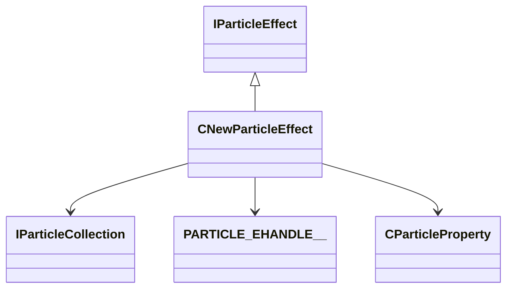

**Fields:**

| Name | Type | Annotations |
|------|------|-------------|
| `m_pNext` | [CNewParticleEffect](../schemas/particleslib.md#cnewparticleeffect)* |  |
| `m_pPrev` | [CNewParticleEffect](../schemas/particleslib.md#cnewparticleeffect)* |  |
| `m_pParticles` | [IParticleCollection](../schemas/particles.md#iparticlecollection)* |  |
| `m_pDebugName` | char* |  |
| `m_bDontRemove` | bitfield:1 |  |
| `m_bRemove` | bitfield:1 |  |
| `m_bNeedsBBoxUpdate` | bitfield:1 |  |
| `m_bIsFirstFrame` | bitfield:1 |  |
| `m_bAutoUpdateBBox` | bitfield:1 |  |
| `m_bAllocated` | bitfield:1 |  |
| `m_bSimulate` | bitfield:1 |  |
| `m_bShouldPerformCullCheck` | bitfield:1 |  |
| `m_bForceNoDraw` | bitfield:1 |  |
| `m_bSuppressScreenSpaceEffect` | bitfield:1 |  |
| `m_bShouldSave` | bitfield:1 |  |
| `m_bShouldSimulateDuringGamePaused` | bitfield:1 |  |
| `m_bShouldCheckFoW` | bitfield:1 |  |
| `m_bIsAsyncCreate` | bitfield:1 |  |
| `m_bFreezeTransitionActive` | bitfield:1 |  |
| `m_bFreezeTargetState` | bitfield:1 |  |
| `m_bCanFreeze` | bitfield:1 |  |
| `m_vSortOrigin` | Vector |  |
| `m_flScale` | float32 |  |
| `m_hOwner` | [PARTICLE_EHANDLE__](../schemas/particleslib.md#particle_ehandle__)* |  |
| `m_pOwningParticleProperty` | [CParticleProperty](../schemas/particleslib.md#cparticleproperty)* |  |
| `m_flFreezeTransitionStart` | float32 |  |
| `m_flFreezeTransitionDuration` | float32 |  |
| `m_flFreezeTransitionOverride` | float32 |  |
| `m_LastMin` | Vector |  |
| `m_LastMax` | Vector |  |
| `m_nSplitScreenUser` | CSplitScreenSlot |  |
| `m_vecAggregationCenter` | Vector |  |
| `m_RefCount` | int32 |  |

### CParticleBindingRealPulse

**Inherits from:** [CParticleCollectionBindingInstance](particleslib.md#cparticlecollectionbindinginstance)

**Relationships:**

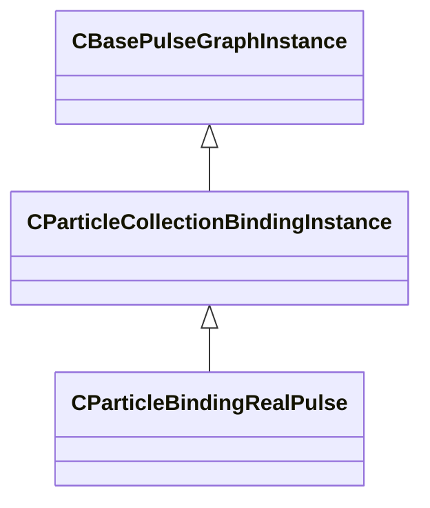

### CParticleCollectionBindingInstance

**Inherits from:** [CBasePulseGraphInstance](pulse_runtime_lib.md#cbasepulsegraphinstance)

**Derived by:** [CParticleBindingRealPulse](particleslib.md#cparticlebindingrealpulse)

**Relationships:**

### CParticleCollectionFloatInput

**Inherits from:** [CParticleFloatInput](particleslib.md#cparticlefloatinput)

**Derived by:** [CParticleCollectionRendererFloatInput](particleslib.md#cparticlecollectionrendererfloatinput)

**Metadata:** `MGetKV3ClassDefaults = {`, `"m_nType": "PF_TYPE_LITERAL",`, `"m_nMapType": "PF_MAP_TYPE_DIRECT",`, `"m_flLiteralValue": 0.000000,`, `"m_NamedValue": "",`, `"m_nControlPoint": 0,`, `"m_nScalarAttribute": 3,`, `"m_nVectorAttribute": 6,`, `"m_nVectorComponent": 0,`, `"m_bReverseOrder": false,`, `"m_flRandomMin": 0.000000,`, `"m_flRandomMax": 1.000000,`, `"m_bHasRandomSignFlip": false,`, `"m_nRandomSeed": -1,`, `"m_nRandomMode": "PF_RANDOM_MODE_CONSTANT",`, `"m_strSnapshotSubset": "",`, `"m_flLOD0": 0.000000,`, `"m_flLOD1": 0.000000,`, `"m_flLOD2": 0.000000,`, `"m_flLOD3": 0.000000,`, `"m_nNoiseInputVectorAttribute": 0,`, `"m_flNoiseOutputMin": 0.000000,`, `"m_flNoiseOutputMax": 1.000000,`, `"m_flNoiseScale": 0.100000,`, `"m_vecNoiseOffsetRate":`, `[`, `0.000000,`, `0.000000,`, `0.000000`, `],`, `"m_flNoiseOffset": 0.000000,`, `"m_nNoiseOctaves": 1,`, `"m_nNoiseTurbulence": "PF_NOISE_TURB_NONE",`, `"m_nNoiseType": "PF_NOISE_TYPE_PERLIN",`, `"m_nNoiseModifier": "PF_NOISE_MODIFIER_NONE",`, `"m_flNoiseTurbulenceScale": 1.000000,`, `"m_flNoiseTurbulenceMix": 0.500000,`, `"m_flNoiseImgPreviewScale": 1.000000,`, `"m_bNoiseImgPreviewLive": true,`, `"m_flNoCameraFallback": 0.000000,`, `"m_bUseBoundsCenter": false,`, `"m_nInputMode": "PF_INPUT_MODE_CLAMPED",`, `"m_flMultFactor": 1.000000,`, `"m_flInput0": 0.000000,`, `"m_flInput1": 1.000000,`, `"m_flOutput0": 0.000000,`, `"m_flOutput1": 1.000000,`, `"m_flNotchedRangeMin": 0.000000,`, `"m_flNotchedRangeMax": 1.000000,`, `"m_flNotchedOutputOutside": 0.000000,`, `"m_flNotchedOutputInside": 1.000000,`, `"m_nRoundType": "PF_ROUND_TYPE_NEAREST",`, `"m_nBiasType": "PF_BIAS_TYPE_STANDARD",`, `"m_flBiasParameter": 0.000000,`, `"m_Curve":`, `{`, `"m_spline":`, `[`, `],`, `"m_tangents":`, `[`, `],`, `"m_vDomainMins":`, `[`, `0.000000,`, `0.000000`, `],`, `"m_vDomainMaxs":`, `[`, `0.000000,`, `0.000000`, `]`, `}`, `}`, `MPropertyCustomEditor = "CollectionFloatInput()"`

**Relationships:**

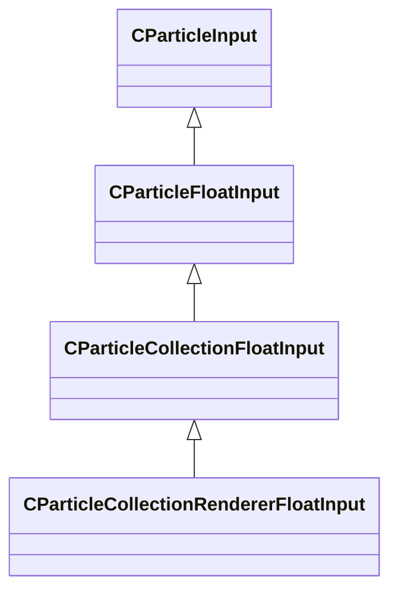

### CParticleCollectionRendererFloatInput

**Inherits from:** [CParticleCollectionFloatInput](particleslib.md#cparticlecollectionfloatinput)

**Metadata:** `MGetKV3ClassDefaults = {`, `"m_nType": "PF_TYPE_LITERAL",`, `"m_nMapType": "PF_MAP_TYPE_DIRECT",`, `"m_flLiteralValue": 0.000000,`, `"m_NamedValue": "",`, `"m_nControlPoint": 0,`, `"m_nScalarAttribute": 3,`, `"m_nVectorAttribute": 6,`, `"m_nVectorComponent": 0,`, `"m_bReverseOrder": false,`, `"m_flRandomMin": 0.000000,`, `"m_flRandomMax": 1.000000,`, `"m_bHasRandomSignFlip": false,`, `"m_nRandomSeed": -1,`, `"m_nRandomMode": "PF_RANDOM_MODE_CONSTANT",`, `"m_strSnapshotSubset": "",`, `"m_flLOD0": 0.000000,`, `"m_flLOD1": 0.000000,`, `"m_flLOD2": 0.000000,`, `"m_flLOD3": 0.000000,`, `"m_nNoiseInputVectorAttribute": 0,`, `"m_flNoiseOutputMin": 0.000000,`, `"m_flNoiseOutputMax": 1.000000,`, `"m_flNoiseScale": 0.100000,`, `"m_vecNoiseOffsetRate":`, `[`, `0.000000,`, `0.000000,`, `0.000000`, `],`, `"m_flNoiseOffset": 0.000000,`, `"m_nNoiseOctaves": 1,`, `"m_nNoiseTurbulence": "PF_NOISE_TURB_NONE",`, `"m_nNoiseType": "PF_NOISE_TYPE_PERLIN",`, `"m_nNoiseModifier": "PF_NOISE_MODIFIER_NONE",`, `"m_flNoiseTurbulenceScale": 1.000000,`, `"m_flNoiseTurbulenceMix": 0.500000,`, `"m_flNoiseImgPreviewScale": 1.000000,`, `"m_bNoiseImgPreviewLive": true,`, `"m_flNoCameraFallback": 0.000000,`, `"m_bUseBoundsCenter": false,`, `"m_nInputMode": "PF_INPUT_MODE_CLAMPED",`, `"m_flMultFactor": 1.000000,`, `"m_flInput0": 0.000000,`, `"m_flInput1": 1.000000,`, `"m_flOutput0": 0.000000,`, `"m_flOutput1": 1.000000,`, `"m_flNotchedRangeMin": 0.000000,`, `"m_flNotchedRangeMax": 1.000000,`, `"m_flNotchedOutputOutside": 0.000000,`, `"m_flNotchedOutputInside": 1.000000,`, `"m_nRoundType": "PF_ROUND_TYPE_NEAREST",`, `"m_nBiasType": "PF_BIAS_TYPE_STANDARD",`, `"m_flBiasParameter": 0.000000,`, `"m_Curve":`, `{`, `"m_spline":`, `[`, `],`, `"m_tangents":`, `[`, `],`, `"m_vDomainMins":`, `[`, `0.000000,`, `0.000000`, `],`, `"m_vDomainMaxs":`, `[`, `0.000000,`, `0.000000`, `]`, `}`, `}`, `MPropertyCustomEditor = "CollectionRendererFloatInput()"`

**Relationships:**

### CParticleCollectionRendererVecInput

**Inherits from:** [CParticleCollectionVecInput](particleslib.md#cparticlecollectionvecinput)

**Metadata:** `MGetKV3ClassDefaults = {`, `"m_nType": "PVEC_TYPE_LITERAL",`, `"m_vLiteralValue":`, `[`, `0.000000,`, `0.000000,`, `0.000000`, `],`, `"m_LiteralColor":`, `[`, `0,`, `0,`, `0`, `],`, `"m_NamedValue": "",`, `"m_bFollowNamedValue": false,`, `"m_nVectorAttribute": 6,`, `"m_vVectorAttributeScale":`, `[`, `1.000000,`, `1.000000,`, `1.000000`, `],`, `"m_nControlPoint": 0,`, `"m_nDeltaControlPoint": 0,`, `"m_vCPValueScale":`, `[`, `1.000000,`, `1.000000,`, `1.000000`, `],`, `"m_vCPRelativePosition":`, `[`, `0.000000,`, `0.000000,`, `0.000000`, `],`, `"m_vCPRelativeDir":`, `[`, `1.000000,`, `0.000000,`, `0.000000`, `],`, `"m_FloatComponentX":`, `{`, `"m_nType": "PF_TYPE_LITERAL",`, `"m_nMapType": "PF_MAP_TYPE_DIRECT",`, `"m_flLiteralValue": 0.000000,`, `"m_NamedValue": "",`, `"m_nControlPoint": 0,`, `"m_nScalarAttribute": 3,`, `"m_nVectorAttribute": 6,`, `"m_nVectorComponent": 0,`, `"m_bReverseOrder": false,`, `"m_flRandomMin": 0.000000,`, `"m_flRandomMax": 1.000000,`, `"m_bHasRandomSignFlip": false,`, `"m_nRandomSeed": -1,`, `"m_nRandomMode": "PF_RANDOM_MODE_CONSTANT",`, `"m_strSnapshotSubset": "",`, `"m_flLOD0": 0.000000,`, `"m_flLOD1": 0.000000,`, `"m_flLOD2": 0.000000,`, `"m_flLOD3": 0.000000,`, `"m_nNoiseInputVectorAttribute": 0,`, `"m_flNoiseOutputMin": 0.000000,`, `"m_flNoiseOutputMax": 1.000000,`, `"m_flNoiseScale": 0.100000,`, `"m_vecNoiseOffsetRate":`, `[`, `0.000000,`, `0.000000,`, `0.000000`, `],`, `"m_flNoiseOffset": 0.000000,`, `"m_nNoiseOctaves": 1,`, `"m_nNoiseTurbulence": "PF_NOISE_TURB_NONE",`, `"m_nNoiseType": "PF_NOISE_TYPE_PERLIN",`, `"m_nNoiseModifier": "PF_NOISE_MODIFIER_NONE",`, `"m_flNoiseTurbulenceScale": 1.000000,`, `"m_flNoiseTurbulenceMix": 0.500000,`, `"m_flNoiseImgPreviewScale": 1.000000,`, `"m_bNoiseImgPreviewLive": true,`, `"m_flNoCameraFallback": 0.000000,`, `"m_bUseBoundsCenter": false,`, `"m_nInputMode": "PF_INPUT_MODE_CLAMPED",`, `"m_flMultFactor": 1.000000,`, `"m_flInput0": 0.000000,`, `"m_flInput1": 1.000000,`, `"m_flOutput0": 0.000000,`, `"m_flOutput1": 1.000000,`, `"m_flNotchedRangeMin": 0.000000,`, `"m_flNotchedRangeMax": 1.000000,`, `"m_flNotchedOutputOutside": 0.000000,`, `"m_flNotchedOutputInside": 1.000000,`, `"m_nRoundType": "PF_ROUND_TYPE_NEAREST",`, `"m_nBiasType": "PF_BIAS_TYPE_STANDARD",`, `"m_flBiasParameter": 0.000000,`, `"m_Curve":`, `{`, `"m_spline":`, `[`, `],`, `"m_tangents":`, `[`, `],`, `"m_vDomainMins":`, `[`, `0.000000,`, `0.000000`, `],`, `"m_vDomainMaxs":`, `[`, `0.000000,`, `0.000000`, `]`, `}`, `},`, `"m_FloatComponentY":`, `{`, `"m_nType": "PF_TYPE_LITERAL",`, `"m_nMapType": "PF_MAP_TYPE_DIRECT",`, `"m_flLiteralValue": 0.000000,`, `"m_NamedValue": "",`, `"m_nControlPoint": 0,`, `"m_nScalarAttribute": 3,`, `"m_nVectorAttribute": 6,`, `"m_nVectorComponent": 0,`, `"m_bReverseOrder": false,`, `"m_flRandomMin": 0.000000,`, `"m_flRandomMax": 1.000000,`, `"m_bHasRandomSignFlip": false,`, `"m_nRandomSeed": -1,`, `"m_nRandomMode": "PF_RANDOM_MODE_CONSTANT",`, `"m_strSnapshotSubset": "",`, `"m_flLOD0": 0.000000,`, `"m_flLOD1": 0.000000,`, `"m_flLOD2": 0.000000,`, `"m_flLOD3": 0.000000,`, `"m_nNoiseInputVectorAttribute": 0,`, `"m_flNoiseOutputMin": 0.000000,`, `"m_flNoiseOutputMax": 1.000000,`, `"m_flNoiseScale": 0.100000,`, `"m_vecNoiseOffsetRate":`, `[`, `0.000000,`, `0.000000,`, `0.000000`, `],`, `"m_flNoiseOffset": 0.000000,`, `"m_nNoiseOctaves": 1,`, `"m_nNoiseTurbulence": "PF_NOISE_TURB_NONE",`, `"m_nNoiseType": "PF_NOISE_TYPE_PERLIN",`, `"m_nNoiseModifier": "PF_NOISE_MODIFIER_NONE",`, `"m_flNoiseTurbulenceScale": 1.000000,`, `"m_flNoiseTurbulenceMix": 0.500000,`, `"m_flNoiseImgPreviewScale": 1.000000,`, `"m_bNoiseImgPreviewLive": true,`, `"m_flNoCameraFallback": 0.000000,`, `"m_bUseBoundsCenter": false,`, `"m_nInputMode": "PF_INPUT_MODE_CLAMPED",`, `"m_flMultFactor": 1.000000,`, `"m_flInput0": 0.000000,`, `"m_flInput1": 1.000000,`, `"m_flOutput0": 0.000000,`, `"m_flOutput1": 1.000000,`, `"m_flNotchedRangeMin": 0.000000,`, `"m_flNotchedRangeMax": 1.000000,`, `"m_flNotchedOutputOutside": 0.000000,`, `"m_flNotchedOutputInside": 1.000000,`, `"m_nRoundType": "PF_ROUND_TYPE_NEAREST",`, `"m_nBiasType": "PF_BIAS_TYPE_STANDARD",`, `"m_flBiasParameter": 0.000000,`, `"m_Curve":`, `{`, `"m_spline":`, `[`, `],`, `"m_tangents":`, `[`, `],`, `"m_vDomainMins":`, `[`, `0.000000,`, `0.000000`, `],`, `"m_vDomainMaxs":`, `[`, `0.000000,`, `0.000000`, `]`, `}`, `},`, `"m_FloatComponentZ":`, `{`, `"m_nType": "PF_TYPE_LITERAL",`, `"m_nMapType": "PF_MAP_TYPE_DIRECT",`, `"m_flLiteralValue": 0.000000,`, `"m_NamedValue": "",`, `"m_nControlPoint": 0,`, `"m_nScalarAttribute": 3,`, `"m_nVectorAttribute": 6,`, `"m_nVectorComponent": 0,`, `"m_bReverseOrder": false,`, `"m_flRandomMin": 0.000000,`, `"m_flRandomMax": 1.000000,`, `"m_bHasRandomSignFlip": false,`, `"m_nRandomSeed": -1,`, `"m_nRandomMode": "PF_RANDOM_MODE_CONSTANT",`, `"m_strSnapshotSubset": "",`, `"m_flLOD0": 0.000000,`, `"m_flLOD1": 0.000000,`, `"m_flLOD2": 0.000000,`, `"m_flLOD3": 0.000000,`, `"m_nNoiseInputVectorAttribute": 0,`, `"m_flNoiseOutputMin": 0.000000,`, `"m_flNoiseOutputMax": 1.000000,`, `"m_flNoiseScale": 0.100000,`, `"m_vecNoiseOffsetRate":`, `[`, `0.000000,`, `0.000000,`, `0.000000`, `],`, `"m_flNoiseOffset": 0.000000,`, `"m_nNoiseOctaves": 1,`, `"m_nNoiseTurbulence": "PF_NOISE_TURB_NONE",`, `"m_nNoiseType": "PF_NOISE_TYPE_PERLIN",`, `"m_nNoiseModifier": "PF_NOISE_MODIFIER_NONE",`, `"m_flNoiseTurbulenceScale": 1.000000,`, `"m_flNoiseTurbulenceMix": 0.500000,`, `"m_flNoiseImgPreviewScale": 1.000000,`, `"m_bNoiseImgPreviewLive": true,`, `"m_flNoCameraFallback": 0.000000,`, `"m_bUseBoundsCenter": false,`, `"m_nInputMode": "PF_INPUT_MODE_CLAMPED",`, `"m_flMultFactor": 1.000000,`, `"m_flInput0": 0.000000,`, `"m_flInput1": 1.000000,`, `"m_flOutput0": 0.000000,`, `"m_flOutput1": 1.000000,`, `"m_flNotchedRangeMin": 0.000000,`, `"m_flNotchedRangeMax": 1.000000,`, `"m_flNotchedOutputOutside": 0.000000,`, `"m_flNotchedOutputInside": 1.000000,`, `"m_nRoundType": "PF_ROUND_TYPE_NEAREST",`, `"m_nBiasType": "PF_BIAS_TYPE_STANDARD",`, `"m_flBiasParameter": 0.000000,`, `"m_Curve":`, `{`, `"m_spline":`, `[`, `],`, `"m_tangents":`, `[`, `],`, `"m_vDomainMins":`, `[`, `0.000000,`, `0.000000`, `],`, `"m_vDomainMaxs":`, `[`, `0.000000,`, `0.000000`, `]`, `}`, `},`, `"m_FloatInterp":`, `{`, `"m_nType": "PF_TYPE_LITERAL",`, `"m_nMapType": "PF_MAP_TYPE_DIRECT",`, `"m_flLiteralValue": 0.000000,`, `"m_NamedValue": "",`, `"m_nControlPoint": 0,`, `"m_nScalarAttribute": 3,`, `"m_nVectorAttribute": 6,`, `"m_nVectorComponent": 0,`, `"m_bReverseOrder": false,`, `"m_flRandomMin": 0.000000,`, `"m_flRandomMax": 1.000000,`, `"m_bHasRandomSignFlip": false,`, `"m_nRandomSeed": -1,`, `"m_nRandomMode": "PF_RANDOM_MODE_CONSTANT",`, `"m_strSnapshotSubset": "",`, `"m_flLOD0": 0.000000,`, `"m_flLOD1": 0.000000,`, `"m_flLOD2": 0.000000,`, `"m_flLOD3": 0.000000,`, `"m_nNoiseInputVectorAttribute": 0,`, `"m_flNoiseOutputMin": 0.000000,`, `"m_flNoiseOutputMax": 1.000000,`, `"m_flNoiseScale": 0.100000,`, `"m_vecNoiseOffsetRate":`, `[`, `0.000000,`, `0.000000,`, `0.000000`, `],`, `"m_flNoiseOffset": 0.000000,`, `"m_nNoiseOctaves": 1,`, `"m_nNoiseTurbulence": "PF_NOISE_TURB_NONE",`, `"m_nNoiseType": "PF_NOISE_TYPE_PERLIN",`, `"m_nNoiseModifier": "PF_NOISE_MODIFIER_NONE",`, `"m_flNoiseTurbulenceScale": 1.000000,`, `"m_flNoiseTurbulenceMix": 0.500000,`, `"m_flNoiseImgPreviewScale": 1.000000,`, `"m_bNoiseImgPreviewLive": true,`, `"m_flNoCameraFallback": 0.000000,`, `"m_bUseBoundsCenter": false,`, `"m_nInputMode": "PF_INPUT_MODE_CLAMPED",`, `"m_flMultFactor": 1.000000,`, `"m_flInput0": 0.000000,`, `"m_flInput1": 1.000000,`, `"m_flOutput0": 0.000000,`, `"m_flOutput1": 1.000000,`, `"m_flNotchedRangeMin": 0.000000,`, `"m_flNotchedRangeMax": 1.000000,`, `"m_flNotchedOutputOutside": 0.000000,`, `"m_flNotchedOutputInside": 1.000000,`, `"m_nRoundType": "PF_ROUND_TYPE_NEAREST",`, `"m_nBiasType": "PF_BIAS_TYPE_STANDARD",`, `"m_flBiasParameter": 0.000000,`, `"m_Curve":`, `{`, `"m_spline":`, `[`, `],`, `"m_tangents":`, `[`, `],`, `"m_vDomainMins":`, `[`, `0.000000,`, `0.000000`, `],`, `"m_vDomainMaxs":`, `[`, `0.000000,`, `0.000000`, `]`, `}`, `},`, `"m_flInterpInput0": 0.000000,`, `"m_flInterpInput1": 1.000000,`, `"m_vInterpOutput0":`, `[`, `0.000000,`, `0.000000,`, `0.000000`, `],`, `"m_vInterpOutput1":`, `[`, `1.000000,`, `1.000000,`, `1.000000`, `],`, `"m_Gradient":`, `{`, `"m_Stops":`, `[`, `]`, `},`, `"m_vRandomMin":`, `[`, `0.000000,`, `0.000000,`, `0.000000`, `],`, `"m_vRandomMax":`, `[`, `0.000000,`, `0.000000,`, `0.000000`, `]`, `}`, `MPropertyCustomEditor = "CollectionRendererVecInput()"`

**Relationships:**

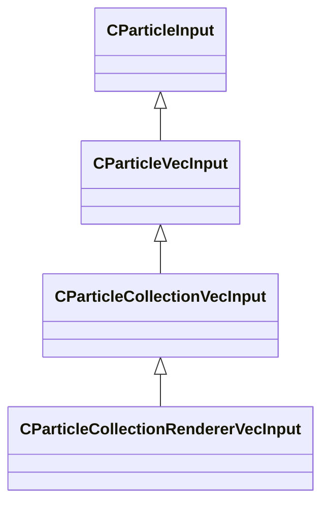

### CParticleCollectionVecInput

**Inherits from:** [CParticleVecInput](particleslib.md#cparticlevecinput)

**Derived by:** [CParticleCollectionRendererVecInput](particleslib.md#cparticlecollectionrenderervecinput)

**Metadata:** `MGetKV3ClassDefaults = {`, `"m_nType": "PVEC_TYPE_LITERAL",`, `"m_vLiteralValue":`, `[`, `0.000000,`, `0.000000,`, `0.000000`, `],`, `"m_LiteralColor":`, `[`, `0,`, `0,`, `0`, `],`, `"m_NamedValue": "",`, `"m_bFollowNamedValue": false,`, `"m_nVectorAttribute": 6,`, `"m_vVectorAttributeScale":`, `[`, `1.000000,`, `1.000000,`, `1.000000`, `],`, `"m_nControlPoint": 0,`, `"m_nDeltaControlPoint": 0,`, `"m_vCPValueScale":`, `[`, `1.000000,`, `1.000000,`, `1.000000`, `],`, `"m_vCPRelativePosition":`, `[`, `0.000000,`, `0.000000,`, `0.000000`, `],`, `"m_vCPRelativeDir":`, `[`, `1.000000,`, `0.000000,`, `0.000000`, `],`, `"m_FloatComponentX":`, `{`, `"m_nType": "PF_TYPE_LITERAL",`, `"m_nMapType": "PF_MAP_TYPE_DIRECT",`, `"m_flLiteralValue": 0.000000,`, `"m_NamedValue": "",`, `"m_nControlPoint": 0,`, `"m_nScalarAttribute": 3,`, `"m_nVectorAttribute": 6,`, `"m_nVectorComponent": 0,`, `"m_bReverseOrder": false,`, `"m_flRandomMin": 0.000000,`, `"m_flRandomMax": 1.000000,`, `"m_bHasRandomSignFlip": false,`, `"m_nRandomSeed": -1,`, `"m_nRandomMode": "PF_RANDOM_MODE_CONSTANT",`, `"m_strSnapshotSubset": "",`, `"m_flLOD0": 0.000000,`, `"m_flLOD1": 0.000000,`, `"m_flLOD2": 0.000000,`, `"m_flLOD3": 0.000000,`, `"m_nNoiseInputVectorAttribute": 0,`, `"m_flNoiseOutputMin": 0.000000,`, `"m_flNoiseOutputMax": 1.000000,`, `"m_flNoiseScale": 0.100000,`, `"m_vecNoiseOffsetRate":`, `[`, `0.000000,`, `0.000000,`, `0.000000`, `],`, `"m_flNoiseOffset": 0.000000,`, `"m_nNoiseOctaves": 1,`, `"m_nNoiseTurbulence": "PF_NOISE_TURB_NONE",`, `"m_nNoiseType": "PF_NOISE_TYPE_PERLIN",`, `"m_nNoiseModifier": "PF_NOISE_MODIFIER_NONE",`, `"m_flNoiseTurbulenceScale": 1.000000,`, `"m_flNoiseTurbulenceMix": 0.500000,`, `"m_flNoiseImgPreviewScale": 1.000000,`, `"m_bNoiseImgPreviewLive": true,`, `"m_flNoCameraFallback": 0.000000,`, `"m_bUseBoundsCenter": false,`, `"m_nInputMode": "PF_INPUT_MODE_CLAMPED",`, `"m_flMultFactor": 1.000000,`, `"m_flInput0": 0.000000,`, `"m_flInput1": 1.000000,`, `"m_flOutput0": 0.000000,`, `"m_flOutput1": 1.000000,`, `"m_flNotchedRangeMin": 0.000000,`, `"m_flNotchedRangeMax": 1.000000,`, `"m_flNotchedOutputOutside": 0.000000,`, `"m_flNotchedOutputInside": 1.000000,`, `"m_nRoundType": "PF_ROUND_TYPE_NEAREST",`, `"m_nBiasType": "PF_BIAS_TYPE_STANDARD",`, `"m_flBiasParameter": 0.000000,`, `"m_Curve":`, `{`, `"m_spline":`, `[`, `],`, `"m_tangents":`, `[`, `],`, `"m_vDomainMins":`, `[`, `0.000000,`, `0.000000`, `],`, `"m_vDomainMaxs":`, `[`, `0.000000,`, `0.000000`, `]`, `}`, `},`, `"m_FloatComponentY":`, `{`, `"m_nType": "PF_TYPE_LITERAL",`, `"m_nMapType": "PF_MAP_TYPE_DIRECT",`, `"m_flLiteralValue": 0.000000,`, `"m_NamedValue": "",`, `"m_nControlPoint": 0,`, `"m_nScalarAttribute": 3,`, `"m_nVectorAttribute": 6,`, `"m_nVectorComponent": 0,`, `"m_bReverseOrder": false,`, `"m_flRandomMin": 0.000000,`, `"m_flRandomMax": 1.000000,`, `"m_bHasRandomSignFlip": false,`, `"m_nRandomSeed": -1,`, `"m_nRandomMode": "PF_RANDOM_MODE_CONSTANT",`, `"m_strSnapshotSubset": "",`, `"m_flLOD0": 0.000000,`, `"m_flLOD1": 0.000000,`, `"m_flLOD2": 0.000000,`, `"m_flLOD3": 0.000000,`, `"m_nNoiseInputVectorAttribute": 0,`, `"m_flNoiseOutputMin": 0.000000,`, `"m_flNoiseOutputMax": 1.000000,`, `"m_flNoiseScale": 0.100000,`, `"m_vecNoiseOffsetRate":`, `[`, `0.000000,`, `0.000000,`, `0.000000`, `],`, `"m_flNoiseOffset": 0.000000,`, `"m_nNoiseOctaves": 1,`, `"m_nNoiseTurbulence": "PF_NOISE_TURB_NONE",`, `"m_nNoiseType": "PF_NOISE_TYPE_PERLIN",`, `"m_nNoiseModifier": "PF_NOISE_MODIFIER_NONE",`, `"m_flNoiseTurbulenceScale": 1.000000,`, `"m_flNoiseTurbulenceMix": 0.500000,`, `"m_flNoiseImgPreviewScale": 1.000000,`, `"m_bNoiseImgPreviewLive": true,`, `"m_flNoCameraFallback": 0.000000,`, `"m_bUseBoundsCenter": false,`, `"m_nInputMode": "PF_INPUT_MODE_CLAMPED",`, `"m_flMultFactor": 1.000000,`, `"m_flInput0": 0.000000,`, `"m_flInput1": 1.000000,`, `"m_flOutput0": 0.000000,`, `"m_flOutput1": 1.000000,`, `"m_flNotchedRangeMin": 0.000000,`, `"m_flNotchedRangeMax": 1.000000,`, `"m_flNotchedOutputOutside": 0.000000,`, `"m_flNotchedOutputInside": 1.000000,`, `"m_nRoundType": "PF_ROUND_TYPE_NEAREST",`, `"m_nBiasType": "PF_BIAS_TYPE_STANDARD",`, `"m_flBiasParameter": 0.000000,`, `"m_Curve":`, `{`, `"m_spline":`, `[`, `],`, `"m_tangents":`, `[`, `],`, `"m_vDomainMins":`, `[`, `0.000000,`, `0.000000`, `],`, `"m_vDomainMaxs":`, `[`, `0.000000,`, `0.000000`, `]`, `}`, `},`, `"m_FloatComponentZ":`, `{`, `"m_nType": "PF_TYPE_LITERAL",`, `"m_nMapType": "PF_MAP_TYPE_DIRECT",`, `"m_flLiteralValue": 0.000000,`, `"m_NamedValue": "",`, `"m_nControlPoint": 0,`, `"m_nScalarAttribute": 3,`, `"m_nVectorAttribute": 6,`, `"m_nVectorComponent": 0,`, `"m_bReverseOrder": false,`, `"m_flRandomMin": 0.000000,`, `"m_flRandomMax": 1.000000,`, `"m_bHasRandomSignFlip": false,`, `"m_nRandomSeed": -1,`, `"m_nRandomMode": "PF_RANDOM_MODE_CONSTANT",`, `"m_strSnapshotSubset": "",`, `"m_flLOD0": 0.000000,`, `"m_flLOD1": 0.000000,`, `"m_flLOD2": 0.000000,`, `"m_flLOD3": 0.000000,`, `"m_nNoiseInputVectorAttribute": 0,`, `"m_flNoiseOutputMin": 0.000000,`, `"m_flNoiseOutputMax": 1.000000,`, `"m_flNoiseScale": 0.100000,`, `"m_vecNoiseOffsetRate":`, `[`, `0.000000,`, `0.000000,`, `0.000000`, `],`, `"m_flNoiseOffset": 0.000000,`, `"m_nNoiseOctaves": 1,`, `"m_nNoiseTurbulence": "PF_NOISE_TURB_NONE",`, `"m_nNoiseType": "PF_NOISE_TYPE_PERLIN",`, `"m_nNoiseModifier": "PF_NOISE_MODIFIER_NONE",`, `"m_flNoiseTurbulenceScale": 1.000000,`, `"m_flNoiseTurbulenceMix": 0.500000,`, `"m_flNoiseImgPreviewScale": 1.000000,`, `"m_bNoiseImgPreviewLive": true,`, `"m_flNoCameraFallback": 0.000000,`, `"m_bUseBoundsCenter": false,`, `"m_nInputMode": "PF_INPUT_MODE_CLAMPED",`, `"m_flMultFactor": 1.000000,`, `"m_flInput0": 0.000000,`, `"m_flInput1": 1.000000,`, `"m_flOutput0": 0.000000,`, `"m_flOutput1": 1.000000,`, `"m_flNotchedRangeMin": 0.000000,`, `"m_flNotchedRangeMax": 1.000000,`, `"m_flNotchedOutputOutside": 0.000000,`, `"m_flNotchedOutputInside": 1.000000,`, `"m_nRoundType": "PF_ROUND_TYPE_NEAREST",`, `"m_nBiasType": "PF_BIAS_TYPE_STANDARD",`, `"m_flBiasParameter": 0.000000,`, `"m_Curve":`, `{`, `"m_spline":`, `[`, `],`, `"m_tangents":`, `[`, `],`, `"m_vDomainMins":`, `[`, `0.000000,`, `0.000000`, `],`, `"m_vDomainMaxs":`, `[`, `0.000000,`, `0.000000`, `]`, `}`, `},`, `"m_FloatInterp":`, `{`, `"m_nType": "PF_TYPE_LITERAL",`, `"m_nMapType": "PF_MAP_TYPE_DIRECT",`, `"m_flLiteralValue": 0.000000,`, `"m_NamedValue": "",`, `"m_nControlPoint": 0,`, `"m_nScalarAttribute": 3,`, `"m_nVectorAttribute": 6,`, `"m_nVectorComponent": 0,`, `"m_bReverseOrder": false,`, `"m_flRandomMin": 0.000000,`, `"m_flRandomMax": 1.000000,`, `"m_bHasRandomSignFlip": false,`, `"m_nRandomSeed": -1,`, `"m_nRandomMode": "PF_RANDOM_MODE_CONSTANT",`, `"m_strSnapshotSubset": "",`, `"m_flLOD0": 0.000000,`, `"m_flLOD1": 0.000000,`, `"m_flLOD2": 0.000000,`, `"m_flLOD3": 0.000000,`, `"m_nNoiseInputVectorAttribute": 0,`, `"m_flNoiseOutputMin": 0.000000,`, `"m_flNoiseOutputMax": 1.000000,`, `"m_flNoiseScale": 0.100000,`, `"m_vecNoiseOffsetRate":`, `[`, `0.000000,`, `0.000000,`, `0.000000`, `],`, `"m_flNoiseOffset": 0.000000,`, `"m_nNoiseOctaves": 1,`, `"m_nNoiseTurbulence": "PF_NOISE_TURB_NONE",`, `"m_nNoiseType": "PF_NOISE_TYPE_PERLIN",`, `"m_nNoiseModifier": "PF_NOISE_MODIFIER_NONE",`, `"m_flNoiseTurbulenceScale": 1.000000,`, `"m_flNoiseTurbulenceMix": 0.500000,`, `"m_flNoiseImgPreviewScale": 1.000000,`, `"m_bNoiseImgPreviewLive": true,`, `"m_flNoCameraFallback": 0.000000,`, `"m_bUseBoundsCenter": false,`, `"m_nInputMode": "PF_INPUT_MODE_CLAMPED",`, `"m_flMultFactor": 1.000000,`, `"m_flInput0": 0.000000,`, `"m_flInput1": 1.000000,`, `"m_flOutput0": 0.000000,`, `"m_flOutput1": 1.000000,`, `"m_flNotchedRangeMin": 0.000000,`, `"m_flNotchedRangeMax": 1.000000,`, `"m_flNotchedOutputOutside": 0.000000,`, `"m_flNotchedOutputInside": 1.000000,`, `"m_nRoundType": "PF_ROUND_TYPE_NEAREST",`, `"m_nBiasType": "PF_BIAS_TYPE_STANDARD",`, `"m_flBiasParameter": 0.000000,`, `"m_Curve":`, `{`, `"m_spline":`, `[`, `],`, `"m_tangents":`, `[`, `],`, `"m_vDomainMins":`, `[`, `0.000000,`, `0.000000`, `],`, `"m_vDomainMaxs":`, `[`, `0.000000,`, `0.000000`, `]`, `}`, `},`, `"m_flInterpInput0": 0.000000,`, `"m_flInterpInput1": 1.000000,`, `"m_vInterpOutput0":`, `[`, `0.000000,`, `0.000000,`, `0.000000`, `],`, `"m_vInterpOutput1":`, `[`, `1.000000,`, `1.000000,`, `1.000000`, `],`, `"m_Gradient":`, `{`, `"m_Stops":`, `[`, `]`, `},`, `"m_vRandomMin":`, `[`, `0.000000,`, `0.000000,`, `0.000000`, `],`, `"m_vRandomMax":`, `[`, `0.000000,`, `0.000000,`, `0.000000`, `]`, `}`, `MPropertyCustomEditor = "CollectionVecInput()"`

**Relationships:**

### CParticleFloatInput

**Inherits from:** [CParticleInput](particleslib.md#cparticleinput)

**Derived by:** [CParticleCollectionFloatInput](particleslib.md#cparticlecollectionfloatinput), [CParticleRemapFloatInput](particleslib.md#cparticleremapfloatinput), [CPerParticleFloatInput](particleslib.md#cperparticlefloatinput)

**Metadata:** `MGetKV3ClassDefaults = {`, `"m_nType": "PF_TYPE_LITERAL",`, `"m_nMapType": "PF_MAP_TYPE_DIRECT",`, `"m_flLiteralValue": 0.000000,`, `"m_NamedValue": "",`, `"m_nControlPoint": 0,`, `"m_nScalarAttribute": 3,`, `"m_nVectorAttribute": 6,`, `"m_nVectorComponent": 0,`, `"m_bReverseOrder": false,`, `"m_flRandomMin": 0.000000,`, `"m_flRandomMax": 1.000000,`, `"m_bHasRandomSignFlip": false,`, `"m_nRandomSeed": -1,`, `"m_nRandomMode": "PF_RANDOM_MODE_CONSTANT",`, `"m_strSnapshotSubset": "",`, `"m_flLOD0": 0.000000,`, `"m_flLOD1": 0.000000,`, `"m_flLOD2": 0.000000,`, `"m_flLOD3": 0.000000,`, `"m_nNoiseInputVectorAttribute": 0,`, `"m_flNoiseOutputMin": 0.000000,`, `"m_flNoiseOutputMax": 1.000000,`, `"m_flNoiseScale": 0.100000,`, `"m_vecNoiseOffsetRate":`, `[`, `0.000000,`, `0.000000,`, `0.000000`, `],`, `"m_flNoiseOffset": 0.000000,`, `"m_nNoiseOctaves": 1,`, `"m_nNoiseTurbulence": "PF_NOISE_TURB_NONE",`, `"m_nNoiseType": "PF_NOISE_TYPE_PERLIN",`, `"m_nNoiseModifier": "PF_NOISE_MODIFIER_NONE",`, `"m_flNoiseTurbulenceScale": 1.000000,`, `"m_flNoiseTurbulenceMix": 0.500000,`, `"m_flNoiseImgPreviewScale": 1.000000,`, `"m_bNoiseImgPreviewLive": true,`, `"m_flNoCameraFallback": 0.000000,`, `"m_bUseBoundsCenter": false,`, `"m_nInputMode": "PF_INPUT_MODE_CLAMPED",`, `"m_flMultFactor": 1.000000,`, `"m_flInput0": 0.000000,`, `"m_flInput1": 1.000000,`, `"m_flOutput0": 0.000000,`, `"m_flOutput1": 1.000000,`, `"m_flNotchedRangeMin": 0.000000,`, `"m_flNotchedRangeMax": 1.000000,`, `"m_flNotchedOutputOutside": 0.000000,`, `"m_flNotchedOutputInside": 1.000000,`, `"m_nRoundType": "PF_ROUND_TYPE_NEAREST",`, `"m_nBiasType": "PF_BIAS_TYPE_STANDARD",`, `"m_flBiasParameter": 0.000000,`, `"m_Curve":`, `{`, `"m_spline":`, `[`, `],`, `"m_tangents":`, `[`, `],`, `"m_vDomainMins":`, `[`, `0.000000,`, `0.000000`, `],`, `"m_vDomainMaxs":`, `[`, `0.000000,`, `0.000000`, `]`, `}`, `}`, `MCustomFGDMetadata = "{ SkipImprintFGDClassOnKV3 = true SkipRemoveKeysInKV3AtFGDDefault = true KV3DefaultTestFnName = 'CParticleFloatInputDefaultTestFunc' }"`

**Relationships:**

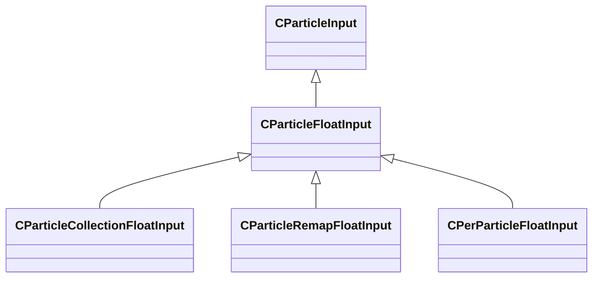

### CParticleInput

**Derived by:** [CParticleFloatInput](particleslib.md#cparticlefloatinput), [CParticleModelInput](particleslib.md#cparticlemodelinput), [CParticleTransformInput](particleslib.md#cparticletransforminput), [CParticleVecInput](particleslib.md#cparticlevecinput)

**Metadata:** `MGetKV3ClassDefaults = {`, `}`

**Relationships:**

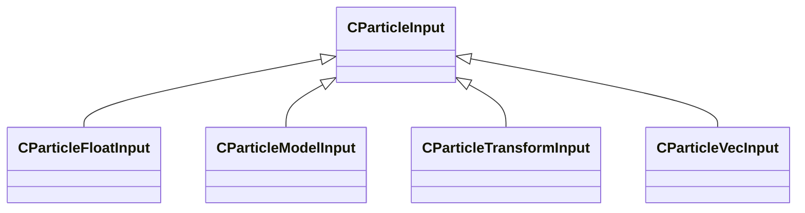

### CParticleModelInput

**Inherits from:** [CParticleInput](particleslib.md#cparticleinput)

**Metadata:** `MGetKV3ClassDefaults = {`, `"m_nType": "PM_TYPE_INVALID",`, `"m_NamedValue": "",`, `"m_nControlPoint": -1`, `}`, `MPropertyCustomEditor = "ModelInput()"`, `MCustomFGDMetadata = "{ KV3DefaultTestFnName = 'CParticleModelInputDefaultTestFunc' }"`

**Relationships:**

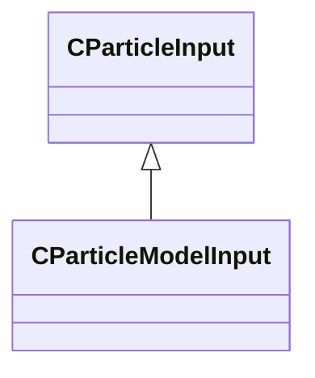

### CParticleProperty

### CParticleRemapFloatInput

**Inherits from:** [CParticleFloatInput](particleslib.md#cparticlefloatinput)

**Metadata:** `MGetKV3ClassDefaults = {`, `"m_nType": "PF_TYPE_INVALID",`, `"m_nMapType": "PF_MAP_TYPE_DIRECT",`, `"m_flLiteralValue": 0.000000,`, `"m_NamedValue": "",`, `"m_nControlPoint": 0,`, `"m_nScalarAttribute": 3,`, `"m_nVectorAttribute": 6,`, `"m_nVectorComponent": 0,`, `"m_bReverseOrder": false,`, `"m_flRandomMin": 0.000000,`, `"m_flRandomMax": 1.000000,`, `"m_bHasRandomSignFlip": false,`, `"m_nRandomSeed": -1,`, `"m_nRandomMode": "PF_RANDOM_MODE_CONSTANT",`, `"m_strSnapshotSubset": "",`, `"m_flLOD0": 0.000000,`, `"m_flLOD1": 0.000000,`, `"m_flLOD2": 0.000000,`, `"m_flLOD3": 0.000000,`, `"m_nNoiseInputVectorAttribute": 0,`, `"m_flNoiseOutputMin": 0.000000,`, `"m_flNoiseOutputMax": 1.000000,`, `"m_flNoiseScale": 0.100000,`, `"m_vecNoiseOffsetRate":`, `[`, `0.000000,`, `0.000000,`, `0.000000`, `],`, `"m_flNoiseOffset": 0.000000,`, `"m_nNoiseOctaves": 1,`, `"m_nNoiseTurbulence": "PF_NOISE_TURB_NONE",`, `"m_nNoiseType": "PF_NOISE_TYPE_PERLIN",`, `"m_nNoiseModifier": "PF_NOISE_MODIFIER_NONE",`, `"m_flNoiseTurbulenceScale": 1.000000,`, `"m_flNoiseTurbulenceMix": 0.500000,`, `"m_flNoiseImgPreviewScale": 1.000000,`, `"m_bNoiseImgPreviewLive": true,`, `"m_flNoCameraFallback": 0.000000,`, `"m_bUseBoundsCenter": false,`, `"m_nInputMode": "PF_INPUT_MODE_CLAMPED",`, `"m_flMultFactor": 1.000000,`, `"m_flInput0": 0.000000,`, `"m_flInput1": 1.000000,`, `"m_flOutput0": 0.000000,`, `"m_flOutput1": 1.000000,`, `"m_flNotchedRangeMin": 0.000000,`, `"m_flNotchedRangeMax": 1.000000,`, `"m_flNotchedOutputOutside": 0.000000,`, `"m_flNotchedOutputInside": 1.000000,`, `"m_nRoundType": "PF_ROUND_TYPE_NEAREST",`, `"m_nBiasType": "PF_BIAS_TYPE_STANDARD",`, `"m_flBiasParameter": 0.000000,`, `"m_Curve":`, `{`, `"m_spline":`, `[`, `],`, `"m_tangents":`, `[`, `],`, `"m_vDomainMins":`, `[`, `0.000000,`, `0.000000`, `],`, `"m_vDomainMaxs":`, `[`, `0.000000,`, `0.000000`, `]`, `}`, `}`, `MPropertyCustomEditor = "RemapFloatInput()"`

**Relationships:**

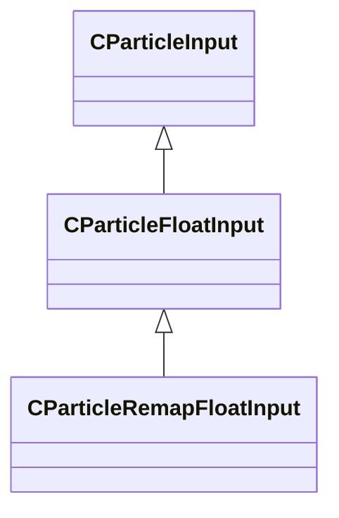

### CParticleTransformInput

**Inherits from:** [CParticleInput](particleslib.md#cparticleinput)

**Metadata:** `MGetKV3ClassDefaults = {`, `"m_nType": "PT_TYPE_CONTROL_POINT",`, `"m_NamedValue": "",`, `"m_bFollowNamedValue": false,`, `"m_bSupportsDisabled": false,`, `"m_bUseOrientation": true,`, `"m_nControlPoint": 0,`, `"m_nControlPointRangeMax": 0,`, `"m_flEndCPGrowthTime": 0.000000`, `}`, `MPropertyCustomEditor = "TransformInput()"`, `MCustomFGDMetadata = "{ KV3DefaultTestFnName = 'CParticleTransformInputDefaultTestFunc' }"`

**Relationships:**

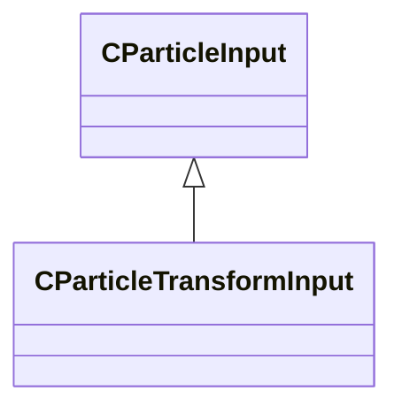

### CParticleVariableRef

**Metadata:** `MGetKV3ClassDefaults = {`, `"m_variableName": "",`, `"m_variableType": "PVAL_VOID"`, `}`, `MPropertyCustomEditor = "ParticleVariableRef()"`

### CParticleVecInput

**Inherits from:** [CParticleInput](particleslib.md#cparticleinput)

**Derived by:** [CParticleCollectionVecInput](particleslib.md#cparticlecollectionvecinput), [CPerParticleVecInput](particleslib.md#cperparticlevecinput)

**Metadata:** `MGetKV3ClassDefaults = {`, `"m_nType": "PVEC_TYPE_LITERAL",`, `"m_vLiteralValue":`, `[`, `0.000000,`, `0.000000,`, `0.000000`, `],`, `"m_LiteralColor":`, `[`, `0,`, `0,`, `0`, `],`, `"m_NamedValue": "",`, `"m_bFollowNamedValue": false,`, `"m_nVectorAttribute": 6,`, `"m_vVectorAttributeScale":`, `[`, `1.000000,`, `1.000000,`, `1.000000`, `],`, `"m_nControlPoint": 0,`, `"m_nDeltaControlPoint": 0,`, `"m_vCPValueScale":`, `[`, `1.000000,`, `1.000000,`, `1.000000`, `],`, `"m_vCPRelativePosition":`, `[`, `0.000000,`, `0.000000,`, `0.000000`, `],`, `"m_vCPRelativeDir":`, `[`, `1.000000,`, `0.000000,`, `0.000000`, `],`, `"m_FloatComponentX":`, `{`, `"m_nType": "PF_TYPE_LITERAL",`, `"m_nMapType": "PF_MAP_TYPE_DIRECT",`, `"m_flLiteralValue": 0.000000,`, `"m_NamedValue": "",`, `"m_nControlPoint": 0,`, `"m_nScalarAttribute": 3,`, `"m_nVectorAttribute": 6,`, `"m_nVectorComponent": 0,`, `"m_bReverseOrder": false,`, `"m_flRandomMin": 0.000000,`, `"m_flRandomMax": 1.000000,`, `"m_bHasRandomSignFlip": false,`, `"m_nRandomSeed": -1,`, `"m_nRandomMode": "PF_RANDOM_MODE_CONSTANT",`, `"m_strSnapshotSubset": "",`, `"m_flLOD0": 0.000000,`, `"m_flLOD1": 0.000000,`, `"m_flLOD2": 0.000000,`, `"m_flLOD3": 0.000000,`, `"m_nNoiseInputVectorAttribute": 0,`, `"m_flNoiseOutputMin": 0.000000,`, `"m_flNoiseOutputMax": 1.000000,`, `"m_flNoiseScale": 0.100000,`, `"m_vecNoiseOffsetRate":`, `[`, `0.000000,`, `0.000000,`, `0.000000`, `],`, `"m_flNoiseOffset": 0.000000,`, `"m_nNoiseOctaves": 1,`, `"m_nNoiseTurbulence": "PF_NOISE_TURB_NONE",`, `"m_nNoiseType": "PF_NOISE_TYPE_PERLIN",`, `"m_nNoiseModifier": "PF_NOISE_MODIFIER_NONE",`, `"m_flNoiseTurbulenceScale": 1.000000,`, `"m_flNoiseTurbulenceMix": 0.500000,`, `"m_flNoiseImgPreviewScale": 1.000000,`, `"m_bNoiseImgPreviewLive": true,`, `"m_flNoCameraFallback": 0.000000,`, `"m_bUseBoundsCenter": false,`, `"m_nInputMode": "PF_INPUT_MODE_CLAMPED",`, `"m_flMultFactor": 1.000000,`, `"m_flInput0": 0.000000,`, `"m_flInput1": 1.000000,`, `"m_flOutput0": 0.000000,`, `"m_flOutput1": 1.000000,`, `"m_flNotchedRangeMin": 0.000000,`, `"m_flNotchedRangeMax": 1.000000,`, `"m_flNotchedOutputOutside": 0.000000,`, `"m_flNotchedOutputInside": 1.000000,`, `"m_nRoundType": "PF_ROUND_TYPE_NEAREST",`, `"m_nBiasType": "PF_BIAS_TYPE_STANDARD",`, `"m_flBiasParameter": 0.000000,`, `"m_Curve":`, `{`, `"m_spline":`, `[`, `],`, `"m_tangents":`, `[`, `],`, `"m_vDomainMins":`, `[`, `0.000000,`, `0.000000`, `],`, `"m_vDomainMaxs":`, `[`, `0.000000,`, `0.000000`, `]`, `}`, `},`, `"m_FloatComponentY":`, `{`, `"m_nType": "PF_TYPE_LITERAL",`, `"m_nMapType": "PF_MAP_TYPE_DIRECT",`, `"m_flLiteralValue": 0.000000,`, `"m_NamedValue": "",`, `"m_nControlPoint": 0,`, `"m_nScalarAttribute": 3,`, `"m_nVectorAttribute": 6,`, `"m_nVectorComponent": 0,`, `"m_bReverseOrder": false,`, `"m_flRandomMin": 0.000000,`, `"m_flRandomMax": 1.000000,`, `"m_bHasRandomSignFlip": false,`, `"m_nRandomSeed": -1,`, `"m_nRandomMode": "PF_RANDOM_MODE_CONSTANT",`, `"m_strSnapshotSubset": "",`, `"m_flLOD0": 0.000000,`, `"m_flLOD1": 0.000000,`, `"m_flLOD2": 0.000000,`, `"m_flLOD3": 0.000000,`, `"m_nNoiseInputVectorAttribute": 0,`, `"m_flNoiseOutputMin": 0.000000,`, `"m_flNoiseOutputMax": 1.000000,`, `"m_flNoiseScale": 0.100000,`, `"m_vecNoiseOffsetRate":`, `[`, `0.000000,`, `0.000000,`, `0.000000`, `],`, `"m_flNoiseOffset": 0.000000,`, `"m_nNoiseOctaves": 1,`, `"m_nNoiseTurbulence": "PF_NOISE_TURB_NONE",`, `"m_nNoiseType": "PF_NOISE_TYPE_PERLIN",`, `"m_nNoiseModifier": "PF_NOISE_MODIFIER_NONE",`, `"m_flNoiseTurbulenceScale": 1.000000,`, `"m_flNoiseTurbulenceMix": 0.500000,`, `"m_flNoiseImgPreviewScale": 1.000000,`, `"m_bNoiseImgPreviewLive": true,`, `"m_flNoCameraFallback": 0.000000,`, `"m_bUseBoundsCenter": false,`, `"m_nInputMode": "PF_INPUT_MODE_CLAMPED",`, `"m_flMultFactor": 1.000000,`, `"m_flInput0": 0.000000,`, `"m_flInput1": 1.000000,`, `"m_flOutput0": 0.000000,`, `"m_flOutput1": 1.000000,`, `"m_flNotchedRangeMin": 0.000000,`, `"m_flNotchedRangeMax": 1.000000,`, `"m_flNotchedOutputOutside": 0.000000,`, `"m_flNotchedOutputInside": 1.000000,`, `"m_nRoundType": "PF_ROUND_TYPE_NEAREST",`, `"m_nBiasType": "PF_BIAS_TYPE_STANDARD",`, `"m_flBiasParameter": 0.000000,`, `"m_Curve":`, `{`, `"m_spline":`, `[`, `],`, `"m_tangents":`, `[`, `],`, `"m_vDomainMins":`, `[`, `0.000000,`, `0.000000`, `],`, `"m_vDomainMaxs":`, `[`, `0.000000,`, `0.000000`, `]`, `}`, `},`, `"m_FloatComponentZ":`, `{`, `"m_nType": "PF_TYPE_LITERAL",`, `"m_nMapType": "PF_MAP_TYPE_DIRECT",`, `"m_flLiteralValue": 0.000000,`, `"m_NamedValue": "",`, `"m_nControlPoint": 0,`, `"m_nScalarAttribute": 3,`, `"m_nVectorAttribute": 6,`, `"m_nVectorComponent": 0,`, `"m_bReverseOrder": false,`, `"m_flRandomMin": 0.000000,`, `"m_flRandomMax": 1.000000,`, `"m_bHasRandomSignFlip": false,`, `"m_nRandomSeed": -1,`, `"m_nRandomMode": "PF_RANDOM_MODE_CONSTANT",`, `"m_strSnapshotSubset": "",`, `"m_flLOD0": 0.000000,`, `"m_flLOD1": 0.000000,`, `"m_flLOD2": 0.000000,`, `"m_flLOD3": 0.000000,`, `"m_nNoiseInputVectorAttribute": 0,`, `"m_flNoiseOutputMin": 0.000000,`, `"m_flNoiseOutputMax": 1.000000,`, `"m_flNoiseScale": 0.100000,`, `"m_vecNoiseOffsetRate":`, `[`, `0.000000,`, `0.000000,`, `0.000000`, `],`, `"m_flNoiseOffset": 0.000000,`, `"m_nNoiseOctaves": 1,`, `"m_nNoiseTurbulence": "PF_NOISE_TURB_NONE",`, `"m_nNoiseType": "PF_NOISE_TYPE_PERLIN",`, `"m_nNoiseModifier": "PF_NOISE_MODIFIER_NONE",`, `"m_flNoiseTurbulenceScale": 1.000000,`, `"m_flNoiseTurbulenceMix": 0.500000,`, `"m_flNoiseImgPreviewScale": 1.000000,`, `"m_bNoiseImgPreviewLive": true,`, `"m_flNoCameraFallback": 0.000000,`, `"m_bUseBoundsCenter": false,`, `"m_nInputMode": "PF_INPUT_MODE_CLAMPED",`, `"m_flMultFactor": 1.000000,`, `"m_flInput0": 0.000000,`, `"m_flInput1": 1.000000,`, `"m_flOutput0": 0.000000,`, `"m_flOutput1": 1.000000,`, `"m_flNotchedRangeMin": 0.000000,`, `"m_flNotchedRangeMax": 1.000000,`, `"m_flNotchedOutputOutside": 0.000000,`, `"m_flNotchedOutputInside": 1.000000,`, `"m_nRoundType": "PF_ROUND_TYPE_NEAREST",`, `"m_nBiasType": "PF_BIAS_TYPE_STANDARD",`, `"m_flBiasParameter": 0.000000,`, `"m_Curve":`, `{`, `"m_spline":`, `[`, `],`, `"m_tangents":`, `[`, `],`, `"m_vDomainMins":`, `[`, `0.000000,`, `0.000000`, `],`, `"m_vDomainMaxs":`, `[`, `0.000000,`, `0.000000`, `]`, `}`, `},`, `"m_FloatInterp":`, `{`, `"m_nType": "PF_TYPE_LITERAL",`, `"m_nMapType": "PF_MAP_TYPE_DIRECT",`, `"m_flLiteralValue": 0.000000,`, `"m_NamedValue": "",`, `"m_nControlPoint": 0,`, `"m_nScalarAttribute": 3,`, `"m_nVectorAttribute": 6,`, `"m_nVectorComponent": 0,`, `"m_bReverseOrder": false,`, `"m_flRandomMin": 0.000000,`, `"m_flRandomMax": 1.000000,`, `"m_bHasRandomSignFlip": false,`, `"m_nRandomSeed": -1,`, `"m_nRandomMode": "PF_RANDOM_MODE_CONSTANT",`, `"m_strSnapshotSubset": "",`, `"m_flLOD0": 0.000000,`, `"m_flLOD1": 0.000000,`, `"m_flLOD2": 0.000000,`, `"m_flLOD3": 0.000000,`, `"m_nNoiseInputVectorAttribute": 0,`, `"m_flNoiseOutputMin": 0.000000,`, `"m_flNoiseOutputMax": 1.000000,`, `"m_flNoiseScale": 0.100000,`, `"m_vecNoiseOffsetRate":`, `[`, `0.000000,`, `0.000000,`, `0.000000`, `],`, `"m_flNoiseOffset": 0.000000,`, `"m_nNoiseOctaves": 1,`, `"m_nNoiseTurbulence": "PF_NOISE_TURB_NONE",`, `"m_nNoiseType": "PF_NOISE_TYPE_PERLIN",`, `"m_nNoiseModifier": "PF_NOISE_MODIFIER_NONE",`, `"m_flNoiseTurbulenceScale": 1.000000,`, `"m_flNoiseTurbulenceMix": 0.500000,`, `"m_flNoiseImgPreviewScale": 1.000000,`, `"m_bNoiseImgPreviewLive": true,`, `"m_flNoCameraFallback": 0.000000,`, `"m_bUseBoundsCenter": false,`, `"m_nInputMode": "PF_INPUT_MODE_CLAMPED",`, `"m_flMultFactor": 1.000000,`, `"m_flInput0": 0.000000,`, `"m_flInput1": 1.000000,`, `"m_flOutput0": 0.000000,`, `"m_flOutput1": 1.000000,`, `"m_flNotchedRangeMin": 0.000000,`, `"m_flNotchedRangeMax": 1.000000,`, `"m_flNotchedOutputOutside": 0.000000,`, `"m_flNotchedOutputInside": 1.000000,`, `"m_nRoundType": "PF_ROUND_TYPE_NEAREST",`, `"m_nBiasType": "PF_BIAS_TYPE_STANDARD",`, `"m_flBiasParameter": 0.000000,`, `"m_Curve":`, `{`, `"m_spline":`, `[`, `],`, `"m_tangents":`, `[`, `],`, `"m_vDomainMins":`, `[`, `0.000000,`, `0.000000`, `],`, `"m_vDomainMaxs":`, `[`, `0.000000,`, `0.000000`, `]`, `}`, `},`, `"m_flInterpInput0": 0.000000,`, `"m_flInterpInput1": 1.000000,`, `"m_vInterpOutput0":`, `[`, `0.000000,`, `0.000000,`, `0.000000`, `],`, `"m_vInterpOutput1":`, `[`, `1.000000,`, `1.000000,`, `1.000000`, `],`, `"m_Gradient":`, `{`, `"m_Stops":`, `[`, `]`, `},`, `"m_vRandomMin":`, `[`, `0.000000,`, `0.000000,`, `0.000000`, `],`, `"m_vRandomMax":`, `[`, `0.000000,`, `0.000000,`, `0.000000`, `]`, `}`, `MCustomFGDMetadata = "{ SkipImprintFGDClassOnKV3 = true SkipRemoveKeysInKV3AtFGDDefault = true KV3DefaultTestFnName = 'CParticleVecInputDefaultTestFunc' }"`

**Relationships:**

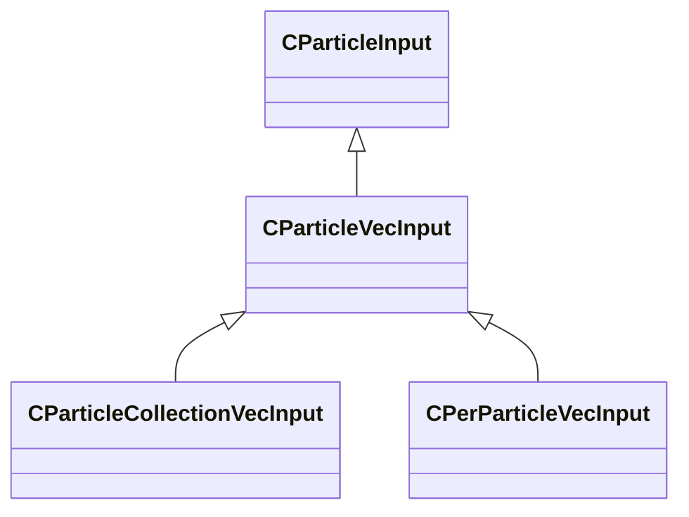

### CPerParticleFloatInput

**Inherits from:** [CParticleFloatInput](particleslib.md#cparticlefloatinput)

**Metadata:** `MGetKV3ClassDefaults = {`, `"m_nType": "PF_TYPE_LITERAL",`, `"m_nMapType": "PF_MAP_TYPE_DIRECT",`, `"m_flLiteralValue": 0.000000,`, `"m_NamedValue": "",`, `"m_nControlPoint": 0,`, `"m_nScalarAttribute": 3,`, `"m_nVectorAttribute": 6,`, `"m_nVectorComponent": 0,`, `"m_bReverseOrder": false,`, `"m_flRandomMin": 0.000000,`, `"m_flRandomMax": 1.000000,`, `"m_bHasRandomSignFlip": false,`, `"m_nRandomSeed": -1,`, `"m_nRandomMode": "PF_RANDOM_MODE_CONSTANT",`, `"m_strSnapshotSubset": "",`, `"m_flLOD0": 0.000000,`, `"m_flLOD1": 0.000000,`, `"m_flLOD2": 0.000000,`, `"m_flLOD3": 0.000000,`, `"m_nNoiseInputVectorAttribute": 0,`, `"m_flNoiseOutputMin": 0.000000,`, `"m_flNoiseOutputMax": 1.000000,`, `"m_flNoiseScale": 0.100000,`, `"m_vecNoiseOffsetRate":`, `[`, `0.000000,`, `0.000000,`, `0.000000`, `],`, `"m_flNoiseOffset": 0.000000,`, `"m_nNoiseOctaves": 1,`, `"m_nNoiseTurbulence": "PF_NOISE_TURB_NONE",`, `"m_nNoiseType": "PF_NOISE_TYPE_PERLIN",`, `"m_nNoiseModifier": "PF_NOISE_MODIFIER_NONE",`, `"m_flNoiseTurbulenceScale": 1.000000,`, `"m_flNoiseTurbulenceMix": 0.500000,`, `"m_flNoiseImgPreviewScale": 1.000000,`, `"m_bNoiseImgPreviewLive": true,`, `"m_flNoCameraFallback": 0.000000,`, `"m_bUseBoundsCenter": false,`, `"m_nInputMode": "PF_INPUT_MODE_CLAMPED",`, `"m_flMultFactor": 1.000000,`, `"m_flInput0": 0.000000,`, `"m_flInput1": 1.000000,`, `"m_flOutput0": 0.000000,`, `"m_flOutput1": 1.000000,`, `"m_flNotchedRangeMin": 0.000000,`, `"m_flNotchedRangeMax": 1.000000,`, `"m_flNotchedOutputOutside": 0.000000,`, `"m_flNotchedOutputInside": 1.000000,`, `"m_nRoundType": "PF_ROUND_TYPE_NEAREST",`, `"m_nBiasType": "PF_BIAS_TYPE_STANDARD",`, `"m_flBiasParameter": 0.000000,`, `"m_Curve":`, `{`, `"m_spline":`, `[`, `],`, `"m_tangents":`, `[`, `],`, `"m_vDomainMins":`, `[`, `0.000000,`, `0.000000`, `],`, `"m_vDomainMaxs":`, `[`, `0.000000,`, `0.000000`, `]`, `}`, `}`, `MPropertyCustomEditor = "PerParticleFloatInput()"`

**Relationships:**

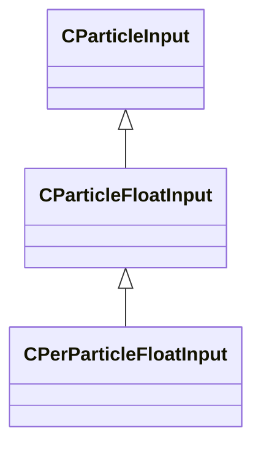

### CPerParticleVecInput

**Inherits from:** [CParticleVecInput](particleslib.md#cparticlevecinput)

**Metadata:** `MGetKV3ClassDefaults = {`, `"m_nType": "PVEC_TYPE_LITERAL",`, `"m_vLiteralValue":`, `[`, `0.000000,`, `0.000000,`, `0.000000`, `],`, `"m_LiteralColor":`, `[`, `0,`, `0,`, `0`, `],`, `"m_NamedValue": "",`, `"m_bFollowNamedValue": false,`, `"m_nVectorAttribute": 6,`, `"m_vVectorAttributeScale":`, `[`, `1.000000,`, `1.000000,`, `1.000000`, `],`, `"m_nControlPoint": 0,`, `"m_nDeltaControlPoint": 0,`, `"m_vCPValueScale":`, `[`, `1.000000,`, `1.000000,`, `1.000000`, `],`, `"m_vCPRelativePosition":`, `[`, `0.000000,`, `0.000000,`, `0.000000`, `],`, `"m_vCPRelativeDir":`, `[`, `1.000000,`, `0.000000,`, `0.000000`, `],`, `"m_FloatComponentX":`, `{`, `"m_nType": "PF_TYPE_LITERAL",`, `"m_nMapType": "PF_MAP_TYPE_DIRECT",`, `"m_flLiteralValue": 0.000000,`, `"m_NamedValue": "",`, `"m_nControlPoint": 0,`, `"m_nScalarAttribute": 3,`, `"m_nVectorAttribute": 6,`, `"m_nVectorComponent": 0,`, `"m_bReverseOrder": false,`, `"m_flRandomMin": 0.000000,`, `"m_flRandomMax": 1.000000,`, `"m_bHasRandomSignFlip": false,`, `"m_nRandomSeed": -1,`, `"m_nRandomMode": "PF_RANDOM_MODE_CONSTANT",`, `"m_strSnapshotSubset": "",`, `"m_flLOD0": 0.000000,`, `"m_flLOD1": 0.000000,`, `"m_flLOD2": 0.000000,`, `"m_flLOD3": 0.000000,`, `"m_nNoiseInputVectorAttribute": 0,`, `"m_flNoiseOutputMin": 0.000000,`, `"m_flNoiseOutputMax": 1.000000,`, `"m_flNoiseScale": 0.100000,`, `"m_vecNoiseOffsetRate":`, `[`, `0.000000,`, `0.000000,`, `0.000000`, `],`, `"m_flNoiseOffset": 0.000000,`, `"m_nNoiseOctaves": 1,`, `"m_nNoiseTurbulence": "PF_NOISE_TURB_NONE",`, `"m_nNoiseType": "PF_NOISE_TYPE_PERLIN",`, `"m_nNoiseModifier": "PF_NOISE_MODIFIER_NONE",`, `"m_flNoiseTurbulenceScale": 1.000000,`, `"m_flNoiseTurbulenceMix": 0.500000,`, `"m_flNoiseImgPreviewScale": 1.000000,`, `"m_bNoiseImgPreviewLive": true,`, `"m_flNoCameraFallback": 0.000000,`, `"m_bUseBoundsCenter": false,`, `"m_nInputMode": "PF_INPUT_MODE_CLAMPED",`, `"m_flMultFactor": 1.000000,`, `"m_flInput0": 0.000000,`, `"m_flInput1": 1.000000,`, `"m_flOutput0": 0.000000,`, `"m_flOutput1": 1.000000,`, `"m_flNotchedRangeMin": 0.000000,`, `"m_flNotchedRangeMax": 1.000000,`, `"m_flNotchedOutputOutside": 0.000000,`, `"m_flNotchedOutputInside": 1.000000,`, `"m_nRoundType": "PF_ROUND_TYPE_NEAREST",`, `"m_nBiasType": "PF_BIAS_TYPE_STANDARD",`, `"m_flBiasParameter": 0.000000,`, `"m_Curve":`, `{`, `"m_spline":`, `[`, `],`, `"m_tangents":`, `[`, `],`, `"m_vDomainMins":`, `[`, `0.000000,`, `0.000000`, `],`, `"m_vDomainMaxs":`, `[`, `0.000000,`, `0.000000`, `]`, `}`, `},`, `"m_FloatComponentY":`, `{`, `"m_nType": "PF_TYPE_LITERAL",`, `"m_nMapType": "PF_MAP_TYPE_DIRECT",`, `"m_flLiteralValue": 0.000000,`, `"m_NamedValue": "",`, `"m_nControlPoint": 0,`, `"m_nScalarAttribute": 3,`, `"m_nVectorAttribute": 6,`, `"m_nVectorComponent": 0,`, `"m_bReverseOrder": false,`, `"m_flRandomMin": 0.000000,`, `"m_flRandomMax": 1.000000,`, `"m_bHasRandomSignFlip": false,`, `"m_nRandomSeed": -1,`, `"m_nRandomMode": "PF_RANDOM_MODE_CONSTANT",`, `"m_strSnapshotSubset": "",`, `"m_flLOD0": 0.000000,`, `"m_flLOD1": 0.000000,`, `"m_flLOD2": 0.000000,`, `"m_flLOD3": 0.000000,`, `"m_nNoiseInputVectorAttribute": 0,`, `"m_flNoiseOutputMin": 0.000000,`, `"m_flNoiseOutputMax": 1.000000,`, `"m_flNoiseScale": 0.100000,`, `"m_vecNoiseOffsetRate":`, `[`, `0.000000,`, `0.000000,`, `0.000000`, `],`, `"m_flNoiseOffset": 0.000000,`, `"m_nNoiseOctaves": 1,`, `"m_nNoiseTurbulence": "PF_NOISE_TURB_NONE",`, `"m_nNoiseType": "PF_NOISE_TYPE_PERLIN",`, `"m_nNoiseModifier": "PF_NOISE_MODIFIER_NONE",`, `"m_flNoiseTurbulenceScale": 1.000000,`, `"m_flNoiseTurbulenceMix": 0.500000,`, `"m_flNoiseImgPreviewScale": 1.000000,`, `"m_bNoiseImgPreviewLive": true,`, `"m_flNoCameraFallback": 0.000000,`, `"m_bUseBoundsCenter": false,`, `"m_nInputMode": "PF_INPUT_MODE_CLAMPED",`, `"m_flMultFactor": 1.000000,`, `"m_flInput0": 0.000000,`, `"m_flInput1": 1.000000,`, `"m_flOutput0": 0.000000,`, `"m_flOutput1": 1.000000,`, `"m_flNotchedRangeMin": 0.000000,`, `"m_flNotchedRangeMax": 1.000000,`, `"m_flNotchedOutputOutside": 0.000000,`, `"m_flNotchedOutputInside": 1.000000,`, `"m_nRoundType": "PF_ROUND_TYPE_NEAREST",`, `"m_nBiasType": "PF_BIAS_TYPE_STANDARD",`, `"m_flBiasParameter": 0.000000,`, `"m_Curve":`, `{`, `"m_spline":`, `[`, `],`, `"m_tangents":`, `[`, `],`, `"m_vDomainMins":`, `[`, `0.000000,`, `0.000000`, `],`, `"m_vDomainMaxs":`, `[`, `0.000000,`, `0.000000`, `]`, `}`, `},`, `"m_FloatComponentZ":`, `{`, `"m_nType": "PF_TYPE_LITERAL",`, `"m_nMapType": "PF_MAP_TYPE_DIRECT",`, `"m_flLiteralValue": 0.000000,`, `"m_NamedValue": "",`, `"m_nControlPoint": 0,`, `"m_nScalarAttribute": 3,`, `"m_nVectorAttribute": 6,`, `"m_nVectorComponent": 0,`, `"m_bReverseOrder": false,`, `"m_flRandomMin": 0.000000,`, `"m_flRandomMax": 1.000000,`, `"m_bHasRandomSignFlip": false,`, `"m_nRandomSeed": -1,`, `"m_nRandomMode": "PF_RANDOM_MODE_CONSTANT",`, `"m_strSnapshotSubset": "",`, `"m_flLOD0": 0.000000,`, `"m_flLOD1": 0.000000,`, `"m_flLOD2": 0.000000,`, `"m_flLOD3": 0.000000,`, `"m_nNoiseInputVectorAttribute": 0,`, `"m_flNoiseOutputMin": 0.000000,`, `"m_flNoiseOutputMax": 1.000000,`, `"m_flNoiseScale": 0.100000,`, `"m_vecNoiseOffsetRate":`, `[`, `0.000000,`, `0.000000,`, `0.000000`, `],`, `"m_flNoiseOffset": 0.000000,`, `"m_nNoiseOctaves": 1,`, `"m_nNoiseTurbulence": "PF_NOISE_TURB_NONE",`, `"m_nNoiseType": "PF_NOISE_TYPE_PERLIN",`, `"m_nNoiseModifier": "PF_NOISE_MODIFIER_NONE",`, `"m_flNoiseTurbulenceScale": 1.000000,`, `"m_flNoiseTurbulenceMix": 0.500000,`, `"m_flNoiseImgPreviewScale": 1.000000,`, `"m_bNoiseImgPreviewLive": true,`, `"m_flNoCameraFallback": 0.000000,`, `"m_bUseBoundsCenter": false,`, `"m_nInputMode": "PF_INPUT_MODE_CLAMPED",`, `"m_flMultFactor": 1.000000,`, `"m_flInput0": 0.000000,`, `"m_flInput1": 1.000000,`, `"m_flOutput0": 0.000000,`, `"m_flOutput1": 1.000000,`, `"m_flNotchedRangeMin": 0.000000,`, `"m_flNotchedRangeMax": 1.000000,`, `"m_flNotchedOutputOutside": 0.000000,`, `"m_flNotchedOutputInside": 1.000000,`, `"m_nRoundType": "PF_ROUND_TYPE_NEAREST",`, `"m_nBiasType": "PF_BIAS_TYPE_STANDARD",`, `"m_flBiasParameter": 0.000000,`, `"m_Curve":`, `{`, `"m_spline":`, `[`, `],`, `"m_tangents":`, `[`, `],`, `"m_vDomainMins":`, `[`, `0.000000,`, `0.000000`, `],`, `"m_vDomainMaxs":`, `[`, `0.000000,`, `0.000000`, `]`, `}`, `},`, `"m_FloatInterp":`, `{`, `"m_nType": "PF_TYPE_LITERAL",`, `"m_nMapType": "PF_MAP_TYPE_DIRECT",`, `"m_flLiteralValue": 0.000000,`, `"m_NamedValue": "",`, `"m_nControlPoint": 0,`, `"m_nScalarAttribute": 3,`, `"m_nVectorAttribute": 6,`, `"m_nVectorComponent": 0,`, `"m_bReverseOrder": false,`, `"m_flRandomMin": 0.000000,`, `"m_flRandomMax": 1.000000,`, `"m_bHasRandomSignFlip": false,`, `"m_nRandomSeed": -1,`, `"m_nRandomMode": "PF_RANDOM_MODE_CONSTANT",`, `"m_strSnapshotSubset": "",`, `"m_flLOD0": 0.000000,`, `"m_flLOD1": 0.000000,`, `"m_flLOD2": 0.000000,`, `"m_flLOD3": 0.000000,`, `"m_nNoiseInputVectorAttribute": 0,`, `"m_flNoiseOutputMin": 0.000000,`, `"m_flNoiseOutputMax": 1.000000,`, `"m_flNoiseScale": 0.100000,`, `"m_vecNoiseOffsetRate":`, `[`, `0.000000,`, `0.000000,`, `0.000000`, `],`, `"m_flNoiseOffset": 0.000000,`, `"m_nNoiseOctaves": 1,`, `"m_nNoiseTurbulence": "PF_NOISE_TURB_NONE",`, `"m_nNoiseType": "PF_NOISE_TYPE_PERLIN",`, `"m_nNoiseModifier": "PF_NOISE_MODIFIER_NONE",`, `"m_flNoiseTurbulenceScale": 1.000000,`, `"m_flNoiseTurbulenceMix": 0.500000,`, `"m_flNoiseImgPreviewScale": 1.000000,`, `"m_bNoiseImgPreviewLive": true,`, `"m_flNoCameraFallback": 0.000000,`, `"m_bUseBoundsCenter": false,`, `"m_nInputMode": "PF_INPUT_MODE_CLAMPED",`, `"m_flMultFactor": 1.000000,`, `"m_flInput0": 0.000000,`, `"m_flInput1": 1.000000,`, `"m_flOutput0": 0.000000,`, `"m_flOutput1": 1.000000,`, `"m_flNotchedRangeMin": 0.000000,`, `"m_flNotchedRangeMax": 1.000000,`, `"m_flNotchedOutputOutside": 0.000000,`, `"m_flNotchedOutputInside": 1.000000,`, `"m_nRoundType": "PF_ROUND_TYPE_NEAREST",`, `"m_nBiasType": "PF_BIAS_TYPE_STANDARD",`, `"m_flBiasParameter": 0.000000,`, `"m_Curve":`, `{`, `"m_spline":`, `[`, `],`, `"m_tangents":`, `[`, `],`, `"m_vDomainMins":`, `[`, `0.000000,`, `0.000000`, `],`, `"m_vDomainMaxs":`, `[`, `0.000000,`, `0.000000`, `]`, `}`, `},`, `"m_flInterpInput0": 0.000000,`, `"m_flInterpInput1": 1.000000,`, `"m_vInterpOutput0":`, `[`, `0.000000,`, `0.000000,`, `0.000000`, `],`, `"m_vInterpOutput1":`, `[`, `1.000000,`, `1.000000,`, `1.000000`, `],`, `"m_Gradient":`, `{`, `"m_Stops":`, `[`, `]`, `},`, `"m_vRandomMin":`, `[`, `0.000000,`, `0.000000,`, `0.000000`, `],`, `"m_vRandomMax":`, `[`, `0.000000,`, `0.000000,`, `0.000000`, `]`, `}`, `MPropertyCustomEditor = "PerParticleVecInput()"`

**Relationships:**

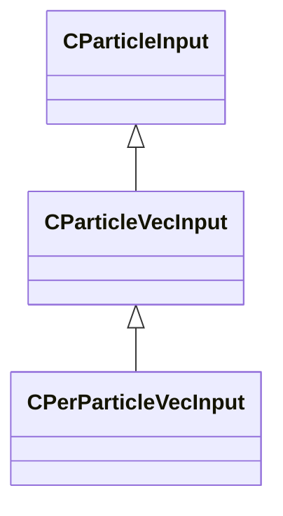

### IParticleEffect

**Derived by:** [CNewParticleEffect](particleslib.md#cnewparticleeffect)

**Relationships:**

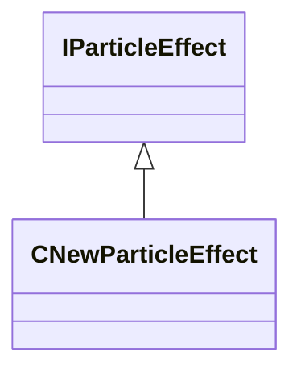

### PARTICLE_EHANDLE__

**Fields:**

| Name | Type | Annotations |
|------|------|-------------|
| `unused` | int32 |  |

### PFNoiseModifier_t

**Values:**

| Name | Value |
|------|-------|
| `PF_NOISE_MODIFIER_NONE` | 0 |
| `PF_NOISE_MODIFIER_LINES` | 1 |
| `PF_NOISE_MODIFIER_CLUMPS` | 2 |
| `PF_NOISE_MODIFIER_RINGS` | 3 |

### PFNoiseTurbulence_t

**Values:**

| Name | Value |
|------|-------|
| `PF_NOISE_TURB_NONE` | 0 |
| `PF_NOISE_TURB_HIGHLIGHT` | 1 |
| `PF_NOISE_TURB_FEEDBACK` | 2 |
| `PF_NOISE_TURB_LOOPY` | 3 |
| `PF_NOISE_TURB_CONTRAST` | 4 |
| `PF_NOISE_TURB_ALTERNATE` | 5 |

### PFNoiseType_t

**Values:**

| Name | Value |
|------|-------|
| `PF_NOISE_TYPE_PERLIN` | 0 |
| `PF_NOISE_TYPE_SIMPLEX` | 1 |
| `PF_NOISE_TYPE_WORLEY` | 2 |
| `PF_NOISE_TYPE_CURL` | 3 |

### ParticleFloatBiasType_t

**Values:**

| Name | Value |
|------|-------|
| `PF_BIAS_TYPE_INVALID` | -1 |
| `PF_BIAS_TYPE_STANDARD` | 0 |
| `PF_BIAS_TYPE_GAIN` | 1 |
| `PF_BIAS_TYPE_EXPONENTIAL` | 2 |
| `PF_BIAS_TYPE_COUNT` | 3 |

### ParticleFloatInputMode_t

**Values:**

| Name | Value |
|------|-------|
| `PF_INPUT_MODE_INVALID` | -1 |
| `PF_INPUT_MODE_CLAMPED` | 0 |
| `PF_INPUT_MODE_LOOPED` | 1 |
| `PF_INPUT_MODE_COUNT` | 2 |

### ParticleFloatMapType_t

**Values:**

| Name | Value |
|------|-------|
| `PF_MAP_TYPE_INVALID` | -1 |
| `PF_MAP_TYPE_DIRECT` | 0 |
| `PF_MAP_TYPE_MULT` | 1 |
| `PF_MAP_TYPE_REMAP` | 2 |
| `PF_MAP_TYPE_REMAP_BIASED` | 3 |
| `PF_MAP_TYPE_CURVE` | 4 |
| `PF_MAP_TYPE_NOTCHED` | 5 |
| `PF_MAP_TYPE_ROUND` | 6 |
| `PF_MAP_TYPE_COUNT` | 7 |

### ParticleFloatRandomMode_t

**Values:**

| Name | Value |
|------|-------|
| `PF_RANDOM_MODE_INVALID` | -1 |
| `PF_RANDOM_MODE_CONSTANT` | 0 |
| `PF_RANDOM_MODE_VARYING` | 1 |
| `PF_RANDOM_MODE_COUNT` | 2 |

### ParticleFloatRoundType_t

**Values:**

| Name | Value |
|------|-------|
| `PF_ROUND_TYPE_INVALID` | -1 |
| `PF_ROUND_TYPE_NEAREST` | 0 |
| `PF_ROUND_TYPE_FLOOR` | 1 |
| `PF_ROUND_TYPE_CEIL` | 2 |
| `PF_ROUND_TYPE_COUNT` | 3 |

### ParticleFloatType_t

**Values:**

| Name | Value |
|------|-------|
| `PF_TYPE_INVALID` | -1 |
| `PF_TYPE_LITERAL` | 0 |
| `PF_TYPE_NAMED_VALUE` | 1 |
| `PF_TYPE_RANDOM_UNIFORM` | 2 |
| `PF_TYPE_RANDOM_BIASED` | 3 |
| `PF_TYPE_COLLECTION_AGE` | 4 |
| `PF_TYPE_ENDCAP_AGE` | 5 |
| `PF_TYPE_CONTROL_POINT_COMPONENT` | 6 |
| `PF_TYPE_CONTROL_POINT_CHANGE_AGE` | 7 |
| `PF_TYPE_CONTROL_POINT_SPEED` | 8 |
| `PF_TYPE_PARTICLE_DETAIL_LEVEL` | 9 |
| `PF_TYPE_CONCURRENT_DEF_COUNT` | 10 |
| `PF_TYPE_CLOSEST_CAMERA_DISTANCE` | 11 |
| `PF_TYPE_SNAPSHOT_COUNT` | 12 |
| `PF_TYPE_RENDERER_CAMERA_DISTANCE` | 13 |
| `PF_TYPE_RENDERER_CAMERA_DOT_PRODUCT` | 14 |
| `PF_TYPE_PARTICLE_NOISE` | 15 |
| `PF_TYPE_PARTICLE_AGE` | 16 |
| `PF_TYPE_PARTICLE_AGE_NORMALIZED` | 17 |
| `PF_TYPE_PARTICLE_FLOAT` | 18 |
| `PF_TYPE_PARTICLE_INITIAL_FLOAT` | 19 |
| `PF_TYPE_PARTICLE_VECTOR_COMPONENT` | 20 |
| `PF_TYPE_PARTICLE_INITIAL_VECTOR_COMPONENT` | 21 |
| `PF_TYPE_PARTICLE_SPEED` | 22 |
| `PF_TYPE_PARTICLE_NUMBER` | 23 |
| `PF_TYPE_PARTICLE_NUMBER_NORMALIZED` | 24 |
| `PF_TYPE_PARTICLE_ROPE_SEGMENT` | 25 |
| `PF_TYPE_PARTICLE_ROPE_SEGMENT_NORMALIZED` | 26 |
| `PF_TYPE_PARTICLE_SCREENSPACE_CAMERA_DISTANCE` | 27 |
| `PF_TYPE_PARTICLE_SCREENSPACE_CAMERA_DOT_PRODUCT` | 28 |
| `PF_TYPE_COUNT` | 29 |

### ParticleModelType_t

**Values:**

| Name | Value |
|------|-------|
| `PM_TYPE_INVALID` | 0 |
| `PM_TYPE_NAMED_VALUE_MODEL` | 1 |
| `PM_TYPE_NAMED_VALUE_EHANDLE` | 2 |
| `PM_TYPE_CONTROL_POINT` | 3 |
| `PM_TYPE_COUNT` | 4 |

### ParticleNamedValueConfiguration_t

**Metadata:** `MGetKV3ClassDefaults = {`, `"m_ConfigName": "",`, `"m_ConfigValue": null,`, `"m_BoundValuePath": "",`, `"m_iAttachType": "PATTACH_INVALID",`, `"m_strEntityScope": "",`, `"m_strAttachmentName": ""`, `}`

### ParticleNamedValueSource_t

**Metadata:** `MGetKV3ClassDefaults = {`, `"m_Name": "",`, `"m_IsPublic": true,`, `"m_ValueType": "PVAL_VOID",`, `"m_DefaultConfig":`, `{`, `"m_ConfigName": "",`, `"m_ConfigValue": null,`, `"m_BoundValuePath": "",`, `"m_iAttachType": "PATTACH_INVALID",`, `"m_strEntityScope": "",`, `"m_strAttachmentName": ""`, `}`, `}`

### ParticleTransformType_t

**Values:**

| Name | Value |
|------|-------|
| `PT_TYPE_INVALID` | 0 |
| `PT_TYPE_NAMED_VALUE` | 1 |
| `PT_TYPE_CONTROL_POINT` | 2 |
| `PT_TYPE_CONTROL_POINT_RANGE` | 3 |
| `PT_TYPE_COUNT` | 4 |

### ParticleVecType_t

**Values:**

| Name | Value |
|------|-------|
| `PVEC_TYPE_INVALID` | -1 |
| `PVEC_TYPE_LITERAL` | 0 |
| `PVEC_TYPE_LITERAL_COLOR` | 1 |
| `PVEC_TYPE_NAMED_VALUE` | 2 |
| `PVEC_TYPE_PARTICLE_VECTOR` | 3 |
| `PVEC_TYPE_PARTICLE_INITIAL_VECTOR` | 4 |
| `PVEC_TYPE_PARTICLE_VELOCITY` | 5 |
| `PVEC_TYPE_CP_VALUE` | 6 |
| `PVEC_TYPE_CP_RELATIVE_POSITION` | 7 |
| `PVEC_TYPE_CP_RELATIVE_DIR` | 8 |
| `PVEC_TYPE_CP_RELATIVE_RANDOM_DIR` | 9 |
| `PVEC_TYPE_FLOAT_COMPONENTS` | 10 |
| `PVEC_TYPE_FLOAT_INTERP_CLAMPED` | 11 |
| `PVEC_TYPE_FLOAT_INTERP_OPEN` | 12 |
| `PVEC_TYPE_FLOAT_INTERP_GRADIENT` | 13 |
| `PVEC_TYPE_RANDOM_UNIFORM` | 14 |
| `PVEC_TYPE_RANDOM_UNIFORM_OFFSET` | 15 |
| `PVEC_TYPE_CP_DELTA` | 16 |
| `PVEC_TYPE_CLOSEST_CAMERA_POSITION` | 17 |
| `PVEC_TYPE_COUNT` | 18 |
