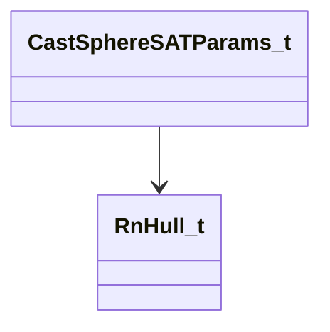
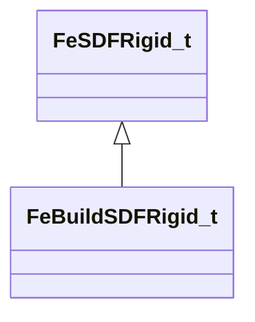
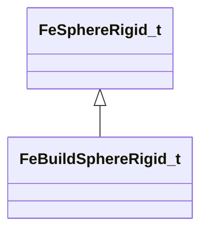
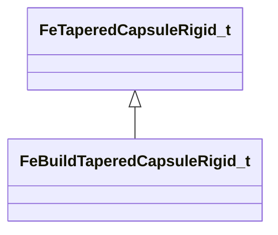
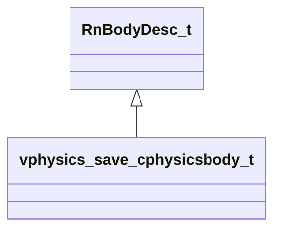
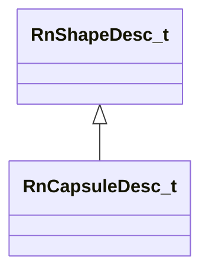
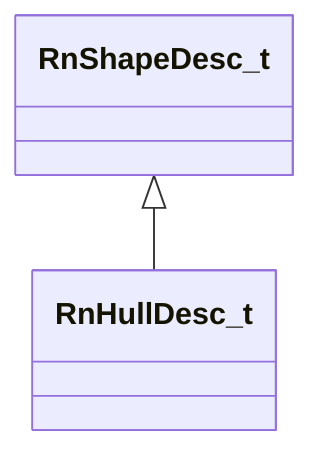
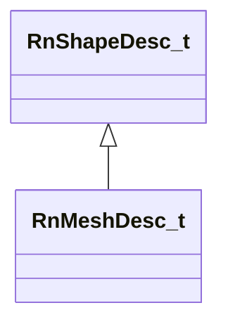
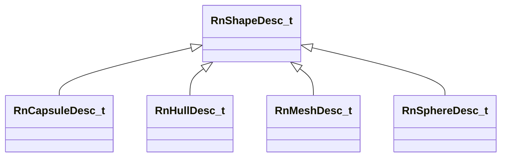
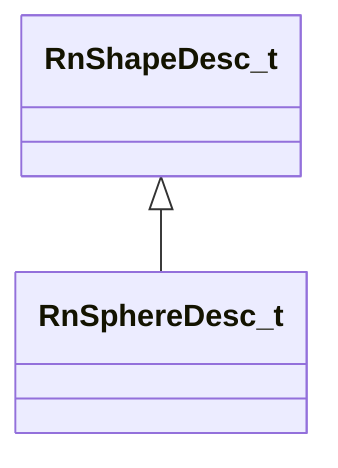

# Module: physicslib

[📊 View UML Diagram](../diagrams/physicslib.md)

| Name | Kind | Bases | Fields |
|------|------|-------|--------|
| [CFeIndexedJiggleBone](#cfeindexedjigglebone) | class |  | 0 |
| [CFeJiggleBone](#cfejigglebone) | class |  | 0 |
| [CFeMorphLayer](#cfemorphlayer) | class |  | 0 |
| [CFeNamedJiggleBone](#cfenamedjigglebone) | class |  | 0 |
| [CFeVertexMapBuildArray](#cfevertexmapbuildarray) | class |  | 0 |
| [CRegionSVM](#cregionsvm) | class |  | 0 |
| [CastSphereSATParams_t](#castspheresatparams_t) | class |  | 6 |
| [CollisionDetailLayerInfo_t](#collisiondetaillayerinfo_t) | class |  | 0 |
| [CollisionDetailLayerInfo_t](#collisiondetaillayerinfo_t) | class |  | 0 |
| [CovMatrix3](#covmatrix3) | class |  | 0 |
| [Dop26_t](#dop26_t) | class |  | 1 |
| [DynamicContinuousContactBehavior_t](#dynamiccontinuouscontactbehavior_t) | enum |  | 3 |
| [FeAnimStrayRadius_t](#feanimstrayradius_t) | class |  | 0 |
| [FeAntiTunnelGroupBuild_t](#feantitunnelgroupbuild_t) | class |  | 0 |
| [FeAntiTunnelProbeBuild_t](#feantitunnelprobebuild_t) | class |  | 0 |
| [FeAntiTunnelProbe_t](#feantitunnelprobe_t) | class |  | 0 |
| [FeAxialEdgeBend_t](#feaxialedgebend_t) | class |  | 0 |
| [FeBandBendLimit_t](#febandbendlimit_t) | class |  | 0 |
| [FeBoxRigid_t](#feboxrigid_t) | class |  | 0 |
| [FeBuildBoxRigid_t](#febuildboxrigid_t) | class | FeBoxRigid_t | 0 |
| [FeBuildSDFRigid_t](#febuildsdfrigid_t) | class | FeSDFRigid_t | 0 |
| [FeBuildSphereRigid_t](#febuildsphererigid_t) | class | FeSphereRigid_t | 0 |
| [FeBuildTaperedCapsuleRigid_t](#febuildtaperedcapsulerigid_t) | class | FeTaperedCapsuleRigid_t | 0 |
| [FeCollisionPlane_t](#fecollisionplane_t) | class |  | 0 |
| [FeCtrlOffset_t](#fectrloffset_t) | class |  | 0 |
| [FeCtrlOsOffset_t](#fectrlosoffset_t) | class |  | 0 |
| [FeCtrlSoftOffset_t](#fectrlsoftoffset_t) | class |  | 0 |
| [FeDynKinLink_t](#fedynkinlink_t) | class |  | 0 |
| [FeEdgeDesc_t](#feedgedesc_t) | class |  | 0 |
| [FeEffectDesc_t](#feeffectdesc_t) | class |  | 0 |
| [FeFitInfluence_t](#fefitinfluence_t) | class |  | 0 |
| [FeFitMatrix_t](#fefitmatrix_t) | class |  | 0 |
| [FeFitWeight_t](#fefitweight_t) | class |  | 0 |
| [FeFollowNode_t](#fefollownode_t) | class |  | 0 |
| [FeHingeLimitBuild_t](#fehingelimitbuild_t) | class |  | 0 |
| [FeHingeLimit_t](#fehingelimit_t) | class |  | 0 |
| [FeKelagerBend2_t](#fekelagerbend2_t) | class |  | 0 |
| [FeModelSelfCollisionLayer_t](#femodelselfcollisionlayer_t) | class |  | 0 |
| [FeMorphLayerDepr_t](#femorphlayerdepr_t) | class |  | 0 |
| [FeNodeBase_t](#fenodebase_t) | class |  | 0 |
| [FeNodeIntegrator_t](#fenodeintegrator_t) | class |  | 0 |
| [FeNodeReverseOffset_t](#fenodereverseoffset_t) | class |  | 0 |
| [FeNodeStrayBox_t](#fenodestraybox_t) | class |  | 0 |
| [FeNodeWindBase_t](#fenodewindbase_t) | class |  | 0 |
| [FeProxyVertexMap_t](#feproxyvertexmap_t) | class |  | 0 |
| [FeQuad_t](#fequad_t) | class |  | 0 |
| [FeRigidColliderIndices_t](#ferigidcolliderindices_t) | class |  | 0 |
| [FeRodConstraint_t](#ferodconstraint_t) | class |  | 0 |
| [FeSDFRigid_t](#fesdfrigid_t) | class |  | 0 |
| [FeSimdAnimStrayRadius_t](#fesimdanimstrayradius_t) | class |  | 0 |
| [FeSimdNodeBase_t](#fesimdnodebase_t) | class |  | 0 |
| [FeSimdQuad_t](#fesimdquad_t) | class |  | 0 |
| [FeSimdRodConstraintAnim_t](#fesimdrodconstraintanim_t) | class |  | 0 |
| [FeSimdRodConstraint_t](#fesimdrodconstraint_t) | class |  | 0 |
| [FeSimdSpringIntegrator_t](#fesimdspringintegrator_t) | class |  | 0 |
| [FeSimdTri_t](#fesimdtri_t) | class |  | 0 |
| [FeSoftParent_t](#fesoftparent_t) | class |  | 0 |
| [FeSourceEdge_t](#fesourceedge_t) | class |  | 0 |
| [FeSphereRigid_t](#fesphererigid_t) | class |  | 0 |
| [FeSpringIntegrator_t](#fespringintegrator_t) | class |  | 0 |
| [FeStiffHingeBuild_t](#festiffhingebuild_t) | class |  | 0 |
| [FeTaperedCapsuleRigid_t](#fetaperedcapsulerigid_t) | class |  | 0 |
| [FeTaperedCapsuleStretch_t](#fetaperedcapsulestretch_t) | class |  | 0 |
| [FeTreeChildren_t](#fetreechildren_t) | class |  | 0 |
| [FeTri_t](#fetri_t) | class |  | 0 |
| [FeTwistConstraint_t](#fetwistconstraint_t) | class |  | 0 |
| [FeVertexMapBuild_t](#fevertexmapbuild_t) | class |  | 0 |
| [FeVertexMapDesc_t](#fevertexmapdesc_t) | class |  | 0 |
| [FeWeightedNode_t](#feweightednode_t) | class |  | 0 |
| [FeWorldCollisionParams_t](#feworldcollisionparams_t) | class |  | 0 |
| [FourCovMatrices3](#fourcovmatrices3) | class |  | 4 |
| [FourVectors2D](#fourvectors2d) | class |  | 0 |
| [JointAxis_t](#jointaxis_t) | enum |  | 4 |
| [JointMotion_t](#jointmotion_t) | enum |  | 3 |
| [OldFeEdge_t](#oldfeedge_t) | class |  | 0 |
| [PhysFeModelDesc_t](#physfemodeldesc_t) | class |  | 0 |
| [RnBlendVertex_t](#rnblendvertex_t) | class |  | 0 |
| [RnBodyDesc_t](#rnbodydesc_t) | class |  | 0 |
| [RnCapsuleDesc_t](#rncapsuledesc_t) | class | RnShapeDesc_t | 0 |
| [RnCapsule_t](#rncapsule_t) | class |  | 0 |
| [RnFace_t](#rnface_t) | class |  | 0 |
| [RnHalfEdge_t](#rnhalfedge_t) | class |  | 0 |
| [RnHullDesc_t](#rnhulldesc_t) | class | RnShapeDesc_t | 0 |
| [RnHull_t](#rnhull_t) | class |  | 0 |
| [RnMeshDesc_t](#rnmeshdesc_t) | class | RnShapeDesc_t | 0 |
| [RnMesh_t](#rnmesh_t) | class |  | 0 |
| [RnNode_t](#rnnode_t) | class |  | 0 |
| [RnPlane_t](#rnplane_t) | class |  | 0 |
| [RnShapeDesc_t](#rnshapedesc_t) | class |  | 0 |
| [RnSoftbodyCapsule_t](#rnsoftbodycapsule_t) | class |  | 0 |
| [RnSoftbodyParticle_t](#rnsoftbodyparticle_t) | class |  | 0 |
| [RnSoftbodySpring_t](#rnsoftbodyspring_t) | class |  | 0 |
| [RnSphereDesc_t](#rnspheredesc_t) | class | RnShapeDesc_t | 0 |
| [RnTriangle_t](#rntriangle_t) | class |  | 0 |
| [RnVertex_t](#rnvertex_t) | class |  | 0 |
| [RnWing_t](#rnwing_t) | class |  | 0 |
| [VertexPositionColor_t](#vertexpositioncolor_t) | class |  | 1 |
| [VertexPositionNormal_t](#vertexpositionnormal_t) | class |  | 2 |

---

### CFeIndexedJiggleBone

**Metadata:** `MGetKV3ClassDefaults = {`, `"m_nNode": 4294967295,`, `"m_nJiggleParent": 4294967295,`, `"m_jiggleBone":`, `{`, `"m_nFlags": 0,`, `"m_flLength": 1.000000,`, `"m_flTipMass": 0.000000,`, `"m_flYawStiffness": 0.000000,`, `"m_flYawDamping": 0.000000,`, `"m_flPitchStiffness": 0.000000,`, `"m_flPitchDamping": 0.000000,`, `"m_flAlongStiffness": 0.000000,`, `"m_flAlongDamping": 0.000000,`, `"m_flAngleLimit": 0.000000,`, `"m_flMinYaw": 0.000000,`, `"m_flMaxYaw": 0.000000,`, `"m_flYawFriction": 0.000000,`, `"m_flYawBounce": 0.000000,`, `"m_flMinPitch": 0.000000,`, `"m_flMaxPitch": 0.000000,`, `"m_flPitchFriction": 0.000000,`, `"m_flPitchBounce": 0.000000,`, `"m_flBaseMass": 0.000000,`, `"m_flBaseStiffness": 0.000000,`, `"m_flBaseDamping": 0.000000,`, `"m_flBaseMinLeft": 0.000000,`, `"m_flBaseMaxLeft": 0.000000,`, `"m_flBaseLeftFriction": 0.000000,`, `"m_flBaseMinUp": 0.000000,`, `"m_flBaseMaxUp": 0.000000,`, `"m_flBaseUpFriction": 0.000000,`, `"m_flBaseMinForward": 0.000000,`, `"m_flBaseMaxForward": 0.000000,`, `"m_flBaseForwardFriction": 0.000000,`, `"m_flRadius0": 1.000000,`, `"m_flRadius1": 1.000000,`, `"m_vPoint0":`, `[`, `0.000000,`, `0.000000,`, `0.000000`, `],`, `"m_vPoint1":`, `[`, `10.000000,`, `0.000000,`, `0.000000`, `],`, `"m_nCollisionMask": 65535`, `}`, `}`

### CFeJiggleBone

**Metadata:** `MGetKV3ClassDefaults = {`, `"m_nFlags": 0,`, `"m_flLength": 1.000000,`, `"m_flTipMass": 0.000000,`, `"m_flYawStiffness": 0.000000,`, `"m_flYawDamping": 0.000000,`, `"m_flPitchStiffness": 0.000000,`, `"m_flPitchDamping": 0.000000,`, `"m_flAlongStiffness": 0.000000,`, `"m_flAlongDamping": 0.000000,`, `"m_flAngleLimit": 0.000000,`, `"m_flMinYaw": 0.000000,`, `"m_flMaxYaw": 0.000000,`, `"m_flYawFriction": 0.000000,`, `"m_flYawBounce": 0.000000,`, `"m_flMinPitch": 0.000000,`, `"m_flMaxPitch": 0.000000,`, `"m_flPitchFriction": 0.000000,`, `"m_flPitchBounce": 0.000000,`, `"m_flBaseMass": 0.000000,`, `"m_flBaseStiffness": 0.000000,`, `"m_flBaseDamping": 0.000000,`, `"m_flBaseMinLeft": 0.000000,`, `"m_flBaseMaxLeft": 0.000000,`, `"m_flBaseLeftFriction": 0.000000,`, `"m_flBaseMinUp": 0.000000,`, `"m_flBaseMaxUp": 0.000000,`, `"m_flBaseUpFriction": 0.000000,`, `"m_flBaseMinForward": 0.000000,`, `"m_flBaseMaxForward": 0.000000,`, `"m_flBaseForwardFriction": 0.000000,`, `"m_flRadius0": 1.000000,`, `"m_flRadius1": 1.000000,`, `"m_vPoint0":`, `[`, `0.000000,`, `0.000000,`, `0.000000`, `],`, `"m_vPoint1":`, `[`, `10.000000,`, `0.000000,`, `0.000000`, `],`, `"m_nCollisionMask": 65535`, `}`

### CFeMorphLayer

**Metadata:** `MGetKV3ClassDefaults = {`, `"m_Name": "",`, `"m_nNameHash": 0,`, `"m_Nodes":`, `[`, `],`, `"m_InitPos":`, `[`, `],`, `"m_Gravity":`, `[`, `],`, `"m_GoalStrength":`, `[`, `],`, `"m_GoalDamping":`, `[`, `]`, `}`

### CFeNamedJiggleBone

**Metadata:** `MGetKV3ClassDefaults = {`, `"m_strParentBone": "",`, `"m_transform":`, `[`, `0.000000,`, `0.000000,`, `0.000000,`, `0.000000,`, `0.000000,`, `0.000000,`, `0.000000,`, `0.000000`, `],`, `"m_nJiggleParent": 0,`, `"m_jiggleBone":`, `{`, `"m_nFlags": 0,`, `"m_flLength": 1.000000,`, `"m_flTipMass": 0.000000,`, `"m_flYawStiffness": 0.000000,`, `"m_flYawDamping": 0.000000,`, `"m_flPitchStiffness": 0.000000,`, `"m_flPitchDamping": 0.000000,`, `"m_flAlongStiffness": 0.000000,`, `"m_flAlongDamping": 0.000000,`, `"m_flAngleLimit": 0.000000,`, `"m_flMinYaw": 0.000000,`, `"m_flMaxYaw": 0.000000,`, `"m_flYawFriction": 0.000000,`, `"m_flYawBounce": 0.000000,`, `"m_flMinPitch": 0.000000,`, `"m_flMaxPitch": 0.000000,`, `"m_flPitchFriction": 0.000000,`, `"m_flPitchBounce": 0.000000,`, `"m_flBaseMass": 0.000000,`, `"m_flBaseStiffness": 0.000000,`, `"m_flBaseDamping": 0.000000,`, `"m_flBaseMinLeft": 0.000000,`, `"m_flBaseMaxLeft": 0.000000,`, `"m_flBaseLeftFriction": 0.000000,`, `"m_flBaseMinUp": 0.000000,`, `"m_flBaseMaxUp": 0.000000,`, `"m_flBaseUpFriction": 0.000000,`, `"m_flBaseMinForward": 0.000000,`, `"m_flBaseMaxForward": 0.000000,`, `"m_flBaseForwardFriction": 0.000000,`, `"m_flRadius0": 1.000000,`, `"m_flRadius1": 1.000000,`, `"m_vPoint0":`, `[`, `0.000000,`, `0.000000,`, `0.000000`, `],`, `"m_vPoint1":`, `[`, `10.000000,`, `0.000000,`, `0.000000`, `],`, `"m_nCollisionMask": 65535`, `}`, `}`

### CFeVertexMapBuildArray

**Metadata:** `MGetKV3ClassDefaults = {`, `"m_Array":`, `[`, `]`, `}`

### CRegionSVM

**Metadata:** `MGetKV3ClassDefaults = {`, `"m_Planes": "[BINARY BLOB]",`, `"m_Nodes": "[BINARY BLOB]"`, `}`

### CastSphereSATParams_t

**Metadata:** `MGetKV3ClassDefaults = Could not parse KV3 Defaults`

**Relationships:**

**Fields:**

| Name | Type | Annotations |
|------|------|-------------|
| `m_vRayStart` | Vector |  |
| `m_vRayDelta` | Vector |  |
| `m_flRadius` | float32 |  |
| `m_flMaxFraction` | float32 |  |
| `m_flScale` | float32 |  |
| `m_pHull` | [RnHull_t](../schemas/physicslib.md#rnhull_t)* |  |

### CollisionDetailLayerInfo_t

**Metadata:** `MGetKV3ClassDefaults = {`, `"m_sDescription": "",`, `"m_sFriendlyName": "",`, `"m_bIsQueryOnly": false,`, `"m_sParentDetailLayer": "",`, `"m_vecSubtreeDetailLayers":`, `[`, `],`, `"m_bNotPickable": false`, `}`, `MVDataRoot`, `MVDataOutlinerLeafNameFn (UNKNOWN FOR PARSER)`

### CollisionDetailLayerInfo_t

**Metadata:** `MGetKV3ClassDefaults = {`, `"m_nNameToken": "",`, `"m_sNameString": ""`, `}`, `MVDataRoot`

### CovMatrix3

**Metadata:** `MGetKV3ClassDefaults = {`, `"m_vDiag":`, `[`, `0.000000,`, `0.000000,`, `0.000000`, `],`, `"m_flXY": 0.000000,`, `"m_flXZ": 0.000000,`, `"m_flYZ": 0.000000`, `}`

### Dop26_t

**Metadata:** `MGetKV3ClassDefaults = Could not parse KV3 Defaults`

**Fields:**

| Name | Type | Annotations |
|------|------|-------------|
| `m_flSupport` | float32[26] |  |

### DynamicContinuousContactBehavior_t

**Values:**

| Name | Value |
|------|-------|
| `DYNAMIC_CONTINUOUS_ALLOW_IF_REQUESTED_BY_OTHER_BODY` | 0 |
| `DYNAMIC_CONTINUOUS_ALWAYS` | 1 |
| `DYNAMIC_CONTINUOUS_NEVER` | 2 |

### FeAnimStrayRadius_t

**Metadata:** `MGetKV3ClassDefaults = {`, `"nNode":`, `[`, `0,`, `0`, `],`, `"flMaxDist": 0.000000,`, `"flRelaxationFactor": 0.000000`, `}`

### FeAntiTunnelGroupBuild_t

**Metadata:** `MGetKV3ClassDefaults = {`, `"m_nVertexMapHash": 0,`, `"m_nCollisionMask": 0`, `}`

### FeAntiTunnelProbeBuild_t

**Metadata:** `MGetKV3ClassDefaults = {`, `"flWeight": 1.000000,`, `"flActivationDistance": 1.000000,`, `"flBias": 0.000000,`, `"flCurvature": 0.000000,`, `"nFlags": 0,`, `"nProbeNode": 0,`, `"targetNodes":`, `[`, `]`, `}`

### FeAntiTunnelProbe_t

**Metadata:** `MGetKV3ClassDefaults = {`, `"flWeight": 1.000000,`, `"nFlags": 0,`, `"nProbeNode": 0,`, `"nCount": 0,`, `"nBegin": 0,`, `"flActivationDistance": 1.000000,`, `"flCurvatureRadius": 0.000000,`, `"flBias": 0.000000`, `}`

### FeAxialEdgeBend_t

**Metadata:** `MGetKV3ClassDefaults = {`, `"te": 0.000000,`, `"tv": 0.000000,`, `"flDist": 0.000000,`, `"flWeight":`, `[`, `0.000000,`, `0.000000,`, `0.000000,`, `0.000000`, `],`, `"nNode":`, `[`, `0,`, `0,`, `0,`, `0,`, `0,`, `0`, `]`, `}`

### FeBandBendLimit_t

**Metadata:** `MGetKV3ClassDefaults = {`, `"flDistMin": 0.000000,`, `"flDistMax": 0.000000,`, `"nNode":`, `[`, `0,`, `0,`, `0,`, `0,`, `0,`, `0`, `]`, `}`

### FeBoxRigid_t

**Derived by:** [FeBuildBoxRigid_t](physicslib.md#febuildboxrigid_t)

**Metadata:** `MGetKV3ClassDefaults = {`, `"tmFrame2":`, `[`, `0.000000,`, `0.000000,`, `0.000000,`, `1.000000,`, `0.000000,`, `0.000000,`, `0.000000,`, `1.000000`, `],`, `"nNode": 0,`, `"nCollisionMask": 65535,`, `"vSize":`, `[`, `0.000000,`, `0.000000,`, `0.000000`, `],`, `"nVertexMapIndex": 65535,`, `"nFlags": 0`, `}`

**Relationships:**

### FeBuildBoxRigid_t

**Inherits from:** [FeBoxRigid_t](physicslib.md#feboxrigid_t)

**Metadata:** `MGetKV3ClassDefaults = {`, `"tmFrame2":`, `[`, `0.000000,`, `0.000000,`, `0.000000,`, `1.000000,`, `0.000000,`, `0.000000,`, `0.000000,`, `1.000000`, `],`, `"nNode": 0,`, `"nCollisionMask": 65535,`, `"vSize":`, `[`, `0.000000,`, `0.000000,`, `0.000000`, `],`, `"nVertexMapIndex": 65535,`, `"nFlags": 0,`, `"m_nPriority": 0,`, `"m_nVertexMapHash": 0,`, `"m_nAntitunnelGroupBits": 0`, `}`

**Relationships:**

### FeBuildSDFRigid_t

**Inherits from:** [FeSDFRigid_t](physicslib.md#fesdfrigid_t)

**Metadata:** `MGetKV3ClassDefaults = {`, `"vLocalMin":`, `[`, `0.000000,`, `0.000000,`, `0.000000`, `],`, `"vLocalMax":`, `[`, `0.000000,`, `0.000000,`, `0.000000`, `],`, `"flBounciness": 0.000000,`, `"nNode": 0,`, `"nCollisionMask": 65535,`, `"nVertexMapIndex": 65535,`, `"nFlags": 0,`, `"m_Distances":`, `[`, `],`, `"m_nWidth": 8,`, `"m_nHeight": 8,`, `"m_nDepth": 8,`, `"m_nPriority": 0,`, `"m_nVertexMapHash": 0,`, `"m_nAntitunnelGroupBits": 0`, `}`

**Relationships:**

### FeBuildSphereRigid_t

**Inherits from:** [FeSphereRigid_t](physicslib.md#fesphererigid_t)

**Metadata:** `MGetKV3ClassDefaults = {`, `"vSphere":`, `[`, `0.000000,`, `0.000000,`, `0.000000,`, `1.000000`, `],`, `"nNode": 0,`, `"nCollisionMask": 65535,`, `"nVertexMapIndex": 65535,`, `"nFlags": 0,`, `"m_nPriority": 0,`, `"m_nVertexMapHash": 0,`, `"m_nAntitunnelGroupBits": 0`, `}`

**Relationships:**

### FeBuildTaperedCapsuleRigid_t

**Inherits from:** [FeTaperedCapsuleRigid_t](physicslib.md#fetaperedcapsulerigid_t)

**Metadata:** `MGetKV3ClassDefaults = {`, `"vSphere":`, `[`, `[`, `0.000000,`, `0.000000,`, `0.000000,`, `0.000000`, `],`, `[`, `0.000000,`, `0.000000,`, `0.000000,`, `0.000000`, `]`, `],`, `"nNode": 0,`, `"nCollisionMask": 65535,`, `"nVertexMapIndex": 65535,`, `"nFlags": 0,`, `"m_nPriority": 0,`, `"m_nVertexMapHash": 0,`, `"m_nAntitunnelGroupBits": 0`, `}`

**Relationships:**

### FeCollisionPlane_t

**Metadata:** `MGetKV3ClassDefaults = {`, `"nCtrlParent": 0,`, `"nChildNode": 0,`, `"m_Plane":`, `{`, `"m_vNormal":`, `[`, `0.000000,`, `0.000000,`, `0.000000`, `],`, `"m_flOffset": 0.000000`, `},`, `"flStrength": 0.000000`, `}`

### FeCtrlOffset_t

**Metadata:** `MGetKV3ClassDefaults = {`, `"vOffset":`, `[`, `0.000000,`, `0.000000,`, `0.000000`, `],`, `"nCtrlParent": 0,`, `"nCtrlChild": 0`, `}`

### FeCtrlOsOffset_t

**Metadata:** `MGetKV3ClassDefaults = {`, `"nCtrlParent": 0,`, `"nCtrlChild": 0`, `}`

### FeCtrlSoftOffset_t

**Metadata:** `MGetKV3ClassDefaults = {`, `"nCtrlParent": 0,`, `"nCtrlChild": 0,`, `"vOffset":`, `[`, `0.000000,`, `0.000000,`, `0.000000`, `],`, `"flAlpha": 0.000000`, `}`

### FeDynKinLink_t

**Metadata:** `MGetKV3ClassDefaults = {`, `"m_nParent": 0,`, `"m_nChild": 0`, `}`

### FeEdgeDesc_t

**Metadata:** `MGetKV3ClassDefaults = {`, `"nEdge":`, `[`, `0,`, `0`, `],`, `"nSide":`, `[`, `[`, `0,`, `0`, `],`, `[`, `0,`, `0`, `]`, `],`, `"nVirtElem":`, `[`, `0,`, `0`, `]`, `}`

### FeEffectDesc_t

**Metadata:** `MGetKV3ClassDefaults = {`, `"sName": "",`, `"nNameHash": 0,`, `"nType": 0,`, `"m_Params": null`, `}`

### FeFitInfluence_t

**Metadata:** `MGetKV3ClassDefaults = {`, `"nVertexNode": 0,`, `"flWeight": 0.000000,`, `"nMatrixNode": 0`, `}`

### FeFitMatrix_t

**Metadata:** `MGetKV3ClassDefaults = {`, `"bone":`, `[`, `0.000000,`, `0.000000,`, `0.000000,`, `1.000000,`, `0.000000,`, `0.000000,`, `0.000000,`, `1.000000`, `],`, `"vCenter":`, `[`, `0.000000,`, `0.000000,`, `0.000000`, `],`, `"nEnd": 0,`, `"nNode": 0,`, `"nBeginDynamic": 0`, `}`

### FeFitWeight_t

**Metadata:** `MGetKV3ClassDefaults = {`, `"flWeight": 0.000000,`, `"nNode": 0,`, `"nDummy": 0`, `}`

### FeFollowNode_t

**Metadata:** `MGetKV3ClassDefaults = {`, `"nParentNode": 0,`, `"nChildNode": 0,`, `"flWeight": 0.000000`, `}`

### FeHingeLimitBuild_t

**Metadata:** `MGetKV3ClassDefaults = {`, `"nNode":`, `[`, `0,`, `0,`, `0,`, `0,`, `0,`, `0`, `],`, `"nFlags": 0,`, `"flLimitCW": 0.000000,`, `"flLimitCCW": 0.000000`, `}`

### FeHingeLimit_t

**Metadata:** `MGetKV3ClassDefaults = {`, `"nNode":`, `[`, `0,`, `0,`, `0,`, `0,`, `0,`, `0`, `],`, `"nFlags": 0,`, `"flWeight4": 0.000000,`, `"flWeight5": 0.000000,`, `"flAngleCenter": 0.000000,`, `"flAngleExtents": 0.000000`, `}`

### FeKelagerBend2_t

**Metadata:** `MGetKV3ClassDefaults = {`, `"flWeight":`, `[`, `0.000000,`, `0.000000,`, `0.000000`, `],`, `"flHeight0": 0.000000,`, `"nNode":`, `[`, `0,`, `0,`, `0`, `],`, `"nReserved": 0`, `}`

### FeModelSelfCollisionLayer_t

**Metadata:** `MGetKV3ClassDefaults = {`, `"m_Name": "",`, `"m_Nodes":`, `[`, `],`, `"m_flParentReaction": 0.000000,`, `"m_nFlags": 0,`, `"m_nEndIdx":`, `[`, `0,`, `0,`, `0,`, `0`, `]`, `}`

### FeMorphLayerDepr_t

**Metadata:** `MGetKV3ClassDefaults = {`, `"m_Name": "",`, `"m_nNameHash": 0,`, `"m_Nodes":`, `[`, `],`, `"m_InitPos":`, `[`, `],`, `"m_Gravity":`, `[`, `],`, `"m_GoalStrength":`, `[`, `],`, `"m_GoalDamping":`, `[`, `],`, `"m_nFlags": 0`, `}`

### FeNodeBase_t

**Metadata:** `MGetKV3ClassDefaults = {`, `"nNode": 0,`, `"nDummy":`, `[`, `0,`, `0,`, `0`, `],`, `"nNodeX0": 0,`, `"nNodeX1": 0,`, `"nNodeY0": 0,`, `"nNodeY1": 0,`, `"qAdjust":`, `[`, `0.000000,`, `0.000000,`, `0.000000,`, `0.000000`, `]`, `}`

### FeNodeIntegrator_t

**Metadata:** `MGetKV3ClassDefaults = {`, `"flPointDamping": 0.000000,`, `"flAnimationForceAttraction": 0.000000,`, `"flAnimationVertexAttraction": 0.000000,`, `"flGravity": 0.000000`, `}`

### FeNodeReverseOffset_t

**Metadata:** `MGetKV3ClassDefaults = {`, `"vOffset":`, `[`, `0.000000,`, `0.000000,`, `0.000000`, `],`, `"nBoneCtrl": 0,`, `"nTargetNode": 0`, `}`

### FeNodeStrayBox_t

**Metadata:** `MGetKV3ClassDefaults = {`, `"vMin":`, `[`, `0.000000,`, `0.000000,`, `0.000000`, `],`, `"nFlags": 0,`, `"vMax":`, `[`, `0.000000,`, `0.000000,`, `0.000000`, `],`, `"nNode":`, `[`, `0,`, `0`, `]`, `}`

### FeNodeWindBase_t

**Metadata:** `MGetKV3ClassDefaults = {`, `"nNodeX0": 0,`, `"nNodeX1": 0,`, `"nNodeY0": 0,`, `"nNodeY1": 0`, `}`

### FeProxyVertexMap_t

**Metadata:** `MGetKV3ClassDefaults = {`, `"m_Name": "",`, `"m_flWeight": 1.000000`, `}`

### FeQuad_t

**Metadata:** `MGetKV3ClassDefaults = {`, `"nNode":`, `[`, `0,`, `0,`, `0,`, `0`, `],`, `"flSlack": 0.000000,`, `"vShape":`, `[`, `[`, `0.000000,`, `0.000000,`, `0.000000,`, `0.000000`, `],`, `[`, `0.000000,`, `0.000000,`, `0.000000,`, `0.000000`, `],`, `[`, `0.000000,`, `0.000000,`, `0.000000,`, `0.000000`, `],`, `[`, `0.000000,`, `0.000000,`, `0.000000,`, `0.000000`, `]`, `]`, `}`

### FeRigidColliderIndices_t

**Metadata:** `MGetKV3ClassDefaults = {`, `"m_nTaperedCapsuleRigidIndex": 0,`, `"m_nSphereRigidIndex": 0,`, `"m_nBoxRigidIndex": 0,`, `"m_nSDFRigidIndex": 0,`, `"m_nCollisionPlaneIndex": 0`, `}`

### FeRodConstraint_t

**Metadata:** `MGetKV3ClassDefaults = {`, `"nNode":`, `[`, `0,`, `0`, `],`, `"flMaxDist": 0.000000,`, `"flMinDist": 0.000000,`, `"flWeight0": 0.000000,`, `"flRelaxationFactor": 0.000000`, `}`

### FeSDFRigid_t

**Derived by:** [FeBuildSDFRigid_t](physicslib.md#febuildsdfrigid_t)

**Metadata:** `MGetKV3ClassDefaults = {`, `"vLocalMin":`, `[`, `0.000000,`, `0.000000,`, `0.000000`, `],`, `"vLocalMax":`, `[`, `0.000000,`, `0.000000,`, `0.000000`, `],`, `"flBounciness": 0.000000,`, `"nNode": 0,`, `"nCollisionMask": 65535,`, `"nVertexMapIndex": 65535,`, `"nFlags": 0,`, `"m_Distances":`, `[`, `],`, `"m_nWidth": 8,`, `"m_nHeight": 8,`, `"m_nDepth": 8`, `}`

**Relationships:**

### FeSimdAnimStrayRadius_t

**Metadata:** `MGetKV3ClassDefaults = {`, `"nNode":`, `[`, `[`, `0,`, `0,`, `0,`, `0`, `],`, `[`, `0,`, `0,`, `0,`, `0`, `]`, `],`, `"flMaxDist":`, `[`, `0.000000,`, `0.000000,`, `0.000000,`, `0.000000`, `],`, `"flRelaxationFactor":`, `[`, `0.000000,`, `0.000000,`, `0.000000,`, `0.000000`, `]`, `}`

### FeSimdNodeBase_t

**Metadata:** `MGetKV3ClassDefaults = {`, `"nNode":`, `[`, `0,`, `0,`, `0,`, `0`, `],`, `"nNodeX0":`, `[`, `0,`, `0,`, `0,`, `0`, `],`, `"nNodeX1":`, `[`, `0,`, `0,`, `0,`, `0`, `],`, `"nNodeY0":`, `[`, `0,`, `0,`, `0,`, `0`, `],`, `"nNodeY1":`, `[`, `0,`, `0,`, `0,`, `0`, `],`, `"nDummy":`, `[`, `0,`, `0,`, `0,`, `0`, `],`, `"qAdjust":`, `[`, `0.000000,`, `0.000000,`, `0.000000,`, `0.000000,`, `0.000000,`, `0.000000,`, `0.000000,`, `0.000000,`, `0.000000,`, `0.000000,`, `0.000000,`, `0.000000,`, `0.000000,`, `0.000000,`, `0.000000,`, `0.000000`, `]`, `}`

### FeSimdQuad_t

**Metadata:** `MGetKV3ClassDefaults = {`, `"nNode":`, `[`, `[`, `0,`, `0,`, `0,`, `0`, `],`, `[`, `0,`, `0,`, `0,`, `0`, `],`, `[`, `0,`, `0,`, `0,`, `0`, `],`, `[`, `0,`, `0,`, `0,`, `0`, `]`, `],`, `"f4Slack":`, `[`, `0.000000,`, `0.000000,`, `0.000000,`, `0.000000`, `],`, `"vShape":`, `[`, `[`, `0.000000,`, `0.000000,`, `0.000000,`, `0.000000,`, `0.000000,`, `0.000000,`, `0.000000,`, `0.000000,`, `0.000000,`, `0.000000,`, `0.000000,`, `0.000000`, `],`, `[`, `0.000000,`, `0.000000,`, `0.000000,`, `0.000000,`, `0.000000,`, `0.000000,`, `0.000000,`, `0.000000,`, `0.000000,`, `0.000000,`, `0.000000,`, `0.000000`, `],`, `[`, `0.000000,`, `0.000000,`, `0.000000,`, `0.000000,`, `0.000000,`, `0.000000,`, `0.000000,`, `0.000000,`, `0.000000,`, `0.000000,`, `0.000000,`, `0.000000`, `],`, `[`, `0.000000,`, `0.000000,`, `0.000000,`, `0.000000,`, `0.000000,`, `0.000000,`, `0.000000,`, `0.000000,`, `0.000000,`, `0.000000,`, `0.000000,`, `0.000000`, `]`, `],`, `"f4Weights":`, `[`, `[`, `0.000000,`, `0.000000,`, `0.000000,`, `0.000000`, `],`, `[`, `0.000000,`, `0.000000,`, `0.000000,`, `0.000000`, `],`, `[`, `0.000000,`, `0.000000,`, `0.000000,`, `0.000000`, `],`, `[`, `0.000000,`, `0.000000,`, `0.000000,`, `0.000000`, `]`, `]`, `}`

### FeSimdRodConstraintAnim_t

**Metadata:** `MGetKV3ClassDefaults = {`, `"nNode":`, `[`, `[`, `0,`, `0,`, `0,`, `0`, `],`, `[`, `0,`, `0,`, `0,`, `0`, `]`, `],`, `"f4Weight0":`, `[`, `0.000000,`, `0.000000,`, `0.000000,`, `0.000000`, `],`, `"f4RelaxationFactor":`, `[`, `0.000000,`, `0.000000,`, `0.000000,`, `0.000000`, `]`, `}`

### FeSimdRodConstraint_t

**Metadata:** `MGetKV3ClassDefaults = {`, `"nNode":`, `[`, `[`, `0,`, `0,`, `0,`, `0`, `],`, `[`, `0,`, `0,`, `0,`, `0`, `]`, `],`, `"f4MaxDist":`, `[`, `0.000000,`, `0.000000,`, `0.000000,`, `0.000000`, `],`, `"f4MinDist":`, `[`, `0.000000,`, `0.000000,`, `0.000000,`, `0.000000`, `],`, `"f4Weight0":`, `[`, `0.000000,`, `0.000000,`, `0.000000,`, `0.000000`, `],`, `"f4RelaxationFactor":`, `[`, `0.000000,`, `0.000000,`, `0.000000,`, `0.000000`, `]`, `}`

### FeSimdSpringIntegrator_t

**Metadata:** `MGetKV3ClassDefaults = {`, `"nNode":`, `[`, `[`, `0,`, `0,`, `0,`, `0`, `],`, `[`, `0,`, `0,`, `0,`, `0`, `]`, `],`, `"flSpringRestLength":`, `[`, `0.000000,`, `0.000000,`, `0.000000,`, `0.000000`, `],`, `"flSpringConstant":`, `[`, `0.000000,`, `0.000000,`, `0.000000,`, `0.000000`, `],`, `"flSpringDamping":`, `[`, `0.000000,`, `0.000000,`, `0.000000,`, `0.000000`, `],`, `"flNodeWeight0":`, `[`, `0.000000,`, `0.000000,`, `0.000000,`, `0.000000`, `]`, `}`

### FeSimdTri_t

**Metadata:** `MGetKV3ClassDefaults = {`, `"nNode":`, `[`, `[`, `0,`, `0,`, `0,`, `0`, `],`, `[`, `0,`, `0,`, `0,`, `0`, `],`, `[`, `0,`, `0,`, `0,`, `0`, `]`, `],`, `"w1":`, `[`, `0.000000,`, `0.000000,`, `0.000000,`, `0.000000`, `],`, `"w2":`, `[`, `0.000000,`, `0.000000,`, `0.000000,`, `0.000000`, `],`, `"v1x":`, `[`, `0.000000,`, `0.000000,`, `0.000000,`, `0.000000`, `],`, `"v2":`, `{`, `"x":`, `[`, `0.000000,`, `0.000000,`, `0.000000,`, `0.000000`, `],`, `"y":`, `[`, `0.000000,`, `0.000000,`, `0.000000,`, `0.000000`, `]`, `}`, `}`

### FeSoftParent_t

**Metadata:** `MGetKV3ClassDefaults = {`, `"nParent": -1,`, `"flAlpha": 0.000000`, `}`

### FeSourceEdge_t

**Metadata:** `MGetKV3ClassDefaults = {`, `"nNode":`, `[`, `0,`, `0`, `]`, `}`

### FeSphereRigid_t

**Derived by:** [FeBuildSphereRigid_t](physicslib.md#febuildsphererigid_t)

**Metadata:** `MGetKV3ClassDefaults = {`, `"vSphere":`, `[`, `0.000000,`, `0.000000,`, `0.000000,`, `1.000000`, `],`, `"nNode": 0,`, `"nCollisionMask": 65535,`, `"nVertexMapIndex": 65535,`, `"nFlags": 0`, `}`

**Relationships:**

### FeSpringIntegrator_t

**Metadata:** `MGetKV3ClassDefaults = {`, `"nNode":`, `[`, `0,`, `0`, `],`, `"flSpringRestLength": 0.000000,`, `"flSpringConstant": 0.000000,`, `"flSpringDamping": 0.000000,`, `"flNodeWeight0": 0.000000`, `}`

### FeStiffHingeBuild_t

**Metadata:** `MGetKV3ClassDefaults = {`, `"flMaxAngle": 0.000000,`, `"flStrength": 1.000000,`, `"flMotionBias":`, `[`, `1.000000,`, `1.000000,`, `1.000000`, `],`, `"nNode":`, `[`, `0,`, `0,`, `0`, `]`, `}`

### FeTaperedCapsuleRigid_t

**Derived by:** [FeBuildTaperedCapsuleRigid_t](physicslib.md#febuildtaperedcapsulerigid_t)

**Metadata:** `MGetKV3ClassDefaults = {`, `"vSphere":`, `[`, `[`, `0.000000,`, `0.000000,`, `0.000000,`, `0.000000`, `],`, `[`, `0.000000,`, `0.000000,`, `0.000000,`, `0.000000`, `]`, `],`, `"nNode": 0,`, `"nCollisionMask": 65535,`, `"nVertexMapIndex": 65535,`, `"nFlags": 0`, `}`

**Relationships:**

### FeTaperedCapsuleStretch_t

**Metadata:** `MGetKV3ClassDefaults = {`, `"nNode":`, `[`, `0,`, `0`, `],`, `"nCollisionMask": 65535,`, `"nDummy": 0,`, `"flRadius":`, `[`, `0.000000,`, `0.000000`, `]`, `}`

### FeTreeChildren_t

**Metadata:** `MGetKV3ClassDefaults = {`, `"nChild":`, `[`, `0,`, `0`, `]`, `}`

### FeTri_t

**Metadata:** `MGetKV3ClassDefaults = {`, `"nNode":`, `[`, `0,`, `0,`, `0`, `],`, `"w1": 0.000000,`, `"w2": 0.000000,`, `"v1x": 0.000000,`, `"v2":`, `[`, `0.000000,`, `0.000000`, `]`, `}`

### FeTwistConstraint_t

**Metadata:** `MGetKV3ClassDefaults = {`, `"nNodeOrient": 0,`, `"nNodeEnd": 0,`, `"flTwistRelax": 0.000000,`, `"flSwingRelax": 0.000000`, `}`

### FeVertexMapBuild_t

**Metadata:** `MGetKV3ClassDefaults = {`, `"m_VertexMapName": "",`, `"m_nNameHash": 0,`, `"m_Color":`, `[`, `255,`, `255,`, `255`, `],`, `"m_flVolumetricSolveStrength": 0.000000,`, `"m_nScaleSourceNode": -1,`, `"m_Weights":`, `[`, `]`, `}`

### FeVertexMapDesc_t

**Metadata:** `MGetKV3ClassDefaults = {`, `"sName": "",`, `"nNameHash": 0,`, `"nColor": 0,`, `"nFlags": 0,`, `"nVertexBase": 0,`, `"nVertexCount": 0,`, `"nMapOffset": 0,`, `"nNodeListOffset": 0,`, `"vCenterOfMass":`, `[`, `0.000000,`, `0.000000,`, `0.000000`, `],`, `"flVolumetricSolveStrength": 0.000000,`, `"nScaleSourceNode": -1,`, `"nNodeListCount": 0`, `}`

### FeWeightedNode_t

**Metadata:** `MGetKV3ClassDefaults = {`, `"nNode": 0,`, `"nWeight": 0`, `}`

### FeWorldCollisionParams_t

**Metadata:** `MGetKV3ClassDefaults = {`, `"flWorldFriction": 0.000000,`, `"flGroundFriction": 0.000000,`, `"nListBegin": 0,`, `"nListEnd": 0`, `}`

### FourCovMatrices3

**Metadata:** `MGetKV3ClassDefaults = Could not parse KV3 Defaults`

**Fields:**

| Name | Type | Annotations |
|------|------|-------------|
| `m_vDiag` | FourVectors |  |
| `m_flXY` | fltx4 |  |
| `m_flXZ` | fltx4 |  |
| `m_flYZ` | fltx4 |  |

### FourVectors2D

**Metadata:** `MGetKV3ClassDefaults = {`, `"x":`, `[`, `0.000000,`, `0.000000,`, `0.000000,`, `0.000000`, `],`, `"y":`, `[`, `0.000000,`, `0.000000,`, `0.000000,`, `0.000000`, `]`, `}`

### JointAxis_t

**Values:**

| Name | Value |
|------|-------|
| `JOINT_AXIS_X` | 0 |
| `JOINT_AXIS_Y` | 1 |
| `JOINT_AXIS_Z` | 2 |
| `JOINT_AXIS_COUNT` | 3 |

### JointMotion_t

**Values:**

| Name | Value |
|------|-------|
| `JOINT_MOTION_FREE` | 0 |
| `JOINT_MOTION_LOCKED` | 1 |
| `JOINT_MOTION_COUNT` | 2 |

### OldFeEdge_t

**Metadata:** `MGetKV3ClassDefaults = {`, `"m_flK":`, `[`, `0.000000,`, `0.000000,`, `0.000000`, `],`, `"invA": 0.000000,`, `"t": 0.000000,`, `"flThetaRelaxed": 0.000000,`, `"flThetaFactor": 0.000000,`, `"c01": 0.000000,`, `"c02": 0.000000,`, `"c03": 0.000000,`, `"c04": 0.000000,`, `"flAxialModelDist": 0.000000,`, `"flAxialModelWeights":`, `[`, `0.000000,`, `0.000000,`, `0.000000,`, `0.000000`, `],`, `"m_nNode":`, `[`, `0,`, `0,`, `0,`, `0`, `]`, `}`

### PhysFeModelDesc_t

**Metadata:** `MGetKV3ClassDefaults = {`, `"m_CtrlHash":`, `[`, `],`, `"m_CtrlName":`, `[`, `],`, `"m_nStaticNodeFlags": 0,`, `"m_nDynamicNodeFlags": 0,`, `"m_flLocalForce": 0.000000,`, `"m_flLocalRotation": 0.000000,`, `"m_nNodeCount": 0,`, `"m_nStaticNodes": 0,`, `"m_nRotLockStaticNodes": 0,`, `"m_nFirstPositionDrivenNode": 0,`, `"m_nSimdTriCount1": 0,`, `"m_nSimdTriCount2": 0,`, `"m_nSimdQuadCount1": 0,`, `"m_nSimdQuadCount2": 0,`, `"m_nQuadCount1": 0,`, `"m_nQuadCount2": 0,`, `"m_nTreeDepth": 0,`, `"m_nNodeBaseJiggleboneDependsCount": 0,`, `"m_nRopeCount": 0,`, `"m_Ropes":`, `[`, `],`, `"m_NodeBases":`, `[`, `],`, `"m_SimdNodeBases":`, `[`, `],`, `"m_Quads":`, `[`, `],`, `"m_SimdQuads":`, `[`, `],`, `"m_SimdTris":`, `[`, `],`, `"m_SimdRods":`, `[`, `],`, `"m_SimdRodsAnim":`, `[`, `],`, `"m_InitPose":`, `[`, `],`, `"m_Rods":`, `[`, `],`, `"m_Twists":`, `[`, `],`, `"m_HingeLimits":`, `[`, `],`, `"m_AntiTunnelBytecode":`, `[`, `],`, `"m_DynKinLinks":`, `[`, `],`, `"m_AntiTunnelProbes":`, `[`, `],`, `"m_AntiTunnelTargetNodes":`, `[`, `],`, `"m_NodeStrayBoxes":`, `[`, `],`, `"m_AxialEdges":`, `[`, `],`, `"m_NodeInvMasses":`, `[`, `],`, `"m_CtrlOffsets":`, `[`, `],`, `"m_CtrlOsOffsets":`, `[`, `],`, `"m_FollowNodes":`, `[`, `],`, `"m_CollisionPlanes":`, `[`, `],`, `"m_NodeIntegrator":`, `[`, `],`, `"m_SpringIntegrator":`, `[`, `],`, `"m_SimdSpringIntegrator":`, `[`, `],`, `"m_WorldCollisionParams":`, `[`, `],`, `"m_LegacyStretchForce":`, `[`, `],`, `"m_NodeCollisionRadii":`, `[`, `],`, `"m_DynNodeFriction":`, `[`, `],`, `"m_LocalRotation":`, `[`, `],`, `"m_LocalForce":`, `[`, `],`, `"m_TaperedCapsuleStretches":`, `[`, `],`, `"m_TaperedCapsuleRigids":`, `[`, `],`, `"m_SphereRigids":`, `[`, `],`, `"m_WorldCollisionNodes":`, `[`, `],`, `"m_TreeParents":`, `[`, `],`, `"m_TreeCollisionMasks":`, `[`, `],`, `"m_TreeChildren":`, `[`, `],`, `"m_FreeNodes":`, `[`, `],`, `"m_FitMatrices":`, `[`, `],`, `"m_FitWeights":`, `[`, `],`, `"m_ReverseOffsets":`, `[`, `],`, `"m_AnimStrayRadii":`, `[`, `],`, `"m_SimdAnimStrayRadii":`, `[`, `],`, `"m_KelagerBends":`, `[`, `],`, `"m_CtrlSoftOffsets":`, `[`, `],`, `"m_JiggleBones":`, `[`, `],`, `"m_SourceElems":`, `[`, `],`, `"m_GoalDampedSpringIntegrators":`, `[`, `],`, `"m_Tris":`, `[`, `],`, `"m_nTriCount1": 0,`, `"m_nTriCount2": 0,`, `"m_nReservedUint8": 0,`, `"m_nExtraPressureIterations": 0,`, `"m_nExtraGoalIterations": 0,`, `"m_nExtraIterations": 0,`, `"m_SDFRigids":`, `[`, `],`, `"m_BoxRigids":`, `[`, `],`, `"m_DynNodeVertexSet":`, `[`, `],`, `"m_VertexSetNames":`, `[`, `],`, `"m_RigidColliderPriorities":`, `[`, `],`, `"m_MorphLayers":`, `[`, `],`, `"m_MorphSetData":`, `[`, `],`, `"m_VertexMaps":`, `[`, `],`, `"m_VertexMapValues":`, `[`, `],`, `"m_Effects":`, `[`, `],`, `"m_LockToParent":`, `[`, `],`, `"m_LockToGoal":`, `[`, `],`, `"m_SkelParents":`, `[`, `],`, `"m_DynNodeWindBases":`, `[`, `],`, `"m_SelfCollisionLayers":`, `[`, `],`, `"m_flInternalPressure": 0.000000,`, `"m_flDefaultTimeDilation": 0.000000,`, `"m_flWindage": 0.000000,`, `"m_flWindDrag": 0.000000,`, `"m_flDefaultSurfaceStretch": 0.000000,`, `"m_flDefaultThreadStretch": 0.000000,`, `"m_flDefaultGravityScale": 0.000000,`, `"m_flDefaultVelAirDrag": 0.000000,`, `"m_flDefaultExpAirDrag": 0.000000,`, `"m_flDefaultVelQuadAirDrag": 0.000000,`, `"m_flDefaultExpQuadAirDrag": 0.000000,`, `"m_flRodVelocitySmoothRate": 0.000000,`, `"m_flQuadVelocitySmoothRate": 0.000000,`, `"m_flAddWorldCollisionRadius": 0.000000,`, `"m_flDefaultVolumetricSolveAmount": 0.000000,`, `"m_flMotionSmoothCDT": 0.000000,`, `"m_flLocalDrag1": 0.000000,`, `"m_nRodVelocitySmoothIterations": 0,`, `"m_nQuadVelocitySmoothIterations": 0`, `}`

### RnBlendVertex_t

**Metadata:** `MGetKV3ClassDefaults = {`, `"m_nWeight0": 0,`, `"m_nIndex0": 0,`, `"m_nWeight1": 0,`, `"m_nIndex1": 0,`, `"m_nWeight2": 0,`, `"m_nIndex2": 0,`, `"m_nFlags": 0,`, `"m_nTargetIndex": 0`, `}`

### RnBodyDesc_t

**Derived by:** [vphysics_save_cphysicsbody_t](vphysics2.md#vphysics_save_cphysicsbody_t)

**Metadata:** `MGetKV3ClassDefaults = {`, `"m_sDebugName": "",`, `"m_vPosition":`, `[`, `0.000000,`, `0.000000,`, `0.000000`, `],`, `"m_qOrientation":`, `[`, `0.000000,`, `0.000000,`, `0.000000,`, `1.000000`, `],`, `"m_vLinearVelocity":`, `[`, `0.000000,`, `0.000000,`, `0.000000`, `],`, `"m_vAngularVelocity":`, `[`, `0.000000,`, `0.000000,`, `0.000000`, `],`, `"m_vLocalMassCenter":`, `[`, `0.000000,`, `0.000000,`, `0.000000`, `],`, `"m_LocalInertiaInv":`, `[`, `[`, `0.000000,`, `0.000000,`, `0.000000`, `],`, `[`, `0.000000,`, `0.000000,`, `0.000000`, `],`, `[`, `0.000000,`, `0.000000,`, `0.000000`, `]`, `],`, `"m_flMassInv": 0.000000,`, `"m_flGameMass": 0.000000,`, `"m_flMassScaleInv": 1.000000,`, `"m_flInertiaScaleInv": 1.000000,`, `"m_flLinearDamping": 0.000000,`, `"m_flAngularDamping": 0.000000,`, `"m_flLinearDragScale": 1.000000,`, `"m_flAngularDragScale": 1.000000,`, `"m_flLinearFluidDragScale": 1.000000,`, `"m_flAngularFluidDragScale": 1.000000,`, `"m_vLastAwakeForceAccum":`, `[`, `0.000000,`, `0.000000,`, `0.000000`, `],`, `"m_vLastAwakeTorqueAccum":`, `[`, `0.000000,`, `0.000000,`, `0.000000`, `],`, `"m_flBuoyancyScale": 1.000000,`, `"m_flGravityScale": 1.000000,`, `"m_flTimeScale": 1.000000,`, `"m_nBodyType": 0,`, `"m_nGameIndex": 0,`, `"m_nGameFlags": 0,`, `"m_nMinVelocityIterations": 1,`, `"m_nMinPositionIterations": 0,`, `"m_nMassPriority": 0,`, `"m_bEnabled": true,`, `"m_bSleeping": false,`, `"m_bIsContinuousEnabled": true,`, `"m_bDragEnabled": true,`, `"m_vGravity":`, `[`, `0.000000,`, `0.000000,`, `0.000000`, `],`, `"m_bSpeculativeEnabled": true,`, `"m_bHasShadowController": false,`, `"m_nDynamicContinuousContactBehavior": "DYNAMIC_CONTINUOUS_ALLOW_IF_REQUESTED_BY_OTHER_BODY"`, `}`

**Relationships:**

### RnCapsuleDesc_t

**Inherits from:** [RnShapeDesc_t](physicslib.md#rnshapedesc_t)

**Metadata:** `MGetKV3ClassDefaults = {`, `"m_nCollisionAttributeIndex": 0,`, `"m_nSurfacePropertyIndex": 0,`, `"m_UserFriendlyName": "",`, `"m_bUserFriendlyNameSealed": false,`, `"m_bUserFriendlyNameLong": false,`, `"m_nToolMaterialHash": 0,`, `"m_Capsule":`, `{`, `"m_vCenter":`, `[`, `[`, `0.000000,`, `0.000000,`, `0.000000`, `],`, `[`, `0.000000,`, `0.000000,`, `0.000000`, `]`, `],`, `"m_flRadius": 0.000000`, `}`, `}`

**Relationships:**

### RnCapsule_t

**Metadata:** `MGetKV3ClassDefaults = {`, `"m_vCenter":`, `[`, `[`, `0.000000,`, `0.000000,`, `0.000000`, `],`, `[`, `0.000000,`, `0.000000,`, `0.000000`, `]`, `],`, `"m_flRadius": 0.000000`, `}`

### RnFace_t

**Metadata:** `MGetKV3ClassDefaults = {`, `"m_nEdge": 0`, `}`

### RnHalfEdge_t

**Metadata:** `MGetKV3ClassDefaults = {`, `"m_nNext": 0,`, `"m_nTwin": 0,`, `"m_nOrigin": 0,`, `"m_nFace": 0`, `}`

### RnHullDesc_t

**Inherits from:** [RnShapeDesc_t](physicslib.md#rnshapedesc_t)

**Metadata:** `MGetKV3ClassDefaults = {`, `"m_nCollisionAttributeIndex": 0,`, `"m_nSurfacePropertyIndex": 0,`, `"m_UserFriendlyName": "",`, `"m_bUserFriendlyNameSealed": false,`, `"m_bUserFriendlyNameLong": false,`, `"m_nToolMaterialHash": 0,`, `"m_Hull":`, `{`, `"m_vCentroid":`, `[`, `0.000000,`, `0.000000,`, `0.000000`, `],`, `"m_flMaxAngularRadius": 0.000000,`, `"m_Bounds":`, `{`, `"m_vMinBounds":`, `[`, `0.000000,`, `0.000000,`, `0.000000`, `],`, `"m_vMaxBounds":`, `[`, `0.000000,`, `0.000000,`, `0.000000`, `]`, `},`, `"m_vOrthographicAreas":`, `[`, `0.000000,`, `0.000000,`, `0.000000`, `],`, `"m_MassProperties":`, `[`, `1.000000,`, `0.000000,`, `0.000000,`, `0.000000,`, `0.000000,`, `1.000000,`, `0.000000,`, `0.000000,`, `0.000000,`, `0.000000,`, `1.000000,`, `0.000000`, `],`, `"m_flVolume": 0.000000,`, `"m_flSurfaceArea": 0.000000,`, `"m_nFlags": 0,`, `"m_pRegionSVM": null,`, `"m_Vertices": "[BINARY BLOB]",`, `"m_VertexPositions": "[BINARY BLOB]",`, `"m_Edges": "[BINARY BLOB]",`, `"m_Faces": "[BINARY BLOB]",`, `"m_Planes": "[BINARY BLOB]"`, `}`, `}`

**Relationships:**

### RnHull_t

**Metadata:** `MGetKV3ClassDefaults = {`, `"m_vCentroid":`, `[`, `0.000000,`, `0.000000,`, `0.000000`, `],`, `"m_flMaxAngularRadius": 0.000000,`, `"m_Bounds":`, `{`, `"m_vMinBounds":`, `[`, `0.000000,`, `0.000000,`, `0.000000`, `],`, `"m_vMaxBounds":`, `[`, `0.000000,`, `0.000000,`, `0.000000`, `]`, `},`, `"m_vOrthographicAreas":`, `[`, `0.000000,`, `0.000000,`, `0.000000`, `],`, `"m_MassProperties":`, `[`, `1.000000,`, `0.000000,`, `0.000000,`, `0.000000,`, `0.000000,`, `1.000000,`, `0.000000,`, `0.000000,`, `0.000000,`, `0.000000,`, `1.000000,`, `0.000000`, `],`, `"m_flVolume": 0.000000,`, `"m_flSurfaceArea": 0.000000,`, `"m_nFlags": 0,`, `"m_pRegionSVM": null,`, `"m_Vertices": "[BINARY BLOB]",`, `"m_VertexPositions": "[BINARY BLOB]",`, `"m_Edges": "[BINARY BLOB]",`, `"m_Faces": "[BINARY BLOB]",`, `"m_Planes": "[BINARY BLOB]"`, `}`

### RnMeshDesc_t

**Inherits from:** [RnShapeDesc_t](physicslib.md#rnshapedesc_t)

**Metadata:** `MGetKV3ClassDefaults = {`, `"m_nCollisionAttributeIndex": 0,`, `"m_nSurfacePropertyIndex": 0,`, `"m_UserFriendlyName": "",`, `"m_bUserFriendlyNameSealed": false,`, `"m_bUserFriendlyNameLong": false,`, `"m_nToolMaterialHash": 0,`, `"m_Mesh":`, `{`, `"m_vMin":`, `[`, `0.000000,`, `0.000000,`, `0.000000`, `],`, `"m_vMax":`, `[`, `0.000000,`, `0.000000,`, `0.000000`, `],`, `"m_Materials":`, `[`, `],`, `"m_vOrthographicAreas":`, `[`, `0.000000,`, `0.000000,`, `0.000000`, `],`, `"m_nFlags": 0,`, `"m_nDebugFlags": 0,`, `"m_Nodes": "[BINARY BLOB]",`, `"m_Triangles": "[BINARY BLOB]",`, `"m_Vertices": "[BINARY BLOB]"`, `}`, `}`

**Relationships:**

### RnMesh_t

**Metadata:** `MGetKV3ClassDefaults = {`, `"m_vMin":`, `[`, `0.000000,`, `0.000000,`, `0.000000`, `],`, `"m_vMax":`, `[`, `0.000000,`, `0.000000,`, `0.000000`, `],`, `"m_Materials":`, `[`, `],`, `"m_vOrthographicAreas":`, `[`, `0.000000,`, `0.000000,`, `0.000000`, `],`, `"m_nFlags": 0,`, `"m_nDebugFlags": 0,`, `"m_Nodes": "[BINARY BLOB]",`, `"m_Triangles": "[BINARY BLOB]",`, `"m_Vertices": "[BINARY BLOB]"`, `}`

### RnNode_t

**Metadata:** `MGetKV3ClassDefaults = {`, `"m_vMin":`, `[`, `0.000000,`, `0.000000,`, `0.000000`, `],`, `"m_nChildren": 0,`, `"m_vMax":`, `[`, `0.000000,`, `0.000000,`, `0.000000`, `],`, `"m_nTriangleOffset": 0`, `}`

### RnPlane_t

**Metadata:** `MGetKV3ClassDefaults = {`, `"m_vNormal":`, `[`, `0.000000,`, `0.000000,`, `0.000000`, `],`, `"m_flOffset": 0.000000`, `}`

### RnShapeDesc_t

**Derived by:** [RnCapsuleDesc_t](physicslib.md#rncapsuledesc_t), [RnHullDesc_t](physicslib.md#rnhulldesc_t), [RnMeshDesc_t](physicslib.md#rnmeshdesc_t), [RnSphereDesc_t](physicslib.md#rnspheredesc_t)

**Metadata:** `MGetKV3ClassDefaults = {`, `"m_nCollisionAttributeIndex": 0,`, `"m_nSurfacePropertyIndex": 0,`, `"m_UserFriendlyName": "",`, `"m_bUserFriendlyNameSealed": false,`, `"m_bUserFriendlyNameLong": false,`, `"m_nToolMaterialHash": 0`, `}`

**Relationships:**

### RnSoftbodyCapsule_t

**Metadata:** `MGetKV3ClassDefaults = {`, `"m_vCenter":`, `[`, `[`, `0.000000,`, `0.000000,`, `0.000000`, `],`, `[`, `0.000000,`, `0.000000,`, `0.000000`, `]`, `],`, `"m_flRadius": 0.000000,`, `"m_nParticle":`, `[`, `0,`, `0`, `]`, `}`

### RnSoftbodyParticle_t

**Metadata:** `MGetKV3ClassDefaults = {`, `"m_flMassInv": 0.000000`, `}`

### RnSoftbodySpring_t

**Metadata:** `MGetKV3ClassDefaults = {`, `"m_nParticle":`, `[`, `0,`, `0`, `],`, `"m_flLength": 0.000000`, `}`

### RnSphereDesc_t

**Inherits from:** [RnShapeDesc_t](physicslib.md#rnshapedesc_t)

**Metadata:** `MGetKV3ClassDefaults = {`, `"m_nCollisionAttributeIndex": 0,`, `"m_nSurfacePropertyIndex": 0,`, `"m_UserFriendlyName": "",`, `"m_bUserFriendlyNameSealed": false,`, `"m_bUserFriendlyNameLong": false,`, `"m_nToolMaterialHash": 0,`, `"m_Sphere":`, `{`, `"m_vCenter":`, `[`, `0.000000,`, `0.000000,`, `0.000000`, `],`, `"m_flRadius": 0.000000`, `}`, `}`

**Relationships:**

### RnTriangle_t

**Metadata:** `MGetKV3ClassDefaults = {`, `"m_nIndex":`, `[`, `0,`, `0,`, `0`, `]`, `}`

### RnVertex_t

**Metadata:** `MGetKV3ClassDefaults = {`, `"m_nEdge": 0`, `}`

### RnWing_t

**Metadata:** `MGetKV3ClassDefaults = {`, `"m_nIndex":`, `[`, `0,`, `0,`, `0`, `]`, `}`

### VertexPositionColor_t

**Fields:**

| Name | Type | Annotations |
|------|------|-------------|
| `m_vPosition` | Vector |  |

### VertexPositionNormal_t

**Fields:**

| Name | Type | Annotations |
|------|------|-------------|
| `m_vPosition` | Vector |  |
| `m_vNormal` | Vector |  |
