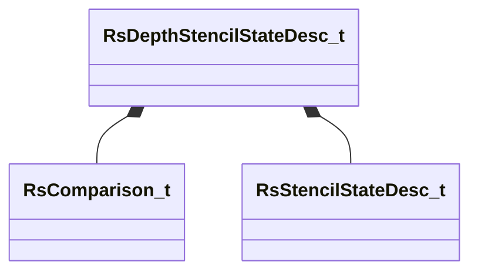
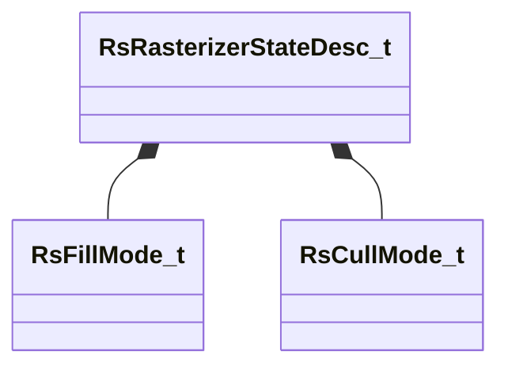

# Module: rendersystemdx11

[📊 View UML Diagram](../diagrams/rendersystemdx11.md)

| Name | Kind | Bases | Fields |
|------|------|-------|--------|
| [RsBlendStateDesc_t](#rsblendstatedesc_t) | class |  | 11 |
| [RsComparison_t](#rscomparison_t) | enum |  | 8 |
| [RsCullMode_t](#rscullmode_t) | enum |  | 3 |
| [RsDepthStencilStateDesc_t](#rsdepthstencilstatedesc_t) | class |  | 4 |
| [RsFillMode_t](#rsfillmode_t) | enum |  | 2 |
| [RsRasterizerStateDesc_t](#rsrasterizerstatedesc_t) | class |  | 7 |
| [RsStencilStateDesc_t](#rsstencilstatedesc_t) | class |  | 11 |

---

### RsBlendStateDesc_t

**Fields:**

| Name | Type | Annotations |
|------|------|-------------|
| `m_srcBlendBits` | uint32 |  |
| `m_destBlendBits` | uint32 |  |
| `m_srcBlendAlphaBits` | uint32 |  |
| `m_destBlendAlphaBits` | uint32 |  |
| `m_renderTargetWriteMaskBits` | uint32 |  |
| `m_blendOpBits` | bitfield:30 |  |
| `m_bAlphaToCoverageEnable` | bitfield:1 |  |
| `m_bIndependentBlendEnable` | bitfield:1 |  |
| `m_blendOpAlphaBits` | uint32 |  |
| `m_blendEnableBits` | uint8 |  |
| `m_srgbWriteEnableBits` | uint8 |  |

### RsComparison_t

**Values:**

| Name | Value |
|------|-------|
| `RS_CMP_NEVER` | 0 |
| `RS_CMP_LESS` | 1 |
| `RS_CMP_EQUAL` | 2 |
| `RS_CMP_LESS_EQUAL` | 3 |
| `RS_CMP_GREATER` | 4 |
| `RS_CMP_NOT_EQUAL` | 5 |
| `RS_CMP_GREATER_EQUAL` | 6 |
| `RS_CMP_ALWAYS` | 7 |

### RsCullMode_t

**Values:**

| Name | Value |
|------|-------|
| `RS_CULL_NONE` | 0 |
| `RS_CULL_BACK` | 1 |
| `RS_CULL_FRONT` | 2 |

### RsDepthStencilStateDesc_t

**Relationships:**

**Fields:**

| Name | Type | Annotations |
|------|------|-------------|
| `m_bDepthTestEnable` | bitfield:1 |  |
| `m_bDepthWriteEnable` | bitfield:1 |  |
| `m_depthFunc` | [RsComparison_t](../schemas/rendersystemdx11.md#rscomparison_t) |  |
| `m_stencilState` | [RsStencilStateDesc_t](../schemas/rendersystemdx11.md#rsstencilstatedesc_t) |  |

### RsFillMode_t

**Values:**

| Name | Value |
|------|-------|
| `RS_FILL_SOLID` | 0 |
| `RS_FILL_WIREFRAME` | 1 |

### RsRasterizerStateDesc_t

**Relationships:**

**Fields:**

| Name | Type | Annotations |
|------|------|-------------|
| `m_nFillMode` | [RsFillMode_t](../schemas/rendersystemdx11.md#rsfillmode_t) |  |
| `m_nCullMode` | [RsCullMode_t](../schemas/rendersystemdx11.md#rscullmode_t) |  |
| `m_bDepthClipEnable` | bool |  |
| `m_bMultisampleEnable` | bool |  |
| `m_nDepthBias` | int32 |  |
| `m_flDepthBiasClamp` | float32 |  |
| `m_flSlopeScaledDepthBias` | float32 |  |

### RsStencilStateDesc_t

**Fields:**

| Name | Type | Annotations |
|------|------|-------------|
| `m_bStencilEnable` | bitfield:1 |  |
| `m_frontStencilFailOp` | bitfield:3 |  |
| `m_frontStencilDepthFailOp` | bitfield:3 |  |
| `m_frontStencilPassOp` | bitfield:3 |  |
| `m_frontStencilFunc` | bitfield:3 |  |
| `m_backStencilFailOp` | bitfield:3 |  |
| `m_backStencilDepthFailOp` | bitfield:3 |  |
| `m_backStencilPassOp` | bitfield:3 |  |
| `m_backStencilFunc` | bitfield:3 |  |
| `m_nStencilReadMask` | uint8 |  |
| `m_nStencilWriteMask` | uint8 |  |
