# Module: resourcecompiler

[📊 View UML Diagram](../diagrams/resourcecompiler.md)

| Name | Kind | Bases | Fields |
|------|------|-------|--------|
| [CBloomLayer](#cbloomlayer) | class | CColorCorrectionLayer | 0 |
| [CBrightnessContrastColorCorrectionLayer](#cbrightnesscontrastcolorcorrectionlayer) | class | CColorCorrectionLayer | 0 |
| [CColorBalanceColorCorrectionLayer](#ccolorbalancecolorcorrectionlayer) | class | CColorCorrectionLayer | 0 |
| [CColorCorrectionLayer](#ccolorcorrectionlayer) | class |  | 4 |
| [CColorLookupColorCorrectionLayer](#ccolorlookupcolorcorrectionlayer) | class | CColorCorrectionLayer | 0 |
| [CColorTintColorCorrectionLayer](#ccolortintcolorcorrectionlayer) | class | CColorCorrectionLayer | 0 |
| [CCurvesColorCorrectionLayer](#ccurvescolorcorrectionlayer) | class | CColorCorrectionLayer | 0 |
| [CFogScatteringLayer](#cfogscatteringlayer) | class | CColorCorrectionLayer | 0 |
| [CHueSaturationColorCorrectionLayer](#chuesaturationcolorcorrectionlayer) | class | CColorCorrectionLayer | 0 |
| [CLayerMask](#clayermask) | class |  | 0 |
| [CLevelsColorCorrectionLayer](#clevelscolorcorrectionlayer) | class | CColorCorrectionLayer | 0 |
| [CLocalContrastLayer](#clocalcontrastlayer) | class | CColorCorrectionLayer | 0 |
| [CPostProcessData](#cpostprocessdata) | class |  | 0 |
| [CToneMappingLayer](#ctonemappinglayer) | class | CColorCorrectionLayer | 0 |
| [CVibranceColorCorrectionLayer](#cvibrancecolorcorrectionlayer) | class | CColorCorrectionLayer | 0 |
| [CVignetteLayer](#cvignettelayer) | class | CColorCorrectionLayer | 0 |
| [LayerMaskType_t](#layermasktype_t) | enum |  | 2 |
| [LayerType_t](#layertype_t) | enum |  | 14 |

---

### CBloomLayer

**Inherits from:** [CColorCorrectionLayer](resourcecompiler.md#ccolorcorrectionlayer)

**Metadata:** `MGetKV3ClassDefaults = {`, `"_class": "CBloomLayer",`, `"m_name": "Bloom 1",`, `"m_nOpacityPercent": 100,`, `"m_bVisible": true,`, `"m_pLayerMask": null,`, `"m_params":`, `{`, `"m_blendMode": "BLOOM_BLEND_ADD",`, `"m_flBloomStrength": 2.000000,`, `"m_flScreenBloomStrength": 1.000000,`, `"m_flBlurBloomStrength": 1.000000,`, `"m_flBloomThreshold": 0.000000,`, `"m_flBloomThresholdWidth": 1.000000,`, `"m_flSkyboxBloomStrength": 1.000000,`, `"m_flBloomStartValue": 1.000000,`, `"m_flComputeBloomStrength": 0.030000,`, `"m_flComputeBloomThreshold": 1.000000,`, `"m_flComputeBloomRadius": 0.600000,`, `"m_flComputeBloomEffectsScale": 1.000000,`, `"m_flComputeBloomLensDirtStrength": 0.000000,`, `"m_flComputeBloomLensDirtBlackLevel": 0.100000,`, `"m_flBlurWeight":`, `[`, `0.200000,`, `0.200000,`, `0.200000,`, `0.200000,`, `0.200000`, `],`, `"m_vBlurTint":`, `[`, `[`, `1.000000,`, `1.000000,`, `1.000000`, `],`, `[`, `1.000000,`, `1.000000,`, `1.000000`, `],`, `[`, `1.000000,`, `1.000000,`, `1.000000`, `],`, `[`, `1.000000,`, `1.000000,`, `1.000000`, `],`, `[`, `1.000000,`, `1.000000,`, `1.000000`, `]`, `]`, `}`, `}`

**Relationships:**

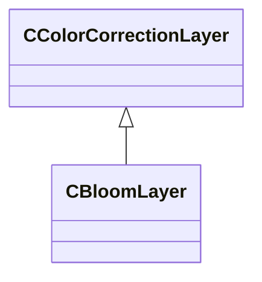

### CBrightnessContrastColorCorrectionLayer

**Inherits from:** [CColorCorrectionLayer](resourcecompiler.md#ccolorcorrectionlayer)

**Metadata:** `MGetKV3ClassDefaults = {`, `"_class": "CBrightnessContrastColorCorrectionLayer",`, `"m_name": "Brightness/Contrast 1",`, `"m_nOpacityPercent": 100,`, `"m_bVisible": true,`, `"m_pLayerMask": null,`, `"m_nBrightness": 0,`, `"m_nContrast": 0`, `}`

**Relationships:**

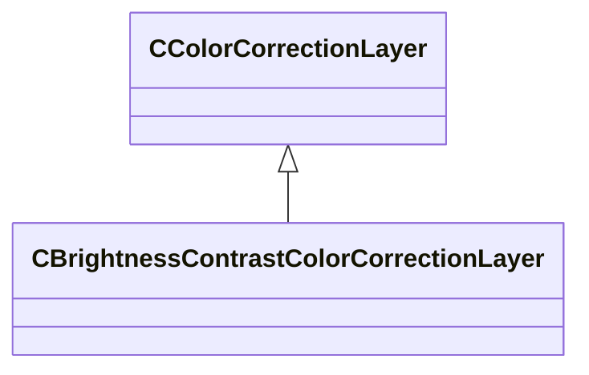

### CColorBalanceColorCorrectionLayer

**Inherits from:** [CColorCorrectionLayer](resourcecompiler.md#ccolorcorrectionlayer)

**Metadata:** `MGetKV3ClassDefaults = {`, `"_class": "CColorBalanceColorCorrectionLayer",`, `"m_name": "Color Balance 1",`, `"m_nOpacityPercent": 100,`, `"m_bVisible": true,`, `"m_pLayerMask": null,`, `"m_nRedCyanBalS": 0,`, `"m_nRedCyanBalM": 0,`, `"m_nRedCyanBalH": 0,`, `"m_nGreenMagentaBalS": 0,`, `"m_nGreenMagentaBalM": 0,`, `"m_nGreenMagentaBalH": 0,`, `"m_nBlueYellowBalS": 0,`, `"m_nBlueYellowBalM": 0,`, `"m_nBlueYellowBalH": 0,`, `"m_bPreserveLuminosity": true`, `}`

**Relationships:**

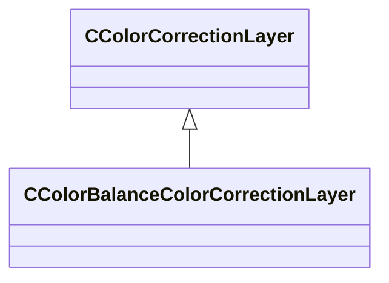

### CColorCorrectionLayer

**Derived by:** [CBloomLayer](resourcecompiler.md#cbloomlayer), [CBrightnessContrastColorCorrectionLayer](resourcecompiler.md#cbrightnesscontrastcolorcorrectionlayer), [CColorBalanceColorCorrectionLayer](resourcecompiler.md#ccolorbalancecolorcorrectionlayer), [CColorLookupColorCorrectionLayer](resourcecompiler.md#ccolorlookupcolorcorrectionlayer), [CColorTintColorCorrectionLayer](resourcecompiler.md#ccolortintcolorcorrectionlayer), [CCurvesColorCorrectionLayer](resourcecompiler.md#ccurvescolorcorrectionlayer), [CFogScatteringLayer](resourcecompiler.md#cfogscatteringlayer), [CHueSaturationColorCorrectionLayer](resourcecompiler.md#chuesaturationcolorcorrectionlayer), [CLevelsColorCorrectionLayer](resourcecompiler.md#clevelscolorcorrectionlayer), [CLocalContrastLayer](resourcecompiler.md#clocalcontrastlayer), [CToneMappingLayer](resourcecompiler.md#ctonemappinglayer), [CVibranceColorCorrectionLayer](resourcecompiler.md#cvibrancecolorcorrectionlayer), [CVignetteLayer](resourcecompiler.md#cvignettelayer)

**Metadata:** `MGetKV3ClassDefaults = Could not parse KV3 Defaults`

**Relationships:**

```mermaid
classDiagram
    CColorCorrectionLayer <|-- CBloomLayer
    CColorCorrectionLayer <|-- CBrightnessContrastColorCorrectionLayer
    CColorCorrectionLayer <|-- CColorBalanceColorCorrectionLayer
    CColorCorrectionLayer <|-- CColorLookupColorCorrectionLayer
    CColorCorrectionLayer <|-- CColorTintColorCorrectionLayer
    CColorCorrectionLayer <|-- CCurvesColorCorrectionLayer
    CColorCorrectionLayer <|-- CFogScatteringLayer
    CColorCorrectionLayer <|-- CHueSaturationColorCorrectionLayer
    CColorCorrectionLayer <|-- CLevelsColorCorrectionLayer
    CColorCorrectionLayer <|-- CLocalContrastLayer
    CColorCorrectionLayer <|-- CToneMappingLayer
    CColorCorrectionLayer <|-- CVibranceColorCorrectionLayer
    CColorCorrectionLayer <|-- CVignetteLayer
    CColorCorrectionLayer --> CLayerMask
```

**Fields:**

| Name | Type | Annotations |
|------|------|-------------|
| `m_name` | CUtlString |  |
| `m_nOpacityPercent` | int32 |  |
| `m_bVisible` | bool |  |
| `m_pLayerMask` | [CLayerMask](../schemas/resourcecompiler.md#clayermask)* |  |

### CColorLookupColorCorrectionLayer

**Inherits from:** [CColorCorrectionLayer](resourcecompiler.md#ccolorcorrectionlayer)

**Metadata:** `MGetKV3ClassDefaults = {`, `"_class": "CColorLookupColorCorrectionLayer",`, `"m_name": "Lookup Table 1",`, `"m_nOpacityPercent": 100,`, `"m_bVisible": true,`, `"m_pLayerMask": null,`, `"m_fileName": "",`, `"m_lut":`, `[`, `],`, `"m_nDim": 0`, `}`

**Relationships:**

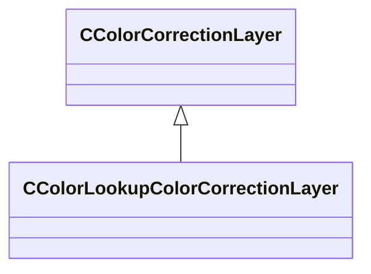

### CColorTintColorCorrectionLayer

**Inherits from:** [CColorCorrectionLayer](resourcecompiler.md#ccolorcorrectionlayer)

**Metadata:** `MGetKV3ClassDefaults = {`, `"_class": "CColorTintColorCorrectionLayer",`, `"m_name": "Color Tint 1",`, `"m_nOpacityPercent": 100,`, `"m_bVisible": true,`, `"m_pLayerMask": null,`, `"m_nTintColorR": 255,`, `"m_nTintColorG": 150,`, `"m_nTintColorB": 20,`, `"m_nStrength": 20,`, `"m_bPreserveLuminosity": true`, `}`

**Relationships:**

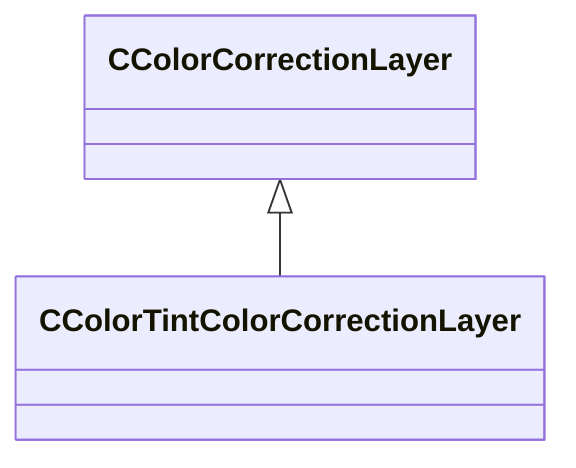

### CCurvesColorCorrectionLayer

**Inherits from:** [CColorCorrectionLayer](resourcecompiler.md#ccolorcorrectionlayer)

**Metadata:** `MGetKV3ClassDefaults = {`, `"_class": "CCurvesColorCorrectionLayer",`, `"m_name": "Curves 1",`, `"m_nOpacityPercent": 100,`, `"m_bVisible": true,`, `"m_pLayerMask": null,`, `"m_curvePointsRGB":`, `[`, `[`, `0.000000,`, `0.000000`, `],`, `[`, `255.000000,`, `255.000000`, `]`, `],`, `"m_curvePointsR":`, `[`, `[`, `0.000000,`, `0.000000`, `],`, `[`, `255.000000,`, `255.000000`, `]`, `],`, `"m_curvePointsG":`, `[`, `[`, `0.000000,`, `0.000000`, `],`, `[`, `255.000000,`, `255.000000`, `]`, `],`, `"m_curvePointsB":`, `[`, `[`, `0.000000,`, `0.000000`, `],`, `[`, `255.000000,`, `255.000000`, `]`, `]`, `}`

**Relationships:**

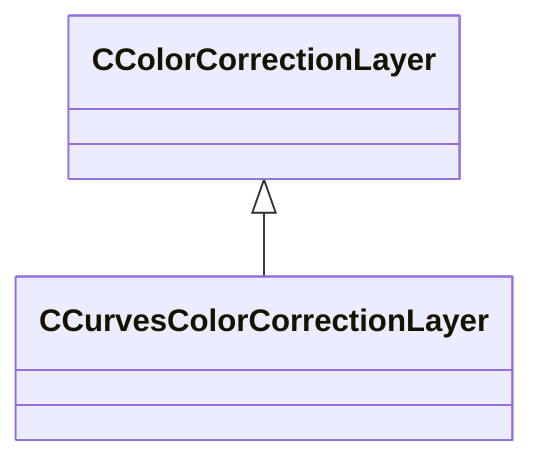

### CFogScatteringLayer

**Inherits from:** [CColorCorrectionLayer](resourcecompiler.md#ccolorcorrectionlayer)

**Metadata:** `MGetKV3ClassDefaults = {`, `"_class": "CFogScatteringLayer",`, `"m_name": "Fog Scattering 1",`, `"m_nOpacityPercent": 100,`, `"m_bVisible": true,`, `"m_pLayerMask": null,`, `"m_params":`, `{`, `"m_fRadius": 0.750000,`, `"m_fScale": 0.000000,`, `"m_fCubemapScale": 1.000000,`, `"m_fVolumetricScale": 1.000000,`, `"m_fGradientScale": 1.000000`, `}`, `}`

**Relationships:**

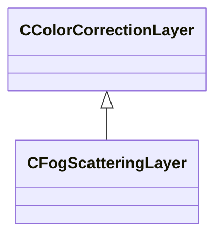

### CHueSaturationColorCorrectionLayer

**Inherits from:** [CColorCorrectionLayer](resourcecompiler.md#ccolorcorrectionlayer)

**Metadata:** `MGetKV3ClassDefaults = {`, `"_class": "CHueSaturationColorCorrectionLayer",`, `"m_name": "Hue/Saturation 1",`, `"m_nOpacityPercent": 100,`, `"m_bVisible": true,`, `"m_pLayerMask": null,`, `"m_nHueMaster": 0,`, `"m_nHueRed": 0,`, `"m_nHueYellow": 0,`, `"m_nHueGreen": 0,`, `"m_nHueCyan": 0,`, `"m_nHueBlue": 0,`, `"m_nHueMagenta": 0,`, `"m_nSaturationMaster": 0,`, `"m_nSaturationRed": 0,`, `"m_nSaturationYellow": 0,`, `"m_nSaturationGreen": 0,`, `"m_nSaturationCyan": 0,`, `"m_nSaturationBlue": 0,`, `"m_nSaturationMagenta": 0,`, `"m_nBrightnessMaster": 0,`, `"m_nBrightnessRed": 0,`, `"m_nBrightnessYellow": 0,`, `"m_nBrightnessGreen": 0,`, `"m_nBrightnessCyan": 0,`, `"m_nBrightnessBlue": 0,`, `"m_nBrightnessMagenta": 0`, `}`

**Relationships:**

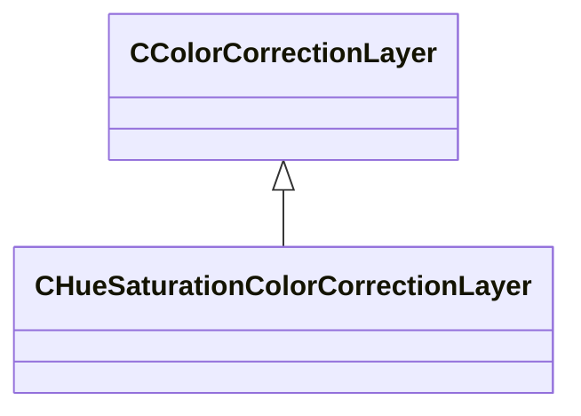

### CLayerMask

**Metadata:** `MGetKV3ClassDefaults = {`, `"_class": "CLayerMask",`, `"m_nLumMaskCenter": 128,`, `"m_nLumMaskWidth": 82,`, `"m_nLumMaskShape": 0,`, `"m_bInverted": false`, `}`

### CLevelsColorCorrectionLayer

**Inherits from:** [CColorCorrectionLayer](resourcecompiler.md#ccolorcorrectionlayer)

**Metadata:** `MGetKV3ClassDefaults = {`, `"_class": "CLevelsColorCorrectionLayer",`, `"m_name": "Levels 1",`, `"m_nOpacityPercent": 100,`, `"m_bVisible": true,`, `"m_pLayerMask": null,`, `"m_nInputBlackPointRGB": 0,`, `"m_nInputBlackPointR": 0,`, `"m_nInputBlackPointG": 0,`, `"m_nInputBlackPointB": 0,`, `"m_nInputWhitePointRGB": 255,`, `"m_nInputWhitePointR": 255,`, `"m_nInputWhitePointG": 255,`, `"m_nInputWhitePointB": 255,`, `"m_nOutputBlackPointRGB": 0,`, `"m_nOutputBlackPointR": 0,`, `"m_nOutputBlackPointG": 0,`, `"m_nOutputBlackPointB": 0,`, `"m_nOutputWhitePointRGB": 255,`, `"m_nOutputWhitePointR": 255,`, `"m_nOutputWhitePointG": 255,`, `"m_nOutputWhitePointB": 255,`, `"m_flGammaRGB": 1.000000,`, `"m_flGammaR": 1.000000,`, `"m_flGammaG": 1.000000,`, `"m_flGammaB": 1.000000`, `}`

**Relationships:**

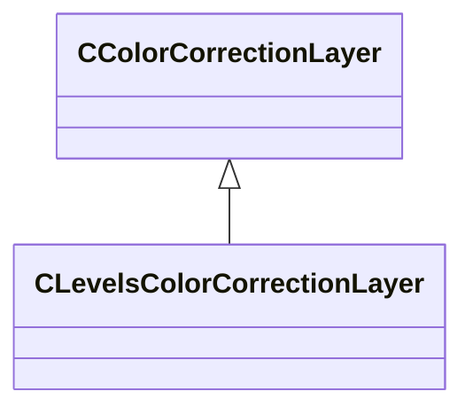

### CLocalContrastLayer

**Inherits from:** [CColorCorrectionLayer](resourcecompiler.md#ccolorcorrectionlayer)

**Metadata:** `MGetKV3ClassDefaults = {`, `"_class": "CLocalContrastLayer",`, `"m_name": "Local Contrast 1",`, `"m_nOpacityPercent": 100,`, `"m_bVisible": true,`, `"m_pLayerMask": null,`, `"m_params":`, `{`, `"m_flLocalContrastStrength": 0.000000,`, `"m_flLocalContrastEdgeStrength": 0.000000,`, `"m_flLocalContrastVignetteStart": 0.000000,`, `"m_flLocalContrastVignetteEnd": 0.000000,`, `"m_flLocalContrastVignetteBlur": 0.000000`, `}`, `}`

**Relationships:**

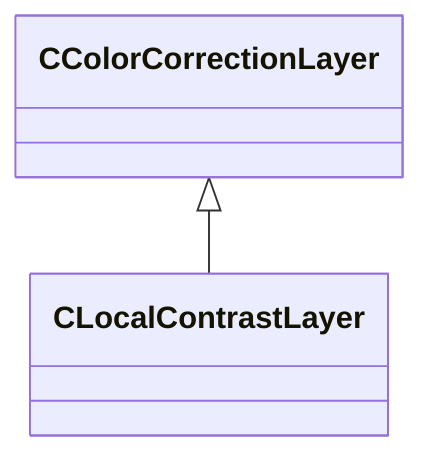

### CPostProcessData

**Metadata:** `MGetKV3ClassDefaults = {`, `"_class": "CPostProcessData",`, `"m_layers":`, `[`, `]`, `}`

### CToneMappingLayer

**Inherits from:** [CColorCorrectionLayer](resourcecompiler.md#ccolorcorrectionlayer)

**Metadata:** `MGetKV3ClassDefaults = {`, `"_class": "CToneMappingLayer",`, `"m_name": "Tone Mapping 1",`, `"m_nOpacityPercent": 100,`, `"m_bVisible": true,`, `"m_pLayerMask": null,`, `"m_params":`, `{`, `"m_flExposureBias": 0.000000,`, `"m_flShoulderStrength": 0.150000,`, `"m_flLinearStrength": 0.500000,`, `"m_flLinearAngle": 0.100000,`, `"m_flToeStrength": 0.200000,`, `"m_flToeNum": 0.020000,`, `"m_flToeDenom": 0.300000,`, `"m_flWhitePoint": 4.000000,`, `"m_flLuminanceSource": 0.000000,`, `"m_flExposureBiasShadows": 0.000000,`, `"m_flExposureBiasHighlights": 0.000000,`, `"m_flMinShadowLum": 0.000000,`, `"m_flMaxShadowLum": 0.500000,`, `"m_flMinHighlightLum": 2.000000,`, `"m_flMaxHighlightLum": 8.000000`, `}`, `}`

**Relationships:**

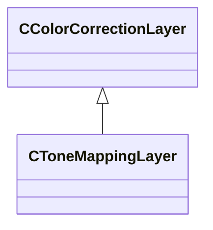

### CVibranceColorCorrectionLayer

**Inherits from:** [CColorCorrectionLayer](resourcecompiler.md#ccolorcorrectionlayer)

**Metadata:** `MGetKV3ClassDefaults = {`, `"_class": "CVibranceColorCorrectionLayer",`, `"m_name": "Saturation/Vibrance 1",`, `"m_nOpacityPercent": 100,`, `"m_bVisible": true,`, `"m_pLayerMask": null,`, `"m_nVibrance": 0,`, `"m_nSaturation": 0`, `}`

**Relationships:**

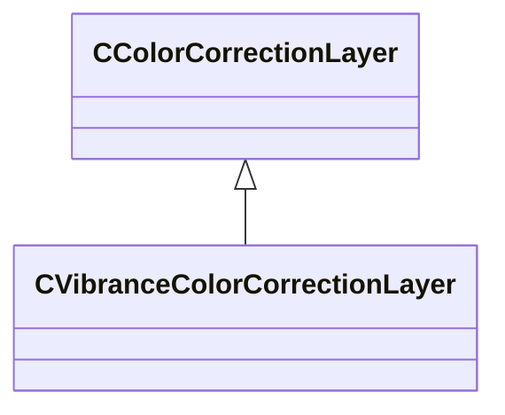

### CVignetteLayer

**Inherits from:** [CColorCorrectionLayer](resourcecompiler.md#ccolorcorrectionlayer)

**Metadata:** `MGetKV3ClassDefaults = {`, `"_class": "CVignetteLayer",`, `"m_name": "Vignette 1",`, `"m_nOpacityPercent": 100,`, `"m_bVisible": true,`, `"m_pLayerMask": null,`, `"m_params":`, `{`, `"m_flVignetteStrength": 0.000000,`, `"m_vCenter":`, `[`, `0.000000,`, `0.000000`, `],`, `"m_flRadius": 0.500000,`, `"m_flRoundness": 1.000000,`, `"m_flFeather": 0.500000,`, `"m_vColorTint":`, `[`, `1.000000,`, `1.000000,`, `1.000000`, `]`, `}`, `}`

**Relationships:**

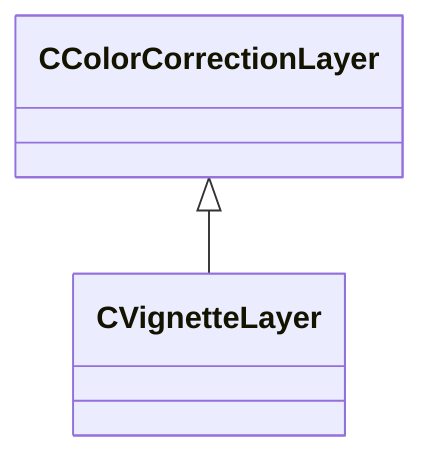

### LayerMaskType_t

**Values:**

| Name | Value |
|------|-------|
| `LAYER_MASK_LUMINOSITY` | 0 |
| `LAYER_MASK_COLOR_RANGE` | 1 |

### LayerType_t

**Values:**

| Name | Value |
|------|-------|
| `LAYER_TYPE_LEVELS` | 0 |
| `LAYER_TYPE_VIBRANCE` | 1 |
| `LAYER_TYPE_BRIGHTNESS_CONTRAST` | 2 |
| `LAYER_TYPE_LUT` | 3 |
| `LAYER_TYPE_COLOR_BALANCE` | 4 |
| `LAYER_TYPE_COLOR_TINT` | 5 |
| `LAYER_TYPE_HUE_SATURATION` | 6 |
| `LAYER_TYPE_CURVES` | 7 |
| `LAYER_TYPE_TONEMAPPING` | 8 |
| `LAYER_TYPE_BLOOM` | 9 |
| `LAYER_TYPE_VIGNETTE` | 10 |
| `LAYER_TYPE_LOCAL_CONTRAST` | 11 |
| `LAYER_TYPE_FOG_SCATTERING` | 12 |
| `MAX_LAYER_TYPES` | 13 |
