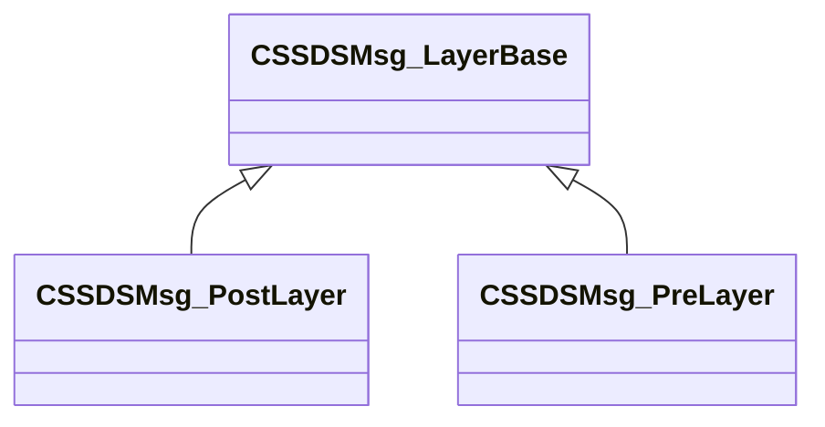
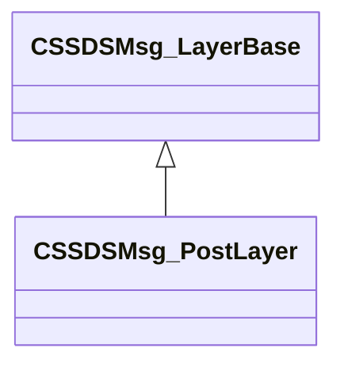
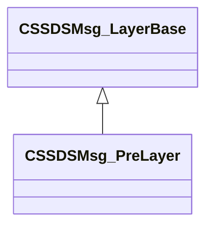

# Module: scenesystem

[📊 View UML Diagram](../diagrams/scenesystem.md)

| Name | Kind | Bases | Fields |
|------|------|-------|--------|
| [CSSDSEndFrameViewInfo](#cssdsendframeviewinfo) | class |  | 0 |
| [CSSDSMsg_EndFrame](#cssdsmsg_endframe) | class |  | 0 |
| [CSSDSMsg_LayerBase](#cssdsmsg_layerbase) | class |  | 0 |
| [CSSDSMsg_PostLayer](#cssdsmsg_postlayer) | class | CSSDSMsg_LayerBase | 0 |
| [CSSDSMsg_PreLayer](#cssdsmsg_prelayer) | class | CSSDSMsg_LayerBase | 0 |
| [CSSDSMsg_ViewRender](#cssdsmsg_viewrender) | class |  | 0 |
| [CSSDSMsg_ViewTarget](#cssdsmsg_viewtarget) | class |  | 0 |
| [CSSDSMsg_ViewTargetList](#cssdsmsg_viewtargetlist) | class |  | 0 |
| [DisableShadows_t](#disableshadows_t) | enum |  | 4 |
| [ESceneObjectVisualization](#esceneobjectvisualization) | enum |  | 6 |
| [ESilhouetteType_t](#esilhouettetype_t) | enum |  | 4 |
| [SceneViewId_t](#sceneviewid_t) | class |  | 0 |

---

### CSSDSEndFrameViewInfo

**Metadata:** `MGetKV3ClassDefaults = {`, `"m_nViewId": 0,`, `"m_ViewName": ""`, `}`

### CSSDSMsg_EndFrame

**Metadata:** `MGetKV3ClassDefaults = {`, `"m_Views":`, `[`, `]`, `}`

### CSSDSMsg_LayerBase

**Derived by:** [CSSDSMsg_PostLayer](scenesystem.md#cssdsmsg_postlayer), [CSSDSMsg_PreLayer](scenesystem.md#cssdsmsg_prelayer)

**Metadata:** `MGetKV3ClassDefaults = {`, `"m_viewId":`, `{`, `"m_nViewId": 0,`, `"m_nFrameCount": 0`, `},`, `"m_ViewName": "",`, `"m_nLayerId": 0,`, `"m_LayerName": "",`, `"m_displayText": ""`, `}`

**Relationships:**

### CSSDSMsg_PostLayer

**Inherits from:** [CSSDSMsg_LayerBase](scenesystem.md#cssdsmsg_layerbase)

**Metadata:** `MGetKV3ClassDefaults = {`, `"m_viewId":`, `{`, `"m_nViewId": 0,`, `"m_nFrameCount": 0`, `},`, `"m_ViewName": "",`, `"m_nLayerId": 0,`, `"m_LayerName": "",`, `"m_displayText": ""`, `}`

**Relationships:**

### CSSDSMsg_PreLayer

**Inherits from:** [CSSDSMsg_LayerBase](scenesystem.md#cssdsmsg_layerbase)

**Metadata:** `MGetKV3ClassDefaults = {`, `"m_viewId":`, `{`, `"m_nViewId": 0,`, `"m_nFrameCount": 0`, `},`, `"m_ViewName": "",`, `"m_nLayerId": 0,`, `"m_LayerName": "",`, `"m_displayText": ""`, `}`

**Relationships:**

### CSSDSMsg_ViewRender

**Metadata:** `MGetKV3ClassDefaults = {`, `"m_viewId":`, `{`, `"m_nViewId": 0,`, `"m_nFrameCount": 0`, `},`, `"m_ViewName": ""`, `}`

### CSSDSMsg_ViewTarget

**Metadata:** `MGetKV3ClassDefaults = {`, `"m_Name": "",`, `"m_TextureId": 0,`, `"m_nWidth": 0,`, `"m_nHeight": 0,`, `"m_nRequestedWidth": 0,`, `"m_nRequestedHeight": 0,`, `"m_nNumMipLevels": 0,`, `"m_nDepth": 0,`, `"m_nMultisampleNumSamples": 0,`, `"m_nFormat": 0`, `}`

### CSSDSMsg_ViewTargetList

**Metadata:** `MGetKV3ClassDefaults = {`, `"m_viewId":`, `{`, `"m_nViewId": 0,`, `"m_nFrameCount": 0`, `},`, `"m_ViewName": "",`, `"m_Targets":`, `[`, `]`, `}`

### DisableShadows_t

**Values:**

| Name | Value |
|------|-------|
| `kDisableShadows_None` | 0 |
| `kDisableShadows_All` | 1 |
| `kDisableShadows_Baked` | 2 |
| `kDisableShadows_Realtime` | 3 |

### ESceneObjectVisualization

**Values:**

| Name | Value |
|------|-------|
| `SCENEOBJECT_VIS_NONE` | 0 |
| `SCENEOBJECT_VIS_OBJECT` | 1 |
| `SCENEOBJECT_VIS_MATERIAL` | 2 |
| `SCENEOBJECT_VIS_TEXTURE_SIZE` | 3 |
| `SCENEOBJECT_VIS_LOD` | 4 |
| `SCENEOBJECT_VIS_INSTANCING` | 5 |

### ESilhouetteType_t

**Values:**

| Name | Value |
|------|-------|
| `SILHOUETTE_NONE` | 0 |
| `SILHOUETTE_LIGHT` | 1 |
| `SILHOUETTE_ENVMAP` | 2 |
| `SILHOUETTE_LPV` | 4 |

### SceneViewId_t

**Metadata:** `MGetKV3ClassDefaults = {`, `"m_nViewId": 0,`, `"m_nFrameCount": 0`, `}`
