# Module: server

[📊 View UML Diagram](../diagrams/server.md)

| Name | Kind | Bases | Fields |
|------|------|-------|--------|
| [ActiveModelConfig_t](#activemodelconfig_t) | class |  | 4 |
| [AnimGraph2SerializedPoseRecipeSlot_t](#animgraph2serializedposerecipeslot_t) | class |  | 1 |
| [AutoRoomDoorwayPairs_t](#autoroomdoorwaypairs_t) | class |  | 2 |
| [CAI_ChangeHintGroup](#cai_changehintgroup) | class | CBaseEntity | 4 |
| [CAI_Expresser](#cai_expresser) | class |  | 11 |
| [CAI_ExpresserWithFollowup](#cai_expresserwithfollowup) | class | CAI_Expresser | 0 |
| [CAK47](#cak47) | class | CCSWeaponBaseGun | 0 |
| [CAmbientGeneric](#cambientgeneric) | class | CPointEntity | 10 |
| [CAttributeContainer](#cattributecontainer) | class | CAttributeManager | 1 |
| [CAttributeList](#cattributelist) | class |  | 2 |
| [CAttributeManager](#cattributemanager) | class |  | 6 |
| [CAttributeManager](#cattributemanager) | class |  | 3 |
| [CBarnLight](#cbarnlight) | class | CBaseModelEntity | 77 |
| [CBaseAnimGraph](#cbaseanimgraph) | class | CBaseModelEntity | 13 |
| [CBaseAnimGraphController](#cbaseanimgraphcontroller) | class | CSkeletonAnimationController | 31 |
| [CBaseButton](#cbasebutton) | class | CBaseToggle | 25 |
| [CBaseCSGrenade](#cbasecsgrenade) | class | CCSWeaponBase | 13 |
| [CBaseCSGrenadeProjectile](#cbasecsgrenadeprojectile) | class | CBaseGrenade | 16 |
| [CBaseClientUIEntity](#cbaseclientuientity) | class | CBaseModelEntity | 14 |
| [CBaseCombatCharacter](#cbasecombatcharacter) | class | CBaseAnimGraph | 10 |
| [CBaseDMStart](#cbasedmstart) | class | CPointEntity | 1 |
| [CBaseDoor](#cbasedoor) | class | CBaseToggle | 28 |
| [CBaseEntity](#cbaseentity) | class | CEntityInstance | 86 |
| [CBaseEntityAPI](#cbaseentityapi) | class |  | 0 |
| [CBaseFilter](#cbasefilter) | class | CLogicalEntity | 3 |
| [CBaseGrenade](#cbasegrenade) | class | CBaseAnimGraph | 14 |
| [CBaseIssue](#cbaseissue) | class |  | 6 |
| [CBaseModelEntity](#cbasemodelentity) | class | CBaseEntity | 40 |
| [CBaseModelEntity](#cbasemodelentity) | class |  | 0 |
| [CBaseModelEntityAPI](#cbasemodelentityapi) | class |  | 0 |
| [CBaseMoveBehavior](#cbasemovebehavior) | class | CPathKeyFrame | 11 |
| [CBasePlatTrain](#cbaseplattrain) | class | CBaseToggle | 5 |
| [CBasePlayerController](#cbaseplayercontroller) | class | CBaseEntity | 24 |
| [CBasePlayerControllerAPI](#cbaseplayercontrollerapi) | class |  | 0 |
| [CBasePlayerPawn](#cbaseplayerpawn) | class | CBaseCombatCharacter | 25 |
| [CBasePlayerVData](#cbaseplayervdata) | class | CEntitySubclassVDataBase | 0 |
| [CBasePlayerWeapon](#cbaseplayerweapon) | class | CEconEntity | 8 |
| [CBasePlayerWeaponVData](#cbaseplayerweaponvdata) | class | CEntitySubclassVDataBase | 0 |
| [CBaseProp](#cbaseprop) | class | CBaseAnimGraph | 4 |
| [CBasePropDoor](#cbasepropdoor) | class | CDynamicProp | 38 |
| [CBaseToggle](#cbasetoggle) | class | CBaseModelEntity | 16 |
| [CBaseTrigger](#cbasetrigger) | class | CBaseToggle | 12 |
| [CBaseTriggerAPI](#cbasetriggerapi) | class |  | 0 |
| [CBeam](#cbeam) | class | CBaseModelEntity | 24 |
| [CBlood](#cblood) | class | CPointEntity | 4 |
| [CBodyComponent](#cbodycomponent) | class | CEntityComponent | 2 |
| [CBodyComponentBaseAnimGraph](#cbodycomponentbaseanimgraph) | class | CBodyComponentSkeletonInstance | 1 |
| [CBodyComponentBaseModelEntity](#cbodycomponentbasemodelentity) | class | CBodyComponentSkeletonInstance | 0 |
| [CBodyComponentPoint](#cbodycomponentpoint) | class | CBodyComponent | 1 |
| [CBodyComponentSkeletonInstance](#cbodycomponentskeletoninstance) | class | CBodyComponent | 1 |
| [CBombTarget](#cbombtarget) | class | CBaseTrigger | 9 |
| [CBot](#cbot) | class |  | 13 |
| [CBreakable](#cbreakable) | class | CBaseModelEntity | 16 |
| [CBreakableProp](#cbreakableprop) | class | CBaseProp | 33 |
| [CBtActionAim](#cbtactionaim) | class | CBtNode | 12 |
| [CBtActionCombatPositioning](#cbtactioncombatpositioning) | class | CBtNode | 4 |
| [CBtActionMoveTo](#cbtactionmoveto) | class | CBtNode | 14 |
| [CBtActionParachutePositioning](#cbtactionparachutepositioning) | class | CBtNode | 1 |
| [CBtNode](#cbtnode) | class |  | 0 |
| [CBtNodeComposite](#cbtnodecomposite) | class | CBtNode | 0 |
| [CBtNodeCondition](#cbtnodecondition) | class | CBtNodeDecorator | 1 |
| [CBtNodeConditionInactive](#cbtnodeconditioninactive) | class | CBtNodeCondition | 3 |
| [CBtNodeDecorator](#cbtnodedecorator) | class | CBtNode | 0 |
| [CBuoyancyHelper](#cbuoyancyhelper) | class |  | 11 |
| [CBuyZone](#cbuyzone) | class | CBaseTrigger | 1 |
| [CC4](#cc4) | class | CCSWeaponBase | 11 |
| [CCS2PawnGraphController](#ccs2pawngraphcontroller) | class | CCS2WeaponGraphController | 0 |
| [CCS2WeaponGraphController](#ccs2weapongraphcontroller) | class | CAnimGraphControllerBase | 0 |
| [CCSBot](#ccsbot) | class | CBot | 140 |
| [CCSGO_EndOfMatchLineupEnd](#ccsgo_endofmatchlineupend) | class | CCSGO_EndOfMatchLineupEndpoint | 0 |
| [CCSGO_EndOfMatchLineupEndpoint](#ccsgo_endofmatchlineupendpoint) | class | CBaseEntity | 0 |
| [CCSGO_EndOfMatchLineupStart](#ccsgo_endofmatchlineupstart) | class | CCSGO_EndOfMatchLineupEndpoint | 0 |
| [CCSGO_TeamIntroCharacterPosition](#ccsgo_teamintrocharacterposition) | class | CCSGO_TeamPreviewCharacterPosition | 0 |
| [CCSGO_TeamIntroCounterTerroristPosition](#ccsgo_teamintrocounterterroristposition) | class | CCSGO_TeamIntroCharacterPosition | 0 |
| [CCSGO_TeamIntroTerroristPosition](#ccsgo_teamintroterroristposition) | class | CCSGO_TeamIntroCharacterPosition | 0 |
| [CCSGO_TeamPreviewCharacterPosition](#ccsgo_teampreviewcharacterposition) | class | CBaseEntity | 8 |
| [CCSGO_TeamSelectCharacterPosition](#ccsgo_teamselectcharacterposition) | class | CCSGO_TeamPreviewCharacterPosition | 0 |
| [CCSGO_TeamSelectCounterTerroristPosition](#ccsgo_teamselectcounterterroristposition) | class | CCSGO_TeamSelectCharacterPosition | 0 |
| [CCSGO_TeamSelectTerroristPosition](#ccsgo_teamselectterroristposition) | class | CCSGO_TeamSelectCharacterPosition | 0 |
| [CCSGO_WingmanIntroCharacterPosition](#ccsgo_wingmanintrocharacterposition) | class | CCSGO_TeamIntroCharacterPosition | 0 |
| [CCSGO_WingmanIntroCounterTerroristPosition](#ccsgo_wingmanintrocounterterroristposition) | class | CCSGO_WingmanIntroCharacterPosition | 0 |
| [CCSGO_WingmanIntroTerroristPosition](#ccsgo_wingmanintroterroristposition) | class | CCSGO_WingmanIntroCharacterPosition | 0 |
| [CCSGameModeRules](#ccsgamemoderules) | class |  | 1 |
| [CCSGameModeRules_ArmsRace](#ccsgamemoderules_armsrace) | class | CCSGameModeRules | 1 |
| [CCSGameModeRules_Deathmatch](#ccsgamemoderules_deathmatch) | class | CCSGameModeRules | 3 |
| [CCSGameModeRules_Noop](#ccsgamemoderules_noop) | class | CCSGameModeRules | 0 |
| [CCSGameRules](#ccsgamerules) | class | CTeamplayRules | 189 |
| [CCSGameRulesProxy](#ccsgamerulesproxy) | class | CGameRulesProxy | 1 |
| [CCSMinimapBoundary](#ccsminimapboundary) | class | CBaseEntity | 0 |
| [CCSObserverPawn](#ccsobserverpawn) | class | CCSPlayerPawnBase | 0 |
| [CCSObserver_CameraServices](#ccsobserver_cameraservices) | class | CCSPlayerBase_CameraServices | 0 |
| [CCSObserver_MovementServices](#ccsobserver_movementservices) | class | CPlayer_MovementServices | 0 |
| [CCSObserver_ObserverServices](#ccsobserver_observerservices) | class | CPlayer_ObserverServices | 0 |
| [CCSObserver_UseServices](#ccsobserver_useservices) | class | CPlayer_UseServices | 0 |
| [CCSPetPlacement](#ccspetplacement) | class | CBaseEntity | 0 |
| [CCSPlace](#ccsplace) | class | CServerOnlyModelEntity | 1 |
| [CCSPlayerBase_CameraServices](#ccsplayerbase_cameraservices) | class | CPlayer_CameraServices | 7 |
| [CCSPlayerController](#ccsplayercontroller) | class | CBasePlayerController | 92 |
| [CCSPlayerController_ActionTrackingServices](#ccsplayercontroller_actiontrackingservices) | class | CPlayerControllerComponent | 5 |
| [CCSPlayerController_DamageServices](#ccsplayercontroller_damageservices) | class | CPlayerControllerComponent | 2 |
| [CCSPlayerController_InGameMoneyServices](#ccsplayercontroller_ingamemoneyservices) | class | CPlayerControllerComponent | 6 |
| [CCSPlayerController_InventoryServices](#ccsplayercontroller_inventoryservices) | class | CPlayerControllerComponent | 10 |
| [CCSPlayerController_InventoryServices](#ccsplayercontroller_inventoryservices) | class |  | 3 |
| [CCSPlayerLegacyJump](#ccsplayerlegacyjump) | class |  | 2 |
| [CCSPlayerModernJump](#ccsplayermodernjump) | class |  | 9 |
| [CCSPlayerPawn](#ccsplayerpawn) | class | CCSPlayerPawnBase | 108 |
| [CCSPlayerPawnBase](#ccsplayerpawnbase) | class | CBasePlayerPawn | 15 |
| [CCSPlayerResource](#ccsplayerresource) | class | CBaseEntity | 10 |
| [CCSPlayer_ActionTrackingServices](#ccsplayer_actiontrackingservices) | class | CPlayerPawnComponent | 4 |
| [CCSPlayer_AimPunchServices](#ccsplayer_aimpunchservices) | class | CPlayerPawnComponent | 6 |
| [CCSPlayer_BulletServices](#ccsplayer_bulletservices) | class | CPlayerPawnComponent | 1 |
| [CCSPlayer_BuyServices](#ccsplayer_buyservices) | class | CPlayerPawnComponent | 1 |
| [CCSPlayer_CameraServices](#ccsplayer_cameraservices) | class | CCSPlayerBase_CameraServices | 0 |
| [CCSPlayer_DamageReactServices](#ccsplayer_damagereactservices) | class | CPlayerPawnComponent | 0 |
| [CCSPlayer_HostageServices](#ccsplayer_hostageservices) | class | CPlayerPawnComponent | 2 |
| [CCSPlayer_ItemServices](#ccsplayer_itemservices) | class | CPlayer_ItemServices | 2 |
| [CCSPlayer_MovementServices](#ccsplayer_movementservices) | class | CPlayer_MovementServices_Humanoid | 53 |
| [CCSPlayer_PingServices](#ccsplayer_pingservices) | class | CPlayerPawnComponent | 2 |
| [CCSPlayer_RadioServices](#ccsplayer_radioservices) | class | CPlayerPawnComponent | 5 |
| [CCSPlayer_UseServices](#ccsplayer_useservices) | class | CPlayer_UseServices | 3 |
| [CCSPlayer_WaterServices](#ccsplayer_waterservices) | class | CPlayer_WaterServices | 6 |
| [CCSPlayer_WeaponServices](#ccsplayer_weaponservices) | class | CPlayer_WeaponServices | 13 |
| [CCSPointPulseAPI](#ccspointpulseapi) | class |  | 0 |
| [CCSPointScriptEntity](#ccspointscriptentity) | class | CBaseEntity | 0 |
| [CCSSprite](#ccssprite) | class | CSprite | 0 |
| [CCSTeam](#ccsteam) | class | CTeam | 14 |
| [CCSWeaponBase](#ccsweaponbase) | class | CBasePlayerWeapon | 52 |
| [CCSWeaponBaseGun](#ccsweaponbasegun) | class | CCSWeaponBase | 10 |
| [CCSWeaponBaseShotgun](#ccsweaponbaseshotgun) | class | CCSWeaponBase | 0 |
| [CCSWeaponBaseVData](#ccsweaponbasevdata) | class | CBasePlayerWeaponVData | 0 |
| [CCashStack](#ccashstack) | class | CBaseModelEntity | 1 |
| [CChangeLevel](#cchangelevel) | class | CBaseTrigger | 7 |
| [CChicken](#cchicken) | class | CDynamicProp, IHasAttributes | 28 |
| [CChoreoComponent](#cchoreocomponent) | class |  | 5 |
| [CChoreoInfoTarget](#cchoreoinfotarget) | class | CPointEntity | 0 |
| [CCitadelSoundOpvarSetOBB](#ccitadelsoundopvarsetobb) | class | CBaseEntity | 8 |
| [CCollisionProperty](#ccollisionproperty) | class |  | 17 |
| [CColorCorrection](#ccolorcorrection) | class | CBaseEntity | 17 |
| [CColorCorrectionVolume](#ccolorcorrectionvolume) | class | CBaseTrigger | 8 |
| [CCommentaryAuto](#ccommentaryauto) | class | CBaseEntity | 3 |
| [CCommentarySystem](#ccommentarysystem) | class |  | 0 |
| [CCommentaryViewPosition](#ccommentaryviewposition) | class | CSprite | 0 |
| [CConstantForceController](#cconstantforcecontroller) | class |  | 4 |
| [CConstraintAnchor](#cconstraintanchor) | class | CBaseAnimGraph | 1 |
| [CCredits](#ccredits) | class | CPointEntity | 3 |
| [CDEagle](#cdeagle) | class | CCSWeaponBaseGun | 0 |
| [CDamageRecord](#cdamagerecord) | class |  | 15 |
| [CDebugHistory](#cdebughistory) | class | CBaseEntity | 1 |
| [CDecoyGrenade](#cdecoygrenade) | class | CBaseCSGrenade | 0 |
| [CDecoyProjectile](#cdecoyprojectile) | class | CBaseCSGrenadeProjectile | 4 |
| [CDestructiblePartsComponent](#cdestructiblepartscomponent) | class |  | 4 |
| [CDynamicLight](#cdynamiclight) | class | CBaseModelEntity | 9 |
| [CDynamicNavConnectionsVolume](#cdynamicnavconnectionsvolume) | class | CTriggerMultiple | 7 |
| [CDynamicProp](#cdynamicprop) | class | CBreakableProp | 22 |
| [CDynamicPropAlias_cable_dynamic](#cdynamicpropalias_cable_dynamic) | class | CDynamicProp | 0 |
| [CDynamicPropAlias_dynamic_prop](#cdynamicpropalias_dynamic_prop) | class | CDynamicProp | 0 |
| [CDynamicPropAlias_prop_dynamic_override](#cdynamicpropalias_prop_dynamic_override) | class | CDynamicProp | 0 |
| [CEconEntity](#ceconentity) | class | CBaseAnimGraph, IHasAttributes | 9 |
| [CEconItemAttribute](#ceconitemattribute) | class |  | 5 |
| [CEconItemView](#ceconitemview) | class | IEconItemInterface | 13 |
| [CEconWearable](#ceconwearable) | class | CEconEntity | 2 |
| [CEffectData](#ceffectdata) | class |  | 20 |
| [CEnableMotionFixup](#cenablemotionfixup) | class | CBaseEntity | 0 |
| [CEntityBlocker](#centityblocker) | class | CBaseModelEntity | 0 |
| [CEntityDissolve](#centitydissolve) | class | CBaseModelEntity | 10 |
| [CEntityFlame](#centityflame) | class | CBaseEntity | 10 |
| [CEnvBeam](#cenvbeam) | class | CBeam | 19 |
| [CEnvBeverage](#cenvbeverage) | class | CBaseEntity | 2 |
| [CEnvCombinedLightProbeVolume](#cenvcombinedlightprobevolume) | class | CBaseEntity | 29 |
| [CEnvCombinedLightProbeVolumeAlias_func_combined_light_probe_volume](#cenvcombinedlightprobevolumealias_func_combined_light_probe_volume) | class | CEnvCombinedLightProbeVolume | 0 |
| [CEnvCubemap](#cenvcubemap) | class | CBaseEntity | 18 |
| [CEnvCubemapBox](#cenvcubemapbox) | class | CEnvCubemap | 0 |
| [CEnvCubemapFog](#cenvcubemapfog) | class | CBaseEntity | 24 |
| [CEnvDecal](#cenvdecal) | class | CBaseModelEntity | 9 |
| [CEnvDetailController](#cenvdetailcontroller) | class | CBaseEntity | 2 |
| [CEnvEntityIgniter](#cenventityigniter) | class | CBaseEntity | 1 |
| [CEnvEntityMaker](#cenventitymaker) | class | CPointEntity | 12 |
| [CEnvExplosion](#cenvexplosion) | class | CModelPointEntity | 15 |
| [CEnvFade](#cenvfade) | class | CLogicalEntity | 4 |
| [CEnvGlobal](#cenvglobal) | class | CLogicalEntity | 5 |
| [CEnvHudHint](#cenvhudhint) | class | CPointEntity | 1 |
| [CEnvInstructorHint](#cenvinstructorhint) | class | CPointEntity | 24 |
| [CEnvInstructorVRHint](#cenvinstructorvrhint) | class | CPointEntity | 9 |
| [CEnvLaser](#cenvlaser) | class | CBeam | 5 |
| [CEnvLightProbeVolume](#cenvlightprobevolume) | class | CBaseEntity | 22 |
| [CEnvMuzzleFlash](#cenvmuzzleflash) | class | CPointEntity | 2 |
| [CEnvParticleGlow](#cenvparticleglow) | class | CParticleSystem | 5 |
| [CEnvShake](#cenvshake) | class | CPointEntity | 11 |
| [CEnvSky](#cenvsky) | class | CBaseModelEntity | 12 |
| [CEnvSoundscape](#cenvsoundscape) | class | CBaseEntity | 11 |
| [CEnvSoundscapeAlias_snd_soundscape](#cenvsoundscapealias_snd_soundscape) | class | CEnvSoundscape | 0 |
| [CEnvSoundscapeProxy](#cenvsoundscapeproxy) | class | CEnvSoundscape | 1 |
| [CEnvSoundscapeProxyAlias_snd_soundscape_proxy](#cenvsoundscapeproxyalias_snd_soundscape_proxy) | class | CEnvSoundscapeProxy | 0 |
| [CEnvSoundscapeTriggerable](#cenvsoundscapetriggerable) | class | CEnvSoundscape | 0 |
| [CEnvSoundscapeTriggerableAlias_snd_soundscape_triggerable](#cenvsoundscapetriggerablealias_snd_soundscape_triggerable) | class | CEnvSoundscapeTriggerable | 0 |
| [CEnvSpark](#cenvspark) | class | CPointEntity | 5 |
| [CEnvSplash](#cenvsplash) | class | CPointEntity | 1 |
| [CEnvTilt](#cenvtilt) | class | CPointEntity | 4 |
| [CEnvViewPunch](#cenvviewpunch) | class | CPointEntity | 2 |
| [CEnvVolumetricFogController](#cenvvolumetricfogcontroller) | class | CBaseEntity | 36 |
| [CEnvVolumetricFogVolume](#cenvvolumetricfogvolume) | class | CBaseEntity | 18 |
| [CEnvWind](#cenvwind) | class | CBaseEntity | 1 |
| [CEnvWindController](#cenvwindcontroller) | class | CBaseEntity | 11 |
| [CEnvWindShared](#cenvwindshared) | class |  | 17 |
| [CEnvWindVolume](#cenvwindvolume) | class | CBaseEntity | 9 |
| [CExplosionTypeData](#cexplosiontypedata) | class |  | 0 |
| [CFilterAttributeInt](#cfilterattributeint) | class | CBaseFilter | 1 |
| [CFilterClass](#cfilterclass) | class | CBaseFilter | 1 |
| [CFilterContext](#cfiltercontext) | class | CBaseFilter | 1 |
| [CFilterEnemy](#cfilterenemy) | class | CBaseFilter | 5 |
| [CFilterLOS](#cfilterlos) | class | CBaseFilter | 0 |
| [CFilterMassGreater](#cfiltermassgreater) | class | CBaseFilter | 1 |
| [CFilterModel](#cfiltermodel) | class | CBaseFilter | 1 |
| [CFilterMultiple](#cfiltermultiple) | class | CBaseFilter | 3 |
| [CFilterMultipleAPI](#cfiltermultipleapi) | class |  | 0 |
| [CFilterName](#cfiltername) | class | CBaseFilter | 1 |
| [CFilterProximity](#cfilterproximity) | class | CBaseFilter | 1 |
| [CFilterTeam](#cfilterteam) | class | CBaseFilter | 1 |
| [CFireCrackerBlast](#cfirecrackerblast) | class | CInferno | 0 |
| [CFish](#cfish) | class | CBaseAnimGraph | 24 |
| [CFishPool](#cfishpool) | class | CBaseEntity | 7 |
| [CFlashbang](#cflashbang) | class | CBaseCSGrenade | 0 |
| [CFlashbangProjectile](#cflashbangprojectile) | class | CBaseCSGrenadeProjectile | 3 |
| [CFogController](#cfogcontroller) | class | CBaseEntity | 3 |
| [CFogTrigger](#cfogtrigger) | class | CBaseTrigger | 1 |
| [CFogVolume](#cfogvolume) | class | CServerOnlyModelEntity | 5 |
| [CFootstepControl](#cfootstepcontrol) | class | CBaseTrigger | 2 |
| [CFuncBrush](#cfuncbrush) | class | CBaseModelEntity | 6 |
| [CFuncConveyor](#cfuncconveyor) | class | CBaseModelEntity | 9 |
| [CFuncElectrifiedVolume](#cfuncelectrifiedvolume) | class | CFuncBrush | 4 |
| [CFuncIllusionary](#cfuncillusionary) | class | CBaseModelEntity | 0 |
| [CFuncInteractionLayerClip](#cfuncinteractionlayerclip) | class | CBaseModelEntity | 3 |
| [CFuncLadder](#cfuncladder) | class | CBaseModelEntity | 12 |
| [CFuncLadderAlias_func_useableladder](#cfuncladderalias_func_useableladder) | class | CFuncLadder | 0 |
| [CFuncMonitor](#cfuncmonitor) | class | CFuncBrush | 9 |
| [CFuncMoveLinear](#cfuncmovelinear) | class | CBaseToggle | 13 |
| [CFuncMoveLinearAlias_momentary_door](#cfuncmovelinearalias_momentary_door) | class | CFuncMoveLinear | 0 |
| [CFuncMover](#cfuncmover) | class | CBaseModelEntity | 91 |
| [CFuncMover](#cfuncmover) | enum |  | 3 |
| [CFuncMover](#cfuncmover) | enum |  | 3 |
| [CFuncMover](#cfuncmover) | enum |  | 3 |
| [CFuncMover](#cfuncmover) | enum |  | 9 |
| [CFuncMover](#cfuncmover) | enum |  | 4 |
| [CFuncMoverAPI](#cfuncmoverapi) | class |  | 0 |
| [CFuncNavBlocker](#cfuncnavblocker) | class | CBaseModelEntity | 2 |
| [CFuncNavObstruction](#cfuncnavobstruction) | class | CBaseModelEntity | 2 |
| [CFuncPlat](#cfuncplat) | class | CBasePlatTrain | 1 |
| [CFuncPlatRot](#cfuncplatrot) | class | CFuncPlat | 2 |
| [CFuncPropRespawnZone](#cfuncproprespawnzone) | class | CBaseEntity | 0 |
| [CFuncRetakeBarrier](#cfuncretakebarrier) | class | CDynamicProp | 0 |
| [CFuncRotating](#cfuncrotating) | class | CBaseModelEntity | 18 |
| [CFuncRotator](#cfuncrotator) | class | CBaseModelEntity | 41 |
| [CFuncRotator](#cfuncrotator) | enum |  | 6 |
| [CFuncShatterglass](#cfuncshatterglass) | class | CBaseModelEntity | 26 |
| [CFuncTankTrain](#cfunctanktrain) | class | CFuncTrackTrain | 1 |
| [CFuncTimescale](#cfunctimescale) | class | CBaseEntity | 5 |
| [CFuncTrackAuto](#cfunctrackauto) | class | CFuncTrackChange | 0 |
| [CFuncTrackChange](#cfunctrackchange) | class | CFuncPlatRot | 9 |
| [CFuncTrackTrain](#cfunctracktrain) | class | CBaseModelEntity | 37 |
| [CFuncTrain](#cfunctrain) | class | CBasePlatTrain | 6 |
| [CFuncTrainControls](#cfunctraincontrols) | class | CBaseModelEntity | 0 |
| [CFuncVPhysicsClip](#cfuncvphysicsclip) | class | CBaseModelEntity | 1 |
| [CFuncVehicleClip](#cfuncvehicleclip) | class | CBaseModelEntity | 0 |
| [CFuncWall](#cfuncwall) | class | CBaseModelEntity | 1 |
| [CFuncWallToggle](#cfuncwalltoggle) | class | CFuncWall | 0 |
| [CFuncWater](#cfuncwater) | class | CBaseModelEntity | 1 |
| [CGameChoreoServices](#cgamechoreoservices) | class | IChoreoServices | 5 |
| [CGameEnd](#cgameend) | class | CRulePointEntity | 0 |
| [CGameGibManager](#cgamegibmanager) | class | CBaseEntity | 4 |
| [CGameMoney](#cgamemoney) | class | CRulePointEntity | 4 |
| [CGamePlayerEquip](#cgameplayerequip) | class | CRulePointEntity | 0 |
| [CGamePlayerZone](#cgameplayerzone) | class | CRuleBrushEntity | 4 |
| [CGameRules](#cgamerules) | class |  | 8 |
| [CGameRulesProxy](#cgamerulesproxy) | class | CBaseEntity | 0 |
| [CGameSceneNode](#cgamescenenode) | class |  | 32 |
| [CGameSceneNodeHandle](#cgamescenenodehandle) | class |  | 2 |
| [CGameScriptedMoveData](#cgamescriptedmovedata) | class |  | 0 |
| [CGameScriptedMoveDef_t](#cgamescriptedmovedef_t) | class |  | 9 |
| [CGameText](#cgametext) | class | CRulePointEntity | 2 |
| [CGenericConstraint](#cgenericconstraint) | class | CPhysConstraint | 49 |
| [CGenericShapeProxy](#cgenericshapeproxy) | class |  | 1 |
| [CGlowProperty](#cglowproperty) | class |  | 11 |
| [CGradientFog](#cgradientfog) | class | CBaseEntity | 16 |
| [CGunTarget](#cguntarget) | class | CBaseToggle | 3 |
| [CHEGrenade](#chegrenade) | class | CBaseCSGrenade | 0 |
| [CHEGrenadeProjectile](#chegrenadeprojectile) | class | CBaseCSGrenadeProjectile | 0 |
| [CHandleDummy](#chandledummy) | class | CBaseEntity | 0 |
| [CHandleTest](#chandletest) | class | CBaseEntity | 2 |
| [CHintMessage](#chintmessage) | class |  | 3 |
| [CHintMessageQueue](#chintmessagequeue) | class |  | 3 |
| [CHitboxComponent](#chitboxcomponent) | class | CEntityComponent | 1 |
| [CHostage](#chostage) | class | CHostageExpresserShim | 39 |
| [CHostageAlias_info_hostage_spawn](#chostagealias_info_hostage_spawn) | class | CHostage | 0 |
| [CHostageCarriableProp](#chostagecarriableprop) | class | CBaseAnimGraph | 0 |
| [CHostageExpresserShim](#chostageexpressershim) | class | CBaseCombatCharacter | 1 |
| [CHostageRescueZone](#chostagerescuezone) | class | CHostageRescueZoneShim | 0 |
| [CHostageRescueZoneShim](#chostagerescuezoneshim) | class | CBaseTrigger | 0 |
| [CIncendiaryGrenade](#cincendiarygrenade) | class | CMolotovGrenade | 0 |
| [CInferno](#cinferno) | class | CBaseModelEntity | 24 |
| [CInfoChoreoAnchor](#cinfochoreoanchor) | class | CPointEntity | 2 |
| [CInfoChoreoAnchorPosition](#cinfochoreoanchorposition) | class |  | 6 |
| [CInfoChoreoLocatorShapeType_t](#cinfochoreolocatorshapetype_t) | enum |  | 4 |
| [CInfoData](#cinfodata) | class | CServerOnlyEntity | 0 |
| [CInfoDeathmatchSpawn](#cinfodeathmatchspawn) | class | SpawnPoint | 0 |
| [CInfoDynamicShadowHint](#cinfodynamicshadowhint) | class | CPointEntity | 5 |
| [CInfoDynamicShadowHintBox](#cinfodynamicshadowhintbox) | class | CInfoDynamicShadowHint | 2 |
| [CInfoFan](#cinfofan) | class | CPointEntity | 4 |
| [CInfoGameEventProxy](#cinfogameeventproxy) | class | CPointEntity | 2 |
| [CInfoInstructorHintBombTargetA](#cinfoinstructorhintbombtargeta) | class | CPointEntity | 0 |
| [CInfoInstructorHintBombTargetB](#cinfoinstructorhintbombtargetb) | class | CPointEntity | 0 |
| [CInfoInstructorHintHostageRescueZone](#cinfoinstructorhinthostagerescuezone) | class | CPointEntity | 0 |
| [CInfoInstructorHintTarget](#cinfoinstructorhinttarget) | class | CPointEntity | 0 |
| [CInfoInteraction](#cinfointeraction) | class | CPointEntity | 15 |
| [CInfoLadderDismount](#cinfoladderdismount) | class | CBaseEntity | 0 |
| [CInfoLandmark](#cinfolandmark) | class | CPointEntity | 0 |
| [CInfoOffscreenPanoramaTexture](#cinfooffscreenpanoramatexture) | class | CPointEntity | 11 |
| [CInfoParticleTarget](#cinfoparticletarget) | class | CPointEntity | 0 |
| [CInfoPlayerCounterterrorist](#cinfoplayercounterterrorist) | class | SpawnPoint | 0 |
| [CInfoPlayerStart](#cinfoplayerstart) | class | CPointEntity | 3 |
| [CInfoPlayerTerrorist](#cinfoplayerterrorist) | class | SpawnPoint | 0 |
| [CInfoSpawnGroupLandmark](#cinfospawngrouplandmark) | class | CPointEntity | 0 |
| [CInfoSpawnGroupLoadUnload](#cinfospawngrouploadunload) | class | CLogicalEntity | 13 |
| [CInfoTarget](#cinfotarget) | class | CPointEntity | 0 |
| [CInfoTargetServerOnly](#cinfotargetserveronly) | class | CServerOnlyPointEntity | 0 |
| [CInfoTeleportDestination](#cinfoteleportdestination) | class | CPointEntity | 0 |
| [CInfoVisibilityBox](#cinfovisibilitybox) | class | CBaseEntity | 3 |
| [CInfoWorldLayer](#cinfoworldlayer) | class | CBaseEntity | 7 |
| [CInstancedSceneEntity](#cinstancedsceneentity) | class | CSceneEntity | 7 |
| [CInstructorEventEntity](#cinstructorevententity) | class | CPointEntity | 3 |
| [CIronSightController](#cironsightcontroller) | class |  | 4 |
| [CItem](#citem) | class | CBaseAnimGraph | 8 |
| [CItemAssaultSuit](#citemassaultsuit) | class | CItem | 0 |
| [CItemDefuser](#citemdefuser) | class | CItem | 2 |
| [CItemDefuserAlias_item_defuser](#citemdefuseralias_item_defuser) | class | CItemDefuser | 0 |
| [CItemDogtags](#citemdogtags) | class | CItem | 2 |
| [CItemGeneric](#citemgeneric) | class | CItem | 32 |
| [CItemGenericTriggerHelper](#citemgenerictriggerhelper) | class | CBaseModelEntity | 1 |
| [CItemKevlar](#citemkevlar) | class | CItem | 0 |
| [CItemSoda](#citemsoda) | class | CBaseAnimGraph | 0 |
| [CItem_Healthshot](#citem_healthshot) | class | CWeaponBaseItem | 0 |
| [CKeepUpright](#ckeepupright) | class | CPointEntity | 8 |
| [CKnife](#cknife) | class | CCSWeaponBase | 1 |
| [CLightComponent](#clightcomponent) | class | CEntityComponent | 71 |
| [CLightDirectionalEntity](#clightdirectionalentity) | class | CLightEntity | 0 |
| [CLightEntity](#clightentity) | class | CBaseModelEntity | 1 |
| [CLightEnvironmentEntity](#clightenvironmententity) | class | CLightDirectionalEntity | 0 |
| [CLightOrthoEntity](#clightorthoentity) | class | CLightEntity | 0 |
| [CLightSpotEntity](#clightspotentity) | class | CLightEntity | 0 |
| [CLogicAchievement](#clogicachievement) | class | CLogicalEntity | 3 |
| [CLogicActiveAutosave](#clogicactiveautosave) | class | CLogicAutosave | 4 |
| [CLogicAuto](#clogicauto) | class | CBaseEntity | 11 |
| [CLogicAutosave](#clogicautosave) | class | CLogicalEntity | 3 |
| [CLogicBranch](#clogicbranch) | class | CLogicalEntity | 4 |
| [CLogicBranchList](#clogicbranchlist) | class | CLogicalEntity | 6 |
| [CLogicBranchList](#clogicbranchlist) | enum |  | 4 |
| [CLogicCase](#clogiccase) | class | CLogicalEntity | 6 |
| [CLogicCollisionPair](#clogiccollisionpair) | class | CLogicalEntity | 6 |
| [CLogicCompare](#clogiccompare) | class | CLogicalEntity | 6 |
| [CLogicDistanceAutosave](#clogicdistanceautosave) | class | CLogicalEntity | 6 |
| [CLogicDistanceCheck](#clogicdistancecheck) | class | CLogicalEntity | 7 |
| [CLogicEventListener](#clogiceventlistener) | class | CLogicalEntity | 4 |
| [CLogicGameEvent](#clogicgameevent) | class | CLogicalEntity | 1 |
| [CLogicGameEventListener](#clogicgameeventlistener) | class | CLogicalEntity | 5 |
| [CLogicLineToEntity](#clogiclinetoentity) | class | CLogicalEntity | 4 |
| [CLogicMeasureMovement](#clogicmeasuremovement) | class | CLogicalEntity | 9 |
| [CLogicNPCCounter](#clogicnpccounter) | class | CBaseEntity | 48 |
| [CLogicNPCCounterAABB](#clogicnpccounteraabb) | class | CLogicNPCCounter | 4 |
| [CLogicNPCCounterOBB](#clogicnpccounterobb) | class | CLogicNPCCounterAABB | 0 |
| [CLogicNavigation](#clogicnavigation) | class | CLogicalEntity | 2 |
| [CLogicPlayerProxy](#clogicplayerproxy) | class | CLogicalEntity | 5 |
| [CLogicProximity](#clogicproximity) | class | CPointEntity | 0 |
| [CLogicRelay](#clogicrelay) | class | CLogicalEntity | 7 |
| [CLogicRelayAPI](#clogicrelayapi) | class |  | 0 |
| [CLogicScript](#clogicscript) | class | CPointEntity | 0 |
| [CLogicalEntity](#clogicalentity) | class | CServerOnlyEntity | 0 |
| [CMapInfo](#cmapinfo) | class | CPointEntity | 15 |
| [CMapSharedEnvironment](#cmapsharedenvironment) | class | CLogicalEntity | 1 |
| [CMapVetoPickController](#cmapvetopickcontroller) | class | CBaseEntity | 24 |
| [CMarkupVolume](#cmarkupvolume) | class | CBaseModelEntity | 1 |
| [CMarkupVolumeTagged](#cmarkupvolumetagged) | class | CMarkupVolume | 7 |
| [CMarkupVolumeTagged_Nav](#cmarkupvolumetagged_nav) | class | CMarkupVolumeTagged | 1 |
| [CMarkupVolumeTagged_NavGame](#cmarkupvolumetagged_navgame) | class | CMarkupVolumeWithRef | 3 |
| [CMarkupVolumeWithRef](#cmarkupvolumewithref) | class | CMarkupVolumeTagged | 4 |
| [CMathColorBlend](#cmathcolorblend) | class | CLogicalEntity | 5 |
| [CMathCounter](#cmathcounter) | class | CLogicalEntity | 11 |
| [CMathRemap](#cmathremap) | class | CLogicalEntity | 11 |
| [CMessage](#cmessage) | class | CPointEntity | 6 |
| [CMessageEntity](#cmessageentity) | class | CPointEntity | 5 |
| [CModelPointEntity](#cmodelpointentity) | class | CBaseModelEntity | 0 |
| [CModelState](#cmodelstate) | class |  | 14 |
| [CMolotovGrenade](#cmolotovgrenade) | class | CBaseCSGrenade | 0 |
| [CMolotovProjectile](#cmolotovprojectile) | class | CBaseCSGrenadeProjectile | 3 |
| [CMomentaryRotButton](#cmomentaryrotbutton) | class | CRotButton | 14 |
| [CMotorController](#cmotorcontroller) | class |  | 4 |
| [CMovementStatsProperty](#cmovementstatsproperty) | class |  | 2 |
| [CMoverPathNode](#cmoverpathnode) | class | CPathNode | 5 |
| [CMultiLightProxy](#cmultilightproxy) | class | CLogicalEntity | 8 |
| [CMultiSource](#cmultisource) | class | CLogicalEntity | 5 |
| [CMultiplayRules](#cmultiplayrules) | class | CGameRules | 0 |
| [CMultiplayer_Expresser](#cmultiplayer_expresser) | class | CAI_ExpresserWithFollowup | 1 |
| [CNavSpaceInfo](#cnavspaceinfo) | class | CPointEntity | 0 |
| [CNavVolumeBreadthFirstSearch](#cnavvolumebreadthfirstsearch) | class | CNavVolumeCalculatedVector | 2 |
| [CNavVolumeCalculatedVector](#cnavvolumecalculatedvector) | class | CNavVolume | 0 |
| [CNavVolumeMarkupVolume](#cnavvolumemarkupvolume) | class | CNavVolume | 0 |
| [CNavWalkable](#cnavwalkable) | class | CPointEntity | 0 |
| [CNetworkedSequenceOperation](#cnetworkedsequenceoperation) | class |  | 8 |
| [CNullEntity](#cnullentity) | class | CBaseEntity | 0 |
| [COmniLight](#comnilight) | class | CBarnLight | 3 |
| [COrnamentProp](#cornamentprop) | class | CDynamicProp | 1 |
| [CParticleSystem](#cparticlesystem) | class | CBaseModelEntity | 22 |
| [CPathCorner](#cpathcorner) | class | CPointEntity | 3 |
| [CPathCornerCrash](#cpathcornercrash) | class | CPathCorner | 0 |
| [CPathKeyFrame](#cpathkeyframe) | class | CLogicalEntity | 8 |
| [CPathMover](#cpathmover) | class | CPathWithDynamicNodes | 3 |
| [CPathMoverEntitySpawner](#cpathmoverentityspawner) | class | CLogicalEntity | 14 |
| [CPathNode](#cpathnode) | class | CPointEntity | 6 |
| [CPathParticleRope](#cpathparticlerope) | class | CBaseEntity | 16 |
| [CPathParticleRopeAlias_path_particle_rope_clientside](#cpathparticleropealias_path_particle_rope_clientside) | class | CPathParticleRope | 0 |
| [CPathQueryComponent](#cpathquerycomponent) | class | CEntityComponent, CPathQueryUtil | 0 |
| [CPathSimple](#cpathsimple) | class | CBaseEntity | 3 |
| [CPathSimpleAPI](#cpathsimpleapi) | class |  | 0 |
| [CPathTrack](#cpathtrack) | class | CPointEntity | 9 |
| [CPathWithDynamicNodes](#cpathwithdynamicnodes) | class | CPathSimple | 2 |
| [CPhysBallSocket](#cphysballsocket) | class | CPhysConstraint | 6 |
| [CPhysBox](#cphysbox) | class | CBreakable | 15 |
| [CPhysConstraint](#cphysconstraint) | class | CLogicalEntity | 14 |
| [CPhysExplosion](#cphysexplosion) | class | CPointEntity | 11 |
| [CPhysFixed](#cphysfixed) | class | CPhysConstraint | 8 |
| [CPhysForce](#cphysforce) | class | CPointEntity | 7 |
| [CPhysHinge](#cphyshinge) | class | CPhysConstraint | 19 |
| [CPhysHingeAlias_phys_hinge_local](#cphyshingealias_phys_hinge_local) | class | CPhysHinge | 0 |
| [CPhysImpact](#cphysimpact) | class | CPointEntity | 3 |
| [CPhysLength](#cphyslength) | class | CPhysConstraint | 5 |
| [CPhysMagnet](#cphysmagnet) | class | CBaseAnimGraph | 12 |
| [CPhysMotor](#cphysmotor) | class | CLogicalEntity | 15 |
| [CPhysMotorAPI](#cphysmotorapi) | class |  | 0 |
| [CPhysPulley](#cphyspulley) | class | CPhysConstraint | 4 |
| [CPhysSlideConstraint](#cphysslideconstraint) | class | CPhysConstraint | 10 |
| [CPhysThruster](#cphysthruster) | class | CPhysForce | 1 |
| [CPhysTorque](#cphystorque) | class | CPhysForce | 1 |
| [CPhysWheelConstraint](#cphyswheelconstraint) | class | CPhysConstraint | 12 |
| [CPhysicalButton](#cphysicalbutton) | class | CBaseButton | 0 |
| [CPhysicsEntitySolver](#cphysicsentitysolver) | class | CLogicalEntity | 4 |
| [CPhysicsProp](#cphysicsprop) | class | CBreakableProp | 42 |
| [CPhysicsProp](#cphysicsprop) | enum |  | 2 |
| [CPhysicsPropMultiplayer](#cphysicspropmultiplayer) | class | CPhysicsProp | 0 |
| [CPhysicsPropOverride](#cphysicspropoverride) | class | CPhysicsProp | 0 |
| [CPhysicsPropRespawnable](#cphysicsproprespawnable) | class | CPhysicsProp | 5 |
| [CPhysicsShake](#cphysicsshake) | class |  | 1 |
| [CPhysicsSpring](#cphysicsspring) | class | CBaseEntity | 9 |
| [CPhysicsWire](#cphysicswire) | class | CBaseEntity | 1 |
| [CPlantedC4](#cplantedc4) | class | CBaseAnimGraph, IHasAttributes | 27 |
| [CPlatTrigger](#cplattrigger) | class | CBaseModelEntity | 1 |
| [CPlayerPing](#cplayerping) | class | CBaseEntity | 5 |
| [CPlayerSprayDecal](#cplayerspraydecal) | class | CModelPointEntity | 15 |
| [CPlayerVisibility](#cplayervisibility) | class | CBaseEntity | 6 |
| [CPlayer_AutoaimServices](#cplayer_autoaimservices) | class | CPlayerPawnComponent | 0 |
| [CPlayer_CameraServices](#cplayer_cameraservices) | class | CPlayerPawnComponent | 12 |
| [CPlayer_FlashlightServices](#cplayer_flashlightservices) | class | CPlayerPawnComponent | 0 |
| [CPlayer_ItemServices](#cplayer_itemservices) | class | CPlayerPawnComponent | 0 |
| [CPlayer_MovementServices](#cplayer_movementservices) | class | CPlayerPawnComponent | 18 |
| [CPlayer_MovementServices_Humanoid](#cplayer_movementservices_humanoid) | class | CPlayer_MovementServices | 7 |
| [CPlayer_ObserverServices](#cplayer_observerservices) | class | CPlayerPawnComponent | 4 |
| [CPlayer_UseServices](#cplayer_useservices) | class | CPlayerPawnComponent | 0 |
| [CPlayer_WaterServices](#cplayer_waterservices) | class | CPlayerPawnComponent | 0 |
| [CPlayer_WeaponServices](#cplayer_weaponservices) | class | CPlayerPawnComponent | 5 |
| [CPointAngleSensor](#cpointanglesensor) | class | CPointEntity | 12 |
| [CPointAngularVelocitySensor](#cpointangularvelocitysensor) | class | CPointEntity | 16 |
| [CPointBroadcastClientCommand](#cpointbroadcastclientcommand) | class | CPointEntity | 0 |
| [CPointCamera](#cpointcamera) | class | CBaseEntity | 26 |
| [CPointCameraVFOV](#cpointcameravfov) | class | CPointCamera | 1 |
| [CPointChildModifier](#cpointchildmodifier) | class | CPointEntity | 1 |
| [CPointClientCommand](#cpointclientcommand) | class | CPointEntity | 0 |
| [CPointClientUIDialog](#cpointclientuidialog) | class | CBaseClientUIEntity | 2 |
| [CPointClientUIWorldPanel](#cpointclientuiworldpanel) | class | CBaseClientUIEntity | 24 |
| [CPointClientUIWorldTextPanel](#cpointclientuiworldtextpanel) | class | CPointClientUIWorldPanel | 1 |
| [CPointCommentaryNode](#cpointcommentarynode) | class | CBaseAnimGraph | 30 |
| [CPointEntity](#cpointentity) | class | CBaseEntity | 0 |
| [CPointEntityFinder](#cpointentityfinder) | class | CBaseEntity | 7 |
| [CPointGamestatsCounter](#cpointgamestatscounter) | class | CPointEntity | 2 |
| [CPointGiveAmmo](#cpointgiveammo) | class | CPointEntity | 1 |
| [CPointHurt](#cpointhurt) | class | CPointEntity | 6 |
| [CPointOrient](#cpointorient) | class | CBaseEntity | 7 |
| [CPointPrefab](#cpointprefab) | class | CServerOnlyPointEntity | 7 |
| [CPointPrefabAPI](#cpointprefabapi) | class |  | 0 |
| [CPointProximitySensor](#cpointproximitysensor) | class | CPointEntity | 3 |
| [CPointPulse](#cpointpulse) | class | CBaseEntity | 0 |
| [CPointPush](#cpointpush) | class | CPointEntity | 7 |
| [CPointServerCommand](#cpointservercommand) | class | CPointEntity | 0 |
| [CPointTeleport](#cpointteleport) | class | CServerOnlyPointEntity | 4 |
| [CPointTeleportAPI](#cpointteleportapi) | class |  | 0 |
| [CPointTemplate](#cpointtemplate) | class | CLogicalEntity | 12 |
| [CPointTemplateAPI](#cpointtemplateapi) | class |  | 0 |
| [CPointValueRemapper](#cpointvalueremapper) | class | CBaseEntity | 44 |
| [CPointVelocitySensor](#cpointvelocitysensor) | class | CPointEntity | 6 |
| [CPointWorldText](#cpointworldtext) | class | CModelPointEntity | 16 |
| [CPostProcessingVolume](#cpostprocessingvolume) | class | CBaseTrigger | 12 |
| [CPrecipitation](#cprecipitation) | class | CBaseTrigger | 0 |
| [CPrecipitationBlocker](#cprecipitationblocker) | class | CBaseModelEntity | 0 |
| [CPrecipitationVData](#cprecipitationvdata) | class | CEntitySubclassVDataBase | 0 |
| [CPropDataComponent](#cpropdatacomponent) | class | CEntityComponent | 10 |
| [CPropDoorRotating](#cpropdoorrotating) | class | CBasePropDoor | 18 |
| [CPropDoorRotatingBreakable](#cpropdoorrotatingbreakable) | class | CPropDoorRotating | 4 |
| [CPulseAnimFuncs](#cpulseanimfuncs) | class |  | 0 |
| [CPulseCell_LerpCameraSettings](#cpulsecell_lerpcamerasettings) | class | CPulseCell_BaseLerp | 0 |
| [CPulseCell_LerpCameraSettings](#cpulsecell_lerpcamerasettings) | class |  | 0 |
| [CPulseCell_Outflow_ListenForAnimgraphTag](#cpulsecell_outflow_listenforanimgraphtag) | class | CPulseCell_BaseYieldingInflow | 0 |
| [CPulseCell_Outflow_ListenForEntityOutput](#cpulsecell_outflow_listenforentityoutput) | class | CPulseCell_BaseYieldingInflow | 0 |
| [CPulseCell_Outflow_ListenForEntityOutput](#cpulsecell_outflow_listenforentityoutput) | class |  | 0 |
| [CPulseCell_Outflow_PlaySceneBase](#cpulsecell_outflow_playscenebase) | class | CPulseCell_BaseYieldingInflow | 0 |
| [CPulseCell_Outflow_PlaySceneBase](#cpulsecell_outflow_playscenebase) | class |  | 0 |
| [CPulseCell_Outflow_PlaySequence](#cpulsecell_outflow_playsequence) | class | CPulseCell_Outflow_PlaySceneBase | 0 |
| [CPulseCell_Outflow_PlayVCD](#cpulsecell_outflow_playvcd) | class | CPulseCell_Outflow_PlaySceneBase | 0 |
| [CPulseCell_Outflow_PlayVCD](#cpulsecell_outflow_playvcd) | class |  | 0 |
| [CPulseCell_Outflow_PlayVOLine](#cpulsecell_outflow_playvoline) | class | CPulseCell_BaseYieldingInflow | 0 |
| [CPulseCell_Outflow_PlayVOLine](#cpulsecell_outflow_playvoline) | class |  | 0 |
| [CPulseCell_Outflow_ScriptedSequence](#cpulsecell_outflow_scriptedsequence) | class | CPulseCell_BaseYieldingInflow | 0 |
| [CPulseCell_Outflow_ScriptedSequence](#cpulsecell_outflow_scriptedsequence) | class |  | 0 |
| [CPulseCell_PlaySequence](#cpulsecell_playsequence) | class | CPulseCell_BaseYieldingInflow | 0 |
| [CPulseCell_PlaySequence](#cpulsecell_playsequence) | class |  | 0 |
| [CPulseCell_SoundEventStart](#cpulsecell_soundeventstart) | class | CPulseCell_BaseFlow | 0 |
| [CPulseCell_Step_EntFire](#cpulsecell_step_entfire) | class | CPulseCell_BaseFlow | 0 |
| [CPulseCell_Step_FollowEntity](#cpulsecell_step_followentity) | class | CPulseCell_BaseFlow | 0 |
| [CPulseCell_Step_SetAnimGraphParam](#cpulsecell_step_setanimgraphparam) | class | CPulseCell_BaseFlow | 0 |
| [CPulseFuncs_GameParticleManager](#cpulsefuncs_gameparticlemanager) | class |  | 0 |
| [CPulseGameBlackboard](#cpulsegameblackboard) | class | CBaseEntity | 2 |
| [CPulseGraphInstance_GameBlackboard](#cpulsegraphinstance_gameblackboard) | class | CPulseGraphInstance_ServerEntity | 0 |
| [CPulseGraphInstance_ServerEntity](#cpulsegraphinstance_serverentity) | class | CBasePulseGraphInstance | 6 |
| [CPulsePhysicsConstraintsFuncs](#cpulsephysicsconstraintsfuncs) | class |  | 0 |
| [CPulseServerCursor](#cpulseservercursor) | class | CPulseExecCursor | 2 |
| [CPulseServerFuncs](#cpulseserverfuncs) | class |  | 0 |
| [CPulseServerFuncs_Sounds](#cpulseserverfuncs_sounds) | class |  | 0 |
| [CPushable](#cpushable) | class | CBreakable | 0 |
| [CRagdollConstraint](#cragdollconstraint) | class | CPhysConstraint | 9 |
| [CRagdollMagnet](#cragdollmagnet) | class | CPointEntity | 4 |
| [CRagdollManager](#cragdollmanager) | class | CBaseEntity | 4 |
| [CRagdollProp](#cragdollprop) | class | CBaseAnimGraph | 31 |
| [CRagdollPropAlias_physics_prop_ragdoll](#cragdollpropalias_physics_prop_ragdoll) | class | CRagdollProp | 0 |
| [CRagdollPropAttached](#cragdollpropattached) | class | CRagdollProp | 6 |
| [CRectLight](#crectlight) | class | CBarnLight | 1 |
| [CRelativeLocation](#crelativelocation) | class |  | 0 |
| [CRelativeTransform](#crelativetransform) | class |  | 4 |
| [CRenderComponent](#crendercomponent) | class | CEntityComponent | 5 |
| [CResponseQueue](#cresponsequeue) | class |  | 1 |
| [CRetakeGameRules](#cretakegamerules) | class |  | 6 |
| [CRevertSaved](#crevertsaved) | class | CModelPointEntity | 3 |
| [CRopeKeyframe](#cropekeyframe) | class | CBaseModelEntity | 21 |
| [CRopeKeyframeAlias_move_rope](#cropekeyframealias_move_rope) | class | CRopeKeyframe | 0 |
| [CRotButton](#crotbutton) | class | CBaseButton | 0 |
| [CRotDoor](#crotdoor) | class | CBaseDoor | 1 |
| [CRotatorTarget](#crotatortarget) | class | CPointEntity | 2 |
| [CRuleBrushEntity](#crulebrushentity) | class | CRuleEntity | 0 |
| [CRuleEntity](#cruleentity) | class | CBaseModelEntity | 1 |
| [CRulePointEntity](#crulepointentity) | class | CRuleEntity | 1 |
| [CSAdditionalMatchStats_t](#csadditionalmatchstats_t) | class | CSAdditionalPerRoundStats_t | 12 |
| [CSAdditionalPerRoundStats_t](#csadditionalperroundstats_t) | class |  | 12 |
| [CSMatchStats_t](#csmatchstats_t) | class | CSPerRoundStats_t | 21 |
| [CSPerRoundStats_t](#csperroundstats_t) | class |  | 13 |
| [CSceneCriteria](#cscenecriteria) | class |  | 4 |
| [CSceneEntity](#csceneentity) | class | CPointEntity | 66 |
| [CSceneEntityAlias_logic_choreographed_scene](#csceneentityalias_logic_choreographed_scene) | class | CSceneEntity | 0 |
| [CSceneListManager](#cscenelistmanager) | class | CLogicalEntity | 3 |
| [CSceneOpportunity](#csceneopportunity) | class |  | 18 |
| [CScenePayloadVData](#cscenepayloadvdata) | class |  | 0 |
| [CSceneRequest](#cscenerequest) | class |  | 9 |
| [CScriptItem](#cscriptitem) | class | CItem | 1 |
| [CScriptNavBlocker](#cscriptnavblocker) | class | CFuncNavBlocker | 1 |
| [CScriptTriggerHurt](#cscripttriggerhurt) | class | CTriggerHurt | 1 |
| [CScriptTriggerMultiple](#cscripttriggermultiple) | class | CTriggerMultiple | 1 |
| [CScriptTriggerOnce](#cscripttriggeronce) | class | CTriggerOnce | 1 |
| [CScriptTriggerPush](#cscripttriggerpush) | class | CTriggerPush | 1 |
| [CScriptedSequence](#cscriptedsequence) | class | CBaseEntity | 77 |
| [CServerOnlyEntity](#cserveronlyentity) | class | CBaseEntity | 0 |
| [CServerOnlyModelEntity](#cserveronlymodelentity) | class | CBaseModelEntity | 0 |
| [CServerOnlyPointEntity](#cserveronlypointentity) | class | CServerOnlyEntity | 0 |
| [CServerRagdollTrigger](#cserverragdolltrigger) | class | CBaseTrigger | 0 |
| [CShatterGlassShard](#cshatterglassshard) | class |  | 0 |
| [CShatterGlassShardPhysics](#cshatterglassshardphysics) | class | CPhysicsProp | 3 |
| [CShower](#cshower) | class | CModelPointEntity | 0 |
| [CSimpleMarkupVolumeTagged](#csimplemarkupvolumetagged) | class | CMarkupVolumeTagged | 0 |
| [CSingleplayRules](#csingleplayrules) | class | CGameRules | 1 |
| [CSkeletonInstance](#cskeletoninstance) | class | CGameSceneNode | 8 |
| [CSkyCamera](#cskycamera) | class | CBaseEntity | 4 |
| [CSkyboxReference](#cskyboxreference) | class | CBaseEntity | 2 |
| [CSmokeGrenade](#csmokegrenade) | class | CBaseCSGrenade | 0 |
| [CSmokeGrenadeProjectile](#csmokegrenadeprojectile) | class | CBaseCSGrenadeProjectile | 12 |
| [CSmoothFunc](#csmoothfunc) | class |  | 5 |
| [CSoundAreaEntityBase](#csoundareaentitybase) | class | CBaseEntity | 3 |
| [CSoundAreaEntityOrientedBox](#csoundareaentityorientedbox) | class | CSoundAreaEntityBase | 2 |
| [CSoundAreaEntitySphere](#csoundareaentitysphere) | class | CSoundAreaEntityBase | 1 |
| [CSoundEventAABBEntity](#csoundeventaabbentity) | class | CSoundEventEntity | 2 |
| [CSoundEventConeEntity](#csoundeventconeentity) | class | CSoundEventEntity | 5 |
| [CSoundEventEntity](#csoundevententity) | class | CBaseEntity | 14 |
| [CSoundEventEntityAlias_snd_event_point](#csoundevententityalias_snd_event_point) | class | CSoundEventEntity | 0 |
| [CSoundEventOBBEntity](#csoundeventobbentity) | class | CSoundEventEntity | 2 |
| [CSoundEventParameter](#csoundeventparameter) | class | CBaseEntity | 2 |
| [CSoundEventPathCornerEntity](#csoundeventpathcornerentity) | class | CSoundEventEntity | 7 |
| [CSoundEventSphereEntity](#csoundeventsphereentity) | class | CSoundEventEntity | 1 |
| [CSoundOpvarSetAABBEntity](#csoundopvarsetaabbentity) | class | CSoundOpvarSetPointEntity | 9 |
| [CSoundOpvarSetAutoRoomEntity](#csoundopvarsetautoroomentity) | class | CSoundOpvarSetPointEntity | 5 |
| [CSoundOpvarSetEntity](#csoundopvarsetentity) | class | CBaseEntity | 8 |
| [CSoundOpvarSetOBBEntity](#csoundopvarsetobbentity) | class | CSoundOpvarSetAABBEntity | 0 |
| [CSoundOpvarSetOBBWindEntity](#csoundopvarsetobbwindentity) | class | CSoundOpvarSetPointBase | 8 |
| [CSoundOpvarSetPathCornerEntity](#csoundopvarsetpathcornerentity) | class | CSoundOpvarSetPointEntity | 4 |
| [CSoundOpvarSetPointBase](#csoundopvarsetpointbase) | class | CBaseEntity | 11 |
| [CSoundOpvarSetPointEntity](#csoundopvarsetpointentity) | class | CSoundOpvarSetPointBase | 24 |
| [CSoundStackSave](#csoundstacksave) | class | CLogicalEntity | 1 |
| [CSplineConstraint](#csplineconstraint) | class | CPhysConstraint | 15 |
| [CSpotlightEnd](#cspotlightend) | class | CBaseModelEntity | 4 |
| [CSprite](#csprite) | class | CBaseModelEntity | 23 |
| [CSpriteAlias_env_glow](#cspritealias_env_glow) | class | CSprite | 0 |
| [CSpriteOriented](#cspriteoriented) | class | CSprite | 0 |
| [CTakeDamageResultAPI](#ctakedamageresultapi) | class |  | 0 |
| [CTankTargetChange](#ctanktargetchange) | class | CPointEntity | 2 |
| [CTankTrainAI](#ctanktrainai) | class | CPointEntity | 7 |
| [CTeam](#cteam) | class | CBaseEntity | 4 |
| [CTeamplayRules](#cteamplayrules) | class | CMultiplayRules | 0 |
| [CTestEffect](#ctesteffect) | class | CBaseEntity | 5 |
| [CTestPulseIO](#ctestpulseio) | class | CLogicalEntity | 23 |
| [CTestPulseIO](#ctestpulseio) | class |  | 0 |
| [CTestPulseIO](#ctestpulseio) | class |  | 0 |
| [CTestPulseIO](#ctestpulseio) | class |  | 0 |
| [CTestPulseIO](#ctestpulseio) | class |  | 0 |
| [CTestPulseIOAPI](#ctestpulseioapi) | class |  | 0 |
| [CTestPulseIOComponent](#ctestpulseiocomponent) | class |  | 0 |
| [CTestPulseIOComponent_API](#ctestpulseiocomponent_api) | class |  | 0 |
| [CTestPulseIOComponent_Derived](#ctestpulseiocomponent_derived) | class | CTestPulseIOComponent | 0 |
| [CTestPulseIOComponent_DerivedAPI](#ctestpulseiocomponent_derivedapi) | class |  | 0 |
| [CTextureBasedAnimatable](#ctexturebasedanimatable) | class | CBaseModelEntity | 8 |
| [CTimeline](#ctimeline) | class | IntervalTimer | 7 |
| [CTimerEntity](#ctimerentity) | class | CLogicalEntity | 13 |
| [CTonemapController2](#ctonemapcontroller2) | class | CBaseEntity | 5 |
| [CTonemapController2Alias_env_tonemap_controller2](#ctonemapcontroller2alias_env_tonemap_controller2) | class | CTonemapController2 | 0 |
| [CTonemapTrigger](#ctonemaptrigger) | class | CBaseTrigger | 2 |
| [CTouchExpansionComponent](#ctouchexpansioncomponent) | class | CEntityComponent | 0 |
| [CTriggerActiveWeaponDetect](#ctriggeractiveweapondetect) | class | CBaseTrigger | 2 |
| [CTriggerBombReset](#ctriggerbombreset) | class | CBaseTrigger | 0 |
| [CTriggerBrush](#ctriggerbrush) | class | CBaseModelEntity | 5 |
| [CTriggerBuoyancy](#ctriggerbuoyancy) | class | CBaseTrigger | 2 |
| [CTriggerCallback](#ctriggercallback) | class | CBaseTrigger | 0 |
| [CTriggerDetectBulletFire](#ctriggerdetectbulletfire) | class | CBaseTrigger | 2 |
| [CTriggerDetectExplosion](#ctriggerdetectexplosion) | class | CBaseTrigger | 1 |
| [CTriggerFan](#ctriggerfan) | class | CBaseTrigger | 25 |
| [CTriggerGameEvent](#ctriggergameevent) | class | CBaseTrigger | 3 |
| [CTriggerGravity](#ctriggergravity) | class | CBaseTrigger | 0 |
| [CTriggerHostageReset](#ctriggerhostagereset) | class | CBaseTrigger | 0 |
| [CTriggerHurt](#ctriggerhurt) | class | CBaseTrigger | 14 |
| [CTriggerImpact](#ctriggerimpact) | class | CTriggerMultiple | 4 |
| [CTriggerLerpObject](#ctriggerlerpobject) | class | CBaseTrigger | 16 |
| [CTriggerLook](#ctriggerlook) | class | CTriggerOnce | 15 |
| [CTriggerMultiple](#ctriggermultiple) | class | CBaseTrigger | 1 |
| [CTriggerOnce](#ctriggeronce) | class | CTriggerMultiple | 0 |
| [CTriggerPhysics](#ctriggerphysics) | class | CBaseTrigger | 14 |
| [CTriggerProximity](#ctriggerproximity) | class | CBaseTrigger | 5 |
| [CTriggerPush](#ctriggerpush) | class | CBaseTrigger | 7 |
| [CTriggerRemove](#ctriggerremove) | class | CBaseTrigger | 1 |
| [CTriggerSave](#ctriggersave) | class | CBaseTrigger | 3 |
| [CTriggerSndSosOpvar](#ctriggersndsosopvar) | class | CBaseTrigger | 14 |
| [CTriggerSoundscape](#ctriggersoundscape) | class | CBaseTrigger | 3 |
| [CTriggerTeleport](#ctriggerteleport) | class | CBaseTrigger | 4 |
| [CTriggerToggleSave](#ctriggertogglesave) | class | CBaseTrigger | 0 |
| [CTriggerVolume](#ctriggervolume) | class | CBaseModelEntity | 2 |
| [CVoteController](#cvotecontroller) | class | CBaseEntity | 14 |
| [CWaterBullet](#cwaterbullet) | class | CBaseAnimGraph | 0 |
| [CWeaponAWP](#cweaponawp) | class | CCSWeaponBaseGun | 0 |
| [CWeaponAug](#cweaponaug) | class | CCSWeaponBaseGun | 0 |
| [CWeaponBaseItem](#cweaponbaseitem) | class | CCSWeaponBase | 2 |
| [CWeaponBizon](#cweaponbizon) | class | CCSWeaponBaseGun | 0 |
| [CWeaponCZ75a](#cweaponcz75a) | class | CCSWeaponBaseGun | 1 |
| [CWeaponElite](#cweaponelite) | class | CCSWeaponBaseGun | 0 |
| [CWeaponFamas](#cweaponfamas) | class | CCSWeaponBaseGun | 0 |
| [CWeaponFiveSeven](#cweaponfiveseven) | class | CCSWeaponBaseGun | 0 |
| [CWeaponG3SG1](#cweapong3sg1) | class | CCSWeaponBaseGun | 0 |
| [CWeaponGalilAR](#cweapongalilar) | class | CCSWeaponBaseGun | 0 |
| [CWeaponGlock](#cweaponglock) | class | CCSWeaponBaseGun | 0 |
| [CWeaponHKP2000](#cweaponhkp2000) | class | CCSWeaponBaseGun | 0 |
| [CWeaponM249](#cweaponm249) | class | CCSWeaponBaseGun | 0 |
| [CWeaponM4A1](#cweaponm4a1) | class | CCSWeaponBaseGun | 0 |
| [CWeaponM4A1Silencer](#cweaponm4a1silencer) | class | CCSWeaponBaseGun | 0 |
| [CWeaponMAC10](#cweaponmac10) | class | CCSWeaponBaseGun | 0 |
| [CWeaponMP5SD](#cweaponmp5sd) | class | CCSWeaponBaseGun | 0 |
| [CWeaponMP7](#cweaponmp7) | class | CCSWeaponBaseGun | 0 |
| [CWeaponMP9](#cweaponmp9) | class | CCSWeaponBaseGun | 0 |
| [CWeaponMag7](#cweaponmag7) | class | CCSWeaponBaseGun | 0 |
| [CWeaponNOVA](#cweaponnova) | class | CCSWeaponBaseShotgun | 0 |
| [CWeaponNegev](#cweaponnegev) | class | CCSWeaponBaseGun | 0 |
| [CWeaponP250](#cweaponp250) | class | CCSWeaponBaseGun | 0 |
| [CWeaponP90](#cweaponp90) | class | CCSWeaponBaseGun | 0 |
| [CWeaponRevolver](#cweaponrevolver) | class | CCSWeaponBaseGun | 0 |
| [CWeaponSCAR20](#cweaponscar20) | class | CCSWeaponBaseGun | 0 |
| [CWeaponSG556](#cweaponsg556) | class | CCSWeaponBaseGun | 0 |
| [CWeaponSSG08](#cweaponssg08) | class | CCSWeaponBaseGun | 0 |
| [CWeaponSawedoff](#cweaponsawedoff) | class | CCSWeaponBaseShotgun | 0 |
| [CWeaponTaser](#cweapontaser) | class | CCSWeaponBaseGun | 2 |
| [CWeaponTec9](#cweapontec9) | class | CCSWeaponBaseGun | 0 |
| [CWeaponUMP45](#cweaponump45) | class | CCSWeaponBaseGun | 0 |
| [CWeaponUSPSilencer](#cweaponuspsilencer) | class | CCSWeaponBaseGun | 0 |
| [CWeaponXM1014](#cweaponxm1014) | class | CCSWeaponBaseShotgun | 0 |
| [CWorld](#cworld) | class | CBaseModelEntity | 0 |
| [ChickenActivity](#chickenactivity) | enum |  | 11 |
| [ConstraintSoundInfo](#constraintsoundinfo) | class |  | 10 |
| [CountdownTimer](#countdowntimer) | class |  | 4 |
| [DestructiblePartDamageRequestAPI](#destructiblepartdamagerequestapi) | class |  | 0 |
| [DynamicVolumeDef_t](#dynamicvolumedef_t) | class |  | 8 |
| [EOverrideBlockLOS_t](#eoverrideblocklos_t) | enum |  | 3 |
| [EngineCountdownTimer](#enginecountdowntimer) | class |  | 3 |
| [EntFinderMethod_t](#entfindermethod_t) | enum |  | 3 |
| [EntityRenderAttribute_t](#entityrenderattribute_t) | class |  | 2 |
| [EntitySpottedState_t](#entityspottedstate_t) | class |  | 2 |
| [Explosions](#explosions) | enum |  | 3 |
| [FilterDamageType](#filterdamagetype) | class | CBaseFilter | 1 |
| [FilterHealth](#filterhealth) | class | CBaseFilter | 3 |
| [FuncDoorSpawnPos_t](#funcdoorspawnpos_t) | enum |  | 2 |
| [FuncMoverMovementSummaryFlags_t](#funcmovermovementsummaryflags_t) | enum |  | 6 |
| [FuncMoverMovementSummary_t](#funcmovermovementsummary_t) | class |  | 8 |
| [HoverPoseFlags_t](#hoverposeflags_t) | enum |  | 3 |
| [INavObstacle](#inavobstacle) | class |  | 1 |
| [INavObstacle](#inavobstacle) | enum |  | 5 |
| [IntervalTimer](#intervaltimer) | class |  | 2 |
| [LessonPanelLayoutFileTypes_t](#lessonpanellayoutfiletypes_t) | enum |  | 3 |
| [Materials](#materials) | enum |  | 12 |
| [MoveLinearAuthoredPos_t](#movelinearauthoredpos_t) | enum |  | 3 |
| [NPCFollowFormation_t](#npcfollowformation_t) | enum |  | 5 |
| [NavScopeFlags_t](#navscopeflags_t) | enum |  | 4 |
| [NavScope_t](#navscope_t) | enum |  | 5 |
| [PathMoverEntitySpawn](#pathmoverentityspawn) | class |  | 2 |
| [PhysGenericShapeType_t](#physgenericshapetype_t) | enum |  | 5 |
| [PhysicsRagdollPose_t](#physicsragdollpose_t) | class |  | 3 |
| [PropDoorRotatingOpenDirection_e](#propdoorrotatingopendirection_e) | enum |  | 3 |
| [PropDoorRotatingSpawnPos_t](#propdoorrotatingspawnpos_t) | enum |  | 4 |
| [PulseCollisionGroup_t](#pulsecollisiongroup_t) | enum |  | 1 |
| [PulseNPCCondition_t](#pulsenpccondition_t) | enum |  | 5 |
| [PulseScriptedSequenceData_t](#pulsescriptedsequencedata_t) | class |  | 0 |
| [PulseTraceContents_t](#pulsetracecontents_t) | enum |  | 2 |
| [RelationshipOverride_t](#relationshipoverride_t) | class | Relationship_t | 2 |
| [Relationship_t](#relationship_t) | class |  | 2 |
| [RelativeLocationType_t](#relativelocationtype_t) | enum |  | 4 |
| [ResponseContext_t](#responsecontext_t) | class |  | 3 |
| [RotatorHistoryEntry_t](#rotatorhistoryentry_t) | class |  | 2 |
| [RotatorQueueEntry_t](#rotatorqueueentry_t) | class |  | 2 |
| [RotatorTargetSpace_t](#rotatortargetspace_t) | enum |  | 2 |
| [SceneOnPlayerDeath_t](#sceneonplayerdeath_t) | enum |  | 2 |
| [SceneOpportunityActor_t](#sceneopportunityactor_t) | class |  | 6 |
| [SceneRequestTargetMapPair_t](#scenerequesttargetmappair_t) | class |  | 0 |
| [ScriptedConflictResponse_t](#scriptedconflictresponse_t) | enum |  | 2 |
| [SellbackPurchaseEntry_t](#sellbackpurchaseentry_t) | class |  | 5 |
| [SequenceHistory_t](#sequencehistory_t) | class |  | 6 |
| [ServerAuthoritativeWeaponSlot_t](#serverauthoritativeweaponslot_t) | class |  | 3 |
| [SimpleConstraintSoundProfile](#simpleconstraintsoundprofile) | class |  | 5 |
| [SoundEventStartType_t](#soundeventstarttype_t) | enum |  | 3 |
| [SoundOpvarTraceResult_t](#soundopvartraceresult_t) | class |  | 3 |
| [SpawnPoint](#spawnpoint) | class | CServerOnlyPointEntity | 3 |
| [TOGGLE_STATE](#toggle_state) | enum |  | 8 |
| [TRAIN_CODE](#train_code) | enum |  | 3 |
| [TestInputOutputCombinationsEnum_t](#testinputoutputcombinationsenum_t) | enum |  | 3 |
| [Touch_t](#touch_t) | enum |  | 5 |
| [TrackOrientationType_t](#trackorientationtype_t) | enum |  | 3 |
| [TrainOrientationType_t](#trainorientationtype_t) | enum |  | 4 |
| [TrainVelocityType_t](#trainvelocitytype_t) | enum |  | 3 |
| [VPhysicsCollisionAttribute_t](#vphysicscollisionattribute_t) | class |  | 11 |
| [VelocitySampler](#velocitysampler) | class |  | 3 |
| [ViewAngleServerChange_t](#viewangleserverchange_t) | class |  | 3 |
| [WeaponPurchaseCount_t](#weaponpurchasecount_t) | class |  | 2 |
| [WeaponPurchaseTracker_t](#weaponpurchasetracker_t) | class |  | 1 |
| [audioparams_t](#audioparams_t) | class |  | 5 |
| [doorCheck_e](#doorcheck_e) | enum |  | 3 |
| [dynpitchvol_base_t](#dynpitchvol_base_t) | class |  | 25 |
| [dynpitchvol_t](#dynpitchvol_t) | class | dynpitchvol_base_t | 0 |
| [eSplinePushType](#esplinepushtype) | enum |  | 3 |
| [fogparams_t](#fogparams_t) | class |  | 25 |
| [fogplayerparams_t](#fogplayerparams_t) | class |  | 14 |
| [lerpdata_t](#lerpdata_t) | class |  | 6 |
| [locksound_t](#locksound_t) | class |  | 3 |
| [magnetted_objects_t](#magnetted_objects_t) | class |  | 1 |
| [modifiedconvars_t](#modifiedconvars_t) | class |  | 0 |
| [navproperties_t](#navproperties_t) | enum |  | 1 |
| [shard_model_desc_t](#shard_model_desc_t) | class |  | 13 |
| [sky3dparams_t](#sky3dparams_t) | class |  | 6 |

---

### ActiveModelConfig_t

**Relationships:**

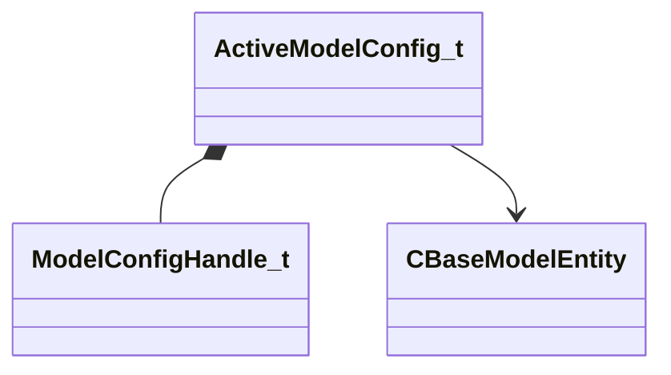

**Fields:**

| Name | Type | Annotations |
|------|------|-------------|
| `m_Handle` | [ModelConfigHandle_t](../schemas/client.md#modelconfighandle_t) |  |
| `m_Name` | CUtlSymbolLarge |  |
| `m_AssociatedEntities` | CNetworkUtlVectorBase< CHandle< [CBaseModelEntity](../schemas/server.md#cbasemodelentity) > > |  |
| `m_AssociatedEntityNames` | CNetworkUtlVectorBase< CUtlSymbolLarge > |  |

### AnimGraph2SerializedPoseRecipeSlot_t

**Fields:**

| Name | Type | Annotations |
|------|------|-------------|
| `m_topology` | CUtlBinaryBlock | `MNotSaved` |

### AutoRoomDoorwayPairs_t

**Fields:**

| Name | Type | Annotations |
|------|------|-------------|
| `vP1` | Vector |  |
| `vP2` | Vector |  |

### CAI_ChangeHintGroup

**Inherits from:** [CBaseEntity](server.md#cbaseentity)

**Relationships:**

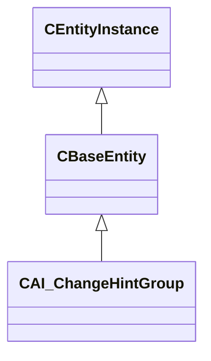

**Fields:**

| Name | Type | Annotations |
|------|------|-------------|
| `m_iSearchType` | int32 |  |
| `m_strSearchName` | CUtlSymbolLarge |  |
| `m_strNewHintGroup` | CUtlSymbolLarge |  |
| `m_flRadius` | float32 |  |

### CAI_Expresser

**Derived by:** [CAI_ExpresserWithFollowup](server.md#cai_expresserwithfollowup)

**Relationships:**

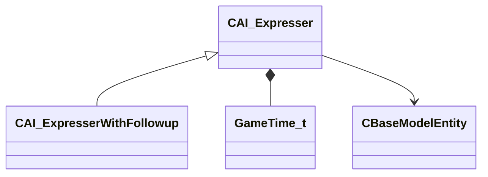

**Fields:**

| Name | Type | Annotations |
|------|------|-------------|
| `m_flStopTalkTime` | [GameTime_t](../schemas/entity2.md#gametime_t) |  |
| `m_flStopTalkTimeWithoutDelay` | [GameTime_t](../schemas/entity2.md#gametime_t) |  |
| `m_flQueuedSpeechTime` | [GameTime_t](../schemas/entity2.md#gametime_t) |  |
| `m_flBlockedTalkTime` | [GameTime_t](../schemas/entity2.md#gametime_t) |  |
| `m_voicePitch` | int32 |  |
| `m_flLastTimeAcceptedSpeak` | [GameTime_t](../schemas/entity2.md#gametime_t) |  |
| `m_bAllowSpeakingInterrupts` | bool |  |
| `m_bConsiderSceneInvolvementAsSpeech` | bool |  |
| `m_bSceneEntityDisabled` | bool |  |
| `m_nLastSpokenPriority` | int32 |  |
| `m_pOuter` | [CBaseModelEntity](../schemas/server.md#cbasemodelentity)* | `MNotSaved` |

### CAI_ExpresserWithFollowup

**Inherits from:** [CAI_Expresser](server.md#cai_expresser)

**Derived by:** [CMultiplayer_Expresser](server.md#cmultiplayer_expresser)

**Relationships:**

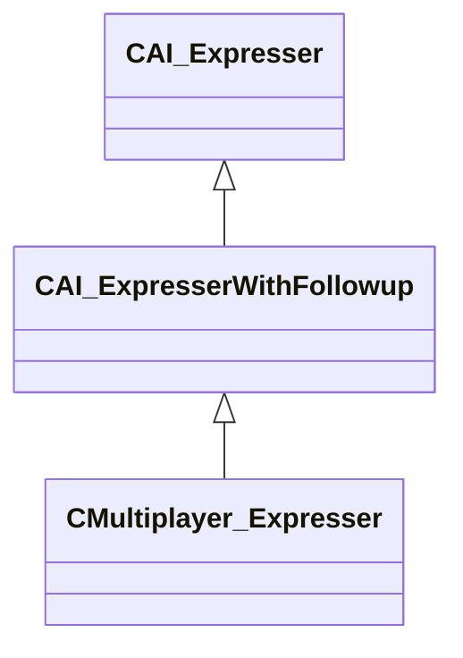

### CAK47

**Inherits from:** [CCSWeaponBaseGun](server.md#ccsweaponbasegun)

**Relationships:**

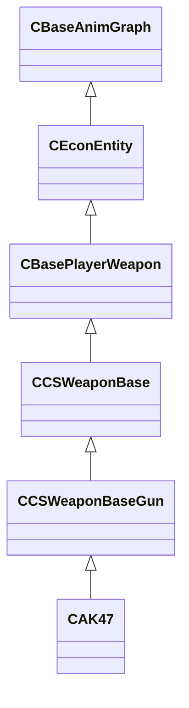

### CAmbientGeneric

**Inherits from:** [CPointEntity](server.md#cpointentity)

**Relationships:**

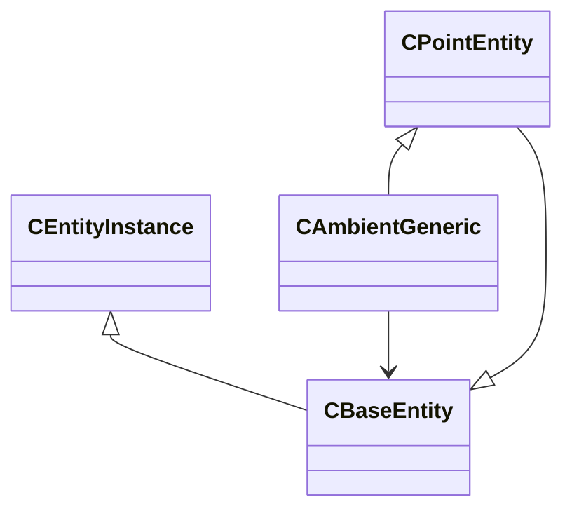

**Fields:**

| Name | Type | Annotations |
|------|------|-------------|
| `m_radius` | float32 |  |
| `m_flMaxRadius` | float32 |  |
| `m_iSoundLevel` | soundlevel_t |  |
| `m_dpv` | dynpitchvol_t |  |
| `m_fActive` | bool |  |
| `m_fLooping` | bool |  |
| `m_iszSound` | CUtlSymbolLarge |  |
| `m_sSourceEntName` | CUtlSymbolLarge |  |
| `m_hSoundSource` | CHandle< [CBaseEntity](../schemas/server.md#cbaseentity) > | `MNotSaved` |
| `m_nSoundSourceEntIndex` | CEntityIndex | `MNotSaved` |

### CAttributeContainer

**Inherits from:** [CAttributeManager](server.md#cattributemanager)

**Relationships:**

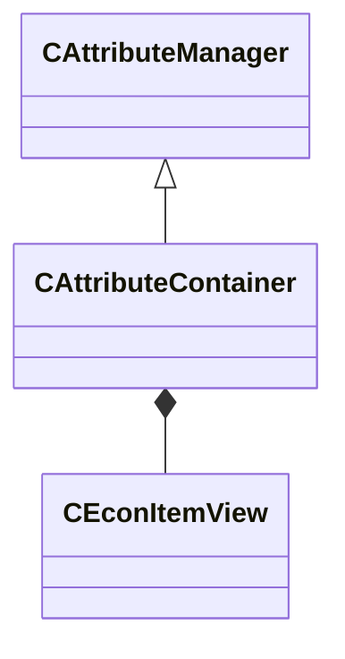

**Fields:**

| Name | Type | Annotations |
|------|------|-------------|
| `m_Item` | [CEconItemView](../schemas/server.md#ceconitemview) |  |

### CAttributeList

**Relationships:**

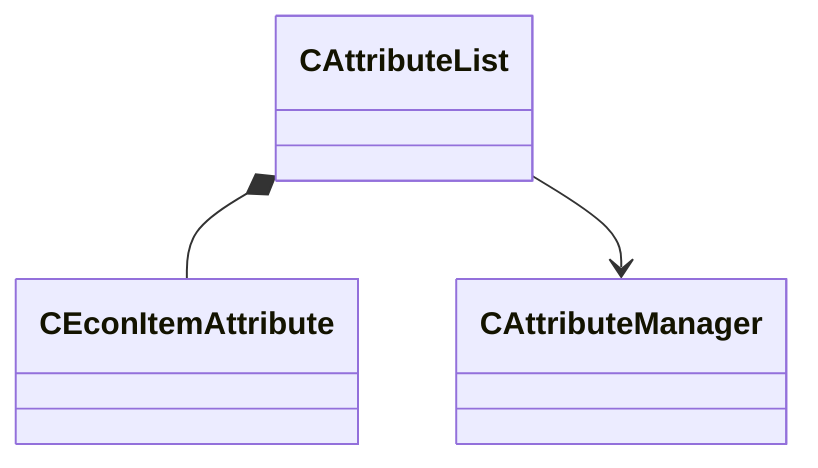

**Fields:**

| Name | Type | Annotations |
|------|------|-------------|
| `m_Attributes` | CUtlVectorEmbeddedNetworkVar< [CEconItemAttribute](../schemas/server.md#ceconitemattribute) > |  |
| `m_pManager` | [CAttributeManager](../schemas/server.md#cattributemanager)* |  |

### CAttributeManager

**Derived by:** [CAttributeContainer](server.md#cattributecontainer), [C_AttributeContainer](client.md#c_attributecontainer)

**Relationships:**

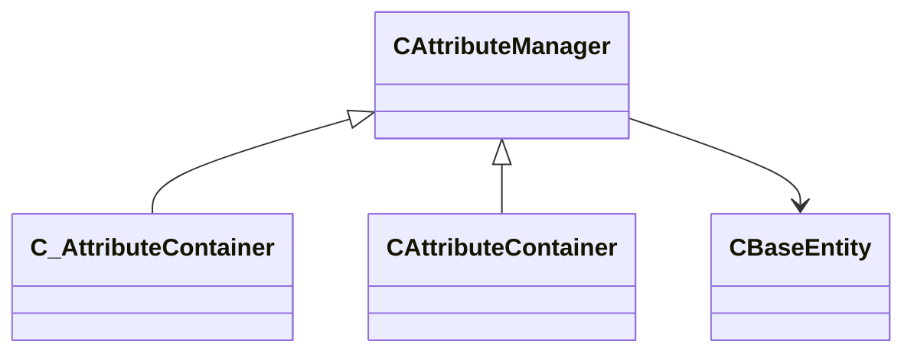

**Fields:**

| Name | Type | Annotations |
|------|------|-------------|
| `m_Providers` | CUtlVector< CHandle< [CBaseEntity](../schemas/server.md#cbaseentity) > > |  |
| `m_iReapplyProvisionParity` | int32 |  |
| `m_hOuter` | CHandle< [CBaseEntity](../schemas/server.md#cbaseentity) > |  |
| `m_bPreventLoopback` | bool |  |
| `m_ProviderType` | attributeprovidertypes_t |  |
| `m_CachedResults` | CUtlVector< [CAttributeManager](../schemas/server.md#cattributemanager)::cached_attribute_float_t > |  |

### CAttributeManager

**Derived by:** [CAttributeContainer](server.md#cattributecontainer), [C_AttributeContainer](client.md#c_attributecontainer)

**Relationships:**

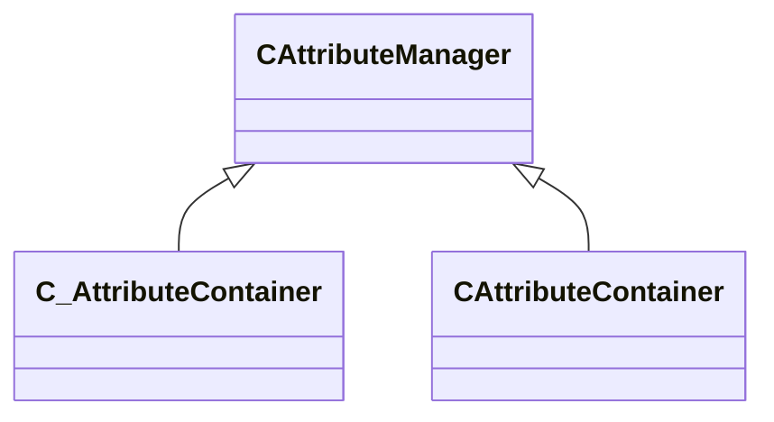

**Fields:**

| Name | Type | Annotations |
|------|------|-------------|
| `flIn` | float32 |  |
| `iAttribHook` | CUtlSymbolLarge |  |
| `flOut` | float32 |  |

### CBarnLight

**Inherits from:** [CBaseModelEntity](server.md#cbasemodelentity)

**Derived by:** [COmniLight](server.md#comnilight), [CRectLight](server.md#crectlight)

**Metadata:** `MEntityAllowsPortraitWorldSpawn`

**Relationships:**

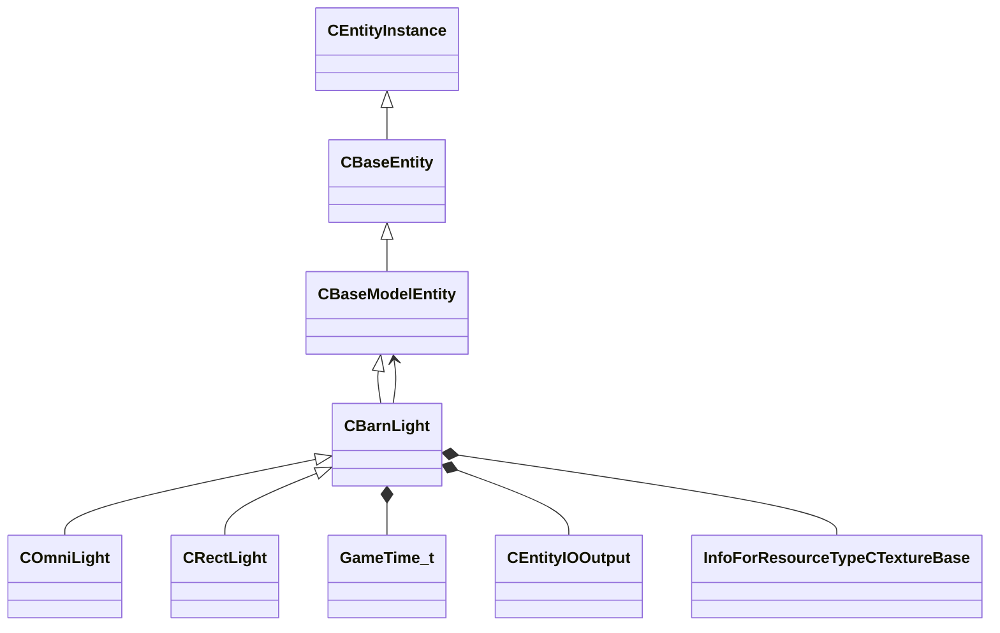

**Fields:**

| Name | Type | Annotations |
|------|------|-------------|
| `m_bEnabled` | bool |  |
| `m_nColorMode` | int32 |  |
| `m_Color` | Color |  |
| `m_flColorTemperature` | float32 |  |
| `m_flBrightness` | float32 |  |
| `m_flBrightnessScale` | float32 |  |
| `m_nDirectLight` | int32 |  |
| `m_nBakedShadowIndex` | int32 |  |
| `m_nLightPathUniqueId` | int32 |  |
| `m_nLightMapUniqueId` | int32 |  |
| `m_nLuminaireShape` | int32 |  |
| `m_flLuminaireSize` | float32 |  |
| `m_flLuminaireAnisotropy` | float32 |  |
| `m_LightStyleString` | CUtlString |  |
| `m_flLightStyleStartTime` | [GameTime_t](../schemas/entity2.md#gametime_t) |  |
| `m_QueuedLightStyleStrings` | CNetworkUtlVectorBase< CUtlString > |  |
| `m_LightStyleEvents` | CNetworkUtlVectorBase< CUtlString > |  |
| `m_LightStyleTargets` | CNetworkUtlVectorBase< CHandle< [CBaseModelEntity](../schemas/server.md#cbasemodelentity) > > |  |
| `m_StyleEvent` | [CEntityIOOutput](../schemas/entity2.md#centityiooutput)[4] |  |
| `m_hLightCookie` | CStrongHandle< [InfoForResourceTypeCTextureBase](../schemas/resourcesystem.md#infoforresourcetypectexturebase) > |  |
| `m_flShape` | float32 |  |
| `m_flSoftX` | float32 |  |
| `m_flSoftY` | float32 |  |
| `m_flSkirt` | float32 |  |
| `m_flSkirtNear` | float32 |  |
| `m_vSizeParams` | Vector |  |
| `m_flRange` | float32 |  |
| `m_vShear` | Vector |  |
| `m_nBakeSpecularToCubemaps` | int32 |  |
| `m_vBakeSpecularToCubemapsSize` | Vector |  |
| `m_flBakeSpecularToCubemapsScale` | float32 |  |
| `m_nCastShadows` | int32 |  |
| `m_nShadowMapSize` | int32 |  |
| `m_nShadowPriority` | int32 |  |
| `m_bContactShadow` | bool |  |
| `m_bForceShadowsEnabled` | bool |  |
| `m_nBounceLight` | int32 |  |
| `m_flBounceScale` | float32 |  |
| `m_flMinRoughness` | float32 |  |
| `m_vAlternateColor` | Vector |  |
| `m_fAlternateColorBrightness` | float32 |  |
| `m_nFog` | int32 |  |
| `m_flFogStrength` | float32 |  |
| `m_nFogShadows` | int32 |  |
| `m_flFogScale` | float32 |  |
| `m_flFadeSizeStart` | float32 |  |
| `m_flFadeSizeEnd` | float32 |  |
| `m_flShadowFadeSizeStart` | float32 |  |
| `m_flShadowFadeSizeEnd` | float32 |  |
| `m_bPrecomputedFieldsValid` | bool |  |
| `m_vPrecomputedBoundsMins` | Vector |  |
| `m_vPrecomputedBoundsMaxs` | Vector |  |
| `m_vPrecomputedOBBOrigin` | Vector |  |
| `m_vPrecomputedOBBAngles` | QAngle |  |
| `m_vPrecomputedOBBExtent` | Vector |  |
| `m_nPrecomputedSubFrusta` | int32 |  |
| `m_vPrecomputedOBBOrigin0` | Vector |  |
| `m_vPrecomputedOBBAngles0` | QAngle |  |
| `m_vPrecomputedOBBExtent0` | Vector |  |
| `m_vPrecomputedOBBOrigin1` | Vector |  |
| `m_vPrecomputedOBBAngles1` | QAngle |  |
| `m_vPrecomputedOBBExtent1` | Vector |  |
| `m_vPrecomputedOBBOrigin2` | Vector |  |
| `m_vPrecomputedOBBAngles2` | QAngle |  |
| `m_vPrecomputedOBBExtent2` | Vector |  |
| `m_vPrecomputedOBBOrigin3` | Vector |  |
| `m_vPrecomputedOBBAngles3` | QAngle |  |
| `m_vPrecomputedOBBExtent3` | Vector |  |
| `m_vPrecomputedOBBOrigin4` | Vector |  |
| `m_vPrecomputedOBBAngles4` | QAngle |  |
| `m_vPrecomputedOBBExtent4` | Vector |  |
| `m_vPrecomputedOBBOrigin5` | Vector |  |
| `m_vPrecomputedOBBAngles5` | QAngle |  |
| `m_vPrecomputedOBBExtent5` | Vector |  |
| `m_bPvsModifyEntity` | bool |  |
| `m_bTransmitAlways` | bool |  |
| `m_VisClusters` | CNetworkUtlVectorBase< uint16 > |  |

### CBaseAnimGraph

**Inherits from:** [CBaseModelEntity](server.md#cbasemodelentity)

**Derived by:** [CBaseCombatCharacter](server.md#cbasecombatcharacter), [CBaseGrenade](server.md#cbasegrenade), [CBaseProp](client.md#cbaseprop), [CConstraintAnchor](server.md#cconstraintanchor), [CEconEntity](server.md#ceconentity), [CFish](server.md#cfish), [CHostageCarriableProp](server.md#chostagecarriableprop), [CItem](server.md#citem), [CItemSoda](server.md#citemsoda), [CPhysMagnet](server.md#cphysmagnet), [CPlantedC4](server.md#cplantedc4), [CPointCommentaryNode](server.md#cpointcommentarynode), [CRagdollProp](server.md#cragdollprop), [CWaterBullet](server.md#cwaterbullet), [C_BaseCombatCharacter](client.md#c_basecombatcharacter), [C_BaseGrenade](client.md#c_basegrenade), [C_BulletHitModel](client.md#c_bullethitmodel), [C_CS2WeaponModuleBase](client.md#c_cs2weaponmodulebase), [C_CSGO_PreviewModel](client.md#c_csgo_previewmodel), [C_ClientRagdoll](client.md#c_clientragdoll), [C_EconEntity](client.md#c_econentity), [C_Fish](client.md#c_fish), [C_HostageCarriableProp](client.md#c_hostagecarriableprop), [C_LateUpdatedAnimating](client.md#c_lateupdatedanimating), [C_LocalTempEntity](client.md#c_localtempentity), [C_Multimeter](client.md#c_multimeter), [C_PhysMagnet](client.md#c_physmagnet), [C_PlantedC4](client.md#c_plantedc4), [C_PointCommentaryNode](client.md#c_pointcommentarynode), [C_RagdollProp](client.md#c_ragdollprop), [C_WaterBullet](client.md#c_waterbullet), [C_WorldModelGloves](client.md#c_worldmodelgloves)

**Relationships:**

```mermaid
classDiagram
    CBaseModelEntity <|-- CBaseAnimGraph
    CBaseEntity <|-- CBaseModelEntity
    CEntityInstance <|-- CBaseEntity
    CBaseAnimGraph <|-- CBaseProp
    CBaseAnimGraph <|-- C_BaseCombatCharacter
    CBaseAnimGraph <|-- C_BaseGrenade
    CBaseAnimGraph <|-- C_BulletHitModel
    CBaseAnimGraph <|-- C_CS2WeaponModuleBase
    CBaseAnimGraph <|-- C_CSGO_PreviewModel
    CBaseAnimGraph <|-- C_ClientRagdoll
    CBaseAnimGraph <|-- C_EconEntity
    CBaseAnimGraph <|-- C_Fish
    CBaseAnimGraph <|-- C_HostageCarriableProp
    CBaseAnimGraph <|-- C_LateUpdatedAnimating
    CBaseAnimGraph <|-- C_LocalTempEntity
    CBaseAnimGraph <|-- C_Multimeter
    CBaseAnimGraph <|-- C_PhysMagnet
    CBaseAnimGraph <|-- C_PlantedC4
    CBaseAnimGraph <|-- C_PointCommentaryNode
    CBaseAnimGraph <|-- C_RagdollProp
    CBaseAnimGraph <|-- C_WaterBullet
    CBaseAnimGraph <|-- C_WorldModelGloves
    CBaseAnimGraph <|-- CBaseCombatCharacter
    CBaseAnimGraph <|-- CBaseGrenade
    CBaseAnimGraph <|-- CConstraintAnchor
    CBaseAnimGraph <|-- CEconEntity
    CBaseAnimGraph <|-- CFish
    CBaseAnimGraph <|-- CHostageCarriableProp
    CBaseAnimGraph <|-- CItem
    CBaseAnimGraph <|-- CItemSoda
    CBaseAnimGraph <|-- CPhysMagnet
    CBaseAnimGraph <|-- CPlantedC4
    CBaseAnimGraph <|-- CPointCommentaryNode
    CBaseAnimGraph <|-- CRagdollProp
    CBaseAnimGraph <|-- CWaterBullet
    CBaseAnimGraph *-- CAnimGraphControllerManager
    CBaseAnimGraph --> CAnimGraphControllerBase
    CBaseAnimGraph --> IChoreoServices
    CBaseAnimGraph --> IPhysicsRagdollControl
    CBaseAnimGraph *-- PhysicsRagdollPose_t
```

**Fields:**

| Name | Type | Annotations |
|------|------|-------------|
| `m_graphControllerManager` | [CAnimGraphControllerManager](../schemas/client.md#canimgraphcontrollermanager) | `MSaveOpsForField = "GetAnimGraphControllerManagerSaveRestoreOps"` |
| `m_pMainGraphController` | [CAnimGraphControllerBase](../schemas/client.md#canimgraphcontrollerbase)* | `MSaveOpsForField = "GetAnimGraphControllerPtrSaveRestoreOps"` |
| `m_bInitiallyPopulateInterpHistory` | bool |  |
| `m_pChoreoServices` | [IChoreoServices](../schemas/client.md#ichoreoservices)* | `MSaveOpsForField = "GetChoreoServicesSaveRestoreOps"` |
| `m_bAnimGraphUpdateEnabled` | bool |  |
| `m_bAnimationUpdateScheduled` | bool | `MNotSaved` |
| `m_vecForce` | Vector | `MNotSaved` |
| `m_nForceBone` | int32 | `MNotSaved` |
| `m_pRagdollControl` | [IPhysicsRagdollControl](../schemas/vphysics2.md#iphysicsragdollcontrol)* | `MPhysPtr` |
| `m_RagdollPose` | [PhysicsRagdollPose_t](../schemas/server.md#physicsragdollpose_t) |  |
| `m_bRagdollEnabled` | bool |  |
| `m_bRagdollClientSide` | bool | `MNotSaved` |
| `m_xParentedRagdollRootInEntitySpace` | CTransform |  |

### CBaseAnimGraphController

**Inherits from:** [CSkeletonAnimationController](client.md#cskeletonanimationcontroller)

**Relationships:**

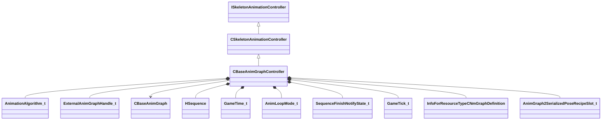

**Fields:**

| Name | Type | Annotations |
|------|------|-------------|
| `m_nAnimationAlgorithm` | [AnimationAlgorithm_t](../schemas/client.md#animationalgorithm_t) |  |
| `m_nNextExternalGraphHandle` | [ExternalAnimGraphHandle_t](../schemas/client.md#externalanimgraphhandle_t) |  |
| `m_vecSecondarySkeletonSlotIDs` | CNetworkUtlVectorBase< CGlobalSymbol > |  |
| `m_vecSecondarySkeletons` | CNetworkUtlVectorBase< CHandle< [CBaseAnimGraph](../schemas/server.md#cbaseanimgraph) > > |  |
| `m_nSecondarySkeletonMasterCount` | int32 |  |
| `m_flSoundSyncTime` | float32 |  |
| `m_nActiveIKChainMask` | uint32 |  |
| `m_hSequence` | [HSequence](../schemas/animationsystem.md#hsequence) |  |
| `m_flSeqStartTime` | [GameTime_t](../schemas/entity2.md#gametime_t) |  |
| `m_flSeqFixedCycle` | float32 |  |
| `m_nAnimLoopMode` | [AnimLoopMode_t](../schemas/client.md#animloopmode_t) |  |
| `m_flPlaybackRate` | CNetworkedQuantizedFloat |  |
| `m_nNotifyState` | [SequenceFinishNotifyState_t](../schemas/client.md#sequencefinishnotifystate_t) |  |
| `m_bNetworkedAnimationInputsChanged` | bool |  |
| `m_bNetworkedSequenceChanged` | bool |  |
| `m_bLastUpdateSkipped` | bool |  |
| `m_bSequenceFinished` | bool |  |
| `m_nPrevAnimUpdateTick` | [GameTick_t](../schemas/entity2.md#gametick_t) |  |
| `m_hGraphDefinitionAG2` | CStrongHandle< [InfoForResourceTypeCNmGraphDefinition](../schemas/resourcesystem.md#infoforresourcetypecnmgraphdefinition) > |  |
| `m_SerializePoseRecipeAG2Slots` | CUtlVectorEmbeddedNetworkVar< [AnimGraph2SerializedPoseRecipeSlot_t](../schemas/server.md#animgraph2serializedposerecipeslot_t) > | `MNotSaved` |
| `m_SerializePoseRecipeAG2Dynamic` | CNetworkUtlVectorBase< uint8 > | `MNotSaved` |
| `m_nSerializePoseRecipeAG2ActiveSlot` | uint32 | `MNotSaved` |
| `m_nSerializePoseRecipeVersionAG2` | int32 | `MNotSaved` |
| `m_nServerGraphInstanceIteration` | int32 |  |
| `m_nServerSerializationContextIteration` | int32 |  |
| `m_primaryGraphId` | [ResourceId_t](../schemas/resourcefile.md#resourceid_t) |  |
| `m_vecExternalGraphIds` | CNetworkUtlVectorBase< [ResourceId_t](../schemas/resourcefile.md#resourceid_t) > |  |
| `m_vecExternalClipIds` | CNetworkUtlVectorBase< [ResourceId_t](../schemas/resourcefile.md#resourceid_t) > |  |
| `m_sAnimGraph2Identifier` | CGlobalSymbol |  |
| `m_pGraphInstanceAG2` | [CNmGraphInstance](../schemas/animlib.md#cnmgraphinstance)* | `MSaveOpsForField = "GetAnimGraph2SaveRestoreOps"` |
| `m_vecExternalGraphs` | CUtlVector< [ExternalAnimGraph_t](../schemas/client.md#externalanimgraph_t) > | `MSaveOpsForField = "GetExternalAnimGraphSaveRestoreOps"` |

### CBaseButton

**Inherits from:** [CBaseToggle](server.md#cbasetoggle)

**Derived by:** [CPhysicalButton](server.md#cphysicalbutton), [CRotButton](server.md#crotbutton)

**Relationships:**

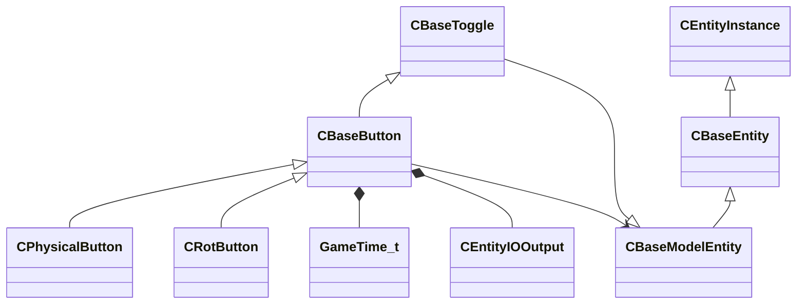

**Fields:**

| Name | Type | Annotations |
|------|------|-------------|
| `m_angMoveEntitySpace` | QAngle |  |
| `m_fStayPushed` | bool |  |
| `m_fRotating` | bool |  |
| `m_ls` | locksound_t | `MNotSaved` |
| `m_sUseSound` | CUtlSymbolLarge |  |
| `m_sLockedSound` | CUtlSymbolLarge |  |
| `m_sUnlockedSound` | CUtlSymbolLarge |  |
| `m_sOverrideAnticipationName` | CUtlSymbolLarge |  |
| `m_bLocked` | bool |  |
| `m_bDisabled` | bool |  |
| `m_flUseLockedTime` | [GameTime_t](../schemas/entity2.md#gametime_t) |  |
| `m_bSolidBsp` | bool |  |
| `m_OnDamaged` | [CEntityIOOutput](../schemas/entity2.md#centityiooutput) |  |
| `m_OnPressed` | [CEntityIOOutput](../schemas/entity2.md#centityiooutput) |  |
| `m_OnUseLocked` | [CEntityIOOutput](../schemas/entity2.md#centityiooutput) |  |
| `m_OnIn` | [CEntityIOOutput](../schemas/entity2.md#centityiooutput) |  |
| `m_OnOut` | [CEntityIOOutput](../schemas/entity2.md#centityiooutput) |  |
| `m_nState` | int32 | `MNotSaved` |
| `m_hConstraint` | CEntityHandle |  |
| `m_hConstraintParent` | CEntityHandle |  |
| `m_bForceNpcExclude` | bool | `MNotSaved` |
| `m_sGlowEntity` | CUtlSymbolLarge |  |
| `m_glowEntity` | CHandle< [CBaseModelEntity](../schemas/server.md#cbasemodelentity) > | `MNotSaved` |
| `m_usable` | bool |  |
| `m_szDisplayText` | CUtlSymbolLarge | `MNotSaved` |

### CBaseCSGrenade

**Inherits from:** [CCSWeaponBase](server.md#ccsweaponbase)

**Derived by:** [CDecoyGrenade](server.md#cdecoygrenade), [CFlashbang](server.md#cflashbang), [CHEGrenade](server.md#chegrenade), [CMolotovGrenade](server.md#cmolotovgrenade), [CSmokeGrenade](server.md#csmokegrenade)

**Relationships:**

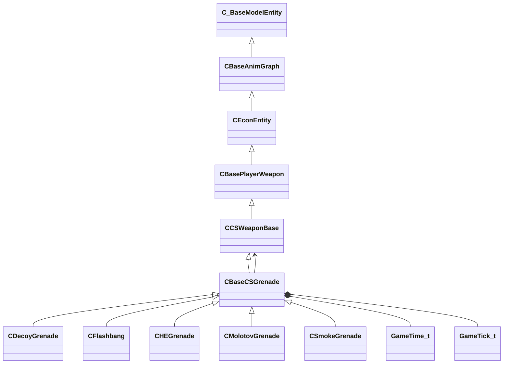

**Fields:**

| Name | Type | Annotations |
|------|------|-------------|
| `m_bRedraw` | bool |  |
| `m_bIsHeldByPlayer` | bool |  |
| `m_bPinPulled` | bool |  |
| `m_bJumpThrow` | bool |  |
| `m_bThrowAnimating` | bool |  |
| `m_fThrowTime` | [GameTime_t](../schemas/entity2.md#gametime_t) |  |
| `m_flThrowStrength` | float32 |  |
| `m_fDropTime` | [GameTime_t](../schemas/entity2.md#gametime_t) |  |
| `m_fPinPullTime` | [GameTime_t](../schemas/entity2.md#gametime_t) |  |
| `m_bJustPulledPin` | bool |  |
| `m_nNextHoldTick` | [GameTick_t](../schemas/entity2.md#gametick_t) |  |
| `m_flNextHoldFrac` | float32 |  |
| `m_hSwitchToWeaponAfterThrow` | CHandle< [CCSWeaponBase](../schemas/server.md#ccsweaponbase) > |  |

### CBaseCSGrenadeProjectile

Base class for all CS2 grenade projectile entities (HE, flash, smoke, molotov, decoy).  Tracks the initial throw parameters so clients can predict the trajectory.


**Inherits from:** [CBaseGrenade](server.md#cbasegrenade)

**Derived by:** [CDecoyProjectile](server.md#cdecoyprojectile), [CFlashbangProjectile](server.md#cflashbangprojectile), [CHEGrenadeProjectile](server.md#chegrenadeprojectile), [CMolotovProjectile](server.md#cmolotovprojectile), [CSmokeGrenadeProjectile](server.md#csmokegrenadeprojectile)

**Relationships:**

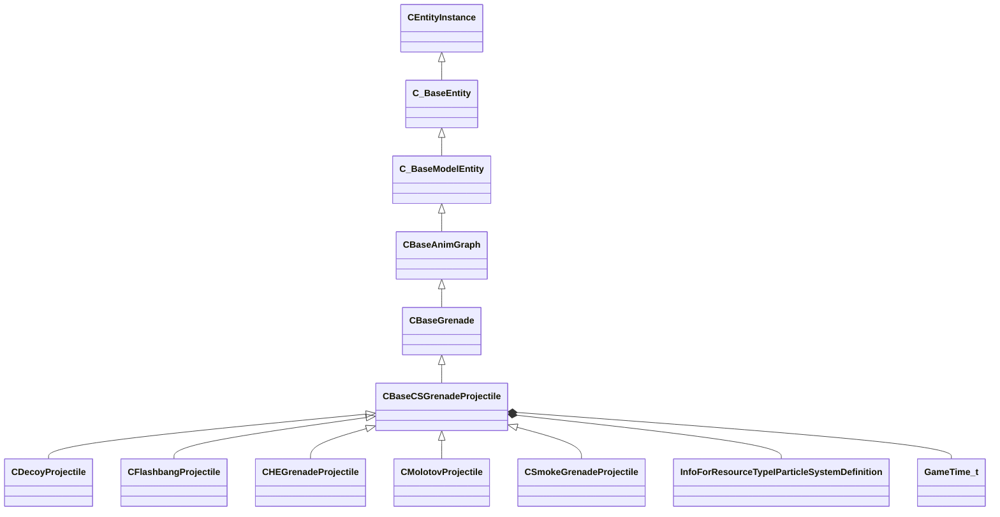

**Fields:**

| Name | Type | Annotations |
|------|------|-------------|
| `m_vInitialPosition` | Vector | World-space position from which the grenade was thrown. |
| `m_vInitialVelocity` | Vector | Initial velocity vector (world units per second) at the moment of throw. |
| `m_nBounces` | int32 | Number of times the grenade has bounced off a surface so far. |
| `m_nExplodeEffectIndex` | CStrongHandle< [InfoForResourceTypeIParticleSystemDefinition](../schemas/resourcesystem.md#infoforresourcetypeiparticlesystemdefinition) > | Particle system definition handle for the detonation effect. |
| `m_nExplodeEffectTickBegin` | int32 | Server tick at which the explosion particle effect started. |
| `m_vecExplodeEffectOrigin` | Vector | World-space position of the explosion centre. |
| `m_flSpawnTime` | [GameTime_t](../schemas/entity2.md#gametime_t) |  |
| `m_unOGSExtraFlags` | uint8 |  |
| `m_bDetonationRecorded` | bool |  |
| `m_nItemIndex` | uint16 |  |
| `m_vecOriginalSpawnLocation` | Vector |  |
| `m_flLastBounceSoundTime` | [GameTime_t](../schemas/entity2.md#gametime_t) |  |
| `m_vecGrenadeSpin` | RotationVector |  |
| `m_vecLastHitSurfaceNormal` | Vector |  |
| `m_nTicksAtZeroVelocity` | int32 |  |
| `m_bHasEverHitEnemy` | bool |  |

### CBaseClientUIEntity

**Inherits from:** [CBaseModelEntity](server.md#cbasemodelentity)

**Derived by:** [CPointClientUIDialog](server.md#cpointclientuidialog), [CPointClientUIWorldPanel](server.md#cpointclientuiworldpanel)

**Relationships:**

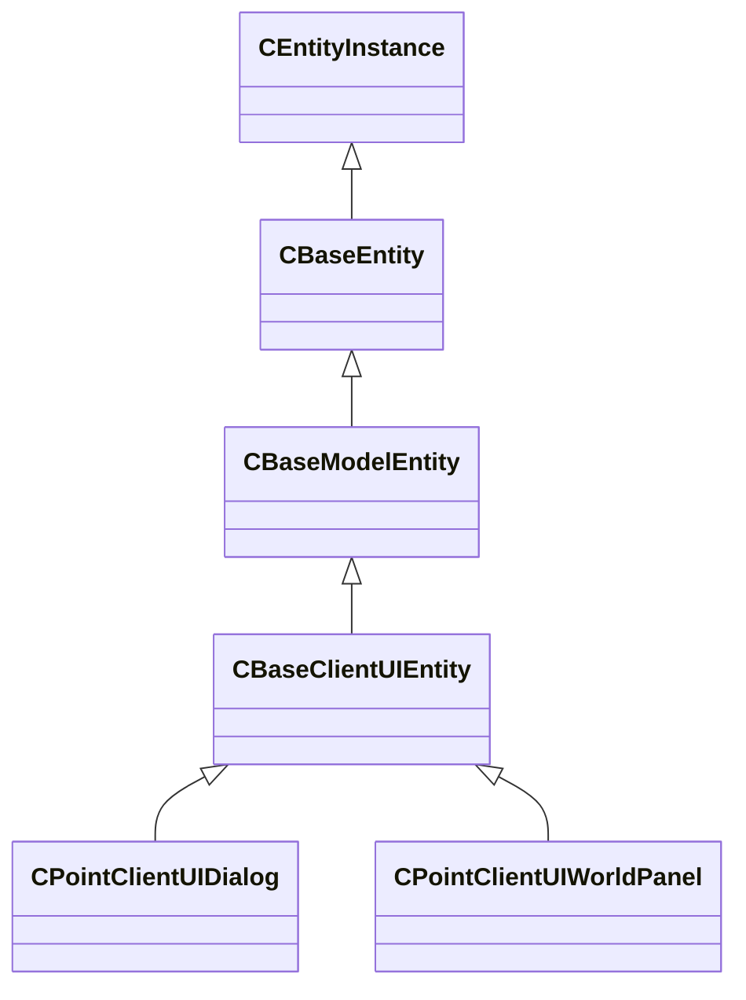

**Fields:**

| Name | Type | Annotations |
|------|------|-------------|
| `m_bEnabled` | bool |  |
| `m_DialogXMLName` | CUtlSymbolLarge |  |
| `m_PanelClassName` | CUtlSymbolLarge |  |
| `m_PanelID` | CUtlSymbolLarge |  |
| `m_CustomOutput0` | CEntityOutputTemplate< CUtlString > |  |
| `m_CustomOutput1` | CEntityOutputTemplate< CUtlString > |  |
| `m_CustomOutput2` | CEntityOutputTemplate< CUtlString > |  |
| `m_CustomOutput3` | CEntityOutputTemplate< CUtlString > |  |
| `m_CustomOutput4` | CEntityOutputTemplate< CUtlString > |  |
| `m_CustomOutput5` | CEntityOutputTemplate< CUtlString > |  |
| `m_CustomOutput6` | CEntityOutputTemplate< CUtlString > |  |
| `m_CustomOutput7` | CEntityOutputTemplate< CUtlString > |  |
| `m_CustomOutput8` | CEntityOutputTemplate< CUtlString > |  |
| `m_CustomOutput9` | CEntityOutputTemplate< CUtlString > |  |

### CBaseCombatCharacter

**Inherits from:** [CBaseAnimGraph](server.md#cbaseanimgraph)

**Derived by:** [CBasePlayerPawn](server.md#cbaseplayerpawn), [CHostageExpresserShim](server.md#chostageexpressershim)

**Relationships:**

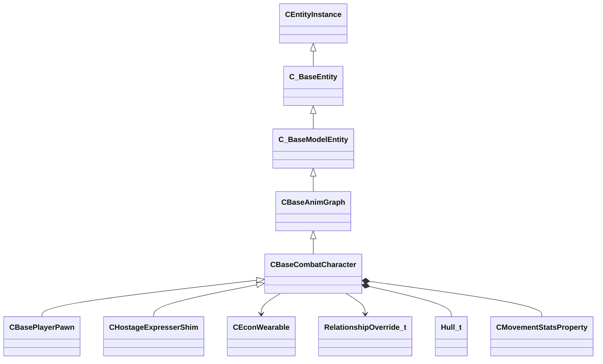

**Fields:**

| Name | Type | Annotations |
|------|------|-------------|
| `m_bForceServerRagdoll` | bool |  |
| `m_hMyWearables` | CNetworkUtlVectorBase< CHandle< [CEconWearable](../schemas/server.md#ceconwearable) > > | `MNotSaved` |
| `m_impactEnergyScale` | float32 |  |
| `m_bApplyStressDamage` | bool |  |
| `m_bDeathEventsDispatched` | bool |  |
| `m_pVecRelationships` | CUtlVector< [RelationshipOverride_t](../schemas/server.md#relationshipoverride_t) >* | `MNotSaved` |
| `m_strRelationships` | CUtlSymbolLarge |  |
| `m_eHull` | [Hull_t](../schemas/client.md#hull_t) |  |
| `m_nNavHullIdx` | uint32 |  |
| `m_movementStats` | [CMovementStatsProperty](../schemas/server.md#cmovementstatsproperty) |  |

### CBaseDMStart

**Inherits from:** [CPointEntity](server.md#cpointentity)

**Relationships:**

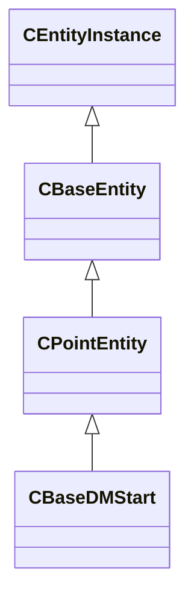

**Fields:**

| Name | Type | Annotations |
|------|------|-------------|
| `m_Master` | CUtlSymbolLarge |  |

### CBaseDoor

**Inherits from:** [CBaseToggle](server.md#cbasetoggle)

**Derived by:** [CRotDoor](server.md#crotdoor)

**Relationships:**

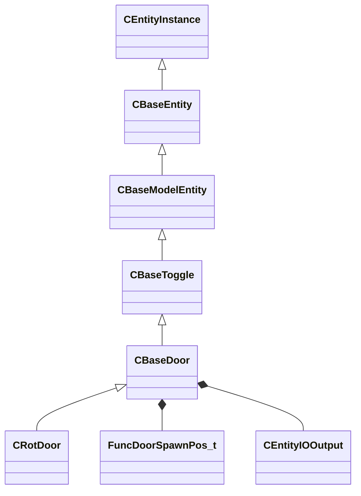

**Fields:**

| Name | Type | Annotations |
|------|------|-------------|
| `m_angMoveEntitySpace` | QAngle |  |
| `m_vecMoveDirParentSpace` | Vector |  |
| `m_ls` | locksound_t | `MNotSaved` |
| `m_bForceClosed` | bool |  |
| `m_bDoorGroup` | bool |  |
| `m_bLocked` | bool |  |
| `m_bIgnoreDebris` | bool |  |
| `m_bNoNPCs` | bool |  |
| `m_eSpawnPosition` | [FuncDoorSpawnPos_t](../schemas/server.md#funcdoorspawnpos_t) |  |
| `m_flBlockDamage` | float32 |  |
| `m_NoiseMoving` | CUtlSymbolLarge |  |
| `m_NoiseArrived` | CUtlSymbolLarge |  |
| `m_NoiseMovingClosed` | CUtlSymbolLarge |  |
| `m_NoiseArrivedClosed` | CUtlSymbolLarge |  |
| `m_ChainTarget` | CUtlSymbolLarge |  |
| `m_OnBlockedClosing` | [CEntityIOOutput](../schemas/entity2.md#centityiooutput) |  |
| `m_OnBlockedOpening` | [CEntityIOOutput](../schemas/entity2.md#centityiooutput) |  |
| `m_OnUnblockedClosing` | [CEntityIOOutput](../schemas/entity2.md#centityiooutput) |  |
| `m_OnUnblockedOpening` | [CEntityIOOutput](../schemas/entity2.md#centityiooutput) |  |
| `m_OnFullyClosed` | [CEntityIOOutput](../schemas/entity2.md#centityiooutput) |  |
| `m_OnFullyOpen` | [CEntityIOOutput](../schemas/entity2.md#centityiooutput) |  |
| `m_OnClose` | [CEntityIOOutput](../schemas/entity2.md#centityiooutput) |  |
| `m_OnOpen` | [CEntityIOOutput](../schemas/entity2.md#centityiooutput) |  |
| `m_OnLockedUse` | [CEntityIOOutput](../schemas/entity2.md#centityiooutput) |  |
| `m_bLoopMoveSound` | bool |  |
| `m_bCreateNavObstacle` | bool |  |
| `m_isChaining` | bool | `MNotSaved` |
| `m_bIsUsable` | bool | `MNotSaved` |

### CBaseEntity

Root entity class in Source 2 from which all server-side entities derive. Provides health, team, physics, timing, and transmit state.


**Inherits from:** [CEntityInstance](entity2.md#centityinstance)

**Derived by:** [CAI_ChangeHintGroup](server.md#cai_changehintgroup), [CBaseModelEntity](server.md#cbasemodelentity), [CCSGO_EndOfMatchLineupEndpoint](server.md#ccsgo_endofmatchlineupendpoint), [CCSGO_TeamPreviewCharacterPosition](server.md#ccsgo_teampreviewcharacterposition), [CCSMinimapBoundary](server.md#ccsminimapboundary), [CCSPetPlacement](server.md#ccspetplacement), [CCSPlayerResource](server.md#ccsplayerresource), [CCSPointScriptEntity](server.md#ccspointscriptentity), [CColorCorrection](server.md#ccolorcorrection), [CCommentaryAuto](server.md#ccommentaryauto), [CDebugHistory](server.md#cdebughistory), [CEnableMotionFixup](server.md#cenablemotionfixup), [CEntityFlame](server.md#centityflame), [CEnvBeverage](server.md#cenvbeverage), [CEnvCombinedLightProbeVolume](server.md#cenvcombinedlightprobevolume), [CEnvCubemap](server.md#cenvcubemap), [CEnvCubemapFog](server.md#cenvcubemapfog), [CEnvDetailController](server.md#cenvdetailcontroller), [CEnvEntityIgniter](server.md#cenventityigniter), [CEnvLightProbeVolume](server.md#cenvlightprobevolume), [CEnvVolumetricFogController](server.md#cenvvolumetricfogcontroller), [CEnvVolumetricFogVolume](server.md#cenvvolumetricfogvolume), [CEnvWind](server.md#cenvwind), [CEnvWindController](server.md#cenvwindcontroller), [CEnvWindVolume](server.md#cenvwindvolume), [CFishPool](server.md#cfishpool), [CFogController](server.md#cfogcontroller), [CFuncPropRespawnZone](server.md#cfuncproprespawnzone), [CFuncTimescale](server.md#cfunctimescale), [CGameGibManager](server.md#cgamegibmanager), [CGameRulesProxy](server.md#cgamerulesproxy), [CGradientFog](server.md#cgradientfog), [CHandleDummy](server.md#chandledummy), [CHandleTest](server.md#chandletest), [CInfoLadderDismount](server.md#cinfoladderdismount), [CInfoVisibilityBox](server.md#cinfovisibilitybox), [CLogicAuto](server.md#clogicauto), [CLogicNPCCounter](server.md#clogicnpccounter), [CMapVetoPickController](server.md#cmapvetopickcontroller), [CNullEntity](server.md#cnullentity), [CPathParticleRope](server.md#cpathparticlerope), [CPhysicsSpring](server.md#cphysicsspring), [CPhysicsWire](server.md#cphysicswire), [CPlayerPing](server.md#cplayerping), [CPlayerVisibility](server.md#cplayervisibility), [CPointCamera](server.md#cpointcamera), [CPointEntity](server.md#cpointentity), [CPointEntityFinder](server.md#cpointentityfinder), [CPointPulse](server.md#cpointpulse), [CPointValueRemapper](server.md#cpointvalueremapper), [CScriptedSequence](server.md#cscriptedsequence), [CServerOnlyEntity](server.md#cserveronlyentity), [CSkyCamera](server.md#cskycamera), [CSoundAreaEntityBase](server.md#csoundareaentitybase), [CSoundEventEntity](server.md#csoundevententity), [CSoundEventParameter](server.md#csoundeventparameter), [CSoundOpvarSetEntity](server.md#csoundopvarsetentity), [CSoundOpvarSetPointBase](server.md#csoundopvarsetpointbase), [CTeam](server.md#cteam), [CTestEffect](server.md#ctesteffect), [CTonemapController2](server.md#ctonemapcontroller2), [CVoteController](server.md#cvotecontroller)

**Relationships:**

```mermaid
classDiagram
    CEntityInstance <|-- CBaseEntity
    CBaseEntity <|-- CAI_ChangeHintGroup
    CBaseEntity <|-- CBaseModelEntity
    CBaseEntity <|-- CCSGO_EndOfMatchLineupEndpoint
    CBaseEntity <|-- CCSGO_TeamPreviewCharacterPosition
    CBaseEntity <|-- CCSMinimapBoundary
    CBaseEntity <|-- CCSPetPlacement
    CBaseEntity <|-- CCSPlayerResource
    CBaseEntity <|-- CCSPointScriptEntity
    CBaseEntity <|-- CColorCorrection
    CBaseEntity <|-- CCommentaryAuto
    CBaseEntity <|-- CDebugHistory
    CBaseEntity <|-- CEnableMotionFixup
    CBaseEntity <|-- CEntityFlame
    CBaseEntity <|-- CEnvBeverage
    CBaseEntity <|-- CEnvCombinedLightProbeVolume
    CBaseEntity <|-- CEnvCubemap
    CBaseEntity <|-- CEnvCubemapFog
    CBaseEntity <|-- CEnvDetailController
    CBaseEntity <|-- CEnvEntityIgniter
    CBaseEntity <|-- CEnvLightProbeVolume
    CBaseEntity <|-- CEnvVolumetricFogController
    CBaseEntity <|-- CEnvVolumetricFogVolume
    CBaseEntity <|-- CEnvWind
    CBaseEntity <|-- CEnvWindController
    CBaseEntity <|-- CEnvWindVolume
    CBaseEntity <|-- CFishPool
    CBaseEntity <|-- CFogController
    CBaseEntity <|-- CFuncPropRespawnZone
    CBaseEntity <|-- CFuncTimescale
    CBaseEntity <|-- CGameGibManager
    CBaseEntity <|-- CGameRulesProxy
    CBaseEntity <|-- CGradientFog
    CBaseEntity <|-- CHandleDummy
    CBaseEntity <|-- CHandleTest
    CBaseEntity <|-- CInfoLadderDismount
    CBaseEntity <|-- CInfoVisibilityBox
    CBaseEntity <|-- CLogicAuto
    CBaseEntity <|-- CLogicNPCCounter
    CBaseEntity <|-- CMapVetoPickController
    CBaseEntity <|-- CNullEntity
    CBaseEntity <|-- CPathParticleRope
    CBaseEntity <|-- CPhysicsSpring
    CBaseEntity <|-- CPhysicsWire
    CBaseEntity <|-- CPlayerPing
    CBaseEntity <|-- CPlayerVisibility
    CBaseEntity <|-- CPointCamera
    CBaseEntity <|-- CPointEntity
    CBaseEntity <|-- CPointEntityFinder
    CBaseEntity <|-- CPointPulse
    CBaseEntity <|-- CPointValueRemapper
    CBaseEntity <|-- CScriptedSequence
    CBaseEntity <|-- CServerOnlyEntity
    CBaseEntity <|-- CSkyCamera
    CBaseEntity <|-- CSoundAreaEntityBase
    CBaseEntity <|-- CSoundEventEntity
    CBaseEntity <|-- CSoundEventParameter
    CBaseEntity <|-- CSoundOpvarSetEntity
    CBaseEntity <|-- CSoundOpvarSetPointBase
    CBaseEntity <|-- CTeam
    CBaseEntity <|-- CTestEffect
    CBaseEntity <|-- CTonemapController2
    CBaseEntity <|-- CVoteController
    CBaseEntity --> CBodyComponent
    CBaseEntity *-- CNetworkTransmitComponent
    CBaseEntity *-- GameTick_t
    CBaseEntity *-- ResponseContext_t
    CBaseEntity *-- TakeDamageFlags_t
    CBaseEntity *-- EntityPlatformTypes_t
    CBaseEntity *-- MoveCollide_t
    CBaseEntity *-- MoveType_t
    CBaseEntity --> CBaseFilter
    CBaseEntity *-- GameTime_t
```

**Fields:**

| Name | Type | Annotations |
|------|------|-------------|
| `m_CBodyComponent` | [CBodyComponent](../schemas/server.md#cbodycomponent)* |  |
| `m_NetworkTransmitComponent` | [CNetworkTransmitComponent](../schemas/client.md#cnetworktransmitcomponent) |  |
| `m_aThinkFunctions` | CUtlVector< thinkfunc_t > |  |
| `m_iCurrentThinkContext` | int32 | `MNotSaved` |
| `m_nLastThinkTick` | [GameTick_t](../schemas/entity2.md#gametick_t) |  |
| `m_bDisabledContextThinks` | bool |  |
| `m_isSteadyState` | CTypedBitVec< 64 > | `MNotSaved` |
| `m_lastNetworkChange` | float32 | `MNotSaved` |
| `m_think` | BASEPTR |  |
| `m_ResponseContexts` | CUtlVector< [ResponseContext_t](../schemas/server.md#responsecontext_t) > |  |
| `m_iszResponseContext` | CUtlSymbolLarge |  |
| `m_pfnTouch` | ENTITYFUNCPTR |  |
| `m_pfnUse` | USEPTR |  |
| `m_pfnBlocked` | ENTITYFUNCPTR |  |
| `m_pfnMoveDone` | BASEPTR |  |
| `m_iHealth` | int32 | Current health points of the entity. Serialised with the 'ClampHealth' encoder so values above max are clamped. *Sent only to the Player network group and LocalPlayerExclusive.* |
| `m_iMaxHealth` | int32 | Maximum health points; used to normalise health bars in the HUD. |
| `m_lifeState` | uint8 | LIFE_STATE enum: 0 = Alive, 1 = Dying, 2 = Dead, 3 = Respawnable, 4 = Discardbody. |
| `m_flDamageAccumulator` | float32 |  |
| `m_bTakesDamage` | bool |  |
| `m_nTakeDamageFlags` | [TakeDamageFlags_t](../schemas/client.md#takedamageflags_t) |  |
| `m_nPlatformType` | [EntityPlatformTypes_t](../schemas/client.md#entityplatformtypes_t) |  |
| `m_MoveCollide` | [MoveCollide_t](../schemas/client.md#movecollide_t) |  |
| `m_MoveType` | [MoveType_t](../schemas/client.md#movetype_t) |  |
| `m_nPreviouslySetMoveType` | [MoveType_t](../schemas/client.md#movetype_t) |  |
| `m_nActualMoveType` | [MoveType_t](../schemas/client.md#movetype_t) |  |
| `m_nWaterTouch` | uint8 | `MNotSaved` |
| `m_nSlimeTouch` | uint8 | `MNotSaved` |
| `m_bRestoreInHierarchy` | bool |  |
| `m_target` | CUtlSymbolLarge |  |
| `m_hDamageFilter` | CHandle< [CBaseFilter](../schemas/server.md#cbasefilter) > |  |
| `m_iszDamageFilterName` | CUtlSymbolLarge |  |
| `m_flMoveDoneTime` | float32 |  |
| `m_nSubclassID` | CUtlStringToken |  |
| `m_flAnimTime` | float32 | Floating-point timestamp of the most-recent animation update; used by the client for animation interpolation. `MKV3TransferSaveOpsForField = "GetEngineTimeSaveRestoreOps"` |
| `m_flSimulationTime` | float32 | Floating-point timestamp of the most-recent physics simulation step; used by the client for position interpolation. `MKV3TransferSaveOpsForField = "GetEngineTimeSaveRestoreOps"` |
| `m_flCreateTime` | [GameTime_t](../schemas/entity2.md#gametime_t) |  |
| `m_bClientSideRagdoll` | bool |  |
| `m_ubInterpolationFrame` | uint8 |  |
| `m_vPrevVPhysicsUpdatePos` | VectorWS |  |
| `m_iTeamNum` | uint8 | Team number: 0 = Unassigned, 1 = Spectator, 2 = Terrorist, 3 = Counter-Terrorist. |
| `m_iGlobalname` | CUtlSymbolLarge |  |
| `m_iSentToClients` | int32 | `MNotSaved` |
| `m_flSpeed` | float32 |  |
| `m_sUniqueHammerID` | CUtlString |  |
| `m_spawnflags` | uint32 |  |
| `m_nNextThinkTick` | [GameTick_t](../schemas/entity2.md#gametick_t) | Server tick on which the entity's Think() function will next execute (-1 = never). |
| `m_nSimulationTick` | int32 | `MKV3TransferSaveOpsForField = "GetEngineTickSaveRestoreOps"` |
| `m_OnKilled` | [CEntityIOOutput](../schemas/entity2.md#centityiooutput) |  |
| `m_fFlags` | uint32 | Entity flags bitmask (FL_ONGROUND = 1, FL_DUCKING = 4, FL_INWATER = 8, FL_FROZEN = 0x200, etc.). |
| `m_vecAbsVelocity` | Vector |  |
| `m_vecVelocity` | [CNetworkVelocityVector](../schemas/client.md#cnetworkvelocityvector) | Current world-space velocity vector of the entity. |
| `m_vecBaseVelocity` | Vector | Additional world-space velocity contributed by moving platforms, conveyor belts, etc. |
| `m_nPushEnumCount` | int32 | `MNotSaved` |
| `m_pCollision` | [CCollisionProperty](../schemas/server.md#ccollisionproperty)* | `MNotSaved` |
| `m_hEffectEntity` | CHandle< [CBaseEntity](../schemas/server.md#cbaseentity) > |  |
| `m_hOwnerEntity` | CHandle< [CBaseEntity](../schemas/server.md#cbaseentity) > | CHandle to the entity that owns or spawned this entity (e.g. the thrower of a grenade). |
| `m_fEffects` | uint32 | Effect flags bitmask (EF_NODRAW = 32, EF_NORECEIVESHADOW = 64, etc.). |
| `m_hGroundEntity` | CHandle< [CBaseEntity](../schemas/server.md#cbaseentity) > | CHandle to the entity this entity is standing on (INVALID_EHANDLE if airborne). |
| `m_nGroundBodyIndex` | int32 |  |
| `m_flFriction` | float32 | Surface friction multiplier (1.0 = normal; lower values make the entity slide more). |
| `m_flElasticity` | float32 |  |
| `m_flGravityScale` | float32 | Gravity scale multiplier (1.0 = normal; 0 = no gravity). |
| `m_flTimeScale` | float32 | Time-scale multiplier applied to this entity's simulation (1.0 = real time; used by bullet time effects). |
| `m_flWaterLevel` | float32 |  |
| `m_bGravityDisabled` | bool |  |
| `m_bAnimatedEveryTick` | bool | True when the entity's animation must be updated every server tick regardless of network interest. |
| `m_flActualGravityScale` | float32 |  |
| `m_bGravityActuallyDisabled` | bool |  |
| `m_bDisableLowViolence` | bool |  |
| `m_nWaterType` | uint8 |  |
| `m_iEFlags` | int32 |  |
| `m_OnUser1` | [CEntityIOOutput](../schemas/entity2.md#centityiooutput) |  |
| `m_OnUser2` | [CEntityIOOutput](../schemas/entity2.md#centityiooutput) |  |
| `m_OnUser3` | [CEntityIOOutput](../schemas/entity2.md#centityiooutput) |  |
| `m_OnUser4` | [CEntityIOOutput](../schemas/entity2.md#centityiooutput) |  |
| `m_iInitialTeamNum` | int32 |  |
| `m_flNavIgnoreUntilTime` | [GameTime_t](../schemas/entity2.md#gametime_t) |  |
| `m_vecAngVelocity` | QAngle |  |
| `m_bNetworkQuantizeOriginAndAngles` | bool |  |
| `m_bLagCompensate` | bool |  |
| `m_pBlocker` | CHandle< [CBaseEntity](../schemas/server.md#cbaseentity) > |  |
| `m_flLocalTime` | float32 |  |
| `m_flVPhysicsUpdateLocalTime` | float32 |  |
| `m_nBloodType` | [BloodType](../schemas/client.md#bloodtype) |  |
| `m_pPulseGraphInstance` | [CPulseGraphInstance_ServerEntity](../schemas/server.md#cpulsegraphinstance_serverentity)* | `MKV3TransferSaveOpsForField = "GetPulseInstanceSaveRestoreOps"` |

### CBaseEntityAPI

### CBaseFilter

**Inherits from:** [CLogicalEntity](server.md#clogicalentity)

**Derived by:** [CFilterAttributeInt](client.md#cfilterattributeint), [CFilterClass](client.md#cfilterclass), [CFilterContext](server.md#cfiltercontext), [CFilterEnemy](server.md#cfilterenemy), [CFilterLOS](client.md#cfilterlos), [CFilterMassGreater](client.md#cfiltermassgreater), [CFilterModel](client.md#cfiltermodel), [CFilterMultiple](client.md#cfiltermultiple), [CFilterName](client.md#cfiltername), [CFilterProximity](client.md#cfilterproximity), [CFilterTeam](client.md#cfilterteam), [FilterDamageType](client.md#filterdamagetype), [FilterHealth](client.md#filterhealth)

**Relationships:**

```mermaid
classDiagram
    CLogicalEntity <|-- CBaseFilter
    C_BaseEntity <|-- CLogicalEntity
    CEntityInstance <|-- C_BaseEntity
    CBaseFilter <|-- CFilterAttributeInt
    CBaseFilter <|-- CFilterClass
    CBaseFilter <|-- CFilterLOS
    CBaseFilter <|-- CFilterMassGreater
    CBaseFilter <|-- CFilterModel
    CBaseFilter <|-- CFilterMultiple
    CBaseFilter <|-- CFilterName
    CBaseFilter <|-- CFilterProximity
    CBaseFilter <|-- CFilterTeam
    CBaseFilter <|-- FilterDamageType
    CBaseFilter <|-- FilterHealth
    CBaseFilter <|-- CFilterContext
    CBaseFilter <|-- CFilterEnemy
    CBaseFilter *-- CEntityIOOutput
```

**Fields:**

| Name | Type | Annotations |
|------|------|-------------|
| `m_bNegated` | bool |  |
| `m_OnPass` | [CEntityIOOutput](../schemas/entity2.md#centityiooutput) |  |
| `m_OnFail` | [CEntityIOOutput](../schemas/entity2.md#centityiooutput) |  |

### CBaseGrenade

**Inherits from:** [CBaseAnimGraph](server.md#cbaseanimgraph)

**Derived by:** [CBaseCSGrenadeProjectile](server.md#cbasecsgrenadeprojectile)

**Relationships:**

```mermaid
classDiagram
    CBaseAnimGraph <|-- CBaseGrenade
    C_BaseModelEntity <|-- CBaseAnimGraph
    C_BaseEntity <|-- C_BaseModelEntity
    CEntityInstance <|-- C_BaseEntity
    CBaseGrenade <|-- CBaseCSGrenadeProjectile
    CBaseGrenade *-- CEntityIOOutput
    CBaseGrenade *-- GameTime_t
    CBaseGrenade --> CCSPlayerPawn
```

**Fields:**

| Name | Type | Annotations |
|------|------|-------------|
| `m_OnPlayerPickup` | [CEntityIOOutput](../schemas/entity2.md#centityiooutput) |  |
| `m_OnExplode` | [CEntityIOOutput](../schemas/entity2.md#centityiooutput) |  |
| `m_bHasWarnedAI` | bool |  |
| `m_bIsSmokeGrenade` | bool |  |
| `m_bIsLive` | bool |  |
| `m_DmgRadius` | float32 |  |
| `m_flDetonateTime` | [GameTime_t](../schemas/entity2.md#gametime_t) |  |
| `m_flWarnAITime` | float32 |  |
| `m_flDamage` | float32 |  |
| `m_iszBounceSound` | CUtlSymbolLarge |  |
| `m_ExplosionSound` | CUtlString |  |
| `m_hThrower` | CHandle< [CCSPlayerPawn](../schemas/server.md#ccsplayerpawn) > |  |
| `m_flNextAttack` | [GameTime_t](../schemas/entity2.md#gametime_t) |  |
| `m_hOriginalThrower` | CHandle< [CCSPlayerPawn](../schemas/server.md#ccsplayerpawn) > |  |

### CBaseIssue

**Relationships:**

```mermaid
classDiagram
    CBaseIssue --> CVoteController
```

**Fields:**

| Name | Type | Annotations |
|------|------|-------------|
| `m_szTypeString` | char[64] |  |
| `m_szDetailsString` | char[260] |  |
| `m_iNumYesVotes` | int32 |  |
| `m_iNumNoVotes` | int32 |  |
| `m_iNumPotentialVotes` | int32 |  |
| `m_pVoteController` | [CVoteController](../schemas/server.md#cvotecontroller)* |  |

### CBaseModelEntity

Extends CBaseEntity with a visible model, collision, glow, and render properties.  Base class for all entities that have a mesh in the world.


**Inherits from:** [CBaseEntity](server.md#cbaseentity)

**Derived by:** [CBarnLight](server.md#cbarnlight), [CBaseClientUIEntity](server.md#cbaseclientuientity), [CBaseToggle](server.md#cbasetoggle), [CBeam](server.md#cbeam), [CBreakable](server.md#cbreakable), [CDynamicLight](server.md#cdynamiclight), [CEntityBlocker](server.md#centityblocker), [CEntityDissolve](server.md#centitydissolve), [CEnvDecal](server.md#cenvdecal), [CEnvSky](server.md#cenvsky), [CFuncBrush](server.md#cfuncbrush), [CFuncConveyor](server.md#cfuncconveyor), [CFuncIllusionary](server.md#cfuncillusionary), [CFuncInteractionLayerClip](server.md#cfuncinteractionlayerclip), [CFuncLadder](server.md#cfuncladder), [CFuncMover](server.md#cfuncmover), [CFuncNavBlocker](server.md#cfuncnavblocker), [CFuncNavObstruction](server.md#cfuncnavobstruction), [CFuncRotating](server.md#cfuncrotating), [CFuncRotator](server.md#cfuncrotator), [CFuncShatterglass](server.md#cfuncshatterglass), [CFuncTrackTrain](server.md#cfunctracktrain), [CFuncTrainControls](server.md#cfunctraincontrols), [CFuncVPhysicsClip](server.md#cfuncvphysicsclip), [CFuncVehicleClip](server.md#cfuncvehicleclip), [CFuncWall](server.md#cfuncwall), [CInferno](server.md#cinferno), [CItemGenericTriggerHelper](server.md#citemgenerictriggerhelper), [CLightEntity](server.md#clightentity), [CMarkupVolume](server.md#cmarkupvolume), [CModelPointEntity](server.md#cmodelpointentity), [CParticleSystem](server.md#cparticlesystem), [CPlatTrigger](server.md#cplattrigger), [CPrecipitationBlocker](server.md#cprecipitationblocker), [CRopeKeyframe](server.md#cropekeyframe), [CRuleEntity](server.md#cruleentity), [CSpotlightEnd](server.md#cspotlightend), [CSprite](server.md#csprite), [CTextureBasedAnimatable](server.md#ctexturebasedanimatable), [CTriggerBrush](server.md#ctriggerbrush), [CTriggerVolume](server.md#ctriggervolume), [CWorld](server.md#cworld)

**Relationships:**

```mermaid
classDiagram
    CBaseEntity <|-- CBaseModelEntity
    CEntityInstance <|-- CBaseEntity
    CBaseModelEntity <|-- CBarnLight
    CBaseModelEntity <|-- CBaseClientUIEntity
    CBaseModelEntity <|-- CBaseToggle
    CBaseModelEntity <|-- CBeam
    CBaseModelEntity <|-- CBreakable
    CBaseModelEntity <|-- CDynamicLight
    CBaseModelEntity <|-- CEntityBlocker
    CBaseModelEntity <|-- CEntityDissolve
    CBaseModelEntity <|-- CEnvDecal
    CBaseModelEntity <|-- CEnvSky
    CBaseModelEntity <|-- CFuncBrush
    CBaseModelEntity <|-- CFuncConveyor
    CBaseModelEntity <|-- CFuncIllusionary
    CBaseModelEntity <|-- CFuncInteractionLayerClip
    CBaseModelEntity <|-- CFuncLadder
    CBaseModelEntity <|-- CFuncMover
    CBaseModelEntity <|-- CFuncNavBlocker
    CBaseModelEntity <|-- CFuncNavObstruction
    CBaseModelEntity <|-- CFuncRotating
    CBaseModelEntity <|-- CFuncRotator
    CBaseModelEntity <|-- CFuncShatterglass
    CBaseModelEntity <|-- CFuncTrackTrain
    CBaseModelEntity <|-- CFuncTrainControls
    CBaseModelEntity <|-- CFuncVPhysicsClip
    CBaseModelEntity <|-- CFuncVehicleClip
    CBaseModelEntity <|-- CFuncWall
    CBaseModelEntity <|-- CInferno
    CBaseModelEntity <|-- CItemGenericTriggerHelper
    CBaseModelEntity <|-- CLightEntity
    CBaseModelEntity <|-- CMarkupVolume
    CBaseModelEntity <|-- CModelPointEntity
    CBaseModelEntity <|-- CParticleSystem
    CBaseModelEntity <|-- CPlatTrigger
    CBaseModelEntity <|-- CPrecipitationBlocker
    CBaseModelEntity <|-- CRopeKeyframe
    CBaseModelEntity <|-- CRuleEntity
    CBaseModelEntity <|-- CSpotlightEnd
    CBaseModelEntity <|-- CSprite
    CBaseModelEntity <|-- CTextureBasedAnimatable
    CBaseModelEntity <|-- CTriggerBrush
    CBaseModelEntity <|-- CTriggerVolume
    CBaseModelEntity <|-- CWorld
    CBaseModelEntity --> CRenderComponent
    CBaseModelEntity *-- CHitboxComponent
    CBaseModelEntity --> CChoreoComponent
    CBaseModelEntity *-- HitGroup_t
    CBaseModelEntity --> CDestructiblePartsComponent
    CBaseModelEntity *-- GameTime_t
    CBaseModelEntity *-- CEntityIOOutput
    CBaseModelEntity *-- RenderMode_t
    CBaseModelEntity *-- RenderFx_t
    CBaseModelEntity *-- EntityRenderAttribute_t
```

**Fields:**

| Name | Type | Annotations |
|------|------|-------------|
| `m_CRenderComponent` | [CRenderComponent](../schemas/server.md#crendercomponent)* | `MNotSaved` |
| `m_CHitboxComponent` | [CHitboxComponent](../schemas/server.md#chitboxcomponent) |  |
| `m_pChoreoComponent` | [CChoreoComponent](../schemas/server.md#cchoreocomponent)* | `MPtrAutoallocate` |
| `m_nDestructiblePartInitialStateDestructed0` | [HitGroup_t](../schemas/client.md#hitgroup_t) |  |
| `m_nDestructiblePartInitialStateDestructed1` | [HitGroup_t](../schemas/client.md#hitgroup_t) |  |
| `m_nDestructiblePartInitialStateDestructed2` | [HitGroup_t](../schemas/client.md#hitgroup_t) |  |
| `m_nDestructiblePartInitialStateDestructed3` | [HitGroup_t](../schemas/client.md#hitgroup_t) |  |
| `m_nDestructiblePartInitialStateDestructed4` | [HitGroup_t](../schemas/client.md#hitgroup_t) |  |
| `m_nDestructiblePartInitialStateDestructed0_PartIndex` | int32 |  |
| `m_nDestructiblePartInitialStateDestructed1_PartIndex` | int32 |  |
| `m_nDestructiblePartInitialStateDestructed2_PartIndex` | int32 |  |
| `m_nDestructiblePartInitialStateDestructed3_PartIndex` | int32 |  |
| `m_nDestructiblePartInitialStateDestructed4_PartIndex` | int32 |  |
| `m_bDestructiblePartInitialStateDestructed0_GenerateBreakpieces` | bool |  |
| `m_bDestructiblePartInitialStateDestructed1_GenerateBreakpieces` | bool |  |
| `m_bDestructiblePartInitialStateDestructed2_GenerateBreakpieces` | bool |  |
| `m_bDestructiblePartInitialStateDestructed3_GenerateBreakpieces` | bool |  |
| `m_bDestructiblePartInitialStateDestructed4_GenerateBreakpieces` | bool |  |
| `m_pDestructiblePartsSystemComponent` | [CDestructiblePartsComponent](../schemas/server.md#cdestructiblepartscomponent)* | `MPtrAutoallocate` |
| `m_OnDestructibleHitGroupDamageLevelChanged` | CEntityOutputTemplate< [CBaseModelEntity](../schemas/server.md#cbasemodelentity)::OnDamageLevelChangedArgs_t > |  |
| `m_flDissolveStartTime` | [GameTime_t](../schemas/entity2.md#gametime_t) |  |
| `m_OnIgnite` | [CEntityIOOutput](../schemas/entity2.md#centityiooutput) |  |
| `m_nRenderMode` | [RenderMode_t](../schemas/client.md#rendermode_t) | RenderMode_t enum controlling transparency and rendering method (0 = Normal, 5 = Translucent, etc.). |
| `m_nRenderFX` | [RenderFx_t](../schemas/client.md#renderfx_t) | RenderFx_t enum for special rendering effects (pulsing, fading, hologram, etc.). |
| `m_bAllowFadeInView` | bool |  |
| `m_clrRender` | Color | RGBA tint colour multiplied onto the entity's diffuse texture. |
| `m_vecRenderAttributes` | CUtlVectorEmbeddedNetworkVar< [EntityRenderAttribute_t](../schemas/server.md#entityrenderattribute_t) > |  |
| `m_bRenderToCubemaps` | bool |  |
| `m_bNoInterpolate` | bool |  |
| `m_Collision` | [CCollisionProperty](../schemas/server.md#ccollisionproperty) | CCollisionProperty struct encoding the entity's collision bounding box shape and flags. |
| `m_Glow` | [CGlowProperty](../schemas/server.md#cglowproperty) | CGlowProperty struct controlling the entity's glow outline (colour, radius, visibility rules). |
| `m_flGlowBackfaceMult` | float32 | Multiplier for the glow effect on back-facing surfaces of the model. |
| `m_fadeMinDist` | float32 | Minimum distance (world units) at which the entity starts to fade out. |
| `m_fadeMaxDist` | float32 | Distance at which the entity is fully faded out and invisible. |
| `m_flFadeScale` | float32 | Scale factor applied to fade distances; 0 disables distance fading. |
| `m_flShadowStrength` | float32 | Opacity of this entity's cast shadow (0 = no shadow, 1 = full shadow). |
| `m_nObjectCulling` | uint8 |  |
| `m_bodyGroupChoices` | CUtlOrderedMap< CGlobalSymbol, int32 > |  |
| `m_vecViewOffset` | [CNetworkViewOffsetVector](../schemas/client.md#cnetworkviewoffsetvector) | Offset from the entity origin to the player's view position (eye height). |
| `m_bvDisabledHitGroups` | uint32[1] | `MSaveOpsForField = "GetHitgroupDisableListSaveRestoreOps"` |

### CBaseModelEntity

Extends CBaseEntity with a visible model, collision, glow, and render properties.  Base class for all entities that have a mesh in the world.


**Derived by:** [CBarnLight](server.md#cbarnlight), [CBaseClientUIEntity](server.md#cbaseclientuientity), [CBaseToggle](server.md#cbasetoggle), [CBeam](server.md#cbeam), [CBreakable](server.md#cbreakable), [CDynamicLight](server.md#cdynamiclight), [CEntityBlocker](server.md#centityblocker), [CEntityDissolve](server.md#centitydissolve), [CEnvDecal](server.md#cenvdecal), [CEnvSky](server.md#cenvsky), [CFuncBrush](server.md#cfuncbrush), [CFuncConveyor](server.md#cfuncconveyor), [CFuncIllusionary](server.md#cfuncillusionary), [CFuncInteractionLayerClip](server.md#cfuncinteractionlayerclip), [CFuncLadder](server.md#cfuncladder), [CFuncMover](server.md#cfuncmover), [CFuncNavBlocker](server.md#cfuncnavblocker), [CFuncNavObstruction](server.md#cfuncnavobstruction), [CFuncRotating](server.md#cfuncrotating), [CFuncRotator](server.md#cfuncrotator), [CFuncShatterglass](server.md#cfuncshatterglass), [CFuncTrackTrain](server.md#cfunctracktrain), [CFuncTrainControls](server.md#cfunctraincontrols), [CFuncVPhysicsClip](server.md#cfuncvphysicsclip), [CFuncVehicleClip](server.md#cfuncvehicleclip), [CFuncWall](server.md#cfuncwall), [CInferno](server.md#cinferno), [CItemGenericTriggerHelper](server.md#citemgenerictriggerhelper), [CLightEntity](server.md#clightentity), [CMarkupVolume](server.md#cmarkupvolume), [CModelPointEntity](server.md#cmodelpointentity), [CParticleSystem](server.md#cparticlesystem), [CPlatTrigger](server.md#cplattrigger), [CPrecipitationBlocker](server.md#cprecipitationblocker), [CRopeKeyframe](server.md#cropekeyframe), [CRuleEntity](server.md#cruleentity), [CSpotlightEnd](server.md#cspotlightend), [CSprite](server.md#csprite), [CTextureBasedAnimatable](server.md#ctexturebasedanimatable), [CTriggerBrush](server.md#ctriggerbrush), [CTriggerVolume](server.md#ctriggervolume), [CWorld](server.md#cworld)

**Metadata:** `MGetKV3ClassDefaults = {`, `"nHitGroup": "HITGROUP_GENERIC",`, `"nDamageLevel": 0,`, `"nDamageLevelsRemaining": 0,`, `"nPrevDamageLevel": 0`, `}`

**Relationships:**

```mermaid
classDiagram
    CBaseModelEntity <|-- CBarnLight
    CBaseModelEntity <|-- CBaseClientUIEntity
    CBaseModelEntity <|-- CBaseToggle
    CBaseModelEntity <|-- CBeam
    CBaseModelEntity <|-- CBreakable
    CBaseModelEntity <|-- CDynamicLight
    CBaseModelEntity <|-- CEntityBlocker
    CBaseModelEntity <|-- CEntityDissolve
    CBaseModelEntity <|-- CEnvDecal
    CBaseModelEntity <|-- CEnvSky
    CBaseModelEntity <|-- CFuncBrush
    CBaseModelEntity <|-- CFuncConveyor
    CBaseModelEntity <|-- CFuncIllusionary
    CBaseModelEntity <|-- CFuncInteractionLayerClip
    CBaseModelEntity <|-- CFuncLadder
    CBaseModelEntity <|-- CFuncMover
    CBaseModelEntity <|-- CFuncNavBlocker
    CBaseModelEntity <|-- CFuncNavObstruction
    CBaseModelEntity <|-- CFuncRotating
    CBaseModelEntity <|-- CFuncRotator
    CBaseModelEntity <|-- CFuncShatterglass
    CBaseModelEntity <|-- CFuncTrackTrain
    CBaseModelEntity <|-- CFuncTrainControls
    CBaseModelEntity <|-- CFuncVPhysicsClip
    CBaseModelEntity <|-- CFuncVehicleClip
    CBaseModelEntity <|-- CFuncWall
    CBaseModelEntity <|-- CInferno
    CBaseModelEntity <|-- CItemGenericTriggerHelper
    CBaseModelEntity <|-- CLightEntity
    CBaseModelEntity <|-- CMarkupVolume
    CBaseModelEntity <|-- CModelPointEntity
    CBaseModelEntity <|-- CParticleSystem
    CBaseModelEntity <|-- CPlatTrigger
    CBaseModelEntity <|-- CPrecipitationBlocker
    CBaseModelEntity <|-- CRopeKeyframe
    CBaseModelEntity <|-- CRuleEntity
    CBaseModelEntity <|-- CSpotlightEnd
    CBaseModelEntity <|-- CSprite
    CBaseModelEntity <|-- CTextureBasedAnimatable
    CBaseModelEntity <|-- CTriggerBrush
    CBaseModelEntity <|-- CTriggerVolume
    CBaseModelEntity <|-- CWorld
```

### CBaseModelEntityAPI

### CBaseMoveBehavior

**Inherits from:** [CPathKeyFrame](server.md#cpathkeyframe)

**Relationships:**

```mermaid
classDiagram
    CPathKeyFrame <|-- CBaseMoveBehavior
    CLogicalEntity <|-- CPathKeyFrame
    C_BaseEntity <|-- CLogicalEntity
    CEntityInstance <|-- C_BaseEntity
    CBaseMoveBehavior --> CPathKeyFrame
```

**Fields:**

| Name | Type | Annotations |
|------|------|-------------|
| `m_iPositionInterpolator` | int32 |  |
| `m_iRotationInterpolator` | int32 |  |
| `m_flAnimStartTime` | float32 |  |
| `m_flAnimEndTime` | float32 |  |
| `m_flAverageSpeedAcrossFrame` | float32 |  |
| `m_pCurrentKeyFrame` | CHandle< [CPathKeyFrame](../schemas/server.md#cpathkeyframe) > |  |
| `m_pTargetKeyFrame` | CHandle< [CPathKeyFrame](../schemas/server.md#cpathkeyframe) > |  |
| `m_pPreKeyFrame` | CHandle< [CPathKeyFrame](../schemas/server.md#cpathkeyframe) > |  |
| `m_pPostKeyFrame` | CHandle< [CPathKeyFrame](../schemas/server.md#cpathkeyframe) > |  |
| `m_flTimeIntoFrame` | float32 |  |
| `m_iDirection` | int32 |  |

### CBasePlatTrain

**Inherits from:** [CBaseToggle](server.md#cbasetoggle)

**Derived by:** [CFuncPlat](server.md#cfuncplat), [CFuncTrain](server.md#cfunctrain)

**Relationships:**

```mermaid
classDiagram
    CBaseToggle <|-- CBasePlatTrain
    CBaseModelEntity <|-- CBaseToggle
    CBaseEntity <|-- CBaseModelEntity
    CEntityInstance <|-- CBaseEntity
    CBasePlatTrain <|-- CFuncPlat
    CBasePlatTrain <|-- CFuncTrain
```

**Fields:**

| Name | Type | Annotations |
|------|------|-------------|
| `m_NoiseMoving` | CUtlSymbolLarge |  |
| `m_NoiseArrived` | CUtlSymbolLarge |  |
| `m_volume` | float32 |  |
| `m_flTWidth` | float32 |  |
| `m_flTLength` | float32 |  |

### CBasePlayerController

Base class for all player controller entities in Source 2.  A controller is the persistent, session-level entity that represents a connected client; it is never recreated between rounds.  The controller owns one or more pawn entities (the physical in-world representation).


**Inherits from:** [CBaseEntity](server.md#cbaseentity)

**Derived by:** [CCSPlayerController](client.md#ccsplayercontroller)

**Relationships:**

```mermaid
classDiagram
    CBaseEntity <|-- CBasePlayerController
    CEntityInstance <|-- CBaseEntity
    CBasePlayerController <|-- CCSPlayerController
    CBasePlayerController --> CBasePlayerPawn
    CBasePlayerController *-- PlayerConnectedState
    CBasePlayerController *-- ChatIgnoreType_t
```

**Fields:**

| Name | Type | Annotations |
|------|------|-------------|
| `m_nInButtonsWhichAreToggles` | uint64 | `MNotSaved` |
| `m_nTickBase` | uint32 | Server tick number at the time of the most-recent usercmd from this client. *Only sent to the owning player (LocalPlayerExclusive). Used for lag compensation and prediction.* `MNotSaved` |
| `m_hPawn` | CHandle< [CBasePlayerPawn](../schemas/server.md#cbaseplayerpawn) > | CHandle to the base pawn currently controlled by this controller. *For CS2 human players the concrete type is CCSPlayerPawn.  Use m_hPlayerPawn on CCSPlayerController for the typed handle.* |
| `m_bKnownTeamMismatch` | bool |  |
| `m_nSplitScreenSlot` | CSplitScreenSlot | `MNotSaved` |
| `m_hSplitOwner` | CHandle< [CBasePlayerController](../schemas/server.md#cbaseplayercontroller) > | `MNotSaved` |
| `m_hSplitScreenPlayers` | CUtlVector< CHandle< [CBasePlayerController](../schemas/server.md#cbaseplayercontroller) > > | `MNotSaved` |
| `m_bIsHLTV` | bool |  |
| `m_iConnected` | [PlayerConnectedState](../schemas/client.md#playerconnectedstate) | PlayerConnectedState enum – 0 = Disconnected, 1 = Connected, 2 = Connecting. `MNotSaved` |
| `m_iszPlayerName` | char[128] | Display name of the player, as reported by Steam (up to 128 bytes, UTF-8). `MNotSaved` |
| `m_szNetworkIDString` | CUtlString | `MNotSaved` |
| `m_fLerpTime` | float32 | `MNotSaved` |
| `m_bLagCompensation` | bool | `MNotSaved` |
| `m_bPredict` | bool | `MNotSaved` |
| `m_bIsLowViolence` | bool | `MNotSaved` |
| `m_bGamePaused` | bool | `MNotSaved` |
| `m_iIgnoreGlobalChat` | [ChatIgnoreType_t](../schemas/client.md#chatignoretype_t) | `MNotSaved` |
| `m_flLastPlayerTalkTime` | float32 | `MKV3TransferSaveOpsForField = "GetEngineTimeSaveRestoreOps"` |
| `m_flLastEntitySteadyState` | float32 | `MNotSaved` |
| `m_nAvailableEntitySteadyState` | int32 | `MNotSaved` |
| `m_bHasAnySteadyStateEnts` | bool | `MNotSaved` |
| `m_steamID` | uint64 | 64-bit Steam account ID (SteamID64) of the connected client. *Transmitted as a fixed64; only sent to the owning player and GOTV.* `MNotSaved` |
| `m_bNoClipEnabled` | bool | True when sv_cheats noclip is active for this player. |
| `m_iDesiredFOV` | uint32 | Field-of-view override requested by the player (0 = use server default). |

### CBasePlayerControllerAPI

### CBasePlayerPawn

**Inherits from:** [CBaseCombatCharacter](server.md#cbasecombatcharacter)

**Derived by:** [CCSPlayerPawnBase](server.md#ccsplayerpawnbase)

**Relationships:**

```mermaid
classDiagram
    CBaseCombatCharacter <|-- CBasePlayerPawn
    CBaseAnimGraph <|-- CBaseCombatCharacter
    C_BaseModelEntity <|-- CBaseAnimGraph
    C_BaseEntity <|-- C_BaseModelEntity
    CEntityInstance <|-- C_BaseEntity
    CBasePlayerPawn <|-- CCSPlayerPawnBase
    CBasePlayerPawn --> CPlayer_WeaponServices
    CBasePlayerPawn --> CPlayer_ItemServices
    CBasePlayerPawn --> CPlayer_AutoaimServices
    CBasePlayerPawn --> CPlayer_ObserverServices
    CBasePlayerPawn --> CPlayer_WaterServices
    CBasePlayerPawn --> CPlayer_UseServices
    CBasePlayerPawn --> CPlayer_FlashlightServices
    CBasePlayerPawn --> CPlayer_CameraServices
    CBasePlayerPawn --> CPlayer_MovementServices
    CBasePlayerPawn *-- ViewAngleServerChange_t
```

**Fields:**

| Name | Type | Annotations |
|------|------|-------------|
| `m_pWeaponServices` | [CPlayer_WeaponServices](../schemas/server.md#cplayer_weaponservices)* |  |
| `m_pItemServices` | [CPlayer_ItemServices](../schemas/server.md#cplayer_itemservices)* |  |
| `m_pAutoaimServices` | [CPlayer_AutoaimServices](../schemas/server.md#cplayer_autoaimservices)* |  |
| `m_pObserverServices` | [CPlayer_ObserverServices](../schemas/server.md#cplayer_observerservices)* |  |
| `m_pWaterServices` | [CPlayer_WaterServices](../schemas/server.md#cplayer_waterservices)* |  |
| `m_pUseServices` | [CPlayer_UseServices](../schemas/server.md#cplayer_useservices)* |  |
| `m_pFlashlightServices` | [CPlayer_FlashlightServices](../schemas/server.md#cplayer_flashlightservices)* |  |
| `m_pCameraServices` | [CPlayer_CameraServices](../schemas/server.md#cplayer_cameraservices)* |  |
| `m_pMovementServices` | [CPlayer_MovementServices](../schemas/server.md#cplayer_movementservices)* |  |
| `m_ServerViewAngleChanges` | CUtlVectorEmbeddedNetworkVar< [ViewAngleServerChange_t](../schemas/server.md#viewangleserverchange_t) > | `MNotSaved` |
| `v_angle` | QAngle |  |
| `v_anglePrevious` | QAngle |  |
| `m_iHideHUD` | uint32 |  |
| `m_skybox3d` | sky3dparams_t |  |
| `m_fTimeLastHurt` | [GameTime_t](../schemas/entity2.md#gametime_t) |  |
| `m_flDeathTime` | [GameTime_t](../schemas/entity2.md#gametime_t) |  |
| `m_fNextSuicideTime` | [GameTime_t](../schemas/entity2.md#gametime_t) | `MNotSaved` |
| `m_fInitHUD` | bool |  |
| `m_pExpresser` | [CAI_Expresser](../schemas/server.md#cai_expresser)* |  |
| `m_hController` | CHandle< [CBasePlayerController](../schemas/server.md#cbaseplayercontroller) > |  |
| `m_hDefaultController` | CHandle< [CBasePlayerController](../schemas/server.md#cbaseplayercontroller) > |  |
| `m_fHltvReplayDelay` | float32 | `MNotSaved` |
| `m_fHltvReplayEnd` | float32 | `MNotSaved` |
| `m_iHltvReplayEntity` | CEntityIndex | `MNotSaved` |
| `m_sndOpvarLatchData` | CUtlVector< sndopvarlatchdata_t > |  |

### CBasePlayerVData

**Inherits from:** [CEntitySubclassVDataBase](client.md#centitysubclassvdatabase)

**Metadata:** `MGetKV3ClassDefaults = {`, `"_class": "CBasePlayerVData",`, `"m_sModelName": "",`, `"m_sModelNameAg2Override": "",`, `"m_flHeadDamageMultiplier": 3.000000,`, `"m_flChestDamageMultiplier": 1.000000,`, `"m_flStomachDamageMultiplier": 1.000000,`, `"m_flArmDamageMultiplier": 1.000000,`, `"m_flLegDamageMultiplier": 1.000000,`, `"m_flHoldBreathTime": 15.000000,`, `"m_flDrowningDamageInterval": 1.000000,`, `"m_nDrowningDamageInitial": 10,`, `"m_nDrowningDamageMax": 10,`, `"m_nWaterSpeed": 100,`, `"m_flUseRange": 55.000000,`, `"m_flUseAngleTolerance": 45.000000,`, `"m_flCrouchTime": 0.400000`, `}`

**Relationships:**

```mermaid
classDiagram
    CEntitySubclassVDataBase <|-- CBasePlayerVData
```

### CBasePlayerWeapon

Base class for all player-held weapons in Source 2.  Manages clip ammo, reserve ammo, and attack scheduling.


**Inherits from:** [CEconEntity](server.md#ceconentity)

**Derived by:** [CCSWeaponBase](server.md#ccsweaponbase)

**Relationships:**

```mermaid
classDiagram
    CEconEntity <|-- CBasePlayerWeapon
    CBaseAnimGraph <|-- CEconEntity
    C_BaseModelEntity <|-- CBaseAnimGraph
    C_BaseEntity <|-- C_BaseModelEntity
    CEntityInstance <|-- C_BaseEntity
    CBasePlayerWeapon <|-- CCSWeaponBase
    CBasePlayerWeapon *-- GameTick_t
    CBasePlayerWeapon *-- CEntityIOOutput
```

**Fields:**

| Name | Type | Annotations |
|------|------|-------------|
| `m_nNextPrimaryAttackTick` | [GameTick_t](../schemas/entity2.md#gametick_t) | Server game-tick after which the next primary fire is permitted. *Only sent to the owning player (LocalWeaponExclusive). Pair with m_flNextPrimaryAttackTickRatio for sub-tick precision.* |
| `m_flNextPrimaryAttackTickRatio` | float32 | Fractional sub-tick ratio for m_nNextPrimaryAttackTick; together they encode the exact fire-rate timing. |
| `m_nNextSecondaryAttackTick` | [GameTick_t](../schemas/entity2.md#gametick_t) | Server game-tick after which the next secondary fire is permitted. *Only sent to the owning player (LocalWeaponExclusive).* |
| `m_flNextSecondaryAttackTickRatio` | float32 | Fractional sub-tick ratio for m_nNextSecondaryAttackTick. |
| `m_iClip1` | int32 | Current ammunition in the primary clip/magazine. *Serialized with the 'minusone' encoder so -1 means 'use weapon max-clip'. Sent to all clients.* |
| `m_iClip2` | int32 | Current ammunition in the secondary clip (unused by most weapons; grenade count for grenade weapons). *Only sent to the owning player (LocalWeaponExclusive).* |
| `m_pReserveAmmo` | int32[2] | Array of 2 reserve-ammo counts; index 0 = primary ammo type, index 1 = secondary ammo type. *Only sent to the owning player (LocalWeaponExclusive).* |
| `m_OnPlayerUse` | [CEntityIOOutput](../schemas/entity2.md#centityiooutput) |  |

### CBasePlayerWeaponVData

**Inherits from:** [CEntitySubclassVDataBase](client.md#centitysubclassvdatabase)

**Derived by:** [CCSWeaponBaseVData](client.md#ccsweaponbasevdata)

**Metadata:** `MGetKV3ClassDefaults = {`, `"_class": "CBasePlayerWeaponVData",`, `"m_szWorldModel": "",`, `"m_szWorldModelAg2Override": "",`, `"m_sToolsOnlyOwnerModelName": "",`, `"m_bBuiltRightHanded": true,`, `"m_bAllowFlipping": true,`, `"m_sMuzzleAttachment": "muzzle",`, `"m_szMuzzleFlashParticle": "",`, `"m_szMuzzleFlashParticleConfig": "",`, `"m_szBarrelSmokeParticle": "",`, `"m_nMuzzleSmokeShotThreshold": 4,`, `"m_flMuzzleSmokeTimeout": 0.250000,`, `"m_flMuzzleSmokeDecrementRate": 1.000000,`, `"m_bGenerateMuzzleLight": true,`, `"m_bLinkedCooldowns": false,`, `"m_iFlags": "",`, `"m_iWeight": 0,`, `"m_bAutoSwitchTo": true,`, `"m_bAutoSwitchFrom": true,`, `"m_nPrimaryAmmoType": "",`, `"m_nSecondaryAmmoType": "",`, `"m_iMaxClip1": 0,`, `"m_iMaxClip2": 0,`, `"m_iDefaultClip1": -1,`, `"m_iDefaultClip2": -1,`, `"m_bReserveAmmoAsClips": false,`, `"m_bTreatAsSingleClip": false,`, `"m_bKeepLoadedAmmo": false,`, `"m_iRumbleEffect": "RUMBLE_INVALID",`, `"m_flDropSpeed": 300.000000,`, `"m_iSlot": 0,`, `"m_iPosition": 0,`, `"m_aShootSounds":`, `{`, `}`, `}`

**Relationships:**

```mermaid
classDiagram
    CEntitySubclassVDataBase <|-- CBasePlayerWeaponVData
    CBasePlayerWeaponVData <|-- CCSWeaponBaseVData
```

### CBaseProp

**Inherits from:** [CBaseAnimGraph](server.md#cbaseanimgraph)

**Derived by:** [CBreakableProp](server.md#cbreakableprop), [C_BreakableProp](client.md#c_breakableprop)

**Relationships:**

```mermaid
classDiagram
    CBaseAnimGraph <|-- CBaseProp
    C_BaseModelEntity <|-- CBaseAnimGraph
    C_BaseEntity <|-- C_BaseModelEntity
    CEntityInstance <|-- C_BaseEntity
    CBaseProp <|-- C_BreakableProp
    CBaseProp <|-- CBreakableProp
```

**Fields:**

| Name | Type | Annotations |
|------|------|-------------|
| `m_bModelOverrodeBlockLOS` | bool |  |
| `m_iShapeType` | int32 |  |
| `m_bConformToCollisionBounds` | bool |  |
| `m_mPreferredCatchTransform` | CTransform |  |

### CBasePropDoor

**Inherits from:** [CDynamicProp](server.md#cdynamicprop)

**Derived by:** [CPropDoorRotating](server.md#cpropdoorrotating)

**Relationships:**

```mermaid
classDiagram
    CDynamicProp <|-- CBasePropDoor
    CBreakableProp <|-- CDynamicProp
    CBaseProp <|-- CBreakableProp
    CBaseAnimGraph <|-- CBaseProp
    C_BaseModelEntity <|-- CBaseAnimGraph
    CBasePropDoor <|-- CPropDoorRotating
    CBasePropDoor *-- DoorState_t
    CBasePropDoor --> CBaseEntity
    CBasePropDoor *-- CEntityIOOutput
```

**Fields:**

| Name | Type | Annotations |
|------|------|-------------|
| `m_flAutoReturnDelay` | float32 |  |
| `m_hDoorList` | CUtlVector< CHandle< [CBasePropDoor](../schemas/server.md#cbasepropdoor) > > | `MNotSaved` |
| `m_nHardwareType` | int32 |  |
| `m_bNeedsHardware` | bool |  |
| `m_eDoorState` | [DoorState_t](../schemas/client.md#doorstate_t) |  |
| `m_bLocked` | bool |  |
| `m_bNoNPCs` | bool |  |
| `m_closedPosition` | Vector |  |
| `m_closedAngles` | QAngle |  |
| `m_hBlocker` | CHandle< [CBaseEntity](../schemas/server.md#cbaseentity) > |  |
| `m_bFirstBlocked` | bool |  |
| `m_ls` | locksound_t |  |
| `m_bForceClosed` | bool |  |
| `m_vecLatchWorldPosition` | VectorWS |  |
| `m_hActivator` | CHandle< [CBaseEntity](../schemas/server.md#cbaseentity) > |  |
| `m_SoundMoving` | CUtlSymbolLarge |  |
| `m_SoundOpen` | CUtlSymbolLarge |  |
| `m_SoundClose` | CUtlSymbolLarge |  |
| `m_SoundLock` | CUtlSymbolLarge |  |
| `m_SoundUnlock` | CUtlSymbolLarge |  |
| `m_SoundLatch` | CUtlSymbolLarge |  |
| `m_SoundPound` | CUtlSymbolLarge | `MNotSaved` |
| `m_SoundJiggle` | CUtlSymbolLarge |  |
| `m_SoundLockedAnim` | CUtlSymbolLarge |  |
| `m_numCloseAttempts` | int32 | `MNotSaved` |
| `m_nPhysicsMaterial` | CUtlStringToken | `MNotSaved` |
| `m_SlaveName` | CUtlSymbolLarge |  |
| `m_hMaster` | CHandle< [CBasePropDoor](../schemas/server.md#cbasepropdoor) > |  |
| `m_OnBlockedClosing` | [CEntityIOOutput](../schemas/entity2.md#centityiooutput) |  |
| `m_OnBlockedOpening` | [CEntityIOOutput](../schemas/entity2.md#centityiooutput) |  |
| `m_OnUnblockedClosing` | [CEntityIOOutput](../schemas/entity2.md#centityiooutput) |  |
| `m_OnUnblockedOpening` | [CEntityIOOutput](../schemas/entity2.md#centityiooutput) |  |
| `m_OnFullyClosed` | [CEntityIOOutput](../schemas/entity2.md#centityiooutput) |  |
| `m_OnFullyOpen` | [CEntityIOOutput](../schemas/entity2.md#centityiooutput) |  |
| `m_OnClose` | [CEntityIOOutput](../schemas/entity2.md#centityiooutput) |  |
| `m_OnOpen` | [CEntityIOOutput](../schemas/entity2.md#centityiooutput) |  |
| `m_OnLockedUse` | [CEntityIOOutput](../schemas/entity2.md#centityiooutput) |  |
| `m_OnAjarOpen` | [CEntityIOOutput](../schemas/entity2.md#centityiooutput) |  |

### CBaseToggle

**Inherits from:** [CBaseModelEntity](server.md#cbasemodelentity)

**Derived by:** [CBaseButton](server.md#cbasebutton), [CBaseDoor](server.md#cbasedoor), [CBasePlatTrain](server.md#cbaseplattrain), [CBaseTrigger](server.md#cbasetrigger), [CFuncMoveLinear](server.md#cfuncmovelinear), [CGunTarget](server.md#cguntarget)

**Relationships:**

```mermaid
classDiagram
    CBaseModelEntity <|-- CBaseToggle
    CBaseEntity <|-- CBaseModelEntity
    CEntityInstance <|-- CBaseEntity
    CBaseToggle <|-- CBaseButton
    CBaseToggle <|-- CBaseDoor
    CBaseToggle <|-- CBasePlatTrain
    CBaseToggle <|-- CBaseTrigger
    CBaseToggle <|-- CFuncMoveLinear
    CBaseToggle <|-- CGunTarget
    CBaseToggle *-- TOGGLE_STATE
    CBaseToggle --> CBaseEntity
```

**Fields:**

| Name | Type | Annotations |
|------|------|-------------|
| `m_toggle_state` | [TOGGLE_STATE](../schemas/server.md#toggle_state) |  |
| `m_flMoveDistance` | float32 |  |
| `m_flWait` | float32 |  |
| `m_flLip` | float32 |  |
| `m_bAlwaysFireBlockedOutputs` | bool |  |
| `m_vecPosition1` | Vector |  |
| `m_vecPosition2` | Vector |  |
| `m_vecMoveAng` | QAngle |  |
| `m_vecAngle1` | QAngle |  |
| `m_vecAngle2` | QAngle |  |
| `m_flHeight` | float32 |  |
| `m_hActivator` | CHandle< [CBaseEntity](../schemas/server.md#cbaseentity) > |  |
| `m_vecFinalDest` | Vector |  |
| `m_vecFinalAngle` | QAngle |  |
| `m_movementType` | int32 |  |
| `m_sMaster` | CUtlSymbolLarge |  |

### CBaseTrigger

**Inherits from:** [CBaseToggle](server.md#cbasetoggle)

**Derived by:** [CBuyZone](server.md#cbuyzone), [CChangeLevel](server.md#cchangelevel), [CColorCorrectionVolume](server.md#ccolorcorrectionvolume), [CFogTrigger](server.md#cfogtrigger), [CFootstepControl](server.md#cfootstepcontrol), [CPostProcessingVolume](server.md#cpostprocessingvolume), [CPrecipitation](server.md#cprecipitation), [CServerRagdollTrigger](server.md#cserverragdolltrigger), [CTonemapTrigger](server.md#ctonemaptrigger), [CTriggerActiveWeaponDetect](server.md#ctriggeractiveweapondetect), [CTriggerBombReset](server.md#ctriggerbombreset), [CTriggerBuoyancy](server.md#ctriggerbuoyancy), [CTriggerCallback](server.md#ctriggercallback), [CTriggerDetectBulletFire](server.md#ctriggerdetectbulletfire), [CTriggerDetectExplosion](server.md#ctriggerdetectexplosion), [CTriggerGameEvent](server.md#ctriggergameevent), [CTriggerGravity](server.md#ctriggergravity), [CTriggerHostageReset](server.md#ctriggerhostagereset), [CTriggerHurt](server.md#ctriggerhurt), [CTriggerLerpObject](server.md#ctriggerlerpobject), [CTriggerMultiple](server.md#ctriggermultiple), [CTriggerPhysics](server.md#ctriggerphysics), [CTriggerProximity](server.md#ctriggerproximity), [CTriggerPush](server.md#ctriggerpush), [CTriggerRemove](server.md#ctriggerremove), [CTriggerSave](server.md#ctriggersave), [CTriggerSndSosOpvar](server.md#ctriggersndsosopvar), [CTriggerSoundscape](server.md#ctriggersoundscape), [CTriggerTeleport](server.md#ctriggerteleport), [CTriggerToggleSave](server.md#ctriggertogglesave)

**Relationships:**

```mermaid
classDiagram
    CBaseToggle <|-- CBaseTrigger
    CBaseModelEntity <|-- CBaseToggle
    CBaseEntity <|-- CBaseModelEntity
    CEntityInstance <|-- CBaseEntity
    CBaseTrigger <|-- CBuyZone
    CBaseTrigger <|-- CChangeLevel
    CBaseTrigger <|-- CColorCorrectionVolume
    CBaseTrigger <|-- CFogTrigger
    CBaseTrigger <|-- CFootstepControl
    CBaseTrigger <|-- CPostProcessingVolume
    CBaseTrigger <|-- CPrecipitation
    CBaseTrigger <|-- CServerRagdollTrigger
    CBaseTrigger <|-- CTonemapTrigger
    CBaseTrigger <|-- CTriggerActiveWeaponDetect
    CBaseTrigger <|-- CTriggerBombReset
    CBaseTrigger <|-- CTriggerBuoyancy
    CBaseTrigger <|-- CTriggerCallback
    CBaseTrigger <|-- CTriggerDetectBulletFire
    CBaseTrigger <|-- CTriggerDetectExplosion
    CBaseTrigger <|-- CTriggerGameEvent
    CBaseTrigger <|-- CTriggerGravity
    CBaseTrigger <|-- CTriggerHostageReset
    CBaseTrigger <|-- CTriggerHurt
    CBaseTrigger <|-- CTriggerLerpObject
    CBaseTrigger <|-- CTriggerMultiple
    CBaseTrigger <|-- CTriggerPhysics
    CBaseTrigger <|-- CTriggerProximity
    CBaseTrigger <|-- CTriggerPush
    CBaseTrigger <|-- CTriggerRemove
    CBaseTrigger <|-- CTriggerSave
    CBaseTrigger <|-- CTriggerSndSosOpvar
    CBaseTrigger <|-- CTriggerSoundscape
    CBaseTrigger <|-- CTriggerTeleport
    CBaseTrigger <|-- CTriggerToggleSave
    CBaseTrigger *-- CEntityIOOutput
    CBaseTrigger --> CBaseEntity
    CBaseTrigger --> CBaseFilter
```

**Fields:**

| Name | Type | Annotations |
|------|------|-------------|
| `m_OnStartTouch` | [CEntityIOOutput](../schemas/entity2.md#centityiooutput) |  |
| `m_OnStartTouchAll` | [CEntityIOOutput](../schemas/entity2.md#centityiooutput) |  |
| `m_OnEndTouch` | [CEntityIOOutput](../schemas/entity2.md#centityiooutput) |  |
| `m_OnEndTouchAll` | [CEntityIOOutput](../schemas/entity2.md#centityiooutput) |  |
| `m_OnTouching` | [CEntityIOOutput](../schemas/entity2.md#centityiooutput) |  |
| `m_OnTouchingEachEntity` | [CEntityIOOutput](../schemas/entity2.md#centityiooutput) |  |
| `m_OnNotTouching` | [CEntityIOOutput](../schemas/entity2.md#centityiooutput) |  |
| `m_hTouchingEntities` | CUtlVector< CHandle< [CBaseEntity](../schemas/server.md#cbaseentity) > > |  |
| `m_iFilterName` | CUtlSymbolLarge |  |
| `m_hFilter` | CHandle< [CBaseFilter](../schemas/server.md#cbasefilter) > |  |
| `m_bDisabled` | bool |  |
| `m_bUseAsyncQueries` | bool |  |

### CBaseTriggerAPI

### CBeam

**Inherits from:** [CBaseModelEntity](server.md#cbasemodelentity)

**Derived by:** [CEnvBeam](server.md#cenvbeam), [CEnvLaser](server.md#cenvlaser)

**Relationships:**

```mermaid
classDiagram
    CBaseModelEntity <|-- CBeam
    CBaseEntity <|-- CBaseModelEntity
    CEntityInstance <|-- CBaseEntity
    CBeam <|-- CEnvBeam
    CBeam <|-- CEnvLaser
    CBeam *-- GameTime_t
    CBeam *-- InfoForResourceTypeIMaterial2
    CBeam *-- BeamType_t
    CBeam --> CBaseEntity
    CBeam *-- AttachmentHandle_t
    CBeam *-- BeamClipStyle_t
```

**Fields:**

| Name | Type | Annotations |
|------|------|-------------|
| `m_flFrameRate` | float32 |  |
| `m_flHDRColorScale` | float32 |  |
| `m_flFireTime` | [GameTime_t](../schemas/entity2.md#gametime_t) |  |
| `m_flDamage` | float32 |  |
| `m_nNumBeamEnts` | uint8 |  |
| `m_hBaseMaterial` | CStrongHandle< [InfoForResourceTypeIMaterial2](../schemas/resourcesystem.md#infoforresourcetypeimaterial2) > |  |
| `m_nHaloIndex` | CStrongHandle< [InfoForResourceTypeIMaterial2](../schemas/resourcesystem.md#infoforresourcetypeimaterial2) > |  |
| `m_nBeamType` | [BeamType_t](../schemas/client.md#beamtype_t) |  |
| `m_nBeamFlags` | uint32 |  |
| `m_hAttachEntity` | CHandle< [CBaseEntity](../schemas/server.md#cbaseentity) >[10] |  |
| `m_nAttachIndex` | [AttachmentHandle_t](../schemas/modellib.md#attachmenthandle_t)[10] |  |
| `m_fWidth` | float32 |  |
| `m_fEndWidth` | float32 |  |
| `m_fFadeLength` | float32 |  |
| `m_fHaloScale` | float32 |  |
| `m_fAmplitude` | float32 |  |
| `m_fStartFrame` | float32 |  |
| `m_fSpeed` | float32 |  |
| `m_flFrame` | float32 |  |
| `m_nClipStyle` | [BeamClipStyle_t](../schemas/client.md#beamclipstyle_t) |  |
| `m_bTurnedOff` | bool |  |
| `m_vecEndPos` | VectorWS |  |
| `m_hEndEntity` | CHandle< [CBaseEntity](../schemas/server.md#cbaseentity) > |  |
| `m_nDissolveType` | int32 |  |

### CBlood

**Inherits from:** [CPointEntity](server.md#cpointentity)

**Relationships:**

```mermaid
classDiagram
    CPointEntity <|-- CBlood
    CBaseEntity <|-- CPointEntity
    CEntityInstance <|-- CBaseEntity
    CBlood *-- BloodType
```

**Fields:**

| Name | Type | Annotations |
|------|------|-------------|
| `m_vecSprayAngles` | QAngle |  |
| `m_vecSprayDir` | Vector |  |
| `m_flAmount` | float32 |  |
| `m_Color` | [BloodType](../schemas/client.md#bloodtype) |  |

### CBodyComponent

**Inherits from:** [CEntityComponent](entity2.md#centitycomponent)

**Derived by:** [CBodyComponentPoint](client.md#cbodycomponentpoint), [CBodyComponentSkeletonInstance](client.md#cbodycomponentskeletoninstance)

**Relationships:**

```mermaid
classDiagram
    CEntityComponent <|-- CBodyComponent
    CBodyComponent <|-- CBodyComponentPoint
    CBodyComponent <|-- CBodyComponentSkeletonInstance
    CBodyComponent --> CGameSceneNode
    CBodyComponent *-- CNetworkVarChainer
```

**Fields:**

| Name | Type | Annotations |
|------|------|-------------|
| `m_pSceneNode` | [CGameSceneNode](../schemas/server.md#cgamescenenode)* | `MNotSaved` |
| `__m_pChainEntity` | [CNetworkVarChainer](../schemas/entity2.md#cnetworkvarchainer) | `MNotSaved` |

### CBodyComponentBaseAnimGraph

**Inherits from:** [CBodyComponentSkeletonInstance](server.md#cbodycomponentskeletoninstance)

**Relationships:**

```mermaid
classDiagram
    CBodyComponentSkeletonInstance <|-- CBodyComponentBaseAnimGraph
    CBodyComponent <|-- CBodyComponentSkeletonInstance
    CEntityComponent <|-- CBodyComponent
    CBodyComponentBaseAnimGraph *-- CBaseAnimGraphController
```

**Fields:**

| Name | Type | Annotations |
|------|------|-------------|
| `m_animationController` | [CBaseAnimGraphController](../schemas/server.md#cbaseanimgraphcontroller) |  |

### CBodyComponentBaseModelEntity

**Inherits from:** [CBodyComponentSkeletonInstance](server.md#cbodycomponentskeletoninstance)

**Relationships:**

```mermaid
classDiagram
    CBodyComponentSkeletonInstance <|-- CBodyComponentBaseModelEntity
    CBodyComponent <|-- CBodyComponentSkeletonInstance
    CEntityComponent <|-- CBodyComponent
```

### CBodyComponentPoint

**Inherits from:** [CBodyComponent](server.md#cbodycomponent)

**Relationships:**

```mermaid
classDiagram
    CBodyComponent <|-- CBodyComponentPoint
    CEntityComponent <|-- CBodyComponent
    CBodyComponentPoint *-- CGameSceneNode
```

**Fields:**

| Name | Type | Annotations |
|------|------|-------------|
| `m_sceneNode` | [CGameSceneNode](../schemas/server.md#cgamescenenode) |  |

### CBodyComponentSkeletonInstance

**Inherits from:** [CBodyComponent](server.md#cbodycomponent)

**Derived by:** [CBodyComponentBaseAnimGraph](client.md#cbodycomponentbaseanimgraph), [CBodyComponentBaseModelEntity](client.md#cbodycomponentbasemodelentity)

**Relationships:**

```mermaid
classDiagram
    CBodyComponent <|-- CBodyComponentSkeletonInstance
    CEntityComponent <|-- CBodyComponent
    CBodyComponentSkeletonInstance <|-- CBodyComponentBaseAnimGraph
    CBodyComponentSkeletonInstance <|-- CBodyComponentBaseModelEntity
    CBodyComponentSkeletonInstance *-- CSkeletonInstance
```

**Fields:**

| Name | Type | Annotations |
|------|------|-------------|
| `m_skeletonInstance` | [CSkeletonInstance](../schemas/server.md#cskeletoninstance) |  |

### CBombTarget

**Inherits from:** [CBaseTrigger](server.md#cbasetrigger)

**Relationships:**

```mermaid
classDiagram
    CBaseTrigger <|-- CBombTarget
    CBaseToggle <|-- CBaseTrigger
    CBaseModelEntity <|-- CBaseToggle
    CBaseEntity <|-- CBaseModelEntity
    CEntityInstance <|-- CBaseEntity
    CBombTarget *-- CEntityIOOutput
    CBombTarget --> CBaseEntity
```

**Fields:**

| Name | Type | Annotations |
|------|------|-------------|
| `m_OnBombExplode` | [CEntityIOOutput](../schemas/entity2.md#centityiooutput) |  |
| `m_OnBombPlanted` | [CEntityIOOutput](../schemas/entity2.md#centityiooutput) |  |
| `m_OnBombDefused` | [CEntityIOOutput](../schemas/entity2.md#centityiooutput) |  |
| `m_bIsBombSiteB` | bool |  |
| `m_bIsHeistBombTarget` | bool |  |
| `m_bBombPlantedHere` | bool |  |
| `m_szMountTarget` | CUtlSymbolLarge |  |
| `m_hInstructorHint` | CHandle< [CBaseEntity](../schemas/server.md#cbaseentity) > |  |
| `m_nBombSiteDesignation` | int32 |  |

### CBot

**Derived by:** [CCSBot](server.md#ccsbot)

**Relationships:**

```mermaid
classDiagram
    CBot <|-- CCSBot
    CBot --> CCSPlayerController
    CBot --> CCSPlayerPawn
```

**Fields:**

| Name | Type | Annotations |
|------|------|-------------|
| `m_pController` | [CCSPlayerController](../schemas/server.md#ccsplayercontroller)* |  |
| `m_pPlayer` | [CCSPlayerPawn](../schemas/server.md#ccsplayerpawn)* |  |
| `m_bHasSpawned` | bool |  |
| `m_id` | uint32 |  |
| `m_isRunning` | bool |  |
| `m_isCrouching` | bool |  |
| `m_forwardSpeed` | float32 |  |
| `m_leftSpeed` | float32 |  |
| `m_verticalSpeed` | float32 |  |
| `m_buttonFlags` | uint64 |  |
| `m_jumpTimestamp` | float32 |  |
| `m_viewForward` | Vector |  |
| `m_postureStackIndex` | int32 |  |

### CBreakable

**Inherits from:** [CBaseModelEntity](server.md#cbasemodelentity)

**Derived by:** [CPhysBox](server.md#cphysbox), [CPushable](server.md#cpushable)

**Relationships:**

```mermaid
classDiagram
    CBaseModelEntity <|-- CBreakable
    CBaseEntity <|-- CBaseModelEntity
    CEntityInstance <|-- CBaseEntity
    CBreakable <|-- CPhysBox
    CBreakable <|-- CPushable
    CBreakable *-- CPropDataComponent
    CBreakable *-- Materials
    CBreakable --> CBaseEntity
    CBreakable *-- Explosions
    CBreakable *-- EOverrideBlockLOS_t
    CBreakable *-- CEntityIOOutput
    CBreakable *-- PerformanceMode_t
    CBreakable --> CBasePlayerPawn
    CBreakable *-- GameTime_t
```

**Fields:**

| Name | Type | Annotations |
|------|------|-------------|
| `m_CPropDataComponent` | [CPropDataComponent](../schemas/server.md#cpropdatacomponent) |  |
| `m_Material` | [Materials](../schemas/server.md#materials) |  |
| `m_hBreaker` | CHandle< [CBaseEntity](../schemas/server.md#cbaseentity) > |  |
| `m_Explosion` | [Explosions](../schemas/server.md#explosions) |  |
| `m_iszSpawnObject` | CUtlSymbolLarge |  |
| `m_flPressureDelay` | float32 |  |
| `m_iMinHealthDmg` | int32 |  |
| `m_iszPropData` | CUtlSymbolLarge |  |
| `m_impactEnergyScale` | float32 |  |
| `m_nOverrideBlockLOS` | [EOverrideBlockLOS_t](../schemas/server.md#eoverrideblocklos_t) |  |
| `m_OnStartDeath` | [CEntityIOOutput](../schemas/entity2.md#centityiooutput) |  |
| `m_OnBreak` | [CEntityIOOutput](../schemas/entity2.md#centityiooutput) |  |
| `m_OnHealthChanged` | CEntityOutputTemplate< float32 > |  |
| `m_PerformanceMode` | [PerformanceMode_t](../schemas/client.md#performancemode_t) |  |
| `m_hPhysicsAttacker` | CHandle< [CBasePlayerPawn](../schemas/server.md#cbaseplayerpawn) > |  |
| `m_flLastPhysicsInfluenceTime` | [GameTime_t](../schemas/entity2.md#gametime_t) |  |

### CBreakableProp

**Inherits from:** [CBaseProp](server.md#cbaseprop)

**Derived by:** [CDynamicProp](server.md#cdynamicprop), [CPhysicsProp](server.md#cphysicsprop)

**Relationships:**

```mermaid
classDiagram
    CBaseProp <|-- CBreakableProp
    CBaseAnimGraph <|-- CBaseProp
    C_BaseModelEntity <|-- CBaseAnimGraph
    C_BaseEntity <|-- C_BaseModelEntity
    CEntityInstance <|-- C_BaseEntity
    CBreakableProp <|-- CDynamicProp
    CBreakableProp <|-- CPhysicsProp
    CBreakableProp *-- CPropDataComponent
    CBreakableProp *-- CEntityIOOutput
    CBreakableProp --> CBaseEntity
    CBreakableProp *-- PerformanceMode_t
    CBreakableProp *-- GameTime_t
    CBreakableProp *-- BreakableContentsType_t
    CBreakableProp --> CBasePlayerPawn
```

**Fields:**

| Name | Type | Annotations |
|------|------|-------------|
| `m_CPropDataComponent` | [CPropDataComponent](../schemas/server.md#cpropdatacomponent) |  |
| `m_OnStartDeath` | [CEntityIOOutput](../schemas/entity2.md#centityiooutput) |  |
| `m_OnBreak` | [CEntityIOOutput](../schemas/entity2.md#centityiooutput) |  |
| `m_OnHealthChanged` | CEntityOutputTemplate< float32 > |  |
| `m_OnTakeDamage` | [CEntityIOOutput](../schemas/entity2.md#centityiooutput) |  |
| `m_impactEnergyScale` | float32 |  |
| `m_iMinHealthDmg` | int32 |  |
| `m_preferredCarryAngles` | QAngle |  |
| `m_flPressureDelay` | float32 |  |
| `m_flDefBurstScale` | float32 |  |
| `m_vDefBurstOffset` | Vector |  |
| `m_hBreaker` | CHandle< [CBaseEntity](../schemas/server.md#cbaseentity) > |  |
| `m_PerformanceMode` | [PerformanceMode_t](../schemas/client.md#performancemode_t) |  |
| `m_flPreventDamageBeforeTime` | [GameTime_t](../schemas/entity2.md#gametime_t) |  |
| `m_BreakableContentsType` | [BreakableContentsType_t](../schemas/client.md#breakablecontentstype_t) |  |
| `m_strBreakableContentsPropGroupOverride` | CUtlString |  |
| `m_strBreakableContentsParticleOverride` | CUtlString |  |
| `m_bHasBreakPiecesOrCommands` | bool |  |
| `m_explodeDamage` | float32 |  |
| `m_explodeRadius` | float32 |  |
| `m_sExplosionType` | CGlobalSymbol |  |
| `m_explosionDelay` | float32 |  |
| `m_explosionBuildupSound` | CUtlSymbolLarge |  |
| `m_explosionCustomEffect` | CUtlSymbolLarge |  |
| `m_explosionCustomSound` | CUtlSymbolLarge |  |
| `m_explosionModifier` | CUtlSymbolLarge |  |
| `m_hPhysicsAttacker` | CHandle< [CBasePlayerPawn](../schemas/server.md#cbaseplayerpawn) > |  |
| `m_flLastPhysicsInfluenceTime` | [GameTime_t](../schemas/entity2.md#gametime_t) |  |
| `m_flDefaultFadeScale` | float32 |  |
| `m_hLastAttacker` | CHandle< [CBaseEntity](../schemas/server.md#cbaseentity) > |  |
| `m_iszPuntSound` | CUtlSymbolLarge |  |
| `m_bUsePuntSound` | bool |  |
| `m_bOriginalBlockLOS` | bool |  |

### CBtActionAim

**Inherits from:** [CBtNode](server.md#cbtnode)

**Relationships:**

```mermaid
classDiagram
    CBtNode <|-- CBtActionAim
    CBtActionAim *-- CountdownTimer
```

**Fields:**

| Name | Type | Annotations |
|------|------|-------------|
| `m_szSensorInputKey` | CUtlString |  |
| `m_szAimReadyKey` | CUtlString |  |
| `m_flZoomCooldownTimestamp` | float32 |  |
| `m_bDoneAiming` | bool |  |
| `m_flLerpStartTime` | float32 |  |
| `m_flNextLookTargetLerpTime` | float32 |  |
| `m_flPenaltyReductionRatio` | float32 |  |
| `m_NextLookTarget` | QAngle |  |
| `m_AimTimer` | [CountdownTimer](../schemas/server.md#countdowntimer) |  |
| `m_SniperHoldTimer` | [CountdownTimer](../schemas/server.md#countdowntimer) |  |
| `m_FocusIntervalTimer` | [CountdownTimer](../schemas/server.md#countdowntimer) |  |
| `m_bAcquired` | bool |  |

### CBtActionCombatPositioning

**Inherits from:** [CBtNode](server.md#cbtnode)

**Relationships:**

```mermaid
classDiagram
    CBtNode <|-- CBtActionCombatPositioning
    CBtActionCombatPositioning *-- CountdownTimer
```

**Fields:**

| Name | Type | Annotations |
|------|------|-------------|
| `m_szSensorInputKey` | CUtlString |  |
| `m_szIsAttackingKey` | CUtlString |  |
| `m_ActionTimer` | [CountdownTimer](../schemas/server.md#countdowntimer) |  |
| `m_bCrouching` | bool |  |

### CBtActionMoveTo

**Inherits from:** [CBtNode](server.md#cbtnode)

**Relationships:**

```mermaid
classDiagram
    CBtNode <|-- CBtActionMoveTo
    CBtActionMoveTo *-- CountdownTimer
```

**Fields:**

| Name | Type | Annotations |
|------|------|-------------|
| `m_szDestinationInputKey` | CUtlString |  |
| `m_szHidingSpotInputKey` | CUtlString |  |
| `m_szThreatInputKey` | CUtlString |  |
| `m_vecDestination` | Vector |  |
| `m_bAutoLookAdjust` | bool |  |
| `m_bComputePath` | bool |  |
| `m_flDamagingAreasPenaltyCost` | float32 |  |
| `m_CheckApproximateCornersTimer` | [CountdownTimer](../schemas/server.md#countdowntimer) |  |
| `m_CheckHighPriorityItem` | [CountdownTimer](../schemas/server.md#countdowntimer) |  |
| `m_RepathTimer` | [CountdownTimer](../schemas/server.md#countdowntimer) |  |
| `m_flArrivalEpsilon` | float32 |  |
| `m_flAdditionalArrivalEpsilon2D` | float32 |  |
| `m_flHidingSpotCheckDistanceThreshold` | float32 |  |
| `m_flNearestAreaDistanceThreshold` | float32 |  |

### CBtActionParachutePositioning

**Inherits from:** [CBtNode](server.md#cbtnode)

**Relationships:**

```mermaid
classDiagram
    CBtNode <|-- CBtActionParachutePositioning
    CBtActionParachutePositioning *-- CountdownTimer
```

**Fields:**

| Name | Type | Annotations |
|------|------|-------------|
| `m_ActionTimer` | [CountdownTimer](../schemas/server.md#countdowntimer) |  |

### CBtNode

**Derived by:** [CBtActionAim](server.md#cbtactionaim), [CBtActionCombatPositioning](server.md#cbtactioncombatpositioning), [CBtActionMoveTo](server.md#cbtactionmoveto), [CBtActionParachutePositioning](server.md#cbtactionparachutepositioning), [CBtNodeComposite](server.md#cbtnodecomposite), [CBtNodeDecorator](server.md#cbtnodedecorator)

**Relationships:**

```mermaid
classDiagram
    CBtNode <|-- CBtActionAim
    CBtNode <|-- CBtActionCombatPositioning
    CBtNode <|-- CBtActionMoveTo
    CBtNode <|-- CBtActionParachutePositioning
    CBtNode <|-- CBtNodeComposite
    CBtNode <|-- CBtNodeDecorator
```

### CBtNodeComposite

**Inherits from:** [CBtNode](server.md#cbtnode)

**Relationships:**

```mermaid
classDiagram
    CBtNode <|-- CBtNodeComposite
```

### CBtNodeCondition

**Inherits from:** [CBtNodeDecorator](server.md#cbtnodedecorator)

**Derived by:** [CBtNodeConditionInactive](server.md#cbtnodeconditioninactive)

**Relationships:**

```mermaid
classDiagram
    CBtNodeDecorator <|-- CBtNodeCondition
    CBtNode <|-- CBtNodeDecorator
    CBtNodeCondition <|-- CBtNodeConditionInactive
```

**Fields:**

| Name | Type | Annotations |
|------|------|-------------|
| `m_bNegated` | bool |  |

### CBtNodeConditionInactive

**Inherits from:** [CBtNodeCondition](server.md#cbtnodecondition)

**Relationships:**

```mermaid
classDiagram
    CBtNodeCondition <|-- CBtNodeConditionInactive
    CBtNodeDecorator <|-- CBtNodeCondition
    CBtNode <|-- CBtNodeDecorator
    CBtNodeConditionInactive *-- CountdownTimer
```

**Fields:**

| Name | Type | Annotations |
|------|------|-------------|
| `m_flRoundStartThresholdSeconds` | float32 |  |
| `m_flSensorInactivityThresholdSeconds` | float32 |  |
| `m_SensorInactivityTimer` | [CountdownTimer](../schemas/server.md#countdowntimer) |  |

### CBtNodeDecorator

**Inherits from:** [CBtNode](server.md#cbtnode)

**Derived by:** [CBtNodeCondition](server.md#cbtnodecondition)

**Relationships:**

```mermaid
classDiagram
    CBtNode <|-- CBtNodeDecorator
    CBtNodeDecorator <|-- CBtNodeCondition
```

### CBuoyancyHelper

**Relationships:**

```mermaid
classDiagram
    CBuoyancyHelper --> IPhysicsMotionController
```

**Fields:**

| Name | Type | Annotations |
|------|------|-------------|
| `m_pController` | [IPhysicsMotionController](../schemas/client.md#iphysicsmotioncontroller)* | `MPhysPtr` |
| `m_nFluidType` | CUtlStringToken |  |
| `m_flFluidDensity` | float32 |  |
| `m_flNeutrallyBuoyantGravity` | float32 |  |
| `m_flNeutrallyBuoyantLinearDamping` | float32 |  |
| `m_flNeutrallyBuoyantAngularDamping` | float32 |  |
| `m_bNeutrallyBuoyant` | bool |  |
| `m_vecFractionOfWheelSubmergedForWheelFriction` | CUtlVector< float32 > |  |
| `m_vecWheelFrictionScales` | CUtlVector< float32 > |  |
| `m_vecFractionOfWheelSubmergedForWheelDrag` | CUtlVector< float32 > |  |
| `m_vecWheelDrag` | CUtlVector< float32 > |  |

### CBuyZone

**Inherits from:** [CBaseTrigger](server.md#cbasetrigger)

**Relationships:**

```mermaid
classDiagram
    CBaseTrigger <|-- CBuyZone
    CBaseToggle <|-- CBaseTrigger
    CBaseModelEntity <|-- CBaseToggle
    CBaseEntity <|-- CBaseModelEntity
    CEntityInstance <|-- CBaseEntity
```

**Fields:**

| Name | Type | Annotations |
|------|------|-------------|
| `m_LegacyTeamNum` | int32 |  |

### CC4

**Inherits from:** [CCSWeaponBase](server.md#ccsweaponbase)

**Relationships:**

```mermaid
classDiagram
    CCSWeaponBase <|-- CC4
    CBasePlayerWeapon <|-- CCSWeaponBase
    CEconEntity <|-- CBasePlayerWeapon
    CBaseAnimGraph <|-- CEconEntity
    C_BaseModelEntity <|-- CBaseAnimGraph
    CC4 *-- GameTime_t
    CC4 *-- EntitySpottedState_t
```

**Fields:**

| Name | Type | Annotations |
|------|------|-------------|
| `m_vecLastValidPlayerHeldPosition` | Vector |  |
| `m_vecLastValidDroppedPosition` | Vector |  |
| `m_bDoValidDroppedPositionCheck` | bool |  |
| `m_bStartedArming` | bool |  |
| `m_fArmedTime` | [GameTime_t](../schemas/entity2.md#gametime_t) |  |
| `m_bBombPlacedAnimation` | bool |  |
| `m_bIsPlantingViaUse` | bool |  |
| `m_entitySpottedState` | [EntitySpottedState_t](../schemas/server.md#entityspottedstate_t) |  |
| `m_nSpotRules` | int32 |  |
| `m_bPlayedArmingBeeps` | bool[7] |  |
| `m_bBombPlanted` | bool |  |

### CCS2PawnGraphController

**Inherits from:** [CCS2WeaponGraphController](server.md#ccs2weapongraphcontroller)

**Metadata:** `MGetKV3ClassDefaults = {`, `"_class": "CCS2PawnGraphController",`, `"m_hExternalGraph": 4294967295,`, `"m_action": null,`, `"m_bActionReset": null,`, `"m_flWeaponActionSpeedScale": null,`, `"m_weaponCategory": null,`, `"m_weaponType": null,`, `"m_weaponExtraInfo": null,`, `"m_flWeaponAmmo": null,`, `"m_flWeaponAmmoMax": null,`, `"m_flWeaponAmmoReserve": null,`, `"m_bWeaponIsSilenced": null,`, `"m_flWeaponIronsightAmount": null,`, `"m_bIsUsingLegacyModel": null,`, `"m_idleVariation": null,`, `"m_deployVariation": null,`, `"m_attackType": null,`, `"m_attackThrowStrength": null,`, `"m_flAttackVariation": null,`, `"m_inspectVariation": null,`, `"m_inspectExtraInfo": null,`, `"m_reloadStage": null,`, `"m_bIsDefusing": null,`, `"m_moveType": null,`, `"m_moveDirectionID": null,`, `"m_flMoveSpeedX": null,`, `"m_flMoveSpeedY": null,`, `"m_flMoveSpeedHorizontal": null,`, `"m_flPreviousMoveSpeedHorizontal": null,`, `"m_flCrouchAmount": null,`, `"m_bIsWalking": null,`, `"m_flWeaponDropAmount": null,`, `"m_groundAction": null,`, `"m_groundActionDirectionID": null,`, `"m_flGroundTurnAngleOrVelocity": null,`, `"m_flLadderCycle": null,`, `"m_flLadderYaw": null,`, `"m_flLadderYawBackwards": null,`, `"m_airAction": null,`, `"m_flAirHeightAboveGround": null,`, `"m_leftFootTarget": null,`, `"m_rightFootTarget": null,`, `"m_flFlashedAmount": null,`, `"m_flAimPitchAngle": null,`, `"m_flAimYawAngle": null,`, `"m_flinchHead": null,`, `"m_flinchHeadRestart": null,`, `"m_flinchBody": null,`, `"m_flinchBodyRestart": null,`, `"m_flinchIsOnFire": null`, `}`

**Relationships:**

```mermaid
classDiagram
    CCS2WeaponGraphController <|-- CCS2PawnGraphController
    CAnimGraphControllerBase <|-- CCS2WeaponGraphController
```

### CCS2WeaponGraphController

**Inherits from:** [CAnimGraphControllerBase](client.md#canimgraphcontrollerbase)

**Derived by:** [CCS2PawnGraphController](client.md#ccs2pawngraphcontroller)

**Metadata:** `MGetKV3ClassDefaults = {`, `"_class": "CCS2WeaponGraphController",`, `"m_hExternalGraph": 4294967295,`, `"m_action": null,`, `"m_bActionReset": null,`, `"m_flWeaponActionSpeedScale": null,`, `"m_weaponCategory": null,`, `"m_weaponType": null,`, `"m_weaponExtraInfo": null,`, `"m_flWeaponAmmo": null,`, `"m_flWeaponAmmoMax": null,`, `"m_flWeaponAmmoReserve": null,`, `"m_bWeaponIsSilenced": null,`, `"m_flWeaponIronsightAmount": null,`, `"m_bIsUsingLegacyModel": null,`, `"m_idleVariation": null,`, `"m_deployVariation": null,`, `"m_attackType": null,`, `"m_attackThrowStrength": null,`, `"m_flAttackVariation": null,`, `"m_inspectVariation": null,`, `"m_inspectExtraInfo": null,`, `"m_reloadStage": null`, `}`

**Relationships:**

```mermaid
classDiagram
    CAnimGraphControllerBase <|-- CCS2WeaponGraphController
    CCS2WeaponGraphController <|-- CCS2PawnGraphController
```

### CCSBot

**Inherits from:** [CBot](server.md#cbot)

**Relationships:**

```mermaid
classDiagram
    CBot <|-- CCSBot
    CCSBot *-- CountdownTimer
    CCSBot --> CCSPlayerPawn
    CCSBot --> CBaseEntity
    CCSBot *-- IntervalTimer
    CCSBot *-- GameTime_t
```

**Fields:**

| Name | Type | Annotations |
|------|------|-------------|
| `m_eyePosition` | VectorWS |  |
| `m_name` | char[64] |  |
| `m_combatRange` | float32 |  |
| `m_isRogue` | bool |  |
| `m_rogueTimer` | [CountdownTimer](../schemas/server.md#countdowntimer) |  |
| `m_diedLastRound` | bool |  |
| `m_safeTime` | float32 |  |
| `m_wasSafe` | bool |  |
| `m_blindFire` | bool |  |
| `m_surpriseTimer` | [CountdownTimer](../schemas/server.md#countdowntimer) |  |
| `m_bAllowActive` | bool |  |
| `m_isFollowing` | bool |  |
| `m_leader` | CHandle< [CCSPlayerPawn](../schemas/server.md#ccsplayerpawn) > |  |
| `m_followTimestamp` | float32 |  |
| `m_allowAutoFollowTime` | float32 |  |
| `m_hurryTimer` | [CountdownTimer](../schemas/server.md#countdowntimer) |  |
| `m_alertTimer` | [CountdownTimer](../schemas/server.md#countdowntimer) |  |
| `m_sneakTimer` | [CountdownTimer](../schemas/server.md#countdowntimer) |  |
| `m_panicTimer` | [CountdownTimer](../schemas/server.md#countdowntimer) |  |
| `m_stateTimestamp` | float32 |  |
| `m_isAttacking` | bool |  |
| `m_isOpeningDoor` | bool |  |
| `m_taskEntity` | CHandle< [CBaseEntity](../schemas/server.md#cbaseentity) > |  |
| `m_goalPosition` | VectorWS |  |
| `m_goalEntity` | CHandle< [CBaseEntity](../schemas/server.md#cbaseentity) > |  |
| `m_avoid` | CHandle< [CBaseEntity](../schemas/server.md#cbaseentity) > |  |
| `m_avoidTimestamp` | float32 |  |
| `m_isStopping` | bool |  |
| `m_hasVisitedEnemySpawn` | bool |  |
| `m_stillTimer` | [IntervalTimer](../schemas/server.md#intervaltimer) |  |
| `m_bEyeAnglesUnderPathFinderControl` | bool |  |
| `m_pathIndex` | int32 |  |
| `m_areaEnteredTimestamp` | [GameTime_t](../schemas/entity2.md#gametime_t) |  |
| `m_repathTimer` | [CountdownTimer](../schemas/server.md#countdowntimer) |  |
| `m_avoidFriendTimer` | [CountdownTimer](../schemas/server.md#countdowntimer) |  |
| `m_isFriendInTheWay` | bool |  |
| `m_politeTimer` | [CountdownTimer](../schemas/server.md#countdowntimer) |  |
| `m_isWaitingBehindFriend` | bool |  |
| `m_pathLadderEnd` | float32 |  |
| `m_mustRunTimer` | [CountdownTimer](../schemas/server.md#countdowntimer) |  |
| `m_waitTimer` | [CountdownTimer](../schemas/server.md#countdowntimer) |  |
| `m_updateTravelDistanceTimer` | [CountdownTimer](../schemas/server.md#countdowntimer) |  |
| `m_playerTravelDistance` | float32[64] |  |
| `m_travelDistancePhase` | uint8 |  |
| `m_hostageEscortCount` | uint8 |  |
| `m_hostageEscortCountTimestamp` | float32 |  |
| `m_desiredTeam` | int32 |  |
| `m_hasJoined` | bool |  |
| `m_isWaitingForHostage` | bool |  |
| `m_inhibitWaitingForHostageTimer` | [CountdownTimer](../schemas/server.md#countdowntimer) |  |
| `m_waitForHostageTimer` | [CountdownTimer](../schemas/server.md#countdowntimer) |  |
| `m_noisePosition` | Vector |  |
| `m_noiseTravelDistance` | float32 |  |
| `m_noiseTimestamp` | float32 |  |
| `m_noiseSource` | [CCSPlayerPawn](../schemas/server.md#ccsplayerpawn)* |  |
| `m_noiseBendTimer` | [CountdownTimer](../schemas/server.md#countdowntimer) |  |
| `m_bentNoisePosition` | Vector |  |
| `m_bendNoisePositionValid` | bool |  |
| `m_lookAroundStateTimestamp` | float32 |  |
| `m_lookAheadAngle` | float32 |  |
| `m_lookUpAngle` | float32 |  |
| `m_forwardAngle` | float32 |  |
| `m_inhibitLookAroundTimestamp` | float32 |  |
| `m_lookAtSpot` | Vector |  |
| `m_lookAtSpotDuration` | float32 |  |
| `m_lookAtSpotTimestamp` | float32 |  |
| `m_lookAtSpotAngleTolerance` | float32 |  |
| `m_lookAtSpotClearIfClose` | bool |  |
| `m_lookAtSpotAttack` | bool |  |
| `m_lookAtDesc` | char* |  |
| `m_peripheralTimestamp` | float32 |  |
| `m_approachPointCount` | uint8 |  |
| `m_approachPointViewPosition` | Vector |  |
| `m_viewSteadyTimer` | [IntervalTimer](../schemas/server.md#intervaltimer) |  |
| `m_tossGrenadeTimer` | [CountdownTimer](../schemas/server.md#countdowntimer) |  |
| `m_isAvoidingGrenade` | [CountdownTimer](../schemas/server.md#countdowntimer) |  |
| `m_spotCheckTimestamp` | float32 |  |
| `m_checkedHidingSpotCount` | int32 |  |
| `m_lookPitch` | float32 |  |
| `m_lookPitchVel` | float32 |  |
| `m_lookYaw` | float32 |  |
| `m_lookYawVel` | float32 |  |
| `m_targetSpot` | Vector |  |
| `m_targetSpotVelocity` | Vector |  |
| `m_targetSpotPredicted` | Vector |  |
| `m_aimError` | QAngle |  |
| `m_aimGoal` | QAngle |  |
| `m_targetSpotTime` | [GameTime_t](../schemas/entity2.md#gametime_t) |  |
| `m_aimFocus` | float32 |  |
| `m_aimFocusInterval` | float32 |  |
| `m_aimFocusNextUpdate` | [GameTime_t](../schemas/entity2.md#gametime_t) |  |
| `m_ignoreEnemiesTimer` | [CountdownTimer](../schemas/server.md#countdowntimer) |  |
| `m_enemy` | CHandle< [CCSPlayerPawn](../schemas/server.md#ccsplayerpawn) > |  |
| `m_isEnemyVisible` | bool |  |
| `m_visibleEnemyParts` | uint8 |  |
| `m_lastEnemyPosition` | Vector |  |
| `m_lastSawEnemyTimestamp` | float32 |  |
| `m_firstSawEnemyTimestamp` | float32 |  |
| `m_currentEnemyAcquireTimestamp` | float32 |  |
| `m_enemyDeathTimestamp` | float32 |  |
| `m_friendDeathTimestamp` | float32 |  |
| `m_isLastEnemyDead` | bool |  |
| `m_nearbyEnemyCount` | int32 |  |
| `m_bomber` | CHandle< [CCSPlayerPawn](../schemas/server.md#ccsplayerpawn) > |  |
| `m_nearbyFriendCount` | int32 |  |
| `m_closestVisibleFriend` | CHandle< [CCSPlayerPawn](../schemas/server.md#ccsplayerpawn) > |  |
| `m_closestVisibleHumanFriend` | CHandle< [CCSPlayerPawn](../schemas/server.md#ccsplayerpawn) > |  |
| `m_attentionInterval` | [IntervalTimer](../schemas/server.md#intervaltimer) |  |
| `m_attacker` | CHandle< [CCSPlayerPawn](../schemas/server.md#ccsplayerpawn) > |  |
| `m_attackedTimestamp` | float32 |  |
| `m_burnedByFlamesTimer` | [IntervalTimer](../schemas/server.md#intervaltimer) |  |
| `m_lastVictimID` | int32 |  |
| `m_isAimingAtEnemy` | bool |  |
| `m_isRapidFiring` | bool |  |
| `m_equipTimer` | [IntervalTimer](../schemas/server.md#intervaltimer) |  |
| `m_zoomTimer` | [CountdownTimer](../schemas/server.md#countdowntimer) |  |
| `m_fireWeaponTimestamp` | [GameTime_t](../schemas/entity2.md#gametime_t) |  |
| `m_lookForWeaponsOnGroundTimer` | [CountdownTimer](../schemas/server.md#countdowntimer) |  |
| `m_bIsSleeping` | bool |  |
| `m_isEnemySniperVisible` | bool |  |
| `m_sawEnemySniperTimer` | [CountdownTimer](../schemas/server.md#countdowntimer) |  |
| `m_enemyQueueIndex` | uint8 |  |
| `m_enemyQueueCount` | uint8 |  |
| `m_enemyQueueAttendIndex` | uint8 |  |
| `m_isStuck` | bool |  |
| `m_stuckTimestamp` | [GameTime_t](../schemas/entity2.md#gametime_t) |  |
| `m_stuckSpot` | Vector |  |
| `m_wiggleTimer` | [CountdownTimer](../schemas/server.md#countdowntimer) |  |
| `m_stuckJumpTimer` | [CountdownTimer](../schemas/server.md#countdowntimer) |  |
| `m_nextCleanupCheckTimestamp` | [GameTime_t](../schemas/entity2.md#gametime_t) |  |
| `m_avgVel` | float32[10] |  |
| `m_avgVelIndex` | int32 |  |
| `m_avgVelCount` | int32 |  |
| `m_lastOrigin` | Vector |  |
| `m_lastRadioRecievedTimestamp` | float32 |  |
| `m_lastRadioSentTimestamp` | float32 |  |
| `m_radioSubject` | CHandle< [CCSPlayerPawn](../schemas/server.md#ccsplayerpawn) > |  |
| `m_radioPosition` | Vector |  |
| `m_voiceEndTimestamp` | float32 |  |
| `m_lastValidReactionQueueFrame` | int32 |  |

### CCSGO_EndOfMatchLineupEnd

**Inherits from:** [CCSGO_EndOfMatchLineupEndpoint](server.md#ccsgo_endofmatchlineupendpoint)

**Relationships:**

```mermaid
classDiagram
    CCSGO_EndOfMatchLineupEndpoint <|-- CCSGO_EndOfMatchLineupEnd
    CBaseEntity <|-- CCSGO_EndOfMatchLineupEndpoint
    CEntityInstance <|-- CBaseEntity
```

### CCSGO_EndOfMatchLineupEndpoint

**Inherits from:** [CBaseEntity](server.md#cbaseentity)

**Derived by:** [CCSGO_EndOfMatchLineupStart](server.md#ccsgo_endofmatchlineupstart)

**Relationships:**

```mermaid
classDiagram
    CBaseEntity <|-- CCSGO_EndOfMatchLineupEndpoint
    CEntityInstance <|-- CBaseEntity
    CCSGO_EndOfMatchLineupEndpoint <|-- CCSGO_EndOfMatchLineupStart
```

### CCSGO_EndOfMatchLineupStart

**Inherits from:** [CCSGO_EndOfMatchLineupEndpoint](server.md#ccsgo_endofmatchlineupendpoint)

**Relationships:**

```mermaid
classDiagram
    CCSGO_EndOfMatchLineupEndpoint <|-- CCSGO_EndOfMatchLineupStart
    CBaseEntity <|-- CCSGO_EndOfMatchLineupEndpoint
    CEntityInstance <|-- CBaseEntity
```

### CCSGO_TeamIntroCharacterPosition

**Inherits from:** [CCSGO_TeamPreviewCharacterPosition](server.md#ccsgo_teampreviewcharacterposition)

**Derived by:** [CCSGO_TeamIntroCounterTerroristPosition](server.md#ccsgo_teamintrocounterterroristposition), [CCSGO_TeamIntroTerroristPosition](server.md#ccsgo_teamintroterroristposition)

**Relationships:**

```mermaid
classDiagram
    CCSGO_TeamPreviewCharacterPosition <|-- CCSGO_TeamIntroCharacterPosition
    CBaseEntity <|-- CCSGO_TeamPreviewCharacterPosition
    CEntityInstance <|-- CBaseEntity
    CCSGO_TeamIntroCharacterPosition <|-- CCSGO_TeamIntroCounterTerroristPosition
    CCSGO_TeamIntroCharacterPosition <|-- CCSGO_TeamIntroTerroristPosition
```

### CCSGO_TeamIntroCounterTerroristPosition

**Inherits from:** [CCSGO_TeamIntroCharacterPosition](server.md#ccsgo_teamintrocharacterposition)

**Relationships:**

```mermaid
classDiagram
    CCSGO_TeamIntroCharacterPosition <|-- CCSGO_TeamIntroCounterTerroristPosition
    CCSGO_TeamPreviewCharacterPosition <|-- CCSGO_TeamIntroCharacterPosition
    CBaseEntity <|-- CCSGO_TeamPreviewCharacterPosition
    CEntityInstance <|-- CBaseEntity
```

### CCSGO_TeamIntroTerroristPosition

**Inherits from:** [CCSGO_TeamIntroCharacterPosition](server.md#ccsgo_teamintrocharacterposition)

**Relationships:**

```mermaid
classDiagram
    CCSGO_TeamIntroCharacterPosition <|-- CCSGO_TeamIntroTerroristPosition
    CCSGO_TeamPreviewCharacterPosition <|-- CCSGO_TeamIntroCharacterPosition
    CBaseEntity <|-- CCSGO_TeamPreviewCharacterPosition
    CEntityInstance <|-- CBaseEntity
```

### CCSGO_TeamPreviewCharacterPosition

**Inherits from:** [CBaseEntity](server.md#cbaseentity)

**Derived by:** [CCSGO_TeamIntroCharacterPosition](server.md#ccsgo_teamintrocharacterposition), [CCSGO_TeamSelectCharacterPosition](server.md#ccsgo_teamselectcharacterposition)

**Relationships:**

```mermaid
classDiagram
    CBaseEntity <|-- CCSGO_TeamPreviewCharacterPosition
    CEntityInstance <|-- CBaseEntity
    CCSGO_TeamPreviewCharacterPosition <|-- CCSGO_TeamIntroCharacterPosition
    CCSGO_TeamPreviewCharacterPosition <|-- CCSGO_TeamSelectCharacterPosition
    CCSGO_TeamPreviewCharacterPosition *-- CEconItemView
```

**Fields:**

| Name | Type | Annotations |
|------|------|-------------|
| `m_nVariant` | int32 |  |
| `m_nRandom` | int32 |  |
| `m_nOrdinal` | int32 |  |
| `m_sWeaponName` | CUtlString |  |
| `m_xuid` | uint64 |  |
| `m_agentItem` | [CEconItemView](../schemas/server.md#ceconitemview) |  |
| `m_glovesItem` | [CEconItemView](../schemas/server.md#ceconitemview) |  |
| `m_weaponItem` | [CEconItemView](../schemas/server.md#ceconitemview) |  |

### CCSGO_TeamSelectCharacterPosition

**Inherits from:** [CCSGO_TeamPreviewCharacterPosition](server.md#ccsgo_teampreviewcharacterposition)

**Derived by:** [CCSGO_TeamSelectCounterTerroristPosition](server.md#ccsgo_teamselectcounterterroristposition), [CCSGO_TeamSelectTerroristPosition](server.md#ccsgo_teamselectterroristposition)

**Relationships:**

```mermaid
classDiagram
    CCSGO_TeamPreviewCharacterPosition <|-- CCSGO_TeamSelectCharacterPosition
    CBaseEntity <|-- CCSGO_TeamPreviewCharacterPosition
    CEntityInstance <|-- CBaseEntity
    CCSGO_TeamSelectCharacterPosition <|-- CCSGO_TeamSelectCounterTerroristPosition
    CCSGO_TeamSelectCharacterPosition <|-- CCSGO_TeamSelectTerroristPosition
```

### CCSGO_TeamSelectCounterTerroristPosition

**Inherits from:** [CCSGO_TeamSelectCharacterPosition](server.md#ccsgo_teamselectcharacterposition)

**Relationships:**

```mermaid
classDiagram
    CCSGO_TeamSelectCharacterPosition <|-- CCSGO_TeamSelectCounterTerroristPosition
    CCSGO_TeamPreviewCharacterPosition <|-- CCSGO_TeamSelectCharacterPosition
    CBaseEntity <|-- CCSGO_TeamPreviewCharacterPosition
    CEntityInstance <|-- CBaseEntity
```

### CCSGO_TeamSelectTerroristPosition

**Inherits from:** [CCSGO_TeamSelectCharacterPosition](server.md#ccsgo_teamselectcharacterposition)

**Relationships:**

```mermaid
classDiagram
    CCSGO_TeamSelectCharacterPosition <|-- CCSGO_TeamSelectTerroristPosition
    CCSGO_TeamPreviewCharacterPosition <|-- CCSGO_TeamSelectCharacterPosition
    CBaseEntity <|-- CCSGO_TeamPreviewCharacterPosition
    CEntityInstance <|-- CBaseEntity
```

### CCSGO_WingmanIntroCharacterPosition

**Inherits from:** [CCSGO_TeamIntroCharacterPosition](server.md#ccsgo_teamintrocharacterposition)

**Derived by:** [CCSGO_WingmanIntroCounterTerroristPosition](client.md#ccsgo_wingmanintrocounterterroristposition), [CCSGO_WingmanIntroTerroristPosition](client.md#ccsgo_wingmanintroterroristposition)

**Relationships:**

```mermaid
classDiagram
    CCSGO_TeamIntroCharacterPosition <|-- CCSGO_WingmanIntroCharacterPosition
    CCSGO_TeamPreviewCharacterPosition <|-- CCSGO_TeamIntroCharacterPosition
    CBaseEntity <|-- CCSGO_TeamPreviewCharacterPosition
    CEntityInstance <|-- CBaseEntity
    CCSGO_WingmanIntroCharacterPosition <|-- CCSGO_WingmanIntroCounterTerroristPosition
    CCSGO_WingmanIntroCharacterPosition <|-- CCSGO_WingmanIntroTerroristPosition
```

### CCSGO_WingmanIntroCounterTerroristPosition

**Inherits from:** [CCSGO_WingmanIntroCharacterPosition](server.md#ccsgo_wingmanintrocharacterposition)

**Relationships:**

```mermaid
classDiagram
    CCSGO_WingmanIntroCharacterPosition <|-- CCSGO_WingmanIntroCounterTerroristPosition
    C_CSGO_TeamIntroCharacterPosition <|-- CCSGO_WingmanIntroCharacterPosition
    C_CSGO_TeamPreviewCharacterPosition <|-- C_CSGO_TeamIntroCharacterPosition
    C_BaseEntity <|-- C_CSGO_TeamPreviewCharacterPosition
    CEntityInstance <|-- C_BaseEntity
```

### CCSGO_WingmanIntroTerroristPosition

**Inherits from:** [CCSGO_WingmanIntroCharacterPosition](server.md#ccsgo_wingmanintrocharacterposition)

**Relationships:**

```mermaid
classDiagram
    CCSGO_WingmanIntroCharacterPosition <|-- CCSGO_WingmanIntroTerroristPosition
    C_CSGO_TeamIntroCharacterPosition <|-- CCSGO_WingmanIntroCharacterPosition
    C_CSGO_TeamPreviewCharacterPosition <|-- C_CSGO_TeamIntroCharacterPosition
    C_BaseEntity <|-- C_CSGO_TeamPreviewCharacterPosition
    CEntityInstance <|-- C_BaseEntity
```

### CCSGameModeRules

**Derived by:** [CCSGameModeRules_ArmsRace](client.md#ccsgamemoderules_armsrace), [CCSGameModeRules_Deathmatch](client.md#ccsgamemoderules_deathmatch), [CCSGameModeRules_Noop](client.md#ccsgamemoderules_noop)

**Relationships:**

```mermaid
classDiagram
    CCSGameModeRules <|-- CCSGameModeRules_ArmsRace
    CCSGameModeRules <|-- CCSGameModeRules_Deathmatch
    CCSGameModeRules <|-- CCSGameModeRules_Noop
    CCSGameModeRules *-- CNetworkVarChainer
```

**Fields:**

| Name | Type | Annotations |
|------|------|-------------|
| `__m_pChainEntity` | [CNetworkVarChainer](../schemas/entity2.md#cnetworkvarchainer) | `MNotSaved` |

### CCSGameModeRules_ArmsRace

**Inherits from:** [CCSGameModeRules](server.md#ccsgamemoderules)

**Relationships:**

```mermaid
classDiagram
    CCSGameModeRules <|-- CCSGameModeRules_ArmsRace
```

**Fields:**

| Name | Type | Annotations |
|------|------|-------------|
| `m_WeaponSequence` | CNetworkUtlVectorBase< CUtlString > |  |

### CCSGameModeRules_Deathmatch

**Inherits from:** [CCSGameModeRules](server.md#ccsgamemoderules)

**Relationships:**

```mermaid
classDiagram
    CCSGameModeRules <|-- CCSGameModeRules_Deathmatch
    CCSGameModeRules_Deathmatch *-- GameTime_t
```

**Fields:**

| Name | Type | Annotations |
|------|------|-------------|
| `m_flDMBonusStartTime` | [GameTime_t](../schemas/entity2.md#gametime_t) |  |
| `m_flDMBonusTimeLength` | float32 |  |
| `m_sDMBonusWeapon` | CUtlString |  |

### CCSGameModeRules_Noop

**Inherits from:** [CCSGameModeRules](server.md#ccsgamemoderules)

**Relationships:**

```mermaid
classDiagram
    CCSGameModeRules <|-- CCSGameModeRules_Noop
```

### CCSGameRules

Singleton entity that holds all CS2 match-level state: phase, round timer, team time-outs, map layout flags, match stats, and end-of-round information. Accessible via the CCSGameRulesProxy entity on the client.


> 📝 Many fields here are the ground truth for demo-parsing tools (e.g. demoinfocs-golang).  Round phase transitions are driven by m_gamePhase and m_bFreezePeriod / m_bWarmupPeriod.


**Inherits from:** [CTeamplayRules](server.md#cteamplayrules)

**Relationships:**

```mermaid
classDiagram
    CTeamplayRules <|-- CCSGameRules
    CMultiplayRules <|-- CTeamplayRules
    CGameRules <|-- CMultiplayRules
    CCSGameRules *-- GameTime_t
    CCSGameRules --> SpawnPoint
    CCSGameRules --> CCSGameModeRules
    CCSGameRules --> CBaseEntity
    CCSGameRules *-- CRetakeGameRules
```

**Fields:**

| Name | Type | Annotations |
|------|------|-------------|
| `m_bFreezePeriod` | bool | True during the buy phase (freeze time) at the start of each round. *Players cannot move while this is true; buy menus open automatically.* |
| `m_bWarmupPeriod` | bool | True while the pre-match warmup is active. |
| `m_fWarmupPeriodEnd` | [GameTime_t](../schemas/entity2.md#gametime_t) | GameTime at which the warmup period ends and the first round begins. |
| `m_fWarmupPeriodStart` | [GameTime_t](../schemas/entity2.md#gametime_t) | GameTime at which the current warmup period started. |
| `m_bTerroristTimeOutActive` | bool | True while the Terrorist team's tactical time-out is in progress. |
| `m_bCTTimeOutActive` | bool | True while the Counter-Terrorist team's tactical time-out is in progress. |
| `m_flTerroristTimeOutRemaining` | float32 | Seconds remaining in the active Terrorist time-out. |
| `m_flCTTimeOutRemaining` | float32 | Seconds remaining in the active CT time-out. |
| `m_nTerroristTimeOuts` | int32 | Number of tactical time-outs the T-side has used so far in the match. |
| `m_nCTTimeOuts` | int32 | Number of tactical time-outs the CT-side has used so far in the match. |
| `m_bTechnicalTimeOut` | bool | True during a technical pause (admin-issued, not team time-out). |
| `m_bMatchWaitingForResume` | bool | True when the match is paused and waiting for both teams to confirm resumption. |
| `m_iFreezeTime` | int32 | Freeze-time duration in seconds (mirrors mp_freezetime convar value). |
| `m_iRoundTime` | int32 | Round time limit in seconds (mirrors mp_roundtime_* convar value). |
| `m_fMatchStartTime` | float32 | Unix-epoch float of when the match (not the round) began. |
| `m_fRoundStartTime` | [GameTime_t](../schemas/entity2.md#gametime_t) | GameTime at which the current round's freeze time ended and play started. |
| `m_flRestartRoundTime` | [GameTime_t](../schemas/entity2.md#gametime_t) | GameTime at which the current round will be force-restarted by the server (0 = no pending restart). |
| `m_bGameRestart` | bool | True in the brief window between a restart being triggered and the new round spawning. |
| `m_flGameStartTime` | float32 | GameTime at which the first live round of the match started (after all warmup/knife rounds). |
| `m_timeUntilNextPhaseStarts` | float32 | Countdown in seconds until the next phase (round, half, overtime) begins; drives the on-screen timer. |
| `m_gamePhase` | int32 | Game-phase enum: 1 = First Half, 2 = Second Half, 3 = Pre-overtime, 4 = Overtime, 5 = Game Over. *Triggers OnGamePhaseChanged callback on clients.* |
| `m_totalRoundsPlayed` | int32 | Total number of rounds completed since the match started (all phases combined). |
| `m_nRoundsPlayedThisPhase` | int32 | Number of rounds played in the current phase (half/overtime period). |
| `m_nOvertimePlaying` | int32 | Number of overtime periods played so far (0 = regulation). |
| `m_iHostagesRemaining` | int32 | Number of hostages that have not yet been rescued or killed. |
| `m_bAnyHostageReached` | bool | True once any hostage has reached the rescue zone this round. |
| `m_bMapHasBombTarget` | bool | True when the map has at least one bomb-plant zone (bombsite entity). |
| `m_bMapHasRescueZone` | bool | True when the map has at least one hostage rescue zone. |
| `m_bMapHasBuyZone` | bool | True when the map has at least one buy zone. |
| `m_bIsQueuedMatchmaking` | bool | True when the server is running a matchmaking (Valve-hosted) game rather than a community server. |
| `m_nQueuedMatchmakingMode` | int32 | Matchmaking mode identifier (0 = casual, 1 = competitive, etc.). |
| `m_bIsValveDS` | bool | True when the server is an official Valve dedicated server. |
| `m_bLogoMap` | bool | True when the server is running a workshop or demo map that does not count for match records. |
| `m_bPlayAllStepSoundsOnServer` | bool |  |
| `m_iSpectatorSlotCount` | int32 | Number of spectator slots available on this server. |
| `m_MatchDevice` | int32 | Platform/device identifier for the match (used by Valve matchmaking for stats reporting). |
| `m_bHasMatchStarted` | bool | True from the moment the first live round begins; remains true until the match ends. |
| `m_nNextMapInMapgroup` | int32 | Index within the server's map-group of the map that will be played next. |
| `m_szTournamentEventName` | char[512] | Display name of the tournament/event shown in the HUD scoreboard (up to 512 bytes). |
| `m_szTournamentEventStage` | char[512] | Stage label for the tournament event (e.g. 'Grand Final', 'Quarterfinal'). |
| `m_szMatchStatTxt` | char[512] | Match-stats summary text displayed in the scoreboard (tournament use). |
| `m_szTournamentPredictionsTxt` | char[512] |  |
| `m_nTournamentPredictionsPct` | int32 |  |
| `m_flCMMItemDropRevealStartTime` | [GameTime_t](../schemas/entity2.md#gametime_t) | GameTime at which the post-match item-drop reveal animation begins. |
| `m_flCMMItemDropRevealEndTime` | [GameTime_t](../schemas/entity2.md#gametime_t) | GameTime at which the post-match item-drop reveal animation ends. |
| `m_bIsDroppingItems` | bool | True while the post-match item-drop animation is playing. |
| `m_bIsQuestEligible` | bool | True when the current match is eligible for operation mission progress. |
| `m_bIsHltvActive` | bool | True when at least one GOTV/HLTV spectator slot is connected. |
| `m_bBombPlanted` | bool | True while the planted bomb entity is active and ticking. |
| `m_arrProhibitedItemIndices` | uint16[100] | Array of up to 100 item-definition indices that are prohibited from being used in this match (e.g. tournament bans). |
| `m_arrTournamentActiveCasterAccounts` | uint32[4] |  |
| `m_numBestOfMaps` | int32 | Best-of-N series length configured for this match (e.g. 1, 3, 5). |
| `m_nHalloweenMaskListSeed` | int32 |  |
| `m_bBombDropped` | bool | True while the bomb (C4) is lying on the ground, not carried by any player. |
| `m_iRoundWinStatus` | int32 | Which team won the most-recently completed round (0 = not over, 2 = Terrorist win, 3 = CT win). |
| `m_eRoundWinReason` | int32 | RoundWinReason_t enum: 1 = target bombed, 7 = bomb defused, 8 = all T killed, 9 = hostage rescued, etc. |
| `m_bTCantBuy` | bool | True when the Terrorist team is currently locked out of purchasing weapons. |
| `m_bCTCantBuy` | bool | True when the Counter-Terrorist team is currently locked out of purchasing weapons. |
| `m_iMatchStats_RoundResults` | int32[30] | Array of 30 round-result codes (one per round slot) used to fill the scoreboard half-time panel. |
| `m_iMatchStats_PlayersAlive_CT` | int32[30] | Array of 30 values – number of CT players alive at the end of each round. |
| `m_iMatchStats_PlayersAlive_T` | int32[30] | Array of 30 values – number of T players alive at the end of each round. |
| `m_TeamRespawnWaveTimes` | float32[32] |  |
| `m_flNextRespawnWave` | [GameTime_t](../schemas/entity2.md#gametime_t)[32] |  |
| `m_vMinimapMins` | Vector | World-space minimum corner of the minimap bounding box. |
| `m_vMinimapMaxs` | Vector | World-space maximum corner of the minimap bounding box. |
| `m_MinimapVerticalSectionHeights` | float32[8] | Array of 8 height values dividing the map into vertical sections for the radar's floor-switching feature. |
| `m_ullLocalMatchID` | uint64 |  |
| `m_nEndMatchMapGroupVoteTypes` | int32[10] | Array of 10 vote-type codes for the end-of-match map vote options. |
| `m_nEndMatchMapGroupVoteOptions` | int32[10] | Array of 10 map-group option indices corresponding to the vote types. |
| `m_nEndMatchMapVoteWinner` | int32 | Index of the winning map-vote option (-1 while voting is in progress). |
| `m_iNumConsecutiveCTLoses` | int32 | Number of consecutive rounds the CT side has lost; drives the loss-bonus economy. |
| `m_iNumConsecutiveTerroristLoses` | int32 | Number of consecutive rounds the T side has lost; drives the loss-bonus economy. |
| `m_bHasHostageBeenTouched` | bool |  |
| `m_flIntermissionStartTime` | [GameTime_t](../schemas/entity2.md#gametime_t) |  |
| `m_flIntermissionEndTime` | [GameTime_t](../schemas/entity2.md#gametime_t) |  |
| `m_bLevelInitialized` | bool |  |
| `m_iTotalRoundsPlayed` | int32 |  |
| `m_iUnBalancedRounds` | int32 |  |
| `m_endMatchOnRoundReset` | bool |  |
| `m_endMatchOnThink` | bool |  |
| `m_iNumTerrorist` | int32 |  |
| `m_iNumCT` | int32 |  |
| `m_iNumSpawnableTerrorist` | int32 |  |
| `m_iNumSpawnableCT` | int32 |  |
| `m_arrSelectedHostageSpawnIndices` | CUtlVector< int32 > |  |
| `m_nSpawnPointsRandomSeed` | int32 |  |
| `m_bFirstConnected` | bool |  |
| `m_bCompleteReset` | bool |  |
| `m_bPickNewTeamsOnReset` | bool |  |
| `m_bScrambleTeamsOnRestart` | bool |  |
| `m_bSwapTeamsOnRestart` | bool |  |
| `m_nEndMatchTiedVotes` | CUtlVector< int32 > |  |
| `m_bNeedToAskPlayersForContinueVote` | bool |  |
| `m_numQueuedMatchmakingAccounts` | uint32 |  |
| `m_fAvgPlayerRank` | float32 |  |
| `m_pQueuedMatchmakingReservationString` | char* |  |
| `m_numTotalTournamentDrops` | uint32 |  |
| `m_numSpectatorsCountMax` | uint32 |  |
| `m_numSpectatorsCountMaxTV` | uint32 |  |
| `m_numSpectatorsCountMaxLnk` | uint32 |  |
| `m_nCTsAliveAtFreezetimeEnd` | int32 |  |
| `m_nTerroristsAliveAtFreezetimeEnd` | int32 |  |
| `m_bForceTeamChangeSilent` | bool |  |
| `m_bLoadingRoundBackupData` | bool |  |
| `m_nMatchInfoShowType` | int32 |  |
| `m_flMatchInfoDecidedTime` | float32 |  |
| `mTeamDMLastWinningTeamNumber` | int32 |  |
| `mTeamDMLastThinkTime` | float32 |  |
| `m_flTeamDMLastAnnouncementTime` | float32 |  |
| `m_iAccountTerrorist` | int32 |  |
| `m_iAccountCT` | int32 |  |
| `m_iSpawnPointCount_Terrorist` | int32 |  |
| `m_iSpawnPointCount_CT` | int32 |  |
| `m_iMaxNumTerrorists` | int32 |  |
| `m_iMaxNumCTs` | int32 |  |
| `m_iLoserBonusMostRecentTeam` | int32 |  |
| `m_tmNextPeriodicThink` | float32 |  |
| `m_bVoiceWonMatchBragFired` | bool |  |
| `m_fWarmupNextChatNoticeTime` | float32 |  |
| `m_iHostagesRescued` | int32 |  |
| `m_iHostagesTouched` | int32 |  |
| `m_flNextHostageAnnouncement` | float32 |  |
| `m_bNoTerroristsKilled` | bool |  |
| `m_bNoCTsKilled` | bool |  |
| `m_bNoEnemiesKilled` | bool |  |
| `m_bCanDonateWeapons` | bool |  |
| `m_firstKillTime` | float32 |  |
| `m_firstBloodTime` | float32 |  |
| `m_hostageWasInjured` | bool |  |
| `m_hostageWasKilled` | bool |  |
| `m_bVoteCalled` | bool |  |
| `m_bServerVoteOnReset` | bool |  |
| `m_flVoteCheckThrottle` | float32 |  |
| `m_bBuyTimeEnded` | bool |  |
| `m_nLastFreezeEndBeep` | int32 |  |
| `m_bTargetBombed` | bool |  |
| `m_bBombDefused` | bool |  |
| `m_bMapHasBombZone` | bool |  |
| `m_vecMainCTSpawnPos` | Vector |  |
| `m_CTSpawnPointsMasterList` | CUtlVector< CHandle< [SpawnPoint](../schemas/server.md#spawnpoint) > > |  |
| `m_TerroristSpawnPointsMasterList` | CUtlVector< CHandle< [SpawnPoint](../schemas/server.md#spawnpoint) > > |  |
| `m_bRespawningAllRespawnablePlayers` | bool |  |
| `m_iNextCTSpawnPoint` | int32 |  |
| `m_flCTSpawnPointUsedTime` | float32 |  |
| `m_iNextTerroristSpawnPoint` | int32 |  |
| `m_flTerroristSpawnPointUsedTime` | float32 |  |
| `m_CTSpawnPoints` | CUtlVector< CHandle< [SpawnPoint](../schemas/server.md#spawnpoint) > > |  |
| `m_TerroristSpawnPoints` | CUtlVector< CHandle< [SpawnPoint](../schemas/server.md#spawnpoint) > > |  |
| `m_bIsUnreservedGameServer` | bool |  |
| `m_fAutobalanceDisplayTime` | float32 |  |
| `m_bAllowWeaponSwitch` | bool |  |
| `m_bRoundTimeWarningTriggered` | bool |  |
| `m_phaseChangeAnnouncementTime` | [GameTime_t](../schemas/entity2.md#gametime_t) |  |
| `m_fNextUpdateTeamClanNamesTime` | float32 |  |
| `m_flLastThinkTime` | [GameTime_t](../schemas/entity2.md#gametime_t) |  |
| `m_fAccumulatedRoundOffDamage` | float32 |  |
| `m_nShorthandedBonusLastEvalRound` | int32 |  |
| `m_nMatchAbortedEarlyReason` | int32 | Reason code for an early match abort (0 = not aborted, non-zero codes map to abandonment reasons). |
| `m_bHasTriggeredRoundStartMusic` | bool |  |
| `m_bSwitchingTeamsAtRoundReset` | bool |  |
| `m_pGameModeRules` | [CCSGameModeRules](../schemas/server.md#ccsgamemoderules)* | Polymorphic pointer to CCSGameModeRules (sub-classed for Arms Race, Deathmatch, etc.). *Use the MNetworkPolymorphic annotation when decoding; concrete types: CCSGameModeRules_ArmsRace, _Deathmatch, _Noop.* |
| `m_BtGlobalBlackboard` | KeyValues3 |  |
| `m_hPlayerResource` | CHandle< [CBaseEntity](../schemas/server.md#cbaseentity) > |  |
| `m_RetakeRules` | [CRetakeGameRules](../schemas/server.md#cretakegamerules) | CRetakeGameRules struct holding all Retakes-mode specific state. |
| `m_arrTeamUniqueKillWeaponsMatch` | CUtlVector< int32 >[4] |  |
| `m_bTeamLastKillUsedUniqueWeaponMatch` | bool[4] |  |
| `m_nMatchEndCount` | uint8 | Incremented each time a match-end event fires; clients trigger their match-end UI on the change. |
| `m_nTTeamIntroVariant` | int32 | Variant index for the Terrorist team intro cinematic sequence. |
| `m_nCTTeamIntroVariant` | int32 | Variant index for the CT team intro cinematic sequence. |
| `m_bTeamIntroPeriod` | bool | True while the pre-round team-intro cinematic is playing. |
| `m_fTeamIntroPeriodEnd` | [GameTime_t](../schemas/entity2.md#gametime_t) |  |
| `m_bPlayedTeamIntroVO` | bool |  |
| `m_iRoundEndWinnerTeam` | int32 | Team number of the team that won the most-recently ended round. |
| `m_eRoundEndReason` | int32 | RoundEndReason_t enum describing how the round ended (bomb exploded, time ran out, all enemies eliminated, etc.). |
| `m_bRoundEndShowTimerDefend` | bool | True when the end-of-round panel should show a 'defend' timer countdown. |
| `m_iRoundEndTimerTime` | int32 | Remaining time in seconds shown in the round-end countdown panel. |
| `m_sRoundEndFunFactToken` | CUtlString | Localization token for the fun-fact string shown in the round-end panel. |
| `m_iRoundEndFunFactPlayerSlot` | CPlayerSlot | Player slot of the player featured in the fun-fact message. |
| `m_iRoundEndFunFactData1` | int32 | First numeric argument substituted into the fun-fact localization string. |
| `m_iRoundEndFunFactData2` | int32 | Second numeric argument substituted into the fun-fact localization string. |
| `m_iRoundEndFunFactData3` | int32 | Third numeric argument substituted into the fun-fact localization string. |
| `m_sRoundEndMessage` | CUtlString | Custom message string displayed in the round-end overlay (tournament use). |
| `m_iRoundEndPlayerCount` | int32 |  |
| `m_bRoundEndNoMusic` | bool | True when the end-of-round music stinger should be suppressed. |
| `m_iRoundEndLegacy` | int32 |  |
| `m_nRoundEndCount` | uint8 | Incremented each time a round-end event fires; clients trigger round-end UI on the change. |
| `m_iRoundStartRoundNumber` | int32 | The round number associated with the most-recent round-start event. |
| `m_nRoundStartCount` | uint8 | Incremented each time a round-start event fires; clients initialize per-round state on the change. |
| `m_flLastPerfSampleTime` | float64 |  |

### CCSGameRulesProxy

**Inherits from:** [CGameRulesProxy](server.md#cgamerulesproxy)

**Relationships:**

```mermaid
classDiagram
    CGameRulesProxy <|-- CCSGameRulesProxy
    CBaseEntity <|-- CGameRulesProxy
    CEntityInstance <|-- CBaseEntity
    CCSGameRulesProxy --> CCSGameRules
```

**Fields:**

| Name | Type | Annotations |
|------|------|-------------|
| `m_pGameRules` | [CCSGameRules](../schemas/server.md#ccsgamerules)* |  |

### CCSMinimapBoundary

**Inherits from:** [CBaseEntity](server.md#cbaseentity)

**Relationships:**

```mermaid
classDiagram
    CBaseEntity <|-- CCSMinimapBoundary
    CEntityInstance <|-- CBaseEntity
```

### CCSObserverPawn

Lightweight pawn used when a player is in spectator mode.  Created when the player joins as spectator or dies and has not yet respawned.  Overrides the movement and camera services with observer-specific implementations.


**Inherits from:** [CCSPlayerPawnBase](server.md#ccsplayerpawnbase)

**Relationships:**

```mermaid
classDiagram
    CCSPlayerPawnBase <|-- CCSObserverPawn
    CBasePlayerPawn <|-- CCSPlayerPawnBase
    CBaseCombatCharacter <|-- CBasePlayerPawn
    CBaseAnimGraph <|-- CBaseCombatCharacter
    C_BaseModelEntity <|-- CBaseAnimGraph
```

### CCSObserver_CameraServices

**Inherits from:** [CCSPlayerBase_CameraServices](server.md#ccsplayerbase_cameraservices)

**Relationships:**

```mermaid
classDiagram
    CCSPlayerBase_CameraServices <|-- CCSObserver_CameraServices
    CPlayer_CameraServices <|-- CCSPlayerBase_CameraServices
    CPlayerPawnComponent <|-- CPlayer_CameraServices
```

### CCSObserver_MovementServices

**Inherits from:** [CPlayer_MovementServices](server.md#cplayer_movementservices)

**Relationships:**

```mermaid
classDiagram
    CPlayer_MovementServices <|-- CCSObserver_MovementServices
    CPlayerPawnComponent <|-- CPlayer_MovementServices
```

### CCSObserver_ObserverServices

**Inherits from:** [CPlayer_ObserverServices](server.md#cplayer_observerservices)

**Relationships:**

```mermaid
classDiagram
    CPlayer_ObserverServices <|-- CCSObserver_ObserverServices
    CPlayerPawnComponent <|-- CPlayer_ObserverServices
```

### CCSObserver_UseServices

**Inherits from:** [CPlayer_UseServices](server.md#cplayer_useservices)

**Relationships:**

```mermaid
classDiagram
    CPlayer_UseServices <|-- CCSObserver_UseServices
    CPlayerPawnComponent <|-- CPlayer_UseServices
```

### CCSPetPlacement

**Inherits from:** [CBaseEntity](server.md#cbaseentity)

**Relationships:**

```mermaid
classDiagram
    CBaseEntity <|-- CCSPetPlacement
    CEntityInstance <|-- CBaseEntity
```

### CCSPlace

**Inherits from:** [CServerOnlyModelEntity](server.md#cserveronlymodelentity)

**Relationships:**

```mermaid
classDiagram
    CServerOnlyModelEntity <|-- CCSPlace
    C_BaseModelEntity <|-- CServerOnlyModelEntity
    C_BaseEntity <|-- C_BaseModelEntity
    CEntityInstance <|-- C_BaseEntity
```

**Fields:**

| Name | Type | Annotations |
|------|------|-------------|
| `m_name` | CUtlSymbolLarge |  |

### CCSPlayerBase_CameraServices

**Inherits from:** [CPlayer_CameraServices](server.md#cplayer_cameraservices)

**Derived by:** [CCSObserver_CameraServices](client.md#ccsobserver_cameraservices), [CCSPlayer_CameraServices](client.md#ccsplayer_cameraservices)

**Relationships:**

```mermaid
classDiagram
    CPlayer_CameraServices <|-- CCSPlayerBase_CameraServices
    CPlayerPawnComponent <|-- CPlayer_CameraServices
    CCSPlayerBase_CameraServices <|-- CCSObserver_CameraServices
    CCSPlayerBase_CameraServices <|-- CCSPlayer_CameraServices
    CCSPlayerBase_CameraServices *-- GameTime_t
    CCSPlayerBase_CameraServices --> CBaseEntity
```

**Fields:**

| Name | Type | Annotations |
|------|------|-------------|
| `m_iFOV` | uint32 |  |
| `m_iFOVStart` | uint32 |  |
| `m_flFOVTime` | [GameTime_t](../schemas/entity2.md#gametime_t) |  |
| `m_flFOVRate` | float32 |  |
| `m_hZoomOwner` | CHandle< [CBaseEntity](../schemas/server.md#cbaseentity) > |  |
| `m_hTriggerFogList` | CUtlVector< CHandle< [CBaseEntity](../schemas/server.md#cbaseentity) > > |  |
| `m_hLastFogTrigger` | CHandle< [CBaseEntity](../schemas/server.md#cbaseentity) > |  |

### CCSPlayerController

The server-side controller entity for a CS2 player.  One CCSPlayerController exists per connected client for the lifetime of the connection; it persists across rounds.  The controller owns a CCSPlayerPawn (the physical in-world representation) which may be recreated each round.


> 📝 The controller / pawn split mirrors the Source 2 architecture described in the HL2SDK: a lightweight controller manages session-level state (score, team, competitive rank) while the pawn carries per-round physics and animation state.  Demo parsers should track m_hPlayerPawn to find the corresponding pawn entity handle each round.


**Inherits from:** [CBasePlayerController](server.md#cbaseplayercontroller)

**Relationships:**

```mermaid
classDiagram
    CBasePlayerController <|-- CCSPlayerController
    C_BaseEntity <|-- CBasePlayerController
    CEntityInstance <|-- C_BaseEntity
    CCSPlayerController --> CCSPlayerController_InGameMoneyServices
    CCSPlayerController --> CCSPlayerController_InventoryServices
    CCSPlayerController --> CCSPlayerController_ActionTrackingServices
    CCSPlayerController --> CCSPlayerController_DamageServices
    CCSPlayerController *-- GameTime_t
    CCSPlayerController *-- QuestProgress
    CCSPlayerController --> CCSPlayerPawn
    CCSPlayerController --> CCSObserverPawn
    CCSPlayerController *-- IntervalTimer
```

**Fields:**

| Name | Type | Annotations |
|------|------|-------------|
| `m_pInGameMoneyServices` | [CCSPlayerController_InGameMoneyServices](../schemas/server.md#ccsplayercontroller_ingamemoneyservices)* |  |
| `m_pInventoryServices` | [CCSPlayerController_InventoryServices](../schemas/server.md#ccsplayercontroller_inventoryservices)* |  |
| `m_pActionTrackingServices` | [CCSPlayerController_ActionTrackingServices](../schemas/server.md#ccsplayercontroller_actiontrackingservices)* |  |
| `m_pDamageServices` | [CCSPlayerController_DamageServices](../schemas/server.md#ccsplayercontroller_damageservices)* |  |
| `m_iPing` | uint32 | Player's current network round-trip latency, in milliseconds. *Smoothed by m_flSmoothedPing server-side; updated roughly every 5 s.* |
| `m_bHasCommunicationAbuseMute` | bool |  |
| `m_uiCommunicationMuteFlags` | uint32 |  |
| `m_szCrosshairCodes` | CUtlSymbolLarge | Encoded crosshair configuration string (same format as the cl_crosshair_reticle_* convars share-code). |
| `m_iPendingTeamNum` | uint8 | Team number the player will be moved to at the next team-change opportunity. |
| `m_flForceTeamTime` | [GameTime_t](../schemas/entity2.md#gametime_t) | GameTime after which team-forcing is no longer applied. |
| `m_iCompTeammateColor` | int32 |  |
| `m_bEverPlayedOnTeam` | bool | True once this player has played at least one round as a non-spectator. |
| `m_bAttemptedToGetColor` | bool |  |
| `m_iTeammatePreferredColor` | int32 |  |
| `m_bTeamChanged` | bool |  |
| `m_bInSwitchTeam` | bool |  |
| `m_bHasSeenJoinGame` | bool |  |
| `m_bJustBecameSpectator` | bool |  |
| `m_bSwitchTeamsOnNextRoundReset` | bool |  |
| `m_bRemoveAllItemsOnNextRoundReset` | bool |  |
| `m_flLastJoinTeamTime` | [GameTime_t](../schemas/entity2.md#gametime_t) |  |
| `m_szClan` | CUtlSymbolLarge | Player's clan tag string, displayed next to the name in the scoreboard. |
| `m_iCoachingTeam` | int32 | Team number this player is coaching (0 if not coaching). |
| `m_nPlayerDominated` | uint64 | 64-bit bitmask; bit N set means this player is dominating player-slot N. |
| `m_nPlayerDominatingMe` | uint64 | 64-bit mask of player-slot bits that are currently dominating this player.
 |
| `m_iCompetitiveRanking` | int32 | Player's current Premier/Competitive numeric skill rating. |
| `m_iCompetitiveWins` | int32 | Total number of ranked wins accumulated on this account. |
| `m_iCompetitiveRankType` | int8 | Rank type identifier (e.g. 0 = unranked, 11 = Premier, 12 = Competitive). |
| `m_iCompetitiveRankingPredicted_Win` | int32 | Predicted rating delta if the match ends in a win for this player. |
| `m_iCompetitiveRankingPredicted_Loss` | int32 | Predicted rating delta if the match ends in a loss. |
| `m_iCompetitiveRankingPredicted_Tie` | int32 | Predicted rating delta if the match ends in a tie/draw. |
| `m_nEndMatchNextMapVote` | int32 | Index of the map this player has voted for in the end-of-match map vote. |
| `m_unActiveQuestId` | uint16 | Active operation mission ID for this player (0 if none active). |
| `m_rtActiveMissionPeriod` | uint32 |  |
| `m_nQuestProgressReason` | [QuestProgress](../schemas/client.md#questprogress)::Reason | Reason code for the last quest-progress update sent to this player. |
| `m_unPlayerTvControlFlags` | uint32 |  |
| `m_iDraftIndex` | int32 |  |
| `m_msQueuedModeDisconnectionTimestamp` | uint32 |  |
| `m_uiAbandonRecordedReason` | uint32 |  |
| `m_eNetworkDisconnectionReason` | uint32 |  |
| `m_bCannotBeKicked` | bool |  |
| `m_bEverFullyConnected` | bool |  |
| `m_bAbandonAllowsSurrender` | bool |  |
| `m_bAbandonOffersInstantSurrender` | bool |  |
| `m_bDisconnection1MinWarningPrinted` | bool |  |
| `m_bScoreReported` | bool |  |
| `m_nDisconnectionTick` | int32 | Server tick at which this player disconnected (used for reconnect grace period). |
| `m_bControllingBot` | bool | True when this human controller has taken over a bot pawn. |
| `m_bHasControlledBotThisRound` | bool | True if the player took over a bot at any point this round. |
| `m_bHasBeenControlledByPlayerThisRound` | bool |  |
| `m_nBotsControlledThisRound` | int32 |  |
| `m_bCanControlObservedBot` | bool | True when the player is allowed to take control of the bot they are spectating. |
| `m_hPlayerPawn` | CHandle< [CCSPlayerPawn](../schemas/server.md#ccsplayerpawn) > | CHandle pointing to the player's active CCSPlayerPawn. *Becomes invalid (INVALID_EHANDLE) when the player is dead and their pawn has been removed.  Check m_bPawnIsAlive before dereferencing.
* |
| `m_hObserverPawn` | CHandle< [CCSObserverPawn](../schemas/server.md#ccsobserverpawn) > | CHandle to the CCSObserverPawn when the player is spectating. *Valid only while the player is in spectator mode; otherwise INVALID_EHANDLE.* |
| `m_DesiredObserverMode` | int32 |  |
| `m_hDesiredObserverTarget` | CEntityHandle |  |
| `m_bPawnIsAlive` | bool | True while the player's pawn is alive and spawned. |
| `m_iPawnHealth` | uint32 | Current health of the pawn, networked to teammates and spectators. *Only sent to TeammateAndSpectatorExclusive group; enemies do not receive this.* |
| `m_iPawnArmor` | int32 | Current armor value of the pawn (0–100 for vest, 100+ for helmet). |
| `m_bPawnHasDefuser` | bool | True when the pawn is carrying a defuse kit. |
| `m_bPawnHasHelmet` | bool | True when the pawn has a full helmet (takes head-shot armor penalty into account). |
| `m_nPawnCharacterDefIndex` | uint16 | Item definition index of the character/agent skin equipped on the pawn. |
| `m_iPawnLifetimeStart` | int32 | Server tick on which the current pawn was spawned. |
| `m_iPawnLifetimeEnd` | int32 | Server tick on which the current pawn died (0 while still alive). |
| `m_iPawnBotDifficulty` | int32 |  |
| `m_hOriginalControllerOfCurrentPawn` | CHandle< [CCSPlayerController](../schemas/server.md#ccsplayercontroller) > | When a human takes over a bot, this holds a handle back to the original bot controller so the pawn can be returned after the human disconnects.
 |
| `m_iScore` | int32 | Lifetime score for this connection (frags minus team-kills, etc.). |
| `m_iRoundScore` | int32 |  |
| `m_iRoundsWon` | int32 |  |
| `m_recentKillQueue` | uint8[8] | Circular buffer of the 8 most-recent enemy kills this round (pawn entity indices). *Used to determine domination/revenge streaks.* |
| `m_nFirstKill` | uint8 | Index within m_recentKillQueue of the oldest valid entry. |
| `m_nKillCount` | uint8 | Number of valid entries currently in m_recentKillQueue. |
| `m_bMvpNoMusic` | bool | True when the MVP jingle should be suppressed for this player's MVP award. |
| `m_eMvpReason` | int32 | Reason for the most recent MVP award (enum: 1 = most kills, 2 = bomb defuse, 3 = bomb plant, etc.). |
| `m_iMusicKitID` | int32 | Item definition index of the music kit active for this player. |
| `m_iMusicKitMVPs` | int32 | Number of MVPs awarded while this music kit has been equipped (affects music kit stat tracking). |
| `m_iMVPs` | int32 | Number of MVP stars the player has earned in the current match. |
| `m_nUpdateCounter` | int32 |  |
| `m_flSmoothedPing` | float32 |  |
| `m_lastHeldVoteTimer` | [IntervalTimer](../schemas/server.md#intervaltimer) |  |
| `m_bShowHints` | bool |  |
| `m_iNextTimeCheck` | int32 |  |
| `m_bJustDidTeamKill` | bool |  |
| `m_bPunishForTeamKill` | bool |  |
| `m_bGaveTeamDamageWarning` | bool |  |
| `m_bGaveTeamDamageWarningThisRound` | bool |  |
| `m_dblLastReceivedPacketPlatFloatTime` | float64 |  |
| `m_LastTeamDamageWarningTime` | [GameTime_t](../schemas/entity2.md#gametime_t) |  |
| `m_LastTimePlayerWasDisconnectedForPawnsRemove` | [GameTime_t](../schemas/entity2.md#gametime_t) |  |
| `m_nSuspiciousHitCount` | uint32 |  |
| `m_nNonSuspiciousHitStreak` | uint32 |  |
| `m_bFireBulletsSeedSynchronized` | bool | True once the client's bullet-fire PRNG seed has been synchronised with the server. *Only sent to the owning player (LocalPlayerExclusive).* |

### CCSPlayerController_ActionTrackingServices

**Inherits from:** [CPlayerControllerComponent](client.md#cplayercontrollercomponent)

**Relationships:**

```mermaid
classDiagram
    CPlayerControllerComponent <|-- CCSPlayerController_ActionTrackingServices
    CCSPlayerController_ActionTrackingServices *-- CSPerRoundStats_t
    CCSPlayerController_ActionTrackingServices *-- CSMatchStats_t
```

**Fields:**

| Name | Type | Annotations |
|------|------|-------------|
| `m_perRoundStats` | CUtlVectorEmbeddedNetworkVar< [CSPerRoundStats_t](../schemas/server.md#csperroundstats_t) > |  |
| `m_matchStats` | [CSMatchStats_t](../schemas/server.md#csmatchstats_t) |  |
| `m_iNumRoundKills` | int32 |  |
| `m_iNumRoundKillsHeadshots` | int32 |  |
| `m_flTotalRoundDamageDealt` | float32 |  |

### CCSPlayerController_DamageServices

**Inherits from:** [CPlayerControllerComponent](client.md#cplayercontrollercomponent)

**Relationships:**

```mermaid
classDiagram
    CPlayerControllerComponent <|-- CCSPlayerController_DamageServices
    CCSPlayerController_DamageServices *-- CDamageRecord
```

**Fields:**

| Name | Type | Annotations |
|------|------|-------------|
| `m_nSendUpdate` | int32 |  |
| `m_DamageList` | CUtlVectorEmbeddedNetworkVar< [CDamageRecord](../schemas/server.md#cdamagerecord) > |  |

### CCSPlayerController_InGameMoneyServices

**Inherits from:** [CPlayerControllerComponent](client.md#cplayercontrollercomponent)

**Relationships:**

```mermaid
classDiagram
    CPlayerControllerComponent <|-- CCSPlayerController_InGameMoneyServices
```

**Fields:**

| Name | Type | Annotations |
|------|------|-------------|
| `m_bReceivesMoneyNextRound` | bool |  |
| `m_iMoneyEarnedForNextRound` | int32 |  |
| `m_iAccount` | int32 |  |
| `m_iStartAccount` | int32 |  |
| `m_iTotalCashSpent` | int32 |  |
| `m_iCashSpentThisRound` | int32 |  |

### CCSPlayerController_InventoryServices

**Inherits from:** [CPlayerControllerComponent](client.md#cplayercontrollercomponent)

**Relationships:**

```mermaid
classDiagram
    CPlayerControllerComponent <|-- CCSPlayerController_InventoryServices
    CCSPlayerController_InventoryServices *-- MedalRank_t
    CCSPlayerController_InventoryServices *-- ServerAuthoritativeWeaponSlot_t
```

**Fields:**

| Name | Type | Annotations |
|------|------|-------------|
| `m_unMusicID` | uint16 |  |
| `m_rank` | [MedalRank_t](../schemas/client.md#medalrank_t)[6] |  |
| `m_nPersonaDataPublicLevel` | int32 |  |
| `m_nPersonaDataPublicCommendsLeader` | int32 |  |
| `m_nPersonaDataPublicCommendsTeacher` | int32 |  |
| `m_nPersonaDataPublicCommendsFriendly` | int32 |  |
| `m_nPersonaDataXpTrailLevel` | int32 |  |
| `m_unEquippedPlayerSprayIDs` | uint32[1] |  |
| `m_unCurrentLoadoutHash` | uint64 |  |
| `m_vecServerAuthoritativeWeaponSlots` | CUtlVectorEmbeddedNetworkVar< [ServerAuthoritativeWeaponSlot_t](../schemas/server.md#serverauthoritativeweaponslot_t) > |  |

### CCSPlayerController_InventoryServices

**Relationships:**

```mermaid
classDiagram
    CCSPlayerController_InventoryServices --> CEconItemView
```

**Fields:**

| Name | Type | Annotations |
|------|------|-------------|
| `pItem` | [CEconItemView](../schemas/server.md#ceconitemview)* |  |
| `team` | uint16 |  |
| `slot` | uint16 |  |

### CCSPlayerLegacyJump

**Fields:**

| Name | Type | Annotations |
|------|------|-------------|
| `m_bOldJumpPressed` | bool |  |
| `m_flJumpPressedTime` | float32 |  |

### CCSPlayerModernJump

**Relationships:**

```mermaid
classDiagram
    CCSPlayerModernJump *-- GameTick_t
```

**Fields:**

| Name | Type | Annotations |
|------|------|-------------|
| `m_nLastActualJumpPressTick` | [GameTick_t](../schemas/entity2.md#gametick_t) |  |
| `m_flLastActualJumpPressFrac` | float32 |  |
| `m_nLastUsableJumpPressTick` | [GameTick_t](../schemas/entity2.md#gametick_t) |  |
| `m_flLastUsableJumpPressFrac` | float32 |  |
| `m_nLastLandedTick` | [GameTick_t](../schemas/entity2.md#gametick_t) |  |
| `m_flLastLandedFrac` | float32 |  |
| `m_flLastLandedVelocityX` | float32 |  |
| `m_flLastLandedVelocityY` | float32 |  |
| `m_flLastLandedVelocityZ` | float32 |  |

### CCSPlayerPawn

The physical in-world representation of a CS2 player.  Carries per-round state: health, armor, position, animations, and weapon inventory.  A new CCSPlayerPawn is created each round on (re)spawn; the corresponding CCSPlayerController persists across rounds.


> 📝 Source 2 architecture separates the controller (session/connection state) from the pawn (physics/animation state).  Demo parsers must follow m_hController → CCSPlayerController to resolve name, team, and stats.


**Inherits from:** [CCSPlayerPawnBase](server.md#ccsplayerpawnbase)

**Relationships:**

```mermaid
classDiagram
    CCSPlayerPawnBase <|-- CCSPlayerPawn
    CBasePlayerPawn <|-- CCSPlayerPawnBase
    CBaseCombatCharacter <|-- CBasePlayerPawn
    CBaseAnimGraph <|-- CBaseCombatCharacter
    C_BaseModelEntity <|-- CBaseAnimGraph
    CCSPlayerPawn --> CCSPlayer_BulletServices
    CCSPlayerPawn --> CCSPlayer_HostageServices
    CCSPlayerPawn --> CCSPlayer_BuyServices
    CCSPlayerPawn --> CCSPlayer_ActionTrackingServices
    CCSPlayerPawn --> CCSPlayer_AimPunchServices
    CCSPlayerPawn --> CCSPlayer_RadioServices
    CCSPlayerPawn --> CCSPlayer_DamageReactServices
    CCSPlayerPawn --> CBaseEntity
    CCSPlayerPawn *-- GameTime_t
    CCSPlayerPawn *-- CEconItemView
```

**Fields:**

| Name | Type | Annotations |
|------|------|-------------|
| `m_pBulletServices` | [CCSPlayer_BulletServices](../schemas/server.md#ccsplayer_bulletservices)* | Pointer to CCSPlayer_BulletServices which tracks hit counts registered on the server. |
| `m_pHostageServices` | [CCSPlayer_HostageServices](../schemas/server.md#ccsplayer_hostageservices)* | Pointer to CCSPlayer_HostageServices which tracks which hostage entity this player is currently carrying. |
| `m_pBuyServices` | [CCSPlayer_BuyServices](../schemas/server.md#ccsplayer_buyservices)* | Pointer to CCSPlayer_BuyServices which tracks sellback purchase history for the current round. |
| `m_pActionTrackingServices` | [CCSPlayer_ActionTrackingServices](../schemas/server.md#ccsplayer_actiontrackingservices)* | Pointer to CCSPlayer_ActionTrackingServices which tracks weapon purchases and rescue state for stats/scoring. |
| `m_pAimPunchServices` | [CCSPlayer_AimPunchServices](../schemas/server.md#ccsplayer_aimpunchservices)* |  |
| `m_pRadioServices` | [CCSPlayer_RadioServices](../schemas/server.md#ccsplayer_radioservices)* |  |
| `m_pDamageReactServices` | [CCSPlayer_DamageReactServices](../schemas/server.md#ccsplayer_damagereactservices)* |  |
| `m_nCharacterDefIndex` | uint16 |  |
| `m_bHasFemaleVoice` | bool | True when the equipped agent skin uses a female voice pack. |
| `m_strVOPrefix` | CUtlString |  |
| `m_szLastPlaceName` | char[18] | Human-readable area/landmark name from the nav mesh where the player was last located (e.g. 'CTSpawn', 'BombsiteA'). |
| `m_bInHostageResetZone` | bool |  |
| `m_bInBuyZone` | bool | True while the player is standing inside a buy zone. |
| `m_TouchingBuyZones` | CUtlVector< CHandle< [CBaseEntity](../schemas/server.md#cbaseentity) > > |  |
| `m_bWasInBuyZone` | bool |  |
| `m_bInHostageRescueZone` | bool | True while the player is inside a hostage rescue zone. |
| `m_bInBombZone` | bool | True while the player is standing inside a bomb-plant zone (bombsite trigger). *m_nWhichBombZone indicates which site (0 = not in any, 1 = A, 2 = B).* |
| `m_bWasInHostageRescueZone` | bool |  |
| `m_iRetakesOffering` | int32 | Retakes-mode offering index: which weapon/utility load-out this player was offered for the retake. |
| `m_iRetakesOfferingCard` | int32 | Card index the player selected in the retakes offering interface. |
| `m_bRetakesHasDefuseKit` | bool | True when the retakes system has granted this player a defuse kit for the retake round. |
| `m_bRetakesMVPLastRound` | bool | True if this player earned the retakes MVP award in the previous round. |
| `m_iRetakesMVPBoostItem` | int32 | Item definition index of the bonus item awarded to the retakes MVP. |
| `m_RetakesMVPBoostExtraUtility` | loadout_slot_t |  |
| `m_flHealthShotBoostExpirationTime` | [GameTime_t](../schemas/entity2.md#gametime_t) | GameTime at which the health-shot (medshot) movement speed boost expires. |
| `m_flLandingTimeSeconds` | float32 |  |
| `m_bIsBuyMenuOpen` | bool | True while the player's buy menu is open. |
| `m_lastLandTime` | [GameTime_t](../schemas/entity2.md#gametime_t) |  |
| `m_bOnGroundLastTick` | bool |  |
| `m_iPlayerLocked` | int32 |  |
| `m_flTimeOfLastInjury` | [GameTime_t](../schemas/entity2.md#gametime_t) | GameTime of the most-recent damage event that reduced this player's health. |
| `m_flNextSprayDecalTime` | [GameTime_t](../schemas/entity2.md#gametime_t) |  |
| `m_bNextSprayDecalTimeExpedited` | bool |  |
| `m_nRagdollDamageBone` | int32 | Bone index of the last hit that caused a ragdoll impulse. |
| `m_vRagdollDamageForce` | Vector | World-space impulse vector applied to the ragdoll bone on death. |
| `m_vRagdollDamagePosition` | Vector | World-space position of the hit point that caused the fatal damage. |
| `m_szRagdollDamageWeaponName` | char[64] | Class name of the weapon that killed this player (used to select the correct death ragdoll). |
| `m_bRagdollDamageHeadshot` | bool | True if the fatal blow was a headshot, used to trigger headshot-specific ragdoll animation. |
| `m_vRagdollServerOrigin` | Vector | World-space position of the player's origin at the moment of death. |
| `m_EconGloves` | [CEconItemView](../schemas/server.md#ceconitemview) | CEconItemView describing the glove skin equipped on this player. |
| `m_nEconGlovesChanged` | uint8 | Incremented each time the glove loadout changes, so the client can refresh the glove model. |
| `m_qDeathEyeAngles` | QAngle | Eye angles at the moment of death, used to pose the ragdoll's head correctly. |
| `m_bLeftHanded` | bool | True when the player has switched the weapon to the left hand (cl_lefthand 1). |
| `m_fSwitchedHandednessTime` | [GameTime_t](../schemas/entity2.md#gametime_t) | GameTime at which the player last toggled handedness (prevents rapid toggling). |
| `m_flViewmodelOffsetX` | float32 | Custom viewmodel X offset in world units (cl_viewmodel_offset_x). |
| `m_flViewmodelOffsetY` | float32 | Custom viewmodel Y offset in world units (cl_viewmodel_offset_y). |
| `m_flViewmodelOffsetZ` | float32 | Custom viewmodel Z offset in world units (cl_viewmodel_offset_z). |
| `m_flViewmodelFOV` | float32 | Custom viewmodel FOV in degrees (cl_viewmodel_fov; clamped to 60–68). |
| `m_bIsWalking` | bool | True while the player is in walk mode (shift-walk / cl_showpos = 1 walking). |
| `m_fLastGivenDefuserTime` | float32 |  |
| `m_fLastGivenBombTime` | float32 |  |
| `m_flDealtDamageToEnemyMostRecentTimestamp` | float32 |  |
| `m_iDisplayHistoryBits` | uint32 |  |
| `m_flLastAttackedTeammate` | float32 |  |
| `m_allowAutoFollowTime` | [GameTime_t](../schemas/entity2.md#gametime_t) |  |
| `m_bResetArmorNextSpawn` | bool |  |
| `m_nLastKillerIndex` | CEntityIndex | Entity index of the player or entity that last killed this pawn. |
| `m_entitySpottedState` | [EntitySpottedState_t](../schemas/server.md#entityspottedstate_t) | EntitySpottedState_t struct tracking which players have spotted (ESP-radar dot) this entity. *See also m_bSpotted and the spotted bitmask used by the minimap.* |
| `m_nSpotRules` | int32 |  |
| `m_bIsScoped` | bool | True while the player is looking through a weapon scope. |
| `m_bResumeZoom` | bool | True when the scope should be re-engaged automatically after the next shot (AWP/SSG 08 bolt-action mechanic). |
| `m_bIsDefusing` | bool | True while the player is actively defusing the planted bomb. |
| `m_bIsGrabbingHostage` | bool | True while the player is picking up a hostage entity. |
| `m_iBlockingUseActionInProgress` | [CSPlayerBlockingUseAction_t](../schemas/client.md#csplayerblockinguseaction_t) | CSPlayerBlockingUseAction_t enum indicating a use-action in progress that blocks other actions (e.g. defuse, hostage grab). |
| `m_flEmitSoundTime` | [GameTime_t](../schemas/entity2.md#gametime_t) | GameTime of the next footstep sound emission; controls footstep sound spacing. |
| `m_bInNoDefuseArea` | bool | True when the player is in a location where defusing is not permitted. |
| `m_iBombSiteIndex` | CEntityIndex |  |
| `m_nWhichBombZone` | int32 | Indicates which bomb site the player is currently inside (0 = none, 1 = A, 2 = B). |
| `m_bInBombZoneTrigger` | bool |  |
| `m_bWasInBombZoneTrigger` | bool |  |
| `m_iShotsFired` | int32 | Number of bullets fired since the player last stopped firing (resets when trigger is released or weapon changes). *Used to drive the walk-run bobbing animation state.* |
| `m_flFlinchStack` | float32 | Accumulated flinch value from recent damage; drives the camera-shake magnitude. *Only sent to the owning player (LocalPlayerExclusive).* |
| `m_flVelocityModifier` | float32 | Multiplicative speed modifier applied on top of base movement speed (0.0–1.0 typically; reduced while injured or tased). |
| `m_vecTotalBulletForce` | Vector |  |
| `m_bWaitForNoAttack` | bool | True when the weapon's fire input must be fully released before the next shot is accepted (prevents auto-fire on re-deploy). |
| `m_ignoreLadderJumpTime` | float32 |  |
| `m_bKilledByHeadshot` | bool | True if the killing blow on this player was a headshot. |
| `m_LastHitBox` | int32 |  |
| `m_pBot` | [CCSBot](../schemas/server.md#ccsbot)* |  |
| `m_bBotAllowActive` | bool |  |
| `m_nLastPickupPriority` | int32 |  |
| `m_flLastPickupPriorityTime` | float32 |  |
| `m_ArmorValue` | int32 | Current armor HP (0–100). Combined-arms note: vest+helmet does not exceed 100 armor points. |
| `m_unCurrentEquipmentValue` | uint16 | Total buy value (in dollars) of equipment currently held by the player. |
| `m_unRoundStartEquipmentValue` | uint16 | Equipment value at the start of the current round (after freeze-time buy phase ends). |
| `m_unFreezetimeEndEquipmentValue` | uint16 | Equipment value at the moment freeze time ended. |
| `m_iLastWeaponFireUsercmd` | int32 |  |
| `m_bIsSpawning` | bool |  |
| `m_iDeathFlags` | int32 |  |
| `m_bHasDeathInfo` | bool |  |
| `m_flDeathInfoTime` | float32 |  |
| `m_vecDeathInfoOrigin` | Vector |  |
| `m_vecPlayerPatchEconIndices` | uint32[5] | Array of 5 item-definition indices for the agent patch slots (team patches worn on the uniform). |
| `m_GunGameImmunityColor` | Color | Color applied to the player model while gun-game immunity is active. |
| `m_grenadeParameterStashTime` | [GameTime_t](../schemas/entity2.md#gametime_t) |  |
| `m_bGrenadeParametersStashed` | bool |  |
| `m_angStashedShootAngles` | QAngle |  |
| `m_vecStashedGrenadeThrowPosition` | Vector |  |
| `m_vecStashedVelocity` | Vector |  |
| `m_angShootAngleHistory` | QAngle[2] |  |
| `m_vecThrowPositionHistory` | Vector[2] |  |
| `m_vecVelocityHistory` | Vector[2] |  |
| `m_bCommittingSuicideOnTeamChange` | bool |  |
| `m_wasNotKilledNaturally` | bool |  |
| `m_fImmuneToGunGameDamageTime` | [GameTime_t](../schemas/entity2.md#gametime_t) | GameTime until which the player is immune to damage in Gun Game / Arms Race mode. |
| `m_bGunGameImmunity` | bool | True while the player has gun-game spawn immunity (brief invincibility after spawning in Arms Race mode). |
| `m_fMolotovDamageTime` | float32 | GameTime at which molotov/incendiary damage will next be applied to this player. |
| `m_angEyeAngles` | QAngle | Server-authoritative eye angles (pitch, yaw, roll) used for hit-box calculation and third-person rendering. *Encoded at full qangle_precise precision. The definitive source for a player's look direction.* |

### CCSPlayerPawnBase

Abstract base class shared by CCSPlayerPawn and CCSObserverPawn, providing the flash-bang state, progress bar, and original-controller link.


**Inherits from:** [CBasePlayerPawn](server.md#cbaseplayerpawn)

**Derived by:** [CCSObserverPawn](server.md#ccsobserverpawn), [CCSPlayerPawn](server.md#ccsplayerpawn)

**Relationships:**

```mermaid
classDiagram
    CBasePlayerPawn <|-- CCSPlayerPawnBase
    CBaseCombatCharacter <|-- CBasePlayerPawn
    CBaseAnimGraph <|-- CBaseCombatCharacter
    C_BaseModelEntity <|-- CBaseAnimGraph
    C_BaseEntity <|-- C_BaseModelEntity
    CCSPlayerPawnBase <|-- CCSObserverPawn
    CCSPlayerPawnBase <|-- CCSPlayerPawn
    CCSPlayerPawnBase *-- CTouchExpansionComponent
    CCSPlayerPawnBase --> CCSPlayer_PingServices
    CCSPlayerPawnBase *-- GameTime_t
    CCSPlayerPawnBase *-- CSPlayerState
    CCSPlayerPawnBase --> CCSPlayerController
```

**Fields:**

| Name | Type | Annotations |
|------|------|-------------|
| `m_CTouchExpansionComponent` | [CTouchExpansionComponent](../schemas/server.md#ctouchexpansioncomponent) |  |
| `m_pPingServices` | [CCSPlayer_PingServices](../schemas/server.md#ccsplayer_pingservices)* | Pointer to CCSPlayer_PingServices managing the in-game map-ping system. |
| `m_blindUntilTime` | [GameTime_t](../schemas/entity2.md#gametime_t) |  |
| `m_blindStartTime` | [GameTime_t](../schemas/entity2.md#gametime_t) |  |
| `m_iPlayerState` | [CSPlayerState](../schemas/client.md#csplayerstate) | CSPlayerState enum: STATE_ACTIVE = 0 (alive), STATE_WELCOME = 1, STATE_PICKINGTEAM = 2, STATE_PICKINGCLASS = 3, STATE_DEATH_ANIM = 4, STATE_DEATH_WAIT_FOR_KEY = 5, STATE_OBSERVER_MODE = 6. |
| `m_bRespawning` | bool |  |
| `m_bHasMovedSinceSpawn` | bool | True once the player moves after spawning; prevents accidental movement-triggered events. |
| `m_iNumSpawns` | int32 |  |
| `m_flIdleTimeSinceLastAction` | float32 |  |
| `m_fNextRadarUpdateTime` | float32 |  |
| `m_flFlashDuration` | float32 | Total duration in seconds of the current flash-bang blind effect (0 when not flashed). |
| `m_flFlashMaxAlpha` | float32 | Peak screen-overlay alpha (0–255) of the current flash bang; scales with proximity and facing angle. |
| `m_flProgressBarStartTime` | float32 | GameTime at which the current progress bar (defuse/pickup) started. |
| `m_iProgressBarDuration` | int32 | Duration in seconds of the current progress bar interaction. |
| `m_hOriginalController` | CHandle< [CCSPlayerController](../schemas/server.md#ccsplayercontroller) > | CHandle back to the CCSPlayerController that owns this pawn, even when a bot has taken over. *Use this to map a pawn to its player for demo parsing.* |

### CCSPlayerResource

**Inherits from:** [CBaseEntity](server.md#cbaseentity)

**Relationships:**

```mermaid
classDiagram
    CBaseEntity <|-- CCSPlayerResource
    CEntityInstance <|-- CBaseEntity
```

**Fields:**

| Name | Type | Annotations |
|------|------|-------------|
| `m_bHostageAlive` | bool[12] |  |
| `m_isHostageFollowingSomeone` | bool[12] |  |
| `m_iHostageEntityIDs` | CEntityIndex[12] |  |
| `m_bombsiteCenterA` | Vector |  |
| `m_bombsiteCenterB` | Vector |  |
| `m_hostageRescueX` | int32[4] |  |
| `m_hostageRescueY` | int32[4] |  |
| `m_hostageRescueZ` | int32[4] |  |
| `m_bEndMatchNextMapAllVoted` | bool |  |
| `m_foundGoalPositions` | bool |  |

### CCSPlayer_ActionTrackingServices

Component tracking scoring-relevant actions: weapon purchases and hostage rescue status.


**Inherits from:** [CPlayerPawnComponent](client.md#cplayerpawncomponent)

**Relationships:**

```mermaid
classDiagram
    CPlayerPawnComponent <|-- CCSPlayer_ActionTrackingServices
    CCSPlayer_ActionTrackingServices --> CBasePlayerWeapon
    CCSPlayer_ActionTrackingServices *-- WeaponPurchaseTracker_t
```

**Fields:**

| Name | Type | Annotations |
|------|------|-------------|
| `m_hLastWeaponBeforeC4AutoSwitch` | CHandle< [CBasePlayerWeapon](../schemas/server.md#cbaseplayerweapon) > |  |
| `m_bIsRescuing` | bool | True while the player is escorting a hostage to the rescue zone. |
| `m_weaponPurchasesThisMatch` | [WeaponPurchaseTracker_t](../schemas/server.md#weaponpurchasetracker_t) | WeaponPurchaseTracker_t recording which weapons were bought during the match (used for match-stats). |
| `m_weaponPurchasesThisRound` | [WeaponPurchaseTracker_t](../schemas/server.md#weaponpurchasetracker_t) | WeaponPurchaseTracker_t recording which weapons were bought this round (used for in-round stats and economy tracking). |

### CCSPlayer_AimPunchServices

**Inherits from:** [CPlayerPawnComponent](client.md#cplayerpawncomponent)

**Relationships:**

```mermaid
classDiagram
    CPlayerPawnComponent <|-- CCSPlayer_AimPunchServices
    CCSPlayer_AimPunchServices *-- GameTick_t
```

**Fields:**

| Name | Type | Annotations |
|------|------|-------------|
| `m_predictableBaseTick` | [GameTick_t](../schemas/entity2.md#gametick_t) |  |
| `m_predictableBaseTickInterpAmount` | float32 |  |
| `m_predictableBaseAngle` | QAngle |  |
| `m_predictableBaseAngleVel` | QAngle |  |
| `m_unpredictableBaseTick` | [GameTick_t](../schemas/entity2.md#gametick_t) |  |
| `m_unpredictableBaseAngle` | QAngle |  |

### CCSPlayer_BulletServices

Component tracking bullet-hit statistics registered on the server side.


**Inherits from:** [CPlayerPawnComponent](client.md#cplayerpawncomponent)

**Relationships:**

```mermaid
classDiagram
    CPlayerPawnComponent <|-- CCSPlayer_BulletServices
```

**Fields:**

| Name | Type | Annotations |
|------|------|-------------|
| `m_totalHitsOnServer` | int32 | Cumulative number of bullet hits this player has registered on the server this round. |

### CCSPlayer_BuyServices

Component that records the player's sellback-eligible purchases for the current round.


**Inherits from:** [CPlayerPawnComponent](client.md#cplayerpawncomponent)

**Relationships:**

```mermaid
classDiagram
    CPlayerPawnComponent <|-- CCSPlayer_BuyServices
    CCSPlayer_BuyServices *-- SellbackPurchaseEntry_t
```

**Fields:**

| Name | Type | Annotations |
|------|------|-------------|
| `m_vecSellbackPurchaseEntries` | CUtlVectorEmbeddedNetworkVar< [SellbackPurchaseEntry_t](../schemas/server.md#sellbackpurchaseentry_t) > | Vector of SellbackPurchaseEntry_t structs; each entry represents a weapon or equipment purchase that can still be sold back before freeze time expires. |

### CCSPlayer_CameraServices

**Inherits from:** [CCSPlayerBase_CameraServices](server.md#ccsplayerbase_cameraservices)

**Relationships:**

```mermaid
classDiagram
    CCSPlayerBase_CameraServices <|-- CCSPlayer_CameraServices
    CPlayer_CameraServices <|-- CCSPlayerBase_CameraServices
    CPlayerPawnComponent <|-- CPlayer_CameraServices
```

### CCSPlayer_DamageReactServices

**Inherits from:** [CPlayerPawnComponent](client.md#cplayerpawncomponent)

**Relationships:**

```mermaid
classDiagram
    CPlayerPawnComponent <|-- CCSPlayer_DamageReactServices
```

### CCSPlayer_HostageServices

Component tracking whether this player is currently carrying a hostage.


**Inherits from:** [CPlayerPawnComponent](client.md#cplayerpawncomponent)

**Relationships:**

```mermaid
classDiagram
    CPlayerPawnComponent <|-- CCSPlayer_HostageServices
    CCSPlayer_HostageServices --> CBaseEntity
```

**Fields:**

| Name | Type | Annotations |
|------|------|-------------|
| `m_hCarriedHostage` | CHandle< [CBaseEntity](../schemas/server.md#cbaseentity) > | CHandle to the CHostage entity currently being carried by this player (INVALID_EHANDLE if none). |
| `m_hCarriedHostageProp` | CHandle< [CBaseEntity](../schemas/server.md#cbaseentity) > | CHandle to the ragdoll/prop entity representing the carried hostage visually. |

### CCSPlayer_ItemServices

**Inherits from:** [CPlayer_ItemServices](server.md#cplayer_itemservices)

**Relationships:**

```mermaid
classDiagram
    CPlayer_ItemServices <|-- CCSPlayer_ItemServices
    CPlayerPawnComponent <|-- CPlayer_ItemServices
```

**Fields:**

| Name | Type | Annotations |
|------|------|-------------|
| `m_bHasDefuser` | bool |  |
| `m_bHasHelmet` | bool |  |

### CCSPlayer_MovementServices

**Inherits from:** [CPlayer_MovementServices_Humanoid](server.md#cplayer_movementservices_humanoid)

**Relationships:**

```mermaid
classDiagram
    CPlayer_MovementServices_Humanoid <|-- CCSPlayer_MovementServices
    CPlayer_MovementServices <|-- CPlayer_MovementServices_Humanoid
    CPlayerPawnComponent <|-- CPlayer_MovementServices
    CCSPlayer_MovementServices *-- CCSPlayerAnimationState
    CCSPlayer_MovementServices *-- GameTime_t
    CCSPlayer_MovementServices *-- CCSPlayerLegacyJump
    CCSPlayer_MovementServices *-- CCSPlayerModernJump
    CCSPlayer_MovementServices *-- GameTick_t
```

**Fields:**

| Name | Type | Annotations |
|------|------|-------------|
| `m_AnimationState` | [CCSPlayerAnimationState](../schemas/client.md#ccsplayeranimationstate) |  |
| `m_bUsingGroundTopologyOffset` | bool |  |
| `m_flAltitudeAtLastUsingGroundTopologyOffsetTransition` | float32 |  |
| `m_flUsingGroundTopologyOffsetTransitionSmoothing` | float32 |  |
| `m_vecLadderNormal` | Vector |  |
| `m_nLadderSurfacePropIndex` | int32 |  |
| `m_bDucked` | bool |  |
| `m_flDuckAmount` | float32 |  |
| `m_flDuckSpeed` | float32 |  |
| `m_bDuckOverride` | bool |  |
| `m_bDesiresDuck` | bool |  |
| `m_bDucking` | bool |  |
| `m_flDuckRootOffset` | float32 |  |
| `m_flDuckViewOffset` | float32 |  |
| `m_flLastDuckTime` | float32 |  |
| `m_flBombPlantViewOffset` | float32 |  |
| `m_vecLastPositionAtFullCrouchSpeed` | Vector2D |  |
| `m_duckUntilOnGround` | bool |  |
| `m_bHasWalkMovedSinceLastJump` | bool |  |
| `m_bInStuckTest` | bool |  |
| `m_nTraceCount` | int32 |  |
| `m_StuckLast` | int32 |  |
| `m_bSpeedCropped` | bool |  |
| `m_nOldWaterLevel` | int32 |  |
| `m_flWaterEntryTime` | float32 |  |
| `m_vecForward` | Vector |  |
| `m_vecLeft` | Vector |  |
| `m_vecUp` | Vector |  |
| `m_nGameCodeHasMovedPlayerAfterCommand` | int32 |  |
| `m_bMadeFootstepNoise` | bool |  |
| `m_iFootsteps` | int32 |  |
| `m_fStashGrenadeParameterWhen` | [GameTime_t](../schemas/entity2.md#gametime_t) |  |
| `m_nButtonDownMaskPrev` | uint64 |  |
| `m_bUseFrictionStashedSpeed` | bool |  |
| `m_flUseFrictionStashedSpeedUntilFrac` | float32 |  |
| `m_flFrictionStashedSpeed` | float32 |  |
| `m_flStamina` | float32 |  |
| `m_flHeightAtJumpStart` | float32 |  |
| `m_flMaxJumpHeightThisJump` | float32 |  |
| `m_flMaxJumpHeightLastJump` | float32 |  |
| `m_flStaminaAtJumpStart` | float32 |  |
| `m_flVelMulAtJumpStart` | float32 |  |
| `m_flAccumulatedJumpError` | float32 |  |
| `m_LegacyJump` | [CCSPlayerLegacyJump](../schemas/server.md#ccsplayerlegacyjump) |  |
| `m_ModernJump` | [CCSPlayerModernJump](../schemas/server.md#ccsplayermodernjump) |  |
| `m_nLastJumpTick` | [GameTick_t](../schemas/entity2.md#gametick_t) |  |
| `m_flLastJumpFrac` | float32 |  |
| `m_flLastJumpVelocityZ` | float32 |  |
| `m_bJumpApexPending` | bool |  |
| `m_flTicksSinceLastSurfingDetected` | float32 |  |
| `m_bWasSurfing` | bool |  |
| `m_vecWalkWishVel` | Vector2D |  |
| `m_bHasEverProcessedCommand` | bool |  |

### CCSPlayer_PingServices

**Inherits from:** [CPlayerPawnComponent](client.md#cplayerpawncomponent)

**Relationships:**

```mermaid
classDiagram
    CPlayerPawnComponent <|-- CCSPlayer_PingServices
    CCSPlayer_PingServices *-- GameTime_t
    CCSPlayer_PingServices --> CPlayerPing
```

**Fields:**

| Name | Type | Annotations |
|------|------|-------------|
| `m_flPlayerPingTokens` | [GameTime_t](../schemas/entity2.md#gametime_t)[5] |  |
| `m_hPlayerPing` | CHandle< [CPlayerPing](../schemas/server.md#cplayerping) > |  |

### CCSPlayer_RadioServices

**Inherits from:** [CPlayerPawnComponent](client.md#cplayerpawncomponent)

**Relationships:**

```mermaid
classDiagram
    CPlayerPawnComponent <|-- CCSPlayer_RadioServices
    CCSPlayer_RadioServices *-- GameTime_t
```

**Fields:**

| Name | Type | Annotations |
|------|------|-------------|
| `m_flGotHostageTalkTimer` | [GameTime_t](../schemas/entity2.md#gametime_t) |  |
| `m_flDefusingTalkTimer` | [GameTime_t](../schemas/entity2.md#gametime_t) |  |
| `m_flC4PlantTalkTimer` | [GameTime_t](../schemas/entity2.md#gametime_t) |  |
| `m_flRadioTokenSlots` | [GameTime_t](../schemas/entity2.md#gametime_t)[3] |  |
| `m_bIgnoreRadio` | bool |  |

### CCSPlayer_UseServices

**Inherits from:** [CPlayer_UseServices](server.md#cplayer_useservices)

**Relationships:**

```mermaid
classDiagram
    CPlayer_UseServices <|-- CCSPlayer_UseServices
    CPlayerPawnComponent <|-- CPlayer_UseServices
    CCSPlayer_UseServices --> CBaseEntity
    CCSPlayer_UseServices *-- GameTime_t
```

**Fields:**

| Name | Type | Annotations |
|------|------|-------------|
| `m_hLastKnownUseEntity` | CHandle< [CBaseEntity](../schemas/server.md#cbaseentity) > |  |
| `m_flLastUseTimeStamp` | [GameTime_t](../schemas/entity2.md#gametime_t) |  |
| `m_flTimeLastUsedWindow` | [GameTime_t](../schemas/entity2.md#gametime_t) |  |

### CCSPlayer_WaterServices

**Inherits from:** [CPlayer_WaterServices](server.md#cplayer_waterservices)

**Relationships:**

```mermaid
classDiagram
    CPlayer_WaterServices <|-- CCSPlayer_WaterServices
    CPlayerPawnComponent <|-- CPlayer_WaterServices
    CCSPlayer_WaterServices *-- GameTime_t
```

**Fields:**

| Name | Type | Annotations |
|------|------|-------------|
| `m_NextDrownDamageTime` | [GameTime_t](../schemas/entity2.md#gametime_t) |  |
| `m_nDrownDmgRate` | int32 |  |
| `m_AirFinishedTime` | [GameTime_t](../schemas/entity2.md#gametime_t) |  |
| `m_flWaterJumpTime` | float32 |  |
| `m_vecWaterJumpVel` | Vector |  |
| `m_flSwimSoundTime` | float32 |  |

### CCSPlayer_WeaponServices

Component attached to CCSPlayerPawn that manages the active weapon and weapon-switch timing for a CS2 player.


**Inherits from:** [CPlayer_WeaponServices](server.md#cplayer_weaponservices)

**Relationships:**

```mermaid
classDiagram
    CPlayer_WeaponServices <|-- CCSPlayer_WeaponServices
    CPlayerPawnComponent <|-- CPlayer_WeaponServices
    CCSPlayer_WeaponServices *-- GameTime_t
    CCSPlayer_WeaponServices --> CBasePlayerWeapon
```

**Fields:**

| Name | Type | Annotations |
|------|------|-------------|
| `m_flNextAttack` | [GameTime_t](../schemas/entity2.md#gametime_t) | GameTime before which no weapon switch is permitted (e.g. after throwing a grenade). *Only sent to the owning player (LocalPlayerExclusive).* |
| `m_hSavedWeapon` | CHandle< [CBasePlayerWeapon](../schemas/server.md#cbaseplayerweapon) > |  |
| `m_nTimeToMelee` | int32 |  |
| `m_nTimeToSecondary` | int32 |  |
| `m_nTimeToPrimary` | int32 |  |
| `m_nTimeToSniperRifle` | int32 |  |
| `m_bIsBeingGivenItem` | bool |  |
| `m_bIsPickingUpItemWithUse` | bool |  |
| `m_bPickedUpWeapon` | bool |  |
| `m_bDisableAutoDeploy` | bool |  |
| `m_bIsPickingUpGroundWeapon` | bool |  |
| `m_networkAnimTiming` | CNetworkUtlVectorBase< uint8 > | Byte array encoding animation transition timing for the active weapon, used to synchronise viewmodel animations across client and server. |
| `m_bBlockInspectUntilNextGraphUpdate` | bool | True when the inspect animation is suppressed until the animation graph ticks again (prevents stutter). |

### CCSPointPulseAPI

### CCSPointScriptEntity

**Inherits from:** [CBaseEntity](server.md#cbaseentity)

**Relationships:**

```mermaid
classDiagram
    CBaseEntity <|-- CCSPointScriptEntity
    CEntityInstance <|-- CBaseEntity
```

### CCSSprite

**Inherits from:** [CSprite](server.md#csprite)

**Relationships:**

```mermaid
classDiagram
    CSprite <|-- CCSSprite
    CBaseModelEntity <|-- CSprite
    CBaseEntity <|-- CBaseModelEntity
    CEntityInstance <|-- CBaseEntity
```

### CCSTeam

Server-side entity representing one team in a CS2 match (T or CT).  Two CCSTeam entities exist per match: one for teamnum 2 (Terrorist) and one for teamnum 3 (Counter-Terrorist).  Inherits the shared score from CTeam.


**Inherits from:** [CTeam](server.md#cteam)

**Relationships:**

```mermaid
classDiagram
    CTeam <|-- CCSTeam
    CBaseEntity <|-- CTeam
    CEntityInstance <|-- CBaseEntity
```

**Fields:**

| Name | Type | Annotations |
|------|------|-------------|
| `m_nLastRecievedShorthandedRoundBonus` | int32 |  |
| `m_nShorthandedRoundBonusStartRound` | int32 |  |
| `m_bSurrendered` | bool | True when this team has surrendered the match (competitive FF vote passed). |
| `m_szTeamMatchStat` | char[512] | Match-stat summary string displayed in the team header of the scoreboard (up to 512 bytes). |
| `m_numMapVictories` | int32 | Number of maps this team has won in the current best-of-N series. |
| `m_scoreFirstHalf` | int32 | Number of rounds won by this team during the first half. |
| `m_scoreSecondHalf` | int32 | Number of rounds won by this team during the second half. |
| `m_scoreOvertime` | int32 | Number of rounds won by this team across all overtime periods. |
| `m_szClanTeamname` | char[129] | Team organisation/clan name displayed in the scoreboard (up to 129 bytes; set by tournament operators). |
| `m_iClanID` | uint32 | Steam group / clan ID associated with this team (used for team logo lookup). |
| `m_szTeamFlagImage` | char[8] | Short country/region flag code (up to 8 bytes) used to select the flag sprite (e.g. 'US', 'EU'). |
| `m_szTeamLogoImage` | char[8] | Short logo image name (up to 8 bytes) used to look up the team logo spray texture. |
| `m_flNextResourceTime` | float32 |  |
| `m_iLastUpdateSentAt` | int32 |  |

### CCSWeaponBase

Extends CBasePlayerWeapon with CS2-specific mechanics: recoil accumulation, accuracy penalty, silencer state, burst-fire mode, and weapon inspect.


**Inherits from:** [CBasePlayerWeapon](server.md#cbaseplayerweapon)

**Derived by:** [CBaseCSGrenade](server.md#cbasecsgrenade), [CC4](server.md#cc4), [CCSWeaponBaseGun](server.md#ccsweaponbasegun), [CCSWeaponBaseShotgun](server.md#ccsweaponbaseshotgun), [CKnife](server.md#cknife), [CWeaponBaseItem](server.md#cweaponbaseitem)

**Relationships:**

```mermaid
classDiagram
    CBasePlayerWeapon <|-- CCSWeaponBase
    CEconEntity <|-- CBasePlayerWeapon
    CBaseAnimGraph <|-- CEconEntity
    C_BaseModelEntity <|-- CBaseAnimGraph
    C_BaseEntity <|-- C_BaseModelEntity
    CCSWeaponBase <|-- CBaseCSGrenade
    CCSWeaponBase <|-- CC4
    CCSWeaponBase <|-- CCSWeaponBaseGun
    CCSWeaponBase <|-- CCSWeaponBaseShotgun
    CCSWeaponBase <|-- CKnife
    CCSWeaponBase <|-- CWeaponBaseItem
    CCSWeaponBase *-- WeaponGameplayAnimState
    CCSWeaponBase *-- GameTime_t
    CCSWeaponBase *-- CEntityIOOutput
    CCSWeaponBase *-- CSWeaponMode
    CCSWeaponBase *-- GameTick_t
    CCSWeaponBase --> CCSPlayerPawn
    CCSWeaponBase *-- CIronSightController
```

**Fields:**

| Name | Type | Annotations |
|------|------|-------------|
| `m_bRemoveable` | bool |  |
| `m_bPlayerAmmoStockOnPickup` | bool |  |
| `m_bRequireUseToTouch` | bool |  |
| `m_iWeaponGameplayAnimState` | [WeaponGameplayAnimState](../schemas/client.md#weapongameplayanimstate) | WeaponGameplayAnimState enum controlling the weapon's anim-graph state (idle, firing, reloading, inspecting, etc.). |
| `m_flWeaponGameplayAnimStateTimestamp` | [GameTime_t](../schemas/entity2.md#gametime_t) |  |
| `m_flInspectCancelCompleteTime` | [GameTime_t](../schemas/entity2.md#gametime_t) | GameTime at which an in-progress inspect cancel animation will finish. |
| `m_bInspectPending` | bool | True when an inspect animation has been queued but not yet started. |
| `m_bInspectShouldLoop` | bool | True when the inspect animation should loop (held-inspect mode). |
| `m_nLastEmptySoundCmdNum` | int32 |  |
| `m_bFireOnEmpty` | bool |  |
| `m_OnPlayerPickup` | [CEntityIOOutput](../schemas/entity2.md#centityiooutput) |  |
| `m_weaponMode` | [CSWeaponMode](../schemas/client.md#csweaponmode) | CSWeaponMode enum: Primary_Mode = 0, Secondary_Mode = 1. Governs which attack function runs on fire. |
| `m_flTurningInaccuracyDelta` | float32 |  |
| `m_vecTurningInaccuracyEyeDirLast` | Vector |  |
| `m_flTurningInaccuracy` | float32 |  |
| `m_fAccuracyPenalty` | float32 | Additive inaccuracy penalty accumulated by recent shots; decays over time. Feeds into the cone-spread calculation. |
| `m_flLastAccuracyUpdateTime` | [GameTime_t](../schemas/entity2.md#gametime_t) |  |
| `m_fAccuracySmoothedForZoom` | float32 |  |
| `m_iRecoilIndex` | int32 | Integer index into the weapon's recoil table; incremented with each shot, decays when not firing. |
| `m_flRecoilIndex` | float32 | Fractional recoil index for sub-step interpolation of the recoil pattern table. *Demo parsers often use this to reproduce exact spray patterns.* |
| `m_bBurstMode` | bool | True when the weapon is in burst-fire mode (e.g. Famas burst, Glock18 burst). |
| `m_nPostponeFireReadyTicks` | [GameTick_t](../schemas/entity2.md#gametick_t) | Tick after which a postponed shot will fire (used for the tick-aligned fire mechanism in sub-tick shooting). |
| `m_flPostponeFireReadyFrac` | float32 | Fractional tick ratio for m_nPostponeFireReadyTicks. |
| `m_bInReload` | bool | True while the weapon is performing its reload animation. |
| `m_nDeployTick` | [GameTick_t](../schemas/entity2.md#gametick_t) |  |
| `m_flDroppedAtTime` | [GameTime_t](../schemas/entity2.md#gametime_t) | GameTime at which this weapon was dropped onto the ground. |
| `m_bIsHauledBack` | bool | True while the player is winding up to throw a grenade (held throw). |
| `m_bSilencerOn` | bool | True when the suppressor is attached (M4A1-S / USP-S). |
| `m_flTimeSilencerSwitchComplete` | [GameTime_t](../schemas/entity2.md#gametime_t) | GameTime at which the suppressor attach/detach animation completes. |
| `m_flWeaponActionPlaybackRate` | float32 |  |
| `m_iOriginalTeamNumber` | int32 | Team that originally spawned this weapon; buy-zone weapon pools are filtered by this. |
| `m_iMostRecentTeamNumber` | int32 | Team of the player most recently holding this weapon. |
| `m_bDroppedNearBuyZone` | bool | True if the weapon was dropped close to a buy zone (affects whether bots will pick it up). |
| `m_flNextAttackRenderTimeOffset` | float32 |  |
| `m_bCanBePickedUp` | bool |  |
| `m_bUseCanOverrideNextOwnerTouchTime` | bool |  |
| `m_nextOwnerTouchTime` | [GameTime_t](../schemas/entity2.md#gametime_t) |  |
| `m_nextPrevOwnerTouchTime` | [GameTime_t](../schemas/entity2.md#gametime_t) |  |
| `m_nextPrevOwnerUseTime` | [GameTime_t](../schemas/entity2.md#gametime_t) | GameTime before which the previous owner cannot pick this weapon back up (prevents instant re-pickup after dropping). |
| `m_hPrevOwner` | CHandle< [CCSPlayerPawn](../schemas/server.md#ccsplayerpawn) > | CHandle to the CCSPlayerPawn that most recently owned this weapon before it was dropped. |
| `m_nDropTick` | [GameTick_t](../schemas/entity2.md#gametick_t) | Server tick on which the weapon was most recently dropped. |
| `m_bWasActiveWeaponWhenDropped` | bool | True if the weapon was the active weapon at the moment it was dropped. |
| `m_donated` | bool |  |
| `m_fLastShotTime` | [GameTime_t](../schemas/entity2.md#gametime_t) | GameTime of the most recent shot fired from this weapon. |
| `m_bWasOwnedByCT` | bool |  |
| `m_bWasOwnedByTerrorist` | bool |  |
| `m_numRemoveUnownedWeaponThink` | int32 |  |
| `m_IronSightController` | [CIronSightController](../schemas/server.md#cironsightcontroller) |  |
| `m_iIronSightMode` | int32 | Iron-sight zoom state (0 = none, 1 = iron-sighted). |
| `m_flLastLOSTraceFailureTime` | [GameTime_t](../schemas/entity2.md#gametime_t) |  |
| `m_flWatTickOffset` | float32 |  |
| `m_flLastShakeTime` | [GameTime_t](../schemas/entity2.md#gametime_t) |  |

### CCSWeaponBaseGun

**Inherits from:** [CCSWeaponBase](server.md#ccsweaponbase)

**Derived by:** [CAK47](server.md#cak47), [CDEagle](server.md#cdeagle), [CWeaponAWP](server.md#cweaponawp), [CWeaponAug](server.md#cweaponaug), [CWeaponBizon](server.md#cweaponbizon), [CWeaponCZ75a](server.md#cweaponcz75a), [CWeaponElite](server.md#cweaponelite), [CWeaponFamas](server.md#cweaponfamas), [CWeaponFiveSeven](server.md#cweaponfiveseven), [CWeaponG3SG1](server.md#cweapong3sg1), [CWeaponGalilAR](server.md#cweapongalilar), [CWeaponGlock](server.md#cweaponglock), [CWeaponHKP2000](server.md#cweaponhkp2000), [CWeaponM249](server.md#cweaponm249), [CWeaponM4A1](server.md#cweaponm4a1), [CWeaponM4A1Silencer](server.md#cweaponm4a1silencer), [CWeaponMAC10](server.md#cweaponmac10), [CWeaponMP5SD](server.md#cweaponmp5sd), [CWeaponMP7](server.md#cweaponmp7), [CWeaponMP9](server.md#cweaponmp9), [CWeaponMag7](server.md#cweaponmag7), [CWeaponNegev](server.md#cweaponnegev), [CWeaponP250](server.md#cweaponp250), [CWeaponP90](server.md#cweaponp90), [CWeaponRevolver](server.md#cweaponrevolver), [CWeaponSCAR20](server.md#cweaponscar20), [CWeaponSG556](server.md#cweaponsg556), [CWeaponSSG08](server.md#cweaponssg08), [CWeaponTaser](server.md#cweapontaser), [CWeaponTec9](server.md#cweapontec9), [CWeaponUMP45](server.md#cweaponump45), [CWeaponUSPSilencer](server.md#cweaponuspsilencer)

**Relationships:**

```mermaid
classDiagram
    CCSWeaponBase <|-- CCSWeaponBaseGun
    CBasePlayerWeapon <|-- CCSWeaponBase
    CEconEntity <|-- CBasePlayerWeapon
    CBaseAnimGraph <|-- CEconEntity
    C_BaseModelEntity <|-- CBaseAnimGraph
    CCSWeaponBaseGun <|-- CAK47
    CCSWeaponBaseGun <|-- CDEagle
    CCSWeaponBaseGun <|-- CWeaponAWP
    CCSWeaponBaseGun <|-- CWeaponAug
    CCSWeaponBaseGun <|-- CWeaponBizon
    CCSWeaponBaseGun <|-- CWeaponCZ75a
    CCSWeaponBaseGun <|-- CWeaponElite
    CCSWeaponBaseGun <|-- CWeaponFamas
    CCSWeaponBaseGun <|-- CWeaponFiveSeven
    CCSWeaponBaseGun <|-- CWeaponG3SG1
    CCSWeaponBaseGun <|-- CWeaponGalilAR
    CCSWeaponBaseGun <|-- CWeaponGlock
    CCSWeaponBaseGun <|-- CWeaponHKP2000
    CCSWeaponBaseGun <|-- CWeaponM249
    CCSWeaponBaseGun <|-- CWeaponM4A1
    CCSWeaponBaseGun <|-- CWeaponM4A1Silencer
    CCSWeaponBaseGun <|-- CWeaponMAC10
    CCSWeaponBaseGun <|-- CWeaponMP5SD
    CCSWeaponBaseGun <|-- CWeaponMP7
    CCSWeaponBaseGun <|-- CWeaponMP9
    CCSWeaponBaseGun <|-- CWeaponMag7
    CCSWeaponBaseGun <|-- CWeaponNegev
    CCSWeaponBaseGun <|-- CWeaponP250
    CCSWeaponBaseGun <|-- CWeaponP90
    CCSWeaponBaseGun <|-- CWeaponRevolver
    CCSWeaponBaseGun <|-- CWeaponSCAR20
    CCSWeaponBaseGun <|-- CWeaponSG556
    CCSWeaponBaseGun <|-- CWeaponSSG08
    CCSWeaponBaseGun <|-- CWeaponTaser
    CCSWeaponBaseGun <|-- CWeaponTec9
    CCSWeaponBaseGun <|-- CWeaponUMP45
    CCSWeaponBaseGun <|-- CWeaponUSPSilencer
```

**Fields:**

| Name | Type | Annotations |
|------|------|-------------|
| `m_zoomLevel` | int32 |  |
| `m_iBurstShotsRemaining` | int32 |  |
| `m_silencedModelIndex` | int32 |  |
| `m_inPrecache` | bool |  |
| `m_bNeedsBoltAction` | bool |  |
| `m_nRevolverCylinderIdx` | int32 |  |
| `m_bSkillReloadAvailable` | bool |  |
| `m_bSkillReloadLiftedReloadKey` | bool |  |
| `m_bSkillBoltInterruptAvailable` | bool |  |
| `m_bSkillBoltLiftedFireKey` | bool |  |

### CCSWeaponBaseShotgun

**Inherits from:** [CCSWeaponBase](server.md#ccsweaponbase)

**Derived by:** [CWeaponNOVA](server.md#cweaponnova), [CWeaponSawedoff](server.md#cweaponsawedoff), [CWeaponXM1014](server.md#cweaponxm1014)

**Relationships:**

```mermaid
classDiagram
    CCSWeaponBase <|-- CCSWeaponBaseShotgun
    CBasePlayerWeapon <|-- CCSWeaponBase
    CEconEntity <|-- CBasePlayerWeapon
    CBaseAnimGraph <|-- CEconEntity
    C_BaseModelEntity <|-- CBaseAnimGraph
    CCSWeaponBaseShotgun <|-- CWeaponNOVA
    CCSWeaponBaseShotgun <|-- CWeaponSawedoff
    CCSWeaponBaseShotgun <|-- CWeaponXM1014
```

### CCSWeaponBaseVData

**Inherits from:** [CBasePlayerWeaponVData](server.md#cbaseplayerweaponvdata)

**Metadata:** `MGetKV3ClassDefaults = {`, `"_class": "CCSWeaponBaseVData",`, `"m_szWorldModel": "",`, `"m_szWorldModelAg2Override": "",`, `"m_sToolsOnlyOwnerModelName": "",`, `"m_bBuiltRightHanded": true,`, `"m_bAllowFlipping": true,`, `"m_sMuzzleAttachment": "muzzle",`, `"m_szMuzzleFlashParticle": "",`, `"m_szMuzzleFlashParticleConfig": "",`, `"m_szBarrelSmokeParticle": "",`, `"m_nMuzzleSmokeShotThreshold": 4,`, `"m_flMuzzleSmokeTimeout": 0.250000,`, `"m_flMuzzleSmokeDecrementRate": 1.000000,`, `"m_bGenerateMuzzleLight": true,`, `"m_bLinkedCooldowns": false,`, `"m_iFlags": "",`, `"m_iWeight": 0,`, `"m_bAutoSwitchTo": true,`, `"m_bAutoSwitchFrom": true,`, `"m_nPrimaryAmmoType": "",`, `"m_nSecondaryAmmoType": "",`, `"m_iMaxClip1": 0,`, `"m_iMaxClip2": 0,`, `"m_iDefaultClip1": -1,`, `"m_iDefaultClip2": -1,`, `"m_bReserveAmmoAsClips": false,`, `"m_bTreatAsSingleClip": false,`, `"m_bKeepLoadedAmmo": false,`, `"m_iRumbleEffect": "RUMBLE_INVALID",`, `"m_flDropSpeed": 300.000000,`, `"m_iSlot": 0,`, `"m_iPosition": 0,`, `"m_aShootSounds":`, `{`, `},`, `"m_WeaponType": "WEAPONTYPE_UNKNOWN",`, `"m_WeaponCategory": "WEAPONCATEGORY_OTHER",`, `"m_szAnimSkeleton": "",`, `"m_vecMuzzlePos0":`, `[`, `0.000000,`, `0.000000,`, `0.000000`, `],`, `"m_vecMuzzlePos1":`, `[`, `0.000000,`, `0.000000,`, `0.000000`, `],`, `"m_szTracerParticle": "",`, `"m_GearSlot": "GEAR_SLOT_INVALID",`, `"m_GearSlotPosition": -1,`, `"m_DefaultLoadoutSlot": "LOADOUT_SLOT_INVALID",`, `"m_nPrice": 0,`, `"m_nKillAward": 0,`, `"m_nPrimaryReserveAmmoMax": 0,`, `"m_nSecondaryReserveAmmoMax": 0,`, `"m_bMeleeWeapon": false,`, `"m_bHasBurstMode": false,`, `"m_bIsRevolver": false,`, `"m_bCannotShootUnderwater": false,`, `"m_szName": "",`, `"m_eSilencerType": "WEAPONSILENCER_NONE",`, `"m_nCrosshairMinDistance": 0,`, `"m_nCrosshairDeltaDistance": 0,`, `"m_bIsFullAuto": false,`, `"m_nNumBullets": 0,`, `"m_bReloadsSingleShells": false,`, `"m_flCycleTime": 0.000000,`, `"m_flCycleTimeWhenInBurstMode": 0.000000,`, `"m_flTimeBetweenBurstShots": 0.000000,`, `"m_flMaxSpeed": 0.000000,`, `"m_flSpread": 0.000000,`, `"m_flInaccuracyCrouch": 0.000000,`, `"m_flInaccuracyStand": 0.000000,`, `"m_flInaccuracyJump": 0.000000,`, `"m_flInaccuracyLand": 0.000000,`, `"m_flInaccuracyLadder": 0.000000,`, `"m_flInaccuracyFire": 0.000000,`, `"m_flInaccuracyMove": 0.000000,`, `"m_flRecoilAngle": 0.000000,`, `"m_flRecoilAngleVariance": 0.000000,`, `"m_flRecoilMagnitude": 0.000000,`, `"m_flRecoilMagnitudeVariance": 0.000000,`, `"m_nTracerFrequency": 0,`, `"m_flInaccuracyJumpInitial": 0.000000,`, `"m_flInaccuracyJumpApex": 0.000000,`, `"m_flInaccuracyReload": 0.000000,`, `"m_flDeployDuration": 0.000000,`, `"m_flDisallowAttackAfterReloadStartDuration": 0.000000,`, `"m_nBurstShotCount": 2,`, `"m_bAllowBurstHolster": true,`, `"m_nRecoilSeed": 0,`, `"m_nSpreadSeed": 0,`, `"m_flAttackMovespeedFactor": 0.000000,`, `"m_flInaccuracyPitchShift": 0.000000,`, `"m_flInaccuracyAltSoundThreshold": 0.000000,`, `"m_szUseRadioSubtitle": "",`, `"m_bUnzoomsAfterShot": false,`, `"m_bHideViewModelWhenZoomed": false,`, `"m_nZoomLevels": 0,`, `"m_nZoomFOV1": 0,`, `"m_nZoomFOV2": 0,`, `"m_flZoomTime0": 0.000000,`, `"m_flZoomTime1": 0.000000,`, `"m_flZoomTime2": 0.000000,`, `"m_flIronSightPullUpSpeed": 8.000000,`, `"m_flIronSightPutDownSpeed": 4.000000,`, `"m_flIronSightFOV": 80.000000,`, `"m_flIronSightPivotForward": 10.000000,`, `"m_flIronSightLooseness": 0.500000,`, `"m_nDamage": 0,`, `"m_flHeadshotMultiplier": 0.000000,`, `"m_flArmorRatio": 0.000000,`, `"m_flPenetration": 0.000000,`, `"m_flRange": 0.000000,`, `"m_flRangeModifier": 0.000000,`, `"m_flFlinchVelocityModifierLarge": 0.000000,`, `"m_flFlinchVelocityModifierSmall": 0.000000,`, `"m_flRecoveryTimeCrouch": 0.000000,`, `"m_flRecoveryTimeStand": 0.000000,`, `"m_flRecoveryTimeCrouchFinal": 0.000000,`, `"m_flRecoveryTimeStandFinal": 0.000000,`, `"m_nRecoveryTransitionStartBullet": 0,`, `"m_nRecoveryTransitionEndBullet": 0,`, `"m_flThrowVelocity": 0.000000,`, `"m_vSmokeColor":`, `[`, `1.000000,`, `1.000000,`, `1.000000`, `],`, `"m_szAnimClass": ""`, `}`, `MPropertySuppressBaseClassField = "m_iSlot"`, `MPropertySuppressBaseClassField = "m_iPosition"`

**Relationships:**

```mermaid
classDiagram
    CBasePlayerWeaponVData <|-- CCSWeaponBaseVData
    CEntitySubclassVDataBase <|-- CBasePlayerWeaponVData
```

### CCashStack

**Inherits from:** [CBaseModelEntity](server.md#cbasemodelentity)

**Relationships:**

```mermaid
classDiagram
    CBaseModelEntity <|-- CCashStack
    CBaseEntity <|-- CBaseModelEntity
    CEntityInstance <|-- CBaseEntity
```

**Fields:**

| Name | Type | Annotations |
|------|------|-------------|
| `m_nCashStackValue` | int32 |  |

### CChangeLevel

**Inherits from:** [CBaseTrigger](server.md#cbasetrigger)

**Relationships:**

```mermaid
classDiagram
    CBaseTrigger <|-- CChangeLevel
    CBaseToggle <|-- CBaseTrigger
    CBaseModelEntity <|-- CBaseToggle
    CBaseEntity <|-- CBaseModelEntity
    CEntityInstance <|-- CBaseEntity
    CChangeLevel *-- CEntityIOOutput
```

**Fields:**

| Name | Type | Annotations |
|------|------|-------------|
| `m_sMapName` | CUtlString |  |
| `m_sLandmarkName` | CUtlString |  |
| `m_OnChangeLevel` | [CEntityIOOutput](../schemas/entity2.md#centityiooutput) |  |
| `m_bTouched` | bool |  |
| `m_bNoTouch` | bool |  |
| `m_bNewChapter` | bool |  |
| `m_bOnChangeLevelFired` | bool | `MNotSaved` |

### CChicken

**Inherits from:** [CDynamicProp](server.md#cdynamicprop), [IHasAttributes](client.md#ihasattributes)

**Relationships:**

```mermaid
classDiagram
    CDynamicProp <|-- CChicken
    CBreakableProp <|-- CDynamicProp
    CBaseProp <|-- CBreakableProp
    CBaseAnimGraph <|-- CBaseProp
    C_BaseModelEntity <|-- CBaseAnimGraph
    CChicken *-- CAttributeContainer
    CChicken *-- CountdownTimer
    CChicken *-- ChickenActivity
    CChicken --> CBaseEntity
    CChicken *-- GameTime_t
    CChicken --> CCSPlayerPawn
```

**Fields:**

| Name | Type | Annotations |
|------|------|-------------|
| `m_AttributeManager` | [CAttributeContainer](../schemas/server.md#cattributecontainer) |  |
| `m_updateTimer` | [CountdownTimer](../schemas/server.md#countdowntimer) |  |
| `m_stuckAnchor` | Vector |  |
| `m_stuckTimer` | [CountdownTimer](../schemas/server.md#countdowntimer) |  |
| `m_collisionStuckTimer` | [CountdownTimer](../schemas/server.md#countdowntimer) |  |
| `m_isOnGround` | bool |  |
| `m_vFallVelocity` | Vector |  |
| `m_desiredActivity` | [ChickenActivity](../schemas/server.md#chickenactivity) |  |
| `m_currentActivity` | [ChickenActivity](../schemas/server.md#chickenactivity) |  |
| `m_activityTimer` | [CountdownTimer](../schemas/server.md#countdowntimer) |  |
| `m_turnRate` | float32 |  |
| `m_fleeFrom` | CHandle< [CBaseEntity](../schemas/server.md#cbaseentity) > |  |
| `m_moveRateThrottleTimer` | [CountdownTimer](../schemas/server.md#countdowntimer) |  |
| `m_startleTimer` | [CountdownTimer](../schemas/server.md#countdowntimer) |  |
| `m_vocalizeTimer` | [CountdownTimer](../schemas/server.md#countdowntimer) |  |
| `m_flWhenZombified` | [GameTime_t](../schemas/entity2.md#gametime_t) |  |
| `m_jumpedThisFrame` | bool |  |
| `m_leader` | CHandle< [CCSPlayerPawn](../schemas/server.md#ccsplayerpawn) > |  |
| `m_reuseTimer` | [CountdownTimer](../schemas/server.md#countdowntimer) |  |
| `m_hasBeenUsed` | bool |  |
| `m_jumpTimer` | [CountdownTimer](../schemas/server.md#countdowntimer) |  |
| `m_flLastJumpTime` | float32 |  |
| `m_bInJump` | bool |  |
| `m_repathTimer` | [CountdownTimer](../schemas/server.md#countdowntimer) |  |
| `m_vecPathGoal` | Vector |  |
| `m_flActiveFollowStartTime` | [GameTime_t](../schemas/entity2.md#gametime_t) |  |
| `m_followMinuteTimer` | [CountdownTimer](../schemas/server.md#countdowntimer) |  |
| `m_BlockDirectionTimer` | [CountdownTimer](../schemas/server.md#countdowntimer) |  |

### CChoreoComponent

**Relationships:**

```mermaid
classDiagram
    CChoreoComponent *-- CNetworkVarChainer
    CChoreoComponent --> CBaseModelEntity
    CChoreoComponent *-- SceneEventId_t
    CChoreoComponent *-- GameTime_t
```

**Fields:**

| Name | Type | Annotations |
|------|------|-------------|
| `__m_pChainEntity` | [CNetworkVarChainer](../schemas/entity2.md#cnetworkvarchainer) | `MNotSaved` |
| `m_hOwner` | CHandle< [CBaseModelEntity](../schemas/server.md#cbasemodelentity) > |  |
| `m_nNextSceneEventId` | [SceneEventId_t](../schemas/client.md#sceneeventid_t) |  |
| `m_bUpdateLayerPriorities` | bool | `MNotSaved` |
| `m_flAllowResponsesEndTime` | [GameTime_t](../schemas/entity2.md#gametime_t) |  |

### CChoreoInfoTarget

**Inherits from:** [CPointEntity](server.md#cpointentity)

**Relationships:**

```mermaid
classDiagram
    CPointEntity <|-- CChoreoInfoTarget
    CBaseEntity <|-- CPointEntity
    CEntityInstance <|-- CBaseEntity
```

### CCitadelSoundOpvarSetOBB

**Inherits from:** [CBaseEntity](server.md#cbaseentity)

**Relationships:**

```mermaid
classDiagram
    CBaseEntity <|-- CCitadelSoundOpvarSetOBB
    CEntityInstance <|-- CBaseEntity
```

**Fields:**

| Name | Type | Annotations |
|------|------|-------------|
| `m_iszStackName` | CUtlSymbolLarge |  |
| `m_iszOperatorName` | CUtlSymbolLarge |  |
| `m_iszOpvarName` | CUtlSymbolLarge |  |
| `m_vDistanceInnerMins` | Vector |  |
| `m_vDistanceInnerMaxs` | Vector |  |
| `m_vDistanceOuterMins` | Vector |  |
| `m_vDistanceOuterMaxs` | Vector |  |
| `m_nAABBDirection` | int32 |  |

### CCollisionProperty

**Relationships:**

```mermaid
classDiagram
    CCollisionProperty *-- VPhysicsCollisionAttribute_t
    CCollisionProperty *-- SolidType_t
    CCollisionProperty *-- SurroundingBoundsType_t
```

**Fields:**

| Name | Type | Annotations |
|------|------|-------------|
| `m_collisionAttribute` | [VPhysicsCollisionAttribute_t](../schemas/server.md#vphysicscollisionattribute_t) |  |
| `m_vecMins` | Vector |  |
| `m_vecMaxs` | Vector |  |
| `m_usSolidFlags` | uint8 |  |
| `m_nSolidType` | [SolidType_t](../schemas/client.md#solidtype_t) |  |
| `m_triggerBloat` | uint8 |  |
| `m_nSurroundType` | [SurroundingBoundsType_t](../schemas/client.md#surroundingboundstype_t) |  |
| `m_CollisionGroup` | uint8 |  |
| `m_nEnablePhysics` | uint8 |  |
| `m_flBoundingRadius` | float32 |  |
| `m_vecSpecifiedSurroundingMins` | Vector |  |
| `m_vecSpecifiedSurroundingMaxs` | Vector |  |
| `m_vecSurroundingMaxs` | Vector |  |
| `m_vecSurroundingMins` | Vector |  |
| `m_vCapsuleCenter1` | Vector |  |
| `m_vCapsuleCenter2` | Vector |  |
| `m_flCapsuleRadius` | float32 |  |

### CColorCorrection

**Inherits from:** [CBaseEntity](server.md#cbaseentity)

**Relationships:**

```mermaid
classDiagram
    CBaseEntity <|-- CColorCorrection
    CEntityInstance <|-- CBaseEntity
    CColorCorrection *-- GameTime_t
```

**Fields:**

| Name | Type | Annotations |
|------|------|-------------|
| `m_flFadeInDuration` | float32 |  |
| `m_flFadeOutDuration` | float32 |  |
| `m_flStartFadeInWeight` | float32 |  |
| `m_flStartFadeOutWeight` | float32 |  |
| `m_flTimeStartFadeIn` | [GameTime_t](../schemas/entity2.md#gametime_t) |  |
| `m_flTimeStartFadeOut` | [GameTime_t](../schemas/entity2.md#gametime_t) |  |
| `m_flMaxWeight` | float32 |  |
| `m_bStartDisabled` | bool |  |
| `m_bEnabled` | bool |  |
| `m_bMaster` | bool | `MNotSaved` |
| `m_bClientSide` | bool | `MNotSaved` |
| `m_bExclusive` | bool |  |
| `m_MinFalloff` | float32 |  |
| `m_MaxFalloff` | float32 |  |
| `m_flCurWeight` | float32 |  |
| `m_netlookupFilename` | char[512] | `MNotSaved` |
| `m_lookupFilename` | CUtlSymbolLarge |  |

### CColorCorrectionVolume

**Inherits from:** [CBaseTrigger](server.md#cbasetrigger)

**Relationships:**

```mermaid
classDiagram
    CBaseTrigger <|-- CColorCorrectionVolume
    CBaseToggle <|-- CBaseTrigger
    CBaseModelEntity <|-- CBaseToggle
    CBaseEntity <|-- CBaseModelEntity
    CEntityInstance <|-- CBaseEntity
    CColorCorrectionVolume *-- GameTime_t
```

**Fields:**

| Name | Type | Annotations |
|------|------|-------------|
| `m_MaxWeight` | float32 |  |
| `m_FadeDuration` | float32 |  |
| `m_Weight` | float32 |  |
| `m_lookupFilename` | char[512] |  |
| `m_LastEnterWeight` | float32 |  |
| `m_LastEnterTime` | [GameTime_t](../schemas/entity2.md#gametime_t) |  |
| `m_LastExitWeight` | float32 |  |
| `m_LastExitTime` | [GameTime_t](../schemas/entity2.md#gametime_t) |  |

### CCommentaryAuto

**Inherits from:** [CBaseEntity](server.md#cbaseentity)

**Relationships:**

```mermaid
classDiagram
    CBaseEntity <|-- CCommentaryAuto
    CEntityInstance <|-- CBaseEntity
    CCommentaryAuto *-- CEntityIOOutput
```

**Fields:**

| Name | Type | Annotations |
|------|------|-------------|
| `m_OnCommentaryNewGame` | [CEntityIOOutput](../schemas/entity2.md#centityiooutput) |  |
| `m_OnCommentaryMidGame` | [CEntityIOOutput](../schemas/entity2.md#centityiooutput) |  |
| `m_OnCommentaryMultiplayerSpawn` | [CEntityIOOutput](../schemas/entity2.md#centityiooutput) |  |

### CCommentarySystem

**Metadata:** `MGetKV3ClassDefaults = {`, `"_class": "CCommentarySystem",`, `"m_bCommentaryEnabledMidGame": false,`, `"m_flNextTeleportTime": null,`, `"m_iTeleportStage": 0,`, `"m_bCheatState": false,`, `"m_bIsFirstSpawnGroupToLoad": false,`, `"m_ModifiedConvars":`, `[`, `],`, `"m_hCurrentNode": null,`, `"m_hActiveCommentaryNode": null,`, `"m_hLastCommentaryNode": null,`, `"m_vecNodes":`, `[`, `]`, `}`

### CCommentaryViewPosition

**Inherits from:** [CSprite](server.md#csprite)

**Relationships:**

```mermaid
classDiagram
    CSprite <|-- CCommentaryViewPosition
    CBaseModelEntity <|-- CSprite
    CBaseEntity <|-- CBaseModelEntity
    CEntityInstance <|-- CBaseEntity
```

### CConstantForceController

**Fields:**

| Name | Type | Annotations |
|------|------|-------------|
| `m_linear` | Vector |  |
| `m_angular` | RotationVector |  |
| `m_linearSave` | Vector |  |
| `m_angularSave` | RotationVector |  |

### CConstraintAnchor

**Inherits from:** [CBaseAnimGraph](server.md#cbaseanimgraph)

**Relationships:**

```mermaid
classDiagram
    CBaseAnimGraph <|-- CConstraintAnchor
    C_BaseModelEntity <|-- CBaseAnimGraph
    C_BaseEntity <|-- C_BaseModelEntity
    CEntityInstance <|-- C_BaseEntity
```

**Fields:**

| Name | Type | Annotations |
|------|------|-------------|
| `m_massScale` | float32 |  |

### CCredits

**Inherits from:** [CPointEntity](server.md#cpointentity)

**Relationships:**

```mermaid
classDiagram
    CPointEntity <|-- CCredits
    CBaseEntity <|-- CPointEntity
    CEntityInstance <|-- CBaseEntity
    CCredits *-- CEntityIOOutput
```

**Fields:**

| Name | Type | Annotations |
|------|------|-------------|
| `m_OnCreditsDone` | [CEntityIOOutput](../schemas/entity2.md#centityiooutput) |  |
| `m_bRolledOutroCredits` | bool |  |
| `m_flLogoLength` | float32 |  |

### CDEagle

**Inherits from:** [CCSWeaponBaseGun](server.md#ccsweaponbasegun)

**Relationships:**

```mermaid
classDiagram
    CCSWeaponBaseGun <|-- CDEagle
    CCSWeaponBase <|-- CCSWeaponBaseGun
    CBasePlayerWeapon <|-- CCSWeaponBase
    CEconEntity <|-- CBasePlayerWeapon
    CBaseAnimGraph <|-- CEconEntity
```

### CDamageRecord

**Relationships:**

```mermaid
classDiagram
    CDamageRecord --> CCSPlayerPawn
    CDamageRecord --> CCSPlayerController
    CDamageRecord *-- EKillTypes_t
```

**Fields:**

| Name | Type | Annotations |
|------|------|-------------|
| `m_PlayerDamager` | CHandle< [CCSPlayerPawn](../schemas/server.md#ccsplayerpawn) > |  |
| `m_PlayerRecipient` | CHandle< [CCSPlayerPawn](../schemas/server.md#ccsplayerpawn) > |  |
| `m_hPlayerControllerDamager` | CHandle< [CCSPlayerController](../schemas/server.md#ccsplayercontroller) > |  |
| `m_hPlayerControllerRecipient` | CHandle< [CCSPlayerController](../schemas/server.md#ccsplayercontroller) > |  |
| `m_szPlayerDamagerName` | CUtlString |  |
| `m_szPlayerRecipientName` | CUtlString |  |
| `m_DamagerXuid` | uint64 |  |
| `m_RecipientXuid` | uint64 |  |
| `m_flBulletsDamage` | float32 |  |
| `m_flDamage` | float32 |  |
| `m_flActualHealthRemoved` | float32 |  |
| `m_iNumHits` | int32 |  |
| `m_iLastBulletUpdate` | int32 |  |
| `m_bIsOtherEnemy` | bool |  |
| `m_killType` | [EKillTypes_t](../schemas/client.md#ekilltypes_t) |  |

### CDebugHistory

**Inherits from:** [CBaseEntity](server.md#cbaseentity)

**Relationships:**

```mermaid
classDiagram
    CBaseEntity <|-- CDebugHistory
    CEntityInstance <|-- CBaseEntity
```

**Fields:**

| Name | Type | Annotations |
|------|------|-------------|
| `m_nNpcEvents` | int32 | `MNotSaved` |

### CDecoyGrenade

**Inherits from:** [CBaseCSGrenade](server.md#cbasecsgrenade)

**Relationships:**

```mermaid
classDiagram
    CBaseCSGrenade <|-- CDecoyGrenade
    CCSWeaponBase <|-- CBaseCSGrenade
    CBasePlayerWeapon <|-- CCSWeaponBase
    CEconEntity <|-- CBasePlayerWeapon
    CBaseAnimGraph <|-- CEconEntity
```

### CDecoyProjectile

**Inherits from:** [CBaseCSGrenadeProjectile](server.md#cbasecsgrenadeprojectile)

**Relationships:**

```mermaid
classDiagram
    CBaseCSGrenadeProjectile <|-- CDecoyProjectile
    CBaseGrenade <|-- CBaseCSGrenadeProjectile
    CBaseAnimGraph <|-- CBaseGrenade
    C_BaseModelEntity <|-- CBaseAnimGraph
    C_BaseEntity <|-- C_BaseModelEntity
    CDecoyProjectile *-- GameTime_t
```

**Fields:**

| Name | Type | Annotations |
|------|------|-------------|
| `m_nDecoyShotTick` | int32 |  |
| `m_shotsRemaining` | int32 |  |
| `m_fExpireTime` | [GameTime_t](../schemas/entity2.md#gametime_t) |  |
| `m_decoyWeaponDefIndex` | uint16 |  |

### CDestructiblePartsComponent

**Relationships:**

```mermaid
classDiagram
    CDestructiblePartsComponent *-- CNetworkVarChainer
    CDestructiblePartsComponent --> CBaseModelEntity
    CDestructiblePartsComponent --> CBaseAnimGraphDestructibleParts_GraphController
```

**Fields:**

| Name | Type | Annotations |
|------|------|-------------|
| `__m_pChainEntity` | [CNetworkVarChainer](../schemas/entity2.md#cnetworkvarchainer) | `MNotSaved` |
| `m_vecDamageTakenByHitGroup` | CUtlVector< uint16 > |  |
| `m_hOwner` | CHandle< [CBaseModelEntity](../schemas/server.md#cbasemodelentity) > |  |
| `m_pAnimGraphDestructibleGraphController` | [CBaseAnimGraphDestructibleParts_GraphController](../schemas/client.md#cbaseanimgraphdestructibleparts_graphcontroller)* | `MSaveOpsForField = "GetAnimGraphControllerPtrSaveRestoreOps"` |

### CDynamicLight

**Inherits from:** [CBaseModelEntity](server.md#cbasemodelentity)

**Relationships:**

```mermaid
classDiagram
    CBaseModelEntity <|-- CDynamicLight
    CBaseEntity <|-- CBaseModelEntity
    CEntityInstance <|-- CBaseEntity
```

**Fields:**

| Name | Type | Annotations |
|------|------|-------------|
| `m_ActualFlags` | uint8 |  |
| `m_Flags` | uint8 |  |
| `m_LightStyle` | uint8 |  |
| `m_On` | bool |  |
| `m_Radius` | float32 |  |
| `m_Exponent` | int32 |  |
| `m_InnerAngle` | float32 |  |
| `m_OuterAngle` | float32 |  |
| `m_SpotRadius` | float32 |  |

### CDynamicNavConnectionsVolume

**Inherits from:** [CTriggerMultiple](server.md#ctriggermultiple)

**Relationships:**

```mermaid
classDiagram
    CTriggerMultiple <|-- CDynamicNavConnectionsVolume
    CBaseTrigger <|-- CTriggerMultiple
    CBaseToggle <|-- CBaseTrigger
    CBaseModelEntity <|-- CBaseToggle
    CBaseEntity <|-- CBaseModelEntity
    CDynamicNavConnectionsVolume *-- DynamicVolumeDef_t
```

**Fields:**

| Name | Type | Annotations |
|------|------|-------------|
| `m_iszConnectionTarget` | CUtlSymbolLarge |  |
| `m_vecConnections` | CUtlVector< [DynamicVolumeDef_t](../schemas/server.md#dynamicvolumedef_t) > |  |
| `m_sTransitionType` | CGlobalSymbol |  |
| `m_bConnectionsEnabled` | bool |  |
| `m_flTargetAreaSearchRadius` | float32 |  |
| `m_flUpdateDistance` | float32 |  |
| `m_flMaxConnectionDistance` | float32 |  |

### CDynamicProp

**Inherits from:** [CBreakableProp](server.md#cbreakableprop)

**Derived by:** [CBasePropDoor](server.md#cbasepropdoor), [CChicken](server.md#cchicken), [CDynamicPropAlias_cable_dynamic](server.md#cdynamicpropalias_cable_dynamic), [CDynamicPropAlias_dynamic_prop](server.md#cdynamicpropalias_dynamic_prop), [CDynamicPropAlias_prop_dynamic_override](server.md#cdynamicpropalias_prop_dynamic_override), [COrnamentProp](server.md#cornamentprop)

**Metadata:** `MEntityAllowsPortraitWorldSpawn`

**Relationships:**

```mermaid
classDiagram
    CBreakableProp <|-- CDynamicProp
    CBaseProp <|-- CBreakableProp
    CBaseAnimGraph <|-- CBaseProp
    C_BaseModelEntity <|-- CBaseAnimGraph
    C_BaseEntity <|-- C_BaseModelEntity
    CDynamicProp <|-- CBasePropDoor
    CDynamicProp <|-- CChicken
    CDynamicProp <|-- CDynamicPropAlias_cable_dynamic
    CDynamicProp <|-- CDynamicPropAlias_dynamic_prop
    CDynamicProp <|-- CDynamicPropAlias_prop_dynamic_override
    CDynamicProp <|-- COrnamentProp
    CDynamicProp *-- CEntityIOOutput
    CDynamicProp *-- AnimLoopMode_t
```

**Fields:**

| Name | Type | Annotations |
|------|------|-------------|
| `m_bCreateNavObstacle` | bool |  |
| `m_bNavObstacleUpdatesOverridden` | bool |  |
| `m_bUseHitboxesForRenderBox` | bool |  |
| `m_bUseAnimGraph` | bool |  |
| `m_pOutputAnimBegun` | [CEntityIOOutput](../schemas/entity2.md#centityiooutput) |  |
| `m_pOutputAnimOver` | [CEntityIOOutput](../schemas/entity2.md#centityiooutput) |  |
| `m_pOutputAnimLoopCycleOver` | [CEntityIOOutput](../schemas/entity2.md#centityiooutput) |  |
| `m_OnAnimReachedStart` | [CEntityIOOutput](../schemas/entity2.md#centityiooutput) |  |
| `m_OnAnimReachedEnd` | [CEntityIOOutput](../schemas/entity2.md#centityiooutput) |  |
| `m_iszIdleAnim` | CUtlSymbolLarge |  |
| `m_nIdleAnimLoopMode` | [AnimLoopMode_t](../schemas/client.md#animloopmode_t) |  |
| `m_bRandomizeCycle` | bool |  |
| `m_bStartDisabled` | bool |  |
| `m_bFiredStartEndOutput` | bool |  |
| `m_bForceNpcExclude` | bool | `MNotSaved` |
| `m_bCreateNonSolid` | bool | `MNotSaved` |
| `m_bIsOverrideProp` | bool | `MNotSaved` |
| `m_iInitialGlowState` | int32 |  |
| `m_nGlowRange` | int32 |  |
| `m_nGlowRangeMin` | int32 |  |
| `m_glowColor` | Color |  |
| `m_nGlowTeam` | int32 |  |

### CDynamicPropAlias_cable_dynamic

**Inherits from:** [CDynamicProp](server.md#cdynamicprop)

**Relationships:**

```mermaid
classDiagram
    CDynamicProp <|-- CDynamicPropAlias_cable_dynamic
    CBreakableProp <|-- CDynamicProp
    CBaseProp <|-- CBreakableProp
    CBaseAnimGraph <|-- CBaseProp
    C_BaseModelEntity <|-- CBaseAnimGraph
```

### CDynamicPropAlias_dynamic_prop

**Inherits from:** [CDynamicProp](server.md#cdynamicprop)

**Relationships:**

```mermaid
classDiagram
    CDynamicProp <|-- CDynamicPropAlias_dynamic_prop
    CBreakableProp <|-- CDynamicProp
    CBaseProp <|-- CBreakableProp
    CBaseAnimGraph <|-- CBaseProp
    C_BaseModelEntity <|-- CBaseAnimGraph
```

### CDynamicPropAlias_prop_dynamic_override

**Inherits from:** [CDynamicProp](server.md#cdynamicprop)

**Relationships:**

```mermaid
classDiagram
    CDynamicProp <|-- CDynamicPropAlias_prop_dynamic_override
    CBreakableProp <|-- CDynamicProp
    CBaseProp <|-- CBreakableProp
    CBaseAnimGraph <|-- CBaseProp
    C_BaseModelEntity <|-- CBaseAnimGraph
```

### CEconEntity

**Inherits from:** [CBaseAnimGraph](server.md#cbaseanimgraph), [IHasAttributes](client.md#ihasattributes)

**Derived by:** [CBasePlayerWeapon](server.md#cbaseplayerweapon), [CEconWearable](server.md#ceconwearable)

**Relationships:**

```mermaid
classDiagram
    CBaseAnimGraph <|-- CEconEntity
    C_BaseModelEntity <|-- CBaseAnimGraph
    C_BaseEntity <|-- C_BaseModelEntity
    CEntityInstance <|-- C_BaseEntity
    CEconEntity <|-- CBasePlayerWeapon
    CEconEntity <|-- CEconWearable
    CEconEntity *-- CAttributeContainer
    CEconEntity --> CBaseEntity
```

**Fields:**

| Name | Type | Annotations |
|------|------|-------------|
| `m_AttributeManager` | [CAttributeContainer](../schemas/server.md#cattributecontainer) |  |
| `m_OriginalOwnerXuidLow` | uint32 |  |
| `m_OriginalOwnerXuidHigh` | uint32 |  |
| `m_nFallbackPaintKit` | int32 |  |
| `m_nFallbackSeed` | int32 |  |
| `m_flFallbackWear` | float32 |  |
| `m_nFallbackStatTrak` | int32 |  |
| `m_hOldProvidee` | CHandle< [CBaseEntity](../schemas/server.md#cbaseentity) > |  |
| `m_iOldOwnerClass` | int32 |  |

### CEconItemAttribute

**Fields:**

| Name | Type | Annotations |
|------|------|-------------|
| `m_iAttributeDefinitionIndex` | uint16 |  |
| `m_flValue` | float32 |  |
| `m_flInitialValue` | float32 |  |
| `m_nRefundableCurrency` | int32 |  |
| `m_bSetBonus` | bool |  |

### CEconItemView

**Inherits from:** [IEconItemInterface](client.md#ieconiteminterface)

**Relationships:**

```mermaid
classDiagram
    IEconItemInterface <|-- CEconItemView
    CEconItemView *-- CAttributeList
```

**Fields:**

| Name | Type | Annotations |
|------|------|-------------|
| `m_iItemDefinitionIndex` | uint16 |  |
| `m_iEntityQuality` | int32 |  |
| `m_iEntityLevel` | uint32 |  |
| `m_iItemID` | uint64 |  |
| `m_iItemIDHigh` | uint32 |  |
| `m_iItemIDLow` | uint32 |  |
| `m_iAccountID` | uint32 |  |
| `m_iInventoryPosition` | uint32 |  |
| `m_bInitialized` | bool |  |
| `m_AttributeList` | [CAttributeList](../schemas/server.md#cattributelist) |  |
| `m_NetworkedDynamicAttributes` | [CAttributeList](../schemas/server.md#cattributelist) |  |
| `m_szCustomName` | char[161] |  |
| `m_szCustomNameOverride` | char[161] |  |

### CEconWearable

**Inherits from:** [CEconEntity](server.md#ceconentity)

**Relationships:**

```mermaid
classDiagram
    CEconEntity <|-- CEconWearable
    CBaseAnimGraph <|-- CEconEntity
    C_BaseModelEntity <|-- CBaseAnimGraph
    C_BaseEntity <|-- C_BaseModelEntity
    CEntityInstance <|-- C_BaseEntity
```

**Fields:**

| Name | Type | Annotations |
|------|------|-------------|
| `m_nForceSkin` | int32 |  |
| `m_bAlwaysAllow` | bool |  |

### CEffectData

**Relationships:**

```mermaid
classDiagram
    CEffectData *-- InfoForResourceTypeIParticleSystemDefinition
    CEffectData *-- AttachmentHandle_t
```

**Fields:**

| Name | Type | Annotations |
|------|------|-------------|
| `m_vOrigin` | VectorWS |  |
| `m_vStart` | VectorWS |  |
| `m_vNormal` | Vector |  |
| `m_vAngles` | QAngle |  |
| `m_hEntity` | CEntityHandle |  |
| `m_hOtherEntity` | CEntityHandle |  |
| `m_flScale` | float32 |  |
| `m_flMagnitude` | float32 |  |
| `m_flRadius` | float32 |  |
| `m_nSurfaceProp` | CUtlStringToken |  |
| `m_nEffectIndex` | CWeakHandle< [InfoForResourceTypeIParticleSystemDefinition](../schemas/resourcesystem.md#infoforresourcetypeiparticlesystemdefinition) > |  |
| `m_nDamageType` | uint32 |  |
| `m_nPenetrate` | uint8 |  |
| `m_nMaterial` | uint16 |  |
| `m_nHitBox` | int16 |  |
| `m_nColor` | uint8 |  |
| `m_fFlags` | uint8 |  |
| `m_nAttachmentIndex` | [AttachmentHandle_t](../schemas/modellib.md#attachmenthandle_t) |  |
| `m_nAttachmentName` | CUtlStringToken |  |
| `m_iEffectName` | uint16 |  |

### CEnableMotionFixup

**Inherits from:** [CBaseEntity](server.md#cbaseentity)

**Relationships:**

```mermaid
classDiagram
    CBaseEntity <|-- CEnableMotionFixup
    CEntityInstance <|-- CBaseEntity
```

### CEntityBlocker

**Inherits from:** [CBaseModelEntity](server.md#cbasemodelentity)

**Relationships:**

```mermaid
classDiagram
    CBaseModelEntity <|-- CEntityBlocker
    CBaseEntity <|-- CBaseModelEntity
    CEntityInstance <|-- CBaseEntity
```

### CEntityDissolve

**Inherits from:** [CBaseModelEntity](server.md#cbasemodelentity)

**Relationships:**

```mermaid
classDiagram
    CBaseModelEntity <|-- CEntityDissolve
    CBaseEntity <|-- CBaseModelEntity
    CEntityInstance <|-- CBaseEntity
    CEntityDissolve *-- GameTime_t
    CEntityDissolve *-- EntityDisolveType_t
```

**Fields:**

| Name | Type | Annotations |
|------|------|-------------|
| `m_flFadeInStart` | float32 |  |
| `m_flFadeInLength` | float32 |  |
| `m_flFadeOutModelStart` | float32 |  |
| `m_flFadeOutModelLength` | float32 |  |
| `m_flFadeOutStart` | float32 |  |
| `m_flFadeOutLength` | float32 |  |
| `m_flStartTime` | [GameTime_t](../schemas/entity2.md#gametime_t) |  |
| `m_nDissolveType` | [EntityDisolveType_t](../schemas/client.md#entitydisolvetype_t) |  |
| `m_vDissolverOrigin` | Vector |  |
| `m_nMagnitude` | uint32 |  |

### CEntityFlame

**Inherits from:** [CBaseEntity](server.md#cbaseentity)

**Relationships:**

```mermaid
classDiagram
    CBaseEntity <|-- CEntityFlame
    CEntityInstance <|-- CBaseEntity
    CEntityFlame --> CBaseEntity
    CEntityFlame *-- GameTime_t
```

**Fields:**

| Name | Type | Annotations |
|------|------|-------------|
| `m_hEntAttached` | CHandle< [CBaseEntity](../schemas/server.md#cbaseentity) > |  |
| `m_bCheapEffect` | bool |  |
| `m_flSize` | float32 |  |
| `m_bUseHitboxes` | bool | `MNotSaved` |
| `m_iNumHitboxFires` | int32 | `MNotSaved` |
| `m_flHitboxFireScale` | float32 | `MNotSaved` |
| `m_flLifetime` | [GameTime_t](../schemas/entity2.md#gametime_t) |  |
| `m_hAttacker` | CHandle< [CBaseEntity](../schemas/server.md#cbaseentity) > | `MNotSaved` |
| `m_flDirectDamagePerSecond` | float32 | `MNotSaved` |
| `m_iCustomDamageType` | int32 | `MNotSaved` |

### CEnvBeam

**Inherits from:** [CBeam](server.md#cbeam)

**Relationships:**

```mermaid
classDiagram
    CBeam <|-- CEnvBeam
    CBaseModelEntity <|-- CBeam
    CBaseEntity <|-- CBaseModelEntity
    CEntityInstance <|-- CBaseEntity
    CEnvBeam *-- InfoForResourceTypeIMaterial2
    CEnvBeam *-- Touch_t
    CEnvBeam --> CBaseEntity
    CEnvBeam *-- CEntityIOOutput
```

**Fields:**

| Name | Type | Annotations |
|------|------|-------------|
| `m_active` | int32 |  |
| `m_spriteTexture` | CStrongHandle< [InfoForResourceTypeIMaterial2](../schemas/resourcesystem.md#infoforresourcetypeimaterial2) > |  |
| `m_iszStartEntity` | CUtlSymbolLarge |  |
| `m_iszEndEntity` | CUtlSymbolLarge |  |
| `m_life` | float32 |  |
| `m_boltWidth` | float32 |  |
| `m_noiseAmplitude` | float32 |  |
| `m_speed` | int32 |  |
| `m_restrike` | float32 |  |
| `m_iszSpriteName` | CUtlSymbolLarge |  |
| `m_frameStart` | int32 |  |
| `m_vEndPointWorld` | VectorWS |  |
| `m_vEndPointRelative` | Vector | `MNotSaved` |
| `m_radius` | float32 |  |
| `m_TouchType` | [Touch_t](../schemas/server.md#touch_t) |  |
| `m_iFilterName` | CUtlSymbolLarge |  |
| `m_hFilter` | CHandle< [CBaseEntity](../schemas/server.md#cbaseentity) > |  |
| `m_iszDecal` | CUtlSymbolLarge |  |
| `m_OnTouchedByEntity` | [CEntityIOOutput](../schemas/entity2.md#centityiooutput) |  |

### CEnvBeverage

**Inherits from:** [CBaseEntity](server.md#cbaseentity)

**Relationships:**

```mermaid
classDiagram
    CBaseEntity <|-- CEnvBeverage
    CEntityInstance <|-- CBaseEntity
```

**Fields:**

| Name | Type | Annotations |
|------|------|-------------|
| `m_CanInDispenser` | bool |  |
| `m_nBeverageType` | int32 |  |

### CEnvCombinedLightProbeVolume

**Inherits from:** [CBaseEntity](server.md#cbaseentity)

**Derived by:** [CEnvCombinedLightProbeVolumeAlias_func_combined_light_probe_volume](server.md#cenvcombinedlightprobevolumealias_func_combined_light_probe_volume)

**Metadata:** `MEntityAllowsPortraitWorldSpawn`

**Relationships:**

```mermaid
classDiagram
    CBaseEntity <|-- CEnvCombinedLightProbeVolume
    CEntityInstance <|-- CBaseEntity
    CEnvCombinedLightProbeVolume <|-- CEnvCombinedLightProbeVolumeAlias_func_combined_light_probe_volume
    CEnvCombinedLightProbeVolume *-- InfoForResourceTypeCTextureBase
```

**Fields:**

| Name | Type | Annotations |
|------|------|-------------|
| `m_Entity_Color` | Color |  |
| `m_Entity_flBrightness` | float32 |  |
| `m_Entity_hCubemapTexture` | CStrongHandle< [InfoForResourceTypeCTextureBase](../schemas/resourcesystem.md#infoforresourcetypectexturebase) > |  |
| `m_Entity_bCustomCubemapTexture` | bool |  |
| `m_Entity_hLightProbeTexture_AmbientCube` | CStrongHandle< [InfoForResourceTypeCTextureBase](../schemas/resourcesystem.md#infoforresourcetypectexturebase) > |  |
| `m_Entity_hLightProbeTexture_SDF` | CStrongHandle< [InfoForResourceTypeCTextureBase](../schemas/resourcesystem.md#infoforresourcetypectexturebase) > |  |
| `m_Entity_hLightProbeTexture_SH2_DC` | CStrongHandle< [InfoForResourceTypeCTextureBase](../schemas/resourcesystem.md#infoforresourcetypectexturebase) > |  |
| `m_Entity_hLightProbeTexture_SH2_R` | CStrongHandle< [InfoForResourceTypeCTextureBase](../schemas/resourcesystem.md#infoforresourcetypectexturebase) > |  |
| `m_Entity_hLightProbeTexture_SH2_G` | CStrongHandle< [InfoForResourceTypeCTextureBase](../schemas/resourcesystem.md#infoforresourcetypectexturebase) > |  |
| `m_Entity_hLightProbeTexture_SH2_B` | CStrongHandle< [InfoForResourceTypeCTextureBase](../schemas/resourcesystem.md#infoforresourcetypectexturebase) > |  |
| `m_Entity_hLightProbeDirectLightIndicesTexture` | CStrongHandle< [InfoForResourceTypeCTextureBase](../schemas/resourcesystem.md#infoforresourcetypectexturebase) > |  |
| `m_Entity_hLightProbeDirectLightScalarsTexture` | CStrongHandle< [InfoForResourceTypeCTextureBase](../schemas/resourcesystem.md#infoforresourcetypectexturebase) > |  |
| `m_Entity_hLightProbeDirectLightShadowsTexture` | CStrongHandle< [InfoForResourceTypeCTextureBase](../schemas/resourcesystem.md#infoforresourcetypectexturebase) > |  |
| `m_Entity_vBoxMins` | Vector |  |
| `m_Entity_vBoxMaxs` | Vector |  |
| `m_Entity_bMoveable` | bool |  |
| `m_Entity_nHandshake` | int32 |  |
| `m_Entity_nEnvCubeMapArrayIndex` | int32 |  |
| `m_Entity_nPriority` | int32 |  |
| `m_Entity_bStartDisabled` | bool |  |
| `m_Entity_flEdgeFadeDist` | float32 |  |
| `m_Entity_vEdgeFadeDists` | Vector |  |
| `m_Entity_nLightProbeSizeX` | int32 |  |
| `m_Entity_nLightProbeSizeY` | int32 |  |
| `m_Entity_nLightProbeSizeZ` | int32 |  |
| `m_Entity_nLightProbeAtlasX` | int32 |  |
| `m_Entity_nLightProbeAtlasY` | int32 |  |
| `m_Entity_nLightProbeAtlasZ` | int32 |  |
| `m_Entity_bEnabled` | bool |  |

### CEnvCombinedLightProbeVolumeAlias_func_combined_light_probe_volume

**Inherits from:** [CEnvCombinedLightProbeVolume](server.md#cenvcombinedlightprobevolume)

**Relationships:**

```mermaid
classDiagram
    CEnvCombinedLightProbeVolume <|-- CEnvCombinedLightProbeVolumeAlias_func_combined_light_probe_volume
    CBaseEntity <|-- CEnvCombinedLightProbeVolume
    CEntityInstance <|-- CBaseEntity
```

### CEnvCubemap

**Inherits from:** [CBaseEntity](server.md#cbaseentity)

**Derived by:** [CEnvCubemapBox](server.md#cenvcubemapbox)

**Metadata:** `MEntityAllowsPortraitWorldSpawn`

**Relationships:**

```mermaid
classDiagram
    CBaseEntity <|-- CEnvCubemap
    CEntityInstance <|-- CBaseEntity
    CEnvCubemap <|-- CEnvCubemapBox
    CEnvCubemap *-- InfoForResourceTypeCTextureBase
```

**Fields:**

| Name | Type | Annotations |
|------|------|-------------|
| `m_Entity_hCubemapTexture` | CStrongHandle< [InfoForResourceTypeCTextureBase](../schemas/resourcesystem.md#infoforresourcetypectexturebase) > |  |
| `m_Entity_bCustomCubemapTexture` | bool |  |
| `m_Entity_flInfluenceRadius` | float32 |  |
| `m_Entity_vBoxProjectMins` | Vector |  |
| `m_Entity_vBoxProjectMaxs` | Vector |  |
| `m_Entity_bMoveable` | bool |  |
| `m_Entity_nHandshake` | int32 |  |
| `m_Entity_nEnvCubeMapArrayIndex` | int32 |  |
| `m_Entity_nPriority` | int32 |  |
| `m_Entity_flEdgeFadeDist` | float32 |  |
| `m_Entity_vEdgeFadeDists` | Vector |  |
| `m_Entity_flDiffuseScale` | float32 |  |
| `m_Entity_bStartDisabled` | bool |  |
| `m_Entity_bDefaultEnvMap` | bool |  |
| `m_Entity_bDefaultSpecEnvMap` | bool |  |
| `m_Entity_bIndoorCubeMap` | bool |  |
| `m_Entity_bCopyDiffuseFromDefaultCubemap` | bool |  |
| `m_Entity_bEnabled` | bool |  |

### CEnvCubemapBox

**Inherits from:** [CEnvCubemap](server.md#cenvcubemap)

**Relationships:**

```mermaid
classDiagram
    CEnvCubemap <|-- CEnvCubemapBox
    CBaseEntity <|-- CEnvCubemap
    CEntityInstance <|-- CBaseEntity
```

### CEnvCubemapFog

**Inherits from:** [CBaseEntity](server.md#cbaseentity)

**Relationships:**

```mermaid
classDiagram
    CBaseEntity <|-- CEnvCubemapFog
    CEntityInstance <|-- CBaseEntity
    CEnvCubemapFog *-- InfoForResourceTypeIMaterial2
    CEnvCubemapFog *-- InfoForResourceTypeCTextureBase
```

**Fields:**

| Name | Type | Annotations |
|------|------|-------------|
| `m_flEndDistance` | float32 |  |
| `m_flStartDistance` | float32 |  |
| `m_flFogFalloffExponent` | float32 |  |
| `m_bHeightFogEnabled` | bool |  |
| `m_flFogHeightWidth` | float32 |  |
| `m_flFogHeightEnd` | float32 |  |
| `m_flFogHeightStart` | float32 |  |
| `m_flFogHeightExponent` | float32 |  |
| `m_flLODBias` | float32 |  |
| `m_bActive` | bool |  |
| `m_bStartDisabled` | bool |  |
| `m_flFogMaxOpacity` | float32 |  |
| `m_nCubemapSourceType` | int32 |  |
| `m_hSkyMaterial` | CStrongHandle< [InfoForResourceTypeIMaterial2](../schemas/resourcesystem.md#infoforresourcetypeimaterial2) > |  |
| `m_iszSkyEntity` | CUtlSymbolLarge |  |
| `m_nHeightFogType` | int32 |  |
| `m_nFogHeightBlendMode` | int32 |  |
| `m_nFogHeightCoordinateSpace` | int32 |  |
| `m_nDistanceFogType` | int32 |  |
| `m_DistanceFogCurveString` | CUtlSymbolLarge |  |
| `m_HeightFogCurveString` | CUtlSymbolLarge |  |
| `m_hFogCubemapTexture` | CStrongHandle< [InfoForResourceTypeCTextureBase](../schemas/resourcesystem.md#infoforresourcetypectexturebase) > |  |
| `m_bHasHeightFogEnd` | bool |  |
| `m_bFirstTime` | bool |  |

### CEnvDecal

**Inherits from:** [CBaseModelEntity](server.md#cbasemodelentity)

**Metadata:** `MEntityAllowsPortraitWorldSpawn`

**Relationships:**

```mermaid
classDiagram
    CBaseModelEntity <|-- CEnvDecal
    CBaseEntity <|-- CBaseModelEntity
    CEntityInstance <|-- CBaseEntity
    CEnvDecal *-- InfoForResourceTypeIMaterial2
```

**Fields:**

| Name | Type | Annotations |
|------|------|-------------|
| `m_hDecalMaterial` | CStrongHandle< [InfoForResourceTypeIMaterial2](../schemas/resourcesystem.md#infoforresourcetypeimaterial2) > |  |
| `m_flWidth` | float32 |  |
| `m_flHeight` | float32 |  |
| `m_flDepth` | float32 |  |
| `m_nRenderOrder` | uint32 |  |
| `m_bProjectOnWorld` | bool |  |
| `m_bProjectOnCharacters` | bool |  |
| `m_bProjectOnWater` | bool |  |
| `m_flDepthSortBias` | float32 |  |

### CEnvDetailController

**Inherits from:** [CBaseEntity](server.md#cbaseentity)

**Relationships:**

```mermaid
classDiagram
    CBaseEntity <|-- CEnvDetailController
    CEntityInstance <|-- CBaseEntity
```

**Fields:**

| Name | Type | Annotations |
|------|------|-------------|
| `m_flFadeStartDist` | float32 |  |
| `m_flFadeEndDist` | float32 |  |

### CEnvEntityIgniter

**Inherits from:** [CBaseEntity](server.md#cbaseentity)

**Relationships:**

```mermaid
classDiagram
    CBaseEntity <|-- CEnvEntityIgniter
    CEntityInstance <|-- CBaseEntity
```

**Fields:**

| Name | Type | Annotations |
|------|------|-------------|
| `m_flLifetime` | float32 |  |

### CEnvEntityMaker

**Inherits from:** [CPointEntity](server.md#cpointentity)

**Relationships:**

```mermaid
classDiagram
    CPointEntity <|-- CEnvEntityMaker
    CBaseEntity <|-- CPointEntity
    CEntityInstance <|-- CBaseEntity
    CEnvEntityMaker --> CBaseEntity
    CEnvEntityMaker *-- CEntityIOOutput
```

**Fields:**

| Name | Type | Annotations |
|------|------|-------------|
| `m_vecEntityMins` | Vector | `MNotSaved` |
| `m_vecEntityMaxs` | Vector | `MNotSaved` |
| `m_hCurrentInstance` | CHandle< [CBaseEntity](../schemas/server.md#cbaseentity) > |  |
| `m_hCurrentBlocker` | CHandle< [CBaseEntity](../schemas/server.md#cbaseentity) > |  |
| `m_vecBlockerOrigin` | Vector |  |
| `m_angPostSpawnDirection` | QAngle |  |
| `m_flPostSpawnDirectionVariance` | float32 |  |
| `m_flPostSpawnSpeed` | float32 |  |
| `m_bPostSpawnUseAngles` | bool |  |
| `m_iszTemplate` | CUtlSymbolLarge |  |
| `m_pOutputOnSpawned` | [CEntityIOOutput](../schemas/entity2.md#centityiooutput) |  |
| `m_pOutputOnFailedSpawn` | [CEntityIOOutput](../schemas/entity2.md#centityiooutput) |  |

### CEnvExplosion

**Inherits from:** [CModelPointEntity](server.md#cmodelpointentity)

**Relationships:**

```mermaid
classDiagram
    CModelPointEntity <|-- CEnvExplosion
    CBaseModelEntity <|-- CModelPointEntity
    CBaseEntity <|-- CBaseModelEntity
    CEntityInstance <|-- CBaseEntity
    CEnvExplosion --> CBaseEntity
    CEnvExplosion *-- DamageTypes_t
    CEnvExplosion *-- Class_T
```

**Fields:**

| Name | Type | Annotations |
|------|------|-------------|
| `m_iMagnitude` | int32 |  |
| `m_flPlayerDamage` | float32 |  |
| `m_iRadiusOverride` | int32 |  |
| `m_flInnerRadius` | float32 |  |
| `m_flDamageForce` | float32 |  |
| `m_hInflictor` | CHandle< [CBaseEntity](../schemas/server.md#cbaseentity) > |  |
| `m_iCustomDamageType` | [DamageTypes_t](../schemas/client.md#damagetypes_t) |  |
| `m_bCreateDebris` | bool |  |
| `m_iszCustomEffectName` | CUtlSymbolLarge |  |
| `m_iszCustomSoundName` | CUtlSymbolLarge |  |
| `m_bSuppressParticleImpulse` | bool |  |
| `m_iClassIgnore` | [Class_T](../schemas/client.md#class_t) |  |
| `m_iClassIgnore2` | [Class_T](../schemas/client.md#class_t) |  |
| `m_iszEntityIgnoreName` | CUtlSymbolLarge |  |
| `m_hEntityIgnore` | CHandle< [CBaseEntity](../schemas/server.md#cbaseentity) > |  |

### CEnvFade

**Inherits from:** [CLogicalEntity](server.md#clogicalentity)

**Relationships:**

```mermaid
classDiagram
    CLogicalEntity <|-- CEnvFade
    C_BaseEntity <|-- CLogicalEntity
    CEntityInstance <|-- C_BaseEntity
    CEnvFade *-- CEntityIOOutput
```

**Fields:**

| Name | Type | Annotations |
|------|------|-------------|
| `m_fadeColor` | Color |  |
| `m_Duration` | float32 |  |
| `m_HoldDuration` | float32 |  |
| `m_OnBeginFade` | [CEntityIOOutput](../schemas/entity2.md#centityiooutput) |  |

### CEnvGlobal

**Inherits from:** [CLogicalEntity](server.md#clogicalentity)

**Relationships:**

```mermaid
classDiagram
    CLogicalEntity <|-- CEnvGlobal
    C_BaseEntity <|-- CLogicalEntity
    CEntityInstance <|-- C_BaseEntity
```

**Fields:**

| Name | Type | Annotations |
|------|------|-------------|
| `m_outCounter` | CEntityOutputTemplate< int32 > |  |
| `m_globalstate` | CUtlSymbolLarge |  |
| `m_triggermode` | int32 |  |
| `m_initialstate` | int32 |  |
| `m_counter` | int32 |  |

### CEnvHudHint

**Inherits from:** [CPointEntity](server.md#cpointentity)

**Relationships:**

```mermaid
classDiagram
    CPointEntity <|-- CEnvHudHint
    CBaseEntity <|-- CPointEntity
    CEntityInstance <|-- CBaseEntity
```

**Fields:**

| Name | Type | Annotations |
|------|------|-------------|
| `m_iszMessage` | CUtlSymbolLarge |  |

### CEnvInstructorHint

**Inherits from:** [CPointEntity](server.md#cpointentity)

**Relationships:**

```mermaid
classDiagram
    CPointEntity <|-- CEnvInstructorHint
    CBaseEntity <|-- CPointEntity
    CEntityInstance <|-- CBaseEntity
```

**Fields:**

| Name | Type | Annotations |
|------|------|-------------|
| `m_iszName` | CUtlSymbolLarge |  |
| `m_iszReplace_Key` | CUtlSymbolLarge |  |
| `m_iszHintTargetEntity` | CUtlSymbolLarge |  |
| `m_iTimeout` | int32 |  |
| `m_iDisplayLimit` | int32 |  |
| `m_iszIcon_Onscreen` | CUtlSymbolLarge |  |
| `m_iszIcon_Offscreen` | CUtlSymbolLarge |  |
| `m_iszCaption` | CUtlSymbolLarge |  |
| `m_iszActivatorCaption` | CUtlSymbolLarge |  |
| `m_Color` | Color |  |
| `m_fIconOffset` | float32 |  |
| `m_fRange` | float32 |  |
| `m_iPulseOption` | uint8 |  |
| `m_iAlphaOption` | uint8 |  |
| `m_iShakeOption` | uint8 |  |
| `m_bStatic` | bool |  |
| `m_bNoOffscreen` | bool |  |
| `m_bForceCaption` | bool |  |
| `m_iInstanceType` | int32 |  |
| `m_bSuppressRest` | bool |  |
| `m_iszBinding` | CUtlSymbolLarge |  |
| `m_bAllowNoDrawTarget` | bool |  |
| `m_bAutoStart` | bool |  |
| `m_bLocalPlayerOnly` | bool |  |

### CEnvInstructorVRHint

**Inherits from:** [CPointEntity](server.md#cpointentity)

**Relationships:**

```mermaid
classDiagram
    CPointEntity <|-- CEnvInstructorVRHint
    CBaseEntity <|-- CPointEntity
    CEntityInstance <|-- CBaseEntity
```

**Fields:**

| Name | Type | Annotations |
|------|------|-------------|
| `m_iszName` | CUtlSymbolLarge |  |
| `m_iszHintTargetEntity` | CUtlSymbolLarge |  |
| `m_iTimeout` | int32 |  |
| `m_iszCaption` | CUtlSymbolLarge |  |
| `m_iszStartSound` | CUtlSymbolLarge |  |
| `m_iLayoutFileType` | int32 |  |
| `m_iszCustomLayoutFile` | CUtlSymbolLarge |  |
| `m_iAttachType` | int32 |  |
| `m_flHeightOffset` | float32 |  |

### CEnvLaser

**Inherits from:** [CBeam](server.md#cbeam)

**Relationships:**

```mermaid
classDiagram
    CBeam <|-- CEnvLaser
    CBaseModelEntity <|-- CBeam
    CBaseEntity <|-- CBaseModelEntity
    CEntityInstance <|-- CBaseEntity
    CEnvLaser --> CSprite
```

**Fields:**

| Name | Type | Annotations |
|------|------|-------------|
| `m_iszLaserTarget` | CUtlSymbolLarge |  |
| `m_pSprite` | CHandle< [CSprite](../schemas/server.md#csprite) > |  |
| `m_iszSpriteName` | CUtlSymbolLarge |  |
| `m_firePosition` | Vector |  |
| `m_flStartFrame` | float32 |  |

### CEnvLightProbeVolume

**Inherits from:** [CBaseEntity](server.md#cbaseentity)

**Relationships:**

```mermaid
classDiagram
    CBaseEntity <|-- CEnvLightProbeVolume
    CEntityInstance <|-- CBaseEntity
    CEnvLightProbeVolume *-- InfoForResourceTypeCTextureBase
```

**Fields:**

| Name | Type | Annotations |
|------|------|-------------|
| `m_Entity_hLightProbeTexture_AmbientCube` | CStrongHandle< [InfoForResourceTypeCTextureBase](../schemas/resourcesystem.md#infoforresourcetypectexturebase) > |  |
| `m_Entity_hLightProbeTexture_SDF` | CStrongHandle< [InfoForResourceTypeCTextureBase](../schemas/resourcesystem.md#infoforresourcetypectexturebase) > |  |
| `m_Entity_hLightProbeTexture_SH2_DC` | CStrongHandle< [InfoForResourceTypeCTextureBase](../schemas/resourcesystem.md#infoforresourcetypectexturebase) > |  |
| `m_Entity_hLightProbeTexture_SH2_R` | CStrongHandle< [InfoForResourceTypeCTextureBase](../schemas/resourcesystem.md#infoforresourcetypectexturebase) > |  |
| `m_Entity_hLightProbeTexture_SH2_G` | CStrongHandle< [InfoForResourceTypeCTextureBase](../schemas/resourcesystem.md#infoforresourcetypectexturebase) > |  |
| `m_Entity_hLightProbeTexture_SH2_B` | CStrongHandle< [InfoForResourceTypeCTextureBase](../schemas/resourcesystem.md#infoforresourcetypectexturebase) > |  |
| `m_Entity_hLightProbeDirectLightIndicesTexture` | CStrongHandle< [InfoForResourceTypeCTextureBase](../schemas/resourcesystem.md#infoforresourcetypectexturebase) > |  |
| `m_Entity_hLightProbeDirectLightScalarsTexture` | CStrongHandle< [InfoForResourceTypeCTextureBase](../schemas/resourcesystem.md#infoforresourcetypectexturebase) > |  |
| `m_Entity_hLightProbeDirectLightShadowsTexture` | CStrongHandle< [InfoForResourceTypeCTextureBase](../schemas/resourcesystem.md#infoforresourcetypectexturebase) > |  |
| `m_Entity_vBoxMins` | Vector |  |
| `m_Entity_vBoxMaxs` | Vector |  |
| `m_Entity_bMoveable` | bool |  |
| `m_Entity_nHandshake` | int32 |  |
| `m_Entity_nPriority` | int32 |  |
| `m_Entity_bStartDisabled` | bool |  |
| `m_Entity_nLightProbeSizeX` | int32 |  |
| `m_Entity_nLightProbeSizeY` | int32 |  |
| `m_Entity_nLightProbeSizeZ` | int32 |  |
| `m_Entity_nLightProbeAtlasX` | int32 |  |
| `m_Entity_nLightProbeAtlasY` | int32 |  |
| `m_Entity_nLightProbeAtlasZ` | int32 |  |
| `m_Entity_bEnabled` | bool |  |

### CEnvMuzzleFlash

**Inherits from:** [CPointEntity](server.md#cpointentity)

**Relationships:**

```mermaid
classDiagram
    CPointEntity <|-- CEnvMuzzleFlash
    CBaseEntity <|-- CPointEntity
    CEntityInstance <|-- CBaseEntity
```

**Fields:**

| Name | Type | Annotations |
|------|------|-------------|
| `m_flScale` | float32 |  |
| `m_iszParentAttachment` | CUtlSymbolLarge |  |

### CEnvParticleGlow

**Inherits from:** [CParticleSystem](server.md#cparticlesystem)

**Relationships:**

```mermaid
classDiagram
    CParticleSystem <|-- CEnvParticleGlow
    CBaseModelEntity <|-- CParticleSystem
    CBaseEntity <|-- CBaseModelEntity
    CEntityInstance <|-- CBaseEntity
    CEnvParticleGlow *-- InfoForResourceTypeCTextureBase
```

**Fields:**

| Name | Type | Annotations |
|------|------|-------------|
| `m_flAlphaScale` | float32 |  |
| `m_flRadiusScale` | float32 |  |
| `m_flSelfIllumScale` | float32 |  |
| `m_ColorTint` | Color |  |
| `m_hTextureOverride` | CStrongHandle< [InfoForResourceTypeCTextureBase](../schemas/resourcesystem.md#infoforresourcetypectexturebase) > |  |

### CEnvShake

**Inherits from:** [CPointEntity](server.md#cpointentity)

**Relationships:**

```mermaid
classDiagram
    CPointEntity <|-- CEnvShake
    CBaseEntity <|-- CPointEntity
    CEntityInstance <|-- CBaseEntity
    CEnvShake *-- GameTime_t
    CEnvShake --> IPhysicsMotionController
    CEnvShake *-- CPhysicsShake
```

**Fields:**

| Name | Type | Annotations |
|------|------|-------------|
| `m_limitToEntity` | CUtlSymbolLarge |  |
| `m_Amplitude` | float32 |  |
| `m_Frequency` | float32 |  |
| `m_Duration` | float32 |  |
| `m_Radius` | float32 |  |
| `m_stopTime` | [GameTime_t](../schemas/entity2.md#gametime_t) |  |
| `m_nextShake` | [GameTime_t](../schemas/entity2.md#gametime_t) |  |
| `m_currentAmp` | float32 |  |
| `m_maxForce` | Vector |  |
| `m_pShakeController` | [IPhysicsMotionController](../schemas/client.md#iphysicsmotioncontroller)* | `MPhysPtr` |
| `m_shakeCallback` | [CPhysicsShake](../schemas/server.md#cphysicsshake) |  |

### CEnvSky

**Inherits from:** [CBaseModelEntity](server.md#cbasemodelentity)

**Metadata:** `MEntityAllowsPortraitWorldSpawn`

**Relationships:**

```mermaid
classDiagram
    CBaseModelEntity <|-- CEnvSky
    CBaseEntity <|-- CBaseModelEntity
    CEntityInstance <|-- CBaseEntity
    CEnvSky *-- InfoForResourceTypeIMaterial2
```

**Fields:**

| Name | Type | Annotations |
|------|------|-------------|
| `m_hSkyMaterial` | CStrongHandle< [InfoForResourceTypeIMaterial2](../schemas/resourcesystem.md#infoforresourcetypeimaterial2) > |  |
| `m_hSkyMaterialLightingOnly` | CStrongHandle< [InfoForResourceTypeIMaterial2](../schemas/resourcesystem.md#infoforresourcetypeimaterial2) > |  |
| `m_bStartDisabled` | bool |  |
| `m_vTintColor` | Color |  |
| `m_vTintColorLightingOnly` | Color |  |
| `m_flBrightnessScale` | float32 |  |
| `m_nFogType` | int32 |  |
| `m_flFogMinStart` | float32 |  |
| `m_flFogMinEnd` | float32 |  |
| `m_flFogMaxStart` | float32 |  |
| `m_flFogMaxEnd` | float32 |  |
| `m_bEnabled` | bool |  |

### CEnvSoundscape

**Inherits from:** [CBaseEntity](server.md#cbaseentity)

**Derived by:** [CEnvSoundscapeAlias_snd_soundscape](client.md#cenvsoundscapealias_snd_soundscape), [CEnvSoundscapeProxy](client.md#cenvsoundscapeproxy), [CEnvSoundscapeTriggerable](client.md#cenvsoundscapetriggerable)

**Relationships:**

```mermaid
classDiagram
    CBaseEntity <|-- CEnvSoundscape
    CEntityInstance <|-- CBaseEntity
    CEnvSoundscape <|-- CEnvSoundscapeAlias_snd_soundscape
    CEnvSoundscape <|-- CEnvSoundscapeProxy
    CEnvSoundscape <|-- CEnvSoundscapeTriggerable
    CEnvSoundscape *-- CEntityIOOutput
```

**Fields:**

| Name | Type | Annotations |
|------|------|-------------|
| `m_OnPlay` | [CEntityIOOutput](../schemas/entity2.md#centityiooutput) |  |
| `m_flRadius` | float32 |  |
| `m_soundEventName` | CUtlSymbolLarge |  |
| `m_bOverrideWithEvent` | bool |  |
| `m_soundscapeIndex` | int32 | `MNotSaved` |
| `m_soundscapeEntityListId` | int32 | `MNotSaved` |
| `m_positionNames` | CUtlSymbolLarge[8] |  |
| `m_hProxySoundscape` | CHandle< [CEnvSoundscape](../schemas/server.md#cenvsoundscape) > |  |
| `m_bDisabled` | bool |  |
| `m_soundscapeName` | CUtlSymbolLarge |  |
| `m_soundEventHash` | uint32 | `MNotSaved` |

### CEnvSoundscapeAlias_snd_soundscape

**Inherits from:** [CEnvSoundscape](server.md#cenvsoundscape)

**Relationships:**

```mermaid
classDiagram
    CEnvSoundscape <|-- CEnvSoundscapeAlias_snd_soundscape
    C_BaseEntity <|-- CEnvSoundscape
    CEntityInstance <|-- C_BaseEntity
```

### CEnvSoundscapeProxy

**Inherits from:** [CEnvSoundscape](server.md#cenvsoundscape)

**Derived by:** [CEnvSoundscapeProxyAlias_snd_soundscape_proxy](client.md#cenvsoundscapeproxyalias_snd_soundscape_proxy)

**Relationships:**

```mermaid
classDiagram
    CEnvSoundscape <|-- CEnvSoundscapeProxy
    C_BaseEntity <|-- CEnvSoundscape
    CEntityInstance <|-- C_BaseEntity
    CEnvSoundscapeProxy <|-- CEnvSoundscapeProxyAlias_snd_soundscape_proxy
```

**Fields:**

| Name | Type | Annotations |
|------|------|-------------|
| `m_MainSoundscapeName` | CUtlSymbolLarge |  |

### CEnvSoundscapeProxyAlias_snd_soundscape_proxy

**Inherits from:** [CEnvSoundscapeProxy](server.md#cenvsoundscapeproxy)

**Relationships:**

```mermaid
classDiagram
    CEnvSoundscapeProxy <|-- CEnvSoundscapeProxyAlias_snd_soundscape_proxy
    CEnvSoundscape <|-- CEnvSoundscapeProxy
    C_BaseEntity <|-- CEnvSoundscape
    CEntityInstance <|-- C_BaseEntity
```

### CEnvSoundscapeTriggerable

**Inherits from:** [CEnvSoundscape](server.md#cenvsoundscape)

**Derived by:** [CEnvSoundscapeTriggerableAlias_snd_soundscape_triggerable](client.md#cenvsoundscapetriggerablealias_snd_soundscape_triggerable)

**Relationships:**

```mermaid
classDiagram
    CEnvSoundscape <|-- CEnvSoundscapeTriggerable
    C_BaseEntity <|-- CEnvSoundscape
    CEntityInstance <|-- C_BaseEntity
    CEnvSoundscapeTriggerable <|-- CEnvSoundscapeTriggerableAlias_snd_soundscape_triggerable
```

### CEnvSoundscapeTriggerableAlias_snd_soundscape_triggerable

**Inherits from:** [CEnvSoundscapeTriggerable](server.md#cenvsoundscapetriggerable)

**Relationships:**

```mermaid
classDiagram
    CEnvSoundscapeTriggerable <|-- CEnvSoundscapeTriggerableAlias_snd_soundscape_triggerable
    CEnvSoundscape <|-- CEnvSoundscapeTriggerable
    C_BaseEntity <|-- CEnvSoundscape
    CEntityInstance <|-- C_BaseEntity
```

### CEnvSpark

**Inherits from:** [CPointEntity](server.md#cpointentity)

**Relationships:**

```mermaid
classDiagram
    CPointEntity <|-- CEnvSpark
    CBaseEntity <|-- CPointEntity
    CEntityInstance <|-- CBaseEntity
    CEnvSpark *-- CEntityIOOutput
```

**Fields:**

| Name | Type | Annotations |
|------|------|-------------|
| `m_flDelay` | float32 |  |
| `m_nMagnitude` | int32 |  |
| `m_nTrailLength` | int32 |  |
| `m_nType` | int32 |  |
| `m_OnSpark` | [CEntityIOOutput](../schemas/entity2.md#centityiooutput) |  |

### CEnvSplash

**Inherits from:** [CPointEntity](server.md#cpointentity)

**Relationships:**

```mermaid
classDiagram
    CPointEntity <|-- CEnvSplash
    CBaseEntity <|-- CPointEntity
    CEntityInstance <|-- CBaseEntity
```

**Fields:**

| Name | Type | Annotations |
|------|------|-------------|
| `m_flScale` | float32 |  |

### CEnvTilt

**Inherits from:** [CPointEntity](server.md#cpointentity)

**Relationships:**

```mermaid
classDiagram
    CPointEntity <|-- CEnvTilt
    CBaseEntity <|-- CPointEntity
    CEntityInstance <|-- CBaseEntity
    CEnvTilt *-- GameTime_t
```

**Fields:**

| Name | Type | Annotations |
|------|------|-------------|
| `m_Duration` | float32 |  |
| `m_Radius` | float32 |  |
| `m_TiltTime` | float32 |  |
| `m_stopTime` | [GameTime_t](../schemas/entity2.md#gametime_t) |  |

### CEnvViewPunch

**Inherits from:** [CPointEntity](server.md#cpointentity)

**Relationships:**

```mermaid
classDiagram
    CPointEntity <|-- CEnvViewPunch
    CBaseEntity <|-- CPointEntity
    CEntityInstance <|-- CBaseEntity
```

**Fields:**

| Name | Type | Annotations |
|------|------|-------------|
| `m_flRadius` | float32 |  |
| `m_angViewPunch` | QAngle |  |

### CEnvVolumetricFogController

**Inherits from:** [CBaseEntity](server.md#cbaseentity)

**Metadata:** `MEntityAllowsPortraitWorldSpawn`

**Relationships:**

```mermaid
classDiagram
    CBaseEntity <|-- CEnvVolumetricFogController
    CEntityInstance <|-- CBaseEntity
    CEnvVolumetricFogController *-- GameTime_t
    CEnvVolumetricFogController *-- InfoForResourceTypeCTextureBase
```

**Fields:**

| Name | Type | Annotations |
|------|------|-------------|
| `m_flScattering` | float32 |  |
| `m_TintColor` | Color |  |
| `m_flAnisotropy` | float32 |  |
| `m_flFadeSpeed` | float32 |  |
| `m_flDrawDistance` | float32 |  |
| `m_flFadeInStart` | float32 |  |
| `m_flFadeInEnd` | float32 |  |
| `m_flIndirectStrength` | float32 |  |
| `m_nVolumeDepth` | int32 |  |
| `m_fFirstVolumeSliceThickness` | float32 |  |
| `m_nIndirectTextureDimX` | int32 |  |
| `m_nIndirectTextureDimY` | int32 |  |
| `m_nIndirectTextureDimZ` | int32 |  |
| `m_vBoxMins` | Vector |  |
| `m_vBoxMaxs` | Vector |  |
| `m_bActive` | bool |  |
| `m_flStartAnisoTime` | [GameTime_t](../schemas/entity2.md#gametime_t) |  |
| `m_flStartScatterTime` | [GameTime_t](../schemas/entity2.md#gametime_t) |  |
| `m_flStartDrawDistanceTime` | [GameTime_t](../schemas/entity2.md#gametime_t) |  |
| `m_flStartAnisotropy` | float32 |  |
| `m_flStartScattering` | float32 |  |
| `m_flStartDrawDistance` | float32 |  |
| `m_flDefaultAnisotropy` | float32 |  |
| `m_flDefaultScattering` | float32 |  |
| `m_flDefaultDrawDistance` | float32 |  |
| `m_bStartDisabled` | bool |  |
| `m_bEnableIndirect` | bool |  |
| `m_bIsMaster` | bool |  |
| `m_hFogIndirectTexture` | CStrongHandle< [InfoForResourceTypeCTextureBase](../schemas/resourcesystem.md#infoforresourcetypectexturebase) > |  |
| `m_nForceRefreshCount` | int32 |  |
| `m_fNoiseSpeed` | float32 |  |
| `m_fNoiseStrength` | float32 |  |
| `m_vNoiseScale` | Vector |  |
| `m_fWindSpeed` | float32 |  |
| `m_vWindDirection` | Vector |  |
| `m_bFirstTime` | bool |  |

### CEnvVolumetricFogVolume

**Inherits from:** [CBaseEntity](server.md#cbaseentity)

**Metadata:** `MEntityAllowsPortraitWorldSpawn`

**Relationships:**

```mermaid
classDiagram
    CBaseEntity <|-- CEnvVolumetricFogVolume
    CEntityInstance <|-- CBaseEntity
```

**Fields:**

| Name | Type | Annotations |
|------|------|-------------|
| `m_bActive` | bool |  |
| `m_vBoxMins` | Vector |  |
| `m_vBoxMaxs` | Vector |  |
| `m_bStartDisabled` | bool |  |
| `m_bIndirectUseLPVs` | bool |  |
| `m_flStrength` | float32 |  |
| `m_nFalloffShape` | int32 |  |
| `m_flFalloffExponent` | float32 |  |
| `m_flHeightFogDepth` | float32 |  |
| `m_fHeightFogEdgeWidth` | float32 |  |
| `m_fIndirectLightStrength` | float32 |  |
| `m_fSunLightStrength` | float32 |  |
| `m_fNoiseStrength` | float32 |  |
| `m_TintColor` | Color |  |
| `m_bOverrideTintColor` | bool |  |
| `m_bOverrideIndirectLightStrength` | bool |  |
| `m_bOverrideSunLightStrength` | bool |  |
| `m_bOverrideNoiseStrength` | bool |  |

### CEnvWind

**Inherits from:** [CBaseEntity](server.md#cbaseentity)

**Relationships:**

```mermaid
classDiagram
    CBaseEntity <|-- CEnvWind
    CEntityInstance <|-- CBaseEntity
    CEnvWind *-- CEnvWindShared
```

**Fields:**

| Name | Type | Annotations |
|------|------|-------------|
| `m_EnvWindShared` | [CEnvWindShared](../schemas/server.md#cenvwindshared) |  |

### CEnvWindController

**Inherits from:** [CBaseEntity](server.md#cbaseentity)

**Relationships:**

```mermaid
classDiagram
    CBaseEntity <|-- CEnvWindController
    CEntityInstance <|-- CBaseEntity
    CEnvWindController *-- CEnvWindShared
```

**Fields:**

| Name | Type | Annotations |
|------|------|-------------|
| `m_EnvWindShared` | [CEnvWindShared](../schemas/server.md#cenvwindshared) |  |
| `m_fDirectionVariation` | float32 |  |
| `m_fSpeedVariation` | float32 |  |
| `m_fTurbulence` | float32 |  |
| `m_fVolumeHalfExtentXY` | float32 |  |
| `m_fVolumeHalfExtentZ` | float32 |  |
| `m_nVolumeResolutionXY` | int32 |  |
| `m_nVolumeResolutionZ` | int32 |  |
| `m_nClipmapLevels` | int32 |  |
| `m_bIsMaster` | bool |  |
| `m_bFirstTime` | bool |  |

### CEnvWindShared

**Relationships:**

```mermaid
classDiagram
    CEnvWindShared *-- GameTime_t
    CEnvWindShared *-- CEntityIOOutput
    CEnvWindShared --> CBaseEntity
```

**Fields:**

| Name | Type | Annotations |
|------|------|-------------|
| `m_flStartTime` | [GameTime_t](../schemas/entity2.md#gametime_t) | `MNotSaved` |
| `m_iWindSeed` | uint32 | `MNotSaved` |
| `m_iMinWind` | uint16 |  |
| `m_iMaxWind` | uint16 |  |
| `m_windRadius` | int32 |  |
| `m_iMinGust` | uint16 |  |
| `m_iMaxGust` | uint16 |  |
| `m_flMinGustDelay` | float32 |  |
| `m_flMaxGustDelay` | float32 |  |
| `m_flGustDuration` | float32 |  |
| `m_iGustDirChange` | uint16 |  |
| `m_iInitialWindDir` | uint16 | `MNotSaved` |
| `m_flInitialWindSpeed` | float32 | `MNotSaved` |
| `m_location` | VectorWS | `MNotSaved` |
| `m_OnGustStart` | [CEntityIOOutput](../schemas/entity2.md#centityiooutput) |  |
| `m_OnGustEnd` | [CEntityIOOutput](../schemas/entity2.md#centityiooutput) |  |
| `m_hEntOwner` | CHandle< [CBaseEntity](../schemas/server.md#cbaseentity) > | `MNotSaved` |

### CEnvWindVolume

**Inherits from:** [CBaseEntity](server.md#cbaseentity)

**Metadata:** `MEntityAllowsPortraitWorldSpawn`

**Relationships:**

```mermaid
classDiagram
    CBaseEntity <|-- CEnvWindVolume
    CEntityInstance <|-- CBaseEntity
```

**Fields:**

| Name | Type | Annotations |
|------|------|-------------|
| `m_bActive` | bool |  |
| `m_vBoxMins` | Vector |  |
| `m_vBoxMaxs` | Vector |  |
| `m_bStartDisabled` | bool |  |
| `m_nShape` | int32 |  |
| `m_fWindSpeedMultiplier` | float32 |  |
| `m_fWindTurbulenceMultiplier` | float32 |  |
| `m_fWindSpeedVariationMultiplier` | float32 |  |
| `m_fWindDirectionVariationMultiplier` | float32 |  |

### CExplosionTypeData

**Metadata:** `MGetKV3ClassDefaults = {`, `"m_SoundName": "",`, `"m_ParticleEffect": "",`, `"m_bIsIncindiary": false,`, `"m_bHasForces": false,`, `"m_DecalType": "Scorch"`, `}`, `MVDataRoot`, `MVDataOverlayType = 1`, `MVDataAssociatedFile = "scripts/explosion_types.vdata"`

### CFilterAttributeInt

**Inherits from:** [CBaseFilter](server.md#cbasefilter)

**Relationships:**

```mermaid
classDiagram
    CBaseFilter <|-- CFilterAttributeInt
    CLogicalEntity <|-- CBaseFilter
    C_BaseEntity <|-- CLogicalEntity
    CEntityInstance <|-- C_BaseEntity
```

**Fields:**

| Name | Type | Annotations |
|------|------|-------------|
| `m_sAttributeName` | CUtlSymbolLarge |  |

### CFilterClass

**Inherits from:** [CBaseFilter](server.md#cbasefilter)

**Relationships:**

```mermaid
classDiagram
    CBaseFilter <|-- CFilterClass
    CLogicalEntity <|-- CBaseFilter
    C_BaseEntity <|-- CLogicalEntity
    CEntityInstance <|-- C_BaseEntity
```

**Fields:**

| Name | Type | Annotations |
|------|------|-------------|
| `m_iFilterClass` | CUtlSymbolLarge |  |

### CFilterContext

**Inherits from:** [CBaseFilter](server.md#cbasefilter)

**Relationships:**

```mermaid
classDiagram
    CBaseFilter <|-- CFilterContext
    CLogicalEntity <|-- CBaseFilter
    C_BaseEntity <|-- CLogicalEntity
    CEntityInstance <|-- C_BaseEntity
```

**Fields:**

| Name | Type | Annotations |
|------|------|-------------|
| `m_iFilterContext` | CUtlSymbolLarge |  |

### CFilterEnemy

**Inherits from:** [CBaseFilter](server.md#cbasefilter)

**Relationships:**

```mermaid
classDiagram
    CBaseFilter <|-- CFilterEnemy
    CLogicalEntity <|-- CBaseFilter
    C_BaseEntity <|-- CLogicalEntity
    CEntityInstance <|-- C_BaseEntity
```

**Fields:**

| Name | Type | Annotations |
|------|------|-------------|
| `m_iszEnemyName` | CUtlSymbolLarge |  |
| `m_flRadius` | float32 |  |
| `m_flOuterRadius` | float32 |  |
| `m_nMaxSquadmatesPerEnemy` | int32 |  |
| `m_iszPlayerName` | CUtlSymbolLarge |  |

### CFilterLOS

**Inherits from:** [CBaseFilter](server.md#cbasefilter)

**Relationships:**

```mermaid
classDiagram
    CBaseFilter <|-- CFilterLOS
    CLogicalEntity <|-- CBaseFilter
    C_BaseEntity <|-- CLogicalEntity
    CEntityInstance <|-- C_BaseEntity
```

### CFilterMassGreater

**Inherits from:** [CBaseFilter](server.md#cbasefilter)

**Relationships:**

```mermaid
classDiagram
    CBaseFilter <|-- CFilterMassGreater
    CLogicalEntity <|-- CBaseFilter
    C_BaseEntity <|-- CLogicalEntity
    CEntityInstance <|-- C_BaseEntity
```

**Fields:**

| Name | Type | Annotations |
|------|------|-------------|
| `m_fFilterMass` | float32 |  |

### CFilterModel

**Inherits from:** [CBaseFilter](server.md#cbasefilter)

**Relationships:**

```mermaid
classDiagram
    CBaseFilter <|-- CFilterModel
    CLogicalEntity <|-- CBaseFilter
    C_BaseEntity <|-- CLogicalEntity
    CEntityInstance <|-- C_BaseEntity
```

**Fields:**

| Name | Type | Annotations |
|------|------|-------------|
| `m_iFilterModel` | CUtlSymbolLarge |  |

### CFilterMultiple

**Inherits from:** [CBaseFilter](server.md#cbasefilter)

**Relationships:**

```mermaid
classDiagram
    CBaseFilter <|-- CFilterMultiple
    CLogicalEntity <|-- CBaseFilter
    C_BaseEntity <|-- CLogicalEntity
    CEntityInstance <|-- C_BaseEntity
    CFilterMultiple --> CBaseEntity
```

**Fields:**

| Name | Type | Annotations |
|------|------|-------------|
| `m_nFilterType` | filter_t |  |
| `m_iFilterName` | CUtlSymbolLarge[10] |  |
| `m_hFilter` | CHandle< [CBaseEntity](../schemas/server.md#cbaseentity) >[10] |  |

### CFilterMultipleAPI

### CFilterName

**Inherits from:** [CBaseFilter](server.md#cbasefilter)

**Relationships:**

```mermaid
classDiagram
    CBaseFilter <|-- CFilterName
    CLogicalEntity <|-- CBaseFilter
    C_BaseEntity <|-- CLogicalEntity
    CEntityInstance <|-- C_BaseEntity
```

**Fields:**

| Name | Type | Annotations |
|------|------|-------------|
| `m_iFilterName` | CUtlSymbolLarge |  |

### CFilterProximity

**Inherits from:** [CBaseFilter](server.md#cbasefilter)

**Relationships:**

```mermaid
classDiagram
    CBaseFilter <|-- CFilterProximity
    CLogicalEntity <|-- CBaseFilter
    C_BaseEntity <|-- CLogicalEntity
    CEntityInstance <|-- C_BaseEntity
```

**Fields:**

| Name | Type | Annotations |
|------|------|-------------|
| `m_flRadius` | float32 |  |

### CFilterTeam

**Inherits from:** [CBaseFilter](server.md#cbasefilter)

**Relationships:**

```mermaid
classDiagram
    CBaseFilter <|-- CFilterTeam
    CLogicalEntity <|-- CBaseFilter
    C_BaseEntity <|-- CLogicalEntity
    CEntityInstance <|-- C_BaseEntity
```

**Fields:**

| Name | Type | Annotations |
|------|------|-------------|
| `m_iFilterTeam` | int32 |  |

### CFireCrackerBlast

**Inherits from:** [CInferno](server.md#cinferno)

**Relationships:**

```mermaid
classDiagram
    CInferno <|-- CFireCrackerBlast
    CBaseModelEntity <|-- CInferno
    CBaseEntity <|-- CBaseModelEntity
    CEntityInstance <|-- CBaseEntity
```

### CFish

**Inherits from:** [CBaseAnimGraph](server.md#cbaseanimgraph)

**Relationships:**

```mermaid
classDiagram
    CBaseAnimGraph <|-- CFish
    C_BaseModelEntity <|-- CBaseAnimGraph
    C_BaseEntity <|-- C_BaseModelEntity
    CEntityInstance <|-- C_BaseEntity
    CFish --> CFishPool
    CFish *-- CountdownTimer
```

**Fields:**

| Name | Type | Annotations |
|------|------|-------------|
| `m_pool` | CHandle< [CFishPool](../schemas/server.md#cfishpool) > |  |
| `m_id` | uint32 |  |
| `m_x` | float32 | `MNotSaved` |
| `m_y` | float32 | `MNotSaved` |
| `m_z` | float32 | `MNotSaved` |
| `m_angle` | float32 |  |
| `m_angleChange` | float32 |  |
| `m_forward` | Vector |  |
| `m_perp` | Vector |  |
| `m_poolOrigin` | Vector |  |
| `m_waterLevel` | float32 |  |
| `m_speed` | float32 |  |
| `m_desiredSpeed` | float32 |  |
| `m_calmSpeed` | float32 |  |
| `m_panicSpeed` | float32 |  |
| `m_avoidRange` | float32 |  |
| `m_turnTimer` | [CountdownTimer](../schemas/server.md#countdowntimer) | `MNotSaved` |
| `m_turnClockwise` | bool |  |
| `m_goTimer` | [CountdownTimer](../schemas/server.md#countdowntimer) | `MNotSaved` |
| `m_moveTimer` | [CountdownTimer](../schemas/server.md#countdowntimer) | `MNotSaved` |
| `m_panicTimer` | [CountdownTimer](../schemas/server.md#countdowntimer) | `MNotSaved` |
| `m_disperseTimer` | [CountdownTimer](../schemas/server.md#countdowntimer) | `MNotSaved` |
| `m_proximityTimer` | [CountdownTimer](../schemas/server.md#countdowntimer) | `MNotSaved` |
| `m_visible` | CUtlVector< [CFish](../schemas/server.md#cfish)* > | `MNotSaved` |

### CFishPool

**Inherits from:** [CBaseEntity](server.md#cbaseentity)

**Relationships:**

```mermaid
classDiagram
    CBaseEntity <|-- CFishPool
    CEntityInstance <|-- CBaseEntity
    CFishPool --> CFish
    CFishPool *-- CountdownTimer
```

**Fields:**

| Name | Type | Annotations |
|------|------|-------------|
| `m_fishCount` | int32 |  |
| `m_maxRange` | float32 |  |
| `m_swimDepth` | float32 |  |
| `m_waterLevel` | float32 |  |
| `m_isDormant` | bool |  |
| `m_fishes` | CUtlVector< CHandle< [CFish](../schemas/server.md#cfish) > > |  |
| `m_visTimer` | [CountdownTimer](../schemas/server.md#countdowntimer) | `MNotSaved` |

### CFlashbang

**Inherits from:** [CBaseCSGrenade](server.md#cbasecsgrenade)

**Relationships:**

```mermaid
classDiagram
    CBaseCSGrenade <|-- CFlashbang
    CCSWeaponBase <|-- CBaseCSGrenade
    CBasePlayerWeapon <|-- CCSWeaponBase
    CEconEntity <|-- CBasePlayerWeapon
    CBaseAnimGraph <|-- CEconEntity
```

### CFlashbangProjectile

**Inherits from:** [CBaseCSGrenadeProjectile](server.md#cbasecsgrenadeprojectile)

**Relationships:**

```mermaid
classDiagram
    CBaseCSGrenadeProjectile <|-- CFlashbangProjectile
    CBaseGrenade <|-- CBaseCSGrenadeProjectile
    CBaseAnimGraph <|-- CBaseGrenade
    C_BaseModelEntity <|-- CBaseAnimGraph
    C_BaseEntity <|-- C_BaseModelEntity
```

**Fields:**

| Name | Type | Annotations |
|------|------|-------------|
| `m_flTimeToDetonate` | float32 |  |
| `m_numOpponentsHit` | uint8 |  |
| `m_numTeammatesHit` | uint8 |  |

### CFogController

**Inherits from:** [CBaseEntity](server.md#cbaseentity)

**Metadata:** `MEntityAllowsPortraitWorldSpawn`

**Relationships:**

```mermaid
classDiagram
    CBaseEntity <|-- CFogController
    CEntityInstance <|-- CBaseEntity
```

**Fields:**

| Name | Type | Annotations |
|------|------|-------------|
| `m_fog` | fogparams_t | `MNotSaved` |
| `m_bUseAngles` | bool |  |
| `m_iChangedVariables` | int32 |  |

### CFogTrigger

**Inherits from:** [CBaseTrigger](server.md#cbasetrigger)

**Relationships:**

```mermaid
classDiagram
    CBaseTrigger <|-- CFogTrigger
    CBaseToggle <|-- CBaseTrigger
    CBaseModelEntity <|-- CBaseToggle
    CBaseEntity <|-- CBaseModelEntity
    CEntityInstance <|-- CBaseEntity
```

**Fields:**

| Name | Type | Annotations |
|------|------|-------------|
| `m_fog` | fogparams_t | `MNotSaved` |

### CFogVolume

**Inherits from:** [CServerOnlyModelEntity](server.md#cserveronlymodelentity)

**Relationships:**

```mermaid
classDiagram
    CServerOnlyModelEntity <|-- CFogVolume
    C_BaseModelEntity <|-- CServerOnlyModelEntity
    C_BaseEntity <|-- C_BaseModelEntity
    CEntityInstance <|-- C_BaseEntity
```

**Fields:**

| Name | Type | Annotations |
|------|------|-------------|
| `m_fogName` | CUtlSymbolLarge |  |
| `m_postProcessName` | CUtlSymbolLarge |  |
| `m_colorCorrectionName` | CUtlSymbolLarge |  |
| `m_bDisabled` | bool |  |
| `m_bInFogVolumesList` | bool | `MNotSaved` |

### CFootstepControl

**Inherits from:** [CBaseTrigger](server.md#cbasetrigger)

**Relationships:**

```mermaid
classDiagram
    CBaseTrigger <|-- CFootstepControl
    CBaseToggle <|-- CBaseTrigger
    CBaseModelEntity <|-- CBaseToggle
    CBaseEntity <|-- CBaseModelEntity
    CEntityInstance <|-- CBaseEntity
```

**Fields:**

| Name | Type | Annotations |
|------|------|-------------|
| `m_source` | CUtlSymbolLarge |  |
| `m_destination` | CUtlSymbolLarge |  |

### CFuncBrush

**Inherits from:** [CBaseModelEntity](server.md#cbasemodelentity)

**Derived by:** [CFuncElectrifiedVolume](server.md#cfuncelectrifiedvolume), [CFuncMonitor](server.md#cfuncmonitor)

**Relationships:**

```mermaid
classDiagram
    CBaseModelEntity <|-- CFuncBrush
    CBaseEntity <|-- CBaseModelEntity
    CEntityInstance <|-- CBaseEntity
    CFuncBrush <|-- CFuncElectrifiedVolume
    CFuncBrush <|-- CFuncMonitor
    CFuncBrush *-- BrushSolidities_e
```

**Fields:**

| Name | Type | Annotations |
|------|------|-------------|
| `m_iSolidity` | [BrushSolidities_e](../schemas/client.md#brushsolidities_e) |  |
| `m_iDisabled` | int32 |  |
| `m_bSolidBsp` | bool |  |
| `m_iszExcludedClass` | CUtlSymbolLarge |  |
| `m_bInvertExclusion` | bool |  |
| `m_bScriptedMovement` | bool |  |

### CFuncConveyor

**Inherits from:** [CBaseModelEntity](server.md#cbasemodelentity)

**Relationships:**

```mermaid
classDiagram
    CBaseModelEntity <|-- CFuncConveyor
    CBaseEntity <|-- CBaseModelEntity
    CEntityInstance <|-- CBaseEntity
    CFuncConveyor *-- GameTick_t
    CFuncConveyor --> CBaseEntity
```

**Fields:**

| Name | Type | Annotations |
|------|------|-------------|
| `m_szConveyorModels` | CUtlSymbolLarge |  |
| `m_flTransitionDurationSeconds` | float32 |  |
| `m_angMoveEntitySpace` | QAngle |  |
| `m_vecMoveDirEntitySpace` | Vector |  |
| `m_flTargetSpeed` | float32 |  |
| `m_nTransitionStartTick` | [GameTick_t](../schemas/entity2.md#gametick_t) |  |
| `m_nTransitionDurationTicks` | int32 |  |
| `m_flTransitionStartSpeed` | float32 |  |
| `m_hConveyorModels` | CNetworkUtlVectorBase< CHandle< [CBaseEntity](../schemas/server.md#cbaseentity) > > |  |

### CFuncElectrifiedVolume

**Inherits from:** [CFuncBrush](server.md#cfuncbrush)

**Relationships:**

```mermaid
classDiagram
    CFuncBrush <|-- CFuncElectrifiedVolume
    CBaseModelEntity <|-- CFuncBrush
    CBaseEntity <|-- CBaseModelEntity
    CEntityInstance <|-- CBaseEntity
```

**Fields:**

| Name | Type | Annotations |
|------|------|-------------|
| `m_EffectName` | CUtlSymbolLarge |  |
| `m_EffectInterpenetrateName` | CUtlSymbolLarge |  |
| `m_EffectZapName` | CUtlSymbolLarge |  |
| `m_iszEffectSource` | CUtlSymbolLarge |  |

### CFuncIllusionary

**Inherits from:** [CBaseModelEntity](server.md#cbasemodelentity)

**Relationships:**

```mermaid
classDiagram
    CBaseModelEntity <|-- CFuncIllusionary
    CBaseEntity <|-- CBaseModelEntity
    CEntityInstance <|-- CBaseEntity
```

### CFuncInteractionLayerClip

**Inherits from:** [CBaseModelEntity](server.md#cbasemodelentity)

**Relationships:**

```mermaid
classDiagram
    CBaseModelEntity <|-- CFuncInteractionLayerClip
    CBaseEntity <|-- CBaseModelEntity
    CEntityInstance <|-- CBaseEntity
```

**Fields:**

| Name | Type | Annotations |
|------|------|-------------|
| `m_bDisabled` | bool |  |
| `m_iszInteractsAs` | CUtlSymbolLarge |  |
| `m_iszInteractsWith` | CUtlSymbolLarge |  |

### CFuncLadder

**Inherits from:** [CBaseModelEntity](server.md#cbasemodelentity)

**Derived by:** [CFuncLadderAlias_func_useableladder](server.md#cfuncladderalias_func_useableladder)

**Relationships:**

```mermaid
classDiagram
    CBaseModelEntity <|-- CFuncLadder
    CBaseEntity <|-- CBaseModelEntity
    CEntityInstance <|-- CBaseEntity
    CFuncLadder <|-- CFuncLadderAlias_func_useableladder
    CFuncLadder --> CInfoLadderDismount
    CFuncLadder *-- CEntityIOOutput
```

**Fields:**

| Name | Type | Annotations |
|------|------|-------------|
| `m_vecLadderDir` | Vector |  |
| `m_Dismounts` | CUtlVector< CHandle< [CInfoLadderDismount](../schemas/server.md#cinfoladderdismount) > > | `MNotSaved` |
| `m_vecLocalTop` | Vector |  |
| `m_vecPlayerMountPositionTop` | VectorWS |  |
| `m_vecPlayerMountPositionBottom` | VectorWS |  |
| `m_flAutoRideSpeed` | float32 |  |
| `m_bDisabled` | bool |  |
| `m_bFakeLadder` | bool |  |
| `m_bHasSlack` | bool |  |
| `m_surfacePropName` | CUtlSymbolLarge |  |
| `m_OnPlayerGotOnLadder` | [CEntityIOOutput](../schemas/entity2.md#centityiooutput) |  |
| `m_OnPlayerGotOffLadder` | [CEntityIOOutput](../schemas/entity2.md#centityiooutput) |  |

### CFuncLadderAlias_func_useableladder

**Inherits from:** [CFuncLadder](server.md#cfuncladder)

**Relationships:**

```mermaid
classDiagram
    CFuncLadder <|-- CFuncLadderAlias_func_useableladder
    CBaseModelEntity <|-- CFuncLadder
    CBaseEntity <|-- CBaseModelEntity
    CEntityInstance <|-- CBaseEntity
```

### CFuncMonitor

**Inherits from:** [CFuncBrush](server.md#cfuncbrush)

**Relationships:**

```mermaid
classDiagram
    CFuncBrush <|-- CFuncMonitor
    CBaseModelEntity <|-- CFuncBrush
    CBaseEntity <|-- CBaseModelEntity
    CEntityInstance <|-- CBaseEntity
    CFuncMonitor --> CBaseEntity
```

**Fields:**

| Name | Type | Annotations |
|------|------|-------------|
| `m_targetCamera` | CUtlString |  |
| `m_nResolutionEnum` | int32 |  |
| `m_bRenderShadows` | bool |  |
| `m_bUseUniqueColorTarget` | bool |  |
| `m_brushModelName` | CUtlString |  |
| `m_hTargetCamera` | CHandle< [CBaseEntity](../schemas/server.md#cbaseentity) > |  |
| `m_bEnabled` | bool |  |
| `m_bDraw3DSkybox` | bool |  |
| `m_bStartEnabled` | bool |  |

### CFuncMoveLinear

**Inherits from:** [CBaseToggle](server.md#cbasetoggle)

**Derived by:** [CFuncMoveLinearAlias_momentary_door](server.md#cfuncmovelinearalias_momentary_door)

**Relationships:**

```mermaid
classDiagram
    CBaseToggle <|-- CFuncMoveLinear
    CBaseModelEntity <|-- CBaseToggle
    CBaseEntity <|-- CBaseModelEntity
    CEntityInstance <|-- CBaseEntity
    CFuncMoveLinear <|-- CFuncMoveLinearAlias_momentary_door
    CFuncMoveLinear *-- MoveLinearAuthoredPos_t
    CFuncMoveLinear *-- CEntityIOOutput
```

**Fields:**

| Name | Type | Annotations |
|------|------|-------------|
| `m_authoredPosition` | [MoveLinearAuthoredPos_t](../schemas/server.md#movelinearauthoredpos_t) |  |
| `m_angMoveEntitySpace` | QAngle |  |
| `m_vecMoveDirParentSpace` | Vector |  |
| `m_soundStart` | CUtlSymbolLarge |  |
| `m_soundStop` | CUtlSymbolLarge |  |
| `m_currentSound` | CUtlSymbolLarge |  |
| `m_flBlockDamage` | float32 |  |
| `m_flStartPosition` | float32 |  |
| `m_OnFullyOpen` | [CEntityIOOutput](../schemas/entity2.md#centityiooutput) |  |
| `m_OnFullyClosed` | [CEntityIOOutput](../schemas/entity2.md#centityiooutput) |  |
| `m_bCreateMovableNavMesh` | bool |  |
| `m_bAllowMovableNavMeshDockingOnEntireEntity` | bool |  |
| `m_bCreateNavObstacle` | bool |  |

### CFuncMoveLinearAlias_momentary_door

**Inherits from:** [CFuncMoveLinear](server.md#cfuncmovelinear)

**Relationships:**

```mermaid
classDiagram
    CFuncMoveLinear <|-- CFuncMoveLinearAlias_momentary_door
    CBaseToggle <|-- CFuncMoveLinear
    CBaseModelEntity <|-- CBaseToggle
    CBaseEntity <|-- CBaseModelEntity
    CEntityInstance <|-- CBaseEntity
```

### CFuncMover

**Inherits from:** [CBaseModelEntity](server.md#cbasemodelentity)

**Relationships:**

```mermaid
classDiagram
    CBaseModelEntity <|-- CFuncMover
    CBaseEntity <|-- CBaseModelEntity
    CEntityInstance <|-- CBaseEntity
    CFuncMover --> CPathMover
    CFuncMover *-- SolidType_t
    CFuncMover *-- GameTime_t
    CFuncMover --> CMoverPathNode
    CFuncMover *-- CEntityIOOutput
    CFuncMover --> CBaseEntity
    CFuncMover *-- GameTick_t
    CFuncMover *-- FuncMoverMovementSummary_t
```

**Fields:**

| Name | Type | Annotations |
|------|------|-------------|
| `m_iszPathName` | CUtlSymbolLarge |  |
| `m_hPathMover` | CHandle< [CPathMover](../schemas/server.md#cpathmover) > |  |
| `m_hPrevPathMover` | CHandle< [CPathMover](../schemas/server.md#cpathmover) > |  |
| `m_iszPathNodeStart` | CUtlSymbolLarge |  |
| `m_iszPathNodeEnd` | CUtlSymbolLarge |  |
| `m_bIgnoreEndNode` | bool |  |
| `m_eMoveType` | [CFuncMover](../schemas/server.md#cfuncmover)::Move_t |  |
| `m_bIsReversing` | bool |  |
| `m_flStartSpeed` | float32 |  |
| `m_flPathLocation` | float32 |  |
| `m_flT` | float32 |  |
| `m_nCurrentNodeIndex` | int32 |  |
| `m_nPreviousNodeIndex` | int32 |  |
| `m_eSolidType` | [SolidType_t](../schemas/client.md#solidtype_t) |  |
| `m_bIsMoving` | bool |  |
| `m_flTimeToReachMaxSpeed` | float32 |  |
| `m_flDistanceToReachMaxSpeed` | float32 |  |
| `m_flTimeToReachZeroSpeed` | float32 |  |
| `m_flComputedDistanceToReachMaxSpeed` | float32 |  |
| `m_flComputedDistanceToReachZeroSpeed` | float32 |  |
| `m_flStartCurveScale` | float32 |  |
| `m_flStopCurveScale` | float32 |  |
| `m_flDistanceToReachZeroSpeed` | float32 |  |
| `m_flTimeMovementStart` | [GameTime_t](../schemas/entity2.md#gametime_t) |  |
| `m_flTimeMovementStop` | [GameTime_t](../schemas/entity2.md#gametime_t) |  |
| `m_hStopAtNode` | CHandle< [CMoverPathNode](../schemas/server.md#cmoverpathnode) > |  |
| `m_flPathLocationToBeginStop` | float32 |  |
| `m_flPathLocationStart` | float32 |  |
| `m_flBeginStopT` | float32 |  |
| `m_iszStartForwardSound` | CUtlSymbolLarge |  |
| `m_iszLoopForwardSound` | CUtlSymbolLarge |  |
| `m_iszStopForwardSound` | CUtlSymbolLarge |  |
| `m_iszStartReverseSound` | CUtlSymbolLarge |  |
| `m_iszLoopReverseSound` | CUtlSymbolLarge |  |
| `m_iszStopReverseSound` | CUtlSymbolLarge |  |
| `m_iszArriveAtDestinationSound` | CUtlSymbolLarge |  |
| `m_OnMovementEnd` | [CEntityIOOutput](../schemas/entity2.md#centityiooutput) |  |
| `m_bStartAtClosestPoint` | bool |  |
| `m_bStartAtEnd` | bool |  |
| `m_bStartFollowingClosestMover` | bool |  |
| `m_eOrientationUpdate` | [CFuncMover](../schemas/server.md#cfuncmover)::OrientationUpdate_t |  |
| `m_flTimeStartOrientationChange` | [GameTime_t](../schemas/entity2.md#gametime_t) |  |
| `m_flTimeToBlendToNewOrientation` | float32 |  |
| `m_flDurationBlendToNewOrientationRan` | float32 |  |
| `m_bCreateMovableNavMesh` | bool |  |
| `m_bAllowMovableNavMeshDockingOnEntireEntity` | bool |  |
| `m_OnNodePassed` | CEntityOutputTemplate< CUtlString > |  |
| `m_iszOrientationMatchEntityName` | CUtlSymbolLarge |  |
| `m_hOrientationMatchEntity` | CHandle< [CBaseEntity](../schemas/server.md#cbaseentity) > |  |
| `m_flTimeToTraverseToNextNode` | float32 |  |
| `m_vLerpToNewPosStartInPathEntitySpace` | Vector |  |
| `m_vLerpToNewPosEndInPathEntitySpace` | Vector |  |
| `m_flLerpToPositionT` | float32 |  |
| `m_flLerpToPositionDeltaT` | float32 |  |
| `m_OnLerpToPositionComplete` | [CEntityIOOutput](../schemas/entity2.md#centityiooutput) |  |
| `m_bIsPaused` | bool |  |
| `m_eTransitionedToPathNodeAction` | [CFuncMover](../schemas/server.md#cfuncmover)::TransitionToPathNodeAction_t |  |
| `m_qTransitionSourceOrientation` | Quaternion |  |
| `m_nDelayedTeleportToNode` | int32 |  |
| `m_bIsImGuiLogging` | bool |  |
| `m_hFollowEntity` | CHandle< [CBaseEntity](../schemas/server.md#cbaseentity) > |  |
| `m_flFollowDistance` | float32 |  |
| `m_flFollowMinimumSpeed` | float32 |  |
| `m_flCurFollowEntityT` | float32 |  |
| `m_flCurFollowSpeed` | float32 |  |
| `m_strOrientationFaceEntityName` | CUtlSymbolLarge |  |
| `m_hOrientationFaceEntity` | CHandle< [CBaseEntity](../schemas/server.md#cbaseentity) > |  |
| `m_OnStart` | [CEntityIOOutput](../schemas/entity2.md#centityiooutput) |  |
| `m_OnStartForward` | [CEntityIOOutput](../schemas/entity2.md#centityiooutput) |  |
| `m_OnStartReverse` | [CEntityIOOutput](../schemas/entity2.md#centityiooutput) |  |
| `m_OnStop` | [CEntityIOOutput](../schemas/entity2.md#centityiooutput) |  |
| `m_OnStopped` | [CEntityIOOutput](../schemas/entity2.md#centityiooutput) |  |
| `m_bNextNodeReturnsCurrent` | bool |  |
| `m_bStartedMoving` | bool |  |
| `m_eFollowEntityDirection` | [CFuncMover](../schemas/server.md#cfuncmover)::FollowEntityDirection_t |  |
| `m_hFollowMover` | CHandle< [CFuncMover](../schemas/server.md#cfuncmover) > |  |
| `m_iszFollowMoverEntityName` | CUtlSymbolLarge |  |
| `m_flFollowMoverDistance` | float32 |  |
| `m_flFollowMoverRatio` | float32 |  |
| `m_flFollowMoverCalculatedDistance` | float32 |  |
| `m_flFollowMoverSpringStrength` | float32 |  |
| `m_nFollowMoverConstraintPriority` | int32 |  |
| `m_bFollowConstraintsInitialized` | bool |  |
| `m_eFollowConstraint` | [CFuncMover](../schemas/server.md#cfuncmover)::FollowConstraint_t |  |
| `m_flFollowMoverSpeed` | float32 |  |
| `m_flFollowMoverVelocity` | float32 |  |
| `m_nTickMovementRan` | [GameTick_t](../schemas/entity2.md#gametick_t) |  |
| `m_movementSummary` | [FuncMoverMovementSummary_t](../schemas/server.md#funcmovermovementsummary_t) |  |
| `m_bStopFromBeginStopTarget` | bool |  |
| `m_bQueueStop` | bool |  |
| `m_bQueueStopMoving` | bool |  |

### CFuncMover

**Values:**

| Name | Value |
|------|-------|
| `FOLLOW_CONSTRAINT_DISTANCE` | 0 |
| `FOLLOW_CONSTRAINT_SPRING` | 1 |
| `FOLLOW_CONSTRAINT_RATIO` | 2 |

### CFuncMover

**Values:**

| Name | Value |
|------|-------|
| `FOLLOW_ENTITY_BIDIRECTIONAL` | 0 |
| `FOLLOW_ENTITY_FORWARD` | 1 |
| `FOLLOW_ENTITY_REVERSE` | 2 |

### CFuncMover

**Values:**

| Name | Value |
|------|-------|
| `MOVE_LOOP` | 0 |
| `MOVE_OSCILLATE` | 1 |
| `MOVE_STOP_AT_END` | 2 |

### CFuncMover

**Values:**

| Name | Value |
|------|-------|
| `ORIENTATION_FORWARD_PATH` | 0 |
| `ORIENTATION_FORWARD_PATH_AND_FIXED_PITCH` | 1 |
| `ORIENTATION_FORWARD_PATH_AND_UP_CONTROL_POINT` | 2 |
| `ORIENTATION_MATCH_CONTROL_POINT` | 3 |
| `ORIENTATION_FIXED` | 4 |
| `ORIENTATION_FACE_PLAYER` | 5 |
| `ORIENTATION_FORWARD_MOVEMENT_DIRECTION` | 6 |
| `ORIENTATION_FORWARD_MOVEMENT_DIRECTION_AND_UP_CONTROL_POINT` | 7 |
| `ORIENTATION_FACE_ENTITY` | 8 |

### CFuncMover

**Values:**

| Name | Value |
|------|-------|
| `TRANSITION_TO_PATH_NODE_ACTION_NONE` | 0 |
| `TRANSITION_TO_PATH_NODE_ACTION_START_FORWARD` | 1 |
| `TRANSITION_TO_PATH_NODE_ACTION_START_REVERSE` | 2 |
| `TRANSITION_TO_PATH_NODE_TRANSITIONING` | 3 |

### CFuncMoverAPI

### CFuncNavBlocker

**Inherits from:** [CBaseModelEntity](server.md#cbasemodelentity)

**Derived by:** [CScriptNavBlocker](server.md#cscriptnavblocker)

**Relationships:**

```mermaid
classDiagram
    CBaseModelEntity <|-- CFuncNavBlocker
    CBaseEntity <|-- CBaseModelEntity
    CEntityInstance <|-- CBaseEntity
    CFuncNavBlocker <|-- CScriptNavBlocker
```

**Fields:**

| Name | Type | Annotations |
|------|------|-------------|
| `m_bDisabled` | bool |  |
| `m_nBlockedTeamNumber` | int32 |  |

### CFuncNavObstruction

**Inherits from:** [CBaseModelEntity](server.md#cbasemodelentity)

**Relationships:**

```mermaid
classDiagram
    CBaseModelEntity <|-- CFuncNavObstruction
    CBaseEntity <|-- CBaseModelEntity
    CEntityInstance <|-- CBaseEntity
```

**Fields:**

| Name | Type | Annotations |
|------|------|-------------|
| `m_bDisabled` | bool |  |
| `m_bUseAsyncObstacleUpdate` | bool |  |

### CFuncPlat

**Inherits from:** [CBasePlatTrain](server.md#cbaseplattrain)

**Derived by:** [CFuncPlatRot](server.md#cfuncplatrot)

**Relationships:**

```mermaid
classDiagram
    CBasePlatTrain <|-- CFuncPlat
    CBaseToggle <|-- CBasePlatTrain
    CBaseModelEntity <|-- CBaseToggle
    CBaseEntity <|-- CBaseModelEntity
    CEntityInstance <|-- CBaseEntity
    CFuncPlat <|-- CFuncPlatRot
```

**Fields:**

| Name | Type | Annotations |
|------|------|-------------|
| `m_sNoise` | CUtlSymbolLarge |  |

### CFuncPlatRot

**Inherits from:** [CFuncPlat](server.md#cfuncplat)

**Derived by:** [CFuncTrackChange](server.md#cfunctrackchange)

**Relationships:**

```mermaid
classDiagram
    CFuncPlat <|-- CFuncPlatRot
    CBasePlatTrain <|-- CFuncPlat
    CBaseToggle <|-- CBasePlatTrain
    CBaseModelEntity <|-- CBaseToggle
    CBaseEntity <|-- CBaseModelEntity
    CFuncPlatRot <|-- CFuncTrackChange
```

**Fields:**

| Name | Type | Annotations |
|------|------|-------------|
| `m_end` | QAngle |  |
| `m_start` | QAngle |  |

### CFuncPropRespawnZone

**Inherits from:** [CBaseEntity](server.md#cbaseentity)

**Relationships:**

```mermaid
classDiagram
    CBaseEntity <|-- CFuncPropRespawnZone
    CEntityInstance <|-- CBaseEntity
```

### CFuncRetakeBarrier

**Inherits from:** [CDynamicProp](server.md#cdynamicprop)

**Relationships:**

```mermaid
classDiagram
    CDynamicProp <|-- CFuncRetakeBarrier
    CBreakableProp <|-- CDynamicProp
    CBaseProp <|-- CBreakableProp
    CBaseAnimGraph <|-- CBaseProp
    C_BaseModelEntity <|-- CBaseAnimGraph
```

### CFuncRotating

**Inherits from:** [CBaseModelEntity](server.md#cbasemodelentity)

**Relationships:**

```mermaid
classDiagram
    CBaseModelEntity <|-- CFuncRotating
    CBaseEntity <|-- CBaseModelEntity
    CEntityInstance <|-- CBaseEntity
    CFuncRotating *-- CEntityIOOutput
```

**Fields:**

| Name | Type | Annotations |
|------|------|-------------|
| `m_OnStopped` | [CEntityIOOutput](../schemas/entity2.md#centityiooutput) |  |
| `m_OnStarted` | [CEntityIOOutput](../schemas/entity2.md#centityiooutput) |  |
| `m_OnReachedStart` | [CEntityIOOutput](../schemas/entity2.md#centityiooutput) |  |
| `m_localRotationVector` | RotationVector |  |
| `m_flFanFriction` | float32 |  |
| `m_flAttenuation` | float32 |  |
| `m_flVolume` | float32 |  |
| `m_flTargetSpeed` | float32 |  |
| `m_flMaxSpeed` | float32 |  |
| `m_flBlockDamage` | float32 |  |
| `m_NoiseRunning` | CUtlSymbolLarge |  |
| `m_bReversed` | bool |  |
| `m_bAccelDecel` | bool |  |
| `m_prevLocalAngles` | QAngle |  |
| `m_angStart` | QAngle |  |
| `m_bStopAtStartPos` | bool |  |
| `m_vecClientOrigin` | Vector | `MNotSaved` |
| `m_vecClientAngles` | QAngle | `MNotSaved` |

### CFuncRotator

**Inherits from:** [CBaseModelEntity](server.md#cbasemodelentity)

**Relationships:**

```mermaid
classDiagram
    CBaseModelEntity <|-- CFuncRotator
    CBaseEntity <|-- CBaseModelEntity
    CEntityInstance <|-- CBaseEntity
    CFuncRotator --> CBaseEntity
    CFuncRotator *-- GameTime_t
    CFuncRotator *-- CEntityIOOutput
    CFuncRotator *-- RotatorTargetSpace_t
    CFuncRotator *-- RotatorHistoryEntry_t
    CFuncRotator *-- RotatorQueueEntry_t
    CFuncRotator *-- SolidType_t
    CFuncRotator --> CFuncMover
```

**Fields:**

| Name | Type | Annotations |
|------|------|-------------|
| `m_hRotatorTarget` | CHandle< [CBaseEntity](../schemas/server.md#cbaseentity) > |  |
| `m_bIsRotating` | bool |  |
| `m_bIsReversing` | bool |  |
| `m_flTimeToReachMaxSpeed` | float32 |  |
| `m_flTimeToReachZeroSpeed` | float32 |  |
| `m_flDistanceAlongArcTraveled` | float32 |  |
| `m_flTimeToWaitOscillate` | float32 |  |
| `m_flTimeRotationStart` | [GameTime_t](../schemas/entity2.md#gametime_t) |  |
| `m_qLSPrevChange` | Quaternion |  |
| `m_qWSPrev` | Quaternion |  |
| `m_qWSInit` | Quaternion |  |
| `m_qLSInit` | Quaternion |  |
| `m_qLSOrientation` | Quaternion |  |
| `m_OnRotationStarted` | [CEntityIOOutput](../schemas/entity2.md#centityiooutput) |  |
| `m_OnRotationCompleted` | [CEntityIOOutput](../schemas/entity2.md#centityiooutput) |  |
| `m_OnOscillate` | [CEntityIOOutput](../schemas/entity2.md#centityiooutput) |  |
| `m_OnOscillateStartArrive` | [CEntityIOOutput](../schemas/entity2.md#centityiooutput) |  |
| `m_OnOscillateStartDepart` | [CEntityIOOutput](../schemas/entity2.md#centityiooutput) |  |
| `m_OnOscillateEndArrive` | [CEntityIOOutput](../schemas/entity2.md#centityiooutput) |  |
| `m_OnOscillateEndDepart` | [CEntityIOOutput](../schemas/entity2.md#centityiooutput) |  |
| `m_bOscillateDepart` | bool |  |
| `m_nOscillateCount` | int32 |  |
| `m_eRotateType` | [CFuncRotator](../schemas/server.md#cfuncrotator)::Rotate_t |  |
| `m_ePrevRotateType` | [CFuncRotator](../schemas/server.md#cfuncrotator)::Rotate_t |  |
| `m_bHasTargetOverride` | bool |  |
| `m_qOrientationOverride` | Quaternion |  |
| `m_eSpaceOverride` | [RotatorTargetSpace_t](../schemas/server.md#rotatortargetspace_t) |  |
| `m_qAngularVelocity` | QAngle |  |
| `m_vLookAtForcedUp` | Vector |  |
| `m_strRotatorTarget` | CUtlSymbolLarge |  |
| `m_bRecordHistory` | bool |  |
| `m_vecRotatorHistory` | CUtlVector< [RotatorHistoryEntry_t](../schemas/server.md#rotatorhistoryentry_t) > |  |
| `m_bReturningToPreviousOrientation` | bool |  |
| `m_vecRotatorQueue` | CUtlVector< [RotatorQueueEntry_t](../schemas/server.md#rotatorqueueentry_t) > |  |
| `m_vecRotatorQueueHistory` | CUtlVector< [RotatorHistoryEntry_t](../schemas/server.md#rotatorhistoryentry_t) > |  |
| `m_eSolidType` | [SolidType_t](../schemas/client.md#solidtype_t) |  |
| `m_hSpeedFromMover` | CHandle< [CFuncMover](../schemas/server.md#cfuncmover) > |  |
| `m_iszSpeedFromMover` | CUtlSymbolLarge |  |
| `m_flSpeedScale` | float32 |  |
| `m_flMinYawRotation` | float32 |  |
| `m_flMaxYawRotation` | float32 |  |

### CFuncRotator

**Values:**

| Name | Value |
|------|-------|
| `ROTATE_LOOP` | 0 |
| `ROTATE_OSCILLATE` | 1 |
| `ROTATE_STOP_AT_END` | 2 |
| `ROTATE_LOOK_AT_TARGET` | 3 |
| `ROTATE_LOOK_AT_TARGET_ONLY_YAW` | 4 |
| `ROTATE_RETURN_TO_INITIAL_ORIENTATION` | 5 |

### CFuncShatterglass

**Inherits from:** [CBaseModelEntity](server.md#cbasemodelentity)

**Relationships:**

```mermaid
classDiagram
    CBaseModelEntity <|-- CFuncShatterglass
    CBaseEntity <|-- CBaseModelEntity
    CEntityInstance <|-- CBaseEntity
    CFuncShatterglass *-- GameTime_t
    CFuncShatterglass *-- CEntityIOOutput
    CFuncShatterglass *-- InfoForResourceTypeIMaterial2
```

**Fields:**

| Name | Type | Annotations |
|------|------|-------------|
| `m_matPanelTransform` | matrix3x4_t |  |
| `m_matPanelTransformWsTemp` | matrix3x4_t |  |
| `m_vecShatterGlassShards` | CUtlVector< uint32 > |  |
| `m_PanelSize` | Vector2D |  |
| `m_flLastShatterSoundEmitTime` | [GameTime_t](../schemas/entity2.md#gametime_t) |  |
| `m_flLastCleanupTime` | [GameTime_t](../schemas/entity2.md#gametime_t) |  |
| `m_flInitAtTime` | [GameTime_t](../schemas/entity2.md#gametime_t) |  |
| `m_flGlassThickness` | float32 |  |
| `m_flSpawnInvulnerability` | float32 |  |
| `m_bBreakSilent` | bool |  |
| `m_bBreakShardless` | bool |  |
| `m_bBroken` | bool |  |
| `m_bGlassNavIgnore` | bool |  |
| `m_bGlassInFrame` | bool |  |
| `m_bStartBroken` | bool |  |
| `m_iInitialDamageType` | uint8 |  |
| `m_szDamagePositioningEntityName01` | CUtlSymbolLarge |  |
| `m_szDamagePositioningEntityName02` | CUtlSymbolLarge |  |
| `m_szDamagePositioningEntityName03` | CUtlSymbolLarge |  |
| `m_szDamagePositioningEntityName04` | CUtlSymbolLarge |  |
| `m_vInitialDamagePositions` | CUtlVector< Vector > |  |
| `m_vExtraDamagePositions` | CUtlVector< Vector > |  |
| `m_vInitialPanelVertices` | CUtlVector< Vector4D > |  |
| `m_OnBroken` | [CEntityIOOutput](../schemas/entity2.md#centityiooutput) |  |
| `m_iSurfaceType` | uint8 |  |
| `m_hMaterialDamageBase` | CStrongHandle< [InfoForResourceTypeIMaterial2](../schemas/resourcesystem.md#infoforresourcetypeimaterial2) > |  |

### CFuncTankTrain

**Inherits from:** [CFuncTrackTrain](server.md#cfunctracktrain)

**Relationships:**

```mermaid
classDiagram
    CFuncTrackTrain <|-- CFuncTankTrain
    CBaseModelEntity <|-- CFuncTrackTrain
    CBaseEntity <|-- CBaseModelEntity
    CEntityInstance <|-- CBaseEntity
    CFuncTankTrain *-- CEntityIOOutput
```

**Fields:**

| Name | Type | Annotations |
|------|------|-------------|
| `m_OnDeath` | [CEntityIOOutput](../schemas/entity2.md#centityiooutput) |  |

### CFuncTimescale

**Inherits from:** [CBaseEntity](server.md#cbaseentity)

**Relationships:**

```mermaid
classDiagram
    CBaseEntity <|-- CFuncTimescale
    CEntityInstance <|-- CBaseEntity
```

**Fields:**

| Name | Type | Annotations |
|------|------|-------------|
| `m_flDesiredTimescale` | float32 |  |
| `m_flAcceleration` | float32 |  |
| `m_flMinBlendRate` | float32 |  |
| `m_flBlendDeltaMultiplier` | float32 |  |
| `m_isStarted` | bool | `MNotSaved` |

### CFuncTrackAuto

**Inherits from:** [CFuncTrackChange](server.md#cfunctrackchange)

**Relationships:**

```mermaid
classDiagram
    CFuncTrackChange <|-- CFuncTrackAuto
    CFuncPlatRot <|-- CFuncTrackChange
    CFuncPlat <|-- CFuncPlatRot
    CBasePlatTrain <|-- CFuncPlat
    CBaseToggle <|-- CBasePlatTrain
```

### CFuncTrackChange

**Inherits from:** [CFuncPlatRot](server.md#cfuncplatrot)

**Derived by:** [CFuncTrackAuto](server.md#cfunctrackauto)

**Relationships:**

```mermaid
classDiagram
    CFuncPlatRot <|-- CFuncTrackChange
    CFuncPlat <|-- CFuncPlatRot
    CBasePlatTrain <|-- CFuncPlat
    CBaseToggle <|-- CBasePlatTrain
    CBaseModelEntity <|-- CBaseToggle
    CFuncTrackChange <|-- CFuncTrackAuto
    CFuncTrackChange --> CPathTrack
    CFuncTrackChange --> CFuncTrackTrain
    CFuncTrackChange *-- TRAIN_CODE
```

**Fields:**

| Name | Type | Annotations |
|------|------|-------------|
| `m_trackTop` | CHandle< [CPathTrack](../schemas/server.md#cpathtrack) > |  |
| `m_trackBottom` | CHandle< [CPathTrack](../schemas/server.md#cpathtrack) > |  |
| `m_train` | CHandle< [CFuncTrackTrain](../schemas/server.md#cfunctracktrain) > |  |
| `m_trackTopName` | CUtlSymbolLarge |  |
| `m_trackBottomName` | CUtlSymbolLarge |  |
| `m_trainName` | CUtlSymbolLarge |  |
| `m_code` | [TRAIN_CODE](../schemas/server.md#train_code) |  |
| `m_targetState` | int32 |  |
| `m_use` | int32 |  |

### CFuncTrackTrain

**Inherits from:** [CBaseModelEntity](server.md#cbasemodelentity)

**Derived by:** [CFuncTankTrain](server.md#cfunctanktrain)

**Relationships:**

```mermaid
classDiagram
    CBaseModelEntity <|-- CFuncTrackTrain
    CBaseEntity <|-- CBaseModelEntity
    CEntityInstance <|-- CBaseEntity
    CFuncTrackTrain <|-- CFuncTankTrain
    CFuncTrackTrain --> CPathTrack
    CFuncTrackTrain *-- GameTime_t
    CFuncTrackTrain *-- TrainOrientationType_t
    CFuncTrackTrain *-- TrainVelocityType_t
    CFuncTrackTrain *-- CEntityIOOutput
```

**Fields:**

| Name | Type | Annotations |
|------|------|-------------|
| `m_ppath` | CHandle< [CPathTrack](../schemas/server.md#cpathtrack) > |  |
| `m_length` | float32 |  |
| `m_vPosPrev` | Vector |  |
| `m_angPrev` | QAngle |  |
| `m_controlMins` | Vector |  |
| `m_controlMaxs` | Vector |  |
| `m_lastBlockPos` | Vector | `MNotSaved` |
| `m_lastBlockTick` | int32 | `MNotSaved` |
| `m_flVolume` | float32 |  |
| `m_flBank` | float32 |  |
| `m_oldSpeed` | float32 |  |
| `m_flBlockDamage` | float32 |  |
| `m_height` | float32 |  |
| `m_maxSpeed` | float32 |  |
| `m_dir` | float32 |  |
| `m_iszSoundMove` | CUtlSymbolLarge |  |
| `m_iszSoundMovePing` | CUtlSymbolLarge |  |
| `m_iszSoundStart` | CUtlSymbolLarge |  |
| `m_iszSoundStop` | CUtlSymbolLarge |  |
| `m_strPathTarget` | CUtlSymbolLarge |  |
| `m_flMoveSoundMinDuration` | float32 |  |
| `m_flMoveSoundMaxDuration` | float32 |  |
| `m_flNextMoveSoundTime` | [GameTime_t](../schemas/entity2.md#gametime_t) |  |
| `m_flMoveSoundMinPitch` | float32 |  |
| `m_flMoveSoundMaxPitch` | float32 |  |
| `m_eOrientationType` | [TrainOrientationType_t](../schemas/server.md#trainorientationtype_t) |  |
| `m_eVelocityType` | [TrainVelocityType_t](../schemas/server.md#trainvelocitytype_t) |  |
| `m_OnStart` | [CEntityIOOutput](../schemas/entity2.md#centityiooutput) |  |
| `m_OnNext` | [CEntityIOOutput](../schemas/entity2.md#centityiooutput) |  |
| `m_OnArrivedAtDestinationNode` | [CEntityIOOutput](../schemas/entity2.md#centityiooutput) |  |
| `m_bManualSpeedChanges` | bool |  |
| `m_flDesiredSpeed` | float32 | `MNotSaved` |
| `m_flSpeedChangeTime` | [GameTime_t](../schemas/entity2.md#gametime_t) | `MNotSaved` |
| `m_flAccelSpeed` | float32 |  |
| `m_flDecelSpeed` | float32 |  |
| `m_bAccelToSpeed` | bool | `MNotSaved` |
| `m_flNextMPSoundTime` | [GameTime_t](../schemas/entity2.md#gametime_t) | `MNotSaved` |

### CFuncTrain

**Inherits from:** [CBasePlatTrain](server.md#cbaseplattrain)

**Relationships:**

```mermaid
classDiagram
    CBasePlatTrain <|-- CFuncTrain
    CBaseToggle <|-- CBasePlatTrain
    CBaseModelEntity <|-- CBaseToggle
    CBaseEntity <|-- CBaseModelEntity
    CEntityInstance <|-- CBaseEntity
    CFuncTrain --> CBaseEntity
    CFuncTrain *-- GameTime_t
```

**Fields:**

| Name | Type | Annotations |
|------|------|-------------|
| `m_hCurrentTarget` | CHandle< [CBaseEntity](../schemas/server.md#cbaseentity) > |  |
| `m_activated` | bool |  |
| `m_hEnemy` | CHandle< [CBaseEntity](../schemas/server.md#cbaseentity) > |  |
| `m_flBlockDamage` | float32 |  |
| `m_flNextBlockTime` | [GameTime_t](../schemas/entity2.md#gametime_t) |  |
| `m_iszLastTarget` | CUtlSymbolLarge |  |

### CFuncTrainControls

**Inherits from:** [CBaseModelEntity](server.md#cbasemodelentity)

**Relationships:**

```mermaid
classDiagram
    CBaseModelEntity <|-- CFuncTrainControls
    CBaseEntity <|-- CBaseModelEntity
    CEntityInstance <|-- CBaseEntity
```

### CFuncVPhysicsClip

**Inherits from:** [CBaseModelEntity](server.md#cbasemodelentity)

**Relationships:**

```mermaid
classDiagram
    CBaseModelEntity <|-- CFuncVPhysicsClip
    CBaseEntity <|-- CBaseModelEntity
    CEntityInstance <|-- CBaseEntity
```

**Fields:**

| Name | Type | Annotations |
|------|------|-------------|
| `m_bDisabled` | bool |  |

### CFuncVehicleClip

**Inherits from:** [CBaseModelEntity](server.md#cbasemodelentity)

**Relationships:**

```mermaid
classDiagram
    CBaseModelEntity <|-- CFuncVehicleClip
    CBaseEntity <|-- CBaseModelEntity
    CEntityInstance <|-- CBaseEntity
```

### CFuncWall

**Inherits from:** [CBaseModelEntity](server.md#cbasemodelentity)

**Derived by:** [CFuncWallToggle](server.md#cfuncwalltoggle)

**Relationships:**

```mermaid
classDiagram
    CBaseModelEntity <|-- CFuncWall
    CBaseEntity <|-- CBaseModelEntity
    CEntityInstance <|-- CBaseEntity
    CFuncWall <|-- CFuncWallToggle
```

**Fields:**

| Name | Type | Annotations |
|------|------|-------------|
| `m_nState` | int32 |  |

### CFuncWallToggle

**Inherits from:** [CFuncWall](server.md#cfuncwall)

**Relationships:**

```mermaid
classDiagram
    CFuncWall <|-- CFuncWallToggle
    CBaseModelEntity <|-- CFuncWall
    CBaseEntity <|-- CBaseModelEntity
    CEntityInstance <|-- CBaseEntity
```

### CFuncWater

**Inherits from:** [CBaseModelEntity](server.md#cbasemodelentity)

**Relationships:**

```mermaid
classDiagram
    CBaseModelEntity <|-- CFuncWater
    CBaseEntity <|-- CBaseModelEntity
    CEntityInstance <|-- CBaseEntity
    CFuncWater *-- CBuoyancyHelper
```

**Fields:**

| Name | Type | Annotations |
|------|------|-------------|
| `m_BuoyancyHelper` | [CBuoyancyHelper](../schemas/server.md#cbuoyancyhelper) |  |

### CGameChoreoServices

**Inherits from:** [IChoreoServices](client.md#ichoreoservices)

**Relationships:**

```mermaid
classDiagram
    IChoreoServices <|-- CGameChoreoServices
    CGameChoreoServices --> CBaseModelEntity
    CGameChoreoServices --> CScriptedSequence
    CGameChoreoServices *-- IChoreoServices
    CGameChoreoServices *-- GameTime_t
```

**Fields:**

| Name | Type | Annotations |
|------|------|-------------|
| `m_hOwner` | CHandle< [CBaseModelEntity](../schemas/server.md#cbasemodelentity) > |  |
| `m_hScriptedSequence` | CHandle< [CScriptedSequence](../schemas/server.md#cscriptedsequence) > |  |
| `m_scriptState` | [IChoreoServices](../schemas/client.md#ichoreoservices)::ScriptState_t |  |
| `m_choreoState` | [IChoreoServices](../schemas/client.md#ichoreoservices)::ChoreoState_t |  |
| `m_flTimeStartedState` | [GameTime_t](../schemas/entity2.md#gametime_t) |  |

### CGameEnd

**Inherits from:** [CRulePointEntity](server.md#crulepointentity)

**Relationships:**

```mermaid
classDiagram
    CRulePointEntity <|-- CGameEnd
    CRuleEntity <|-- CRulePointEntity
    CBaseModelEntity <|-- CRuleEntity
    CBaseEntity <|-- CBaseModelEntity
    CEntityInstance <|-- CBaseEntity
```

### CGameGibManager

**Inherits from:** [CBaseEntity](server.md#cbaseentity)

**Relationships:**

```mermaid
classDiagram
    CBaseEntity <|-- CGameGibManager
    CEntityInstance <|-- CBaseEntity
```

**Fields:**

| Name | Type | Annotations |
|------|------|-------------|
| `m_bAllowNewGibs` | bool |  |
| `m_iCurrentMaxPieces` | int32 | `MNotSaved` |
| `m_iMaxPieces` | int32 |  |
| `m_iLastFrame` | int32 | `MNotSaved` |

### CGameMoney

**Inherits from:** [CRulePointEntity](server.md#crulepointentity)

**Relationships:**

```mermaid
classDiagram
    CRulePointEntity <|-- CGameMoney
    CRuleEntity <|-- CRulePointEntity
    CBaseModelEntity <|-- CRuleEntity
    CBaseEntity <|-- CBaseModelEntity
    CEntityInstance <|-- CBaseEntity
    CGameMoney *-- CEntityIOOutput
```

**Fields:**

| Name | Type | Annotations |
|------|------|-------------|
| `m_OnMoneySpent` | [CEntityIOOutput](../schemas/entity2.md#centityiooutput) |  |
| `m_OnMoneySpentFail` | [CEntityIOOutput](../schemas/entity2.md#centityiooutput) |  |
| `m_nMoney` | int32 |  |
| `m_strAwardText` | CUtlString |  |

### CGamePlayerEquip

**Inherits from:** [CRulePointEntity](server.md#crulepointentity)

**Relationships:**

```mermaid
classDiagram
    CRulePointEntity <|-- CGamePlayerEquip
    CRuleEntity <|-- CRulePointEntity
    CBaseModelEntity <|-- CRuleEntity
    CBaseEntity <|-- CBaseModelEntity
    CEntityInstance <|-- CBaseEntity
```

### CGamePlayerZone

**Inherits from:** [CRuleBrushEntity](server.md#crulebrushentity)

**Relationships:**

```mermaid
classDiagram
    CRuleBrushEntity <|-- CGamePlayerZone
    CRuleEntity <|-- CRuleBrushEntity
    CBaseModelEntity <|-- CRuleEntity
    CBaseEntity <|-- CBaseModelEntity
    CEntityInstance <|-- CBaseEntity
    CGamePlayerZone *-- CEntityIOOutput
```

**Fields:**

| Name | Type | Annotations |
|------|------|-------------|
| `m_OnPlayerInZone` | [CEntityIOOutput](../schemas/entity2.md#centityiooutput) |  |
| `m_OnPlayerOutZone` | [CEntityIOOutput](../schemas/entity2.md#centityiooutput) |  |
| `m_PlayersInCount` | CEntityOutputTemplate< int32 > |  |
| `m_PlayersOutCount` | CEntityOutputTemplate< int32 > |  |

### CGameRules

**Derived by:** [CMultiplayRules](server.md#cmultiplayrules), [CSingleplayRules](server.md#csingleplayrules)

**Relationships:**

```mermaid
classDiagram
    CGameRules <|-- CMultiplayRules
    CGameRules <|-- CSingleplayRules
    CGameRules *-- CNetworkVarChainer
```

**Fields:**

| Name | Type | Annotations |
|------|------|-------------|
| `__m_pChainEntity` | [CNetworkVarChainer](../schemas/entity2.md#cnetworkvarchainer) | `MNotSaved` |
| `m_szQuestName` | char[128] |  |
| `m_nQuestPhase` | int32 |  |
| `m_nLastMatchTime` | uint32 |  |
| `m_nLastMatchTime_MatchID64` | uint64 |  |
| `m_nTotalPausedTicks` | int32 |  |
| `m_nPauseStartTick` | int32 |  |
| `m_bGamePaused` | bool |  |

### CGameRulesProxy

**Inherits from:** [CBaseEntity](server.md#cbaseentity)

**Derived by:** [CCSGameRulesProxy](server.md#ccsgamerulesproxy)

**Relationships:**

```mermaid
classDiagram
    CBaseEntity <|-- CGameRulesProxy
    CEntityInstance <|-- CBaseEntity
    CGameRulesProxy <|-- CCSGameRulesProxy
```

### CGameSceneNode

**Derived by:** [CSkeletonInstance](client.md#cskeletoninstance)

**Relationships:**

```mermaid
classDiagram
    CGameSceneNode <|-- CSkeletonInstance
    CGameSceneNode --> CEntityInstance
    CGameSceneNode *-- CGameSceneNodeHandle
    CGameSceneNode *-- CNetworkOriginCellCoordQuantizedVector
```

**Fields:**

| Name | Type | Annotations |
|------|------|-------------|
| `m_nodeToWorld` | CTransformWS | `MNotSaved` |
| `m_pOwner` | [CEntityInstance](../schemas/entity2.md#centityinstance)* | `MNotSaved` |
| `m_pParent` | [CGameSceneNode](../schemas/server.md#cgamescenenode)* | `MNotSaved` |
| `m_pChild` | [CGameSceneNode](../schemas/server.md#cgamescenenode)* | `MNotSaved` |
| `m_pNextSibling` | [CGameSceneNode](../schemas/server.md#cgamescenenode)* | `MNotSaved` |
| `m_hParent` | [CGameSceneNodeHandle](../schemas/server.md#cgamescenenodehandle) |  |
| `m_vecOrigin` | [CNetworkOriginCellCoordQuantizedVector](../schemas/client.md#cnetworkorigincellcoordquantizedvector) |  |
| `m_angRotation` | QAngle |  |
| `m_flScale` | float32 |  |
| `m_vecAbsOrigin` | VectorWS |  |
| `m_angAbsRotation` | QAngle |  |
| `m_flAbsScale` | float32 |  |
| `m_nParentAttachmentOrBone` | int16 | `MNotSaved` |
| `m_bDebugAbsOriginChanges` | bool | `MNotSaved` |
| `m_bDormant` | bool |  |
| `m_bForceParentToBeNetworked` | bool |  |
| `m_bDirtyHierarchy` | bitfield:1 | `MNotSaved` |
| `m_bDirtyBoneMergeInfo` | bitfield:1 | `MNotSaved` |
| `m_bNetworkedPositionChanged` | bitfield:1 | `MNotSaved` |
| `m_bNetworkedAnglesChanged` | bitfield:1 | `MNotSaved` |
| `m_bNetworkedScaleChanged` | bitfield:1 | `MNotSaved` |
| `m_bWillBeCallingPostDataUpdate` | bitfield:1 | `MNotSaved` |
| `m_bBoneMergeFlex` | bitfield:1 | `MNotSaved` |
| `m_nLatchAbsOrigin` | bitfield:2 | `MNotSaved` |
| `m_bDirtyBoneMergeBoneToRoot` | bitfield:1 | `MNotSaved` |
| `m_nHierarchicalDepth` | uint8 | `MNotSaved` |
| `m_nHierarchyType` | uint8 | `MNotSaved` |
| `m_nDoNotSetAnimTimeInInvalidatePhysicsCount` | uint8 | `MNotSaved` |
| `m_name` | CUtlStringToken |  |
| `m_hierarchyAttachName` | CUtlStringToken |  |
| `m_flClientLocalScale` | float32 |  |
| `m_vRenderOrigin` | Vector |  |

### CGameSceneNodeHandle

**Fields:**

| Name | Type | Annotations |
|------|------|-------------|
| `m_hOwner` | CEntityHandle |  |
| `m_name` | CUtlStringToken |  |

### CGameScriptedMoveData

**Metadata:** `MGetKV3ClassDefaults = {`, `"m_vAccumulatedRootMotion":`, `[`, `0.000000,`, `0.000000,`, `0.000000`, `],`, `"m_angAccumulatedRootMotionRotation":`, `[`, `0.000000,`, `0.000000,`, `0.000000`, `],`, `"m_vSrc": null,`, `"m_angSrc":`, `[`, `0.000000,`, `0.000000,`, `0.000000`, `],`, `"m_angCurrent":`, `[`, `0.000000,`, `0.000000,`, `0.000000`, `],`, `"m_flLockedSpeed": -1.000000,`, `"m_flAngRate": 0.000000,`, `"m_flDuration": 0.000000,`, `"m_flStartTime": null,`, `"m_bActive": false,`, `"m_bTeleportOnEnd": false,`, `"m_bIgnoreRotation": false,`, `"m_bSuccess": true,`, `"m_nForcedCrouchState": "FORCEDCROUCH_NONE",`, `"m_bIgnoreCollisions": false,`, `"m_vDest":`, `[`, `0.000000,`, `0.000000,`, `0.000000`, `],`, `"m_angDst":`, `[`, `0.000000,`, `0.000000,`, `0.000000`, `],`, `"m_hDestEntity": null`, `}`

### CGameScriptedMoveDef_t

**Relationships:**

```mermaid
classDiagram
    CGameScriptedMoveDef_t --> CBaseEntity
    CGameScriptedMoveDef_t *-- ForcedCrouchState_t
```

**Fields:**

| Name | Type | Annotations |
|------|------|-------------|
| `m_vDestOffset` | Vector |  |
| `m_hDestEntity` | CHandle< [CBaseEntity](../schemas/server.md#cbaseentity) > |  |
| `m_angDest` | QAngle |  |
| `m_flDuration` | float32 |  |
| `m_flAngRate` | float32 |  |
| `m_flMoveSpeed` | float32 |  |
| `m_bAimDisabled` | bool |  |
| `m_bIgnoreRotation` | bool |  |
| `m_nForcedCrouchState` | [ForcedCrouchState_t](../schemas/client.md#forcedcrouchstate_t) |  |

### CGameText

**Inherits from:** [CRulePointEntity](server.md#crulepointentity)

**Relationships:**

```mermaid
classDiagram
    CRulePointEntity <|-- CGameText
    CRuleEntity <|-- CRulePointEntity
    CBaseModelEntity <|-- CRuleEntity
    CBaseEntity <|-- CBaseModelEntity
    CEntityInstance <|-- CBaseEntity
```

**Fields:**

| Name | Type | Annotations |
|------|------|-------------|
| `m_iszMessage` | CUtlSymbolLarge |  |
| `m_textParms` | hudtextparms_t |  |

### CGenericConstraint

**Inherits from:** [CPhysConstraint](server.md#cphysconstraint)

**Relationships:**

```mermaid
classDiagram
    CPhysConstraint <|-- CGenericConstraint
    CLogicalEntity <|-- CPhysConstraint
    C_BaseEntity <|-- CLogicalEntity
    CEntityInstance <|-- C_BaseEntity
    CGenericConstraint *-- JointMotion_t
    CGenericConstraint *-- GameTime_t
    CGenericConstraint *-- CEntityIOOutput
```

**Fields:**

| Name | Type | Annotations |
|------|------|-------------|
| `m_bPlaceAnchorsAtConstraintTransform` | bool |  |
| `m_nLinearMotionX` | [JointMotion_t](../schemas/physicslib.md#jointmotion_t) |  |
| `m_nLinearMotionY` | [JointMotion_t](../schemas/physicslib.md#jointmotion_t) |  |
| `m_nLinearMotionZ` | [JointMotion_t](../schemas/physicslib.md#jointmotion_t) |  |
| `m_flLinearFrequencyX` | float32 |  |
| `m_flLinearFrequencyY` | float32 |  |
| `m_flLinearFrequencyZ` | float32 |  |
| `m_flLinearDampingRatioX` | float32 |  |
| `m_flLinearDampingRatioY` | float32 |  |
| `m_flLinearDampingRatioZ` | float32 |  |
| `m_flMaxLinearImpulseX` | float32 |  |
| `m_flMaxLinearImpulseY` | float32 |  |
| `m_flMaxLinearImpulseZ` | float32 |  |
| `m_flBreakAfterTimeX` | float32 |  |
| `m_flBreakAfterTimeY` | float32 |  |
| `m_flBreakAfterTimeZ` | float32 |  |
| `m_flBreakAfterTimeStartTimeX` | [GameTime_t](../schemas/entity2.md#gametime_t) |  |
| `m_flBreakAfterTimeStartTimeY` | [GameTime_t](../schemas/entity2.md#gametime_t) |  |
| `m_flBreakAfterTimeStartTimeZ` | [GameTime_t](../schemas/entity2.md#gametime_t) |  |
| `m_flBreakAfterTimeThresholdX` | float32 |  |
| `m_flBreakAfterTimeThresholdY` | float32 |  |
| `m_flBreakAfterTimeThresholdZ` | float32 |  |
| `m_flNotifyForceX` | float32 |  |
| `m_flNotifyForceY` | float32 |  |
| `m_flNotifyForceZ` | float32 |  |
| `m_flNotifyForceMinTimeX` | float32 |  |
| `m_flNotifyForceMinTimeY` | float32 |  |
| `m_flNotifyForceMinTimeZ` | float32 |  |
| `m_flNotifyForceLastTimeX` | [GameTime_t](../schemas/entity2.md#gametime_t) |  |
| `m_flNotifyForceLastTimeY` | [GameTime_t](../schemas/entity2.md#gametime_t) |  |
| `m_flNotifyForceLastTimeZ` | [GameTime_t](../schemas/entity2.md#gametime_t) |  |
| `m_bAxisNotifiedX` | bool |  |
| `m_bAxisNotifiedY` | bool |  |
| `m_bAxisNotifiedZ` | bool |  |
| `m_nAngularMotionX` | [JointMotion_t](../schemas/physicslib.md#jointmotion_t) |  |
| `m_nAngularMotionY` | [JointMotion_t](../schemas/physicslib.md#jointmotion_t) |  |
| `m_nAngularMotionZ` | [JointMotion_t](../schemas/physicslib.md#jointmotion_t) |  |
| `m_flAngularFrequencyX` | float32 |  |
| `m_flAngularFrequencyY` | float32 |  |
| `m_flAngularFrequencyZ` | float32 |  |
| `m_flAngularDampingRatioX` | float32 |  |
| `m_flAngularDampingRatioY` | float32 |  |
| `m_flAngularDampingRatioZ` | float32 |  |
| `m_flMaxAngularImpulseX` | float32 |  |
| `m_flMaxAngularImpulseY` | float32 |  |
| `m_flMaxAngularImpulseZ` | float32 |  |
| `m_NotifyForceReachedX` | [CEntityIOOutput](../schemas/entity2.md#centityiooutput) |  |
| `m_NotifyForceReachedY` | [CEntityIOOutput](../schemas/entity2.md#centityiooutput) |  |
| `m_NotifyForceReachedZ` | [CEntityIOOutput](../schemas/entity2.md#centityiooutput) |  |

### CGenericShapeProxy

**Fields:**

| Name | Type | Annotations |
|------|------|-------------|
| `m_verts` | CUtlLeanVectorFixedGrowable< Vector, 8 > |  |

### CGlowProperty

**Fields:**

| Name | Type | Annotations |
|------|------|-------------|
| `m_fGlowColor` | Vector | `MNotSaved` |
| `m_iGlowType` | int32 |  |
| `m_iGlowTeam` | int32 | `MNotSaved` |
| `m_nGlowRange` | int32 | `MNotSaved` |
| `m_nGlowRangeMin` | int32 | `MNotSaved` |
| `m_glowColorOverride` | Color | `MNotSaved` |
| `m_bFlashing` | bool | `MNotSaved` |
| `m_flGlowTime` | float32 | `MNotSaved` |
| `m_flGlowStartTime` | float32 | `MNotSaved` |
| `m_bEligibleForScreenHighlight` | bool |  |
| `m_bGlowing` | bool | `MNotSaved` |

### CGradientFog

**Inherits from:** [CBaseEntity](server.md#cbaseentity)

**Relationships:**

```mermaid
classDiagram
    CBaseEntity <|-- CGradientFog
    CEntityInstance <|-- CBaseEntity
    CGradientFog *-- InfoForResourceTypeCTextureBase
```

**Fields:**

| Name | Type | Annotations |
|------|------|-------------|
| `m_hGradientFogTexture` | CStrongHandle< [InfoForResourceTypeCTextureBase](../schemas/resourcesystem.md#infoforresourcetypectexturebase) > |  |
| `m_flFogStartDistance` | float32 |  |
| `m_flFogEndDistance` | float32 |  |
| `m_bHeightFogEnabled` | bool |  |
| `m_flFogStartHeight` | float32 |  |
| `m_flFogEndHeight` | float32 |  |
| `m_flFarZ` | float32 |  |
| `m_flFogMaxOpacity` | float32 |  |
| `m_flFogFalloffExponent` | float32 |  |
| `m_flFogVerticalExponent` | float32 |  |
| `m_fogColor` | Color |  |
| `m_flFogStrength` | float32 |  |
| `m_flFadeTime` | float32 |  |
| `m_bStartDisabled` | bool |  |
| `m_bIsEnabled` | bool |  |
| `m_bGradientFogNeedsTextures` | bool |  |

### CGunTarget

**Inherits from:** [CBaseToggle](server.md#cbasetoggle)

**Relationships:**

```mermaid
classDiagram
    CBaseToggle <|-- CGunTarget
    CBaseModelEntity <|-- CBaseToggle
    CBaseEntity <|-- CBaseModelEntity
    CEntityInstance <|-- CBaseEntity
    CGunTarget --> CBaseEntity
    CGunTarget *-- CEntityIOOutput
```

**Fields:**

| Name | Type | Annotations |
|------|------|-------------|
| `m_on` | bool |  |
| `m_hTargetEnt` | CHandle< [CBaseEntity](../schemas/server.md#cbaseentity) > |  |
| `m_OnDeath` | [CEntityIOOutput](../schemas/entity2.md#centityiooutput) |  |

### CHEGrenade

**Inherits from:** [CBaseCSGrenade](server.md#cbasecsgrenade)

**Relationships:**

```mermaid
classDiagram
    CBaseCSGrenade <|-- CHEGrenade
    CCSWeaponBase <|-- CBaseCSGrenade
    CBasePlayerWeapon <|-- CCSWeaponBase
    CEconEntity <|-- CBasePlayerWeapon
    CBaseAnimGraph <|-- CEconEntity
```

### CHEGrenadeProjectile

**Inherits from:** [CBaseCSGrenadeProjectile](server.md#cbasecsgrenadeprojectile)

**Relationships:**

```mermaid
classDiagram
    CBaseCSGrenadeProjectile <|-- CHEGrenadeProjectile
    CBaseGrenade <|-- CBaseCSGrenadeProjectile
    CBaseAnimGraph <|-- CBaseGrenade
    C_BaseModelEntity <|-- CBaseAnimGraph
    C_BaseEntity <|-- C_BaseModelEntity
```

### CHandleDummy

**Inherits from:** [CBaseEntity](server.md#cbaseentity)

**Relationships:**

```mermaid
classDiagram
    CBaseEntity <|-- CHandleDummy
    CEntityInstance <|-- CBaseEntity
```

### CHandleTest

**Inherits from:** [CBaseEntity](server.md#cbaseentity)

**Relationships:**

```mermaid
classDiagram
    CBaseEntity <|-- CHandleTest
    CEntityInstance <|-- CBaseEntity
    CHandleTest --> CBaseEntity
```

**Fields:**

| Name | Type | Annotations |
|------|------|-------------|
| `m_Handle` | CHandle< [CBaseEntity](../schemas/server.md#cbaseentity) > |  |
| `m_bSendHandle` | bool |  |

### CHintMessage

**Fields:**

| Name | Type | Annotations |
|------|------|-------------|
| `m_hintString` | char* |  |
| `m_args` | CUtlVector< char* > |  |
| `m_duration` | float32 |  |

### CHintMessageQueue

**Relationships:**

```mermaid
classDiagram
    CHintMessageQueue --> CHintMessage
    CHintMessageQueue --> CBasePlayerController
```

**Fields:**

| Name | Type | Annotations |
|------|------|-------------|
| `m_tmMessageEnd` | float32 |  |
| `m_messages` | CUtlVector< [CHintMessage](../schemas/server.md#chintmessage)* > |  |
| `m_pPlayerController` | [CBasePlayerController](../schemas/server.md#cbaseplayercontroller)* |  |

### CHitboxComponent

**Inherits from:** [CEntityComponent](entity2.md#centitycomponent)

**Relationships:**

```mermaid
classDiagram
    CEntityComponent <|-- CHitboxComponent
```

**Fields:**

| Name | Type | Annotations |
|------|------|-------------|
| `m_flBoundsExpandRadius` | float32 |  |

### CHostage

Entity representing a hostage NPC in hostage-rescue game mode.  Each hostage has a simple navigation AI that follows the rescuing CT player.


**Inherits from:** [CHostageExpresserShim](server.md#chostageexpressershim)

**Derived by:** [CHostageAlias_info_hostage_spawn](server.md#chostagealias_info_hostage_spawn)

**Relationships:**

```mermaid
classDiagram
    CHostageExpresserShim <|-- CHostage
    CBaseCombatCharacter <|-- CHostageExpresserShim
    CBaseAnimGraph <|-- CBaseCombatCharacter
    C_BaseModelEntity <|-- CBaseAnimGraph
    C_BaseEntity <|-- C_BaseModelEntity
    CHostage <|-- CHostageAlias_info_hostage_spawn
    CHostage *-- CEntityIOOutput
    CHostage *-- EntitySpottedState_t
    CHostage --> CBaseEntity
    CHostage --> CCSPlayerPawnBase
    CHostage *-- CountdownTimer
    CHostage --> CCSPlayerPawn
    CHostage *-- GameTime_t
```

**Fields:**

| Name | Type | Annotations |
|------|------|-------------|
| `m_OnHostageBeginGrab` | [CEntityIOOutput](../schemas/entity2.md#centityiooutput) |  |
| `m_OnFirstPickedUp` | [CEntityIOOutput](../schemas/entity2.md#centityiooutput) |  |
| `m_OnDroppedNotRescued` | [CEntityIOOutput](../schemas/entity2.md#centityiooutput) |  |
| `m_OnRescued` | [CEntityIOOutput](../schemas/entity2.md#centityiooutput) |  |
| `m_entitySpottedState` | [EntitySpottedState_t](../schemas/server.md#entityspottedstate_t) | EntitySpottedState_t tracking which players have spotted (radar dot) this hostage. |
| `m_nSpotRules` | int32 |  |
| `m_uiHostageSpawnExclusionGroupMask` | uint32 |  |
| `m_nHostageSpawnRandomFactor` | uint32 |  |
| `m_bRemove` | bool |  |
| `m_vel` | Vector | Current velocity vector of the hostage entity. |
| `m_isRescued` | bool | True after the hostage has been delivered to the rescue zone. |
| `m_jumpedThisFrame` | bool | True if the hostage jumped this tick (used to trigger jump animation). |
| `m_nHostageState` | int32 | State enum: 0 = Idle, 1 = Being grabbed, 2 = Being carried, 3 = Rescued, 4 = Dead. |
| `m_leader` | CHandle< [CBaseEntity](../schemas/server.md#cbaseentity) > | CHandle to the entity (usually CCSPlayerPawn) that is currently leading this hostage. |
| `m_lastLeader` | CHandle< [CCSPlayerPawnBase](../schemas/server.md#ccsplayerpawnbase) > |  |
| `m_reuseTimer` | [CountdownTimer](../schemas/server.md#countdowntimer) | CountdownTimer preventing another player from grabbing this hostage too quickly after it was released. |
| `m_hasBeenUsed` | bool |  |
| `m_accel` | Vector |  |
| `m_isRunning` | bool |  |
| `m_isCrouching` | bool |  |
| `m_jumpTimer` | [CountdownTimer](../schemas/server.md#countdowntimer) |  |
| `m_isWaitingForLeader` | bool |  |
| `m_repathTimer` | [CountdownTimer](../schemas/server.md#countdowntimer) |  |
| `m_inhibitDoorTimer` | [CountdownTimer](../schemas/server.md#countdowntimer) |  |
| `m_inhibitObstacleAvoidanceTimer` | [CountdownTimer](../schemas/server.md#countdowntimer) |  |
| `m_wiggleTimer` | [CountdownTimer](../schemas/server.md#countdowntimer) |  |
| `m_isAdjusted` | bool |  |
| `m_bHandsHaveBeenCut` | bool | True once a CT has interacted with this hostage to free it (deprecated mechanic from CS:GO; retained for compatibility). |
| `m_hHostageGrabber` | CHandle< [CCSPlayerPawn](../schemas/server.md#ccsplayerpawn) > | CHandle to the CCSPlayerPawn currently grabbing/carrying this hostage. |
| `m_fLastGrabTime` | [GameTime_t](../schemas/entity2.md#gametime_t) |  |
| `m_vecPositionWhenStartedDroppingToGround` | Vector |  |
| `m_vecGrabbedPos` | Vector |  |
| `m_flRescueStartTime` | [GameTime_t](../schemas/entity2.md#gametime_t) | GameTime at which the current rescue attempt began. |
| `m_flGrabSuccessTime` | [GameTime_t](../schemas/entity2.md#gametime_t) | GameTime at which the grab interaction successfully completed and carrying began. |
| `m_flDropStartTime` | [GameTime_t](../schemas/entity2.md#gametime_t) | GameTime at which the carrier started dropping the hostage. |
| `m_nApproachRewardPayouts` | int32 |  |
| `m_nPickupEventCount` | int32 |  |
| `m_vecSpawnGroundPos` | Vector |  |
| `m_vecHostageResetPosition` | VectorWS |  |

### CHostageAlias_info_hostage_spawn

**Inherits from:** [CHostage](server.md#chostage)

**Relationships:**

```mermaid
classDiagram
    CHostage <|-- CHostageAlias_info_hostage_spawn
    CHostageExpresserShim <|-- CHostage
    CBaseCombatCharacter <|-- CHostageExpresserShim
    CBaseAnimGraph <|-- CBaseCombatCharacter
    C_BaseModelEntity <|-- CBaseAnimGraph
```

### CHostageCarriableProp

**Inherits from:** [CBaseAnimGraph](server.md#cbaseanimgraph)

**Relationships:**

```mermaid
classDiagram
    CBaseAnimGraph <|-- CHostageCarriableProp
    C_BaseModelEntity <|-- CBaseAnimGraph
    C_BaseEntity <|-- C_BaseModelEntity
    CEntityInstance <|-- C_BaseEntity
```

### CHostageExpresserShim

**Inherits from:** [CBaseCombatCharacter](server.md#cbasecombatcharacter)

**Derived by:** [CHostage](server.md#chostage)

**Relationships:**

```mermaid
classDiagram
    CBaseCombatCharacter <|-- CHostageExpresserShim
    CBaseAnimGraph <|-- CBaseCombatCharacter
    C_BaseModelEntity <|-- CBaseAnimGraph
    C_BaseEntity <|-- C_BaseModelEntity
    CEntityInstance <|-- C_BaseEntity
    CHostageExpresserShim <|-- CHostage
    CHostageExpresserShim --> CAI_Expresser
```

**Fields:**

| Name | Type | Annotations |
|------|------|-------------|
| `m_pExpresser` | [CAI_Expresser](../schemas/server.md#cai_expresser)* |  |

### CHostageRescueZone

**Inherits from:** [CHostageRescueZoneShim](server.md#chostagerescuezoneshim)

**Relationships:**

```mermaid
classDiagram
    CHostageRescueZoneShim <|-- CHostageRescueZone
    C_BaseTrigger <|-- CHostageRescueZoneShim
    C_BaseToggle <|-- C_BaseTrigger
    C_BaseModelEntity <|-- C_BaseToggle
    C_BaseEntity <|-- C_BaseModelEntity
```

### CHostageRescueZoneShim

**Inherits from:** [CBaseTrigger](server.md#cbasetrigger)

**Derived by:** [CHostageRescueZone](client.md#chostagerescuezone)

**Relationships:**

```mermaid
classDiagram
    CBaseTrigger <|-- CHostageRescueZoneShim
    CBaseToggle <|-- CBaseTrigger
    CBaseModelEntity <|-- CBaseToggle
    CBaseEntity <|-- CBaseModelEntity
    CEntityInstance <|-- CBaseEntity
    CHostageRescueZoneShim <|-- CHostageRescueZone
```

### CIncendiaryGrenade

**Inherits from:** [CMolotovGrenade](server.md#cmolotovgrenade)

**Relationships:**

```mermaid
classDiagram
    CMolotovGrenade <|-- CIncendiaryGrenade
    CBaseCSGrenade <|-- CMolotovGrenade
    CCSWeaponBase <|-- CBaseCSGrenade
    CBasePlayerWeapon <|-- CCSWeaponBase
    CEconEntity <|-- CBasePlayerWeapon
```

### CInferno

Entity created when a molotov or incendiary grenade detonates.  Manages an array of individual fire positions that expand and spread across the surface. Deals damage to all entities within burning fire positions each tick.


**Inherits from:** [CBaseModelEntity](server.md#cbasemodelentity)

**Derived by:** [CFireCrackerBlast](server.md#cfirecrackerblast)

**Relationships:**

```mermaid
classDiagram
    CBaseModelEntity <|-- CInferno
    CBaseEntity <|-- CBaseModelEntity
    CEntityInstance <|-- CBaseEntity
    CInferno <|-- CFireCrackerBlast
    CInferno *-- Extent
    CInferno *-- CountdownTimer
    CInferno *-- IntervalTimer
```

**Fields:**

| Name | Type | Annotations |
|------|------|-------------|
| `m_firePositions` | Vector[64] | Array of up to 64 world-space positions of active fire cells. |
| `m_fireParentPositions` | Vector[64] | Array of parent fire-cell positions that spawned each fire cell (for spread graph). |
| `m_bFireIsBurning` | bool[64] | Per-cell boolean array; true when the corresponding fire cell is actively burning. |
| `m_BurnNormal` | Vector[64] | Surface normal at each fire-cell position; used to orient flame effects. |
| `m_fireCount` | int32 | Number of active fire cells currently burning. |
| `m_nInfernoType` | int32 | Type of fire: 0 = molotov, 1 = incendiary grenade. |
| `m_nFireEffectTickBegin` | int32 | Server tick on which the fire visual effects started; used by clients to synchronise particle timing. |
| `m_nFireLifetime` | float32 | Total lifetime of the inferno entity in seconds. |
| `m_bInPostEffectTime` | bool | True during the brief post-fire period after all flames have died but before the entity is removed (allows smoke and heat-shimmer to linger). |
| `m_bWasCreatedInSmoke` | bool |  |
| `m_extent` | [Extent](../schemas/navlib.md#extent) |  |
| `m_damageTimer` | [CountdownTimer](../schemas/server.md#countdowntimer) |  |
| `m_damageRampTimer` | [CountdownTimer](../schemas/server.md#countdowntimer) |  |
| `m_splashVelocity` | Vector |  |
| `m_InitialSplashVelocity` | Vector |  |
| `m_startPos` | Vector |  |
| `m_vecOriginalSpawnLocation` | Vector |  |
| `m_activeTimer` | [IntervalTimer](../schemas/server.md#intervaltimer) |  |
| `m_fireSpawnOffset` | int32 |  |
| `m_nMaxFlames` | int32 |  |
| `m_nSpreadCount` | int32 |  |
| `m_BookkeepingTimer` | [CountdownTimer](../schemas/server.md#countdowntimer) |  |
| `m_NextSpreadTimer` | [CountdownTimer](../schemas/server.md#countdowntimer) |  |
| `m_nSourceItemDefIndex` | uint16 |  |

### CInfoChoreoAnchor

**Inherits from:** [CPointEntity](server.md#cpointentity)

**Relationships:**

```mermaid
classDiagram
    CPointEntity <|-- CInfoChoreoAnchor
    CBaseEntity <|-- CPointEntity
    CEntityInstance <|-- CBaseEntity
    CInfoChoreoAnchor *-- CInfoChoreoAnchorPosition
```

**Fields:**

| Name | Type | Annotations |
|------|------|-------------|
| `m_vecTargetEntries` | CUtlVector< [CInfoChoreoAnchorPosition](../schemas/server.md#cinfochoreoanchorposition) > |  |
| `m_vecTargetWarps` | CUtlVector< [CInfoChoreoAnchorPosition](../schemas/server.md#cinfochoreoanchorposition) > |  |

### CInfoChoreoAnchorPosition

**Relationships:**

```mermaid
classDiagram
    CInfoChoreoAnchorPosition *-- CInfoChoreoLocatorShapeType_t
```

**Fields:**

| Name | Type | Annotations |
|------|------|-------------|
| `m_vOrigin` | Vector |  |
| `m_qAngles` | QAngle |  |
| `m_vExtentsMin` | Vector |  |
| `m_vExtentsMax` | Vector |  |
| `m_flRadius` | float32 |  |
| `m_nShapeType` | [CInfoChoreoLocatorShapeType_t](../schemas/server.md#cinfochoreolocatorshapetype_t) |  |

### CInfoChoreoLocatorShapeType_t

**Values:**

| Name | Value |
|------|-------|
| `POINT` | 0 |
| `LINE` | 1 |
| `COUNT` | 2 |
| `NONE` | 3 |

### CInfoData

**Inherits from:** [CServerOnlyEntity](server.md#cserveronlyentity)

**Relationships:**

```mermaid
classDiagram
    CServerOnlyEntity <|-- CInfoData
    CBaseEntity <|-- CServerOnlyEntity
    CEntityInstance <|-- CBaseEntity
```

### CInfoDeathmatchSpawn

**Inherits from:** [SpawnPoint](server.md#spawnpoint)

**Relationships:**

```mermaid
classDiagram
    SpawnPoint <|-- CInfoDeathmatchSpawn
    CServerOnlyPointEntity <|-- SpawnPoint
    CServerOnlyEntity <|-- CServerOnlyPointEntity
    CBaseEntity <|-- CServerOnlyEntity
    CEntityInstance <|-- CBaseEntity
```

### CInfoDynamicShadowHint

**Inherits from:** [CPointEntity](server.md#cpointentity)

**Derived by:** [CInfoDynamicShadowHintBox](client.md#cinfodynamicshadowhintbox)

**Relationships:**

```mermaid
classDiagram
    CPointEntity <|-- CInfoDynamicShadowHint
    CBaseEntity <|-- CPointEntity
    CEntityInstance <|-- CBaseEntity
    CInfoDynamicShadowHint <|-- CInfoDynamicShadowHintBox
    CInfoDynamicShadowHint --> CBaseEntity
```

**Fields:**

| Name | Type | Annotations |
|------|------|-------------|
| `m_bDisabled` | bool |  |
| `m_flRange` | float32 |  |
| `m_nImportance` | int32 |  |
| `m_nLightChoice` | int32 |  |
| `m_hLight` | CHandle< [CBaseEntity](../schemas/server.md#cbaseentity) > |  |

### CInfoDynamicShadowHintBox

**Inherits from:** [CInfoDynamicShadowHint](server.md#cinfodynamicshadowhint)

**Relationships:**

```mermaid
classDiagram
    CInfoDynamicShadowHint <|-- CInfoDynamicShadowHintBox
    C_PointEntity <|-- CInfoDynamicShadowHint
    C_BaseEntity <|-- C_PointEntity
    CEntityInstance <|-- C_BaseEntity
```

**Fields:**

| Name | Type | Annotations |
|------|------|-------------|
| `m_vBoxMins` | Vector |  |
| `m_vBoxMaxs` | Vector |  |

### CInfoFan

**Inherits from:** [CPointEntity](server.md#cpointentity)

**Relationships:**

```mermaid
classDiagram
    CPointEntity <|-- CInfoFan
    CBaseEntity <|-- CPointEntity
    CEntityInstance <|-- CBaseEntity
```

**Fields:**

| Name | Type | Annotations |
|------|------|-------------|
| `m_fFanForceMaxRadius` | float32 |  |
| `m_fFanForceMinRadius` | float32 |  |
| `m_flCurveDistRange` | float32 |  |
| `m_FanForceCurveString` | CUtlSymbolLarge |  |

### CInfoGameEventProxy

**Inherits from:** [CPointEntity](server.md#cpointentity)

**Relationships:**

```mermaid
classDiagram
    CPointEntity <|-- CInfoGameEventProxy
    CBaseEntity <|-- CPointEntity
    CEntityInstance <|-- CBaseEntity
```

**Fields:**

| Name | Type | Annotations |
|------|------|-------------|
| `m_iszEventName` | CUtlSymbolLarge |  |
| `m_flRange` | float32 |  |

### CInfoInstructorHintBombTargetA

**Inherits from:** [CPointEntity](server.md#cpointentity)

**Relationships:**

```mermaid
classDiagram
    CPointEntity <|-- CInfoInstructorHintBombTargetA
    CBaseEntity <|-- CPointEntity
    CEntityInstance <|-- CBaseEntity
```

### CInfoInstructorHintBombTargetB

**Inherits from:** [CPointEntity](server.md#cpointentity)

**Relationships:**

```mermaid
classDiagram
    CPointEntity <|-- CInfoInstructorHintBombTargetB
    CBaseEntity <|-- CPointEntity
    CEntityInstance <|-- CBaseEntity
```

### CInfoInstructorHintHostageRescueZone

**Inherits from:** [CPointEntity](server.md#cpointentity)

**Relationships:**

```mermaid
classDiagram
    CPointEntity <|-- CInfoInstructorHintHostageRescueZone
    CBaseEntity <|-- CPointEntity
    CEntityInstance <|-- CBaseEntity
```

### CInfoInstructorHintTarget

**Inherits from:** [CPointEntity](server.md#cpointentity)

**Relationships:**

```mermaid
classDiagram
    CPointEntity <|-- CInfoInstructorHintTarget
    CBaseEntity <|-- CPointEntity
    CEntityInstance <|-- CBaseEntity
```

### CInfoInteraction

**Inherits from:** [CPointEntity](server.md#cpointentity)

**Relationships:**

```mermaid
classDiagram
    CPointEntity <|-- CInfoInteraction
    CBaseEntity <|-- CPointEntity
    CEntityInstance <|-- CBaseEntity
    CInfoInteraction *-- SceneRequestHandle_t
    CInfoInteraction *-- SceneOpportunityHandle_t
```

**Fields:**

| Name | Type | Annotations |
|------|------|-------------|
| `m_hSceneRequest` | [SceneRequestHandle_t](../schemas/client.md#scenerequesthandle_t) |  |
| `m_hSceneOpportunity` | [SceneOpportunityHandle_t](../schemas/client.md#sceneopportunityhandle_t) |  |
| `m_bEnabled` | bool |  |
| `m_bStartDisabled` | bool |  |
| `m_strSceneVDataName` | CUtlSymbolLarge |  |
| `m_strPulseVDataName` | CUtlSymbolLarge |  |
| `m_flRadius` | float32 |  |
| `m_flOwnerFOV` | float32 |  |
| `m_strLocalInterestReqTags` | CUtlSymbolLarge |  |
| `m_strLocalInterestOptTags` | CUtlSymbolLarge |  |
| `m_strLookTarget` | CUtlSymbolLarge |  |
| `m_flDuration` | float32 |  |
| `m_flCooldown` | float32 |  |
| `m_nRepeatCount` | int32 |  |
| `m_bDisableOnExit` | bool |  |

### CInfoLadderDismount

**Inherits from:** [CBaseEntity](server.md#cbaseentity)

**Relationships:**

```mermaid
classDiagram
    CBaseEntity <|-- CInfoLadderDismount
    CEntityInstance <|-- CBaseEntity
```

### CInfoLandmark

**Inherits from:** [CPointEntity](server.md#cpointentity)

**Relationships:**

```mermaid
classDiagram
    CPointEntity <|-- CInfoLandmark
    CBaseEntity <|-- CPointEntity
    CEntityInstance <|-- CBaseEntity
```

### CInfoOffscreenPanoramaTexture

**Inherits from:** [CPointEntity](server.md#cpointentity)

**Metadata:** `MEntityAllowsPortraitWorldSpawn`

**Relationships:**

```mermaid
classDiagram
    CPointEntity <|-- CInfoOffscreenPanoramaTexture
    CBaseEntity <|-- CPointEntity
    CEntityInstance <|-- CBaseEntity
    CInfoOffscreenPanoramaTexture --> CBaseModelEntity
```

**Fields:**

| Name | Type | Annotations |
|------|------|-------------|
| `m_bDisabled` | bool |  |
| `m_nResolutionX` | int32 |  |
| `m_nResolutionY` | int32 |  |
| `m_szPanelType` | CUtlSymbolLarge |  |
| `m_szLayoutFileName` | CUtlSymbolLarge |  |
| `m_RenderAttrName` | CUtlSymbolLarge |  |
| `m_TargetEntities` | CNetworkUtlVectorBase< CHandle< [CBaseModelEntity](../schemas/server.md#cbasemodelentity) > > |  |
| `m_nTargetChangeCount` | int32 |  |
| `m_vecCSSClasses` | CNetworkUtlVectorBase< CUtlSymbolLarge > |  |
| `m_szTargetsName` | CUtlSymbolLarge |  |
| `m_AdditionalTargetEntities` | CUtlVector< CHandle< [CBaseModelEntity](../schemas/server.md#cbasemodelentity) > > |  |

### CInfoParticleTarget

**Inherits from:** [CPointEntity](server.md#cpointentity)

**Metadata:** `MEntityAllowsPortraitWorldSpawn`

**Relationships:**

```mermaid
classDiagram
    CPointEntity <|-- CInfoParticleTarget
    CBaseEntity <|-- CPointEntity
    CEntityInstance <|-- CBaseEntity
```

### CInfoPlayerCounterterrorist

**Inherits from:** [SpawnPoint](server.md#spawnpoint)

**Relationships:**

```mermaid
classDiagram
    SpawnPoint <|-- CInfoPlayerCounterterrorist
    CServerOnlyPointEntity <|-- SpawnPoint
    CServerOnlyEntity <|-- CServerOnlyPointEntity
    CBaseEntity <|-- CServerOnlyEntity
    CEntityInstance <|-- CBaseEntity
```

### CInfoPlayerStart

**Inherits from:** [CPointEntity](server.md#cpointentity)

**Relationships:**

```mermaid
classDiagram
    CPointEntity <|-- CInfoPlayerStart
    CBaseEntity <|-- CPointEntity
    CEntityInstance <|-- CBaseEntity
```

**Fields:**

| Name | Type | Annotations |
|------|------|-------------|
| `m_bDisabled` | bool |  |
| `m_bIsMaster` | bool |  |
| `m_pPawnSubclass` | CGlobalSymbol |  |

### CInfoPlayerTerrorist

**Inherits from:** [SpawnPoint](server.md#spawnpoint)

**Relationships:**

```mermaid
classDiagram
    SpawnPoint <|-- CInfoPlayerTerrorist
    CServerOnlyPointEntity <|-- SpawnPoint
    CServerOnlyEntity <|-- CServerOnlyPointEntity
    CBaseEntity <|-- CServerOnlyEntity
    CEntityInstance <|-- CBaseEntity
```

### CInfoSpawnGroupLandmark

**Inherits from:** [CPointEntity](server.md#cpointentity)

**Relationships:**

```mermaid
classDiagram
    CPointEntity <|-- CInfoSpawnGroupLandmark
    CBaseEntity <|-- CPointEntity
    CEntityInstance <|-- CBaseEntity
```

### CInfoSpawnGroupLoadUnload

**Inherits from:** [CLogicalEntity](server.md#clogicalentity)

**Relationships:**

```mermaid
classDiagram
    CLogicalEntity <|-- CInfoSpawnGroupLoadUnload
    C_BaseEntity <|-- CLogicalEntity
    CEntityInstance <|-- C_BaseEntity
    CInfoSpawnGroupLoadUnload *-- CEntityIOOutput
```

**Fields:**

| Name | Type | Annotations |
|------|------|-------------|
| `m_OnSpawnGroupLoadStarted` | [CEntityIOOutput](../schemas/entity2.md#centityiooutput) |  |
| `m_OnSpawnGroupLoadFinished` | [CEntityIOOutput](../schemas/entity2.md#centityiooutput) |  |
| `m_OnSpawnGroupUnloadStarted` | [CEntityIOOutput](../schemas/entity2.md#centityiooutput) |  |
| `m_OnSpawnGroupUnloadFinished` | [CEntityIOOutput](../schemas/entity2.md#centityiooutput) |  |
| `m_iszSpawnGroupName` | CUtlSymbolLarge |  |
| `m_iszSpawnGroupFilterName` | CUtlSymbolLarge |  |
| `m_iszLandmarkName` | CUtlSymbolLarge |  |
| `m_sFixedSpawnGroupName` | CUtlString |  |
| `m_flTimeoutInterval` | float32 |  |
| `m_bAutoActivate` | bool |  |
| `m_bUnloadingStarted` | bool | `MNotSaved` |
| `m_bQueueActiveSpawnGroupChange` | bool | `MNotSaved` |
| `m_bQueueFinishLoading` | bool | `MNotSaved` |

### CInfoTarget

**Inherits from:** [CPointEntity](server.md#cpointentity)

**Metadata:** `MEntityAllowsPortraitWorldSpawn`

**Relationships:**

```mermaid
classDiagram
    CPointEntity <|-- CInfoTarget
    CBaseEntity <|-- CPointEntity
    CEntityInstance <|-- CBaseEntity
```

### CInfoTargetServerOnly

**Inherits from:** [CServerOnlyPointEntity](server.md#cserveronlypointentity)

**Relationships:**

```mermaid
classDiagram
    CServerOnlyPointEntity <|-- CInfoTargetServerOnly
    CServerOnlyEntity <|-- CServerOnlyPointEntity
    CBaseEntity <|-- CServerOnlyEntity
    CEntityInstance <|-- CBaseEntity
```

### CInfoTeleportDestination

**Inherits from:** [CPointEntity](server.md#cpointentity)

**Relationships:**

```mermaid
classDiagram
    CPointEntity <|-- CInfoTeleportDestination
    CBaseEntity <|-- CPointEntity
    CEntityInstance <|-- CBaseEntity
```

### CInfoVisibilityBox

**Inherits from:** [CBaseEntity](server.md#cbaseentity)

**Relationships:**

```mermaid
classDiagram
    CBaseEntity <|-- CInfoVisibilityBox
    CEntityInstance <|-- CBaseEntity
```

**Fields:**

| Name | Type | Annotations |
|------|------|-------------|
| `m_nMode` | int32 |  |
| `m_vBoxSize` | Vector |  |
| `m_bEnabled` | bool |  |

### CInfoWorldLayer

**Inherits from:** [CBaseEntity](server.md#cbaseentity)

**Relationships:**

```mermaid
classDiagram
    CBaseEntity <|-- CInfoWorldLayer
    CEntityInstance <|-- CBaseEntity
    CInfoWorldLayer *-- CEntityIOOutput
```

**Fields:**

| Name | Type | Annotations |
|------|------|-------------|
| `m_pOutputOnEntitiesSpawned` | [CEntityIOOutput](../schemas/entity2.md#centityiooutput) |  |
| `m_worldName` | CUtlSymbolLarge | `MNotSaved` |
| `m_layerName` | CUtlSymbolLarge | `MNotSaved` |
| `m_bWorldLayerVisible` | bool |  |
| `m_bEntitiesSpawned` | bool |  |
| `m_bCreateAsChildSpawnGroup` | bool |  |
| `m_hLayerSpawnGroup` | uint32 | `MNotSaved` |

### CInstancedSceneEntity

**Inherits from:** [CSceneEntity](server.md#csceneentity)

**Relationships:**

```mermaid
classDiagram
    CSceneEntity <|-- CInstancedSceneEntity
    CPointEntity <|-- CSceneEntity
    CBaseEntity <|-- CPointEntity
    CEntityInstance <|-- CBaseEntity
    CInstancedSceneEntity --> CBaseEntity
```

**Fields:**

| Name | Type | Annotations |
|------|------|-------------|
| `m_hOwner` | CHandle< [CBaseEntity](../schemas/server.md#cbaseentity) > |  |
| `m_bHadOwner` | bool |  |
| `m_flPostSpeakDelay` | float32 |  |
| `m_flPreDelay` | float32 |  |
| `m_bIsBackground` | bool |  |
| `m_bRemoveOnCompletion` | bool |  |
| `m_hTarget` | CHandle< [CBaseEntity](../schemas/server.md#cbaseentity) > |  |

### CInstructorEventEntity

**Inherits from:** [CPointEntity](server.md#cpointentity)

**Relationships:**

```mermaid
classDiagram
    CPointEntity <|-- CInstructorEventEntity
    CBaseEntity <|-- CPointEntity
    CEntityInstance <|-- CBaseEntity
    CInstructorEventEntity --> CBasePlayerPawn
```

**Fields:**

| Name | Type | Annotations |
|------|------|-------------|
| `m_iszName` | CUtlSymbolLarge |  |
| `m_iszHintTargetEntity` | CUtlSymbolLarge |  |
| `m_hTargetPlayer` | CHandle< [CBasePlayerPawn](../schemas/server.md#cbaseplayerpawn) > |  |

### CIronSightController

**Fields:**

| Name | Type | Annotations |
|------|------|-------------|
| `m_bIronSightAvailable` | bool |  |
| `m_flIronSightAmount` | float32 |  |
| `m_flIronSightAmountGained` | float32 |  |
| `m_flIronSightAmountBiased` | float32 |  |

### CItem

**Inherits from:** [CBaseAnimGraph](server.md#cbaseanimgraph)

**Derived by:** [CItemAssaultSuit](server.md#citemassaultsuit), [CItemDefuser](server.md#citemdefuser), [CItemDogtags](server.md#citemdogtags), [CItemGeneric](server.md#citemgeneric), [CItemKevlar](server.md#citemkevlar), [CScriptItem](server.md#cscriptitem)

**Relationships:**

```mermaid
classDiagram
    CBaseAnimGraph <|-- CItem
    C_BaseModelEntity <|-- CBaseAnimGraph
    C_BaseEntity <|-- C_BaseModelEntity
    CEntityInstance <|-- C_BaseEntity
    CItem <|-- CItemAssaultSuit
    CItem <|-- CItemDefuser
    CItem <|-- CItemDogtags
    CItem <|-- CItemGeneric
    CItem <|-- CItemKevlar
    CItem <|-- CScriptItem
    CItem *-- CEntityIOOutput
```

**Fields:**

| Name | Type | Annotations |
|------|------|-------------|
| `m_OnPlayerTouch` | [CEntityIOOutput](../schemas/entity2.md#centityiooutput) |  |
| `m_OnPlayerPickup` | [CEntityIOOutput](../schemas/entity2.md#centityiooutput) |  |
| `m_bActivateWhenAtRest` | bool |  |
| `m_OnCacheInteraction` | [CEntityIOOutput](../schemas/entity2.md#centityiooutput) |  |
| `m_OnGlovePulled` | [CEntityIOOutput](../schemas/entity2.md#centityiooutput) |  |
| `m_vOriginalSpawnOrigin` | VectorWS |  |
| `m_vOriginalSpawnAngles` | QAngle |  |
| `m_bPhysStartAsleep` | bool | `MNotSaved` |

### CItemAssaultSuit

**Inherits from:** [CItem](server.md#citem)

**Relationships:**

```mermaid
classDiagram
    CItem <|-- CItemAssaultSuit
    CBaseAnimGraph <|-- CItem
    C_BaseModelEntity <|-- CBaseAnimGraph
    C_BaseEntity <|-- C_BaseModelEntity
    CEntityInstance <|-- C_BaseEntity
```

### CItemDefuser

**Inherits from:** [CItem](server.md#citem)

**Derived by:** [CItemDefuserAlias_item_defuser](server.md#citemdefuseralias_item_defuser)

**Relationships:**

```mermaid
classDiagram
    CItem <|-- CItemDefuser
    CBaseAnimGraph <|-- CItem
    C_BaseModelEntity <|-- CBaseAnimGraph
    C_BaseEntity <|-- C_BaseModelEntity
    CEntityInstance <|-- C_BaseEntity
    CItemDefuser <|-- CItemDefuserAlias_item_defuser
    CItemDefuser *-- EntitySpottedState_t
```

**Fields:**

| Name | Type | Annotations |
|------|------|-------------|
| `m_entitySpottedState` | [EntitySpottedState_t](../schemas/server.md#entityspottedstate_t) |  |
| `m_nSpotRules` | int32 |  |

### CItemDefuserAlias_item_defuser

**Inherits from:** [CItemDefuser](server.md#citemdefuser)

**Relationships:**

```mermaid
classDiagram
    CItemDefuser <|-- CItemDefuserAlias_item_defuser
    CItem <|-- CItemDefuser
    CBaseAnimGraph <|-- CItem
    C_BaseModelEntity <|-- CBaseAnimGraph
    C_BaseEntity <|-- C_BaseModelEntity
```

### CItemDogtags

**Inherits from:** [CItem](server.md#citem)

**Relationships:**

```mermaid
classDiagram
    CItem <|-- CItemDogtags
    CBaseAnimGraph <|-- CItem
    C_BaseModelEntity <|-- CBaseAnimGraph
    C_BaseEntity <|-- C_BaseModelEntity
    CEntityInstance <|-- C_BaseEntity
    CItemDogtags --> CCSPlayerPawn
```

**Fields:**

| Name | Type | Annotations |
|------|------|-------------|
| `m_OwningPlayer` | CHandle< [CCSPlayerPawn](../schemas/server.md#ccsplayerpawn) > |  |
| `m_KillingPlayer` | CHandle< [CCSPlayerPawn](../schemas/server.md#ccsplayerpawn) > |  |

### CItemGeneric

**Inherits from:** [CItem](server.md#citem)

**Relationships:**

```mermaid
classDiagram
    CItem <|-- CItemGeneric
    CBaseAnimGraph <|-- CItem
    C_BaseModelEntity <|-- CBaseAnimGraph
    C_BaseEntity <|-- C_BaseModelEntity
    CEntityInstance <|-- C_BaseEntity
    CItemGeneric *-- GameTime_t
    CItemGeneric *-- InfoForResourceTypeIParticleSystemDefinition
    CItemGeneric --> CBaseFilter
    CItemGeneric *-- CEntityIOOutput
    CItemGeneric --> CItemGenericTriggerHelper
```

**Fields:**

| Name | Type | Annotations |
|------|------|-------------|
| `m_bHasTriggerRadius` | bool | `MNotSaved` |
| `m_bHasPickupRadius` | bool | `MNotSaved` |
| `m_flPickupRadiusSqr` | float32 | `MNotSaved` |
| `m_flTriggerRadiusSqr` | float32 | `MNotSaved` |
| `m_flLastPickupCheck` | [GameTime_t](../schemas/entity2.md#gametime_t) | `MNotSaved` |
| `m_bPlayerCounterListenerAdded` | bool | `MNotSaved` |
| `m_bPlayerInTriggerRadius` | bool | `MNotSaved` |
| `m_hSpawnParticleEffect` | CStrongHandle< [InfoForResourceTypeIParticleSystemDefinition](../schemas/resourcesystem.md#infoforresourcetypeiparticlesystemdefinition) > | `MNotSaved` |
| `m_pAmbientSoundEffect` | CUtlSymbolLarge | `MNotSaved` |
| `m_bAutoStartAmbientSound` | bool | `MNotSaved` |
| `m_pSpawnScriptFunction` | CUtlSymbolLarge | `MNotSaved` |
| `m_hPickupParticleEffect` | CStrongHandle< [InfoForResourceTypeIParticleSystemDefinition](../schemas/resourcesystem.md#infoforresourcetypeiparticlesystemdefinition) > | `MNotSaved` |
| `m_pPickupSoundEffect` | CUtlSymbolLarge | `MNotSaved` |
| `m_pPickupScriptFunction` | CUtlSymbolLarge | `MNotSaved` |
| `m_hTimeoutParticleEffect` | CStrongHandle< [InfoForResourceTypeIParticleSystemDefinition](../schemas/resourcesystem.md#infoforresourcetypeiparticlesystemdefinition) > | `MNotSaved` |
| `m_pTimeoutSoundEffect` | CUtlSymbolLarge | `MNotSaved` |
| `m_pTimeoutScriptFunction` | CUtlSymbolLarge | `MNotSaved` |
| `m_pPickupFilterName` | CUtlSymbolLarge | `MNotSaved` |
| `m_hPickupFilter` | CHandle< [CBaseFilter](../schemas/server.md#cbasefilter) > | `MNotSaved` |
| `m_OnPickup` | [CEntityIOOutput](../schemas/entity2.md#centityiooutput) |  |
| `m_OnTimeout` | [CEntityIOOutput](../schemas/entity2.md#centityiooutput) |  |
| `m_OnTriggerStartTouch` | [CEntityIOOutput](../schemas/entity2.md#centityiooutput) |  |
| `m_OnTriggerTouch` | [CEntityIOOutput](../schemas/entity2.md#centityiooutput) |  |
| `m_OnTriggerEndTouch` | [CEntityIOOutput](../schemas/entity2.md#centityiooutput) |  |
| `m_pAllowPickupScriptFunction` | CUtlSymbolLarge | `MNotSaved` |
| `m_flPickupRadius` | float32 | `MNotSaved` |
| `m_flTriggerRadius` | float32 | `MNotSaved` |
| `m_pTriggerSoundEffect` | CUtlSymbolLarge | `MNotSaved` |
| `m_bGlowWhenInTrigger` | bool | `MNotSaved` |
| `m_glowColor` | Color | `MNotSaved` |
| `m_bUseable` | bool | `MNotSaved` |
| `m_hTriggerHelper` | CHandle< [CItemGenericTriggerHelper](../schemas/server.md#citemgenerictriggerhelper) > | `MNotSaved` |

### CItemGenericTriggerHelper

**Inherits from:** [CBaseModelEntity](server.md#cbasemodelentity)

**Relationships:**

```mermaid
classDiagram
    CBaseModelEntity <|-- CItemGenericTriggerHelper
    CBaseEntity <|-- CBaseModelEntity
    CEntityInstance <|-- CBaseEntity
    CItemGenericTriggerHelper --> CItemGeneric
```

**Fields:**

| Name | Type | Annotations |
|------|------|-------------|
| `m_hParentItem` | CHandle< [CItemGeneric](../schemas/server.md#citemgeneric) > | `MNotSaved` |

### CItemKevlar

**Inherits from:** [CItem](server.md#citem)

**Relationships:**

```mermaid
classDiagram
    CItem <|-- CItemKevlar
    CBaseAnimGraph <|-- CItem
    C_BaseModelEntity <|-- CBaseAnimGraph
    C_BaseEntity <|-- C_BaseModelEntity
    CEntityInstance <|-- C_BaseEntity
```

### CItemSoda

**Inherits from:** [CBaseAnimGraph](server.md#cbaseanimgraph)

**Relationships:**

```mermaid
classDiagram
    CBaseAnimGraph <|-- CItemSoda
    C_BaseModelEntity <|-- CBaseAnimGraph
    C_BaseEntity <|-- C_BaseModelEntity
    CEntityInstance <|-- C_BaseEntity
```

### CItem_Healthshot

**Inherits from:** [CWeaponBaseItem](server.md#cweaponbaseitem)

**Relationships:**

```mermaid
classDiagram
    CWeaponBaseItem <|-- CItem_Healthshot
    CCSWeaponBase <|-- CWeaponBaseItem
    CBasePlayerWeapon <|-- CCSWeaponBase
    CEconEntity <|-- CBasePlayerWeapon
    CBaseAnimGraph <|-- CEconEntity
```

### CKeepUpright

**Inherits from:** [CPointEntity](server.md#cpointentity)

**Relationships:**

```mermaid
classDiagram
    CPointEntity <|-- CKeepUpright
    CBaseEntity <|-- CPointEntity
    CEntityInstance <|-- CBaseEntity
    CKeepUpright --> IPhysicsMotionController
    CKeepUpright --> CBaseEntity
```

**Fields:**

| Name | Type | Annotations |
|------|------|-------------|
| `m_worldGoalAxis` | Vector |  |
| `m_localTestAxis` | Vector |  |
| `m_pController` | [IPhysicsMotionController](../schemas/client.md#iphysicsmotioncontroller)* | `MPhysPtr` |
| `m_nameAttach` | CUtlSymbolLarge |  |
| `m_attachedObject` | CHandle< [CBaseEntity](../schemas/server.md#cbaseentity) > |  |
| `m_angularLimit` | float32 |  |
| `m_bActive` | bool |  |
| `m_bDampAllRotation` | bool |  |

### CKnife

**Inherits from:** [CCSWeaponBase](server.md#ccsweaponbase)

**Relationships:**

```mermaid
classDiagram
    CCSWeaponBase <|-- CKnife
    CBasePlayerWeapon <|-- CCSWeaponBase
    CEconEntity <|-- CBasePlayerWeapon
    CBaseAnimGraph <|-- CEconEntity
    C_BaseModelEntity <|-- CBaseAnimGraph
```

**Fields:**

| Name | Type | Annotations |
|------|------|-------------|
| `m_bFirstAttack` | bool |  |

### CLightComponent

**Inherits from:** [CEntityComponent](entity2.md#centitycomponent)

**Relationships:**

```mermaid
classDiagram
    CEntityComponent <|-- CLightComponent
    CLightComponent *-- CNetworkVarChainer
    CLightComponent *-- InfoForResourceTypeCTextureBase
    CLightComponent *-- GameTime_t
```

**Fields:**

| Name | Type | Annotations |
|------|------|-------------|
| `__m_pChainEntity` | [CNetworkVarChainer](../schemas/entity2.md#cnetworkvarchainer) | `MNotSaved` |
| `m_Color` | Color |  |
| `m_SecondaryColor` | Color |  |
| `m_flBrightness` | float32 |  |
| `m_flBrightnessScale` | float32 |  |
| `m_flBrightnessMult` | float32 |  |
| `m_flRange` | float32 |  |
| `m_flFalloff` | float32 |  |
| `m_flAttenuation0` | float32 |  |
| `m_flAttenuation1` | float32 |  |
| `m_flAttenuation2` | float32 |  |
| `m_flTheta` | float32 |  |
| `m_flPhi` | float32 |  |
| `m_hLightCookie` | CStrongHandle< [InfoForResourceTypeCTextureBase](../schemas/resourcesystem.md#infoforresourcetypectexturebase) > |  |
| `m_nCascades` | int32 |  |
| `m_nCastShadows` | int32 |  |
| `m_nShadowWidth` | int32 |  |
| `m_nShadowHeight` | int32 |  |
| `m_bRenderDiffuse` | bool |  |
| `m_nRenderSpecular` | int32 |  |
| `m_bRenderTransmissive` | bool |  |
| `m_flOrthoLightWidth` | float32 |  |
| `m_flOrthoLightHeight` | float32 |  |
| `m_nStyle` | int32 |  |
| `m_Pattern` | CUtlString |  |
| `m_nCascadeRenderStaticObjects` | int32 |  |
| `m_flShadowCascadeCrossFade` | float32 |  |
| `m_flShadowCascadeDistanceFade` | float32 |  |
| `m_flShadowCascadeDistance0` | float32 |  |
| `m_flShadowCascadeDistance1` | float32 |  |
| `m_flShadowCascadeDistance2` | float32 |  |
| `m_flShadowCascadeDistance3` | float32 |  |
| `m_nShadowCascadeResolution0` | int32 |  |
| `m_nShadowCascadeResolution1` | int32 |  |
| `m_nShadowCascadeResolution2` | int32 |  |
| `m_nShadowCascadeResolution3` | int32 |  |
| `m_bUsesBakedShadowing` | bool |  |
| `m_nShadowPriority` | int32 |  |
| `m_nBakedShadowIndex` | int32 |  |
| `m_nLightPathUniqueId` | int32 |  |
| `m_nLightMapUniqueId` | int32 |  |
| `m_bRenderToCubemaps` | bool |  |
| `m_bAllowSSTGeneration` | bool |  |
| `m_nDirectLight` | int32 |  |
| `m_nBounceLight` | int32 |  |
| `m_flBounceScale` | float32 |  |
| `m_flFadeMinDist` | float32 |  |
| `m_flFadeMaxDist` | float32 |  |
| `m_flShadowFadeMinDist` | float32 |  |
| `m_flShadowFadeMaxDist` | float32 |  |
| `m_bEnabled` | bool |  |
| `m_bFlicker` | bool |  |
| `m_bPrecomputedFieldsValid` | bool |  |
| `m_vPrecomputedBoundsMins` | Vector |  |
| `m_vPrecomputedBoundsMaxs` | Vector |  |
| `m_vPrecomputedOBBOrigin` | Vector |  |
| `m_vPrecomputedOBBAngles` | QAngle |  |
| `m_vPrecomputedOBBExtent` | Vector |  |
| `m_flPrecomputedMaxRange` | float32 |  |
| `m_nFogLightingMode` | int32 |  |
| `m_flFogContributionStength` | float32 |  |
| `m_flNearClipPlane` | float32 |  |
| `m_SkyColor` | Color |  |
| `m_flSkyIntensity` | float32 |  |
| `m_SkyAmbientBounce` | Color |  |
| `m_bUseSecondaryColor` | bool |  |
| `m_bMixedShadows` | bool | `MNotSaved` |
| `m_flLightStyleStartTime` | [GameTime_t](../schemas/entity2.md#gametime_t) |  |
| `m_flCapsuleLength` | float32 |  |
| `m_flMinRoughness` | float32 |  |
| `m_bPvsModifyEntity` | bool |  |

### CLightDirectionalEntity

**Inherits from:** [CLightEntity](server.md#clightentity)

**Derived by:** [CLightEnvironmentEntity](server.md#clightenvironmententity)

**Relationships:**

```mermaid
classDiagram
    CLightEntity <|-- CLightDirectionalEntity
    CBaseModelEntity <|-- CLightEntity
    CBaseEntity <|-- CBaseModelEntity
    CEntityInstance <|-- CBaseEntity
    CLightDirectionalEntity <|-- CLightEnvironmentEntity
```

### CLightEntity

**Inherits from:** [CBaseModelEntity](server.md#cbasemodelentity)

**Derived by:** [CLightDirectionalEntity](server.md#clightdirectionalentity), [CLightOrthoEntity](server.md#clightorthoentity), [CLightSpotEntity](server.md#clightspotentity)

**Metadata:** `MEntityAllowsPortraitWorldSpawn`

**Relationships:**

```mermaid
classDiagram
    CBaseModelEntity <|-- CLightEntity
    CBaseEntity <|-- CBaseModelEntity
    CEntityInstance <|-- CBaseEntity
    CLightEntity <|-- CLightDirectionalEntity
    CLightEntity <|-- CLightOrthoEntity
    CLightEntity <|-- CLightSpotEntity
    CLightEntity --> CLightComponent
```

**Fields:**

| Name | Type | Annotations |
|------|------|-------------|
| `m_CLightComponent` | [CLightComponent](../schemas/server.md#clightcomponent)* |  |

### CLightEnvironmentEntity

**Inherits from:** [CLightDirectionalEntity](server.md#clightdirectionalentity)

**Relationships:**

```mermaid
classDiagram
    CLightDirectionalEntity <|-- CLightEnvironmentEntity
    CLightEntity <|-- CLightDirectionalEntity
    CBaseModelEntity <|-- CLightEntity
    CBaseEntity <|-- CBaseModelEntity
    CEntityInstance <|-- CBaseEntity
```

### CLightOrthoEntity

**Inherits from:** [CLightEntity](server.md#clightentity)

**Relationships:**

```mermaid
classDiagram
    CLightEntity <|-- CLightOrthoEntity
    CBaseModelEntity <|-- CLightEntity
    CBaseEntity <|-- CBaseModelEntity
    CEntityInstance <|-- CBaseEntity
```

### CLightSpotEntity

**Inherits from:** [CLightEntity](server.md#clightentity)

**Relationships:**

```mermaid
classDiagram
    CLightEntity <|-- CLightSpotEntity
    CBaseModelEntity <|-- CLightEntity
    CBaseEntity <|-- CBaseModelEntity
    CEntityInstance <|-- CBaseEntity
```

### CLogicAchievement

**Inherits from:** [CLogicalEntity](server.md#clogicalentity)

**Relationships:**

```mermaid
classDiagram
    CLogicalEntity <|-- CLogicAchievement
    C_BaseEntity <|-- CLogicalEntity
    CEntityInstance <|-- C_BaseEntity
    CLogicAchievement *-- CEntityIOOutput
```

**Fields:**

| Name | Type | Annotations |
|------|------|-------------|
| `m_bDisabled` | bool |  |
| `m_iszAchievementEventID` | CUtlSymbolLarge |  |
| `m_OnFired` | [CEntityIOOutput](../schemas/entity2.md#centityiooutput) |  |

### CLogicActiveAutosave

**Inherits from:** [CLogicAutosave](server.md#clogicautosave)

**Relationships:**

```mermaid
classDiagram
    CLogicAutosave <|-- CLogicActiveAutosave
    CLogicalEntity <|-- CLogicAutosave
    C_BaseEntity <|-- CLogicalEntity
    CEntityInstance <|-- C_BaseEntity
    CLogicActiveAutosave *-- GameTime_t
```

**Fields:**

| Name | Type | Annotations |
|------|------|-------------|
| `m_TriggerHitPoints` | int32 |  |
| `m_flTimeToTrigger` | float32 |  |
| `m_flStartTime` | [GameTime_t](../schemas/entity2.md#gametime_t) |  |
| `m_flDangerousTime` | float32 |  |

### CLogicAuto

**Inherits from:** [CBaseEntity](server.md#cbaseentity)

**Relationships:**

```mermaid
classDiagram
    CBaseEntity <|-- CLogicAuto
    CEntityInstance <|-- CBaseEntity
    CLogicAuto *-- CEntityIOOutput
```

**Fields:**

| Name | Type | Annotations |
|------|------|-------------|
| `m_OnMapSpawn` | [CEntityIOOutput](../schemas/entity2.md#centityiooutput) |  |
| `m_OnDemoMapSpawn` | [CEntityIOOutput](../schemas/entity2.md#centityiooutput) |  |
| `m_OnNewGame` | [CEntityIOOutput](../schemas/entity2.md#centityiooutput) |  |
| `m_OnLoadGame` | [CEntityIOOutput](../schemas/entity2.md#centityiooutput) |  |
| `m_OnMapTransition` | [CEntityIOOutput](../schemas/entity2.md#centityiooutput) |  |
| `m_OnBackgroundMap` | [CEntityIOOutput](../schemas/entity2.md#centityiooutput) |  |
| `m_OnMultiNewMap` | [CEntityIOOutput](../schemas/entity2.md#centityiooutput) |  |
| `m_OnMultiNewRound` | [CEntityIOOutput](../schemas/entity2.md#centityiooutput) |  |
| `m_OnVREnabled` | [CEntityIOOutput](../schemas/entity2.md#centityiooutput) |  |
| `m_OnVRNotEnabled` | [CEntityIOOutput](../schemas/entity2.md#centityiooutput) |  |
| `m_globalstate` | CUtlSymbolLarge |  |

### CLogicAutosave

**Inherits from:** [CLogicalEntity](server.md#clogicalentity)

**Derived by:** [CLogicActiveAutosave](server.md#clogicactiveautosave)

**Relationships:**

```mermaid
classDiagram
    CLogicalEntity <|-- CLogicAutosave
    C_BaseEntity <|-- CLogicalEntity
    CEntityInstance <|-- C_BaseEntity
    CLogicAutosave <|-- CLogicActiveAutosave
```

**Fields:**

| Name | Type | Annotations |
|------|------|-------------|
| `m_bForceNewLevelUnit` | bool |  |
| `m_minHitPoints` | int32 |  |
| `m_minHitPointsToCommit` | int32 |  |

### CLogicBranch

**Inherits from:** [CLogicalEntity](server.md#clogicalentity)

**Relationships:**

```mermaid
classDiagram
    CLogicalEntity <|-- CLogicBranch
    C_BaseEntity <|-- CLogicalEntity
    CEntityInstance <|-- C_BaseEntity
    CLogicBranch --> CBaseEntity
    CLogicBranch *-- CEntityIOOutput
```

**Fields:**

| Name | Type | Annotations |
|------|------|-------------|
| `m_bInValue` | bool |  |
| `m_Listeners` | CUtlVector< CHandle< [CBaseEntity](../schemas/server.md#cbaseentity) > > |  |
| `m_OnTrue` | [CEntityIOOutput](../schemas/entity2.md#centityiooutput) |  |
| `m_OnFalse` | [CEntityIOOutput](../schemas/entity2.md#centityiooutput) |  |

### CLogicBranchList

**Inherits from:** [CLogicalEntity](server.md#clogicalentity)

**Relationships:**

```mermaid
classDiagram
    CLogicalEntity <|-- CLogicBranchList
    C_BaseEntity <|-- CLogicalEntity
    CEntityInstance <|-- C_BaseEntity
    CLogicBranchList --> CBaseEntity
    CLogicBranchList *-- CEntityIOOutput
```

**Fields:**

| Name | Type | Annotations |
|------|------|-------------|
| `m_nLogicBranchNames` | CUtlSymbolLarge[16] |  |
| `m_LogicBranchList` | CUtlVector< CHandle< [CBaseEntity](../schemas/server.md#cbaseentity) > > |  |
| `m_eLastState` | [CLogicBranchList](../schemas/server.md#clogicbranchlist)::LogicBranchListenerLastState_t |  |
| `m_OnAllTrue` | [CEntityIOOutput](../schemas/entity2.md#centityiooutput) |  |
| `m_OnAllFalse` | [CEntityIOOutput](../schemas/entity2.md#centityiooutput) |  |
| `m_OnMixed` | [CEntityIOOutput](../schemas/entity2.md#centityiooutput) |  |

### CLogicBranchList

**Values:**

| Name | Value |
|------|-------|
| `LOGIC_BRANCH_LISTENER_NOT_INIT` | 0 |
| `LOGIC_BRANCH_LISTENER_ALL_TRUE` | 1 |
| `LOGIC_BRANCH_LISTENER_ALL_FALSE` | 2 |
| `LOGIC_BRANCH_LISTENER_MIXED` | 3 |

### CLogicCase

**Inherits from:** [CLogicalEntity](server.md#clogicalentity)

**Relationships:**

```mermaid
classDiagram
    CLogicalEntity <|-- CLogicCase
    C_BaseEntity <|-- CLogicalEntity
    CEntityInstance <|-- C_BaseEntity
    CLogicCase *-- CEntityIOOutput
```

**Fields:**

| Name | Type | Annotations |
|------|------|-------------|
| `m_nCase` | CUtlSymbolLarge[32] |  |
| `m_nShuffleCases` | int32 |  |
| `m_nLastShuffleCase` | int32 |  |
| `m_uchShuffleCaseMap` | uint8[32] |  |
| `m_OnCase` | [CEntityIOOutput](../schemas/entity2.md#centityiooutput)[32] |  |
| `m_OnDefault` | CEntityOutputTemplate< CUtlString > |  |

### CLogicCollisionPair

**Inherits from:** [CLogicalEntity](server.md#clogicalentity)

**Relationships:**

```mermaid
classDiagram
    CLogicalEntity <|-- CLogicCollisionPair
    C_BaseEntity <|-- CLogicalEntity
    CEntityInstance <|-- C_BaseEntity
```

**Fields:**

| Name | Type | Annotations |
|------|------|-------------|
| `m_nameAttach1` | CUtlSymbolLarge |  |
| `m_nameAttach2` | CUtlSymbolLarge |  |
| `m_includeHierarchy` | bool |  |
| `m_supportMultipleEntitiesWithSameName` | bool |  |
| `m_disabled` | bool |  |
| `m_succeeded` | bool |  |

### CLogicCompare

**Inherits from:** [CLogicalEntity](server.md#clogicalentity)

**Relationships:**

```mermaid
classDiagram
    CLogicalEntity <|-- CLogicCompare
    C_BaseEntity <|-- CLogicalEntity
    CEntityInstance <|-- C_BaseEntity
```

**Fields:**

| Name | Type | Annotations |
|------|------|-------------|
| `m_flInValue` | float32 |  |
| `m_flCompareValue` | float32 |  |
| `m_OnLessThan` | CEntityOutputTemplate< float32 > |  |
| `m_OnEqualTo` | CEntityOutputTemplate< float32 > |  |
| `m_OnNotEqualTo` | CEntityOutputTemplate< float32 > |  |
| `m_OnGreaterThan` | CEntityOutputTemplate< float32 > |  |

### CLogicDistanceAutosave

**Inherits from:** [CLogicalEntity](server.md#clogicalentity)

**Relationships:**

```mermaid
classDiagram
    CLogicalEntity <|-- CLogicDistanceAutosave
    C_BaseEntity <|-- CLogicalEntity
    CEntityInstance <|-- C_BaseEntity
```

**Fields:**

| Name | Type | Annotations |
|------|------|-------------|
| `m_iszTargetEntity` | CUtlSymbolLarge |  |
| `m_flDistanceToPlayer` | float32 |  |
| `m_bForceNewLevelUnit` | bool |  |
| `m_bCheckCough` | bool |  |
| `m_bThinkDangerous` | bool | `MNotSaved` |
| `m_flDangerousTime` | float32 | `MNotSaved` |

### CLogicDistanceCheck

**Inherits from:** [CLogicalEntity](server.md#clogicalentity)

**Relationships:**

```mermaid
classDiagram
    CLogicalEntity <|-- CLogicDistanceCheck
    C_BaseEntity <|-- CLogicalEntity
    CEntityInstance <|-- C_BaseEntity
    CLogicDistanceCheck *-- CEntityIOOutput
```

**Fields:**

| Name | Type | Annotations |
|------|------|-------------|
| `m_iszEntityA` | CUtlSymbolLarge |  |
| `m_iszEntityB` | CUtlSymbolLarge |  |
| `m_flZone1Distance` | float32 |  |
| `m_flZone2Distance` | float32 |  |
| `m_InZone1` | [CEntityIOOutput](../schemas/entity2.md#centityiooutput) |  |
| `m_InZone2` | [CEntityIOOutput](../schemas/entity2.md#centityiooutput) |  |
| `m_InZone3` | [CEntityIOOutput](../schemas/entity2.md#centityiooutput) |  |

### CLogicEventListener

**Inherits from:** [CLogicalEntity](server.md#clogicalentity)

**Relationships:**

```mermaid
classDiagram
    CLogicalEntity <|-- CLogicEventListener
    C_BaseEntity <|-- CLogicalEntity
    CEntityInstance <|-- C_BaseEntity
```

**Fields:**

| Name | Type | Annotations |
|------|------|-------------|
| `m_strEventName` | CUtlString |  |
| `m_bIsEnabled` | bool |  |
| `m_nTeam` | int32 |  |
| `m_OnEventFired` | CEntityOutputTemplate< CUtlString > |  |

### CLogicGameEvent

**Inherits from:** [CLogicalEntity](server.md#clogicalentity)

**Relationships:**

```mermaid
classDiagram
    CLogicalEntity <|-- CLogicGameEvent
    C_BaseEntity <|-- CLogicalEntity
    CEntityInstance <|-- C_BaseEntity
```

**Fields:**

| Name | Type | Annotations |
|------|------|-------------|
| `m_iszEventName` | CUtlSymbolLarge |  |

### CLogicGameEventListener

**Inherits from:** [CLogicalEntity](server.md#clogicalentity)

**Relationships:**

```mermaid
classDiagram
    CLogicalEntity <|-- CLogicGameEventListener
    C_BaseEntity <|-- CLogicalEntity
    CEntityInstance <|-- C_BaseEntity
    CLogicGameEventListener *-- CEntityIOOutput
```

**Fields:**

| Name | Type | Annotations |
|------|------|-------------|
| `m_OnEventFired` | [CEntityIOOutput](../schemas/entity2.md#centityiooutput) |  |
| `m_iszGameEventName` | CUtlSymbolLarge |  |
| `m_iszGameEventItem` | CUtlSymbolLarge |  |
| `m_bEnabled` | bool |  |
| `m_bStartDisabled` | bool |  |

### CLogicLineToEntity

**Inherits from:** [CLogicalEntity](server.md#clogicalentity)

**Relationships:**

```mermaid
classDiagram
    CLogicalEntity <|-- CLogicLineToEntity
    C_BaseEntity <|-- CLogicalEntity
    CEntityInstance <|-- C_BaseEntity
    CLogicLineToEntity --> CBaseEntity
```

**Fields:**

| Name | Type | Annotations |
|------|------|-------------|
| `m_Line` | CEntityOutputTemplate< Vector > |  |
| `m_SourceName` | CUtlSymbolLarge |  |
| `m_StartEntity` | CHandle< [CBaseEntity](../schemas/server.md#cbaseentity) > |  |
| `m_EndEntity` | CHandle< [CBaseEntity](../schemas/server.md#cbaseentity) > |  |

### CLogicMeasureMovement

**Inherits from:** [CLogicalEntity](server.md#clogicalentity)

**Relationships:**

```mermaid
classDiagram
    CLogicalEntity <|-- CLogicMeasureMovement
    C_BaseEntity <|-- CLogicalEntity
    CEntityInstance <|-- C_BaseEntity
    CLogicMeasureMovement --> CBaseEntity
```

**Fields:**

| Name | Type | Annotations |
|------|------|-------------|
| `m_strMeasureTarget` | CUtlSymbolLarge |  |
| `m_strMeasureReference` | CUtlSymbolLarge |  |
| `m_strTargetReference` | CUtlSymbolLarge |  |
| `m_hMeasureTarget` | CHandle< [CBaseEntity](../schemas/server.md#cbaseentity) > |  |
| `m_hMeasureReference` | CHandle< [CBaseEntity](../schemas/server.md#cbaseentity) > |  |
| `m_hTarget` | CHandle< [CBaseEntity](../schemas/server.md#cbaseentity) > |  |
| `m_hTargetReference` | CHandle< [CBaseEntity](../schemas/server.md#cbaseentity) > |  |
| `m_flScale` | float32 |  |
| `m_nMeasureType` | int32 |  |

### CLogicNPCCounter

**Inherits from:** [CBaseEntity](server.md#cbaseentity)

**Derived by:** [CLogicNPCCounterAABB](server.md#clogicnpccounteraabb)

**Relationships:**

```mermaid
classDiagram
    CBaseEntity <|-- CLogicNPCCounter
    CEntityInstance <|-- CBaseEntity
    CLogicNPCCounter <|-- CLogicNPCCounterAABB
    CLogicNPCCounter *-- CEntityIOOutput
```

**Fields:**

| Name | Type | Annotations |
|------|------|-------------|
| `m_OnMinCountAll` | [CEntityIOOutput](../schemas/entity2.md#centityiooutput) |  |
| `m_OnMaxCountAll` | [CEntityIOOutput](../schemas/entity2.md#centityiooutput) |  |
| `m_OnFactorAll` | CEntityOutputTemplate< float32 > |  |
| `m_OnMinPlayerDistAll` | CEntityOutputTemplate< float32 > |  |
| `m_OnMinCount_1` | [CEntityIOOutput](../schemas/entity2.md#centityiooutput) |  |
| `m_OnMaxCount_1` | [CEntityIOOutput](../schemas/entity2.md#centityiooutput) |  |
| `m_OnFactor_1` | CEntityOutputTemplate< float32 > |  |
| `m_OnMinPlayerDist_1` | CEntityOutputTemplate< float32 > |  |
| `m_OnMinCount_2` | [CEntityIOOutput](../schemas/entity2.md#centityiooutput) |  |
| `m_OnMaxCount_2` | [CEntityIOOutput](../schemas/entity2.md#centityiooutput) |  |
| `m_OnFactor_2` | CEntityOutputTemplate< float32 > |  |
| `m_OnMinPlayerDist_2` | CEntityOutputTemplate< float32 > |  |
| `m_OnMinCount_3` | [CEntityIOOutput](../schemas/entity2.md#centityiooutput) |  |
| `m_OnMaxCount_3` | [CEntityIOOutput](../schemas/entity2.md#centityiooutput) |  |
| `m_OnFactor_3` | CEntityOutputTemplate< float32 > |  |
| `m_OnMinPlayerDist_3` | CEntityOutputTemplate< float32 > |  |
| `m_hSource` | CEntityHandle |  |
| `m_iszSourceEntityName` | CUtlSymbolLarge |  |
| `m_flDistanceMax` | float32 |  |
| `m_bDisabled` | bool |  |
| `m_nMinCountAll` | int32 |  |
| `m_nMaxCountAll` | int32 |  |
| `m_nMinFactorAll` | int32 |  |
| `m_nMaxFactorAll` | int32 |  |
| `m_iszNPCClassname_1` | CUtlSymbolLarge |  |
| `m_nNPCState_1` | int32 |  |
| `m_bInvertState_1` | bool |  |
| `m_nMinCount_1` | int32 |  |
| `m_nMaxCount_1` | int32 |  |
| `m_nMinFactor_1` | int32 |  |
| `m_nMaxFactor_1` | int32 |  |
| `m_flDefaultDist_1` | float32 |  |
| `m_iszNPCClassname_2` | CUtlSymbolLarge |  |
| `m_nNPCState_2` | int32 |  |
| `m_bInvertState_2` | bool |  |
| `m_nMinCount_2` | int32 |  |
| `m_nMaxCount_2` | int32 |  |
| `m_nMinFactor_2` | int32 |  |
| `m_nMaxFactor_2` | int32 |  |
| `m_flDefaultDist_2` | float32 |  |
| `m_iszNPCClassname_3` | CUtlSymbolLarge |  |
| `m_nNPCState_3` | int32 |  |
| `m_bInvertState_3` | bool |  |
| `m_nMinCount_3` | int32 |  |
| `m_nMaxCount_3` | int32 |  |
| `m_nMinFactor_3` | int32 |  |
| `m_nMaxFactor_3` | int32 |  |
| `m_flDefaultDist_3` | float32 |  |

### CLogicNPCCounterAABB

**Inherits from:** [CLogicNPCCounter](server.md#clogicnpccounter)

**Derived by:** [CLogicNPCCounterOBB](server.md#clogicnpccounterobb)

**Relationships:**

```mermaid
classDiagram
    CLogicNPCCounter <|-- CLogicNPCCounterAABB
    CBaseEntity <|-- CLogicNPCCounter
    CEntityInstance <|-- CBaseEntity
    CLogicNPCCounterAABB <|-- CLogicNPCCounterOBB
```

**Fields:**

| Name | Type | Annotations |
|------|------|-------------|
| `m_vDistanceOuterMins` | Vector |  |
| `m_vDistanceOuterMaxs` | Vector |  |
| `m_vOuterMins` | Vector |  |
| `m_vOuterMaxs` | Vector |  |

### CLogicNPCCounterOBB

**Inherits from:** [CLogicNPCCounterAABB](server.md#clogicnpccounteraabb)

**Relationships:**

```mermaid
classDiagram
    CLogicNPCCounterAABB <|-- CLogicNPCCounterOBB
    CLogicNPCCounter <|-- CLogicNPCCounterAABB
    CBaseEntity <|-- CLogicNPCCounter
    CEntityInstance <|-- CBaseEntity
```

### CLogicNavigation

**Inherits from:** [CLogicalEntity](server.md#clogicalentity)

**Relationships:**

```mermaid
classDiagram
    CLogicalEntity <|-- CLogicNavigation
    C_BaseEntity <|-- CLogicalEntity
    CEntityInstance <|-- C_BaseEntity
```

**Fields:**

| Name | Type | Annotations |
|------|------|-------------|
| `m_isOn` | bool |  |
| `m_navProperty` | navproperties_t |  |

### CLogicPlayerProxy

**Inherits from:** [CLogicalEntity](server.md#clogicalentity)

**Relationships:**

```mermaid
classDiagram
    CLogicalEntity <|-- CLogicPlayerProxy
    C_BaseEntity <|-- CLogicalEntity
    CEntityInstance <|-- C_BaseEntity
    CLogicPlayerProxy *-- CEntityIOOutput
    CLogicPlayerProxy --> CBaseEntity
```

**Fields:**

| Name | Type | Annotations |
|------|------|-------------|
| `m_PlayerHasAmmo` | [CEntityIOOutput](../schemas/entity2.md#centityiooutput) |  |
| `m_PlayerHasNoAmmo` | [CEntityIOOutput](../schemas/entity2.md#centityiooutput) |  |
| `m_PlayerDied` | [CEntityIOOutput](../schemas/entity2.md#centityiooutput) |  |
| `m_RequestedPlayerHealth` | CEntityOutputTemplate< int32 > |  |
| `m_hPlayer` | CHandle< [CBaseEntity](../schemas/server.md#cbaseentity) > |  |

### CLogicProximity

**Inherits from:** [CPointEntity](server.md#cpointentity)

**Relationships:**

```mermaid
classDiagram
    CPointEntity <|-- CLogicProximity
    CBaseEntity <|-- CPointEntity
    CEntityInstance <|-- CBaseEntity
```

### CLogicRelay

**Inherits from:** [CLogicalEntity](server.md#clogicalentity)

**Relationships:**

```mermaid
classDiagram
    CLogicalEntity <|-- CLogicRelay
    C_BaseEntity <|-- CLogicalEntity
    CEntityInstance <|-- C_BaseEntity
    CLogicRelay *-- CEntityIOOutput
```

**Fields:**

| Name | Type | Annotations |
|------|------|-------------|
| `m_OnSpawn` | [CEntityIOOutput](../schemas/entity2.md#centityiooutput) |  |
| `m_OnTrigger` | [CEntityIOOutput](../schemas/entity2.md#centityiooutput) |  |
| `m_bDisabled` | bool |  |
| `m_bWaitForRefire` | bool |  |
| `m_bTriggerOnce` | bool |  |
| `m_bFastRetrigger` | bool |  |
| `m_bPassthoughCaller` | bool |  |

### CLogicRelayAPI

### CLogicScript

**Inherits from:** [CPointEntity](server.md#cpointentity)

**Relationships:**

```mermaid
classDiagram
    CPointEntity <|-- CLogicScript
    CBaseEntity <|-- CPointEntity
    CEntityInstance <|-- CBaseEntity
```

### CLogicalEntity

**Inherits from:** [CServerOnlyEntity](server.md#cserveronlyentity)

**Derived by:** [CBaseFilter](client.md#cbasefilter), [CEnvFade](server.md#cenvfade), [CEnvGlobal](server.md#cenvglobal), [CInfoSpawnGroupLoadUnload](server.md#cinfospawngrouploadunload), [CLogicAchievement](server.md#clogicachievement), [CLogicAutosave](server.md#clogicautosave), [CLogicBranch](server.md#clogicbranch), [CLogicBranchList](server.md#clogicbranchlist), [CLogicCase](server.md#clogiccase), [CLogicCollisionPair](server.md#clogiccollisionpair), [CLogicCompare](server.md#clogiccompare), [CLogicDistanceAutosave](server.md#clogicdistanceautosave), [CLogicDistanceCheck](server.md#clogicdistancecheck), [CLogicEventListener](server.md#clogiceventlistener), [CLogicGameEvent](server.md#clogicgameevent), [CLogicGameEventListener](server.md#clogicgameeventlistener), [CLogicLineToEntity](server.md#clogiclinetoentity), [CLogicMeasureMovement](server.md#clogicmeasuremovement), [CLogicNavigation](server.md#clogicnavigation), [CLogicPlayerProxy](server.md#clogicplayerproxy), [CLogicRelay](client.md#clogicrelay), [CMapSharedEnvironment](server.md#cmapsharedenvironment), [CMathColorBlend](server.md#cmathcolorblend), [CMathCounter](server.md#cmathcounter), [CMathRemap](server.md#cmathremap), [CMultiLightProxy](server.md#cmultilightproxy), [CMultiSource](server.md#cmultisource), [CPathKeyFrame](server.md#cpathkeyframe), [CPathMoverEntitySpawner](server.md#cpathmoverentityspawner), [CPhysConstraint](server.md#cphysconstraint), [CPhysMotor](server.md#cphysmotor), [CPhysicsEntitySolver](server.md#cphysicsentitysolver), [CPointTemplate](client.md#cpointtemplate), [CSceneListManager](server.md#cscenelistmanager), [CSoundStackSave](server.md#csoundstacksave), [CTestPulseIO](server.md#ctestpulseio), [CTimerEntity](server.md#ctimerentity)

**Relationships:**

```mermaid
classDiagram
    CServerOnlyEntity <|-- CLogicalEntity
    CBaseEntity <|-- CServerOnlyEntity
    CEntityInstance <|-- CBaseEntity
    CLogicalEntity <|-- CBaseFilter
    CLogicalEntity <|-- CLogicRelay
    CLogicalEntity <|-- CPointTemplate
    CLogicalEntity <|-- CEnvFade
    CLogicalEntity <|-- CEnvGlobal
    CLogicalEntity <|-- CInfoSpawnGroupLoadUnload
    CLogicalEntity <|-- CLogicAchievement
    CLogicalEntity <|-- CLogicAutosave
    CLogicalEntity <|-- CLogicBranch
    CLogicalEntity <|-- CLogicBranchList
    CLogicalEntity <|-- CLogicCase
    CLogicalEntity <|-- CLogicCollisionPair
    CLogicalEntity <|-- CLogicCompare
    CLogicalEntity <|-- CLogicDistanceAutosave
    CLogicalEntity <|-- CLogicDistanceCheck
    CLogicalEntity <|-- CLogicEventListener
    CLogicalEntity <|-- CLogicGameEvent
    CLogicalEntity <|-- CLogicGameEventListener
    CLogicalEntity <|-- CLogicLineToEntity
    CLogicalEntity <|-- CLogicMeasureMovement
    CLogicalEntity <|-- CLogicNavigation
    CLogicalEntity <|-- CLogicPlayerProxy
    CLogicalEntity <|-- CMapSharedEnvironment
    CLogicalEntity <|-- CMathColorBlend
    CLogicalEntity <|-- CMathCounter
    CLogicalEntity <|-- CMathRemap
    CLogicalEntity <|-- CMultiLightProxy
    CLogicalEntity <|-- CMultiSource
    CLogicalEntity <|-- CPathKeyFrame
    CLogicalEntity <|-- CPathMoverEntitySpawner
    CLogicalEntity <|-- CPhysConstraint
    CLogicalEntity <|-- CPhysMotor
    CLogicalEntity <|-- CPhysicsEntitySolver
    CLogicalEntity <|-- CSceneListManager
    CLogicalEntity <|-- CSoundStackSave
    CLogicalEntity <|-- CTestPulseIO
    CLogicalEntity <|-- CTimerEntity
```

### CMapInfo

**Inherits from:** [CPointEntity](server.md#cpointentity)

**Relationships:**

```mermaid
classDiagram
    CPointEntity <|-- CMapInfo
    CBaseEntity <|-- CPointEntity
    CEntityInstance <|-- CBaseEntity
```

**Fields:**

| Name | Type | Annotations |
|------|------|-------------|
| `m_iBuyingStatus` | int32 |  |
| `m_flBombRadius` | float32 |  |
| `m_iPetPopulation` | int32 |  |
| `m_bUseNormalSpawnsForDM` | bool |  |
| `m_bDisableAutoGeneratedDMSpawns` | bool |  |
| `m_flBotMaxVisionDistance` | float32 |  |
| `m_iHostageCount` | int32 |  |
| `m_bFadePlayerVisibilityFarZ` | bool |  |
| `m_bRainTraceToSkyEnabled` | bool |  |
| `m_bGPUCullSkybox` | bool |  |
| `m_flEnvRainStrength` | float32 |  |
| `m_flEnvPuddleRippleStrength` | float32 |  |
| `m_flEnvPuddleRippleDirection` | float32 |  |
| `m_flEnvWetnessCoverage` | float32 |  |
| `m_flEnvWetnessDryingAmount` | float32 |  |

### CMapSharedEnvironment

**Inherits from:** [CLogicalEntity](server.md#clogicalentity)

**Relationships:**

```mermaid
classDiagram
    CLogicalEntity <|-- CMapSharedEnvironment
    C_BaseEntity <|-- CLogicalEntity
    CEntityInstance <|-- C_BaseEntity
```

**Fields:**

| Name | Type | Annotations |
|------|------|-------------|
| `m_targetMapName` | CUtlSymbolLarge |  |

### CMapVetoPickController

**Inherits from:** [CBaseEntity](server.md#cbaseentity)

**Relationships:**

```mermaid
classDiagram
    CBaseEntity <|-- CMapVetoPickController
    CEntityInstance <|-- CBaseEntity
```

**Fields:**

| Name | Type | Annotations |
|------|------|-------------|
| `m_bPlayedIntroVcd` | bool |  |
| `m_bNeedToPlayFiveSecondsRemaining` | bool |  |
| `m_dblPreMatchDraftSequenceTime` | float64 |  |
| `m_bPreMatchDraftStateChanged` | bool |  |
| `m_nDraftType` | int32 |  |
| `m_nTeamWinningCoinToss` | int32 |  |
| `m_nTeamWithFirstChoice` | int32[64] |  |
| `m_nVoteMapIdsList` | int32[7] |  |
| `m_nAccountIDs` | int32[64] |  |
| `m_nMapId0` | int32[64] |  |
| `m_nMapId1` | int32[64] |  |
| `m_nMapId2` | int32[64] |  |
| `m_nMapId3` | int32[64] |  |
| `m_nMapId4` | int32[64] |  |
| `m_nMapId5` | int32[64] |  |
| `m_nStartingSide0` | int32[64] |  |
| `m_nCurrentPhase` | int32 |  |
| `m_nPhaseStartTick` | int32 |  |
| `m_nPhaseDurationTicks` | int32 |  |
| `m_OnMapVetoed` | CEntityOutputTemplate< CUtlSymbolLarge > |  |
| `m_OnMapPicked` | CEntityOutputTemplate< CUtlSymbolLarge > |  |
| `m_OnSidesPicked` | CEntityOutputTemplate< int32 > |  |
| `m_OnNewPhaseStarted` | CEntityOutputTemplate< int32 > |  |
| `m_OnLevelTransition` | CEntityOutputTemplate< int32 > |  |

### CMarkupVolume

**Inherits from:** [CBaseModelEntity](server.md#cbasemodelentity)

**Derived by:** [CMarkupVolumeTagged](server.md#cmarkupvolumetagged)

**Relationships:**

```mermaid
classDiagram
    CBaseModelEntity <|-- CMarkupVolume
    CBaseEntity <|-- CBaseModelEntity
    CEntityInstance <|-- CBaseEntity
    CMarkupVolume <|-- CMarkupVolumeTagged
```

**Fields:**

| Name | Type | Annotations |
|------|------|-------------|
| `m_bDisabled` | bool |  |

### CMarkupVolumeTagged

**Inherits from:** [CMarkupVolume](server.md#cmarkupvolume)

**Derived by:** [CMarkupVolumeTagged_Nav](server.md#cmarkupvolumetagged_nav), [CMarkupVolumeWithRef](server.md#cmarkupvolumewithref), [CSimpleMarkupVolumeTagged](server.md#csimplemarkupvolumetagged)

**Relationships:**

```mermaid
classDiagram
    CMarkupVolume <|-- CMarkupVolumeTagged
    CBaseModelEntity <|-- CMarkupVolume
    CBaseEntity <|-- CBaseModelEntity
    CEntityInstance <|-- CBaseEntity
    CMarkupVolumeTagged <|-- CMarkupVolumeTagged_Nav
    CMarkupVolumeTagged <|-- CMarkupVolumeWithRef
    CMarkupVolumeTagged <|-- CSimpleMarkupVolumeTagged
```

**Fields:**

| Name | Type | Annotations |
|------|------|-------------|
| `m_GroupNames` | CUtlVector< CGlobalSymbol > |  |
| `m_Tags` | CUtlVector< CGlobalSymbol > |  |
| `m_bIsGroup` | bool | `MNotSaved` |
| `m_bGroupByPrefab` | bool |  |
| `m_bGroupByVolume` | bool |  |
| `m_bGroupOtherGroups` | bool |  |
| `m_bIsInGroup` | bool | `MNotSaved` |

### CMarkupVolumeTagged_Nav

**Inherits from:** [CMarkupVolumeTagged](server.md#cmarkupvolumetagged)

**Relationships:**

```mermaid
classDiagram
    CMarkupVolumeTagged <|-- CMarkupVolumeTagged_Nav
    CMarkupVolume <|-- CMarkupVolumeTagged
    CBaseModelEntity <|-- CMarkupVolume
    CBaseEntity <|-- CBaseModelEntity
    CEntityInstance <|-- CBaseEntity
    CMarkupVolumeTagged_Nav *-- NavScopeFlags_t
```

**Fields:**

| Name | Type | Annotations |
|------|------|-------------|
| `m_nScopes` | [NavScopeFlags_t](../schemas/server.md#navscopeflags_t) |  |

### CMarkupVolumeTagged_NavGame

**Inherits from:** [CMarkupVolumeWithRef](server.md#cmarkupvolumewithref)

**Relationships:**

```mermaid
classDiagram
    CMarkupVolumeWithRef <|-- CMarkupVolumeTagged_NavGame
    CMarkupVolumeTagged <|-- CMarkupVolumeWithRef
    CMarkupVolume <|-- CMarkupVolumeTagged
    CBaseModelEntity <|-- CMarkupVolume
    CBaseEntity <|-- CBaseModelEntity
    CMarkupVolumeTagged_NavGame *-- NavScopeFlags_t
```

**Fields:**

| Name | Type | Annotations |
|------|------|-------------|
| `m_nScopes` | [NavScopeFlags_t](../schemas/server.md#navscopeflags_t) |  |
| `m_bFloodFillAttribute` | bool |  |
| `m_bSplitNavSpace` | bool |  |

### CMarkupVolumeWithRef

**Inherits from:** [CMarkupVolumeTagged](server.md#cmarkupvolumetagged)

**Derived by:** [CMarkupVolumeTagged_NavGame](server.md#cmarkupvolumetagged_navgame)

**Relationships:**

```mermaid
classDiagram
    CMarkupVolumeTagged <|-- CMarkupVolumeWithRef
    CMarkupVolume <|-- CMarkupVolumeTagged
    CBaseModelEntity <|-- CMarkupVolume
    CBaseEntity <|-- CBaseModelEntity
    CEntityInstance <|-- CBaseEntity
    CMarkupVolumeWithRef <|-- CMarkupVolumeTagged_NavGame
```

**Fields:**

| Name | Type | Annotations |
|------|------|-------------|
| `m_bUseRef` | bool |  |
| `m_vRefPosEntitySpace` | Vector |  |
| `m_vRefPosWorldSpace` | VectorWS |  |
| `m_flRefDot` | float32 |  |

### CMathColorBlend

**Inherits from:** [CLogicalEntity](server.md#clogicalentity)

**Relationships:**

```mermaid
classDiagram
    CLogicalEntity <|-- CMathColorBlend
    C_BaseEntity <|-- CLogicalEntity
    CEntityInstance <|-- C_BaseEntity
```

**Fields:**

| Name | Type | Annotations |
|------|------|-------------|
| `m_flInMin` | float32 |  |
| `m_flInMax` | float32 |  |
| `m_OutColor1` | Color |  |
| `m_OutColor2` | Color |  |
| `m_OutValue` | CEntityOutputTemplate< Color > |  |

### CMathCounter

**Inherits from:** [CLogicalEntity](server.md#clogicalentity)

**Relationships:**

```mermaid
classDiagram
    CLogicalEntity <|-- CMathCounter
    C_BaseEntity <|-- CLogicalEntity
    CEntityInstance <|-- C_BaseEntity
    CMathCounter *-- CEntityIOOutput
```

**Fields:**

| Name | Type | Annotations |
|------|------|-------------|
| `m_flMin` | float32 |  |
| `m_flMax` | float32 |  |
| `m_bHitMin` | bool |  |
| `m_bHitMax` | bool |  |
| `m_bDisabled` | bool |  |
| `m_OutValue` | CEntityOutputTemplate< float32 > |  |
| `m_OnGetValue` | CEntityOutputTemplate< float32 > |  |
| `m_OnHitMin` | [CEntityIOOutput](../schemas/entity2.md#centityiooutput) |  |
| `m_OnHitMax` | [CEntityIOOutput](../schemas/entity2.md#centityiooutput) |  |
| `m_OnChangedFromMin` | [CEntityIOOutput](../schemas/entity2.md#centityiooutput) |  |
| `m_OnChangedFromMax` | [CEntityIOOutput](../schemas/entity2.md#centityiooutput) |  |

### CMathRemap

**Inherits from:** [CLogicalEntity](server.md#clogicalentity)

**Relationships:**

```mermaid
classDiagram
    CLogicalEntity <|-- CMathRemap
    C_BaseEntity <|-- CLogicalEntity
    CEntityInstance <|-- C_BaseEntity
    CMathRemap *-- CEntityIOOutput
```

**Fields:**

| Name | Type | Annotations |
|------|------|-------------|
| `m_flInMin` | float32 |  |
| `m_flInMax` | float32 |  |
| `m_flOut1` | float32 |  |
| `m_flOut2` | float32 |  |
| `m_flOldInValue` | float32 |  |
| `m_bEnabled` | bool |  |
| `m_OutValue` | CEntityOutputTemplate< float32 > |  |
| `m_OnRoseAboveMin` | [CEntityIOOutput](../schemas/entity2.md#centityiooutput) |  |
| `m_OnRoseAboveMax` | [CEntityIOOutput](../schemas/entity2.md#centityiooutput) |  |
| `m_OnFellBelowMin` | [CEntityIOOutput](../schemas/entity2.md#centityiooutput) |  |
| `m_OnFellBelowMax` | [CEntityIOOutput](../schemas/entity2.md#centityiooutput) |  |

### CMessage

**Inherits from:** [CPointEntity](server.md#cpointentity)

**Relationships:**

```mermaid
classDiagram
    CPointEntity <|-- CMessage
    CBaseEntity <|-- CPointEntity
    CEntityInstance <|-- CBaseEntity
    CMessage *-- CEntityIOOutput
```

**Fields:**

| Name | Type | Annotations |
|------|------|-------------|
| `m_iszMessage` | CUtlSymbolLarge |  |
| `m_MessageVolume` | float32 |  |
| `m_MessageAttenuation` | int32 |  |
| `m_Radius` | float32 |  |
| `m_sNoise` | CUtlSymbolLarge |  |
| `m_OnShowMessage` | [CEntityIOOutput](../schemas/entity2.md#centityiooutput) |  |

### CMessageEntity

**Inherits from:** [CPointEntity](server.md#cpointentity)

**Relationships:**

```mermaid
classDiagram
    CPointEntity <|-- CMessageEntity
    CBaseEntity <|-- CPointEntity
    CEntityInstance <|-- CBaseEntity
```

**Fields:**

| Name | Type | Annotations |
|------|------|-------------|
| `m_radius` | int32 |  |
| `m_messageText` | CUtlSymbolLarge |  |
| `m_drawText` | bool |  |
| `m_bDeveloperOnly` | bool |  |
| `m_bEnabled` | bool |  |

### CModelPointEntity

**Inherits from:** [CBaseModelEntity](server.md#cbasemodelentity)

**Derived by:** [CEnvExplosion](server.md#cenvexplosion), [CPlayerSprayDecal](server.md#cplayerspraydecal), [CPointWorldText](server.md#cpointworldtext), [CRevertSaved](server.md#crevertsaved), [CShower](server.md#cshower)

**Relationships:**

```mermaid
classDiagram
    CBaseModelEntity <|-- CModelPointEntity
    CBaseEntity <|-- CBaseModelEntity
    CEntityInstance <|-- CBaseEntity
    CModelPointEntity <|-- CEnvExplosion
    CModelPointEntity <|-- CPlayerSprayDecal
    CModelPointEntity <|-- CPointWorldText
    CModelPointEntity <|-- CRevertSaved
    CModelPointEntity <|-- CShower
```

### CModelState

**Relationships:**

```mermaid
classDiagram
    CModelState *-- InfoForResourceTypeCModel
    CModelState --> IPhysAggregateInstance
```

**Fields:**

| Name | Type | Annotations |
|------|------|-------------|
| `m_hModel` | CStrongHandle< [InfoForResourceTypeCModel](../schemas/resourcesystem.md#infoforresourcetypecmodel) > |  |
| `m_ModelName` | CUtlSymbolLarge |  |
| `m_pVPhysicsAggregate` | [IPhysAggregateInstance](../schemas/vphysics2.md#iphysaggregateinstance)* | `MPhysPtr` |
| `m_flRootBoneOffset_x` | float32 |  |
| `m_flRootBoneOffset_y` | float32 |  |
| `m_flRootBoneOffset_z` | float32 |  |
| `m_nRootBoneOffsetResetSerialNumber` | uint8 |  |
| `m_bClientClothCreationSuppressed` | bool |  |
| `m_nAnimStateNoInterpSerialNumber` | uint8 |  |
| `m_MeshGroupMask` | uint64 |  |
| `m_nBodyGroupChoices` | CNetworkUtlVectorBase< int32 > |  |
| `m_nIdealMotionType` | int8 |  |
| `m_nForceLOD` | int8 |  |
| `m_nClothUpdateFlags` | int8 |  |

### CMolotovGrenade

**Inherits from:** [CBaseCSGrenade](server.md#cbasecsgrenade)

**Derived by:** [CIncendiaryGrenade](server.md#cincendiarygrenade)

**Relationships:**

```mermaid
classDiagram
    CBaseCSGrenade <|-- CMolotovGrenade
    CCSWeaponBase <|-- CBaseCSGrenade
    CBasePlayerWeapon <|-- CCSWeaponBase
    CEconEntity <|-- CBasePlayerWeapon
    CBaseAnimGraph <|-- CEconEntity
    CMolotovGrenade <|-- CIncendiaryGrenade
```

### CMolotovProjectile

**Inherits from:** [CBaseCSGrenadeProjectile](server.md#cbasecsgrenadeprojectile)

**Relationships:**

```mermaid
classDiagram
    CBaseCSGrenadeProjectile <|-- CMolotovProjectile
    CBaseGrenade <|-- CBaseCSGrenadeProjectile
    CBaseAnimGraph <|-- CBaseGrenade
    C_BaseModelEntity <|-- CBaseAnimGraph
    C_BaseEntity <|-- C_BaseModelEntity
    CMolotovProjectile *-- IntervalTimer
```

**Fields:**

| Name | Type | Annotations |
|------|------|-------------|
| `m_bIsIncGrenade` | bool |  |
| `m_bDetonated` | bool |  |
| `m_stillTimer` | [IntervalTimer](../schemas/server.md#intervaltimer) |  |

### CMomentaryRotButton

**Inherits from:** [CRotButton](server.md#crotbutton)

**Relationships:**

```mermaid
classDiagram
    CRotButton <|-- CMomentaryRotButton
    CBaseButton <|-- CRotButton
    CBaseToggle <|-- CBaseButton
    CBaseModelEntity <|-- CBaseToggle
    CBaseEntity <|-- CBaseModelEntity
    CMomentaryRotButton *-- CEntityIOOutput
```

**Fields:**

| Name | Type | Annotations |
|------|------|-------------|
| `m_Position` | CEntityOutputTemplate< float32 > |  |
| `m_OnUnpressed` | [CEntityIOOutput](../schemas/entity2.md#centityiooutput) |  |
| `m_OnFullyOpen` | [CEntityIOOutput](../schemas/entity2.md#centityiooutput) |  |
| `m_OnFullyClosed` | [CEntityIOOutput](../schemas/entity2.md#centityiooutput) |  |
| `m_OnReachedPosition` | [CEntityIOOutput](../schemas/entity2.md#centityiooutput) |  |
| `m_lastUsed` | int32 |  |
| `m_start` | QAngle |  |
| `m_end` | QAngle |  |
| `m_IdealYaw` | float32 |  |
| `m_sNoise` | CUtlSymbolLarge |  |
| `m_bUpdateTarget` | bool |  |
| `m_direction` | int32 |  |
| `m_returnSpeed` | float32 |  |
| `m_flStartPosition` | float32 |  |

### CMotorController

**Fields:**

| Name | Type | Annotations |
|------|------|-------------|
| `m_speed` | float32 |  |
| `m_maxTorque` | float32 |  |
| `m_axis` | VectorWS |  |
| `m_inertiaFactor` | float32 |  |

### CMovementStatsProperty

**Relationships:**

```mermaid
classDiagram
    CMovementStatsProperty *-- CVectorExponentialMovingAverage
```

**Fields:**

| Name | Type | Annotations |
|------|------|-------------|
| `m_nUseCounter` | int32 |  |
| `m_emaMovementDirection` | [CVectorExponentialMovingAverage](../schemas/client.md#cvectorexponentialmovingaverage) |  |

### CMoverPathNode

**Inherits from:** [CPathNode](server.md#cpathnode)

**Relationships:**

```mermaid
classDiagram
    CPathNode <|-- CMoverPathNode
    C_PointEntity <|-- CPathNode
    C_BaseEntity <|-- C_PointEntity
    CEntityInstance <|-- C_BaseEntity
```

**Fields:**

| Name | Type | Annotations |
|------|------|-------------|
| `m_OnStartFromOrInSegment` | CEntityOutputTemplate< CUtlString > |  |
| `m_OnStoppedAtOrInSegment` | CEntityOutputTemplate< CUtlString > |  |
| `m_OnPassThrough` | CEntityOutputTemplate< CUtlString > |  |
| `m_OnPassThroughForward` | CEntityOutputTemplate< CUtlString > |  |
| `m_OnPassThroughReverse` | CEntityOutputTemplate< CUtlString > |  |

### CMultiLightProxy

**Inherits from:** [CLogicalEntity](server.md#clogicalentity)

**Relationships:**

```mermaid
classDiagram
    CLogicalEntity <|-- CMultiLightProxy
    C_BaseEntity <|-- CLogicalEntity
    CEntityInstance <|-- C_BaseEntity
    CMultiLightProxy --> CLightEntity
```

**Fields:**

| Name | Type | Annotations |
|------|------|-------------|
| `m_iszLightNameFilter` | CUtlSymbolLarge |  |
| `m_iszLightClassFilter` | CUtlSymbolLarge |  |
| `m_flLightRadiusFilter` | float32 |  |
| `m_flBrightnessDelta` | float32 |  |
| `m_bPerformScreenFade` | bool |  |
| `m_flTargetBrightnessMultiplier` | float32 |  |
| `m_flCurrentBrightnessMultiplier` | float32 |  |
| `m_vecLights` | CUtlVector< CHandle< [CLightEntity](../schemas/server.md#clightentity) > > |  |

### CMultiSource

**Inherits from:** [CLogicalEntity](server.md#clogicalentity)

**Relationships:**

```mermaid
classDiagram
    CLogicalEntity <|-- CMultiSource
    C_BaseEntity <|-- CLogicalEntity
    CEntityInstance <|-- C_BaseEntity
    CMultiSource --> CBaseEntity
    CMultiSource *-- CEntityIOOutput
```

**Fields:**

| Name | Type | Annotations |
|------|------|-------------|
| `m_rgEntities` | CHandle< [CBaseEntity](../schemas/server.md#cbaseentity) >[32] |  |
| `m_rgTriggered` | int32[32] |  |
| `m_OnTrigger` | [CEntityIOOutput](../schemas/entity2.md#centityiooutput) |  |
| `m_iTotal` | int32 |  |
| `m_globalstate` | CUtlSymbolLarge |  |

### CMultiplayRules

**Inherits from:** [CGameRules](server.md#cgamerules)

**Derived by:** [CTeamplayRules](server.md#cteamplayrules)

**Relationships:**

```mermaid
classDiagram
    CGameRules <|-- CMultiplayRules
    CMultiplayRules <|-- CTeamplayRules
```

### CMultiplayer_Expresser

**Inherits from:** [CAI_ExpresserWithFollowup](server.md#cai_expresserwithfollowup)

**Relationships:**

```mermaid
classDiagram
    CAI_ExpresserWithFollowup <|-- CMultiplayer_Expresser
    CAI_Expresser <|-- CAI_ExpresserWithFollowup
```

**Fields:**

| Name | Type | Annotations |
|------|------|-------------|
| `m_bAllowMultipleScenes` | bool |  |

### CNavSpaceInfo

**Inherits from:** [CPointEntity](server.md#cpointentity)

**Relationships:**

```mermaid
classDiagram
    CPointEntity <|-- CNavSpaceInfo
    CBaseEntity <|-- CPointEntity
    CEntityInstance <|-- CBaseEntity
```

### CNavVolumeBreadthFirstSearch

**Inherits from:** [CNavVolumeCalculatedVector](server.md#cnavvolumecalculatedvector)

**Relationships:**

```mermaid
classDiagram
    CNavVolumeCalculatedVector <|-- CNavVolumeBreadthFirstSearch
    CNavVolume <|-- CNavVolumeCalculatedVector
```

**Fields:**

| Name | Type | Annotations |
|------|------|-------------|
| `m_vStartPos` | VectorWS |  |
| `m_flSearchDist` | float32 |  |

### CNavVolumeCalculatedVector

**Inherits from:** [CNavVolume](navlib.md#cnavvolume)

**Derived by:** [CNavVolumeBreadthFirstSearch](server.md#cnavvolumebreadthfirstsearch)

**Relationships:**

```mermaid
classDiagram
    CNavVolume <|-- CNavVolumeCalculatedVector
    CNavVolumeCalculatedVector <|-- CNavVolumeBreadthFirstSearch
```

### CNavVolumeMarkupVolume

**Inherits from:** [CNavVolume](navlib.md#cnavvolume)

**Relationships:**

```mermaid
classDiagram
    CNavVolume <|-- CNavVolumeMarkupVolume
```

### CNavWalkable

**Inherits from:** [CPointEntity](server.md#cpointentity)

**Relationships:**

```mermaid
classDiagram
    CPointEntity <|-- CNavWalkable
    CBaseEntity <|-- CPointEntity
    CEntityInstance <|-- CBaseEntity
```

### CNetworkedSequenceOperation

**Relationships:**

```mermaid
classDiagram
    CNetworkedSequenceOperation *-- HSequence
```

**Fields:**

| Name | Type | Annotations |
|------|------|-------------|
| `m_hSequence` | [HSequence](../schemas/animationsystem.md#hsequence) |  |
| `m_flPrevCycle` | float32 |  |
| `m_flCycle` | float32 |  |
| `m_flWeight` | CNetworkedQuantizedFloat |  |
| `m_bSequenceChangeNetworked` | bool |  |
| `m_bDiscontinuity` | bool |  |
| `m_flPrevCycleFromDiscontinuity` | float32 |  |
| `m_flPrevCycleForAnimEventDetection` | float32 |  |

### CNullEntity

**Inherits from:** [CBaseEntity](server.md#cbaseentity)

**Relationships:**

```mermaid
classDiagram
    CBaseEntity <|-- CNullEntity
    CEntityInstance <|-- CBaseEntity
```

### COmniLight

**Inherits from:** [CBarnLight](server.md#cbarnlight)

**Relationships:**

```mermaid
classDiagram
    CBarnLight <|-- COmniLight
    CBaseModelEntity <|-- CBarnLight
    CBaseEntity <|-- CBaseModelEntity
    CEntityInstance <|-- CBaseEntity
```

**Fields:**

| Name | Type | Annotations |
|------|------|-------------|
| `m_flInnerAngle` | float32 |  |
| `m_flOuterAngle` | float32 |  |
| `m_bShowLight` | bool |  |

### COrnamentProp

**Inherits from:** [CDynamicProp](server.md#cdynamicprop)

**Relationships:**

```mermaid
classDiagram
    CDynamicProp <|-- COrnamentProp
    CBreakableProp <|-- CDynamicProp
    CBaseProp <|-- CBreakableProp
    CBaseAnimGraph <|-- CBaseProp
    C_BaseModelEntity <|-- CBaseAnimGraph
```

**Fields:**

| Name | Type | Annotations |
|------|------|-------------|
| `m_initialOwner` | CUtlSymbolLarge |  |

### CParticleSystem

**Inherits from:** [CBaseModelEntity](server.md#cbasemodelentity)

**Derived by:** [CEnvParticleGlow](server.md#cenvparticleglow)

**Metadata:** `MEntityAllowsPortraitWorldSpawn`

**Relationships:**

```mermaid
classDiagram
    CBaseModelEntity <|-- CParticleSystem
    CBaseEntity <|-- CBaseModelEntity
    CEntityInstance <|-- CBaseEntity
    CParticleSystem <|-- CEnvParticleGlow
    CParticleSystem *-- InfoForResourceTypeIParticleSystemDefinition
    CParticleSystem *-- GameTime_t
    CParticleSystem --> CBaseEntity
```

**Fields:**

| Name | Type | Annotations |
|------|------|-------------|
| `m_szSnapshotFileName` | char[512] |  |
| `m_bActive` | bool |  |
| `m_bFrozen` | bool |  |
| `m_flFreezeTransitionDuration` | float32 |  |
| `m_nStopType` | int32 | `MNotSaved` |
| `m_bAnimateDuringGameplayPause` | bool |  |
| `m_iEffectIndex` | CStrongHandle< [InfoForResourceTypeIParticleSystemDefinition](../schemas/resourcesystem.md#infoforresourcetypeiparticlesystemdefinition) > | `MNotSaved` |
| `m_flStartTime` | [GameTime_t](../schemas/entity2.md#gametime_t) |  |
| `m_flPreSimTime` | float32 |  |
| `m_vServerControlPoints` | Vector[4] |  |
| `m_iServerControlPointAssignments` | uint8[4] |  |
| `m_hControlPointEnts` | CHandle< [CBaseEntity](../schemas/server.md#cbaseentity) >[64] |  |
| `m_bNoSave` | bool |  |
| `m_bNoFreeze` | bool |  |
| `m_bNoRamp` | bool |  |
| `m_bStartActive` | bool |  |
| `m_iszEffectName` | CUtlSymbolLarge |  |
| `m_iszControlPointNames` | CUtlSymbolLarge[64] |  |
| `m_nDataCP` | int32 |  |
| `m_vecDataCPValue` | Vector |  |
| `m_nTintCP` | int32 |  |
| `m_clrTint` | Color |  |

### CPathCorner

**Inherits from:** [CPointEntity](server.md#cpointentity)

**Derived by:** [CPathCornerCrash](server.md#cpathcornercrash)

**Relationships:**

```mermaid
classDiagram
    CPointEntity <|-- CPathCorner
    CBaseEntity <|-- CPointEntity
    CEntityInstance <|-- CBaseEntity
    CPathCorner <|-- CPathCornerCrash
    CPathCorner *-- CEntityIOOutput
```

**Fields:**

| Name | Type | Annotations |
|------|------|-------------|
| `m_flWait` | float32 |  |
| `m_flRadius` | float32 |  |
| `m_OnPass` | [CEntityIOOutput](../schemas/entity2.md#centityiooutput) |  |

### CPathCornerCrash

**Inherits from:** [CPathCorner](server.md#cpathcorner)

**Relationships:**

```mermaid
classDiagram
    CPathCorner <|-- CPathCornerCrash
    CPointEntity <|-- CPathCorner
    CBaseEntity <|-- CPointEntity
    CEntityInstance <|-- CBaseEntity
```

### CPathKeyFrame

**Inherits from:** [CLogicalEntity](server.md#clogicalentity)

**Derived by:** [CBaseMoveBehavior](server.md#cbasemovebehavior)

**Relationships:**

```mermaid
classDiagram
    CLogicalEntity <|-- CPathKeyFrame
    C_BaseEntity <|-- CLogicalEntity
    CEntityInstance <|-- C_BaseEntity
    CPathKeyFrame <|-- CBaseMoveBehavior
```

**Fields:**

| Name | Type | Annotations |
|------|------|-------------|
| `m_Origin` | Vector |  |
| `m_Angles` | QAngle |  |
| `m_qAngle` | Quaternion |  |
| `m_iNextKey` | CUtlSymbolLarge |  |
| `m_flNextTime` | float32 |  |
| `m_pNextKey` | CHandle< [CPathKeyFrame](../schemas/server.md#cpathkeyframe) > |  |
| `m_pPrevKey` | CHandle< [CPathKeyFrame](../schemas/server.md#cpathkeyframe) > |  |
| `m_flMoveSpeed` | float32 |  |

### CPathMover

**Inherits from:** [CPathWithDynamicNodes](server.md#cpathwithdynamicnodes)

**Relationships:**

```mermaid
classDiagram
    CPathWithDynamicNodes <|-- CPathMover
    CPathSimple <|-- CPathWithDynamicNodes
    C_BaseEntity <|-- CPathSimple
    CEntityInstance <|-- C_BaseEntity
    CPathMover --> CFuncMover
    CPathMover --> CPathMoverEntitySpawner
```

**Fields:**

| Name | Type | Annotations |
|------|------|-------------|
| `m_vecMovers` | CUtlVector< CHandle< [CFuncMover](../schemas/server.md#cfuncmover) > > |  |
| `m_hMoverSpawner` | CHandle< [CPathMoverEntitySpawner](../schemas/server.md#cpathmoverentityspawner) > |  |
| `m_iszMoverSpawnerName` | CUtlSymbolLarge |  |

### CPathMoverEntitySpawner

**Inherits from:** [CLogicalEntity](server.md#clogicalentity)

**Relationships:**

```mermaid
classDiagram
    CLogicalEntity <|-- CPathMoverEntitySpawner
    C_BaseEntity <|-- CLogicalEntity
    CEntityInstance <|-- C_BaseEntity
    CPathMoverEntitySpawner --> CPathMover
    CPathMoverEntitySpawner --> CFuncMover
    CPathMoverEntitySpawner --> PathMoverEntitySpawn
    CPathMoverEntitySpawner *-- GameTime_t
    CPathMoverEntitySpawner *-- CEntityIOOutput
```

**Fields:**

| Name | Type | Annotations |
|------|------|-------------|
| `m_szSpawnTemplates` | CUtlSymbolLarge[4] |  |
| `m_nSpawnIndex` | int32 |  |
| `m_hPathMover` | CHandle< [CPathMover](../schemas/server.md#cpathmover) > |  |
| `m_flSpawnFrequencySeconds` | float32 |  |
| `m_flSpawnFrequencyDistToNearestMover` | float32 |  |
| `m_mapSpawnedMoverTemplates` | CUtlHashtable< CHandle< [CFuncMover](../schemas/server.md#cfuncmover) >, [PathMoverEntitySpawn](../schemas/server.md#pathmoverentityspawn) > |  |
| `m_nMaxActive` | int32 |  |
| `m_nSpawnNum` | int32 |  |
| `m_flLastSpawnTime` | [GameTime_t](../schemas/entity2.md#gametime_t) |  |
| `m_bEnabled` | bool |  |
| `m_bDestroyMoverOnArrivedAtEnd` | bool |  |
| `m_vecQueuedRemovals` | CUtlVector< CHandle< [CFuncMover](../schemas/server.md#cfuncmover) > > |  |
| `m_OnTemplateSpawned` | [CEntityIOOutput](../schemas/entity2.md#centityiooutput) |  |
| `m_OnTemplateGroupSpawned` | [CEntityIOOutput](../schemas/entity2.md#centityiooutput) |  |

### CPathNode

**Inherits from:** [CPointEntity](server.md#cpointentity)

**Derived by:** [CMoverPathNode](server.md#cmoverpathnode)

**Relationships:**

```mermaid
classDiagram
    CPointEntity <|-- CPathNode
    CBaseEntity <|-- CPointEntity
    CEntityInstance <|-- CBaseEntity
    CPathNode <|-- CMoverPathNode
    CPathNode --> CPathWithDynamicNodes
```

**Fields:**

| Name | Type | Annotations |
|------|------|-------------|
| `m_vInTangentLocal` | Vector |  |
| `m_vOutTangentLocal` | Vector |  |
| `m_strParentPathUniqueID` | CUtlString |  |
| `m_strPathNodeParameter` | CUtlString |  |
| `m_xWSPrevParent` | CTransform |  |
| `m_hPath` | CHandle< [CPathWithDynamicNodes](../schemas/server.md#cpathwithdynamicnodes) > |  |

### CPathParticleRope

**Inherits from:** [CBaseEntity](server.md#cbaseentity)

**Derived by:** [CPathParticleRopeAlias_path_particle_rope_clientside](server.md#cpathparticleropealias_path_particle_rope_clientside)

**Relationships:**

```mermaid
classDiagram
    CBaseEntity <|-- CPathParticleRope
    CEntityInstance <|-- CBaseEntity
    CPathParticleRope <|-- CPathParticleRopeAlias_path_particle_rope_clientside
    CPathParticleRope *-- InfoForResourceTypeIParticleSystemDefinition
```

**Fields:**

| Name | Type | Annotations |
|------|------|-------------|
| `m_bStartActive` | bool |  |
| `m_flMaxSimulationTime` | float32 |  |
| `m_iszEffectName` | CUtlSymbolLarge |  |
| `m_PathNodes_Name` | CUtlVector< CUtlSymbolLarge > |  |
| `m_flParticleSpacing` | float32 |  |
| `m_flSlack` | float32 |  |
| `m_flRadius` | float32 |  |
| `m_ColorTint` | Color |  |
| `m_nEffectState` | int32 |  |
| `m_iEffectIndex` | CStrongHandle< [InfoForResourceTypeIParticleSystemDefinition](../schemas/resourcesystem.md#infoforresourcetypeiparticlesystemdefinition) > | `MNotSaved` |
| `m_PathNodes_Position` | CNetworkUtlVectorBase< Vector > |  |
| `m_PathNodes_TangentIn` | CNetworkUtlVectorBase< Vector > |  |
| `m_PathNodes_TangentOut` | CNetworkUtlVectorBase< Vector > |  |
| `m_PathNodes_Color` | CNetworkUtlVectorBase< Vector > |  |
| `m_PathNodes_PinEnabled` | CNetworkUtlVectorBase< bool > |  |
| `m_PathNodes_RadiusScale` | CNetworkUtlVectorBase< float32 > |  |

### CPathParticleRopeAlias_path_particle_rope_clientside

**Inherits from:** [CPathParticleRope](server.md#cpathparticlerope)

**Relationships:**

```mermaid
classDiagram
    CPathParticleRope <|-- CPathParticleRopeAlias_path_particle_rope_clientside
    CBaseEntity <|-- CPathParticleRope
    CEntityInstance <|-- CBaseEntity
```

### CPathQueryComponent

**Inherits from:** [CEntityComponent](entity2.md#centitycomponent), [CPathQueryUtil](client.md#cpathqueryutil)

**Relationships:**

```mermaid
classDiagram
    CEntityComponent <|-- CPathQueryComponent
```

### CPathSimple

**Inherits from:** [CBaseEntity](server.md#cbaseentity)

**Derived by:** [CPathWithDynamicNodes](client.md#cpathwithdynamicnodes)

**Metadata:** `MEntityAllowsPortraitWorldSpawn`

**Relationships:**

```mermaid
classDiagram
    CBaseEntity <|-- CPathSimple
    CEntityInstance <|-- CBaseEntity
    CPathSimple <|-- CPathWithDynamicNodes
    CPathSimple *-- CPathQueryComponent
```

**Fields:**

| Name | Type | Annotations |
|------|------|-------------|
| `m_CPathQueryComponent` | [CPathQueryComponent](../schemas/server.md#cpathquerycomponent) |  |
| `m_pathString` | CUtlString |  |
| `m_bClosedLoop` | bool |  |

### CPathSimpleAPI

### CPathTrack

**Inherits from:** [CPointEntity](server.md#cpointentity)

**Relationships:**

```mermaid
classDiagram
    CPointEntity <|-- CPathTrack
    CBaseEntity <|-- CPointEntity
    CEntityInstance <|-- CBaseEntity
    CPathTrack *-- TrackOrientationType_t
    CPathTrack *-- CEntityIOOutput
```

**Fields:**

| Name | Type | Annotations |
|------|------|-------------|
| `m_pnext` | CHandle< [CPathTrack](../schemas/server.md#cpathtrack) > |  |
| `m_pprevious` | CHandle< [CPathTrack](../schemas/server.md#cpathtrack) > |  |
| `m_paltpath` | CHandle< [CPathTrack](../schemas/server.md#cpathtrack) > |  |
| `m_flRadius` | float32 |  |
| `m_length` | float32 |  |
| `m_altName` | CUtlSymbolLarge |  |
| `m_nIterVal` | int32 | `MNotSaved` |
| `m_eOrientationType` | [TrackOrientationType_t](../schemas/server.md#trackorientationtype_t) |  |
| `m_OnPass` | [CEntityIOOutput](../schemas/entity2.md#centityiooutput) |  |

### CPathWithDynamicNodes

**Inherits from:** [CPathSimple](server.md#cpathsimple)

**Derived by:** [CPathMover](server.md#cpathmover)

**Relationships:**

```mermaid
classDiagram
    CPathSimple <|-- CPathWithDynamicNodes
    C_BaseEntity <|-- CPathSimple
    CEntityInstance <|-- C_BaseEntity
    CPathWithDynamicNodes <|-- CPathMover
    CPathWithDynamicNodes --> CPathNode
```

**Fields:**

| Name | Type | Annotations |
|------|------|-------------|
| `m_vecPathNodes` | CNetworkUtlVectorBase< CHandle< [CPathNode](../schemas/server.md#cpathnode) > > |  |
| `m_xInitialPathWorldToLocal` | CTransform |  |

### CPhysBallSocket

**Inherits from:** [CPhysConstraint](server.md#cphysconstraint)

**Relationships:**

```mermaid
classDiagram
    CPhysConstraint <|-- CPhysBallSocket
    CLogicalEntity <|-- CPhysConstraint
    C_BaseEntity <|-- CLogicalEntity
    CEntityInstance <|-- C_BaseEntity
```

**Fields:**

| Name | Type | Annotations |
|------|------|-------------|
| `m_flJointFriction` | float32 |  |
| `m_bEnableSwingLimit` | bool |  |
| `m_flSwingLimit` | float32 |  |
| `m_bEnableTwistLimit` | bool |  |
| `m_flMinTwistAngle` | float32 |  |
| `m_flMaxTwistAngle` | float32 |  |

### CPhysBox

**Inherits from:** [CBreakable](server.md#cbreakable)

**Relationships:**

```mermaid
classDiagram
    CBreakable <|-- CPhysBox
    CBaseModelEntity <|-- CBreakable
    CBaseEntity <|-- CBaseModelEntity
    CEntityInstance <|-- CBaseEntity
    CPhysBox *-- HoverPoseFlags_t
    CPhysBox *-- CEntityIOOutput
    CPhysBox --> CBasePlayerPawn
```

**Fields:**

| Name | Type | Annotations |
|------|------|-------------|
| `m_damageType` | int32 |  |
| `m_damageToEnableMotion` | int32 |  |
| `m_flForceToEnableMotion` | float32 |  |
| `m_vHoverPosePosition` | Vector |  |
| `m_angHoverPoseAngles` | QAngle |  |
| `m_bNotSolidToWorld` | bool |  |
| `m_bEnableUseOutput` | bool |  |
| `m_nHoverPoseFlags` | [HoverPoseFlags_t](../schemas/server.md#hoverposeflags_t) |  |
| `m_flTouchOutputPerEntityDelay` | float32 |  |
| `m_OnDamaged` | [CEntityIOOutput](../schemas/entity2.md#centityiooutput) |  |
| `m_OnAwakened` | [CEntityIOOutput](../schemas/entity2.md#centityiooutput) |  |
| `m_OnMotionEnabled` | [CEntityIOOutput](../schemas/entity2.md#centityiooutput) |  |
| `m_OnPlayerUse` | [CEntityIOOutput](../schemas/entity2.md#centityiooutput) |  |
| `m_OnStartTouch` | [CEntityIOOutput](../schemas/entity2.md#centityiooutput) |  |
| `m_hCarryingPlayer` | CHandle< [CBasePlayerPawn](../schemas/server.md#cbaseplayerpawn) > |  |

### CPhysConstraint

**Inherits from:** [CLogicalEntity](server.md#clogicalentity)

**Derived by:** [CGenericConstraint](server.md#cgenericconstraint), [CPhysBallSocket](server.md#cphysballsocket), [CPhysFixed](server.md#cphysfixed), [CPhysHinge](server.md#cphyshinge), [CPhysLength](server.md#cphyslength), [CPhysPulley](server.md#cphyspulley), [CPhysSlideConstraint](server.md#cphysslideconstraint), [CPhysWheelConstraint](server.md#cphyswheelconstraint), [CRagdollConstraint](server.md#cragdollconstraint), [CSplineConstraint](server.md#csplineconstraint)

**Relationships:**

```mermaid
classDiagram
    CLogicalEntity <|-- CPhysConstraint
    C_BaseEntity <|-- CLogicalEntity
    CEntityInstance <|-- C_BaseEntity
    CPhysConstraint <|-- CGenericConstraint
    CPhysConstraint <|-- CPhysBallSocket
    CPhysConstraint <|-- CPhysFixed
    CPhysConstraint <|-- CPhysHinge
    CPhysConstraint <|-- CPhysLength
    CPhysConstraint <|-- CPhysPulley
    CPhysConstraint <|-- CPhysSlideConstraint
    CPhysConstraint <|-- CPhysWheelConstraint
    CPhysConstraint <|-- CRagdollConstraint
    CPhysConstraint <|-- CSplineConstraint
    CPhysConstraint --> IPhysicsJoint
    CPhysConstraint --> CBaseEntity
    CPhysConstraint *-- CEntityIOOutput
```

**Fields:**

| Name | Type | Annotations |
|------|------|-------------|
| `m_hJoint` | [IPhysicsJoint](../schemas/vphysics2.md#iphysicsjoint)* | `MPhysPtr` |
| `m_nameAttach1` | CUtlSymbolLarge |  |
| `m_nameAttach2` | CUtlSymbolLarge |  |
| `m_hAttach1` | CHandle< [CBaseEntity](../schemas/server.md#cbaseentity) > |  |
| `m_hAttach2` | CHandle< [CBaseEntity](../schemas/server.md#cbaseentity) > |  |
| `m_nameAttachment1` | CUtlSymbolLarge |  |
| `m_nameAttachment2` | CUtlSymbolLarge |  |
| `m_breakSound` | CUtlSymbolLarge |  |
| `m_forceLimit` | float32 |  |
| `m_torqueLimit` | float32 |  |
| `m_minTeleportDistance` | float32 |  |
| `m_bSnapObjectPositions` | bool |  |
| `m_bTreatEntity1AsInfiniteMass` | bool |  |
| `m_OnBreak` | [CEntityIOOutput](../schemas/entity2.md#centityiooutput) |  |

### CPhysExplosion

**Inherits from:** [CPointEntity](server.md#cpointentity)

**Relationships:**

```mermaid
classDiagram
    CPointEntity <|-- CPhysExplosion
    CBaseEntity <|-- CPointEntity
    CEntityInstance <|-- CBaseEntity
    CPhysExplosion *-- CEntityIOOutput
```

**Fields:**

| Name | Type | Annotations |
|------|------|-------------|
| `m_bExplodeOnSpawn` | bool |  |
| `m_flMagnitude` | float32 |  |
| `m_flDamage` | float32 |  |
| `m_radius` | float32 |  |
| `m_targetEntityName` | CUtlSymbolLarge |  |
| `m_flInnerRadius` | float32 |  |
| `m_flPushScale` | float32 |  |
| `m_bConvertToDebrisWhenPossible` | bool |  |
| `m_bAffectInvulnerableEnts` | bool |  |
| `m_bDisablePushClamp` | bool |  |
| `m_OnPushedPlayer` | [CEntityIOOutput](../schemas/entity2.md#centityiooutput) |  |

### CPhysFixed

**Inherits from:** [CPhysConstraint](server.md#cphysconstraint)

**Relationships:**

```mermaid
classDiagram
    CPhysConstraint <|-- CPhysFixed
    CLogicalEntity <|-- CPhysConstraint
    C_BaseEntity <|-- CLogicalEntity
    CEntityInstance <|-- C_BaseEntity
```

**Fields:**

| Name | Type | Annotations |
|------|------|-------------|
| `m_flLinearFrequency` | float32 |  |
| `m_flLinearDampingRatio` | float32 |  |
| `m_flAngularFrequency` | float32 |  |
| `m_flAngularDampingRatio` | float32 |  |
| `m_bEnableLinearConstraint` | bool |  |
| `m_bEnableAngularConstraint` | bool |  |
| `m_sBoneName1` | CUtlSymbolLarge |  |
| `m_sBoneName2` | CUtlSymbolLarge |  |

### CPhysForce

**Inherits from:** [CPointEntity](server.md#cpointentity)

**Derived by:** [CPhysThruster](server.md#cphysthruster), [CPhysTorque](server.md#cphystorque)

**Relationships:**

```mermaid
classDiagram
    CPointEntity <|-- CPhysForce
    CBaseEntity <|-- CPointEntity
    CEntityInstance <|-- CBaseEntity
    CPhysForce <|-- CPhysThruster
    CPhysForce <|-- CPhysTorque
    CPhysForce --> IPhysicsMotionController
    CPhysForce --> CBaseEntity
    CPhysForce *-- CConstantForceController
```

**Fields:**

| Name | Type | Annotations |
|------|------|-------------|
| `m_pController` | [IPhysicsMotionController](../schemas/client.md#iphysicsmotioncontroller)* | `MPhysPtr` |
| `m_nameAttach` | CUtlSymbolLarge |  |
| `m_force` | float32 |  |
| `m_forceTime` | float32 |  |
| `m_attachedObject` | CHandle< [CBaseEntity](../schemas/server.md#cbaseentity) > |  |
| `m_wasRestored` | bool | `MNotSaved` |
| `m_integrator` | [CConstantForceController](../schemas/server.md#cconstantforcecontroller) |  |

### CPhysHinge

**Inherits from:** [CPhysConstraint](server.md#cphysconstraint)

**Derived by:** [CPhysHingeAlias_phys_hinge_local](server.md#cphyshingealias_phys_hinge_local)

**Relationships:**

```mermaid
classDiagram
    CPhysConstraint <|-- CPhysHinge
    CLogicalEntity <|-- CPhysConstraint
    C_BaseEntity <|-- CLogicalEntity
    CEntityInstance <|-- C_BaseEntity
    CPhysHinge <|-- CPhysHingeAlias_phys_hinge_local
    CPhysHinge *-- ConstraintSoundInfo
    CPhysHinge *-- CEntityIOOutput
```

**Fields:**

| Name | Type | Annotations |
|------|------|-------------|
| `m_soundInfo` | [ConstraintSoundInfo](../schemas/server.md#constraintsoundinfo) | `MNotSaved` |
| `m_NotifyMinLimitReached` | [CEntityIOOutput](../schemas/entity2.md#centityiooutput) |  |
| `m_NotifyMaxLimitReached` | [CEntityIOOutput](../schemas/entity2.md#centityiooutput) |  |
| `m_bAtMinLimit` | bool |  |
| `m_bAtMaxLimit` | bool |  |
| `m_hinge` | constraint_hingeparams_t |  |
| `m_hingeFriction` | float32 |  |
| `m_systemLoadScale` | float32 |  |
| `m_bIsAxisLocal` | bool | `MNotSaved` |
| `m_flMinRotation` | float32 |  |
| `m_flMaxRotation` | float32 |  |
| `m_flInitialRotation` | float32 |  |
| `m_flMotorFrequency` | float32 |  |
| `m_flMotorDampingRatio` | float32 |  |
| `m_flAngleSpeed` | float32 |  |
| `m_flAngleSpeedThreshold` | float32 |  |
| `m_flLimitsDebugVisRotation` | float32 |  |
| `m_OnStartMoving` | [CEntityIOOutput](../schemas/entity2.md#centityiooutput) |  |
| `m_OnStopMoving` | [CEntityIOOutput](../schemas/entity2.md#centityiooutput) |  |

### CPhysHingeAlias_phys_hinge_local

**Inherits from:** [CPhysHinge](server.md#cphyshinge)

**Relationships:**

```mermaid
classDiagram
    CPhysHinge <|-- CPhysHingeAlias_phys_hinge_local
    CPhysConstraint <|-- CPhysHinge
    CLogicalEntity <|-- CPhysConstraint
    C_BaseEntity <|-- CLogicalEntity
    CEntityInstance <|-- C_BaseEntity
```

### CPhysImpact

**Inherits from:** [CPointEntity](server.md#cpointentity)

**Relationships:**

```mermaid
classDiagram
    CPointEntity <|-- CPhysImpact
    CBaseEntity <|-- CPointEntity
    CEntityInstance <|-- CBaseEntity
```

**Fields:**

| Name | Type | Annotations |
|------|------|-------------|
| `m_damage` | float32 |  |
| `m_distance` | float32 |  |
| `m_directionEntityName` | CUtlSymbolLarge |  |

### CPhysLength

**Inherits from:** [CPhysConstraint](server.md#cphysconstraint)

**Relationships:**

```mermaid
classDiagram
    CPhysConstraint <|-- CPhysLength
    CLogicalEntity <|-- CPhysConstraint
    C_BaseEntity <|-- CLogicalEntity
    CEntityInstance <|-- C_BaseEntity
```

**Fields:**

| Name | Type | Annotations |
|------|------|-------------|
| `m_offset` | Vector[2] |  |
| `m_vecAttach` | VectorWS |  |
| `m_addLength` | float32 |  |
| `m_minLength` | float32 |  |
| `m_totalLength` | float32 |  |

### CPhysMagnet

**Inherits from:** [CBaseAnimGraph](server.md#cbaseanimgraph)

**Relationships:**

```mermaid
classDiagram
    CBaseAnimGraph <|-- CPhysMagnet
    C_BaseModelEntity <|-- CBaseAnimGraph
    C_BaseEntity <|-- C_BaseModelEntity
    CEntityInstance <|-- C_BaseEntity
    CPhysMagnet *-- CEntityIOOutput
    CPhysMagnet *-- GameTime_t
```

**Fields:**

| Name | Type | Annotations |
|------|------|-------------|
| `m_OnMagnetAttach` | [CEntityIOOutput](../schemas/entity2.md#centityiooutput) |  |
| `m_OnMagnetDetach` | [CEntityIOOutput](../schemas/entity2.md#centityiooutput) |  |
| `m_massScale` | float32 |  |
| `m_forceLimit` | float32 |  |
| `m_torqueLimit` | float32 |  |
| `m_MagnettedEntities` | CUtlVector< magnetted_objects_t > |  |
| `m_bActive` | bool |  |
| `m_bHasHitSomething` | bool |  |
| `m_flTotalMass` | float32 |  |
| `m_flRadius` | float32 |  |
| `m_flNextSuckTime` | [GameTime_t](../schemas/entity2.md#gametime_t) |  |
| `m_iMaxObjectsAttached` | int32 |  |

### CPhysMotor

**Inherits from:** [CLogicalEntity](server.md#clogicalentity)

**Relationships:**

```mermaid
classDiagram
    CLogicalEntity <|-- CPhysMotor
    C_BaseEntity <|-- CLogicalEntity
    CEntityInstance <|-- C_BaseEntity
    CPhysMotor --> CBaseEntity
    CPhysMotor --> IPhysicsBody
    CPhysMotor --> IPhysicsJoint
    CPhysMotor *-- CMotorController
```

**Fields:**

| Name | Type | Annotations |
|------|------|-------------|
| `m_nameAttach` | CUtlSymbolLarge |  |
| `m_nameAnchor` | CUtlSymbolLarge |  |
| `m_hAttachedObject` | CHandle< [CBaseEntity](../schemas/server.md#cbaseentity) > |  |
| `m_hAnchorObject` | CHandle< [CBaseEntity](../schemas/server.md#cbaseentity) > |  |
| `m_spinUp` | float32 |  |
| `m_spinDown` | float32 |  |
| `m_flMotorFriction` | float32 |  |
| `m_additionalAcceleration` | float32 |  |
| `m_angularAcceleration` | float32 |  |
| `m_flTorqueScale` | float32 |  |
| `m_flTargetSpeed` | float32 |  |
| `m_flSpeedWhenSpinUpOrSpinDownStarted` | float32 |  |
| `m_pFixedWorldBody` | [IPhysicsBody](../schemas/vphysics2.md#iphysicsbody)* | `MPhysPtr` |
| `m_pMotorJoint` | [IPhysicsJoint](../schemas/vphysics2.md#iphysicsjoint)* | `MPhysPtr` |
| `m_motor` | [CMotorController](../schemas/server.md#cmotorcontroller) |  |

### CPhysMotorAPI

### CPhysPulley

**Inherits from:** [CPhysConstraint](server.md#cphysconstraint)

**Relationships:**

```mermaid
classDiagram
    CPhysConstraint <|-- CPhysPulley
    CLogicalEntity <|-- CPhysConstraint
    C_BaseEntity <|-- CLogicalEntity
    CEntityInstance <|-- C_BaseEntity
```

**Fields:**

| Name | Type | Annotations |
|------|------|-------------|
| `m_position2` | VectorWS |  |
| `m_offset` | Vector[2] |  |
| `m_addLength` | float32 |  |
| `m_gearRatio` | float32 |  |

### CPhysSlideConstraint

**Inherits from:** [CPhysConstraint](server.md#cphysconstraint)

**Relationships:**

```mermaid
classDiagram
    CPhysConstraint <|-- CPhysSlideConstraint
    CLogicalEntity <|-- CPhysConstraint
    C_BaseEntity <|-- CLogicalEntity
    CEntityInstance <|-- C_BaseEntity
    CPhysSlideConstraint *-- ConstraintSoundInfo
```

**Fields:**

| Name | Type | Annotations |
|------|------|-------------|
| `m_axisEnd` | VectorWS |  |
| `m_slideFriction` | float32 |  |
| `m_systemLoadScale` | float32 |  |
| `m_initialOffset` | float32 |  |
| `m_bEnableLinearConstraint` | bool |  |
| `m_bEnableAngularConstraint` | bool |  |
| `m_flMotorFrequency` | float32 |  |
| `m_flMotorDampingRatio` | float32 |  |
| `m_bUseEntityPivot` | bool |  |
| `m_soundInfo` | [ConstraintSoundInfo](../schemas/server.md#constraintsoundinfo) | `MNotSaved` |

### CPhysThruster

**Inherits from:** [CPhysForce](server.md#cphysforce)

**Relationships:**

```mermaid
classDiagram
    CPhysForce <|-- CPhysThruster
    CPointEntity <|-- CPhysForce
    CBaseEntity <|-- CPointEntity
    CEntityInstance <|-- CBaseEntity
```

**Fields:**

| Name | Type | Annotations |
|------|------|-------------|
| `m_localOrigin` | Vector |  |

### CPhysTorque

**Inherits from:** [CPhysForce](server.md#cphysforce)

**Relationships:**

```mermaid
classDiagram
    CPhysForce <|-- CPhysTorque
    CPointEntity <|-- CPhysForce
    CBaseEntity <|-- CPointEntity
    CEntityInstance <|-- CBaseEntity
```

**Fields:**

| Name | Type | Annotations |
|------|------|-------------|
| `m_axis` | VectorWS |  |

### CPhysWheelConstraint

**Inherits from:** [CPhysConstraint](server.md#cphysconstraint)

**Relationships:**

```mermaid
classDiagram
    CPhysConstraint <|-- CPhysWheelConstraint
    CLogicalEntity <|-- CPhysConstraint
    C_BaseEntity <|-- CLogicalEntity
    CEntityInstance <|-- C_BaseEntity
    CPhysWheelConstraint --> CBaseEntity
```

**Fields:**

| Name | Type | Annotations |
|------|------|-------------|
| `m_flSuspensionFrequency` | float32 |  |
| `m_flSuspensionDampingRatio` | float32 |  |
| `m_flSuspensionHeightOffset` | float32 |  |
| `m_bEnableSuspensionLimit` | bool |  |
| `m_flMinSuspensionOffset` | float32 |  |
| `m_flMaxSuspensionOffset` | float32 |  |
| `m_bEnableSteeringLimit` | bool |  |
| `m_flMinSteeringAngle` | float32 |  |
| `m_flMaxSteeringAngle` | float32 |  |
| `m_flSteeringAxisFriction` | float32 |  |
| `m_flSpinAxisFriction` | float32 |  |
| `m_hSteeringMimicsEntity` | CHandle< [CBaseEntity](../schemas/server.md#cbaseentity) > |  |

### CPhysicalButton

**Inherits from:** [CBaseButton](server.md#cbasebutton)

**Relationships:**

```mermaid
classDiagram
    CBaseButton <|-- CPhysicalButton
    CBaseToggle <|-- CBaseButton
    CBaseModelEntity <|-- CBaseToggle
    CBaseEntity <|-- CBaseModelEntity
    CEntityInstance <|-- CBaseEntity
```

### CPhysicsEntitySolver

**Inherits from:** [CLogicalEntity](server.md#clogicalentity)

**Relationships:**

```mermaid
classDiagram
    CLogicalEntity <|-- CPhysicsEntitySolver
    C_BaseEntity <|-- CLogicalEntity
    CEntityInstance <|-- C_BaseEntity
    CPhysicsEntitySolver --> CBaseEntity
    CPhysicsEntitySolver *-- GameTime_t
```

**Fields:**

| Name | Type | Annotations |
|------|------|-------------|
| `m_hMovingEntity` | CHandle< [CBaseEntity](../schemas/server.md#cbaseentity) > |  |
| `m_hPhysicsBlocker` | CHandle< [CBaseEntity](../schemas/server.md#cbaseentity) > |  |
| `m_separationDuration` | float32 |  |
| `m_cancelTime` | [GameTime_t](../schemas/entity2.md#gametime_t) |  |

### CPhysicsProp

**Inherits from:** [CBreakableProp](server.md#cbreakableprop)

**Derived by:** [CPhysicsPropMultiplayer](server.md#cphysicspropmultiplayer), [CPhysicsPropOverride](server.md#cphysicspropoverride), [CPhysicsPropRespawnable](server.md#cphysicsproprespawnable), [CShatterGlassShardPhysics](server.md#cshatterglassshardphysics)

**Relationships:**

```mermaid
classDiagram
    CBreakableProp <|-- CPhysicsProp
    CBaseProp <|-- CBreakableProp
    CBaseAnimGraph <|-- CBaseProp
    C_BaseModelEntity <|-- CBaseAnimGraph
    C_BaseEntity <|-- C_BaseModelEntity
    CPhysicsProp <|-- CPhysicsPropMultiplayer
    CPhysicsProp <|-- CPhysicsPropOverride
    CPhysicsProp <|-- CPhysicsPropRespawnable
    CPhysicsProp <|-- CShatterGlassShardPhysics
    CPhysicsProp *-- CEntityIOOutput
    CPhysicsProp *-- GameTime_t
    CPhysicsProp *-- DynamicContinuousContactBehavior_t
    CPhysicsProp *-- INavObstacle
```

**Fields:**

| Name | Type | Annotations |
|------|------|-------------|
| `m_MotionEnabled` | [CEntityIOOutput](../schemas/entity2.md#centityiooutput) |  |
| `m_OnAwakened` | [CEntityIOOutput](../schemas/entity2.md#centityiooutput) |  |
| `m_OnAwake` | [CEntityIOOutput](../schemas/entity2.md#centityiooutput) |  |
| `m_OnAsleep` | [CEntityIOOutput](../schemas/entity2.md#centityiooutput) |  |
| `m_OnPlayerUse` | [CEntityIOOutput](../schemas/entity2.md#centityiooutput) |  |
| `m_OnOutOfWorld` | [CEntityIOOutput](../schemas/entity2.md#centityiooutput) |  |
| `m_OnPlayerPickup` | [CEntityIOOutput](../schemas/entity2.md#centityiooutput) |  |
| `m_bForceNavIgnore` | bool |  |
| `m_bNoNavmeshBlocker` | bool |  |
| `m_bForceNpcExclude` | bool |  |
| `m_massScale` | float32 |  |
| `m_buoyancyScale` | float32 |  |
| `m_damageType` | int32 |  |
| `m_damageToEnableMotion` | int32 |  |
| `m_flForceToEnableMotion` | float32 |  |
| `m_bThrownByPlayer` | bool |  |
| `m_bDroppedByPlayer` | bool |  |
| `m_bTouchedByPlayer` | bool |  |
| `m_bFirstCollisionAfterLaunch` | bool |  |
| `m_bHasBeenAwakened` | bool | `MNotSaved` |
| `m_bIsOverrideProp` | bool | `MNotSaved` |
| `m_flLastBurn` | [GameTime_t](../schemas/entity2.md#gametime_t) |  |
| `m_nDynamicContinuousContactBehavior` | [DynamicContinuousContactBehavior_t](../schemas/physicslib.md#dynamiccontinuouscontactbehavior_t) |  |
| `m_fNextCheckDisableMotionContactsTime` | [GameTime_t](../schemas/entity2.md#gametime_t) | `MNotSaved` |
| `m_iInitialGlowState` | int32 |  |
| `m_nGlowRange` | int32 |  |
| `m_nGlowRangeMin` | int32 |  |
| `m_glowColor` | Color |  |
| `m_bShouldAutoConvertBackFromDebris` | bool |  |
| `m_bMuteImpactEffects` | bool |  |
| `m_nNavObstacleType` | [INavObstacle](../schemas/server.md#inavobstacle)::NavObstacleType_t |  |
| `m_bUpdateNavWhenMoving` | bool |  |
| `m_bForceNavObstacleCut` | bool |  |
| `m_bAllowObstacleConvexHullMerging` | bool |  |
| `m_bAcceptDamageFromHeldObjects` | bool |  |
| `m_bEnableUseOutput` | bool |  |
| `m_CrateType` | [CPhysicsProp](../schemas/server.md#cphysicsprop)::CrateType_t |  |
| `m_strItemClass` | CUtlSymbolLarge[4] |  |
| `m_nItemCount` | int32[4] |  |
| `m_bRemovableForAmmoBalancing` | bool |  |
| `m_bAwake` | bool |  |
| `m_bAttachedToReferenceFrame` | bool |  |

### CPhysicsProp

**Derived by:** [CPhysicsPropMultiplayer](server.md#cphysicspropmultiplayer), [CPhysicsPropOverride](server.md#cphysicspropoverride), [CPhysicsPropRespawnable](server.md#cphysicsproprespawnable), [CShatterGlassShardPhysics](server.md#cshatterglassshardphysics)

**Relationships:**

```mermaid
classDiagram
    CPhysicsProp <|-- CPhysicsPropMultiplayer
    CPhysicsProp <|-- CPhysicsPropOverride
    CPhysicsProp <|-- CPhysicsPropRespawnable
    CPhysicsProp <|-- CShatterGlassShardPhysics
```

**Values:**

| Name | Value |
|------|-------|
| `CRATE_SPECIFIC_ITEM` | 0 |
| `CRATE_TYPE_COUNT` | 1 |

### CPhysicsPropMultiplayer

**Inherits from:** [CPhysicsProp](server.md#cphysicsprop)

**Relationships:**

```mermaid
classDiagram
    CPhysicsProp <|-- CPhysicsPropMultiplayer
    CBreakableProp <|-- CPhysicsProp
    CBaseProp <|-- CBreakableProp
    CBaseAnimGraph <|-- CBaseProp
    C_BaseModelEntity <|-- CBaseAnimGraph
```

### CPhysicsPropOverride

**Inherits from:** [CPhysicsProp](server.md#cphysicsprop)

**Relationships:**

```mermaid
classDiagram
    CPhysicsProp <|-- CPhysicsPropOverride
    CBreakableProp <|-- CPhysicsProp
    CBaseProp <|-- CBreakableProp
    CBaseAnimGraph <|-- CBaseProp
    C_BaseModelEntity <|-- CBaseAnimGraph
```

### CPhysicsPropRespawnable

**Inherits from:** [CPhysicsProp](server.md#cphysicsprop)

**Relationships:**

```mermaid
classDiagram
    CPhysicsProp <|-- CPhysicsPropRespawnable
    CBreakableProp <|-- CPhysicsProp
    CBaseProp <|-- CBreakableProp
    CBaseAnimGraph <|-- CBaseProp
    C_BaseModelEntity <|-- CBaseAnimGraph
```

**Fields:**

| Name | Type | Annotations |
|------|------|-------------|
| `m_vOriginalSpawnOrigin` | VectorWS |  |
| `m_vOriginalSpawnAngles` | QAngle |  |
| `m_vOriginalMins` | Vector |  |
| `m_vOriginalMaxs` | Vector |  |
| `m_flRespawnDuration` | float32 |  |

### CPhysicsShake

**Fields:**

| Name | Type | Annotations |
|------|------|-------------|
| `m_force` | Vector |  |

### CPhysicsSpring

**Inherits from:** [CBaseEntity](server.md#cbaseentity)

**Relationships:**

```mermaid
classDiagram
    CBaseEntity <|-- CPhysicsSpring
    CEntityInstance <|-- CBaseEntity
    CPhysicsSpring --> IPhysicsJoint
```

**Fields:**

| Name | Type | Annotations |
|------|------|-------------|
| `m_pSpringJoint` | [IPhysicsJoint](../schemas/vphysics2.md#iphysicsjoint)* | `MPhysPtr` |
| `m_flFrequency` | float32 |  |
| `m_flDampingRatio` | float32 |  |
| `m_flRestLength` | float32 |  |
| `m_nameAttachStart` | CUtlSymbolLarge |  |
| `m_nameAttachEnd` | CUtlSymbolLarge |  |
| `m_start` | VectorWS |  |
| `m_end` | VectorWS |  |
| `m_teleportTick` | uint32 | `MNotSaved` |

### CPhysicsWire

**Inherits from:** [CBaseEntity](server.md#cbaseentity)

**Relationships:**

```mermaid
classDiagram
    CBaseEntity <|-- CPhysicsWire
    CEntityInstance <|-- CBaseEntity
```

**Fields:**

| Name | Type | Annotations |
|------|------|-------------|
| `m_nDensity` | int32 |  |

### CPlantedC4

Entity created when a Terrorist player successfully plants the bomb. Contains all state needed to track detonation, defuse progress, and whose responsibility it is.


**Inherits from:** [CBaseAnimGraph](server.md#cbaseanimgraph), [IHasAttributes](client.md#ihasattributes)

**Relationships:**

```mermaid
classDiagram
    CBaseAnimGraph <|-- CPlantedC4
    C_BaseModelEntity <|-- CBaseAnimGraph
    C_BaseEntity <|-- C_BaseModelEntity
    CEntityInstance <|-- C_BaseEntity
    CPlantedC4 *-- GameTime_t
    CPlantedC4 *-- CAttributeContainer
    CPlantedC4 *-- CEntityIOOutput
    CPlantedC4 *-- EntitySpottedState_t
    CPlantedC4 --> CCSPlayerPawn
```

**Fields:**

| Name | Type | Annotations |
|------|------|-------------|
| `m_bBombTicking` | bool | True once the bomb has been armed and the countdown has started. |
| `m_flC4Blow` | [GameTime_t](../schemas/entity2.md#gametime_t) | GameTime at which the bomb will detonate if not defused. *Compute remaining time as: m_flC4Blow - current_game_time.* |
| `m_nBombSite` | int32 | Which bombsite the bomb was planted on (0 = site A, 1 = site B; matches the bombsite trigger index). |
| `m_nSourceSoundscapeHash` | int32 | Hash of the soundscape entity to activate when players are near the planted bomb. |
| `m_bAbortDetonationBecauseWorldIsFrozen` | bool |  |
| `m_AttributeManager` | [CAttributeContainer](../schemas/server.md#cattributecontainer) |  |
| `m_OnBombDefused` | [CEntityIOOutput](../schemas/entity2.md#centityiooutput) |  |
| `m_OnBombBeginDefuse` | [CEntityIOOutput](../schemas/entity2.md#centityiooutput) |  |
| `m_OnBombDefuseAborted` | [CEntityIOOutput](../schemas/entity2.md#centityiooutput) |  |
| `m_bCannotBeDefused` | bool | True when the bomb is in a state where it physically cannot be defused (e.g. during some special game modes). |
| `m_entitySpottedState` | [EntitySpottedState_t](../schemas/server.md#entityspottedstate_t) | EntitySpottedState_t tracking which players have spotted (radar dot) the planted bomb. |
| `m_nSpotRules` | int32 |  |
| `m_bHasExploded` | bool | True after the bomb has detonated. |
| `m_bBombDefused` | bool | True after the bomb has been successfully defused. |
| `m_bTrainingPlacedByPlayer` | bool |  |
| `m_flTimerLength` | float32 | Total bomb-timer duration in seconds (mirrors mp_c4timer value at plant time). |
| `m_bBeingDefused` | bool | True while a CT player is actively pressing the defuse key on the bomb. |
| `m_fLastDefuseTime` | [GameTime_t](../schemas/entity2.md#gametime_t) |  |
| `m_flDefuseLength` | float32 | Total defuse time in seconds: 5 s with kit, 10 s without. |
| `m_flDefuseCountDown` | [GameTime_t](../schemas/entity2.md#gametime_t) | GameTime at which the defuse will complete if uninterrupted. *Remaining defuse time = m_flDefuseCountDown - current_game_time.* |
| `m_hBombDefuser` | CHandle< [CCSPlayerPawn](../schemas/server.md#ccsplayerpawn) > | CHandle to the CCSPlayerPawn currently defusing the bomb (INVALID_EHANDLE if not being defused). |
| `m_iProgressBarTime` | int32 |  |
| `m_bVoiceAlertFired` | bool |  |
| `m_bVoiceAlertPlayed` | bool[4] |  |
| `m_flNextBotBeepTime` | [GameTime_t](../schemas/entity2.md#gametime_t) |  |
| `m_angCatchUpToPlayerEye` | QAngle |  |
| `m_flLastSpinDetectionTime` | [GameTime_t](../schemas/entity2.md#gametime_t) |  |

### CPlatTrigger

**Inherits from:** [CBaseModelEntity](server.md#cbasemodelentity)

**Relationships:**

```mermaid
classDiagram
    CBaseModelEntity <|-- CPlatTrigger
    CBaseEntity <|-- CBaseModelEntity
    CEntityInstance <|-- CBaseEntity
    CPlatTrigger --> CFuncPlat
```

**Fields:**

| Name | Type | Annotations |
|------|------|-------------|
| `m_pPlatform` | CHandle< [CFuncPlat](../schemas/server.md#cfuncplat) > |  |

### CPlayerPing

**Inherits from:** [CBaseEntity](server.md#cbaseentity)

**Relationships:**

```mermaid
classDiagram
    CBaseEntity <|-- CPlayerPing
    CEntityInstance <|-- CBaseEntity
    CPlayerPing --> CCSPlayerPawn
    CPlayerPing --> CBaseEntity
```

**Fields:**

| Name | Type | Annotations |
|------|------|-------------|
| `m_hPlayer` | CHandle< [CCSPlayerPawn](../schemas/server.md#ccsplayerpawn) > |  |
| `m_hPingedEntity` | CHandle< [CBaseEntity](../schemas/server.md#cbaseentity) > |  |
| `m_iType` | int32 |  |
| `m_bUrgent` | bool |  |
| `m_szPlaceName` | char[18] |  |

### CPlayerSprayDecal

**Inherits from:** [CModelPointEntity](server.md#cmodelpointentity)

**Relationships:**

```mermaid
classDiagram
    CModelPointEntity <|-- CPlayerSprayDecal
    CBaseModelEntity <|-- CModelPointEntity
    CBaseEntity <|-- CBaseModelEntity
    CEntityInstance <|-- CBaseEntity
```

**Fields:**

| Name | Type | Annotations |
|------|------|-------------|
| `m_nUniqueID` | int32 |  |
| `m_unAccountID` | uint32 |  |
| `m_unTraceID` | uint32 |  |
| `m_rtGcTime` | uint32 |  |
| `m_vecEndPos` | Vector |  |
| `m_vecStart` | Vector |  |
| `m_vecLeft` | Vector |  |
| `m_vecNormal` | Vector |  |
| `m_nPlayer` | int32 |  |
| `m_nEntity` | int32 |  |
| `m_nHitbox` | int32 |  |
| `m_flCreationTime` | float32 |  |
| `m_nTintID` | int32 |  |
| `m_nVersion` | uint8 |  |
| `m_ubSignature` | uint8[128] |  |

### CPlayerVisibility

**Inherits from:** [CBaseEntity](server.md#cbaseentity)

**Relationships:**

```mermaid
classDiagram
    CBaseEntity <|-- CPlayerVisibility
    CEntityInstance <|-- CBaseEntity
```

**Fields:**

| Name | Type | Annotations |
|------|------|-------------|
| `m_flVisibilityStrength` | float32 |  |
| `m_flFogDistanceMultiplier` | float32 |  |
| `m_flFogMaxDensityMultiplier` | float32 |  |
| `m_flFadeTime` | float32 |  |
| `m_bStartDisabled` | bool |  |
| `m_bIsEnabled` | bool |  |

### CPlayer_AutoaimServices

**Inherits from:** [CPlayerPawnComponent](client.md#cplayerpawncomponent)

**Relationships:**

```mermaid
classDiagram
    CPlayerPawnComponent <|-- CPlayer_AutoaimServices
```

### CPlayer_CameraServices

**Inherits from:** [CPlayerPawnComponent](client.md#cplayerpawncomponent)

**Derived by:** [CCSPlayerBase_CameraServices](client.md#ccsplayerbase_cameraservices)

**Relationships:**

```mermaid
classDiagram
    CPlayerPawnComponent <|-- CPlayer_CameraServices
    CPlayer_CameraServices <|-- CCSPlayerBase_CameraServices
    CPlayer_CameraServices *-- GameTick_t
    CPlayer_CameraServices --> CColorCorrection
    CPlayer_CameraServices --> CBaseEntity
    CPlayer_CameraServices --> CTonemapController2
    CPlayer_CameraServices --> CPostProcessingVolume
    CPlayer_CameraServices --> CEnvSoundscapeTriggerable
```

**Fields:**

| Name | Type | Annotations |
|------|------|-------------|
| `m_vecCsViewPunchAngle` | QAngle |  |
| `m_nCsViewPunchAngleTick` | [GameTick_t](../schemas/entity2.md#gametick_t) |  |
| `m_flCsViewPunchAngleTickRatio` | float32 |  |
| `m_PlayerFog` | fogplayerparams_t |  |
| `m_hColorCorrectionCtrl` | CHandle< [CColorCorrection](../schemas/server.md#ccolorcorrection) > |  |
| `m_hViewEntity` | CHandle< [CBaseEntity](../schemas/server.md#cbaseentity) > |  |
| `m_hTonemapController` | CHandle< [CTonemapController2](../schemas/server.md#ctonemapcontroller2) > |  |
| `m_audio` | audioparams_t |  |
| `m_PostProcessingVolumes` | CNetworkUtlVectorBase< CHandle< [CPostProcessingVolume](../schemas/server.md#cpostprocessingvolume) > > |  |
| `m_flOldPlayerZ` | float32 |  |
| `m_flOldPlayerViewOffsetZ` | float32 |  |
| `m_hTriggerSoundscapeList` | CUtlVector< CHandle< [CEnvSoundscapeTriggerable](../schemas/server.md#cenvsoundscapetriggerable) > > |  |

### CPlayer_FlashlightServices

**Inherits from:** [CPlayerPawnComponent](client.md#cplayerpawncomponent)

**Relationships:**

```mermaid
classDiagram
    CPlayerPawnComponent <|-- CPlayer_FlashlightServices
```

### CPlayer_ItemServices

**Inherits from:** [CPlayerPawnComponent](client.md#cplayerpawncomponent)

**Derived by:** [CCSPlayer_ItemServices](client.md#ccsplayer_itemservices)

**Relationships:**

```mermaid
classDiagram
    CPlayerPawnComponent <|-- CPlayer_ItemServices
    CPlayer_ItemServices <|-- CCSPlayer_ItemServices
```

### CPlayer_MovementServices

**Inherits from:** [CPlayerPawnComponent](client.md#cplayerpawncomponent)

**Derived by:** [CCSObserver_MovementServices](client.md#ccsobserver_movementservices), [CPlayer_MovementServices_Humanoid](client.md#cplayer_movementservices_humanoid)

**Relationships:**

```mermaid
classDiagram
    CPlayerPawnComponent <|-- CPlayer_MovementServices
    CPlayer_MovementServices <|-- CCSObserver_MovementServices
    CPlayer_MovementServices <|-- CPlayer_MovementServices_Humanoid
    CPlayer_MovementServices *-- CInButtonState
```

**Fields:**

| Name | Type | Annotations |
|------|------|-------------|
| `m_nImpulse` | int32 |  |
| `m_nButtons` | [CInButtonState](../schemas/client.md#cinbuttonstate) | `MNotSaved` |
| `m_nQueuedButtonDownMask` | uint64 |  |
| `m_nQueuedButtonChangeMask` | uint64 |  |
| `m_nButtonDoublePressed` | uint64 |  |
| `m_pButtonPressedCmdNumber` | uint32[64] | `MNotSaved` |
| `m_nLastCommandNumberProcessed` | uint32 | `MNotSaved` |
| `m_nToggleButtonDownMask` | uint64 |  |
| `m_flCmdForwardMove` | float32 |  |
| `m_flCmdLeftMove` | float32 |  |
| `m_flCmdUpMove` | float32 |  |
| `m_flMaxspeed` | float32 |  |
| `m_arrForceSubtickMoveWhen` | float32[4] |  |
| `m_flForwardMove` | float32 |  |
| `m_flLeftMove` | float32 |  |
| `m_flUpMove` | float32 |  |
| `m_vecLastMovementImpulses` | Vector |  |
| `m_vecOldViewAngles` | QAngle |  |

### CPlayer_MovementServices_Humanoid

**Inherits from:** [CPlayer_MovementServices](server.md#cplayer_movementservices)

**Derived by:** [CCSPlayer_MovementServices](client.md#ccsplayer_movementservices)

**Relationships:**

```mermaid
classDiagram
    CPlayer_MovementServices <|-- CPlayer_MovementServices_Humanoid
    CPlayerPawnComponent <|-- CPlayer_MovementServices
    CPlayer_MovementServices_Humanoid <|-- CCSPlayer_MovementServices
```

**Fields:**

| Name | Type | Annotations |
|------|------|-------------|
| `m_flStepSoundTime` | float32 |  |
| `m_flFallVelocity` | float32 |  |
| `m_groundNormal` | Vector | `MNotSaved` |
| `m_flSurfaceFriction` | float32 |  |
| `m_surfaceProps` | CUtlStringToken | `MNotSaved` |
| `m_nStepside` | int32 |  |
| `m_vecSmoothedVelocity` | Vector |  |

### CPlayer_ObserverServices

**Inherits from:** [CPlayerPawnComponent](client.md#cplayerpawncomponent)

**Derived by:** [CCSObserver_ObserverServices](client.md#ccsobserver_observerservices)

**Relationships:**

```mermaid
classDiagram
    CPlayerPawnComponent <|-- CPlayer_ObserverServices
    CPlayer_ObserverServices <|-- CCSObserver_ObserverServices
    CPlayer_ObserverServices --> CBaseEntity
    CPlayer_ObserverServices *-- ObserverMode_t
```

**Fields:**

| Name | Type | Annotations |
|------|------|-------------|
| `m_iObserverMode` | uint8 |  |
| `m_hObserverTarget` | CHandle< [CBaseEntity](../schemas/server.md#cbaseentity) > |  |
| `m_iObserverLastMode` | [ObserverMode_t](../schemas/client.md#observermode_t) |  |
| `m_bForcedObserverMode` | bool |  |

### CPlayer_UseServices

**Inherits from:** [CPlayerPawnComponent](client.md#cplayerpawncomponent)

**Derived by:** [CCSObserver_UseServices](client.md#ccsobserver_useservices), [CCSPlayer_UseServices](client.md#ccsplayer_useservices)

**Relationships:**

```mermaid
classDiagram
    CPlayerPawnComponent <|-- CPlayer_UseServices
    CPlayer_UseServices <|-- CCSObserver_UseServices
    CPlayer_UseServices <|-- CCSPlayer_UseServices
```

### CPlayer_WaterServices

**Inherits from:** [CPlayerPawnComponent](client.md#cplayerpawncomponent)

**Derived by:** [CCSPlayer_WaterServices](client.md#ccsplayer_waterservices)

**Relationships:**

```mermaid
classDiagram
    CPlayerPawnComponent <|-- CPlayer_WaterServices
    CPlayer_WaterServices <|-- CCSPlayer_WaterServices
```

### CPlayer_WeaponServices

**Inherits from:** [CPlayerPawnComponent](client.md#cplayerpawncomponent)

**Derived by:** [CCSPlayer_WeaponServices](client.md#ccsplayer_weaponservices)

**Relationships:**

```mermaid
classDiagram
    CPlayerPawnComponent <|-- CPlayer_WeaponServices
    CPlayer_WeaponServices <|-- CCSPlayer_WeaponServices
    CPlayer_WeaponServices --> CBasePlayerWeapon
```

**Fields:**

| Name | Type | Annotations |
|------|------|-------------|
| `m_hMyWeapons` | CNetworkUtlVectorBase< CHandle< [CBasePlayerWeapon](../schemas/server.md#cbaseplayerweapon) > > |  |
| `m_hActiveWeapon` | CHandle< [CBasePlayerWeapon](../schemas/server.md#cbaseplayerweapon) > |  |
| `m_hLastWeapon` | CHandle< [CBasePlayerWeapon](../schemas/server.md#cbaseplayerweapon) > |  |
| `m_iAmmo` | uint16[32] |  |
| `m_bPreventWeaponPickup` | bool |  |

### CPointAngleSensor

**Inherits from:** [CPointEntity](server.md#cpointentity)

**Relationships:**

```mermaid
classDiagram
    CPointEntity <|-- CPointAngleSensor
    CBaseEntity <|-- CPointEntity
    CEntityInstance <|-- CBaseEntity
    CPointAngleSensor --> CBaseEntity
    CPointAngleSensor *-- GameTime_t
    CPointAngleSensor *-- CEntityIOOutput
```

**Fields:**

| Name | Type | Annotations |
|------|------|-------------|
| `m_bDisabled` | bool |  |
| `m_nLookAtName` | CUtlSymbolLarge |  |
| `m_hTargetEntity` | CHandle< [CBaseEntity](../schemas/server.md#cbaseentity) > |  |
| `m_hLookAtEntity` | CHandle< [CBaseEntity](../schemas/server.md#cbaseentity) > |  |
| `m_flDuration` | float32 |  |
| `m_flDotTolerance` | float32 |  |
| `m_flFacingTime` | [GameTime_t](../schemas/entity2.md#gametime_t) |  |
| `m_bFired` | bool |  |
| `m_OnFacingLookat` | [CEntityIOOutput](../schemas/entity2.md#centityiooutput) |  |
| `m_OnNotFacingLookat` | [CEntityIOOutput](../schemas/entity2.md#centityiooutput) |  |
| `m_TargetDir` | CEntityOutputTemplate< Vector > |  |
| `m_FacingPercentage` | CEntityOutputTemplate< float32 > |  |

### CPointAngularVelocitySensor

**Inherits from:** [CPointEntity](server.md#cpointentity)

**Relationships:**

```mermaid
classDiagram
    CPointEntity <|-- CPointAngularVelocitySensor
    CBaseEntity <|-- CPointEntity
    CEntityInstance <|-- CBaseEntity
    CPointAngularVelocitySensor --> CBaseEntity
    CPointAngularVelocitySensor *-- GameTime_t
    CPointAngularVelocitySensor *-- CEntityIOOutput
```

**Fields:**

| Name | Type | Annotations |
|------|------|-------------|
| `m_hTargetEntity` | CHandle< [CBaseEntity](../schemas/server.md#cbaseentity) > |  |
| `m_flThreshold` | float32 |  |
| `m_nLastCompareResult` | int32 |  |
| `m_nLastFireResult` | int32 |  |
| `m_flFireTime` | [GameTime_t](../schemas/entity2.md#gametime_t) |  |
| `m_flFireInterval` | float32 |  |
| `m_flLastAngVelocity` | float32 |  |
| `m_lastOrientation` | QAngle |  |
| `m_vecAxis` | VectorWS |  |
| `m_bUseHelper` | bool |  |
| `m_AngularVelocity` | CEntityOutputTemplate< float32 > |  |
| `m_OnLessThan` | [CEntityIOOutput](../schemas/entity2.md#centityiooutput) |  |
| `m_OnLessThanOrEqualTo` | [CEntityIOOutput](../schemas/entity2.md#centityiooutput) |  |
| `m_OnGreaterThan` | [CEntityIOOutput](../schemas/entity2.md#centityiooutput) |  |
| `m_OnGreaterThanOrEqualTo` | [CEntityIOOutput](../schemas/entity2.md#centityiooutput) |  |
| `m_OnEqualTo` | [CEntityIOOutput](../schemas/entity2.md#centityiooutput) |  |

### CPointBroadcastClientCommand

**Inherits from:** [CPointEntity](server.md#cpointentity)

**Relationships:**

```mermaid
classDiagram
    CPointEntity <|-- CPointBroadcastClientCommand
    CBaseEntity <|-- CPointEntity
    CEntityInstance <|-- CBaseEntity
```

### CPointCamera

**Inherits from:** [CBaseEntity](server.md#cbaseentity)

**Derived by:** [CPointCameraVFOV](server.md#cpointcameravfov)

**Metadata:** `MEntityAllowsPortraitWorldSpawn`

**Relationships:**

```mermaid
classDiagram
    CBaseEntity <|-- CPointCamera
    CEntityInstance <|-- CBaseEntity
    CPointCamera <|-- CPointCameraVFOV
```

**Fields:**

| Name | Type | Annotations |
|------|------|-------------|
| `m_FOV` | float32 |  |
| `m_Resolution` | float32 |  |
| `m_bFogEnable` | bool |  |
| `m_FogColor` | Color |  |
| `m_flFogStart` | float32 |  |
| `m_flFogEnd` | float32 |  |
| `m_flFogMaxDensity` | float32 |  |
| `m_bActive` | bool |  |
| `m_bUseScreenAspectRatio` | bool |  |
| `m_flAspectRatio` | float32 |  |
| `m_bNoSky` | bool |  |
| `m_fBrightness` | float32 |  |
| `m_flZFar` | float32 |  |
| `m_flZNear` | float32 |  |
| `m_bCanHLTVUse` | bool |  |
| `m_bAlignWithParent` | bool |  |
| `m_bDofEnabled` | bool |  |
| `m_flDofNearBlurry` | float32 |  |
| `m_flDofNearCrisp` | float32 |  |
| `m_flDofFarCrisp` | float32 |  |
| `m_flDofFarBlurry` | float32 |  |
| `m_flDofTiltToGround` | float32 |  |
| `m_TargetFOV` | float32 |  |
| `m_DegreesPerSecond` | float32 |  |
| `m_bIsOn` | bool |  |
| `m_pNext` | [CPointCamera](../schemas/server.md#cpointcamera)* | `MNotSaved` |

### CPointCameraVFOV

**Inherits from:** [CPointCamera](server.md#cpointcamera)

**Relationships:**

```mermaid
classDiagram
    CPointCamera <|-- CPointCameraVFOV
    CBaseEntity <|-- CPointCamera
    CEntityInstance <|-- CBaseEntity
```

**Fields:**

| Name | Type | Annotations |
|------|------|-------------|
| `m_flVerticalFOV` | float32 |  |

### CPointChildModifier

**Inherits from:** [CPointEntity](server.md#cpointentity)

**Relationships:**

```mermaid
classDiagram
    CPointEntity <|-- CPointChildModifier
    CBaseEntity <|-- CPointEntity
    CEntityInstance <|-- CBaseEntity
```

**Fields:**

| Name | Type | Annotations |
|------|------|-------------|
| `m_bOrphanInsteadOfDeletingChildrenOnRemove` | bool |  |

### CPointClientCommand

**Inherits from:** [CPointEntity](server.md#cpointentity)

**Relationships:**

```mermaid
classDiagram
    CPointEntity <|-- CPointClientCommand
    CBaseEntity <|-- CPointEntity
    CEntityInstance <|-- CBaseEntity
```

### CPointClientUIDialog

**Inherits from:** [CBaseClientUIEntity](server.md#cbaseclientuientity)

**Relationships:**

```mermaid
classDiagram
    CBaseClientUIEntity <|-- CPointClientUIDialog
    CBaseModelEntity <|-- CBaseClientUIEntity
    CBaseEntity <|-- CBaseModelEntity
    CEntityInstance <|-- CBaseEntity
    CPointClientUIDialog --> CBaseEntity
```

**Fields:**

| Name | Type | Annotations |
|------|------|-------------|
| `m_hActivator` | CHandle< [CBaseEntity](../schemas/server.md#cbaseentity) > |  |
| `m_bStartEnabled` | bool |  |

### CPointClientUIWorldPanel

**Inherits from:** [CBaseClientUIEntity](server.md#cbaseclientuientity)

**Derived by:** [CPointClientUIWorldTextPanel](server.md#cpointclientuiworldtextpanel)

**Metadata:** `MEntityAllowsPortraitWorldSpawn`

**Relationships:**

```mermaid
classDiagram
    CBaseClientUIEntity <|-- CPointClientUIWorldPanel
    CBaseModelEntity <|-- CBaseClientUIEntity
    CBaseEntity <|-- CBaseModelEntity
    CEntityInstance <|-- CBaseEntity
    CPointClientUIWorldPanel <|-- CPointClientUIWorldTextPanel
```

**Fields:**

| Name | Type | Annotations |
|------|------|-------------|
| `m_bIgnoreInput` | bool |  |
| `m_bLit` | bool |  |
| `m_bFollowPlayerAcrossTeleport` | bool |  |
| `m_flWidth` | float32 |  |
| `m_flHeight` | float32 |  |
| `m_flDPI` | float32 |  |
| `m_flInteractDistance` | float32 |  |
| `m_flDepthOffset` | float32 |  |
| `m_unOwnerContext` | uint32 |  |
| `m_unHorizontalAlign` | uint32 |  |
| `m_unVerticalAlign` | uint32 |  |
| `m_unOrientation` | uint32 |  |
| `m_bAllowInteractionFromAllSceneWorlds` | bool |  |
| `m_vecCSSClasses` | CNetworkUtlVectorBase< CUtlSymbolLarge > |  |
| `m_bOpaque` | bool |  |
| `m_bNoDepth` | bool |  |
| `m_bVisibleWhenParentNoDraw` | bool |  |
| `m_bRenderBackface` | bool |  |
| `m_bUseOffScreenIndicator` | bool |  |
| `m_bExcludeFromSaveGames` | bool |  |
| `m_bGrabbable` | bool |  |
| `m_bOnlyRenderToTexture` | bool |  |
| `m_bDisableMipGen` | bool |  |
| `m_nExplicitImageLayout` | int32 |  |

### CPointClientUIWorldTextPanel

**Inherits from:** [CPointClientUIWorldPanel](server.md#cpointclientuiworldpanel)

**Relationships:**

```mermaid
classDiagram
    CPointClientUIWorldPanel <|-- CPointClientUIWorldTextPanel
    CBaseClientUIEntity <|-- CPointClientUIWorldPanel
    CBaseModelEntity <|-- CBaseClientUIEntity
    CBaseEntity <|-- CBaseModelEntity
    CEntityInstance <|-- CBaseEntity
```

**Fields:**

| Name | Type | Annotations |
|------|------|-------------|
| `m_messageText` | char[512] |  |

### CPointCommentaryNode

**Inherits from:** [CBaseAnimGraph](server.md#cbaseanimgraph)

**Relationships:**

```mermaid
classDiagram
    CBaseAnimGraph <|-- CPointCommentaryNode
    C_BaseModelEntity <|-- CBaseAnimGraph
    C_BaseEntity <|-- C_BaseModelEntity
    CEntityInstance <|-- C_BaseEntity
    CPointCommentaryNode --> CBaseEntity
    CPointCommentaryNode *-- GameTime_t
    CPointCommentaryNode *-- CEntityIOOutput
```

**Fields:**

| Name | Type | Annotations |
|------|------|-------------|
| `m_iszPreCommands` | CUtlSymbolLarge |  |
| `m_iszPostCommands` | CUtlSymbolLarge |  |
| `m_iszCommentaryFile` | CUtlSymbolLarge |  |
| `m_iszViewTarget` | CUtlSymbolLarge |  |
| `m_hViewTarget` | CHandle< [CBaseEntity](../schemas/server.md#cbaseentity) > |  |
| `m_hViewTargetAngles` | CHandle< [CBaseEntity](../schemas/server.md#cbaseentity) > |  |
| `m_iszViewPosition` | CUtlSymbolLarge |  |
| `m_hViewPosition` | CHandle< [CBaseEntity](../schemas/server.md#cbaseentity) > |  |
| `m_hViewPositionMover` | CHandle< [CBaseEntity](../schemas/server.md#cbaseentity) > |  |
| `m_bPreventMovement` | bool |  |
| `m_bUnderCrosshair` | bool |  |
| `m_bUnstoppable` | bool |  |
| `m_flFinishedTime` | [GameTime_t](../schemas/entity2.md#gametime_t) |  |
| `m_vecFinishOrigin` | Vector |  |
| `m_vecOriginalAngles` | QAngle |  |
| `m_vecFinishAngles` | QAngle |  |
| `m_bPreventChangesWhileMoving` | bool |  |
| `m_bDisabled` | bool |  |
| `m_vecTeleportOrigin` | VectorWS |  |
| `m_flAbortedPlaybackAt` | [GameTime_t](../schemas/entity2.md#gametime_t) |  |
| `m_pOnCommentaryStarted` | [CEntityIOOutput](../schemas/entity2.md#centityiooutput) |  |
| `m_pOnCommentaryStopped` | [CEntityIOOutput](../schemas/entity2.md#centityiooutput) |  |
| `m_bActive` | bool |  |
| `m_flStartTime` | [GameTime_t](../schemas/entity2.md#gametime_t) |  |
| `m_flStartTimeInCommentary` | float32 |  |
| `m_iszTitle` | CUtlSymbolLarge |  |
| `m_iszSpeakers` | CUtlSymbolLarge |  |
| `m_iNodeNumber` | int32 |  |
| `m_iNodeNumberMax` | int32 |  |
| `m_bListenedTo` | bool |  |

### CPointEntity

**Inherits from:** [CBaseEntity](server.md#cbaseentity)

**Derived by:** [CAmbientGeneric](server.md#cambientgeneric), [CBaseDMStart](server.md#cbasedmstart), [CBlood](server.md#cblood), [CCredits](server.md#ccredits), [CEnvEntityMaker](server.md#cenventitymaker), [CEnvHudHint](server.md#cenvhudhint), [CEnvInstructorHint](server.md#cenvinstructorhint), [CEnvInstructorVRHint](server.md#cenvinstructorvrhint), [CEnvMuzzleFlash](server.md#cenvmuzzleflash), [CEnvShake](server.md#cenvshake), [CEnvSpark](server.md#cenvspark), [CEnvSplash](server.md#cenvsplash), [CEnvTilt](server.md#cenvtilt), [CEnvViewPunch](server.md#cenvviewpunch), [CInfoChoreoAnchor](server.md#cinfochoreoanchor), [CInfoGameEventProxy](server.md#cinfogameeventproxy), [CInfoInstructorHintBombTargetA](server.md#cinfoinstructorhintbombtargeta), [CInfoInstructorHintBombTargetB](server.md#cinfoinstructorhintbombtargetb), [CInfoInstructorHintHostageRescueZone](server.md#cinfoinstructorhinthostagerescuezone), [CInfoInstructorHintTarget](server.md#cinfoinstructorhinttarget), [CInfoLandmark](server.md#cinfolandmark), [CInfoPlayerStart](server.md#cinfoplayerstart), [CInfoSpawnGroupLandmark](server.md#cinfospawngrouplandmark), [CInfoTeleportDestination](server.md#cinfoteleportdestination), [CInstructorEventEntity](server.md#cinstructorevententity), [CKeepUpright](server.md#ckeepupright), [CLogicProximity](server.md#clogicproximity), [CLogicScript](server.md#clogicscript), [CMessage](server.md#cmessage), [CMessageEntity](server.md#cmessageentity), [CNavSpaceInfo](server.md#cnavspaceinfo), [CNavWalkable](server.md#cnavwalkable), [CPathCorner](server.md#cpathcorner), [CPathTrack](server.md#cpathtrack), [CPhysExplosion](server.md#cphysexplosion), [CPhysForce](server.md#cphysforce), [CPhysImpact](server.md#cphysimpact), [CPointAngleSensor](server.md#cpointanglesensor), [CPointAngularVelocitySensor](server.md#cpointangularvelocitysensor), [CPointBroadcastClientCommand](server.md#cpointbroadcastclientcommand), [CPointClientCommand](server.md#cpointclientcommand), [CPointGamestatsCounter](server.md#cpointgamestatscounter), [CPointGiveAmmo](server.md#cpointgiveammo), [CPointHurt](server.md#cpointhurt), [CPointProximitySensor](server.md#cpointproximitysensor), [CPointPush](server.md#cpointpush), [CPointServerCommand](server.md#cpointservercommand), [CPointVelocitySensor](server.md#cpointvelocitysensor), [CRagdollMagnet](server.md#cragdollmagnet), [CRotatorTarget](server.md#crotatortarget), [CSceneEntity](server.md#csceneentity), [CTankTargetChange](server.md#ctanktargetchange), [CTankTrainAI](server.md#ctanktrainai)

**Relationships:**

```mermaid
classDiagram
    CBaseEntity <|-- CPointEntity
    CEntityInstance <|-- CBaseEntity
    CPointEntity <|-- CAmbientGeneric
    CPointEntity <|-- CBaseDMStart
    CPointEntity <|-- CBlood
    CPointEntity <|-- CCredits
    CPointEntity <|-- CEnvEntityMaker
    CPointEntity <|-- CEnvHudHint
    CPointEntity <|-- CEnvInstructorHint
    CPointEntity <|-- CEnvInstructorVRHint
    CPointEntity <|-- CEnvMuzzleFlash
    CPointEntity <|-- CEnvShake
    CPointEntity <|-- CEnvSpark
    CPointEntity <|-- CEnvSplash
    CPointEntity <|-- CEnvTilt
    CPointEntity <|-- CEnvViewPunch
    CPointEntity <|-- CInfoChoreoAnchor
    CPointEntity <|-- CInfoGameEventProxy
    CPointEntity <|-- CInfoInstructorHintBombTargetA
    CPointEntity <|-- CInfoInstructorHintBombTargetB
    CPointEntity <|-- CInfoInstructorHintHostageRescueZone
    CPointEntity <|-- CInfoInstructorHintTarget
    CPointEntity <|-- CInfoLandmark
    CPointEntity <|-- CInfoPlayerStart
    CPointEntity <|-- CInfoSpawnGroupLandmark
    CPointEntity <|-- CInfoTeleportDestination
    CPointEntity <|-- CInstructorEventEntity
    CPointEntity <|-- CKeepUpright
    CPointEntity <|-- CLogicProximity
    CPointEntity <|-- CLogicScript
    CPointEntity <|-- CMessage
    CPointEntity <|-- CMessageEntity
    CPointEntity <|-- CNavSpaceInfo
    CPointEntity <|-- CNavWalkable
    CPointEntity <|-- CPathCorner
    CPointEntity <|-- CPathTrack
    CPointEntity <|-- CPhysExplosion
    CPointEntity <|-- CPhysForce
    CPointEntity <|-- CPhysImpact
    CPointEntity <|-- CPointAngleSensor
    CPointEntity <|-- CPointAngularVelocitySensor
    CPointEntity <|-- CPointBroadcastClientCommand
    CPointEntity <|-- CPointClientCommand
    CPointEntity <|-- CPointGamestatsCounter
    CPointEntity <|-- CPointGiveAmmo
    CPointEntity <|-- CPointHurt
    CPointEntity <|-- CPointProximitySensor
    CPointEntity <|-- CPointPush
    CPointEntity <|-- CPointServerCommand
    CPointEntity <|-- CPointVelocitySensor
    CPointEntity <|-- CRagdollMagnet
    CPointEntity <|-- CRotatorTarget
    CPointEntity <|-- CSceneEntity
    CPointEntity <|-- CTankTargetChange
    CPointEntity <|-- CTankTrainAI
```

### CPointEntityFinder

**Inherits from:** [CBaseEntity](server.md#cbaseentity)

**Relationships:**

```mermaid
classDiagram
    CBaseEntity <|-- CPointEntityFinder
    CEntityInstance <|-- CBaseEntity
    CPointEntityFinder --> CBaseEntity
    CPointEntityFinder --> CBaseFilter
    CPointEntityFinder *-- EntFinderMethod_t
    CPointEntityFinder *-- CEntityIOOutput
```

**Fields:**

| Name | Type | Annotations |
|------|------|-------------|
| `m_hEntity` | CHandle< [CBaseEntity](../schemas/server.md#cbaseentity) > | `MNotSaved` |
| `m_iFilterName` | CUtlSymbolLarge |  |
| `m_hFilter` | CHandle< [CBaseFilter](../schemas/server.md#cbasefilter) > |  |
| `m_iRefName` | CUtlSymbolLarge |  |
| `m_hReference` | CHandle< [CBaseEntity](../schemas/server.md#cbaseentity) > |  |
| `m_FindMethod` | [EntFinderMethod_t](../schemas/server.md#entfindermethod_t) |  |
| `m_OnFoundEntity` | [CEntityIOOutput](../schemas/entity2.md#centityiooutput) |  |

### CPointGamestatsCounter

**Inherits from:** [CPointEntity](server.md#cpointentity)

**Relationships:**

```mermaid
classDiagram
    CPointEntity <|-- CPointGamestatsCounter
    CBaseEntity <|-- CPointEntity
    CEntityInstance <|-- CBaseEntity
```

**Fields:**

| Name | Type | Annotations |
|------|------|-------------|
| `m_strStatisticName` | CUtlSymbolLarge |  |
| `m_bDisabled` | bool |  |

### CPointGiveAmmo

**Inherits from:** [CPointEntity](server.md#cpointentity)

**Relationships:**

```mermaid
classDiagram
    CPointEntity <|-- CPointGiveAmmo
    CBaseEntity <|-- CPointEntity
    CEntityInstance <|-- CBaseEntity
    CPointGiveAmmo --> CBaseEntity
```

**Fields:**

| Name | Type | Annotations |
|------|------|-------------|
| `m_pActivator` | CHandle< [CBaseEntity](../schemas/server.md#cbaseentity) > |  |

### CPointHurt

**Inherits from:** [CPointEntity](server.md#cpointentity)

**Relationships:**

```mermaid
classDiagram
    CPointEntity <|-- CPointHurt
    CBaseEntity <|-- CPointEntity
    CEntityInstance <|-- CBaseEntity
    CPointHurt *-- DamageTypes_t
    CPointHurt --> CBaseEntity
```

**Fields:**

| Name | Type | Annotations |
|------|------|-------------|
| `m_nDamage` | int32 |  |
| `m_bitsDamageType` | [DamageTypes_t](../schemas/client.md#damagetypes_t) |  |
| `m_flRadius` | float32 |  |
| `m_flDelay` | float32 |  |
| `m_strTarget` | CUtlSymbolLarge |  |
| `m_pActivator` | CHandle< [CBaseEntity](../schemas/server.md#cbaseentity) > |  |

### CPointOrient

**Inherits from:** [CBaseEntity](server.md#cbaseentity)

**Metadata:** `MEntityAllowsPortraitWorldSpawn`

**Relationships:**

```mermaid
classDiagram
    CBaseEntity <|-- CPointOrient
    CEntityInstance <|-- CBaseEntity
    CPointOrient --> CBaseEntity
    CPointOrient *-- PointOrientGoalDirectionType_t
    CPointOrient *-- PointOrientConstraint_t
    CPointOrient *-- GameTime_t
```

**Fields:**

| Name | Type | Annotations |
|------|------|-------------|
| `m_iszSpawnTargetName` | CUtlSymbolLarge |  |
| `m_hTarget` | CHandle< [CBaseEntity](../schemas/server.md#cbaseentity) > |  |
| `m_bActive` | bool |  |
| `m_nGoalDirection` | [PointOrientGoalDirectionType_t](../schemas/client.md#pointorientgoaldirectiontype_t) |  |
| `m_nConstraint` | [PointOrientConstraint_t](../schemas/client.md#pointorientconstraint_t) |  |
| `m_flMaxTurnRate` | float32 |  |
| `m_flLastGameTime` | [GameTime_t](../schemas/entity2.md#gametime_t) |  |

### CPointPrefab

**Inherits from:** [CServerOnlyPointEntity](server.md#cserveronlypointentity)

**Relationships:**

```mermaid
classDiagram
    CServerOnlyPointEntity <|-- CPointPrefab
    CServerOnlyEntity <|-- CServerOnlyPointEntity
    CBaseEntity <|-- CServerOnlyEntity
    CEntityInstance <|-- CBaseEntity
    CPointPrefab --> CBaseEntity
```

**Fields:**

| Name | Type | Annotations |
|------|------|-------------|
| `m_targetMapName` | CUtlSymbolLarge |  |
| `m_forceWorldGroupID` | CUtlSymbolLarge |  |
| `m_associatedRelayTargetName` | CUtlSymbolLarge |  |
| `m_fixupNames` | bool |  |
| `m_bLoadDynamic` | bool |  |
| `m_associatedRelayEntity` | CHandle< [CPointPrefab](../schemas/server.md#cpointprefab) > |  |
| `m_ProceduralRelaySources` | CUtlVector< CHandle< [CBaseEntity](../schemas/server.md#cbaseentity) > > |  |

### CPointPrefabAPI

### CPointProximitySensor

**Inherits from:** [CPointEntity](server.md#cpointentity)

**Relationships:**

```mermaid
classDiagram
    CPointEntity <|-- CPointProximitySensor
    CBaseEntity <|-- CPointEntity
    CEntityInstance <|-- CBaseEntity
    CPointProximitySensor --> CBaseEntity
```

**Fields:**

| Name | Type | Annotations |
|------|------|-------------|
| `m_bDisabled` | bool |  |
| `m_hTargetEntity` | CHandle< [CBaseEntity](../schemas/server.md#cbaseentity) > |  |
| `m_Distance` | CEntityOutputTemplate< float32 > |  |

### CPointPulse

**Inherits from:** [CBaseEntity](server.md#cbaseentity)

**Relationships:**

```mermaid
classDiagram
    CBaseEntity <|-- CPointPulse
    CEntityInstance <|-- CBaseEntity
```

### CPointPush

**Inherits from:** [CPointEntity](server.md#cpointentity)

**Relationships:**

```mermaid
classDiagram
    CPointEntity <|-- CPointPush
    CBaseEntity <|-- CPointEntity
    CEntityInstance <|-- CBaseEntity
    CPointPush --> CBaseFilter
```

**Fields:**

| Name | Type | Annotations |
|------|------|-------------|
| `m_bEnabled` | bool |  |
| `m_flMagnitude` | float32 |  |
| `m_flRadius` | float32 |  |
| `m_flInnerRadius` | float32 |  |
| `m_flConeOfInfluence` | float32 |  |
| `m_iszFilterName` | CUtlSymbolLarge |  |
| `m_hFilter` | CHandle< [CBaseFilter](../schemas/server.md#cbasefilter) > |  |

### CPointServerCommand

**Inherits from:** [CPointEntity](server.md#cpointentity)

**Relationships:**

```mermaid
classDiagram
    CPointEntity <|-- CPointServerCommand
    CBaseEntity <|-- CPointEntity
    CEntityInstance <|-- CBaseEntity
```

### CPointTeleport

**Inherits from:** [CServerOnlyPointEntity](server.md#cserveronlypointentity)

**Relationships:**

```mermaid
classDiagram
    CServerOnlyPointEntity <|-- CPointTeleport
    CServerOnlyEntity <|-- CServerOnlyPointEntity
    CBaseEntity <|-- CServerOnlyEntity
    CEntityInstance <|-- CBaseEntity
```

**Fields:**

| Name | Type | Annotations |
|------|------|-------------|
| `m_vSaveOrigin` | Vector |  |
| `m_vSaveAngles` | QAngle |  |
| `m_bTeleportParentedEntities` | bool |  |
| `m_bTeleportUseCurrentAngle` | bool |  |

### CPointTeleportAPI

### CPointTemplate

**Inherits from:** [CLogicalEntity](server.md#clogicalentity)

**Relationships:**

```mermaid
classDiagram
    CLogicalEntity <|-- CPointTemplate
    C_BaseEntity <|-- CLogicalEntity
    CEntityInstance <|-- C_BaseEntity
    CPointTemplate *-- PointTemplateClientOnlyEntityBehavior_t
    CPointTemplate *-- PointTemplateOwnerSpawnGroupType_t
```

**Fields:**

| Name | Type | Annotations |
|------|------|-------------|
| `m_iszWorldName` | CUtlSymbolLarge |  |
| `m_iszSource2EntityLumpName` | CUtlSymbolLarge |  |
| `m_iszEntityFilterName` | CUtlSymbolLarge |  |
| `m_flTimeoutInterval` | float32 |  |
| `m_bAsynchronouslySpawnEntities` | bool |  |
| `m_clientOnlyEntityBehavior` | [PointTemplateClientOnlyEntityBehavior_t](../schemas/client.md#pointtemplateclientonlyentitybehavior_t) | `MNotSaved` |
| `m_ownerSpawnGroupType` | [PointTemplateOwnerSpawnGroupType_t](../schemas/client.md#pointtemplateownerspawngrouptype_t) | `MNotSaved` |
| `m_createdSpawnGroupHandles` | CUtlVector< uint32 > |  |
| `m_SpawnedEntityHandles` | CUtlVector< CEntityHandle > |  |
| `m_ScriptSpawnCallback` | HSCRIPT | `MNotSaved` |
| `m_ScriptCallbackScope` | HSCRIPT | `MNotSaved` |
| `m_OnEntitySpawned` | CEntityOutputTemplate< CUtlVector< CEntityHandle > > |  |

### CPointTemplateAPI

### CPointValueRemapper

**Inherits from:** [CBaseEntity](server.md#cbaseentity)

**Relationships:**

```mermaid
classDiagram
    CBaseEntity <|-- CPointValueRemapper
    CEntityInstance <|-- CBaseEntity
    CPointValueRemapper *-- ValueRemapperInputType_t
    CPointValueRemapper --> CBaseEntity
    CPointValueRemapper *-- ValueRemapperOutputType_t
    CPointValueRemapper *-- ValueRemapperHapticsType_t
    CPointValueRemapper *-- ValueRemapperMomentumType_t
    CPointValueRemapper *-- ValueRemapperRatchetType_t
    CPointValueRemapper *-- GameTime_t
    CPointValueRemapper --> CBasePlayerPawn
    CPointValueRemapper *-- CEntityIOOutput
```

**Fields:**

| Name | Type | Annotations |
|------|------|-------------|
| `m_bDisabled` | bool |  |
| `m_bUpdateOnClient` | bool |  |
| `m_nInputType` | [ValueRemapperInputType_t](../schemas/client.md#valueremapperinputtype_t) |  |
| `m_iszRemapLineStartName` | CUtlSymbolLarge |  |
| `m_iszRemapLineEndName` | CUtlSymbolLarge |  |
| `m_hRemapLineStart` | CHandle< [CBaseEntity](../schemas/server.md#cbaseentity) > |  |
| `m_hRemapLineEnd` | CHandle< [CBaseEntity](../schemas/server.md#cbaseentity) > |  |
| `m_flMaximumChangePerSecond` | float32 |  |
| `m_flDisengageDistance` | float32 |  |
| `m_flEngageDistance` | float32 |  |
| `m_bRequiresUseKey` | bool |  |
| `m_nOutputType` | [ValueRemapperOutputType_t](../schemas/client.md#valueremapperoutputtype_t) |  |
| `m_iszOutputEntityName` | CUtlSymbolLarge |  |
| `m_iszOutputEntity2Name` | CUtlSymbolLarge |  |
| `m_iszOutputEntity3Name` | CUtlSymbolLarge |  |
| `m_iszOutputEntity4Name` | CUtlSymbolLarge |  |
| `m_hOutputEntities` | CNetworkUtlVectorBase< CHandle< [CBaseEntity](../schemas/server.md#cbaseentity) > > | `MNotSaved` |
| `m_nHapticsType` | [ValueRemapperHapticsType_t](../schemas/client.md#valueremapperhapticstype_t) |  |
| `m_nMomentumType` | [ValueRemapperMomentumType_t](../schemas/client.md#valueremappermomentumtype_t) |  |
| `m_flMomentumModifier` | float32 |  |
| `m_flSnapValue` | float32 |  |
| `m_flCurrentMomentum` | float32 |  |
| `m_nRatchetType` | [ValueRemapperRatchetType_t](../schemas/client.md#valueremapperratchettype_t) |  |
| `m_flRatchetOffset` | float32 |  |
| `m_flInputOffset` | float32 |  |
| `m_bEngaged` | bool |  |
| `m_bFirstUpdate` | bool |  |
| `m_flPreviousValue` | float32 |  |
| `m_flPreviousUpdateTickTime` | [GameTime_t](../schemas/entity2.md#gametime_t) |  |
| `m_vecPreviousTestPoint` | Vector |  |
| `m_hUsingPlayer` | CHandle< [CBasePlayerPawn](../schemas/server.md#cbaseplayerpawn) > |  |
| `m_flCustomOutputValue` | float32 |  |
| `m_iszSoundEngage` | CUtlSymbolLarge |  |
| `m_iszSoundDisengage` | CUtlSymbolLarge |  |
| `m_iszSoundReachedValueZero` | CUtlSymbolLarge |  |
| `m_iszSoundReachedValueOne` | CUtlSymbolLarge |  |
| `m_iszSoundMovingLoop` | CUtlSymbolLarge |  |
| `m_Position` | CEntityOutputTemplate< float32 > |  |
| `m_PositionDelta` | CEntityOutputTemplate< float32 > |  |
| `m_OnReachedValueZero` | [CEntityIOOutput](../schemas/entity2.md#centityiooutput) |  |
| `m_OnReachedValueOne` | [CEntityIOOutput](../schemas/entity2.md#centityiooutput) |  |
| `m_OnReachedValueCustom` | [CEntityIOOutput](../schemas/entity2.md#centityiooutput) |  |
| `m_OnEngage` | [CEntityIOOutput](../schemas/entity2.md#centityiooutput) |  |
| `m_OnDisengage` | [CEntityIOOutput](../schemas/entity2.md#centityiooutput) |  |

### CPointVelocitySensor

**Inherits from:** [CPointEntity](server.md#cpointentity)

**Relationships:**

```mermaid
classDiagram
    CPointEntity <|-- CPointVelocitySensor
    CBaseEntity <|-- CPointEntity
    CEntityInstance <|-- CBaseEntity
    CPointVelocitySensor --> CBaseEntity
```

**Fields:**

| Name | Type | Annotations |
|------|------|-------------|
| `m_hTargetEntity` | CHandle< [CBaseEntity](../schemas/server.md#cbaseentity) > |  |
| `m_vecAxis` | Vector |  |
| `m_bEnabled` | bool |  |
| `m_fPrevVelocity` | float32 |  |
| `m_flAvgInterval` | float32 |  |
| `m_Velocity` | CEntityOutputTemplate< float32 > |  |

### CPointWorldText

**Inherits from:** [CModelPointEntity](server.md#cmodelpointentity)

**Relationships:**

```mermaid
classDiagram
    CModelPointEntity <|-- CPointWorldText
    CBaseModelEntity <|-- CModelPointEntity
    CBaseEntity <|-- CBaseModelEntity
    CEntityInstance <|-- CBaseEntity
    CPointWorldText *-- PointWorldTextJustifyHorizontal_t
    CPointWorldText *-- PointWorldTextJustifyVertical_t
    CPointWorldText *-- PointWorldTextReorientMode_t
```

**Fields:**

| Name | Type | Annotations |
|------|------|-------------|
| `m_messageText` | char[512] |  |
| `m_FontName` | char[64] | `MNotSaved` |
| `m_BackgroundMaterialName` | char[64] | `MNotSaved` |
| `m_bEnabled` | bool | `MNotSaved` |
| `m_bFullbright` | bool | `MNotSaved` |
| `m_flWorldUnitsPerPx` | float32 | `MNotSaved` |
| `m_flFontSize` | float32 | `MNotSaved` |
| `m_flDepthOffset` | float32 | `MNotSaved` |
| `m_bDrawBackground` | bool | `MNotSaved` |
| `m_flBackgroundBorderWidth` | float32 | `MNotSaved` |
| `m_flBackgroundBorderHeight` | float32 | `MNotSaved` |
| `m_flBackgroundWorldToUV` | float32 | `MNotSaved` |
| `m_Color` | Color | `MNotSaved` |
| `m_nJustifyHorizontal` | [PointWorldTextJustifyHorizontal_t](../schemas/client.md#pointworldtextjustifyhorizontal_t) | `MNotSaved` |
| `m_nJustifyVertical` | [PointWorldTextJustifyVertical_t](../schemas/client.md#pointworldtextjustifyvertical_t) | `MNotSaved` |
| `m_nReorientMode` | [PointWorldTextReorientMode_t](../schemas/client.md#pointworldtextreorientmode_t) | `MNotSaved` |

### CPostProcessingVolume

**Inherits from:** [CBaseTrigger](server.md#cbasetrigger)

**Metadata:** `MEntityAllowsPortraitWorldSpawn`

**Relationships:**

```mermaid
classDiagram
    CBaseTrigger <|-- CPostProcessingVolume
    CBaseToggle <|-- CBaseTrigger
    CBaseModelEntity <|-- CBaseToggle
    CBaseEntity <|-- CBaseModelEntity
    CEntityInstance <|-- CBaseEntity
    CPostProcessingVolume *-- InfoForResourceTypeCPostProcessingResource
```

**Fields:**

| Name | Type | Annotations |
|------|------|-------------|
| `m_hPostSettings` | CStrongHandle< [InfoForResourceTypeCPostProcessingResource](../schemas/resourcesystem.md#infoforresourcetypecpostprocessingresource) > |  |
| `m_flFadeDuration` | float32 |  |
| `m_flMinLogExposure` | float32 |  |
| `m_flMaxLogExposure` | float32 |  |
| `m_flMinExposure` | float32 |  |
| `m_flMaxExposure` | float32 |  |
| `m_flExposureCompensation` | float32 |  |
| `m_flExposureFadeSpeedUp` | float32 |  |
| `m_flExposureFadeSpeedDown` | float32 |  |
| `m_flTonemapEVSmoothingRange` | float32 |  |
| `m_bMaster` | bool |  |
| `m_bExposureControl` | bool |  |

### CPrecipitation

**Inherits from:** [CBaseTrigger](server.md#cbasetrigger)

**Relationships:**

```mermaid
classDiagram
    CBaseTrigger <|-- CPrecipitation
    CBaseToggle <|-- CBaseTrigger
    CBaseModelEntity <|-- CBaseToggle
    CBaseEntity <|-- CBaseModelEntity
    CEntityInstance <|-- CBaseEntity
```

### CPrecipitationBlocker

**Inherits from:** [CBaseModelEntity](server.md#cbasemodelentity)

**Relationships:**

```mermaid
classDiagram
    CBaseModelEntity <|-- CPrecipitationBlocker
    CBaseEntity <|-- CBaseModelEntity
    CEntityInstance <|-- CBaseEntity
```

### CPrecipitationVData

**Inherits from:** [CEntitySubclassVDataBase](client.md#centitysubclassvdatabase)

**Metadata:** `MGetKV3ClassDefaults = {`, `"_class": "CPrecipitationVData",`, `"m_szParticlePrecipitationEffect": "",`, `"m_flInnerDistance": 32.000000,`, `"m_nAttachType": "PATTACH_ABSORIGIN_FOLLOW",`, `"m_bBatchSameVolumeType": true,`, `"m_nRTEnvCP": -1,`, `"m_nRTEnvCPComponent": 0,`, `"m_szModifier": "",`, `"m_nUseSnapshotFromSurfaceGraph": -1,`, `"m_snapshotFilter":`, `{`, `"m_flMaxRadius": 200.000000`, `}`, `}`

**Relationships:**

```mermaid
classDiagram
    CEntitySubclassVDataBase <|-- CPrecipitationVData
```

### CPropDataComponent

**Inherits from:** [CEntityComponent](entity2.md#centitycomponent)

**Relationships:**

```mermaid
classDiagram
    CEntityComponent <|-- CPropDataComponent
```

**Fields:**

| Name | Type | Annotations |
|------|------|-------------|
| `m_flDmgModBullet` | float32 |  |
| `m_flDmgModClub` | float32 |  |
| `m_flDmgModExplosive` | float32 |  |
| `m_flDmgModFire` | float32 |  |
| `m_iszPhysicsDamageTableName` | CUtlSymbolLarge |  |
| `m_iszBasePropData` | CUtlSymbolLarge |  |
| `m_nInteractions` | int32 |  |
| `m_bSpawnMotionDisabled` | bool |  |
| `m_nDisableTakePhysicsDamageSpawnFlag` | int32 |  |
| `m_nMotionDisabledSpawnFlag` | int32 |  |

### CPropDoorRotating

**Inherits from:** [CBasePropDoor](server.md#cbasepropdoor)

**Derived by:** [CPropDoorRotatingBreakable](server.md#cpropdoorrotatingbreakable)

**Relationships:**

```mermaid
classDiagram
    CBasePropDoor <|-- CPropDoorRotating
    CDynamicProp <|-- CBasePropDoor
    CBreakableProp <|-- CDynamicProp
    CBaseProp <|-- CBreakableProp
    CBaseAnimGraph <|-- CBaseProp
    CPropDoorRotating <|-- CPropDoorRotatingBreakable
    CPropDoorRotating *-- PropDoorRotatingSpawnPos_t
    CPropDoorRotating *-- PropDoorRotatingOpenDirection_e
    CPropDoorRotating --> CEntityBlocker
```

**Fields:**

| Name | Type | Annotations |
|------|------|-------------|
| `m_vecAxis` | Vector |  |
| `m_flDistance` | float32 |  |
| `m_eSpawnPosition` | [PropDoorRotatingSpawnPos_t](../schemas/server.md#propdoorrotatingspawnpos_t) |  |
| `m_eOpenDirection` | [PropDoorRotatingOpenDirection_e](../schemas/server.md#propdoorrotatingopendirection_e) |  |
| `m_eCurrentOpenDirection` | [PropDoorRotatingOpenDirection_e](../schemas/server.md#propdoorrotatingopendirection_e) | `MNotSaved` |
| `m_eDefaultCheckDirection` | doorCheck_e | `MNotSaved` |
| `m_flAjarAngle` | float32 |  |
| `m_angRotationAjarDeprecated` | QAngle |  |
| `m_angRotationClosed` | QAngle |  |
| `m_angRotationOpenForward` | QAngle |  |
| `m_angRotationOpenBack` | QAngle |  |
| `m_angGoal` | QAngle |  |
| `m_vecForwardBoundsMin` | Vector | `MNotSaved` |
| `m_vecForwardBoundsMax` | Vector | `MNotSaved` |
| `m_vecBackBoundsMin` | Vector | `MNotSaved` |
| `m_vecBackBoundsMax` | Vector | `MNotSaved` |
| `m_bAjarDoorShouldntAlwaysOpen` | bool |  |
| `m_hEntityBlocker` | CHandle< [CEntityBlocker](../schemas/server.md#centityblocker) > |  |

### CPropDoorRotatingBreakable

**Inherits from:** [CPropDoorRotating](server.md#cpropdoorrotating)

**Relationships:**

```mermaid
classDiagram
    CPropDoorRotating <|-- CPropDoorRotatingBreakable
    CBasePropDoor <|-- CPropDoorRotating
    CDynamicProp <|-- CBasePropDoor
    CBreakableProp <|-- CDynamicProp
    CBaseProp <|-- CBreakableProp
```

**Fields:**

| Name | Type | Annotations |
|------|------|-------------|
| `m_bBreakable` | bool | `MNotSaved` |
| `m_isAbleToCloseAreaPortals` | bool | `MNotSaved` |
| `m_currentDamageState` | int32 | `MNotSaved` |
| `m_damageStates` | CUtlVector< CUtlSymbolLarge > | `MNotSaved` |

### CPulseAnimFuncs

### CPulseCell_LerpCameraSettings

**Inherits from:** [CPulseCell_BaseLerp](pulse_runtime_lib.md#cpulsecell_baselerp)

**Metadata:** `MGetKV3ClassDefaults = {`, `"_class": "CPulseCell_LerpCameraSettings",`, `"m_nEditorNodeID": -1,`, `"m_WakeResume":`, `{`, `"m_SourceOutflowName": "",`, `"m_nDestChunk": -1,`, `"m_nInstruction": -1`, `},`, `"m_flSeconds": 4.000000,`, `"m_Start":`, `{`, `"m_flNearBlurryDistance": -1.000000,`, `"m_flNearCrispDistance": -1.000000,`, `"m_flFarCrispDistance": -1.000000,`, `"m_flFarBlurryDistance": -1.000000`, `},`, `"m_End":`, `{`, `"m_flNearBlurryDistance": -1.000000,`, `"m_flNearCrispDistance": -1.000000,`, `"m_flFarCrispDistance": -1.000000,`, `"m_flFarBlurryDistance": -1.000000`, `}`, `}`

**Relationships:**

```mermaid
classDiagram
    CPulseCell_BaseLerp <|-- CPulseCell_LerpCameraSettings
    CPulseCell_BaseYieldingInflow <|-- CPulseCell_BaseLerp
    CPulseCell_BaseFlow <|-- CPulseCell_BaseYieldingInflow
    CPulseCell_Base <|-- CPulseCell_BaseFlow
```

### CPulseCell_LerpCameraSettings

**Metadata:** `MGetKV3ClassDefaults = {`, `"m_StartTime": null,`, `"m_EndTime": null,`, `"m_hCamera": null,`, `"m_OverlaidStart":`, `{`, `"m_flNearBlurryDistance": -1.000000,`, `"m_flNearCrispDistance": -1.000000,`, `"m_flFarCrispDistance": -1.000000,`, `"m_flFarBlurryDistance": -1.000000`, `},`, `"m_OverlaidEnd":`, `{`, `"m_flNearBlurryDistance": -1.000000,`, `"m_flNearCrispDistance": -1.000000,`, `"m_flFarCrispDistance": -1.000000,`, `"m_flFarBlurryDistance": -1.000000`, `}`, `}`

### CPulseCell_Outflow_ListenForAnimgraphTag

**Inherits from:** [CPulseCell_BaseYieldingInflow](pulse_runtime_lib.md#cpulsecell_baseyieldinginflow)

**Metadata:** `MGetKV3ClassDefaults = {`, `"_class": "CPulseCell_Outflow_ListenForAnimgraphTag",`, `"m_nEditorNodeID": -1,`, `"m_OnStart":`, `{`, `"m_SourceOutflowName": "",`, `"m_nDestChunk": -1,`, `"m_nInstruction": -1`, `},`, `"m_OnEnd":`, `{`, `"m_SourceOutflowName": "",`, `"m_nDestChunk": -1,`, `"m_nInstruction": -1`, `},`, `"m_OnCanceled":`, `{`, `"m_SourceOutflowName": "",`, `"m_nDestChunk": -1,`, `"m_nInstruction": -1`, `},`, `"m_TagName": ""`, `}`, `MPropertyFriendlyName = "Listen for AnimGraph Tag"`, `MPropertyDescription = "Creates new cursors for when an animgraph tag is handled. Will listen until canceled."`, `MPulseEditorSubHeaderText = "{ 'TagName'='m_TagName' }"`

**Relationships:**

```mermaid
classDiagram
    CPulseCell_BaseYieldingInflow <|-- CPulseCell_Outflow_ListenForAnimgraphTag
    CPulseCell_BaseFlow <|-- CPulseCell_BaseYieldingInflow
    CPulseCell_Base <|-- CPulseCell_BaseFlow
```

### CPulseCell_Outflow_ListenForEntityOutput

**Inherits from:** [CPulseCell_BaseYieldingInflow](pulse_runtime_lib.md#cpulsecell_baseyieldinginflow)

**Metadata:** `MGetKV3ClassDefaults = {`, `"_class": "CPulseCell_Outflow_ListenForEntityOutput",`, `"m_nEditorNodeID": -1,`, `"m_OnFired":`, `{`, `"m_SourceOutflowName": "",`, `"m_nDestChunk": -1,`, `"m_nInstruction": -1`, `},`, `"m_OnCanceled":`, `{`, `"m_SourceOutflowName": "",`, `"m_nDestChunk": -1,`, `"m_nInstruction": -1`, `},`, `"m_strEntityOutput": "",`, `"m_strEntityOutputParam": "",`, `"m_bListenUntilCanceled": false`, `}`, `MPropertyFriendlyName = "Wait for Entity Output"`, `MPropertyDescription = "Waits for the entity to fire a specific output. By default, this listens once, but can be configured to listen until canceled."`, `MPulseEditorSubHeaderText = "{ 'Output'='m_strEntityOutput' 'Param'='m_strEntityOutputParam' 'Until Canceled'='m_bListenUntilCanceled' }"`, `MPulseEditorHeaderIcon = "tools/images/pulse_editor/inflow_wait.png"`

**Relationships:**

```mermaid
classDiagram
    CPulseCell_BaseYieldingInflow <|-- CPulseCell_Outflow_ListenForEntityOutput
    CPulseCell_BaseFlow <|-- CPulseCell_BaseYieldingInflow
    CPulseCell_Base <|-- CPulseCell_BaseFlow
```

### CPulseCell_Outflow_ListenForEntityOutput

**Metadata:** `MGetKV3ClassDefaults = {`, `"m_entity": null`, `}`

### CPulseCell_Outflow_PlaySceneBase

**Inherits from:** [CPulseCell_BaseYieldingInflow](pulse_runtime_lib.md#cpulsecell_baseyieldinginflow)

**Derived by:** [CPulseCell_Outflow_PlaySequence](server.md#cpulsecell_outflow_playsequence), [CPulseCell_Outflow_PlayVCD](server.md#cpulsecell_outflow_playvcd)

**Metadata:** `MGetKV3ClassDefaults = {`, `"_class": "CPulseCell_Outflow_PlaySceneBase",`, `"m_nEditorNodeID": -1,`, `"m_OnFinished":`, `{`, `"m_SourceOutflowName": "",`, `"m_nDestChunk": -1,`, `"m_nInstruction": -1`, `},`, `"m_OnCanceled":`, `{`, `"m_SourceOutflowName": "",`, `"m_nDestChunk": -1,`, `"m_nInstruction": -1`, `},`, `"m_Triggers":`, `[`, `]`, `}`

**Relationships:**

```mermaid
classDiagram
    CPulseCell_BaseYieldingInflow <|-- CPulseCell_Outflow_PlaySceneBase
    CPulseCell_BaseFlow <|-- CPulseCell_BaseYieldingInflow
    CPulseCell_Base <|-- CPulseCell_BaseFlow
    CPulseCell_Outflow_PlaySceneBase <|-- CPulseCell_Outflow_PlaySequence
    CPulseCell_Outflow_PlaySceneBase <|-- CPulseCell_Outflow_PlayVCD
```

### CPulseCell_Outflow_PlaySceneBase

**Derived by:** [CPulseCell_Outflow_PlaySequence](server.md#cpulsecell_outflow_playsequence), [CPulseCell_Outflow_PlayVCD](server.md#cpulsecell_outflow_playvcd)

**Metadata:** `MGetKV3ClassDefaults = {`, `"m_sceneInstance": null,`, `"m_mainActor": null,`, `"m_cursorIDToEventID":`, `{`, `}`, `}`

**Relationships:**

```mermaid
classDiagram
    CPulseCell_Outflow_PlaySceneBase <|-- CPulseCell_Outflow_PlaySequence
    CPulseCell_Outflow_PlaySceneBase <|-- CPulseCell_Outflow_PlayVCD
```

### CPulseCell_Outflow_PlaySequence

**Inherits from:** [CPulseCell_Outflow_PlaySceneBase](server.md#cpulsecell_outflow_playscenebase)

**Metadata:** `MGetKV3ClassDefaults = {`, `"_class": "CPulseCell_Outflow_PlaySequence",`, `"m_nEditorNodeID": -1,`, `"m_OnFinished":`, `{`, `"m_SourceOutflowName": "",`, `"m_nDestChunk": -1,`, `"m_nInstruction": -1`, `},`, `"m_OnCanceled":`, `{`, `"m_SourceOutflowName": "",`, `"m_nDestChunk": -1,`, `"m_nInstruction": -1`, `},`, `"m_Triggers":`, `[`, `],`, `"m_ParamSequenceName": ""`, `}`

**Relationships:**

```mermaid
classDiagram
    CPulseCell_Outflow_PlaySceneBase <|-- CPulseCell_Outflow_PlaySequence
    CPulseCell_BaseYieldingInflow <|-- CPulseCell_Outflow_PlaySceneBase
    CPulseCell_BaseFlow <|-- CPulseCell_BaseYieldingInflow
    CPulseCell_Base <|-- CPulseCell_BaseFlow
```

### CPulseCell_Outflow_PlayVCD

**Inherits from:** [CPulseCell_Outflow_PlaySceneBase](server.md#cpulsecell_outflow_playscenebase)

**Metadata:** `MGetKV3ClassDefaults = {`, `"_class": "CPulseCell_Outflow_PlayVCD",`, `"m_nEditorNodeID": -1,`, `"m_OnFinished":`, `{`, `"m_SourceOutflowName": "",`, `"m_nDestChunk": -1,`, `"m_nInstruction": -1`, `},`, `"m_OnCanceled":`, `{`, `"m_SourceOutflowName": "",`, `"m_nDestChunk": -1,`, `"m_nInstruction": -1`, `},`, `"m_Triggers":`, `[`, `],`, `"m_hChoreoScene": "",`, `"m_OnPaused":`, `{`, `"m_SourceOutflowName": "",`, `"m_nDestChunk": -1,`, `"m_nInstruction": -1`, `},`, `"m_OnResumed":`, `{`, `"m_SourceOutflowName": "",`, `"m_nDestChunk": -1,`, `"m_nInstruction": -1`, `},`, `"m_OutRequirements":`, `[`, `]`, `}`

**Relationships:**

```mermaid
classDiagram
    CPulseCell_Outflow_PlaySceneBase <|-- CPulseCell_Outflow_PlayVCD
    CPulseCell_BaseYieldingInflow <|-- CPulseCell_Outflow_PlaySceneBase
    CPulseCell_BaseFlow <|-- CPulseCell_BaseYieldingInflow
    CPulseCell_Base <|-- CPulseCell_BaseFlow
```

### CPulseCell_Outflow_PlayVCD

**Metadata:** `MGetKV3ClassDefaults = {`, `"m_nEventID": -1,`, `"m_Outflow":`, `{`, `"m_SourceOutflowName": "",`, `"m_nDestChunk": -1,`, `"m_nInstruction": -1`, `}`, `}`

### CPulseCell_Outflow_PlayVOLine

**Inherits from:** [CPulseCell_BaseYieldingInflow](pulse_runtime_lib.md#cpulsecell_baseyieldinginflow)

**Metadata:** `MGetKV3ClassDefaults = {`, `"_class": "CPulseCell_Outflow_PlayVOLine",`, `"m_nEditorNodeID": -1,`, `"m_OnFinished":`, `{`, `"m_SourceOutflowName": "",`, `"m_nDestChunk": -1,`, `"m_nInstruction": -1`, `}`, `}`, `MPropertyFriendlyName = "Play VO Line"`, `MPropertyDescription = "Starts a sound event on a speaker, and waits for its completion. Keywords: Voice Over, Choreo"`, `MPulseEditorHeaderIcon = "tools/images/pulse_editor/sequence.png"`

**Relationships:**

```mermaid
classDiagram
    CPulseCell_BaseYieldingInflow <|-- CPulseCell_Outflow_PlayVOLine
    CPulseCell_BaseFlow <|-- CPulseCell_BaseYieldingInflow
    CPulseCell_Base <|-- CPulseCell_BaseFlow
```

### CPulseCell_Outflow_PlayVOLine

**Metadata:** `MGetKV3ClassDefaults = {`, `"m_sceneInstance": null`, `}`

### CPulseCell_Outflow_ScriptedSequence

**Inherits from:** [CPulseCell_BaseYieldingInflow](pulse_runtime_lib.md#cpulsecell_baseyieldinginflow)

**Metadata:** `MGetKV3ClassDefaults = {`, `"_class": "CPulseCell_Outflow_ScriptedSequence",`, `"m_nEditorNodeID": -1,`, `"m_szSyncGroup": "",`, `"m_nExpectedNumSequencesInSyncGroup": 0,`, `"m_bEnsureOnNavmeshOnFinish": true,`, `"m_bDontTeleportAtEnd": true,`, `"m_bDisallowInterrupts": true,`, `"m_scriptedSequenceDataMain":`, `{`, `"m_nActorID": 0,`, `"m_szPreIdleSequence": "",`, `"m_szEntrySequence": "",`, `"m_szSequence": "",`, `"m_szExitSequence": "",`, `"m_nMoveTo": "eWaitFacing",`, `"m_nMoveToGait": "eInvalid",`, `"m_nHeldWeaponBehavior": "eInvalid",`, `"m_bLoopPreIdleSequence": false,`, `"m_bLoopActionSequence": false,`, `"m_bLoopPostIdleSequence": false,`, `"m_bIgnoreLookAt": false`, `},`, `"m_vecAdditionalActors":`, `[`, `],`, `"m_OnFinished":`, `{`, `"m_SourceOutflowName": "",`, `"m_nDestChunk": -1,`, `"m_nInstruction": -1`, `},`, `"m_OnCanceled":`, `{`, `"m_SourceOutflowName": "",`, `"m_nDestChunk": -1,`, `"m_nInstruction": -1`, `},`, `"m_Triggers":`, `[`, `]`, `}`

**Relationships:**

```mermaid
classDiagram
    CPulseCell_BaseYieldingInflow <|-- CPulseCell_Outflow_ScriptedSequence
    CPulseCell_BaseFlow <|-- CPulseCell_BaseYieldingInflow
    CPulseCell_Base <|-- CPulseCell_BaseFlow
```

### CPulseCell_Outflow_ScriptedSequence

**Metadata:** `MGetKV3ClassDefaults = {`, `"m_scriptedSequence": null`, `}`

### CPulseCell_PlaySequence

**Inherits from:** [CPulseCell_BaseYieldingInflow](pulse_runtime_lib.md#cpulsecell_baseyieldinginflow)

**Metadata:** `MGetKV3ClassDefaults = {`, `"_class": "CPulseCell_PlaySequence",`, `"m_nEditorNodeID": -1,`, `"m_SequenceName": "",`, `"m_PulseAnimEvents":`, `{`, `"m_Outflows":`, `[`, `]`, `},`, `"m_OnFinished":`, `{`, `"m_SourceOutflowName": "",`, `"m_nDestChunk": -1,`, `"m_nInstruction": -1`, `},`, `"m_OnCanceled":`, `{`, `"m_SourceOutflowName": "",`, `"m_nDestChunk": -1,`, `"m_nInstruction": -1`, `}`, `}`, `MPropertyFriendlyName = "Play Sequence"`, `MPropertyDescription = "Play the specified animation sequence on a NON-ANIMGRAPH entity, and wait for it to complete."`

**Relationships:**

```mermaid
classDiagram
    CPulseCell_BaseYieldingInflow <|-- CPulseCell_PlaySequence
    CPulseCell_BaseFlow <|-- CPulseCell_BaseYieldingInflow
    CPulseCell_Base <|-- CPulseCell_BaseFlow
```

### CPulseCell_PlaySequence

**Metadata:** `MGetKV3ClassDefaults = {`, `"m_hTarget": null`, `}`

### CPulseCell_SoundEventStart

**Inherits from:** [CPulseCell_BaseFlow](pulse_runtime_lib.md#cpulsecell_baseflow)

**Metadata:** `MGetKV3ClassDefaults = {`, `"_class": "CPulseCell_SoundEventStart",`, `"m_nEditorNodeID": -1,`, `"m_Type": "SOUNDEVENT_START_PLAYER"`, `}`, `MPropertyFriendlyName = "Start Sound Event"`, `MPropertyDescription = "Starts a sound event, returns a handle that can be used to stop it. Keywords: create, sound, event, audio"`

**Relationships:**

```mermaid
classDiagram
    CPulseCell_BaseFlow <|-- CPulseCell_SoundEventStart
    CPulseCell_Base <|-- CPulseCell_BaseFlow
```

### CPulseCell_Step_EntFire

**Inherits from:** [CPulseCell_BaseFlow](pulse_runtime_lib.md#cpulsecell_baseflow)

**Metadata:** `MGetKV3ClassDefaults = {`, `"_class": "CPulseCell_Step_EntFire",`, `"m_nEditorNodeID": -1,`, `"m_Input": ""`, `}`

**Relationships:**

```mermaid
classDiagram
    CPulseCell_BaseFlow <|-- CPulseCell_Step_EntFire
    CPulseCell_Base <|-- CPulseCell_BaseFlow
```

### CPulseCell_Step_FollowEntity

**Inherits from:** [CPulseCell_BaseFlow](pulse_runtime_lib.md#cpulsecell_baseflow)

**Metadata:** `MGetKV3ClassDefaults = {`, `"_class": "CPulseCell_Step_FollowEntity",`, `"m_nEditorNodeID": -1,`, `"m_ParamBoneOrAttachName": "",`, `"m_ParamBoneOrAttachNameChild": ""`, `}`

**Relationships:**

```mermaid
classDiagram
    CPulseCell_BaseFlow <|-- CPulseCell_Step_FollowEntity
    CPulseCell_Base <|-- CPulseCell_BaseFlow
```

### CPulseCell_Step_SetAnimGraphParam

**Inherits from:** [CPulseCell_BaseFlow](pulse_runtime_lib.md#cpulsecell_baseflow)

**Metadata:** `MGetKV3ClassDefaults = {`, `"_class": "CPulseCell_Step_SetAnimGraphParam",`, `"m_nEditorNodeID": -1,`, `"m_ParamName": ""`, `}`

**Relationships:**

```mermaid
classDiagram
    CPulseCell_BaseFlow <|-- CPulseCell_Step_SetAnimGraphParam
    CPulseCell_Base <|-- CPulseCell_BaseFlow
```

### CPulseFuncs_GameParticleManager

**Metadata:** `MPropertyFriendlyName = "GameParticleManager"`

### CPulseGameBlackboard

**Inherits from:** [CBaseEntity](server.md#cbaseentity)

**Relationships:**

```mermaid
classDiagram
    CBaseEntity <|-- CPulseGameBlackboard
    CEntityInstance <|-- CBaseEntity
```

**Fields:**

| Name | Type | Annotations |
|------|------|-------------|
| `m_strGraphName` | CUtlString |  |
| `m_strStateBlob` | CUtlString |  |

### CPulseGraphInstance_GameBlackboard

**Inherits from:** [CPulseGraphInstance_ServerEntity](server.md#cpulsegraphinstance_serverentity)

**Relationships:**

```mermaid
classDiagram
    CPulseGraphInstance_ServerEntity <|-- CPulseGraphInstance_GameBlackboard
    CBasePulseGraphInstance <|-- CPulseGraphInstance_ServerEntity
```

### CPulseGraphInstance_ServerEntity

**Inherits from:** [CBasePulseGraphInstance](pulse_runtime_lib.md#cbasepulsegraphinstance)

**Derived by:** [CPulseGraphInstance_GameBlackboard](server.md#cpulsegraphinstance_gameblackboard)

**Relationships:**

```mermaid
classDiagram
    CBasePulseGraphInstance <|-- CPulseGraphInstance_ServerEntity
    CPulseGraphInstance_ServerEntity <|-- CPulseGraphInstance_GameBlackboard
    CPulseGraphInstance_ServerEntity --> CBaseEntity
```

**Fields:**

| Name | Type | Annotations |
|------|------|-------------|
| `m_hOwner` | CHandle< [CBaseEntity](../schemas/server.md#cbaseentity) > |  |
| `m_bActivated` | bool |  |
| `m_sNameFixupStaticPrefix` | CUtlSymbolLarge |  |
| `m_sNameFixupParent` | CUtlSymbolLarge |  |
| `m_sNameFixupLocal` | CUtlSymbolLarge |  |
| `m_sProceduralWorldNameForRelays` | CUtlSymbolLarge |  |

### CPulsePhysicsConstraintsFuncs

**Metadata:** `MPropertyFriendlyName = "Physics Constraints"`, `MPropertyDescription = "Physics constraints related methods"`

### CPulseServerCursor

**Inherits from:** [CPulseExecCursor](pulse_runtime_lib.md#cpulseexeccursor)

**Relationships:**

```mermaid
classDiagram
    CPulseExecCursor <|-- CPulseServerCursor
    CPulseServerCursor --> CBaseEntity
```

**Fields:**

| Name | Type | Annotations |
|------|------|-------------|
| `m_hActivator` | CHandle< [CBaseEntity](../schemas/server.md#cbaseentity) > |  |
| `m_hCaller` | CHandle< [CBaseEntity](../schemas/server.md#cbaseentity) > |  |

### CPulseServerFuncs

**Metadata:** `MPropertyFriendlyName = "Server General"`, `MPropertyDescription = "General server gameplay helpers."`

### CPulseServerFuncs_Sounds

**Metadata:** `MPropertyFriendlyName = "Server Sound"`, `MPropertyDescription = "Server sound helpers."`

### CPushable

**Inherits from:** [CBreakable](server.md#cbreakable)

**Relationships:**

```mermaid
classDiagram
    CBreakable <|-- CPushable
    CBaseModelEntity <|-- CBreakable
    CBaseEntity <|-- CBaseModelEntity
    CEntityInstance <|-- CBaseEntity
```

### CRagdollConstraint

**Inherits from:** [CPhysConstraint](server.md#cphysconstraint)

**Relationships:**

```mermaid
classDiagram
    CPhysConstraint <|-- CRagdollConstraint
    CLogicalEntity <|-- CPhysConstraint
    C_BaseEntity <|-- CLogicalEntity
    CEntityInstance <|-- C_BaseEntity
```

**Fields:**

| Name | Type | Annotations |
|------|------|-------------|
| `m_xmin` | float32 |  |
| `m_xmax` | float32 |  |
| `m_ymin` | float32 |  |
| `m_ymax` | float32 |  |
| `m_zmin` | float32 |  |
| `m_zmax` | float32 |  |
| `m_xfriction` | float32 |  |
| `m_yfriction` | float32 |  |
| `m_zfriction` | float32 |  |

### CRagdollMagnet

**Inherits from:** [CPointEntity](server.md#cpointentity)

**Relationships:**

```mermaid
classDiagram
    CPointEntity <|-- CRagdollMagnet
    CBaseEntity <|-- CPointEntity
    CEntityInstance <|-- CBaseEntity
```

**Fields:**

| Name | Type | Annotations |
|------|------|-------------|
| `m_bDisabled` | bool |  |
| `m_radius` | float32 |  |
| `m_force` | float32 |  |
| `m_axis` | VectorWS |  |

### CRagdollManager

**Inherits from:** [CBaseEntity](server.md#cbaseentity)

**Relationships:**

```mermaid
classDiagram
    CBaseEntity <|-- CRagdollManager
    CEntityInstance <|-- CBaseEntity
```

**Fields:**

| Name | Type | Annotations |
|------|------|-------------|
| `m_iCurrentMaxRagdollCount` | int8 |  |
| `m_iMaxRagdollCount` | int32 |  |
| `m_bSaveImportant` | bool |  |
| `m_bCanTakeDamage` | bool |  |

### CRagdollProp

**Inherits from:** [CBaseAnimGraph](server.md#cbaseanimgraph)

**Derived by:** [CRagdollPropAlias_physics_prop_ragdoll](server.md#cragdollpropalias_physics_prop_ragdoll), [CRagdollPropAttached](server.md#cragdollpropattached)

**Relationships:**

```mermaid
classDiagram
    CBaseAnimGraph <|-- CRagdollProp
    C_BaseModelEntity <|-- CBaseAnimGraph
    C_BaseEntity <|-- C_BaseModelEntity
    CEntityInstance <|-- C_BaseEntity
    CRagdollProp <|-- CRagdollPropAlias_physics_prop_ragdoll
    CRagdollProp <|-- CRagdollPropAttached
    CRagdollProp *-- INavObstacle
    CRagdollProp --> CBaseEntity
    CRagdollProp --> CBasePlayerPawn
    CRagdollProp *-- GameTime_t
```

**Fields:**

| Name | Type | Annotations |
|------|------|-------------|
| `m_ragdoll` | ragdoll_t |  |
| `m_bStartDisabled` | bool |  |
| `m_ragEnabled` | CNetworkUtlVectorBase< bool > |  |
| `m_ragPos` | CNetworkUtlVectorBase< Vector > |  |
| `m_ragAngles` | CNetworkUtlVectorBase< QAngle > |  |
| `m_lastUpdateTickCount` | uint32 |  |
| `m_allAsleep` | bool |  |
| `m_bFirstCollisionAfterLaunch` | bool |  |
| `m_nNavObstacleType` | [INavObstacle](../schemas/server.md#inavobstacle)::NavObstacleType_t |  |
| `m_bUpdateNavWhenMoving` | bool |  |
| `m_bForceNavObstacleCut` | bool |  |
| `m_bAttachedToReferenceFrame` | bool |  |
| `m_hDamageEntity` | CHandle< [CBaseEntity](../schemas/server.md#cbaseentity) > |  |
| `m_hKiller` | CHandle< [CBaseEntity](../schemas/server.md#cbaseentity) > |  |
| `m_hPhysicsAttacker` | CHandle< [CBasePlayerPawn](../schemas/server.md#cbaseplayerpawn) > |  |
| `m_flLastPhysicsInfluenceTime` | [GameTime_t](../schemas/entity2.md#gametime_t) |  |
| `m_flFadeOutStartTime` | [GameTime_t](../schemas/entity2.md#gametime_t) |  |
| `m_flFadeTime` | float32 |  |
| `m_vecLastOrigin` | VectorWS |  |
| `m_flAwakeTime` | [GameTime_t](../schemas/entity2.md#gametime_t) |  |
| `m_flLastOriginChangeTime` | [GameTime_t](../schemas/entity2.md#gametime_t) |  |
| `m_strOriginClassName` | CUtlSymbolLarge |  |
| `m_strSourceClassName` | CUtlSymbolLarge |  |
| `m_bHasBeenPhysgunned` | bool |  |
| `m_bAllowStretch` | bool | `MNotSaved` |
| `m_flBlendWeight` | float32 |  |
| `m_flDefaultFadeScale` | float32 |  |
| `m_ragdollMins` | CUtlVector< Vector > | `MNotSaved` |
| `m_ragdollMaxs` | CUtlVector< Vector > | `MNotSaved` |
| `m_bShouldDeleteActivationRecord` | bool | `MNotSaved` |
| `m_vecNavObstacles` | CUtlVector< [INavObstacle](../schemas/server.md#inavobstacle)* > | `MNotSaved` |

### CRagdollPropAlias_physics_prop_ragdoll

**Inherits from:** [CRagdollProp](server.md#cragdollprop)

**Relationships:**

```mermaid
classDiagram
    CRagdollProp <|-- CRagdollPropAlias_physics_prop_ragdoll
    CBaseAnimGraph <|-- CRagdollProp
    C_BaseModelEntity <|-- CBaseAnimGraph
    C_BaseEntity <|-- C_BaseModelEntity
    CEntityInstance <|-- C_BaseEntity
```

### CRagdollPropAttached

**Inherits from:** [CRagdollProp](server.md#cragdollprop)

**Relationships:**

```mermaid
classDiagram
    CRagdollProp <|-- CRagdollPropAttached
    CBaseAnimGraph <|-- CRagdollProp
    C_BaseModelEntity <|-- CBaseAnimGraph
    C_BaseEntity <|-- C_BaseModelEntity
    CEntityInstance <|-- C_BaseEntity
```

**Fields:**

| Name | Type | Annotations |
|------|------|-------------|
| `m_boneIndexAttached` | uint32 |  |
| `m_ragdollAttachedObjectIndex` | uint32 |  |
| `m_attachmentPointBoneSpace` | Vector |  |
| `m_attachmentPointRagdollSpace` | Vector |  |
| `m_bShouldDetach` | bool |  |
| `m_bShouldDeleteAttachedActivationRecord` | bool | `MNotSaved` |

### CRectLight

**Inherits from:** [CBarnLight](server.md#cbarnlight)

**Relationships:**

```mermaid
classDiagram
    CBarnLight <|-- CRectLight
    CBaseModelEntity <|-- CBarnLight
    CBaseEntity <|-- CBaseModelEntity
    CEntityInstance <|-- CBaseEntity
```

**Fields:**

| Name | Type | Annotations |
|------|------|-------------|
| `m_bShowLight` | bool |  |

### CRelativeLocation

**Metadata:** `MGetKV3ClassDefaults = {`, `"m_Type": "WORLD_SPACE_POSITION",`, `"m_vRelativeOffset":`, `[`, `340282346638528859811704183484516925440.000000,`, `340282346638528859811704183484516925440.000000,`, `340282346638528859811704183484516925440.000000`, `],`, `"m_vWorldSpacePos": null,`, `"m_hEntity": null`, `}`

### CRelativeTransform

**Metadata:** `MGetKV3ClassDefaults = null`

**Relationships:**

```mermaid
classDiagram
    CRelativeTransform --> CBaseEntity
```

**Fields:**

| Name | Type | Annotations |
|------|------|-------------|
| `m_bTransformIsWorldSpace` | bool |  |
| `m_transform` | CTransform |  |
| `m_transformWS` | CTransformWS |  |
| `m_hEntity` | CHandle< [CBaseEntity](../schemas/server.md#cbaseentity) > |  |

### CRenderComponent

**Inherits from:** [CEntityComponent](entity2.md#centitycomponent)

**Relationships:**

```mermaid
classDiagram
    CEntityComponent <|-- CRenderComponent
    CRenderComponent *-- CNetworkVarChainer
```

**Fields:**

| Name | Type | Annotations |
|------|------|-------------|
| `__m_pChainEntity` | [CNetworkVarChainer](../schemas/entity2.md#cnetworkvarchainer) | `MNotSaved` |
| `m_bIsRenderingWithViewModels` | bool | `MNotSaved` |
| `m_nSplitscreenFlags` | uint32 | `MNotSaved` |
| `m_bEnableRendering` | bool | `MNotSaved` |
| `m_bInterpolationReadyToDraw` | bool | `MNotSaved` |

### CResponseQueue

**Relationships:**

```mermaid
classDiagram
    CResponseQueue --> CAI_Expresser
```

**Fields:**

| Name | Type | Annotations |
|------|------|-------------|
| `m_ExpresserTargets` | CUtlVector< [CAI_Expresser](../schemas/server.md#cai_expresser)* > |  |

### CRetakeGameRules

**Relationships:**

```mermaid
classDiagram
    CRetakeGameRules --> CCSPlayerPawn
```

**Fields:**

| Name | Type | Annotations |
|------|------|-------------|
| `m_nMatchSeed` | int32 |  |
| `m_bBlockersPresent` | bool |  |
| `m_bRoundInProgress` | bool |  |
| `m_iFirstSecondHalfRound` | int32 |  |
| `m_iBombSite` | int32 |  |
| `m_hBombPlanter` | CHandle< [CCSPlayerPawn](../schemas/server.md#ccsplayerpawn) > |  |

### CRevertSaved

**Inherits from:** [CModelPointEntity](server.md#cmodelpointentity)

**Relationships:**

```mermaid
classDiagram
    CModelPointEntity <|-- CRevertSaved
    CBaseModelEntity <|-- CModelPointEntity
    CBaseEntity <|-- CBaseModelEntity
    CEntityInstance <|-- CBaseEntity
```

**Fields:**

| Name | Type | Annotations |
|------|------|-------------|
| `m_loadTime` | float32 |  |
| `m_Duration` | float32 |  |
| `m_HoldTime` | float32 |  |

### CRopeKeyframe

**Inherits from:** [CBaseModelEntity](server.md#cbasemodelentity)

**Derived by:** [CRopeKeyframeAlias_move_rope](server.md#cropekeyframealias_move_rope)

**Relationships:**

```mermaid
classDiagram
    CBaseModelEntity <|-- CRopeKeyframe
    CBaseEntity <|-- CBaseModelEntity
    CEntityInstance <|-- CBaseEntity
    CRopeKeyframe <|-- CRopeKeyframeAlias_move_rope
    CRopeKeyframe *-- InfoForResourceTypeIMaterial2
    CRopeKeyframe --> CBaseEntity
    CRopeKeyframe *-- AttachmentHandle_t
```

**Fields:**

| Name | Type | Annotations |
|------|------|-------------|
| `m_RopeFlags` | uint16 |  |
| `m_iNextLinkName` | CUtlSymbolLarge |  |
| `m_Slack` | int16 |  |
| `m_Width` | float32 |  |
| `m_TextureScale` | float32 |  |
| `m_nSegments` | uint8 |  |
| `m_bConstrainBetweenEndpoints` | bool |  |
| `m_strRopeMaterialModel` | CUtlSymbolLarge |  |
| `m_iRopeMaterialModelIndex` | CStrongHandle< [InfoForResourceTypeIMaterial2](../schemas/resourcesystem.md#infoforresourcetypeimaterial2) > |  |
| `m_Subdiv` | uint8 |  |
| `m_nChangeCount` | uint8 | `MNotSaved` |
| `m_RopeLength` | int16 |  |
| `m_fLockedPoints` | uint8 |  |
| `m_bCreatedFromMapFile` | bool |  |
| `m_flScrollSpeed` | float32 |  |
| `m_bStartPointValid` | bool |  |
| `m_bEndPointValid` | bool |  |
| `m_hStartPoint` | CHandle< [CBaseEntity](../schemas/server.md#cbaseentity) > |  |
| `m_hEndPoint` | CHandle< [CBaseEntity](../schemas/server.md#cbaseentity) > |  |
| `m_iStartAttachment` | [AttachmentHandle_t](../schemas/modellib.md#attachmenthandle_t) |  |
| `m_iEndAttachment` | [AttachmentHandle_t](../schemas/modellib.md#attachmenthandle_t) |  |

### CRopeKeyframeAlias_move_rope

**Inherits from:** [CRopeKeyframe](server.md#cropekeyframe)

**Relationships:**

```mermaid
classDiagram
    CRopeKeyframe <|-- CRopeKeyframeAlias_move_rope
    CBaseModelEntity <|-- CRopeKeyframe
    CBaseEntity <|-- CBaseModelEntity
    CEntityInstance <|-- CBaseEntity
```

### CRotButton

**Inherits from:** [CBaseButton](server.md#cbasebutton)

**Derived by:** [CMomentaryRotButton](server.md#cmomentaryrotbutton)

**Relationships:**

```mermaid
classDiagram
    CBaseButton <|-- CRotButton
    CBaseToggle <|-- CBaseButton
    CBaseModelEntity <|-- CBaseToggle
    CBaseEntity <|-- CBaseModelEntity
    CEntityInstance <|-- CBaseEntity
    CRotButton <|-- CMomentaryRotButton
```

### CRotDoor

**Inherits from:** [CBaseDoor](server.md#cbasedoor)

**Relationships:**

```mermaid
classDiagram
    CBaseDoor <|-- CRotDoor
    CBaseToggle <|-- CBaseDoor
    CBaseModelEntity <|-- CBaseToggle
    CBaseEntity <|-- CBaseModelEntity
    CEntityInstance <|-- CBaseEntity
```

**Fields:**

| Name | Type | Annotations |
|------|------|-------------|
| `m_bSolidBsp` | bool |  |

### CRotatorTarget

**Inherits from:** [CPointEntity](server.md#cpointentity)

**Relationships:**

```mermaid
classDiagram
    CPointEntity <|-- CRotatorTarget
    CBaseEntity <|-- CPointEntity
    CEntityInstance <|-- CBaseEntity
    CRotatorTarget *-- CEntityIOOutput
    CRotatorTarget *-- RotatorTargetSpace_t
```

**Fields:**

| Name | Type | Annotations |
|------|------|-------------|
| `m_OnArrivedAt` | [CEntityIOOutput](../schemas/entity2.md#centityiooutput) |  |
| `m_eSpace` | [RotatorTargetSpace_t](../schemas/server.md#rotatortargetspace_t) |  |

### CRuleBrushEntity

**Inherits from:** [CRuleEntity](server.md#cruleentity)

**Derived by:** [CGamePlayerZone](server.md#cgameplayerzone)

**Relationships:**

```mermaid
classDiagram
    CRuleEntity <|-- CRuleBrushEntity
    CBaseModelEntity <|-- CRuleEntity
    CBaseEntity <|-- CBaseModelEntity
    CEntityInstance <|-- CBaseEntity
    CRuleBrushEntity <|-- CGamePlayerZone
```

### CRuleEntity

**Inherits from:** [CBaseModelEntity](server.md#cbasemodelentity)

**Derived by:** [CRuleBrushEntity](server.md#crulebrushentity), [CRulePointEntity](server.md#crulepointentity)

**Relationships:**

```mermaid
classDiagram
    CBaseModelEntity <|-- CRuleEntity
    CBaseEntity <|-- CBaseModelEntity
    CEntityInstance <|-- CBaseEntity
    CRuleEntity <|-- CRuleBrushEntity
    CRuleEntity <|-- CRulePointEntity
```

**Fields:**

| Name | Type | Annotations |
|------|------|-------------|
| `m_iszMaster` | CUtlSymbolLarge |  |

### CRulePointEntity

**Inherits from:** [CRuleEntity](server.md#cruleentity)

**Derived by:** [CGameEnd](server.md#cgameend), [CGameMoney](server.md#cgamemoney), [CGamePlayerEquip](server.md#cgameplayerequip), [CGameText](server.md#cgametext)

**Relationships:**

```mermaid
classDiagram
    CRuleEntity <|-- CRulePointEntity
    CBaseModelEntity <|-- CRuleEntity
    CBaseEntity <|-- CBaseModelEntity
    CEntityInstance <|-- CBaseEntity
    CRulePointEntity <|-- CGameEnd
    CRulePointEntity <|-- CGameMoney
    CRulePointEntity <|-- CGamePlayerEquip
    CRulePointEntity <|-- CGameText
```

**Fields:**

| Name | Type | Annotations |
|------|------|-------------|
| `m_Score` | int32 |  |

### CSAdditionalMatchStats_t

**Inherits from:** [CSAdditionalPerRoundStats_t](server.md#csadditionalperroundstats_t)

**Relationships:**

```mermaid
classDiagram
    CSAdditionalPerRoundStats_t <|-- CSAdditionalMatchStats_t
```

**Fields:**

| Name | Type | Annotations |
|------|------|-------------|
| `m_numRoundsSurvivedStreak` | int32 |  |
| `m_maxNumRoundsSurvivedStreak` | int32 |  |
| `m_numRoundsSurvivedTotal` | int32 |  |
| `m_iRoundsWonWithoutPurchase` | int32 |  |
| `m_iRoundsWonWithoutPurchaseTotal` | int32 |  |
| `m_numFirstKills` | int32 |  |
| `m_numClutchKills` | int32 |  |
| `m_numPistolKills` | int32 |  |
| `m_numSniperKills` | int32 |  |
| `m_iNumSuicides` | int32 |  |
| `m_iNumTeamKills` | int32 |  |
| `m_flTeamDamage` | float32 |  |

### CSAdditionalPerRoundStats_t

**Derived by:** [CSAdditionalMatchStats_t](server.md#csadditionalmatchstats_t)

**Relationships:**

```mermaid
classDiagram
    CSAdditionalPerRoundStats_t <|-- CSAdditionalMatchStats_t
```

**Fields:**

| Name | Type | Annotations |
|------|------|-------------|
| `m_numChickensKilled` | int32 |  |
| `m_killsWhileBlind` | int32 |  |
| `m_bombCarrierkills` | int32 |  |
| `m_flBurnDamageInflicted` | float32 |  |
| `m_flBlastDamageInflicted` | float32 |  |
| `m_iDinks` | int32 |  |
| `m_bFreshStartThisRound` | bool |  |
| `m_bBombPlantedAndAlive` | bool |  |
| `m_nDefuseStarts` | int32 |  |
| `m_nHostagePickUps` | int32 |  |
| `m_numTeammatesFlashed` | int32 |  |
| `m_strAnnotationsWorkshopId` | CUtlString |  |

### CSMatchStats_t

**Inherits from:** [CSPerRoundStats_t](server.md#csperroundstats_t)

**Relationships:**

```mermaid
classDiagram
    CSPerRoundStats_t <|-- CSMatchStats_t
```

**Fields:**

| Name | Type | Annotations |
|------|------|-------------|
| `m_iEnemy5Ks` | int32 |  |
| `m_iEnemy4Ks` | int32 |  |
| `m_iEnemy3Ks` | int32 |  |
| `m_iEnemyKnifeKills` | int32 |  |
| `m_iEnemyTaserKills` | int32 |  |
| `m_iEnemy2Ks` | int32 |  |
| `m_iUtility_Count` | int32 |  |
| `m_iUtility_Successes` | int32 |  |
| `m_iUtility_Enemies` | int32 |  |
| `m_iFlash_Count` | int32 |  |
| `m_iFlash_Successes` | int32 |  |
| `m_flHealthPointsRemovedTotal` | float32 |  |
| `m_flHealthPointsDealtTotal` | float32 |  |
| `m_nShotsFiredTotal` | int32 |  |
| `m_nShotsOnTargetTotal` | int32 |  |
| `m_i1v1Count` | int32 |  |
| `m_i1v1Wins` | int32 |  |
| `m_i1v2Count` | int32 |  |
| `m_i1v2Wins` | int32 |  |
| `m_iEntryCount` | int32 |  |
| `m_iEntryWins` | int32 |  |

### CSPerRoundStats_t

**Derived by:** [CSMatchStats_t](client.md#csmatchstats_t)

**Relationships:**

```mermaid
classDiagram
    CSPerRoundStats_t <|-- CSMatchStats_t
```

**Fields:**

| Name | Type | Annotations |
|------|------|-------------|
| `m_iKills` | int32 |  |
| `m_iDeaths` | int32 |  |
| `m_iAssists` | int32 |  |
| `m_iDamage` | int32 |  |
| `m_iEquipmentValue` | int32 |  |
| `m_iMoneySaved` | int32 |  |
| `m_iKillReward` | int32 |  |
| `m_iLiveTime` | int32 |  |
| `m_iHeadShotKills` | int32 |  |
| `m_iObjective` | int32 |  |
| `m_iCashEarned` | int32 |  |
| `m_iUtilityDamage` | int32 |  |
| `m_iEnemiesFlashed` | int32 |  |

### CSceneCriteria

**Relationships:**

```mermaid
classDiagram
    CSceneCriteria --> CBaseEntity
    CSceneCriteria *-- InteractionPriority_t
    CSceneCriteria *-- SceneInterestTags_t
```

**Fields:**

| Name | Type | Annotations |
|------|------|-------------|
| `m_hOwner` | CHandle< [CBaseEntity](../schemas/server.md#cbaseentity) > |  |
| `m_ePriority` | [InteractionPriority_t](../schemas/client.md#interactionpriority_t) |  |
| `m_InterestReqTags` | [SceneInterestTags_t](../schemas/client.md#sceneinteresttags_t) |  |
| `m_InterestOptTags` | [SceneInterestTags_t](../schemas/client.md#sceneinteresttags_t) |  |

### CSceneEntity

**Inherits from:** [CPointEntity](server.md#cpointentity)

**Derived by:** [CInstancedSceneEntity](server.md#cinstancedsceneentity), [CSceneEntityAlias_logic_choreographed_scene](server.md#csceneentityalias_logic_choreographed_scene)

**Relationships:**

```mermaid
classDiagram
    CPointEntity <|-- CSceneEntity
    CBaseEntity <|-- CPointEntity
    CEntityInstance <|-- CBaseEntity
    CSceneEntity <|-- CInstancedSceneEntity
    CSceneEntity <|-- CSceneEntityAlias_logic_choreographed_scene
    CSceneEntity --> CBaseEntity
    CSceneEntity --> CBaseModelEntity
    CSceneEntity *-- CEntityIOOutput
    CSceneEntity --> CSceneListManager
    CSceneEntity *-- SceneOnPlayerDeath_t
```

**Fields:**

| Name | Type | Annotations |
|------|------|-------------|
| `m_iszSceneFile` | CUtlSymbolLarge |  |
| `m_iszTarget1` | CUtlSymbolLarge |  |
| `m_iszTarget2` | CUtlSymbolLarge |  |
| `m_iszTarget3` | CUtlSymbolLarge |  |
| `m_iszTarget4` | CUtlSymbolLarge |  |
| `m_iszTarget5` | CUtlSymbolLarge |  |
| `m_iszTarget6` | CUtlSymbolLarge |  |
| `m_iszTarget7` | CUtlSymbolLarge |  |
| `m_iszTarget8` | CUtlSymbolLarge |  |
| `m_hTarget1` | CHandle< [CBaseEntity](../schemas/server.md#cbaseentity) > |  |
| `m_hTarget2` | CHandle< [CBaseEntity](../schemas/server.md#cbaseentity) > |  |
| `m_hTarget3` | CHandle< [CBaseEntity](../schemas/server.md#cbaseentity) > |  |
| `m_hTarget4` | CHandle< [CBaseEntity](../schemas/server.md#cbaseentity) > |  |
| `m_hTarget5` | CHandle< [CBaseEntity](../schemas/server.md#cbaseentity) > |  |
| `m_hTarget6` | CHandle< [CBaseEntity](../schemas/server.md#cbaseentity) > |  |
| `m_hTarget7` | CHandle< [CBaseEntity](../schemas/server.md#cbaseentity) > |  |
| `m_hTarget8` | CHandle< [CBaseEntity](../schemas/server.md#cbaseentity) > |  |
| `m_hLocatorOrigin` | CHandle< [CBaseEntity](../schemas/server.md#cbaseentity) > |  |
| `m_sTargetAttachment` | CUtlSymbolLarge |  |
| `m_bIsPlayingBack` | bool |  |
| `m_bPaused` | bool |  |
| `m_bMultiplayer` | bool |  |
| `m_bAutogenerated` | bool |  |
| `m_bAllRequirementsComplete` | bool |  |
| `m_flForceClientTime` | float32 |  |
| `m_flCurrentTime` | float32 |  |
| `m_flFrameTime` | float32 |  |
| `m_bCancelAtNextInterrupt` | bool |  |
| `m_fPitch` | float32 |  |
| `m_bAutomated` | bool |  |
| `m_nAutomatedAction` | int32 |  |
| `m_flAutomationDelay` | float32 |  |
| `m_flAutomationTime` | float32 |  |
| `m_nSpeechPriority` | int32 |  |
| `m_bPausedViaInput` | bool |  |
| `m_bPauseAtNextInterrupt` | bool |  |
| `m_bWaitingForActor` | bool |  |
| `m_bWaitingForInterrupt` | bool |  |
| `m_bInterruptedActorsScenes` | bool |  |
| `m_bTakeOverNPCBehavior` | bool |  |
| `m_bBreakOnNonIdle` | bool |  |
| `m_bSceneFinished` | bool |  |
| `m_hActorList` | CNetworkUtlVectorBase< CHandle< [CBaseModelEntity](../schemas/server.md#cbasemodelentity) > > |  |
| `m_hRemoveActorList` | CUtlVector< CHandle< [CBaseEntity](../schemas/server.md#cbaseentity) > > |  |
| `m_nSceneStringIndex` | uint16 | `MNotSaved` |
| `m_OnStart` | [CEntityIOOutput](../schemas/entity2.md#centityiooutput) |  |
| `m_OnCompletion` | [CEntityIOOutput](../schemas/entity2.md#centityiooutput) |  |
| `m_OnCanceled` | [CEntityIOOutput](../schemas/entity2.md#centityiooutput) |  |
| `m_OnPaused` | [CEntityIOOutput](../schemas/entity2.md#centityiooutput) |  |
| `m_OnResumed` | [CEntityIOOutput](../schemas/entity2.md#centityiooutput) |  |
| `m_OnPulseRequirement` | [CEntityIOOutput](../schemas/entity2.md#centityiooutput) |  |
| `m_hInterruptScene` | CHandle< [CSceneEntity](../schemas/server.md#csceneentity) > |  |
| `m_nInterruptCount` | int32 |  |
| `m_bSceneMissing` | bool | `MNotSaved` |
| `m_bInterrupted` | bool |  |
| `m_bCompletedEarly` | bool |  |
| `m_bInterruptSceneFinished` | bool |  |
| `m_bRestoring` | bool | `MNotSaved` |
| `m_hNotifySceneCompletion` | CUtlVector< CHandle< [CSceneEntity](../schemas/server.md#csceneentity) > > |  |
| `m_hListManagers` | CUtlVector< CHandle< [CSceneListManager](../schemas/server.md#cscenelistmanager) > > |  |
| `m_iszSoundName` | CUtlSymbolLarge |  |
| `m_iszSequenceName` | CUtlSymbolLarge |  |
| `m_hActor` | CHandle< [CBaseModelEntity](../schemas/server.md#cbasemodelentity) > |  |
| `m_hActivator` | CHandle< [CBaseEntity](../schemas/server.md#cbaseentity) > |  |
| `m_BusyActor` | int32 |  |
| `m_iPlayerDeathBehavior` | [SceneOnPlayerDeath_t](../schemas/server.md#sceneonplayerdeath_t) |  |

### CSceneEntityAlias_logic_choreographed_scene

**Inherits from:** [CSceneEntity](server.md#csceneentity)

**Relationships:**

```mermaid
classDiagram
    CSceneEntity <|-- CSceneEntityAlias_logic_choreographed_scene
    CPointEntity <|-- CSceneEntity
    CBaseEntity <|-- CPointEntity
    CEntityInstance <|-- CBaseEntity
```

### CSceneListManager

**Inherits from:** [CLogicalEntity](server.md#clogicalentity)

**Relationships:**

```mermaid
classDiagram
    CLogicalEntity <|-- CSceneListManager
    C_BaseEntity <|-- CLogicalEntity
    CEntityInstance <|-- C_BaseEntity
    CSceneListManager --> CBaseEntity
```

**Fields:**

| Name | Type | Annotations |
|------|------|-------------|
| `m_hListManagers` | CUtlVector< CHandle< [CSceneListManager](../schemas/server.md#cscenelistmanager) > > |  |
| `m_iszScenes` | CUtlSymbolLarge[16] |  |
| `m_hScenes` | CHandle< [CBaseEntity](../schemas/server.md#cbaseentity) >[16] |  |

### CSceneOpportunity

**Relationships:**

```mermaid
classDiagram
    CSceneOpportunity --> CBaseEntity
    CSceneOpportunity *-- SceneOpportunityHandle_t
    CSceneOpportunity *-- InteractionPriority_t
    CSceneOpportunity *-- SceneInterestTags_t
    CSceneOpportunity *-- SceneOpportunityActor_t
    CSceneOpportunity *-- GameTime_t
```

**Fields:**

| Name | Type | Annotations |
|------|------|-------------|
| `m_hOwner` | CHandle< [CBaseEntity](../schemas/server.md#cbaseentity) > |  |
| `m_uHandle` | [SceneOpportunityHandle_t](../schemas/client.md#sceneopportunityhandle_t) |  |
| `m_strInteractVDataName` | CUtlSymbolLarge |  |
| `m_bEnabled` | bool |  |
| `m_bActive` | bool |  |
| `m_ePriority` | [InteractionPriority_t](../schemas/client.md#interactionpriority_t) |  |
| `m_flRadius` | float32 |  |
| `m_LocalInterestReqTags` | [SceneInterestTags_t](../schemas/client.md#sceneinteresttags_t) |  |
| `m_LocalInterestOptTags` | [SceneInterestTags_t](../schemas/client.md#sceneinteresttags_t) |  |
| `m_flOwnerFOV` | float32 |  |
| `m_ActorList` | CUtlVector< [SceneOpportunityActor_t](../schemas/server.md#sceneopportunityactor_t) > |  |
| `m_hLookTarget` | CHandle< [CBaseEntity](../schemas/server.md#cbaseentity) > |  |
| `m_flDuration` | float32 |  |
| `m_tStartTime` | [GameTime_t](../schemas/entity2.md#gametime_t) |  |
| `m_flCooldown` | float32 |  |
| `m_tCooldownTime` | [GameTime_t](../schemas/entity2.md#gametime_t) |  |
| `m_nRepeatCount` | int32 |  |
| `m_bDisableOnExit` | bool |  |

### CScenePayloadVData

**Metadata:** `MGetKV3ClassDefaults = {`, `"m_eNPCBehavior": "eTakeOver",`, `"m_sPulseFile": "",`, `"m_sSceneFile": "",`, `"m_ePriority": "INTERACT_PRIORITY_NONE"`, `}`, `MVDataRoot`, `MVDataOverlayType = 1`, `MVDataAssociatedFile = "scripts/scenes.vdata"`

### CSceneRequest

**Relationships:**

```mermaid
classDiagram
    CSceneRequest *-- SceneRequestHandle_t
    CSceneRequest *-- ESceneRequestState_t
    CSceneRequest *-- ENPCBehaviorOverride_t
    CSceneRequest *-- SceneRequestTargetMapPair_t
    CSceneRequest --> CBaseEntity
```

**Fields:**

| Name | Type | Annotations |
|------|------|-------------|
| `m_szPayloadVDataName` | CUtlSymbolLarge |  |
| `m_uHandle` | [SceneRequestHandle_t](../schemas/client.md#scenerequesthandle_t) |  |
| `m_state` | [ESceneRequestState_t](../schemas/client.md#escenerequeststate_t) |  |
| `m_nNPCBehaviorOverride` | [ENPCBehaviorOverride_t](../schemas/client.md#enpcbehavioroverride_t) |  |
| `m_vecActorMap` | CUtlVector< [SceneRequestTargetMapPair_t](../schemas/server.md#scenerequesttargetmappair_t) > |  |
| `m_vecAnchorMap` | CUtlVector< [SceneRequestTargetMapPair_t](../schemas/server.md#scenerequesttargetmappair_t) > |  |
| `m_vecGraphMap` | CUtlVector< [SceneRequestTargetMapPair_t](../schemas/server.md#scenerequesttargetmappair_t) > |  |
| `m_hOwner` | CHandle< [CBaseEntity](../schemas/server.md#cbaseentity) > |  |
| `m_nameMapKV3` | KeyValues3 |  |

### CScriptItem

**Inherits from:** [CItem](server.md#citem)

**Relationships:**

```mermaid
classDiagram
    CItem <|-- CScriptItem
    CBaseAnimGraph <|-- CItem
    C_BaseModelEntity <|-- CBaseAnimGraph
    C_BaseEntity <|-- C_BaseModelEntity
    CEntityInstance <|-- C_BaseEntity
    CScriptItem *-- MoveType_t
```

**Fields:**

| Name | Type | Annotations |
|------|------|-------------|
| `m_MoveTypeOverride` | [MoveType_t](../schemas/client.md#movetype_t) | `MNotSaved` |

### CScriptNavBlocker

**Inherits from:** [CFuncNavBlocker](server.md#cfuncnavblocker)

**Relationships:**

```mermaid
classDiagram
    CFuncNavBlocker <|-- CScriptNavBlocker
    CBaseModelEntity <|-- CFuncNavBlocker
    CBaseEntity <|-- CBaseModelEntity
    CEntityInstance <|-- CBaseEntity
```

**Fields:**

| Name | Type | Annotations |
|------|------|-------------|
| `m_vExtent` | Vector |  |

### CScriptTriggerHurt

**Inherits from:** [CTriggerHurt](server.md#ctriggerhurt)

**Relationships:**

```mermaid
classDiagram
    CTriggerHurt <|-- CScriptTriggerHurt
    CBaseTrigger <|-- CTriggerHurt
    CBaseToggle <|-- CBaseTrigger
    CBaseModelEntity <|-- CBaseToggle
    CBaseEntity <|-- CBaseModelEntity
```

**Fields:**

| Name | Type | Annotations |
|------|------|-------------|
| `m_vExtent` | Vector |  |

### CScriptTriggerMultiple

**Inherits from:** [CTriggerMultiple](server.md#ctriggermultiple)

**Relationships:**

```mermaid
classDiagram
    CTriggerMultiple <|-- CScriptTriggerMultiple
    CBaseTrigger <|-- CTriggerMultiple
    CBaseToggle <|-- CBaseTrigger
    CBaseModelEntity <|-- CBaseToggle
    CBaseEntity <|-- CBaseModelEntity
```

**Fields:**

| Name | Type | Annotations |
|------|------|-------------|
| `m_vExtent` | Vector |  |

### CScriptTriggerOnce

**Inherits from:** [CTriggerOnce](server.md#ctriggeronce)

**Relationships:**

```mermaid
classDiagram
    CTriggerOnce <|-- CScriptTriggerOnce
    CTriggerMultiple <|-- CTriggerOnce
    CBaseTrigger <|-- CTriggerMultiple
    CBaseToggle <|-- CBaseTrigger
    CBaseModelEntity <|-- CBaseToggle
```

**Fields:**

| Name | Type | Annotations |
|------|------|-------------|
| `m_vExtent` | Vector |  |

### CScriptTriggerPush

**Inherits from:** [CTriggerPush](server.md#ctriggerpush)

**Relationships:**

```mermaid
classDiagram
    CTriggerPush <|-- CScriptTriggerPush
    CBaseTrigger <|-- CTriggerPush
    CBaseToggle <|-- CBaseTrigger
    CBaseModelEntity <|-- CBaseToggle
    CBaseEntity <|-- CBaseModelEntity
```

**Fields:**

| Name | Type | Annotations |
|------|------|-------------|
| `m_vExtent` | Vector |  |

### CScriptedSequence

**Inherits from:** [CBaseEntity](server.md#cbaseentity)

**Relationships:**

```mermaid
classDiagram
    CBaseEntity <|-- CScriptedSequence
    CEntityInstance <|-- CBaseEntity
    CScriptedSequence *-- ScriptedMoveTo_t
    CScriptedSequence *-- SharedMovementGait_t
    CScriptedSequence *-- ScriptedHeldWeaponBehavior_t
    CScriptedSequence *-- ForcedCrouchState_t
    CScriptedSequence *-- GameTime_t
    CScriptedSequence --> CBaseEntity
    CScriptedSequence --> CBaseAnimGraph
    CScriptedSequence *-- ScriptedOnDeath_t
    CScriptedSequence *-- ScriptedConflictResponse_t
    CScriptedSequence *-- CEntityIOOutput
```

**Fields:**

| Name | Type | Annotations |
|------|------|-------------|
| `m_iszEntry` | CUtlSymbolLarge |  |
| `m_iszPreIdle` | CUtlSymbolLarge |  |
| `m_iszPlay` | CUtlSymbolLarge |  |
| `m_iszPostIdle` | CUtlSymbolLarge |  |
| `m_iszModifierToAddOnPlay` | CUtlSymbolLarge |  |
| `m_iszNextScript` | CUtlSymbolLarge |  |
| `m_iszEntity` | CUtlSymbolLarge |  |
| `m_iszSyncGroup` | CUtlSymbolLarge |  |
| `m_nMoveTo` | [ScriptedMoveTo_t](../schemas/modellib.md#scriptedmoveto_t) |  |
| `m_nMoveToGait` | [SharedMovementGait_t](../schemas/modellib.md#sharedmovementgait_t) |  |
| `m_nHeldWeaponBehavior` | [ScriptedHeldWeaponBehavior_t](../schemas/modellib.md#scriptedheldweaponbehavior_t) |  |
| `m_nForcedCrouchState` | [ForcedCrouchState_t](../schemas/client.md#forcedcrouchstate_t) |  |
| `m_bIsPlayingPreIdle` | bool |  |
| `m_bIsPlayingEntry` | bool |  |
| `m_bIsPlayingAction` | bool |  |
| `m_bIsPlayingPostIdle` | bool |  |
| `m_bDontRotateOther` | bool |  |
| `m_bIsRepeatable` | bool |  |
| `m_bShouldLeaveCorpse` | bool |  |
| `m_bStartOnSpawn` | bool |  |
| `m_bDisallowInterrupts` | bool |  |
| `m_bCanOverrideNPCState` | bool |  |
| `m_bDontTeleportAtEnd` | bool |  |
| `m_bHighPriority` | bool |  |
| `m_bHideDebugComplaints` | bool |  |
| `m_bContinueOnDeath` | bool |  |
| `m_bLoopPreIdleSequence` | bool |  |
| `m_bLoopActionSequence` | bool |  |
| `m_bLoopPostIdleSequence` | bool |  |
| `m_bSynchPostIdles` | bool |  |
| `m_bIgnoreLookAt` | bool |  |
| `m_bIgnoreGravity` | bool |  |
| `m_bDisableNPCCollisions` | bool |  |
| `m_bKeepAnimgraphLockedPost` | bool |  |
| `m_bDontAddModifiers` | bool |  |
| `m_bDisableAimingWhileMoving` | bool |  |
| `m_bIgnoreRotation` | bool |  |
| `m_flRadius` | float32 |  |
| `m_flRepeat` | float32 |  |
| `m_flPlayAnimFadeInTime` | float32 |  |
| `m_flMoveInterpTime` | float32 |  |
| `m_flAngRate` | float32 |  |
| `m_flMoveSpeed` | float32 |  |
| `m_bWaitUntilMoveCompletesToStartAnimation` | bool |  |
| `m_nNotReadySequenceCount` | int32 |  |
| `m_startTime` | [GameTime_t](../schemas/entity2.md#gametime_t) |  |
| `m_bWaitForBeginSequence` | bool |  |
| `m_saved_effects` | int32 |  |
| `m_savedFlags` | int32 |  |
| `m_savedCollisionGroup` | int32 |  |
| `m_bInterruptable` | bool |  |
| `m_sequenceStarted` | bool |  |
| `m_bPositionRelativeToOtherEntity` | bool |  |
| `m_hTargetEnt` | CHandle< [CBaseEntity](../schemas/server.md#cbaseentity) > |  |
| `m_hNextCine` | CHandle< [CScriptedSequence](../schemas/server.md#cscriptedsequence) > |  |
| `m_bThinking` | bool |  |
| `m_bInitiatedSelfDelete` | bool |  |
| `m_bIsTeleportingDueToMoveTo` | bool |  |
| `m_bAllowCustomInterruptConditions` | bool |  |
| `m_hForcedTarget` | CHandle< [CBaseAnimGraph](../schemas/server.md#cbaseanimgraph) > |  |
| `m_bDontCancelOtherSequences` | bool |  |
| `m_bForceSynch` | bool |  |
| `m_bPreventUpdateYawOnFinish` | bool |  |
| `m_bEnsureOnNavmeshOnFinish` | bool |  |
| `m_onDeathBehavior` | [ScriptedOnDeath_t](../schemas/client.md#scriptedondeath_t) |  |
| `m_ConflictResponse` | [ScriptedConflictResponse_t](../schemas/server.md#scriptedconflictresponse_t) |  |
| `m_OnBeginSequence` | [CEntityIOOutput](../schemas/entity2.md#centityiooutput) |  |
| `m_OnActionStartOrLoop` | [CEntityIOOutput](../schemas/entity2.md#centityiooutput) |  |
| `m_OnEndSequence` | [CEntityIOOutput](../schemas/entity2.md#centityiooutput) |  |
| `m_OnPostIdleEndSequence` | [CEntityIOOutput](../schemas/entity2.md#centityiooutput) |  |
| `m_OnCancelSequence` | [CEntityIOOutput](../schemas/entity2.md#centityiooutput) |  |
| `m_OnCancelFailedSequence` | [CEntityIOOutput](../schemas/entity2.md#centityiooutput) |  |
| `m_OnScriptEvent` | [CEntityIOOutput](../schemas/entity2.md#centityiooutput)[8] |  |
| `m_matOtherToMain` | CTransform |  |
| `m_hInteractionMainEntity` | CHandle< [CBaseEntity](../schemas/server.md#cbaseentity) > |  |
| `m_iPlayerDeathBehavior` | int32 |  |
| `m_bSkipFadeIn` | bool |  |

### CServerOnlyEntity

**Inherits from:** [CBaseEntity](server.md#cbaseentity)

**Derived by:** [CInfoData](server.md#cinfodata), [CServerOnlyPointEntity](server.md#cserveronlypointentity)

**Relationships:**

```mermaid
classDiagram
    CBaseEntity <|-- CServerOnlyEntity
    CEntityInstance <|-- CBaseEntity
    CServerOnlyEntity <|-- CInfoData
    CServerOnlyEntity <|-- CServerOnlyPointEntity
```

### CServerOnlyModelEntity

**Inherits from:** [CBaseModelEntity](server.md#cbasemodelentity)

**Derived by:** [CCSPlace](server.md#ccsplace), [CFogVolume](server.md#cfogvolume)

**Relationships:**

```mermaid
classDiagram
    CBaseModelEntity <|-- CServerOnlyModelEntity
    CBaseEntity <|-- CBaseModelEntity
    CEntityInstance <|-- CBaseEntity
    CServerOnlyModelEntity <|-- CCSPlace
    CServerOnlyModelEntity <|-- CFogVolume
```

### CServerOnlyPointEntity

**Inherits from:** [CServerOnlyEntity](server.md#cserveronlyentity)

**Derived by:** [CInfoTargetServerOnly](server.md#cinfotargetserveronly), [CPointPrefab](server.md#cpointprefab), [CPointTeleport](server.md#cpointteleport), [SpawnPoint](server.md#spawnpoint)

**Relationships:**

```mermaid
classDiagram
    CServerOnlyEntity <|-- CServerOnlyPointEntity
    CBaseEntity <|-- CServerOnlyEntity
    CEntityInstance <|-- CBaseEntity
    CServerOnlyPointEntity <|-- CInfoTargetServerOnly
    CServerOnlyPointEntity <|-- CPointPrefab
    CServerOnlyPointEntity <|-- CPointTeleport
    CServerOnlyPointEntity <|-- SpawnPoint
```

### CServerRagdollTrigger

**Inherits from:** [CBaseTrigger](server.md#cbasetrigger)

**Relationships:**

```mermaid
classDiagram
    CBaseTrigger <|-- CServerRagdollTrigger
    CBaseToggle <|-- CBaseTrigger
    CBaseModelEntity <|-- CBaseToggle
    CBaseEntity <|-- CBaseModelEntity
    CEntityInstance <|-- CBaseEntity
```

### CShatterGlassShard

**Metadata:** `MGetKV3ClassDefaults = {`, `"_class": "CShatterGlassShard",`, `"m_hShardHandle": 0,`, `"m_hPhysicsEntity": null,`, `"m_hParentPanel": null,`, `"m_hParentShard": 0,`, `"m_ShatterStressType": "SHATTERGLASS_BLUNT",`, `"m_vecStressVelocity":`, `[`, `0.000000,`, `0.000000,`, `0.000000`, `],`, `"m_nOnFrameEdge": "ONFRAME_UNKNOWN",`, `"m_nSubShardGeneration": 0,`, `"m_vecPanelSpaceStressPositionA":`, `[`, `0.000000,`, `0.000000`, `],`, `"m_vecPanelSpaceStressPositionB":`, `[`, `0.000000,`, `0.000000`, `],`, `"m_bStressPositionAIsValid": false,`, `"m_bStressPositionBIsValid": false,`, `"m_bFlaggedForRemoval": false,`, `"m_flPhysicsEntitySpawnedAtTime": null,`, `"m_hEntityHittingMe": null,`, `"m_vecNeighbors":`, `[`, `]`, `}`

### CShatterGlassShardPhysics

**Inherits from:** [CPhysicsProp](server.md#cphysicsprop)

**Relationships:**

```mermaid
classDiagram
    CPhysicsProp <|-- CShatterGlassShardPhysics
    CBreakableProp <|-- CPhysicsProp
    CBaseProp <|-- CBreakableProp
    CBaseAnimGraph <|-- CBaseProp
    C_BaseModelEntity <|-- CBaseAnimGraph
```

**Fields:**

| Name | Type | Annotations |
|------|------|-------------|
| `m_bDebris` | bool |  |
| `m_hParentShard` | uint32 |  |
| `m_ShardDesc` | shard_model_desc_t |  |

### CShower

**Inherits from:** [CModelPointEntity](server.md#cmodelpointentity)

**Relationships:**

```mermaid
classDiagram
    CModelPointEntity <|-- CShower
    CBaseModelEntity <|-- CModelPointEntity
    CBaseEntity <|-- CBaseModelEntity
    CEntityInstance <|-- CBaseEntity
```

### CSimpleMarkupVolumeTagged

**Inherits from:** [CMarkupVolumeTagged](server.md#cmarkupvolumetagged)

**Relationships:**

```mermaid
classDiagram
    CMarkupVolumeTagged <|-- CSimpleMarkupVolumeTagged
    CMarkupVolume <|-- CMarkupVolumeTagged
    CBaseModelEntity <|-- CMarkupVolume
    CBaseEntity <|-- CBaseModelEntity
    CEntityInstance <|-- CBaseEntity
```

### CSingleplayRules

**Inherits from:** [CGameRules](server.md#cgamerules)

**Relationships:**

```mermaid
classDiagram
    CGameRules <|-- CSingleplayRules
```

**Fields:**

| Name | Type | Annotations |
|------|------|-------------|
| `m_bSinglePlayerGameEnding` | bool |  |

### CSkeletonInstance

**Inherits from:** [CGameSceneNode](server.md#cgamescenenode)

**Relationships:**

```mermaid
classDiagram
    CGameSceneNode <|-- CSkeletonInstance
    CSkeletonInstance *-- CModelState
```

**Fields:**

| Name | Type | Annotations |
|------|------|-------------|
| `m_modelState` | [CModelState](../schemas/server.md#cmodelstate) |  |
| `m_bUseParentRenderBounds` | bool | `MNotSaved` |
| `m_bDisableSolidCollisionsForHierarchy` | bool |  |
| `m_bDirtyMotionType` | bitfield:1 | `MNotSaved` |
| `m_bIsGeneratingLatchedParentSpaceState` | bitfield:1 | `MNotSaved` |
| `m_materialGroup` | CUtlStringToken |  |
| `m_nHitboxSet` | uint8 |  |
| `m_bForceServerConstraintsEnabled` | bool |  |

### CSkyCamera

**Inherits from:** [CBaseEntity](server.md#cbaseentity)

**Relationships:**

```mermaid
classDiagram
    CBaseEntity <|-- CSkyCamera
    CEntityInstance <|-- CBaseEntity
```

**Fields:**

| Name | Type | Annotations |
|------|------|-------------|
| `m_skyboxData` | sky3dparams_t | `MNotSaved` |
| `m_skyboxSlotToken` | CUtlStringToken |  |
| `m_bUseAngles` | bool |  |
| `m_pNext` | [CSkyCamera](../schemas/server.md#cskycamera)* | `MNotSaved` |

### CSkyboxReference

**Inherits from:** [CBaseEntity](server.md#cbaseentity)

**Relationships:**

```mermaid
classDiagram
    CBaseEntity <|-- CSkyboxReference
    CEntityInstance <|-- CBaseEntity
    CSkyboxReference --> CSkyCamera
```

**Fields:**

| Name | Type | Annotations |
|------|------|-------------|
| `m_worldGroupId` | WorldGroupId_t |  |
| `m_hSkyCamera` | CHandle< [CSkyCamera](../schemas/server.md#cskycamera) > | `MNotSaved` |

### CSmokeGrenade

**Inherits from:** [CBaseCSGrenade](server.md#cbasecsgrenade)

**Relationships:**

```mermaid
classDiagram
    CBaseCSGrenade <|-- CSmokeGrenade
    CCSWeaponBase <|-- CBaseCSGrenade
    CBasePlayerWeapon <|-- CCSWeaponBase
    CEconEntity <|-- CBasePlayerWeapon
    CBaseAnimGraph <|-- CEconEntity
```

### CSmokeGrenadeProjectile

**Inherits from:** [CBaseCSGrenadeProjectile](server.md#cbasecsgrenadeprojectile)

**Relationships:**

```mermaid
classDiagram
    CBaseCSGrenadeProjectile <|-- CSmokeGrenadeProjectile
    CBaseGrenade <|-- CBaseCSGrenadeProjectile
    CBaseAnimGraph <|-- CBaseGrenade
    C_BaseModelEntity <|-- CBaseAnimGraph
    C_BaseEntity <|-- C_BaseModelEntity
    CSmokeGrenadeProjectile *-- GameTime_t
```

**Fields:**

| Name | Type | Annotations |
|------|------|-------------|
| `m_nSmokeEffectTickBegin` | int32 |  |
| `m_bDidSmokeEffect` | bool |  |
| `m_nRandomSeed` | int32 |  |
| `m_vSmokeColor` | Vector |  |
| `m_vSmokeDetonationPos` | Vector |  |
| `m_VoxelFrameData` | CNetworkUtlVectorBase< uint8 > |  |
| `m_nVoxelFrameDataSize` | int32 |  |
| `m_nVoxelUpdate` | int32 |  |
| `m_flLastBounce` | [GameTime_t](../schemas/entity2.md#gametime_t) |  |
| `m_fllastSimulationTime` | [GameTime_t](../schemas/entity2.md#gametime_t) |  |
| `m_bExplodeFromInferno` | bool |  |
| `m_bDidGroundScorch` | bool |  |

### CSmoothFunc

**Fields:**

| Name | Type | Annotations |
|------|------|-------------|
| `m_flSmoothAmplitude` | float32 |  |
| `m_flSmoothBias` | float32 |  |
| `m_flSmoothDuration` | float32 |  |
| `m_flSmoothRemainingTime` | float32 |  |
| `m_nSmoothDir` | int32 |  |

### CSoundAreaEntityBase

**Inherits from:** [CBaseEntity](server.md#cbaseentity)

**Derived by:** [CSoundAreaEntityOrientedBox](server.md#csoundareaentityorientedbox), [CSoundAreaEntitySphere](server.md#csoundareaentitysphere)

**Relationships:**

```mermaid
classDiagram
    CBaseEntity <|-- CSoundAreaEntityBase
    CEntityInstance <|-- CBaseEntity
    CSoundAreaEntityBase <|-- CSoundAreaEntityOrientedBox
    CSoundAreaEntityBase <|-- CSoundAreaEntitySphere
```

**Fields:**

| Name | Type | Annotations |
|------|------|-------------|
| `m_bDisabled` | bool |  |
| `m_iszSoundAreaType` | CUtlSymbolLarge |  |
| `m_vPos` | Vector |  |

### CSoundAreaEntityOrientedBox

**Inherits from:** [CSoundAreaEntityBase](server.md#csoundareaentitybase)

**Relationships:**

```mermaid
classDiagram
    CSoundAreaEntityBase <|-- CSoundAreaEntityOrientedBox
    CBaseEntity <|-- CSoundAreaEntityBase
    CEntityInstance <|-- CBaseEntity
```

**Fields:**

| Name | Type | Annotations |
|------|------|-------------|
| `m_vMin` | Vector |  |
| `m_vMax` | Vector |  |

### CSoundAreaEntitySphere

**Inherits from:** [CSoundAreaEntityBase](server.md#csoundareaentitybase)

**Relationships:**

```mermaid
classDiagram
    CSoundAreaEntityBase <|-- CSoundAreaEntitySphere
    CBaseEntity <|-- CSoundAreaEntityBase
    CEntityInstance <|-- CBaseEntity
```

**Fields:**

| Name | Type | Annotations |
|------|------|-------------|
| `m_flRadius` | float32 |  |

### CSoundEventAABBEntity

**Inherits from:** [CSoundEventEntity](server.md#csoundevententity)

**Relationships:**

```mermaid
classDiagram
    CSoundEventEntity <|-- CSoundEventAABBEntity
    CBaseEntity <|-- CSoundEventEntity
    CEntityInstance <|-- CBaseEntity
```

**Fields:**

| Name | Type | Annotations |
|------|------|-------------|
| `m_vMins` | Vector |  |
| `m_vMaxs` | Vector |  |

### CSoundEventConeEntity

**Inherits from:** [CSoundEventEntity](server.md#csoundevententity)

**Relationships:**

```mermaid
classDiagram
    CSoundEventEntity <|-- CSoundEventConeEntity
    CBaseEntity <|-- CSoundEventEntity
    CEntityInstance <|-- CBaseEntity
```

**Fields:**

| Name | Type | Annotations |
|------|------|-------------|
| `m_flEmitterAngle` | float32 |  |
| `m_flSweetSpotAngle` | float32 |  |
| `m_flAttenMin` | float32 |  |
| `m_flAttenMax` | float32 |  |
| `m_iszParameterName` | CUtlSymbolLarge |  |

### CSoundEventEntity

**Inherits from:** [CBaseEntity](server.md#cbaseentity)

**Derived by:** [CSoundEventAABBEntity](server.md#csoundeventaabbentity), [CSoundEventConeEntity](server.md#csoundeventconeentity), [CSoundEventEntityAlias_snd_event_point](server.md#csoundevententityalias_snd_event_point), [CSoundEventOBBEntity](server.md#csoundeventobbentity), [CSoundEventPathCornerEntity](server.md#csoundeventpathcornerentity), [CSoundEventSphereEntity](server.md#csoundeventsphereentity)

**Relationships:**

```mermaid
classDiagram
    CBaseEntity <|-- CSoundEventEntity
    CEntityInstance <|-- CBaseEntity
    CSoundEventEntity <|-- CSoundEventAABBEntity
    CSoundEventEntity <|-- CSoundEventConeEntity
    CSoundEventEntity <|-- CSoundEventEntityAlias_snd_event_point
    CSoundEventEntity <|-- CSoundEventOBBEntity
    CSoundEventEntity <|-- CSoundEventPathCornerEntity
    CSoundEventEntity <|-- CSoundEventSphereEntity
    CSoundEventEntity *-- CEntityIOOutput
```

**Fields:**

| Name | Type | Annotations |
|------|------|-------------|
| `m_bStartOnSpawn` | bool |  |
| `m_bToLocalPlayer` | bool |  |
| `m_bStopOnNew` | bool |  |
| `m_bSaveRestore` | bool |  |
| `m_bSavedIsPlaying` | bool |  |
| `m_flSavedElapsedTime` | float32 |  |
| `m_iszSourceEntityName` | CUtlSymbolLarge |  |
| `m_iszAttachmentName` | CUtlSymbolLarge |  |
| `m_onGUIDChanged` | CEntityOutputTemplate< SndOpEventGuid_t > |  |
| `m_onSoundFinished` | [CEntityIOOutput](../schemas/entity2.md#centityiooutput) |  |
| `m_flClientCullRadius` | float32 |  |
| `m_iszSoundName` | CUtlSymbolLarge |  |
| `m_hSource` | CEntityHandle |  |
| `m_nEntityIndexSelection` | int32 |  |

### CSoundEventEntityAlias_snd_event_point

**Inherits from:** [CSoundEventEntity](server.md#csoundevententity)

**Relationships:**

```mermaid
classDiagram
    CSoundEventEntity <|-- CSoundEventEntityAlias_snd_event_point
    CBaseEntity <|-- CSoundEventEntity
    CEntityInstance <|-- CBaseEntity
```

### CSoundEventOBBEntity

**Inherits from:** [CSoundEventEntity](server.md#csoundevententity)

**Relationships:**

```mermaid
classDiagram
    CSoundEventEntity <|-- CSoundEventOBBEntity
    CBaseEntity <|-- CSoundEventEntity
    CEntityInstance <|-- CBaseEntity
```

**Fields:**

| Name | Type | Annotations |
|------|------|-------------|
| `m_vMins` | Vector |  |
| `m_vMaxs` | Vector |  |

### CSoundEventParameter

**Inherits from:** [CBaseEntity](server.md#cbaseentity)

**Relationships:**

```mermaid
classDiagram
    CBaseEntity <|-- CSoundEventParameter
    CEntityInstance <|-- CBaseEntity
```

**Fields:**

| Name | Type | Annotations |
|------|------|-------------|
| `m_iszParamName` | CUtlSymbolLarge |  |
| `m_flFloatValue` | float32 |  |

### CSoundEventPathCornerEntity

**Inherits from:** [CSoundEventEntity](server.md#csoundevententity)

**Relationships:**

```mermaid
classDiagram
    CSoundEventEntity <|-- CSoundEventPathCornerEntity
    CBaseEntity <|-- CSoundEventEntity
    CEntityInstance <|-- CBaseEntity
    CSoundEventPathCornerEntity *-- SoundeventPathCornerPairNetworked_t
```

**Fields:**

| Name | Type | Annotations |
|------|------|-------------|
| `m_iszPathCorner` | CUtlSymbolLarge |  |
| `m_iCountMax` | int32 |  |
| `m_flDistanceMax` | float32 |  |
| `m_flDistMaxSqr` | float32 |  |
| `m_flDotProductMax` | float32 |  |
| `m_bPlaying` | bool |  |
| `m_vecCornerPairsNetworked` | CNetworkUtlVectorBase< [SoundeventPathCornerPairNetworked_t](../schemas/client.md#soundeventpathcornerpairnetworked_t) > | `MNotSaved` |

### CSoundEventSphereEntity

**Inherits from:** [CSoundEventEntity](server.md#csoundevententity)

**Relationships:**

```mermaid
classDiagram
    CSoundEventEntity <|-- CSoundEventSphereEntity
    CBaseEntity <|-- CSoundEventEntity
    CEntityInstance <|-- CBaseEntity
```

**Fields:**

| Name | Type | Annotations |
|------|------|-------------|
| `m_flRadius` | float32 |  |

### CSoundOpvarSetAABBEntity

**Inherits from:** [CSoundOpvarSetPointEntity](server.md#csoundopvarsetpointentity)

**Derived by:** [CSoundOpvarSetOBBEntity](server.md#csoundopvarsetobbentity)

**Relationships:**

```mermaid
classDiagram
    CSoundOpvarSetPointEntity <|-- CSoundOpvarSetAABBEntity
    CSoundOpvarSetPointBase <|-- CSoundOpvarSetPointEntity
    CBaseEntity <|-- CSoundOpvarSetPointBase
    CEntityInstance <|-- CBaseEntity
    CSoundOpvarSetAABBEntity <|-- CSoundOpvarSetOBBEntity
```

**Fields:**

| Name | Type | Annotations |
|------|------|-------------|
| `m_vDistanceInnerMins` | Vector |  |
| `m_vDistanceInnerMaxs` | Vector |  |
| `m_vDistanceOuterMins` | Vector |  |
| `m_vDistanceOuterMaxs` | Vector |  |
| `m_nAABBDirection` | int32 |  |
| `m_vInnerMins` | Vector |  |
| `m_vInnerMaxs` | Vector |  |
| `m_vOuterMins` | Vector |  |
| `m_vOuterMaxs` | Vector |  |

### CSoundOpvarSetAutoRoomEntity

**Inherits from:** [CSoundOpvarSetPointEntity](server.md#csoundopvarsetpointentity)

**Relationships:**

```mermaid
classDiagram
    CSoundOpvarSetPointEntity <|-- CSoundOpvarSetAutoRoomEntity
    CSoundOpvarSetPointBase <|-- CSoundOpvarSetPointEntity
    CBaseEntity <|-- CSoundOpvarSetPointBase
    CEntityInstance <|-- CBaseEntity
    CSoundOpvarSetAutoRoomEntity *-- SoundOpvarTraceResult_t
    CSoundOpvarSetAutoRoomEntity *-- AutoRoomDoorwayPairs_t
```

**Fields:**

| Name | Type | Annotations |
|------|------|-------------|
| `m_traceResults` | CUtlVector< [SoundOpvarTraceResult_t](../schemas/server.md#soundopvartraceresult_t) > |  |
| `m_doorwayPairs` | CUtlVector< [AutoRoomDoorwayPairs_t](../schemas/server.md#autoroomdoorwaypairs_t) > |  |
| `m_flSize` | float32 |  |
| `m_flHeightTolerance` | float32 |  |
| `m_flSizeSqr` | float32 |  |

### CSoundOpvarSetEntity

**Inherits from:** [CBaseEntity](server.md#cbaseentity)

**Relationships:**

```mermaid
classDiagram
    CBaseEntity <|-- CSoundOpvarSetEntity
    CEntityInstance <|-- CBaseEntity
```

**Fields:**

| Name | Type | Annotations |
|------|------|-------------|
| `m_iszStackName` | CUtlSymbolLarge |  |
| `m_iszOperatorName` | CUtlSymbolLarge |  |
| `m_iszOpvarName` | CUtlSymbolLarge |  |
| `m_nOpvarType` | int32 |  |
| `m_nOpvarIndex` | int32 |  |
| `m_flOpvarValue` | float32 |  |
| `m_OpvarValueString` | CUtlSymbolLarge |  |
| `m_bSetOnSpawn` | bool |  |

### CSoundOpvarSetOBBEntity

**Inherits from:** [CSoundOpvarSetAABBEntity](server.md#csoundopvarsetaabbentity)

**Relationships:**

```mermaid
classDiagram
    CSoundOpvarSetAABBEntity <|-- CSoundOpvarSetOBBEntity
    CSoundOpvarSetPointEntity <|-- CSoundOpvarSetAABBEntity
    CSoundOpvarSetPointBase <|-- CSoundOpvarSetPointEntity
    CBaseEntity <|-- CSoundOpvarSetPointBase
    CEntityInstance <|-- CBaseEntity
```

### CSoundOpvarSetOBBWindEntity

**Inherits from:** [CSoundOpvarSetPointBase](server.md#csoundopvarsetpointbase)

**Relationships:**

```mermaid
classDiagram
    CSoundOpvarSetPointBase <|-- CSoundOpvarSetOBBWindEntity
    CBaseEntity <|-- CSoundOpvarSetPointBase
    CEntityInstance <|-- CBaseEntity
```

**Fields:**

| Name | Type | Annotations |
|------|------|-------------|
| `m_vMins` | Vector |  |
| `m_vMaxs` | Vector |  |
| `m_vDistanceMins` | Vector |  |
| `m_vDistanceMaxs` | Vector |  |
| `m_flWindMin` | float32 |  |
| `m_flWindMax` | float32 |  |
| `m_flWindMapMin` | float32 |  |
| `m_flWindMapMax` | float32 |  |

### CSoundOpvarSetPathCornerEntity

**Inherits from:** [CSoundOpvarSetPointEntity](server.md#csoundopvarsetpointentity)

**Relationships:**

```mermaid
classDiagram
    CSoundOpvarSetPointEntity <|-- CSoundOpvarSetPathCornerEntity
    CSoundOpvarSetPointBase <|-- CSoundOpvarSetPointEntity
    CBaseEntity <|-- CSoundOpvarSetPointBase
    CEntityInstance <|-- CBaseEntity
```

**Fields:**

| Name | Type | Annotations |
|------|------|-------------|
| `m_bUseParentedPath` | bool |  |
| `m_flDistMinSqr` | float32 |  |
| `m_flDistMaxSqr` | float32 |  |
| `m_iszPathCornerEntityName` | CUtlSymbolLarge |  |

### CSoundOpvarSetPointBase

**Inherits from:** [CBaseEntity](server.md#cbaseentity)

**Derived by:** [CSoundOpvarSetOBBWindEntity](server.md#csoundopvarsetobbwindentity), [CSoundOpvarSetPointEntity](server.md#csoundopvarsetpointentity)

**Relationships:**

```mermaid
classDiagram
    CBaseEntity <|-- CSoundOpvarSetPointBase
    CEntityInstance <|-- CBaseEntity
    CSoundOpvarSetPointBase <|-- CSoundOpvarSetOBBWindEntity
    CSoundOpvarSetPointBase <|-- CSoundOpvarSetPointEntity
```

**Fields:**

| Name | Type | Annotations |
|------|------|-------------|
| `m_bDisabled` | bool |  |
| `m_hSource` | CEntityHandle |  |
| `m_iszSourceEntityName` | CUtlSymbolLarge |  |
| `m_vLastPosition` | Vector | `MNotSaved` |
| `m_flRefreshTime` | float32 |  |
| `m_iszStackName` | CUtlSymbolLarge |  |
| `m_iszOperatorName` | CUtlSymbolLarge |  |
| `m_iszOpvarName` | CUtlSymbolLarge |  |
| `m_iOpvarIndex` | int32 |  |
| `m_bUseAutoCompare` | bool |  |
| `m_bFastRefresh` | bool |  |

### CSoundOpvarSetPointEntity

**Inherits from:** [CSoundOpvarSetPointBase](server.md#csoundopvarsetpointbase)

**Derived by:** [CSoundOpvarSetAABBEntity](server.md#csoundopvarsetaabbentity), [CSoundOpvarSetAutoRoomEntity](server.md#csoundopvarsetautoroomentity), [CSoundOpvarSetPathCornerEntity](server.md#csoundopvarsetpathcornerentity)

**Relationships:**

```mermaid
classDiagram
    CSoundOpvarSetPointBase <|-- CSoundOpvarSetPointEntity
    CBaseEntity <|-- CSoundOpvarSetPointBase
    CEntityInstance <|-- CBaseEntity
    CSoundOpvarSetPointEntity <|-- CSoundOpvarSetAABBEntity
    CSoundOpvarSetPointEntity <|-- CSoundOpvarSetAutoRoomEntity
    CSoundOpvarSetPointEntity <|-- CSoundOpvarSetPathCornerEntity
    CSoundOpvarSetPointEntity *-- CEntityIOOutput
```

**Fields:**

| Name | Type | Annotations |
|------|------|-------------|
| `m_OnEnter` | [CEntityIOOutput](../schemas/entity2.md#centityiooutput) |  |
| `m_OnExit` | [CEntityIOOutput](../schemas/entity2.md#centityiooutput) |  |
| `m_bAutoDisable` | bool |  |
| `m_flDistanceMin` | float32 |  |
| `m_flDistanceMax` | float32 |  |
| `m_flDistanceMapMin` | float32 |  |
| `m_flDistanceMapMax` | float32 |  |
| `m_flOcclusionRadius` | float32 |  |
| `m_flOcclusionMin` | float32 |  |
| `m_flOcclusionMax` | float32 |  |
| `m_flValSetOnDisable` | float32 |  |
| `m_bSetValueOnDisable` | bool |  |
| `m_bReloading` | bool | `MNotSaved` |
| `m_nSimulationMode` | int32 |  |
| `m_nVisibilitySamples` | int32 |  |
| `m_vDynamicProxyPoint` | Vector |  |
| `m_flDynamicMaximumOcclusion` | float32 |  |
| `m_hDynamicEntity` | CEntityHandle |  |
| `m_iszDynamicEntityName` | CUtlSymbolLarge |  |
| `m_flPathingDistanceNormFactor` | float32 | `MNotSaved` |
| `m_vPathingSourcePos` | Vector | `MNotSaved` |
| `m_vPathingListenerPos` | Vector | `MNotSaved` |
| `m_vPathingDirection` | Vector | `MNotSaved` |
| `m_nPathingSourceIndex` | int32 | `MNotSaved` |

### CSoundStackSave

**Inherits from:** [CLogicalEntity](server.md#clogicalentity)

**Relationships:**

```mermaid
classDiagram
    CLogicalEntity <|-- CSoundStackSave
    C_BaseEntity <|-- CLogicalEntity
    CEntityInstance <|-- C_BaseEntity
```

**Fields:**

| Name | Type | Annotations |
|------|------|-------------|
| `m_iszStackName` | CUtlSymbolLarge |  |

### CSplineConstraint

**Inherits from:** [CPhysConstraint](server.md#cphysconstraint)

**Relationships:**

```mermaid
classDiagram
    CPhysConstraint <|-- CSplineConstraint
    CLogicalEntity <|-- CPhysConstraint
    C_BaseEntity <|-- CLogicalEntity
    CEntityInstance <|-- C_BaseEntity
    CSplineConstraint --> CBaseEntity
    CSplineConstraint --> IPhysicsBody
    CSplineConstraint *-- GameTime_t
```

**Fields:**

| Name | Type | Annotations |
|------|------|-------------|
| `m_vAnchorOffsetRestore` | Vector |  |
| `m_hSplineEntity` | CHandle< [CBaseEntity](../schemas/server.md#cbaseentity) > |  |
| `m_pSplineBody` | [IPhysicsBody](../schemas/vphysics2.md#iphysicsbody)* | `MPhysPtr` |
| `m_bEnableLateralConstraint` | bool |  |
| `m_bEnableVerticalConstraint` | bool |  |
| `m_bEnableAngularConstraint` | bool |  |
| `m_bEnableLimit` | bool |  |
| `m_bFireEventsOnPath` | bool |  |
| `m_flLinearFrequency` | float32 |  |
| `m_flLinarDampingRatio` | float32 |  |
| `m_flJointFriction` | float32 |  |
| `m_flTransitionTime` | float32 |  |
| `m_vPreSolveAnchorPos` | VectorWS | `MNotSaved` |
| `m_StartTransitionTime` | [GameTime_t](../schemas/entity2.md#gametime_t) |  |
| `m_vTangentSpaceAnchorAtTransitionStart` | Vector |  |

### CSpotlightEnd

**Inherits from:** [CBaseModelEntity](server.md#cbasemodelentity)

**Relationships:**

```mermaid
classDiagram
    CBaseModelEntity <|-- CSpotlightEnd
    CBaseEntity <|-- CBaseModelEntity
    CEntityInstance <|-- CBaseEntity
```

**Fields:**

| Name | Type | Annotations |
|------|------|-------------|
| `m_flLightScale` | float32 |  |
| `m_Radius` | float32 |  |
| `m_vSpotlightDir` | Vector |  |
| `m_vSpotlightOrg` | VectorWS |  |

### CSprite

**Inherits from:** [CBaseModelEntity](server.md#cbasemodelentity)

**Derived by:** [CCSSprite](server.md#ccssprite), [CCommentaryViewPosition](server.md#ccommentaryviewposition), [CSpriteAlias_env_glow](server.md#cspritealias_env_glow)

**Relationships:**

```mermaid
classDiagram
    CBaseModelEntity <|-- CSprite
    CBaseEntity <|-- CBaseModelEntity
    CEntityInstance <|-- CBaseEntity
    CSprite <|-- CCSSprite
    CSprite <|-- CCommentaryViewPosition
    CSprite <|-- CSpriteAlias_env_glow
    CSprite *-- InfoForResourceTypeIMaterial2
    CSprite --> CBaseEntity
    CSprite *-- AttachmentHandle_t
    CSprite *-- GameTime_t
```

**Fields:**

| Name | Type | Annotations |
|------|------|-------------|
| `m_hSpriteMaterial` | CStrongHandle< [InfoForResourceTypeIMaterial2](../schemas/resourcesystem.md#infoforresourcetypeimaterial2) > |  |
| `m_hAttachedToEntity` | CHandle< [CBaseEntity](../schemas/server.md#cbaseentity) > |  |
| `m_nAttachment` | [AttachmentHandle_t](../schemas/modellib.md#attachmenthandle_t) |  |
| `m_flSpriteFramerate` | float32 |  |
| `m_flFrame` | float32 |  |
| `m_flDieTime` | [GameTime_t](../schemas/entity2.md#gametime_t) |  |
| `m_nBrightness` | uint32 |  |
| `m_flBrightnessDuration` | float32 |  |
| `m_flSpriteScale` | float32 |  |
| `m_flScaleDuration` | float32 |  |
| `m_bWorldSpaceScale` | bool |  |
| `m_flGlowProxySize` | float32 |  |
| `m_flHDRColorScale` | float32 |  |
| `m_flLastTime` | [GameTime_t](../schemas/entity2.md#gametime_t) |  |
| `m_flMaxFrame` | float32 |  |
| `m_flStartScale` | float32 |  |
| `m_flDestScale` | float32 |  |
| `m_flScaleTimeStart` | [GameTime_t](../schemas/entity2.md#gametime_t) |  |
| `m_nStartBrightness` | int32 |  |
| `m_nDestBrightness` | int32 |  |
| `m_flBrightnessTimeStart` | [GameTime_t](../schemas/entity2.md#gametime_t) |  |
| `m_nSpriteWidth` | int32 | `MNotSaved` |
| `m_nSpriteHeight` | int32 | `MNotSaved` |

### CSpriteAlias_env_glow

**Inherits from:** [CSprite](server.md#csprite)

**Relationships:**

```mermaid
classDiagram
    CSprite <|-- CSpriteAlias_env_glow
    CBaseModelEntity <|-- CSprite
    CBaseEntity <|-- CBaseModelEntity
    CEntityInstance <|-- CBaseEntity
```

### CSpriteOriented

**Inherits from:** [CSprite](server.md#csprite)

**Relationships:**

```mermaid
classDiagram
    CSprite <|-- CSpriteOriented
    CBaseModelEntity <|-- CSprite
    CBaseEntity <|-- CBaseModelEntity
    CEntityInstance <|-- CBaseEntity
```

### CTakeDamageResultAPI

### CTankTargetChange

**Inherits from:** [CPointEntity](server.md#cpointentity)

**Relationships:**

```mermaid
classDiagram
    CPointEntity <|-- CTankTargetChange
    CBaseEntity <|-- CPointEntity
    CEntityInstance <|-- CBaseEntity
    CTankTargetChange *-- CVariantDefaultAllocator
```

**Fields:**

| Name | Type | Annotations |
|------|------|-------------|
| `m_newTarget` | CVariantBase< [CVariantDefaultAllocator](../schemas/entity2.md#cvariantdefaultallocator) > | `MNotSaved` |
| `m_newTargetName` | CUtlSymbolLarge |  |

### CTankTrainAI

**Inherits from:** [CPointEntity](server.md#cpointentity)

**Relationships:**

```mermaid
classDiagram
    CPointEntity <|-- CTankTrainAI
    CBaseEntity <|-- CPointEntity
    CEntityInstance <|-- CBaseEntity
    CTankTrainAI --> CFuncTrackTrain
    CTankTrainAI --> CBaseEntity
```

**Fields:**

| Name | Type | Annotations |
|------|------|-------------|
| `m_hTrain` | CHandle< [CFuncTrackTrain](../schemas/server.md#cfunctracktrain) > |  |
| `m_hTargetEntity` | CHandle< [CBaseEntity](../schemas/server.md#cbaseentity) > |  |
| `m_soundPlaying` | int32 |  |
| `m_startSoundName` | CUtlSymbolLarge |  |
| `m_engineSoundName` | CUtlSymbolLarge |  |
| `m_movementSoundName` | CUtlSymbolLarge |  |
| `m_targetEntityName` | CUtlSymbolLarge |  |

### CTeam

**Inherits from:** [CBaseEntity](server.md#cbaseentity)

**Derived by:** [CCSTeam](server.md#ccsteam)

**Relationships:**

```mermaid
classDiagram
    CBaseEntity <|-- CTeam
    CEntityInstance <|-- CBaseEntity
    CTeam <|-- CCSTeam
    CTeam --> CBasePlayerController
    CTeam --> CBasePlayerPawn
```

**Fields:**

| Name | Type | Annotations |
|------|------|-------------|
| `m_aPlayerControllers` | CNetworkUtlVectorBase< CHandle< [CBasePlayerController](../schemas/server.md#cbaseplayercontroller) > > |  |
| `m_aPlayers` | CNetworkUtlVectorBase< CHandle< [CBasePlayerPawn](../schemas/server.md#cbaseplayerpawn) > > |  |
| `m_iScore` | int32 |  |
| `m_szTeamname` | char[129] |  |

### CTeamplayRules

**Inherits from:** [CMultiplayRules](server.md#cmultiplayrules)

**Derived by:** [CCSGameRules](server.md#ccsgamerules)

**Relationships:**

```mermaid
classDiagram
    CMultiplayRules <|-- CTeamplayRules
    CGameRules <|-- CMultiplayRules
    CTeamplayRules <|-- CCSGameRules
```

### CTestEffect

**Inherits from:** [CBaseEntity](server.md#cbaseentity)

**Relationships:**

```mermaid
classDiagram
    CBaseEntity <|-- CTestEffect
    CEntityInstance <|-- CBaseEntity
    CTestEffect --> CBeam
    CTestEffect *-- GameTime_t
```

**Fields:**

| Name | Type | Annotations |
|------|------|-------------|
| `m_iLoop` | int32 |  |
| `m_iBeam` | int32 |  |
| `m_pBeam` | CHandle< [CBeam](../schemas/server.md#cbeam) >[24] |  |
| `m_flBeamTime` | [GameTime_t](../schemas/entity2.md#gametime_t)[24] |  |
| `m_flStartTime` | [GameTime_t](../schemas/entity2.md#gametime_t) |  |

### CTestPulseIO

**Inherits from:** [CLogicalEntity](server.md#clogicalentity)

**Relationships:**

```mermaid
classDiagram
    CLogicalEntity <|-- CTestPulseIO
    C_BaseEntity <|-- CLogicalEntity
    CEntityInstance <|-- C_BaseEntity
    CTestPulseIO *-- CEntityIOOutput
    CTestPulseIO *-- CTestPulseIOComponent_Derived
    CTestPulseIO --> CBaseEntity
    CTestPulseIO *-- TestInputOutputCombinationsEnum_t
```

**Fields:**

| Name | Type | Annotations |
|------|------|-------------|
| `m_OnVariantVoid` | [CEntityIOOutput](../schemas/entity2.md#centityiooutput) |  |
| `m_OnVariantBool` | CEntityOutputTemplate< bool > |  |
| `m_OnVariantInt` | CEntityOutputTemplate< int32 > |  |
| `m_OnVariantFloat` | CEntityOutputTemplate< float32 > |  |
| `m_OnVariantString` | CEntityOutputTemplate< CUtlSymbolLarge > |  |
| `m_OnVariantColor` | CEntityOutputTemplate< Color > |  |
| `m_OnVariantVector` | CEntityOutputTemplate< Vector > |  |
| `m_bAllowEmptyInputs` | bool |  |
| `m_TestComponent` | [CTestPulseIOComponent_Derived](../schemas/server.md#ctestpulseiocomponent_derived) |  |
| `m_OnInternalTestVoid` | [CEntityIOOutput](../schemas/entity2.md#centityiooutput) |  |
| `m_OnInternalTestBool` | CEntityOutputTemplate< bool > |  |
| `m_OnInternalTestInt` | CEntityOutputTemplate< int32 > |  |
| `m_OnInternalTestFloat` | CEntityOutputTemplate< float32 > |  |
| `m_OnInternalTestString` | CEntityOutputTemplate< CUtlSymbolLarge > |  |
| `m_OnInternalTestColor` | CEntityOutputTemplate< Color > |  |
| `m_OnInternalTestVector` | CEntityOutputTemplate< Vector > |  |
| `m_OnInternalTestEntityName` | CEntityOutputTemplate< CEntityNameString > |  |
| `m_OnInternalTestEntityHandle` | CEntityOutputTemplate< CHandle< [CBaseEntity](../schemas/server.md#cbaseentity) > > |  |
| `m_OnInternalTestSchemaEnum` | CEntityOutputTemplate< [TestInputOutputCombinationsEnum_t](../schemas/server.md#testinputoutputcombinationsenum_t) > |  |
| `m_OnInternalTestFloatString` | CEntityOutputTemplate< [CTestPulseIO](../schemas/server.md#ctestpulseio)::FloatStringArgs_t > |  |
| `m_OnInternalTestEntityNameString` | CEntityOutputTemplate< [CTestPulseIO](../schemas/server.md#ctestpulseio)::EntityNameStringArgs_t > |  |
| `m_OnInternalTestEntityHandleInt` | CEntityOutputTemplate< [CTestPulseIO](../schemas/server.md#ctestpulseio)::EntityHandleIntArgs_t > |  |
| `m_OnInternalTestStringStringString` | CEntityOutputTemplate< [CTestPulseIO](../schemas/server.md#ctestpulseio)::ThreeStringArgs_t > |  |

### CTestPulseIO

**Metadata:** `MGetKV3ClassDefaults = {`, `"handleA": null,`, `"valueB": 0`, `}`

### CTestPulseIO

**Metadata:** `MGetKV3ClassDefaults = {`, `"nameA": "",`, `"strValueB": ""`, `}`

### CTestPulseIO

**Metadata:** `MGetKV3ClassDefaults = {`, `"flOutFloat": 0.000000,`, `"strOutString": ""`, `}`

### CTestPulseIO

**Metadata:** `MGetKV3ClassDefaults = {`, `"strArg1": "",`, `"strArg2": "",`, `"strArg3": ""`, `}`

### CTestPulseIOAPI

### CTestPulseIOComponent

**Derived by:** [CTestPulseIOComponent_Derived](server.md#ctestpulseiocomponent_derived)

**Metadata:** `MGetKV3ClassDefaults = {`, `"_class": "CTestPulseIOComponent",`, `"m_ComponentData": "DefaultComponentString",`, `"m_OnComponentTestFunc":`, `{`, `"m_Value": ""`, `}`, `}`

**Relationships:**

```mermaid
classDiagram
    CTestPulseIOComponent <|-- CTestPulseIOComponent_Derived
```

### CTestPulseIOComponent_API

### CTestPulseIOComponent_Derived

**Inherits from:** [CTestPulseIOComponent](server.md#ctestpulseiocomponent)

**Metadata:** `MGetKV3ClassDefaults = {`, `"_class": "CTestPulseIOComponent_Derived",`, `"m_ComponentData": "DefaultComponentString",`, `"m_OnComponentTestFunc":`, `{`, `"m_Value": ""`, `}`, `}`

**Relationships:**

```mermaid
classDiagram
    CTestPulseIOComponent <|-- CTestPulseIOComponent_Derived
```

### CTestPulseIOComponent_DerivedAPI

### CTextureBasedAnimatable

**Inherits from:** [CBaseModelEntity](server.md#cbasemodelentity)

**Relationships:**

```mermaid
classDiagram
    CBaseModelEntity <|-- CTextureBasedAnimatable
    CBaseEntity <|-- CBaseModelEntity
    CEntityInstance <|-- CBaseEntity
    CTextureBasedAnimatable *-- InfoForResourceTypeCTextureBase
```

**Fields:**

| Name | Type | Annotations |
|------|------|-------------|
| `m_bLoop` | bool |  |
| `m_flFPS` | float32 |  |
| `m_hPositionKeys` | CStrongHandle< [InfoForResourceTypeCTextureBase](../schemas/resourcesystem.md#infoforresourcetypectexturebase) > |  |
| `m_hRotationKeys` | CStrongHandle< [InfoForResourceTypeCTextureBase](../schemas/resourcesystem.md#infoforresourcetypectexturebase) > |  |
| `m_vAnimationBoundsMin` | Vector |  |
| `m_vAnimationBoundsMax` | Vector |  |
| `m_flStartTime` | float32 | `MNotSaved` |
| `m_flStartFrame` | float32 |  |

### CTimeline

**Inherits from:** [IntervalTimer](server.md#intervaltimer)

**Relationships:**

```mermaid
classDiagram
    IntervalTimer <|-- CTimeline
    CTimeline *-- TimelineCompression_t
```

**Fields:**

| Name | Type | Annotations |
|------|------|-------------|
| `m_flValues` | float32[64] |  |
| `m_nValueCounts` | int32[64] |  |
| `m_nBucketCount` | int32 |  |
| `m_flInterval` | float32 |  |
| `m_flFinalValue` | float32 |  |
| `m_nCompressionType` | [TimelineCompression_t](../schemas/client.md#timelinecompression_t) |  |
| `m_bStopped` | bool |  |

### CTimerEntity

**Inherits from:** [CLogicalEntity](server.md#clogicalentity)

**Relationships:**

```mermaid
classDiagram
    CLogicalEntity <|-- CTimerEntity
    C_BaseEntity <|-- CLogicalEntity
    CEntityInstance <|-- C_BaseEntity
    CTimerEntity *-- CEntityIOOutput
```

**Fields:**

| Name | Type | Annotations |
|------|------|-------------|
| `m_OnTimer` | [CEntityIOOutput](../schemas/entity2.md#centityiooutput) |  |
| `m_OnTimerHigh` | [CEntityIOOutput](../schemas/entity2.md#centityiooutput) |  |
| `m_OnTimerLow` | [CEntityIOOutput](../schemas/entity2.md#centityiooutput) |  |
| `m_iDisabled` | int32 |  |
| `m_flInitialDelay` | float32 |  |
| `m_flRefireTime` | float32 |  |
| `m_bUpDownState` | bool |  |
| `m_iUseRandomTime` | int32 |  |
| `m_bPauseAfterFiring` | bool |  |
| `m_flLowerRandomBound` | float32 |  |
| `m_flUpperRandomBound` | float32 |  |
| `m_flRemainingTime` | float32 |  |
| `m_bPaused` | bool |  |

### CTonemapController2

**Inherits from:** [CBaseEntity](server.md#cbaseentity)

**Derived by:** [CTonemapController2Alias_env_tonemap_controller2](server.md#ctonemapcontroller2alias_env_tonemap_controller2)

**Metadata:** `MEntityAllowsPortraitWorldSpawn`

**Relationships:**

```mermaid
classDiagram
    CBaseEntity <|-- CTonemapController2
    CEntityInstance <|-- CBaseEntity
    CTonemapController2 <|-- CTonemapController2Alias_env_tonemap_controller2
```

**Fields:**

| Name | Type | Annotations |
|------|------|-------------|
| `m_flAutoExposureMin` | float32 |  |
| `m_flAutoExposureMax` | float32 |  |
| `m_flExposureAdaptationSpeedUp` | float32 |  |
| `m_flExposureAdaptationSpeedDown` | float32 |  |
| `m_flTonemapEVSmoothingRange` | float32 |  |

### CTonemapController2Alias_env_tonemap_controller2

**Inherits from:** [CTonemapController2](server.md#ctonemapcontroller2)

**Relationships:**

```mermaid
classDiagram
    CTonemapController2 <|-- CTonemapController2Alias_env_tonemap_controller2
    CBaseEntity <|-- CTonemapController2
    CEntityInstance <|-- CBaseEntity
```

### CTonemapTrigger

**Inherits from:** [CBaseTrigger](server.md#cbasetrigger)

**Relationships:**

```mermaid
classDiagram
    CBaseTrigger <|-- CTonemapTrigger
    CBaseToggle <|-- CBaseTrigger
    CBaseModelEntity <|-- CBaseToggle
    CBaseEntity <|-- CBaseModelEntity
    CEntityInstance <|-- CBaseEntity
```

**Fields:**

| Name | Type | Annotations |
|------|------|-------------|
| `m_tonemapControllerName` | CUtlSymbolLarge |  |
| `m_hTonemapController` | CEntityHandle |  |

### CTouchExpansionComponent

**Inherits from:** [CEntityComponent](entity2.md#centitycomponent)

**Relationships:**

```mermaid
classDiagram
    CEntityComponent <|-- CTouchExpansionComponent
```

### CTriggerActiveWeaponDetect

**Inherits from:** [CBaseTrigger](server.md#cbasetrigger)

**Relationships:**

```mermaid
classDiagram
    CBaseTrigger <|-- CTriggerActiveWeaponDetect
    CBaseToggle <|-- CBaseTrigger
    CBaseModelEntity <|-- CBaseToggle
    CBaseEntity <|-- CBaseModelEntity
    CEntityInstance <|-- CBaseEntity
    CTriggerActiveWeaponDetect *-- CEntityIOOutput
```

**Fields:**

| Name | Type | Annotations |
|------|------|-------------|
| `m_OnTouchedActiveWeapon` | [CEntityIOOutput](../schemas/entity2.md#centityiooutput) |  |
| `m_iszWeaponClassName` | CUtlSymbolLarge |  |

### CTriggerBombReset

**Inherits from:** [CBaseTrigger](server.md#cbasetrigger)

**Relationships:**

```mermaid
classDiagram
    CBaseTrigger <|-- CTriggerBombReset
    CBaseToggle <|-- CBaseTrigger
    CBaseModelEntity <|-- CBaseToggle
    CBaseEntity <|-- CBaseModelEntity
    CEntityInstance <|-- CBaseEntity
```

### CTriggerBrush

**Inherits from:** [CBaseModelEntity](server.md#cbasemodelentity)

**Relationships:**

```mermaid
classDiagram
    CBaseModelEntity <|-- CTriggerBrush
    CBaseEntity <|-- CBaseModelEntity
    CEntityInstance <|-- CBaseEntity
    CTriggerBrush *-- CEntityIOOutput
```

**Fields:**

| Name | Type | Annotations |
|------|------|-------------|
| `m_OnStartTouch` | [CEntityIOOutput](../schemas/entity2.md#centityiooutput) |  |
| `m_OnEndTouch` | [CEntityIOOutput](../schemas/entity2.md#centityiooutput) |  |
| `m_OnUse` | [CEntityIOOutput](../schemas/entity2.md#centityiooutput) |  |
| `m_iInputFilter` | int32 |  |
| `m_iDontMessageParent` | int32 |  |

### CTriggerBuoyancy

**Inherits from:** [CBaseTrigger](server.md#cbasetrigger)

**Relationships:**

```mermaid
classDiagram
    CBaseTrigger <|-- CTriggerBuoyancy
    CBaseToggle <|-- CBaseTrigger
    CBaseModelEntity <|-- CBaseToggle
    CBaseEntity <|-- CBaseModelEntity
    CEntityInstance <|-- CBaseEntity
    CTriggerBuoyancy *-- CBuoyancyHelper
```

**Fields:**

| Name | Type | Annotations |
|------|------|-------------|
| `m_BuoyancyHelper` | [CBuoyancyHelper](../schemas/server.md#cbuoyancyhelper) |  |
| `m_flFluidDensity` | float32 |  |

### CTriggerCallback

**Inherits from:** [CBaseTrigger](server.md#cbasetrigger)

**Relationships:**

```mermaid
classDiagram
    CBaseTrigger <|-- CTriggerCallback
    CBaseToggle <|-- CBaseTrigger
    CBaseModelEntity <|-- CBaseToggle
    CBaseEntity <|-- CBaseModelEntity
    CEntityInstance <|-- CBaseEntity
```

### CTriggerDetectBulletFire

**Inherits from:** [CBaseTrigger](server.md#cbasetrigger)

**Relationships:**

```mermaid
classDiagram
    CBaseTrigger <|-- CTriggerDetectBulletFire
    CBaseToggle <|-- CBaseTrigger
    CBaseModelEntity <|-- CBaseToggle
    CBaseEntity <|-- CBaseModelEntity
    CEntityInstance <|-- CBaseEntity
    CTriggerDetectBulletFire *-- CEntityIOOutput
```

**Fields:**

| Name | Type | Annotations |
|------|------|-------------|
| `m_bPlayerFireOnly` | bool |  |
| `m_OnDetectedBulletFire` | [CEntityIOOutput](../schemas/entity2.md#centityiooutput) |  |

### CTriggerDetectExplosion

**Inherits from:** [CBaseTrigger](server.md#cbasetrigger)

**Relationships:**

```mermaid
classDiagram
    CBaseTrigger <|-- CTriggerDetectExplosion
    CBaseToggle <|-- CBaseTrigger
    CBaseModelEntity <|-- CBaseToggle
    CBaseEntity <|-- CBaseModelEntity
    CEntityInstance <|-- CBaseEntity
    CTriggerDetectExplosion *-- CEntityIOOutput
```

**Fields:**

| Name | Type | Annotations |
|------|------|-------------|
| `m_OnDetectedExplosion` | [CEntityIOOutput](../schemas/entity2.md#centityiooutput) |  |

### CTriggerFan

**Inherits from:** [CBaseTrigger](server.md#cbasetrigger)

**Relationships:**

```mermaid
classDiagram
    CBaseTrigger <|-- CTriggerFan
    CBaseToggle <|-- CBaseTrigger
    CBaseModelEntity <|-- CBaseToggle
    CBaseEntity <|-- CBaseModelEntity
    CEntityInstance <|-- CBaseEntity
    CTriggerFan --> CInfoFan
    CTriggerFan *-- CountdownTimer
```

**Fields:**

| Name | Type | Annotations |
|------|------|-------------|
| `m_vFanOriginOffset` | Vector |  |
| `m_vDirection` | Vector |  |
| `m_bPushTowardsInfoTarget` | bool |  |
| `m_bPushAwayFromInfoTarget` | bool |  |
| `m_qNoiseDelta` | Quaternion |  |
| `m_hInfoFan` | CHandle< [CInfoFan](../schemas/server.md#cinfofan) > |  |
| `m_flForce` | float32 |  |
| `m_bFalloff` | bool |  |
| `m_RampTimer` | [CountdownTimer](../schemas/server.md#countdowntimer) |  |
| `m_vFanOriginWS` | VectorWS |  |
| `m_vFanOriginLS` | Vector |  |
| `m_vFanEndLS` | Vector |  |
| `m_vNoiseDirectionTarget` | Vector |  |
| `m_iszInfoFan` | CUtlSymbolLarge |  |
| `m_flRopeForceScale` | float32 |  |
| `m_flParticleForceScale` | float32 |  |
| `m_flPlayerForce` | float32 |  |
| `m_bPlayerWindblock` | bool |  |
| `m_flNPCForce` | float32 |  |
| `m_flRampTime` | float32 |  |
| `m_fNoiseDegrees` | float32 |  |
| `m_fNoiseSpeed` | float32 |  |
| `m_bPushPlayer` | bool |  |
| `m_bRampDown` | bool |  |
| `m_nManagerFanIdx` | int32 |  |

### CTriggerGameEvent

**Inherits from:** [CBaseTrigger](server.md#cbasetrigger)

**Relationships:**

```mermaid
classDiagram
    CBaseTrigger <|-- CTriggerGameEvent
    CBaseToggle <|-- CBaseTrigger
    CBaseModelEntity <|-- CBaseToggle
    CBaseEntity <|-- CBaseModelEntity
    CEntityInstance <|-- CBaseEntity
```

**Fields:**

| Name | Type | Annotations |
|------|------|-------------|
| `m_strStartTouchEventName` | CUtlString |  |
| `m_strEndTouchEventName` | CUtlString |  |
| `m_strTriggerID` | CUtlString |  |

### CTriggerGravity

**Inherits from:** [CBaseTrigger](server.md#cbasetrigger)

**Relationships:**

```mermaid
classDiagram
    CBaseTrigger <|-- CTriggerGravity
    CBaseToggle <|-- CBaseTrigger
    CBaseModelEntity <|-- CBaseToggle
    CBaseEntity <|-- CBaseModelEntity
    CEntityInstance <|-- CBaseEntity
```

### CTriggerHostageReset

**Inherits from:** [CBaseTrigger](server.md#cbasetrigger)

**Relationships:**

```mermaid
classDiagram
    CBaseTrigger <|-- CTriggerHostageReset
    CBaseToggle <|-- CBaseTrigger
    CBaseModelEntity <|-- CBaseToggle
    CBaseEntity <|-- CBaseModelEntity
    CEntityInstance <|-- CBaseEntity
```

### CTriggerHurt

**Inherits from:** [CBaseTrigger](server.md#cbasetrigger)

**Derived by:** [CScriptTriggerHurt](server.md#cscripttriggerhurt)

**Relationships:**

```mermaid
classDiagram
    CBaseTrigger <|-- CTriggerHurt
    CBaseToggle <|-- CBaseTrigger
    CBaseModelEntity <|-- CBaseToggle
    CBaseEntity <|-- CBaseModelEntity
    CEntityInstance <|-- CBaseEntity
    CTriggerHurt <|-- CScriptTriggerHurt
    CTriggerHurt *-- GameTime_t
    CTriggerHurt *-- DamageTypes_t
    CTriggerHurt *-- CEntityIOOutput
    CTriggerHurt --> CBaseEntity
```

**Fields:**

| Name | Type | Annotations |
|------|------|-------------|
| `m_flOriginalDamage` | float32 |  |
| `m_flDamage` | float32 |  |
| `m_flDamageCap` | float32 |  |
| `m_flLastDmgTime` | [GameTime_t](../schemas/entity2.md#gametime_t) |  |
| `m_flForgivenessDelay` | float32 |  |
| `m_bitsDamageInflict` | [DamageTypes_t](../schemas/client.md#damagetypes_t) |  |
| `m_damageModel` | int32 |  |
| `m_bNoDmgForce` | bool |  |
| `m_vDamageForce` | Vector |  |
| `m_thinkAlways` | bool |  |
| `m_hurtThinkPeriod` | float32 |  |
| `m_OnHurt` | [CEntityIOOutput](../schemas/entity2.md#centityiooutput) |  |
| `m_OnHurtPlayer` | [CEntityIOOutput](../schemas/entity2.md#centityiooutput) |  |
| `m_hurtEntities` | CUtlVector< CHandle< [CBaseEntity](../schemas/server.md#cbaseentity) > > |  |

### CTriggerImpact

**Inherits from:** [CTriggerMultiple](server.md#ctriggermultiple)

**Relationships:**

```mermaid
classDiagram
    CTriggerMultiple <|-- CTriggerImpact
    CBaseTrigger <|-- CTriggerMultiple
    CBaseToggle <|-- CBaseTrigger
    CBaseModelEntity <|-- CBaseToggle
    CBaseEntity <|-- CBaseModelEntity
```

**Fields:**

| Name | Type | Annotations |
|------|------|-------------|
| `m_flMagnitude` | float32 |  |
| `m_flNoise` | float32 |  |
| `m_flViewkick` | float32 |  |
| `m_pOutputForce` | CEntityOutputTemplate< Vector > |  |

### CTriggerLerpObject

**Inherits from:** [CBaseTrigger](server.md#cbasetrigger)

**Relationships:**

```mermaid
classDiagram
    CBaseTrigger <|-- CTriggerLerpObject
    CBaseToggle <|-- CBaseTrigger
    CBaseModelEntity <|-- CBaseToggle
    CBaseEntity <|-- CBaseModelEntity
    CEntityInstance <|-- CBaseEntity
    CTriggerLerpObject --> CBaseEntity
    CTriggerLerpObject *-- AttachmentHandle_t
    CTriggerLerpObject *-- CEntityIOOutput
```

**Fields:**

| Name | Type | Annotations |
|------|------|-------------|
| `m_iszLerpTarget` | CUtlSymbolLarge |  |
| `m_hLerpTarget` | CHandle< [CBaseEntity](../schemas/server.md#cbaseentity) > |  |
| `m_iszLerpTargetAttachment` | CUtlSymbolLarge |  |
| `m_hLerpTargetAttachment` | [AttachmentHandle_t](../schemas/modellib.md#attachmenthandle_t) |  |
| `m_flLerpDuration` | float32 |  |
| `m_bAttachedEntityWasParented` | bool |  |
| `m_bLerpRestoreMoveType` | bool |  |
| `m_bSingleLerpObject` | bool |  |
| `m_vecLerpingObjects` | CUtlVector< lerpdata_t > |  |
| `m_iszLerpEffect` | CUtlSymbolLarge |  |
| `m_iszLerpSound` | CUtlSymbolLarge |  |
| `m_bAttachTouchingObject` | bool |  |
| `m_hEntityToWaitForDisconnect` | CHandle< [CBaseEntity](../schemas/server.md#cbaseentity) > |  |
| `m_OnLerpStarted` | [CEntityIOOutput](../schemas/entity2.md#centityiooutput) |  |
| `m_OnLerpFinished` | [CEntityIOOutput](../schemas/entity2.md#centityiooutput) |  |
| `m_OnDetached` | [CEntityIOOutput](../schemas/entity2.md#centityiooutput) |  |

### CTriggerLook

**Inherits from:** [CTriggerOnce](server.md#ctriggeronce)

**Relationships:**

```mermaid
classDiagram
    CTriggerOnce <|-- CTriggerLook
    CTriggerMultiple <|-- CTriggerOnce
    CBaseTrigger <|-- CTriggerMultiple
    CBaseToggle <|-- CBaseTrigger
    CBaseModelEntity <|-- CBaseToggle
    CTriggerLook --> CBaseEntity
    CTriggerLook *-- GameTime_t
    CTriggerLook *-- CEntityIOOutput
```

**Fields:**

| Name | Type | Annotations |
|------|------|-------------|
| `m_hLookTarget` | CHandle< [CBaseEntity](../schemas/server.md#cbaseentity) > |  |
| `m_flFieldOfView` | float32 |  |
| `m_flLookTime` | float32 |  |
| `m_flLookTimeTotal` | float32 |  |
| `m_flLookTimeLast` | [GameTime_t](../schemas/entity2.md#gametime_t) |  |
| `m_flTimeoutDuration` | float32 |  |
| `m_bTimeoutFired` | bool |  |
| `m_bIsLooking` | bool |  |
| `m_b2DFOV` | bool |  |
| `m_bUseVelocity` | bool |  |
| `m_bTestOcclusion` | bool |  |
| `m_bTestAllVisibleOcclusion` | bool |  |
| `m_OnTimeout` | [CEntityIOOutput](../schemas/entity2.md#centityiooutput) |  |
| `m_OnStartLook` | [CEntityIOOutput](../schemas/entity2.md#centityiooutput) |  |
| `m_OnEndLook` | [CEntityIOOutput](../schemas/entity2.md#centityiooutput) |  |

### CTriggerMultiple

**Inherits from:** [CBaseTrigger](server.md#cbasetrigger)

**Derived by:** [CDynamicNavConnectionsVolume](server.md#cdynamicnavconnectionsvolume), [CScriptTriggerMultiple](server.md#cscripttriggermultiple), [CTriggerImpact](server.md#ctriggerimpact), [CTriggerOnce](server.md#ctriggeronce)

**Relationships:**

```mermaid
classDiagram
    CBaseTrigger <|-- CTriggerMultiple
    CBaseToggle <|-- CBaseTrigger
    CBaseModelEntity <|-- CBaseToggle
    CBaseEntity <|-- CBaseModelEntity
    CEntityInstance <|-- CBaseEntity
    CTriggerMultiple <|-- CDynamicNavConnectionsVolume
    CTriggerMultiple <|-- CScriptTriggerMultiple
    CTriggerMultiple <|-- CTriggerImpact
    CTriggerMultiple <|-- CTriggerOnce
    CTriggerMultiple *-- CEntityIOOutput
```

**Fields:**

| Name | Type | Annotations |
|------|------|-------------|
| `m_OnTrigger` | [CEntityIOOutput](../schemas/entity2.md#centityiooutput) |  |

### CTriggerOnce

**Inherits from:** [CTriggerMultiple](server.md#ctriggermultiple)

**Derived by:** [CScriptTriggerOnce](server.md#cscripttriggeronce), [CTriggerLook](server.md#ctriggerlook)

**Relationships:**

```mermaid
classDiagram
    CTriggerMultiple <|-- CTriggerOnce
    CBaseTrigger <|-- CTriggerMultiple
    CBaseToggle <|-- CBaseTrigger
    CBaseModelEntity <|-- CBaseToggle
    CBaseEntity <|-- CBaseModelEntity
    CTriggerOnce <|-- CScriptTriggerOnce
    CTriggerOnce <|-- CTriggerLook
```

### CTriggerPhysics

**Inherits from:** [CBaseTrigger](server.md#cbasetrigger)

**Relationships:**

```mermaid
classDiagram
    CBaseTrigger <|-- CTriggerPhysics
    CBaseToggle <|-- CBaseTrigger
    CBaseModelEntity <|-- CBaseToggle
    CBaseEntity <|-- CBaseModelEntity
    CEntityInstance <|-- CBaseEntity
    CTriggerPhysics --> IPhysicsMotionController
```

**Fields:**

| Name | Type | Annotations |
|------|------|-------------|
| `m_pController` | [IPhysicsMotionController](../schemas/client.md#iphysicsmotioncontroller)* | `MPhysPtr` |
| `m_gravityScale` | float32 |  |
| `m_linearLimit` | float32 |  |
| `m_linearDamping` | float32 |  |
| `m_angularLimit` | float32 |  |
| `m_angularDamping` | float32 |  |
| `m_linearForce` | float32 |  |
| `m_flFrequency` | float32 |  |
| `m_flDampingRatio` | float32 |  |
| `m_vecLinearForcePointAt` | Vector |  |
| `m_bCollapseToForcePoint` | bool |  |
| `m_vecLinearForcePointAtWorld` | Vector |  |
| `m_vecLinearForceDirection` | Vector |  |
| `m_bConvertToDebrisWhenPossible` | bool |  |

### CTriggerProximity

**Inherits from:** [CBaseTrigger](server.md#cbasetrigger)

**Relationships:**

```mermaid
classDiagram
    CBaseTrigger <|-- CTriggerProximity
    CBaseToggle <|-- CBaseTrigger
    CBaseModelEntity <|-- CBaseToggle
    CBaseEntity <|-- CBaseModelEntity
    CEntityInstance <|-- CBaseEntity
    CTriggerProximity --> CBaseEntity
```

**Fields:**

| Name | Type | Annotations |
|------|------|-------------|
| `m_hMeasureTarget` | CHandle< [CBaseEntity](../schemas/server.md#cbaseentity) > |  |
| `m_iszMeasureTarget` | CUtlSymbolLarge |  |
| `m_fRadius` | float32 |  |
| `m_nTouchers` | int32 |  |
| `m_NearestEntityDistance` | CEntityOutputTemplate< float32 > |  |

### CTriggerPush

**Inherits from:** [CBaseTrigger](server.md#cbasetrigger)

**Derived by:** [CScriptTriggerPush](server.md#cscripttriggerpush)

**Relationships:**

```mermaid
classDiagram
    CBaseTrigger <|-- CTriggerPush
    CBaseToggle <|-- CBaseTrigger
    CBaseModelEntity <|-- CBaseToggle
    CBaseEntity <|-- CBaseModelEntity
    CEntityInstance <|-- CBaseEntity
    CTriggerPush <|-- CScriptTriggerPush
    CTriggerPush --> CPathSimple
```

**Fields:**

| Name | Type | Annotations |
|------|------|-------------|
| `m_angPushEntitySpace` | QAngle |  |
| `m_vecPushDirEntitySpace` | Vector |  |
| `m_bTriggerOnStartTouch` | bool |  |
| `m_bUsePathSimple` | bool |  |
| `m_iszPathSimpleName` | CUtlSymbolLarge |  |
| `m_PathSimple` | CHandle< [CPathSimple](../schemas/server.md#cpathsimple) > |  |
| `m_splinePushType` | uint32 |  |

### CTriggerRemove

**Inherits from:** [CBaseTrigger](server.md#cbasetrigger)

**Relationships:**

```mermaid
classDiagram
    CBaseTrigger <|-- CTriggerRemove
    CBaseToggle <|-- CBaseTrigger
    CBaseModelEntity <|-- CBaseToggle
    CBaseEntity <|-- CBaseModelEntity
    CEntityInstance <|-- CBaseEntity
    CTriggerRemove *-- CEntityIOOutput
```

**Fields:**

| Name | Type | Annotations |
|------|------|-------------|
| `m_OnRemove` | [CEntityIOOutput](../schemas/entity2.md#centityiooutput) |  |

### CTriggerSave

**Inherits from:** [CBaseTrigger](server.md#cbasetrigger)

**Relationships:**

```mermaid
classDiagram
    CBaseTrigger <|-- CTriggerSave
    CBaseToggle <|-- CBaseTrigger
    CBaseModelEntity <|-- CBaseToggle
    CBaseEntity <|-- CBaseModelEntity
    CEntityInstance <|-- CBaseEntity
```

**Fields:**

| Name | Type | Annotations |
|------|------|-------------|
| `m_bForceNewLevelUnit` | bool |  |
| `m_fDangerousTimer` | float32 |  |
| `m_minHitPoints` | int32 |  |

### CTriggerSndSosOpvar

**Inherits from:** [CBaseTrigger](server.md#cbasetrigger)

**Relationships:**

```mermaid
classDiagram
    CBaseTrigger <|-- CTriggerSndSosOpvar
    CBaseToggle <|-- CBaseTrigger
    CBaseModelEntity <|-- CBaseToggle
    CBaseEntity <|-- CBaseModelEntity
    CEntityInstance <|-- CBaseEntity
    CTriggerSndSosOpvar --> CBaseEntity
```

**Fields:**

| Name | Type | Annotations |
|------|------|-------------|
| `m_hTouchingPlayers` | CUtlVector< CHandle< [CBaseEntity](../schemas/server.md#cbaseentity) > > | `MNotSaved` |
| `m_flPosition` | Vector | `MNotSaved` |
| `m_flCenterSize` | float32 |  |
| `m_flMinVal` | float32 |  |
| `m_flMaxVal` | float32 |  |
| `m_opvarName` | CUtlSymbolLarge |  |
| `m_stackName` | CUtlSymbolLarge |  |
| `m_operatorName` | CUtlSymbolLarge |  |
| `m_bVolIs2D` | bool |  |
| `m_opvarNameChar` | char[256] | `MNotSaved` |
| `m_stackNameChar` | char[256] | `MNotSaved` |
| `m_operatorNameChar` | char[256] | `MNotSaved` |
| `m_VecNormPos` | Vector | `MNotSaved` |
| `m_flNormCenterSize` | float32 | `MNotSaved` |

### CTriggerSoundscape

**Inherits from:** [CBaseTrigger](server.md#cbasetrigger)

**Relationships:**

```mermaid
classDiagram
    CBaseTrigger <|-- CTriggerSoundscape
    CBaseToggle <|-- CBaseTrigger
    CBaseModelEntity <|-- CBaseToggle
    CBaseEntity <|-- CBaseModelEntity
    CEntityInstance <|-- CBaseEntity
    CTriggerSoundscape --> CEnvSoundscapeTriggerable
    CTriggerSoundscape --> CBasePlayerPawn
```

**Fields:**

| Name | Type | Annotations |
|------|------|-------------|
| `m_hSoundscape` | CHandle< [CEnvSoundscapeTriggerable](../schemas/server.md#cenvsoundscapetriggerable) > |  |
| `m_SoundscapeName` | CUtlSymbolLarge |  |
| `m_spectators` | CUtlVector< CHandle< [CBasePlayerPawn](../schemas/server.md#cbaseplayerpawn) > > |  |

### CTriggerTeleport

**Inherits from:** [CBaseTrigger](server.md#cbasetrigger)

**Relationships:**

```mermaid
classDiagram
    CBaseTrigger <|-- CTriggerTeleport
    CBaseToggle <|-- CBaseTrigger
    CBaseModelEntity <|-- CBaseToggle
    CBaseEntity <|-- CBaseModelEntity
    CEntityInstance <|-- CBaseEntity
```

**Fields:**

| Name | Type | Annotations |
|------|------|-------------|
| `m_iLandmark` | CUtlSymbolLarge |  |
| `m_bUseLandmarkAngles` | bool |  |
| `m_bMirrorPlayer` | bool |  |
| `m_bCheckDestIfClearForPlayer` | bool |  |

### CTriggerToggleSave

**Inherits from:** [CBaseTrigger](server.md#cbasetrigger)

**Relationships:**

```mermaid
classDiagram
    CBaseTrigger <|-- CTriggerToggleSave
    CBaseToggle <|-- CBaseTrigger
    CBaseModelEntity <|-- CBaseToggle
    CBaseEntity <|-- CBaseModelEntity
    CEntityInstance <|-- CBaseEntity
```

### CTriggerVolume

**Inherits from:** [CBaseModelEntity](server.md#cbasemodelentity)

**Relationships:**

```mermaid
classDiagram
    CBaseModelEntity <|-- CTriggerVolume
    CBaseEntity <|-- CBaseModelEntity
    CEntityInstance <|-- CBaseEntity
    CTriggerVolume --> CBaseFilter
```

**Fields:**

| Name | Type | Annotations |
|------|------|-------------|
| `m_iFilterName` | CUtlSymbolLarge |  |
| `m_hFilter` | CHandle< [CBaseFilter](../schemas/server.md#cbasefilter) > |  |

### CVoteController

**Inherits from:** [CBaseEntity](server.md#cbaseentity)

**Relationships:**

```mermaid
classDiagram
    CBaseEntity <|-- CVoteController
    CEntityInstance <|-- CBaseEntity
    CVoteController *-- CountdownTimer
    CVoteController --> CBaseIssue
```

**Fields:**

| Name | Type | Annotations |
|------|------|-------------|
| `m_iActiveIssueIndex` | int32 |  |
| `m_iOnlyTeamToVote` | int32 |  |
| `m_nVoteOptionCount` | int32[5] |  |
| `m_nPotentialVotes` | int32 |  |
| `m_bIsYesNoVote` | bool |  |
| `m_acceptingVotesTimer` | [CountdownTimer](../schemas/server.md#countdowntimer) |  |
| `m_executeCommandTimer` | [CountdownTimer](../schemas/server.md#countdowntimer) |  |
| `m_resetVoteTimer` | [CountdownTimer](../schemas/server.md#countdowntimer) |  |
| `m_nVotesCast` | int32[64] |  |
| `m_playerHoldingVote` | CPlayerSlot |  |
| `m_playerOverrideForVote` | CPlayerSlot |  |
| `m_nHighestCountIndex` | int32 |  |
| `m_potentialIssues` | CUtlVector< [CBaseIssue](../schemas/server.md#cbaseissue)* > |  |
| `m_VoteOptions` | CUtlVector< char* > |  |

### CWaterBullet

**Inherits from:** [CBaseAnimGraph](server.md#cbaseanimgraph)

**Relationships:**

```mermaid
classDiagram
    CBaseAnimGraph <|-- CWaterBullet
    C_BaseModelEntity <|-- CBaseAnimGraph
    C_BaseEntity <|-- C_BaseModelEntity
    CEntityInstance <|-- C_BaseEntity
```

### CWeaponAWP

**Inherits from:** [CCSWeaponBaseGun](server.md#ccsweaponbasegun)

**Relationships:**

```mermaid
classDiagram
    CCSWeaponBaseGun <|-- CWeaponAWP
    CCSWeaponBase <|-- CCSWeaponBaseGun
    CBasePlayerWeapon <|-- CCSWeaponBase
    CEconEntity <|-- CBasePlayerWeapon
    CBaseAnimGraph <|-- CEconEntity
```

### CWeaponAug

**Inherits from:** [CCSWeaponBaseGun](server.md#ccsweaponbasegun)

**Relationships:**

```mermaid
classDiagram
    CCSWeaponBaseGun <|-- CWeaponAug
    CCSWeaponBase <|-- CCSWeaponBaseGun
    CBasePlayerWeapon <|-- CCSWeaponBase
    CEconEntity <|-- CBasePlayerWeapon
    CBaseAnimGraph <|-- CEconEntity
```

### CWeaponBaseItem

**Inherits from:** [CCSWeaponBase](server.md#ccsweaponbase)

**Derived by:** [CItem_Healthshot](server.md#citem_healthshot)

**Relationships:**

```mermaid
classDiagram
    CCSWeaponBase <|-- CWeaponBaseItem
    CBasePlayerWeapon <|-- CCSWeaponBase
    CEconEntity <|-- CBasePlayerWeapon
    CBaseAnimGraph <|-- CEconEntity
    C_BaseModelEntity <|-- CBaseAnimGraph
    CWeaponBaseItem <|-- CItem_Healthshot
```

**Fields:**

| Name | Type | Annotations |
|------|------|-------------|
| `m_bSequenceInProgress` | bool |  |
| `m_bRedraw` | bool |  |

### CWeaponBizon

**Inherits from:** [CCSWeaponBaseGun](server.md#ccsweaponbasegun)

**Relationships:**

```mermaid
classDiagram
    CCSWeaponBaseGun <|-- CWeaponBizon
    CCSWeaponBase <|-- CCSWeaponBaseGun
    CBasePlayerWeapon <|-- CCSWeaponBase
    CEconEntity <|-- CBasePlayerWeapon
    CBaseAnimGraph <|-- CEconEntity
```

### CWeaponCZ75a

**Inherits from:** [CCSWeaponBaseGun](server.md#ccsweaponbasegun)

**Relationships:**

```mermaid
classDiagram
    CCSWeaponBaseGun <|-- CWeaponCZ75a
    CCSWeaponBase <|-- CCSWeaponBaseGun
    CBasePlayerWeapon <|-- CCSWeaponBase
    CEconEntity <|-- CBasePlayerWeapon
    CBaseAnimGraph <|-- CEconEntity
```

**Fields:**

| Name | Type | Annotations |
|------|------|-------------|
| `m_bMagazineRemoved` | bool |  |

### CWeaponElite

**Inherits from:** [CCSWeaponBaseGun](server.md#ccsweaponbasegun)

**Relationships:**

```mermaid
classDiagram
    CCSWeaponBaseGun <|-- CWeaponElite
    CCSWeaponBase <|-- CCSWeaponBaseGun
    CBasePlayerWeapon <|-- CCSWeaponBase
    CEconEntity <|-- CBasePlayerWeapon
    CBaseAnimGraph <|-- CEconEntity
```

### CWeaponFamas

**Inherits from:** [CCSWeaponBaseGun](server.md#ccsweaponbasegun)

**Relationships:**

```mermaid
classDiagram
    CCSWeaponBaseGun <|-- CWeaponFamas
    CCSWeaponBase <|-- CCSWeaponBaseGun
    CBasePlayerWeapon <|-- CCSWeaponBase
    CEconEntity <|-- CBasePlayerWeapon
    CBaseAnimGraph <|-- CEconEntity
```

### CWeaponFiveSeven

**Inherits from:** [CCSWeaponBaseGun](server.md#ccsweaponbasegun)

**Relationships:**

```mermaid
classDiagram
    CCSWeaponBaseGun <|-- CWeaponFiveSeven
    CCSWeaponBase <|-- CCSWeaponBaseGun
    CBasePlayerWeapon <|-- CCSWeaponBase
    CEconEntity <|-- CBasePlayerWeapon
    CBaseAnimGraph <|-- CEconEntity
```

### CWeaponG3SG1

**Inherits from:** [CCSWeaponBaseGun](server.md#ccsweaponbasegun)

**Relationships:**

```mermaid
classDiagram
    CCSWeaponBaseGun <|-- CWeaponG3SG1
    CCSWeaponBase <|-- CCSWeaponBaseGun
    CBasePlayerWeapon <|-- CCSWeaponBase
    CEconEntity <|-- CBasePlayerWeapon
    CBaseAnimGraph <|-- CEconEntity
```

### CWeaponGalilAR

**Inherits from:** [CCSWeaponBaseGun](server.md#ccsweaponbasegun)

**Relationships:**

```mermaid
classDiagram
    CCSWeaponBaseGun <|-- CWeaponGalilAR
    CCSWeaponBase <|-- CCSWeaponBaseGun
    CBasePlayerWeapon <|-- CCSWeaponBase
    CEconEntity <|-- CBasePlayerWeapon
    CBaseAnimGraph <|-- CEconEntity
```

### CWeaponGlock

**Inherits from:** [CCSWeaponBaseGun](server.md#ccsweaponbasegun)

**Relationships:**

```mermaid
classDiagram
    CCSWeaponBaseGun <|-- CWeaponGlock
    CCSWeaponBase <|-- CCSWeaponBaseGun
    CBasePlayerWeapon <|-- CCSWeaponBase
    CEconEntity <|-- CBasePlayerWeapon
    CBaseAnimGraph <|-- CEconEntity
```

### CWeaponHKP2000

**Inherits from:** [CCSWeaponBaseGun](server.md#ccsweaponbasegun)

**Relationships:**

```mermaid
classDiagram
    CCSWeaponBaseGun <|-- CWeaponHKP2000
    CCSWeaponBase <|-- CCSWeaponBaseGun
    CBasePlayerWeapon <|-- CCSWeaponBase
    CEconEntity <|-- CBasePlayerWeapon
    CBaseAnimGraph <|-- CEconEntity
```

### CWeaponM249

**Inherits from:** [CCSWeaponBaseGun](server.md#ccsweaponbasegun)

**Relationships:**

```mermaid
classDiagram
    CCSWeaponBaseGun <|-- CWeaponM249
    CCSWeaponBase <|-- CCSWeaponBaseGun
    CBasePlayerWeapon <|-- CCSWeaponBase
    CEconEntity <|-- CBasePlayerWeapon
    CBaseAnimGraph <|-- CEconEntity
```

### CWeaponM4A1

**Inherits from:** [CCSWeaponBaseGun](server.md#ccsweaponbasegun)

**Relationships:**

```mermaid
classDiagram
    CCSWeaponBaseGun <|-- CWeaponM4A1
    CCSWeaponBase <|-- CCSWeaponBaseGun
    CBasePlayerWeapon <|-- CCSWeaponBase
    CEconEntity <|-- CBasePlayerWeapon
    CBaseAnimGraph <|-- CEconEntity
```

### CWeaponM4A1Silencer

**Inherits from:** [CCSWeaponBaseGun](server.md#ccsweaponbasegun)

**Relationships:**

```mermaid
classDiagram
    CCSWeaponBaseGun <|-- CWeaponM4A1Silencer
    CCSWeaponBase <|-- CCSWeaponBaseGun
    CBasePlayerWeapon <|-- CCSWeaponBase
    CEconEntity <|-- CBasePlayerWeapon
    CBaseAnimGraph <|-- CEconEntity
```

### CWeaponMAC10

**Inherits from:** [CCSWeaponBaseGun](server.md#ccsweaponbasegun)

**Relationships:**

```mermaid
classDiagram
    CCSWeaponBaseGun <|-- CWeaponMAC10
    CCSWeaponBase <|-- CCSWeaponBaseGun
    CBasePlayerWeapon <|-- CCSWeaponBase
    CEconEntity <|-- CBasePlayerWeapon
    CBaseAnimGraph <|-- CEconEntity
```

### CWeaponMP5SD

**Inherits from:** [CCSWeaponBaseGun](server.md#ccsweaponbasegun)

**Relationships:**

```mermaid
classDiagram
    CCSWeaponBaseGun <|-- CWeaponMP5SD
    CCSWeaponBase <|-- CCSWeaponBaseGun
    CBasePlayerWeapon <|-- CCSWeaponBase
    CEconEntity <|-- CBasePlayerWeapon
    CBaseAnimGraph <|-- CEconEntity
```

### CWeaponMP7

**Inherits from:** [CCSWeaponBaseGun](server.md#ccsweaponbasegun)

**Relationships:**

```mermaid
classDiagram
    CCSWeaponBaseGun <|-- CWeaponMP7
    CCSWeaponBase <|-- CCSWeaponBaseGun
    CBasePlayerWeapon <|-- CCSWeaponBase
    CEconEntity <|-- CBasePlayerWeapon
    CBaseAnimGraph <|-- CEconEntity
```

### CWeaponMP9

**Inherits from:** [CCSWeaponBaseGun](server.md#ccsweaponbasegun)

**Relationships:**

```mermaid
classDiagram
    CCSWeaponBaseGun <|-- CWeaponMP9
    CCSWeaponBase <|-- CCSWeaponBaseGun
    CBasePlayerWeapon <|-- CCSWeaponBase
    CEconEntity <|-- CBasePlayerWeapon
    CBaseAnimGraph <|-- CEconEntity
```

### CWeaponMag7

**Inherits from:** [CCSWeaponBaseGun](server.md#ccsweaponbasegun)

**Relationships:**

```mermaid
classDiagram
    CCSWeaponBaseGun <|-- CWeaponMag7
    CCSWeaponBase <|-- CCSWeaponBaseGun
    CBasePlayerWeapon <|-- CCSWeaponBase
    CEconEntity <|-- CBasePlayerWeapon
    CBaseAnimGraph <|-- CEconEntity
```

### CWeaponNOVA

**Inherits from:** [CCSWeaponBaseShotgun](server.md#ccsweaponbaseshotgun)

**Relationships:**

```mermaid
classDiagram
    CCSWeaponBaseShotgun <|-- CWeaponNOVA
    CCSWeaponBase <|-- CCSWeaponBaseShotgun
    CBasePlayerWeapon <|-- CCSWeaponBase
    CEconEntity <|-- CBasePlayerWeapon
    CBaseAnimGraph <|-- CEconEntity
```

### CWeaponNegev

**Inherits from:** [CCSWeaponBaseGun](server.md#ccsweaponbasegun)

**Relationships:**

```mermaid
classDiagram
    CCSWeaponBaseGun <|-- CWeaponNegev
    CCSWeaponBase <|-- CCSWeaponBaseGun
    CBasePlayerWeapon <|-- CCSWeaponBase
    CEconEntity <|-- CBasePlayerWeapon
    CBaseAnimGraph <|-- CEconEntity
```

### CWeaponP250

**Inherits from:** [CCSWeaponBaseGun](server.md#ccsweaponbasegun)

**Relationships:**

```mermaid
classDiagram
    CCSWeaponBaseGun <|-- CWeaponP250
    CCSWeaponBase <|-- CCSWeaponBaseGun
    CBasePlayerWeapon <|-- CCSWeaponBase
    CEconEntity <|-- CBasePlayerWeapon
    CBaseAnimGraph <|-- CEconEntity
```

### CWeaponP90

**Inherits from:** [CCSWeaponBaseGun](server.md#ccsweaponbasegun)

**Relationships:**

```mermaid
classDiagram
    CCSWeaponBaseGun <|-- CWeaponP90
    CCSWeaponBase <|-- CCSWeaponBaseGun
    CBasePlayerWeapon <|-- CCSWeaponBase
    CEconEntity <|-- CBasePlayerWeapon
    CBaseAnimGraph <|-- CEconEntity
```

### CWeaponRevolver

**Inherits from:** [CCSWeaponBaseGun](server.md#ccsweaponbasegun)

**Relationships:**

```mermaid
classDiagram
    CCSWeaponBaseGun <|-- CWeaponRevolver
    CCSWeaponBase <|-- CCSWeaponBaseGun
    CBasePlayerWeapon <|-- CCSWeaponBase
    CEconEntity <|-- CBasePlayerWeapon
    CBaseAnimGraph <|-- CEconEntity
```

### CWeaponSCAR20

**Inherits from:** [CCSWeaponBaseGun](server.md#ccsweaponbasegun)

**Relationships:**

```mermaid
classDiagram
    CCSWeaponBaseGun <|-- CWeaponSCAR20
    CCSWeaponBase <|-- CCSWeaponBaseGun
    CBasePlayerWeapon <|-- CCSWeaponBase
    CEconEntity <|-- CBasePlayerWeapon
    CBaseAnimGraph <|-- CEconEntity
```

### CWeaponSG556

**Inherits from:** [CCSWeaponBaseGun](server.md#ccsweaponbasegun)

**Relationships:**

```mermaid
classDiagram
    CCSWeaponBaseGun <|-- CWeaponSG556
    CCSWeaponBase <|-- CCSWeaponBaseGun
    CBasePlayerWeapon <|-- CCSWeaponBase
    CEconEntity <|-- CBasePlayerWeapon
    CBaseAnimGraph <|-- CEconEntity
```

### CWeaponSSG08

**Inherits from:** [CCSWeaponBaseGun](server.md#ccsweaponbasegun)

**Relationships:**

```mermaid
classDiagram
    CCSWeaponBaseGun <|-- CWeaponSSG08
    CCSWeaponBase <|-- CCSWeaponBaseGun
    CBasePlayerWeapon <|-- CCSWeaponBase
    CEconEntity <|-- CBasePlayerWeapon
    CBaseAnimGraph <|-- CEconEntity
```

### CWeaponSawedoff

**Inherits from:** [CCSWeaponBaseShotgun](server.md#ccsweaponbaseshotgun)

**Relationships:**

```mermaid
classDiagram
    CCSWeaponBaseShotgun <|-- CWeaponSawedoff
    CCSWeaponBase <|-- CCSWeaponBaseShotgun
    CBasePlayerWeapon <|-- CCSWeaponBase
    CEconEntity <|-- CBasePlayerWeapon
    CBaseAnimGraph <|-- CEconEntity
```

### CWeaponTaser

**Inherits from:** [CCSWeaponBaseGun](server.md#ccsweaponbasegun)

**Relationships:**

```mermaid
classDiagram
    CCSWeaponBaseGun <|-- CWeaponTaser
    CCSWeaponBase <|-- CCSWeaponBaseGun
    CBasePlayerWeapon <|-- CCSWeaponBase
    CEconEntity <|-- CBasePlayerWeapon
    CBaseAnimGraph <|-- CEconEntity
    CWeaponTaser *-- GameTime_t
```

**Fields:**

| Name | Type | Annotations |
|------|------|-------------|
| `m_fFireTime` | [GameTime_t](../schemas/entity2.md#gametime_t) |  |
| `m_nLastAttackTick` | int32 |  |

### CWeaponTec9

**Inherits from:** [CCSWeaponBaseGun](server.md#ccsweaponbasegun)

**Relationships:**

```mermaid
classDiagram
    CCSWeaponBaseGun <|-- CWeaponTec9
    CCSWeaponBase <|-- CCSWeaponBaseGun
    CBasePlayerWeapon <|-- CCSWeaponBase
    CEconEntity <|-- CBasePlayerWeapon
    CBaseAnimGraph <|-- CEconEntity
```

### CWeaponUMP45

**Inherits from:** [CCSWeaponBaseGun](server.md#ccsweaponbasegun)

**Relationships:**

```mermaid
classDiagram
    CCSWeaponBaseGun <|-- CWeaponUMP45
    CCSWeaponBase <|-- CCSWeaponBaseGun
    CBasePlayerWeapon <|-- CCSWeaponBase
    CEconEntity <|-- CBasePlayerWeapon
    CBaseAnimGraph <|-- CEconEntity
```

### CWeaponUSPSilencer

**Inherits from:** [CCSWeaponBaseGun](server.md#ccsweaponbasegun)

**Relationships:**

```mermaid
classDiagram
    CCSWeaponBaseGun <|-- CWeaponUSPSilencer
    CCSWeaponBase <|-- CCSWeaponBaseGun
    CBasePlayerWeapon <|-- CCSWeaponBase
    CEconEntity <|-- CBasePlayerWeapon
    CBaseAnimGraph <|-- CEconEntity
```

### CWeaponXM1014

**Inherits from:** [CCSWeaponBaseShotgun](server.md#ccsweaponbaseshotgun)

**Relationships:**

```mermaid
classDiagram
    CCSWeaponBaseShotgun <|-- CWeaponXM1014
    CCSWeaponBase <|-- CCSWeaponBaseShotgun
    CBasePlayerWeapon <|-- CCSWeaponBase
    CEconEntity <|-- CBasePlayerWeapon
    CBaseAnimGraph <|-- CEconEntity
```

### CWorld

**Inherits from:** [CBaseModelEntity](server.md#cbasemodelentity)

**Relationships:**

```mermaid
classDiagram
    CBaseModelEntity <|-- CWorld
    CBaseEntity <|-- CBaseModelEntity
    CEntityInstance <|-- CBaseEntity
```

### ChickenActivity

**Values:**

| Name | Value |
|------|-------|
| `IDLE` | 0 |
| `SQUAT` | 1 |
| `WALK` | 2 |
| `RUN` | 3 |
| `GLIDE` | 4 |
| `LAND` | 5 |
| `PANIC` | 6 |
| `TRICK` | 7 |
| `TURN_IN_PLACE` | 8 |
| `FEED` | 9 |
| `SLEEP` | 10 |

### ConstraintSoundInfo

**Relationships:**

```mermaid
classDiagram
    ConstraintSoundInfo *-- VelocitySampler
    ConstraintSoundInfo *-- SimpleConstraintSoundProfile
```

**Fields:**

| Name | Type | Annotations |
|------|------|-------------|
| `m_vSampler` | [VelocitySampler](../schemas/server.md#velocitysampler) | `MNotSaved` |
| `m_soundProfile` | [SimpleConstraintSoundProfile](../schemas/server.md#simpleconstraintsoundprofile) |  |
| `m_forwardAxis` | Vector | `MNotSaved` |
| `m_iszTravelSoundFwd` | CUtlSymbolLarge |  |
| `m_iszTravelSoundBack` | CUtlSymbolLarge |  |
| `m_iszReversalSoundSmall` | CUtlSymbolLarge |  |
| `m_iszReversalSoundMedium` | CUtlSymbolLarge |  |
| `m_iszReversalSoundLarge` | CUtlSymbolLarge |  |
| `m_bPlayTravelSound` | bool | `MNotSaved` |
| `m_bPlayReversalSound` | bool | `MNotSaved` |

### CountdownTimer

**Metadata:** `MGetKV3ClassDefaults = null`

**Relationships:**

```mermaid
classDiagram
    CountdownTimer *-- GameTime_t
```

**Fields:**

| Name | Type | Annotations |
|------|------|-------------|
| `m_duration` | float32 |  |
| `m_timestamp` | [GameTime_t](../schemas/entity2.md#gametime_t) |  |
| `m_timescale` | float32 |  |
| `m_nWorldGroupId` | WorldGroupId_t |  |

### DestructiblePartDamageRequestAPI

### DynamicVolumeDef_t

**Relationships:**

```mermaid
classDiagram
    DynamicVolumeDef_t --> CBaseEntity
```

**Fields:**

| Name | Type | Annotations |
|------|------|-------------|
| `m_source` | CHandle< [CBaseEntity](../schemas/server.md#cbaseentity) > |  |
| `m_target` | CHandle< [CBaseEntity](../schemas/server.md#cbaseentity) > |  |
| `m_nHullIdx` | int32 |  |
| `m_vSourceAnchorPos` | Vector |  |
| `m_vTargetAnchorPos` | Vector |  |
| `m_nAreaSrc` | uint32 |  |
| `m_nAreaDst` | uint32 |  |
| `m_bAttached` | bool |  |

### EOverrideBlockLOS_t

**Values:**

| Name | Value |
|------|-------|
| `BLOCK_LOS_DEFAULT` | 0 |
| `BLOCK_LOS_FORCE_FALSE` | 1 |
| `BLOCK_LOS_FORCE_TRUE` | 2 |

### EngineCountdownTimer

**Fields:**

| Name | Type | Annotations |
|------|------|-------------|
| `m_duration` | float32 |  |
| `m_timestamp` | float32 | `MKV3TransferSaveOpsForField = "GetEngineTimeSaveRestoreOps"` |
| `m_timescale` | float32 |  |

### EntFinderMethod_t

**Values:**

| Name | Value |
|------|-------|
| `ENT_FIND_METHOD_NEAREST` | 0 |
| `ENT_FIND_METHOD_FARTHEST` | 1 |
| `ENT_FIND_METHOD_RANDOM` | 2 |

### EntityRenderAttribute_t

**Fields:**

| Name | Type | Annotations |
|------|------|-------------|
| `m_ID` | CUtlStringToken |  |
| `m_Values` | Vector4D |  |

### EntitySpottedState_t

**Fields:**

| Name | Type | Annotations |
|------|------|-------------|
| `m_bSpotted` | bool |  |
| `m_bSpottedByMask` | uint32[2] |  |

### Explosions

**Values:**

| Name | Value |
|------|-------|
| `expRandom` | 0 |
| `expDirected` | 1 |
| `expUsePrecise` | 2 |

### FilterDamageType

**Inherits from:** [CBaseFilter](server.md#cbasefilter)

**Relationships:**

```mermaid
classDiagram
    CBaseFilter <|-- FilterDamageType
    CLogicalEntity <|-- CBaseFilter
    C_BaseEntity <|-- CLogicalEntity
    CEntityInstance <|-- C_BaseEntity
```

**Fields:**

| Name | Type | Annotations |
|------|------|-------------|
| `m_iDamageType` | int32 |  |

### FilterHealth

**Inherits from:** [CBaseFilter](server.md#cbasefilter)

**Relationships:**

```mermaid
classDiagram
    CBaseFilter <|-- FilterHealth
    CLogicalEntity <|-- CBaseFilter
    C_BaseEntity <|-- CLogicalEntity
    CEntityInstance <|-- C_BaseEntity
```

**Fields:**

| Name | Type | Annotations |
|------|------|-------------|
| `m_bAdrenalineActive` | bool |  |
| `m_iHealthMin` | int32 |  |
| `m_iHealthMax` | int32 |  |

### FuncDoorSpawnPos_t

**Values:**

| Name | Value |
|------|-------|
| `FUNC_DOOR_SPAWN_CLOSED` | 0 |
| `FUNC_DOOR_SPAWN_OPEN` | 1 |

### FuncMoverMovementSummaryFlags_t

**Values:**

| Name | Value |
|------|-------|
| `eNone` | 0 |
| `eMovementBegin` | 1 |
| `eStopBegin` | 2 |
| `eStopComplete` | 4 |
| `eReversing` | 8 |
| `eEventsDispatched` | 16 |

### FuncMoverMovementSummary_t

**Relationships:**

```mermaid
classDiagram
    FuncMoverMovementSummary_t *-- FuncMoverMovementSummaryFlags_t
    FuncMoverMovementSummary_t *-- GameTick_t
    FuncMoverMovementSummary_t --> CPathMover
```

**Fields:**

| Name | Type | Annotations |
|------|------|-------------|
| `flStartT` | float32 |  |
| `flEndT` | float32 |  |
| `nStartNodeIndex` | int32 |  |
| `nStopNodeIndex` | int32 |  |
| `nMovementMode` | int32 |  |
| `nFlags` | [FuncMoverMovementSummaryFlags_t](../schemas/server.md#funcmovermovementsummaryflags_t) |  |
| `nTick` | [GameTick_t](../schemas/entity2.md#gametick_t) |  |
| `hPathMover` | CHandle< [CPathMover](../schemas/server.md#cpathmover) > |  |

### HoverPoseFlags_t

**Values:**

| Name | Value |
|------|-------|
| `eNone` | 0 |
| `ePosition` | 1 |
| `eAngles` | 2 |

### INavObstacle

**Fields:**

| Name | Type | Annotations |
|------|------|-------------|
| `m_nId` | uint64 |  |

### INavObstacle

**Values:**

| Name | Value |
|------|-------|
| `NAV_OBSTACLE_TYPE_INVALID` | -1 |
| `NAV_OBSTACLE_TYPE_NONE` | 0 |
| `NAV_OBSTACLE_TYPE_AVOID` | 1 |
| `NAV_OBSTACLE_TYPE_CONN` | 2 |
| `NAV_OBSTACLE_TYPE_BLOCK` | 3 |

### IntervalTimer

**Derived by:** [CTimeline](client.md#ctimeline)

**Relationships:**

```mermaid
classDiagram
    IntervalTimer <|-- CTimeline
    IntervalTimer *-- GameTime_t
```

**Fields:**

| Name | Type | Annotations |
|------|------|-------------|
| `m_timestamp` | [GameTime_t](../schemas/entity2.md#gametime_t) |  |
| `m_nWorldGroupId` | WorldGroupId_t |  |

### LessonPanelLayoutFileTypes_t

**Values:**

| Name | Value |
|------|-------|
| `LAYOUT_HAND_DEFAULT` | 0 |
| `LAYOUT_WORLD_DEFAULT` | 1 |
| `LAYOUT_CUSTOM` | 2 |

### Materials

**Values:**

| Name | Value |
|------|-------|
| `matGlass` | 0 |
| `matWood` | 1 |
| `matMetal` | 2 |
| `matFlesh` | 3 |
| `matCinderBlock` | 4 |
| `matCeilingTile` | 5 |
| `matComputer` | 6 |
| `matUnbreakableGlass` | 7 |
| `matRocks` | 8 |
| `matWeb` | 9 |
| `matNone` | 10 |
| `matLastMaterial` | 11 |

### MoveLinearAuthoredPos_t

**Values:**

| Name | Value |
|------|-------|
| `MOVELINEAR_AUTHORED_AT_START_POSITION` | 0 |
| `MOVELINEAR_AUTHORED_AT_OPEN_POSITION` | 1 |
| `MOVELINEAR_AUTHORED_AT_CLOSED_POSITION` | 2 |

### NPCFollowFormation_t

**Values:**

| Name | Value |
|------|-------|
| `Default` | -1 |
| `CloseCircle` | 0 |
| `WideCircle` | 1 |
| `MediumCircle` | 5 |
| `Sidekick` | 6 |

### NavScopeFlags_t

**Values:**

| Name | Value |
|------|-------|
| `eGround` | 1 |
| `eAir` | 2 |
| `eAll` | 3 |
| `eNone` | 0 |

### NavScope_t

**Values:**

| Name | Value |
|------|-------|
| `eGround` | 0 |
| `eAir` | 1 |
| `eCount` | 2 |
| `eFirst` | 0 |
| `eInvalid` | 255 |

### PathMoverEntitySpawn

**Relationships:**

```mermaid
classDiagram
    PathMoverEntitySpawn --> CFuncMover
    PathMoverEntitySpawn --> CBaseEntity
```

**Fields:**

| Name | Type | Annotations |
|------|------|-------------|
| `hMover` | CHandle< [CFuncMover](../schemas/server.md#cfuncmover) > |  |
| `vecOtherEntities` | CUtlVector< CHandle< [CBaseEntity](../schemas/server.md#cbaseentity) > > |  |

### PhysGenericShapeType_t

**Values:**

| Name | Value |
|------|-------|
| `GENERIC_SHAPE_POINT` | 0 |
| `GENERIC_SHAPE_SPHERE` | 1 |
| `GENERIC_SHAPE_AABB` | 2 |
| `GENERIC_SHAPE_CAPSULE` | 3 |
| `GENERIC_SHAPE_HULL` | 4 |

### PhysicsRagdollPose_t

**Relationships:**

```mermaid
classDiagram
    PhysicsRagdollPose_t --> CBaseEntity
```

**Fields:**

| Name | Type | Annotations |
|------|------|-------------|
| `m_Transforms` | CNetworkUtlVectorBase< CTransform > |  |
| `m_hOwner` | CHandle< [CBaseEntity](../schemas/server.md#cbaseentity) > |  |
| `m_bSetFromDebugHistory` | bool | `MNotSaved` |

### PropDoorRotatingOpenDirection_e

**Values:**

| Name | Value |
|------|-------|
| `DOOR_ROTATING_OPEN_BOTH_WAYS` | 0 |
| `DOOR_ROTATING_OPEN_FORWARD` | 1 |
| `DOOR_ROTATING_OPEN_BACKWARD` | 2 |

### PropDoorRotatingSpawnPos_t

**Values:**

| Name | Value |
|------|-------|
| `DOOR_SPAWN_CLOSED` | 0 |
| `DOOR_SPAWN_OPEN_FORWARD` | 1 |
| `DOOR_SPAWN_OPEN_BACK` | 2 |
| `DOOR_SPAWN_AJAR` | 3 |

### PulseCollisionGroup_t

**Values:**

| Name | Value |
|------|-------|
| `DEFAULT` | 0 |

### PulseNPCCondition_t

**Values:**

| Name | Value |
|------|-------|
| `COND_SEE_PLAYER` | 1 |
| `COND_LOST_PLAYER` | 2 |
| `COND_HEAR_PLAYER` | 3 |
| `COND_PLAYER_PUSHING` | 4 |
| `COND_NO_PRIMARY_AMMO` | 5 |

### PulseScriptedSequenceData_t

**Metadata:** `MGetKV3ClassDefaults = {`, `"m_nActorID": 0,`, `"m_szPreIdleSequence": "",`, `"m_szEntrySequence": "",`, `"m_szSequence": "",`, `"m_szExitSequence": "",`, `"m_nMoveTo": "eWaitFacing",`, `"m_nMoveToGait": "eInvalid",`, `"m_nHeldWeaponBehavior": "eInvalid",`, `"m_bLoopPreIdleSequence": false,`, `"m_bLoopActionSequence": false,`, `"m_bLoopPostIdleSequence": false,`, `"m_bIgnoreLookAt": false`, `}`

### PulseTraceContents_t

**Values:**

| Name | Value |
|------|-------|
| `STATIC_LEVEL` | 0 |
| `SOLID` | 1 |

### RelationshipOverride_t

**Inherits from:** [Relationship_t](server.md#relationship_t)

**Relationships:**

```mermaid
classDiagram
    Relationship_t <|-- RelationshipOverride_t
    RelationshipOverride_t --> CBaseEntity
    RelationshipOverride_t *-- Class_T
```

**Fields:**

| Name | Type | Annotations |
|------|------|-------------|
| `entity` | CHandle< [CBaseEntity](../schemas/server.md#cbaseentity) > |  |
| `classType` | [Class_T](../schemas/client.md#class_t) |  |

### Relationship_t

**Derived by:** [RelationshipOverride_t](server.md#relationshipoverride_t)

**Relationships:**

```mermaid
classDiagram
    Relationship_t <|-- RelationshipOverride_t
    Relationship_t *-- Disposition_t
```

**Fields:**

| Name | Type | Annotations |
|------|------|-------------|
| `disposition` | [Disposition_t](../schemas/client.md#disposition_t) |  |
| `priority` | int32 |  |

### RelativeLocationType_t

**Values:**

| Name | Value |
|------|-------|
| `WORLD_SPACE_POSITION` | 0 |
| `RELATIVE_TO_ENTITY_IN_LOCAL_SPACE` | 1 |
| `RELATIVE_TO_ENTITY_YAW_ONLY` | 2 |
| `RELATIVE_TO_ENTITY_IN_WORLD_SPACE` | 3 |

### ResponseContext_t

**Relationships:**

```mermaid
classDiagram
    ResponseContext_t *-- GameTime_t
```

**Fields:**

| Name | Type | Annotations |
|------|------|-------------|
| `m_iszName` | CUtlSymbolLarge |  |
| `m_iszValue` | CUtlSymbolLarge |  |
| `m_fExpirationTime` | [GameTime_t](../schemas/entity2.md#gametime_t) |  |

### RotatorHistoryEntry_t

**Relationships:**

```mermaid
classDiagram
    RotatorHistoryEntry_t *-- GameTime_t
```

**Fields:**

| Name | Type | Annotations |
|------|------|-------------|
| `qInvChange` | Quaternion |  |
| `flTimeRotationStart` | [GameTime_t](../schemas/entity2.md#gametime_t) |  |

### RotatorQueueEntry_t

**Relationships:**

```mermaid
classDiagram
    RotatorQueueEntry_t *-- RotatorTargetSpace_t
```

**Fields:**

| Name | Type | Annotations |
|------|------|-------------|
| `qTarget` | Quaternion |  |
| `eSpace` | [RotatorTargetSpace_t](../schemas/server.md#rotatortargetspace_t) |  |

### RotatorTargetSpace_t

**Values:**

| Name | Value |
|------|-------|
| `ROTATOR_TARGET_WORLDSPACE` | 0 |
| `ROTATOR_TARGET_LOCALSPACE` | 1 |

### SceneOnPlayerDeath_t

**Values:**

| Name | Value |
|------|-------|
| `SCENE_ONPLAYERDEATH_DO_NOTHING` | 0 |
| `SCENE_ONPLAYERDEATH_CANCEL` | 1 |

### SceneOpportunityActor_t

**Relationships:**

```mermaid
classDiagram
    SceneOpportunityActor_t --> CBaseModelEntity
    SceneOpportunityActor_t *-- SceneInterestTags_t
```

**Fields:**

| Name | Type | Annotations |
|------|------|-------------|
| `m_hActor` | CHandle< [CBaseModelEntity](../schemas/server.md#cbasemodelentity) > |  |
| `m_bDynamicActor` | bool |  |
| `m_bAnchor` | bool |  |
| `m_strActorName` | CUtlSymbolLarge |  |
| `m_strEntityName` | CUtlSymbolLarge |  |
| `m_InterestTags` | [SceneInterestTags_t](../schemas/client.md#sceneinteresttags_t) |  |

### SceneRequestTargetMapPair_t

**Metadata:** `MGetKV3ClassDefaults = {`, `"m_actorName": "",`, `"m_targetName": ""`, `}`

### ScriptedConflictResponse_t

**Values:**

| Name | Value |
|------|-------|
| `SS_CONFLICT_ENQUEUE` | 0 |
| `SS_CONFLICT_INTERRUPT` | 1 |

### SellbackPurchaseEntry_t

**Fields:**

| Name | Type | Annotations |
|------|------|-------------|
| `m_unDefIdx` | uint16 |  |
| `m_nCost` | int32 |  |
| `m_nPrevArmor` | int32 |  |
| `m_bPrevHelmet` | bool |  |
| `m_hItem` | CEntityHandle |  |

### SequenceHistory_t

**Relationships:**

```mermaid
classDiagram
    SequenceHistory_t *-- HSequence
    SequenceHistory_t *-- GameTime_t
    SequenceHistory_t *-- AnimLoopMode_t
```

**Fields:**

| Name | Type | Annotations |
|------|------|-------------|
| `m_hSequence` | [HSequence](../schemas/animationsystem.md#hsequence) |  |
| `m_flSeqStartTime` | [GameTime_t](../schemas/entity2.md#gametime_t) |  |
| `m_flSeqFixedCycle` | float32 |  |
| `m_nSeqLoopMode` | [AnimLoopMode_t](../schemas/client.md#animloopmode_t) |  |
| `m_flPlaybackRate` | float32 |  |
| `m_flCyclesPerSecond` | float32 |  |

### ServerAuthoritativeWeaponSlot_t

**Fields:**

| Name | Type | Annotations |
|------|------|-------------|
| `unClass` | uint16 |  |
| `unSlot` | uint16 |  |
| `unItemDefIdx` | uint16 |  |

### SimpleConstraintSoundProfile

**Fields:**

| Name | Type | Annotations |
|------|------|-------------|
| `m_flKeyPointMinSoundThreshold` | float32 |  |
| `m_flKeyPointMaxSoundThreshold` | float32 |  |
| `m_reversalSoundThresholdSmall` | float32 |  |
| `m_reversalSoundThresholdMedium` | float32 |  |
| `m_reversalSoundThresholdLarge` | float32 |  |

### SoundEventStartType_t

**Values:**

| Name | Value |
|------|-------|
| `SOUNDEVENT_START_PLAYER` | 0 |
| `SOUNDEVENT_START_WORLD` | 1 |
| `SOUNDEVENT_START_ENTITY` | 2 |

### SoundOpvarTraceResult_t

**Fields:**

| Name | Type | Annotations |
|------|------|-------------|
| `vPos` | Vector |  |
| `bDidHit` | bool |  |
| `flDistSqrToCenter` | float32 |  |

### SpawnPoint

**Inherits from:** [CServerOnlyPointEntity](server.md#cserveronlypointentity)

**Derived by:** [CInfoDeathmatchSpawn](server.md#cinfodeathmatchspawn), [CInfoPlayerCounterterrorist](server.md#cinfoplayercounterterrorist), [CInfoPlayerTerrorist](server.md#cinfoplayerterrorist)

**Relationships:**

```mermaid
classDiagram
    CServerOnlyPointEntity <|-- SpawnPoint
    CServerOnlyEntity <|-- CServerOnlyPointEntity
    CBaseEntity <|-- CServerOnlyEntity
    CEntityInstance <|-- CBaseEntity
    SpawnPoint <|-- CInfoDeathmatchSpawn
    SpawnPoint <|-- CInfoPlayerCounterterrorist
    SpawnPoint <|-- CInfoPlayerTerrorist
```

**Fields:**

| Name | Type | Annotations |
|------|------|-------------|
| `m_iPriority` | int32 |  |
| `m_bEnabled` | bool |  |
| `m_nType` | int32 |  |

### TOGGLE_STATE

**Values:**

| Name | Value |
|------|-------|
| `TS_AT_TOP` | 0 |
| `TS_AT_BOTTOM` | 1 |
| `TS_GOING_UP` | 2 |
| `TS_GOING_DOWN` | 3 |
| `DOOR_OPEN` | 0 |
| `DOOR_CLOSED` | 1 |
| `DOOR_OPENING` | 2 |
| `DOOR_CLOSING` | 3 |

### TRAIN_CODE

**Values:**

| Name | Value |
|------|-------|
| `TRAIN_SAFE` | 0 |
| `TRAIN_BLOCKING` | 1 |
| `TRAIN_FOLLOWING` | 2 |

### TestInputOutputCombinationsEnum_t

**Values:**

| Name | Value |
|------|-------|
| `ZERO` | 0 |
| `ONE` | 1 |
| `TWO` | 2 |

### Touch_t

**Values:**

| Name | Value |
|------|-------|
| `touch_none` | 0 |
| `touch_player_only` | 1 |
| `touch_npc_only` | 2 |
| `touch_player_or_npc` | 3 |
| `touch_player_or_npc_or_physicsprop` | 4 |

### TrackOrientationType_t

**Values:**

| Name | Value |
|------|-------|
| `TrackOrientation_Fixed` | 0 |
| `TrackOrientation_FacePath` | 1 |
| `TrackOrientation_FacePathAngles` | 2 |

### TrainOrientationType_t

**Values:**

| Name | Value |
|------|-------|
| `TrainOrientation_Fixed` | 0 |
| `TrainOrientation_AtPathTracks` | 1 |
| `TrainOrientation_LinearBlend` | 2 |
| `TrainOrientation_EaseInEaseOut` | 3 |

### TrainVelocityType_t

**Values:**

| Name | Value |
|------|-------|
| `TrainVelocity_Instantaneous` | 0 |
| `TrainVelocity_LinearBlend` | 1 |
| `TrainVelocity_EaseInEaseOut` | 2 |

### VPhysicsCollisionAttribute_t

**Fields:**

| Name | Type | Annotations |
|------|------|-------------|
| `m_nInteractsAs` | uint64 |  |
| `m_nInteractsWith` | uint64 |  |
| `m_nInteractsExclude` | uint64 |  |
| `m_nEntityId` | uint32 |  |
| `m_nOwnerId` | uint32 |  |
| `m_nHierarchyId` | uint16 |  |
| `m_nDetailLayerMask` | uint16 |  |
| `m_nDetailLayerMaskType` | uint8 |  |
| `m_nTargetDetailLayer` | uint8 |  |
| `m_nCollisionGroup` | uint8 |  |
| `m_nCollisionFunctionMask` | uint8 |  |

### VelocitySampler

**Relationships:**

```mermaid
classDiagram
    VelocitySampler *-- GameTime_t
```

**Fields:**

| Name | Type | Annotations |
|------|------|-------------|
| `m_prevSample` | Vector |  |
| `m_fPrevSampleTime` | [GameTime_t](../schemas/entity2.md#gametime_t) |  |
| `m_fIdealSampleRate` | float32 |  |

### ViewAngleServerChange_t

**Relationships:**

```mermaid
classDiagram
    ViewAngleServerChange_t *-- FixAngleSet_t
```

**Fields:**

| Name | Type | Annotations |
|------|------|-------------|
| `nType` | [FixAngleSet_t](../schemas/client.md#fixangleset_t) |  |
| `qAngle` | QAngle |  |
| `nIndex` | uint32 |  |

### WeaponPurchaseCount_t

**Fields:**

| Name | Type | Annotations |
|------|------|-------------|
| `m_nItemDefIndex` | uint16 |  |
| `m_nCount` | uint16 |  |

### WeaponPurchaseTracker_t

**Relationships:**

```mermaid
classDiagram
    WeaponPurchaseTracker_t *-- WeaponPurchaseCount_t
```

**Fields:**

| Name | Type | Annotations |
|------|------|-------------|
| `m_weaponPurchases` | CUtlVectorEmbeddedNetworkVar< [WeaponPurchaseCount_t](../schemas/server.md#weaponpurchasecount_t) > |  |

### audioparams_t

**Fields:**

| Name | Type | Annotations |
|------|------|-------------|
| `localSound` | Vector[8] |  |
| `soundscapeIndex` | int32 |  |
| `localBits` | uint8 |  |
| `soundscapeEntityListIndex` | int32 |  |
| `soundEventHash` | uint32 |  |

### doorCheck_e

**Values:**

| Name | Value |
|------|-------|
| `DOOR_CHECK_FORWARD` | 0 |
| `DOOR_CHECK_BACKWARD` | 1 |
| `DOOR_CHECK_FULL` | 2 |

### dynpitchvol_base_t

**Derived by:** [dynpitchvol_t](server.md#dynpitchvol_t)

**Relationships:**

```mermaid
classDiagram
    dynpitchvol_base_t <|-- dynpitchvol_t
```

**Fields:**

| Name | Type | Annotations |
|------|------|-------------|
| `preset` | int32 |  |
| `pitchrun` | int32 |  |
| `pitchstart` | int32 |  |
| `spinup` | int32 |  |
| `spindown` | int32 |  |
| `volrun` | int32 |  |
| `volstart` | int32 |  |
| `fadein` | int32 |  |
| `fadeout` | int32 |  |
| `lfotype` | int32 |  |
| `lforate` | int32 |  |
| `lfomodpitch` | int32 |  |
| `lfomodvol` | int32 |  |
| `cspinup` | int32 |  |
| `cspincount` | int32 |  |
| `pitch` | int32 |  |
| `spinupsav` | int32 |  |
| `spindownsav` | int32 |  |
| `pitchfrac` | int32 |  |
| `vol` | int32 |  |
| `fadeinsav` | int32 |  |
| `fadeoutsav` | int32 |  |
| `volfrac` | int32 |  |
| `lfofrac` | int32 |  |
| `lfomult` | int32 |  |

### dynpitchvol_t

**Inherits from:** [dynpitchvol_base_t](server.md#dynpitchvol_base_t)

**Relationships:**

```mermaid
classDiagram
    dynpitchvol_base_t <|-- dynpitchvol_t
```

### eSplinePushType

**Values:**

| Name | Value |
|------|-------|
| `k_eSplinePushAlong` | 0 |
| `k_eSplinePushAway` | 1 |
| `k_eSplinePushTowards` | 2 |

### fogparams_t

**Relationships:**

```mermaid
classDiagram
    fogparams_t *-- GameTime_t
```

**Fields:**

| Name | Type | Annotations |
|------|------|-------------|
| `dirPrimary` | Vector |  |
| `colorPrimary` | Color |  |
| `colorSecondary` | Color |  |
| `colorPrimaryLerpTo` | Color | `MNotSaved` |
| `colorSecondaryLerpTo` | Color | `MNotSaved` |
| `start` | float32 |  |
| `end` | float32 |  |
| `farz` | float32 |  |
| `maxdensity` | float32 |  |
| `exponent` | float32 |  |
| `HDRColorScale` | float32 |  |
| `skyboxFogFactor` | float32 | `MNotSaved` |
| `skyboxFogFactorLerpTo` | float32 | `MNotSaved` |
| `startLerpTo` | float32 | `MNotSaved` |
| `endLerpTo` | float32 | `MNotSaved` |
| `maxdensityLerpTo` | float32 | `MNotSaved` |
| `lerptime` | [GameTime_t](../schemas/entity2.md#gametime_t) | `MNotSaved` |
| `duration` | float32 |  |
| `blendtobackground` | float32 |  |
| `scattering` | float32 |  |
| `locallightscale` | float32 |  |
| `enable` | bool |  |
| `blend` | bool |  |
| `m_bPadding2` | bool | `MNotSaved` |
| `m_bPadding` | bool | `MNotSaved` |

### fogplayerparams_t

**Relationships:**

```mermaid
classDiagram
    fogplayerparams_t --> CFogController
```

**Fields:**

| Name | Type | Annotations |
|------|------|-------------|
| `m_hCtrl` | CHandle< [CFogController](../schemas/server.md#cfogcontroller) > |  |
| `m_flTransitionTime` | float32 |  |
| `m_OldColor` | Color |  |
| `m_flOldStart` | float32 |  |
| `m_flOldEnd` | float32 |  |
| `m_flOldMaxDensity` | float32 | `MNotSaved` |
| `m_flOldHDRColorScale` | float32 | `MNotSaved` |
| `m_flOldFarZ` | float32 | `MNotSaved` |
| `m_NewColor` | Color |  |
| `m_flNewStart` | float32 |  |
| `m_flNewEnd` | float32 |  |
| `m_flNewMaxDensity` | float32 | `MNotSaved` |
| `m_flNewHDRColorScale` | float32 | `MNotSaved` |
| `m_flNewFarZ` | float32 | `MNotSaved` |

### lerpdata_t

**Relationships:**

```mermaid
classDiagram
    lerpdata_t --> CBaseEntity
    lerpdata_t *-- MoveType_t
    lerpdata_t *-- GameTime_t
    lerpdata_t *-- ParticleIndex_t
```

**Fields:**

| Name | Type | Annotations |
|------|------|-------------|
| `m_hEnt` | CHandle< [CBaseEntity](../schemas/server.md#cbaseentity) > |  |
| `m_MoveType` | [MoveType_t](../schemas/client.md#movetype_t) |  |
| `m_flStartTime` | [GameTime_t](../schemas/entity2.md#gametime_t) |  |
| `m_vecStartOrigin` | Vector |  |
| `m_qStartRot` | Quaternion |  |
| `m_nFXIndex` | [ParticleIndex_t](../schemas/client.md#particleindex_t) |  |

### locksound_t

**Relationships:**

```mermaid
classDiagram
    locksound_t *-- GameTime_t
```

**Fields:**

| Name | Type | Annotations |
|------|------|-------------|
| `sLockedSound` | CUtlSymbolLarge |  |
| `sUnlockedSound` | CUtlSymbolLarge |  |
| `flwaitSound` | [GameTime_t](../schemas/entity2.md#gametime_t) |  |

### magnetted_objects_t

**Relationships:**

```mermaid
classDiagram
    magnetted_objects_t --> CBaseEntity
```

**Fields:**

| Name | Type | Annotations |
|------|------|-------------|
| `hEntity` | CHandle< [CBaseEntity](../schemas/server.md#cbaseentity) > |  |

### modifiedconvars_t

**Metadata:** `MGetKV3ClassDefaults = {`, `"pszConvar": "",`, `"pszCurrentValue": "",`, `"pszOrgValue": ""`, `}`

### navproperties_t

**Values:**

| Name | Value |
|------|-------|
| `NAV_IGNORE` | 1 |

### shard_model_desc_t

**Relationships:**

```mermaid
classDiagram
    shard_model_desc_t *-- InfoForResourceTypeIMaterial2
    shard_model_desc_t *-- ShardSolid_t
```

**Fields:**

| Name | Type | Annotations |
|------|------|-------------|
| `m_nModelID` | int32 |  |
| `m_hMaterialBase` | CStrongHandle< [InfoForResourceTypeIMaterial2](../schemas/resourcesystem.md#infoforresourcetypeimaterial2) > |  |
| `m_hMaterialDamageOverlay` | CStrongHandle< [InfoForResourceTypeIMaterial2](../schemas/resourcesystem.md#infoforresourcetypeimaterial2) > |  |
| `m_solid` | [ShardSolid_t](../schemas/client.md#shardsolid_t) |  |
| `m_vecPanelSize` | Vector2D |  |
| `m_vecStressPositionA` | Vector2D |  |
| `m_vecStressPositionB` | Vector2D |  |
| `m_vecPanelVertices` | CNetworkUtlVectorBase< Vector2D > |  |
| `m_vInitialPanelVertices` | CNetworkUtlVectorBase< Vector4D > |  |
| `m_flGlassHalfThickness` | float32 |  |
| `m_bHasParent` | bool |  |
| `m_bParentFrozen` | bool |  |
| `m_SurfacePropStringToken` | CUtlStringToken |  |

### sky3dparams_t

**Fields:**

| Name | Type | Annotations |
|------|------|-------------|
| `scale` | int16 |  |
| `origin` | Vector |  |
| `bClip3DSkyBoxNearToWorldFar` | bool | `MNotSaved` |
| `flClip3DSkyBoxNearToWorldFarOffset` | float32 | `MNotSaved` |
| `fog` | fogparams_t | `MNotSaved` |
| `m_nWorldGroupID` | WorldGroupId_t |  |
