# Module: smartprops

[📊 View UML Diagram](../diagrams/smartprops.md)

| Name | Kind | Bases | Fields |
|------|------|-------|--------|
| [ApplyColorMode_t](#applycolormode_t) | enum |  | 3 |
| [CPulseGraphInstance_SmartPropEval](#cpulsegraphinstance_smartpropeval) | class | CBasePulseGraphInstance | 0 |
| [CSmartPropAPI](#csmartpropapi) | class |  | 0 |
| [CSmartPropAttributeApplyColorMode](#csmartpropattributeapplycolormode) | class |  | 0 |
| [CSmartPropAttributeChoiceSelectionMode](#csmartpropattributechoiceselectionmode) | class |  | 0 |
| [CSmartPropAttributeColorSelectionMode](#csmartpropattributecolorselectionmode) | class |  | 0 |
| [CSmartPropAttributeCoordinateSpace](#csmartpropattributecoordinatespace) | class |  | 0 |
| [CSmartPropAttributeDirection](#csmartpropattributedirection) | class |  | 0 |
| [CSmartPropAttributeDistributionMode](#csmartpropattributedistributionmode) | class |  | 0 |
| [CSmartPropAttributeGridOriginMode](#csmartpropattributegridoriginmode) | class |  | 0 |
| [CSmartPropAttributeGridPlacementMode](#csmartpropattributegridplacementmode) | class |  | 0 |
| [CSmartPropAttributePathPositions](#csmartpropattributepathpositions) | class |  | 0 |
| [CSmartPropAttributePickMode](#csmartpropattributepickmode) | class |  | 0 |
| [CSmartPropAttributeRadiusPlacementMode](#csmartpropattributeradiusplacementmode) | class |  | 0 |
| [CSmartPropAttributeScaleMode](#csmartpropattributescalemode) | class |  | 0 |
| [CSmartPropAttributeTraceNoHit](#csmartpropattributetracenohit) | class |  | 0 |
| [CSmartPropChoice](#csmartpropchoice) | class | CSmartPropParameter | 0 |
| [CSmartPropChoiceOption](#csmartpropchoiceoption) | class |  | 0 |
| [CSmartPropElement](#csmartpropelement) | class |  | 0 |
| [CSmartPropElement_BendDeformer](#csmartpropelement_benddeformer) | class | CSmartPropElement_Deformer | 0 |
| [CSmartPropElement_Deformer](#csmartpropelement_deformer) | class | CSmartPropElement_Group | 0 |
| [CSmartPropElement_FitOnLine](#csmartpropelement_fitonline) | class | CSmartPropElement_Group | 0 |
| [CSmartPropElement_Group](#csmartpropelement_group) | class | CSmartPropElement | 0 |
| [CSmartPropElement_Layout2DGrid](#csmartpropelement_layout2dgrid) | class | CSmartPropElement_Group | 0 |
| [CSmartPropElement_MidpointDeformer](#csmartpropelement_midpointdeformer) | class | CSmartPropElement_Deformer | 0 |
| [CSmartPropElement_Model](#csmartpropelement_model) | class | CSmartPropElement | 0 |
| [CSmartPropElement_ModelEntity](#csmartpropelement_modelentity) | class | CSmartPropElement | 6 |
| [CSmartPropElement_ModifyState](#csmartpropelement_modifystate) | class | CSmartPropElement | 0 |
| [CSmartPropElement_PickOne](#csmartpropelement_pickone) | class | CSmartPropElement_Group | 0 |
| [CSmartPropElement_PlaceInSphere](#csmartpropelement_placeinsphere) | class | CSmartPropElement_Group | 0 |
| [CSmartPropElement_PlaceMultiple](#csmartpropelement_placemultiple) | class | CSmartPropElement_Group | 0 |
| [CSmartPropElement_PlaceOnPath](#csmartpropelement_placeonpath) | class | CSmartPropElement_Group | 0 |
| [CSmartPropElement_PropDynamic](#csmartpropelement_propdynamic) | class | CSmartPropElement_ModelEntity | 0 |
| [CSmartPropElement_PropPhysics](#csmartpropelement_propphysics) | class | CSmartPropElement_ModelEntity | 0 |
| [CSmartPropElement_SmartProp](#csmartpropelement_smartprop) | class | CSmartPropElement | 0 |
| [CSmartPropExprAPI](#csmartpropexprapi) | class |  | 0 |
| [CSmartPropFilter](#csmartpropfilter) | class | CSmartPropModifier | 0 |
| [CSmartPropFilterAPI](#csmartpropfilterapi) | class |  | 0 |
| [CSmartPropFilter_Expression](#csmartpropfilter_expression) | class | CSmartPropFilter | 0 |
| [CSmartPropFilter_MaterialAttributes](#csmartpropfilter_materialattributes) | class | CSmartPropFilter | 0 |
| [CSmartPropFilter_Probability](#csmartpropfilter_probability) | class | CSmartPropFilter | 0 |
| [CSmartPropFilter_SurfaceAngle](#csmartpropfilter_surfaceangle) | class | CSmartPropFilter | 0 |
| [CSmartPropFilter_SurfaceProperties](#csmartpropfilter_surfaceproperties) | class | CSmartPropFilter | 0 |
| [CSmartPropFilter_VariableValue](#csmartpropfilter_variablevalue) | class | CSmartPropFilter | 0 |
| [CSmartPropMaterialReplacement](#csmartpropmaterialreplacement) | class |  | 0 |
| [CSmartPropModifier](#csmartpropmodifier) | class |  | 1 |
| [CSmartPropOperation](#csmartpropoperation) | class | CSmartPropModifier | 0 |
| [CSmartPropOperationAPI](#csmartpropoperationapi) | class |  | 0 |
| [CSmartPropOperation_ComputeCrossProduct3D](#csmartpropoperation_computecrossproduct3d) | class | CSmartPropOperation | 0 |
| [CSmartPropOperation_ComputeDistance3D](#csmartpropoperation_computedistance3d) | class | CSmartPropOperation | 0 |
| [CSmartPropOperation_ComputeDotProduct3D](#csmartpropoperation_computedotproduct3d) | class | CSmartPropOperation | 0 |
| [CSmartPropOperation_ComputeNormalizedVector3D](#csmartpropoperation_computenormalizedvector3d) | class | CSmartPropOperation | 0 |
| [CSmartPropOperation_ComputeProjectVector3D](#csmartpropoperation_computeprojectvector3d) | class | CSmartPropOperation | 0 |
| [CSmartPropOperation_ComputeVectorBetweenPoints3D](#csmartpropoperation_computevectorbetweenpoints3d) | class | CSmartPropOperation | 0 |
| [CSmartPropOperation_CreateLocator](#csmartpropoperation_createlocator) | class | CSmartPropTransformOperation | 0 |
| [CSmartPropOperation_CreateRotator](#csmartpropoperation_createrotator) | class | CSmartPropTransformOperation | 0 |
| [CSmartPropOperation_CreateSizer](#csmartpropoperation_createsizer) | class | CSmartPropTransformOperation | 0 |
| [CSmartPropOperation_MaterialOverride](#csmartpropoperation_materialoverride) | class | CSmartPropOperation | 0 |
| [CSmartPropOperation_MaterialReplacementAPI](#csmartpropoperation_materialreplacementapi) | class |  | 0 |
| [CSmartPropOperation_MaterialTint](#csmartpropoperation_materialtint) | class | CSmartPropOperation | 0 |
| [CSmartPropOperation_RandomColorTintColor](#csmartpropoperation_randomcolortintcolor) | class | CSmartPropOperation | 0 |
| [CSmartPropOperation_RandomOffset](#csmartpropoperation_randomoffset) | class | CSmartPropTransformOperation | 0 |
| [CSmartPropOperation_RandomRotation](#csmartpropoperation_randomrotation) | class | CSmartPropTransformOperation | 0 |
| [CSmartPropOperation_RandomScale](#csmartpropoperation_randomscale) | class | CSmartPropTransformOperation | 0 |
| [CSmartPropOperation_ResetRotation](#csmartpropoperation_resetrotation) | class | CSmartPropTransformOperation | 0 |
| [CSmartPropOperation_ResetScale](#csmartpropoperation_resetscale) | class | CSmartPropTransformOperation | 0 |
| [CSmartPropOperation_RestoreState](#csmartpropoperation_restorestate) | class | CSmartPropOperation | 0 |
| [CSmartPropOperation_RigidDeformation](#csmartpropoperation_rigiddeformation) | class | CSmartPropTransformOperation | 0 |
| [CSmartPropOperation_Rotate](#csmartpropoperation_rotate) | class | CSmartPropTransformOperation | 0 |
| [CSmartPropOperation_RotateTowards](#csmartpropoperation_rotatetowards) | class | CSmartPropTransformOperation | 0 |
| [CSmartPropOperation_SaveColor](#csmartpropoperation_savecolor) | class | CSmartPropOperation | 0 |
| [CSmartPropOperation_SaveDirection](#csmartpropoperation_savedirection) | class | CSmartPropOperation | 0 |
| [CSmartPropOperation_SavePosition](#csmartpropoperation_saveposition) | class | CSmartPropOperation | 0 |
| [CSmartPropOperation_SaveScale](#csmartpropoperation_savescale) | class | CSmartPropOperation | 0 |
| [CSmartPropOperation_SaveState](#csmartpropoperation_savestate) | class | CSmartPropOperation | 0 |
| [CSmartPropOperation_SaveSurfaceNormal](#csmartpropoperation_savesurfacenormal) | class | CSmartPropOperation | 0 |
| [CSmartPropOperation_Scale](#csmartpropoperation_scale) | class | CSmartPropTransformOperation | 0 |
| [CSmartPropOperation_SetMateraialGroupChoice](#csmartpropoperation_setmateraialgroupchoice) | class | CSmartPropOperation | 0 |
| [CSmartPropOperation_SetOrientation](#csmartpropoperation_setorientation) | class | CSmartPropTransformOperation | 0 |
| [CSmartPropOperation_SetPosition](#csmartpropoperation_setposition) | class | CSmartPropTransformOperation | 0 |
| [CSmartPropOperation_SetTintColor](#csmartpropoperation_settintcolor) | class | CSmartPropOperation | 0 |
| [CSmartPropOperation_SetVariable](#csmartpropoperation_setvariable) | class | CSmartPropOperation | 0 |
| [CSmartPropOperation_Trace](#csmartpropoperation_trace) | class | CSmartPropTransformOperation | 12 |
| [CSmartPropOperation_TraceInDirection](#csmartpropoperation_traceindirection) | class | CSmartPropOperation_Trace | 0 |
| [CSmartPropOperation_TraceToLine](#csmartpropoperation_tracetoline) | class | CSmartPropOperation_Trace | 0 |
| [CSmartPropOperation_TraceToPoint](#csmartpropoperation_tracetopoint) | class | CSmartPropOperation_Trace | 0 |
| [CSmartPropOperation_Translate](#csmartpropoperation_translate) | class | CSmartPropTransformOperation | 0 |
| [CSmartPropParameter](#csmartpropparameter) | class |  | 1 |
| [CSmartPropPulse_BaseQueryableFlow](#csmartproppulse_basequeryableflow) | class | CPulseCell_BaseFlow | 0 |
| [CSmartPropPulse_CreateLocator](#csmartproppulse_createlocator) | class | CSmartPropPulse_BaseQueryableFlow | 0 |
| [CSmartPropPulse_CreateRotator](#csmartproppulse_createrotator) | class | CPulseCell_BaseFlow | 0 |
| [CSmartPropPulse_CreateSizer](#csmartproppulse_createsizer) | class | CPulseCell_BaseFlow | 0 |
| [CSmartPropPulse_CriteriaPathPosition](#csmartproppulse_criteriapathposition) | class | CPulseCell_BaseRequirement | 0 |
| [CSmartPropPulse_CriteriaPathPosition](#csmartproppulse_criteriapathposition) | class |  | 5 |
| [CSmartPropPulse_FitOnLine](#csmartproppulse_fitonline) | class | CPulseCell_BaseFlow | 0 |
| [CSmartPropPulse_Group](#csmartproppulse_group) | class | CPulseCell_BaseFlow | 0 |
| [CSmartPropPulse_PickOneSelector](#csmartproppulse_pickoneselector) | class | CPulseCell_BaseFlow | 0 |
| [CSmartPropPulse_PlaceInSphere](#csmartproppulse_placeinsphere) | class | CPulseCell_BaseFlow | 0 |
| [CSmartPropPulse_PlaceOnPath](#csmartproppulse_placeonpath) | class | CSmartPropPulse_BaseQueryableFlow | 0 |
| [CSmartPropPulse_SelectionChoiceWeight](#csmartproppulse_selectionchoiceweight) | class | CPulseCell_BaseRequirement | 0 |
| [CSmartPropPulse_SelectionChoiceWeight](#csmartproppulse_selectionchoiceweight) | class |  | 1 |
| [CSmartPropPulse_SelectionEndCap](#csmartproppulse_selectionendcap) | class | CPulseCell_BaseRequirement | 0 |
| [CSmartPropPulse_SelectionEndCap](#csmartproppulse_selectionendcap) | class |  | 2 |
| [CSmartPropPulse_SelectionLinearLength](#csmartproppulse_selectionlinearlength) | class | CPulseCell_BaseRequirement | 0 |
| [CSmartPropPulse_SelectionLinearLength](#csmartproppulse_selectionlinearlength) | class |  | 4 |
| [CSmartPropPulse_SmartProp](#csmartproppulse_smartprop) | class | CPulseCell_BaseFlow | 0 |
| [CSmartPropRoot](#csmartproproot) | class |  | 0 |
| [CSmartPropSelectionCriteria](#csmartpropselectioncriteria) | class |  | 1 |
| [CSmartPropSelectionCriteria_ChoiceWeight](#csmartpropselectioncriteria_choiceweight) | class | CSmartPropSelectionCriteria | 0 |
| [CSmartPropSelectionCriteria_EndCap](#csmartpropselectioncriteria_endcap) | class | CSmartPropSelectionCriteria | 0 |
| [CSmartPropSelectionCriteria_IsValid](#csmartpropselectioncriteria_isvalid) | class | CSmartPropSelectionCriteria | 0 |
| [CSmartPropSelectionCriteria_LinearLength](#csmartpropselectioncriteria_linearlength) | class | CSmartPropSelectionCriteria | 0 |
| [CSmartPropSelectionCriteria_PathPosition](#csmartpropselectioncriteria_pathposition) | class | CSmartPropSelectionCriteria | 0 |
| [CSmartPropTransformOperation](#csmartproptransformoperation) | class | CSmartPropOperation | 0 |
| [CSmartPropVariable](#csmartpropvariable) | class | CSmartPropParameter | 5 |
| [CSmartPropVariable_Angles](#csmartpropvariable_angles) | class | CSmartPropVariable | 0 |
| [CSmartPropVariable_ApplyColorMode](#csmartpropvariable_applycolormode) | class | CSmartPropVariable | 0 |
| [CSmartPropVariable_Bool](#csmartpropvariable_bool) | class | CSmartPropVariable | 0 |
| [CSmartPropVariable_ChoiceSelectionMode](#csmartpropvariable_choiceselectionmode) | class | CSmartPropVariable | 0 |
| [CSmartPropVariable_Color](#csmartpropvariable_color) | class | CSmartPropVariable | 0 |
| [CSmartPropVariable_ColorSelectionMode](#csmartpropvariable_colorselectionmode) | class | CSmartPropVariable | 0 |
| [CSmartPropVariable_CoordinateSpace](#csmartpropvariable_coordinatespace) | class | CSmartPropVariable | 0 |
| [CSmartPropVariable_DirectionVector](#csmartpropvariable_directionvector) | class | CSmartPropVariable | 0 |
| [CSmartPropVariable_DistributionMode](#csmartpropvariable_distributionmode) | class | CSmartPropVariable | 0 |
| [CSmartPropVariable_Float](#csmartpropvariable_float) | class | CSmartPropVariable | 0 |
| [CSmartPropVariable_GridOriginMode](#csmartpropvariable_gridoriginmode) | class | CSmartPropVariable | 0 |
| [CSmartPropVariable_GridPlacementMode](#csmartpropvariable_gridplacementmode) | class | CSmartPropVariable | 0 |
| [CSmartPropVariable_Int](#csmartpropvariable_int) | class | CSmartPropVariable | 0 |
| [CSmartPropVariable_Material](#csmartpropvariable_material) | class | CSmartPropVariable | 0 |
| [CSmartPropVariable_MaterialGroup](#csmartpropvariable_materialgroup) | class | CSmartPropVariable | 0 |
| [CSmartPropVariable_Model](#csmartpropvariable_model) | class | CSmartPropVariable | 0 |
| [CSmartPropVariable_PathPositions](#csmartpropvariable_pathpositions) | class | CSmartPropVariable | 0 |
| [CSmartPropVariable_PickMode](#csmartpropvariable_pickmode) | class | CSmartPropVariable | 0 |
| [CSmartPropVariable_RadiusPlacementMode](#csmartpropvariable_radiusplacementmode) | class | CSmartPropVariable | 0 |
| [CSmartPropVariable_ScaleMode](#csmartpropvariable_scalemode) | class | CSmartPropVariable | 0 |
| [CSmartPropVariable_String](#csmartpropvariable_string) | class | CSmartPropVariable | 0 |
| [CSmartPropVariable_SurfaceProperty](#csmartpropvariable_surfaceproperty) | class | CSmartPropVariable | 0 |
| [CSmartPropVariable_TraceNoHit](#csmartpropvariable_tracenohit) | class | CSmartPropVariable | 0 |
| [CSmartPropVariable_Vector2D](#csmartpropvariable_vector2d) | class | CSmartPropVariable | 0 |
| [CSmartPropVariable_Vector3D](#csmartpropvariable_vector3d) | class | CSmartPropVariable | 0 |
| [CSmartPropVariable_Vector4D](#csmartpropvariable_vector4d) | class | CSmartPropVariable | 0 |
| [ColorChoice_t](#colorchoice_t) | class |  | 0 |
| [ConfigurationHandleShape_t](#configurationhandleshape_t) | enum |  | 4 |
| [MaterialGroupChoice_t](#materialgroupchoice_t) | class |  | 0 |
| [PickMode_t](#pickmode_t) | enum |  | 3 |
| [ScaleMode_t](#scalemode_t) | enum |  | 4 |
| [SmartPropChoiceSelectionMode_t](#smartpropchoiceselectionmode_t) | enum |  | 3 |
| [SmartPropColorSelectionMode_t](#smartpropcolorselectionmode_t) | enum |  | 4 |
| [SmartPropDeformableAttachMode_t](#smartpropdeformableattachmode_t) | enum |  | 3 |
| [SmartPropDeformableOrientMode_t](#smartpropdeformableorientmode_t) | enum |  | 5 |
| [SmartPropDetailFadeLevel_t](#smartpropdetailfadelevel_t) | enum |  | 6 |
| [SmartPropDirection_t](#smartpropdirection_t) | enum |  | 3 |
| [SmartPropDistributionMode_t](#smartpropdistributionmode_t) | enum |  | 2 |
| [SmartPropGridOriginBasis_t](#smartpropgridoriginbasis_t) | enum |  | 2 |
| [SmartPropGridPlacementMode_t](#smartpropgridplacementmode_t) | enum |  | 2 |
| [SmartPropPathPositions_t](#smartproppathpositions_t) | enum |  | 4 |
| [SmartPropRadiusPlacementMode_t](#smartpropradiusplacementmode_t) | enum |  | 2 |
| [SmartPropSpace_t](#smartpropspace_t) | enum |  | 3 |
| [TraceNoHitResult_t](#tracenohitresult_t) | enum |  | 4 |

---

### ApplyColorMode_t

**Values:**

| Name | Value |
|------|-------|
| `MULTIPLY_OBJECT` | 0 |
| `MULTIPLY_CURRENT` | 1 |
| `REPLACE` | 2 |

### CPulseGraphInstance_SmartPropEval

**Inherits from:** [CBasePulseGraphInstance](pulse_runtime_lib.md#cbasepulsegraphinstance)

**Relationships:**

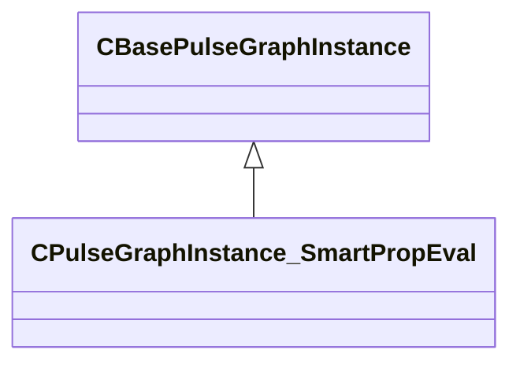

### CSmartPropAPI

### CSmartPropAttributeApplyColorMode

**Metadata:** `MPropertyCustomEditor = "SmartPropAttributeEditor(enum:ApplyColorMode_t)"`

### CSmartPropAttributeChoiceSelectionMode

**Metadata:** `MPropertyCustomEditor = "SmartPropAttributeEditor(enum:SmartPropChoiceSelectionMode_t)"`

### CSmartPropAttributeColorSelectionMode

**Metadata:** `MPropertyCustomEditor = "SmartPropAttributeEditor(enum:SmartPropColorSelectionMode_t)"`

### CSmartPropAttributeCoordinateSpace

**Metadata:** `MPropertyCustomEditor = "SmartPropAttributeEditor(enum:SmartPropSpace_t)"`

### CSmartPropAttributeDirection

**Metadata:** `MPropertyCustomEditor = "SmartPropAttributeEditor(enum:SmartPropDirection_t)"`

### CSmartPropAttributeDistributionMode

**Metadata:** `MPropertyCustomEditor = "SmartPropAttributeEditor(enum:SmartPropDistributionMode_t)"`

### CSmartPropAttributeGridOriginMode

**Metadata:** `MPropertyCustomEditor = "SmartPropAttributeEditor(enum:SmartPropGridOriginBasis_t)"`

### CSmartPropAttributeGridPlacementMode

**Metadata:** `MPropertyCustomEditor = "SmartPropAttributeEditor(enum:SmartPropGridPlacementMode_t)"`

### CSmartPropAttributePathPositions

**Metadata:** `MPropertyCustomEditor = "SmartPropAttributeEditor(enum:SmartPropPathPositions_t)"`

### CSmartPropAttributePickMode

**Metadata:** `MPropertyCustomEditor = "SmartPropAttributeEditor(enum:PickMode_t)"`

### CSmartPropAttributeRadiusPlacementMode

**Metadata:** `MPropertyCustomEditor = "SmartPropAttributeEditor(enum:SmartPropRadiusPlacementMode_t)"`

### CSmartPropAttributeScaleMode

**Metadata:** `MPropertyCustomEditor = "SmartPropAttributeEditor(enum:ScaleMode_t)"`

### CSmartPropAttributeTraceNoHit

**Metadata:** `MPropertyCustomEditor = "SmartPropAttributeEditor(enum:TraceNoHitResult_t)"`

### CSmartPropChoice

**Inherits from:** [CSmartPropParameter](smartprops.md#csmartpropparameter)

**Metadata:** `MGetKV3ClassDefaults = {`, `"_class": "CSmartPropChoice",`, `"m_nElementID": -1,`, `"m_Name": "",`, `"m_DefaultOption": "",`, `"m_Options":`, `[`, `]`, `}`, `MPropertyFriendlyName = "Choice"`, `MVDataAnonymousNode`, `MVDataOutlinerNameExpr = "m_Name"`

**Relationships:**

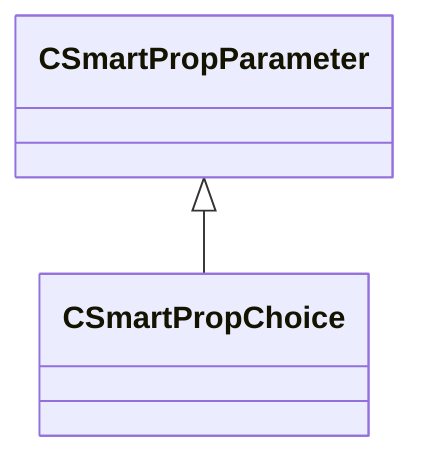

### CSmartPropChoiceOption

**Metadata:** `MGetKV3ClassDefaults = {`, `"m_Name": "",`, `"m_DisplayName": "",`, `"m_VariableValues":`, `[`, `]`, `}`

### CSmartPropElement

**Derived by:** [CSmartPropElement_Group](smartprops.md#csmartpropelement_group), [CSmartPropElement_Model](smartprops.md#csmartpropelement_model), [CSmartPropElement_ModelEntity](smartprops.md#csmartpropelement_modelentity), [CSmartPropElement_ModifyState](smartprops.md#csmartpropelement_modifystate), [CSmartPropElement_SmartProp](smartprops.md#csmartpropelement_smartprop)

**Metadata:** `MGetKV3ClassDefaults = {`, `"_class": "CSmartPropElement",`, `"m_nElementID": -1,`, `"m_bEnabled": true,`, `"m_sLabel": "",`, `"m_SelectionCriteria":`, `[`, `],`, `"m_Modifiers":`, `[`, `]`, `}`, `MVDataBase`, `MVDataNodeType = 1`, `MVDataAnonymousNode`, `MPropertyFriendlyName = "Smart Prop Element"`, `MVDataOutlinerLabelExpr = "m_sLabel"`

**Relationships:**

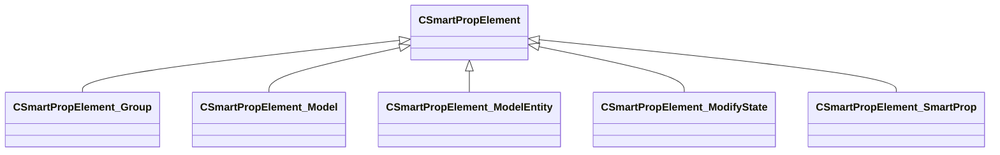

### CSmartPropElement_BendDeformer

**Inherits from:** [CSmartPropElement_Deformer](smartprops.md#csmartpropelement_deformer)

**Metadata:** `MGetKV3ClassDefaults = {`, `"_class": "CSmartPropElement_BendDeformer",`, `"m_nElementID": -1,`, `"m_bEnabled": true,`, `"m_sLabel": "",`, `"m_SelectionCriteria":`, `[`, `],`, `"m_Modifiers":`, `[`, `],`, `"m_Children":`, `[`, `],`, `"m_bDeformationEnabled": true,`, `"m_vOrigin":`, `[`, `0.000000,`, `0.000000,`, `0.000000`, `],`, `"m_vAngles":`, `[`, `0.000000,`, `0.000000,`, `0.000000`, `],`, `"m_vSize":`, `[`, `0.000000,`, `0.000000,`, `0.000000`, `],`, `"m_flBendAngle": 0.000000,`, `"m_flBendPoint": 0.000000,`, `"m_flBendRadius": 0.000000`, `}`, `MPropertyFriendlyName = "Bend Deformer"`, `MPropertyDescription = "Creates a bend deformer that is applied to child elements. The deformation bends the local space x-axis around the local space z-axis. The Angles property can be used to rotate the local axis to change the direction of deformation."`

**Relationships:**

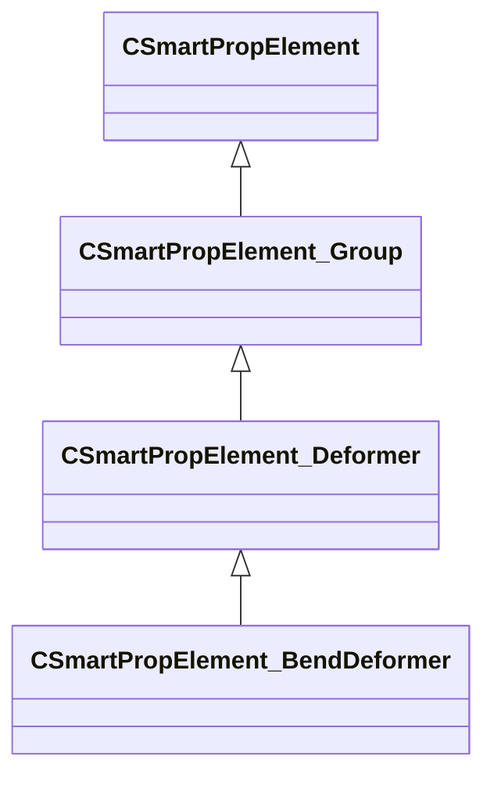

### CSmartPropElement_Deformer

**Inherits from:** [CSmartPropElement_Group](smartprops.md#csmartpropelement_group)

**Derived by:** [CSmartPropElement_BendDeformer](smartprops.md#csmartpropelement_benddeformer), [CSmartPropElement_MidpointDeformer](smartprops.md#csmartpropelement_midpointdeformer)

**Relationships:**

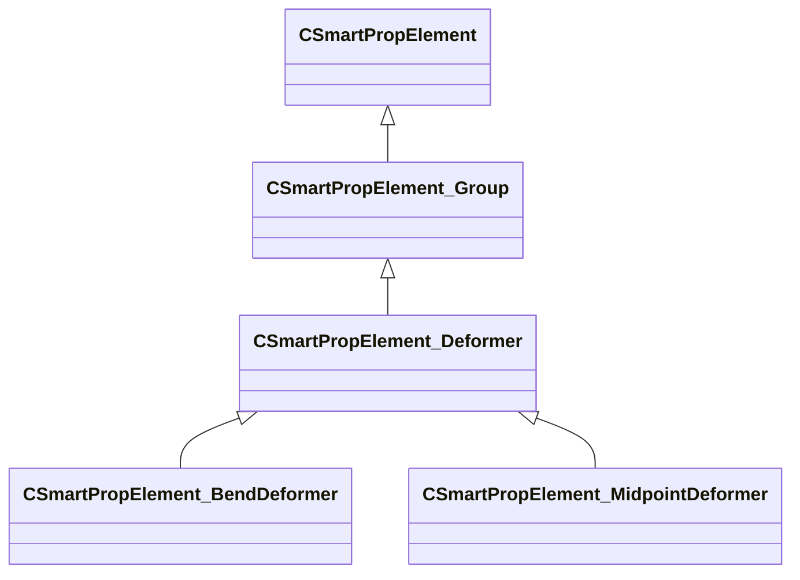

### CSmartPropElement_FitOnLine

**Inherits from:** [CSmartPropElement_Group](smartprops.md#csmartpropelement_group)

**Metadata:** `MGetKV3ClassDefaults = {`, `"_class": "CSmartPropElement_FitOnLine",`, `"m_nElementID": -1,`, `"m_bEnabled": true,`, `"m_sLabel": "",`, `"m_SelectionCriteria":`, `[`, `],`, `"m_Modifiers":`, `[`, `],`, `"m_Children":`, `[`, `],`, `"m_vStart":`, `[`, `0.000000,`, `0.000000,`, `0.000000`, `],`, `"m_vEnd":`, `[`, `0.000000,`, `0.000000,`, `0.000000`, `],`, `"m_PointSpace": "ELEMENT",`, `"m_bOrientAlongLine": false,`, `"m_vUpDirection":`, `[`, `0.000000,`, `0.000000,`, `1.000000`, `],`, `"m_UpDirectionSpace": "ELEMENT",`, `"m_bPrioritizeUp": false,`, `"m_nScaleMode": "NONE",`, `"m_nPickMode": "LARGEST_FIRST"`, `}`, `MPropertyFriendlyName = "Fit on Line"`, `MPropertyDescription = "An element which fits one or more instances of a set of choices on to a line."`

**Relationships:**

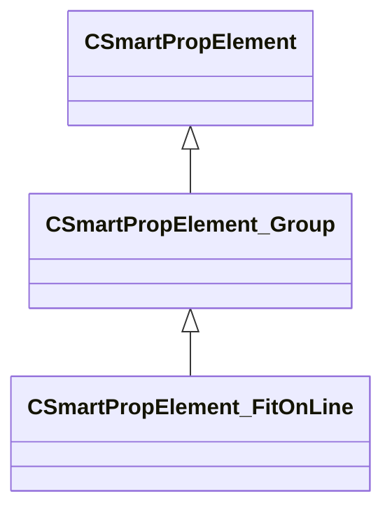

### CSmartPropElement_Group

**Inherits from:** [CSmartPropElement](smartprops.md#csmartpropelement)

**Derived by:** [CSmartPropElement_Deformer](smartprops.md#csmartpropelement_deformer), [CSmartPropElement_FitOnLine](smartprops.md#csmartpropelement_fitonline), [CSmartPropElement_Layout2DGrid](smartprops.md#csmartpropelement_layout2dgrid), [CSmartPropElement_PickOne](smartprops.md#csmartpropelement_pickone), [CSmartPropElement_PlaceInSphere](smartprops.md#csmartpropelement_placeinsphere), [CSmartPropElement_PlaceMultiple](smartprops.md#csmartpropelement_placemultiple), [CSmartPropElement_PlaceOnPath](smartprops.md#csmartpropelement_placeonpath)

**Metadata:** `MGetKV3ClassDefaults = {`, `"_class": "CSmartPropElement_Group",`, `"m_nElementID": -1,`, `"m_bEnabled": true,`, `"m_sLabel": "",`, `"m_SelectionCriteria":`, `[`, `],`, `"m_Modifiers":`, `[`, `],`, `"m_Children":`, `[`, `]`, `}`, `MPropertyFriendlyName = "Group"`, `MPropertyDescription = "A group of elements that will all be evaulated."`

**Relationships:**

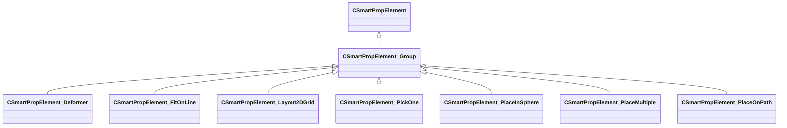

### CSmartPropElement_Layout2DGrid

**Inherits from:** [CSmartPropElement_Group](smartprops.md#csmartpropelement_group)

**Metadata:** `MGetKV3ClassDefaults = {`, `"_class": "CSmartPropElement_Layout2DGrid",`, `"m_nElementID": -1,`, `"m_bEnabled": true,`, `"m_sLabel": "",`, `"m_SelectionCriteria":`, `[`, `],`, `"m_Modifiers":`, `[`, `],`, `"m_Children":`, `[`, `],`, `"m_flWidth": 100.000000,`, `"m_flLength": 100.000000,`, `"m_bVerticalLength": false,`, `"m_GridArrangement": "SEGMENT",`, `"m_GridOriginMode": "CENTER",`, `"m_nCountW": 5,`, `"m_nCountL": 5,`, `"m_flSpacingWidth": 20.000000,`, `"m_flSpacingLength": 20.000000,`, `"m_bAlternateShift": false,`, `"m_flAlternateShiftWidth": 0.500000,`, `"m_flAlternateShiftLength": 0.000000`, `}`, `MPropertyFriendlyName = "Layout Grid"`, `MPropertyDescription = "Generates set of child instances arranged in a regular grid layout."`

**Relationships:**

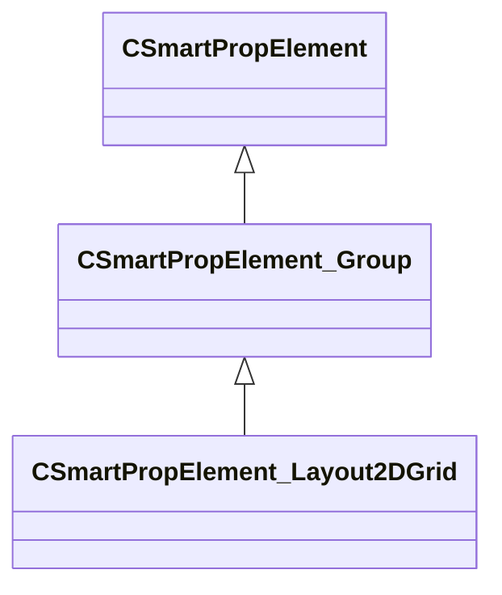

### CSmartPropElement_MidpointDeformer

**Inherits from:** [CSmartPropElement_Deformer](smartprops.md#csmartpropelement_deformer)

**Metadata:** `MGetKV3ClassDefaults = {`, `"_class": "CSmartPropElement_MidpointDeformer",`, `"m_nElementID": -1,`, `"m_bEnabled": true,`, `"m_sLabel": "",`, `"m_SelectionCriteria":`, `[`, `],`, `"m_Modifiers":`, `[`, `],`, `"m_Children":`, `[`, `],`, `"m_bDeformationEnabled": true,`, `"m_vStart":`, `[`, `0.000000,`, `0.000000,`, `0.000000`, `],`, `"m_vEnd":`, `[`, `0.000000,`, `0.000000,`, `0.000000`, `],`, `"m_fRadius": 64.000000,`, `"m_bContinuousSpline": false,`, `"m_vOffset":`, `[`, `0.000000,`, `0.000000,`, `0.000000`, `],`, `"m_vAngles":`, `[`, `0.000000,`, `0.000000,`, `0.000000`, `],`, `"m_vScale":`, `[`, `1.000000,`, `1.000000`, `],`, `"m_fFalloff": 1.000000,`, `"m_OutputVariable": ""`, `}`, `MPropertyFriendlyName = "Midpoint Deformer"`, `MPropertyDescription = "Soft deform the center of a volume defined by two endpoints."`

**Relationships:**

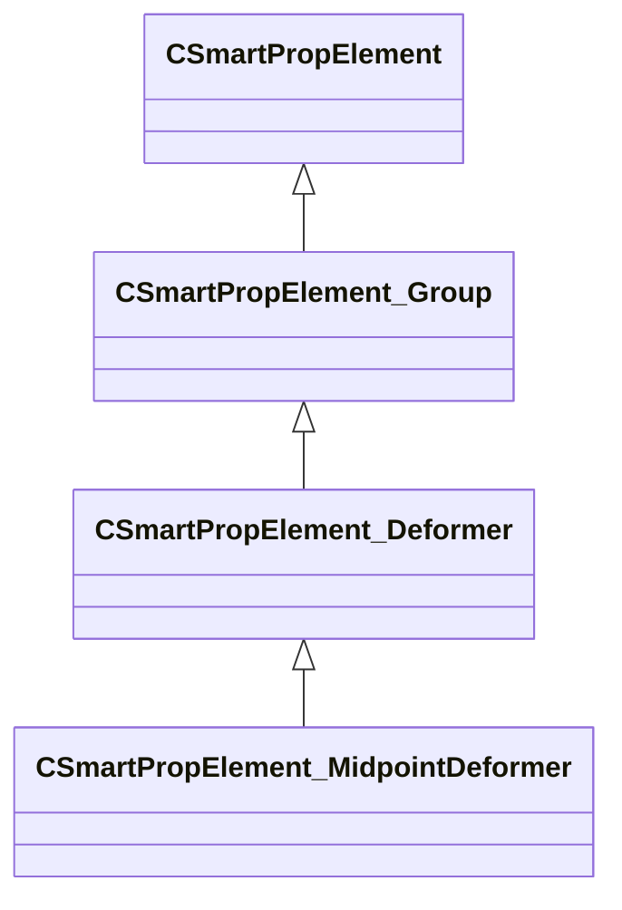

### CSmartPropElement_Model

**Inherits from:** [CSmartPropElement](smartprops.md#csmartpropelement)

**Metadata:** `MGetKV3ClassDefaults = {`, `"_class": "CSmartPropElement_Model",`, `"m_nElementID": -1,`, `"m_bEnabled": true,`, `"m_sLabel": "",`, `"m_SelectionCriteria":`, `[`, `],`, `"m_Modifiers":`, `[`, `],`, `"m_sModelName": "",`, `"m_MaterialGroupName": "",`, `"m_bDetailObject": false,`, `"m_vModelScale":`, `[`, `1.000000,`, `1.000000,`, `1.000000`, `],`, `"m_flUniformModelScale": 1.000000,`, `"m_nLodLevel": -1,`, `"m_SurfacePropertyOverride": "",`, `"m_nDetailObjectFadeLevel": "NORMAL",`, `"m_bCastShadows": true,`, `"m_bRigidDeformation": false,`, `"m_bDisableDynamicDeformable": false`, `}`, `MPropertyFriendlyName = "Model"`, `MPropertyDescription = "Places a model as the child of an element."`, `MVDataOutlinerAssetNameExpr (UNKNOWN FOR PARSER)`

**Relationships:**

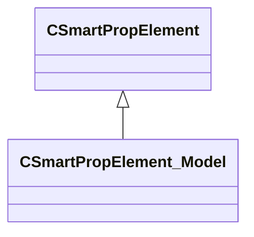

### CSmartPropElement_ModelEntity

**Inherits from:** [CSmartPropElement](smartprops.md#csmartpropelement)

**Derived by:** [CSmartPropElement_PropDynamic](smartprops.md#csmartpropelement_propdynamic), [CSmartPropElement_PropPhysics](smartprops.md#csmartpropelement_propphysics)

**Metadata:** `MGetKV3ClassDefaults = Could not parse KV3 Defaults`, `MVDataOutlinerAssetNameExpr (UNKNOWN FOR PARSER)`

**Relationships:**

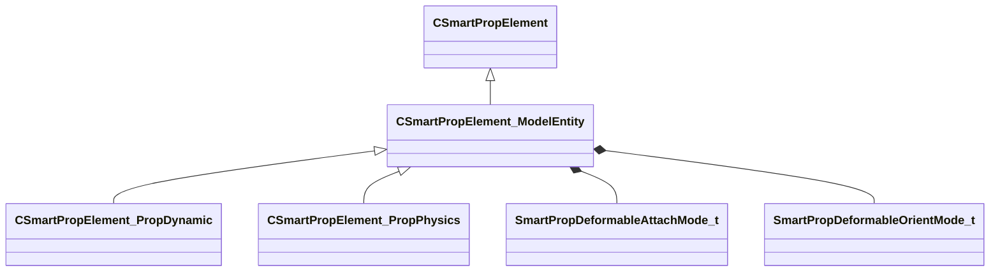

**Fields:**

| Name | Type | Annotations |
|------|------|-------------|
| `m_sModelName` | CSmartPropAttributeModelName | `MPropertyDescription = "Name of the model resource (.vmdl) to place."` `MPropertyProvidesEditContextString = "ToolEditContext_ID_VMDL"` |
| `m_MaterialGroupName` | CSmartPropAttributeMaterialGroup | `MPropertyFriendlyName = "Material Group"` `MPropertyDescription = "Specifies the name of the material group (skin) to use when displaying the specified model."` |
| `m_bCastShadows` | CSmartPropAttributeBool | `MPropertyFriendlyName = "Cast Shadows"` `MPropertyDescription = "Should the entity created by this element cast shadows."` |
| `m_bForceStatic` | CSmartPropAttributeBool | `MPropertyFriendlyName = "Force Static"` `MPropertyDescription = "Force this model to be placed as a static model rather then generating an entity."` |
| `m_nDeformableAttachmentMode` | [SmartPropDeformableAttachMode_t](../schemas/smartprops.md#smartpropdeformableattachmode_t) | `MPropertySortPriority = -1` `MPropertySuppressExpr = "m_bForceStatic == true"` `MPropertyFriendlyName = "Attachment Mode"` `MPropertyGroupName = "Deformable Entity Settings"` `MPropertyDescription = "If the smart prop is child of a deformable entity, this setting specifies how the entity generated by this element will be attached to the deformable surface."` |
| `m_nDeformableOrientationMode` | [SmartPropDeformableOrientMode_t](../schemas/smartprops.md#smartpropdeformableorientmode_t) | `MPropertySortPriority = -1` `MPropertySuppressExpr = "m_bForceStatic == true"` `MPropertyGroupName = "Deformable Entity Settings"` `MPropertyDescription = "If the smart prop is child of a deformable entity, this setting specifies how the entity generated by this element will be oriented relative to the deformable surface."` |

### CSmartPropElement_ModifyState

**Inherits from:** [CSmartPropElement](smartprops.md#csmartpropelement)

**Metadata:** `MGetKV3ClassDefaults = {`, `"_class": "CSmartPropElement_ModifyState",`, `"m_nElementID": -1,`, `"m_bEnabled": true,`, `"m_sLabel": "",`, `"m_SelectionCriteria":`, `[`, `],`, `"m_Modifiers":`, `[`, `]`, `}`, `MPropertyFriendlyName = "Apply Modifiers"`, `MPropertyDescription = "An element which is used to apply a set of modifiers to the state of its parent."`, `MPropertySuppressBaseClassField = "m_bRestoreState"`

**Relationships:**

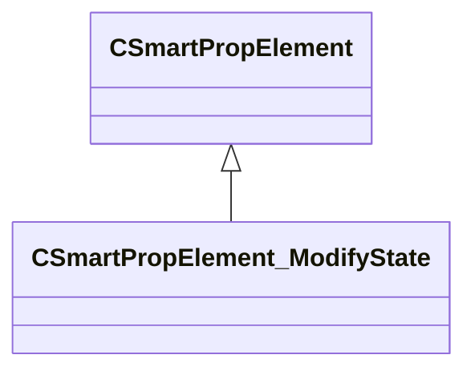

### CSmartPropElement_PickOne

**Inherits from:** [CSmartPropElement_Group](smartprops.md#csmartpropelement_group)

**Metadata:** `MGetKV3ClassDefaults = {`, `"_class": "CSmartPropElement_PickOne",`, `"m_nElementID": -1,`, `"m_bEnabled": true,`, `"m_sLabel": "",`, `"m_SelectionCriteria":`, `[`, `],`, `"m_Modifiers":`, `[`, `],`, `"m_Children":`, `[`, `],`, `"m_SelectionMode": "RANDOM",`, `"m_SpecificChildIndex": 0,`, `"m_OutputChoiceVariableName": "",`, `"m_bConfigurable": true,`, `"m_vHandleOffset":`, `[`, `0.000000,`, `0.000000,`, `0.000000`, `],`, `"m_HandleColor":`, `[`, `144,`, `144,`, `144`, `],`, `"m_HandleSize": 9,`, `"m_HandleShape": "SQUARE"`, `}`, `MPropertyFriendlyName = "Select Single Child"`, `MPropertyDescription = "An element which selects a single choice from its set of child choices."`

**Relationships:**

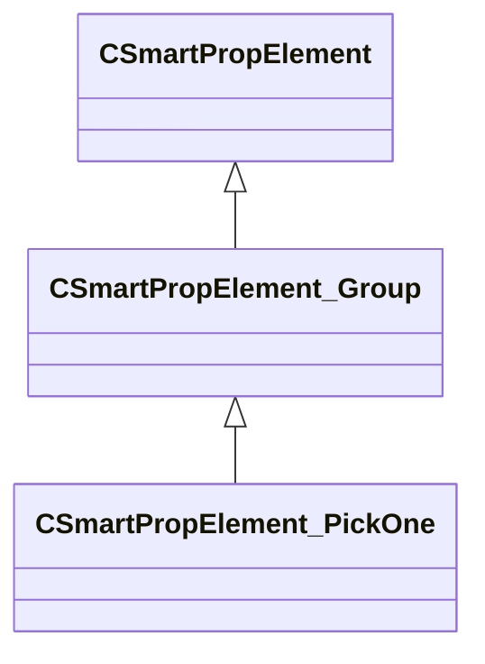

### CSmartPropElement_PlaceInSphere

**Inherits from:** [CSmartPropElement_Group](smartprops.md#csmartpropelement_group)

**Metadata:** `MGetKV3ClassDefaults = {`, `"_class": "CSmartPropElement_PlaceInSphere",`, `"m_nElementID": -1,`, `"m_bEnabled": true,`, `"m_sLabel": "",`, `"m_SelectionCriteria":`, `[`, `],`, `"m_Modifiers":`, `[`, `],`, `"m_Children":`, `[`, `],`, `"m_PlacementMode": "SPHERE",`, `"m_DistributionMode": "RANDOM",`, `"m_flRandomness": 0.000000,`, `"m_vPlaneUpDirection":`, `[`, `0.000000,`, `0.000000,`, `1.000000`, `],`, `"m_nCountMin": 1,`, `"m_nCountMax": 1,`, `"m_flPositionRadiusInner": 0.000000,`, `"m_flPositionRadiusOuter": 0.000000,`, `"m_bAlignOrientation": false,`, `"m_vAlignDirection":`, `[`, `0.000000,`, `0.000000,`, `1.000000`, `]`, `}`, `MPropertyFriendlyName = "Place In Radius"`, `MPropertyDescription = "An element which places multiple instances of its child elements within a radius."`

**Relationships:**

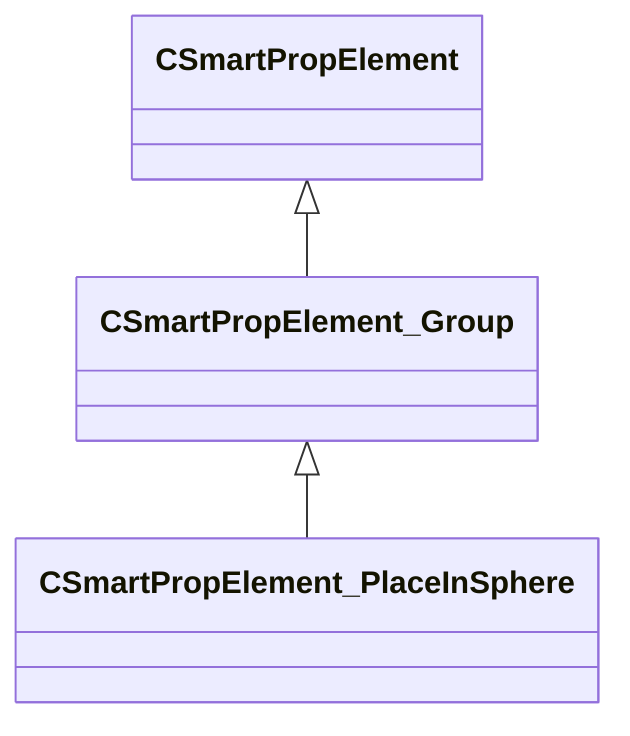

### CSmartPropElement_PlaceMultiple

**Inherits from:** [CSmartPropElement_Group](smartprops.md#csmartpropelement_group)

**Metadata:** `MGetKV3ClassDefaults = {`, `"_class": "CSmartPropElement_PlaceMultiple",`, `"m_nElementID": -1,`, `"m_bEnabled": true,`, `"m_sLabel": "",`, `"m_SelectionCriteria":`, `[`, `],`, `"m_Modifiers":`, `[`, `],`, `"m_Children":`, `[`, `],`, `"m_nCount": 1,`, `"m_Expression": ""`, `}`, `MPropertyFriendlyName = "Place Multiple"`, `MPropertyDescription = "An element which places multiple instances of its child elements."`

**Relationships:**

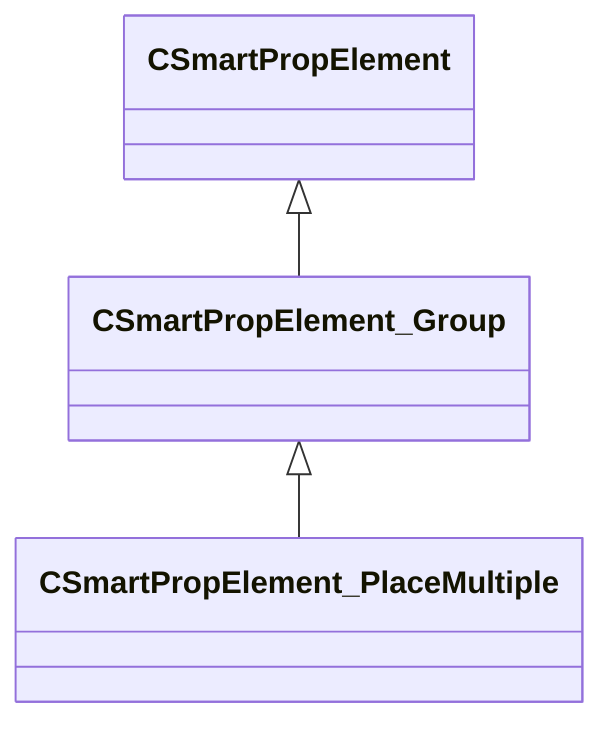

### CSmartPropElement_PlaceOnPath

**Inherits from:** [CSmartPropElement_Group](smartprops.md#csmartpropelement_group)

**Metadata:** `MGetKV3ClassDefaults = {`, `"_class": "CSmartPropElement_PlaceOnPath",`, `"m_nElementID": -1,`, `"m_bEnabled": true,`, `"m_sLabel": "",`, `"m_SelectionCriteria":`, `[`, `],`, `"m_Modifiers":`, `[`, `],`, `"m_Children":`, `[`, `],`, `"m_PathName": "",`, `"m_flSpacing": 1.000000,`, `"m_flOffsetAlongPath": 0.000000,`, `"m_vPathOffset":`, `[`, `0.000000,`, `0.000000`, `],`, `"m_PathSpace": "WORLD",`, `"m_bUseFixedUpDirection": false,`, `"m_bUseProjectedDistance": false,`, `"m_vUpDirection":`, `[`, `0.000000,`, `0.000000,`, `1.000000`, `],`, `"m_UpDirectionSpace": "WORLD",`, `"m_DefaultPathInWorldSpace": false,`, `"m_DefaultPath":`, `[`, `]`, `}`, `MPropertyFriendlyName = "Place on Path"`, `MPropertyDescription = "An element which places an instance of its child elements at a specified interval along a path."`

**Relationships:**

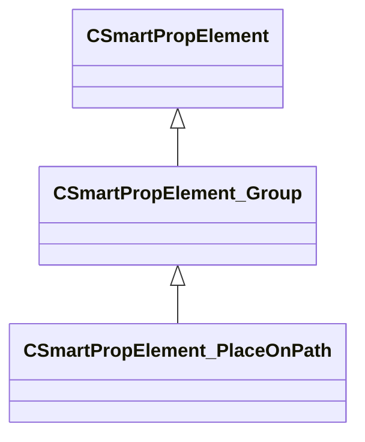

### CSmartPropElement_PropDynamic

**Inherits from:** [CSmartPropElement_ModelEntity](smartprops.md#csmartpropelement_modelentity)

**Metadata:** `MGetKV3ClassDefaults = {`, `"_class": "CSmartPropElement_PropDynamic",`, `"m_nElementID": -1,`, `"m_bEnabled": true,`, `"m_sLabel": "",`, `"m_SelectionCriteria":`, `[`, `],`, `"m_Modifiers":`, `[`, `],`, `"m_sModelName": "",`, `"m_MaterialGroupName": "",`, `"m_bCastShadows": true,`, `"m_bForceStatic": false,`, `"m_nDeformableAttachmentMode": "RELATIVE",`, `"m_nDeformableOrientationMode": "MAINTAIN_OFFSET"`, `}`, `MPropertyFriendlyName = "Prop Dynamic"`, `MPropertyDescription = "Places a prop dynamic entity."`

**Relationships:**

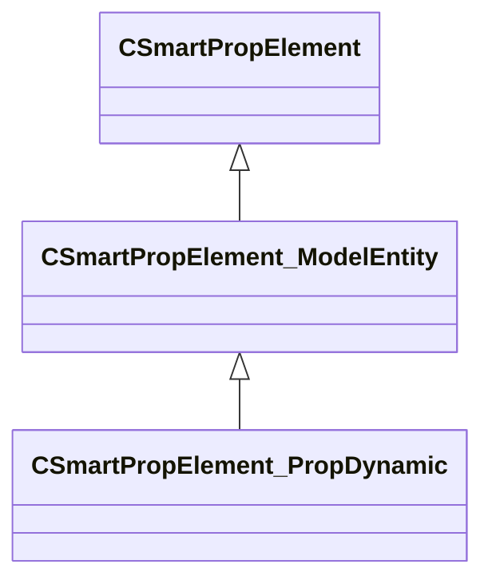

### CSmartPropElement_PropPhysics

**Inherits from:** [CSmartPropElement_ModelEntity](smartprops.md#csmartpropelement_modelentity)

**Metadata:** `MGetKV3ClassDefaults = {`, `"_class": "CSmartPropElement_PropPhysics",`, `"m_nElementID": -1,`, `"m_bEnabled": true,`, `"m_sLabel": "",`, `"m_SelectionCriteria":`, `[`, `],`, `"m_Modifiers":`, `[`, `],`, `"m_sModelName": "",`, `"m_MaterialGroupName": "",`, `"m_bCastShadows": true,`, `"m_bForceStatic": false,`, `"m_nDeformableAttachmentMode": "RELATIVE",`, `"m_nDeformableOrientationMode": "MAINTAIN_OFFSET",`, `"m_bStartAsleep": false`, `}`, `MPropertyFriendlyName = "Prop Physics"`, `MPropertyDescription = "Places a prop physics entity."`

**Relationships:**

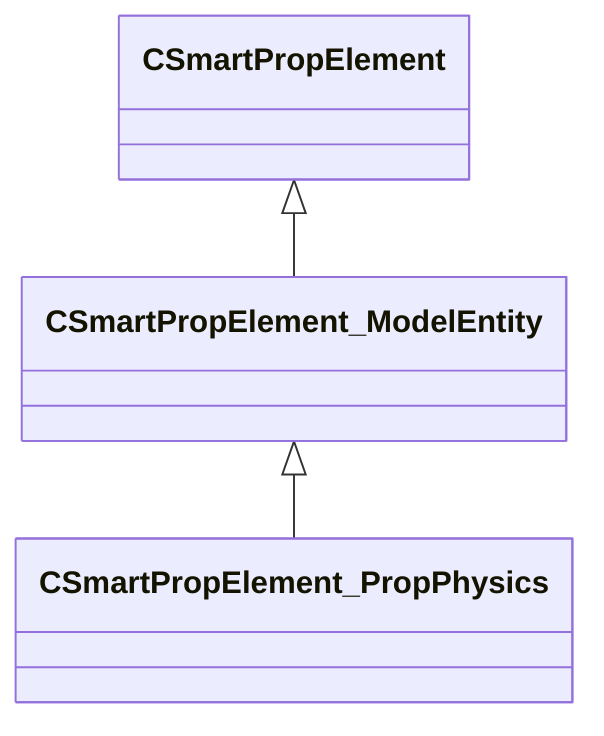

### CSmartPropElement_SmartProp

**Inherits from:** [CSmartPropElement](smartprops.md#csmartpropelement)

**Metadata:** `MGetKV3ClassDefaults = {`, `"_class": "CSmartPropElement_SmartProp",`, `"m_nElementID": -1,`, `"m_bEnabled": true,`, `"m_sLabel": "",`, `"m_SelectionCriteria":`, `[`, `],`, `"m_Modifiers":`, `[`, `],`, `"m_sSmartProp": "",`, `"m_bLocalEvaluationState": true`, `}`, `MPropertyFriendlyName = "Smart Prop Reference"`, `MPropertyDescription = "Evaluates a specified smart prop as a child of the current element."`, `MVDataOutlinerAssetNameExpr (UNKNOWN FOR PARSER)`

**Relationships:**

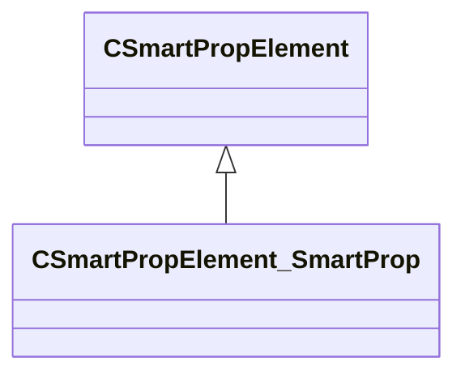

### CSmartPropExprAPI

### CSmartPropFilter

**Inherits from:** [CSmartPropModifier](smartprops.md#csmartpropmodifier)

**Derived by:** [CSmartPropFilter_Expression](smartprops.md#csmartpropfilter_expression), [CSmartPropFilter_MaterialAttributes](smartprops.md#csmartpropfilter_materialattributes), [CSmartPropFilter_Probability](smartprops.md#csmartpropfilter_probability), [CSmartPropFilter_SurfaceAngle](smartprops.md#csmartpropfilter_surfaceangle), [CSmartPropFilter_SurfaceProperties](smartprops.md#csmartpropfilter_surfaceproperties), [CSmartPropFilter_VariableValue](smartprops.md#csmartpropfilter_variablevalue)

**Metadata:** `MGetKV3ClassDefaults = Could not parse KV3 Defaults`, `MVDataNodeTintColor (UNKNOWN FOR PARSER)`

**Relationships:**

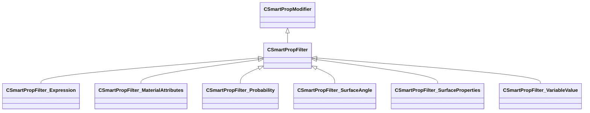

### CSmartPropFilterAPI

### CSmartPropFilter_Expression

**Inherits from:** [CSmartPropFilter](smartprops.md#csmartpropfilter)

**Metadata:** `MGetKV3ClassDefaults = {`, `"_class": "CSmartPropFilter_Expression",`, `"m_bEnabled": true,`, `"m_Expression": ""`, `}`, `MPropertyFriendlyName = "Filter: Expression"`, `MPropertyDescription = "Evaluates the specified expression, if the result of the expression is false evaluation of the element is stopped."`, `MVDataClassGroup = "Filter"`

**Relationships:**

```mermaid
classDiagram
    CSmartPropFilter <|-- CSmartPropFilter_Expression
    CSmartPropModifier <|-- CSmartPropFilter
```

### CSmartPropFilter_MaterialAttributes

**Inherits from:** [CSmartPropFilter](smartprops.md#csmartpropfilter)

**Metadata:** `MGetKV3ClassDefaults = {`, `"_class": "CSmartPropFilter_MaterialAttributes",`, `"m_bEnabled": true,`, `"m_AllowedMaterialAttributes":`, `[`, `],`, `"m_DisallowedMaterialAttributes":`, `[`, `]`, `}`, `MPropertyFriendlyName = "Filter: Material Attributes"`, `MPropertyDescription = "Allows the parent element to be conditionally evaluated based on attributes assigned to the surface material."`, `MVDataClassGroup = "Filter"`

**Relationships:**

```mermaid
classDiagram
    CSmartPropFilter <|-- CSmartPropFilter_MaterialAttributes
    CSmartPropModifier <|-- CSmartPropFilter
```

### CSmartPropFilter_Probability

**Inherits from:** [CSmartPropFilter](smartprops.md#csmartpropfilter)

**Metadata:** `MGetKV3ClassDefaults = {`, `"_class": "CSmartPropFilter_Probability",`, `"m_bEnabled": true,`, `"m_flProbability": 0.500000`, `}`, `MPropertyFriendlyName = "Filter: Probability"`, `MPropertyDescription = "Causes the parent element to only be evaluated with a specified random probability."`, `MVDataClassGroup = "Filter"`

**Relationships:**

```mermaid
classDiagram
    CSmartPropFilter <|-- CSmartPropFilter_Probability
    CSmartPropModifier <|-- CSmartPropFilter
```

### CSmartPropFilter_SurfaceAngle

**Inherits from:** [CSmartPropFilter](smartprops.md#csmartpropfilter)

**Metadata:** `MGetKV3ClassDefaults = {`, `"_class": "CSmartPropFilter_SurfaceAngle",`, `"m_bEnabled": true,`, `"m_flSurfaceSlopeMin": 0.000000,`, `"m_flSurfaceSlopeMax": 180.000000`, `}`, `MPropertyFriendlyName = "Filter: Surface Angles"`, `MPropertyDescription = "Allows the parent element to be conditionally evaluated base on the current surface angle. The surface angle is set based on the initial placement of the smart prop object, but can also be updated by the Trace to Surface modifier."`, `MVDataClassGroup = "Filter"`

**Relationships:**

```mermaid
classDiagram
    CSmartPropFilter <|-- CSmartPropFilter_SurfaceAngle
    CSmartPropModifier <|-- CSmartPropFilter
```

### CSmartPropFilter_SurfaceProperties

**Inherits from:** [CSmartPropFilter](smartprops.md#csmartpropfilter)

**Metadata:** `MGetKV3ClassDefaults = {`, `"_class": "CSmartPropFilter_SurfaceProperties",`, `"m_bEnabled": true,`, `"m_AllowedSurfaceProperties":`, `[`, `],`, `"m_DisallowedSurfaceProperties":`, `[`, `]`, `}`, `MPropertyFriendlyName = "Filter: Surface Properties"`, `MPropertyDescription = "Allows the parent element to be conditionally evaluated based on surface properties."`, `MVDataClassGroup = "Filter"`

**Relationships:**

```mermaid
classDiagram
    CSmartPropFilter <|-- CSmartPropFilter_SurfaceProperties
    CSmartPropModifier <|-- CSmartPropFilter
```

### CSmartPropFilter_VariableValue

**Inherits from:** [CSmartPropFilter](smartprops.md#csmartpropfilter)

**Metadata:** `MGetKV3ClassDefaults = {`, `"_class": "CSmartPropFilter_VariableValue",`, `"m_bEnabled": true,`, `"m_VariableComparison":`, `{`, `"m_Name": "",`, `"m_Value": null,`, `"m_Comparison": "EQUAL"`, `}`, `}`, `MPropertyFriendlyName = "Filter: Variable Value"`, `MPropertyDescription = "Compares the current value of a variable to the specified value. If the comparison is false the element evaluation is stopped."`, `MVDataClassGroup = "Filter"`

**Relationships:**

```mermaid
classDiagram
    CSmartPropFilter <|-- CSmartPropFilter_VariableValue
    CSmartPropModifier <|-- CSmartPropFilter
```

### CSmartPropMaterialReplacement

**Metadata:** `MGetKV3ClassDefaults = {`, `"m_OriginalMaterial": "",`, `"m_ReplacementMaterial": ""`, `}`

### CSmartPropModifier

**Derived by:** [CSmartPropFilter](smartprops.md#csmartpropfilter), [CSmartPropOperation](smartprops.md#csmartpropoperation)

**Metadata:** `MGetKV3ClassDefaults = Could not parse KV3 Defaults`, `MVDataBase`, `MVDataNodeType = 1`, `MVDataAnonymousNode`

**Relationships:**

```mermaid
classDiagram
    CSmartPropModifier <|-- CSmartPropFilter
    CSmartPropModifier <|-- CSmartPropOperation
```

**Fields:**

| Name | Type | Annotations |
|------|------|-------------|
| `m_bEnabled` | CSmartPropAttributeBool | `MVDataEnableKey` |

### CSmartPropOperation

**Inherits from:** [CSmartPropModifier](smartprops.md#csmartpropmodifier)

**Derived by:** [CSmartPropOperation_ComputeCrossProduct3D](smartprops.md#csmartpropoperation_computecrossproduct3d), [CSmartPropOperation_ComputeDistance3D](smartprops.md#csmartpropoperation_computedistance3d), [CSmartPropOperation_ComputeDotProduct3D](smartprops.md#csmartpropoperation_computedotproduct3d), [CSmartPropOperation_ComputeNormalizedVector3D](smartprops.md#csmartpropoperation_computenormalizedvector3d), [CSmartPropOperation_ComputeProjectVector3D](smartprops.md#csmartpropoperation_computeprojectvector3d), [CSmartPropOperation_ComputeVectorBetweenPoints3D](smartprops.md#csmartpropoperation_computevectorbetweenpoints3d), [CSmartPropOperation_MaterialOverride](smartprops.md#csmartpropoperation_materialoverride), [CSmartPropOperation_MaterialTint](smartprops.md#csmartpropoperation_materialtint), [CSmartPropOperation_RandomColorTintColor](smartprops.md#csmartpropoperation_randomcolortintcolor), [CSmartPropOperation_RestoreState](smartprops.md#csmartpropoperation_restorestate), [CSmartPropOperation_SaveColor](smartprops.md#csmartpropoperation_savecolor), [CSmartPropOperation_SaveDirection](smartprops.md#csmartpropoperation_savedirection), [CSmartPropOperation_SavePosition](smartprops.md#csmartpropoperation_saveposition), [CSmartPropOperation_SaveScale](smartprops.md#csmartpropoperation_savescale), [CSmartPropOperation_SaveState](smartprops.md#csmartpropoperation_savestate), [CSmartPropOperation_SaveSurfaceNormal](smartprops.md#csmartpropoperation_savesurfacenormal), [CSmartPropOperation_SetMateraialGroupChoice](smartprops.md#csmartpropoperation_setmateraialgroupchoice), [CSmartPropOperation_SetTintColor](smartprops.md#csmartpropoperation_settintcolor), [CSmartPropOperation_SetVariable](smartprops.md#csmartpropoperation_setvariable), [CSmartPropTransformOperation](smartprops.md#csmartproptransformoperation)

**Metadata:** `MGetKV3ClassDefaults = Could not parse KV3 Defaults`

**Relationships:**

```mermaid
classDiagram
    CSmartPropModifier <|-- CSmartPropOperation
    CSmartPropOperation <|-- CSmartPropOperation_ComputeCrossProduct3D
    CSmartPropOperation <|-- CSmartPropOperation_ComputeDistance3D
    CSmartPropOperation <|-- CSmartPropOperation_ComputeDotProduct3D
    CSmartPropOperation <|-- CSmartPropOperation_ComputeNormalizedVector3D
    CSmartPropOperation <|-- CSmartPropOperation_ComputeProjectVector3D
    CSmartPropOperation <|-- CSmartPropOperation_ComputeVectorBetweenPoints3D
    CSmartPropOperation <|-- CSmartPropOperation_MaterialOverride
    CSmartPropOperation <|-- CSmartPropOperation_MaterialTint
    CSmartPropOperation <|-- CSmartPropOperation_RandomColorTintColor
    CSmartPropOperation <|-- CSmartPropOperation_RestoreState
    CSmartPropOperation <|-- CSmartPropOperation_SaveColor
    CSmartPropOperation <|-- CSmartPropOperation_SaveDirection
    CSmartPropOperation <|-- CSmartPropOperation_SavePosition
    CSmartPropOperation <|-- CSmartPropOperation_SaveScale
    CSmartPropOperation <|-- CSmartPropOperation_SaveState
    CSmartPropOperation <|-- CSmartPropOperation_SaveSurfaceNormal
    CSmartPropOperation <|-- CSmartPropOperation_SetMateraialGroupChoice
    CSmartPropOperation <|-- CSmartPropOperation_SetTintColor
    CSmartPropOperation <|-- CSmartPropOperation_SetVariable
    CSmartPropOperation <|-- CSmartPropTransformOperation
```

### CSmartPropOperationAPI

### CSmartPropOperation_ComputeCrossProduct3D

**Inherits from:** [CSmartPropOperation](smartprops.md#csmartpropoperation)

**Metadata:** `MGetKV3ClassDefaults = {`, `"_class": "CSmartPropOperation_ComputeCrossProduct3D",`, `"m_bEnabled": true,`, `"m_OutputVariableName": "",`, `"m_InputVectorA":`, `[`, `0.000000,`, `0.000000,`, `0.000000`, `],`, `"m_InputVectorB":`, `[`, `0.000000,`, `0.000000,`, `0.000000`, `]`, `}`, `MPropertyFriendlyName = "Cross Product"`, `MPropertyDescription = "Compute a dot or cross product between two 3D vectors"`, `MVDataClassGroup = "Compute"`

**Relationships:**

```mermaid
classDiagram
    CSmartPropOperation <|-- CSmartPropOperation_ComputeCrossProduct3D
    CSmartPropModifier <|-- CSmartPropOperation
```

### CSmartPropOperation_ComputeDistance3D

**Inherits from:** [CSmartPropOperation](smartprops.md#csmartpropoperation)

**Metadata:** `MGetKV3ClassDefaults = {`, `"_class": "CSmartPropOperation_ComputeDistance3D",`, `"m_bEnabled": true,`, `"m_OutputVariableName": "",`, `"m_OutputCoordinateSpace": "WORLD",`, `"m_InputPositionA":`, `[`, `0.000000,`, `0.000000,`, `0.000000`, `],`, `"m_CoordinateSpaceA": "WORLD",`, `"m_InputPositionB":`, `[`, `0.000000,`, `0.000000,`, `0.000000`, `],`, `"m_CoordinateSpaceB": "WORLD"`, `}`, `MPropertyFriendlyName = "Distance"`, `MPropertyDescription = "Compute the distance between two 3D points"`, `MVDataClassGroup = "Compute"`

**Relationships:**

```mermaid
classDiagram
    CSmartPropOperation <|-- CSmartPropOperation_ComputeDistance3D
    CSmartPropModifier <|-- CSmartPropOperation
```

### CSmartPropOperation_ComputeDotProduct3D

**Inherits from:** [CSmartPropOperation](smartprops.md#csmartpropoperation)

**Metadata:** `MGetKV3ClassDefaults = {`, `"_class": "CSmartPropOperation_ComputeDotProduct3D",`, `"m_bEnabled": true,`, `"m_OutputVariableName": "",`, `"m_InputVectorA":`, `[`, `0.000000,`, `0.000000,`, `0.000000`, `],`, `"m_InputVectorB":`, `[`, `0.000000,`, `0.000000,`, `0.000000`, `]`, `}`, `MPropertyFriendlyName = "Dot Product"`, `MPropertyDescription = "Compute a dot or cross product between two 3D vectors"`, `MVDataClassGroup = "Compute"`

**Relationships:**

```mermaid
classDiagram
    CSmartPropOperation <|-- CSmartPropOperation_ComputeDotProduct3D
    CSmartPropModifier <|-- CSmartPropOperation
```

### CSmartPropOperation_ComputeNormalizedVector3D

**Inherits from:** [CSmartPropOperation](smartprops.md#csmartpropoperation)

**Metadata:** `MGetKV3ClassDefaults = {`, `"_class": "CSmartPropOperation_ComputeNormalizedVector3D",`, `"m_bEnabled": true,`, `"m_OutputVariableName": "",`, `"m_InputVector":`, `[`, `0.000000,`, `0.000000,`, `0.000000`, `]`, `}`, `MPropertyFriendlyName = "Normalize Vector"`, `MPropertyDescription = "Normalize the value of a 3d vector."`, `MVDataClassGroup = "Compute"`

**Relationships:**

```mermaid
classDiagram
    CSmartPropOperation <|-- CSmartPropOperation_ComputeNormalizedVector3D
    CSmartPropModifier <|-- CSmartPropOperation
```

### CSmartPropOperation_ComputeProjectVector3D

**Inherits from:** [CSmartPropOperation](smartprops.md#csmartpropoperation)

**Metadata:** `MGetKV3ClassDefaults = {`, `"_class": "CSmartPropOperation_ComputeProjectVector3D",`, `"m_bEnabled": true,`, `"m_OutputVariableName": "",`, `"m_OutputCoordinateSpace": "WORLD",`, `"m_InputVectorA":`, `[`, `0.000000,`, `0.000000,`, `0.000000`, `],`, `"m_CoordinateSpaceA": "WORLD",`, `"m_InputVectorB":`, `[`, `0.000000,`, `0.000000,`, `0.000000`, `],`, `"m_CoordinateSpaceB": "WORLD",`, `"m_bPlane": false`, `}`, `MPropertyFriendlyName = "Project Vector"`, `MPropertyDescription = "Project Vector A onto Vector B"`, `MVDataClassGroup = "Compute"`

**Relationships:**

```mermaid
classDiagram
    CSmartPropOperation <|-- CSmartPropOperation_ComputeProjectVector3D
    CSmartPropModifier <|-- CSmartPropOperation
```

### CSmartPropOperation_ComputeVectorBetweenPoints3D

**Inherits from:** [CSmartPropOperation](smartprops.md#csmartpropoperation)

**Metadata:** `MGetKV3ClassDefaults = {`, `"_class": "CSmartPropOperation_ComputeVectorBetweenPoints3D",`, `"m_bEnabled": true,`, `"m_OutputVariableName": "",`, `"m_OutputCoordinateSpace": "WORLD",`, `"m_bNormalized": false,`, `"m_InputPositionA":`, `[`, `0.000000,`, `0.000000,`, `0.000000`, `],`, `"m_CoordinateSpaceA": "WORLD",`, `"m_InputPositionB":`, `[`, `0.000000,`, `0.000000,`, `0.000000`, `],`, `"m_CoordinateSpaceB": "WORLD"`, `}`, `MPropertyFriendlyName = "Vector Between Points"`, `MPropertyDescription = "Compute the vector between two 3D points"`, `MVDataClassGroup = "Compute"`

**Relationships:**

```mermaid
classDiagram
    CSmartPropOperation <|-- CSmartPropOperation_ComputeVectorBetweenPoints3D
    CSmartPropModifier <|-- CSmartPropOperation
```

### CSmartPropOperation_CreateLocator

**Inherits from:** [CSmartPropTransformOperation](smartprops.md#csmartproptransformoperation)

**Metadata:** `MGetKV3ClassDefaults = {`, `"_class": "CSmartPropOperation_CreateLocator",`, `"m_bEnabled": true,`, `"m_LocatorName": "",`, `"m_vOffset":`, `[`, `0.000000,`, `0.000000,`, `0.000000`, `],`, `"m_flDisplayScale": 1.000000,`, `"m_bConfigurable": true,`, `"m_bAllowTranslation": true,`, `"m_bAllowRotation": true,`, `"m_bAllowScale": false`, `}`, `MPropertyFriendlyName = "Create Locator"`, `MPropertyDescription = "Create a locator with the current transform. The locator may optionally be configurable, so that its transform can be modified in Hammer."`, `MVDataClassGroup = "Manipulators"`

**Relationships:**

```mermaid
classDiagram
    CSmartPropTransformOperation <|-- CSmartPropOperation_CreateLocator
    CSmartPropOperation <|-- CSmartPropTransformOperation
    CSmartPropModifier <|-- CSmartPropOperation
```

### CSmartPropOperation_CreateRotator

**Inherits from:** [CSmartPropTransformOperation](smartprops.md#csmartproptransformoperation)

**Metadata:** `MGetKV3ClassDefaults = {`, `"_class": "CSmartPropOperation_CreateRotator",`, `"m_bEnabled": true,`, `"m_Name": "",`, `"m_vOffset":`, `[`, `0.000000,`, `0.000000,`, `0.000000`, `],`, `"m_vRotationAxis":`, `[`, `0.000000,`, `0.000000,`, `1.000000`, `],`, `"m_CoordinateSpace": "ELEMENT",`, `"m_flDisplayRadius": 16.000000,`, `"m_DisplayColor":`, `[`, `170,`, `170,`, `110`, `],`, `"m_bApplyToCurrentTransform": true,`, `"m_flSnappingIncrement": 0.000000,`, `"m_flInitialAngle": 0.000000,`, `"m_bEnforceLimits": false,`, `"m_flMinAngle": 0.000000,`, `"m_flMaxAngle": 0.000000,`, `"m_OutputVariable": ""`, `}`, `MPropertyFriendlyName = "Create Rotator"`, `MPropertyDescription = "Create a rotator that will be displayed at the current location, allowing the user to manipulate a rotation around an axis. The rotation value can be applied to the current transform as well as saved to a variable."`, `MVDataClassGroup = "Manipulators"`

**Relationships:**

```mermaid
classDiagram
    CSmartPropTransformOperation <|-- CSmartPropOperation_CreateRotator
    CSmartPropOperation <|-- CSmartPropTransformOperation
    CSmartPropModifier <|-- CSmartPropOperation
```

### CSmartPropOperation_CreateSizer

**Inherits from:** [CSmartPropTransformOperation](smartprops.md#csmartproptransformoperation)

**Metadata:** `MGetKV3ClassDefaults = {`, `"_class": "CSmartPropOperation_CreateSizer",`, `"m_bEnabled": true,`, `"m_Name": "",`, `"m_bDisplayModel": false,`, `"m_flInitialMinX": 0.000000,`, `"m_flInitialMaxX": 0.000000,`, `"m_flConstraintMinX": 0.000000,`, `"m_flConstraintMaxX": 0.000000,`, `"m_OutputVariableMinX": "",`, `"m_OutputVariableMaxX": "",`, `"m_flInitialMinY": 0.000000,`, `"m_flInitialMaxY": 0.000000,`, `"m_flConstraintMinY": 0.000000,`, `"m_flConstraintMaxY": 0.000000,`, `"m_OutputVariableMinY": "",`, `"m_OutputVariableMaxY": "",`, `"m_flInitialMinZ": 0.000000,`, `"m_flInitialMaxZ": 0.000000,`, `"m_flConstraintMinZ": 0.000000,`, `"m_flConstraintMaxZ": 0.000000,`, `"m_OutputVariableMinZ": "",`, `"m_OutputVariableMaxZ": ""`, `}`, `MPropertyFriendlyName = "Create Sizer"`, `MPropertyDescription = "Create a sizer that will be displayed at the current location, allowing the user to manipulate the specified set of size values."`, `MVDataClassGroup = "Manipulators"`

**Relationships:**

```mermaid
classDiagram
    CSmartPropTransformOperation <|-- CSmartPropOperation_CreateSizer
    CSmartPropOperation <|-- CSmartPropTransformOperation
    CSmartPropModifier <|-- CSmartPropOperation
```

### CSmartPropOperation_MaterialOverride

**Inherits from:** [CSmartPropOperation](smartprops.md#csmartpropoperation)

**Metadata:** `MGetKV3ClassDefaults = {`, `"_class": "CSmartPropOperation_MaterialOverride",`, `"m_bEnabled": true,`, `"m_bClearCurrentOverrides": false,`, `"m_MaterialReplacements":`, `[`, `]`, `}`, `MPropertyFriendlyName = "Material Override"`, `MPropertyDescription = "Specifies a table of material replacements to apply to all following models. Mapping goes from the material specified by the model (including material group selection) to the replacement material. Previous material overrides are not considered when determining the base material."`, `MVDataClassGroup = "Material"`

**Relationships:**

```mermaid
classDiagram
    CSmartPropOperation <|-- CSmartPropOperation_MaterialOverride
    CSmartPropModifier <|-- CSmartPropOperation
```

### CSmartPropOperation_MaterialReplacementAPI

### CSmartPropOperation_MaterialTint

**Inherits from:** [CSmartPropOperation](smartprops.md#csmartpropoperation)

**Metadata:** `MGetKV3ClassDefaults = {`, `"_class": "CSmartPropOperation_MaterialTint",`, `"m_bEnabled": true,`, `"m_Material": "",`, `"m_SelectionMode": "SPECIFIC_COLOR",`, `"m_Color":`, `[`, `255,`, `255,`, `255`, `],`, `"m_Gradient":`, `{`, `"m_Stops":`, `[`, `]`, `},`, `"m_ColorPosition": 0.000000`, `}`, `MPropertyFriendlyName = "Material Color Tint"`, `MPropertyDescription = "Set a color tint to apply to a specific material."`, `MVDataClassGroup = "Color"`

**Relationships:**

```mermaid
classDiagram
    CSmartPropOperation <|-- CSmartPropOperation_MaterialTint
    CSmartPropModifier <|-- CSmartPropOperation
```

### CSmartPropOperation_RandomColorTintColor

**Inherits from:** [CSmartPropOperation](smartprops.md#csmartpropoperation)

**Metadata:** `MGetKV3ClassDefaults = {`, `"_class": "CSmartPropOperation_RandomColorTintColor",`, `"m_bEnabled": true,`, `"m_SelectionMode": "RANDOM",`, `"m_ColorPosition": 0.000000,`, `"m_Mode": "MULTIPLY_OBJECT",`, `"m_Gradient":`, `{`, `"m_Stops":`, `[`, `]`, `}`, `}`, `MPropertyFriendlyName = "Tint Color Gradient"`, `MPropertyDescription = "Set the color tint to a selection from within the defined gradient."`, `MVDataClassGroup = "Color"`

**Relationships:**

```mermaid
classDiagram
    CSmartPropOperation <|-- CSmartPropOperation_RandomColorTintColor
    CSmartPropModifier <|-- CSmartPropOperation
```

### CSmartPropOperation_RandomOffset

**Inherits from:** [CSmartPropTransformOperation](smartprops.md#csmartproptransformoperation)

**Metadata:** `MGetKV3ClassDefaults = {`, `"_class": "CSmartPropOperation_RandomOffset",`, `"m_bEnabled": true,`, `"m_vRandomPositionMin":`, `[`, `0.000000,`, `0.000000,`, `0.000000`, `],`, `"m_vRandomPositionMax":`, `[`, `0.000000,`, `0.000000,`, `0.000000`, `],`, `"m_vSnapIncrement":`, `[`, `0.000000,`, `0.000000,`, `0.000000`, `]`, `}`, `MPropertyFriendlyName = "Transform: Random Offset"`, `MPropertyDescription = "Apply a random position offset to the current transform."`, `MVDataClassGroup = "Transform"`

**Relationships:**

```mermaid
classDiagram
    CSmartPropTransformOperation <|-- CSmartPropOperation_RandomOffset
    CSmartPropOperation <|-- CSmartPropTransformOperation
    CSmartPropModifier <|-- CSmartPropOperation
```

### CSmartPropOperation_RandomRotation

**Inherits from:** [CSmartPropTransformOperation](smartprops.md#csmartproptransformoperation)

**Metadata:** `MGetKV3ClassDefaults = {`, `"_class": "CSmartPropOperation_RandomRotation",`, `"m_bEnabled": true,`, `"m_vRandomRotationMin":`, `[`, `0.000000,`, `0.000000,`, `0.000000`, `],`, `"m_vRandomRotationMax":`, `[`, `0.000000,`, `0.000000,`, `0.000000`, `],`, `"m_vSnapIncrement":`, `[`, `0.000000,`, `0.000000,`, `0.000000`, `]`, `}`, `MPropertyFriendlyName = "Transform: Random Rotation"`, `MPropertyDescription = "Apply a random rotation to the current transform."`, `MVDataClassGroup = "Transform"`

**Relationships:**

```mermaid
classDiagram
    CSmartPropTransformOperation <|-- CSmartPropOperation_RandomRotation
    CSmartPropOperation <|-- CSmartPropTransformOperation
    CSmartPropModifier <|-- CSmartPropOperation
```

### CSmartPropOperation_RandomScale

**Inherits from:** [CSmartPropTransformOperation](smartprops.md#csmartproptransformoperation)

**Metadata:** `MGetKV3ClassDefaults = {`, `"_class": "CSmartPropOperation_RandomScale",`, `"m_bEnabled": true,`, `"m_flRandomScaleMin": 1.000000,`, `"m_flRandomScaleMax": 1.000000,`, `"m_flSnapIncrement": 0.000000`, `}`, `MPropertyFriendlyName = "Transform: Random Scale"`, `MPropertyDescription = "Apply a random scale to the current transform."`, `MVDataClassGroup = "Transform"`

**Relationships:**

```mermaid
classDiagram
    CSmartPropTransformOperation <|-- CSmartPropOperation_RandomScale
    CSmartPropOperation <|-- CSmartPropTransformOperation
    CSmartPropModifier <|-- CSmartPropOperation
```

### CSmartPropOperation_ResetRotation

**Inherits from:** [CSmartPropTransformOperation](smartprops.md#csmartproptransformoperation)

**Metadata:** `MGetKV3ClassDefaults = {`, `"_class": "CSmartPropOperation_ResetRotation",`, `"m_bEnabled": true,`, `"m_bIgnoreObjectRotation": false,`, `"m_bResetPitch": true,`, `"m_bResetYaw": true,`, `"m_bResetRoll": true`, `}`, `MPropertyFriendlyName = "Transform: Reset Rotation"`, `MPropertyDescription = "Reset the current rotation such the element only inherits the object level rotation, but does not inherit the rotation applied to its parent."`, `MVDataClassGroup = "Transform"`

**Relationships:**

```mermaid
classDiagram
    CSmartPropTransformOperation <|-- CSmartPropOperation_ResetRotation
    CSmartPropOperation <|-- CSmartPropTransformOperation
    CSmartPropModifier <|-- CSmartPropOperation
```

### CSmartPropOperation_ResetScale

**Inherits from:** [CSmartPropTransformOperation](smartprops.md#csmartproptransformoperation)

**Metadata:** `MGetKV3ClassDefaults = {`, `"_class": "CSmartPropOperation_ResetScale",`, `"m_bEnabled": true,`, `"m_bIgnoreObjectScale": false`, `}`, `MPropertyFriendlyName = "Transform: Reset Scale"`, `MPropertyDescription = "Reset the current scale such the element only inherits the object level scale, but does not inherit the scale applied to its parent."`, `MVDataClassGroup = "Transform"`

**Relationships:**

```mermaid
classDiagram
    CSmartPropTransformOperation <|-- CSmartPropOperation_ResetScale
    CSmartPropOperation <|-- CSmartPropTransformOperation
    CSmartPropModifier <|-- CSmartPropOperation
```

### CSmartPropOperation_RestoreState

**Inherits from:** [CSmartPropOperation](smartprops.md#csmartpropoperation)

**Metadata:** `MGetKV3ClassDefaults = {`, `"_class": "CSmartPropOperation_RestoreState",`, `"m_bEnabled": true,`, `"m_StateName": "",`, `"m_bDiscardIfUknown": false`, `}`, `MPropertyFriendlyName = "Restore State"`, `MPropertyDescription = "Replace the current state with a previously saved state."`, `MVDataNodeTintColor (UNKNOWN FOR PARSER)`, `MVDataClassGroup = "State"`

**Relationships:**

```mermaid
classDiagram
    CSmartPropOperation <|-- CSmartPropOperation_RestoreState
    CSmartPropModifier <|-- CSmartPropOperation
```

### CSmartPropOperation_RigidDeformation

**Inherits from:** [CSmartPropTransformOperation](smartprops.md#csmartproptransformoperation)

**Metadata:** `MGetKV3ClassDefaults = {`, `"_class": "CSmartPropOperation_RigidDeformation",`, `"m_bEnabled": true`, `}`, `MPropertyFriendlyName = "Transform: Rigid Deformation"`, `MPropertyDescription = "Apply the active deformer to the current transform as a rigid deformation and disable the deformer."`, `MVDataClassGroup = "Transform"`, `MVDataComponentRequiresAncestor (UNKNOWN FOR PARSER)`

**Relationships:**

```mermaid
classDiagram
    CSmartPropTransformOperation <|-- CSmartPropOperation_RigidDeformation
    CSmartPropOperation <|-- CSmartPropTransformOperation
    CSmartPropModifier <|-- CSmartPropOperation
```

### CSmartPropOperation_Rotate

**Inherits from:** [CSmartPropTransformOperation](smartprops.md#csmartproptransformoperation)

**Metadata:** `MGetKV3ClassDefaults = {`, `"_class": "CSmartPropOperation_Rotate",`, `"m_bEnabled": true,`, `"m_vRotation":`, `[`, `0.000000,`, `0.000000,`, `0.000000`, `]`, `}`, `MPropertyFriendlyName = "Transform: Rotate"`, `MPropertyDescription = "Apply a rotation to the current transform."`, `MVDataClassGroup = "Transform"`

**Relationships:**

```mermaid
classDiagram
    CSmartPropTransformOperation <|-- CSmartPropOperation_Rotate
    CSmartPropOperation <|-- CSmartPropTransformOperation
    CSmartPropModifier <|-- CSmartPropOperation
```

### CSmartPropOperation_RotateTowards

**Inherits from:** [CSmartPropTransformOperation](smartprops.md#csmartproptransformoperation)

**Metadata:** `MGetKV3ClassDefaults = {`, `"_class": "CSmartPropOperation_RotateTowards",`, `"m_bEnabled": true,`, `"m_vOriginPos":`, `[`, `0.000000,`, `0.000000,`, `0.000000`, `],`, `"m_vTargetPos":`, `[`, `1.000000,`, `0.000000,`, `0.000000`, `],`, `"m_vUpPos":`, `[`, `0.000000,`, `0.000000,`, `1.000000`, `],`, `"m_flWeight": 1.000000,`, `"m_OriginSpace": "WORLD",`, `"m_TargetSpace": "WORLD",`, `"m_UpSpace": "WORLD"`, `}`, `MPropertyFriendlyName = "Transform: Rotate Towards"`, `MPropertyDescription = "Apply a rotation to the current transform according to the alignment of two points."`, `MVDataClassGroup = "Transform"`, `MVDataExperimentalNodeSet (UNKNOWN FOR PARSER)`

**Relationships:**

```mermaid
classDiagram
    CSmartPropTransformOperation <|-- CSmartPropOperation_RotateTowards
    CSmartPropOperation <|-- CSmartPropTransformOperation
    CSmartPropModifier <|-- CSmartPropOperation
```

### CSmartPropOperation_SaveColor

**Inherits from:** [CSmartPropOperation](smartprops.md#csmartpropoperation)

**Metadata:** `MGetKV3ClassDefaults = {`, `"_class": "CSmartPropOperation_SaveColor",`, `"m_bEnabled": true,`, `"m_VariableName": ""`, `}`, `MPropertyFriendlyName = "Save Current Color"`, `MPropertyDescription = "Save the current color tint value to a specified variable"`, `MVDataClassGroup = "State"`

**Relationships:**

```mermaid
classDiagram
    CSmartPropOperation <|-- CSmartPropOperation_SaveColor
    CSmartPropModifier <|-- CSmartPropOperation
```

### CSmartPropOperation_SaveDirection

**Inherits from:** [CSmartPropOperation](smartprops.md#csmartpropoperation)

**Metadata:** `MGetKV3ClassDefaults = {`, `"_class": "CSmartPropOperation_SaveDirection",`, `"m_bEnabled": true,`, `"m_DirectionVector": "FORWARD",`, `"m_CoordinateSpace": "WORLD",`, `"m_VariableName": ""`, `}`, `MPropertyFriendlyName = "Save Direction Vector"`, `MPropertyDescription = "Save the specified direction vector to a specified variable, in the requested coordinate space"`, `MVDataClassGroup = "State"`

**Relationships:**

```mermaid
classDiagram
    CSmartPropOperation <|-- CSmartPropOperation_SaveDirection
    CSmartPropModifier <|-- CSmartPropOperation
```

### CSmartPropOperation_SavePosition

**Inherits from:** [CSmartPropOperation](smartprops.md#csmartpropoperation)

**Metadata:** `MGetKV3ClassDefaults = {`, `"_class": "CSmartPropOperation_SavePosition",`, `"m_bEnabled": true,`, `"m_CoordinateSpace": "WORLD",`, `"m_VariableName": ""`, `}`, `MPropertyFriendlyName = "Save Current Position"`, `MPropertyDescription = "Save the current position to a specified variable in the requested coordinate space"`, `MVDataClassGroup = "State"`

**Relationships:**

```mermaid
classDiagram
    CSmartPropOperation <|-- CSmartPropOperation_SavePosition
    CSmartPropModifier <|-- CSmartPropOperation
```

### CSmartPropOperation_SaveScale

**Inherits from:** [CSmartPropOperation](smartprops.md#csmartpropoperation)

**Metadata:** `MGetKV3ClassDefaults = {`, `"_class": "CSmartPropOperation_SaveScale",`, `"m_bEnabled": true,`, `"m_VariableName": ""`, `}`, `MPropertyFriendlyName = "Save Current Scale"`, `MPropertyDescription = "Save the current scale factor to a specified variable."`, `MVDataClassGroup = "State"`

**Relationships:**

```mermaid
classDiagram
    CSmartPropOperation <|-- CSmartPropOperation_SaveScale
    CSmartPropModifier <|-- CSmartPropOperation
```

### CSmartPropOperation_SaveState

**Inherits from:** [CSmartPropOperation](smartprops.md#csmartpropoperation)

**Metadata:** `MGetKV3ClassDefaults = {`, `"_class": "CSmartPropOperation_SaveState",`, `"m_bEnabled": true,`, `"m_StateName": ""`, `}`, `MPropertyFriendlyName = "Save State"`, `MPropertyDescription = "Save the current state, allowing it to be restored at a later state."`, `MVDataNodeTintColor (UNKNOWN FOR PARSER)`, `MVDataClassGroup = "State"`

**Relationships:**

```mermaid
classDiagram
    CSmartPropOperation <|-- CSmartPropOperation_SaveState
    CSmartPropModifier <|-- CSmartPropOperation
```

### CSmartPropOperation_SaveSurfaceNormal

**Inherits from:** [CSmartPropOperation](smartprops.md#csmartpropoperation)

**Metadata:** `MGetKV3ClassDefaults = {`, `"_class": "CSmartPropOperation_SaveSurfaceNormal",`, `"m_bEnabled": true,`, `"m_CoordinateSpace": "WORLD",`, `"m_VariableName": ""`, `}`, `MPropertyFriendlyName = "Save Current Surface Normal"`, `MPropertyDescription = "Save the current surface normal to a specified variable in the requested coordinate space"`, `MVDataClassGroup = "State"`

**Relationships:**

```mermaid
classDiagram
    CSmartPropOperation <|-- CSmartPropOperation_SaveSurfaceNormal
    CSmartPropModifier <|-- CSmartPropOperation
```

### CSmartPropOperation_Scale

**Inherits from:** [CSmartPropTransformOperation](smartprops.md#csmartproptransformoperation)

**Metadata:** `MGetKV3ClassDefaults = {`, `"_class": "CSmartPropOperation_Scale",`, `"m_bEnabled": true,`, `"m_flScale": 1.000000`, `}`, `MPropertyFriendlyName = "Transform: Scale"`, `MPropertyDescription = "Apply a scale to the current transform."`, `MVDataClassGroup = "Transform"`

**Relationships:**

```mermaid
classDiagram
    CSmartPropTransformOperation <|-- CSmartPropOperation_Scale
    CSmartPropOperation <|-- CSmartPropTransformOperation
    CSmartPropModifier <|-- CSmartPropOperation
```

### CSmartPropOperation_SetMateraialGroupChoice

**Inherits from:** [CSmartPropOperation](smartprops.md#csmartpropoperation)

**Metadata:** `MGetKV3ClassDefaults = {`, `"_class": "CSmartPropOperation_SetMateraialGroupChoice",`, `"m_bEnabled": true,`, `"m_VariableName": "",`, `"m_SelectionMode": "RANDOM",`, `"m_ChoiceSelection": 0,`, `"m_MaterialGroupChoices":`, `[`, `]`, `}`, `MPropertyFriendlyName = "Set Material Group Choice"`, `MPropertyDescription = "Picks a material group from a set of choices and assigns that material group to a specified variable."`, `MVDataClassGroup = "Material"`

**Relationships:**

```mermaid
classDiagram
    CSmartPropOperation <|-- CSmartPropOperation_SetMateraialGroupChoice
    CSmartPropModifier <|-- CSmartPropOperation
```

### CSmartPropOperation_SetOrientation

**Inherits from:** [CSmartPropTransformOperation](smartprops.md#csmartproptransformoperation)

**Metadata:** `MGetKV3ClassDefaults = {`, `"_class": "CSmartPropOperation_SetOrientation",`, `"m_bEnabled": true,`, `"m_vForwardVector":`, `[`, `1.000000,`, `0.000000,`, `0.000000`, `],`, `"m_ForwardDirectionSpace": "WORLD",`, `"m_vUpVector":`, `[`, `0.000000,`, `0.000000,`, `1.000000`, `],`, `"m_UpDirectionSpace": "WORLD",`, `"m_bPrioritizeUp": false`, `}`, `MPropertyFriendlyName = "Transform: Set Orientation"`, `MPropertyDescription = "Set the current orientation from a specified forward and up vector."`, `MVDataClassGroup = "Transform"`

**Relationships:**

```mermaid
classDiagram
    CSmartPropTransformOperation <|-- CSmartPropOperation_SetOrientation
    CSmartPropOperation <|-- CSmartPropTransformOperation
    CSmartPropModifier <|-- CSmartPropOperation
```

### CSmartPropOperation_SetPosition

**Inherits from:** [CSmartPropTransformOperation](smartprops.md#csmartproptransformoperation)

**Metadata:** `MGetKV3ClassDefaults = {`, `"_class": "CSmartPropOperation_SetPosition",`, `"m_bEnabled": true,`, `"m_vPosition":`, `[`, `0.000000,`, `0.000000,`, `0.000000`, `],`, `"m_CoordinateSpace": "WORLD"`, `}`, `MPropertyFriendlyName = "Transform: Set Position"`, `MPropertyDescription = "Set the position of the current transform."`, `MVDataClassGroup = "Transform"`

**Relationships:**

```mermaid
classDiagram
    CSmartPropTransformOperation <|-- CSmartPropOperation_SetPosition
    CSmartPropOperation <|-- CSmartPropTransformOperation
    CSmartPropModifier <|-- CSmartPropOperation
```

### CSmartPropOperation_SetTintColor

**Inherits from:** [CSmartPropOperation](smartprops.md#csmartpropoperation)

**Metadata:** `MGetKV3ClassDefaults = {`, `"_class": "CSmartPropOperation_SetTintColor",`, `"m_bEnabled": true,`, `"m_SelectionMode": "RANDOM",`, `"m_ColorSelection": 0,`, `"m_Mode": "MULTIPLY_OBJECT",`, `"m_ColorChoices":`, `[`, `]`, `}`, `MPropertyFriendlyName = "Tint Color Choice"`, `MPropertyDescription = "Set the color tint to one color out of a pre-selected set of colors."`, `MVDataClassGroup = "Color"`

**Relationships:**

```mermaid
classDiagram
    CSmartPropOperation <|-- CSmartPropOperation_SetTintColor
    CSmartPropModifier <|-- CSmartPropOperation
```

### CSmartPropOperation_SetVariable

**Inherits from:** [CSmartPropOperation](smartprops.md#csmartpropoperation)

**Metadata:** `MGetKV3ClassDefaults = {`, `"_class": "CSmartPropOperation_SetVariable",`, `"m_bEnabled": true,`, `"m_VariableValue":`, `{`, `"m_TargetName": "",`, `"m_DataType": "INVALID",`, `"m_Value": null`, `}`, `}`, `MPropertyFriendlyName = "Set Variable"`, `MPropertyDescription = "Set the value of a variable."`, `MVDataClassGroup = "State"`, `MVDataOutlinerNameExpr = "m_VariableValue.m_TargetName"`

**Relationships:**

```mermaid
classDiagram
    CSmartPropOperation <|-- CSmartPropOperation_SetVariable
    CSmartPropModifier <|-- CSmartPropOperation
```

### CSmartPropOperation_Trace

**Inherits from:** [CSmartPropTransformOperation](smartprops.md#csmartproptransformoperation)

**Derived by:** [CSmartPropOperation_TraceInDirection](smartprops.md#csmartpropoperation_traceindirection), [CSmartPropOperation_TraceToLine](smartprops.md#csmartpropoperation_tracetoline), [CSmartPropOperation_TraceToPoint](smartprops.md#csmartpropoperation_tracetopoint)

**Metadata:** `MGetKV3ClassDefaults = Could not parse KV3 Defaults`

**Relationships:**

```mermaid
classDiagram
    CSmartPropTransformOperation <|-- CSmartPropOperation_Trace
    CSmartPropOperation <|-- CSmartPropTransformOperation
    CSmartPropModifier <|-- CSmartPropOperation
    CSmartPropOperation_Trace <|-- CSmartPropOperation_TraceInDirection
    CSmartPropOperation_Trace <|-- CSmartPropOperation_TraceToLine
    CSmartPropOperation_Trace <|-- CSmartPropOperation_TraceToPoint
    CSmartPropOperation_Trace *-- CSmartPropAttributeCoordinateSpace
    CSmartPropOperation_Trace *-- CSmartPropAttributeTraceNoHit
```

**Fields:**

| Name | Type | Annotations |
|------|------|-------------|
| `m_Origin` | CSmartPropAttributeVector | `MPropertyStartGroup = "+Origin"` `MPropertyDescription = "Specifies the origin point for the start of the trace. To trace from the current position, set to < 0, 0, 0 > and set the coordinate space to Element Space"` |
| `m_OriginSpace` | [CSmartPropAttributeCoordinateSpace](../schemas/smartprops.md#csmartpropattributecoordinatespace) | `MPropertyDescription = "Coordinate space the origin is specified in. Using Element space allows specifying a value relative to the current position. However, world space should generally be used when for variable values."` |
| `m_flOriginOffset` | CSmartPropAttributeFloat | `MPropertyDescription = "Offset to apply to the specified origin along the trace direction to compute the starting point of the trace."` |
| `m_flSurfaceUpInfluence` | CSmartPropAttributeFloat | `MPropertyStartGroup = "+Result"` `MPropertySortPriority = -1` `MPropertyDescription = "How much should the surface normal up direction influence the final orientation. [ 0, 1 ] where 0 = don't modify the orientation, 1 = completely re-orient to match the surface."` |
| `m_nNoHitResult` | [CSmartPropAttributeTraceNoHit](../schemas/smartprops.md#csmartpropattributetracenohit) | `MPropertySortPriority = -1` `MPropertyFriendlyName = "If No Surface Hit"` `MPropertyDescription = "Specifies the behavior when the trace does not hit a surface."` |
| `m_bIgnoreToolMaterials` | CSmartPropAttributeBool | `MPropertyStartGroup = "Trace filtering"` `MPropertySortPriority = -2` `MPropertyDescription = "Do not trace against tool materials (attribute 'tools.toolsmaterial')."` |
| `m_bIgnoreSky` | CSmartPropAttributeBool | `MPropertySortPriority = -2` `MPropertyDescription = "Do not trace against sky materials (attribute 'mapbuilder.sky')."` |
| `m_bIgnoreNoDraw` | CSmartPropAttributeBool | `MPropertySortPriority = -2` `MPropertyDescription = "Do not trace against no draw materials (material attribute 'mapbuilder.nodraw')."` |
| `m_bIgnoreTranslucent` | CSmartPropAttributeBool | `MPropertySortPriority = -2` `MPropertyDescription = "Do not trace against translucent materials (materials with 'alphatest' or 'translucent' attributes)."` |
| `m_bIgnoreModels` | CSmartPropAttributeBool | `MPropertySortPriority = -2` `MPropertyDescription = "Do not trace against any models (only hit world geometry)."` |
| `m_bIgnoreEntities` | CSmartPropAttributeBool | `MPropertySortPriority = -2` `MPropertyDescription = "Do not trace against dynamic entities which may move in game."` |
| `m_bIgnoreCables` | CSmartPropAttributeBool | `MPropertySortPriority = -2` `MPropertyDescription = "Do not trace against cable geometry."` |

### CSmartPropOperation_TraceInDirection

**Inherits from:** [CSmartPropOperation_Trace](smartprops.md#csmartpropoperation_trace)

**Metadata:** `MGetKV3ClassDefaults = {`, `"_class": "CSmartPropOperation_TraceInDirection",`, `"m_bEnabled": true,`, `"m_Origin":`, `[`, `0.000000,`, `0.000000,`, `0.000000`, `],`, `"m_OriginSpace": "ELEMENT",`, `"m_flOriginOffset": 0.000000,`, `"m_flSurfaceUpInfluence": 0.000000,`, `"m_nNoHitResult": "NOTHING",`, `"m_bIgnoreToolMaterials": true,`, `"m_bIgnoreSky": true,`, `"m_bIgnoreNoDraw": true,`, `"m_bIgnoreTranslucent": false,`, `"m_bIgnoreModels": false,`, `"m_bIgnoreEntities": true,`, `"m_bIgnoreCables": false,`, `"m_vTraceDirection":`, `[`, `0.000000,`, `0.000000,`, `-1.000000`, `],`, `"m_DirectionSpace": "WORLD",`, `"m_flTraceLength": 1000.000000`, `}`, `MPropertyFriendlyName = "Transform: Trace In Direction"`, `MPropertyDescription = "Perform a trace in a direction from a specified origin and stop when a surface is hit."`, `MVDataClassGroup = "Transform"`

**Relationships:**

```mermaid
classDiagram
    CSmartPropOperation_Trace <|-- CSmartPropOperation_TraceInDirection
    CSmartPropTransformOperation <|-- CSmartPropOperation_Trace
    CSmartPropOperation <|-- CSmartPropTransformOperation
    CSmartPropModifier <|-- CSmartPropOperation
```

### CSmartPropOperation_TraceToLine

**Inherits from:** [CSmartPropOperation_Trace](smartprops.md#csmartpropoperation_trace)

**Metadata:** `MGetKV3ClassDefaults = {`, `"_class": "CSmartPropOperation_TraceToLine",`, `"m_bEnabled": true,`, `"m_Origin":`, `[`, `0.000000,`, `0.000000,`, `0.000000`, `],`, `"m_OriginSpace": "ELEMENT",`, `"m_flOriginOffset": 0.000000,`, `"m_flSurfaceUpInfluence": 0.000000,`, `"m_nNoHitResult": "NOTHING",`, `"m_bIgnoreToolMaterials": true,`, `"m_bIgnoreSky": true,`, `"m_bIgnoreNoDraw": true,`, `"m_bIgnoreTranslucent": false,`, `"m_bIgnoreModels": false,`, `"m_bIgnoreEntities": true,`, `"m_bIgnoreCables": false,`, `"m_EndPointA":`, `[`, `0.000000,`, `0.000000,`, `0.000000`, `],`, `"m_EndPointSpaceA": "WORLD",`, `"m_EndPointB":`, `[`, `0.000000,`, `0.000000,`, `0.000000`, `],`, `"m_EndPointSpaceB": "WORLD",`, `"m_bTraceAway": false,`, `"m_flTraceLength": 1000.000000`, `}`, `MPropertyFriendlyName = "Transform: Trace To Line"`, `MPropertyDescription = "Perform a trace from a specified origin point to a the closest point on a line."`, `MVDataClassGroup = "Transform"`, `MVDataExperimentalNodeSet (UNKNOWN FOR PARSER)`

**Relationships:**

```mermaid
classDiagram
    CSmartPropOperation_Trace <|-- CSmartPropOperation_TraceToLine
    CSmartPropTransformOperation <|-- CSmartPropOperation_Trace
    CSmartPropOperation <|-- CSmartPropTransformOperation
    CSmartPropModifier <|-- CSmartPropOperation
```

### CSmartPropOperation_TraceToPoint

**Inherits from:** [CSmartPropOperation_Trace](smartprops.md#csmartpropoperation_trace)

**Metadata:** `MGetKV3ClassDefaults = {`, `"_class": "CSmartPropOperation_TraceToPoint",`, `"m_bEnabled": true,`, `"m_Origin":`, `[`, `0.000000,`, `0.000000,`, `0.000000`, `],`, `"m_OriginSpace": "ELEMENT",`, `"m_flOriginOffset": 0.000000,`, `"m_flSurfaceUpInfluence": 0.000000,`, `"m_nNoHitResult": "NOTHING",`, `"m_bIgnoreToolMaterials": true,`, `"m_bIgnoreSky": true,`, `"m_bIgnoreNoDraw": true,`, `"m_bIgnoreTranslucent": false,`, `"m_bIgnoreModels": false,`, `"m_bIgnoreEntities": true,`, `"m_bIgnoreCables": false,`, `"m_TargetPoint":`, `[`, `0.000000,`, `0.000000,`, `0.000000`, `],`, `"m_TargetPointSpace": "WORLD",`, `"m_bTraceAway": false,`, `"m_flTraceLength": 1000.000000`, `}`, `MPropertyFriendlyName = "Transform: Trace To Point"`, `MPropertyDescription = "Perform a trace between the specified origin and a specified target point."`, `MVDataClassGroup = "Transform"`, `MVDataExperimentalNodeSet (UNKNOWN FOR PARSER)`

**Relationships:**

```mermaid
classDiagram
    CSmartPropOperation_Trace <|-- CSmartPropOperation_TraceToPoint
    CSmartPropTransformOperation <|-- CSmartPropOperation_Trace
    CSmartPropOperation <|-- CSmartPropTransformOperation
    CSmartPropModifier <|-- CSmartPropOperation
```

### CSmartPropOperation_Translate

**Inherits from:** [CSmartPropTransformOperation](smartprops.md#csmartproptransformoperation)

**Metadata:** `MGetKV3ClassDefaults = {`, `"_class": "CSmartPropOperation_Translate",`, `"m_bEnabled": true,`, `"m_vPosition":`, `[`, `0.000000,`, `0.000000,`, `0.000000`, `],`, `"m_CoordinateSpace": "ELEMENT"`, `}`, `MPropertyFriendlyName = "Transform: Translate"`, `MPropertyDescription = "Apply a position offset to the current transform."`, `MVDataClassGroup = "Transform"`

**Relationships:**

```mermaid
classDiagram
    CSmartPropTransformOperation <|-- CSmartPropOperation_Translate
    CSmartPropOperation <|-- CSmartPropTransformOperation
    CSmartPropModifier <|-- CSmartPropOperation
```

### CSmartPropParameter

**Derived by:** [CSmartPropChoice](smartprops.md#csmartpropchoice), [CSmartPropVariable](smartprops.md#csmartpropvariable)

**Metadata:** `MGetKV3ClassDefaults = Could not parse KV3 Defaults`, `MVDataRoot`, `MVDataNodeType = 1`, `MVDataAnonymousNode`

**Relationships:**

```mermaid
classDiagram
    CSmartPropParameter <|-- CSmartPropChoice
    CSmartPropParameter <|-- CSmartPropVariable
```

**Fields:**

| Name | Type | Annotations |
|------|------|-------------|
| `m_nElementID` | int32 | `MPropertySuppressField` `MVDataUniqueMonotonicInt = "_editor/next_element_id"` |

### CSmartPropPulse_BaseQueryableFlow

**Inherits from:** [CPulseCell_BaseFlow](pulse_runtime_lib.md#cpulsecell_baseflow)

**Derived by:** [CSmartPropPulse_CreateLocator](smartprops.md#csmartproppulse_createlocator), [CSmartPropPulse_PlaceOnPath](smartprops.md#csmartproppulse_placeonpath)

**Metadata:** `MGetKV3ClassDefaults = {`, `"_class": "CSmartPropPulse_BaseQueryableFlow",`, `"m_nEditorNodeID": -1`, `}`, `MPulseFunctionHiddenInTool`

**Relationships:**

```mermaid
classDiagram
    CPulseCell_BaseFlow <|-- CSmartPropPulse_BaseQueryableFlow
    CPulseCell_Base <|-- CPulseCell_BaseFlow
    CSmartPropPulse_BaseQueryableFlow <|-- CSmartPropPulse_CreateLocator
    CSmartPropPulse_BaseQueryableFlow <|-- CSmartPropPulse_PlaceOnPath
```

### CSmartPropPulse_CreateLocator

**Inherits from:** [CSmartPropPulse_BaseQueryableFlow](smartprops.md#csmartproppulse_basequeryableflow)

**Metadata:** `MGetKV3ClassDefaults = {`, `"_class": "CSmartPropPulse_CreateLocator",`, `"m_nEditorNodeID": -1,`, `"m_LocatorName": ""`, `}`, `MPropertyFriendlyName = "Create Locator"`, `MPropertyDescription = "Create a locator with the current transform. The locator may optionally be configurable, so that its transform can be modified in Hammer."`, `MVDataClassGroup = "Manipulators"`

**Relationships:**

```mermaid
classDiagram
    CSmartPropPulse_BaseQueryableFlow <|-- CSmartPropPulse_CreateLocator
    CPulseCell_BaseFlow <|-- CSmartPropPulse_BaseQueryableFlow
    CPulseCell_Base <|-- CPulseCell_BaseFlow
```

### CSmartPropPulse_CreateRotator

**Inherits from:** [CPulseCell_BaseFlow](pulse_runtime_lib.md#cpulsecell_baseflow)

**Metadata:** `MGetKV3ClassDefaults = {`, `"_class": "CSmartPropPulse_CreateRotator",`, `"m_nEditorNodeID": -1,`, `"m_Name": ""`, `}`, `MPropertyFriendlyName = "Create Rotator"`, `MPropertyDescription = "Create a rotator that will be displayed at the current location, allowing the user to manipulate a rotation around an axis. The rotation value can be applied to the current transform as well as saved to a variable."`, `MVDataClassGroup = "Manipulators"`

**Relationships:**

```mermaid
classDiagram
    CPulseCell_BaseFlow <|-- CSmartPropPulse_CreateRotator
    CPulseCell_Base <|-- CPulseCell_BaseFlow
```

### CSmartPropPulse_CreateSizer

**Inherits from:** [CPulseCell_BaseFlow](pulse_runtime_lib.md#cpulsecell_baseflow)

**Metadata:** `MGetKV3ClassDefaults = {`, `"_class": "CSmartPropPulse_CreateSizer",`, `"m_nEditorNodeID": -1,`, `"m_Name": "",`, `"m_bHACK_ProvideResultMinX": false,`, `"m_bHACK_ProvideResultMaxX": false,`, `"m_bHACK_ProvideResultMinY": false,`, `"m_bHACK_ProvideResultMaxY": false,`, `"m_bHACK_ProvideResultMinZ": false,`, `"m_bHACK_ProvideResultMaxZ": false`, `}`, `MPropertyFriendlyName = "Create Sizer"`, `MPropertyDescription = "Create a sizer that will be displayed at the current location, allowing the user to manipulate the specified set of size values."`, `MVDataClassGroup = "Manipulators"`

**Relationships:**

```mermaid
classDiagram
    CPulseCell_BaseFlow <|-- CSmartPropPulse_CreateSizer
    CPulseCell_Base <|-- CPulseCell_BaseFlow
```

### CSmartPropPulse_CriteriaPathPosition

**Inherits from:** [CPulseCell_BaseRequirement](pulse_runtime_lib.md#cpulsecell_baserequirement)

**Metadata:** `MGetKV3ClassDefaults = {`, `"_class": "CSmartPropPulse_CriteriaPathPosition",`, `"m_nEditorNodeID": -1`, `}`, `MPropertyFriendlyName = "Valid Path Positions"`

**Relationships:**

```mermaid
classDiagram
    CPulseCell_BaseRequirement <|-- CSmartPropPulse_CriteriaPathPosition
    CPulseCell_Base <|-- CPulseCell_BaseRequirement
```

### CSmartPropPulse_CriteriaPathPosition

**Relationships:**

```mermaid
classDiagram
    CSmartPropPulse_CriteriaPathPosition *-- SmartPropPathPositions_t
```

**Fields:**

| Name | Type | Annotations |
|------|------|-------------|
| `m_PlaceAtPositions` | [SmartPropPathPositions_t](../schemas/smartprops.md#smartproppathpositions_t) | `MPropertyDescription = "Specifies the method to use to determine which positions this element should be placed at along the path."` |
| `m_nPlaceEveryNthPosition` | int32 | `MPropertySuppressExpr = "( m_PlaceAtPositions == ALL ) || ( m_PlaceAtPositions == START_AND_END ) || ( m_PlaceAtPositions == CONTROL_POINTS )"` `MPropertyDescription = "Specifies the spacing between positions. For example, a value of 1 will place the element at very position, 2 every other position, 3 every third position"` |
| `m_nNthPositionIndexOffset` | int32 | `MPropertySuppressExpr = "( m_PlaceAtPositions == ALL ) || ( m_PlaceAtPositions == START_AND_END ) || ( m_PlaceAtPositions == CONTROL_POINTS )"` `MPropertyDescription = "Specifies an offset to use when determining the Nth position to place an element at. For example if placing at every third position with an offset of 0, an element will appear at positions 1, 4, 7, and so on. But if an offset of 2 is set instead of 0, then an element will appear at positions 3, 6, and 9 and so on."` |
| `m_bAllowAtStart` | bool | `MPropertyDescription = "Should this element be placed at the first positions on the path"` |
| `m_bAllowAtEnd` | bool | `MPropertyDescription = "Should this element be placed at the last positions on the path"` |

### CSmartPropPulse_FitOnLine

**Inherits from:** [CPulseCell_BaseFlow](pulse_runtime_lib.md#cpulsecell_baseflow)

**Metadata:** `MGetKV3ClassDefaults = {`, `"_class": "CSmartPropPulse_FitOnLine",`, `"m_nEditorNodeID": -1,`, `"m_OutflowList":`, `{`, `"m_Outflows":`, `[`, `]`, `}`, `}`, `MPropertyFriendlyName = "Fit on Line"`, `MPropertyDescription = "An element which fits one or more instances of a set of choices on to a line."`, `MPulseEditorHeaderIcon = "tools/images/pulse_editor/requirements.png"`, `MPulseEditorCanvasItemSpecKV3 = "{ className='IsControlFlowNode AllOutflowsInSpecialSection IsSelectorNode' create_special_outflows_section=true }"`

**Relationships:**

```mermaid
classDiagram
    CPulseCell_BaseFlow <|-- CSmartPropPulse_FitOnLine
    CPulseCell_Base <|-- CPulseCell_BaseFlow
```

### CSmartPropPulse_Group

**Inherits from:** [CPulseCell_BaseFlow](pulse_runtime_lib.md#cpulsecell_baseflow)

**Metadata:** `MGetKV3ClassDefaults = {`, `"_class": "CSmartPropPulse_Group",`, `"m_nEditorNodeID": -1,`, `"m_OutflowList":`, `{`, `"m_Outflows":`, `[`, `]`, `}`, `}`, `MPropertyFriendlyName = "Group"`, `MPulseEditorHeaderIcon = "tools/images/pulse_editor/requirements.png"`, `MPulseEditorCanvasItemSpecKV3 = "{ className='IsControlFlowNode AllOutflowsInSpecialSection IsSelectorNode' create_special_outflows_section=true }"`

**Relationships:**

```mermaid
classDiagram
    CPulseCell_BaseFlow <|-- CSmartPropPulse_Group
    CPulseCell_Base <|-- CPulseCell_BaseFlow
```

### CSmartPropPulse_PickOneSelector

**Inherits from:** [CPulseCell_BaseFlow](pulse_runtime_lib.md#cpulsecell_baseflow)

**Metadata:** `MGetKV3ClassDefaults = {`, `"_class": "CSmartPropPulse_PickOneSelector",`, `"m_nEditorNodeID": -1,`, `"m_HandleShape": "SQUARE",`, `"m_OutflowList":`, `{`, `"m_Outflows":`, `[`, `]`, `}`, `}`, `MPropertyFriendlyName = "Select Single Child"`, `MPropertyDescription = "An element which selects a single choice from its set of child choices."`, `MPulseEditorHeaderIcon = "tools/images/pulse_editor/requirements.png"`, `MPulseEditorCanvasItemSpecKV3 = "{ className='IsControlFlowNode AllOutflowsInSpecialSection IsSelectorNode' create_special_outflows_section=true }"`

**Relationships:**

```mermaid
classDiagram
    CPulseCell_BaseFlow <|-- CSmartPropPulse_PickOneSelector
    CPulseCell_Base <|-- CPulseCell_BaseFlow
```

### CSmartPropPulse_PlaceInSphere

**Inherits from:** [CPulseCell_BaseFlow](pulse_runtime_lib.md#cpulsecell_baseflow)

**Metadata:** `MGetKV3ClassDefaults = {`, `"_class": "CSmartPropPulse_PlaceInSphere",`, `"m_nEditorNodeID": -1,`, `"m_Place":`, `{`, `"m_SourceOutflowName": "",`, `"m_nDestChunk": -1,`, `"m_nInstruction": -1`, `}`, `}`, `MPropertyFriendlyName = "Place In Radius"`, `MPropertyDescription = "An element which places multiple instances of its child elements within a radius."`

**Relationships:**

```mermaid
classDiagram
    CPulseCell_BaseFlow <|-- CSmartPropPulse_PlaceInSphere
    CPulseCell_Base <|-- CPulseCell_BaseFlow
```

### CSmartPropPulse_PlaceOnPath

**Inherits from:** [CSmartPropPulse_BaseQueryableFlow](smartprops.md#csmartproppulse_basequeryableflow)

**Metadata:** `MGetKV3ClassDefaults = {`, `"_class": "CSmartPropPulse_PlaceOnPath",`, `"m_nEditorNodeID": -1,`, `"m_OutflowList":`, `{`, `"m_Outflows":`, `[`, `]`, `},`, `"m_PathName": ""`, `}`, `MPropertyFriendlyName = "Place On Path"`, `MPulseEditorHeaderIcon = "tools/images/pulse_editor/requirements.png"`, `MPulseEditorCanvasItemSpecKV3 = "{ className='IsControlFlowNode AllOutflowsInSpecialSection IsSelectorNode' create_special_outflows_section=true }"`

**Relationships:**

```mermaid
classDiagram
    CSmartPropPulse_BaseQueryableFlow <|-- CSmartPropPulse_PlaceOnPath
    CPulseCell_BaseFlow <|-- CSmartPropPulse_BaseQueryableFlow
    CPulseCell_Base <|-- CPulseCell_BaseFlow
```

### CSmartPropPulse_SelectionChoiceWeight

**Inherits from:** [CPulseCell_BaseRequirement](pulse_runtime_lib.md#cpulsecell_baserequirement)

**Metadata:** `MGetKV3ClassDefaults = {`, `"_class": "CSmartPropPulse_SelectionChoiceWeight",`, `"m_nEditorNodeID": -1`, `}`, `MPropertyFriendlyName = "Choice Weight"`, `MPropertyDescription = "Specifies a weighting value which affects that likelyhood of selecting this element which picking a choice."`

**Relationships:**

```mermaid
classDiagram
    CPulseCell_BaseRequirement <|-- CSmartPropPulse_SelectionChoiceWeight
    CPulseCell_Base <|-- CPulseCell_BaseRequirement
```

### CSmartPropPulse_SelectionChoiceWeight

**Fields:**

| Name | Type | Annotations |
|------|------|-------------|
| `m_flWeight` | float32 | `MPropertyDescription = "Relative weight of this choice, higher weighted choices are more likely to be selected."` |

### CSmartPropPulse_SelectionEndCap

**Inherits from:** [CPulseCell_BaseRequirement](pulse_runtime_lib.md#cpulsecell_baserequirement)

**Metadata:** `MGetKV3ClassDefaults = {`, `"_class": "CSmartPropPulse_SelectionEndCap",`, `"m_nEditorNodeID": -1`, `}`, `MPropertyFriendlyName = "End Cap Settings"`, `MPropertyDescription = "Specifies that this is a special part that should be used at the start or end of the line."`

**Relationships:**

```mermaid
classDiagram
    CPulseCell_BaseRequirement <|-- CSmartPropPulse_SelectionEndCap
    CPulseCell_Base <|-- CPulseCell_BaseRequirement
```

### CSmartPropPulse_SelectionEndCap

**Fields:**

| Name | Type | Annotations |
|------|------|-------------|
| `m_bStart` | bool | `MPropertyDescription = "Is this an element which should be placed at the start of the line."` |
| `m_bEnd` | bool | `MPropertyDescription = "Is this an element which should be placed at the end of the line."` |

### CSmartPropPulse_SelectionLinearLength

**Inherits from:** [CPulseCell_BaseRequirement](pulse_runtime_lib.md#cpulsecell_baserequirement)

**Metadata:** `MGetKV3ClassDefaults = {`, `"_class": "CSmartPropPulse_SelectionLinearLength",`, `"m_nEditorNodeID": -1`, `}`, `MPropertyFriendlyName = "Linear Length"`, `MPropertyDescription = "Specifies the length of this element, used when fitting an element on to a line."`

**Relationships:**

```mermaid
classDiagram
    CPulseCell_BaseRequirement <|-- CSmartPropPulse_SelectionLinearLength
    CPulseCell_Base <|-- CPulseCell_BaseRequirement
```

### CSmartPropPulse_SelectionLinearLength

**Fields:**

| Name | Type | Annotations |
|------|------|-------------|
| `m_flLength` | float32 | `MPropertyDescription = "Specifies the length of the line that will be taken up if this element is selected."` |
| `m_bAllowScale` | bool | `MPropertyDescription = "Can this object be scaled. If enabled the minimum and maximum lengths must be set to specify the size range of allowable scale."` |
| `m_flMinLength` | float32 | `MPropertyFriendlyName = "Minimum length"` `MPropertySuppressExpr = "m_bAllowScale == false"` `MPropertyDescription = "Minimum allowable length for the object. Must be <= length. If length is 100 and minimum length is 20, then the object may be assigned a scale in the rage [ 0.2, 1.0 ]."` |
| `m_flMaxLength` | float32 | `MPropertyFriendlyName = "Maximum length"` `MPropertySuppressExpr = "m_bAllowScale == false"` `MPropertyDescription = "Maximum allowable length for the object. Must be >= length. If length is 100 and maximum length is 160, then the object may be assigned a scale in the rage [ 1.0, 1.6 ]."` |

### CSmartPropPulse_SmartProp

**Inherits from:** [CPulseCell_BaseFlow](pulse_runtime_lib.md#cpulsecell_baseflow)

**Metadata:** `MGetKV3ClassDefaults = {`, `"_class": "CSmartPropPulse_SmartProp",`, `"m_nEditorNodeID": -1,`, `"m_hSmartProp": ""`, `}`, `MPropertyFriendlyName = "Smart Prop Reference"`

**Relationships:**

```mermaid
classDiagram
    CPulseCell_BaseFlow <|-- CSmartPropPulse_SmartProp
    CPulseCell_Base <|-- CPulseCell_BaseFlow
```

### CSmartPropRoot

**Metadata:** `MGetKV3ClassDefaults = {`, `"m_nContentVersion": 0,`, `"m_nMaxDepth": 32,`, `"m_Variables":`, `[`, `],`, `"m_Choices":`, `[`, `],`, `"m_Children":`, `[`, `],`, `"m_Modifiers":`, `[`, `],`, `"m_hPulseGraph": ""`, `}`, `MSmartPropClassVersion = 0`, `MVDataRoot`, `MVDataSingleton`, `MVDataFileExtension = "vsmart"`, `MVDataPreviewWidget = "smart_prop"`, `MVDataGroupNodeClass (UNKNOWN FOR PARSER)`, `MVDataUsesComponentEditor`, `MPropertyFriendlyName = "Smart Prop Root"`, `MPropertyDescription = "Root of a smart prop, contains a list of elements to evaluate."`

### CSmartPropSelectionCriteria

**Derived by:** [CSmartPropSelectionCriteria_ChoiceWeight](smartprops.md#csmartpropselectioncriteria_choiceweight), [CSmartPropSelectionCriteria_EndCap](smartprops.md#csmartpropselectioncriteria_endcap), [CSmartPropSelectionCriteria_IsValid](smartprops.md#csmartpropselectioncriteria_isvalid), [CSmartPropSelectionCriteria_LinearLength](smartprops.md#csmartpropselectioncriteria_linearlength), [CSmartPropSelectionCriteria_PathPosition](smartprops.md#csmartpropselectioncriteria_pathposition)

**Metadata:** `MGetKV3ClassDefaults = Could not parse KV3 Defaults`, `MVDataBase`, `MVDataNodeType = 1`, `MVDataAnonymousNode`

**Relationships:**

```mermaid
classDiagram
    CSmartPropSelectionCriteria <|-- CSmartPropSelectionCriteria_ChoiceWeight
    CSmartPropSelectionCriteria <|-- CSmartPropSelectionCriteria_EndCap
    CSmartPropSelectionCriteria <|-- CSmartPropSelectionCriteria_IsValid
    CSmartPropSelectionCriteria <|-- CSmartPropSelectionCriteria_LinearLength
    CSmartPropSelectionCriteria <|-- CSmartPropSelectionCriteria_PathPosition
```

**Fields:**

| Name | Type | Annotations |
|------|------|-------------|
| `m_bEnabled` | CSmartPropAttributeBool | `MVDataEnableKey` |

### CSmartPropSelectionCriteria_ChoiceWeight

**Inherits from:** [CSmartPropSelectionCriteria](smartprops.md#csmartpropselectioncriteria)

**Metadata:** `MGetKV3ClassDefaults = {`, `"_class": "CSmartPropSelectionCriteria_ChoiceWeight",`, `"m_bEnabled": true,`, `"m_flWeight": 1.000000`, `}`, `MVDataComponentValidGrandParents (UNKNOWN FOR PARSER)`, `MPropertyFriendlyName = "Choice Weight"`, `MPropertyDescription = "Specifies a weighting value which affects that likelyhood of selecting this element which picking a choice."`

**Relationships:**

```mermaid
classDiagram
    CSmartPropSelectionCriteria <|-- CSmartPropSelectionCriteria_ChoiceWeight
```

### CSmartPropSelectionCriteria_EndCap

**Inherits from:** [CSmartPropSelectionCriteria](smartprops.md#csmartpropselectioncriteria)

**Metadata:** `MGetKV3ClassDefaults = {`, `"_class": "CSmartPropSelectionCriteria_EndCap",`, `"m_bEnabled": true,`, `"m_bStart": true,`, `"m_bEnd": true`, `}`, `MVDataComponentValidGrandParents (UNKNOWN FOR PARSER)`, `MPropertyFriendlyName = "End Cap Settings"`, `MPropertyDescription = "Specifies that this is a special part that should be used at the start or end of the line."`

**Relationships:**

```mermaid
classDiagram
    CSmartPropSelectionCriteria <|-- CSmartPropSelectionCriteria_EndCap
```

### CSmartPropSelectionCriteria_IsValid

**Inherits from:** [CSmartPropSelectionCriteria](smartprops.md#csmartpropselectioncriteria)

**Metadata:** `MGetKV3ClassDefaults = {`, `"_class": "CSmartPropSelectionCriteria_IsValid",`, `"m_bEnabled": true,`, `"m_Expression": ""`, `}`, `MVDataComponentValidGrandParents (UNKNOWN FOR PARSER)`, `MPropertyFriendlyName = "Is Valid"`, `MPropertyDescription = "Specifies if this element is currently valid choice."`

**Relationships:**

```mermaid
classDiagram
    CSmartPropSelectionCriteria <|-- CSmartPropSelectionCriteria_IsValid
```

### CSmartPropSelectionCriteria_LinearLength

**Inherits from:** [CSmartPropSelectionCriteria](smartprops.md#csmartpropselectioncriteria)

**Metadata:** `MGetKV3ClassDefaults = {`, `"_class": "CSmartPropSelectionCriteria_LinearLength",`, `"m_bEnabled": true,`, `"m_flLength": 1.000000,`, `"m_bAllowScale": false,`, `"m_flMinLength": 1.000000,`, `"m_flMaxLength": 1.000000`, `}`, `MVDataComponentValidGrandParents (UNKNOWN FOR PARSER)`, `MPropertyFriendlyName = "Linear Length"`, `MPropertyDescription = "Specifies the length of this element, used when fitting an element on to a line."`

**Relationships:**

```mermaid
classDiagram
    CSmartPropSelectionCriteria <|-- CSmartPropSelectionCriteria_LinearLength
```

### CSmartPropSelectionCriteria_PathPosition

**Inherits from:** [CSmartPropSelectionCriteria](smartprops.md#csmartpropselectioncriteria)

**Metadata:** `MGetKV3ClassDefaults = {`, `"_class": "CSmartPropSelectionCriteria_PathPosition",`, `"m_bEnabled": true,`, `"m_PlaceAtPositions": "ALL",`, `"m_nPlaceEveryNthPosition": 2,`, `"m_nNthPositionIndexOffset": 0,`, `"m_bAllowAtStart": true,`, `"m_bAllowAtEnd": true`, `}`, `MVDataComponentValidGrandParents (UNKNOWN FOR PARSER)`, `MPropertyFriendlyName = "Valid Path Positions"`, `MPropertyDescription = "Specifies the path positions at which this element may appear."`

**Relationships:**

```mermaid
classDiagram
    CSmartPropSelectionCriteria <|-- CSmartPropSelectionCriteria_PathPosition
```

### CSmartPropTransformOperation

**Inherits from:** [CSmartPropOperation](smartprops.md#csmartpropoperation)

**Derived by:** [CSmartPropOperation_CreateLocator](smartprops.md#csmartpropoperation_createlocator), [CSmartPropOperation_CreateRotator](smartprops.md#csmartpropoperation_createrotator), [CSmartPropOperation_CreateSizer](smartprops.md#csmartpropoperation_createsizer), [CSmartPropOperation_RandomOffset](smartprops.md#csmartpropoperation_randomoffset), [CSmartPropOperation_RandomRotation](smartprops.md#csmartpropoperation_randomrotation), [CSmartPropOperation_RandomScale](smartprops.md#csmartpropoperation_randomscale), [CSmartPropOperation_ResetRotation](smartprops.md#csmartpropoperation_resetrotation), [CSmartPropOperation_ResetScale](smartprops.md#csmartpropoperation_resetscale), [CSmartPropOperation_RigidDeformation](smartprops.md#csmartpropoperation_rigiddeformation), [CSmartPropOperation_Rotate](smartprops.md#csmartpropoperation_rotate), [CSmartPropOperation_RotateTowards](smartprops.md#csmartpropoperation_rotatetowards), [CSmartPropOperation_Scale](smartprops.md#csmartpropoperation_scale), [CSmartPropOperation_SetOrientation](smartprops.md#csmartpropoperation_setorientation), [CSmartPropOperation_SetPosition](smartprops.md#csmartpropoperation_setposition), [CSmartPropOperation_Trace](smartprops.md#csmartpropoperation_trace), [CSmartPropOperation_Translate](smartprops.md#csmartpropoperation_translate)

**Metadata:** `MGetKV3ClassDefaults = Could not parse KV3 Defaults`, `MVDataNodeTintColor (UNKNOWN FOR PARSER)`

**Relationships:**

```mermaid
classDiagram
    CSmartPropOperation <|-- CSmartPropTransformOperation
    CSmartPropModifier <|-- CSmartPropOperation
    CSmartPropTransformOperation <|-- CSmartPropOperation_CreateLocator
    CSmartPropTransformOperation <|-- CSmartPropOperation_CreateRotator
    CSmartPropTransformOperation <|-- CSmartPropOperation_CreateSizer
    CSmartPropTransformOperation <|-- CSmartPropOperation_RandomOffset
    CSmartPropTransformOperation <|-- CSmartPropOperation_RandomRotation
    CSmartPropTransformOperation <|-- CSmartPropOperation_RandomScale
    CSmartPropTransformOperation <|-- CSmartPropOperation_ResetRotation
    CSmartPropTransformOperation <|-- CSmartPropOperation_ResetScale
    CSmartPropTransformOperation <|-- CSmartPropOperation_RigidDeformation
    CSmartPropTransformOperation <|-- CSmartPropOperation_Rotate
    CSmartPropTransformOperation <|-- CSmartPropOperation_RotateTowards
    CSmartPropTransformOperation <|-- CSmartPropOperation_Scale
    CSmartPropTransformOperation <|-- CSmartPropOperation_SetOrientation
    CSmartPropTransformOperation <|-- CSmartPropOperation_SetPosition
    CSmartPropTransformOperation <|-- CSmartPropOperation_Trace
    CSmartPropTransformOperation <|-- CSmartPropOperation_Translate
```

### CSmartPropVariable

**Inherits from:** [CSmartPropParameter](smartprops.md#csmartpropparameter)

**Derived by:** [CSmartPropVariable_Angles](smartprops.md#csmartpropvariable_angles), [CSmartPropVariable_ApplyColorMode](smartprops.md#csmartpropvariable_applycolormode), [CSmartPropVariable_Bool](smartprops.md#csmartpropvariable_bool), [CSmartPropVariable_ChoiceSelectionMode](smartprops.md#csmartpropvariable_choiceselectionmode), [CSmartPropVariable_Color](smartprops.md#csmartpropvariable_color), [CSmartPropVariable_ColorSelectionMode](smartprops.md#csmartpropvariable_colorselectionmode), [CSmartPropVariable_CoordinateSpace](smartprops.md#csmartpropvariable_coordinatespace), [CSmartPropVariable_DirectionVector](smartprops.md#csmartpropvariable_directionvector), [CSmartPropVariable_DistributionMode](smartprops.md#csmartpropvariable_distributionmode), [CSmartPropVariable_Float](smartprops.md#csmartpropvariable_float), [CSmartPropVariable_GridOriginMode](smartprops.md#csmartpropvariable_gridoriginmode), [CSmartPropVariable_GridPlacementMode](smartprops.md#csmartpropvariable_gridplacementmode), [CSmartPropVariable_Int](smartprops.md#csmartpropvariable_int), [CSmartPropVariable_Material](smartprops.md#csmartpropvariable_material), [CSmartPropVariable_MaterialGroup](smartprops.md#csmartpropvariable_materialgroup), [CSmartPropVariable_Model](smartprops.md#csmartpropvariable_model), [CSmartPropVariable_PathPositions](smartprops.md#csmartpropvariable_pathpositions), [CSmartPropVariable_PickMode](smartprops.md#csmartpropvariable_pickmode), [CSmartPropVariable_RadiusPlacementMode](smartprops.md#csmartpropvariable_radiusplacementmode), [CSmartPropVariable_ScaleMode](smartprops.md#csmartpropvariable_scalemode), [CSmartPropVariable_String](smartprops.md#csmartpropvariable_string), [CSmartPropVariable_SurfaceProperty](smartprops.md#csmartpropvariable_surfaceproperty), [CSmartPropVariable_TraceNoHit](smartprops.md#csmartpropvariable_tracenohit), [CSmartPropVariable_Vector2D](smartprops.md#csmartpropvariable_vector2d), [CSmartPropVariable_Vector3D](smartprops.md#csmartpropvariable_vector3d), [CSmartPropVariable_Vector4D](smartprops.md#csmartpropvariable_vector4d)

**Metadata:** `MGetKV3ClassDefaults = Could not parse KV3 Defaults`, `MVDataRoot`, `MVDataNodeType = 1`, `MVDataAnonymousNode`, `MVDataOutlinerNameExpr = "m_VariableName"`

**Relationships:**

```mermaid
classDiagram
    CSmartPropParameter <|-- CSmartPropVariable
    CSmartPropVariable <|-- CSmartPropVariable_Angles
    CSmartPropVariable <|-- CSmartPropVariable_ApplyColorMode
    CSmartPropVariable <|-- CSmartPropVariable_Bool
    CSmartPropVariable <|-- CSmartPropVariable_ChoiceSelectionMode
    CSmartPropVariable <|-- CSmartPropVariable_Color
    CSmartPropVariable <|-- CSmartPropVariable_ColorSelectionMode
    CSmartPropVariable <|-- CSmartPropVariable_CoordinateSpace
    CSmartPropVariable <|-- CSmartPropVariable_DirectionVector
    CSmartPropVariable <|-- CSmartPropVariable_DistributionMode
    CSmartPropVariable <|-- CSmartPropVariable_Float
    CSmartPropVariable <|-- CSmartPropVariable_GridOriginMode
    CSmartPropVariable <|-- CSmartPropVariable_GridPlacementMode
    CSmartPropVariable <|-- CSmartPropVariable_Int
    CSmartPropVariable <|-- CSmartPropVariable_Material
    CSmartPropVariable <|-- CSmartPropVariable_MaterialGroup
    CSmartPropVariable <|-- CSmartPropVariable_Model
    CSmartPropVariable <|-- CSmartPropVariable_PathPositions
    CSmartPropVariable <|-- CSmartPropVariable_PickMode
    CSmartPropVariable <|-- CSmartPropVariable_RadiusPlacementMode
    CSmartPropVariable <|-- CSmartPropVariable_ScaleMode
    CSmartPropVariable <|-- CSmartPropVariable_String
    CSmartPropVariable <|-- CSmartPropVariable_SurfaceProperty
    CSmartPropVariable <|-- CSmartPropVariable_TraceNoHit
    CSmartPropVariable <|-- CSmartPropVariable_Vector2D
    CSmartPropVariable <|-- CSmartPropVariable_Vector3D
    CSmartPropVariable <|-- CSmartPropVariable_Vector4D
```

**Fields:**

| Name | Type | Annotations |
|------|------|-------------|
| `m_VariableName` | CUtlString |  |
| `m_bExposeAsParameter` | bool | `MPropertySortPriority = -1` `MPropertyDescription = "If enabled, this value will be exposed as a parameter that can be set on the smart prop object in hammer."` |
| `m_DisplayName` | CUtlString | `MPropertySortPriority = -1` `MPropertyReadonlyExpr = "m_bExposeAsParameter == false"` `MPropertyFriendlyName = "Parameter Display Name"` `MPropertyDescription = "Name of the parameter which will appear as a property in the Hammer object properties ui when selecting an object using this smart prop."` |
| `m_HideExpression` | CUtlString | `MPropertySortPriority = -1` `MPropertyReadonlyExpr = "m_bExposeAsParameter == false"` `MPropertyDescription = "Expression to evaluate to determine if this parameter should be hidden. Can be used to hide this parameter based on the state of other parameters."` |
| `m_ReadOnlyExpression` | CUtlString | `MPropertySortPriority = -1` `MPropertyReadonlyExpr = "m_bExposeAsParameter == false"` `MPropertyDescription = "Expression to evaluate to detemrine if this parameter should be read-only. Can be used to make this parameter read-only based on the state of other parameters."` |

### CSmartPropVariable_Angles

**Inherits from:** [CSmartPropVariable](smartprops.md#csmartpropvariable)

**Metadata:** `MGetKV3ClassDefaults = {`, `"_class": "CSmartPropVariable_Angles",`, `"m_nElementID": -1,`, `"m_VariableName": "",`, `"m_bExposeAsParameter": false,`, `"m_DisplayName": "",`, `"m_HideExpression": "",`, `"m_ReadOnlyExpression": "",`, `"m_DefaultValue":`, `[`, `0.000000,`, `0.000000,`, `0.000000`, `]`, `}`, `MPropertyFriendlyName = "Angles"`

**Relationships:**

```mermaid
classDiagram
    CSmartPropVariable <|-- CSmartPropVariable_Angles
    CSmartPropParameter <|-- CSmartPropVariable
```

### CSmartPropVariable_ApplyColorMode

**Inherits from:** [CSmartPropVariable](smartprops.md#csmartpropvariable)

**Metadata:** `MGetKV3ClassDefaults = {`, `"_class": "CSmartPropVariable_ApplyColorMode",`, `"m_nElementID": -1,`, `"m_VariableName": "",`, `"m_bExposeAsParameter": false,`, `"m_DisplayName": "",`, `"m_HideExpression": "",`, `"m_ReadOnlyExpression": "",`, `"m_DefaultValue": "MULTIPLY_OBJECT"`, `}`, `MPropertyFriendlyName = "Tint Mode"`, `MPropertyDescription = "Specifies how a color tint value is to be applied with respect to the existing color tint"`, `MVDataClassGroup = "Enumerator Types"`

**Relationships:**

```mermaid
classDiagram
    CSmartPropVariable <|-- CSmartPropVariable_ApplyColorMode
    CSmartPropParameter <|-- CSmartPropVariable
```

### CSmartPropVariable_Bool

**Inherits from:** [CSmartPropVariable](smartprops.md#csmartpropvariable)

**Metadata:** `MGetKV3ClassDefaults = {`, `"_class": "CSmartPropVariable_Bool",`, `"m_nElementID": -1,`, `"m_VariableName": "",`, `"m_bExposeAsParameter": false,`, `"m_DisplayName": "",`, `"m_HideExpression": "",`, `"m_ReadOnlyExpression": "",`, `"m_DefaultValue": false`, `}`, `MPropertyFriendlyName = "Boolean"`

**Relationships:**

```mermaid
classDiagram
    CSmartPropVariable <|-- CSmartPropVariable_Bool
    CSmartPropParameter <|-- CSmartPropVariable
```

### CSmartPropVariable_ChoiceSelectionMode

**Inherits from:** [CSmartPropVariable](smartprops.md#csmartpropvariable)

**Metadata:** `MGetKV3ClassDefaults = {`, `"_class": "CSmartPropVariable_ChoiceSelectionMode",`, `"m_nElementID": -1,`, `"m_VariableName": "",`, `"m_bExposeAsParameter": false,`, `"m_DisplayName": "",`, `"m_HideExpression": "",`, `"m_ReadOnlyExpression": "",`, `"m_DefaultValue": "RANDOM"`, `}`, `MPropertyFriendlyName = "Selection Mode"`, `MPropertyDescription = "Specifies the method by which a child element is selected from a list."`, `MVDataClassGroup = "Enumerator Types"`

**Relationships:**

```mermaid
classDiagram
    CSmartPropVariable <|-- CSmartPropVariable_ChoiceSelectionMode
    CSmartPropParameter <|-- CSmartPropVariable
```

### CSmartPropVariable_Color

**Inherits from:** [CSmartPropVariable](smartprops.md#csmartpropvariable)

**Metadata:** `MGetKV3ClassDefaults = {`, `"_class": "CSmartPropVariable_Color",`, `"m_nElementID": -1,`, `"m_VariableName": "",`, `"m_bExposeAsParameter": false,`, `"m_DisplayName": "",`, `"m_HideExpression": "",`, `"m_ReadOnlyExpression": "",`, `"m_DefaultValue":`, `[`, `0,`, `0,`, `0,`, `0`, `]`, `}`, `MPropertyFriendlyName = "Color"`

**Relationships:**

```mermaid
classDiagram
    CSmartPropVariable <|-- CSmartPropVariable_Color
    CSmartPropParameter <|-- CSmartPropVariable
```

### CSmartPropVariable_ColorSelectionMode

**Inherits from:** [CSmartPropVariable](smartprops.md#csmartpropvariable)

**Metadata:** `MGetKV3ClassDefaults = {`, `"_class": "CSmartPropVariable_ColorSelectionMode",`, `"m_nElementID": -1,`, `"m_VariableName": "",`, `"m_bExposeAsParameter": false,`, `"m_DisplayName": "",`, `"m_HideExpression": "",`, `"m_ReadOnlyExpression": "",`, `"m_DefaultValue": "SPECIFIC_COLOR"`, `}`, `MPropertyFriendlyName = "Color Selection mode"`, `MPropertyDescription = "Specifies the method by which a color selection is to be made."`, `MVDataClassGroup = "Enumerator Types"`

**Relationships:**

```mermaid
classDiagram
    CSmartPropVariable <|-- CSmartPropVariable_ColorSelectionMode
    CSmartPropParameter <|-- CSmartPropVariable
```

### CSmartPropVariable_CoordinateSpace

**Inherits from:** [CSmartPropVariable](smartprops.md#csmartpropvariable)

**Metadata:** `MGetKV3ClassDefaults = {`, `"_class": "CSmartPropVariable_CoordinateSpace",`, `"m_nElementID": -1,`, `"m_VariableName": "",`, `"m_bExposeAsParameter": false,`, `"m_DisplayName": "",`, `"m_HideExpression": "",`, `"m_ReadOnlyExpression": "",`, `"m_DefaultValue": "WORLD"`, `}`, `MPropertyFriendlyName = "Coordinate Space"`, `MPropertyDescription = "Specifies a coordinate space in which a point or vector value is defined."`, `MVDataClassGroup = "Enumerator Types"`

**Relationships:**

```mermaid
classDiagram
    CSmartPropVariable <|-- CSmartPropVariable_CoordinateSpace
    CSmartPropParameter <|-- CSmartPropVariable
```

### CSmartPropVariable_DirectionVector

**Inherits from:** [CSmartPropVariable](smartprops.md#csmartpropvariable)

**Metadata:** `MGetKV3ClassDefaults = {`, `"_class": "CSmartPropVariable_DirectionVector",`, `"m_nElementID": -1,`, `"m_VariableName": "",`, `"m_bExposeAsParameter": false,`, `"m_DisplayName": "",`, `"m_HideExpression": "",`, `"m_ReadOnlyExpression": "",`, `"m_DefaultValue": "FORWARD"`, `}`, `MPropertyFriendlyName = "Direction Vector"`, `MPropertyDescription = "Specifies a basis direction vector ( Forward, Left, or UP)."`, `MVDataClassGroup = "Enumerator Types"`

**Relationships:**

```mermaid
classDiagram
    CSmartPropVariable <|-- CSmartPropVariable_DirectionVector
    CSmartPropParameter <|-- CSmartPropVariable
```

### CSmartPropVariable_DistributionMode

**Inherits from:** [CSmartPropVariable](smartprops.md#csmartpropvariable)

**Metadata:** `MGetKV3ClassDefaults = {`, `"_class": "CSmartPropVariable_DistributionMode",`, `"m_nElementID": -1,`, `"m_VariableName": "",`, `"m_bExposeAsParameter": false,`, `"m_DisplayName": "",`, `"m_HideExpression": "",`, `"m_ReadOnlyExpression": "",`, `"m_DefaultValue": "RANDOM"`, `}`, `MPropertyFriendlyName = "Distribution Mode"`, `MPropertyDescription = "Specifies a distribution mode used to determine how certain elements distribute instances of their children within a space."`, `MVDataClassGroup = "Enumerator Types"`

**Relationships:**

```mermaid
classDiagram
    CSmartPropVariable <|-- CSmartPropVariable_DistributionMode
    CSmartPropParameter <|-- CSmartPropVariable
```

### CSmartPropVariable_Float

**Inherits from:** [CSmartPropVariable](smartprops.md#csmartpropvariable)

**Metadata:** `MGetKV3ClassDefaults = {`, `"_class": "CSmartPropVariable_Float",`, `"m_nElementID": -1,`, `"m_VariableName": "",`, `"m_bExposeAsParameter": false,`, `"m_DisplayName": "",`, `"m_HideExpression": "",`, `"m_ReadOnlyExpression": "",`, `"m_DefaultValue": 0.000000,`, `"m_flParamaterMinValue": 0.000000,`, `"m_flParamaterMaxValue": 1.000000`, `}`, `MPropertyFriendlyName = "Float"`

**Relationships:**

```mermaid
classDiagram
    CSmartPropVariable <|-- CSmartPropVariable_Float
    CSmartPropParameter <|-- CSmartPropVariable
```

### CSmartPropVariable_GridOriginMode

**Inherits from:** [CSmartPropVariable](smartprops.md#csmartpropvariable)

**Metadata:** `MGetKV3ClassDefaults = {`, `"_class": "CSmartPropVariable_GridOriginMode",`, `"m_nElementID": -1,`, `"m_VariableName": "",`, `"m_bExposeAsParameter": false,`, `"m_DisplayName": "",`, `"m_HideExpression": "",`, `"m_ReadOnlyExpression": "",`, `"m_DefaultValue": "CENTER"`, `}`, `MPropertyFriendlyName = "Grid Origin"`, `MPropertyDescription = "Specifies where the origin of a child element is placed realative to each grid cell."`, `MVDataClassGroup = "Enumerator Types"`

**Relationships:**

```mermaid
classDiagram
    CSmartPropVariable <|-- CSmartPropVariable_GridOriginMode
    CSmartPropParameter <|-- CSmartPropVariable
```

### CSmartPropVariable_GridPlacementMode

**Inherits from:** [CSmartPropVariable](smartprops.md#csmartpropvariable)

**Metadata:** `MGetKV3ClassDefaults = {`, `"_class": "CSmartPropVariable_GridPlacementMode",`, `"m_nElementID": -1,`, `"m_VariableName": "",`, `"m_bExposeAsParameter": false,`, `"m_DisplayName": "",`, `"m_HideExpression": "",`, `"m_ReadOnlyExpression": "",`, `"m_DefaultValue": "SEGMENT"`, `}`, `MPropertyFriendlyName = "Grid Placement"`, `MPropertyDescription = "Specifies how to place elements within a grid."`, `MVDataClassGroup = "Enumerator Types"`

**Relationships:**

```mermaid
classDiagram
    CSmartPropVariable <|-- CSmartPropVariable_GridPlacementMode
    CSmartPropParameter <|-- CSmartPropVariable
```

### CSmartPropVariable_Int

**Inherits from:** [CSmartPropVariable](smartprops.md#csmartpropvariable)

**Metadata:** `MGetKV3ClassDefaults = {`, `"_class": "CSmartPropVariable_Int",`, `"m_nElementID": -1,`, `"m_VariableName": "",`, `"m_bExposeAsParameter": false,`, `"m_DisplayName": "",`, `"m_HideExpression": "",`, `"m_ReadOnlyExpression": "",`, `"m_DefaultValue": 0,`, `"m_nParamaterMinValue": 0,`, `"m_nParamaterMaxValue": 1`, `}`, `MPropertyFriendlyName = "Integer"`

**Relationships:**

```mermaid
classDiagram
    CSmartPropVariable <|-- CSmartPropVariable_Int
    CSmartPropParameter <|-- CSmartPropVariable
```

### CSmartPropVariable_Material

**Inherits from:** [CSmartPropVariable](smartprops.md#csmartpropvariable)

**Metadata:** `MGetKV3ClassDefaults = {`, `"_class": "CSmartPropVariable_Material",`, `"m_nElementID": -1,`, `"m_VariableName": "",`, `"m_bExposeAsParameter": false,`, `"m_DisplayName": "",`, `"m_HideExpression": "",`, `"m_ReadOnlyExpression": "",`, `"m_DefaultValue": ""`, `}`, `MPropertyFriendlyName = "Material"`, `MPropertyDescription = "Material Asset Variable"`

**Relationships:**

```mermaid
classDiagram
    CSmartPropVariable <|-- CSmartPropVariable_Material
    CSmartPropParameter <|-- CSmartPropVariable
```

### CSmartPropVariable_MaterialGroup

**Inherits from:** [CSmartPropVariable](smartprops.md#csmartpropvariable)

**Metadata:** `MGetKV3ClassDefaults = {`, `"_class": "CSmartPropVariable_MaterialGroup",`, `"m_nElementID": -1,`, `"m_VariableName": "",`, `"m_bExposeAsParameter": false,`, `"m_DisplayName": "",`, `"m_HideExpression": "",`, `"m_ReadOnlyExpression": "",`, `"m_sModelName": "",`, `"m_DefaultValue": ""`, `}`, `MPropertyFriendlyName = "Material Group"`

**Relationships:**

```mermaid
classDiagram
    CSmartPropVariable <|-- CSmartPropVariable_MaterialGroup
    CSmartPropParameter <|-- CSmartPropVariable
```

### CSmartPropVariable_Model

**Inherits from:** [CSmartPropVariable](smartprops.md#csmartpropvariable)

**Metadata:** `MGetKV3ClassDefaults = {`, `"_class": "CSmartPropVariable_Model",`, `"m_nElementID": -1,`, `"m_VariableName": "",`, `"m_bExposeAsParameter": false,`, `"m_DisplayName": "",`, `"m_HideExpression": "",`, `"m_ReadOnlyExpression": "",`, `"m_DefaultValue": ""`, `}`, `MPropertyFriendlyName = "Model"`, `MPropertyDescription = "Model Asset Variable"`

**Relationships:**

```mermaid
classDiagram
    CSmartPropVariable <|-- CSmartPropVariable_Model
    CSmartPropParameter <|-- CSmartPropVariable
```

### CSmartPropVariable_PathPositions

**Inherits from:** [CSmartPropVariable](smartprops.md#csmartpropvariable)

**Metadata:** `MGetKV3ClassDefaults = {`, `"_class": "CSmartPropVariable_PathPositions",`, `"m_nElementID": -1,`, `"m_VariableName": "",`, `"m_bExposeAsParameter": false,`, `"m_DisplayName": "",`, `"m_HideExpression": "",`, `"m_ReadOnlyExpression": "",`, `"m_DefaultValue": "ALL"`, `}`, `MPropertyFriendlyName = "Path Positions"`, `MPropertyDescription = "Specifies the set of positions that are valid for path placement."`, `MVDataClassGroup = "Enumerator Types"`

**Relationships:**

```mermaid
classDiagram
    CSmartPropVariable <|-- CSmartPropVariable_PathPositions
    CSmartPropParameter <|-- CSmartPropVariable
```

### CSmartPropVariable_PickMode

**Inherits from:** [CSmartPropVariable](smartprops.md#csmartpropvariable)

**Metadata:** `MGetKV3ClassDefaults = {`, `"_class": "CSmartPropVariable_PickMode",`, `"m_nElementID": -1,`, `"m_VariableName": "",`, `"m_bExposeAsParameter": false,`, `"m_DisplayName": "",`, `"m_HideExpression": "",`, `"m_ReadOnlyExpression": "",`, `"m_DefaultValue": "LARGEST_FIRST"`, `}`, `MPropertyFriendlyName = "Fit on Line Pick Mode"`, `MPropertyDescription = "Specifies how a fit on line element will pick which child elements it will place."`, `MVDataClassGroup = "Enumerator Types"`

**Relationships:**

```mermaid
classDiagram
    CSmartPropVariable <|-- CSmartPropVariable_PickMode
    CSmartPropParameter <|-- CSmartPropVariable
```

### CSmartPropVariable_RadiusPlacementMode

**Inherits from:** [CSmartPropVariable](smartprops.md#csmartpropvariable)

**Metadata:** `MGetKV3ClassDefaults = {`, `"_class": "CSmartPropVariable_RadiusPlacementMode",`, `"m_nElementID": -1,`, `"m_VariableName": "",`, `"m_bExposeAsParameter": false,`, `"m_DisplayName": "",`, `"m_HideExpression": "",`, `"m_ReadOnlyExpression": "",`, `"m_DefaultValue": "SPHERE"`, `}`, `MPropertyFriendlyName = "Placement Shape"`, `MPropertyDescription = "Specifies the shape (circle, or sphere) to use with elements that place children within a radius."`, `MVDataClassGroup = "Enumerator Types"`

**Relationships:**

```mermaid
classDiagram
    CSmartPropVariable <|-- CSmartPropVariable_RadiusPlacementMode
    CSmartPropParameter <|-- CSmartPropVariable
```

### CSmartPropVariable_ScaleMode

**Inherits from:** [CSmartPropVariable](smartprops.md#csmartpropvariable)

**Metadata:** `MGetKV3ClassDefaults = {`, `"_class": "CSmartPropVariable_ScaleMode",`, `"m_nElementID": -1,`, `"m_VariableName": "",`, `"m_bExposeAsParameter": false,`, `"m_DisplayName": "",`, `"m_HideExpression": "",`, `"m_ReadOnlyExpression": "",`, `"m_DefaultValue": "NONE"`, `}`, `MPropertyFriendlyName = "Fit on Line Scale Mode"`, `MPropertyDescription = "Specifies how a fit on line element will scale generate scale values for the objects it places."`, `MVDataClassGroup = "Enumerator Types"`

**Relationships:**

```mermaid
classDiagram
    CSmartPropVariable <|-- CSmartPropVariable_ScaleMode
    CSmartPropParameter <|-- CSmartPropVariable
```

### CSmartPropVariable_String

**Inherits from:** [CSmartPropVariable](smartprops.md#csmartpropvariable)

**Metadata:** `MGetKV3ClassDefaults = {`, `"_class": "CSmartPropVariable_String",`, `"m_nElementID": -1,`, `"m_VariableName": "",`, `"m_bExposeAsParameter": false,`, `"m_DisplayName": "",`, `"m_HideExpression": "",`, `"m_ReadOnlyExpression": "",`, `"m_DefaultValue": ""`, `}`, `MPropertyFriendlyName = "String"`

**Relationships:**

```mermaid
classDiagram
    CSmartPropVariable <|-- CSmartPropVariable_String
    CSmartPropParameter <|-- CSmartPropVariable
```

### CSmartPropVariable_SurfaceProperty

**Inherits from:** [CSmartPropVariable](smartprops.md#csmartpropvariable)

**Metadata:** `MGetKV3ClassDefaults = {`, `"_class": "CSmartPropVariable_SurfaceProperty",`, `"m_nElementID": -1,`, `"m_VariableName": "",`, `"m_bExposeAsParameter": false,`, `"m_DisplayName": "",`, `"m_HideExpression": "",`, `"m_ReadOnlyExpression": "",`, `"m_DefaultValue": ""`, `}`, `MPropertyFriendlyName = "Surface Property"`, `MPropertyDescription = "Surface Property Variable"`

**Relationships:**

```mermaid
classDiagram
    CSmartPropVariable <|-- CSmartPropVariable_SurfaceProperty
    CSmartPropParameter <|-- CSmartPropVariable
```

### CSmartPropVariable_TraceNoHit

**Inherits from:** [CSmartPropVariable](smartprops.md#csmartpropvariable)

**Metadata:** `MGetKV3ClassDefaults = {`, `"_class": "CSmartPropVariable_TraceNoHit",`, `"m_nElementID": -1,`, `"m_VariableName": "",`, `"m_bExposeAsParameter": false,`, `"m_DisplayName": "",`, `"m_HideExpression": "",`, `"m_ReadOnlyExpression": "",`, `"m_DefaultValue": "NOTHING"`, `}`, `MPropertyFriendlyName = "Trace Miss Behavior"`, `MPropertyDescription = "Specified what to do when a trace does not hit a surface."`, `MVDataClassGroup = "Enumerator Types"`

**Relationships:**

```mermaid
classDiagram
    CSmartPropVariable <|-- CSmartPropVariable_TraceNoHit
    CSmartPropParameter <|-- CSmartPropVariable
```

### CSmartPropVariable_Vector2D

**Inherits from:** [CSmartPropVariable](smartprops.md#csmartpropvariable)

**Metadata:** `MGetKV3ClassDefaults = {`, `"_class": "CSmartPropVariable_Vector2D",`, `"m_nElementID": -1,`, `"m_VariableName": "",`, `"m_bExposeAsParameter": false,`, `"m_DisplayName": "",`, `"m_HideExpression": "",`, `"m_ReadOnlyExpression": "",`, `"m_DefaultValue":`, `[`, `0.000000,`, `0.000000`, `]`, `}`, `MPropertyFriendlyName = "Vector 2D"`

**Relationships:**

```mermaid
classDiagram
    CSmartPropVariable <|-- CSmartPropVariable_Vector2D
    CSmartPropParameter <|-- CSmartPropVariable
```

### CSmartPropVariable_Vector3D

**Inherits from:** [CSmartPropVariable](smartprops.md#csmartpropvariable)

**Metadata:** `MGetKV3ClassDefaults = {`, `"_class": "CSmartPropVariable_Vector3D",`, `"m_nElementID": -1,`, `"m_VariableName": "",`, `"m_bExposeAsParameter": false,`, `"m_DisplayName": "",`, `"m_HideExpression": "",`, `"m_ReadOnlyExpression": "",`, `"m_DefaultValue":`, `[`, `0.000000,`, `0.000000,`, `0.000000`, `]`, `}`, `MPropertyFriendlyName = "Vector 3D"`

**Relationships:**

```mermaid
classDiagram
    CSmartPropVariable <|-- CSmartPropVariable_Vector3D
    CSmartPropParameter <|-- CSmartPropVariable
```

### CSmartPropVariable_Vector4D

**Inherits from:** [CSmartPropVariable](smartprops.md#csmartpropvariable)

**Metadata:** `MGetKV3ClassDefaults = {`, `"_class": "CSmartPropVariable_Vector4D",`, `"m_nElementID": -1,`, `"m_VariableName": "",`, `"m_bExposeAsParameter": false,`, `"m_DisplayName": "",`, `"m_HideExpression": "",`, `"m_ReadOnlyExpression": "",`, `"m_DefaultValue":`, `[`, `0.000000,`, `0.000000,`, `0.000000,`, `0.000000`, `]`, `}`, `MPropertyFriendlyName = "Vector 4D"`

**Relationships:**

```mermaid
classDiagram
    CSmartPropVariable <|-- CSmartPropVariable_Vector4D
    CSmartPropParameter <|-- CSmartPropVariable
```

### ColorChoice_t

**Metadata:** `MGetKV3ClassDefaults = {`, `"m_Color":`, `[`, `255,`, `255,`, `255`, `],`, `"m_flWeight": 1.000000`, `}`

### ConfigurationHandleShape_t

**Values:**

| Name | Value |
|------|-------|
| `NONE` | 0 |
| `SQUARE` | 1 |
| `CIRCLE` | 2 |
| `DIAMOND` | 3 |

### MaterialGroupChoice_t

**Metadata:** `MGetKV3ClassDefaults = {`, `"m_MaterialGroupName": "",`, `"m_flWeight": 1.000000`, `}`

### PickMode_t

**Values:**

| Name | Value |
|------|-------|
| `LARGEST_FIRST` | 0 |
| `RANDOM` | 1 |
| `ALL_IN_ORDER` | 2 |

### ScaleMode_t

**Values:**

| Name | Value |
|------|-------|
| `NONE` | 0 |
| `SCALE_END_TO_FIT` | 1 |
| `SCALE_EQUALLY` | 2 |
| `SCALE_MAXIMIZE` | 3 |

### SmartPropChoiceSelectionMode_t

**Values:**

| Name | Value |
|------|-------|
| `RANDOM` | 0 |
| `FIRST` | 1 |
| `SPECIFIC` | 2 |

### SmartPropColorSelectionMode_t

**Values:**

| Name | Value |
|------|-------|
| `SPECIFIC_COLOR` | 0 |
| `GRADIENT_RANDOM` | 1 |
| `GRADIENT_RANDOM_STOP` | 2 |
| `GRADIENT_LOCATION` | 3 |

### SmartPropDeformableAttachMode_t

**Values:**

| Name | Value |
|------|-------|
| `RELATIVE` | 0 |
| `SNAP` | 1 |
| `STIFFEN` | 2 |

### SmartPropDeformableOrientMode_t

**Values:**

| Name | Value |
|------|-------|
| `NONE` | 0 |
| `FORWARD_NORMAL` | 1 |
| `UP_NORMAL` | 2 |
| `BACKWARD_NORMAL` | 3 |
| `MAINTAIN_OFFSET` | 4 |

### SmartPropDetailFadeLevel_t

**Values:**

| Name | Value |
|------|-------|
| `NONE` | 0 |
| `MOST_AGGRESSIVE` | 1 |
| `MORE_AGGRESSIVE` | 2 |
| `NORMAL` | 3 |
| `LESS_AGGRESSIVE` | 4 |
| `LEAST_AGGRESSIVE` | 5 |

### SmartPropDirection_t

**Values:**

| Name | Value |
|------|-------|
| `FORWARD` | 0 |
| `LEFT` | 1 |
| `UP` | 2 |

### SmartPropDistributionMode_t

**Values:**

| Name | Value |
|------|-------|
| `RANDOM` | 0 |
| `REGULAR` | 1 |

### SmartPropGridOriginBasis_t

**Values:**

| Name | Value |
|------|-------|
| `CENTER` | 0 |
| `CORNER` | 1 |

### SmartPropGridPlacementMode_t

**Values:**

| Name | Value |
|------|-------|
| `SEGMENT` | 0 |
| `FILL` | 1 |

### SmartPropPathPositions_t

**Values:**

| Name | Value |
|------|-------|
| `ALL` | 0 |
| `NTH` | 1 |
| `START_AND_END` | 2 |
| `CONTROL_POINTS` | 3 |

### SmartPropRadiusPlacementMode_t

**Values:**

| Name | Value |
|------|-------|
| `SPHERE` | 0 |
| `CIRCLE` | 1 |

### SmartPropSpace_t

**Values:**

| Name | Value |
|------|-------|
| `WORLD` | 0 |
| `OBJECT` | 1 |
| `ELEMENT` | 2 |

### TraceNoHitResult_t

**Values:**

| Name | Value |
|------|-------|
| `NOTHING` | 0 |
| `DISCARD` | 1 |
| `MOVE_TO_START` | 2 |
| `MOVE_TO_END` | 3 |
