# Module: sounddoc_lib

[📊 View UML Diagram](../diagrams/sounddoc_lib.md)

| Name | Kind | Bases | Fields |
|------|------|-------|--------|
| [CEffectsPreviewList](#ceffectspreviewlist) | class |  | 0 |
| [CFilterStage](#cfilterstage) | class |  | 0 |
| [CGraphEditorState](#cgrapheditorstate) | class |  | 0 |
| [CGraphPreviewList](#cgraphpreviewlist) | class |  | 0 |
| [CMixAmp](#cmixamp) | class | CMixPropertyBase | 0 |
| [CMixAudioMeter](#cmixaudiometer) | class | CMixPropertyBase | 0 |
| [CMixAutoFilter](#cmixautofilter) | class | CMixPropertyBase | 0 |
| [CMixBlendAudio](#cmixblendaudio) | class | CMixPropertyBase | 0 |
| [CMixBlendVsndsToImpulseResponse](#cmixblendvsndstoimpulseresponse) | class | CMixPropertyBase | 0 |
| [CMixBoxverb](#cmixboxverb) | class | CMixPropertyBase | 0 |
| [CMixBoxverb2](#cmixboxverb2) | class | CMixPropertyBase | 0 |
| [CMixControlAutomatic](#cmixcontrolautomatic) | class | CMixPropertyBase | 0 |
| [CMixControlCrossfade](#cmixcontrolcrossfade) | class | CMixPropertyBase | 0 |
| [CMixControlCurve](#cmixcontrolcurve) | class | CMixPropertyBase | 0 |
| [CMixControlInput](#cmixcontrolinput) | class | CMixPropertyBase | 0 |
| [CMixControlInputArray](#cmixcontrolinputarray) | class | CMixPropertyBase | 0 |
| [CMixControlListener](#cmixcontrollistener) | class | CMixPropertyBase | 0 |
| [CMixControlMax](#cmixcontrolmax) | class | CMixPropertyBase | 0 |
| [CMixControlMeter](#cmixcontrolmeter) | class | CMixPropertyBase | 0 |
| [CMixControlOutput](#cmixcontroloutput) | class | CMixPropertyBase | 0 |
| [CMixControlRemap](#cmixcontrolremap) | class | CMixPropertyBase | 0 |
| [CMixControlStackInput](#cmixcontrolstackinput) | class | CMixPropertyBase | 0 |
| [CMixControlTransientInput](#cmixcontroltransientinput) | class | CMixPropertyBase | 0 |
| [CMixConvolution](#cmixconvolution) | class | CMixPropertyBase | 0 |
| [CMixDelay](#cmixdelay) | class | CMixPropertyBase | 0 |
| [CMixDelayImpulseResponse](#cmixdelayimpulseresponse) | class | CMixPropertyBase | 0 |
| [CMixDiffusor](#cmixdiffusor) | class | CMixPropertyBase | 0 |
| [CMixDualCompressor](#cmixdualcompressor) | class | CMixPropertyBase | 0 |
| [CMixDynamics](#cmixdynamics) | class | CMixPropertyBase | 0 |
| [CMixDynamics3Band](#cmixdynamics3band) | class | CMixPropertyBase | 0 |
| [CMixDynamicsCompressor](#cmixdynamicscompressor) | class | CMixPropertyBase | 0 |
| [CMixEQ8](#cmixeq8) | class | CMixPropertyBase | 0 |
| [CMixEffectChain](#cmixeffectchain) | class | CMixPropertyBase | 0 |
| [CMixEffectName](#cmixeffectname) | class | CMixPropertyBase | 0 |
| [CMixEnvelope](#cmixenvelope) | class | CMixPropertyBase | 0 |
| [CMixEnvelopeTrigger](#cmixenvelopetrigger) | class | CMixPropertyBase | 0 |
| [CMixFilter](#cmixfilter) | class | CMixPropertyBase | 0 |
| [CMixFlanger](#cmixflanger) | class | CMixPropertyBase | 0 |
| [CMixFreeverb](#cmixfreeverb) | class | CMixPropertyBase | 0 |
| [CMixGroupBox](#cmixgroupbox) | class | CMixPropertyBase | 0 |
| [CMixImpulseResponseInput](#cmiximpulseresponseinput) | class | CMixPropertyBase | 0 |
| [CMixModDelay](#cmixmoddelay) | class | CMixPropertyBase | 0 |
| [CMixOsc](#cmixosc) | class | CMixPropertyBase | 0 |
| [CMixOutput](#cmixoutput) | class | CMixPropertyBase | 0 |
| [CMixPanner](#cmixpanner) | class | CMixPropertyBase | 0 |
| [CMixPitchShift](#cmixpitchshift) | class | CMixPropertyBase | 0 |
| [CMixPlateverb](#cmixplateverb) | class | CMixPropertyBase | 0 |
| [CMixPresetDSP](#cmixpresetdsp) | class | CMixPropertyBase | 0 |
| [CMixPropertyBase](#cmixpropertybase) | class |  | 0 |
| [CMixRemapVsndToImpulseResponse](#cmixremapvsndtoimpulseresponse) | class | CMixPropertyBase | 0 |
| [CMixShaper](#cmixshaper) | class | CMixPropertyBase | 0 |
| [CMixSplitter](#cmixsplitter) | class | CMixPropertyBase | 0 |
| [CMixSplitterBlend](#cmixsplitterblend) | class | CMixPropertyBase | 0 |
| [CMixSteamAudioDirect](#cmixsteamaudiodirect) | class | CMixPropertyBase | 0 |
| [CMixSteamAudioHybridReverb](#cmixsteamaudiohybridreverb) | class | CMixPropertyBase | 0 |
| [CMixSteamAudioPathing](#cmixsteamaudiopathing) | class | CMixPropertyBase | 0 |
| [CMixSteamAudioSource](#cmixsteamaudiosource) | class | CMixPropertyBase | 0 |
| [CMixStereoDelay](#cmixstereodelay) | class | CMixPropertyBase | 0 |
| [CMixSubgraph](#cmixsubgraph) | class | CMixPropertyBase | 0 |
| [CMixSubgraphSwitch](#cmixsubgraphswitch) | class | CMixPropertyBase | 0 |
| [CMixSum](#cmixsum) | class | CMixPropertyBase | 0 |
| [CMixTrack](#cmixtrack) | class | CMixPropertyBase | 0 |
| [CMixUtility](#cmixutility) | class | CMixPropertyBase | 0 |
| [CMixVocoder](#cmixvocoder) | class | CMixPropertyBase | 0 |
| [CMixVsndName](#cmixvsndname) | class | CMixPropertyBase | 0 |
| [CPreviewEntry](#cpreviewentry) | class |  | 0 |
| [CPreviewList](#cpreviewlist) | class |  | 0 |
| [CSelectableSubgraph](#cselectablesubgraph) | class |  | 0 |
| [CVMixEditorEdge](#cvmixeditoredge) | class |  | 0 |
| [CVMixEditorNode](#cvmixeditornode) | class |  | 0 |
| [CVMixToolEditorData](#cvmixtooleditordata) | class |  | 0 |
| [CVMixToolGraph](#cvmixtoolgraph) | class |  | 0 |
| [CVMixToolGraphEntry](#cvmixtoolgraphentry) | class |  | 0 |
| [SteamAudioHRTFInterpolationType_t](#steamaudiohrtfinterpolationtype_t) | enum |  | 2 |
| [SteamAudioOcclusionModeType_t](#steamaudioocclusionmodetype_t) | enum |  | 4 |

---

### CEffectsPreviewList

**Metadata:** `MGetKV3ClassDefaults = {`, `"m_previewGraphInput": "",`, `"m_flMix": 1.000000,`, `"m_previewList":`, `{`, `"m_sounds":`, `[`, `],`, `"m_bPreviewInGame": false`, `}`, `}`

### CFilterStage

**Metadata:** `MGetKV3ClassDefaults = {`, `"m_filterType": "FILTER_LOWPASS",`, `"m_flFrequency": 11025.000000,`, `"m_flQ": 0.707000,`, `"m_fldbGain": 1.000000,`, `"m_nFilterSlope": "FILTER_SLOPE_12dB",`, `"m_bEnable": true`, `}`

### CGraphEditorState

**Metadata:** `MGetKV3ClassDefaults = {`, `"m_viewConfig":`, `{`, `"XAxis":`, `{`, `"pos": 0.000000,`, `"scrollpos": 0,`, `"min": 0.000000,`, `"max": 1.000000,`, `"scale": 1.000000`, `},`, `"YAxis":`, `{`, `"pos": 0.000000,`, `"scrollpos": 0,`, `"min": 0.000000,`, `"max": 1.000000,`, `"scale": 1.000000`, `}`, `}`, `}`

### CGraphPreviewList

**Metadata:** `MGetKV3ClassDefaults = {`, `"m_flVolume": 1.000000,`, `"m_previewList":`, `{`, `"m_sounds":`, `[`, `],`, `"m_bPreviewInGame": false`, `}`, `}`

### CMixAmp

**Inherits from:** [CMixPropertyBase](sounddoc_lib.md#cmixpropertybase)

**Metadata:** `MGetKV3ClassDefaults = {`, `"_class": "CMixAmp",`, `"m_name": "",`, `"m_Comment": "",`, `"m_bActive": true,`, `"m_bSolo": false,`, `"m_bEditProperties": false,`, `"m_flVolume": 1.000000`, `}`, `MPropertyFriendlyName = "Mix Amp"`, `MPropertyDescription = "Adjust the volume of an audio track."`

**Relationships:**

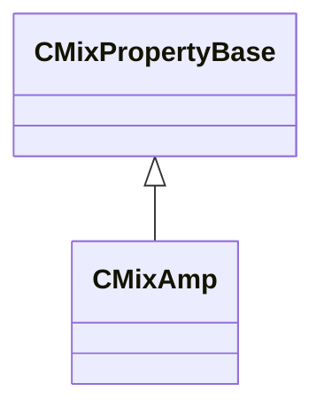

### CMixAudioMeter

**Inherits from:** [CMixPropertyBase](sounddoc_lib.md#cmixpropertybase)

**Metadata:** `MGetKV3ClassDefaults = {`, `"_class": "CMixAudioMeter",`, `"m_name": "",`, `"m_Comment": "",`, `"m_bActive": true,`, `"m_bSolo": false,`, `"m_bEditProperties": true,`, `"m_flLeftLevel": 0.000000,`, `"m_flLeftPeak": 0.000000,`, `"m_flRightLevel": 0.000000,`, `"m_flRightPeak": 0.000000`, `}`, `MPropertyFriendlyName = "VMix Audio Meter Node"`, `MPropertyDescription = "This lets you meter an audio signal in vmixtool."`

**Relationships:**


### CMixAutoFilter

**Inherits from:** [CMixPropertyBase](sounddoc_lib.md#cmixpropertybase)

**Metadata:** `MGetKV3ClassDefaults = {`, `"_class": "CMixAutoFilter",`, `"m_name": "",`, `"m_Comment": "",`, `"m_bActive": true,`, `"m_bSolo": false,`, `"m_bEditProperties": false,`, `"m_desc":`, `{`, `"m_flEnvelopeAmount": 0.000000,`, `"m_flAttackTimeMS": 5.000000,`, `"m_flReleaseTimeMS": 200.000000,`, `"m_filter":`, `{`, `"m_nFilterType": "FILTER_LOWPASS",`, `"m_nFilterSlope": "FILTER_SLOPE_12dB",`, `"m_bEnabled": true,`, `"m_fldbGain": 0.000000,`, `"m_flCutoffFreq": 1000.000000,`, `"m_flQ": 0.707107`, `},`, `"m_flLFOAmount": 0.000000,`, `"m_flLFORate": 0.000000,`, `"m_flPhase": 0.000000,`, `"m_nLFOShape": "LFO_SHAPE_SINE"`, `}`, `}`, `MPropertyFriendlyName = "VMix Auto Filter Node"`, `MPropertyDescription = "A continuously variable filter that can be driven by a built-in envelope follower and/or LFO.  Stereo channels can be processed differently by adjusting the phase parameter."`

**Relationships:**

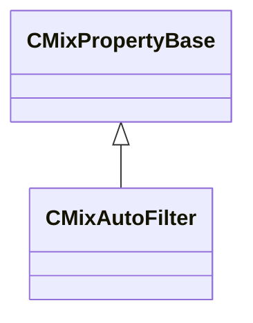

### CMixBlendAudio

**Inherits from:** [CMixPropertyBase](sounddoc_lib.md#cmixpropertybase)

**Metadata:** `MGetKV3ClassDefaults = {`, `"_class": "CMixBlendAudio",`, `"m_name": "",`, `"m_Comment": "",`, `"m_bActive": true,`, `"m_bSolo": false,`, `"m_bEditProperties": false,`, `"m_flLockAmount": 0.000000`, `}`, `MPropertyFriendlyName = "VMix Blend Audio Node"`, `MPropertyDescription = "This node will do a pairwise blend through a set of audio signals.  It will blend through as many different signals as you connect.  A blend factor of 0.0 is 100% the first signal, and a blend factor of 1.0 is 100% the last signal."`

**Relationships:**

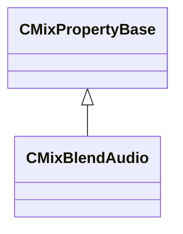

### CMixBlendVsndsToImpulseResponse

**Inherits from:** [CMixPropertyBase](sounddoc_lib.md#cmixpropertybase)

**Metadata:** `MGetKV3ClassDefaults = {`, `"_class": "CMixBlendVsndsToImpulseResponse",`, `"m_name": "",`, `"m_Comment": "",`, `"m_bActive": true,`, `"m_bSolo": false,`, `"m_bEditProperties": false,`, `"m_flWeight0": 1.000000,`, `"m_flWeight1": 1.000000,`, `"m_flWeight2": 1.000000,`, `"m_flWeight3": 1.000000,`, `"m_flWeight4": 1.000000,`, `"m_flWeight5": 1.000000,`, `"m_flWeight6": 1.000000,`, `"m_flWeight7": 1.000000,`, `"m_flPreDelayMS0": 0.000000,`, `"m_flPreDelayMS1": 0.000000,`, `"m_flPreDelayMS2": 0.000000,`, `"m_flPreDelayMS3": 0.000000,`, `"m_flPreDelayMS4": 0.000000,`, `"m_flPreDelayMS5": 0.000000,`, `"m_flPreDelayMS6": 0.000000,`, `"m_flPreDelayMS7": 0.000000`, `}`, `MPropertyFriendlyName = "VMix Blend VSnds to Impulse Response Node"`, `MPropertyDescription = "Blends up to 8 vsnds to an impulse response."`

**Relationships:**

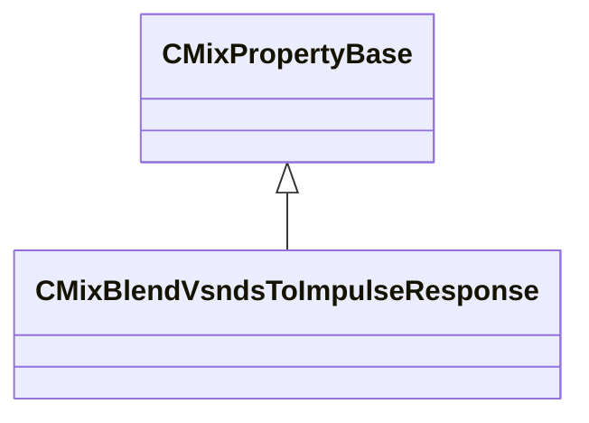

### CMixBoxverb

**Inherits from:** [CMixPropertyBase](sounddoc_lib.md#cmixpropertybase)

**Metadata:** `MGetKV3ClassDefaults = {`, `"_class": "CMixBoxverb",`, `"m_name": "",`, `"m_Comment": "",`, `"m_bActive": true,`, `"m_bSolo": false,`, `"m_bEditProperties": false,`, `"m_flSizeMax": 100.000000,`, `"m_flSizeMin": 0.000000,`, `"m_flComplexity": 4.000000,`, `"m_flModDepth": 0.000000,`, `"m_flModRate": 0.000000,`, `"m_bParallel": false,`, `"m_filterType":`, `{`, `"m_nFilterType": "FILTER_LOWPASS",`, `"m_nFilterSlope": "FILTER_SLOPE_12dB",`, `"m_bEnabled": true,`, `"m_fldbGain": 0.000000,`, `"m_flCutoffFreq": 1000.000000,`, `"m_flQ": 0.707107`, `},`, `"m_flWidth": 20.000000,`, `"m_flHeight": 23.000000,`, `"m_flDepth": 27.000000,`, `"m_flFeedbackScale": 0.150000,`, `"m_flFeedbackWidth": 0.000000,`, `"m_flFeedbackHeight": 0.000000,`, `"m_flFeedbackDepth": 0.000000,`, `"m_flOutputGain": 0.000000,`, `"m_flTaps": 0.000000`, `}`, `MPropertyFriendlyName = "Legacy VMix Shoebox Reverb Node"`, `MPropertyDescription = "A simple reverb that approximates the reflections of a box-shaped room, copied from previous audio system."`

**Relationships:**

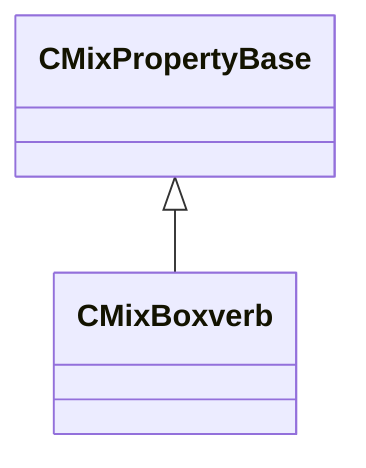

### CMixBoxverb2

**Inherits from:** [CMixPropertyBase](sounddoc_lib.md#cmixpropertybase)

**Metadata:** `MGetKV3ClassDefaults = {`, `"_class": "CMixBoxverb2",`, `"m_name": "",`, `"m_Comment": "",`, `"m_bActive": true,`, `"m_bSolo": false,`, `"m_bEditProperties": false,`, `"m_flSizeMax": 100.000000,`, `"m_flSizeMin": 0.000000,`, `"m_flComplexity": 4.000000,`, `"m_flModDepth": 0.000000,`, `"m_flModRate": 0.000000,`, `"m_bParallel": false,`, `"m_filterType":`, `{`, `"m_nFilterType": "FILTER_LOWPASS",`, `"m_nFilterSlope": "FILTER_SLOPE_12dB",`, `"m_bEnabled": true,`, `"m_fldbGain": 0.000000,`, `"m_flCutoffFreq": 1000.000000,`, `"m_flQ": 0.707107`, `},`, `"m_flWidth": 20.000000,`, `"m_flHeight": 23.000000,`, `"m_flDepth": 27.000000,`, `"m_flFeedbackScale": 0.150000,`, `"m_flFeedbackWidth": 0.000000,`, `"m_flFeedbackHeight": 0.000000,`, `"m_flFeedbackDepth": 0.000000,`, `"m_flWetMix": 0.000000,`, `"m_flOutputGain": 0.000000,`, `"m_flTaps": 0.000000`, `}`, `MPropertyFriendlyName = "VMix Shoebox Reverb Node v2"`, `MPropertyDescription = "A simple reverb that approximates the reflections of a box-shaped room."`

**Relationships:**

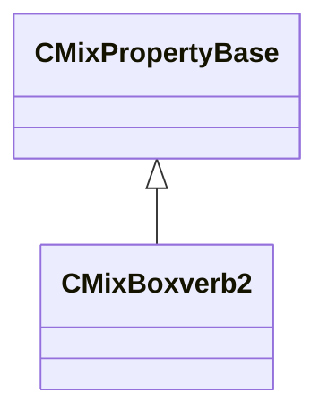

### CMixControlAutomatic

**Inherits from:** [CMixPropertyBase](sounddoc_lib.md#cmixpropertybase)

**Metadata:** `MGetKV3ClassDefaults = {`, `"_class": "CMixControlAutomatic",`, `"m_name": "",`, `"m_Comment": "",`, `"m_bActive": true,`, `"m_bSolo": false,`, `"m_bEditProperties": false`, `}`, `MPropertyFriendlyName = "VMix Automatic Control Node"`, `MPropertyDescription = "This will automatically forward a variable from the sound event that can be used to drive graph behavior."`

**Relationships:**

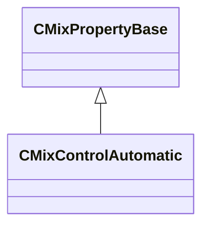

### CMixControlCrossfade

**Inherits from:** [CMixPropertyBase](sounddoc_lib.md#cmixpropertybase)

**Metadata:** `MGetKV3ClassDefaults = {`, `"_class": "CMixControlCrossfade",`, `"m_name": "",`, `"m_Comment": "",`, `"m_bActive": true,`, `"m_bSolo": false,`, `"m_bEditProperties": false,`, `"m_flFadeStart": 0.000000,`, `"m_flFadeEnd": 1.000000`, `}`, `MPropertyFriendlyName = "VMix Crossfade Control Node"`, `MPropertyDescription = "Generates two control signals from a single input that can be used to drive an equal power volume crossfade."`

**Relationships:**

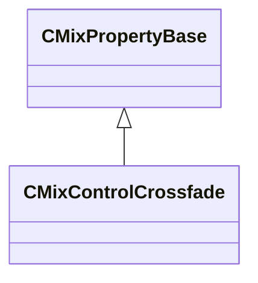

### CMixControlCurve

**Inherits from:** [CMixPropertyBase](sounddoc_lib.md#cmixpropertybase)

**Metadata:** `MGetKV3ClassDefaults = {`, `"_class": "CMixControlCurve",`, `"m_name": "",`, `"m_Comment": "",`, `"m_bActive": true,`, `"m_bSolo": false,`, `"m_bEditProperties": false,`, `"m_flInputMin": 0.000000,`, `"m_flInputMax": 1.000000,`, `"m_flOutputMin": 0.000000,`, `"m_flOutputMax": 1.000000,`, `"m_curve":`, `{`, `"m_spline":`, `[`, `{`, `"x": 0.000000,`, `"y": 0.000000,`, `"m_flSlopeIncoming": 1.000000,`, `"m_flSlopeOutgoing": 1.000000`, `},`, `{`, `"x": 1.000000,`, `"y": 1.000000,`, `"m_flSlopeIncoming": 1.000000,`, `"m_flSlopeOutgoing": 1.000000`, `}`, `],`, `"m_tangents":`, `[`, `{`, `"m_nIncomingTangent": "CURVE_TANGENT_SPLINE",`, `"m_nOutgoingTangent": "CURVE_TANGENT_SPLINE"`, `},`, `{`, `"m_nIncomingTangent": "CURVE_TANGENT_SPLINE",`, `"m_nOutgoingTangent": "CURVE_TANGENT_SPLINE"`, `}`, `],`, `"m_vDomainMins":`, `[`, `0.000000,`, `0.000000`, `],`, `"m_vDomainMaxs":`, `[`, `0.000000,`, `0.000000`, `]`, `}`, `}`, `MPropertyFriendlyName = "VMix Control Curve Node"`, `MPropertyDescription = "Remap a control variable through a curve that you define."`

**Relationships:**

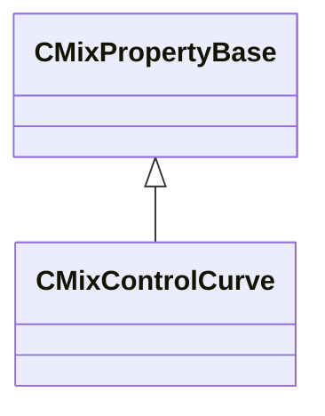

### CMixControlInput

**Inherits from:** [CMixPropertyBase](sounddoc_lib.md#cmixpropertybase)

**Metadata:** `MGetKV3ClassDefaults = {`, `"_class": "CMixControlInput",`, `"m_name": "",`, `"m_Comment": "",`, `"m_bActive": true,`, `"m_bSolo": false,`, `"m_bEditProperties": false,`, `"m_flDefaultValue": 1.000000,`, `"m_flMinRange": 0.000000,`, `"m_flMaxRange": 1.000000,`, `"m_bUseDecibels": false`, `}`, `MPropertyFriendlyName = "VMix Control Input Node"`, `MPropertyDescription = "Define a control variable that can be set by code or an operator stack."`

**Relationships:**

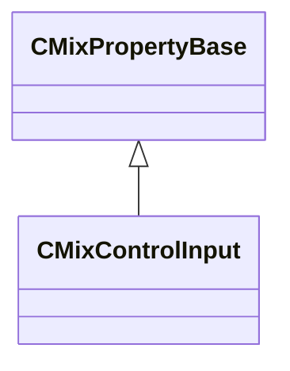

### CMixControlInputArray

**Inherits from:** [CMixPropertyBase](sounddoc_lib.md#cmixpropertybase)

**Metadata:** `MGetKV3ClassDefaults = {`, `"_class": "CMixControlInputArray",`, `"m_name": "",`, `"m_Comment": "",`, `"m_bActive": true,`, `"m_bSolo": false,`, `"m_bEditProperties": false,`, `"m_vflData":`, `[`, `]`, `}`, `MPropertyFriendlyName = "VMix Control Array Input Node"`, `MPropertyDescription = "Define a control array variable that can be set by code or an operator stack.  This can be used to control steamaudio pathing or steamaudio reverb for example."`

**Relationships:**

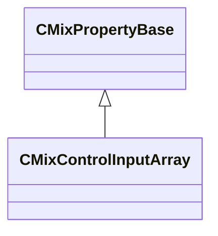

### CMixControlListener

**Inherits from:** [CMixPropertyBase](sounddoc_lib.md#cmixpropertybase)

**Metadata:** `MGetKV3ClassDefaults = {`, `"_class": "CMixControlListener",`, `"m_name": "",`, `"m_Comment": "",`, `"m_bActive": true,`, `"m_bSolo": false,`, `"m_bEditProperties": false`, `}`, `MPropertyFriendlyName = "VMix Control Listener Node"`, `MPropertyDescription = "An automatic control input that gets a value from the listener of this mix (e.g. orientation values)."`

**Relationships:**

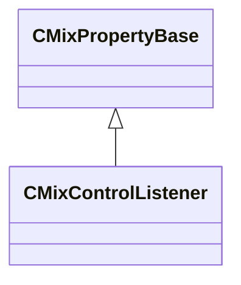

### CMixControlMax

**Inherits from:** [CMixPropertyBase](sounddoc_lib.md#cmixpropertybase)

**Metadata:** `MGetKV3ClassDefaults = {`, `"_class": "CMixControlMax",`, `"m_name": "",`, `"m_Comment": "",`, `"m_bActive": true,`, `"m_bSolo": false,`, `"m_bEditProperties": false`, `}`, `MPropertyFriendlyName = "VMix Control Max Node"`, `MPropertyDescription = "Outputs the current max of up to six control inputs."`

**Relationships:**

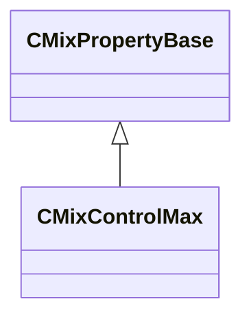

### CMixControlMeter

**Inherits from:** [CMixPropertyBase](sounddoc_lib.md#cmixpropertybase)

**Metadata:** `MGetKV3ClassDefaults = {`, `"_class": "CMixControlMeter",`, `"m_name": "",`, `"m_Comment": "",`, `"m_bActive": true,`, `"m_bSolo": false,`, `"m_bEditProperties": false,`, `"m_flValue": 0.000000`, `}`, `MPropertyFriendlyName = "VMix Control Meter Node"`, `MPropertyDescription = "Allows you to monitor a control value in real-time in vmixtool."`

**Relationships:**

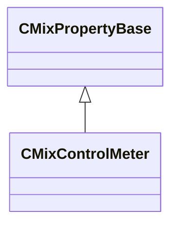

### CMixControlOutput

**Inherits from:** [CMixPropertyBase](sounddoc_lib.md#cmixpropertybase)

**Metadata:** `MGetKV3ClassDefaults = {`, `"_class": "CMixControlOutput",`, `"m_name": "",`, `"m_Comment": "",`, `"m_bActive": true,`, `"m_bSolo": false,`, `"m_bEditProperties": false,`, `"m_flDefaultValue": 1.000000`, `}`, `MPropertyFriendlyName = "VMix Control Output Node"`, `MPropertyDescription = "Save the results of a control value (e.g. envelope level) so that code/stack can query it by name."`

**Relationships:**

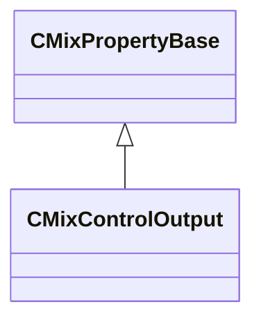

### CMixControlRemap

**Inherits from:** [CMixPropertyBase](sounddoc_lib.md#cmixpropertybase)

**Metadata:** `MGetKV3ClassDefaults = {`, `"_class": "CMixControlRemap",`, `"m_name": "",`, `"m_Comment": "",`, `"m_bActive": true,`, `"m_bSolo": false,`, `"m_bEditProperties": false,`, `"m_flInputMin": 0.000000,`, `"m_flInputMax": 1.000000,`, `"m_flOutputStart": 0.000000,`, `"m_flOutputEnd": 1.000000,`, `"m_flPower": 1.000000`, `}`, `MPropertyFriendlyName = "VMix Control Remap Node"`, `MPropertyDescription = "Remap a control value using a clamped linear range or clamped power curve.  Allows you to stretch and clip a control signal."`

**Relationships:**

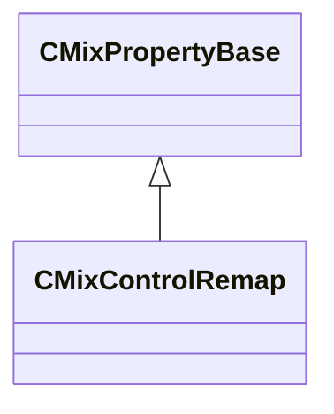

### CMixControlStackInput

**Inherits from:** [CMixPropertyBase](sounddoc_lib.md#cmixpropertybase)

**Metadata:** `MGetKV3ClassDefaults = {`, `"_class": "CMixControlStackInput",`, `"m_name": "",`, `"m_Comment": "",`, `"m_bActive": true,`, `"m_bSolo": false,`, `"m_bEditProperties": false,`, `"m_flDefaultValue": 1.000000,`, `"m_flMinRange": 0.000000,`, `"m_flMaxRange": 1.000000`, `}`, `MPropertyFriendlyName = "VMix Control Stack Input Node"`, `MPropertyDescription = "This will copy a control value from this soundevent's operator stack.  Works with any stack/variable without modifying the stack itself."`

**Relationships:**

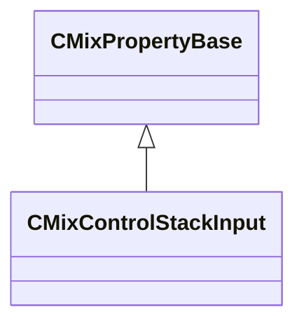

### CMixControlTransientInput

**Inherits from:** [CMixPropertyBase](sounddoc_lib.md#cmixpropertybase)

**Metadata:** `MGetKV3ClassDefaults = {`, `"_class": "CMixControlTransientInput",`, `"m_name": "",`, `"m_Comment": "",`, `"m_bActive": true,`, `"m_bSolo": false,`, `"m_bEditProperties": false`, `}`, `MPropertyFriendlyName = "VMix Control Input Node"`, `MPropertyDescription = "Define a control variable that triggers a one-time event."`

**Relationships:**

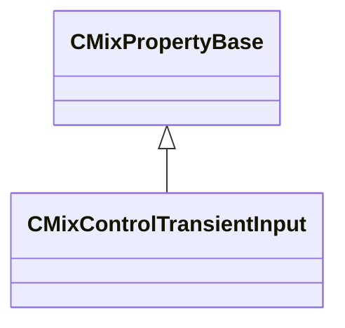

### CMixConvolution

**Inherits from:** [CMixPropertyBase](sounddoc_lib.md#cmixpropertybase)

**Metadata:** `MGetKV3ClassDefaults = {`, `"_class": "CMixConvolution",`, `"m_name": "",`, `"m_Comment": "",`, `"m_bActive": true,`, `"m_bSolo": false,`, `"m_bEditProperties": false,`, `"m_desc":`, `{`, `"m_fldbGain": -12.000000,`, `"m_flPreDelayMS": 0.000000,`, `"m_flWetMix": 1.000000,`, `"m_fldbLow": 0.000000,`, `"m_fldbMid": 0.000000,`, `"m_fldbHigh": 0.000000,`, `"m_flLowCutoffFreq": 1500.000000,`, `"m_flHighCutoffFreq": 7500.000000`, `}`, `}`, `MPropertyFriendlyName = "VMix Audio Convolution Node"`, `MPropertyDescription = "Apply a vsnd as an impulse response (IR) to an audio signal via convolution."`

**Relationships:**

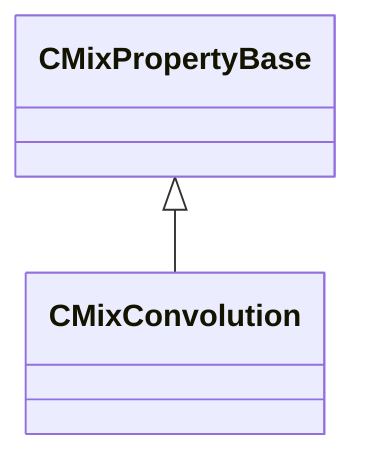

### CMixDelay

**Inherits from:** [CMixPropertyBase](sounddoc_lib.md#cmixpropertybase)

**Metadata:** `MGetKV3ClassDefaults = {`, `"_class": "CMixDelay",`, `"m_name": "",`, `"m_Comment": "",`, `"m_bActive": true,`, `"m_bSolo": false,`, `"m_bEditProperties": true,`, `"m_nChannels": -1,`, `"m_flDelay": 500.000000,`, `"m_fldbDirectGain": 0.000000,`, `"m_fldbDelayGain": -3.000000,`, `"m_fldbFeedbackGain": -3.000000,`, `"m_flWidth": 0.000000,`, `"m_bEnableFilter": false,`, `"m_filterType": "FILTER_LOWPASS",`, `"m_flFrequency": 2000.000000,`, `"m_flQ": 0.707000,`, `"m_fldbGain": 0.000000`, `}`, `MPropertyFriendlyName = "VMix Delay Audio Node"`, `MPropertyDescription = "Stereo delay with resonant filter on feedback."`

**Relationships:**

```mermaid
classDiagram
    CMixPropertyBase <|-- CMixDelay
```

### CMixDelayImpulseResponse

**Inherits from:** [CMixPropertyBase](sounddoc_lib.md#cmixpropertybase)

**Metadata:** `MGetKV3ClassDefaults = {`, `"_class": "CMixDelayImpulseResponse",`, `"m_name": "",`, `"m_Comment": "",`, `"m_bActive": true,`, `"m_bSolo": false,`, `"m_bEditProperties": false,`, `"m_flPreDelayMS": 0.000000`, `}`, `MPropertyFriendlyName = "VMix Apply Pre-Delay to Impulse Response Node"`, `MPropertyDescription = "Applies a pre-delay to an impulse response."`

**Relationships:**

```mermaid
classDiagram
    CMixPropertyBase <|-- CMixDelayImpulseResponse
```

### CMixDiffusor

**Inherits from:** [CMixPropertyBase](sounddoc_lib.md#cmixpropertybase)

**Metadata:** `MGetKV3ClassDefaults = {`, `"_class": "CMixDiffusor",`, `"m_name": "",`, `"m_Comment": "",`, `"m_bActive": true,`, `"m_bSolo": false,`, `"m_bEditProperties": false,`, `"m_flSize": 0.500000,`, `"m_flComplexity": 2.000000,`, `"m_flFeedback": -8.000000,`, `"m_flOutputGain": 0.000000`, `}`, `MPropertyFriendlyName = "VMix Diffusor Audio Node"`, `MPropertyDescription = "Creates a dense field of delay/feedback/reflections.  This is basically a sequence of allpass filters and short delay lines.  Can be used to create part of a reverb effect."`

**Relationships:**

```mermaid
classDiagram
    CMixPropertyBase <|-- CMixDiffusor
```

### CMixDualCompressor

**Inherits from:** [CMixPropertyBase](sounddoc_lib.md#cmixpropertybase)

**Metadata:** `MGetKV3ClassDefaults = {`, `"_class": "CMixDualCompressor",`, `"m_name": "",`, `"m_Comment": "",`, `"m_bActive": true,`, `"m_bSolo": false,`, `"m_bEditProperties": false,`, `"m_nChannels": -1,`, `"m_desc":`, `{`, `"m_flRMSTimeMS": 300.000000,`, `"m_fldbKneeWidth": 0.000000,`, `"m_flWetMix": 1.000000,`, `"m_bPeakMode": false,`, `"m_bandDesc":`, `{`, `"m_fldbGainInput": 0.000000,`, `"m_fldbGainOutput": 0.000000,`, `"m_fldbThresholdBelow": -40.000000,`, `"m_fldbThresholdAbove": -30.000000,`, `"m_flRatioBelow": 12.000000,`, `"m_flRatioAbove": 4.000000,`, `"m_flAttackTimeMS": 50.000000,`, `"m_flReleaseTimeMS": 200.000000,`, `"m_bEnable": true,`, `"m_bSolo": false`, `}`, `}`, `}`, `MPropertyFriendlyName = "VMix Dual Compressor Node"`, `MPropertyDescription = "Compress the dynamic range of both ends of a signal."`

**Relationships:**

```mermaid
classDiagram
    CMixPropertyBase <|-- CMixDualCompressor
```

### CMixDynamics

**Inherits from:** [CMixPropertyBase](sounddoc_lib.md#cmixpropertybase)

**Metadata:** `MGetKV3ClassDefaults = {`, `"_class": "CMixDynamics",`, `"m_name": "",`, `"m_Comment": "",`, `"m_bActive": true,`, `"m_bSolo": false,`, `"m_bEditProperties": false,`, `"m_nChannels": -1,`, `"m_fldbNoiseGateThreshold": -90.000000,`, `"m_fldbGain": 0.000000,`, `"m_fldbCompressionThreshold": -6.000000,`, `"m_fldbLimiterThreshold": 0.000000,`, `"m_fldbKneeWidth": 0.000000,`, `"m_flRatio": 2.000000,`, `"m_flLimiterRatio": 40.000000,`, `"m_flAttackTime": 100.000000,`, `"m_flReleaseTime": 200.000000,`, `"m_flRMSTime": 200.000000,`, `"m_flWetMix": 1.000000,`, `"m_bPeakMode": false,`, `"m_nUIPage": 0`, `}`, `MPropertyFriendlyName = "VMix Dynamics Audio Node"`, `MPropertyDescription = "A dynamics multiprocessor.  This is a single unit that switches between being a noise gate, compressor, or limiter as the signal moves through its dynamic range.  Useful in some specific cases, e.g. gate+compress or gate+limit usually.  Other cases may be more suited to using multiple compressors in series."`

**Relationships:**

```mermaid
classDiagram
    CMixPropertyBase <|-- CMixDynamics
```

### CMixDynamics3Band

**Inherits from:** [CMixPropertyBase](sounddoc_lib.md#cmixpropertybase)

**Metadata:** `MGetKV3ClassDefaults = {`, `"_class": "CMixDynamics3Band",`, `"m_name": "",`, `"m_Comment": "",`, `"m_bActive": true,`, `"m_bSolo": false,`, `"m_bEditProperties": false,`, `"m_nChannels": -1,`, `"m_fldbOutputGain": 0.000000,`, `"m_flRMSTime": 500.000000,`, `"m_flDepth": 1.000000,`, `"m_flWetMix": 1.000000,`, `"m_flTimeScale": 1.000000,`, `"m_fldbKneeWidth": 5.000000,`, `"m_flLowCutoffFreq": 88.300003,`, `"m_flHighCutoffFreq": 2500.000000,`, `"m_bPeakMode": false,`, `"m_nSelectedPage": 0,`, `"m_bands":`, `[`, `{`, `"m_fldbGainInput": 5.200000,`, `"m_fldbGainOutput": 8.000000,`, `"m_fldbThresholdBelow": -40.799999,`, `"m_fldbThresholdAbove": -33.799999,`, `"m_flRatioBelow": 4.170000,`, `"m_flRatioAbove": 39.000000,`, `"m_flAttackTimeMS": 47.799999,`, `"m_flReleaseTimeMS": 282.000000,`, `"m_bEnable": true,`, `"m_bSolo": false`, `},`, `{`, `"m_fldbGainInput": 5.200000,`, `"m_fldbGainOutput": 4.420000,`, `"m_fldbThresholdBelow": -41.799999,`, `"m_fldbThresholdAbove": -30.200001,`, `"m_flRatioBelow": 4.170000,`, `"m_flRatioAbove": 39.000000,`, `"m_flAttackTimeMS": 22.400000,`, `"m_flReleaseTimeMS": 282.000000,`, `"m_bEnable": true,`, `"m_bSolo": false`, `},`, `{`, `"m_fldbGainInput": 5.200000,`, `"m_fldbGainOutput": 8.000000,`, `"m_fldbThresholdBelow": -40.799999,`, `"m_fldbThresholdAbove": -35.500000,`, `"m_flRatioBelow": 4.170000,`, `"m_flRatioAbove": 80.000000,`, `"m_flAttackTimeMS": 13.500000,`, `"m_flReleaseTimeMS": 132.000000,`, `"m_bEnable": true,`, `"m_bSolo": false`, `}`, `]`, `}`, `MPropertyFriendlyName = "VMix 3 Band Dynamics Node"`, `MPropertyDescription = "This is a multi-band dynamics processor.  First the signal is split into low/mid/high bands, then each band is routed through two compressors providing upward and downward compression to each band.  Input & Output gain can also be adjusted."`

**Relationships:**

```mermaid
classDiagram
    CMixPropertyBase <|-- CMixDynamics3Band
```

### CMixDynamicsCompressor

**Inherits from:** [CMixPropertyBase](sounddoc_lib.md#cmixpropertybase)

**Metadata:** `MGetKV3ClassDefaults = {`, `"_class": "CMixDynamicsCompressor",`, `"m_name": "",`, `"m_Comment": "",`, `"m_bActive": true,`, `"m_bSolo": false,`, `"m_bEditProperties": false,`, `"m_nChannels": -1,`, `"m_desc":`, `{`, `"m_fldbOutputGain": 0.000000,`, `"m_fldbCompressionThreshold": -6.000000,`, `"m_fldbKneeWidth": 0.000000,`, `"m_flCompressionRatio": 2.000000,`, `"m_flAttackTimeMS": 100.000000,`, `"m_flReleaseTimeMS": 400.000000,`, `"m_flRMSTimeMS": 300.000000,`, `"m_flWetMix": 1.000000,`, `"m_bPeakMode": false`, `},`, `"m_nUIPage": 1,`, `"m_bIsLimiter": false`, `}`, `MPropertyFriendlyName = "VMix Compressor/Limiter Node"`, `MPropertyDescription = "Compress the dynamic range of a signal when it is louder than some threshold."`

**Relationships:**

```mermaid
classDiagram
    CMixPropertyBase <|-- CMixDynamicsCompressor
```

### CMixEQ8

**Inherits from:** [CMixPropertyBase](sounddoc_lib.md#cmixpropertybase)

**Metadata:** `MGetKV3ClassDefaults = {`, `"_class": "CMixEQ8",`, `"m_name": "",`, `"m_Comment": "",`, `"m_bActive": true,`, `"m_bSolo": false,`, `"m_bEditProperties": false,`, `"m_nChannels": -1,`, `"m_stages":`, `[`, `{`, `"m_filterType": "FILTER_LOW_SHELF",`, `"m_flFrequency": 80.000000,`, `"m_flQ": 1.000000,`, `"m_fldbGain": 0.000000,`, `"m_nFilterSlope": "FILTER_SLOPE_12dB",`, `"m_bEnable": true`, `},`, `{`, `"m_filterType": "FILTER_PEAKING_EQ",`, `"m_flFrequency": 500.000000,`, `"m_flQ": 3.000000,`, `"m_fldbGain": 0.000000,`, `"m_nFilterSlope": "FILTER_SLOPE_12dB",`, `"m_bEnable": true`, `},`, `{`, `"m_filterType": "FILTER_PEAKING_EQ",`, `"m_flFrequency": 750.000000,`, `"m_flQ": 3.000000,`, `"m_fldbGain": 0.000000,`, `"m_nFilterSlope": "FILTER_SLOPE_12dB",`, `"m_bEnable": false`, `},`, `{`, `"m_filterType": "FILTER_PEAKING_EQ",`, `"m_flFrequency": 1200.000000,`, `"m_flQ": 3.000000,`, `"m_fldbGain": 0.000000,`, `"m_nFilterSlope": "FILTER_SLOPE_12dB",`, `"m_bEnable": true`, `},`, `{`, `"m_filterType": "FILTER_PEAKING_EQ",`, `"m_flFrequency": 2000.000000,`, `"m_flQ": 3.000000,`, `"m_fldbGain": 0.000000,`, `"m_nFilterSlope": "FILTER_SLOPE_12dB",`, `"m_bEnable": false`, `},`, `{`, `"m_filterType": "FILTER_PEAKING_EQ",`, `"m_flFrequency": 3000.000000,`, `"m_flQ": 3.000000,`, `"m_fldbGain": 0.000000,`, `"m_nFilterSlope": "FILTER_SLOPE_12dB",`, `"m_bEnable": true`, `},`, `{`, `"m_filterType": "FILTER_PEAKING_EQ",`, `"m_flFrequency": 5000.000000,`, `"m_flQ": 3.000000,`, `"m_fldbGain": 0.000000,`, `"m_nFilterSlope": "FILTER_SLOPE_12dB",`, `"m_bEnable": false`, `},`, `{`, `"m_filterType": "FILTER_HIGH_SHELF",`, `"m_flFrequency": 12000.000000,`, `"m_flQ": 1.000000,`, `"m_fldbGain": 0.000000,`, `"m_nFilterSlope": "FILTER_SLOPE_12dB",`, `"m_bEnable": true`, `}`, `]`, `}`, `MPropertyFriendlyName = "VMix EQ8 Audio Node"`, `MPropertyDescription = "Up to 8 bands of EQ.  Boost/cut up to 8 bands with adjustable Q.  Filters can also be configured as low/high pass or low/high shelf."`

**Relationships:**

```mermaid
classDiagram
    CMixPropertyBase <|-- CMixEQ8
```

### CMixEffectChain

**Inherits from:** [CMixPropertyBase](sounddoc_lib.md#cmixpropertybase)

**Metadata:** `MGetKV3ClassDefaults = {`, `"_class": "CMixEffectChain",`, `"m_name": "",`, `"m_Comment": "",`, `"m_bActive": true,`, `"m_bSolo": false,`, `"m_bEditProperties": true,`, `"m_nChannels": -1,`, `"m_effectName": "core.null",`, `"m_flXFade": 0.100000`, `}`, `MPropertyFriendlyName = "VMix Effect Chain Audio Node"`, `MPropertyDescription = "Allows you to swap between sub-graphs with a short crossfade.  Can be used to swap out processing algorithms/configurations, or to dynamically enable/disable optional processing stages."`

**Relationships:**

```mermaid
classDiagram
    CMixPropertyBase <|-- CMixEffectChain
```

### CMixEffectName

**Inherits from:** [CMixPropertyBase](sounddoc_lib.md#cmixpropertybase)

**Metadata:** `MGetKV3ClassDefaults = {`, `"_class": "CMixEffectName",`, `"m_name": "",`, `"m_Comment": "",`, `"m_bActive": true,`, `"m_bSolo": false,`, `"m_bEditProperties": false,`, `"m_defaultValue": "core.null"`, `}`, `MPropertyFriendlyName = "VMix Effect Name Node"`, `MPropertyDescription = "Define an effect name variable that can be controlled by code/operator stack and used to drive processor/effectchain/subgraphswitch nodes."`

**Relationships:**

```mermaid
classDiagram
    CMixPropertyBase <|-- CMixEffectName
```

### CMixEnvelope

**Inherits from:** [CMixPropertyBase](sounddoc_lib.md#cmixpropertybase)

**Metadata:** `MGetKV3ClassDefaults = {`, `"_class": "CMixEnvelope",`, `"m_name": "",`, `"m_Comment": "",`, `"m_bActive": true,`, `"m_bSolo": false,`, `"m_bEditProperties": false,`, `"m_flAttackTime": 300.000000,`, `"m_flHoldTime": 500.000000,`, `"m_flReleaseTime": 300.000000`, `}`, `MPropertyFriendlyName = "VMix Envelope Audio Node"`, `MPropertyDescription = "Generate a control signal that represents the envelope/level of an audio track.  Think of this as behaving like a meter but driving some graph logic."`

**Relationships:**

```mermaid
classDiagram
    CMixPropertyBase <|-- CMixEnvelope
```

### CMixEnvelopeTrigger

**Inherits from:** [CMixPropertyBase](sounddoc_lib.md#cmixpropertybase)

**Metadata:** `MGetKV3ClassDefaults = {`, `"_class": "CMixEnvelopeTrigger",`, `"m_name": "",`, `"m_Comment": "",`, `"m_bActive": true,`, `"m_bSolo": false,`, `"m_bEditProperties": false,`, `"m_flBaseValue": 0.000000,`, `"m_flDestinationValue": 1.000000,`, `"m_flAttackTime": 0.400000,`, `"m_flHoldTime": 0.200000,`, `"m_flReleaseTime": 0.400000`, `}`, `MPropertyFriendlyName = "VMix Envelope Trigger Control Node"`, `MPropertyDescription = "Used to create reverb effects based on a model of a reverb plate."`

**Relationships:**

```mermaid
classDiagram
    CMixPropertyBase <|-- CMixEnvelopeTrigger
```

### CMixFilter

**Inherits from:** [CMixPropertyBase](sounddoc_lib.md#cmixpropertybase)

**Metadata:** `MGetKV3ClassDefaults = {`, `"_class": "CMixFilter",`, `"m_name": "",`, `"m_Comment": "",`, `"m_bActive": true,`, `"m_bSolo": false,`, `"m_bEditProperties": false,`, `"m_filterType": "FILTER_LOWPASS",`, `"m_nChannels": -1,`, `"m_flFrequency": 2000.000000,`, `"m_flQ": 0.707000,`, `"m_fldbGain": 0.000000,`, `"m_nFilterSlope": "FILTER_SLOPE_12dB"`, `}`, `MPropertyFriendlyName = "VMix Filter Audio Node"`, `MPropertyDescription = "Resonant filter with adjustable slope. NOTE: This is a clean filter, not an analog model with distortion."`

**Relationships:**

```mermaid
classDiagram
    CMixPropertyBase <|-- CMixFilter
```

### CMixFlanger

**Inherits from:** [CMixPropertyBase](sounddoc_lib.md#cmixpropertybase)

**Metadata:** `MGetKV3ClassDefaults = {`, `"_class": "CMixFlanger",`, `"m_name": "",`, `"m_Comment": "",`, `"m_bActive": true,`, `"m_bSolo": false,`, `"m_bEditProperties": false,`, `"m_flDelay": 8.000000,`, `"m_flFeedback": -40.000000,`, `"m_flFeedfoward": 0.500000,`, `"m_flModRate": 0.500000,`, `"m_flModDepth": 0.500000,`, `"m_bPhaseInvert": false,`, `"m_flGlideTime": 150.000000,`, `"m_bAntialiasing": false,`, `"m_flGain": 0.000000`, `}`, `MPropertyFriendlyName = "VMix Short timeModulating Delay Audio Node"`, `MPropertyDescription = "A short time delay with modulation for flange and chorus effects."`

**Relationships:**

```mermaid
classDiagram
    CMixPropertyBase <|-- CMixFlanger
```

### CMixFreeverb

**Inherits from:** [CMixPropertyBase](sounddoc_lib.md#cmixpropertybase)

**Metadata:** `MGetKV3ClassDefaults = {`, `"_class": "CMixFreeverb",`, `"m_name": "",`, `"m_Comment": "",`, `"m_bActive": true,`, `"m_bSolo": false,`, `"m_bEditProperties": false,`, `"m_flRoomSize": 0.500000,`, `"m_flDamp": 0.500000,`, `"m_flWidth": 0.500000,`, `"m_flLateReflections": 1.000000`, `}`, `MPropertyFriendlyName = "VMix Freeverb Audio Node"`, `MPropertyDescription = "Used to create reverb effects based on a symmetrical room."`

**Relationships:**

```mermaid
classDiagram
    CMixPropertyBase <|-- CMixFreeverb
```

### CMixGroupBox

**Inherits from:** [CMixPropertyBase](sounddoc_lib.md#cmixpropertybase)

**Metadata:** `MGetKV3ClassDefaults = {`, `"_class": "CMixGroupBox",`, `"m_name": "",`, `"m_Comment": "",`, `"m_bActive": true,`, `"m_bSolo": false,`, `"m_bEditProperties": false,`, `"m_color":`, `[`, `40,`, `40,`, `70,`, `100`, `],`, `"m_bMovesNodes": true`, `}`, `MPropertyFriendlyName = "VMix Group Box"`, `MPropertyDescription = "Groups a set of nodes.  Comments/colors will get displayed in the graph and on node editors.  A group box allows the user to drag the entire group as one object."`

**Relationships:**

```mermaid
classDiagram
    CMixPropertyBase <|-- CMixGroupBox
```

### CMixImpulseResponseInput

**Inherits from:** [CMixPropertyBase](sounddoc_lib.md#cmixpropertybase)

**Metadata:** `MGetKV3ClassDefaults = {`, `"_class": "CMixImpulseResponseInput",`, `"m_name": "",`, `"m_Comment": "",`, `"m_bActive": true,`, `"m_bSolo": false,`, `"m_bEditProperties": false,`, `"m_defaultValue": "sounds/ir/default.vsnd"`, `}`, `MPropertyFriendlyName = "VMix Control Impulse Response Node"`, `MPropertyDescription = "Define a control input that outputs a dynamic impulse response, which can be used by the Steam Audio hybrid reverb processor."`

**Relationships:**

```mermaid
classDiagram
    CMixPropertyBase <|-- CMixImpulseResponseInput
```

### CMixModDelay

**Inherits from:** [CMixPropertyBase](sounddoc_lib.md#cmixpropertybase)

**Metadata:** `MGetKV3ClassDefaults = {`, `"_class": "CMixModDelay",`, `"m_name": "",`, `"m_Comment": "",`, `"m_bActive": true,`, `"m_bSolo": false,`, `"m_bEditProperties": false,`, `"m_bPhaseInvert": false,`, `"m_flGlideTime": 150.000000,`, `"m_flDelay": 500.000000,`, `"m_flFeedback": -40.000000,`, `"m_flGain": 0.000000,`, `"m_flModRate": 0.000000,`, `"m_flModDepth": 0.000000,`, `"m_filterType": "FILTER_PASSTHROUGH",`, `"m_flFrequency": 400.000000,`, `"m_flQ": 0.700000,`, `"m_flFilterGain": 0.000000,`, `"m_bAntialiasing": true`, `}`, `MPropertyFriendlyName = "VMix Modulating Delay Audio Node"`, `MPropertyDescription = "A delay with a modulated delay time."`

**Relationships:**

```mermaid
classDiagram
    CMixPropertyBase <|-- CMixModDelay
```

### CMixOsc

**Inherits from:** [CMixPropertyBase](sounddoc_lib.md#cmixpropertybase)

**Metadata:** `MGetKV3ClassDefaults = {`, `"_class": "CMixOsc",`, `"m_name": "",`, `"m_Comment": "",`, `"m_bActive": true,`, `"m_bSolo": false,`, `"m_bEditProperties": false,`, `"m_desc":`, `{`, `"oscType": "LFO_SHAPE_SINE",`, `"m_freq": 440.000000,`, `"m_flPhase": 0.000000`, `}`, `}`, `MPropertyFriendlyName = "VMix Oscillator Audio Node"`, `MPropertyDescription = "Generates a tone as an audio track."`

**Relationships:**

```mermaid
classDiagram
    CMixPropertyBase <|-- CMixOsc
```

### CMixOutput

**Inherits from:** [CMixPropertyBase](sounddoc_lib.md#cmixpropertybase)

**Metadata:** `MGetKV3ClassDefaults = {`, `"_class": "CMixOutput",`, `"m_name": "",`, `"m_Comment": "",`, `"m_bActive": true,`, `"m_bSolo": false,`, `"m_bEditProperties": false,`, `"m_flVolume1": 1.000000,`, `"m_flVolume2": 1.000000,`, `"m_sendTo": ""`, `}`, `MPropertyFriendlyName = "VMix Output Node"`, `MPropertyDescription = "This is where your audio is output from the graph"`

**Relationships:**

```mermaid
classDiagram
    CMixPropertyBase <|-- CMixOutput
```

### CMixPanner

**Inherits from:** [CMixPropertyBase](sounddoc_lib.md#cmixpropertybase)

**Metadata:** `MGetKV3ClassDefaults = {`, `"_class": "CMixPanner",`, `"m_name": "",`, `"m_Comment": "",`, `"m_bActive": true,`, `"m_bSolo": false,`, `"m_bEditProperties": false,`, `"m_type": "PANNER_TYPE_EQUAL_POWER",`, `"m_flStrength": 1.000000`, `}`, `MPropertyFriendlyName = "VMix Panner Audio Node"`, `MPropertyDescription = "Adjust the stereo panning of an audio track."`

**Relationships:**

```mermaid
classDiagram
    CMixPropertyBase <|-- CMixPanner
```

### CMixPitchShift

**Inherits from:** [CMixPropertyBase](sounddoc_lib.md#cmixpropertybase)

**Metadata:** `MGetKV3ClassDefaults = {`, `"_class": "CMixPitchShift",`, `"m_name": "",`, `"m_Comment": "",`, `"m_bActive": true,`, `"m_bSolo": false,`, `"m_bEditProperties": false,`, `"m_nChannels": -1,`, `"m_flPitchScale": 1.000000,`, `"m_flGrainMs": 100.000000,`, `"m_nProcType": 0,`, `"m_nQuality": 1`, `}`, `MPropertyFriendlyName = "VMix Pitch Shift Audio Node"`, `MPropertyDescription = "Adjust the pitch of an audio track.  This happens in real-time so the timing of the track is unaffected.  Generally the time domain processor will produce better results for small shifts downward.  For shifting upward it will alias where the frequency space shifter will apply anti-aliasing."`

**Relationships:**

```mermaid
classDiagram
    CMixPropertyBase <|-- CMixPitchShift
```

### CMixPlateverb

**Inherits from:** [CMixPropertyBase](sounddoc_lib.md#cmixpropertybase)

**Metadata:** `MGetKV3ClassDefaults = {`, `"_class": "CMixPlateverb",`, `"m_name": "",`, `"m_Comment": "",`, `"m_bActive": true,`, `"m_bSolo": false,`, `"m_bEditProperties": false,`, `"m_flPrefilter": 0.500000,`, `"m_flInputDiffusion1": 0.500000,`, `"m_flInputDiffusion2": 0.500000,`, `"m_flDecay": 0.500000,`, `"m_flDamp": 0.500000,`, `"m_flFeedbackDiffusion1": 0.500000,`, `"m_flFeedbackDiffusion2": 0.500000`, `}`, `MPropertyFriendlyName = "VMix Plateverb Audio Node"`, `MPropertyDescription = "Used to create reverb effects based on a model of a reverb plate."`

**Relationships:**

```mermaid
classDiagram
    CMixPropertyBase <|-- CMixPlateverb
```

### CMixPresetDSP

**Inherits from:** [CMixPropertyBase](sounddoc_lib.md#cmixpropertybase)

**Metadata:** `MGetKV3ClassDefaults = {`, `"_class": "CMixPresetDSP",`, `"m_name": "",`, `"m_Comment": "",`, `"m_bActive": true,`, `"m_bSolo": false,`, `"m_bEditProperties": true,`, `"m_nChannels": -1,`, `"m_effectName": "core.null",`, `"m_flXFade": 0.100000`, `}`, `MPropertyFriendlyName = "VMix Preset DSP Audio Node"`, `MPropertyDescription = "Applies an effects preset from the source1 DSP system."`

**Relationships:**

```mermaid
classDiagram
    CMixPropertyBase <|-- CMixPresetDSP
```

### CMixPropertyBase

**Derived by:** [CMixAmp](sounddoc_lib.md#cmixamp), [CMixAudioMeter](sounddoc_lib.md#cmixaudiometer), [CMixAutoFilter](sounddoc_lib.md#cmixautofilter), [CMixBlendAudio](sounddoc_lib.md#cmixblendaudio), [CMixBlendVsndsToImpulseResponse](sounddoc_lib.md#cmixblendvsndstoimpulseresponse), [CMixBoxverb](sounddoc_lib.md#cmixboxverb), [CMixBoxverb2](sounddoc_lib.md#cmixboxverb2), [CMixControlAutomatic](sounddoc_lib.md#cmixcontrolautomatic), [CMixControlCrossfade](sounddoc_lib.md#cmixcontrolcrossfade), [CMixControlCurve](sounddoc_lib.md#cmixcontrolcurve), [CMixControlInput](sounddoc_lib.md#cmixcontrolinput), [CMixControlInputArray](sounddoc_lib.md#cmixcontrolinputarray), [CMixControlListener](sounddoc_lib.md#cmixcontrollistener), [CMixControlMax](sounddoc_lib.md#cmixcontrolmax), [CMixControlMeter](sounddoc_lib.md#cmixcontrolmeter), [CMixControlOutput](sounddoc_lib.md#cmixcontroloutput), [CMixControlRemap](sounddoc_lib.md#cmixcontrolremap), [CMixControlStackInput](sounddoc_lib.md#cmixcontrolstackinput), [CMixControlTransientInput](sounddoc_lib.md#cmixcontroltransientinput), [CMixConvolution](sounddoc_lib.md#cmixconvolution), [CMixDelay](sounddoc_lib.md#cmixdelay), [CMixDelayImpulseResponse](sounddoc_lib.md#cmixdelayimpulseresponse), [CMixDiffusor](sounddoc_lib.md#cmixdiffusor), [CMixDualCompressor](sounddoc_lib.md#cmixdualcompressor), [CMixDynamics](sounddoc_lib.md#cmixdynamics), [CMixDynamics3Band](sounddoc_lib.md#cmixdynamics3band), [CMixDynamicsCompressor](sounddoc_lib.md#cmixdynamicscompressor), [CMixEQ8](sounddoc_lib.md#cmixeq8), [CMixEffectChain](sounddoc_lib.md#cmixeffectchain), [CMixEffectName](sounddoc_lib.md#cmixeffectname), [CMixEnvelope](sounddoc_lib.md#cmixenvelope), [CMixEnvelopeTrigger](sounddoc_lib.md#cmixenvelopetrigger), [CMixFilter](sounddoc_lib.md#cmixfilter), [CMixFlanger](sounddoc_lib.md#cmixflanger), [CMixFreeverb](sounddoc_lib.md#cmixfreeverb), [CMixGroupBox](sounddoc_lib.md#cmixgroupbox), [CMixImpulseResponseInput](sounddoc_lib.md#cmiximpulseresponseinput), [CMixModDelay](sounddoc_lib.md#cmixmoddelay), [CMixOsc](sounddoc_lib.md#cmixosc), [CMixOutput](sounddoc_lib.md#cmixoutput), [CMixPanner](sounddoc_lib.md#cmixpanner), [CMixPitchShift](sounddoc_lib.md#cmixpitchshift), [CMixPlateverb](sounddoc_lib.md#cmixplateverb), [CMixPresetDSP](sounddoc_lib.md#cmixpresetdsp), [CMixRemapVsndToImpulseResponse](sounddoc_lib.md#cmixremapvsndtoimpulseresponse), [CMixShaper](sounddoc_lib.md#cmixshaper), [CMixSplitter](sounddoc_lib.md#cmixsplitter), [CMixSplitterBlend](sounddoc_lib.md#cmixsplitterblend), [CMixSteamAudioDirect](sounddoc_lib.md#cmixsteamaudiodirect), [CMixSteamAudioHybridReverb](sounddoc_lib.md#cmixsteamaudiohybridreverb), [CMixSteamAudioPathing](sounddoc_lib.md#cmixsteamaudiopathing), [CMixSteamAudioSource](sounddoc_lib.md#cmixsteamaudiosource), [CMixStereoDelay](sounddoc_lib.md#cmixstereodelay), [CMixSubgraph](sounddoc_lib.md#cmixsubgraph), [CMixSubgraphSwitch](sounddoc_lib.md#cmixsubgraphswitch), [CMixSum](sounddoc_lib.md#cmixsum), [CMixTrack](sounddoc_lib.md#cmixtrack), [CMixUtility](sounddoc_lib.md#cmixutility), [CMixVocoder](sounddoc_lib.md#cmixvocoder), [CMixVsndName](sounddoc_lib.md#cmixvsndname)

**Metadata:** `MGetKV3ClassDefaults = {`, `"_class": "CMixPropertyBase",`, `"m_name": "",`, `"m_Comment": "",`, `"m_bActive": true,`, `"m_bSolo": false,`, `"m_bEditProperties": false`, `}`

**Relationships:**

```mermaid
classDiagram
    CMixPropertyBase <|-- CMixAmp
    CMixPropertyBase <|-- CMixAudioMeter
    CMixPropertyBase <|-- CMixAutoFilter
    CMixPropertyBase <|-- CMixBlendAudio
    CMixPropertyBase <|-- CMixBlendVsndsToImpulseResponse
    CMixPropertyBase <|-- CMixBoxverb
    CMixPropertyBase <|-- CMixBoxverb2
    CMixPropertyBase <|-- CMixControlAutomatic
    CMixPropertyBase <|-- CMixControlCrossfade
    CMixPropertyBase <|-- CMixControlCurve
    CMixPropertyBase <|-- CMixControlInput
    CMixPropertyBase <|-- CMixControlInputArray
    CMixPropertyBase <|-- CMixControlListener
    CMixPropertyBase <|-- CMixControlMax
    CMixPropertyBase <|-- CMixControlMeter
    CMixPropertyBase <|-- CMixControlOutput
    CMixPropertyBase <|-- CMixControlRemap
    CMixPropertyBase <|-- CMixControlStackInput
    CMixPropertyBase <|-- CMixControlTransientInput
    CMixPropertyBase <|-- CMixConvolution
    CMixPropertyBase <|-- CMixDelay
    CMixPropertyBase <|-- CMixDelayImpulseResponse
    CMixPropertyBase <|-- CMixDiffusor
    CMixPropertyBase <|-- CMixDualCompressor
    CMixPropertyBase <|-- CMixDynamics
    CMixPropertyBase <|-- CMixDynamics3Band
    CMixPropertyBase <|-- CMixDynamicsCompressor
    CMixPropertyBase <|-- CMixEQ8
    CMixPropertyBase <|-- CMixEffectChain
    CMixPropertyBase <|-- CMixEffectName
    CMixPropertyBase <|-- CMixEnvelope
    CMixPropertyBase <|-- CMixEnvelopeTrigger
    CMixPropertyBase <|-- CMixFilter
    CMixPropertyBase <|-- CMixFlanger
    CMixPropertyBase <|-- CMixFreeverb
    CMixPropertyBase <|-- CMixGroupBox
    CMixPropertyBase <|-- CMixImpulseResponseInput
    CMixPropertyBase <|-- CMixModDelay
    CMixPropertyBase <|-- CMixOsc
    CMixPropertyBase <|-- CMixOutput
    CMixPropertyBase <|-- CMixPanner
    CMixPropertyBase <|-- CMixPitchShift
    CMixPropertyBase <|-- CMixPlateverb
    CMixPropertyBase <|-- CMixPresetDSP
    CMixPropertyBase <|-- CMixRemapVsndToImpulseResponse
    CMixPropertyBase <|-- CMixShaper
    CMixPropertyBase <|-- CMixSplitter
    CMixPropertyBase <|-- CMixSplitterBlend
    CMixPropertyBase <|-- CMixSteamAudioDirect
    CMixPropertyBase <|-- CMixSteamAudioHybridReverb
    CMixPropertyBase <|-- CMixSteamAudioPathing
    CMixPropertyBase <|-- CMixSteamAudioSource
    CMixPropertyBase <|-- CMixStereoDelay
    CMixPropertyBase <|-- CMixSubgraph
    CMixPropertyBase <|-- CMixSubgraphSwitch
    CMixPropertyBase <|-- CMixSum
    CMixPropertyBase <|-- CMixTrack
    CMixPropertyBase <|-- CMixUtility
    CMixPropertyBase <|-- CMixVocoder
    CMixPropertyBase <|-- CMixVsndName
```

### CMixRemapVsndToImpulseResponse

**Inherits from:** [CMixPropertyBase](sounddoc_lib.md#cmixpropertybase)

**Metadata:** `MGetKV3ClassDefaults = {`, `"_class": "CMixRemapVsndToImpulseResponse",`, `"m_name": "",`, `"m_Comment": "",`, `"m_bActive": true,`, `"m_bSolo": false,`, `"m_bEditProperties": false,`, `"m_flPreDelayMS": 0.000000`, `}`, `MPropertyFriendlyName = "VMix Remap VSnd to Impulse Response Node"`, `MPropertyDescription = "Remaps a vsnd to an impulse response."`

**Relationships:**

```mermaid
classDiagram
    CMixPropertyBase <|-- CMixRemapVsndToImpulseResponse
```

### CMixShaper

**Inherits from:** [CMixPropertyBase](sounddoc_lib.md#cmixpropertybase)

**Metadata:** `MGetKV3ClassDefaults = {`, `"_class": "CMixShaper",`, `"m_name": "",`, `"m_Comment": "",`, `"m_bActive": true,`, `"m_bSolo": false,`, `"m_bEditProperties": false,`, `"m_desc":`, `{`, `"m_nShape": 0,`, `"m_fldbDrive": 0.000000,`, `"m_fldbOutputGain": 0.000000,`, `"m_flWetMix": 1.000000,`, `"m_nOversampleFactor": 1`, `}`, `}`, `MPropertyFriendlyName = "VMix Shaper Audio Node"`, `MPropertyDescription = "Apply waveshaping distortion to an audio track."`

**Relationships:**

```mermaid
classDiagram
    CMixPropertyBase <|-- CMixShaper
```

### CMixSplitter

**Inherits from:** [CMixPropertyBase](sounddoc_lib.md#cmixpropertybase)

**Metadata:** `MGetKV3ClassDefaults = {`, `"_class": "CMixSplitter",`, `"m_name": "",`, `"m_Comment": "",`, `"m_bActive": true,`, `"m_bSolo": false,`, `"m_bEditProperties": false,`, `"m_flVolume1": 1.000000,`, `"m_flVolume2": 1.000000,`, `"m_flVolume3": 1.000000,`, `"m_flVolume4": 1.000000,`, `"m_flVolume5": 1.000000,`, `"m_flVolume6": 1.000000,`, `"m_flVolume7": 1.000000,`, `"m_flVolume8": 1.000000`, `}`, `MPropertyFriendlyName = "VMix Splitter Audio Node"`, `MPropertyDescription = "Create multiple copies of a track at different volumes for processing or mixing separately."`

**Relationships:**

```mermaid
classDiagram
    CMixPropertyBase <|-- CMixSplitter
```

### CMixSplitterBlend

**Inherits from:** [CMixPropertyBase](sounddoc_lib.md#cmixpropertybase)

**Metadata:** `MGetKV3ClassDefaults = {`, `"_class": "CMixSplitterBlend",`, `"m_name": "",`, `"m_Comment": "",`, `"m_bActive": true,`, `"m_bSolo": false,`, `"m_bEditProperties": false,`, `"m_flLockAmount": 0.000000`, `}`, `MPropertyFriendlyName = "VMix Splitter Blend Audio Node"`, `MPropertyDescription = "Blends a single track to multiple outputs based on a single control input.  This works similarly to the blend node, but in reverse.  It will always be blending to a contiguous set of outputs.  The control value will move the signal along the list of outputs."`

**Relationships:**

```mermaid
classDiagram
    CMixPropertyBase <|-- CMixSplitterBlend
```

### CMixSteamAudioDirect

**Inherits from:** [CMixPropertyBase](sounddoc_lib.md#cmixpropertybase)

**Metadata:** `MGetKV3ClassDefaults = {`, `"_class": "CMixSteamAudioDirect",`, `"m_name": "",`, `"m_Comment": "",`, `"m_bActive": true,`, `"m_bSolo": false,`, `"m_bEditProperties": false,`, `"m_bApplyDistanceAttenuation": false,`, `"m_bApplyAirAbsorption": false,`, `"m_bApplyDirectivity": false,`, `"m_bApplyOcclusion": false,`, `"m_bApplyTransmission": false,`, `"m_flDipoleWeight": 1.000000,`, `"m_flDipolePower": 1.000000,`, `"m_flOcclusion": 1.000000,`, `"m_flTransmissionLow": 0.000000,`, `"m_flTransmissionMid": 0.000000,`, `"m_flTransmissionHigh": 0.000000,`, `"m_vecTransmission":`, `[`, `]`, `}`, `MPropertyFriendlyName = "VMix Steam Audio Direct Node"`, `MPropertyDescription = "Applies steam audio model for direct audio.  This includes modeling the loss due to transmission in air, directivity and occlusion effects."`

**Relationships:**

```mermaid
classDiagram
    CMixPropertyBase <|-- CMixSteamAudioDirect
```

### CMixSteamAudioHybridReverb

**Inherits from:** [CMixPropertyBase](sounddoc_lib.md#cmixpropertybase)

**Metadata:** `MGetKV3ClassDefaults = {`, `"_class": "CMixSteamAudioHybridReverb",`, `"m_name": "",`, `"m_Comment": "",`, `"m_bActive": true,`, `"m_bSolo": false,`, `"m_bEditProperties": false,`, `"m_flReverbTimeLow": 0.100000,`, `"m_flReverbTimeMid": 0.100000,`, `"m_flReverbTimeHigh": 0.100000,`, `"m_vecReverbTime":`, `[`, `]`, `}`, `MPropertyFriendlyName = "VMix Steam Audio Hybrid Reverb Node"`, `MPropertyDescription = "Applies Steam Audio Hybrid Reverb."`

**Relationships:**

```mermaid
classDiagram
    CMixPropertyBase <|-- CMixSteamAudioHybridReverb
```

### CMixSteamAudioPathing

**Inherits from:** [CMixPropertyBase](sounddoc_lib.md#cmixpropertybase)

**Metadata:** `MGetKV3ClassDefaults = {`, `"_class": "CMixSteamAudioPathing",`, `"m_name": "",`, `"m_Comment": "",`, `"m_bActive": true,`, `"m_bSolo": false,`, `"m_bEditProperties": false,`, `"m_flPathingMixLevel": 1.000000,`, `"m_vPathingEQ":`, `[`, `1.000000,`, `1.000000,`, `1.000000`, `],`, `"m_vPathingCoeffs":`, `[`, `],`, `"m_vecPathingEQ":`, `[`, `]`, `}`, `MPropertyFriendlyName = "VMix Steam Audio Pathing Node"`, `MPropertyDescription = "Applies steam audio model for pathing audio through space.  This pans the audio based on the openings that the audio is audible through by traversing a path through space from the source to the listener."`

**Relationships:**

```mermaid
classDiagram
    CMixPropertyBase <|-- CMixSteamAudioPathing
```

### CMixSteamAudioSource

**Inherits from:** [CMixPropertyBase](sounddoc_lib.md#cmixpropertybase)

**Metadata:** `MGetKV3ClassDefaults = {`, `"_class": "CMixSteamAudioSource",`, `"m_name": "",`, `"m_Comment": "",`, `"m_bActive": true,`, `"m_bSolo": false,`, `"m_bEditProperties": false,`, `"m_nInterpolation": "SA_HRTFINTEROP_BILINEAR",`, `"m_flDirectMixLevel": 1.000000,`, `"m_bEnablePerspectiveCorrection": false,`, `"m_bRelativePosition": false`, `}`, `MPropertyFriendlyName = "VMix Steam Audio Source Node"`, `MPropertyDescription = "Applies steam audio model for a 3d audio source.  This includes panning and HRTF (head-related transfer function)."`

**Relationships:**

```mermaid
classDiagram
    CMixPropertyBase <|-- CMixSteamAudioSource
```

### CMixStereoDelay

**Inherits from:** [CMixPropertyBase](sounddoc_lib.md#cmixpropertybase)

**Metadata:** `MGetKV3ClassDefaults = {`, `"_class": "CMixStereoDelay",`, `"m_name": "",`, `"m_Comment": "",`, `"m_bActive": true,`, `"m_bSolo": false,`, `"m_bEditProperties": false,`, `"m_flDelayLeft": 0.000000,`, `"m_flDelayRight": 0.000000`, `}`, `MPropertyFriendlyName = "VMix Stereo Delay Audio Node"`, `MPropertyDescription = "A simple delay with separate left & right delay times."`

**Relationships:**

```mermaid
classDiagram
    CMixPropertyBase <|-- CMixStereoDelay
```

### CMixSubgraph

**Inherits from:** [CMixPropertyBase](sounddoc_lib.md#cmixpropertybase)

**Metadata:** `MGetKV3ClassDefaults = {`, `"_class": "CMixSubgraph",`, `"m_name": "",`, `"m_Comment": "",`, `"m_bActive": true,`, `"m_bSolo": false,`, `"m_bEditProperties": false,`, `"subgraphFile": "soundstacks/subgraph_default.vmix",`, `"subgraphName": ""`, `}`, `MPropertyFriendlyName = "VMix Subgraph Node"`, `MPropertyDescription = "Contains a refernce to a subroutine that is authored as a separate graph.  Used to collapse common functions into single blocks."`

**Relationships:**

```mermaid
classDiagram
    CMixPropertyBase <|-- CMixSubgraph
```

### CMixSubgraphSwitch

**Inherits from:** [CMixPropertyBase](sounddoc_lib.md#cmixpropertybase)

**Metadata:** `MGetKV3ClassDefaults = {`, `"_class": "CMixSubgraphSwitch",`, `"m_name": "",`, `"m_Comment": "",`, `"m_bActive": true,`, `"m_bSolo": false,`, `"m_bEditProperties": false,`, `"bUseDetailedPlugNames": false,`, `"defaultSubgraph":`, `{`, `"_class": "CSelectableSubgraph",`, `"file": "soundstacks/subgraph_default.vmix",`, `"subgraphName": ""`, `},`, `"interpolationMode": "SUBGRAPH_INTERPOLATION_TEMPORAL_CROSSFADE",`, `"bOnlyTailsOnFadeOut": false,`, `"flTransitionTime": 0.500000,`, `"nChannels": -1,`, `"subgraphs":`, `[`, `]`, `}`, `MPropertyFriendlyName = "VMix Subgraph Switch Audio Node"`, `MPropertyDescription = "Allows you to swap between sub-graphs with a short crossfade.  Can be used to swap out processing algorithms/configurations, or to dynamically enable/disable optional processing stages.  This can also expose control parameters from the subgraphs so those can be connected to the outer graph."`

**Relationships:**

```mermaid
classDiagram
    CMixPropertyBase <|-- CMixSubgraphSwitch
```

### CMixSum

**Inherits from:** [CMixPropertyBase](sounddoc_lib.md#cmixpropertybase)

**Metadata:** `MGetKV3ClassDefaults = {`, `"_class": "CMixSum",`, `"m_name": "",`, `"m_Comment": "",`, `"m_bActive": true,`, `"m_bSolo": false,`, `"m_bEditProperties": false,`, `"m_flVolume1": 1.000000,`, `"m_flVolume2": 1.000000,`, `"m_flVolume3": 1.000000,`, `"m_flVolume4": 1.000000,`, `"m_flVolume5": 1.000000,`, `"m_flVolume6": 1.000000,`, `"m_flVolume7": 1.000000,`, `"m_flVolume8": 1.000000,`, `"m_channelName":`, `[`, `"Vol:1",`, `"Vol:2",`, `"Vol:3",`, `"Vol:4",`, `"Vol:5",`, `"Vol:6",`, `"Vol:7",`, `"Vol:8"`, `]`, `}`, `MPropertyFriendlyName = "VMix Mixer Audio Node"`, `MPropertyDescription = "Mixes audio tracks together into a single track.  Mix levels can be automated."`

**Relationships:**

```mermaid
classDiagram
    CMixPropertyBase <|-- CMixSum
```

### CMixTrack

**Inherits from:** [CMixPropertyBase](sounddoc_lib.md#cmixpropertybase)

**Metadata:** `MGetKV3ClassDefaults = {`, `"_class": "CMixTrack",`, `"m_name": "",`, `"m_Comment": "",`, `"m_bActive": true,`, `"m_bSolo": false,`, `"m_bEditProperties": false,`, `"m_nChannels": -1,`, `"m_nMixDownRule": 0,`, `"m_sendOperator": "SendVoiceWithNamedSend",`, `"m_Send1": "",`, `"m_Send2": "",`, `"m_Send3": "",`, `"m_Send4": ""`, `}`, `MPropertyFriendlyName = "VMix Track Node"`, `MPropertyDescription = "This node creates a track.Voices can be played on a track.  This is the source of audio for your graph."`

**Relationships:**

```mermaid
classDiagram
    CMixPropertyBase <|-- CMixTrack
```

### CMixUtility

**Inherits from:** [CMixPropertyBase](sounddoc_lib.md#cmixpropertybase)

**Metadata:** `MGetKV3ClassDefaults = {`, `"_class": "CMixUtility",`, `"m_name": "",`, `"m_Comment": "",`, `"m_bActive": true,`, `"m_bSolo": false,`, `"m_bEditProperties": false,`, `"m_desc":`, `{`, `"m_nOp": "VMIX_CHAN_STEREO",`, `"m_flInputPan": 0.000000,`, `"m_flOutputBalance": 0.000000,`, `"m_fldbOutputGain": 0.000000,`, `"m_bBassMono": false,`, `"m_flBassFreq": 120.000000`, `}`, `}`, `MPropertyFriendlyName = "VMix Utility Audio Node"`, `MPropertyDescription = "Adjust the stereo spread/pan/balance of a signal or convert it to mono or mid/side."`

**Relationships:**

```mermaid
classDiagram
    CMixPropertyBase <|-- CMixUtility
```

### CMixVocoder

**Inherits from:** [CMixPropertyBase](sounddoc_lib.md#cmixpropertybase)

**Metadata:** `MGetKV3ClassDefaults = {`, `"_class": "CMixVocoder",`, `"m_name": "",`, `"m_Comment": "",`, `"m_bActive": true,`, `"m_bSolo": false,`, `"m_bEditProperties": false,`, `"m_nBandCount": 6,`, `"m_flBandwidth": 1.000000,`, `"m_fldBModGain": 12.000000,`, `"m_flAttackTime": 50.000000,`, `"m_flReleaseTime": 100.000000,`, `"m_flFreqRangeStart": 100.000000,`, `"m_flFreqRangeEnd": 12000.000000,`, `"m_fldBUnvoicedGain": 0.000000,`, `"m_nDebugBand": -1,`, `"m_bPeakMode": false`, `}`, `MPropertyFriendlyName = "VMix Vocoder Audio Node"`, `MPropertyDescription = "Applies multi-band modulation to a carrier signal, based on the multi-band envelope of a modulator signal.  Modulation bands can be configured to a certain number of bands or range of frequencies."`

**Relationships:**

```mermaid
classDiagram
    CMixPropertyBase <|-- CMixVocoder
```

### CMixVsndName

**Inherits from:** [CMixPropertyBase](sounddoc_lib.md#cmixpropertybase)

**Metadata:** `MGetKV3ClassDefaults = {`, `"_class": "CMixVsndName",`, `"m_name": "",`, `"m_Comment": "",`, `"m_bActive": true,`, `"m_bSolo": false,`, `"m_bEditProperties": false,`, `"m_defaultValue": "sounds/ir/default.vsnd"`, `}`, `MPropertyFriendlyName = "VMix VSND Input Node"`, `MPropertyDescription = "Create a variable that can contain the name of a vsnd file that can be modified by code/operator stack.  This can be used to select the IR for a convolution node."`

**Relationships:**

```mermaid
classDiagram
    CMixPropertyBase <|-- CMixVsndName
```

### CPreviewEntry

**Metadata:** `MGetKV3ClassDefaults = {`, `"m_soundName": "",`, `"m_trackName": "",`, `"m_bIsSoundEvent": false`, `}`

### CPreviewList

**Metadata:** `MGetKV3ClassDefaults = {`, `"m_sounds":`, `[`, `],`, `"m_bPreviewInGame": false`, `}`

### CSelectableSubgraph

**Metadata:** `MGetKV3ClassDefaults = {`, `"_class": "CSelectableSubgraph",`, `"file": "soundstacks/subgraph_default.vmix",`, `"subgraphName": ""`, `}`

### CVMixEditorEdge

**Metadata:** `MGetKV3ClassDefaults = {`, `"plug0": "",`, `"plug1": ""`, `}`

### CVMixEditorNode

**Metadata:** `MGetKV3ClassDefaults = {`, `"name": "",`, `"friendlyname": "",`, `"type": "",`, `"editor_pos":`, `[`, `0.000000,`, `0.000000`, `],`, `"editor_size":`, `[`, `0.000000,`, `0.000000`, `],`, `"properties": null`, `}`

### CVMixToolEditorData

**Metadata:** `MGetKV3ClassDefaults = {`, `"SelectedGraph": -1,`, `"m_nSelectedEffectPreset": -1`, `}`

### CVMixToolGraph

**Metadata:** `MGetKV3ClassDefaults = {`, `"m_graphDescData":`, `{`, `"Name": "",`, `"m_nGraphOutputChannels": -1,`, `"m_bIsMainGraph": false`, `},`, `"m_editorNodes":`, `[`, `],`, `"m_editorEdges":`, `[`, `],`, `"m_nPreviewNode": 0`, `}`

### CVMixToolGraphEntry

**Metadata:** `MGetKV3ClassDefaults = {`, `"m_graph":`, `{`, `"m_graphDescData":`, `{`, `"Name": "",`, `"m_nGraphOutputChannels": -1,`, `"m_bIsMainGraph": false`, `},`, `"m_editorNodes":`, `[`, `],`, `"m_editorEdges":`, `[`, `],`, `"m_nPreviewNode": 0`, `},`, `"m_editorState":`, `{`, `"m_viewConfig":`, `{`, `"XAxis":`, `{`, `"pos": 0.000000,`, `"scrollpos": 0,`, `"min": 0.000000,`, `"max": 1.000000,`, `"scale": 1.000000`, `},`, `"YAxis":`, `{`, `"pos": 0.000000,`, `"scrollpos": 0,`, `"min": 0.000000,`, `"max": 1.000000,`, `"scale": 1.000000`, `}`, `}`, `},`, `"m_graphPreview":`, `{`, `"m_flVolume": 1.000000,`, `"m_previewList":`, `{`, `"m_sounds":`, `[`, `],`, `"m_bPreviewInGame": false`, `}`, `}`, `}`

### SteamAudioHRTFInterpolationType_t

**Values:**

| Name | Value |
|------|-------|
| `SA_HRTFINTEROP_NEAREST` | 0 |
| `SA_HRTFINTEROP_BILINEAR` | 1 |

### SteamAudioOcclusionModeType_t

**Values:**

| Name | Value |
|------|-------|
| `SA_OCCLUSIONMODE_NONE` | 0 |
| `SA_OCCLUSIONMODE_NOTRANSMISSION` | 1 |
| `SA_OCCLUSIONMODE_FREQINDEPENDENT` | 2 |
| `SA_OCCLUSIONMODE_FREQDEPENDENT` | 3 |
