# Module: soundsystem

[📊 View UML Diagram](../diagrams/soundsystem.md)

| Name | Kind | Bases | Fields |
|------|------|-------|--------|
| [CDSPMixgroupModifier](#cdspmixgroupmodifier) | class |  | 0 |
| [CDSPPresetMixgroupModifierTable](#cdsppresetmixgroupmodifiertable) | class |  | 0 |
| [CDspPresetModifierList](#cdsppresetmodifierlist) | class |  | 0 |
| [CSndSeqInstBaseSchema](#csndseqinstbaseschema) | class |  | 6 |
| [CSndSeqInstMidiSampler](#csndseqinstmidisampler) | class | CSndSeqInstBaseSchema | 0 |
| [CSndSeqInstSndEvtSchema](#csndseqinstsndevtschema) | class | CSndSeqInstBaseSchema | 0 |
| [CSndSeqInstruments](#csndseqinstruments) | class | ISndSeqInstruments | 0 |
| [CSosGroupActionLimitSchema](#csosgroupactionlimitschema) | class | CSosGroupActionSchema | 0 |
| [CSosGroupActionMemberCountEnvelopeSchema](#csosgroupactionmembercountenvelopeschema) | class | CSosGroupActionSchema | 0 |
| [CSosGroupActionOcclusionSchema](#csosgroupactionocclusionschema) | class | CSosGroupActionSchema | 0 |
| [CSosGroupActionSchema](#csosgroupactionschema) | class |  | 0 |
| [CSosGroupActionSetSoundeventParameterSchema](#csosgroupactionsetsoundeventparameterschema) | class | CSosGroupActionSchema | 0 |
| [CSosGroupActionSoundeventClusterSchema](#csosgroupactionsoundeventclusterschema) | class | CSosGroupActionSchema | 0 |
| [CSosGroupActionSoundeventCountSchema](#csosgroupactionsoundeventcountschema) | class | CSosGroupActionSchema | 0 |
| [CSosGroupActionSoundeventMinMaxValuesSchema](#csosgroupactionsoundeventminmaxvaluesschema) | class | CSosGroupActionSchema | 0 |
| [CSosGroupActionSoundeventPrioritySchema](#csosgroupactionsoundeventpriorityschema) | class | CSosGroupActionSchema | 0 |
| [CSosGroupActionTimeBlockLimitSchema](#csosgroupactiontimeblocklimitschema) | class | CSosGroupActionSchema | 0 |
| [CSosGroupActionTimeLimitSchema](#csosgroupactiontimelimitschema) | class | CSosGroupActionSchema | 0 |
| [CSosSoundEventGroupSchema](#csossoundeventgroupschema) | class |  | 0 |
| [CSoundEventMetaData](#csoundeventmetadata) | class |  | 0 |
| [ISndSeqInstruments](#isndseqinstruments) | class |  | 0 |
| [KeyGroup_t](#keygroup_t) | class |  | 5 |
| [SamplerVoice_t](#samplervoice_t) | class |  | 1 |
| [SelectedEditItemInfo_t](#selectededititeminfo_t) | class |  | 0 |
| [SndSeqInstrumentType_t](#sndseqinstrumenttype_t) | enum |  | 3 |
| [SndSeqMidiStatusType_t](#sndseqmidistatustype_t) | enum |  | 7 |
| [SndSeqPlayerType_t](#sndseqplayertype_t) | enum |  | 3 |
| [SndSeqQuantizeType_t](#sndseqquantizetype_t) | enum |  | 7 |
| [SndSeqRegionType_t](#sndseqregiontype_t) | enum |  | 3 |
| [SndSeqSyncType_t](#sndseqsynctype_t) | enum |  | 3 |
| [SndSeqTrackPlaybackType_t](#sndseqtrackplaybacktype_t) | enum |  | 2 |
| [SosActionLimitSortType_t](#sosactionlimitsorttype_t) | enum |  | 2 |
| [SosActionSetParamSortType_t](#sosactionsetparamsorttype_t) | enum |  | 2 |
| [SosActionStopType_t](#sosactionstoptype_t) | enum |  | 3 |
| [SosEditItemInfo_t](#sosedititeminfo_t) | class |  | 0 |
| [SosEditItemType_t](#sosedititemtype_t) | enum |  | 6 |
| [SosGroupFieldBehavior_t](#sosgroupfieldbehavior_t) | enum |  | 3 |
| [SosGroupType_t](#sosgrouptype_t) | enum |  | 2 |
| [VelocityZone_t](#velocityzone_t) | class |  | 4 |

---

### CDSPMixgroupModifier

**Metadata:** `MGetKV3ClassDefaults = {`, `"m_mixgroup": "default",`, `"m_flModifier": 1.000000,`, `"m_flModifierMin": 0.000000,`, `"m_flSourceModifier": -1.000000,`, `"m_flSourceModifierMin": -1.000000,`, `"m_flListenerReverbModifierWhenSourceReverbIsActive": 1.000000`, `}`

### CDSPPresetMixgroupModifierTable

**Metadata:** `MGetKV3ClassDefaults = {`, `"m_table":`, `[`, `]`, `}`, `MVDataRoot`, `MVDataNodeType = 1`

### CDspPresetModifierList

**Metadata:** `MGetKV3ClassDefaults = {`, `"m_dspName": "default",`, `"m_modifiers":`, `[`, `]`, `}`

### CSndSeqInstBaseSchema

**Derived by:** [CSndSeqInstMidiSampler](soundsystem.md#csndseqinstmidisampler), [CSndSeqInstSndEvtSchema](soundsystem.md#csndseqinstsndevtschema)

**Metadata:** `MGetKV3ClassDefaults = Could not parse KV3 Defaults`, `MPropertyAutoExpandSelf`, `MPropertyPolymorphicClass`

**Relationships:**

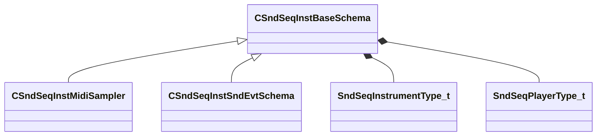

**Fields:**

| Name | Type | Annotations |
|------|------|-------------|
| `m_nType` | [SndSeqInstrumentType_t](../schemas/soundsystem.md#sndseqinstrumenttype_t) |  |
| `m_nPlayerType` | [SndSeqPlayerType_t](../schemas/soundsystem.md#sndseqplayertype_t) |  |
| `m_bStopCurrentEvents` | bool |  |
| `m_flBPM` | float32 |  |
| `m_flBPMFactor` | float32 |  |
| `m_flBPMInvFactor` | float32 |  |

### CSndSeqInstMidiSampler

**Inherits from:** [CSndSeqInstBaseSchema](soundsystem.md#csndseqinstbaseschema)

**Metadata:** `MGetKV3ClassDefaults = {`, `"_class": "CSndSeqInstMidiSampler",`, `"m_nType": "eSndSeqInstMidiSampler",`, `"m_nPlayerType": "eSndSeqPlayerMidiSeq",`, `"m_bStopCurrentEvents": false,`, `"m_flBPM": 120.000000,`, `"m_flBPMFactor": 2.000000,`, `"m_flBPMInvFactor": 0.500000,`, `"m_bIsSoundEvent": false,`, `"m_bStopPrevious": true,`, `"m_nMinNote": 0,`, `"m_nMaxNote": 0,`, `"m_flMinVelocityAtten": 0.000000,`, `"m_flMaxVelocityAtten": 0.000000,`, `"m_flAttack": 0.000000,`, `"m_flRelease": 0.000000,`, `"m_bBeatEnvelopes": true,`, `"m_nNextVoiceSlot": 0,`, `"m_hSoundEventHash": 0`, `}`, `MPropertyFriendlyName = "Midi Sampler"`

**Relationships:**

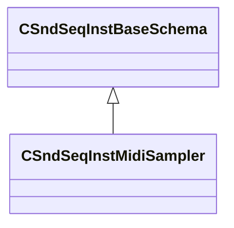

### CSndSeqInstSndEvtSchema

**Inherits from:** [CSndSeqInstBaseSchema](soundsystem.md#csndseqinstbaseschema)

**Metadata:** `MGetKV3ClassDefaults = {`, `"_class": "CSndSeqInstSndEvtSchema",`, `"m_nType": "eSndSeqInstSndEvt",`, `"m_nPlayerType": "eSndSeqPlayerSndEvt",`, `"m_bStopCurrentEvents": false,`, `"m_flBPM": 0.000000,`, `"m_flBPMFactor": 0.000000,`, `"m_flBPMInvFactor": 0.000000`, `}`, `MPropertyFriendlyName = "SoundEvent on Start"`

**Relationships:**

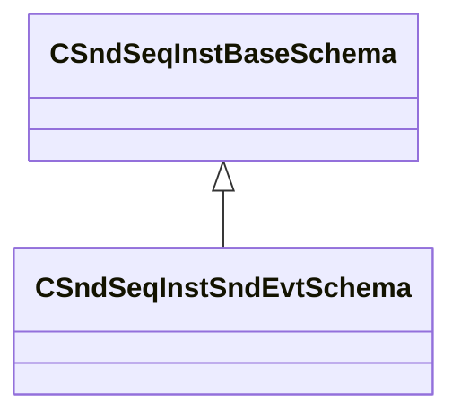

### CSndSeqInstruments

**Inherits from:** [ISndSeqInstruments](soundsystem.md#isndseqinstruments)

**Relationships:**

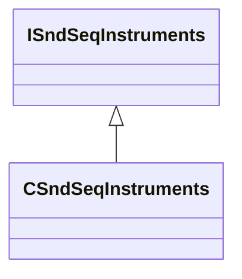

### CSosGroupActionLimitSchema

**Inherits from:** [CSosGroupActionSchema](soundsystem.md#csosgroupactionschema)

**Metadata:** `MGetKV3ClassDefaults = {`, `"_class": "CSosGroupActionLimitSchema",`, `"m_nMaxCount": -1,`, `"m_nStopType": "SOS_STOPTYPE_NONE",`, `"m_nSortType": "SOS_LIMIT_SORTTYPE_HIGHEST",`, `"m_bStopImmediate": false,`, `"m_bCountStopped": true`, `}`, `MPropertyFriendlyName = "Limiter"`

**Relationships:**

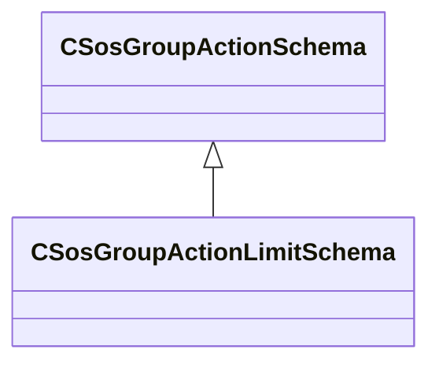

### CSosGroupActionMemberCountEnvelopeSchema

**Inherits from:** [CSosGroupActionSchema](soundsystem.md#csosgroupactionschema)

**Metadata:** `MGetKV3ClassDefaults = {`, `"_class": "CSosGroupActionMemberCountEnvelopeSchema",`, `"m_nBaseCount": 0,`, `"m_nTargetCount": 1,`, `"m_flBaseValue": 0.000000,`, `"m_flTargetValue": 0.000000,`, `"m_flAttack": 1.000000,`, `"m_flDecay": 1.000000,`, `"m_resultVarName": "envelope_result",`, `"m_bSaveToGroup": false`, `}`, `MPropertyFriendlyName = "Count Envelope"`

**Relationships:**

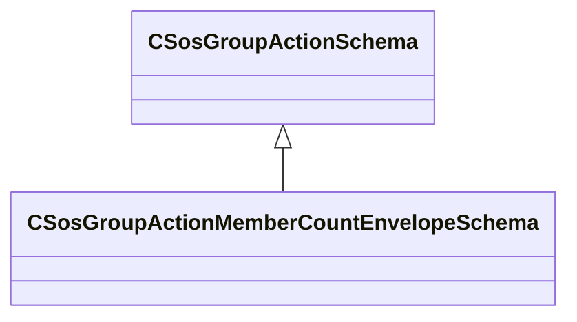

### CSosGroupActionOcclusionSchema

**Inherits from:** [CSosGroupActionSchema](soundsystem.md#csosgroupactionschema)

**Metadata:** `MGetKV3ClassDefaults = {`, `"_class": "CSosGroupActionOcclusionSchema",`, `"m_flCalculationInterval": 0.100000,`, `"m_flRadius": 0.000000,`, `"m_flOcclusionScale": 1.000000,`, `"m_flOcclusionMin": 0.000000,`, `"m_flOcclusionMax": 1.000000,`, `"m_flTestDepth": 0.000000`, `}`, `MPropertyFriendlyName = "Occlusion Info"`

**Relationships:**

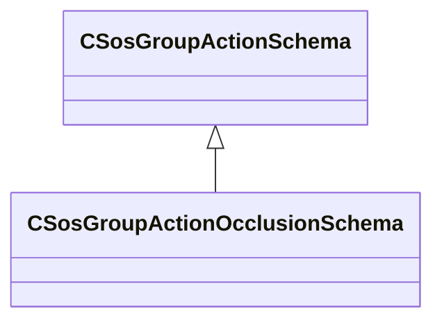

### CSosGroupActionSchema

**Derived by:** [CSosGroupActionLimitSchema](soundsystem.md#csosgroupactionlimitschema), [CSosGroupActionMemberCountEnvelopeSchema](soundsystem.md#csosgroupactionmembercountenvelopeschema), [CSosGroupActionOcclusionSchema](soundsystem.md#csosgroupactionocclusionschema), [CSosGroupActionSetSoundeventParameterSchema](soundsystem.md#csosgroupactionsetsoundeventparameterschema), [CSosGroupActionSoundeventClusterSchema](soundsystem.md#csosgroupactionsoundeventclusterschema), [CSosGroupActionSoundeventCountSchema](soundsystem.md#csosgroupactionsoundeventcountschema), [CSosGroupActionSoundeventMinMaxValuesSchema](soundsystem.md#csosgroupactionsoundeventminmaxvaluesschema), [CSosGroupActionSoundeventPrioritySchema](soundsystem.md#csosgroupactionsoundeventpriorityschema), [CSosGroupActionTimeBlockLimitSchema](soundsystem.md#csosgroupactiontimeblocklimitschema), [CSosGroupActionTimeLimitSchema](soundsystem.md#csosgroupactiontimelimitschema)

**Metadata:** `MGetKV3ClassDefaults = Could not parse KV3 Defaults`, `MPropertyAutoExpandSelf`, `MPropertyPolymorphicClass`

**Relationships:**

```mermaid
classDiagram
    CSosGroupActionSchema <|-- CSosGroupActionLimitSchema
    CSosGroupActionSchema <|-- CSosGroupActionMemberCountEnvelopeSchema
    CSosGroupActionSchema <|-- CSosGroupActionOcclusionSchema
    CSosGroupActionSchema <|-- CSosGroupActionSetSoundeventParameterSchema
    CSosGroupActionSchema <|-- CSosGroupActionSoundeventClusterSchema
    CSosGroupActionSchema <|-- CSosGroupActionSoundeventCountSchema
    CSosGroupActionSchema <|-- CSosGroupActionSoundeventMinMaxValuesSchema
    CSosGroupActionSchema <|-- CSosGroupActionSoundeventPrioritySchema
    CSosGroupActionSchema <|-- CSosGroupActionTimeBlockLimitSchema
    CSosGroupActionSchema <|-- CSosGroupActionTimeLimitSchema
```

### CSosGroupActionSetSoundeventParameterSchema

**Inherits from:** [CSosGroupActionSchema](soundsystem.md#csosgroupactionschema)

**Metadata:** `MGetKV3ClassDefaults = {`, `"_class": "CSosGroupActionSetSoundeventParameterSchema",`, `"m_nMaxCount": -1,`, `"m_flMinValue": 0.000000,`, `"m_flMaxValue": 1.000000,`, `"m_opvarName": "None",`, `"m_nSortType": "SOS_SETPARAM_SORTTYPE_LOWEST"`, `}`, `MPropertyFriendlyName = "Set Sound Event Parameter"`

**Relationships:**

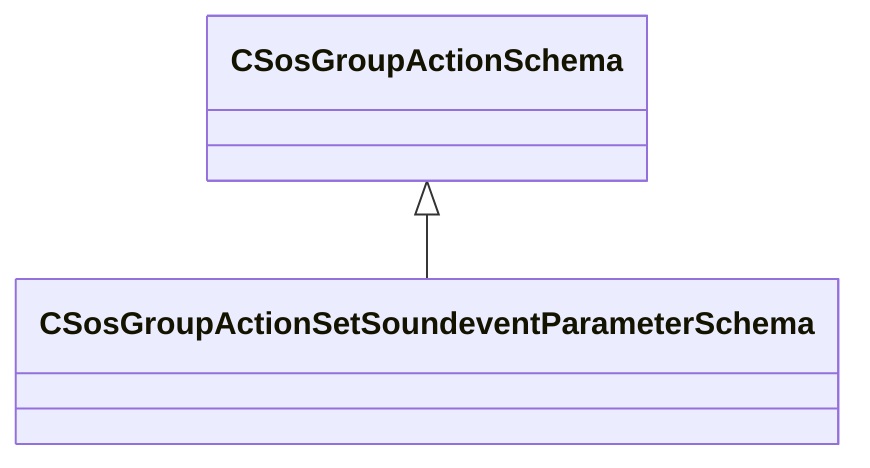

### CSosGroupActionSoundeventClusterSchema

**Inherits from:** [CSosGroupActionSchema](soundsystem.md#csosgroupactionschema)

**Metadata:** `MGetKV3ClassDefaults = {`, `"_class": "CSosGroupActionSoundeventClusterSchema",`, `"m_nMinNearby": 6,`, `"m_flClusterEpsilon": 36.000000,`, `"m_shouldPlayOpvar": "cluster_should_play",`, `"m_shouldPlayClusterChild": "cluster_should_play_child",`, `"m_clusterSizeOpvar": "cluster_size",`, `"m_groupBoundingBoxMinsOpvar": "cluster_group_box_mins",`, `"m_groupBoundingBoxMaxsOpvar": "cluster_group_box_maxs"`, `}`, `MPropertyFriendlyName = "Soundevent Cluster"`

**Relationships:**

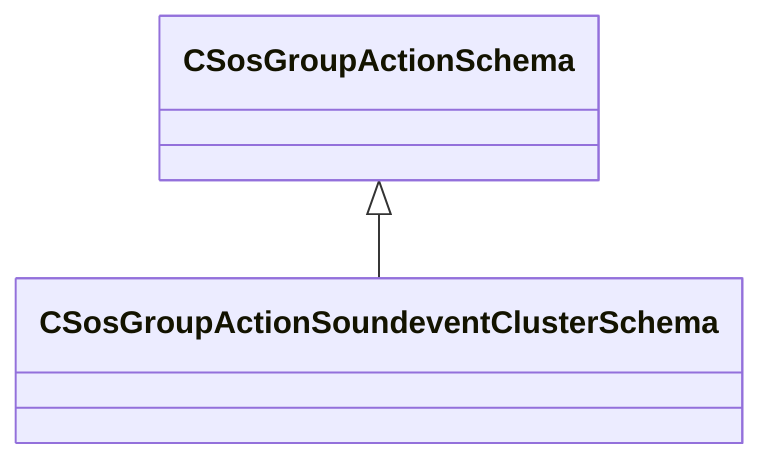

### CSosGroupActionSoundeventCountSchema

**Inherits from:** [CSosGroupActionSchema](soundsystem.md#csosgroupactionschema)

**Metadata:** `MGetKV3ClassDefaults = {`, `"_class": "CSosGroupActionSoundeventCountSchema",`, `"m_bExcludeStoppedSounds": true,`, `"m_strCountKeyName": "current_count"`, `}`, `MPropertyFriendlyName = "Soundevent Count"`

**Relationships:**

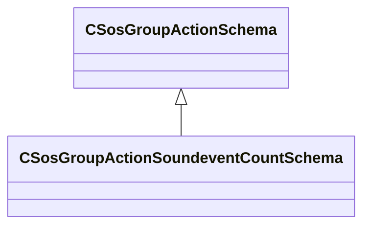

### CSosGroupActionSoundeventMinMaxValuesSchema

**Inherits from:** [CSosGroupActionSchema](soundsystem.md#csosgroupactionschema)

**Metadata:** `MGetKV3ClassDefaults = {`, `"_class": "CSosGroupActionSoundeventMinMaxValuesSchema",`, `"m_strQueryPublicFieldName": "min_max_query",`, `"m_strDelayPublicFieldName": "delay",`, `"m_bExcludeStoppedSounds": true,`, `"m_bExcludeDelayedSounds": true,`, `"m_bExcludeSoundsBelowThreshold": false,`, `"m_flExcludeSoundsMinThresholdValue": -1.000000,`, `"m_bExcludSoundsAboveThreshold": false,`, `"m_flExcludeSoundsMaxThresholdValue": -1.000000,`, `"m_strMinValueName": "min",`, `"m_strMaxValueName": "max"`, `}`, `MPropertyFriendlyName = "Soundevent Min/Max Values"`

**Relationships:**

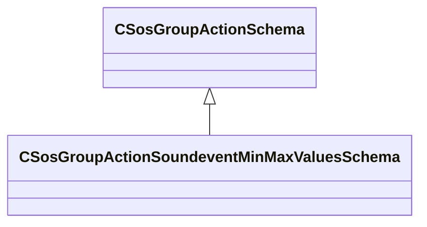

### CSosGroupActionSoundeventPrioritySchema

**Inherits from:** [CSosGroupActionSchema](soundsystem.md#csosgroupactionschema)

**Metadata:** `MGetKV3ClassDefaults = {`, `"_class": "CSosGroupActionSoundeventPrioritySchema",`, `"m_priorityValue": "priority_value",`, `"m_priorityVolumeScalar": "priority_volume_scalar",`, `"m_priorityContributeButDontRead": "priority_contribute_dont_read",`, `"m_bPriorityReadButDontContribute": "priority_read_dont_contribute"`, `}`, `MPropertyFriendlyName = "Soundevent Priority"`

**Relationships:**

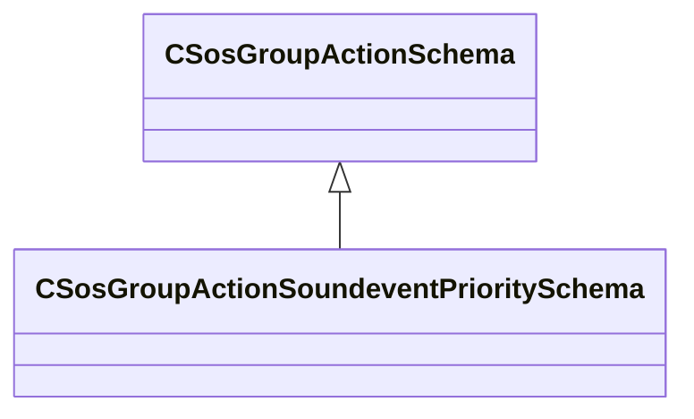

### CSosGroupActionTimeBlockLimitSchema

**Inherits from:** [CSosGroupActionSchema](soundsystem.md#csosgroupactionschema)

**Metadata:** `MGetKV3ClassDefaults = {`, `"_class": "CSosGroupActionTimeBlockLimitSchema",`, `"m_nMaxCount": -1,`, `"m_flMaxDuration": 0.000000`, `}`, `MPropertyFriendlyName = "Timed Block Limiter"`

**Relationships:**

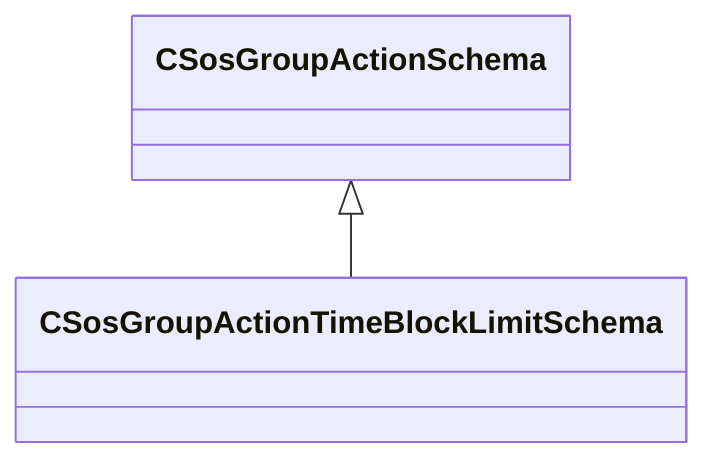

### CSosGroupActionTimeLimitSchema

**Inherits from:** [CSosGroupActionSchema](soundsystem.md#csosgroupactionschema)

**Metadata:** `MGetKV3ClassDefaults = {`, `"_class": "CSosGroupActionTimeLimitSchema",`, `"m_flMaxDuration": -1.000000`, `}`, `MPropertyFriendlyName = "Time Limiter"`

**Relationships:**

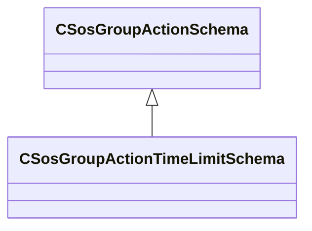

### CSosSoundEventGroupSchema

**Metadata:** `MGetKV3ClassDefaults = {`, `"m_nGroupType": "SOS_GROUPTYPE_DYNAMIC",`, `"m_bBlocksEvents": false,`, `"m_nBlockMaxCount": 0,`, `"m_flMemberLifespanTime": -1.000000,`, `"m_bInvertMatch": false,`, `"m_Behavior_EventName": "kIgnore",`, `"m_matchSoundEventName": "",`, `"m_bMatchEventSubString": false,`, `"m_matchSoundEventSubString": "",`, `"m_Behavior_EntIndex": "kIgnore",`, `"m_flEntIndex": -1.000000,`, `"m_Behavior_Opvar": "kIgnore",`, `"m_flOpvar": -1.000000,`, `"m_Behavior_String": "kIgnore",`, `"m_opvarString": "",`, `"m_vActions":`, `[`, `]`, `}`, `MVDataRoot`

### CSoundEventMetaData

**Metadata:** `MGetKV3ClassDefaults = {`, `"m_soundEventVMix": ""`, `}`

### ISndSeqInstruments

**Derived by:** [CSndSeqInstruments](soundsystem.md#csndseqinstruments)

**Relationships:**

### KeyGroup_t

**Relationships:**

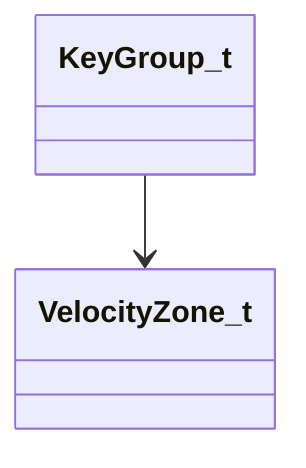

**Fields:**

| Name | Type | Annotations |
|------|------|-------------|
| `nCenterNote` | uint8 |  |
| `nMinNote` | uint8 |  |
| `nMaxNote` | uint8 |  |
| `nNumVelocityZones` | uint8 |  |
| `pVelocityZones` | [VelocityZone_t](../schemas/soundsystem.md#velocityzone_t)* |  |

### SamplerVoice_t

**Fields:**

| Name | Type | Annotations |
|------|------|-------------|
| `nNoteNum` | uint8 |  |

### SelectedEditItemInfo_t

**Metadata:** `MGetKV3ClassDefaults = {`, `"m_EditItems":`, `[`, `]`, `}`

### SndSeqInstrumentType_t

**Values:**

| Name | Value |
|------|-------|
| `eSndSeqInstNull` | 0 |
| `eSndSeqInstSndEvt` | 1 |
| `eSndSeqInstMidiSampler` | 2 |

### SndSeqMidiStatusType_t

**Values:**

| Name | Value |
|------|-------|
| `SndSeqMidiStatusNoteOff` | 8 |
| `SndSeqMidiStatusNoteOn` | 9 |
| `SndSeqMidiStatusKeyPressure` | 10 |
| `SndSeqMidiStatusCtrlChange` | 11 |
| `SndSeqMidiStatusProgramChange` | 12 |
| `SndSeqMidiStatusChannelPressure` | 13 |
| `SndSeqMidiStatusPitchBend` | 14 |

### SndSeqPlayerType_t

**Values:**

| Name | Value |
|------|-------|
| `eSndSeqPlayerNull` | 0 |
| `eSndSeqPlayerSndEvt` | 1 |
| `eSndSeqPlayerMidiSeq` | 2 |

### SndSeqQuantizeType_t

**Values:**

| Name | Value |
|------|-------|
| `eSndSeqQuantizeInvalid` | -1 |
| `eSndSeqQuantizeNone` | 0 |
| `eSndSeqQuantizeBeat` | 1 |
| `eSndSeqQuantizeBar` | 2 |
| `eSndSeqQuantizeSequence` | 3 |
| `eSndSeqQuantizeSeek` | 4 |
| `eSndSeqQuantizeReset` | 5 |

### SndSeqRegionType_t

**Values:**

| Name | Value |
|------|-------|
| `eSndSeqRegionTypeNull` | 0 |
| `eSndSeqRegionTypeSndEvt` | 1 |
| `eSndSeqRegionTypeMidiSeq` | 2 |

### SndSeqSyncType_t

**Values:**

| Name | Value |
|------|-------|
| `eSndSeqSyncTypeNone` | 0 |
| `eSndSeqSyncTypeWait` | 1 |
| `eSndSeqSyncTypeSeek` | 2 |

### SndSeqTrackPlaybackType_t

**Values:**

| Name | Value |
|------|-------|
| `eSndSeqTrackPlaybackTypeStep` | 0 |
| `eSndSeqTrackPlaybackTypeFwd` | 1 |

### SosActionLimitSortType_t

**Values:**

| Name | Value |
|------|-------|
| `SOS_LIMIT_SORTTYPE_HIGHEST` | 0 |
| `SOS_LIMIT_SORTTYPE_LOWEST` | 1 |

### SosActionSetParamSortType_t

**Values:**

| Name | Value |
|------|-------|
| `SOS_SETPARAM_SORTTYPE_HIGHEST` | 0 |
| `SOS_SETPARAM_SORTTYPE_LOWEST` | 1 |

### SosActionStopType_t

**Values:**

| Name | Value |
|------|-------|
| `SOS_STOPTYPE_NONE` | 0 |
| `SOS_STOPTYPE_TIME` | 1 |
| `SOS_STOPTYPE_OPVAR` | 2 |

### SosEditItemInfo_t

**Metadata:** `MGetKV3ClassDefaults = {`, `"itemType": "SOS_EDIT_ITEM_TYPE_SOUNDEVENTS",`, `"itemName": "",`, `"itemTypeName": "",`, `"itemKVString": "",`, `"itemPos":`, `[`, `0.000000,`, `0.000000`, `]`, `}`

### SosEditItemType_t

**Values:**

| Name | Value |
|------|-------|
| `SOS_EDIT_ITEM_TYPE_SOUNDEVENTS` | 0 |
| `SOS_EDIT_ITEM_TYPE_SOUNDEVENT` | 1 |
| `SOS_EDIT_ITEM_TYPE_LIBRARYSTACKS` | 2 |
| `SOS_EDIT_ITEM_TYPE_STACK` | 3 |
| `SOS_EDIT_ITEM_TYPE_OPERATOR` | 4 |
| `SOS_EDIT_ITEM_TYPE_FIELD` | 5 |

### SosGroupFieldBehavior_t

**Values:**

| Name | Value |
|------|-------|
| `kIgnore` | 0 |
| `kBranch` | 1 |
| `kMatch` | 2 |

### SosGroupType_t

**Values:**

| Name | Value |
|------|-------|
| `SOS_GROUPTYPE_DYNAMIC` | 0 |
| `SOS_GROUPTYPE_STATIC` | 1 |

### VelocityZone_t

**Fields:**

| Name | Type | Annotations |
|------|------|-------------|
| `nMaxVel` | uint8 |  |
| `nNextSelection` | uint8 |  |
| `nNumSamples` | uint8 |  |
| `pSamples` | uint32[4] |  |
