# Module: soundsystem_lowlevel

[📊 View UML Diagram](../diagrams/soundsystem_lowlevel.md)

| Name | Kind | Bases | Fields |
|------|------|-------|--------|
| [CVMixAdditionalOutput](#cvmixadditionaloutput) | class |  | 0 |
| [CVMixAudioMeter](#cvmixaudiometer) | class |  | 0 |
| [CVMixAutoFilterProcessorDesc](#cvmixautofilterprocessordesc) | class | CVMixBaseProcessorDesc | 0 |
| [CVMixAutomaticControlInput](#cvmixautomaticcontrolinput) | class |  | 0 |
| [CVMixBaseProcessorDesc](#cvmixbaseprocessordesc) | class |  | 3 |
| [CVMixBoxverb2ProcessorDesc](#cvmixboxverb2processordesc) | class | CVMixBaseProcessorDesc | 0 |
| [CVMixBoxverbProcessorDesc](#cvmixboxverbprocessordesc) | class | CVMixBaseProcessorDesc | 0 |
| [CVMixCommand](#cvmixcommand) | class |  | 0 |
| [CVMixControlInput](#cvmixcontrolinput) | class | CVMixInputBase | 0 |
| [CVMixControlInputArray](#cvmixcontrolinputarray) | class | CVMixInputBase | 0 |
| [CVMixControlMeter](#cvmixcontrolmeter) | class | CVMixInputBase | 0 |
| [CVMixControlOutput](#cvmixcontroloutput) | class | CVMixInputBase | 0 |
| [CVMixConvolutionProcessorDesc](#cvmixconvolutionprocessordesc) | class | CVMixBaseProcessorDesc | 0 |
| [CVMixCurveHeader](#cvmixcurveheader) | class |  | 0 |
| [CVMixDelayProcessorDesc](#cvmixdelayprocessordesc) | class | CVMixBaseProcessorDesc | 0 |
| [CVMixDiffusorProcessorDesc](#cvmixdiffusorprocessordesc) | class | CVMixBaseProcessorDesc | 0 |
| [CVMixDualCompressorProcessorDesc](#cvmixdualcompressorprocessordesc) | class | CVMixBaseProcessorDesc | 0 |
| [CVMixDynamics3BandProcessorDesc](#cvmixdynamics3bandprocessordesc) | class | CVMixBaseProcessorDesc | 0 |
| [CVMixDynamicsCompressorProcessorDesc](#cvmixdynamicscompressorprocessordesc) | class | CVMixBaseProcessorDesc | 0 |
| [CVMixDynamicsProcessorDesc](#cvmixdynamicsprocessordesc) | class | CVMixBaseProcessorDesc | 0 |
| [CVMixEQ8ProcessorDesc](#cvmixeq8processordesc) | class | CVMixBaseProcessorDesc | 0 |
| [CVMixEffectChainProcessorDesc](#cvmixeffectchainprocessordesc) | class | CVMixBaseProcessorDesc | 0 |
| [CVMixEnvelopeProcessorDesc](#cvmixenvelopeprocessordesc) | class | CVMixBaseProcessorDesc | 0 |
| [CVMixFilterProcessorDesc](#cvmixfilterprocessordesc) | class | CVMixBaseProcessorDesc | 0 |
| [CVMixFlangerProcessorDesc](#cvmixflangerprocessordesc) | class | CVMixBaseProcessorDesc | 0 |
| [CVMixFreeverbProcessorDesc](#cvmixfreeverbprocessordesc) | class | CVMixBaseProcessorDesc | 0 |
| [CVMixGraphDescData](#cvmixgraphdescdata) | class |  | 0 |
| [CVMixImpulseResponseInput](#cvmiximpulseresponseinput) | class | CVMixInputBase | 0 |
| [CVMixInputBase](#cvmixinputbase) | class |  | 0 |
| [CVMixModDelayProcessorDesc](#cvmixmoddelayprocessordesc) | class | CVMixBaseProcessorDesc | 0 |
| [CVMixNameInput](#cvmixnameinput) | class | CVMixInputBase | 0 |
| [CVMixNameInputMeter](#cvmixnameinputmeter) | class | CVMixInputBase | 0 |
| [CVMixOscProcessorDesc](#cvmixoscprocessordesc) | class | CVMixBaseProcessorDesc | 0 |
| [CVMixPannerProcessorDesc](#cvmixpannerprocessordesc) | class | CVMixBaseProcessorDesc | 0 |
| [CVMixPitchShiftProcessorDesc](#cvmixpitchshiftprocessordesc) | class | CVMixBaseProcessorDesc | 0 |
| [CVMixPlateReverbProcessorDesc](#cvmixplatereverbprocessordesc) | class | CVMixBaseProcessorDesc | 0 |
| [CVMixPresetDSPProcessorDesc](#cvmixpresetdspprocessordesc) | class | CVMixBaseProcessorDesc | 0 |
| [CVMixShaperProcessorDesc](#cvmixshaperprocessordesc) | class | CVMixBaseProcessorDesc | 0 |
| [CVMixSteamAudioDirectProcessorDesc](#cvmixsteamaudiodirectprocessordesc) | class | CVMixBaseProcessorDesc | 0 |
| [CVMixSteamAudioHRTFProcessorDesc](#cvmixsteamaudiohrtfprocessordesc) | class | CVMixBaseProcessorDesc | 0 |
| [CVMixSteamAudioHybridReverbProcessorDesc](#cvmixsteamaudiohybridreverbprocessordesc) | class | CVMixBaseProcessorDesc | 0 |
| [CVMixSteamAudioPathingProcessorDesc](#cvmixsteamaudiopathingprocessordesc) | class | CVMixBaseProcessorDesc | 0 |
| [CVMixStereoDelayProcessorDesc](#cvmixstereodelayprocessordesc) | class | CVMixBaseProcessorDesc | 0 |
| [CVMixSubgraphSwitchProcessorDesc](#cvmixsubgraphswitchprocessordesc) | class | CVMixBaseProcessorDesc | 0 |
| [CVMixUtilityProcessorDesc](#cvmixutilityprocessordesc) | class | CVMixBaseProcessorDesc | 0 |
| [CVMixVocoderProcessorDesc](#cvmixvocoderprocessordesc) | class | CVMixBaseProcessorDesc | 0 |
| [CVMixVsndInput](#cvmixvsndinput) | class | CVMixInputBase | 0 |
| [VMixAutoFilterDesc_t](#vmixautofilterdesc_t) | class |  | 0 |
| [VMixBoxverbDesc_t](#vmixboxverbdesc_t) | class |  | 0 |
| [VMixChannelOperation_t](#vmixchanneloperation_t) | enum |  | 6 |
| [VMixConvolutionDesc_t](#vmixconvolutiondesc_t) | class |  | 0 |
| [VMixDelayDesc_t](#vmixdelaydesc_t) | class |  | 0 |
| [VMixDiffusorDesc_t](#vmixdiffusordesc_t) | class |  | 0 |
| [VMixDualCompressorDesc_t](#vmixdualcompressordesc_t) | class |  | 0 |
| [VMixDynamics3BandDesc_t](#vmixdynamics3banddesc_t) | class |  | 0 |
| [VMixDynamicsBand_t](#vmixdynamicsband_t) | class |  | 0 |
| [VMixDynamicsCompressorDesc_t](#vmixdynamicscompressordesc_t) | class |  | 0 |
| [VMixDynamicsDesc_t](#vmixdynamicsdesc_t) | class |  | 0 |
| [VMixEQ8Desc_t](#vmixeq8desc_t) | class |  | 0 |
| [VMixEffectChainDesc_t](#vmixeffectchaindesc_t) | class |  | 0 |
| [VMixEnvelopeDesc_t](#vmixenvelopedesc_t) | class |  | 0 |
| [VMixFilterDesc_t](#vmixfilterdesc_t) | class |  | 0 |
| [VMixFilterSlope_t](#vmixfilterslope_t) | enum |  | 9 |
| [VMixFilterType_t](#vmixfiltertype_t) | enum |  | 10 |
| [VMixFlangerDesc_t](#vmixflangerdesc_t) | class |  | 0 |
| [VMixFreeverbDesc_t](#vmixfreeverbdesc_t) | class |  | 0 |
| [VMixGraphCommandID_t](#vmixgraphcommandid_t) | enum |  | 39 |
| [VMixLFOShape_t](#vmixlfoshape_t) | enum |  | 5 |
| [VMixModDelayDesc_t](#vmixmoddelaydesc_t) | class |  | 0 |
| [VMixOscDesc_t](#vmixoscdesc_t) | class |  | 0 |
| [VMixPannerDesc_t](#vmixpannerdesc_t) | class |  | 0 |
| [VMixPannerType_t](#vmixpannertype_t) | enum |  | 2 |
| [VMixPitchShiftDesc_t](#vmixpitchshiftdesc_t) | class |  | 0 |
| [VMixPlateverbDesc_t](#vmixplateverbdesc_t) | class |  | 0 |
| [VMixPresetDSPDesc_t](#vmixpresetdspdesc_t) | class |  | 0 |
| [VMixShaperDesc_t](#vmixshaperdesc_t) | class |  | 0 |
| [VMixSubgraphSwitchDesc_t](#vmixsubgraphswitchdesc_t) | class |  | 0 |
| [VMixSubgraphSwitchInterpolationType_t](#vmixsubgraphswitchinterpolationtype_t) | enum |  | 3 |
| [VMixUtilityDesc_t](#vmixutilitydesc_t) | class |  | 0 |
| [VMixVocoderDesc_t](#vmixvocoderdesc_t) | class |  | 10 |

---

### CVMixAdditionalOutput

**Metadata:** `MGetKV3ClassDefaults = {`, `"m_name": "output"`, `}`

### CVMixAudioMeter

**Metadata:** `MGetKV3ClassDefaults = {`, `"m_name": "output",`, `"m_displayName": ""`, `}`

### CVMixAutoFilterProcessorDesc

**Inherits from:** [CVMixBaseProcessorDesc](soundsystem_lowlevel.md#cvmixbaseprocessordesc)

**Metadata:** `MGetKV3ClassDefaults = {`, `"_class": "CVMixAutoFilterProcessorDesc",`, `"m_name": "",`, `"m_nChannels": -1,`, `"m_flxfade": 0.100000,`, `"m_desc":`, `{`, `"m_flEnvelopeAmount": 0.000000,`, `"m_flAttackTimeMS": 5.000000,`, `"m_flReleaseTimeMS": 200.000000,`, `"m_filter":`, `{`, `"m_nFilterType": "FILTER_UNKNOWN",`, `"m_nFilterSlope": "FILTER_SLOPE_12dB",`, `"m_bEnabled": true,`, `"m_fldbGain": 0.000000,`, `"m_flCutoffFreq": 1000.000000,`, `"m_flQ": 0.707107`, `},`, `"m_flLFOAmount": 0.000000,`, `"m_flLFORate": 0.000000,`, `"m_flPhase": 0.000000,`, `"m_nLFOShape": "LFO_SHAPE_SINE"`, `}`, `}`

**Relationships:**

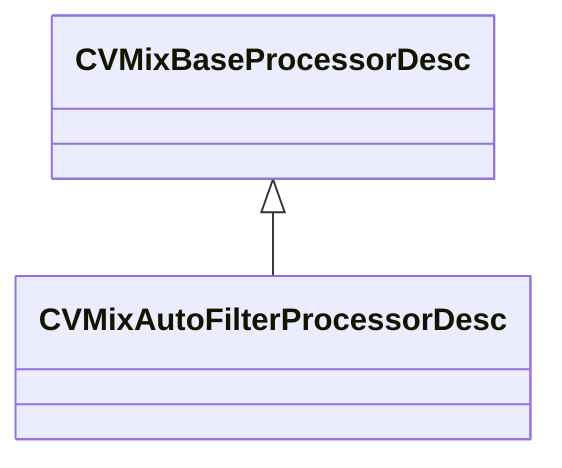

### CVMixAutomaticControlInput

**Metadata:** `MGetKV3ClassDefaults = {`, `"m_name": "play time",`, `"m_nControlInputIndex": -1,`, `"m_bIsTrackSend": false,`, `"m_bIsStackVar": false`, `}`

### CVMixBaseProcessorDesc

**Derived by:** [CVMixAutoFilterProcessorDesc](soundsystem_lowlevel.md#cvmixautofilterprocessordesc), [CVMixBoxverb2ProcessorDesc](soundsystem_lowlevel.md#cvmixboxverb2processordesc), [CVMixBoxverbProcessorDesc](soundsystem_lowlevel.md#cvmixboxverbprocessordesc), [CVMixConvolutionProcessorDesc](soundsystem_lowlevel.md#cvmixconvolutionprocessordesc), [CVMixDelayProcessorDesc](soundsystem_lowlevel.md#cvmixdelayprocessordesc), [CVMixDiffusorProcessorDesc](soundsystem_lowlevel.md#cvmixdiffusorprocessordesc), [CVMixDualCompressorProcessorDesc](soundsystem_lowlevel.md#cvmixdualcompressorprocessordesc), [CVMixDynamics3BandProcessorDesc](soundsystem_lowlevel.md#cvmixdynamics3bandprocessordesc), [CVMixDynamicsCompressorProcessorDesc](soundsystem_lowlevel.md#cvmixdynamicscompressorprocessordesc), [CVMixDynamicsProcessorDesc](soundsystem_lowlevel.md#cvmixdynamicsprocessordesc), [CVMixEQ8ProcessorDesc](soundsystem_lowlevel.md#cvmixeq8processordesc), [CVMixEffectChainProcessorDesc](soundsystem_lowlevel.md#cvmixeffectchainprocessordesc), [CVMixEnvelopeProcessorDesc](soundsystem_lowlevel.md#cvmixenvelopeprocessordesc), [CVMixFilterProcessorDesc](soundsystem_lowlevel.md#cvmixfilterprocessordesc), [CVMixFlangerProcessorDesc](soundsystem_lowlevel.md#cvmixflangerprocessordesc), [CVMixFreeverbProcessorDesc](soundsystem_lowlevel.md#cvmixfreeverbprocessordesc), [CVMixModDelayProcessorDesc](soundsystem_lowlevel.md#cvmixmoddelayprocessordesc), [CVMixOscProcessorDesc](soundsystem_lowlevel.md#cvmixoscprocessordesc), [CVMixPannerProcessorDesc](soundsystem_lowlevel.md#cvmixpannerprocessordesc), [CVMixPitchShiftProcessorDesc](soundsystem_lowlevel.md#cvmixpitchshiftprocessordesc), [CVMixPlateReverbProcessorDesc](soundsystem_lowlevel.md#cvmixplatereverbprocessordesc), [CVMixPresetDSPProcessorDesc](soundsystem_lowlevel.md#cvmixpresetdspprocessordesc), [CVMixShaperProcessorDesc](soundsystem_lowlevel.md#cvmixshaperprocessordesc), [CVMixSteamAudioDirectProcessorDesc](soundsystem_lowlevel.md#cvmixsteamaudiodirectprocessordesc), [CVMixSteamAudioHRTFProcessorDesc](soundsystem_lowlevel.md#cvmixsteamaudiohrtfprocessordesc), [CVMixSteamAudioHybridReverbProcessorDesc](soundsystem_lowlevel.md#cvmixsteamaudiohybridreverbprocessordesc), [CVMixSteamAudioPathingProcessorDesc](soundsystem_lowlevel.md#cvmixsteamaudiopathingprocessordesc), [CVMixStereoDelayProcessorDesc](soundsystem_lowlevel.md#cvmixstereodelayprocessordesc), [CVMixSubgraphSwitchProcessorDesc](soundsystem_lowlevel.md#cvmixsubgraphswitchprocessordesc), [CVMixUtilityProcessorDesc](soundsystem_lowlevel.md#cvmixutilityprocessordesc), [CVMixVocoderProcessorDesc](soundsystem_lowlevel.md#cvmixvocoderprocessordesc)

**Metadata:** `MGetKV3ClassDefaults = Could not parse KV3 Defaults`

**Relationships:**


**Fields:**

| Name | Type | Annotations |
|------|------|-------------|
| `m_name` | CUtlString |  |
| `m_nChannels` | int32 |  |
| `m_flxfade` | float32 |  |

### CVMixBoxverb2ProcessorDesc

**Inherits from:** [CVMixBaseProcessorDesc](soundsystem_lowlevel.md#cvmixbaseprocessordesc)

**Metadata:** `MGetKV3ClassDefaults = {`, `"_class": "CVMixBoxverb2ProcessorDesc",`, `"m_name": "",`, `"m_nChannels": -1,`, `"m_flxfade": 0.100000,`, `"m_desc":`, `{`, `"m_flSizeMax": 0.000000,`, `"m_flSizeMin": 0.000000,`, `"m_flComplexity": 0.000000,`, `"m_flDiffusion": 0.000000,`, `"m_flModDepth": 0.000000,`, `"m_flModRate": 0.000000,`, `"m_bParallel": false,`, `"m_filterType":`, `{`, `"m_nFilterType": "FILTER_UNKNOWN",`, `"m_nFilterSlope": "FILTER_SLOPE_12dB",`, `"m_bEnabled": true,`, `"m_fldbGain": 0.000000,`, `"m_flCutoffFreq": 1000.000000,`, `"m_flQ": 0.707107`, `},`, `"m_flWidth": 0.000000,`, `"m_flHeight": 0.000000,`, `"m_flDepth": 0.000000,`, `"m_flFeedbackScale": 0.000000,`, `"m_flFeedbackWidth": 0.000000,`, `"m_flFeedbackHeight": 0.000000,`, `"m_flFeedbackDepth": 0.000000,`, `"m_flOutputGain": 0.000000,`, `"m_flTaps": 0.000000`, `}`, `}`

**Relationships:**

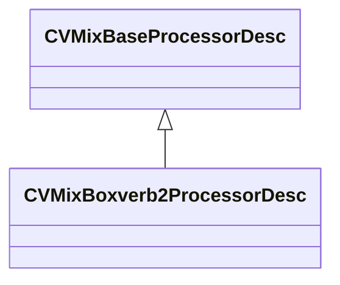

### CVMixBoxverbProcessorDesc

**Inherits from:** [CVMixBaseProcessorDesc](soundsystem_lowlevel.md#cvmixbaseprocessordesc)

**Metadata:** `MGetKV3ClassDefaults = {`, `"_class": "CVMixBoxverbProcessorDesc",`, `"m_name": "",`, `"m_nChannels": -1,`, `"m_flxfade": 0.100000,`, `"m_desc":`, `{`, `"m_flSizeMax": 0.000000,`, `"m_flSizeMin": 0.000000,`, `"m_flComplexity": 0.000000,`, `"m_flDiffusion": 0.000000,`, `"m_flModDepth": 0.000000,`, `"m_flModRate": 0.000000,`, `"m_bParallel": false,`, `"m_filterType":`, `{`, `"m_nFilterType": "FILTER_UNKNOWN",`, `"m_nFilterSlope": "FILTER_SLOPE_12dB",`, `"m_bEnabled": true,`, `"m_fldbGain": 0.000000,`, `"m_flCutoffFreq": 1000.000000,`, `"m_flQ": 0.707107`, `},`, `"m_flWidth": 0.000000,`, `"m_flHeight": 0.000000,`, `"m_flDepth": 0.000000,`, `"m_flFeedbackScale": 0.000000,`, `"m_flFeedbackWidth": 0.000000,`, `"m_flFeedbackHeight": 0.000000,`, `"m_flFeedbackDepth": 0.000000,`, `"m_flOutputGain": 0.000000,`, `"m_flTaps": 0.000000`, `}`, `}`

**Relationships:**

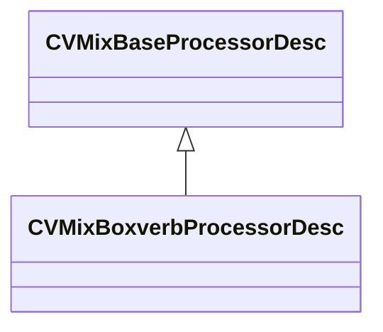

### CVMixCommand

**Metadata:** `MGetKV3ClassDefaults = {`, `"command": "CMD_INVALID",`, `"paramName": 0,`, `"outputSubmix": -1,`, `"inputSubmix0": -1,`, `"inputSubmix1": -1,`, `"processor": -1,`, `"inputValue0": -1,`, `"inputValue1": -1`, `}`

### CVMixControlInput

**Inherits from:** [CVMixInputBase](soundsystem_lowlevel.md#cvmixinputbase)

**Metadata:** `MGetKV3ClassDefaults = {`, `"m_name": "GameInput",`, `"m_flDefaultValue": 0.000000`, `}`

**Relationships:**

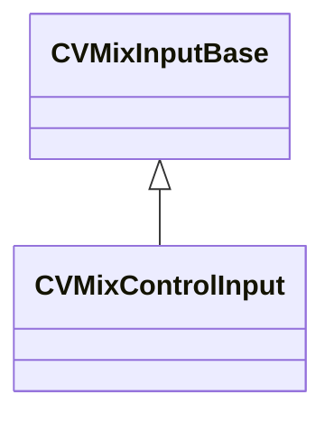

### CVMixControlInputArray

**Inherits from:** [CVMixInputBase](soundsystem_lowlevel.md#cvmixinputbase)

**Metadata:** `MGetKV3ClassDefaults = {`, `"m_name": "GameInput",`, `"m_nArrayIndex": -1`, `}`

**Relationships:**

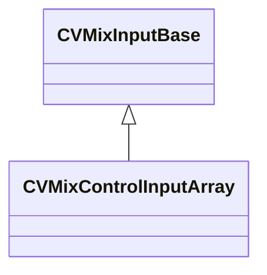

### CVMixControlMeter

**Inherits from:** [CVMixInputBase](soundsystem_lowlevel.md#cvmixinputbase)

**Metadata:** `MGetKV3ClassDefaults = {`, `"m_name": "GameInput",`, `"m_nValueIndex": 0`, `}`

**Relationships:**

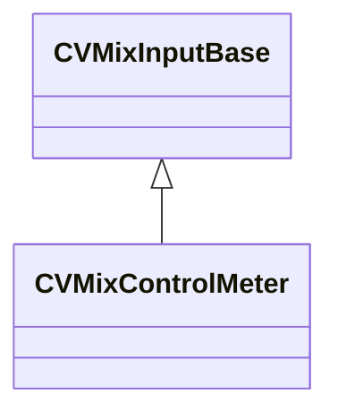

### CVMixControlOutput

**Inherits from:** [CVMixInputBase](soundsystem_lowlevel.md#cvmixinputbase)

**Metadata:** `MGetKV3ClassDefaults = {`, `"m_name": "GameInput",`, `"m_flDefaultValue": 0.000000`, `}`

**Relationships:**

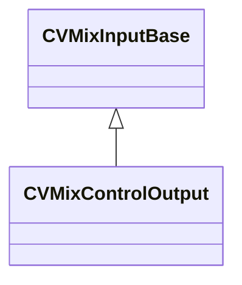

### CVMixConvolutionProcessorDesc

**Inherits from:** [CVMixBaseProcessorDesc](soundsystem_lowlevel.md#cvmixbaseprocessordesc)

**Metadata:** `MGetKV3ClassDefaults = {`, `"_class": "CVMixConvolutionProcessorDesc",`, `"m_name": "",`, `"m_nChannels": -1,`, `"m_flxfade": 0.100000,`, `"m_desc":`, `{`, `"m_fldbGain": -12.000000,`, `"m_flPreDelayMS": 0.000000,`, `"m_flWetMix": 1.000000,`, `"m_fldbLow": 0.000000,`, `"m_fldbMid": 0.000000,`, `"m_fldbHigh": 0.000000,`, `"m_flLowCutoffFreq": 1500.000000,`, `"m_flHighCutoffFreq": 7500.000000`, `}`, `}`

**Relationships:**

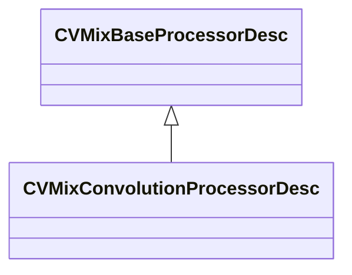

### CVMixCurveHeader

**Metadata:** `MGetKV3ClassDefaults = {`, `"m_nControlPointCount": <HIDDEN FOR DIFF>,`, `"m_nControlPointStart": <HIDDEN FOR DIFF>,`, `}`

### CVMixDelayProcessorDesc

**Inherits from:** [CVMixBaseProcessorDesc](soundsystem_lowlevel.md#cvmixbaseprocessordesc)

**Metadata:** `MGetKV3ClassDefaults = {`, `"_class": "CVMixDelayProcessorDesc",`, `"m_name": "",`, `"m_nChannels": -1,`, `"m_flxfade": 0.100000,`, `"m_desc":`, `{`, `"m_feedbackFilter":`, `{`, `"m_nFilterType": "FILTER_UNKNOWN",`, `"m_nFilterSlope": "FILTER_SLOPE_12dB",`, `"m_bEnabled": true,`, `"m_fldbGain": 0.000000,`, `"m_flCutoffFreq": 1000.000000,`, `"m_flQ": 0.707107`, `},`, `"m_bEnableFilter": false,`, `"m_flDelay": 0.000000,`, `"m_flDirectGain": 0.000000,`, `"m_flDelayGain": 0.000000,`, `"m_flFeedbackGain": 0.000000,`, `"m_flWidth": 0.000000`, `}`, `}`

**Relationships:**

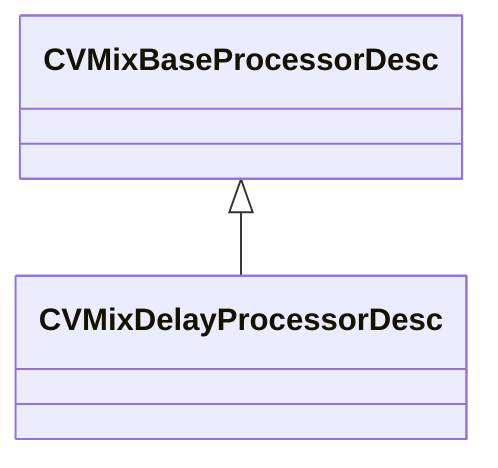

### CVMixDiffusorProcessorDesc

**Inherits from:** [CVMixBaseProcessorDesc](soundsystem_lowlevel.md#cvmixbaseprocessordesc)

**Metadata:** `MGetKV3ClassDefaults = {`, `"_class": "CVMixDiffusorProcessorDesc",`, `"m_name": "",`, `"m_nChannels": -1,`, `"m_flxfade": 0.100000,`, `"m_desc":`, `{`, `"m_flSize": 0.000000,`, `"m_flComplexity": 0.000000,`, `"m_flFeedback": 0.000000,`, `"m_flOutputGain": 0.000000`, `}`, `}`

**Relationships:**

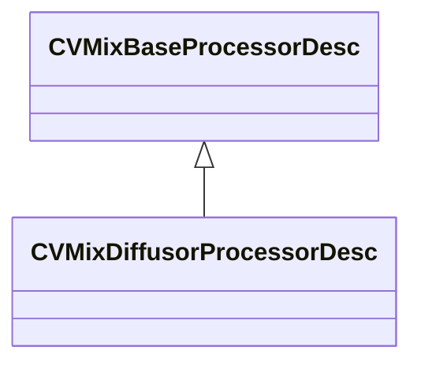

### CVMixDualCompressorProcessorDesc

**Inherits from:** [CVMixBaseProcessorDesc](soundsystem_lowlevel.md#cvmixbaseprocessordesc)

**Metadata:** `MGetKV3ClassDefaults = {`, `"_class": "CVMixDualCompressorProcessorDesc",`, `"m_name": "",`, `"m_nChannels": -1,`, `"m_flxfade": 0.100000,`, `"m_desc":`, `{`, `"m_flRMSTimeMS": 300.000000,`, `"m_fldbKneeWidth": 0.000000,`, `"m_flWetMix": 1.000000,`, `"m_bPeakMode": false,`, `"m_bandDesc":`, `{`, `"m_fldbGainInput": 0.000000,`, `"m_fldbGainOutput": 0.000000,`, `"m_fldbThresholdBelow": -40.000000,`, `"m_fldbThresholdAbove": -30.000000,`, `"m_flRatioBelow": 12.000000,`, `"m_flRatioAbove": 4.000000,`, `"m_flAttackTimeMS": 50.000000,`, `"m_flReleaseTimeMS": 200.000000,`, `"m_bEnable": false,`, `"m_bSolo": false`, `}`, `}`, `}`

**Relationships:**

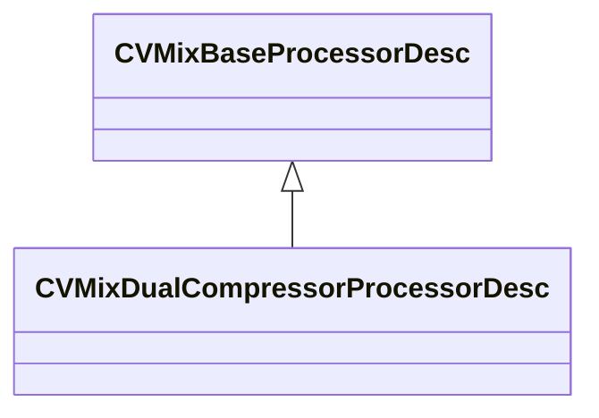

### CVMixDynamics3BandProcessorDesc

**Inherits from:** [CVMixBaseProcessorDesc](soundsystem_lowlevel.md#cvmixbaseprocessordesc)

**Metadata:** `MGetKV3ClassDefaults = {`, `"_class": "CVMixDynamics3BandProcessorDesc",`, `"m_name": "",`, `"m_nChannels": -1,`, `"m_flxfade": 0.100000,`, `"m_desc":`, `{`, `"m_fldbGainOutput": 0.000000,`, `"m_flRMSTimeMS": 0.000000,`, `"m_fldbKneeWidth": 0.000000,`, `"m_flDepth": 0.000000,`, `"m_flWetMix": 0.000000,`, `"m_flTimeScale": 0.000000,`, `"m_flLowCutoffFreq": 0.000000,`, `"m_flHighCutoffFreq": 0.000000,`, `"m_bPeakMode": false,`, `"m_bandDesc":`, `[`, `{`, `"m_fldbGainInput": 0.000000,`, `"m_fldbGainOutput": 0.000000,`, `"m_fldbThresholdBelow": -40.000000,`, `"m_fldbThresholdAbove": -30.000000,`, `"m_flRatioBelow": 12.000000,`, `"m_flRatioAbove": 4.000000,`, `"m_flAttackTimeMS": 50.000000,`, `"m_flReleaseTimeMS": 200.000000,`, `"m_bEnable": false,`, `"m_bSolo": false`, `},`, `{`, `"m_fldbGainInput": 0.000000,`, `"m_fldbGainOutput": 0.000000,`, `"m_fldbThresholdBelow": -40.000000,`, `"m_fldbThresholdAbove": -30.000000,`, `"m_flRatioBelow": 12.000000,`, `"m_flRatioAbove": 4.000000,`, `"m_flAttackTimeMS": 50.000000,`, `"m_flReleaseTimeMS": 200.000000,`, `"m_bEnable": false,`, `"m_bSolo": false`, `},`, `{`, `"m_fldbGainInput": 0.000000,`, `"m_fldbGainOutput": 0.000000,`, `"m_fldbThresholdBelow": -40.000000,`, `"m_fldbThresholdAbove": -30.000000,`, `"m_flRatioBelow": 12.000000,`, `"m_flRatioAbove": 4.000000,`, `"m_flAttackTimeMS": 50.000000,`, `"m_flReleaseTimeMS": 200.000000,`, `"m_bEnable": false,`, `"m_bSolo": false`, `}`, `]`, `}`, `}`

**Relationships:**

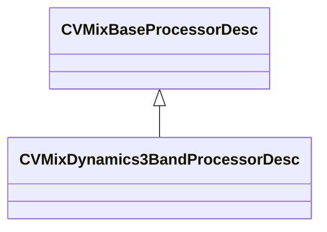

### CVMixDynamicsCompressorProcessorDesc

**Inherits from:** [CVMixBaseProcessorDesc](soundsystem_lowlevel.md#cvmixbaseprocessordesc)

**Metadata:** `MGetKV3ClassDefaults = {`, `"_class": "CVMixDynamicsCompressorProcessorDesc",`, `"m_name": "",`, `"m_nChannels": -1,`, `"m_flxfade": 0.100000,`, `"m_desc":`, `{`, `"m_fldbOutputGain": 0.000000,`, `"m_fldbCompressionThreshold": -6.000000,`, `"m_fldbKneeWidth": 0.000000,`, `"m_flCompressionRatio": 2.000000,`, `"m_flAttackTimeMS": 100.000000,`, `"m_flReleaseTimeMS": 400.000000,`, `"m_flRMSTimeMS": 300.000000,`, `"m_flWetMix": 1.000000,`, `"m_bPeakMode": false`, `}`, `}`

**Relationships:**

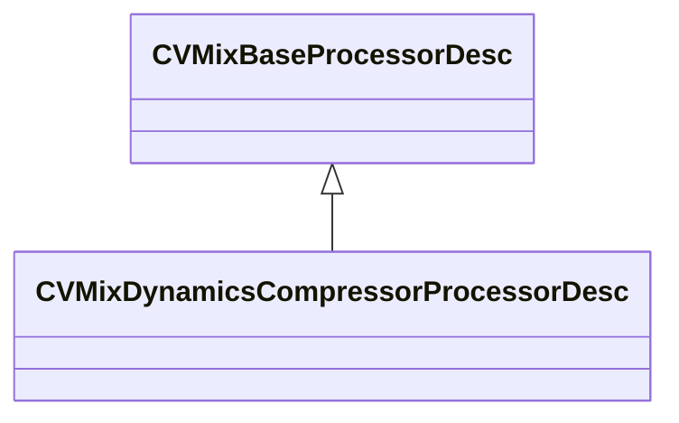

### CVMixDynamicsProcessorDesc

**Inherits from:** [CVMixBaseProcessorDesc](soundsystem_lowlevel.md#cvmixbaseprocessordesc)

**Metadata:** `MGetKV3ClassDefaults = {`, `"_class": "CVMixDynamicsProcessorDesc",`, `"m_name": "",`, `"m_nChannels": -1,`, `"m_flxfade": 0.100000,`, `"m_desc":`, `{`, `"m_fldbGain": 0.000000,`, `"m_fldbNoiseGateThreshold": 0.000000,`, `"m_fldbCompressionThreshold": 0.000000,`, `"m_fldbLimiterThreshold": 0.000000,`, `"m_fldbKneeWidth": 0.000000,`, `"m_flRatio": 0.000000,`, `"m_flLimiterRatio": 0.000000,`, `"m_flAttackTimeMS": 0.000000,`, `"m_flReleaseTimeMS": 0.000000,`, `"m_flRMSTimeMS": 0.000000,`, `"m_flWetMix": 0.000000,`, `"m_bPeakMode": false`, `}`, `}`

**Relationships:**

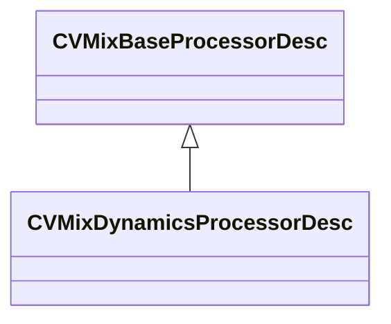

### CVMixEQ8ProcessorDesc

**Inherits from:** [CVMixBaseProcessorDesc](soundsystem_lowlevel.md#cvmixbaseprocessordesc)

**Metadata:** `MGetKV3ClassDefaults = {`, `"_class": "CVMixEQ8ProcessorDesc",`, `"m_name": "",`, `"m_nChannels": -1,`, `"m_flxfade": 0.100000,`, `"m_desc":`, `{`, `"m_stages":`, `[`, `{`, `"m_nFilterType": "FILTER_UNKNOWN",`, `"m_nFilterSlope": "FILTER_SLOPE_12dB",`, `"m_bEnabled": true,`, `"m_fldbGain": 0.000000,`, `"m_flCutoffFreq": 1000.000000,`, `"m_flQ": 0.707107`, `},`, `{`, `"m_nFilterType": "FILTER_UNKNOWN",`, `"m_nFilterSlope": "FILTER_SLOPE_12dB",`, `"m_bEnabled": true,`, `"m_fldbGain": 0.000000,`, `"m_flCutoffFreq": 1000.000000,`, `"m_flQ": 0.707107`, `},`, `{`, `"m_nFilterType": "FILTER_UNKNOWN",`, `"m_nFilterSlope": "FILTER_SLOPE_12dB",`, `"m_bEnabled": true,`, `"m_fldbGain": 0.000000,`, `"m_flCutoffFreq": 1000.000000,`, `"m_flQ": 0.707107`, `},`, `{`, `"m_nFilterType": "FILTER_UNKNOWN",`, `"m_nFilterSlope": "FILTER_SLOPE_12dB",`, `"m_bEnabled": true,`, `"m_fldbGain": 0.000000,`, `"m_flCutoffFreq": 1000.000000,`, `"m_flQ": 0.707107`, `},`, `{`, `"m_nFilterType": "FILTER_UNKNOWN",`, `"m_nFilterSlope": "FILTER_SLOPE_12dB",`, `"m_bEnabled": true,`, `"m_fldbGain": 0.000000,`, `"m_flCutoffFreq": 1000.000000,`, `"m_flQ": 0.707107`, `},`, `{`, `"m_nFilterType": "FILTER_UNKNOWN",`, `"m_nFilterSlope": "FILTER_SLOPE_12dB",`, `"m_bEnabled": true,`, `"m_fldbGain": 0.000000,`, `"m_flCutoffFreq": 1000.000000,`, `"m_flQ": 0.707107`, `},`, `{`, `"m_nFilterType": "FILTER_UNKNOWN",`, `"m_nFilterSlope": "FILTER_SLOPE_12dB",`, `"m_bEnabled": true,`, `"m_fldbGain": 0.000000,`, `"m_flCutoffFreq": 1000.000000,`, `"m_flQ": 0.707107`, `},`, `{`, `"m_nFilterType": "FILTER_UNKNOWN",`, `"m_nFilterSlope": "FILTER_SLOPE_12dB",`, `"m_bEnabled": true,`, `"m_fldbGain": 0.000000,`, `"m_flCutoffFreq": 1000.000000,`, `"m_flQ": 0.707107`, `}`, `]`, `}`, `}`

**Relationships:**

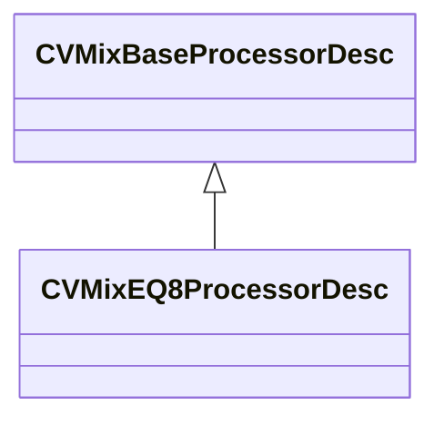

### CVMixEffectChainProcessorDesc

**Inherits from:** [CVMixBaseProcessorDesc](soundsystem_lowlevel.md#cvmixbaseprocessordesc)

**Metadata:** `MGetKV3ClassDefaults = {`, `"_class": "CVMixEffectChainProcessorDesc",`, `"m_name": "",`, `"m_nChannels": -1,`, `"m_flxfade": 0.100000,`, `"m_desc":`, `{`, `"m_effectName": ""`, `}`, `}`

**Relationships:**

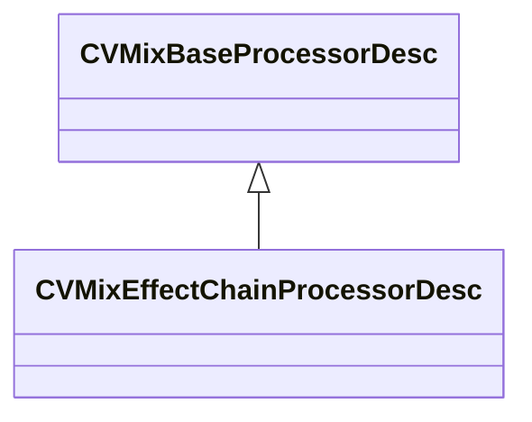

### CVMixEnvelopeProcessorDesc

**Inherits from:** [CVMixBaseProcessorDesc](soundsystem_lowlevel.md#cvmixbaseprocessordesc)

**Metadata:** `MGetKV3ClassDefaults = {`, `"_class": "CVMixEnvelopeProcessorDesc",`, `"m_name": "",`, `"m_nChannels": -1,`, `"m_flxfade": 0.100000,`, `"m_desc":`, `{`, `"m_flAttackTimeMS": 0.000000,`, `"m_flHoldTimeMS": 0.000000,`, `"m_flReleaseTimeMS": 0.000000`, `}`, `}`

**Relationships:**

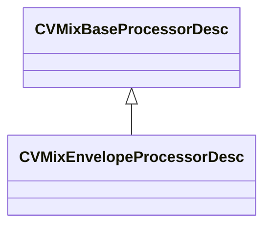

### CVMixFilterProcessorDesc

**Inherits from:** [CVMixBaseProcessorDesc](soundsystem_lowlevel.md#cvmixbaseprocessordesc)

**Metadata:** `MGetKV3ClassDefaults = {`, `"_class": "CVMixFilterProcessorDesc",`, `"m_name": "",`, `"m_nChannels": -1,`, `"m_flxfade": 0.100000,`, `"m_desc":`, `{`, `"m_nFilterType": "FILTER_UNKNOWN",`, `"m_nFilterSlope": "FILTER_SLOPE_12dB",`, `"m_bEnabled": true,`, `"m_fldbGain": 0.000000,`, `"m_flCutoffFreq": 1000.000000,`, `"m_flQ": 0.707107`, `}`, `}`

**Relationships:**

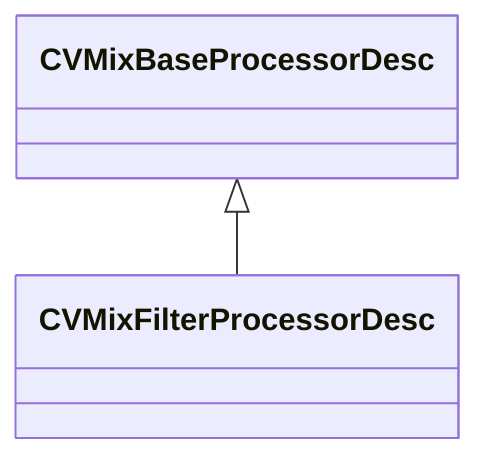

### CVMixFlangerProcessorDesc

**Inherits from:** [CVMixBaseProcessorDesc](soundsystem_lowlevel.md#cvmixbaseprocessordesc)

**Metadata:** `MGetKV3ClassDefaults = {`, `"_class": "CVMixFlangerProcessorDesc",`, `"m_name": "",`, `"m_nChannels": -1,`, `"m_flxfade": 0.100000,`, `"m_desc":`, `{`, `"m_bPhaseInvert": false,`, `"m_flGlideTime": 0.000000,`, `"m_flDelay": 0.000000,`, `"m_flOutputGain": 0.000000,`, `"m_flFeedbackGain": 0.000000,`, `"m_flFeedforwardGain": 0.000000,`, `"m_flModRate": 0.000000,`, `"m_flModDepth": 0.000000,`, `"m_bApplyAntialiasing": false`, `}`, `}`

**Relationships:**

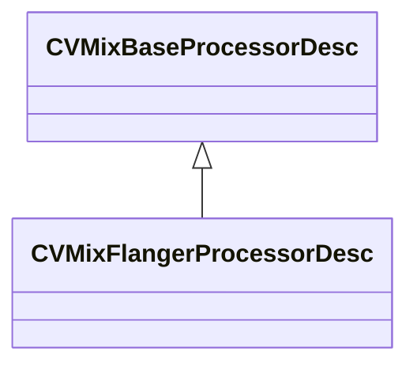

### CVMixFreeverbProcessorDesc

**Inherits from:** [CVMixBaseProcessorDesc](soundsystem_lowlevel.md#cvmixbaseprocessordesc)

**Metadata:** `MGetKV3ClassDefaults = {`, `"_class": "CVMixFreeverbProcessorDesc",`, `"m_name": "",`, `"m_nChannels": -1,`, `"m_flxfade": 0.100000,`, `"m_desc":`, `{`, `"m_flRoomSize": 0.000000,`, `"m_flDamp": 0.000000,`, `"m_flWidth": 0.000000,`, `"m_flLateReflections": 0.000000`, `}`, `}`

**Relationships:**

```mermaid
classDiagram
    CVMixBaseProcessorDesc <|-- CVMixFreeverbProcessorDesc
```

### CVMixGraphDescData

**Metadata:** `MGetKV3ClassDefaults = {`, `"Name": "",`, `"m_nGraphOutputChannels": -1,`, `"m_bIsMainGraph": false`, `}`

### CVMixImpulseResponseInput

**Inherits from:** [CVMixInputBase](soundsystem_lowlevel.md#cvmixinputbase)

**Metadata:** `MGetKV3ClassDefaults = {`, `"m_name": "GameInput"`, `}`

**Relationships:**

```mermaid
classDiagram
    CVMixInputBase <|-- CVMixImpulseResponseInput
```

### CVMixInputBase

**Derived by:** [CVMixControlInput](soundsystem_lowlevel.md#cvmixcontrolinput), [CVMixControlInputArray](soundsystem_lowlevel.md#cvmixcontrolinputarray), [CVMixControlMeter](soundsystem_lowlevel.md#cvmixcontrolmeter), [CVMixControlOutput](soundsystem_lowlevel.md#cvmixcontroloutput), [CVMixImpulseResponseInput](soundsystem_lowlevel.md#cvmiximpulseresponseinput), [CVMixNameInput](soundsystem_lowlevel.md#cvmixnameinput), [CVMixNameInputMeter](soundsystem_lowlevel.md#cvmixnameinputmeter), [CVMixVsndInput](soundsystem_lowlevel.md#cvmixvsndinput)

**Metadata:** `MGetKV3ClassDefaults = {`, `"m_name": "GameInput"`, `}`

**Relationships:**

```mermaid
classDiagram
    CVMixInputBase <|-- CVMixControlInput
    CVMixInputBase <|-- CVMixControlInputArray
    CVMixInputBase <|-- CVMixControlMeter
    CVMixInputBase <|-- CVMixControlOutput
    CVMixInputBase <|-- CVMixImpulseResponseInput
    CVMixInputBase <|-- CVMixNameInput
    CVMixInputBase <|-- CVMixNameInputMeter
    CVMixInputBase <|-- CVMixVsndInput
```

### CVMixModDelayProcessorDesc

**Inherits from:** [CVMixBaseProcessorDesc](soundsystem_lowlevel.md#cvmixbaseprocessordesc)

**Metadata:** `MGetKV3ClassDefaults = {`, `"_class": "CVMixModDelayProcessorDesc",`, `"m_name": "",`, `"m_nChannels": -1,`, `"m_flxfade": 0.100000,`, `"m_desc":`, `{`, `"m_feedbackFilter":`, `{`, `"m_nFilterType": "FILTER_UNKNOWN",`, `"m_nFilterSlope": "FILTER_SLOPE_12dB",`, `"m_bEnabled": true,`, `"m_fldbGain": 0.000000,`, `"m_flCutoffFreq": 1000.000000,`, `"m_flQ": 0.707107`, `},`, `"m_bPhaseInvert": false,`, `"m_flGlideTime": 0.000000,`, `"m_flDelay": 0.000000,`, `"m_flOutputGain": 0.000000,`, `"m_flFeedbackGain": 0.000000,`, `"m_flModRate": 0.000000,`, `"m_flModDepth": 0.000000,`, `"m_bApplyAntialiasing": false`, `}`, `}`

**Relationships:**

```mermaid
classDiagram
    CVMixBaseProcessorDesc <|-- CVMixModDelayProcessorDesc
```

### CVMixNameInput

**Inherits from:** [CVMixInputBase](soundsystem_lowlevel.md#cvmixinputbase)

**Metadata:** `MGetKV3ClassDefaults = {`, `"m_name": "GameInput",`, `"m_defaultValue": ""`, `}`

**Relationships:**

```mermaid
classDiagram
    CVMixInputBase <|-- CVMixNameInput
```

### CVMixNameInputMeter

**Inherits from:** [CVMixInputBase](soundsystem_lowlevel.md#cvmixinputbase)

**Metadata:** `MGetKV3ClassDefaults = {`, `"m_name": "GameInput",`, `"m_nValueIndex": 0`, `}`

**Relationships:**

```mermaid
classDiagram
    CVMixInputBase <|-- CVMixNameInputMeter
```

### CVMixOscProcessorDesc

**Inherits from:** [CVMixBaseProcessorDesc](soundsystem_lowlevel.md#cvmixbaseprocessordesc)

**Metadata:** `MGetKV3ClassDefaults = {`, `"_class": "CVMixOscProcessorDesc",`, `"m_name": "",`, `"m_nChannels": -1,`, `"m_flxfade": 0.100000,`, `"m_desc":`, `{`, `"oscType": "LFO_SHAPE_SINE",`, `"m_freq": 440.000000,`, `"m_flPhase": 0.000000`, `}`, `}`

**Relationships:**

```mermaid
classDiagram
    CVMixBaseProcessorDesc <|-- CVMixOscProcessorDesc
```

### CVMixPannerProcessorDesc

**Inherits from:** [CVMixBaseProcessorDesc](soundsystem_lowlevel.md#cvmixbaseprocessordesc)

**Metadata:** `MGetKV3ClassDefaults = {`, `"_class": "CVMixPannerProcessorDesc",`, `"m_name": "",`, `"m_nChannels": -1,`, `"m_flxfade": 0.100000,`, `"m_desc":`, `{`, `"m_type": "PANNER_TYPE_LINEAR",`, `"m_flStrength": 0.000000`, `}`, `}`

**Relationships:**

```mermaid
classDiagram
    CVMixBaseProcessorDesc <|-- CVMixPannerProcessorDesc
```

### CVMixPitchShiftProcessorDesc

**Inherits from:** [CVMixBaseProcessorDesc](soundsystem_lowlevel.md#cvmixbaseprocessordesc)

**Metadata:** `MGetKV3ClassDefaults = {`, `"_class": "CVMixPitchShiftProcessorDesc",`, `"m_name": "",`, `"m_nChannels": -1,`, `"m_flxfade": 0.100000,`, `"m_desc":`, `{`, `"m_nGrainSampleCount": 0,`, `"m_flPitchShift": 0.000000,`, `"m_nQuality": 0,`, `"m_nProcType": 0`, `}`, `}`

**Relationships:**

```mermaid
classDiagram
    CVMixBaseProcessorDesc <|-- CVMixPitchShiftProcessorDesc
```

### CVMixPlateReverbProcessorDesc

**Inherits from:** [CVMixBaseProcessorDesc](soundsystem_lowlevel.md#cvmixbaseprocessordesc)

**Metadata:** `MGetKV3ClassDefaults = {`, `"_class": "CVMixPlateReverbProcessorDesc",`, `"m_name": "",`, `"m_nChannels": -1,`, `"m_flxfade": 0.100000,`, `"m_desc":`, `{`, `"m_flPrefilter": 0.000000,`, `"m_flInputDiffusion1": 0.000000,`, `"m_flInputDiffusion2": 0.000000,`, `"m_flDecay": 0.000000,`, `"m_flDamp": 0.000000,`, `"m_flFeedbackDiffusion1": 0.000000,`, `"m_flFeedbackDiffusion2": 0.000000`, `}`, `}`

**Relationships:**

```mermaid
classDiagram
    CVMixBaseProcessorDesc <|-- CVMixPlateReverbProcessorDesc
```

### CVMixPresetDSPProcessorDesc

**Inherits from:** [CVMixBaseProcessorDesc](soundsystem_lowlevel.md#cvmixbaseprocessordesc)

**Metadata:** `MGetKV3ClassDefaults = {`, `"_class": "CVMixPresetDSPProcessorDesc",`, `"m_name": "",`, `"m_nChannels": -1,`, `"m_flxfade": 0.100000,`, `"m_desc":`, `{`, `"m_effectName": ""`, `}`, `}`

**Relationships:**

```mermaid
classDiagram
    CVMixBaseProcessorDesc <|-- CVMixPresetDSPProcessorDesc
```

### CVMixShaperProcessorDesc

**Inherits from:** [CVMixBaseProcessorDesc](soundsystem_lowlevel.md#cvmixbaseprocessordesc)

**Metadata:** `MGetKV3ClassDefaults = {`, `"_class": "CVMixShaperProcessorDesc",`, `"m_name": "",`, `"m_nChannels": -1,`, `"m_flxfade": 0.100000,`, `"m_desc":`, `{`, `"m_nShape": 0,`, `"m_fldbDrive": 0.000000,`, `"m_fldbOutputGain": 0.000000,`, `"m_flWetMix": 1.000000,`, `"m_nOversampleFactor": 1`, `}`, `}`

**Relationships:**

```mermaid
classDiagram
    CVMixBaseProcessorDesc <|-- CVMixShaperProcessorDesc
```

### CVMixSteamAudioDirectProcessorDesc

**Inherits from:** [CVMixBaseProcessorDesc](soundsystem_lowlevel.md#cvmixbaseprocessordesc)

**Metadata:** `MGetKV3ClassDefaults = {`, `"_class": "CVMixSteamAudioDirectProcessorDesc",`, `"m_name": "",`, `"m_nChannels": -1,`, `"m_flxfade": 0.100000`, `}`

**Relationships:**

```mermaid
classDiagram
    CVMixBaseProcessorDesc <|-- CVMixSteamAudioDirectProcessorDesc
```

### CVMixSteamAudioHRTFProcessorDesc

**Inherits from:** [CVMixBaseProcessorDesc](soundsystem_lowlevel.md#cvmixbaseprocessordesc)

**Metadata:** `MGetKV3ClassDefaults = {`, `"_class": "CVMixSteamAudioHRTFProcessorDesc",`, `"m_name": "",`, `"m_nChannels": -1,`, `"m_flxfade": 0.100000`, `}`

**Relationships:**

```mermaid
classDiagram
    CVMixBaseProcessorDesc <|-- CVMixSteamAudioHRTFProcessorDesc
```

### CVMixSteamAudioHybridReverbProcessorDesc

**Inherits from:** [CVMixBaseProcessorDesc](soundsystem_lowlevel.md#cvmixbaseprocessordesc)

**Metadata:** `MGetKV3ClassDefaults = {`, `"_class": "CVMixSteamAudioHybridReverbProcessorDesc",`, `"m_name": "",`, `"m_nChannels": -1,`, `"m_flxfade": 0.100000`, `}`

**Relationships:**

```mermaid
classDiagram
    CVMixBaseProcessorDesc <|-- CVMixSteamAudioHybridReverbProcessorDesc
```

### CVMixSteamAudioPathingProcessorDesc

**Inherits from:** [CVMixBaseProcessorDesc](soundsystem_lowlevel.md#cvmixbaseprocessordesc)

**Metadata:** `MGetKV3ClassDefaults = {`, `"_class": "CVMixSteamAudioPathingProcessorDesc",`, `"m_name": "",`, `"m_nChannels": -1,`, `"m_flxfade": 0.100000`, `}`

**Relationships:**

```mermaid
classDiagram
    CVMixBaseProcessorDesc <|-- CVMixSteamAudioPathingProcessorDesc
```

### CVMixStereoDelayProcessorDesc

**Inherits from:** [CVMixBaseProcessorDesc](soundsystem_lowlevel.md#cvmixbaseprocessordesc)

**Metadata:** `MGetKV3ClassDefaults = {`, `"_class": "CVMixStereoDelayProcessorDesc",`, `"m_name": "",`, `"m_nChannels": -1,`, `"m_flxfade": 0.100000`, `}`

**Relationships:**

```mermaid
classDiagram
    CVMixBaseProcessorDesc <|-- CVMixStereoDelayProcessorDesc
```

### CVMixSubgraphSwitchProcessorDesc

**Inherits from:** [CVMixBaseProcessorDesc](soundsystem_lowlevel.md#cvmixbaseprocessordesc)

**Metadata:** `MGetKV3ClassDefaults = {`, `"_class": "CVMixSubgraphSwitchProcessorDesc",`, `"m_name": "",`, `"m_nChannels": -1,`, `"m_flxfade": 0.100000,`, `"m_desc":`, `{`, `"m_name": "",`, `"m_effectName": "",`, `"m_subgraphs":`, `[`, `],`, `"m_interpolationMode": "SUBGRAPH_INTERPOLATION_TEMPORAL_CROSSFADE",`, `"m_bOnlyTailsOnFadeOut": false,`, `"m_flInterpolationTime": 0.000000`, `}`, `}`

**Relationships:**

```mermaid
classDiagram
    CVMixBaseProcessorDesc <|-- CVMixSubgraphSwitchProcessorDesc
```

### CVMixUtilityProcessorDesc

**Inherits from:** [CVMixBaseProcessorDesc](soundsystem_lowlevel.md#cvmixbaseprocessordesc)

**Metadata:** `MGetKV3ClassDefaults = {`, `"_class": "CVMixUtilityProcessorDesc",`, `"m_name": "",`, `"m_nChannels": -1,`, `"m_flxfade": 0.100000,`, `"m_desc":`, `{`, `"m_nOp": "VMIX_CHAN_STEREO",`, `"m_flInputPan": 0.000000,`, `"m_flOutputBalance": 0.000000,`, `"m_fldbOutputGain": 0.000000,`, `"m_bBassMono": false,`, `"m_flBassFreq": 120.000000`, `}`, `}`

**Relationships:**

```mermaid
classDiagram
    CVMixBaseProcessorDesc <|-- CVMixUtilityProcessorDesc
```

### CVMixVocoderProcessorDesc

**Inherits from:** [CVMixBaseProcessorDesc](soundsystem_lowlevel.md#cvmixbaseprocessordesc)

**Metadata:** `MGetKV3ClassDefaults = {`, `"_class": "CVMixVocoderProcessorDesc",`, `"m_name": "",`, `"m_nChannels": -1,`, `"m_flxfade": 0.100000,`, `"m_desc":`, `{`, `"m_nBandCount": 0,`, `"m_flBandwidth": 0.000000,`, `"m_fldBModGain": 0.000000,`, `"m_flFreqRangeStart": 0.000000,`, `"m_flFreqRangeEnd": 0.000000,`, `"m_fldBUnvoicedGain": 0.000000,`, `"m_flAttackTimeMS": 0.000000,`, `"m_flReleaseTimeMS": 0.000000,`, `"m_nDebugBand": 0,`, `"m_bPeakMode": false`, `}`, `}`

**Relationships:**

```mermaid
classDiagram
    CVMixBaseProcessorDesc <|-- CVMixVocoderProcessorDesc
```

### CVMixVsndInput

**Inherits from:** [CVMixInputBase](soundsystem_lowlevel.md#cvmixinputbase)

**Metadata:** `MGetKV3ClassDefaults = {`, `"m_name": "GameInput",`, `"m_defaultValue": "",`, `"m_nProcessor": -1`, `}`

**Relationships:**

```mermaid
classDiagram
    CVMixInputBase <|-- CVMixVsndInput
```

### VMixAutoFilterDesc_t

**Metadata:** `MGetKV3ClassDefaults = {`, `"m_flEnvelopeAmount": 0.000000,`, `"m_flAttackTimeMS": 5.000000,`, `"m_flReleaseTimeMS": 200.000000,`, `"m_filter":`, `{`, `"m_nFilterType": "FILTER_UNKNOWN",`, `"m_nFilterSlope": "FILTER_SLOPE_12dB",`, `"m_bEnabled": true,`, `"m_fldbGain": 0.000000,`, `"m_flCutoffFreq": 1000.000000,`, `"m_flQ": 0.707107`, `},`, `"m_flLFOAmount": 0.000000,`, `"m_flLFORate": 0.000000,`, `"m_flPhase": 0.000000,`, `"m_nLFOShape": "LFO_SHAPE_SINE"`, `}`

### VMixBoxverbDesc_t

**Metadata:** `MGetKV3ClassDefaults = {`, `"m_flSizeMax": 0.000000,`, `"m_flSizeMin": 0.000000,`, `"m_flComplexity": 0.000000,`, `"m_flDiffusion": 0.000000,`, `"m_flModDepth": 0.000000,`, `"m_flModRate": 0.000000,`, `"m_bParallel": false,`, `"m_filterType":`, `{`, `"m_nFilterType": "FILTER_UNKNOWN",`, `"m_nFilterSlope": "FILTER_SLOPE_12dB",`, `"m_bEnabled": true,`, `"m_fldbGain": 0.000000,`, `"m_flCutoffFreq": 1000.000000,`, `"m_flQ": 0.707107`, `},`, `"m_flWidth": 0.000000,`, `"m_flHeight": 0.000000,`, `"m_flDepth": 0.000000,`, `"m_flFeedbackScale": 0.000000,`, `"m_flFeedbackWidth": 0.000000,`, `"m_flFeedbackHeight": 0.000000,`, `"m_flFeedbackDepth": 0.000000,`, `"m_flOutputGain": 0.000000,`, `"m_flTaps": 0.000000`, `}`

### VMixChannelOperation_t

**Values:**

| Name | Value |
|------|-------|
| `VMIX_CHAN_STEREO` | 0 |
| `VMIX_CHAN_LEFT` | 1 |
| `VMIX_CHAN_RIGHT` | 2 |
| `VMIX_CHAN_SWAP` | 3 |
| `VMIX_CHAN_MONO` | 4 |
| `VMIX_CHAN_MID_SIDE` | 5 |

### VMixConvolutionDesc_t

**Metadata:** `MGetKV3ClassDefaults = {`, `"m_fldbGain": -12.000000,`, `"m_flPreDelayMS": 0.000000,`, `"m_flWetMix": 1.000000,`, `"m_fldbLow": 0.000000,`, `"m_fldbMid": 0.000000,`, `"m_fldbHigh": 0.000000,`, `"m_flLowCutoffFreq": 1500.000000,`, `"m_flHighCutoffFreq": 7500.000000`, `}`

### VMixDelayDesc_t

**Metadata:** `MGetKV3ClassDefaults = {`, `"m_feedbackFilter":`, `{`, `"m_nFilterType": "FILTER_UNKNOWN",`, `"m_nFilterSlope": "FILTER_SLOPE_12dB",`, `"m_bEnabled": true,`, `"m_fldbGain": 0.000000,`, `"m_flCutoffFreq": 1000.000000,`, `"m_flQ": 0.707107`, `},`, `"m_bEnableFilter": false,`, `"m_flDelay": 0.000000,`, `"m_flDirectGain": 0.000000,`, `"m_flDelayGain": 0.000000,`, `"m_flFeedbackGain": 0.000000,`, `"m_flWidth": 0.000000`, `}`

### VMixDiffusorDesc_t

**Metadata:** `MGetKV3ClassDefaults = {`, `"m_flSize": 0.000000,`, `"m_flComplexity": 0.000000,`, `"m_flFeedback": 0.000000,`, `"m_flOutputGain": 0.000000`, `}`

### VMixDualCompressorDesc_t

**Metadata:** `MGetKV3ClassDefaults = {`, `"m_flRMSTimeMS": 300.000000,`, `"m_fldbKneeWidth": 0.000000,`, `"m_flWetMix": 1.000000,`, `"m_bPeakMode": false,`, `"m_bandDesc":`, `{`, `"m_fldbGainInput": 0.000000,`, `"m_fldbGainOutput": 0.000000,`, `"m_fldbThresholdBelow": -40.000000,`, `"m_fldbThresholdAbove": -30.000000,`, `"m_flRatioBelow": 12.000000,`, `"m_flRatioAbove": 4.000000,`, `"m_flAttackTimeMS": 50.000000,`, `"m_flReleaseTimeMS": 200.000000,`, `"m_bEnable": false,`, `"m_bSolo": false`, `}`, `}`

### VMixDynamics3BandDesc_t

**Metadata:** `MGetKV3ClassDefaults = {`, `"m_fldbGainOutput": 0.000000,`, `"m_flRMSTimeMS": 0.000000,`, `"m_fldbKneeWidth": 0.000000,`, `"m_flDepth": 0.000000,`, `"m_flWetMix": 0.000000,`, `"m_flTimeScale": 0.000000,`, `"m_flLowCutoffFreq": 0.000000,`, `"m_flHighCutoffFreq": 0.000000,`, `"m_bPeakMode": false,`, `"m_bandDesc":`, `[`, `{`, `"m_fldbGainInput": 0.000000,`, `"m_fldbGainOutput": 0.000000,`, `"m_fldbThresholdBelow": -40.000000,`, `"m_fldbThresholdAbove": -30.000000,`, `"m_flRatioBelow": 12.000000,`, `"m_flRatioAbove": 4.000000,`, `"m_flAttackTimeMS": 50.000000,`, `"m_flReleaseTimeMS": 200.000000,`, `"m_bEnable": false,`, `"m_bSolo": false`, `},`, `{`, `"m_fldbGainInput": 0.000000,`, `"m_fldbGainOutput": 0.000000,`, `"m_fldbThresholdBelow": -40.000000,`, `"m_fldbThresholdAbove": -30.000000,`, `"m_flRatioBelow": 12.000000,`, `"m_flRatioAbove": 4.000000,`, `"m_flAttackTimeMS": 50.000000,`, `"m_flReleaseTimeMS": 200.000000,`, `"m_bEnable": false,`, `"m_bSolo": false`, `},`, `{`, `"m_fldbGainInput": 0.000000,`, `"m_fldbGainOutput": 0.000000,`, `"m_fldbThresholdBelow": -40.000000,`, `"m_fldbThresholdAbove": -30.000000,`, `"m_flRatioBelow": 12.000000,`, `"m_flRatioAbove": 4.000000,`, `"m_flAttackTimeMS": 50.000000,`, `"m_flReleaseTimeMS": 200.000000,`, `"m_bEnable": false,`, `"m_bSolo": false`, `}`, `]`, `}`

### VMixDynamicsBand_t

**Metadata:** `MGetKV3ClassDefaults = {`, `"m_fldbGainInput": 0.000000,`, `"m_fldbGainOutput": 0.000000,`, `"m_fldbThresholdBelow": -40.000000,`, `"m_fldbThresholdAbove": -30.000000,`, `"m_flRatioBelow": 12.000000,`, `"m_flRatioAbove": 4.000000,`, `"m_flAttackTimeMS": 50.000000,`, `"m_flReleaseTimeMS": 200.000000,`, `"m_bEnable": false,`, `"m_bSolo": false`, `}`

### VMixDynamicsCompressorDesc_t

**Metadata:** `MGetKV3ClassDefaults = {`, `"m_fldbOutputGain": 0.000000,`, `"m_fldbCompressionThreshold": -6.000000,`, `"m_fldbKneeWidth": 0.000000,`, `"m_flCompressionRatio": 2.000000,`, `"m_flAttackTimeMS": 100.000000,`, `"m_flReleaseTimeMS": 400.000000,`, `"m_flRMSTimeMS": 300.000000,`, `"m_flWetMix": 1.000000,`, `"m_bPeakMode": false`, `}`

### VMixDynamicsDesc_t

**Metadata:** `MGetKV3ClassDefaults = {`, `"m_fldbGain": 0.000000,`, `"m_fldbNoiseGateThreshold": 0.000000,`, `"m_fldbCompressionThreshold": 0.000000,`, `"m_fldbLimiterThreshold": 0.000000,`, `"m_fldbKneeWidth": 0.000000,`, `"m_flRatio": 0.000000,`, `"m_flLimiterRatio": 0.000000,`, `"m_flAttackTimeMS": 0.000000,`, `"m_flReleaseTimeMS": 0.000000,`, `"m_flRMSTimeMS": 0.000000,`, `"m_flWetMix": 0.000000,`, `"m_bPeakMode": false`, `}`

### VMixEQ8Desc_t

**Metadata:** `MGetKV3ClassDefaults = {`, `"m_stages":`, `[`, `{`, `"m_nFilterType": "FILTER_UNKNOWN",`, `"m_nFilterSlope": "FILTER_SLOPE_12dB",`, `"m_bEnabled": true,`, `"m_fldbGain": 0.000000,`, `"m_flCutoffFreq": 1000.000000,`, `"m_flQ": 0.707107`, `},`, `{`, `"m_nFilterType": "FILTER_UNKNOWN",`, `"m_nFilterSlope": "FILTER_SLOPE_12dB",`, `"m_bEnabled": true,`, `"m_fldbGain": 0.000000,`, `"m_flCutoffFreq": 1000.000000,`, `"m_flQ": 0.707107`, `},`, `{`, `"m_nFilterType": "FILTER_UNKNOWN",`, `"m_nFilterSlope": "FILTER_SLOPE_12dB",`, `"m_bEnabled": true,`, `"m_fldbGain": 0.000000,`, `"m_flCutoffFreq": 1000.000000,`, `"m_flQ": 0.707107`, `},`, `{`, `"m_nFilterType": "FILTER_UNKNOWN",`, `"m_nFilterSlope": "FILTER_SLOPE_12dB",`, `"m_bEnabled": true,`, `"m_fldbGain": 0.000000,`, `"m_flCutoffFreq": 1000.000000,`, `"m_flQ": 0.707107`, `},`, `{`, `"m_nFilterType": "FILTER_UNKNOWN",`, `"m_nFilterSlope": "FILTER_SLOPE_12dB",`, `"m_bEnabled": true,`, `"m_fldbGain": 0.000000,`, `"m_flCutoffFreq": 1000.000000,`, `"m_flQ": 0.707107`, `},`, `{`, `"m_nFilterType": "FILTER_UNKNOWN",`, `"m_nFilterSlope": "FILTER_SLOPE_12dB",`, `"m_bEnabled": true,`, `"m_fldbGain": 0.000000,`, `"m_flCutoffFreq": 1000.000000,`, `"m_flQ": 0.707107`, `},`, `{`, `"m_nFilterType": "FILTER_UNKNOWN",`, `"m_nFilterSlope": "FILTER_SLOPE_12dB",`, `"m_bEnabled": true,`, `"m_fldbGain": 0.000000,`, `"m_flCutoffFreq": 1000.000000,`, `"m_flQ": 0.707107`, `},`, `{`, `"m_nFilterType": "FILTER_UNKNOWN",`, `"m_nFilterSlope": "FILTER_SLOPE_12dB",`, `"m_bEnabled": true,`, `"m_fldbGain": 0.000000,`, `"m_flCutoffFreq": 1000.000000,`, `"m_flQ": 0.707107`, `}`, `]`, `}`

### VMixEffectChainDesc_t

**Metadata:** `MGetKV3ClassDefaults = {`, `"m_effectName": ""`, `}`

### VMixEnvelopeDesc_t

**Metadata:** `MGetKV3ClassDefaults = {`, `"m_flAttackTimeMS": 0.000000,`, `"m_flHoldTimeMS": 0.000000,`, `"m_flReleaseTimeMS": 0.000000`, `}`

### VMixFilterDesc_t

**Metadata:** `MGetKV3ClassDefaults = {`, `"m_nFilterType": "FILTER_UNKNOWN",`, `"m_nFilterSlope": "FILTER_SLOPE_12dB",`, `"m_bEnabled": true,`, `"m_fldbGain": 0.000000,`, `"m_flCutoffFreq": 1000.000000,`, `"m_flQ": 0.707107`, `}`

### VMixFilterSlope_t

**Values:**

| Name | Value |
|------|-------|
| `FILTER_SLOPE_1POLE_6dB` | 0 |
| `FILTER_SLOPE_1POLE_12dB` | 1 |
| `FILTER_SLOPE_1POLE_18dB` | 2 |
| `FILTER_SLOPE_1POLE_24dB` | 3 |
| `FILTER_SLOPE_12dB` | 4 |
| `FILTER_SLOPE_24dB` | 5 |
| `FILTER_SLOPE_36dB` | 6 |
| `FILTER_SLOPE_48dB` | 7 |
| `FILTER_SLOPE_MAX` | 7 |

### VMixFilterType_t

**Values:**

| Name | Value |
|------|-------|
| `FILTER_UNKNOWN` | -1 |
| `FILTER_LOWPASS` | 0 |
| `FILTER_HIGHPASS` | 1 |
| `FILTER_BANDPASS` | 2 |
| `FILTER_NOTCH` | 3 |
| `FILTER_PEAKING_EQ` | 4 |
| `FILTER_LOW_SHELF` | 5 |
| `FILTER_HIGH_SHELF` | 6 |
| `FILTER_ALLPASS` | 7 |
| `FILTER_PASSTHROUGH` | 8 |

### VMixFlangerDesc_t

**Metadata:** `MGetKV3ClassDefaults = {`, `"m_bPhaseInvert": false,`, `"m_flGlideTime": 0.000000,`, `"m_flDelay": 0.000000,`, `"m_flOutputGain": 0.000000,`, `"m_flFeedbackGain": 0.000000,`, `"m_flFeedforwardGain": 0.000000,`, `"m_flModRate": 0.000000,`, `"m_flModDepth": 0.000000,`, `"m_bApplyAntialiasing": false`, `}`

### VMixFreeverbDesc_t

**Metadata:** `MGetKV3ClassDefaults = {`, `"m_flRoomSize": 0.000000,`, `"m_flDamp": 0.000000,`, `"m_flWidth": 0.000000,`, `"m_flLateReflections": 0.000000`, `}`

### VMixGraphCommandID_t

**Values:**

| Name | Value |
|------|-------|
| `CMD_INVALID` | -1 |
| `CMD_CONTROL_INPUT_STORE` | 1 |
| `CMD_CONTROL_INPUT_STORE_DB` | 2 |
| `CMD_CONTROL_TRANSIENT_INPUT_STORE` | 3 |
| `CMD_CONTROL_TRANSIENT_INPUT_RESET` | 4 |
| `CMD_CONTROL_OUTPUT_STORE` | 5 |
| `CMD_CONTROL_EVALUATE_CURVE` | 6 |
| `CMD_CONTROL_COPY` | 7 |
| `CMD_CONTROL_COND_COPY_IF_NEGATIVE` | 8 |
| `CMD_CONTROL_REMAP_LINEAR` | 9 |
| `CMD_CONTROL_REMAP_SINE` | 10 |
| `CMD_CONTROL_REMAP_LOGLINEAR` | 11 |
| `CMD_CONTROL_MAX` | 12 |
| `CMD_CONTROL_RESET_TIMER` | 13 |
| `CMD_CONTROL_INCREMENT_TIMER` | 14 |
| `CMD_CONTROL_EVAL_ENVELOPE` | 15 |
| `CMD_CONTROL_SINE_BLEND` | 16 |
| `CMD_PROCESSOR_SET_CONTROL_VALUE` | 17 |
| `CMD_PROCESSOR_SET_NAME_INPUT` | 18 |
| `CMD_PROCESSOR_SET_CONTROL_ARRAYVALUE` | 19 |
| `CMD_PROCESSOR_STORE_CONTROL_VALUE` | 20 |
| `CMD_PROCESSOR_SET_VSND_VALUE` | 21 |
| `CMD_SUBMIX_PROCESS` | 22 |
| `CMD_SUBMIX_GENERATE` | 23 |
| `CMD_SUBMIX_GENERATE_SIDECHAIN` | 24 |
| `CMD_SUBMIX_DEBUG` | 25 |
| `CMD_SUBMIX_MIX2x1` | 26 |
| `CMD_SUBMIX_OUTPUT` | 27 |
| `CMD_SUBMIX_OUTPUTx2` | 28 |
| `CMD_SUBMIX_COPY` | 29 |
| `CMD_SUBMIX_ACCUMULATE` | 30 |
| `CMD_SUBMIX_METER` | 31 |
| `CMD_SUBMIX_METER_SPECTRUM` | 32 |
| `CMD_IMPULSERESPONSE_INPUT_STORE` | 33 |
| `CMD_PROCESSOR_SET_IMPULSERESPONSE_VALUE` | 34 |
| `CMD_REMAP_VSND_TO_IMPULSERESPONSE` | 35 |
| `CMD_IMPULSERESPONSE_RESET` | 36 |
| `CMD_BLEND_VSNDS_TO_IMPULSERESPONSE` | 37 |
| `CMD_IMPULSERESPONSE_DELAY` | 38 |

### VMixLFOShape_t

**Values:**

| Name | Value |
|------|-------|
| `LFO_SHAPE_SINE` | 0 |
| `LFO_SHAPE_SQUARE` | 1 |
| `LFO_SHAPE_TRI` | 2 |
| `LFO_SHAPE_SAW` | 3 |
| `LFO_SHAPE_NOISE` | 4 |

### VMixModDelayDesc_t

**Metadata:** `MGetKV3ClassDefaults = {`, `"m_feedbackFilter":`, `{`, `"m_nFilterType": "FILTER_UNKNOWN",`, `"m_nFilterSlope": "FILTER_SLOPE_12dB",`, `"m_bEnabled": true,`, `"m_fldbGain": 0.000000,`, `"m_flCutoffFreq": 1000.000000,`, `"m_flQ": 0.707107`, `},`, `"m_bPhaseInvert": false,`, `"m_flGlideTime": 0.000000,`, `"m_flDelay": 0.000000,`, `"m_flOutputGain": 0.000000,`, `"m_flFeedbackGain": 0.000000,`, `"m_flModRate": 0.000000,`, `"m_flModDepth": 0.000000,`, `"m_bApplyAntialiasing": false`, `}`

### VMixOscDesc_t

**Metadata:** `MGetKV3ClassDefaults = {`, `"oscType": "LFO_SHAPE_SINE",`, `"m_freq": 440.000000,`, `"m_flPhase": 0.000000`, `}`

### VMixPannerDesc_t

**Metadata:** `MGetKV3ClassDefaults = {`, `"m_type": "PANNER_TYPE_LINEAR",`, `"m_flStrength": 0.000000`, `}`

### VMixPannerType_t

**Values:**

| Name | Value |
|------|-------|
| `PANNER_TYPE_LINEAR` | 0 |
| `PANNER_TYPE_EQUAL_POWER` | 1 |

### VMixPitchShiftDesc_t

**Metadata:** `MGetKV3ClassDefaults = {`, `"m_nGrainSampleCount": 0,`, `"m_flPitchShift": 0.000000,`, `"m_nQuality": 0,`, `"m_nProcType": 0`, `}`

### VMixPlateverbDesc_t

**Metadata:** `MGetKV3ClassDefaults = {`, `"m_flPrefilter": 0.000000,`, `"m_flInputDiffusion1": 0.000000,`, `"m_flInputDiffusion2": 0.000000,`, `"m_flDecay": 0.000000,`, `"m_flDamp": 0.000000,`, `"m_flFeedbackDiffusion1": 0.000000,`, `"m_flFeedbackDiffusion2": 0.000000`, `}`

### VMixPresetDSPDesc_t

**Metadata:** `MGetKV3ClassDefaults = {`, `"m_effectName": ""`, `}`

### VMixShaperDesc_t

**Metadata:** `MGetKV3ClassDefaults = {`, `"m_nShape": 0,`, `"m_fldbDrive": 0.000000,`, `"m_fldbOutputGain": 0.000000,`, `"m_flWetMix": 1.000000,`, `"m_nOversampleFactor": 1`, `}`

### VMixSubgraphSwitchDesc_t

**Metadata:** `MGetKV3ClassDefaults = {`, `"m_name": "",`, `"m_effectName": "",`, `"m_subgraphs":`, `[`, `],`, `"m_interpolationMode": "SUBGRAPH_INTERPOLATION_TEMPORAL_CROSSFADE",`, `"m_bOnlyTailsOnFadeOut": false,`, `"m_flInterpolationTime": 0.000000`, `}`

### VMixSubgraphSwitchInterpolationType_t

**Values:**

| Name | Value |
|------|-------|
| `SUBGRAPH_INTERPOLATION_TEMPORAL_CROSSFADE` | 0 |
| `SUBGRAPH_INTERPOLATION_TEMPORAL_FADE_OUT` | 1 |
| `SUBGRAPH_INTERPOLATION_KEEP_LAST_SUBGRAPH_RUNNING` | 2 |

### VMixUtilityDesc_t

**Metadata:** `MGetKV3ClassDefaults = {`, `"m_nOp": "VMIX_CHAN_STEREO",`, `"m_flInputPan": 0.000000,`, `"m_flOutputBalance": 0.000000,`, `"m_fldbOutputGain": 0.000000,`, `"m_bBassMono": false,`, `"m_flBassFreq": 120.000000`, `}`

### VMixVocoderDesc_t

**Metadata:** `MGetKV3ClassDefaults = Could not parse KV3 Defaults`

**Fields:**

| Name | Type | Annotations |
|------|------|-------------|
| `m_nBandCount` | int32 |  |
| `m_flBandwidth` | float32 |  |
| `m_fldBModGain` | float32 |  |
| `m_flFreqRangeStart` | float32 |  |
| `m_flFreqRangeEnd` | float32 |  |
| `m_fldBUnvoicedGain` | float32 |  |
| `m_flAttackTimeMS` | float32 |  |
| `m_flReleaseTimeMS` | float32 |  |
| `m_nDebugBand` | int32 |  |
| `m_bPeakMode` | bool |  |
