# Module: soundsystem_voicecontainers

[📊 View UML Diagram](../diagrams/soundsystem_voicecontainers.md)

| Name | Kind | Bases | Fields |
|------|------|-------|--------|
| [CAudioEmphasisSample](#caudioemphasissample) | class |  | 0 |
| [CAudioMorphData](#caudiomorphdata) | class |  | 0 |
| [CAudioPhonemeTag](#caudiophonemetag) | class |  | 0 |
| [CAudioSentence](#caudiosentence) | class |  | 0 |
| [CSoundContainerReference](#csoundcontainerreference) | class |  | 0 |
| [CSoundContainerReferenceArray](#csoundcontainerreferencearray) | class |  | 0 |
| [CSoundInfoHeader](#csoundinfoheader) | class |  | 0 |
| [CVSound](#cvsound) | class |  | 0 |
| [CVSoundFormat_t](#cvsoundformat_t) | enum |  | 4 |
| [CVoiceContainerAmpedDecayingSineWave](#cvoicecontainerampeddecayingsinewave) | class | CVoiceContainerDecayingSineWave | 0 |
| [CVoiceContainerAnalysisBase](#cvoicecontaineranalysisbase) | class |  | 0 |
| [CVoiceContainerAsyncGenerator](#cvoicecontainerasyncgenerator) | class | CVoiceContainerGenerator | 0 |
| [CVoiceContainerBase](#cvoicecontainerbase) | class |  | 2 |
| [CVoiceContainerBlender](#cvoicecontainerblender) | class | CVoiceContainerBase | 0 |
| [CVoiceContainerDecayingSineWave](#cvoicecontainerdecayingsinewave) | class | CVoiceContainerGenerator | 0 |
| [CVoiceContainerDefault](#cvoicecontainerdefault) | class | CVoiceContainerBase | 0 |
| [CVoiceContainerEnum](#cvoicecontainerenum) | class | CVoiceContainerBase | 0 |
| [CVoiceContainerEnvelope](#cvoicecontainerenvelope) | class | CVoiceContainerDefault | 0 |
| [CVoiceContainerEnvelopeAnalyzer](#cvoicecontainerenvelopeanalyzer) | class | CVoiceContainerAnalysisBase | 0 |
| [CVoiceContainerGenerator](#cvoicecontainergenerator) | class | CVoiceContainerBase | 0 |
| [CVoiceContainerGranulator](#cvoicecontainergranulator) | class | CVoiceContainerAsyncGenerator | 0 |
| [CVoiceContainerLoopTrigger](#cvoicecontainerlooptrigger) | class | CVoiceContainerBase | 0 |
| [CVoiceContainerLoopXFade](#cvoicecontainerloopxfade) | class | CVoiceContainerBase | 0 |
| [CVoiceContainerMultiBlender](#cvoicecontainermultiblender) | class | CVoiceContainerBase | 0 |
| [CVoiceContainerNull](#cvoicecontainernull) | class | CVoiceContainerGenerator | 0 |
| [CVoiceContainerParameterBlender](#cvoicecontainerparameterblender) | class | CVoiceContainerBase | 0 |
| [CVoiceContainerRandomSampler](#cvoicecontainerrandomsampler) | class | CVoiceContainerAsyncGenerator | 0 |
| [CVoiceContainerRealtimeFMSineWave](#cvoicecontainerrealtimefmsinewave) | class | CVoiceContainerGenerator | 0 |
| [CVoiceContainerSelector](#cvoicecontainerselector) | class | CVoiceContainerBase | 0 |
| [CVoiceContainerSet](#cvoicecontainerset) | class | CVoiceContainerBase | 0 |
| [CVoiceContainerSetElement](#cvoicecontainersetelement) | class |  | 0 |
| [CVoiceContainerShapedNoise](#cvoicecontainershapednoise) | class | CVoiceContainerGenerator | 0 |
| [CVoiceContainerStaticAdditiveSynth](#cvoicecontainerstaticadditivesynth) | class | CVoiceContainerAsyncGenerator | 0 |
| [CVoiceContainerStaticAdditiveSynth](#cvoicecontainerstaticadditivesynth) | class |  | 0 |
| [CVoiceContainerStaticAdditiveSynth](#cvoicecontainerstaticadditivesynth) | class |  | 0 |
| [CVoiceContainerStaticAdditiveSynth](#cvoicecontainerstaticadditivesynth) | class |  | 0 |
| [CVoiceContainerSwitch](#cvoicecontainerswitch) | class | CVoiceContainerBase | 0 |
| [CVoiceContainerTapePlayer](#cvoicecontainertapeplayer) | class | CVoiceContainerAsyncGenerator | 0 |
| [EMidiNote](#emidinote) | enum |  | 13 |
| [EMode_t](#emode_t) | enum |  | 2 |
| [EWaveform](#ewaveform) | enum |  | 5 |
| [PlayBackMode_t](#playbackmode_t) | enum |  | 5 |

---

### CAudioEmphasisSample

**Metadata:** `MGetKV3ClassDefaults = {`, `"m_flTime": 0.000000,`, `"m_flValue": 0.000000`, `}`

### CAudioMorphData

**Metadata:** `MGetKV3ClassDefaults = {`, `"m_times":`, `[`, `],`, `"m_nameHashCodes":`, `[`, `],`, `"m_nameStrings":`, `[`, `],`, `"m_samples":`, `[`, `],`, `"m_flEaseIn": 0.200000,`, `"m_flEaseOut": 0.200000`, `}`

### CAudioPhonemeTag

**Metadata:** `MGetKV3ClassDefaults = {`, `"m_flStartTime": 0.000000,`, `"m_flEndTime": 0.000000,`, `"m_nPhonemeCode": 0`, `}`

### CAudioSentence

**Metadata:** `MGetKV3ClassDefaults = {`, `"m_bShouldVoiceDuck": false,`, `"m_RunTimePhonemes":`, `[`, `],`, `"m_EmphasisSamples":`, `[`, `],`, `"m_morphData":`, `{`, `"m_times":`, `[`, `],`, `"m_nameHashCodes":`, `[`, `],`, `"m_nameStrings":`, `[`, `],`, `"m_samples":`, `[`, `],`, `"m_flEaseIn": 0.200000,`, `"m_flEaseOut": 0.200000`, `}`, `}`

### CSoundContainerReference

**Metadata:** `MGetKV3ClassDefaults = {`, `"m_namespace": "",`, `"m_bUseReference": true,`, `"m_sound": "",`, `"m_pSound": null`, `}`, `MPropertyFriendlyName = "Sound"`, `MPropertyDescription = "Reference to a vsnd file or another container."`

### CSoundContainerReferenceArray

**Metadata:** `MGetKV3ClassDefaults = {`, `"m_bUseReference": true,`, `"m_sounds":`, `[`, `],`, `"m_pSounds":`, `[`, `]`, `}`, `MPropertyFriendlyName = "Sound Array "`, `MPropertyDescription = "Reference to list of vsnd files or other containers."`

### CSoundInfoHeader

**Metadata:** `MGetKV3ClassDefaults = {`, `}`

### CVSound

**Metadata:** `MGetKV3ClassDefaults = {`, `"m_nRate": 0,`, `"m_nFormat": "PCM16",`, `"m_nChannels": 0,`, `"m_nLoopStart": 0,`, `"m_nSampleCount": 0,`, `"m_flDuration": 0.000000,`, `"m_Sentences":`, `[`, `],`, `"m_nStreamingSize": 0,`, `"m_nSeekTable":`, `[`, `],`, `"m_nLoopEnd": 0,`, `"m_encodedHeader": "[BINARY BLOB]"`, `}`

### CVSoundFormat_t

**Values:**

| Name | Value |
|------|-------|
| `PCM16` | 0 |
| `PCM8` | 1 |
| `MP3` | 2 |
| `ADPCM` | 3 |

### CVoiceContainerAmpedDecayingSineWave

**Inherits from:** [CVoiceContainerDecayingSineWave](soundsystem_voicecontainers.md#cvoicecontainerdecayingsinewave)

**Metadata:** `MGetKV3ClassDefaults = {`, `"_class": "CVoiceContainerAmpedDecayingSineWave",`, `"m_vSound":`, `{`, `"m_nRate": 0,`, `"m_nFormat": "PCM16",`, `"m_nChannels": 0,`, `"m_nLoopStart": 0,`, `"m_nSampleCount": 0,`, `"m_flDuration": 0.000000,`, `"m_Sentences":`, `[`, `],`, `"m_nStreamingSize": 0,`, `"m_nSeekTable":`, `[`, `],`, `"m_nLoopEnd": 0,`, `"m_encodedHeader": "[BINARY BLOB]"`, `},`, `"m_pEnvelopeAnalyzer": null,`, `"m_flFrequency": 0.000000,`, `"m_flDecayTime": 0.000000,`, `"m_flGainAmount": 0.000000`, `}`, `MPropertyFriendlyName = "TESTBED: Amped Decaying Sine Wave Container"`, `MPropertyDescription = "Bytecode instruction"`

**Relationships:**

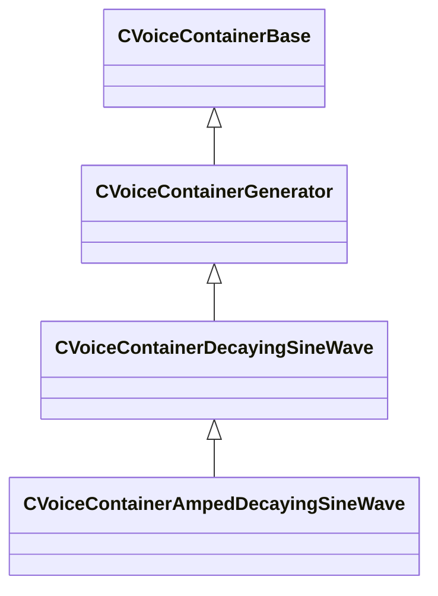

### CVoiceContainerAnalysisBase

**Derived by:** [CVoiceContainerEnvelopeAnalyzer](soundsystem_voicecontainers.md#cvoicecontainerenvelopeanalyzer)

**Metadata:** `MGetKV3ClassDefaults = {`, `"_class": "CVoiceContainerAnalysisBase",`, `"m_bRegenerateCurveOnCompile": false,`, `"m_curve":`, `{`, `"m_spline":`, `[`, `],`, `"m_tangents":`, `[`, `],`, `"m_vDomainMins":`, `[`, `0.000000,`, `0.000000`, `],`, `"m_vDomainMaxs":`, `[`, `0.000000,`, `0.000000`, `]`, `}`, `}`, `MVDataNodeType = 1`, `MPropertyPolymorphicClass`, `MPropertyFriendlyName = "Analysis Container"`, `MPropertyDescription = "Does Not Play Sound, member of CVoiceContainerDefaultDefault"`

**Relationships:**

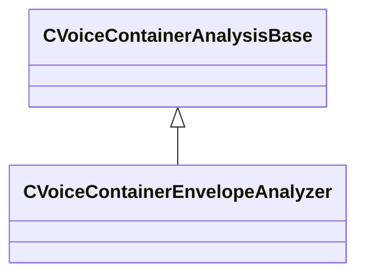

### CVoiceContainerAsyncGenerator

**Inherits from:** [CVoiceContainerGenerator](soundsystem_voicecontainers.md#cvoicecontainergenerator)

**Derived by:** [CVoiceContainerGranulator](soundsystem_voicecontainers.md#cvoicecontainergranulator), [CVoiceContainerRandomSampler](soundsystem_voicecontainers.md#cvoicecontainerrandomsampler), [CVoiceContainerStaticAdditiveSynth](soundsystem_voicecontainers.md#cvoicecontainerstaticadditivesynth), [CVoiceContainerTapePlayer](soundsystem_voicecontainers.md#cvoicecontainertapeplayer)

**Metadata:** `MGetKV3ClassDefaults = Could not parse KV3 Defaults`

**Relationships:**

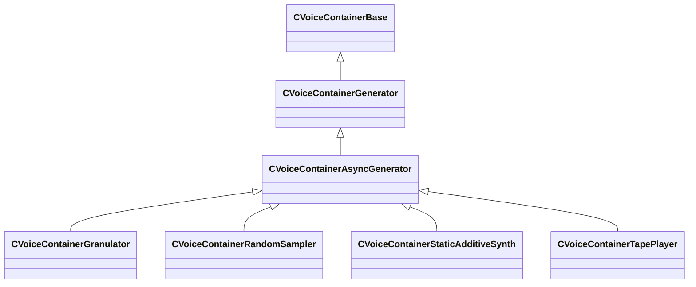

### CVoiceContainerBase

**Derived by:** [CVoiceContainerBlender](soundsystem_voicecontainers.md#cvoicecontainerblender), [CVoiceContainerDefault](soundsystem_voicecontainers.md#cvoicecontainerdefault), [CVoiceContainerEnum](soundsystem_voicecontainers.md#cvoicecontainerenum), [CVoiceContainerGenerator](soundsystem_voicecontainers.md#cvoicecontainergenerator), [CVoiceContainerLoopTrigger](soundsystem_voicecontainers.md#cvoicecontainerlooptrigger), [CVoiceContainerLoopXFade](soundsystem_voicecontainers.md#cvoicecontainerloopxfade), [CVoiceContainerMultiBlender](soundsystem_voicecontainers.md#cvoicecontainermultiblender), [CVoiceContainerParameterBlender](soundsystem_voicecontainers.md#cvoicecontainerparameterblender), [CVoiceContainerSelector](soundsystem_voicecontainers.md#cvoicecontainerselector), [CVoiceContainerSet](soundsystem_voicecontainers.md#cvoicecontainerset), [CVoiceContainerSwitch](soundsystem_voicecontainers.md#cvoicecontainerswitch)

**Metadata:** `MGetKV3ClassDefaults = Could not parse KV3 Defaults`, `MVDataRoot`, `MVDataNodeType = 1`, `MPropertyPolymorphicClass`, `MVDataFileExtension = "vsnd"`, `MPropertyFriendlyName = "VSND Container"`, `MPropertyDescription = "Voice Container Base"`

**Relationships:**

```mermaid
classDiagram
    CVoiceContainerBase <|-- CVoiceContainerBlender
    CVoiceContainerBase <|-- CVoiceContainerDefault
    CVoiceContainerBase <|-- CVoiceContainerEnum
    CVoiceContainerBase <|-- CVoiceContainerGenerator
    CVoiceContainerBase <|-- CVoiceContainerLoopTrigger
    CVoiceContainerBase <|-- CVoiceContainerLoopXFade
    CVoiceContainerBase <|-- CVoiceContainerMultiBlender
    CVoiceContainerBase <|-- CVoiceContainerParameterBlender
    CVoiceContainerBase <|-- CVoiceContainerSelector
    CVoiceContainerBase <|-- CVoiceContainerSet
    CVoiceContainerBase <|-- CVoiceContainerSwitch
    CVoiceContainerBase *-- CVSound
    CVoiceContainerBase --> CVoiceContainerAnalysisBase
```

**Fields:**

| Name | Type | Annotations |
|------|------|-------------|
| `m_vSound` | [CVSound](../schemas/soundsystem_voicecontainers.md#cvsound) | `MPropertySuppressField` |
| `m_pEnvelopeAnalyzer` | [CVoiceContainerAnalysisBase](../schemas/soundsystem_voicecontainers.md#cvoicecontaineranalysisbase)* | `MPropertySuppressExpr = "true"` |

### CVoiceContainerBlender

**Inherits from:** [CVoiceContainerBase](soundsystem_voicecontainers.md#cvoicecontainerbase)

**Metadata:** `MGetKV3ClassDefaults = {`, `"_class": "CVoiceContainerBlender",`, `"m_vSound":`, `{`, `"m_nRate": 0,`, `"m_nFormat": "PCM16",`, `"m_nChannels": 0,`, `"m_nLoopStart": 0,`, `"m_nSampleCount": 0,`, `"m_flDuration": 0.000000,`, `"m_Sentences":`, `[`, `],`, `"m_nStreamingSize": 0,`, `"m_nSeekTable":`, `[`, `],`, `"m_nLoopEnd": 0,`, `"m_encodedHeader": "[BINARY BLOB]"`, `},`, `"m_pEnvelopeAnalyzer": null,`, `"m_firstSound":`, `{`, `"m_namespace": "",`, `"m_bUseReference": true,`, `"m_sound": "",`, `"m_pSound": null`, `},`, `"m_secondSound":`, `{`, `"m_namespace": "",`, `"m_bUseReference": true,`, `"m_sound": "",`, `"m_pSound": null`, `},`, `"m_flBlendFactor": 0.000000`, `}`, `MPropertyFriendlyName = "Blender"`, `MPropertyDescription = "Blends two containers."`

**Relationships:**

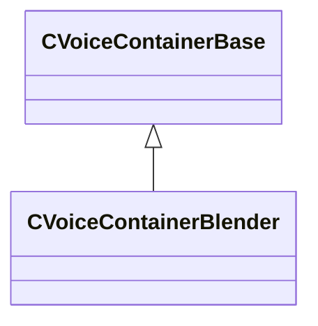

### CVoiceContainerDecayingSineWave

**Inherits from:** [CVoiceContainerGenerator](soundsystem_voicecontainers.md#cvoicecontainergenerator)

**Derived by:** [CVoiceContainerAmpedDecayingSineWave](soundsystem_voicecontainers.md#cvoicecontainerampeddecayingsinewave)

**Metadata:** `MGetKV3ClassDefaults = {`, `"_class": "CVoiceContainerDecayingSineWave",`, `"m_vSound":`, `{`, `"m_nRate": 0,`, `"m_nFormat": "PCM16",`, `"m_nChannels": 0,`, `"m_nLoopStart": 0,`, `"m_nSampleCount": 0,`, `"m_flDuration": 0.000000,`, `"m_Sentences":`, `[`, `],`, `"m_nStreamingSize": 0,`, `"m_nSeekTable":`, `[`, `],`, `"m_nLoopEnd": 0,`, `"m_encodedHeader": "[BINARY BLOB]"`, `},`, `"m_pEnvelopeAnalyzer": null,`, `"m_flFrequency": 0.000000,`, `"m_flDecayTime": 0.000000`, `}`, `MPropertyFriendlyName = "TESTBED: Decaying Sine Wave Container"`, `MPropertyDescription = "Only text params, renders in real time"`

**Relationships:**


### CVoiceContainerDefault

**Inherits from:** [CVoiceContainerBase](soundsystem_voicecontainers.md#cvoicecontainerbase)

**Derived by:** [CVoiceContainerEnvelope](soundsystem_voicecontainers.md#cvoicecontainerenvelope)

**Metadata:** `MGetKV3ClassDefaults = {`, `"_class": "CVoiceContainerDefault",`, `"m_vSound":`, `{`, `"m_nRate": 0,`, `"m_nFormat": "PCM16",`, `"m_nChannels": 0,`, `"m_nLoopStart": 0,`, `"m_nSampleCount": 0,`, `"m_flDuration": 0.000000,`, `"m_Sentences":`, `[`, `],`, `"m_nStreamingSize": 0,`, `"m_nSeekTable":`, `[`, `],`, `"m_nLoopEnd": 0,`, `"m_encodedHeader": "[BINARY BLOB]"`, `},`, `"m_pEnvelopeAnalyzer": null`, `}`, `MPropertyFriendlyName = "Default Container"`, `MPropertyDescription = "Voice Container Default"`

**Relationships:**

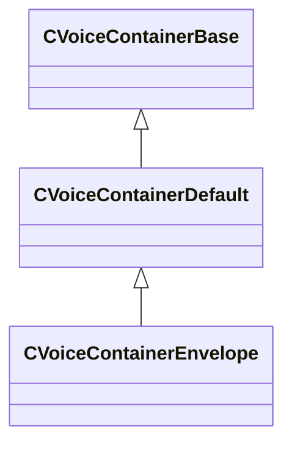

### CVoiceContainerEnum

**Inherits from:** [CVoiceContainerBase](soundsystem_voicecontainers.md#cvoicecontainerbase)

**Metadata:** `MGetKV3ClassDefaults = {`, `"_class": "CVoiceContainerEnum",`, `"m_vSound":`, `{`, `"m_nRate": 0,`, `"m_nFormat": "PCM16",`, `"m_nChannels": 0,`, `"m_nLoopStart": 0,`, `"m_nSampleCount": 0,`, `"m_flDuration": 0.000000,`, `"m_Sentences":`, `[`, `],`, `"m_nStreamingSize": 0,`, `"m_nSeekTable":`, `[`, `],`, `"m_nLoopEnd": 0,`, `"m_encodedHeader": "[BINARY BLOB]"`, `},`, `"m_pEnvelopeAnalyzer": null,`, `"m_soundsToPlay":`, `{`, `"m_bUseReference": true,`, `"m_sounds":`, `[`, `],`, `"m_pSounds":`, `[`, `]`, `},`, `"m_iSelection": 0,`, `"m_flCrossfadeTime": 0.100000`, `}`, `MPropertyFriendlyName = "VSND Enum"`, `MPropertyDescription = "Switches between a selection of vsnds based on a provided index."`

**Relationships:**

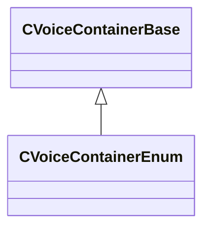

### CVoiceContainerEnvelope

**Inherits from:** [CVoiceContainerDefault](soundsystem_voicecontainers.md#cvoicecontainerdefault)

**Metadata:** `MGetKV3ClassDefaults = {`, `"_class": "CVoiceContainerEnvelope",`, `"m_vSound":`, `{`, `"m_nRate": 0,`, `"m_nFormat": "PCM16",`, `"m_nChannels": 0,`, `"m_nLoopStart": 0,`, `"m_nSampleCount": 0,`, `"m_flDuration": 0.000000,`, `"m_Sentences":`, `[`, `],`, `"m_nStreamingSize": 0,`, `"m_nSeekTable":`, `[`, `],`, `"m_nLoopEnd": 0,`, `"m_encodedHeader": "[BINARY BLOB]"`, `},`, `"m_pEnvelopeAnalyzer": null,`, `"m_sound": "",`, `"m_analysisContainer": null`, `}`, `MPropertyFriendlyName = "Envelope VSND"`, `MPropertyDescription = "Plays sound with envelope."`

**Relationships:**


### CVoiceContainerEnvelopeAnalyzer

**Inherits from:** [CVoiceContainerAnalysisBase](soundsystem_voicecontainers.md#cvoicecontaineranalysisbase)

**Metadata:** `MGetKV3ClassDefaults = {`, `"_class": "CVoiceContainerEnvelopeAnalyzer",`, `"m_bRegenerateCurveOnCompile": false,`, `"m_curve":`, `{`, `"m_spline":`, `[`, `],`, `"m_tangents":`, `[`, `],`, `"m_vDomainMins":`, `[`, `0.000000,`, `0.000000`, `],`, `"m_vDomainMaxs":`, `[`, `0.000000,`, `0.000000`, `]`, `},`, `"m_mode": "Peak",`, `"m_fAnalysisWindowMs": 200.000000,`, `"m_flThreshold": 0.000000`, `}`, `MPropertyFriendlyName = "Envelope Analyzer"`, `MPropertyDescription = "Generates an Envelope Curve on compile"`

**Relationships:**


### CVoiceContainerGenerator

**Inherits from:** [CVoiceContainerBase](soundsystem_voicecontainers.md#cvoicecontainerbase)

**Derived by:** [CVoiceContainerAsyncGenerator](soundsystem_voicecontainers.md#cvoicecontainerasyncgenerator), [CVoiceContainerDecayingSineWave](soundsystem_voicecontainers.md#cvoicecontainerdecayingsinewave), [CVoiceContainerNull](soundsystem_voicecontainers.md#cvoicecontainernull), [CVoiceContainerRealtimeFMSineWave](soundsystem_voicecontainers.md#cvoicecontainerrealtimefmsinewave), [CVoiceContainerShapedNoise](soundsystem_voicecontainers.md#cvoicecontainershapednoise)

**Metadata:** `MGetKV3ClassDefaults = Could not parse KV3 Defaults`

**Relationships:**

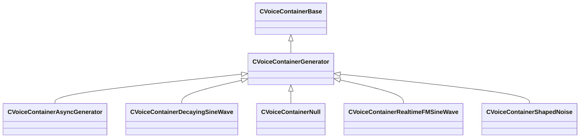

### CVoiceContainerGranulator

**Inherits from:** [CVoiceContainerAsyncGenerator](soundsystem_voicecontainers.md#cvoicecontainerasyncgenerator)

**Metadata:** `MGetKV3ClassDefaults = {`, `"_class": "CVoiceContainerGranulator",`, `"m_vSound":`, `{`, `"m_nRate": 0,`, `"m_nFormat": "PCM16",`, `"m_nChannels": 0,`, `"m_nLoopStart": 0,`, `"m_nSampleCount": 0,`, `"m_flDuration": 0.000000,`, `"m_Sentences":`, `[`, `],`, `"m_nStreamingSize": 0,`, `"m_nSeekTable":`, `[`, `],`, `"m_nLoopEnd": 0,`, `"m_encodedHeader": "[BINARY BLOB]"`, `},`, `"m_pEnvelopeAnalyzer": null,`, `"m_flGrainLength": 0.100000,`, `"m_flGrainCrossfadeAmount": 0.100000,`, `"m_flStartJitter": 0.000000,`, `"m_flPlaybackJitter": 0.000000,`, `"m_bShouldWraparound": false,`, `"m_sourceAudio": ""`, `}`, `MPropertyFriendlyName = "Granulator Container"`

**Relationships:**

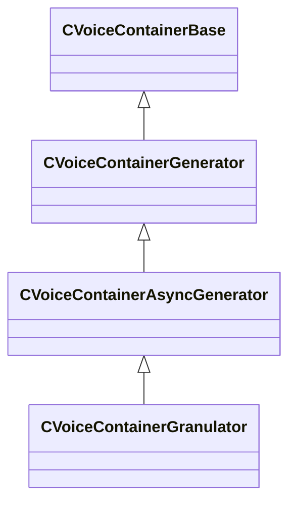

### CVoiceContainerLoopTrigger

**Inherits from:** [CVoiceContainerBase](soundsystem_voicecontainers.md#cvoicecontainerbase)

**Metadata:** `MGetKV3ClassDefaults = {`, `"_class": "CVoiceContainerLoopTrigger",`, `"m_vSound":`, `{`, `"m_nRate": 0,`, `"m_nFormat": "PCM16",`, `"m_nChannels": 0,`, `"m_nLoopStart": 0,`, `"m_nSampleCount": 0,`, `"m_flDuration": 0.000000,`, `"m_Sentences":`, `[`, `],`, `"m_nStreamingSize": 0,`, `"m_nSeekTable":`, `[`, `],`, `"m_nLoopEnd": 0,`, `"m_encodedHeader": "[BINARY BLOB]"`, `},`, `"m_pEnvelopeAnalyzer": null,`, `"m_sound":`, `{`, `"m_namespace": "",`, `"m_bUseReference": true,`, `"m_sound": "",`, `"m_pSound": null`, `},`, `"m_flRetriggerTimeMin": 1.000000,`, `"m_flRetriggerTimeMax": 1.000000,`, `"m_flFadeTime": 0.500000,`, `"m_bCrossFade": false`, `}`, `MPropertyFriendlyName = "LoopTrigger"`, `MPropertyDescription = "Continuously retriggers a sound and optionally fades to the new instance."`

**Relationships:**

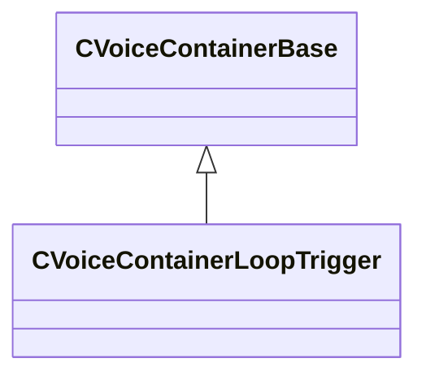

### CVoiceContainerLoopXFade

**Inherits from:** [CVoiceContainerBase](soundsystem_voicecontainers.md#cvoicecontainerbase)

**Metadata:** `MGetKV3ClassDefaults = {`, `"_class": "CVoiceContainerLoopXFade",`, `"m_vSound":`, `{`, `"m_nRate": 0,`, `"m_nFormat": "PCM16",`, `"m_nChannels": 0,`, `"m_nLoopStart": 0,`, `"m_nSampleCount": 0,`, `"m_flDuration": 0.000000,`, `"m_Sentences":`, `[`, `],`, `"m_nStreamingSize": 0,`, `"m_nSeekTable":`, `[`, `],`, `"m_nLoopEnd": 0,`, `"m_encodedHeader": "[BINARY BLOB]"`, `},`, `"m_pEnvelopeAnalyzer": null,`, `"m_sound":`, `{`, `"m_namespace": "",`, `"m_bUseReference": true,`, `"m_sound": "",`, `"m_pSound": null`, `},`, `"m_flLoopEnd": 0.000000,`, `"m_flLoopStart": 0.000000,`, `"m_flFadeOut": 0.000000,`, `"m_flFadeIn": 0.000000,`, `"m_bPlayHead": false,`, `"m_bPlayTail": false,`, `"m_bEqualPow": false`, `}`, `MPropertyFriendlyName = "Loop XFade"`, `MPropertyDescription = "Sample accurate looping with xfade capabilities."`

**Relationships:**

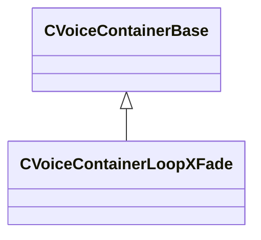

### CVoiceContainerMultiBlender

**Inherits from:** [CVoiceContainerBase](soundsystem_voicecontainers.md#cvoicecontainerbase)

**Metadata:** `MGetKV3ClassDefaults = {`, `"_class": "CVoiceContainerMultiBlender",`, `"m_vSound":`, `{`, `"m_nRate": 0,`, `"m_nFormat": "PCM16",`, `"m_nChannels": 0,`, `"m_nLoopStart": 0,`, `"m_nSampleCount": 0,`, `"m_flDuration": 0.000000,`, `"m_Sentences":`, `[`, `],`, `"m_nStreamingSize": 0,`, `"m_nSeekTable":`, `[`, `],`, `"m_nLoopEnd": 0,`, `"m_encodedHeader": "[BINARY BLOB]"`, `},`, `"m_pEnvelopeAnalyzer": null,`, `"m_soundsToPlay":`, `{`, `"m_bUseReference": true,`, `"m_sounds":`, `[`, `],`, `"m_pSounds":`, `[`, `]`, `},`, `"m_flBlendFactor": 0.000000,`, `"m_flCrossover": 1.000000`, `}`, `MPropertyFriendlyName = "Multi Blender"`, `MPropertyDescription = "Blends any number of containers"`

**Relationships:**

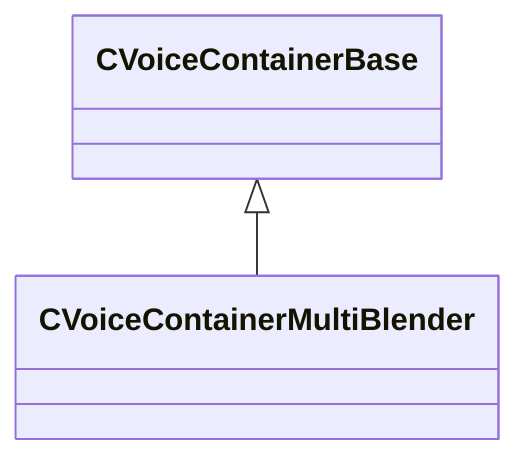

### CVoiceContainerNull

**Inherits from:** [CVoiceContainerGenerator](soundsystem_voicecontainers.md#cvoicecontainergenerator)

**Metadata:** `MGetKV3ClassDefaults = {`, `"_class": "CVoiceContainerNull",`, `"m_vSound":`, `{`, `"m_nRate": 0,`, `"m_nFormat": "PCM16",`, `"m_nChannels": 0,`, `"m_nLoopStart": 0,`, `"m_nSampleCount": 0,`, `"m_flDuration": 0.000000,`, `"m_Sentences":`, `[`, `],`, `"m_nStreamingSize": 0,`, `"m_nSeekTable":`, `[`, `],`, `"m_nLoopEnd": 0,`, `"m_encodedHeader": "[BINARY BLOB]"`, `},`, `"m_pEnvelopeAnalyzer": null`, `}`, `MPropertyFriendlyName = "Null Container"`, `MPropertyDescription = "Plays a single channel of silence."`

**Relationships:**

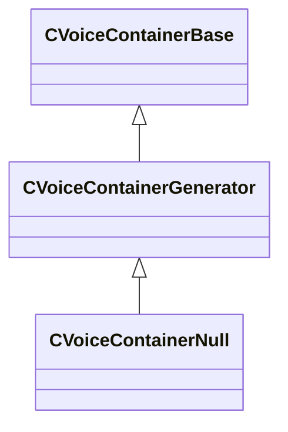

### CVoiceContainerParameterBlender

**Inherits from:** [CVoiceContainerBase](soundsystem_voicecontainers.md#cvoicecontainerbase)

**Metadata:** `MGetKV3ClassDefaults = {`, `"_class": "CVoiceContainerParameterBlender",`, `"m_vSound":`, `{`, `"m_nRate": 0,`, `"m_nFormat": "PCM16",`, `"m_nChannels": 0,`, `"m_nLoopStart": 0,`, `"m_nSampleCount": 0,`, `"m_flDuration": 0.000000,`, `"m_Sentences":`, `[`, `],`, `"m_nStreamingSize": 0,`, `"m_nSeekTable":`, `[`, `],`, `"m_nLoopEnd": 0,`, `"m_encodedHeader": "[BINARY BLOB]"`, `},`, `"m_pEnvelopeAnalyzer": null,`, `"m_firstSound":`, `{`, `"m_namespace": "",`, `"m_bUseReference": true,`, `"m_sound": "",`, `"m_pSound": null`, `},`, `"m_secondSound":`, `{`, `"m_namespace": "",`, `"m_bUseReference": true,`, `"m_sound": "",`, `"m_pSound": null`, `},`, `"m_bEnableOcclusionBlend": false,`, `"m_curve1":`, `{`, `"m_spline":`, `[`, `],`, `"m_tangents":`, `[`, `],`, `"m_vDomainMins":`, `[`, `0.000000,`, `0.000000`, `],`, `"m_vDomainMaxs":`, `[`, `0.000000,`, `0.000000`, `]`, `},`, `"m_curve2":`, `{`, `"m_spline":`, `[`, `],`, `"m_tangents":`, `[`, `],`, `"m_vDomainMins":`, `[`, `0.000000,`, `0.000000`, `],`, `"m_vDomainMaxs":`, `[`, `0.000000,`, `0.000000`, `]`, `},`, `"m_bEnableDistanceBlend": false,`, `"m_curve3":`, `{`, `"m_spline":`, `[`, `],`, `"m_tangents":`, `[`, `],`, `"m_vDomainMins":`, `[`, `0.000000,`, `0.000000`, `],`, `"m_vDomainMaxs":`, `[`, `0.000000,`, `0.000000`, `]`, `},`, `"m_curve4":`, `{`, `"m_spline":`, `[`, `],`, `"m_tangents":`, `[`, `],`, `"m_vDomainMins":`, `[`, `0.000000,`, `0.000000`, `],`, `"m_vDomainMaxs":`, `[`, `0.000000,`, `0.000000`, `]`, `}`, `}`, `MPropertyFriendlyName = "Parameter Blender"`, `MPropertyDescription = "Blends two containers according to parameter curves."`

**Relationships:**

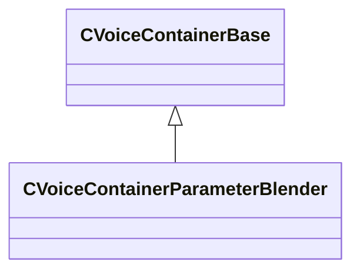

### CVoiceContainerRandomSampler

**Inherits from:** [CVoiceContainerAsyncGenerator](soundsystem_voicecontainers.md#cvoicecontainerasyncgenerator)

**Metadata:** `MGetKV3ClassDefaults = {`, `"_class": "CVoiceContainerRandomSampler",`, `"m_vSound":`, `{`, `"m_nRate": 0,`, `"m_nFormat": "PCM16",`, `"m_nChannels": 0,`, `"m_nLoopStart": 0,`, `"m_nSampleCount": 0,`, `"m_flDuration": 0.000000,`, `"m_Sentences":`, `[`, `],`, `"m_nStreamingSize": 0,`, `"m_nSeekTable":`, `[`, `],`, `"m_nLoopEnd": 0,`, `"m_encodedHeader": "[BINARY BLOB]"`, `},`, `"m_pEnvelopeAnalyzer": null,`, `"m_flAmplitude": 0.800000,`, `"m_flAmplitudeJitter": 0.100000,`, `"m_flTimeJitter": 0.200000,`, `"m_flMaxLength": -1.000000,`, `"m_nNumDelayVariations": 0,`, `"m_grainResources":`, `[`, `]`, `}`, `MPropertyFriendlyName = "Random Smapler Container"`, `MPropertyDescription = "Trash Synth"`

**Relationships:**

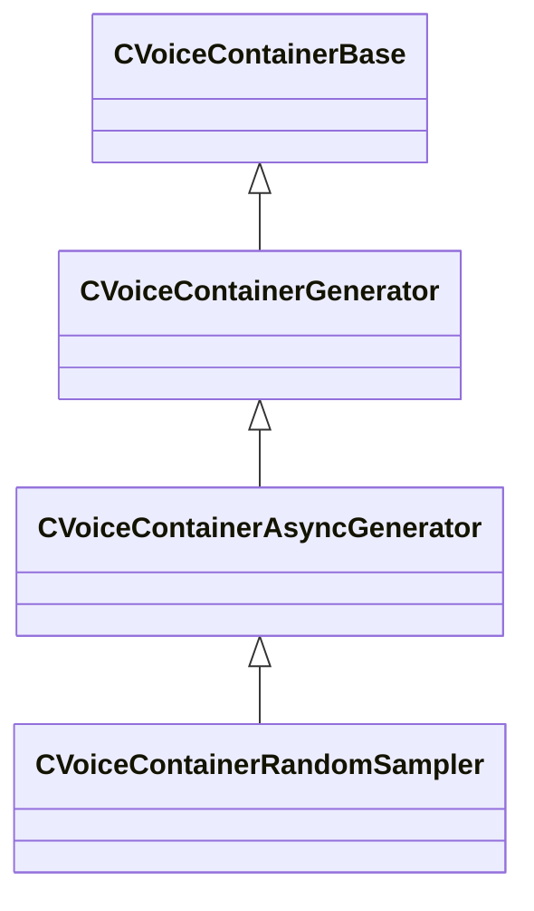

### CVoiceContainerRealtimeFMSineWave

**Inherits from:** [CVoiceContainerGenerator](soundsystem_voicecontainers.md#cvoicecontainergenerator)

**Metadata:** `MGetKV3ClassDefaults = {`, `"_class": "CVoiceContainerRealtimeFMSineWave",`, `"m_vSound":`, `{`, `"m_nRate": 0,`, `"m_nFormat": "PCM16",`, `"m_nChannels": 0,`, `"m_nLoopStart": 0,`, `"m_nSampleCount": 0,`, `"m_flDuration": 0.000000,`, `"m_Sentences":`, `[`, `],`, `"m_nStreamingSize": 0,`, `"m_nSeekTable":`, `[`, `],`, `"m_nLoopEnd": 0,`, `"m_encodedHeader": "[BINARY BLOB]"`, `},`, `"m_pEnvelopeAnalyzer": null,`, `"m_flCarrierFrequency": 0.000000,`, `"m_flModulatorFrequency": 0.000000,`, `"m_flModulatorAmount": 0.000000`, `}`, `MPropertyFriendlyName = "TESTBED: FM Synth Container"`, `MPropertyDescription = "Real time FM Synthesis"`

**Relationships:**

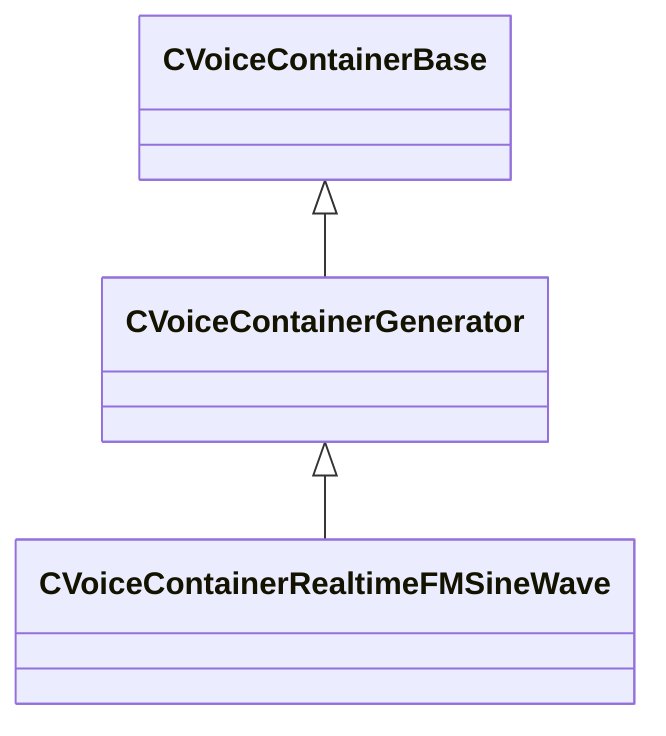

### CVoiceContainerSelector

**Inherits from:** [CVoiceContainerBase](soundsystem_voicecontainers.md#cvoicecontainerbase)

**Metadata:** `MGetKV3ClassDefaults = {`, `"_class": "CVoiceContainerSelector",`, `"m_vSound":`, `{`, `"m_nRate": 0,`, `"m_nFormat": "PCM16",`, `"m_nChannels": 0,`, `"m_nLoopStart": 0,`, `"m_nSampleCount": 0,`, `"m_flDuration": 0.000000,`, `"m_Sentences":`, `[`, `],`, `"m_nStreamingSize": 0,`, `"m_nSeekTable":`, `[`, `],`, `"m_nLoopEnd": 0,`, `"m_encodedHeader": "[BINARY BLOB]"`, `},`, `"m_pEnvelopeAnalyzer": null,`, `"m_mode": "Random",`, `"m_soundsToPlay":`, `{`, `"m_bUseReference": true,`, `"m_sounds":`, `[`, `],`, `"m_pSounds":`, `[`, `]`, `},`, `"m_fProbabilityWeights":`, `[`, `]`, `}`, `MPropertyFriendlyName = "Selector"`, `MPropertyDescription = "Plays a selected vsnd on playback."`

**Relationships:**

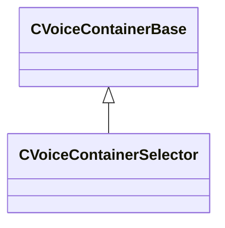

### CVoiceContainerSet

**Inherits from:** [CVoiceContainerBase](soundsystem_voicecontainers.md#cvoicecontainerbase)

**Metadata:** `MGetKV3ClassDefaults = {`, `"_class": "CVoiceContainerSet",`, `"m_vSound":`, `{`, `"m_nRate": 0,`, `"m_nFormat": "PCM16",`, `"m_nChannels": 0,`, `"m_nLoopStart": 0,`, `"m_nSampleCount": 0,`, `"m_flDuration": 0.000000,`, `"m_Sentences":`, `[`, `],`, `"m_nStreamingSize": 0,`, `"m_nSeekTable":`, `[`, `],`, `"m_nLoopEnd": 0,`, `"m_encodedHeader": "[BINARY BLOB]"`, `},`, `"m_pEnvelopeAnalyzer": null,`, `"m_soundsToPlay":`, `[`, `]`, `}`, `MPropertyFriendlyName = "Container Set"`, `MPropertyDescription = "An array of containers that are played all at once."`

**Relationships:**

```mermaid
classDiagram
    CVoiceContainerBase <|-- CVoiceContainerSet
```

### CVoiceContainerSetElement

**Metadata:** `MGetKV3ClassDefaults = {`, `"m_sound":`, `{`, `"m_namespace": "",`, `"m_bUseReference": true,`, `"m_sound": "",`, `"m_pSound": null`, `},`, `"m_flVolumeDB": 0.000000`, `}`

### CVoiceContainerShapedNoise

**Inherits from:** [CVoiceContainerGenerator](soundsystem_voicecontainers.md#cvoicecontainergenerator)

**Metadata:** `MGetKV3ClassDefaults = {`, `"_class": "CVoiceContainerShapedNoise",`, `"m_vSound":`, `{`, `"m_nRate": 0,`, `"m_nFormat": "PCM16",`, `"m_nChannels": 0,`, `"m_nLoopStart": 0,`, `"m_nSampleCount": 0,`, `"m_flDuration": 0.000000,`, `"m_Sentences":`, `[`, `],`, `"m_nStreamingSize": 0,`, `"m_nSeekTable":`, `[`, `],`, `"m_nLoopEnd": 0,`, `"m_encodedHeader": "[BINARY BLOB]"`, `},`, `"m_pEnvelopeAnalyzer": null,`, `"m_bUseCurveForFrequency": false,`, `"m_flFrequency": 440.000000,`, `"m_frequencySweep":`, `{`, `"m_spline":`, `[`, `],`, `"m_tangents":`, `[`, `],`, `"m_vDomainMins":`, `[`, `0.000000,`, `0.000000`, `],`, `"m_vDomainMaxs":`, `[`, `0.000000,`, `0.000000`, `]`, `},`, `"m_bUseCurveForResonance": false,`, `"m_flResonance": 4.000000,`, `"m_resonanceSweep":`, `{`, `"m_spline":`, `[`, `],`, `"m_tangents":`, `[`, `],`, `"m_vDomainMins":`, `[`, `0.000000,`, `0.000000`, `],`, `"m_vDomainMaxs":`, `[`, `0.000000,`, `0.000000`, `]`, `},`, `"m_bUseCurveForAmplitude": false,`, `"m_flGainInDecibels": 1.000000,`, `"m_gainSweep":`, `{`, `"m_spline":`, `[`, `],`, `"m_tangents":`, `[`, `],`, `"m_vDomainMins":`, `[`, `0.000000,`, `0.000000`, `],`, `"m_vDomainMaxs":`, `[`, `0.000000,`, `0.000000`, `]`, `}`, `}`, `MPropertyFriendlyName = "Wind Generator Container"`, `MPropertyDescription = "This is a synth meant to generate whoosh noises."`

**Relationships:**

```mermaid
classDiagram
    CVoiceContainerGenerator <|-- CVoiceContainerShapedNoise
    CVoiceContainerBase <|-- CVoiceContainerGenerator
```

### CVoiceContainerStaticAdditiveSynth

**Inherits from:** [CVoiceContainerAsyncGenerator](soundsystem_voicecontainers.md#cvoicecontainerasyncgenerator)

**Metadata:** `MGetKV3ClassDefaults = {`, `"_class": "CVoiceContainerStaticAdditiveSynth",`, `"m_vSound":`, `{`, `"m_nRate": 0,`, `"m_nFormat": "PCM16",`, `"m_nChannels": 0,`, `"m_nLoopStart": 0,`, `"m_nSampleCount": 0,`, `"m_flDuration": 0.000000,`, `"m_Sentences":`, `[`, `],`, `"m_nStreamingSize": 0,`, `"m_nSeekTable":`, `[`, `],`, `"m_nLoopEnd": 0,`, `"m_encodedHeader": "[BINARY BLOB]"`, `},`, `"m_pEnvelopeAnalyzer": null,`, `"m_tones":`, `[`, `]`, `}`, `MPropertyFriendlyName = "Additive Synth Container"`, `MPropertyDescription = "This is a static additive synth that can scale components of the synth based on how many instances are running."`

**Relationships:**

```mermaid
classDiagram
    CVoiceContainerAsyncGenerator <|-- CVoiceContainerStaticAdditiveSynth
    CVoiceContainerGenerator <|-- CVoiceContainerAsyncGenerator
    CVoiceContainerBase <|-- CVoiceContainerGenerator
```

### CVoiceContainerStaticAdditiveSynth

**Metadata:** `MGetKV3ClassDefaults = {`, `"m_flMinVolume": 1.000000,`, `"m_nInstancesAtMinVolume": 1,`, `"m_flMaxVolume": 1.000000,`, `"m_nInstancesAtMaxVolume": 1`, `}`

### CVoiceContainerStaticAdditiveSynth

**Metadata:** `MGetKV3ClassDefaults = {`, `"m_nWaveform": "Sine",`, `"m_nFundamental": "A",`, `"m_nOctave": 4,`, `"m_flCents": 0.000000,`, `"m_flPhase": 0.000000,`, `"m_curve":`, `{`, `"m_spline":`, `[`, `],`, `"m_tangents":`, `[`, `],`, `"m_vDomainMins":`, `[`, `0.000000,`, `0.000000`, `],`, `"m_vDomainMaxs":`, `[`, `0.000000,`, `0.000000`, `]`, `},`, `"m_volumeScaling":`, `{`, `"m_flMinVolume": 1.000000,`, `"m_nInstancesAtMinVolume": 1,`, `"m_flMaxVolume": 1.000000,`, `"m_nInstancesAtMaxVolume": 1`, `}`, `}`

### CVoiceContainerStaticAdditiveSynth

**Metadata:** `MGetKV3ClassDefaults = {`, `"m_harmonics":`, `[`, `],`, `"m_curve":`, `{`, `"m_spline":`, `[`, `],`, `"m_tangents":`, `[`, `],`, `"m_vDomainMins":`, `[`, `0.000000,`, `0.000000`, `],`, `"m_vDomainMaxs":`, `[`, `0.000000,`, `0.000000`, `]`, `},`, `"m_bSyncInstances": false`, `}`

### CVoiceContainerSwitch

**Inherits from:** [CVoiceContainerBase](soundsystem_voicecontainers.md#cvoicecontainerbase)

**Metadata:** `MGetKV3ClassDefaults = {`, `"_class": "CVoiceContainerSwitch",`, `"m_vSound":`, `{`, `"m_nRate": 0,`, `"m_nFormat": "PCM16",`, `"m_nChannels": 0,`, `"m_nLoopStart": 0,`, `"m_nSampleCount": 0,`, `"m_flDuration": 0.000000,`, `"m_Sentences":`, `[`, `],`, `"m_nStreamingSize": 0,`, `"m_nSeekTable":`, `[`, `],`, `"m_nLoopEnd": 0,`, `"m_encodedHeader": "[BINARY BLOB]"`, `},`, `"m_pEnvelopeAnalyzer": null,`, `"m_soundsToPlay":`, `[`, `]`, `}`, `MPropertyFriendlyName = "Container Switch"`, `MPropertyDescription = "An array of containers"`

**Relationships:**

```mermaid
classDiagram
    CVoiceContainerBase <|-- CVoiceContainerSwitch
```

### CVoiceContainerTapePlayer

**Inherits from:** [CVoiceContainerAsyncGenerator](soundsystem_voicecontainers.md#cvoicecontainerasyncgenerator)

**Metadata:** `MGetKV3ClassDefaults = {`, `"_class": "CVoiceContainerTapePlayer",`, `"m_vSound":`, `{`, `"m_nRate": 0,`, `"m_nFormat": "PCM16",`, `"m_nChannels": 0,`, `"m_nLoopStart": 0,`, `"m_nSampleCount": 0,`, `"m_flDuration": 0.000000,`, `"m_Sentences":`, `[`, `],`, `"m_nStreamingSize": 0,`, `"m_nSeekTable":`, `[`, `],`, `"m_nLoopEnd": 0,`, `"m_encodedHeader": "[BINARY BLOB]"`, `},`, `"m_pEnvelopeAnalyzer": null,`, `"m_bShouldWraparound": false,`, `"m_sourceAudio": "",`, `"m_flTapeSpeedAttackTime": 0.300000,`, `"m_flTapeSpeedReleaseTime": 0.700000`, `}`, `MPropertyFriendlyName = "Tape Player"`

**Relationships:**

```mermaid
classDiagram
    CVoiceContainerAsyncGenerator <|-- CVoiceContainerTapePlayer
    CVoiceContainerGenerator <|-- CVoiceContainerAsyncGenerator
    CVoiceContainerBase <|-- CVoiceContainerGenerator
```

### EMidiNote

**Values:**

| Name | Value |
|------|-------|
| `C` | 0 |
| `C_Sharp` | 1 |
| `D` | 2 |
| `D_Sharp` | 3 |
| `E` | 4 |
| `F` | 5 |
| `F_Sharp` | 6 |
| `G` | 7 |
| `G_Sharp` | 8 |
| `A` | 9 |
| `A_Sharp` | 10 |
| `B` | 11 |
| `Count` | 12 |

### EMode_t

**Values:**

| Name | Value |
|------|-------|
| `Peak` | 0 |
| `RMS` | 1 |

### EWaveform

**Values:**

| Name | Value |
|------|-------|
| `Sine` | 0 |
| `Square` | 1 |
| `Saw` | 2 |
| `Triangle` | 3 |
| `Noise` | 4 |

### PlayBackMode_t

**Values:**

| Name | Value |
|------|-------|
| `Random` | 0 |
| `RandomNoRepeats` | 1 |
| `RandomAvoidLast` | 2 |
| `Sequential` | 3 |
| `RandomWeights` | 4 |
