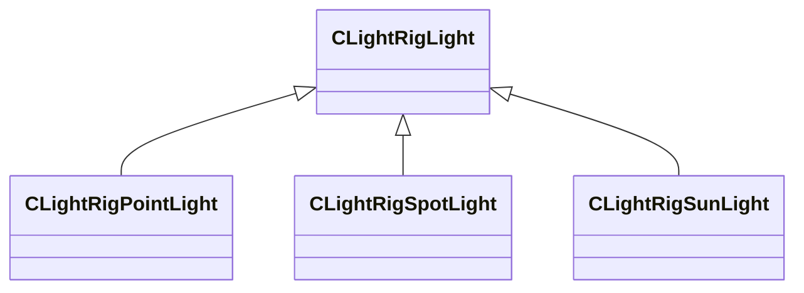
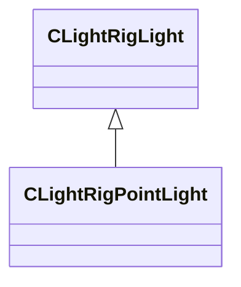
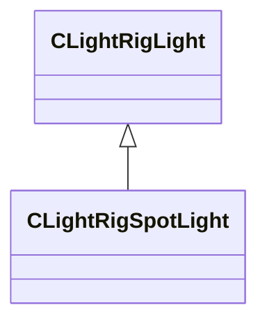
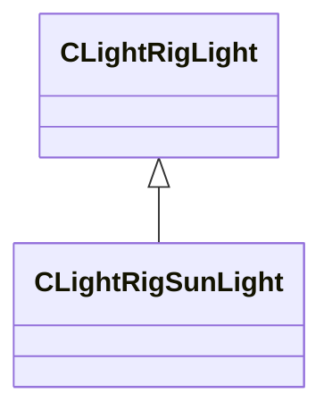

# Module: toolscene

[📊 View UML Diagram](../diagrams/toolscene.md)

| Name | Kind | Bases | Fields |
|------|------|-------|--------|
| [CLightRigBackground](#clightrigbackground) | class |  | 0 |
| [CLightRigExposure](#clightrigexposure) | class |  | 0 |
| [CLightRigGrid](#clightriggrid) | class |  | 0 |
| [CLightRigLight](#clightriglight) | class |  | 0 |
| [CLightRigPointLight](#clightrigpointlight) | class | CLightRigLight | 0 |
| [CLightRigPostProcessing](#clightrigpostprocessing) | class |  | 0 |
| [CLightRigSky](#clightrigsky) | class |  | 0 |
| [CLightRigSpotLight](#clightrigspotlight) | class | CLightRigLight | 0 |
| [CLightRigSunLight](#clightrigsunlight) | class | CLightRigLight | 0 |
| [CLightRigVMap](#clightrigvmap) | class |  | 0 |
| [CToolSceneLightRig](#ctoolscenelightrig) | class |  | 0 |
| [LightRigType_t](#lightrigtype_t) | enum |  | 4 |

---

### CLightRigBackground

**Metadata:** `MGetKV3ClassDefaults = {`, `"m_bEnabled": false,`, `"m_Color":`, `[`, `0,`, `0,`, `0,`, `0`, `]`, `}`

### CLightRigExposure

**Metadata:** `MGetKV3ClassDefaults = {`, `"m_bEnabled": false,`, `"m_flMinEV": -2.000000,`, `"m_flMaxEV": 2.000000`, `}`

### CLightRigGrid

**Metadata:** `MGetKV3ClassDefaults = {`, `"m_bEnabled": true,`, `"m_Color":`, `[`, `0,`, `0,`, `0,`, `0`, `]`, `}`

### CLightRigLight

**Derived by:** [CLightRigPointLight](toolscene.md#clightrigpointlight), [CLightRigSpotLight](toolscene.md#clightrigspotlight), [CLightRigSunLight](toolscene.md#clightrigsunlight)

**Metadata:** `MGetKV3ClassDefaults = {`, `"m_vPosition":`, `[`, `0.000000,`, `0.000000,`, `0.000000`, `],`, `"m_vDirection":`, `[`, `0.000000,`, `0.000000,`, `0.000000`, `],`, `"m_vLookAt":`, `[`, `0.000000,`, `0.000000,`, `0.000000`, `],`, `"m_Color":`, `[`, `255,`, `255,`, `255`, `],`, `"m_flAxisScale": 1.000000,`, `"m_flRadius": 10000.000000,`, `"m_flBrightness": 1.000000,`, `"m_flLightSourceRadius": 0.000000,`, `"m_flDistance": 1.500000,`, `"m_bRelativePositioning": false,`, `"m_bParentToCamera": false`, `}`

**Relationships:**

### CLightRigPointLight

**Inherits from:** [CLightRigLight](toolscene.md#clightriglight)

**Metadata:** `MGetKV3ClassDefaults = {`, `"m_vPosition":`, `[`, `0.000000,`, `0.000000,`, `0.000000`, `],`, `"m_vDirection":`, `[`, `0.000000,`, `0.000000,`, `0.000000`, `],`, `"m_vLookAt":`, `[`, `0.000000,`, `0.000000,`, `0.000000`, `],`, `"m_Color":`, `[`, `255,`, `255,`, `255`, `],`, `"m_flAxisScale": 1.000000,`, `"m_flRadius": 10000.000000,`, `"m_flBrightness": 1.000000,`, `"m_flLightSourceRadius": 0.000000,`, `"m_flDistance": 1.500000,`, `"m_bRelativePositioning": false,`, `"m_bParentToCamera": false`, `}`

**Relationships:**

### CLightRigPostProcessing

**Metadata:** `MGetKV3ClassDefaults = {`, `"m_hPostProcessing": ""`, `}`

### CLightRigSky

**Metadata:** `MGetKV3ClassDefaults = {`, `"m_hSkyMaterial": ""`, `}`

### CLightRigSpotLight

**Inherits from:** [CLightRigLight](toolscene.md#clightriglight)

**Metadata:** `MGetKV3ClassDefaults = {`, `"m_vPosition":`, `[`, `0.000000,`, `0.000000,`, `0.000000`, `],`, `"m_vDirection":`, `[`, `0.000000,`, `0.000000,`, `0.000000`, `],`, `"m_vLookAt":`, `[`, `0.000000,`, `0.000000,`, `0.000000`, `],`, `"m_Color":`, `[`, `255,`, `255,`, `255`, `],`, `"m_flAxisScale": 1.000000,`, `"m_flRadius": 10000.000000,`, `"m_flBrightness": 1.000000,`, `"m_flLightSourceRadius": 0.000000,`, `"m_flDistance": 1.500000,`, `"m_bRelativePositioning": false,`, `"m_bParentToCamera": false,`, `"m_flOuterConeAngle": 90.000000,`, `"m_flInnerConeAngle": 45.000000,`, `"m_bCastShadows": false`, `}`

**Relationships:**

### CLightRigSunLight

**Inherits from:** [CLightRigLight](toolscene.md#clightriglight)

**Metadata:** `MGetKV3ClassDefaults = {`, `"m_vPosition":`, `[`, `0.000000,`, `0.000000,`, `0.000000`, `],`, `"m_vDirection":`, `[`, `0.000000,`, `0.000000,`, `0.000000`, `],`, `"m_vLookAt":`, `[`, `0.000000,`, `0.000000,`, `0.000000`, `],`, `"m_Color":`, `[`, `255,`, `255,`, `255`, `],`, `"m_flAxisScale": 1.000000,`, `"m_flRadius": 10000.000000,`, `"m_flBrightness": 1.000000,`, `"m_flLightSourceRadius": 0.000000,`, `"m_flDistance": 1.500000,`, `"m_bRelativePositioning": false,`, `"m_bParentToCamera": false,`, `"m_flShadowCascadeDistance0": 0.000000,`, `"m_flShadowCascadeDistance1": 0.000000,`, `"m_flShadowCascadeDistance2": 0.000000,`, `"m_flShadowCascadeDistance3": 0.000000,`, `"m_bCastShadows": false`, `}`

**Relationships:**

### CLightRigVMap

**Metadata:** `MGetKV3ClassDefaults = {`, `"m_MapName": "",`, `"m_bRender3DSkybox": true,`, `"m_bParticlesTraceAgainstMap": false`, `}`

### CToolSceneLightRig

**Metadata:** `MGetKV3ClassDefaults = {`, `"m_nRigType": "PREVIEW",`, `"m_Suns":`, `[`, `],`, `"m_PointLights":`, `[`, `],`, `"m_SpotLights":`, `[`, `],`, `"m_Background":`, `{`, `"m_bEnabled": false,`, `"m_Color":`, `[`, `0,`, `0,`, `0,`, `0`, `]`, `},`, `"m_Grid":`, `{`, `"m_bEnabled": true,`, `"m_Color":`, `[`, `0,`, `0,`, `0,`, `0`, `]`, `},`, `"m_Exposure":`, `{`, `"m_bEnabled": false,`, `"m_flMinEV": -2.000000,`, `"m_flMaxEV": 2.000000`, `},`, `"m_PostProcessing":`, `{`, `"m_hPostProcessing": ""`, `},`, `"m_Sky":`, `{`, `"m_hSkyMaterial": ""`, `},`, `"m_BackgroundMap":`, `{`, `"m_MapName": "",`, `"m_bRender3DSkybox": true,`, `"m_bParticlesTraceAgainstMap": false`, `}`, `}`, `MVDataRoot`, `MVDataAssociatedFile = "toolscenelightrigs.vdata"`

### LightRigType_t

**Values:**

| Name | Value |
|------|-------|
| `PREVIEW` | 0 |
| `THUMBNAIL` | 1 |
| `MATERIAL_THUMBNAIL` | 2 |
| `NUM_TYPES` | 3 |
