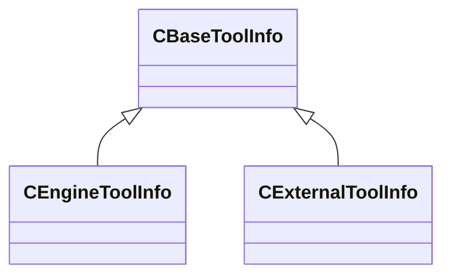
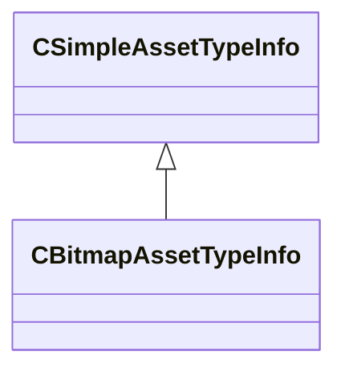
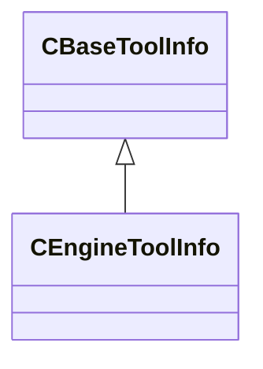
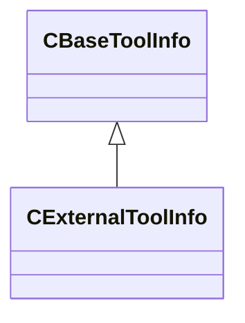
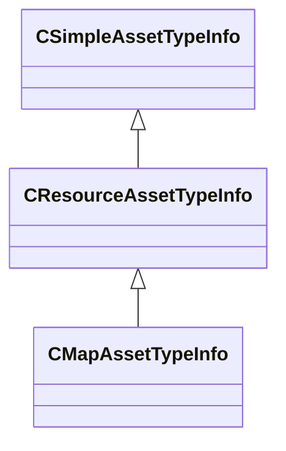
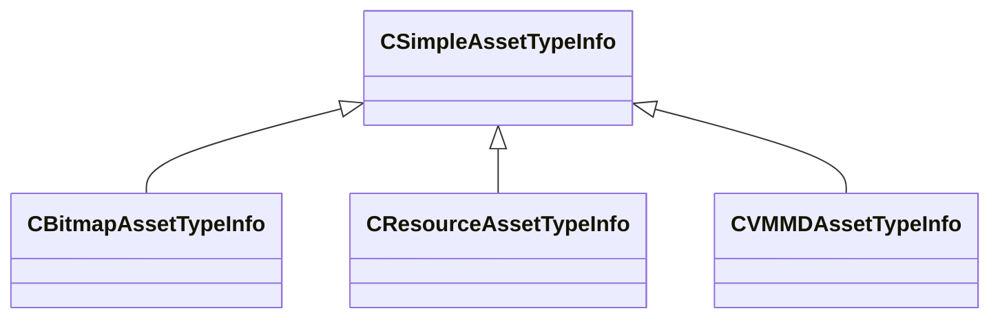
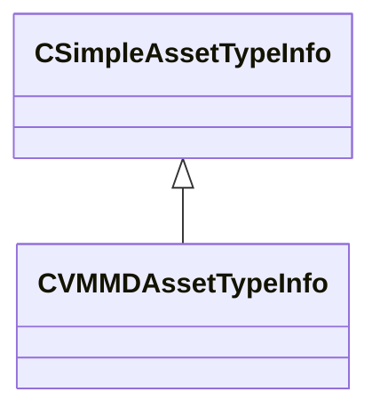

# Module: toolutils2

[📊 View UML Diagram](../diagrams/toolutils2.md)

| Name | Kind | Bases | Fields |
|------|------|-------|--------|
| [AssetEngineCommand_t](#assetenginecommand_t) | class |  | 0 |
| [AssetWarningFixType_t](#assetwarningfixtype_t) | enum |  | 3 |
| [AutoTagVDataCondition_t](#autotagvdatacondition_t) | class |  | 0 |
| [CAssetTagInfo](#cassettaginfo) | class |  | 0 |
| [CAssetTypeConfig](#cassettypeconfig) | class |  | 0 |
| [CAssetWarning](#cassetwarning) | class |  | 0 |
| [CAssetWarningCheck](#cassetwarningcheck) | class |  | 0 |
| [CBaseToolInfo](#cbasetoolinfo) | class |  | 0 |
| [CBitmapAssetTypeInfo](#cbitmapassettypeinfo) | class | CSimpleAssetTypeInfo | 0 |
| [CDetailPropModel](#cdetailpropmodel) | class |  | 0 |
| [CDetailPropType](#cdetailproptype) | class |  | 0 |
| [CEngineToolInfo](#cenginetoolinfo) | class | CBaseToolInfo | 0 |
| [CExternalToolInfo](#cexternaltoolinfo) | class | CBaseToolInfo | 0 |
| [CManifestInfo](#cmanifestinfo) | class |  | 0 |
| [CMapAssetTypeInfo](#cmapassettypeinfo) | class | CResourceAssetTypeInfo | 0 |
| [CModuleManifests](#cmodulemanifests) | class |  | 0 |
| [CResourceAssetTypeInfo](#cresourceassettypeinfo) | class | CSimpleAssetTypeInfo | 0 |
| [CSimpleAssetTypeInfo](#csimpleassettypeinfo) | class |  | 0 |
| [CSubassetTypeInfo](#csubassettypeinfo) | class |  | 0 |
| [CToolsConfig](#ctoolsconfig) | class |  | 0 |
| [CVMMDAssetTypeInfo](#cvmmdassettypeinfo) | class | CSimpleAssetTypeInfo | 0 |
| [ResourceBlockTypeInfo_t](#resourceblocktypeinfo_t) | class |  | 0 |
| [ResourceDataEncodingType_t](#resourcedataencodingtype_t) | enum |  | 15 |

---

### AssetEngineCommand_t

**Metadata:** `MGetKV3ClassDefaults = {`, `"m_Command": "",`, `"m_Icon": "",`, `"m_Description": "",`, `"m_bBringEngineToFront": false`, `}`

### AssetWarningFixType_t

**Values:**

| Name | Value |
|------|-------|
| `NONE` | 0 |
| `VMDL_CONVERT_TO_MODELDOC` | 1 |
| `VMAP_MANUAL_RECOMPILE` | 2 |

### AutoTagVDataCondition_t

**Metadata:** `MGetKV3ClassDefaults = {`, `"m_SourceFile": "",`, `"m_AssetKey": "",`, `"m_AlternateAssetKey": "",`, `"m_Expression": ""`, `}`

### CAssetTagInfo

**Metadata:** `MGetKV3ClassDefaults = {`, `"m_TagName": "",`, `"m_TagDescription": "",`, `"m_TagIcon": "",`, `"m_TagColor":`, `[`, `255,`, `255,`, `255`, `],`, `"m_TagAliases":`, `[`, `],`, `"m_ThumbnailOverlayImage": "",`, `"m_bTagIndicatesRejectedAsset": false,`, `"m_bTagHidesAssetByDefault": false,`, `"m_RestrictAutoTagToAssetType": "",`, `"m_AutoFilterTag": "",`, `"m_AutoDataTag":`, `{`, `"m_SourceFile": "",`, `"m_AssetKey": "",`, `"m_AlternateAssetKey": "",`, `"m_Expression": ""`, `}`, `}`, `MVDataRoot`, `MVDataOutlinerDetailExpr = "m_TagName"`, `MVDataOutlinerIconExpr = "m_TagIcon"`

### CAssetTypeConfig

**Metadata:** `MGetKV3ClassDefaults = {`, `"m_AssetTypes":`, `[`, `],`, `"m_SubassetTypes":`, `[`, `],`, `"m_AssetWarnings":`, `[`, `]`, `}`

### CAssetWarning

**Metadata:** `MGetKV3ClassDefaults = {`, `"m_Title": "",`, `"m_Message": "",`, `"m_Checks":`, `[`, `]`, `}`

### CAssetWarningCheck

**Metadata:** `MGetKV3ClassDefaults = {`, `"m_AssetType": "",`, `"m_RequireSearchableIntKey": "",`, `"m_RequireSearchableIntValue": -1,`, `"m_bOnlyWarnIfGameFilePresent": false,`, `"m_bOnlyWarnIfContentFilePresent": false,`, `"m_bOnlyWarnAddons": false,`, `"m_ExcludeAddonNames":`, `[`, `],`, `"m_FixDescription": "",`, `"m_FixType": "NONE"`, `}`

### CBaseToolInfo

**Derived by:** [CEngineToolInfo](toolutils2.md#cenginetoolinfo), [CExternalToolInfo](toolutils2.md#cexternaltoolinfo)

**Metadata:** `MGetKV3ClassDefaults = {`, `"m_Name": "",`, `"m_OverrideToolShortcutName": "",`, `"m_FriendlyName": "",`, `"m_ToolIcon": ""`, `}`

**Relationships:**

### CBitmapAssetTypeInfo

**Inherits from:** [CSimpleAssetTypeInfo](toolutils2.md#csimpleassettypeinfo)

**Metadata:** `MGetKV3ClassDefaults = {`, `"_class": "CBitmapAssetTypeInfo",`, `"m_FriendlyName": "",`, `"m_Ext": "",`, `"m_IconLg": "game:tools/images/assettypes/generic_lg.png",`, `"m_IconSm": "game:tools/images/assettypes/generic_sm.png",`, `"m_SuppressSubstrings":`, `[`, `],`, `"m_AdditionalExtensions":`, `[`, `],`, `"m_EngineCommands":`, `[`, `],`, `"m_LimitToMods":`, `[`, `],`, `"m_ExcludeFromMods":`, `[`, `],`, `"m_HideForRetailMods":`, `[`, `],`, `"m_PreviewThumbnailOverlayIcon": "",`, `"m_bErrorOnUnrecognizedOutboundRefs": false,`, `"m_UnrecognizedOutboundRefsErrorTypeExceptions":`, `[`, `],`, `"m_bHideTypeByDefault": false,`, `"m_bCannotBeShown": false,`, `"m_bIsNontrivialChildAssetType": false,`, `"m_bSuppressFullFingerprintCalculation": false,`, `"m_bIgnoreCompiledState": false,`, `"m_bContentFileIsText": false,`, `"m_bPrefersLivePreview": false,`, `"m_bPresentInGameTree": false,`, `"m_bShouldCompileErrorFallbackToDisk": false,`, `"m_nAssetTypeVersion": 0,`, `"m_Test_InjectSearchable": ""`, `}`

**Relationships:**

### CDetailPropModel

**Metadata:** `MGetKV3ClassDefaults = {`, `"m_ModelName": "",`, `"m_MaterialGroup": "",`, `"m_flWeight": 1.000000,`, `"m_flStartFadeSize": 0.020000,`, `"m_flEndFadeSize": 0.012500,`, `"m_flOrientToSurface": 1.000000,`, `"m_flMinSurfaceSlope": 0.000000,`, `"m_flMaxSurfaceSlope": 180.000000,`, `"m_flRandomVerticalOffsetMin": 0.000000,`, `"m_flRandomVerticalOffsetMax": 0.000000,`, `"m_vRandomRotationMin":`, `[`, `0.000000,`, `0.000000,`, `0.000000`, `],`, `"m_vRandomRotationMax":`, `[`, `0.000000,`, `360.000000,`, `0.000000`, `],`, `"m_flRandomScaleMin": 1.000000,`, `"m_flRandomScaleMax": 1.000000,`, `"m_flDensityMinScale": 1.000000,`, `"m_flBlendWeightMinScale": 1.000000,`, `"m_flBlendWeightMin": 0.250000,`, `"m_flBlendWeightMax": 1.000000,`, `"m_flBlendWeightFullDenstity": 0.750000,`, `"m_bCastStaticShadows": false`, `}`, `MPropertyFriendlyName = "Model"`, `MVDataAnonymousNode`, `MVDataOutlinerAssetNameExpr (UNKNOWN FOR PARSER)`

### CDetailPropType

**Metadata:** `MGetKV3ClassDefaults = {`, `"m_flDensity": 1.000000,`, `"m_Models":`, `[`, `]`, `}`, `MVDataRoot`, `MPropertyFriendlyName = "Detail Prop Type"`, `MVDataAssociatedFile = "scripts/detail_prop_types.vdata"`, `MVDataOutlinerDefaultExpanded (UNKNOWN FOR PARSER)`

### CEngineToolInfo

**Inherits from:** [CBaseToolInfo](toolutils2.md#cbasetoolinfo)

**Metadata:** `MGetKV3ClassDefaults = {`, `"m_Name": "",`, `"m_OverrideToolShortcutName": "",`, `"m_FriendlyName": "",`, `"m_ToolIcon": "",`, `"m_Library": "",`, `"m_InterfaceName": "",`, `"m_bShowInRevisionSubMenu": false,`, `"m_bIsSecondaryTool": false,`, `"m_bDoNotWarnAboutLargeAssetBatches": false,`, `"m_bIsWorkshopManagerTool": false,`, `"m_bIsWorkshopItemTool": false,`, `"m_bCanHighlightSubassets": false,`, `"m_AssetTypes":`, `[`, `],`, `"m_LimitToMods":`, `[`, `],`, `"m_ExcludeFromMods":`, `[`, `]`, `}`

**Relationships:**

### CExternalToolInfo

**Inherits from:** [CBaseToolInfo](toolutils2.md#cbasetoolinfo)

**Metadata:** `MGetKV3ClassDefaults = {`, `"m_Name": "",`, `"m_OverrideToolShortcutName": "",`, `"m_FriendlyName": "",`, `"m_ToolIcon": "",`, `"m_Executable": "",`, `"m_Args": "",`, `"m_ArgsWithLineColumn": "",`, `"m_WorkingDir": "",`, `"m_MatchSystemExecutable": "",`, `"m_SupportedExts":`, `[`, `],`, `"m_PriorityExts":`, `[`, `],`, `"m_bDebugCommandline": false`, `}`

**Relationships:**

### CManifestInfo

**Metadata:** `MGetKV3ClassDefaults = {`, `"m_Name": "",`, `"m_Group": "",`, `"m_Mod": "",`, `"m_SourceFile": "",`, `"m_nSourceLine": 0,`, `"m_Resources":`, `[`, `]`, `}`

### CMapAssetTypeInfo

**Inherits from:** [CResourceAssetTypeInfo](toolutils2.md#cresourceassettypeinfo)

**Metadata:** `MGetKV3ClassDefaults = {`, `"_class": "CMapAssetTypeInfo",`, `"m_FriendlyName": "",`, `"m_Ext": "",`, `"m_IconLg": "game:tools/images/assettypes/generic_lg.png",`, `"m_IconSm": "game:tools/images/assettypes/generic_sm.png",`, `"m_SuppressSubstrings":`, `[`, `],`, `"m_AdditionalExtensions":`, `[`, `],`, `"m_EngineCommands":`, `[`, `],`, `"m_LimitToMods":`, `[`, `],`, `"m_ExcludeFromMods":`, `[`, `],`, `"m_HideForRetailMods":`, `[`, `],`, `"m_PreviewThumbnailOverlayIcon": "",`, `"m_bErrorOnUnrecognizedOutboundRefs": false,`, `"m_UnrecognizedOutboundRefsErrorTypeExceptions":`, `[`, `],`, `"m_bHideTypeByDefault": false,`, `"m_bCannotBeShown": false,`, `"m_bIsNontrivialChildAssetType": false,`, `"m_bSuppressFullFingerprintCalculation": false,`, `"m_bIgnoreCompiledState": false,`, `"m_bContentFileIsText": false,`, `"m_bPrefersLivePreview": false,`, `"m_bPresentInGameTree": false,`, `"m_bShouldCompileErrorFallbackToDisk": false,`, `"m_nAssetTypeVersion": 0,`, `"m_Test_InjectSearchable": "",`, `"m_CompilerIdentifier": "",`, `"m_CompileDependsOnResourceTypes":`, `[`, `],`, `"m_Blocks":`, `[`, `],`, `"m_RequiredSpecialDependency": "",`, `"m_bPreventDirectCompile": false,`, `"m_bCannotBeAMultiParentChildCompile": false,`, `"m_bPrefersIconForThumbnail": false,`, `"m_bAllowedToCompileInTestMode": false`, `}`

**Relationships:**

### CModuleManifests

**Metadata:** `MGetKV3ClassDefaults = {`, `"m_Manifests":`, `[`, `]`, `}`

### CResourceAssetTypeInfo

**Inherits from:** [CSimpleAssetTypeInfo](toolutils2.md#csimpleassettypeinfo)

**Derived by:** [CMapAssetTypeInfo](toolutils2.md#cmapassettypeinfo)

**Metadata:** `MGetKV3ClassDefaults = {`, `"_class": "CResourceAssetTypeInfo",`, `"m_FriendlyName": "",`, `"m_Ext": "",`, `"m_IconLg": "game:tools/images/assettypes/generic_lg.png",`, `"m_IconSm": "game:tools/images/assettypes/generic_sm.png",`, `"m_SuppressSubstrings":`, `[`, `],`, `"m_AdditionalExtensions":`, `[`, `],`, `"m_EngineCommands":`, `[`, `],`, `"m_LimitToMods":`, `[`, `],`, `"m_ExcludeFromMods":`, `[`, `],`, `"m_HideForRetailMods":`, `[`, `],`, `"m_PreviewThumbnailOverlayIcon": "",`, `"m_bErrorOnUnrecognizedOutboundRefs": false,`, `"m_UnrecognizedOutboundRefsErrorTypeExceptions":`, `[`, `],`, `"m_bHideTypeByDefault": false,`, `"m_bCannotBeShown": false,`, `"m_bIsNontrivialChildAssetType": false,`, `"m_bSuppressFullFingerprintCalculation": false,`, `"m_bIgnoreCompiledState": false,`, `"m_bContentFileIsText": false,`, `"m_bPrefersLivePreview": false,`, `"m_bPresentInGameTree": false,`, `"m_bShouldCompileErrorFallbackToDisk": false,`, `"m_nAssetTypeVersion": 0,`, `"m_Test_InjectSearchable": "",`, `"m_CompilerIdentifier": "",`, `"m_CompileDependsOnResourceTypes":`, `[`, `],`, `"m_Blocks":`, `[`, `],`, `"m_RequiredSpecialDependency": "",`, `"m_bPreventDirectCompile": false,`, `"m_bCannotBeAMultiParentChildCompile": false,`, `"m_bPrefersIconForThumbnail": false,`, `"m_bAllowedToCompileInTestMode": false`, `}`

**Relationships:**

### CSimpleAssetTypeInfo

**Derived by:** [CBitmapAssetTypeInfo](toolutils2.md#cbitmapassettypeinfo), [CResourceAssetTypeInfo](toolutils2.md#cresourceassettypeinfo), [CVMMDAssetTypeInfo](toolutils2.md#cvmmdassettypeinfo)

**Metadata:** `MGetKV3ClassDefaults = {`, `"_class": "CSimpleAssetTypeInfo",`, `"m_FriendlyName": "",`, `"m_Ext": "",`, `"m_IconLg": "game:tools/images/assettypes/generic_lg.png",`, `"m_IconSm": "game:tools/images/assettypes/generic_sm.png",`, `"m_SuppressSubstrings":`, `[`, `],`, `"m_AdditionalExtensions":`, `[`, `],`, `"m_EngineCommands":`, `[`, `],`, `"m_LimitToMods":`, `[`, `],`, `"m_ExcludeFromMods":`, `[`, `],`, `"m_HideForRetailMods":`, `[`, `],`, `"m_PreviewThumbnailOverlayIcon": "",`, `"m_bErrorOnUnrecognizedOutboundRefs": false,`, `"m_UnrecognizedOutboundRefsErrorTypeExceptions":`, `[`, `],`, `"m_bHideTypeByDefault": false,`, `"m_bCannotBeShown": false,`, `"m_bIsNontrivialChildAssetType": false,`, `"m_bSuppressFullFingerprintCalculation": false,`, `"m_bIgnoreCompiledState": false,`, `"m_bContentFileIsText": false,`, `"m_bPrefersLivePreview": false,`, `"m_bPresentInGameTree": false,`, `"m_bShouldCompileErrorFallbackToDisk": false,`, `"m_nAssetTypeVersion": 0,`, `"m_Test_InjectSearchable": ""`, `}`

**Relationships:**

### CSubassetTypeInfo

**Metadata:** `MGetKV3ClassDefaults = {`, `"m_bFollowReferences": false`, `}`

### CToolsConfig

**Metadata:** `MGetKV3ClassDefaults = {`, `"m_EngineTools":`, `[`, `],`, `"m_ExternalTools":`, `[`, `],`, `"m_EngineModulesThatReferenceAssets":`, `[`, `]`, `}`

### CVMMDAssetTypeInfo

**Inherits from:** [CSimpleAssetTypeInfo](toolutils2.md#csimpleassettypeinfo)

**Metadata:** `MGetKV3ClassDefaults = {`, `"_class": "CVMMDAssetTypeInfo",`, `"m_FriendlyName": "",`, `"m_Ext": "",`, `"m_IconLg": "game:tools/images/assettypes/generic_lg.png",`, `"m_IconSm": "game:tools/images/assettypes/generic_sm.png",`, `"m_SuppressSubstrings":`, `[`, `],`, `"m_AdditionalExtensions":`, `[`, `],`, `"m_EngineCommands":`, `[`, `],`, `"m_LimitToMods":`, `[`, `],`, `"m_ExcludeFromMods":`, `[`, `],`, `"m_HideForRetailMods":`, `[`, `],`, `"m_PreviewThumbnailOverlayIcon": "",`, `"m_bErrorOnUnrecognizedOutboundRefs": false,`, `"m_UnrecognizedOutboundRefsErrorTypeExceptions":`, `[`, `],`, `"m_bHideTypeByDefault": false,`, `"m_bCannotBeShown": false,`, `"m_bIsNontrivialChildAssetType": false,`, `"m_bSuppressFullFingerprintCalculation": false,`, `"m_bIgnoreCompiledState": false,`, `"m_bContentFileIsText": false,`, `"m_bPrefersLivePreview": false,`, `"m_bPresentInGameTree": false,`, `"m_bShouldCompileErrorFallbackToDisk": false,`, `"m_nAssetTypeVersion": 0,`, `"m_Test_InjectSearchable": ""`, `}`

**Relationships:**

### ResourceBlockTypeInfo_t

**Metadata:** `MGetKV3ClassDefaults = {`, `"m_Encoding": "RESOURCE_ENCODING_INTROSPECTED",`, `"m_BlockID": "",`, `"m_IntrospectedRootStruct": "",`, `"m_ResourceVersion": -1`, `}`

### ResourceDataEncodingType_t

**Values:**

| Name | Value |
|------|-------|
| `RESOURCE_ENCODING_INVALID` | -1 |
| `RESOURCE_ENCODING_INTROSPECTED` | 0 |
| `RESOURCE_ENCODING_KV3` | 1 |
| `RESOURCE_ENCODING_VTEX` | 2 |
| `RESOURCE_ENCODING_RAW_BYTES` | 3 |
| `RESOURCE_ENCODING_VSNAP` | 4 |
| `RESOURCE_ENCODING_VRMAN` | 5 |
| `RESOURCE_ENCODING_COMPILEIMAGEUTILS_TEXT` | 6 |
| `RESOURCE_ENCODING_TEXT` | 7 |
| `RESOURCE_ENCODING_MBUF` | 8 |
| `RESOURCE_ENCODING_MVTX` | 9 |
| `RESOURCE_ENCODING_MIDX` | 10 |
| `RESOURCE_ENCODING_MSLT` | 11 |
| `RESOURCE_ENCODING_LEGACY_VSND` | 12 |
| `RESOURCE_ENCODING_COUNT` | 13 |
