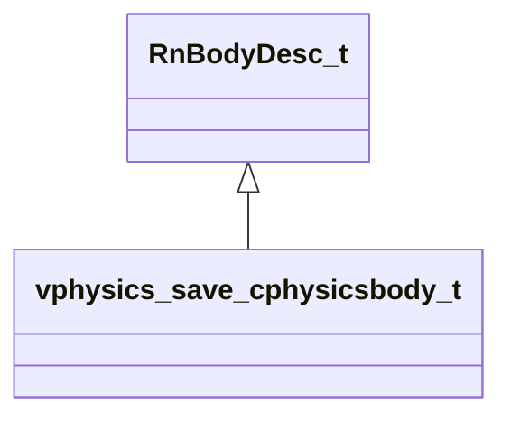

# Module: vphysics2

[📊 View UML Diagram](../diagrams/vphysics2.md)

| Name | Kind | Bases | Fields |
|------|------|-------|--------|
| [IPhysicsPlayerController](#iphysicsplayercontroller) | class |  | 0 |
| [constraint_axislimit_t](#constraint_axislimit_t) | class |  | 4 |
| [constraint_breakableparams_t](#constraint_breakableparams_t) | class |  | 5 |
| [constraint_hingeparams_t](#constraint_hingeparams_t) | class |  | 4 |
| [vphysics_save_cphysicsbody_t](#vphysics_save_cphysicsbody_t) | class | RnBodyDesc_t | 0 |

---

### IPhysicsPlayerController

### constraint_axislimit_t

**Fields:**

| Name | Type | Annotations |
|------|------|-------------|
| `flMinRotation` | float32 |  |
| `flMaxRotation` | float32 |  |
| `flMotorTargetAngSpeed` | float32 |  |
| `flMotorMaxTorque` | float32 |  |

### constraint_breakableparams_t

**Fields:**

| Name | Type | Annotations |
|------|------|-------------|
| `strength` | float32 |  |
| `forceLimit` | float32 |  |
| `torqueLimit` | float32 |  |
| `bodyMassScale` | float32[2] |  |
| `isActive` | bool |  |

### constraint_hingeparams_t

**Fields:**

| Name | Type | Annotations |
|------|------|-------------|
| `worldPosition` | Vector |  |
| `worldAxisDirection` | Vector |  |
| `hingeAxis` | constraint_axislimit_t |  |
| `constraint` | constraint_breakableparams_t |  |

### vphysics_save_cphysicsbody_t

**Inherits from:** [RnBodyDesc_t](physicslib.md#rnbodydesc_t)

**Metadata:** `MGetKV3ClassDefaults = {`, `"m_sDebugName": "",`, `"m_vPosition":`, `[`, `0.000000,`, `0.000000,`, `0.000000`, `],`, `"m_qOrientation":`, `[`, `0.000000,`, `0.000000,`, `0.000000,`, `1.000000`, `],`, `"m_vLinearVelocity":`, `[`, `0.000000,`, `0.000000,`, `0.000000`, `],`, `"m_vAngularVelocity":`, `[`, `0.000000,`, `0.000000,`, `0.000000`, `],`, `"m_vLocalMassCenter":`, `[`, `0.000000,`, `0.000000,`, `0.000000`, `],`, `"m_LocalInertiaInv":`, `[`, `[`, `0.000000,`, `0.000000,`, `0.000000`, `],`, `[`, `0.000000,`, `0.000000,`, `0.000000`, `],`, `[`, `0.000000,`, `0.000000,`, `0.000000`, `]`, `],`, `"m_flMassInv": 0.000000,`, `"m_flGameMass": 0.000000,`, `"m_flMassScaleInv": 1.000000,`, `"m_flInertiaScaleInv": 1.000000,`, `"m_flLinearDamping": 0.000000,`, `"m_flAngularDamping": 0.000000,`, `"m_flLinearDragScale": 1.000000,`, `"m_flAngularDragScale": 1.000000,`, `"m_flLinearFluidDragScale": 1.000000,`, `"m_flAngularFluidDragScale": 1.000000,`, `"m_vLastAwakeForceAccum":`, `[`, `0.000000,`, `0.000000,`, `0.000000`, `],`, `"m_vLastAwakeTorqueAccum":`, `[`, `0.000000,`, `0.000000,`, `0.000000`, `],`, `"m_flBuoyancyScale": 1.000000,`, `"m_flGravityScale": 1.000000,`, `"m_flTimeScale": 1.000000,`, `"m_nBodyType": 0,`, `"m_nGameIndex": 0,`, `"m_nGameFlags": 0,`, `"m_nMinVelocityIterations": 1,`, `"m_nMinPositionIterations": 0,`, `"m_nMassPriority": 0,`, `"m_bEnabled": true,`, `"m_bSleeping": false,`, `"m_bIsContinuousEnabled": true,`, `"m_bDragEnabled": true,`, `"m_vGravity":`, `[`, `0.000000,`, `0.000000,`, `0.000000`, `],`, `"m_bSpeculativeEnabled": true,`, `"m_bHasShadowController": false,`, `"m_nDynamicContinuousContactBehavior": "DYNAMIC_CONTINUOUS_ALLOW_IF_REQUESTED_BY_OTHER_BODY",`, `"m_nOldPointer": 0`, `}`

**Relationships:**

