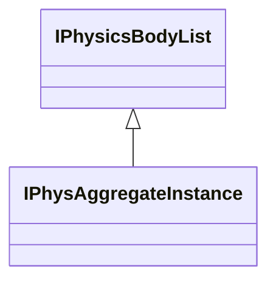
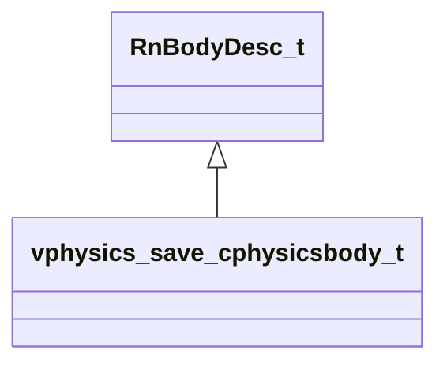

# Module: vphysics2

[📊 View UML Diagram](../diagrams/vphysics2.md)

| Name | Kind | Bases | Fields |
|------|------|-------|--------|
| [IPhysAggregateInstance](#iphysaggregateinstance) | class | IPhysicsBodyList | 2 |
| [IPhysicsBody](#iphysicsbody) | class |  | 0 |
| [IPhysicsJoint](#iphysicsjoint) | class |  | 0 |
| [IPhysicsParticleRope](#iphysicsparticlerope) | class |  | 0 |
| [IPhysicsPlayerController](#iphysicsplayercontroller) | class |  | 0 |
| [IPhysicsRagdollControl](#iphysicsragdollcontrol) | class |  | 0 |
| [vphysics_save_cphysicsbody_t](#vphysics_save_cphysicsbody_t) | class | RnBodyDesc_t | 0 |
| [vphysics_save_ragdoll_control_t](#vphysics_save_ragdoll_control_t) | class |  | 10 |

---

### IPhysAggregateInstance

**Inherits from:** [IPhysicsBodyList](client.md#iphysicsbodylist)

**Relationships:**

**Fields:**

| Name | Type | Annotations |
|------|------|-------------|
| `m_pSkeleton` | void* |  |
| `m_bIsAxisAligned` | bool |  |

### IPhysicsBody

### IPhysicsJoint

### IPhysicsParticleRope

### IPhysicsPlayerController

### IPhysicsRagdollControl

### vphysics_save_cphysicsbody_t

**Inherits from:** [RnBodyDesc_t](physicslib.md#rnbodydesc_t)

**Metadata:** `MGetKV3ClassDefaults = {`, `"m_sDebugName": "",`, `"m_vPosition":`, `[`, `0.000000,`, `0.000000,`, `0.000000`, `],`, `"m_qOrientation":`, `[`, `0.000000,`, `0.000000,`, `0.000000,`, `1.000000`, `],`, `"m_vLinearVelocity":`, `[`, `0.000000,`, `0.000000,`, `0.000000`, `],`, `"m_vAngularVelocity":`, `[`, `0.000000,`, `0.000000,`, `0.000000`, `],`, `"m_vLocalMassCenter":`, `[`, `0.000000,`, `0.000000,`, `0.000000`, `],`, `"m_LocalInertiaInv":`, `[`, `[`, `0.000000,`, `0.000000,`, `0.000000`, `],`, `[`, `0.000000,`, `0.000000,`, `0.000000`, `],`, `[`, `0.000000,`, `0.000000,`, `0.000000`, `]`, `],`, `"m_flMassInv": 0.000000,`, `"m_flGameMass": 0.000000,`, `"m_flMassScaleInv": 1.000000,`, `"m_flInertiaScaleInv": 1.000000,`, `"m_flLinearDamping": 0.000000,`, `"m_flAngularDamping": 0.000000,`, `"m_flLinearDragScale": 1.000000,`, `"m_flAngularDragScale": 1.000000,`, `"m_flLinearFluidDragScale": 1.000000,`, `"m_flAngularFluidDragScale": 1.000000,`, `"m_vLastAwakeForceAccum":`, `[`, `0.000000,`, `0.000000,`, `0.000000`, `],`, `"m_vLastAwakeTorqueAccum":`, `[`, `0.000000,`, `0.000000,`, `0.000000`, `],`, `"m_flBuoyancyScale": 1.000000,`, `"m_flGravityScale": 1.000000,`, `"m_flTimeScale": 1.000000,`, `"m_nBodyType": 0,`, `"m_nGameIndex": 0,`, `"m_nGameFlags": 0,`, `"m_nMinVelocityIterations": 1,`, `"m_nMinPositionIterations": 0,`, `"m_nMassPriority": 0,`, `"m_bEnabled": true,`, `"m_bSleeping": false,`, `"m_bIsContinuousEnabled": true,`, `"m_bDragEnabled": true,`, `"m_vGravity":`, `[`, `0.000000,`, `0.000000,`, `0.000000`, `],`, `"m_bSpeculativeEnabled": true,`, `"m_bHasShadowController": false,`, `"m_nDynamicContinuousContactBehavior": "DYNAMIC_CONTINUOUS_ALLOW_IF_REQUESTED_BY_OTHER_BODY",`, `"m_nOldPointer": 0`, `}`

**Relationships:**

### vphysics_save_ragdoll_control_t

**Metadata:** `MGetKV3ClassDefaults = Could not parse KV3 Defaults`

**Fields:**

| Name | Type | Annotations |
|------|------|-------------|
| `m_flMinSpringFrequency` | float32 |  |
| `m_flMaxSpringFrequency` | float32 |  |
| `m_flMaxStretch` | float32 |  |
| `m_bSolidCollisionAtZeroWeight` | bool |  |
| `m_bRequiresDynamicBodies` | bool |  |
| `m_bIgnoreTeleport` | bool |  |
| `m_vLinearVelocityAccumulator` | Vector |  |
| `m_vAngularVelocityAccumulator` | RotationVector |  |
| `m_vForceAccumulator` | Vector |  |
| `m_nBodyCount` | int32 |  |
