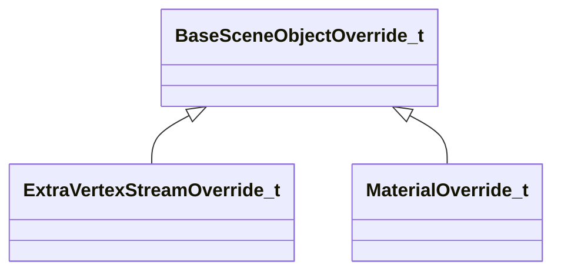
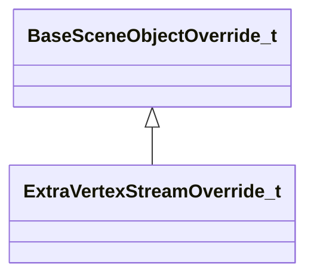
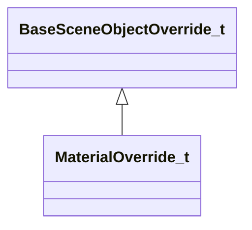

# Module: worldrenderer

[📊 View UML Diagram](../diagrams/worldrenderer.md)

| Name | Kind | Bases | Fields |
|------|------|-------|--------|
| [AggregateInstanceStreamOnDiskData_t](#aggregateinstancestreamondiskdata_t) | class |  | 0 |
| [AggregateInstanceStream_t](#aggregateinstancestream_t) | enum |  | 4 |
| [AggregateLODSetup_t](#aggregatelodsetup_t) | class |  | 0 |
| [AggregateMeshInfo_t](#aggregatemeshinfo_t) | class |  | 0 |
| [AggregateRTProxySceneObject_t](#aggregatertproxysceneobject_t) | class |  | 0 |
| [AggregateSceneObject_t](#aggregatesceneobject_t) | class |  | 0 |
| [AggregateVertexAlbedoStreamOnDiskData_t](#aggregatevertexalbedostreamondiskdata_t) | class |  | 0 |
| [BakedLightingInfo_t](#bakedlightinginfo_t) | class |  | 0 |
| [BakedLightingInfo_t](#bakedlightinginfo_t) | class |  | 0 |
| [BaseSceneObjectOverride_t](#basesceneobjectoverride_t) | class |  | 0 |
| [CVoxelVisibility](#cvoxelvisibility) | class |  | 0 |
| [ClutterSceneObject_t](#cluttersceneobject_t) | class |  | 0 |
| [ClutterTile_t](#cluttertile_t) | class |  | 0 |
| [EntityIOConnectionData_t](#entityioconnectiondata_t) | class |  | 0 |
| [EntityKeyValueData_t](#entitykeyvaluedata_t) | class |  | 0 |
| [ExtraVertexStreamOverride_t](#extravertexstreamoverride_t) | class | BaseSceneObjectOverride_t | 0 |
| [InfoForResourceTypeVMapResourceData_t](#infoforresourcetypevmapresourcedata_t) | class |  | 0 |
| [MaterialOverride_t](#materialoverride_t) | class | BaseSceneObjectOverride_t | 0 |
| [NodeData_t](#nodedata_t) | class |  | 0 |
| [ObjectTypeFlags_t](#objecttypeflags_t) | enum |  | 15 |
| [PermEntityLumpData_t](#permentitylumpdata_t) | class |  | 0 |
| [RTProxyBLAS_t](#rtproxyblas_t) | class |  | 0 |
| [RTProxyInstanceFlags_t](#rtproxyinstanceflags_t) | enum |  | 2 |
| [RTProxyInstanceInfo_t](#rtproxyinstanceinfo_t) | class |  | 0 |
| [SceneObject_t](#sceneobject_t) | class |  | 0 |
| [VMapResourceData_t](#vmapresourcedata_t) | class |  | 0 |
| [VoxelVisBlockOffset_t](#voxelvisblockoffset_t) | class |  | 0 |
| [WorldBuilderParams_t](#worldbuilderparams_t) | class |  | 0 |
| [WorldNodeOnDiskBufferData_t](#worldnodeondiskbufferdata_t) | class |  | 0 |
| [WorldNode_t](#worldnode_t) | class |  | 0 |
| [World_t](#world_t) | class |  | 0 |

---

### AggregateInstanceStreamOnDiskData_t

**Metadata:** `MGetKV3ClassDefaults = {`, `"m_DecodedSize": 0,`, `"m_BufferData": "[BINARY BLOB]"`, `}`

### AggregateInstanceStream_t

**Values:**

| Name | Value |
|------|-------|
| `AGGREGATE_INSTANCE_STREAM_NONE` | 0 |
| `AGGREGATE_INSTANCE_STREAM_LIGHTMAPUV_UNORM16` | 1 |
| `AGGREGATE_INSTANCE_STREAM_VERTEXTINT_UNORM8` | 2 |
| `AGGREGATE_INSTANCE_STREAM_VERTEXBLEND_UNORM8` | 4 |

### AggregateLODSetup_t

**Metadata:** `MGetKV3ClassDefaults = {`, `"m_vLODOrigin":`, `[`, `0.000000,`, `0.000000,`, `0.000000`, `],`, `"m_fMaxObjectScale": 1.000000,`, `"m_fSwitchDistances":`, `[`, `]`, `}`

### AggregateMeshInfo_t

**Metadata:** `MGetKV3ClassDefaults = {`, `"m_nVisClusterMemberOffset": 0,`, `"m_nVisClusterMemberCount": 0,`, `"m_bHasTransform": false,`, `"m_nLODGroupMask": 0,`, `"m_nDrawCallIndex": -1,`, `"m_nLODSetupIndex": -1,`, `"m_vTintColor":`, `[`, `255,`, `255,`, `255`, `],`, `"m_objectFlags": "OBJECT_TYPE_MODEL",`, `"m_nLightProbeVolumePrecomputedHandshake": 0,`, `"m_nInstanceStreamOffset": 0,`, `"m_nVertexAlbedoStreamOffset": 0,`, `"m_instanceStreams": "AGGREGATE_INSTANCE_STREAM_NONE"`, `}`

### AggregateRTProxySceneObject_t

**Metadata:** `MGetKV3ClassDefaults = {`, `"m_nLayer": 0,`, `"m_BLASes":`, `[`, `],`, `"m_Instances":`, `[`, `],`, `"m_VBData": "[BINARY BLOB]",`, `"m_IBData": "[BINARY BLOB]",`, `"m_InstanceAlbedoData": "[BINARY BLOB]"`, `}`

### AggregateSceneObject_t

**Metadata:** `MGetKV3ClassDefaults = {`, `"m_allFlags": "OBJECT_TYPE_NONE",`, `"m_anyFlags": "OBJECT_TYPE_NONE",`, `"m_nLayer": 0,`, `"m_instanceStream": -1,`, `"m_vertexAlbedoStream": -1,`, `"m_aggregateMeshes":`, `[`, `],`, `"m_lodSetups":`, `[`, `],`, `"m_visClusterMembership":`, `[`, `],`, `"m_fragmentTransforms":`, `[`, `],`, `"m_renderableModel": ""`, `}`

### AggregateVertexAlbedoStreamOnDiskData_t

**Metadata:** `MGetKV3ClassDefaults = {`, `"m_BufferData": "[BINARY BLOB]"`, `}`

### BakedLightingInfo_t

**Metadata:** `MGetKV3ClassDefaults = {`, `"m_nLightmapVersionNumber": 0,`, `"m_nLightmapGameVersionNumber": 0,`, `"m_vLightmapUvScale":`, `[`, `1.000000,`, `1.000000`, `],`, `"m_bHasLightmaps": false,`, `"m_bBakedShadowsGamma20": false,`, `"m_bCompressionEnabled": false,`, `"m_bSHLightmaps": false,`, `"m_nChartPackIterations": 0,`, `"m_nVradQuality": 0,`, `"m_lightMaps":`, `[`, `],`, `"m_bakedShadows":`, `[`, `]`, `}`

### BakedLightingInfo_t

**Metadata:** `MGetKV3ClassDefaults = {`, `"m_nLightHash": 0,`, `"m_nMapHash": 0,`, `"m_nShadowChannel": -1`, `}`

### BaseSceneObjectOverride_t

**Derived by:** [ExtraVertexStreamOverride_t](worldrenderer.md#extravertexstreamoverride_t), [MaterialOverride_t](worldrenderer.md#materialoverride_t)

**Metadata:** `MGetKV3ClassDefaults = {`, `"m_nSceneObjectIndex": 0`, `}`

**Relationships:**

### CVoxelVisibility

**Metadata:** `MGetKV3ClassDefaults = {`, `"m_nBaseClusterCount": 0,`, `"m_nPVSBytesPerCluster": 0,`, `"m_vMinBounds":`, `[`, `0.000000,`, `0.000000,`, `0.000000`, `],`, `"m_vMaxBounds":`, `[`, `0.000000,`, `0.000000,`, `0.000000`, `],`, `"m_flGridSize": 0.000000,`, `"m_nSkyVisibilityCluster": 0,`, `"m_nSunVisibilityCluster": 0,`, `"m_NodeBlock":`, `{`, `"m_nOffset": 0,`, `"m_nElementCount": 0`, `},`, `"m_RegionBlock":`, `{`, `"m_nOffset": 0,`, `"m_nElementCount": 0`, `},`, `"m_EnclosedClusterListBlock":`, `{`, `"m_nOffset": 0,`, `"m_nElementCount": 0`, `},`, `"m_EnclosedClustersBlock":`, `{`, `"m_nOffset": 0,`, `"m_nElementCount": 0`, `},`, `"m_MasksBlock":`, `{`, `"m_nOffset": 0,`, `"m_nElementCount": 0`, `},`, `"m_nVisBlocks":`, `{`, `"m_nOffset": 0,`, `"m_nElementCount": 0`, `}`, `}`

### ClutterSceneObject_t

**Metadata:** `MGetKV3ClassDefaults = {`, `"m_Bounds":`, `{`, `"m_vMinBounds":`, `[`, `0.000000,`, `0.000000,`, `0.000000`, `],`, `"m_vMaxBounds":`, `[`, `0.000000,`, `0.000000,`, `0.000000`, `]`, `},`, `"m_flags": "OBJECT_TYPE_NONE",`, `"m_nLayer": 0,`, `"m_instancePositions":`, `[`, `],`, `"m_instanceScales":`, `[`, `],`, `"m_instanceTintSrgb":`, `[`, `],`, `"m_tiles":`, `[`, `],`, `"m_renderableModel": "",`, `"m_materialGroup": "",`, `"m_flBeginCullSize": 0.020000,`, `"m_flEndCullSize": 0.012500,`, `"m_InstanceOrientations32":`, `[`, `]`, `}`

### ClutterTile_t

**Metadata:** `MGetKV3ClassDefaults = {`, `"m_nFirstInstance": 0,`, `"m_nLastInstance": 0,`, `"m_BoundsWs":`, `{`, `"m_vMinBounds":`, `[`, `0.000000,`, `0.000000,`, `0.000000`, `],`, `"m_vMaxBounds":`, `[`, `0.000000,`, `0.000000,`, `0.000000`, `]`, `}`, `}`

### EntityIOConnectionData_t

**Metadata:** `MGetKV3ClassDefaults = {`, `"m_outputName": "",`, `"m_targetType": 0,`, `"m_targetName": "",`, `"m_inputName": "",`, `"m_overrideParam": "",`, `"m_flDelay": 0.000000,`, `"m_nTimesToFire": 0,`, `"m_paramMap": null`, `}`

### EntityKeyValueData_t

**Metadata:** `MGetKV3ClassDefaults = {`, `"m_connections":`, `[`, `],`, `"m_keyValuesData": "[BINARY BLOB]"`, `}`

### ExtraVertexStreamOverride_t

**Inherits from:** [BaseSceneObjectOverride_t](worldrenderer.md#basesceneobjectoverride_t)

**Metadata:** `MGetKV3ClassDefaults = {`, `"m_nSceneObjectIndex": 0,`, `"m_nSubSceneObject": 0,`, `"m_nDrawCallIndex": 0,`, `"m_nAdditionalMeshDrawPrimitiveFlags": "MESH_DRAW_FLAGS_NONE",`, `"m_extraBufferBinding":`, `{`, `"m_hBuffer": 0,`, `"m_nBindOffsetBytes": 0`, `}`, `}`

**Relationships:**

### InfoForResourceTypeVMapResourceData_t

**Metadata:** `MResourceTypeForInfoType = "vmap"`

### MaterialOverride_t

**Inherits from:** [BaseSceneObjectOverride_t](worldrenderer.md#basesceneobjectoverride_t)

**Metadata:** `MGetKV3ClassDefaults = {`, `"m_nSceneObjectIndex": 0,`, `"m_nSubSceneObject": 0,`, `"m_nDrawCallIndex": 0,`, `"m_pMaterial": "",`, `"m_vLinearTintColor":`, `[`, `1.000000,`, `1.000000,`, `1.000000`, `]`, `}`

**Relationships:**

### NodeData_t

**Metadata:** `MGetKV3ClassDefaults = {`, `"m_nParent": 0,`, `"m_vOrigin":`, `[`, `0.000000,`, `0.000000,`, `0.000000`, `],`, `"m_vMinBounds":`, `[`, `0.000000,`, `0.000000,`, `0.000000`, `],`, `"m_vMaxBounds":`, `[`, `0.000000,`, `0.000000,`, `0.000000`, `],`, `"m_flMinimumDistance": 0.000000,`, `"m_ChildNodeIndices":`, `[`, `],`, `"m_worldNodePrefix": ""`, `}`

### ObjectTypeFlags_t

**Values:**

| Name | Value |
|------|-------|
| `OBJECT_TYPE_NONE` | 0 |
| `OBJECT_TYPE_MODEL` | 8 |
| `OBJECT_TYPE_BLOCK_LIGHT` | 16 |
| `OBJECT_TYPE_NO_SHADOWS` | 32 |
| `OBJECT_TYPE_WORLDSPACE_TEXURE_BLEND` | 64 |
| `OBJECT_TYPE_DISABLED_IN_LOW_QUALITY` | 128 |
| `OBJECT_TYPE_NO_SUN_SHADOWS` | 256 |
| `OBJECT_TYPE_RENDER_WITH_DYNAMIC` | 512 |
| `OBJECT_TYPE_RENDER_TO_CUBEMAPS` | 1024 |
| `OBJECT_TYPE_MODEL_HAS_LODS` | 2048 |
| `OBJECT_TYPE_OVERLAY` | 8192 |
| `OBJECT_TYPE_PRECOMPUTED_VISMEMBERS` | 16384 |
| `OBJECT_TYPE_STATIC_CUBE_MAP` | 32768 |
| `OBJECT_TYPE_DISABLE_VIS_CULLING` | 65536 |
| `OBJECT_TYPE_BAKED_GEOMETRY` | 131072 |

### PermEntityLumpData_t

**Metadata:** `MGetKV3ClassDefaults = {`, `"m_name": "",`, `"m_childLumps":`, `[`, `],`, `"m_entityKeyValues":`, `[`, `]`, `}`

### RTProxyBLAS_t

**Metadata:** `MGetKV3ClassDefaults = {`, `"m_nFirstIndex": 0,`, `"m_nIndexCount": 0,`, `"m_nVBByteOffset": 0,`, `"m_nBaseVertex": 0,`, `"m_nVertexCount": 0,`, `"m_albedoFormat": "VERTEX_ALBEDO_NONE",`, `"m_boundLs":`, `{`, `"m_vMinBounds":`, `[`, `0.000000,`, `0.000000,`, `0.000000`, `],`, `"m_vMaxBounds":`, `[`, `0.000000,`, `0.000000,`, `0.000000`, `]`, `},`, `"m_vVertexOriginLs":`, `[`, `0.000000,`, `0.000000,`, `0.000000`, `],`, `"m_vVertexExtentLs":`, `[`, `0.000000,`, `0.000000,`, `0.000000`, `]`, `}`

### RTProxyInstanceFlags_t

**Values:**

| Name | Value |
|------|-------|
| `RTPROXY_INSTANCE_FLAG_NONE` | 0 |
| `RTPROXY_INSTANCE_UNIQUE_MESH` | 1 |

### RTProxyInstanceInfo_t

**Metadata:** `MGetKV3ClassDefaults = {`, `"m_nFlags": "",`, `"m_albedoFormat": "VERTEX_ALBEDO_NONE",`, `"m_nBLASCount": 0,`, `"m_nBLASIndex": 0,`, `"m_nVertexAlbedoByteOffset": 0,`, `"m_mWorldFromLocal":`, `[`, `0.000000,`, `0.000000,`, `0.000000,`, `0.000000,`, `0.000000,`, `0.000000,`, `0.000000,`, `0.000000,`, `0.000000,`, `0.000000,`, `0.000000,`, `0.000000`, `]`, `}`

### SceneObject_t

**Metadata:** `MGetKV3ClassDefaults = {`, `"m_nObjectID": 0,`, `"m_vTransform":`, `[`, `[`, `0.000000,`, `0.000000,`, `0.000000,`, `0.000000`, `],`, `[`, `0.000000,`, `0.000000,`, `0.000000,`, `0.000000`, `],`, `[`, `0.000000,`, `0.000000,`, `0.000000,`, `0.000000`, `]`, `],`, `"m_flFadeStartDistance": 0.000000,`, `"m_flFadeEndDistance": 0.000000,`, `"m_vTintColor":`, `[`, `1.000000,`, `1.000000,`, `1.000000,`, `1.000000`, `],`, `"m_skin": "",`, `"m_nObjectTypeFlags": "OBJECT_TYPE_MODEL",`, `"m_vLightingOrigin":`, `[`, `340282346638528859811704183484516925440.000000,`, `340282346638528859811704183484516925440.000000,`, `340282346638528859811704183484516925440.000000`, `],`, `"m_nOverlayRenderOrder": 0,`, `"m_nLODOverride": -1,`, `"m_nCubeMapPrecomputedHandshake": 0,`, `"m_nLightProbeVolumePrecomputedHandshake": 0,`, `"m_renderableModel": "",`, `"m_renderable": ""`, `}`

### VMapResourceData_t

### VoxelVisBlockOffset_t

**Metadata:** `MGetKV3ClassDefaults = {`, `"m_nOffset": 0,`, `"m_nElementCount": 0`, `}`

### WorldBuilderParams_t

**Metadata:** `MGetKV3ClassDefaults = {`, `"m_flMinDrawVolumeSize": 0.000000,`, `"m_bBuildBakedLighting": false,`, `"m_bAggregateInstanceStreams": false,`, `"m_bakedLightingInfo":`, `{`, `"m_nLightmapVersionNumber": 0,`, `"m_nLightmapGameVersionNumber": 0,`, `"m_vLightmapUvScale":`, `[`, `1.000000,`, `1.000000`, `],`, `"m_bHasLightmaps": false,`, `"m_bBakedShadowsGamma20": false,`, `"m_bCompressionEnabled": false,`, `"m_bSHLightmaps": false,`, `"m_nChartPackIterations": 0,`, `"m_nVradQuality": 0,`, `"m_lightMaps":`, `[`, `],`, `"m_bakedShadows":`, `[`, `]`, `},`, `"m_nCompileTimestamp": 0,`, `"m_nCompileFingerprint": 0`, `}`

### WorldNodeOnDiskBufferData_t

**Metadata:** `MGetKV3ClassDefaults = {`, `"m_nElementCount": 0,`, `"m_nElementSizeInBytes": 0,`, `"m_inputLayoutFields":`, `[`, `],`, `"m_pData":`, `[`, `]`, `}`

### WorldNode_t

**Metadata:** `MGetKV3ClassDefaults = {`, `"m_sceneObjects":`, `[`, `],`, `"m_visClusterMembership":`, `[`, `],`, `"m_aggregateSceneObjects":`, `[`, `],`, `"m_clutterSceneObjects":`, `[`, `],`, `"m_rtProxies":`, `[`, `],`, `"m_extraVertexStreamOverrides":`, `[`, `],`, `"m_materialOverrides":`, `[`, `],`, `"m_extraVertexStreams":`, `[`, `],`, `"m_aggregateInstanceStreams":`, `[`, `],`, `"m_vertexAlbedoStreams":`, `[`, `],`, `"m_layerNames":`, `[`, `],`, `"m_sceneObjectLayerIndices":`, `[`, `],`, `"m_grassFileName": "",`, `"m_nodeLightingInfo":`, `{`, `"m_nLightmapVersionNumber": 0,`, `"m_nLightmapGameVersionNumber": 0,`, `"m_vLightmapUvScale":`, `[`, `1.000000,`, `1.000000`, `],`, `"m_bHasLightmaps": false,`, `"m_bBakedShadowsGamma20": false,`, `"m_bCompressionEnabled": false,`, `"m_bSHLightmaps": false,`, `"m_nChartPackIterations": 0,`, `"m_nVradQuality": 0,`, `"m_lightMaps":`, `[`, `],`, `"m_bakedShadows":`, `[`, `]`, `},`, `"m_bHasBakedGeometryFlag": false`, `}`

### World_t

**Metadata:** `MGetKV3ClassDefaults = {`, `"m_builderParams":`, `{`, `"m_flMinDrawVolumeSize": 0.000000,`, `"m_bBuildBakedLighting": false,`, `"m_bAggregateInstanceStreams": false,`, `"m_bakedLightingInfo":`, `{`, `"m_nLightmapVersionNumber": 0,`, `"m_nLightmapGameVersionNumber": 0,`, `"m_vLightmapUvScale":`, `[`, `1.000000,`, `1.000000`, `],`, `"m_bHasLightmaps": false,`, `"m_bBakedShadowsGamma20": false,`, `"m_bCompressionEnabled": false,`, `"m_bSHLightmaps": false,`, `"m_nChartPackIterations": 0,`, `"m_nVradQuality": 0,`, `"m_lightMaps":`, `[`, `],`, `"m_bakedShadows":`, `[`, `]`, `},`, `"m_nCompileTimestamp": 0,`, `"m_nCompileFingerprint": 0`, `},`, `"m_worldNodes":`, `[`, `],`, `"m_worldLightingInfo":`, `{`, `"m_nLightmapVersionNumber": 0,`, `"m_nLightmapGameVersionNumber": 0,`, `"m_vLightmapUvScale":`, `[`, `1.000000,`, `1.000000`, `],`, `"m_bHasLightmaps": false,`, `"m_bBakedShadowsGamma20": false,`, `"m_bCompressionEnabled": false,`, `"m_bSHLightmaps": false,`, `"m_nChartPackIterations": 0,`, `"m_nVradQuality": 0,`, `"m_lightMaps":`, `[`, `],`, `"m_bakedShadows":`, `[`, `]`, `},`, `"m_entityLumps":`, `[`, `]`, `}`
